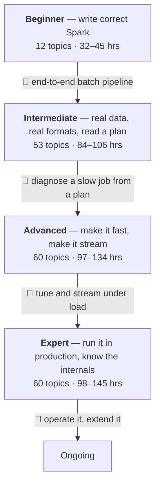
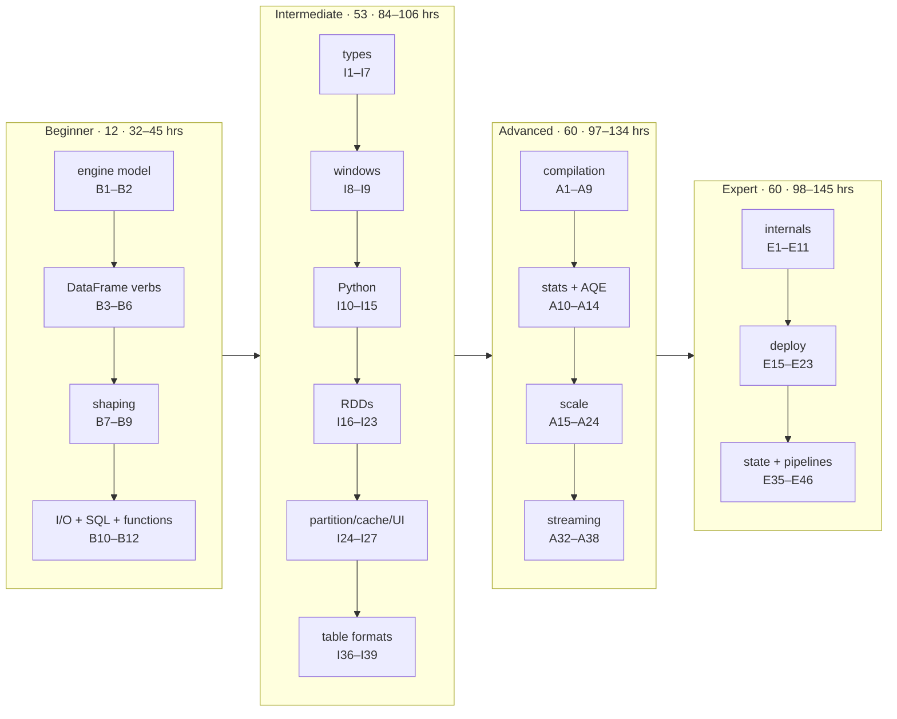

# Learning Path v2: Apache Spark / PySpark

> **Created:** 2026-08-09 — first full re-carve of the path since it was written. Same knowledge base, rebuilt around three things v1 did not have: an explicit **method** for learning (which resource to trust for what, and in which order), **strands** so that 185 topics are navigable rather than a flat list per level, and the **feature history** folded in as a first-class dimension so you always know which of your sources is talking about a Spark you are not running.
>
> **Updated:** 2026-08-10 — audited the Types strand against [ANSI & Data Types](reference/spark-feature-history/ansi-types.md) in the feature history and found two clusters with no topic at all: the datetime/timezone family (session time zone, `TIMESTAMP_NTZ`) and the ANSI `INTERVAL` types. Added **I5** and **I6** to cover them; **I5**–**I41** shifted to **I7**–**I43**. The same audit found four smaller gaps that belonged to topics that already existed, so those were extended in place rather than given topics of their own: `CHAR`/`VARCHAR` storage and padding into **B4**, the ANSI rules the one-line summary hides plus the view-persistence trap into **B5**, the ANSI aggregate family into **B7** with the windowed half in **I8**, and the public `UserDefinedType` API into **I1**.
>
> **Updated:** 2026-08-10 — audited the Python-boundary strand against [Arrow](reference/spark-feature-history/arrow.md). The UDF and UDTF execution path was already well covered; the *conversion* path (`toPandas`/`createDataFrame`, the type boundary, the PyArrow floor) and the whole-partition APIs (`mapInPandas`/`mapInArrow`/`applyInArrow`) had no topic at all. Added **I13** and **I14** to cover them; **I13**–**I41** shifted to **I15**–**I43**.
>
> **Updated:** 2026-08-10 — audited [Build & Language support](reference/spark-feature-history/build-lang.md). That area is 408 items, but almost all of it is Spark's *own* build — Maven/SBT, CI, Docker publishing, transitive dependency bumps — with no learnable surface, so it stays out by design. The learner-facing residue was mostly already covered; what was missing was the Python version floor and the Python dependency floors, plus the fact that Mesos was removed in 4.0. All folded into **B1** as version-floor notes rather than given a topic. No renumbering.
>
> **Updated:** 2026-08-10 — added [What this path covers, and what it deliberately does not](#what-this-path-covers-and-what-it-deliberately-does-not): all 22 feature-history capability areas mapped to the topics that carry them, with GraphX, SparkR and the Spark build declared out of scope and MLlib, built-in functions and security flagged as known-thin. Ends the run of area audits by making coverage a stated position rather than something you have to reconstruct.
>
> **Updated:** 2026-08-10 — audited [Built-in Functions](reference/spark-feature-history/builtin-functions.md) and found the coverage inverted: the marquee families already had dedicated topics (**A21** sketches, **A23** vectors, both complete on their 4.x rows) while the everyday catalogue had no owner. Added **B12** at the end of the Beginner level, which needed no renumbering. That area is no longer listed as thin.
>
> **Updated:** 2026-08-10 — audited [Connectors](reference/spark-feature-history/connectors.md), the one area the coverage table listed as covered without ever being checked feature by feature. Four clusters had no owner: the `TIME` type and its 4.2.0 serde across five formats (which had **no** mention anywhere on the page), Avro's schema/union/function surface, DSv2 pushdown to JDBC, and the cloud output committers. Added **I44**–**I45** at the end of Intermediate and **A46**–**A47** at the end of Advanced, each in a new strand, so no renumbering was needed. Three further connector clusters — file-format pushdown mechanics, codec choice per format, XML past inference — are now declared **thin** rather than left implicit. All facts verified against the local checkout at tag `v4.2.0`, not against the release notes: that is how the topics can state that `datasourceV2JoinPushdown` is `internal()` and defaults to `false`, and that Parquet loses `TIME` precision where ORC and Avro do not.
>
> **Updated:** 2026-08-10 — second connectors pass, closing the three clusters the first pass had only declared thin. **A48** takes file-format pushdown, which turned out to be the sharpest of them: aggregate pushdown lives only in the **V2** scan builders while `spark.sql.sources.useV1SourceList` puts every built-in file source on the **V1** path by default, so its own config does nothing alone — and nested predicate pushdown is DSv1-only, so the two cannot both be on. Codec choice folded into **I36** and XML's non-inference surface into **I28**, as callouts rather than topics. Connectors is no longer listed as thin; columnar file encryption moves to the Security gap, where key management already is.
>
> **Updated:** 2026-08-10 — closed the Security gap, which the coverage section had carried as thin since before the connectors audit. Added **E52** for columnar file encryption, the piece that had fallen between the connector topics (which read it as security) and **E29** (which reads governance as a catalog concern) — Parquet's envelope/KMS model and ORC's encrypt-plus-mask model differ in what an unauthorised reader gets back, which is the whole topic. Extended **E15** into the path's stated starting point for securing a cluster, with three verified defaults that make "enabled" different from "secured": `network.crypto.enabled` is `false`, `saslFallback` stays `true` when you enable it, and `authEngineVersion` defaults to `1`, whose constant is named `UNSAFE_SKIP_HKDF_VERSION`. Also corrected a wrong claim in the thin section about the UI response headers. *(That correction was itself wrong for 4.2.0 and was re-corrected by the security audit below: `spark.ui.contentSecurityPolicy.enabled` exists as of 4.2.0.)* Only MLlib is now listed as thin.
>
> **Updated:** 2026-08-10 — re-audited Connectors a second time and found two clusters the first pass had lost. Both were in the rows the first audit enumerated; the clustering step dropped them, which is the failure mode worth naming: enumeration was complete, classification was not. Added **I46** for the `_metadata` file-metadata columns — the rare topic with no book *and* no docs page, since `_metadata` appears nowhere under Spark's `docs/` tree at `v4.2.0`. Folded JDBC authentication into **I34** as its own callout: `principal`/`keytab`/`refreshKrb5Config`, the service-loaded provider and the static `disabledJdbcConnProviderList`, and the rule that a `keytab` value means "shipped with `--files`" or "pre-installed on every node" depending only on whether it contains a slash. Also corrected **A46**: the per-read JDBC option `pushDownJoin` defaults to `true` while the optimizer conf defaults to `false`, so the two halves disagree and reading either alone misleads.
>
> **Updated:** 2026-08-10 — audited [Core / RDD / Scheduler](reference/spark-feature-history/core-rdd.md), enumerating all 87 non-Improvement rows rather than clustering first, which is what the connectors re-audit taught. Three gaps, one structural: Spark has exactly two shared-variable abstractions and **E6** covered accumulators while broadcast variables had **no** topic at all — every one of the page's "broadcast" mentions was a broadcast *join*. Added **I47** for the shared variable and the `unpersist`-versus-`destroy` split. Folded **RDD checkpointing** into **I25**, where the interesting part is checkpoint-versus-cache: it truncates lineage rather than preserving it, runs its own second job unless you cache first, and leaves files behind because `cleaner.referenceTracking.cleanCheckpoints` defaults to `false`. Added **E53** for the fair scheduler and pools, which **B1** had been linking and calling out as blurred without anywhere to send you — the sharp edges being that the mode is `FIFO` by default, that per-pool `schedulingMode` is a *second* FIFO/FAIR setting, and that pool selection is a thread-local that does not survive an executor service.
>
> **Updated:** 2026-08-10 — folded the core-rdd audit's remaining small items into **I16**, which had been a seven-method topic: `toDebugString()`, `top`/`takeOrdered`, `pipe`, and `StatCounter`, plus a callout on four PySpark-specific facts that decide whether the advice in any book actually runs — `toDebugString()` returns `bytes`, `pipe`'s `checkCode` defaults to `False` so a failing subprocess is silently ignored, and `zipPartitions` and `getPersistentRDDs` do not exist in PySpark at all. Chapter 05's revisit banner records the same drift; it was already 🔄 and stays so.
>
> **Updated:** 2026-08-10 — finished the core-rdd audit by walking its 211 `Improvement` rows, the population the first pass had written off as plumbing. It is ~95% plumbing; the residue held two real gaps. Added **A49** for **speculative execution**, which two topics already leaned on to explain themselves (**E6** for accumulator double-counting, **E14** for why commit coordination exists) while nothing taught it — and whose real lesson is that `quantile=0.9` and `multiplier=3` mean nine of ten tasks must finish before a straggler is even a candidate, so "I enabled speculation and nothing happened" is the documented behaviour. Folded the **`LiveListenerBus`** drop behaviour into **E24**: four bounded queues at 10,000 events each, silently discarding on overflow, which is why a UI can miss a stage and a custom listener can have gaps while the app-status store looks healthy.
>
> **Updated:** 2026-08-10 — audited [Data Sources & DSv2](reference/spark-feature-history/datasources-dsv2.md), the last capability area the coverage table listed as covered on the strength of a partial mapping. The gap was structural rather than a missed row: the page owned six *mix-ins* on the DSv2 interface — pushdown (**A46**, **A48**), the streaming write (**A38**), storage-partitioned joins (**A17**), transactions (**E31**), column matching (**E32**) — and never the interface itself, so there was nowhere to explain what a connector is. Added six topics: **A50** (the connector interface, capabilities, read and write paths), **A51** (catalog plugins, `spark_catalog`, name resolution), **A52** (the DSv2 function catalog and `CALL`), **A53** (write-side required distribution and ordering), **E54** (row-level `DELETE`/`UPDATE`/`MERGE`, group-based versus delta-based), and **I48** (table constraints, where `CHECK` is always enforced and the key constraints never are — same error class from both sides). Five smaller clusters folded into existing topics: DSv2 custom and DML metrics into **I27**, the 4.2.0 `PartitionPredicate` family into **A14**, `CLUSTER BY` into **I32**, the v2 DDL and inspection surface into **A51**, SQL-on-files into **B11**. All facts verified at tag `v4.2.0`: that `RELY` is parsed and stored but read by **no** optimizer rule, that automatic schema evolution is a table *capability* with no config behind it, that `CLUSTER BY` has no planner consumer at all, and that `CALL` / `SHOW PROCEDURES` / `DELETE` / `UPDATE` / `MERGE INTO` still have no SQL-syntax docs page.
>
> **Updated:** 2026-08-10 — audited [Deploy](reference/spark-feature-history/deploy.md), which had the same shape of gap as DSv2: the row read **E15**–**E23**, but **E15** is a v1-inherited catch-all whose scope sentence names "dynamic allocation; auto-scaling; deploy modes" and teaches none of them, and **E16**–**E18** are three deep Kubernetes slices with no topic explaining how a pod is built. Five topics added. **E55** dynamic allocation — the 60-second idle timeout against a cached-executor timeout of `Integer.MAX_VALUE` **seconds**, and the four-condition startup check that decides whether it may run at all. **E56** decommissioning, where "on by default since 3.4" is true of the block-migration *sub*-flags and false of both switches above them, which are still `false`. **E57** the Kubernetes pod build — the ordered feature-step list, pod templates as a *base* Spark patches rather than an override, volumes, and the fact that `NetworkPolicyFeatureStep` is **unconditional** at 4.2.0. **E58** the Operator, pod allocators and gang scheduling. **I49** `spark-submit` itself: deploy modes, and the precedence rule that `--properties-file` suppresses `spark-defaults.conf` unless `--load-spark-defaults` is passed. Folded rather than given topics: executor rolling and 4.2.0 recovery-mode executors into **E17**, YARN node labels into **E19**, tags/priority/staging-dir/rolled-log patterns/`am.defaultJavaOptions` into **E20**, `spark.yarn.jars` into **E21**, and the 4.1 driver/executor heartbeat split into **E7**. The sharpest find is in **E56**: `ExecutorAllocationManager.validateSettings` accepts `spark.decommission.enabled` alone as its shuffle-decommission condition while the code that migrates blocks also requires `spark.storage.decommission.enabled`, so a cluster can pass the check, release executors and migrate nothing.
>
> **Updated:** 2026-08-10 — audited [DStreams](reference/spark-feature-history/dstreams.md) and deliberately closed it **partially**: 94 rows, none in the 4.x line, for an engine Spark's own guide calls a legacy project. **E49**, **E50** and **A37** keep the three parts that explain why Structured Streaming looks the way it does; state operations, the operator surface, the Kinesis thread, `StreamingListener`, checkpoint mechanics and streaming MLlib are named as knowingly out in the coverage section rather than left implicit. The audit did find a real defect: **E49** and **E50** both linked `streaming/index.html` and called it the Spark Streaming guide — at 4.2.0 that page is *Structured Streaming*, so two topics about DStreams were sending you to the engine that replaced them. Both now point at `streaming-programming-guide.html`. Added one callout to **E50** for what a maintainer actually edits, including that `pyspark.streaming` still ships at `v4.2.0` with `kinesis.py` as its only remaining input source — the Python Kafka DStream API is gone, so a legacy PySpark Kafka job has no path but migration.
>
> **Updated:** 2026-08-10 — audited [Geospatial](reference/spark-feature-history/geospatial.md), twelve rows, all 4.x, and found the problem was **I7 itself** rather than a missing topic. Ten of the twelve were covered; `ST_AsBinary`'s optional endianness (SPARK-56682) was not, and the 4.1.1 geo/time gating row is plumbing. But two claims in the topic were wrong, and checking them at tag `v4.2.0` is what surfaced it: Spark ships **five** `ST_*` functions — `ST_GeomFromWKB`, `ST_GeogFromWKB`, `ST_AsBinary`, `ST_Srid`, `ST_SetSrid` — with **no** `ST_Distance`, no `ST_Intersects` and no WKT function at all, so "the `ST_*` function family, WKT and WKB readers and writers" oversold it and the milestone asked you to load WKT and compute a distance, neither of which is possible. **I7** is rewritten around what exists: the types as a typing-and-validation decision rather than a computation one, the `GEOGRAPHY` coordinate bounds, `NDR`/`XDR` endianness, `GEO_ENCODER_SRID_MISMATCH_ERROR` and the rule that mixed `GEOMETRY(ANY)` columns cannot be persisted to Parquet, Delta or Iceberg at all. The new milestone ends by asking for the honest version of "compute a distance" — reach for the function, confirm it does not exist, and say what you would use instead.
>
> **Updated:** 2026-08-10 — audited [Misc / Other](reference/spark-feature-history/misc.md), the residual bucket, by splitting its 927 rows by type and enumerating all **97** non-`Improvement` ones rather than trusting the label. The label mostly held; four learnable rows had no owner anywhere and became callouts instead of topics: **`spark.sql.caseSensitive`** into **B4** — `internal()`, default `false`, and its own docstring calls case-sensitive mode "highly discouraged"; **SQL variable substitution** into **I49** — `SparkSqlParser` expands `${env:…}` and friends *before* parsing, which is a convenience and a boundary at once; **`multiLine`** into **I28** — default `false` for JSON and CSV, and setting it makes the source `isSplitable = false`, so one file is one task; and **topology-aware block replication** into **I25**. A fifth went into **B12** as a correction rather than a feature: SPARK-56133 "SparkSQL AI Function" resolves, at tag `v4.2.0`, to `ai_complete` and `ai_embed` appearing in exactly one file — the experimental-function allowlist in `ResolverGuard.scala` — with no expression class, no registry entry, no docs and no PySpark binding.
>
> **Updated:** 2026-08-10 — audited [MLlib](reference/spark-feature-history/mllib.md): 723 rows, six of them 4.x, none adding an algorithm family. Still **thin and undecided** at the time of this entry — superseded later the same day by the MLlib expansion below: expanding MLlib properly is a choice about what this path is for, and nobody has made it. Two things changed anyway. **A44** gains the orientation it was missing: `pyspark.ml` versus `pyspark.mllib`, the RDD API being in **maintenance mode** since 2.0 (its own module docstring says so) while *neither* is deprecated, the mechanical test for which API a tutorial uses, and the fact that a DataFrame-API pipeline effectively starts with `VectorAssembler`. And the thin note now **enumerates** what is missing — algorithm families, ALS, the named transformers, `ml.linalg`, the statistics package, evaluators, PMML, blockified linear models, and `TorchDistributor`/`DeepspeedTorchDistributor` — so the gap is auditable instead of a feeling.
>
> **Updated:** 2026-08-10 — **MLlib is no longer thin.** The audit earlier today enumerated the gap and left the decision open; the decision is now taken — ML belongs on this path — and five topics close it. **A44** keeps only the abstraction (`Transformer` versus `Estimator`, `Pipeline`, `PipelineModel`); **A54** takes feature engineering and `ml.linalg`, including the one-vector-column contract and the two defaults that cause most silent failures (`handleInvalid="error"`, `stringOrderType="frequencyDesc"`, whose mapping moves when your data moves); **A55** takes the algorithm inventory *as* an inventory, since no new family has landed since the 3.x line, plus the honest rule for when not to train distributed at all; **A56** takes ALS, whose `coldStartStrategy` default of `"nan"` turns any evaluator fed an unseen user into a `NaN` metric with no error; **A57** takes evaluators, the grid and persistence — `parallelism=1` means a 24-point grid over 3 folds is 72 *serial* fits, and whether the feature stages sit inside or outside the `CrossValidator` decides whether you leaked the validation set. **E59** takes the half that is actually growing: `TorchDistributor`, `DeepspeedTorchDistributor`, and the fact that `pyspark.ml.connect` is a small subset rather than the ml package over Connect. All defaults verified in `python/pyspark/ml/` at tag `v4.2.0`. The page is now 177 topics, and no capability area is listed as thin.
>
> **Updated:** 2026-08-10 — audited [pandas API on Spark](reference/spark-feature-history/pandas-on-spark.md). **I12** held the concepts but not the knobs: it said an index is not free and that some operations silently collect, without naming `compute.default_index_type` (default `distributed-sequence`) or the shortcut pair `compute.max_rows` / `compute.shortcut_limit` (both **1000**) that decide, per operation and per data size, whether pandas runs on the driver or Spark runs on the cluster. Added as a callout, together with `compute.default_index_cache` and `plotting.max_rows`. A second callout takes the 4.x behaviour changes a migrating script actually meets: 4.0's wholesale removal of deprecated APIs, `numeric_only` flipping to `False`, 4.1's ANSI switch, and 4.2's `axis=1` family (`all`, `any`, `idxmin`, `idxmax`, `rank`, `nunique`) explained as a shape fact — a row-wise reduction has to reach across columns, which is why it arrived years after its `axis=0` twin — plus `describe()` dropping from O(N) jobs to O(1). The milestone now asks for the same script at two data sizes, which is the only way to see the shortcut limits act. All defaults read from `python/pyspark/pandas/config.py` at tag `v4.2.0`.
>
> **Updated:** 2026-08-10 — audited [PySpark & Python UDFs](reference/spark-feature-history/pyspark.md): 297 rows, **96** of them in the 4.x line, the second-largest 4.x footprint on this page. The Python Data Source API (**A31**), UDTFs (**I11**) and the Arrow work (**I13**–**I14**) were covered; three clusters were not, and two are the whole shape of 4.1. Added **I50** for the **Python worker itself** — daemon versus direct spawn, `worker.reuse` defaulting to `true` (which is why module-level state survives between tasks), the idle pool and its 4.1 cap, the idle-timeout pair, Unix domain sockets, and the two switches that turn a vanished worker into a readable failure: `faulthandler` and `tracebackDumpIntervalSeconds`. Added **I51** for **seeing inside it** — worker-side logging (`spark.sql.pyspark.worker.logging.enabled`, 4.1, default `false`), the `"perf"`/`"memory"` UDF profiler with `spark.profile.render`, and `pyspark.errors`: `PySparkException` with `getCondition()`, `getMessageParameters()`, `getSqlState()` (4.2) and the DataFrame query context that points at the Python line that built the column. Folded rather than given topics: the 4.0 **plotting API** into **I15**, because a plot is a `collect` bounded by `spark.sql.pyspark.plotting.max_rows` (1000) that takes the *first* rows for bar charts and a *sample* for scatter; and the scattered "now in the DataFrame API" additions into a routing callout in **B3**. All defaults read from `config/Python.scala`, `SQLConf.scala` and `python/pyspark/` at tag `v4.2.0`.
>
> **Updated:** 2026-08-10 — audited [Security](reference/spark-feature-history/security.md), 66 rows, and found the page asserting something false *as a correction*. **E15** told readers there is no Spark UI Content-Security-Policy setting and not to look for one; SPARK-57589 added `spark.ui.contentSecurityPolicy.enabled` in **4.2.0**, and `HttpSecurityFilter` emits a real CSP header with a per-request nonce when it is on (default `false`). Both the callout and the earlier changelog entry are corrected. Added a second **E15** callout for the rest of 4.2.0's security work, which is the area's busiest release since the 2.x line: constant-time secret comparison (57066), AuthV2 reaching `StreamRequest` and the metadata operations (57889, 57882), owner-only temporary files (57920), and three redaction additions (57098, 57262, 57580) — including the one exception to redaction being opt-in, JDBC URLs, which are now truncated after the subprotocol whether or not a regex is configured, precisely because `spark.sql.redaction.string.regex` is unset by default.
>
> **Updated:** 2026-08-10 — audited [Shuffle / Storage / Memory](reference/spark-feature-history/shuffle-storage.md). The correctness half was covered (**A25**, **A26**) and the tuning half too (**A18**, **A19**, **A27**), but the *bytes* had no owner: checksums, compression codecs and the network transport are the whole 4.x line of this area and appeared nowhere. Added **A58**, whose central fact is that Spark has **two unrelated shuffle checksums** — the order-*sensitive* `spark.shuffle.checksum` (3.2, `true`, `ADLER32` by default with `CRC32C` optional since 4.0) that detects **file corruption**, and the order-*independent* `spark.sql.shuffle.orderIndependentChecksum` (4.1, `true`) that detects a stage producing **different data across attempts**. On mismatch 4.1 re-runs the consuming stage by default; 4.2's stronger query-level rollback is `internal()` and defaults to **`false`**, so "4.2 rolls back and fully retries" describes a config you must turn on. Also in **A58**: `spark.io.compression.codec` (`lz4`) governing shuffle, cache *and* event logs together, the 4.x ZSTD/LZF parallelism knobs, `spark.checkpoint.compress` flipping to `true` in 4.1, `spark.io.mode.default` defaulting to **`AUTO`** so a 4.1 Linux cluster is silently on epoll, and a callout on shuffle cleanup and the shuffle service's RocksDB state store. **A26**'s checksum sentence is corrected to name which checksum it meant. Folded: the four 4.x memory changes (byte-based spill threshold, bounded k-way merge, eager task-result release, off-heap `LongHashedRelation`) into **E1**, and BloomFilter V2 becoming the default into **A14**.
>
> **Updated:** 2026-08-10 — audited [Spark Connect](reference/spark-feature-history/spark-connect.md), whose **149 of 178** rows in the 4.x line are the densest 4.x concentration on this page. Most are API-parity rows that **A45** already explains as a project; what had no owner was everything *around* the API, so **E60** takes it: `spark.api.mode` (4.0, default `classic`, or `connect` when `SPARK_CONNECT_MODE=1`) which runs an ordinary application against a **local** Connect server it starts for itself — the cheapest way to test Connect compatibility; the **JDBC driver** (4.1 SPIP), whose `acceptsURL` matches `jdbc:sc://` and which makes a Connect server a queryable endpoint for clients with no Spark at all; session lifecycle beyond reattachment — the 60-minute `defaultSessionTimeout`, `CloneSession`, release-on-process-exit; the protocol-level extension points (`spark.connect.extensions.{relation,expression,command,getStatus}.classes`), which are *not* **E10**'s analyzer extensions; and 4.2's `GetStatus` RPC plus the Connect tab in the **History Server**. Also corrected **E59**: it described `pyspark.ml.connect` as the way to do ML over Connect, when 4.0 made the real `pyspark.ml` work over Connect and **deprecated** that module in the same release — every class in `pyspark/ml/connect/base.py` carries `.. deprecated:: 4.0.0` at `v4.2.0`. Added a callout to **I51** for the Connect error surface: gRPC status codes on Python exceptions, breaking-change info, and 4.2's transmission of client-side code locations.
>
> **Updated:** 2026-08-10 — audited [SQL & Catalyst](reference/spark-feature-history/sql-catalyst.md), the largest area on the page: 1,458 rows, 135 in the 4.x line, of which 746 are optimizer-rule `Improvement`s with no user-facing surface. The Catalyst half was well covered (**A1**–**A14**); the **4.x SQL syntax** was not covered at all. Added **I52** for path-based name resolution — `SET PATH`, `CURRENT_PATH()`, the reserved `system.builtin` and `system.session` namespaces, and the shadowing rule the analyzer itself has to consult (`isSessionBeforeBuiltinInPath`), plus the fact that a view **persists the path it was created under**. Added **I53** for the four additions a reader of any book here has never seen: pipe syntax (`|>`, on by default since 4.0), session variables and `EXECUTE IMMEDIATE`, and `QUALIFY` — with metric views, whose body is **YAML** rather than SQL, as a callout. Folded: the `NEAREST BY` top-K ranking join into **A15** as a fifth join shape the four strategies cannot express; the 4.x `INSERT` modifiers (`BY NAME`, `WITH SCHEMA EVOLUTION`, `REPLACE WHERE`, `REPLACE USING`) into **B10**; VARIANT's reach into CSV/XML scans, the colon operator and **Parquet shredding** into **I2**; and `TIMESTAMP WITH LOCAL TIME ZONE` plus the `STRING`→`TIME` implicit cast into **I5**. Every syntax claim read from `SqlBaseParser.g4` at tag `v4.2.0` rather than from a release note.
>
> **Updated:** 2026-08-10 — audited [Structured Streaming](reference/spark-feature-history/structured-streaming.md), 234 rows with **94** in the 4.x line. The engine, checkpoint protocol, Kafka path and state-store internals were covered (**A32**–**A38**, **E35**–**E39**), but the area's own centrepiece was not: `transformWithState`, which the 4.x prose calls stateful streaming's primary API, existed on this page only as its PySpark *plumbing* (**E38**) and its *encoding* (**E36**) while **A34** still taught `flatMapGroupsWithState` as the arbitrary-state answer. Added **A59** for the API itself — `StatefulProcessor` with `init`/`handleInputRows`/`close`, multiple independently named state variables each with its own schema and **TTL**, timers that fire without new rows, `timeMode`, initial state, and batch execution — with the distinction that decides correctness: **TTL expires a state variable, the watermark decides which rows are too late**. Added **A60** for inspecting and changing a running query: the `statestore` data source with its full option set (`operatorId`, `batchId`, `joinSide`, `stateVarName`, `readRegisteredTimers`, and the `readChangeFeed` diff between batches), and 4.2.0's named, reorderable sources and sinks (`DataStreamReader.name()`, SQL `IDENTIFIED BY`, a V3 commit log) which make adding a source to a query survivable rather than a checkpoint rebuild. Folded: 4.1's state-store reliability work into **E35** — snapshot-lag detection, checksum verification, RocksDB memory joining the unified memory manager, and the new hard errors on an uncommitted store or a non-empty state directory; and into **A32** the fact that `spark.sql.adaptive.streaming.stateless.enabled` (4.1, `true`) brings AQE to **stateless** queries, which is the exception to **E37**'s frozen-partition rule.
>
> **Updated:** 2026-08-10 — audited [Web UI / History / Metrics](reference/spark-feature-history/web-ui.md), 284 rows with 65 in the 4.x line, and the last capability area on the table to be checked feature by feature. The concepts were covered (**I26**, **I27**, **E24**, **E25**); what was missing was that **the UI a 4.2.0 reader sees is not the one any book describes**. Four callouts, no new topics. **I26** gains the 4.2.0 overhaul — searchable and zoomable SQL plan visualization with a side panel, copy-plan and share-link buttons, dark mode, the query id, and the two additions that matter for diagnosis: a **side-by-side initial-vs-final plan view for AQE queries**, which is the instrument **A11** and **A12** previously asked you to reason without, and a **Job Timeline** on the SQL execution page joining a query to its jobs. **E24** gains the operational surface: `spark.eventLog.excludedPatterns` (4.1) for dropping chatty event types, multiple History Server log directories with display names (4.2.0), on-demand loading for rolling logs, and `spark.history.fs.update.scanDisabledPathPatterns` — whose documented `"s3a://.*,gs://.*"` example trades discoverability for startup time, since scan-disabled applications do not appear in the listing until opened by appId and are **not subject to the cleaner**. **E25** gains the thread-dump flame graph (4.0), the profiler you can use with no build flag. **E15** gains `spark.ui.showErrorStacks` (default `true`) and the Jetty SNI toggle. With this pass, **every one of the 22 capability areas has now been audited row by row**.
>
> **Current Spark stable:** 4.2.0 (Jul 14 2026) · **Maintenance lines:** 4.1.3, 4.0.4 (Jul 15 2026), 3.5.9 (Jul 16 2026) · verified against the local source checkout at tag `v4.2.0`.
>
> **Relationship to [v1](learning-path.md).** v1 remains the detail store: it carries the long `!!! info` / `!!! warning` blocks recording specific source findings per topic, and it is not deleted. v2 is the page you study from. Every topic here names its v1 code so you can jump to that detail, and the [v1 → v2 code map](#v1-v2-code-map) at the end is the full crosswalk.

!!! note "Status key"
    **Topics:** ⬜ not started · ✅ done and current · 🔄 done, but written against an older Spark and now needs revisiting.

    **Checkpoints:** 🎯 — a gate, not a topic. No completion status: it is a self-test you attempt to decide whether you are ready to leave a level.

**What this path is built around.** Apache Spark itself — the open-source engine, its APIs, and the open formats and tooling around it. Vendor platforms (Databricks, and the certifications built on it) appear as [optional milestones](#optional-certification-milestones) at the end, not as the spine. The transferable skill is the engine and the open ecosystem; platform-specific surfaces change with your employer, and a path organised around one vendor's exam quietly under-weights what the wider market asks for.

---

## How to learn this

This section is the part v1 was missing. It is not motivational filler — the ordering below is what makes the difference between reading about Spark and being able to predict what Spark will do.

### The authority ladder

When two sources disagree about Spark, this is the order in which to believe them. It is not the order in which to *read* them.

| Rank | Source | Authoritative for | Fails at |
|---|---|---|---|
| 1 | **The source code** (`C:\opt\learn\spark\repos\spark`, tag `v4.2.0`) | What actually happens. Defaults that no table lists. Which of two configs wins. | Teaching you why anything matters, or what to care about first |
| 2 | **Official docs** ([spark.apache.org/docs/latest](https://spark.apache.org/docs/latest/)) | Current behaviour, complete option tables, the full function catalogue, migration notes | Explaining *why*. Almost no narrative, and the reference pages assume you already know the concept |
| 3 | **The release notes and this project's [feature history](reference/spark-feature-history/index.md)** | When a thing appeared, and therefore whether your book can possibly know about it | Depth — a one-line entry per feature |
| 4 | **Books** | Building the mental model. Worked examples. Deciding what matters. | Currency. Every book in this path predates Spark 4.0, so every default that changed in 4.x is stated wrongly |
| 5 | **Courses / videos** | Getting unstuck at the start; watching someone drive the tooling | Depth and currency both. Treat as an on-ramp, never as the reference |
| 6 | **Blogs, Stack Overflow, LLM answers** | Finding out that a thing exists, and what it is called | Everything else. Verify against 1–3 before acting |

**The one rule worth memorising: prefer the official docs over any book for anything factual, and prefer the source over the docs for anything the docs do not state.** Books are for understanding; docs are for truth; source is for the truth the docs omit.

### The per-topic loop

For each topic below, in this order:

1. **Read the milestone first and attempt it from memory.** You will mostly fail early on — that is the point. The failed attempt is what makes the reading stick, and it tells you which parts you can skip. Self-explanation and retrieval practice both carry roughly twice the effect size of rereading ([Dunlosky](https://www.aft.org/ae/fall2013/dunlosky)).
2. **Read the book chapter** to build the model. Fast, once, without taking notes.
3. **Read the named official docs page** to correct the book. This is where you catch the version drift — every "Learn" line below names a specific page, never a docs root.
4. **Read the source map entry** if the topic has one. A [topic trace](reference/spark-source-map/index.md) follows one feature end to end; a [sweep](reference/spark-source-map/index.md) reports what a whole subsystem contains. This is what turns "the DAG scheduler splits stages at shuffle boundaries" from a claim you accept into one you have seen.
5. **Build the milestone for real** and write the chapter in [`docs/spark-book/`](spark-book/index.md). The writing is where the self-explanation happens; a topic is not done until the chapter exists.

### Version discipline

Every book in this path was written against Spark 2.x or 3.x. You are running 4.2.0. Three whole classes of book statement are now wrong rather than merely dated:

- **ANSI mode is on by default in 4.x.** Any book example that relies on a bad cast returning `null` now raises. This is why ANSI mode is a *Beginner* topic here (B5) rather than an intermediate curiosity.
- **Arrow-optimised Python UDFs are on by default from 4.2.0.** The performance hierarchy every book teaches — plain UDF slow, pandas UDF fast — no longer describes what you get by default.
- **`SparkSession` has two implementations.** Classic and Connect. Every diagram in every book shows the classic one; `pyspark` in 4.x may hand you the other.

Before trusting any book statement about a default, a config name, or an exception class, check it. Two cheap checks: `spark.conf.get(...)` in a live session, and `grep` in the source checkout. Exceptions moved in 4.x — they live under `pyspark.errors`, not the old paths.

### Reading the official docs efficiently

The Spark docs are three different kinds of document under one roof, and knowing which you are in saves a lot of time.

- **Guides** — narrative, read front to back once: [SQL Programming Guide](https://spark.apache.org/docs/latest/sql-programming-guide.html), [RDD Programming Guide](https://spark.apache.org/docs/latest/rdd-programming-guide.html), [Structured Streaming](https://spark.apache.org/docs/latest/streaming/index.html), [Cluster Mode Overview](https://spark.apache.org/docs/latest/cluster-overview.html), [Tuning](https://spark.apache.org/docs/latest/tuning.html), [SQL Performance Tuning](https://spark.apache.org/docs/latest/sql-performance-tuning.html).
- **References** — never read front to back, keep open while working: [Configuration](https://spark.apache.org/docs/latest/configuration.html), [SQL Syntax](https://spark.apache.org/docs/latest/sql-ref-syntax.html), [Data Types](https://spark.apache.org/docs/latest/sql-ref-datatypes.html), [built-in function index](https://spark.apache.org/docs/latest/api/sql/), the [PySpark API reference](https://spark.apache.org/docs/latest/api/python/reference/index.html).
- **Semantics pages** — short, dense, and the settlement for arguments: [NULL Semantics](https://spark.apache.org/docs/latest/sql-ref-null-semantics.html), [ANSI Compliance](https://spark.apache.org/docs/latest/sql-ref-ansi-compliance.html), [Name Resolution](https://spark.apache.org/docs/latest/sql-ref-name-resolution.html), [Fault Tolerance Semantics](https://spark.apache.org/docs/latest/streaming/getting-started.html#fault-tolerance-semantics), and the [Migration Guide](https://spark.apache.org/docs/latest/sql-migration-guide.html). Read all of these at least once; they are each shorter than a book chapter and each of them prevents a class of bug.

The single highest-value habit: when you learn a new operation, open its **API reference page** rather than a tutorial. The `DataFrame` reference lists 150-plus methods; the books cover about twenty.

### When no book covers it

Roughly two thirds of the topics below came from reading the Spark source rather than from any book, course, or exam guide — the [source map](reference/spark-source-map/index.md)'s sweeps scan a subsystem and report what is in it, independently of what this path already covers. Those topics say **"no book covers this"** explicitly rather than citing a book that does not. For them the order becomes: docs page → source sweep → build it → write the chapter. That is not a degraded path; for anything added in Spark 4.x it is the only honest one.

---

## Resources at a glance

| Abbrev | Full name | Type | Best for |
|---|---|---|---|
| **Rioux** | *Data Analysis with Python and PySpark* — Rioux (Manning, 2022) | Book (PDF in this project) | The clearest first pass on the DataFrame API and the execution model |
| **LS2e** | *Learning Spark, 2nd Ed.* — Damji et al. ([O'Reilly](https://www.oreilly.com/library/view/learning-spark-2nd/9781492050032/)) | Book | Catalyst/Tungsten context; the *why* behind the API shape |
| **SDG** | *Spark: The Definitive Guide* — Chambers & Zaharia ([O'Reilly](https://www.oreilly.com/library/view/spark-the-definitive/9781491912201/)) | Book | Deepest reference-style coverage; joins, data sources, internals, RDDs |
| **DLUR** | *Delta Lake: Up and Running* — Haelen & Davis ([O'Reilly](https://www.oreilly.com/library/view/delta-lake-up/9781098139711/)) | Book | Hands-on Delta from zero |
| **DLDG** | *Delta Lake: The Definitive Guide* — Lee et al. ([O'Reilly](https://www.oreilly.com/library/view/delta-lake-the/9781098151935/)) | Book | Delta internals, the transaction log, governance |
| **Iceberg-DG** | *Apache Iceberg: The Definitive Guide* ([O'Reilly](https://www.oreilly.com/library/view/apache-iceberg-the/9781098148614/)) | Book | The Iceberg metadata tree and the REST Catalog |
| **FKane** | *Taming Big Data with Apache Spark 4 and Python* ([Udemy](https://www.udemy.com/course/taming-big-data-with-apache-spark-hands-on/)) | Course | Getting a runnable environment and following along |
| **IBM-Spark** / **IBM-ML** | IBM Spark courses ([edX](https://www.edx.org/learn/apache-spark/ibm-apache-spark-for-data-engineering-and-machine-learning), [Coursera](https://www.coursera.org/learn/machine-learning-big-data-apache-spark)) | Course | UDFs in context; MLlib |
| **DEB** / **ADEB** | *Data Engineering with Databricks* / *Advanced DE* ([catalog](https://www.databricks.com/training/catalog/data-engineering-with-databricks-911)) | Official course | Platform surface, medallion, tuning walkthroughs |
| **DagEss** | *Dagster Essentials* ([courses.dagster.io](https://courses.dagster.io/courses/dagster-essentials)) | Free course | Orchestration |
| **Spark-docs** | [Apache Spark 4.2.0 documentation](https://spark.apache.org/docs/latest/) | Official docs | Everything factual |
| **Delta-docs** / **Iceberg-docs** | [docs.delta.io](https://docs.delta.io/latest/) · [iceberg.apache.org](https://iceberg.apache.org/docs/latest/) | Official docs | Table formats |
| **Source map** | [`reference/spark-source-map/`](reference/spark-source-map/index.md) | This project | 21 topic traces, 38 subsystem sweeps, the config catalog |
| **Feature history** | [`reference/spark-feature-history/`](reference/spark-feature-history/index.md) | This project | 7,190 features across 99 releases, by capability area |
| **Local stack** | `C:\opt\learn\spark\spark-delta-unitycatalog` | This project | Spark + Delta + Unity Catalog + Dagster + MinIO for milestones |

---

## The map

Each level is divided into **strands** — short runs of topics that belong together and are worth reading in order. Strands are the unit of a study session; levels are the unit of a quarter.

| Level | Strands |
|---|---|
| **Beginner** | The engine model · Core DataFrame verbs · Shaping data · Data in and out, and SQL |
| **Intermediate** | Types beyond the basics · Windows and row multiplication · The Python boundary · RDDs underneath · Partitioning, caching, diagnosis · Ingestion depth · Table formats and the lakehouse · Procedural SQL · Formats and the types they carry · Shared variables · Declared constraints · Getting a job onto a cluster · The Python process · Names and the 4.x SQL surface |
| **Advanced** | How a query is compiled · Statistics and adaptive execution · Joins, aggregation and windows at scale · Reliability of a running job · The file boundary · Streaming · Pipelines · Engineering practice · Pushdown and the write path · Stragglers · The connector API itself · Machine learning · Shuffle mechanics · Arbitrary state, and seeing into it |
| **Expert** | Memory and execution internals · Scheduling and cluster reliability · Deployment · Observability · Connect · Catalogs, governance, transactions · Streaming state and operations · Kafka operations · Pipelines in production · Platform engineering · Legacy engines · Data at rest · Multi-tenancy · Row-level DML · Elasticity · Kubernetes delivery · Training that is not MLlib · Operating Connect |

### What the 2026 market asks for, and where it lands

| Market signal | Where it lands here |
|---|---|
| Open table formats (Iceberg increasingly the default; Delta where Databricks is in play) | I37 Delta, I38 Iceberg and interop |
| Kafka as the standard event backbone | A35–A37, and as a source throughout A32/A34 |
| Semi-structured data at scale (`VARIANT`, 4.0) | I2 |
| Geospatial data (`GEOMETRY`/`GEOGRAPHY` types on by default in 4.2.0; analytics still third-party) | I7 |
| Kubernetes as the deployment target | E15–E18 |
| Spark Connect as the default client architecture | B2 basics, E26–E28 depth |
| Declarative pipelines replacing hand-rolled orchestration glue | A40–A42, E43–E45 |
| SQL fluency weighted at least as heavily as Python | B11, I40–I43 |
| pandas familiarity carried onto Spark | I12 |
| Practical ML on Spark: feature pipelines, then someone else's training loop | A54–A57 for the pipeline, E59 for `TorchDistributor` |

---

## Beginner

**Goal:** understand what Spark is and why it exists; write correct PySpark programs that read, transform and write data.

**Estimated time:** 32–45 hrs · **12 topics**

### Strand — The engine model

#### 🔄 B1 — Spark Architecture and the Execution Model

`v1: B1` · chapters [01](spark-book/ch01-introduction-to-spark.md) and [02](spark-book/ch02-spark-architecture.md) revised against 4.2.0; [03](spark-book/ch03-spark-installation.md) still written against 4.1.x

**What** — how Spark distributes work: driver, executors, cluster manager, JVM vs Python process, lazy evaluation, DAG, stages, tasks.

**Why** — every debugging and optimisation decision later depends on knowing what happens physically. Without it you are guessing.

**Learn** — Rioux Ch 1–3, then LS2e Ch 1–2 · docs: [Cluster Mode Overview](https://spark.apache.org/docs/latest/cluster-overview.html) (start here — the Glossary pins down application/job/stage/task, which the books use loosely), [Submitting Applications](https://spark.apache.org/docs/latest/submitting-applications.html) (client vs cluster deploy mode — where "works in my notebook, fails on the cluster" is actually explained), [Job Scheduling](https://spark.apache.org/docs/latest/job-scheduling.html) (two mechanisms the books blur: [across applications](https://spark.apache.org/docs/latest/job-scheduling.html#scheduling-across-applications) and [within one](https://spark.apache.org/docs/latest/job-scheduling.html#scheduling-within-an-application)), [Tuning](https://spark.apache.org/docs/latest/tuning.html), [Spark Connect Overview](https://spark.apache.org/docs/latest/spark-connect-overview.html) (skim: the architecture has **two** shapes in 4.x and every book diagram shows the classic one) · source: [trace B1](reference/spark-source-map/topics/b1.md), sweeps [execution engine](reference/spark-source-map/sweeps/core-execution-engine.md), [rdd layer](reference/spark-source-map/sweeps/core-rdd-layer.md), [shuffle & memory](reference/spark-source-map/sweeps/core-shuffle-memory.md), [submit & standalone](reference/spark-source-map/sweeps/core-submit-standalone.md)

**Milestone** — explain without notes what happens between `spark.read.parquet(...)` and `.show()`: where the plan lives, when it executes, which process runs the Python. Then, from the source: name the single function that decides where one stage ends and the next begins; explain why a failing task retries four times on a cluster but aborts the stage immediately on your laptop; explain why a stage you watched succeed can run again.

> **Carrying 🔄 — for Ch03 only now.** Ch03 states Spark 4.x supports only Java 17 and 21 — 4.2.0 builds and runs on **Java 25** (SPARK-51167). It also misses that Spark 4.x is **Scala 2.13 only**, which decides the `_2.13` suffix on every dependency artifact, and its header still pins `Spark 4.1.x`.
>
> Ch02 was **rewritten against 4.2.0 on 2026-08-11** and is clear. The rewrite fixed both errors the 2026-08-10 completeness pass found — the three-stage word-count walkthrough (a `rangepartitioning` shuffle that `TakeOrderedAndProjectExec` means Spark never plans) and "one action = one job" stated as an invariant — and closed the nine open gaps: the three shuffle writers and what gates each, `FetchFailed` resubmitting the parent stage, executor loss unregistering map output, `maxResultSize` dropping results at the executor, locality wait as the explanation for idle cores, the two heartbeat timers that declare an executor dead, the listener bus dropping events on overflow, intra-application FIFO/FAIR scheduling, and where the task count comes from. Every number in it was measured against a running Spark 4.2.0 stack rather than derived from the code's shape.

> **The version floors, and where they are actually enforced.** The [docs index](https://spark.apache.org/docs/latest/index.html) states it in one line: *Java 17/21/25, Scala 2.13, Python 3.10+, R 4.0+ (Deprecated)* — with the caveat that **Java 25 before 25.0.3 is deprecated as of 4.2.0**, so "Java 25" is not quite a free choice of patch level. On the Python side the [PySpark installation page](https://spark.apache.org/docs/latest/api/python/getting_started/install.html) is the reference: `python_requires=">=3.10"`, classifiers declaring **3.10 through 3.14**, and the dependency floors `pandas>=2.2.0,<3.0.0`, `pyarrow>=18.0.0`, and `grpcio`/`grpcio-status` `>=1.76.0` for Connect. Check these before debugging anything strange in a new environment — a missing or too-old PyArrow does not fail loudly, it silently costs you the Arrow path (**I13**).

> **A live example of why the source outranks the docs.** NumPy's floor is stated inconsistently *inside Spark itself* at tag `v4.2.0`: the packaging constants say `_minimum_numpy_version = "1.21"` (`python/packaging/classic/setup.py`, and the same in the `client` and `connect` variants), while the runtime guard `require_minimum_numpy_version()` in `python/pyspark/sql/pandas/utils.py` raises below **1.22** — which is also what the published install page says. So `pip` will cheerfully install NumPy 1.21 and Spark will then refuse it at import. The effective floor is **1.22**; the packaging constant is stale, and the comment at the top of that same file asks whoever edits it to keep `utils.py` in sync. Worth doing once as an exercise in the [authority ladder](#the-authority-ladder): two files in one repo disagree, and only running the code tells you which one governs.

> **Cluster managers that no longer exist.** Mesos was removed outright in Spark 4.0 (SPARK-44442). Every book in this path lists it as one of four options; the docs index now names three — Standalone, YARN, Kubernetes — and **E15** onward covers only those. SparkR was deprecated in the same release (SPARK-49347), which is why R has no topic here.

#### 🔄 B2 — SparkSession and Entry Points

`v1: B2` · chapter [04](spark-book/ch04-sparksession.md) written against 4.1.x

**What** — creating a `SparkSession`; which settings can still change afterwards; log levels; local vs cluster; and **which implementation you get** — classic or Connect — since `SparkSession` is an abstract base with two concrete subclasses in 4.x.

**Why** — every PySpark program starts here, and in 4.x "why does this work in a notebook but not under `spark-submit`" extends to Connect, where a session that looks identical rejects direct JVM access.

**Learn** — Rioux Ch 2; FKane first two sections for a runnable environment · docs: [Starting Point: SparkSession](https://spark.apache.org/docs/latest/sql-getting-started.html#starting-point-sparksession), [Configuration](https://spark.apache.org/docs/latest/configuration.html) — specifically [dynamically loading properties](https://spark.apache.org/docs/latest/configuration.html#dynamically-loading-spark-properties) for precedence, [viewing properties](https://spark.apache.org/docs/latest/configuration.html#viewing-spark-properties), [configuring logging](https://spark.apache.org/docs/latest/configuration.html#configuring-logging) — plus [Connect gotchas](https://spark.apache.org/docs/latest/spark-connect-gotchas.html), the fastest way to understand why `df._jdf` is unavailable, and the [`SparkSession` API reference](https://spark.apache.org/docs/latest/api/python/reference/pyspark.sql/api/pyspark.sql.SparkSession.html) · source: [trace B2](reference/spark-source-map/topics/b2.md), sweeps [classic API](reference/spark-source-map/sweeps/sql-core-classic-api.md), [connect client-server](reference/spark-source-map/sweeps/sql-connect-client-server.md)

**Milestone** — create a session with custom config, set the log level, run a script with `spark-submit`. Then: given a config set *after* the session exists, predict whether it takes effect and say why — verify with `spark.conf.isModifiable()`. Then, from the `SharedState`/`SessionState` split: predict whether a DataFrame cached in one session is visible from a second created with `newSession()`, and whether a temp view is.

### Strand — Core DataFrame verbs

#### 🔄 B3 — The DataFrame API: Basics

`v1: B3` · chapter [06](spark-book/ch06-dataframe-basics.md) written against 4.1.x

**What** — `select`, `filter`/`where`, `withColumn`, `drop`, `rename`, `distinct`, `show`, `printSchema`, `dtypes`, `describe`.

**Why** — the primary tool for 90% of PySpark work; everything else is built on it.

**Learn** — Rioux Ch 2, 4; LS2e Ch 3 for the Catalyst/Tungsten context · docs: [Getting Started](https://spark.apache.org/docs/latest/sql-getting-started.html) with the Python tab, the [`DataFrame` API reference](https://spark.apache.org/docs/latest/api/python/reference/pyspark.sql/dataframe.html) (keep it open — the books cover about twenty of its 150-plus methods), [SELECT syntax](https://spark.apache.org/docs/latest/sql-ref-syntax-qry-select.html) to build the DataFrame ↔ SQL mapping early · source: [trace B3](reference/spark-source-map/topics/b3.md), sweeps [classic API](reference/spark-source-map/sweeps/sql-core-classic-api.md), [Python & Arrow](reference/spark-source-map/sweeps/sql-core-python-arrow.md)

**Milestone** — take a raw CSV, select columns, filter rows, add derived columns, write Parquet — one method chain. Then predict, before running, which of your casts throw under ANSI mode and which columns would silently have been `null` on Spark 3.

> **The DataFrame API caught up with SQL in 4.0, and the additions are scattered across this page.** Several things that had been SQL-only became DataFrame methods in the 4.x line, and each is taught where its *concept* lives rather than here: `df.mergeInto(...)` (SPARK-48714) with row-level `MERGE` in **E54**; `LATERAL` joins (50132) beside the row-multiplying operators in **I9**; `groupingSets` (45929, 46048) with `ROLLUP` and `CUBE` in **B7**; `clusterBy` on the writer (48762) in **I32**; `df.metadataColumn` (50778) in **I46**; parameterised `spark.sql(text, args)` (41666) in **B11**; and read-side time travel options (45575) with the table formats in **I37**–**I38**. Two more are session-level and belong with **B2**: the tag APIs (`addTag`/`removeTag`/`getTags`/`clearTags`, 50311) and `interruptTag`/`interruptOperation` (50357, 50719), which are how you cancel *your* work without touching anyone else's — the DataFrame-API equivalent of the job groups **E53** schedules. The point of listing them together once: if a 4.x release note says "now supported in the DataFrame API", the concept was almost certainly already on this page under SQL.

> **Carrying 🔄 with a wrong claim.** The chapter's performance and null-on-bad-cast statements assume Spark 3 semantics. ANSI mode is on by default in 4.x. Clear this before relying on the chapter.

#### 🔄 B4 — Schema: StructType, DDL Strings, and Type Safety

`v1: B5` · chapter [08](spark-book/ch08-schema-type-safety.md) written against 4.1.x

**What** — `StructType`/`StructField`; DDL shorthand strings; `inferSchema` trade-offs; checking schema at runtime; and the `CHAR`/`VARCHAR` pair, which Spark does not keep as themselves by default.

**Why** — schema mismatch is the top source of silent data corruption in Spark pipelines. Explicit schemas are the fix.

**Learn** — Rioux Ch 4 and Ch 6 (nested) · docs: [SQL Data Types](https://spark.apache.org/docs/latest/sql-ref-datatypes.html) — note `CHAR`/`VARCHAR` and `VARIANT`; [ANSI Compliance → type coercion](https://spark.apache.org/docs/latest/sql-ref-ansi-compliance.html#type-coercion) and [store assignment](https://spark.apache.org/docs/latest/sql-ref-ansi-compliance.html#store-assignment), the stricter rule set that governs writing into an existing table; [`pyspark.sql.types` reference](https://spark.apache.org/docs/latest/api/python/reference/pyspark.sql/data_types.html) · source: [trace B5](reference/spark-source-map/topics/b5.md), sweeps [types & parser](reference/spark-source-map/sweeps/sql-catalyst-types-parser.md), [datasources](reference/spark-source-map/sweeps/sql-core-datasources.md)

**Milestone** — define a schema without `inferSchema`, validate incoming data against it, state the cost of inference on large files. Then the one that changes how you write pipelines: declare a column `nullable=False`, read a file containing nulls in it, and predict what happens before you run it. Finally declare a `CHAR(5)` column, write `'ab'` into it, read it back, and say how many characters you get and where the declared length was recorded.

> **Name matching is case-*insensitive*, and the switch is `internal()`.** `spark.sql.caseSensitive` (SPARK-3617, 1.4.0) decides whether the analyzer matches identifiers case-sensitively, and it defaults to **`false`** — so `df.select("NAME")` resolves a field declared `name`, and two struct fields differing only in case collide. The config is marked `internal()` at `v4.2.0` and its own docstring says turning it on is "highly discouraged", which is the useful part: this is not a knob to flip when a rename breaks, it is a property to design schemas against. It also explains a class of Parquet surprise — a file whose column is `Name` reads fine into a schema declaring `name`, and only a case-sensitive engine downstream notices the difference. See **I28** for what inference does with the same question and **E32** for column matching at the file boundary.

> **`CHAR`/`VARCHAR` are not stored as what the DDL says.** By default Spark replaces both with `StringType` in the schema and stashes the declared type in the field's metadata under the `__CHAR_VARCHAR_TYPE_STRING` key, reconstructing it only where the length check and the `CHAR` right-padding need it — so a `printSchema()` showing `string` does not mean the length constraint is gone. Four configs decide the behaviour, verified at tag `v4.2.0` in `CharVarcharUtils` and `SQLConf`: `spark.sql.preserveCharVarcharTypeInfo` (4.0.0, default `false`) keeps the real types in the schema instead; `spark.sql.readSideCharPadding` (3.4.0, default `true`) pads on read as well as write, which matters for external tables Spark did not write; `spark.sql.charAsVarchar` rewrites `CHAR` to `VARCHAR` at DDL time; and `spark.sql.legacy.charVarcharAsString` restores the Spark 3.0 behaviour of no length check and no padding at all.

#### ⬜ B5 — ANSI Mode, EvalMode, and Error-Safe Evaluation with `try_*`

`v1: I20` · **promoted to Beginner in v2** — ANSI is on by default in 4.x, so this governs every cast you write from your first day

**What** — the three per-expression evaluation modes (LEGACY, ANSI, TRY) that decide whether an overflow, a bad cast or a division by zero returns null or raises, the `try_*` family that opts one expression out of the session setting, and the specific operations where ANSI does *not* behave the way the one-line summary suggests.

**Why** — casts and arithmetic that returned `null` on Spark 3 now fail the job. Every book example in this path was written on the other side of that change.

**Learn** — no book covers 4.x ANSI behaviour correctly · docs: [ANSI Compliance](https://spark.apache.org/docs/latest/sql-ref-ansi-compliance.html) (read [Cast](https://spark.apache.org/docs/latest/sql-ref-ansi-compliance.html#cast) and [Arithmetic Operations](https://spark.apache.org/docs/latest/sql-ref-ansi-compliance.html#arithmetic-operations) before trusting any book cast example, then the per-function table at the end for which of `element_at`, `to_date`, `make_timestamp` and friends raise and which have a `try_` twin), [conversion functions](https://spark.apache.org/docs/latest/api/sql/conversion-functions/), [Migration Guide](https://spark.apache.org/docs/latest/sql-migration-guide.html) · feature history: [ANSI & Data Types](reference/spark-feature-history/ansi-types.md) · source: sweep [expressions](reference/spark-source-map/sweeps/sql-catalyst-expressions.md)

**Milestone** — predict, for `SELECT CAST('abc' AS INT)` and for an `INT` addition that overflows, what each of the three modes returns; then rewrite a pipeline that relied on Spark 3 null-on-failure so it keeps strictness everywhere except two named columns. Then, under one fixed ANSI setting, predict what each of `arr[99]`, `element_at(arr, 99)`, `try_element_at(arr, 99)` and `m['nope']` returns — three of the four are not what the mode alone would tell you. Finally create a view under one ANSI setting, query it from a session with the other, and say which setting governed and why.

> **The rules the one-line summary hides.** ANSI is not a single switch over "casts and arithmetic". Four specifics decide real queries at tag `v4.2.0`. Out-of-range **array** access raises — `arr[99]` and `element_at` both — but **map** access does not: `GetMapValue` carries no fail-on-error flag at all, so `m['nope']` returns `null` in every mode, and the array and map halves of the same expression behave differently by design. `try_element_at` is the opt-out for the array side. `div` (`IntegralDivide`) only checks overflow for `LongType`, so the single case that raises is `Long.MinValue div -1`. `Average` carries its own `EvalMode` rather than reading the session flag at eval time, which is why `try_avg` had to be added as a separate function. And negative decimal scale is rejected regardless of mode — `spark.sql.legacy.allowNegativeScaleOfDecimal` (3.0.0, default `false`) is the only way back.

> **ANSI is recorded on a view, not re-evaluated when you query it.** Since 4.0.1 a view or SQL UDF persists the ANSI setting that was in force when it was created, so a view built under one setting keeps behaving that way no matter what the querying session has set. For views created before this existed, and which therefore carry no recorded value, `spark.sql.assumeAnsiFalseIfNotPersisted.enabled` (4.0.1, internal, default `true`) decides what is assumed. This is the mechanism behind "we turned ANSI off and the job still fails".

#### 🔄 B6 — Null Handling

`v1: B9` · chapter [12](spark-book/ch12-null-handling.md) written against 4.1.x

**What** — `dropna`, `fillna`, `coalesce`, null-safe equality (`<=>` / `eqNullSafe`), and how nulls propagate through aggregations and joins.

**Why** — real data has nulls everywhere; getting this wrong silently drops rows or produces wrong aggregates.

**Learn** — Rioux Ch 5 (`how`, `thresh`, `subset`); SDG Ch 6 for null coercion · docs: [NULL Semantics](https://spark.apache.org/docs/latest/sql-ref-null-semantics.html) — the authoritative page, and the settlement wherever the books disagree with intuition; [ORDER BY](https://spark.apache.org/docs/latest/sql-ref-syntax-qry-select-orderby.html) for `NULLS FIRST`/`LAST` and why descending is not a mirror of ascending; [built-in functions](https://spark.apache.org/docs/latest/sql-ref-functions-builtin.html) for `coalesce`/`nvl`/`nullif`/`nanvl` — only the last handles `NaN` · source: [trace B9](reference/spark-source-map/topics/b9.md), sweeps [optimizer](reference/spark-source-map/sweeps/sql-catalyst-optimizer.md), [joins](reference/spark-source-map/sweeps/sql-core-joins-exec.md)

**Milestone** — explain why `F.count("col")` and `F.count("*")` differ on a column with nulls. Then three that catch experienced people: predict what `NOT IN (subquery containing a null)` returns; predict whether `orderBy(c.desc())` puts nulls where `orderBy(c)` did; say whether a `NaN` in a float column survives `dropna()`.

### Strand — Shaping data

#### 🔄 B7 — Aggregations and GroupBy

`v1: B6` · chapter [09](spark-book/ch09-aggregations-groupby.md) written against 4.1.x

**What** — `groupBy().agg()`, the built-in aggregate functions, `GroupedData`, and the ANSI aggregate family the books predate.

**Why** — the `groupBy().agg()` pattern appears in every pipeline.

**Learn** — Rioux Ch 3, 5; LS2e Ch 4 adds `F.expr()` and the full function catalogue · docs: [agg functions](https://spark.apache.org/docs/latest/api/sql/agg-functions/) — the complete aggregate catalogue with a `Since` version on every entry, which is how you tell what your book could not have known; [built-in functions](https://spark.apache.org/docs/latest/sql-ref-functions-builtin.html); [GROUP BY syntax](https://spark.apache.org/docs/latest/sql-ref-syntax-qry-select-groupby.html) for `HAVING`, `ROLLUP`, `CUBE`, `GROUPING SETS`; [Performance Tuning](https://spark.apache.org/docs/latest/sql-performance-tuning.html) for `spark.sql.shuffle.partitions`, *the* knob governing a `groupBy`'s cost · feature history: [ANSI & Data Types](reference/spark-feature-history/ansi-types.md) for when each ANSI aggregate landed · source: [trace B6](reference/spark-source-map/topics/b6.md), sweeps [agg/window/exchange](reference/spark-source-map/sweeps/sql-core-agg-window-exchange.md), [expressions](reference/spark-source-map/sweeps/sql-catalyst-expressions.md), [optimizer](reference/spark-source-map/sweeps/sql-catalyst-optimizer.md)

**Milestone** — several aggregations in one `agg()`, `F.when()` for conditional counting, and a query equivalent to SQL `GROUP BY … HAVING`. Then from the plan: run `explain()` on `groupBy().sum()` and explain why `HashAggregateExec` appears twice; predict how the plan changes when you add one `countDistinct`. Then compute a median two ways — `percentile_cont(0.5)` and `percentile_disc(0.5)` — over a group with an even number of rows, and explain why the two answers differ.

> **Modifiers that are syntax, not functions.** An aggregate can take a `FILTER (WHERE …)` predicate so one `agg()` computes several conditionally-scoped results without a `when`/`otherwise` per column; `collect_list`/`collect_set`/`array_agg` take `RESPECT NULLS` from 4.2.0 to keep nulls they otherwise drop; and the ordered-set aggregates take `WITHIN GROUP (ORDER BY …)`. These apply across the whole family rather than belonging to any one function — **B12** is where they live.

> **The ANSI aggregate family arrived after every book in this path.** Spark 3.3 and 3.4 added the ANSI standard aggregates: the six `regr_*` regression functions (`regr_r2`, `regr_slope`, `regr_intercept`, `regr_sxx`, `regr_sxy`, `regr_syy`), the ordered-set aggregates `percentile_cont` and `percentile_disc`, and the `user` general value specification. All are registered in `FunctionRegistry` at tag `v4.2.0` and all are on the [agg functions](https://spark.apache.org/docs/latest/api/sql/agg-functions/) page. Reach for these before writing a UDF or a `collect_list` and a Python median — this is the single most common place where people hand-roll something Spark already ships.

#### 🔄 B8 — Joins: Types and Mechanics

`v1: B7` · chapter [10](spark-book/ch10-joins.md) written against 4.1.x

**What** — inner, left, right, full outer, semi, anti; equi-join shorthand; column disambiguation; the broadcast hint.

**Why** — joins are the most common source of performance problems in Spark. The types are the foundation for fixing those problems in A15–A19.

**Learn** — Rioux Ch 5 (diagrams, column clashes); SDG Ch 8 is the most comprehensive treatment · docs: [JOIN syntax](https://spark.apache.org/docs/latest/sql-ref-syntax-qry-select-join.html) — every type including the semi/anti variants the books skim, and where `NEAREST BY` is documented from 4.2.0; [join strategy hints](https://spark.apache.org/docs/latest/sql-performance-tuning.html#join-strategy-hints-for-sql-queries) — a hint is a request the planner may decline, and this page says when · source: [trace B7](reference/spark-source-map/topics/b7.md), sweeps [joins](reference/spark-source-map/sweeps/sql-core-joins-exec.md), [planner](reference/spark-source-map/sweeps/sql-catalyst-planner.md), [framework](reference/spark-source-map/sweeps/sql-catalyst-framework.md)

**Milestone** — perform all seven join types, explain `left_semi` and `left_anti` without looking them up, name three situations where a broadcast join is appropriate. Then from the plan: run `explain()` on a large-large join, identify the strategy and the `Exchange` nodes feeding it, and predict which strategy you would get if the condition changed from `a == b` to `a > b`.

#### ⬜ B9 — Combining DataFrames: `union`, `unionByName`, and How Columns Are Matched

`v1: B10`

**What** — `union` matches columns by position, `unionByName` by name, `allowMissingColumns` fills the gaps with nulls — including inside nested structs.

**Why** — positional union against two DataFrames whose columns drifted apart produces wrong data with no error at all.

**Learn** — no book states the positional/by-name split clearly · docs: [Set Operators](https://spark.apache.org/docs/latest/sql-ref-syntax-qry-select-setops.html) — SQL `UNION` is always positional; there is no `BY NAME` in the grammar, so name matching exists only in the DataFrame API; [`unionByName`](https://spark.apache.org/docs/latest/api/python/reference/pyspark.sql/api/pyspark.sql.DataFrame.unionByName.html) and [`union`](https://spark.apache.org/docs/latest/api/python/reference/pyspark.sql/api/pyspark.sql.DataFrame.union.html) · source: sweep [analysis](reference/spark-source-map/sweeps/sql-catalyst-analysis.md) — concept "Union and set-operation column resolution" · related depth: **A9**

**Milestone** — build two DataFrames with the same three column names in *different orders* and show `union` returns values in the wrong columns while `unionByName` does not — confirming from `explain()` that `unionByName` inserted a `Project` on one side. Then add a column to one side only and predict what `allowMissingColumns=True` puts in it, and what happens without the flag.

### Strand — Data in and out, and SQL

#### 🔄 B10 — Reading and Writing Data

`v1: B4` · chapter [07](spark-book/ch07-reading-writing-data.md) written against 4.1.x

**What** — `spark.read` and `df.write` for CSV, JSON, Parquet, ORC; options, modes, inference vs declaration.

**Why** — every pipeline starts with a read and ends with a write; the row-vs-columnar trade-off sets up all later performance intuition.

**Learn** — Rioux Ch 2–3; LS2e Ch 4 for all built-in sources; SDG Ch 9 for the deepest option coverage · docs: [Data Sources](https://spark.apache.org/docs/latest/sql-data-sources.html) plus [generic options](https://spark.apache.org/docs/latest/sql-data-sources-generic-options.html) (globbing, `recursiveFileLookup`, `modifiedBefore/After`); [Performance Tuning](https://spark.apache.org/docs/latest/sql-performance-tuning.html) for `spark.sql.files.maxPartitionBytes` and `openCostInBytes`, which decide how many tasks your read gets — no book covers the formula; [Parquet](https://spark.apache.org/docs/latest/sql-data-sources-parquet.html) for partition discovery, schema merging, and the `ignoreCorruptFiles`/`ignoreMissingFiles` behaviour · source: [trace B4](reference/spark-source-map/topics/b4.md), sweeps [datasources](reference/spark-source-map/sweeps/sql-core-datasources.md), [classic API](reference/spark-source-map/sweeps/sql-core-classic-api.md), [types & parser](reference/spark-source-map/sweeps/sql-catalyst-types-parser.md)

**Milestone** — read multi-file datasets with globs, declare a `StructType`, write in append and overwrite mode, and explain why Parquet is preferred analytically. Then two the source makes checkable: predict how many tasks a read of N files produces and name the config that capped it; explain what happens to already-written files when a write fails halfway.

> **New in 4.x — `INSERT` grew four modifiers, and they change semantics rather than syntax.** All in the grammar at `v4.2.0`: **`BY NAME`** matches source columns to target columns by name instead of by position — the fix for the oldest silent-corruption bug in SQL, an `INSERT` whose columns drifted out of order. **`WITH SCHEMA EVOLUTION`** (SPARK-54971) lets the statement alter the target to accept new columns, if the connector allows it (**A50**). **`REPLACE WHERE`** overwrites only the rows matching a predicate, and **`REPLACE USING (cols)`** (56001) upserts on a key — the SQL faces of what **E54** teaches as DSv2 row-level operations. `MERGE` takes `WITH SCHEMA EVOLUTION` too. The point for this topic: a 4.x `INSERT` can now overwrite a slice, match by name, or evolve the table, and none of that is visible in a 3.x-era tutorial.

#### 🔄 B11 — Spark SQL

`v1: B8` · chapter [11](spark-book/ch11-spark-sql.md) written against 4.1.x

**What** — `createOrReplaceTempView`, `spark.sql()`, SQL expressions in `selectExpr`/`F.expr`, the catalog.

**Why** — SQL is often cleaner for complex transformations, and both Databricks Data Engineer exams lead with SQL. Knowing when to use which — and how to mix them — is a practical skill.

**Learn** — Rioux Ch 7 (bilingual programming); LS2e Ch 4 for tables, views, catalog API · docs: [SQL Programming Guide](https://spark.apache.org/docs/latest/sql-programming-guide.html), then the [SQL Syntax reference](https://spark.apache.org/docs/latest/sql-ref-syntax.html) as a reference rather than a read-through — `selectExpr` and `F.expr` use the same parser, so anything documented there works inside them; [Identifiers](https://spark.apache.org/docs/latest/sql-ref-identifier.html) and [Name Resolution](https://spark.apache.org/docs/latest/sql-ref-name-resolution.html) for temp-view shadowing; [CTEs](https://spark.apache.org/docs/latest/sql-ref-syntax-qry-select-cte.html) — a `WITH` is usually *inlined*, not materialised · source: [trace B8](reference/spark-source-map/topics/b8.md), sweeps [query execution](reference/spark-source-map/sweeps/sql-core-query-execution.md), [framework](reference/spark-source-map/sweeps/sql-catalyst-framework.md), [analysis](reference/spark-source-map/sweeps/sql-catalyst-analysis.md)

**Milestone** — register a temp view, query it, mix SQL expressions into a method chain. Then, with a user-supplied value in hand: write the query so the value can never be parsed as SQL, and say why your approach guarantees that rather than merely making it unlikely.

> **You can query a path without registering anything.** ``SELECT * FROM parquet.`/data/events` `` treats the format name as a pseudo-catalog and the backquoted path as the table — no view, no `CREATE TABLE`, no catalog entry (SPARK-11197, 1.6.0). It works for any file format Spark can read, it is the fastest way to inspect a directory from a SQL cell, and it is governed by `spark.sql.runSQLOnFiles`, which is `internal()` and defaults to **`true`**. Two things to know before relying on it: the path is not validated as a path — a mistyped format name is read as a *table* name, so the error you get is "table or view not found" for something that was never meant to be a table; and there is no schema merging or partition discovery configuration to hang options on, so for anything beyond a look it is worse than `spark.read`.

#### ⬜ B12 — The Built-in Function Catalogue: Finding What Already Exists

**New topic** · no v1 code · sourced from the [feature history](reference/spark-feature-history/builtin-functions.md), where the marquee families had topics (**A21** sketches, **A23** vectors) but the catalogue itself — how to search it and how to tell what your version has — had no owner

**What** — the shape of the library, so that "does Spark already do this?" is a lookup rather than a guess. The [Functions hub](https://spark.apache.org/docs/latest/sql-ref-functions.html) splits built-ins three ways — **scalar** (array, collection, struct, map, date/time, math, string, bitwise, conversion, conditional, predicate, hash, CSV, JSON, XML, URL, misc), **aggregate-like** (aggregate, window, sketch-based approximate), and **generator** — while the [API index](https://spark.apache.org/docs/latest/api/sql/) renders one page per group, each entry carrying a **`Since` version**. Alongside the functions themselves: the naming conventions that let you predict a name (`try_*` for the null-returning twin, `*_agg`, `approx_*`, `make_*`), the cross-cutting modifiers that are syntax rather than functions — `WITHIN GROUP (ORDER BY …)`, `IGNORE NULLS` / `RESPECT NULLS`, a `FILTER` predicate on an aggregate — and [named arguments](https://spark.apache.org/docs/latest/sql-ref-function-invocation.html) (`namedParameter => value`, 3.5), which exist because some built-ins have too many optional parameters to call positionally.

**Why** — the most common avoidable mistake in Spark is writing a UDF for something that ships in the box: you pay a serialisation boundary and lose codegen for a function that already exists. The books cover perhaps twenty functions and the library has hundreds, so the skill worth building is not memorising them but knowing the catalogue's shape and reading the `Since` column — which is also how you avoid the opposite failure of copying a snippet that needs a newer Spark than you run.

**Learn** — LS2e Ch 4 introduces `F.expr()` and the catalogue idea; no book is current on its contents · docs: [Functions](https://spark.apache.org/docs/latest/sql-ref-functions.html) as the map, then the [built-in function index](https://spark.apache.org/docs/latest/api/sql/) as the thing you keep open while working — never read either front to back; [Function Invocation](https://spark.apache.org/docs/latest/sql-ref-function-invocation.html) for named and mixed argument notation; [`pyspark.sql.functions` reference](https://spark.apache.org/docs/latest/api/python/reference/pyspark.sql/functions.html) for the Python names, which do not always match the SQL ones · feature history: [Built-in Functions](reference/spark-feature-history/builtin-functions.md) — the fastest way to answer "when did this appear" · source: `sql/catalyst/.../analysis/FunctionRegistry.scala` is the actual list; `sql/gen-sql-functions-docs.py` holds the group names the doc pages are generated from · related: **B5** (`try_*`), **B7** (aggregates), **I8** (windows), **A21**, **A23**

**Milestone** — take three transformations you would reach for a UDF to do and find the built-in for each, naming the group page you found it on. Then check `SELECT * FROM ...` against a function you have never used and read its `Since` version — say whether your Spark has it. Finally use each of the three cross-cutting modifiers once: an aggregate with a `FILTER` predicate, `collect_list` with `RESPECT NULLS`, and `mode() WITHIN GROUP (ORDER BY col)`.

> **The two 4.x function names you will read about and cannot call.** SPARK-56133 ("SparkSQL AI Function", 4.1.2) is the row people cite for "Spark has AI functions now". At tag `v4.2.0` the OSS tree mentions `ai_complete` and `ai_embed` in exactly **one** file — the *supported experimental functions* allowlist in `analysis/resolver/ResolverGuard.scala`. There is no expression class, no `FunctionRegistry` registration, no docs page and no PySpark binding: the single-pass resolver knows the names, and nothing else defines them. It is a clean worked example of why this page checks the source rather than the release note — the JIRA is real, the feature is not yet something you can call in open-source Spark, and a vendor build is where those names resolve.

> **Where the generated docs lag the engine.** The function pages are generated from each expression's usage string, so a feature can be live in the engine and invisible on its page. Two cases at tag `v4.2.0`, both verified in source rather than inferred: the [agg functions](https://spark.apache.org/docs/latest/api/sql/agg-functions/) page renders `collect_list(expr)` with no nulls option, but `CollectList` takes `ignoreNulls: Boolean = true` (`.../expressions/aggregate/collect.scala`) — nulls are dropped by default and **`RESPECT NULLS` is the 4.2.0 opt-in to keep them** (SPARK-55256, SPARK-55533). And the [window syntax page](https://spark.apache.org/docs/latest/sql-ref-syntax-qry-select-window.html) restricts `IGNORE NULLS` to `LAG`/`LEAD`/`NTH_VALUE`/`FIRST_VALUE`/`LAST_VALUE` and documents no `FILTER` clause, though 4.2.0 added a filter predicate to window aggregates (SPARK-55702). When a page looks stale, the [feature history](reference/spark-feature-history/builtin-functions.md) and then `FunctionRegistry` settle it — this is the [authority ladder](#the-authority-ladder) doing its job on a page you would otherwise trust completely.

> **4.x additions worth knowing exist.** `time_bucket` for time-series bucketing (4.2.0); `max_by(x, y, k)` / `min_by(x, y, k)` returning K elements (4.2.0); `mode()` made deterministic plus `MODE() WITHIN GROUP` (4.0); `to_char` / `to_varchar` for binary and datetime formatting (4.0); `mask` for data masking (3.4); `to_number` / `try_to_number` (3.4); a seedable `uuid` (4.1); `bitmap_and_agg` (4.1). None of these are in any book on this page.

### 🎯 Beginner Checkpoint

Build a complete end-to-end batch pipeline, without notes:

- read multi-source data (CSV + Parquet) with declared schemas
- clean it — nulls, casts under ANSI mode, deduplication
- transform — join, group, aggregate, derive columns
- write to Parquet with a sensible partition scheme

You should also be able to answer, for your own pipeline: how many tasks each stage got and why; which joins became which strategy; and what would happen to the output directory if the write died halfway.

---

## Intermediate

**Goal:** work confidently with complex and modern types, windows, UDFs and table formats. Begin reading execution plans. Write pipelines that do not fall over on real data.

**Estimated time:** 84–106 hrs · **53 topics**

The first six strands are the level proper. Strands *ingestion depth* and *procedural SQL* are read on demand rather than in sequence — you will meet each when a specific problem sends you there.

### Strand — Types beyond the basics

#### 🔄 I1 — Complex Column Types: Arrays, Maps, Structs

`v1: I1` · chapter [13](spark-book/ch13-complex-types.md) written against 4.1.x

**What** — `ArrayType`, `MapType`, `StructType` as column *values*; `F.explode` and friends; the array function catalogue; struct dot notation; `collect_list`/`collect_set`; higher-order functions.

**Why** — JSON, event logs and nested schemas are ubiquitous. This is the difference between working with 80% of real data and only 20%.

**Learn** — Rioux Ch 6 is the most thorough beginner treatment; LS2e Ch 5 for higher-order functions (`transform`, `filter`, `aggregate`), which replace an explode/re-group round trip; SDG Ch 6 as reference · docs: [Data Types](https://spark.apache.org/docs/latest/sql-ref-datatypes.html) and [built-in functions](https://spark.apache.org/docs/latest/sql-ref-functions-builtin.html) · source: [trace I1](reference/spark-source-map/topics/i1.md), sweeps [expressions](reference/spark-source-map/sweeps/sql-catalyst-expressions.md), [optimizer](reference/spark-source-map/sweeps/sql-catalyst-optimizer.md)

**Milestone** — flatten a JSON array-of-structs into rows, extract nested struct fields, build an array column from grouped rows, apply a lambda transform to every element. State when `VARIANT` (I2) beats a declared `StructType`. Then the one that catches people: given a column where some arrays are empty or null, predict how many rows survive `explode` versus `explode_outer`.

> **When the three built-in composites are not enough.** `UserDefinedType` lets you register a type of your own that Spark stores as one of the built-in types underneath and presents as your class at the API boundary. It has been a public `@DeveloperApi` since 3.2.0 (`sql/api/.../types/UserDefinedType.scala`, verified at tag `v4.2.0`), so it is supported rather than an internal detail — but `@DeveloperApi` means the signature can change between minor releases, and it is the right tool far less often than it looks. Reach for `ArrayType`/`MapType`/`StructType` first, and `VARIANT` (**I2**) when the shape varies; a UDT earns its place only when the values need behaviour, not just structure.

#### ⬜ I2 — The `VARIANT` Type and Semi-Structured Data

`v1: I22` · new in Spark 4.0

**What** — Spark 4's binary `VARIANT`: `parse_json`, path extraction with `variant_get`, `schema_of_variant`, `variant_explode`, and the dot notation the analyzer rewrites into `variant_get`.

**Why** — it replaces store-JSON-as-a-string with a binary format that keeps types and supports indexed path access, and unlike a fixed struct schema it tolerates fields appearing and disappearing between batches.

**Learn** — no book covers this (it postdates all of them) · docs: [variant functions](https://spark.apache.org/docs/latest/api/sql/variant-functions/), [Data Types](https://spark.apache.org/docs/latest/sql-ref-datatypes.html), [JSON functions](https://spark.apache.org/docs/latest/api/sql/json-functions/) · source: sweeps [expressions](reference/spark-source-map/sweeps/sql-catalyst-expressions.md), [types & parser](reference/spark-source-map/sweeps/sql-catalyst-types-parser.md), [datasources](reference/spark-source-map/sweeps/sql-core-datasources.md)

**Milestone** — ingest a JSON column as `VARIANT`, extract a nested field with both dot notation and `variant_get`, and show from `explain()` that both became the same expression. Then feed it two batches whose JSON shapes differ and show the query still runs where a declared `StructType` would have failed.

> **Where VARIANT reaches at 4.1–4.2.** Three extensions worth knowing beyond the type itself. It is readable from **CSV and XML scans** (SPARK-51298, 51503), not just JSON. The **colon operator** `v:field.sub` (52494) accesses fields without `variant_get`. And Parquet gained **shredding** (53659, 54410, 54306): instead of storing the whole variant as one opaque binary, the writer can infer a schema and split frequently-present fields into real typed columns, so a query touching one field reads one column rather than the whole blob — with the unshredded remainder kept alongside. That is what makes VARIANT competitive with a fixed schema on read performance rather than merely convenient on write, and it is a *storage* decision the reader inherits.

#### ⬜ I3 — String Collation

`v1: I21` · new in Spark 4.0, extended in 4.2.0

**What** — per-column collation on `StringType`: the `COLLATE` clause and `collate()`, what `UTF8_BINARY` / `UTF8_LCASE` / ICU collations change about comparison and equality, and the collation key that makes grouping and joining agree with comparison.

**Why** — collation changes the meaning of `=`, `GROUP BY`, `DISTINCT` and join keys on string columns. It is the supported replacement for the `lower(col) = lower(col)` idiom — but only if you know which operations are collation-aware and which fall back to bytes.

**Learn** — no book covers this · docs: [Data Types](https://spark.apache.org/docs/latest/sql-ref-datatypes.html), [SHOW COLLATIONS](https://spark.apache.org/docs/latest/sql-ref-syntax-aux-show-collations.html) (added 4.2.0), [string functions](https://spark.apache.org/docs/latest/api/sql/string-functions/) · source: sweeps [expressions](reference/spark-source-map/sweeps/sql-catalyst-expressions.md), [types & parser](reference/spark-source-map/sweeps/sql-catalyst-types-parser.md), [joins](reference/spark-source-map/sweeps/sql-core-joins-exec.md)

**Milestone** — declare a column `COLLATE UTF8_LCASE` and show a join on it matches rows a binary collation would not; then show the same collation is respected by `GROUP BY` and `DISTINCT`. Name one operation that ignores it and falls back to bytes.

> **New in 4.2.0.** Collation now extends to `CHAR`/`VARCHAR` and to `CREATE TABLE AS SELECT` / `REPLACE TABLE AS SELECT`, so a collated column survives a CTAS rather than being silently widened.

#### ⬜ I4 — Decimal Precision, Scale, and Silent Rounding

`v1: I25`

**What** — how Spark derives the precision and scale of a decimal result: the 38-digit ceiling, the `adjustPrecisionScale` rule that sacrifices fractional digits to protect integral ones, and the six-digit floor it will not go below.

**Why** — a chain of decimal multiplications or divisions silently loses fractional digits, or overflows to null, according to a rule nobody reads. `spark.sql.decimalOperations.allowPrecisionLoss` picks which of the two failure modes you get.

**Learn** — no book covers the adjustment rule · docs: [Data Types](https://spark.apache.org/docs/latest/sql-ref-datatypes.html), [ANSI Compliance](https://spark.apache.org/docs/latest/sql-ref-ansi-compliance.html), [Runtime SQL Configuration](https://spark.apache.org/docs/latest/configuration.html#runtime-sql-configuration) · source: sweep [types & parser](reference/spark-source-map/sweeps/sql-catalyst-types-parser.md)

**Milestone** — compute the result type of `DECIMAL(20,10) * DECIMAL(20,10)` by hand from the rule, then confirm it in a session. Flip `allowPrecisionLoss` and record which of rounding and overflow you now get.

#### ⬜ I5 — Dates, Timestamps, and `TIMESTAMP_NTZ`

**New topic** · no v1 code · sourced from the [feature history](reference/spark-feature-history/ansi-types.md), where roughly fifteen datetime and timezone items span 1.5.0 to 3.5.5 and none of them had a topic

**What** — Spark has two timestamp types, not one. `TimestampType` is `TIMESTAMP_LTZ`: an absolute point in time, whose year/month/day/hour fields are only resolved once you pick a time zone. `TimestampNTZType` is `TIMESTAMP_NTZ`: the same fields with no time zone attached, and every operation on it ignores time zones entirely. Bare `TIMESTAMP` in DDL is an *alias* for whichever one `spark.sql.timestampType` names — `TIMESTAMP_LTZ` by default. The session's interpretation frame is `spark.sql.session.timeZone`, and it is a session setting, not a cluster one. `DateType` carries no time zone at all and never did. Both timestamp types hold microsecond precision. Around them sit the pattern letters that `to_timestamp` / `date_format` and the CSV and JSON readers share, and the `java.time` external types (`Instant` for `TIMESTAMP_LTZ`, `LocalDate` for `DateType`) that a Python or JVM client actually exchanges.

**Why** — the single most common silent-wrong-answer bug in a Spark pipeline is a timestamp that means "an instant" being treated as "a wall clock", or the reverse. An event time is an instant and belongs in `TIMESTAMP_LTZ`; a business date-time such as a store's opening hour is a wall clock and belongs in `TIMESTAMP_NTZ`, because it must not shift when the reader's session time zone changes. Pick wrong and the data is correct on your machine and wrong in the next region — with no error anywhere. Every book in this path predates `TIMESTAMP_NTZ` and so teaches the choice as if it did not exist.

**Learn** — SDG Ch 6 covers dates and timestamps but predates `TIMESTAMP_NTZ`, so treat its "the timestamp type" as meaning `TIMESTAMP_LTZ` only · docs: [Data Types](https://spark.apache.org/docs/latest/sql-ref-datatypes.html) — read the `TimestampType` / `TimestampNTZType` entries and the `spark.sql.timestampType` note together, they only make sense as a pair; [Datetime Patterns for Formatting and Parsing](https://spark.apache.org/docs/latest/sql-ref-datetime-pattern.html), the reference for every `to_timestamp` format string and every CSV/JSON `timestampFormat`; [datetime functions](https://spark.apache.org/docs/latest/api/sql/datetime-functions/); [Runtime SQL Configuration](https://spark.apache.org/docs/latest/configuration.html#runtime-sql-configuration) for `spark.sql.session.timeZone` and `spark.sql.timestampType`; [Migration Guide](https://spark.apache.org/docs/latest/sql-migration-guide.html) for the 3.x calendar and parser changes · feature history: [ANSI & Data Types](reference/spark-feature-history/ansi-types.md) · source: sweeps [types & parser](reference/spark-source-map/sweeps/sql-catalyst-types-parser.md), [expressions](reference/spark-source-map/sweeps/sql-catalyst-expressions.md), [datasources](reference/spark-source-map/sweeps/sql-core-datasources.md) · leads to: **I6**

**Milestone** — write one timestamp column to Parquet, then read it back in two sessions whose `spark.sql.session.timeZone` differ, and say which of the stored bytes and the displayed string changed. Do the same with a `TIMESTAMP_NTZ` column and explain the difference from where the time zone is applied. Then set `spark.sql.timestampType` to `TIMESTAMP_NTZ`, create a table with a bare `TIMESTAMP` column, and predict its type before checking. Finally parse two strings with `to_timestamp` — one carrying a UTC offset, one not — and say what each does with the session time zone.

> **New in 4.2.0 — two SQL-surface additions.** `TIMESTAMP WITH LOCAL TIME ZONE` is now spellable in SQL (SPARK-55995), naming in DDL the type this topic calls `TIMESTAMP_LTZ` — the same semantics, but a portable spelling other engines use, which matters when a DDL script has to survive being read by something that is not Spark. And an implicit cast from `STRING` to the `TIME` type is enabled (56152), so a string literal in a `TIME` comparison no longer needs an explicit cast — see **I44** for what `TIME` is and which formats keep its precision.

#### ⬜ I6 — `INTERVAL` Types and Date Arithmetic

**New topic** · no v1 code · sourced from the [feature history](reference/spark-feature-history/ansi-types.md), where the ANSI interval family runs from `CalendarIntervalType` in 1.5.0 to GA in 3.2.0 (SPARK-27790) and the cast work in 3.4.0, with no topic anywhere

**What** — date arithmetic in Spark does not return a number, it returns a typed interval, and there are two incompatible interval types. `YearMonthIntervalType(startField, endField)` spells as `INTERVAL YEAR`, `INTERVAL YEAR TO MONTH` or `INTERVAL MONTH`; `DayTimeIntervalType(startField, endField)` spells as `INTERVAL DAY` through `INTERVAL SECOND` and every start-to-end pair between. Both are parameterised by which fields they carry, so `INTERVAL DAY TO SECOND` and `INTERVAL DAY` are different types. Behind them sits the pre-3.2 `CalendarIntervalType`, still reachable through `spark.sql.legacy.interval.enabled`. Verified at tag `v4.2.0`: `date - date` yields `DayTimeIntervalType(DAY)` and `timestamp - timestamp` yields `DayTimeIntervalType()`, and both fall back to `CalendarIntervalType` when the legacy flag is on. Constructors are `make_interval`, `make_dt_interval` and `make_ym_interval`; interval literals are their SQL equivalent; and 3.4.0 added casts in both directions between intervals and integrals and decimals. Intervals also round-trip through ORC and Parquet.

**Why** — the two interval types cannot be added to each other, and that is a deliberate design decision rather than a gap: a month has no fixed number of days, so year-month and day-time arithmetic cannot share a representation without lying. Once you have seen that, the type of every date subtraction stops being a surprise. This is also the sharpest version-drift trap in the type system — any book or blog written before Spark 3.2 shows `CalendarIntervalType`, which is no longer what you get, and any code that pattern-matches on the old type silently takes a different branch.

**Learn** — no book covers this; the ANSI interval types postdate all of them · docs: [Data Types](https://spark.apache.org/docs/latest/sql-ref-datatypes.html) — the `YearMonthIntervalType` and `DayTimeIntervalType` entries list every valid SQL type name; [Literals → interval literal](https://spark.apache.org/docs/latest/sql-ref-literals.html) for the SQL syntax and the two literal forms; [datetime functions](https://spark.apache.org/docs/latest/api/sql/datetime-functions/) for `make_interval` / `make_dt_interval` / `make_ym_interval` and the `date_diff` family that returns a plain integer instead; [ANSI Compliance](https://spark.apache.org/docs/latest/sql-ref-ansi-compliance.html) for the interval cast rules; [Runtime SQL Configuration](https://spark.apache.org/docs/latest/configuration.html#runtime-sql-configuration) for `spark.sql.legacy.interval.enabled` · feature history: [ANSI & Data Types](reference/spark-feature-history/ansi-types.md) · source: sweeps [types & parser](reference/spark-source-map/sweeps/sql-catalyst-types-parser.md), [expressions](reference/spark-source-map/sweeps/sql-catalyst-expressions.md) · prerequisite: **I5**

**Milestone** — subtract two date columns, print the result's schema, and name the exact type including its fields; predict the same for two timestamps before running it. Build one interval three ways — a literal, `make_dt_interval`, and a subtraction — and show all three compare equal. Then try to add an `INTERVAL MONTH` to an `INTERVAL DAY` and explain from the semantics, not the error message, why Spark refuses. Finally flip `spark.sql.legacy.interval.enabled` on, rerun the first subtraction, and record what the type became and what that would break in code that matched on the new one.

#### ⬜ I7 — Geospatial Types: `GEOMETRY`, `GEOGRAPHY`, and the Five `ST_*` Functions That Exist

**New topic in v2** · no v1 code · sourced from the [feature history](reference/spark-feature-history/geospatial.md), where twelve items land in 4.2.0 and none of them had a topic · **rewritten 2026-08-10** after checking the claims against tag `v4.2.0`: the first draft promised a spatial-analytics topic that Spark cannot yet support

**What** — Spark 4.2.0's two spatial types, defined against the OGC Simple Feature Access spec. `GEOMETRY` is Cartesian/planar and accepts any SRID in the registry including 0 (unspecified); `GEOGRAPHY` is latitude/longitude, edge interpolation is always spherical, only geographic SRIDs are accepted (usually 4326 / WGS 84), and it **validates**: longitude must be in [-180, 180] and latitude in [-90, 90], which `GEOMETRY` does not enforce. In SQL a column must declare an SRID or `ANY` — `GEOMETRY(3857)`, `GEOGRAPHY(4326)`, `GEOMETRY(ANY)`. Values are Well-Known Binary at runtime carrying an SRID. The whole callable surface is **five functions**: `ST_GeomFromWKB(wkb[, srid])` (SRID defaults to 0), `ST_GeogFromWKB(wkb)` (always 4326), `ST_AsBinary(geo[, endianness])` — `'NDR'` little-endian by default, `'XDR'` for big — `ST_Srid(geo)`, and `ST_SetSrid(geo, srid)`. Around them: Parquet read and write, casts between the two types when the SRIDs match, a SRS registry built from PROJ 9.7.1 data, and Geo result sets over the Thrift server.

**Why** — the reason to learn this now is that the *types* are in the engine and enabled by default (`spark.sql.geospatial.enabled`, `internal()`, 4.1.0, default `true`), so a column type you meet in someone else's table is no longer a Sedona or GeoMesa artefact. But be precise about what 4.2.0 is: there is **no `ST_Distance`, no `ST_Intersects`, no `ST_Area`, and no WKT function at all** — a repo-wide search at tag `v4.2.0` finds five `ST_*` case classes and five registrations, and Spark's own reference page lists exactly those five. So at this release the `GEOMETRY`-versus-`GEOGRAPHY` choice is a **typing and validation** decision, not yet a computation one: it decides which coordinates are accepted, which SRIDs are legal, and what a downstream engine reading your Parquet will believe — and you still do the actual geometry in Sedona or in the database. Two edges follow from persistence: a fixed-SRID column rejects a mismatched value with `GEO_ENCODER_SRID_MISMATCH_ERROR` (the fix is `ST_SetSrid`, not a cast), and the mixed `ANY` forms **cannot be persisted at all** — Parquet, Delta and Iceberg store one SRID per column, so `GEOMETRY(ANY)` is an in-memory/query-time type that fails at the write.

**Learn** — no book covers this; the feature is one release old · docs: [Geospatial (Geometry/Geography) Types](https://spark.apache.org/docs/latest/sql-ref-geospatial-types.html) — the primary reference: the decision table, the SQL type syntax, the five-function summary and the SRID/storage rules; the [Geospatial ST Functions](https://spark.apache.org/docs/latest/sql-ref-functions-builtin.html#geospatial-st-functions) group of the built-in function reference, whose *length* is the point · feature history: [Geospatial](reference/spark-feature-history/geospatial.md) for the full 4.2.0 item list, [Data Sources & DSv2](reference/spark-feature-history/datasources-dsv2.md) for the Parquet I/O side · source: `sql/catalyst/.../expressions/st/stExpressions.scala` is the entire function library in one file — read it once and you know the surface exactly; `FunctionRegistry.scala` for the five registrations, `Cast.scala` for which conversions are legal, and `SQLConf.GEOSPATIAL_ENABLED` for the undocumented switch · related: **B4** (declaring the type), **I36** (what Parquet stores), **I38** (Iceberg, which has its own geo types)

**Milestone** — create a table with a `GEOGRAPHY(4326)` column and one with `GEOMETRY(3857)`, insert the same point into both from WKB, and read `ST_Srid` back from each. Then produce three failures deliberately and name the error for each: a latitude of 95 into the `GEOGRAPHY` column, a value whose SRID does not match a fixed-SRID column, and a write of a `GEOMETRY(ANY)` column to Parquet — say for the second one why `ST_SetSrid` fixes it and a cast does not. Round-trip a value through `ST_AsBinary` under both `'NDR'` and `'XDR'` and show the bytes differ while the value does not. Finally, write the honest version of "compute the distance between London and New York": say which function you would reach for, confirm it does not exist at 4.2.0, and state what you would use instead and what Spark's types still bought you.

### Strand — Windows and row multiplication

#### 🔄 I8 — Window Functions

`v1: I2` · chapter [14](spark-book/ch14-window-functions.md) written against 4.1.x

**What** — `Window.partitionBy().orderBy()`, aggregates over windows, ranking functions, analytic functions (`lag`, `lead`, `cume_dist`), and frame boundaries (`rowsBetween`, `rangeBetween`).

**Why** — running totals, ranking, time-series features and "keep only the latest record" all in one pass without a self-join.

**Learn** — Rioux Ch 10 is the clearest full chapter; SDG Ch 7 has the deepest semantics · docs: [Window Functions](https://spark.apache.org/docs/latest/sql-ref-syntax-qry-select-window.html) — `ROWS` vs `RANGE`, and what the default frame becomes once you add `ORDER BY`, which is the single most common window bug; the [window functions](https://spark.apache.org/docs/latest/api/sql/window-functions/) page lists only the nine ranking and navigation functions, so anything else you use over a window comes from the [agg functions](https://spark.apache.org/docs/latest/api/sql/agg-functions/) page instead · source: [trace I2](reference/spark-source-map/topics/i2.md), sweeps [agg/window/exchange](reference/spark-source-map/sweeps/sql-core-agg-window-exchange.md), [expressions](reference/spark-source-map/sweeps/sql-catalyst-expressions.md), [optimizer](reference/spark-source-map/sweeps/sql-catalyst-optimizer.md)

**Milestone** — reproduce a self-join with a window function; explain why an ordered aggregate window differs from an unordered one, naming both default frames; build a 30-day rolling average with `rangeBetween` on a unix timestamp. Then: with duplicate timestamps present, predict how a running sum differs under `rowsBetween` versus `rangeBetween`, and say what `explain()` shows above your window operator. Finally compute a per-group median with `percentile_cont` over a window and say why it needs no frame clause.

> **`IGNORE NULLS` and `FILTER` over a window.** `IGNORE NULLS` is documented on the window-syntax page for `LAG`/`LEAD`/`NTH_VALUE`/`FIRST_VALUE`/`LAST_VALUE` — worth knowing before you debug a `lag` that returned a null you expected it to skip. 4.2.0 also added a `FILTER` predicate on window *aggregates*, which that page does not document; see **B12** for why the generated pages lag the engine.

> **Ordered-set aggregates work over a window too.** `percentile_cont` and `percentile_disc` became usable as window functions in Spark 3.4, which removes the usual "collect_list then a UDF" workaround for a windowed median or quantile. They are documented on the agg page, not the window page — see **B7** for the family they belong to.

#### ⬜ I9 — Row-Multiplying Operators: `explode`, `LATERAL VIEW`, and the `Expand` Behind `ROLLUP`

`v1: I34`

**What** — the two physical operators that turn one input row into many. `GenerateExec` runs a generator and optionally joins each produced row back to the input; `ExpandExec` applies **N projections** per input row, which is the mechanism behind `GROUPING SETS`, `ROLLUP` (N+1 sets), `CUBE` (2^N sets), and the optimizer's rewrite of multiple `COUNT(DISTINCT …)`.

**Why** — both multiply the row count *before* the aggregation or shuffle above them, and neither is obvious from the SQL you wrote. `GROUP BY ROLLUP(a, b, c)` reads the table once and shuffles four expanded copies of every row. An `Expand` also reports `UnknownPartitioning`, so it destroys its child's partitioning and almost always forces an exchange.

**Learn** — book: your own [Ch 13: Complex Types](spark-book/ch13-complex-types.md) covers the generator half · docs: [LATERAL VIEW](https://spark.apache.org/docs/latest/sql-ref-syntax-qry-select-lateral-view.html), [GROUP BY](https://spark.apache.org/docs/latest/sql-ref-syntax-qry-select-groupby.html) · source: sweeps [query execution](reference/spark-source-map/sweeps/sql-core-query-execution.md), [analysis](reference/spark-source-map/sweeps/sql-catalyst-analysis.md)

**Milestone** — run `GROUP BY ROLLUP(a, b, c)` and read the `Expand` operator's `numOutputRows` in the SQL tab: confirm it is exactly 4× the scan's, and explain from the plan why the exchange sits above rather than below it. Then write the same query as an explicit `UNION ALL` of four `GROUP BY`s and compare shuffle bytes.

### Strand — The Python boundary

#### 🔄 I10 — User-Defined Functions

`v1: I3` · chapter [15](spark-book/ch15-udfs.md) written against 4.1.x — **and now teaching a false performance model**

**What** — `@F.udf` (row-by-row), `@F.pandas_udf` (Series→Series, Iterator→Iterator), the performance hierarchy, `.func` for local testing.

**Why** — when no built-in covers your logic, UDFs are the escape hatch. The cost of each kind determines which to reach for.

**Learn** — Rioux Ch 8–9; LS2e Ch 5; IBM-Spark Module 3 · docs: [UDFs and UDTFs](https://spark.apache.org/docs/latest/api/python/user_guide/udfandudtf.html), [Apache Arrow in PySpark](https://spark.apache.org/docs/latest/api/python/tutorial/sql/arrow_pandas.html) · source: [trace I3](reference/spark-source-map/topics/i3.md), sweeps [Python & Arrow](reference/spark-source-map/sweeps/sql-core-python-arrow.md), [api bridge](reference/spark-source-map/sweeps/core-api-bridge.md), [expressions](reference/spark-source-map/sweeps/sql-catalyst-expressions.md)

**Milestone** — replace a Python UDF with a pandas UDF and measure the speedup **on 4.2.0** rather than quoting a book figure; load an ML model once per partition with an Iterator UDF and name the config that makes that pay off; test a UDF locally without a SparkSession. Then from `explain()`: name the eval operator your UDF ran under, and explain why chaining a plain UDF and a pandas UDF in one `select` costs more than chaining two of the same kind.

> **Carrying 🔄 with a wrong claim — clear this one first.** Arrow-optimised Python UDFs and Arrow-based PySpark IPC are **on by default from 4.2.0**, and 4.2.0 also adds iterator APIs for both Arrow and pandas grouped-aggregation UDFs plus SQL registration for them. The chapter's plain-UDF-versus-pandas-UDF hierarchy no longer describes the default configuration.

> **The knobs under the Arrow path.** Once Arrow carries your UDFs by default, its tuning surface becomes yours: `spark.sql.execution.arrow.useLargeVarTypes` (3.5.0, default `false`) lifts the 2 GiB-per-string-column-per-batch ceiling at the cost of memory per value; `spark.sql.execution.arrow.compression.codec` (4.1.0, default `none`, also `zstd`/`lz4`) trades CPU for wire and memory size; `spark.sql.execution.python.udf.maxRecordsPerBatch` (4.0.0, default `100`) bounds the non-Arrow UDF batch, and `spark.sql.execution.pandas.udf.buffer.size` the pandas one. Reach for these only after **I13**, which is where the batch-sizing model they modify is actually explained.

#### ⬜ I11 — Python UDTFs: Table Functions That Return Many Rows

`v1: I30`

**What** — a class with an `eval()` that yields rows and an optional `analyze()` that runs **on the driver at analysis time** to decide the output schema, partitioning and ordering from the actual arguments — planned as a `Generate` node rewritten into `BatchEvalPythonUDTF` or `ArrowEvalPythonUDTF`.

**Why** — the only PySpark construct that turns one input row into many without an explode; it takes `TABLE()` arguments so it can consume a whole partition; and its polymorphic `analyze()` is the one place user Python runs on the driver during analysis, which is also the one place a UDTF bug becomes an analysis error rather than a task failure.

**Learn** — no book covers this · docs: [Python UDTFs](https://spark.apache.org/docs/latest/api/python/tutorial/sql/python_udtf.html), [vectorized Python UDTFs](https://spark.apache.org/docs/latest/api/python/tutorial/sql/arrow_python_udtf.html), [UDFs and UDTFs guide](https://spark.apache.org/docs/latest/api/python/user_guide/udfandudtf.html) · source: sweep [Python & Arrow](reference/spark-source-map/sweeps/sql-core-python-arrow.md) · prerequisite: **I10**

**Milestone** — write a UDTF that takes a string and a delimiter and yields one row per token; call it from the DataFrame API and from a SQL `FROM` clause; show `explain()` naming the eval operator. Then write a second with `analyze()` deriving its schema from a `TABLE(...)` argument, and demonstrate two things: a mismatched table schema raises at analysis rather than task time, and requesting `partitionBy` in the `AnalyzeResult` adds an `Exchange`.

#### ⬜ I12 — The pandas API on Spark

**New topic in v2** · no v1 code · sourced from the [feature history](reference/spark-feature-history/pandas-on-spark.md) (38 items across 4.0–4.2.0) and from the Spark Developer Associate exam, which weights it 5% while v1 had no topic for it

**What** — `pyspark.pandas` (`import pyspark.pandas as ps`): a pandas-compatible DataFrame and Series over Spark, with an index, `ps.sql`, a plotting backend, and a documented fallback list for operations that drop to pandas on the driver. Plus the two things that make it behave unlike pandas: the `compute.ops_on_diff_frames` option (**on by default since 4.0**) and type hints for `apply`/`transform`.

**Why** — it is the migration path for an existing pandas codebase and the fastest way for a pandas-fluent analyst to be productive; it is also the surface where the leaky abstraction bites — an index is not free, some operations silently collect to the driver, and **ANSI mode is on by default for the pandas API from 4.1**, which changed divide-by-zero and `rmod` behaviour that pandas users rely on.

**Learn** — no book in this path covers it · docs: [pandas API on Spark user guide](https://spark.apache.org/docs/latest/api/python/tutorial/pandas_on_spark/index.html) — read [best practices](https://spark.apache.org/docs/latest/api/python/tutorial/pandas_on_spark/best_practices.html), [options](https://spark.apache.org/docs/latest/api/python/tutorial/pandas_on_spark/options.html) and [type hints](https://spark.apache.org/docs/latest/api/python/tutorial/pandas_on_spark/typehints.html), the three that decide whether your code is distributed or not; [`pyspark.pandas` API reference](https://spark.apache.org/docs/latest/api/python/reference/pyspark.pandas/index.html) · feature history: [pandas API on Spark](reference/spark-feature-history/pandas-on-spark.md) · related: **I10** (the UDF machinery underneath), **B5** (ANSI)

**Milestone** — take a pandas script of 30-plus lines, convert it with `import pyspark.pandas as ps`, and get identical output. Then find the two operations in it that fell back to the driver — from the docs' fallback list and from the Spark UI job count — and rewrite one to stay distributed. Run the same script over 500 rows and over 5 million and say which operations changed execution strategy and which option decided that. Set `compute.default_index_type` to each of its three values and record what `head()` costs under each. Finally, do an arithmetic operation that divides by zero and explain what 4.1 changed about the answer.

> **The four options that decide whether your code is distributed at all.** `ps.options` is where this API keeps its real behaviour, and the defaults matter more than any method signature. **`compute.default_index_type`** (default **`distributed-sequence`**, alternatives `sequence` and `distributed`) decides what an index costs: `sequence` builds a global sequential index and needs everything on one partition; `distributed` is cheap but non-sequential; `distributed-sequence` is the compromise, and it pays for itself by caching an intermediate — which is why there is a second option, `compute.default_index_cache`, defaulting to `MEMORY_AND_DISK_SER`. **`compute.max_rows`** (**1000**) and **`compute.shortcut_limit`** (**1000**) are the shortcut pair: under the limit, operations *collect to the driver and run real pandas*; over it, they run as Spark jobs. That is the mechanism behind "some operations silently collect" — and it means the same script can change execution strategy purely because the data grew, which is the single most confusing thing about this API in practice. **`plotting.max_rows`** (**1000**) silently plots only the first N rows of a top-n plot. Read the [options page](https://spark.apache.org/docs/latest/api/python/tutorial/pandas_on_spark/options.html) once with the defaults in front of you; nothing else on it is as consequential.

> **What 4.x changed under a pandas script that used to work.** Three groups, and the first is the one that breaks migrations. **4.0 removed deprecated APIs wholesale** — the leftover 3.4 deprecations (SPARK-45718, 45550), the deprecated `Index` APIs (45164), `inplace` on `CategoricalIndex` (45165), `col_space` on `to_latex` (45177), boolean `inclusive` on `Series.between` (45180), `DataFrame.get_dtype_counts` (45634) — so code that ran with warnings on 3.4 raises on 4.0. **4.0 also changed `numeric_only` to default `False`** (SPARK-45267, and the docstrings carry a `versionchanged:: 4.0.0` note), so an aggregation over mixed dtypes that used to skip strings now sees them. **4.1 turned ANSI on** for this API (53295), which is the arithmetic behaviour change in the Why above. Then 4.2 closed the long-standing `axis=1` gap — `all`, `any`, `idxmin`, `idxmax`, `rank` and `nunique` all gained row-wise support (46165, 46166, 55662, 46168, 46167, 46162) — worth understanding as a *shape* fact rather than a feature list: a column-wise reduction is one Spark aggregation, while a row-wise one has to reach across columns within a row, which is why these arrived years after their `axis=0` twins. In the same release `describe()` went from **O(N) jobs to O(1)** (37711), a good reminder that every method here decomposes into Spark jobs you can count.

#### ⬜ I13 — The Arrow Boundary: `toPandas`, `createDataFrame`, and What Survives the Conversion

**New topic** · no v1 code · sourced from the [feature history](reference/spark-feature-history/arrow.md), whose oldest and most-used cluster — the pandas conversion path from 2.4.0 onward — had no topic at all

**What** — the columnar bridge between the JVM and Python, and the fact that it is *two* paths with a silent switch between them. `spark.sql.execution.arrow.pyspark.enabled` (3.0.0, falling back to the 2.3.0 `spark.sql.execution.arrow.enabled`, default `true`) turns Arrow on for exactly two operations: `DataFrame.toPandas` and `SparkSession.createDataFrame` from a pandas DataFrame or NumPy array. `spark.sql.execution.arrow.pyspark.fallback.enabled` (default `true`) then silently drops back to the row-at-a-time path when anything goes wrong, so a working query tells you nothing about which path it took. Around that sit the knobs that decide memory and correctness: `spark.sql.execution.arrow.maxRecordsPerBatch` (default `10000`) and `maxBytesPerBatch` (4.0.0, default `64MB`), which cut a batch when *either* is met; `selfDestruct.enabled` (3.2.0, experimental, default `false`), which trades CPU for a much smaller `toPandas` peak; `spark.sql.execution.arrow.compression.codec` (4.1.0, default `none`, also `zstd`/`lz4`); and `localRelationThreshold` (3.4.0), which decides whether Arrow batches are deserialised on the driver or shipped to executors. There is also a `toArrow()` path to an Arrow table directly, without pandas in the middle.

**Why** — `df.toPandas()` is the single most-used Arrow feature in Spark and the one most likely to take down a driver, and the type boundary underneath it is where silent wrongness lives. `spark.sql.execution.pandas.convertToArrowArraySafely` (default `true` at 4.2.0, having been flipped on in 4.1) is what makes an overflowing conversion raise instead of quietly wrapping — meaning code that "worked" on an older Spark can now fail, and code that ran on an older Spark with it off may have been wrong all along. `spark.sql.execution.pyspark.binaryAsBytes` (4.1.0, default `true`) changed `BinaryType` from `bytearray` to `bytes`, and `spark.sql.execution.pandas.structHandlingMode` (3.5.0, default `legacy`) decides whether a struct arrives as a `Row` or a dict and what happens to duplicated nested field names. None of this is guessable from the API surface.

**Learn** — no book covers the 4.x state of this · docs: [Apache Arrow in PySpark](https://spark.apache.org/docs/latest/api/python/tutorial/sql/arrow_pandas.html) — the authoritative page; read **Ensure PyArrow Installed**, **Enabling for Conversion to/from Pandas**, **Conversion to/from Arrow Table**, and all of **Usage Notes** (supported SQL types, batch size, timestamp semantics, `self_destruct`); [Runtime SQL Configuration](https://spark.apache.org/docs/latest/configuration.html#runtime-sql-configuration) for every config named above · feature history: [Arrow](reference/spark-feature-history/arrow.md) · source: sweeps [Python & Arrow](reference/spark-source-map/sweeps/sql-core-python-arrow.md), [api bridge](reference/spark-source-map/sweeps/core-api-bridge.md) · prerequisite: **B2** · related: **I15** (the non-Arrow driver-collection path), **I10** · leads to: **I14**

**Milestone** — check the PyArrow version your environment actually has against the minimum Spark requires (**18.0.0** at 4.2.0, from `python/pyspark/sql/pandas/utils.py`), then run one `toPandas()` with Arrow enabled and one with it disabled and compare wall time and driver peak memory. Turn `fallback.enabled` off and find a DataFrame that now raises — you have just discovered a query that was silently taking the slow path. Then switch `selfDestruct` on and re-measure peak memory. Finally, build a DataFrame with a struct column containing two identically-named nested fields, call `toPandas()` under each of the three `structHandlingMode` values, and describe what you got each time.

#### ⬜ I14 — Whole-Partition Python APIs: `mapInPandas`, `mapInArrow`, and `applyInArrow`

**New topic** · no v1 code · sourced from the [feature history](reference/spark-feature-history/arrow.md), where the map/apply family runs from 3.5.0 barrier support to the 4.1 iterator and batch-limit work with no topic naming it

**What** — the family that hands your Python function a whole partition or a whole group rather than a column: `DataFrame.mapInPandas` and `DataFrame.mapInArrow` over partitions, `GroupedData.applyInPandas` and `GroupedData.applyInArrow` over groups, and cogrouped `applyInPandas` / `applyInArrow` over two grouped frames aligned on a key. These are *not* UDFs — they do not return a column, they return a new DataFrame with a schema you declare — which is why they can change the row count and why the schema argument is mandatory. Verified at tag `v4.2.0`, the signature is `mapInArrow(func, schema, barrier=False, profile=None)`: `barrier` runs the stage in barrier mode, and `profile` attaches a `ResourceProfile`, so this family is the practical entry point to two features that are otherwise Expert-level. 4.1 added the iterator forms — `Iterator[pandas.DataFrame]` for `applyInPandas` and iterator-of-`RecordBatch` for `applyInArrow` — so a group larger than memory no longer has to materialise at once, plus `maxRecordsPerOutputBatch` / `maxBytesPerOutputBatch` to bound what is handed downstream.

**Why** — this is the right tool whenever the unit of work is a partition or a group rather than a row: training a model per group, running a stateful parser over a partition, calling an external service once per batch. Doing the same thing with a scalar UDF means one call per row; doing it with `collect()` means the driver. The Arrow-native variants (`mapInArrow`, `applyInArrow`) skip the pandas conversion entirely, which matters when your function already speaks Arrow or when the pandas round-trip is the cost. The reason to learn this as its own topic rather than as a footnote to pandas UDFs is the schema contract and the row-count freedom — they make the failure modes completely different from a UDF's.

**Learn** — Rioux and LS2e cover `applyInPandas` only, and predate the Arrow-native half · docs: [Apache Arrow in PySpark → Pandas Function APIs](https://spark.apache.org/docs/latest/api/python/tutorial/sql/arrow_pandas.html) for Grouped Map, Map and Co-grouped Map — note this page does **not** document `mapInArrow` or `applyInArrow`, so for those go to the API reference: [`DataFrame.mapInArrow`](https://spark.apache.org/docs/latest/api/python/reference/pyspark.sql/api/pyspark.sql.DataFrame.mapInArrow.html) and the `GroupedData` entries beside it · feature history: [Arrow](reference/spark-feature-history/arrow.md) · source: sweeps [Python & Arrow](reference/spark-source-map/sweeps/sql-core-python-arrow.md), [agg/window/exchange](reference/spark-source-map/sweeps/sql-core-agg-window-exchange.md) · prerequisites: **I10**, **I13** · related: **E13** (barrier mode), **A28** (stage-level scheduling and `ResourceProfile`), **A24** (the pandas-UDF half of the same machinery)

**Milestone** — write the same per-group computation three ways — a group-aggregate pandas UDF, `applyInPandas`, and `applyInArrow` — and say which one can change the row count and why the other two cannot. Then take a group too large to hold in memory and convert `applyInPandas` to its iterator form. Call `mapInArrow` with `barrier=True` and describe, from the Spark UI, what changed about how the stage's tasks were scheduled. Finally attach a `ResourceProfile` to a `mapInPandas` call and confirm from the UI that the stage got the resources you asked for.

#### ⬜ I15 — Getting Data Back to the Python Driver: `collect`, `toLocalIterator`, and the Serving Socket

`v1: I38`

**What** — the JVM never hands results to Python in-process: it binds an authenticated socket, serves the rows over it, and PySpark drains it. `toLocalIterator` runs one job per partition over a request/response protocol with optional prefetch.

**Why** — it explains why `collect()` and `toLocalIterator()` fail in different ways at scale, what `prefetchPartitions=True` actually buys, and why a driver-side OOM on a PySpark job has two separate places to happen.

**Learn** — Rioux Ch 4 for the API level only · docs: [`toLocalIterator`](https://spark.apache.org/docs/latest/api/python/reference/pyspark.sql/api/pyspark.sql.DataFrame.toLocalIterator.html), [Configuration](https://spark.apache.org/docs/latest/configuration.html) for `spark.driver.maxResultSize` · source: sweep [api bridge](reference/spark-source-map/sweeps/core-api-bridge.md)

**Milestone** — say what `collect()` costs on the driver in *both* processes; predict which of `collect()` and `toLocalIterator()` fails first on a wide RDD and why; demonstrate from the job list in the UI that `toLocalIterator()` submitted one job per partition, with `prefetchPartitions=True` overlapping exactly one.

> **Plotting is a `collect` with a limit on it.** Spark 4.0 added a native plotting API to the DataFrame itself — `df.plot.bar(...)`, `df.plot.scatter(...)` (SPARK-49530) — with Plotly as the backend, and it is worth filing here rather than under visualisation: every plot pulls data to the driver, bounded by `spark.sql.pyspark.plotting.max_rows` (**1000**). The bound behaves differently by chart type, which is the part to know: top-n plots (`pie`, `bar`, `barh`) take the **first** 1000 rows, while sampled plots (`scatter`, `area`, `line`) take a **random sample** of 1000. So a bar chart of an unsorted DataFrame is a picture of whichever rows happened to come first — a wrong answer that looks like a chart. This is distinct from `pyspark.pandas`' own `plotting.max_rows` (**I12**), which has the same name and its own default.

### Strand — RDDs underneath

Read I16 in sequence; the rest on demand, when you hit the underlying problem.

#### 🔄 I16 — RDD Fundamentals

`v1: I4` · chapter [05](spark-book/ch05-rdds.md) written against 4.1.x

**What** — `parallelize`, `map`, `filter`, `reduce`, `flatMap`, `collect`, `take`; when RDDs are still needed. Plus the parts of the API that have no DataFrame equivalent and are worth knowing exist: **`toDebugString()`**, which prints the lineage graph with indentation marking shuffle boundaries — the only way to *see* a lineage rather than reason about it; the ordering actions **`top(n)`** and **`takeOrdered(n, key)`**, which sort on the driver rather than shuffling; **`pipe(command, env, checkCode)`**, which streams each partition through an external process; and **`StatCounter`** (`rdd.stats()`, with `.asDict(sample=False)`), which returns count/mean/stdev/min/max in **one** pass instead of five actions.

**Why** — required for arbitrary Python objects rather than tables, and for understanding what the DataFrame API is built on. The second group above is why this topic is not just "the old API": `toDebugString()` is the concrete artefact behind every lineage explanation in **I25** and the papers, and `stats()` is a genuinely better answer than five separate aggregations whenever you are already holding an RDD.

**Learn** — Rioux Ch 8; SDG Ch 12–13 for depth · docs: [RDD Programming Guide](https://spark.apache.org/docs/latest/rdd-programming-guide.html), [Tuning](https://spark.apache.org/docs/latest/tuning.html), [`pyspark.RDD` API reference](https://spark.apache.org/docs/latest/api/python/reference/api/pyspark.RDD.html) — skim the method list once, it is the cheapest way to learn what exists · feature history: [Core / RDD / Scheduler](reference/spark-feature-history/core-rdd.md), where most of these arrive between 0.7.0 and 0.9.0 and never change again · source: [trace I4](reference/spark-source-map/topics/i4.md), sweeps [rdd layer](reference/spark-source-map/sweeps/core-rdd-layer.md), [api bridge](reference/spark-source-map/sweeps/core-api-bridge.md) · related: **I25** (lineage vs checkpointing), **I47**, **E6**

**Milestone** — explain in one sentence why `reduce` requires a commutative and associative function, and name two real tasks where you would use an RDD instead of a DataFrame. Then build an RDD with a `map`, a `groupByKey` and another `map`, print `toDebugString()`, and point at the line in the output that proves a shuffle happened — decoding the return value first, and saying why you had to. Finally, get count, mean and stdev of a numeric RDD in one action instead of three and name what you used.

> **Four of these are not in PySpark, or not the shape you expect.** Verified at tag `v4.2.0` against `python/pyspark`. **`toDebugString()` returns `Optional[bytes]` in PySpark**, not `str` — you must `.decode()` it before printing, and the raw value looks like nonsense in a notebook, which is why most people conclude it does not work. **`zipPartitions` does not exist in PySpark at all** — it is Scala-only, so the "zip two RDDs partition-wise" recipe you find in books and answers cannot be written in Python; `zip()` (which requires identical partitioning *and* identical element counts) is what you have. **`getPersistentRDDs` is likewise Scala/Java-only**, so "list what I have cached" from Python means reading the Storage tab, not calling an API. And **`pipe` takes `checkCode=False` by default**, meaning a subprocess that exits non-zero is *ignored* and its partition silently yields whatever it managed to write — set it to `True` unless you want that. The SQL-side analogue of `pipe`, with the same class of hazard, is **E51**.

#### ⬜ I17 — Pair RDD Aggregations: `combineByKey`, `reduceByKey`, `groupByKey`

`v1: I13`

**What** — `PairRDDFunctions` adds key-value operations by implicit conversion; every aggregation bottoms out in `combineByKeyWithClassTag`, which either combines in place or routes through a `ShuffledRDD`.

**Why** — `reduceByKey` versus `groupByKey` is the canonical RDD-level skew and OOM lesson, and `combineByKey` explains every higher-level shuffle.

**Learn** — SDG Ch 13 · docs: [shuffle operations](https://spark.apache.org/docs/latest/rdd-programming-guide.html#shuffle-operations) · source: [trace I13](reference/spark-source-map/topics/i13.md), sweep [api bridge](reference/spark-source-map/sweeps/core-api-bridge.md)

**Milestone** — explain why `reduceByKey` beats `groupByKey().mapValues(sum)` in terms of what crosses the network, and express both as a `combineByKey` call with its three functions. Then: say what happens to each under a single hot key, and name the one argument that differs between them in the source.

#### ⬜ I18 — Closure Cleaning and the Task-Not-Serializable Problem

`v1: I14`

**What** — `SparkContext.clean()` delegates to `ClosureCleaner` (ASM bytecode analysis) to null out unreferenced outer-object fields before a closure is serialized to executors.

**Why** — every transformation lambda passes through it; failures produce the ubiquitous `Task not serializable`, and the mechanism is what lets you reason about which driver-side state leaks into tasks.

**Learn** — SDG Ch 14 · docs: [understanding closures](https://spark.apache.org/docs/latest/rdd-programming-guide.html#understanding-closures) · source: sweeps [storage & serialization](reference/spark-source-map/sweeps/core-storage-serializer.md), [api bridge](reference/spark-source-map/sweeps/core-api-bridge.md)

**Milestone** — explain why a counter incremented inside `foreach` stays zero on the driver; predict whether a given lambda will raise `Task not serializable` before running it; name the two fixes (broadcast the value, or construct inside the closure).

#### ⬜ I19 — Sampling: `sample`, `takeSample`, and Stratified Sampling

`v1: I19`

**What** — four APIs that look interchangeable and are not. `sample(fraction)` is a **lazy transformation** with a per-partition derived seed. `takeSample(num)` is an **action** running at least two jobs — a `count()` then a `collect()` — looping until it has enough rows. `sampleBy` / `sampleByKey` is **stratified**, and `sampleByKeyExact` makes extra passes to hit the counts exactly. In SQL, `TABLESAMPLE` offers row, percent and bucket variants.

**Why** — `fraction` is an *expectation*, not a row count. `takeSample` pulls into driver memory and its re-sample loop has no iteration cap. Strata you do not name in `sampleBy` get fraction zero and vanish silently. And a sample downstream of a shuffle is classified `INDETERMINATE`, so a stage retry triggers rollback rather than quietly returning different rows.

**Learn** — no book covers the differences · docs: [Sampling Queries](https://spark.apache.org/docs/latest/sql-ref-syntax-qry-select-sampling.html), [`DataFrame.sample`](https://spark.apache.org/docs/latest/api/python/reference/pyspark.sql/api/pyspark.sql.DataFrame.sample.html), [`DataFrame.sampleBy`](https://spark.apache.org/docs/latest/api/python/reference/pyspark.sql/api/pyspark.sql.DataFrame.sampleBy.html) · source: sweep [rdd layer](reference/spark-source-map/sweeps/core-rdd-layer.md) · related: **A26** (indeterminate stages)

**Milestone** — explain why `sample(0.1)` on 1000 rows does not return 100; say what `takeSample(False, 1000)` costs in jobs and where the result lands; predict what happens to a stratum omitted from a `sampleBy` fractions map; explain why sampling immediately after a `repartition` is riskier than before it.

#### ⬜ I20 — Whole-File and Binary RDD Sources

`v1: I17`

**What** — `binaryFiles`, `wholeTextFiles` and `binaryRecords`. The first two set `isSplitable = false` and pack whole files into splits with `CombineFileInputFormat`; `binaryRecords` is the only splittable one. Governed by the `spark.files.*` family, **not** the `spark.sql.files.*` family that DataFrame reads use.

**Why** — the standard on-ramp for images, PDFs, logs and scientific binary formats, and its two common failures follow directly from `isSplitable = false`: one task per giant file, and an OOM inside `PortableDataStream.toArray()`, which loads a whole file into one JVM byte array.

**Learn** — no book covers this · docs: [external datasets](https://spark.apache.org/docs/latest/rdd-programming-guide.html#external-datasets), [binary file data source](https://spark.apache.org/docs/latest/sql-data-sources-binaryFile.html) · source: sweep [rdd layer](reference/spark-source-map/sweeps/core-rdd-layer.md)

**Milestone** — predict how many partitions `binaryFiles` produces for 10,000 small files given `spark.default.parallelism`; explain why `minPartitions=2` does not reduce that number; say what `spark.read.format("binaryFile")` gives you that `SparkContext.binaryFiles` does not.

#### ⬜ I21 — Hadoop InputFormats from PySpark: `sequenceFile`, Writables, Converters

`v1: I37`

**What** — `sequenceFile` / `newAPIHadoopRDD` / `saveAsHadoopFile` read and write arbitrary Hadoop InputFormats from Python, converting `Writable` keys and values through a pluggable JVM-side `Converter`.

**Why** — the only route from PySpark to formats no DataFrame source covers (legacy sequence files, custom InputFormats, HBase-style connectors), and its conversion rules — including the array types it silently refuses — decide whether the data arrives usable.

**Learn** — no book covers the converter plugin point · docs: [SequenceFile and Hadoop I/O formats](https://spark.apache.org/docs/latest/rdd-programming-guide.html), [`SparkContext.sequenceFile`](https://spark.apache.org/docs/latest/api/python/reference/api/pyspark.SparkContext.sequenceFile.html) · source: sweep [api bridge](reference/spark-source-map/sweeps/core-api-bridge.md)

**Milestone** — read a SequenceFile written by a non-Spark job; say which `Writable` types convert automatically and which need a `Converter`; write a minimal `Converter` subclass, register it by class name, and explain where in the JVM it gets loaded — including what happens if it is missing from the executor classpath.

#### ⬜ I22 — Approximate Actions and Partial Results

`v1: I16`

**What** — `countApprox`, `countByValueApprox`, `sumApprox`, `meanApprox`, `countByKeyApprox` submit an ordinary job but hand each task's result to an incremental evaluator as it lands, returning a `PartialResult[BoundedDouble]` once a wall-clock timeout expires. RDD-only; no DataFrame or SQL equivalent, and none of it works over Spark Connect.

**Why** — the API reads as "get a cheap answer fast" and is not. The timeout bounds only how long *the driver* blocks; the job is never cancelled, so the cluster does exactly the work a full `count()` would. The interval extrapolates from the fraction of *partitions* completed, so on skewed data the estimate is biased low and the stated confidence is not the achieved confidence.

**Learn** — no book covers the semantics · docs: [RDD actions](https://spark.apache.org/docs/latest/rdd-programming-guide.html#actions), [`RDD` Scala API](https://spark.apache.org/docs/latest/api/scala/org/apache/spark/rdd/RDD.html) · source: sweep [rdd layer](reference/spark-source-map/sweeps/core-rdd-layer.md)

**Milestone** — explain why `countApprox(timeout=100)` on a large RDD saves no cluster time; predict whether the returned `BoundedDouble` is biased high or low on a skewed RDD and say why; name the method whose call makes the timeout meaningless in PySpark.

#### ⬜ I23 — `AsyncRDDActions`: Non-Blocking Job Submission

`v1: I15`

**What** — `countAsync`, `collectAsync`, `takeAsync`, `foreachAsync`, `foreachPartitionAsync`, each returning a `FutureAction` backed by `SparkContext.submitJob` rather than `runJob`.

**Why** — relevant when interleaving Spark jobs with I/O; `takeAsync` implements a recursive-future scan with configurable scale-up, so its partition-scan behaviour is non-obvious.

**Learn** — SDG Ch 15 · docs: [Job Scheduling](https://spark.apache.org/docs/latest/job-scheduling.html) · source: sweep [execution engine](reference/spark-source-map/sweeps/core-execution-engine.md)

**Milestone** — submit two Spark jobs concurrently from one driver; explain what a `FutureAction` gives you that a blocking action does not; describe how `takeAsync` decides how many partitions to scan next.

### Strand — Partitioning, caching, diagnosis

This strand is the gate for the whole Advanced level. Do not skip it.

#### 🔄 I24 — Partitioning: Concepts and Control

`v1: I5` · chapter [16](spark-book/ch16-partitioning.md) written against 4.1.x

**What** — physical vs logical partitions; `repartition(n)`, `coalesce(n)`, `partitionBy(col)` on writes; the default shuffle partition count; how partition count decides file output.

**Why** — wrong partition counts cause most "my job is slow" and "my job wrote 10,000 tiny files" problems.

**Learn** — Rioux Ch 3; LS2e Ch 7 · docs: [Performance Tuning](https://spark.apache.org/docs/latest/sql-performance-tuning.html) including [coalescing post-shuffle partitions](https://spark.apache.org/docs/latest/sql-performance-tuning.html#coalescing-post-shuffle-partitions), [SQL hints](https://spark.apache.org/docs/latest/sql-ref-syntax-qry-select-hints.html) · source: [trace I5](reference/spark-source-map/topics/i5.md), sweeps [shuffle & memory](reference/spark-source-map/sweeps/core-shuffle-memory.md), [agg/window/exchange](reference/spark-source-map/sweeps/sql-core-agg-window-exchange.md), [adaptive](reference/spark-source-map/sweeps/sql-core-adaptive.md)

**Milestone** — explain `repartition` versus `coalesce`, set `spark.sql.shuffle.partitions` for your data volume, write exactly N files. Then the one that separates knowing the API from understanding it: explain why `df.transform(...).coalesce(1).write(...)` can be dramatically slower than the same pipeline with `repartition(1)`, and say what `explain()` shows in each case.

#### ⬜ I25 — Caching and Persistence

`v1: I6`

**What** — `cache()`, `persist(StorageLevel.*)`, `unpersist()`; storage levels; when caching helps and when it hurts; the default level (`MEMORY_AND_DISK_DESER` in PySpark's naming) and how cache entries are matched and evicted. Plus the *other* way to stop recomputing — **checkpointing**, which writes the data out and **truncates the lineage** rather than caching it, in two flavours: reliable (`checkpoint()`, to a `SparkContext.setCheckpointDir` location) and local (`localCheckpoint()`, to executor disk).

**Why** — caching an intermediate DataFrame used several times avoids recomputing it; caching the wrong thing wastes memory and slows everything down.

**Learn** — LS2e Ch 7; SDG Ch 19 · docs: [RDD Persistence](https://spark.apache.org/docs/latest/rdd-programming-guide.html#rdd-persistence), [CACHE TABLE](https://spark.apache.org/docs/latest/sql-ref-syntax-aux-cache-cache-table.html), [Memory Management Overview](https://spark.apache.org/docs/latest/tuning.html#memory-management-overview), [`pyspark.StorageLevel`](https://spark.apache.org/docs/latest/api/python/reference/api/pyspark.StorageLevel.html) · source: [trace I6](reference/spark-source-map/topics/i6.md), sweeps [storage & serialization](reference/spark-source-map/sweeps/core-storage-serializer.md), [query execution](reference/spark-source-map/sweeps/sql-core-query-execution.md)

**Milestone** — identify in the Spark UI whether a cached DataFrame is being reused, and name three situations where caching makes a job slower. Then two the source settles: explain why `cached_df.filter(...)` may recompute from source, and say which storage level `df.cache()` actually gives you — spelled the way PySpark spells it. Then the checkpoint half: build an RDD with a long iterative lineage, print `toDebugString()` before and after `checkpoint()`, and show the lineage collapse. Run the same job without caching first and count how many times the source was read.

> **Replicated cache blocks can be rack-aware, and by default are not.** `StorageLevel`'s replication factor (`MEMORY_ONLY_2` and friends) puts a second copy on another executor, and *which* executor is decided by a topology mapper: `spark.storage.replication.topologyMapper` defaults to a flat one that treats the cluster as a single rack, with `DefaultTopologyMapper` ignoring topology entirely and `FileBasedTopologyMapper` reading `spark.storage.replication.topologyFile` (SPARK-15352). Unset, a `_2` storage level protects you against one executor dying and not against the rack switch it hangs off — which is worth knowing before treating replication as durability.

> **Checkpointing is not caching, and it costs a second pass.** A cache keeps the lineage — evict the blocks and Spark recomputes from source. A checkpoint *replaces* the lineage with a read of the written files, which is the point: iterative algorithms and long `union`/`join` chains build a DAG that eventually costs more to plan and to recover than to store. Three things surprise people, all verified at tag `v4.2.0`. **(1)** `checkpoint()` triggers **its own job** — the RDD is computed once for the checkpoint and again for whatever you were doing, unless you `cache()` it first, which is why "cache then checkpoint" is the standard idiom rather than a superstition. **(2)** `localCheckpoint()` truncates lineage using executor disk instead of a reliable store, so it is much faster and **not fault-tolerant** — lose the executor and the data is unrecoverable, lineage included; `LocalRDDCheckpointData` forces a storage level containing disk for exactly this reason, since a memory-only level would lose checkpoint data to ordinary eviction. **(3)** `spark.cleaner.referenceTracking.cleanCheckpoints` defaults to **`false`** (1.4.0), so reliable checkpoint files outlive your application and accumulate until something else deletes them. Spark 4.0 added `spark.checkpoint.dir` (SPARK-48268) so the directory can be set by configuration rather than only by the `setCheckpointDir` call.

#### ⬜ I26 — The Spark UI: Reading Plans and Diagnosing Jobs

`v1: I7`

**What** — jobs, stages, tasks; the SQL tab (parsed → analysed → optimised → physical); DAG visualisation; shuffle read/write metrics; spill indicators.

**Why** — the Spark UI is your debugger for performance problems. Without it, tuning is guessing, and every Advanced topic assumes you can read a plan.

**Learn** — Rioux Ch 11; LS2e Ch 7; ADEB Module 3 · docs: [Web UI](https://spark.apache.org/docs/latest/web-ui.html), [Monitoring](https://spark.apache.org/docs/latest/monitoring.html) and its [REST API](https://spark.apache.org/docs/latest/monitoring.html#rest-api) · source: [trace I7](reference/spark-source-map/topics/i7.md), sweeps [monitoring](reference/spark-source-map/sweeps/core-monitoring.md), [query execution](reference/spark-source-map/sweeps/sql-core-query-execution.md), [adaptive](reference/spark-source-map/sweeps/sql-core-adaptive.md)

**Milestone** — on a running job, locate the most expensive stage, identify whether it is a sort-merge or broadcast join, and find a pushed-down filter in the physical plan. Then the part that makes the UI trustworthy rather than merely readable: say how you would tell whether the numbers on screen are complete, and fetch the same stage's metrics from `/api/v1` as JSON.

> **New in 4.2.0 — the UI you are reading is not the one the books describe.** Spark 4.2.0 shipped the biggest Web UI overhaul since 0.8.0, and three parts of it change how you work rather than how it looks. **The SQL plan visualization is now searchable and zoomable** with a detail side panel (SPARK-55760, 56792, 56799): you pan and zoom a large plan and search for a node by name instead of scrolling a wall of boxes, and there are copy-plan-text and share-link buttons — the second is how you send a colleague *the plan* rather than a screenshot. **A side-by-side initial-vs-final plan view for AQE queries** (55877) puts both plans on one screen, which is the instrument **A11** and **A12** ask you to reason about and which previously existed only as two log lines. **A Job Timeline on the SQL execution detail page** (55878) connects one query to the jobs it produced, closing the gap between the SQL tab and the Jobs tab that everyone crosses by hand. Alongside: dark mode via a Bootstrap 5 toggle, the query id displayed in the UI, the SQL tab's query listing moved to sortable and paginated client-side tables, and an Environment page that **highlights non-default values** and can export the config — the fastest answer to "which of these four hundred settings did we actually set".

#### ⬜ I27 — Observing Metrics Mid-Query: `df.observe()` and the Observation API

`v1: I26`

**What** — `df.observe(name, *aggs)` attaches named aggregates to a point in the plan. Rows stream through unchanged while a real aggregate is computed on the executors and merged at task completion; the result is read afterwards from an `Observation` or from `QueryExecution.observedMetrics`. Works on batch and on streaming, where values arrive on each `StreamingQueryProgress`.

**Why** — data-quality checks normally cost a second pass: `df.count()` after a write re-executes the whole plan. `observe` computes the same numbers during the pass you were already making. It is the difference between a row-count assertion that doubles your job cost and one that is free.

**Learn** — no book covers this · docs: [`Observation`](https://spark.apache.org/docs/latest/api/python/reference/pyspark.sql/observation.html), [`DataFrame.observe`](https://spark.apache.org/docs/latest/api/python/reference/pyspark.sql/api/pyspark.sql.DataFrame.observe.html) · source: sweeps [query execution](reference/spark-source-map/sweeps/sql-core-query-execution.md), [classic API](reference/spark-source-map/sweeps/sql-core-classic-api.md)

**Milestone** — take a pipeline that ends in a write and add an `observe` reporting input row count, output row count and the null count of one key column, without adding a single action. Confirm from the UI that the job count did not change. Then break it deliberately: attach the same `Observation` to two actions and explain the error.

> **The other metrics you did not write.** `observe` is the metric *you* declare; a DSv2 connector declares its own, and they surface in the same SQL tab without appearing in any plan you wrote. A `Scan` or a `Write` implementing `CustomMetric` names and describes a metric, each task reports a `CustomTaskMetric`, and Spark aggregates them — added for scans in 3.2 (SPARK-34338), fed into task metrics in 3.3 (37578), extended to driver-side metrics in 3.4 (39635) and to writes in 4.0 (50049), including V1-fallback writes (50315). Separately, 4.1–4.2.0 gave DML its own contracts: `InsertSummary`, `UpdateSummary` (`numUpdatedRows`, `numCopiedRows`), `DeleteSummary` and `MergeSummary` (the full matched / not-matched-by-source breakdown) — SPARK-54309, 56524, 56551, 56680, and the topic that reads them is **E54**. The practical point: when a connector's number and your `observe` disagree, they are counting at different points in the plan, and the connector's is downstream of yours.

### Strand — Ingestion depth

Read on demand. Each of these is a specific way a read goes wrong.

#### ⬜ I28 — Schema Inference for CSV, JSON and XML

`v1: I23`

**What** — the shared algorithm behind `inferSchema`: per-value type guessing, a `compatibleType` lattice that widens conflicts toward `StringType`, a distributed fold over partitions, and the `samplingRatio` / `preferDate` / `prefersDecimal` knobs.

**Why** — inference is a full extra job over the data, its result depends on what happened to be in the sample, and the widening lattice is the difference between debugging a surprise `string` column and re-running with an explicit schema.

**Learn** — Rioux Ch 6 · docs: [CSV Files](https://spark.apache.org/docs/latest/sql-data-sources-csv.html), [JSON Files](https://spark.apache.org/docs/latest/sql-data-sources-json.html), [XML Files](https://spark.apache.org/docs/latest/sql-data-sources-xml.html) · source: sweeps [types & parser](reference/spark-source-map/sweeps/sql-catalyst-types-parser.md), [datasources](reference/spark-source-map/sweeps/sql-core-datasources.md)

**Milestone** — read the same CSV with and without `inferSchema` and show the difference in both schema and job count; then engineer a column whose values force the lattice to widen to `string`, and predict the result before running.

> **`multiLine` is the option that decides what a "record" is — and it costs you splitting.** JSON and CSV both default to **`multiLine=false`**, meaning JSON Lines and one CSV row per line. Setting it `true` (SPARK-18352 for JSON) lets one file hold a single pretty-printed JSON document or CSV fields containing embedded newlines — and switches the reader to the multi-line data source, whose `isSplitable` is hard-coded **`false`**. A 4 GB multi-line file is therefore exactly one task, no matter what `spark.sql.files.maxPartitionBytes` says, which is the same whole-file bargain **I20** describes for `binaryFile`. It also changes the encoding rules: a non-UTF-8 `encoding` is only honoured with `multiLine=true`, and `lineSep` interacts with both.

> **XML is the newest member of this machinery, and it has a life outside it.** The built-in XML source arrived in 4.0 (SPARK-44265) and joins CSV and JSON in everything above — the same inference lattice, the same three parse modes, the same `_corrupt_record` rules. Two things are XML-only and live outside this topic: `from_xml` / `to_xml` parse and generate a struct from a `string` column with no reader involved, which is how you handle an XML payload inside a row (they sit in the XML group of the [function catalogue](https://spark.apache.org/docs/latest/sql-ref-functions.html) — see **B12**); and 4.1 added read support for round-tripping **binary** through XML (SPARK-52917) plus a rework of the parser's memory behaviour (SPARK-52582), which matters because XML has no equivalent of a per-line split — a single large document is one indivisible unit of work.

#### ⬜ I29 — Malformed Records: `PERMISSIVE`, `DROPMALFORMED`, `FAILFAST` and `_corrupt_record`

`v1: I24`

**What** — the three parse modes shared by CSV, JSON and XML, the `FailureSafeParser` that implements them, and the three rules governing `_corrupt_record`: it must be declared in the schema, must be a nullable `STRING`, and cannot be selected on its own.

**Why** — `PERMISSIVE` is the default, so by default a malformed row becomes a row of nulls and nothing tells you. The column that would tell you is subject to three separate rules that each produce a different confusing error.

**Learn** — Rioux Ch 6 · docs: [CSV Files](https://spark.apache.org/docs/latest/sql-data-sources-csv.html), [JSON Files](https://spark.apache.org/docs/latest/sql-data-sources-json.html), [Error Conditions](https://spark.apache.org/docs/latest/sql-error-conditions.html) · source: sweeps [types & parser](reference/spark-source-map/sweeps/sql-catalyst-types-parser.md), [datasources](reference/spark-source-map/sweeps/sql-core-datasources.md)

**Milestone** — read a file containing one malformed record under all three modes and record what each returns. Then declare `_corrupt_record` correctly, and provoke each of the three rule violations in turn, quoting the error you get.

#### ⬜ I30 — Partition Column Type Inference: How a Directory Name Becomes a Typed Column

`v1: I27`

**What** — `PartitioningUtils.inferPartitionColumnValue` tries parsers in a fixed order — `Integer` → `Long` → `Decimal` → `Double` → **Timestamp** → **Date** → `Time` → `String` — with `__HIVE_DEFAULT_PARTITION__` becoming `NullType`. A user-specified schema bypasses the ladder; `spark.sql.sources.partitionColumnTypeInference.enabled=false` turns every partition column into a string.

**Why** — it changes your data without touching a byte of it. `id=007` comes back as the integer `7`, so a join against a `StringType` key matches nothing while the directory still says `007`. `date=2024-01-01` is inferred as a **timestamp**, because timestamp is tried first — and which timestamp depends on `spark.sql.timestampType`. Neither is visible in the file contents or in an error, only in the schema.

**Learn** — no book covers this · docs: [Partition Discovery](https://spark.apache.org/docs/latest/sql-data-sources-parquet.html#partition-discovery), [generic file options](https://spark.apache.org/docs/latest/sql-data-sources-generic-options.html) · source: sweep [datasources](reference/spark-source-map/sweeps/sql-core-datasources.md)

**Milestone** — write a DataFrame partitioned by a zero-padded string key, read it back, and show from `printSchema()` that the column is now an integer and the padding is gone. Fix it two ways and say what each costs. Then create `date=2024-01-01` by hand, say what type it comes back as, and why changing `spark.sql.timestampType` changes the answer.

#### ⬜ I31 — Driver-Side File Listing: The Cost Before Any Task Runs

`v1: I28`

**What** — `InMemoryFileIndex` lists two ways: a direct `FileSystem.listFiles` for a **single** input path whose scheme is in `spark.sql.sources.useListFilesFileSystemList` (default `s3a`), or a **Spark job** that lists directories in parallel above `spark.sql.sources.parallelPartitionDiscovery.threshold` (32), capped at 10,000 tasks. Results land in a process-wide cache bounded by `spark.sql.hive.filesourcePartitionFileCacheSize`. A catalog table can skip listing by asking the metastore instead.

**Why** — on a large partitioned table the listing, not the scan, makes a query take minutes to start — and it is invisible in the SQL tab, because the parallel listing is a plain Spark job with no SQL node attached. The cache warns about eviction exactly once per JVM. And `recursiveFileLookup`, `basePath`, `pathGlobFilter` and `modifiedBefore`/`modifiedAfter` each change what gets listed, including the rule that recursive lookup and partition discovery are mutually exclusive.

**Learn** — no book covers this · docs: [generic file options](https://spark.apache.org/docs/latest/sql-data-sources-generic-options.html), [Runtime SQL Configuration](https://spark.apache.org/docs/latest/configuration.html#runtime-sql-configuration) · source: sweep [datasources](reference/spark-source-map/sweeps/sql-core-datasources.md)

**Milestone** — on a table with a few thousand partitions, time a cold `count()`, find the listing job in the UI (a job with no associated SQL query), and say which strategy ran and why. Repeat in the same session and explain the difference from the cache. Then add `recursiveFileLookup=true` to a partitioned path and predict the error before you see it.

#### ⬜ I32 — Bucketed Tables: `bucketBy`, and the Two Rules That Undo It

`v1: I29`

**What** — a table written with `bucketBy` carries its hash partitioning into the scan, so a join on the bucket columns can skip the shuffle — but two physical rules rewrite that at planning time: one coalesces the larger side when bucket counts differ by a divisible ratio, and one disables bucketed scanning entirely whenever nothing downstream is interested in the partitioning.

**Why** — bucketing is the only way to make a large-to-large join shuffle-free in Spark's own file formats, and it is also the feature most likely to appear to do nothing: two off-by-default configs, a divisibility requirement, an interesting-partition analysis and a maximum bucket count all sit between `bucketBy` and a plan without an `Exchange`.

**Learn** — SDG Ch 9; LS2e Ch 4 · docs: [bucketing, sorting and partitioning](https://spark.apache.org/docs/latest/sql-data-sources-load-save-functions.html#bucketing-sorting-and-partitioning) · source: sweep [agg/window/exchange](reference/spark-source-map/sweeps/sql-core-agg-window-exchange.md) · related: **A17** (storage-partitioned joins, the DSv2 answer to the same problem)

**Milestone** — write two tables bucketed on the same column with the same count, join them, and show from `explain()` that the plan has no `Exchange`. Re-write one side with a different but divisible count, confirm the exchange reappears, turn on `spark.sql.bucketing.coalesceBucketsInJoin.enabled` and confirm it disappears again — naming which side got `optionalNumCoalescedBuckets`. Finally, run a bare `count()` on a bucketed table and explain why the scan is not bucketed.

> **`CLUSTER BY` is not bucketing, and Spark does nothing with it.** Spark 4.0 added a clustering declaration (SPARK-45784): `CREATE TABLE … CLUSTER BY (a, b)`, plus `clusterBy()` on `DataFrameWriter` and `DataFrameWriterV2`. It is stored, not acted on — a V1 table keeps it in the `clusteringColumns` table property as JSON, a V2 table as a `ClusterByTransform` in `partitioning()` — and at `v4.2.0` **no optimizer or planner rule reads it**: the only consumers in the tree are the writers, `DESCRIBE TABLE`, and the catalog conversion helpers. It is a declaration *for the connector*, which is why Delta's liquid clustering (**A39**) does something with it and Spark's own file sources do not. Do not expect it to remove an exchange the way `bucketBy` can.

#### ⬜ I33 — Column `DEFAULT` Values: DDL, `INSERT`, and the Provider Allowlist

`v1: I35`

**What** — a column can carry a `DEFAULT` expression that Spark substitutes when a write omits it or names `DEFAULT` explicitly, resolved during analysis rather than stored by the file format.

**Why** — `DEFAULT` only works on an allowlisted set of table providers and is off unless enabled, so the same DDL silently succeeds on one format and fails on another — and the value you get for an omitted column depends on a second config.

**Learn** — no book covers this · docs: [Name Resolution](https://spark.apache.org/docs/latest/sql-ref-name-resolution.html), [ALTER TABLE](https://spark.apache.org/docs/latest/sql-ref-syntax-ddl-alter-table.html), [`ColumnDefaultValue`](https://spark.apache.org/docs/latest/api/java/org/apache/spark/sql/connector/catalog/ColumnDefaultValue.html) · source: sweeps [datasources](reference/spark-source-map/sweeps/sql-core-datasources.md), [analysis](reference/spark-source-map/sweeps/sql-catalyst-analysis.md)

**Milestone** — with `spark.sql.defaultColumn.enabled=true`, create a table whose column has `DEFAULT current_date()`, insert one row omitting it and one naming `DEFAULT`, and show both landed the same value. Flip `useNullsForMissingDefaultValues` and describe what changes for a column with *no* declared default. Then attempt the DDL against a provider not in the allowlist, quote the error class, and say at which phase it was raised.

> **New in 4.2.0.** V2 write commands now support column `DEFAULT` values, so the allowlist story differs between the V1 and V2 paths — check which one your provider takes (see **I36**).

#### ⬜ I34 — JDBC as a Source and a Sink: Type Mapping, Batching, and the Transaction per Partition

`v1: I36`

**What** — Spark's JDBC connector maps SQL types through the dialect and the driver's `ResultSetMetaData`, reads in parallel by generating range predicates over a numeric column, and writes by opening one connection per partition that batches every `batchsize` rows and **commits its own transaction**. Plus **how it authenticates**, which is a separate mechanism from everything above: a `JdbcConnectionProvider` is selected by service loading, and the built-in secured path takes `principal` and `keytab` options, with `refreshKrb5Config` for when the Kerberos config must be re-read.

**Why** — the most common non-file source in real pipelines, and the one with the least forgiving failure modes: a write that fails halfway leaves the already-committed partitions in the table, `numPartitions` can only ever *reduce* write parallelism, an unsupported isolation level is silently downgraded with a `WARN`, and truncate-vs-drop on overwrite is a dialect decision rather than a Spark one.

**Learn** — no book states the transaction scope · docs: [JDBC To Other Databases](https://spark.apache.org/docs/latest/sql-data-sources-jdbc.html), [`DataFrameWriter.jdbc`](https://spark.apache.org/docs/latest/api/python/reference/pyspark.sql/api/pyspark.sql.DataFrameWriter.jdbc.html) · source: sweep [datasources](reference/spark-source-map/sweeps/sql-core-datasources.md)

**Milestone** — write ~1M rows to a local Postgres, then repeat with `batchsize=10` and compare wall-clock and the row count the database reports mid-write. Force a failure partway (a `CHECK` constraint one partition violates) and show earlier partitions are still present — and say what `isolationLevel=SERIALIZABLE` did and did not change. Then read the table back with `partitionColumn` and `numPartitions=4` and quote the four generated predicates, including which one catches `NULL`. Finally, on the auth side: pass a `keytab` as a bare filename with `--files` and again as an absolute path, and say which node resolved it in each case and how you would tell from the logs.

> **Authentication is where the executor's view differs from yours.** A JDBC connection is opened **on the executor**, so every credential has to get there. `keytab` is resolved two different ways depending on how you write it: a value with no path component is assumed to have been shipped with `--files` and is resolved through `SparkFiles.get` at open time, while a value with a path is assumed to be already present on every node — so the same option means "uploaded" or "pre-installed" based only on whether it contains a slash, and the wrong assumption fails on the executor rather than at submit. Provider selection is service-loaded, and `spark.sql.sources.disabledJdbcConnProviderList` (3.1.0, default empty) exists because two providers can both claim the same driver; it is a **static** conf, so it is fixed for the life of the application and cannot be changed per session. The `connectionProvider` option is the per-read way to name one explicitly. Cluster-wide Kerberos and delegation-token lifecycle are **E15**; this is only the JDBC-shaped end of it.

#### ⬜ I35 — Dependency Management at Submit Time: `--packages`, Ivy, and Jars

`v1: I18`

**What** — `spark-submit` resolves `--packages` through Apache Ivy *before* anything touches the classpath, over a fixed resolver chain (local `~/.m2`, the Ivy cache, Maven Central, spark-packages) that `--repositories` and `spark.jars.ivySettings` modify. Resolved jars merge into `spark.jars`, and for Python applications into `spark.submit.pyFiles` as well.

**Why** — `--packages` is how nearly every connector reaches your job — Kafka, Delta, Iceberg, JDBC drivers, cloud filesystems. It is also the part of submission with the most opaque failures, none of which look like a dependency problem where they surface.

**Learn** — no book covers Ivy resolution · docs: [advanced dependency management](https://spark.apache.org/docs/latest/submitting-applications.html#advanced-dependency-management), [Configuration → runtime environment](https://spark.apache.org/docs/latest/configuration.html#runtime-environment) · source: sweeps [submit & standalone](reference/spark-source-map/sweeps/core-submit-standalone.md), [yarn AM & executor](reference/spark-source-map/sweeps/resource-managers-yarn-am-executor.md) · related depth: **E8**, **E21**

**Milestone** — load a connector with `--packages` and explain where the jars were fetched and to which machine; configure `spark.jars.ivySettings` for a private mirror; diagnose a job that starts cleanly and then fails with `ClassNotFoundException` for a class you believe you supplied.

### Strand — Table formats and the lakehouse

Read this strand in order — it is the run in Intermediate where sequence matters most.

#### ⬜ I36 — Data Formats: Parquet, Delta, Avro, JSON

`v1: I10`

**What** — columnar vs row storage; predicate pushdown; column pruning; Parquet row groups and footers; when to use each format.

**Why** — format choice is a major performance variable, and Catalyst exploits Parquet metadata only if the file was written correctly.

**Learn** — LS2e Ch 4; SDG Ch 9; DLDG Ch 1 · docs: [Parquet](https://spark.apache.org/docs/latest/sql-data-sources-parquet.html), [ORC](https://spark.apache.org/docs/latest/sql-data-sources-orc.html), [Avro](https://spark.apache.org/docs/latest/sql-data-sources-avro.html), [Performance Tuning](https://spark.apache.org/docs/latest/sql-performance-tuning.html) · source: [trace I10](reference/spark-source-map/topics/i10.md), sweeps [datasources](reference/spark-source-map/sweeps/sql-core-datasources.md), [planner](reference/spark-source-map/sweeps/sql-catalyst-planner.md) · deep dive later: **E34** (page decoding)

**Milestone** — explain why `F.col("date") > '2024-01-01'` on Parquet can be resolved without reading data and the same filter on CSV cannot. Then from a real plan: find `ColumnarToRowExec` and say what it tells you about where the columnar advantage stopped; and given a filter that was *not* pushed down, explain why the format is usually not the reason.

> **The codec is a second decision, and its default moved.** Format choice does not settle compression. ORC's default became **zstd** in 4.0 (SPARK-46648, previously snappy) and it also gained Brotli and LZ4; Parquet stays on snappy but added `lz4raw` in 3.5; Avro takes xz and zstandard with a *compression level* and a ZSTD buffer pool; and 4.1 added ZStandard to the generic file-source reader (SPARK-52482), which is what lets a plain `spark.read.text` handle `.zst`. The trade is the usual one — zstd buys roughly snappy-speed decompression at meaningfully better ratios, gzip/xz buy ratio at a decompression cost you pay on **every** read — so it is a write-time decision with a permanent read-time bill. Set it per write with the `compression` option, never globally, and re-check the default when you upgrade rather than assuming the file you are reading matches the one you wrote. A full mechanism-level treatment of what a codec costs to decode is **E34**.

#### ⬜ I37 — Delta Lake Basics

`v1: I8`

**What** — writing and reading Delta tables; ACID transactions; the transaction log; `DESCRIBE HISTORY`; time travel; `VACUUM`; `OPTIMIZE`.

**Why** — Delta is the standard table format for Databricks-based data engineering, and replaces plain Parquet for anything that gets updated or needs reliability.

**Learn** — DLUR Ch 1–4; LS2e Ch 9 · docs: [Delta Lake quickstart](https://docs.delta.io/latest/quick-start.html), [Delta table protocol](https://github.com/delta-io/delta/blob/master/PROTOCOL.md) · source: [trace I8](reference/spark-source-map/topics/i8.md) · local stack: `C:\opt\learn\spark\spark-delta-unitycatalog`

**Milestone** — create a Delta table, insert/update/delete rows, query a past version, run `OPTIMIZE`, and explain what `_delta_log/` contains. Then from the log itself: delete a row, show which action was appended and which file is still physically present, and say what `VACUUM` would do to your ability to time-travel past that point.

#### ⬜ I38 — Apache Iceberg and Table-Format Interoperability

`v1: I11`

**What** — the Iceberg metadata tree (catalog → metadata file → manifest list → manifests), snapshots, hidden partitioning and partition evolution, schema evolution, the REST Catalog specification; how it compares to Delta; and the interop layers (Delta UniForm, Iceberg's catalog spec) that let one copy of the data serve several engines.

**Why** — Iceberg is the default choice for new open lakehouses and its REST Catalog is the de-facto interoperability standard; every major platform now reads and writes it. Delta fluency alone increasingly reads as Databricks-specific fluency. The concepts transfer — both are metadata-over-Parquet with snapshot isolation — the file layouts, catalog models and operational commands do not.

**Learn** — Iceberg-DG Ch 2–3; DLDG Ch 1 for the contrast · docs: [Iceberg Spark getting started](https://iceberg.apache.org/docs/latest/spark-getting-started/), [multi-engine support](https://iceberg.apache.org/multi-engine-support/) · source: [trace I11](reference/spark-source-map/topics/i11.md) · related: **A17** (storage-partitioned joins), **E29** (catalogs)

**Milestone** — create an Iceberg table from Spark, evolve its partitioning without rewriting data, query a previous snapshot, and explain — pointing at the actual files — how Iceberg's manifest tree and Delta's `_delta_log` differ in how a reader discovers which files belong to the current snapshot. State what UniForm does and does not solve.

#### ⬜ I39 — The Medallion Architecture

`v1: I9`

**What** — Bronze (raw) → Silver (cleaned, typed) → Gold (aggregated); schema enforcement per layer; `MERGE INTO` for upserts; incremental processing.

**Why** — the standard lakehouse architecture; every data engineering job description assumes familiarity with it.

**Learn** — DLUR Ch 1; DLDG Ch 9; DEB Module 1 · docs: [Delta best practices](https://docs.delta.io/latest/best-practices.html), [table streaming reads and writes](https://docs.delta.io/latest/delta-streaming.html) · source: [trace I9](reference/spark-source-map/topics/i9.md) · local stack

**Milestone** — build a three-layer pipeline from raw Parquet to a Gold aggregation with schema enforcement on silver, on your local Unity Catalog stack. Then two that show you understand the mechanisms rather than the diagram: send a record with an unexpected column into silver and predict whether the write evolves the schema or fails, naming the setting that decides it; and estimate how many files a `MERGE` updating a handful of rows will rewrite, before running it.

### Strand — Procedural SQL

New in Spark 4.0 and extended in 4.2.0. Read in order — cursors depend on condition handlers.

#### ⬜ I40 — SQL Scripting

`v1: I12` · new in Spark 4.0

**What** — multi-statement SQL scripts with procedural constructs: `BEGIN…END`, `DECLARE`/`SET`, `IF…THEN…ELSIF…ELSE`, `CASE`, `WHILE`, `FOR`, `LOOP`, `REPEAT…UNTIL`, `LEAVE`/`ITERATE`.

**Why** — express multi-step procedural logic entirely in SQL without switching to Python; useful for ETL stored as SQL and for interoperability with warehouses that already use procedural SQL.

**Learn** — no book covers this · docs: [SQL Scripting](https://spark.apache.org/docs/latest/sql-ref-scripting.html), [compound statement](https://spark.apache.org/docs/latest/control-flow/compound-stmt.html), and the per-statement pages: [IF](https://spark.apache.org/docs/latest/control-flow/if-stmt.html), [CASE](https://spark.apache.org/docs/latest/control-flow/case-stmt.html), [WHILE](https://spark.apache.org/docs/latest/control-flow/while-stmt.html), [REPEAT](https://spark.apache.org/docs/latest/control-flow/repeat-stmt.html), [LOOP](https://spark.apache.org/docs/latest/control-flow/loop-stmt.html), [FOR](https://spark.apache.org/docs/latest/control-flow/for-stmt.html), [LEAVE](https://spark.apache.org/docs/latest/control-flow/leave-stmt.html), [ITERATE](https://spark.apache.org/docs/latest/control-flow/iterate-stmt.html) · source: sweep [SQL scripting](reference/spark-source-map/sweeps/sql-core-sql-scripting.md)

**Milestone** — write a script that declares a variable, iterates a query result with `FOR`, applies `IF…ELSIF`, and produces a result — and explain when you would choose it over a Python pipeline. Then two from the source rather than the docs: say at what moment a script's statements actually execute (hint: not when you call an action), and what happens to the output of a `SELECT` that is not the last statement.

#### ⬜ I41 — SQL Scripting Condition Handlers: `EXIT`, `CONTINUE` and SQLSTATE Matching

`v1: I31`

**What** — `DECLARE … HANDLER`: named conditions, SQLSTATE matching, the `NOT FOUND` and `SQLEXCEPTION` catch-alls, and the difference between an `EXIT` handler (leaves the enclosing block) and a `CONTINUE` handler (resumes after the failing statement).

**Why** — the only error handling a pure-SQL pipeline has, and its resolution order is not obvious: a handler on a SQLSTATE can silently outrank the one you thought you wrote, an unhandled `02` condition does not fail the script at all, and `CONTINUE` handlers change which statement runs next.

**Learn** — no book covers this · docs: [SQL Scripting → condition handling](https://spark.apache.org/docs/latest/sql-ref-scripting.html), [compound statement](https://spark.apache.org/docs/latest/control-flow/compound-stmt.html), [Error Conditions](https://spark.apache.org/docs/latest/sql-error-conditions.html) · source: sweep [SQL scripting](reference/spark-source-map/sweeps/sql-core-sql-scripting.md)

**Milestone** — write a script whose inner block declares `EXIT HANDLER FOR DIVIDE_BY_ZERO` and whose outer block declares `EXIT HANDLER FOR SQLEXCEPTION`, provoke each, and predict which fires and where execution resumes. Then: explain why a `SQLEXCEPTION` handler does **not** catch an internal (`XX`-class) error, and why a script containing a failing `02`-class statement completes successfully with no handler at all. Finally declare your own condition and say which SQLSTATE values the parser refuses.

#### ⬜ I42 — SQL Cursors: Row-at-a-Time Iteration and Where the Snapshot Is Taken

`v1: I32` · new in Spark 4.2.0

**What** — `DECLARE CURSOR`, `OPEN` (with `USING` parameters), `FETCH … INTO`, `CLOSE`; the four-state lifecycle; and the fact that `OPEN` starts execution and locks in the files that will be read.

**Why** — the one place in Spark where you consume a query row by row on the driver, and its semantics surprise in both directions: the snapshot is fixed at `OPEN` rather than at `FETCH`, and running off the end raises a condition that is silently ignored unless you declared a `NOT FOUND` handler.

**Learn** — no book covers this · docs: [OPEN](https://spark.apache.org/docs/latest/control-flow/open-stmt.html), [FETCH](https://spark.apache.org/docs/latest/control-flow/fetch-stmt.html), [CLOSE](https://spark.apache.org/docs/latest/control-flow/close-stmt.html), [SQL Scripting → variable and cursor scoping](https://spark.apache.org/docs/latest/sql-ref-scripting.html) · source: sweeps [SQL scripting](reference/spark-source-map/sweeps/sql-core-sql-scripting.md), [query execution](reference/spark-source-map/sweeps/sql-core-query-execution.md) · prerequisite: **I41**

**Milestone** — write a script that declares a cursor, opens it, loops `FETCH … INTO` locals until a `NOT FOUND` handler sets a done flag, and closes it. Then: show that modifying the underlying table between `OPEN` and the last `FETCH` does not change the rows you get, and predict what happens without the `NOT FOUND` handler. Finally, say which cursor errors surface during *analysis* and which only at execution.

#### ⬜ I43 — SQL UDFs: `CREATE FUNCTION … RETURN` and Plan Inlining

`v1: I33`

**What** — `CREATE FUNCTION f(x INT) RETURNS INT RETURN x * 2`: a function whose body is SQL, stored in the catalog as **text**, parsed at creation only to validate, then inlined into every calling plan during analysis — as a scalar expression, or as a relation when it declares `RETURNS TABLE`. Carries `[NOT] DETERMINISTIC` and `CONTAINS SQL | READS SQL DATA`, and Spark derives the second from the body.

**Why** — the only UDF kind the optimizer can see through. A `PythonUDF` is an opaque expression in another process; a `ScalaUDF` an opaque closure. A SQL UDF's body becomes ordinary Catalyst after inlining, so pushdown, constant folding and column pruning all apply *inside* it. For logic expressible in SQL this is not a small win over a Python UDF, it is a different order of magnitude. The cost moves elsewhere: plan size grows per call site, and creation is slow for deep call chains because Spark expands the whole function graph to check for recursion.

**Learn** — no book covers this · docs: [CREATE FUNCTION (SQL)](https://spark.apache.org/docs/latest/sql-ref-syntax-ddl-create-sql-function.html), [CREATE FUNCTION](https://spark.apache.org/docs/latest/sql-ref-syntax-ddl-create-function.html) · source: sweeps [query execution](reference/spark-source-map/sweeps/sql-core-query-execution.md), [analysis](reference/spark-source-map/sweeps/sql-catalyst-analysis.md)

**Milestone** — write a scalar SQL UDF and an equivalent Python UDF applying the same arithmetic, and compare the two `EXPLAIN` outputs — the SQL UDF's body should appear inlined with no `BatchEvalPython` node. Then put a filter on the UDF's output and confirm it is pushed below the SQL UDF but not below the Python one. Finally write a `RETURNS TABLE` function and a deliberately cyclic pair, and record the exact error at `CREATE FUNCTION`.

### Strand — Formats and the types they carry

Read on demand. **I36** asks which format to choose; these three ask what the format you chose does with what you put in it — where a Spark type has no exact counterpart, where the format's own schema language is something you negotiate with rather than infer, and what the reader hands back that was never in your data at all.

#### ⬜ I44 — The `TIME` Type and What Each Format Does With It

**New topic** · no v1 code · sourced from the [feature history](reference/spark-feature-history/connectors.md), where six 4.x rows (SPARK-54442, 54451, 54461, 54463, 54472, 54473) had no topic anywhere on this page — **I5** covers `TIMESTAMP`/`TIMESTAMP_NTZ` only, and `Time` appeared just once, as a rung in the partition-inference ladder in **I30**

**What** — `TimeType(precision)` (4.1.0, still `@Unstable` at 4.2.0) is a clock with no date: range `00:00:00.000000`–`23:59:59.999999`, 8 bytes, `typeName` `time(p)`. Precision is `[0, 6]` — `MAX_PRECISION` is `MICROS_PRECISION`, so although `TimeType.NANOS_PRECISION = 9` exists as a constant, `time(9)` is rejected. 4.2.0 is the release where the connectors caught up: JSON, XML, CSV, ORC and Avro all gained read and write support, along with `from_json`/`to_json`, `from_xml`/`to_xml` and `from_csv`/`to_csv`.

**Why** — because the five formats do not agree on what to store, and only one of them is both portable *and* precision-preserving — none is both. Parquet writes a real Parquet logical type (`INT64` annotated `timeType(isAdjustedToUTC=false, MICROS)`), so any Parquet reader understands the column — but the annotation carries no precision, so `time(0)` written is `time(6)` read. ORC and Avro keep the precision by smuggling the Catalyst type name into a Spark-private property — an ORC `TypeDescription` attribute and an Avro schema prop, both named `spark.sql.catalyst.type` — over a physical column that is a plain `bigint`/`long`, so precision survives a Spark round-trip and any other engine sees an integer count of microseconds. CSV and JSON are text and use `timeFormat`, which has separate read and write meanings. Get this wrong and the column does not fail; it comes back a different type or a different number.

**Learn** — no book predates this by less than a major version · docs: [Data Types](https://spark.apache.org/docs/latest/sql-ref-datatypes.html) for the `TimeType` entry, then [CSV Files](https://spark.apache.org/docs/latest/sql-data-sources-csv.html) and [JSON Files](https://spark.apache.org/docs/latest/sql-data-sources-json.html) for `timeFormat`, [ORC](https://spark.apache.org/docs/latest/sql-data-sources-orc.html) and [Avro](https://spark.apache.org/docs/latest/sql-data-sources-avro.html) · feature history: [Connectors](reference/spark-feature-history/connectors.md), the 4.2.0 block · source: `sql/api/.../types/TimeType.scala` is the type; the five serde pairs are `OrcSerializer`/`OrcDeserializer`, `AvroSerializer`/`AvroDeserializer`, `UnivocityGenerator`/`UnivocityParser`, `JacksonGenerator`/`JacksonParser`, and for Parquet `ParquetSchemaConverter` · sweeps [datasources](reference/spark-source-map/sweeps/sql-core-datasources.md), [types & parser](reference/spark-source-map/sweeps/sql-catalyst-types-parser.md) · related: **I5** (the two timestamp types), **I28**, **A29**, **E32**

**Milestone** — declare a `time(0)` column, write it to Parquet, ORC and Avro, and read all three back with `printSchema()`: say which one lost the precision and why, naming the property the other two used to keep it. Then read the ORC and Avro files with a non-Spark reader (or just `parquet-tools`-style metadata inspection on the Parquet one) and state what a different engine sees in each case. Finally write the same column to CSV with an explicit `timeFormat`, read it back without one, and explain the result from the fact that `timeFormat` has separate read and write defaults.

> **Where it can still refuse.** Spark's Parquet reader accepts a `TIME` annotation only when the unit is `MICROS` *and* `isAdjustedToUTC` is false — a file written elsewhere with `TIME(MILLIS)` or a UTC-adjusted time hits the converter's `illegalType()` path. That is the same class of runtime, per-file refusal **A29** is about; this is one more entry in its table.

#### ⬜ I45 — Avro Beyond the Format Name: Schemas, Unions, and the Three SQL Functions

**New topic** · no v1 code · sourced from the [feature history](reference/spark-feature-history/connectors.md), where Avro is a continuous thread from 1.0.0 to 4.2.0 — union handling (SPARK-25050, 43333, 46930), `avroSchemaUrl` (34416), positional matching (34365), logical-type registration (47739), widening promotions (49082), and the `to_avro`/`from_avro`/`schema_of_avro` functions (48545, 50350) — while the path mentioned Avro only as a doc link in **I36**, a converter example in **A29**, and a state-store encoding in **E36**

**What** — Avro is the one built-in format where the schema is a first-class object you pass around rather than something inferred or read from a footer. Three ways to supply it: `avroSchema` inline, `avroSchemaUrl` (fetched **on the driver**, through `FileSystem`, at options-construction time), or none at all. Two ways to match its fields to Spark's: by name, or `positionalFieldMatching=true`. Two knobs for the case Avro has and Spark does not — a union type — via `enableStableIdentifiersForUnionType` and `stableIdentifierPrefixForUnionType`, which decide whether a union branch becomes a field named for its type or for its position. Plus `recursiveFieldMaxDepth` (capped at 15) for schemas that reference themselves, `recordName`/`recordNamespace` (defaults `topLevelRecord` and empty) on write, and `datetimeRebaseMode`. Separately from the data source there are three SQL functions — `from_avro`, `to_avro`, `schema_of_avro` — registered in `FunctionRegistry` since 4.0, which is what lets you decode an Avro payload sitting in a `binary` column without going through a reader at all.

**Why** — the function half is the half that matters in a streaming job, and it is invisible if you only think of Avro as a file format: a Kafka value is a `binary` column, and `from_avro(value, schema)` is how it becomes a struct. The file half is where the surprises are, and they are all schema-shaped: `avroSchemaUrl` is a driver-side fetch, so an unreachable URL fails at planning with a network error rather than a data error; positional matching turns a field rename into a silent success and a field reorder into silent corruption; and the union-identifier setting changes your **column names**, so flipping it breaks every downstream reference.

**Learn** — no book covers the options or the functions · docs: [Avro Files](https://spark.apache.org/docs/latest/sql-data-sources-avro.html) — the options table and the `to_avro`/`from_avro` section are the whole topic; [`pyspark.sql.avro.functions`](https://spark.apache.org/docs/latest/api/python/reference/pyspark.sql/avro.html) · feature history: [Connectors](reference/spark-feature-history/connectors.md) · source: `sql/core/.../avro/AvroOptions.scala` holds every option and its default in one file — read it instead of the docs table when they disagree; the expression side (`AvroDataToCatalyst`, `CatalystDataToAvro`, `SchemaOfAvro`) is still in `connector/avro` · sweep [datasources](reference/spark-source-map/sweeps/sql-core-datasources.md) · related: **I36**, **I44**, **A29**, **A35** (Avro on the wire with a registry), **E36** (Avro as the state-store encoding)

**Milestone** — write a DataFrame to Avro, then read it back three ways: with no schema, with an `avroSchema` that renames one field, and with the same schema under `positionalFieldMatching=true` — and explain each result. Point `avroSchemaUrl` at a URL that does not resolve and say at which phase the job fails and what the error is *about*. Then take an Avro union of two branches, read it with `enableStableIdentifiersForUnionType` off and on, and record both sets of column names. Finally, do it without a file: put an Avro payload in a `binary` column and decode it with `from_avro`, then recover its schema with `schema_of_avro`.

#### ⬜ I46 — File Metadata Columns: `_metadata`, and the Two Kinds of Field Inside It

**New topic** · no v1 code · sourced from the [feature history](reference/spark-feature-history/connectors.md) (SPARK-37980, which extended the column with Parquet row indexes in 3.4) — found by a **second** audit pass over the same page, because the first one clustered the row under "pushdown mechanics" and lost it

**What** — every file-based read carries a hidden, non-nullable struct column called `_metadata` that is not in your schema and not returned by `SELECT *`; you get it by naming it. Six fields are present for all file formats — `file_path`, `file_name` (both `STRING`), `file_size`, `file_block_start`, `file_block_length` (`BIGINT`) and `file_modification_time` (`TIMESTAMP`) — and Parquet adds a seventh, `row_index`, the ordinal of the row within its file. The distinction is structural, not cosmetic: the six are **constant** metadata, derived from the `PartitionedFile` the scheduler already holds, while `row_index` is **generated** metadata that the reader must actually produce as it decodes (it is materialised through an internal `_tmp_metadata_row_index` column). Constant fields are free; a generated one is work, and only a format whose reader implements it has one at all.

**Why** — it is the answer to a family of questions that otherwise have no good answer: which file did this bad row come from, when was it last written, how do I dedupe across an overlapping reload, how do I give every row a stable identity without adding a column to the data. `row_index` in particular is the closest thing Spark has to a physical row identifier, and it is exactly as stable as the file it lives in — durable across reads of the same file, meaningless after a rewrite or compaction. The trap is the invisibility: `_metadata` does not appear in `printSchema()`, so it is discoverable only if you already know it exists, and a real column named `_metadata` in your data collides with it.

**Learn** — **no book and no docs page**: `_metadata` appears nowhere under Spark's `docs/` tree at tag `v4.2.0`, which makes this a rare topic where source is not the deepest authority but the *only* one — a clean worked example of the [authority ladder](#the-authority-ladder) bottoming out · docs: the nearest thing is [generic file options](https://spark.apache.org/docs/latest/sql-data-sources-generic-options.html), which covers the other read-time metadata (partition discovery, `modifiedBefore`/`modifiedAfter`) but not this · source: `sql/core/.../datasources/FileFormat.scala` — `METADATA_NAME`, the `FileSourceConstantMetadataStructField` list, and the extractor map that fills each field from a `PartitionedFile`; then `ParquetFileFormat.ROW_INDEX_FIELD` for the generated one · sweep [datasources](reference/spark-source-map/sweeps/sql-core-datasources.md) · related: **I30** (partition columns, the *other* columns that appear from outside your data), **I31**, **A48**, **I36**

**Milestone** — read a multi-file dataset and select `_metadata.file_path` and `_metadata.file_modification_time` alongside real columns; then show that neither appears in `printSchema()` nor in `SELECT *`, and say why that is a design choice rather than an omission. Add `_metadata.row_index` on Parquet and then on CSV, and explain the difference from the constant-versus-generated distinction rather than from "CSV is older". Finally, use `file_path` to trace one row back to its source file, rewrite that file, and state what happened to its `row_index` values and why you should not have stored them.

### Strand — Shared variables

#### ⬜ I47 — Broadcast Variables: The Other Shared Variable, and Why `unpersist` Is Not `destroy`

**New topic** · no v1 code · sourced from the [feature history](reference/spark-feature-history/core-rdd.md), where Torrent broadcast (0.8.1) and the `SparkContext.addFile`/`addJar` shipping model trace back to 0.6.0 — found by auditing that page and noticing an asymmetry rather than a missing row: Spark has exactly **two** shared-variable abstractions, and **E6** gave accumulators a topic while broadcast variables had none

**What** — `sc.broadcast(value)` ships a read-only value to every executor **once**, rather than once per task inside a closure, and returns a handle whose `.value` reads it back. The transport is BitTorrent-shaped: the driver splits the value into blocks (`spark.broadcast.blockSize`), and executors fetch blocks from each other as well as from the driver, so driver egress does not scale with executor count — which is why it is called `TorrentBroadcast`. `spark.broadcast.compress` and `spark.broadcast.checksum` govern the bytes on the wire. The lifecycle has two distinct endings that are easy to confuse: **`unpersist()`** drops the cached copies on executors, and the value is re-broadcast on next use; **`destroy()`** is permanent — the handle is dead and touching `.value` afterwards raises.

**Why** — because the alternative is silent and expensive: referencing a large local object inside a lambda captures it in the closure and serialises it **per task**, so a 100 MB lookup table across 2,000 tasks moves 200 GB instead of 100 MB. Nothing in the plan or the UI says "you should have broadcast this"; you see it only as inexplicably slow task deserialisation. The `unpersist`/`destroy` split is the second trap, and it is one-way: `destroy()` on a variable a later stage still needs fails at runtime on the executor, not at the call. Note this is a *different mechanism* from a broadcast **join** (**A15**), which the optimizer decides for you and which broadcasts a DataFrame side — the two share a name and a transport and nothing else.

**Learn** — Rioux Ch 8 and SDG Ch 14 both cover shared variables; neither states the `unpersist`/`destroy` distinction · docs: [RDD Programming Guide → Broadcast Variables](https://spark.apache.org/docs/latest/rdd-programming-guide.html#broadcast-variables) — short, and the only official treatment; [Configuration → Compression and Serialization](https://spark.apache.org/docs/latest/configuration.html#compression-and-serialization) for the three `spark.broadcast.*` knobs · feature history: [Core / RDD / Scheduler](reference/spark-feature-history/core-rdd.md) · source: `core/.../broadcast/TorrentBroadcast.scala` for the block-fetch protocol, `Broadcast.scala` for the four lifecycle methods and which of them is reversible · sweeps [rdd layer](reference/spark-source-map/sweeps/core-rdd-layer.md), [storage & serializer](reference/spark-source-map/sweeps/core-storage-serializer.md) · related: **E6** (accumulators, the write-direction twin), **A15** (broadcast *joins*, a different thing), **I18** (closure cleaning — the mechanism that makes the non-broadcast case expensive), **I35**

**Milestone** — take a lookup dictionary of a few hundred MB, use it inside a `map` over many partitions two ways — captured in the closure, and broadcast — and compare task deserialisation time in the UI, not just wall clock. Then call `unpersist()` and run the job again, showing it still works and saying what happened on the second run. Call `destroy()` and run it once more; quote the error and say which process raised it. Finally explain why `spark.broadcast.blockSize` exists at all, in terms of what the driver would otherwise have to serve.

### Strand — Declared constraints

#### ⬜ I48 — Table Constraints: `CHECK` Is Enforced, the Keys Are Not

**New topic** · no v1 code · sourced from the [feature history](reference/spark-feature-history/datasources-dsv2.md), where table constraints arrive in 4.1.0 (SPARK-51207) and are still being corrected in 4.1.3 (SPARK-57642) — the page had no mention of constraints anywhere, in a path that teaches schema (**B4**), defaults (**I33**) and null handling (**B6**) as separate topics

**What** — Spark 4.1 adds `CONSTRAINT` DDL for DSv2 tables: `CHECK`, `PRIMARY KEY`, `UNIQUE` and `FOREIGN KEY`, declared inline in `CREATE TABLE` or added later with `ALTER TABLE … ADD CONSTRAINT` / dropped with `DROP CONSTRAINT`. Each constraint carries two *characteristics* — `ENFORCED` / `NOT ENFORCED` and `RELY` / `NORELY` — and the two constraint families accept opposite halves of that grammar. `CHECK` is always enforced: writing `NOT ENFORCED` on one is a parse error, `UNSUPPORTED_CONSTRAINT_CHARACTERISTIC`. `PRIMARY KEY`, `UNIQUE` and `FOREIGN KEY` are never enforced: writing `ENFORCED` on one raises **the same error class** from the other side. The defaults follow: a `CHECK` is built `enforced = true` with validation status `VALID`, a key constraint `enforced = false` with status `UNVALIDATED`, and `rely = false` for all four. An unnamed constraint gets a generated name — `<table>_chk_<7 hex chars>` for `CHECK`. The catalog decides whether any of this is available at all: it must report `TableCatalogCapability.SUPPORT_TABLE_CONSTRAINT`, which is a per-connector answer, not a Spark-wide one.

**Why** — because every reader arrives with database expectations and exactly one of them survives. `PRIMARY KEY` in Spark inserts no uniqueness check, builds no index, and rejects no duplicate row; it is metadata plus an optimizer *promise* you opt into with `RELY`. And at `v4.2.0` that promise is not even cashed: `rely` is parsed, carried into the V2 `Constraint`, and handed to the connector, but **no optimizer rule in Spark reads it** — so `RELY` today is a statement to your table format and to future Spark, not a plan change you can measure. `CHECK` is the opposite and costs accordingly: it is real per-row evaluation on every write, it must be deterministic (`NON_DETERMINISTIC_CHECK_CONSTRAINT` otherwise), and adding one to a populated table validates the existing rows first, failing with `NEW_CHECK_CONSTRAINT_VIOLATION` if any row would break it. A violated row at write time raises `CHECK_CONSTRAINT_VIOLATION` naming the constraint, the expression and the offending values — which is the error you want, and the reason this is a data-quality tool rather than a documentation one.

**Learn** — no book covers this; it postdates every book on the page by two major versions · docs: [CREATE TABLE](https://spark.apache.org/docs/latest/sql-ref-syntax-ddl-create-table-datasource.html) and [ALTER TABLE](https://spark.apache.org/docs/latest/sql-ref-syntax-ddl-alter-table.html) for the DDL; [Data Source V2](https://spark.apache.org/docs/latest/sql-data-sources-v2.html) for why a catalog has to opt in · feature history: [Data Sources & DSv2](reference/spark-feature-history/datasources-dsv2.md) · source: `sql/catalyst/.../expressions/constraints.scala` is the whole asymmetry in one file — `failIfEnforced` for the key types, the `withUserProvidedCharacteristic` override that rejects `NOT ENFORCED` on `CHECK`, and each `toV2Constraint` showing its own defaults; then `connector/catalog/constraints/` for the four public types and `BaseConstraint` for the builder defaults · related: **I33** (the other table-level declaration a connector must support), **B4**, **B6** (`NOT NULL`, the constraint Spark has always had), **A50** (what a catalog must implement), **A10** (what the optimizer would do with a `RELY` it trusted)

**Milestone** — create a DSv2 table with a `CHECK` and a `PRIMARY KEY`, then try to declare the check `NOT ENFORCED` and the key `ENFORCED`, and quote both errors — they share an error class and prove the asymmetry. Insert a row violating the check and quote the failure; insert a duplicate primary key and show it succeeding. Then add a check to a table that already contains a violating row and say which of the two check errors you got and why it is a different one. Finally, add `RELY` to the key, run a query whose plan could in principle exploit uniqueness, and confirm from `EXPLAIN` that nothing changed — then say who `RELY` is actually addressed to.

### Strand — Getting a job onto a cluster

#### ⬜ I49 — `spark-submit`: Deploy Modes, Where Configs Actually Come From, and the Launcher

**New topic** · no v1 code · sourced from the [feature history](reference/spark-feature-history/deploy.md), where `spark-submit` is the 1.0.0 headline and keeps changing — remote application download in client mode (SPARK-10643), `--load-spark-defaults` (53176, 4.0.1), the launcher respecting properties files (53167), and an opt-in `System.exit` after `main` returns (48547, 4.1). **I35** covered `--packages` only; **B2** runs a script with it; nothing owned submission itself

**What** — what happens between your command line and a running driver. **Deploy mode** (`--deploy-mode`, `spark.submit.deployMode`) decides *where the driver runs*: in `client` mode it is the process you launched, so your laptop must stay connected and reachable by every executor; in `cluster` mode the cluster manager starts it elsewhere and your terminal is only a submitter. **Config precedence** is the part that bites: values from `--conf` win, then the file named by `--properties-file`, then `conf/spark-defaults.conf` — but with the trap that **naming a properties file suppresses `spark-defaults.conf` entirely** unless you also pass `--load-spark-defaults` (4.0.1), and non-`spark.` keys are dropped with a warning rather than an error. Then the programmatic route: `SparkLauncher` starts a submission from inside another JVM and hands you a handle to its state, which is what schedulers and notebooks use instead of shelling out.

**Why** — because "it works locally and not on the cluster" is usually one of three things this topic names, and none of them is a Spark bug. A local file path that resolves for a client-mode driver does not exist for a cluster-mode one. A `--properties-file` you added for one setting silently discarded every default the platform team put in `spark-defaults.conf`. And a job whose `main` returns but whose JVM never exits is a non-daemon thread you started — which is exactly what `spark.submit.callSystemExitOnMainExit` (4.1, default **`false`**) exists to paper over, and knowing the flag is off by default is what stops you hunting a Spark deadlock that is not there. Deploy mode also decides who sees your driver's logs and stdout, which is why **E20** and **E22** exist for YARN and why client mode on Kubernetes needs a driver the executors can route back to.

**Learn** — Rioux Ch 1 and LS2e Ch 1 cover the command line; neither covers precedence · docs: [Submitting Applications](https://spark.apache.org/docs/latest/submitting-applications.html) — read the master-URL table and the "advanced dependency management" section together; [Configuration → dynamically loading Spark properties](https://spark.apache.org/docs/latest/configuration.html#dynamically-loading-spark-properties) for the precedence rules; [Cluster Mode Overview](https://spark.apache.org/docs/latest/cluster-overview.html) · feature history: [Deploy](reference/spark-feature-history/deploy.md) · source: `core/.../deploy/SparkSubmitArguments.scala` — `mergeDefaultSparkProperties` is where the precedence actually lives, including the `--load-spark-defaults` branch and `ignoreNonSparkProperties`; `SparkSubmit.scala`'s `finally` block for the 4.1 exit flag and the Kubernetes-only `SparkContext.stop(exitCode)` that runs beside it · sweep [submit & standalone](reference/spark-source-map/sweeps/core-submit-standalone.md) · related: **I35** (what `--packages` does next), **B2**, **E15**; the per-manager consequences are **E20** and **E21** on YARN, **E57** on Kubernetes

**Milestone** — run one job in client mode and the same job in cluster mode and say, for each, which machine held the driver, which log had your `print` output, and what a relative input path resolved to. Then set the same property three ways at once — `--conf`, a `--properties-file`, and `spark-defaults.conf` — and predict the winner before checking the "Adding default property" lines under `--verbose`; repeat with `--load-spark-defaults` and explain the difference. Finally, start a job with a non-daemon thread that outlives `main`, watch the JVM hang, and fix it twice: once with the 4.1 config and once by fixing the thread — then say which you would ship.

> **SQL text is variable-substituted before it is parsed.** `SparkSqlParser` runs every command through `VariableSubstitution` first, expanding `${var}`, `${spark:var}`, `${sparkconf:var}`, `${hivevar:var}`, `${hiveconf:var}`, `${system:var}` (JVM system properties) and `${env:var}` (the driver's environment) — governed by `spark.sql.variable.substitute` (2.0.0), default **`true`** (SPARK-16272). Two consequences. It is genuinely useful: a `--conf spark.myapp.dt=2026-08-10` becomes `WHERE dt = '${spark.myapp.dt}'` with no string formatting in your Python. And it is a boundary: substitution happens on the *text*, before parsing, so a `${env:AWS_SECRET_ACCESS_KEY}` in SQL you did not write reads the driver's environment into the query — which is why the parameterised `spark.sql(text, args)` form (**B11**) is the one to use for anything user-supplied, and why this config exists to be turned off.

### Strand — The Python process

Two topics about the process your UDF actually runs in, rather than the UDF. Read I50 → I51: the first is how a worker lives and dies, the second is how you see inside one.

#### ⬜ I50 — The Python Worker: Reuse, the Daemon, Idle Timeouts, and Unix Domain Sockets

**New topic** · no v1 code · sourced from the [feature history](reference/spark-feature-history/pyspark.md), whose 4.1 line is almost entirely worker hardening — idle-timeout kill (SPARK-51127), an idle-worker pool cap (52971), Unix Domain Sockets (51688), periodic traceback dumps (52579), kill-on-flush-failure (54344) — on top of 4.0's single-threaded `PythonRunner` (44705) and crash resilience (47565). **I10** teaches the UDF; nothing on the page taught the process that runs it

**What** — every Python UDF, UDTF, `mapInPandas`, `applyInArrow` and Python data source runs in a **separate Python process** beside the executor JVM, and this is its lifecycle. A `PythonWorkerFactory` per executor either forks workers from a long-lived **daemon** (`spark.python.use.daemon`, default **`true`**; `spark.python.daemon.module` and `spark.python.worker.module` let you substitute your own) or spawns them directly on platforms where forking is unavailable. Workers are **reused across tasks** by default (`spark.python.worker.reuse`, **`true`** since 1.2.0), which is why module-level state in your UDF file survives from one task to the next — a caching opportunity and a correctness trap in equal measure. Idle workers sit in a pool that 4.1 let you bound (`spark.python.factory.idleWorkerMaxPoolSize`, unbounded by default, LRU eviction) and let you expire: `spark.python.worker.idleTimeoutSeconds` (4.0, default **`0`** — disabled) with `spark.python.worker.killOnIdleTimeout` (4.1, default **`false`**) deciding whether an expired worker is merely dropped or actually killed, and SQL-side twins under `spark.sql.execution.pyspark.udf.*` for the same knobs. The JVM↔Python channel is a TCP socket on loopback by default, or a **Unix domain socket** from 4.1 (`spark.python.unix.domain.socket.enabled`, whose default is read from the `PYSPARK_UDS_MODE` environment variable, with `…socket.dir` for where the files live). Memory is accounted separately: `spark.executor.pyspark.memory` bounds the Python side and is *outside* the JVM's unified pool (**E4**).

**Why** — because every strange PySpark symptom that is not about your function lives here. **Worker reuse** means a global you set in one task is visible in the next, so a UDF that "works the first time and returns stale results afterwards" is not a Spark bug; it is `worker.reuse=true` doing exactly what it says. A worker that dies takes its task with it and the JVM reports a broken pipe rather than a Python traceback — which is why `spark.python.worker.faulthandler.enabled` (3.2, default **`false`**) exists: turn it on and the worker prints a real Python traceback on a segfault instead of vanishing. A UDF that *hangs* has no traceback at all unless you set `spark.python.worker.tracebackDumpIntervalSeconds` (4.1, default `0`), which makes each worker dump its stack to stderr periodically — the single most useful debugging switch in this topic, and undocumented outside its config docstring. And the idle-timeout family exists because on a long-running Connect or notebook session, workers that are pooled forever hold Python memory forever, which is a slow leak nobody attributes to Spark.

**Learn** — no book covers the worker at all · docs: [Configuration → Python](https://spark.apache.org/docs/latest/configuration.html) for the `spark.python.*` family, and the [PySpark debugging guide](https://spark.apache.org/docs/latest/api/python/development/debugging.html) for the worker-side picture · feature history: [PySpark & Python UDFs](reference/spark-feature-history/pyspark.md) · source: `core/src/main/scala/org/apache/spark/internal/config/Python.scala` is every config with its default in about 140 lines — read it once instead of the docs page; `core/.../api/python/PythonWorkerFactory.scala` for the daemon, the idle pool and the eviction; `python/pyspark/daemon.py` and `worker.py` for the other side of the socket · sweeps [Python & Arrow](reference/spark-source-map/sweeps/sql-core-python-arrow.md), [rpc & resources](reference/spark-source-map/sweeps/core-rpc-resources.md) · related: **I10** (what runs inside), **I51** (seeing inside it), **E4** (the memory it uses), **I14**, **A31**, **E38** (a second server process per task, a different mechanism)

**Milestone** — write a UDF that increments a module-level counter and returns it; run it over several partitions twice and explain the values from `spark.python.worker.reuse`, then set the config to `false` and rerun. Make a UDF segfault (`ctypes` will do it), read what the driver reports, then enable `faulthandler` and compare. Write a UDF that sleeps forever, set `tracebackDumpIntervalSeconds`, and retrieve the hung stack from the executor's stderr. Finally, find the Python processes on an executor host while a job runs and say which is the daemon and which are workers, then set `idleWorkerMaxPoolSize` and observe the difference after a burst of tasks.

#### ⬜ I51 — Debugging PySpark: Worker Logging, the Two Profilers, and `pyspark.errors`

**New topic** · no v1 code · sourced from the [feature history](reference/spark-feature-history/pyspark.md), where 4.0 adds unified UDF profiling (SPARK-46685), `spark.profile.render` (48798) and DataFrame query context (47274), 4.1 adds worker-side logging across UDFs, UDTFs and driver workers (53975–53978) plus stdout/stderr redirection (52426), and 4.2 adds SQLSTATE to `PySparkException` (54532) — the page had **E25** for JVM profiling and nothing for the Python side

**What** — three instruments, all off by default. **Logging inside a worker**: `spark.sql.pyspark.worker.logging.enabled` (4.1, default **`false`**) turns on structured logging from within UDFs, UDTFs and Pandas/Arrow functions, so a `logger.info` in your function reaches Spark's logging system instead of an executor's stdout where nobody reads it; asking for the logs without the config raises a dedicated analysis error rather than returning empty. **Profiling**: `spark.sql.pyspark.udf.profiler` (4.0) takes `"perf"` or `"memory"` — unset means disabled — and results are read back with `spark.profile.show()` or `spark.profile.render()`, per UDF, on the SparkSession rather than per RDD as the old `spark.python.profile` was. 4.1 extended it to iterator-based UDFs and shipped a script to attach **viztracer** to daemon and workers. **Errors**: PySpark exceptions live in `pyspark.errors` and derive from `PySparkException`, which carries a machine-readable **condition** (`getCondition()`), its `getMessageParameters()`, a **SQLSTATE** from 4.2 (`getSqlState()`), and `getQueryContext()` — the DataFrame query context added in 4.0, which points at *the line of your Python that built the offending column*, and is `internal()`-configurable through `spark.sql.dataFrameQueryContext.enabled` (default `true`) because collecting stack traces is not free.

**Why** — because the default PySpark failure is a Java stack trace wrapping a Python one, and each of these turns a guess into a fact. Catching `PySparkException` and branching on `getCondition()` is the difference between a pipeline that retries the right failures and one that string-matches error messages — and conditions are stable across releases in a way message text is not, which is exactly why 4.x moved the exception hierarchy under `pyspark.errors` and gave it error classes. The profiler answers the question **I10** raises and cannot settle: your UDF is slow — is it the function, or the serialisation boundary? `"perf"` shows you the Python function's own time; if that is small and the stage is not, the cost is the boundary, and the fix is Arrow or a built-in rather than better Python. And worker logging closes the oldest PySpark gap of all: `print` inside a UDF goes to an executor's stdout on a machine you do not have, which is why people resort to returning debug strings in columns.

**Learn** — no book covers any of the three · docs: [Debugging PySpark](https://spark.apache.org/docs/latest/api/python/development/debugging.html) — the stack-trace, worker and profiler sections; [Error conditions](https://spark.apache.org/docs/latest/sql-error-conditions.html) for what a condition name means; the [`pyspark.errors` API reference](https://spark.apache.org/docs/latest/api/python/reference/pyspark.errors.html) · feature history: [PySpark & Python UDFs](reference/spark-feature-history/pyspark.md) · source: `python/pyspark/errors/exceptions/base.py` — `PySparkException` and its accessors, then the subclass list, which is the fastest way to see what you can catch; `python/pyspark/sql/profiler.py` for `render`/`show`; the `PYTHON_UDF_PROFILER` and `PYTHON_WORKER_LOGGING_ENABLED` entries in `SQLConf.scala` · related: **I50** (the process being logged), **I10** and **A24** (what you are profiling), **E25** (the JVM half — a different instrument for a different process), **I26**, **B5** (ANSI errors, which arrive as these conditions)

**Milestone** — take a UDF that raises on some rows, catch the failure as a `PySparkException`, and print its condition, message parameters, SQLSTATE and query context; then say which of those you would branch on in production code and why not the message. Enable worker logging, put a `logger.info` inside a Pandas UDF, and find the line — then disable it and say where the same line went. Profile the same UDF under `"perf"` and then `"memory"`, render both, and state from the numbers whether the cost was your function or the boundary. Finally, turn `spark.sql.dataFrameQueryContext.enabled` off, re-trigger an analysis error, and describe exactly what you lost.

> **Connect adds three things to this picture.** The exception hierarchy is the same, but a Connect client is talking to a server over gRPC, so: **(1)** Python Connect exceptions carry the **gRPC status code** alongside the Spark condition (SPARK-51774, 4.1) — an `UNAVAILABLE` is a transport problem and a `FAILED_PRECONDITION` is your query, and telling them apart decides whether retrying can possibly help. **(2)** Errors can carry **breaking-change information** (53507, 4.1), which is how a server tells a client that the thing it asked for changed rather than failed. **(3)** From 4.2 the client can transmit **client-side code locations** with each action (54314), so a server-side error points back at *your* Python line — the Connect equivalent of the DataFrame query context above, which otherwise stops at the client boundary. The server also bounds what it will send back: `spark.connect.jvmStacktrace.maxSize` truncates the JVM stack trace, so an unhelpfully short trace on Connect may be a limit rather than the whole story (**E60**).

### Strand — Names and the 4.x SQL surface

#### ⬜ I52 — How a SQL Name Resolves: `SET PATH`, `system.builtin`, and Shadowing

**New topic** · no v1 code · sourced from the [feature history](reference/spark-feature-history/sql-catalyst.md), whose 4.2.0 line is dominated by path-based name resolution — `SET PATH` (SPARK-54806), qualified built-in and session functions (54807), qualified session views (54808), `CURRENT_PATH()` and the keywords (56501), PATH persisted in views and SQL functions and exposed in `DESCRIBE` (56489), and the resolution engine wired to use it. **B11** teaches temp-view shadowing; nothing taught the mechanism that now governs it

**What** — Spark 4.2 gives unqualified names a **search path**, the way a shell has `$PATH`. Two reserved namespaces sit under a system catalog whose constants are literally `system`, `builtin` and `session`: **`system.builtin`** holds the built-in functions and **`system.session`** holds temporary views, temporary functions and session variables. `SET PATH = <elements>` sets the search order for the session, `CURRENT_PATH()` reports it, and any name can now be written qualified — `system.builtin.max(x)` forces the built-in, `system.session.my_view` forces the temp view — which is the escape hatch that did not exist before. The path is not only a session setting: it is **persisted into views and SQL UDFs** at creation and shown by `DESCRIBE`, so a view resolves its own names the way they resolved when it was written. Alongside it, 4.2 added `spark.sql.analyzer.strictDataFrameColumnResolution` (`internal()`, default **`true`**), which governs the *other* resolution question — how a Connect DataFrame's columns resolve by plan id rather than by name.

**Why** — because "which `max` did I just call" and "which `orders` did that view read" were previously questions with no way to ask them, and the answers moved with your session. The sharp case is **shadowing**: when the effective path puts `system.session` before `system.builtin`, a temporary function shadows a built-in of the same name — and the analyzer has to know this even for its own rewrites, which is why `Analyzer` carries an `isSessionBeforeBuiltinInPath` check before treating `count(*)` as the built-in `count`. Get the order wrong and a helper someone declared in the notebook silently replaces an engine function in every query afterwards. Persisting the path into views is the other half: without it, a view written when a temp function existed would resolve differently for the next reader, which is the classic "the view works for me and not for you". This is also the layer where **B11**'s temp-view-shadows-table rule and **A51**'s catalog resolution meet: the catalog decides *which catalog*, the path decides *which namespace within the session*.

**Learn** — no book covers this; it is one release old · docs: [Name Resolution](https://spark.apache.org/docs/latest/sql-ref-name-resolution.html) and [Identifiers](https://spark.apache.org/docs/latest/sql-ref-identifier.html) — read them together, since the second defines what a qualified name may look like and the first what it resolves to · feature history: [SQL & Catalyst](reference/spark-feature-history/sql-catalyst.md) · source: `CatalogManager.scala` for the `SYSTEM_CATALOG_NAME` / `SESSION_NAMESPACE` / `BUILTIN_NAMESPACE` constants; the `#setPath` rule and `CURRENT_PATH` in `SqlBaseParser.g4`; `Analyzer.scala`'s `isSessionBeforeBuiltinInPath` for the shadowing rule stated in code · related: **B11** (temp views, the shadowing you already met), **A51** (catalogs — the outer layer), **I43** (SQL UDFs, which now carry a path), **A52**, **B12**

**Milestone** — declare a temporary function named after a built-in, call it unqualified, and show which one won; then set the path so the other wins, and finally call both explicitly with `system.builtin.` and `system.session.` prefixes. Print `CURRENT_PATH()` before and after. Create a view over a temp function, `DESCRIBE` it and find the persisted path, then drop the temp function and say what the view does now — and why that is the intended behaviour rather than a bug. Finally, explain to someone who only knows `spark_catalog.db.table` where the path sits relative to the catalog and the current namespace.

#### ⬜ I53 — The 4.x SQL Surface: Pipe Syntax, Session Variables, `EXECUTE IMMEDIATE`, `QUALIFY`

**New topic** · no v1 code · sourced from the [feature history](reference/spark-feature-history/sql-catalyst.md) — SQL pipe syntax (SPARK-49555, 4.0), session variables (42849), `EXECUTE IMMEDIATE` and its 4.1 rework (53444) with parameter markers allowed everywhere (53573), multi-variable `DECLARE` (52998), and `QUALIFY` (31561, 4.2.0). Four independent additions that share one property: a reader who learned SQL from any book on this page has never seen them

**What** — four things you can write in Spark SQL that were not there in 3.x. **Pipe syntax** (`spark.sql.operatorPipeSyntaxEnabled`, 4.0, default **`true`**) lets a query be written as a sequence of steps — `FROM orders |> WHERE amount > 100 |> AGGREGATE sum(amount) GROUP BY region |> ORDER BY 1` — with pipe operators for `SELECT`, `EXTEND`, `SET`, `DROP`, `AS`, `WHERE`, `AGGREGATE`, joins, set operations, `PIVOT`/`UNPIVOT`, `TABLESAMPLE` and ordering. **Session variables**: `DECLARE [OR REPLACE] VARIABLE name type DEFAULT expr` (several names at once since 4.1), `SET VAR name = expr`, living in `system.session` (**I52**) and outliving a statement but not a session. **`EXECUTE IMMEDIATE`** runs SQL held in a string or a variable, with `INTO` to capture a single-row result into variables and `USING` to bind arguments — the dynamic-SQL half of scripting, reworked in 4.1 so parameter markers are allowed anywhere via a pre-parser. **`QUALIFY`** filters on a window function's result without a wrapping subquery: `SELECT … QUALIFY row_number() OVER (PARTITION BY id ORDER BY ts DESC) = 1` is the deduplicate-to-latest idiom in one clause.

**Why** — each removes a specific workaround you have probably written. Pipe syntax exists because SQL's clause order and its *execution* order disagree, and a long analytical query written top-down is easier to build incrementally and easier to review; it is also on by default, so you will meet it in other people's code whether or not you write it. `QUALIFY` collapses the subquery-plus-filter pattern that every "latest row per key" query used, and — the part worth checking — it does **not** change the plan, so it is readability rather than performance. Variables and `EXECUTE IMMEDIATE` are what make **I40**'s scripting more than a curiosity: without them a script has no state to carry between statements and no way to parameterise a table name. The trap in the last one is the familiar one from **B11**: `EXECUTE IMMEDIATE` on a concatenated string is SQL injection with extra steps, and `USING` exists precisely so you never concatenate.

**Learn** — no book covers any of the four · docs: [SQL Pipe Syntax](https://spark.apache.org/docs/latest/sql-pipe-syntax.html), [Variables](https://spark.apache.org/docs/latest/sql-ref-syntax-ddl-declare-variable.html), [`EXECUTE IMMEDIATE`](https://spark.apache.org/docs/latest/sql-ref-syntax-aux-exec-imm.html) and the `QUALIFY` section of [SELECT](https://spark.apache.org/docs/latest/sql-ref-syntax-qry-select.html) · feature history: [SQL & Catalyst](reference/spark-feature-history/sql-catalyst.md) · source: `SqlBaseParser.g4` is the fastest reference for all four — `operatorPipeRightSide` lists every pipe operator that exists, `#createVariable` the `DECLARE` forms, the `EXECUTE IMMEDIATE` rule its `INTO`/`USING` shape, and `qualifyClause` where `QUALIFY` may appear; `OPERATOR_PIPE_SYNTAX_ENABLED` in `SQLConf.scala` for the default · related: **B11**, **I8** (window functions — what `QUALIFY` filters), **I40**–**I42** (scripting, which variables complete), **I52** (where variables live), **A1** (checking that `QUALIFY` changed no plan)

**Milestone** — rewrite one non-trivial query of yours in pipe syntax and compare `EXPLAIN` output with the original: they should match, and if they do not, say what you changed. Deduplicate to the latest row per key twice — once with a `ROW_NUMBER` subquery and once with `QUALIFY` — and confirm the plans are identical. Declare two variables in one `DECLARE`, set one from a query, and use both in a later statement. Then build a query whose table name comes from a variable, run it with `EXECUTE IMMEDIATE … USING`, and rewrite it the wrong way with string concatenation to demonstrate what `USING` prevents.

> **Metric views: a second kind of view, with a YAML body.** Spark 4.2.0 added `CREATE [OR REPLACE] VIEW … WITH METRICS … AS <text>` (SPARK-54119, 54403, 54405) for declarative semantic modelling — and the grammar is the tell: an ordinary view is `AS query`, a metric view is `AS` a **code literal**, because its body is **YAML** describing dimensions and measures rather than SQL. Spark then resolves a `SELECT` over that view against the declared model. It is the first Spark object whose definition is not a query, and it is worth knowing exists — a "view" that `SHOW CREATE TABLE` returns YAML for is otherwise deeply confusing. Treat it as new and lightly travelled: the concept is the metrics layer that BI tools keep rebuilding, now inside the catalog.

### 🎯 Intermediate Checkpoint

Take a pipeline that is too slow and diagnose it without guessing:

- read its physical plan and name every operator in it
- from the Spark UI, identify the most expensive stage and say what makes it expensive — shuffle volume, spill, skew, or task count
- state which partitioning decisions produced that stage's task count, then change one deliberately
- add an `observe` that proves your fix did not change the output row count
- explain what would happen to the same pipeline if one input file were malformed, and which of your reads would tell you

---

## Advanced

**Goal:** write high-performance production pipelines. Understand the optimiser deeply enough to fix it when it decides wrongly. Handle streaming workloads. Build declarative pipelines.

**Estimated time:** 97–134 hrs · **60 topics**

Strands *how a query is compiled* → *statistics and adaptive execution* → *joins at scale* are the tuning spine, read in order. *Streaming* is a self-contained run and can be taken first if that is what your job needs.

### Strand — How a query is compiled

#### ⬜ A1 — Query Optimisation: Catalyst and the Physical Plan

`v1: A1`

**What** — logical plan → analysed → optimised → physical; rule-based optimisations (constant folding, predicate pushdown, projection pruning); cost-based optimisation; `EXPLAIN` output.

**Why** — knowing what Catalyst does automatically tells you what you do *not* need to do manually, and what you must force when it gets it wrong.

**Learn** — LS2e Ch 3; SDG Ch 4; Rioux Ch 11 · docs: [SQL Performance Tuning](https://spark.apache.org/docs/latest/sql-performance-tuning.html), [EXPLAIN](https://spark.apache.org/docs/latest/sql-ref-syntax-qry-explain.html), [Runtime SQL Configuration](https://spark.apache.org/docs/latest/configuration.html#runtime-sql-configuration) · source: sweeps [analysis](reference/spark-source-map/sweeps/sql-catalyst-analysis.md), [optimizer](reference/spark-source-map/sweeps/sql-catalyst-optimizer.md), [planner](reference/spark-source-map/sweeps/sql-catalyst-planner.md), [framework](reference/spark-source-map/sweeps/sql-catalyst-framework.md), [query execution](reference/spark-source-map/sweeps/sql-core-query-execution.md)

**Milestone** — generate `EXPLAIN(true, true)`, identify which stage shuffles, verify a filter was pushed below a join. From the analyze phase: name the rule that turns an `UnresolvedAttribute` into a bound column; explain why a self-join needs `DeduplicateRelations`; distinguish an `AnalysisException` from a runtime error. From the optimize phase: set `spark.sql.planChangeLog.level=INFO` with `planChangeLog.rules` pinned to one rule and read the before/after diff on your own query, then exclude that rule with `spark.sql.optimizer.excludedRules` and show the difference.

#### ⬜ A2 — SQL Parsing: the Grammar, Reserved Keywords, and Parser Configuration

`v1: A24`

**What** — the ANTLR grammar's two keyword lists, the two-stage SLL-then-LL parse, the identifier-quoting and pipe-syntax flags, and the ANTLR DFA cache that can exhaust driver memory on a query-heavy driver.

**Why** — every SQL error message you have read was produced here; the three ANSI *parser* flags are all still off even though ANSI mode is on by default; and an unbounded parser cache is a real, undiagnosed cause of driver OOM on long-lived SQL services.

**Learn** — no book covers this · docs: [ANSI Compliance → SQL keywords](https://spark.apache.org/docs/latest/sql-ref-ansi-compliance.html), [Identifiers](https://spark.apache.org/docs/latest/sql-ref-identifier.html), [IDENTIFIER clause](https://spark.apache.org/docs/latest/sql-ref-identifier-clause.html), [Literals](https://spark.apache.org/docs/latest/sql-ref-literals.html), [parameter markers](https://spark.apache.org/docs/latest/sql-ref-parameter-markers.html) · source: sweeps [types & parser](reference/spark-source-map/sweeps/sql-catalyst-types-parser.md), [analysis](reference/spark-source-map/sweeps/sql-catalyst-analysis.md)

**Milestone** — explain why a syntax error costs roughly twice a successful parse; predict which of a set of identifiers needs backticks under each keyword mode; and describe how you would bound the parser cache on a service that runs thousands of distinct queries.

#### ⬜ A3 — Attribute Identity: `ExprId`, `DeduplicateRelations`, and Ambiguous Self-Joins

`v1: A43`

**What** — every resolved column is an `AttributeReference` carrying a globally unique `ExprId`, and Spark's correctness rules are stated in terms of that id rather than the column's name.

**Why** — ambiguous self-joins, a `df.join(df)` that silently evaluates its condition as always-true, and `AMBIGUOUS_REFERENCE` on a DataFrame that looks unambiguous all come from one invariant about expression ids.

**Learn** — no book covers this · docs: [Name Resolution](https://spark.apache.org/docs/latest/sql-ref-name-resolution.html) · source: sweep [analysis](reference/spark-source-map/sweeps/sql-catalyst-analysis.md) · related: **B8**

**Milestone** — run `df.join(df, df["id"] == df["id"])` and describe what you get, explaining from `explain()` which `#N` suffixes made it that. Repeat with aliases and show the ids now differ. Then state the one-sentence invariant `ExpressionIdAssigner` enforces, say why a *DataFrame* program needs an old-id → new-id mapping when a *SQL* query does not, and flip `spark.sql.analyzer.strictDataFrameColumnResolution` to false to produce a resolution the 4.2 default rejects.

#### ⬜ A4 — Distribution, Partitioning, and Why Spark Inserts an Exchange

`v1: A26`

**What** — the requirement-and-satisfaction contract every physical operator is planned against: an operator declares a `requiredChildDistribution`, each child reports an `outputPartitioning`, and an `Exchange` is inserted exactly when `partitioning.satisfies(distribution)` returns false.

**Why** — the single mechanism behind every "why is there a shuffle here" question. It explains why a repartition on the same columns can still be followed by another shuffle, and `satisfies` has a `numPartitions` precondition that surprises people who thought clustering was enough.

**Learn** — SDG Ch 19 · docs: [SQL Performance Tuning](https://spark.apache.org/docs/latest/sql-performance-tuning.html), [EXPLAIN](https://spark.apache.org/docs/latest/sql-ref-syntax-qry-explain.html) · source: sweeps [framework](reference/spark-source-map/sweeps/sql-catalyst-framework.md), [agg/window/exchange](reference/spark-source-map/sweeps/sql-core-agg-window-exchange.md), [query execution](reference/spark-source-map/sweeps/sql-core-query-execution.md)

**Milestone** — take a query with an unexpected `Exchange`, name which operator's `requiredChildDistribution` demanded it and which child's `outputPartitioning` failed to satisfy it, then remove the exchange by changing one of the two.

#### ⬜ A5 — Subexpression Elimination and Common Expression Reuse

`v1: A21`

**What** — the mechanism that detects semantically identical subtrees in a projection or filter and evaluates each once per row instead of once per occurrence, plus the `With` expression that lets a rule declare reuse explicitly.

**Why** — it is on by default, it silently does nothing for whole classes of expression (lambdas, conditionals, non-deterministic subtrees), and when it does not fire the cost is a full re-evaluation per duplicate — which is how one expensive UDF written three times in a `select` runs three times per row.

**Learn** — no book covers this · docs: [Runtime SQL Configuration](https://spark.apache.org/docs/latest/configuration.html#runtime-sql-configuration), [SQL Performance Tuning](https://spark.apache.org/docs/latest/sql-performance-tuning.html) · source: sweeps [expressions](reference/spark-source-map/sweeps/sql-catalyst-expressions.md), [agg/window/exchange](reference/spark-source-map/sweeps/sql-core-agg-window-exchange.md)

**Milestone** — dump the generated code for a projection containing the same subexpression three times and count how many times it is computed; then wrap it in a conditional and show elimination stops firing.

#### ⬜ A6 — Correlated Subqueries and Decorrelation

`v1: A19`

**What** — Spark has no physical operator for a correlated subquery: every one is rewritten into a join before planning. `EXISTS`/`NOT EXISTS` become `LEFT SEMI`/`LEFT ANTI`; `IN`/`NOT IN` the same with an added key equality; a correlated scalar subquery becomes a `LEFT OUTER` join. Non-equality correlation introduces a **`DomainJoin`** — the distinct set of outer values joined into the subquery. And because a left outer join produces `NULL` where a `COUNT` must produce `0`, the rewrite carries explicit **COUNT-bug** compensation, with legacy flags that restore the old wrong answer.

**Why** — correlated subqueries are the SQL feature most likely to fail at analysis with an unsupported-correlation error, to plan into an accidental cartesian product, or — under a legacy flag — to return a *wrong answer* rather than an error.

**Learn** — no book in this path covers decorrelation · docs: [Subqueries](https://spark.apache.org/docs/latest/sql-ref-syntax-qry-select-subqueries.html), [LATERAL subquery](https://spark.apache.org/docs/latest/sql-ref-syntax-qry-select-lateral-subquery.html), [Runtime SQL Configuration](https://spark.apache.org/docs/latest/configuration.html#runtime-sql-configuration) · source: sweeps [optimizer](reference/spark-source-map/sweeps/sql-catalyst-optimizer.md), [joins](reference/spark-source-map/sweeps/sql-core-joins-exec.md)

**Milestone** — `EXPLAIN` an `EXISTS` subquery and a correlated scalar subquery and name the join type each became; explain what `DomainJoin` compensates for and why an equality-correlated subquery does not need one; demonstrate the COUNT bug by flipping `spark.sql.optimizer.decorrelateSubqueryLegacyIncorrectCountHandling.enabled` and showing the result change from `0` to `NULL`.

#### ⬜ A7 — `LIMIT`, `OFFSET` and the Incremental Take Loop

`v1: A28`

**What** — `LIMIT n` is not one operator and not one job. Depending on where the limit sits and whether an `ORDER BY` precedes it, the planner emits `CollectLimitExec`, a `LocalLimitExec`/`GlobalLimitExec` pair, or `TakeOrderedAndProjectExec`. At the root, the driver runs an **escalating loop**: launch a job over one partition, count rows, estimate how many more partitions are needed, launch another.

**Why** — it explains three things that look like bugs. `df.limit(10).show()` producing several jobs is the loop escalating. `SELECT * FROM huge WHERE rare LIMIT 10` reading the whole table is the loop failing to find rows and scaling 1 → 4 → 16 → …. And adding an `ORDER BY` changing cost by an order of magnitude is the plan switching between a bounded priority queue and a full sort, decided by one config.

**Learn** — no book covers the execution · docs: [LIMIT](https://spark.apache.org/docs/latest/sql-ref-syntax-qry-select-limit.html), [OFFSET](https://spark.apache.org/docs/latest/sql-ref-syntax-qry-select-offset.html), [Runtime SQL Configuration](https://spark.apache.org/docs/latest/configuration.html#runtime-sql-configuration) · source: sweep [query execution](reference/spark-source-map/sweeps/sql-core-query-execution.md)

**Milestone** — on a many-partition table, run a filter that matches nothing until the last partition, then `.limit(5).collect()`, and count the jobs in the UI — predicting each job's partition count from `initialNumPartitions` and `scaleUpFactor` first. Then show with `explain()` that adding `.orderBy()` swaps the operator to `TakeOrderedAndProject`, and that raising the row count past `spark.sql.execution.topKSortFallbackThreshold` swaps it back to a full `Sort`.

#### ⬜ A8 — Recursive CTEs: `WITH RECURSIVE` and the `UnionLoop` Operator

`v1: A29` · new in Spark 4.1

**What** — `UnionLoopExec` runs the anchor once, then repeatedly runs the recursive term with the previous round's output substituted for the self-reference, caching each round and accumulating until a round returns no rows or a limit fires. The loop is driven **from the driver**: every iteration is its own set of Spark jobs.

**Why** — the first supported way to walk a hierarchy in Spark SQL — org charts, bills of materials, graph reachability, date series — without GraphFrames or a Python loop. Because the loop is driver-driven and each round is a full job, the performance model is unlike any other SQL operator: iteration count, not data volume, dominates.

**Learn** — no book covers this · docs: [Common Table Expression](https://spark.apache.org/docs/latest/sql-ref-syntax-qry-select-cte.html), [Runtime SQL Configuration](https://spark.apache.org/docs/latest/configuration.html#runtime-sql-configuration) · source: sweeps [query execution](reference/spark-source-map/sweeps/sql-core-query-execution.md), [analysis](reference/spark-source-map/sweeps/sql-catalyst-analysis.md)

**Milestone** — write a recursive CTE that walks a parent/child table to produce each node's depth, and read `numIterations` from the SQL tab to confirm it matches the tree's height. Introduce a cycle deliberately and show which of the three configs stops it, and what error you get. Then explain why bounding recursion with an explicit depth predicate beats relying on `cteRecursionLevelLimit`.

#### ⬜ A9 — `UNION ALL`: Partitioning-Aware Output and Codegen Fusion

`v1: A42`

**What** — two decisions `UnionExec` makes that used to be "no" unconditionally. **Output partitioning** (`spark.sql.unionOutputPartitioning`, true since 4.1): if every child reports the same partitioning after rewriting each one's attributes into the first child's, the union reports it too, so an aggregate above needs no re-shuffle. **Codegen fusion** (`spark.sql.codegen.wholeStage.union.enabled`): the children fuse into one generated loop over a `UnionRDD` unless one of eight disqualifiers fires.

**Why** — a union sits in the middle of most real pipelines (backfill plus increment; several sources normalised to one schema) and until 4.x cost both an extra shuffle and a codegen break every time. Now it costs neither, *sometimes*, and nothing in `EXPLAIN` says which case you are in — the reason is logged at `DEBUG` and nowhere else. The partitioning half also has a deliberately strict equality rule: two `RangePartitioning`s with the same ordering and count are **not** equal, because their bounds were sampled independently.

**Learn** — Rioux Ch 7 for the API only · docs: [Set Operators](https://spark.apache.org/docs/latest/sql-ref-syntax-qry-select-setops.html), [Runtime SQL Configuration](https://spark.apache.org/docs/latest/configuration.html#runtime-sql-configuration) · source: sweep [query execution](reference/spark-source-map/sweeps/sql-core-query-execution.md) · prerequisite: **B9**

**Milestone** — union two DataFrames already hash-partitioned on the same key, aggregate above, and confirm no exchange sits between union and aggregate — then set `spark.sql.unionOutputPartitioning=false` and show it reappear. Separately, turn on `DEBUG` for `UnionExec`, run a six-branch union, and record which disqualifier your plan hit.

### Strand — Statistics and adaptive execution

#### ⬜ A10 — Table and Column Statistics and the Cost-Based Optimizer

`v1: A17`

**What** — two estimators, one config. With `spark.sql.cbo.enabled` **false** (the default) every plan is estimated by `sizeInBytes` alone; with it true, per-operator estimators use column statistics — distinct counts, min/max, null counts, optional equi-height histograms — to produce real row counts. Where those come from (`ANALYZE TABLE … FOR COLUMNS`, data-source metadata, AQE's runtime numbers), how to inspect them, and how `CostBasedJoinReorder`'s dynamic program consumes them.

**Why** — every cost-based decision downstream — join reordering, broadcast eligibility, runtime-filter thresholds — is only as good as the statistics behind it, and the failure mode is silence. Without `ANALYZE TABLE` the estimators fall back to multiplying file sizes, so a filter that removes 99% of rows is invisible to the planner and turning the CBO on changes nothing.

**Learn** — no book in this path covers the statistics model · docs: [leveraging statistics](https://spark.apache.org/docs/latest/sql-performance-tuning.html#leveraging-statistics), [ANALYZE TABLE](https://spark.apache.org/docs/latest/sql-ref-syntax-aux-analyze-table.html), [EXPLAIN](https://spark.apache.org/docs/latest/sql-ref-syntax-qry-explain.html) · source: sweeps [optimizer](reference/spark-source-map/sweeps/sql-catalyst-optimizer.md), [joins](reference/spark-source-map/sweeps/sql-core-joins-exec.md), [adaptive](reference/spark-source-map/sweeps/sql-core-adaptive.md)

**Milestone** — run `ANALYZE TABLE t COMPUTE STATISTICS FOR ALL COLUMNS`, confirm with `DESCRIBE EXTENDED` that column stats landed, and show with `EXPLAIN COST` that the estimated row count changes when `spark.sql.cbo.enabled` flips. Name the four conditions that must *all* hold before `CostBasedJoinReorder` reorders a chain, and explain why a `BROADCAST` hint disables reordering for the whole chain.

#### ⬜ A11 — Adaptive Query Execution

`v1: A2`

**What** — not three optimizations but a **loop**. `AdaptiveSparkPlanExec` splits the physical plan at every exchange into query stages, materializes them one wave at a time, and after each wave re-runs the logical optimizer and the whole planner against the sizes the finished stages reported. The three famous outcomes — partition coalescing, runtime broadcast conversion, skew-join splitting — are what that loop produces, alongside five rules no summary mentions: `OptimizeSkewInRebalancePartitions`, `OptimizeShuffleWithLocalRead`, `DynamicJoinSelection`, `AQEPropagateEmptyRelation` and `ValidateSparkPlan`.

**Why** — AQE is on by default and handles cases static planning gets wrong, so knowing what it does prevents you adding manual hints that fight it. Knowing it is a *loop* prevents the two failures that follow from thinking it is a rule set: reading `df.explain()` (the pre-AQE plan) and concluding AQE did nothing, and tuning thresholds against decisions that are being made and then discarded by a cost gate that never looks at data size — see **A12**.

**Learn** — LS2e Ch 12; ADEB Module 3 · docs: [Adaptive Query Execution](https://spark.apache.org/docs/latest/sql-performance-tuning.html#adaptive-query-execution) · source: sweeps [adaptive](reference/spark-source-map/sweeps/sql-core-adaptive.md), [joins](reference/spark-source-map/sweeps/sql-core-joins-exec.md), [agg/window/exchange](reference/spark-source-map/sweeps/sql-core-agg-window-exchange.md)

**Milestone** — enable and disable AQE on one query, verify in the UI whether it coalesced partitions, and name a case where you would turn it off for a specific query. Then show that `df.explain()` and the SQL tab disagree, and say why.

#### ⬜ A12 — AQE Cost Evaluation: When a Better Plan Is Thrown Away

`v1: A31`

**What** — every AQE re-plan is compared against the current plan by a `CostEvaluator` before adoption. The default `SimpleCostEvaluator`'s entire cost function is the number of `ShuffleExchangeLike` nodes — so a re-plan that removes a shuffle wins, one that trades a shuffle for a far cheaper join loses, and `spark.sql.adaptive.customCostEvaluatorClass` is the only supported way to change the rule.

**Why** — the difference between "AQE re-planned" and "AQE re-planned and *kept* the result". The adoption gate ignores data size entirely, so a re-plan visible in the `Plan changed:` log may still be discarded with no metric or warning. Knowing the gate exists is what stops an afternoon of threshold tuning against a decision that never looked at your thresholds.

**Learn** — no book covers this · docs: [Adaptive Query Execution](https://spark.apache.org/docs/latest/sql-performance-tuning.html#adaptive-query-execution) · source: sweep [adaptive](reference/spark-source-map/sweeps/sql-core-adaptive.md)

**Milestone** — set `spark.sql.adaptive.logLevel=INFO`, run a query where AQE converts a sort-merge join to a broadcast join, find the `Plan changed:` output and state which plan had fewer shuffles. Then write a `CostEvaluator` returning a constant, register it, and confirm from the log that the conversion no longer happens.

#### ⬜ A13 — Runtime Empty-Relation Elimination and the All-Null Anti Join Short-Circuit

`v1: A32`

**What** — the static optimizer can only prove a relation empty syntactically. Once a query stage has materialized, `AQEPropagateEmptyRelation` re-runs the propagate-empty-relation batch against a *real* row count, so a join, aggregate or union over an input that turned out empty is replaced by an `EmptyRelation` mid-query and its downstream stages are never created. It also carries an AQE-only case: a single-column `NOT IN` whose build side broadcast the all-null sentinel collapses to an empty result without probing.

**Why** — it explains two things that otherwise look like bugs: a plan visibly smaller in the SQL tab than in `df.explain()`, and stages that appear in the plan but never run. Sharp edges worth knowing: a row count is trusted as empty only when exact, a user's root-level `repartition` is deliberately exempted, and a broadcast query stage is never eliminated on its own.

**Learn** — no book covers this · docs: [SQL Performance Tuning](https://spark.apache.org/docs/latest/sql-performance-tuning.html#adaptive-query-execution) · source: sweeps [adaptive](reference/spark-source-map/sweeps/sql-core-adaptive.md), [joins](reference/spark-source-map/sweeps/sql-core-joins-exec.md)

**Milestone** — join a large table to a filter matching zero rows, run it, and compare `df.explain()` (taken before the action) against the SQL-tab plan — name the operators that disappeared. Then write a `NOT IN` against an all-`NULL` subquery column and show the probe-side scan reported no output rows.

#### ⬜ A14 — Runtime Filtering: Dynamic Partition Pruning and Bloom Filters

`v1: A18`

**What** — two optimizer rules that plant a filter on the *large* side of a join, computed at runtime from the *small* side. **Dynamic partition pruning** (3.0) inserts a `DynamicPruningSubquery` on a partition column so the fact-table scan lists only the partitions the dimension side produces. **Runtime bloom filters** (3.3, on by default) handle the non-partitioned case. Both are governed by size thresholds and each checks whether the other already fired on the same key.

**Why** — the difference between scanning a whole fact table and scanning the slice that survives the dimension filter, often an order of magnitude. They are also the clearest case in the optimizer of a feature that *silently does nothing*: miss any one precondition and the rule returns the plan untouched with no diagnostic.

**Learn** — LS2e Ch 12 · docs: [SQL Performance Tuning](https://spark.apache.org/docs/latest/sql-performance-tuning.html), [Runtime SQL Configuration](https://spark.apache.org/docs/latest/configuration.html#runtime-sql-configuration) · source: sweeps [optimizer](reference/spark-source-map/sweeps/sql-catalyst-optimizer.md), [expressions](reference/spark-source-map/sweeps/sql-catalyst-expressions.md), [adaptive](reference/spark-source-map/sweeps/sql-core-adaptive.md)

**Milestone** — read an `EXPLAIN` plan and point at the `DynamicPruningSubquery` or `BloomFilterMightContain` node that proves a runtime filter was planted; explain why DPP requires a *partitioned* table while the bloom filter does not; and given a join where neither fired, name which threshold or precondition blocked it.

> **The bloom filter itself changed in 4.1.** `spark.sql.optimizer.runtime.bloomFilter.*` governs *whether* a runtime filter is planted; SPARK-47547 replaced the implementation underneath with **BloomFilter V2** and made it the default. Worth knowing for exactly one reason: false-positive behaviour and serialized size changed, so a 4.1 upgrade can shift how much a runtime filter actually skips without any config of yours moving — and the same V2 implementation is what `bloom_filter_agg` and the write-side filters in **A48** use.

> **New in 4.2.0 — the DSv2 equivalent has its own currency: `PartitionPredicate`.** DPP above is a file-source mechanism. A DSv2 table prunes through a different channel — `SupportsRuntimeFiltering` / `SupportsRuntimeV2Filtering` at runtime, and from 4.2.0 a dedicated `PartitionPredicate` (SPARK-55596) that a connector evaluates against `Table.partitioning()` directly, addressing partition *fields by ordinal* rather than data columns. It reached three places at once: partition-statistics filtering via `HasPartitionStatistics`, nested partition columns (56190), metadata-only `DELETE` (56346 — the fast path in **E54**), and runtime filters themselves (56521). The reason to know it exists: a v2 table showing no `DynamicPruningSubquery` in its plan is not un-pruned, it is pruned somewhere the plan does not print — inside the connector — and the evidence is in the scan's partition count, not the plan tree.

### Strand — Joins, aggregation and windows at scale

#### ⬜ A15 — Join Strategies and Tuning

`v1: A3`

**What** — broadcast hash join, sort-merge join, shuffle-hash join; the `BROADCAST`/`MERGE`/`SHUFFLE_HASH` hints; `spark.sql.autoBroadcastJoinThreshold`; skew joins.

**Why** — join choice is the single biggest driver of job performance; a misconfigured sort-merge join on a broad table can be 100× slower than a broadcast.

**Learn** — LS2e Ch 7; SDG Ch 8; ADEB Module 3 · docs: [join strategy hints](https://spark.apache.org/docs/latest/sql-performance-tuning.html#join-strategy-hints-for-sql-queries), [SQL hints](https://spark.apache.org/docs/latest/sql-ref-syntax-qry-select-hints.html) · source: sweeps [joins](reference/spark-source-map/sweeps/sql-core-joins-exec.md), [planner](reference/spark-source-map/sweeps/sql-catalyst-planner.md), [adaptive](reference/spark-source-map/sweeps/sql-core-adaptive.md), [framework](reference/spark-source-map/sweeps/sql-catalyst-framework.md) · prerequisite: **B8**

**Milestone** — from a physical plan, identify the join strategy; force a broadcast join on a table below the auto-broadcast threshold; handle a skewed key with salting. Then: put two conflicting strategy hints on one join and explain, from the source, which one wins and whether you get an error.

> **New in 4.2.0 — a join primitive that is not one of the four.** The `NEAREST BY` SPIP (SPARK-56395) adds a top-K ranking join: `… (APPROX | EXACT) NEAREST <k> BY (DISTANCE | SIMILARITY) <expr>` is its own grammar clause, not a hint on an equi-join. It answers "for each row on the left, the k closest rows on the right" — nearest-neighbour retrieval, entity matching, embedding lookup (**A23**) — which none of the four strategies in this topic expresses, because there is no equality to hash or sort on. The `APPROX`/`EXACT` choice is the interesting axis: exact is a ranking over a full comparison, approximate trades recall for a plan that scales. Worth knowing it exists before you build k-nearest search out of a cross join and a window function, which is what people did until 4.2.

#### ⬜ A16 — Join-Side Buffering and Spill: Why One Key Kills a Task

`v1: A30`

**What** — every join operator except broadcast hash join holds rows inside the task. A sort-merge join buffers **all buffered-side rows sharing the current key**; a shuffled hash join builds an entire partition's `HashedRelation` in task memory; a cartesian product buffers a whole right partition; a broadcast nested loop join holds the full broadcast array plus a `BitSet`. Each has its own thresholds in its own config namespace — and the hash relations cannot spill at all.

**Why** — this is the failure mode AQE skew handling does not fix. Skew splitting divides a *partition*; a single key with millions of matches still buffers as one unit inside one task. The eight relevant configs live in three operator-specific namespaces that no tuning guide lists together.

**Learn** — no book covers this · docs: [Memory Management Overview](https://spark.apache.org/docs/latest/tuning.html#memory-management-overview), [Runtime SQL Configuration](https://spark.apache.org/docs/latest/configuration.html#runtime-sql-configuration) · source: sweeps [joins](reference/spark-source-map/sweeps/sql-core-joins-exec.md), [query execution](reference/spark-source-map/sweeps/sql-core-query-execution.md)

**Milestone** — build a skewed join where one key has far more matches than the rest, run it as a sort-merge join, and read `spillSize` from the SQL tab. Show that `spark.sql.adaptive.skewJoin.enabled` does **not** reduce it, and explain why in terms of what gets split versus what gets buffered. Then say, for each of the five join operators, what it holds in task memory and whether that can spill.

#### ⬜ A17 — Storage-Partitioned Joins

`v1: A25`

**What** — joining two DSv2 tables on their declared partition transforms without shuffling either side: the connector reports partition values, Spark matches them, and the join runs partition-to-partition, with a grouping step when a table has several splits per key. Spark 4.2 rewrote the mechanism (`KeyGroupedPartitioning` became `KeyedPartitioning` with an explicit grouped flag).

**Why** — the only way to get a shuffle-free join on tables too large to broadcast and not bucketed the Spark way, and how Iceberg and Delta avoid re-shuffling partitioned tables.

**Learn** — no book covers this · docs: [storage partition join](https://spark.apache.org/docs/latest/sql-performance-tuning.html), [Data Source V2](https://spark.apache.org/docs/latest/sql-data-sources-v2.html), plus the [Iceberg docs](https://iceberg.apache.org/docs/latest/) · source: sweeps [framework](reference/spark-source-map/sweeps/sql-catalyst-framework.md), [datasources](reference/spark-source-map/sweeps/sql-core-datasources.md), [agg/window/exchange](reference/spark-source-map/sweeps/sql-core-agg-window-exchange.md) · related: **I32** (the V1 bucketing answer to the same problem), **I38**

**Milestone** — set up two partitioned V2 tables (Iceberg is easiest), join them on the partition transform, and show from the plan that neither side has an `Exchange`. Then break it — change one table's transform — and name the check that failed.

#### ⬜ A18 — Data Skew and Shuffle Optimisation

`v1: A4`

**What** — why some partitions take 10× longer; salting keys; the skew hint; shuffle partition tuning; spill to disk.

**Why** — data skew is the most common cause of slow Spark jobs and OOM errors in production.

**Learn** — ADEB Module 3; LS2e Ch 7; SDG Ch 19 · docs: [optimizing skew join](https://spark.apache.org/docs/latest/sql-performance-tuning.html#optimizing-skew-join), [splitting skewed shuffle partitions](https://spark.apache.org/docs/latest/sql-performance-tuning.html#splitting-skewed-shuffle-partitions) · source: sweeps [shuffle & memory](reference/spark-source-map/sweeps/core-shuffle-memory.md), [adaptive](reference/spark-source-map/sweeps/sql-core-adaptive.md), [joins](reference/spark-source-map/sweeps/sql-core-joins-exec.md) · read with **A19**, which says what the skew detector can actually see

**Milestone** — diagnose a skewed stage from the UI task-time histogram, apply a salting strategy, and measure the improvement. Then say why AQE's skew splitting did not fix it, using **A16** and **A19**.

#### ⬜ A19 — Map Output Sizes: What AQE and Skew Detection Actually See

`v1: A20`

**What** — every map task reports its per-reducer output sizes as a `MapStatus`, and those sizes are lossy by construction: each is compressed to **a single byte** as a log base 1.1 of the size, good to about 10% up to ~35 GB and saturating above that. Above `spark.shuffle.minNumPartitionsToHighlyCompress` (2000) partitions, Spark switches representation entirely — a bitmap of empty blocks, byte-compressed sizes only for "huge" blocks, and **one shared average** for every other non-empty block.

**Why** — every runtime decision that reasons about partition size reads these numbers, not real ones: AQE's skew split, coalescing, reduce-side locality, and the fetch-to-memory-vs-disk threshold. Above 2000 partitions the reported size of an ordinary block is literally an average, and the path that would keep skewed blocks accurate is **off by default** (`spark.shuffle.accurateBlockSkewedFactor = -1.0`). Tuning `skewedPartitionThresholdInBytes` against averaged inputs is the standard way to conclude AQE "does not detect" a skew it structurally cannot see.

**Learn** — no book covers this · docs: [Performance Tuning](https://spark.apache.org/docs/latest/sql-performance-tuning.html), [Configuration → shuffle behavior](https://spark.apache.org/docs/latest/configuration.html#shuffle-behavior) · source: sweeps [shuffle & memory](reference/spark-source-map/sweeps/core-shuffle-memory.md), [adaptive](reference/spark-source-map/sweeps/sql-core-adaptive.md)

**Milestone** — state what changes about reported block sizes when a shuffle crosses 2000 partitions; explain why two blocks of very different size can report identical sizes; name the config that makes moderate skew visible and say why it is off by default; and describe how to tell whether a skew AQE missed was invisible in the statistics rather than below the threshold.

#### ⬜ A20 — Two-Level Hash Aggregation and the Codegen Fast Hash Map

`v1: A33`

**What** — whole-stage codegen puts a generated, fixed-capacity hash map in front of the real `BytesToBytesMap` — row-based by default, columnar behind a second flag — that probes with at most two linear steps and silently declines every key whose type or aggregation mode it does not support.

**Why** — it decides whether a `groupBy` runs at memory bandwidth or at `BytesToBytesMap` speed, it is on by default and invisible in `EXPLAIN`, and its eligibility rules (primitive/decimal/string keys only, partial modes only unless a config is flipped) explain why two structurally identical aggregates can differ several-fold in runtime.

**Learn** — no book covers this · docs: [Runtime SQL Configuration](https://spark.apache.org/docs/latest/configuration.html#runtime-sql-configuration) · source: sweep [agg/window/exchange](reference/spark-source-map/sweeps/sql-core-agg-window-exchange.md) · prerequisite: **B7**

**Milestone** — run a `groupBy` over a `LongType` key with `sum`, capture the generated code, and find the fast hash map in it. Then change the key to a type it declines and show the generated code no longer contains it.

#### ⬜ A21 — Approximate Aggregation with Sketches

`v1: A22`

**What** — aggregate functions backed by probabilistic sketches: HyperLogLog++ for distinct counts, KLL for quantiles, Theta and Tuple sketches for set operations, Count-Min for frequencies, `approx_top_k` for heavy hitters — including the sketch *state* functions that let you persist a partial sketch and merge it later.

**Why** — they turn aggregations that need a full shuffle-and-sort into bounded-memory single-pass ones, and the accumulate/combine/estimate split lets you precompute daily sketches and union them across arbitrary date ranges without touching raw data again.

**Learn** — no book covers this · docs: [sketch functions](https://spark.apache.org/docs/latest/api/sql/sketch-functions/), [aggregate functions](https://spark.apache.org/docs/latest/api/sql/agg-functions/), plus the Apache DataSketches documentation · source: sweeps [expressions](reference/spark-source-map/sweeps/sql-catalyst-expressions.md), [agg/window/exchange](reference/spark-source-map/sweeps/sql-core-agg-window-exchange.md)

**Milestone** — replace an exact `count(distinct)` with `approx_count_distinct` and state the error bound you accepted. Then build one sketch per day, persist them, and answer a 30-day distinct count by merging the sketches rather than re-reading the data.

> **New in 4.2.0.** Native Tuple sketches, Theta/Tuple set operations, and a `sketch_funcs` grouping in the SQL function index.

#### ⬜ A22 — Segment-Tree Window Frames: O(log W) Sliding Windows

`v1: A34` · new in Spark 4.2.0, **off by default**

**What** — an opt-in window-frame implementation that builds a blocked segment tree over the buffered partition so a moving frame is answered in O(log W) merges instead of re-aggregating W rows, with an LRU of internal nodes registered as a `TaskMemoryManager` consumer that can spill.

**Why** — the first change to sliding-window cost since the operator was written: `ROWS BETWEEN 1000 PRECEDING AND CURRENT ROW` goes from quadratic to near-linear. But it is disabled by default, restricted to nine allowlisted aggregates, refuses any frame carrying a `FILTER`, and falls back below a row threshold — so knowing when it actually engages is the whole skill.

**Learn** — no book covers this · docs: [Window Functions](https://spark.apache.org/docs/latest/sql-ref-syntax-qry-select-window.html), [Runtime SQL Configuration](https://spark.apache.org/docs/latest/configuration.html#runtime-sql-configuration) · source: sweep [agg/window/exchange](reference/spark-source-map/sweeps/sql-core-agg-window-exchange.md) · prerequisite: **I8**

**Milestone** — build a table of a few million rows in one window partition, run a wide moving frame with and without the feature, and compare wall-clock. Then make it silently not engage in three separate ways — a non-allowlisted aggregate, a `FILTER` clause, and too few rows — confirming each from the plan or the timing.

#### ⬜ A23 — Vector Expressions for Embeddings and Similarity

`v1: A23` · new in Spark 4.2.0

**What** — the `vector_funcs` family: cosine similarity, inner product, L2 distance, norm and normalize over `array<float>` columns, plus `vector_avg` and `vector_sum` aggregates for centroids.

**Why** — embedding columns are now ordinary Spark data, and these push similarity scoring into the engine instead of a Python UDF — the difference between a codegen-friendly expression and a per-row round trip to a Python worker.

**Learn** — no book covers this · docs: [vector functions](https://spark.apache.org/docs/latest/api/sql/vector-functions/), [array functions](https://spark.apache.org/docs/latest/api/sql/array-functions/) · source: sweeps [expressions](reference/spark-source-map/sweeps/sql-catalyst-expressions.md), [framework](reference/spark-source-map/sweeps/sql-catalyst-framework.md)

**Milestone** — score a query embedding against a table of stored embeddings with `vector_cosine_similarity` and take the top 10; then write the same scoring as a Python UDF and compare both the wall-clock and the plan, naming the operator the UDF added.

#### ⬜ A24 — Advanced pandas UDFs and UDFs over Windows

`v1: A5`

**What** — group aggregate UDF (Series→scalar) used in `.agg()` and over window specs; group map UDF (`applyInPandas`); Iterator of multiple Series; bounded vs unbounded window UDFs. The whole-partition and Arrow-native members of the same family — `mapInPandas`, `mapInArrow`, `applyInArrow` — are **I14**; this topic is the pandas-UDF half.

**Why** — when window functions alone cannot express your logic — a custom statistical model per group — pandas UDFs over windows fill the gap.

**Learn** — Rioux Ch 9–10; LS2e Ch 11 · docs: [Apache Arrow in PySpark](https://spark.apache.org/docs/latest/api/python/tutorial/sql/arrow_pandas.html) · source: sweeps [Python & Arrow](reference/spark-source-map/sweeps/sql-core-python-arrow.md), [agg/window/exchange](reference/spark-source-map/sweeps/sql-core-agg-window-exchange.md) · prerequisites: **I8**, **I10**

**Milestone** — apply a custom rolling-median UDF over an ordered window with a pandas UDF, and load an ML model once per executor partition with an Iterator UDF. Then explain, from the source, how the operator tells your pandas UDF where its frame starts — the answer is that it prepends the frame bounds as ordinary integer columns.

> **New in 4.2.0.** Iterator APIs for both Arrow and pandas grouped-aggregation UDFs, and SQL registration for both.

### Strand — Reliability of a running job

#### ⬜ A25 — Stage Retry: Fetch Failures, Executor Loss, and When Spark Gives Up

`v1: A13`

**What** — a `FetchFailed` means a reduce task could not read a map output. There are **two halves**: on the reduce side the fetcher throttles, retries and detects corruption, escalating only when it gives up; on the driver side that escalation unregisters the lost output, re-runs the producing map stage, and aborts once the retry budget is spent. How *much* output is thrown away depends on whether an external shuffle service is running and whether the loss was a graceful decommission.

**Why** — the most common production Spark failure you will ever debug, and every default governing it is non-obvious. `spark.stage.maxConsecutiveAttempts` is 4 and resets on stage success; `spark.stage.maxAttempts` is unbounded and never resets; `spark.files.fetchFailure.unRegisterOutputOnHost` is false, so a dead host loses its outputs one fetch failure at a time.

**Learn** — SDG Ch 15 · docs: [Configuration → scheduling](https://spark.apache.org/docs/latest/configuration.html#scheduling), [Job Scheduling](https://spark.apache.org/docs/latest/job-scheduling.html) · source: sweeps [execution engine](reference/spark-source-map/sweeps/core-execution-engine.md), [shuffle & memory](reference/spark-source-map/sweeps/core-shuffle-memory.md), [k8s driver & executor](reference/spark-source-map/sweeps/resource-managers-kubernetes-driver-executor.md), [yarn AM & executor](reference/spark-source-map/sweeps/resource-managers-yarn-am-executor.md)

**Milestone** — read a driver log containing `FetchFailed` followed by `Resubmitting stage`: say which executor's output was unregistered and whether the whole host was affected, predict how many more attempts the stage gets, explain why the external shuffle service changes what an executor loss costs, and distinguish a genuine fetch failure from a job parked behind the Netty-OOM flag.

#### ⬜ A26 — Determinism, Indeterminate Stages, and Correctness Under Retry

`v1: A14`

**What** — if a shuffle map stage produces *different data* when re-run — `repartition` on unordered input, `zipWithIndex`, a non-deterministic UDF — any downstream stage that already consumed the old output is inconsistent. Spark's defence is to roll back and re-run every succeeding stage, or abort when it cannot. Spark 4.1 added runtime detection through an **order-independent** checksum per mapper (`spark.sql.shuffle.orderIndependentChecksum.enabled`, default `true`) — a different instrument from the order-*sensitive* `spark.shuffle.checksum` that detects file corruption, and **A58** is where the pair is taught. On mismatch, 4.1 re-runs every task of the consuming stage by default; 4.2's stronger query-level rollback exists but is `internal()` and **off**.

**Why** — the alternative to the abort is **silently wrong data**. The trigger is an unrelated retry, so a pipeline can run correctly for a year and then abort. And the new runtime detection means jobs that previously produced quiet corruption will start failing loudly after a 4.2.0 upgrade — recognise that as a pre-existing correctness bug being surfaced, not a regression.

**Learn** — no book covers this · docs: [shuffle operations](https://spark.apache.org/docs/latest/rdd-programming-guide.html#shuffle-operations), [RDD persistence](https://spark.apache.org/docs/latest/rdd-programming-guide.html#rdd-persistence) · source: sweeps [execution engine](reference/spark-source-map/sweeps/core-execution-engine.md), [agg/window/exchange](reference/spark-source-map/sweeps/sql-core-agg-window-exchange.md), [expressions](reference/spark-source-map/sweeps/sql-catalyst-expressions.md) · related: **I19**

**Milestone** — name three operations that make a stage indeterminate; explain why the problem only manifests after a fetch failure; say what `checkpoint()` before `repartition` actually fixes; and predict what a 4.2.0 upgrade will do to a pipeline that has been silently producing inconsistent output on retries.

#### ⬜ A27 — Push-Based Shuffle

`v1: A15`

**What** — a second shuffle write path. Map tasks *push* their output to remote merger services, which concatenate blocks per reduce partition so a reducer reads a few large merged chunks. It adds a driver-side finalization protocol, thirteen configs, and a reduce-side fallback that silently reverts to ordinary blocks whenever anything goes wrong.

**Why** — the standard answer to the small-block problem on large clusters, and also the highest-config-density, lowest-observability feature in the shuffle subsystem. `spark.shuffle.push.enabled=true` on a non-YARN cluster is accepted and does nothing; merger negotiation can disable it per stage with no log line at any level; and turning it on forfeits checksum-based corruption diagnosis entirely.

**Learn** — no book covers this · docs: [Configuration → shuffle behavior](https://spark.apache.org/docs/latest/configuration.html#shuffle-behavior), [Job Scheduling](https://spark.apache.org/docs/latest/job-scheduling.html) · source: sweeps [shuffle & memory](reference/spark-source-map/sweeps/core-shuffle-memory.md), [yarn AM & executor](reference/spark-source-map/sweeps/resource-managers-yarn-am-executor.md)

**Milestone** — state the four conditions under which push-based shuffle actually activates; explain why enabling it on Kubernetes does nothing; predict what happens to a stage when two of its merger nodes are excluded; and say what you lose in corruption diagnosis by turning it on.

#### ⬜ A28 — Stage-Level Scheduling and Accelerator-Aware Resources

`v1: A16`

**What** — attaching a `ResourceProfile` to an RDD so a *stage* requests different CPUs, memory or accelerators than the application default — the canonical case being a CPU-only ETL stage followed by a GPU inference stage in one job, without holding idle GPUs throughout. Underneath: how executor and task requests combine, how Spark **discovers** accelerator addresses, the *limiting resource* arithmetic that decides how many tasks fit an executor, and fractional task amounts for GPU sharing.

**Why** — mixed CPU/GPU pipelines are a real production pattern with sharp edges no other topic covers: profile-merge conflicts, fractional-GPU sharing (`0.5` ⇒ two tasks per address), discovery-script failures, and the cluster-manager gate (YARN/K8s/Standalone only, and full profiles need dynamic allocation).

**Learn** — no book covers this · docs: [Configuration → custom resource scheduling and stage-level scheduling](https://spark.apache.org/docs/latest/configuration.html), [Job Scheduling](https://spark.apache.org/docs/latest/job-scheduling.html) · source: sweeps [rpc & resources](reference/spark-source-map/sweeps/core-rpc-resources.md), [yarn AM & executor](reference/spark-source-map/sweeps/resource-managers-yarn-am-executor.md)

**Milestone** — build a `ResourceProfile` requesting 1 GPU per executor and a fractional 0.5 GPU per task, attach it with `rdd.withResources`, and predict from `spark.executor.cores`, `spark.task.cpus` and the per-resource amounts how many tasks that executor runs and which resource is *limiting*. Explain why the feature needs dynamic allocation, and what `spark.scheduler.resource.profileMergeConflicts` changes when two profiles collide.

### Strand — The file boundary

#### ⬜ A29 — Type Conversion at the File Boundary: Widening, Unsigned Types, Refused Reads

`v1: A44`

**What** — each format decides independently which physical type may be read into which Catalyst type. Parquet's vectorized updater factory, its non-vectorized converter tree, Avro's deserializer and JDBC's getters all carry separate tables covering integer widening, unsigned types that do not fit a signed Java type, `INT96` timestamps, decimal encodings and calendar rebasing — and each has its own way of refusing.

**Why** — refusals surface as runtime errors on specific files rather than analysis failures; the two Parquet readers do not accept the same conversions, so an unrelated column in the projection can decide whether the query works; and conversions that succeed can change values.

**Learn** — no book covers this · docs: [Parquet](https://spark.apache.org/docs/latest/sql-data-sources-parquet.html), [Avro](https://spark.apache.org/docs/latest/sql-data-sources-avro.html), [Error Conditions](https://spark.apache.org/docs/latest/sql-error-conditions.html) · source: sweep [datasources](reference/spark-source-map/sweeps/sql-core-datasources.md) · related: **E32**, **E34**

**Milestone** — write a Parquet file with an `INT32` column, read it with an explicit schema declaring `DOUBLE` — once with a plain projection (vectorized) and once with a nested struct also projected (row-based) — and show one succeeds while the other raises `PARQUET_COLUMN_DATA_TYPE_MISMATCH`. Then write a pre-1582 date under `datetimeRebaseModeInWrite=LEGACY`, read it under `datetimeRebaseModeInRead=EXCEPTION`, and say at what point in the job the failure arrives and why it is not a planning error.

#### ⬜ A30 — Hive Table Conversion: When Spark Reads Hive Tables Natively

`v1: A27`

**What** — the `spark.sql.hive.convertMetastore*` family, deciding whether a Parquet or ORC table defined in the Hive metastore is read and written through Spark's own vectorised datasource or through Hive's SerDe path — separately for reads, inserts, CTAS and `INSERT OVERWRITE DIRECTORY`.

**Why** — the native path gets vectorised reads, filter and column pushdown and the file-index cache; the SerDe path gets none of them. All eight switches default to on, so most people already rely on this — and the cases where conversion silently does *not* happen are exactly the ones where a table is unexpectedly slow.

**Learn** — no book covers the switch family · docs: [Hive Tables](https://spark.apache.org/docs/latest/sql-data-sources-hive-tables.html), [Runtime SQL Configuration](https://spark.apache.org/docs/latest/configuration.html#runtime-sql-configuration), [Parquet](https://spark.apache.org/docs/latest/sql-data-sources-parquet.html) · source: sweep [hive metastore](reference/spark-source-map/sweeps/sql-hive-hive-metastore.md) · related: **E30**

**Milestone** — create a Hive-serde Parquet table, query it, and show `FileScan parquet` in the plan. Then find a table property or type that blocks conversion, and show the plan changing to the SerDe path — naming which of the eight switches applied.

#### ⬜ A31 — Python Data Sources: Writing a Connector Without the JVM

`v1: A35`

**What** — Spark 4.x lets a data source be implemented in pure Python by subclassing `pyspark.sql.datasource.DataSource`; the JVM drives it through a long-lived worker process, sending numbered function ids for `initialOffset`, `latestOffset`, `partitions` and `commit`. Spark 4.2.0 adds admission control and `Trigger.AvailableNow` to the streaming reader.

**Why** — it replaces the two old answers to "Spark cannot read my system" (drop to an RDD, or write Scala) and is now a supported batch and streaming, read and write surface with its own profiler. The protocol is a hand-rolled request/response over a pipe, so knowing what crosses it is what lets you reason about cost and failure modes.

**Learn** — no book covers this · docs: [Python Data Source API](https://spark.apache.org/docs/latest/api/python/tutorial/sql/python_data_source.html) · source: sweep [Python & Arrow](reference/spark-source-map/sweeps/sql-core-python-arrow.md)

**Milestone** — implement a batch `DataSource` whose reader yields synthetic rows, register it with `spark.dataSource.register`, and read it through `spark.read.format(...)`. Then extend it to a `DataSourceStreamReader` with real offsets and run it under both `Trigger.ProcessingTime` and `Trigger.AvailableNow`, stating which of your methods each trigger calls and confirming from the UI that the worker process is reused across micro-batches.

### Strand — Streaming

Read A32 → A33 → A34 in order; A35–A38 then attach it to a real queue and a real sink.

#### ⬜ A32 — Structured Streaming: Fundamentals

`v1: A7`

**What** — the micro-batch execution model; sources (file, Kafka, socket, rate); sinks (Delta, memory, console, Kafka, `foreachBatch`); output modes; triggers; checkpointing; fault tolerance.

**Why** — near-real-time pipelines are a core data engineering requirement, and Structured Streaming reuses the DataFrame API you already know.

**Learn** — LS2e Ch 8; DEB Module 1 · docs: [Structured Streaming](https://spark.apache.org/docs/latest/streaming/index.html) front to back once · source: sweeps [streaming execution](reference/spark-source-map/sweeps/sql-core-streaming-exec.md), [classic API](reference/spark-source-map/sweeps/sql-core-classic-api.md), [analysis](reference/spark-source-map/sweeps/sql-catalyst-analysis.md)

**Milestone** — write a streaming job that reads new Parquet files from a directory, transforms, and appends to a Delta table — then restart it from a checkpoint without data loss. Then the file-source trap: show that a file whose modification time is older than `maxFileAge` relative to the newest seen file is never picked up, even if it appears later.

> **Stateless queries got AQE in 4.1, and the frozen-partition rule does not apply to them.** `spark.sql.adaptive.streaming.stateless.enabled` (`internal()`, default **`true`**, and it needs `spark.sql.adaptive.enabled` too) lets adaptive query execution run inside a **stateless** streaming query, and 4.1 also allows *changing the shuffle partition count* on one. That is the exception to the rule **E37** exists for: a stateful query's partition count is fixed at the first batch because state is keyed by partition id, but a stateless query has no such constraint — so "you can never change `shuffle.partitions` on a streaming query" is true only of the stateful half, and a stateless job can now be re-tuned between restarts like a batch one.

> **New in 4.2.0 — two things worth knowing before you design a query.** **Real-Time Mode (RTM)** adds a new trigger, now exposed in PySpark, as the successor to continuous processing (**E39**). And streaming **sources and sinks can be named** — `DataStreamReader.name()`, `IDENTIFIED BY` in SQL, `.name()` on a sink with a V3 commit log that persists it — which is what finally allows adding, removing and reordering streaming sources without invalidating the checkpoint.

#### ⬜ A33 — The Streaming Checkpoint Protocol: Offset Log, Commit Log, and Restart

`v1: A36`

**What** — a micro-batch is durable before it runs: the offset log records the batch's end offsets **before** any data is processed, the commit log records completion **after** the sink commits, and on restart the presence or absence of a commit entry for the latest offset entry decides whether Spark replays that batch or moves on.

**Why** — every exactly-once claim, every "my query reprocessed a batch after restart", and every checkpoint-corruption incident resolves to the ordering of those two writes and what recovery reads back — and none of it is visible from the DataFrame API, which is why checkpoints are the part of streaming operations people learn by outage.

**Learn** — SDG Ch 23 · docs: [fault tolerance semantics](https://spark.apache.org/docs/latest/streaming/getting-started.html#fault-tolerance-semantics), [recovering from failures with checkpointing](https://spark.apache.org/docs/latest/streaming/apis-on-dataframes-and-datasets.html#recovering-from-failures-with-checkpointing) · source: sweep [streaming execution](reference/spark-source-map/sweeps/sql-core-streaming-exec.md) · prerequisite: **A32**

**Milestone** — run a file-source query with a `checkpointLocation`, stop it after several batches, and read the checkpoint directory by hand: name what is in `offsets/`, `commits/`, `sources/` and `metadata/`, and state which batch id runs next. Then kill the query mid-batch, restart, and show from `lastProgress` and the sink that the interrupted batch ran again with the same offset range. Finally, delete the newest `commits/` entry and predict, then verify, what the next start does.

#### ⬜ A34 — Structured Streaming: Stateful Processing

`v1: A8`

**What** — event time vs processing time; watermarking for late data; tumbling, sliding and session windows; stateful aggregations; streaming joins; `transformWithState` for arbitrary stateful logic.

**Why** — real streaming workloads have late-arriving events. Without watermarks the state store grows unbounded and the job eventually OOMs — and a stream-stream join with no watermark and no time-range condition retains state forever, which is the standard incident.

**Learn** — SDG Ch 22–23; LS2e Ch 8 · docs: [Structured Streaming](https://spark.apache.org/docs/latest/streaming/index.html) — the windowing and watermarking sections · source: sweeps [streaming execution](reference/spark-source-map/sweeps/sql-core-streaming-exec.md), [agg/window/exchange](reference/spark-source-map/sweeps/sql-core-agg-window-exchange.md) · deep dives: **E35**–**E38**

**Milestone** — implement a session-windowed aggregate with a watermark, explain what happens to a late event arriving after the threshold, and describe what is stored in the checkpoint. Then: run a stream-stream join without a watermark and show state growth in `StreamingQueryProgress`, and say which of the four logical stores per join side is growing.

> **New in 4.2.0.** Stream-stream join state format V4, and support for stream-stream non-outer joins in Update mode.

#### ⬜ A35 — Kafka and Streaming Ingestion

`v1: A12`

**What** — Kafka as an event backbone (topics, partitions, consumer groups, offsets, delivery semantics); Spark's Kafka source and sink (`startingOffsets`, `maxOffsetsPerTrigger`, offset commitment via checkpoints); schema on the wire (Avro/Protobuf and a registry); and where exactly-once actually comes from in a Kafka → Spark → table pipeline.

**Why** — Kafka is the standard event backbone and streaming job descriptions name it directly. A32–A34 teach the engine using files, which is the right way to learn the semantics but not what production looks like. Here the delivery-guarantee reasoning has to become precise: Spark's checkpoint plus an idempotent sink is what gives you effectively-once, not anything Kafka does on its own.

**Learn** — SDG Ch 21 · docs: [Structured Streaming + Kafka](https://spark.apache.org/docs/latest/structured-streaming-kafka-integration.html), plus the Kafka project's design and semantics pages · source: sweeps [kafka consumer](reference/spark-source-map/sweeps/connector-kafka-0-10-consumer.md), [kafka SQL source & sink](reference/spark-source-map/sweeps/connector-kafka-0-10-sql-source-sink.md), [kafka token provider](reference/spark-source-map/sweeps/connector-kafka-0-10-token-provider-auth.md) · local stack

**Milestone** — read a Kafka topic with explicit `startingOffsets` and a rate limit, write to a Delta or Iceberg table, kill the job mid-stream and restart without losing or duplicating rows — and explain precisely which component provided that guarantee. Then say what happens when the checkpoint is deleted but the sink table is not.

#### ⬜ A36 — Decoupling Spark Tasks from Kafka Partitions: `minPartitions` and `maxRecordsPerPartition`

`v1: A41`

**What** — how the Kafka source decides how many Spark tasks read a batch: 1:1 with topic-partitions by default, plus two options that split a partition's offset range across several tasks, and the executor-placement hash that decides which JVM each range lands on.

**Why** — Kafka partition count is a broker-side decision you often cannot change, and without these options it hard-caps read parallelism. But splitting also breaks the consumer-cache affinity that makes reads fast, so the tuning has a cost that is invisible unless you know where it comes from.

**Learn** — no book covers this · docs: [Structured Streaming + Kafka → configuration](https://spark.apache.org/docs/latest/structured-streaming-kafka-integration.html) · source: sweep [kafka SQL source & sink](reference/spark-source-map/sweeps/connector-kafka-0-10-sql-source-sink.md) · related: **E40**

**Milestone** — given four topic-partitions with backlogs of 1,000 / 10 / 10 / 10 and `minPartitions=8`, say roughly how many Spark tasks the batch produces and which partition supplies most of them; explain why the same read with `minPartitions` unset gets executor affinity and this one does not; and say what `maxRecordsPerPartition=1000` guarantees, and does not guarantee, on a compacted topic.

#### ⬜ A37 — Stream Rate Limiting and Backpressure: the PID Loop and Per-Partition Caps

`v1: A40`

**What** — how Spark bounds how much a streaming batch reads: a PID controller that turns the previous batch's processing time and scheduling delay into a records-per-second estimate, and the per-partition caps and floors that estimate is divided across in proportion to each partition's lag.

**Why** — an unbounded first batch after a restart is the classic way a streaming job dies, and every lever that prevents it behaves differently from its documentation — including one config that the direct Kafka stream reads past its own declared fallback.

**Learn** — no book covers this · docs: [Configuration → Spark Streaming](https://spark.apache.org/docs/latest/configuration.html#spark-streaming), [Structured Streaming + Kafka → `maxOffsetsPerTrigger`](https://spark.apache.org/docs/latest/structured-streaming-kafka-integration.html) · source: sweeps [kafka consumer](reference/spark-source-map/sweeps/connector-kafka-0-10-consumer.md), [DStream](reference/spark-source-map/sweeps/streaming-dstream.md)

**Milestone** — given a batch interval, a per-partition ceiling and a set of per-partition lags, compute how many records each partition contributes to the next batch; explain what changes when backpressure is enabled and what the PID floor guarantees; and say what a direct Kafka stream reads in its first batch after a week of downtime under the defaults, and which single config bounds it.

#### ⬜ A38 — Writing a Streaming Sink: the DSv2 `StreamingWrite` Path and Epoch-Id Idempotence

`v1: A45`

**What** — a streaming sink is a DSv2 `SupportsWrite` table whose `StreamingWrite` is wrapped per batch in a `MicroBatchWrite` carrying that batch's id, so the ordinary batch write machinery — writer factory per partition, task-side `commit`/`abort`, driver-side `commit(epochId, messages)` — executes each micro-batch. The older DSv1 `Sink.addBatch` path survives as a marker node the streaming optimizer deletes.

**Why** — every custom sink, every `foreachBatch` alternative and every "my sink wrote the batch twice" incident lives here: the batch id handed to `commit` is the *only* thing that makes a sink idempotent across the replay the checkpoint protocol guarantees.

**Learn** — no book covers this · docs: [output sinks](https://spark.apache.org/docs/latest/streaming/apis-on-dataframes-and-datasets.html#output-sinks), [using foreach and foreachBatch](https://spark.apache.org/docs/latest/streaming/apis-on-dataframes-and-datasets.html#using-foreach-and-foreachbatch) · source: sweep [streaming execution](reference/spark-source-map/sweeps/sql-core-streaming-exec.md) · prerequisite: **A33**

**Milestone** — write a DSv2 streaming sink whose `StreamingWrite.commit(epochId, messages)` records the epoch id durably and skips a write it has already seen. Run it, kill the query mid-batch, restart, and show from your own log that the same batch id arrived twice and the second was skipped. Then state where in the plan the batch id was attached, and what `query.lastProgress.sink` reports for your sink versus a `foreachBatch` sink.

### Strand — Table formats and pipelines at scale

#### ⬜ A39 — Delta Lake Advanced Operations

`v1: A6`

**What** — schema evolution (`mergeSchema`, `overwriteSchema`) and enforcement; `MERGE INTO` for SCD Type 1 and Type 2; Z-ordering; liquid clustering; deletion vectors; Change Data Feed.

**Why** — these are the features that make Delta production-ready: upserts, slowly changing dimensions, and query-level data skipping.

**Learn** — DLUR Ch 4–5; DLDG Ch 8 and Ch 10; DEB Module 1 · docs: [table deletes, updates and merges](https://docs.delta.io/latest/delta-update.html), [Change Data Feed](https://docs.delta.io/latest/delta-change-data-feed.html) · source: sweep [agg/window/exchange](reference/spark-source-map/sweeps/sql-core-agg-window-exchange.md) · prerequisite: **I37** · related: **E33**, **E46**

**Milestone** — implement a full SCD Type 2 merge, enable liquid clustering on a table, and explain the difference between deletion vectors and copy-on-write for point deletes — including how many files each rewrites for a single-row delete.

#### ⬜ A40 — Spark Declarative Pipelines

`v1: A11` · new in Spark 4.1, runs over Spark Connect

**What** — a Python/SQL framework for defining pipelines as graphs of `MaterializedView`, `StreamingTable` and `TemporaryView` outputs connected by `Flow` and `AutoCdcFlow` definitions. The engine handles incremental processing, dependency ordering and restart semantics.

**Why** — Apache Spark's open-source equivalent of Delta Live Tables. It removes the boilerplate of managing incremental state, checkpoints and dependencies manually: you declare what each dataset should contain, and the engine decides how to compute it.

**Learn** — no book covers this · docs: [Declarative Pipelines Programming Guide](https://spark.apache.org/docs/latest/declarative-pipelines-programming-guide.html) · source: sweeps [pipelines graph](reference/spark-source-map/sweeps/sql-pipelines-graph.md), [pipeline runtime](reference/spark-source-map/sweeps/sql-pipelines-pipeline-runtime.md), [autocdc](reference/spark-source-map/sweeps/sql-pipelines-autocdc.md), [connect declarative pipelines](reference/spark-source-map/sweeps/sql-connect-declarative-pipelines.md) · local stack

**Milestone** — define a three-node pipeline (raw ingest → cleaned materialized view → aggregated streaming table), add an `AutoCdcFlow` for CDC ingestion, and explain how the engine determines execution order from the dependency graph.

#### ⬜ A41 — Dataflow Graph Resolution: Parallel Fixed-Point Analysis

`v1: A38`

**What** — how Declarative Pipelines turns an unordered bag of dataset definitions into a topologically sorted, resolved graph: resolving flows on a ten-thread pool, treating an unresolved dependency as a *retryable* exception, and re-queueing dependents when the dependency lands.

**Why** — every pipeline error you will actually see — a cycle, a typo'd source, a flow that resolves but whose target does not — is produced by this loop, and the way it classifies direct versus downstream failures is what makes a pipeline error log readable or useless.

**Learn** — no book covers this · docs: [Declarative Pipelines → `spark-pipelines dry-run`](https://spark.apache.org/docs/latest/declarative-pipelines-programming-guide.html#spark-pipelines-dry-run) · source: sweep [pipelines graph](reference/spark-source-map/sweeps/sql-pipelines-graph.md) · prerequisite: **A40**

**Milestone** — explain why a pipeline definition file needs no dependency declarations and no ordering, and why resolution is nevertheless deterministic in its *result* while non-deterministic in its *sequence*. Given an error log listing six failed flows, say which one actually broke and which five are downstream — and point at the code that made that distinction.

#### ⬜ A42 — Pipeline Schema Inference and Evolution: Merge, Diff, and Alter

`v1: A39`

**What** — how a declarative pipeline decides a table's schema: by merging the analysed schemas of every flow that writes to it, folding in any user-declared schema, then diffing against the catalog to emit the exact `ALTER TABLE` changes needed.

**Why** — this is what makes "add a column to a query and it appears in the table" work, and its edges are where pipelines surprise people: a case-only rename becomes drop-plus-add, and on a materialized view the diff can emit a column drop.

**Learn** — no book covers this · docs: [Declarative Pipelines Programming Guide](https://spark.apache.org/docs/latest/declarative-pipelines-programming-guide.html) · source: sweeps [pipeline runtime](reference/spark-source-map/sweeps/sql-pipelines-pipeline-runtime.md), [pipelines graph](reference/spark-source-map/sweeps/sql-pipelines-graph.md) · prerequisite: **A40** · related: **A39**, **E33**

**Milestone** — predict a pipeline table's schema from the flows writing to it, without running it, including the multi-flow union case. Given a query edit — add a column, remove one, change a type, change only the case of a name — say which `TableChange`s the next run emits and whether the answer differs between a streaming table and a materialized view.

### Strand — Engineering practice

#### ⬜ A43 — Testing PySpark Pipelines

`v1: A10`

**What** — unit testing with `pytest` and a local `SparkSession`; testing transformations in isolation; integration testing; DataFrame equality assertions; testing UDFs via `.func`.

**Why** — untested pipelines break silently in production. A unit suite takes minutes to run and catches most schema and logic errors before deployment.

**Learn** — SDG Ch 16; DEB Module 4 · docs: [Testing PySpark](https://spark.apache.org/docs/latest/api/python/getting_started/testing_pyspark.html) — including `assertDataFrameEqual`, which is built in since 4.0 and replaces most of what third-party libraries were for · do this before **E48** (CI/CD), which automates it

**Milestone** — write a pytest test that creates a local SparkSession, runs a transformation function, and asserts the output matches an expected schema and row set. Then add one test that would have caught a schema-drift bug, and one that runs without a SparkSession at all.

#### ⬜ A44 — ML Pipelines with Spark MLlib

`v1: A9`

**What** — the abstraction the rest of this strand hangs on: `Transformer` (has `transform`) versus `Estimator` (has `fit`, returns a `Model`), a `Pipeline` as an `Estimator` over a list of stages, and the `PipelineModel` that `fit` returns — a `Transformer` whose stages are already fitted. Which stage is which decides where the train/test boundary falls, and the one-vector-column contract every stage feeds is **A54**. The individual transformers are **A54**, the algorithms **A55**, tuning and persistence **A57**.

**Why** — MLlib's Pipeline API makes reproducible ML at scale possible — the same abstraction scikit-learn uses, but distributed. The reproducibility is the point rather than the distribution: a `PipelineModel` carries its fitted feature stages with it, so the transformation applied at serving time is the one fitted at training time by construction rather than by discipline.

**Learn** — Rioux Ch 12–14; LS2e Ch 10–11; IBM-ML · docs: [MLlib Guide](https://spark.apache.org/docs/latest/ml-guide.html) · source: sweep [connect client-server](reference/spark-source-map/sweeps/sql-connect-client-server.md) for how MLlib works over Connect

**Milestone** — build a `Pipeline` that imputes nulls, scales features, assembles a vector and trains a logistic regression; fit it and then, from the `PipelineModel` alone, list which stages were `Estimator`s and which were already `Transformer`s. Show that calling `transform` on the unfitted `Pipeline` fails and say why that is the API being honest. Then hand the fitted model to a fresh session and score one row with it. Tuning, evaluation and persistence are **A57**; running it over Connect is **E59**.
> **First, work out which MLlib a tutorial is written against — there are two, and one is frozen.** Spark ships **`pyspark.ml`**, the DataFrame-based API, and **`pyspark.mllib`**, the RDD-based one. Since Spark 2.0 the RDD API has been in **maintenance mode**: bug fixes only, no new features — `pyspark/mllib/__init__.py` says so in its own module docstring, and the [MLlib guide](https://spark.apache.org/docs/latest/ml-guide.html) leads with the announcement. Neither is *deprecated* — the guide says that explicitly — so `spark.mllib` code still runs at `v4.2.0` and search results still return it. The test is mechanical: an example that calls `LabeledPoint` and passes an RDD is the frozen API; one that builds a `Pipeline` over a DataFrame is the live one. "Spark ML" is not an official name, just the `org.apache.spark.ml` package. Everything this topic teaches is the DataFrame side, and a pipeline's first stage in practice is almost always `VectorAssembler` — the DataFrame API's estimators take one vector column, not your feature columns.

#### ⬜ A45 — Column Without an Engine: `ColumnNode` and the api/classic/connect Split

`v1: A37`

**What** — since Spark 4.0 a `Column` is no longer a wrapper around a Catalyst `Expression`: it holds a `ColumnNode`, a small serializable tree defined in `sql/api` with no dependency on the query engine, which classic mode converts to an `Expression` at plan-construction time and Connect mode serializes to protobuf instead.

**Why** — the single design decision that lets one `F.col(...).cast(...)` work identically against a local JVM engine and a remote gRPC server, and it explains a class of behaviour differences people attribute to Connect bugs: what a `Column` can carry is bounded by what `ColumnNode` can express.

**Learn** — no book covers this · docs: [application development with Spark Connect](https://spark.apache.org/docs/latest/app-dev-spark-connect.html), [Connect gotchas](https://spark.apache.org/docs/latest/spark-connect-gotchas.html), [`Column` ScalaDoc](https://spark.apache.org/docs/latest/api/scala/org/apache/spark/sql/Column.html) · source: sweeps [classic API](reference/spark-source-map/sweeps/sql-core-classic-api.md), [connect client-server](reference/spark-source-map/sweeps/sql-connect-client-server.md) · prerequisite: **B2** · leads to: **E26**

**Milestone** — build a moderately complex `Column` — a `when`/`otherwise` over a cast and a UDF call — without ever putting it in a DataFrame, and describe what object you are holding. State which parts become which Catalyst expressions on conversion. Then name two `Column` operations you would expect to behave identically on classic and Connect and one that cannot, justifying each from where the work happens.

### Strand — Pushdown and the write path

Two topics about the two ends of a query that leave Spark: what the optimizer hands to a remote database, and what actually makes a write to object storage visible.

#### ⬜ A46 — DSv2 Pushdown to JDBC: Aggregates, Top-N, Sample, and the 4.1 Join Pushdown

**New topic** · no v1 code · sourced from the [feature history](reference/spark-feature-history/connectors.md), where the JDBC V2 pushdown surface builds continuously from 3.3 to 4.2 — aggregates (SPARK-37867), Top-N (37483), `Cast` (38633), index DDL (36913, 36914), catalog APIs (32375), join pushdown for four dialects (52823, 52906, 52929) and `TABLESAMPLE SYSTEM` (57040) — while **I34** stops at type mapping, batching and transaction scope

**What** — `V2ScanRelationPushdown` is the optimizer rule that walks a DSv2 scan and offers it pieces of the plan; `JDBCScanBuilder` is the implementation that decides what to take. It exposes seven entry points — `pushPredicates`, `pushAggregation`, `pushDownJoin`, `pushTableSample`, `pushLimit`, `pushOffset`, `pushTopN` — and behind each sits a `JdbcDialect` capability flag. The flags matter more than the entry points, because `supportsLimit`, `supportsOffset`, `supportsTableSample`, `supportsHint` and `supportsJoin` all default to **`false`** on the base `JdbcDialect`: a dialect opts in, and one that does not silently declines every offer.

**Why** — this is the difference between a query that runs in your database and a query that drags the whole table across the network so Spark can throw most of it away, and *nothing in the plan announces which happened* unless you go looking for the pushed-down SQL. It is also the most version-sensitive corner of the connector surface, in a direction that trips people twice over: join pushdown is real from 4.1 for Oracle, Postgres, MySQL and SQLServer, but the config that enables it — `spark.sql.optimizer.datasourceV2JoinPushdown` — is **`internal()`** and defaults to **`false`**, so "Spark 4.1 added join pushdown" is true and yet nothing changes when you upgrade. Worse, the two halves disagree: the per-read JDBC option `pushDownJoin` defaults to **`true`**, so the connector is willing and the optimizer is not, and reading either one alone tells you the opposite of what happens. Reading a release note as if a feature were on is a general failure mode; this is the cleanest example of it on the page.

**Learn** — no book covers V2 pushdown · docs: [JDBC To Other Databases](https://spark.apache.org/docs/latest/sql-data-sources-jdbc.html) — the pushdown options and the per-dialect notes; [Data Source V2](https://spark.apache.org/docs/latest/sql-data-sources-v2.html); [TABLESAMPLE](https://spark.apache.org/docs/latest/sql-ref-syntax-qry-select-sampling.html) for what the SQL side means before you ask a database to do it · feature history: [Connectors](reference/spark-feature-history/connectors.md) and [Data Sources & DSv2](reference/spark-feature-history/datasources-dsv2.md) · source: `sql/core/.../datasources/v2/jdbc/JDBCScanBuilder.scala` is the seven `push*` methods; `sql/core/.../jdbc/JdbcDialects.scala` is the capability flags and their defaults · sweeps [datasources](reference/spark-source-map/sweeps/sql-core-datasources.md), [optimizer](reference/spark-source-map/sweeps/sql-catalyst-optimizer.md) · prerequisite: **I34** · related: **A1**, **A10**, **A17**

**Milestone** — against a local Postgres, run a `GROUP BY` with a `COUNT` over a JDBC table and show from the plan (and the database's own statement log) whether the aggregate ran in Postgres or in Spark. Repeat with an `ORDER BY … LIMIT` and confirm it became a Top-N in the generated SQL. Then join two JDBC tables from the same database, show it does *not* push down by default, name the config, turn it on, and show the single-query plan — then say why that config is marked `internal()`. Finally take a dialect whose `supportsTableSample` is false, issue a `TABLESAMPLE`, and say where the sampling actually happened.

#### ⬜ A47 — Cloud Output Committers: Why a Write to Object Storage Is Not a Rename

**New topic** · no v1 code · sourced from the [feature history](reference/spark-feature-history/connectors.md), where the S3A committers (SPARK-23977), the 4.1 change making the Magic Committer the default for **all** S3 buckets (SPARK-47618), and the 4.2.0 dynamic-partition-overwrite fix (SPARK-56588) had no owner — **E14** covers the `OutputCommitCoordinator`, which decides *which attempt* may commit, not *how* a commit is performed

**What** — the classic `FileOutputCommitter` makes a write visible by renaming a task's staging directory into place, which is atomic and near-free on HDFS and neither on S3, where a rename is a copy plus a delete. The S3A committers replace that with multipart-upload machinery: the Magic Committer writes data straight to the final path with the upload left uncompleted, and completes every upload at job commit. Spark wires this itself — `SparkContext.enableMagicCommitterIfNeeded` checks whether `PathOutputCommitProtocol` and `BindingParquetOutputCommitter` are loadable at all (that is, whether the `hadoop-cloud` module is on the classpath) and, if so, `setIfMissing`s the whole chain: `spark.hadoop.fs.s3a.committer.magic.enabled`, `fs.s3a.committer.name=magic`, the S3A committer factory for the `s3a` scheme, `spark.sql.parquet.output.committer.class` and `spark.sql.sources.commitProtocolClass`.

**Why** — three reasons, in increasing order of how much they cost when you meet them cold. It is a **correctness** story: the classic committer's job-commit is not atomic on a store without atomic directory rename, so a failure mid-commit can leave a half-published output that no retry cleans up. It is a **default that changed under you**: before 4.1 this wiring was opt-in, and `setIfMissing` means anything you set explicitly still wins — so two clusters on the same Spark can commit differently based on a config you no longer remember setting. And the committers are **not interchangeable**: `PathOutputCommitProtocol` refuses dynamic partition overwrite unless the bound committer supports it, and separately requires the dataset to be partitioned when `dynamicPartitionOverwrite` is true against a `FileOutputCommitter`. `INSERT OVERWRITE` onto a partitioned table is exactly where those two rules meet.

**Learn** — no book covers committers · docs: [Integration with Cloud Infrastructures](https://spark.apache.org/docs/latest/cloud-integration.html) — its committer section gives the exact three-line configuration; then the Hadoop S3A committers documentation for what "magic" and "directory" actually do · feature history: [Connectors](reference/spark-feature-history/connectors.md) · source: `core/.../SparkContext.scala` → `enableMagicCommitterIfNeeded` is the whole auto-wiring, five `setIfMissing` calls; `hadoop-cloud/.../PathOutputCommitProtocol.scala` holds the dynamic-partition rules and the `UNSUPPORTED` error · sweep [execution engine](reference/spark-source-map/sweeps/core-execution-engine.md) · related: **E14** (which attempt commits), **B10**, **I31** · prerequisite: none, but it only matters if you write to object storage

**Milestone** — print `spark.sql.sources.commitProtocolClass` and `spark.hadoop.fs.s3a.committer.name` on a cluster with and without the `hadoop-cloud` jar, and explain the difference from the one method that sets them. Then set `fs.s3a.committer.name` explicitly to `directory` and show your value survived — naming the reason `setIfMissing` guarantees that. Finally run an `INSERT OVERWRITE` with `spark.sql.sources.partitionOverwriteMode=dynamic` onto an unpartitioned dataset, quote the error, and say which of the two dynamic-partition rules produced it.

#### ⬜ A48 — Pushdown Into a File: Aggregates, Nested Columns, and the V1/V2 Split That Decides Which You Get

**New topic** · no v1 code · sourced from the [feature history](reference/spark-feature-history/connectors.md), where aggregate pushdown (SPARK-36645, 34960), nested predicate pushdown (17636, 25557), nested schema pruning (4502, 25603), the Parquet column index (34289, 34859) and write-side bloom filters (34562) are five separate mechanisms that **I36** covered in the four words "predicate pushdown; column pruning"

**What** — the file-side twin of **A46**. Five mechanisms that let a scan read less than the whole column: **nested schema pruning** (`spark.sql.optimizer.nestedSchemaPruning.enabled`, 2.4.1, default **`true`**) reads one struct field instead of the struct; **nested predicate pushdown** (`spark.sql.optimizer.nestedPredicatePushdown.supportedFileSources`, `internal()`, default `parquet,orc`) filters on `a.b.c` at the file; **aggregate pushdown** (`spark.sql.parquet.aggregatePushdown` / `spark.sql.orc.aggregatePushdown`, both 3.3.0, both default **`false`**) answers `MIN`/`MAX`/`COUNT` from footer statistics without reading a single page; the **Parquet column index** skips pages inside a row group rather than whole row groups; and **write-side bloom filters** let a later equality predicate skip a row group the min/max range could not.

**Why** — because the *first* three live on different code paths, and the split is invisible. Aggregate pushdown is implemented only in the **V2** scan builders (`ParquetScanBuilder`, `OrcScanBuilder`, driven by `V2ScanRelationPushDown`), but `spark.sql.sources.useV1SourceList` defaults to `avro,csv,json,kafka,orc,parquet,text` — every built-in file source takes the **V1** path unless you remove it. So flipping `parquet.aggregatePushdown` to `true` on a default cluster changes nothing at all: you need two configs, and only one of them is named after the feature. Meanwhile nested predicate pushdown is documented in its own config as "only effective with file-based data sources in **DSv1**" — the opposite path. Take Parquet off the V1 list to get aggregate pushdown and you give up nested predicate pushdown. That trade is stated nowhere outside the two config docstrings, and neither shows in a plan. Bloom filters compound it from the other end: Spark has no first-class surface for them at all — no `ParquetOptions` key, no `SQLConf` entry, no line in the Parquet docs page. They work only because `SessionState.newHadoopConfWithOptions` copies every writer option straight into the Hadoop conf unvalidated, so parquet-mr sees `parquet.bloom.filter.enabled#col`. A typo in that key is not an error; it is a bloom filter you believe you wrote and did not.

**Learn** — no book covers any of the five · docs: [Parquet](https://spark.apache.org/docs/latest/sql-data-sources-parquet.html) and [ORC](https://spark.apache.org/docs/latest/sql-data-sources-orc.html) for the options that *are* documented, [Data Source V2](https://spark.apache.org/docs/latest/sql-data-sources-v2.html) for the path split, [Performance Tuning](https://spark.apache.org/docs/latest/sql-performance-tuning.html) · feature history: [Connectors](reference/spark-feature-history/connectors.md) · source: read the four config docstrings in `SQLConf.scala` back to back — `NESTED_SCHEMA_PRUNING_ENABLED`, `NESTED_PREDICATE_PUSHDOWN_FILE_SOURCE_LIST`, `PARQUET_AGGREGATE_PUSHDOWN_ENABLED`, `USE_V1_SOURCE_LIST` — they contradict each other in a way no single page admits; then `datasources/v2/parquet/ParquetScanBuilder.scala` for where aggregate pushdown actually lives, and `SessionState.newHadoopConfWithOptions` for the unvalidated passthrough · sweeps [datasources](reference/spark-source-map/sweeps/sql-core-datasources.md), [optimizer](reference/spark-source-map/sweeps/sql-catalyst-optimizer.md) · related: **A46** (the same question asked of a database), **I36**, **A1**, **E34** (what a page actually costs to decode) · **not** **A14**, which is runtime *join* bloom filters and shares only the name

**Milestone** — on a Parquet table, run `SELECT MIN(x), MAX(x) FROM t` with `spark.sql.parquet.aggregatePushdown=true` and show from the plan and the input-size metric that it did **not** push down. Then remove `parquet` from `spark.sql.sources.useV1SourceList`, re-run, and show the scan reading effectively nothing — naming which class handled it the second time. With Parquet still off the V1 list, put a filter on a nested field and say what you lost. Then select one field of a struct and prove from the plan that pruning happened; disable it and compare bytes read. Finally write a table with `parquet.bloom.filter.enabled#id=true`, write a second with the key deliberately misspelled, query both by `id`, and explain why only one is faster and why neither raised an error.

### Strand — Stragglers

#### ⬜ A49 — Speculative Execution: Racing a Straggler, and the Two Defaults That Mean Nothing Happens

**New topic** · no v1 code · sourced from the [feature history](reference/spark-feature-history/core-rdd.md) — found by walking that page's 211 `Improvement` rows, the population an earlier audit had skipped as plumbing. Seven of them are speculation work (SPARK-10530, 16929, 19757, 19777, 26755, 29976, 33741). Two topics already *relied* on speculation to explain themselves — **E6** for accumulator double-counting, **E14** for why commit coordination exists — and neither taught it

**What** — `spark.speculation` (0.6.0, default **`false`**) starts a second attempt of a task that is running much slower than its peers and takes whichever finishes first, killing the loser. Four numbers decide "much slower": `spark.speculation.quantile` (default **`0.9`**) is the fraction of a stage's tasks that must have *completed* before speculation is considered at all; `spark.speculation.multiplier` (default **`3`**) is how many times the median duration a surviving task must exceed; `spark.speculation.interval` (100 ms) is how often the check runs; and `spark.speculation.minTaskRuntime` (3.2.0, 100 ms) suppresses it for tasks too short to be worth racing. Two escape hatches sit alongside: `spark.speculation.task.duration.threshold` (3.0.0, **unset** by default) speculates any task exceeding an absolute duration regardless of the quantile, and the 3.4.0 `spark.speculation.efficiency.*` family refuses to speculate tasks that are slow because they are *processing more data* rather than because their host is sick.

**Why** — the two defaults in bold are why most people conclude speculation "does nothing". With `quantile=0.9` and `multiplier=3`, a stage of ten tasks with one straggler must see **nine finish** before the tenth is even a candidate, and it must then be running more than three times the median. On a stage of four tasks, three must finish first. Turning `spark.speculation=true` and observing no change is the expected outcome, not a misconfiguration — the knob you actually want for a long-tail stage is usually `task.duration.threshold`. The other half is the part that makes this a correctness topic rather than a tuning one: speculation means **two attempts of one task run at once, both writing**. That is safe for a Spark-managed write only because `OutputCommitCoordinator` (**E14**) arbitrates the commit, and it is *not* safe for a side effect your own code performs — an external API call, a database write inside `foreachPartition`, a file written outside the commit protocol. Accumulators have the same exposure from the other direction (**E6**). Speculation also costs cluster capacity by construction: every speculated task is duplicated work, so on a cluster that is slow because it is *saturated* it makes things worse, and skew (**A18**) is a cause of slow tasks that speculation cannot fix, because the duplicate is just as slow.

**Learn** — no book covers the thresholds · docs: [Configuration → Scheduling](https://spark.apache.org/docs/latest/configuration.html#scheduling) — the whole `spark.speculation.*` family is one block, worth reading top to bottom once; [Job Scheduling](https://spark.apache.org/docs/latest/job-scheduling.html) · feature history: [Core / RDD / Scheduler](reference/spark-feature-history/core-rdd.md) · source: `core/.../scheduler/TaskSetManager.scala` → `checkSpeculatableTasks` is the whole decision in one method; the config defaults are a single block in `internal/config/package.scala` and are the fastest way to check what your version does · sweep [execution engine](reference/spark-source-map/sweeps/core-execution-engine.md) · prerequisite: **A25** · related: **E14** (what makes the duplicate write safe), **E6** (what it does to accumulators), **A26** (determinism under retry), **A18** (skew, which speculation cannot fix), **E12**

**Milestone** — build a stage with one artificially slow task among ten, enable speculation with the defaults, and show that nothing is speculated — then say from the two thresholds exactly why, before changing anything. Fix it two ways: lower the quantile, and set `task.duration.threshold`, and say which you would use in production and why. Then find the speculated attempt in the UI and name which attempt committed and which was killed. Finally, write a `foreachPartition` that appends to an external store, run it under speculation, and explain why the result may be wrong even though a Spark-managed write to a table would not be.

### Strand — The connector API itself

Read A50 → A51 → A52 → A53 in order. **A50** is the object graph every other DSv2 topic on this page hangs a mix-in on — **A17**, **A38**, **A46**, **A48**, **E31**, **E54** are each one interface in it — so read it before any of them if you have not.

#### ⬜ A50 — The DSv2 Connector Interface: `TableProvider`, Capabilities, `Scan` and `Write`

**New topic** · no v1 code · sourced from the [feature history](reference/spark-feature-history/datasources-dsv2.md), where Data Source API V2 lands in 2.3.0 (SPARK-15689), is refactored in 3.0.0 (SPARK-25390, 25531) and accumulates mix-ins in every release since — the page taught six *mix-ins* on this interface and never the interface, which is the structural gap this audit found

**What** — the object graph a connector implements. Two entry points: `TableProvider` (a source identified by **options** — a path, a topic) and `CatalogPlugin` (a source that owns a catalog, **A51**). Both yield a `Table`, and `Table.capabilities()` returns a set drawn from the `TableCapability` enum — `BATCH_READ`, `MICRO_BATCH_READ`, `CONTINUOUS_READ`, `BATCH_WRITE`, `STREAMING_WRITE`, `TRUNCATE`, `OVERWRITE_BY_FILTER`, `OVERWRITE_DYNAMIC`, `ACCEPT_ANY_SCHEMA`, `AUTOMATIC_SCHEMA_EVOLUTION`, `V1_BATCH_WRITE`. Read path: `SupportsRead.newScanBuilder(options)` → the `SupportsPushDown*` mix-ins (**A46**, **A48**) → `Scan.toBatch()` → `Batch.planInputPartitions()` plus `createReaderFactory()` → one `PartitionReader` per `InputPartition` in a task. Write path: `SupportsWrite.newWriteBuilder(LogicalWriteInfo)` → `Write` → `BatchWrite.createBatchWriterFactory(PhysicalWriteInfo)` → `DataWriter.commit()` per task returning a `WriterCommitMessage` → `BatchWrite.commit(messages)` once on the driver. Around that core sit the optional mix-ins, and they are the whole extensibility story: `SupportsReportStatistics` (**A10**), `SupportsReportPartitioning` and `SupportsReportOrdering` (**A17**, **A53**), `SupportsRuntimeFiltering` / `SupportsRuntimeV2Filtering` (**A14**), `SupportsMetadataColumns` (**I46**'s idea, connector-side), `SupportsDeleteV2` and `SupportsRowLevelOperations` (**E54**), `SupportsSchemaEvolution`, `TruncatableTable`, `StagingTableCatalog` with `StagedTable` for atomic CTAS/RTAS, and `TransactionalCatalogPlugin` (**E31**).

**Why** — three things follow from the shape and nothing else on the page says them. **Capabilities, not types, decide analysis.** A table can implement `SupportsWrite` in Java and still be rejected for an `INSERT OVERWRITE` because it did not list `OVERWRITE_BY_FILTER`; the check runs in the analyzer, so you get an `AnalysisException` rather than a runtime failure, and the fix is a line in `capabilities()`. **The commit protocol is two-level and asymmetric.** Every task commits its own writer and returns a message; only the driver's single `commit(messages)` makes the write visible — so a task that succeeds is not data that exists, which is exactly the property **A47**'s committers and **E31**'s transactions build on. **V1 has not gone away.** `V1_BATCH_WRITE` and `V1Scan` let an old source ride the V2 planner, and for the built-in file sources `spark.sql.sources.useV1SourceList` still routes Parquet, ORC, CSV, JSON, Avro, text and Kafka down the V1 path by default — which is why **A48**'s aggregate pushdown does nothing until you edit that list. Reading a connector's source and asking "which of these interfaces did it implement" is the fastest way to predict what a table will and will not do, and it is faster than any documentation the connector ships.

**Learn** — no book covers this: DSv2 postdates all of them, and until Spark 4.2.0 there was **no docs page either** — `docs/sql-data-sources-v2.md` was added in March 2026 (SPARK-54509) and ships for the first time in 4.2.0 · docs: [Data Source V2](https://spark.apache.org/docs/latest/sql-data-sources-v2.html) — now the single best page on this, read it end to end once; [Python Data Source API](https://spark.apache.org/docs/latest/api/python/tutorial/sql/python_data_source.html) for the Python wrapper over the same ideas (**A31**) · feature history: [Data Sources & DSv2](reference/spark-feature-history/datasources-dsv2.md) · source: `sql/catalyst/src/main/java/org/apache/spark/sql/connector/` is the entire public API and it is small — `catalog/Table.java`, `catalog/TableCapability.java`, `read/` and `write/` are an afternoon's reading; then `sql/core/.../datasources/v2/DataSourceV2Strategy.scala` for how each interface becomes a physical operator · sweep [datasources](reference/spark-source-map/sweeps/sql-core-datasources.md) · related: **A51**, **A52**, **A53**, **A31** (the same contract without a JVM), **A46**, **A48**, **A38**, **E31**, **E54**

**Milestone** — implement a batch `TableProvider` in Scala or Java that reads a synthetic table: `Table` with `BATCH_READ`, a `ScanBuilder`, a `Batch` planning three partitions, a `PartitionReader`. Read it and confirm from the UI that you got three tasks. Then add `SupportsWrite` with `BATCH_WRITE` only, attempt an `INSERT OVERWRITE`, and quote the analysis error — then fix it by adding a capability, not by changing a class. Add a `println` in the driver-side `commit` and in each task's `commit`, run a write, and state from the ordering what would have been visible had the job died between them. Finally, add `SupportsPushDownRequiredColumns`, select two columns of five, and prove from your own logging that the pruning reached your reader.

> **The optional capability nobody expects: indexes.** `SupportsIndex` (SPARK-36526, 3.3) puts `CREATE INDEX` / `DROP INDEX` / `SHOW INDEXES` into Spark SQL for connectors that have indexes to create. Exactly one built-in implements it — `JDBCTable` — so the statement is a passthrough to your database's DDL through the dialect, not anything Spark maintains. Worth knowing mainly so the syntax existing does not mislead you: on any table format without the mix-in it is an analysis error, and on JDBC it is your database's index, with your database's cost.

> **Schema evolution is a capability, not a config.** In 4.2.0 (SPARK-55689, 55690) a DSv2 `INSERT`, `AppendData`, `OverwriteByExpression` or `OverwritePartitionsDynamic` can *alter the target table* to accept the incoming data — a new column, a widened type — but only if the table reports `AUTOMATIC_SCHEMA_EVOLUTION` **and** implements `SupportsSchemaEvolution`, whose `supportsColumnChange(ColumnChange)` is asked about each candidate change one at a time. There is no `spark.sql.*` switch: this is decided entirely by the connector. Changes the source refuses are not errors — Spark falls back to resolving them with a cast, and only fails if the cast is impossible too. That is the same "silently degrades instead of failing" shape as `mergeSchema` on read (**I36**), and it deserves the same suspicion. `MERGE INTO` got its own schema evolution one release earlier (SPARK-54274, 4.1).

#### ⬜ A51 — Catalog Plugins: `CatalogManager`, `spark_catalog`, and How a Name Resolves

**New topic** · no v1 code · sourced from the [feature history](reference/spark-feature-history/datasources-dsv2.md), where the catalog plugin API (SPARK-31121), multi-catalog identifiers (26946), `CatalogManager` (28635), the v2 session catalog (27919) and `USE CATALOG` (28970) are the spine of the 3.0 release — the path had **E29** for what a catalog *means* in governance terms and nothing at all for how one is registered or resolved

**What** — a catalog is a class registered by config: `spark.sql.catalog.<name>` holds a `CatalogPlugin` implementation and `spark.sql.catalog.<name>.<key>` its options, handed to `initialize(name, options)` once. What the plugin *also* implements decides what SQL works against it: `TableCatalog` (list/load/create/alter/drop tables), `SupportsNamespaces`, `ViewCatalog`, `FunctionCatalog` and `ProcedureCatalog` (**A52**), `StagingTableCatalog` (atomic CTAS), `TransactionalCatalogPlugin` (**E31**). `CatalogManager` holds the registry plus the current catalog and namespace, which `USE <catalog>` and `USE NAMESPACE <ns>` move; `spark.sql.defaultCatalog` (3.0, default `spark_catalog`) sets the starting point. The session catalog is itself a slot: `spark.sql.catalog.spark_catalog` defaults to the magic string **`builtin`** (SPARK-50700, 4.0) meaning Spark's own `V2SessionCatalog`, and can instead name a `DelegatingCatalogExtension` subclass that intercepts what it wants and forwards the rest to the built-in catalog through the delegate Spark injects. That is how Delta and Iceberg take over `spark_catalog` without you moving your tables. Resolution of `a.b.c` is then mechanical: if `a` names a registered catalog it is one, otherwise the whole identifier is resolved in the current catalog.

**Why** — because "the three-level namespace" (**E29**) is a *result*, and this is the mechanism, and the mechanism is where the failures are. A name that resolves differently in two sessions is nearly always a different `defaultCatalog` or a different `spark_catalog` implementation, not a permissions problem. A catalog that "does not support views" is a missing `ViewCatalog`, and the error says so if you know the interface names. And the `DelegatingCatalogExtension` pattern is the single most consequential configuration in a lakehouse deployment: it silently changes what `CREATE TABLE` with no `USING` clause produces, for every user of that session, from one config line. Spark 4.2.0 sharpened it further — `DelegatingCatalogExtension` as the session catalog now serves **both** V1 and V2 functions (SPARK-54760), closing a gap where taking over `spark_catalog` used to cost you half the function surface.

**Learn** — no book covers registration; the books that discuss catalogs discuss Hive metastore configuration instead · docs: [Data Source V2 → CatalogPlugin](https://spark.apache.org/docs/latest/sql-data-sources-v2.html) — the entry-point table and the catalog-interface sections; [SQL Syntax → USE DATABASE](https://spark.apache.org/docs/latest/sql-ref-syntax-ddl-usedb.html); [Configuration](https://spark.apache.org/docs/latest/configuration.html) for `spark.sql.defaultCatalog` · feature history: [Data Sources & DSv2](reference/spark-feature-history/datasources-dsv2.md) · source: `connector/catalog/CatalogPlugin.java`, `CatalogExtension.java` and `DelegatingCatalogExtension.java` are three short files that contain the whole model; `CatalogManager.scala` for the registry and the current-catalog rules; the `V2_SESSION_CATALOG_IMPLEMENTATION` entry in `SQLConf.scala` for the `builtin` magic value and what its docstring demands of a replacement · sweeps [framework](reference/spark-source-map/sweeps/sql-catalyst-framework.md), [datasources](reference/spark-source-map/sweeps/sql-core-datasources.md) · related: **A50**, **A52**, **E29** (what a catalog is *for*), **E30** (the metastore underneath the built-in one), **E31**, **I38**

**Milestone** — register a second catalog against a local Iceberg or Delta setup under a name of your choosing, and run the same unqualified `CREATE TABLE` before and after `USE <that catalog>`, saying where each table landed and why. Set `spark.sql.defaultCatalog` to it and show a fresh session resolving the bare name differently. Then replace `spark.sql.catalog.spark_catalog` with the format's `DelegatingCatalogExtension` subclass, create a table with no `USING` clause, and state what changed for every other user of that session. Finally, ask the catalog for something it does not implement — a view on a catalog with no `ViewCatalog` — and map the error text back to the missing interface.

> **The v2 command surface only just caught up.** For years a v2 catalog answered `SELECT` and `INSERT` fully but fell over on inspection and DDL, and the gap closed release by release: `SHOW COLUMNS` (SPARK-49078, 4.0), `ALTER NAMESPACE … UNSET PROPERTIES` (48668, 4.0), `listTableSummaries` (52109, 4.1), then a burst in 4.2.0 — `CREATE TABLE LIKE` (33902), `DESCRIBE TABLE … PARTITION` (39660), `MetadataOnlyTable` with `CREATE`/`ALTER VIEW` for v2 catalogs (52729), the remaining v2 view DDL and inspection commands (56655), and structured catalog/namespace/table rows in `DESCRIBE TABLE EXTENDED` (56678). The practical rule: "does this command work on my catalog" is a **version** question as much as a connector one, and an answer from a 3.x-era blog post is worth re-testing.

#### ⬜ A52 — Connector-Provided Callables: the DSv2 `FunctionCatalog` and `CALL`

**New topic** · no v1 code · sourced from the [feature history](reference/spark-feature-history/datasources-dsv2.md) — the DSv2 function catalog (SPARK-35260, 3.2), catalog APIs for loading procedures (48781, 4.0), `DESCRIBE PROCEDURE` parameter details (54682, 4.2.0) and the `SimpleProcedure`/`SimpleFunction` shortcuts (54834, 4.2.0). The path had three UDF topics (**I10**, **I11**, **I43**) and none of them is this mechanism

**What** — two ways a catalog contributes callable code to SQL. **Functions:** `FunctionCatalog.loadFunction(ident)` returns an `UnboundFunction`; `bind(StructType)` inspects the actual argument types and returns a `BoundFunction` — a `ScalarFunction` or an `AggregateFunction` — so one name can be overloaded by input types, resolved at analysis. A `ScalarFunction` can be implemented twice over: `produceResult(InternalRow)`, which boxes arguments into a row, or the **magic method** — a method literally named `invoke` (`ScalarFunction.MAGIC_METHOD_NAME`) taking the individual typed parameters, which Spark prefers when present and can generate code against; declaring it `static` additionally avoids instantiating the function object per call. `ReducibleFunction` and `Reducer` let two *different* partition transforms be reconciled so a storage-partitioned join still works across them (**A17**, behind `spark.sql.sources.v2.bucketing.allowCompatibleTransforms.enabled`). **Procedures:** `ProcedureCatalog.loadProcedure` → `UnboundProcedure.bind` → a `BoundProcedure` with declared `ProcedureParameter`s, invoked from SQL as `CALL cat.ns.proc(...)`, with `DESCRIBE PROCEDURE` and `SHOW PROCEDURES` for discovery. Spark 4.2.0's `SimpleFunction` and `SimpleProcedure` exist so a connector can supply the bound object directly instead of writing bind logic.

**Why** — this is how a table format ships its *own* verbs into your SQL without a Spark fork: the compaction, snapshot-expiry and rollback operations you call on an Iceberg table are procedures on its catalog, not Spark features, which is why they appear and disappear with the connector rather than with the Spark version. **No built-in catalog ships a procedure at all** — Spark provides the grammar and the resolution, connectors provide the verbs — so `CALL` failing is nearly always "this catalog has no `ProcedureCatalog`", and reading it as a syntax problem wastes an afternoon. The function half matters for a different reason: catalog functions are the only user-supplied functions that participate in **partition transforms**, so they are what makes a connector's `bucket(32, id)` or `days(ts)` something Spark can reason about in a join (**A17**) rather than an opaque expression. Against **I43**'s SQL UDFs (inlined into the plan) and **I10**'s Python UDFs (a process boundary per row batch), a magic-method `ScalarFunction` is the only one of the three that is a JVM call the code generator can see through.

**Learn** — no book covers either, and the SQL surface is barely documented: at tag `v4.2.0` **`CALL`, `SHOW PROCEDURES` and `DESCRIBE PROCEDURE` have no page under [SQL Syntax](https://spark.apache.org/docs/latest/sql-ref-syntax.html)** — the only prose is one line on the DSv2 page, so the grammar file and the interfaces are the reference · docs: [Data Source V2 → FunctionCatalog / ProcedureCatalog](https://spark.apache.org/docs/latest/sql-data-sources-v2.html) · feature history: [Data Sources & DSv2](reference/spark-feature-history/datasources-dsv2.md) · source: `connector/catalog/functions/ScalarFunction.java` — its class comment is the clearest explanation of the magic method that exists anywhere, including why the static form is faster; `connector/catalog/procedures/` for the four procedure interfaces; `sql/api/.../parser/SqlBaseParser.g4` for the `CALL`, `SHOW PROCEDURES` and `DESCRIBE PROCEDURE` rules that no docs page states; `sql/core/.../datasources/v2/DataSourceV2Strategy.scala` for how `CALL` becomes an operator · sweeps [framework](reference/spark-source-map/sweeps/sql-catalyst-framework.md), [datasources](reference/spark-source-map/sweeps/sql-core-datasources.md) · related: **A51** (where both live), **A50**, **A17** (what `ReducibleFunction` is for), **I43** and **I10** (the two user-function mechanisms this is *not*), **B12**

**Milestone** — implement a `FunctionCatalog` with one overloaded function bound two ways by argument type, and call it from SQL through its catalog-qualified name. Implement the same function twice — once with `produceResult`, once with a static `invoke` — and compare the generated code or, failing that, wall time over a few hundred million rows; say which one Spark chose and how you know. Then run `CALL` against a catalog with no `ProcedureCatalog`, quote the error, and say what a connector would have to add. Finally, take a real connector you use (Iceberg or Delta), list its procedures with `SHOW PROCEDURES`, and pick one apart with `DESCRIBE PROCEDURE` — naming which of its parameters are required.

#### ⬜ A53 — What a Connector Demands of a Write: Required Distribution and Ordering

**New topic** · no v1 code · sourced from the [feature history](reference/spark-feature-history/datasources-dsv2.md) — the write-side distribution/ordering API (SPARK-33779, 3.2), static partitioning support (34255, 3.2), DS v2 functions in write distribution (39607, 3.4) and `SupportsReportOrdering` (38647, 3.4). **A4** teaches why Spark inserts an exchange for a *query*; nothing on the page covered a **connector** asking for one

**What** — a `Write` may implement `RequiresDistributionAndOrdering`, and Spark plans a shuffle and a sort into the write to satisfy it. Five methods, and the defaults are the interesting part: `requiredDistribution()` (clustered by expressions, ordered, or unspecified), `requiredOrdering()`, `requiredNumPartitions()` — default **`0`**, meaning "you choose", `advisoryPartitionSizeInBytes()` — default **`0`**, same, and `distributionStrictlyRequired()` — default **`true`**, which is the escape hatch: a connector that returns `false` is telling Spark the distribution is a preference AQE may override. The read side has the mirror pair: `SupportsReportPartitioning` lets a scan declare how its data is already laid out (the input to storage-partitioned joins, **A17**) and `SupportsReportOrdering` that it is already sorted, so Spark can *drop* a shuffle or a sort it would otherwise insert. Both directions are the same conversation — who knows the layout, Spark or the connector — held at opposite ends of the plan.

**Why** — this is the mechanism behind a fact people attribute to the table format: "Iceberg writes come out clustered and sorted". They come out that way because the connector asked Spark to do it, and the request is visible in the plan as an `Exchange` and a `Sort` you did not write. Which means it is also the answer to two complaints. If a write suddenly grew a shuffle after you changed table properties, this is why, and `EXPLAIN` on the write will show it. And if a connector's write produces thousands of tiny files, the fix is usually `requiredNumPartitions` or an advisory size — a connector-side decision — not `repartition()` before the write, which fights the requirement rather than setting it. `distributionStrictlyRequired()` is the subtle one: leaving it at `true` means AQE's coalescing cannot reduce your partition count, so a connector that never relaxes it forfeits the one optimisation that usually fixes small files (**A11**).

**Learn** — no book covers it · docs: [Data Source V2 → Distribution and Ordering Requirements](https://spark.apache.org/docs/latest/sql-data-sources-v2.html); [SQL Performance Tuning](https://spark.apache.org/docs/latest/sql-performance-tuning.html) for what AQE does to a partition count afterwards · feature history: [Data Sources & DSv2](reference/spark-feature-history/datasources-dsv2.md) · source: `connector/write/RequiresDistributionAndOrdering.java` — every default is a one-line `default` method in that file, which is faster than any prose; then `sql/core/.../datasources/v2/DistributionAndOrderingUtils.scala` and the `V2Writes` rule for where the exchange and sort are inserted · sweeps [datasources](reference/spark-source-map/sweeps/sql-core-datasources.md), [agg/window/exchange](reference/spark-source-map/sweeps/sql-core-agg-window-exchange.md) · related: **A4** (the same exchange question asked by the optimizer), **A17** (the read-side twin), **A50**, **I32** (the V1 way of asking for a layout), **A11**, **A47**

**Milestone** — write to an Iceberg or Delta table that declares a partition spec and a sort order, and read the write's physical plan: name the `Exchange` and the `Sort` and say which method on the connector's `Write` put each there. Change the table's declared ordering, re-run, and show the plan changing without your code changing. Then add an explicit `repartition()` before the same write and explain, from the plan, why it did not remove the connector's exchange. Finally, state what a connector gives up by leaving `distributionStrictlyRequired()` at its default, and describe the file-count symptom that would tell you it did.

### Strand — Machine learning

**A44** is the scaffolding; these four are the substance. Read A54 → A55 → A57 in order — features, then algorithms, then how you know whether it worked — and take **A56** when a recommender is the problem you actually have.

#### ⬜ A54 — Feature Engineering: `ml.feature`, `ml.linalg`, and the One Vector Column

**New topic** · no v1 code · sourced from the [feature history](reference/spark-feature-history/mllib.md), where the transformer library grows continuously from Word2Vec and TF-IDF (1.1) through multi-column `Bucketizer`/`QuantileDiscretizer` (2.3), `UnivariateFeatureSelector` (3.2) and Target Encoding (4.0, the era's last new estimator) — **A44** said "feature engineering (imputers, scalers, encoders, vectorisers)" and named not one class

**What** — the ~30 transformers in `pyspark.ml.feature` and the vector type they all feed. Every `spark.ml` estimator takes **one** column of `ml.linalg.Vector`, so a pipeline's last feature stage is nearly always `VectorAssembler`, and everything before it exists to produce assemblable columns: `StringIndexer` → `OneHotEncoder` for categoricals, `Imputer` (`strategy` — `mean`, `median`, `mode`) for gaps, `StandardScaler` / `MinMaxScaler` / `MaxAbsScaler` / `RobustScaler` for magnitude, `Bucketizer` and `QuantileDiscretizer` for binning, `Tokenizer` / `StopWordsRemover` / `HashingTF` / `IDF` / `CountVectorizer` / `Word2Vec` for text, `VectorIndexer` and `VectorSlicer` for vectors you already have, `RFormula` for an R-style shorthand over all of it, `TargetEncoder` (4.0) for high-cardinality categoricals, and the selectors (`UnivariateFeatureSelector`, `VarianceThresholdSelector`, `ChiSqSelector`). `ml.linalg` is its own type system — `DenseVector` and `SparseVector` under one `VectorUDT` — and choosing sparse is the difference between a workable one-hot pipeline and an unworkable one.

**Why** — the failure modes here are silent, and three defaults cause most of them. **`handleInvalid` defaults to `"error"`** on `VectorAssembler`, `StringIndexer`, `Bucketizer` and friends, so a null that survived your cleaning stops the *fit* rather than the transform, and the traceback names a stage rather than a column. **`StringIndexer` orders by `stringOrderType="frequencyDesc"`**, so index 0 is the most common label and *the mapping moves when your data moves* — a model trained yesterday and an indexer fitted today disagree about what category 3 means, which is the classic train/serve skew on Spark. And a stage is an `Estimator` or a `Transformer`, never both: `StandardScaler` must see data to learn its mean, so fitting it before splitting leaks the test set into the model with nothing raising. On top sits the vector-type trap: `ml.linalg.Vector` is not a SQL `array`, not **A23**'s SQL `VECTOR`, and not a NumPy array — three near-identical types that do not interoperate.

**Learn** — Rioux Ch 13 covers the pipeline stages; LS2e Ch 10 is stronger on the individual transformers · docs: [Extracting, transforming and selecting features](https://spark.apache.org/docs/latest/ml-features.html) — the one page that lists every transformer with an example, worth skimming end to end once so you know what exists; the [`pyspark.ml` API reference](https://spark.apache.org/docs/latest/api/python/reference/pyspark.ml.html) · feature history: [MLlib](reference/spark-feature-history/mllib.md) · source: `python/pyspark/ml/feature.py` — one file, every transformer, and each `_setDefault` line is a default the docs state less plainly; `python/pyspark/ml/linalg/__init__.py` for `DenseVector`, `SparseVector` and `VectorUDT` · related: **A44** (the pipeline they compose into), **A55**, **A57** (why leakage matters), **A23** (SQL vectors — a *different* type), **B6**

**Milestone** — build a feature stage for a mixed dataset: index and one-hot two categoricals, impute and scale three numerics, assemble, and confirm from `printSchema()` that the output is a single `vector` column. Then break it three ways and name the cause from the error alone — a null left in an input, a `string` fed to the assembler, and a `StringIndexer` fitted on data whose category frequencies differ from training. For the third, print the `labels` of both fitted indexers side by side and say what would have happened at serving time. Finally, one-hot a 10,000-category column, look at the assembled vector's storage, and explain from `SparseVector` why the job did not run out of memory.

#### ⬜ A55 — MLlib's Algorithm Families: What Exists, and What to Reach For

**New topic** · no v1 code · sourced from the [feature history](reference/spark-feature-history/mllib.md), whose 1.x era is one long algorithm-addition list and whose 3.x and 4.x eras add none — the page named **zero** algorithms while claiming to cover MLlib

**What** — the inventory, worth knowing *as* an inventory because it has stopped changing. **Classification**: `LogisticRegression` (binomial and multinomial), `LinearSVC`, `NaiveBayes` (multinomial, Bernoulli, complement, Gaussian), `DecisionTreeClassifier`, `RandomForestClassifier`, `GBTClassifier`, `MultilayerPerceptronClassifier`, `FMClassifier`, and `OneVsRest` as a meta-estimator. **Regression**: `LinearRegression` (with Huber loss for robustness), `GeneralizedLinearRegression` (family and link), `AFTSurvivalRegression`, `IsotonicRegression`, the three tree regressors, `FMRegressor`. **Clustering**: `KMeans`, `BisectingKMeans`, `GaussianMixture`, `LDA` (with `DistributedLDAModel` and `LocalLDAModel`), `PowerIterationClustering`. **Frequent patterns**: `FPGrowth`, `PrefixSpan`. **Statistics** (`pyspark.ml.stat`): `Correlation`, `ChiSquareTest`, `KolmogorovSmirnovTest`, `Summarizer`. Plus the LSH pair that lives in `ml.feature` — `MinHashLSH` and `BucketedRandomProjectionLSH` — which is how you do approximate nearest neighbours and near-duplicate detection at scale. Most models carry a `summary` after fitting; linear ones expose coefficients, tree ones `featureImportances`.

**Why** — two reasons, and neither is "learn every algorithm". First, **the boundary is the skill**: this is a fixed set of classical algorithms with no new family since the 3.x line, no gradient-boosting library parity (it is not XGBoost or LightGBM), and no deep learning — that is **E59**. Reaching for MLlib when the training set fits on one machine is usually the wrong call, because scikit-learn on a driver-sized sample beats a distributed fit you had to tune; the honest rule is *distribute the training only when the training data genuinely does not fit*, and use Spark for the feature pipeline either way. Second, the distributed implementations carry costs the single-machine ones do not: tree ensembles communicate per level and are bounded by `maxDepth`, `maxBins` and `minInstancesPerNode` rather than by row count; `LDA` returns one of two model classes with different capabilities after fitting; and iterative fits truncate lineage, which is why `checkpointInterval` appears on estimators that otherwise look stateless.

**Learn** — Rioux Ch 12–14; LS2e Ch 10–11 · docs: [Classification and regression](https://spark.apache.org/docs/latest/ml-classification-regression.html), [Clustering](https://spark.apache.org/docs/latest/ml-clustering.html), [Frequent pattern mining](https://spark.apache.org/docs/latest/ml-frequent-pattern-mining.html) and [Basic statistics](https://spark.apache.org/docs/latest/ml-statistics.html) — four pages that are the whole inventory · feature history: [MLlib](reference/spark-feature-history/mllib.md), where each algorithm's arrival release is the fastest way to tell what your book could know · source: `python/pyspark/ml/{classification,regression,clustering,fpm,stat}.py` — the class list at the top of each file *is* the inventory · related: **A54** (what feeds them), **A57** (how you judge them), **A56**, **E59**, **A28** (GPUs, which MLlib itself does not use)

**Milestone** — take one supervised problem and fit three families on it — a linear model, a tree ensemble, and one other — reading `summary` or `featureImportances` from each rather than only a metric. Then justify the distributed choice honestly: sample down to what fits on the driver, fit the scikit-learn equivalent, compare wall-clock and score, and say at what data size your answer flips. Fit an `LDA` and state which of the two model classes you got and what that costs you later. Finally, use `MinHashLSH` to find near-duplicate records, and explain why this is the family people forget MLlib has.

#### ⬜ A56 — Recommendation with ALS: Implicit Feedback, Cold Start, and the `NaN` Default

**New topic** · no v1 code · sourced from the [feature history](reference/spark-feature-history/mllib.md), where ALS is a *launch* feature (0.8.0), gains implicit feedback in 0.8.1, and keeps receiving blocking and shuffle work through 3.4 — the one MLlib algorithm with its own multi-release tuning arc, and the page did not mention it

**What** — `pyspark.ml.recommendation.ALS` factorises a user × item matrix into two low-rank factor matrices by alternating least squares, holding one side fixed per iteration, which is what makes it parallelisable. The parameters and their defaults, verified at `v4.2.0`: `rank=10`, `maxIter=10`, `regParam=0.1`, `implicitPrefs=False` with `alpha=1.0`, `nonnegative=False`, `numUserBlocks=numItemBlocks=10`, `checkpointInterval=10`, both intermediate and final storage levels `MEMORY_AND_DISK`, and **`coldStartStrategy="nan"`**. Ids must be integers in `int` range, so a string user id needs a `StringIndexer` first (**A54**). The fitted `ALSModel` offers `recommendForAllUsers(n)`, `recommendForAllItems(n)` and the subset variants.

**Why** — two traps, and the first quietly ruins your evaluation. **`coldStartStrategy` defaults to `"nan"`**: a user or item in the validation fold that the model never saw yields a `NaN` prediction, and a `RegressionEvaluator` fed any `NaN` returns `NaN` for the whole metric — so cross-validating ALS out of the box produces a meaningless score and no error at all. `"drop"` is the standard fix, and knowing *why* it exists is the point: it is the recommender-shaped face of cold start, and dropping is a measurement convenience rather than a production answer. The second trap is **explicit versus implicit**: with `implicitPrefs=True` the rating column stops being a score and becomes a *confidence* weight scaled by `alpha`, so identical data and identical code mean something different — and clicks, plays and dwell time are implicit signals that people routinely feed to the explicit path. Beyond modelling, ALS is the MLlib algorithm most likely to introduce you to **I25** and **A18** in anger: it is iterative, it checkpoints to truncate lineage, and it shuffles by user and item block, so tuning it is as much a Spark-execution question as a statistical one.

**Learn** — Rioux Ch 14 and LS2e Ch 11 both build a recommender; neither states the cold-start default · docs: [Collaborative filtering](https://spark.apache.org/docs/latest/ml-collaborative-filtering.html) — short, and its cold-start section is the part to read twice; the [`ALS` API reference](https://spark.apache.org/docs/latest/api/python/reference/pyspark.ml.html) for every parameter · feature history: [MLlib](reference/spark-feature-history/mllib.md) · source: `python/pyspark/ml/recommendation.py` — the `_setDefault` block is the full default list quoted above, and the `coldStartStrategy` docstring names both supported values · related: **A54** (indexing string ids), **A57** (the evaluation this breaks), **I25** (checkpointing), **A18** (skew — some users have a million interactions), **A21**

**Milestone** — train ALS on an explicit-ratings dataset, evaluate with `RegressionEvaluator`, and get `NaN`; explain from the default which rows caused it, then set `coldStartStrategy="drop"` and report both numbers. Re-frame the same interactions as implicit feedback, set `implicitPrefs=True`, and say what the rating column now means and why the RMSE you were quoting is no longer the right metric — reach for `RankingEvaluator` instead. Tune once with intent: raise `rank` and watch shuffle bytes rather than only the score. Finally, run `recommendForAllUsers(10)` on data with one very heavy user and describe, from the Spark UI, which stage that user landed in.

#### ⬜ A57 — Judging a Model: Evaluators, the Grid, and What `save` Actually Writes

**New topic** · no v1 code · sourced from the [feature history](reference/spark-feature-history/mllib.md) — DataFrame-native evaluation arrives across 2.2–2.3 (`ClusteringEvaluator` and silhouette, SPARK-14516), model persistence becomes backward compatible with 1.x models in 2.1 (SPARK-16000), and PMML export (SPARK-1406) never left the RDD API. **A44** listed `CrossValidator` and "model persistence" in a scope line and taught neither

**What** — the three things that turn a fitted model into a decision. **Evaluators** (`pyspark.ml.evaluation`): `BinaryClassificationEvaluator` (`metricName="areaUnderROC"` by default, or `areaUnderPR`), `MulticlassClassificationEvaluator` (default **`"f1"`**), `MultilabelClassificationEvaluator` (`"f1Measure"`), `RegressionEvaluator` (`"rmse"`), `ClusteringEvaluator` (`"silhouette"`), `RankingEvaluator` (`"meanAveragePrecision"`, `k=10`). **Tuning** (`pyspark.ml.tuning`): `ParamGridBuilder` builds the grid; `CrossValidator` (`numFolds=3`, `parallelism=1`, `collectSubModels=False`, plus a `foldCol` for deterministic or grouped folds) or `TrainValidationSplit` runs it. **Persistence**: `model.write().overwrite().save(path)` writes a directory — a `metadata` file holding uid, class name and param map, plus `data/` in Parquet — that the matching `*Model.load` reads, and models written by older Spark versions still load.

**Why** — three defaults decide how long tuning takes and whether the number it returns means anything. **`parallelism=1`** evaluates the grid **serially**: 3-fold cross-validation over a 24-point grid is 72 sequential fits, each its own Spark job, and the fix is one parameter nobody sets because nothing warns. **`numFolds=3`** is a weak default on a small dataset. And the metric defaults are silent choices — accepting `"f1"` on an imbalanced multiclass problem, or `areaUnderROC` where `areaUnderPR` is the honest metric, is a decision made by not making it. The deeper point is *what* you cross-validate: put the whole `Pipeline` inside the `CrossValidator` and each fold re-fits scalers and indexers on that fold's training data alone; pre-fit them outside it and you have leaked the validation set through the scaler's mean — the same code shape, different science, and no error in either direction (**A54**). On persistence: saving is a Spark write, so the model directory lands on the cluster filesystem rather than your driver, and `overwrite()` exists because a re-run otherwise fails on an existing path. PMML deserves one sentence: it exists only on the **RDD-based** `spark.mllib` models through `PMMLExportable`, so a deployment target that demands PMML cannot be fed by the DataFrame pipeline you just built.

**Learn** — Rioux Ch 14 covers `CrossValidator`; no book covers `parallelism` or the leakage question · docs: [ML Tuning](https://spark.apache.org/docs/latest/ml-tuning.html) — cross-validation, the grid builder and the train/validation split; [Evaluation metrics](https://spark.apache.org/docs/latest/mllib-evaluation-metrics.html) for what each metric means before you pick one; [ML Pipelines](https://spark.apache.org/docs/latest/ml-pipeline.html) for saving and loading · feature history: [MLlib](reference/spark-feature-history/mllib.md) · source: `python/pyspark/ml/tuning.py` (`_setDefault(numFolds=3, foldCol="")`, `parallelism=1`, `collectSubModels=False`) and `evaluation.py`, whose `_setDefault(metricName=…)` lines are the default-metric list above; `python/pyspark/ml/util.py` for what `saveMetadata` writes; `mllib/.../pmml/PMMLExportable.scala` for where PMML lives and does not · related: **A44**, **A54** (the leakage half), **A55**, **A56** (the `NaN` that makes every metric here useless), **A43** (testing a pipeline)

**Milestone** — cross-validate a full `Pipeline` and time it; raise `parallelism`, time it again, and say what you traded and why the cluster had been idle. Then run the deliberately wrong version — feature stages fitted once, outside the `CrossValidator` — and quantify the optimism by scoring both on a held-out set you never touched. Choose a metric on purpose: on an imbalanced binary problem report `areaUnderROC` and `areaUnderPR` side by side and say which belongs in the report. Finally, save the fitted `PipelineModel`, inspect the directory it wrote — metadata and Parquet, and on which filesystem? — reload it in a fresh session, and state what would have to be true for a model saved by Spark 3.5 to load here.

### Strand — Shuffle mechanics

#### ⬜ A58 — Shuffle Bytes: Two Checksums, the Codec, and the Transport

**New topic** · no v1 code · sourced from the [feature history](reference/spark-feature-history/shuffle-storage.md), whose whole 4.x line is this topic — CRC32C checksums (SPARK-49459), checksum-based full stage retry (51756) and query-level rollback (54556, 55064), parallel LZF and ZSTD (48518, 46256), `ZSTD_strategy` (52924), `spark.checkpoint.compress` on by default (52174), AUTO IO mode and native Netty transports (54009, 54023, 54032), KQueue (53999) and zero-copy `sendfile` (56279). **A18** tunes shuffle volume and **A27** covers push-based shuffle; nothing covered the bytes themselves

**What** — what happens to a shuffle block between being written and being read. **Two independent checksums**, and confusing them is the most common mistake here. `spark.shuffle.checksum.enabled` (3.2, default **`true`**, `algorithm` default **`ADLER32`** with `CRC32C` added as an option in 4.0) is **order-sensitive** and exists to detect *file corruption* — it is what turns "a fetch failed and I do not know why" into "this block is corrupt on disk". `spark.sql.shuffle.orderIndependentChecksum.enabled` (4.1, default **`true`**) is a different thing entirely: an order-**independent** checksum per mapper, returned to the driver, whose purpose is to detect that *two attempts of the same partition produced different data* — indeterminacy (**A26**), not corruption. **Compression** is next: `spark.io.compression.codec` (default **`lz4`**) covers shuffle blocks, cached RDD partitions and event logs alike, with `zstd.level` (1), `zstd.workers` (0 = single-threaded; 4.0 made it parallel), `zstd.strategy` (4.1) and `lzf.parallel.enabled` (4.0, **`true`**) as the tuning surface — and `spark.checkpoint.compress`, which **became `true` by default in 4.1**. Finally the **transport**: `spark.io.mode.default` (4.1) selects `NIO`, `EPOLL`, `KQUEUE` or `AUTO`, and **`AUTO` is the default** — Spark now prefers a native Netty transport where one exists (epoll on Linux, KQueue on BSD and macOS) and falls back to NIO, with zero-copy `sendfile` for file regions from 4.2.

**Why** — because the checksum pair decides what a retry does to your *results*, and the defaults are asymmetric in a way worth knowing before an incident. When the order-independent checksums of two attempts disagree, `spark.sql.shuffle.orderIndependentChecksum.enableFullRetryOnMismatch` (4.1, default **`true`**) re-runs every task of the consuming stage — that is the safe, expensive answer. Spark 4.2 added the stronger one, `…enableQueryLevelRollbackOnMismatch`, which cancels and resubmits the producing map stages and aborts the running result stage — and it is `internal()` and defaults to **`false`**. So "4.2 rolls back and fully retries on a checksum mismatch" is true of a config you have to turn on, which is exactly the class of release-note claim this page exists to check. The codec side matters for a different reason: one setting governs shuffle, cache and event logs together, so raising `zstd.level` to shrink shuffle traffic also slows every cached block you write, and `zstd.workers` spends *executor CPU you were using for tasks* to do it. And the transport switch is the kind of default change that shows up as an unexplained throughput difference after an upgrade rather than as a config you set: a 4.1 cluster on Linux is using epoll unless you told it not to.

**Learn** — no book covers any of this · docs: [Configuration → shuffle behavior](https://spark.apache.org/docs/latest/configuration.html#shuffle-behavior) and [→ compression and serialization](https://spark.apache.org/docs/latest/configuration.html#compression-and-serialization) — the two blocks to read together; [Tuning → data serialization](https://spark.apache.org/docs/latest/tuning.html) · feature history: [Shuffle / Storage / Memory](reference/spark-feature-history/shuffle-storage.md) · source: the `spark.shuffle.checksum.*`, `spark.io.compression.*` and `spark.checkpoint.compress` blocks in `core/.../internal/config/package.scala`; the three `spark.sql.shuffle.orderIndependentChecksum.*` entries in `SQLConf.scala`, whose docstrings state the corruption-versus-indeterminacy distinction more clearly than any guide; `common/network-common/.../util/TransportConf.java` for `ioMode()` defaulting to `AUTO` · sweeps [shuffle & memory](reference/spark-source-map/sweeps/core-shuffle-memory.md), [storage & serializer](reference/spark-source-map/sweeps/core-storage-serializer.md) · related: **A26** (what the second checksum protects), **A25** (the failure that triggers a retry), **A27** (push-based shuffle, which forfeits corruption diagnosis), **A18**, **E1**, **E5**

**Milestone** — state, without looking, which of the two checksums detects a corrupt block and which detects a non-deterministic stage, and name the default of each. Then run a job with a deliberately indeterminate `repartition`, force a fetch failure, and read from the driver log which retry policy fired — then say what would have happened differently with the 4.2 query-level rollback enabled, and why it is off. Switch `spark.io.compression.codec` from `lz4` to `zstd` and measure shuffle write bytes *and* stage wall-clock; raise `zstd.workers` and say which resource you just spent. Finally, check `spark.io.mode.default` on your cluster, force `NIO`, and report whether the difference is visible in shuffle read time.

> **Two more things that decide when shuffle bytes go away.** **Cleanup:** ordinarily shuffle files live until the RDD is garbage-collected and the `ContextCleaner` catches up, which on a long-lived session means disks fill with the output of queries that finished hours ago. 4.0 added a `ShuffleCleanupMode` for SQL executions (SPARK-47764), 4.2 extended it to child executions (55035) and gave the Thrift server its own cleanup (53469) — the fix for "my Thrift server's local disks fill up over a week" that is not a bigger disk. **The external shuffle service's own state:** it keeps a database of registered executors so a restart does not lose them, and 4.0 switched the default backend from LevelDB to **RocksDB** (SPARK-45351); a `spark.shuffle.service.db.backend` mismatch across a rolling upgrade is a service that comes back empty. Neither is a tuning knob you reach for often, and both are the answer to an operational question with no other answer.

### Strand — Arbitrary state, and seeing into it

#### ⬜ A59 — `transformWithState`: State Variables, Timers, and TTL

**New topic** · no v1 code · sourced from the [feature history](reference/spark-feature-history/structured-streaming.md), where the Arbitrary State API v2 is 4.0's headline (SPARK-46815) with batch support (46865), Avro encoding and schema evolution (50017), a PySpark implementation (48755, 49463, 49513), a row-based Python API rewrite in 4.1 (51814) and stream-stream join support via virtual column families (51779) — the area's own prose calls it "stateful streaming's primary API" by 4.2, while **A34** still taught `flatMapGroupsWithState` and the page owned only its *plumbing* (**E38**) and its *encoding* (**E36**)

**What** — you write a `StatefulProcessor` class with three lifecycle methods — `init(handle)`, `handleInputRows(key, rows, timerValues)`, `close()` — and register state in `init` through the handle: `getValueState(name, schema, ttlDurationMs)`, `getListState(...)`, `getMapState(...)`. That is the first difference from everything before it: **multiple, independently named state variables per key**, each with its own schema and its own optional **TTL**, rather than one opaque state object you serialise yourself. Underneath, each variable is a RocksDB **column family** (**E36**), which is what makes them independently evolvable. Timers are first class — `registerTimer(expiryTimestampMs)`, `deleteTimer`, and expired timers arrive back through the processor — with `timerValues.getCurrentProcessingTimeInMs()` and `getCurrentWatermarkInMs()` telling you which clock you are on. The operator takes a `timeMode` (processing time, event time, or none), an `outputMode`, and optionally an **initial state**; in PySpark the entry point is `transformWithStateInPySpark` on a grouped DataFrame. It also runs in **batch** queries, so the same processor can backfill.

**Why** — because the old API forced two bad choices and this one removes both. With `flatMapGroupsWithState` all your state was a single object: adding a field meant a new schema for the *whole* state, and there was no way to expire part of it — the standard answer to unbounded state was a watermark that dropped keys wholesale. Here, one processor can hold a counter with a 7-day TTL beside a list with none, and each column family evolves separately (**E36**). Timers replace the pattern of storing a deadline in state and re-checking it on every batch, which never fired when no new rows arrived for a key — a genuinely common bug. The trap to know before you build: **TTL is not a watermark**. TTL expires a *state variable* on a wall-clock or event-time budget; the watermark decides which *rows* are too late to process and when a state row may be dropped for correctness. Confusing them produces a query that keeps state you thought expired, or expires state the semantics still needed. And because state now has a shape the engine understands, it can be read back as a DataFrame — which is **A60**.

**Learn** — no book covers this; it postdates all of them · docs: [Arbitrary stateful processing with transformWithState](https://spark.apache.org/docs/latest/streaming/structured-streaming-transform-with-state.html) — the whole topic, read the state-variable and timer sections twice; [Structured Streaming programming guide](https://spark.apache.org/docs/latest/streaming/index.html) for where it sits · feature history: [Structured Streaming](reference/spark-feature-history/structured-streaming.md) · source: `python/pyspark/sql/streaming/stateful_processor.py` — `StatefulProcessorHandle` with its three `get*State` methods and `registerTimer`, and `StatefulProcessor`'s `init`/`handleInputRows`/`close`, is the entire API in one file; `python/pyspark/sql/pandas/group_ops.py` for the `transformWithStateInPySpark` entry point · sweeps [streaming execution](reference/spark-source-map/sweeps/sql-core-streaming-exec.md) · prerequisite: **A34** · related: **E38** (how PySpark actually runs it), **E36** (Avro encoding and schema evolution of these variables), **E35** (the store underneath), **A60** (reading the state back), **A33**

**Milestone** — write a `StatefulProcessor` with two state variables of different types, one carrying a TTL, and process a stream with it; then show from a second run that the TTL'd variable expired and the other did not. Register a timer for a key, stop sending rows for that key, and prove the timer still fired — then explain why the equivalent `flatMapGroupsWithState` pattern would not have. Run the same processor over a static DataFrame in batch mode and say what that is useful for. Finally, state in one sentence each what TTL controls and what the watermark controls, and construct a case where getting them the wrong way round loses data.

#### ⬜ A60 — Seeing Into a Running Query: the State Data Source and Named Sources

**New topic** · no v1 code · sourced from the [feature history](reference/spark-feature-history/structured-streaming.md) — the State Data Source SPIP (SPARK-45511, 4.0) with checkpoint-format-v2 support in 4.1, named and reorderable streaming sources and sinks (54909, 56719, 4.2.0), the checkpoint-metadata interface (4.1) and the errors that now fire when checkpoint metadata is inconsistent

**What** — two things that make a streaming query inspectable and changeable. **The state data source**: `spark.read.format("statestore").option("path", "<checkpoint>")` reads a stateful query's state as an ordinary DataFrame, with options that name exactly what you want — `operatorId`, `storeName`, `batchId`, `joinSide` for stream-stream joins, `stateVarName` and `readRegisteredTimers` for `transformWithState` (**A59**) variables and timers, `flattenCollectionTypes` for list and map state, plus a **change feed** (`readChangeFeed`, `changeStartBatchId`, `changeEndBatchId`) that shows how state evolved between batches and a snapshot reader (`snapshotStartBatchId`, `snapshotPartitionId`). **Named sources and sinks**: from 4.2.0 `DataStreamReader.name("orders")` — and `IDENTIFIED BY` in SQL — attaches a stable name to a source, so the checkpoint records *which* source an offset belongs to by name rather than by position, which is what allows adding, removing and reordering sources in a query without invalidating its checkpoint. The sink side gets the same with a V3 commit log.

**Why** — the state store used to be a black box with a hard rule attached: change the query and the checkpoint is no longer valid. Both halves of that are now negotiable, and knowing which parts are negotiable is the skill. Reading state answers questions no metric does — *how many keys are we holding, which key is enormous, did that timer get registered, what did state look like three batches ago* — and it is the honest way to size a stateful query rather than guessing from executor memory. The change feed turns "state grew and I do not know why" into a diff you can query. Named sources matter for a different reason: adding a second Kafka topic to a running pipeline used to mean a new checkpoint and a re-read from scratch, because sources were positional in the offset log. With names, the reorder is safe — and the corresponding tightening is that Spark 4.x now **errors** on inconsistent checkpoint metadata and on a non-empty state directory at startup rather than proceeding into undefined behaviour, so upgrades surface as loud failures instead of quiet ones.

**Learn** — no book covers either · docs: [State Data Source integration guide](https://spark.apache.org/docs/latest/streaming/structured-streaming-state-data-source.html) — the option table is the whole interface; [Structured Streaming programming guide](https://spark.apache.org/docs/latest/streaming/index.html) for the checkpoint rules the naming work relaxes · feature history: [Structured Streaming](reference/spark-feature-history/structured-streaming.md) · source: `sql/core/.../datasources/v2/state/StateDataSource.scala` — `shortName()` is `"statestore"` and the `StateSourceOptions` block lists every option quoted above; `python/pyspark/sql/streaming/readwriter.py` for `DataStreamReader.name` (`versionadded:: 4.2.0`) and `SqlBaseParser.g4` for the `IDENTIFIED BY` clause · sweeps [streaming execution](reference/spark-source-map/sweeps/sql-core-streaming-exec.md) · prerequisites: **A33**, **A34** · related: **A59** (whose state you are reading), **E35**, **E37** (repartitioning that state offline), **E36**

**Milestone** — run a stateful query, stop it, and read its state with the `statestore` source: report the number of keys and the largest state row, and say which `operatorId` you had to pass and how you found it. Then use `readChangeFeed` across two batches to show what changed. For a `transformWithState` query (**A59**), read one named state variable and the registered timers. Finally, add a second source to a query with and without `name()`, and report in each case whether the existing checkpoint could be reused — then say what error a deliberately mismatched checkpoint produces on 4.x that it would not have on 3.5.

### 🎯 Advanced Checkpoint

Take a production-shaped workload and make it fast and reliable:

- given a slow query, produce a written diagnosis naming the operator, the statistic that misled the planner, and the fix — before changing anything
- demonstrate one case where AQE re-planned and one where it re-planned and discarded the result, reading both from the log
- build a streaming pipeline from Kafka to a table that survives a mid-batch kill with no duplicates, and explain which component supplied the guarantee
- take a job that fails with `FetchFailed` and say, from the log alone, how many attempts remain and whether the whole host was affected

---

## Expert

**Goal:** architect production data platforms. Reason about memory, serialisation and execution without the Spark UI. Build governed, observable, CI/CD-deployed pipelines, and extend the engine where it does not do what you need.

**Estimated time:** 98–145 hrs, ongoing · **60 topics**

Nothing in this level is required before anything else in it. Read the strand that matches the platform you actually operate: Kubernetes or YARN, Kafka or files, declarative pipelines or hand-rolled jobs.

### Strand — Memory and execution internals

#### ⬜ E1 — Spark Internals: Memory, Execution, and Serialisation

`v1: E1`

**What** — the Tungsten memory model (off-heap, binary row format, whole-stage code generation); task memory (execution vs storage); serialisation (Kryo vs Java vs Arrow); GC pressure and mitigation.

**Why** — when AQE and join hints do not fix your problem, you have to reason at the memory level. OOM errors without spill indicators usually mean this layer.

**Learn** — SDG Ch 15 and Ch 19; LS2e Ch 3; ADEB Module 3 · docs: [Memory Tuning](https://spark.apache.org/docs/latest/tuning.html#memory-tuning) · source: sweeps [shuffle & memory](reference/spark-source-map/sweeps/core-shuffle-memory.md), [storage & serialization](reference/spark-source-map/sweeps/core-storage-serializer.md), [execution engine](reference/spark-source-map/sweeps/core-execution-engine.md), [expressions](reference/spark-source-map/sweeps/sql-catalyst-expressions.md)

**Milestone** — explain execution memory versus storage memory in unified memory management, and name two causes of excessive GC in PySpark that the task memory metrics would surface. Then account for a PySpark executor's total memory: JVM heap, off-heap, Python workers, and what is outside `spark.memory.fraction` entirely (see **E4**).

> **New in 4.x — four memory changes you will meet as symptoms, not settings.** All in this topic's territory and none of them a knob you would think to look for. **Spill by size, not just count:** `spark.shuffle.spill.numElementsForceSpillThreshold` has forced a sorter spill by *element count* since 1.6 (default `Integer.MAX_VALUE`, i.e. never), and 4.1 added `spark.shuffle.spill.maxSizeInBytesForSpillThreshold` (SPARK-49386, default `Long.MaxValue`) so wide rows can trigger the same thing by bytes — the fix for a sorter that OOMs long before it reaches a hundred million elements. **A bounded k-way merge** in `UnsafeExternalSorter` (56410, 4.2) caps how many spill files are merged at once, which is where the memory went when a heavily-spilling stage died at the *end*. **Task results are freed eagerly** during serialization on the executor (56302, 4.2), shortening the window where a large result exists twice. And the shuffled hash join can now build its `LongHashedRelation` **off-heap** (54116, 4.2), moving the one structure in **A16** that could not spill out of the heap it was pressuring.

#### ⬜ E2 — Unroll Memory: Materialising a Cached Partition Without an OOM

`v1: E51`

**What** — before a partition can be cached in memory it must be materialised from an iterator of unknown size, so the `MemoryStore` reserves a small initial budget and grows it geometrically while re-estimating the partially-built block — reserving as *unroll* memory, a third accounting category, transferred to storage memory atomically only once the block is complete.

**Why** — every `Not enough space to cache rdd_N_M in memory!` warning is an unroll failure, not a storage-capacity failure, and the two have different fixes. Unroll memory is charged **per task attempt** and appears nowhere in the Storage tab, so N concurrent tasks each unrolling a large partition must fit in storage memory *simultaneously* while the tab shows almost nothing cached.

**Learn** — no book covers this · docs: [Memory Management Overview](https://spark.apache.org/docs/latest/tuning.html#memory-management-overview), [Configuration → memory management](https://spark.apache.org/docs/latest/configuration.html#memory-management) · source: sweep [storage & serialization](reference/spark-source-map/sweeps/core-storage-serializer.md) · prerequisite: **I25**

**Milestone** — explain why an executor with 8 cores needs storage memory for 8 partitions being unrolled rather than 1; read the two-line unroll failure message and say which of `spark.memory.storageFraction`, task concurrency or partition count to change; and describe what a `PartiallyUnrolledIterator` holds and when it lets go.

#### ⬜ E3 — Block Locking and Cache Visibility

`v1: E15`

**What** — every cached or shuffled block sits behind a per-block readers-writer lock, attributed to a task attempt id so all of a task's locks can be reclaimed when it ends. Separately, an RDD block reported by a still-running task is held **invisible** until the driver learns that task succeeded.

**Why** — two symptoms have no other explanation. A cached iterator you never fully drain keeps its read lock and pins the block against eviction for the rest of the task. And the log line `N block locks were not released by task X` is unreadable without the protocol, yet it is reported at INFO by default, so a genuine leak is invisible in most production log configurations.

**Learn** — no book covers this · docs: [Configuration → memory management](https://spark.apache.org/docs/latest/configuration.html#memory-management), [RDD persistence](https://spark.apache.org/docs/latest/rdd-programming-guide.html#rdd-persistence) · source: sweep [storage & serialization](reference/spark-source-map/sweeps/core-storage-serializer.md)

**Milestone** — explain why an un-drained `BlockResult` iterator keeps memory pinned; say what `N block locks were not released` means and which config turns it into a hard failure; and describe why a cached RDD block is not readable by other tasks until the producing task succeeds.

#### ⬜ E4 — Unmanaged Memory: Native Allocators Outside the Unified Pool

`v1: E14`

**What** — the unified memory manager accounts only for memory it hands out itself. Components allocating *outside* those pools — RocksDB state stores, native libraries, JNI buffers — are invisible unless they register as `UnmanagedMemoryConsumer`s. When registered and polling is enabled, a daemon thread samples their usage and subtracts it from what execution and storage may allocate.

**Why** — the polling interval defaults to `0s`, which means disabled. On a stock install a stateful streaming job's RocksDB memory does not appear in Spark's accounting at all, which is the direct cause of the most common complaint in stateful streaming: **the executor is killed for exceeding its container limit while the Spark UI shows plenty of free storage memory.**

**Learn** — no book covers this · docs: [Configuration → memory management](https://spark.apache.org/docs/latest/configuration.html#memory-management), [state store](https://spark.apache.org/docs/latest/streaming/apis-on-dataframes-and-datasets.html#rocksdb-state-store-implementation) · source: sweep [shuffle & memory](reference/spark-source-map/sweeps/core-shuffle-memory.md) · related: **E35**

**Milestone** — explain why a RocksDB-backed streaming executor gets OOM-killed while the UI reports free memory; name the config that makes that memory visible and its default; and describe how you would size executor memory for a stateful streaming job given that the state store sits outside `spark.memory.fraction`.

#### ⬜ E5 — Serialization: `KryoSerializer` vs `JavaSerializer`

`v1: E11`

**What** — `KryoSerializer` uses Kryo with a pool, unsafe I/O and optional class registration; `JavaSerializer` (the default) uses Java object streams with periodic reset to bound stream-table memory.

**Why** — serializer choice determines shuffle and broadcast throughput for RDDs of custom objects; Kryo needs explicit class registration for production determinism, and misconfiguration produces cryptic `NotSerializableException` or corruption.

**Learn** — SDG Ch 19 · docs: [Data Serialization](https://spark.apache.org/docs/latest/tuning.html#data-serialization) · source: sweeps [storage & serialization](reference/spark-source-map/sweeps/core-storage-serializer.md), [joins](reference/spark-source-map/sweeps/sql-core-joins-exec.md)

**Milestone** — enable Kryo with class registration; explain what `spark.kryo.registrationRequired=true` protects you from; and describe why this matters far less for pure DataFrame work than for RDDs of custom objects.

#### ⬜ E6 — `AccumulatorV2`: Distributed Side-Effect Counters

`v1: E10`

**What** — `AccumulatorV2[IN,OUT]` is the base for user-defined accumulators; each task receives a `copy()`, calls `add()` locally, and the driver merges every copy via `merge()` at task completion.

**Why** — accumulators are the only executor-to-driver side channel, and the copy-merge lifecycle plus `countFailedValues` is what prevents double-counting bugs under speculation and task retries.

**Learn** — SDG Ch 14 · docs: [Accumulators](https://spark.apache.org/docs/latest/rdd-programming-guide.html#accumulators) · source: sweep [execution engine](reference/spark-source-map/sweeps/core-execution-engine.md) · leads to: **E7**

**Milestone** — write a custom `AccumulatorV2`; explain why one updated inside a `map` may double-count after a retry or speculative execution while one inside `foreach` does not; and say what `countFailedValues` changes.

#### ⬜ E7 — Task Metrics and the Accumulator Pipeline

`v1: E49`

**What** — there is no special metrics channel. Bytes read, shuffle fetch wait, GC time and peak execution memory are each a `LongAccumulator` field on `TaskMetrics`, created on the driver, serialized into the task, mutated on the executor, and merged back through **two independent routes** — partial values on every heartbeat, final values in the task result. A user accumulator lands in the same object's `_externalAccums` and travels both routes. Alongside runs a second, task-independent channel: `ExecutorMetrics`, a flat array of *peak* values sampled by a poller.

**Why** — this is the model that decides whether you can trust a number. Accumulator correctness is a property of *where you update it*: an update inside an **action** is applied once even if a task restarts; inside a **transformation** it explicitly is not. The same plumbing explains why shuffle-read metrics read zero until merged, why the live and finished UIs can disagree, and why the peak-memory number that would have explained your OOM is missing when `spark.executor.processTreeMetrics.enabled` is off — the default — so PySpark worker memory never entered the total.

**Learn** — no book covers this · docs: [Accumulators](https://spark.apache.org/docs/latest/rdd-programming-guide.html#accumulators), [Monitoring → executor task metrics and REST API](https://spark.apache.org/docs/latest/monitoring.html) · source: sweep [execution engine](reference/spark-source-map/sweeps/core-execution-engine.md) · prerequisite: **E6**

**Milestone** — update a custom accumulator once inside a `map` and once inside a `foreach`, force a stage retry, and explain the two resulting values from the guarantee rather than from observation. Then open the job in the UI, name three numbers that are internal accumulators, fetch `/applications/[app-id]/executors` and state which memory figures are peaks rather than current values — and what `processTreeMetrics=false` excluded.

> **New in 4.1 — the driver stopped riding the executor's clock.** Until 4.1 the driver's own metrics were collected on the executor heartbeat tick; `spark.driver.metrics.pollingInterval` (SPARK-53157) splits them, falling back to `spark.executor.heartbeatInterval` (**10s**) when unset. The executor side is worth knowing alongside it: a heartbeat carries this topic's accumulator updates, and `spark.executor.heartbeat.maxFailures` (`internal()`, **60**) is how many consecutive failures an executor tolerates before terminating itself — so an executor that vanishes with no error in the driver log has usually counted to sixty against a driver that was too busy to answer. See **A25** for what the driver does about it.

#### ⬜ E8 — Executor Class Loading, Classpath Precedence, and Session Isolation

`v1: E50`

**What** — an executor does not have *a* classpath. It builds a `MutableURLClassLoader` per job-artifact state, optionally wraps it in an `ExecutorClassLoader` that fetches REPL-defined classes over the RPC env, and — under Spark Connect — keeps one such loader per session in a bounded LRU, swapping the thread context class loader **per task**. `spark.executor.userClassPathFirst` replaces the parent-first loader with a child-first one, inverting delegation for classes *and* resources.

**Why** — this is where every dependency conflict is actually resolved, and where the standard fix backfires: flipping `userClassPathFirst` to get past a `NoSuchMethodError` also changes `getResourceAsStream`, so your shaded jar starts winning `META-INF/services` and `log4j2.properties` lookups and the job silently reconfigures its own logging. The same code is the executor half of Connect multi-tenancy.

**Learn** — no book covers this · docs: [advanced dependency management](https://spark.apache.org/docs/latest/submitting-applications.html), [Configuration](https://spark.apache.org/docs/latest/configuration.html), [Spark Connect Overview](https://spark.apache.org/docs/latest/spark-connect-overview.html) · source: sweep [execution engine](reference/spark-source-map/sweeps/core-execution-engine.md) · related: **I35**, **E21**, **E28**

**Milestone** — ship two jars containing the same class at different versions, one on the cluster classpath and one via `--jars`, and predict which wins for both settings of `userClassPathFirst`. Then demonstrate the resource half with a `log4j2.properties` in the user jar. Finally, explain what `spark.executor.isolatedSessionCache.size` bounds and what an evicted Connect session pays on its next task.

#### ⬜ E9 — Columnar Execution and the `ColumnarRule` Plugin API

`v1: E22`

**What** — the physical plan is not uniformly row-based. Each operator declares `supportsColumnar` / `supportsRowBased`, and a preparation rule walks the tree inserting `ColumnarToRowExec` and `RowToColumnarExec` wherever the formats meet. `ColumnarRule` is the `SparkSessionExtensions` hook running immediately before and after that pass.

**Why** — every accelerated Spark backend — Apache Comet, Gluten, the RAPIDS plugin — plugs in exactly here. Understanding the seam tells you what those products can and cannot replace, why a partly-accelerated query shows transitions mid-plan, and how to read `ColumnarToRow` in an `EXPLAIN` as a real cost.

**Learn** — no book covers this · docs: [Parquet](https://spark.apache.org/docs/latest/sql-data-sources-parquet.html), [Runtime SQL Configuration](https://spark.apache.org/docs/latest/configuration.html#runtime-sql-configuration) · source: sweeps [query execution](reference/spark-source-map/sweeps/sql-core-query-execution.md), [datasources](reference/spark-source-map/sweeps/sql-core-datasources.md) · prerequisite: **I36** · related: **E10**

**Milestone** — read a Parquet file with the vectorized reader on and find `ColumnarToRow` in the plan; say which operator forced it. Turn off `spark.sql.parquet.enableVectorizedReader` and show the transition disappearing along with the columnar scan. Then write a trivial `ColumnarRule` that logs the plan it receives, and confirm `preColumnarTransitions` sees the tree *before* any transition node exists.

#### ⬜ E10 — `SparkSessionExtensions`: The Sixteen Injection Points

`v1: E29`

**What** — the supported way to change what Spark does without forking it: sixteen `inject*` methods covering the parser, five analyzer hook positions, the optimizer and a pre-CBO slot, planner strategies, four AQE hooks, columnar rules, plan normalization, and function and table-function registration — all consumed in `BaseSessionStateBuilder`.

**Why** — every table format and accelerator you might deploy attaches here, and the config that loads them is **static**, so mis-registration fails silently. Knowing the full surface is what lets you write a targeted rule instead of a fragile workaround.

**Learn** — no book covers this · docs: [`SparkSessionExtensions`](https://spark.apache.org/docs/latest/api/scala/org/apache/spark/sql/SparkSessionExtensions.html), [`SparkSessionExtensionsProvider`](https://spark.apache.org/docs/latest/api/scala/org/apache/spark/sql/SparkSessionExtensionsProvider.html) · source: sweep [classic API](reference/spark-source-map/sweeps/sql-core-classic-api.md) · related: **E9**, **E11**

**Milestone** — write an extension injecting one resolution rule that logs the plan it sees, register it two ways (via `spark.sql.extensions` on the builder and via `withExtensions`), and confirm from the log that it fires. Then demonstrate the trap: set the same config with `spark.conf.set` on an already-built session and show nothing happens. Finally add an `injectPlannerStrategy` matching a node the built-ins also handle, and say from the plan which won and why.

#### ⬜ E11 — Extending AQE: The Four Rule Injection Points

`v1: E24`

**What** — four distinct AQE hooks collected into an `AdaptiveRulesHolder` and run at four different points of the AQE loop.

**Why** — how Iceberg, Delta and every accelerator plugin change execution behaviour *at runtime* rather than at planning time, and the only hook family where runtime statistics are available to your rule. Picking the wrong one fails quietly: a stage-optimizer rule extending `AQEShuffleReadRule` is auto-reverted (at `DEBUG`) whenever `ValidateRequirements` says it broke a distribution requirement, while the same logic as a prep rule runs once per re-plan and must not add or remove an `Exchange`.

**Learn** — no book covers this · docs: [Adaptive Query Execution](https://spark.apache.org/docs/latest/sql-performance-tuning.html#adaptive-query-execution) · source: sweep [adaptive](reference/spark-source-map/sweeps/sql-core-adaptive.md) · prerequisites: **A11**, **E10**

**Milestone** — inject one no-op logging rule at each of the four points, run a query with at least two shuffles, and from the log put the four hooks in the order they actually fired with how many times each ran. Then make the runtime-optimizer rule read `LogicalQueryStage.computeStats()` and print the materialized size, proving that hook and only that hook sees runtime statistics.

### Strand — Scheduling and cluster reliability

#### ⬜ E12 — Executor Exclusion and Health Tracking

`v1: E12`

**What** — two tiers. `TaskSetExcludelist` works within a single stage attempt and escalates — (task, executor), then (task, node), then the whole executor and node *for that stage*. `HealthTracker` accumulates across the application with an expiry and can kill or decommission a persistently bad executor. Critically, the application-level tracker only learns about failures **when a TaskSet completes successfully**.

**Why** — one flaky disk manifests as a stage that retries repeatedly and then aborts with "cannot run anywhere due to node and executor excludeOnFailure" — opaque without the two-tier model. The subsystem also has a dry-run mode that silently excludes nothing, and a startup validation that will refuse to launch your application entirely.

**Learn** — no book covers this · docs: [Configuration → scheduling](https://spark.apache.org/docs/latest/configuration.html#scheduling), [Job Scheduling](https://spark.apache.org/docs/latest/job-scheduling.html) · source: sweeps [execution engine](reference/spark-source-map/sweeps/core-execution-engine.md), [yarn AM & executor](reference/spark-source-map/sweeps/resource-managers-yarn-am-executor.md)

**Milestone** — explain why the application-level tracker sees nothing during a stage that keeps failing; predict what happens to a node after a single fetch failure when the external shuffle service is enabled; and say which combination of settings produces a tracker that records failures but excludes nothing.

#### ⬜ E13 — Barrier Execution Mode

`v1: E13`

**What** — a barrier stage is gang-scheduled: `resourceOffers` refuses to launch *any* task of the stage unless it can place *every* task in one offer round, and `BarrierTaskContext.barrier()` blocks until all tasks have called it. This is the execution model that lets distributed training frameworks embed inside a Spark job.

**Why** — the bridge between Spark's fault-tolerant task model and the all-or-nothing model MPI-style workloads require, and **both of its failure modes are silent hangs rather than errors**: a cluster that cannot supply every slot at once waits indefinitely instead of failing at submit, and an unequal number of `barrier()` calls across code branches hangs until the coordinator's timer fires.

**Learn** — no book covers this · docs: [Job Scheduling](https://spark.apache.org/docs/latest/job-scheduling.html), [`BarrierTaskContext`](https://spark.apache.org/docs/latest/api/scala/org/apache/spark/BarrierTaskContext.html) · source: sweeps [execution engine](reference/spark-source-map/sweeps/core-execution-engine.md), [api bridge](reference/spark-source-map/sweeps/core-api-bridge.md)

**Milestone** — explain why barrier mode and dynamic allocation interact badly; predict what happens when a barrier stage requests more slots than the cluster can offer at once; and say why speculation is disabled for barrier TaskSets.

#### ⬜ E14 — Output Commit Coordination and Speculative Write Safety

`v1: E17`

**What** — the mechanism deciding *which* attempt of a task may make its output visible. A driver-side `OutputCommitCoordinator` hands out one commit lock per `(stage, partition)` on first-committer-wins; a denied attempt throws `CommitDeniedException`, converted to `TaskCommitDenied` — a failure that deliberately does not count against `spark.task.maxFailures`. Underneath sits the Hadoop commit protocol: the v1/v2 `FileOutputCommitter` algorithms, and the cloud-native committers that replace rename-based commit entirely.

**Why** — the moment two attempts of one task can run at once — speculation, a stage retry, a late straggler — something must stop both writing the same output. Its boundaries are sharp and undocumented: it covers exactly one call site (the Hadoop commit path), so any write your own task code performs is unprotected; it can be switched off by an escape hatch in no configuration table; and on object stores the committer *underneath* may itself be unsafe.

**Learn** — no book covers this · docs: [integration with cloud infrastructures](https://spark.apache.org/docs/latest/cloud-integration.html), [Job Scheduling](https://spark.apache.org/docs/latest/job-scheduling.html), plus the Hadoop S3A committers documentation · source: sweeps [execution engine](reference/spark-source-map/sweeps/core-execution-engine.md), [datasources](reference/spark-source-map/sweeps/sql-core-datasources.md)

**Milestone** — explain what happens to the second attempt when two attempts both reach the commit point; say why a `TaskCommitDenied` does not consume the retry budget; name the one call site the coordinator guards and give an example of a write that bypasses it; and describe why `fileoutputcommitter.algorithm.version=2` is faster and when it is unsafe.

### Strand — Deployment

#### ⬜ E15 — Production Deployment: Cluster Management and Scaling

`v1: E2`

**What** — cluster managers (YARN, Kubernetes, standalone, vendor platforms); driver and executor sizing; dynamic allocation; auto-scaling; deploy modes. Plus the **cluster-security surface**, which is this topic's second half and the path's single starting point for securing a cluster: the shared authentication secret (`spark.authenticate`, `spark.authenticate.secret`), the AES RPC encryption layer (`spark.network.crypto.enabled`) and its handshake, SSL/TLS for RPC (`spark.ssl.rpc.*`) and for the UI, local-disk (shuffle-spill) encryption, log and UI **redaction** (`spark.redaction.regex`), the UI's response security headers, and the Kerberos/delegation-token lifecycle.

**Why** — a job that works on a laptop breaks on a cluster in ways that require understanding how the cluster manager allocates resources.

**Learn** — SDG Ch 15–17; ADEB Module 3 · docs: [Cluster Mode Overview](https://spark.apache.org/docs/latest/cluster-overview.html), [Running Spark on Kubernetes](https://spark.apache.org/docs/latest/running-on-kubernetes.html), [Security](https://spark.apache.org/docs/latest/security.html) · source: sweeps [config & security](reference/spark-source-map/sweeps/core-config-security.md), [submit & standalone](reference/spark-source-map/sweeps/core-submit-standalone.md), [k8s driver & executor](reference/spark-source-map/sweeps/resource-managers-kubernetes-driver-executor.md), [yarn AM & executor](reference/spark-source-map/sweeps/resource-managers-yarn-am-executor.md)

**Milestone** — size a cluster for a given workload (executor count, cores each, memory), explain client versus cluster deploy mode, and configure dynamic allocation. Then turn on authentication and wire encryption end to end and confirm from the logs that both took effect. Then the security half, where "on" is not the same as "secure": with `spark.network.crypto.enabled=true`, say what `spark.network.crypto.saslFallback` still permits and how you would prove from a log that a given connection did not take that path; set `spark.network.crypto.authEngineVersion=2` and explain what the default buys and what it costs; and put a secret in a config, load the UI's environment page, and show `spark.redaction.regex` masking it — then find one place the same value still appears.

> **Three defaults worth knowing before you call a cluster secured.** All verified at tag `v4.2.0`. **(1)** `spark.network.crypto.enabled` is **`false`** (2.2.0) — RPC and shuffle traffic is unencrypted unless you turn it on, and `spark.authenticate` alone does not do it. **(2)** With it on, `spark.network.crypto.saslFallback` defaults to **`true`**, so a peer that does not speak the AES protocol is still accepted over SASL — a mixed-version cluster can silently negotiate down. **(3)** The cipher is `AES/GCM/NoPadding`, but the handshake version is not: `spark.network.crypto.authEngineVersion` defaults to **`1`**, and version 1's constant in `AuthEngine.java` is literally named `UNSAFE_SKIP_HKDF_VERSION` because it omits the final HKDF round for backward compatibility with the 1.0 protocol. Version 2 performs it. Separately, `spark.ssl.rpc.enabled` (also **`false`**) is a *different* mechanism from `network.crypto` — TLS rather than Spark's own AES handshake — and the two are configured independently. On the UI side the response headers are `spark.ui.xContentTypeOptions.enabled`, `spark.ui.strictTransportSecurity`, `spark.ui.allowFramingFrom` and — **new in 4.2.0** — `spark.ui.contentSecurityPolicy.enabled` (SPARK-57589, default **`false`**), which makes `HttpSecurityFilter` emit a real CSP header with a per-request nonce (`default-src 'self'; script-src 'self' 'nonce-…'; object-src 'none'; base-uri 'self'`). It is off by default, so a 4.2.0 UI is no more XSS-hardened than a 4.1 one until you turn it on.

> **New in 4.2.0 — the quietest area on this page had its busiest release in a decade.** Seven changes, none of which alters how you configure Spark and all of which change what an attacker sees. **Timing:** authentication secrets are now compared in **constant time** (SPARK-57066) — a string `==` on a secret leaks its length and prefix through response timing, which is the classic remote secret-recovery channel. **Authorization:** `StreamRequest` is now authorized consistently with `ChunkFetchRequest` in the transport layer (57889), and AuthV2 metadata authorization reaches `GetPrimaryKeys` and `GetCrossReference` (57882) — both are the same lesson, that an authorization check is only as good as its *least*-covered entry point. **Files:** temporary files are created with **owner-only** permissions (57920), the `chmod700` shape Spark already used for directories. **Redaction** got three additions, and they are worth knowing because redaction is opt-in almost everywhere: the standalone Worker UI's JSON endpoint now redacts environment and Java options (57098), job descriptions on the jobs and SQL pages are run through `spark.sql.redaction.string.regex` (57262), and **JDBC URLs are redacted unconditionally** (57580) — that last one is the exception to the rule, truncating the URL after its subprotocol whether or not you configured a regex, because `spark.sql.redaction.string.regex` is unset by default and would otherwise leave a password in the clear on the SQL page. Note the two regexes are different knobs: `spark.redaction.regex` (default `(?i)secret|password|token|access[.]?key`) matches config **keys** in the environment UI and logs, while `spark.redaction.string.regex` / `spark.sql.redaction.string.regex` matches inside **strings** Spark produces, such as explain output, and is unset by default.

> **New in 4.2.0 on Kubernetes.** The Kubernetes resource-manager API was promoted to **Stable** with Java-friendly signatures; there is a Deployment API, `NetworkPolicy` support for executor pods, heterogeneous executor management, recovery-mode executors, Volcano pod-group templates, reduced control-plane overhead (patch instead of edit; no cluster-wide LIST in pod polling), and smaller Docker images. If you run Spark on Kubernetes, 4.2.0 is the release where this surface stopped moving.

> **New in 4.2.0 — two more UI controls.** `spark.ui.showErrorStacks` (default **`true`**) decides whether error pages display stack traces; turning it off is an information-disclosure control for a UI more people can reach than should read your class names and paths. `spark.ui.jetty.sniHostCheckEnabled` (`internal()`) re-enables Jetty's SNI host check on the HTTPS connector, which Spark has kept disabled since Jetty 10 for standalone compatibility — turn it on when the UI is served under a real hostname and you want the stricter behaviour.

#### ⬜ E16 — Spark on Kubernetes: Identity, RBAC, and Credential Propagation

`v1: E35`

**What** — which identity Spark uses to talk to the Kubernetes API server at each of its three stages — submission, cluster-mode driver, client-mode driver — how credentials reach the driver pod when a service account is not enough, and what RBAC each path needs.

**Why** — almost every "works from my laptop, fails in-cluster" failure on Kubernetes is one of these three identities lacking a verb, and the config family that controls it is invisible to every config listing Spark can generate.

**Learn** — no book covers this · docs: [Running on Kubernetes → RBAC](https://spark.apache.org/docs/latest/running-on-kubernetes.html#rbac), plus the Kubernetes RBAC documentation · source: sweep [k8s auth & networking](reference/spark-source-map/sweeps/resource-managers-kubernetes-auth-networking.md) · related: **E29**

**Milestone** — name the three client identities, say which config prefix each uses and where that prefix is chosen in the code, and write the minimum Role for a driver on 4.2.0 from memory — including the verb the NetworkPolicy step added. Given a 403 at submission, say which identity was in play. Explain why `…driver.oauthTokenFile` does not exist while `…driver.mounted.oauthTokenFile` does, and why executors normally need no Kubernetes permissions at all.

#### ⬜ E17 — Executor Pod Reconciliation: Watch, Poll, and the Events You Miss

`v1: E33`

**What** — how the driver keeps its idea of the executor set in sync with the Kubernetes API server: two independent snapshot sources (a streaming watch and a periodic full poll) feeding one snapshot store, and three separate timeout-driven reconcilers that recover when an event is missed.

**Why** — every "my executors vanished" or "Spark thinks it has executors it does not" incident on Kubernetes is this machinery failing or timing out, and the three timeouts governing it are the ones you will actually need to tune.

**Learn** — no book covers this · docs: [Running Spark on Kubernetes](https://spark.apache.org/docs/latest/running-on-kubernetes.html), plus the Kubernetes documentation on watches and `resourceVersion` · source: sweep [k8s driver & executor](reference/spark-source-map/sweeps/resource-managers-kubernetes-driver-executor.md) · prerequisite: **E15**

**Milestone** — name the two snapshot sources, say which produces `fullSnapshotTs` and why that matters, and describe all three timeout-driven reconcilers including which config governs each. Given a driver that has stopped scaling up, say why a single un-acknowledged pod blocks its whole resource profile and how long that lasts by default. Explain why `spark.kubernetes.allocation.maximum` eventually kills a long-running dynamic-allocation job.

> **Two more lifecycle mechanisms live on this machinery.** **Executor rolling** (SPARK-37810, 3.3) proactively replaces long-lived executors: `spark.kubernetes.executor.rollInterval` is **0** — disabled — and `rollPolicy` defaults to `OUTLIER`, one of twelve policies (`ID`, `ADD_TIME`, `TOTAL_GC_TIME`, `TOTAL_DURATION`, `AVERAGE_DURATION`, `FAILED_TASKS`, the two peak-memory ones, `TOTAL_SHUFFLE_WRITE`, `DISK_USED`, `OUTLIER`, `OUTLIER_NO_FALLBACK`). Rolling *decommissions* rather than kills, so it is only safe once **E56** is configured. **Recovery-mode executors** (`spark.kubernetes.allocation.recoveryMode.enabled`, 4.2.0) answer a different failure: after the driver sees an executor die of OOM, the replacement accepts **a single task per JVM**, so the resource-hungry task that killed the first one gets the whole executor rather than a share of it.

#### ⬜ E18 — Vertical Scaling on Kubernetes: In-Place Pod Resize and PVC Growth

`v1: E34` · new in Spark 4.2.0

**What** — two plugins that grow a running executor rather than adding another: patching the pod's `resize` subresource to raise its memory limit, and patching the executor's PVC to grow local-disk storage, both driven by observed usage.

**Why** — horizontal scaling cannot fix an executor that OOMs on one skewed partition or fills its shuffle disk. These are Spark's first answers, they are opt-in and undocumented, and each has a prerequisite that will silently disable it.

**Learn** — no book covers this · docs: the Kubernetes pages on resizing container resources and on expanding persistent volume claims; the built-in plugin names appear in the 4.2.0 release notes · source: sweep [k8s driver & executor](reference/spark-source-map/sweeps/resource-managers-kubernetes-driver-executor.md) · related: **A18**

**Milestone** — state each plugin's prerequisite (metrics-server for memory; `allowVolumeExpansion` for disk; the `direct` allocator for both) and predict the growth curve from `threshold` and `factor`. Explain why the PVC plugin needs an executor-side component while the memory one does not, and why a failed PVC expansion is never retried. Given an executor that OOMs on one partition, argue for resize, recovery mode, or fixing the skew — and say what each costs.

#### ⬜ E19 — YARN Container Placement: Locality Preferences and Rack Resolution

`v1: E36`

**What** — how Spark turns the driver's per-host pending-task counts into YARN container requests: an expected-containers-per-host ratio that already discounts running and pending containers, a three-pass host → rack → any-host match of what YARN grants, and the rack resolver underneath both.

**Why** — node-local task placement on YARN is decided here, one allocation round before the scheduler sees an offer. When executors land on the wrong nodes the cause is in this arithmetic or in a rack resolver that silently fell back to `/default-rack`, and neither is visible in the UI.

**Learn** — no book covers this · docs: [Running on YARN → configuration](https://spark.apache.org/docs/latest/running-on-yarn.html#configuration), [Configuration → scheduling](https://spark.apache.org/docs/latest/configuration.html#scheduling) · source: sweep [yarn AM & executor](reference/spark-source-map/sweeps/resource-managers-yarn-am-executor.md)

**Milestone** — given a stage with pending tasks on four hosts in a 30/30/20/10 ratio and a request for 18 containers, say how many requests name which hosts and how many carry no preference; explain why an already-running executor on one of those hosts reduces the requests aimed at it; and describe what changes in the driver log and in job runtime when the cluster's topology script starts failing.

> **Node labels are the other half of placement, and they are a YARN concept Spark only forwards.** `spark.yarn.am.nodeLabelExpression` and `spark.yarn.executor.nodeLabelExpression` (SPARK-6470) attach a label expression to the AM and executor requests, so the arithmetic above chooses *among* the nodes the label already permits. Two consequences: an expression naming a label your queue is not authorised for fails the request rather than falling back, and locality preferences cannot rescue a placement the label already excluded — which is why a job that suddenly runs rack-local everywhere is often a label change, not a topology change.

#### ⬜ E20 — Application Attempts on YARN: Retry, Final Status, and the Staging Directory

`v1: E37`

**What** — what happens when a YARN ApplicationMaster dies: how many attempts you actually get (the minimum of a Spark and a YARN setting), what final status each deploy mode reports by default, which attempt may delete the staging directory, and how the failure-validity interval stops old failures counting.

**Why** — an application reporting `SUCCEEDED` after failing, or `FAILED` after a clean user exit, is this logic; so is a staging directory left behind on HDFS, and the surprise that `spark.yarn.maxAppAttempts` cannot raise the cluster's ceiling.

**Learn** — no book covers this · docs: [Running on YARN → configuration](https://spark.apache.org/docs/latest/running-on-yarn.html#configuration), [debugging your application](https://spark.apache.org/docs/latest/running-on-yarn.html#debugging-your-application) · source: sweep [yarn AM & executor](reference/spark-source-map/sweeps/resource-managers-yarn-am-executor.md)

**Milestone** — state how many AM attempts a given application actually gets from the Spark and YARN settings together; explain why a killed application can leave `.sparkStaging/<appId>` behind while a failed one does not; predict the final status YARN reports when user code calls `System.exit(0)` in each deploy mode; and read an AM exit code of 11, 13 or 17 without looking it up.

> **The rest of the YARN application surface, in one place.** None of these change placement or retries, and each is the answer to a real operational question. `spark.yarn.tags` (SPARK-9782) attaches searchable tags to the application so a platform team can find your jobs in the RM; `spark.yarn.priority` (29603) sets queue priority; `spark.yarn.stagingDir` (13063) moves `.sparkStaging` off the submitting user's home directory, which matters when that home has a quota; `spark.yarn.rolledLog.includePattern` / `excludePattern` (15990) select which log files YARN's rolling aggregation ships while the application is *still running*, rather than only at the end — the difference between debugging a long-running stream and waiting for it to die; and 4.2.0 adds `spark.yarn.am.defaultJavaOptions` (55831), the AM-side counterpart to the `extraJavaOptions` family.

#### ⬜ E21 — Container Classpath Construction on YARN: Ordering, User-First, and Path Rewriting

`v1: E39`

**What** — the exact order in which Spark assembles `CLASSPATH` for the AM and every executor container — working directory, localized conf, optionally the user jar first, the Spark libs directory, the distribution classpath, and the localized Hadoop conf last — plus the gateway-path rewrite that makes a submitter-side path valid on a cluster node.

**Why** — class-conflict debugging on YARN is entirely a question of what came first in this list, and two of the levers (`spark.yarn.user.classpath.first` and `spark.yarn.populateHadoopClasspath`, whose default depends on how the distribution was built) change the answer without appearing anywhere in the plan or the UI.

**Learn** — no book covers this · docs: [Running on YARN → preparations](https://spark.apache.org/docs/latest/running-on-yarn.html#preparations), [adding other jars](https://spark.apache.org/docs/latest/running-on-yarn.html#adding-other-jars), [Configuration → runtime environment](https://spark.apache.org/docs/latest/configuration.html#runtime-environment) · source: sweep [yarn AM & executor](reference/spark-source-map/sweeps/resource-managers-yarn-am-executor.md) · related: **E8**, **I35**

**Milestone** — write out the container classpath in order for a cluster-mode job with `--jars`, an `extraClassPath` and a `local:` Spark jar; predict what `user.classpath.first=true` moves and what it does not; explain why the same `spark-submit` line resolves a different Hadoop version on a `no-hadoop` build; and use `spark.yarn.config.gatewayPath` to make a submitter-side install path valid inside a container.

> **`spark.yarn.jars` is the config that turns a slow submit into a fast one.** Without it, every submission uploads Spark's own jars into the staging directory — tens of megabytes per job, per user. Pointing it at an HDFS path where those jars already live makes the AM localise them from there instead, and `local:` URIs (0.8.1) go further by naming files pre-installed on every node so nothing is localised at all. The trade is version discipline: the path is not validated against the client's Spark version, so a stale HDFS copy produces the classpath problems this topic is about, one release behind where you are looking.

#### ⬜ E22 — The YARN Web Proxy: Why the Spark UI Redirects and Who It Thinks You Are

`v1: E38`

**What** — every Spark UI on YARN sits behind the ResourceManager's web proxy: a servlet filter installed into the driver's Jetty rejects any request whose source IP is not a known proxy address, bouncing it back through `/proxy/<appId>/redirect`, and takes the user identity from a proxy-user cookie.

**Why** — this is why hitting the driver host directly bounces you, why the UI's links need `spark.ui.proxyBase` to be right, why a stale proxy address list produces redirect loops for up to five minutes, and why the History Server needs its own filter to escape the same trap.

**Learn** — no book covers this · docs: [Security → web UI](https://spark.apache.org/docs/latest/security.html#web-ui), [Configuration → Spark UI](https://spark.apache.org/docs/latest/configuration.html#spark-ui), [using the History Server to replace the web UI](https://spark.apache.org/docs/latest/running-on-yarn.html#using-the-spark-history-server-to-replace-the-spark-web-ui) · source: sweep [yarn AM & executor](reference/spark-source-map/sweeps/resource-managers-yarn-am-executor.md)

**Milestone** — explain what happens when you open `http://<driver-host>:4040` on a YARN cluster and why; say where the `proxy-user` identity came from and what it is and is not good for; configure the History Server as an application's tracking URL without landing in a redirect loop; and describe what changes when the ResourceManager's proxy hosts are re-resolved five minutes after a failover.

#### ⬜ E23 — Standalone High Availability and Recovery

`v1: E16`

**What** — the standalone Master persists applications, workers and drivers through a `PersistenceEngine`, and on startup a `LeaderElectionAgent` decides whether this Master becomes active. Recovery reads the persisted state, broadcasts `MasterChanged`, waits `spark.deploy.recoveryTimeout` for everyone to check in, and removes whatever did not. **Only ZooKeeper mode has real leader election** — FILESYSTEM and ROCKSDB use `MonarchyLeaderAgent`, which declares itself leader unconditionally in its constructor.

**Why** — the standalone Master is a single point of failure, and the three configurations that look like they fix it each have a trap that is invisible until the day it matters.

**Learn** — no book covers this · docs: [Standalone → high availability](https://spark.apache.org/docs/latest/spark-standalone.html#high-availability), [Configuration → deploy](https://spark.apache.org/docs/latest/configuration.html#deploy) · source: sweep [submit & standalone](reference/spark-source-map/sweeps/core-submit-standalone.md)

**Milestone** — explain why two Masters against a shared recovery directory is not HA; predict what a process supervisor does when a Master loses ZooKeeper leadership; and size `spark.deploy.recoveryTimeout` for a cluster whose workers take longer than a minute to re-register.

### Strand — Observability

#### ⬜ E24 — Observability: Monitoring, Alerting, and Logging

`v1: E3`

**What** — the History Server; the metrics system; structured logging from drivers and executors; custom listeners; alerting on duration regressions; the UI on completed jobs.

**Why** — production pipelines fail at 3am. Observability is the difference between "we have an alert" and "we found out from an angry user".

**Learn** — SDG Ch 18; ADEB Module 3 · docs: [Monitoring and Instrumentation](https://spark.apache.org/docs/latest/monitoring.html), [Web UI](https://spark.apache.org/docs/latest/web-ui.html) · source: sweeps [monitoring](reference/spark-source-map/sweeps/core-monitoring.md), [config & security](reference/spark-source-map/sweeps/core-config-security.md), [execution engine](reference/spark-source-map/sweeps/core-execution-engine.md) · prerequisites: **I26**, **E7**

**Milestone** — configure a custom listener that emits stage-completion metrics to a log sink; set up an alert that fires when a job's duration exceeds 2× its 7-day moving average; and determine from logs or metrics which shuffle write path a given job actually used.

> **Everything here rides one bus, and the bus drops events.** Every listener you write, the UI, the History Server's event log and the app-status store are all fed by `LiveListenerBus`, which is **asynchronous and bounded**. Events go into four independent queues — `shared`, `appStatus`, `executorManagement`, `eventLog` — each holding `spark.scheduler.listenerbus.eventqueue.capacity` events (2.3.0, default **10,000**), overridable per queue as `spark.scheduler.listenerbus.eventqueue.<name>.capacity`. When a queue fills, further events for that queue are **discarded**, and the only signal is a log line counting the drops. The consequences are the ones that make you distrust your own tooling: a UI whose stage never completes, a history file missing jobs, a custom listener with gaps, metrics that quietly undercount. Because the queues are separate, a slow listener of yours degrades `shared` while `appStatus` stays healthy — so "the UI is fine, my listener is missing events" is a diagnosis, not a contradiction. Two rules follow: a listener callback must be **fast** (queue work, never block or do I/O inline), and on a large or highly parallel job the capacity is a tuning parameter, not a constant. Verified at tag `v4.2.0` in `core/.../scheduler/LiveListenerBus.scala`.

> **New in 4.2.0.** Eighteen Web UI / History / metrics items land in this release — check the [Web UI feature history](reference/spark-feature-history/web-ui.md) before assuming a panel does not exist.

> **Operating the History Server, and what the event log costs.** Both got substantial 4.1–4.2 work with no other home. **On the log side:** `spark.eventLog.rolling.enabled` (3.0, default `true`) caps individual files with `rolling.maxFileSize`, whose minimum was lowered in 4.1, and 4.1 added `spark.eventLog.excludedPatterns` — a comma-separated list of *event names* to drop from the log, which is the knob for a job whose event log is dominated by one chatty event type. **On the server side:** `spark.history.fs.logDirectory` accepts **multiple directories** as of 4.2.0, with `…logDirectory.names` giving each a display name; on-demand loading for rolling logs (4.1) avoids listing everything at startup; and `spark.history.fs.update.scanDisabledPathPatterns` (4.2.0) turns off periodic scanning for directories matching a regex — the documented use is `"s3a://.*,gs://.*"`. Read its docstring before enabling it: applications in a scan-disabled directory **do not appear in the listing until someone opens them by appId**, and they are **not subject to the cleaner**, so you owe them an external lifecycle policy. That is a deliberate trade of discoverability for a History Server that starts in seconds instead of hours.

#### ⬜ E25 — JVM Profiling on a Cluster: async-profiler, Flame Graphs, and JFR

`v1: E20`

**What** — capturing CPU, wall-clock, allocation and lock profiles from driver and executor JVMs with Spark's built-in async-profiler plugin, shipping the JFR files off the cluster, and reading them as flame graphs.

**Why** — the Spark UI tells you which stage is slow and how much it spilled; it cannot tell you which method is burning CPU or which lock is contended. Profiling is the only way to answer that on a real cluster, and Spark has shipped a plugin for it since 4.0 that almost nobody knows is there.

**Learn** — no book covers this · docs: [Monitoring and Instrumentation](https://spark.apache.org/docs/latest/monitoring.html), [Tuning](https://spark.apache.org/docs/latest/tuning.html), the module README in the Spark source, and the async-profiler manual · source: sweep [profiler](reference/spark-source-map/sweeps/connector-profiler-async-profiler.md)

**Milestone** — build Spark with `-Pjvm-profiler`, run a job with the plugin enabled, retrieve the JFR output, and render a flame graph. Then name the default argument set the plugin passes to async-profiler, and change it to capture allocations rather than CPU.

> **The other flame graph, and the one you can get without a build flag.** This topic's async-profiler plugin needs `-Pjvm-profiler` and a place to ship output. Spark 4.0 also added **FlameGraph rendering to the executor thread-dump page** (SPARK-45209) plus a thread-count overview and a searchable thread-dump table (4.1) — no build flag, no artefacts, just the UI. It samples nothing: a thread dump is one instant, so it answers "what is this executor stuck on *right now*" rather than "where does time go", which is exactly the question when a stage has hung. Reach for the thread dump first and the profiler when you need the distribution.

### Strand — Connect

#### ⬜ E26 — Spark Connect and the Modern Client Architecture

`v1: E9`

**What** — a gRPC client-server protocol separating the Python client from the cluster; implications for deployment, security and local development.

**Why** — Connect is the default mode in Spark 4.x for the `pyspark` REPL. Understanding it is required for deploying applications in any modern Spark 4.x environment.

**Learn** — no book covers 4.x Connect · docs: [Spark Connect Overview](https://spark.apache.org/docs/latest/spark-connect-overview.html), [Connect gotchas](https://spark.apache.org/docs/latest/spark-connect-gotchas.html), [application development with Connect](https://spark.apache.org/docs/latest/app-dev-spark-connect.html) · source: sweeps [connect client-server](reference/spark-source-map/sweeps/sql-connect-client-server.md), [classic API](reference/spark-source-map/sweeps/sql-core-classic-api.md) · prerequisites: **B2**, **A45**

**Milestone** — explain classic mode versus Connect mode, start a local Connect server, connect from a Python client, and describe what changes in a UDF over Connect. Then the migration question: given a codebase, identify which parts cannot move to Connect as written and say what each would have to become — using `ConnectClientUnsupportedErrors` as the enumerated list rather than guessing.

#### ⬜ E27 — Reattachable Execution: How Connect Survives a Dropped Connection

`v1: E18`

**What** — the server buffers responses and numbers them, the client tracks the last response id it consumed and issues `ReattachExecute` to resume from there, and `ReleaseExecute` tells the server what it may forget.

**Why** — it is why a long-running Connect query is not killed by a load balancer's idle timeout, it is the reason the server holds a per-execution response buffer you can size wrong, and every `INVALID_HANDLE.OPERATION_NOT_FOUND` a Connect user has seen comes from this protocol.

**Learn** — no book covers this · docs: [Spark Connect Overview](https://spark.apache.org/docs/latest/spark-connect-overview.html), [Configuration](https://spark.apache.org/docs/latest/configuration.html) · source: sweep [connect client-server](reference/spark-source-map/sweeps/sql-connect-client-server.md) · prerequisite: **E26**

**Milestone** — explain why the server ends a response stream every two minutes and what the client does next; then reproduce an `OPERATION_NOT_FOUND` deliberately and say which side forgot the execution and why.

#### ⬜ E28 — Connect Artifacts: Shipping Code to a Remote Session

`v1: E19`

**What** — how code reaches a Connect server: `addArtifact` chunks and hashes files over a streaming RPC, the server stages and verifies them, and each session gets an isolated classloader over its own artifact directory — plus the automatic class-file upload that makes a Scala closure work at all.

**Why** — on a Connect session there is no shared JVM, so a UDF's class, its dependencies and any jar you used to `--jars` must be transferred explicitly. Not knowing this is the single most common reason working classic code fails on Connect.

**Learn** — no book covers this · docs: [Spark Connect Overview](https://spark.apache.org/docs/latest/spark-connect-overview.html), [Configuration](https://spark.apache.org/docs/latest/configuration.html) · source: sweeps [connect client-server](reference/spark-source-map/sweeps/sql-connect-client-server.md), [classic API](reference/spark-source-map/sweeps/sql-core-classic-api.md) · related: **E8**, **I35**

**Milestone** — start a Connect session, define a UDF that references a class from a jar you did not ship, and record the failure. Then ship it with `addArtifact` and show the same UDF working — naming where on the server the artifact landed and which classloader picked it up.

### Strand — Catalogs, governance, transactions

#### ⬜ E29 — Catalogs, Governance, and Data Security

`v1: E5`

**What** — the catalog layer: the three-level namespace (`catalog.schema.table`), what a catalog owns versus what the table format owns, and the competing implementations — Unity Catalog, the Iceberg REST Catalog specification, Hive Metastore as the legacy baseline. On top: column-level access control, row filters, audit logs, table- and column-level lineage, cross-organisation sharing.

**Why** — governance is a baseline requirement in regulated industries, and the catalog is where multi-engine interoperability is actually decided. Learn the *shape* of the problem — namespace, grants, lineage, sharing — rather than one vendor's console, because that is what transfers.

**Learn** — DLDG Ch 12–13; Iceberg-DG Ch 5; ADEB Module 2 · docs: the Iceberg REST Catalog spec, the Unity Catalog documentation · source: sweeps [framework](reference/spark-source-map/sweeps/sql-catalyst-framework.md), [config & security](reference/spark-source-map/sweeps/core-config-security.md), [datasources](reference/spark-source-map/sweeps/sql-core-datasources.md) · local stack (Unity Catalog OSS)

**Milestone** — explain what a catalog is responsible for versus the table format; name the trade-off between Unity Catalog and a REST-catalog implementation; create a row filter restricting a table to the current user's region; set column-level masking on a PII field; and trace a lineage graph from a gold table back to its sources.

#### ⬜ E30 — Connecting to an External Hive Metastore: Versions, Isolated Classloaders, Jars

`v1: E21`

**What** — how Spark talks to a metastore it was not compiled against: `spark.sql.hive.metastore.version` selects a version shim, `spark.sql.hive.metastore.jars` supplies that version's jars, and an isolated classloader keeps them from colliding with Spark's own Hive — with `sharedPrefixes` and `barrierPrefixes` as escape hatches.

**Why** — Spark 4.2 bundles Hive 2.3.10 but can talk to metastores from 2.0 to 4.1, and getting that pairing wrong produces classloader errors that look like nothing else in Spark. It is the first thing to configure when attaching Spark to an existing platform, and the configs are all **static**.

**Learn** — no book covers this · docs: [Hive Tables](https://spark.apache.org/docs/latest/sql-data-sources-hive-tables.html), [Configuration](https://spark.apache.org/docs/latest/configuration.html) · source: sweep [hive metastore](reference/spark-source-map/sweeps/sql-hive-hive-metastore.md) · related: **A30**, **E8**

**Milestone** — point a Spark session at a metastore of a different version than the bundled one, using each of the three `metastore.jars` modes in turn, and say what each does at startup. Then break it deliberately with a shared prefix and read the resulting classloader error correctly.

#### ⬜ E31 — Transactional Writes: DSv2 Catalog Transactions

`v1: E23` · new in Spark 4.2.0

**What** — when a query's plan writes to a catalog implementing `TransactionalCatalogPlugin`, `QueryExecution` opens a transaction **before analysis**, clones the analyzer with a transaction-aware `CatalogManager`, threads it through every phase, and commits inside the V2 write operator or aborts on failure. There is no `BEGIN`/`COMMIT` in SQL — participation is decided entirely by the connector.

**Why** — how a multi-table DSv2 write becomes atomic, and it changes **analysis**, not just execution: catalog lookups during resolution happen inside the transaction's scope, and relations resolved outside one are deliberately un-resolved so they get re-read inside it. If you build or operate a DSv2 connector, this is the contract you either implement or are excluded from.

**Learn** — no book covers this · docs: [Data Sources V2](https://spark.apache.org/docs/latest/sql-data-sources-v2.html), [SQL Migration Guide](https://spark.apache.org/docs/latest/sql-migration-guide.html) · source: sweeps [query execution](reference/spark-source-map/sweeps/sql-core-query-execution.md), [datasources](reference/spark-source-map/sweeps/sql-core-datasources.md)

**Milestone** — trace one DSv2 write end to end and name four points: where the transaction begins, where the analyzer is cloned, where the transaction is attached to the physical plan, and where it commits. Then say what a connector must implement to participate, and explain why an `EXPLAIN` of the same statement opens no transaction at all.

#### ⬜ E32 — Column Matching Between File and Table Schema: by Name, by Position, by Field Id

`v1: E25`

**What** — a table schema says "the third column is `amount`"; a file says "I have a column called `amount`". Matching the two is a per-format decision, and every format in Spark does it differently.

**Why** — every one of these produces *wrong data* rather than an error when its rule differs from your assumption. This is the mechanism behind an entire class of production incident — a column added in the middle of a table schema, a Hive-written ORC file read by Spark, a renamed column, a CSV whose producer reordered its columns — where the query still runs, still returns rows, and returns them from the wrong columns.

**Learn** — no book covers this as a family · docs: [Parquet](https://spark.apache.org/docs/latest/sql-data-sources-parquet.html), [ORC](https://spark.apache.org/docs/latest/sql-data-sources-orc.html), [Avro](https://spark.apache.org/docs/latest/sql-data-sources-avro.html) · source: sweeps [datasources](reference/spark-source-map/sweeps/sql-core-datasources.md), [hive metastore](reference/spark-source-map/sweeps/sql-hive-hive-metastore.md), [types & parser](reference/spark-source-map/sweeps/sql-catalyst-types-parser.md) · related: **A29**

**Milestone** — write an ORC file whose columns are named `_col0, _col1`, read it with a table schema whose column order differs, and show the values come back transposed rather than erroring. Do the same with Parquet and explain why it behaves differently. Then take one real table you own and state, for each of read and write, which matching rule is in force and what would happen if someone inserted a column in the middle of its schema.

#### ⬜ E33 — Delta Lake Internals: Transaction Log, MVCC, and Concurrency

`v1: E4`

**What** — the `_delta_log` JSON commit files; checkpoint files; snapshot isolation; optimistic concurrency control; what happens during concurrent writes; `RESTORE`; `CLONE`.

**Why** — when two jobs write the same Delta table simultaneously you need to know which one wins, whether data is lost, and how to recover.

**Learn** — DLDG Ch 1 and Ch 8; DLUR Ch 6 · docs: the Delta protocol specification · source: sweep [analysis](reference/spark-source-map/sweeps/sql-catalyst-analysis.md) · prerequisites: **I37**, **A39**

**Milestone** — describe what a Delta commit JSON contains; explain what `VACUUM` removes and why running it too aggressively breaks time travel; and demonstrate resolving a `ConcurrentModificationException` during a concurrent `MERGE` and `INSERT`.

#### ⬜ E34 — Parquet Page Decoding: Encodings, Dictionaries, and Definition/Repetition Levels

`v1: E46`

**What** — below the row-group and pushdown layer, a Parquet column chunk is a sequence of pages, each declaring its own encoding — RLE/bit-packed, plain, dictionary, or a delta encoding — plus two integer level streams recording where nulls and list boundaries were. Spark ships a hand-written vectorized decoder per encoding that writes straight into a column vector, with a second pass reassembling nested values from the levels.

**Why** — it explains performance cliffs no plan or metric shows: a column that stops being fast because its writer's dictionary filled up mid-chunk and Spark had to decode the whole batch eagerly, a rebased or upcast column barred from lazy dictionary decoding entirely, and the two extra integer vectors per nesting level that make a deeply nested column cost far more than its data suggests.

**Learn** — no book covers this · docs: [Parquet](https://spark.apache.org/docs/latest/sql-data-sources-parquet.html), plus the parquet-format specification's encodings and nested-encoding (Dremel) pages · source: sweep [datasources](reference/spark-source-map/sweeps/sql-core-datasources.md) · prerequisites: **I36**, **A29**

**Milestone** — dump one Parquet file's metadata and list, per column chunk, the encodings actually used and whether a dictionary page is present. Then read a nested column (array of structs) and a flat column of the same row count and explain from the level model why the nested one allocates and reads more. Finally set `spark.sql.parquet.columnarReaderBatchSize` to 128 and to 40960 on the same query and say which of scan time, GC and peak execution memory moved, and why.

### Strand — Streaming state and operations

#### ⬜ E35 — The State Store Engine: RocksDB, Changelog Checkpointing, and Maintenance

`v1: E27`

**What** — behind every stateful operator is a versioned key-value store. The RocksDB provider keeps a local instance per partition, writes each batch's mutations to a changelog file, periodically uploads a full snapshot in a background maintenance thread, and reconstructs any version by loading the nearest snapshot and replaying changelogs.

**Why** — the layer that decides whether a stateful query restarts in seconds or in an hour, whether a corrupt checkpoint is recoverable, and what the memory footprint of a large-state job actually is — and its whole configuration surface is invisible from the query API. Most of the RocksDB tuning surface is *undeclared*: keys that exist only as strings read with a silent fallback to their default, so a misspelling is undetectable and none of them appear in `SET -v`.

**Learn** — no book covers this · docs: [RocksDB state store implementation](https://spark.apache.org/docs/latest/streaming/apis-on-dataframes-and-datasets.html#rocksdb-state-store-implementation) · source: sweep [streaming execution](reference/spark-source-map/sweeps/sql-core-streaming-exec.md) · prerequisites: **A33**, **A34** · related: **E4**

**Milestone** — run a stateful query on the RocksDB provider with changelog checkpointing on, let it pass several maintenance intervals, then inspect the `state/` directory: identify the changelog files, the snapshot files, and which version each snapshot corresponds to. Restart and time it. Then delete the newest snapshot, restart again, and state from the logs how many changelog files were replayed and whether auto snapshot repair engaged.

> **New in 4.1 — the reliability work that turns a silent state problem into a loud one.** Four changes worth knowing as symptoms. **Snapshot-lag detection** watches for a store whose uploads have fallen behind and, from 4.2, `forceSnapshotUploadOnLag` is **on by default** — the fix for a restart that has to replay thousands of changelog files because no snapshot ever landed. **File-level checksum verification** (and 4.2's row-level checksums) turn a corrupt state file into an error instead of wrong answers. **RocksDB's memory is now joined to the unified memory manager** (4.1), which is the interaction **E4** describes from the other side: state memory used to be invisible native allocation and now participates in the same accounting. And Spark now **errors** when a state store does not commit at the end of a batch, or when the state directory is not empty at startup — both were previously undefined behaviour that produced corruption later. Alongside: explicit `close()` on state iterators, additional state-store metrics, and a cap on deletions per maintenance operation.

> **New in 4.2.0.** Row checksums for corruption detection, automatic snapshot repair, `forceSnapshotUploadOnLag` enabled by default, and a snapshot triggered on commit when the upload lags — for both the RocksDB and HDFS providers.

#### ⬜ E36 — Avro State Encoding and State Schema Evolution

`v1: E47`

**What** — setting `spark.sql.streaming.stateStore.encodingFormat=avro` replaces the `UnsafeRow` byte layout in the state store with Avro-encoded rows prefixed by a two-byte schema id, which is what allows a `transformWithState` value schema to change between restarts: the checkpoint keeps every historical schema, the driver broadcasts them to executors, and each stored row is decoded with the schema it was written under.

**Why** — the **only** mechanism in Spark that lets a stateful query's state schema evolve rather than forcing a checkpoint rebuild, and every part of it is conditional: Avro encoding only, `transformWithState` only, the value side only, Avro-compatible changes only, and sixteen times per column family before the query fails. Turning Avro encoding on also forces every state field nullable.

**Learn** — no book covers this · docs: [state schema evolution](https://spark.apache.org/docs/latest/streaming/structured-streaming-transform-with-state.html#state-schema-evolution), [RocksDB state store](https://spark.apache.org/docs/latest/streaming/apis-on-dataframes-and-datasets.html#rocksdb-state-store-implementation) · source: sweep [streaming execution](reference/spark-source-map/sweeps/sql-core-streaming-exec.md) · prerequisite: **E35**

**Milestone** — run a `transformWithState` query with `encodingFormat=avro`, stop it, add a field behind a `ValueState`, and restart onto the same checkpoint — showing the old rows still decode. Repeat with `unsaferow` and record the exact error. Then list the schema files under the checkpoint's operator directory, say how many there are and what each represents, and state which single change to your processor would fail the compatibility check.

#### ⬜ E37 — Offline State Repartition: Changing `shuffle.partitions` on a Stateful Query

`v1: E28` · new in Spark 4.2.0

**What** — a stateful query's state is keyed by partition id, so its shuffle partition count is frozen at the first batch. Spark 4.2.0 adds an offline runner that reads the existing state through the state data source, repartitions it to a new count, writes it back as an extra batch N+1, and lets the query resume at the new parallelism.

**Why** — until this existed, the answer to "my stateful query is under-parallelised" was to rebuild the checkpoint and reprocess from source. It is the single highest-consequence operational procedure in streaming, it leaves a half-finished batch behind if it fails, and 4.2.0 ships a startup check specifically to detect that.

**Learn** — no book covers this, and the docs are thin — read the source sweep · source: sweep [streaming execution](reference/spark-source-map/sweeps/sql-core-streaming-exec.md) · prerequisites: **A33**, **E35**

**Milestone** — take a stateful query with small state, note its partition count from the state-metadata source, stop it, and run the offline repartition to a different count. Confirm three things: the checkpoint's newest batch is the repartition batch, `spark.sql.shuffle.partitions` still has no effect on the running query, and the restarted query reports the new count. Then state what `checkUnfinishedRepartitionOnRestart` would detect if the runner were killed mid-way.

#### ⬜ E38 — `transformWithStateInPySpark`: The Per-Task State Server

`v1: E26`

**What** — arbitrary stateful processing in PySpark runs a second server thread per task — `TransformWithStateInPySparkStateServer` — listening on a dedicated TCP or Unix-domain socket and answering protobuf-framed state requests from the Python worker, so every `ValueState`/`ListState`/`MapState` get or put and every timer registration is a synchronous round trip into the JVM state store.

**Why** — it explains the performance shape of stateful PySpark: the Arrow data path is batched but the state path is one request per operation, so a processor touching state per row behaves nothing like one touching it per group. It is also a second socket, a second thread and a protobuf schema in the failure path of every stateful Python task.

**Learn** — no book covers this · docs: [arbitrary stateful processing with transformWithState](https://spark.apache.org/docs/latest/streaming/structured-streaming-transform-with-state.html), [arbitrary stateful operations](https://spark.apache.org/docs/latest/streaming/apis-on-dataframes-and-datasets.html#arbitrary-stateful-operations) · source: sweep [Python & Arrow](reference/spark-source-map/sweeps/sql-core-python-arrow.md) · prerequisites: **A34**, **E35**

**Milestone** — write a `StatefulProcessor` in PySpark using a `ValueState` and a processing-time timer, run it, and confirm from the executor thread dump that a state-server thread exists per task. Then write two variants of the same logic — one touching state once per group, one per row — and state the throughput difference and why it is not a data-serialization effect. Finally set `spark.python.unix.domain.socket.enabled` and confirm which socket type the server then opens.

#### ⬜ E39 — Continuous Processing and the Epoch Coordinator

`v1: E48`

**What** — Spark's other streaming engine: instead of a batch loop it launches tasks that never finish, establishing durability with *epochs* — a driver-side `EpochCoordinator` RPC endpoint increments an epoch counter on a timer, collects an end offset from every reader partition and a commit message from every writer partition, and writes the offset and commit logs only once every partition has reported.

**Why** — the clearest worked example in Spark of a distributed two-phase commit over long-running tasks. It explains exactly why continuous processing is at-least-once, unshuffleable and retry-intolerant — and it is the model Spark 4.2.0's Real-Time Mode was written to replace, so understanding it is how you read what Real-Time Mode actually changed.

**Learn** — no book covers this · docs: [continuous processing](https://spark.apache.org/docs/latest/streaming/performance-tips.html#continuous-processing), [triggers](https://spark.apache.org/docs/latest/streaming/apis-on-dataframes-and-datasets.html#triggers) · source: sweep [streaming execution](reference/spark-source-map/sweeps/sql-core-streaming-exec.md) · prerequisite: **A33** · contrast with: **A32** (Real-Time Mode)

**Milestone** — run a `rate` → `console` query under `Trigger.Continuous("1 second")` and confirm from the checkpoint that the offset and commit logs are written once per *epoch*. Then break it deliberately in two ways and explain each from the protocol: add a `groupBy` (planning fails — say which check rejects it) and kill one executor (the query dies rather than retrying — say why a retry is impossible). Finally restart the same checkpoint under `Trigger.ProcessingTime` and state what the two engines had to agree on for that to work.

### Strand — Kafka operations

#### ⬜ E40 — The Kafka Executor Consumer Cache: Reuse, Eviction, and the Random-Access Cliff

`v1: E40`

**What** — the per-JVM LRU cache of Kafka consumers each executor keeps, keyed by consumer group and topic-partition: how a task acquires and releases one, when a task retry invalidates it, why the cache can grow past its own maximum capacity, and why sequential offset access is cheap while random access is not.

**Why** — Kafka consumers prefetch, so reusing them across batches is most of the connector's throughput. The cache providing it has an unbounded-growth path, a silent fallback to non-cached consumers, and a fetch loop whose cost depends entirely on whether your offsets are consecutive.

**Learn** — no book covers this · docs: [Structured Streaming + Kafka → consumer caching](https://spark.apache.org/docs/latest/structured-streaming-kafka-integration.html), [Configuration → Spark Streaming](https://spark.apache.org/docs/latest/configuration.html#spark-streaming), plus the Kafka consumer configs · source: sweeps [kafka consumer](reference/spark-source-map/sweeps/connector-kafka-0-10-consumer.md), [kafka SQL source & sink](reference/spark-source-map/sweeps/connector-kafka-0-10-sql-source-sink.md) · prerequisites: **A35**, **A36**

**Milestone** — say which of `acquire`'s branches a given situation takes and whether the resulting consumer is cached; explain why an executor consuming 200 partitions with 64 task slots can hold more than 64 open consumers and what bounds it; predict what disabling the cache costs on a steady-state stream; and read "Initial fetch" / "Buffer miss" log lines as cache diagnostics rather than errors. For the Structured Streaming connector specifically, also say what the *second* cache (`FetchedDataPool`) holds and why it is keyed by next offset.

#### ⬜ E41 — `failOnDataLoss`: What the Kafka Source Does When an Offset Is Gone

`v1: E41`

**What** — the detection and recovery path behind Structured Streaming's most-toggled Kafka option: what counts as data loss (aged-out offsets, deleted partitions, a recreated topic, a partition not starting at zero), what the executor does when it hits one, and the two custom metrics that count it.

**Why** — setting `failOnDataLoss=false` is the standard reaction to a query that will not restart, and it converts a loud failure into a silent skip whose only trace is a `WARN` and a metric almost nobody reads. Knowing exactly which offsets get skipped is the difference between an informed decision and losing data on purpose.

**Learn** — no book covers this · docs: [Structured Streaming + Kafka](https://spark.apache.org/docs/latest/structured-streaming-kafka-integration.html), plus the Kafka topic-level `retention.ms` / `cleanup.policy` configuration · source: sweeps [kafka SQL source & sink](reference/spark-source-map/sweeps/connector-kafka-0-10-sql-source-sink.md), [streaming execution](reference/spark-source-map/sweeps/sql-core-streaming-exec.md) · prerequisite: **A35**

**Milestone** — name the five conditions that trigger data-loss reporting and say which are caused by retention, by a shared consumer group, and by a recreated topic; predict what a task does with `failOnDataLoss=false` when its whole `[from, until)` range has aged out versus when only the first half has; and find the `offsetOutOfRange` and `dataLoss` values for a query and say what each counts.

#### ⬜ E42 — Multi-Cluster Kafka Authentication: Delegation Tokens Across Several Secured Clusters

`v1: E42`

**What** — how one Spark application authenticates to more than one secured Kafka cluster at once: a per-cluster config block under an identifier you choose, a delegation token minted per cluster at submit time, and a regex match from a connection's `bootstrap.servers` back to the credentials it should use.

**Why** — the moment a job reads from one Kerberised Kafka and writes to another, the token model stops being invisible: the matching regex defaults to match-everything, two clusters that both match one connection is a hard failure, and the entire config family is absent from every generated Spark configuration table.

**Learn** — no book covers this · docs: [Structured Streaming + Kafka → security](https://spark.apache.org/docs/latest/structured-streaming-kafka-integration.html), [Security → Kerberos](https://spark.apache.org/docs/latest/security.html#kerberos), plus the Kafka delegation-token documentation · source: sweep [kafka token provider](reference/spark-source-map/sweeps/connector-kafka-0-10-token-provider-auth.md) · prerequisites: **A35**, **E15**

**Milestone** — configure one job against two Kerberised Kafka clusters — distinct identifiers, per-cluster `auth.bootstrap.servers`, and a `target.bootstrap.servers.regex` on each matching only its own brokers — and explain what breaks if you omit the regex on either. Say which of the three login paths a given submission takes and how to tell from the logs, name the protocol values that cause a token to be requested at all, and explain why the token ends up as a `sasl.jaas.config` using `ScramLoginModule` rather than as a Kerberos ticket.

### Strand — Pipelines in production

#### ⬜ E43 — Pipeline Run Semantics: Flow States, Retry, and Downstream Skipping

`v1: E30`

**What** — the eight states a flow moves through in a triggered pipeline run, the exponential-backoff retry budget governing re-execution, the concurrency semaphore bounding how many flows run at once, and the rule that skips every downstream flow once an upstream one is out of retries.

**Why** — a pipeline run reports one outcome for many flows, and whether that outcome is `COMPLETED` or `FAILED` is decided entirely by this state machine — including the counter-intuitive rule that a run whose flows were all `SKIPPED` still reports success.

**Learn** — no book covers this · docs: [Declarative Pipelines → refresh selection behavior](https://spark.apache.org/docs/latest/declarative-pipelines-programming-guide.html#refresh-selection-behavior) · source: sweeps [pipelines graph](reference/spark-source-map/sweeps/sql-pipelines-graph.md), [pipeline runtime](reference/spark-source-map/sweeps/sql-pipelines-pipeline-runtime.md) · prerequisites: **A40**, **A41**

**Milestone** — name all eight flow states and say which four make a run report success. Given a run that reported `COMPLETED`, prove from the event stream whether any data actually moved. Predict the wall-clock gap between retry attempts from the two watchdog configs, and explain why raising `maxConcurrentFlows` on a deep, narrow graph changes nothing.

#### ⬜ E44 — Pipeline Checkpoints and Full Refresh: Numbered Generations, Truncate and Drop

`v1: E31`

**What** — where a declarative pipeline puts its streaming checkpoints (`<storage>/_checkpoints/<catalog>/<schema>/<table>/<flow>/<N>`), why a full refresh creates generation N+1 rather than deleting N, and the different reset treatment given to streaming tables, materialized views and the AutoCDC auxiliary table.

**Why** — full refresh is the operation people reach for when a pipeline is wrong, and it does four different things to four different kinds of state. Knowing which are reversible and which are not is the difference between a recoverable mistake and a lost table.

**Learn** — no book covers this · docs: [Declarative Pipelines → refresh selection behavior](https://spark.apache.org/docs/latest/declarative-pipelines-programming-guide.html#refresh-selection-behavior) · source: sweep [pipelines graph](reference/spark-source-map/sweeps/sql-pipelines-graph.md) · prerequisites: **A33**, **A40**

**Milestone** — point at the exact directory holding a given flow's current checkpoint and say what its numeric suffix means. Given a pipeline containing a streaming table, a materialized view and an AutoCDC target, predict precisely what a full refresh destroys and what it keeps, and say which of those you could recover by hand. Explain why `pipelines.reset.allowed=false` protects a table from one form of full-refresh request and not the other.

#### ⬜ E45 — Out-of-Order CDC: Tombstones, Sequence Watermarks, and Deletes You Cannot See

`v1: E32`

**What** — how a CDC engine applies deletes correctly when events arrive out of order and the target keeps no history: by holding a per-key delete high-water mark in a separate tombstone table, filtering late events against it, and garbage-collecting the tombstone once the key is re-inserted.

**Why** — SCD Type 1 keeps only the current row, so a deleted key leaves no evidence in the target that it was ever deleted — and without separate state a late-arriving update silently resurrects it. This is the hardest correctness problem in CDC, and the shape of the fix generalises well beyond Spark.

**Learn** — no book covers this · docs: the AutoCDC section of the [Declarative Pipelines guide](https://spark.apache.org/docs/latest/declarative-pipelines-programming-guide.html) · source: sweep [autocdc](reference/spark-source-map/sweeps/sql-pipelines-autocdc.md) · prerequisites: **A34**, **E46**

**Milestone** — state without looking what the auxiliary table contains and why the target table alone cannot answer the same question. Given a stream of out-of-order inserts, updates and deletes for one key, predict the final target row and the final tombstone state, and say which merge clause produced each. Then explain why an upsert and a delete carrying the *same* sequence value leave the row alive, and why that makes a second-granularity timestamp a poor `sequence_by`.

#### ⬜ E46 — Change Data Capture and Slowly Changing Dimensions

`v1: E8`

**What** — CDC patterns (full snapshot, append-only log, change feed); `MERGE INTO` for SCD Type 1 (upsert) and Type 2 (full history with effective dates); `AUTO CDC INTO` in declarative pipelines; Delta CDF.

**Why** — source systems change: rows get updated and deleted. CDC is the standard pattern for propagating those changes through a lakehouse without reprocessing everything.

**Learn** — ADEB Module 1; DLDG Ch 7; DEB Module 1 · docs: [Delta Change Data Feed](https://docs.delta.io/latest/delta-change-data-feed.html), plus the [Declarative Pipelines guide](https://spark.apache.org/docs/latest/declarative-pipelines-programming-guide.html) for `AUTO CDC` · source: sweeps [autocdc](reference/spark-source-map/sweeps/sql-pipelines-autocdc.md), [pipelines graph](reference/spark-source-map/sweeps/sql-pipelines-graph.md) · prerequisites: **A39**, **I39**

**Milestone** — implement a full SCD Type 2 merge adding `effective_start`, `effective_end` and `is_current`; process deletes via Delta CDF; and explain the difference between `UPDATE` and `MERGE INTO` from a transaction-log perspective.

> **New in 4.2.0 — CDC became an engine feature.** Spark 4.2.0 adds a **SQL `CHANGES` clause** plus DataFrame, PySpark and Connect APIs (`changes()`) for reading row-level changes in batch and streaming, backed by a DSv2 CDC connector API, a `ResolveChangelogTable` analyzer rule, streaming row-level CDC post-processing, and `netChanges` for streaming reads. Alongside it: schema evolution in DSv2 `INSERT` / `AppendData` / `OverwriteByExpression` / `OverwritePartitionsDynamic`, an SCD Type 1 streaming write, and Auto CDC in declarative pipelines with Python and Connect APIs. If you learned CDC on Delta CDF alone, this is the topic to re-read — the vendor-neutral path now exists. See the [Data Sources & DSv2 feature history](reference/spark-feature-history/datasources-dsv2.md).

### Strand — Platform engineering

#### ⬜ E47 — Pipeline Orchestration with Dagster

`v1: E6`

**What** — software-defined assets, asset dependencies, `Definitions`, `Resources` (passing a `SparkSession`), partitioned assets, schedules, sensors, backfills.

**Why** — ad-hoc Spark scripts are not a data platform. Dagster turns pipelines into observable, testable, re-runnable assets with lineage.

**Learn** — DagEss; DEB Module 2 · docs: the Dagster documentation for `dagster-spark` / `dagster-pyspark` · local stack (Dagster is already in it)

**Milestone** — wire the entire medallion pipeline (bronze → silver → gold → ML training) as Dagster assets with monthly partition keys, set up a sensor that triggers the silver asset when new bronze files land, and backfill a specific month.

#### ⬜ E48 — CI/CD for Data Engineering

`v1: E7`

**What** — Git branching for pipelines; unit and integration testing in CI; environment promotion (dev → staging → prod); packaging (a wheel plus `spark-submit`, a container image, or Databricks Asset Bundles); parameterised job configuration.

**Why** — manual deployment of pipeline changes to production is a reliability and auditability problem, and CI/CD for data is now a standard job requirement.

**Learn** — SDG Ch 16; DEB Module 4; ADEB Module 4 · docs: [Submitting Applications](https://spark.apache.org/docs/latest/submitting-applications.html) · prerequisite: **A43**

**Milestone** — set up a workflow that runs pytest on every PR, blocks merge if tests fail, and promotes the validated pipeline to a staging environment — using whichever deployment mechanism your target platform provides.

### Strand — Legacy engines you may still meet

Read these when you inherit them, or to understand why the modern designs look the way they do.

#### ⬜ E49 — The DStream Execution Model: What Structured Streaming Replaced

`v1: E43`

**What** — the original streaming engine: a recurring timer turning each batch interval into a set of RDD jobs, a DStream graph remembering a bounded window of past RDDs, a driver checkpoint serialising that graph so a restarted driver can replay unfinished batches, and a `StreamingContext` whose lifecycle rules differ from everything else in Spark.

**Why** — DStream jobs are still in production and still need maintaining, and every operational surprise in them — an unbounded batch queue, a checkpoint that cannot be restored after a code change, a context that refuses to restart — comes from this model rather than from Spark core. It is also the clearest way to see why Structured Streaming's offset log and watermarks exist.

**Learn** — SDG Ch 20 · docs: [Spark Streaming Programming Guide](https://spark.apache.org/docs/latest/streaming-programming-guide.html) — the DStream guide, **not** `streaming/index.html`, which is Structured Streaming; it opens with Spark's own note that this engine is a legacy project receiving no updates, which is the right frame for both this topic and **E50** · source: sweep [DStream](reference/spark-source-map/sweeps/streaming-dstream.md) · contrast with: **A32**

**Milestone** — trace one batch from timer fire to completion — `GenerateJobs` → block allocation → `graph.generateJobs` → `JobSet` → thread pool → `ClearMetadata` — and say which step each of `batchDuration`, `rememberDuration` and the checkpoint interval controls. Read "Total delay: X s for time T (execution: Y s)" and say whether the job is falling behind and why. Predict what a 30-minute driver outage does on restart, and explain to someone proposing `concurrentJobs=4` exactly what they would be giving up.

#### ⬜ E50 — Receivers and the Write-Ahead Log: Spark's First Answer to Exactly-Once Ingest

`v1: E44`

**What** — the receiver-based ingest model: each receiver a one-task Spark job that never returns, buffering records into blocks on a timer, pushing them into the `BlockManager` and optionally a write-ahead log, with a driver-side tracker deciding which batch each block belongs to and surviving driver restart through its own log.

**Why** — the design every later Spark ingest path reacts against: it costs a permanently occupied core per receiver, it duplicates data unless the WAL is on, and enabling the WAL silently rewrites your chosen storage level. Knowing why makes the offset-based model in Structured Streaming and the direct Kafka connector legible rather than arbitrary.

**Learn** — no book covers the mechanism · docs: [Spark Streaming → fault-tolerance semantics](https://spark.apache.org/docs/latest/streaming-programming-guide.html#fault-tolerance-semantics) and [deploying applications](https://spark.apache.org/docs/latest/streaming-programming-guide.html#deploying-applications) — again the legacy guide, not the Structured Streaming one · source: sweep [DStream](reference/spark-source-map/sweeps/streaming-dstream.md) · prerequisite: **E49** · contrast with: **A35**

> **If you actually maintain one, these are the four surfaces you touch — and PySpark still has them.** The engine (**E49**) and ingest (this topic) are the parts worth understanding; the API you edit is smaller: `foreachRDD` and `transform`/`transformWith` for the escape into RDD code, the window and join operators, and **state** — `updateStateByKey` (1.3, with an initial-state RDD) and its 1.6 replacement `mapWithState`, the direct ancestor of Structured Streaming's `flatMapGroupsWithState` and `transformWithState` (**A34**). All four still ship in PySpark at `v4.2.0` under `pyspark.streaming` — `context.py`, `dstream.py`, `listener.py` — alongside `kinesis.py`, which is the **only** input source left in the Python DStream API; the Python Kafka DStream API is gone, so a legacy PySpark streaming job that reads Kafka has no supported path but migration. That asymmetry is the strongest practical argument for **A32** that this page can make.

**Milestone** — say how many cores a job with three receivers needs before it can process anything, and why the symptom of getting it wrong is silence rather than an error. State what a reliable receiver plus the WAL guarantees versus an unreliable receiver without it; name what `spark.streaming.blockInterval` actually controls; and explain why the direct Kafka connector needs neither a receiver nor a WAL.

#### ⬜ E51 — `TRANSFORM … USING`: Piping Rows Through an External Process

`v1: E45`

**What** — `SELECT TRANSFORM(a, b) USING 'my_script.py' AS (x, y) FROM t` — the Hive-inherited operator that forks a process per task, writes each row to its stdin as delimited text, and parses its stdout back into rows. A writer thread feeds the process while the task thread reads its output, and a `RedirectThread` drains stderr into a small circular buffer so a chatty script cannot deadlock on a full pipe.

**Why** — the only way to run an arbitrary non-JVM executable inside a Spark plan without writing a UDF. It is also the least safe boundary in Spark SQL, and the reason is not performance: **three of its failure modes are silent.** A field emitted in a format the target type cannot parse becomes `NULL`; a row with too few fields is null-padded to the declared width; a schema-less transform keeps only the first two columns, Hive-style. None of the three raises, warns, or increments a metric.

**Learn** — no book covers this · docs: [TRANSFORM clause](https://spark.apache.org/docs/latest/sql-ref-syntax-qry-select-transform.html) · source: sweep [query execution](reference/spark-source-map/sweeps/sql-core-query-execution.md) · consider **A31** (Python data sources) or **I10** first — either is usually the better tool

**Milestone** — write a `TRANSFORM … USING` over a small table with a Python script emitting tab-separated output, and show that without `FIELDS TERMINATED BY '\t'` you get one column rather than several. Make the script emit a non-numeric value in a column declared `INT` and confirm the result is `NULL` with nothing in the driver log. Finally make the script `exit 1` after emitting some rows, and note how long the query takes to fail and which config controls that wait.

### Strand — Data at rest

#### ⬜ E52 — Column Encryption and Key Management: Parquet Envelopes, ORC Masks, and Who Holds the Key

**New topic** · no v1 code · sourced from the [feature history](reference/spark-feature-history/connectors.md) and [Security](reference/spark-feature-history/security.md), where Parquet and ORC column encryption (SPARK-35658, 34029, 35325) sat between two areas and was picked up by neither: the connector topics treat it as a security concern, and **E29** treats governance as a catalog concern

**What** — both columnar formats have encrypted individual columns since Spark 3.2, and they chose opposite models. **Parquet** does *envelope encryption*: a random data encryption key (DEK) per file and per column, each wrapped by a master key (MEK) that never leaves a KMS you supply through `parquet.crypto.factory.class` and `parquet.encryption.kms.client.class`; you name the columns and their keys per write with `parquet.encryption.column.keys` and `parquet.encryption.footer.key`. **ORC** is declarative and pairs encryption with masking: `orc.encrypt "pii:ssn,email"` names a key and its columns, `orc.mask "nullify:ssn;sha256:email"` says what a reader *without* that key sees instead, with the key itself coming from a provider such as Hadoop KMS via `orc.key.provider` and `hadoop.security.key.provider.path`.

**Why** — the models differ in the one way that matters operationally: what an unauthorised reader gets. ORC hands back masked values, so a query keeps working and returns `NULL` or a hash where the plaintext was — no error, which is either exactly what you want or a silent data-quality problem depending on who is asking. Parquet does not mask; without the key the column cannot be read at all, and with an *encrypted footer* even the schema is unreadable, so the failure arrives as an unreadable file rather than a permissions message. Beyond that, the whole feature is only as good as the key management behind it, and that is the part no format solves for you: the KMS client is an interface you implement or adopt, key rotation is a KMS operation that your already-written files must survive, and the mock KMS shipped in `parquet-hadoop-tests.jar` exists so you can learn the mechanics without one — which makes it very easy to demo something that would not survive contact with a real deployment.

**Learn** — no book covers either · docs: [Parquet → Columnar Encryption](https://spark.apache.org/docs/latest/sql-data-sources-parquet.html#columnar-encryption) — read the KMS client interface section, not just the example; [ORC → Columnar Encryption](https://spark.apache.org/docs/latest/sql-data-sources-orc.html#columnar-encryption); [Security](https://spark.apache.org/docs/latest/security.html) for where this sits relative to the wire-level surface in **E15**; [Apache Hadoop KMS](https://hadoop.apache.org/docs/current/hadoop-kms/index.html) · feature history: [Connectors](reference/spark-feature-history/connectors.md), [Security](reference/spark-feature-history/security.md) · source: Spark holds almost none of this — the options fall through to parquet-mr and ORC unvalidated by the same `SessionState.newHadoopConfWithOptions` passthrough that **A48** turns on its head, so read the two docs pages as the interface and the format libraries for behaviour · related: **E15** (wire and disk, the other half of "encrypted"), **E29** (who is allowed to ask), **A48** (the same unvalidated option path), **I36**

**Milestone** — using the mock KMS jar, write a Parquet table with one encrypted column and a footer key, then read it back in a session with no key configured and record exactly what fails and at which point. Repeat with ORC using `orc.encrypt` plus `orc.mask "nullify:…"`, read it without the key, and show the query *succeeding* with masked values — then state which of the two behaviours you would want for a PII column and defend it. Finally, describe what has to happen to files already written when a master key is rotated, and say which component performs it.

> **The passthrough cuts both ways.** None of these option keys are validated by Spark — they are copied verbatim into the Hadoop conf. A misspelt `parquet.encryption.column.keys` does not raise; it writes the file **unencrypted**. Verify encryption by reading a file back without the key, never by the write succeeding.

### Strand — Multi-tenancy

#### ⬜ E53 — Scheduling Within One Application: FAIR Pools, Weights, and the Thread-Local That Selects Them

**New topic** · no v1 code · sourced from the [feature history](reference/spark-feature-history/core-rdd.md), where the fair scheduler arrives in 0.8.0 — **B1** already links the [scheduling within an application](https://spark.apache.org/docs/latest/job-scheduling.html#scheduling-within-an-application) anchor and calls it one of "two mechanisms the books blur", then teaches neither; this is the one that had no home

**What** — a single `SparkContext` can run several jobs at once when they are submitted from different threads, and `spark.scheduler.mode` (0.8.0, default **`FIFO`**) decides how they share the cluster. Under `FAIR`, jobs go into **pools** defined by `spark.scheduler.allocation.file` — an XML file whose entries carry `@name`, `schedulingMode`, `minShare` and `weight` (defaults `FIFO`, `0`, `1`) — and a job joins a pool by setting the `spark.scheduler.pool` **local property** on its thread before submitting. Unset, it lands in the pool named `default`.

**Why** — three reasons, each of which bites a real deployment. **The mode is FIFO by default**, so a long job submitted first can starve every short one behind it — which is exactly what a shared notebook cluster, a Thrift Server, or any app serving concurrent queries looks like. **There are two levels of FIFO/FAIR and setting one does not set the other**: `spark.scheduler.mode=FAIR` governs sharing *between* pools, while each pool's own `schedulingMode` defaults to `FIFO`, so jobs inside a pool still queue unless the XML says otherwise — a configuration that looks fair and behaves half-fair. And **pool selection is thread-local**, which is the part that breaks in practice: set `spark.scheduler.pool` and hand the work to an executor service or an async framework and the property does not follow, so the job silently runs in `default`. This is also the mechanism underneath most "why is my shared cluster unfair" questions that get misdiagnosed as a cluster-manager problem — it is not YARN queues or Kubernetes quotas (that is **scheduling *across* applications**, the other half of the same docs page and the concern of **E15**).

**Learn** — no book covers pools in usable detail · docs: [Job Scheduling → within an application](https://spark.apache.org/docs/latest/job-scheduling.html#scheduling-within-an-application) — read it together with the *across applications* section above it, since the whole difficulty is telling the two apart; [Configuration → Scheduling](https://spark.apache.org/docs/latest/configuration.html#scheduling) · feature history: [Core / RDD / Scheduler](reference/spark-feature-history/core-rdd.md) · source: `core/.../scheduler/SchedulableBuilder.scala` holds the XML property names and every default in about forty lines — read it instead of guessing from the docs example; `Pool.scala` for how `minShare` and `weight` actually combine · sweeps [execution engine](reference/spark-source-map/sweeps/core-execution-engine.md), [config & security](reference/spark-source-map/sweeps/core-config-security.md) · related: **E15** (scheduling *across* applications — the other mechanism), **B1**, **E12**, **A28** (stage-level resources, a different axis of the same "not all work is equal" problem)

**Milestone** — submit two jobs from two threads of one application, one long and one short, under the default mode, and show the short one waiting. Switch to `FAIR`, re-run, and show it no longer waits. Then write an allocation file with two pools of different `weight`, put each job in one via the local property, and demonstrate the split — then set a pool's `schedulingMode` and explain what changed *inside* it that the global setting did not. Finally, submit from a thread pool without propagating the local property, show the job landing in `default`, and say what you would have to do to carry it across.

> **New in 4.2.0.** `spark.scheduler.streaming.idAwareLogging.enabled` adds the Structured Streaming query id and batch id to scheduler log messages — small, but it is what makes pool behaviour legible when the concurrent jobs are streaming micro-batches rather than interactive queries.

### Strand — Row-level DML

#### ⬜ E54 — Row-Level Operations in DSv2: Group-Based Rewrite vs Delta-Based

**New topic** · no v1 code · sourced from the [feature history](reference/spark-feature-history/datasources-dsv2.md), where `DELETE`/`UPDATE`/`MERGE` for DSv2 arrives in 3.0.0 (SPARK-28303), becomes the row-level operation framework in 3.4.0 (35801), gains conditional metadata-column nullification in 4.0 (50820) and per-operation metrics in 4.2.0 (56524, 56551, 56680) — the page taught `MERGE INTO` three times (**I39**, **A39**, **E46**) and always as a Delta feature

**What** — how a `DELETE`, `UPDATE` or `MERGE` against a DSv2 table becomes a plan. The cheap path first: if the table implements `SupportsDeleteV2` and every predicate resolves against partitioning, `deleteWhere(Predicate[])` deletes **without a scan at all** — pure metadata, and in 4.2.0 the predicates it can answer that way became `PartitionPredicate`s (SPARK-56346, see **A14**). Otherwise Spark asks the table, via `SupportsRowLevelOperations.newRowLevelOperationBuilder(info)`, for a `RowLevelOperation` whose `command()` is `DELETE`, `UPDATE` or `MERGE`, and the connector's answer picks one of two rewrite shapes. **Group-based:** the operation's own `newScanBuilder` returns the affected *groups* (files), Spark reads them whole, applies the change in memory and writes replacements — copy-on-write, one changed row rewrites its whole file. **Delta-based:** the connector additionally implements `SupportsDelta`, declaring `rowId()` — the columns that identify a row — and Spark emits only the deltas, deletes and inserts keyed by that id, through `DeltaWrite`/`DeltaWriter` rather than the ordinary write path. That is merge-on-read, and the row id is usually carried by metadata columns (`SupportsMetadataColumns`), which is why 4.0 needed a rule for nullifying them conditionally in DML. Either way the analyzer rewrite (`RewriteDeleteFromTable`, `RewriteUpdateTable`, `RewriteMergeIntoTable`) happens before optimisation, so the plan you `EXPLAIN` is already the rewritten one.

**Why** — because the same one-row `DELETE` costs 512 MB of rewriting on one table and 1 KB on another, and **nothing in your SQL says which**. The choice belongs to the connector, so "should I use deletion vectors" (**A39**) is the Delta-branded version of a question this framework asks generically, and knowing the two shapes is what lets you read a rewrite plan and predict the write amplification before you run it. It also explains a family of surprises: a `MERGE` whose plan contains a full scan of the target even though the condition looked selective (group-based, and the groups were badly clustered — see **A53**), and a `DELETE` that returned instantly on a partition column and took an hour on the column next to it (metadata-only versus a full rewrite). Spark 4.2.0 finally made the outcome measurable rather than inferable: `UpdateSummary` reports `numUpdatedRows` and `numCopiedRows` — and the ratio between those two *is* the write amplification — while `MergeSummary` breaks a merge into `numTargetRowsCopied`, `Deleted`, `Updated`, `Inserted` plus the matched and not-matched-by-source splits, and `InsertSummary`/`DeleteSummary` cover the simpler statements (**I27**).

**Learn** — no book covers the framework; the Delta and Iceberg books describe their own connector's behaviour without naming the interface underneath · docs: [Data Source V2 → Row-Level DML](https://spark.apache.org/docs/latest/sql-data-sources-v2.html) — the filter-based delete and row-level operation sections, and the only official prose on any of this: at `v4.2.0` the [SQL Syntax](https://spark.apache.org/docs/latest/sql-ref-syntax.html) reference has pages for `INSERT` and `LOAD` and **none for `DELETE`, `UPDATE` or `MERGE INTO`** · feature history: [Data Sources & DSv2](reference/spark-feature-history/datasources-dsv2.md) · source: `connector/write/RowLevelOperation.java` (the `Command` enum) and `SupportsDelta.java` (`rowId()`) are the whole distinction in two files; `connector/write/{Update,Merge,Delete,Insert}Summary.java` for the 4.2.0 metric contracts; then `sql/catalyst/.../analysis/RewriteRowLevelCommand.scala` and its three subclasses for the plan shapes · sweeps [datasources](reference/spark-source-map/sweeps/sql-core-datasources.md), [optimizer](reference/spark-source-map/sweeps/sql-catalyst-optimizer.md) · related: **A39** (deletion vectors — Delta's delta-based implementation), **E46**, **E31** (what makes a multi-statement rewrite atomic), **A53**, **I38**, **I27** (where the metrics surface), **A14**

**Milestone** — on a Delta or Iceberg table of a few hundred MB, delete a single row on a partition column and then a single row on a non-partition column; record files written and bytes for each, and say which one took the metadata-only path and how the plan showed it. Switch the table between copy-on-write and merge-on-read and repeat the second delete, then name which interface the connector implemented in each configuration. Run a `MERGE` that updates 1% of rows and read `numTargetRowsCopied` against `numTargetRowsUpdated` — state the amplification as a ratio and what would reduce it. Finally, `EXPLAIN` the merge and point at the rewrite: say which rule produced the plan and why it is already rewritten before any optimisation you could influence.

### Strand — Elasticity

Read E55 → E56 in order: the second is what makes the first safe, and since 3.4 they are wired together by default.

#### ⬜ E55 — Dynamic Allocation: Two Timeouts, Four Conditions, and the Executor That Never Leaves

**New topic** · no v1 code · sourced from the [feature history](reference/spark-feature-history/deploy.md), where dynamic allocation is the 1.2.0 headline and keeps accumulating (SPARK-4751 standalone, 6287 Mesos, 4352 locality-aware requests, 9092/13723 the `--num-executors` conflict, 11686 the warning when both are set) — **E15** named it in a scope sentence and a milestone bullet, and no topic taught a single one of its configs

**What** — the `ExecutorAllocationManager` runs on the driver and asks the cluster manager for more executors while tasks are backlogged, then releases the ones that go idle. Scale **up**: after `spark.dynamicAllocation.schedulerBacklogTimeout` (**1s**) of pending tasks it requests more, then keeps requesting every `sustainedSchedulerBacklogTimeout` (falls back to the same 1s), doubling each round, capped by `maxExecutors` (**`Int.MaxValue`**) and scaled by `executorAllocationRatio` (**1.0**, i.e. ask for enough executors to run every pending task at once). Scale **down**: an executor with no tasks for `executorIdleTimeout` (**60s**) is released — *unless* it holds cached blocks, in which case `cachedExecutorIdleTimeout` applies and its default is `Integer.MAX_VALUE` **seconds**, which is not a timeout at all. `minExecutors` is **0**, `initialExecutors` falls back to it. And the whole feature is `false` by default.

**Why** — two of those defaults produce the two complaints people actually have. **"My cluster never scales down"**: some executor cached an RDD or a DataFrame, and at `Integer.MAX_VALUE` seconds it will hold its slot until the application ends — the fix is `cachedExecutorIdleTimeout` or unpersisting, not a scheduler setting. **"It scales up too aggressively"**: `executorAllocationRatio=1.0` means one executor's worth of slots per pending task, which is correct for a job you want finished and wasteful for a shared cluster — that is the dial, and no book names it. The deeper issue is what happens to **shuffle files on an executor you just released**, and Spark refuses to start unless one of **four** conditions holds: an external shuffle service (`spark.shuffle.service.enabled`, default **`false`**), shuffle tracking (`spark.dynamicAllocation.shuffleTracking.enabled`, default **`true`** since 3.0 — which is why dynamic allocation works out of the box on Kubernetes where no shuffle service exists), shuffle-block decommissioning (**E56**), or a reliable-storage `ShuffleDataIO` plugin. Turning on two of them at once is not additive: the manager logs a warning that idle executors will *not* be released in a timely fashion, because two mechanisms are each holding the executor for their own reason. Finally, `--num-executors` and dynamic allocation are a documented conflict that produces a warning, not an error.

**Learn** — SDG Ch 16 mentions dynamic allocation without the timeouts; no book covers the four conditions · docs: [Job Scheduling → dynamic resource allocation](https://spark.apache.org/docs/latest/job-scheduling.html#dynamic-resource-allocation) — the request/remove policy in prose; [Configuration → dynamic allocation](https://spark.apache.org/docs/latest/configuration.html#dynamic-allocation) for every key and default · feature history: [Deploy](reference/spark-feature-history/deploy.md) · source: `core/.../ExecutorAllocationManager.scala` — `validateSettings` is the four-condition check quoted verbatim in the error message, and `maxNumExecutorsNeededPerResourceProfile` is the ratio arithmetic; the defaults are one block in `internal/config/package.scala` · sweeps [execution engine](reference/spark-source-map/sweeps/core-execution-engine.md), [rpc & resources](reference/spark-source-map/sweeps/core-rpc-resources.md) · related: **E56** (condition three, and what makes release safe), **A28** (resource profiles, which need this feature on), **E13** (barrier mode, which fights it), **I25** (caching — the reason the second timeout exists), **E15**

**Milestone** — run a job with dynamic allocation on and no shuffle service, and quote the log line that says which of the four conditions carried it. Cache a DataFrame in one stage, leave the job idle, and show the executors *not* being released — then state the config and its default from memory before fixing it. Set `executorAllocationRatio` to 0.5 and describe the change in the executor count over the first minute. Then enable both shuffle tracking and shuffle decommissioning, find the warning, and explain in one sentence why enabling two safety mechanisms made scale-down worse. Finally, pass `--num-executors` alongside it and say what Spark did with your number.

#### ⬜ E56 — Decommissioning: Graceful Shutdown, Block Migration, and Fallback Storage

**New topic** · no v1 code · sourced from the [feature history](reference/spark-feature-history/deploy.md) — experimental in 3.1.1 (SPARK-20624) with RDD (20732) and shuffle (20629) block migration and fallback storage (33545), a maximum decommission time in 3.2 (34104), and "enabled by default" in 3.4 (40198) plus avoiding task rerun when the data was migrated (41469). The page used the word twice in passing and taught none of it

**What** — telling an executor it is going away *before* killing it, so its data can leave first. The switch is `spark.decommission.enabled` (**`false`**), and the OS side is `spark.executor.decommission.signal` (**`PWR`**) — the signal a spot-instance handler or a node drain sends to start the process. Block migration is a second switch, `spark.storage.decommission.enabled` (**`false`**), under which the *sub*-flags are already on: `rddBlocks.enabled` and `shuffleBlocks.enabled` both default **`true`**, with `shuffleBlocks.maxThreads` at 8. When no peer executor can take the blocks — the common case when the whole cluster is scaling in — `spark.storage.decommission.fallbackStorage.path` sends them to object storage instead, and `fallbackStorage.cleanUp` (**`false`**) decides whether anyone ever deletes them. `spark.executor.decommission.killInterval` and `forceKillTimeout` bound how long the graceful path gets before the executor is killed anyway.

**Why** — start with the claim you will read everywhere: *"decommissioning is on by default since 3.4."* It is not. What 3.4 turned on were the **block-migration sub-flags**, which do nothing until you enable the two switches above them, both of which are still `false` at `v4.2.0`. Getting this wrong on a spot-instance cluster is expensive in the most misleading way: the node goes away, the shuffle files go with it, and the symptom is `FetchFailed` and a re-run stage (**A25**) that looks like a network problem. It also matters *the other way* — this is the third of the four conditions that let dynamic allocation (**E55**) release an executor without an external shuffle service, and 3.4's SPARK-41469 is the rule that stops Spark rerunning tasks whose shuffle output was successfully migrated, which is the difference between decommissioning saving work and merely relocating it. Fallback storage is the piece to know for autoscaling: without it, "migrate to a peer" has no peer at exactly the moment you need one.

**Learn** — no book covers this; it postdates all of them · docs: [Job Scheduling → graceful decommission of executors](https://spark.apache.org/docs/latest/job-scheduling.html#graceful-decommission-of-executors); [Configuration](https://spark.apache.org/docs/latest/configuration.html) for the `spark.decommission.*` and `spark.storage.decommission.*` families · feature history: [Deploy](reference/spark-feature-history/deploy.md) · source: `core/.../storage/BlockManagerDecommissioner.scala` for the migration loops and their retry behaviour, `FallbackStorage.scala` for what "no peer available" falls back to, and the `spark.decommission.*` / `spark.storage.decommission.*` block in `internal/config/package.scala` for every default quoted above · sweeps [storage & serializer](reference/spark-source-map/sweeps/core-storage-serializer.md), [execution engine](reference/spark-source-map/sweeps/core-execution-engine.md) · related: **E55** (which uses this as one of its four conditions), **A25** (the failure you get without it), **E12** (excluded executors can be decommissioned rather than killed), **E17** and **E18** (the Kubernetes lifecycle around it), **E15**

> **The two checks disagree, and one of them is the permissive one.** Verified at tag `v4.2.0`. `ExecutorAllocationManager.validateSettings` computes its "shuffle decommission is enabled" condition as `spark.decommission.enabled && spark.storage.decommission.shuffleBlocks.enabled` — it never looks at `spark.storage.decommission.enabled`. Since the sub-flag defaults to `true`, setting **`spark.decommission.enabled=true` alone** satisfies dynamic allocation's fourth condition and the application starts. But the code that actually migrates — `CoarseGrainedExecutorBackend` and `MapOutputTracker` — requires `spark.storage.decommission.enabled` as well, and it is `false`. The result is a configuration that passes validation, logs nothing, releases executors, and migrates no blocks. Set both, always, and treat the startup check as necessary rather than sufficient.

**Milestone** — on a local or Kubernetes cluster, kill an executor mid-shuffle with decommissioning off and record the driver-side consequence; then turn on *both* switches, repeat, and show the migration in the executor log and the absence of the rerun. Say, before you test it, which of `spark.decommission.enabled` and `spark.storage.decommission.enabled` alone would have been enough — and why "on by default since 3.4" is a true statement about a different flag. Configure `fallbackStorage.path` at an object store, decommission the last executor holding a shuffle block, and show where the block went and who is responsible for deleting it. Finally, connect it to **E55**: enable dynamic allocation with *no* shuffle service and shuffle tracking off, and show which condition now permits it to run.

### Strand — Kubernetes delivery

#### ⬜ E57 — Spark on Kubernetes: Images, Feature Steps, Pod Templates, and Volumes

**New topic** · no v1 code · sourced from the [feature history](reference/spark-feature-history/deploy.md), which is dense here — the backend (SPARK-18278, 2.3), client mode (23146), volumes (23529), pod templates (24434, 3.0), NFS (31394), subpath mounts (25960), tmpfs local dirs (25262) — while **E16**, **E17** and **E18** are three deep slices of Kubernetes with no topic explaining how a pod is built in the first place

**What** — how `spark-submit` turns your job into pods. The driver pod is assembled by a fixed pipeline of **feature steps**, each contributing part of the spec: `BasicDriverFeatureStep`, credentials, the driver service, **`NetworkPolicyFeatureStep`**, secrets and env-secrets, `MountVolumesFeatureStep`, the driver command, Hadoop conf, Kerberos, the pod-template ConfigMap and local dirs — then any classes you name in `spark.kubernetes.driver.pod.featureSteps`, with `…excludedFeatureSteps` to drop built-in ones. Images come from `spark.kubernetes.container.image` (overridable per role) with `image.pullPolicy` and `image.pullSecrets`. Anything the config surface cannot express you supply as a **pod template** — `spark.kubernetes.driver.podTemplateFile` / `executor.podTemplateFile`, applied as the *base* the feature steps then patch, with `podTemplateContainerName` naming which container in it is Spark's. Volumes follow one key pattern, `spark.kubernetes.{driver,executor}.volumes.<type>.<name>.…`, covering `hostPath`, `emptyDir`, `nfs` and `persistentVolumeClaim`, plus `spark.kubernetes.local.dirs.tmpfs` to put scratch space in RAM instead of on the node disk.

**Why** — two things follow that nothing else on the page says. **The feature-step list is the real API.** Reading it in order tells you exactly what will exist in your namespace after submission and what RBAC that needs (**E16**) — and at `v4.2.0` `NetworkPolicyFeatureStep` is **unconditional**: every application creates a NetworkPolicy restricting executor ingress to pods of the same application, with no config to enable it, only the excluded-steps list to remove it. On a cluster with a policy controller that changes what can reach your executors; on one without, it is an object nobody enforces and an RBAC verb you nonetheless need. **Pod templates are a base, not an override.** Spark's feature steps run *after* your template, so a field Spark sets wins over the same field in your template, and the fields to put in a template are the ones Spark has no config for — node selectors and tolerations beyond the basic keys, sidecars, security contexts, topology constraints. Getting that backwards produces the most common Kubernetes complaint: a template that "did not take effect".

**Learn** — no book covers Kubernetes deployment at this level · docs: [Running Spark on Kubernetes](https://spark.apache.org/docs/latest/running-on-kubernetes.html) — read the pod-template section and the volumes table, and note that the docs' config table is the only list of the volume key pattern; [Docker images](https://spark.apache.org/docs/latest/running-on-kubernetes.html#docker-images) for `docker-image-tool.sh` and the entrypoint · feature history: [Deploy](reference/spark-feature-history/deploy.md) · source: `resource-managers/kubernetes/core/.../submit/KubernetesDriverBuilder.scala` is the ordered feature list in about fifteen lines — read it before the docs; `features/NetworkPolicyFeatureStep.scala` for the policy Spark now always creates; `Config.scala` for the image, template and volume keys · sweeps [k8s driver & executor](reference/spark-source-map/sweeps/resource-managers-kubernetes-driver-executor.md), [k8s auth & networking](reference/spark-source-map/sweeps/resource-managers-kubernetes-auth-networking.md) · related: **E16** (the identity that creates all this), **E17** (what happens to the pods afterwards), **E18**, **E58**, **I49**

**Milestone** — submit a job to a local Kubernetes cluster and list every object it created in the namespace, mapping each back to the feature step that produced it — including the NetworkPolicy you did not ask for. Then set a node selector two ways, by config and by pod template, and show which one wins when they disagree. Mount a PVC into executors and a `tmpfs` for local dirs, then say what changed about where shuffle spill lands and what it costs you. Finally, remove one built-in feature step through the excluded list and describe exactly what stopped existing.

#### ⬜ E58 — Beyond `spark-submit` on Kubernetes: the Operator, Pod Allocators, and Gang Scheduling

**New topic** · no v1 code · sourced from the [feature history](reference/spark-feature-history/deploy.md) — the Spark Kubernetes Operator (SPARK-45923, 4.0's headline), customized schedulers with Volcano and YuniKorn GA (36057, 36061, 42802), the Deployment API allocator (54173, 4.2.0), pod-group templates as JSON (54553), and reduced control-plane overhead (55370, 55400, 56793)

**What** — three submission and placement models layered on **E57**. The **Operator** (`apache/spark-kubernetes-operator`, a separate project, not part of the Spark tarball) turns applications into Kubernetes objects: a `SparkApp` or `SparkCluster` custom resource that a controller reconciles, so submission is `kubectl apply` and lifecycle, retries and cleanup belong to the cluster rather than to whoever ran the command. The **pod allocator** decides how executor pods are created — `spark.kubernetes.allocation.pods.allocator` is `direct` by default, with `statefulset` and, new in 4.2.0, `deployment`; the deployment allocator brings `spark.kubernetes.executor.podDeletionCost`, which tells Kubernetes to scale down the same pods Spark chose, and it only makes sense with dynamic allocation (**E55**). **Gang scheduling** replaces Kubernetes' default one-pod-at-a-time scheduler with Volcano or YuniKorn via `spark.kubernetes.scheduler.name` (and per-role variants), where Volcano takes a pod group from `…volcano.podGroupTemplateFile` or, since 4.2.0, `…podGroupTemplateJson`.

**Why** — each answers a failure the default path cannot. The Operator answers "who restarts this when it dies at 3am, and who cleans up when it does not" — with plain `spark-submit`, that is a shell script and a human. Gang scheduling answers Kubernetes' worst behaviour for Spark: the default scheduler will happily place a driver and nine of ten requested executors, leaving a job that holds resources and makes no progress while another job does the same thing — deadlock by partial admission, which no Spark setting can fix because Spark is not the scheduler. And the allocator choice is about who owns a pod's identity: `direct` means Spark creates and deletes pods itself, while `statefulset` and `deployment` delegate to a Kubernetes controller, which is what lets pods survive a driver restart and lets standard tooling see them. The 4.2.0 control-plane work belongs here too and is operational rather than functional: switching to the patch API and dropping cluster-wide LIST calls in pod polling is what keeps a large multi-tenant cluster's API server from becoming the bottleneck — a Spark change whose symptom appears in someone else's namespace.

**Learn** — no book covers any of the three · docs: [Running on Kubernetes → using Kubernetes scheduler](https://spark.apache.org/docs/latest/running-on-kubernetes.html) for Volcano and YuniKorn; the [Spark Kubernetes Operator](https://github.com/apache/spark-kubernetes-operator) repository, which is where the CRDs and examples live and is linked from Spark's own docs index; the Volcano and YuniKorn project docs for what a pod group actually guarantees · feature history: [Deploy](reference/spark-feature-history/deploy.md) · source: `Config.scala` for `allocation.pods.allocator`, `podDeletionCost` and the scheduler-name keys; `features/VolcanoFeatureStep.scala` for the two pod-group template keys; the `AbstractPodsAllocator` implementations for how `direct` differs from the controller-backed ones · sweep [k8s driver & executor](reference/spark-source-map/sweeps/resource-managers-kubernetes-driver-executor.md) · related: **E57** (what all three are placing), **E55**, **E17**, **E15**, **E48** (CI/CD — the Operator changes what a deployment pipeline ships)

**Milestone** — submit the same application two ways: with `spark-submit`, and as a `SparkApp` custom resource through the Operator — then say what the cluster now knows about the job that it did not before, and what happens to each when the submitting process is killed. Switch the pod allocator from `direct` to `deployment`, watch the objects created, and explain what `podDeletionCost` is for and why it needs dynamic allocation. Then install Volcano, run two jobs that together exceed the cluster, and show the deadlock with the default scheduler and its absence with a pod group — stating in one sentence why this cannot be fixed inside Spark. Finally, describe what a driver's pod polling does to the API server, and what changed in 4.2.0.

### Strand — Training that is not MLlib

#### ⬜ E59 — Distributed Deep Learning and ML on Connect: `TorchDistributor`, DeepSpeed, and `pyspark.ml.connect`

**New topic** · no v1 code · sourced from the [feature history](reference/spark-feature-history/mllib.md), where the first ML-on-Connect surface lands in 3.5.0 (SPARK-43516) together with PyTorch Distributor compatibility (SPARK-42993) and continues in 4.1 (SPARK-51236) — the only actively developed part of Spark's ML story, and the page mentioned neither half

**What** — two things that sit beside MLlib rather than inside it. **`pyspark.ml.torch.TorchDistributor`** runs *your* PyTorch training function — or a training script — across the cluster, using Spark as a scheduler rather than as the algorithm: `TorchDistributor(num_processes=1, local_mode=True, use_gpu=True)` then `.run(train_fn, *args)` or `.run("train.py", …)`. `local_mode=True` runs every process on the driver (the single-node multi-GPU case); `local_mode=False` spreads them over executors, which is where **A28**'s resource profiles and **E13**'s barrier mode become the machinery underneath, because distributed training needs all workers alive at once and communicating. `pyspark.ml.deepspeed.DeepspeedTorchDistributor` extends it for DeepSpeed's optimizer sharding. **`pyspark.ml` on Connect** is the other half, and the history here is the part to get right. Spark 3.5 shipped `pyspark.ml.connect`, a *separate, much smaller* re-implementation — `LogisticRegression`, `StandardScaler`, `MaxAbsScaler`, `ArrayAssembler`, a `Pipeline`, evaluators — as a stopgap. Spark 4.0 made the **real** `pyspark.ml` work over Connect (SPARK-49907, 50812) and **deprecated `pyspark.ml.connect`** in the same release (50828): every class in `pyspark/ml/connect/base.py` carries a `.. deprecated:: 4.0.0` marker at `v4.2.0`, while the module still ships. So the answer to "how do I do ML over Connect" is *the ordinary API*, and any 3.5-era guide pointing at `pyspark.ml.connect` is telling you to import a deprecated stopgap.

**Why** — this is where "ML on Spark" actually went. MLlib's algorithm set stopped growing after the 3.x line (**A55**), and the investment moved to *running other people's training* on Spark's scheduler, which is the shape modern work takes: a PyTorch model, GPUs, and Spark doing data preparation and process placement. The mental model matters — with `TorchDistributor` Spark contributes **no** algorithm and **no** gradient; it launches processes, gives them addresses, and gets out of the way, so failures look like distributed-training failures (a rank that never joined, a NCCL timeout) rather than like Spark stage failures, and `use_gpu=True` is a request that only means something if **A28** has actually given the stage GPUs. The Connect half has a sharper trap: a pipeline that runs on a classic session may not exist on a Connect one, because `pyspark.ml.connect` implements a subset — so "does my ML code work over Connect" is a question with a per-class answer, not a yes.

**Learn** — no book covers either; both postdate all of them · docs: [Distributed training with TorchDistributor](https://spark.apache.org/docs/latest/api/python/reference/pyspark.ml.html) in the ML API reference, and the [MLlib guide](https://spark.apache.org/docs/latest/ml-guide.html) for where these sit; the PyTorch `torch.distributed` and DeepSpeed documentation for what is actually being launched · feature history: [MLlib](reference/spark-feature-history/mllib.md) · source: `python/pyspark/ml/torch/distributor.py` — the constructor signature and the `run` paths are the whole API, and reading how it builds worker processes tells you more than any guide; `python/pyspark/ml/deepspeed/deepspeed_distributor.py`; `python/pyspark/ml/connect/` for exactly which estimators exist over Connect · related: **A28** (the resources it asks for), **E13** (barrier execution — why all-or-nothing scheduling matters), **A55** (what MLlib does instead), **E26** (Connect itself), **I14** (the other way to run per-partition Python)

**Milestone** — run a small PyTorch training function under `TorchDistributor` in `local_mode=True`, then again with `local_mode=False` across executors, and say from the Spark UI what each looked like as a job. Kill one worker mid-training and describe the failure: which component reported it, and why it is not a task retry. Then request GPUs properly — attach a `ResourceProfile` (**A28**) and show `use_gpu=True` actually receiving them, versus the same flag on a CPU-only stage. Finally, take a two-stage `pyspark.ml` pipeline and run it on a classic session and on a Connect session; report anything that behaved differently, and say why reaching for `pyspark.ml.connect` to "fix" a difference would be the wrong move on 4.x.

### Strand — Operating Connect

#### ⬜ E60 — Running Spark Connect: `spark.api.mode`, the JDBC Driver, Sessions, and What You Can See

**New topic** · no v1 code · sourced from the [feature history](reference/spark-feature-history/spark-connect.md), where **149 of 178 rows land in the 4.x line** — the densest 4.x concentration on this page. Most of them are API-parity rows that **A45** explains as a project; what had no owner is everything around the API: how a job chooses Connect, who else can connect, how a session lives and dies, and what you can observe while it runs

**What** — the operational surface. **Choosing Connect:** `spark.api.mode` (4.0) takes `classic` or `connect` and defaults to **`classic`** — unless the `SPARK_CONNECT_MODE` environment variable is `1`. Set to `connect`, an ordinary `spark-submit` application starts a **local Connect server dedicated to itself** and drives it, which is how you run existing code on the Connect path without a separate cluster; `SPARK_REMOTE` and `--remote` are the other entry, pointing a client at a server someone else runs. **Who else can connect:** 4.1 added a **JDBC driver** (SPARK-53484) — the module is `sql/connect/client/jdbc`, and its `acceptsURL` matches **`jdbc:sc://`** — so a BI tool or any JDBC client can now talk to a Connect server without Spark on the client side at all. **Session lifecycle:** the server's `SessionManager` expires a session after `spark.connect.session.manager.defaultSessionTimeout` (**60m**) without an incoming RPC; 4.1 added a `CloneSession` RPC and 4.2 releases the remote session when the client process exits. Message sizes are bounded server-side (`spark.connect.grpc.maxInboundMessageSize`, `maxMetadataSize`, `jvmStacktrace.maxSize`), and 4.2 added a *client*-side cap on local-relation size so a large `createDataFrame` fails on your machine rather than on the wire. **Extending the server:** `spark.connect.extensions.{relation,expression,command}.classes` (3.4) and `…getStatus.classes` (4.1) let a plugin add protobuf-level operations — a different extension point from **E10**'s `SparkSessionExtensions`, which extends the *analyzer* rather than the protocol. **Observing it:** 4.2 added a server-side `GetStatus` RPC with client support, and put the **Spark Connect tab in the History Server** (`SparkConnectServerHistoryServerPlugin`), so a finished Connect application is inspectable rather than only a live one.

**Why** — because Connect changes who owns the driver, and every operational question follows from that. A classic job that fails takes its driver with it; a Connect client that dies leaves a **server-side session** that outlives it — which is why the 60-minute timeout, the tombstones and the 4.2 release-on-exit all exist, and why "my cluster is full of sessions" is a Connect-specific failure with a Connect-specific fix. `spark.api.mode` is the migration lever most people miss: you do not have to run a Connect cluster to test Connect compatibility, because `connect` mode gives every application its own local server — which is also the cheapest way to find out which of your code paths **A45** would break. And the JDBC driver quietly changes the deployment picture: `jdbc:sc://` means a Connect server is a *queryable endpoint*, so the access control and session limits above stop being internal details and become the boundary of a shared service. On the observability side, note what is *not* automatic — Connect's UI tab and `GetStatus` are its own instruments, separate from the SQL tab that **I26** teaches, and before 4.2 nothing survived the application's end.

**Learn** — no book covers the operational side · docs: [Spark Connect Overview](https://spark.apache.org/docs/latest/spark-connect-overview.html) — deployment, `SPARK_REMOTE` and the client/server split; [Configuration](https://spark.apache.org/docs/latest/configuration.html) for `spark.api.mode` · feature history: [Spark Connect](reference/spark-feature-history/spark-connect.md) · source: `sql/connect/server/.../config/Connect.scala` is every server-side knob in one file — session timeouts, gRPC limits, the extension-class lists; `sql/connect/common/src/main/protobuf/spark/connect/base.proto` for the RPC surface including `CloneSession` and `GetStatus`; `sql/connect/client/jdbc/.../NonRegisteringSparkConnectDriver.scala` for the `jdbc:sc://` scheme; `SPARK_API_MODE` in `core/.../internal/config/package.scala` · sweep [connect client-server](reference/spark-source-map/sweeps/sql-connect-client-server.md) · related: **E26** (what Connect is), **E27** (reattachment — the other half of session survival), **E28** (artifacts), **A45** (the API split you are testing), **I26**, **E24**

**Milestone** — take an existing `spark-submit` job and run it unchanged with `spark.api.mode=connect`; confirm from the logs that a local Connect server started, and name one thing in the job that would have failed had it been a *remote* Connect session. Start a Connect server, connect a client, kill the client process, and observe the session on the server — then say which timeout will eventually remove it and what 4.2 changed about the exit path. Connect to the same server over `jdbc:sc://` from a JDBC client and describe what that implies for who may run queries there. Finally, open the Connect tab for a running application and again in the History Server for a finished one, and say which questions each answers that the SQL tab does not.

### 🎯 Expert Checkpoint

Operate and extend a platform, not a job:

- size an executor for a stateful streaming workload from first principles, accounting for memory that is outside `spark.memory.fraction` entirely — and say which UI number would have misled you
- take an incident from a log alone (no UI) and produce a written root cause: which identity, which classpath, which timeout, or which retry budget
- write one `SparkSessionExtensions` rule that changes a plan in a way you can prove from a log, and say which of the sixteen hooks it belongs on and why
- deploy the same pipeline to two environments through CI, with tests gating the promotion
- explain, to someone who only knows the DataFrame API, what the checkpoint directory of your streaming query contains and what deleting each part would cost

---

## Learning against 4.2.0 — what your books cannot know

Every book cited on this page was written against Spark 2.x or 3.x. The [feature history](reference/spark-feature-history/index.md) tracks 7,190 features across 99 releases; **904 of them landed in the 4.x line**, and the ones below are the changes that make a book statement *wrong* rather than merely incomplete. Check this table before trusting any book claim in the affected area.

| Change | Landed | What the books say | Where it lands here |
|---|---|---|---|
| **ANSI mode on by default** | 4.0 | a bad cast returns `null` | **B5**, and every cast example in **B3**–**B4** |
| **`VARIANT` type** | 4.0 | store JSON as a string | **I2** |
| **String collation**, extended to `CHAR`/`VARCHAR` and CTAS | 4.0, 4.2.0 | `lower(a) = lower(b)` | **I3** |
| **SQL scripting** (`BEGIN…END`, loops, handlers) | 4.0 | SQL cannot branch or loop | **I40**–**I41** |
| **Spark Connect as default client** | 4.0 | one `SparkSession` implementation | **B2**, **A45**, **E26**–**E28** |
| **`Column` is a `ColumnNode`, not an `Expression`** | 4.0 | `Column` wraps a Catalyst expression | **A45** |
| **Declarative Pipelines** | 4.1 | orchestrate with external glue | **A40**–**A42**, **E43**–**E44** |
| **Recursive CTEs** | 4.1 | Spark SQL cannot walk a hierarchy | **A8** |
| **`UNION ALL` reports output partitioning** | 4.1 | a union always forces a re-shuffle | **A9** |
| **pandas API on Spark under ANSI** | 4.1 | pandas divide-by-zero semantics carry over | **I12** |
| **Arrow-optimised Python UDFs on by default** | 4.2.0 | plain UDF slow, pandas UDF fast | **I10**, **A24** |
| **Geospatial `GEOMETRY`/`GEOGRAPHY` types, enabled by default** (five `ST_*` functions — no distance, no WKT) | 4.2.0 | use a third-party spatial package | **I7** — the types are Spark's; the geometry is still Sedona's |
| **SQL cursors** (`DECLARE`/`OPEN`/`FETCH`/`CLOSE`) | 4.2.0 | no row-at-a-time SQL in Spark | **I42** |
| **`TIME` type**, then serde for it in JSON/XML/CSV/ORC/Avro | 4.1, 4.2.0 | a time of day is a string, or a timestamp you ignore the date on | **I44** |
| **Magic Committer default for all S3 buckets** | 4.1 | writing to S3 uses the rename-based committer | **A47** |
| **DSv2 join pushdown** (Oracle, Postgres, MySQL, SQLServer) | 4.1 | a join across two JDBC tables always runs in Spark | **A46** — but read the default before believing it |
| **Native CDC: SQL `CHANGES`, `changes()` API, DSv2 CDC connectors** | 4.2.0 | CDC means Delta CDF | **E46** |
| **DSv2 catalog transactions** | 4.2.0 | a multi-table write cannot be atomic | **E31** |
| **Table constraints** (`CHECK`, `PRIMARY KEY`, `UNIQUE`, `FOREIGN KEY`) | 4.1 | Spark SQL has no constraints beyond `NOT NULL` | **I48** |
| **Automatic schema evolution in DSv2 writes** (a capability, not a config) | 4.2.0 | evolving a target table means `mergeSchema` on Delta | **A50**, **E46** |
| **`PartitionPredicate`** — partition-stats filtering, metadata-only `DELETE`, runtime filters | 4.2.0 | pruning shows up as `DynamicPruningSubquery` in the plan | **A14**, **E54** |
| **Stored procedures** (`CALL`, `DESCRIBE PROCEDURE`) and the DSv2 function catalog | 4.0, 4.2.0 | a connector cannot add verbs to Spark SQL | **A52** |
| **A docs page for DSv2 at last** (SPARK-54509) | 4.2.0 | the API is source-only | **A50** |
| **Storage-partitioned join refactor (`KeyedPartitioning`)** | 4.2.0 | bucketing is the only shuffle-free join | **A17**, **I32** |
| **Vector and sketch function families** | 4.2.0 | score embeddings with a Python UDF | **A23**, **A21** |
| **Segment-tree window frames** (opt-in) | 4.2.0 | a moving window frame is quadratic | **A22** |
| **Indeterminate-stage checksum detection** | 4.2.0 | a retry silently returns different rows | **A26** |
| **Real-Time Mode trigger; named streaming sources and sinks** | 4.2.0 | continuous processing is the low-latency option | **A32**, **E39** |
| **Offline state repartition** | 4.2.0 | a stateful query's partition count is permanent | **E37** |
| **State store row checksums, auto snapshot repair** | 4.2.0 | a corrupt state checkpoint means a rebuild | **E35** |
| **Kubernetes RM API Stable; NetworkPolicy, pod resize, PVC growth** | 4.2.0 | scale out, never up | **E15**, **E18** |
| **Decommissioning: RDD and shuffle block migration on by default** | 3.4 | losing an executor means losing its shuffle files | **E56** — read which flag "by default" refers to |
| **Dynamic allocation without an external shuffle service** (`shuffleTracking`, default on since 3.0) | 3.0 | dynamic allocation needs a shuffle service | **E55** |
| **Customized K8s schedulers GA (Volcano, YuniKorn); the Spark Kubernetes Operator** | 3.4, 4.0 | `spark-submit` is how you run on Kubernetes | **E58** |
| **Unconditional executor `NetworkPolicy`; `deployment` pod allocator; recovery-mode executors** | 4.2.0 | Spark creates pods and nothing else | **E57**, **E58**, **E17** |
| **`--load-spark-defaults`; opt-in `System.exit` after `main`** | 4.0.1, 4.1 | a properties file adds to the defaults | **I49** |
| **Java 25 supported; Scala 2.13 only** | 4.x | Java 8/11, Scala 2.12 | **B1** |

**How to check something yourself.** Pick the capability area in the [feature history index](reference/spark-feature-history/index.md), read its timeline table, and follow the `SPARK-*` link. Each area page is one table sorted oldest to newest, so "when did X become possible" is a page scan, not a search. The merged `_all.jsonl` is the single stream across every release, including the prose-only feature releases (4.0.0, 4.1.0, 4.2.0) that ship no JIRA dump — which is why those three do not appear in `_catalog.jsonl`.

### What this path covers, and what it deliberately does not

The [feature history](reference/spark-feature-history/index.md) sorts all 7,190 tracked items into 22 capability areas. That makes it possible to state coverage honestly rather than leaving gaps implicit — an area with no topic should be a decision on this page, not an accident. The `4.x` column is the subset that landed in the 4.x line, because that is where a book cannot help you. The two columns sum to exactly the 7,190 and 904 quoted above, so a dropped row shows up as an arithmetic error rather than a silent omission — re-check the sums whenever the feature history is regenerated.

| Capability area | Items · 4.x | Where it lands |
|---|---|---|
| [SQL & Catalyst](reference/spark-feature-history/sql-catalyst.md) | 1,458 · 135 | **B11**, **I40**–**I43**, **I52**, **I53**, **A1**–**A14**, **A17**, **A20**–**A22**, **E9**–**E11** |
| [Misc / Other](reference/spark-feature-history/misc.md) | 927 · 10 | mostly no single home — a residual bucket, not a subsystem; five rows folded out 2026-08-10, see below |
| [MLlib / ML](reference/spark-feature-history/mllib.md) | 723 · 6 | **A44**, **A54**–**A57**, **E59** |
| [Connectors](reference/spark-feature-history/connectors.md) | 611 · 62 | **I34**, **I36**, **I44**–**I46**, **A29**, **A30**, **A35**–**A37**, **A46**–**A48**, **E34**, **E40**–**E42**, **E52** |
| [Build & Language support](reference/spark-feature-history/build-lang.md) | 407 · 37 | **B1** version floors — the rest is **out of scope**, see below |
| [Data Sources & DSv2](reference/spark-feature-history/datasources-dsv2.md) | 324 · 56 | **I33**, **I48**, **A17**, **A31**, **A38**, **A46**, **A48**, **A50**–**A53**, **E31**, **E32**, **E46**, **E54** |
| [Core / RDD / Scheduler](reference/spark-feature-history/core-rdd.md) | 298 · 12 | **I16**–**I23**, **I25** (checkpointing), **I47**, **A25**–**A28**, **A49**, **E6**, **E12**–**E14**, **E24** (listener bus), **E53** |
| [PySpark & Python UDFs](reference/spark-feature-history/pyspark.md) | 297 · 96 | **I10**–**I15**, **I50**, **I51**, **A24**, **A31**, **A45** |
| [Web UI / History / Metrics](reference/spark-feature-history/web-ui.md) | 284 · 65 | **I26**, **I27**, **E15** (UI response controls), **E24**, **E25** |
| [Deploy](reference/spark-feature-history/deploy.md) | 280 · 25 | **I35**, **I49**, **A27**, **A28**, **E15**–**E23**, **E55**–**E58** |
| [Shuffle / Storage / Memory](reference/spark-feature-history/shuffle-storage.md) | 259 · 25 | **I24**, **I25**, **A18**, **A19**, **A25**, **A26**, **A27**, **A58**, **E1**–**E5** |
| [Structured Streaming](reference/spark-feature-history/structured-streaming.md) | 234 · 94 | **A32**–**A38**, **A59**, **A60**, **E35**–**E39** |
| [Built-in Functions](reference/spark-feature-history/builtin-functions.md) | 200 · 36 | **B12** (the catalogue), **B7**, **B5**, **I1**, **I8**, **A21**, **A23** |
| [Spark Connect](reference/spark-feature-history/spark-connect.md) | 178 · 149 | **B2**, **A45**, **E26**–**E28**, **E60**, and **E59** for ML over Connect |
| [SparkR](reference/spark-feature-history/sparkr.md) | 175 · 1 | **out of scope** — a PySpark path; deprecated in 4.0, and its one 4.x row is an R-version floor |
| [ANSI & Data Types](reference/spark-feature-history/ansi-types.md) | 159 · 8 | **B4**, **B5**, **I1**–**I7** |
| [pandas API on Spark](reference/spark-feature-history/pandas-on-spark.md) | 128 · 38 | **I12**, with **I10**/**A24** owning the Pandas-UDF rows |
| [DStreams](reference/spark-feature-history/dstreams.md) | 94 · 0 | **E49**, **E50**, **A37** — as history, not as something to build with; **partial by decision**, see below |
| [Security](reference/spark-feature-history/security.md) | 66 · 16 | **E15** (wire, disk, redaction), **E16**, **E29**, **E42**, **E52** (data at rest) |
| [Arrow](reference/spark-feature-history/arrow.md) | 45 · 21 | **I10**, **I13**, **I14** |
| [GraphX](reference/spark-feature-history/graphx.md) | 31 · 0 | **out of scope** — see below |
| [Geospatial](reference/spark-feature-history/geospatial.md) | 12 · 12 | **I7** — audited row by row 2026-08-10 |

**DStreams is covered on purpose only in part.** The 2026-08-10 audit enumerated all 94 rows and then declined most of them, which is a different decision from the other areas on this table and should be stated rather than inferred. Spark's own DStream guide opens by calling the engine a legacy project receiving no updates, the area has **zero** 4.x items, and nothing in it transfers to a system you would build today. So **E49** keeps the execution model, **E50** the receiver-and-WAL design, and **A37** the rate-limiting and backpressure machinery — the three that explain *why Structured Streaming looks the way it does*. Knowingly left out: DStream **state operations** (`updateStateByKey`, `mapWithState`), the operator surface itself, the whole **Kinesis** connector thread (KCL, de-aggregation, STS cross-account reads, the builder interface, CloudWatch metrics), `StreamingListener` and the streaming UI, DStream checkpoint mechanics, and streaming MLlib. The migration-relevant residue — which of those a maintainer still edits, and the fact that `pyspark.streaming` still ships with Kinesis but no Kafka — is a callout in **E50** rather than a topic. If you inherit a DStream job, read those two topics and then plan the port; the path deliberately does not teach you to extend it.

**Misc / Other really is a residual bucket — but it was worth emptying once.** The 2026-08-10 audit split its 927 rows by type: **830** are `Improvement`, and reading a sample confirms what the area's own prose says — style rules, test infrastructure, micro-refactors, doc fixes. The remaining **97** non-`Improvement` rows were enumerated one by one, and almost all of them belong to a topic that already exists (Declarative Pipelines to **A40**–**A42**, the eight GPU-scheduling stories to **A28**, hooks and extension points to **E10**, the binary-file source to **I20**, JDK and pandas floors to **B1**, ZSTD to **I36**), to an area already declared out of scope or thin (MLlib, SparkR, the Scala-only encoder rows — this is a PySpark path), or to project plumbing with no learnable surface (test umbrellas, linting scripts, benchmarks, the semantic-versioning policy). Four learnable rows had no owner and are now callouts rather than topics: `spark.sql.caseSensitive` in **B4**, SQL variable substitution in **I49**, multi-line JSON and CSV in **I28**, and topology-aware block replication in **I25**. A fifth is recorded in **B12** for the opposite reason — SPARK-56133's "SparkSQL AI Function" resolves to two names in a resolver allowlist and nothing else in the open-source tree, which is worth knowing precisely because the release note reads like a feature.

**Deliberately out of scope.** Three areas have no topic on purpose. **GraphX** has taken no change since 3.2.0 and nothing at all in the 4.x line; it is in maintenance, the ecosystem moved to GraphFrames and to dedicated graph engines, and time spent on it does not transfer. It is also **Scala and Java only** — there is no `pyspark.graphx`, and at tag `v4.2.0` the entire PySpark tree mentions GraphX exactly once, in an aside in `rdd.py` about truncating long lineages — so on a PySpark path the question does not arise in the first place. The nearest thing this page does teach is **A8**, whose recursive CTEs are how you walk a hierarchy in Spark SQL without reaching for a graph engine. **SparkR** is an R API on a Python path, and Spark deprecated it in 4.0 (SPARK-49347) — the migration guide at `v4.2.0` still reads "SparkR is deprecated and will be removed in a future version", and the `R/` tree still ships, so it is deprecated-but-present rather than gone. The stronger fact is the one the count makes: of 175 tracked rows **exactly one** lands in the 4.x line, and it is SPARK-57767, *drop support for R 3.x* — an interpreter floor, not a feature. The API is not merely deprecated; it has stopped receiving work. Most of **Build & Language support** is Spark's *own* build — Maven and SBT plumbing, CI configuration, Docker publishing, and several hundred transitive dependency bumps — which has no learnable surface unless you are building Spark from source; the part that does affect you is the version floors, and those are in **B1**. **Misc / Other** is a residual bucket by construction: it is where items that matched no other area landed, so it has no single home and is not evidence of a gap.

**Nothing is currently listed as thin.** That is new: this section carried MLlib as the last open gap until the 2026-08-10 audit, and the decision it had been waiting for was taken rather than deferred — **ML belongs on this path**. MLlib is 723 items, and one topic (**A44**) was carrying all of them while naming no algorithm, no transformer and no evaluator. It now carries only the abstraction — `Transformer` versus `Estimator`, `Pipeline`, `PipelineModel` — and four topics carry the substance: **A54** feature engineering and `ml.linalg`, where the one-vector-column contract and the `handleInvalid` and `stringOrderType` defaults live; **A55** the algorithm inventory, framed as an inventory because it stopped growing after the 3.x line, together with the honest rule for when *not* to train distributed; **A56** ALS, the one algorithm with its own multi-release tuning arc and the `coldStartStrategy="nan"` default that silently turns every evaluation metric into `NaN`; and **A57** evaluators, the grid and persistence, where `parallelism=1` makes cross-validation serial and where the pipeline sits relative to the `CrossValidator` decides whether you leaked the validation set. **E59** takes the part that is actually growing — `TorchDistributor`, `DeepspeedTorchDistributor` and the `pyspark.ml.connect` subset — because Spark's ML investment moved from adding algorithms to running other people's training on its scheduler. Deliberately still out: PMML gets a sentence in **A57** rather than a topic (it exists only on the frozen RDD-based models), and blockified linear models and vectorized BLAS are implementation history with no user-facing surface, named in **A55** and nowhere else. **Security came off this list earlier the same day.** The wire-level surface has a stated home in **E15**, whose security half carries authentication, RPC encryption, TLS, redaction and the UI response headers together with the three defaults that make "enabled" different from "secured"; and columnar **file** encryption, which had fallen between the connector topics and **E29**, is now **E52**.

**Data Sources & DSv2** was the emptiest "covered" row on this table until the 2026-08-10 audit, and for a structural reason worth naming: the page owned six *mix-ins* on the DSv2 interface — pushdown (**A46**, **A48**), the streaming write (**A38**), storage-partitioned joins (**A17**), transactions (**E31**), column matching (**E32**) — and never the interface they hang on. **A50** now takes it, **A51** catalog registration and name resolution, **A52** connector-supplied functions and procedures, **A53** the write-side distribution contract, **E54** row-level `DELETE`/`UPDATE`/`MERGE`, and **I48** table constraints. Five smaller clusters were folded into topics that already existed rather than given entries: DSv2 custom and DML metrics into **I27**, the 4.2.0 `PartitionPredicate` family into **A14**, `CLUSTER BY` into **I32**, the v2 DDL and inspection surface into **A51**, and SQL-on-files into **B11**. Left out on purpose: the 2.x catalog-internals rebuild (`CatalogTable`, `ExternalCatalog`, the `HiveClient` extractions) is Spark's own plumbing with no user-facing surface; `SupportsCatalogOptions` and `SessionConfigSupport` are connector-authoring details **A50** points at without teaching; and DSv2 **column statistics** (SPARK-41378) sit inside **A10**'s cost-based-optimizer scope rather than earning a topic — the one item here that is a judgement call rather than an obvious omission.

**Deploy** was the second row of the same kind, and the 2026-08-10 audit closed it: **E55** takes dynamic allocation, **E56** decommissioning and block migration, **E57** the Kubernetes pod build (images, feature steps, pod templates, volumes), **E58** the Operator, pod allocators and gang scheduling, and **I49** submission itself. Executor rolling and recovery-mode executors folded into **E17**, node labels into **E19**, the remaining YARN application surface into **E20**–**E21**, and the 4.1 heartbeat split into **E7**. Left out on purpose: **`ExternalClusterManager`** (SPARK-13904) is an extension point for people writing a cluster manager, not for people using one; **`local-cluster` mode** is a test harness whose users are Spark's own suites and **A43**; the whole **spark-ec2** thread and everything Mesos-specific are dead surface — Mesos was removed in 4.0 and only its removal is worth knowing, which **B1** carries.

**Connectors** is no longer on that list. The 2026-08-10 audit closed it in two passes: **I44**–**I45** and **A46**–**A47** took the four clusters that needed topics, **A48** took file-format pushdown, and the two remaining clusters were folded into topics that already existed rather than given entries of their own — codec choice per format into **I36**, and XML's life outside the shared inference machinery into **I28**. What is left of that area inside this page's scope is columnar **file** encryption, which is filed above under Security because the hard part is key management, not the format.

Below the threshold on purpose: the **image** data source (2.3/2.4, effectively superseded by `binaryFile`, which **I20** names) and **Hive-hash bucketed writes** (SPARK-32709/32712, a compatibility surface for Hive clusters rather than a learnable Spark mechanism).

---

## Suggested study sequence

The strands not shown on the diagram — ingestion depth (I28–I35), procedural SQL (I40–I43), formats and types (I44–I46), shared variables (I47), declared constraints (I48), submission (I49), the Python process (I50–I51), names and the 4.x SQL surface (I52–I53), reliability (A25–A28), the file boundary (A29–A31), pipelines (A39–A42), practice (A43–A45), pushdown and the write path (A46–A48), stragglers (A49), the connector API itself (A50–A53), machine learning (A44, A54–A57), shuffle mechanics (A58), arbitrary state (A59–A60), and most of Expert — are read **on demand**, when the underlying problem finds you. They are written to the same standard as the main line; they are simply not sequential coursework.

### Where you are

**Done:** the Beginner level and the first five Intermediate topics under v1 numbering — v2 **B1–B4, B6–B8, B10–B11** and **I1, I8, I10, I16, I24**. That is **14 of 185**, with chapters written for each in [`docs/spark-book/`](spark-book/index.md).

**Everything done is carrying 🔄** — written against Spark 4.1.x and now partly stale under 4.2.0.

Three of them contain claims that are *wrong* rather than merely incomplete, and those come first:

1. **I10** (UDFs) — teaches a performance hierarchy that the 4.2.0 Arrow defaults invalidate.
2. **B3** (DataFrame basics) — relies on Spark 3 null-on-bad-cast behaviour.
3. **B1**'s install chapter — says Java 17/21 only; 4.2.0 supports Java 25, and Spark 4.x is Scala 2.13 only.

**B2**, **B8** and **B11** are merely missing new surface — safe to read as-is, just incomplete.

**If you only do three things next:** clear **I10**; then **I25**–**I26** (caching and the Spark UI — everything in Advanced depends on being able to read a plan); then **I37**–**I38** with both table formats rather than Delta alone.

**What v2 adds that you have not seen at all:** **B5** (ANSI, promoted into Beginner because it now governs every cast you write), **I7** (geospatial), and **I12** (the pandas API on Spark). None of the three had a topic in v1, and the first two are 4.x features your books predate entirely.

---

## Optional certification milestones

These are **side-goals, not gates**. Nothing in this path requires them, and no topic is ordered around them. They are worth sitting if you work on Databricks or want a credential an employer recognises; skipping them costs you nothing here.

All three are proctored, multiple-choice, $200, English-delivered (the DE exams also in 日本語 / Português BR / 한국어), valid 2 years, no test aides. Verified 2026-07-18 against the official certification pages; **these figures drift — re-check before booking.**

| Cert | Maps to (v2 codes) | Domain weights | Questions / time |
|---|---|---|---|
| **Databricks Associate Developer for Apache Spark** | B1–B11, I1–I27 | DataFrame/DataSet API 30%, Architecture & Components 20%, Spark SQL 20%, Troubleshooting & Tuning 10%, Structured Streaming 10%, Spark Connect 5%, pandas API on Spark 5% | 45 scored / 90 min |
| **Databricks Data Engineer Associate** | I36–I39, A39–A40, E46–E47 | Data Transformation & Modeling 22%, Data Ingestion & Loading 21%, Lakeflow Jobs 16%, Governance & Security 15%, CI/CD 10%, Troubleshooting/Monitoring/Optimization 10%, Databricks Intelligence Platform 6% | 45 scored / 90 min |
| **Databricks Data Engineer Professional** | A39–A42, E15, E24, E29, E33, E46–E48 | Code for Data Processing 22%, Cost & Performance Optimisation 13%, Data Transformation/Cleansing/Quality 10%, Monitoring & Alerting 10%, Security & Compliance 10%, Debugging & Deploying 10%, Data Ingestion 7%, Data Governance 7%, Data Modelling 6%, Data Sharing & Federation 5% | 59 scored / 120 min |

!!! info "Spark Associate is Python-only; the DE exams lead with SQL"
    Every code snippet on the Spark Developer Associate exam is Python. On both Data Engineer exams, data-manipulation code is given in SQL where possible and Python otherwise — so **B11** and **I40**–**I43** carry more exam weight than their position here suggests. The Associate exam also weights **pandas API on Spark** at 5%, which is why **I12** exists in v2.

!!! warning "The DE exams test the platform, not the engine"
    Only the Spark Developer Associate is really an Apache Spark exam. The two Data Engineer exams weight Lakeflow Jobs, Unity Catalog and the Databricks platform heavily — roughly a third of the DE Associate exam is platform surface with no open-source equivalent. That is a fine thing to study deliberately; it is a poor thing to let quietly reshape a Spark learning path.

---

## What changed from v1

**Structure.**

- Topics are grouped into **strands** — 4 in Beginner, 14 in Intermediate, 14 in Advanced, 18 in Expert — so a level is a set of short runs rather than a list of forty.
- Codes are **renumbered to reading order** within each level. v1's codes ran in discovery order, with source-derived topics appended after the level checkpoint; here the number and the order agree.
- The two checkpoints that sat *mid-level* in v1 now sit at the end of their level, where a gate belongs.

**Content.**

- A **[How to learn this](#how-to-learn-this)** section: the authority ladder, the per-topic loop, version discipline, how to read the docs efficiently, and what to do when no book covers the topic. This was the largest gap in v1 — it had the resources but never said how to use them.
- Two **new topics** the sources demanded and v1 had missed: **I7** geospatial types (twelve 4.2.0 feature-history items, enabled by default, no topic) and **I12** the pandas API on Spark (38 feature items across 4.0–4.2.0, and 5% of the Spark Associate exam).
- One **promotion**: ANSI mode moves from I24 to **B5**, because in 4.x it governs the first cast a beginner writes.
- A **[Learning against 4.2.0](#learning-against-420-what-your-books-cannot-know)** table folding the feature history in as a first-class dimension: 24 changes that make a book statement wrong, each pointed at the topic that covers it.
- Each topic's "Learn" line is trimmed to the **best book chapter, the specific docs pages, and the source-map entries** — v1 listed up to seventeen source sweeps per topic, which is a coverage record rather than a reading list. Where no book covers a topic, that is said explicitly instead of citing one that does not.

**What did not change.** The knowledge. Every one of v1's 144 topics is here, with its scope and its milestone intact. v1 keeps the long per-topic source-finding callouts and remains the detail store; this page is what you study from.

---

## v1 → v2 code map

Every v1 topic appears exactly once. The table below lists the seven topics that were new when v2 was written; the thirty-four added since by the feature-history audits (**I44**–**I53**, **A46**–**A60**, **E52**–**E60**) carry a **New topic** line in place of a v1 code and are not repeated here.

| v1 | v2 | Title |
|---|---|---|
| B1 | **B1** | Spark Architecture and the Execution Model |
| B2 | **B2** | SparkSession and Entry Points |
| B3 | **B3** | The DataFrame API: Basics |
| B4 | **B10** | Reading and Writing Data |
| B5 | **B4** | Schema: StructType, DDL Strings, and Type Safety |
| B6 | **B7** | Aggregations and GroupBy |
| B7 | **B8** | Joins: Types and Mechanics |
| B8 | **B11** | Spark SQL |
| B9 | **B6** | Null Handling |
| B10 | **B9** | Combining DataFrames: `union`, `unionByName`, and How Columns Are Matched |
| I1 | **I1** | Complex Column Types: Arrays, Maps, Structs |
| I2 | **I8** | Window Functions |
| I3 | **I10** | User-Defined Functions |
| I4 | **I16** | RDD Fundamentals |
| I5 | **I24** | Partitioning: Concepts and Control |
| I6 | **I25** | Caching and Persistence |
| I7 | **I26** | The Spark UI: Reading Plans and Diagnosing Jobs |
| I8 | **I37** | Delta Lake Basics |
| I9 | **I39** | The Medallion Architecture |
| I10 | **I36** | Data Formats: Parquet, Delta, Avro, JSON |
| I11 | **I38** | Apache Iceberg and Table-Format Interoperability |
| I12 | **I40** | SQL Scripting |
| I13 | **I17** | Pair RDD Aggregations: `combineByKey`, `reduceByKey`, `groupByKey` |
| I14 | **I18** | Closure Cleaning and the Task-Not-Serializable Problem |
| I15 | **I23** | `AsyncRDDActions`: Non-Blocking Job Submission |
| I16 | **I22** | Approximate Actions and Partial Results |
| I17 | **I20** | Whole-File and Binary RDD Sources |
| I18 | **I35** | Dependency Management at Submit Time: `--packages`, Ivy, and Jars |
| I19 | **I19** | Sampling: `sample`, `takeSample`, and Stratified Sampling |
| I20 | **B5** | ANSI Mode, EvalMode, and Error-Safe Evaluation with `try_*` |
| I21 | **I3** | String Collation |
| I22 | **I2** | The `VARIANT` Type and Semi-Structured Data |
| I23 | **I28** | Schema Inference for CSV, JSON and XML |
| I24 | **I29** | Malformed Records: `PERMISSIVE`, `DROPMALFORMED`, `FAILFAST` and `_corrupt_record` |
| I25 | **I4** | Decimal Precision, Scale, and Silent Rounding |
| I26 | **I27** | Observing Metrics Mid-Query: `df.observe()` and the Observation API |
| I27 | **I30** | Partition Column Type Inference: How a Directory Name Becomes a Typed Column |
| I28 | **I31** | Driver-Side File Listing: The Cost Before Any Task Runs |
| I29 | **I32** | Bucketed Tables: `bucketBy`, and the Two Rules That Undo It |
| I30 | **I11** | Python UDTFs: Table Functions That Return Many Rows |
| I31 | **I41** | SQL Scripting Condition Handlers: `EXIT`, `CONTINUE` and SQLSTATE Matching |
| I32 | **I42** | SQL Cursors: Row-at-a-Time Iteration and Where the Snapshot Is Taken |
| I33 | **I43** | SQL UDFs: `CREATE FUNCTION … RETURN` and Plan Inlining |
| I34 | **I9** | Row-Multiplying Operators: `explode`, `LATERAL VIEW`, and the `Expand` Behind `ROLLUP` |
| I35 | **I33** | Column `DEFAULT` Values: DDL, `INSERT`, and the Provider Allowlist |
| I36 | **I34** | JDBC as a Source and a Sink: Type Mapping, Batching, and the Transaction per Partition |
| I37 | **I21** | Hadoop InputFormats from PySpark: `sequenceFile`, Writables, Converters |
| I38 | **I15** | Getting Data Back to the Python Driver: `collect`, `toLocalIterator`, and the Serving Socket |
| A1 | **A1** | Query Optimisation: Catalyst and the Physical Plan |
| A2 | **A11** | Adaptive Query Execution |
| A3 | **A15** | Join Strategies and Tuning |
| A4 | **A18** | Data Skew and Shuffle Optimisation |
| A5 | **A24** | Advanced pandas UDFs and UDFs over Windows |
| A6 | **A39** | Delta Lake Advanced Operations |
| A7 | **A32** | Structured Streaming: Fundamentals |
| A8 | **A34** | Structured Streaming: Stateful Processing |
| A9 | **A44** | ML Pipelines with Spark MLlib |
| A10 | **A43** | Testing PySpark Pipelines |
| A11 | **A40** | Spark Declarative Pipelines |
| A12 | **A35** | Kafka and Streaming Ingestion |
| A13 | **A25** | Stage Retry: Fetch Failures, Executor Loss, and When Spark Gives Up |
| A14 | **A26** | Determinism, Indeterminate Stages, and Correctness Under Retry |
| A15 | **A27** | Push-Based Shuffle |
| A16 | **A28** | Stage-Level Scheduling and Accelerator-Aware Resources |
| A17 | **A10** | Table and Column Statistics and the Cost-Based Optimizer |
| A18 | **A14** | Runtime Filtering: Dynamic Partition Pruning and Bloom Filters |
| A19 | **A6** | Correlated Subqueries and Decorrelation |
| A20 | **A19** | Map Output Sizes: What AQE and Skew Detection Actually See |
| A21 | **A5** | Subexpression Elimination and Common Expression Reuse |
| A22 | **A21** | Approximate Aggregation with Sketches |
| A23 | **A23** | Vector Expressions for Embeddings and Similarity |
| A24 | **A2** | SQL Parsing: the Grammar, Reserved Keywords, and Parser Configuration |
| A25 | **A17** | Storage-Partitioned Joins |
| A26 | **A4** | Distribution, Partitioning, and Why Spark Inserts an Exchange |
| A27 | **A30** | Hive Table Conversion: When Spark Reads Hive Tables Natively |
| A28 | **A7** | `LIMIT`, `OFFSET` and the Incremental Take Loop |
| A29 | **A8** | Recursive CTEs: `WITH RECURSIVE` and the `UnionLoop` Operator |
| A30 | **A16** | Join-Side Buffering and Spill: Why One Key Kills a Task |
| A31 | **A12** | AQE Cost Evaluation: When a Better Plan Is Thrown Away |
| A32 | **A13** | Runtime Empty-Relation Elimination and the All-Null Anti Join Short-Circuit |
| A33 | **A20** | Two-Level Hash Aggregation and the Codegen Fast Hash Map |
| A34 | **A22** | Segment-Tree Window Frames: O(log W) Sliding Windows |
| A35 | **A31** | Python Data Sources: Writing a Connector Without the JVM |
| A36 | **A33** | The Streaming Checkpoint Protocol: Offset Log, Commit Log, and Restart |
| A37 | **A45** | Column Without an Engine: `ColumnNode` and the api/classic/connect Split |
| A38 | **A41** | Dataflow Graph Resolution: Parallel Fixed-Point Analysis |
| A39 | **A42** | Pipeline Schema Inference and Evolution: Merge, Diff, and Alter |
| A40 | **A37** | Stream Rate Limiting and Backpressure: the PID Loop and Per-Partition Caps |
| A41 | **A36** | Decoupling Spark Tasks from Kafka Partitions: `minPartitions` and `maxRecordsPerPartition` |
| A42 | **A9** | `UNION ALL`: Partitioning-Aware Output and Codegen Fusion |
| A43 | **A3** | Attribute Identity: `ExprId`, `DeduplicateRelations`, and Ambiguous Self-Joins |
| A44 | **A29** | Type Conversion at the File Boundary: Widening, Unsigned Types, Refused Reads |
| A45 | **A38** | Writing a Streaming Sink: the DSv2 `StreamingWrite` Path and Epoch-Id Idempotence |
| E1 | **E1** | Spark Internals: Memory, Execution, and Serialisation |
| E2 | **E15** | Production Deployment: Cluster Management and Scaling |
| E3 | **E24** | Observability: Monitoring, Alerting, and Logging |
| E4 | **E33** | Delta Lake Internals: Transaction Log, MVCC, and Concurrency |
| E5 | **E29** | Catalogs, Governance, and Data Security |
| E6 | **E47** | Pipeline Orchestration with Dagster |
| E7 | **E48** | CI/CD for Data Engineering |
| E8 | **E46** | Change Data Capture and Slowly Changing Dimensions |
| E9 | **E26** | Spark Connect and the Modern Client Architecture |
| E10 | **E6** | `AccumulatorV2`: Distributed Side-Effect Counters |
| E11 | **E5** | Serialization: `KryoSerializer` vs `JavaSerializer` |
| E12 | **E12** | Executor Exclusion and Health Tracking |
| E13 | **E13** | Barrier Execution Mode |
| E14 | **E4** | Unmanaged Memory: Native Allocators Outside the Unified Pool |
| E15 | **E3** | Block Locking and Cache Visibility |
| E16 | **E23** | Standalone High Availability and Recovery |
| E17 | **E14** | Output Commit Coordination and Speculative Write Safety |
| E18 | **E27** | Reattachable Execution: How Connect Survives a Dropped Connection |
| E19 | **E28** | Connect Artifacts: Shipping Code to a Remote Session |
| E20 | **E25** | JVM Profiling on a Cluster: async-profiler, Flame Graphs, and JFR |
| E21 | **E30** | Connecting to an External Hive Metastore: Versions, Isolated Classloaders, Jars |
| E22 | **E9** | Columnar Execution and the `ColumnarRule` Plugin API |
| E23 | **E31** | Transactional Writes: DSv2 Catalog Transactions |
| E24 | **E11** | Extending AQE: The Four Rule Injection Points |
| E25 | **E32** | Column Matching Between File and Table Schema: by Name, by Position, by Field Id |
| E26 | **E38** | `transformWithStateInPySpark`: The Per-Task State Server |
| E27 | **E35** | The State Store Engine: RocksDB, Changelog Checkpointing, and Maintenance |
| E28 | **E37** | Offline State Repartition: Changing `shuffle.partitions` on a Stateful Query |
| E29 | **E10** | `SparkSessionExtensions`: The Sixteen Injection Points |
| E30 | **E43** | Pipeline Run Semantics: Flow States, Retry, and Downstream Skipping |
| E31 | **E44** | Pipeline Checkpoints and Full Refresh: Numbered Generations, Truncate and Drop |
| E32 | **E45** | Out-of-Order CDC: Tombstones, Sequence Watermarks, and Deletes You Cannot See |
| E33 | **E17** | Executor Pod Reconciliation: Watch, Poll, and the Events You Miss |
| E34 | **E18** | Vertical Scaling on Kubernetes: In-Place Pod Resize and PVC Growth |
| E35 | **E16** | Spark on Kubernetes: Identity, RBAC, and Credential Propagation |
| E36 | **E19** | YARN Container Placement: Locality Preferences and Rack Resolution |
| E37 | **E20** | Application Attempts on YARN: Retry, Final Status, and the Staging Directory |
| E38 | **E22** | The YARN Web Proxy: Why the Spark UI Redirects and Who It Thinks You Are |
| E39 | **E21** | Container Classpath Construction on YARN: Ordering, User-First, and Path Rewriting |
| E40 | **E40** | The Kafka Executor Consumer Cache: Reuse, Eviction, and the Random-Access Cliff |
| E41 | **E41** | `failOnDataLoss`: What the Kafka Source Does When an Offset Is Gone |
| E42 | **E42** | Multi-Cluster Kafka Authentication: Delegation Tokens Across Several Secured Clusters |
| E43 | **E49** | The DStream Execution Model: What Structured Streaming Replaced |
| E44 | **E50** | Receivers and the Write-Ahead Log: Spark's First Answer to Exactly-Once Ingest |
| E45 | **E51** | `TRANSFORM … USING`: Piping Rows Through an External Process |
| E46 | **E34** | Parquet Page Decoding: Encodings, Dictionaries, and Definition/Repetition Levels |
| E47 | **E36** | Avro State Encoding and State Schema Evolution |
| E48 | **E39** | Continuous Processing and the Epoch Coordinator |
| E49 | **E7** | Task Metrics and the Accumulator Pipeline |
| E50 | **E8** | Executor Class Loading, Classpath Precedence, and Session Isolation |
| E51 | **E2** | Unroll Memory: Materialising a Cached Partition Without an OOM |
| new in v2 | **B12** | The Built-in Function Catalogue: Finding What Already Exists |
| new in v2 | **I5** | Dates, Timestamps, and `TIMESTAMP_NTZ` |
| new in v2 | **I6** | `INTERVAL` Types and Date Arithmetic |
| new in v2 | **I7** | Geospatial Types: `GEOMETRY`, `GEOGRAPHY` and the `ST_*` Functions |
| new in v2 | **I12** | The pandas API on Spark |
| new in v2 | **I13** | The Arrow Boundary: `toPandas`, `createDataFrame`, and What Survives the Conversion |
| new in v2 | **I14** | Whole-Partition Python APIs: `mapInPandas`, `mapInArrow`, and `applyInArrow` |

---

## Sources consulted

**Built from, in this project**

- [Spark source map](reference/spark-source-map/index.md) — 21 topic traces, 38 subsystem sweeps, the config catalog, all resolved against the local checkout at tag `v4.2.0`
- [Spark feature history](reference/spark-feature-history/index.md) — 7,190 tracked features across 99 releases in 22 capability areas; 904 of them in the 4.x line
- [Learning path v1](learning-path.md) — the topic set, scope statements and milestones this page reorganises
- [`docs/spark-book/`](spark-book/index.md) — the chapters written so far, and the source of the 🔄 staleness flags

**Verified against the Spark source checkout** (`C:\opt\learn\spark\repos\spark`, tag `v4.2.0`)

- `docs/sql-ref-geospatial-types.md` — the GEOMETRY/GEOGRAPHY reference behind **I7**
- `sql/catalyst/src/main/scala/org/apache/spark/sql/catalyst/expressions/datetimeExpressions.scala` — `SubtractDates` and `SubtractTimestamps` confirm the interval types **I6** claims for date and timestamp subtraction, and the `legacyInterval` branch behind them
- `sql/api/src/main/scala/org/apache/spark/sql/internal/SqlApiConfHelper.scala` and `SQLConf.scala` — the `spark.sql.session.timeZone`, `spark.sql.timestampType` and `spark.sql.legacy.interval.enabled` config names cited in **I5** and **I6**; also the `charVarcharAsString` / `charAsVarchar` / `preserveCharVarcharTypeInfo` / `readSideCharPadding` defaults in **B4** and the `assumeAnsiFalseIfNotPersisted.enabled` and `allowNegativeScaleOfDecimal` entries in **B5**
- `sql/catalyst/src/main/scala/org/apache/spark/sql/catalyst/util/CharVarcharUtils.scala` — the `__CHAR_VARCHAR_TYPE_STRING` metadata key and the schema rewrite behind **B4**
- `.../expressions/collectionOperations.scala` and `.../expressions/complexTypeExtractors.scala` — `ElementAt` takes `failOnError` from the ANSI flag while `GetMapValue` has none, the array-versus-map asymmetry **B5** turns on; plus `arithmetic.scala` for `IntegralDivide.checkDivideOverflow` being `LongType`-only
- `sql/catalyst/src/main/scala/org/apache/spark/sql/catalyst/analysis/FunctionRegistry.scala` — confirms `regr_*`, `percentile_cont`, `percentile_disc` and `user` are registered, the family **B7** and **I8** point at; also `time_bucket`, `mask`, `to_char`, `try_to_number`, `bitmap_and_agg` and `vector_cosine_similarity` for the 4.x list in **B12**
- `sql/catalyst/src/main/scala/org/apache/spark/sql/catalyst/expressions/aggregate/collect.scala` — `CollectList(child, …, ignoreNulls = true)` proves the `RESPECT NULLS` support that the generated agg-functions page does not show, the docs-lag example in **B12**
- `sql/api/src/main/scala/org/apache/spark/sql/types/UserDefinedType.scala` — `@DeveloperApi @Since("3.2.0")`, the basis for the **I1** note
- `SQLConf.scala`, the `spark.sql.execution.arrow.*` and `spark.sql.execution.pandas.*` block — every Arrow config name, version and default quoted in **I13**, including `pyspark.enabled` falling back to the 2.3.0 key, `fallback.enabled` defaulting to `true`, `maxRecordsPerBatch` at `10000`, `maxBytesPerBatch` at `64MB`, `convertToArrowArraySafely` at `true`, and `compression.codec` at `none`
- `python/pyspark/sql/pandas/utils.py` and `python/packaging/classic/setup.py` — the minimum PyArrow version (`18.0.0`) cited in **I13**; also the `python_requires=">=3.10"` floor, the 3.10–3.14 classifiers and the pandas/grpcio floors in **B1**, and the NumPy `1.21` vs `1.22` disagreement between the packaging constants and `require_minimum_numpy_version()` that **B1** uses as its authority-ladder example
- `python/pyspark/sql/pandas/map_ops.py` and `group_ops.py` — the `mapInArrow(func, schema, barrier=False, profile=None)` signature behind **I14**, and the grouped and cogrouped `applyInArrow` / `applyInPandas` pairs
- `sql/catalyst/src/main/java/org/apache/spark/sql/connector/` — the whole DSv2 public API behind **A50**–**A53**, **E54** and **I48**: `catalog/TableCapability.java` for the eleven capabilities including 4.2.0's `AUTOMATIC_SCHEMA_EVOLUTION` and `V1_BATCH_WRITE`; `catalog/SupportsSchemaEvolution.java` (`@since 4.2.0`, `supportsColumnChange`, and the fallback-to-cast rule); `catalog/TableCatalogCapability.java` for `SUPPORT_TABLE_CONSTRAINT`; `catalog/constraints/` and `BaseConstraint` for the constraint defaults; `catalog/functions/ScalarFunction.java` for `MAGIC_METHOD_NAME = "invoke"`; `write/RequiresDistributionAndOrdering.java` for the four defaults (`0`, `0`, `true`); `write/RowLevelOperation.java` and `SupportsDelta.java` for the group-based/delta-based split; `write/{Update,Merge,Delete,Insert}Summary.java` for the 4.1–4.2.0 DML metric contracts
- `sql/catalyst/src/main/scala/org/apache/spark/sql/catalyst/expressions/constraints.scala` — the `CHECK`-versus-keys enforcement asymmetry in **I48**: `failIfEnforced` for the key types, the `CHECK` override rejecting `NOT ENFORCED`, and each `toV2Constraint`'s defaults; a repo-wide grep confirms `rely` reaches **no** optimizer rule at `v4.2.0`
- `SQLConf.scala` — `V2_SESSION_CATALOG_IMPLEMENTATION` (`spark.sql.catalog.spark_catalog`, default `builtin`) and `DEFAULT_CATALOG` behind **A51**; `RUN_SQL_ON_FILES` (`internal()`, default `true`) behind the **B11** callout; the `spark.sql.sources.v2.bucketing.*` family behind **A17** and **A53**
- `sql/catalyst/src/main/scala/org/apache/spark/sql/catalyst/catalog/interface.scala` and `connector/expressions/expressions.scala` — `ClusterBySpec`, `PROP_CLUSTERING_COLUMNS` and `ClusterByTransform` for the **I32** callout; grepping their consumers is what establishes that no planner rule reads clustering columns
- `docs/sql-data-sources-v2.md` — added 2026-03-28 by SPARK-54509 and shipping first in 4.2.0, which is why **A50** can cite a docs page at all; its section list also confirms what the SQL-syntax reference still lacks (`CALL`, `SHOW PROCEDURES`, `DELETE`, `UPDATE`, `MERGE INTO`)
- `core/src/main/scala/org/apache/spark/internal/config/package.scala` — every dynamic-allocation and decommissioning default quoted in **E55** and **E56**: `enabled` `false`, `minExecutors` `0`, `initialExecutors` falling back to it, `maxExecutors` `Int.MaxValue`, `executorAllocationRatio` `1.0`, `executorIdleTimeout` `60s`, `cachedExecutorIdleTimeout` `Integer.MAX_VALUE` seconds, `shuffleTracking.enabled` `true` since 3.0, `schedulerBacklogTimeout` `1s`; `spark.decommission.enabled` and `spark.storage.decommission.enabled` both `false` while `rddBlocks`/`shuffleBlocks` are `true`, `decommission.signal` `PWR`; also `spark.submit.callSystemExitOnMainExit` (4.1, `false`), `spark.executor.heartbeatInterval` `10s` and `spark.driver.metrics.pollingInterval` (4.1) behind the **E7** callout
- `core/src/main/scala/org/apache/spark/ExecutorAllocationManager.scala` — `validateSettings` is the four-condition check **E55** quotes and the source of **E56**'s callout: it tests `spark.decommission.enabled && …shuffleBlocks.enabled` and never `spark.storage.decommission.enabled`, which `CoarseGrainedExecutorBackend` and `MapOutputTracker` both require before anything migrates
- `core/src/main/scala/org/apache/spark/deploy/SparkSubmitArguments.scala` and `SparkSubmit.scala` — `mergeDefaultSparkProperties` for **I49**'s precedence rule and the `--load-spark-defaults` branch; the `finally` block for the 4.1 exit flag
- `resource-managers/kubernetes/core/src/main/scala/org/apache/spark/deploy/k8s/` — `submit/KubernetesDriverBuilder.scala` for the ordered feature-step list in **E57** and for `NetworkPolicyFeatureStep` being unconditional; `features/NetworkPolicyFeatureStep.scala` for what the policy actually allows; `Config.scala` for image, pod-template, volume, `executor.rollInterval`/`rollPolicy`, `allocation.pods.allocator`, `podDeletionCost` and `allocation.recoveryMode.enabled`; `volcano/.../VolcanoFeatureStep.scala` for the two pod-group template keys
- `resource-managers/yarn/src/main/scala/org/apache/spark/deploy/yarn/config/package.scala` — `spark.yarn.tags`, `priority`, `stagingDir`, `jars`, `am.nodeLabelExpression`, `executor.nodeLabelExpression`, `rolledLog.includePattern`/`excludePattern` and 4.2.0's `am.defaultJavaOptions`, behind the **E19**–**E21** callouts
- `sql/catalyst/src/main/scala/org/apache/spark/sql/catalyst/expressions/st/stExpressions.scala` and `analysis/FunctionRegistry.scala` — the entire `ST_*` surface behind the rewritten **I7**: five case classes, five registrations, `ST_AsBinary`'s `NDR` default; `Cast.scala` for the SRID-matched conversions in both directions; `SQLConf.GEOSPATIAL_ENABLED` (`internal()`, 4.1.0, default `true`); `docs/sql-ref-geospatial-types.md` for the coordinate bounds, the `ANY` types being in-memory only, and `GEO_ENCODER_SRID_MISMATCH_ERROR`
- `SQLConf.scala` and `sql/core/.../internal/VariableSubstitution.scala` — `CASE_SENSITIVE` (`internal()`, 1.4.0, default `false`) behind the **B4** callout, and `spark.sql.variable.substitute` (2.0.0, default `true`) with its `spark`/`sparkconf`/`hivevar`/`hiveconf`/`system`/`env` bindings behind the **I49** one; `SparkSqlParser.scala` line 120 is where substitution runs, before parsing
- `sql/catalyst/.../json/JSONOptions.scala`, `csv/CSVOptions.scala` and the two `*DataSource.scala` files — `multiLine` defaulting to `false` and `MultiLineCSVDataSource.isSplitable = false`, the **I28** callout
- `core/.../internal/config/package.scala` — `spark.storage.replication.topologyMapper` and `topologyFile` behind the **I25** callout
- `sql/catalyst/.../analysis/resolver/ResolverGuard.scala` — the sole appearance of `ai_complete` and `ai_embed` in the tree, which is the whole of the **B12** note
- `docs/ml-guide.md`, `python/pyspark/mllib/__init__.py`, and the `python/pyspark/ml/` tree — the maintenance-mode announcement and the "neither API is deprecated" line behind the **A44** callout; `ml/torch/`, `ml/deepspeed/` and `ml/connect/` for the distributed-training and Connect surfaces named in the MLlib thin note
- `python/pyspark/ml/` at tag `v4.2.0` — the whole MLlib strand is verified here rather than from the guides: `feature.py` for the transformer inventory and the `handleInvalid="error"` / `stringOrderType="frequencyDesc"` / `Imputer strategy="mean"` defaults in **A54**; `classification.py`, `regression.py`, `clustering.py`, `fpm.py`, `stat.py` for **A55**'s inventory; `recommendation.py` for **A56**'s full `_setDefault` block including `coldStartStrategy="nan"`; `evaluation.py` and `tuning.py` for **A57**'s metric defaults, `numFolds=3` and `parallelism=1`; `util.py` for what `save` writes; `torch/distributor.py`, `deepspeed/deepspeed_distributor.py` and `connect/` for **E59**; and `mllib/.../pmml/PMMLExportable.scala` for PMML existing only on the RDD-based models
- `python/pyspark/pandas/config.py` at tag `v4.2.0` — every option default quoted in **I12**: `compute.default_index_type` (`distributed-sequence`), `compute.default_index_cache` (`MEMORY_AND_DISK_SER`), `compute.max_rows` and `compute.shortcut_limit` (both `1000`), `compute.ops_on_diff_frames` (`True` since 4.0), `plotting.max_rows` (`1000`); `python/pyspark/pandas/frame.py` for the `versionchanged:: 4.0.0` notes marking `numeric_only` flipping to `False` and for the `axis` parameters added in 4.2.0
- `core/src/main/scala/org/apache/spark/internal/config/Python.scala` — the entire `spark.python.*` family behind **I50** with every default: `worker.reuse` `true`, `use.daemon` `true`, `worker.faulthandler.enabled` `false`, `worker.idleTimeoutSeconds` `0` with `killOnIdleTimeout` `false`, `worker.tracebackDumpIntervalSeconds` `0`, `factory.idleWorkerMaxPoolSize` unbounded, `unix.domain.socket.enabled` defaulting from `PYSPARK_UDS_MODE`; `core/.../api/python/PythonWorkerFactory.scala` for the pool and its LRU eviction
- `SQLConf.scala` and `python/pyspark/` — `spark.sql.pyspark.worker.logging.enabled` (4.1, `false`), `spark.sql.pyspark.udf.profiler` (`perf`/`memory`), `spark.sql.dataFrameQueryContext.enabled` (`internal()`, `true`) and `spark.sql.pyspark.plotting.max_rows` (`1000`) behind **I51** and the **I15** callout; `python/pyspark/errors/exceptions/base.py` for `PySparkException.getCondition`/`getMessageParameters`/`getSqlState`/`getQueryContext`, and `python/pyspark/sql/plot/` for the plotting backend
- `core/src/main/scala/org/apache/spark/internal/config/UI.scala` and `core/.../ui/HttpSecurityFilter.scala` — `spark.ui.contentSecurityPolicy.enabled` (`.version("4.2.0")`, default `false`) and the header it emits, which is what corrected **E15**'s claim that no such setting exists; `core/.../util/Utils.scala` (`chmod700`) for owner-only temporary files, `security/SocketAuthHelper.scala` for `MessageDigest.isEqual`, `internal/config/package.scala` for the two redaction regexes and their defaults, and `sql/core/.../jdbc/JDBCOptions.scala` (`redactUrl`) for the unconditional JDBC-URL redaction
- `core/.../internal/config/package.scala`, `SQLConf.scala` and `common/network-common/.../TransportConf.java` — everything **A58** quotes: `spark.shuffle.checksum.enabled` (`true`) and `.algorithm` (`ADLER32`), the three `spark.sql.shuffle.orderIndependentChecksum.*` entries with their 4.1 `true` / 4.2 `internal()` `false` split, `spark.io.compression.codec` (`lz4`) with the zstd `level`/`workers`/`strategy` and `lzf.parallel.enabled` knobs, `spark.checkpoint.compress`, and `ioMode()` reading `spark.io.mode.default` with a literal `"AUTO"` fallback; plus `spark.shuffle.spill.maxSizeInBytesForSpillThreshold` (4.1) behind the **E1** callout
- `sql/connect/` at tag `v4.2.0` — `server/.../config/Connect.scala` for every server knob behind **E60** (`session.manager.defaultSessionTimeout` `60m`, the gRPC size limits, `extensions.{relation,expression,command}.classes` from 3.4 and `getStatus.classes` from 4.1); `common/src/main/protobuf/spark/connect/base.proto` for the `CloneSession` and `GetStatus` RPCs; `client/jdbc/.../NonRegisteringSparkConnectDriver.scala` for the `jdbc:sc://` URL scheme; `server/.../ui/SparkConnectServerHistoryServerPlugin.scala` for the 4.2 History Server tab; and `SPARK_API_MODE` in `core/.../internal/config/package.scala` for the `classic`/`connect` switch and its `SPARK_CONNECT_MODE` default. `python/pyspark/ml/connect/base.py` carries the `.. deprecated:: 4.0.0` markers that corrected **E59**
- `sql/api/src/main/antlr4/.../SqlBaseParser.g4` at tag `v4.2.0` — the authority for every syntax claim in **I52**, **I53** and the **A15**/**B10** callouts: the `#setPath` rule and `CURRENT_PATH`, `operatorPipeRightSide` (which lists every pipe operator that exists), `#createVariable` and the `EXECUTE IMMEDIATE` `INTO`/`USING` shape, `qualifyClause`, `nearestByClause`'s `(APPROX | EXACT) NEAREST … BY (DISTANCE | SIMILARITY)`, the `INSERT (WITH SCHEMA EVOLUTION)? … (BY NAME)? … REPLACE USING` forms, and `#createMetricView` ending in `AS codeLiteral` rather than `AS query`, which is what makes a metric view's body YAML; plus `CatalogManager.scala`'s `SYSTEM_CATALOG_NAME`/`SESSION_NAMESPACE`/`BUILTIN_NAMESPACE`, `Analyzer.scala`'s `isSessionBeforeBuiltinInPath`, and `OPERATOR_PIPE_SYNTAX_ENABLED` (4.0, `true`) with `STRICT_DATAFRAME_COLUMN_RESOLUTION` (4.2, `internal()`, `true`) in `SQLConf.scala`
- `python/pyspark/sql/streaming/stateful_processor.py` and `pandas/group_ops.py` — the whole `transformWithState` API behind **A59**: `StatefulProcessorHandle.getValueState`/`getListState`/`getMapState` with their `ttlDurationMs` parameter, `registerTimer`, the `init`/`handleInputRows`/`close` contract, and the `transformWithStateInPySpark` entry point; `sql/core/.../datasources/v2/state/StateDataSource.scala` for **A60** — `shortName()` is `"statestore"` and `StateSourceOptions` lists every option quoted, including `readChangeFeed` and `readRegisteredTimers`; `python/pyspark/sql/streaming/readwriter.py` for `DataStreamReader.name` marked `versionadded:: 4.2.0`, `SqlBaseParser.g4` for `IDENTIFIED BY`, and `ADAPTIVE_EXECUTION_ENABLED_IN_STATELESS_STREAMING` (4.1, `internal()`, `true`) in `SQLConf.scala` behind the **A32** callout
- `core/.../internal/config/UI.scala`, `History.scala` and the `spark.eventLog.*` block in `internal/config/package.scala` — the Web UI callouts: `spark.ui.showErrorStacks` (4.2.0, `true`) and `spark.ui.jetty.sniHostCheckEnabled` (`internal()`); `spark.eventLog.excludedPatterns` (4.1) and the rolling-log knobs; `spark.history.fs.logDirectory` accepting multiple directories with `logDirectory.names` (4.2.0), `eventLog.rolling.onDemandLoadEnabled`, and `update.scanDisabledPathPatterns` whose docstring carries both the `"s3a://.*,gs://.*"` example and the warning that scan-disabled logs escape the cleaner
- `sql/gen-sql-functions-docs.py` — the function-group list that decides the `api/sql/*-functions/` page names cited throughout
- `python/docs/source/tutorial/pandas_on_spark/` — the pandas-on-Spark user-guide pages behind **I12**

**External**

- [Apache Spark documentation](https://spark.apache.org/docs/latest/) and the [4.2.0 release notes](https://spark.apache.org/releases/spark-release-4-2-0.html)
- [Delta Lake docs](https://docs.delta.io/latest/) · [Apache Iceberg docs](https://iceberg.apache.org/docs/latest/) and the [multi-engine support matrix](https://iceberg.apache.org/multi-engine-support/)
- Databricks certification guides: [Associate Spark Developer](https://www.databricks.com/learn/certification/apache-spark-developer-associate), [DE Associate](https://www.databricks.com/learn/certification/data-engineer-associate), [DE Professional](https://www.databricks.com/learn/certification/data-engineer-professional) *(figures carried from the 2026-07-18 fetch recorded in v1)*
- O'Reilly TOCs for *Learning Spark 2e*, *Spark: The Definitive Guide*, *Delta Lake: Up and Running*, *Delta Lake: The Definitive Guide*, *Apache Iceberg: The Definitive Guide*
- [Dagster Essentials syllabus](https://courses.dagster.io/courses/dagster-essentials) · IBM Spark courses on [edX](https://www.edx.org/learn/apache-spark/ibm-apache-spark-for-data-engineering-and-machine-learning) and [Coursera](https://www.coursera.org/learn/machine-learning-big-data-apache-spark)
- Learning-method evidence: [Dunlosky, *Strengthening the Student Toolbox*](https://www.aft.org/ae/fall2013/dunlosky) — self-explanation and retrieval practice both ≈ g 0.55, rereading rated low utility. This is what the milestone-first instruction in [How to learn this](#how-to-learn-this) is built on.
