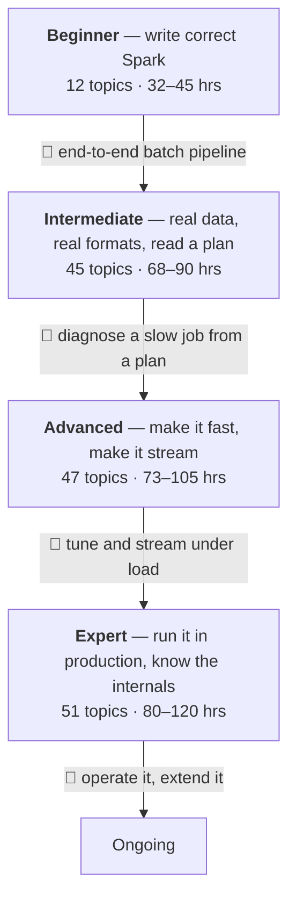

# Learning Path v2: Apache Spark / PySpark

> **Created:** 2026-08-09 — first full re-carve of the path since it was written. Same knowledge base, rebuilt around three things v1 did not have: an explicit **method** for learning (which resource to trust for what, and in which order), **strands** so that 155 topics are navigable rather than a flat list per level, and the **feature history** folded in as a first-class dimension so you always know which of your sources is talking about a Spark you are not running.
>
> **Updated:** 2026-08-10 — audited the Types strand against [ANSI & Data Types](reference/spark-feature-history/ansi-types.md) in the feature history and found two clusters with no topic at all: the datetime/timezone family (session time zone, `TIMESTAMP_NTZ`) and the ANSI `INTERVAL` types. Added **I5** and **I6** to cover them; **I5**–**I41** shifted to **I7**–**I43**. The same audit found four smaller gaps that belonged to topics that already existed, so those were extended in place rather than given topics of their own: `CHAR`/`VARCHAR` storage and padding into **B4**, the ANSI rules the one-line summary hides plus the view-persistence trap into **B5**, the ANSI aggregate family into **B7** with the windowed half in **I8**, and the public `UserDefinedType` API into **I1**.
>
> **Updated:** 2026-08-10 — audited the Python-boundary strand against [Arrow](reference/spark-feature-history/arrow.md). The UDF and UDTF execution path was already well covered; the *conversion* path (`toPandas`/`createDataFrame`, the type boundary, the PyArrow floor) and the whole-partition APIs (`mapInPandas`/`mapInArrow`/`applyInArrow`) had no topic at all. Added **I13** and **I14** to cover them; **I13**–**I41** shifted to **I15**–**I43**.
>
> **Updated:** 2026-08-10 — audited [Build & Language support](reference/spark-feature-history/build-lang.md). That area is 408 items, but almost all of it is Spark's *own* build — Maven/SBT, CI, Docker publishing, transitive dependency bumps — with no learnable surface, so it stays out by design. The learner-facing residue was mostly already covered; what was missing was the Python version floor and the Python dependency floors, plus the fact that Mesos was removed in 4.0. All folded into **B1** as version-floor notes rather than given a topic. No renumbering.
>
> **Updated:** 2026-08-10 — added [What this path covers, and what it deliberately does not](#what-this-path-covers-and-what-it-deliberately-does-not): all 22 feature-history capability areas mapped to the topics that carry them, with GraphX, SparkR and the Spark build declared out of scope and MLlib, built-in functions and security flagged as known-thin. Ends the run of area audits by making coverage a stated position rather than something you have to reconstruct.
>
> **Updated:** 2026-08-10 — audited [Built-in Functions](reference/spark-feature-history/builtin-functions.md) and found the coverage inverted: the marquee families already had dedicated topics (**A21** sketches, **A23** vectors, both complete on their 4.x rows) while the everyday catalogue had no owner. Added **B12** at the end of the Beginner level, which needed no renumbering. That area is no longer listed as thin.
>
> **Updated:** 2026-08-10 — audited [Connectors](reference/spark-feature-history/connectors.md), the one area the coverage table listed as covered without ever being checked feature by feature. Four clusters had no owner: the `TIME` type and its 4.2.0 serde across five formats (which had **no** mention anywhere on the page), Avro's schema/union/function surface, DSv2 pushdown to JDBC, and the cloud output committers. Added **I44**–**I45** at the end of Intermediate and **A46**–**A47** at the end of Advanced, each in a new strand, so no renumbering was needed. Three further connector clusters — file-format pushdown mechanics, codec choice per format, XML past inference — are now declared **thin** rather than left implicit. All facts verified against the local checkout at tag `v4.2.0`, not against the release notes: that is how the topics can state that `datasourceV2JoinPushdown` is `internal()` and defaults to `false`, and that Parquet loses `TIME` precision where ORC and Avro do not.
>
> **Current Spark stable:** 4.2.0 (Jul 14 2026) · **Maintenance lines:** 4.1.3, 4.0.4 (Jul 15 2026), 3.5.9 (Jul 16 2026) · verified against the local source checkout at tag `v4.2.0`.
>
> **Relationship to [v1](learning-path.md).** v1 remains the detail store: it carries the long `!!! info` / `!!! warning` blocks recording specific source findings per topic, and it is not deleted. v2 is the page you study from. Every topic here names its v1 code so you can jump to that detail, and the [v1 → v2 code map](#v1-v2-code-map) at the end is the full crosswalk.

!!! note "Status key"
    **Topics:** ⬜ not started · ✅ done and current · 🔄 done, but written against an older Spark and now needs revisiting.

    **Checkpoints:** 🎯 — a gate, not a topic. No completion status: it is a self-test you attempt to decide whether you are ready to leave a level.

**What this path is built around.** Apache Spark itself — the open-source engine, its APIs, and the open formats and tooling around it. Vendor platforms (Databricks, and the certifications built on it) appear as [optional milestones](#optional-certification-milestones) at the end, not as the spine. The transferable skill is the engine and the open ecosystem; platform-specific surfaces change with your employer, and a path organised around one vendor's exam quietly under-weights what the wider market asks for.

---

## How to learn this

This section is the part v1 was missing. It is not motivational filler — the ordering below is what makes the difference between reading about Spark and being able to predict what Spark will do.

### The authority ladder

When two sources disagree about Spark, this is the order in which to believe them. It is not the order in which to *read* them.

| Rank | Source | Authoritative for | Fails at |
|---|---|---|---|
| 1 | **The source code** (`C:\opt\learn\spark\repos\spark`, tag `v4.2.0`) | What actually happens. Defaults that no table lists. Which of two configs wins. | Teaching you why anything matters, or what to care about first |
| 2 | **Official docs** ([spark.apache.org/docs/latest](https://spark.apache.org/docs/latest/)) | Current behaviour, complete option tables, the full function catalogue, migration notes | Explaining *why*. Almost no narrative, and the reference pages assume you already know the concept |
| 3 | **The release notes and this project's [feature history](reference/spark-feature-history/index.md)** | When a thing appeared, and therefore whether your book can possibly know about it | Depth — a one-line entry per feature |
| 4 | **Books** | Building the mental model. Worked examples. Deciding what matters. | Currency. Every book in this path predates Spark 4.0, so every default that changed in 4.x is stated wrongly |
| 5 | **Courses / videos** | Getting unstuck at the start; watching someone drive the tooling | Depth and currency both. Treat as an on-ramp, never as the reference |
| 6 | **Blogs, Stack Overflow, LLM answers** | Finding out that a thing exists, and what it is called | Everything else. Verify against 1–3 before acting |

**The one rule worth memorising: prefer the official docs over any book for anything factual, and prefer the source over the docs for anything the docs do not state.** Books are for understanding; docs are for truth; source is for the truth the docs omit.

### The per-topic loop

For each topic below, in this order:

1. **Read the milestone first and attempt it from memory.** You will mostly fail early on — that is the point. The failed attempt is what makes the reading stick, and it tells you which parts you can skip. Self-explanation and retrieval practice both carry roughly twice the effect size of rereading ([Dunlosky](https://www.aft.org/ae/fall2013/dunlosky)).
2. **Read the book chapter** to build the model. Fast, once, without taking notes.
3. **Read the named official docs page** to correct the book. This is where you catch the version drift — every "Learn" line below names a specific page, never a docs root.
4. **Read the source map entry** if the topic has one. A [topic trace](reference/spark-source-map/index.md) follows one feature end to end; a [sweep](reference/spark-source-map/index.md) reports what a whole subsystem contains. This is what turns "the DAG scheduler splits stages at shuffle boundaries" from a claim you accept into one you have seen.
5. **Build the milestone for real** and write the chapter in [`docs/spark-book/`](spark-book/index.md). The writing is where the self-explanation happens; a topic is not done until the chapter exists.

### Version discipline

Every book in this path was written against Spark 2.x or 3.x. You are running 4.2.0. Three whole classes of book statement are now wrong rather than merely dated:

- **ANSI mode is on by default in 4.x.** Any book example that relies on a bad cast returning `null` now raises. This is why ANSI mode is a *Beginner* topic here (B5) rather than an intermediate curiosity.
- **Arrow-optimised Python UDFs are on by default from 4.2.0.** The performance hierarchy every book teaches — plain UDF slow, pandas UDF fast — no longer describes what you get by default.
- **`SparkSession` has two implementations.** Classic and Connect. Every diagram in every book shows the classic one; `pyspark` in 4.x may hand you the other.

Before trusting any book statement about a default, a config name, or an exception class, check it. Two cheap checks: `spark.conf.get(...)` in a live session, and `grep` in the source checkout. Exceptions moved in 4.x — they live under `pyspark.errors`, not the old paths.

### Reading the official docs efficiently

The Spark docs are three different kinds of document under one roof, and knowing which you are in saves a lot of time.

- **Guides** — narrative, read front to back once: [SQL Programming Guide](https://spark.apache.org/docs/latest/sql-programming-guide.html), [RDD Programming Guide](https://spark.apache.org/docs/latest/rdd-programming-guide.html), [Structured Streaming](https://spark.apache.org/docs/latest/streaming/index.html), [Cluster Mode Overview](https://spark.apache.org/docs/latest/cluster-overview.html), [Tuning](https://spark.apache.org/docs/latest/tuning.html), [SQL Performance Tuning](https://spark.apache.org/docs/latest/sql-performance-tuning.html).
- **References** — never read front to back, keep open while working: [Configuration](https://spark.apache.org/docs/latest/configuration.html), [SQL Syntax](https://spark.apache.org/docs/latest/sql-ref-syntax.html), [Data Types](https://spark.apache.org/docs/latest/sql-ref-datatypes.html), [built-in function index](https://spark.apache.org/docs/latest/api/sql/), the [PySpark API reference](https://spark.apache.org/docs/latest/api/python/reference/index.html).
- **Semantics pages** — short, dense, and the settlement for arguments: [NULL Semantics](https://spark.apache.org/docs/latest/sql-ref-null-semantics.html), [ANSI Compliance](https://spark.apache.org/docs/latest/sql-ref-ansi-compliance.html), [Name Resolution](https://spark.apache.org/docs/latest/sql-ref-name-resolution.html), [Fault Tolerance Semantics](https://spark.apache.org/docs/latest/streaming/getting-started.html#fault-tolerance-semantics), and the [Migration Guide](https://spark.apache.org/docs/latest/sql-migration-guide.html). Read all of these at least once; they are each shorter than a book chapter and each of them prevents a class of bug.

The single highest-value habit: when you learn a new operation, open its **API reference page** rather than a tutorial. The `DataFrame` reference lists 150-plus methods; the books cover about twenty.

### When no book covers it

Roughly two thirds of the topics below came from reading the Spark source rather than from any book, course, or exam guide — the [source map](reference/spark-source-map/index.md)'s sweeps scan a subsystem and report what is in it, independently of what this path already covers. Those topics say **"no book covers this"** explicitly rather than citing a book that does not. For them the order becomes: docs page → source sweep → build it → write the chapter. That is not a degraded path; for anything added in Spark 4.x it is the only honest one.

---

## Resources at a glance

| Abbrev | Full name | Type | Best for |
|---|---|---|---|
| **Rioux** | *Data Analysis with Python and PySpark* — Rioux (Manning, 2022) | Book (PDF in this project) | The clearest first pass on the DataFrame API and the execution model |
| **LS2e** | *Learning Spark, 2nd Ed.* — Damji et al. ([O'Reilly](https://www.oreilly.com/library/view/learning-spark-2nd/9781492050032/)) | Book | Catalyst/Tungsten context; the *why* behind the API shape |
| **SDG** | *Spark: The Definitive Guide* — Chambers & Zaharia ([O'Reilly](https://www.oreilly.com/library/view/spark-the-definitive/9781491912201/)) | Book | Deepest reference-style coverage; joins, data sources, internals, RDDs |
| **DLUR** | *Delta Lake: Up and Running* — Haelen & Davis ([O'Reilly](https://www.oreilly.com/library/view/delta-lake-up/9781098139711/)) | Book | Hands-on Delta from zero |
| **DLDG** | *Delta Lake: The Definitive Guide* — Lee et al. ([O'Reilly](https://www.oreilly.com/library/view/delta-lake-the/9781098151935/)) | Book | Delta internals, the transaction log, governance |
| **Iceberg-DG** | *Apache Iceberg: The Definitive Guide* ([O'Reilly](https://www.oreilly.com/library/view/apache-iceberg-the/9781098148614/)) | Book | The Iceberg metadata tree and the REST Catalog |
| **FKane** | *Taming Big Data with Apache Spark 4 and Python* ([Udemy](https://www.udemy.com/course/taming-big-data-with-apache-spark-hands-on/)) | Course | Getting a runnable environment and following along |
| **IBM-Spark** / **IBM-ML** | IBM Spark courses ([edX](https://www.edx.org/learn/apache-spark/ibm-apache-spark-for-data-engineering-and-machine-learning), [Coursera](https://www.coursera.org/learn/machine-learning-big-data-apache-spark)) | Course | UDFs in context; MLlib |
| **DEB** / **ADEB** | *Data Engineering with Databricks* / *Advanced DE* ([catalog](https://www.databricks.com/training/catalog/data-engineering-with-databricks-911)) | Official course | Platform surface, medallion, tuning walkthroughs |
| **DagEss** | *Dagster Essentials* ([courses.dagster.io](https://courses.dagster.io/courses/dagster-essentials)) | Free course | Orchestration |
| **Spark-docs** | [Apache Spark 4.2.0 documentation](https://spark.apache.org/docs/latest/) | Official docs | Everything factual |
| **Delta-docs** / **Iceberg-docs** | [docs.delta.io](https://docs.delta.io/latest/) · [iceberg.apache.org](https://iceberg.apache.org/docs/latest/) | Official docs | Table formats |
| **Source map** | [`reference/spark-source-map/`](reference/spark-source-map/index.md) | This project | 21 topic traces, 38 subsystem sweeps, the config catalog |
| **Feature history** | [`reference/spark-feature-history/`](reference/spark-feature-history/index.md) | This project | 7,190 features across 99 releases, by capability area |
| **Local stack** | `C:\opt\learn\spark\spark-delta-unitycatalog` | This project | Spark + Delta + Unity Catalog + Dagster + MinIO for milestones |

---

## The map

Each level is divided into **strands** — short runs of topics that belong together and are worth reading in order. Strands are the unit of a study session; levels are the unit of a quarter.

| Level | Strands |
|---|---|
| **Beginner** | The engine model · Core DataFrame verbs · Shaping data · Data in and out, and SQL |
| **Intermediate** | Types beyond the basics · Windows and row multiplication · The Python boundary · RDDs underneath · Partitioning, caching, diagnosis · Ingestion depth · Table formats and the lakehouse · Procedural SQL · Formats and the types they carry |
| **Advanced** | How a query is compiled · Statistics and adaptive execution · Joins, aggregation and windows at scale · Reliability of a running job · The file boundary · Streaming · Pipelines · Engineering practice · Pushdown and the write path |
| **Expert** | Memory and execution internals · Scheduling and cluster reliability · Deployment · Observability · Connect · Catalogs, governance, transactions · Streaming state and operations · Kafka operations · Pipelines in production · Platform engineering · Legacy engines |

### What the 2026 market asks for, and where it lands

| Market signal | Where it lands here |
|---|---|
| Open table formats (Iceberg increasingly the default; Delta where Databricks is in play) | I37 Delta, I38 Iceberg and interop |
| Kafka as the standard event backbone | A35–A37, and as a source throughout A32/A34 |
| Semi-structured data at scale (`VARIANT`, 4.0) | I2 |
| Geospatial analytics (`GEOMETRY`/`GEOGRAPHY`, on by default in 4.2.0) | I7 |
| Kubernetes as the deployment target | E15–E18 |
| Spark Connect as the default client architecture | B2 basics, E26–E28 depth |
| Declarative pipelines replacing hand-rolled orchestration glue | A40–A42, E43–E45 |
| SQL fluency weighted at least as heavily as Python | B11, I40–I43 |
| pandas familiarity carried onto Spark | I12 |

---

## Beginner

**Goal:** understand what Spark is and why it exists; write correct PySpark programs that read, transform and write data.

**Estimated time:** 32–45 hrs · **12 topics**

### Strand — The engine model

#### 🔄 B1 — Spark Architecture and the Execution Model

`v1: B1` · chapter [03](spark-book/ch03-spark-installation.md) written against 4.1.x

**What** — how Spark distributes work: driver, executors, cluster manager, JVM vs Python process, lazy evaluation, DAG, stages, tasks.

**Why** — every debugging and optimisation decision later depends on knowing what happens physically. Without it you are guessing.

**Learn** — Rioux Ch 1–3, then LS2e Ch 1–2 · docs: [Cluster Mode Overview](https://spark.apache.org/docs/latest/cluster-overview.html) (start here — the Glossary pins down application/job/stage/task, which the books use loosely), [Submitting Applications](https://spark.apache.org/docs/latest/submitting-applications.html) (client vs cluster deploy mode — where "works in my notebook, fails on the cluster" is actually explained), [Job Scheduling](https://spark.apache.org/docs/latest/job-scheduling.html) (two mechanisms the books blur: [across applications](https://spark.apache.org/docs/latest/job-scheduling.html#scheduling-across-applications) and [within one](https://spark.apache.org/docs/latest/job-scheduling.html#scheduling-within-an-application)), [Tuning](https://spark.apache.org/docs/latest/tuning.html), [Spark Connect Overview](https://spark.apache.org/docs/latest/spark-connect-overview.html) (skim: the architecture has **two** shapes in 4.x and every book diagram shows the classic one) · source: [trace B1](reference/spark-source-map/topics/b1.md), sweeps [execution engine](reference/spark-source-map/sweeps/core-execution-engine.md), [rdd layer](reference/spark-source-map/sweeps/core-rdd-layer.md), [shuffle & memory](reference/spark-source-map/sweeps/core-shuffle-memory.md), [submit & standalone](reference/spark-source-map/sweeps/core-submit-standalone.md)

**Milestone** — explain without notes what happens between `spark.read.parquet(...)` and `.show()`: where the plan lives, when it executes, which process runs the Python. Then, from the source: name the single function that decides where one stage ends and the next begins; explain why a failing task retries four times on a cluster but aborts the stage immediately on your laptop; explain why a stage you watched succeed can run again.

> **Carrying 🔄.** Ch03 states Spark 4.x supports only Java 17 and 21 — 4.2.0 builds and runs on **Java 25** (SPARK-51167). It also misses that Spark 4.x is **Scala 2.13 only**, which decides the `_2.13` suffix on every dependency artifact. The architecture material in Ch01–Ch02 re-verified clean against 4.2.0; only the install chapter needs work.

> **The version floors, and where they are actually enforced.** The [docs index](https://spark.apache.org/docs/latest/index.html) states it in one line: *Java 17/21/25, Scala 2.13, Python 3.10+, R 4.0+ (Deprecated)* — with the caveat that **Java 25 before 25.0.3 is deprecated as of 4.2.0**, so "Java 25" is not quite a free choice of patch level. On the Python side the [PySpark installation page](https://spark.apache.org/docs/latest/api/python/getting_started/install.html) is the reference: `python_requires=">=3.10"`, classifiers declaring **3.10 through 3.14**, and the dependency floors `pandas>=2.2.0,<3.0.0`, `pyarrow>=18.0.0`, and `grpcio`/`grpcio-status` `>=1.76.0` for Connect. Check these before debugging anything strange in a new environment — a missing or too-old PyArrow does not fail loudly, it silently costs you the Arrow path (**I13**).

> **A live example of why the source outranks the docs.** NumPy's floor is stated inconsistently *inside Spark itself* at tag `v4.2.0`: the packaging constants say `_minimum_numpy_version = "1.21"` (`python/packaging/classic/setup.py`, and the same in the `client` and `connect` variants), while the runtime guard `require_minimum_numpy_version()` in `python/pyspark/sql/pandas/utils.py` raises below **1.22** — which is also what the published install page says. So `pip` will cheerfully install NumPy 1.21 and Spark will then refuse it at import. The effective floor is **1.22**; the packaging constant is stale, and the comment at the top of that same file asks whoever edits it to keep `utils.py` in sync. Worth doing once as an exercise in the [authority ladder](#the-authority-ladder): two files in one repo disagree, and only running the code tells you which one governs.

> **Cluster managers that no longer exist.** Mesos was removed outright in Spark 4.0 (SPARK-44442). Every book in this path lists it as one of four options; the docs index now names three — Standalone, YARN, Kubernetes — and **E15** onward covers only those. SparkR was deprecated in the same release (SPARK-49347), which is why R has no topic here.

#### 🔄 B2 — SparkSession and Entry Points

`v1: B2` · chapter [04](spark-book/ch04-sparksession.md) written against 4.1.x

**What** — creating a `SparkSession`; which settings can still change afterwards; log levels; local vs cluster; and **which implementation you get** — classic or Connect — since `SparkSession` is an abstract base with two concrete subclasses in 4.x.

**Why** — every PySpark program starts here, and in 4.x "why does this work in a notebook but not under `spark-submit`" extends to Connect, where a session that looks identical rejects direct JVM access.

**Learn** — Rioux Ch 2; FKane first two sections for a runnable environment · docs: [Starting Point: SparkSession](https://spark.apache.org/docs/latest/sql-getting-started.html#starting-point-sparksession), [Configuration](https://spark.apache.org/docs/latest/configuration.html) — specifically [dynamically loading properties](https://spark.apache.org/docs/latest/configuration.html#dynamically-loading-spark-properties) for precedence, [viewing properties](https://spark.apache.org/docs/latest/configuration.html#viewing-spark-properties), [configuring logging](https://spark.apache.org/docs/latest/configuration.html#configuring-logging) — plus [Connect gotchas](https://spark.apache.org/docs/latest/spark-connect-gotchas.html), the fastest way to understand why `df._jdf` is unavailable, and the [`SparkSession` API reference](https://spark.apache.org/docs/latest/api/python/reference/pyspark.sql/api/pyspark.sql.SparkSession.html) · source: [trace B2](reference/spark-source-map/topics/b2.md), sweeps [classic API](reference/spark-source-map/sweeps/sql-core-classic-api.md), [connect client-server](reference/spark-source-map/sweeps/sql-connect-client-server.md)

**Milestone** — create a session with custom config, set the log level, run a script with `spark-submit`. Then: given a config set *after* the session exists, predict whether it takes effect and say why — verify with `spark.conf.isModifiable()`. Then, from the `SharedState`/`SessionState` split: predict whether a DataFrame cached in one session is visible from a second created with `newSession()`, and whether a temp view is.

### Strand — Core DataFrame verbs

#### 🔄 B3 — The DataFrame API: Basics

`v1: B3` · chapter [06](spark-book/ch06-dataframe-basics.md) written against 4.1.x

**What** — `select`, `filter`/`where`, `withColumn`, `drop`, `rename`, `distinct`, `show`, `printSchema`, `dtypes`, `describe`.

**Why** — the primary tool for 90% of PySpark work; everything else is built on it.

**Learn** — Rioux Ch 2, 4; LS2e Ch 3 for the Catalyst/Tungsten context · docs: [Getting Started](https://spark.apache.org/docs/latest/sql-getting-started.html) with the Python tab, the [`DataFrame` API reference](https://spark.apache.org/docs/latest/api/python/reference/pyspark.sql/dataframe.html) (keep it open — the books cover about twenty of its 150-plus methods), [SELECT syntax](https://spark.apache.org/docs/latest/sql-ref-syntax-qry-select.html) to build the DataFrame ↔ SQL mapping early · source: [trace B3](reference/spark-source-map/topics/b3.md), sweeps [classic API](reference/spark-source-map/sweeps/sql-core-classic-api.md), [Python & Arrow](reference/spark-source-map/sweeps/sql-core-python-arrow.md)

**Milestone** — take a raw CSV, select columns, filter rows, add derived columns, write Parquet — one method chain. Then predict, before running, which of your casts throw under ANSI mode and which columns would silently have been `null` on Spark 3.

> **Carrying 🔄 with a wrong claim.** The chapter's performance and null-on-bad-cast statements assume Spark 3 semantics. ANSI mode is on by default in 4.x. Clear this before relying on the chapter.

#### 🔄 B4 — Schema: StructType, DDL Strings, and Type Safety

`v1: B5` · chapter [08](spark-book/ch08-schema-type-safety.md) written against 4.1.x

**What** — `StructType`/`StructField`; DDL shorthand strings; `inferSchema` trade-offs; checking schema at runtime; and the `CHAR`/`VARCHAR` pair, which Spark does not keep as themselves by default.

**Why** — schema mismatch is the top source of silent data corruption in Spark pipelines. Explicit schemas are the fix.

**Learn** — Rioux Ch 4 and Ch 6 (nested) · docs: [SQL Data Types](https://spark.apache.org/docs/latest/sql-ref-datatypes.html) — note `CHAR`/`VARCHAR` and `VARIANT`; [ANSI Compliance → type coercion](https://spark.apache.org/docs/latest/sql-ref-ansi-compliance.html#type-coercion) and [store assignment](https://spark.apache.org/docs/latest/sql-ref-ansi-compliance.html#store-assignment), the stricter rule set that governs writing into an existing table; [`pyspark.sql.types` reference](https://spark.apache.org/docs/latest/api/python/reference/pyspark.sql/data_types.html) · source: [trace B5](reference/spark-source-map/topics/b5.md), sweeps [types & parser](reference/spark-source-map/sweeps/sql-catalyst-types-parser.md), [datasources](reference/spark-source-map/sweeps/sql-core-datasources.md)

**Milestone** — define a schema without `inferSchema`, validate incoming data against it, state the cost of inference on large files. Then the one that changes how you write pipelines: declare a column `nullable=False`, read a file containing nulls in it, and predict what happens before you run it. Finally declare a `CHAR(5)` column, write `'ab'` into it, read it back, and say how many characters you get and where the declared length was recorded.

> **`CHAR`/`VARCHAR` are not stored as what the DDL says.** By default Spark replaces both with `StringType` in the schema and stashes the declared type in the field's metadata under the `__CHAR_VARCHAR_TYPE_STRING` key, reconstructing it only where the length check and the `CHAR` right-padding need it — so a `printSchema()` showing `string` does not mean the length constraint is gone. Four configs decide the behaviour, verified at tag `v4.2.0` in `CharVarcharUtils` and `SQLConf`: `spark.sql.preserveCharVarcharTypeInfo` (4.0.0, default `false`) keeps the real types in the schema instead; `spark.sql.readSideCharPadding` (3.4.0, default `true`) pads on read as well as write, which matters for external tables Spark did not write; `spark.sql.charAsVarchar` rewrites `CHAR` to `VARCHAR` at DDL time; and `spark.sql.legacy.charVarcharAsString` restores the Spark 3.0 behaviour of no length check and no padding at all.

#### ⬜ B5 — ANSI Mode, EvalMode, and Error-Safe Evaluation with `try_*`

`v1: I20` · **promoted to Beginner in v2** — ANSI is on by default in 4.x, so this governs every cast you write from your first day

**What** — the three per-expression evaluation modes (LEGACY, ANSI, TRY) that decide whether an overflow, a bad cast or a division by zero returns null or raises, the `try_*` family that opts one expression out of the session setting, and the specific operations where ANSI does *not* behave the way the one-line summary suggests.

**Why** — casts and arithmetic that returned `null` on Spark 3 now fail the job. Every book example in this path was written on the other side of that change.

**Learn** — no book covers 4.x ANSI behaviour correctly · docs: [ANSI Compliance](https://spark.apache.org/docs/latest/sql-ref-ansi-compliance.html) (read [Cast](https://spark.apache.org/docs/latest/sql-ref-ansi-compliance.html#cast) and [Arithmetic Operations](https://spark.apache.org/docs/latest/sql-ref-ansi-compliance.html#arithmetic-operations) before trusting any book cast example, then the per-function table at the end for which of `element_at`, `to_date`, `make_timestamp` and friends raise and which have a `try_` twin), [conversion functions](https://spark.apache.org/docs/latest/api/sql/conversion-functions/), [Migration Guide](https://spark.apache.org/docs/latest/sql-migration-guide.html) · feature history: [ANSI & Data Types](reference/spark-feature-history/ansi-types.md) · source: sweep [expressions](reference/spark-source-map/sweeps/sql-catalyst-expressions.md)

**Milestone** — predict, for `SELECT CAST('abc' AS INT)` and for an `INT` addition that overflows, what each of the three modes returns; then rewrite a pipeline that relied on Spark 3 null-on-failure so it keeps strictness everywhere except two named columns. Then, under one fixed ANSI setting, predict what each of `arr[99]`, `element_at(arr, 99)`, `try_element_at(arr, 99)` and `m['nope']` returns — three of the four are not what the mode alone would tell you. Finally create a view under one ANSI setting, query it from a session with the other, and say which setting governed and why.

> **The rules the one-line summary hides.** ANSI is not a single switch over "casts and arithmetic". Four specifics decide real queries at tag `v4.2.0`. Out-of-range **array** access raises — `arr[99]` and `element_at` both — but **map** access does not: `GetMapValue` carries no fail-on-error flag at all, so `m['nope']` returns `null` in every mode, and the array and map halves of the same expression behave differently by design. `try_element_at` is the opt-out for the array side. `div` (`IntegralDivide`) only checks overflow for `LongType`, so the single case that raises is `Long.MinValue div -1`. `Average` carries its own `EvalMode` rather than reading the session flag at eval time, which is why `try_avg` had to be added as a separate function. And negative decimal scale is rejected regardless of mode — `spark.sql.legacy.allowNegativeScaleOfDecimal` (3.0.0, default `false`) is the only way back.

> **ANSI is recorded on a view, not re-evaluated when you query it.** Since 4.0.1 a view or SQL UDF persists the ANSI setting that was in force when it was created, so a view built under one setting keeps behaving that way no matter what the querying session has set. For views created before this existed, and which therefore carry no recorded value, `spark.sql.assumeAnsiFalseIfNotPersisted.enabled` (4.0.1, internal, default `true`) decides what is assumed. This is the mechanism behind "we turned ANSI off and the job still fails".

#### 🔄 B6 — Null Handling

`v1: B9` · chapter [12](spark-book/ch12-null-handling.md) written against 4.1.x

**What** — `dropna`, `fillna`, `coalesce`, null-safe equality (`<=>` / `eqNullSafe`), and how nulls propagate through aggregations and joins.

**Why** — real data has nulls everywhere; getting this wrong silently drops rows or produces wrong aggregates.

**Learn** — Rioux Ch 5 (`how`, `thresh`, `subset`); SDG Ch 6 for null coercion · docs: [NULL Semantics](https://spark.apache.org/docs/latest/sql-ref-null-semantics.html) — the authoritative page, and the settlement wherever the books disagree with intuition; [ORDER BY](https://spark.apache.org/docs/latest/sql-ref-syntax-qry-select-orderby.html) for `NULLS FIRST`/`LAST` and why descending is not a mirror of ascending; [built-in functions](https://spark.apache.org/docs/latest/sql-ref-functions-builtin.html) for `coalesce`/`nvl`/`nullif`/`nanvl` — only the last handles `NaN` · source: [trace B9](reference/spark-source-map/topics/b9.md), sweeps [optimizer](reference/spark-source-map/sweeps/sql-catalyst-optimizer.md), [joins](reference/spark-source-map/sweeps/sql-core-joins-exec.md)

**Milestone** — explain why `F.count("col")` and `F.count("*")` differ on a column with nulls. Then three that catch experienced people: predict what `NOT IN (subquery containing a null)` returns; predict whether `orderBy(c.desc())` puts nulls where `orderBy(c)` did; say whether a `NaN` in a float column survives `dropna()`.

### Strand — Shaping data

#### 🔄 B7 — Aggregations and GroupBy

`v1: B6` · chapter [09](spark-book/ch09-aggregations-groupby.md) written against 4.1.x

**What** — `groupBy().agg()`, the built-in aggregate functions, `GroupedData`, and the ANSI aggregate family the books predate.

**Why** — the `groupBy().agg()` pattern appears in every pipeline.

**Learn** — Rioux Ch 3, 5; LS2e Ch 4 adds `F.expr()` and the full function catalogue · docs: [agg functions](https://spark.apache.org/docs/latest/api/sql/agg-functions/) — the complete aggregate catalogue with a `Since` version on every entry, which is how you tell what your book could not have known; [built-in functions](https://spark.apache.org/docs/latest/sql-ref-functions-builtin.html); [GROUP BY syntax](https://spark.apache.org/docs/latest/sql-ref-syntax-qry-select-groupby.html) for `HAVING`, `ROLLUP`, `CUBE`, `GROUPING SETS`; [Performance Tuning](https://spark.apache.org/docs/latest/sql-performance-tuning.html) for `spark.sql.shuffle.partitions`, *the* knob governing a `groupBy`'s cost · feature history: [ANSI & Data Types](reference/spark-feature-history/ansi-types.md) for when each ANSI aggregate landed · source: [trace B6](reference/spark-source-map/topics/b6.md), sweeps [agg/window/exchange](reference/spark-source-map/sweeps/sql-core-agg-window-exchange.md), [expressions](reference/spark-source-map/sweeps/sql-catalyst-expressions.md), [optimizer](reference/spark-source-map/sweeps/sql-catalyst-optimizer.md)

**Milestone** — several aggregations in one `agg()`, `F.when()` for conditional counting, and a query equivalent to SQL `GROUP BY … HAVING`. Then from the plan: run `explain()` on `groupBy().sum()` and explain why `HashAggregateExec` appears twice; predict how the plan changes when you add one `countDistinct`. Then compute a median two ways — `percentile_cont(0.5)` and `percentile_disc(0.5)` — over a group with an even number of rows, and explain why the two answers differ.

> **Modifiers that are syntax, not functions.** An aggregate can take a `FILTER (WHERE …)` predicate so one `agg()` computes several conditionally-scoped results without a `when`/`otherwise` per column; `collect_list`/`collect_set`/`array_agg` take `RESPECT NULLS` from 4.2.0 to keep nulls they otherwise drop; and the ordered-set aggregates take `WITHIN GROUP (ORDER BY …)`. These apply across the whole family rather than belonging to any one function — **B12** is where they live.

> **The ANSI aggregate family arrived after every book in this path.** Spark 3.3 and 3.4 added the ANSI standard aggregates: the six `regr_*` regression functions (`regr_r2`, `regr_slope`, `regr_intercept`, `regr_sxx`, `regr_sxy`, `regr_syy`), the ordered-set aggregates `percentile_cont` and `percentile_disc`, and the `user` general value specification. All are registered in `FunctionRegistry` at tag `v4.2.0` and all are on the [agg functions](https://spark.apache.org/docs/latest/api/sql/agg-functions/) page. Reach for these before writing a UDF or a `collect_list` and a Python median — this is the single most common place where people hand-roll something Spark already ships.

#### 🔄 B8 — Joins: Types and Mechanics

`v1: B7` · chapter [10](spark-book/ch10-joins.md) written against 4.1.x

**What** — inner, left, right, full outer, semi, anti; equi-join shorthand; column disambiguation; the broadcast hint.

**Why** — joins are the most common source of performance problems in Spark. The types are the foundation for fixing those problems in A15–A19.

**Learn** — Rioux Ch 5 (diagrams, column clashes); SDG Ch 8 is the most comprehensive treatment · docs: [JOIN syntax](https://spark.apache.org/docs/latest/sql-ref-syntax-qry-select-join.html) — every type including the semi/anti variants the books skim, and where `NEAREST BY` is documented from 4.2.0; [join strategy hints](https://spark.apache.org/docs/latest/sql-performance-tuning.html#join-strategy-hints-for-sql-queries) — a hint is a request the planner may decline, and this page says when · source: [trace B7](reference/spark-source-map/topics/b7.md), sweeps [joins](reference/spark-source-map/sweeps/sql-core-joins-exec.md), [planner](reference/spark-source-map/sweeps/sql-catalyst-planner.md), [framework](reference/spark-source-map/sweeps/sql-catalyst-framework.md)

**Milestone** — perform all seven join types, explain `left_semi` and `left_anti` without looking them up, name three situations where a broadcast join is appropriate. Then from the plan: run `explain()` on a large-large join, identify the strategy and the `Exchange` nodes feeding it, and predict which strategy you would get if the condition changed from `a == b` to `a > b`.

#### ⬜ B9 — Combining DataFrames: `union`, `unionByName`, and How Columns Are Matched

`v1: B10`

**What** — `union` matches columns by position, `unionByName` by name, `allowMissingColumns` fills the gaps with nulls — including inside nested structs.

**Why** — positional union against two DataFrames whose columns drifted apart produces wrong data with no error at all.

**Learn** — no book states the positional/by-name split clearly · docs: [Set Operators](https://spark.apache.org/docs/latest/sql-ref-syntax-qry-select-setops.html) — SQL `UNION` is always positional; there is no `BY NAME` in the grammar, so name matching exists only in the DataFrame API; [`unionByName`](https://spark.apache.org/docs/latest/api/python/reference/pyspark.sql/api/pyspark.sql.DataFrame.unionByName.html) and [`union`](https://spark.apache.org/docs/latest/api/python/reference/pyspark.sql/api/pyspark.sql.DataFrame.union.html) · source: sweep [analysis](reference/spark-source-map/sweeps/sql-catalyst-analysis.md) — concept "Union and set-operation column resolution" · related depth: **A9**

**Milestone** — build two DataFrames with the same three column names in *different orders* and show `union` returns values in the wrong columns while `unionByName` does not — confirming from `explain()` that `unionByName` inserted a `Project` on one side. Then add a column to one side only and predict what `allowMissingColumns=True` puts in it, and what happens without the flag.

### Strand — Data in and out, and SQL

#### 🔄 B10 — Reading and Writing Data

`v1: B4` · chapter [07](spark-book/ch07-reading-writing-data.md) written against 4.1.x

**What** — `spark.read` and `df.write` for CSV, JSON, Parquet, ORC; options, modes, inference vs declaration.

**Why** — every pipeline starts with a read and ends with a write; the row-vs-columnar trade-off sets up all later performance intuition.

**Learn** — Rioux Ch 2–3; LS2e Ch 4 for all built-in sources; SDG Ch 9 for the deepest option coverage · docs: [Data Sources](https://spark.apache.org/docs/latest/sql-data-sources.html) plus [generic options](https://spark.apache.org/docs/latest/sql-data-sources-generic-options.html) (globbing, `recursiveFileLookup`, `modifiedBefore/After`); [Performance Tuning](https://spark.apache.org/docs/latest/sql-performance-tuning.html) for `spark.sql.files.maxPartitionBytes` and `openCostInBytes`, which decide how many tasks your read gets — no book covers the formula; [Parquet](https://spark.apache.org/docs/latest/sql-data-sources-parquet.html) for partition discovery, schema merging, and the `ignoreCorruptFiles`/`ignoreMissingFiles` behaviour · source: [trace B4](reference/spark-source-map/topics/b4.md), sweeps [datasources](reference/spark-source-map/sweeps/sql-core-datasources.md), [classic API](reference/spark-source-map/sweeps/sql-core-classic-api.md), [types & parser](reference/spark-source-map/sweeps/sql-catalyst-types-parser.md)

**Milestone** — read multi-file datasets with globs, declare a `StructType`, write in append and overwrite mode, and explain why Parquet is preferred analytically. Then two the source makes checkable: predict how many tasks a read of N files produces and name the config that capped it; explain what happens to already-written files when a write fails halfway.

#### 🔄 B11 — Spark SQL

`v1: B8` · chapter [11](spark-book/ch11-spark-sql.md) written against 4.1.x

**What** — `createOrReplaceTempView`, `spark.sql()`, SQL expressions in `selectExpr`/`F.expr`, the catalog.

**Why** — SQL is often cleaner for complex transformations, and both Databricks Data Engineer exams lead with SQL. Knowing when to use which — and how to mix them — is a practical skill.

**Learn** — Rioux Ch 7 (bilingual programming); LS2e Ch 4 for tables, views, catalog API · docs: [SQL Programming Guide](https://spark.apache.org/docs/latest/sql-programming-guide.html), then the [SQL Syntax reference](https://spark.apache.org/docs/latest/sql-ref-syntax.html) as a reference rather than a read-through — `selectExpr` and `F.expr` use the same parser, so anything documented there works inside them; [Identifiers](https://spark.apache.org/docs/latest/sql-ref-identifier.html) and [Name Resolution](https://spark.apache.org/docs/latest/sql-ref-name-resolution.html) for temp-view shadowing; [CTEs](https://spark.apache.org/docs/latest/sql-ref-syntax-qry-select-cte.html) — a `WITH` is usually *inlined*, not materialised · source: [trace B8](reference/spark-source-map/topics/b8.md), sweeps [query execution](reference/spark-source-map/sweeps/sql-core-query-execution.md), [framework](reference/spark-source-map/sweeps/sql-catalyst-framework.md), [analysis](reference/spark-source-map/sweeps/sql-catalyst-analysis.md)

**Milestone** — register a temp view, query it, mix SQL expressions into a method chain. Then, with a user-supplied value in hand: write the query so the value can never be parsed as SQL, and say why your approach guarantees that rather than merely making it unlikely.

#### ⬜ B12 — The Built-in Function Catalogue: Finding What Already Exists

**New topic** · no v1 code · sourced from the [feature history](reference/spark-feature-history/builtin-functions.md), where the marquee families had topics (**A21** sketches, **A23** vectors) but the catalogue itself — how to search it and how to tell what your version has — had no owner

**What** — the shape of the library, so that "does Spark already do this?" is a lookup rather than a guess. The [Functions hub](https://spark.apache.org/docs/latest/sql-ref-functions.html) splits built-ins three ways — **scalar** (array, collection, struct, map, date/time, math, string, bitwise, conversion, conditional, predicate, hash, CSV, JSON, XML, URL, misc), **aggregate-like** (aggregate, window, sketch-based approximate), and **generator** — while the [API index](https://spark.apache.org/docs/latest/api/sql/) renders one page per group, each entry carrying a **`Since` version**. Alongside the functions themselves: the naming conventions that let you predict a name (`try_*` for the null-returning twin, `*_agg`, `approx_*`, `make_*`), the cross-cutting modifiers that are syntax rather than functions — `WITHIN GROUP (ORDER BY …)`, `IGNORE NULLS` / `RESPECT NULLS`, a `FILTER` predicate on an aggregate — and [named arguments](https://spark.apache.org/docs/latest/sql-ref-function-invocation.html) (`namedParameter => value`, 3.5), which exist because some built-ins have too many optional parameters to call positionally.

**Why** — the most common avoidable mistake in Spark is writing a UDF for something that ships in the box: you pay a serialisation boundary and lose codegen for a function that already exists. The books cover perhaps twenty functions and the library has hundreds, so the skill worth building is not memorising them but knowing the catalogue's shape and reading the `Since` column — which is also how you avoid the opposite failure of copying a snippet that needs a newer Spark than you run.

**Learn** — LS2e Ch 4 introduces `F.expr()` and the catalogue idea; no book is current on its contents · docs: [Functions](https://spark.apache.org/docs/latest/sql-ref-functions.html) as the map, then the [built-in function index](https://spark.apache.org/docs/latest/api/sql/) as the thing you keep open while working — never read either front to back; [Function Invocation](https://spark.apache.org/docs/latest/sql-ref-function-invocation.html) for named and mixed argument notation; [`pyspark.sql.functions` reference](https://spark.apache.org/docs/latest/api/python/reference/pyspark.sql/functions.html) for the Python names, which do not always match the SQL ones · feature history: [Built-in Functions](reference/spark-feature-history/builtin-functions.md) — the fastest way to answer "when did this appear" · source: `sql/catalyst/.../analysis/FunctionRegistry.scala` is the actual list; `sql/gen-sql-functions-docs.py` holds the group names the doc pages are generated from · related: **B5** (`try_*`), **B7** (aggregates), **I8** (windows), **A21**, **A23**

**Milestone** — take three transformations you would reach for a UDF to do and find the built-in for each, naming the group page you found it on. Then check `SELECT * FROM ...` against a function you have never used and read its `Since` version — say whether your Spark has it. Finally use each of the three cross-cutting modifiers once: an aggregate with a `FILTER` predicate, `collect_list` with `RESPECT NULLS`, and `mode() WITHIN GROUP (ORDER BY col)`.

> **Where the generated docs lag the engine.** The function pages are generated from each expression's usage string, so a feature can be live in the engine and invisible on its page. Two cases at tag `v4.2.0`, both verified in source rather than inferred: the [agg functions](https://spark.apache.org/docs/latest/api/sql/agg-functions/) page renders `collect_list(expr)` with no nulls option, but `CollectList` takes `ignoreNulls: Boolean = true` (`.../expressions/aggregate/collect.scala`) — nulls are dropped by default and **`RESPECT NULLS` is the 4.2.0 opt-in to keep them** (SPARK-55256, SPARK-55533). And the [window syntax page](https://spark.apache.org/docs/latest/sql-ref-syntax-qry-select-window.html) restricts `IGNORE NULLS` to `LAG`/`LEAD`/`NTH_VALUE`/`FIRST_VALUE`/`LAST_VALUE` and documents no `FILTER` clause, though 4.2.0 added a filter predicate to window aggregates (SPARK-55702). When a page looks stale, the [feature history](reference/spark-feature-history/builtin-functions.md) and then `FunctionRegistry` settle it — this is the [authority ladder](#the-authority-ladder) doing its job on a page you would otherwise trust completely.

> **4.x additions worth knowing exist.** `time_bucket` for time-series bucketing (4.2.0); `max_by(x, y, k)` / `min_by(x, y, k)` returning K elements (4.2.0); `mode()` made deterministic plus `MODE() WITHIN GROUP` (4.0); `to_char` / `to_varchar` for binary and datetime formatting (4.0); `mask` for data masking (3.4); `to_number` / `try_to_number` (3.4); a seedable `uuid` (4.1); `bitmap_and_agg` (4.1). None of these are in any book on this page.

### 🎯 Beginner Checkpoint

Build a complete end-to-end batch pipeline, without notes:

- read multi-source data (CSV + Parquet) with declared schemas
- clean it — nulls, casts under ANSI mode, deduplication
- transform — join, group, aggregate, derive columns
- write to Parquet with a sensible partition scheme

You should also be able to answer, for your own pipeline: how many tasks each stage got and why; which joins became which strategy; and what would happen to the output directory if the write died halfway.

---

## Intermediate

**Goal:** work confidently with complex and modern types, windows, UDFs and table formats. Begin reading execution plans. Write pipelines that do not fall over on real data.

**Estimated time:** 68–90 hrs · **45 topics**

The first six strands are the level proper. Strands *ingestion depth* and *procedural SQL* are read on demand rather than in sequence — you will meet each when a specific problem sends you there.

### Strand — Types beyond the basics

#### 🔄 I1 — Complex Column Types: Arrays, Maps, Structs

`v1: I1` · chapter [13](spark-book/ch13-complex-types.md) written against 4.1.x

**What** — `ArrayType`, `MapType`, `StructType` as column *values*; `F.explode` and friends; the array function catalogue; struct dot notation; `collect_list`/`collect_set`; higher-order functions.

**Why** — JSON, event logs and nested schemas are ubiquitous. This is the difference between working with 80% of real data and only 20%.

**Learn** — Rioux Ch 6 is the most thorough beginner treatment; LS2e Ch 5 for higher-order functions (`transform`, `filter`, `aggregate`), which replace an explode/re-group round trip; SDG Ch 6 as reference · docs: [Data Types](https://spark.apache.org/docs/latest/sql-ref-datatypes.html) and [built-in functions](https://spark.apache.org/docs/latest/sql-ref-functions-builtin.html) · source: [trace I1](reference/spark-source-map/topics/i1.md), sweeps [expressions](reference/spark-source-map/sweeps/sql-catalyst-expressions.md), [optimizer](reference/spark-source-map/sweeps/sql-catalyst-optimizer.md)

**Milestone** — flatten a JSON array-of-structs into rows, extract nested struct fields, build an array column from grouped rows, apply a lambda transform to every element. State when `VARIANT` (I2) beats a declared `StructType`. Then the one that catches people: given a column where some arrays are empty or null, predict how many rows survive `explode` versus `explode_outer`.

> **When the three built-in composites are not enough.** `UserDefinedType` lets you register a type of your own that Spark stores as one of the built-in types underneath and presents as your class at the API boundary. It has been a public `@DeveloperApi` since 3.2.0 (`sql/api/.../types/UserDefinedType.scala`, verified at tag `v4.2.0`), so it is supported rather than an internal detail — but `@DeveloperApi` means the signature can change between minor releases, and it is the right tool far less often than it looks. Reach for `ArrayType`/`MapType`/`StructType` first, and `VARIANT` (**I2**) when the shape varies; a UDT earns its place only when the values need behaviour, not just structure.

#### ⬜ I2 — The `VARIANT` Type and Semi-Structured Data

`v1: I22` · new in Spark 4.0

**What** — Spark 4's binary `VARIANT`: `parse_json`, path extraction with `variant_get`, `schema_of_variant`, `variant_explode`, and the dot notation the analyzer rewrites into `variant_get`.

**Why** — it replaces store-JSON-as-a-string with a binary format that keeps types and supports indexed path access, and unlike a fixed struct schema it tolerates fields appearing and disappearing between batches.

**Learn** — no book covers this (it postdates all of them) · docs: [variant functions](https://spark.apache.org/docs/latest/api/sql/variant-functions/), [Data Types](https://spark.apache.org/docs/latest/sql-ref-datatypes.html), [JSON functions](https://spark.apache.org/docs/latest/api/sql/json-functions/) · source: sweeps [expressions](reference/spark-source-map/sweeps/sql-catalyst-expressions.md), [types & parser](reference/spark-source-map/sweeps/sql-catalyst-types-parser.md), [datasources](reference/spark-source-map/sweeps/sql-core-datasources.md)

**Milestone** — ingest a JSON column as `VARIANT`, extract a nested field with both dot notation and `variant_get`, and show from `explain()` that both became the same expression. Then feed it two batches whose JSON shapes differ and show the query still runs where a declared `StructType` would have failed.

#### ⬜ I3 — String Collation

`v1: I21` · new in Spark 4.0, extended in 4.2.0

**What** — per-column collation on `StringType`: the `COLLATE` clause and `collate()`, what `UTF8_BINARY` / `UTF8_LCASE` / ICU collations change about comparison and equality, and the collation key that makes grouping and joining agree with comparison.

**Why** — collation changes the meaning of `=`, `GROUP BY`, `DISTINCT` and join keys on string columns. It is the supported replacement for the `lower(col) = lower(col)` idiom — but only if you know which operations are collation-aware and which fall back to bytes.

**Learn** — no book covers this · docs: [Data Types](https://spark.apache.org/docs/latest/sql-ref-datatypes.html), [SHOW COLLATIONS](https://spark.apache.org/docs/latest/sql-ref-syntax-aux-show-collations.html) (added 4.2.0), [string functions](https://spark.apache.org/docs/latest/api/sql/string-functions/) · source: sweeps [expressions](reference/spark-source-map/sweeps/sql-catalyst-expressions.md), [types & parser](reference/spark-source-map/sweeps/sql-catalyst-types-parser.md), [joins](reference/spark-source-map/sweeps/sql-core-joins-exec.md)

**Milestone** — declare a column `COLLATE UTF8_LCASE` and show a join on it matches rows a binary collation would not; then show the same collation is respected by `GROUP BY` and `DISTINCT`. Name one operation that ignores it and falls back to bytes.

> **New in 4.2.0.** Collation now extends to `CHAR`/`VARCHAR` and to `CREATE TABLE AS SELECT` / `REPLACE TABLE AS SELECT`, so a collated column survives a CTAS rather than being silently widened.

#### ⬜ I4 — Decimal Precision, Scale, and Silent Rounding

`v1: I25`

**What** — how Spark derives the precision and scale of a decimal result: the 38-digit ceiling, the `adjustPrecisionScale` rule that sacrifices fractional digits to protect integral ones, and the six-digit floor it will not go below.

**Why** — a chain of decimal multiplications or divisions silently loses fractional digits, or overflows to null, according to a rule nobody reads. `spark.sql.decimalOperations.allowPrecisionLoss` picks which of the two failure modes you get.

**Learn** — no book covers the adjustment rule · docs: [Data Types](https://spark.apache.org/docs/latest/sql-ref-datatypes.html), [ANSI Compliance](https://spark.apache.org/docs/latest/sql-ref-ansi-compliance.html), [Runtime SQL Configuration](https://spark.apache.org/docs/latest/configuration.html#runtime-sql-configuration) · source: sweep [types & parser](reference/spark-source-map/sweeps/sql-catalyst-types-parser.md)

**Milestone** — compute the result type of `DECIMAL(20,10) * DECIMAL(20,10)` by hand from the rule, then confirm it in a session. Flip `allowPrecisionLoss` and record which of rounding and overflow you now get.

#### ⬜ I5 — Dates, Timestamps, and `TIMESTAMP_NTZ`

**New topic** · no v1 code · sourced from the [feature history](reference/spark-feature-history/ansi-types.md), where roughly fifteen datetime and timezone items span 1.5.0 to 3.5.5 and none of them had a topic

**What** — Spark has two timestamp types, not one. `TimestampType` is `TIMESTAMP_LTZ`: an absolute point in time, whose year/month/day/hour fields are only resolved once you pick a time zone. `TimestampNTZType` is `TIMESTAMP_NTZ`: the same fields with no time zone attached, and every operation on it ignores time zones entirely. Bare `TIMESTAMP` in DDL is an *alias* for whichever one `spark.sql.timestampType` names — `TIMESTAMP_LTZ` by default. The session's interpretation frame is `spark.sql.session.timeZone`, and it is a session setting, not a cluster one. `DateType` carries no time zone at all and never did. Both timestamp types hold microsecond precision. Around them sit the pattern letters that `to_timestamp` / `date_format` and the CSV and JSON readers share, and the `java.time` external types (`Instant` for `TIMESTAMP_LTZ`, `LocalDate` for `DateType`) that a Python or JVM client actually exchanges.

**Why** — the single most common silent-wrong-answer bug in a Spark pipeline is a timestamp that means "an instant" being treated as "a wall clock", or the reverse. An event time is an instant and belongs in `TIMESTAMP_LTZ`; a business date-time such as a store's opening hour is a wall clock and belongs in `TIMESTAMP_NTZ`, because it must not shift when the reader's session time zone changes. Pick wrong and the data is correct on your machine and wrong in the next region — with no error anywhere. Every book in this path predates `TIMESTAMP_NTZ` and so teaches the choice as if it did not exist.

**Learn** — SDG Ch 6 covers dates and timestamps but predates `TIMESTAMP_NTZ`, so treat its "the timestamp type" as meaning `TIMESTAMP_LTZ` only · docs: [Data Types](https://spark.apache.org/docs/latest/sql-ref-datatypes.html) — read the `TimestampType` / `TimestampNTZType` entries and the `spark.sql.timestampType` note together, they only make sense as a pair; [Datetime Patterns for Formatting and Parsing](https://spark.apache.org/docs/latest/sql-ref-datetime-pattern.html), the reference for every `to_timestamp` format string and every CSV/JSON `timestampFormat`; [datetime functions](https://spark.apache.org/docs/latest/api/sql/datetime-functions/); [Runtime SQL Configuration](https://spark.apache.org/docs/latest/configuration.html#runtime-sql-configuration) for `spark.sql.session.timeZone` and `spark.sql.timestampType`; [Migration Guide](https://spark.apache.org/docs/latest/sql-migration-guide.html) for the 3.x calendar and parser changes · feature history: [ANSI & Data Types](reference/spark-feature-history/ansi-types.md) · source: sweeps [types & parser](reference/spark-source-map/sweeps/sql-catalyst-types-parser.md), [expressions](reference/spark-source-map/sweeps/sql-catalyst-expressions.md), [datasources](reference/spark-source-map/sweeps/sql-core-datasources.md) · leads to: **I6**

**Milestone** — write one timestamp column to Parquet, then read it back in two sessions whose `spark.sql.session.timeZone` differ, and say which of the stored bytes and the displayed string changed. Do the same with a `TIMESTAMP_NTZ` column and explain the difference from where the time zone is applied. Then set `spark.sql.timestampType` to `TIMESTAMP_NTZ`, create a table with a bare `TIMESTAMP` column, and predict its type before checking. Finally parse two strings with `to_timestamp` — one carrying a UTC offset, one not — and say what each does with the session time zone.

#### ⬜ I6 — `INTERVAL` Types and Date Arithmetic

**New topic** · no v1 code · sourced from the [feature history](reference/spark-feature-history/ansi-types.md), where the ANSI interval family runs from `CalendarIntervalType` in 1.5.0 to GA in 3.2.0 (SPARK-27790) and the cast work in 3.4.0, with no topic anywhere

**What** — date arithmetic in Spark does not return a number, it returns a typed interval, and there are two incompatible interval types. `YearMonthIntervalType(startField, endField)` spells as `INTERVAL YEAR`, `INTERVAL YEAR TO MONTH` or `INTERVAL MONTH`; `DayTimeIntervalType(startField, endField)` spells as `INTERVAL DAY` through `INTERVAL SECOND` and every start-to-end pair between. Both are parameterised by which fields they carry, so `INTERVAL DAY TO SECOND` and `INTERVAL DAY` are different types. Behind them sits the pre-3.2 `CalendarIntervalType`, still reachable through `spark.sql.legacy.interval.enabled`. Verified at tag `v4.2.0`: `date - date` yields `DayTimeIntervalType(DAY)` and `timestamp - timestamp` yields `DayTimeIntervalType()`, and both fall back to `CalendarIntervalType` when the legacy flag is on. Constructors are `make_interval`, `make_dt_interval` and `make_ym_interval`; interval literals are their SQL equivalent; and 3.4.0 added casts in both directions between intervals and integrals and decimals. Intervals also round-trip through ORC and Parquet.

**Why** — the two interval types cannot be added to each other, and that is a deliberate design decision rather than a gap: a month has no fixed number of days, so year-month and day-time arithmetic cannot share a representation without lying. Once you have seen that, the type of every date subtraction stops being a surprise. This is also the sharpest version-drift trap in the type system — any book or blog written before Spark 3.2 shows `CalendarIntervalType`, which is no longer what you get, and any code that pattern-matches on the old type silently takes a different branch.

**Learn** — no book covers this; the ANSI interval types postdate all of them · docs: [Data Types](https://spark.apache.org/docs/latest/sql-ref-datatypes.html) — the `YearMonthIntervalType` and `DayTimeIntervalType` entries list every valid SQL type name; [Literals → interval literal](https://spark.apache.org/docs/latest/sql-ref-literals.html) for the SQL syntax and the two literal forms; [datetime functions](https://spark.apache.org/docs/latest/api/sql/datetime-functions/) for `make_interval` / `make_dt_interval` / `make_ym_interval` and the `date_diff` family that returns a plain integer instead; [ANSI Compliance](https://spark.apache.org/docs/latest/sql-ref-ansi-compliance.html) for the interval cast rules; [Runtime SQL Configuration](https://spark.apache.org/docs/latest/configuration.html#runtime-sql-configuration) for `spark.sql.legacy.interval.enabled` · feature history: [ANSI & Data Types](reference/spark-feature-history/ansi-types.md) · source: sweeps [types & parser](reference/spark-source-map/sweeps/sql-catalyst-types-parser.md), [expressions](reference/spark-source-map/sweeps/sql-catalyst-expressions.md) · prerequisite: **I5**

**Milestone** — subtract two date columns, print the result's schema, and name the exact type including its fields; predict the same for two timestamps before running it. Build one interval three ways — a literal, `make_dt_interval`, and a subtraction — and show all three compare equal. Then try to add an `INTERVAL MONTH` to an `INTERVAL DAY` and explain from the semantics, not the error message, why Spark refuses. Finally flip `spark.sql.legacy.interval.enabled` on, rerun the first subtraction, and record what the type became and what that would break in code that matched on the new one.

#### ⬜ I7 — Geospatial Types: `GEOMETRY`, `GEOGRAPHY` and the `ST_*` Functions

**New topic in v2** · no v1 code · sourced from the [feature history](reference/spark-feature-history/geospatial.md), where twelve items land in 4.2.0 and none of them had a topic

**What** — Spark 4.2.0's two spatial types, defined against the OGC Simple Feature Access spec. `GEOMETRY` is Cartesian/planar and accepts any SRID in the registry including 0; `GEOGRAPHY` is latitude/longitude, always spherical edge interpolation, and only accepts geographic SRIDs (usually 4326 / WGS 84). Values are Well-Known Binary at runtime, carry an SRID, and are constructed with `ST_GeomFromWKB` / `ST_GeogFromWKB` — the first defaults to SRID 0, the second always to 4326. Plus the `ST_*` function family, WKT and WKB readers and writers, Parquet read and write support, casting from `GEOGRAPHY` to `GEOMETRY`, a full SRS registry built from PROJ 9.7.1 data, and Geo result sets over the Thrift server.

**Why** — geospatial support is **enabled by default** in 4.2.0, so this is now part of the engine's type system rather than a third-party package (Sedona, GeoMesa). The choice between `GEOMETRY` and `GEOGRAPHY` is not cosmetic: it decides whether a distance is planar or spherical, and in SQL both types must be declared with an explicit SRID or `ANY`. Every third-party spatial guide you will find predates this.

**Learn** — no book covers this · docs: [Geospatial (Geometry/Geography) Types](https://spark.apache.org/docs/latest/sql-ref-geospatial-types.html) — the primary reference, including the GEOMETRY-vs-GEOGRAPHY decision table and the SQL type syntax; the `ST_*` group in the [built-in function index](https://spark.apache.org/docs/latest/api/sql/) · feature history: [Geospatial](reference/spark-feature-history/geospatial.md) for the full 4.2.0 item list, [Data Sources & DSv2](reference/spark-feature-history/datasources-dsv2.md) for the Parquet I/O side

**Milestone** — create a table with a `GEOGRAPHY(4326)` column, load points from WKT, and compute a distance; then do the same with `GEOMETRY` in a projected SRID and explain why the two answers differ. Write the table to Parquet, read it back, and confirm the SRID survived. Finally, construct a value with `ST_GeomFromWKB` without an SRID and say what SRID you got and why.

### Strand — Windows and row multiplication

#### 🔄 I8 — Window Functions

`v1: I2` · chapter [14](spark-book/ch14-window-functions.md) written against 4.1.x

**What** — `Window.partitionBy().orderBy()`, aggregates over windows, ranking functions, analytic functions (`lag`, `lead`, `cume_dist`), and frame boundaries (`rowsBetween`, `rangeBetween`).

**Why** — running totals, ranking, time-series features and "keep only the latest record" all in one pass without a self-join.

**Learn** — Rioux Ch 10 is the clearest full chapter; SDG Ch 7 has the deepest semantics · docs: [Window Functions](https://spark.apache.org/docs/latest/sql-ref-syntax-qry-select-window.html) — `ROWS` vs `RANGE`, and what the default frame becomes once you add `ORDER BY`, which is the single most common window bug; the [window functions](https://spark.apache.org/docs/latest/api/sql/window-functions/) page lists only the nine ranking and navigation functions, so anything else you use over a window comes from the [agg functions](https://spark.apache.org/docs/latest/api/sql/agg-functions/) page instead · source: [trace I2](reference/spark-source-map/topics/i2.md), sweeps [agg/window/exchange](reference/spark-source-map/sweeps/sql-core-agg-window-exchange.md), [expressions](reference/spark-source-map/sweeps/sql-catalyst-expressions.md), [optimizer](reference/spark-source-map/sweeps/sql-catalyst-optimizer.md)

**Milestone** — reproduce a self-join with a window function; explain why an ordered aggregate window differs from an unordered one, naming both default frames; build a 30-day rolling average with `rangeBetween` on a unix timestamp. Then: with duplicate timestamps present, predict how a running sum differs under `rowsBetween` versus `rangeBetween`, and say what `explain()` shows above your window operator. Finally compute a per-group median with `percentile_cont` over a window and say why it needs no frame clause.

> **`IGNORE NULLS` and `FILTER` over a window.** `IGNORE NULLS` is documented on the window-syntax page for `LAG`/`LEAD`/`NTH_VALUE`/`FIRST_VALUE`/`LAST_VALUE` — worth knowing before you debug a `lag` that returned a null you expected it to skip. 4.2.0 also added a `FILTER` predicate on window *aggregates*, which that page does not document; see **B12** for why the generated pages lag the engine.

> **Ordered-set aggregates work over a window too.** `percentile_cont` and `percentile_disc` became usable as window functions in Spark 3.4, which removes the usual "collect_list then a UDF" workaround for a windowed median or quantile. They are documented on the agg page, not the window page — see **B7** for the family they belong to.

#### ⬜ I9 — Row-Multiplying Operators: `explode`, `LATERAL VIEW`, and the `Expand` Behind `ROLLUP`

`v1: I34`

**What** — the two physical operators that turn one input row into many. `GenerateExec` runs a generator and optionally joins each produced row back to the input; `ExpandExec` applies **N projections** per input row, which is the mechanism behind `GROUPING SETS`, `ROLLUP` (N+1 sets), `CUBE` (2^N sets), and the optimizer's rewrite of multiple `COUNT(DISTINCT …)`.

**Why** — both multiply the row count *before* the aggregation or shuffle above them, and neither is obvious from the SQL you wrote. `GROUP BY ROLLUP(a, b, c)` reads the table once and shuffles four expanded copies of every row. An `Expand` also reports `UnknownPartitioning`, so it destroys its child's partitioning and almost always forces an exchange.

**Learn** — book: your own [Ch 13: Complex Types](spark-book/ch13-complex-types.md) covers the generator half · docs: [LATERAL VIEW](https://spark.apache.org/docs/latest/sql-ref-syntax-qry-select-lateral-view.html), [GROUP BY](https://spark.apache.org/docs/latest/sql-ref-syntax-qry-select-groupby.html) · source: sweeps [query execution](reference/spark-source-map/sweeps/sql-core-query-execution.md), [analysis](reference/spark-source-map/sweeps/sql-catalyst-analysis.md)

**Milestone** — run `GROUP BY ROLLUP(a, b, c)` and read the `Expand` operator's `numOutputRows` in the SQL tab: confirm it is exactly 4× the scan's, and explain from the plan why the exchange sits above rather than below it. Then write the same query as an explicit `UNION ALL` of four `GROUP BY`s and compare shuffle bytes.

### Strand — The Python boundary

#### 🔄 I10 — User-Defined Functions

`v1: I3` · chapter [15](spark-book/ch15-udfs.md) written against 4.1.x — **and now teaching a false performance model**

**What** — `@F.udf` (row-by-row), `@F.pandas_udf` (Series→Series, Iterator→Iterator), the performance hierarchy, `.func` for local testing.

**Why** — when no built-in covers your logic, UDFs are the escape hatch. The cost of each kind determines which to reach for.

**Learn** — Rioux Ch 8–9; LS2e Ch 5; IBM-Spark Module 3 · docs: [UDFs and UDTFs](https://spark.apache.org/docs/latest/api/python/user_guide/udfandudtf.html), [Apache Arrow in PySpark](https://spark.apache.org/docs/latest/api/python/tutorial/sql/arrow_pandas.html) · source: [trace I3](reference/spark-source-map/topics/i3.md), sweeps [Python & Arrow](reference/spark-source-map/sweeps/sql-core-python-arrow.md), [api bridge](reference/spark-source-map/sweeps/core-api-bridge.md), [expressions](reference/spark-source-map/sweeps/sql-catalyst-expressions.md)

**Milestone** — replace a Python UDF with a pandas UDF and measure the speedup **on 4.2.0** rather than quoting a book figure; load an ML model once per partition with an Iterator UDF and name the config that makes that pay off; test a UDF locally without a SparkSession. Then from `explain()`: name the eval operator your UDF ran under, and explain why chaining a plain UDF and a pandas UDF in one `select` costs more than chaining two of the same kind.

> **Carrying 🔄 with a wrong claim — clear this one first.** Arrow-optimised Python UDFs and Arrow-based PySpark IPC are **on by default from 4.2.0**, and 4.2.0 also adds iterator APIs for both Arrow and pandas grouped-aggregation UDFs plus SQL registration for them. The chapter's plain-UDF-versus-pandas-UDF hierarchy no longer describes the default configuration.

> **The knobs under the Arrow path.** Once Arrow carries your UDFs by default, its tuning surface becomes yours: `spark.sql.execution.arrow.useLargeVarTypes` (3.5.0, default `false`) lifts the 2 GiB-per-string-column-per-batch ceiling at the cost of memory per value; `spark.sql.execution.arrow.compression.codec` (4.1.0, default `none`, also `zstd`/`lz4`) trades CPU for wire and memory size; `spark.sql.execution.python.udf.maxRecordsPerBatch` (4.0.0, default `100`) bounds the non-Arrow UDF batch, and `spark.sql.execution.pandas.udf.buffer.size` the pandas one. Reach for these only after **I13**, which is where the batch-sizing model they modify is actually explained.

#### ⬜ I11 — Python UDTFs: Table Functions That Return Many Rows

`v1: I30`

**What** — a class with an `eval()` that yields rows and an optional `analyze()` that runs **on the driver at analysis time** to decide the output schema, partitioning and ordering from the actual arguments — planned as a `Generate` node rewritten into `BatchEvalPythonUDTF` or `ArrowEvalPythonUDTF`.

**Why** — the only PySpark construct that turns one input row into many without an explode; it takes `TABLE()` arguments so it can consume a whole partition; and its polymorphic `analyze()` is the one place user Python runs on the driver during analysis, which is also the one place a UDTF bug becomes an analysis error rather than a task failure.

**Learn** — no book covers this · docs: [Python UDTFs](https://spark.apache.org/docs/latest/api/python/tutorial/sql/python_udtf.html), [vectorized Python UDTFs](https://spark.apache.org/docs/latest/api/python/tutorial/sql/arrow_python_udtf.html), [UDFs and UDTFs guide](https://spark.apache.org/docs/latest/api/python/user_guide/udfandudtf.html) · source: sweep [Python & Arrow](reference/spark-source-map/sweeps/sql-core-python-arrow.md) · prerequisite: **I10**

**Milestone** — write a UDTF that takes a string and a delimiter and yields one row per token; call it from the DataFrame API and from a SQL `FROM` clause; show `explain()` naming the eval operator. Then write a second with `analyze()` deriving its schema from a `TABLE(...)` argument, and demonstrate two things: a mismatched table schema raises at analysis rather than task time, and requesting `partitionBy` in the `AnalyzeResult` adds an `Exchange`.

#### ⬜ I12 — The pandas API on Spark

**New topic in v2** · no v1 code · sourced from the [feature history](reference/spark-feature-history/pandas-on-spark.md) (38 items across 4.0–4.2.0) and from the Spark Developer Associate exam, which weights it 5% while v1 had no topic for it

**What** — `pyspark.pandas` (`import pyspark.pandas as ps`): a pandas-compatible DataFrame and Series over Spark, with an index, `ps.sql`, a plotting backend, and a documented fallback list for operations that drop to pandas on the driver. Plus the two things that make it behave unlike pandas: the `compute.ops_on_diff_frames` option (**on by default since 4.0**) and type hints for `apply`/`transform`.

**Why** — it is the migration path for an existing pandas codebase and the fastest way for a pandas-fluent analyst to be productive; it is also the surface where the leaky abstraction bites — an index is not free, some operations silently collect to the driver, and **ANSI mode is on by default for the pandas API from 4.1**, which changed divide-by-zero and `rmod` behaviour that pandas users rely on.

**Learn** — no book in this path covers it · docs: [pandas API on Spark user guide](https://spark.apache.org/docs/latest/api/python/tutorial/pandas_on_spark/index.html) — read [best practices](https://spark.apache.org/docs/latest/api/python/tutorial/pandas_on_spark/best_practices.html), [options](https://spark.apache.org/docs/latest/api/python/tutorial/pandas_on_spark/options.html) and [type hints](https://spark.apache.org/docs/latest/api/python/tutorial/pandas_on_spark/typehints.html), the three that decide whether your code is distributed or not; [`pyspark.pandas` API reference](https://spark.apache.org/docs/latest/api/python/reference/pyspark.pandas/index.html) · feature history: [pandas API on Spark](reference/spark-feature-history/pandas-on-spark.md) · related: **I10** (the UDF machinery underneath), **B5** (ANSI)

**Milestone** — take a pandas script of 30-plus lines, convert it with `import pyspark.pandas as ps`, and get identical output. Then find the two operations in it that fell back to the driver — from the docs' fallback list and from the Spark UI job count — and rewrite one to stay distributed. Finally, do an arithmetic operation that divides by zero and explain what 4.1 changed about the answer.

#### ⬜ I13 — The Arrow Boundary: `toPandas`, `createDataFrame`, and What Survives the Conversion

**New topic** · no v1 code · sourced from the [feature history](reference/spark-feature-history/arrow.md), whose oldest and most-used cluster — the pandas conversion path from 2.4.0 onward — had no topic at all

**What** — the columnar bridge between the JVM and Python, and the fact that it is *two* paths with a silent switch between them. `spark.sql.execution.arrow.pyspark.enabled` (3.0.0, falling back to the 2.3.0 `spark.sql.execution.arrow.enabled`, default `true`) turns Arrow on for exactly two operations: `DataFrame.toPandas` and `SparkSession.createDataFrame` from a pandas DataFrame or NumPy array. `spark.sql.execution.arrow.pyspark.fallback.enabled` (default `true`) then silently drops back to the row-at-a-time path when anything goes wrong, so a working query tells you nothing about which path it took. Around that sit the knobs that decide memory and correctness: `spark.sql.execution.arrow.maxRecordsPerBatch` (default `10000`) and `maxBytesPerBatch` (4.0.0, default `64MB`), which cut a batch when *either* is met; `selfDestruct.enabled` (3.2.0, experimental, default `false`), which trades CPU for a much smaller `toPandas` peak; `spark.sql.execution.arrow.compression.codec` (4.1.0, default `none`, also `zstd`/`lz4`); and `localRelationThreshold` (3.4.0), which decides whether Arrow batches are deserialised on the driver or shipped to executors. There is also a `toArrow()` path to an Arrow table directly, without pandas in the middle.

**Why** — `df.toPandas()` is the single most-used Arrow feature in Spark and the one most likely to take down a driver, and the type boundary underneath it is where silent wrongness lives. `spark.sql.execution.pandas.convertToArrowArraySafely` (default `true` at 4.2.0, having been flipped on in 4.1) is what makes an overflowing conversion raise instead of quietly wrapping — meaning code that "worked" on an older Spark can now fail, and code that ran on an older Spark with it off may have been wrong all along. `spark.sql.execution.pyspark.binaryAsBytes` (4.1.0, default `true`) changed `BinaryType` from `bytearray` to `bytes`, and `spark.sql.execution.pandas.structHandlingMode` (3.5.0, default `legacy`) decides whether a struct arrives as a `Row` or a dict and what happens to duplicated nested field names. None of this is guessable from the API surface.

**Learn** — no book covers the 4.x state of this · docs: [Apache Arrow in PySpark](https://spark.apache.org/docs/latest/api/python/tutorial/sql/arrow_pandas.html) — the authoritative page; read **Ensure PyArrow Installed**, **Enabling for Conversion to/from Pandas**, **Conversion to/from Arrow Table**, and all of **Usage Notes** (supported SQL types, batch size, timestamp semantics, `self_destruct`); [Runtime SQL Configuration](https://spark.apache.org/docs/latest/configuration.html#runtime-sql-configuration) for every config named above · feature history: [Arrow](reference/spark-feature-history/arrow.md) · source: sweeps [Python & Arrow](reference/spark-source-map/sweeps/sql-core-python-arrow.md), [api bridge](reference/spark-source-map/sweeps/core-api-bridge.md) · prerequisite: **B2** · related: **I15** (the non-Arrow driver-collection path), **I10** · leads to: **I14**

**Milestone** — check the PyArrow version your environment actually has against the minimum Spark requires (**18.0.0** at 4.2.0, from `python/pyspark/sql/pandas/utils.py`), then run one `toPandas()` with Arrow enabled and one with it disabled and compare wall time and driver peak memory. Turn `fallback.enabled` off and find a DataFrame that now raises — you have just discovered a query that was silently taking the slow path. Then switch `selfDestruct` on and re-measure peak memory. Finally, build a DataFrame with a struct column containing two identically-named nested fields, call `toPandas()` under each of the three `structHandlingMode` values, and describe what you got each time.

#### ⬜ I14 — Whole-Partition Python APIs: `mapInPandas`, `mapInArrow`, and `applyInArrow`

**New topic** · no v1 code · sourced from the [feature history](reference/spark-feature-history/arrow.md), where the map/apply family runs from 3.5.0 barrier support to the 4.1 iterator and batch-limit work with no topic naming it

**What** — the family that hands your Python function a whole partition or a whole group rather than a column: `DataFrame.mapInPandas` and `DataFrame.mapInArrow` over partitions, `GroupedData.applyInPandas` and `GroupedData.applyInArrow` over groups, and cogrouped `applyInPandas` / `applyInArrow` over two grouped frames aligned on a key. These are *not* UDFs — they do not return a column, they return a new DataFrame with a schema you declare — which is why they can change the row count and why the schema argument is mandatory. Verified at tag `v4.2.0`, the signature is `mapInArrow(func, schema, barrier=False, profile=None)`: `barrier` runs the stage in barrier mode, and `profile` attaches a `ResourceProfile`, so this family is the practical entry point to two features that are otherwise Expert-level. 4.1 added the iterator forms — `Iterator[pandas.DataFrame]` for `applyInPandas` and iterator-of-`RecordBatch` for `applyInArrow` — so a group larger than memory no longer has to materialise at once, plus `maxRecordsPerOutputBatch` / `maxBytesPerOutputBatch` to bound what is handed downstream.

**Why** — this is the right tool whenever the unit of work is a partition or a group rather than a row: training a model per group, running a stateful parser over a partition, calling an external service once per batch. Doing the same thing with a scalar UDF means one call per row; doing it with `collect()` means the driver. The Arrow-native variants (`mapInArrow`, `applyInArrow`) skip the pandas conversion entirely, which matters when your function already speaks Arrow or when the pandas round-trip is the cost. The reason to learn this as its own topic rather than as a footnote to pandas UDFs is the schema contract and the row-count freedom — they make the failure modes completely different from a UDF's.

**Learn** — Rioux and LS2e cover `applyInPandas` only, and predate the Arrow-native half · docs: [Apache Arrow in PySpark → Pandas Function APIs](https://spark.apache.org/docs/latest/api/python/tutorial/sql/arrow_pandas.html) for Grouped Map, Map and Co-grouped Map — note this page does **not** document `mapInArrow` or `applyInArrow`, so for those go to the API reference: [`DataFrame.mapInArrow`](https://spark.apache.org/docs/latest/api/python/reference/pyspark.sql/api/pyspark.sql.DataFrame.mapInArrow.html) and the `GroupedData` entries beside it · feature history: [Arrow](reference/spark-feature-history/arrow.md) · source: sweeps [Python & Arrow](reference/spark-source-map/sweeps/sql-core-python-arrow.md), [agg/window/exchange](reference/spark-source-map/sweeps/sql-core-agg-window-exchange.md) · prerequisites: **I10**, **I13** · related: **E13** (barrier mode), **A28** (stage-level scheduling and `ResourceProfile`), **A24** (the pandas-UDF half of the same machinery)

**Milestone** — write the same per-group computation three ways — a group-aggregate pandas UDF, `applyInPandas`, and `applyInArrow` — and say which one can change the row count and why the other two cannot. Then take a group too large to hold in memory and convert `applyInPandas` to its iterator form. Call `mapInArrow` with `barrier=True` and describe, from the Spark UI, what changed about how the stage's tasks were scheduled. Finally attach a `ResourceProfile` to a `mapInPandas` call and confirm from the UI that the stage got the resources you asked for.

#### ⬜ I15 — Getting Data Back to the Python Driver: `collect`, `toLocalIterator`, and the Serving Socket

`v1: I38`

**What** — the JVM never hands results to Python in-process: it binds an authenticated socket, serves the rows over it, and PySpark drains it. `toLocalIterator` runs one job per partition over a request/response protocol with optional prefetch.

**Why** — it explains why `collect()` and `toLocalIterator()` fail in different ways at scale, what `prefetchPartitions=True` actually buys, and why a driver-side OOM on a PySpark job has two separate places to happen.

**Learn** — Rioux Ch 4 for the API level only · docs: [`toLocalIterator`](https://spark.apache.org/docs/latest/api/python/reference/pyspark.sql/api/pyspark.sql.DataFrame.toLocalIterator.html), [Configuration](https://spark.apache.org/docs/latest/configuration.html) for `spark.driver.maxResultSize` · source: sweep [api bridge](reference/spark-source-map/sweeps/core-api-bridge.md)

**Milestone** — say what `collect()` costs on the driver in *both* processes; predict which of `collect()` and `toLocalIterator()` fails first on a wide RDD and why; demonstrate from the job list in the UI that `toLocalIterator()` submitted one job per partition, with `prefetchPartitions=True` overlapping exactly one.

### Strand — RDDs underneath

Read I16 in sequence; the rest on demand, when you hit the underlying problem.

#### 🔄 I16 — RDD Fundamentals

`v1: I4` · chapter [05](spark-book/ch05-rdds.md) written against 4.1.x

**What** — `parallelize`, `map`, `filter`, `reduce`, `flatMap`, `collect`, `take`; when RDDs are still needed.

**Why** — required for arbitrary Python objects rather than tables, and for understanding what the DataFrame API is built on.

**Learn** — Rioux Ch 8; SDG Ch 12–13 for depth · docs: [RDD Programming Guide](https://spark.apache.org/docs/latest/rdd-programming-guide.html), [Tuning](https://spark.apache.org/docs/latest/tuning.html) · source: [trace I4](reference/spark-source-map/topics/i4.md), sweeps [rdd layer](reference/spark-source-map/sweeps/core-rdd-layer.md), [api bridge](reference/spark-source-map/sweeps/core-api-bridge.md)

**Milestone** — explain in one sentence why `reduce` requires a commutative and associative function, and name two real tasks where you would use an RDD instead of a DataFrame.

#### ⬜ I17 — Pair RDD Aggregations: `combineByKey`, `reduceByKey`, `groupByKey`

`v1: I13`

**What** — `PairRDDFunctions` adds key-value operations by implicit conversion; every aggregation bottoms out in `combineByKeyWithClassTag`, which either combines in place or routes through a `ShuffledRDD`.

**Why** — `reduceByKey` versus `groupByKey` is the canonical RDD-level skew and OOM lesson, and `combineByKey` explains every higher-level shuffle.

**Learn** — SDG Ch 13 · docs: [shuffle operations](https://spark.apache.org/docs/latest/rdd-programming-guide.html#shuffle-operations) · source: [trace I13](reference/spark-source-map/topics/i13.md), sweep [api bridge](reference/spark-source-map/sweeps/core-api-bridge.md)

**Milestone** — explain why `reduceByKey` beats `groupByKey().mapValues(sum)` in terms of what crosses the network, and express both as a `combineByKey` call with its three functions. Then: say what happens to each under a single hot key, and name the one argument that differs between them in the source.

#### ⬜ I18 — Closure Cleaning and the Task-Not-Serializable Problem

`v1: I14`

**What** — `SparkContext.clean()` delegates to `ClosureCleaner` (ASM bytecode analysis) to null out unreferenced outer-object fields before a closure is serialized to executors.

**Why** — every transformation lambda passes through it; failures produce the ubiquitous `Task not serializable`, and the mechanism is what lets you reason about which driver-side state leaks into tasks.

**Learn** — SDG Ch 14 · docs: [understanding closures](https://spark.apache.org/docs/latest/rdd-programming-guide.html#understanding-closures) · source: sweeps [storage & serialization](reference/spark-source-map/sweeps/core-storage-serializer.md), [api bridge](reference/spark-source-map/sweeps/core-api-bridge.md)

**Milestone** — explain why a counter incremented inside `foreach` stays zero on the driver; predict whether a given lambda will raise `Task not serializable` before running it; name the two fixes (broadcast the value, or construct inside the closure).

#### ⬜ I19 — Sampling: `sample`, `takeSample`, and Stratified Sampling

`v1: I19`

**What** — four APIs that look interchangeable and are not. `sample(fraction)` is a **lazy transformation** with a per-partition derived seed. `takeSample(num)` is an **action** running at least two jobs — a `count()` then a `collect()` — looping until it has enough rows. `sampleBy` / `sampleByKey` is **stratified**, and `sampleByKeyExact` makes extra passes to hit the counts exactly. In SQL, `TABLESAMPLE` offers row, percent and bucket variants.

**Why** — `fraction` is an *expectation*, not a row count. `takeSample` pulls into driver memory and its re-sample loop has no iteration cap. Strata you do not name in `sampleBy` get fraction zero and vanish silently. And a sample downstream of a shuffle is classified `INDETERMINATE`, so a stage retry triggers rollback rather than quietly returning different rows.

**Learn** — no book covers the differences · docs: [Sampling Queries](https://spark.apache.org/docs/latest/sql-ref-syntax-qry-select-sampling.html), [`DataFrame.sample`](https://spark.apache.org/docs/latest/api/python/reference/pyspark.sql/api/pyspark.sql.DataFrame.sample.html), [`DataFrame.sampleBy`](https://spark.apache.org/docs/latest/api/python/reference/pyspark.sql/api/pyspark.sql.DataFrame.sampleBy.html) · source: sweep [rdd layer](reference/spark-source-map/sweeps/core-rdd-layer.md) · related: **A26** (indeterminate stages)

**Milestone** — explain why `sample(0.1)` on 1000 rows does not return 100; say what `takeSample(False, 1000)` costs in jobs and where the result lands; predict what happens to a stratum omitted from a `sampleBy` fractions map; explain why sampling immediately after a `repartition` is riskier than before it.

#### ⬜ I20 — Whole-File and Binary RDD Sources

`v1: I17`

**What** — `binaryFiles`, `wholeTextFiles` and `binaryRecords`. The first two set `isSplitable = false` and pack whole files into splits with `CombineFileInputFormat`; `binaryRecords` is the only splittable one. Governed by the `spark.files.*` family, **not** the `spark.sql.files.*` family that DataFrame reads use.

**Why** — the standard on-ramp for images, PDFs, logs and scientific binary formats, and its two common failures follow directly from `isSplitable = false`: one task per giant file, and an OOM inside `PortableDataStream.toArray()`, which loads a whole file into one JVM byte array.

**Learn** — no book covers this · docs: [external datasets](https://spark.apache.org/docs/latest/rdd-programming-guide.html#external-datasets), [binary file data source](https://spark.apache.org/docs/latest/sql-data-sources-binaryFile.html) · source: sweep [rdd layer](reference/spark-source-map/sweeps/core-rdd-layer.md)

**Milestone** — predict how many partitions `binaryFiles` produces for 10,000 small files given `spark.default.parallelism`; explain why `minPartitions=2` does not reduce that number; say what `spark.read.format("binaryFile")` gives you that `SparkContext.binaryFiles` does not.

#### ⬜ I21 — Hadoop InputFormats from PySpark: `sequenceFile`, Writables, Converters

`v1: I37`

**What** — `sequenceFile` / `newAPIHadoopRDD` / `saveAsHadoopFile` read and write arbitrary Hadoop InputFormats from Python, converting `Writable` keys and values through a pluggable JVM-side `Converter`.

**Why** — the only route from PySpark to formats no DataFrame source covers (legacy sequence files, custom InputFormats, HBase-style connectors), and its conversion rules — including the array types it silently refuses — decide whether the data arrives usable.

**Learn** — no book covers the converter plugin point · docs: [SequenceFile and Hadoop I/O formats](https://spark.apache.org/docs/latest/rdd-programming-guide.html), [`SparkContext.sequenceFile`](https://spark.apache.org/docs/latest/api/python/reference/api/pyspark.SparkContext.sequenceFile.html) · source: sweep [api bridge](reference/spark-source-map/sweeps/core-api-bridge.md)

**Milestone** — read a SequenceFile written by a non-Spark job; say which `Writable` types convert automatically and which need a `Converter`; write a minimal `Converter` subclass, register it by class name, and explain where in the JVM it gets loaded — including what happens if it is missing from the executor classpath.

#### ⬜ I22 — Approximate Actions and Partial Results

`v1: I16`

**What** — `countApprox`, `countByValueApprox`, `sumApprox`, `meanApprox`, `countByKeyApprox` submit an ordinary job but hand each task's result to an incremental evaluator as it lands, returning a `PartialResult[BoundedDouble]` once a wall-clock timeout expires. RDD-only; no DataFrame or SQL equivalent, and none of it works over Spark Connect.

**Why** — the API reads as "get a cheap answer fast" and is not. The timeout bounds only how long *the driver* blocks; the job is never cancelled, so the cluster does exactly the work a full `count()` would. The interval extrapolates from the fraction of *partitions* completed, so on skewed data the estimate is biased low and the stated confidence is not the achieved confidence.

**Learn** — no book covers the semantics · docs: [RDD actions](https://spark.apache.org/docs/latest/rdd-programming-guide.html#actions), [`RDD` Scala API](https://spark.apache.org/docs/latest/api/scala/org/apache/spark/rdd/RDD.html) · source: sweep [rdd layer](reference/spark-source-map/sweeps/core-rdd-layer.md)

**Milestone** — explain why `countApprox(timeout=100)` on a large RDD saves no cluster time; predict whether the returned `BoundedDouble` is biased high or low on a skewed RDD and say why; name the method whose call makes the timeout meaningless in PySpark.

#### ⬜ I23 — `AsyncRDDActions`: Non-Blocking Job Submission

`v1: I15`

**What** — `countAsync`, `collectAsync`, `takeAsync`, `foreachAsync`, `foreachPartitionAsync`, each returning a `FutureAction` backed by `SparkContext.submitJob` rather than `runJob`.

**Why** — relevant when interleaving Spark jobs with I/O; `takeAsync` implements a recursive-future scan with configurable scale-up, so its partition-scan behaviour is non-obvious.

**Learn** — SDG Ch 15 · docs: [Job Scheduling](https://spark.apache.org/docs/latest/job-scheduling.html) · source: sweep [execution engine](reference/spark-source-map/sweeps/core-execution-engine.md)

**Milestone** — submit two Spark jobs concurrently from one driver; explain what a `FutureAction` gives you that a blocking action does not; describe how `takeAsync` decides how many partitions to scan next.

### Strand — Partitioning, caching, diagnosis

This strand is the gate for the whole Advanced level. Do not skip it.

#### 🔄 I24 — Partitioning: Concepts and Control

`v1: I5` · chapter [16](spark-book/ch16-partitioning.md) written against 4.1.x

**What** — physical vs logical partitions; `repartition(n)`, `coalesce(n)`, `partitionBy(col)` on writes; the default shuffle partition count; how partition count decides file output.

**Why** — wrong partition counts cause most "my job is slow" and "my job wrote 10,000 tiny files" problems.

**Learn** — Rioux Ch 3; LS2e Ch 7 · docs: [Performance Tuning](https://spark.apache.org/docs/latest/sql-performance-tuning.html) including [coalescing post-shuffle partitions](https://spark.apache.org/docs/latest/sql-performance-tuning.html#coalescing-post-shuffle-partitions), [SQL hints](https://spark.apache.org/docs/latest/sql-ref-syntax-qry-select-hints.html) · source: [trace I5](reference/spark-source-map/topics/i5.md), sweeps [shuffle & memory](reference/spark-source-map/sweeps/core-shuffle-memory.md), [agg/window/exchange](reference/spark-source-map/sweeps/sql-core-agg-window-exchange.md), [adaptive](reference/spark-source-map/sweeps/sql-core-adaptive.md)

**Milestone** — explain `repartition` versus `coalesce`, set `spark.sql.shuffle.partitions` for your data volume, write exactly N files. Then the one that separates knowing the API from understanding it: explain why `df.transform(...).coalesce(1).write(...)` can be dramatically slower than the same pipeline with `repartition(1)`, and say what `explain()` shows in each case.

#### ⬜ I25 — Caching and Persistence

`v1: I6`

**What** — `cache()`, `persist(StorageLevel.*)`, `unpersist()`; storage levels; when caching helps and when it hurts; the default level (`MEMORY_AND_DISK_DESER` in PySpark's naming) and how cache entries are matched and evicted.

**Why** — caching an intermediate DataFrame used several times avoids recomputing it; caching the wrong thing wastes memory and slows everything down.

**Learn** — LS2e Ch 7; SDG Ch 19 · docs: [RDD Persistence](https://spark.apache.org/docs/latest/rdd-programming-guide.html#rdd-persistence), [CACHE TABLE](https://spark.apache.org/docs/latest/sql-ref-syntax-aux-cache-cache-table.html), [Memory Management Overview](https://spark.apache.org/docs/latest/tuning.html#memory-management-overview), [`pyspark.StorageLevel`](https://spark.apache.org/docs/latest/api/python/reference/api/pyspark.StorageLevel.html) · source: [trace I6](reference/spark-source-map/topics/i6.md), sweeps [storage & serialization](reference/spark-source-map/sweeps/core-storage-serializer.md), [query execution](reference/spark-source-map/sweeps/sql-core-query-execution.md)

**Milestone** — identify in the Spark UI whether a cached DataFrame is being reused, and name three situations where caching makes a job slower. Then two the source settles: explain why `cached_df.filter(...)` may recompute from source, and say which storage level `df.cache()` actually gives you — spelled the way PySpark spells it.

#### ⬜ I26 — The Spark UI: Reading Plans and Diagnosing Jobs

`v1: I7`

**What** — jobs, stages, tasks; the SQL tab (parsed → analysed → optimised → physical); DAG visualisation; shuffle read/write metrics; spill indicators.

**Why** — the Spark UI is your debugger for performance problems. Without it, tuning is guessing, and every Advanced topic assumes you can read a plan.

**Learn** — Rioux Ch 11; LS2e Ch 7; ADEB Module 3 · docs: [Web UI](https://spark.apache.org/docs/latest/web-ui.html), [Monitoring](https://spark.apache.org/docs/latest/monitoring.html) and its [REST API](https://spark.apache.org/docs/latest/monitoring.html#rest-api) · source: [trace I7](reference/spark-source-map/topics/i7.md), sweeps [monitoring](reference/spark-source-map/sweeps/core-monitoring.md), [query execution](reference/spark-source-map/sweeps/sql-core-query-execution.md), [adaptive](reference/spark-source-map/sweeps/sql-core-adaptive.md)

**Milestone** — on a running job, locate the most expensive stage, identify whether it is a sort-merge or broadcast join, and find a pushed-down filter in the physical plan. Then the part that makes the UI trustworthy rather than merely readable: say how you would tell whether the numbers on screen are complete, and fetch the same stage's metrics from `/api/v1` as JSON.

#### ⬜ I27 — Observing Metrics Mid-Query: `df.observe()` and the Observation API

`v1: I26`

**What** — `df.observe(name, *aggs)` attaches named aggregates to a point in the plan. Rows stream through unchanged while a real aggregate is computed on the executors and merged at task completion; the result is read afterwards from an `Observation` or from `QueryExecution.observedMetrics`. Works on batch and on streaming, where values arrive on each `StreamingQueryProgress`.

**Why** — data-quality checks normally cost a second pass: `df.count()` after a write re-executes the whole plan. `observe` computes the same numbers during the pass you were already making. It is the difference between a row-count assertion that doubles your job cost and one that is free.

**Learn** — no book covers this · docs: [`Observation`](https://spark.apache.org/docs/latest/api/python/reference/pyspark.sql/observation.html), [`DataFrame.observe`](https://spark.apache.org/docs/latest/api/python/reference/pyspark.sql/api/pyspark.sql.DataFrame.observe.html) · source: sweeps [query execution](reference/spark-source-map/sweeps/sql-core-query-execution.md), [classic API](reference/spark-source-map/sweeps/sql-core-classic-api.md)

**Milestone** — take a pipeline that ends in a write and add an `observe` reporting input row count, output row count and the null count of one key column, without adding a single action. Confirm from the UI that the job count did not change. Then break it deliberately: attach the same `Observation` to two actions and explain the error.

### Strand — Ingestion depth

Read on demand. Each of these is a specific way a read goes wrong.

#### ⬜ I28 — Schema Inference for CSV, JSON and XML

`v1: I23`

**What** — the shared algorithm behind `inferSchema`: per-value type guessing, a `compatibleType` lattice that widens conflicts toward `StringType`, a distributed fold over partitions, and the `samplingRatio` / `preferDate` / `prefersDecimal` knobs.

**Why** — inference is a full extra job over the data, its result depends on what happened to be in the sample, and the widening lattice is the difference between debugging a surprise `string` column and re-running with an explicit schema.

**Learn** — Rioux Ch 6 · docs: [CSV Files](https://spark.apache.org/docs/latest/sql-data-sources-csv.html), [JSON Files](https://spark.apache.org/docs/latest/sql-data-sources-json.html), [XML Files](https://spark.apache.org/docs/latest/sql-data-sources-xml.html) · source: sweeps [types & parser](reference/spark-source-map/sweeps/sql-catalyst-types-parser.md), [datasources](reference/spark-source-map/sweeps/sql-core-datasources.md)

**Milestone** — read the same CSV with and without `inferSchema` and show the difference in both schema and job count; then engineer a column whose values force the lattice to widen to `string`, and predict the result before running.

#### ⬜ I29 — Malformed Records: `PERMISSIVE`, `DROPMALFORMED`, `FAILFAST` and `_corrupt_record`

`v1: I24`

**What** — the three parse modes shared by CSV, JSON and XML, the `FailureSafeParser` that implements them, and the three rules governing `_corrupt_record`: it must be declared in the schema, must be a nullable `STRING`, and cannot be selected on its own.

**Why** — `PERMISSIVE` is the default, so by default a malformed row becomes a row of nulls and nothing tells you. The column that would tell you is subject to three separate rules that each produce a different confusing error.

**Learn** — Rioux Ch 6 · docs: [CSV Files](https://spark.apache.org/docs/latest/sql-data-sources-csv.html), [JSON Files](https://spark.apache.org/docs/latest/sql-data-sources-json.html), [Error Conditions](https://spark.apache.org/docs/latest/sql-error-conditions.html) · source: sweeps [types & parser](reference/spark-source-map/sweeps/sql-catalyst-types-parser.md), [datasources](reference/spark-source-map/sweeps/sql-core-datasources.md)

**Milestone** — read a file containing one malformed record under all three modes and record what each returns. Then declare `_corrupt_record` correctly, and provoke each of the three rule violations in turn, quoting the error you get.

#### ⬜ I30 — Partition Column Type Inference: How a Directory Name Becomes a Typed Column

`v1: I27`

**What** — `PartitioningUtils.inferPartitionColumnValue` tries parsers in a fixed order — `Integer` → `Long` → `Decimal` → `Double` → **Timestamp** → **Date** → `Time` → `String` — with `__HIVE_DEFAULT_PARTITION__` becoming `NullType`. A user-specified schema bypasses the ladder; `spark.sql.sources.partitionColumnTypeInference.enabled=false` turns every partition column into a string.

**Why** — it changes your data without touching a byte of it. `id=007` comes back as the integer `7`, so a join against a `StringType` key matches nothing while the directory still says `007`. `date=2024-01-01` is inferred as a **timestamp**, because timestamp is tried first — and which timestamp depends on `spark.sql.timestampType`. Neither is visible in the file contents or in an error, only in the schema.

**Learn** — no book covers this · docs: [Partition Discovery](https://spark.apache.org/docs/latest/sql-data-sources-parquet.html#partition-discovery), [generic file options](https://spark.apache.org/docs/latest/sql-data-sources-generic-options.html) · source: sweep [datasources](reference/spark-source-map/sweeps/sql-core-datasources.md)

**Milestone** — write a DataFrame partitioned by a zero-padded string key, read it back, and show from `printSchema()` that the column is now an integer and the padding is gone. Fix it two ways and say what each costs. Then create `date=2024-01-01` by hand, say what type it comes back as, and why changing `spark.sql.timestampType` changes the answer.

#### ⬜ I31 — Driver-Side File Listing: The Cost Before Any Task Runs

`v1: I28`

**What** — `InMemoryFileIndex` lists two ways: a direct `FileSystem.listFiles` for a **single** input path whose scheme is in `spark.sql.sources.useListFilesFileSystemList` (default `s3a`), or a **Spark job** that lists directories in parallel above `spark.sql.sources.parallelPartitionDiscovery.threshold` (32), capped at 10,000 tasks. Results land in a process-wide cache bounded by `spark.sql.hive.filesourcePartitionFileCacheSize`. A catalog table can skip listing by asking the metastore instead.

**Why** — on a large partitioned table the listing, not the scan, makes a query take minutes to start — and it is invisible in the SQL tab, because the parallel listing is a plain Spark job with no SQL node attached. The cache warns about eviction exactly once per JVM. And `recursiveFileLookup`, `basePath`, `pathGlobFilter` and `modifiedBefore`/`modifiedAfter` each change what gets listed, including the rule that recursive lookup and partition discovery are mutually exclusive.

**Learn** — no book covers this · docs: [generic file options](https://spark.apache.org/docs/latest/sql-data-sources-generic-options.html), [Runtime SQL Configuration](https://spark.apache.org/docs/latest/configuration.html#runtime-sql-configuration) · source: sweep [datasources](reference/spark-source-map/sweeps/sql-core-datasources.md)

**Milestone** — on a table with a few thousand partitions, time a cold `count()`, find the listing job in the UI (a job with no associated SQL query), and say which strategy ran and why. Repeat in the same session and explain the difference from the cache. Then add `recursiveFileLookup=true` to a partitioned path and predict the error before you see it.

#### ⬜ I32 — Bucketed Tables: `bucketBy`, and the Two Rules That Undo It

`v1: I29`

**What** — a table written with `bucketBy` carries its hash partitioning into the scan, so a join on the bucket columns can skip the shuffle — but two physical rules rewrite that at planning time: one coalesces the larger side when bucket counts differ by a divisible ratio, and one disables bucketed scanning entirely whenever nothing downstream is interested in the partitioning.

**Why** — bucketing is the only way to make a large-to-large join shuffle-free in Spark's own file formats, and it is also the feature most likely to appear to do nothing: two off-by-default configs, a divisibility requirement, an interesting-partition analysis and a maximum bucket count all sit between `bucketBy` and a plan without an `Exchange`.

**Learn** — SDG Ch 9; LS2e Ch 4 · docs: [bucketing, sorting and partitioning](https://spark.apache.org/docs/latest/sql-data-sources-load-save-functions.html#bucketing-sorting-and-partitioning) · source: sweep [agg/window/exchange](reference/spark-source-map/sweeps/sql-core-agg-window-exchange.md) · related: **A17** (storage-partitioned joins, the DSv2 answer to the same problem)

**Milestone** — write two tables bucketed on the same column with the same count, join them, and show from `explain()` that the plan has no `Exchange`. Re-write one side with a different but divisible count, confirm the exchange reappears, turn on `spark.sql.bucketing.coalesceBucketsInJoin.enabled` and confirm it disappears again — naming which side got `optionalNumCoalescedBuckets`. Finally, run a bare `count()` on a bucketed table and explain why the scan is not bucketed.

#### ⬜ I33 — Column `DEFAULT` Values: DDL, `INSERT`, and the Provider Allowlist

`v1: I35`

**What** — a column can carry a `DEFAULT` expression that Spark substitutes when a write omits it or names `DEFAULT` explicitly, resolved during analysis rather than stored by the file format.

**Why** — `DEFAULT` only works on an allowlisted set of table providers and is off unless enabled, so the same DDL silently succeeds on one format and fails on another — and the value you get for an omitted column depends on a second config.

**Learn** — no book covers this · docs: [Name Resolution](https://spark.apache.org/docs/latest/sql-ref-name-resolution.html), [ALTER TABLE](https://spark.apache.org/docs/latest/sql-ref-syntax-ddl-alter-table.html), [`ColumnDefaultValue`](https://spark.apache.org/docs/latest/api/java/org/apache/spark/sql/connector/catalog/ColumnDefaultValue.html) · source: sweeps [datasources](reference/spark-source-map/sweeps/sql-core-datasources.md), [analysis](reference/spark-source-map/sweeps/sql-catalyst-analysis.md)

**Milestone** — with `spark.sql.defaultColumn.enabled=true`, create a table whose column has `DEFAULT current_date()`, insert one row omitting it and one naming `DEFAULT`, and show both landed the same value. Flip `useNullsForMissingDefaultValues` and describe what changes for a column with *no* declared default. Then attempt the DDL against a provider not in the allowlist, quote the error class, and say at which phase it was raised.

> **New in 4.2.0.** V2 write commands now support column `DEFAULT` values, so the allowlist story differs between the V1 and V2 paths — check which one your provider takes (see **I36**).

#### ⬜ I34 — JDBC as a Source and a Sink: Type Mapping, Batching, and the Transaction per Partition

`v1: I36`

**What** — Spark's JDBC connector maps SQL types through the dialect and the driver's `ResultSetMetaData`, reads in parallel by generating range predicates over a numeric column, and writes by opening one connection per partition that batches every `batchsize` rows and **commits its own transaction**.

**Why** — the most common non-file source in real pipelines, and the one with the least forgiving failure modes: a write that fails halfway leaves the already-committed partitions in the table, `numPartitions` can only ever *reduce* write parallelism, an unsupported isolation level is silently downgraded with a `WARN`, and truncate-vs-drop on overwrite is a dialect decision rather than a Spark one.

**Learn** — no book states the transaction scope · docs: [JDBC To Other Databases](https://spark.apache.org/docs/latest/sql-data-sources-jdbc.html), [`DataFrameWriter.jdbc`](https://spark.apache.org/docs/latest/api/python/reference/pyspark.sql/api/pyspark.sql.DataFrameWriter.jdbc.html) · source: sweep [datasources](reference/spark-source-map/sweeps/sql-core-datasources.md)

**Milestone** — write ~1M rows to a local Postgres, then repeat with `batchsize=10` and compare wall-clock and the row count the database reports mid-write. Force a failure partway (a `CHECK` constraint one partition violates) and show earlier partitions are still present — and say what `isolationLevel=SERIALIZABLE` did and did not change. Then read the table back with `partitionColumn` and `numPartitions=4` and quote the four generated predicates, including which one catches `NULL`.

#### ⬜ I35 — Dependency Management at Submit Time: `--packages`, Ivy, and Jars

`v1: I18`

**What** — `spark-submit` resolves `--packages` through Apache Ivy *before* anything touches the classpath, over a fixed resolver chain (local `~/.m2`, the Ivy cache, Maven Central, spark-packages) that `--repositories` and `spark.jars.ivySettings` modify. Resolved jars merge into `spark.jars`, and for Python applications into `spark.submit.pyFiles` as well.

**Why** — `--packages` is how nearly every connector reaches your job — Kafka, Delta, Iceberg, JDBC drivers, cloud filesystems. It is also the part of submission with the most opaque failures, none of which look like a dependency problem where they surface.

**Learn** — no book covers Ivy resolution · docs: [advanced dependency management](https://spark.apache.org/docs/latest/submitting-applications.html#advanced-dependency-management), [Configuration → runtime environment](https://spark.apache.org/docs/latest/configuration.html#runtime-environment) · source: sweeps [submit & standalone](reference/spark-source-map/sweeps/core-submit-standalone.md), [yarn AM & executor](reference/spark-source-map/sweeps/resource-managers-yarn-am-executor.md) · related depth: **E8**, **E21**

**Milestone** — load a connector with `--packages` and explain where the jars were fetched and to which machine; configure `spark.jars.ivySettings` for a private mirror; diagnose a job that starts cleanly and then fails with `ClassNotFoundException` for a class you believe you supplied.

### Strand — Table formats and the lakehouse

Read this strand in order — it is the run in Intermediate where sequence matters most.

#### ⬜ I36 — Data Formats: Parquet, Delta, Avro, JSON

`v1: I10`

**What** — columnar vs row storage; predicate pushdown; column pruning; Parquet row groups and footers; when to use each format.

**Why** — format choice is a major performance variable, and Catalyst exploits Parquet metadata only if the file was written correctly.

**Learn** — LS2e Ch 4; SDG Ch 9; DLDG Ch 1 · docs: [Parquet](https://spark.apache.org/docs/latest/sql-data-sources-parquet.html), [ORC](https://spark.apache.org/docs/latest/sql-data-sources-orc.html), [Avro](https://spark.apache.org/docs/latest/sql-data-sources-avro.html), [Performance Tuning](https://spark.apache.org/docs/latest/sql-performance-tuning.html) · source: [trace I10](reference/spark-source-map/topics/i10.md), sweeps [datasources](reference/spark-source-map/sweeps/sql-core-datasources.md), [planner](reference/spark-source-map/sweeps/sql-catalyst-planner.md) · deep dive later: **E34** (page decoding)

**Milestone** — explain why `F.col("date") > '2024-01-01'` on Parquet can be resolved without reading data and the same filter on CSV cannot. Then from a real plan: find `ColumnarToRowExec` and say what it tells you about where the columnar advantage stopped; and given a filter that was *not* pushed down, explain why the format is usually not the reason.

#### ⬜ I37 — Delta Lake Basics

`v1: I8`

**What** — writing and reading Delta tables; ACID transactions; the transaction log; `DESCRIBE HISTORY`; time travel; `VACUUM`; `OPTIMIZE`.

**Why** — Delta is the standard table format for Databricks-based data engineering, and replaces plain Parquet for anything that gets updated or needs reliability.

**Learn** — DLUR Ch 1–4; LS2e Ch 9 · docs: [Delta Lake quickstart](https://docs.delta.io/latest/quick-start.html), [Delta table protocol](https://github.com/delta-io/delta/blob/master/PROTOCOL.md) · source: [trace I8](reference/spark-source-map/topics/i8.md) · local stack: `C:\opt\learn\spark\spark-delta-unitycatalog`

**Milestone** — create a Delta table, insert/update/delete rows, query a past version, run `OPTIMIZE`, and explain what `_delta_log/` contains. Then from the log itself: delete a row, show which action was appended and which file is still physically present, and say what `VACUUM` would do to your ability to time-travel past that point.

#### ⬜ I38 — Apache Iceberg and Table-Format Interoperability

`v1: I11`

**What** — the Iceberg metadata tree (catalog → metadata file → manifest list → manifests), snapshots, hidden partitioning and partition evolution, schema evolution, the REST Catalog specification; how it compares to Delta; and the interop layers (Delta UniForm, Iceberg's catalog spec) that let one copy of the data serve several engines.

**Why** — Iceberg is the default choice for new open lakehouses and its REST Catalog is the de-facto interoperability standard; every major platform now reads and writes it. Delta fluency alone increasingly reads as Databricks-specific fluency. The concepts transfer — both are metadata-over-Parquet with snapshot isolation — the file layouts, catalog models and operational commands do not.

**Learn** — Iceberg-DG Ch 2–3; DLDG Ch 1 for the contrast · docs: [Iceberg Spark getting started](https://iceberg.apache.org/docs/latest/spark-getting-started/), [multi-engine support](https://iceberg.apache.org/multi-engine-support/) · source: [trace I11](reference/spark-source-map/topics/i11.md) · related: **A17** (storage-partitioned joins), **E29** (catalogs)

**Milestone** — create an Iceberg table from Spark, evolve its partitioning without rewriting data, query a previous snapshot, and explain — pointing at the actual files — how Iceberg's manifest tree and Delta's `_delta_log` differ in how a reader discovers which files belong to the current snapshot. State what UniForm does and does not solve.

#### ⬜ I39 — The Medallion Architecture

`v1: I9`

**What** — Bronze (raw) → Silver (cleaned, typed) → Gold (aggregated); schema enforcement per layer; `MERGE INTO` for upserts; incremental processing.

**Why** — the standard lakehouse architecture; every data engineering job description assumes familiarity with it.

**Learn** — DLUR Ch 1; DLDG Ch 9; DEB Module 1 · docs: [Delta best practices](https://docs.delta.io/latest/best-practices.html), [table streaming reads and writes](https://docs.delta.io/latest/delta-streaming.html) · source: [trace I9](reference/spark-source-map/topics/i9.md) · local stack

**Milestone** — build a three-layer pipeline from raw Parquet to a Gold aggregation with schema enforcement on silver, on your local Unity Catalog stack. Then two that show you understand the mechanisms rather than the diagram: send a record with an unexpected column into silver and predict whether the write evolves the schema or fails, naming the setting that decides it; and estimate how many files a `MERGE` updating a handful of rows will rewrite, before running it.

### Strand — Procedural SQL

New in Spark 4.0 and extended in 4.2.0. Read in order — cursors depend on condition handlers.

#### ⬜ I40 — SQL Scripting

`v1: I12` · new in Spark 4.0

**What** — multi-statement SQL scripts with procedural constructs: `BEGIN…END`, `DECLARE`/`SET`, `IF…THEN…ELSIF…ELSE`, `CASE`, `WHILE`, `FOR`, `LOOP`, `REPEAT…UNTIL`, `LEAVE`/`ITERATE`.

**Why** — express multi-step procedural logic entirely in SQL without switching to Python; useful for ETL stored as SQL and for interoperability with warehouses that already use procedural SQL.

**Learn** — no book covers this · docs: [SQL Scripting](https://spark.apache.org/docs/latest/sql-ref-scripting.html), [compound statement](https://spark.apache.org/docs/latest/control-flow/compound-stmt.html), and the per-statement pages: [IF](https://spark.apache.org/docs/latest/control-flow/if-stmt.html), [CASE](https://spark.apache.org/docs/latest/control-flow/case-stmt.html), [WHILE](https://spark.apache.org/docs/latest/control-flow/while-stmt.html), [REPEAT](https://spark.apache.org/docs/latest/control-flow/repeat-stmt.html), [LOOP](https://spark.apache.org/docs/latest/control-flow/loop-stmt.html), [FOR](https://spark.apache.org/docs/latest/control-flow/for-stmt.html), [LEAVE](https://spark.apache.org/docs/latest/control-flow/leave-stmt.html), [ITERATE](https://spark.apache.org/docs/latest/control-flow/iterate-stmt.html) · source: sweep [SQL scripting](reference/spark-source-map/sweeps/sql-core-sql-scripting.md)

**Milestone** — write a script that declares a variable, iterates a query result with `FOR`, applies `IF…ELSIF`, and produces a result — and explain when you would choose it over a Python pipeline. Then two from the source rather than the docs: say at what moment a script's statements actually execute (hint: not when you call an action), and what happens to the output of a `SELECT` that is not the last statement.

#### ⬜ I41 — SQL Scripting Condition Handlers: `EXIT`, `CONTINUE` and SQLSTATE Matching

`v1: I31`

**What** — `DECLARE … HANDLER`: named conditions, SQLSTATE matching, the `NOT FOUND` and `SQLEXCEPTION` catch-alls, and the difference between an `EXIT` handler (leaves the enclosing block) and a `CONTINUE` handler (resumes after the failing statement).

**Why** — the only error handling a pure-SQL pipeline has, and its resolution order is not obvious: a handler on a SQLSTATE can silently outrank the one you thought you wrote, an unhandled `02` condition does not fail the script at all, and `CONTINUE` handlers change which statement runs next.

**Learn** — no book covers this · docs: [SQL Scripting → condition handling](https://spark.apache.org/docs/latest/sql-ref-scripting.html), [compound statement](https://spark.apache.org/docs/latest/control-flow/compound-stmt.html), [Error Conditions](https://spark.apache.org/docs/latest/sql-error-conditions.html) · source: sweep [SQL scripting](reference/spark-source-map/sweeps/sql-core-sql-scripting.md)

**Milestone** — write a script whose inner block declares `EXIT HANDLER FOR DIVIDE_BY_ZERO` and whose outer block declares `EXIT HANDLER FOR SQLEXCEPTION`, provoke each, and predict which fires and where execution resumes. Then: explain why a `SQLEXCEPTION` handler does **not** catch an internal (`XX`-class) error, and why a script containing a failing `02`-class statement completes successfully with no handler at all. Finally declare your own condition and say which SQLSTATE values the parser refuses.

#### ⬜ I42 — SQL Cursors: Row-at-a-Time Iteration and Where the Snapshot Is Taken

`v1: I32` · new in Spark 4.2.0

**What** — `DECLARE CURSOR`, `OPEN` (with `USING` parameters), `FETCH … INTO`, `CLOSE`; the four-state lifecycle; and the fact that `OPEN` starts execution and locks in the files that will be read.

**Why** — the one place in Spark where you consume a query row by row on the driver, and its semantics surprise in both directions: the snapshot is fixed at `OPEN` rather than at `FETCH`, and running off the end raises a condition that is silently ignored unless you declared a `NOT FOUND` handler.

**Learn** — no book covers this · docs: [OPEN](https://spark.apache.org/docs/latest/control-flow/open-stmt.html), [FETCH](https://spark.apache.org/docs/latest/control-flow/fetch-stmt.html), [CLOSE](https://spark.apache.org/docs/latest/control-flow/close-stmt.html), [SQL Scripting → variable and cursor scoping](https://spark.apache.org/docs/latest/sql-ref-scripting.html) · source: sweeps [SQL scripting](reference/spark-source-map/sweeps/sql-core-sql-scripting.md), [query execution](reference/spark-source-map/sweeps/sql-core-query-execution.md) · prerequisite: **I41**

**Milestone** — write a script that declares a cursor, opens it, loops `FETCH … INTO` locals until a `NOT FOUND` handler sets a done flag, and closes it. Then: show that modifying the underlying table between `OPEN` and the last `FETCH` does not change the rows you get, and predict what happens without the `NOT FOUND` handler. Finally, say which cursor errors surface during *analysis* and which only at execution.

#### ⬜ I43 — SQL UDFs: `CREATE FUNCTION … RETURN` and Plan Inlining

`v1: I33`

**What** — `CREATE FUNCTION f(x INT) RETURNS INT RETURN x * 2`: a function whose body is SQL, stored in the catalog as **text**, parsed at creation only to validate, then inlined into every calling plan during analysis — as a scalar expression, or as a relation when it declares `RETURNS TABLE`. Carries `[NOT] DETERMINISTIC` and `CONTAINS SQL | READS SQL DATA`, and Spark derives the second from the body.

**Why** — the only UDF kind the optimizer can see through. A `PythonUDF` is an opaque expression in another process; a `ScalaUDF` an opaque closure. A SQL UDF's body becomes ordinary Catalyst after inlining, so pushdown, constant folding and column pruning all apply *inside* it. For logic expressible in SQL this is not a small win over a Python UDF, it is a different order of magnitude. The cost moves elsewhere: plan size grows per call site, and creation is slow for deep call chains because Spark expands the whole function graph to check for recursion.

**Learn** — no book covers this · docs: [CREATE FUNCTION (SQL)](https://spark.apache.org/docs/latest/sql-ref-syntax-ddl-create-sql-function.html), [CREATE FUNCTION](https://spark.apache.org/docs/latest/sql-ref-syntax-ddl-create-function.html) · source: sweeps [query execution](reference/spark-source-map/sweeps/sql-core-query-execution.md), [analysis](reference/spark-source-map/sweeps/sql-catalyst-analysis.md)

**Milestone** — write a scalar SQL UDF and an equivalent Python UDF applying the same arithmetic, and compare the two `EXPLAIN` outputs — the SQL UDF's body should appear inlined with no `BatchEvalPython` node. Then put a filter on the UDF's output and confirm it is pushed below the SQL UDF but not below the Python one. Finally write a `RETURNS TABLE` function and a deliberately cyclic pair, and record the exact error at `CREATE FUNCTION`.

### Strand — Formats and the types they carry

Read on demand. **I36** asks which format to choose; these two ask what the format you chose does with what you put in it — where a Spark type has no exact counterpart, and where the format's own schema language is something you negotiate with rather than infer.

#### ⬜ I44 — The `TIME` Type and What Each Format Does With It

**New topic** · no v1 code · sourced from the [feature history](reference/spark-feature-history/connectors.md), where six 4.x rows (SPARK-54442, 54451, 54461, 54463, 54472, 54473) had no topic anywhere on this page — **I5** covers `TIMESTAMP`/`TIMESTAMP_NTZ` only, and `Time` appeared just once, as a rung in the partition-inference ladder in **I30**

**What** — `TimeType(precision)` (4.1.0, still `@Unstable` at 4.2.0) is a clock with no date: range `00:00:00.000000`–`23:59:59.999999`, 8 bytes, `typeName` `time(p)`. Precision is `[0, 6]` — `MAX_PRECISION` is `MICROS_PRECISION`, so although `TimeType.NANOS_PRECISION = 9` exists as a constant, `time(9)` is rejected. 4.2.0 is the release where the connectors caught up: JSON, XML, CSV, ORC and Avro all gained read and write support, along with `from_json`/`to_json`, `from_xml`/`to_xml` and `from_csv`/`to_csv`.

**Why** — because the five formats do not agree on what to store, and only one of them is both portable *and* precision-preserving — none is both. Parquet writes a real Parquet logical type (`INT64` annotated `timeType(isAdjustedToUTC=false, MICROS)`), so any Parquet reader understands the column — but the annotation carries no precision, so `time(0)` written is `time(6)` read. ORC and Avro keep the precision by smuggling the Catalyst type name into a Spark-private property — an ORC `TypeDescription` attribute and an Avro schema prop, both named `spark.sql.catalyst.type` — over a physical column that is a plain `bigint`/`long`, so precision survives a Spark round-trip and any other engine sees an integer count of microseconds. CSV and JSON are text and use `timeFormat`, which has separate read and write meanings. Get this wrong and the column does not fail; it comes back a different type or a different number.

**Learn** — no book predates this by less than a major version · docs: [Data Types](https://spark.apache.org/docs/latest/sql-ref-datatypes.html) for the `TimeType` entry, then [CSV Files](https://spark.apache.org/docs/latest/sql-data-sources-csv.html) and [JSON Files](https://spark.apache.org/docs/latest/sql-data-sources-json.html) for `timeFormat`, [ORC](https://spark.apache.org/docs/latest/sql-data-sources-orc.html) and [Avro](https://spark.apache.org/docs/latest/sql-data-sources-avro.html) · feature history: [Connectors](reference/spark-feature-history/connectors.md), the 4.2.0 block · source: `sql/api/.../types/TimeType.scala` is the type; the five serde pairs are `OrcSerializer`/`OrcDeserializer`, `AvroSerializer`/`AvroDeserializer`, `UnivocityGenerator`/`UnivocityParser`, `JacksonGenerator`/`JacksonParser`, and for Parquet `ParquetSchemaConverter` · sweeps [datasources](reference/spark-source-map/sweeps/sql-core-datasources.md), [types & parser](reference/spark-source-map/sweeps/sql-catalyst-types-parser.md) · related: **I5** (the two timestamp types), **I28**, **A29**, **E32**

**Milestone** — declare a `time(0)` column, write it to Parquet, ORC and Avro, and read all three back with `printSchema()`: say which one lost the precision and why, naming the property the other two used to keep it. Then read the ORC and Avro files with a non-Spark reader (or just `parquet-tools`-style metadata inspection on the Parquet one) and state what a different engine sees in each case. Finally write the same column to CSV with an explicit `timeFormat`, read it back without one, and explain the result from the fact that `timeFormat` has separate read and write defaults.

> **Where it can still refuse.** Spark's Parquet reader accepts a `TIME` annotation only when the unit is `MICROS` *and* `isAdjustedToUTC` is false — a file written elsewhere with `TIME(MILLIS)` or a UTC-adjusted time hits the converter's `illegalType()` path. That is the same class of runtime, per-file refusal **A29** is about; this is one more entry in its table.

#### ⬜ I45 — Avro Beyond the Format Name: Schemas, Unions, and the Three SQL Functions

**New topic** · no v1 code · sourced from the [feature history](reference/spark-feature-history/connectors.md), where Avro is a continuous thread from 1.0.0 to 4.2.0 — union handling (SPARK-25050, 43333, 46930), `avroSchemaUrl` (34416), positional matching (34365), logical-type registration (47739), widening promotions (49082), and the `to_avro`/`from_avro`/`schema_of_avro` functions (48545, 50350) — while the path mentioned Avro only as a doc link in **I36**, a converter example in **A29**, and a state-store encoding in **E36**

**What** — Avro is the one built-in format where the schema is a first-class object you pass around rather than something inferred or read from a footer. Three ways to supply it: `avroSchema` inline, `avroSchemaUrl` (fetched **on the driver**, through `FileSystem`, at options-construction time), or none at all. Two ways to match its fields to Spark's: by name, or `positionalFieldMatching=true`. Two knobs for the case Avro has and Spark does not — a union type — via `enableStableIdentifiersForUnionType` and `stableIdentifierPrefixForUnionType`, which decide whether a union branch becomes a field named for its type or for its position. Plus `recursiveFieldMaxDepth` (capped at 15) for schemas that reference themselves, `recordName`/`recordNamespace` (defaults `topLevelRecord` and empty) on write, and `datetimeRebaseMode`. Separately from the data source there are three SQL functions — `from_avro`, `to_avro`, `schema_of_avro` — registered in `FunctionRegistry` since 4.0, which is what lets you decode an Avro payload sitting in a `binary` column without going through a reader at all.

**Why** — the function half is the half that matters in a streaming job, and it is invisible if you only think of Avro as a file format: a Kafka value is a `binary` column, and `from_avro(value, schema)` is how it becomes a struct. The file half is where the surprises are, and they are all schema-shaped: `avroSchemaUrl` is a driver-side fetch, so an unreachable URL fails at planning with a network error rather than a data error; positional matching turns a field rename into a silent success and a field reorder into silent corruption; and the union-identifier setting changes your **column names**, so flipping it breaks every downstream reference.

**Learn** — no book covers the options or the functions · docs: [Avro Files](https://spark.apache.org/docs/latest/sql-data-sources-avro.html) — the options table and the `to_avro`/`from_avro` section are the whole topic; [`pyspark.sql.avro.functions`](https://spark.apache.org/docs/latest/api/python/reference/pyspark.sql/avro.html) · feature history: [Connectors](reference/spark-feature-history/connectors.md) · source: `sql/core/.../avro/AvroOptions.scala` holds every option and its default in one file — read it instead of the docs table when they disagree; the expression side (`AvroDataToCatalyst`, `CatalystDataToAvro`, `SchemaOfAvro`) is still in `connector/avro` · sweep [datasources](reference/spark-source-map/sweeps/sql-core-datasources.md) · related: **I36**, **I44**, **A29**, **A35** (Avro on the wire with a registry), **E36** (Avro as the state-store encoding)

**Milestone** — write a DataFrame to Avro, then read it back three ways: with no schema, with an `avroSchema` that renames one field, and with the same schema under `positionalFieldMatching=true` — and explain each result. Point `avroSchemaUrl` at a URL that does not resolve and say at which phase the job fails and what the error is *about*. Then take an Avro union of two branches, read it with `enableStableIdentifiersForUnionType` off and on, and record both sets of column names. Finally, do it without a file: put an Avro payload in a `binary` column and decode it with `from_avro`, then recover its schema with `schema_of_avro`.

### 🎯 Intermediate Checkpoint

Take a pipeline that is too slow and diagnose it without guessing:

- read its physical plan and name every operator in it
- from the Spark UI, identify the most expensive stage and say what makes it expensive — shuffle volume, spill, skew, or task count
- state which partitioning decisions produced that stage's task count, then change one deliberately
- add an `observe` that proves your fix did not change the output row count
- explain what would happen to the same pipeline if one input file were malformed, and which of your reads would tell you

---

## Advanced

**Goal:** write high-performance production pipelines. Understand the optimiser deeply enough to fix it when it decides wrongly. Handle streaming workloads. Build declarative pipelines.

**Estimated time:** 73–105 hrs · **47 topics**

Strands *how a query is compiled* → *statistics and adaptive execution* → *joins at scale* are the tuning spine, read in order. *Streaming* is a self-contained run and can be taken first if that is what your job needs.

### Strand — How a query is compiled

#### ⬜ A1 — Query Optimisation: Catalyst and the Physical Plan

`v1: A1`

**What** — logical plan → analysed → optimised → physical; rule-based optimisations (constant folding, predicate pushdown, projection pruning); cost-based optimisation; `EXPLAIN` output.

**Why** — knowing what Catalyst does automatically tells you what you do *not* need to do manually, and what you must force when it gets it wrong.

**Learn** — LS2e Ch 3; SDG Ch 4; Rioux Ch 11 · docs: [SQL Performance Tuning](https://spark.apache.org/docs/latest/sql-performance-tuning.html), [EXPLAIN](https://spark.apache.org/docs/latest/sql-ref-syntax-qry-explain.html), [Runtime SQL Configuration](https://spark.apache.org/docs/latest/configuration.html#runtime-sql-configuration) · source: sweeps [analysis](reference/spark-source-map/sweeps/sql-catalyst-analysis.md), [optimizer](reference/spark-source-map/sweeps/sql-catalyst-optimizer.md), [planner](reference/spark-source-map/sweeps/sql-catalyst-planner.md), [framework](reference/spark-source-map/sweeps/sql-catalyst-framework.md), [query execution](reference/spark-source-map/sweeps/sql-core-query-execution.md)

**Milestone** — generate `EXPLAIN(true, true)`, identify which stage shuffles, verify a filter was pushed below a join. From the analyze phase: name the rule that turns an `UnresolvedAttribute` into a bound column; explain why a self-join needs `DeduplicateRelations`; distinguish an `AnalysisException` from a runtime error. From the optimize phase: set `spark.sql.planChangeLog.level=INFO` with `planChangeLog.rules` pinned to one rule and read the before/after diff on your own query, then exclude that rule with `spark.sql.optimizer.excludedRules` and show the difference.

#### ⬜ A2 — SQL Parsing: the Grammar, Reserved Keywords, and Parser Configuration

`v1: A24`

**What** — the ANTLR grammar's two keyword lists, the two-stage SLL-then-LL parse, the identifier-quoting and pipe-syntax flags, and the ANTLR DFA cache that can exhaust driver memory on a query-heavy driver.

**Why** — every SQL error message you have read was produced here; the three ANSI *parser* flags are all still off even though ANSI mode is on by default; and an unbounded parser cache is a real, undiagnosed cause of driver OOM on long-lived SQL services.

**Learn** — no book covers this · docs: [ANSI Compliance → SQL keywords](https://spark.apache.org/docs/latest/sql-ref-ansi-compliance.html), [Identifiers](https://spark.apache.org/docs/latest/sql-ref-identifier.html), [IDENTIFIER clause](https://spark.apache.org/docs/latest/sql-ref-identifier-clause.html), [Literals](https://spark.apache.org/docs/latest/sql-ref-literals.html), [parameter markers](https://spark.apache.org/docs/latest/sql-ref-parameter-markers.html) · source: sweeps [types & parser](reference/spark-source-map/sweeps/sql-catalyst-types-parser.md), [analysis](reference/spark-source-map/sweeps/sql-catalyst-analysis.md)

**Milestone** — explain why a syntax error costs roughly twice a successful parse; predict which of a set of identifiers needs backticks under each keyword mode; and describe how you would bound the parser cache on a service that runs thousands of distinct queries.

#### ⬜ A3 — Attribute Identity: `ExprId`, `DeduplicateRelations`, and Ambiguous Self-Joins

`v1: A43`

**What** — every resolved column is an `AttributeReference` carrying a globally unique `ExprId`, and Spark's correctness rules are stated in terms of that id rather than the column's name.

**Why** — ambiguous self-joins, a `df.join(df)` that silently evaluates its condition as always-true, and `AMBIGUOUS_REFERENCE` on a DataFrame that looks unambiguous all come from one invariant about expression ids.

**Learn** — no book covers this · docs: [Name Resolution](https://spark.apache.org/docs/latest/sql-ref-name-resolution.html) · source: sweep [analysis](reference/spark-source-map/sweeps/sql-catalyst-analysis.md) · related: **B8**

**Milestone** — run `df.join(df, df["id"] == df["id"])` and describe what you get, explaining from `explain()` which `#N` suffixes made it that. Repeat with aliases and show the ids now differ. Then state the one-sentence invariant `ExpressionIdAssigner` enforces, say why a *DataFrame* program needs an old-id → new-id mapping when a *SQL* query does not, and flip `spark.sql.analyzer.strictDataFrameColumnResolution` to false to produce a resolution the 4.2 default rejects.

#### ⬜ A4 — Distribution, Partitioning, and Why Spark Inserts an Exchange

`v1: A26`

**What** — the requirement-and-satisfaction contract every physical operator is planned against: an operator declares a `requiredChildDistribution`, each child reports an `outputPartitioning`, and an `Exchange` is inserted exactly when `partitioning.satisfies(distribution)` returns false.

**Why** — the single mechanism behind every "why is there a shuffle here" question. It explains why a repartition on the same columns can still be followed by another shuffle, and `satisfies` has a `numPartitions` precondition that surprises people who thought clustering was enough.

**Learn** — SDG Ch 19 · docs: [SQL Performance Tuning](https://spark.apache.org/docs/latest/sql-performance-tuning.html), [EXPLAIN](https://spark.apache.org/docs/latest/sql-ref-syntax-qry-explain.html) · source: sweeps [framework](reference/spark-source-map/sweeps/sql-catalyst-framework.md), [agg/window/exchange](reference/spark-source-map/sweeps/sql-core-agg-window-exchange.md), [query execution](reference/spark-source-map/sweeps/sql-core-query-execution.md)

**Milestone** — take a query with an unexpected `Exchange`, name which operator's `requiredChildDistribution` demanded it and which child's `outputPartitioning` failed to satisfy it, then remove the exchange by changing one of the two.

#### ⬜ A5 — Subexpression Elimination and Common Expression Reuse

`v1: A21`

**What** — the mechanism that detects semantically identical subtrees in a projection or filter and evaluates each once per row instead of once per occurrence, plus the `With` expression that lets a rule declare reuse explicitly.

**Why** — it is on by default, it silently does nothing for whole classes of expression (lambdas, conditionals, non-deterministic subtrees), and when it does not fire the cost is a full re-evaluation per duplicate — which is how one expensive UDF written three times in a `select` runs three times per row.

**Learn** — no book covers this · docs: [Runtime SQL Configuration](https://spark.apache.org/docs/latest/configuration.html#runtime-sql-configuration), [SQL Performance Tuning](https://spark.apache.org/docs/latest/sql-performance-tuning.html) · source: sweeps [expressions](reference/spark-source-map/sweeps/sql-catalyst-expressions.md), [agg/window/exchange](reference/spark-source-map/sweeps/sql-core-agg-window-exchange.md)

**Milestone** — dump the generated code for a projection containing the same subexpression three times and count how many times it is computed; then wrap it in a conditional and show elimination stops firing.

#### ⬜ A6 — Correlated Subqueries and Decorrelation

`v1: A19`

**What** — Spark has no physical operator for a correlated subquery: every one is rewritten into a join before planning. `EXISTS`/`NOT EXISTS` become `LEFT SEMI`/`LEFT ANTI`; `IN`/`NOT IN` the same with an added key equality; a correlated scalar subquery becomes a `LEFT OUTER` join. Non-equality correlation introduces a **`DomainJoin`** — the distinct set of outer values joined into the subquery. And because a left outer join produces `NULL` where a `COUNT` must produce `0`, the rewrite carries explicit **COUNT-bug** compensation, with legacy flags that restore the old wrong answer.

**Why** — correlated subqueries are the SQL feature most likely to fail at analysis with an unsupported-correlation error, to plan into an accidental cartesian product, or — under a legacy flag — to return a *wrong answer* rather than an error.

**Learn** — no book in this path covers decorrelation · docs: [Subqueries](https://spark.apache.org/docs/latest/sql-ref-syntax-qry-select-subqueries.html), [LATERAL subquery](https://spark.apache.org/docs/latest/sql-ref-syntax-qry-select-lateral-subquery.html), [Runtime SQL Configuration](https://spark.apache.org/docs/latest/configuration.html#runtime-sql-configuration) · source: sweeps [optimizer](reference/spark-source-map/sweeps/sql-catalyst-optimizer.md), [joins](reference/spark-source-map/sweeps/sql-core-joins-exec.md)

**Milestone** — `EXPLAIN` an `EXISTS` subquery and a correlated scalar subquery and name the join type each became; explain what `DomainJoin` compensates for and why an equality-correlated subquery does not need one; demonstrate the COUNT bug by flipping `spark.sql.optimizer.decorrelateSubqueryLegacyIncorrectCountHandling.enabled` and showing the result change from `0` to `NULL`.

#### ⬜ A7 — `LIMIT`, `OFFSET` and the Incremental Take Loop

`v1: A28`

**What** — `LIMIT n` is not one operator and not one job. Depending on where the limit sits and whether an `ORDER BY` precedes it, the planner emits `CollectLimitExec`, a `LocalLimitExec`/`GlobalLimitExec` pair, or `TakeOrderedAndProjectExec`. At the root, the driver runs an **escalating loop**: launch a job over one partition, count rows, estimate how many more partitions are needed, launch another.

**Why** — it explains three things that look like bugs. `df.limit(10).show()` producing several jobs is the loop escalating. `SELECT * FROM huge WHERE rare LIMIT 10` reading the whole table is the loop failing to find rows and scaling 1 → 4 → 16 → …. And adding an `ORDER BY` changing cost by an order of magnitude is the plan switching between a bounded priority queue and a full sort, decided by one config.

**Learn** — no book covers the execution · docs: [LIMIT](https://spark.apache.org/docs/latest/sql-ref-syntax-qry-select-limit.html), [OFFSET](https://spark.apache.org/docs/latest/sql-ref-syntax-qry-select-offset.html), [Runtime SQL Configuration](https://spark.apache.org/docs/latest/configuration.html#runtime-sql-configuration) · source: sweep [query execution](reference/spark-source-map/sweeps/sql-core-query-execution.md)

**Milestone** — on a many-partition table, run a filter that matches nothing until the last partition, then `.limit(5).collect()`, and count the jobs in the UI — predicting each job's partition count from `initialNumPartitions` and `scaleUpFactor` first. Then show with `explain()` that adding `.orderBy()` swaps the operator to `TakeOrderedAndProject`, and that raising the row count past `spark.sql.execution.topKSortFallbackThreshold` swaps it back to a full `Sort`.

#### ⬜ A8 — Recursive CTEs: `WITH RECURSIVE` and the `UnionLoop` Operator

`v1: A29` · new in Spark 4.1

**What** — `UnionLoopExec` runs the anchor once, then repeatedly runs the recursive term with the previous round's output substituted for the self-reference, caching each round and accumulating until a round returns no rows or a limit fires. The loop is driven **from the driver**: every iteration is its own set of Spark jobs.

**Why** — the first supported way to walk a hierarchy in Spark SQL — org charts, bills of materials, graph reachability, date series — without GraphFrames or a Python loop. Because the loop is driver-driven and each round is a full job, the performance model is unlike any other SQL operator: iteration count, not data volume, dominates.

**Learn** — no book covers this · docs: [Common Table Expression](https://spark.apache.org/docs/latest/sql-ref-syntax-qry-select-cte.html), [Runtime SQL Configuration](https://spark.apache.org/docs/latest/configuration.html#runtime-sql-configuration) · source: sweeps [query execution](reference/spark-source-map/sweeps/sql-core-query-execution.md), [analysis](reference/spark-source-map/sweeps/sql-catalyst-analysis.md)

**Milestone** — write a recursive CTE that walks a parent/child table to produce each node's depth, and read `numIterations` from the SQL tab to confirm it matches the tree's height. Introduce a cycle deliberately and show which of the three configs stops it, and what error you get. Then explain why bounding recursion with an explicit depth predicate beats relying on `cteRecursionLevelLimit`.

#### ⬜ A9 — `UNION ALL`: Partitioning-Aware Output and Codegen Fusion

`v1: A42`

**What** — two decisions `UnionExec` makes that used to be "no" unconditionally. **Output partitioning** (`spark.sql.unionOutputPartitioning`, true since 4.1): if every child reports the same partitioning after rewriting each one's attributes into the first child's, the union reports it too, so an aggregate above needs no re-shuffle. **Codegen fusion** (`spark.sql.codegen.wholeStage.union.enabled`): the children fuse into one generated loop over a `UnionRDD` unless one of eight disqualifiers fires.

**Why** — a union sits in the middle of most real pipelines (backfill plus increment; several sources normalised to one schema) and until 4.x cost both an extra shuffle and a codegen break every time. Now it costs neither, *sometimes*, and nothing in `EXPLAIN` says which case you are in — the reason is logged at `DEBUG` and nowhere else. The partitioning half also has a deliberately strict equality rule: two `RangePartitioning`s with the same ordering and count are **not** equal, because their bounds were sampled independently.

**Learn** — Rioux Ch 7 for the API only · docs: [Set Operators](https://spark.apache.org/docs/latest/sql-ref-syntax-qry-select-setops.html), [Runtime SQL Configuration](https://spark.apache.org/docs/latest/configuration.html#runtime-sql-configuration) · source: sweep [query execution](reference/spark-source-map/sweeps/sql-core-query-execution.md) · prerequisite: **B9**

**Milestone** — union two DataFrames already hash-partitioned on the same key, aggregate above, and confirm no exchange sits between union and aggregate — then set `spark.sql.unionOutputPartitioning=false` and show it reappear. Separately, turn on `DEBUG` for `UnionExec`, run a six-branch union, and record which disqualifier your plan hit.

### Strand — Statistics and adaptive execution

#### ⬜ A10 — Table and Column Statistics and the Cost-Based Optimizer

`v1: A17`

**What** — two estimators, one config. With `spark.sql.cbo.enabled` **false** (the default) every plan is estimated by `sizeInBytes` alone; with it true, per-operator estimators use column statistics — distinct counts, min/max, null counts, optional equi-height histograms — to produce real row counts. Where those come from (`ANALYZE TABLE … FOR COLUMNS`, data-source metadata, AQE's runtime numbers), how to inspect them, and how `CostBasedJoinReorder`'s dynamic program consumes them.

**Why** — every cost-based decision downstream — join reordering, broadcast eligibility, runtime-filter thresholds — is only as good as the statistics behind it, and the failure mode is silence. Without `ANALYZE TABLE` the estimators fall back to multiplying file sizes, so a filter that removes 99% of rows is invisible to the planner and turning the CBO on changes nothing.

**Learn** — no book in this path covers the statistics model · docs: [leveraging statistics](https://spark.apache.org/docs/latest/sql-performance-tuning.html#leveraging-statistics), [ANALYZE TABLE](https://spark.apache.org/docs/latest/sql-ref-syntax-aux-analyze-table.html), [EXPLAIN](https://spark.apache.org/docs/latest/sql-ref-syntax-qry-explain.html) · source: sweeps [optimizer](reference/spark-source-map/sweeps/sql-catalyst-optimizer.md), [joins](reference/spark-source-map/sweeps/sql-core-joins-exec.md), [adaptive](reference/spark-source-map/sweeps/sql-core-adaptive.md)

**Milestone** — run `ANALYZE TABLE t COMPUTE STATISTICS FOR ALL COLUMNS`, confirm with `DESCRIBE EXTENDED` that column stats landed, and show with `EXPLAIN COST` that the estimated row count changes when `spark.sql.cbo.enabled` flips. Name the four conditions that must *all* hold before `CostBasedJoinReorder` reorders a chain, and explain why a `BROADCAST` hint disables reordering for the whole chain.

#### ⬜ A11 — Adaptive Query Execution

`v1: A2`

**What** — not three optimizations but a **loop**. `AdaptiveSparkPlanExec` splits the physical plan at every exchange into query stages, materializes them one wave at a time, and after each wave re-runs the logical optimizer and the whole planner against the sizes the finished stages reported. The three famous outcomes — partition coalescing, runtime broadcast conversion, skew-join splitting — are what that loop produces, alongside five rules no summary mentions: `OptimizeSkewInRebalancePartitions`, `OptimizeShuffleWithLocalRead`, `DynamicJoinSelection`, `AQEPropagateEmptyRelation` and `ValidateSparkPlan`.

**Why** — AQE is on by default and handles cases static planning gets wrong, so knowing what it does prevents you adding manual hints that fight it. Knowing it is a *loop* prevents the two failures that follow from thinking it is a rule set: reading `df.explain()` (the pre-AQE plan) and concluding AQE did nothing, and tuning thresholds against decisions that are being made and then discarded by a cost gate that never looks at data size — see **A12**.

**Learn** — LS2e Ch 12; ADEB Module 3 · docs: [Adaptive Query Execution](https://spark.apache.org/docs/latest/sql-performance-tuning.html#adaptive-query-execution) · source: sweeps [adaptive](reference/spark-source-map/sweeps/sql-core-adaptive.md), [joins](reference/spark-source-map/sweeps/sql-core-joins-exec.md), [agg/window/exchange](reference/spark-source-map/sweeps/sql-core-agg-window-exchange.md)

**Milestone** — enable and disable AQE on one query, verify in the UI whether it coalesced partitions, and name a case where you would turn it off for a specific query. Then show that `df.explain()` and the SQL tab disagree, and say why.

#### ⬜ A12 — AQE Cost Evaluation: When a Better Plan Is Thrown Away

`v1: A31`

**What** — every AQE re-plan is compared against the current plan by a `CostEvaluator` before adoption. The default `SimpleCostEvaluator`'s entire cost function is the number of `ShuffleExchangeLike` nodes — so a re-plan that removes a shuffle wins, one that trades a shuffle for a far cheaper join loses, and `spark.sql.adaptive.customCostEvaluatorClass` is the only supported way to change the rule.

**Why** — the difference between "AQE re-planned" and "AQE re-planned and *kept* the result". The adoption gate ignores data size entirely, so a re-plan visible in the `Plan changed:` log may still be discarded with no metric or warning. Knowing the gate exists is what stops an afternoon of threshold tuning against a decision that never looked at your thresholds.

**Learn** — no book covers this · docs: [Adaptive Query Execution](https://spark.apache.org/docs/latest/sql-performance-tuning.html#adaptive-query-execution) · source: sweep [adaptive](reference/spark-source-map/sweeps/sql-core-adaptive.md)

**Milestone** — set `spark.sql.adaptive.logLevel=INFO`, run a query where AQE converts a sort-merge join to a broadcast join, find the `Plan changed:` output and state which plan had fewer shuffles. Then write a `CostEvaluator` returning a constant, register it, and confirm from the log that the conversion no longer happens.

#### ⬜ A13 — Runtime Empty-Relation Elimination and the All-Null Anti Join Short-Circuit

`v1: A32`

**What** — the static optimizer can only prove a relation empty syntactically. Once a query stage has materialized, `AQEPropagateEmptyRelation` re-runs the propagate-empty-relation batch against a *real* row count, so a join, aggregate or union over an input that turned out empty is replaced by an `EmptyRelation` mid-query and its downstream stages are never created. It also carries an AQE-only case: a single-column `NOT IN` whose build side broadcast the all-null sentinel collapses to an empty result without probing.

**Why** — it explains two things that otherwise look like bugs: a plan visibly smaller in the SQL tab than in `df.explain()`, and stages that appear in the plan but never run. Sharp edges worth knowing: a row count is trusted as empty only when exact, a user's root-level `repartition` is deliberately exempted, and a broadcast query stage is never eliminated on its own.

**Learn** — no book covers this · docs: [SQL Performance Tuning](https://spark.apache.org/docs/latest/sql-performance-tuning.html#adaptive-query-execution) · source: sweeps [adaptive](reference/spark-source-map/sweeps/sql-core-adaptive.md), [joins](reference/spark-source-map/sweeps/sql-core-joins-exec.md)

**Milestone** — join a large table to a filter matching zero rows, run it, and compare `df.explain()` (taken before the action) against the SQL-tab plan — name the operators that disappeared. Then write a `NOT IN` against an all-`NULL` subquery column and show the probe-side scan reported no output rows.

#### ⬜ A14 — Runtime Filtering: Dynamic Partition Pruning and Bloom Filters

`v1: A18`

**What** — two optimizer rules that plant a filter on the *large* side of a join, computed at runtime from the *small* side. **Dynamic partition pruning** (3.0) inserts a `DynamicPruningSubquery` on a partition column so the fact-table scan lists only the partitions the dimension side produces. **Runtime bloom filters** (3.3, on by default) handle the non-partitioned case. Both are governed by size thresholds and each checks whether the other already fired on the same key.

**Why** — the difference between scanning a whole fact table and scanning the slice that survives the dimension filter, often an order of magnitude. They are also the clearest case in the optimizer of a feature that *silently does nothing*: miss any one precondition and the rule returns the plan untouched with no diagnostic.

**Learn** — LS2e Ch 12 · docs: [SQL Performance Tuning](https://spark.apache.org/docs/latest/sql-performance-tuning.html), [Runtime SQL Configuration](https://spark.apache.org/docs/latest/configuration.html#runtime-sql-configuration) · source: sweeps [optimizer](reference/spark-source-map/sweeps/sql-catalyst-optimizer.md), [expressions](reference/spark-source-map/sweeps/sql-catalyst-expressions.md), [adaptive](reference/spark-source-map/sweeps/sql-core-adaptive.md)

**Milestone** — read an `EXPLAIN` plan and point at the `DynamicPruningSubquery` or `BloomFilterMightContain` node that proves a runtime filter was planted; explain why DPP requires a *partitioned* table while the bloom filter does not; and given a join where neither fired, name which threshold or precondition blocked it.

### Strand — Joins, aggregation and windows at scale

#### ⬜ A15 — Join Strategies and Tuning

`v1: A3`

**What** — broadcast hash join, sort-merge join, shuffle-hash join; the `BROADCAST`/`MERGE`/`SHUFFLE_HASH` hints; `spark.sql.autoBroadcastJoinThreshold`; skew joins.

**Why** — join choice is the single biggest driver of job performance; a misconfigured sort-merge join on a broad table can be 100× slower than a broadcast.

**Learn** — LS2e Ch 7; SDG Ch 8; ADEB Module 3 · docs: [join strategy hints](https://spark.apache.org/docs/latest/sql-performance-tuning.html#join-strategy-hints-for-sql-queries), [SQL hints](https://spark.apache.org/docs/latest/sql-ref-syntax-qry-select-hints.html) · source: sweeps [joins](reference/spark-source-map/sweeps/sql-core-joins-exec.md), [planner](reference/spark-source-map/sweeps/sql-catalyst-planner.md), [adaptive](reference/spark-source-map/sweeps/sql-core-adaptive.md), [framework](reference/spark-source-map/sweeps/sql-catalyst-framework.md) · prerequisite: **B8**

**Milestone** — from a physical plan, identify the join strategy; force a broadcast join on a table below the auto-broadcast threshold; handle a skewed key with salting. Then: put two conflicting strategy hints on one join and explain, from the source, which one wins and whether you get an error.

#### ⬜ A16 — Join-Side Buffering and Spill: Why One Key Kills a Task

`v1: A30`

**What** — every join operator except broadcast hash join holds rows inside the task. A sort-merge join buffers **all buffered-side rows sharing the current key**; a shuffled hash join builds an entire partition's `HashedRelation` in task memory; a cartesian product buffers a whole right partition; a broadcast nested loop join holds the full broadcast array plus a `BitSet`. Each has its own thresholds in its own config namespace — and the hash relations cannot spill at all.

**Why** — this is the failure mode AQE skew handling does not fix. Skew splitting divides a *partition*; a single key with millions of matches still buffers as one unit inside one task. The eight relevant configs live in three operator-specific namespaces that no tuning guide lists together.

**Learn** — no book covers this · docs: [Memory Management Overview](https://spark.apache.org/docs/latest/tuning.html#memory-management-overview), [Runtime SQL Configuration](https://spark.apache.org/docs/latest/configuration.html#runtime-sql-configuration) · source: sweeps [joins](reference/spark-source-map/sweeps/sql-core-joins-exec.md), [query execution](reference/spark-source-map/sweeps/sql-core-query-execution.md)

**Milestone** — build a skewed join where one key has far more matches than the rest, run it as a sort-merge join, and read `spillSize` from the SQL tab. Show that `spark.sql.adaptive.skewJoin.enabled` does **not** reduce it, and explain why in terms of what gets split versus what gets buffered. Then say, for each of the five join operators, what it holds in task memory and whether that can spill.

#### ⬜ A17 — Storage-Partitioned Joins

`v1: A25`

**What** — joining two DSv2 tables on their declared partition transforms without shuffling either side: the connector reports partition values, Spark matches them, and the join runs partition-to-partition, with a grouping step when a table has several splits per key. Spark 4.2 rewrote the mechanism (`KeyGroupedPartitioning` became `KeyedPartitioning` with an explicit grouped flag).

**Why** — the only way to get a shuffle-free join on tables too large to broadcast and not bucketed the Spark way, and how Iceberg and Delta avoid re-shuffling partitioned tables.

**Learn** — no book covers this · docs: [storage partition join](https://spark.apache.org/docs/latest/sql-performance-tuning.html), [Data Source V2](https://spark.apache.org/docs/latest/sql-data-sources-v2.html), plus the [Iceberg docs](https://iceberg.apache.org/docs/latest/) · source: sweeps [framework](reference/spark-source-map/sweeps/sql-catalyst-framework.md), [datasources](reference/spark-source-map/sweeps/sql-core-datasources.md), [agg/window/exchange](reference/spark-source-map/sweeps/sql-core-agg-window-exchange.md) · related: **I32** (the V1 bucketing answer to the same problem), **I38**

**Milestone** — set up two partitioned V2 tables (Iceberg is easiest), join them on the partition transform, and show from the plan that neither side has an `Exchange`. Then break it — change one table's transform — and name the check that failed.

#### ⬜ A18 — Data Skew and Shuffle Optimisation

`v1: A4`

**What** — why some partitions take 10× longer; salting keys; the skew hint; shuffle partition tuning; spill to disk.

**Why** — data skew is the most common cause of slow Spark jobs and OOM errors in production.

**Learn** — ADEB Module 3; LS2e Ch 7; SDG Ch 19 · docs: [optimizing skew join](https://spark.apache.org/docs/latest/sql-performance-tuning.html#optimizing-skew-join), [splitting skewed shuffle partitions](https://spark.apache.org/docs/latest/sql-performance-tuning.html#splitting-skewed-shuffle-partitions) · source: sweeps [shuffle & memory](reference/spark-source-map/sweeps/core-shuffle-memory.md), [adaptive](reference/spark-source-map/sweeps/sql-core-adaptive.md), [joins](reference/spark-source-map/sweeps/sql-core-joins-exec.md) · read with **A19**, which says what the skew detector can actually see

**Milestone** — diagnose a skewed stage from the UI task-time histogram, apply a salting strategy, and measure the improvement. Then say why AQE's skew splitting did not fix it, using **A16** and **A19**.

#### ⬜ A19 — Map Output Sizes: What AQE and Skew Detection Actually See

`v1: A20`

**What** — every map task reports its per-reducer output sizes as a `MapStatus`, and those sizes are lossy by construction: each is compressed to **a single byte** as a log base 1.1 of the size, good to about 10% up to ~35 GB and saturating above that. Above `spark.shuffle.minNumPartitionsToHighlyCompress` (2000) partitions, Spark switches representation entirely — a bitmap of empty blocks, byte-compressed sizes only for "huge" blocks, and **one shared average** for every other non-empty block.

**Why** — every runtime decision that reasons about partition size reads these numbers, not real ones: AQE's skew split, coalescing, reduce-side locality, and the fetch-to-memory-vs-disk threshold. Above 2000 partitions the reported size of an ordinary block is literally an average, and the path that would keep skewed blocks accurate is **off by default** (`spark.shuffle.accurateBlockSkewedFactor = -1.0`). Tuning `skewedPartitionThresholdInBytes` against averaged inputs is the standard way to conclude AQE "does not detect" a skew it structurally cannot see.

**Learn** — no book covers this · docs: [Performance Tuning](https://spark.apache.org/docs/latest/sql-performance-tuning.html), [Configuration → shuffle behavior](https://spark.apache.org/docs/latest/configuration.html#shuffle-behavior) · source: sweeps [shuffle & memory](reference/spark-source-map/sweeps/core-shuffle-memory.md), [adaptive](reference/spark-source-map/sweeps/sql-core-adaptive.md)

**Milestone** — state what changes about reported block sizes when a shuffle crosses 2000 partitions; explain why two blocks of very different size can report identical sizes; name the config that makes moderate skew visible and say why it is off by default; and describe how to tell whether a skew AQE missed was invisible in the statistics rather than below the threshold.

#### ⬜ A20 — Two-Level Hash Aggregation and the Codegen Fast Hash Map

`v1: A33`

**What** — whole-stage codegen puts a generated, fixed-capacity hash map in front of the real `BytesToBytesMap` — row-based by default, columnar behind a second flag — that probes with at most two linear steps and silently declines every key whose type or aggregation mode it does not support.

**Why** — it decides whether a `groupBy` runs at memory bandwidth or at `BytesToBytesMap` speed, it is on by default and invisible in `EXPLAIN`, and its eligibility rules (primitive/decimal/string keys only, partial modes only unless a config is flipped) explain why two structurally identical aggregates can differ several-fold in runtime.

**Learn** — no book covers this · docs: [Runtime SQL Configuration](https://spark.apache.org/docs/latest/configuration.html#runtime-sql-configuration) · source: sweep [agg/window/exchange](reference/spark-source-map/sweeps/sql-core-agg-window-exchange.md) · prerequisite: **B7**

**Milestone** — run a `groupBy` over a `LongType` key with `sum`, capture the generated code, and find the fast hash map in it. Then change the key to a type it declines and show the generated code no longer contains it.

#### ⬜ A21 — Approximate Aggregation with Sketches

`v1: A22`

**What** — aggregate functions backed by probabilistic sketches: HyperLogLog++ for distinct counts, KLL for quantiles, Theta and Tuple sketches for set operations, Count-Min for frequencies, `approx_top_k` for heavy hitters — including the sketch *state* functions that let you persist a partial sketch and merge it later.

**Why** — they turn aggregations that need a full shuffle-and-sort into bounded-memory single-pass ones, and the accumulate/combine/estimate split lets you precompute daily sketches and union them across arbitrary date ranges without touching raw data again.

**Learn** — no book covers this · docs: [sketch functions](https://spark.apache.org/docs/latest/api/sql/sketch-functions/), [aggregate functions](https://spark.apache.org/docs/latest/api/sql/agg-functions/), plus the Apache DataSketches documentation · source: sweeps [expressions](reference/spark-source-map/sweeps/sql-catalyst-expressions.md), [agg/window/exchange](reference/spark-source-map/sweeps/sql-core-agg-window-exchange.md)

**Milestone** — replace an exact `count(distinct)` with `approx_count_distinct` and state the error bound you accepted. Then build one sketch per day, persist them, and answer a 30-day distinct count by merging the sketches rather than re-reading the data.

> **New in 4.2.0.** Native Tuple sketches, Theta/Tuple set operations, and a `sketch_funcs` grouping in the SQL function index.

#### ⬜ A22 — Segment-Tree Window Frames: O(log W) Sliding Windows

`v1: A34` · new in Spark 4.2.0, **off by default**

**What** — an opt-in window-frame implementation that builds a blocked segment tree over the buffered partition so a moving frame is answered in O(log W) merges instead of re-aggregating W rows, with an LRU of internal nodes registered as a `TaskMemoryManager` consumer that can spill.

**Why** — the first change to sliding-window cost since the operator was written: `ROWS BETWEEN 1000 PRECEDING AND CURRENT ROW` goes from quadratic to near-linear. But it is disabled by default, restricted to nine allowlisted aggregates, refuses any frame carrying a `FILTER`, and falls back below a row threshold — so knowing when it actually engages is the whole skill.

**Learn** — no book covers this · docs: [Window Functions](https://spark.apache.org/docs/latest/sql-ref-syntax-qry-select-window.html), [Runtime SQL Configuration](https://spark.apache.org/docs/latest/configuration.html#runtime-sql-configuration) · source: sweep [agg/window/exchange](reference/spark-source-map/sweeps/sql-core-agg-window-exchange.md) · prerequisite: **I8**

**Milestone** — build a table of a few million rows in one window partition, run a wide moving frame with and without the feature, and compare wall-clock. Then make it silently not engage in three separate ways — a non-allowlisted aggregate, a `FILTER` clause, and too few rows — confirming each from the plan or the timing.

#### ⬜ A23 — Vector Expressions for Embeddings and Similarity

`v1: A23` · new in Spark 4.2.0

**What** — the `vector_funcs` family: cosine similarity, inner product, L2 distance, norm and normalize over `array<float>` columns, plus `vector_avg` and `vector_sum` aggregates for centroids.

**Why** — embedding columns are now ordinary Spark data, and these push similarity scoring into the engine instead of a Python UDF — the difference between a codegen-friendly expression and a per-row round trip to a Python worker.

**Learn** — no book covers this · docs: [vector functions](https://spark.apache.org/docs/latest/api/sql/vector-functions/), [array functions](https://spark.apache.org/docs/latest/api/sql/array-functions/) · source: sweeps [expressions](reference/spark-source-map/sweeps/sql-catalyst-expressions.md), [framework](reference/spark-source-map/sweeps/sql-catalyst-framework.md)

**Milestone** — score a query embedding against a table of stored embeddings with `vector_cosine_similarity` and take the top 10; then write the same scoring as a Python UDF and compare both the wall-clock and the plan, naming the operator the UDF added.

#### ⬜ A24 — Advanced pandas UDFs and UDFs over Windows

`v1: A5`

**What** — group aggregate UDF (Series→scalar) used in `.agg()` and over window specs; group map UDF (`applyInPandas`); Iterator of multiple Series; bounded vs unbounded window UDFs. The whole-partition and Arrow-native members of the same family — `mapInPandas`, `mapInArrow`, `applyInArrow` — are **I14**; this topic is the pandas-UDF half.

**Why** — when window functions alone cannot express your logic — a custom statistical model per group — pandas UDFs over windows fill the gap.

**Learn** — Rioux Ch 9–10; LS2e Ch 11 · docs: [Apache Arrow in PySpark](https://spark.apache.org/docs/latest/api/python/tutorial/sql/arrow_pandas.html) · source: sweeps [Python & Arrow](reference/spark-source-map/sweeps/sql-core-python-arrow.md), [agg/window/exchange](reference/spark-source-map/sweeps/sql-core-agg-window-exchange.md) · prerequisites: **I8**, **I10**

**Milestone** — apply a custom rolling-median UDF over an ordered window with a pandas UDF, and load an ML model once per executor partition with an Iterator UDF. Then explain, from the source, how the operator tells your pandas UDF where its frame starts — the answer is that it prepends the frame bounds as ordinary integer columns.

> **New in 4.2.0.** Iterator APIs for both Arrow and pandas grouped-aggregation UDFs, and SQL registration for both.

### Strand — Reliability of a running job

#### ⬜ A25 — Stage Retry: Fetch Failures, Executor Loss, and When Spark Gives Up

`v1: A13`

**What** — a `FetchFailed` means a reduce task could not read a map output. There are **two halves**: on the reduce side the fetcher throttles, retries and detects corruption, escalating only when it gives up; on the driver side that escalation unregisters the lost output, re-runs the producing map stage, and aborts once the retry budget is spent. How *much* output is thrown away depends on whether an external shuffle service is running and whether the loss was a graceful decommission.

**Why** — the most common production Spark failure you will ever debug, and every default governing it is non-obvious. `spark.stage.maxConsecutiveAttempts` is 4 and resets on stage success; `spark.stage.maxAttempts` is unbounded and never resets; `spark.files.fetchFailure.unRegisterOutputOnHost` is false, so a dead host loses its outputs one fetch failure at a time.

**Learn** — SDG Ch 15 · docs: [Configuration → scheduling](https://spark.apache.org/docs/latest/configuration.html#scheduling), [Job Scheduling](https://spark.apache.org/docs/latest/job-scheduling.html) · source: sweeps [execution engine](reference/spark-source-map/sweeps/core-execution-engine.md), [shuffle & memory](reference/spark-source-map/sweeps/core-shuffle-memory.md), [k8s driver & executor](reference/spark-source-map/sweeps/resource-managers-kubernetes-driver-executor.md), [yarn AM & executor](reference/spark-source-map/sweeps/resource-managers-yarn-am-executor.md)

**Milestone** — read a driver log containing `FetchFailed` followed by `Resubmitting stage`: say which executor's output was unregistered and whether the whole host was affected, predict how many more attempts the stage gets, explain why the external shuffle service changes what an executor loss costs, and distinguish a genuine fetch failure from a job parked behind the Netty-OOM flag.

#### ⬜ A26 — Determinism, Indeterminate Stages, and Correctness Under Retry

`v1: A14`

**What** — if a shuffle map stage produces *different data* when re-run — `repartition` on unordered input, `zipWithIndex`, a non-deterministic UDF — any downstream stage that already consumed the old output is inconsistent. Spark's defence is to roll back and re-run every succeeding stage, or abort when it cannot. Spark 4.2.0 adds runtime detection: a checksum comparison when a `MapStatus` is re-registered for a partition that already had one.

**Why** — the alternative to the abort is **silently wrong data**. The trigger is an unrelated retry, so a pipeline can run correctly for a year and then abort. And the new runtime detection means jobs that previously produced quiet corruption will start failing loudly after a 4.2.0 upgrade — recognise that as a pre-existing correctness bug being surfaced, not a regression.

**Learn** — no book covers this · docs: [shuffle operations](https://spark.apache.org/docs/latest/rdd-programming-guide.html#shuffle-operations), [RDD persistence](https://spark.apache.org/docs/latest/rdd-programming-guide.html#rdd-persistence) · source: sweeps [execution engine](reference/spark-source-map/sweeps/core-execution-engine.md), [agg/window/exchange](reference/spark-source-map/sweeps/sql-core-agg-window-exchange.md), [expressions](reference/spark-source-map/sweeps/sql-catalyst-expressions.md) · related: **I19**

**Milestone** — name three operations that make a stage indeterminate; explain why the problem only manifests after a fetch failure; say what `checkpoint()` before `repartition` actually fixes; and predict what a 4.2.0 upgrade will do to a pipeline that has been silently producing inconsistent output on retries.

#### ⬜ A27 — Push-Based Shuffle

`v1: A15`

**What** — a second shuffle write path. Map tasks *push* their output to remote merger services, which concatenate blocks per reduce partition so a reducer reads a few large merged chunks. It adds a driver-side finalization protocol, thirteen configs, and a reduce-side fallback that silently reverts to ordinary blocks whenever anything goes wrong.

**Why** — the standard answer to the small-block problem on large clusters, and also the highest-config-density, lowest-observability feature in the shuffle subsystem. `spark.shuffle.push.enabled=true` on a non-YARN cluster is accepted and does nothing; merger negotiation can disable it per stage with no log line at any level; and turning it on forfeits checksum-based corruption diagnosis entirely.

**Learn** — no book covers this · docs: [Configuration → shuffle behavior](https://spark.apache.org/docs/latest/configuration.html#shuffle-behavior), [Job Scheduling](https://spark.apache.org/docs/latest/job-scheduling.html) · source: sweeps [shuffle & memory](reference/spark-source-map/sweeps/core-shuffle-memory.md), [yarn AM & executor](reference/spark-source-map/sweeps/resource-managers-yarn-am-executor.md)

**Milestone** — state the four conditions under which push-based shuffle actually activates; explain why enabling it on Kubernetes does nothing; predict what happens to a stage when two of its merger nodes are excluded; and say what you lose in corruption diagnosis by turning it on.

#### ⬜ A28 — Stage-Level Scheduling and Accelerator-Aware Resources

`v1: A16`

**What** — attaching a `ResourceProfile` to an RDD so a *stage* requests different CPUs, memory or accelerators than the application default — the canonical case being a CPU-only ETL stage followed by a GPU inference stage in one job, without holding idle GPUs throughout. Underneath: how executor and task requests combine, how Spark **discovers** accelerator addresses, the *limiting resource* arithmetic that decides how many tasks fit an executor, and fractional task amounts for GPU sharing.

**Why** — mixed CPU/GPU pipelines are a real production pattern with sharp edges no other topic covers: profile-merge conflicts, fractional-GPU sharing (`0.5` ⇒ two tasks per address), discovery-script failures, and the cluster-manager gate (YARN/K8s/Standalone only, and full profiles need dynamic allocation).

**Learn** — no book covers this · docs: [Configuration → custom resource scheduling and stage-level scheduling](https://spark.apache.org/docs/latest/configuration.html), [Job Scheduling](https://spark.apache.org/docs/latest/job-scheduling.html) · source: sweeps [rpc & resources](reference/spark-source-map/sweeps/core-rpc-resources.md), [yarn AM & executor](reference/spark-source-map/sweeps/resource-managers-yarn-am-executor.md)

**Milestone** — build a `ResourceProfile` requesting 1 GPU per executor and a fractional 0.5 GPU per task, attach it with `rdd.withResources`, and predict from `spark.executor.cores`, `spark.task.cpus` and the per-resource amounts how many tasks that executor runs and which resource is *limiting*. Explain why the feature needs dynamic allocation, and what `spark.scheduler.resource.profileMergeConflicts` changes when two profiles collide.

### Strand — The file boundary

#### ⬜ A29 — Type Conversion at the File Boundary: Widening, Unsigned Types, Refused Reads

`v1: A44`

**What** — each format decides independently which physical type may be read into which Catalyst type. Parquet's vectorized updater factory, its non-vectorized converter tree, Avro's deserializer and JDBC's getters all carry separate tables covering integer widening, unsigned types that do not fit a signed Java type, `INT96` timestamps, decimal encodings and calendar rebasing — and each has its own way of refusing.

**Why** — refusals surface as runtime errors on specific files rather than analysis failures; the two Parquet readers do not accept the same conversions, so an unrelated column in the projection can decide whether the query works; and conversions that succeed can change values.

**Learn** — no book covers this · docs: [Parquet](https://spark.apache.org/docs/latest/sql-data-sources-parquet.html), [Avro](https://spark.apache.org/docs/latest/sql-data-sources-avro.html), [Error Conditions](https://spark.apache.org/docs/latest/sql-error-conditions.html) · source: sweep [datasources](reference/spark-source-map/sweeps/sql-core-datasources.md) · related: **E32**, **E34**

**Milestone** — write a Parquet file with an `INT32` column, read it with an explicit schema declaring `DOUBLE` — once with a plain projection (vectorized) and once with a nested struct also projected (row-based) — and show one succeeds while the other raises `PARQUET_COLUMN_DATA_TYPE_MISMATCH`. Then write a pre-1582 date under `datetimeRebaseModeInWrite=LEGACY`, read it under `datetimeRebaseModeInRead=EXCEPTION`, and say at what point in the job the failure arrives and why it is not a planning error.

#### ⬜ A30 — Hive Table Conversion: When Spark Reads Hive Tables Natively

`v1: A27`

**What** — the `spark.sql.hive.convertMetastore*` family, deciding whether a Parquet or ORC table defined in the Hive metastore is read and written through Spark's own vectorised datasource or through Hive's SerDe path — separately for reads, inserts, CTAS and `INSERT OVERWRITE DIRECTORY`.

**Why** — the native path gets vectorised reads, filter and column pushdown and the file-index cache; the SerDe path gets none of them. All eight switches default to on, so most people already rely on this — and the cases where conversion silently does *not* happen are exactly the ones where a table is unexpectedly slow.

**Learn** — no book covers the switch family · docs: [Hive Tables](https://spark.apache.org/docs/latest/sql-data-sources-hive-tables.html), [Runtime SQL Configuration](https://spark.apache.org/docs/latest/configuration.html#runtime-sql-configuration), [Parquet](https://spark.apache.org/docs/latest/sql-data-sources-parquet.html) · source: sweep [hive metastore](reference/spark-source-map/sweeps/sql-hive-hive-metastore.md) · related: **E30**

**Milestone** — create a Hive-serde Parquet table, query it, and show `FileScan parquet` in the plan. Then find a table property or type that blocks conversion, and show the plan changing to the SerDe path — naming which of the eight switches applied.

#### ⬜ A31 — Python Data Sources: Writing a Connector Without the JVM

`v1: A35`

**What** — Spark 4.x lets a data source be implemented in pure Python by subclassing `pyspark.sql.datasource.DataSource`; the JVM drives it through a long-lived worker process, sending numbered function ids for `initialOffset`, `latestOffset`, `partitions` and `commit`. Spark 4.2.0 adds admission control and `Trigger.AvailableNow` to the streaming reader.

**Why** — it replaces the two old answers to "Spark cannot read my system" (drop to an RDD, or write Scala) and is now a supported batch and streaming, read and write surface with its own profiler. The protocol is a hand-rolled request/response over a pipe, so knowing what crosses it is what lets you reason about cost and failure modes.

**Learn** — no book covers this · docs: [Python Data Source API](https://spark.apache.org/docs/latest/api/python/tutorial/sql/python_data_source.html) · source: sweep [Python & Arrow](reference/spark-source-map/sweeps/sql-core-python-arrow.md)

**Milestone** — implement a batch `DataSource` whose reader yields synthetic rows, register it with `spark.dataSource.register`, and read it through `spark.read.format(...)`. Then extend it to a `DataSourceStreamReader` with real offsets and run it under both `Trigger.ProcessingTime` and `Trigger.AvailableNow`, stating which of your methods each trigger calls and confirming from the UI that the worker process is reused across micro-batches.

### Strand — Streaming

Read A32 → A33 → A34 in order; A35–A38 then attach it to a real queue and a real sink.

#### ⬜ A32 — Structured Streaming: Fundamentals

`v1: A7`

**What** — the micro-batch execution model; sources (file, Kafka, socket, rate); sinks (Delta, memory, console, Kafka, `foreachBatch`); output modes; triggers; checkpointing; fault tolerance.

**Why** — near-real-time pipelines are a core data engineering requirement, and Structured Streaming reuses the DataFrame API you already know.

**Learn** — LS2e Ch 8; DEB Module 1 · docs: [Structured Streaming](https://spark.apache.org/docs/latest/streaming/index.html) front to back once · source: sweeps [streaming execution](reference/spark-source-map/sweeps/sql-core-streaming-exec.md), [classic API](reference/spark-source-map/sweeps/sql-core-classic-api.md), [analysis](reference/spark-source-map/sweeps/sql-catalyst-analysis.md)

**Milestone** — write a streaming job that reads new Parquet files from a directory, transforms, and appends to a Delta table — then restart it from a checkpoint without data loss. Then the file-source trap: show that a file whose modification time is older than `maxFileAge` relative to the newest seen file is never picked up, even if it appears later.

> **New in 4.2.0 — two things worth knowing before you design a query.** **Real-Time Mode (RTM)** adds a new trigger, now exposed in PySpark, as the successor to continuous processing (**E39**). And streaming **sources and sinks can be named** — `DataStreamReader.name()`, `IDENTIFIED BY` in SQL, `.name()` on a sink with a V3 commit log that persists it — which is what finally allows adding, removing and reordering streaming sources without invalidating the checkpoint.

#### ⬜ A33 — The Streaming Checkpoint Protocol: Offset Log, Commit Log, and Restart

`v1: A36`

**What** — a micro-batch is durable before it runs: the offset log records the batch's end offsets **before** any data is processed, the commit log records completion **after** the sink commits, and on restart the presence or absence of a commit entry for the latest offset entry decides whether Spark replays that batch or moves on.

**Why** — every exactly-once claim, every "my query reprocessed a batch after restart", and every checkpoint-corruption incident resolves to the ordering of those two writes and what recovery reads back — and none of it is visible from the DataFrame API, which is why checkpoints are the part of streaming operations people learn by outage.

**Learn** — SDG Ch 23 · docs: [fault tolerance semantics](https://spark.apache.org/docs/latest/streaming/getting-started.html#fault-tolerance-semantics), [recovering from failures with checkpointing](https://spark.apache.org/docs/latest/streaming/apis-on-dataframes-and-datasets.html#recovering-from-failures-with-checkpointing) · source: sweep [streaming execution](reference/spark-source-map/sweeps/sql-core-streaming-exec.md) · prerequisite: **A32**

**Milestone** — run a file-source query with a `checkpointLocation`, stop it after several batches, and read the checkpoint directory by hand: name what is in `offsets/`, `commits/`, `sources/` and `metadata/`, and state which batch id runs next. Then kill the query mid-batch, restart, and show from `lastProgress` and the sink that the interrupted batch ran again with the same offset range. Finally, delete the newest `commits/` entry and predict, then verify, what the next start does.

#### ⬜ A34 — Structured Streaming: Stateful Processing

`v1: A8`

**What** — event time vs processing time; watermarking for late data; tumbling, sliding and session windows; stateful aggregations; streaming joins; `transformWithState` for arbitrary stateful logic.

**Why** — real streaming workloads have late-arriving events. Without watermarks the state store grows unbounded and the job eventually OOMs — and a stream-stream join with no watermark and no time-range condition retains state forever, which is the standard incident.

**Learn** — SDG Ch 22–23; LS2e Ch 8 · docs: [Structured Streaming](https://spark.apache.org/docs/latest/streaming/index.html) — the windowing and watermarking sections · source: sweeps [streaming execution](reference/spark-source-map/sweeps/sql-core-streaming-exec.md), [agg/window/exchange](reference/spark-source-map/sweeps/sql-core-agg-window-exchange.md) · deep dives: **E35**–**E38**

**Milestone** — implement a session-windowed aggregate with a watermark, explain what happens to a late event arriving after the threshold, and describe what is stored in the checkpoint. Then: run a stream-stream join without a watermark and show state growth in `StreamingQueryProgress`, and say which of the four logical stores per join side is growing.

> **New in 4.2.0.** Stream-stream join state format V4, and support for stream-stream non-outer joins in Update mode.

#### ⬜ A35 — Kafka and Streaming Ingestion

`v1: A12`

**What** — Kafka as an event backbone (topics, partitions, consumer groups, offsets, delivery semantics); Spark's Kafka source and sink (`startingOffsets`, `maxOffsetsPerTrigger`, offset commitment via checkpoints); schema on the wire (Avro/Protobuf and a registry); and where exactly-once actually comes from in a Kafka → Spark → table pipeline.

**Why** — Kafka is the standard event backbone and streaming job descriptions name it directly. A32–A34 teach the engine using files, which is the right way to learn the semantics but not what production looks like. Here the delivery-guarantee reasoning has to become precise: Spark's checkpoint plus an idempotent sink is what gives you effectively-once, not anything Kafka does on its own.

**Learn** — SDG Ch 21 · docs: [Structured Streaming + Kafka](https://spark.apache.org/docs/latest/structured-streaming-kafka-integration.html), plus the Kafka project's design and semantics pages · source: sweeps [kafka consumer](reference/spark-source-map/sweeps/connector-kafka-0-10-consumer.md), [kafka SQL source & sink](reference/spark-source-map/sweeps/connector-kafka-0-10-sql-source-sink.md), [kafka token provider](reference/spark-source-map/sweeps/connector-kafka-0-10-token-provider-auth.md) · local stack

**Milestone** — read a Kafka topic with explicit `startingOffsets` and a rate limit, write to a Delta or Iceberg table, kill the job mid-stream and restart without losing or duplicating rows — and explain precisely which component provided that guarantee. Then say what happens when the checkpoint is deleted but the sink table is not.

#### ⬜ A36 — Decoupling Spark Tasks from Kafka Partitions: `minPartitions` and `maxRecordsPerPartition`

`v1: A41`

**What** — how the Kafka source decides how many Spark tasks read a batch: 1:1 with topic-partitions by default, plus two options that split a partition's offset range across several tasks, and the executor-placement hash that decides which JVM each range lands on.

**Why** — Kafka partition count is a broker-side decision you often cannot change, and without these options it hard-caps read parallelism. But splitting also breaks the consumer-cache affinity that makes reads fast, so the tuning has a cost that is invisible unless you know where it comes from.

**Learn** — no book covers this · docs: [Structured Streaming + Kafka → configuration](https://spark.apache.org/docs/latest/structured-streaming-kafka-integration.html) · source: sweep [kafka SQL source & sink](reference/spark-source-map/sweeps/connector-kafka-0-10-sql-source-sink.md) · related: **E40**

**Milestone** — given four topic-partitions with backlogs of 1,000 / 10 / 10 / 10 and `minPartitions=8`, say roughly how many Spark tasks the batch produces and which partition supplies most of them; explain why the same read with `minPartitions` unset gets executor affinity and this one does not; and say what `maxRecordsPerPartition=1000` guarantees, and does not guarantee, on a compacted topic.

#### ⬜ A37 — Stream Rate Limiting and Backpressure: the PID Loop and Per-Partition Caps

`v1: A40`

**What** — how Spark bounds how much a streaming batch reads: a PID controller that turns the previous batch's processing time and scheduling delay into a records-per-second estimate, and the per-partition caps and floors that estimate is divided across in proportion to each partition's lag.

**Why** — an unbounded first batch after a restart is the classic way a streaming job dies, and every lever that prevents it behaves differently from its documentation — including one config that the direct Kafka stream reads past its own declared fallback.

**Learn** — no book covers this · docs: [Configuration → Spark Streaming](https://spark.apache.org/docs/latest/configuration.html#spark-streaming), [Structured Streaming + Kafka → `maxOffsetsPerTrigger`](https://spark.apache.org/docs/latest/structured-streaming-kafka-integration.html) · source: sweeps [kafka consumer](reference/spark-source-map/sweeps/connector-kafka-0-10-consumer.md), [DStream](reference/spark-source-map/sweeps/streaming-dstream.md)

**Milestone** — given a batch interval, a per-partition ceiling and a set of per-partition lags, compute how many records each partition contributes to the next batch; explain what changes when backpressure is enabled and what the PID floor guarantees; and say what a direct Kafka stream reads in its first batch after a week of downtime under the defaults, and which single config bounds it.

#### ⬜ A38 — Writing a Streaming Sink: the DSv2 `StreamingWrite` Path and Epoch-Id Idempotence

`v1: A45`

**What** — a streaming sink is a DSv2 `SupportsWrite` table whose `StreamingWrite` is wrapped per batch in a `MicroBatchWrite` carrying that batch's id, so the ordinary batch write machinery — writer factory per partition, task-side `commit`/`abort`, driver-side `commit(epochId, messages)` — executes each micro-batch. The older DSv1 `Sink.addBatch` path survives as a marker node the streaming optimizer deletes.

**Why** — every custom sink, every `foreachBatch` alternative and every "my sink wrote the batch twice" incident lives here: the batch id handed to `commit` is the *only* thing that makes a sink idempotent across the replay the checkpoint protocol guarantees.

**Learn** — no book covers this · docs: [output sinks](https://spark.apache.org/docs/latest/streaming/apis-on-dataframes-and-datasets.html#output-sinks), [using foreach and foreachBatch](https://spark.apache.org/docs/latest/streaming/apis-on-dataframes-and-datasets.html#using-foreach-and-foreachbatch) · source: sweep [streaming execution](reference/spark-source-map/sweeps/sql-core-streaming-exec.md) · prerequisite: **A33**

**Milestone** — write a DSv2 streaming sink whose `StreamingWrite.commit(epochId, messages)` records the epoch id durably and skips a write it has already seen. Run it, kill the query mid-batch, restart, and show from your own log that the same batch id arrived twice and the second was skipped. Then state where in the plan the batch id was attached, and what `query.lastProgress.sink` reports for your sink versus a `foreachBatch` sink.

### Strand — Table formats and pipelines at scale

#### ⬜ A39 — Delta Lake Advanced Operations

`v1: A6`

**What** — schema evolution (`mergeSchema`, `overwriteSchema`) and enforcement; `MERGE INTO` for SCD Type 1 and Type 2; Z-ordering; liquid clustering; deletion vectors; Change Data Feed.

**Why** — these are the features that make Delta production-ready: upserts, slowly changing dimensions, and query-level data skipping.

**Learn** — DLUR Ch 4–5; DLDG Ch 8 and Ch 10; DEB Module 1 · docs: [table deletes, updates and merges](https://docs.delta.io/latest/delta-update.html), [Change Data Feed](https://docs.delta.io/latest/delta-change-data-feed.html) · source: sweep [agg/window/exchange](reference/spark-source-map/sweeps/sql-core-agg-window-exchange.md) · prerequisite: **I37** · related: **E33**, **E46**

**Milestone** — implement a full SCD Type 2 merge, enable liquid clustering on a table, and explain the difference between deletion vectors and copy-on-write for point deletes — including how many files each rewrites for a single-row delete.

#### ⬜ A40 — Spark Declarative Pipelines

`v1: A11` · new in Spark 4.1, runs over Spark Connect

**What** — a Python/SQL framework for defining pipelines as graphs of `MaterializedView`, `StreamingTable` and `TemporaryView` outputs connected by `Flow` and `AutoCdcFlow` definitions. The engine handles incremental processing, dependency ordering and restart semantics.

**Why** — Apache Spark's open-source equivalent of Delta Live Tables. It removes the boilerplate of managing incremental state, checkpoints and dependencies manually: you declare what each dataset should contain, and the engine decides how to compute it.

**Learn** — no book covers this · docs: [Declarative Pipelines Programming Guide](https://spark.apache.org/docs/latest/declarative-pipelines-programming-guide.html) · source: sweeps [pipelines graph](reference/spark-source-map/sweeps/sql-pipelines-graph.md), [pipeline runtime](reference/spark-source-map/sweeps/sql-pipelines-pipeline-runtime.md), [autocdc](reference/spark-source-map/sweeps/sql-pipelines-autocdc.md), [connect declarative pipelines](reference/spark-source-map/sweeps/sql-connect-declarative-pipelines.md) · local stack

**Milestone** — define a three-node pipeline (raw ingest → cleaned materialized view → aggregated streaming table), add an `AutoCdcFlow` for CDC ingestion, and explain how the engine determines execution order from the dependency graph.

#### ⬜ A41 — Dataflow Graph Resolution: Parallel Fixed-Point Analysis

`v1: A38`

**What** — how Declarative Pipelines turns an unordered bag of dataset definitions into a topologically sorted, resolved graph: resolving flows on a ten-thread pool, treating an unresolved dependency as a *retryable* exception, and re-queueing dependents when the dependency lands.

**Why** — every pipeline error you will actually see — a cycle, a typo'd source, a flow that resolves but whose target does not — is produced by this loop, and the way it classifies direct versus downstream failures is what makes a pipeline error log readable or useless.

**Learn** — no book covers this · docs: [Declarative Pipelines → `spark-pipelines dry-run`](https://spark.apache.org/docs/latest/declarative-pipelines-programming-guide.html#spark-pipelines-dry-run) · source: sweep [pipelines graph](reference/spark-source-map/sweeps/sql-pipelines-graph.md) · prerequisite: **A40**

**Milestone** — explain why a pipeline definition file needs no dependency declarations and no ordering, and why resolution is nevertheless deterministic in its *result* while non-deterministic in its *sequence*. Given an error log listing six failed flows, say which one actually broke and which five are downstream — and point at the code that made that distinction.

#### ⬜ A42 — Pipeline Schema Inference and Evolution: Merge, Diff, and Alter

`v1: A39`

**What** — how a declarative pipeline decides a table's schema: by merging the analysed schemas of every flow that writes to it, folding in any user-declared schema, then diffing against the catalog to emit the exact `ALTER TABLE` changes needed.

**Why** — this is what makes "add a column to a query and it appears in the table" work, and its edges are where pipelines surprise people: a case-only rename becomes drop-plus-add, and on a materialized view the diff can emit a column drop.

**Learn** — no book covers this · docs: [Declarative Pipelines Programming Guide](https://spark.apache.org/docs/latest/declarative-pipelines-programming-guide.html) · source: sweeps [pipeline runtime](reference/spark-source-map/sweeps/sql-pipelines-pipeline-runtime.md), [pipelines graph](reference/spark-source-map/sweeps/sql-pipelines-graph.md) · prerequisite: **A40** · related: **A39**, **E33**

**Milestone** — predict a pipeline table's schema from the flows writing to it, without running it, including the multi-flow union case. Given a query edit — add a column, remove one, change a type, change only the case of a name — say which `TableChange`s the next run emits and whether the answer differs between a streaming table and a materialized view.

### Strand — Engineering practice

#### ⬜ A43 — Testing PySpark Pipelines

`v1: A10`

**What** — unit testing with `pytest` and a local `SparkSession`; testing transformations in isolation; integration testing; DataFrame equality assertions; testing UDFs via `.func`.

**Why** — untested pipelines break silently in production. A unit suite takes minutes to run and catches most schema and logic errors before deployment.

**Learn** — SDG Ch 16; DEB Module 4 · docs: [Testing PySpark](https://spark.apache.org/docs/latest/api/python/getting_started/testing_pyspark.html) — including `assertDataFrameEqual`, which is built in since 4.0 and replaces most of what third-party libraries were for · do this before **E48** (CI/CD), which automates it

**Milestone** — write a pytest test that creates a local SparkSession, runs a transformation function, and asserts the output matches an expected schema and row set. Then add one test that would have caught a schema-drift bug, and one that runs without a SparkSession at all.

#### ⬜ A44 — ML Pipelines with Spark MLlib

`v1: A9`

**What** — `Transformer` / `Estimator` / `Pipeline`; feature engineering (imputers, scalers, encoders, vectorisers); `CrossValidator` and `TrainValidationSplit`; model persistence; `PipelineModel`.

**Why** — MLlib's Pipeline API makes reproducible ML at scale possible — the same abstraction scikit-learn uses, but distributed.

**Learn** — Rioux Ch 12–14; LS2e Ch 10–11; IBM-ML · docs: [MLlib Guide](https://spark.apache.org/docs/latest/ml-guide.html) · source: sweep [connect client-server](reference/spark-source-map/sweeps/sql-connect-client-server.md) for how MLlib works over Connect

**Milestone** — build a `Pipeline` that imputes nulls, scales features, assembles a vector, trains a logistic regression, and finds hyperparameters with `CrossValidator` — then save and reload the fitted `PipelineModel`. Then run the same pipeline over Spark Connect and say what changed.

#### ⬜ A45 — Column Without an Engine: `ColumnNode` and the api/classic/connect Split

`v1: A37`

**What** — since Spark 4.0 a `Column` is no longer a wrapper around a Catalyst `Expression`: it holds a `ColumnNode`, a small serializable tree defined in `sql/api` with no dependency on the query engine, which classic mode converts to an `Expression` at plan-construction time and Connect mode serializes to protobuf instead.

**Why** — the single design decision that lets one `F.col(...).cast(...)` work identically against a local JVM engine and a remote gRPC server, and it explains a class of behaviour differences people attribute to Connect bugs: what a `Column` can carry is bounded by what `ColumnNode` can express.

**Learn** — no book covers this · docs: [application development with Spark Connect](https://spark.apache.org/docs/latest/app-dev-spark-connect.html), [Connect gotchas](https://spark.apache.org/docs/latest/spark-connect-gotchas.html), [`Column` ScalaDoc](https://spark.apache.org/docs/latest/api/scala/org/apache/spark/sql/Column.html) · source: sweeps [classic API](reference/spark-source-map/sweeps/sql-core-classic-api.md), [connect client-server](reference/spark-source-map/sweeps/sql-connect-client-server.md) · prerequisite: **B2** · leads to: **E26**

**Milestone** — build a moderately complex `Column` — a `when`/`otherwise` over a cast and a UDF call — without ever putting it in a DataFrame, and describe what object you are holding. State which parts become which Catalyst expressions on conversion. Then name two `Column` operations you would expect to behave identically on classic and Connect and one that cannot, justifying each from where the work happens.

### Strand — Pushdown and the write path

Two topics about the two ends of a query that leave Spark: what the optimizer hands to a remote database, and what actually makes a write to object storage visible.

#### ⬜ A46 — DSv2 Pushdown to JDBC: Aggregates, Top-N, Sample, and the 4.1 Join Pushdown

**New topic** · no v1 code · sourced from the [feature history](reference/spark-feature-history/connectors.md), where the JDBC V2 pushdown surface builds continuously from 3.3 to 4.2 — aggregates (SPARK-37867), Top-N (37483), `Cast` (38633), index DDL (36913, 36914), catalog APIs (32375), join pushdown for four dialects (52823, 52906, 52929) and `TABLESAMPLE SYSTEM` (57040) — while **I34** stops at type mapping, batching and transaction scope

**What** — `V2ScanRelationPushdown` is the optimizer rule that walks a DSv2 scan and offers it pieces of the plan; `JDBCScanBuilder` is the implementation that decides what to take. It exposes seven entry points — `pushPredicates`, `pushAggregation`, `pushDownJoin`, `pushTableSample`, `pushLimit`, `pushOffset`, `pushTopN` — and behind each sits a `JdbcDialect` capability flag. The flags matter more than the entry points, because `supportsLimit`, `supportsOffset`, `supportsTableSample`, `supportsHint` and `supportsJoin` all default to **`false`** on the base `JdbcDialect`: a dialect opts in, and one that does not silently declines every offer.

**Why** — this is the difference between a query that runs in your database and a query that drags the whole table across the network so Spark can throw most of it away, and *nothing in the plan announces which happened* unless you go looking for the pushed-down SQL. It is also the most version-sensitive corner of the connector surface, in a direction that trips people twice over: join pushdown is real from 4.1 for Oracle, Postgres, MySQL and SQLServer, but the config that enables it — `spark.sql.optimizer.datasourceV2JoinPushdown` — is **`internal()`** and defaults to **`false`**, so "Spark 4.1 added join pushdown" is true and yet nothing changes when you upgrade. Reading a release note as if a feature were on is a general failure mode; this is the cleanest example of it on the page.

**Learn** — no book covers V2 pushdown · docs: [JDBC To Other Databases](https://spark.apache.org/docs/latest/sql-data-sources-jdbc.html) — the pushdown options and the per-dialect notes; [Data Source V2](https://spark.apache.org/docs/latest/sql-data-sources-v2.html); [TABLESAMPLE](https://spark.apache.org/docs/latest/sql-ref-syntax-qry-select-sampling.html) for what the SQL side means before you ask a database to do it · feature history: [Connectors](reference/spark-feature-history/connectors.md) and [Data Sources & DSv2](reference/spark-feature-history/datasources-dsv2.md) · source: `sql/core/.../datasources/v2/jdbc/JDBCScanBuilder.scala` is the seven `push*` methods; `sql/core/.../jdbc/JdbcDialects.scala` is the capability flags and their defaults · sweeps [datasources](reference/spark-source-map/sweeps/sql-core-datasources.md), [optimizer](reference/spark-source-map/sweeps/sql-catalyst-optimizer.md) · prerequisite: **I34** · related: **A1**, **A10**, **A17**

**Milestone** — against a local Postgres, run a `GROUP BY` with a `COUNT` over a JDBC table and show from the plan (and the database's own statement log) whether the aggregate ran in Postgres or in Spark. Repeat with an `ORDER BY … LIMIT` and confirm it became a Top-N in the generated SQL. Then join two JDBC tables from the same database, show it does *not* push down by default, name the config, turn it on, and show the single-query plan — then say why that config is marked `internal()`. Finally take a dialect whose `supportsTableSample` is false, issue a `TABLESAMPLE`, and say where the sampling actually happened.

#### ⬜ A47 — Cloud Output Committers: Why a Write to Object Storage Is Not a Rename

**New topic** · no v1 code · sourced from the [feature history](reference/spark-feature-history/connectors.md), where the S3A committers (SPARK-23977), the 4.1 change making the Magic Committer the default for **all** S3 buckets (SPARK-47618), and the 4.2.0 dynamic-partition-overwrite fix (SPARK-56588) had no owner — **E14** covers the `OutputCommitCoordinator`, which decides *which attempt* may commit, not *how* a commit is performed

**What** — the classic `FileOutputCommitter` makes a write visible by renaming a task's staging directory into place, which is atomic and near-free on HDFS and neither on S3, where a rename is a copy plus a delete. The S3A committers replace that with multipart-upload machinery: the Magic Committer writes data straight to the final path with the upload left uncompleted, and completes every upload at job commit. Spark wires this itself — `SparkContext.enableMagicCommitterIfNeeded` checks whether `PathOutputCommitProtocol` and `BindingParquetOutputCommitter` are loadable at all (that is, whether the `hadoop-cloud` module is on the classpath) and, if so, `setIfMissing`s the whole chain: `spark.hadoop.fs.s3a.committer.magic.enabled`, `fs.s3a.committer.name=magic`, the S3A committer factory for the `s3a` scheme, `spark.sql.parquet.output.committer.class` and `spark.sql.sources.commitProtocolClass`.

**Why** — three reasons, in increasing order of how much they cost when you meet them cold. It is a **correctness** story: the classic committer's job-commit is not atomic on a store without atomic directory rename, so a failure mid-commit can leave a half-published output that no retry cleans up. It is a **default that changed under you**: before 4.1 this wiring was opt-in, and `setIfMissing` means anything you set explicitly still wins — so two clusters on the same Spark can commit differently based on a config you no longer remember setting. And the committers are **not interchangeable**: `PathOutputCommitProtocol` refuses dynamic partition overwrite unless the bound committer supports it, and separately requires the dataset to be partitioned when `dynamicPartitionOverwrite` is true against a `FileOutputCommitter`. `INSERT OVERWRITE` onto a partitioned table is exactly where those two rules meet.

**Learn** — no book covers committers · docs: [Integration with Cloud Infrastructures](https://spark.apache.org/docs/latest/cloud-integration.html) — its committer section gives the exact three-line configuration; then the Hadoop S3A committers documentation for what "magic" and "directory" actually do · feature history: [Connectors](reference/spark-feature-history/connectors.md) · source: `core/.../SparkContext.scala` → `enableMagicCommitterIfNeeded` is the whole auto-wiring, five `setIfMissing` calls; `hadoop-cloud/.../PathOutputCommitProtocol.scala` holds the dynamic-partition rules and the `UNSUPPORTED` error · sweep [execution engine](reference/spark-source-map/sweeps/core-execution-engine.md) · related: **E14** (which attempt commits), **B10**, **I31** · prerequisite: none, but it only matters if you write to object storage

**Milestone** — print `spark.sql.sources.commitProtocolClass` and `spark.hadoop.fs.s3a.committer.name` on a cluster with and without the `hadoop-cloud` jar, and explain the difference from the one method that sets them. Then set `fs.s3a.committer.name` explicitly to `directory` and show your value survived — naming the reason `setIfMissing` guarantees that. Finally run an `INSERT OVERWRITE` with `spark.sql.sources.partitionOverwriteMode=dynamic` onto an unpartitioned dataset, quote the error, and say which of the two dynamic-partition rules produced it.

### 🎯 Advanced Checkpoint

Take a production-shaped workload and make it fast and reliable:

- given a slow query, produce a written diagnosis naming the operator, the statistic that misled the planner, and the fix — before changing anything
- demonstrate one case where AQE re-planned and one where it re-planned and discarded the result, reading both from the log
- build a streaming pipeline from Kafka to a table that survives a mid-batch kill with no duplicates, and explain which component supplied the guarantee
- take a job that fails with `FetchFailed` and say, from the log alone, how many attempts remain and whether the whole host was affected

---

## Expert

**Goal:** architect production data platforms. Reason about memory, serialisation and execution without the Spark UI. Build governed, observable, CI/CD-deployed pipelines, and extend the engine where it does not do what you need.

**Estimated time:** 80–120 hrs, ongoing · **51 topics**

Nothing in this level is required before anything else in it. Read the strand that matches the platform you actually operate: Kubernetes or YARN, Kafka or files, declarative pipelines or hand-rolled jobs.

### Strand — Memory and execution internals

#### ⬜ E1 — Spark Internals: Memory, Execution, and Serialisation

`v1: E1`

**What** — the Tungsten memory model (off-heap, binary row format, whole-stage code generation); task memory (execution vs storage); serialisation (Kryo vs Java vs Arrow); GC pressure and mitigation.

**Why** — when AQE and join hints do not fix your problem, you have to reason at the memory level. OOM errors without spill indicators usually mean this layer.

**Learn** — SDG Ch 15 and Ch 19; LS2e Ch 3; ADEB Module 3 · docs: [Memory Tuning](https://spark.apache.org/docs/latest/tuning.html#memory-tuning) · source: sweeps [shuffle & memory](reference/spark-source-map/sweeps/core-shuffle-memory.md), [storage & serialization](reference/spark-source-map/sweeps/core-storage-serializer.md), [execution engine](reference/spark-source-map/sweeps/core-execution-engine.md), [expressions](reference/spark-source-map/sweeps/sql-catalyst-expressions.md)

**Milestone** — explain execution memory versus storage memory in unified memory management, and name two causes of excessive GC in PySpark that the task memory metrics would surface. Then account for a PySpark executor's total memory: JVM heap, off-heap, Python workers, and what is outside `spark.memory.fraction` entirely (see **E4**).

#### ⬜ E2 — Unroll Memory: Materialising a Cached Partition Without an OOM

`v1: E51`

**What** — before a partition can be cached in memory it must be materialised from an iterator of unknown size, so the `MemoryStore` reserves a small initial budget and grows it geometrically while re-estimating the partially-built block — reserving as *unroll* memory, a third accounting category, transferred to storage memory atomically only once the block is complete.

**Why** — every `Not enough space to cache rdd_N_M in memory!` warning is an unroll failure, not a storage-capacity failure, and the two have different fixes. Unroll memory is charged **per task attempt** and appears nowhere in the Storage tab, so N concurrent tasks each unrolling a large partition must fit in storage memory *simultaneously* while the tab shows almost nothing cached.

**Learn** — no book covers this · docs: [Memory Management Overview](https://spark.apache.org/docs/latest/tuning.html#memory-management-overview), [Configuration → memory management](https://spark.apache.org/docs/latest/configuration.html#memory-management) · source: sweep [storage & serialization](reference/spark-source-map/sweeps/core-storage-serializer.md) · prerequisite: **I25**

**Milestone** — explain why an executor with 8 cores needs storage memory for 8 partitions being unrolled rather than 1; read the two-line unroll failure message and say which of `spark.memory.storageFraction`, task concurrency or partition count to change; and describe what a `PartiallyUnrolledIterator` holds and when it lets go.

#### ⬜ E3 — Block Locking and Cache Visibility

`v1: E15`

**What** — every cached or shuffled block sits behind a per-block readers-writer lock, attributed to a task attempt id so all of a task's locks can be reclaimed when it ends. Separately, an RDD block reported by a still-running task is held **invisible** until the driver learns that task succeeded.

**Why** — two symptoms have no other explanation. A cached iterator you never fully drain keeps its read lock and pins the block against eviction for the rest of the task. And the log line `N block locks were not released by task X` is unreadable without the protocol, yet it is reported at INFO by default, so a genuine leak is invisible in most production log configurations.

**Learn** — no book covers this · docs: [Configuration → memory management](https://spark.apache.org/docs/latest/configuration.html#memory-management), [RDD persistence](https://spark.apache.org/docs/latest/rdd-programming-guide.html#rdd-persistence) · source: sweep [storage & serialization](reference/spark-source-map/sweeps/core-storage-serializer.md)

**Milestone** — explain why an un-drained `BlockResult` iterator keeps memory pinned; say what `N block locks were not released` means and which config turns it into a hard failure; and describe why a cached RDD block is not readable by other tasks until the producing task succeeds.

#### ⬜ E4 — Unmanaged Memory: Native Allocators Outside the Unified Pool

`v1: E14`

**What** — the unified memory manager accounts only for memory it hands out itself. Components allocating *outside* those pools — RocksDB state stores, native libraries, JNI buffers — are invisible unless they register as `UnmanagedMemoryConsumer`s. When registered and polling is enabled, a daemon thread samples their usage and subtracts it from what execution and storage may allocate.

**Why** — the polling interval defaults to `0s`, which means disabled. On a stock install a stateful streaming job's RocksDB memory does not appear in Spark's accounting at all, which is the direct cause of the most common complaint in stateful streaming: **the executor is killed for exceeding its container limit while the Spark UI shows plenty of free storage memory.**

**Learn** — no book covers this · docs: [Configuration → memory management](https://spark.apache.org/docs/latest/configuration.html#memory-management), [state store](https://spark.apache.org/docs/latest/streaming/apis-on-dataframes-and-datasets.html#rocksdb-state-store-implementation) · source: sweep [shuffle & memory](reference/spark-source-map/sweeps/core-shuffle-memory.md) · related: **E35**

**Milestone** — explain why a RocksDB-backed streaming executor gets OOM-killed while the UI reports free memory; name the config that makes that memory visible and its default; and describe how you would size executor memory for a stateful streaming job given that the state store sits outside `spark.memory.fraction`.

#### ⬜ E5 — Serialization: `KryoSerializer` vs `JavaSerializer`

`v1: E11`

**What** — `KryoSerializer` uses Kryo with a pool, unsafe I/O and optional class registration; `JavaSerializer` (the default) uses Java object streams with periodic reset to bound stream-table memory.

**Why** — serializer choice determines shuffle and broadcast throughput for RDDs of custom objects; Kryo needs explicit class registration for production determinism, and misconfiguration produces cryptic `NotSerializableException` or corruption.

**Learn** — SDG Ch 19 · docs: [Data Serialization](https://spark.apache.org/docs/latest/tuning.html#data-serialization) · source: sweeps [storage & serialization](reference/spark-source-map/sweeps/core-storage-serializer.md), [joins](reference/spark-source-map/sweeps/sql-core-joins-exec.md)

**Milestone** — enable Kryo with class registration; explain what `spark.kryo.registrationRequired=true` protects you from; and describe why this matters far less for pure DataFrame work than for RDDs of custom objects.

#### ⬜ E6 — `AccumulatorV2`: Distributed Side-Effect Counters

`v1: E10`

**What** — `AccumulatorV2[IN,OUT]` is the base for user-defined accumulators; each task receives a `copy()`, calls `add()` locally, and the driver merges every copy via `merge()` at task completion.

**Why** — accumulators are the only executor-to-driver side channel, and the copy-merge lifecycle plus `countFailedValues` is what prevents double-counting bugs under speculation and task retries.

**Learn** — SDG Ch 14 · docs: [Accumulators](https://spark.apache.org/docs/latest/rdd-programming-guide.html#accumulators) · source: sweep [execution engine](reference/spark-source-map/sweeps/core-execution-engine.md) · leads to: **E7**

**Milestone** — write a custom `AccumulatorV2`; explain why one updated inside a `map` may double-count after a retry or speculative execution while one inside `foreach` does not; and say what `countFailedValues` changes.

#### ⬜ E7 — Task Metrics and the Accumulator Pipeline

`v1: E49`

**What** — there is no special metrics channel. Bytes read, shuffle fetch wait, GC time and peak execution memory are each a `LongAccumulator` field on `TaskMetrics`, created on the driver, serialized into the task, mutated on the executor, and merged back through **two independent routes** — partial values on every heartbeat, final values in the task result. A user accumulator lands in the same object's `_externalAccums` and travels both routes. Alongside runs a second, task-independent channel: `ExecutorMetrics`, a flat array of *peak* values sampled by a poller.

**Why** — this is the model that decides whether you can trust a number. Accumulator correctness is a property of *where you update it*: an update inside an **action** is applied once even if a task restarts; inside a **transformation** it explicitly is not. The same plumbing explains why shuffle-read metrics read zero until merged, why the live and finished UIs can disagree, and why the peak-memory number that would have explained your OOM is missing when `spark.executor.processTreeMetrics.enabled` is off — the default — so PySpark worker memory never entered the total.

**Learn** — no book covers this · docs: [Accumulators](https://spark.apache.org/docs/latest/rdd-programming-guide.html#accumulators), [Monitoring → executor task metrics and REST API](https://spark.apache.org/docs/latest/monitoring.html) · source: sweep [execution engine](reference/spark-source-map/sweeps/core-execution-engine.md) · prerequisite: **E6**

**Milestone** — update a custom accumulator once inside a `map` and once inside a `foreach`, force a stage retry, and explain the two resulting values from the guarantee rather than from observation. Then open the job in the UI, name three numbers that are internal accumulators, fetch `/applications/[app-id]/executors` and state which memory figures are peaks rather than current values — and what `processTreeMetrics=false` excluded.

#### ⬜ E8 — Executor Class Loading, Classpath Precedence, and Session Isolation

`v1: E50`

**What** — an executor does not have *a* classpath. It builds a `MutableURLClassLoader` per job-artifact state, optionally wraps it in an `ExecutorClassLoader` that fetches REPL-defined classes over the RPC env, and — under Spark Connect — keeps one such loader per session in a bounded LRU, swapping the thread context class loader **per task**. `spark.executor.userClassPathFirst` replaces the parent-first loader with a child-first one, inverting delegation for classes *and* resources.

**Why** — this is where every dependency conflict is actually resolved, and where the standard fix backfires: flipping `userClassPathFirst` to get past a `NoSuchMethodError` also changes `getResourceAsStream`, so your shaded jar starts winning `META-INF/services` and `log4j2.properties` lookups and the job silently reconfigures its own logging. The same code is the executor half of Connect multi-tenancy.

**Learn** — no book covers this · docs: [advanced dependency management](https://spark.apache.org/docs/latest/submitting-applications.html), [Configuration](https://spark.apache.org/docs/latest/configuration.html), [Spark Connect Overview](https://spark.apache.org/docs/latest/spark-connect-overview.html) · source: sweep [execution engine](reference/spark-source-map/sweeps/core-execution-engine.md) · related: **I35**, **E21**, **E28**

**Milestone** — ship two jars containing the same class at different versions, one on the cluster classpath and one via `--jars`, and predict which wins for both settings of `userClassPathFirst`. Then demonstrate the resource half with a `log4j2.properties` in the user jar. Finally, explain what `spark.executor.isolatedSessionCache.size` bounds and what an evicted Connect session pays on its next task.

#### ⬜ E9 — Columnar Execution and the `ColumnarRule` Plugin API

`v1: E22`

**What** — the physical plan is not uniformly row-based. Each operator declares `supportsColumnar` / `supportsRowBased`, and a preparation rule walks the tree inserting `ColumnarToRowExec` and `RowToColumnarExec` wherever the formats meet. `ColumnarRule` is the `SparkSessionExtensions` hook running immediately before and after that pass.

**Why** — every accelerated Spark backend — Apache Comet, Gluten, the RAPIDS plugin — plugs in exactly here. Understanding the seam tells you what those products can and cannot replace, why a partly-accelerated query shows transitions mid-plan, and how to read `ColumnarToRow` in an `EXPLAIN` as a real cost.

**Learn** — no book covers this · docs: [Parquet](https://spark.apache.org/docs/latest/sql-data-sources-parquet.html), [Runtime SQL Configuration](https://spark.apache.org/docs/latest/configuration.html#runtime-sql-configuration) · source: sweeps [query execution](reference/spark-source-map/sweeps/sql-core-query-execution.md), [datasources](reference/spark-source-map/sweeps/sql-core-datasources.md) · prerequisite: **I36** · related: **E10**

**Milestone** — read a Parquet file with the vectorized reader on and find `ColumnarToRow` in the plan; say which operator forced it. Turn off `spark.sql.parquet.enableVectorizedReader` and show the transition disappearing along with the columnar scan. Then write a trivial `ColumnarRule` that logs the plan it receives, and confirm `preColumnarTransitions` sees the tree *before* any transition node exists.

#### ⬜ E10 — `SparkSessionExtensions`: The Sixteen Injection Points

`v1: E29`

**What** — the supported way to change what Spark does without forking it: sixteen `inject*` methods covering the parser, five analyzer hook positions, the optimizer and a pre-CBO slot, planner strategies, four AQE hooks, columnar rules, plan normalization, and function and table-function registration — all consumed in `BaseSessionStateBuilder`.

**Why** — every table format and accelerator you might deploy attaches here, and the config that loads them is **static**, so mis-registration fails silently. Knowing the full surface is what lets you write a targeted rule instead of a fragile workaround.

**Learn** — no book covers this · docs: [`SparkSessionExtensions`](https://spark.apache.org/docs/latest/api/scala/org/apache/spark/sql/SparkSessionExtensions.html), [`SparkSessionExtensionsProvider`](https://spark.apache.org/docs/latest/api/scala/org/apache/spark/sql/SparkSessionExtensionsProvider.html) · source: sweep [classic API](reference/spark-source-map/sweeps/sql-core-classic-api.md) · related: **E9**, **E11**

**Milestone** — write an extension injecting one resolution rule that logs the plan it sees, register it two ways (via `spark.sql.extensions` on the builder and via `withExtensions`), and confirm from the log that it fires. Then demonstrate the trap: set the same config with `spark.conf.set` on an already-built session and show nothing happens. Finally add an `injectPlannerStrategy` matching a node the built-ins also handle, and say from the plan which won and why.

#### ⬜ E11 — Extending AQE: The Four Rule Injection Points

`v1: E24`

**What** — four distinct AQE hooks collected into an `AdaptiveRulesHolder` and run at four different points of the AQE loop.

**Why** — how Iceberg, Delta and every accelerator plugin change execution behaviour *at runtime* rather than at planning time, and the only hook family where runtime statistics are available to your rule. Picking the wrong one fails quietly: a stage-optimizer rule extending `AQEShuffleReadRule` is auto-reverted (at `DEBUG`) whenever `ValidateRequirements` says it broke a distribution requirement, while the same logic as a prep rule runs once per re-plan and must not add or remove an `Exchange`.

**Learn** — no book covers this · docs: [Adaptive Query Execution](https://spark.apache.org/docs/latest/sql-performance-tuning.html#adaptive-query-execution) · source: sweep [adaptive](reference/spark-source-map/sweeps/sql-core-adaptive.md) · prerequisites: **A11**, **E10**

**Milestone** — inject one no-op logging rule at each of the four points, run a query with at least two shuffles, and from the log put the four hooks in the order they actually fired with how many times each ran. Then make the runtime-optimizer rule read `LogicalQueryStage.computeStats()` and print the materialized size, proving that hook and only that hook sees runtime statistics.

### Strand — Scheduling and cluster reliability

#### ⬜ E12 — Executor Exclusion and Health Tracking

`v1: E12`

**What** — two tiers. `TaskSetExcludelist` works within a single stage attempt and escalates — (task, executor), then (task, node), then the whole executor and node *for that stage*. `HealthTracker` accumulates across the application with an expiry and can kill or decommission a persistently bad executor. Critically, the application-level tracker only learns about failures **when a TaskSet completes successfully**.

**Why** — one flaky disk manifests as a stage that retries repeatedly and then aborts with "cannot run anywhere due to node and executor excludeOnFailure" — opaque without the two-tier model. The subsystem also has a dry-run mode that silently excludes nothing, and a startup validation that will refuse to launch your application entirely.

**Learn** — no book covers this · docs: [Configuration → scheduling](https://spark.apache.org/docs/latest/configuration.html#scheduling), [Job Scheduling](https://spark.apache.org/docs/latest/job-scheduling.html) · source: sweeps [execution engine](reference/spark-source-map/sweeps/core-execution-engine.md), [yarn AM & executor](reference/spark-source-map/sweeps/resource-managers-yarn-am-executor.md)

**Milestone** — explain why the application-level tracker sees nothing during a stage that keeps failing; predict what happens to a node after a single fetch failure when the external shuffle service is enabled; and say which combination of settings produces a tracker that records failures but excludes nothing.

#### ⬜ E13 — Barrier Execution Mode

`v1: E13`

**What** — a barrier stage is gang-scheduled: `resourceOffers` refuses to launch *any* task of the stage unless it can place *every* task in one offer round, and `BarrierTaskContext.barrier()` blocks until all tasks have called it. This is the execution model that lets distributed training frameworks embed inside a Spark job.

**Why** — the bridge between Spark's fault-tolerant task model and the all-or-nothing model MPI-style workloads require, and **both of its failure modes are silent hangs rather than errors**: a cluster that cannot supply every slot at once waits indefinitely instead of failing at submit, and an unequal number of `barrier()` calls across code branches hangs until the coordinator's timer fires.

**Learn** — no book covers this · docs: [Job Scheduling](https://spark.apache.org/docs/latest/job-scheduling.html), [`BarrierTaskContext`](https://spark.apache.org/docs/latest/api/scala/org/apache/spark/BarrierTaskContext.html) · source: sweeps [execution engine](reference/spark-source-map/sweeps/core-execution-engine.md), [api bridge](reference/spark-source-map/sweeps/core-api-bridge.md)

**Milestone** — explain why barrier mode and dynamic allocation interact badly; predict what happens when a barrier stage requests more slots than the cluster can offer at once; and say why speculation is disabled for barrier TaskSets.

#### ⬜ E14 — Output Commit Coordination and Speculative Write Safety

`v1: E17`

**What** — the mechanism deciding *which* attempt of a task may make its output visible. A driver-side `OutputCommitCoordinator` hands out one commit lock per `(stage, partition)` on first-committer-wins; a denied attempt throws `CommitDeniedException`, converted to `TaskCommitDenied` — a failure that deliberately does not count against `spark.task.maxFailures`. Underneath sits the Hadoop commit protocol: the v1/v2 `FileOutputCommitter` algorithms, and the cloud-native committers that replace rename-based commit entirely.

**Why** — the moment two attempts of one task can run at once — speculation, a stage retry, a late straggler — something must stop both writing the same output. Its boundaries are sharp and undocumented: it covers exactly one call site (the Hadoop commit path), so any write your own task code performs is unprotected; it can be switched off by an escape hatch in no configuration table; and on object stores the committer *underneath* may itself be unsafe.

**Learn** — no book covers this · docs: [integration with cloud infrastructures](https://spark.apache.org/docs/latest/cloud-integration.html), [Job Scheduling](https://spark.apache.org/docs/latest/job-scheduling.html), plus the Hadoop S3A committers documentation · source: sweeps [execution engine](reference/spark-source-map/sweeps/core-execution-engine.md), [datasources](reference/spark-source-map/sweeps/sql-core-datasources.md)

**Milestone** — explain what happens to the second attempt when two attempts both reach the commit point; say why a `TaskCommitDenied` does not consume the retry budget; name the one call site the coordinator guards and give an example of a write that bypasses it; and describe why `fileoutputcommitter.algorithm.version=2` is faster and when it is unsafe.

### Strand — Deployment

#### ⬜ E15 — Production Deployment: Cluster Management and Scaling

`v1: E2`

**What** — cluster managers (YARN, Kubernetes, standalone, vendor platforms); driver and executor sizing; dynamic allocation; auto-scaling; deploy modes. Plus the **cluster-security surface**: the shared authentication secret, RPC/shuffle encryption, TLS, local-disk (shuffle-spill) encryption, and Kerberos/delegation-token lifecycle.

**Why** — a job that works on a laptop breaks on a cluster in ways that require understanding how the cluster manager allocates resources.

**Learn** — SDG Ch 15–17; ADEB Module 3 · docs: [Cluster Mode Overview](https://spark.apache.org/docs/latest/cluster-overview.html), [Running Spark on Kubernetes](https://spark.apache.org/docs/latest/running-on-kubernetes.html), [Security](https://spark.apache.org/docs/latest/security.html) · source: sweeps [config & security](reference/spark-source-map/sweeps/core-config-security.md), [submit & standalone](reference/spark-source-map/sweeps/core-submit-standalone.md), [k8s driver & executor](reference/spark-source-map/sweeps/resource-managers-kubernetes-driver-executor.md), [yarn AM & executor](reference/spark-source-map/sweeps/resource-managers-yarn-am-executor.md)

**Milestone** — size a cluster for a given workload (executor count, cores each, memory), explain client versus cluster deploy mode, and configure dynamic allocation. Then turn on authentication and wire encryption end to end and confirm from the logs that both took effect.

> **New in 4.2.0 on Kubernetes.** The Kubernetes resource-manager API was promoted to **Stable** with Java-friendly signatures; there is a Deployment API, `NetworkPolicy` support for executor pods, heterogeneous executor management, recovery-mode executors, Volcano pod-group templates, reduced control-plane overhead (patch instead of edit; no cluster-wide LIST in pod polling), and smaller Docker images. If you run Spark on Kubernetes, 4.2.0 is the release where this surface stopped moving.

#### ⬜ E16 — Spark on Kubernetes: Identity, RBAC, and Credential Propagation

`v1: E35`

**What** — which identity Spark uses to talk to the Kubernetes API server at each of its three stages — submission, cluster-mode driver, client-mode driver — how credentials reach the driver pod when a service account is not enough, and what RBAC each path needs.

**Why** — almost every "works from my laptop, fails in-cluster" failure on Kubernetes is one of these three identities lacking a verb, and the config family that controls it is invisible to every config listing Spark can generate.

**Learn** — no book covers this · docs: [Running on Kubernetes → RBAC](https://spark.apache.org/docs/latest/running-on-kubernetes.html#rbac), plus the Kubernetes RBAC documentation · source: sweep [k8s auth & networking](reference/spark-source-map/sweeps/resource-managers-kubernetes-auth-networking.md) · related: **E29**

**Milestone** — name the three client identities, say which config prefix each uses and where that prefix is chosen in the code, and write the minimum Role for a driver on 4.2.0 from memory — including the verb the NetworkPolicy step added. Given a 403 at submission, say which identity was in play. Explain why `…driver.oauthTokenFile` does not exist while `…driver.mounted.oauthTokenFile` does, and why executors normally need no Kubernetes permissions at all.

#### ⬜ E17 — Executor Pod Reconciliation: Watch, Poll, and the Events You Miss

`v1: E33`

**What** — how the driver keeps its idea of the executor set in sync with the Kubernetes API server: two independent snapshot sources (a streaming watch and a periodic full poll) feeding one snapshot store, and three separate timeout-driven reconcilers that recover when an event is missed.

**Why** — every "my executors vanished" or "Spark thinks it has executors it does not" incident on Kubernetes is this machinery failing or timing out, and the three timeouts governing it are the ones you will actually need to tune.

**Learn** — no book covers this · docs: [Running Spark on Kubernetes](https://spark.apache.org/docs/latest/running-on-kubernetes.html), plus the Kubernetes documentation on watches and `resourceVersion` · source: sweep [k8s driver & executor](reference/spark-source-map/sweeps/resource-managers-kubernetes-driver-executor.md) · prerequisite: **E15**

**Milestone** — name the two snapshot sources, say which produces `fullSnapshotTs` and why that matters, and describe all three timeout-driven reconcilers including which config governs each. Given a driver that has stopped scaling up, say why a single un-acknowledged pod blocks its whole resource profile and how long that lasts by default. Explain why `spark.kubernetes.allocation.maximum` eventually kills a long-running dynamic-allocation job.

#### ⬜ E18 — Vertical Scaling on Kubernetes: In-Place Pod Resize and PVC Growth

`v1: E34` · new in Spark 4.2.0

**What** — two plugins that grow a running executor rather than adding another: patching the pod's `resize` subresource to raise its memory limit, and patching the executor's PVC to grow local-disk storage, both driven by observed usage.

**Why** — horizontal scaling cannot fix an executor that OOMs on one skewed partition or fills its shuffle disk. These are Spark's first answers, they are opt-in and undocumented, and each has a prerequisite that will silently disable it.

**Learn** — no book covers this · docs: the Kubernetes pages on resizing container resources and on expanding persistent volume claims; the built-in plugin names appear in the 4.2.0 release notes · source: sweep [k8s driver & executor](reference/spark-source-map/sweeps/resource-managers-kubernetes-driver-executor.md) · related: **A18**

**Milestone** — state each plugin's prerequisite (metrics-server for memory; `allowVolumeExpansion` for disk; the `direct` allocator for both) and predict the growth curve from `threshold` and `factor`. Explain why the PVC plugin needs an executor-side component while the memory one does not, and why a failed PVC expansion is never retried. Given an executor that OOMs on one partition, argue for resize, recovery mode, or fixing the skew — and say what each costs.

#### ⬜ E19 — YARN Container Placement: Locality Preferences and Rack Resolution

`v1: E36`

**What** — how Spark turns the driver's per-host pending-task counts into YARN container requests: an expected-containers-per-host ratio that already discounts running and pending containers, a three-pass host → rack → any-host match of what YARN grants, and the rack resolver underneath both.

**Why** — node-local task placement on YARN is decided here, one allocation round before the scheduler sees an offer. When executors land on the wrong nodes the cause is in this arithmetic or in a rack resolver that silently fell back to `/default-rack`, and neither is visible in the UI.

**Learn** — no book covers this · docs: [Running on YARN → configuration](https://spark.apache.org/docs/latest/running-on-yarn.html#configuration), [Configuration → scheduling](https://spark.apache.org/docs/latest/configuration.html#scheduling) · source: sweep [yarn AM & executor](reference/spark-source-map/sweeps/resource-managers-yarn-am-executor.md)

**Milestone** — given a stage with pending tasks on four hosts in a 30/30/20/10 ratio and a request for 18 containers, say how many requests name which hosts and how many carry no preference; explain why an already-running executor on one of those hosts reduces the requests aimed at it; and describe what changes in the driver log and in job runtime when the cluster's topology script starts failing.

#### ⬜ E20 — Application Attempts on YARN: Retry, Final Status, and the Staging Directory

`v1: E37`

**What** — what happens when a YARN ApplicationMaster dies: how many attempts you actually get (the minimum of a Spark and a YARN setting), what final status each deploy mode reports by default, which attempt may delete the staging directory, and how the failure-validity interval stops old failures counting.

**Why** — an application reporting `SUCCEEDED` after failing, or `FAILED` after a clean user exit, is this logic; so is a staging directory left behind on HDFS, and the surprise that `spark.yarn.maxAppAttempts` cannot raise the cluster's ceiling.

**Learn** — no book covers this · docs: [Running on YARN → configuration](https://spark.apache.org/docs/latest/running-on-yarn.html#configuration), [debugging your application](https://spark.apache.org/docs/latest/running-on-yarn.html#debugging-your-application) · source: sweep [yarn AM & executor](reference/spark-source-map/sweeps/resource-managers-yarn-am-executor.md)

**Milestone** — state how many AM attempts a given application actually gets from the Spark and YARN settings together; explain why a killed application can leave `.sparkStaging/<appId>` behind while a failed one does not; predict the final status YARN reports when user code calls `System.exit(0)` in each deploy mode; and read an AM exit code of 11, 13 or 17 without looking it up.

#### ⬜ E21 — Container Classpath Construction on YARN: Ordering, User-First, and Path Rewriting

`v1: E39`

**What** — the exact order in which Spark assembles `CLASSPATH` for the AM and every executor container — working directory, localized conf, optionally the user jar first, the Spark libs directory, the distribution classpath, and the localized Hadoop conf last — plus the gateway-path rewrite that makes a submitter-side path valid on a cluster node.

**Why** — class-conflict debugging on YARN is entirely a question of what came first in this list, and two of the levers (`spark.yarn.user.classpath.first` and `spark.yarn.populateHadoopClasspath`, whose default depends on how the distribution was built) change the answer without appearing anywhere in the plan or the UI.

**Learn** — no book covers this · docs: [Running on YARN → preparations](https://spark.apache.org/docs/latest/running-on-yarn.html#preparations), [adding other jars](https://spark.apache.org/docs/latest/running-on-yarn.html#adding-other-jars), [Configuration → runtime environment](https://spark.apache.org/docs/latest/configuration.html#runtime-environment) · source: sweep [yarn AM & executor](reference/spark-source-map/sweeps/resource-managers-yarn-am-executor.md) · related: **E8**, **I35**

**Milestone** — write out the container classpath in order for a cluster-mode job with `--jars`, an `extraClassPath` and a `local:` Spark jar; predict what `user.classpath.first=true` moves and what it does not; explain why the same `spark-submit` line resolves a different Hadoop version on a `no-hadoop` build; and use `spark.yarn.config.gatewayPath` to make a submitter-side install path valid inside a container.

#### ⬜ E22 — The YARN Web Proxy: Why the Spark UI Redirects and Who It Thinks You Are

`v1: E38`

**What** — every Spark UI on YARN sits behind the ResourceManager's web proxy: a servlet filter installed into the driver's Jetty rejects any request whose source IP is not a known proxy address, bouncing it back through `/proxy/<appId>/redirect`, and takes the user identity from a proxy-user cookie.

**Why** — this is why hitting the driver host directly bounces you, why the UI's links need `spark.ui.proxyBase` to be right, why a stale proxy address list produces redirect loops for up to five minutes, and why the History Server needs its own filter to escape the same trap.

**Learn** — no book covers this · docs: [Security → web UI](https://spark.apache.org/docs/latest/security.html#web-ui), [Configuration → Spark UI](https://spark.apache.org/docs/latest/configuration.html#spark-ui), [using the History Server to replace the web UI](https://spark.apache.org/docs/latest/running-on-yarn.html#using-the-spark-history-server-to-replace-the-spark-web-ui) · source: sweep [yarn AM & executor](reference/spark-source-map/sweeps/resource-managers-yarn-am-executor.md)

**Milestone** — explain what happens when you open `http://<driver-host>:4040` on a YARN cluster and why; say where the `proxy-user` identity came from and what it is and is not good for; configure the History Server as an application's tracking URL without landing in a redirect loop; and describe what changes when the ResourceManager's proxy hosts are re-resolved five minutes after a failover.

#### ⬜ E23 — Standalone High Availability and Recovery

`v1: E16`

**What** — the standalone Master persists applications, workers and drivers through a `PersistenceEngine`, and on startup a `LeaderElectionAgent` decides whether this Master becomes active. Recovery reads the persisted state, broadcasts `MasterChanged`, waits `spark.deploy.recoveryTimeout` for everyone to check in, and removes whatever did not. **Only ZooKeeper mode has real leader election** — FILESYSTEM and ROCKSDB use `MonarchyLeaderAgent`, which declares itself leader unconditionally in its constructor.

**Why** — the standalone Master is a single point of failure, and the three configurations that look like they fix it each have a trap that is invisible until the day it matters.

**Learn** — no book covers this · docs: [Standalone → high availability](https://spark.apache.org/docs/latest/spark-standalone.html#high-availability), [Configuration → deploy](https://spark.apache.org/docs/latest/configuration.html#deploy) · source: sweep [submit & standalone](reference/spark-source-map/sweeps/core-submit-standalone.md)

**Milestone** — explain why two Masters against a shared recovery directory is not HA; predict what a process supervisor does when a Master loses ZooKeeper leadership; and size `spark.deploy.recoveryTimeout` for a cluster whose workers take longer than a minute to re-register.

### Strand — Observability

#### ⬜ E24 — Observability: Monitoring, Alerting, and Logging

`v1: E3`

**What** — the History Server; the metrics system; structured logging from drivers and executors; custom listeners; alerting on duration regressions; the UI on completed jobs.

**Why** — production pipelines fail at 3am. Observability is the difference between "we have an alert" and "we found out from an angry user".

**Learn** — SDG Ch 18; ADEB Module 3 · docs: [Monitoring and Instrumentation](https://spark.apache.org/docs/latest/monitoring.html), [Web UI](https://spark.apache.org/docs/latest/web-ui.html) · source: sweeps [monitoring](reference/spark-source-map/sweeps/core-monitoring.md), [config & security](reference/spark-source-map/sweeps/core-config-security.md), [execution engine](reference/spark-source-map/sweeps/core-execution-engine.md) · prerequisites: **I26**, **E7**

**Milestone** — configure a custom listener that emits stage-completion metrics to a log sink; set up an alert that fires when a job's duration exceeds 2× its 7-day moving average; and determine from logs or metrics which shuffle write path a given job actually used.

> **New in 4.2.0.** Eighteen Web UI / History / metrics items land in this release — check the [Web UI feature history](reference/spark-feature-history/web-ui.md) before assuming a panel does not exist.

#### ⬜ E25 — JVM Profiling on a Cluster: async-profiler, Flame Graphs, and JFR

`v1: E20`

**What** — capturing CPU, wall-clock, allocation and lock profiles from driver and executor JVMs with Spark's built-in async-profiler plugin, shipping the JFR files off the cluster, and reading them as flame graphs.

**Why** — the Spark UI tells you which stage is slow and how much it spilled; it cannot tell you which method is burning CPU or which lock is contended. Profiling is the only way to answer that on a real cluster, and Spark has shipped a plugin for it since 4.0 that almost nobody knows is there.

**Learn** — no book covers this · docs: [Monitoring and Instrumentation](https://spark.apache.org/docs/latest/monitoring.html), [Tuning](https://spark.apache.org/docs/latest/tuning.html), the module README in the Spark source, and the async-profiler manual · source: sweep [profiler](reference/spark-source-map/sweeps/connector-profiler-async-profiler.md)

**Milestone** — build Spark with `-Pjvm-profiler`, run a job with the plugin enabled, retrieve the JFR output, and render a flame graph. Then name the default argument set the plugin passes to async-profiler, and change it to capture allocations rather than CPU.

### Strand — Connect

#### ⬜ E26 — Spark Connect and the Modern Client Architecture

`v1: E9`

**What** — a gRPC client-server protocol separating the Python client from the cluster; implications for deployment, security and local development.

**Why** — Connect is the default mode in Spark 4.x for the `pyspark` REPL. Understanding it is required for deploying applications in any modern Spark 4.x environment.

**Learn** — no book covers 4.x Connect · docs: [Spark Connect Overview](https://spark.apache.org/docs/latest/spark-connect-overview.html), [Connect gotchas](https://spark.apache.org/docs/latest/spark-connect-gotchas.html), [application development with Connect](https://spark.apache.org/docs/latest/app-dev-spark-connect.html) · source: sweeps [connect client-server](reference/spark-source-map/sweeps/sql-connect-client-server.md), [classic API](reference/spark-source-map/sweeps/sql-core-classic-api.md) · prerequisites: **B2**, **A45**

**Milestone** — explain classic mode versus Connect mode, start a local Connect server, connect from a Python client, and describe what changes in a UDF over Connect. Then the migration question: given a codebase, identify which parts cannot move to Connect as written and say what each would have to become — using `ConnectClientUnsupportedErrors` as the enumerated list rather than guessing.

#### ⬜ E27 — Reattachable Execution: How Connect Survives a Dropped Connection

`v1: E18`

**What** — the server buffers responses and numbers them, the client tracks the last response id it consumed and issues `ReattachExecute` to resume from there, and `ReleaseExecute` tells the server what it may forget.

**Why** — it is why a long-running Connect query is not killed by a load balancer's idle timeout, it is the reason the server holds a per-execution response buffer you can size wrong, and every `INVALID_HANDLE.OPERATION_NOT_FOUND` a Connect user has seen comes from this protocol.

**Learn** — no book covers this · docs: [Spark Connect Overview](https://spark.apache.org/docs/latest/spark-connect-overview.html), [Configuration](https://spark.apache.org/docs/latest/configuration.html) · source: sweep [connect client-server](reference/spark-source-map/sweeps/sql-connect-client-server.md) · prerequisite: **E26**

**Milestone** — explain why the server ends a response stream every two minutes and what the client does next; then reproduce an `OPERATION_NOT_FOUND` deliberately and say which side forgot the execution and why.

#### ⬜ E28 — Connect Artifacts: Shipping Code to a Remote Session

`v1: E19`

**What** — how code reaches a Connect server: `addArtifact` chunks and hashes files over a streaming RPC, the server stages and verifies them, and each session gets an isolated classloader over its own artifact directory — plus the automatic class-file upload that makes a Scala closure work at all.

**Why** — on a Connect session there is no shared JVM, so a UDF's class, its dependencies and any jar you used to `--jars` must be transferred explicitly. Not knowing this is the single most common reason working classic code fails on Connect.

**Learn** — no book covers this · docs: [Spark Connect Overview](https://spark.apache.org/docs/latest/spark-connect-overview.html), [Configuration](https://spark.apache.org/docs/latest/configuration.html) · source: sweeps [connect client-server](reference/spark-source-map/sweeps/sql-connect-client-server.md), [classic API](reference/spark-source-map/sweeps/sql-core-classic-api.md) · related: **E8**, **I35**

**Milestone** — start a Connect session, define a UDF that references a class from a jar you did not ship, and record the failure. Then ship it with `addArtifact` and show the same UDF working — naming where on the server the artifact landed and which classloader picked it up.

### Strand — Catalogs, governance, transactions

#### ⬜ E29 — Catalogs, Governance, and Data Security

`v1: E5`

**What** — the catalog layer: the three-level namespace (`catalog.schema.table`), what a catalog owns versus what the table format owns, and the competing implementations — Unity Catalog, the Iceberg REST Catalog specification, Hive Metastore as the legacy baseline. On top: column-level access control, row filters, audit logs, table- and column-level lineage, cross-organisation sharing.

**Why** — governance is a baseline requirement in regulated industries, and the catalog is where multi-engine interoperability is actually decided. Learn the *shape* of the problem — namespace, grants, lineage, sharing — rather than one vendor's console, because that is what transfers.

**Learn** — DLDG Ch 12–13; Iceberg-DG Ch 5; ADEB Module 2 · docs: the Iceberg REST Catalog spec, the Unity Catalog documentation · source: sweeps [framework](reference/spark-source-map/sweeps/sql-catalyst-framework.md), [config & security](reference/spark-source-map/sweeps/core-config-security.md), [datasources](reference/spark-source-map/sweeps/sql-core-datasources.md) · local stack (Unity Catalog OSS)

**Milestone** — explain what a catalog is responsible for versus the table format; name the trade-off between Unity Catalog and a REST-catalog implementation; create a row filter restricting a table to the current user's region; set column-level masking on a PII field; and trace a lineage graph from a gold table back to its sources.

#### ⬜ E30 — Connecting to an External Hive Metastore: Versions, Isolated Classloaders, Jars

`v1: E21`

**What** — how Spark talks to a metastore it was not compiled against: `spark.sql.hive.metastore.version` selects a version shim, `spark.sql.hive.metastore.jars` supplies that version's jars, and an isolated classloader keeps them from colliding with Spark's own Hive — with `sharedPrefixes` and `barrierPrefixes` as escape hatches.

**Why** — Spark 4.2 bundles Hive 2.3.10 but can talk to metastores from 2.0 to 4.1, and getting that pairing wrong produces classloader errors that look like nothing else in Spark. It is the first thing to configure when attaching Spark to an existing platform, and the configs are all **static**.

**Learn** — no book covers this · docs: [Hive Tables](https://spark.apache.org/docs/latest/sql-data-sources-hive-tables.html), [Configuration](https://spark.apache.org/docs/latest/configuration.html) · source: sweep [hive metastore](reference/spark-source-map/sweeps/sql-hive-hive-metastore.md) · related: **A30**, **E8**

**Milestone** — point a Spark session at a metastore of a different version than the bundled one, using each of the three `metastore.jars` modes in turn, and say what each does at startup. Then break it deliberately with a shared prefix and read the resulting classloader error correctly.

#### ⬜ E31 — Transactional Writes: DSv2 Catalog Transactions

`v1: E23` · new in Spark 4.2.0

**What** — when a query's plan writes to a catalog implementing `TransactionalCatalogPlugin`, `QueryExecution` opens a transaction **before analysis**, clones the analyzer with a transaction-aware `CatalogManager`, threads it through every phase, and commits inside the V2 write operator or aborts on failure. There is no `BEGIN`/`COMMIT` in SQL — participation is decided entirely by the connector.

**Why** — how a multi-table DSv2 write becomes atomic, and it changes **analysis**, not just execution: catalog lookups during resolution happen inside the transaction's scope, and relations resolved outside one are deliberately un-resolved so they get re-read inside it. If you build or operate a DSv2 connector, this is the contract you either implement or are excluded from.

**Learn** — no book covers this · docs: [Data Sources V2](https://spark.apache.org/docs/latest/sql-data-sources-v2.html), [SQL Migration Guide](https://spark.apache.org/docs/latest/sql-migration-guide.html) · source: sweeps [query execution](reference/spark-source-map/sweeps/sql-core-query-execution.md), [datasources](reference/spark-source-map/sweeps/sql-core-datasources.md)

**Milestone** — trace one DSv2 write end to end and name four points: where the transaction begins, where the analyzer is cloned, where the transaction is attached to the physical plan, and where it commits. Then say what a connector must implement to participate, and explain why an `EXPLAIN` of the same statement opens no transaction at all.

#### ⬜ E32 — Column Matching Between File and Table Schema: by Name, by Position, by Field Id

`v1: E25`

**What** — a table schema says "the third column is `amount`"; a file says "I have a column called `amount`". Matching the two is a per-format decision, and every format in Spark does it differently.

**Why** — every one of these produces *wrong data* rather than an error when its rule differs from your assumption. This is the mechanism behind an entire class of production incident — a column added in the middle of a table schema, a Hive-written ORC file read by Spark, a renamed column, a CSV whose producer reordered its columns — where the query still runs, still returns rows, and returns them from the wrong columns.

**Learn** — no book covers this as a family · docs: [Parquet](https://spark.apache.org/docs/latest/sql-data-sources-parquet.html), [ORC](https://spark.apache.org/docs/latest/sql-data-sources-orc.html), [Avro](https://spark.apache.org/docs/latest/sql-data-sources-avro.html) · source: sweeps [datasources](reference/spark-source-map/sweeps/sql-core-datasources.md), [hive metastore](reference/spark-source-map/sweeps/sql-hive-hive-metastore.md), [types & parser](reference/spark-source-map/sweeps/sql-catalyst-types-parser.md) · related: **A29**

**Milestone** — write an ORC file whose columns are named `_col0, _col1`, read it with a table schema whose column order differs, and show the values come back transposed rather than erroring. Do the same with Parquet and explain why it behaves differently. Then take one real table you own and state, for each of read and write, which matching rule is in force and what would happen if someone inserted a column in the middle of its schema.

#### ⬜ E33 — Delta Lake Internals: Transaction Log, MVCC, and Concurrency

`v1: E4`

**What** — the `_delta_log` JSON commit files; checkpoint files; snapshot isolation; optimistic concurrency control; what happens during concurrent writes; `RESTORE`; `CLONE`.

**Why** — when two jobs write the same Delta table simultaneously you need to know which one wins, whether data is lost, and how to recover.

**Learn** — DLDG Ch 1 and Ch 8; DLUR Ch 6 · docs: the Delta protocol specification · source: sweep [analysis](reference/spark-source-map/sweeps/sql-catalyst-analysis.md) · prerequisites: **I37**, **A39**

**Milestone** — describe what a Delta commit JSON contains; explain what `VACUUM` removes and why running it too aggressively breaks time travel; and demonstrate resolving a `ConcurrentModificationException` during a concurrent `MERGE` and `INSERT`.

#### ⬜ E34 — Parquet Page Decoding: Encodings, Dictionaries, and Definition/Repetition Levels

`v1: E46`

**What** — below the row-group and pushdown layer, a Parquet column chunk is a sequence of pages, each declaring its own encoding — RLE/bit-packed, plain, dictionary, or a delta encoding — plus two integer level streams recording where nulls and list boundaries were. Spark ships a hand-written vectorized decoder per encoding that writes straight into a column vector, with a second pass reassembling nested values from the levels.

**Why** — it explains performance cliffs no plan or metric shows: a column that stops being fast because its writer's dictionary filled up mid-chunk and Spark had to decode the whole batch eagerly, a rebased or upcast column barred from lazy dictionary decoding entirely, and the two extra integer vectors per nesting level that make a deeply nested column cost far more than its data suggests.

**Learn** — no book covers this · docs: [Parquet](https://spark.apache.org/docs/latest/sql-data-sources-parquet.html), plus the parquet-format specification's encodings and nested-encoding (Dremel) pages · source: sweep [datasources](reference/spark-source-map/sweeps/sql-core-datasources.md) · prerequisites: **I36**, **A29**

**Milestone** — dump one Parquet file's metadata and list, per column chunk, the encodings actually used and whether a dictionary page is present. Then read a nested column (array of structs) and a flat column of the same row count and explain from the level model why the nested one allocates and reads more. Finally set `spark.sql.parquet.columnarReaderBatchSize` to 128 and to 40960 on the same query and say which of scan time, GC and peak execution memory moved, and why.

### Strand — Streaming state and operations

#### ⬜ E35 — The State Store Engine: RocksDB, Changelog Checkpointing, and Maintenance

`v1: E27`

**What** — behind every stateful operator is a versioned key-value store. The RocksDB provider keeps a local instance per partition, writes each batch's mutations to a changelog file, periodically uploads a full snapshot in a background maintenance thread, and reconstructs any version by loading the nearest snapshot and replaying changelogs.

**Why** — the layer that decides whether a stateful query restarts in seconds or in an hour, whether a corrupt checkpoint is recoverable, and what the memory footprint of a large-state job actually is — and its whole configuration surface is invisible from the query API. Most of the RocksDB tuning surface is *undeclared*: keys that exist only as strings read with a silent fallback to their default, so a misspelling is undetectable and none of them appear in `SET -v`.

**Learn** — no book covers this · docs: [RocksDB state store implementation](https://spark.apache.org/docs/latest/streaming/apis-on-dataframes-and-datasets.html#rocksdb-state-store-implementation) · source: sweep [streaming execution](reference/spark-source-map/sweeps/sql-core-streaming-exec.md) · prerequisites: **A33**, **A34** · related: **E4**

**Milestone** — run a stateful query on the RocksDB provider with changelog checkpointing on, let it pass several maintenance intervals, then inspect the `state/` directory: identify the changelog files, the snapshot files, and which version each snapshot corresponds to. Restart and time it. Then delete the newest snapshot, restart again, and state from the logs how many changelog files were replayed and whether auto snapshot repair engaged.

> **New in 4.2.0.** Row checksums for corruption detection, automatic snapshot repair, `forceSnapshotUploadOnLag` enabled by default, and a snapshot triggered on commit when the upload lags — for both the RocksDB and HDFS providers.

#### ⬜ E36 — Avro State Encoding and State Schema Evolution

`v1: E47`

**What** — setting `spark.sql.streaming.stateStore.encodingFormat=avro` replaces the `UnsafeRow` byte layout in the state store with Avro-encoded rows prefixed by a two-byte schema id, which is what allows a `transformWithState` value schema to change between restarts: the checkpoint keeps every historical schema, the driver broadcasts them to executors, and each stored row is decoded with the schema it was written under.

**Why** — the **only** mechanism in Spark that lets a stateful query's state schema evolve rather than forcing a checkpoint rebuild, and every part of it is conditional: Avro encoding only, `transformWithState` only, the value side only, Avro-compatible changes only, and sixteen times per column family before the query fails. Turning Avro encoding on also forces every state field nullable.

**Learn** — no book covers this · docs: [state schema evolution](https://spark.apache.org/docs/latest/streaming/structured-streaming-transform-with-state.html#state-schema-evolution), [RocksDB state store](https://spark.apache.org/docs/latest/streaming/apis-on-dataframes-and-datasets.html#rocksdb-state-store-implementation) · source: sweep [streaming execution](reference/spark-source-map/sweeps/sql-core-streaming-exec.md) · prerequisite: **E35**

**Milestone** — run a `transformWithState` query with `encodingFormat=avro`, stop it, add a field behind a `ValueState`, and restart onto the same checkpoint — showing the old rows still decode. Repeat with `unsaferow` and record the exact error. Then list the schema files under the checkpoint's operator directory, say how many there are and what each represents, and state which single change to your processor would fail the compatibility check.

#### ⬜ E37 — Offline State Repartition: Changing `shuffle.partitions` on a Stateful Query

`v1: E28` · new in Spark 4.2.0

**What** — a stateful query's state is keyed by partition id, so its shuffle partition count is frozen at the first batch. Spark 4.2.0 adds an offline runner that reads the existing state through the state data source, repartitions it to a new count, writes it back as an extra batch N+1, and lets the query resume at the new parallelism.

**Why** — until this existed, the answer to "my stateful query is under-parallelised" was to rebuild the checkpoint and reprocess from source. It is the single highest-consequence operational procedure in streaming, it leaves a half-finished batch behind if it fails, and 4.2.0 ships a startup check specifically to detect that.

**Learn** — no book covers this, and the docs are thin — read the source sweep · source: sweep [streaming execution](reference/spark-source-map/sweeps/sql-core-streaming-exec.md) · prerequisites: **A33**, **E35**

**Milestone** — take a stateful query with small state, note its partition count from the state-metadata source, stop it, and run the offline repartition to a different count. Confirm three things: the checkpoint's newest batch is the repartition batch, `spark.sql.shuffle.partitions` still has no effect on the running query, and the restarted query reports the new count. Then state what `checkUnfinishedRepartitionOnRestart` would detect if the runner were killed mid-way.

#### ⬜ E38 — `transformWithStateInPySpark`: The Per-Task State Server

`v1: E26`

**What** — arbitrary stateful processing in PySpark runs a second server thread per task — `TransformWithStateInPySparkStateServer` — listening on a dedicated TCP or Unix-domain socket and answering protobuf-framed state requests from the Python worker, so every `ValueState`/`ListState`/`MapState` get or put and every timer registration is a synchronous round trip into the JVM state store.

**Why** — it explains the performance shape of stateful PySpark: the Arrow data path is batched but the state path is one request per operation, so a processor touching state per row behaves nothing like one touching it per group. It is also a second socket, a second thread and a protobuf schema in the failure path of every stateful Python task.

**Learn** — no book covers this · docs: [arbitrary stateful processing with transformWithState](https://spark.apache.org/docs/latest/streaming/structured-streaming-transform-with-state.html), [arbitrary stateful operations](https://spark.apache.org/docs/latest/streaming/apis-on-dataframes-and-datasets.html#arbitrary-stateful-operations) · source: sweep [Python & Arrow](reference/spark-source-map/sweeps/sql-core-python-arrow.md) · prerequisites: **A34**, **E35**

**Milestone** — write a `StatefulProcessor` in PySpark using a `ValueState` and a processing-time timer, run it, and confirm from the executor thread dump that a state-server thread exists per task. Then write two variants of the same logic — one touching state once per group, one per row — and state the throughput difference and why it is not a data-serialization effect. Finally set `spark.python.unix.domain.socket.enabled` and confirm which socket type the server then opens.

#### ⬜ E39 — Continuous Processing and the Epoch Coordinator

`v1: E48`

**What** — Spark's other streaming engine: instead of a batch loop it launches tasks that never finish, establishing durability with *epochs* — a driver-side `EpochCoordinator` RPC endpoint increments an epoch counter on a timer, collects an end offset from every reader partition and a commit message from every writer partition, and writes the offset and commit logs only once every partition has reported.

**Why** — the clearest worked example in Spark of a distributed two-phase commit over long-running tasks. It explains exactly why continuous processing is at-least-once, unshuffleable and retry-intolerant — and it is the model Spark 4.2.0's Real-Time Mode was written to replace, so understanding it is how you read what Real-Time Mode actually changed.

**Learn** — no book covers this · docs: [continuous processing](https://spark.apache.org/docs/latest/streaming/performance-tips.html#continuous-processing), [triggers](https://spark.apache.org/docs/latest/streaming/apis-on-dataframes-and-datasets.html#triggers) · source: sweep [streaming execution](reference/spark-source-map/sweeps/sql-core-streaming-exec.md) · prerequisite: **A33** · contrast with: **A32** (Real-Time Mode)

**Milestone** — run a `rate` → `console` query under `Trigger.Continuous("1 second")` and confirm from the checkpoint that the offset and commit logs are written once per *epoch*. Then break it deliberately in two ways and explain each from the protocol: add a `groupBy` (planning fails — say which check rejects it) and kill one executor (the query dies rather than retrying — say why a retry is impossible). Finally restart the same checkpoint under `Trigger.ProcessingTime` and state what the two engines had to agree on for that to work.

### Strand — Kafka operations

#### ⬜ E40 — The Kafka Executor Consumer Cache: Reuse, Eviction, and the Random-Access Cliff

`v1: E40`

**What** — the per-JVM LRU cache of Kafka consumers each executor keeps, keyed by consumer group and topic-partition: how a task acquires and releases one, when a task retry invalidates it, why the cache can grow past its own maximum capacity, and why sequential offset access is cheap while random access is not.

**Why** — Kafka consumers prefetch, so reusing them across batches is most of the connector's throughput. The cache providing it has an unbounded-growth path, a silent fallback to non-cached consumers, and a fetch loop whose cost depends entirely on whether your offsets are consecutive.

**Learn** — no book covers this · docs: [Structured Streaming + Kafka → consumer caching](https://spark.apache.org/docs/latest/structured-streaming-kafka-integration.html), [Configuration → Spark Streaming](https://spark.apache.org/docs/latest/configuration.html#spark-streaming), plus the Kafka consumer configs · source: sweeps [kafka consumer](reference/spark-source-map/sweeps/connector-kafka-0-10-consumer.md), [kafka SQL source & sink](reference/spark-source-map/sweeps/connector-kafka-0-10-sql-source-sink.md) · prerequisites: **A35**, **A36**

**Milestone** — say which of `acquire`'s branches a given situation takes and whether the resulting consumer is cached; explain why an executor consuming 200 partitions with 64 task slots can hold more than 64 open consumers and what bounds it; predict what disabling the cache costs on a steady-state stream; and read "Initial fetch" / "Buffer miss" log lines as cache diagnostics rather than errors. For the Structured Streaming connector specifically, also say what the *second* cache (`FetchedDataPool`) holds and why it is keyed by next offset.

#### ⬜ E41 — `failOnDataLoss`: What the Kafka Source Does When an Offset Is Gone

`v1: E41`

**What** — the detection and recovery path behind Structured Streaming's most-toggled Kafka option: what counts as data loss (aged-out offsets, deleted partitions, a recreated topic, a partition not starting at zero), what the executor does when it hits one, and the two custom metrics that count it.

**Why** — setting `failOnDataLoss=false` is the standard reaction to a query that will not restart, and it converts a loud failure into a silent skip whose only trace is a `WARN` and a metric almost nobody reads. Knowing exactly which offsets get skipped is the difference between an informed decision and losing data on purpose.

**Learn** — no book covers this · docs: [Structured Streaming + Kafka](https://spark.apache.org/docs/latest/structured-streaming-kafka-integration.html), plus the Kafka topic-level `retention.ms` / `cleanup.policy` configuration · source: sweeps [kafka SQL source & sink](reference/spark-source-map/sweeps/connector-kafka-0-10-sql-source-sink.md), [streaming execution](reference/spark-source-map/sweeps/sql-core-streaming-exec.md) · prerequisite: **A35**

**Milestone** — name the five conditions that trigger data-loss reporting and say which are caused by retention, by a shared consumer group, and by a recreated topic; predict what a task does with `failOnDataLoss=false` when its whole `[from, until)` range has aged out versus when only the first half has; and find the `offsetOutOfRange` and `dataLoss` values for a query and say what each counts.

#### ⬜ E42 — Multi-Cluster Kafka Authentication: Delegation Tokens Across Several Secured Clusters

`v1: E42`

**What** — how one Spark application authenticates to more than one secured Kafka cluster at once: a per-cluster config block under an identifier you choose, a delegation token minted per cluster at submit time, and a regex match from a connection's `bootstrap.servers` back to the credentials it should use.

**Why** — the moment a job reads from one Kerberised Kafka and writes to another, the token model stops being invisible: the matching regex defaults to match-everything, two clusters that both match one connection is a hard failure, and the entire config family is absent from every generated Spark configuration table.

**Learn** — no book covers this · docs: [Structured Streaming + Kafka → security](https://spark.apache.org/docs/latest/structured-streaming-kafka-integration.html), [Security → Kerberos](https://spark.apache.org/docs/latest/security.html#kerberos), plus the Kafka delegation-token documentation · source: sweep [kafka token provider](reference/spark-source-map/sweeps/connector-kafka-0-10-token-provider-auth.md) · prerequisites: **A35**, **E15**

**Milestone** — configure one job against two Kerberised Kafka clusters — distinct identifiers, per-cluster `auth.bootstrap.servers`, and a `target.bootstrap.servers.regex` on each matching only its own brokers — and explain what breaks if you omit the regex on either. Say which of the three login paths a given submission takes and how to tell from the logs, name the protocol values that cause a token to be requested at all, and explain why the token ends up as a `sasl.jaas.config` using `ScramLoginModule` rather than as a Kerberos ticket.

### Strand — Pipelines in production

#### ⬜ E43 — Pipeline Run Semantics: Flow States, Retry, and Downstream Skipping

`v1: E30`

**What** — the eight states a flow moves through in a triggered pipeline run, the exponential-backoff retry budget governing re-execution, the concurrency semaphore bounding how many flows run at once, and the rule that skips every downstream flow once an upstream one is out of retries.

**Why** — a pipeline run reports one outcome for many flows, and whether that outcome is `COMPLETED` or `FAILED` is decided entirely by this state machine — including the counter-intuitive rule that a run whose flows were all `SKIPPED` still reports success.

**Learn** — no book covers this · docs: [Declarative Pipelines → refresh selection behavior](https://spark.apache.org/docs/latest/declarative-pipelines-programming-guide.html#refresh-selection-behavior) · source: sweeps [pipelines graph](reference/spark-source-map/sweeps/sql-pipelines-graph.md), [pipeline runtime](reference/spark-source-map/sweeps/sql-pipelines-pipeline-runtime.md) · prerequisites: **A40**, **A41**

**Milestone** — name all eight flow states and say which four make a run report success. Given a run that reported `COMPLETED`, prove from the event stream whether any data actually moved. Predict the wall-clock gap between retry attempts from the two watchdog configs, and explain why raising `maxConcurrentFlows` on a deep, narrow graph changes nothing.

#### ⬜ E44 — Pipeline Checkpoints and Full Refresh: Numbered Generations, Truncate and Drop

`v1: E31`

**What** — where a declarative pipeline puts its streaming checkpoints (`<storage>/_checkpoints/<catalog>/<schema>/<table>/<flow>/<N>`), why a full refresh creates generation N+1 rather than deleting N, and the different reset treatment given to streaming tables, materialized views and the AutoCDC auxiliary table.

**Why** — full refresh is the operation people reach for when a pipeline is wrong, and it does four different things to four different kinds of state. Knowing which are reversible and which are not is the difference between a recoverable mistake and a lost table.

**Learn** — no book covers this · docs: [Declarative Pipelines → refresh selection behavior](https://spark.apache.org/docs/latest/declarative-pipelines-programming-guide.html#refresh-selection-behavior) · source: sweep [pipelines graph](reference/spark-source-map/sweeps/sql-pipelines-graph.md) · prerequisites: **A33**, **A40**

**Milestone** — point at the exact directory holding a given flow's current checkpoint and say what its numeric suffix means. Given a pipeline containing a streaming table, a materialized view and an AutoCDC target, predict precisely what a full refresh destroys and what it keeps, and say which of those you could recover by hand. Explain why `pipelines.reset.allowed=false` protects a table from one form of full-refresh request and not the other.

#### ⬜ E45 — Out-of-Order CDC: Tombstones, Sequence Watermarks, and Deletes You Cannot See

`v1: E32`

**What** — how a CDC engine applies deletes correctly when events arrive out of order and the target keeps no history: by holding a per-key delete high-water mark in a separate tombstone table, filtering late events against it, and garbage-collecting the tombstone once the key is re-inserted.

**Why** — SCD Type 1 keeps only the current row, so a deleted key leaves no evidence in the target that it was ever deleted — and without separate state a late-arriving update silently resurrects it. This is the hardest correctness problem in CDC, and the shape of the fix generalises well beyond Spark.

**Learn** — no book covers this · docs: the AutoCDC section of the [Declarative Pipelines guide](https://spark.apache.org/docs/latest/declarative-pipelines-programming-guide.html) · source: sweep [autocdc](reference/spark-source-map/sweeps/sql-pipelines-autocdc.md) · prerequisites: **A34**, **E46**

**Milestone** — state without looking what the auxiliary table contains and why the target table alone cannot answer the same question. Given a stream of out-of-order inserts, updates and deletes for one key, predict the final target row and the final tombstone state, and say which merge clause produced each. Then explain why an upsert and a delete carrying the *same* sequence value leave the row alive, and why that makes a second-granularity timestamp a poor `sequence_by`.

#### ⬜ E46 — Change Data Capture and Slowly Changing Dimensions

`v1: E8`

**What** — CDC patterns (full snapshot, append-only log, change feed); `MERGE INTO` for SCD Type 1 (upsert) and Type 2 (full history with effective dates); `AUTO CDC INTO` in declarative pipelines; Delta CDF.

**Why** — source systems change: rows get updated and deleted. CDC is the standard pattern for propagating those changes through a lakehouse without reprocessing everything.

**Learn** — ADEB Module 1; DLDG Ch 7; DEB Module 1 · docs: [Delta Change Data Feed](https://docs.delta.io/latest/delta-change-data-feed.html), plus the [Declarative Pipelines guide](https://spark.apache.org/docs/latest/declarative-pipelines-programming-guide.html) for `AUTO CDC` · source: sweeps [autocdc](reference/spark-source-map/sweeps/sql-pipelines-autocdc.md), [pipelines graph](reference/spark-source-map/sweeps/sql-pipelines-graph.md) · prerequisites: **A39**, **I39**

**Milestone** — implement a full SCD Type 2 merge adding `effective_start`, `effective_end` and `is_current`; process deletes via Delta CDF; and explain the difference between `UPDATE` and `MERGE INTO` from a transaction-log perspective.

> **New in 4.2.0 — CDC became an engine feature.** Spark 4.2.0 adds a **SQL `CHANGES` clause** plus DataFrame, PySpark and Connect APIs (`changes()`) for reading row-level changes in batch and streaming, backed by a DSv2 CDC connector API, a `ResolveChangelogTable` analyzer rule, streaming row-level CDC post-processing, and `netChanges` for streaming reads. Alongside it: schema evolution in DSv2 `INSERT` / `AppendData` / `OverwriteByExpression` / `OverwritePartitionsDynamic`, an SCD Type 1 streaming write, and Auto CDC in declarative pipelines with Python and Connect APIs. If you learned CDC on Delta CDF alone, this is the topic to re-read — the vendor-neutral path now exists. See the [Data Sources & DSv2 feature history](reference/spark-feature-history/datasources-dsv2.md).

### Strand — Platform engineering

#### ⬜ E47 — Pipeline Orchestration with Dagster

`v1: E6`

**What** — software-defined assets, asset dependencies, `Definitions`, `Resources` (passing a `SparkSession`), partitioned assets, schedules, sensors, backfills.

**Why** — ad-hoc Spark scripts are not a data platform. Dagster turns pipelines into observable, testable, re-runnable assets with lineage.

**Learn** — DagEss; DEB Module 2 · docs: the Dagster documentation for `dagster-spark` / `dagster-pyspark` · local stack (Dagster is already in it)

**Milestone** — wire the entire medallion pipeline (bronze → silver → gold → ML training) as Dagster assets with monthly partition keys, set up a sensor that triggers the silver asset when new bronze files land, and backfill a specific month.

#### ⬜ E48 — CI/CD for Data Engineering

`v1: E7`

**What** — Git branching for pipelines; unit and integration testing in CI; environment promotion (dev → staging → prod); packaging (a wheel plus `spark-submit`, a container image, or Databricks Asset Bundles); parameterised job configuration.

**Why** — manual deployment of pipeline changes to production is a reliability and auditability problem, and CI/CD for data is now a standard job requirement.

**Learn** — SDG Ch 16; DEB Module 4; ADEB Module 4 · docs: [Submitting Applications](https://spark.apache.org/docs/latest/submitting-applications.html) · prerequisite: **A43**

**Milestone** — set up a workflow that runs pytest on every PR, blocks merge if tests fail, and promotes the validated pipeline to a staging environment — using whichever deployment mechanism your target platform provides.

### Strand — Legacy engines you may still meet

Read these when you inherit them, or to understand why the modern designs look the way they do.

#### ⬜ E49 — The DStream Execution Model: What Structured Streaming Replaced

`v1: E43`

**What** — the original streaming engine: a recurring timer turning each batch interval into a set of RDD jobs, a DStream graph remembering a bounded window of past RDDs, a driver checkpoint serialising that graph so a restarted driver can replay unfinished batches, and a `StreamingContext` whose lifecycle rules differ from everything else in Spark.

**Why** — DStream jobs are still in production and still need maintaining, and every operational surprise in them — an unbounded batch queue, a checkpoint that cannot be restored after a code change, a context that refuses to restart — comes from this model rather than from Spark core. It is also the clearest way to see why Structured Streaming's offset log and watermarks exist.

**Learn** — SDG Ch 20 · docs: [Spark Streaming Programming Guide](https://spark.apache.org/docs/latest/streaming/index.html) · source: sweep [DStream](reference/spark-source-map/sweeps/streaming-dstream.md) · contrast with: **A32**

**Milestone** — trace one batch from timer fire to completion — `GenerateJobs` → block allocation → `graph.generateJobs` → `JobSet` → thread pool → `ClearMetadata` — and say which step each of `batchDuration`, `rememberDuration` and the checkpoint interval controls. Read "Total delay: X s for time T (execution: Y s)" and say whether the job is falling behind and why. Predict what a 30-minute driver outage does on restart, and explain to someone proposing `concurrentJobs=4` exactly what they would be giving up.

#### ⬜ E50 — Receivers and the Write-Ahead Log: Spark's First Answer to Exactly-Once Ingest

`v1: E44`

**What** — the receiver-based ingest model: each receiver a one-task Spark job that never returns, buffering records into blocks on a timer, pushing them into the `BlockManager` and optionally a write-ahead log, with a driver-side tracker deciding which batch each block belongs to and surviving driver restart through its own log.

**Why** — the design every later Spark ingest path reacts against: it costs a permanently occupied core per receiver, it duplicates data unless the WAL is on, and enabling the WAL silently rewrites your chosen storage level. Knowing why makes the offset-based model in Structured Streaming and the direct Kafka connector legible rather than arbitrary.

**Learn** — no book covers the mechanism · docs: [Spark Streaming → fault-tolerance semantics and deploying applications](https://spark.apache.org/docs/latest/streaming/index.html) · source: sweep [DStream](reference/spark-source-map/sweeps/streaming-dstream.md) · prerequisite: **E49** · contrast with: **A35**

**Milestone** — say how many cores a job with three receivers needs before it can process anything, and why the symptom of getting it wrong is silence rather than an error. State what a reliable receiver plus the WAL guarantees versus an unreliable receiver without it; name what `spark.streaming.blockInterval` actually controls; and explain why the direct Kafka connector needs neither a receiver nor a WAL.

#### ⬜ E51 — `TRANSFORM … USING`: Piping Rows Through an External Process

`v1: E45`

**What** — `SELECT TRANSFORM(a, b) USING 'my_script.py' AS (x, y) FROM t` — the Hive-inherited operator that forks a process per task, writes each row to its stdin as delimited text, and parses its stdout back into rows. A writer thread feeds the process while the task thread reads its output, and a `RedirectThread` drains stderr into a small circular buffer so a chatty script cannot deadlock on a full pipe.

**Why** — the only way to run an arbitrary non-JVM executable inside a Spark plan without writing a UDF. It is also the least safe boundary in Spark SQL, and the reason is not performance: **three of its failure modes are silent.** A field emitted in a format the target type cannot parse becomes `NULL`; a row with too few fields is null-padded to the declared width; a schema-less transform keeps only the first two columns, Hive-style. None of the three raises, warns, or increments a metric.

**Learn** — no book covers this · docs: [TRANSFORM clause](https://spark.apache.org/docs/latest/sql-ref-syntax-qry-select-transform.html) · source: sweep [query execution](reference/spark-source-map/sweeps/sql-core-query-execution.md) · consider **A31** (Python data sources) or **I10** first — either is usually the better tool

**Milestone** — write a `TRANSFORM … USING` over a small table with a Python script emitting tab-separated output, and show that without `FIELDS TERMINATED BY '\t'` you get one column rather than several. Make the script emit a non-numeric value in a column declared `INT` and confirm the result is `NULL` with nothing in the driver log. Finally make the script `exit 1` after emitting some rows, and note how long the query takes to fail and which config controls that wait.

### 🎯 Expert Checkpoint

Operate and extend a platform, not a job:

- size an executor for a stateful streaming workload from first principles, accounting for memory that is outside `spark.memory.fraction` entirely — and say which UI number would have misled you
- take an incident from a log alone (no UI) and produce a written root cause: which identity, which classpath, which timeout, or which retry budget
- write one `SparkSessionExtensions` rule that changes a plan in a way you can prove from a log, and say which of the sixteen hooks it belongs on and why
- deploy the same pipeline to two environments through CI, with tests gating the promotion
- explain, to someone who only knows the DataFrame API, what the checkpoint directory of your streaming query contains and what deleting each part would cost

---

## Learning against 4.2.0 — what your books cannot know

Every book cited on this page was written against Spark 2.x or 3.x. The [feature history](reference/spark-feature-history/index.md) tracks 7,190 features across 99 releases; **904 of them landed in the 4.x line**, and the ones below are the changes that make a book statement *wrong* rather than merely incomplete. Check this table before trusting any book claim in the affected area.

| Change | Landed | What the books say | Where it lands here |
|---|---|---|---|
| **ANSI mode on by default** | 4.0 | a bad cast returns `null` | **B5**, and every cast example in **B3**–**B4** |
| **`VARIANT` type** | 4.0 | store JSON as a string | **I2** |
| **String collation**, extended to `CHAR`/`VARCHAR` and CTAS | 4.0, 4.2.0 | `lower(a) = lower(b)` | **I3** |
| **SQL scripting** (`BEGIN…END`, loops, handlers) | 4.0 | SQL cannot branch or loop | **I40**–**I41** |
| **Spark Connect as default client** | 4.0 | one `SparkSession` implementation | **B2**, **A45**, **E26**–**E28** |
| **`Column` is a `ColumnNode`, not an `Expression`** | 4.0 | `Column` wraps a Catalyst expression | **A45** |
| **Declarative Pipelines** | 4.1 | orchestrate with external glue | **A40**–**A42**, **E43**–**E44** |
| **Recursive CTEs** | 4.1 | Spark SQL cannot walk a hierarchy | **A8** |
| **`UNION ALL` reports output partitioning** | 4.1 | a union always forces a re-shuffle | **A9** |
| **pandas API on Spark under ANSI** | 4.1 | pandas divide-by-zero semantics carry over | **I12** |
| **Arrow-optimised Python UDFs on by default** | 4.2.0 | plain UDF slow, pandas UDF fast | **I10**, **A24** |
| **Geospatial `GEOMETRY`/`GEOGRAPHY`, enabled by default** | 4.2.0 | use a third-party spatial package | **I7** |
| **SQL cursors** (`DECLARE`/`OPEN`/`FETCH`/`CLOSE`) | 4.2.0 | no row-at-a-time SQL in Spark | **I42** |
| **`TIME` type**, then serde for it in JSON/XML/CSV/ORC/Avro | 4.1, 4.2.0 | a time of day is a string, or a timestamp you ignore the date on | **I44** |
| **Magic Committer default for all S3 buckets** | 4.1 | writing to S3 uses the rename-based committer | **A47** |
| **DSv2 join pushdown** (Oracle, Postgres, MySQL, SQLServer) | 4.1 | a join across two JDBC tables always runs in Spark | **A46** — but read the default before believing it |
| **Native CDC: SQL `CHANGES`, `changes()` API, DSv2 CDC connectors** | 4.2.0 | CDC means Delta CDF | **E46** |
| **DSv2 catalog transactions** | 4.2.0 | a multi-table write cannot be atomic | **E31** |
| **Storage-partitioned join refactor (`KeyedPartitioning`)** | 4.2.0 | bucketing is the only shuffle-free join | **A17**, **I32** |
| **Vector and sketch function families** | 4.2.0 | score embeddings with a Python UDF | **A23**, **A21** |
| **Segment-tree window frames** (opt-in) | 4.2.0 | a moving window frame is quadratic | **A22** |
| **Indeterminate-stage checksum detection** | 4.2.0 | a retry silently returns different rows | **A26** |
| **Real-Time Mode trigger; named streaming sources and sinks** | 4.2.0 | continuous processing is the low-latency option | **A32**, **E39** |
| **Offline state repartition** | 4.2.0 | a stateful query's partition count is permanent | **E37** |
| **State store row checksums, auto snapshot repair** | 4.2.0 | a corrupt state checkpoint means a rebuild | **E35** |
| **Kubernetes RM API Stable; NetworkPolicy, pod resize, PVC growth** | 4.2.0 | scale out, never up | **E15**, **E18** |
| **Java 25 supported; Scala 2.13 only** | 4.x | Java 8/11, Scala 2.12 | **B1** |

**How to check something yourself.** Pick the capability area in the [feature history index](reference/spark-feature-history/index.md), read its timeline table, and follow the `SPARK-*` link. Each area page is one table sorted oldest to newest, so "when did X become possible" is a page scan, not a search. The merged `_all.jsonl` is the single stream across every release, including the prose-only feature releases (4.0.0, 4.1.0, 4.2.0) that ship no JIRA dump — which is why those three do not appear in `_catalog.jsonl`.

### What this path covers, and what it deliberately does not

The [feature history](reference/spark-feature-history/index.md) sorts all 7,190 tracked items into 22 capability areas. That makes it possible to state coverage honestly rather than leaving gaps implicit — an area with no topic should be a decision on this page, not an accident. The `4.x` column is the subset that landed in the 4.x line, because that is where a book cannot help you. The two columns sum to exactly the 7,190 and 904 quoted above, so a dropped row shows up as an arithmetic error rather than a silent omission — re-check the sums whenever the feature history is regenerated.

| Capability area | Items · 4.x | Where it lands |
|---|---|---|
| [SQL & Catalyst](reference/spark-feature-history/sql-catalyst.md) | 1,458 · 135 | **B11**, **I40**–**I43**, **A1**–**A14**, **A17**, **A20**–**A22**, **E9**–**E11** |
| [Misc / Other](reference/spark-feature-history/misc.md) | 927 · 10 | no single home — a residual bucket, not a subsystem |
| [MLlib / ML](reference/spark-feature-history/mllib.md) | 723 · 6 | **A44** only — **thin**, see below |
| [Connectors](reference/spark-feature-history/connectors.md) | 611 · 62 | **I34**, **I36**, **I44**, **I45**, **A29**, **A30**, **A35**–**A37**, **A46**, **A47**, **E34**, **E40**–**E42** — still **thin in three places**, see below |
| [Build & Language support](reference/spark-feature-history/build-lang.md) | 407 · 37 | **B1** version floors — the rest is **out of scope**, see below |
| [Data Sources & DSv2](reference/spark-feature-history/datasources-dsv2.md) | 324 · 56 | **I33**, **A31**, **A38**, **A46**, **E31**, **E32** |
| [Core / RDD / Scheduler](reference/spark-feature-history/core-rdd.md) | 298 · 12 | **I16**–**I23**, **A25**–**A28**, **E6**, **E12**–**E14** |
| [PySpark & Python UDFs](reference/spark-feature-history/pyspark.md) | 297 · 96 | **I10**–**I15**, **A24**, **A31** |
| [Web UI / History / Metrics](reference/spark-feature-history/web-ui.md) | 284 · 65 | **I26**, **I27**, **E24**, **E25** |
| [Deploy](reference/spark-feature-history/deploy.md) | 280 · 25 | **E15**–**E23** |
| [Shuffle / Storage / Memory](reference/spark-feature-history/shuffle-storage.md) | 259 · 25 | **I24**, **I25**, **A18**, **A19**, **A27**, **E1**–**E5** |
| [Structured Streaming](reference/spark-feature-history/structured-streaming.md) | 234 · 94 | **A32**–**A38**, **E35**–**E39** |
| [Built-in Functions](reference/spark-feature-history/builtin-functions.md) | 200 · 36 | **B12** (the catalogue), **B7**, **B5**, **I1**, **I8**, **A21**, **A23** |
| [Spark Connect](reference/spark-feature-history/spark-connect.md) | 178 · 149 | **B2**, **A45**, **E26**–**E28** |
| [SparkR](reference/spark-feature-history/sparkr.md) | 175 · 1 | **out of scope** — this is a PySpark path, and SparkR was deprecated in 4.0 |
| [ANSI & Data Types](reference/spark-feature-history/ansi-types.md) | 159 · 8 | **B4**, **B5**, **I1**–**I7** |
| [pandas API on Spark](reference/spark-feature-history/pandas-on-spark.md) | 128 · 38 | **I12** |
| [DStreams](reference/spark-feature-history/dstreams.md) | 94 · 0 | **E49**, **E50** — as history, not as something to build with |
| [Security](reference/spark-feature-history/security.md) | 66 · 16 | **E16**, **E29**, **E42** — **thin**, see below |
| [Arrow](reference/spark-feature-history/arrow.md) | 45 · 21 | **I10**, **I13**, **I14** |
| [GraphX](reference/spark-feature-history/graphx.md) | 31 · 0 | **out of scope** — see below |
| [Geospatial](reference/spark-feature-history/geospatial.md) | 12 · 12 | **I7** |

**Deliberately out of scope.** Three areas have no topic on purpose. **GraphX** has taken no change since 3.2.0 and nothing at all in the 4.x line; it is in maintenance, the ecosystem moved to GraphFrames and to dedicated graph engines, and time spent on it does not transfer. **SparkR** is an R API on a Python path, and Spark deprecated it in 4.0 (SPARK-49347). Most of **Build & Language support** is Spark's *own* build — Maven and SBT plumbing, CI configuration, Docker publishing, and several hundred transitive dependency bumps — which has no learnable surface unless you are building Spark from source; the part that does affect you is the version floors, and those are in **B1**. **Misc / Other** is a residual bucket by construction: it is where items that matched no other area landed, so it has no single home and is not evidence of a gap.

**Known thin, not yet decided.** Three areas are under-covered and should be treated as open rather than settled. **MLlib** is 723 items behind one topic (**A44**) — the largest imbalance on this page; a path that took ML seriously would need three or four topics, and the honest position is that this one currently does not. **Security** is spread across **E16**, **E29** and **E42** with no topic on the wire-level surface — RPC SSL and AES-GCM, redaction, the UI Content-Security-Policy header, AuthV2 — so a reader who needs to secure a cluster has no single place to start; columnar **file** encryption (Parquet's own encryption feature, ORC encryption) belongs to that same gap rather than to the connector topics, because the hard part is key management, not the format. And **Connectors** still has three clusters with no owner even after **I44**–**I45** and **A46**–**A47**:

- **File-format pushdown mechanics.** Aggregate pushdown into Parquet and ORC, nested-column predicate pushdown, nested schema pruning, the Parquet column index, and the **write-side** bloom filters a Parquet file can carry (SPARK-34562 — not the runtime join filters of **A14**, which share only the name) are each a distinct mechanism with its own config and its own silent-no-op failure — and **I36** covers all of them in the four words "predicate pushdown; column pruning". **A46** is the JDBC half of this story; the file half has no equivalent. This is the largest of the three and the most likely to become a topic.
- **Compression and codec choice per format.** ORC's default moved to zstd in 4.0, Brotli and LZ4 arrived alongside it, Parquet gained `lz4raw`, Avro gained xz/zstandard *levels* and a ZSTD buffer pool, and 4.1 added ZStandard to the generic file-source reader. There is no single place that says which codec to pick for which format and what the read-side cost is.
- **XML past schema inference.** The built-in XML source (4.0) is reachable through **I28** and **I29** only as one more member of the shared inference and malformed-record machinery. Nothing owns `from_xml`/`to_xml`, the binary round-trip added in 4.1, or the parser's memory behaviour.

Below the threshold on purpose: the **image** data source (2.3/2.4, effectively superseded by `binaryFile`, which **I20** names) and **Hive-hash bucketed writes** (SPARK-32709/32712, a compatibility surface for Hive clusters rather than a learnable Spark mechanism).

---

## Suggested study sequence

The strands not shown on the diagram — ingestion depth (I28–I35), procedural SQL (I40–I43), formats and types (I44–I45), reliability (A25–A28), the file boundary (A29–A31), pipelines (A39–A42), practice (A43–A45), pushdown and the write path (A46–A47), and most of Expert — are read **on demand**, when the underlying problem finds you. They are written to the same standard as the main line; they are simply not sequential coursework.

### Where you are

**Done:** the Beginner level and the first five Intermediate topics under v1 numbering — v2 **B1–B4, B6–B8, B10–B11** and **I1, I8, I10, I16, I24**. That is **14 of 155**, with chapters written for each in [`docs/spark-book/`](spark-book/index.md).

**Everything done is carrying 🔄** — written against Spark 4.1.x and now partly stale under 4.2.0.

Three of them contain claims that are *wrong* rather than merely incomplete, and those come first:

1. **I10** (UDFs) — teaches a performance hierarchy that the 4.2.0 Arrow defaults invalidate.
2. **B3** (DataFrame basics) — relies on Spark 3 null-on-bad-cast behaviour.
3. **B1**'s install chapter — says Java 17/21 only; 4.2.0 supports Java 25, and Spark 4.x is Scala 2.13 only.

**B2**, **B8** and **B11** are merely missing new surface — safe to read as-is, just incomplete.

**If you only do three things next:** clear **I10**; then **I25**–**I26** (caching and the Spark UI — everything in Advanced depends on being able to read a plan); then **I37**–**I38** with both table formats rather than Delta alone.

**What v2 adds that you have not seen at all:** **B5** (ANSI, promoted into Beginner because it now governs every cast you write), **I7** (geospatial), and **I12** (the pandas API on Spark). None of the three had a topic in v1, and the first two are 4.x features your books predate entirely.

---

## Optional certification milestones

These are **side-goals, not gates**. Nothing in this path requires them, and no topic is ordered around them. They are worth sitting if you work on Databricks or want a credential an employer recognises; skipping them costs you nothing here.

All three are proctored, multiple-choice, $200, English-delivered (the DE exams also in 日本語 / Português BR / 한국어), valid 2 years, no test aides. Verified 2026-07-18 against the official certification pages; **these figures drift — re-check before booking.**

| Cert | Maps to (v2 codes) | Domain weights | Questions / time |
|---|---|---|---|
| **Databricks Associate Developer for Apache Spark** | B1–B11, I1–I27 | DataFrame/DataSet API 30%, Architecture & Components 20%, Spark SQL 20%, Troubleshooting & Tuning 10%, Structured Streaming 10%, Spark Connect 5%, pandas API on Spark 5% | 45 scored / 90 min |
| **Databricks Data Engineer Associate** | I36–I39, A39–A40, E46–E47 | Data Transformation & Modeling 22%, Data Ingestion & Loading 21%, Lakeflow Jobs 16%, Governance & Security 15%, CI/CD 10%, Troubleshooting/Monitoring/Optimization 10%, Databricks Intelligence Platform 6% | 45 scored / 90 min |
| **Databricks Data Engineer Professional** | A39–A42, E15, E24, E29, E33, E46–E48 | Code for Data Processing 22%, Cost & Performance Optimisation 13%, Data Transformation/Cleansing/Quality 10%, Monitoring & Alerting 10%, Security & Compliance 10%, Debugging & Deploying 10%, Data Ingestion 7%, Data Governance 7%, Data Modelling 6%, Data Sharing & Federation 5% | 59 scored / 120 min |

!!! info "Spark Associate is Python-only; the DE exams lead with SQL"
    Every code snippet on the Spark Developer Associate exam is Python. On both Data Engineer exams, data-manipulation code is given in SQL where possible and Python otherwise — so **B11** and **I40**–**I43** carry more exam weight than their position here suggests. The Associate exam also weights **pandas API on Spark** at 5%, which is why **I12** exists in v2.

!!! warning "The DE exams test the platform, not the engine"
    Only the Spark Developer Associate is really an Apache Spark exam. The two Data Engineer exams weight Lakeflow Jobs, Unity Catalog and the Databricks platform heavily — roughly a third of the DE Associate exam is platform surface with no open-source equivalent. That is a fine thing to study deliberately; it is a poor thing to let quietly reshape a Spark learning path.

---

## What changed from v1

**Structure.**

- Topics are grouped into **strands** — 4 in Beginner, 8 in Intermediate, 8 in Advanced, 11 in Expert — so a level is a set of short runs rather than a list of forty.
- Codes are **renumbered to reading order** within each level. v1's codes ran in discovery order, with source-derived topics appended after the level checkpoint; here the number and the order agree.
- The two checkpoints that sat *mid-level* in v1 now sit at the end of their level, where a gate belongs.

**Content.**

- A **[How to learn this](#how-to-learn-this)** section: the authority ladder, the per-topic loop, version discipline, how to read the docs efficiently, and what to do when no book covers the topic. This was the largest gap in v1 — it had the resources but never said how to use them.
- Two **new topics** the sources demanded and v1 had missed: **I7** geospatial types (twelve 4.2.0 feature-history items, enabled by default, no topic) and **I12** the pandas API on Spark (38 feature items across 4.0–4.2.0, and 5% of the Spark Associate exam).
- One **promotion**: ANSI mode moves from I24 to **B5**, because in 4.x it governs the first cast a beginner writes.
- A **[Learning against 4.2.0](#learning-against-420-what-your-books-cannot-know)** table folding the feature history in as a first-class dimension: 24 changes that make a book statement wrong, each pointed at the topic that covers it.
- Each topic's "Learn" line is trimmed to the **best book chapter, the specific docs pages, and the source-map entries** — v1 listed up to seventeen source sweeps per topic, which is a coverage record rather than a reading list. Where no book covers a topic, that is said explicitly instead of citing one that does not.

**What did not change.** The knowledge. Every one of v1's 144 topics is here, with its scope and its milestone intact. v1 keeps the long per-topic source-finding callouts and remains the detail store; this page is what you study from.

---

## v1 → v2 code map

Every v1 topic appears exactly once. Seven v2 topics are new and have no v1 code.

| v1 | v2 | Title |
|---|---|---|
| B1 | **B1** | Spark Architecture and the Execution Model |
| B2 | **B2** | SparkSession and Entry Points |
| B3 | **B3** | The DataFrame API: Basics |
| B4 | **B10** | Reading and Writing Data |
| B5 | **B4** | Schema: StructType, DDL Strings, and Type Safety |
| B6 | **B7** | Aggregations and GroupBy |
| B7 | **B8** | Joins: Types and Mechanics |
| B8 | **B11** | Spark SQL |
| B9 | **B6** | Null Handling |
| B10 | **B9** | Combining DataFrames: `union`, `unionByName`, and How Columns Are Matched |
| I1 | **I1** | Complex Column Types: Arrays, Maps, Structs |
| I2 | **I8** | Window Functions |
| I3 | **I10** | User-Defined Functions |
| I4 | **I16** | RDD Fundamentals |
| I5 | **I24** | Partitioning: Concepts and Control |
| I6 | **I25** | Caching and Persistence |
| I7 | **I26** | The Spark UI: Reading Plans and Diagnosing Jobs |
| I8 | **I37** | Delta Lake Basics |
| I9 | **I39** | The Medallion Architecture |
| I10 | **I36** | Data Formats: Parquet, Delta, Avro, JSON |
| I11 | **I38** | Apache Iceberg and Table-Format Interoperability |
| I12 | **I40** | SQL Scripting |
| I13 | **I17** | Pair RDD Aggregations: `combineByKey`, `reduceByKey`, `groupByKey` |
| I14 | **I18** | Closure Cleaning and the Task-Not-Serializable Problem |
| I15 | **I23** | `AsyncRDDActions`: Non-Blocking Job Submission |
| I16 | **I22** | Approximate Actions and Partial Results |
| I17 | **I20** | Whole-File and Binary RDD Sources |
| I18 | **I35** | Dependency Management at Submit Time: `--packages`, Ivy, and Jars |
| I19 | **I19** | Sampling: `sample`, `takeSample`, and Stratified Sampling |
| I20 | **B5** | ANSI Mode, EvalMode, and Error-Safe Evaluation with `try_*` |
| I21 | **I3** | String Collation |
| I22 | **I2** | The `VARIANT` Type and Semi-Structured Data |
| I23 | **I28** | Schema Inference for CSV, JSON and XML |
| I24 | **I29** | Malformed Records: `PERMISSIVE`, `DROPMALFORMED`, `FAILFAST` and `_corrupt_record` |
| I25 | **I4** | Decimal Precision, Scale, and Silent Rounding |
| I26 | **I27** | Observing Metrics Mid-Query: `df.observe()` and the Observation API |
| I27 | **I30** | Partition Column Type Inference: How a Directory Name Becomes a Typed Column |
| I28 | **I31** | Driver-Side File Listing: The Cost Before Any Task Runs |
| I29 | **I32** | Bucketed Tables: `bucketBy`, and the Two Rules That Undo It |
| I30 | **I11** | Python UDTFs: Table Functions That Return Many Rows |
| I31 | **I41** | SQL Scripting Condition Handlers: `EXIT`, `CONTINUE` and SQLSTATE Matching |
| I32 | **I42** | SQL Cursors: Row-at-a-Time Iteration and Where the Snapshot Is Taken |
| I33 | **I43** | SQL UDFs: `CREATE FUNCTION … RETURN` and Plan Inlining |
| I34 | **I9** | Row-Multiplying Operators: `explode`, `LATERAL VIEW`, and the `Expand` Behind `ROLLUP` |
| I35 | **I33** | Column `DEFAULT` Values: DDL, `INSERT`, and the Provider Allowlist |
| I36 | **I34** | JDBC as a Source and a Sink: Type Mapping, Batching, and the Transaction per Partition |
| I37 | **I21** | Hadoop InputFormats from PySpark: `sequenceFile`, Writables, Converters |
| I38 | **I15** | Getting Data Back to the Python Driver: `collect`, `toLocalIterator`, and the Serving Socket |
| A1 | **A1** | Query Optimisation: Catalyst and the Physical Plan |
| A2 | **A11** | Adaptive Query Execution |
| A3 | **A15** | Join Strategies and Tuning |
| A4 | **A18** | Data Skew and Shuffle Optimisation |
| A5 | **A24** | Advanced pandas UDFs and UDFs over Windows |
| A6 | **A39** | Delta Lake Advanced Operations |
| A7 | **A32** | Structured Streaming: Fundamentals |
| A8 | **A34** | Structured Streaming: Stateful Processing |
| A9 | **A44** | ML Pipelines with Spark MLlib |
| A10 | **A43** | Testing PySpark Pipelines |
| A11 | **A40** | Spark Declarative Pipelines |
| A12 | **A35** | Kafka and Streaming Ingestion |
| A13 | **A25** | Stage Retry: Fetch Failures, Executor Loss, and When Spark Gives Up |
| A14 | **A26** | Determinism, Indeterminate Stages, and Correctness Under Retry |
| A15 | **A27** | Push-Based Shuffle |
| A16 | **A28** | Stage-Level Scheduling and Accelerator-Aware Resources |
| A17 | **A10** | Table and Column Statistics and the Cost-Based Optimizer |
| A18 | **A14** | Runtime Filtering: Dynamic Partition Pruning and Bloom Filters |
| A19 | **A6** | Correlated Subqueries and Decorrelation |
| A20 | **A19** | Map Output Sizes: What AQE and Skew Detection Actually See |
| A21 | **A5** | Subexpression Elimination and Common Expression Reuse |
| A22 | **A21** | Approximate Aggregation with Sketches |
| A23 | **A23** | Vector Expressions for Embeddings and Similarity |
| A24 | **A2** | SQL Parsing: the Grammar, Reserved Keywords, and Parser Configuration |
| A25 | **A17** | Storage-Partitioned Joins |
| A26 | **A4** | Distribution, Partitioning, and Why Spark Inserts an Exchange |
| A27 | **A30** | Hive Table Conversion: When Spark Reads Hive Tables Natively |
| A28 | **A7** | `LIMIT`, `OFFSET` and the Incremental Take Loop |
| A29 | **A8** | Recursive CTEs: `WITH RECURSIVE` and the `UnionLoop` Operator |
| A30 | **A16** | Join-Side Buffering and Spill: Why One Key Kills a Task |
| A31 | **A12** | AQE Cost Evaluation: When a Better Plan Is Thrown Away |
| A32 | **A13** | Runtime Empty-Relation Elimination and the All-Null Anti Join Short-Circuit |
| A33 | **A20** | Two-Level Hash Aggregation and the Codegen Fast Hash Map |
| A34 | **A22** | Segment-Tree Window Frames: O(log W) Sliding Windows |
| A35 | **A31** | Python Data Sources: Writing a Connector Without the JVM |
| A36 | **A33** | The Streaming Checkpoint Protocol: Offset Log, Commit Log, and Restart |
| A37 | **A45** | Column Without an Engine: `ColumnNode` and the api/classic/connect Split |
| A38 | **A41** | Dataflow Graph Resolution: Parallel Fixed-Point Analysis |
| A39 | **A42** | Pipeline Schema Inference and Evolution: Merge, Diff, and Alter |
| A40 | **A37** | Stream Rate Limiting and Backpressure: the PID Loop and Per-Partition Caps |
| A41 | **A36** | Decoupling Spark Tasks from Kafka Partitions: `minPartitions` and `maxRecordsPerPartition` |
| A42 | **A9** | `UNION ALL`: Partitioning-Aware Output and Codegen Fusion |
| A43 | **A3** | Attribute Identity: `ExprId`, `DeduplicateRelations`, and Ambiguous Self-Joins |
| A44 | **A29** | Type Conversion at the File Boundary: Widening, Unsigned Types, Refused Reads |
| A45 | **A38** | Writing a Streaming Sink: the DSv2 `StreamingWrite` Path and Epoch-Id Idempotence |
| E1 | **E1** | Spark Internals: Memory, Execution, and Serialisation |
| E2 | **E15** | Production Deployment: Cluster Management and Scaling |
| E3 | **E24** | Observability: Monitoring, Alerting, and Logging |
| E4 | **E33** | Delta Lake Internals: Transaction Log, MVCC, and Concurrency |
| E5 | **E29** | Catalogs, Governance, and Data Security |
| E6 | **E47** | Pipeline Orchestration with Dagster |
| E7 | **E48** | CI/CD for Data Engineering |
| E8 | **E46** | Change Data Capture and Slowly Changing Dimensions |
| E9 | **E26** | Spark Connect and the Modern Client Architecture |
| E10 | **E6** | `AccumulatorV2`: Distributed Side-Effect Counters |
| E11 | **E5** | Serialization: `KryoSerializer` vs `JavaSerializer` |
| E12 | **E12** | Executor Exclusion and Health Tracking |
| E13 | **E13** | Barrier Execution Mode |
| E14 | **E4** | Unmanaged Memory: Native Allocators Outside the Unified Pool |
| E15 | **E3** | Block Locking and Cache Visibility |
| E16 | **E23** | Standalone High Availability and Recovery |
| E17 | **E14** | Output Commit Coordination and Speculative Write Safety |
| E18 | **E27** | Reattachable Execution: How Connect Survives a Dropped Connection |
| E19 | **E28** | Connect Artifacts: Shipping Code to a Remote Session |
| E20 | **E25** | JVM Profiling on a Cluster: async-profiler, Flame Graphs, and JFR |
| E21 | **E30** | Connecting to an External Hive Metastore: Versions, Isolated Classloaders, Jars |
| E22 | **E9** | Columnar Execution and the `ColumnarRule` Plugin API |
| E23 | **E31** | Transactional Writes: DSv2 Catalog Transactions |
| E24 | **E11** | Extending AQE: The Four Rule Injection Points |
| E25 | **E32** | Column Matching Between File and Table Schema: by Name, by Position, by Field Id |
| E26 | **E38** | `transformWithStateInPySpark`: The Per-Task State Server |
| E27 | **E35** | The State Store Engine: RocksDB, Changelog Checkpointing, and Maintenance |
| E28 | **E37** | Offline State Repartition: Changing `shuffle.partitions` on a Stateful Query |
| E29 | **E10** | `SparkSessionExtensions`: The Sixteen Injection Points |
| E30 | **E43** | Pipeline Run Semantics: Flow States, Retry, and Downstream Skipping |
| E31 | **E44** | Pipeline Checkpoints and Full Refresh: Numbered Generations, Truncate and Drop |
| E32 | **E45** | Out-of-Order CDC: Tombstones, Sequence Watermarks, and Deletes You Cannot See |
| E33 | **E17** | Executor Pod Reconciliation: Watch, Poll, and the Events You Miss |
| E34 | **E18** | Vertical Scaling on Kubernetes: In-Place Pod Resize and PVC Growth |
| E35 | **E16** | Spark on Kubernetes: Identity, RBAC, and Credential Propagation |
| E36 | **E19** | YARN Container Placement: Locality Preferences and Rack Resolution |
| E37 | **E20** | Application Attempts on YARN: Retry, Final Status, and the Staging Directory |
| E38 | **E22** | The YARN Web Proxy: Why the Spark UI Redirects and Who It Thinks You Are |
| E39 | **E21** | Container Classpath Construction on YARN: Ordering, User-First, and Path Rewriting |
| E40 | **E40** | The Kafka Executor Consumer Cache: Reuse, Eviction, and the Random-Access Cliff |
| E41 | **E41** | `failOnDataLoss`: What the Kafka Source Does When an Offset Is Gone |
| E42 | **E42** | Multi-Cluster Kafka Authentication: Delegation Tokens Across Several Secured Clusters |
| E43 | **E49** | The DStream Execution Model: What Structured Streaming Replaced |
| E44 | **E50** | Receivers and the Write-Ahead Log: Spark's First Answer to Exactly-Once Ingest |
| E45 | **E51** | `TRANSFORM … USING`: Piping Rows Through an External Process |
| E46 | **E34** | Parquet Page Decoding: Encodings, Dictionaries, and Definition/Repetition Levels |
| E47 | **E36** | Avro State Encoding and State Schema Evolution |
| E48 | **E39** | Continuous Processing and the Epoch Coordinator |
| E49 | **E7** | Task Metrics and the Accumulator Pipeline |
| E50 | **E8** | Executor Class Loading, Classpath Precedence, and Session Isolation |
| E51 | **E2** | Unroll Memory: Materialising a Cached Partition Without an OOM |
| new in v2 | **B12** | The Built-in Function Catalogue: Finding What Already Exists |
| new in v2 | **I5** | Dates, Timestamps, and `TIMESTAMP_NTZ` |
| new in v2 | **I6** | `INTERVAL` Types and Date Arithmetic |
| new in v2 | **I7** | Geospatial Types: `GEOMETRY`, `GEOGRAPHY` and the `ST_*` Functions |
| new in v2 | **I12** | The pandas API on Spark |
| new in v2 | **I13** | The Arrow Boundary: `toPandas`, `createDataFrame`, and What Survives the Conversion |
| new in v2 | **I14** | Whole-Partition Python APIs: `mapInPandas`, `mapInArrow`, and `applyInArrow` |

---

## Sources consulted

**Built from, in this project**

- [Spark source map](reference/spark-source-map/index.md) — 21 topic traces, 38 subsystem sweeps, the config catalog, all resolved against the local checkout at tag `v4.2.0`
- [Spark feature history](reference/spark-feature-history/index.md) — 7,190 tracked features across 99 releases in 22 capability areas; 904 of them in the 4.x line
- [Learning path v1](learning-path.md) — the topic set, scope statements and milestones this page reorganises
- [`docs/spark-book/`](spark-book/index.md) — the chapters written so far, and the source of the 🔄 staleness flags

**Verified against the Spark source checkout** (`C:\opt\learn\spark\repos\spark`, tag `v4.2.0`)

- `docs/sql-ref-geospatial-types.md` — the GEOMETRY/GEOGRAPHY reference behind **I7**
- `sql/catalyst/src/main/scala/org/apache/spark/sql/catalyst/expressions/datetimeExpressions.scala` — `SubtractDates` and `SubtractTimestamps` confirm the interval types **I6** claims for date and timestamp subtraction, and the `legacyInterval` branch behind them
- `sql/api/src/main/scala/org/apache/spark/sql/internal/SqlApiConfHelper.scala` and `SQLConf.scala` — the `spark.sql.session.timeZone`, `spark.sql.timestampType` and `spark.sql.legacy.interval.enabled` config names cited in **I5** and **I6**; also the `charVarcharAsString` / `charAsVarchar` / `preserveCharVarcharTypeInfo` / `readSideCharPadding` defaults in **B4** and the `assumeAnsiFalseIfNotPersisted.enabled` and `allowNegativeScaleOfDecimal` entries in **B5**
- `sql/catalyst/src/main/scala/org/apache/spark/sql/catalyst/util/CharVarcharUtils.scala` — the `__CHAR_VARCHAR_TYPE_STRING` metadata key and the schema rewrite behind **B4**
- `.../expressions/collectionOperations.scala` and `.../expressions/complexTypeExtractors.scala` — `ElementAt` takes `failOnError` from the ANSI flag while `GetMapValue` has none, the array-versus-map asymmetry **B5** turns on; plus `arithmetic.scala` for `IntegralDivide.checkDivideOverflow` being `LongType`-only
- `sql/catalyst/src/main/scala/org/apache/spark/sql/catalyst/analysis/FunctionRegistry.scala` — confirms `regr_*`, `percentile_cont`, `percentile_disc` and `user` are registered, the family **B7** and **I8** point at; also `time_bucket`, `mask`, `to_char`, `try_to_number`, `bitmap_and_agg` and `vector_cosine_similarity` for the 4.x list in **B12**
- `sql/catalyst/src/main/scala/org/apache/spark/sql/catalyst/expressions/aggregate/collect.scala` — `CollectList(child, …, ignoreNulls = true)` proves the `RESPECT NULLS` support that the generated agg-functions page does not show, the docs-lag example in **B12**
- `sql/api/src/main/scala/org/apache/spark/sql/types/UserDefinedType.scala` — `@DeveloperApi @Since("3.2.0")`, the basis for the **I1** note
- `SQLConf.scala`, the `spark.sql.execution.arrow.*` and `spark.sql.execution.pandas.*` block — every Arrow config name, version and default quoted in **I13**, including `pyspark.enabled` falling back to the 2.3.0 key, `fallback.enabled` defaulting to `true`, `maxRecordsPerBatch` at `10000`, `maxBytesPerBatch` at `64MB`, `convertToArrowArraySafely` at `true`, and `compression.codec` at `none`
- `python/pyspark/sql/pandas/utils.py` and `python/packaging/classic/setup.py` — the minimum PyArrow version (`18.0.0`) cited in **I13**; also the `python_requires=">=3.10"` floor, the 3.10–3.14 classifiers and the pandas/grpcio floors in **B1**, and the NumPy `1.21` vs `1.22` disagreement between the packaging constants and `require_minimum_numpy_version()` that **B1** uses as its authority-ladder example
- `python/pyspark/sql/pandas/map_ops.py` and `group_ops.py` — the `mapInArrow(func, schema, barrier=False, profile=None)` signature behind **I14**, and the grouped and cogrouped `applyInArrow` / `applyInPandas` pairs
- `sql/gen-sql-functions-docs.py` — the function-group list that decides the `api/sql/*-functions/` page names cited throughout
- `python/docs/source/tutorial/pandas_on_spark/` — the pandas-on-Spark user-guide pages behind **I12**

**External**

- [Apache Spark documentation](https://spark.apache.org/docs/latest/) and the [4.2.0 release notes](https://spark.apache.org/releases/spark-release-4-2-0.html)
- [Delta Lake docs](https://docs.delta.io/latest/) · [Apache Iceberg docs](https://iceberg.apache.org/docs/latest/) and the [multi-engine support matrix](https://iceberg.apache.org/multi-engine-support/)
- Databricks certification guides: [Associate Spark Developer](https://www.databricks.com/learn/certification/apache-spark-developer-associate), [DE Associate](https://www.databricks.com/learn/certification/data-engineer-associate), [DE Professional](https://www.databricks.com/learn/certification/data-engineer-professional) *(figures carried from the 2026-07-18 fetch recorded in v1)*
- O'Reilly TOCs for *Learning Spark 2e*, *Spark: The Definitive Guide*, *Delta Lake: Up and Running*, *Delta Lake: The Definitive Guide*, *Apache Iceberg: The Definitive Guide*
- [Dagster Essentials syllabus](https://courses.dagster.io/courses/dagster-essentials) · IBM Spark courses on [edX](https://www.edx.org/learn/apache-spark/ibm-apache-spark-for-data-engineering-and-machine-learning) and [Coursera](https://www.coursera.org/learn/machine-learning-big-data-apache-spark)
- Learning-method evidence: [Dunlosky, *Strengthening the Student Toolbox*](https://www.aft.org/ae/fall2013/dunlosky) — self-explanation and retrieval practice both ≈ g 0.55, rereading rated low utility. This is what the milestone-first instruction in [How to learn this](#how-to-learn-this) is built on.
