# Spark source map

> Auto-generated by `tools/spark_source_map/gen_coverage.py`. Do not edit by hand.

Two complementary engines: **topic traces** (start from a learning-path topic, find the backing source) and **source sweeps** (scan a subsystem, discover concepts that aren't in the learning path yet). The [config catalog](configs/index.md) is a shared lookup for both engines.

## Topic traces

One row per learning-path topic. A topic is traced when its page exists under `topics/`. The Chapter column links to the spark-book chapter.

| Topic | Title | Chapter | Repos | Status |
|---|---|---|---|---|
| B1 | Spark Architecture & the Execution Model | [03](../../spark-book/ch03-spark-installation.md) 🔄 | apache/spark | ✅ complete |
| B2 | SparkSession and Entry Points | [04](../../spark-book/ch04-sparksession.md) 🔄 | apache/spark | ✅ complete |
| B3 | The DataFrame API: Basics | [06](../../spark-book/ch06-dataframe-basics.md) 🔄 | apache/spark | ✅ complete |
| B4 | Reading and Writing Data | [07](../../spark-book/ch07-reading-writing-data.md) 🔄 | apache/spark | ✅ complete |
| B5 | Schema: StructType, DDL Strings, and Type Safety | [08](../../spark-book/ch08-schema-type-safety.md) 🔄 | apache/spark | ✅ complete |
| B6 | Basic Aggregations and GroupBy | [09](../../spark-book/ch09-aggregations-groupby.md) 🔄 | apache/spark | ✅ complete |
| B7 | Joins: Types and Mechanics | [10](../../spark-book/ch10-joins.md) 🔄 | apache/spark | ✅ complete |
| B8 | Spark SQL | [11](../../spark-book/ch11-spark-sql.md) 🔄 | apache/spark | ✅ complete |
| B9 | Null Handling | [12](../../spark-book/ch12-null-handling.md) 🔄 | apache/spark | ✅ complete |
| I1 | Complex Column Types: Arrays, Maps, Structs | [13](../../spark-book/ch13-complex-types.md) 🔄 | apache/spark | ✅ complete |
| I2 | Window Functions | [14](../../spark-book/ch14-window-functions.md) 🔄 | apache/spark | ✅ complete |
| I3 | User-Defined Functions | [15](../../spark-book/ch15-udfs.md) 🔄 | apache/spark | ✅ complete |
| I4 | RDD Fundamentals | [05](../../spark-book/ch05-rdds.md) 🔄 | apache/spark | ✅ complete |
| I5 | Partitioning: Concepts and Control | [16](../../spark-book/ch16-partitioning.md) 🔄 | apache/spark | ✅ complete |
| I6 | Caching and Persistence | — | apache/spark | ✅ complete |
| I7 | The Spark UI: Reading Plans and Diagnosing Jobs | — | apache/spark | ✅ complete |
| I8 | Delta Lake Basics | — | delta-io/delta, apache/spark | ✅ complete |
| I9 | The Medallion Architecture | — | delta-io/delta, apache/spark | ✅ complete |
| I10 | Data Formats: Parquet, Delta, Avro, JSON | — | apache/spark | ✅ complete |
| I11 | Apache Iceberg and Table-Format Interoperability | — | apache/iceberg, delta-io/delta, apache/spark | ✅ complete |
| I12 | SQL Scripting | — | — | ⬜ |
| I13 | Pair RDD Aggregations: combineByKey, reduceByKey, groupByKey | — | apache/spark | ✅ complete |
| I14 | Closure Cleaning and the Task-Not-Serializable Problem | — | — | ⬜ |
| I15 | AsyncRDDActions: Non-Blocking Job Submission | — | — | ⬜ |
| I16 | Approximate Actions and Partial Results | — | — | ⬜ |
| I17 | Whole-File and Binary RDD Sources | — | — | ⬜ |
| I18 | Dependency Management at Submit Time: --packages, Ivy, and Jars | — | — | ⬜ |
| A1 | Query Optimisation: Catalyst and the Physical Plan | — | — | ⬜ |
| A2 | Adaptive Query Execution (AQE) | — | — | ⬜ |
| A3 | Join Strategies and Tuning | — | — | ⬜ |
| A4 | Data Skew and Shuffle Optimisation | — | — | ⬜ |
| A5 | Advanced pandas UDFs and UDFs on Windows | — | — | ⬜ |
| A6 | Delta Lake Advanced Operations | — | — | ⬜ |
| A7 | Structured Streaming: Fundamentals | — | — | ⬜ |
| A8 | Structured Streaming: Stateful Processing | — | — | ⬜ |
| A9 | ML Pipelines with Spark MLlib | — | — | ⬜ |
| A10 | Testing PySpark Pipelines | — | — | ⬜ |
| A11 | Spark Declarative Pipelines | — | — | ⬜ |
| A12 | Kafka and Streaming Ingestion | — | — | ⬜ |
| A13 | Stage Retry: Fetch Failures, Executor Loss, and When Spark Gives Up | — | — | ⬜ |
| A14 | Determinism, Indeterminate Stages, and Correctness Under Retry | — | — | ⬜ |
| A15 | Push-Based Shuffle | — | — | ⬜ |
| A16 | Stage-Level Scheduling and Accelerator-Aware Resources (GPU/FPGA) | — | — | ⬜ |
| E1 | Spark Internals: Memory, Execution, and Serialisation | — | — | ⬜ |
| E2 | Production Deployment: Cluster Management and Scaling | — | — | ⬜ |
| E3 | Observability: Monitoring, Alerting, and Logging | — | — | ⬜ |
| E4 | Delta Lake Internals: Transaction Log, MVCC, and Concurrency | — | — | ⬜ |
| E5 | Catalogs, Governance, and Data Security | — | — | ⬜ |
| E6 | Pipeline Orchestration with Dagster | — | — | ⬜ |
| E7 | CI/CD for Data Engineering | — | — | ⬜ |
| E8 | Change Data Capture (CDC) and Slowly Changing Dimensions | — | — | ⬜ |
| E9 | Spark Connect and the Modern Client Architecture | — | — | ⬜ |
| E10 | AccumulatorV2: Distributed Side-Effect Counters | — | — | ⬜ |
| E11 | Serialization: KryoSerializer vs JavaSerializer | — | — | ⬜ |
| E12 | Executor Exclusion and Health Tracking | — | — | ⬜ |
| E13 | Barrier Execution Mode | — | — | ⬜ |
| E14 | Unmanaged Memory: Native Allocators Outside the Unified Pool | — | — | ⬜ |
| E15 | Block Locking and Cache Visibility | — | — | ⬜ |
| E16 | Standalone High Availability and Recovery | — | — | ⬜ |

## Source concept map

```mermaid
flowchart LR
    S0["core"]
    S0 --> S0c0["Config declaration & typed builders (ConfigBuilder / TypedConfigBuilder)"]
    S0 --> S0c1["ConfigEntry hierarchy & readFrom resolution"]
    S0 --> S0c2["ConfigReader variable substitution & config providers"]
    S0 --> S0c3["SparkConf deprecation & alternate-key handling"]
    S0 --> S0c4["Prepended-key & default-value classpath configs"]
    S0 --> S0c5["Authentication secret management (SecurityManager)"]
    S0 --> S0c6["UI/CLI authorization ACLs"]
    S0 --> S0c7["UI transport-hardening headers (CSP / HSTS)"]
    S0 --> S0c8["Network auth & crypto handshake (AuthEngine / SASL fallback)"]
    S0 --> S0c9["IO (local disk / shuffle spill) encryption"]
    S0 --> S0c10["SSL/TLS options (prefix-read)"]
    S0 --> S0c11["Kerberos login & Hadoop delegation tokens"]
    S0 --> S0c12["Secret redaction in logs / UI / SQL plans"]
    S0 --> S0c13["Socket-based auth (PySpark / R gateway)"]
    S1["core"]
    S1 --> S1c0["job-submission"]
    S1 --> S1c1["stage-creation-and-reuse"]
    S1 --> S1c2["driver-side-planning"]
    S1 --> S1c3["partition-selection-and-preferred-locations"]
    S1 --> S1c4["task-completion-and-accumulators"]
    S1 --> S1c5["fetch-failure-and-stage-retry"]
    S1 --> S1c6["indeterminate-stages-and-rollback"]
    S1 --> S1c7["job-completion-and-cancellation"]
    S1 --> S1c8["push-based-shuffle-finalization"]
    S1 --> S1c9["scheduling-mode-and-pools"]
    S1 --> S1c10["executor-registration-and-offers"]
    S1 --> S1c11["taskset-submission-and-zombies"]
    S1 --> S1c12["delay-scheduling-and-locality"]
    S1 --> S1c13["slot-arithmetic-and-resource-profiles"]
    S1 --> S1c14["task-execution-on-the-executor"]
    S1 --> S1c15["task-result-delivery"]
    S1 --> S1c16["task-failure-and-retry"]
    S1 --> S1c17["speculation"]
    S1 --> S1c18["executor-exclusion"]
    S1 --> S1c19["kill-path-and-task-reaper"]
    S1 --> S1c20["heartbeat-and-expiry"]
    S1 --> S1c21["executor-metrics-polling"]
    S1 --> S1c22["decommissioning"]
    S1 --> S1c23["dynamic-allocation"]
    S1 --> S1c24["barrier-execution"]
    S1 --> S1c25["task-context-lifecycle"]
    S1 --> S1c26["executor-loss-handling"]
    S2["core"]
    S2 --> S2c0["Listener bus and async event queues (producer side)"]
    S2 --> S2c1["Event-log write path (EventLoggingListener + file writers)"]
    S2 --> S2c2["KVStore indirection — AppStatusListener → ElementTrackingStore → AppStatusStore"]
    S2 --> S2c3["LiveEntity model and retention triggers"]
    S2 --> S2c4["Spark Web UI (SparkUI / WebUI / tabs / pages)"]
    S2 --> S2c5["AppStatusSource and application-status metrics"]
    S2 --> S2c6["Metrics system — registration, config parsing, instance/source/sink resolution"]
    S2 --> S2c7["Metrics sinks"]
    S2 --> S2c8["Metrics sources (static + internal)"]
    S2 --> S2c9["Two Prometheus exposure paths"]
    S2 --> S2c10["History Server front end and app-UI cache"]
    S2 --> S2c11["FsHistoryProvider — scan / replay / safemode / update loop"]
    S2 --> S2c12["History Server store loading (Hybrid / RocksDB / disk & memory managers)"]
    S2 --> S2c13["Event-log rolling, compaction, and cleaning (termination paths)"]
    S2 --> S2c14["Standalone Master / Worker web UIs"]
    S2 --> S2c15["UI security — ACLs, HTTP headers, reverse proxy"]
    S2 --> S2c16["Console progress bar"]
    S2 --> S2c17["Executor / driver metrics polling (peak-memory feed)"]
    S2 --> S2c18["Proxy-user custom classpath control (slice keyword artifact)"]
    S3["core"]
    S3 --> S3c0["rdd-model"]
    S3 --> S3c1["transformations-actions"]
    S3 --> S3c2["partitioning"]
    S3 --> S3c3["persistence"]
    S3 --> S3c4["checkpointing"]
    S3 --> S3c5["broadcast"]
    S3 --> S3c6["context-cleaner"]
    S3 --> S3c7["pair-rdd-functions"]
    S3 --> S3c8["closure-cleaning"]
    S3 --> S3c9["approximate-actions"]
    S3 --> S3c10["whole-file-sources"]
    S3 --> S3c11["accumulator-v2"]
    S3 --> S3c12["async-rdd-actions"]
    S3 --> S3c13["serialization"]
    S4["core"]
    S4 --> S4c0["RpcEnv and endpoint registration"]
    S4 --> S4c1["Dispatcher, Inbox, and the MessageLoop threading model"]
    S4 --> S4c2["RpcEndpointRef send/ask — local shortcut vs Outbox remote send"]
    S4 --> S4c3["RpcTimeout and the network.timeout fallback chain"]
    S4 --> S4c4["RPC message-size enforcement"]
    S4 --> S4c5["Endpoint lookup and RpcEndpointVerifier"]
    S4 --> S4c6["Transport layer — connection setup and thread sizing"]
    S4 --> S4c7["Transport timeouts, fetch-to-mem, and Netty-OOM retry"]
    S4 --> S4c8["ResourceProfile — the default profile and executor/task requests"]
    S4 --> S4c9["ResourceProfileManager — validation, dedup, and merge conflicts"]
    S4 --> S4c10["ResourceUtils — discovery (resourcesFile vs script) and the dynamic-key resource configs"]
    S4 --> S4c11["ResourceAllocator — address assignment and the executor/task arithmetic"]
    S4 --> S4c12["Stage-level scheduling and accelerator-aware resources (GPU/FPGA)"]
    S5["core"]
    S5 --> S5c0["shuffle-manager-registration"]
    S5 --> S5c1["writer-selection"]
    S5 --> S5c2["bypass-merge-sort-writer"]
    S5 --> S5c3["unsafe-shuffle-writer"]
    S5 --> S5c4["sort-shuffle-writer"]
    S5 --> S5c5["index-file-and-block-lookup"]
    S5 --> S5c6["map-output-commit"]
    S5 --> S5c7["fetch-request-planning"]
    S5 --> S5c8["fetch-to-memory-vs-disk"]
    S5 --> S5c9["corruption-detection-and-retry"]
    S5 --> S5c10["netty-oom-backpressure"]
    S5 --> S5c11["batch-fetch"]
    S5 --> S5c12["push-based-shuffle"]
    S5 --> S5c13["external-shuffle-service"]
    S5 --> S5c14["reduce-side-locality"]
    S5 --> S5c15["memory-pool-sizing"]
    S5 --> S5c16["execution-storage-borrowing"]
    S5 --> S5c17["per-task-memory-share"]
    S5 --> S5c18["memory-consumer-acquire-spill-loop"]
    S5 --> S5c19["spill-size-estimation"]
    S5 --> S5c20["tungsten-pages"]
    S5 --> S5c21["bytes-to-bytes-map"]
    S5 --> S5c22["unsafe-external-sorter"]
    S5 --> S5c23["unroll-memory"]
    S5 --> S5c24["compression-codecs"]
    S5 --> S5c25["memory-release-and-leak-detection"]
    S5 --> S5c26["unmanaged-memory-accounting"]
    S6["core"]
    S6 --> S6c0["blockmanager-initialization"]
    S6 --> S6c1["driver-location-registry"]
    S6 --> S6c2["read-path-and-the-iterator-lock"]
    S6 --> S6c3["get-or-else-update"]
    S6 --> S6c4["cache-visibility-tracking"]
    S6 --> S6c5["write-path-and-disk-fallback"]
    S6 --> S6c6["block-locking"]
    S6 --> S6c7["block-status-reporting-and-reregistration"]
    S6 --> S6c8["unreadable-blocks"]
    S6 --> S6c9["remote-block-fetch-and-location-refresh"]
    S6 --> S6c10["replication-and-topology"]
    S6 --> S6c11["executor-loss-and-proactive-replication"]
    S6 --> S6c12["disk-layout"]
    S6 --> S6c13["disk-lifecycle-and-shutdown"]
    S6 --> S6c14["memory-eviction"]
    S6 --> S6c15["decommission-block-migration"]
    S6 --> S6c16["fallback-storage"]
    S6 --> S6c17["serializer-abstraction"]
    S6 --> S6c18["java-serializer"]
    S6 --> S6c19["not-serializable-enrichment"]
    S6 --> S6c20["kryo-construction-and-buffers"]
    S6 --> S6c21["kryo-pool-and-registration"]
    S6 --> S6c22["relocation-support"]
    S6 --> S6c23["serializer-manager-auto-selection"]
    S6 --> S6c24["storage-level-model"]
    S7["core"]
    S7 --> S7c0["master-url-resolution"]
    S7 --> S7c1["deploy-mode-matrix"]
    S7 --> S7c2["argument-precedence"]
    S7 --> S7c3["prepare-submit-environment"]
    S7 --> S7c4["main-class-selection"]
    S7 --> S7c5["dependency-resolution"]
    S7 --> S7c6["resource-staging"]
    S7 --> S7c7["run-main-and-classloader"]
    S7 --> S7c8["rest-submission-and-fallback"]
    S7 --> S7c9["legacy-standalone-client"]
    S7 --> S7c10["exit-code-propagation"]
    S7 --> S7c11["remote-and-connect-branch"]
    S7 --> S7c12["proxy-user-impersonation"]
    S7 --> S7c13["worker-registration"]
    S7 --> S7c14["application-registration"]
    S7 --> S7c15["driver-placement"]
    S7 --> S7c16["executor-allocation-arithmetic"]
    S7 --> S7c17["executor-process-supervision"]
    S7 --> S7c18["driver-supervision-and-restart"]
    S7 --> S7c19["heartbeat-and-worker-timeout"]
    S7 --> S7c20["executor-failure-accounting"]
    S7 --> S7c21["worker-decommissioning"]
    S7 --> S7c22["persistence-engines"]
    S7 --> S7c23["leader-election-and-ha"]
    S7 --> S7c24["recovery-state-machine"]
    S7 --> S7c25["work-directory-cleanup"]
    S7 --> S7c26["application-completion"]
    S7 --> S7c27["standalone-observability"]
```

## Discovery gaps and refinement proposals

**Gap** = no learning-path topic covers this concept at all. **Refinement** = covered by a broader topic, but warrants a dedicated topic. Both are auto-appended to `learning-path.md` when `gen_coverage.py` runs.

| Concept | Subsystem | Kind | Proposed code | Proposed title |
|---|---|---|---|---|
| Config declaration & typed builders (ConfigBuilder / TypedConfigBuilder) | core | gap | — | — |
| ConfigEntry hierarchy & readFrom resolution | core | gap | — | — |
| ConfigReader variable substitution & config providers | core | gap | — | — |
| Proxy-user custom classpath control (slice keyword artifact) | core | gap | — | — |
| SparkConf deprecation & alternate-key handling | core | gap | — | — |
| Stage-level scheduling and accelerator-aware resources (GPU/FPGA) | core | gap | A16 | Stage-Level Scheduling and Accelerator-Aware Resources (GPU/FPGA) |
| accumulator-v2 | core | refinement | E10 | AccumulatorV2: Distributed Side-Effect Counters |
| approximate-actions | core | gap | I16 | Approximate Actions and Partial Results |
| async-rdd-actions | core | refinement | I15 | AsyncRDDActions: Non-Blocking Job Submission |
| barrier-execution | core | gap | E13 | Barrier Execution Mode |
| block-locking | core | gap | E15 | Block Locking and Cache Visibility |
| closure-cleaning | core | refinement | I14 | Closure Cleaning and the Task-Not-Serializable Problem |
| dependency-resolution | core | gap | I18 | Dependency Management at Submit Time: --packages, Ivy, and Jars |
| executor-exclusion | core | gap | E12 | Executor Exclusion and Health Tracking |
| fetch-failure-and-stage-retry | core | gap | A13 | Stage Retry: Fetch Failures, Executor Loss, and When Spark Gives Up |
| indeterminate-stages-and-rollback | core | gap | A14 | Determinism, Indeterminate Stages, and Correctness Under Retry |
| leader-election-and-ha | core | gap | E16 | Standalone High Availability and Recovery |
| pair-rdd-functions | core | refinement | I13 | Pair RDD Aggregations: combineByKey, reduceByKey, groupByKey |
| push-based-shuffle | core | gap | A15 | Push-Based Shuffle |
| serialization | core | refinement | E11 | Serialization: KryoSerializer vs JavaSerializer |
| unmanaged-memory-accounting | core | gap | E14 | Unmanaged Memory: Native Allocators Outside the Unified Pool |
| whole-file-sources | core | gap | I17 | Whole-File and Binary RDD Sources |

## Sweep status

Which subsystems have been swept for source-concept discovery. Sweep in book-priority order: `sql/catalyst`, `sql/core` first.

| Subsystem | Configs | Status | Spark version | When |
|---|---|---|---|---|
| sql/catalyst — analysis | 750 | ⬜ pending | — | — |
| sql/catalyst — optimizer | — | ⬜ pending | — | — |
| sql/catalyst — planner | — | ⬜ pending | — | — |
| sql/catalyst — expressions | — | ⬜ pending | — | — |
| sql/catalyst — types-parser | — | ⬜ pending | — | — |
| sql/catalyst — framework | — | ⬜ pending | — | — |
| core — rdd-layer | 546 | ✅ complete | 4.2.0 | 2026-07-19 |
| core — execution-engine | — | ✅ complete | 4.2.0 | 2026-07-19 |
| core — shuffle-memory | — | ✅ complete | 4.2.0 | 2026-07-19 |
| core — storage-serializer | — | ✅ complete | 4.2.0 | 2026-07-19 |
| core — submit-standalone | — | ✅ complete | 4.2.0 | 2026-07-19 |
| core — monitoring | — | ✅ complete | 4.2.0 | 2026-07-22 |
| core — config-security | — | ✅ complete | 4.2.0 | 2026-07-22 |
| core — rpc-resources | — | ✅ complete | 4.2.0 | 2026-07-22 |
| core — api-bridge | — | ⬜ pending | — | — |
| resource-managers/kubernetes — driver-executor | 89 | ⬜ pending | — | — |
| resource-managers/kubernetes — auth-networking | — | ⬜ pending | — | — |
| resource-managers/yarn — am-executor | 61 | ⬜ pending | — | — |
| sql/connect — client-server | 44 | ⬜ pending | — | — |
| sql/connect — declarative-pipelines | — | ⬜ pending | — | — |
| streaming — dstream | 28 | ⬜ pending | — | — |
| sql/hive — hive-metastore | 17 | ⬜ pending | — | — |
| connector/kafka-0-10 — consumer | 8 | ⬜ pending | — | — |
| connector/kafka-0-10-sql — source-sink | 8 | ⬜ pending | — | — |
| connector/profiler — async-profiler | 7 | ⬜ pending | — | — |
| sql/core — query-execution | — | ⬜ pending | — | — |
| sql/core — joins-exec | — | ⬜ pending | — | — |
| sql/core — adaptive | — | ⬜ pending | — | — |
| sql/core — datasources | — | ⬜ pending | — | — |
| sql/core — agg-window-exchange | — | ⬜ pending | — | — |
| sql/core — python-arrow | — | ⬜ pending | — | — |
| sql/core — streaming-exec | — | ⬜ pending | — | — |
| sql/core — classic-api | — | ⬜ pending | — | — |
| sql/core — sql-scripting | — | ⬜ pending | — | — |
| sql/pipelines — graph | — | ⬜ pending | — | — |
| sql/pipelines — autocdc | — | ⬜ pending | — | — |
| sql/pipelines — pipeline-runtime | — | ⬜ pending | — | — |

