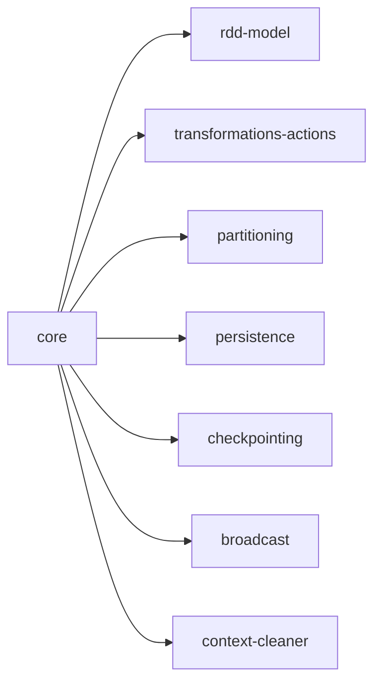

# Spark source map

> Auto-generated by `tools/spark_source_map/gen_coverage.py`. Do not edit by hand.

Two complementary engines: **topic traces** (start from a learning-path topic, find the backing source) and **source sweeps** (scan a subsystem, discover concepts that aren't in the learning path yet). The [config catalog](configs/index.md) is a shared lookup for both engines.

## Topic traces

One row per learning-path topic. A topic is traced when its page exists under `topics/`. The Chapter column links to the spark-book chapter.

| Topic | Title | Chapter | Repos | Status |
|---|---|---|---|---|
| B1 | Spark Architecture & the Execution Model | [03](../../spark-book/ch03-spark-installation.md) ✅ | — | ⬜ |
| B2 | SparkSession and Entry Points | [04](../../spark-book/ch04-sparksession.md) ✅ | — | ⬜ |
| B3 | The DataFrame API: Basics | [06](../../spark-book/ch06-dataframe-basics.md) ✅ | — | ⬜ |
| B4 | Reading and Writing Data | [07](../../spark-book/ch07-reading-writing-data.md) ✅ | — | ⬜ |
| B5 | Schema: StructType, DDL Strings, and Type Safety | [08](../../spark-book/ch08-schema-type-safety.md) ✅ | — | ⬜ |
| B6 | Basic Aggregations and GroupBy | [09](../../spark-book/ch09-aggregations-groupby.md) ✅ | — | ⬜ |
| B7 | Joins: Types and Mechanics | [10](../../spark-book/ch10-joins.md) ✅ | — | ⬜ |
| B8 | Spark SQL | [11](../../spark-book/ch11-spark-sql.md) ✅ | — | ⬜ |
| B9 | Null Handling | [12](../../spark-book/ch12-null-handling.md) ✅ | — | ⬜ |
| I1 | Complex Column Types: Arrays, Maps, Structs | [13](../../spark-book/ch13-complex-types.md) ✅ | — | ⬜ |
| I2 | Window Functions | [14](../../spark-book/ch14-window-functions.md) ✅ | — | ⬜ |
| I3 | User-Defined Functions | [15](../../spark-book/ch15-udfs.md) ✅ | — | ⬜ |
| I4 | RDD Fundamentals | [05](../../spark-book/ch05-rdds.md) ✅ | — | ⬜ |
| I5 | Partitioning: Concepts and Control | [16](../../spark-book/ch16-partitioning.md) ✅ | — | ⬜ |
| I6 | Caching and Persistence | — | — | ⬜ |
| I7 | The Spark UI: Reading Plans and Diagnosing Jobs | — | — | ⬜ |
| I8 | Delta Lake Basics | — | — | ⬜ |
| I9 | The Medallion Architecture | — | — | ⬜ |
| I10 | Data Formats: Parquet, Delta, Avro, JSON | — | — | ⬜ |
| I11 | SQL Scripting | — | — | ⬜ |
| A1 | Query Optimisation: Catalyst and the Physical Plan | — | — | ⬜ |
| A2 | Adaptive Query Execution (AQE) | — | — | ⬜ |
| A3 | Join Strategies and Tuning | — | — | ⬜ |
| A4 | Data Skew and Shuffle Optimisation | — | — | ⬜ |
| A5 | Advanced pandas UDFs and UDFs on Windows | — | — | ⬜ |
| A6 | Delta Lake Advanced Operations | — | — | ⬜ |
| A7 | Structured Streaming: Fundamentals | — | — | ⬜ |
| A8 | Structured Streaming: Stateful Processing | — | — | ⬜ |
| A9 | ML Pipelines with Spark MLlib | — | — | ⬜ |
| A10 | Testing PySpark Pipelines | — | — | ⬜ |
| A11 | Spark Declarative Pipelines | — | — | ⬜ |
| E1 | Spark Internals: Memory, Execution, and Serialisation | — | — | ⬜ |
| E2 | Production Deployment: Cluster Management and Scaling | — | — | ⬜ |
| E3 | Observability: Monitoring, Alerting, and Logging | — | — | ⬜ |
| E4 | Delta Lake Internals: Transaction Log, MVCC, and Concurrency | — | — | ⬜ |
| E5 | Data Governance: Unity Catalog, Lineage, and Security | — | — | ⬜ |
| E6 | Pipeline Orchestration with Dagster | — | — | ⬜ |
| E7 | CI/CD for Data Engineering | — | — | ⬜ |
| E8 | Change Data Capture (CDC) and Slowly Changing Dimensions | — | — | ⬜ |
| E9 | Spark Connect and the Modern Client Architecture | — | — | ⬜ |

## Source concept map

## Discovery gaps

Source concepts found during sweeps that don't map to any learning-path topic. Run `gen_coverage.py` to auto-append proposed stubs to `learning-path.md`.

> None yet — appears as sweeps are run.

## Sweep status

Which subsystems have been swept for source-concept discovery. Sweep in book-priority order: `sql/catalyst`, `sql/core` first.

| Subsystem | Configs | Status | Spark version | When |
|---|---|---|---|---|
| sql/catalyst | 656 | ⬜ pending | — | — |
| core — rdd-layer | 533 | ✅ partial | 4.1.2 | 2026-06-06 |
| core — execution-engine | — | ⬜ pending | — | — |
| core — shuffle-memory | — | ⬜ pending | — | — |
| core — storage-serializer | — | ⬜ pending | — | — |
| core — infra | — | ⬜ pending | — | — |
| resource-managers/kubernetes | 81 | ⬜ pending | — | — |
| resource-managers/yarn | 59 | ⬜ pending | — | — |
| streaming | 28 | ⬜ pending | — | — |
| sql/connect | 14 | ⬜ pending | — | — |
| sql/hive | 11 | ⬜ pending | — | — |
| connector/kafka-0-10 | 8 | ⬜ pending | — | — |
| connector/kafka-0-10-sql | 8 | ⬜ pending | — | — |
| connector/profiler | 7 | ⬜ pending | — | — |

