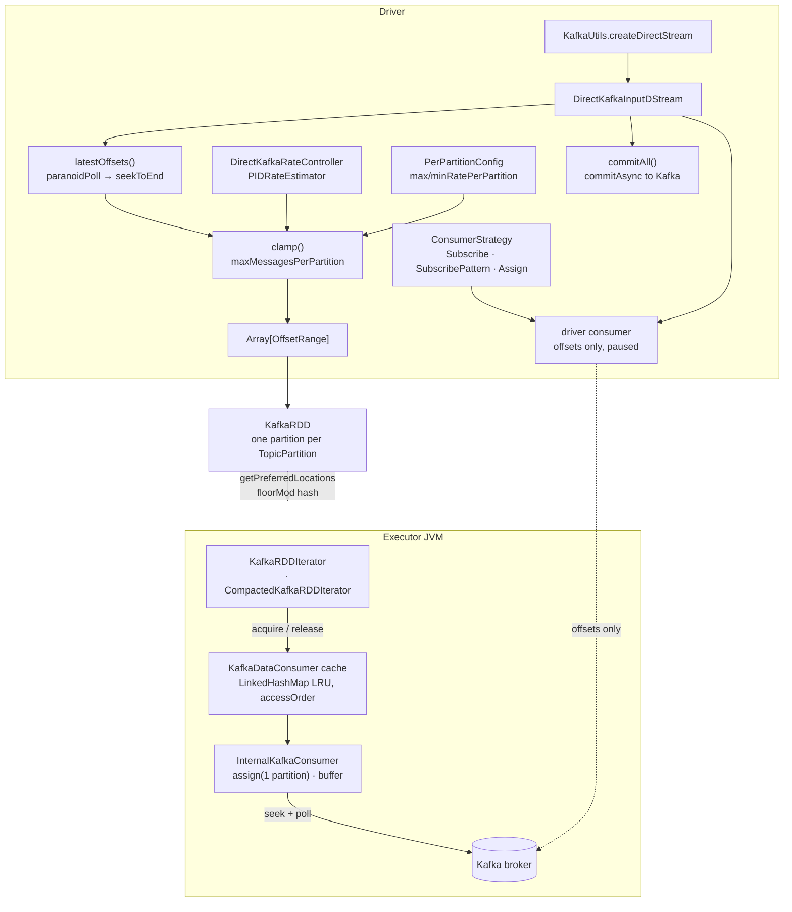

The first `connector/kafka-0-10` sweep, and the subsystem's only group. **11 non-test files, 2,128
lines, 8 configs** — the smallest module swept so far, and one whose importance is almost entirely
historical.

!!! warning "This is the DStream Kafka connector, not the Structured Streaming one"

    Everything on this page lives under `org.apache.spark.streaming.kafka010` and is reached through
    `KafkaUtils.createDirectStream` / `createRDD` against a `StreamingContext`. A Structured
    Streaming job using `.format("kafka")` touches **none of it** — that is
    `connector/kafka-0-10-sql` (`org.apache.spark.sql.kafka010`), a separate module with its own
    consumer cache and its own eight `spark.kafka.consumer.*` configs. The two connectors share only
    the token provider. Read this page for the DStream model and for what the two do differently;
    do not read it as documentation of the Kafka source you are most likely using.

The shape worth holding: **the direct stream computes offset ranges on the driver and hands the
executors a fixed, replayable range per partition.** There is no receiver, no write-ahead log, and
no consumer group rebalancing at read time — the driver's consumer is used *only* to query offsets,
and the executors' consumers are `assign`ed a single partition each with auto-commit and
auto-offset-reset forcibly disabled. Exactly-once follows from the range being fixed before the
batch runs, not from anything Kafka does.



**Config slice.** One group, so no pattern filter — every catalog key whose `subsystem` is
`connector/kafka-0-10`:

```bash
PYTHONIOENCODING=utf-8 python -c "
import yaml
d = yaml.safe_load(open('docs/reference/spark-source-map/configs/catalog.yaml', encoding='utf-8'))
cs = sorted({c['key'] for c in d['configs'] if c['subsystem'] == 'connector/kafka-0-10'})
print(len(cs)); [print(k) for k in cs]
"
```

All eight are declared in one place,
[package.scala](https://github.com/apache/spark/blob/v4.2.0/connector/kafka-0-10/src/main/scala/org/apache/spark/streaming/kafka010/package.scala#L25),
and every one is `spark.streaming.kafka.*` — a prefix that belongs to *this* module even though the
`streaming` subsystem owns `spark.streaming.*` generally.

---

## KafkaUtils — four entry points, and the DStream/RDD split

**What it is:** the only public constructor. Two shapes: a **batch** `KafkaRDD` over explicit offset
ranges, and a **streaming** `DirectKafkaInputDStream` that computes ranges per batch interval. Each
has a Scala and a Java overload.

**Code path:** `KafkaUtils.createRDD` → `KafkaRDD` · `KafkaUtils.createDirectStream` →
`DirectKafkaInputDStream`

**Anchor files:**

- [KafkaUtils.scala:52](https://github.com/apache/spark/blob/v4.2.0/connector/kafka-0-10/src/main/scala/org/apache/spark/streaming/kafka010/KafkaUtils.scala#L52) — `createRDD`; the batch form clones the offset-range array and **always passes `useConsumerCache = true`**
- [KafkaUtils.scala:58](https://github.com/apache/spark/blob/v4.2.0/connector/kafka-0-10/src/main/scala/org/apache/spark/streaming/kafka010/KafkaUtils.scala#L58) — `PreferBrokers` throws `IllegalArgumentException` in the RDD form: there is no driver consumer, so broker locations cannot be looked up
- [KafkaUtils.scala:110](https://github.com/apache/spark/blob/v4.2.0/connector/kafka-0-10/src/main/scala/org/apache/spark/streaming/kafka010/KafkaUtils.scala#L110) — the two-arg `createDirectStream` builds a `DefaultPerPartitionConfig` from the Spark conf; the four-arg form takes a user-supplied one
- [KafkaUtils.scala:150](https://github.com/apache/spark/blob/v4.2.0/connector/kafka-0-10/src/main/scala/org/apache/spark/streaming/kafka010/KafkaUtils.scala#L150) — the Java overloads wrap the Scala ones in `JavaInputDStream` / `JavaRDD`; no separate logic
- [package-info.java](https://github.com/apache/spark/blob/v4.2.0/connector/kafka-0-10/src/main/scala/org/apache/spark/streaming/kafka010/package-info.java#L21) — a 21-line Javadoc package declaration, the module's only Java file

**Configs:** none directly.

**Maps to topics:** A12.

---

## ConsumerStrategies — Subscribe, SubscribePattern, Assign, and the KAFKA-3370 workaround

**What it is:** how the **driver's** consumer is created and positioned. Three strategies, each
serializable so it survives checkpointing, each returning a consumer that is safe to `poll(0)` on.

**Code path:** `ConsumerStrategy.onStart(currentOffsets)` → `KafkaConfigUpdater("source", …)` →
`new KafkaConsumer` → `subscribe` / `assign` → seek → pause

**Anchor files:**

- [ConsumerStrategy.scala:40](https://github.com/apache/spark/blob/v4.2.0/connector/kafka-0-10/src/main/scala/org/apache/spark/streaming/kafka010/ConsumerStrategy.scala#L40) — the abstract class; `onStart` receives the *current* offsets so a checkpoint restart resumes rather than re-reads
- [ConsumerStrategy.scala:94](https://github.com/apache/spark/blob/v4.2.0/connector/kafka-0-10/src/main/scala/org/apache/spark/streaming/kafka010/ConsumerStrategy.scala#L94) — `currentOffsets` **wins over** the user's `offsets` argument whenever it is non-empty; the constructor offsets apply only on a genuinely fresh start
- [ConsumerStrategy.scala:100](https://github.com/apache/spark/blob/v4.2.0/connector/kafka-0-10/src/main/scala/org/apache/spark/streaming/kafka010/ConsumerStrategy.scala#L100) — the KAFKA-3370 workaround: you cannot `seek` before `poll` (poll is what assigns partitions), but `poll` throws `NoOffsetForPartitionException` when `auto.offset.reset=none`. So: poll, **suppress that one exception**, seek, then pause
- [ConsumerStrategy.scala:118](https://github.com/apache/spark/blob/v4.2.0/connector/kafka-0-10/src/main/scala/org/apache/spark/streaming/kafka010/ConsumerStrategy.scala#L118) — the pause is load-bearing: having polled once, a later poll would consume records and move the position
- [ConsumerStrategy.scala:210](https://github.com/apache/spark/blob/v4.2.0/connector/kafka-0-10/src/main/scala/org/apache/spark/streaming/kafka010/ConsumerStrategy.scala#L210) — `Assign` needs no workaround and no pause, because the partitions are known without polling
- [ConsumerStrategy.scala:63](https://github.com/apache/spark/blob/v4.2.0/connector/kafka-0-10/src/main/scala/org/apache/spark/streaming/kafka010/ConsumerStrategy.scala#L63) — every strategy routes its params through `KafkaConfigUpdater("source", …)` before constructing the consumer
- [ConsumerStrategy.scala:223](https://github.com/apache/spark/blob/v4.2.0/connector/kafka-0-10/src/main/scala/org/apache/spark/streaming/kafka010/ConsumerStrategy.scala#L223) — `ConsumerStrategies` is 249 lines of overloads (Scala/Java collections × with/without offsets) over three 30-line implementations

**Configs:** none of its own; reads the Kafka `auto.offset.reset` param.

!!! info "The suppressed exception is logged, and it is not an error"

    On a restart with `auto.offset.reset=none`, the driver log carries
    "Catching NoOffsetForPartitionException since auto.offset.reset is none. See KAFKA-3370" at
    **WARN**. It is the workaround functioning as designed, not a symptom. `Assign` never produces
    it.

**Maps to topics:** A12.

---

## DirectKafkaInputDStream — the driver-side offset loop

**What it is:** the `InputDStream` itself. Once per batch interval it asks Kafka for the latest
offsets, clamps them by the rate limit, emits a `KafkaRDD` over the resulting ranges, advances its
own offset map, and flushes any queued offset commits.

**Code path:** `compute(validTime)` → `latestOffsets()` → `clamp()` → `new KafkaRDD` →
`inputInfoTracker.reportInfo` → `currentOffsets = untilOffsets` → `commitAll()`

**Anchor files:**

- [DirectKafkaInputDStream.scala:229](https://github.com/apache/spark/blob/v4.2.0/connector/kafka-0-10/src/main/scala/org/apache/spark/streaming/kafka010/DirectKafkaInputDStream.scala#L229) — `compute`, the whole batch in thirty lines
- [DirectKafkaInputDStream.scala:170](https://github.com/apache/spark/blob/v4.2.0/connector/kafka-0-10/src/main/scala/org/apache/spark/streaming/kafka010/DirectKafkaInputDStream.scala#L170) — `paranoidPoll`: pause everything, `poll(0)`, and if records came back anyway, **seek back** to the minimum offset per partition to undo the position change
- [DirectKafkaInputDStream.scala:200](https://github.com/apache/spark/blob/v4.2.0/connector/kafka-0-10/src/main/scala/org/apache/spark/streaming/kafka010/DirectKafkaInputDStream.scala#L200) — a partition disappearing from the assignment throws `IllegalStateException` with a message naming the usual cause: **two streams sharing one `group.id`**
- [DirectKafkaInputDStream.scala:210](https://github.com/apache/spark/blob/v4.2.0/connector/kafka-0-10/src/main/scala/org/apache/spark/streaming/kafka010/DirectKafkaInputDStream.scala#L210) — a *new* partition's starting position comes from `auto.offset.reset` on the driver, so topic expansion mid-stream is silent
- [DirectKafkaInputDStream.scala:80](https://github.com/apache/spark/blob/v4.2.0/connector/kafka-0-10/src/main/scala/org/apache/spark/streaming/kafka010/DirectKafkaInputDStream.scala#L80) — `persist` logs an **error** and proceeds: `ConsumerRecord` is not serializable, so `.persist` or `.window` on the raw stream will fail later, not here
- [DirectKafkaInputDStream.scala:252](https://github.com/apache/spark/blob/v4.2.0/connector/kafka-0-10/src/main/scala/org/apache/spark/streaming/kafka010/DirectKafkaInputDStream.scala#L252) — the batch's record count and a per-partition offset description are reported to `InputInfoTracker`; this is what the Streaming UI's input rate is built from
- [DirectKafkaInputDStream.scala:270](https://github.com/apache/spark/blob/v4.2.0/connector/kafka-0-10/src/main/scala/org/apache/spark/streaming/kafka010/DirectKafkaInputDStream.scala#L270) — `stop` closes the driver consumer only; executor consumers are the cache's problem
- [DirectKafkaInputDStream.scala:86](https://github.com/apache/spark/blob/v4.2.0/connector/kafka-0-10/src/main/scala/org/apache/spark/streaming/kafka010/DirectKafkaInputDStream.scala#L86) — `getBrokers`, used only by `PreferBrokers`, calls `partitionsFor` per topic on the driver consumer

**Configs:** `spark.streaming.kafka.consumer.cache.enabled` (read here, passed to each `KafkaRDD`).

!!! warning "`.persist` and `.window` on the raw stream do not work"

    Both `DirectKafkaInputDStream.persist` and `KafkaRDD.persist` log
    "Kafka ConsumerRecord is not serializable. Use .map to extract fields before calling .persist or
    .window" as an **error** and then call `super.persist` anyway. Nothing throws at that point — the
    failure arrives later, during serialization. Map to your own case class first.

**Maps to topics:** A12.

---

## Rate limiting and backpressure — the PID loop and the per-partition split

**What it is:** two independent limits that combine. A static ceiling per partition
(`maxRatePerPartition`), and a dynamic estimate from a PID controller fed by the previous batch's
processing time and scheduling delay. Whichever is smaller wins, then the result is distributed
across partitions **in proportion to each one's lag** and floored at `minRatePerPartition`.

**Code path:** `RateController.onBatchCompleted` → `PIDRateEstimator.compute` → `getLatestRate()`
→ `maxMessagesPerPartition` → `clamp` → the batch's `untilOffset`s

**Anchor files:**

- [DirectKafkaInputDStream.scala:122](https://github.com/apache/spark/blob/v4.2.0/connector/kafka-0-10/src/main/scala/org/apache/spark/streaming/kafka010/DirectKafkaInputDStream.scala#L122) — the rate controller exists **only if** `spark.streaming.backpressure.enabled` is true
- [DirectKafkaInputDStream.scala:348](https://github.com/apache/spark/blob/v4.2.0/connector/kafka-0-10/src/main/scala/org/apache/spark/streaming/kafka010/DirectKafkaInputDStream.scala#L348) — `DirectKafkaRateController.publish` is a **no-op**: unlike a receiver-based stream, there is nothing to push the rate to, so the value is only ever pulled by `maxMessagesPerPartition`
- [DirectKafkaInputDStream.scala:141](https://github.com/apache/spark/blob/v4.2.0/connector/kafka-0-10/src/main/scala/org/apache/spark/streaming/kafka010/DirectKafkaInputDStream.scala#L141) — lag-proportional split: `lag / totalLag × rate` per partition, then capped by that partition's `maxRatePerPartition` **if it is > 0**
- [DirectKafkaInputDStream.scala:155](https://github.com/apache/spark/blob/v4.2.0/connector/kafka-0-10/src/main/scala/org/apache/spark/streaming/kafka010/DirectKafkaInputDStream.scala#L155) — rate is per *second*, so it is multiplied by the batch duration; the floor is applied last, after the multiply
- [DirectKafkaInputDStream.scala:60](https://github.com/apache/spark/blob/v4.2.0/connector/kafka-0-10/src/main/scala/org/apache/spark/streaming/kafka010/DirectKafkaInputDStream.scala#L60) — **`spark.streaming.backpressure.initialRate` is read as a raw string key with a default of `0`**
- [StreamingConf.scala:39](https://github.com/apache/spark/blob/v4.2.0/streaming/src/main/scala/org/apache/spark/streaming/StreamingConf.scala#L39) — …while the declared entry is `fallbackConf(RECEIVER_MAX_RATE)`, i.e. `spark.streaming.receiver.maxRate`, default `Long.MaxValue`
- [PerPartitionConfig.scala:28](https://github.com/apache/spark/blob/v4.2.0/connector/kafka-0-10/src/main/scala/org/apache/spark/streaming/kafka010/PerPartitionConfig.scala#L28) — the extension point: subclass it to give different partitions different ceilings; the default implementation returns the same conf value for every partition
- [PIDRateEstimator.scala:83](https://github.com/apache/spark/blob/v4.2.0/streaming/src/main/scala/org/apache/spark/streaming/scheduler/rate/PIDRateEstimator.scala#L83) — the proportional/integral/derivative terms and the `.max(minRate)` floor, where `minRate` is `spark.streaming.backpressure.pid.minRate` (100)
- [RateController.scala:89](https://github.com/apache/spark/blob/v4.2.0/streaming/src/main/scala/org/apache/spark/streaming/scheduler/RateController.scala#L89) — `isBackPressureEnabled`

**Configs:** `spark.streaming.kafka.maxRatePerPartition` (0 = unlimited),
`spark.streaming.kafka.minRatePerPartition` (1), plus `streaming`'s
`spark.streaming.backpressure.{enabled,initialRate,rateEstimator,pid.*}`.

!!! warning "`spark.streaming.backpressure.initialRate` does not fall back for this stream"

    The config is declared as a `fallbackConf` to `spark.streaming.receiver.maxRate`, so its
    documented effective default is `Long.MaxValue`. But `DirectKafkaInputDStream` reads it with
    `getReadOnlyConf.getLong("spark.streaming.backpressure.initialRate", 0)` — a **raw string key
    with its own default of 0** — which bypasses both the `ConfigEntry` and its fallback. Two
    consequences: setting `spark.streaming.receiver.maxRate` has **no effect** on the direct Kafka
    stream's initial rate despite what the declaration implies, and the unset default is 0, not
    `Long.MaxValue`.

!!! info "With backpressure off, only the static per-partition cap applies"

    `maxMessagesPerPartition` falls through to `ppc.maxRatePerPartition(tp)` for every partition, and
    `spark.streaming.kafka.maxRatePerPartition` defaults to **0**, which means *no limit*. So the
    default configuration reads everything available in the first batch — the classic way a restart
    after downtime kills a job. Note also that the `minRatePerPartition` floor (1) is applied even
    when backpressure would have asked for zero, so a fully caught-up stream still requests one
    record per partition per batch when the ceiling is non-zero.

**Maps to topics:** none — the sweep's first new topic, **A40**.

---

## KafkaRDD — fixed offset ranges and the batch interface

**What it is:** one RDD partition per `(topic, partition)` with an inclusive `fromOffset` and an
exclusive `untilOffset` fixed before any task runs. This is what makes replay deterministic.

**Code path:** `getPartitions` → `KafkaRDDPartition` per range; `compute(part, ctx)` →
`KafkaRDDIterator` | `CompactedKafkaRDDIterator`

**Anchor files:**

- [KafkaRDD.scala:59](https://github.com/apache/spark/blob/v4.2.0/connector/kafka-0-10/src/main/scala/org/apache/spark/streaming/kafka010/KafkaRDD.scala#L59) — two constructor `require`s: `auto.offset.reset` must be `"none"` and `enable.auto.commit` must be `false`, both with messages explaining the correctness consequence
- [KafkaRDD.scala:70](https://github.com/apache/spark/blob/v4.2.0/connector/kafka-0-10/src/main/scala/org/apache/spark/streaming/kafka010/KafkaRDD.scala#L70) — the poll timeout defaults to `spark.network.timeout` **× 1000**, i.e. seconds→ms, when `spark.streaming.kafka.consumer.poll.ms` is unset — a 120-second poll timeout by default
- [KafkaRDD.scala:186](https://github.com/apache/spark/blob/v4.2.0/connector/kafka-0-10/src/main/scala/org/apache/spark/streaming/kafka010/KafkaRDD.scala#L186) — `compute`; an empty range short-circuits to `Iterator.empty` without touching Kafka
- [KafkaRDD.scala:181](https://github.com/apache/spark/blob/v4.2.0/connector/kafka-0-10/src/main/scala/org/apache/spark/streaming/kafka010/KafkaRDD.scala#L181) — `fromOffset > untilOffset` is a `require` failure naming both the bad-input and the damaged-topic case
- [KafkaRDDPartition.scala:32](https://github.com/apache/spark/blob/v4.2.0/connector/kafka-0-10/src/main/scala/org/apache/spark/streaming/kafka010/KafkaRDDPartition.scala#L32) — 45 lines: index, topic, partition, and the two offsets
- [KafkaRDD.scala:239](https://github.com/apache/spark/blob/v4.2.0/connector/kafka-0-10/src/main/scala/org/apache/spark/streaming/kafka010/KafkaRDD.scala#L239) — the iterator registers a task-completion listener **before** acquiring its consumer, so a failure during acquisition still releases
- [KafkaRDD.scala:254](https://github.com/apache/spark/blob/v4.2.0/connector/kafka-0-10/src/main/scala/org/apache/spark/streaming/kafka010/KafkaRDD.scala#L254) — the non-compacted iterator's `hasNext` is pure arithmetic (`requestOffset < untilOffset`); it never consults Kafka

**Configs:** `spark.streaming.kafka.consumer.poll.ms`, `spark.streaming.kafka.consumer.cache.enabled`,
`spark.streaming.kafka.allowNonConsecutiveOffsets`, and core's `spark.network.timeout` as the poll
fallback.

**Maps to topics:** A12.

---

## fixKafkaParams — the four executor-side overrides

**What it is:** the driver's Kafka params are reused on executors, but four of them are rewritten
first — and every rewrite is logged at WARN, which is why a healthy job produces four warnings per
stream at startup.

**Anchor files:**

- [KafkaUtils.scala:186](https://github.com/apache/spark/blob/v4.2.0/connector/kafka-0-10/src/main/scala/org/apache/spark/streaming/kafka010/KafkaUtils.scala#L186) — `fixKafkaParams`, called from both `createRDD` and the DStream's `executorKafkaParams`
- [KafkaUtils.scala:189](https://github.com/apache/spark/blob/v4.2.0/connector/kafka-0-10/src/main/scala/org/apache/spark/streaming/kafka010/KafkaUtils.scala#L189) — `enable.auto.commit → false`, so offsets cannot be committed before the records are processed
- [KafkaUtils.scala:191](https://github.com/apache/spark/blob/v4.2.0/connector/kafka-0-10/src/main/scala/org/apache/spark/streaming/kafka010/KafkaUtils.scala#L191) — `auto.offset.reset → "none"`, so a missing offset fails loudly instead of silently reading a different range
- [KafkaUtils.scala:196](https://github.com/apache/spark/blob/v4.2.0/connector/kafka-0-10/src/main/scala/org/apache/spark/streaming/kafka010/KafkaUtils.scala#L196) — `group.id → "spark-executor-" + original`, so executor consumers never join the driver's consumer group; a **null** original is an `ERROR` log and the group becomes the literal `spark-executor-null`
- [KafkaUtils.scala:207](https://github.com/apache/spark/blob/v4.2.0/connector/kafka-0-10/src/main/scala/org/apache/spark/streaming/kafka010/KafkaUtils.scala#L207) — `receive.buffer.bytes` is raised to 65536 if unset or smaller, a workaround for KAFKA-3135

!!! info "Four WARN lines per stream are normal"

    `fixKafkaParams` logs each override unconditionally at WARN, including on the happy path. The one
    to actually read is the `group.id` line: it tells you the executor group name, which is what you
    will need when looking at broker-side consumer-group state and wondering why there are twice as
    many groups as streams.

**Maps to topics:** A12.

---

## Executor placement — consistent hashing so the consumer cache can hit

**What it is:** `getPreferredLocations` deliberately sends the same topic-partition to the same
executor across batches. That is not a data-locality optimization — Kafka data is not on the
executor — it is what lets the consumer cache hit and keep its prefetch buffer warm.

**Anchor files:**

- [KafkaRDD.scala:161](https://github.com/apache/spark/blob/v4.2.0/connector/kafka-0-10/src/main/scala/org/apache/spark/streaming/kafka010/KafkaRDD.scala#L161) — the comment says it plainly: "best-effort consistent executor for a given topicpartition, so that caching consumers can be effective"
- [KafkaRDD.scala:145](https://github.com/apache/spark/blob/v4.2.0/connector/kafka-0-10/src/main/scala/org/apache/spark/streaming/kafka010/KafkaRDD.scala#L145) — the executor list comes from `BlockManagerMaster.getPeers`, so it reflects live executors and **changes under dynamic allocation**
- [KafkaRDD.scala:175](https://github.com/apache/spark/blob/v4.2.0/connector/kafka-0-10/src/main/scala/org/apache/spark/streaming/kafka010/KafkaRDD.scala#L175) — the choice is `floorMod(tp.hashCode, execs.length)` over a **sorted** list; `TopicPartition.hashCode` depends only on topic and partition, so the mapping is stable while the executor set is
- [KafkaRDD.scala:152](https://github.com/apache/spark/blob/v4.2.0/connector/kafka-0-10/src/main/scala/org/apache/spark/streaming/kafka010/KafkaRDD.scala#L152) — the sort is by host descending, then executor id descending — arbitrary but deterministic
- [LocationStrategy.scala:34](https://github.com/apache/spark/blob/v4.2.0/connector/kafka-0-10/src/main/scala/org/apache/spark/streaming/kafka010/LocationStrategy.scala#L34) — the three strategies; `PreferConsistent` supplies an **empty** preferred-host map, which means "no host filter", not "no preference"
- [KafkaRDD.scala:169](https://github.com/apache/spark/blob/v4.2.0/connector/kafka-0-10/src/main/scala/org/apache/spark/streaming/kafka010/KafkaRDD.scala#L169) — a preferred host with no matching executor falls back to the full list rather than failing

**Configs:** none.

!!! warning "Adding or losing an executor reshuffles every partition"

    The index is `hash mod executorCount`, not consistent hashing in the ring sense — so a change in
    the executor set changes the mapping for **most** partitions, not a proportional share. Under
    dynamic allocation every scaling event therefore invalidates most of the consumer cache at once,
    and the next batch pays a full re-seek and re-poll per partition. This is a real argument for
    running a DStream Kafka job with a fixed executor count.

**Maps to topics:** none — covered by the cache topic, **E40**.

---

## KafkaDataConsumer — the per-JVM executor consumer cache

**What it is:** each executor JVM keeps a `LinkedHashMap` in access order, keyed by
`(groupId, TopicPartition)`, holding `InternalKafkaConsumer`s. A task acquires one for the duration
of its partition and releases it on task completion. Kafka consumers prefetch, so reuse across
batches is most of the throughput.

**Code path:** `KafkaRDDIterator` init → `KafkaDataConsumer.init` (once per JVM) →
`acquire(tp, params, ctx, useCache)` → … → task completion → `release()`

**Anchor files:**

- [KafkaDataConsumer.scala:241](https://github.com/apache/spark/blob/v4.2.0/connector/kafka-0-10/src/main/scala/org/apache/spark/streaming/kafka010/KafkaDataConsumer.scala#L241) — `init` is **once per JVM and further calls are ignored**, so the three cache-sizing configs are fixed by whichever stream initialised first
- [KafkaDataConsumer.scala:248](https://github.com/apache/spark/blob/v4.2.0/connector/kafka-0-10/src/main/scala/org/apache/spark/streaming/kafka010/KafkaDataConsumer.scala#L248) — `new LinkedHashMap(initialCapacity, loadFactor, true)`; the third argument is **access order**, which is what makes it an LRU
- [KafkaDataConsumer.scala:262](https://github.com/apache/spark/blob/v4.2.0/connector/kafka-0-10/src/main/scala/org/apache/spark/streaming/kafka010/KafkaDataConsumer.scala#L262) — eviction only fires when the eldest entry is **not in use**; the comment above it states the growth bound explicitly
- [KafkaDataConsumer.scala:290](https://github.com/apache/spark/blob/v4.2.0/connector/kafka-0-10/src/main/scala/org/apache/spark/streaming/kafka010/KafkaDataConsumer.scala#L290) — `acquire`'s five branches, in order: task retry → non-cached; cache disabled → non-cached; not cached → cache and return; cached but in use → non-cached; cached and free → reuse
- [KafkaDataConsumer.scala:301](https://github.com/apache/spark/blob/v4.2.0/connector/kafka-0-10/src/main/scala/org/apache/spark/streaming/kafka010/KafkaDataConsumer.scala#L301) — **any task attempt ≥ 1 invalidates the cached consumer**, on the theory that the previous failure may have been cache-related; an in-use one is marked `markedForClose` instead of closed
- [KafkaDataConsumer.scala:346](https://github.com/apache/spark/blob/v4.2.0/connector/kafka-0-10/src/main/scala/org/apache/spark/streaming/kafka010/KafkaDataConsumer.scala#L346) — `release` compares by **reference** (`eq`); a consumer that is not the cached one is simply closed, with an INFO line
- [KafkaDataConsumer.scala:116](https://github.com/apache/spark/blob/v4.2.0/connector/kafka-0-10/src/main/scala/org/apache/spark/streaming/kafka010/KafkaDataConsumer.scala#L116) — every consumer is `assign`ed exactly one partition, and its params go through `KafkaConfigUpdater("executor", …)`
- [KafkaDataConsumer.scala:234](https://github.com/apache/spark/blob/v4.2.0/connector/kafka-0-10/src/main/scala/org/apache/spark/streaming/kafka010/KafkaDataConsumer.scala#L234) — "Don't want to depend on guava, don't want a cleanup thread" — the design note that explains why there is no TTL here, unlike the SQL connector's cache

**Configs:** `spark.streaming.kafka.consumer.cache.enabled` (true),
`spark.streaming.kafka.consumer.cache.initialCapacity` (16),
`spark.streaming.kafka.consumer.cache.maxCapacity` (64),
`spark.streaming.kafka.consumer.cache.loadFactor` (0.75).

!!! warning "`maxCapacity` is not a cap — the cache can grow past it and never shrink"

    `removeEldestEntry` returns true only when the eldest entry is **not in use**. If every entry is
    in use the map keeps growing, and the code comment states the bound: "In the worst case, the
    cache will grow to the max number of concurrent tasks that can run in the executor … after which
    it will never reduce." Each entry is a live `KafkaConsumer` with its own fetch buffers and TCP
    connection. On an executor with many task slots consuming many partitions, the memory is real
    and there is no eviction thread and no TTL to reclaim it — unlike the Structured Streaming
    connector's cache, which has both (`spark.kafka.consumer.cache.timeout`,
    `…evictorThreadRunInterval`).

!!! info "A cache miss is silent and costs correctness nothing"

    Every branch of `acquire` that cannot reuse returns a `NonCachedKafkaDataConsumer`, which closes
    its consumer on release. Nothing logs above DEBUG. So a job whose partitions keep landing on
    different executors, or whose tasks keep retrying, degrades to constructing a fresh
    `KafkaConsumer` per partition per batch — visibly slower, with no error and no metric.

**Maps to topics:** none — the sweep's second new topic, **E40**.

---

## The buffered fetch — seek, poll, and the offset-mismatch require

**What it is:** `InternalKafkaConsumer.get(offset, timeout)` returns exactly one record. It keeps a
`ListIterator` over the last poll's records and walks it forward; a request for the offset it
expects is a buffer read, anything else is a seek and a fresh poll.

**Anchor files:**

- [KafkaDataConsumer.scala:132](https://github.com/apache/spark/blob/v4.2.0/connector/kafka-0-10/src/main/scala/org/apache/spark/streaming/kafka010/KafkaDataConsumer.scala#L132) — the scaladoc says it outright: "Sequential forward access will use buffers, but random access will be horribly inefficient"
- [KafkaDataConsumer.scala:134](https://github.com/apache/spark/blob/v4.2.0/connector/kafka-0-10/src/main/scala/org/apache/spark/streaming/kafka010/KafkaDataConsumer.scala#L134) — a requested offset ≠ `nextOffset` logs "Initial fetch" at **INFO** and re-seeks; seeing this line per batch means the cache is missing
- [KafkaDataConsumer.scala:148](https://github.com/apache/spark/blob/v4.2.0/connector/kafka-0-10/src/main/scala/org/apache/spark/streaming/kafka010/KafkaDataConsumer.scala#L148) — a buffered record whose offset is wrong triggers one re-seek and re-poll ("Buffer miss"), then a hard `require`
- [KafkaDataConsumer.scala:156](https://github.com/apache/spark/blob/v4.2.0/connector/kafka-0-10/src/main/scala/org/apache/spark/streaming/kafka010/KafkaDataConsumer.scala#L156) — that final `require` is the error most operators meet: "Got wrong record … even after seeking to offset N", and its message **names `spark.streaming.kafka.allowNonConsecutiveOffsets` as the fix**
- [KafkaDataConsumer.scala:144](https://github.com/apache/spark/blob/v4.2.0/connector/kafka-0-10/src/main/scala/org/apache/spark/streaming/kafka010/KafkaDataConsumer.scala#L144) — an empty poll is also a `require` failure: "Failed to get records … after polling for N"
- [KafkaDataConsumer.scala:210](https://github.com/apache/spark/blob/v4.2.0/connector/kafka-0-10/src/main/scala/org/apache/spark/streaming/kafka010/KafkaDataConsumer.scala#L210) — `poll` keeps only the records for *this* partition; the consumer is assigned one, so that is all there should be
- [KafkaDataConsumer.scala:106](https://github.com/apache/spark/blob/v4.2.0/connector/kafka-0-10/src/main/scala/org/apache/spark/streaming/kafka010/KafkaDataConsumer.scala#L106) — `nextOffset` starts at the sentinel `-2L`, guaranteeing a seek on first use
- [KafkaDataConsumer.scala:103](https://github.com/apache/spark/blob/v4.2.0/connector/kafka-0-10/src/main/scala/org/apache/spark/streaming/kafka010/KafkaDataConsumer.scala#L103) — a standing `TODO`: keeping the buffer as a random-access structure would help recomputing an RDD in the same batch

**Configs:** `spark.streaming.kafka.consumer.poll.ms`.

!!! warning "The two `require`s are the connector's most-searched error messages"

    "Failed to get records for … after polling for N" means the poll timeout expired with nothing
    returned — raise `spark.streaming.kafka.consumer.poll.ms` (or check the broker). "Got wrong
    record for … even after seeking to offset N" means the offset you asked for does not exist,
    which on a **compacted** topic is normal and is exactly what
    `spark.streaming.kafka.allowNonConsecutiveOffsets` exists for. The message says so; the
    surrounding stack trace does not make it obvious that the two causes are unrelated.

**Maps to topics:** none — covered by the cache topic, **E40**.

---

## Compacted topics — allowNonConsecutiveOffsets and the four action overrides

**What it is:** on a compacted topic, offsets have gaps, so "read offsets 100–200" cannot mean "read
101 records". One config switches the iterator *and* four RDD action overrides to a mode that makes
no arithmetic assumption.

**Anchor files:**

- [KafkaRDD.scala:74](https://github.com/apache/spark/blob/v4.2.0/connector/kafka-0-10/src/main/scala/org/apache/spark/streaming/kafka010/KafkaRDD.scala#L74) — `compacted` is read once per RDD from `spark.streaming.kafka.allowNonConsecutiveOffsets`
- [KafkaRDD.scala:88](https://github.com/apache/spark/blob/v4.2.0/connector/kafka-0-10/src/main/scala/org/apache/spark/streaming/kafka010/KafkaRDD.scala#L88) — `count()`: normally `sum(untilOffset − fromOffset)` with **no job at all**; on a compacted topic it falls back to `super.count()`, which runs a real job
- [KafkaRDD.scala:95](https://github.com/apache/spark/blob/v4.2.0/connector/kafka-0-10/src/main/scala/org/apache/spark/streaming/kafka010/KafkaRDD.scala#L95) — `countApprox` normally returns an exact `BoundedDouble` with confidence 1.0 and `isFinal = true`, because the count is arithmetic
- [KafkaRDD.scala:113](https://github.com/apache/spark/blob/v4.2.0/connector/kafka-0-10/src/main/scala/org/apache/spark/streaming/kafka010/KafkaRDD.scala#L113) — `take(n)` normally computes per-partition quotas in advance and runs **one** job over just the partitions it needs
- [KafkaRDD.scala:271](https://github.com/apache/spark/blob/v4.2.0/connector/kafka-0-10/src/main/scala/org/apache/spark/streaming/kafka010/KafkaRDD.scala#L271) — `CompactedKafkaRDDIterator` drives `compactedStart` / `compactedNext` and tracks its own `okNext` flag instead of comparing offsets
- [KafkaRDD.scala:304](https://github.com/apache/spark/blob/v4.2.0/connector/kafka-0-10/src/main/scala/org/apache/spark/streaming/kafka010/KafkaRDD.scala#L304) — the one-record lookahead: if the *next* record is past `untilOffset` it stops and calls `compactedPrevious()` to rewind, so the record is not lost
- [KafkaDataConsumer.scala:185](https://github.com/apache/spark/blob/v4.2.0/connector/kafka-0-10/src/main/scala/org/apache/spark/streaming/kafka010/KafkaDataConsumer.scala#L185) — `compactedNext` accepts whatever offset comes back and simply advances, which is the whole difference from `get`

**Configs:** `spark.streaming.kafka.allowNonConsecutiveOffsets` (false, since 2.3.1).

!!! info "Turning it on makes `count()` a job"

    On a normal topic `KafkaRDD.count()` is pure arithmetic over the offset ranges — which is why
    `DirectKafkaInputDStream.compute` can call `rdd.count()` every batch to report the input rate
    without triggering work. Set `allowNonConsecutiveOffsets=true` and that same call becomes a
    **full Spark job per batch**. The `isEmpty`, `take` and `countApprox` fast paths go with it.

**Maps to topics:** A12.

---

## OffsetRange, HasOffsetRanges, CanCommitOffsets — where offsets live

**What it is:** the public offset API. `HasOffsetRanges` lets you read what a batch covered;
`CanCommitOffsets` lets you push those offsets back to Kafka asynchronously. Storing them elsewhere
— your own transactional store — is the third option and the only one that gives exactly-once.

**Anchor files:**

- [OffsetRange.scala:81](https://github.com/apache/spark/blob/v4.2.0/connector/kafka-0-10/src/main/scala/org/apache/spark/streaming/kafka010/OffsetRange.scala#L81) — inclusive `fromOffset`, **exclusive** `untilOffset`, `count()` = the difference
- [OffsetRange.scala:34](https://github.com/apache/spark/blob/v4.2.0/connector/kafka-0-10/src/main/scala/org/apache/spark/streaming/kafka010/OffsetRange.scala#L34) — `HasOffsetRanges`, implemented by `KafkaRDD`; the scaladoc's `foreachRDD` + `asInstanceOf` pattern is the documented way to get at it
- [OffsetRange.scala:56](https://github.com/apache/spark/blob/v4.2.0/connector/kafka-0-10/src/main/scala/org/apache/spark/streaming/kafka010/OffsetRange.scala#L56) — `CanCommitOffsets`, implemented by `DirectKafkaInputDStream` only
- [DirectKafkaInputDStream.scala:283](https://github.com/apache/spark/blob/v4.2.0/connector/kafka-0-10/src/main/scala/org/apache/spark/streaming/kafka010/DirectKafkaInputDStream.scala#L283) — `commitAsync` only **queues**; nothing is sent until the next `compute`
- [DirectKafkaInputDStream.scala:297](https://github.com/apache/spark/blob/v4.2.0/connector/kafka-0-10/src/main/scala/org/apache/spark/streaming/kafka010/DirectKafkaInputDStream.scala#L297) — `commitAll` drains the queue keeping the **maximum** `untilOffset` per partition, then one `commitAsync` to Kafka
- [DirectKafkaInputDStream.scala:277](https://github.com/apache/spark/blob/v4.2.0/connector/kafka-0-10/src/main/scala/org/apache/spark/streaming/kafka010/DirectKafkaInputDStream.scala#L277) — the callback is an `AtomicReference`: **only the most recently supplied one is used**, for every partition in that commit
- [OffsetRange.scala:112](https://github.com/apache/spark/blob/v4.2.0/connector/kafka-0-10/src/main/scala/org/apache/spark/streaming/kafka010/OffsetRange.scala#L112) — `toTuple` exists purely to avoid `ClassNotFoundException` on checkpoint restore

!!! warning "Committing to Kafka is at-least-once, and it lags by one batch"

    `commitAsync` queues; the flush happens at the *start of the next batch*, after that batch's
    offsets have already been computed. So a failure between processing and the next `compute` loses
    the commit and the records are re-read. The commit is also fire-and-forget — the callback is the
    only error signal, and only the last-registered one survives. For exactly-once, store offsets in
    the same transaction as your output and ignore both of these.

**Maps to topics:** A12.

---

## Checkpoint data and restore

**What it is:** the DStream checkpoint stores offset ranges per batch time as plain tuples, and
restore rebuilds a `KafkaRDD` for each — deliberately without the consumer cache.

**Anchor files:**

- [DirectKafkaInputDStream.scala:312](https://github.com/apache/spark/blob/v4.2.0/connector/kafka-0-10/src/main/scala/org/apache/spark/streaming/kafka010/DirectKafkaInputDStream.scala#L312) — `DirectKafkaInputDStreamCheckpointData` holds `Map[Time, Array[(String, Int, Long, Long)]]` — tuples, not `OffsetRange` objects
- [DirectKafkaInputDStream.scala:318](https://github.com/apache/spark/blob/v4.2.0/connector/kafka-0-10/src/main/scala/org/apache/spark/streaming/kafka010/DirectKafkaInputDStream.scala#L318) — `update` rewrites the whole map from `generatedRDDs` each checkpoint; `cleanup` is **empty**
- [DirectKafkaInputDStream.scala:337](https://github.com/apache/spark/blob/v4.2.0/connector/kafka-0-10/src/main/scala/org/apache/spark/streaming/kafka010/DirectKafkaInputDStream.scala#L337) — restore passes `useConsumerCache = false`, because the same partition may be consumed from several threads while catching up
- [DirectKafkaInputDStream.scala:263](https://github.com/apache/spark/blob/v4.2.0/connector/kafka-0-10/src/main/scala/org/apache/spark/streaming/kafka010/DirectKafkaInputDStream.scala#L263) — on a fresh `start()` with no restored offsets, the position comes from the driver consumer, i.e. from the committed offset or `auto.offset.reset`

**Maps to topics:** A12.

---

## Kafka authentication — KafkaConfigUpdater and the token-provider module

**What it is:** SASL/SSL and Kerberos delegation tokens are **not** in this module. Both consumers
— driver and executor — route their params through `KafkaConfigUpdater`, which lives in
`connector/kafka-0-10-token-provider` and is shared with the Structured Streaming connector.

**Anchor files:**

- [ConsumerStrategy.scala:63](https://github.com/apache/spark/blob/v4.2.0/connector/kafka-0-10/src/main/scala/org/apache/spark/streaming/kafka010/ConsumerStrategy.scala#L63) — the driver side, module name `"source"`
- [KafkaDataConsumer.scala:117](https://github.com/apache/spark/blob/v4.2.0/connector/kafka-0-10/src/main/scala/org/apache/spark/streaming/kafka010/KafkaDataConsumer.scala#L117) — the executor side, module name `"executor"`; the name only affects logging
- [KafkaConfigUpdater.scala:59](https://github.com/apache/spark/blob/v4.2.0/connector/kafka-0-10-token-provider/src/main/scala/org/apache/spark/kafka010/KafkaConfigUpdater.scala#L59) — `setAuthenticationConfigIfNeeded`, the single injection point for both connectors
- [KafkaTokenSparkConf.scala:60](https://github.com/apache/spark/blob/v4.2.0/connector/kafka-0-10-token-provider/src/main/scala/org/apache/spark/kafka010/KafkaTokenSparkConf.scala#L60) — cluster configs read via `getAllWithPrefix("spark.kafka.clusters.<id>.")`, a **dynamic prefix with no `ConfigBuilder` anywhere**

**Configs:** `spark.kafka.clusters.<id>.{auth.bootstrap.servers, target.bootstrap.servers.regex,
security.protocol, sasl.kerberos.service.name, sasl.token.mechanism, ssl.*}` — none of them in the
config catalog.

!!! warning "The token-provider module is claimed by no group and can never be swept"

    `connector/kafka-0-10-token-provider` — 6 Scala files, 681 lines, the
    `HadoopDelegationTokenProvider` service registration for Kafka, and the whole
    `spark.kafka.clusters.*` surface — has **no entry in `groups.yaml` and no subsystem in the config
    catalog** (it declares zero `ConfigBuilder`s). `check_drift.py --coverage` cannot flag it either,
    because that check only walks subsystems `groups.yaml` already names. It is a module-level blind
    spot, distinct from the nested-package one recorded in `_meta.note`. Recommendation: give it a
    group. See the sweep log.

**Maps to topics:** E2 (the delegation-token half), A12.

---

## Breadth check 1 — the config slice

Eight keys, **all eight tied to a concept above** — `enabled`, `initialCapacity`, `maxCapacity` and
`loadFactor` to the consumer cache; `poll.ms` to the buffered fetch and the `KafkaRDD` timeout;
`maxRatePerPartition` and `minRatePerPartition` to rate limiting; `allowNonConsecutiveOffsets` to
compacted topics. None is `internal()`, and none is left over.

The slice is small enough that the interesting breadth question is the other direction — configs the
module *reads* that are not in its own slice:

| Config | Declared in | Read at |
|---|---|---|
| `spark.streaming.backpressure.enabled` | `streaming` | [DirectKafkaInputDStream.scala:123](https://github.com/apache/spark/blob/v4.2.0/connector/kafka-0-10/src/main/scala/org/apache/spark/streaming/kafka010/DirectKafkaInputDStream.scala#L123) via `RateController.isBackPressureEnabled` |
| `spark.streaming.backpressure.initialRate` | `streaming` | [:60](https://github.com/apache/spark/blob/v4.2.0/connector/kafka-0-10/src/main/scala/org/apache/spark/streaming/kafka010/DirectKafkaInputDStream.scala#L60) — **as a raw string key, bypassing the declared fallback** |
| `spark.streaming.backpressure.{rateEstimator,pid.*}` | `streaming` | via `RateEstimator.create` |
| `spark.network.timeout` | `core` | [KafkaRDD.scala:70](https://github.com/apache/spark/blob/v4.2.0/connector/kafka-0-10/src/main/scala/org/apache/spark/streaming/kafka010/KafkaRDD.scala#L70) — the poll-timeout fallback, ×1000 |
| `spark.kafka.clusters.<id>.*` | **nowhere** | `KafkaTokenSparkConf.getClusterConfig`, dynamic prefix |

Kafka's own client properties (`bootstrap.servers`, `group.id`, `auto.offset.reset`,
`enable.auto.commit`, `receive.buffer.bytes`) are passed as a `Map` by the caller, never as Spark
configs — which is why none of them appears in any Spark config listing, and why four of them are
silently overwritten (see *fixKafkaParams*).

`_meta.config_plumbing` records `core:spark.streaming.` as belonging to the unswept `streaming —
dstream` group. That entry is about DStream **dynamic allocation**; the backpressure keys above are
a different family, declared in `streaming`'s own `StreamingConf` and legitimately read here.

## Breadth check 2 — the packages

The scope is one package, `streaming/kafka010/`, with no sub-packages. **11 files, 11 cited:**

`ConsumerStrategy` (471) · `KafkaDataConsumer` (371) · `DirectKafkaInputDStream` (352) ·
`KafkaRDD` (315) · `KafkaUtils` (214) · `OffsetRange` (145) · `package` (76) ·
`LocationStrategy` (71) · `PerPartitionConfig` (47) · `KafkaRDDPartition` (45) ·
`package-info.java` (21)

Nothing in the module is plumbing and nothing was skipped. `ConsumerStrategy.scala` is the largest
file at 471 lines, but 249 of those are the `ConsumerStrategies` factory overloads — the three
strategy implementations are ~30 lines each.

!!! info "`check_drift.py --sweeps` reported 10/11 here, and it was wrong"

    Its `SRC_FILE_RE` was `[A-Za-z][A-Za-z0-9_$]*\.(scala|java)`, which has no hyphen in the stem
    character class, so **`package-info.java` could never be recognised as a citation** on any page.
    The regex now allows hyphens and the count is 11/11. This is the first module swept that
    contains a hyphenated source file, which is why it had not surfaced before.

**Named so it is not mistaken for covered:**

- **`connector/kafka-0-10-token-provider`** (6 files, 681 lines) — the shared auth module. Not in
  `groups.yaml`, not in the catalog, unsweepable. See the callout above and the sweep log.
- **`connector/kafka-0-10-sql`** — the Structured Streaming connector, group `source-sink`, still
  **unswept**. It is a different package (`org.apache.spark.sql.kafka010`) with its own consumer and
  fetched-data caches and its own eight configs.
- **`connector/kafka-0-10-assembly`** — a packaging-only module with no source.
- `RateController`, `RateEstimator` and `PIDRateEstimator` live in the `streaming` module
  (group `dstream`, unswept). They are anchored here because the rate concept is unreadable without
  them, but the PID loop itself belongs to that group's sweep.

## Overlapping topic traces

**None.** `check_drift.py --sweeps` reports no overlaps: the codes on this page are A12 and E2, and
`topics/` currently holds traces for B1–B9, I1–I11 and I13 only. Nothing here can contradict an
existing trace, and nothing here has been cross-checked against one — the first trace of A12 should
read this page for the DStream contrast, and the `kafka-0-10-sql` sweep for the connector A12
actually teaches.

---

## Sweep log

| Date | Spark | What changed |
|---|---|---|
| 2026-08-08 | 4.2.0 | First sweep of `connector/kafka-0-10`, its only group, and the whole subsystem in one run. 13 concepts, **2 new topics proposed** (A40 stream rate limiting and backpressure, E40 the executor consumer cache). 11 files, 2,128 lines, 8 configs — the smallest module swept so far. Both breadth checks clean on the first pass: 11/11 files, 8/8 configs. The framing that matters most: **this is the DStream Kafka connector, not the Structured Streaming one** — a job using `.format("kafka")` touches none of it. The model is that the driver fixes an offset range per partition *before* the batch runs, so replay is deterministic and exactly-once comes from the range being fixed, not from Kafka. Findings worth carrying. **`spark.streaming.backpressure.initialRate` is read past its own declaration**: the entry is a `fallbackConf(RECEIVER_MAX_RATE)` with an effective default of `Long.MaxValue`, but `DirectKafkaInputDStream` reads it as a raw string key with a default of **0**, so `spark.streaming.receiver.maxRate` has no effect on this stream and the unset default is 0. **`spark.streaming.kafka.maxRatePerPartition` defaults to 0 = unlimited**, so with backpressure off the first batch after downtime reads everything available — the classic restart failure. **The consumer cache's `maxCapacity` is not a cap**: `removeEldestEntry` evicts only entries not in use, and the code comment states the growth bound as the executor's task-slot count, after which it never reduces; there is no evictor thread and no TTL, unlike the SQL connector's cache. **Cache misses are silent** — every non-reusable branch of `acquire` returns a non-cached consumer and logs at DEBUG only. **Executor placement is `hash mod executorCount`, not consistent hashing**, so any dynamic-allocation event reshuffles most partitions and invalidates most of the cache at once. **`allowNonConsecutiveOffsets=true` turns `count()` into a full job per batch**, because the arithmetic fast paths on `count`/`countApprox`/`isEmpty`/`take` all fall back to `super`. **Offset commits to Kafka lag by one batch and are fire-and-forget** — `commitAsync` only queues, `commitAll` flushes at the start of the next `compute`, and only the most recently registered callback is used. Also recorded: `fixKafkaParams` rewrites four Kafka params and logs each at WARN on the happy path (a null `group.id` becomes the literal `spark-executor-null`); the two `require`s in `InternalKafkaConsumer.get` are the connector's most-searched error messages and one of them names its own fix; `persist`/`window` on the raw stream log an error and proceed, failing later at serialization; and the KAFKA-3370 workaround (poll, suppress `NoOffsetForPartitionException`, seek, pause) produces a WARN on every restart with `auto.offset.reset=none`. **Map-level gap found, not fixed:** `connector/kafka-0-10-token-provider` (6 files, 681 lines) holds `KafkaConfigUpdater`, `KafkaDelegationTokenProvider` and the entire `spark.kafka.clusters.*` surface, is used by **both** Kafka connectors, and has no entry in `groups.yaml` and no subsystem in the catalog — so it can never be swept, and `--coverage` cannot flag it because that check only walks subsystems `groups.yaml` already names. This is a **module-level** blind spot, distinct from the nested-package one in `_meta.note`. Recommended: add a `connector/kafka-0-10-token-provider` subsystem with one `auth` group; left for the user because a new group may imply a new topic. |
