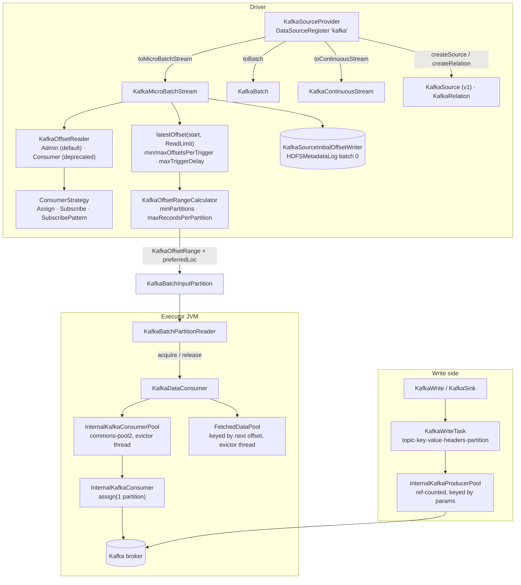

The first `connector/kafka-0-10-sql` sweep, and the subsystem's only group — **33 non-test files,
7,137 lines, 8 configs**, three packages. This is the Kafka connector nearly everyone means:
`spark.readStream.format("kafka")` resolves here through a `DataSourceRegister` service entry, and
the class it names is `KafkaSourceProvider`.

!!! info "The other Kafka connector is a different module, already swept"

    `connector/kafka-0-10` (`org.apache.spark.streaming.kafka010`) is the **DStream** connector and
    is covered by the [kafka-0-10 — consumer sweep](connector-kafka-0-10-consumer.md). The two share
    a package *name suffix*, a set of ideas, and the token-provider module — nothing else. Where the
    designs differ the comparison is worth having, and this page points it out each time.

The shape to hold: **the driver owns offsets and the executors own bytes.** Per trigger the driver
asks Kafka for the latest offsets, applies the read limits, writes nothing but a `KafkaSourceOffset`
into the checkpoint's offset log, and hands each task a fixed `[fromOffset, untilOffset)`. Executors
never subscribe, never commit, and never consult `auto.offset.reset` — their consumers are
`assign`ed one partition and told exactly what to read. Everything else on this page is either
resolving offsets on the driver or making the executor-side fetch cheap.



**Config slice.** One group, so no pattern filter — every catalog key whose `subsystem` is
`connector/kafka-0-10-sql`:

```bash
PYTHONIOENCODING=utf-8 python -c "
import yaml
d = yaml.safe_load(open('docs/reference/spark-source-map/configs/catalog.yaml', encoding='utf-8'))
cs = sorted({c['key'] for c in d['configs'] if c['subsystem'] == 'connector/kafka-0-10-sql'})
print(len(cs)); [print(k) for k in cs]
"
```

Eight keys, all `spark.kafka.*`, all declared in
[package.scala](https://github.com/apache/spark/blob/v4.2.0/connector/kafka-0-10-sql/src/main/scala/org/apache/spark/sql/kafka010/package.scala#L26),
and **all eight govern the two executor-side pools**. Nothing about reading — offsets, limits,
partitioning, data-loss behaviour — is a Spark config; it is a **DataFrame reader option**, and the
option surface is roughly three times the size of the config surface. That asymmetry is the single
most important thing to know before looking for a knob.

---

## KafkaSourceProvider — one class, every entry point

**What it is:** 800 lines implementing six provider interfaces at once. It is the only class in the
module registered anywhere: `META-INF/services/org.apache.spark.sql.sources.DataSourceRegister`
names it, and `shortName()` returns `"kafka"`.

**Code path:** `DataSource.lookupDataSource("kafka")` → `KafkaSourceProvider` →
`getTable` → `KafkaTable` → `newScanBuilder` → `KafkaScan` → `toBatch` | `toMicroBatchStream` |
`toContinuousStream`; the V1 path goes `createSource` / `createRelation` / `createSink` instead

**Anchor files:**

- [KafkaSourceProvider.scala:52](https://github.com/apache/spark/blob/v4.2.0/connector/kafka-0-10-sql/src/main/scala/org/apache/spark/sql/kafka010/KafkaSourceProvider.scala#L52) — the six mixins: `DataSourceRegister`, `StreamSourceProvider`, `StreamSinkProvider`, `RelationProvider`, `CreatableRelationProvider`, `SimpleTableProvider`
- [KafkaSourceProvider.scala:420](https://github.com/apache/spark/blob/v4.2.0/connector/kafka-0-10-sql/src/main/scala/org/apache/spark/sql/kafka010/KafkaSourceProvider.scala#L420) — six `TableCapability`s including **`ACCEPT_ANY_SCHEMA`**, because the read schema and the write schema differ and the writer validates its own
- [KafkaSourceProvider.scala:74](https://github.com/apache/spark/blob/v4.2.0/connector/kafka-0-10-sql/src/main/scala/org/apache/spark/sql/kafka010/KafkaSourceProvider.scala#L74) — `require(schema.isEmpty)`: supplying `.schema(...)` to a Kafka read is an error, not an override
- [KafkaSourceProvider.scala:447](https://github.com/apache/spark/blob/v4.2.0/connector/kafka-0-10-sql/src/main/scala/org/apache/spark/sql/kafka010/KafkaSourceProvider.scala#L447) — `KafkaScan`, the one place all three read modes branch, each re-validating options and re-resolving the starting limit
- [KafkaSourceProvider.scala:545](https://github.com/apache/spark/blob/v4.2.0/connector/kafka-0-10-sql/src/main/scala/org/apache/spark/sql/kafka010/KafkaSourceProvider.scala#L545) — `columnarSupportMode = UNSUPPORTED`: the Kafka scan is always row-based
- [KafkaSourceProvider.scala:171](https://github.com/apache/spark/blob/v4.2.0/connector/kafka-0-10-sql/src/main/scala/org/apache/spark/sql/kafka010/KafkaSourceProvider.scala#L171) — the batch-write `createRelation` returns a `BaseRelation` **every method of which throws**, because "read back what you wrote" has no meaning for Kafka
- [KafkaSourceProvider.scala:176](https://github.com/apache/spark/blob/v4.2.0/connector/kafka-0-10-sql/src/main/scala/org/apache/spark/sql/kafka010/KafkaSourceProvider.scala#L176) — `SaveMode.Overwrite` and `Ignore` are rejected; only `Append` and `ErrorIfExists` reach Kafka
- [KafkaSourceProvider.scala:710](https://github.com/apache/spark/blob/v4.2.0/connector/kafka-0-10-sql/src/main/scala/org/apache/spark/sql/kafka010/KafkaSourceProvider.scala#L710) / [:730](https://github.com/apache/spark/blob/v4.2.0/connector/kafka-0-10-sql/src/main/scala/org/apache/spark/sql/kafka010/KafkaSourceProvider.scala#L730) — the driver and executor param builders, the connector's two most consequential functions
- [KafkaSourceProvider.scala:793](https://github.com/apache/spark/blob/v4.2.0/connector/kafka-0-10-sql/src/main/scala/org/apache/spark/sql/kafka010/KafkaSourceProvider.scala#L793) — `convertToSpecifiedParams`: any option starting `kafka.` has the prefix dropped and is passed to the Kafka client verbatim

**Configs:** none of its own; everything here is a reader/writer option.

!!! info "Driver and executor consumers are configured differently, on purpose"

    `kafkaParamsForDriver` sets `auto.offset.reset=earliest` "to avoid exceptions" — the driver
    never relies on it, it resolves offsets itself — and caps `max.poll.records` at **1**, because
    the driver's consumer exists only to answer position questions. `kafkaParamsForExecutors` sets
    `auto.offset.reset=none` so an executor that is asked for a missing offset fails rather than
    silently reading elsewhere. Both disable auto-commit and both raise `receive.buffer.bytes` to
    65536 if unset (KAFKA-3135). The DStream connector's `fixKafkaParams` does the same four things
    with different defaults.

**Maps to topics:** A12, A7.

---

## Option validation — what is rejected, and the group.id warning

**What it is:** the provider validates before a query starts, so option mistakes surface at
`DataFrame` construction rather than at first trigger. Five Kafka client options are rejected
outright and one produces a long warning.

**Anchor files:**

- [KafkaSourceProvider.scala:227](https://github.com/apache/spark/blob/v4.2.0/connector/kafka-0-10-sql/src/main/scala/org/apache/spark/sql/kafka010/KafkaSourceProvider.scala#L227) — `validateGeneralOptions`: exactly one of `assign` / `subscribe` / `subscribePattern`, and `kafka.bootstrap.servers` is mandatory
- [KafkaSourceProvider.scala:295](https://github.com/apache/spark/blob/v4.2.0/connector/kafka-0-10-sql/src/main/scala/org/apache/spark/sql/kafka010/KafkaSourceProvider.scala#L295) — **`kafka.auto.offset.reset` is rejected** with a seven-line message telling you to use `startingOffsets`; Structured Streaming manages offsets itself
- [KafkaSourceProvider.scala:309](https://github.com/apache/spark/blob/v4.2.0/connector/kafka-0-10-sql/src/main/scala/org/apache/spark/sql/kafka010/KafkaSourceProvider.scala#L309) — the key and value **deserializers are rejected**: everything is `ByteArrayDeserializer`, deserialize with DataFrame operations
- [KafkaSourceProvider.scala:324](https://github.com/apache/spark/blob/v4.2.0/connector/kafka-0-10-sql/src/main/scala/org/apache/spark/sql/kafka010/KafkaSourceProvider.scala#L324) — `enable.auto.commit` and `interceptor.classes` rejected, the latter because an interceptor can modify the payload
- [KafkaSourceProvider.scala:287](https://github.com/apache/spark/blob/v4.2.0/connector/kafka-0-10-sql/src/main/scala/org/apache/spark/sql/kafka010/KafkaSourceProvider.scala#L287) / [:602](https://github.com/apache/spark/blob/v4.2.0/connector/kafka-0-10-sql/src/main/scala/org/apache/spark/sql/kafka010/KafkaSourceProvider.scala#L602) — setting `kafka.group.id` is allowed but warned about at length, and it silently **disables `groupIdPrefix`**
- [KafkaSourceProvider.scala:350](https://github.com/apache/spark/blob/v4.2.0/connector/kafka-0-10-sql/src/main/scala/org/apache/spark/sql/kafka010/KafkaSourceProvider.scala#L350) — streaming rejects `endingOffsets` / `endingTimestamp`
- [KafkaSourceProvider.scala:400](https://github.com/apache/spark/blob/v4.2.0/connector/kafka-0-10-sql/src/main/scala/org/apache/spark/sql/kafka010/KafkaSourceProvider.scala#L400) — batch **warns and ignores** `maxOffsetsPerTrigger`, `minOffsetsPerTrigger` and `maxTriggerDelay` rather than failing
- [KafkaSourceProvider.scala:771](https://github.com/apache/spark/blob/v4.2.0/connector/kafka-0-10-sql/src/main/scala/org/apache/spark/sql/kafka010/KafkaSourceProvider.scala#L771) — the write side rejects both serializers for the same reason the read side rejects deserializers

!!! warning "Setting `kafka.group.id` yourself breaks the guarantee the connector is built on"

    The warning at [:602](https://github.com/apache/spark/blob/v4.2.0/connector/kafka-0-10-sql/src/main/scala/org/apache/spark/sql/kafka010/KafkaSourceProvider.scala#L602) is worth reading in full: two
    queries sharing a group id are one Kafka consumer group, so the broker will split partitions
    between them and each query silently sees part of the data. A restarted query can also be
    interfered with by the previous run's still-live consumers. The connector's own answer is a
    generated id per query; the documented mitigation if you must set one is a very small
    `kafka.session.timeout.ms`. Note also that this failure shows up later as
    "*partitions are gone*" data-loss reporting, and
    [KafkaOffsetReader.scala:219](https://github.com/apache/spark/blob/v4.2.0/connector/kafka-0-10-sql/src/main/scala/org/apache/spark/sql/kafka010/KafkaOffsetReader.scala#L219) appends the same warning to
    that message when a custom group id is set — the connector guessing, correctly, why you are
    there.

**Maps to topics:** A12.

---

## Consumer groups are generated per query, not yours

**What it is:** three different group-id schemes, all generated, all containing a UUID.

**Anchor files:**

- [KafkaSourceProvider.scala:764](https://github.com/apache/spark/blob/v4.2.0/connector/kafka-0-10-sql/src/main/scala/org/apache/spark/sql/kafka010/KafkaSourceProvider.scala#L764) — streaming: `${groupIdPrefix}-${UUID}-${metadataPath.hashCode}`, default prefix `spark-kafka-source`
- [KafkaSourceProvider.scala:755](https://github.com/apache/spark/blob/v4.2.0/connector/kafka-0-10-sql/src/main/scala/org/apache/spark/sql/kafka010/KafkaSourceProvider.scala#L755) — batch: `${groupIdPrefix}-${UUID}`, default prefix `spark-kafka-relation`
- [KafkaSourceProvider.scala:99](https://github.com/apache/spark/blob/v4.2.0/connector/kafka-0-10-sql/src/main/scala/org/apache/spark/sql/kafka010/KafkaSourceProvider.scala#L99) — the driver reader gets a further `-driver` suffix
- [KafkaSourceProvider.scala:741](https://github.com/apache/spark/blob/v4.2.0/connector/kafka-0-10-sql/src/main/scala/org/apache/spark/sql/kafka010/KafkaSourceProvider.scala#L741) — executors get `-executor`, via `setIfUnset` so an explicit `kafka.group.id` still wins

!!! info "The checkpoint path is part of the streaming group id"

    `metadataPath.hashCode` is mixed in, so two queries with the same `groupIdPrefix` but different
    checkpoints get different groups — and *the same* query keeps a stable suffix across restarts
    while the UUID changes. Consequence for broker-side monitoring: a long-lived streaming query
    produces a new consumer group on every restart, and those groups are never committed to, so
    consumer-lag tooling that reads committed offsets shows nothing. Lag has to come from Spark's
    own metrics (see the micro-batch section) or from comparing the checkpoint's offset log to the
    broker's log-end offsets.

**Maps to topics:** A12.

---

## Offset range limits — five ways to say where to start

**What it is:** a sealed hierarchy resolving `startingOffsets` / `endingOffsets` and their
timestamp variants into concrete positions, with a documented precedence.

**Anchor files:**

- [KafkaOffsetRangeLimit.scala:26](https://github.com/apache/spark/blob/v4.2.0/connector/kafka-0-10-sql/src/main/scala/org/apache/spark/sql/kafka010/KafkaOffsetRangeLimit.scala#L26) — `Earliest`, `Latest`, `SpecificOffset`, `SpecificTimestamp`, `GlobalTimestamp`
- [KafkaOffsetRangeLimit.scala:64](https://github.com/apache/spark/blob/v4.2.0/connector/kafka-0-10-sql/src/main/scala/org/apache/spark/sql/kafka010/KafkaOffsetRangeLimit.scala#L64) — the sentinels `LATEST = -1` and `EARLIEST = -2`, which is how a JSON `startingOffsets` can name them per partition
- [KafkaSourceProvider.scala:670](https://github.com/apache/spark/blob/v4.2.0/connector/kafka-0-10-sql/src/main/scala/org/apache/spark/sql/kafka010/KafkaSourceProvider.scala#L670) — **the precedence, in code order**: global timestamp, then per-partition timestamps, then `startingOffsets`/`endingOffsets`. Setting more than one is not an error; the earlier one silently wins
- [KafkaSourceProvider.scala:678](https://github.com/apache/spark/blob/v4.2.0/connector/kafka-0-10-sql/src/main/scala/org/apache/spark/sql/kafka010/KafkaSourceProvider.scala#L678) — `startingOffsetsByTimestampStrategy`: `ERROR` (default) or `LATEST` when no offset matches the timestamp
- [KafkaSourceProvider.scala:627](https://github.com/apache/spark/blob/v4.2.0/connector/kafka-0-10-sql/src/main/scala/org/apache/spark/sql/kafka010/KafkaSourceProvider.scala#L627) — `checkOffsetLimitValidity`: start and end must name the same partitions and start must not exceed end, with dedicated error classes
- [KafkaSourceProvider.scala:360](https://github.com/apache/spark/blob/v4.2.0/connector/kafka-0-10-sql/src/main/scala/org/apache/spark/sql/kafka010/KafkaSourceProvider.scala#L360) — batch forbids `latest` as a start and `earliest` as an end, per partition as well as globally
- [JsonUtils.scala](https://github.com/apache/spark/blob/v4.2.0/connector/kafka-0-10-sql/src/main/scala/org/apache/spark/sql/kafka010/JsonUtils.scala) — the `{"topic":{"0":123}}` parser used by both the options and the checkpoint offset log

!!! warning "`startingOffsets` applies only to a *new* query"

    Both streaming paths resolve it once, into batch 0 of the initial-offset metadata log
    ([KafkaMicroBatchStream.scala:370](https://github.com/apache/spark/blob/v4.2.0/connector/kafka-0-10-sql/src/main/scala/org/apache/spark/sql/kafka010/KafkaMicroBatchStream.scala#L370)). On any
    later restart the log already exists, so the option is read, validated — and ignored. The
    rejection message for `kafka.auto.offset.reset` says this explicitly, which is the only place
    the docs-adjacent text mentions it. To actually move a running query's position you must change
    the checkpoint, not the option.

**Maps to topics:** A12.

---

## KafkaOffsetReader — Admin vs Consumer, and the retry loop

**What it is:** the driver-side offset API, with two implementations. Since Spark 3.1 the default
uses Kafka's `Admin` client; the old `Consumer`-based one survives behind an internal SQL config.

**Anchor files:**

- [KafkaOffsetReader.scala:158](https://github.com/apache/spark/blob/v4.2.0/connector/kafka-0-10-sql/src/main/scala/org/apache/spark/sql/kafka010/KafkaOffsetReader.scala#L158) — `build` picks by `spark.sql.streaming.kafka.useDeprecatedOffsetFetching`, an **`internal()`** config whose doc says the consumer path "could cause infinite wait in Spark queries"
- [KafkaOffsetReader.scala:38](https://github.com/apache/spark/blob/v4.2.0/connector/kafka-0-10-sql/src/main/scala/org/apache/spark/sql/kafka010/KafkaOffsetReader.scala#L38) — the trait: eleven methods covering earliest, latest, specific, timestamp-based and range construction
- [KafkaOffsetReaderAdmin.scala:54](https://github.com/apache/spark/blob/v4.2.0/connector/kafka-0-10-sql/src/main/scala/org/apache/spark/sql/kafka010/KafkaOffsetReaderAdmin.scala#L54) — `fetchOffset.numRetries` (3) and `fetchOffset.retryIntervalMs` (1000), both **reader options, not configs**
- [KafkaOffsetReaderAdmin.scala:330](https://github.com/apache/spark/blob/v4.2.0/connector/kafka-0-10-sql/src/main/scala/org/apache/spark/sql/kafka010/KafkaOffsetReaderAdmin.scala#L330) — the audit loop: a latest offset *below* a known offset is retried up to `maxOffsetFetchAttempts`, because it usually means KAFKA-7703 — but a recreated topic looks identical, so after the retries it returns whatever Kafka said
- [KafkaOffsetReaderAdmin.scala:458](https://github.com/apache/spark/blob/v4.2.0/connector/kafka-0-10-sql/src/main/scala/org/apache/spark/sql/kafka010/KafkaOffsetReaderAdmin.scala#L458) — `withRetries` recreates the admin client on each attempt
- [KafkaOffsetReaderConsumer.scala:60](https://github.com/apache/spark/blob/v4.2.0/connector/kafka-0-10-sql/src/main/scala/org/apache/spark/sql/kafka010/KafkaOffsetReaderConsumer.scala#L60) — the deprecated path needs an **`UninterruptibleThreadRunner`** of its own, because `KafkaConsumer.poll` on an interruptible thread can hang forever (KAFKA-1894) and batch queries do not already run on one — this is the "infinite wait" the config's doc warns about
- [KafkaOffsetReaderConsumer.scala:76](https://github.com/apache/spark/blob/v4.2.0/connector/kafka-0-10-sql/src/main/scala/org/apache/spark/sql/kafka010/KafkaOffsetReaderConsumer.scala#L76) — every consumer access asserts it is on an `UninterruptibleThread`; the admin-based reader needs none of this, which is the whole reason it became the default
- [ConsumerStrategy.scala:41](https://github.com/apache/spark/blob/v4.2.0/connector/kafka-0-10-sql/src/main/scala/org/apache/spark/sql/kafka010/ConsumerStrategy.scala#L41) — the SQL `ConsumerStrategy` is a *different* trait from the DStream one: it must build both a `Consumer` and an `Admin`, and answer `assignedTopicPartitions`
- [ConsumerStrategy.scala:122](https://github.com/apache/spark/blob/v4.2.0/connector/kafka-0-10-sql/src/main/scala/org/apache/spark/sql/kafka010/ConsumerStrategy.scala#L122) — `SubscribePatternStrategy` resolves the pattern by listing topics through the admin client and matching, rather than relying on consumer-side subscription

!!! info "The retry that cannot tell two situations apart"

    `fetchLatestOffsets` audits Kafka's answer against offsets Spark already knows. A latest offset
    that went *backwards* is either a Kafka bug (KAFKA-7703) or a topic that was deleted and
    recreated — and the code says outright it cannot distinguish them. It retries three times at one
    second, then accepts the answer. If the cause was recreation, the next step is the data-loss
    path, because the new topic's offsets do not line up with the checkpoint's.

**Maps to topics:** A12.

---

## The initial-offset metadata log

**What it is:** an `HDFSMetadataLog` written once, at batch 0, under the source's metadata path
inside the checkpoint. It is what makes `startingOffsets` a one-time decision.

**Anchor files:**

- [KafkaSourceInitialOffsetWriter.scala:29](https://github.com/apache/spark/blob/v4.2.0/connector/kafka-0-10-sql/src/main/scala/org/apache/spark/sql/kafka010/KafkaSourceInitialOffsetWriter.scala#L29) — `VERSION = 1`, and a **leading zero byte** written and read purely for Spark 2.1.0 compatibility (SPARK-19517)
- [KafkaSourceInitialOffsetWriter.scala:44](https://github.com/apache/spark/blob/v4.2.0/connector/kafka-0-10-sql/src/main/scala/org/apache/spark/sql/kafka010/KafkaSourceInitialOffsetWriter.scala#L44) — deserialization branches on whether the content starts with `v`; content that does not is assumed to be a Spark 2.1.0 log
- [KafkaMicroBatchStream.scala:370](https://github.com/apache/spark/blob/v4.2.0/connector/kafka-0-10-sql/src/main/scala/org/apache/spark/sql/kafka010/KafkaMicroBatchStream.scala#L370) — `metadataLog.get(0).getOrElse { … }`: resolve, write, log "Initial offsets: …" at INFO
- [KafkaSource.scala:122](https://github.com/apache/spark/blob/v4.2.0/connector/kafka-0-10-sql/src/main/scala/org/apache/spark/sql/kafka010/KafkaSource.scala#L122) — the V1 source does the same thing in a `lazy val`, with a comment explaining why: `KafkaConsumer.poll` must only run on the stream-execution thread, or interrupting it can hang forever (KAFKA-1894)
- [KafkaSourceOffset.scala:32](https://github.com/apache/spark/blob/v4.2.0/connector/kafka-0-10-sql/src/main/scala/org/apache/spark/sql/kafka010/KafkaSourceOffset.scala#L32) — the offset is a `Map[TopicPartition, Long]` serialised as JSON, and it is **1 + the last read offset**, matching `KafkaConsumer.position()` ([KafkaMicroBatchStream.scala:43](https://github.com/apache/spark/blob/v4.2.0/connector/kafka-0-10-sql/src/main/scala/org/apache/spark/sql/kafka010/KafkaMicroBatchStream.scala#L43) says so in the class doc)

**Maps to topics:** A12, A8.

---

## latestOffset, read limits, and rate limiting

**What it is:** the per-trigger decision of how far to read. Three options combine into a
`ReadLimit`, and the resulting cap is distributed across partitions in proportion to their backlog.

**Code path:** `MicroBatchExecution` → `latestOffset(start, readLimit)` →
`fetchLatestOffsets` → `delayBatch` (min) or `rateLimit` (max) → `KafkaSourceOffset`

**Anchor files:**

- [KafkaMicroBatchStream.scala:114](https://github.com/apache/spark/blob/v4.2.0/connector/kafka-0-10-sql/src/main/scala/org/apache/spark/sql/kafka010/KafkaMicroBatchStream.scala#L114) — `getDefaultReadLimit` builds `minRows`, `maxRows`, or a composite of both; with neither it is `allAvailable()`
- [KafkaMicroBatchStream.scala:157](https://github.com/apache/spark/blob/v4.2.0/connector/kafka-0-10-sql/src/main/scala/org/apache/spark/sql/kafka010/KafkaMicroBatchStream.scala#L157) — **`ReadAllAvailable` has the highest priority**, so a composite containing it ignores the other limits
- [KafkaMicroBatchStream.scala:187](https://github.com/apache/spark/blob/v4.2.0/connector/kafka-0-10-sql/src/main/scala/org/apache/spark/sql/kafka010/KafkaMicroBatchStream.scala#L187) — `delayBatch`: **`maxTriggerDelay` is checked first**, so once it has elapsed the batch fires regardless of how few records are available; the default is `15m`
- [KafkaMicroBatchStream.scala:398](https://github.com/apache/spark/blob/v4.2.0/connector/kafka-0-10-sql/src/main/scala/org/apache/spark/sql/kafka010/KafkaMicroBatchStream.scala#L398) — `rateLimit`: prorate by each partition's backlog share; a share below one record is **rounded up**, deliberately, so small partitions are not starved
- [KafkaMicroBatchStream.scala:426](https://github.com/apache/spark/blob/v4.2.0/connector/kafka-0-10-sql/src/main/scala/org/apache/spark/sql/kafka010/KafkaMicroBatchStream.scala#L426) — an explicit overflow guard (SPARK-26718) before adding the prorated count to the start offset
- [KafkaMicroBatchStream.scala:512](https://github.com/apache/spark/blob/v4.2.0/connector/kafka-0-10-sql/src/main/scala/org/apache/spark/sql/kafka010/KafkaMicroBatchStream.scala#L512) — `metrics`: `minOffsetsBehindLatest`, `maxOffsetsBehindLatest`, `avgOffsetsBehindLatest` — **the connector's lag reporting**, surfaced through `ReportsSourceMetrics` into `StreamingQueryProgress`
- [KafkaSource.scala:254](https://github.com/apache/spark/blob/v4.2.0/connector/kafka-0-10-sql/src/main/scala/org/apache/spark/sql/kafka010/KafkaSource.scala#L254) — the V1 source carries a near-identical copy of `rateLimit` and `delayBatch`

!!! info "This is a cap, not a controller"

    Unlike the DStream connector's PID-based backpressure, `maxOffsetsPerTrigger` is a constant you
    set. Nothing observes batch duration and adjusts it. The `min`/`maxTriggerDelay` pair is the
    inverse tool — it *delays* a batch until enough data accumulates, so you get fewer, larger
    batches instead of many tiny ones. Both are per-trigger record counts across the whole stream,
    prorated by backlog, not per partition.

!!! warning "Lag is reported by the source, not by Kafka"

    `minOffsetsBehindLatest` / `maxOffsetsBehindLatest` / `avgOffsetsBehindLatest` appear in
    `StreamingQueryProgress.sources(i).metrics`. They are the only lag numbers you get, because
    Spark never commits offsets to Kafka — broker-side consumer-lag tooling sees nothing for a
    Structured Streaming query. Note the values are computed from the *rate-limited* consumed offset
    against the latest available, so with `maxOffsetsPerTrigger` set they measure exactly the
    backlog the cap is creating.

**Maps to topics:** A12.

---

## Trigger.AvailableNow — prefetch and four verification checks

**What it is:** `Trigger.AvailableNow` must process everything present when the query started and
then stop. The Kafka source implements it by prefetching the end offsets once and then verifying,
on every batch, that reality has not drifted from that snapshot.

**Anchor files:**

- [KafkaMicroBatchStream.scala:494](https://github.com/apache/spark/blob/v4.2.0/connector/kafka-0-10-sql/src/main/scala/org/apache/spark/sql/kafka010/KafkaMicroBatchStream.scala#L494) — `prepareForTriggerAvailableNow` just sets a flag
- [KafkaMicroBatchStream.scala:140](https://github.com/apache/spark/blob/v4.2.0/connector/kafka-0-10-sql/src/main/scala/org/apache/spark/sql/kafka010/KafkaMicroBatchStream.scala#L140) — the prefetch happens on the **first** `latestOffset` call and is reused for every subsequent batch
- [KafkaMicroBatchStream.scala:450](https://github.com/apache/spark/blob/v4.2.0/connector/kafka-0-10-sql/src/main/scala/org/apache/spark/sql/kafka010/KafkaMicroBatchStream.scala#L450) — `verifyEndOffsetForTriggerAvailableNow`, four checks, each with its own error class: partition sets must match the prefetch; no end offset may exceed the prefetched one; the end partitions must still exist; and no end offset may exceed the *current* latest
- `kafka-error-conditions.json` — five of the module's twelve error classes exist only for this path (`MISMATCHED_TOPIC_PARTITIONS_BETWEEN_END_OFFSET_AND_PREFETCHED`, `END_OFFSET_HAS_GREATER_OFFSET_…_THAN_PREFETCHED`, `LOST_TOPIC_PARTITIONS_IN_END_OFFSET_WITH_TRIGGER_AVAILABLENOW`, `END_OFFSET_…_THAN_LATEST_WITH_TRIGGER_AVAILABLENOW`, and `MISMATCHED_TOPIC_PARTITIONS_BETWEEN_START_OFFSET_AND_END_OFFSET`)
- [KafkaSource.scala:369](https://github.com/apache/spark/blob/v4.2.0/connector/kafka-0-10-sql/src/main/scala/org/apache/spark/sql/kafka010/KafkaSource.scala#L369) — the V1 source duplicates the whole verification

!!! warning "The last check costs an extra Kafka round trip per batch"

    `verifyEndOffsetForTriggerAvailableNow` ends by calling `fetchLatestOffsets` again — so under
    `Trigger.AvailableNow` the driver queries Kafka twice per batch, once to plan and once to
    verify. That is a deliberate correctness trade (a partition deleted mid-run must be caught), but
    it is a real cost on a topic with many partitions and a backlog split into many batches.

**Maps to topics:** A12, A7.

---

## Offset range calculation — minPartitions, maxRecordsPerPartition, and placement

**What it is:** by default one Spark task reads one topic-partition. Two options break that: split a
range so that no task reads more than N records, and/or split until there are at least M tasks. The
same code assigns each range a preferred executor.

**Anchor files:**

- [KafkaOffsetRangeCalculator.scala:48](https://github.com/apache/spark/blob/v4.2.0/connector/kafka-0-10-sql/src/main/scala/org/apache/spark/sql/kafka010/KafkaOffsetRangeCalculator.scala#L48) — `getRanges`; the fast path (no options, or already enough partitions) just attaches preferred locations
- [KafkaOffsetRangeCalculator.scala:63](https://github.com/apache/spark/blob/v4.2.0/connector/kafka-0-10-sql/src/main/scala/org/apache/spark/sql/kafka010/KafkaOffsetRangeCalculator.scala#L63) — `maxRecordsPerPartition` applies **first**, dividing each range into `ceil(size / maxRecords)` parts
- [KafkaOffsetRangeCalculator.scala:84](https://github.com/apache/spark/blob/v4.2.0/connector/kafka-0-10-sql/src/main/scala/org/apache/spark/sql/kafka010/KafkaOffsetRangeCalculator.scala#L84) — `minPartitions` then splits proportionally, but **excludes already-small ranges from the proportional maths** so one huge partition does not force everything else to split
- [KafkaOffsetRangeCalculator.scala:113](https://github.com/apache/spark/blob/v4.2.0/connector/kafka-0-10-sql/src/main/scala/org/apache/spark/sql/kafka010/KafkaOffsetRangeCalculator.scala#L113) — the split itself: integer division with the **last part absorbing the rounding error**
- [KafkaOffsetRangeCalculator.scala:136](https://github.com/apache/spark/blob/v4.2.0/connector/kafka-0-10-sql/src/main/scala/org/apache/spark/sql/kafka010/KafkaOffsetRangeCalculator.scala#L136) — `getLocation`: `floorMod(tp.hashCode, numExecutors)` over the sorted executor list, "so cached KafkaConsumers in the executors can be re-used"
- [KafkaOffsetRangeCalculator.scala:59](https://github.com/apache/spark/blob/v4.2.0/connector/kafka-0-10-sql/src/main/scala/org/apache/spark/sql/kafka010/KafkaOffsetRangeCalculator.scala#L59) — **only the unsplit path assigns a preferred location**; every split range gets `preferredLoc = None`
- [KafkaOffsetRangeCalculator.scala:167](https://github.com/apache/spark/blob/v4.2.0/connector/kafka-0-10-sql/src/main/scala/org/apache/spark/sql/kafka010/KafkaOffsetRangeCalculator.scala#L167) — the scaladoc on `size`: it is an **offset difference, not a record count**, because of compaction and transaction markers
- [KafkaOffsetReader.scala:179](https://github.com/apache/spark/blob/v4.2.0/connector/kafka-0-10-sql/src/main/scala/org/apache/spark/sql/kafka010/KafkaOffsetReader.scala#L179) — the executor list comes from `BlockManagerMaster.getPeers`, sorted host-then-id descending
- [KafkaBatchPartitionReader.scala:43](https://github.com/apache/spark/blob/v4.2.0/connector/kafka-0-10-sql/src/main/scala/org/apache/spark/sql/kafka010/KafkaBatchPartitionReader.scala#L43) — the preferred location, when present, becomes the input partition's `preferredLocations()`

!!! warning "Splitting a partition costs you the consumer cache"

    Preferred locations are attached only on the **unsplit** path. The moment `minPartitions` or
    `maxRecordsPerPartition` causes any splitting, *every* range in that batch comes back with
    `preferredLoc = None`, so the scheduler places tasks freely and the executor-side consumer pool
    stops hitting for that batch. On a steady stream this is the difference between reusing a warm
    consumer and constructing one per partition per batch. It is not documented, and it is the main
    reason to prefer raising Kafka's own partition count over `minPartitions` when you can.

!!! info "`minPartitions` is approximate, and both options can apply at once"

    The scaladoc says so: the task count is "*approximately* max of
    `recordsPerPartition/maxRecordsPerPartition` and `minPartitions`", and can be more or less
    depending on rounding and on partitions that received no data. Empty and negative-size ranges
    are dropped before and after splitting.

**Maps to topics:** none — the sweep's first new topic, **A41**.

---

## The executor consumer pool and the fetched-data pool

**What it is:** two caches, not one. `InternalKafkaConsumerPool` wraps a commons-pool2
`GenericKeyedObjectPool` of Kafka consumers keyed by `(groupId, topicPartition)`; `FetchedDataPool`
separately caches the *pre-fetched records* keyed by the same key **plus the next offset**, so a
consumer and its buffer can be reused independently.

**Code path:** `KafkaDataConsumer.acquire` → `consumerPool.borrowObject` +
`fetchedDataPool.acquire(key, offset)` → … → `release()` → both returned

**Anchor files:**

- [consumer/KafkaDataConsumer.scala:835](https://github.com/apache/spark/blob/v4.2.0/connector/kafka-0-10-sql/src/main/scala/org/apache/spark/sql/kafka010/consumer/KafkaDataConsumer.scala#L835) — `acquire`; a **task retry invalidates both pools** for the key, same policy as the DStream connector
- [consumer/InternalKafkaConsumerPool.scala:58](https://github.com/apache/spark/blob/v4.2.0/connector/kafka-0-10-sql/src/main/scala/org/apache/spark/sql/kafka010/consumer/InternalKafkaConsumerPool.scala#L58) — `assert(poolConfig.getMaxTotal < 0)`: the pool is **explicitly unbounded**, and `spark.kafka.consumer.cache.capacity` is a *soft* limit
- [consumer/InternalKafkaConsumerPool.scala:80](https://github.com/apache/spark/blob/v4.2.0/connector/kafka-0-10-sql/src/main/scala/org/apache/spark/sql/kafka010/consumer/InternalKafkaConsumerPool.scala#L80) — exceeding the soft size logs a WARN and calls `clearOldest()`; if nothing is idle the pool simply grows
- [consumer/InternalKafkaConsumerPool.scala:188](https://github.com/apache/spark/blob/v4.2.0/connector/kafka-0-10-sql/src/main/scala/org/apache/spark/sql/kafka010/consumer/InternalKafkaConsumerPool.scala#L188) — the pool's fixed policy: min idle 0, **max idle 3 per key**, unlimited total per key, `blockWhenExhausted = false`, ten tests per eviction run
- [consumer/InternalKafkaConsumerPool.scala:145](https://github.com/apache/spark/blob/v4.2.0/connector/kafka-0-10-sql/src/main/scala/org/apache/spark/sql/kafka010/consumer/InternalKafkaConsumerPool.scala#L145) — a standing `TODO` and a `require`: **all consumers with the same `(groupId, topicPartition)` must have identical Kafka params**, or borrowing throws
- [consumer/FetchedDataPool.scala:81](https://github.com/apache/spark/blob/v4.2.0/connector/kafka-0-10-sql/src/main/scala/org/apache/spark/sql/kafka010/consumer/FetchedDataPool.scala#L81) — `acquire` matches on `nextOffsetInFetchedData == desiredStartOffset`; a mismatch creates a fresh, empty `FetchedData` rather than reusing a wrong buffer
- [consumer/FetchedDataPool.scala:62](https://github.com/apache/spark/blob/v4.2.0/connector/kafka-0-10-sql/src/main/scala/org/apache/spark/sql/kafka010/consumer/FetchedDataPool.scala#L62) — its own daemon evictor thread, disabled when the interval is non-positive
- [consumer/KafkaDataConsumer.scala:702](https://github.com/apache/spark/blob/v4.2.0/connector/kafka-0-10-sql/src/main/scala/org/apache/spark/sql/kafka010/consumer/KafkaDataConsumer.scala#L702) — a cached consumer holding an **expired delegation token** is detected and both pools invalidated for the key
- [consumer/KafkaDataConsumer.scala:788](https://github.com/apache/spark/blob/v4.2.0/connector/kafka-0-10-sql/src/main/scala/org/apache/spark/sql/kafka010/consumer/KafkaDataConsumer.scala#L788) — every public method runs inside `UninterruptibleThread.runUninterruptibly` when possible, and **warns when it cannot**, because of KAFKA-1894
- [consumer/KafkaDataConsumer.scala:500](https://github.com/apache/spark/blob/v4.2.0/connector/kafka-0-10-sql/src/main/scala/org/apache/spark/sql/kafka010/consumer/KafkaDataConsumer.scala#L500) — `release` logs an INFO line per task with records read, poll count, records polled, and read time — the per-task read profile
- [consumer/KafkaDataConsumer.scala:820](https://github.com/apache/spark/blob/v4.2.0/connector/kafka-0-10-sql/src/main/scala/org/apache/spark/sql/kafka010/consumer/KafkaDataConsumer.scala#L820) — both pools are JVM-level singletons closed by a shutdown hook

**Configs:** `spark.kafka.consumer.cache.capacity` (64),
`spark.kafka.consumer.cache.timeout` (5m),
`spark.kafka.consumer.cache.evictorThreadRunInterval` (1m),
`spark.kafka.consumer.cache.jmx.enable` (false),
`spark.kafka.consumer.fetchedData.cache.timeout` (5m),
`spark.kafka.consumer.fetchedData.cache.evictorThreadRunInterval` (1m).

!!! info "Two pools, because a consumer and its buffer expire for different reasons"

    Splitting them is what lets the connector hand a task the *records it already fetched last
    batch* when the offsets line up, while still recycling consumers on a different schedule. It
    also explains the config naming: `spark.kafka.consumer.cache.*` and
    `spark.kafka.consumer.fetchedData.cache.*` are two independent timeout/evictor pairs, and both
    default to 5 minutes idle with a 1-minute sweep. Setting either interval to zero or less
    disables that evictor entirely.

!!! warning "`spark.kafka.consumer.cache.capacity` is a soft limit — and its own doc says so"

    `PoolConfig` sets `maxTotal = -1` and asserts it, so the pool is unbounded by construction; the
    capacity is checked only *before* borrowing, and exceeding it triggers a WARN plus a
    best-effort `clearOldest()`. If every consumer is active there is nothing to clear and the pool
    grows. This is the same failure shape as the DStream connector's LRU, arrived at differently —
    but here it is at least documented in the config's own `doc` string ("Please note it's a soft
    limit") and there *is* an evictor thread to reclaim idle consumers afterwards.

!!! warning "One JMX name for all pools in the JVM"

    `setJmxNamePrefix("kafka010-cached-simple-kafka-consumer-pool")` is a constant, so enabling
    `spark.kafka.consumer.cache.jmx.enable` in an executor running several queries gives you pool
    metrics you cannot attribute to a query. `numActiveInGroupIdPrefix` exists for exactly that
    problem but is only reachable from tests.

**Maps to topics:** E40 (the other implementation of the same idea), A12.

---

## Data-loss detection — failOnDataLoss and the recovery walk

**What it is:** the connector detects five distinct situations in which the offsets it planned no
longer exist, and `failOnDataLoss` (default **true**) decides whether each throws or logs.

**Code path:** driver: `getOffsetRangesFromResolvedOffsets` → `reportDataLoss`. Executor:
`KafkaDataConsumer.get` → `OffsetOutOfRangeException` → `getEarliestAvailableOffsetBetween` →
skip forward

**Anchor files:**

- [KafkaOffsetReader.scala:195](https://github.com/apache/spark/blob/v4.2.0/connector/kafka-0-10-sql/src/main/scala/org/apache/spark/sql/kafka010/KafkaOffsetReader.scala#L195) — the driver's four reports: earliest offsets missing for a new partition, a **new partition not starting at 0**, partitions gone, and an end offset below the start offset
- [KafkaMicroBatchStream.scala:442](https://github.com/apache/spark/blob/v4.2.0/connector/kafka-0-10-sql/src/main/scala/org/apache/spark/sql/kafka010/KafkaMicroBatchStream.scala#L442) — `reportDataLoss`: throw the supplied exception, or log a WARN with `INSTRUCTION_FOR_FAIL_ON_DATA_LOSS_FALSE` appended
- [consumer/KafkaDataConsumer.scala:434](https://github.com/apache/spark/blob/v4.2.0/connector/kafka-0-10-sql/src/main/scala/org/apache/spark/sql/kafka010/consumer/KafkaDataConsumer.scala#L434) — the executor's handler: **release the consumer entirely** (to drop its cached state), reset the fetched data, then find the next available offset
- [consumer/KafkaDataConsumer.scala:532](https://github.com/apache/spark/blob/v4.2.0/connector/kafka-0-10-sql/src/main/scala/org/apache/spark/sql/kafka010/consumer/KafkaDataConsumer.scala#L532) — `getEarliestAvailableOffsetBetween` with three ASCII diagrams: ranges disjoint (skip everything, return `UNKNOWN_OFFSET`), offset still ≥ earliest (a *disappeared and reappeared* offset — topic recreated), or offset below earliest (skip to earliest)
- [consumer/KafkaDataConsumer.scala:644](https://github.com/apache/spark/blob/v4.2.0/connector/kafka-0-10-sql/src/main/scala/org/apache/spark/sql/kafka010/consumer/KafkaDataConsumer.scala#L644) — the *other* loss path: a returned record whose offset is **greater** than requested, distinguished from an invisible (transactional/aborted) record by comparing against the earliest available offset
- [consumer/KafkaDataConsumer.scala:669](https://github.com/apache/spark/blob/v4.2.0/connector/kafka-0-10-sql/src/main/scala/org/apache/spark/sql/kafka010/consumer/KafkaDataConsumer.scala#L669) — a record offset *below* the request is an `IllegalStateException`: "we probably misunderstand Kafka internal mechanism"
- [consumer/KafkaDataConsumer.scala:451](https://github.com/apache/spark/blob/v4.2.0/connector/kafka-0-10-sql/src/main/scala/org/apache/spark/sql/kafka010/consumer/KafkaDataConsumer.scala#L451) — `offsetOutOfRange` accumulates **the number of offsets skipped**, not the number of incidents
- [KafkaSourceProvider.scala:550](https://github.com/apache/spark/blob/v4.2.0/connector/kafka-0-10-sql/src/main/scala/org/apache/spark/sql/kafka010/KafkaSourceProvider.scala#L550) — the two `CustomSumMetric`s: `offsetOutOfRange` ("estimated number of fetched offsets out of range") and `dataLoss` ("number of data loss error")
- [KafkaBatchPartitionReader.scala:173](https://github.com/apache/spark/blob/v4.2.0/connector/kafka-0-10-sql/src/main/scala/org/apache/spark/sql/kafka010/KafkaBatchPartitionReader.scala#L173) — where the per-task values are published
- [KafkaExceptions.scala](https://github.com/apache/spark/blob/v4.2.0/connector/kafka-0-10-sql/src/main/scala/org/apache/spark/sql/kafka010/KafkaExceptions.scala) — the twelve error classes, including `KAFKA_DATA_LOSS`

!!! warning "`failOnDataLoss=false` silently skips forward, and the counter is not in the UI by default"

    With it set, an offset that no longer exists produces a WARN — "Some data may be lost. Recovering
    from the earliest offset: N" — and the reader jumps to the next available offset, or abandons
    the whole range if the requested and available ranges do not overlap. The only quantitative
    trace is the `offsetOutOfRange` custom metric, which counts **offsets skipped**, exposed through
    `SupportsReportMetrics` on the scan. Treat a non-zero value as the number of records you agreed
    to lose. Turning the option off is the right call for a topic with aggressive retention and the
    wrong call for a topic you believe is intact — in the second case the loss is a symptom of a
    deleted/recreated topic or an offset-fetch failure that will keep happening.

!!! info "Not every skipped offset is data loss"

    Transactional topics have invisible offsets: transaction markers, and aborted records when
    `isolation.level=read_committed`. `fetchRecord` distinguishes them from real loss by checking
    whether the requested offset is still ≥ the partition's earliest available offset — if so, the
    offset is valid but unreadable, and it moves the buffer back one so the next call returns the
    record it just saw. That path increments nothing and logs nothing. Only the genuinely-gone case
    touches the counters.

**Maps to topics:** none — the sweep's second new topic, **E41**.

---

## KafkaBatchPartitionReader — late binding and per-task metrics

**What it is:** the executor-side reader. One per input partition, holding one `KafkaDataConsumer`,
converting each record straight to an `UnsafeRow`.

**Anchor files:**

- [KafkaBatchPartitionReader.scala:92](https://github.com/apache/spark/blob/v4.2.0/connector/kafka-0-10-sql/src/main/scala/org/apache/spark/sql/kafka010/KafkaBatchPartitionReader.scala#L92) — `next()`; a `null` record from `consumer.get` ends the partition, which is how `failOnDataLoss=false` terminates a range it cannot satisfy
- [KafkaBatchPartitionReader.scala:149](https://github.com/apache/spark/blob/v4.2.0/connector/kafka-0-10-sql/src/main/scala/org/apache/spark/sql/kafka010/KafkaBatchPartitionReader.scala#L149) — **late binding**: a negative from/until offset means `earliest`/`latest`, resolved *on the executor* at read time rather than on the driver, so a batch query's range reflects the topic when the task runs
- [KafkaBatchPartitionReader.scala:48](https://github.com/apache/spark/blob/v4.2.0/connector/kafka-0-10-sql/src/main/scala/org/apache/spark/sql/kafka010/KafkaBatchPartitionReader.scala#L48) — the factory logs one INFO per reader with query id, batch id, task id and the offset range — the line to grep when correlating executor logs to a batch
- [KafkaSourceRDD.scala:46](https://github.com/apache/spark/blob/v4.2.0/connector/kafka-0-10-sql/src/main/scala/org/apache/spark/sql/kafka010/KafkaSourceRDD.scala#L46) — the V1 path's RDD equivalent, with the same "ConsumerRecord is not serializable" `persist` error as the DStream connector

**Maps to topics:** A12.

---

## The read schema and row conversion

**What it is:** a fixed seven-column schema, eight with headers. It cannot be overridden, and the
`ACCEPT_ANY_SCHEMA` capability exists because the write schema is a different shape entirely.

**Anchor files:**

- [KafkaRecordToRowConverter.scala:77](https://github.com/apache/spark/blob/v4.2.0/connector/kafka-0-10-sql/src/main/scala/org/apache/spark/sql/kafka010/KafkaRecordToRowConverter.scala#L77) — `key` (binary), `value` (binary), `topic`, `partition`, `offset`, `timestamp`, `timestampType`
- [KafkaRecordToRowConverter.scala:73](https://github.com/apache/spark/blob/v4.2.0/connector/kafka-0-10-sql/src/main/scala/org/apache/spark/sql/kafka010/KafkaRecordToRowConverter.scala#L73) — `headers` is `array<struct<key:string, value:binary>>`, appended only when `includeHeaders=true`
- [KafkaRecordToRowConverter.scala:90](https://github.com/apache/spark/blob/v4.2.0/connector/kafka-0-10-sql/src/main/scala/org/apache/spark/sql/kafka010/KafkaRecordToRowConverter.scala#L90) — the two schema variants are the only ones that exist
- [KafkaBatchPartitionReader.scala:80](https://github.com/apache/spark/blob/v4.2.0/connector/kafka-0-10-sql/src/main/scala/org/apache/spark/sql/kafka010/KafkaBatchPartitionReader.scala#L80) — an `UnsafeRow` projector built once per reader

!!! info "`timestampType` is an integer, and its meaning is broker-side"

    `0` = `CreateTime` (the producer's clock), `1` = `LogAppendTime` (the broker's), `-1` =
    `NoTimestampType`. Which one you get is a **topic** setting (`message.timestamp.type`), not a
    Spark one — and it decides whether the `timestamp` column is safe to use as an event time.
    Real-Time Mode reads the same field to report arrival time
    ([KafkaBatchPartitionReader.scala:120](https://github.com/apache/spark/blob/v4.2.0/connector/kafka-0-10-sql/src/main/scala/org/apache/spark/sql/kafka010/KafkaBatchPartitionReader.scala#L120)).

**Maps to topics:** A12.

---

## The write path — schema contract, producer pool, at-least-once

**What it is:** the writer projects five columns out of your DataFrame, sends asynchronously, and
flushes at task close. There is no transactional write and no commit protocol.

**Anchor files:**

- [KafkaWriter.scala:49](https://github.com/apache/spark/blob/v4.2.0/connector/kafka-0-10-sql/src/main/scala/org/apache/spark/sql/kafka010/KafkaWriter.scala#L49) — `validateQuery` runs at plan time: `value` is **required**; `topic` is required unless the `topic` option is set; `key`, `headers` and `partition` default to null
- [KafkaWriter.scala:89](https://github.com/apache/spark/blob/v4.2.0/connector/kafka-0-10-sql/src/main/scala/org/apache/spark/sql/kafka010/KafkaWriter.scala#L89) — `key` and `value` accept `string` **or** `binary` and are cast to binary; anything else is an `AnalysisException`
- [KafkaWriteTask.scala:92](https://github.com/apache/spark/blob/v4.2.0/connector/kafka-0-10-sql/src/main/scala/org/apache/spark/sql/kafka010/KafkaWriteTask.scala#L92) — `sendRow`; a **null `topic` in the data** throws `KAFKA_NULL_TOPIC_IN_DATA`
- [KafkaWriteTask.scala:79](https://github.com/apache/spark/blob/v4.2.0/connector/kafka-0-10-sql/src/main/scala/org/apache/spark/sql/kafka010/KafkaWriteTask.scala#L79) — the callback stores only the **first** exception in a `@volatile` field; the send loop checks it each iteration and stops
- [KafkaWriteTask.scala:58](https://github.com/apache/spark/blob/v4.2.0/connector/kafka-0-10-sql/src/main/scala/org/apache/spark/sql/kafka010/KafkaWriteTask.scala#L58) — `close()` checks for errors, flushes, checks again, then releases the producer in a `finally`
- [KafkaWrite.scala:25](https://github.com/apache/spark/blob/v4.2.0/connector/kafka-0-10-sql/src/main/scala/org/apache/spark/sql/kafka010/KafkaWrite.scala#L25) — the DSv2 `Write`, whose `toBatch` and `toStreaming` are the only difference between the two write modes
- [KafkaBatchWrite.scala:47](https://github.com/apache/spark/blob/v4.2.0/connector/kafka-0-10-sql/src/main/scala/org/apache/spark/sql/kafka010/KafkaBatchWrite.scala#L47) — **`commit` and `abort` are both empty**: a failed Kafka write leaves whatever it already sent
- [KafkaStreamingWrite.scala:51](https://github.com/apache/spark/blob/v4.2.0/connector/kafka-0-10-sql/src/main/scala/org/apache/spark/sql/kafka010/KafkaStreamingWrite.scala#L51) — the streaming write's `commit(epochId, …)` and `abort(epochId, …)` are empty too, so the epoch id buys nothing here
- [KafkaDataWriter.scala:58](https://github.com/apache/spark/blob/v4.2.0/connector/kafka-0-10-sql/src/main/scala/org/apache/spark/sql/kafka010/KafkaDataWriter.scala#L58) — the per-task writer: `commit()` flushes and checks for errors, `abort()` is a **no-op**, and the commit message carries nothing
- [producer/CachedKafkaProducer.scala:29](https://github.com/apache/spark/blob/v4.2.0/connector/kafka-0-10-sql/src/main/scala/org/apache/spark/sql/kafka010/producer/CachedKafkaProducer.scala#L29) — a 42-line wrapper adding a UUID `id` so the pool can tell two producers with identical params apart on release
- [producer/InternalKafkaProducerPool.scala:76](https://github.com/apache/spark/blob/v4.2.0/connector/kafka-0-10-sql/src/main/scala/org/apache/spark/sql/kafka010/producer/InternalKafkaProducerPool.scala#L76) — producers are **keyed by the full sorted param list**, not by topic; `KafkaProducer` is thread-safe so one instance serves many tasks
- [producer/InternalKafkaProducerPool.scala:171](https://github.com/apache/spark/blob/v4.2.0/connector/kafka-0-10-sql/src/main/scala/org/apache/spark/sql/kafka010/producer/InternalKafkaProducerPool.scala#L171) — **reference counting**: the expiry clock only starts when the count reaches zero, so a busy producer never expires
- [KafkaSink.scala:29](https://github.com/apache/spark/blob/v4.2.0/connector/kafka-0-10-sql/src/main/scala/org/apache/spark/sql/kafka010/KafkaSink.scala#L29) — the V1 sink's only idempotence is an in-memory `latestBatchId`, lost on restart

**Configs:** `spark.kafka.producer.cache.timeout` (10m),
`spark.kafka.producer.cache.evictorThreadRunInterval` (1m).

!!! warning "Kafka writes are at-least-once, and the schema check is the only safety net"

    `commit`/`abort` do nothing, the producer is not transactional, and a task retried after sending
    half its rows sends those rows again. Duplicates are expected; the standard answer is an
    idempotent downstream consumer or a key that lets you dedupe. What *is* checked, and checked
    early, is the schema: `validateQuery` runs when the write is built, so a missing `value` column
    or a `key` of the wrong type fails before any record is produced.

**Maps to topics:** A12.

---

## Batch queries — KafkaRelation, KafkaBatch, and what batch forbids

**What it is:** the same machinery with the offset log removed. A batch read resolves both ends up
front, defaults to `earliest`→`latest`, and forbids the combinations that would make it unbounded.

**Anchor files:**

- [KafkaBatch.scala](https://github.com/apache/spark/blob/v4.2.0/connector/kafka-0-10-sql/src/main/scala/org/apache/spark/sql/kafka010/KafkaBatch.scala) — the V2 batch: build an offset reader, resolve unresolved offsets, plan partitions, close the reader
- [KafkaRelation.scala](https://github.com/apache/spark/blob/v4.2.0/connector/kafka-0-10-sql/src/main/scala/org/apache/spark/sql/kafka010/KafkaRelation.scala) — the V1 equivalent, still reachable through `createRelation`
- [KafkaSourceProvider.scala:133](https://github.com/apache/spark/blob/v4.2.0/connector/kafka-0-10-sql/src/main/scala/org/apache/spark/sql/kafka010/KafkaSourceProvider.scala#L133) — batch defaults: `earliest` for the start, `latest` for the end, with `assert`s that the resolved values are not the forbidden ones
- [KafkaOffsetReader.scala:143](https://github.com/apache/spark/blob/v4.2.0/connector/kafka-0-10-sql/src/main/scala/org/apache/spark/sql/kafka010/KafkaOffsetReader.scala#L143) — `getOffsetRangesFromUnresolvedOffsets`, and the reason it exists: exact offsets are **not** sent to executors, because data can age out between planning and reading, so the special values travel and are bound late

**Maps to topics:** A12, B4.

---

## Continuous processing and Real-Time Mode

**What it is:** two low-latency execution modes, one legacy and one new in 4.2.0. Kafka implements
both, and for Real-Time Mode it is the **only production source that does**.

**Anchor files:**

- [KafkaContinuousStream.scala:50](https://github.com/apache/spark/blob/v4.2.0/connector/kafka-0-10-sql/src/main/scala/org/apache/spark/sql/kafka010/KafkaContinuousStream.scala#L50) — the continuous-processing stream, with its own long-running partition reader
- [KafkaContinuousStream.scala:138](https://github.com/apache/spark/blob/v4.2.0/connector/kafka-0-10-sql/src/main/scala/org/apache/spark/sql/kafka010/KafkaContinuousStream.scala#L138) — `needsReconfiguration`: the whole query is restarted when the topic-partition set changes, which is how continuous mode handles partition growth
- [KafkaMicroBatchStream.scala:63](https://github.com/apache/spark/blob/v4.2.0/connector/kafka-0-10-sql/src/main/scala/org/apache/spark/sql/kafka010/KafkaMicroBatchStream.scala#L63) — the micro-batch stream mixes in **`SupportsRealTimeMode`** (SPARK-53784)
- [KafkaMicroBatchStream.scala:230](https://github.com/apache/spark/blob/v4.2.0/connector/kafka-0-10-sql/src/main/scala/org/apache/spark/sql/kafka010/KafkaMicroBatchStream.scala#L230) — the RTM planner: **`maxOffsetsPerTrigger`, `minOffsetsPerTrigger`, `minPartitions`, `endingTimestamp` and `maxTriggerDelay` all throw `UnsupportedOperationException`**, and the mapping is strictly one input partition per topic-partition with `untilOffset = Long.MaxValue`
- [KafkaMicroBatchStream.scala:271](https://github.com/apache/spark/blob/v4.2.0/connector/kafka-0-10-sql/src/main/scala/org/apache/spark/sql/kafka010/KafkaMicroBatchStream.scala#L271) — RTM detects new partitions by comparing against the last `latestPartitionOffsets` and fetching earliest offsets for the newcomers
- [KafkaBatchPartitionReader.scala:107](https://github.com/apache/spark/blob/v4.2.0/connector/kafka-0-10-sql/src/main/scala/org/apache/spark/sql/kafka010/KafkaBatchPartitionReader.scala#L107) — `nextWithTimeout`, the `SupportsRealTimeRead` entry point, returning a `RecordStatus` carrying arrival time when the topic uses `CreateTime` or `LogAppendTime`
- [consumer/KafkaDataConsumer.scala:305](https://github.com/apache/spark/blob/v4.2.0/connector/kafka-0-10-sql/src/main/scala/org/apache/spark/sql/kafka010/consumer/KafkaDataConsumer.scala#L305) — `getIterator`, the RTM read path: **no bounds check at all**, one seek then repeated polls against a shrinking timeout

!!! info "Kafka is the only real source that implements Real-Time Mode in 4.2.0"

    Grepping `SupportsRealTimeMode` across the whole checkout returns `KafkaMicroBatchStream`, the
    interface itself, three sql/core execution classes, and `LowLatencyMemoryStream` — a test
    source. So the 4.2.0 low-latency path is, in practice, a Kafka feature. Its restrictions are
    strict and they throw rather than warn: no rate limits, no `minPartitions`, no
    `endingTimestamp`, no `maxTriggerDelay`. Combined with the release's stateless-PySpark-only
    scope (see topic **A7**), the shape of a supported RTM query is narrow.

!!! warning "The RTM read path has no upper bound and one weak retry"

    `getIterator` is documented as having "no out-of-bound check" — any record at or after the start
    offset is returned. Its only `OffsetOutOfRangeException` handling applies when the current offset
    is still `-1`: it sleeps **10 ms** and re-seeks, asserting `startOffset == 0`, waiting for an
    empty partition to be populated. Any other out-of-range condition rethrows immediately, with
    none of the `failOnDataLoss` recovery the micro-batch path has.

**Maps to topics:** A7.

---

## Breadth check 1 — the config slice

Eight keys, **all eight tied to a concept above**, and all eight to the same two: the executor
consumer pool (4 keys) and the fetched-data pool (2), plus the producer pool (2). None is
`internal()`. There is no `spark.kafka.*` config governing reading, writing, offsets, partitioning
or failure behaviour.

**That is the finding.** The user-facing surface of this connector is **reader/writer options**, not
Spark configs, and the option list is roughly three times the size of the config list:

| Option | Default | Where read |
|---|---|---|
| `subscribe` / `subscribePattern` / `assign` | — (exactly one required) | [KafkaSourceProvider.scala:207](https://github.com/apache/spark/blob/v4.2.0/connector/kafka-0-10-sql/src/main/scala/org/apache/spark/sql/kafka010/KafkaSourceProvider.scala#L207) |
| `startingOffsets` / `endingOffsets` | `latest` (stream) / `earliest`→`latest` (batch) | [:670](https://github.com/apache/spark/blob/v4.2.0/connector/kafka-0-10-sql/src/main/scala/org/apache/spark/sql/kafka010/KafkaSourceProvider.scala#L670) |
| `startingTimestamp` / `endingTimestamp` | — | [:682](https://github.com/apache/spark/blob/v4.2.0/connector/kafka-0-10-sql/src/main/scala/org/apache/spark/sql/kafka010/KafkaSourceProvider.scala#L682) |
| `startingOffsetsByTimestamp` / `endingOffsetsByTimestamp` | — | [:692](https://github.com/apache/spark/blob/v4.2.0/connector/kafka-0-10-sql/src/main/scala/org/apache/spark/sql/kafka010/KafkaSourceProvider.scala#L692) |
| `startingOffsetsByTimestampStrategy` | `ERROR` | [:678](https://github.com/apache/spark/blob/v4.2.0/connector/kafka-0-10-sql/src/main/scala/org/apache/spark/sql/kafka010/KafkaSourceProvider.scala#L678) |
| `failOnDataLoss` | `true` | [:224](https://github.com/apache/spark/blob/v4.2.0/connector/kafka-0-10-sql/src/main/scala/org/apache/spark/sql/kafka010/KafkaSourceProvider.scala#L224) |
| `maxOffsetsPerTrigger` / `minOffsetsPerTrigger` | — | [KafkaMicroBatchStream.scala:73](https://github.com/apache/spark/blob/v4.2.0/connector/kafka-0-10-sql/src/main/scala/org/apache/spark/sql/kafka010/KafkaMicroBatchStream.scala#L73) |
| `maxTriggerDelay` | `15m` | [KafkaMicroBatchStream.scala:79](https://github.com/apache/spark/blob/v4.2.0/connector/kafka-0-10-sql/src/main/scala/org/apache/spark/sql/kafka010/KafkaMicroBatchStream.scala#L79) |
| `minPartitions` / `maxRecordsPerPartition` | — | [KafkaOffsetRangeCalculator.scala:150](https://github.com/apache/spark/blob/v4.2.0/connector/kafka-0-10-sql/src/main/scala/org/apache/spark/sql/kafka010/KafkaOffsetRangeCalculator.scala#L150) |
| `kafkaConsumer.pollTimeoutMs` | `spark.network.timeout` × 1000 | [KafkaMicroBatchStream.scala:69](https://github.com/apache/spark/blob/v4.2.0/connector/kafka-0-10-sql/src/main/scala/org/apache/spark/sql/kafka010/KafkaMicroBatchStream.scala#L69) |
| `fetchOffset.numRetries` / `fetchOffset.retryIntervalMs` | `3` / `1000` | [KafkaOffsetReaderAdmin.scala:54](https://github.com/apache/spark/blob/v4.2.0/connector/kafka-0-10-sql/src/main/scala/org/apache/spark/sql/kafka010/KafkaOffsetReaderAdmin.scala#L54) |
| `groupIdPrefix` | `spark-kafka-source` / `-relation` | [:764](https://github.com/apache/spark/blob/v4.2.0/connector/kafka-0-10-sql/src/main/scala/org/apache/spark/sql/kafka010/KafkaSourceProvider.scala#L764) |
| `includeHeaders` | `false` | [:584](https://github.com/apache/spark/blob/v4.2.0/connector/kafka-0-10-sql/src/main/scala/org/apache/spark/sql/kafka010/KafkaSourceProvider.scala#L584) |
| `topic` (write) | — | [:592](https://github.com/apache/spark/blob/v4.2.0/connector/kafka-0-10-sql/src/main/scala/org/apache/spark/sql/kafka010/KafkaSourceProvider.scala#L592) |
| `kafka.*` (passthrough) | — | [:793](https://github.com/apache/spark/blob/v4.2.0/connector/kafka-0-10-sql/src/main/scala/org/apache/spark/sql/kafka010/KafkaSourceProvider.scala#L793) |
| `_mockSystemTime` | — (internal, testing) | [:586](https://github.com/apache/spark/blob/v4.2.0/connector/kafka-0-10-sql/src/main/scala/org/apache/spark/sql/kafka010/KafkaSourceProvider.scala#L586) |

Configs owned elsewhere that this group's behaviour depends on:
`spark.sql.streaming.kafka.useDeprecatedOffsetFetching` (**sql/catalyst**, `internal()`, picks the
offset reader), `spark.network.timeout` (**core**, the poll-timeout fallback), and
`spark.kafka.clusters.<id>.*` (**declared nowhere** — the token-provider module's dynamic prefix,
see below).

## Breadth check 2 — the packages

Three packages: `kafka010/` and its two sub-packages, `consumer/` and `producer/`. **33 files, 33
cited** — 28 directly under `kafka010/`, 3 under `consumer/`, 2 under `producer/`.
(`check_drift.py --sweeps` resolves the `kafka010/` scope token recursively, so its row reports
33/33 for the whole tree while the two sub-package rows report their own totals again.)

**`kafka010/` — 28 files** (the group's scope names `KafkaSourceProvider`, `KafkaMicroBatchStream`
and `KafkaSink` explicitly):

`KafkaSourceProvider` (800) · `KafkaOffsetReaderConsumer` (580) · `KafkaMicroBatchStream` (553) ·
`KafkaOffsetReaderAdmin` (497) · `KafkaSource` (432) · `KafkaExceptions` (298) ·
`KafkaOffsetReader` (256) · `KafkaContinuousStream` (254) · `KafkaBatchPartitionReader` (184) ·
`KafkaOffsetRangeCalculator` (173) · `KafkaSourceRDD` (154) · `ConsumerStrategy` (149) ·
`KafkaWriteTask` (137) · `KafkaWriter` (127) · `JsonUtils` (116) ·
`KafkaRecordToRowConverter` (108) · `KafkaRelation` (93) · `package` (92) ·
`KafkaSourceOffset` (80) · `KafkaBatch` (78) · `KafkaStreamingWrite` (75) · `KafkaDataWriter` (74) ·
`KafkaOffsetRangeLimit` (71) · `KafkaBatchWrite` (68) · `KafkaSourceInitialOffsetWriter` (63) ·
`KafkaSink` (43) · `KafkaWrite` (41) · `package-info.java` (21)

**`kafka010/consumer/` — 3 files, 3 cited:** `KafkaDataConsumer` (855) ·
`InternalKafkaConsumerPool` (229) · `FetchedDataPool` (186).

**`kafka010/producer/` — 2 files, 2 cited:** `InternalKafkaProducerPool` (208) ·
`CachedKafkaProducer` (42).

Two resource files carry real surface and were read: the `DataSourceRegister` service entry (the
only registration of `"kafka"`), and `error/kafka-error-conditions.json` — **12 error classes**, of
which five exist solely for `Trigger.AvailableNow` and are covered in that section.

The **V1 and V2 paths are both live and largely duplicated**: `KafkaSource`/`KafkaRelation` mirror
`KafkaMicroBatchStream`/`KafkaBatch`, including near-identical copies of `rateLimit`, `delayBatch`
and the AvailableNow verification. Both are cited; the duplication is itself worth knowing, because
a fix to one has historically not reached the other.

**Named so it is not mistaken for covered:**

- **`connector/kafka-0-10-token-provider`** (6 files, 681 lines) — `KafkaConfigUpdater`,
  `KafkaTokenUtil`, `KafkaDelegationTokenProvider` and the whole `spark.kafka.clusters.*` surface.
  Used by *both* Kafka connectors and cited here for the auth injection points, but it has **no
  entry in `groups.yaml` and no subsystem in the config catalog**, so it can never be swept. Flagged
  in the [kafka-0-10 consumer sweep](connector-kafka-0-10-consumer.md) and still open.
- **`connector/kafka-0-10`** — the DStream connector, [already swept](connector-kafka-0-10-consumer.md).
- **`connector/kafka-0-10-assembly`** — packaging only, no source.
- The streaming engine that drives all of this — `MicroBatchExecution`, `ContinuousExecution`,
  `ReadLimit`, `HDFSMetadataLog` — is `sql/core`'s, covered by the
  [streaming-exec sweep](sql-core-streaming-exec.md).

## Overlapping topic traces

**One: [B4](../topics/b4.md)** — the only code on this page that has a trace. The other codes here
are A7, A8, A12, E40 and E41, and `topics/` currently holds traces for B1–B9, I1–I11 and I13 only.

**No version mismatch and no contradiction.** [topics/b4.md](../topics/b4.md) records
`spark_version: "4.2.0"`, the same version as this sweep, and the two cover disjoint halves of
"Reading and Writing Data": the trace is entirely the **file** path — `DataFrameReader` /
`DataFrameWriter`, `spark.sql.files.*`, `spark.sql.parquet.*` / `orc.*` / `csv.*`, partition
discovery, save modes — and mentions Kafka exactly once, as a possible origin of an in-memory
`Dataset[String]` for `spark.read.json`. Nothing it says about `DataFrameReader` is altered by the
Kafka batch path described here.

What this page adds to B4 that the trace does not have: a batch read of Kafka
(`spark.read.format("kafka")`) goes through `KafkaBatch`/`KafkaRelation` rather than any
`FileFormat`, so **none** of the `spark.sql.files.*` sizing configs apply — parallelism comes from
`minPartitions` / `maxRecordsPerPartition` (topic **A41**) instead, and offsets are late-bound on
the executor rather than resolved during planning. The write side has no commit protocol at all,
which is the sharpest contrast with everything the B4 trace describes.

---

## Sweep log

| Date | Spark | What changed |
|---|---|---|
| 2026-08-08 | 4.2.0 | First sweep of `connector/kafka-0-10-sql`, its only group, and the whole subsystem in one run — completing both Kafka connectors on the same day. 16 concepts, **2 new topics proposed** (A41 decoupling Spark tasks from Kafka partitions, E41 `failOnDataLoss`). 33 files, 7,137 lines, 8 configs. Both breadth checks clean on the first pass: 33/33 files, 8/8 configs. The frame: **the driver owns offsets and the executors own bytes** — the driver resolves a fixed `[from, until)` per partition per trigger and writes only a `KafkaSourceOffset` to the checkpoint; executors are `assign`ed one partition each with auto-commit and `auto.offset.reset` forced off, so exactly-once follows from the range being fixed before the batch runs. **The headline structural finding: all eight configs govern the three executor-side pools, and nothing else.** Offsets, limits, partitioning, retries, group ids and failure behaviour are all **reader options**, not Spark configs — an option surface roughly three times the size of the config surface, and the reason searching `spark.kafka.*` for a tuning knob finds nothing. Findings worth carrying. **`startingOffsets` applies only to a brand-new query**: it is resolved once into batch 0 of an `HDFSMetadataLog` inside the checkpoint, so every restart reads and ignores it; moving a running query means editing the checkpoint. **Splitting a partition costs the consumer cache** — `KafkaOffsetRangeCalculator` attaches `preferredLoc` only on the *unsplit* path, so the moment `minPartitions` or `maxRecordsPerPartition` causes any split, every range in that batch loses its executor affinity and the pool stops hitting; undocumented. **`spark.kafka.consumer.cache.capacity` is a soft limit by construction** — `PoolConfig` sets and asserts `maxTotal = -1`, the capacity is checked only before borrowing, and exceeding it logs a WARN and calls `clearOldest()`; unlike the DStream cache there *is* an evictor thread, and there are **two** pools (consumers, and separately the pre-fetched records keyed by next offset). **`failOnDataLoss=false` skips forward silently**: the executor releases its consumer, walks to the next available offset via a three-case range comparison, and the only quantitative trace is the `offsetOutOfRange` custom metric, which counts *offsets skipped*, not incidents. Not every skipped offset is loss — transactional markers and aborted records are invisible offsets, distinguished by comparing against the earliest available offset, and they touch no counter. **Lag comes from the source, not from Kafka**: Spark never commits offsets, so broker-side consumer-lag tooling shows nothing; `min`/`max`/`avgOffsetsBehindLatest` in `StreamingQueryProgress` are the only numbers, and they measure the backlog *after* rate limiting. **`Trigger.AvailableNow` costs an extra `fetchLatestOffsets` per batch** for its fourth verification check. **`kafka.group.id` is allowed but breaks the model** — two queries in one consumer group each silently see part of the data, and the code appends that very warning to the "partitions are gone" message when a custom group id is set. **Kafka is the only production source implementing 4.2.0 Real-Time Mode** (the other implementer is a test source), and its RTM planner *throws* on `maxOffsetsPerTrigger`, `minOffsetsPerTrigger`, `minPartitions`, `endingTimestamp` and `maxTriggerDelay`; the RTM read path has no bounds check and none of the `failOnDataLoss` recovery. Also recorded: writes are at-least-once with empty `commit`/`abort`, the producer pool is ref-counted and keyed by the full sorted param list, `validateQuery` catches schema errors at plan time, the offset reader defaults to the Admin client with the Consumer one surviving behind an `internal()` SQL config whose own doc warns of infinite waits, and the V1 (`KafkaSource`/`KafkaRelation`) and V2 (`KafkaMicroBatchStream`/`KafkaBatch`) paths are both live with near-identical duplicated rate-limit and verification logic. **Map-level gap, still open:** `connector/kafka-0-10-token-provider` remains unclaimed by any group — flagged in the DStream sweep, confirmed again here, and now demonstrably shared by both connectors. |
