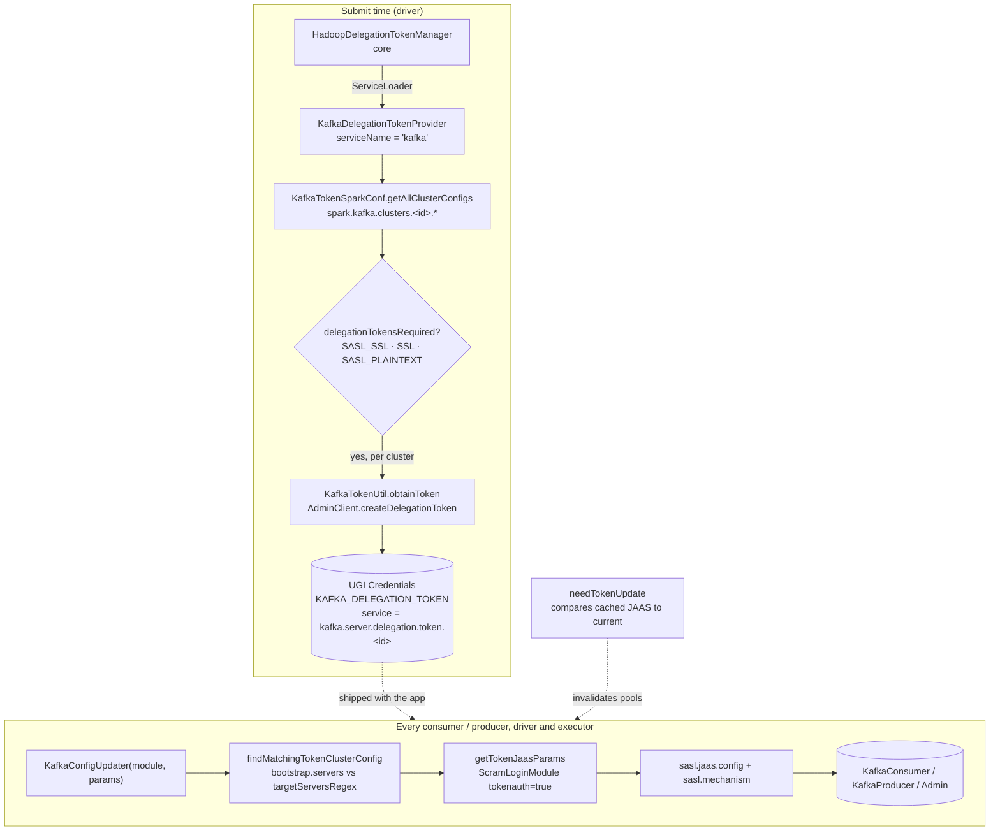

The `connector/kafka-0-10-token-provider` sweep, and the subsystem's only group. **6 Scala files,
681 lines, two resource files, zero configs in the catalog.** The smallest module in the map, and
the one that took longest to become sweepable: it had no entry in `groups.yaml` until 2026-08-08,
having been flagged by both Kafka sweeps first.

!!! info "Why this module is invisible to the tooling"

    It declares **no `ConfigBuilder` at all** — its entire configuration surface is the dynamic
    prefix `spark.kafka.clusters.<id>.*`, read with `getAllWithPrefix` — so it appears in no
    generated Spark configuration table and in no row of the source map's config catalog. Because it
    was also absent from `groups.yaml`, `check_drift.py --coverage` could not flag it either: that
    check only walks packages *inside subsystems `groups.yaml` already names*, so a missing
    subsystem is invisible to every checker. That is a different blind spot from the nested-package
    one, and closing it is what made this sweep possible.

The shape: **this module is the auth layer both Kafka connectors share, and neither owns.** Every
consumer and producer in `connector/kafka-0-10` and `connector/kafka-0-10-sql` is constructed
through `KafkaConfigUpdater.setAuthenticationConfigIfNeeded`, which is the single place a delegation
token turns into a `sasl.jaas.config` string. The provider half runs once at submit time on the
driver, mints one token per configured cluster, and puts them in the UGI credentials that ship to
executors.



**Config slice.** The catalog has **no `connector/kafka-0-10-token-provider` subsystem** — the
module declares zero `ConfigBuilder`s, so the slice is empty by construction:

```bash
PYTHONIOENCODING=utf-8 python -c "
import yaml
d = yaml.safe_load(open('docs/reference/spark-source-map/configs/catalog.yaml', encoding='utf-8'))
cs = [c for c in d['configs'] if c['subsystem'] == 'connector/kafka-0-10-token-provider']
print(len(cs))   # 0
"
```

The real slice has to be read out of the source. It is enumerated in *Breadth check 1* below.

---

## KafkaDelegationTokenProvider — the SPI entry point

**What it is:** an implementation of core's `HadoopDelegationTokenProvider`, found by
`ServiceLoader`. It runs on the driver at submit time, iterates every configured cluster, and adds
one token per cluster to the credentials.

**Code path:** `HadoopDelegationTokenManager` → `ServiceLoader[HadoopDelegationTokenProvider]` →
`KafkaDelegationTokenProvider.obtainDelegationTokens` → `KafkaTokenUtil.obtainToken` →
`creds.addToken`

**Anchor files:**

- `META-INF/services/org.apache.spark.security.HadoopDelegationTokenProvider` — the one-line
  registration; nothing else names this class
- [KafkaDelegationTokenProvider.scala:34](https://github.com/apache/spark/blob/v4.2.0/connector/kafka-0-10-token-provider/src/main/scala/org/apache/spark/kafka010/KafkaDelegationTokenProvider.scala#L34) — `serviceName = "kafka"`, which is what makes the enable key `spark.security.credentials.kafka.enabled`
- [KafkaDelegationTokenProvider.scala:42](https://github.com/apache/spark/blob/v4.2.0/connector/kafka-0-10-token-provider/src/main/scala/org/apache/spark/kafka010/KafkaDelegationTokenProvider.scala#L42) — one token per configured cluster, each in its own `try`
- [KafkaDelegationTokenProvider.scala:49](https://github.com/apache/spark/blob/v4.2.0/connector/kafka-0-10-token-provider/src/main/scala/org/apache/spark/kafka010/KafkaDelegationTokenProvider.scala#L49) — the return value is the **lowest** next-renewal date across all clusters, so the renewal thread wakes for whichever token expires first
- [KafkaDelegationTokenProvider.scala:83](https://github.com/apache/spark/blob/v4.2.0/connector/kafka-0-10-token-provider/src/main/scala/org/apache/spark/kafka010/KafkaDelegationTokenProvider.scala#L83) — a cluster needs a token only when its protocol is `SASL_SSL`, `SSL` or `SASL_PLAINTEXT`; `PLAINTEXT` is skipped
- [HadoopDelegationTokenManager.scala:296](https://github.com/apache/spark/blob/v4.2.0/core/src/main/scala/org/apache/spark/deploy/security/HadoopDelegationTokenManager.scala#L296) — core's `"spark.security.credentials.%s.enabled"`, built by `String.format`, which is why the per-service enable key is absent from the config catalog too

!!! warning "Every failure in this path is a warning, and submission continues"

    Two nested `try`/`catch NonFatal` blocks: one per cluster
    ([:57](https://github.com/apache/spark/blob/v4.2.0/connector/kafka-0-10-token-provider/src/main/scala/org/apache/spark/kafka010/KafkaDelegationTokenProvider.scala#L57)) and one around the whole
    loop ([:65](https://github.com/apache/spark/blob/v4.2.0/connector/kafka-0-10-token-provider/src/main/scala/org/apache/spark/kafka010/KafkaDelegationTokenProvider.scala#L65)). A broker that
    refuses to mint a token, a bad keytab, an unreachable `auth.bootstrap.servers` — all produce
    **`logWarning` and no token**, and the application starts anyway. The failure resurfaces much
    later as an authentication error on the first connection from an executor. The warning is at
    least self-aware: it names `spark.security.credentials.kafka.enabled` and suggests setting it to
    false if you are not using Kafka. This is the same silent-degradation shape recorded for
    `HiveDelegationTokenProvider` and for Kubernetes Kerberos.

**Maps to topics:** E2, E5.

---

## KafkaTokenSparkConf — the multi-cluster configuration model

**What it is:** a config block per Kafka cluster, under an identifier you invent. Everything is read
by prefix; nothing is declared.

**Anchor files:**

- [KafkaTokenSparkConf.scala:61](https://github.com/apache/spark/blob/v4.2.0/connector/kafka-0-10-token-provider/src/main/scala/org/apache/spark/kafka010/KafkaTokenSparkConf.scala#L61) — `CLUSTERS_CONFIG_PREFIX = "spark.kafka.clusters."`; the segment after it is your cluster identifier
- [KafkaTokenSparkConf.scala:67](https://github.com/apache/spark/blob/v4.2.0/connector/kafka-0-10-token-provider/src/main/scala/org/apache/spark/kafka010/KafkaTokenSparkConf.scala#L67) — `getClusterConfig` reads two prefixes: the cluster's own keys, and a nested `kafka.` sub-prefix passed straight to the admin client
- [KafkaTokenSparkConf.scala:76](https://github.com/apache/spark/blob/v4.2.0/connector/kafka-0-10-token-provider/src/main/scala/org/apache/spark/kafka010/KafkaTokenSparkConf.scala#L76) — `auth.bootstrap.servers` is the **only** required key, and a missing one throws a bare `NoSuchElementException` naming the full config path
- [KafkaTokenSparkConf.scala:62](https://github.com/apache/spark/blob/v4.2.0/connector/kafka-0-10-token-provider/src/main/scala/org/apache/spark/kafka010/KafkaTokenSparkConf.scala#L62) — the four defaults: `target.bootstrap.servers.regex = ".*"`, `security.protocol = SASL_SSL`, `sasl.kerberos.service.name = "kafka"`, `sasl.token.mechanism = "SCRAM-SHA-512"`
- [KafkaTokenSparkConf.scala:84](https://github.com/apache/spark/blob/v4.2.0/connector/kafka-0-10-token-provider/src/main/scala/org/apache/spark/kafka010/KafkaTokenSparkConf.scala#L84) — the seven optional SSL keys: truststore type/location/password, keystore type/location/password, key password
- [KafkaTokenSparkConf.scala:99](https://github.com/apache/spark/blob/v4.2.0/connector/kafka-0-10-token-provider/src/main/scala/org/apache/spark/kafka010/KafkaTokenSparkConf.scala#L99) — `getAllClusterConfigs` derives the identifier set by splitting every matching key on `.` and taking the first segment
- [KafkaTokenSparkConf.scala:43](https://github.com/apache/spark/blob/v4.2.0/connector/kafka-0-10-token-provider/src/main/scala/org/apache/spark/kafka010/KafkaTokenSparkConf.scala#L43) — the case class's own `toString` **redacts all four password fields** and routes `specifiedKafkaParams` through `KafkaRedactionUtil`, because it is logged at DEBUG

!!! warning "A cluster identifier containing a dot silently becomes two clusters"

    `getAllClusterConfigs` takes `k.split('.')(0)` of everything under the prefix, so the identifier
    is *whatever precedes the first dot*. An identifier like `prod.eu` yields the identifier `prod`,
    and every key you wrote under `prod.eu.` is then read as if it belonged to a cluster called
    `prod` — with `eu.auth.bootstrap.servers` as an unrecognised key, so the required
    `auth.bootstrap.servers` is missing and the whole call throws `NoSuchElementException`, caught
    and downgraded to a warning by the provider. Use identifiers without dots.

**Maps to topics:** E2, A12.

---

## Cluster matching — targetServersRegex and the one-token rule

**What it is:** at connection time the module has to decide *which* cluster's token applies. It does
that by walking the tokens in the current user's credentials, resolving each back to its cluster
config, and matching that config's `target.bootstrap.servers.regex` against the connection's
`bootstrap.servers`.

**Code path:** `KafkaConfigUpdater.setAuthenticationConfigIfNeeded` →
`KafkaTokenUtil.findMatchingTokenClusterConfig(conf, bootstrapServers)` →
`getTokenJaasParams(clusterConf)`

**Anchor files:**

- [KafkaTokenUtil.scala:242](https://github.com/apache/spark/blob/v4.2.0/connector/kafka-0-10-token-provider/src/main/scala/org/apache/spark/kafka010/KafkaTokenUtil.scala#L242) — the matcher; it starts from the **tokens in the UGI**, not from the configs, so a cluster with no token is never considered
- [KafkaTokenUtil.scala:49](https://github.com/apache/spark/blob/v4.2.0/connector/kafka-0-10-token-provider/src/main/scala/org/apache/spark/kafka010/KafkaTokenUtil.scala#L49) / [:55](https://github.com/apache/spark/blob/v4.2.0/connector/kafka-0-10-token-provider/src/main/scala/org/apache/spark/kafka010/KafkaTokenUtil.scala#L55) — the token's Hadoop *service* is `kafka.server.delegation.token.<identifier>`, and the identifier is recovered by string-replacing that prefix away
- [KafkaTokenUtil.scala:252](https://github.com/apache/spark/blob/v4.2.0/connector/kafka-0-10-token-provider/src/main/scala/org/apache/spark/kafka010/KafkaTokenUtil.scala#L252) — the regex is applied with `matches()` — a **full-string** match — against each comma-separated entry of `bootstrap.servers`
- [KafkaTokenUtil.scala:255](https://github.com/apache/spark/blob/v4.2.0/connector/kafka-0-10-token-provider/src/main/scala/org/apache/spark/kafka010/KafkaTokenUtil.scala#L255) — **`require(clusterConfigs.size <= 1)`**: two matching tokens is a hard failure, not a preference order
- [KafkaTokenUtil.scala:260](https://github.com/apache/spark/blob/v4.2.0/connector/kafka-0-10-token-provider/src/main/scala/org/apache/spark/kafka010/KafkaTokenUtil.scala#L260) — the matched token becomes a `ScramLoginModule` JAAS string with `tokenauth=true`, username = token id, password = token HMAC
- [KafkaTokenUtil.scala:263](https://github.com/apache/spark/blob/v4.2.0/connector/kafka-0-10-token-provider/src/main/scala/org/apache/spark/kafka010/KafkaTokenUtil.scala#L263) — a second `require`: the token for that identifier must still exist in the credentials

!!! warning "The default regex matches everything, so adding a second cluster breaks the first"

    `target.bootstrap.servers.regex` defaults to `.*`. With one cluster that is harmless. Add a
    second — also defaulted — and **every connection now matches two tokens**, so
    `findMatchingTokenClusterConfig` fails its `require` with "More than one delegation token matches
    the following bootstrap servers". The failure is at connection time on an executor, not at
    submit, and the message names the servers but not the two clusters. Whenever there is more than
    one cluster, set the regex on **every** cluster, including the one that worked before.

!!! info "The match is full-string, per broker entry"

    `Pattern.matches` requires the whole entry to match, and `bootstrap.servers` is split on commas
    first, so a regex like `.*\.eu\.example\.com:9093` works and a bare `eu.example.com` does not.
    Note also that only clusters **with a token already in the credentials** take part — a
    misconfigured cluster that failed to mint one at submit time simply never matches, and the
    connection falls through to no authentication config at all rather than to an error.

**Maps to topics:** none — the sweep's new topic, **E42**.

---

## Token acquisition — the AdminClient and the three login paths

**What it is:** minting the token. Spark builds an `AdminClient` configured to authenticate *as
you*, asks it for a delegation token, and wraps the result in a Hadoop `Token`.

**Anchor files:**

- [KafkaTokenUtil.scala:65](https://github.com/apache/spark/blob/v4.2.0/connector/kafka-0-10-token-provider/src/main/scala/org/apache/spark/kafka010/KafkaTokenUtil.scala#L65) — `obtainToken`: create admin client, `createDelegationToken()`, wrap the token id and the base64 HMAC as a Hadoop `Token`
- [KafkaTokenUtil.scala:84](https://github.com/apache/spark/blob/v4.2.0/connector/kafka-0-10-token-provider/src/main/scala/org/apache/spark/kafka010/KafkaTokenUtil.scala#L84) — `checkProxyUser`: obtaining a token **as a proxy user is not supported** and `require`-fails, pointing at KAFKA-6945
- [KafkaTokenUtil.scala:117](https://github.com/apache/spark/blob/v4.2.0/connector/kafka-0-10-token-provider/src/main/scala/org/apache/spark/kafka010/KafkaTokenUtil.scala#L117) — the login precedence, stated as a comment and implemented immediately below: **JVM-global JAAS → keytab → ticket cache**
- [KafkaTokenUtil.scala:157](https://github.com/apache/spark/blob/v4.2.0/connector/kafka-0-10-token-provider/src/main/scala/org/apache/spark/kafka010/KafkaTokenUtil.scala#L157) — "is a global JAAS config provided" is implemented as *try to load one and see if it throws*
- [KafkaTokenUtil.scala:126](https://github.com/apache/spark/blob/v4.2.0/connector/kafka-0-10-token-provider/src/main/scala/org/apache/spark/kafka010/KafkaTokenUtil.scala#L126) — the reason a dynamic JAAS string is built at all: the Kafka client cannot reuse a JVM subject that already logged in to the KDC (KAFKA-7677)
- [KafkaTokenUtil.scala:109](https://github.com/apache/spark/blob/v4.2.0/connector/kafka-0-10-token-provider/src/main/scala/org/apache/spark/kafka010/KafkaTokenUtil.scala#L109) / [:112](https://github.com/apache/spark/blob/v4.2.0/connector/kafka-0-10-token-provider/src/main/scala/org/apache/spark/kafka010/KafkaTokenUtil.scala#L112) — two protocol warnings: `SSL` asks you to configure two-way authentication broker-side, `SASL_PLAINTEXT` warns that the token is being fetched over a **plain channel**
- [KafkaTokenUtil.scala:147](https://github.com/apache/spark/blob/v4.2.0/connector/kafka-0-10-token-provider/src/main/scala/org/apache/spark/kafka010/KafkaTokenUtil.scala#L147) — the per-cluster `kafka.*` params are applied **last**, so they override everything Spark just set, including the JAAS config
- [KafkaTokenUtil.scala:197](https://github.com/apache/spark/blob/v4.2.0/connector/kafka-0-10-token-provider/src/main/scala/org/apache/spark/kafka010/KafkaTokenUtil.scala#L197) / [:214](https://github.com/apache/spark/blob/v4.2.0/connector/kafka-0-10-token-provider/src/main/scala/org/apache/spark/kafka010/KafkaTokenUtil.scala#L214) — the keytab and ticket-cache JAAS builders, both honouring `sun.security.krb5.debug`
- [KafkaTokenUtil.scala:226](https://github.com/apache/spark/blob/v4.2.0/connector/kafka-0-10-token-provider/src/main/scala/org/apache/spark/kafka010/KafkaTokenUtil.scala#L226) — `printToken` logs the token id, owner, renewers and all three dates at DEBUG, with the **HMAC replaced by the redaction text**

!!! warning "Fetching a delegation token over `SASL_PLAINTEXT` sends your credentials in the clear"

    The code allows it and logs "Obtaining kafka delegation token through plain communication
    channel. Please consider the security impact." — a single WARN at submit time. The token HMAC
    that comes back is itself a bearer credential for the lifetime of the token, and it traverses
    the same unencrypted channel. `SASL_SSL` is the default `security.protocol` for a reason; the
    only good use for `SASL_PLAINTEXT` here is a test cluster.

!!! info "Per-cluster `kafka.*` params are an escape hatch that can defeat the rest"

    `spark.kafka.clusters.<id>.kafka.<anything>` is copied onto the admin client **after** Spark has
    set the protocol, truststore, mechanism and JAAS config. It exists so you can pass client
    settings Spark does not model — and it will just as happily replace `sasl.jaas.config` or
    downgrade `security.protocol`. Both the before and after states are logged at DEBUG, redacted.

**Maps to topics:** E2.

---

## KafkaConfigUpdater — the single injection point for both connectors

**What it is:** a 95-line builder. Its importance is entirely structural: **every** Kafka client
created anywhere in Spark — DStream driver consumer, DStream executor consumer, Structured Streaming
driver reader, executor consumer, and producer — is constructed from a map that went through it.

**Anchor files:**

- [KafkaConfigUpdater.scala:33](https://github.com/apache/spark/blob/v4.2.0/connector/kafka-0-10-token-provider/src/main/scala/org/apache/spark/kafka010/KafkaConfigUpdater.scala#L33) — the case class; `module` is a label used **only for logging** (`"source"`, `"executor"`)
- [KafkaConfigUpdater.scala:37](https://github.com/apache/spark/blob/v4.2.0/connector/kafka-0-10-token-provider/src/main/scala/org/apache/spark/kafka010/KafkaConfigUpdater.scala#L37) / [:48](https://github.com/apache/spark/blob/v4.2.0/connector/kafka-0-10-token-provider/src/main/scala/org/apache/spark/kafka010/KafkaConfigUpdater.scala#L48) — `set` and `setIfUnset`, each logging the old and new value **redacted** at DEBUG
- [KafkaConfigUpdater.scala:59](https://github.com/apache/spark/blob/v4.2.0/connector/kafka-0-10-token-provider/src/main/scala/org/apache/spark/kafka010/KafkaConfigUpdater.scala#L59) — the no-arg overload resolves the cluster itself and **throws `MISSING_KAFKA_OPTION`** when `bootstrap.servers` is absent
- [KafkaConfigUpdater.scala:71](https://github.com/apache/spark/blob/v4.2.0/connector/kafka-0-10-token-provider/src/main/scala/org/apache/spark/kafka010/KafkaConfigUpdater.scala#L71) — the explicit-cluster overload, used on the hot path by the SQL connector's `InternalKafkaConsumer` so the match is not redone per consumer
- [KafkaConfigUpdater.scala:78](https://github.com/apache/spark/blob/v4.2.0/connector/kafka-0-10-token-provider/src/main/scala/org/apache/spark/kafka010/KafkaConfigUpdater.scala#L78) — **a JVM-global JAAS configuration wins and the token is not used at all**
- [KafkaConfigUpdater.scala:81](https://github.com/apache/spark/blob/v4.2.0/connector/kafka-0-10-token-provider/src/main/scala/org/apache/spark/kafka010/KafkaConfigUpdater.scala#L81) — with no matching cluster the `foreach` body never runs, so the params are returned **untouched**: no token, no error
- [KafkaConfigUpdater.scala:86](https://github.com/apache/spark/blob/v4.2.0/connector/kafka-0-10-token-provider/src/main/scala/org/apache/spark/kafka010/KafkaConfigUpdater.scala#L86) — `require(tokenMechanism.startsWith("SCRAM"))`: delegation tokens only work with SCRAM
- [KafkaConfigUpdater.scala:83](https://github.com/apache/spark/blob/v4.2.0/connector/kafka-0-10-token-provider/src/main/scala/org/apache/spark/kafka010/KafkaConfigUpdater.scala#L83) — the protocol is applied with `setIfUnset`, so a user-supplied `kafka.security.protocol` survives, while the JAAS config two lines below ([:85](https://github.com/apache/spark/blob/v4.2.0/connector/kafka-0-10-token-provider/src/main/scala/org/apache/spark/kafka010/KafkaConfigUpdater.scala#L85)) uses `set` and does not

!!! info "The five call sites, and why the two connectors label them differently"

    DStream: `ConsumerStrategy.setAuthenticationConfigIfNeeded` (`"source"`) and
    `InternalKafkaConsumer.createConsumer` (`"executor"`). Structured Streaming:
    `kafkaParamsForDriver` (`"source"`), `kafkaParamsForExecutors` (`"executor"`),
    `kafkaParamsForProducer` (`"executor"`), plus the consumer pool's own
    `InternalKafkaConsumer.createConsumer` (`"executor"`, and the only one that passes a
    pre-resolved cluster config). The label appears in DEBUG lines only — it is how you tell which
    side of the job a redacted param change came from.

!!! warning "A JVM-global JAAS configuration silently disables the whole token mechanism"

    Both `setAuthenticationConfigIfNeeded` and `createAdminClientProperties` check
    `isGlobalJaasConfigurationProvided` first and, if one exists, skip everything else — logging at
    **DEBUG**. So setting `java.security.auth.login.config` for some unrelated reason turns off
    delegation-token authentication for Kafka with no visible signal, and the clients fall back to
    whatever that global file says.

**Maps to topics:** A12, E2.

---

## Token renewal detection — needTokenUpdate and cache invalidation

**What it is:** long-running streaming jobs get fresh tokens periodically, but the executor-side
consumer caches hold clients built with the *old* JAAS string. This is the check that notices.

**Anchor files:**

- [KafkaTokenUtil.scala:281](https://github.com/apache/spark/blob/v4.2.0/connector/kafka-0-10-token-provider/src/main/scala/org/apache/spark/kafka010/KafkaTokenUtil.scala#L281) — `needTokenUpdate` **rebuilds the current JAAS string and compares it to the cached one**; there is no expiry timestamp involved
- [consumer/KafkaDataConsumer.scala:707](https://github.com/apache/spark/blob/v4.2.0/connector/kafka-0-10-sql/src/main/scala/org/apache/spark/sql/kafka010/consumer/KafkaDataConsumer.scala#L707) — the only caller: on every consumer borrow, and a mismatch invalidates **both** the consumer pool and the fetched-data pool for that key
- [consumer/KafkaDataConsumer.scala:56](https://github.com/apache/spark/blob/v4.2.0/connector/kafka-0-10-sql/src/main/scala/org/apache/spark/sql/kafka010/consumer/KafkaDataConsumer.scala#L56) — each `InternalKafkaConsumer` stores its resolved cluster config and the params it was built with, precisely so this comparison is possible

!!! warning "Only the Structured Streaming connector renews cached credentials"

    `needTokenUpdate` has exactly one caller, in `connector/kafka-0-10-sql`. The **DStream
    connector's consumer cache never checks** — its `InternalKafkaConsumer` builds params through
    `KafkaConfigUpdater` once at construction and keeps the consumer until it is evicted or the task
    retries. On a long-running DStream job against a secured cluster, a cached consumer therefore
    holds an expired token until something else displaces it. The gating check is
    `HadoopDelegationTokenManager.isServiceEnabled(conf, "kafka")`, so this only matters where token
    auth is actually on.

**Maps to topics:** E2, E40.

---

## Redaction — the JAAS password regex and what reaches the logs

**What it is:** the module logs its own configuration extensively at DEBUG, including params that
contain passwords and token HMACs. One utility decides what those lines actually say.

**Anchor files:**

- [KafkaRedactionUtil.scala:28](https://github.com/apache/spark/blob/v4.2.0/connector/kafka-0-10-token-provider/src/main/scala/org/apache/spark/kafka010/KafkaRedactionUtil.scala#L28) — `redactParams` routes everything through core's `spark.redaction.regex` (`Utils.redact`), **except** `sasl.jaas.config`
- [KafkaRedactionUtil.scala:45](https://github.com/apache/spark/blob/v4.2.0/connector/kafka-0-10-token-provider/src/main/scala/org/apache/spark/kafka010/KafkaRedactionUtil.scala#L45) — the JAAS case gets a dedicated regex: `param.replaceAll("password=\".*\"", …)`
- [config/package.scala:1301](https://github.com/apache/spark/blob/v4.2.0/core/src/main/scala/org/apache/spark/internal/config/package.scala#L1301) — `spark.redaction.regex`, whose doc scopes it to "the environment UI and various logs like YARN and event logs"
- [KafkaTokenSparkConf.scala:51](https://github.com/apache/spark/blob/v4.2.0/connector/kafka-0-10-token-provider/src/main/scala/org/apache/spark/kafka010/KafkaTokenSparkConf.scala#L51) — the four password fields in `KafkaTokenClusterConf.toString` are replaced by construction, not by regex
- [KafkaTokenUtil.scala:233](https://github.com/apache/spark/blob/v4.2.0/connector/kafka-0-10-token-provider/src/main/scala/org/apache/spark/kafka010/KafkaTokenUtil.scala#L233) — the token dump replaces the HMAC column with the redaction text

!!! warning "The JAAS redaction is a greedy regex over one line, and it hides only `password=`"

    `"password=\".*\""` is greedy: on a JAAS string containing `password="x" serviceName="y"` it
    replaces from the first `password="` to the **last** `"` on the line, which over-redacts
    harmlessly. What it does *not* touch is `username=`, which for a delegation-token JAAS string is
    the **token id** — an identifier, not a secret, but one that identifies the credential. And
    `getKeytabJaasParams` / `getTicketCacheJaasParams` log their output at DEBUG through plain
    `logDebug(s"…")` with **no redaction at all**
    ([:210](https://github.com/apache/spark/blob/v4.2.0/connector/kafka-0-10-token-provider/src/main/scala/org/apache/spark/kafka010/KafkaTokenUtil.scala#L210),
    [:222](https://github.com/apache/spark/blob/v4.2.0/connector/kafka-0-10-token-provider/src/main/scala/org/apache/spark/kafka010/KafkaTokenUtil.scala#L222)) — those strings contain a keytab
    *path* and principal rather than a secret, but it is worth knowing that DEBUG logging on this
    module prints the full JAAS configuration of your Kerberos login.

**Maps to topics:** E3, E2.

---

## The error condition and the exception helper

**What it is:** the module owns exactly one error class, in its own conditions file, loaded through
its own `ErrorClassesJsonReader`.

**Anchor files:**

- `error/kafka-token-provider-error-conditions.json` — one class, `MISSING_KAFKA_OPTION`:
  "Kafka option `<option>` is not set. Please make sure it is set and retry."
- [KafkaTokenProviderException.scala:22](https://github.com/apache/spark/blob/v4.2.0/connector/kafka-0-10-token-provider/src/main/scala/org/apache/spark/kafka010/KafkaTokenProviderException.scala#L22) — a private helper holding the reader; the module cannot use core's registry because its conditions file is its own resource
- [KafkaTokenProviderException.scala:32](https://github.com/apache/spark/blob/v4.2.0/connector/kafka-0-10-token-provider/src/main/scala/org/apache/spark/kafka010/KafkaTokenProviderException.scala#L32) — the only factory, raised from `KafkaConfigUpdater` when `bootstrap.servers` is missing
- [KafkaTokenProviderException.scala:27](https://github.com/apache/spark/blob/v4.2.0/connector/kafka-0-10-token-provider/src/main/scala/org/apache/spark/kafka010/KafkaTokenProviderException.scala#L27) — a standing note that "error classes" should be called "error conditions" (SPARK-47429)

!!! info "Every other failure in this module is a `require` or a raw exception"

    One error class covers one case. Missing `auth.bootstrap.servers` is a bare
    `NoSuchElementException`; two matching tokens, a proxy user, a non-SCRAM mechanism and a missing
    token are all `require` failures with plain messages. None carries an error class, so none is
    matchable by `SQLSTATE` or by condition name — worth knowing when writing alerting around Kafka
    auth failures.

**Maps to topics:** A12.

---

## Breadth check 1 — the config slice

**The catalog slice is empty** — this subsystem declares no `ConfigBuilder`, so `gen_configs.py`
never produced a row for it. The real surface, read out of the source and reproducible with a grep
for `getAllWithPrefix` and the `CLUSTERS_CONFIG_PREFIX` constant:

| Config | Required | Default | Read at |
|---|---|---|---|
| `spark.kafka.clusters.<id>.auth.bootstrap.servers` | **yes** | — | [KafkaTokenSparkConf.scala:76](https://github.com/apache/spark/blob/v4.2.0/connector/kafka-0-10-token-provider/src/main/scala/org/apache/spark/kafka010/KafkaTokenSparkConf.scala#L76) |
| `spark.kafka.clusters.<id>.target.bootstrap.servers.regex` | no | `.*` | [:78](https://github.com/apache/spark/blob/v4.2.0/connector/kafka-0-10-token-provider/src/main/scala/org/apache/spark/kafka010/KafkaTokenSparkConf.scala#L78) |
| `spark.kafka.clusters.<id>.security.protocol` | no | `SASL_SSL` | [:80](https://github.com/apache/spark/blob/v4.2.0/connector/kafka-0-10-token-provider/src/main/scala/org/apache/spark/kafka010/KafkaTokenSparkConf.scala#L80) |
| `spark.kafka.clusters.<id>.sasl.kerberos.service.name` | no | `kafka` | [:82](https://github.com/apache/spark/blob/v4.2.0/connector/kafka-0-10-token-provider/src/main/scala/org/apache/spark/kafka010/KafkaTokenSparkConf.scala#L82) |
| `spark.kafka.clusters.<id>.sasl.token.mechanism` | no | `SCRAM-SHA-512` | [:91](https://github.com/apache/spark/blob/v4.2.0/connector/kafka-0-10-token-provider/src/main/scala/org/apache/spark/kafka010/KafkaTokenSparkConf.scala#L91) |
| `…ssl.truststore.{type,location,password}` | no | unset | [:84](https://github.com/apache/spark/blob/v4.2.0/connector/kafka-0-10-token-provider/src/main/scala/org/apache/spark/kafka010/KafkaTokenSparkConf.scala#L84) |
| `…ssl.keystore.{type,location,password}`, `…ssl.key.password` | no | unset | [:87](https://github.com/apache/spark/blob/v4.2.0/connector/kafka-0-10-token-provider/src/main/scala/org/apache/spark/kafka010/KafkaTokenSparkConf.scala#L87) |
| `spark.kafka.clusters.<id>.kafka.<anything>` | no | — | [:93](https://github.com/apache/spark/blob/v4.2.0/connector/kafka-0-10-token-provider/src/main/scala/org/apache/spark/kafka010/KafkaTokenSparkConf.scala#L93) — passed to the admin client **last**, overriding Spark's own settings |

**Thirteen keys plus an open-ended passthrough, none of them a `ConfigEntry`.** They appear in
`docs/structured-streaming-kafka-integration.md` prose but in no generated configuration table, in
no `--conf` autocompletion, and in no deprecation machinery — a typo in any of them is silently
ignored rather than rejected.

Configs owned elsewhere that this group's behaviour depends on:

- `spark.security.credentials.kafka.enabled` (**core**) — the SPI gate, built by
  `String.format("spark.security.credentials.%s.enabled", serviceName)` at
  [HadoopDelegationTokenManager.scala:296](https://github.com/apache/spark/blob/v4.2.0/core/src/main/scala/org/apache/spark/deploy/security/HadoopDelegationTokenManager.scala#L296), so it is absent from the catalog for the same reason
- `spark.kerberos.keytab` / `spark.kerberos.principal` (**core**) — the second login path
- `spark.redaction.regex` (**core**) — what every DEBUG line here is filtered through
- `java.security.auth.login.config` (**JVM system property**) — the first login path, and the one
  that silently disables everything else

## Breadth check 2 — the packages

One package, `kafka010/`, with no sub-packages. **6 files, 6 cited**, and both resource files read:

`KafkaTokenUtil` (292) · `KafkaTokenSparkConf` (110) · `KafkaConfigUpdater` (95) ·
`KafkaDelegationTokenProvider` (87) · `KafkaRedactionUtil` (52) ·
`KafkaTokenProviderException` (45)

Resources: `META-INF/services/org.apache.spark.security.HadoopDelegationTokenProvider` (the only
registration of the provider, and the reason this module needs no explicit wiring) and
`error/kafka-token-provider-error-conditions.json` (one class, `MISSING_KAFKA_OPTION`).

Nothing here is plumbing and nothing was skipped. At 681 lines this is the smallest group in the
map; its significance is its position — five call sites across two other modules — rather than its
size.

**Named so it is not mistaken for covered:**

- The two consumers of this module are swept:
  [connector/kafka-0-10](connector-kafka-0-10-consumer.md) and
  [connector/kafka-0-10-sql](connector-kafka-0-10-sql-source-sink.md). Cross-references in both
  directions are in place as of this sweep.
- `HadoopDelegationTokenManager`, the SPI host and the renewal thread, is **core**'s and is covered
  by the [config & security sweep](core-config-security.md). This page anchors into it only for the
  enable-key construction.
- Kafka's own broker-side delegation-token machinery — issuance policy, `delegation.token.max.lifetime.ms`,
  renewal by a designated renewer — is outside Spark entirely and is not covered anywhere in this map.

## Overlapping topic traces

**None.** `check_drift.py --sweeps` reports no overlaps: the codes on this page are A12, E2, E3, E5,
E40 and E42, and `topics/` currently holds traces for B1–B9, I1–I11 and I13 only. Nothing here can
contradict an existing trace, and nothing here has been cross-checked against one.

---

## Sweep log

| Date | Spark | What changed |
|---|---|---|
| 2026-08-08 | 4.2.0 | First sweep of `connector/kafka-0-10-token-provider`, and it exists at all only because the two Kafka sweeps earlier the same day flagged the module as claimed by no group. 8 concepts, **1 new topic proposed** (E42 multi-cluster Kafka authentication). 6 files, 681 lines, two resource files, **zero catalog configs**. Both breadth checks clean: 6/6 files; the config slice is empty by construction and its real 13-key surface is enumerated on the page instead. The framing: **this is the auth layer both Kafka connectors share and neither owns** — five call sites across two modules all funnel through `KafkaConfigUpdater.setAuthenticationConfigIfNeeded`, the single place a delegation token becomes a `sasl.jaas.config` string. Findings worth carrying. **The whole config family is undeclared**: `spark.kafka.clusters.<id>.*` is read with `getAllWithPrefix`, so it is in no generated configuration table, no catalog row and no deprecation machinery — a typo is silently ignored. **The matching regex defaults to `.*`, so adding a second cluster breaks the first**: `findMatchingTokenClusterConfig` `require`s at most one matching token, and two defaulted clusters match every connection; the failure lands at connection time on an executor, not at submit. **A cluster identifier containing a dot silently becomes a different cluster**, because `getAllClusterConfigs` splits on the first `.`. **Every provider-side failure is a warning and submission continues** — two nested `catch NonFatal` blocks — so a broker refusing to mint a token surfaces much later as an executor authentication error; the warning does at least name `spark.security.credentials.kafka.enabled`. **A JVM-global JAAS configuration silently disables the token mechanism entirely**, logged at DEBUG only, in both the acquisition and the injection path. **Per-cluster `kafka.*` params are applied last** and can therefore replace `sasl.jaas.config` or downgrade `security.protocol`. **Only the Structured Streaming connector renews cached credentials**: `needTokenUpdate` has exactly one caller, so a long-running *DStream* job holds an expired token in its consumer cache until something else displaces it. Also recorded: fetching a token over `SASL_PLAINTEXT` is permitted with one WARN and sends a bearer credential in the clear; proxy users cannot obtain tokens at all (KAFKA-6945); the dynamic JAAS string exists because the Kafka client cannot reuse a JVM subject already logged in to the KDC (KAFKA-7677); the JAAS redaction is a greedy `password="…"` regex that leaves `username=` — the token id — visible, and the keytab/ticket-cache JAAS builders log their output unredacted at DEBUG; and the module owns exactly one error class, so every other failure here is an unmatched `require` or a raw `NoSuchElementException`. |
