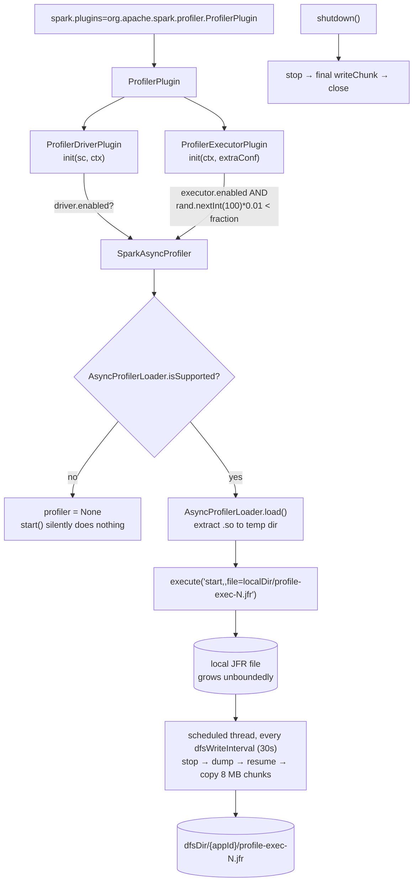

The smallest subsystem in the map: **one group, three Scala files, 392 lines**, and a single
`SparkPlugin` that loads [async-profiler](https://github.com/async-profiler/async-profiler) into
driver and executor JVMs and copies the resulting JFR files somewhere durable. It has existed since
Spark 4.0.0 and has had **no functional change in 4.2.0** — the only commits touching it between
`v4.1.0` and `v4.2.0` are release-preparation version bumps.

Its size is misleading in one direction and accurate in the other. The code is thin because
async-profiler does the work; what the module contributes is *lifecycle* — when to start, which
executors to pick, how to get a growing binary file off an ephemeral container before it
disappears. Every interesting thing on this page is about that.

---

## ProfilerPlugin — two halves of a SparkPlugin

**What it is:** the entry point, and a compact worked example of the `SparkPlugin` API that the
[core monitoring sweep](core-monitoring.md) covers from the plugin-container side. One class
returns a driver plugin and an executor plugin; each independently decides whether to profile.

**Anchor files:**

- [ProfilerPlugin.scala:32](https://github.com/apache/spark/blob/v4.2.0/connector/profiler/src/main/scala/org/apache/spark/profiler/ProfilerPlugin.scala#L32) — the plugin, four lines: `driverPlugin()` and `executorPlugin()`
- [ProfilerPlugin.scala:45](https://github.com/apache/spark/blob/v4.2.0/connector/profiler/src/main/scala/org/apache/spark/profiler/ProfilerPlugin.scala#L45) — `ProfilerDriverPlugin.init`, gated on `spark.profiler.driver.enabled` (**false**), returning an empty extra-conf map
- [ProfilerPlugin.scala:75](https://github.com/apache/spark/blob/v4.2.0/connector/profiler/src/main/scala/org/apache/spark/profiler/ProfilerPlugin.scala#L75) — `ProfilerExecutorPlugin.init`, gated on `spark.profiler.executor.enabled` (**false**) *and* the sampling draw below
- [ProfilerPlugin.scala:58](https://github.com/apache/spark/blob/v4.2.0/connector/profiler/src/main/scala/org/apache/spark/profiler/ProfilerPlugin.scala#L58) and [:91](https://github.com/apache/spark/blob/v4.2.0/connector/profiler/src/main/scala/org/apache/spark/profiler/ProfilerPlugin.scala#L91) — both `shutdown()` methods null-check the profiler, because it is only constructed when enabled and selected

!!! info "Driver and executor profiling are independent switches"

    `spark.profiler.driver.enabled` and `spark.profiler.executor.enabled` are separate and both
    default to false, so registering the plugin alone does nothing. Driver profiling has no
    fraction — it is all or nothing — which is the right default given there is one driver.

**Configs:** `spark.profiler.driver.enabled` (false, 4.0.0),
`spark.profiler.executor.enabled` (false, 4.0.0)

**Maps to topics:** E3

---

## Executor sampling — how the fraction is actually drawn

**What it is:** you rarely want every executor profiled, so the plugin picks a subset.
`spark.profiler.executor.fraction` defaults to **0.1**, and the draw is one line — but the
arithmetic in that line has two consequences worth knowing before you trust the number.

**Anchor files:**

- [ProfilerPlugin.scala:80](https://github.com/apache/spark/blob/v4.2.0/connector/profiler/src/main/scala/org/apache/spark/profiler/ProfilerPlugin.scala#L80) — reading the fraction, validated into `[0, 1]` by the config builder ([package.scala:44](https://github.com/apache/spark/blob/v4.2.0/connector/profiler/src/main/scala/org/apache/spark/profiler/package.scala#L44))
- [ProfilerPlugin.scala:81](https://github.com/apache/spark/blob/v4.2.0/connector/profiler/src/main/scala/org/apache/spark/profiler/ProfilerPlugin.scala#L81) — the draw itself: `if (rand.nextInt(100) * 0.01 < executorProfilerFraction)`
- [ProfilerPlugin.scala:73](https://github.com/apache/spark/blob/v4.2.0/connector/profiler/src/main/scala/org/apache/spark/profiler/ProfilerPlugin.scala#L73) — `new Random(System.currentTimeMillis())`, constructed per executor-plugin instance
- [ProfilerPlugin.scala:82](https://github.com/apache/spark/blob/v4.2.0/connector/profiler/src/main/scala/org/apache/spark/profiler/ProfilerPlugin.scala#L82) — a selected executor logs `Executor id N selected for profiling`; an unselected one logs **nothing**

!!! warning "The fraction is quantised to whole percent, with a floor"

    `nextInt(100)` yields `0..99`, so `nextInt(100) * 0.01` yields `0.00 … 0.99` in 1% steps. Two
    consequences follow directly:

    - Any fraction **strictly between 0 and 0.01** still selects on the `0.00` draw, i.e. roughly
      **1% of executors**, not the fraction you asked for. `fraction = 0.001` does not mean one in
      a thousand.
    - Anything else is rounded up to the next whole percent: `0.015` behaves as `0.02`.

    Exactly `0.0` correctly selects nothing (`0.0 < 0.0` is false). For the default `0.1` the
    arithmetic is exact — draws `0..9` select, which is precisely 10%.

!!! info "Selection is per executor and is not logged when it fails"

    Each executor draws independently at plugin init, and the seed is
    `System.currentTimeMillis()` — so executors whose plugins initialise within the same
    millisecond draw the same first value. In practice executor JVMs start far enough apart for
    this not to matter, but it means the draws are not independent by construction. If you cannot
    find a profile for an executor you expected, note that only *selected* executors log anything:
    absence of a log line is the normal, silent case.

**Configs:** `spark.profiler.executor.fraction` (0.1, 4.0.0)

**Maps to topics:** E3

---

## SparkAsyncProfiler — loading a native profiler into a running JVM

**What it is:** the wrapper. async-profiler is a native agent; `ap-loader` bundles the `.so`/`.dylib`
binaries for several platforms, extracts the right one to a temp directory, and attaches it to the
live JVM. Everything after that is command strings.

**Anchor files:**

- [SparkAsyncProfiler.scala:35](https://github.com/apache/spark/blob/v4.2.0/connector/profiler/src/main/scala/org/apache/spark/profiler/SparkAsyncProfiler.scala#L35) — the class, constructed with the conf and the executor id
- [SparkAsyncProfiler.scala:70](https://github.com/apache/spark/blob/v4.2.0/connector/profiler/src/main/scala/org/apache/spark/profiler/SparkAsyncProfiler.scala#L70) — the load: `if (AsyncProfilerLoader.isSupported) … else null`, wrapped in an `Option`
- [SparkAsyncProfiler.scala:67](https://github.com/apache/spark/blob/v4.2.0/connector/profiler/src/main/scala/org/apache/spark/profiler/SparkAsyncProfiler.scala#L67) — the extraction directory, created under `Utils.getLocalDir(conf)` so it follows Spark's local-dir configuration rather than `/tmp`
- [SparkAsyncProfiler.scala:47](https://github.com/apache/spark/blob/v4.2.0/connector/profiler/src/main/scala/org/apache/spark/profiler/SparkAsyncProfiler.scala#L47) — the file name: `profile-$executorId.jfr` on the driver, `profile-exec-$executorId.jfr` on an executor, discriminated by `SparkContext.isDriver`
- [SparkAsyncProfiler.scala:89](https://github.com/apache/spark/blob/v4.2.0/connector/profiler/src/main/scala/org/apache/spark/profiler/SparkAsyncProfiler.scala#L89) — `start()`'s catch arms: an `IllegalArgumentException`/`IllegalStateException`/`IOException` from the native code logs `Profiling aborted…` at ERROR; anything else logs at WARN. **Nothing is rethrown**

!!! warning "An unsupported platform is a silent no-op"

    `AsyncProfilerLoader.isSupported` gates the load, and when it is false `profiler` is `None`, so
    `start()`'s `foreach` does nothing and no message is logged at all. The README lists the
    supported set — Linux x64, Linux arm64, Linux musl x64, macOS — so a Windows driver or an
    unlisted architecture produces no profile and no explanation. Combined with the unlogged
    sampling miss above, "no JFR file appeared" has at least three silent causes: not selected, not
    supported, or the plugin was never registered.

!!! info "Profiling failures never fail the job — by design"

    Every path in `start()` swallows its exception after logging. That is the right call for an
    observability plugin, but it means the only evidence of a broken profiler is in the driver or
    executor log. Grep for `Profiling aborted` before concluding the profiler ran.

**Configs:** none read here beyond those listed elsewhere; the extraction directory follows
`spark.local.dir`

**Maps to topics:** E3

---

## The async-profiler command strings and the default argument set

**What it is:** the whole control interface is four strings built once in the constructor and
handed to the native agent. Reading them tells you exactly what Spark does and does not control.

**Anchor files:**

- [SparkAsyncProfiler.scala:53](https://github.com/apache/spark/blob/v4.2.0/connector/profiler/src/main/scala/org/apache/spark/profiler/SparkAsyncProfiler.scala#L53) — `start`, `stop`, `dump` and `resume`, each `"<verb>,$profilerOptions,file=$profilerLocalDir/$profileFile"`
- [package.scala:63](https://github.com/apache/spark/blob/v4.2.0/connector/profiler/src/main/scala/org/apache/spark/profiler/package.scala#L63) — the default arguments: **`event=wall,interval=10ms,alloc=2m,lock=10ms,chunktime=300s`**
- [package.scala:55](https://github.com/apache/spark/blob/v4.2.0/connector/profiler/src/main/scala/org/apache/spark/profiler/package.scala#L55) — `spark.profiler.localDir`, defaulting to `.` (the executor's working directory)
- The README's config table documents that start/stop/format/output-file arguments "do not have to be specified" — Spark supplies them, and you supply everything else

!!! info "The default profile is wall-clock, not CPU"

    `event=wall` samples **all** threads including blocked ones, at 10 ms. That is usually the right
    default for Spark — a slow stage is often waiting on I/O, a lock or a shuffle fetch rather than
    burning CPU, and a CPU profile would show an idle executor as idle. If you actually want CPU
    time, set `event=cpu`. The default also enables allocation profiling every 2 MB and lock
    profiling at 10 ms, so one run answers four different questions at once.

!!! warning "Getting readable stack traces needs JVM flags Spark does not set"

    The README is explicit: for maximum profiling information the executor JVM needs
    `-XX:+UnlockDiagnosticVMOptions -XX:+DebugNonSafepoints -XX:+PreserveFramePointer` via
    `spark.executor.extraJavaOptions`. Without them the profiler still runs, but stacks are
    truncated or misattributed — a flame graph that looks plausible and is wrong. This is the
    single most important thing to get right before trusting a profile.

**Configs:** `spark.profiler.asyncProfiler.args`
(`event=wall,interval=10ms,alloc=2m,lock=10ms,chunktime=300s`, 4.0.0),
`spark.profiler.localDir` (`.`, 4.0.0)

**Maps to topics:** none yet — proposed as **E20**

---

## Chunked upload to DFS — and the events it loses

**What it is:** the part that makes profiling usable on ephemeral compute. A JFR file on an
executor's local disk dies with the container, so a background thread periodically copies the file
so far to an HDFS-compatible path. Doing that against a file the profiler is actively appending to
requires stopping it.

**Code path:** `startWriting()` opens the local file and schedules a task → every
`dfsWriteInterval` seconds `writeChunk(false)` runs **stop → dump → resume**, then copies newly
available bytes in 8 MB blocks → `finishWriting()` shuts the pool down and calls `writeChunk(true)`

**Anchor files:**

- [SparkAsyncProfiler.scala:115](https://github.com/apache/spark/blob/v4.2.0/connector/profiler/src/main/scala/org/apache/spark/profiler/SparkAsyncProfiler.scala#L115) — `startWriting`, a no-op unless `spark.profiler.dfsDir` is set
- [SparkAsyncProfiler.scala:121](https://github.com/apache/spark/blob/v4.2.0/connector/profiler/src/main/scala/org/apache/spark/profiler/SparkAsyncProfiler.scala#L121) — `scheduleWithFixedDelay` on a single daemon thread named `profilerOutputThread`
- [SparkAsyncProfiler.scala:174](https://github.com/apache/spark/blob/v4.2.0/connector/profiler/src/main/scala/org/apache/spark/profiler/SparkAsyncProfiler.scala#L174) — the stop/dump/resume cycle, with the comment that states the trade-off outright: *"This is not ideal as we miss the events while the file is being dumped, but that is the only way to make sure that the chunk of data we are copying to dfs is in a consistent state."*
- [SparkAsyncProfiler.scala:151](https://github.com/apache/spark/blob/v4.2.0/connector/profiler/src/main/scala/org/apache/spark/profiler/SparkAsyncProfiler.scala#L151) — the writer **blocks in a `Thread.sleep(1000)` loop until `spark.app.id` exists**, because the driver plugin initialises before the application id is assigned ([:43](https://github.com/apache/spark/blob/v4.2.0/connector/profiler/src/main/scala/org/apache/spark/profiler/SparkAsyncProfiler.scala#L43) says so)
- [SparkAsyncProfiler.scala:155](https://github.com/apache/spark/blob/v4.2.0/connector/profiler/src/main/scala/org/apache/spark/profiler/SparkAsyncProfiler.scala#L155) — the output path: `dfsDir/{appId}[_{attemptId}]/profile-exec-N.jfr`, via `Utils.nameForAppAndAttempt`
- [SparkAsyncProfiler.scala:58](https://github.com/apache/spark/blob/v4.2.0/connector/profiler/src/main/scala/org/apache/spark/profiler/SparkAsyncProfiler.scala#L58) — directory permissions **770** and file permissions **660**, created with `FileSystem.mkdirs(fs, path, perms)` rather than the plain form, citing SPARK-30860: *"use the class method to avoid the umask causing permission issues"*
- [SparkAsyncProfiler.scala:60](https://github.com/apache/spark/blob/v4.2.0/connector/profiler/src/main/scala/org/apache/spark/profiler/SparkAsyncProfiler.scala#L60) — `UPLOAD_SIZE = 8 MB`, and at [:63](https://github.com/apache/spark/blob/v4.2.0/connector/profiler/src/main/scala/org/apache/spark/profiler/SparkAsyncProfiler.scala#L63) an 8 MB `dataBuffer` allocated **per profiler instance**, for the life of the executor
- [SparkAsyncProfiler.scala:189](https://github.com/apache/spark/blob/v4.2.0/connector/profiler/src/main/scala/org/apache/spark/profiler/SparkAsyncProfiler.scala#L189) — every failure in the copy path is logged and swallowed; a chunk that fails to write is simply missing

!!! warning "Every DFS sync creates a blind spot in the profile"

    The profiler is stopped for the duration of the dump and the copy, and resumed afterwards.
    Samples during that window are not taken at all — this is not buffering, it is a gap. With the
    default `dfsWriteInterval` of 30 seconds you get a gap every 30 seconds, proportional to how
    long the dump and the 8 MB-block copy take. Raising the interval reduces the number of gaps and
    increases how much you lose if the container dies; lowering it does the opposite. There is no
    setting that avoids the trade.

!!! info "No `dfsDir` means no upload at all — and a file that grows without bound"

    `spark.profiler.dfsDir` is `createOptional`, and when it is unset `startWriting` returns
    immediately: the JFR file accumulates in the executor's working directory until the executor
    exits, and then goes away with it. The README warns twice about disk space, and notes that
    running out of it "may result in corrupt jfr file and even cause jobs to fail on systems like
    K8s". `chunktime=300s` in the default arguments is async-profiler's own file-rotation setting
    and is the main thing bounding growth.

**Configs:** `spark.profiler.dfsDir` (unset, 4.0.0), `spark.profiler.dfsWriteInterval` (30s, 4.0.0)

**Maps to topics:** E3

---

## Lifecycle, shutdown and the Kubernetes race

**What it is:** the profiler's output is only complete if `shutdown()` runs and finishes. On a
cluster manager that reclaims containers eagerly, that is not guaranteed.

**Anchor files:**

- [SparkAsyncProfiler.scala:97](https://github.com/apache/spark/blob/v4.2.0/connector/profiler/src/main/scala/org/apache/spark/profiler/SparkAsyncProfiler.scala#L97) — `stop()`: execute the stop command, then `finishWriting()`
- [SparkAsyncProfiler.scala:198](https://github.com/apache/spark/blob/v4.2.0/connector/profiler/src/main/scala/org/apache/spark/profiler/SparkAsyncProfiler.scala#L198) — `finishWriting`: shut the pool down, **wait up to 30 seconds**, flush a final chunk, close both streams
- [SparkAsyncProfiler.scala:209](https://github.com/apache/spark/blob/v4.2.0/connector/profiler/src/main/scala/org/apache/spark/profiler/SparkAsyncProfiler.scala#L209) — an `InterruptedException` re-sets the interrupt flag and gives up on the flush
- [ProfilerPlugin.scala:58](https://github.com/apache/spark/blob/v4.2.0/connector/profiler/src/main/scala/org/apache/spark/profiler/ProfilerPlugin.scala#L58) / [:91](https://github.com/apache/spark/blob/v4.2.0/connector/profiler/src/main/scala/org/apache/spark/profiler/ProfilerPlugin.scala#L91) — the two `shutdown()` hooks the plugin container calls, covered from the container side by the [core monitoring sweep](core-monitoring.md)

!!! warning "On Kubernetes, set `spark.kubernetes.executor.deleteOnTermination=false`"

    The README says it plainly: *"On Kubernetes, spark will try to shut down the executor pods while
    the profiler files are still being saved."* The final flush has up to 30 seconds of pool
    drain plus however long the last chunk takes; a pod deleted before that finishes loses the tail
    of its profile, and possibly the whole file if no chunk was ever written. This is a
    configuration requirement, not a tuning suggestion — and it has the side effect of leaving
    terminated pods around, so it is a deliberate, temporary setting for a profiling run.

**Configs:** `spark.kubernetes.executor.deleteOnTermination` (read by the
[k8s driver-executor group](https://github.com/apache/spark/tree/v4.2.0/resource-managers/kubernetes), not here)

**Maps to topics:** E3, E2

---

## Packaging — an optional module with a provided-scope native loader

**What it is:** the reason most people have never used this. The module is not built by default and
its native dependency is not shipped, so enabling profiling is a build-and-deploy step, not a
config change.

**Anchor files:**

- [pom.xml](https://github.com/apache/spark/blob/v4.2.0/pom.xml) — `connector/profiler` sits inside the **`jvm-profiler` Maven profile**, so a default `mvn package` does not build it
- [project/SparkBuild.scala:74](https://github.com/apache/spark/blob/v4.2.0/project/SparkBuild.scala#L74) — in SBT it is in `optionallyEnabledProjects`, alongside `kubernetes`, `yarn`, `ganglia-lgpl` and `streaming-kinesis-asl`
- [connector/profiler/pom.xml](https://github.com/apache/spark/blob/v4.2.0/connector/profiler/pom.xml) — `me.bechberger:ap-loader-all` at **`provided`** scope, so the multi-platform native bundle is *not* packaged into the module jar
- [README.md](https://github.com/apache/spark/blob/v4.2.0/connector/profiler/README.md) — the build commands (`-Pjvm-profiler`), the platform support list, the required JVM flags and a complete `spark-submit` example

!!! warning "Three things must line up before a single sample is taken"

    The module must have been **built** (`-Pjvm-profiler`), the `ap-loader` native bundle must be on
    the classpath at runtime (it is `provided`, so a standard distribution does not include it), and
    `spark.plugins` must name `org.apache.spark.profiler.ProfilerPlugin`. Only then do the two
    `enabled` flags matter. A vendor distribution may or may not have done the first two — check
    before assuming the config alone will work.

!!! info "`ap-loader` version 4.3-13, tracking async-profiler 4.x"

    The dependency version lives in the root `pom.xml` as `ap-loader.version`. The README links
    async-profiler's own v4.0 documentation for the argument syntax, which is where the meaning of
    `event=`, `interval=`, `alloc=` and `chunktime=` is actually specified — Spark passes the string
    through untouched.

**Configs:** none — this is build and deployment

**Maps to topics:** E2

---

## Breadth check 1 — the config slice

`connector/profiler` has **7 configs in the catalog**, all added in **4.0.0**, and all seven are
declared in one file — [package.scala](https://github.com/apache/spark/blob/v4.2.0/connector/profiler/src/main/scala/org/apache/spark/profiler/package.scala).
This is the only group in the map where the config surface can be verified by reading a single
78-line file, so the usual namespace-slice caveat does not apply. Every key is attributed above:

| Config | Default | Concept |
|---|---|---|
| `spark.profiler.driver.enabled` | false | ProfilerPlugin |
| `spark.profiler.executor.enabled` | false | ProfilerPlugin |
| `spark.profiler.executor.fraction` | 0.1 | Executor sampling |
| `spark.profiler.asyncProfiler.args` | `event=wall,interval=10ms,alloc=2m,lock=10ms,chunktime=300s` | The command strings |
| `spark.profiler.localDir` | `.` | The command strings |
| `spark.profiler.dfsDir` | (unset) | Chunked upload |
| `spark.profiler.dfsWriteInterval` | 30 s | Chunked upload |

Grepping the module for reads confirms all seven are consumed within it and that it reads **no
other config by name** — `spark.local.dir` reaches it indirectly through `Utils.getLocalDir`, and
`spark.app.id` / `spark.app.attempt.id` are read with `conf.getOption` rather than a typed entry
([SparkAsyncProfiler.scala:44](https://github.com/apache/spark/blob/v4.2.0/connector/profiler/src/main/scala/org/apache/spark/profiler/SparkAsyncProfiler.scala#L44)).

!!! info "`spark.profiler.*`, not `spark.executor.profiler.*`"

    Worth stating because the plugin was proposed under the latter name during development and some
    third-party write-ups still use it. At 4.2.0 every key is `spark.profiler.*`, and there are
    exactly seven.

## Breadth check 2 — the packages

The subsystem has **one** source package, `org.apache.spark.profiler`, containing three files — all
three cited. There are no sub-packages, no Java sources and no second module. `status: complete` here
is an unusually strong claim: the group's scope, the subsystem, and the module are the same three
files.

Deliberately outside: `ap-loader` and async-profiler itself are third-party native code, not Spark
source. The [Async Profiler Manual](https://krzysztofslusarski.github.io/2022/12/12/async-manual.html)
the README links is where the argument semantics live.

## Overlapping topic traces

`check_drift.py --sweeps` reports no topic traces overlapping this group's codes — there is no
`topics/e3.md` or `topics/e2.md`. As with E9 and A11 in the two `sql/connect` sweeps, **E3 is a
written learning-path topic with no source trace**; this page is source-derived material behind one
corner of it.

---

## Sweep log

| Date | Spark | What changed |
|---|---|---|
| 2026-07-27 | 4.2.0 | First sweep, and the smallest subsystem in the map: one group, three files, 392 lines, **no functional change since 4.0.0** — the only commits between `v4.1.0` and `v4.2.0` are release-preparation bumps. 7 concepts, 1 new topic proposed (E20 JVM profiling on a cluster), because the Spark UI can say which stage is slow but never which method is hot, and the plugin that answers that has shipped since 4.0 largely unnoticed. Findings worth carrying: the sampling draw is `rand.nextInt(100) * 0.01 < fraction`, so the fraction is **quantised to whole percent** and any value strictly between 0 and 0.01 still profiles ~1% of executors; an **unsupported platform is a completely silent no-op** and an unselected executor logs nothing, so "no JFR appeared" has three silent causes; the default arguments profile **wall-clock, not CPU** (`event=wall`), which is usually right for Spark but surprises people expecting a CPU flame graph; every DFS sync **stops the profiler, dumps, and resumes**, creating a real sampling gap every 30 seconds by default, with an in-source comment conceding it is "not ideal" and unavoidable; the writer thread **blocks in a 1-second sleep loop until `spark.app.id` exists** because the driver plugin initialises before the app id is assigned; output directories are created 770/660 via `FileSystem.mkdirs` specifically to dodge the umask (SPARK-30860); an 8 MB buffer is held per profiler instance for the executor's lifetime; and on Kubernetes `spark.kubernetes.executor.deleteOnTermination=false` is a **requirement**, not a suggestion, because pods are reclaimed while the final flush is still running. Packaging is the reason few people use it: the module is behind the `jvm-profiler` Maven profile and in SBT's `optionallyEnabledProjects`, and `ap-loader-all` is `provided` scope, so a standard distribution ships neither. E3 had no source trace before this page. |
