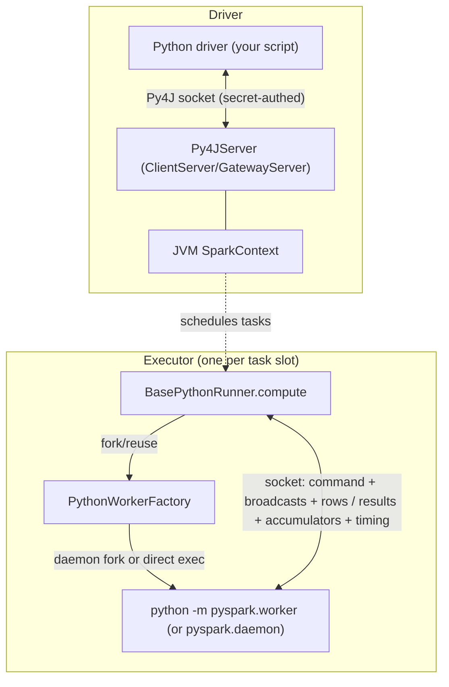

This group is the cross-language substrate under `core/src/main/scala/org/apache/spark/api/`. It answers a single question that both I3 (User-Defined Functions) and I4 (RDD Fundamentals) keep bumping into: **when you write a Python `lambda`, a `@udf`, or a pandas UDF, what actually runs it?** The answer is never "the JVM." The JVM forks (or reuses) an external Python process, streams the command and the rows to it over a socket, and reads results back. Everything else here — worker pooling, the socket handshake, traceback propagation, memory caps, the Py4J driver gateway, the R equivalent — is machinery around that one pipe.

!!! note "Two bridges, not one"

    Keep them separate: the **driver-side Py4J gateway** (`Py4JServer`) is how the Python *driver* program drives the JVM `SparkContext`; the **executor-side worker protocol** (`BasePythonRunner` ↔ `pyspark.worker`) is how each *task* ships rows to a Python process. They share a security helper but nothing else.



---

## PythonRDD and the pipe-to-worker model

**What it is:** `PythonRDD` is the RDD-layer face of the bridge — the thing a `sc.parallelize(...).map(pyfunc)` chain becomes on the JVM side. It wraps a parent JVM RDD, carries the pickled Python function(s) as `ChainedPythonFunctions`, and on `compute()` hands the parent's iterator to a `PythonRunner`. It also hosts the "serving" helpers (`collectAndServe`, `PythonParallelizeServer`) that stream results back to the Python driver over an auth'd socket, and `PairwiseRDD` for the shuffle key/value split. This is the I4 anchor: the classic RDD "pipe each partition through an external process" model.

**Code path:** `PythonRDD.compute` → `PythonRunner(func).compute(parentIter, split, context)` → (writer serializes rows to worker; reader pulls bytes back). For driver-side result collection: `PythonRDD.collectAndServe(rdd)` → `serveIterator` → `SocketAuthServer` (Python connects, authenticates, drains). A `PythonFunction` is `SimplePythonFunction` (command bytes + env + includes + broadcasts + accumulator); chaining stacks them bottom-to-top so `f(g(x))` runs in one worker trip.

**Anchor files:**

- [PythonRDD.scala:54](https://github.com/apache/spark/blob/v4.2.0/core/src/main/scala/org/apache/spark/api/python/PythonRDD.scala#L54) — `class PythonRDD`
- [PythonRDD.scala:82](https://github.com/apache/spark/blob/v4.2.0/core/src/main/scala/org/apache/spark/api/python/PythonRDD.scala#L82) — `PythonFunction` trait (`broadcastVars`, `accumulator`)
- [PythonRDD.scala:127](https://github.com/apache/spark/blob/v4.2.0/core/src/main/scala/org/apache/spark/api/python/PythonRDD.scala#L127) — `ChainedPythonFunctions`
- [PythonRDD.scala:163](https://github.com/apache/spark/blob/v4.2.0/core/src/main/scala/org/apache/spark/api/python/PythonRDD.scala#L163) — `PairwiseRDD` (key/value split for shuffle)
- [PythonRDD.scala:231](https://github.com/apache/spark/blob/v4.2.0/core/src/main/scala/org/apache/spark/api/python/PythonRDD.scala#L231) — `collectAndServe`

**Configs:** `spark.buffer.size` (the JVM↔worker transfer buffer — see the runner concept for the confirmation).

**Maps to topics:** I4

---

## BasePythonRunner — the Python UDF execution protocol

**What it is:** The heart of the whole group. `BasePythonRunner[IN, OUT]` is the abstract per-task driver of the socket protocol; concrete subclasses live in SQL (`ArrowPythonRunner`, `PythonUDFRunner`, …) and here in core (`PythonRunner` for `NON_UDF` mapPartitions). Its `compute()` acquires a worker, opens the stream, writes a strict byte-framed command section, then interleaves writing input rows with reading output rows. This *is* the "Python UDF execution path" that I3 is about — every batched, Arrow, and pandas UDF rides this exact writer/reader.

**Code path:** `compute()` → sets env vars (`SPARK_REUSE_WORKER`, `SPARK_BUFFER_SIZE`, `PYSPARK_EXECUTOR_MEMORY_MB`, fault-handler dir, traceback interval) → `env.createPythonWorker(...)` → builds a `Writer` and a `ReaderInputStream` → returns an `InterruptibleIterator`.

The **Writer.open** sequence (the wire format, in order) is: partition index → Python version → *(barrier only: bind a `ServerSocketChannel` and spawn an accept loop)* → `TaskContextInfo` (carrying the barrier socket addr + auth secret) → Spark files → broadcast vars → `evalType` (the `Int` that tells the worker *which* Python entry point to run) → runner conf → eval conf → the command (pickled UDF) → flush. Input rows then stream via `writeNextInputToStream` until `END_OF_DATA_SECTION`.

The **`evalType`** dispatch is defined by `PythonEvalType`: `NON_UDF=0`, `SQL_BATCHED_UDF=100`, `SQL_ARROW_BATCHED_UDF=101`, the pandas family `200–217`, the pure-Arrow family `250–254`, and UDTFs `300–302`. This single integer is how the same runner selects batched-pickle vs Arrow-batch vs pandas-iterator execution on the Python side.

The **ReaderIterator.read** loop switches on a framing length: `>=0` → that many bytes of a result batch; `TIMING_DATA (-3)` → boot/init/finish metrics + spill counters; `PYTHON_EXCEPTION_THROWN (-2)` → build a `PythonException`; `END_OF_DATA_SECTION (-1)` → drain accumulator updates then maybe release the worker.

**The socket handshake / auth:** the runner reads `spark.python.authenticate.socketTimeout` and passes it as `SPARK_AUTH_SOCKET_TIMEOUT`; the actual challenge/response is done by `SocketAuthHelper` (owned by the [config & security sweep](core-config-security.md) — referenced, not re-derived here). The auth secret is written into the `TaskContextInfo` for the barrier back-channel and used by `authHelper.authClient`/`authToServer` in the factory.

!!! info "`spark.buffer.size` belongs here"

    Confirmed from source: `BasePythonRunner` reads `conf.get(BUFFER_SIZE)` into `bufferSize` and wires it both as the `BufferedInputStream` size and as the target the `ReaderInputStream` tries not to grow the write buffer beyond, and exports it as `SPARK_BUFFER_SIZE`. Its *home* is the generic IO buffer in `config/package.scala`, but as the **JVM↔worker transfer buffer** it is a legitimate in-scope config for this group. `PythonAccumulatorV2` and `BaseRRunner` read the same key for the same reason.

**Single-threaded writer (SPARK-44705):** unlike older Spark, the writer is *not* a separate thread — `ReaderInputStream` drives `writeAdditionalInputToPythonWorker()` inline when the selector reports the socket writable, and juggles the `InputFileBlockHolder` thread-local by hand so `input_file_name()` keeps working after the multi-thread→single-thread switch.

**Anchor files:**

- [PythonRunner.scala:189](https://github.com/apache/spark/blob/v4.2.0/core/src/main/scala/org/apache/spark/api/python/PythonRunner.scala#L189) — `abstract class BasePythonRunner`
- [PythonRunner.scala:275](https://github.com/apache/spark/blob/v4.2.0/core/src/main/scala/org/apache/spark/api/python/PythonRunner.scala#L275) — `compute()` (env setup, worker acquire, monitor start)
- [PythonRunner.scala:418](https://github.com/apache/spark/blob/v4.2.0/core/src/main/scala/org/apache/spark/api/python/PythonRunner.scala#L418) — `Writer.open` (the exact wire order)
- [PythonRunner.scala:49](https://github.com/apache/spark/blob/v4.2.0/core/src/main/scala/org/apache/spark/api/python/PythonRunner.scala#L49) — `PythonEvalType` (batched/Arrow/pandas dispatch integers)
- [PythonRunner.scala:582](https://github.com/apache/spark/blob/v4.2.0/core/src/main/scala/org/apache/spark/api/python/PythonRunner.scala#L582) — `ReaderIterator` (`read()` framing switch, `SpecialLengths`)
- [PythonRunner.scala:1080](https://github.com/apache/spark/blob/v4.2.0/core/src/main/scala/org/apache/spark/api/python/PythonRunner.scala#L1080) — `SpecialLengths` (protocol sentinels)
- [Python.scala:59](https://github.com/apache/spark/blob/v4.2.0/core/src/main/scala/org/apache/spark/internal/config/Python.scala#L59) — `spark.python.authenticate.socketTimeout`
- [package.scala:2208](https://github.com/apache/spark/blob/v4.2.0/core/src/main/scala/org/apache/spark/internal/config/package.scala#L2208) — `spark.buffer.size`

**Configs:** `spark.buffer.size`, `spark.python.authenticate.socketTimeout`, `spark.python.worker.reuse` (read here to set `SPARK_REUSE_WORKER` and gate worker release).

!!! info "Arrow serialization toggles live in SQL, not here"

    `spark.sql.execution.arrow.*` (batch size, safe/unsafe casts, fallback) are parsed in the SQL subsystem. What lives *here* is the **mechanism** those toggles ride: the worker process, this socket, and the `START_ARROW_STREAM (-6)` sentinel that flips the reader into pulling Arrow record batches. Map behaviour to `spark.sql.execution.arrow.*` in the SQL sweep; map the transport to this concept.

**Maps to topics:** I3

---

## Worker lifecycle — PythonWorkerFactory (daemon, reuse, idle pool, UDS)

**What it is:** `PythonWorkerFactory` owns the actual OS processes. Because forking from the JVM is expensive, the default path launches one long-lived **daemon** (`pyspark.daemon`) per (`pythonExec`, module, envVars) key and asks it to `fork()` cheap workers; the fallback path execs `pyspark.worker` **directly** (used on Windows, which can't fork, or when the daemon is disabled). It also implements **worker reuse** (an idle pool workers are returned to instead of being killed) and the **transport choice** between a loopback TCP socket and a **Unix domain socket** (new in 4.1).

**Code path:** `SparkEnv.createPythonWorker` → `PythonWorkerFactory.create()`. If daemon mode: drain `idleWorkers` for a live one, else `createThroughDaemon()` → `startDaemon()` (spawn `python -m pyspark.daemon pyspark.worker`, read back the port or UDS path) → `createWorker()` (connect, read child pid, `authHelper.authToServer`, register a non-blocking `SocketChannel` in a `Selector`). Non-daemon: `createSimpleWorker()` execs `python -m pyspark.worker`, binds a server socket/UDS, waits for the worker to connect back, authenticates. On task completion the runner calls `env.releasePythonWorker` → `releaseWorker()`, which (daemon mode) enqueues the worker into `idleWorkers`, evicting the LRU (oldest) if the pool is at `maxIdleWorkerPoolSize`.

**Two idle-timeout mechanisms — don't conflate them:**

- `PythonWorkerFactory`'s own `MonitorThread` kills *pooled idle workers* after a hard-coded 1 minute of factory inactivity (`IDLE_WORKER_TIMEOUT_NS`) — not configurable.
- `spark.python.worker.idleTimeoutSeconds` (+ `killOnIdleTimeout`) is a *per-task* selector timeout inside `ReaderInputStream.read`: if the worker sends nothing for that long, Spark logs the socket status, and *optionally* destroys the process. Default `0` = wait forever.

**Transport (4.1+):** `spark.python.unix.domain.socket.enabled` (defaults to `PYSPARK_UDS_MODE=true` in env) switches every socket in this group from loopback TCP to a UDS file under `spark.python.unix.domain.socket.dir` (or `java.io.tmpdir`); the dir is length-checked because the UDS path must stay under 104 chars. UDS skips the auth-secret exchange (filesystem perms are the boundary).

**Anchor files:**

- [PythonWorkerFactory.scala:74](https://github.com/apache/spark/blob/v4.2.0/core/src/main/scala/org/apache/spark/api/python/PythonWorkerFactory.scala#L74) — `class PythonWorkerFactory`
- [PythonWorkerFactory.scala:132](https://github.com/apache/spark/blob/v4.2.0/core/src/main/scala/org/apache/spark/api/python/PythonWorkerFactory.scala#L132) — `create()` (idle-pool drain vs daemon vs simple)
- [PythonWorkerFactory.scala:163](https://github.com/apache/spark/blob/v4.2.0/core/src/main/scala/org/apache/spark/api/python/PythonWorkerFactory.scala#L163) — `createThroughDaemon`
- [PythonWorkerFactory.scala:229](https://github.com/apache/spark/blob/v4.2.0/core/src/main/scala/org/apache/spark/api/python/PythonWorkerFactory.scala#L229) — `createSimpleWorker` (Windows / non-daemon fork)
- [PythonWorkerFactory.scala:313](https://github.com/apache/spark/blob/v4.2.0/core/src/main/scala/org/apache/spark/api/python/PythonWorkerFactory.scala#L313) — `startDaemon`
- [PythonWorkerFactory.scala:512](https://github.com/apache/spark/blob/v4.2.0/core/src/main/scala/org/apache/spark/api/python/PythonWorkerFactory.scala#L512) — `releaseWorker` (idle pool + LRU eviction)
- [PythonWorkerFactory.scala:440](https://github.com/apache/spark/blob/v4.2.0/core/src/main/scala/org/apache/spark/api/python/PythonWorkerFactory.scala#L440) — idle-worker `MonitorThread` (fixed 1-min)
- [PythonRunner.scala:800](https://github.com/apache/spark/blob/v4.2.0/core/src/main/scala/org/apache/spark/api/python/PythonRunner.scala#L800) — per-task idle-timeout selector logic

**Configs:** `spark.python.use.daemon`, `spark.python.daemon.module`, `spark.python.worker.module`, `spark.python.worker.reuse`, `spark.python.factory.idleWorkerMaxPoolSize`, `spark.python.worker.idleTimeoutSeconds`, `spark.python.worker.killOnIdleTimeout`, `spark.python.unix.domain.socket.enabled`, `spark.python.unix.domain.socket.dir`, and `spark.executor.python.worker.log.details` (gates `PythonUtils.logPythonInfo`, which shells out to log the worker's Python version/executable at first use).

**Maps to topics:** I3, I4

---

## Error and edge paths — faults, tracebacks, kills, memory limits

**What it is:** The valuable, load-bearing part. A Python worker is an external process that can raise, hang, crash, or OOM, and the JVM has to turn each of those into a sane Spark failure. This concept collects the failure plumbing.

**Traceback propagation:** when the reader hits `PYTHON_EXCEPTION_THROWN (-2)`, `handlePythonException()` reads the worker's formatted traceback string and wraps it as a `PythonException` with `errorClass = "PYTHON_EXCEPTION"`, chaining any writer-side exception as the cause. `SPARK_HIDE_TRACEBACK` / `SPARK_SIMPLIFIED_TRACEBACK` env vars (set from the runner's `hideTraceback`/`simplifiedTraceback` fields) tune how much of that the worker emits.

**Crash / fault handler:** if the worker dies without a protocol message, the reader gets an `IOException`. With `spark.python.worker.faulthandler.enabled`, the worker installs Python's `faulthandler` writing to `PYTHON_FAULTHANDLER_DIR`; on crash the JVM reads back that per-pid log (`tryReadFaultHandlerLog`) and appends the native stack to the `SparkException`. Without it, the error just tells you to enable it.

**Traceback dumping:** `spark.python.worker.tracebackDumpIntervalSeconds > 0` exports `PYTHON_TRACEBACK_DUMP_INTERVAL_SECONDS` so a *stuck* (not crashed) worker periodically dumps its own traceback to stderr — the tool for diagnosing hangs.

**Task kill:** the `MonitorThread` (one per worker/task) polls `context.isInterrupted`/`isCompleted`; on an interrupt that the task won't honor, it waits `spark.python.task.killTimeout` (default 2s) then `env.destroyPythonWorker`, so a cancelled job can't block forever on a wedged Python process.

**Flush-failure policy (4.1):** `spark.python.daemon.killWorkerOnFlushFailure` (default true, daemon mode) exports `PYTHON_DAEMON_KILL_WORKER_ON_FLUSH_FAILURE=1`; the worker then lets output-flush exceptions kill it (so Spark detects the failure and retries) instead of swallowing them and risking a protocol-desync hang.

**Memory enforcement:** `spark.executor.pyspark.memory` (MiB) is divided by executor cores in `getWorkerMemoryMb` and exported as `PYSPARK_EXECUTOR_MEMORY_MB`. The actual cap is applied **on the Python side**, not the JVM: `worker_util.setup_memory_limits` calls `resource.setrlimit(RLIMIT_AS, ...)`.

!!! warning "`spark.executor.pyspark.memory` is effectively Linux-only"

    Verified in source: `resource`-based limiting is a no-op where the module or the rlimit isn't honored — the code comment states *"Windows does not support resource limiting and actual resource is not limited on MacOS."* So treat `spark.executor.pyspark.memory` as a hard cap on Linux and merely advisory elsewhere.

**Anchor files:**

- [PythonRunner.scala:661](https://github.com/apache/spark/blob/v4.2.0/core/src/main/scala/org/apache/spark/api/python/PythonRunner.scala#L661) — `handlePythonException` → `PythonException`
- [PythonRunner.scala:686](https://github.com/apache/spark/blob/v4.2.0/core/src/main/scala/org/apache/spark/api/python/PythonRunner.scala#L686) — `handleException` (interrupt / crash / faulthandler branches)
- [PythonRunner.scala:130](https://github.com/apache/spark/blob/v4.2.0/core/src/main/scala/org/apache/spark/api/python/PythonRunner.scala#L130) — `tryReadFaultHandlerLog`
- [PythonRunner.scala:720](https://github.com/apache/spark/blob/v4.2.0/core/src/main/scala/org/apache/spark/api/python/PythonRunner.scala#L720) — `MonitorThread` (task-kill timeout)
- [PythonRunner.scala:271](https://github.com/apache/spark/blob/v4.2.0/core/src/main/scala/org/apache/spark/api/python/PythonRunner.scala#L271) — `getWorkerMemoryMb` (per-core divide)
- [worker_util.py:95](https://github.com/apache/spark/blob/v4.2.0/python/pyspark/worker_util.py#L95) — `setup_memory_limits` (`setrlimit`, platform caveat)

**Configs:** `spark.python.worker.faulthandler.enabled`, `spark.python.worker.tracebackDumpIntervalSeconds`, `spark.python.task.killTimeout`, `spark.python.daemon.killWorkerOnFlushFailure`, `spark.executor.pyspark.memory`.

**Maps to topics:** I3

---

## PythonBroadcast and PythonAccumulatorV2 — side-channel state

**What it is:** The two ways state crosses the bridge outside the row stream. `PythonBroadcast` ships a broadcast variable's on-disk bytes to the worker (with an `EncryptedPythonBroadcastServer` path when IO encryption is on). `PythonAccumulatorV2` is the JVM-side collector that receives pickled accumulator updates *back* from the worker after the data section — the mechanism behind PySpark `Accumulator`. Both are the I4 "shared variables" story made concrete.

**Code path:** broadcasts are written in `Writer.open` via `PythonWorkerUtils.writeBroadcasts`; encrypted ones stream through a `SocketAuthServer`. Accumulator updates flow the other way: `handleEndOfDataSection` → `PythonWorkerUtils.receiveAccumulatorUpdates` → `PythonAccumulatorV2.merge`, which (on the driver) opens a reused socket (TCP or UDS), sends the pickled values, and waits for a one-byte ack.

**Anchor files:**

- [PythonRDD.scala:747](https://github.com/apache/spark/blob/v4.2.0/core/src/main/scala/org/apache/spark/api/python/PythonRDD.scala#L747) — `PythonAccumulatorV2` (socket-back-channel merge, UDS-aware)
- [PythonRDD.scala:824](https://github.com/apache/spark/blob/v4.2.0/core/src/main/scala/org/apache/spark/api/python/PythonRDD.scala#L824) — `PythonBroadcast`
- [PythonRDD.scala:989](https://github.com/apache/spark/blob/v4.2.0/core/src/main/scala/org/apache/spark/api/python/PythonRDD.scala#L989) — `EncryptedPythonBroadcastServer`
- [PythonRunner.scala:671](https://github.com/apache/spark/blob/v4.2.0/core/src/main/scala/org/apache/spark/api/python/PythonRunner.scala#L671) — `handleEndOfDataSection` (accumulator receive + worker release)

**Configs:** `spark.buffer.size` (accumulator socket buffer), `spark.python.unix.domain.socket.enabled` (chooses UDS vs TCP for the accumulator server).

**Maps to topics:** I4

---

## Py4J driver gateway and the PySpark app entry

**What it is:** The **driver-side** bridge — completely distinct from the executor worker protocol above. When you run a PySpark program, a JVM must exist for the Python driver to call into (`sc._jvm...`). `Py4JServer` wraps either a Py4J `ClientServer` (pinned-thread mode, the default) or a `GatewayServer`, both bound to loopback and protected by a per-process secret. `PythonGatewayServer` is the tiny `main` that PySpark's own `java_gateway.py` launches; `deploy.PythonRunner` is the `main` that `spark-submit <app.py>` invokes — it starts the gateway, builds `PYTHONPATH`, and execs the user's Python file as a subprocess.

**Code path (spark-submit of a .py):** `SparkSubmit` → `deploy.PythonRunner.main` → resolve `pythonExec` (`spark.pyspark.driver.python` → `spark.pyspark.python` → `PYSPARK_DRIVER_PYTHON` → `PYSPARK_PYTHON` → `"python3"`) → start `Py4JServer` on a thread → set `PYSPARK_GATEWAY_PORT`/`PYSPARK_GATEWAY_SECRET` → `ProcessBuilder(pythonExec, appFile).start()` → wait for exit. `spark.yarn.isPython` is *set* (not read) by `SparkSubmit` when the primary resource is Python, so YARN knows to ship the PySpark archives.

**Anchor files:**

- [Py4JServer.scala:31](https://github.com/apache/spark/blob/v4.2.0/core/src/main/scala/org/apache/spark/api/python/Py4JServer.scala#L31) — `Py4JServer` (ClientServer vs GatewayServer, secret)
- [PythonGatewayServer.scala:34](https://github.com/apache/spark/blob/v4.2.0/core/src/main/scala/org/apache/spark/api/python/PythonGatewayServer.scala#L34) — gateway `main` (writes port+secret to conn-info file)
- [deploy/PythonRunner.scala:41](https://github.com/apache/spark/blob/v4.2.0/core/src/main/scala/org/apache/spark/deploy/PythonRunner.scala#L41) — the `spark-submit` app entry
- [deploy/PythonRunner.scala:47](https://github.com/apache/spark/blob/v4.2.0/core/src/main/scala/org/apache/spark/deploy/PythonRunner.scala#L47) — `pythonExec` resolution order
- [package.scala:1159](https://github.com/apache/spark/blob/v4.2.0/core/src/main/scala/org/apache/spark/internal/config/package.scala#L1159) — `spark.pyspark.driver.python` / `spark.pyspark.python`
- [package.scala:716](https://github.com/apache/spark/blob/v4.2.0/core/src/main/scala/org/apache/spark/internal/config/package.scala#L716) — `spark.yarn.isPython`

**Configs:** `spark.pyspark.python`, `spark.pyspark.driver.python`, `spark.yarn.isPython`.

**Maps to topics:** I3 (this is the driver half of "how PySpark runs"; UDF authoring assumes this gateway exists). The gateway itself is largely plumbing, but it is the natural home for the `pyspark.python` executor-selection configs that I3 readers hit.

---

## spark.api.mode — Classic vs Spark Connect selection

**What it is:** A 4.0+ switch (`classic` | `connect`) read at the PySpark app entry. In `connect` mode (or when `spark.remote` is set), `deploy.PythonRunner` skips the local Py4J gateway and instead exports the conf as `PYSPARK_REMOTE_INIT_CONF_*` env vars so the Python side spins up a Spark Connect client against a (possibly local, app-scoped) Connect server. Default derives from `SPARK_CONNECT_MODE=1`.

**Code path:** `deploy.PythonRunner.main` reads `SPARK_API_MODE`; `isAPIModeConnect` gates the `PYSPARK_REMOTE_INIT_CONF` path and `SPARK_REMOTE` env, while `isAPIModeClassic` gates gateway startup and `MASTER`.

**Anchor files:**

- [package.scala:2930](https://github.com/apache/spark/blob/v4.2.0/core/src/main/scala/org/apache/spark/internal/config/package.scala#L2930) — `spark.api.mode` definition
- [deploy/PythonRunner.scala:56](https://github.com/apache/spark/blob/v4.2.0/core/src/main/scala/org/apache/spark/deploy/PythonRunner.scala#L56) — mode branching at the entry point

**Configs:** `spark.api.mode`.

!!! info "Connect routes to a different architecture"

    Under `connect`, the executor worker protocol described above still exists on the *server*, but the driver↔server path is gRPC/Arrow via the **connect** subsystem, not Py4J. Trace the Connect client/plan protocol in the connect sweep, not here.

**Maps to topics:** [] — pure entry-point routing/plumbing; the Connect-vs-Classic learning content belongs to whatever topic covers Spark Connect, and the mechanism it selects lives in a different subsystem. Not distinct enough from I3 to warrant a new code.

---

## The R bridge — RBackend and RRunner

**What it is:** SparkR's mirror of the Python design, same shape, smaller. `RBackend` is a **Netty** server (the driver-side gateway analog to Py4J) that lets the R process call JVM methods, tracked by `JVMObjectTracker`. `RRunner`/`BaseRRunner` is the **per-task** analog to `BasePythonRunner`: it launches an R worker (via a daemon `daemon.R` on Unix, or `worker.R` directly), uses **two sockets** (one in, one out — to sidestep deadlock rather than one bidirectional socket) and streams serialized partitions through `SerDe`. `RRDD`/`BaseRRDD` is the RDD face.

**Code path:** `RBackend.init()` → Netty `ServerBootstrap` with `RBackendHandler`, frame decoder (4-byte length prefix, up to 2GB), `ReadTimeoutHandler(spark.r.backendConnectionTimeout)`, `RBackendAuthHandler`; `spark.r.numRBackendThreads` sizes the event loop. Per task: `BaseRRDD.compute` → `RRunner.compute` → bind a server socket, `createRWorker` (daemon fork or direct), accept the in-socket (write func + broadcasts + partition) and the out-socket (read results), auth both via `RAuthHelper`. `createRProcess` resolves the R binary from `spark.r.command` (falling back to the deprecated `spark.sparkr.r.command`, default `Rscript`) and passes `spark.r.backendConnectionTimeout` to the worker.

**Anchor files:**

- [RBackend.scala:39](https://github.com/apache/spark/blob/v4.2.0/core/src/main/scala/org/apache/spark/api/r/RBackend.scala#L39) — `RBackend` (Netty server, thread/timeout wiring at L48)
- [BaseRRunner.scala:37](https://github.com/apache/spark/blob/v4.2.0/core/src/main/scala/org/apache/spark/api/r/BaseRRunner.scala#L37) — `BaseRRunner` (two-socket `compute` at L51)
- [BaseRRunner.scala:291](https://github.com/apache/spark/blob/v4.2.0/core/src/main/scala/org/apache/spark/api/r/BaseRRunner.scala#L291) — `createRProcess` (`spark.r.command`/`spark.sparkr.r.command` resolution)
- [BaseRRunner.scala:323](https://github.com/apache/spark/blob/v4.2.0/core/src/main/scala/org/apache/spark/api/r/BaseRRunner.scala#L323) — `createRWorker` (daemon vs direct)
- [RRDD.scala:35](https://github.com/apache/spark/blob/v4.2.0/core/src/main/scala/org/apache/spark/api/r/RRDD.scala#L35) — `BaseRRDD` / `RRDD`
- [R.scala:21](https://github.com/apache/spark/blob/v4.2.0/core/src/main/scala/org/apache/spark/internal/config/R.scala#L21) — the five `spark.r.*` configs

**Configs:** `spark.r.backendConnectionTimeout`, `spark.r.numRBackendThreads`, `spark.r.heartBeatInterval`, `spark.r.command`, `spark.sparkr.r.command`. (`spark.r.heartBeatInterval` is passed through to the R side to keep the connection alive; `spark.sparkr.r.command` is deprecated in favour of `spark.r.command`.)

**Maps to topics:** I3, I4 (R UDFs and R RDDs — same substrate, lower priority than Python).

---

## The Java bridge — JavaRDD and friends

**What it is:** The thinnest layer in the group: `JavaRDD`, `JavaPairRDD`, `JavaDoubleRDD`, `JavaSparkContext`, and the `function` SAM interfaces are type-bridging wrappers over the Scala RDD API, giving Java callers `Optional`-based nulls and Java-friendly function interfaces. No process bridge, no sockets, no configs — it is a compile-time convenience over the same JVM RDDs.

**Anchor files:**

- [JavaRDD.scala](https://github.com/apache/spark/blob/v4.2.0/core/src/main/scala/org/apache/spark/api/java/JavaRDD.scala) — `JavaRDD` wrapper
- [JavaSparkContext.scala](https://github.com/apache/spark/blob/v4.2.0/core/src/main/scala/org/apache/spark/api/java/JavaSparkContext.scala) — Java entry point
- [JavaPairRDD.scala](https://github.com/apache/spark/blob/v4.2.0/core/src/main/scala/org/apache/spark/api/java/JavaPairRDD.scala) — key/value wrapper

**Configs:** none.

**Maps to topics:** I4 (as a wrapper note; not a first-class learning target).

---

## Python worker log capture — the executor side

**What it is:** the producer half of the mechanism the [storage sweep](core-storage-serializer.md) traces from the block side. A Python worker's stdout is normally redirected to the executor's stderr and lost. When log capture is active, that stream is wrapped first: every line is scanned for a `PYTHON_WORKER_LOGGING:` marker, and marked lines are diverted into a `RollingLogWriter` that stores them as `BlockManager` blocks instead of vanishing into the executor log.

**Code path:** `PythonWorkerFactory.redirectStreamsToStderr` → `workerLogCapture.wrapInputStream(stdout)` → `CaptureWorkerLogsInputStream` reads line by line → marker present? → `RollingLogWriter.writeLog` → `PythonWorkerLogBlockId` block : pass through to stderr

**Anchor files:**

- [PythonWorkerFactory.scala:420](https://github.com/apache/spark/blob/v4.2.0/core/src/main/scala/org/apache/spark/api/python/PythonWorkerFactory.scala#L420) — capture exists **only if `PYSPARK_SPARK_SESSION_UUID` is in the worker env**; without it the `Option` is `None` and the stream is unwrapped
- [PythonWorkerFactory.scala:428](https://github.com/apache/spark/blob/v4.2.0/core/src/main/scala/org/apache/spark/api/python/PythonWorkerFactory.scala#L428) — the wrap is applied to **stdout only**; stderr is redirected raw, so a Python traceback still goes to the executor log rather than into a block
- [PythonWorkerLogCapture.scala:39](https://github.com/apache/spark/blob/v4.2.0/core/src/main/scala/org/apache/spark/api/python/PythonWorkerLogCapture.scala#L39) — one capture per session, with a `ConcurrentHashMap` of writers keyed by worker PID
- [PythonWorkerLogCapture.scala:113](https://github.com/apache/spark/blob/v4.2.0/core/src/main/scala/org/apache/spark/api/python/PythonWorkerLogCapture.scala#L113) — the marker search: `line.indexOf("PYTHON_WORKER_LOGGING:")`
- [PythonWorkerLogCapture.scala:148](https://github.com/apache/spark/blob/v4.2.0/core/src/main/scala/org/apache/spark/api/python/PythonWorkerLogCapture.scala#L148) — `CaptureWorkerLogsInputStream`, a line-buffered `InputStream` wrapper

!!! info "It is a text protocol over stdout, not a side channel"

    Capture works by string-matching a marker on each line of the worker's stdout. That has two consequences worth knowing: a bare `print()` with no marker is *not* captured — it passes through to the executor log as before, so this surfaces logs emitted through PySpark's logging integration rather than everything a UDF writes; and a line of user data that happens to contain the marker string is treated as a log line. The block side, retention and the 32 MiB roll are in the [storage sweep](core-storage-serializer.md).

**Configs:** `spark.executor.python.worker.log.details`

**Maps to topics:** E3, I3

---

## SerDeUtil and the pickle boundary

**What it is:** how JVM objects become Python objects on the **RDD** path — the non-Arrow boundary. Pickling goes through Pyrolite's `Pickler`/`Unpickler`, and the batching is adaptive: `AutoBatchedPickler` starts at one object per batch and doubles or halves to keep each pickled batch roughly between 1 MB and 10 MB.

**Anchor files:**

- [SerDeUtil.scala:82](https://github.com/apache/spark/blob/v4.2.0/core/src/main/scala/org/apache/spark/api/python/SerDeUtil.scala#L82) — `AutoBatchedPickler`
- [SerDeUtil.scala:97](https://github.com/apache/spark/blob/v4.2.0/core/src/main/scala/org/apache/spark/api/python/SerDeUtil.scala#L97) — the whole adaptive rule: `< 1 MB` → `batch *= 2`, `> 10 MB` → `batch /= 2`. Not a config, and it adapts per partition from a cold start of 1
- [SerDeUtil.scala:83](https://github.com/apache/spark/blob/v4.2.0/core/src/main/scala/org/apache/spark/api/python/SerDeUtil.scala#L83) — `useMemo = true`: the pickler memoises repeated object references *within a batch*, so batch size changes compression as well as framing
- [SerDeUtil.scala:55](https://github.com/apache/spark/blob/v4.2.0/core/src/main/scala/org/apache/spark/api/python/SerDeUtil.scala#L55) — constructors registered for both `__builtin__` and `builtins`, the Python 2/3 split still present in the unpickler
- [SerDeUtil.scala:118](https://github.com/apache/spark/blob/v4.2.0/core/src/main/scala/org/apache/spark/api/python/SerDeUtil.scala#L118) — `pythonToJava(rdd, batched)`: the reverse direction, where the caller must know whether the stream was batched

!!! info "This is the path Arrow replaced, and it still runs"

    `df.rdd`, `rdd.collect()` on a Python RDD, `parallelize` of Python objects, and every non-Arrow UDF path go through here — one pickled blob per adaptive batch, object by object. The Arrow path (`execution/arrow/`, covered by the `sql/core — python-arrow` group) moves columnar batches instead and is why pandas UDFs are faster than plain Python UDFs. When someone asks why `df.rdd.map(...)` is slow on a DataFrame that was fine in SQL, this boundary is the answer.

**Maps to topics:** I3, I4, A5

---

## StreamingPythonRunner — the streaming worker

**What it is:** a separate Python worker used by streaming query processing, notably for `foreachBatch` and stateful Python operators. Unlike `BasePythonRunner`, it does not stream records over the pipe: it hands the worker a **Spark Connect URL pointing back at the local session** and lets the Python side drive a real DataFrame API against it.

**Anchor files:**

- [StreamingPythonRunner.scala:43](https://github.com/apache/spark/blob/v4.2.0/core/src/main/scala/org/apache/spark/api/python/StreamingPythonRunner.scala#L43) — the class
- [StreamingPythonRunner.scala:63](https://github.com/apache/spark/blob/v4.2.0/core/src/main/scala/org/apache/spark/api/python/StreamingPythonRunner.scala#L63) — `init()` returns the raw `(DataOutputStream, DataInputStream)` pair after a handshake
- [StreamingPythonRunner.scala:74](https://github.com/apache/spark/blob/v4.2.0/core/src/main/scala/org/apache/spark/api/python/StreamingPythonRunner.scala#L74) — `SPARK_CONNECT_LOCAL_URL`: the worker talks Connect back to the same JVM
- [StreamingPythonRunner.scala:135](https://github.com/apache/spark/blob/v4.2.0/core/src/main/scala/org/apache/spark/api/python/StreamingPythonRunner.scala#L135) — three distinct initialization failures: a communication exception, a **timeout**, and a non-zero response from Python

!!! info "Why `foreachBatch` in Python can use the full DataFrame API"

    A `foreachBatch` body receives a real DataFrame, not pickled rows — which only works because the Python side has a Connect session pointing back at the driver's own JVM. That is also why its failure modes differ from a UDF's: initialization can fail with a timeout or a protocol error before any user code runs, each with its own exception type, rather than surfacing as a Python traceback in the middle of a batch.

**Maps to topics:** A7, A8, I3

---

## Command shipping and the broadcast threshold

**What it is:** how the pickled Python function reaches the executor at all. `_prepare_for_python_RDD` cloudpickles the command, and — this is the part nobody expects — **if the pickled bytes exceed `spark.broadcast.UDFCompressionThreshold` (default 1 MiB), the command is not shipped with the task at all**. It is broadcast, and what travels in the task is a pickled reference to the broadcast. Below the threshold the command bytes ride inside every task description.

**Code path:** `_prepare_for_python_RDD(sc, command)` → `CloudPickleSerializer().dumps(command)` → `len(pickled) > PythonUtils.getBroadcastThreshold(jsc)`? → `sc.broadcast(pickled_command)` and re-pickle the broadcast handle : keep the raw bytes → `SimplePythonFunction(command = …)` → `PythonWorkerUtils.writePythonFunction` writes it into the worker's command section.

**Anchor files:**

- [rdd.py:5104](https://github.com/apache/spark/blob/v4.2.0/python/pyspark/core/rdd.py#L5104) — `_prepare_for_python_RDD`
- [rdd.py:5109](https://github.com/apache/spark/blob/v4.2.0/python/pyspark/core/rdd.py#L5109) — the threshold test, with the comment `# Default 1M`
- [PythonUtils.scala:92](https://github.com/apache/spark/blob/v4.2.0/core/src/main/scala/org/apache/spark/api/python/PythonUtils.scala#L92) — `getBroadcastThreshold`, the Py4J accessor Python calls
- [package.scala:2271](https://github.com/apache/spark/blob/v4.2.0/core/src/main/scala/org/apache/spark/internal/config/package.scala#L2271) — `spark.broadcast.UDFCompressionThreshold` (`1L * 1024 * 1024`, since 3.0.0)
- [PythonWorkerUtils.scala:191](https://github.com/apache/spark/blob/v4.2.0/core/src/main/scala/org/apache/spark/api/python/PythonWorkerUtils.scala#L191) — `writePythonFunction`

!!! info "Why a fat closure changes shape rather than just getting slower"

    A UDF that captures a large object (a model, a lookup dict, a DataFrame's worth of constants) crosses the threshold and silently becomes a broadcast. That is usually the behaviour you wanted — one copy per executor instead of one per task — but it also means the object's lifetime is now tied to the `PythonRDD`, it is fetched through the block manager, and IO encryption pulls in the decryption-server path below. The switch is invisible: no warning, no plan change, only the different failure mode when it goes wrong.

**Configs:** `spark.broadcast.UDFCompressionThreshold`.

**Maps to topics:** I3, I4, I14

---

## PythonWorkerUtils — the wire codec and the broadcast delta protocol

**What it is:** the codec every frame in this group is written with, plus the one genuinely stateful piece of the protocol. Every string is length-prefixed UTF-8 (`writeUTF` → `writeBytes` → `writeInt(len); write(bytes)`), matching `FramedSerializer._read_with_length` on the Python side. `writeTaskContext` serializes the task context to **JSON** — barrier flag, connection info, secret, stage/partition/attempt ids, cpus, resources, and the full local-properties map — for `worker_util.setup_task_context`.

**The broadcast delta:** broadcasts are *not* re-sent per task. `PythonRDD.getWorkerBroadcasts(worker)` keeps a per-worker set of broadcast ids, and `writeBroadcasts` sends only the difference: removals are encoded as **`-bid - 1`** (a negative long, so ids stay non-negative) and additions as the id plus the file path. A reused worker that already holds a broadcast pays nothing for it on the next task — which is a second, less-known reason `spark.python.worker.reuse` matters.

**Encryption fork:** when `spark.io.encryption.enabled` is on *and* there are new broadcasts, the JVM writes a boolean, stands up an `EncryptedPythonBroadcastServer`, and sends either a port plus secret or (UDS) `-1` plus a socket path; the worker then pulls decrypted bytes from that server instead of reading the files directly.

**Anchor files:**

- [PythonWorkerUtils.scala:43](https://github.com/apache/spark/blob/v4.2.0/core/src/main/scala/org/apache/spark/api/python/PythonWorkerUtils.scala#L43) — `writeUTF` / `writeBytes`, the framing every other call is built on
- [PythonWorkerUtils.scala:73](https://github.com/apache/spark/blob/v4.2.0/core/src/main/scala/org/apache/spark/api/python/PythonWorkerUtils.scala#L73) — `writeTaskContext` (JSON, including `localProperties`)
- [PythonWorkerUtils.scala:103](https://github.com/apache/spark/blob/v4.2.0/core/src/main/scala/org/apache/spark/api/python/PythonWorkerUtils.scala#L103) — `writeSparkFiles` (root dir scoped by `jobArtifactUUID`, then the `.zip`/`.egg` includes)
- [PythonWorkerUtils.scala:125](https://github.com/apache/spark/blob/v4.2.0/core/src/main/scala/org/apache/spark/api/python/PythonWorkerUtils.scala#L125) — `writeBroadcasts`, the add/remove diff
- [PythonWorkerUtils.scala:143](https://github.com/apache/spark/blob/v4.2.0/core/src/main/scala/org/apache/spark/api/python/PythonWorkerUtils.scala#L143) — `dataOut.writeLong(-bid - 1)`, the removal encoding
- [PythonWorkerUtils.scala:147](https://github.com/apache/spark/blob/v4.2.0/core/src/main/scala/org/apache/spark/api/python/PythonWorkerUtils.scala#L147) — the `needsDecryptionServer` branch
- [PythonWorkerUtils.scala:245](https://github.com/apache/spark/blob/v4.2.0/core/src/main/scala/org/apache/spark/api/python/PythonWorkerUtils.scala#L245) — `receiveAccumulatorUpdates`, the return leg

**Configs:** `spark.io.encryption.enabled` (read via `env.serializerManager.encryptionEnabled`; the key itself is owned by the [config & security sweep](core-config-security.md)).

**Maps to topics:** I3, I4

---

## The barrier back-channel — `barrier()` and `allGather()` from Python

**What it is:** the reverse-direction control channel that only exists for barrier stages. A Python worker cannot call into the JVM's `BarrierTaskContext` over the data pipe — that pipe is busy streaming rows — so `Writer.open` binds a *second* server socket, spawns an `accept-connections` daemon thread, and passes the address (or UDS path) plus the auth secret to the worker inside the `TaskContextInfo`. Every `BarrierTaskContext.barrier()` or `.allGather()` call in Python opens a fresh connection to that socket.

**Code path:** `Writer.open` → `isBarrier`? → bind `ServerSocketChannel` (UDS or loopback with `soTimeout = 0`) → start `accept-connections` thread → `writeTaskContext(connInfo, secret)` → register a task-completion listener that closes the socket (and unlinks the UDS file). Per call: `accept()` → `setSoTimeout(10000)` for the handshake → `authHelper.authClient` → `readInt()` → `BARRIER_FUNCTION (1)` or `ALL_GATHER_FUNCTION (2)` → **`setSoTimeout(0)` before running the function, because a barrier may wait indefinitely** → `barrierAndServe` calls the real `BarrierTaskContext` method and writes back a count-prefixed list of UTF strings.

**Anchor files:**

- [PythonRunner.scala:432](https://github.com/apache/spark/blob/v4.2.0/core/src/main/scala/org/apache/spark/api/python/PythonRunner.scala#L432) — the barrier-only socket bind (UDS vs loopback)
- [PythonRunner.scala:445](https://github.com/apache/spark/blob/v4.2.0/core/src/main/scala/org/apache/spark/api/python/PythonRunner.scala#L445) — the `accept-connections` daemon thread
- [PythonRunner.scala:454](https://github.com/apache/spark/blob/v4.2.0/core/src/main/scala/org/apache/spark/api/python/PythonRunner.scala#L454) — 10 s handshake timeout, then `setSoTimeout(0)` at L460 for the call itself
- [PythonRunner.scala:489](https://github.com/apache/spark/blob/v4.2.0/core/src/main/scala/org/apache/spark/api/python/PythonRunner.scala#L489) — task-completion listener closes the socket and deletes the UDS file
- [PythonRunner.scala:553](https://github.com/apache/spark/blob/v4.2.0/core/src/main/scala/org/apache/spark/api/python/PythonRunner.scala#L553) — `barrierAndServe`, and the `SparkException` → plain-message reply at L570
- [PythonRunner.scala:1090](https://github.com/apache/spark/blob/v4.2.0/core/src/main/scala/org/apache/spark/api/python/PythonRunner.scala#L1090) — `BarrierTaskContextMessageProtocol` (the two function ids, the success string, the unrecognized-function error)

!!! warning "A barrier failure reaches Python as a message, not an exception type"

    `barrierAndServe` catches `SparkException` and writes `e.getMessage` down the same socket the success strings use. The Python side therefore sees a string where it expected a result — so a barrier timeout (`spark.barrier.sync.timeout`, enforced by the scheduler's `BarrierCoordinator`) surfaces in PySpark with far less structure than an ordinary task failure. An unrecognized function id is handled the same way.

**Configs:** `spark.barrier.sync.timeout` and `spark.scheduler.barrier.maxConcurrentTasksCheck.*` are read by the scheduler, not here — but this is the path by which a *Python* barrier call reaches them. (The 2026-07-25 pass listed all three as out-of-scope noise; that was right about ownership and wrong about relevance.)

**Maps to topics:** E13, I3

---

## Python-side timing, metrics and spill accounting

**What it is:** the telemetry frame. Before the data section ends, the worker sends a `TIMING_DATA (-3)` frame carrying four timestamps and two spill counters; `handleTimingData` turns them into four accumulators and folds the spill numbers into the task's own metrics. This is why the Spark UI can attribute Python cost at all, and why *Python* spill appears in a JVM task's metrics.

**Code path:** `ReaderIterator.read()` sees `TIMING_DATA` → `handleTimingData()` → read `bootTime`, `initTime`, `finishTime`, `processingTimeMs` → derive `boot = bootTime - startTime`, `init`, `finish`, `total` → log one line per task including batch count and bytes received → add to the `pythonBootTime` / `pythonInitTime` / `pythonTotalTime` / `pythonProcessingTime` accumulators → read `memoryBytesSpilled` and `diskBytesSpilled` → `context.taskMetrics().incMemoryBytesSpilled/incDiskBytesSpilled`.

**Anchor files:**

- [PythonRunner.scala:626](https://github.com/apache/spark/blob/v4.2.0/core/src/main/scala/org/apache/spark/api/python/PythonRunner.scala#L626) — `handleTimingData`
- [PythonRunner.scala:651](https://github.com/apache/spark/blob/v4.2.0/core/src/main/scala/org/apache/spark/api/python/PythonRunner.scala#L651) — the four `metrics.get("python…")` adds
- [PythonRunner.scala:657](https://github.com/apache/spark/blob/v4.2.0/core/src/main/scala/org/apache/spark/api/python/PythonRunner.scala#L657) — Python spill folded into `taskMetrics`
- [PythonRunner.scala:194](https://github.com/apache/spark/blob/v4.2.0/core/src/main/scala/org/apache/spark/api/python/PythonRunner.scala#L194) — `metrics: Map[String, AccumulatorV2[Long, Long]]`, supplied by the caller
- [shuffle.py:382](https://github.com/apache/spark/blob/v4.2.0/python/pyspark/shuffle.py#L382) — where those spill bytes are counted, on the Python side

!!! info "`metrics` is empty for RDD-path UDFs"

    The core `PythonRunner` passes `Map.empty`, so the four timing accumulators exist only when a SQL runner supplies them (`PythonSQLMetrics`, covered by the [sql/core — python-arrow sweep](sql-core-python-arrow.md)). On the pure RDD path the timings are logged and dropped. The spill counters are the exception — they go into `taskMetrics` unconditionally, which is how a PySpark `groupByKey` spilling in Python shows up as spill on a JVM stage that never spilled anything itself.

**Maps to topics:** E3, I7, I3

---

## PythonErrorUtils — the structured-error bridge

**What it is:** eight one-line accessors, and a real constraint behind them. PySpark's `pyspark.errors` classes are built from a JVM `SparkThrowable`'s structured metadata — condition, SQLSTATE, message parameters, query context, breaking-change info — but **Py4J cannot call Java interface default methods**, and `SparkThrowable` declares those as defaults. `PythonErrorUtils` re-exposes each one as a static-style method Py4J can reach.

**Anchor files:**

- [PythonErrorUtils.scala:32](https://github.com/apache/spark/blob/v4.2.0/core/src/main/scala/org/apache/spark/api/python/PythonErrorUtils.scala#L32) — the object and its stated reason for existing
- [PythonErrorUtils.scala:33](https://github.com/apache/spark/blob/v4.2.0/core/src/main/scala/org/apache/spark/api/python/PythonErrorUtils.scala#L33) — `getCondition`, with `getErrorClass` kept as an alias of the same method
- [PythonErrorUtils.scala:37](https://github.com/apache/spark/blob/v4.2.0/core/src/main/scala/org/apache/spark/api/python/PythonErrorUtils.scala#L37) — `getBreakingChangeInfo`, the 4.x migration-hint channel

**Maps to topics:** I3

---

## PythonPartitioner — partitioning by a Python function's `id()`

**What it is:** the partitioner PySpark installs for `partitionBy`-style operations on a pair RDD. Two details are load-bearing. Its **equality** is `(numPartitions, pyPartitionFunctionId)`, where the id is the CPython `id()` of the Python partitioning function — so Spark's "already partitioned this way, skip the shuffle" reasoning depends on an address-derived integer, and correctness requires PySpark to keep a reference alive so the id is never recycled onto a different function. And `getPartition` **never trusts the Python return value**: it applies `Utils.nonNegativeMod(_, numPartitions)` to whatever comes back, mapping `null` to partition 0.

**Anchor files:**

- [PythonPartitioner.scala:34](https://github.com/apache/spark/blob/v4.2.0/core/src/main/scala/org/apache/spark/api/python/PythonPartitioner.scala#L34) — the class, with the id-reuse caveat in its doc comment
- [PythonPartitioner.scala:39](https://github.com/apache/spark/blob/v4.2.0/core/src/main/scala/org/apache/spark/api/python/PythonPartitioner.scala#L39) — `getPartition`: null → 0, `Long` key → `toInt` then modulo
- [PythonPartitioner.scala:47](https://github.com/apache/spark/blob/v4.2.0/core/src/main/scala/org/apache/spark/api/python/PythonPartitioner.scala#L47) — `equals` on `(numPartitions, pyPartitionFunctionId)`
- [PythonRDD.scala:163](https://github.com/apache/spark/blob/v4.2.0/core/src/main/scala/org/apache/spark/api/python/PythonRDD.scala#L163) — `PairwiseRDD`, which produces the `(Long, Array[Byte])` pairs it partitions

**Maps to topics:** I5, I4

---

## Python-side memory and profiling — the knobs the JVM never sees

**What it is:** two configs that shape PySpark behaviour and appear in **no** config catalog, because nothing on the JVM ever reads them. `spark.python.worker.memory` (default `512m`) is the budget PySpark's own `ExternalMerger` / `ExternalSorter` use to decide when to spill during `groupByKey`, `combineByKey` and sorts — an entirely separate mechanism from the JVM's unified memory manager and from `spark.executor.pyspark.memory`. `spark.python.profile` enables the cProfile-based UDF profiler that wraps each function before it is shipped.

**Code path:** `RDD._memory_limit()` → `ctx._conf.get("spark.python.worker.memory", "512m")` → `_parse_memory` → passed to `ExternalMerger(..., memory_limit)` → per-batch `get_used_memory()` check → `spill()` writes partition files under the local dirs and increments the module-global `MemoryBytesSpilled` / `DiskBytesSpilled`, which the worker later reports in its `TIMING_DATA` frame.

**Anchor files:**

- [rdd.py:3971](https://github.com/apache/spark/blob/v4.2.0/python/pyspark/core/rdd.py#L3971) — `_memory_limit`, reading `spark.python.worker.memory`
- [shuffle.py:175](https://github.com/apache/spark/blob/v4.2.0/python/pyspark/shuffle.py#L175) — `ExternalMerger`
- [shuffle.py:471](https://github.com/apache/spark/blob/v4.2.0/python/pyspark/shuffle.py#L471) — `ExternalSorter`
- [rdd.py:5320](https://github.com/apache/spark/blob/v4.2.0/python/pyspark/core/rdd.py#L5320) — `spark.python.profile` gating `profiler_collector.new_profiler`

!!! warning "Three different Python memory limits, and only one of them is in the catalog"

    `spark.executor.pyspark.memory` caps the worker **process** via `setrlimit` (Linux only). `spark.python.worker.memory` is a *soft* budget PySpark polls to decide when to spill — exceeding it spills, it does not fail. `spark.executor.memory` covers neither. Tuning the wrong one is the usual reason a PySpark job keeps getting its container killed after someone "increased the memory".

**Configs:** `spark.python.worker.memory`, `spark.python.profile` — **neither is in `catalog.yaml`**; both are Python-side string lookups.

**Maps to topics:** I13, I3

---

## Serving results to the Python driver — collect, toLocalIterator, parallelize

**What it is:** the driver-side data plane, and the counterpart to the executor pipe. Python never receives rows through Py4J — Py4J carries only the *call*. Every result-returning action ends at `serveIterator`, which binds an authenticated local socket, returns `(connInfo, secret, server)` to Python as a three-element array, and streams the bytes once PySpark connects. `parallelize` runs the same trick in reverse through `PythonParallelizeServer`.

`toLocalIteratorAndServe` is the interesting one: it is a **request/response protocol**, not a stream. Each partition is a *separate job* (`submitJob`), the client writes a non-zero int to ask for the next one, and the server answers `1` (partition follows), `0` (exhausted) or `-1` (collection failed, exception re-thrown on the JVM). `prefetchPartitions` only changes one line — `prefetchIter.headOption` — which submits the *next* partition's job before the current one is drained.

**Code path:** `rdd.collect()` (Python) → `PythonRDD.collectAndServe` → `serveIterator` → `SocketAuthServer` → PySpark connects, authenticates, drains. `rdd.toLocalIterator(prefetchPartitions)` → `toLocalIteratorAndServe` → `SocketFuncServer` → per-partition `submitJob` loop. `sc.parallelize(...)` → data written to a temp file or stream → `readRDDFromFile` / `readRDDFromInputStream`, or `PythonParallelizeServer` for the socket route.

**Anchor files:**

- [PythonRDD.scala:231](https://github.com/apache/spark/blob/v4.2.0/core/src/main/scala/org/apache/spark/api/python/PythonRDD.scala#L231) — `collectAndServe`, and `collectAndServeWithJobGroup` at L240 (the job-group/`interruptOnCancel` variant behind PySpark's job cancellation)
- [PythonRDD.scala:211](https://github.com/apache/spark/blob/v4.2.0/core/src/main/scala/org/apache/spark/api/python/PythonRDD.scala#L211) — `runJob`, the partition-subset collect
- [PythonRDD.scala:262](https://github.com/apache/spark/blob/v4.2.0/core/src/main/scala/org/apache/spark/api/python/PythonRDD.scala#L262) — `toLocalIteratorAndServe`, one job per partition
- [PythonRDD.scala:284](https://github.com/apache/spark/blob/v4.2.0/core/src/main/scala/org/apache/spark/api/python/PythonRDD.scala#L284) — the request int; `0` from the client stops iteration
- [PythonRDD.scala:311](https://github.com/apache/spark/blob/v4.2.0/core/src/main/scala/org/apache/spark/api/python/PythonRDD.scala#L311) — `out.writeInt(-1)` on failure, before the exception is re-thrown
- [PythonRDD.scala:559](https://github.com/apache/spark/blob/v4.2.0/core/src/main/scala/org/apache/spark/api/python/PythonRDD.scala#L559) — `serveIterator`, the common exit
- [PythonRDD.scala:1029](https://github.com/apache/spark/blob/v4.2.0/core/src/main/scala/org/apache/spark/api/python/PythonRDD.scala#L1029) — `PythonRDDServer`, and `PythonParallelizeServer` at L1042
- [PythonRDD.scala:926](https://github.com/apache/spark/blob/v4.2.0/core/src/main/scala/org/apache/spark/api/python/PythonRDD.scala#L926) — `DechunkedInputStream`, which unwraps the length-chunked framing used for encrypted broadcast/parallelize payloads

!!! warning "`collect()` materializes twice; `toLocalIterator` submits N jobs"

    `collectAndServe` calls `rdd.collect()` first — the whole result is an array in the driver JVM **before** a single byte reaches Python, which then builds its own list. Two full copies, in two heaps that are sized independently. `toLocalIterator` avoids that but pays a separate job submission per partition, so on a many-partition RDD it is scheduler-bound; `prefetchPartitions=True` overlaps exactly one partition's job with the client's consumption of the previous one, and no more.

**Maps to topics:** [] — proposed as **I38**. The mechanism is specific enough (two heaps, per-partition jobs, a socket protocol with its own error code) that it explains a class of driver-side failures no existing topic addresses; I4 covers what the actions *do*, not how the bytes arrive.

---

## The Hadoop InputFormat bridge and the Converter plugin point

**What it is:** the whole `sc.sequenceFile` / `sc.newAPIHadoopRDD` / `rdd.saveAsHadoopFile` family, which is how PySpark reaches formats the DataFrame sources do not cover. Because a Python process cannot hold a `Writable`, every key and value passes through a `Converter[T, U]` on the JVM before pickling — `WritableToJavaConverter` by default, or a user class named by string and loaded reflectively.

**Code path (read):** `PythonRDD.sequenceFile` / `hadoopRDD` / `newAPIHadoopRDD` → `getKeyValueTypes` (class names → classes) → `Converter.getInstance(converterClass, defaultConverter)` → `sc.hadoopRDD` → `PythonHadoopUtil.convertRDD` → `SerDeUtil.pairRDDToPython`. **(write):** `saveAsHadoopFile` / `saveAsNewAPIHadoopFile` / `saveAsHadoopDataset` → `SerDeUtil.pythonToPairRDD` → `JavaToWritableConverter` → `rdd.saveAsHadoopFile`.

**Anchor files:**

- [PythonHadoopUtil.scala:37](https://github.com/apache/spark/blob/v4.2.0/core/src/main/scala/org/apache/spark/api/python/PythonHadoopUtil.scala#L37) — the `Converter` trait users implement
- [PythonHadoopUtil.scala:43](https://github.com/apache/spark/blob/v4.2.0/core/src/main/scala/org/apache/spark/api/python/PythonHadoopUtil.scala#L43) — `getInstance`: reflective load, and a load failure is re-thrown, not defaulted
- [PythonHadoopUtil.scala:64](https://github.com/apache/spark/blob/v4.2.0/core/src/main/scala/org/apache/spark/api/python/PythonHadoopUtil.scala#L64) — `WritableToJavaConverter`, the per-`Writable` unwrap table
- [PythonHadoopUtil.scala:86](https://github.com/apache/spark/blob/v4.2.0/core/src/main/scala/org/apache/spark/api/python/PythonHadoopUtil.scala#L86) — the erasure caveat: `ArrayWritable` always becomes a Python tuple, never a typed array
- [PythonHadoopUtil.scala:118](https://github.com/apache/spark/blob/v4.2.0/core/src/main/scala/org/apache/spark/api/python/PythonHadoopUtil.scala#L118) — `JavaToWritableConverter`, whose `convertToWritable` **throws** on any type it does not know
- [PythonRDD.scala:382](https://github.com/apache/spark/blob/v4.2.0/core/src/main/scala/org/apache/spark/api/python/PythonRDD.scala#L382) — `sequenceFile`; `newAPIHadoopFile` L408, `newAPIHadoopRDD` L435, `hadoopFile` L477, `hadoopRDD` L504
- [PythonRDD.scala:642](https://github.com/apache/spark/blob/v4.2.0/core/src/main/scala/org/apache/spark/api/python/PythonRDD.scala#L642) — `saveAsSequenceFile`; `saveAsHadoopFile` L661, `saveAsNewAPIHadoopFile` L692, `saveAsHadoopDataset` L720
- [PythonRDD.scala:593](https://github.com/apache/spark/blob/v4.2.0/core/src/main/scala/org/apache/spark/api/python/PythonRDD.scala#L593) — `inferKeyValueTypes`, used when the caller names no classes

**Maps to topics:** [] — proposed as **I37**. `saveAsHadoopDataset` also makes this the only place in the group that touches the output-commit machinery the [execution-engine sweep](core-execution-engine.md) covers.

---

## Breadth check 1 — the config slice

The slice, reproducibly (widened this run — the 2026-07 pattern matched only `python|pyspark|r|barrier`-ish keys and so **missed `spark.broadcast.UDFCompressionThreshold` entirely**):

```bash
PYTHONIOENCODING=utf-8 python -c "
import yaml, re
d = yaml.safe_load(open('docs/reference/spark-source-map/configs/catalog.yaml', encoding='utf-8'))
cs = [c for c in d['configs'] if c['subsystem'] == 'core']
pat = re.compile(r'python|pyspark|\.r\.|sparkr|api\.mode|buffer\.size|isPython|barrier|UDFCompression', re.I)
sel = sorted({c['key'] for c in cs if pat.search(c['key'])})
print(len(sel)); [print(k) for k in sel]
"
```

**31 keys.**

| # | Config | Verdict | Concept / real owner |
|---|--------|---------|----------------------|
| 1 | `spark.api.mode` | in-scope | spark.api.mode — Classic vs Connect |
| 2 | `spark.barrier.sync.timeout` | **out of scope, in play** | enforced by the scheduler's `BarrierCoordinator` (→ **execution-engine**), but it is what a Python `barrier()` waits on through this group's back-channel. Reclassified from "noise" this run. |
| 3 | `spark.broadcast.UDFCompressionThreshold` | **in-scope — missed by the previous slice** | Command shipping and the broadcast threshold |
| 4 | `spark.buffer.size` | in-scope (shared) | BasePythonRunner (JVM↔worker transfer buffer); confirmed read by `BasePythonRunner`, `PythonAccumulatorV2`, `BaseRRunner`. Home is generic IO config. |
| 5 | `spark.executor.pyspark.memory` | in-scope | Error/edge paths (Python-side `setrlimit`) |
| 6 | `spark.executor.python.worker.log.details` | in-scope | Worker lifecycle (`PythonUtils.logPythonInfo`) |
| 7 | `spark.pyspark.driver.python` | in-scope | Py4J driver gateway / app entry |
| 8 | `spark.pyspark.python` | in-scope | Py4J driver gateway / app entry |
| 9 | `spark.python.authenticate.socketTimeout` | in-scope | BasePythonRunner protocol (auth handshake) |
| 10 | `spark.python.daemon.killWorkerOnFlushFailure` | in-scope | Error/edge paths |
| 11 | `spark.python.daemon.module` | in-scope | Worker lifecycle |
| 12 | `spark.python.factory.idleWorkerMaxPoolSize` | in-scope | Worker lifecycle (idle pool, LRU eviction) |
| 13 | `spark.python.task.killTimeout` | in-scope | Error/edge paths (MonitorThread) |
| 14 | `spark.python.unix.domain.socket.dir` | in-scope | Worker lifecycle (UDS transport) |
| 15 | `spark.python.unix.domain.socket.enabled` | in-scope | Worker lifecycle (UDS transport) |
| 16 | `spark.python.use.daemon` | in-scope | Worker lifecycle |
| 17 | `spark.python.worker.faulthandler.enabled` | in-scope | Error/edge paths |
| 18 | `spark.python.worker.idleTimeoutSeconds` | in-scope | Worker lifecycle (per-task idle timeout) |
| 19 | `spark.python.worker.killOnIdleTimeout` | in-scope | Worker lifecycle |
| 20 | `spark.python.worker.module` | in-scope | Worker lifecycle |
| 21 | `spark.python.worker.reuse` | in-scope | Worker lifecycle / runner; also what makes the broadcast delta in `writeBroadcasts` pay off |
| 22 | `spark.python.worker.tracebackDumpIntervalSeconds` | in-scope | Error/edge paths |
| 23 | `spark.r.backendConnectionTimeout` | in-scope | R bridge |
| 24 | `spark.r.command` | in-scope | R bridge |
| 25 | `spark.r.heartBeatInterval` | in-scope | R bridge |
| 26 | `spark.r.numRBackendThreads` | in-scope | R bridge (Netty event loop) |
| 27 | `spark.scheduler.barrier.maxConcurrentTasksCheck.interval` | out of scope | barrier scheduler check → **execution-engine** |
| 28 | `spark.scheduler.barrier.maxConcurrentTasksCheck.maxFailures` | out of scope | barrier scheduler check → **execution-engine** |
| 29 | `spark.sparkr.r.command` | in-scope | R bridge (deprecated; superseded by `spark.r.command`) |
| 30 | `spark.unsafe.sorter.spill.reader.buffer.size` | out of scope | unsafe sorter spill reader → **shuffle-memory** |
| 31 | `spark.yarn.isPython` | in-scope | Py4J driver gateway / app entry (set by `SparkSubmit`) |

**In-scope: 27 · Out of scope: 4**, one of which (`spark.barrier.sync.timeout`) is reachable only through this group on the Python path.

### Configs this group reads that are *not* in the catalog

`--sweeps` cannot see these, so they can only ever be caught by eye:

| Config | Where it is read | Why it is invisible |
|---|---|---|
| `spark.python.worker.memory` (default `512m`) | [rdd.py:3971](https://github.com/apache/spark/blob/v4.2.0/python/pyspark/core/rdd.py#L3971) → `ExternalMerger` spill budget | a bare `_conf.get(...)` string lookup on the Python side; no `ConfigEntry` exists |
| `spark.python.profile` | [rdd.py:5320](https://github.com/apache/spark/blob/v4.2.0/python/pyspark/core/rdd.py#L5320) | same — Python-only, gates the cProfile UDF profiler |
| `spark.io.encryption.enabled` | `PythonWorkerUtils.writeBroadcasts` via `serializerManager.encryptionEnabled` | in the catalog, but under the security prefix; owned by [config-security](core-config-security.md) |

Env-var-only switches with no config key at all, worth knowing because they change behaviour silently: `PYSPARK_SPARK_SESSION_UUID` (gates worker log capture), `PYSPARK_UDS_MODE` (the UDS default), `SPARK_CONNECT_MODE`, `SPARK_HIDE_TRACEBACK` / `SPARK_SIMPLIFIED_TRACEBACK`, `SPARK_PREFER_IPV6`.

---

## Breadth check 2 — the packages

Scope: `api/python/`, `api/java/`, `api/r/`. The three Scala directories are flat — no sub-packages — so the `--coverage` blind spot does not apply. One wrinkle: `api/java/` spans **two source roots**, `core/src/main/scala/…/api/java/` (11 files) and `core/src/main/java/…/api/java/function/` (the SAM interfaces), which is why the checker counts 14. Ratios below are `check_drift.py --sweeps` output, walked by hand against `ls`:

| Package | Files | Cited | Not cited |
|---|---|---|---|
| `api/python/` | 13 | **13 (100%)** | — |
| `api/java/` | 14 | 5 (35%) | `JavaRDDLike`, `JavaHadoopRDD`, `JavaNewHadoopRDD`, `JavaDoubleRDD`, `JavaSparkStatusTracker`, `JavaUtils`, `package.scala`, `package-info.java`, and the `function/` SAM interfaces |
| `api/r/` | 10 | 3 (30%) | `RBackendHandler`, `RBackendAuthHandler`, `RAuthHelper`, `SerDe`, `RUtils`, `JVMObjectTracker`, `RRunner` (all named in prose, none anchored) |

The Python half is now complete at file granularity. The 2026-07-25 pass cited 8 of 13; the five it never opened — `PythonWorkerUtils`, `PythonUtils`, `PythonErrorUtils`, `PythonHadoopUtil`, `PythonPartitioner` — are exactly where this run's new concepts came from, and one of them (`PythonUtils.getBroadcastThreshold`) led to the missing config.

**Deliberately not covered:**

- **The Java bridge beyond the three entry types.** `JavaRDDLike` is a ~700-line mechanical delegation surface; `JavaHadoopRDD`/`JavaNewHadoopRDD` exist only to expose `mapPartitionsWithInputSplit`. Wrappers with no behaviour of their own, and no learning content that the Scala RDD API does not already carry.
- **R internals below `RBackend`/`BaseRRunner`.** `SerDe`, `JVMObjectTracker` and the two Netty handlers are the R analogues of things already traced in detail on the Python side; SparkR is deprecated upstream and the marginal value is low. Named here so a later reader knows it was a choice.
- **The Python worker itself** (`python/pyspark/worker.py`, `daemon.py`, `serializers.py`). Referenced wherever it closes a protocol loop, but it is the other end of the wire, not this group's scope. `pyspark/shuffle.py` is cited only for the spill counters that reach `taskMetrics`.
- **`SocketAuthHelper` / `SocketAuthServer`.** Owned by [config-security](core-config-security.md); referenced, not re-derived.

---

## Overlapping topic traces

`check_drift.py --sweeps` lists five: `topics/i3.md`, `topics/i4.md`, `topics/i5.md`, `topics/i7.md`, `topics/i13.md`. **All were traced at 4.2.0, the same version as this sweep — no version drift, and nothing in this run contradicts them.**

- **[I3](../topics/i3.md)** — traces the UDF path from the SQL side (eval types, Arrow runners, nullability). This page is the layer below it; the two agree, and the new concepts here (command shipping, the wire codec, the error bridge) sit underneath what I3 already documents rather than restating it.
- **[I4](../topics/i4.md)** — RDD fundamentals from the JVM side. It does not cover the Python serving path, which is why that concept is proposed as its own topic rather than folded into I4.
- **[I5](../topics/i5.md)** — partitioning. `PythonPartitioner`'s `id()`-based equality is a Python-only wrinkle in I5's "does Spark know the data is already partitioned" story; new here, not a contradiction.
- **[I7](../topics/i7.md)** — the Spark UI. It documents the metrics the UI shows; this page adds where the Python numbers in them come from, and the caveat that the four timing accumulators are absent on the RDD path.
- **[I13](../topics/i13.md)** — pair-RDD aggregations. It covers the JVM `combineByKey` machinery; the Python `ExternalMerger` with its own `spark.python.worker.memory` budget is a parallel mechanism it does not mention.

---

## Sweep log

| Date | Spark | What changed |
|---|---|---|
| 2026-07-22 | 4.2.0 | Initial sweep. 9 concepts, all 30 slice configs attributed in the breadth table above. |
| 2026-07-25 | 4.2.0 | Re-sweep, the last of the nine core groups. The config slice was already exhaustive, so this run was driven by package breadth. Three concepts added: **Python worker log capture** — the executor-side producer for the block log writers the [storage sweep](core-storage-serializer.md) covers, which turns out to be a marker-string protocol over the worker's *stdout only*, active only when `PYSPARK_SPARK_SESSION_UUID` is set, so an unmarked `print()` is still lost; **`SerDeUtil` and the pickle boundary**, whose `AutoBatchedPickler` adapts its batch size from a cold start of 1 to keep pickled batches between 1 MB and 10 MB, and which is the path that makes `df.rdd.map(...)` slow next to the Arrow route; and **`StreamingPythonRunner`**, which hands its worker a Spark Connect URL pointing back at the local JVM — the reason a Python `foreachBatch` body receives a real DataFrame rather than pickled rows. |
| 2026-08-09 | 4.2.0 | **Re-sweep at an unchanged version, scoped to the Python bridge.** Both breadth checks found work, and the page's own trailing sections were non-conforming (one merged breadth check, no package check, no overlap section) — rewritten to the four-section contract. *Package breadth* found five of thirteen `api/python/` files never opened by either prior pass: `PythonWorkerUtils`, `PythonUtils`, `PythonErrorUtils`, `PythonHadoopUtil`, `PythonPartitioner`. *Config breadth* found that the July slice pattern never matched `spark.broadcast.UDFCompressionThreshold`, so the rule that **a pickled command over 1 MiB is broadcast instead of shipped with the task** was undocumented; the widened pattern is recorded above. Nine concepts added, two proposed as topics (**I37** Hadoop InputFormats from PySpark, **I38** getting data back to the Python driver). Findings worth carrying: the broadcast set is a **per-worker delta**, with removals encoded as `-bid - 1`, so worker reuse saves broadcast re-sends as well as process starts; barrier `barrier()`/`allGather()` reach the JVM over a *second* socket whose failures arrive in Python as a bare message string, which makes `spark.barrier.sync.timeout` relevant here after July classified it as noise; Python-side spill from `ExternalMerger` is folded into the JVM's `taskMetrics`, so a stage can report spill no JVM operator produced; and there are **three** distinct Python memory limits, only one of which (`spark.executor.pyspark.memory`) is in the catalog. Java and R were left at their existing depth by choice — named in breadth check 2. |
