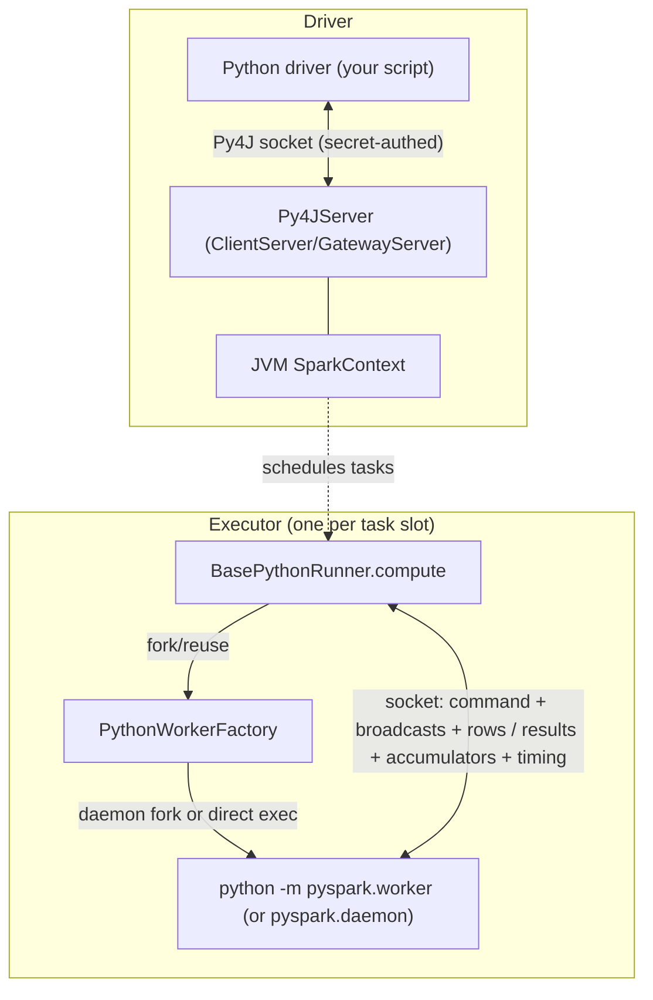

This group is the cross-language substrate under `core/src/main/scala/org/apache/spark/api/`. It answers a single question that both I3 (User-Defined Functions) and I4 (RDD Fundamentals) keep bumping into: **when you write a Python `lambda`, a `@udf`, or a pandas UDF, what actually runs it?** The answer is never "the JVM." The JVM forks (or reuses) an external Python process, streams the command and the rows to it over a socket, and reads results back. Everything else here — worker pooling, the socket handshake, traceback propagation, memory caps, the Py4J driver gateway, the R equivalent — is machinery around that one pipe.

!!! note "Two bridges, not one"

    Keep them separate: the **driver-side Py4J gateway** (`Py4JServer`) is how the Python *driver* program drives the JVM `SparkContext`; the **executor-side worker protocol** (`BasePythonRunner` ↔ `pyspark.worker`) is how each *task* ships rows to a Python process. They share a security helper but nothing else.

---

## PythonRDD and the pipe-to-worker model

**What it is:** `PythonRDD` is the RDD-layer face of the bridge — the thing a `sc.parallelize(...).map(pyfunc)` chain becomes on the JVM side. It wraps a parent JVM RDD, carries the pickled Python function(s) as `ChainedPythonFunctions`, and on `compute()` hands the parent's iterator to a `PythonRunner`. It also hosts the "serving" helpers (`collectAndServe`, `PythonParallelizeServer`) that stream results back to the Python driver over an auth'd socket, and `PairwiseRDD` for the shuffle key/value split. This is the I4 anchor: the classic RDD "pipe each partition through an external process" model.

**Code path:** `PythonRDD.compute` → `PythonRunner(func).compute(parentIter, split, context)` → (writer serializes rows to worker; reader pulls bytes back). For driver-side result collection: `PythonRDD.collectAndServe(rdd)` → `serveIterator` → `SocketAuthServer` (Python connects, authenticates, drains). A `PythonFunction` is `SimplePythonFunction` (command bytes + env + includes + broadcasts + accumulator); chaining stacks them bottom-to-top so `f(g(x))` runs in one worker trip.

**Anchor files:**

- [PythonRDD.scala:54](https://github.com/apache/spark/blob/v4.2.0/core/src/main/scala/org/apache/spark/api/python/PythonRDD.scala#L54) — `class PythonRDD`
- [PythonRDD.scala:82](https://github.com/apache/spark/blob/v4.2.0/core/src/main/scala/org/apache/spark/api/python/PythonRDD.scala#L82) — `PythonFunction` trait (`broadcastVars`, `accumulator`)
- [PythonRDD.scala:127](https://github.com/apache/spark/blob/v4.2.0/core/src/main/scala/org/apache/spark/api/python/PythonRDD.scala#L127) — `ChainedPythonFunctions`
- [PythonRDD.scala:163](https://github.com/apache/spark/blob/v4.2.0/core/src/main/scala/org/apache/spark/api/python/PythonRDD.scala#L163) — `PairwiseRDD` (key/value split for shuffle)
- [PythonRDD.scala:231](https://github.com/apache/spark/blob/v4.2.0/core/src/main/scala/org/apache/spark/api/python/PythonRDD.scala#L231) — `collectAndServe`

**Configs:** `spark.buffer.size` (the JVM↔worker transfer buffer — see the runner concept for the confirmation).

**Maps to topics:** I4

---

## BasePythonRunner — the Python UDF execution protocol

**What it is:** The heart of the whole group. `BasePythonRunner[IN, OUT]` is the abstract per-task driver of the socket protocol; concrete subclasses live in SQL (`ArrowPythonRunner`, `PythonUDFRunner`, …) and here in core (`PythonRunner` for `NON_UDF` mapPartitions). Its `compute()` acquires a worker, opens the stream, writes a strict byte-framed command section, then interleaves writing input rows with reading output rows. This *is* the "Python UDF execution path" that I3 is about — every batched, Arrow, and pandas UDF rides this exact writer/reader.

**Code path:** `compute()` → sets env vars (`SPARK_REUSE_WORKER`, `SPARK_BUFFER_SIZE`, `PYSPARK_EXECUTOR_MEMORY_MB`, fault-handler dir, traceback interval) → `env.createPythonWorker(...)` → builds a `Writer` and a `ReaderInputStream` → returns an `InterruptibleIterator`.

The **Writer.open** sequence (the wire format, in order) is: partition index → Python version → *(barrier only: bind a `ServerSocketChannel` and spawn an accept loop)* → `TaskContextInfo` (carrying the barrier socket addr + auth secret) → Spark files → broadcast vars → `evalType` (the `Int` that tells the worker *which* Python entry point to run) → runner conf → eval conf → the command (pickled UDF) → flush. Input rows then stream via `writeNextInputToStream` until `END_OF_DATA_SECTION`.

The **`evalType`** dispatch is defined by `PythonEvalType`: `NON_UDF=0`, `SQL_BATCHED_UDF=100`, `SQL_ARROW_BATCHED_UDF=101`, the pandas family `200–217`, the pure-Arrow family `250–254`, and UDTFs `300–302`. This single integer is how the same runner selects batched-pickle vs Arrow-batch vs pandas-iterator execution on the Python side.

The **ReaderIterator.read** loop switches on a framing length: `>=0` → that many bytes of a result batch; `TIMING_DATA (-3)` → boot/init/finish metrics + spill counters; `PYTHON_EXCEPTION_THROWN (-2)` → build a `PythonException`; `END_OF_DATA_SECTION (-1)` → drain accumulator updates then maybe release the worker.

**The socket handshake / auth:** the runner reads `spark.python.authenticate.socketTimeout` and passes it as `SPARK_AUTH_SOCKET_TIMEOUT`; the actual challenge/response is done by `SocketAuthHelper` (owned by the [config & security sweep](core-config-security.md) — referenced, not re-derived here). The auth secret is written into the `TaskContextInfo` for the barrier back-channel and used by `authHelper.authClient`/`authToServer` in the factory.

!!! info "`spark.buffer.size` belongs here"

    Confirmed from source: `BasePythonRunner` reads `conf.get(BUFFER_SIZE)` into `bufferSize` and wires it both as the `BufferedInputStream` size and as the target the `ReaderInputStream` tries not to grow the write buffer beyond, and exports it as `SPARK_BUFFER_SIZE`. Its *home* is the generic IO buffer in `config/package.scala`, but as the **JVM↔worker transfer buffer** it is a legitimate in-scope config for this group. `PythonAccumulatorV2` and `BaseRRunner` read the same key for the same reason.

**Single-threaded writer (SPARK-44705):** unlike older Spark, the writer is *not* a separate thread — `ReaderInputStream` drives `writeAdditionalInputToPythonWorker()` inline when the selector reports the socket writable, and juggles the `InputFileBlockHolder` thread-local by hand so `input_file_name()` keeps working after the multi-thread→single-thread switch.

**Anchor files:**

- [PythonRunner.scala:189](https://github.com/apache/spark/blob/v4.2.0/core/src/main/scala/org/apache/spark/api/python/PythonRunner.scala#L189) — `abstract class BasePythonRunner`
- [PythonRunner.scala:275](https://github.com/apache/spark/blob/v4.2.0/core/src/main/scala/org/apache/spark/api/python/PythonRunner.scala#L275) — `compute()` (env setup, worker acquire, monitor start)
- [PythonRunner.scala:418](https://github.com/apache/spark/blob/v4.2.0/core/src/main/scala/org/apache/spark/api/python/PythonRunner.scala#L418) — `Writer.open` (the exact wire order)
- [PythonRunner.scala:49](https://github.com/apache/spark/blob/v4.2.0/core/src/main/scala/org/apache/spark/api/python/PythonRunner.scala#L49) — `PythonEvalType` (batched/Arrow/pandas dispatch integers)
- [PythonRunner.scala:582](https://github.com/apache/spark/blob/v4.2.0/core/src/main/scala/org/apache/spark/api/python/PythonRunner.scala#L582) — `ReaderIterator` (`read()` framing switch, `SpecialLengths`)
- [PythonRunner.scala:1080](https://github.com/apache/spark/blob/v4.2.0/core/src/main/scala/org/apache/spark/api/python/PythonRunner.scala#L1080) — `SpecialLengths` (protocol sentinels)
- [Python.scala:59](https://github.com/apache/spark/blob/v4.2.0/core/src/main/scala/org/apache/spark/internal/config/Python.scala#L59) — `spark.python.authenticate.socketTimeout`
- [package.scala:2208](https://github.com/apache/spark/blob/v4.2.0/core/src/main/scala/org/apache/spark/internal/config/package.scala#L2208) — `spark.buffer.size`

**Configs:** `spark.buffer.size`, `spark.python.authenticate.socketTimeout`, `spark.python.worker.reuse` (read here to set `SPARK_REUSE_WORKER` and gate worker release).

!!! info "Arrow serialization toggles live in SQL, not here"

    `spark.sql.execution.arrow.*` (batch size, safe/unsafe casts, fallback) are parsed in the SQL subsystem. What lives *here* is the **mechanism** those toggles ride: the worker process, this socket, and the `START_ARROW_STREAM (-6)` sentinel that flips the reader into pulling Arrow record batches. Map behaviour to `spark.sql.execution.arrow.*` in the SQL sweep; map the transport to this concept.

**Maps to topics:** I3

---

## Worker lifecycle — PythonWorkerFactory (daemon, reuse, idle pool, UDS)

**What it is:** `PythonWorkerFactory` owns the actual OS processes. Because forking from the JVM is expensive, the default path launches one long-lived **daemon** (`pyspark.daemon`) per (`pythonExec`, module, envVars) key and asks it to `fork()` cheap workers; the fallback path execs `pyspark.worker` **directly** (used on Windows, which can't fork, or when the daemon is disabled). It also implements **worker reuse** (an idle pool workers are returned to instead of being killed) and the **transport choice** between a loopback TCP socket and a **Unix domain socket** (new in 4.1).

**Code path:** `SparkEnv.createPythonWorker` → `PythonWorkerFactory.create()`. If daemon mode: drain `idleWorkers` for a live one, else `createThroughDaemon()` → `startDaemon()` (spawn `python -m pyspark.daemon pyspark.worker`, read back the port or UDS path) → `createWorker()` (connect, read child pid, `authHelper.authToServer`, register a non-blocking `SocketChannel` in a `Selector`). Non-daemon: `createSimpleWorker()` execs `python -m pyspark.worker`, binds a server socket/UDS, waits for the worker to connect back, authenticates. On task completion the runner calls `env.releasePythonWorker` → `releaseWorker()`, which (daemon mode) enqueues the worker into `idleWorkers`, evicting the LRU (oldest) if the pool is at `maxIdleWorkerPoolSize`.

**Two idle-timeout mechanisms — don't conflate them:**

- `PythonWorkerFactory`'s own `MonitorThread` kills *pooled idle workers* after a hard-coded 1 minute of factory inactivity (`IDLE_WORKER_TIMEOUT_NS`) — not configurable.
- `spark.python.worker.idleTimeoutSeconds` (+ `killOnIdleTimeout`) is a *per-task* selector timeout inside `ReaderInputStream.read`: if the worker sends nothing for that long, Spark logs the socket status, and *optionally* destroys the process. Default `0` = wait forever.

**Transport (4.1+):** `spark.python.unix.domain.socket.enabled` (defaults to `PYSPARK_UDS_MODE=true` in env) switches every socket in this group from loopback TCP to a UDS file under `spark.python.unix.domain.socket.dir` (or `java.io.tmpdir`); the dir is length-checked because the UDS path must stay under 104 chars. UDS skips the auth-secret exchange (filesystem perms are the boundary).

**Anchor files:**

- [PythonWorkerFactory.scala:74](https://github.com/apache/spark/blob/v4.2.0/core/src/main/scala/org/apache/spark/api/python/PythonWorkerFactory.scala#L74) — `class PythonWorkerFactory`
- [PythonWorkerFactory.scala:132](https://github.com/apache/spark/blob/v4.2.0/core/src/main/scala/org/apache/spark/api/python/PythonWorkerFactory.scala#L132) — `create()` (idle-pool drain vs daemon vs simple)
- [PythonWorkerFactory.scala:163](https://github.com/apache/spark/blob/v4.2.0/core/src/main/scala/org/apache/spark/api/python/PythonWorkerFactory.scala#L163) — `createThroughDaemon`
- [PythonWorkerFactory.scala:229](https://github.com/apache/spark/blob/v4.2.0/core/src/main/scala/org/apache/spark/api/python/PythonWorkerFactory.scala#L229) — `createSimpleWorker` (Windows / non-daemon fork)
- [PythonWorkerFactory.scala:313](https://github.com/apache/spark/blob/v4.2.0/core/src/main/scala/org/apache/spark/api/python/PythonWorkerFactory.scala#L313) — `startDaemon`
- [PythonWorkerFactory.scala:512](https://github.com/apache/spark/blob/v4.2.0/core/src/main/scala/org/apache/spark/api/python/PythonWorkerFactory.scala#L512) — `releaseWorker` (idle pool + LRU eviction)
- [PythonWorkerFactory.scala:440](https://github.com/apache/spark/blob/v4.2.0/core/src/main/scala/org/apache/spark/api/python/PythonWorkerFactory.scala#L440) — idle-worker `MonitorThread` (fixed 1-min)
- [PythonRunner.scala:800](https://github.com/apache/spark/blob/v4.2.0/core/src/main/scala/org/apache/spark/api/python/PythonRunner.scala#L800) — per-task idle-timeout selector logic

**Configs:** `spark.python.use.daemon`, `spark.python.daemon.module`, `spark.python.worker.module`, `spark.python.worker.reuse`, `spark.python.factory.idleWorkerMaxPoolSize`, `spark.python.worker.idleTimeoutSeconds`, `spark.python.worker.killOnIdleTimeout`, `spark.python.unix.domain.socket.enabled`, `spark.python.unix.domain.socket.dir`, and `spark.executor.python.worker.log.details` (gates `PythonUtils.logPythonInfo`, which shells out to log the worker's Python version/executable at first use).

**Maps to topics:** I3, I4

---

## Error and edge paths — faults, tracebacks, kills, memory limits

**What it is:** The valuable, load-bearing part. A Python worker is an external process that can raise, hang, crash, or OOM, and the JVM has to turn each of those into a sane Spark failure. This concept collects the failure plumbing.

**Traceback propagation:** when the reader hits `PYTHON_EXCEPTION_THROWN (-2)`, `handlePythonException()` reads the worker's formatted traceback string and wraps it as a `PythonException` with `errorClass = "PYTHON_EXCEPTION"`, chaining any writer-side exception as the cause. `SPARK_HIDE_TRACEBACK` / `SPARK_SIMPLIFIED_TRACEBACK` env vars (set from the runner's `hideTraceback`/`simplifiedTraceback` fields) tune how much of that the worker emits.

**Crash / fault handler:** if the worker dies without a protocol message, the reader gets an `IOException`. With `spark.python.worker.faulthandler.enabled`, the worker installs Python's `faulthandler` writing to `PYTHON_FAULTHANDLER_DIR`; on crash the JVM reads back that per-pid log (`tryReadFaultHandlerLog`) and appends the native stack to the `SparkException`. Without it, the error just tells you to enable it.

**Traceback dumping:** `spark.python.worker.tracebackDumpIntervalSeconds > 0` exports `PYTHON_TRACEBACK_DUMP_INTERVAL_SECONDS` so a *stuck* (not crashed) worker periodically dumps its own traceback to stderr — the tool for diagnosing hangs.

**Task kill:** the `MonitorThread` (one per worker/task) polls `context.isInterrupted`/`isCompleted`; on an interrupt that the task won't honor, it waits `spark.python.task.killTimeout` (default 2s) then `env.destroyPythonWorker`, so a cancelled job can't block forever on a wedged Python process.

**Flush-failure policy (4.1):** `spark.python.daemon.killWorkerOnFlushFailure` (default true, daemon mode) exports `PYTHON_DAEMON_KILL_WORKER_ON_FLUSH_FAILURE=1`; the worker then lets output-flush exceptions kill it (so Spark detects the failure and retries) instead of swallowing them and risking a protocol-desync hang.

**Memory enforcement:** `spark.executor.pyspark.memory` (MiB) is divided by executor cores in `getWorkerMemoryMb` and exported as `PYSPARK_EXECUTOR_MEMORY_MB`. The actual cap is applied **on the Python side**, not the JVM: `worker_util.setup_memory_limits` calls `resource.setrlimit(RLIMIT_AS, ...)`.

!!! warning "`spark.executor.pyspark.memory` is effectively Linux-only"

    Verified in source: `resource`-based limiting is a no-op where the module or the rlimit isn't honored — the code comment states *"Windows does not support resource limiting and actual resource is not limited on MacOS."* So treat `spark.executor.pyspark.memory` as a hard cap on Linux and merely advisory elsewhere.

**Anchor files:**

- [PythonRunner.scala:661](https://github.com/apache/spark/blob/v4.2.0/core/src/main/scala/org/apache/spark/api/python/PythonRunner.scala#L661) — `handlePythonException` → `PythonException`
- [PythonRunner.scala:686](https://github.com/apache/spark/blob/v4.2.0/core/src/main/scala/org/apache/spark/api/python/PythonRunner.scala#L686) — `handleException` (interrupt / crash / faulthandler branches)
- [PythonRunner.scala:130](https://github.com/apache/spark/blob/v4.2.0/core/src/main/scala/org/apache/spark/api/python/PythonRunner.scala#L130) — `tryReadFaultHandlerLog`
- [PythonRunner.scala:720](https://github.com/apache/spark/blob/v4.2.0/core/src/main/scala/org/apache/spark/api/python/PythonRunner.scala#L720) — `MonitorThread` (task-kill timeout)
- [PythonRunner.scala:271](https://github.com/apache/spark/blob/v4.2.0/core/src/main/scala/org/apache/spark/api/python/PythonRunner.scala#L271) — `getWorkerMemoryMb` (per-core divide)
- [worker_util.py:95](https://github.com/apache/spark/blob/v4.2.0/python/pyspark/worker_util.py#L95) — `setup_memory_limits` (`setrlimit`, platform caveat)

**Configs:** `spark.python.worker.faulthandler.enabled`, `spark.python.worker.tracebackDumpIntervalSeconds`, `spark.python.task.killTimeout`, `spark.python.daemon.killWorkerOnFlushFailure`, `spark.executor.pyspark.memory`.

**Maps to topics:** I3

---

## PythonBroadcast and PythonAccumulatorV2 — side-channel state

**What it is:** The two ways state crosses the bridge outside the row stream. `PythonBroadcast` ships a broadcast variable's on-disk bytes to the worker (with an `EncryptedPythonBroadcastServer` path when IO encryption is on). `PythonAccumulatorV2` is the JVM-side collector that receives pickled accumulator updates *back* from the worker after the data section — the mechanism behind PySpark `Accumulator`. Both are the I4 "shared variables" story made concrete.

**Code path:** broadcasts are written in `Writer.open` via `PythonWorkerUtils.writeBroadcasts`; encrypted ones stream through a `SocketAuthServer`. Accumulator updates flow the other way: `handleEndOfDataSection` → `PythonWorkerUtils.receiveAccumulatorUpdates` → `PythonAccumulatorV2.merge`, which (on the driver) opens a reused socket (TCP or UDS), sends the pickled values, and waits for a one-byte ack.

**Anchor files:**

- [PythonRDD.scala:747](https://github.com/apache/spark/blob/v4.2.0/core/src/main/scala/org/apache/spark/api/python/PythonRDD.scala#L747) — `PythonAccumulatorV2` (socket-back-channel merge, UDS-aware)
- [PythonRDD.scala:824](https://github.com/apache/spark/blob/v4.2.0/core/src/main/scala/org/apache/spark/api/python/PythonRDD.scala#L824) — `PythonBroadcast`
- [PythonRDD.scala:989](https://github.com/apache/spark/blob/v4.2.0/core/src/main/scala/org/apache/spark/api/python/PythonRDD.scala#L989) — `EncryptedPythonBroadcastServer`
- [PythonRunner.scala:671](https://github.com/apache/spark/blob/v4.2.0/core/src/main/scala/org/apache/spark/api/python/PythonRunner.scala#L671) — `handleEndOfDataSection` (accumulator receive + worker release)

**Configs:** `spark.buffer.size` (accumulator socket buffer), `spark.python.unix.domain.socket.enabled` (chooses UDS vs TCP for the accumulator server).

**Maps to topics:** I4

---

## Py4J driver gateway and the PySpark app entry

**What it is:** The **driver-side** bridge — completely distinct from the executor worker protocol above. When you run a PySpark program, a JVM must exist for the Python driver to call into (`sc._jvm...`). `Py4JServer` wraps either a Py4J `ClientServer` (pinned-thread mode, the default) or a `GatewayServer`, both bound to loopback and protected by a per-process secret. `PythonGatewayServer` is the tiny `main` that PySpark's own `java_gateway.py` launches; `deploy.PythonRunner` is the `main` that `spark-submit <app.py>` invokes — it starts the gateway, builds `PYTHONPATH`, and execs the user's Python file as a subprocess.

**Code path (spark-submit of a .py):** `SparkSubmit` → `deploy.PythonRunner.main` → resolve `pythonExec` (`spark.pyspark.driver.python` → `spark.pyspark.python` → `PYSPARK_DRIVER_PYTHON` → `PYSPARK_PYTHON` → `"python3"`) → start `Py4JServer` on a thread → set `PYSPARK_GATEWAY_PORT`/`PYSPARK_GATEWAY_SECRET` → `ProcessBuilder(pythonExec, appFile).start()` → wait for exit. `spark.yarn.isPython` is *set* (not read) by `SparkSubmit` when the primary resource is Python, so YARN knows to ship the PySpark archives.

**Anchor files:**

- [Py4JServer.scala:31](https://github.com/apache/spark/blob/v4.2.0/core/src/main/scala/org/apache/spark/api/python/Py4JServer.scala#L31) — `Py4JServer` (ClientServer vs GatewayServer, secret)
- [PythonGatewayServer.scala:34](https://github.com/apache/spark/blob/v4.2.0/core/src/main/scala/org/apache/spark/api/python/PythonGatewayServer.scala#L34) — gateway `main` (writes port+secret to conn-info file)
- [deploy/PythonRunner.scala:41](https://github.com/apache/spark/blob/v4.2.0/core/src/main/scala/org/apache/spark/deploy/PythonRunner.scala#L41) — the `spark-submit` app entry
- [deploy/PythonRunner.scala:47](https://github.com/apache/spark/blob/v4.2.0/core/src/main/scala/org/apache/spark/deploy/PythonRunner.scala#L47) — `pythonExec` resolution order
- [package.scala:1159](https://github.com/apache/spark/blob/v4.2.0/core/src/main/scala/org/apache/spark/internal/config/package.scala#L1159) — `spark.pyspark.driver.python` / `spark.pyspark.python`
- [package.scala:716](https://github.com/apache/spark/blob/v4.2.0/core/src/main/scala/org/apache/spark/internal/config/package.scala#L716) — `spark.yarn.isPython`

**Configs:** `spark.pyspark.python`, `spark.pyspark.driver.python`, `spark.yarn.isPython`.

**Maps to topics:** I3 (this is the driver half of "how PySpark runs"; UDF authoring assumes this gateway exists). The gateway itself is largely plumbing, but it is the natural home for the `pyspark.python` executor-selection configs that I3 readers hit.

---

## spark.api.mode — Classic vs Spark Connect selection

**What it is:** A 4.0+ switch (`classic` | `connect`) read at the PySpark app entry. In `connect` mode (or when `spark.remote` is set), `deploy.PythonRunner` skips the local Py4J gateway and instead exports the conf as `PYSPARK_REMOTE_INIT_CONF_*` env vars so the Python side spins up a Spark Connect client against a (possibly local, app-scoped) Connect server. Default derives from `SPARK_CONNECT_MODE=1`.

**Code path:** `deploy.PythonRunner.main` reads `SPARK_API_MODE`; `isAPIModeConnect` gates the `PYSPARK_REMOTE_INIT_CONF` path and `SPARK_REMOTE` env, while `isAPIModeClassic` gates gateway startup and `MASTER`.

**Anchor files:**

- [package.scala:2930](https://github.com/apache/spark/blob/v4.2.0/core/src/main/scala/org/apache/spark/internal/config/package.scala#L2930) — `spark.api.mode` definition
- [deploy/PythonRunner.scala:56](https://github.com/apache/spark/blob/v4.2.0/core/src/main/scala/org/apache/spark/deploy/PythonRunner.scala#L56) — mode branching at the entry point

**Configs:** `spark.api.mode`.

!!! info "Connect routes to a different architecture"

    Under `connect`, the executor worker protocol described above still exists on the *server*, but the driver↔server path is gRPC/Arrow via the **connect** subsystem, not Py4J. Trace the Connect client/plan protocol in the connect sweep, not here.

**Maps to topics:** [] — pure entry-point routing/plumbing; the Connect-vs-Classic learning content belongs to whatever topic covers Spark Connect, and the mechanism it selects lives in a different subsystem. Not distinct enough from I3 to warrant a new code.

---

## The R bridge — RBackend and RRunner

**What it is:** SparkR's mirror of the Python design, same shape, smaller. `RBackend` is a **Netty** server (the driver-side gateway analog to Py4J) that lets the R process call JVM methods, tracked by `JVMObjectTracker`. `RRunner`/`BaseRRunner` is the **per-task** analog to `BasePythonRunner`: it launches an R worker (via a daemon `daemon.R` on Unix, or `worker.R` directly), uses **two sockets** (one in, one out — to sidestep deadlock rather than one bidirectional socket) and streams serialized partitions through `SerDe`. `RRDD`/`BaseRRDD` is the RDD face.

**Code path:** `RBackend.init()` → Netty `ServerBootstrap` with `RBackendHandler`, frame decoder (4-byte length prefix, up to 2GB), `ReadTimeoutHandler(spark.r.backendConnectionTimeout)`, `RBackendAuthHandler`; `spark.r.numRBackendThreads` sizes the event loop. Per task: `BaseRRDD.compute` → `RRunner.compute` → bind a server socket, `createRWorker` (daemon fork or direct), accept the in-socket (write func + broadcasts + partition) and the out-socket (read results), auth both via `RAuthHelper`. `createRProcess` resolves the R binary from `spark.r.command` (falling back to the deprecated `spark.sparkr.r.command`, default `Rscript`) and passes `spark.r.backendConnectionTimeout` to the worker.

**Anchor files:**

- [RBackend.scala:39](https://github.com/apache/spark/blob/v4.2.0/core/src/main/scala/org/apache/spark/api/r/RBackend.scala#L39) — `RBackend` (Netty server, thread/timeout wiring at L48)
- [BaseRRunner.scala:37](https://github.com/apache/spark/blob/v4.2.0/core/src/main/scala/org/apache/spark/api/r/BaseRRunner.scala#L37) — `BaseRRunner` (two-socket `compute` at L51)
- [BaseRRunner.scala:291](https://github.com/apache/spark/blob/v4.2.0/core/src/main/scala/org/apache/spark/api/r/BaseRRunner.scala#L291) — `createRProcess` (`spark.r.command`/`spark.sparkr.r.command` resolution)
- [BaseRRunner.scala:323](https://github.com/apache/spark/blob/v4.2.0/core/src/main/scala/org/apache/spark/api/r/BaseRRunner.scala#L323) — `createRWorker` (daemon vs direct)
- [RRDD.scala:35](https://github.com/apache/spark/blob/v4.2.0/core/src/main/scala/org/apache/spark/api/r/RRDD.scala#L35) — `BaseRRDD` / `RRDD`
- [R.scala:21](https://github.com/apache/spark/blob/v4.2.0/core/src/main/scala/org/apache/spark/internal/config/R.scala#L21) — the five `spark.r.*` configs

**Configs:** `spark.r.backendConnectionTimeout`, `spark.r.numRBackendThreads`, `spark.r.heartBeatInterval`, `spark.r.command`, `spark.sparkr.r.command`. (`spark.r.heartBeatInterval` is passed through to the R side to keep the connection alive; `spark.sparkr.r.command` is deprecated in favour of `spark.r.command`.)

**Maps to topics:** I3, I4 (R UDFs and R RDDs — same substrate, lower priority than Python).

---

## The Java bridge — JavaRDD and friends

**What it is:** The thinnest layer in the group: `JavaRDD`, `JavaPairRDD`, `JavaDoubleRDD`, `JavaSparkContext`, and the `function` SAM interfaces are type-bridging wrappers over the Scala RDD API, giving Java callers `Optional`-based nulls and Java-friendly function interfaces. No process bridge, no sockets, no configs — it is a compile-time convenience over the same JVM RDDs.

**Anchor files:**

- [JavaRDD.scala](https://github.com/apache/spark/blob/v4.2.0/core/src/main/scala/org/apache/spark/api/java/JavaRDD.scala) — `JavaRDD` wrapper
- [JavaSparkContext.scala](https://github.com/apache/spark/blob/v4.2.0/core/src/main/scala/org/apache/spark/api/java/JavaSparkContext.scala) — Java entry point
- [JavaPairRDD.scala](https://github.com/apache/spark/blob/v4.2.0/core/src/main/scala/org/apache/spark/api/java/JavaPairRDD.scala) — key/value wrapper

**Configs:** none.

**Maps to topics:** I4 (as a wrapper note; not a first-class learning target).

---

## Breadth check — all 30 slice configs

| # | Config | Verdict | Concept / real owner |
|---|--------|---------|----------------------|
| 1 | `spark.api.mode` | in-scope | spark.api.mode — Classic vs Connect |
| 2 | `spark.barrier.sync.timeout` | **out-of-scope noise** | `BarrierTaskContext` / scheduler → **execution-engine**. (Barrier *does* touch PySpark via the `Writer.open` accept-socket for `BarrierTaskContext`, but this timeout config is scheduler-owned.) |
| 3 | `spark.buffer.size` | in-scope (shared) | BasePythonRunner (JVM↔worker transfer buffer); confirmed read by `BasePythonRunner`, `PythonAccumulatorV2`, `BaseRRunner`. Home is generic IO config. |
| 4 | `spark.executor.pyspark.memory` | in-scope | Error/edge paths (Python-side `setrlimit`) |
| 5 | `spark.executor.python.worker.log.details` | in-scope | Worker lifecycle (`PythonUtils.logPythonInfo`) |
| 6 | `spark.pyspark.driver.python` | in-scope | Py4J driver gateway / app entry |
| 7 | `spark.pyspark.python` | in-scope | Py4J driver gateway / app entry |
| 8 | `spark.python.authenticate.socketTimeout` | in-scope | BasePythonRunner protocol (auth handshake) |
| 9 | `spark.python.daemon.killWorkerOnFlushFailure` | in-scope | Error/edge paths |
| 10 | `spark.python.daemon.module` | in-scope | Worker lifecycle |
| 11 | `spark.python.factory.idleWorkerMaxPoolSize` | in-scope | Worker lifecycle (idle pool, LRU eviction) |
| 12 | `spark.python.task.killTimeout` | in-scope | Error/edge paths (MonitorThread) |
| 13 | `spark.python.unix.domain.socket.dir` | in-scope | Worker lifecycle (UDS transport) |
| 14 | `spark.python.unix.domain.socket.enabled` | in-scope | Worker lifecycle (UDS transport) |
| 15 | `spark.python.use.daemon` | in-scope | Worker lifecycle |
| 16 | `spark.python.worker.faulthandler.enabled` | in-scope | Error/edge paths |
| 17 | `spark.python.worker.idleTimeoutSeconds` | in-scope | Worker lifecycle (per-task idle timeout) |
| 18 | `spark.python.worker.killOnIdleTimeout` | in-scope | Worker lifecycle |
| 19 | `spark.python.worker.module` | in-scope | Worker lifecycle |
| 20 | `spark.python.worker.reuse` | in-scope | Worker lifecycle / runner |
| 21 | `spark.python.worker.tracebackDumpIntervalSeconds` | in-scope | Error/edge paths |
| 22 | `spark.r.backendConnectionTimeout` | in-scope | R bridge |
| 23 | `spark.r.command` | in-scope | R bridge |
| 24 | `spark.r.heartBeatInterval` | in-scope | R bridge |
| 25 | `spark.r.numRBackendThreads` | in-scope | R bridge (Netty event loop) |
| 26 | `spark.scheduler.barrier.maxConcurrentTasksCheck.interval` | **out-of-scope noise** | barrier scheduler check → **execution-engine** |
| 27 | `spark.scheduler.barrier.maxConcurrentTasksCheck.maxFailures` | **out-of-scope noise** | barrier scheduler check → **execution-engine** |
| 28 | `spark.sparkr.r.command` | in-scope | R bridge (deprecated; superseded by `spark.r.command`) |
| 29 | `spark.unsafe.sorter.spill.reader.buffer.size` | **out-of-scope noise** | unsafe sorter spill reader → **shuffle-memory** |
| 30 | `spark.yarn.isPython` | in-scope | Py4J driver gateway / app entry (set by `SparkSubmit`) |

**In-scope: 26 · Out-of-scope noise: 4** (`spark.barrier.sync.timeout`, both `spark.scheduler.barrier.maxConcurrentTasksCheck.*`, `spark.unsafe.sorter.spill.reader.buffer.size`).
