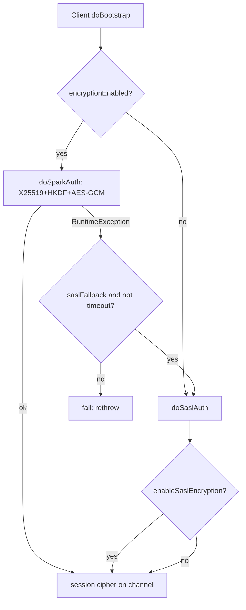

This page sweeps the **config-security** group of Spark core at tag `v4.2.0`: the configuration engine every `spark.*` key is built and resolved through, and the security subsystem (authentication, encryption, TLS, Kerberos, ACLs, redaction). All 43 configs in the slice are attributed; every anchor line was verified against the local checkout.

!!! info "Two structural findings up front"

    - The config-system machinery (`ConfigBuilder` / `ConfigEntry` / `ConfigReader` / `SparkConf` deprecation) lives in **`common/utils`**, not `core/.../internal/config/` as the group scope hint assumes — a `groups.yaml` scope-drift signal for a future `regroup`/`check_drift`. It backs **no** learning-path topic and is left `topics: []` with no proposal: it is Spark-contributor plumbing, not a user learning objective.
    - The `spark.ssl.*` and `spark.network.crypto.*` / `*.commons.config.*` families are **prefix-read** (`getAllWithPrefix` / `getBoolean` / `cryptoConf`), so they are absent from the config catalog by design. Documented in the SSL/TLS concept.

## Config declaration & typed builders (ConfigBuilder / TypedConfigBuilder)

**What it is:** The DSL that turns a bare string key into a typed, documented, versioned, validated configuration object. `ConfigBuilder("spark.x.y")` is a case class holding metadata (`_doc`, `_version`, `_public`, `_alternatives`, `_prependedKey`, `_bindingPolicy`). A type method (`intConf`, `longConf`, `doubleConf`, `booleanConf`, `stringConf`, `timeConf`, `bytesConf`, `regexConf`, `enumConf`) returns a `TypedConfigBuilder[T]` carrying a `converter: String => T` and a `stringConverter: T => String`. `TypedConfigBuilder` layers transformations — `transform`, `checkValue`, `checkValues`, `toSequence` — each returning a new builder whose converter wraps the previous one. This is the engine the entire `spark.*` catalog is built from; it declares almost no configs of its own.

**Code path:** `ConfigBuilder("spark.io.encryption.keySizeBits")` → `.intConf` (builds `TypedConfigBuilder(this, toNumber(_,_.toInt,...))`) → `.checkValues(Set(128,192,256))` (wraps converter in a validating `transform`) → `.createWithDefault(128)` (materializes a `ConfigEntry`) → `ConfigEntry.registerEntry`.

**Anchor files:**

- [ConfigBuilder.scala:150 — `TypedConfigBuilder`](https://github.com/apache/spark/blob/v4.2.0/common/utils/src/main/scala/org/apache/spark/internal/config/ConfigBuilder.scala#L150)
- [ConfigBuilder.scala:265 — `ConfigBuilder` case class](https://github.com/apache/spark/blob/v4.2.0/common/utils/src/main/scala/org/apache/spark/internal/config/ConfigBuilder.scala#L265)
- [ConfigBuilder.scala:333 — `intConf` / type methods](https://github.com/apache/spark/blob/v4.2.0/common/utils/src/main/scala/org/apache/spark/internal/config/ConfigBuilder.scala#L333)
- [ConfigBuilder.scala:167 — `checkValue` / :195 `checkValues` / :206 `toSequence`](https://github.com/apache/spark/blob/v4.2.0/common/utils/src/main/scala/org/apache/spark/internal/config/ConfigBuilder.scala#L167)
- [ConfigBuilder.scala:30 — `ConfigHelpers` (typed error classes)](https://github.com/apache/spark/blob/v4.2.0/common/utils/src/main/scala/org/apache/spark/internal/config/ConfigBuilder.scala#L30)

**Configs:** None directly (this is the engine). Validation edge cases surface as `INVALID_CONF_VALUE.TYPE_MISMATCH` / `.OUT_OF_RANGE_OF_OPTIONS` / `.REQUIREMENT` `SparkIllegalArgumentException`s (`ConfigHelpers`, lines 112–140). `spark.io.encryption.keySizeBits`'s `checkValues(Set(128,192,256))` is the slice's live example of a `checkValues` guard.

**Maps to topics:** [] — This is Spark-contributor plumbing (how a config is *declared*), not a Spark-user learning objective. Config *behaviors* an operator cares about (precedence, substitution, deprecation warnings) are covered by the sibling concepts below and land operationally under E2. The declaration/typing DSL itself has no learning-path home and is not a distinct user-facing topic, so `topics: []` with **no** propose block.

!!! note "Config naming convention lives in the source"

    The naming-guideline comment block at the top of `ConfigEntry.scala` (lines 20–47) is the canonical Spark convention for how keys are named (`featureName.enabled`, time units in the name, etc.) — useful reference material even though it declares nothing.

---

## ConfigEntry hierarchy & readFrom resolution

**What it is:** The immutable value objects the builders produce, plus the logic that resolves a live value from a `ConfigReader`. `ConfigEntry[T]` is abstract; five concrete subclasses differ only in how `readFrom` supplies a value when the key is absent:

- `ConfigEntryWithDefault[T]` — returns a pre-converted default `T`.
- `ConfigEntryWithDefaultString[T]` — default is a *string* that is run through variable substitution then `valueConverter` (so `${…}` works inside defaults).
- `ConfigEntryWithDefaultFunction[T]` — default computed lazily by a `() => T` thunk (e.g. `numReplayThreads = ceil(cores/4)`).
- `OptionalConfigEntry[T]` — no default; `readFrom` yields `Option[T]`, `defaultValueString = "<undefined>"`.
- `FallbackConfigEntry[T]` — no own default; delegates `readFrom` to another entry's `readFrom` when unset (`defaultValueString = "<value of {fallback.key}>"`).

Every constructed entry self-registers in a global `ConcurrentHashMap` `knownConfigs`; a duplicate key throws `require(... already registered!)`. `readString` handles the *prepended-key* merge and the *alternatives* fallback chain (first alternative that resolves wins).

**Code path:** `SparkConf.get(entry)` → `entry.readFrom(reader)` → `readString(reader)` (checks `prependedKey`, then `key`, then folds over `alternatives`) → `valueConverter` on the hit, else the subclass default / fallback / `None`.

**Anchor files:**

- [ConfigEntry.scala:75 — abstract `ConfigEntry`](https://github.com/apache/spark/blob/v4.2.0/common/utils/src/main/scala/org/apache/spark/internal/config/ConfigEntry.scala#L75)
- [ConfigEntry.scala:93 — `readString` (prepend + alternatives merge)](https://github.com/apache/spark/blob/v4.2.0/common/utils/src/main/scala/org/apache/spark/internal/config/ConfigEntry.scala#L93)
- [ConfigEntry.scala:183 — `ConfigEntryWithDefaultString` (substituted default)](https://github.com/apache/spark/blob/v4.2.0/common/utils/src/main/scala/org/apache/spark/internal/config/ConfigEntry.scala#L183)
- [ConfigEntry.scala:222 — `OptionalConfigEntry`](https://github.com/apache/spark/blob/v4.2.0/common/utils/src/main/scala/org/apache/spark/internal/config/ConfigEntry.scala#L222)
- [ConfigEntry.scala:256 — `FallbackConfigEntry`](https://github.com/apache/spark/blob/v4.2.0/common/utils/src/main/scala/org/apache/spark/internal/config/ConfigEntry.scala#L256)
- [ConfigEntry.scala:290 — `knownConfigs` / `registerEntry`](https://github.com/apache/spark/blob/v4.2.0/common/utils/src/main/scala/org/apache/spark/internal/config/ConfigEntry.scala#L290)
- [ConfigBuilder.scala:211 — `createOptional` / :220 `createWithDefault` / :238 `createWithDefaultFunction` / :250 `createWithDefaultString` / :377 `fallbackConf`](https://github.com/apache/spark/blob/v4.2.0/common/utils/src/main/scala/org/apache/spark/internal/config/ConfigBuilder.scala#L211)

**Configs:** Every slice key is one of these subclasses. Live examples in the slice: `spark.authenticate.secret.driver.file` and `spark.authenticate.secret.executor.file` are `FallbackConfigEntry`s that both fall back to `spark.authenticate.secret.file` (`AUTH_SECRET_FILE`); `spark.authenticate.secret` and `spark.redaction.string.regex` are `OptionalConfigEntry`s; `spark.io.crypto.cipher.transformation` is `createWithDefaultString`.

!!! info "String defaults always get variable-expansion"

    `createWithDefault` has a subtlety (ConfigBuilder.scala:220): a `String` default is *rerouted* to `createWithDefaultString`, so string defaults always get variable-expansion, matching the `WithDefaultString` path exactly.

**Maps to topics:** [] — same rationale as above; internal representation of configs, no user-facing learning topic.

---

## ConfigReader variable substitution & config providers

**What it is:** The resolver that reads raw values from layered sources and expands `${…}` references. A `ConfigReader` is seeded with a default `ConfigProvider` (bound to the `null` prefix) and auto-binds two more: `env` → `EnvProvider` (`sys.env`) and `system` → `SystemProvider` (`sys.props`). A reference `${prefix:name}` (regex `\$\{(?:(\w+?):)?(\S+?)\}`) is looked up in the provider bound to `prefix`; no prefix uses the default provider. Substitution is recursive with a `usedRefs` cycle-guard that throws `require(... Circular reference ...)`. For the default namespace, an unset key still resolves to a *known config's default value* via `getOrDefault` → `ConfigEntry.findEntry`, and `FallbackConfigEntry` chases its fallback's key. Unresolvable refs are left verbatim.

**Code path:** `ConfigEntryWithDefaultString.readFrom` (or any string value) → `ConfigReader.substitute` → `REF_RE.replaceAllIn` → per-match `bindings(prefix)` → `getOrDefault(provider, name)` → recurse. `SparkConf` wires the default provider as `SparkConfigProvider(settings)` (SparkConf.scala:301).

**Anchor files:**

- [ConfigReader.scala:50 — `ConfigReader` (binds env/system)](https://github.com/apache/spark/blob/v4.2.0/common/utils/src/main/scala/org/apache/spark/internal/config/ConfigReader.scala#L50)
- [ConfigReader.scala:86 — `substitute` (regex + cycle guard)](https://github.com/apache/spark/blob/v4.2.0/common/utils/src/main/scala/org/apache/spark/internal/config/ConfigReader.scala#L86)
- [ConfigReader.scala:111 — `getOrDefault` (falls through to entry default / fallback)](https://github.com/apache/spark/blob/v4.2.0/common/utils/src/main/scala/org/apache/spark/internal/config/ConfigReader.scala#L111)
- [ConfigProvider.scala:31 — `EnvProvider` / :37 `SystemProvider` / :43 `MapProvider`](https://github.com/apache/spark/blob/v4.2.0/common/utils/src/main/scala/org/apache/spark/internal/config/ConfigProvider.scala#L31)
- [SparkConf.scala:301 — reader wiring via `SparkConfigProvider`](https://github.com/apache/spark/blob/v4.2.0/core/src/main/scala/org/apache/spark/SparkConf.scala#L301)

**Configs:** None declared here. `SSLOptions.parse` leans on this layer via `conf.getWithSubstitution` for the `spark.ssl.*` keys (see SSL concept).

**Maps to topics:** [] — resolution engine; no user-facing learning topic. The `${env:…}` / `${system:…}` / `${spark.key}` substitution *feature* is operationally useful (E2) but is a behavior of, not a topic distinct from, the config system.

---

## SparkConf deprecation & alternate-key handling

**What it is:** How `SparkConf` copes with renamed and retired keys. Two static tables live at the bottom of `SparkConf`: `deprecatedConfigs: Map[String, DeprecatedConfig]` (retired keys with a version + human message, *no* replacement) and `configsWithAlternatives: Map[String, Seq[AlternateConfig]]` (current key → old keys, each with a version and an optional `translation: String => String` for value-format changes). A derived reverse index `allAlternatives` maps each old key to `(newKey, AlternateConfig)`. On every `set`/`setIfMissing`, `logDeprecationWarning(key)` fires a one-shot warning from whichever table matches. On read, `getDeprecatedConfig` lets an old alternate key satisfy a request for the new key, applying `translation` if present. `contains` also treats a key as present if any of its alternatives is set.

**Code path:** `set(key, value)` → `logDeprecationWarning(key)` (checks `deprecatedConfigs` then `allAlternatives`). Read side: `getOption(key)` → `getDeprecatedConfig(key, settings)` → first alternate present → `alt.translation(value)`.

**Anchor files:**

- [SparkConf.scala:667 — `deprecatedConfigs` table](https://github.com/apache/spark/blob/v4.2.0/core/src/main/scala/org/apache/spark/SparkConf.scala#L667)
- [SparkConf.scala:743 — `configsWithAlternatives` table](https://github.com/apache/spark/blob/v4.2.0/core/src/main/scala/org/apache/spark/SparkConf.scala#L743)
- [SparkConf.scala:846 — `getDeprecatedConfig` (+ translation)](https://github.com/apache/spark/blob/v4.2.0/core/src/main/scala/org/apache/spark/SparkConf.scala#L846)
- [SparkConf.scala:858 — `logDeprecationWarning`](https://github.com/apache/spark/blob/v4.2.0/core/src/main/scala/org/apache/spark/SparkConf.scala#L858)
- [SparkConf.scala:886 — `DeprecatedConfig` / :898 `AlternateConfig`](https://github.com/apache/spark/blob/v4.2.0/core/src/main/scala/org/apache/spark/SparkConf.scala#L886)
- [SparkConf.scala:825 — `isExecutorStartupConf` (auth/rpc/network/ssl propagation)](https://github.com/apache/spark/blob/v4.2.0/core/src/main/scala/org/apache/spark/SparkConf.scala#L825)

**Configs:** None in the slice are deprecated, but several slice keys are the *new* side of alternates in `configsWithAlternatives`: `spark.kerberos.keytab` ⇐ `spark.yarn.keytab`, `spark.kerberos.principal` ⇐ `spark.yarn.principal`, `spark.kerberos.relogin.period` ⇐ `spark.yarn.kerberos.relogin.period`, `spark.kerberos.access.hadoopFileSystems` ⇐ `spark.yarn.access.namenodes` / `spark.yarn.access.hadoopFileSystems` (SparkConf.scala:790–798).

!!! info "Which configs an executor gets *before* it authenticates"

    `isExecutorStartupConf` (SparkConf.scala:825) is a security-relevant edge: `spark.auth*` (except the secret itself), `spark.rpc*`, `spark.network*`, and non-password `spark.ssl*` keys are the ones eagerly shipped to an executor at startup, because the executor must authenticate *before* it can inherit the rest of the driver's config. Passwords are propagated out-of-band (see SSL / SecurityManager env-var propagation).

**Maps to topics:** [] — config-lifecycle plumbing; no learning-path home.

---

## Prepended-key & default-value classpath configs

**What it is:** The extra-classpath configs, present in the slice because they exercise the config system's `withPrepended` feature — a way to have a user value automatically concatenated behind an internal default value with a separator. `spark.driver.extraClassPath` is declared with `.withPrepended(DRIVER_DEFAULT_EXTRA_CLASS_PATH.key, File.pathSeparator)`, so `readString` prepends the internal `spark.driver.defaultExtraClassPath` value (path-separator-joined) ahead of the user's classpath. `checkPrependConfig` enforces that prepended configs must be `stringConf`. Both the driver and executor pairs follow this shape.

**Code path:** `ConfigBuilder.withPrepended(defaultKey, sep)` sets `_prependedKey` → `ConfigEntry.readString` merges `prependedKey` value + `prependSeparator` + main value (ConfigEntry.scala:96–102).

**Anchor files:**

- [package.scala:80 — `DRIVER_DEFAULT_EXTRA_CLASS_PATH` / :87 `DRIVER_CLASS_PATH` (`withPrepended`)](https://github.com/apache/spark/blob/v4.2.0/core/src/main/scala/org/apache/spark/internal/config/package.scala#L80)
- [package.scala:327 — `EXECUTOR_DEFAULT_EXTRA_CLASS_PATH` / :334 `EXECUTOR_CLASS_PATH`](https://github.com/apache/spark/blob/v4.2.0/core/src/main/scala/org/apache/spark/internal/config/package.scala#L327)
- [ConfigBuilder.scala:322 — `withPrepended` / :389 `checkPrependConfig`](https://github.com/apache/spark/blob/v4.2.0/common/utils/src/main/scala/org/apache/spark/internal/config/ConfigBuilder.scala#L322)

**Configs:** `spark.driver.defaultExtraClassPath`, `spark.driver.extraClassPath`, `spark.executor.defaultExtraClassPath`, `spark.executor.extraClassPath`.

**Maps to topics:** [E2] — operationally these are deployment/classpath-injection knobs (adding jars to driver/executor classpaths), which lives under Production Deployment. They double as the slice's canonical demonstration of the `withPrepended` config-system feature.

---

## Authentication secret management (SecurityManager)

**What it is:** `SecurityManager` is the central security object (created by `SparkEnv`); it owns the shared authentication secret and the ACLs. The secret backs Spark's mutual RPC/shuffle authentication. Its source is deployment-dependent, resolved in priority order by `getSecretKey()`: current-UGI credentials (`sparkCookie` in the Hadoop `Credentials`) → in-memory `secretKey` field → env var `_SPARK_AUTH_SECRET` → `spark.authenticate.secret` conf → a secret *file*. `initializeAuth()` decides how the secret is minted per master: for `yarn`/`local[*]` a fresh secret is generated (`Utils.createSecret`, bit-length from `spark.authenticate.secretBitLength`) and stored in the UGI; for Kubernetes it is read from a mounted file and *not* stored in UGI (k8s handles token propagation); for any other master the secret **must** already be present in conf or it `require`-fails. File-based secrets are Kubernetes-only (`secretKeyFromFile` throws otherwise), and driver/executor secret files must be set together or neither.

**Code path:** `SparkEnv` → `new SecurityManager(conf)` → `initializeAuth()` (per-master branch: generate / read-file / require) → stores in `UserGroupInformation.getCurrentUser().addCredentials` under `SECRET_LOOKUP_KEY = "sparkCookie"`. At connect time `getSecretKey(appId)` feeds `AuthEngine` / SASL via the `SecretKeyHolder` interface.

**Anchor files:**

- [SecurityManager.scala:314 — `getSecretKey` (priority chain)](https://github.com/apache/spark/blob/v4.2.0/core/src/main/scala/org/apache/spark/SecurityManager.scala#L314)
- [SecurityManager.scala:346 — `initializeAuth` (per-master secret minting)](https://github.com/apache/spark/blob/v4.2.0/core/src/main/scala/org/apache/spark/SecurityManager.scala#L346)
- [SecurityManager.scala:386 — `secretKeyFromFile` (k8s-only)](https://github.com/apache/spark/blob/v4.2.0/core/src/main/scala/org/apache/spark/SecurityManager.scala#L386)
- [SecurityManager.scala:447 — `object SecurityManager` (`SECRET_LOOKUP_KEY`, `ENV_AUTH_SECRET`)](https://github.com/apache/spark/blob/v4.2.0/core/src/main/scala/org/apache/spark/SecurityManager.scala#L447)
- [package.scala:1320 — `AUTH_SECRET` / :1332 `NETWORK_AUTH_ENABLED` / :1344 `AUTH_SECRET_FILE`](https://github.com/apache/spark/blob/v4.2.0/core/src/main/scala/org/apache/spark/internal/config/package.scala#L1320)

**Configs:** `spark.authenticate`, `spark.authenticate.secret`, `spark.authenticate.secretBitLength`, `spark.authenticate.secret.file`, `spark.authenticate.secret.driver.file`, `spark.authenticate.secret.executor.file`.

!!! warning "Missing-secret failure modes"

    In non-yarn/local/k8s masters, `initializeAuth` throws `A secret key must be specified via the spark.authenticate.secret config.`; `getSecretKey` throws the same if the whole chain is exhausted; mismatched driver-only/executor-only secret files throw `Invalid secret configuration...`.

**Maps to topics:** E2 — authentication is an operational cluster-deployment concern.

---

## UI/CLI authorization ACLs

**What it is:** The authorization layer over the Web UI and application-modify actions (e.g. killing a stage). `SecurityManager` holds `viewAcls`/`modifyAcls` plus their `*.groups` variants, seeded with admin ACLs, the current user, and `SPARK_USER`. `checkUIViewPermissions(user)` and `checkModifyPermissions(user)` delegate to `isUserInACL`, which short-circuits to `true` if the user is `null`, ACLs are disabled (`spark.acls.enable=false`), the user is listed, or a `*` wildcard is present; otherwise it resolves the user's groups via the group-mapping provider and checks group membership. `checkAdminPermissions` grants both view+modify and impersonation. The History Server has its own parallel ACL switch (`spark.history.ui.acls.enable`) plus admin-acls that apply across *all* replayed apps.

**Code path:** UI filter / kill handler → `securityManager.checkUIViewPermissions(user)` / `checkModifyPermissions(user)` → `isUserInACL(user, acls, aclGroups)` → (`aclsEnabled()` gate, wildcard, membership) → `Utils.getCurrentUserGroups` for group check.

**Anchor files:**

- [SecurityManager.scala:248 — `checkUIViewPermissions` / :264 `checkModifyPermissions`](https://github.com/apache/spark/blob/v4.2.0/core/src/main/scala/org/apache/spark/SecurityManager.scala#L248)
- [SecurityManager.scala:402 — `isUserInACL` (wildcard + group resolution)](https://github.com/apache/spark/blob/v4.2.0/core/src/main/scala/org/apache/spark/SecurityManager.scala#L402)
- [SecurityManager.scala:123 — `setViewAcls` / :164 `setModifyAcls` (admin acls folded in)](https://github.com/apache/spark/blob/v4.2.0/core/src/main/scala/org/apache/spark/SecurityManager.scala#L123)
- [UI.scala:191 — `ACLS_ENABLE`, view/admin/modify acl entries](https://github.com/apache/spark/blob/v4.2.0/core/src/main/scala/org/apache/spark/internal/config/UI.scala#L191)
- [History.scala:214 — `HISTORY_SERVER_UI_ACLS_ENABLE` + admin acls](https://github.com/apache/spark/blob/v4.2.0/core/src/main/scala/org/apache/spark/internal/config/History.scala#L214)

**Configs:** `spark.acls.enable`, `spark.ui.view.acls`, `spark.ui.view.acls.groups`, `spark.admin.acls`, `spark.admin.acls.groups`, `spark.modify.acls`, `spark.modify.acls.groups`, `spark.history.ui.acls.enable`, `spark.history.ui.admin.acls`, `spark.history.ui.admin.acls.groups`.

!!! warning "Default is fully open"

    With `spark.acls.enable=false` (default) or a `null` user, *every* permission check returns `true` — the UI is fully open. The wildcard `*` in any acl or group also opens access; the `getViewAcls`/`getModifyAcls` getters special-case `*` because YARN can't parse `defaultuser,*`.

**Maps to topics:** E3 — ACLs are an observability/access-control surface (who can see the UI and event data).

---

## UI transport-hardening headers (CSP / HSTS)

**What it is:** Defense-in-depth HTTP response headers for the Spark UI, independent of ACLs. `spark.ui.strictTransportSecurity` supplies the value of the HSTS header (forcing HTTPS in browsers). `spark.ui.contentSecurityPolicy.enabled` (new in 4.2.0) toggles emission of a Content-Security-Policy header restricting resource origins, hardening against XSS. The CSP entry is declared with `ConfigBindingPolicy.NOT_APPLICABLE` (it doesn't interact with view/UDF binding). These are read by the Jetty UI setup and set on the `HttpServletResponse`; related hardening in the same file includes `X-Content-Type-Options: nosniff` and the Jetty SNI host-check toggle.

**Code path:** UI Jetty handler init → reads `UI_STRICT_TRANSPORT_SECURITY` / `UI_CONTENT_SECURITY_POLICY_ENABLED` → sets response headers on each request.

**Anchor files:**

- [UI.scala:133 — `UI_STRICT_TRANSPORT_SECURITY`](https://github.com/apache/spark/blob/v4.2.0/core/src/main/scala/org/apache/spark/internal/config/UI.scala#L133)
- [UI.scala:139 — `UI_CONTENT_SECURITY_POLICY_ENABLED` (4.2.0, NOT_APPLICABLE binding)](https://github.com/apache/spark/blob/v4.2.0/core/src/main/scala/org/apache/spark/internal/config/UI.scala#L139)

**Configs:** `spark.ui.strictTransportSecurity`, `spark.ui.contentSecurityPolicy.enabled`.

**Maps to topics:** E3 — UI hardening / observability surface security.

---

## Network auth & crypto handshake (AuthEngine / SASL fallback)

**What it is:** The wire-level mutual authentication + encryption for RPC and shuffle transports, gated by `spark.authenticate` and `spark.network.crypto.enabled`. The modern protocol (`AuthEngine`) is a forward-secure handshake: X25519 Diffie-Hellman with the shared secret used as a pre-shared key to derive an AES-GCM key-encrypting key via HKDF (HMAC-SHA256); it AES-GCM-encrypts an ephemeral public key, and both sides derive a session `TransportCipher` (AES/GCM/NoPadding, or legacy AES/CTR). `AuthEngine` version 1 skips a final HKDF round for backward compatibility (`unsafeSkipFinalHkdf`). If the new protocol can't be spoken, both client (`AuthClientBootstrap`) and server (`AuthRpcHandler`) fall back to legacy SASL when `spark.network.crypto.saslFallback=true`; SASL can itself encrypt via `spark.authenticate.enableSaslEncryption`. When `spark.network.crypto.enabled=false`, the client goes straight to SASL. `SecurityManager.isEncryptionEnabled` OR's crypto-enabled and SASL-encryption, but returns `false` (with a warning) if RPC SSL is also on, since the two are mutually exclusive.

**Code path (server):** `AuthRpcHandler.doAuthChallenge` → decode `AuthMessage`; on parse failure and `conf.saslFallback()` → construct `SaslRpcHandler` and retry; else fatal close. On success → `secretKeyHolder.getSecretKey(appId)` → `new AuthEngine(...)` → `engine.response(challenge)` → `sessionCipher().addToChannel`.

**Code path (client):** `AuthClientBootstrap.doBootstrap` → if `!encryptionEnabled()` → `doSaslAuth`; else `doSparkAuth` (challenge → `sendRpcSync` → `deriveSessionCipher`); on `RuntimeException` and `saslFallback()` and *not* a timeout → `doSaslAuth`; timeouts are locally fatal.

**Anchor files:**

- [AuthEngine.java:45 — `AuthEngine` (X25519 + HKDF + AES-GCM)](https://github.com/apache/spark/blob/v4.2.0/common/network-common/src/main/java/org/apache/spark/network/crypto/AuthEngine.java#L45)
- [AuthRpcHandler.java:76 — `doAuthChallenge` (server-side SASL fallback)](https://github.com/apache/spark/blob/v4.2.0/common/network-common/src/main/java/org/apache/spark/network/crypto/AuthRpcHandler.java#L76)
- [AuthClientBootstrap.java:70 — `doBootstrap` (client-side fallback / timeout-fatal)](https://github.com/apache/spark/blob/v4.2.0/common/network-common/src/main/java/org/apache/spark/network/crypto/AuthClientBootstrap.java#L70)
- [TransportConf.java:212 — `encryptionEnabled` / :236 `saslFallback` / :440 `cryptoConf`](https://github.com/apache/spark/blob/v4.2.0/common/network-common/src/main/java/org/apache/spark/network/util/TransportConf.java#L212)
- [SecurityManager.scala:280 — `isEncryptionEnabled` (RPC-SSL exclusivity)](https://github.com/apache/spark/blob/v4.2.0/core/src/main/scala/org/apache/spark/SecurityManager.scala#L280)
- [Network.scala:24 — `NETWORK_CRYPTO_SASL_FALLBACK` / :30 `NETWORK_CRYPTO_ENABLED`](https://github.com/apache/spark/blob/v4.2.0/core/src/main/scala/org/apache/spark/internal/config/Network.scala#L24)

**Configs:** `spark.authenticate`, `spark.network.crypto.enabled`, `spark.network.crypto.saslFallback`, `spark.authenticate.enableSaslEncryption`. (Also prefix-read from `TransportConf`, absent from the slice: `spark.network.crypto.cipher`, `spark.network.crypto.authEngineVersion`, `spark.network.crypto.config.*` — read via `conf.get`/`getInt`/`cryptoConf`, not `ConfigEntry` constants.)

!!! warning "Silent / edge paths in the handshake"

    Server-side parse failure with `saslFallback=false` closes the channel with `Unknown challenge message`; any auth-engine exception is fatal (`Authentication failed.`, channel closed). Client timeouts never fall back. Enabling both network-crypto and RPC-SSL silently disables network-crypto (warning logged) in favour of SSL.

**Maps to topics:** E2 — transport authentication/encryption is a production cluster deployment concern.

---

## IO (local disk / shuffle spill) encryption

**What it is:** Encryption of data Spark writes to local disk — shuffle files, spilled data, cached blocks — controlled by `spark.io.encryption.enabled`. `CryptoStreamUtils` wraps output/input streams and NIO channels with commons-crypto `CryptoOutputStream`/`CryptoInputStream`. `createKey` generates the per-application symmetric key using `spark.io.encryption.keygen.algorithm` (default `HmacSHA1`) at `spark.io.encryption.keySizeBits` (128/192/256, validated); the key is held by `SecurityManager.ioEncryptionKey`. Each stream gets a fresh 16-byte IV from a secure `CryptoRandom` (warned if IV creation exceeds 2 s), written as a plaintext prefix. The cipher transformation is `spark.io.crypto.cipher.transformation` (default `AES/CTR/NoPadding`), and commons-crypto tuning is prefix-read from `spark.io.encryption.commons.config.*`.

**Code path:** `SparkEnv` generates key via `CryptoStreamUtils.createKey(conf)` → passes to `SecurityManager(ioEncryptionKey=...)` → shuffle/spill writers call `createCryptoOutputStream(os, conf, key)` → `CryptoParams` (`SecretKeySpec` + transformation + `toCryptoConf`) → write IV → `CryptoOutputStream`.

**Anchor files:**

- [CryptoStreamUtils.scala:116 — `createKey` (KeyGenerator)](https://github.com/apache/spark/blob/v4.2.0/core/src/main/scala/org/apache/spark/security/CryptoStreamUtils.scala#L116)
- [CryptoStreamUtils.scala:51 — `createCryptoOutputStream` / :81 input / :127 `createInitializationVector`](https://github.com/apache/spark/blob/v4.2.0/core/src/main/scala/org/apache/spark/security/CryptoStreamUtils.scala#L51)
- [package.scala:1169 — `IO_ENCRYPTION_ENABLED` / :1174 keygen / :1180 keySizeBits / :1186 cipher](https://github.com/apache/spark/blob/v4.2.0/core/src/main/scala/org/apache/spark/internal/config/package.scala#L1169)

**Configs:** `spark.io.encryption.enabled`, `spark.io.encryption.keygen.algorithm`, `spark.io.encryption.keySizeBits`, `spark.io.crypto.cipher.transformation`.

**Maps to topics:** E2 — at-rest/local-shuffle encryption is a deployment security control.

---

## SSL/TLS options (prefix-read)

**What it is:** TLS configuration for Spark's HTTP endpoints (UI, history server, etc.) and, separately, RPC. `SSLOptions` is a case class of all TLS settings; `SSLOptions.parse(conf, hadoopConf, ns, defaults)` builds one by reading a whole *namespace* of keys by prefix. `SecurityManager` parses `spark.ssl` as the default and `spark.ssl.<module>` (e.g. `spark.ssl.rpc`) inheriting from it — except RPC does **not** inherit the `enabled` flag (backward-compat). Passwords resolve from conf, then the Hadoop credential provider (`hadoopConf.getPassword`), then RPC-SSL env vars. `toString` masks all passwords with `xxx`. RPC-SSL passwords are propagated to executor subprocesses as env vars via `getEnvironmentForSslRpcPasswords`.

!!! info "SSL keys are prefix-read and absent from the config catalog"

    `spark.ssl.*` appears **zero** times in the config slice by design. `SSLOptions.parse` reads them dynamically with `conf.getBoolean(s"$ns.enabled", ...)`, `conf.getWithSubstitution(s"$ns.keyStore")`, etc. — never as declared `ConfigEntry` constants — so the deterministic catalog parser cannot see them. The real sub-keys it reads under each namespace are: `enabled`, `port`, `keyStore`, `keyStorePassword`, `privateKey`, `privateKeyPassword`, `keyPassword`, `keyStoreType`, `needClientAuth`, `certChain`, `trustStore`, `trustStorePassword`, `trustStoreType`, `trustStoreReloadingEnabled`, `trustStoreReloadIntervalMs`, `openSslEnabled`, `protocol`, `enabledAlgorithms`. Plus `spark.ssl.rpc.enabled` is read directly in `SecurityManager` (`conf.getBoolean("spark.ssl.rpc.enabled", false)`). This is the canonical example of the "dynamic / prefix-read config" pattern the config system supports but the catalog cannot capture.

**Code path:** `SecurityManager` init → `SSLOptions.parse(conf, hadoopConf, "spark.ssl", None)` (default) → `getSSLOptions("rpc")` → `parse(..., "spark.ssl.rpc", Some(default))`. UI → `defaultSSLOptions.createJettySslContextFactoryServer()`.

**Anchor files:**

- [SSLOptions.scala:234 — `SSLOptions.parse` (prefix reads via `getWithSubstitution`)](https://github.com/apache/spark/blob/v4.2.0/core/src/main/scala/org/apache/spark/SSLOptions.scala#L234)
- [SSLOptions.scala:65 — `SSLOptions` case class (all TLS fields, masked `toString`)](https://github.com/apache/spark/blob/v4.2.0/core/src/main/scala/org/apache/spark/SSLOptions.scala#L65)
- [SecurityManager.scala:107 — `defaultSSLOptions` / :112 `getSSLOptions` / :429 `getEnvironmentForSslRpcPasswords`](https://github.com/apache/spark/blob/v4.2.0/core/src/main/scala/org/apache/spark/SecurityManager.scala#L107)

**Configs:** None in the slice — all `spark.ssl.*` / `spark.ssl.<module>.*` keys are prefix-read (see the `!!! info` above). `spark.ssl.rpc.enabled` also read directly at SecurityManager.scala:89.

**Maps to topics:** E2 — TLS for cluster endpoints is deployment security.

---

## Kerberos login & Hadoop delegation tokens

**What it is:** Keeping long-running apps authenticated to secured Hadoop services. `HadoopDelegationTokenManager` logs in to the KDC (from a keytab or the local ticket cache), asks every enabled `HadoopDelegationTokenProvider` (loaded via `ServiceLoader`, filtered by `spark.security.credentials.<service>.enabled`) for tokens, serializes them to the driver endpoint, and schedules renewal. New tokens are fetched once `spark.security.credentials.renewalRatio` (0.75) of the token lifetime has elapsed; on failure it retries after `spark.security.credentials.retryWait` (1h). A separate keytab TGT-relogin task runs every `spark.kerberos.relogin.period`. `spark.kerberos.renewal.credentials` chooses keytab vs ccache. `spark.kerberos.access.hadoopFileSystems` lists extra filesystems to fetch tokens for; `spark.yarn.kerberos.renewal.excludeHadoopFileSystems` excludes some from YARN-side renewal. The History Server has its own independent Kerberos login (`spark.history.kerberos.*`) for reading secured HDFS event logs.

**Code path:** `start()` (requires keytab) → schedule TGT relogin at `relogin.period` → `updateTokensTask()` → `doLogin()` (keytab or `KRB5CCNAME` ccache) → `obtainTokensAndScheduleRenewal(ugi)` → per-provider `obtainDelegationTokens` → `schedulerRef.send(UpdateDelegationTokens)` → `scheduleRenewal(ratio * (nextRenewal - now))`. Failure → `scheduleRenewal(retryWait)`.

**Anchor files:**

- [HadoopDelegationTokenManager.scala:102 — `start` (TGT relogin schedule)](https://github.com/apache/spark/blob/v4.2.0/core/src/main/scala/org/apache/spark/deploy/security/HadoopDelegationTokenManager.scala#L102)
- [HadoopDelegationTokenManager.scala:200 — `updateTokensTask` (retryWait on failure)](https://github.com/apache/spark/blob/v4.2.0/core/src/main/scala/org/apache/spark/deploy/security/HadoopDelegationTokenManager.scala#L200)
- [HadoopDelegationTokenManager.scala:229 — `obtainTokensAndScheduleRenewal` (renewalRatio)](https://github.com/apache/spark/blob/v4.2.0/core/src/main/scala/org/apache/spark/deploy/security/HadoopDelegationTokenManager.scala#L229)
- [HadoopDelegationTokenManager.scala:249 — `doLogin` (keytab vs ccache)](https://github.com/apache/spark/blob/v4.2.0/core/src/main/scala/org/apache/spark/deploy/security/HadoopDelegationTokenManager.scala#L249)
- [HadoopDelegationTokenManager.scala:302 — `isServiceEnabled` (per-provider enable + deprecated keys)](https://github.com/apache/spark/blob/v4.2.0/core/src/main/scala/org/apache/spark/deploy/security/HadoopDelegationTokenManager.scala#L302)
- [package.scala:872 — kerberos keytab/principal/relogin/renewal/access configs](https://github.com/apache/spark/blob/v4.2.0/core/src/main/scala/org/apache/spark/internal/config/package.scala#L872)
- [package.scala:1655 — `CREDENTIALS_RENEWAL_INTERVAL_RATIO` / :1662 `CREDENTIALS_RENEWAL_RETRY_WAIT`](https://github.com/apache/spark/blob/v4.2.0/core/src/main/scala/org/apache/spark/internal/config/package.scala#L1655)
- [History.scala:278 — `KERBEROS_ENABLED` / :285 principal / :292 keytab](https://github.com/apache/spark/blob/v4.2.0/core/src/main/scala/org/apache/spark/internal/config/History.scala#L278)

**Configs:** `spark.kerberos.keytab`, `spark.kerberos.principal`, `spark.kerberos.relogin.period`, `spark.kerberos.renewal.credentials`, `spark.kerberos.access.hadoopFileSystems`, `spark.yarn.kerberos.renewal.excludeHadoopFileSystems`, `spark.security.credentials.renewalRatio`, `spark.security.credentials.retryWait`, `spark.history.kerberos.enabled`, `spark.history.kerberos.keytab`, `spark.history.kerberos.principal`.

!!! warning "Kerberos edge paths"

    `require((principal == null) == (keytab == null))` — both or neither. `renewalEnabled` is false in ccache mode unless the current UGI actually has Kerberos creds. `updateTokensTask` swallows `InterruptedException` (shutdown) returning null; other exceptions reschedule at `retryWait`. The per-provider `spark.yarn.security.tokens.*` / `spark.yarn.security.credentials.*` keys are deprecated in favour of `spark.security.credentials.*` (warning logged).

**Maps to topics:** E2 — delegation-token lifecycle is core to running secured production clusters.

---

## Secret redaction in logs / UI / SQL plans

**What it is:** Preventing secrets from leaking into observable surfaces. `spark.redaction.regex` (default `(?i)secret|password|token|access[.]?key`) matches config *keys or values*; matching values are replaced with `*********(redacted)` before they reach the environment UI page, event logs, and YARN logs. `spark.redaction.string.regex` (optional) redacts substrings inside arbitrary produced strings — currently the output of SQL `EXPLAIN` plans. `Utils.redact` implements both the key/value form and the free-text form; `redactCommandLineArgs` scrubs launch commands.

**Code path:** UI env page / event-log write / `SparkListenerEnvironmentUpdate` → `Utils.redact(conf, kvs)` → `conf.get(SECRET_REDACTION_PATTERN)` → regex over each (k,v) → redacted string. SQL explain → `Utils.redact(STRING_REDACTION_PATTERN, text)`.

**Anchor files:**

- [package.scala:1301 — `SECRET_REDACTION_PATTERN` / :1311 `STRING_REDACTION_PATTERN`](https://github.com/apache/spark/blob/v4.2.0/core/src/main/scala/org/apache/spark/internal/config/package.scala#L1301)
- [Utils.scala:2768 — `redact` (conf key/value) / :2789 free-text / :2845 `redactCommandLineArgs`](https://github.com/apache/spark/blob/v4.2.0/core/src/main/scala/org/apache/spark/util/Utils.scala#L2768)

**Configs:** `spark.redaction.regex`, `spark.redaction.string.regex`.

!!! info "Which surfaces redaction covers"

    Default-regex redaction applies to the UI **Environment** page, **event logs**, and YARN/driver/executor **logs**. String-regex redaction applies to **SQL explain** output only. Note `spark.redaction.regex` is a `regexConf` — a malformed pattern throws `INVALID_CONF_VALUE.TYPE_MISMATCH` (regex) at parse time.

**Maps to topics:** E3 — redaction is an observability concern (keeping secrets out of logs/UI/plans).

---

## Socket-based auth (PySpark / R gateway)

**What it is:** A minimal shared-secret handshake protecting the local sockets between the JVM and Python/R worker processes. `SocketAuthHelper` writes an auth secret (from `Utils.createSecret`) over the socket; the peer compares it with a constant-time `MessageDigest.isEqual` and replies `ok`/`err`, closing the socket on mismatch. There is no secrecy on the wire — it relies on the socket being local (or a Unix domain socket, in which case auth is skipped entirely). `spark.python.authenticate.socketTimeout` (internal, 15s) bounds how long the Python side waits during this handshake.

**Code path:** `PythonRunner`/`SocketAuthServer` → `SocketAuthHelper.authClient(socket)` (server checks incoming secret) / `authToServer(socket)` (client sends secret) → constant-time compare → `ok`/`err`. Unix-domain-socket mode returns immediately.

**Anchor files:**

- [SocketAuthHelper.scala:61 — `authClient` (constant-time compare)](https://github.com/apache/spark/blob/v4.2.0/core/src/main/scala/org/apache/spark/security/SocketAuthHelper.scala#L61)
- [SocketAuthHelper.scala:94 — `authToServer`](https://github.com/apache/spark/blob/v4.2.0/core/src/main/scala/org/apache/spark/security/SocketAuthHelper.scala#L94)
- [Python.scala:59 — `PYTHON_AUTH_SOCKET_TIMEOUT`](https://github.com/apache/spark/blob/v4.2.0/core/src/main/scala/org/apache/spark/internal/config/Python.scala#L59)

**Configs:** `spark.python.authenticate.socketTimeout`.

**Maps to topics:** E2 — process-boundary auth for the language gateways; deployment-level security.

---

## Group mapping behind the ACLs

**What it is:** how `spark.ui.view.acls.groups` and `spark.modify.acls.groups` are actually evaluated. `SecurityManager` short-circuits on the user lists and the wildcard, and only then asks which groups the user belongs to — through a one-method SPI, `GroupMappingServiceProvider`, whose default implementation shells out to the `id` command.

**Code path:** `checkUIViewPermissions` → `checkAcls(user, aclUsers, aclGroups)` → wildcard/user short-circuits → `Utils.getCurrentUserGroups(conf, user)` → reflectively construct `spark.user.groups.mapping` → `getGroups(user)` → `ShellBasedGroupsMappingProvider` → `id -Gn <user>`

**Anchor files:**

- [SecurityManager.scala:406](https://github.com/apache/spark/blob/v4.2.0/core/src/main/scala/org/apache/spark/SecurityManager.scala#L406) — the short-circuit chain: no group lookup happens at all unless the user lists miss
- [SecurityManager.scala:413](https://github.com/apache/spark/blob/v4.2.0/core/src/main/scala/org/apache/spark/SecurityManager.scala#L413) — the group lookup, per check
- [Utils.scala:2496](https://github.com/apache/spark/blob/v4.2.0/core/src/main/scala/org/apache/spark/util/Utils.scala#L2496) — `getCurrentUserGroups`: the provider class is loaded **and instantiated by reflection on every call**; there is no cache and no memoized instance
- [Utils.scala:2506](https://github.com/apache/spark/blob/v4.2.0/core/src/main/scala/org/apache/spark/util/Utils.scala#L2506) — any exception is logged at ERROR and the method returns `EMPTY_USER_GROUPS`
- [ShellBasedGroupsMappingProvider.scala:44](https://github.com/apache/spark/blob/v4.2.0/core/src/main/scala/org/apache/spark/security/ShellBasedGroupsMappingProvider.scala#L44) — `id -Gn <username>`, an external process per lookup
- [UI.scala:232](https://github.com/apache/spark/blob/v4.2.0/core/src/main/scala/org/apache/spark/internal/config/UI.scala#L232) — `spark.user.groups.mapping`, defaulting to the shell provider
- [GroupMappingServiceProvider.scala:29](https://github.com/apache/spark/blob/v4.2.0/core/src/main/scala/org/apache/spark/security/GroupMappingServiceProvider.scala#L29) — the whole SPI: one method, `getGroups(userName): Set[String]`

!!! warning "Group ACL failures deny silently, and look like a misconfigured ACL"

    If the provider throws — the user does not exist locally on the driver host, `id` is missing, an LDAP-backed custom provider times out — `getCurrentUserGroups` logs an ERROR and returns the **empty set**. Every group-based rule then fails to match and the user is denied, with the ACL config looking perfectly correct. This is the failure mode to suspect when group ACLs work for some users and not others: the driver host must be able to resolve the group membership of every user, which on a containerised driver frequently is not true.

!!! info "Every check is a fork, so put the common case in the user list"

    There is no caching at any layer: each permission check that reaches the group branch constructs a new provider and, by default, forks `id`. The short-circuit order is the mitigation — `spark.ui.view.acls` (users) and the `*` wildcard are tested first and never reach the shell.

**Configs:** `spark.user.groups.mapping`, `spark.ui.view.acls.groups`, `spark.modify.acls.groups`, `spark.admin.acls.groups`, `spark.acls.enable`

**Maps to topics:** E3, E2

---

## The delegation-token provider SPI

**What it is:** how Spark obtains Hadoop delegation tokens for services it does not know about. `HadoopDelegationTokenProvider` is a three-method SPI loaded by `ServiceLoader`, so a jar on the classpath can add a token type. Two providers ship in core — HDFS-style filesystems and HBase — and each is individually switchable by a formatted config key.

**Anchor files:**

- [HadoopDelegationTokenProvider.scala:31](https://github.com/apache/spark/blob/v4.2.0/core/src/main/scala/org/apache/spark/security/HadoopDelegationTokenProvider.scala#L31) — the SPI: `serviceName`, `delegationTokensRequired`, `obtainDelegationTokens`
- [HadoopDelegationTokenManager.scala:267](https://github.com/apache/spark/blob/v4.2.0/core/src/main/scala/org/apache/spark/deploy/security/HadoopDelegationTokenManager.scala#L267) — `loadProviders`, via `ServiceLoader`
- [HadoopDelegationTokenManager.scala:296](https://github.com/apache/spark/blob/v4.2.0/core/src/main/scala/org/apache/spark/deploy/security/HadoopDelegationTokenManager.scala#L296) — `spark.security.credentials.%s.enabled`, formatted with the provider's own `serviceName` — which is why the key is not a fixed string you can grep for in the config catalog
- [HadoopFSDelegationTokenProvider.scala:186](https://github.com/apache/spark/blob/v4.2.0/core/src/main/scala/org/apache/spark/deploy/security/HadoopFSDelegationTokenProvider.scala#L186) — `hadoopFSsToAccess`: which filesystems get a token
- [HadoopFSDelegationTokenProvider.scala:132](https://github.com/apache/spark/blob/v4.2.0/core/src/main/scala/org/apache/spark/deploy/security/HadoopFSDelegationTokenProvider.scala#L132) — `getTokenRenewalInterval`, derived by *asking* the namenode rather than from a config

!!! warning "A second filesystem needs naming, or the job fails partway through"

    `hadoopFSsToAccess` collects the default FS and the staging dir. Any *other* cluster you read from or write to — a second HDFS, a Kerberised remote namenode — gets no token unless it is listed in `spark.kerberos.access.hadoopFileSystems`. The failure is not at submit: the driver runs, and the first task that touches the unlisted filesystem fails with a GSS/token error, which reads as a Kerberos problem rather than a missing config.

!!! info "The per-provider enable key is generated, not declared"

    `spark.security.credentials.<serviceName>.enabled` is built by `String.format` at runtime, so it never appears as a `ConfigEntry` and is absent from the generated config catalog. `<serviceName>` is `hadoopfs`, `hbase`, or whatever a third-party provider returns.

**Configs:** `spark.kerberos.access.hadoopFileSystems`, `spark.security.credentials.<service>.enabled` (dynamic), `spark.kerberos.renewal.credentials`

**Maps to topics:** E2, E5

---

## Config module organisation and the provider chain

**What it is:** where the ~1500 `spark.*` entries actually live, and the last hop between a key and its value. Declarations are split across `internal/config/` by area — `Deploy`, `History`, `Kryo`, `Network`, `Python`, `R`, `Status`, `Streaming`, `Tests`, `UI`, `Worker` — with the unclassified remainder in `package.scala`. At read time a `ConfigEntry` resolves through a `ConfigProvider`, and Spark's is a nine-line class that does two things worth knowing.

**Anchor files:**

- [SparkConfigProvider.scala:26](https://github.com/apache/spark/blob/v4.2.0/core/src/main/scala/org/apache/spark/internal/config/SparkConfigProvider.scala#L26) — the whole provider
- [SparkConfigProvider.scala:29](https://github.com/apache/spark/blob/v4.2.0/core/src/main/scala/org/apache/spark/internal/config/SparkConfigProvider.scala#L29) — `if (key.startsWith("spark."))`: a non-`spark.` key is not merely ignored, it is **invisible to the entire typed-config layer**
- [SparkConfigProvider.scala:30](https://github.com/apache/spark/blob/v4.2.0/core/src/main/scala/org/apache/spark/internal/config/SparkConfigProvider.scala#L30) — `.orElse(SparkConf.getDeprecatedConfig(key, conf))`: the deprecated-alias fallback happens *here*, on read, not at load
- [internal/config/](https://github.com/apache/spark/tree/v4.2.0/core/src/main/scala/org/apache/spark/internal/config) — the per-area objects; `package.scala` is the catch-all and by far the largest

!!! info "This is why the config parser has to walk every module"

    There is no registry of configs — a `ConfigEntry` is a `val` in whichever object its author chose. That is exactly why the [config catalog](../configs/index.md) is produced by a source parser rather than by asking Spark, and why a config declared in one module can belong to another subsystem's concepts entirely (`spark.streaming.*` is declared in core, for DStream code that lives in `streaming/`).

**Configs:** the whole catalog; no config governs this layer

**Maps to topics:** E2

---

## Breadth check — all 43 slice configs mapped

| # | Config | Concept |
|---|--------|---------|
| 1 | `spark.acls.enable` | UI/CLI authorization ACLs |
| 2 | `spark.admin.acls` | UI/CLI authorization ACLs |
| 3 | `spark.admin.acls.groups` | UI/CLI authorization ACLs |
| 4 | `spark.authenticate` | Authentication secret mgmt / Network auth handshake |
| 5 | `spark.authenticate.enableSaslEncryption` | Network auth & crypto handshake |
| 6 | `spark.authenticate.secret` | Authentication secret management |
| 7 | `spark.authenticate.secret.driver.file` | Authentication secret mgmt (FallbackConfigEntry) |
| 8 | `spark.authenticate.secret.executor.file` | Authentication secret mgmt (FallbackConfigEntry) |
| 9 | `spark.authenticate.secret.file` | Authentication secret management |
| 10 | `spark.authenticate.secretBitLength` | Authentication secret management |
| 11 | `spark.driver.defaultExtraClassPath` | Prepended-key classpath configs |
| 12 | `spark.driver.extraClassPath` | Prepended-key classpath configs |
| 13 | `spark.executor.defaultExtraClassPath` | Prepended-key classpath configs |
| 14 | `spark.executor.extraClassPath` | Prepended-key classpath configs |
| 15 | `spark.history.kerberos.enabled` | Kerberos login & delegation tokens |
| 16 | `spark.history.kerberos.keytab` | Kerberos login & delegation tokens |
| 17 | `spark.history.kerberos.principal` | Kerberos login & delegation tokens |
| 18 | `spark.history.ui.acls.enable` | UI/CLI authorization ACLs |
| 19 | `spark.history.ui.admin.acls` | UI/CLI authorization ACLs |
| 20 | `spark.history.ui.admin.acls.groups` | UI/CLI authorization ACLs |
| 21 | `spark.io.crypto.cipher.transformation` | IO encryption |
| 22 | `spark.io.encryption.enabled` | IO encryption |
| 23 | `spark.io.encryption.keySizeBits` | IO encryption (+ `checkValues` example) |
| 24 | `spark.io.encryption.keygen.algorithm` | IO encryption |
| 25 | `spark.kerberos.access.hadoopFileSystems` | Kerberos login & delegation tokens |
| 26 | `spark.kerberos.keytab` | Kerberos login & delegation tokens |
| 27 | `spark.kerberos.principal` | Kerberos login & delegation tokens |
| 28 | `spark.kerberos.relogin.period` | Kerberos login & delegation tokens |
| 29 | `spark.kerberos.renewal.credentials` | Kerberos login & delegation tokens |
| 30 | `spark.modify.acls` | UI/CLI authorization ACLs |
| 31 | `spark.modify.acls.groups` | UI/CLI authorization ACLs |
| 32 | `spark.network.crypto.enabled` | Network auth & crypto handshake |
| 33 | `spark.network.crypto.saslFallback` | Network auth & crypto handshake |
| 34 | `spark.python.authenticate.socketTimeout` | Socket-based auth |
| 35 | `spark.redaction.regex` | Secret redaction |
| 36 | `spark.redaction.string.regex` | Secret redaction |
| 37 | `spark.security.credentials.renewalRatio` | Kerberos login & delegation tokens |
| 38 | `spark.security.credentials.retryWait` | Kerberos login & delegation tokens |
| 39 | `spark.ui.contentSecurityPolicy.enabled` | UI transport-hardening headers (CSP/HSTS) |
| 40 | `spark.ui.strictTransportSecurity` | UI transport-hardening headers (CSP/HSTS) |
| 41 | `spark.ui.view.acls` | UI/CLI authorization ACLs |
| 42 | `spark.ui.view.acls.groups` | UI/CLI authorization ACLs |
| 43 | `spark.yarn.kerberos.renewal.excludeHadoopFileSystems` | Kerberos login & delegation tokens |

All 43 configs are mapped. Config-machinery concepts (ConfigBuilder / ConfigEntry / ConfigReader / SparkConf deprecation) declare no slice keys — they are the engine every key above is built and resolved through.

### SSL prefix-read keys (not in the catalog by design)

Read dynamically by `SSLOptions.parse` under `spark.ssl` and each `spark.ssl.<module>` (e.g. `rpc`) namespace, therefore absent from the config slice: `enabled`, `port`, `keyStore`, `keyStorePassword`, `privateKey`, `privateKeyPassword`, `keyPassword`, `keyStoreType`, `needClientAuth`, `certChain`, `trustStore`, `trustStorePassword`, `trustStoreType`, `trustStoreReloadingEnabled`, `trustStoreReloadIntervalMs`, `openSslEnabled`, `protocol`, `enabledAlgorithms`. Also read directly: `spark.ssl.rpc.enabled` (SecurityManager). Network-crypto prefix-read keys (from `TransportConf`, also outside the catalog): `spark.network.crypto.cipher`, `spark.network.crypto.authEngineVersion`, `spark.network.crypto.config.*`, `spark.io.encryption.commons.config.*`.

---

## Sweep log

| Date | Spark | What changed |
|---|---|---|
| 2026-07-22 | 4.2.0 | Initial sweep, in two halves (the config system; security). 14 concepts, all 43 slice configs attributed in the breadth table above. Six concepts are contributor-facing config machinery with no learning-path home and deliberately carry no `propose:` block. |
| 2026-07-25 | 4.2.0 | Re-sweep. The config slice was already exhaustive, so this run was driven by package breadth. Three concepts added: **group mapping behind the ACLs** (the `GroupMappingServiceProvider` SPI, whose default forks `id -Gn` per check with no caching, and which returns the *empty* group set on any error — so group ACLs deny silently), the **delegation-token provider SPI** (`ServiceLoader`-loaded, with a per-provider enable key built by `String.format` and therefore absent from the config catalog, plus the `hadoopFSsToAccess` rule that makes a second filesystem fail at first task rather than at submit), and **config module organisation** (`SparkConfigProvider`, where the deprecated-alias fallback actually happens and where a non-`spark.` key becomes invisible to the typed layer). Scope correction: this group's token was a bare `internal/`, which by path-segment matching also claimed `internal/io/` and `internal/plugin/` — neither config nor security, and covered by no sweep at all. Narrowed to `internal/config/`, and the two orphaned packages recorded in `groups.yaml` `_meta.note` with recommended homes. Worth knowing for future carving passes: **neither checker can find a gap of this shape.** `--sweeps` passes because the group cites *something* from `internal/`, and `--coverage` iterates only top-level packages, so a nested package inside a claimed one is structurally invisible to it. `internal/` holds `config/`, `io/` and `plugin/`; only `config/` had ever been swept, and nothing said so. |
