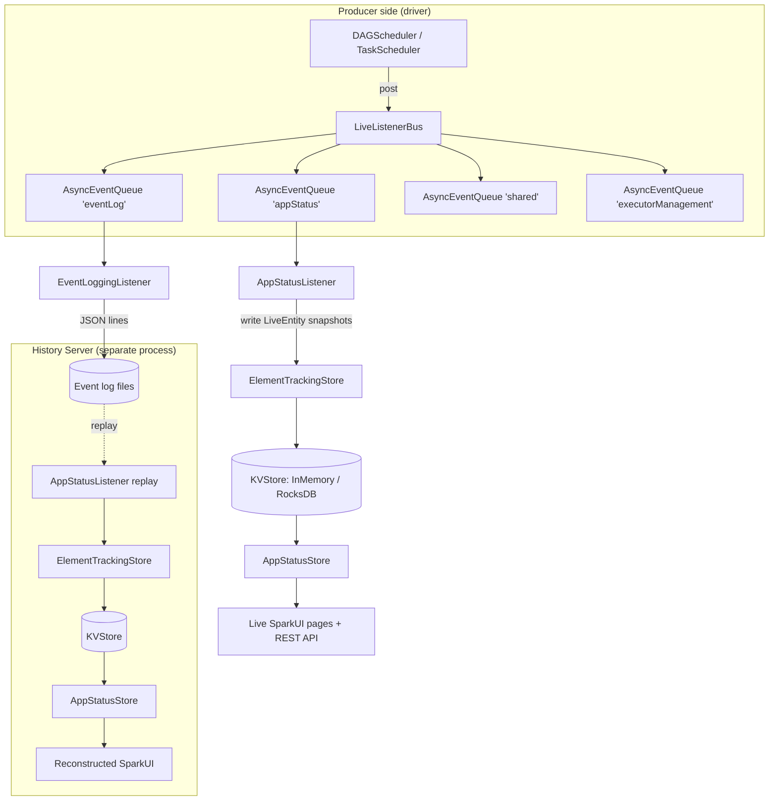

This page sweeps the **monitoring** group of Spark core at tag `v4.2.0`: the live status/UI pipeline, the metrics system, the History Server, and the event-log/listener-bus plumbing that feeds them. Every one of the 118 configs in the slice is attributed to a concept below. Line numbers were verified against the local checkout.

> The single most important architectural fact in this group: **the live Spark UI and the History Server never read live objects.** Both read a `KVStore` through `AppStatusStore`. A `SparkListener` (`AppStatusListener`) writes immutable snapshot rows into that store; every UI page and every REST endpoint queries the store. Live mode and replay mode differ only in *who fills the store* and *which KVStore implementation backs it*.

---

## Listener bus and async event queues (producer side)

**What it is:** `LiveListenerBus` is the driver-side fan-out point for every `SparkListenerEvent`. It does **not** deliver events itself; it owns a set of named `AsyncEventQueue`s (`shared`, `appStatus`, `executorManagement`, `eventLog`), each with its own daemon dispatch thread and its own bounded `LinkedBlockingQueue`. This per-queue isolation means a slow listener on one queue cannot stall the others. Before `start()`, events are buffered in `queuedEvents`; after start they post directly to queues. This is the producer side of everything status/history consume, so its overflow and slow-listener behavior is where monitoring data is silently lost.

**Code path:** `SparkContext.post` → `LiveListenerBus.post` → `postToQueues` → `AsyncEventQueue.post` (`offer` into bounded queue) → dispatch thread `dispatch()` → `SparkListenerBus.postToAll` → each `SparkListener`

**Anchor files:**

- [LiveListenerBus.scala:126](https://github.com/apache/spark/blob/v4.2.0/core/src/main/scala/org/apache/spark/scheduler/LiveListenerBus.scala#L126) — `post`, buffered-vs-live branch
- [LiveListenerBus.scala:89](https://github.com/apache/spark/blob/v4.2.0/core/src/main/scala/org/apache/spark/scheduler/LiveListenerBus.scala#L89) — `addToQueue`, per-queue creation
- [LiveListenerBus.scala:263](https://github.com/apache/spark/blob/v4.2.0/core/src/main/scala/org/apache/spark/scheduler/LiveListenerBus.scala#L263) — `LiveListenerBusMetrics` (registered as a metrics `Source` named `LiveListenerBus`)
- [AsyncEventQueue.scala:53](https://github.com/apache/spark/blob/v4.2.0/core/src/main/scala/org/apache/spark/scheduler/AsyncEventQueue.scala#L53) — per-queue capacity resolution
- [AsyncEventQueue.scala:158](https://github.com/apache/spark/blob/v4.2.0/core/src/main/scala/org/apache/spark/scheduler/AsyncEventQueue.scala#L158) — `post`: **the event-drop path**

!!! warning "Event-queue overflow silently drops monitoring data"
    `AsyncEventQueue.post` calls `eventQueue.offer(event)`; if the bounded queue is full it does **not** block — it drops the event, increments `droppedEvents` (metric `queue.<name>.numDroppedEvents`) and `droppedEventsCounter`, logs one `logError` the first time (`logDroppedEvent` latch), and thereafter logs a rate-limited `logWarning` at most once per 60s (`LOGGING_INTERVAL`). Dropped task events mean the UI/History view of that stage is permanently incomplete. Capacity is `spark.scheduler.listenerbus.eventqueue.<name>.capacity` if set, else `spark.scheduler.listenerbus.eventqueue.capacity` (default 10000). Per-listener processing time is timed only up to `spark.scheduler.listenerbus.metrics.maxListenerClassesTimed` (128) distinct classes.

!!! info "Slow-listener logging"
    Slow-event logging is governed by `spark.scheduler.listenerbus.logSlowEvent` and its `.threshold` (1s) — these are consumed in the `SparkListenerBus`/`ListenerBus` posting path. On stop, `spark.scheduler.listenerbus.exitTimeout` (default 0 = wait indefinitely) bounds how long `AsyncEventQueue.stop` joins the dispatch thread after enqueuing the `POISON_PILL` ([AsyncEventQueue.scala:153](https://github.com/apache/spark/blob/v4.2.0/core/src/main/scala/org/apache/spark/scheduler/AsyncEventQueue.scala#L153)).

**Configs:** `spark.scheduler.listenerbus.eventqueue.capacity`, `spark.scheduler.listenerbus.exitTimeout`, `spark.scheduler.listenerbus.logSlowEvent`, `spark.scheduler.listenerbus.logSlowEvent.threshold`, `spark.scheduler.listenerbus.metrics.maxListenerClassesTimed`

**Maps to topics:** E3 (observability plumbing), E1 (execution-engine internals — the bus is core scheduler machinery)

---

## Event-log write path (EventLoggingListener + file writers)

**What it is:** `EventLoggingListener` is a `SparkListener` added to the dedicated `eventLog` queue. It serializes each event to a JSON line via `JsonProtocol` and appends it through an `EventLogFileWriter`. This is the *producer* that the History Server later replays. It is created in `SparkContext.setupAndStartListenerBus` only when `spark.eventLog.enabled` is true. Stage/job/executor lifecycle events flush immediately (`flushLogger = true`); task-start/-end do not, to bound write amplification.

**Code path:** `SparkContext` (if `EVENT_LOG_ENABLED`) → `new EventLoggingListener` → `listenerBus.addToEventLogQueue` → `onXxx` → `logEvent` → `JsonProtocol.sparkEventToJsonString` → `EventLogFileWriter.writeEvent` → (single or rolling file)

**Anchor files:**

- [EventLoggingListener.scala:82](https://github.com/apache/spark/blob/v4.2.0/core/src/main/scala/org/apache/spark/scheduler/EventLoggingListener.scala#L82) — `start` / `initEventLog` (writes `SparkListenerLogStart` with `SPARK_VERSION` as first line)
- [EventLoggingListener.scala:136](https://github.com/apache/spark/blob/v4.2.0/core/src/main/scala/org/apache/spark/scheduler/EventLoggingListener.scala#L136) — `onStageCompleted`: emits per-executor `SparkListenerStageExecutorMetrics` when `logStageExecutorMetrics` on
- [EventLoggingListener.scala:285](https://github.com/apache/spark/blob/v4.2.0/core/src/main/scala/org/apache/spark/scheduler/EventLoggingListener.scala#L285) — `redactProperties` (only conf-backed keys redacted)
- [SparkContext.scala:658](https://github.com/apache/spark/blob/v4.2.0/core/src/main/scala/org/apache/spark/SparkContext.scala#L658) — driver wiring
- [EventLogFileWriters.scala](https://github.com/apache/spark/blob/v4.2.0/core/src/main/scala/org/apache/spark/deploy/history/EventLogFileWriters.scala) — `SingleEventLogFileWriter` vs `RollingEventLogFilesWriter`; buffer size, compression, overwrite, erasure-coding all resolved here

!!! info "Rolling is on by default"
    `spark.eventLog.rolling.enabled` defaults **true** (4.2.0): the app dir holds `appstatus_…` plus indexed `events_<n>_…` files, each capped by `spark.eventLog.rolling.maxFileSize` (128m). This is the on-disk shape the compactor and History Server expect. `spark.eventLog.compress` (true) + `spark.eventLog.compression.codec` (ZSTD) control compression; `spark.eventLog.buffer.kb` (100k) the output buffer; `spark.eventLog.overwrite`, `spark.eventLog.erasureCoding.enabled`, `spark.eventLog.excludedPatterns` the file semantics.

**Configs:** `spark.eventLog.enabled`, `spark.eventLog.dir`, `spark.eventLog.buffer.kb`, `spark.eventLog.compress`, `spark.eventLog.compression.codec`, `spark.eventLog.overwrite`, `spark.eventLog.erasureCoding.enabled`, `spark.eventLog.excludedPatterns`, `spark.eventLog.testing`, `spark.eventLog.rolling.enabled`, `spark.eventLog.rolling.maxFileSize`, `spark.eventLog.logBlockUpdates.enabled`, `spark.eventLog.logStageExecutorMetrics`, `spark.eventLog.longForm.enabled`, `spark.eventLog.includeTaskMetricsAccumulators`, `spark.eventLog.gcMetrics.youngGenerationGarbageCollectors`, `spark.eventLog.gcMetrics.oldGenerationGarbageCollectors`

**Maps to topics:** E3

---

## KVStore indirection — AppStatusListener → ElementTrackingStore → AppStatusStore

**What it is:** The heart of monitoring. `AppStatusListener` consumes events from the `appStatus` queue and maintains in-memory `LiveEntity` maps (`liveStages`, `liveJobs`, `liveExecutors`, `liveTasks`, `liveRDDs`, …). Periodically (or on flush) it serializes each `LiveEntity` into an immutable `*Wrapper` row (defined in `storeTypes.scala`, shaped after the public REST API) and **writes it into a `KVStore`** through `ElementTrackingStore`. Every UI page and REST endpoint reads those rows via `AppStatusStore` — never the live objects. The same three classes serve *both* the live UI and History Server replay; only `live=true/false` and the backing KVStore differ.

**Code path (live):** `AppStatusStore.createLiveStore` → `KVUtils.createKVStore` (in-memory or local RocksDB if `spark.ui.store.path`) → wrap in `ElementTrackingStore` → `new AppStatusListener(store, conf, live=true)` → `listenerBus.addToStatusQueue(listener)`; reads: `SparkUI` page → `AppStatusStore.jobsList/stageData/executorList` → `store.view(classOf[...Wrapper])`

**Code path (write):** `AppStatusListener.onXxx` → mutate `LiveEntity` → `LiveEntity.write(store, now, checkTriggers)` → `doUpdate()` snapshot → `ElementTrackingStore.write(value, checkTriggers)` → `store.write` + fire retention triggers

**Anchor files:**

- [AppStatusStore.scala:857](https://github.com/apache/spark/blob/v4.2.0/core/src/main/scala/org/apache/spark/status/AppStatusStore.scala#L857) — `createLiveStore` (store path, ElementTrackingStore, listener)
- [AppStatusStore.scala:42](https://github.com/apache/spark/blob/v4.2.0/core/src/main/scala/org/apache/spark/status/AppStatusStore.scala#L42) — the read wrapper (`store.view(classOf[JobDataWrapper])`, etc.)
- [AppStatusListener.scala:46](https://github.com/apache/spark/blob/v4.2.0/core/src/main/scala/org/apache/spark/status/AppStatusListener.scala#L46) — listener ctor, `live` flag, `liveUpdatePeriodNs`
- [ElementTrackingStore.scala:127](https://github.com/apache/spark/blob/v4.2.0/core/src/main/scala/org/apache/spark/status/ElementTrackingStore.scala#L127) — `write(value, checkTriggers)` + `LatchedTriggers.fireOnce`
- [SparkContext.scala:496](https://github.com/apache/spark/blob/v4.2.0/core/src/main/scala/org/apache/spark/SparkContext.scala#L496) — `AppStatusStore.createLiveStore` + `addToStatusQueue`

!!! info "Live vs replay update cadence"
    In **live** mode, updates throttle to `spark.ui.liveUpdate.period` (100ms), with a stale-data flush floor of `spark.ui.liveUpdate.minFlushPeriod` (1s). In **replay** mode `liveUpdatePeriodNs = -1` ("never update" until the final flush) — the SHS also sets `spark.appStateStore.asyncTracking.enable=false` so trigger actions run synchronously on the replay thread (see `rebuildAppStore`). `spark.ui.store.path` switches the live store from in-memory to a local RocksDB-backed KVStore.

**Configs:** `spark.ui.liveUpdate.period`, `spark.ui.liveUpdate.minFlushPeriod`, `spark.ui.store.path`

**Maps to topics:** E3

---

## LiveEntity model and retention triggers

**What it is:** `LiveEntity` is the abstract base for all mutable driver-side accumulators (`LiveJob`, `LiveStage`, `LiveTask`, `LiveExecutor`, `LiveRDD`, `SchedulerPool`, …). Each keeps a `lastWriteTime` and, on `write`, calls `doUpdate()` to produce the immutable `*Wrapper` snapshot. Retention is enforced through `ElementTrackingStore.addTrigger`: when the count of a wrapper class crosses its threshold, a cleanup callback deletes the oldest rows. This is why the UI shows a bounded window of jobs/stages/tasks/executors.

**Code path:** `AppStatusListener` ctor → `kvstore.addTrigger(classOf[JobDataWrapper], MAX_RETAINED_JOBS){cleanupJobs}` (and stages, dead executors) → on each write over threshold → `cleanupJobs/cleanupStages/cleanupExecutors` → `store.removeAllByIndexValues`

**Anchor files:**

- [LiveEntity.scala:43](https://github.com/apache/spark/blob/v4.2.0/core/src/main/scala/org/apache/spark/status/LiveEntity.scala#L43) — `LiveEntity.write` / `doUpdate`
- [AppStatusListener.scala:92](https://github.com/apache/spark/blob/v4.2.0/core/src/main/scala/org/apache/spark/status/AppStatusListener.scala#L92) — retention trigger registration
- [storeTypes.scala](https://github.com/apache/spark/blob/v4.2.0/core/src/main/scala/org/apache/spark/status/storeTypes.scala) — `*Wrapper` KVStore row types + indices

!!! warning "Retention is lossy by design"
    The retained-* limits are hard caps on stored rows, not on what the app did. Once `spark.ui.retainedJobs` (1000) / `retainedStages` (1000) / `retainedTasks` (100000, per stage via `MAX_RETAINED_TASKS_PER_STAGE`) / `retainedDeadExecutors` (100) are exceeded, the oldest entries are evicted from the store and disappear from both the live UI and the reconstructed History UI. `spark.ui.dagGraph.retainedRootRDDs` bounds DAG-viz root RDDs.

**Configs:** `spark.ui.retainedJobs`, `spark.ui.retainedStages`, `spark.ui.retainedTasks`, `spark.ui.retainedDeadExecutors`, `spark.ui.dagGraph.retainedRootRDDs`

**Maps to topics:** E3

---

## Spark Web UI (SparkUI / WebUI / tabs / pages)

**What it is:** `SparkUI` (a `WebUI` subclass) is the per-application Jetty front end. `initialize()` attaches the standard tabs — Jobs, Stages, Storage, Environment, Executors (+ optional Driver Logs, + SQL tab wired externally via `AppHistoryServerPlugin`/`SQLTab`) — plus the REST API handler and, optionally, the executor-Prometheus handler. Each tab's pages render by querying `AppStatusStore`. The UI binds Jetty early (`initHandler` shows "starting up"), then `attachAllHandlers()` swaps in the real handlers once the app is up.

**Code path:** `SparkContext` (if `UI_ENABLED`) → `SparkUI.create(store, …)` → `initialize()` (attach tabs/pages/handlers) → `bind()` (Jetty) → later `attachAllHandlers()` → tab `render` → `AppStatusStore` reads

**Anchor files:**

- [SparkUI.scala:98](https://github.com/apache/spark/blob/v4.2.0/core/src/main/scala/org/apache/spark/ui/SparkUI.scala#L98) — `initialize` (tab wiring; `PrometheusResource` attached when `UI_PROMETHEUS_ENABLED`)
- [SparkUI.scala:253](https://github.com/apache/spark/blob/v4.2.0/core/src/main/scala/org/apache/spark/ui/SparkUI.scala#L253) — `create`
- [WebUI.scala](https://github.com/apache/spark/blob/v4.2.0/core/src/main/scala/org/apache/spark/ui/WebUI.scala) — `attachTab`/`attachPage`/`attachHandler` base
- [JettyUtils.scala](https://github.com/apache/spark/blob/v4.2.0/core/src/main/scala/org/apache/spark/ui/JettyUtils.scala) — servlet/handler creation, request-header size, Jetty stop timeout, SNI host check
- Tabs: [JobsTab.scala](https://github.com/apache/spark/blob/v4.2.0/core/src/main/scala/org/apache/spark/ui/jobs/JobsTab.scala), [StagesTab.scala](https://github.com/apache/spark/blob/v4.2.0/core/src/main/scala/org/apache/spark/ui/jobs/StagesTab.scala), [StorageTab.scala](https://github.com/apache/spark/blob/v4.2.0/core/src/main/scala/org/apache/spark/ui/storage/StorageTab.scala), [EnvironmentPage.scala](https://github.com/apache/spark/blob/v4.2.0/core/src/main/scala/org/apache/spark/ui/env/EnvironmentPage.scala), [ExecutorsTab.scala](https://github.com/apache/spark/blob/v4.2.0/core/src/main/scala/org/apache/spark/ui/exec/ExecutorsTab.scala)

!!! info "Thread dumps, flamegraphs, heap histograms, timelines"
    `ExecutorThreadDumpPage`/`TaskThreadDumpPage` gate on `spark.ui.threadDumpsEnabled`; flamegraph rendering on `spark.ui.threadDump.flamegraphEnabled`; `ExecutorHeapHistogramPage` on `spark.ui.heapHistogramEnabled`. The event-timeline widgets are bounded by `spark.ui.timelineEnabled` and the four `spark.ui.timeline.{jobs,stages,tasks,executors}.maximum` caps. `spark.ui.killEnabled` exposes the job/stage kill links; `spark.ui.showErrorStacks` controls stack-trace display; `spark.ui.groupSQLSubExecutionEnabled` groups sub-executions on the SQL tab.

**Configs:** `spark.ui.enabled`, `spark.ui.port`, `spark.ui.killEnabled`, `spark.ui.threadDumpsEnabled`, `spark.ui.threadDump.flamegraphEnabled`, `spark.ui.heapHistogramEnabled`, `spark.ui.timelineEnabled`, `spark.ui.timeline.jobs.maximum`, `spark.ui.timeline.stages.maximum`, `spark.ui.timeline.tasks.maximum`, `spark.ui.timeline.executors.maximum`, `spark.ui.showErrorStacks`, `spark.ui.groupSQLSubExecutionEnabled`, `spark.ui.requestHeaderSize`, `spark.ui.jetty.stopTimeout`, `spark.ui.jetty.sniHostCheckEnabled`, `spark.ui.custom.executor.log.url`, `spark.ui.proxyRedirectUri`

**Maps to topics:** E3

---

## AppStatusSource and application-status metrics

**What it is:** `AppStatusSource` is a Dropwizard metrics `Source` (name `appStatus`) exposing app-level counters/gauges (job/stage success/failure counts, etc.) built from the same status events. It is optional and registered into the driver `MetricsSystem` only when enabled — it is the bridge between the *status* subsystem and the *metrics* subsystem.

**Code path:** `SparkContext` → `AppStatusSource.createSource(conf)` (returns `Some` iff `METRICS_APP_STATUS_SOURCE_ENABLED`) → `_env.metricsSystem.registerSource(_)`; the `AppStatusListener` updates its counters

**Anchor files:**

- [AppStatusSource.scala:32](https://github.com/apache/spark/blob/v4.2.0/core/src/main/scala/org/apache/spark/status/AppStatusSource.scala#L32) — `class AppStatusSource extends Source`
- [AppStatusSource.scala:89](https://github.com/apache/spark/blob/v4.2.0/core/src/main/scala/org/apache/spark/status/AppStatusSource.scala#L89) — `createSource` gate
- [SparkContext.scala:731](https://github.com/apache/spark/blob/v4.2.0/core/src/main/scala/org/apache/spark/SparkContext.scala#L731) — registration

**Configs:** `spark.metrics.appStatusSource.enabled`

**Maps to topics:** E3

---

## Metrics system — registration, config parsing, instance/source/sink resolution

**What it is:** `MetricsSystem` is a per-*instance* (`driver`, `executor`, `master`, `worker`, `applications`, `shuffleService`, `applicationMaster`) container that wires Dropwizard `Source`s to `Sink`s through one `MetricRegistry`. `MetricsConfig` parses `metrics.properties` (and inline `spark.metrics.conf.*` keys) into per-instance sub-properties of the form `[instance].[sink|source].[name].[option]`. Both source and sink **classes are loaded by reflection** from the parsed `class` option — this is the registration/lookup mechanism.

**Code path (config resolution):** `MetricsConfig.initialize` → `setDefaultProperties` (built-in `*.sink.servlet`) → `loadPropertiesFromFile(spark.metrics.conf)` (falls back to `metrics.properties` on classpath) → merge `spark.metrics.conf.*` conf keys → `subProperties` split by `INSTANCE_REGEX` → default `*` props merged into each instance

**Code path (wiring):** `MetricsSystem.start` → `StaticSources.allSources.foreach(registerSource)` → `registerSources()` (reflection via `SOURCE_REGEX`) → `registerSinks()` (reflection via `SINK_REGEX`, special-casing `servlet` and `prometheusServlet`) → `sinks.foreach(_.start())`

**Anchor files:**

- [MetricsSystem.scala:181](https://github.com/apache/spark/blob/v4.2.0/core/src/main/scala/org/apache/spark/metrics/MetricsSystem.scala#L181) — `registerSources` (reflection)
- [MetricsSystem.scala:199](https://github.com/apache/spark/blob/v4.2.0/core/src/main/scala/org/apache/spark/metrics/MetricsSystem.scala#L199) — `registerSinks`; `servlet`/`prometheusServlet` special cases + 2-arg/3-arg ctor fallback
- [MetricsSystem.scala:131](https://github.com/apache/spark/blob/v4.2.0/core/src/main/scala/org/apache/spark/metrics/MetricsSystem.scala#L131) — `buildRegistryName` (`<namespace>.<executorId>.<sourceName>`; uses `spark.metrics.namespace` / `spark.app.id`)
- [MetricsConfig.scala:53](https://github.com/apache/spark/blob/v4.2.0/core/src/main/scala/org/apache/spark/metrics/MetricsConfig.scala#L53) — `initialize`
- [MetricsConfig.scala:108](https://github.com/apache/spark/blob/v4.2.0/core/src/main/scala/org/apache/spark/metrics/MetricsConfig.scala#L108) — `subProperties` (the `[instance].[type].[name]` unflattening)
- [SparkContext.scala:656](https://github.com/apache/spark/blob/v4.2.0/core/src/main/scala/org/apache/spark/SparkContext.scala#L656) — `metricsSystem.start(...)` + `getServletHandlers` attached to UI at [:702](https://github.com/apache/spark/blob/v4.2.0/core/src/main/scala/org/apache/spark/SparkContext.scala#L702)

!!! info "Two default servlet sinks are always present"
    `MetricsConfig.setDefaultProperties` hard-codes `*.sink.servlet` → `MetricsServlet` at `/metrics/json` (plus `/metrics/master/json`, `/metrics/applications/json`). So even with no `metrics.properties`, the JSON servlet exists. `spark.metrics.staticSources.enabled` toggles whether `StaticSources` are registered at start; `spark.metrics.executorMetricsSource.enabled` toggles the executor `ExecutorMetricsSource`. `MetricsSystem.checkMinimalPollingPeriod` forbids sink poll periods below 1 second.

**Configs:** `spark.metrics.conf`, `spark.metrics.namespace`, `spark.metrics.staticSources.enabled`, `spark.metrics.executorMetricsSource.enabled`

**Maps to topics:** E3

---

## Metrics sinks

**What it is:** A `Sink` polls the `MetricRegistry` and pushes to a destination. All in-tree sinks live in `metrics/sink/` and are instantiated by name via reflection from `*.sink.<name>.class`. Each reads its own `period`/`unit` (and destination) from its sub-properties and validates the minimum poll period.

**Code path:** `MetricsSystem.registerSinks` → `Utils.classForName[Sink](classPath).getConstructor(Properties, MetricRegistry)` → `sinks += sink` → `sink.start()`

**Anchor files:**

- [Sink.scala](https://github.com/apache/spark/blob/v4.2.0/core/src/main/scala/org/apache/spark/metrics/sink/Sink.scala) — trait (`start`/`stop`/`report`)
- [ConsoleSink.scala:27](https://github.com/apache/spark/blob/v4.2.0/core/src/main/scala/org/apache/spark/metrics/sink/ConsoleSink.scala#L27) — representative period/unit + `ConsoleReporter`
- [CsvSink.scala](https://github.com/apache/spark/blob/v4.2.0/core/src/main/scala/org/apache/spark/metrics/sink/CsvSink.scala), [JmxSink.scala](https://github.com/apache/spark/blob/v4.2.0/core/src/main/scala/org/apache/spark/metrics/sink/JmxSink.scala), [GraphiteSink.scala](https://github.com/apache/spark/blob/v4.2.0/core/src/main/scala/org/apache/spark/metrics/sink/GraphiteSink.scala), [Slf4jSink.scala](https://github.com/apache/spark/blob/v4.2.0/core/src/main/scala/org/apache/spark/metrics/sink/Slf4jSink.scala), [StatsdSink.scala](https://github.com/apache/spark/blob/v4.2.0/core/src/main/scala/org/apache/spark/metrics/sink/StatsdSink.scala) (+ `StatsdReporter`), [MetricsServlet.scala](https://github.com/apache/spark/blob/v4.2.0/core/src/main/scala/org/apache/spark/metrics/sink/MetricsServlet.scala), [PrometheusServlet.scala](https://github.com/apache/spark/blob/v4.2.0/core/src/main/scala/org/apache/spark/metrics/sink/PrometheusServlet.scala)

!!! info "Servlet sinks are not periodic"
    `MetricsServlet` and `PrometheusServlet` are treated specially — they are not started/polled; they expose the registry on demand as HTTP handlers (`getServletHandlers`), attached to the SparkUI/master/worker UI. `JmxSink` exposes via JMX MBeans; `ConsoleSink`/`CsvSink`/`GraphiteSink`/`Slf4jSink`/`StatsdSink` push on a period. Sink instantiation failure is fatal (`registerSinks` rethrows), unlike source failure which is only logged.

**Configs:** (sink selection/params come from `metrics.properties`, not the conf slice) — governed indirectly by `spark.metrics.conf`

**Maps to topics:** E3

---

## Metrics sources (static + internal)

**What it is:** A `Source` owns a private `MetricRegistry` and a `sourceName`. Two kinds: **static/common** sources (`StaticSources`: `CodegenMetrics`, `HiveCatalogMetrics`; plus `JvmSource`, `JVMCPUSource`) registered generically, and **internal** component sources (`DAGSchedulerSource`, `BlockManagerSource`, `AppStatusSource`, `ExecutorMetricsSource`, `ExecutorAllocationManagerSource`, `LiveListenerBusMetrics`, accumulator sources) registered by the component that owns them.

**Code path:** `MetricsSystem.start` → `StaticSources.allSources.foreach(registerSource)`; component sources → `SparkContext`/`Executor` → `metricsSystem.registerSource(...)`

**Anchor files:**

- [Source.scala](https://github.com/apache/spark/blob/v4.2.0/core/src/main/scala/org/apache/spark/metrics/source/Source.scala) — trait
- [StaticSources.scala](https://github.com/apache/spark/blob/v4.2.0/core/src/main/scala/org/apache/spark/metrics/source/StaticSources.scala) — `allSources`
- [JVMCPUSource.scala](https://github.com/apache/spark/blob/v4.2.0/core/src/main/scala/org/apache/spark/metrics/source/JVMCPUSource.scala), [JvmSource.scala](https://github.com/apache/spark/blob/v4.2.0/core/src/main/scala/org/apache/spark/metrics/source/JvmSource.scala), [AccumulatorSource.scala](https://github.com/apache/spark/blob/v4.2.0/core/src/main/scala/org/apache/spark/metrics/source/AccumulatorSource.scala)
- [SparkContext.scala:724](https://github.com/apache/spark/blob/v4.2.0/core/src/main/scala/org/apache/spark/SparkContext.scala#L724) — DAGScheduler/BlockManager/JVMCPU source registration

**Configs:** `spark.metrics.staticSources.enabled`, `spark.metrics.executorMetricsSource.enabled` (also govern this concept)

**Maps to topics:** E3

---

## Two Prometheus exposure paths

**What it is:** Spark exposes Prometheus-format metrics through **two independent surfaces** — a common point of confusion:

1. **`PrometheusServlet`** (a metrics `Sink`) — re-exposes the whole Dropwizard `MetricRegistry` in Prometheus text format. Configured in `metrics.properties` as `*.sink.prometheusServlet`, mounted as a UI handler via `getServletHandlers`. Covers gauges/counters/histograms/meters/timers for all registered sources.
2. **`PrometheusResource`** (a REST endpoint at `/metrics/executors/prometheus`) — reads `AppStatusStore.executorList` and emits executor summary + peak-memory metrics. Attached only when `spark.ui.prometheus.enabled` (default true). This is the *status-store*-derived path, based on `ExecutorSummary`, **not** `ExecutorSource`.

**Code path (servlet sink):** `MetricsSystem.registerSinks` (`prometheusServlet` branch) → `PrometheusServlet.getHandlers` → `/metrics/prometheus`
**Code path (REST):** `SparkUI.initialize` (if `UI_PROMETHEUS_ENABLED`) → `PrometheusResource.getServletHandler` → `/metrics/executors/prometheus` → `AppStatusStore.executorList`

**Anchor files:**

- [PrometheusServlet.scala:42](https://github.com/apache/spark/blob/v4.2.0/core/src/main/scala/org/apache/spark/metrics/sink/PrometheusServlet.scala#L42) — registry-wide sink
- [PrometheusResource.scala:39](https://github.com/apache/spark/blob/v4.2.0/core/src/main/scala/org/apache/spark/status/api/v1/PrometheusResource.scala#L39) — status-store REST endpoint
- [SparkUI.scala:116](https://github.com/apache/spark/blob/v4.2.0/core/src/main/scala/org/apache/spark/ui/SparkUI.scala#L116) — the `UI_PROMETHEUS_ENABLED` gate

**Configs:** `spark.ui.prometheus.enabled` (REST path); the sink path is enabled via `metrics.properties`

**Maps to topics:** E3

---

## History Server front end and app-UI cache

**What it is:** `HistoryServer` is a standalone `WebUI` (pool size 1000) that renders SparkUIs for completed apps read from an `ApplicationHistoryProvider` (default `FsHistoryProvider`). It lists apps on `HistoryPage`, and on demand reconstructs an app's SparkUI, caching a bounded number in `ApplicationCache`. It implements `UIRoot`, so the same REST API (`ApiRootResource`) serves History data.

**Code path:** `HistoryServer.main` → `HistoryServerArguments` → load `spark.history.provider` → `provider.start()` → `bind()`; request → `loaderServlet.doGet` → `provider.getAppUI(appId, attemptId)` → `ApplicationCache` → attach reconstructed `SparkUI`

**Anchor files:**

- [HistoryServer.scala:50](https://github.com/apache/spark/blob/v4.2.0/core/src/main/scala/org/apache/spark/deploy/history/HistoryServer.scala#L50) — class, `retainedApplications`, `maxApplications`, `appCache`
- [HistoryServer.scala:77](https://github.com/apache/spark/blob/v4.2.0/core/src/main/scala/org/apache/spark/deploy/history/HistoryServer.scala#L77) — `loaderServlet` (attempt-id resolution + redirect)
- [ApplicationCache.scala](https://github.com/apache/spark/blob/v4.2.0/core/src/main/scala/org/apache/spark/deploy/history/ApplicationCache.scala) — Guava-cache of loaded UIs
- [HistoryPage.scala](https://github.com/apache/spark/blob/v4.2.0/core/src/main/scala/org/apache/spark/deploy/history/HistoryPage.scala) — the listing page (`maxApplications`)
- [HistoryAppStatusStore.scala](https://github.com/apache/spark/blob/v4.2.0/core/src/main/scala/org/apache/spark/deploy/history/HistoryAppStatusStore.scala) — applies `spark.history.custom.executor.log.url` rewrites

**Configs:** `spark.history.provider`, `spark.history.ui.port`, `spark.history.ui.title`, `spark.history.retainedApplications`, `spark.history.ui.maxApplications`, `spark.history.custom.executor.log.url`, `spark.history.custom.executor.log.url.applyIncompleteApplication`

**Maps to topics:** E3

---

## FsHistoryProvider — scan / replay / safemode / update loop

**What it is:** The default provider. On start it optionally waits out HDFS **safemode**, then schedules a periodic **scan** (`checkForLogs`) that finds new/grown/removed logs, replays them on a thread pool, and maintains a listing KVStore of `ApplicationInfoWrapper`/`LogInfo`. Replay reuses `AppStatusListener` (`rebuildAppStore`) so a completed app's store is byte-for-byte the same shape as a live app's.

**Code path:** `FsHistoryProvider.initialize` → (`isFsInSafeMode` ? `startSafeModeCheckThread` : `startPolling`) → `pool.scheduleWithFixedDelay(checkForLogs, UPDATE_INTERVAL_S)` → `checkForLogsInDir` → `submitLogProcessTask` → `mergeApplicationListing` → `doMergeApplicationListingInternal` → `addListing`; UI request → `getAppUI` → `loadDiskStore` → `rebuildAppStore` → `new AppStatusListener(replay)` → `ReplayListenerBus.replay`

**Anchor files:**

- [FsHistoryProvider.scala:291](https://github.com/apache/spark/blob/v4.2.0/core/src/main/scala/org/apache/spark/deploy/history/FsHistoryProvider.scala#L291) — `initialize` (safemode branch)
- [FsHistoryProvider.scala:300](https://github.com/apache/spark/blob/v4.2.0/core/src/main/scala/org/apache/spark/deploy/history/FsHistoryProvider.scala#L300) — `startSafeModeCheckThread`
- [FsHistoryProvider.scala:329](https://github.com/apache/spark/blob/v4.2.0/core/src/main/scala/org/apache/spark/deploy/history/FsHistoryProvider.scala#L329) — `startPolling` (validates dirs; schedules `checkForLogs`, `cleanLogs`, `cleanDriverLogs`)
- [FsHistoryProvider.scala:573](https://github.com/apache/spark/blob/v4.2.0/core/src/main/scala/org/apache/spark/deploy/history/FsHistoryProvider.scala#L573) — `checkForLogs`
- [FsHistoryProvider.scala:1391](https://github.com/apache/spark/blob/v4.2.0/core/src/main/scala/org/apache/spark/deploy/history/FsHistoryProvider.scala#L1391) — `rebuildAppStore` (replay; disables async tracking)
- [FsHistoryProvider.scala:1448](https://github.com/apache/spark/blob/v4.2.0/core/src/main/scala/org/apache/spark/deploy/history/FsHistoryProvider.scala#L1448) — `isFsInSafeMode`
- [FsHistoryProvider.scala:414](https://github.com/apache/spark/blob/v4.2.0/core/src/main/scala/org/apache/spark/deploy/history/FsHistoryProvider.scala#L414) — `getAppUI` (+ on-demand fallback load)

!!! warning "Incomplete-application replay is best-effort and re-parsed"
    In-progress apps are replayed with `maybeTruncated = !reader.completed`; the last partially-written event is tolerated. `spark.history.fs.inProgressOptimization.enabled` (true) + `spark.history.fs.endEventReparseChunkSize` (1m) let the provider fast-scan the tail to detect end events without full re-parse. `spark.history.fs.eventLog.rolling.onDemandLoadEnabled` (4.1.0+, true) lets `getAppUI` load a rolling log that was never in the listing (fallback path). `spark.history.fs.update.batchSize` and `spark.history.fs.update.scanDisabledPathPatterns` (4.2.0) bound/skip work per scan; `spark.history.fs.logDirectory.names` (4.2.0) supports display-named multi-dir setups.

**Configs:** `spark.history.fs.logDirectory`, `spark.history.fs.logDirectory.names`, `spark.history.fs.update.interval`, `spark.history.fs.update.batchSize`, `spark.history.fs.update.scanDisabledPathPatterns`, `spark.history.fs.safemodeCheck.interval`, `spark.history.fs.numReplayThreads`, `spark.history.fs.inProgressOptimization.enabled`, `spark.history.fs.endEventReparseChunkSize`, `spark.history.fs.eventLog.rolling.onDemandLoadEnabled`, `spark.history.kerberos.enabled`, `spark.history.kerberos.principal`, `spark.history.kerberos.keytab`

**Maps to topics:** E3

---

## History Server store loading (Hybrid / RocksDB / disk & memory managers)

**What it is:** When a completed app's UI is requested, `FsHistoryProvider` needs a KVStore to back it. If `spark.history.store.path` is set, it uses a disk-backed store managed by `HistoryServerDiskManager` (bounded by `spark.history.store.maxDiskUsage`). With `spark.history.store.hybridStore.enabled`, it first replays into an in-memory `HybridStore` (fast) then asynchronously dumps to the on-disk backend (RocksDB by default), guarded by `HistoryServerMemoryManager` (`maxMemoryUsage`). If memory is insufficient, it falls back to a pure disk store; if disk is off, an in-memory store.

**Code path:** `getAppUI` → `loadDiskStore(dm, appId, attempt)` → try open existing → else if `hybridStoreEnabled` → `createHybridStore` (`memoryManager.lease` → `rebuildAppStore` into `HybridStore` → `dm.lease` → background `switchToDiskStore`) → else `createDiskStore` (lease → `rebuildAppStore` into RocksDB → `commit`); no `storePath` → `createInMemoryStore`

**Anchor files:**

- [FsHistoryProvider.scala:1501](https://github.com/apache/spark/blob/v4.2.0/core/src/main/scala/org/apache/spark/deploy/history/FsHistoryProvider.scala#L1501) — `loadDiskStore` (open-or-rebuild + hybrid/disk fallback)
- [FsHistoryProvider.scala:1545](https://github.com/apache/spark/blob/v4.2.0/core/src/main/scala/org/apache/spark/deploy/history/FsHistoryProvider.scala#L1545) — `createHybridStore` (lease/rebuild/switch, `IOException` retry-once for compaction races)
- [FsHistoryProvider.scala:1620](https://github.com/apache/spark/blob/v4.2.0/core/src/main/scala/org/apache/spark/deploy/history/FsHistoryProvider.scala#L1620) — `createDiskStore`
- [HybridStore.scala](https://github.com/apache/spark/blob/v4.2.0/core/src/main/scala/org/apache/spark/deploy/history/HybridStore.scala) — in-memory→disk switch listener
- [HistoryServerDiskManager.scala](https://github.com/apache/spark/blob/v4.2.0/core/src/main/scala/org/apache/spark/deploy/history/HistoryServerDiskManager.scala), [HistoryServerMemoryManager.scala](https://github.com/apache/spark/blob/v4.2.0/core/src/main/scala/org/apache/spark/deploy/history/HistoryServerMemoryManager.scala)

!!! info "Disk backend and serializer are pluggable"
    `spark.history.store.hybridStore.diskBackend` selects `ROCKSDB` (default) or `LEVELDB`; `spark.history.store.serializer` selects the local KVStore serializer (JSON default, or PROTOBUF). The reconstructed store is versioned by `AppStatusStore.CURRENT_VERSION` (2) — a mismatch forces a re-replay.

**Configs:** `spark.history.store.path`, `spark.history.store.maxDiskUsage`, `spark.history.store.hybridStore.enabled`, `spark.history.store.hybridStore.maxMemoryUsage`, `spark.history.store.hybridStore.diskBackend`, `spark.history.store.serializer`

**Maps to topics:** E3

---

## Event-log rolling, compaction, and cleaning (termination paths)

**What it is:** The lifecycle end of event logs. **Compaction** rewrites old rolling-log files into one compact file, dropping events the `EventFilter`s reject (mostly finished-task events), but only when the estimated filtered-out rate meets a score threshold. **Cleaning** deletes whole apps/attempts (and driver logs) past a max age or count. Both are how the History Server bounds storage — and both can lose data.

**Code path (compaction):** `FsHistoryProvider.doMergeApplicationListingInternal` → `compact(reader)` → `EventLogFileCompactor.compact` → `findFilesToCompact` → `initializeBuilders`/`createFilter` → `calculateScore` (skip if `< threshold`) → `rewrite` + `cleanupCompactedFiles`
**Code path (cleaning):** `startPolling` → `pool.scheduleWithFixedDelay(cleanLogs, CLEAN_INTERVAL_S)` (if `CLEANER_ENABLED`) → `cleanLogs` (expired by `MAX_LOG_AGE_S`, capped by `MAX_LOG_NUM`) → `deleteAttemptLogs`; driver logs via `cleanDriverLogs`

**Anchor files:**

- [EventLogFileCompactor.scala:76](https://github.com/apache/spark/blob/v4.2.0/core/src/main/scala/org/apache/spark/deploy/history/EventLogFileCompactor.scala#L76) — `compact` (NOT_ENOUGH_FILES / LOW_SCORE / SUCCESS)
- [EventLogFileCompactor.scala:131](https://github.com/apache/spark/blob/v4.2.0/core/src/main/scala/org/apache/spark/deploy/history/EventLogFileCompactor.scala#L131) — `calculateScore` (`(totalTasks - liveTasks) / totalTasks`)
- [FsHistoryProvider.scala:1166](https://github.com/apache/spark/blob/v4.2.0/core/src/main/scala/org/apache/spark/deploy/history/FsHistoryProvider.scala#L1166) — `compact` caller
- [FsHistoryProvider.scala:1243](https://github.com/apache/spark/blob/v4.2.0/core/src/main/scala/org/apache/spark/deploy/history/FsHistoryProvider.scala#L1243) — `cleanLogs`
- [FsHistoryProvider.scala:1332](https://github.com/apache/spark/blob/v4.2.0/core/src/main/scala/org/apache/spark/deploy/history/FsHistoryProvider.scala#L1332) — `cleanDriverLogs`
- [BasicEventFilterBuilder.scala](https://github.com/apache/spark/blob/v4.2.0/core/src/main/scala/org/apache/spark/deploy/history/BasicEventFilterBuilder.scala), [EventFilter.scala](https://github.com/apache/spark/blob/v4.2.0/core/src/main/scala/org/apache/spark/deploy/history/EventFilter.scala)

!!! warning "Compaction permanently discards fine-grained history"
    Compaction is triggered when the number of files exceeds `spark.history.fs.eventLog.rolling.maxFilesToRetain` and the filter score ≥ `spark.history.fs.eventLog.rolling.compaction.score.threshold` (0.7). Once compacted, the dropped task-level events are gone forever — a reconstructed UI over compacted logs shows aggregate stage data but not every task. Compaction can also race a concurrent rebuild (`createHybridStore`/`createDiskStore` retry once on `IOException`). Cleaning (`spark.history.fs.cleaner.enabled`, default **false**) deletes attempts older than `maxAge` (7d) or beyond `maxNum`, on `cleaner.interval` (1d); driver-log cleaning has its own `driverlog.cleaner.*` set.

**Configs:** `spark.eventLog.rolling.enabled`, `spark.eventLog.rolling.maxFileSize`, `spark.history.fs.eventLog.rolling.maxFilesToRetain`, `spark.history.fs.eventLog.rolling.compaction.score.threshold`, `spark.history.fs.numCompactThreads`, `spark.history.fs.cleaner.enabled`, `spark.history.fs.cleaner.interval`, `spark.history.fs.cleaner.maxAge`, `spark.history.fs.cleaner.maxNum`, `spark.history.fs.driverlog.cleaner.enabled`, `spark.history.fs.driverlog.cleaner.interval`, `spark.history.fs.driverlog.cleaner.maxAge`

**Maps to topics:** E3

---

## Standalone Master / Worker web UIs

**What it is:** Separate monitoring surfaces for standalone-cluster deployments. `MasterWebUI` (port 8080) lists applications/workers and can link to a history server; `WorkerWebUI` (random port unless set) shows the worker's drivers/executors and their logs. These are deploy-package UIs but the same monitoring category and share `WebUI`/`JettyUtils`.

**Code path:** `Master` → `new MasterWebUI(...).bind()` (pages read master state); `Worker` → `new WorkerWebUI(...)` → `LogPage` streams executor/driver logs (`compressedLogFileLengthCacheSize`)

**Anchor files:**

- [MasterWebUI.scala](https://github.com/apache/spark/blob/v4.2.0/core/src/main/scala/org/apache/spark/deploy/master/ui/MasterWebUI.scala)
- [WorkerWebUI.scala](https://github.com/apache/spark/blob/v4.2.0/core/src/main/scala/org/apache/spark/deploy/worker/ui/WorkerWebUI.scala)
- [UI.scala:255](https://github.com/apache/spark/blob/v4.2.0/core/src/main/scala/org/apache/spark/internal/config/UI.scala#L255) — master UI decommission/title/env-prefix configs

**Configs:** `spark.master.ui.port`, `spark.master.ui.title`, `spark.master.ui.historyServerUrl`, `spark.master.ui.decommission.allow.mode`, `spark.master.ui.visibleEnvVarPrefixes`, `spark.worker.ui.port`, `spark.worker.ui.retainedExecutors`, `spark.worker.ui.retainedDrivers`, `spark.worker.ui.compressedLogFileLengthCacheSize`

**Maps to topics:** E3, E2 (deployment/standalone)

---

## UI security — ACLs, HTTP headers, reverse proxy

**What it is:** `HttpSecurityFilter` enforces view ACLs on every UI request and injects security response headers. `SecurityManager.checkUIViewPermissions` checks `spark.ui.view.acls`/`.groups` (and the History-server variants `spark.history.ui.acls.enable`/`admin.acls`/`.groups`). Reverse-proxy support rewrites URLs behind a gateway.

**Code path:** request → `HttpSecurityFilter.doFilter` → `securityMgr.checkUIViewPermissions(user)` (403 if denied) → set CSP/X-XSS/X-Content-Type/HSTS headers → forward

**Anchor files:**

- [HttpSecurityFilter.scala:54](https://github.com/apache/spark/blob/v4.2.0/core/src/main/scala/org/apache/spark/ui/HttpSecurityFilter.scala#L54) — CSP + ACL check + headers
- [UI.scala](https://github.com/apache/spark/blob/v4.2.0/core/src/main/scala/org/apache/spark/internal/config/UI.scala) — header/ACL/proxy config definitions
- [History.scala:214](https://github.com/apache/spark/blob/v4.2.0/core/src/main/scala/org/apache/spark/internal/config/History.scala#L214) — history ACL configs

**Configs:** `spark.ui.view.acls`, `spark.ui.view.acls.groups`, `spark.ui.filters`, `spark.ui.allowFramingFrom`, `spark.ui.xContentTypeOptions.enabled`, `spark.ui.xXssProtection`, `spark.ui.strictTransportSecurity`, `spark.ui.contentSecurityPolicy.enabled`, `spark.ui.reverseProxy`, `spark.ui.reverseProxyUrl`, `spark.history.ui.acls.enable`, `spark.history.ui.admin.acls`, `spark.history.ui.admin.acls.groups`

**Maps to topics:** E3

---

## Console progress bar

**What it is:** `ConsoleProgressBar` prints an in-terminal `[Stage x: (a + b) / n]` bar when the UI is disabled (or `spark.ui.showConsoleProgress` is set), driven off the live `AppStatusStore`, refreshed on an interval.

**Code path:** `SparkContext` (if `UI_SHOW_CONSOLE_PROGRESS`) → `new ConsoleProgressBar(sc)` → timer every `UI_CONSOLE_PROGRESS_UPDATE_INTERVAL` → read active stages from status store → print

**Anchor files:**

- [ConsoleProgressBar.scala:34](https://github.com/apache/spark/blob/v4.2.0/core/src/main/scala/org/apache/spark/ui/ConsoleProgressBar.scala#L34)
- [SparkContext.scala:513](https://github.com/apache/spark/blob/v4.2.0/core/src/main/scala/org/apache/spark/SparkContext.scala#L513)

**Configs:** `spark.ui.showConsoleProgress`, `spark.ui.consoleProgress.update.interval`

**Maps to topics:** E3

---

## Executor / driver metrics polling (peak-memory feed)

**What it is:** Peak executor/driver memory metrics (heap/off-heap/process-tree/GC) are sampled by a `Heartbeater`-driven poller and shipped in `SparkListenerExecutorMetricsUpdate` events, which `EventLoggingListener` folds into per-stage peaks (when `logStageExecutorMetrics` is on). Polling interval > 0 means poll on a dedicated cadence; 0 means piggyback on heartbeats.

**Code path:** executor → `Executor` `METRICS_POLLING_INTERVAL_MS` (`spark.executor.metrics.pollingInterval`) → `ExecutorMetricsPoller`; driver → `SparkContext` `Heartbeater(..., DRIVER_METRICS_POLLING_INTERVAL)` → `reportHeartBeat`; filesystem metric schemes from `spark.executor.metrics.fileSystemSchemes`

**Anchor files:**

- [Executor.scala:472](https://github.com/apache/spark/blob/v4.2.0/core/src/main/scala/org/apache/spark/executor/Executor.scala#L472) — executor polling interval
- [SparkContext.scala:621](https://github.com/apache/spark/blob/v4.2.0/core/src/main/scala/org/apache/spark/SparkContext.scala#L621) — driver heartbeater
- [ExecutorMetricsSource.scala](https://github.com/apache/spark/blob/v4.2.0/core/src/main/scala/org/apache/spark/executor/ExecutorMetricsSource.scala), [ExecutorMetricType.scala](https://github.com/apache/spark/blob/v4.2.0/core/src/main/scala/org/apache/spark/metrics/ExecutorMetricType.scala)

**Configs:** `spark.executor.metrics.pollingInterval`, `spark.driver.metrics.pollingInterval`, `spark.executor.metrics.fileSystemSchemes`

**Maps to topics:** E3, E1

---

## Structured logging, MDC and the caller context

**What it is:** the third observability channel, alongside the event log and the metrics system, and the only one you read directly. `spark.log.structuredLogging.enabled` (4.0, default **false**) switches Spark's own logs from plain text to JSON lines carrying a **Mapped Diagnostic Context** — `task_name`, `stage_id`, `executor_id` and friends as separate fields rather than interpolated into a message string, which is what makes logs joinable against the event log in an aggregator. The mechanism lives in `common/utils`: `trait Logging` mixes in the `log"..."` interpolator, `withLogContext` populates the MDC around a block, and `Logging.enableStructuredLogging` / `disableStructuredLogging` flip the appender through `SparkLoggerFactory` (Java, in `common/utils-java`).

Switching it on has to happen before the first log line, and there are two entry points because config is not always available that early: `Utils.resetStructuredLogging()` reads the **system property** for code paths that run before a `SparkConf` exists (daemon init), and an overload takes a `SparkConf` for everything after. Getting this wrong means the first few lines are plain text and the rest are JSON.

Three smaller knobs round it out. `spark.log.level` overrides all user log settings at startup, as if `SparkContext.setLogLevel` had been called — useful precisely because it wins over a `log4j2.properties` on the classpath. `spark.log.legacyTaskNameMdc.enabled` restores the Spark 3.1–3.5 MDC key `mdc.taskName` in place of 4.0's `task_name`, for log pipelines that parse on the old name. `spark.log.callerContext` sets the string Spark passes to Hadoop's caller-context API, which propagates into HDFS and YARN audit logs — the mechanism that lets a cluster operator attribute an HDFS read back to a specific Spark task.

**Code path:** driver/executor start → `Utils.resetStructuredLogging()` (system property) or `resetStructuredLogging(conf)` → `Logging.enableStructuredLogging` → `SparkLoggerFactory` swaps the appender → per-log-site `log"…"` with MDC values injected by `withLogContext`; separately `SparkContext` applies `spark.log.level`, `Executor` picks the task-name MDC key, and `Task.run` sets a `CallerContext` that reaches Hadoop

**Anchor files:**

- [Logging.scala:120 (trait Logging)](https://github.com/apache/spark/blob/v4.2.0/common/utils/src/main/scala/org/apache/spark/internal/Logging.scala#L120), [:163 (withLogContext)](https://github.com/apache/spark/blob/v4.2.0/common/utils/src/main/scala/org/apache/spark/internal/Logging.scala#L163), [:409 (object Logging)](https://github.com/apache/spark/blob/v4.2.0/common/utils/src/main/scala/org/apache/spark/internal/Logging.scala#L409), [:484 (enableStructuredLogging)](https://github.com/apache/spark/blob/v4.2.0/common/utils/src/main/scala/org/apache/spark/internal/Logging.scala#L484), [:498 (isStructuredLoggingEnabled)](https://github.com/apache/spark/blob/v4.2.0/common/utils/src/main/scala/org/apache/spark/internal/Logging.scala#L498)
- [SparkLoggerFactory.java](https://github.com/apache/spark/blob/v4.2.0/common/utils-java/src/main/java/org/apache/spark/internal/SparkLoggerFactory.java) — the Java factory the toggle actually drives
- [Utils.scala:2722 (resetStructuredLogging, system property)](https://github.com/apache/spark/blob/v4.2.0/core/src/main/scala/org/apache/spark/util/Utils.scala#L2722), [:2735 (the SparkConf overload)](https://github.com/apache/spark/blob/v4.2.0/core/src/main/scala/org/apache/spark/util/Utils.scala#L2735)
- [package.scala:156 (STRUCTURED_LOGGING_ENABLED)](https://github.com/apache/spark/blob/v4.2.0/core/src/main/scala/org/apache/spark/internal/config/package.scala#L156), [:167 (LEGACY_TASK_NAME_MDC_ENABLED)](https://github.com/apache/spark/blob/v4.2.0/core/src/main/scala/org/apache/spark/internal/config/package.scala#L167), [:1260 (APP_CALLER_CONTEXT)](https://github.com/apache/spark/blob/v4.2.0/core/src/main/scala/org/apache/spark/internal/config/package.scala#L1260), [:1265 (SPARK_LOG_LEVEL)](https://github.com/apache/spark/blob/v4.2.0/core/src/main/scala/org/apache/spark/internal/config/package.scala#L1265)
- [SparkContext.scala:411](https://github.com/apache/spark/blob/v4.2.0/core/src/main/scala/org/apache/spark/SparkContext.scala#L411) — `spark.log.level` applied at startup, overriding user settings
- [Executor.scala:277](https://github.com/apache/spark/blob/v4.2.0/core/src/main/scala/org/apache/spark/executor/Executor.scala#L277) — `taskNameMDCKey`, the 3.x-vs-4.x MDC key choice
- [Utils.scala:3255 (callerContextEnabled)](https://github.com/apache/spark/blob/v4.2.0/core/src/main/scala/org/apache/spark/util/Utils.scala#L3255), [:3283 (class CallerContext)](https://github.com/apache/spark/blob/v4.2.0/core/src/main/scala/org/apache/spark/util/Utils.scala#L3283), [:3324 (setCurrentContext)](https://github.com/apache/spark/blob/v4.2.0/core/src/main/scala/org/apache/spark/util/Utils.scala#L3324), [Task.scala:135](https://github.com/apache/spark/blob/v4.2.0/core/src/main/scala/org/apache/spark/scheduler/Task.scala#L135) — the per-task caller context

**Configs:** `spark.log.structuredLogging.enabled`, `spark.log.level`, `spark.log.legacyTaskNameMdc.enabled`, `spark.log.callerContext`.

**Maps to topics:** E3.

!!! warning "Structured logging is off by default, and does not apply to the shells"

    `spark.log.structuredLogging.enabled` defaults to **false** in 4.2.0, so a cluster that has not
    set it is emitting plain text with no MDC — nothing to join against the event log. Its own doc
    string also excludes interactive environments (`spark-shell`, `spark-sql`, the PySpark shell)
    regardless of the setting, so testing the format interactively will not show you what a
    submitted job produces.

---

## Proxy-user custom classpath control (slice keyword artifact)

**What it is:** `spark.submit.proxyUser.allowCustomClasspathInClusterMode` (internal, default false) governs whether a proxy-user (impersonated) submission may set a custom classpath in cluster mode. It is a **spark-submit security** control, not a monitoring concept — it landed in this slice only because the keyword filter matched "proxy" (shared with `spark.ui.reverseProxy*`). Flagged as a genuine gap: no existing learning-path topic covers submit-side impersonation/hardening.

**Code path:** `SparkSubmit` argument handling → checks `ALLOW_CUSTOM_CLASSPATH_BY_PROXY_USER_IN_CLUSTER_MODE`

**Anchor files:**

- [package.scala:2850](https://github.com/apache/spark/blob/v4.2.0/core/src/main/scala/org/apache/spark/internal/config/package.scala#L2850) — config definition (`.internal()`, 3.4.0)

**Configs:** `spark.submit.proxyUser.allowCustomClasspathInClusterMode`

**Maps to topics:** [] — **not a monitoring concept.** This config matched the sweep slice only on the "proxy" keyword (shared with `spark.ui.reverseProxy*`); it is a spark-submit impersonation / security control, not observability. No `propose:` block is emitted — its natural home is submit-side security (touched by E2 / E5), not a new topic minted from a monitoring sweep. Recorded here so every slice config is attributed. (Aside: the subagent’s suggested code E12 is already taken — Executor Exclusion — so the suggestion was doubly unsound.)

---

## Sweep log

| Date | Spark | What changed |
|---|---|---|
| 2026-07-25 | 4.2.0 | Added **structured logging, MDC and the caller context** — the `spark.log.*` family, which the new `check_drift.py --sweeps` config check found cited by no `core` sweep at all. It was a scope gap as much as a sweep gap: the mechanism lives in `common/utils` (`Logging`, `SparkLoggerFactory`) and no core group's scope reached it. `monitoring`'s scope and `modules:` now name it, since structured logging is the third observability channel alongside the event log and the metrics system. |
| 2026-07-22 | 4.2.0 | Initial sweep. 19 concepts across the listener bus, the event log, the status store, the UI, the metrics system and the History Server. |

---

## Breadth check — all 118 slice configs attributed

- **eventLog.\*** (17 keys) → *Event-log write path* + *Rolling/compaction/cleaning*
- **executor/driver metrics polling + fileSystemSchemes** (3) → *Executor/driver metrics polling*
- **history.\*** (37) → *History Server front end*, *FsHistoryProvider*, *Store loading*, *Rolling/compaction/cleaning*, *UI security*
- **master.ui.\* / worker.ui.\*** (9) → *Standalone Master/Worker web UIs*
- **metrics.\*** (5) → *Metrics system* / *AppStatusSource* / *Sources*
- **scheduler.listenerbus.\*** (5) → *Listener bus and async event queues*
- **ui.\*** (41) → *Spark Web UI*, *KVStore indirection*, *LiveEntity retention*, *UI security*, *Console progress bar*, *Two Prometheus paths*
- **submit.proxyUser** (1) → *gap → E12*

No slice key is left unmapped; no scope package was left unvisited. `status: complete`.