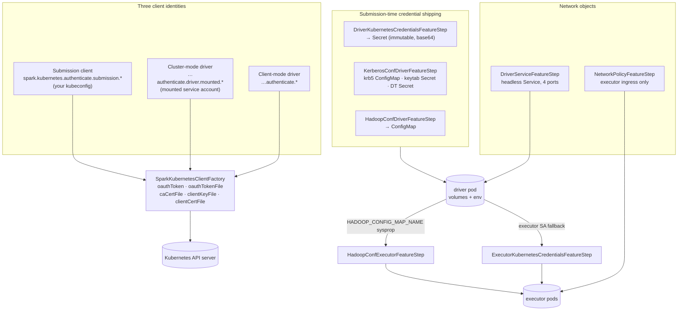

The second half of `resource-managers/kubernetes`, and with it the subsystem is fully swept. **10
files, ~1,139 lines** — small, but it is the security surface: how Spark proves who it is to the
Kubernetes API server, how Kerberos and Hadoop credentials reach the pods, and the two network
objects a submission creates.

The `k8s/` package is shared with [`driver-executor`](resource-managers-kubernetes-driver-executor.md)
and split **by theme, not by path**. That page owns the pod lifecycle; this one owns identity,
secrets and networking. Because both groups claim the same path, `check_drift.py --sweeps` cannot
tell them apart — the file list in breadth check 2 is the real boundary.

Two things make this group unusual. First, its most important config family —
`spark.kubernetes.authenticate.*` — is **built from prefix constants at runtime**, so no
deterministic parser can see it and it appears in no generated config listing. Second, two genuine
`ConfigEntry` declarations in this group are among only **four** entries repo-wide that the config
catalog drops as unparseable.



---

## SparkKubernetesClientFactory — one prefix, five suffixes, three identities

**What it is:** 144 lines, and the whole of Spark's Kubernetes authentication. It takes an auth
*prefix*, appends five known suffixes, and layers whatever it finds on top of a fabric8
auto-configured client.

**Code path:** `KubernetesClientApplication` (Submission) / `KubernetesClusterManager` (Driver) →
`createKubernetesClient(master, ns, authConfPrefix, clientType, conf, defaultCaCert)`

**Anchor files:**

- [SparkKubernetesClientFactory.scala:51](https://github.com/apache/spark/blob/v4.2.0/resource-managers/kubernetes/core/src/main/scala/org/apache/spark/deploy/k8s/SparkKubernetesClientFactory.scala#L51) — the single entry point, `@Stable @DeveloperApi @Since("4.0.0")` so external cluster managers can reuse it
- [SparkKubernetesClientFactory.scala:38](https://github.com/apache/spark/blob/v4.2.0/resource-managers/kubernetes/core/src/main/scala/org/apache/spark/deploy/k8s/SparkKubernetesClientFactory.scala#L38) — the scaladoc names the design: "a prefix plus common suffixes … similar to the manner in which Spark's `SecurityManager` parses SSL options"
- [SparkKubernetesClientFactory.scala:63](https://github.com/apache/spark/blob/v4.2.0/resource-managers/kubernetes/core/src/main/scala/org/apache/spark/deploy/k8s/SparkKubernetesClientFactory.scala#L63) — `requireNandDefined`: an OAuth token may come from a value **or** a file, never both
- [SparkKubernetesClientFactory.scala:69](https://github.com/apache/spark/blob/v4.2.0/resource-managers/kubernetes/core/src/main/scala/org/apache/spark/deploy/k8s/SparkKubernetesClientFactory.scala#L69) — the CA cert falls back to `defaultServiceAccountCaCert`, which in cluster mode is the mounted `/var/run/secrets/kubernetes.io/serviceaccount/ca.crt`
- [SparkKubernetesClientFactory.scala:91](https://github.com/apache/spark/blob/v4.2.0/resource-managers/kubernetes/core/src/main/scala/org/apache/spark/deploy/k8s/SparkKubernetesClientFactory.scala#L91) — the base is fabric8's `autoConfigure(context)`, i.e. **your kubeconfig, in-cluster service account, and `KUBERNETES_*` env vars are all still in play**; Spark's settings are layered on top
- [SparkKubernetesClientFactory.scala:97](https://github.com/apache/spark/blob/v4.2.0/resource-managers/kubernetes/core/src/main/scala/org/apache/spark/deploy/k8s/SparkKubernetesClientFactory.scala#L97) — the `withOption` chain, applying each credential only if present
- [SparkKubernetesClientFactory.scala:84](https://github.com/apache/spark/blob/v4.2.0/resource-managers/kubernetes/core/src/main/scala/org/apache/spark/deploy/k8s/SparkKubernetesClientFactory.scala#L84) — a **global `System.setProperty`** for the fabric8 retry backoff limit, set to 3 if not already set
- [SparkKubernetesClientFactory.scala:127](https://github.com/apache/spark/blob/v4.2.0/resource-managers/kubernetes/core/src/main/scala/org/apache/spark/deploy/k8s/SparkKubernetesClientFactory.scala#L127) — `ClientType`, whose only job is choosing which timeout pair applies: `Driver` or `Submission`

The three identities, and where each prefix is chosen:

| Stage | Prefix | Credentials from |
|---|---|---|
| `spark-submit` client | `spark.kubernetes.authenticate.submission` | your kubeconfig / explicit confs |
| Driver, cluster mode | `spark.kubernetes.authenticate.driver.mounted` | the pod's mounted service account, or a Secret this group created |
| Driver, client mode | `spark.kubernetes.authenticate` | wherever the driver JVM is running |

!!! warning "The client config is logged in full at DEBUG"

    [SparkKubernetesClientFactory.scala:110](https://github.com/apache/spark/blob/v4.2.0/resource-managers/kubernetes/core/src/main/scala/org/apache/spark/deploy/k8s/SparkKubernetesClientFactory.scala#L110)
    serialises the entire fabric8 `Config` to pretty-printed JSON and logs it. That object holds the
    resolved OAuth token and client key paths. It is DEBUG-level and Spark's `spark.redaction.regex`
    does **not** apply — that only covers the Spark conf surfaces the
    [config & security sweep](core-config-security.md) documents, not arbitrary log lines. Do not run
    a Kubernetes driver at DEBUG in an environment where the logs are shipped somewhere you would not
    put a bearer token.

!!! info "`spark.kubernetes.context` selects a kubeconfig context, and `null` means 'current'"

    [:78](https://github.com/apache/spark/blob/v4.2.0/resource-managers/kubernetes/core/src/main/scala/org/apache/spark/deploy/k8s/SparkKubernetesClientFactory.scala#L78)
    filters out an empty string first, then passes `orNull` because fabric8 treats `null` as "use the
    current context". Useful for submitting to a non-default cluster without switching contexts
    globally.

**Configs:** `spark.kubernetes.authenticate.*` (see below), `context`, `trust.certificates` (false),
`submission.{request,connection}Timeout` (10s), `driver.{request,connection}Timeout` (10s)

**Maps to topics:** none yet — proposed as **E35**

---

## The authenticate.* family the config catalog cannot see

**What it is:** the reason this group has almost no entries in the config catalog despite being
Spark-on-Kubernetes' most operationally significant config surface.

**Anchor files:**

- [Config.scala:292](https://github.com/apache/spark/blob/v4.2.0/resource-managers/kubernetes/core/src/main/scala/org/apache/spark/deploy/k8s/Config.scala#L292) — the four prefix constants: `…authenticate.driver`, `…authenticate.executor`, `…authenticate.driver.mounted`, `…authenticate`
- [Config.scala:296](https://github.com/apache/spark/blob/v4.2.0/resource-managers/kubernetes/core/src/main/scala/org/apache/spark/deploy/k8s/Config.scala#L296) — the five suffixes: `oauthToken`, `oauthTokenFile`, `clientKeyFile`, `clientCertFile`, `caCertFile`
- [Config.scala:330](https://github.com/apache/spark/blob/v4.2.0/resource-managers/kubernetes/core/src/main/scala/org/apache/spark/deploy/k8s/Config.scala#L330) and [:340](https://github.com/apache/spark/blob/v4.2.0/resource-managers/kubernetes/core/src/main/scala/org/apache/spark/deploy/k8s/Config.scala#L340) — the two `serviceAccountName` entries, declared as `ConfigBuilder(s"$PREFIX.serviceAccountName")`

The full key set this group reads is therefore **prefix × suffix**, constructed at call time:

| | `.oauthToken` | `.oauthTokenFile` | `.caCertFile` | `.clientKeyFile` | `.clientCertFile` | `.serviceAccountName` |
|---|---|---|---|---|---|---|
| `…authenticate` (client mode) | ✅ | ✅ | ✅ | ✅ | ✅ | — |
| `…authenticate.submission` | ✅ | ✅ | ✅ | ✅ | ✅ | — |
| `…authenticate.driver` | ✅ (→ Secret) | — | ✅ (→ Secret) | ✅ (→ Secret) | ✅ (→ Secret) | ✅ |
| `…authenticate.driver.mounted` | — | ✅ | ✅ | ✅ | ✅ | — |
| `…authenticate.executor` | — | — | — | — | — | ✅ |

!!! warning "Two of the config catalog's four unparsed entries repo-wide are the service-account keys"

    `spark.kubernetes.authenticate.driver.serviceAccountName` and its executor counterpart are real
    `ConfigEntry` declarations with docs, versions and defaults — but their key is a string
    interpolation over a constant, so `gen_configs.py` records them under `unparsed:` with
    `reason: dynamic-key` rather than in the catalog. Across the **entire Spark repo** only four
    entries fall into that bucket, and **two of them are these**. The practical consequence: the
    single most important RBAC knob in Spark-on-Kubernetes appears in no config listing generated
    from the catalog, including this map's own [config index](../configs/index.md). The remaining
    twenty-plus `authenticate.*` keys never reach the parser at all, because they are never declared
    as entries.

!!! info "Suffixes are not symmetric across prefixes"

    `…authenticate.driver.oauthToken` takes a **raw token value** which the credentials step base64s
    into a Secret; `…authenticate.driver.mounted.oauthTokenFile` takes a **path inside the driver
    pod**. There is no `…driver.oauthTokenFile` (a submission-local file has nothing to mount from)
    and no `…driver.mounted.oauthToken` (a raw value would defeat the point of mounting). Reading the
    table above as a full cross-product is the usual source of "that config does nothing".

**Configs:** the whole `spark.kubernetes.authenticate.*` family — **none of it in the catalog**

**Maps to topics:** E2

---

## DriverKubernetesCredentialsFeatureStep — shipping credentials as a Secret

**What it is:** the step that solves "the driver pod needs API credentials the service account
cannot provide". Any `…authenticate.driver.*` credential given at submission is base64-encoded into
an immutable Secret, mounted into the driver, and the driver's conf is rewritten to point at the
mount paths.

**Anchor files:**

- [DriverKubernetesCredentialsFeatureStep.scala:33](https://github.com/apache/spark/blob/v4.2.0/resource-managers/kubernetes/core/src/main/scala/org/apache/spark/deploy/k8s/features/DriverKubernetesCredentialsFeatureStep.scala#L33) — the class, opening with a `TODO clean up this class, and credentials in general`
- [DriverKubernetesCredentialsFeatureStep.scala:65](https://github.com/apache/spark/blob/v4.2.0/resource-managers/kubernetes/core/src/main/scala/org/apache/spark/deploy/k8s/features/DriverKubernetesCredentialsFeatureStep.scala#L65) — `shouldMountSecret`: the Secret exists only if at least one credential was supplied
- [DriverKubernetesCredentialsFeatureStep.scala:75](https://github.com/apache/spark/blob/v4.2.0/resource-managers/kubernetes/core/src/main/scala/org/apache/spark/deploy/k8s/features/DriverKubernetesCredentialsFeatureStep.scala#L75) — **otherwise** it just sets the service account, which is the common path
- [DriverKubernetesCredentialsFeatureStep.scala:151](https://github.com/apache/spark/blob/v4.2.0/resource-managers/kubernetes/core/src/main/scala/org/apache/spark/deploy/k8s/features/DriverKubernetesCredentialsFeatureStep.scala#L151) — `safeFileConfToBase64`, with a `require(file.isFile)` that fails submission early on a bad path
- [DriverKubernetesCredentialsFeatureStep.scala:178](https://github.com/apache/spark/blob/v4.2.0/resource-managers/kubernetes/core/src/main/scala/org/apache/spark/deploy/k8s/features/DriverKubernetesCredentialsFeatureStep.scala#L178) — `resolveSecretLocation`: an explicitly-mounted path wins; otherwise the canonical `/mnt/secrets/spark-kubernetes-credentials/<name>`
- [DriverKubernetesCredentialsFeatureStep.scala:187](https://github.com/apache/spark/blob/v4.2.0/resource-managers/kubernetes/core/src/main/scala/org/apache/spark/deploy/k8s/features/DriverKubernetesCredentialsFeatureStep.scala#L187) — `createCredentialsSecret`, `withImmutable(true)` at [:206](https://github.com/apache/spark/blob/v4.2.0/resource-managers/kubernetes/core/src/main/scala/org/apache/spark/deploy/k8s/features/DriverKubernetesCredentialsFeatureStep.scala#L206)
- [Constants.scala:44](https://github.com/apache/spark/blob/v4.2.0/resource-managers/kubernetes/core/src/main/scala/org/apache/spark/deploy/k8s/Constants.scala#L44) — the four canonical secret keys: `ca-cert`, `client-key`, `client-cert`, `oauth-token`

!!! info "The token is redacted from the pod's system properties — by suffix match"

    [:116](https://github.com/apache/spark/blob/v4.2.0/resource-managers/kubernetes/core/src/main/scala/org/apache/spark/deploy/k8s/features/DriverKubernetesCredentialsFeatureStep.scala#L116)
    replaces every conf key **ending in `oauthToken`** with `<present_but_redacted>` in the properties
    written into the driver's ConfigMap, so the raw token does not land in `spark-defaults.conf`
    inside the pod. Two things this does not do: it does not redact the *file*-based credentials
    (they are paths, so that is fine), and it does not affect the submitting client's own conf or
    the DEBUG log noted above. The token still reaches the pod — via the Secret, which is the point.

!!! warning "A Kubernetes Secret is base64, not encryption"

    `Base64.getEncoder` at [:51](https://github.com/apache/spark/blob/v4.2.0/resource-managers/kubernetes/core/src/main/scala/org/apache/spark/deploy/k8s/features/DriverKubernetesCredentialsFeatureStep.scala#L51)
    is the Kubernetes Secret wire format, not a protection measure. Anyone who can `get secrets` in
    the namespace can read the API credentials the driver uses — which are, by construction, credentials
    that can create and delete pods there. Prefer a service account with a scoped Role over shipping
    a token; use `…driver.mounted.*` with an externally-managed Secret if you must. Enable etcd
    encryption-at-rest if your cluster does not have it.

**Configs:** `…authenticate.driver.{oauthToken,caCertFile,clientKeyFile,clientCertFile}`,
`…authenticate.driver.mounted.*`, `…authenticate.driver.serviceAccountName`

**Maps to topics:** E2, E5

---

## Service accounts and the executor fallback chain

**What it is:** the ordinary path, and the one nearly every deployment uses. The driver runs as a
service account with a Role that lets it manage pods; executors usually need nothing.

**Anchor files:**

- [KubernetesUtils.scala:339](https://github.com/apache/spark/blob/v4.2.0/resource-managers/kubernetes/core/src/main/scala/org/apache/spark/deploy/k8s/KubernetesUtils.scala#L339) — `buildPodWithServiceAccount`, which sets **both** `serviceAccount` (deprecated) and `serviceAccountName`
- [ExecutorKubernetesCredentialsFeatureStep.scala:23](https://github.com/apache/spark/blob/v4.2.0/resource-managers/kubernetes/core/src/main/scala/org/apache/spark/deploy/k8s/features/ExecutorKubernetesCredentialsFeatureStep.scala#L23) — 41 lines, the whole executor-side story
- [ExecutorKubernetesCredentialsFeatureStep.scala:34](https://github.com/apache/spark/blob/v4.2.0/resource-managers/kubernetes/core/src/main/scala/org/apache/spark/deploy/k8s/features/ExecutorKubernetesCredentialsFeatureStep.scala#L34) — the three-level fallback, stated in-source: **pod template → executor SA → driver SA**
- [Config.scala:330](https://github.com/apache/spark/blob/v4.2.0/resource-managers/kubernetes/core/src/main/scala/org/apache/spark/deploy/k8s/Config.scala#L330) — the driver SA doc says outright that explicit credentials win over it
- [KubernetesClusterManager.scala:81](https://github.com/apache/spark/blob/v4.2.0/resource-managers/kubernetes/core/src/main/scala/org/apache/spark/scheduler/cluster/k8s/KubernetesClusterManager.scala#L81) — in cluster mode the driver's CA cert defaults to the mounted service-account CA, which is what makes "just set a service account" work at all

!!! warning "The pod-template check reads the deprecated `serviceAccount` field"

    `Option(pod.pod.getSpec.getServiceAccount).isEmpty` at
    [:34](https://github.com/apache/spark/blob/v4.2.0/resource-managers/kubernetes/core/src/main/scala/org/apache/spark/deploy/k8s/features/ExecutorKubernetesCredentialsFeatureStep.scala#L34)
    inspects `spec.serviceAccount`, the field Kubernetes deprecated in favour of
    `spec.serviceAccountName`. An executor pod template that sets only the modern
    `serviceAccountName:` leaves the deprecated field null, so the step concludes nothing was set and
    **overwrites both fields** with the executor-or-driver service account. Set both in the template,
    or use `spark.kubernetes.authenticate.executor.serviceAccountName` instead of the template.

!!! info "Executors normally need no Kubernetes permissions at all"

    Nothing in the executor talks to the API server — the driver does all pod management, labelling
    and patching. The executor service account exists for *other* reasons: cloud-provider IAM
    binding (IRSA, Workload Identity), admission-controller policy, and audit attribution. If you
    are granting executors pod-management RBAC, check why.

**Configs:** `…authenticate.driver.serviceAccountName`, `…authenticate.executor.serviceAccountName`
— **both invisible to the config catalog**

**Maps to topics:** E2, E5

---

## KerberosConfDriverFeatureStep — three credential modes in precedence order

**What it is:** 270 lines, the largest file in the group, and the only one whose scaladoc lays out
its own decision table. Getting Kerberos into a container is genuinely hard: there is no ambient
ticket cache, and the pod may not even have a `krb5.conf`.

**Code path:** keytab → existing DT Secret → local TGT, first match wins

**Anchor files:**

- [KerberosConfDriverFeatureStep.scala:41](https://github.com/apache/spark/blob/v4.2.0/resource-managers/kubernetes/core/src/main/scala/org/apache/spark/deploy/k8s/features/KerberosConfDriverFeatureStep.scala#L41) — the three use cases "in order of precedence", with who renews what
- [KerberosConfDriverFeatureStep.scala:61](https://github.com/apache/spark/blob/v4.2.0/resource-managers/kubernetes/core/src/main/scala/org/apache/spark/deploy/k8s/features/KerberosConfDriverFeatureStep.scala#L61) — three startup validations: krb5 file **nand** ConfigMap; keytab **iff** principal; DT secret name **iff** item key
- [KerberosConfDriverFeatureStep.scala:114](https://github.com/apache/spark/blob/v4.2.0/resource-managers/kubernetes/core/src/main/scala/org/apache/spark/deploy/k8s/features/KerberosConfDriverFeatureStep.scala#L114) — `needKeytabUpload = keytab.exists(!Utils.isLocalUri(_))`: a `local:` URI means the keytab is already baked into the image and is **not** uploaded
- [KerberosConfDriverFeatureStep.scala:124](https://github.com/apache/spark/blob/v4.2.0/resource-managers/kubernetes/core/src/main/scala/org/apache/spark/deploy/k8s/features/KerberosConfDriverFeatureStep.scala#L124) — `configurePod` as three chained `SparkPod.transform` partial functions, each a no-op when its condition does not hold
- [KerberosConfDriverFeatureStep.scala:154](https://github.com/apache/spark/blob/v4.2.0/resource-managers/kubernetes/core/src/main/scala/org/apache/spark/deploy/k8s/features/KerberosConfDriverFeatureStep.scala#L154) — the krb5 mount uses `withSubPath("krb5.conf")` so it lands as a single file rather than replacing `/etc`
- [KerberosConfDriverFeatureStep.scala:207](https://github.com/apache/spark/blob/v4.2.0/resource-managers/kubernetes/core/src/main/scala/org/apache/spark/deploy/k8s/features/KerberosConfDriverFeatureStep.scala#L207) — `HADOOP_TOKEN_FILE_LOCATION` env, the standard Hadoop handoff
- [KerberosConfDriverFeatureStep.scala:217](https://github.com/apache/spark/blob/v4.2.0/resource-managers/kubernetes/core/src/main/scala/org/apache/spark/deploy/k8s/features/KerberosConfDriverFeatureStep.scala#L217) — an uploaded keytab causes `spark.kerberos.keytab` to be **rewritten** to its in-pod mount path
- All three generated objects are `withImmutable(true)`: the krb5 ConfigMap [:237](https://github.com/apache/spark/blob/v4.2.0/resource-managers/kubernetes/core/src/main/scala/org/apache/spark/deploy/k8s/features/KerberosConfDriverFeatureStep.scala#L237), the keytab Secret [:250](https://github.com/apache/spark/blob/v4.2.0/resource-managers/kubernetes/core/src/main/scala/org/apache/spark/deploy/k8s/features/KerberosConfDriverFeatureStep.scala#L250), the DT Secret [:262](https://github.com/apache/spark/blob/v4.2.0/resource-managers/kubernetes/core/src/main/scala/org/apache/spark/deploy/k8s/features/KerberosConfDriverFeatureStep.scala#L262)

!!! warning "A missing krb5.conf is an INFO log, not an error"

    [:81](https://github.com/apache/spark/blob/v4.2.0/resource-managers/kubernetes/core/src/main/scala/org/apache/spark/deploy/k8s/features/KerberosConfDriverFeatureStep.scala#L81) —
    if neither `kerberos.krb5.path` nor `kerberos.krb5.configMapName` is set, the step logs "Make
    sure that you have the krb5.conf locally on the driver image" and continues. If the image does
    not have one, the failure arrives much later as an unhelpful GSS error from inside Hadoop. This
    is the same silent-degradation shape as the delegation-token warning below and the
    `HiveDelegationTokenProvider` one recorded in the
    [hive-metastore sweep](sql-hive-hive-metastore.md).

!!! warning "Uploading a keytab puts long-lived credentials in a namespace Secret"

    The keytab path (`spark.kerberos.keytab` pointing at a submission-local file) base64s the keytab
    into a Secret owned by the driver pod. A keytab is a *permanent* credential — unlike a delegation
    token it does not expire — so anyone with `get secrets` in that namespace has the principal's
    identity indefinitely. The `local:` URI form (keytab baked into the image, or mounted from an
    externally-managed Secret) avoids this, and the delegation-token mode avoids it entirely at the
    cost of needing renewal before the token's max lifetime.

**Configs:** `kerberos.krb5.path`, `kerberos.krb5.configMapName`, `kerberos.tokenSecret.name`,
`kerberos.tokenSecret.itemKey`, `spark.kerberos.principal`, `spark.kerberos.keytab`

**Maps to topics:** E5

---

## Delegation tokens — obtained at submit time, mounted as a Secret

**What it is:** the fallback when there is no keytab and no pre-made Secret: the *submitting client*
uses its own TGT to mint Hadoop delegation tokens, serialises them, and ships them in.

**Anchor files:**

- [KerberosConfDriverFeatureStep.scala:90](https://github.com/apache/spark/blob/v4.2.0/resource-managers/kubernetes/core/src/main/scala/org/apache/spark/deploy/k8s/features/KerberosConfDriverFeatureStep.scala#L90) — a `lazy val` specifically so tokens are not minted when another mode applies, with a comment explaining why the laziness is load-bearing
- [KerberosConfDriverFeatureStep.scala:95](https://github.com/apache/spark/blob/v4.2.0/resource-managers/kubernetes/core/src/main/scala/org/apache/spark/deploy/k8s/features/KerberosConfDriverFeatureStep.scala#L95) — `UserGroupInformation.getCurrentUser().getCredentials()` then `HadoopDelegationTokenManager.obtainDelegationTokens` — the same manager the [config & security sweep](core-config-security.md) documents
- [KerberosConfDriverFeatureStep.scala:99](https://github.com/apache/spark/blob/v4.2.0/resource-managers/kubernetes/core/src/main/scala/org/apache/spark/deploy/k8s/features/KerberosConfDriverFeatureStep.scala#L99) — no tokens **and** no secret keys means return `null`, avoiding an empty Secret
- [KerberosConfDriverFeatureStep.scala:105](https://github.com/apache/spark/blob/v4.2.0/resource-managers/kubernetes/core/src/main/scala/org/apache/spark/deploy/k8s/features/KerberosConfDriverFeatureStep.scala#L105) — the failure path: `logWarning("Fail to get credentials", e)` and `null`

!!! warning "Token acquisition failure is a warning, and the run continues"

    `case NonFatal(e) => logWarning(…); null` — if the submitting client's TGT is expired, or a token
    provider throws, no Secret is created, no volume is mounted, and submission proceeds. The driver
    then fails on its first authenticated Hadoop call, far from the cause. Grep the *submission*
    client's output for `Fail to get credentials` before debugging the driver.

!!! info "Delegation tokens minted this way are not renewed"

    In the keytab mode the driver holds the keytab and `HadoopDelegationTokenManager` renews on a
    schedule. In this mode the tokens are a snapshot taken on the submitting machine — the driver
    redistributes them to executors but cannot renew them, so the application is bounded by the
    tokens' max lifetime (typically 7 days on HDFS, but often much less). For anything long-running,
    use a keytab.

**Configs:** `spark.kerberos.renewal.credentials`, `spark.kerberos.access.hadoopFileSystems`
(both core), `kerberos.tokenSecret.{name,itemKey}`

**Maps to topics:** E5

---

## The Hadoop conf pair — driver builds the ConfigMap, executor consumes it

**What it is:** two small steps that together get `core-site.xml`/`hdfs-site.xml` into every pod. The
driver step creates the ConfigMap and records its name as a system property; the executor step reads
that property.

**Anchor files:**

- [HadoopConfDriverFeatureStep.scala:38](https://github.com/apache/spark/blob/v4.2.0/resource-managers/kubernetes/core/src/main/scala/org/apache/spark/deploy/k8s/features/HadoopConfDriverFeatureStep.scala#L38) — the source is the `HADOOP_CONF_DIR` **environment variable**, not a Spark conf
- [HadoopConfDriverFeatureStep.scala:41](https://github.com/apache/spark/blob/v4.2.0/resource-managers/kubernetes/core/src/main/scala/org/apache/spark/deploy/k8s/features/HadoopConfDriverFeatureStep.scala#L41) — `requireNandDefined`: an env dir and a pre-made ConfigMap are mutually exclusive
- [HadoopConfDriverFeatureStep.scala:47](https://github.com/apache/spark/blob/v4.2.0/resource-managers/kubernetes/core/src/main/scala/org/apache/spark/deploy/k8s/features/HadoopConfDriverFeatureStep.scala#L47) — **only top-level files**, non-recursive, and a non-directory path yields `Nil` silently
- [HadoopConfDriverFeatureStep.scala:107](https://github.com/apache/spark/blob/v4.2.0/resource-managers/kubernetes/core/src/main/scala/org/apache/spark/deploy/k8s/features/HadoopConfDriverFeatureStep.scala#L107) — the handoff: `HADOOP_CONFIG_MAP_NAME` as a system property
- [HadoopConfExecutorFeatureStep.scala:31](https://github.com/apache/spark/blob/v4.2.0/resource-managers/kubernetes/core/src/main/scala/org/apache/spark/deploy/k8s/features/HadoopConfExecutorFeatureStep.scala#L31) — the executor reads that property and mounts the named ConfigMap, whichever way it was produced
- Both set `ENV_HADOOP_CONF_DIR` in the container so Hadoop finds it ([driver:97](https://github.com/apache/spark/blob/v4.2.0/resource-managers/kubernetes/core/src/main/scala/org/apache/spark/deploy/k8s/features/HadoopConfDriverFeatureStep.scala#L97), [executor:55](https://github.com/apache/spark/blob/v4.2.0/resource-managers/kubernetes/core/src/main/scala/org/apache/spark/deploy/k8s/features/HadoopConfExecutorFeatureStep.scala#L55))

!!! warning "The Hadoop conf ConfigMap has no size guard"

    Unlike the Spark conf ConfigMap — which `KubernetesClientUtils` truncates at
    `spark.kubernetes.configMap.maxSize`, as the
    [driver-executor sweep](resource-managers-kubernetes-driver-executor.md) records — this one reads
    every top-level file in `HADOOP_CONF_DIR` and builds the ConfigMap unconditionally. A conf
    directory holding a large `topology` file or stray jars fails at *creation* with a Kubernetes
    413, at submission time. That is a better failure than silent truncation, but it is a different
    one, and the two paths are inconsistent.

!!! info "The env-var trigger means this step is invisible in the Spark conf"

    Because the driver side keys off `HADOOP_CONF_DIR` from the environment, whether a Hadoop
    ConfigMap gets created depends on the shell that ran `spark-submit`, not on anything recorded in
    `spark-defaults.conf`. Two submissions with identical Spark configs can produce different pods.
    Use `spark.kubernetes.hadoop.configMapName` for reproducibility.

**Configs:** `hadoop.configMapName`, `HADOOP_CONF_DIR` (environment)

**Maps to topics:** E2

---

## MountSecretsFeatureStep and EnvSecretsFeatureStep — two ways to inject a Secret

**What it is:** the general-purpose user-facing Secret plumbing, applied to **both** driver and
executor. One mounts a Secret as files, the other projects individual keys as environment variables.

**Anchor files:**

- [MountSecretsFeatureStep.scala:25](https://github.com/apache/spark/blob/v4.2.0/resource-managers/kubernetes/core/src/main/scala/org/apache/spark/deploy/k8s/features/MountSecretsFeatureStep.scala#L25) — driven by `spark.kubernetes.{driver,executor}.secrets.<name>=<mountPath>`
- [MountSecretsFeatureStep.scala:56](https://github.com/apache/spark/blob/v4.2.0/resource-managers/kubernetes/core/src/main/scala/org/apache/spark/deploy/k8s/features/MountSecretsFeatureStep.scala#L56) — the volume name is `<secretName>-volume`, which is why a secret name that is not a valid DNS label fails at pod creation rather than at config parse
- [EnvSecretsFeatureStep.scala:25](https://github.com/apache/spark/blob/v4.2.0/resource-managers/kubernetes/core/src/main/scala/org/apache/spark/deploy/k8s/features/EnvSecretsFeatureStep.scala#L25) — driven by `spark.kubernetes.{driver,executor}.secretKeyRef.<ENV_NAME>=<name>:<key>`
- [EnvSecretsFeatureStep.scala:33](https://github.com/apache/spark/blob/v4.2.0/resource-managers/kubernetes/core/src/main/scala/org/apache/spark/deploy/k8s/features/EnvSecretsFeatureStep.scala#L33) — `require(keyRefParts.size == 2, "SecretKeyRef must be in the form name:key.")`
- Both use `secretKeyRef`/`secret` volume sources rather than reading anything at submission time — the values never pass through the submitting client

!!! info "Prefer these over `--conf spark.something=<password>`"

    Both steps produce **references**, resolved by the kubelet at pod start. The secret value never
    enters the Spark conf, so it cannot leak through the Environment tab, the event log, or
    `spark-defaults.conf` in the pod's ConfigMap — the surfaces `spark.redaction.regex` exists to
    scrub. This is the right way to give a Spark job a database password on Kubernetes.

!!! warning "An env-projected secret is visible to anything that can read the container's environment"

    `secretKeyRef` puts the value in the process environment, which means `/proc/<pid>/environ`, any
    JVM diagnostic dump, and some crash handlers. The file-mount form (`MountSecretsFeatureStep`) is
    the safer default when the consuming code can read a file — and it also picks up updates when the
    Secret changes, which the env form never does.

**Configs:** `spark.kubernetes.{driver,executor}.secrets.*`,
`spark.kubernetes.{driver,executor}.secretKeyRef.*` — prefix families, not in the catalog

**Maps to topics:** E5

---

## NetworkPolicyFeatureStep — executor ingress isolation, unconditionally

**What it is:** new in 4.2.0 ([SPARK-55653]), 60 lines, and the only step here with no config at all.
Every Kubernetes submission now creates a `NetworkPolicy` restricting which pods may open connections
*to* the executors.

**Anchor files:**

- [NetworkPolicyFeatureStep.scala:30](https://github.com/apache/spark/blob/v4.2.0/resource-managers/kubernetes/core/src/main/scala/org/apache/spark/deploy/k8s/features/NetworkPolicyFeatureStep.scala#L30) — the class; `configurePod` at [:34](https://github.com/apache/spark/blob/v4.2.0/resource-managers/kubernetes/core/src/main/scala/org/apache/spark/deploy/k8s/features/NetworkPolicyFeatureStep.scala#L34) is a pass-through — all the work is the extra resource
- [NetworkPolicyFeatureStep.scala:45](https://github.com/apache/spark/blob/v4.2.0/resource-managers/kubernetes/core/src/main/scala/org/apache/spark/deploy/k8s/features/NetworkPolicyFeatureStep.scala#L45) — the policy **selects executor pods only** (`spark-role=executor` plus the app id)
- [NetworkPolicyFeatureStep.scala:49](https://github.com/apache/spark/blob/v4.2.0/resource-managers/kubernetes/core/src/main/scala/org/apache/spark/deploy/k8s/features/NetworkPolicyFeatureStep.scala#L49) — one ingress rule, from any pod carrying the same `spark-app-selector`, which is the driver and the app's other executors
- [KubernetesDriverBuilder.scala:80](https://github.com/apache/spark/blob/v4.2.0/resource-managers/kubernetes/core/src/main/scala/org/apache/spark/deploy/k8s/submit/KubernetesDriverBuilder.scala#L80) — **no config gates it**: the step is unconditionally in the driver's feature list

!!! warning "This is on by default and needs RBAC you may not have granted"

    There is no `spark.kubernetes.networkPolicy.enabled`. Every `spark-submit` to Kubernetes on
    4.2.0 tries to create a `networking.k8s.io/v1 NetworkPolicy` as a post-pod resource. If the
    submission service account lacks `create networkpolicies`, the submission fails in the
    `otherKubernetesResources` block of
    [`Client.run`](https://github.com/apache/spark/blob/v4.2.0/resource-managers/kubernetes/core/src/main/scala/org/apache/spark/deploy/k8s/submit/KubernetesClientApplication.scala#L174),
    which **deletes the driver pod it just created** and rethrows. The escape hatch is the 4.1.0
    exclusion mechanism:
    `spark.kubernetes.driver.pod.excludedFeatureSteps=org.apache.spark.deploy.k8s.features.NetworkPolicyFeatureStep`.
    Add the RBAC verb, or add the exclusion, before upgrading.

!!! warning "It restricts ingress only, protects executors only, and does nothing without a CNI that enforces policy"

    Three limits worth being precise about. (i) The spec has an `ingress` rule and **no `egress`
    rule**, so executor outbound traffic is unrestricted. (ii) The `podSelector` matches executors;
    the **driver is not covered**, and the driver is the pod with the UI, the Connect port and the
    API credentials. (iii) A `NetworkPolicy` is inert unless the cluster's CNI implements it — on a
    cluster without policy enforcement the object is created, looks correct in `kubectl get netpol`,
    and changes nothing. Treat it as defence in depth, not as isolation.

!!! info "Same-namespace only, by omission"

    The ingress `from` block has a `podSelector` and no `namespaceSelector`, which in Kubernetes
    semantics means *pods in this policy's own namespace*. A driver running in a different namespace
    from its executors would be blocked — not a configuration Spark produces, but relevant if you
    template pods yourself.

**Configs:** none — gated only by `driver.pod.excludedFeatureSteps`

**Maps to topics:** E5

---

## DriverServiceFeatureStep — the headless Service and its four ports

**What it is:** executors need a stable name to call the driver back on. Spark creates a **headless**
Service selecting the driver pod, and rewrites `spark.driver.host` to its DNS name.

**Anchor files:**

- [DriverServiceFeatureStep.scala:33](https://github.com/apache/spark/blob/v4.2.0/resource-managers/kubernetes/core/src/main/scala/org/apache/spark/deploy/k8s/features/DriverServiceFeatureStep.scala#L33) — two hard `require`s: `spark.driver.bindAddress` and `spark.driver.host` are **rejected outright** in Kubernetes mode, because both are managed here
- [DriverServiceFeatureStep.scala:57](https://github.com/apache/spark/blob/v4.2.0/resource-managers/kubernetes/core/src/main/scala/org/apache/spark/deploy/k8s/features/DriverServiceFeatureStep.scala#L57) — the driver hostname becomes `<service>.<namespace>.svc`
- [DriverServiceFeatureStep.scala:72](https://github.com/apache/spark/blob/v4.2.0/resource-managers/kubernetes/core/src/main/scala/org/apache/spark/deploy/k8s/features/DriverServiceFeatureStep.scala#L72) — `withClusterIP("None")`: headless, so DNS resolves straight to the pod IP with no proxying
- [DriverServiceFeatureStep.scala:75](https://github.com/apache/spark/blob/v4.2.0/resource-managers/kubernetes/core/src/main/scala/org/apache/spark/deploy/k8s/features/DriverServiceFeatureStep.scala#L75) — the selector is **every** driver label, including `spark-app-selector`
- Four ports: driver RPC, block manager, UI, and — since 4.x — the **Spark Connect gRPC port** at [:91](https://github.com/apache/spark/blob/v4.2.0/resource-managers/kubernetes/core/src/main/scala/org/apache/spark/deploy/k8s/features/DriverServiceFeatureStep.scala#L91), with `appProtocol: grpc`
- [KubernetesConf.scala:104](https://github.com/apache/spark/blob/v4.2.0/resource-managers/kubernetes/core/src/main/scala/org/apache/spark/deploy/k8s/KubernetesConf.scala#L104) — the name falls back to a random `spark-<id>-driver-svc` past 63 characters
- [DriverServiceFeatureStep.scala:41](https://github.com/apache/spark/blob/v4.2.0/resource-managers/kubernetes/core/src/main/scala/org/apache/spark/deploy/k8s/features/DriverServiceFeatureStep.scala#L41) — dual-stack support via `driver.service.ipFamilyPolicy` (`SingleStack`) and `ipFamilies` (`IPv4`), both since 3.4.0

!!! info "The Service exposes the UI and the Connect port cluster-wide"

    A headless Service still publishes DNS and still lists all four ports. Combined with the fact
    that the NetworkPolicy above **does not select the driver**, the driver UI (open by default —
    see the [config & security sweep](core-config-security.md)) and the Spark Connect gRPC endpoint
    (one pre-shared bearer token, per the [client-server sweep](sql-connect-client-server.md)) are
    reachable from any pod in the namespace. If either matters, write a driver-side NetworkPolicy
    yourself; Spark does not.

!!! info "This step is why the allocator waits for driver readiness"

    The [driver-executor sweep](resource-managers-kubernetes-driver-executor.md) records
    `ExecutorPodsAllocator.start` blocking on `waitUntilReady` with the comment "the headless service
    won't be resolvable by DNS until the driver pod is ready". That is this Service — the two pieces
    only make sense read together.

**Configs:** `driver.service.ipFamilyPolicy` (SingleStack), `driver.service.ipFamilies` (IPv4),
`spark.kubernetes.driver.service.label.*`, `…service.annotation.*`,
`driver.service.deleteOnTermination` (true, read in the scheduler backend)

**Maps to topics:** E2

---

## trust.certificates — the TLS verification escape hatch

**What it is:** one boolean, and the only config in this group that can turn a security control off.

**Anchor files:**

- [SparkKubernetesClientFactory.scala:96](https://github.com/apache/spark/blob/v4.2.0/resource-managers/kubernetes/core/src/main/scala/org/apache/spark/deploy/k8s/SparkKubernetesClientFactory.scala#L96) — `withTrustCerts(sparkConf.get(KUBERNETES_TRUST_CERTIFICATES))`, applied to every client this factory builds
- The config is `spark.kubernetes.trust.certificates`, default **false**, since 3.2.0

!!! warning "Setting it to `true` disables API-server certificate verification"

    fabric8's `trustCerts` makes the client accept any server certificate. It exists so a driver can
    reach an API server whose CA it cannot obtain — the intended use is submitting with an OAuth
    token and no CA cert. The cost is that the connection is no longer authenticated in the
    server-to-client direction, so anything that can intercept it can impersonate the API server to
    the driver. Prefer supplying `…caCertFile`; in cluster mode the mounted service-account CA is
    picked up automatically at
    [:69](https://github.com/apache/spark/blob/v4.2.0/resource-managers/kubernetes/core/src/main/scala/org/apache/spark/deploy/k8s/SparkKubernetesClientFactory.scala#L69)
    and this should never be needed.

**Configs:** `trust.certificates` (false, 3.2.0)

**Maps to topics:** E2, E5

---

## Breadth check 1 — the config slice

Same slice as the [driver-executor page](resource-managers-kubernetes-driver-executor.md): the 89
catalog keys whose `subsystem` is `resource-managers/kubernetes`. **This group owns six of them:**

| Config | Default | Version | Read at |
|---|---|---|---|
| `spark.kubernetes.kerberos.krb5.path` | — | 3.0.0 | `KerberosConfDriverFeatureStep:58` |
| `spark.kubernetes.kerberos.krb5.configMapName` | — | 3.0.0 | `KerberosConfDriverFeatureStep:59` |
| `spark.kubernetes.kerberos.tokenSecret.name` | — | 3.0.0 | `KerberosConfDriverFeatureStep:56` |
| `spark.kubernetes.kerberos.tokenSecret.itemKey` | — | 3.0.0 | `KerberosConfDriverFeatureStep:57` |
| `spark.kubernetes.hadoop.configMapName` | — | 3.0.0 | `HadoopConfDriverFeatureStep:39` |
| `spark.kubernetes.trust.certificates` | false | 3.2.0 | `SparkKubernetesClientFactory:96` |

Shared with `driver-executor`: `driver.service.ipFamilies` and `ipFamilyPolicy` are read here,
`driver.service.deleteOnTermination` in the scheduler backend; the four client timeout keys are
declared for `ClientType` here but govern both groups' clients.

**The config check is structurally blind to most of this group.** Three families it reads never
reach the catalog:

1. **`spark.kubernetes.authenticate.*`** — built from prefix constants at call time, never declared
   as `ConfigEntry`s. Roughly twenty-plus effective keys.
2. **The two `serviceAccountName` entries** — declared as entries, but with an interpolated key, so
   `gen_configs.py` files them under `unparsed:` with `reason: dynamic-key`. **Two of only four such
   entries in the whole repo.**
3. **`…secrets.*` / `…secretKeyRef.*` / `…service.label.*` / `…service.annotation.*`** — prefix
   families read through `parsePrefixedKeyValuePairs`, like every other `…label.*` family.

!!! note "The mechanical config count under-reads both k8s pages, and that is a style choice worth knowing"

    `check_drift.py --sweeps` reports **28 of 89** `spark.kubernetes.*` keys cited across the two
    pages. Every one of the 89 is attributed — by family, in the table on the
    [driver-executor page](resource-managers-kubernetes-driver-executor.md) and in the table above —
    but most are named in their abbreviated form (`allocation.batch.size` rather than
    `spark.kubernetes.allocation.batch.size`), which the string-matching checker cannot see. The
    ratio it prints is informational and it did not fail; recorded here so a future reader does not
    read 30% as unswept coverage. A refresh that wants the mechanical count to agree should expand
    the keys to full form on the driver-executor page.

Reproduce the unparsed check with:

```bash
PYTHONIOENCODING=utf-8 python -c "
import yaml
d = yaml.safe_load(open('docs/reference/spark-source-map/configs/catalog.yaml', encoding='utf-8'))
for u in (d.get('unparsed') or []): print(u['source_file'], u['source_line'], u['reason'])
"
```

## Breadth check 2 — the packages

The scope is `k8s/` split by theme with `driver-executor`. Walked by hand; **10 files belong to this
group and all are cited**:

- `deploy/k8s/` — `SparkKubernetesClientFactory`
- `deploy/k8s/features/` — `DriverKubernetesCredentialsFeatureStep` · `ExecutorKubernetesCredentialsFeatureStep` · `EnvSecretsFeatureStep` · `MountSecretsFeatureStep` · `HadoopConfDriverFeatureStep` · `HadoopConfExecutorFeatureStep` · `KerberosConfDriverFeatureStep` · `NetworkPolicyFeatureStep` · `DriverServiceFeatureStep`

`Config.scala`, `Constants.scala`, `KubernetesUtils.scala`, `KubernetesConf.scala` and
`KubernetesDriverBuilder.scala` are cited here too but are owned by
[`driver-executor`](resource-managers-kubernetes-driver-executor.md); the auth constants and prefixes
simply live in them.

**`resource-managers/kubernetes` is now fully swept:** `driver-executor` (47 files) +
`auth-networking` (10) = **57 files, 9,545 lines**, two pages. Because both groups claim `k8s/`,
`check_drift.py --sweeps` is satisfied by either page and cannot verify the split — the two file
lists are the real boundary, and both groups carry `shared_scope: true` in `groups.yaml` for exactly
that reason.

## Overlapping topic traces

`check_drift.py --sweeps` reports no topic traces overlapping E2 or E5 — neither `topics/e2.md` nor
`topics/e5.md` exists. This page and the [driver-executor sweep](resource-managers-kubernetes-driver-executor.md)
agree and are complementary; where they touch the same code (the client factory's three prefixes,
the driver Service and driver-readiness wait, the ConfigMap size handling) this page is the
authoritative one and cross-references the other.

---

## Sweep log

| Date | Spark | What changed |
|---|---|---|
| 2026-08-07 | 4.2.0 | First sweep, and it completes `resource-managers/kubernetes`. 11 concepts, **1 new topic proposed** (E35 identity, RBAC and credential propagation). 10 files, ~1,139 lines — the smallest group in the map with a security surface this large. Findings worth carrying. **The most important config family in Spark-on-Kubernetes is invisible to every generated config listing**: `spark.kubernetes.authenticate.*` is built from four prefix constants × five suffixes at call time and is never declared as `ConfigEntry`s, and the two `serviceAccountName` entries that *are* declared use an interpolated key — making them **two of only four `unparsed: dynamic-key` entries in the entire Spark repo**. The prefix × suffix table is also **not a full cross-product**: there is no `…driver.oauthTokenFile` and no `…driver.mounted.oauthToken`, which is a common source of "that config does nothing". **`NetworkPolicyFeatureStep` is new in 4.2.0 (SPARK-55653) and has no config gating it at all** — every submission now tries to create a NetworkPolicy, so a submission service account lacking `create networkpolicies` fails *after* the driver pod is created, in the post-pod resource block that then deletes it; the only escape is `driver.pod.excludedFeatureSteps`. That policy is also narrower than it looks: ingress-only (egress unrestricted), executors-only (**the driver — with the UI, the Connect port and the API credentials — is not selected**), same-namespace by omission, and completely inert without a CNI that enforces policy. The **client config is serialised to JSON and logged at DEBUG**, resolved OAuth token included, and `spark.redaction.regex` does not reach arbitrary log lines. `…authenticate.driver.oauthToken` is redacted from the pod's system properties by a **suffix match**, but the credential still ships in a Secret — base64, not encryption, readable by anyone with `get secrets` in the namespace, and by construction those credentials can create and delete pods there. The executor service-account fallback checks the **deprecated `spec.serviceAccount` field**, so a pod template setting only the modern `serviceAccountName` is silently overridden. Kerberos: a missing `krb5.conf` is an **INFO log**, and delegation-token acquisition failure is a **warning** that lets submission proceed — the same silent-degradation shape recorded for `HiveDelegationTokenProvider`; tokens minted from the submitter's TGT are a snapshot that the driver **cannot renew**, so long-running jobs need a keytab, which in turn puts a permanent credential in a namespace Secret. The Hadoop conf ConfigMap keys off the `HADOOP_CONF_DIR` **environment variable** rather than a Spark conf (two identical Spark configs can produce different pods) and, unlike the Spark conf ConfigMap, has **no size guard** — it fails with a Kubernetes 413 rather than truncating. Also recorded: `trust.certificates` disables API-server certificate verification and should be unnecessary in cluster mode, where the mounted service-account CA is picked up automatically; and `MountSecrets`/`EnvSecrets` produce *references* resolved by the kubelet, so secret values never enter the Spark conf — with the file form preferable to the env form, which lands in `/proc/<pid>/environ` and never picks up updates. |
