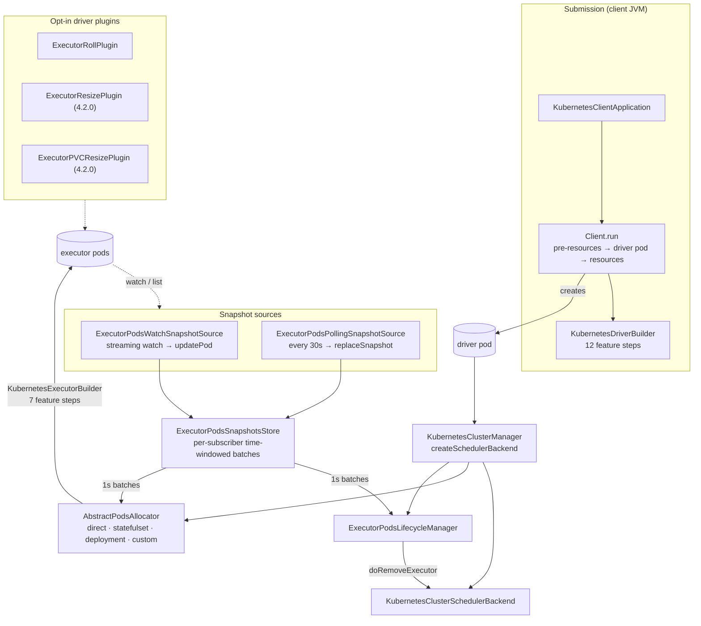

The first `resource-managers/kubernetes` sweep, and the larger of the subsystem's two groups. The
`k8s/` package is claimed by both groups and split **by theme, not by path** (the same arrangement
`core`'s `scheduler/` uses): this page owns the driver and executor *lifecycle* — how a pod is
requested, built, watched, reconciled and destroyed — and `auth-networking` owns credentials,
secrets, Kerberos, the driver Service and the NetworkPolicy.

The subsystem is 9,545 lines across 57 files, of which **47 belong to this group**. It is also the
densest config surface outside `sql/catalyst` and `core`: **89 keys**, six of them new in 4.2.0.

The shape worth holding in mind is that Spark never tells Kubernetes to "run 10 executors". It
maintains a *target*, observes reality through snapshots, and creates or deletes pods to close the
gap — a reconciliation loop, not a request/response protocol. Everything below is either producing
snapshots, consuming them, or building the pod that gets created.



---

## KubernetesClusterManager — the entry point, and the local-driver escape hatch

**What it is:** the `ExternalClusterManager` that `k8s://` master URLs resolve to. 210 lines that
wire together every other object on this page.

**Code path:** `SparkContext` → `ExternalClusterManager.canCreate` → `createTaskScheduler` →
`createSchedulerBackend`

**Anchor files:**

- [KubernetesClusterManager.scala:38](https://github.com/apache/spark/blob/v4.2.0/resource-managers/kubernetes/core/src/main/scala/org/apache/spark/scheduler/cluster/k8s/KubernetesClusterManager.scala#L38) — `canCreate` via `SparkMasterRegex.isK8s`
- [KubernetesClusterManager.scala:74](https://github.com/apache/spark/blob/v4.2.0/resource-managers/kubernetes/core/src/main/scala/org/apache/spark/scheduler/cluster/k8s/KubernetesClusterManager.scala#L74) — the cluster-mode branch: `spark.kubernetes.submitInDriver` decides whether auth comes from the **mounted service account** (`authenticate.driver.mounted`) or from client-mode config (`authenticate`)
- [KubernetesClusterManager.scala:98](https://github.com/apache/spark/blob/v4.2.0/resource-managers/kubernetes/core/src/main/scala/org/apache/spark/scheduler/cluster/k8s/KubernetesClusterManager.scala#L98) — client mode has to synthesise `spark.kubernetes.executor.podNamePrefix` itself, because the feature step that normally sets it never runs
- [KubernetesClusterManager.scala:111](https://github.com/apache/spark/blob/v4.2.0/resource-managers/kubernetes/core/src/main/scala/org/apache/spark/scheduler/cluster/k8s/KubernetesClusterManager.scala#L111) — the executor pod template is **loaded and parsed once at startup**, so a malformed template fails the driver rather than every executor
- [KubernetesClusterManager.scala:119](https://github.com/apache/spark/blob/v4.2.0/resource-managers/kubernetes/core/src/main/scala/org/apache/spark/scheduler/cluster/k8s/KubernetesClusterManager.scala#L119) — three separate thread pools: `kubernetes-executor-maintenance`, `kubernetes-executor-snapshots-subscribers` (fixed at **2** threads), `kubernetes-executor-pod-polling-sync`
- [KubernetesClusterManager.scala:162](https://github.com/apache/spark/blob/v4.2.0/resource-managers/kubernetes/core/src/main/scala/org/apache/spark/scheduler/cluster/k8s/KubernetesClusterManager.scala#L162) — `makeExecutorPodsAllocator`, reflectively constructing whichever allocator `spark.kubernetes.allocation.pods.allocator` names

!!! info "`k8s://` does not necessarily mean distributed"

    [KubernetesClusterManager.scala:40](https://github.com/apache/spark/blob/v4.2.0/resource-managers/kubernetes/core/src/main/scala/org/apache/spark/scheduler/cluster/k8s/KubernetesClusterManager.scala#L40)
    checks whether `spark.kubernetes.driver.master` starts with `local`, and if so builds a
    `LocalSchedulerBackend` with `local[N]` thread semantics — no executor pods at all. This is how a
    driver pod runs a small job in-process without needing RBAC to create pods. Note the workaround
    at [:69](https://github.com/apache/spark/blob/v4.2.0/resource-managers/kubernetes/core/src/main/scala/org/apache/spark/scheduler/cluster/k8s/KubernetesClusterManager.scala#L69):
    `spark.app.id` is copied into `spark.test.appId` because `LocalSchedulerBackend` does not respect
    the former.

**Configs:** `spark.kubernetes.driver.master`, `spark.kubernetes.submitInDriver`,
`spark.kubernetes.namespace`, `spark.kubernetes.allocation.pods.allocator`,
`spark.kubernetes.executor.checkAllContainers`, `spark.kubernetes.executor.podTemplateFile`

**Maps to topics:** E2

---

## The four pods allocators — direct, statefulset, deployment, and your own

**What it is:** a `@DeveloperApi` abstraction with three in-tree implementations that behave very
differently. `direct` creates and deletes individual pods; the other two hand a replica count to a
Kubernetes controller.

**Anchor files:**

- [AbstractPodsAllocator.scala:37](https://github.com/apache/spark/blob/v4.2.0/resource-managers/kubernetes/core/src/main/scala/org/apache/spark/scheduler/cluster/k8s/AbstractPodsAllocator.scala#L37) — the interface: `setTotalExpectedExecutors`, `driverPod`, `isDeleted`, `start`, `stop` — plus `setExecutorPodsLifecycleManager`, added at [:54](https://github.com/apache/spark/blob/v4.2.0/resource-managers/kubernetes/core/src/main/scala/org/apache/spark/scheduler/cluster/k8s/AbstractPodsAllocator.scala#L54) in **4.2.0** as an optional setter specifically so older custom allocators still compile
- [StatefulSetPodsAllocator.scala:99](https://github.com/apache/spark/blob/v4.2.0/resource-managers/kubernetes/core/src/main/scala/org/apache/spark/scheduler/cluster/k8s/StatefulSetPodsAllocator.scala#L99) — build a StatefulSet with `podManagementPolicy: Parallel` on first request, then just `scale(n)`; PVCs become `volumeClaimTemplates` and the scaladoc at [:132](https://github.com/apache/spark/blob/v4.2.0/resource-managers/kubernetes/core/src/main/scala/org/apache/spark/scheduler/cluster/k8s/StatefulSetPodsAllocator.scala#L132) warns "**user is responsible for cleaning up PVCs**"
- [DeploymentPodsAllocator.scala:45](https://github.com/apache/spark/blob/v4.2.0/resource-managers/kubernetes/core/src/main/scala/org/apache/spark/scheduler/cluster/k8s/DeploymentPodsAllocator.scala#L45) — the Deployment variant, whose whole reason to exist is `controller.kubernetes.io/pod-deletion-cost`: unlike a StatefulSet, which removes pods in ordinal order, a Deployment lets Spark **choose which executor dies** on downscale
- [DeploymentPodsAllocator.scala:143](https://github.com/apache/spark/blob/v4.2.0/resource-managers/kubernetes/core/src/main/scala/org/apache/spark/scheduler/cluster/k8s/DeploymentPodsAllocator.scala#L143) — it rejects PVCs outright, static or dynamic
- [KubernetesClusterManager.scala:168](https://github.com/apache/spark/blob/v4.2.0/resource-managers/kubernetes/core/src/main/scala/org/apache/spark/scheduler/cluster/k8s/KubernetesClusterManager.scala#L168) — `deployment` + dynamic allocation **requires** `spark.kubernetes.executor.podDeletionCost` to be set, else a startup `SparkException`

!!! warning "Only the `direct` allocator implements most of what the config surface promises"

    `StatefulSetPodsAllocator` and `DeploymentPodsAllocator` do not subscribe to the snapshot store
    at all — they never call `snapshotsStore.addSubscriber`. Consequently `allocation.batch.size`,
    `allocation.batch.delay`, `allocation.maxPendingPods`, `allocation.maxPendingPodsPerRp`,
    `allocation.maximum`, `allocation.executor.timeout`, the PVC-reuse machinery and the
    excess-pending-pod cleanup are **all `direct`-only**. Both alternatives also hardcode
    `isDeleted(_) = false`
    ([StatefulSet:90](https://github.com/apache/spark/blob/v4.2.0/resource-managers/kubernetes/core/src/main/scala/org/apache/spark/scheduler/cluster/k8s/StatefulSetPodsAllocator.scala#L90),
    [Deployment:102](https://github.com/apache/spark/blob/v4.2.0/resource-managers/kubernetes/core/src/main/scala/org/apache/spark/scheduler/cluster/k8s/DeploymentPodsAllocator.scala#L102)),
    which disables the registration-denial path the scheduler backend uses via `isExecutorExcluded`.
    The three 4.2.0 plugins refuse to start on anything but `direct` as well. Switching allocator is
    a much bigger behavioural change than the one config suggests.

**Configs:** `spark.kubernetes.allocation.pods.allocator` (`direct`),
`spark.kubernetes.executor.podDeletionCost`

**Maps to topics:** E2

---

## ExecutorPodsAllocator — the reconciliation loop

**What it is:** 629 lines, the largest file in the group, and the thing that decides how many pods
exist. It subscribes to the snapshot store and, on each batch, recomputes the gap between target and
reality per resource profile.

**Code path:** `snapshotsStore.addSubscriber(podAllocationDelay)` → `onNewSnapshots` →
`requestNewExecutors` → `KubernetesExecutorBuilder.buildFromFeatures` → `pods().create()`

**Anchor files:**

- [ExecutorPodsAllocator.scala:164](https://github.com/apache/spark/blob/v4.2.0/resource-managers/kubernetes/core/src/main/scala/org/apache/spark/scheduler/cluster/k8s/ExecutorPodsAllocator.scala#L164) — `onNewSnapshots`, the whole loop
- [ExecutorPodsAllocator.scala:176](https://github.com/apache/spark/blob/v4.2.0/resource-managers/kubernetes/core/src/main/scala/org/apache/spark/scheduler/cluster/k8s/ExecutorPodsAllocator.scala#L176) — snapshots in a batch are **merged**, not just last-wins, because `replaceSnapshot` can drop pods that appeared in an earlier incremental update
- [ExecutorPodsAllocator.scala:111](https://github.com/apache/spark/blob/v4.2.0/resource-managers/kubernetes/core/src/main/scala/org/apache/spark/scheduler/cluster/k8s/ExecutorPodsAllocator.scala#L111) — the two bookkeeping maps that make the whole thing work: `newlyCreatedExecutors` (requested, never seen in a snapshot) and `schedulerKnownNewlyCreatedExecs` (requested, never seen in a snapshot, **but already registered over RPC**)
- [ExecutorPodsAllocator.scala:229](https://github.com/apache/spark/blob/v4.2.0/resource-managers/kubernetes/core/src/main/scala/org/apache/spark/scheduler/cluster/k8s/ExecutorPodsAllocator.scala#L229) — reconciler #1: a pod requested but never observed within `podCreationTimeout` is assumed lost and deleted
- [ExecutorPodsAllocator.scala:85](https://github.com/apache/spark/blob/v4.2.0/resource-managers/kubernetes/core/src/main/scala/org/apache/spark/scheduler/cluster/k8s/ExecutorPodsAllocator.scala#L85) — that timeout is `max(allocation.batch.delay × 5, allocation.executor.timeout)`, i.e. **the config is a floor, not the value**
- [ExecutorPodsAllocator.scala:348](https://github.com/apache/spark/blob/v4.2.0/resource-managers/kubernetes/core/src/main/scala/org/apache/spark/scheduler/cluster/k8s/ExecutorPodsAllocator.scala#L348) — downscale: when the pod count exceeds the target, cancel *pending* and *newly created* pods first, but only ones older than `spark.dynamicAllocation.executorIdleTimeout`, "to prevent too frequent fluctuation"
- [ExecutorPodsAllocator.scala:131](https://github.com/apache/spark/blob/v4.2.0/resource-managers/kubernetes/core/src/main/scala/org/apache/spark/scheduler/cluster/k8s/ExecutorPodsAllocator.scala#L131) — `deletedExecutorIds`, which is what makes `isExecutorExcluded` deny registration from a pod Spark has already given up on
- [ExecutorPodsAllocator.scala:483](https://github.com/apache/spark/blob/v4.2.0/resource-managers/kubernetes/core/src/main/scala/org/apache/spark/scheduler/cluster/k8s/ExecutorPodsAllocator.scala#L483) — `spark.kubernetes.allocation.maximum` is checked against the **monotonic executor-id counter**, not the live pod count
- [ExecutorPodsAllocator.scala:135](https://github.com/apache/spark/blob/v4.2.0/resource-managers/kubernetes/core/src/main/scala/org/apache/spark/scheduler/cluster/k8s/ExecutorPodsAllocator.scala#L135) — before allocating anything, wait for the driver pod to be *Ready*, because the headless Service backing the driver's hostname is not resolvable until then

!!! warning "`allocation.maximum` counts ids ever issued, not pods alive"

    The check is `if (newExecutorId >= podAllocationMaximum) throw`. `EXECUTOR_ID_COUNTER` only ever
    increments, so on a long-running job with dynamic allocation the limit is reached after that many
    executors have been created *cumulatively* — including every replacement for a failed or
    downscaled one — and the application then dies with `Exceed the pod creation limit`. It is a
    lifetime budget, which is what the config doc says ("during the whole job lifecycle") but not
    what "maximum" suggests.

!!! info "Two flavours of 'requested but not yet visible'"

    An executor can register over RPC before its pod shows up in any snapshot — the pod is created,
    the JVM starts, and the watch event is still in flight. `schedulerKnownNewlyCreatedExecs` exists
    for exactly that window, and pods in it are **not** counted as blocking upscale
    ([:432](https://github.com/apache/spark/blob/v4.2.0/resource-managers/kubernetes/core/src/main/scala/org/apache/spark/scheduler/cluster/k8s/ExecutorPodsAllocator.scala#L432))
    because they are effectively running. Getting this wrong is how an allocator stalls.

**Configs:** `allocation.batch.size` (20), `allocation.batch.delay` (1s),
`allocation.executor.timeout` (600s), `allocation.maximum`, `allocation.driver.readinessTimeout` (1s),
`executor.deleteOnTermination` (true), `spark.dynamicAllocation.executorIdleTimeout`

**Maps to topics:** E2

---

## Pending-pod budgeting — batch size, the three caps, and splitSlots

**What it is:** the arithmetic that decides how many pods to ask for in one round. Four independent
limits are `min`'d together, and a fifth splits the remainder across resource profiles.

**Anchor files:**

- [ExecutorPodsAllocator.scala:416](https://github.com/apache/spark/blob/v4.2.0/resource-managers/kubernetes/core/src/main/scala/org/apache/spark/scheduler/cluster/k8s/ExecutorPodsAllocator.scala#L416) — `min(numMissingPodsForRpId, podAllocationSize, sharedSlotFromPendingPods, remainingSlotsForRpId)`
- [ExecutorPodsAllocator.scala:624](https://github.com/apache/spark/blob/v4.2.0/resource-managers/kubernetes/core/src/main/scala/org/apache/spark/scheduler/cluster/k8s/ExecutorPodsAllocator.scala#L624) — `splitSlots`: integer division plus remainder, so the first `r` profiles get one extra
- [ExecutorPodsAllocator.scala:79](https://github.com/apache/spark/blob/v4.2.0/resource-managers/kubernetes/core/src/main/scala/org/apache/spark/scheduler/cluster/k8s/ExecutorPodsAllocator.scala#L79) — a startup `require` that `maxPendingPodsPerRp <= maxPendingPods`
- [ExecutorPodsAllocator.scala:397](https://github.com/apache/spark/blob/v4.2.0/resource-managers/kubernetes/core/src/main/scala/org/apache/spark/scheduler/cluster/k8s/ExecutorPodsAllocator.scala#L397) — the gate: a profile is only considered if it has **no** newly-created pods outstanding

!!! info "One un-acknowledged pod blocks all further requests for its resource profile"

    `if (newlyCreatedExecutorsForRpId.isEmpty && podCountForRpId < targetNum)` — a single pod that
    was requested but has not yet appeared in a snapshot stops that profile from requesting more,
    until it either appears or times out at `podCreationTimeout` (≥ 600 s by default). On a cluster
    where the API server is slow to surface new pods, this is why scale-up appears to happen in
    stalled bursts rather than smoothly. `allocation.batch.delay` sets the loop cadence; this rule
    sets whether the loop does anything.

**Configs:** `allocation.batch.size` (20), `allocation.maxPendingPods` (∞),
`allocation.maxPendingPodsPerRp` (∞, new in 4.1.0)

**Maps to topics:** E2

---

## PVC reuse and the wait-to-reuse throttle

**What it is:** when executors use on-demand PVCs for local dirs, throwing the volume away with the
pod is expensive. Spark can instead adopt an orphaned PVC from a dead executor.

**Anchor files:**

- [ExecutorPodsAllocator.scala:435](https://github.com/apache/spark/blob/v4.2.0/resource-managers/kubernetes/core/src/main/scala/org/apache/spark/scheduler/cluster/k8s/ExecutorPodsAllocator.scala#L435) — `getReusablePVCs`: list PVCs labelled with this app, drop the ones in use, and keep only those **older than `podCreationTimeout`** so a just-created PVC is not stolen
- [ExecutorPodsAllocator.scala:555](https://github.com/apache/spark/blob/v4.2.0/resource-managers/kubernetes/core/src/main/scala/org/apache/spark/scheduler/cluster/k8s/ExecutorPodsAllocator.scala#L555) — `replacePVCsIfNeeded` matches on **same storage class and size ≥ requested**, with an explicit note that a larger disk may appear because an external actor expanded it
- [ExecutorPodsAllocator.scala:59](https://github.com/apache/spark/blob/v4.2.0/resource-managers/kubernetes/core/src/main/scala/org/apache/spark/scheduler/cluster/k8s/ExecutorPodsAllocator.scala#L59) — `podAllocOnPVC` requires **all three** of `driver.ownPersistentVolumeClaim`, `driver.reusePersistentVolumeClaim` and `driver.waitToReusePersistentVolumeClaim`
- [ExecutorPodsAllocator.scala:477](https://github.com/apache/spark/blob/v4.2.0/resource-managers/kubernetes/core/src/main/scala/org/apache/spark/scheduler/cluster/k8s/ExecutorPodsAllocator.scala#L477) — with that on, allocation **stops** rather than creating a new PVC once `PVC_COUNTER` reaches the executor cap
- [ExecutorPodsAllocator.scala:456](https://github.com/apache/spark/blob/v4.2.0/resource-managers/kubernetes/core/src/main/scala/org/apache/spark/scheduler/cluster/k8s/ExecutorPodsAllocator.scala#L456) — a `KubernetesClientException` while listing PVCs is swallowed with `"Cannot list PVC resources. Please check account permissions."` at INFO

!!! warning "Missing RBAC on PVCs degrades to 'no reuse', silently and at INFO level"

    If the service account cannot `list` PersistentVolumeClaims, `getReusablePVCs` catches the
    exception, logs one INFO line, and returns empty. Every executor then creates a fresh PVC, the
    shuffle-recovery path below finds nothing, and with `waitToReusePersistentVolumeClaim` on the
    allocator will additionally stall once the PVC counter hits the cap — three unrelated-looking
    symptoms from one missing verb.

**Configs:** `driver.ownPersistentVolumeClaim` (true), `driver.reusePersistentVolumeClaim` (true),
`driver.waitToReusePersistentVolumeClaim` (false), `legacy.useReadWriteOnceAccessMode` (false)

**Maps to topics:** E2

---

## ExecutorPodsSnapshotsStore — a producer/consumer bus with per-subscriber batching

**What it is:** the piece both the allocator and the lifecycle manager sit behind. Producers push
either an incremental single-pod update or a full replacement; each subscriber drains its own buffer
on its own schedule, and its callback is guaranteed single-threaded.

**Anchor files:**

- [ExecutorPodsSnapshotsStoreImpl.scala:38](https://github.com/apache/spark/blob/v4.2.0/resource-managers/kubernetes/core/src/main/scala/org/apache/spark/scheduler/cluster/k8s/ExecutorPodsSnapshotsStoreImpl.scala#L38) — the model, spelled out in the class scaladoc
- [ExecutorPodsSnapshotsStoreImpl.scala:105](https://github.com/apache/spark/blob/v4.2.0/resource-managers/kubernetes/core/src/main/scala/org/apache/spark/scheduler/cluster/k8s/ExecutorPodsSnapshotsStoreImpl.scala#L105) `updatePod` (incremental, from the watch) versus [:110](https://github.com/apache/spark/blob/v4.2.0/resource-managers/kubernetes/core/src/main/scala/org/apache/spark/scheduler/cluster/k8s/ExecutorPodsSnapshotsStoreImpl.scala#L110) `replaceSnapshot` (full, from the poller — and the only thing that sets `fullSnapshotTs`)
- [ExecutorPodsSnapshotsStoreImpl.scala:134](https://github.com/apache/spark/blob/v4.2.0/resource-managers/kubernetes/core/src/main/scala/org/apache/spark/scheduler/cluster/k8s/ExecutorPodsSnapshotsStoreImpl.scala#L134) — `processSnapshotsInternal`: `tryLock` plus a notification counter, with a careful comment about the re-check race and why the re-submit must happen outside the lock
- [ExecutorPodsSnapshotsStoreImpl.scala:84](https://github.com/apache/spark/blob/v4.2.0/resource-managers/kubernetes/core/src/main/scala/org/apache/spark/scheduler/cluster/k8s/ExecutorPodsSnapshotsStoreImpl.scala#L84) — each subscriber gets its own `scheduleWithFixedDelay`, which is how the allocator (`allocation.batch.delay`, 1 s) and the lifecycle manager (`executor.eventProcessingInterval`, 1 s) run at independent cadences
- [ExecutorPodsAllocator.scala:157](https://github.com/apache/spark/blob/v4.2.0/resource-managers/kubernetes/core/src/main/scala/org/apache/spark/scheduler/cluster/k8s/ExecutorPodsAllocator.scala#L157) — `notifySubscribers()` on a target change, so a scale-up request does not wait for the next tick

!!! warning "An `IllegalArgumentException` from any subscriber kills the driver JVM"

    [ExecutorPodsSnapshotsStoreImpl.scala:145](https://github.com/apache/spark/blob/v4.2.0/resource-managers/kubernetes/core/src/main/scala/org/apache/spark/scheduler/cluster/k8s/ExecutorPodsSnapshotsStoreImpl.scala#L145)
    catches `IllegalArgumentException` specifically and calls `System.exit(1)`; every other
    `NonFatal` is logged and swallowed. The intent is presumably to fail fast on an unusable pod
    spec, but it means a subscriber — including a **custom** allocator, which this is a
    `@DeveloperApi` for — can terminate the application by throwing the wrong exception type, with
    one `logError` as the only notice.

!!! info "Two subscribers, two threads, and the pool is fixed at 2"

    `kubernetes-executor-snapshots-subscribers` is created with exactly 2 threads
    ([KubernetesClusterManager.scala:127](https://github.com/apache/spark/blob/v4.2.0/resource-managers/kubernetes/core/src/main/scala/org/apache/spark/scheduler/cluster/k8s/KubernetesClusterManager.scala#L127))
    for the two built-in subscribers. A custom allocator that also subscribes shares those two
    threads, and a slow callback delays the other subscriber's batch.

**Configs:** `executorSnapshotsSubscribersShutdownGracePeriod` (20s),
`executor.eventProcessingInterval` (1s)

**Maps to topics:** none yet — proposed as **E33**

---

## ExecutorPodsSnapshot — pod phase to ExecutorPodState, and checkAllContainers

**What it is:** the translation from a Kubernetes `Pod` to one of seven Spark-side states. Most of
the subtlety is that "Running" does not mean running.

**Anchor files:**

- [ExecutorPodsSnapshot.scala:76](https://github.com/apache/spark/blob/v4.2.0/resource-managers/kubernetes/core/src/main/scala/org/apache/spark/scheduler/cluster/k8s/ExecutorPodsSnapshot.scala#L76) — `toState`, the phase match
- [ExecutorPodsSnapshot.scala:86](https://github.com/apache/spark/blob/v4.2.0/resource-managers/kubernetes/core/src/main/scala/org/apache/spark/scheduler/cluster/k8s/ExecutorPodsSnapshot.scala#L86) — with `executor.checkAllContainers` (default **true**) and `restartPolicy: Never`, *any* container exiting non-zero makes the pod `PodFailed` even while its phase is Running — this is how a failed sidecar takes the executor down
- [ExecutorPodsSnapshot.scala:93](https://github.com/apache/spark/blob/v4.2.0/resource-managers/kubernetes/core/src/main/scala/org/apache/spark/scheduler/cluster/k8s/ExecutorPodsSnapshot.scala#L93) — otherwise only the *Spark* container's exit code is consulted, named by `executor.podTemplateContainerName`
- [ExecutorPodsSnapshot.scala:126](https://github.com/apache/spark/blob/v4.2.0/resource-managers/kubernetes/core/src/main/scala/org/apache/spark/scheduler/cluster/k8s/ExecutorPodsSnapshot.scala#L126) — `isDeleted`: a deletion timestamp counts as deleted **unless** the phase is `running` or `terminating`, so a gracefully-draining pod is not written off early
- [ExecutorPodsSnapshot.scala:66](https://github.com/apache/spark/blob/v4.2.0/resource-managers/kubernetes/core/src/main/scala/org/apache/spark/scheduler/cluster/k8s/ExecutorPodsSnapshot.scala#L66) — pods labelled `EXECID` (the StatefulSet/Deployment template placeholder) are skipped until the real id is patched on
- [ExecutorPodStates.scala:29](https://github.com/apache/spark/blob/v4.2.0/resource-managers/kubernetes/core/src/main/scala/org/apache/spark/scheduler/cluster/k8s/ExecutorPodStates.scala#L29) — `FinalPodState` covers `PodSucceeded`, `PodFailed`, `PodDeleted` and `PodTerminating`

!!! info "`shouldCheckAllContainers` and `sparkContainerName` are process-wide mutable statics"

    Both live on the `ExecutorPodsSnapshot` companion object and are set once from
    `KubernetesClusterManager` ([:122](https://github.com/apache/spark/blob/v4.2.0/resource-managers/kubernetes/core/src/main/scala/org/apache/spark/scheduler/cluster/k8s/KubernetesClusterManager.scala#L122)).
    Two `SparkContext`s in one JVM with different values for either config would interfere — an
    acceptable simplification for a driver pod, worth knowing for tests and for anything embedding
    Spark.

**Configs:** `executor.checkAllContainers` (true), `executor.podTemplateContainerName`

**Maps to topics:** E2

---

## Watch versus polling — two sources, and why both exist

**What it is:** the same information arrives twice, deliberately. A streaming watch gives low latency
and can miss events; a periodic full list is authoritative and slow.

**Anchor files:**

- [ExecutorPodsWatchSnapshotSource.scala:63](https://github.com/apache/spark/blob/v4.2.0/resource-managers/kubernetes/core/src/main/scala/org/apache/spark/scheduler/cluster/k8s/ExecutorPodsWatchSnapshotSource.scala#L63) — the watch, filtered by app id, executor role, and **not** the inactive label
- [ExecutorPodsPollingSnapshotSource.scala:76](https://github.com/apache/spark/blob/v4.2.0/resource-managers/kubernetes/core/src/main/scala/org/apache/spark/scheduler/cluster/k8s/ExecutorPodsPollingSnapshotSource.scala#L76) — the poller, every `executor.apiPollingInterval` (30 s), issuing `replaceSnapshot`
- [ExecutorPodsPollingSnapshotSource.scala:84](https://github.com/apache/spark/blob/v4.2.0/resource-managers/kubernetes/core/src/main/scala/org/apache/spark/scheduler/cluster/k8s/ExecutorPodsPollingSnapshotSource.scala#L84) — with `enablePollingWithResourceVersion`, list with `resourceVersion=0` (served from the API server's cache, much cheaper) and **discard any response whose resourceVersion went backwards**, because an HA API server can serve a stale cache
- Both are `@Stable @DeveloperApi` and both can be turned off: `executor.enableApiWatcher`, `executor.enableApiPolling`

!!! warning "Disabling the poller disables three reconcilers, not just the polling"

    `fullSnapshotTs` is only ever set by `replaceSnapshot`, which only the poller calls. Turning off
    `spark.kubernetes.executor.enableApiPolling` therefore also disables the missing-pod detection in
    the lifecycle manager ([:170](https://github.com/apache/spark/blob/v4.2.0/resource-managers/kubernetes/core/src/main/scala/org/apache/spark/scheduler/cluster/k8s/ExecutorPodsLifecycleManager.scala#L170),
    which is gated on `fullSnapshotTs` changing) and leaves the driver relying entirely on a watch
    connection that is known to drop events. The config reads like a load optimisation; it is a
    correctness trade.

!!! info "`resourceVersion=0` is a cache read, and Spark guards against it going backwards"

    The comment at [:87](https://github.com/apache/spark/blob/v4.2.0/resource-managers/kubernetes/core/src/main/scala/org/apache/spark/scheduler/cluster/k8s/ExecutorPodsPollingSnapshotSource.scala#L87)
    is the whole rationale: "some K8s API servers may return old(smaller) cached versions in case of
    HA setup". Off by default (`enablePollingWithResourceVersion`, since 3.3.0) — worth enabling on
    a large cluster where full pod lists are expensive.

**Configs:** `executor.apiPollingInterval` (30s), `executor.enableApiPolling` (true),
`executor.enableApiWatcher` (true), `executor.enablePollingWithResourceVersion` (false)

**Maps to topics:** E2

---

## ExecutorPodsLifecycleManager — final states, exit codes, and the missing-pod reconciler

**What it is:** the other snapshot subscriber. It turns terminal pod states into
`removeExecutor` calls, deletes the pod, and separately reconciles executors Spark believes in but
Kubernetes has never heard of.

**Anchor files:**

- [ExecutorPodsLifecycleManager.scala:104](https://github.com/apache/spark/blob/v4.2.0/resource-managers/kubernetes/core/src/main/scala/org/apache/spark/scheduler/cluster/k8s/ExecutorPodsLifecycleManager.scala#L104) — `onNewSnapshots`, matching `PodDeleted` / `PodFailed` / `PodSucceeded`
- [ExecutorPodsLifecycleManager.scala:170](https://github.com/apache/spark/blob/v4.2.0/resource-managers/kubernetes/core/src/main/scala/org/apache/spark/scheduler/cluster/k8s/ExecutorPodsLifecycleManager.scala#L170) — reconciler #2: executors registered with the scheduler but absent from the **latest full** snapshot, older than `executor.missingPodDetectDelta` (30 s), are declared `ExecutorExited(exitCausedByApp = false)`
- [ExecutorPodsLifecycleManager.scala:209](https://github.com/apache/spark/blob/v4.2.0/resource-managers/kubernetes/core/src/main/scala/org/apache/spark/scheduler/cluster/k8s/ExecutorPodsLifecycleManager.scala#L209) — `removeExecutorFromK8s`: skip the DELETE if a deletion timestamp is already set, to avoid pointless API round-trips
- [ExecutorPodsLifecycleManager.scala:235](https://github.com/apache/spark/blob/v4.2.0/resource-managers/kubernetes/core/src/main/scala/org/apache/spark/scheduler/cluster/k8s/ExecutorPodsLifecycleManager.scala#L235) — with `executor.deleteOnTermination=false` the pod is kept **and labelled `spark-exec-inactive=true`**, which is precisely what the watch and poll selectors exclude — that is how kept-for-debugging pods stop generating events
- [ExecutorPodsLifecycleManager.scala:54](https://github.com/apache/spark/blob/v4.2.0/resource-managers/kubernetes/core/src/main/scala/org/apache/spark/scheduler/cluster/k8s/ExecutorPodsLifecycleManager.scala#L54) — a Guava cache of already-removed executor ids, expiring after `executor.deletedExecutorsCacheTimeout` (180 s, new in 4.1.0)
- [ExecutorPodsLifecycleManager.scala:320](https://github.com/apache/spark/blob/v4.2.0/resource-managers/kubernetes/core/src/main/scala/org/apache/spark/scheduler/cluster/k8s/ExecutorPodsLifecycleManager.scala#L320) — `describeExitCode`, a hand-written table: **137 = SIGKILL, possible container OOM**; 52 = JVM OOM; 53 = DiskStore temp-dir failure; 126 = not executable, possibly arch mismatch

!!! info "Exit code 137 is the one to know"

    The table exists because a container OOM-kill looks like nothing else in the Spark logs — the
    JVM simply stops. `describeExitCode` annotates the loss message with `(SIGKILL, possible
    container OOM)`, which is usually the first hint that `spark.executor.memoryOverhead` is too
    small rather than that the application is broken. Note 52 (JVM OOM, from Spark's own
    `OnOutOfMemoryError`) and 137 (cgroup kill) mean opposite things: heap versus overhead.

!!! warning "A pod deleted by an operator is `exitCausedByApp = false`"

    [:272](https://github.com/apache/spark/blob/v4.2.0/resource-managers/kubernetes/core/src/main/scala/org/apache/spark/scheduler/cluster/k8s/ExecutorPodsLifecycleManager.scala#L272)
    — `PodDeleted` is attributed to "a user or the framework", so it does **not** count toward
    `spark.executor.maxNumFailures`, while `PodFailed` does. A node drain that evicts executors is
    therefore free; a container that OOM-kills is not. Kubernetes eviction usually surfaces as
    deletion, which is the behaviour you want, but a `PodFailed` caused by an infrastructure problem
    still burns the failure budget.

**Configs:** `executor.missingPodDetectDelta` (30s), `executor.deleteOnTermination` (true),
`executor.deletedExecutorsCacheTimeout` (180), `executor.eventProcessingInterval` (1s)

**Maps to topics:** E2

---

## Executor failure accounting and the driver's sys.exit

**What it is:** the K8s implementation of "too many executors have died, give up". It shares
`ExecutorFailureTracker` with YARN.

**Anchor files:**

- [ExecutorPodsLifecycleManager.scala:88](https://github.com/apache/spark/blob/v4.2.0/resource-managers/kubernetes/core/src/main/scala/org/apache/spark/scheduler/cluster/k8s/ExecutorPodsLifecycleManager.scala#L88) — the check runs **after every snapshot batch**, and on breach calls `stopApplication(EXCEED_MAX_EXECUTOR_FAILURES)` which is a bare [`sys.exit`](https://github.com/apache/spark/blob/v4.2.0/resource-managers/kubernetes/core/src/main/scala/org/apache/spark/scheduler/cluster/k8s/ExecutorPodsLifecycleManager.scala#L100)
- [ExecutorPodsLifecycleManager.scala:109](https://github.com/apache/spark/blob/v4.2.0/resource-managers/kubernetes/core/src/main/scala/org/apache/spark/scheduler/cluster/k8s/ExecutorPodsLifecycleManager.scala#L109) — failures are counted from pods observed in `PodFailed`, deduplicated against a running `failedExecutorIds` set
- [ExecutorPodsAllocator.scala:591](https://github.com/apache/spark/blob/v4.2.0/resource-managers/kubernetes/core/src/main/scala/org/apache/spark/scheduler/cluster/k8s/ExecutorPodsAllocator.scala#L591) — **new in 4.2.0**: a pod that fails to be *created* at all also registers a failure, via the lifecycle-manager reference `AbstractPodsAllocator` now carries

!!! warning "`failedExecutorIds` grows for the life of the application"

    It is a plain `Set[Long]` that only ever accumulates
    ([:119](https://github.com/apache/spark/blob/v4.2.0/resource-managers/kubernetes/core/src/main/scala/org/apache/spark/scheduler/cluster/k8s/ExecutorPodsLifecycleManager.scala#L119)),
    unlike the deliberately-expiring `removedExecutorsCache` beside it. On a long-running job with
    heavy churn this is a slow leak in the driver, bounded only by how many executors ever failed.

**Configs:** `spark.executor.maxNumFailures`, `spark.executor.failuresValidityInterval` (both core)

**Maps to topics:** E2

---

## KubernetesClusterSchedulerBackend — startup, teardown order, and exec-ID assignment

**What it is:** the `CoarseGrainedSchedulerBackend` subclass. Its most interesting parts are the
teardown sequence and the fact that executor ids are handed out over RPC rather than baked into the
pod.

**Anchor files:**

- [KubernetesClusterSchedulerBackend.scala:110](https://github.com/apache/spark/blob/v4.2.0/resource-managers/kubernetes/core/src/main/scala/org/apache/spark/scheduler/cluster/k8s/KubernetesClusterSchedulerBackend.scala#L110) — `start`: allocator first ("must be called before setting the executors"), then lifecycle manager, watch, poll, then the executor ConfigMap
- [KubernetesClusterSchedulerBackend.scala:125](https://github.com/apache/spark/blob/v4.2.0/resource-managers/kubernetes/core/src/main/scala/org/apache/spark/scheduler/cluster/k8s/KubernetesClusterSchedulerBackend.scala#L125) — `stop`: **nine** `tryLogNonFatalError` blocks in a fixed order, so one failing cleanup cannot leak the rest; Services and PVCs are deleted by label, then pods, then the ConfigMap, then the client
- [KubernetesClusterSchedulerBackend.scala:342](https://github.com/apache/spark/blob/v4.2.0/resource-managers/kubernetes/core/src/main/scala/org/apache/spark/scheduler/cluster/k8s/KubernetesClusterSchedulerBackend.scala#L342) — `GenerateExecID`: the executor asks the driver for its id at registration, and the driver **patches the id back onto the pod as a label** asynchronously
- [KubernetesClusterSchedulerBackend.scala:59](https://github.com/apache/spark/blob/v4.2.0/resource-managers/kubernetes/core/src/main/scala/org/apache/spark/scheduler/cluster/k8s/KubernetesClusterSchedulerBackend.scala#L59) — `minRegisteredRatio` defaults to **0.8** on K8s, not the framework default
- [KubernetesClusterSchedulerBackend.scala:334](https://github.com/apache/spark/blob/v4.2.0/resource-managers/kubernetes/core/src/main/scala/org/apache/spark/scheduler/cluster/k8s/KubernetesClusterSchedulerBackend.scala#L334) — `isExecutorExcluded` delegates to `podAllocator.isDeleted`, denying registration from a pod the allocator already wrote off
- [KubernetesClusterSchedulerBackend.scala:374](https://github.com/apache/spark/blob/v4.2.0/resource-managers/kubernetes/core/src/main/scala/org/apache/spark/scheduler/cluster/k8s/KubernetesClusterSchedulerBackend.scala#L374) — `onDisconnected` deliberately only *disables* the executor and lets the K8s events drive the rest

!!! info "The executor id is assigned by the driver, which is why `EXECID` placeholders exist"

    A pod is created before it has an id, and the label is patched on after the executor registers.
    That is why `ExecutorPodsSnapshot` skips pods labelled `EXECID`, why the StatefulSet and
    Deployment allocators can build one template for many pods, and why an executor that dies before
    registering leaves a pod with no usable id.

**Configs:** `spark.scheduler.minRegisteredResourcesRatio` (0.8 here),
`driver.service.deleteOnTermination` (true), `driver.ownPersistentVolumeClaim` (true),
`executor.disableConfigMap` (false), `configMap.maxSize` (1 MiB)

**Maps to topics:** E2

---

## Decommissioning, deletion cost, and the forced-kill timer

**What it is:** how Spark tells Kubernetes which executors it wants gone, and what happens if they
do not go.

**Anchor files:**

- [KubernetesClusterSchedulerBackend.scala:230](https://github.com/apache/spark/blob/v4.2.0/resource-managers/kubernetes/core/src/main/scala/org/apache/spark/scheduler/cluster/k8s/KubernetesClusterSchedulerBackend.scala#L230) — `labelDecommissioningExecs`: patch a user-chosen label onto decommissioning pods so an external controller (cluster autoscaler, custom scheduler) can see them
- [KubernetesClusterSchedulerBackend.scala:205](https://github.com/apache/spark/blob/v4.2.0/resource-managers/kubernetes/core/src/main/scala/org/apache/spark/scheduler/cluster/k8s/KubernetesClusterSchedulerBackend.scala#L205) — `annotateExecutorDeletionCost`, KEP-2255: only applied when the allocator is `deployment`
- [KubernetesClusterSchedulerBackend.scala:287](https://github.com/apache/spark/blob/v4.2.0/resource-managers/kubernetes/core/src/main/scala/org/apache/spark/scheduler/cluster/k8s/KubernetesClusterSchedulerBackend.scala#L287) — the forced-kill timer, scheduled `dynamicAllocation.deleteGracePeriod` (5 s) later, which **ignores `executor.deleteOnTermination`** by design: only gracefully-shut-down executors get the keep-the-pod treatment
- [KubernetesClusterSchedulerBackend.scala:308](https://github.com/apache/spark/blob/v4.2.0/resource-managers/kubernetes/core/src/main/scala/org/apache/spark/scheduler/cluster/k8s/KubernetesClusterSchedulerBackend.scala#L308) — `doKillExecutors` returns `Future.successful(true)` immediately, with a long comment on why not blocking matters (it would stall the allocation thread)

!!! info "`decommission.script` and the executor decommission label are different mechanisms"

    `spark.kubernetes.decommission.script` (`/opt/decom.sh`, 3.2.0) is what the *executor* runs on
    SIGPWR; `executor.decommissionLabel` is what the *driver* patches so external infrastructure can
    react. Neither triggers the other.

**Configs:** `executor.decommissionLabel`, `executor.decommissionLabelValue`,
`dynamicAllocation.deleteGracePeriod` (5s), `executor.podDeletionCost` (new in 4.2.0),
`appKillPodDeletionGracePeriod`, `executor.terminationGracePeriodSeconds` (30s, new in 4.1.0)

**Maps to topics:** E2

---

## Recovery mode — one task per executor after an OOM

**What it is:** new in 4.2.0, and easy to miss because it has no documentation outside the config
doc. When an executor is lost with "OOM" in the loss reason, every *subsequently created* executor
advertises only one task slot.

**Code path:** `doRemoveExecutor` → `ExecutorPodsAllocator.setRecoveryMode` →
`conf.setIfMissing(recoveryMode.enabled, true)` → `BasicExecutorFeatureStep` env

**Anchor files:**

- [KubernetesClusterSchedulerBackend.scala:80](https://github.com/apache/spark/blob/v4.2.0/resource-managers/kubernetes/core/src/main/scala/org/apache/spark/scheduler/cluster/k8s/KubernetesClusterSchedulerBackend.scala#L80) — the trigger: `reason.message.contains("OOM")`, a **substring match on the loss message**
- [ExecutorPodsAllocator.scala:465](https://github.com/apache/spark/blob/v4.2.0/resource-managers/kubernetes/core/src/main/scala/org/apache/spark/scheduler/cluster/k8s/ExecutorPodsAllocator.scala#L465) — `setIfMissing`, so an explicit `false` is honoured and an explicit `true` starts the mode from the beginning
- [BasicExecutorFeatureStep.scala:168](https://github.com/apache/spark/blob/v4.2.0/resource-managers/kubernetes/core/src/main/scala/org/apache/spark/deploy/k8s/features/BasicExecutorFeatureStep.scala#L168) — the effect: `SPARK_EXECUTOR_CORES` is set to `spark.task.cpus` instead of the real core count
- [Config.scala:551](https://github.com/apache/spark/blob/v4.2.0/resource-managers/kubernetes/core/src/main/scala/org/apache/spark/deploy/k8s/Config.scala#L551) — `createOptional`, which is what makes `setIfMissing` meaningful

!!! warning "Recovery-mode executors still request full CPU — they just refuse to use it"

    Only the `SPARK_EXECUTOR_CORES` environment variable changes; the pod's CPU request and limit
    come from the resource profile and are untouched. A recovery-mode executor therefore occupies a
    full executor's worth of cluster resources while running one task at a time. That is the point —
    give the surviving tasks the whole heap — but the cost is real and there is no automatic way back:
    once set, the conf stays set for the rest of the application.

!!! warning "The trigger is a substring match on a free-text message"

    `reason.message.contains("OOM")` will fire on the `(SIGKILL, possible container OOM)` text that
    `describeExitCode` produces, on `(JVM OOM)`, and on any user-visible message that happens to
    contain those three letters. It is a heuristic, and it is one-way.

**Configs:** `allocation.recoveryMode.enabled` (unset, new in 4.2.0), `spark.task.cpus`

**Maps to topics:** E2

---

## ExecutorRollPlugin — eleven policies and a 2-sigma outlier rule

**What it is:** an opt-in `SparkPlugin` that decommissions one executor periodically, to bound the
damage from a slowly-degrading JVM. Nothing to do with the allocator.

**Anchor files:**

- [ExecutorRollPlugin.scala:62](https://github.com/apache/spark/blob/v4.2.0/resource-managers/kubernetes/core/src/main/scala/org/apache/spark/scheduler/cluster/k8s/ExecutorRollPlugin.scala#L62) — `init`, refusing to start unless the interval is positive **and** `spark.decommission.enabled` is true
- [ExecutorRollPlugin.scala:111](https://github.com/apache/spark/blob/v4.2.0/resource-managers/kubernetes/core/src/main/scala/org/apache/spark/scheduler/cluster/k8s/ExecutorRollPlugin.scala#L111) — the eleven policies: `ID`, `ADD_TIME`, `TOTAL_GC_TIME`, `TOTAL_DURATION`, `AVERAGE_DURATION`, `FAILED_TASKS`, `PEAK_JVM_ONHEAP_MEMORY`, `PEAK_JVM_OFFHEAP_MEMORY`, `TOTAL_SHUFFLE_WRITE`, `DISK_USED`, `OUTLIER`, `OUTLIER_NO_FALLBACK`
- [ExecutorRollPlugin.scala:173](https://github.com/apache/spark/blob/v4.2.0/resource-managers/kubernetes/core/src/main/scala/org/apache/spark/scheduler/cluster/k8s/ExecutorRollPlugin.scala#L173) — `outliers`: keep executors more than **2σ above the mean**, with an honest scaladoc admitting the distribution is not normal
- [ExecutorRollPlugin.scala:155](https://github.com/apache/spark/blob/v4.2.0/resource-managers/kubernetes/core/src/main/scala/org/apache/spark/scheduler/cluster/k8s/ExecutorRollPlugin.scala#L155) — `OUTLIER` (the default) concatenates eight ranked outlier lists and takes the first, falling back to `TOTAL_DURATION` when nothing is an outlier
- [ExecutorRollPlugin.scala:42](https://github.com/apache/spark/blob/v4.2.0/resource-managers/kubernetes/core/src/main/scala/org/apache/spark/scheduler/cluster/k8s/ExecutorRollPlugin.scala#L42) — the scaladoc's operational requirement: "we assume that a user has the required maximum number of executors **+ 1**"

!!! warning "The default policy always picks something"

    `OUTLIER` falls back to `TOTAL_DURATION` when there are no statistical outliers, so with the
    plugin enabled an executor is decommissioned **every interval regardless of health**. If you want
    "roll only when something looks wrong", the policy is `OUTLIER_NO_FALLBACK`. Raise
    `executor.minTasksPerExecutorBeforeRolling` (default 0) to stop it rolling executors that have
    barely done anything.

**Configs:** `executor.rollInterval` (0 = disabled), `executor.rollPolicy` (`OUTLIER`),
`executor.minTasksPerExecutorBeforeRolling` (0), `spark.decommission.enabled`

**Maps to topics:** E2, E3

---

## Vertical scaling — in-place memory resize and PVC growth

**What it is:** two plugins added in 4.2.0, six new configs, and the first time Spark grows a
*running* executor rather than adding another. `ExecutorResizePlugin` raises the container memory
limit; `ExecutorPVCResizePlugin` grows the local-disk PVC.

**Code path (memory):** driver plugin polls `kubernetesClient.top().pods().metrics(...)` → compares
usage against limit × threshold → patches the pod's **`resize` subresource**

**Code path (disk):** each executor measures its `SPARK_LOCAL_DIRS` fullness → `PVCDiskUsageReport`
over the plugin RPC channel → driver patches `spec.resources.requests.storage` on every
`spark-local-dir-*` PVC of that pod

**Anchor files:**

- [ExecutorResizePlugin.scala:140](https://github.com/apache/spark/blob/v4.2.0/resource-managers/kubernetes/core/src/main/scala/org/apache/spark/scheduler/cluster/k8s/ExecutorResizePlugin.scala#L140) — `.subresource("resize")`, the Kubernetes in-place vertical scaling API (KEP-1287); both request and limit are patched together
- [ExecutorResizePlugin.scala:108](https://github.com/apache/spark/blob/v4.2.0/resource-managers/kubernetes/core/src/main/scala/org/apache/spark/scheduler/cluster/k8s/ExecutorResizePlugin.scala#L108) — usage comes from the **metrics API** (`kubectl top`), so metrics-server must be installed
- [ExecutorPVCResizePlugin.scala:245](https://github.com/apache/spark/blob/v4.2.0/resource-managers/kubernetes/core/src/main/scala/org/apache/spark/scheduler/cluster/k8s/ExecutorPVCResizePlugin.scala#L245) — the executor side measures `getTotalSpace`/`getUsableSpace` per local dir and reports the **max** ratio
- [ExecutorPVCResizePlugin.scala:185](https://github.com/apache/spark/blob/v4.2.0/resource-managers/kubernetes/core/src/main/scala/org/apache/spark/scheduler/cluster/k8s/ExecutorPVCResizePlugin.scala#L185) — if `spec` already exceeds `status.capacity` a resize is in flight or failed, so skip; and [:207](https://github.com/apache/spark/blob/v4.2.0/resource-managers/kubernetes/core/src/main/scala/org/apache/spark/scheduler/cluster/k8s/ExecutorPVCResizePlugin.scala#L207) a failed PVC is added to `failedPvcs` and **never retried**
- [ExecutorPVCResizePlugin.scala:44](https://github.com/apache/spark/blob/v4.2.0/resource-managers/kubernetes/core/src/main/scala/org/apache/spark/scheduler/cluster/k8s/ExecutorPVCResizePlugin.scala#L44) — the StorageClass must have `allowVolumeExpansion: true`
- Both refuse to start unless the allocator is `direct` ([resize:55](https://github.com/apache/spark/blob/v4.2.0/resource-managers/kubernetes/core/src/main/scala/org/apache/spark/scheduler/cluster/k8s/ExecutorResizePlugin.scala#L55), [pvc:78](https://github.com/apache/spark/blob/v4.2.0/resource-managers/kubernetes/core/src/main/scala/org/apache/spark/scheduler/cluster/k8s/ExecutorPVCResizePlugin.scala#L78))

!!! warning "`ExecutorResizePlugin` ignores its own config's default, and cannot be disabled the documented way"

    `spark.kubernetes.executor.resizeInterval` is declared with `createWithDefault(0)` and the doc
    "To disable, set 0 (default)"
    ([Config.scala:241](https://github.com/apache/spark/blob/v4.2.0/resource-managers/kubernetes/core/src/main/scala/org/apache/spark/deploy/k8s/Config.scala#L241)).
    But the plugin reads it as
    [`sc.conf.get(EXECUTOR_RESIZE_INTERVAL.key, "1m")`](https://github.com/apache/spark/blob/v4.2.0/resource-managers/kubernetes/core/src/main/scala/org/apache/spark/scheduler/cluster/k8s/ExecutorResizePlugin.scala#L63)
    — a raw string lookup that bypasses the typed entry. Two consequences once the plugin is added to
    `spark.plugins`:

    - Leaving the config alone gives a **60-second** poll, not "disabled".
    - Setting it to `0` as documented yields `scheduleAtFixedRate(period = 0)`, which throws
      `IllegalArgumentException`. `ExecutorPVCResizePlugin` guards this explicitly at
      [:85](https://github.com/apache/spark/blob/v4.2.0/resource-managers/kubernetes/core/src/main/scala/org/apache/spark/scheduler/cluster/k8s/ExecutorPVCResizePlugin.scala#L85);
      `ExecutorResizePlugin` does not.

    The same raw-key pattern is used for `resizeThreshold` and `resizeFactor`
    ([:64](https://github.com/apache/spark/blob/v4.2.0/resource-managers/kubernetes/core/src/main/scala/org/apache/spark/scheduler/cluster/k8s/ExecutorResizePlugin.scala#L64)),
    which also skips their `checkValue` range validation. To actually disable the plugin, remove it
    from `spark.plugins`.

!!! warning "Neither plugin ever shrinks anything, and memory resize has no ceiling"

    `newLimit = limit × (1 + factor)` runs every interval that usage stays above the threshold, with
    no maximum and no decrease path. With the defaults (threshold 0.9, factor 0.1, 60 s) a genuinely
    memory-hungry executor grows ~10% per minute until the node cannot schedule it. Pair with a
    `LimitRange` or a ResourceQuota on the namespace.

!!! info "PVC resize interval must be a multiple of 5 minutes"

    `checkValue(v => v >= 0 && v % 5 == 0)`
    ([Config.scala:272](https://github.com/apache/spark/blob/v4.2.0/resource-managers/kubernetes/core/src/main/scala/org/apache/spark/deploy/k8s/Config.scala#L272)) —
    and the driver propagates the resolved interval to executors through the plugin's `extraConf`
    return value, so both sides report and act on the same cadence.

**Configs:** `executor.resizeInterval` (0/"1m"), `executor.resizeThreshold` (0.9),
`executor.resizeFactor` (0.1), `executor.pvc.resizeInterval` (5), `executor.pvc.resizeThreshold` (0.5),
`executor.pvc.resizeFactor` (1.0) — all new in 4.2.0

**Maps to topics:** none yet — proposed as **E34**

---

## The feature-step pipeline — twelve driver steps, seven executor steps

**What it is:** how a pod spec is actually built. A `SparkPod` starts empty (or from a template) and
is folded through an ordered list of steps, each of which may also contribute Kubernetes resources
and system properties.

**Anchor files:**

- [KubernetesFeatureConfigStep.scala:33](https://github.com/apache/spark/blob/v4.2.0/resource-managers/kubernetes/core/src/main/scala/org/apache/spark/deploy/k8s/features/KubernetesFeatureConfigStep.scala#L33) — the `@Stable @DeveloperApi` trait, with a scaladoc that spends more space on the **must-not-lose-state** rule (`new PodBuilder(pod.pod)`, not `new PodBuilder()`) than on anything else
- [KubernetesDriverBuilder.scala:76](https://github.com/apache/spark/blob/v4.2.0/resource-managers/kubernetes/core/src/main/scala/org/apache/spark/deploy/k8s/submit/KubernetesDriverBuilder.scala#L76) — the twelve driver steps in order, ending with `LocalDirsFeatureStep`
- [KubernetesExecutorBuilder.scala:68](https://github.com/apache/spark/blob/v4.2.0/resource-managers/kubernetes/core/src/main/scala/org/apache/spark/scheduler/cluster/k8s/KubernetesExecutorBuilder.scala#L68) — the seven executor steps
- [KubernetesDriverBuilder.scala:90](https://github.com/apache/spark/blob/v4.2.0/resource-managers/kubernetes/core/src/main/scala/org/apache/spark/deploy/k8s/submit/KubernetesDriverBuilder.scala#L90) — `pod.excludedFeatureSteps` (new in 4.1.0) filters by class name, and applies to **built-in** steps too
- [KubernetesDriverBuilder.scala:52](https://github.com/apache/spark/blob/v4.2.0/resource-managers/kubernetes/core/src/main/scala/org/apache/spark/deploy/k8s/submit/KubernetesDriverBuilder.scala#L52) — user steps are appended **last**, and must implement `KubernetesDriverCustomFeatureConfigStep` (gets the conf) or plain `KubernetesFeatureConfigStep`; supplying the executor-side type is a typed error
- [SparkPod.scala:57](https://github.com/apache/spark/blob/v4.2.0/resource-managers/kubernetes/core/src/main/scala/org/apache/spark/deploy/k8s/SparkPod.scala#L57) — `initialPod()`, a genuinely empty pod plus empty container
- [KubernetesDriverBuilder.scala:99](https://github.com/apache/spark/blob/v4.2.0/resource-managers/kubernetes/core/src/main/scala/org/apache/spark/deploy/k8s/submit/KubernetesDriverBuilder.scala#L99) — the fold, accumulating pod, pre-resources, resources and system properties
- Executor steps get no `getAdditionalPodSystemProperties` / pre-resources — only `configurePod` and `getAdditionalKubernetesResources` are consumed ([KubernetesExecutorBuilder.scala:86](https://github.com/apache/spark/blob/v4.2.0/resource-managers/kubernetes/core/src/main/scala/org/apache/spark/scheduler/cluster/k8s/KubernetesExecutorBuilder.scala#L86))

!!! info "Order matters, and `LocalDirsFeatureStep` runs last on purpose"

    It inspects the container's *existing* volume mounts for anything named `spark-local-dir-*`
    ([LocalDirsFeatureStep.scala:38](https://github.com/apache/spark/blob/v4.2.0/resource-managers/kubernetes/core/src/main/scala/org/apache/spark/deploy/k8s/features/LocalDirsFeatureStep.scala#L38))
    and only falls back to an `emptyDir` if none were found — so `MountVolumesFeatureStep`, and any
    pod template, must have run first. A user step appended after it that adds such a mount will be
    ignored.

!!! warning "A `spark-local-dir-*` mount from a pod template silently overrides the emptyDir default"

    That is the intended extension point — mount a PVC named `spark-local-dir-1` and Spark uses it.
    It also means an unrelated volume that happens to match the prefix takes over the executor's
    scratch space, and `SPARK_LOCAL_DIRS` is then set from those mount paths rather than from
    `spark.local.dir`.

**Configs:** `driver.pod.featureSteps`, `executor.pod.featureSteps`,
`driver.pod.excludedFeatureSteps`, `executor.pod.excludedFeatureSteps` (both new in 4.1.0)

**Maps to topics:** E2

---

## Pod templates — file, config map, and container selection

**What it is:** the escape hatch for anything Spark's configs do not expose. A YAML pod spec is used
as the starting point instead of an empty pod.

**Anchor files:**

- [KubernetesDriverBuilder.scala:42](https://github.com/apache/spark/blob/v4.2.0/resource-managers/kubernetes/core/src/main/scala/org/apache/spark/deploy/k8s/submit/KubernetesDriverBuilder.scala#L42) and [KubernetesExecutorBuilder.scala:34](https://github.com/apache/spark/blob/v4.2.0/resource-managers/kubernetes/core/src/main/scala/org/apache/spark/scheduler/cluster/k8s/KubernetesExecutorBuilder.scala#L34) — `loadPodFromTemplate`, with `podTemplateContainerName` selecting which container in the template is the Spark one
- [PodTemplateConfigMapStep.scala:77](https://github.com/apache/spark/blob/v4.2.0/resource-managers/kubernetes/core/src/main/scala/org/apache/spark/deploy/k8s/features/PodTemplateConfigMapStep.scala#L77) — the **executor** template is read on the submission client, uploaded as an **immutable ConfigMap**, mounted into the driver, and the driver's copy of `executor.podTemplateFile` is rewritten to the in-pod path ([:67](https://github.com/apache/spark/blob/v4.2.0/resource-managers/kubernetes/core/src/main/scala/org/apache/spark/deploy/k8s/features/PodTemplateConfigMapStep.scala#L67))
- [PodTemplateConfigMapStep.scala:81](https://github.com/apache/spark/blob/v4.2.0/resource-managers/kubernetes/core/src/main/scala/org/apache/spark/deploy/k8s/features/PodTemplateConfigMapStep.scala#L81) — the template is fetched through `downloadFile`, so it can live on HDFS or S3, not just the local disk

!!! info "The executor template travels; the driver template does not"

    A driver template is applied once, on the submitting client. An executor template has to reach
    the driver pod, which is what the ConfigMap is for — and because ConfigMaps are capped at 1 MiB
    (`spark.kubernetes.configMap.maxSize`, and the `withImmutable(true)` here), a very large template
    will fail at submission rather than at executor creation.

**Configs:** `driver.podTemplateFile`, `executor.podTemplateFile`,
`driver.podTemplateContainerName`, `executor.podTemplateContainerName`, `configMap.maxSize` (1 MiB)

**Maps to topics:** E2

---

## KubernetesConf — naming, labels, and the 63-character problem

**What it is:** the object every feature step reads. Most of its work is turning Spark names into
things Kubernetes will accept.

**Anchor files:**

- [KubernetesConf.scala:316](https://github.com/apache/spark/blob/v4.2.0/resource-managers/kubernetes/core/src/main/scala/org/apache/spark/deploy/k8s/KubernetesConf.scala#L316) — `getResourceNamePrefix`: lowercase, strip non-`[a-z0-9-]`, collapse dashes, and **prefix a leading digit with `x`**
- [KubernetesConf.scala:327](https://github.com/apache/spark/blob/v4.2.0/resource-managers/kubernetes/core/src/main/scala/org/apache/spark/deploy/k8s/KubernetesConf.scala#L327) — `getAppNameLabel`, abbreviated to the 63-character DNS label limit
- [KubernetesConf.scala:104](https://github.com/apache/spark/blob/v4.2.0/resource-managers/kubernetes/core/src/main/scala/org/apache/spark/deploy/k8s/KubernetesConf.scala#L104) — the driver Service name falls back to a random `spark-<id>-driver-svc` when the preferred name is too long, with a warning
- [KubernetesConf.scala:135](https://github.com/apache/spark/blob/v4.2.0/resource-managers/kubernetes/core/src/main/scala/org/apache/spark/deploy/k8s/KubernetesConf.scala#L135) — six preset labels are **reserved**: setting any of them via `spark.kubernetes.{driver,executor}.label.*` is a startup `require` failure
- [KubernetesConf.scala:313](https://github.com/apache/spark/blob/v4.2.0/resource-managers/kubernetes/core/src/main/scala/org/apache/spark/deploy/k8s/KubernetesConf.scala#L313) — `spark.app.id` on K8s is `spark-<uuid-without-dashes>`, because label values are restricted
- [KubernetesConf.scala:254](https://github.com/apache/spark/blob/v4.2.0/resource-managers/kubernetes/core/src/main/scala/org/apache/spark/deploy/k8s/KubernetesConf.scala#L254) — executor env keys are regex-validated and **silently dropped** with a warning if invalid
- [KubernetesConf.scala:278](https://github.com/apache/spark/blob/v4.2.0/resource-managers/kubernetes/core/src/main/scala/org/apache/spark/deploy/k8s/KubernetesConf.scala#L278) — executor volume specs are parsed at *driver-conf* creation purely to fail fast on a bad spec before the driver pod exists

!!! info "`{{APP_ID}}` and `{{EXECUTOR_ID}}` substitution works in labels, annotations and env"

    `Utils.substituteAppNExecIds` is applied to custom label values
    ([:133](https://github.com/apache/spark/blob/v4.2.0/resource-managers/kubernetes/core/src/main/scala/org/apache/spark/deploy/k8s/KubernetesConf.scala#L133),
    [:213](https://github.com/apache/spark/blob/v4.2.0/resource-managers/kubernetes/core/src/main/scala/org/apache/spark/deploy/k8s/KubernetesConf.scala#L213))
    and annotations, and `Utils.substituteSparkVersion` to container image names
    ([:180](https://github.com/apache/spark/blob/v4.2.0/resource-managers/kubernetes/core/src/main/scala/org/apache/spark/deploy/k8s/KubernetesConf.scala#L180)) —
    so `spark:{{SPARK_VERSION}}` resolves without hardcoding the release.

**Configs:** `namespace` (default), `container.image`, `driver.container.image`,
`executor.container.image`, `container.image.pullPolicy` (IfNotPresent),
`container.image.pullSecrets`, `driver.resourceNamePrefix`, `executor.podNamePrefix`,
`driver.scheduler.name`, `executor.scheduler.name`, `scheduler.name`

**Maps to topics:** E2

---

## Volumes, local dirs, and on-demand PVCs

**What it is:** four volume kinds, one on-demand PVC template mechanism, and the emptyDir fallback
that catches everything else.

**Anchor files:**

- [MountVolumesFeatureStep.scala:72](https://github.com/apache/spark/blob/v4.2.0/resource-managers/kubernetes/core/src/main/scala/org/apache/spark/deploy/k8s/features/MountVolumesFeatureStep.scala#L72) — the four kinds: `hostPath`, `persistentVolumeClaim`, `emptyDir`, `nfs`
- [MountVolumesFeatureStep.scala:81](https://github.com/apache/spark/blob/v4.2.0/resource-managers/kubernetes/core/src/main/scala/org/apache/spark/deploy/k8s/features/MountVolumesFeatureStep.scala#L81) — the literal claim name `OnDemand` expands to `<prefix>-exec-<id>-pvc-<i>`, and `{{EXECUTOR_ID}}` is substituted in claim names too
- [MountVolumesFeatureStep.scala:58](https://github.com/apache/spark/blob/v4.2.0/resource-managers/kubernetes/core/src/main/scala/org/apache/spark/deploy/k8s/features/MountVolumesFeatureStep.scala#L58) — duplicate mount paths are a startup `require` failure
- [MountVolumesFeatureStep.scala:33](https://github.com/apache/spark/blob/v4.2.0/resource-managers/kubernetes/core/src/main/scala/org/apache/spark/deploy/k8s/features/MountVolumesFeatureStep.scala#L33) — access mode is `ReadWriteOncePod` unless `legacy.useReadWriteOnceAccessMode` is set (3.4.3)
- [LocalDirsFeatureStep.scala:50](https://github.com/apache/spark/blob/v4.2.0/resource-managers/kubernetes/core/src/main/scala/org/apache/spark/deploy/k8s/features/LocalDirsFeatureStep.scala#L50) — the fallback chain: `SPARK_LOCAL_DIRS` env → `spark.local.dir` → `/var/data/spark-<uuid>`, mounted as `emptyDir` (in RAM with `local.dirs.tmpfs`)

!!! warning "The local-dir randomisation on the fallback path is a no-op"

    [LocalDirsFeatureStep.scala:54](https://github.com/apache/spark/blob/v4.2.0/resource-managers/kubernetes/core/src/main/scala/org/apache/spark/deploy/k8s/features/LocalDirsFeatureStep.scala#L54)
    calls `randomize(resolvedLocalDirs)` and **discards the result** — `Utils.randomize` returns a
    new sequence rather than shuffling in place, and the next line uses the original
    `resolvedLocalDirs`. The mounted-volume path at [:38](https://github.com/apache/spark/blob/v4.2.0/resource-managers/kubernetes/core/src/main/scala/org/apache/spark/deploy/k8s/features/LocalDirsFeatureStep.scala#L38)
    does assign the result and is randomised correctly. So a multi-directory `spark.local.dir` is
    handed to every executor in the same order, and the intended spread across disks does not happen.

!!! info "`local.dirs.tmpfs` trades RAM for speed, and the RAM is counted against the pod"

    `emptyDir` with `medium: Memory` is a tmpfs, so shuffle spill lands in RAM — fast, and charged
    to the container's memory limit. Size it with `spark.executor.memoryOverhead`, not the heap.

**Configs:** `local.dirs.tmpfs` (false), `legacy.useReadWriteOnceAccessMode` (false),
`spark.kubernetes.{driver,executor}.volumes.*`

**Maps to topics:** E2

---

## KubernetesLocalDiskShuffleDataIO — recovering shuffle from a reused PVC

**What it is:** a `ShuffleDataIO` plugin that, when an executor starts on a PVC previously used by a
dead executor, scans the volume for orphaned shuffle files and re-registers them with the local
`BlockManager` — so the shuffle does not have to be recomputed.

**Anchor files:**

- [KubernetesLocalDiskShuffleDataIO.scala:29](https://github.com/apache/spark/blob/v4.2.0/resource-managers/kubernetes/core/src/main/scala/org/apache/spark/shuffle/KubernetesLocalDiskShuffleDataIO.scala#L29) — a hard `require` that `driver.reusePersistentVolumeClaim` is on
- [KubernetesLocalDiskShuffleExecutorComponents.scala:52](https://github.com/apache/spark/blob/v4.2.0/resource-managers/kubernetes/core/src/main/scala/org/apache/spark/shuffle/KubernetesLocalDiskShuffleExecutorComponents.scala#L52) — `deleteFilesOnStop = false`, so this executor's own files survive for the *next* tenant
- [KubernetesLocalDiskShuffleExecutorComponents.scala:79](https://github.com/apache/spark/blob/v4.2.0/resource-managers/kubernetes/core/src/main/scala/org/apache/spark/shuffle/KubernetesLocalDiskShuffleExecutorComponents.scala#L79) — `recoverDiskStore`, walking up two directory levels and then four levels down (`spark-*/executor-*/blockmgr-*/00/`)
- [KubernetesLocalDiskShuffleExecutorComponents.scala:132](https://github.com/apache/spark/blob/v4.2.0/resource-managers/kubernetes/core/src/main/scala/org/apache/spark/shuffle/KubernetesLocalDiskShuffleExecutorComponents.scala#L132) — each recovered block is checksum-verified (unless it is an index file or checksums are off) then adopted via `TempFileBasedBlockStoreUpdater`
- [KubernetesLocalDiskShuffleExecutorComponents.scala:152](https://github.com/apache/spark/blob/v4.2.0/resource-managers/kubernetes/core/src/main/scala/org/apache/spark/shuffle/KubernetesLocalDiskShuffleExecutorComponents.scala#L152) — `verifyChecksum`'s five-way decision

!!! warning "A missing checksum file passes verification"

    `verifyChecksum` returns `true` when the checksum file does not exist — the comment says "Pass if
    the checksum file doesn't exist". With `spark.shuffle.checksum.enabled` on this is the normal
    case only for index files; but a data file whose checksum was never written, or was removed, is
    adopted unverified. The other four branches are strict (missing/empty/corrupt index or checksum
    all fail).

!!! warning "The executor-side enablement check uses the wrong default"

    [KubernetesLocalDiskShuffleExecutorComponents.scala:49](https://github.com/apache/spark/blob/v4.2.0/resource-managers/kubernetes/core/src/main/scala/org/apache/spark/shuffle/KubernetesLocalDiskShuffleExecutorComponents.scala#L49)
    reads `sparkConf.getBoolean(KUBERNETES_DRIVER_REUSE_PVC.key, false)` — a raw key lookup with a
    literal `false` default, while the `ConfigEntry` default is **`true`**. The `ShuffleDataIO`
    constructor's `require` uses the typed entry and so sees `true`. If the key is not explicitly
    propagated into the executor's conf, the plugin loads and then logs "Skip recovery because … is
    disabled". Set `spark.kubernetes.driver.reusePersistentVolumeClaim=true` explicitly rather than
    relying on its default.

**Configs:** `driver.reusePersistentVolumeClaim` (true), `spark.shuffle.checksum.enabled`,
`spark.shuffle.checksum.algorithm`

**Maps to topics:** E2, A13

---

## Submission — Client.run, resource ordering, and owner references

**What it is:** what `spark-submit --master k8s://` actually does. The ordering is the interesting
part: some resources must exist before the driver pod, and all of them must end up owned by it.

**Anchor files:**

- [KubernetesClientApplication.scala:228](https://github.com/apache/spark/blob/v4.2.0/resource-managers/kubernetes/core/src/main/scala/org/apache/spark/deploy/k8s/submit/KubernetesClientApplication.scala#L228) — the entry point, minting `spark.app.id` and building a submission-scoped client
- [KubernetesClientApplication.scala:139](https://github.com/apache/spark/blob/v4.2.0/resource-managers/kubernetes/core/src/main/scala/org/apache/spark/deploy/k8s/submit/KubernetesClientApplication.scala#L139) — **pre**-resources are server-side-applied first, with a rollback delete and the very practical error message `Please check "kubectl auth can-i create [resource]" first`
- [KubernetesClientApplication.scala:162](https://github.com/apache/spark/blob/v4.2.0/resource-managers/kubernetes/core/src/main/scala/org/apache/spark/deploy/k8s/submit/KubernetesClientApplication.scala#L162) — after the pod exists, every pre-resource is re-applied with an **owner reference** to it, so deleting the driver pod garbage-collects everything
- [KubernetesClientApplication.scala:107](https://github.com/apache/spark/blob/v4.2.0/resource-managers/kubernetes/core/src/main/scala/org/apache/spark/deploy/k8s/submit/KubernetesClientApplication.scala#L107) — the driver's whole `SPARK_CONF_DIR` is shipped as a ConfigMap and mounted, which is how `spark-defaults.conf` and log4j config reach the pod
- [KubernetesClientApplication.scala:185](https://github.com/apache/spark/blob/v4.2.0/resource-managers/kubernetes/core/src/main/scala/org/apache/spark/deploy/k8s/submit/KubernetesClientApplication.scala#L185) — with `submission.waitAppCompletion`, a **re-establishing watch loop** — the watch is re-opened and the current pod state re-delivered on every iteration to survive a `410 Gone`
- [KubernetesClientApplication.scala:215](https://github.com/apache/spark/blob/v4.2.0/resource-managers/kubernetes/core/src/main/scala/org/apache/spark/deploy/k8s/submit/KubernetesClientApplication.scala#L215) — the submission id is `namespace:driverPodName`

!!! info "Three separate client identities, three auth prefixes"

    `SparkKubernetesClientFactory.ClientType` is `Submission` (from your kubeconfig, prefix
    `spark.kubernetes.authenticate.submission`), `Driver` (mounted service account, prefix
    `…authenticate.driver.mounted`), and the client-mode driver (prefix `…authenticate`). Which one
    is in play explains most "works from my laptop, fails in-cluster" RBAC confusion. The factory
    itself is `auth-networking`'s.

**Configs:** `submission.waitAppCompletion` (true), `submission.connectionTimeout` (10s),
`submission.requestTimeout` (10s), `driver.connectionTimeout`, `driver.requestTimeout`,
`report.interval` (1s), `file.upload.path`, `resource.type`, `context`

**Maps to topics:** E2

---

## LoggingPodStatusWatcher and the spark-submit status/kill operations

**What it is:** the two client-side utilities: the watcher that prints driver status while you wait,
and the `--status` / `--kill` handlers.

**Anchor files:**

- [LoggingPodStatusWatcher.scala:100](https://github.com/apache/spark/blob/v4.2.0/resource-managers/kubernetes/core/src/main/scala/org/apache/spark/deploy/k8s/submit/LoggingPodStatusWatcher.scala#L100) — `watchOrStop`: `wait(report.interval)` in a loop, logging phase each time, returning `false` when a `410 Gone` requires the caller to re-open the watch
- [LoggingPodStatusWatcher.scala:91](https://github.com/apache/spark/blob/v4.2.0/resource-managers/kubernetes/core/src/main/scala/org/apache/spark/deploy/k8s/submit/LoggingPodStatusWatcher.scala#L91) — "completed" is `phase == "Succeeded" || phase == "Failed"`
- [K8sSubmitOps.scala:49](https://github.com/apache/spark/blob/v4.2.0/resource-managers/kubernetes/core/src/main/scala/org/apache/spark/deploy/k8s/submit/K8sSubmitOps.scala#L49) — `KillApplication`, honouring `appKillPodDeletionGracePeriod`, and supporting a **glob** over driver pods
- [K8sSubmitOps.scala:79](https://github.com/apache/spark/blob/v4.2.0/resource-managers/kubernetes/core/src/main/scala/org/apache/spark/deploy/k8s/submit/K8sSubmitOps.scala#L79) — `ListStatus`

!!! info "`spark-submit --kill` accepts a glob, and it only deletes driver pods"

    Both operations filter on `spark-role=driver`. Killing the driver relies on the owner references
    set at submission to garbage-collect executors, ConfigMaps and PVCs — which is why the ownership
    dance above matters operationally, not just aesthetically.

**Configs:** `report.interval` (1s), `appKillPodDeletionGracePeriod`

**Maps to topics:** E2

---

## SparkKubernetesDiagnosticsSetter — the exit-exception annotation

**What it is:** a small 4.x mechanism that writes the driver's fatal exception onto the driver pod as
an annotation, so `kubectl describe pod` shows why an application died without needing the logs.

**Anchor files:**

- [SparkKubernetesDiagnosticsSetter.scala:51](https://github.com/apache/spark/blob/v4.2.0/resource-managers/kubernetes/core/src/main/scala/org/apache/spark/deploy/k8s/SparkKubernetesDiagnosticsSetter.scala#L51) — the class, implementing the generic `SparkDiagnosticsSetter`
- [SparkKubernetesDiagnosticsSetter.scala:53](https://github.com/apache/spark/blob/v4.2.0/resource-managers/kubernetes/core/src/main/scala/org/apache/spark/deploy/k8s/SparkKubernetesDiagnosticsSetter.scala#L53) — the exception text is abbreviated to **64 KiB** before being patched on
- [SparkKubernetesDiagnosticsSetter.scala:39](https://github.com/apache/spark/blob/v4.2.0/resource-managers/kubernetes/core/src/main/scala/org/apache/spark/deploy/k8s/SparkKubernetesDiagnosticsSetter.scala#L39) — the `KubernetesClientProvider` indirection exists purely so tests can mock client creation
- Gated by `spark.kubernetes.driver.annotateExitException` (false, new in 4.1.0)

!!! info "Off by default, and the size cap is close to the etcd limit"

    64 KiB of annotation on every failed driver pod is not free — annotations live in etcd and count
    toward the object size limit. That is presumably why it is opt-in.

**Configs:** `driver.annotateExitException` (false, new in 4.1.0)

**Maps to topics:** E2, E3

---

## KubernetesExecutorBackend — the props fetcher and the exec-id handshake

**What it is:** the executor's `main`. On Kubernetes it cannot be told its own id at launch, so it
bootstraps a throwaway RPC env, fetches the driver's Spark properties, and asks for an id.

**Anchor files:**

- [KubernetesExecutorBackend.scala:73](https://github.com/apache/spark/blob/v4.2.0/resource-managers/kubernetes/core/src/main/scala/org/apache/spark/scheduler/cluster/k8s/KubernetesExecutorBackend.scala#L73) — the `driverPropsFetcher` RPC env, created solely to retrieve `SparkAppConfig` and then shut down
- [KubernetesExecutorBackend.scala:85](https://github.com/apache/spark/blob/v4.2.0/resource-managers/kubernetes/core/src/main/scala/org/apache/spark/scheduler/cluster/k8s/KubernetesExecutorBackend.scala#L85) — `EXECUTOR_DRIVER_PROPS_FETCHER_MAX_ATTEMPTS` (env var, default 3) retries the driver lookup, which is what tolerates a driver that is still coming up
- [KubernetesExecutorBackend.scala:99](https://github.com/apache/spark/blob/v4.2.0/resource-managers/kubernetes/core/src/main/scala/org/apache/spark/scheduler/cluster/k8s/KubernetesExecutorBackend.scala#L99) — the handshake: an executor id of `null`, `""` or **`EXECID`** triggers `askSync[String](GenerateExecID(podName))`
- [KubernetesClusterMessage.scala:21](https://github.com/apache/spark/blob/v4.2.0/resource-managers/kubernetes/core/src/main/scala/org/apache/spark/scheduler/cluster/k8s/KubernetesClusterMessage.scala#L21) — the message itself, a one-field case class carrying the pod name so the driver can label the right pod

!!! info "`EXECID` is a sentinel in three places"

    The literal string appears as a pod-template placeholder (StatefulSet/Deployment allocators pass
    it as the executor id when building the template), as a skip condition in
    `ExecutorPodsSnapshot.toStatesByExecutorId`, and here as the trigger for the id request. Grepping
    for it is the fastest way to see the whole dynamic-id mechanism.

**Configs:** none directly; `EXECUTOR_DRIVER_PROPS_FETCHER_MAX_ATTEMPTS` is an environment variable

**Maps to topics:** E2

---

## DriverCommandFeatureStep — Java, Python and R entry points

**What it is:** the step that turns a `MainAppResource` into the driver container's `args`, and the
only place the application's language is decided.

**Anchor files:**

- [DriverCommandFeatureStep.scala:38](https://github.com/apache/spark/blob/v4.2.0/resource-managers/kubernetes/core/src/main/scala/org/apache/spark/deploy/k8s/features/DriverCommandFeatureStep.scala#L38) — the three-way match on `MainAppResource`
- [DriverCommandFeatureStep.scala:51](https://github.com/apache/spark/blob/v4.2.0/resource-managers/kubernetes/core/src/main/scala/org/apache/spark/deploy/k8s/features/DriverCommandFeatureStep.scala#L51) — it sets `spark.kubernetes.resource.type`, which is what `BasicExecutorFeatureStep` later reads to pick the non-JVM memory-overhead factor
- [DriverCommandFeatureStep.scala:107](https://github.com/apache/spark/blob/v4.2.0/resource-managers/kubernetes/core/src/main/scala/org/apache/spark/deploy/k8s/features/DriverCommandFeatureStep.scala#L107) — `baseDriverContainer`: `driver [--proxy-user u] --properties-file … --class … <resource> <args>`
- [DriverCommandFeatureStep.scala:78](https://github.com/apache/spark/blob/v4.2.0/resource-managers/kubernetes/core/src/main/scala/org/apache/spark/deploy/k8s/features/DriverCommandFeatureStep.scala#L78) — the Python path resolves `PYSPARK_PYTHON`/`PYSPARK_DRIVER_PYTHON` through a **four-level fallback** (conf → the other conf → env → the other env) and, unlike Java, **uploads** the primary resource
- [MainAppResource.scala:30](https://github.com/apache/spark/blob/v4.2.0/resource-managers/kubernetes/core/src/main/scala/org/apache/spark/deploy/k8s/submit/MainAppResource.scala#L30) — the sealed hierarchy, with `NonJVMResource` mixed into the Python and R cases at [:59](https://github.com/apache/spark/blob/v4.2.0/resource-managers/kubernetes/core/src/main/scala/org/apache/spark/deploy/k8s/submit/MainAppResource.scala#L59) — that marker is what raises the default memory overhead factor to `NON_JVM_MEMORY_OVERHEAD_FACTOR` at [BasicDriverFeatureStep.scala:56](https://github.com/apache/spark/blob/v4.2.0/resource-managers/kubernetes/core/src/main/scala/org/apache/spark/deploy/k8s/features/BasicDriverFeatureStep.scala#L56)
- [KubernetesUtils.scala:295](https://github.com/apache/spark/blob/v4.2.0/resource-managers/kubernetes/core/src/main/scala/org/apache/spark/deploy/k8s/KubernetesUtils.scala#L295) `renameMainAppResource` / [:311](https://github.com/apache/spark/blob/v4.2.0/resource-managers/kubernetes/core/src/main/scala/org/apache/spark/deploy/k8s/KubernetesUtils.scala#L311) `uploadFileUri` — the `spark.kubernetes.file.upload.path` mechanism

!!! info "A PySpark job gets a different memory-overhead default, decided here"

    `NonJVMResource` is a marker trait, not a config, and it flows from
    `--primary-py-file`/`--primary-r-file` through `MainAppResource` into
    `BasicDriverFeatureStep`. If you set `spark.kubernetes.memoryOverheadFactor` explicitly you lose
    that adjustment — the explicit value wins for both JVM and non-JVM apps
    ([BasicDriverFeatureStep.scala:57](https://github.com/apache/spark/blob/v4.2.0/resource-managers/kubernetes/core/src/main/scala/org/apache/spark/deploy/k8s/features/BasicDriverFeatureStep.scala#L57)).

**Configs:** `resource.type`, `memoryOverheadFactor` (0.1), `file.upload.path`,
`spark.pyspark.python`, `spark.pyspark.driver.python`

**Maps to topics:** E2

---

## The conf ConfigMap, its 1 MiB cap, and silent truncation

**What it is:** how `SPARK_CONF_DIR` reaches the driver and executor pods — as a ConfigMap of file
contents, mounted as a volume. Kubernetes caps ConfigMaps at 1 MiB, so Spark truncates.

**Anchor files:**

- [KubernetesClientUtils.scala:157](https://github.com/apache/spark/blob/v4.2.0/resource-managers/kubernetes/core/src/main/scala/org/apache/spark/deploy/k8s/submit/KubernetesClientUtils.scala#L157) — `loadSparkConfDirFiles`, accumulating files until `configMap.maxSize` would be exceeded
- [KubernetesClientUtils.scala:186](https://github.com/apache/spark/blob/v4.2.0/resource-managers/kubernetes/core/src/main/scala/org/apache/spark/deploy/k8s/submit/KubernetesClientUtils.scala#L186) — the only notice that files were dropped is a log line naming those that were **kept**
- [KubernetesClientUtils.scala:135](https://github.com/apache/spark/blob/v4.2.0/resource-managers/kubernetes/core/src/main/scala/org/apache/spark/deploy/k8s/submit/KubernetesClientUtils.scala#L135) `buildConfigMap` / [:112](https://github.com/apache/spark/blob/v4.2.0/resource-managers/kubernetes/core/src/main/scala/org/apache/spark/deploy/k8s/submit/KubernetesClientUtils.scala#L112) `buildKeyToPathObjects`
- [KubernetesClientUtils.scala:80](https://github.com/apache/spark/blob/v4.2.0/resource-managers/kubernetes/core/src/main/scala/org/apache/spark/deploy/k8s/submit/KubernetesClientUtils.scala#L80) and [:107](https://github.com/apache/spark/blob/v4.2.0/resource-managers/kubernetes/core/src/main/scala/org/apache/spark/deploy/k8s/submit/KubernetesClientUtils.scala#L107) and [:125](https://github.com/apache/spark/blob/v4.2.0/resource-managers/kubernetes/core/src/main/scala/org/apache/spark/deploy/k8s/submit/KubernetesClientUtils.scala#L125) — `…Java` overloads, added so the Spark Kubernetes Operator can reuse this from Java

!!! warning "A large `SPARK_CONF_DIR` silently loses files"

    Files are added in listing order until the 1 MiB budget is exhausted, and the rest are dropped
    with no error. A big `log4j2.properties`, a bundled `hive-site.xml` and a long
    `spark-defaults.conf` can together push a later file out — and the symptom is a pod that behaves
    as though a config file did not exist. Raise `spark.kubernetes.configMap.maxSize` only if your
    cluster's etcd allows it; better, keep the conf dir small.

**Configs:** `configMap.maxSize` (1 MiB), `executor.disableConfigMap` (false)

**Maps to topics:** E2

---

## KubernetesUtils and Constants — the shared vocabulary

**What it is:** the two files everything else imports. `Constants` defines the label and annotation
names that make the label selectors above work; `KubernetesUtils` holds the shared helpers.

**Anchor files:**

- [Constants.scala:32](https://github.com/apache/spark/blob/v4.2.0/resource-managers/kubernetes/core/src/main/scala/org/apache/spark/deploy/k8s/Constants.scala#L32) — `spark-app-selector`, the label every watch, poll and delete filters on; plus [:35](https://github.com/apache/spark/blob/v4.2.0/resource-managers/kubernetes/core/src/main/scala/org/apache/spark/deploy/k8s/Constants.scala#L35) `spark-exec-resourceprofile-id`, [:39](https://github.com/apache/spark/blob/v4.2.0/resource-managers/kubernetes/core/src/main/scala/org/apache/spark/deploy/k8s/Constants.scala#L39) `spark-exec-inactive`, [:108](https://github.com/apache/spark/blob/v4.2.0/resource-managers/kubernetes/core/src/main/scala/org/apache/spark/deploy/k8s/Constants.scala#L108) `ReadWriteOncePod`, [:111](https://github.com/apache/spark/blob/v4.2.0/resource-managers/kubernetes/core/src/main/scala/org/apache/spark/deploy/k8s/Constants.scala#L111) `spark.exit-exception`, [:112](https://github.com/apache/spark/blob/v4.2.0/resource-managers/kubernetes/core/src/main/scala/org/apache/spark/deploy/k8s/Constants.scala#L112) the KEP-2255 deletion-cost annotation
- [KubernetesUtils.scala:64](https://github.com/apache/spark/blob/v4.2.0/resource-managers/kubernetes/core/src/main/scala/org/apache/spark/deploy/k8s/KubernetesUtils.scala#L64) — `parsePrefixedKeyValuePairs`, behind every `…label.*`, `…annotation.*`, `…nodeSelector.*` and `…driverEnv.*` config family
- [KubernetesUtils.scala:97](https://github.com/apache/spark/blob/v4.2.0/resource-managers/kubernetes/core/src/main/scala/org/apache/spark/deploy/k8s/KubernetesUtils.scala#L97) — `loadPodFromTemplate`, which also isolates the named container from the rest of the template
- [KubernetesUtils.scala:353](https://github.com/apache/spark/blob/v4.2.0/resource-managers/kubernetes/core/src/main/scala/org/apache/spark/deploy/k8s/KubernetesUtils.scala#L353) — `addOwnerReference`, the garbage-collection primitive the submission path depends on
- [KubernetesUtils.scala:237](https://github.com/apache/spark/blob/v4.2.0/resource-managers/kubernetes/core/src/main/scala/org/apache/spark/deploy/k8s/KubernetesUtils.scala#L237) `uniqueID` · [:254](https://github.com/apache/spark/blob/v4.2.0/resource-managers/kubernetes/core/src/main/scala/org/apache/spark/deploy/k8s/KubernetesUtils.scala#L254) `buildResourcesQuantities` (custom resources such as `nvidia.com/gpu`) · [:162](https://github.com/apache/spark/blob/v4.2.0/resource-managers/kubernetes/core/src/main/scala/org/apache/spark/deploy/k8s/KubernetesUtils.scala#L162) `formatPodState` · [:186](https://github.com/apache/spark/blob/v4.2.0/resource-managers/kubernetes/core/src/main/scala/org/apache/spark/deploy/k8s/KubernetesUtils.scala#L186) `containersDescription`
- [KubernetesVolumeSpec.scala:42](https://github.com/apache/spark/blob/v4.2.0/resource-managers/kubernetes/core/src/main/scala/org/apache/spark/deploy/k8s/KubernetesVolumeSpec.scala#L42) — the spec case class, and the four `…VolumeConf` variants above it
- [KubernetesVolumeUtils.scala:42](https://github.com/apache/spark/blob/v4.2.0/resource-managers/kubernetes/core/src/main/scala/org/apache/spark/deploy/k8s/KubernetesVolumeUtils.scala#L42) — `parseVolumesWithPrefix`, decoding `<type>.<name>.{mount.path,options.*}` into those variants
- [ExecutorPodsSnapshotsStore.scala:21](https://github.com/apache/spark/blob/v4.2.0/resource-managers/kubernetes/core/src/main/scala/org/apache/spark/scheduler/cluster/k8s/ExecutorPodsSnapshotsStore.scala#L21) — the five-method trait the impl above satisfies
- [KubernetesDriverSpec.scala:36](https://github.com/apache/spark/blob/v4.2.0/resource-managers/kubernetes/core/src/main/scala/org/apache/spark/deploy/k8s/KubernetesDriverSpec.scala#L36) and [KubernetesExecutorSpec.scala:21](https://github.com/apache/spark/blob/v4.2.0/resource-managers/kubernetes/core/src/main/scala/org/apache/spark/deploy/k8s/KubernetesExecutorSpec.scala#L21) — the two accumulator types the builders fold into
- [KubernetesDriverCustomFeatureConfigStep.scala:71](https://github.com/apache/spark/blob/v4.2.0/resource-managers/kubernetes/core/src/main/scala/org/apache/spark/deploy/k8s/features/KubernetesDriverCustomFeatureConfigStep.scala#L71) and [KubernetesExecutorCustomFeatureConfigStep.scala:71](https://github.com/apache/spark/blob/v4.2.0/resource-managers/kubernetes/core/src/main/scala/org/apache/spark/deploy/k8s/features/KubernetesExecutorCustomFeatureConfigStep.scala#L71) — the two `init(conf)` traits, each with a scaladoc example showing that one class **may implement both** to serve driver and executor

!!! info "Spark 4.2.0 added Java-friendly overloads across this package"

    `KubernetesDriverSpec.getSystemPropertiesAsJavaMap` and friends
    ([:42](https://github.com/apache/spark/blob/v4.2.0/resource-managers/kubernetes/core/src/main/scala/org/apache/spark/deploy/k8s/KubernetesDriverSpec.scala#L42)),
    `KubernetesDriverSpec.create` ([:59](https://github.com/apache/spark/blob/v4.2.0/resource-managers/kubernetes/core/src/main/scala/org/apache/spark/deploy/k8s/KubernetesDriverSpec.scala#L59)),
    `JavaMainAppResource.of/create`
    ([MainAppResource.scala:44](https://github.com/apache/spark/blob/v4.2.0/resource-managers/kubernetes/core/src/main/scala/org/apache/spark/deploy/k8s/submit/MainAppResource.scala#L46)),
    the `KubernetesClientUtils` `…Java` overloads and `KubernetesConf.createDriverConf(…, proxyUser: String)`
    ([KubernetesConf.scala:294](https://github.com/apache/spark/blob/v4.2.0/resource-managers/kubernetes/core/src/main/scala/org/apache/spark/deploy/k8s/KubernetesConf.scala#L294))
    are all `@Since("4.2.0")` and all exist for the same reason: the **Spark Kubernetes Operator**, a
    separate Java project, builds pods with these classes. Several files' scaladocs say so outright.
    That is why so much of this package is `@Stable @DeveloperApi` rather than `private[spark]`.

**Configs:** none of its own

**Maps to topics:** E2

---

## VolcanoFeatureStep — the only in-tree custom-scheduler integration

**What it is:** a feature step, built under a separate Maven profile, that creates a Volcano
`PodGroup` and annotates pods into it — enabling gang scheduling.

**Anchor files:**

- [VolcanoFeatureStep.scala:45](https://github.com/apache/spark/blob/v4.2.0/resource-managers/kubernetes/core/volcano/src/main/scala/org/apache/spark/deploy/k8s/features/VolcanoFeatureStep.scala#L45) — the PodGroup is a **pre**-Kubernetes resource, so it exists before the driver pod
- [VolcanoFeatureStep.scala:46](https://github.com/apache/spark/blob/v4.2.0/resource-managers/kubernetes/core/volcano/src/main/scala/org/apache/spark/deploy/k8s/features/VolcanoFeatureStep.scala#L46) — on the executor side it logs a warning and returns nothing: only the driver creates the group
- [VolcanoFeatureStep.scala:69](https://github.com/apache/spark/blob/v4.2.0/resource-managers/kubernetes/core/volcano/src/main/scala/org/apache/spark/deploy/k8s/features/VolcanoFeatureStep.scala#L69) — the group spec comes from `…scheduler.volcano.podGroupTemplateFile` or `…podGroupTemplateJson`, else an empty `PodGroup`
- [VolcanoFeatureStep.scala:84](https://github.com/apache/spark/blob/v4.2.0/resource-managers/kubernetes/core/volcano/src/main/scala/org/apache/spark/deploy/k8s/features/VolcanoFeatureStep.scala#L84) — `configurePod` just adds the `scheduling.k8s.io/group-name` annotation
- It implements **both** custom-step traits, which is the concrete example of the "one class, both roles" pattern the traits' scaladoc describes

!!! info "Volcano is a build profile, not a config"

    The step lives in `core/volcano/`, a separate source root compiled under the `volcano` Maven
    profile, so a stock Spark distribution does not contain it. Selecting it is two steps: build with
    the profile, then name the class in `spark.kubernetes.driver.pod.featureSteps` and set
    `spark.kubernetes.scheduler.name=volcano`. Its two `podGroupTemplate*` keys are read via
    `getOption` and so are **absent from the config catalog**, like the `authenticate.*` family.

**Configs:** `spark.kubernetes.scheduler.volcano.podGroupTemplateFile`,
`spark.kubernetes.scheduler.volcano.podGroupTemplateJson` (neither in the catalog),
`scheduler.name`, `driver.scheduler.name`, `executor.scheduler.name`

**Maps to topics:** E2

---

## Breadth check 1 — the config slice

Slice: every catalog key whose `subsystem` is `resource-managers/kubernetes` — **89 keys**, the
whole `spark.kubernetes.*` family. Reproduce with:

```bash
PYTHONIOENCODING=utf-8 python -c "
import yaml
d = yaml.safe_load(open('docs/reference/spark-source-map/configs/catalog.yaml', encoding='utf-8'))
cs = [c for c in d['configs'] if c['subsystem'] == 'resource-managers/kubernetes']
print(len(cs)); [print(c['key'], c.get('default'), c.get('version')) for c in sorted(cs, key=lambda x: x['key'])]
"
```

Attribution by family, against the theme split:

| Family | Keys | Owner |
|---|---|---|
| `allocation.*` | 9 | this group |
| `executor.*` (incl. `pvc.*`, `resize*`, `roll*`, polling/watch) | 33 | this group |
| `driver.*` (pod, PVC, template, cores, service lifecycle) | 21 | this group, except the three `driver.service.ipFamil*` / networking keys |
| `submission.*`, `submitInDriver`, `report.interval`, `context`, `file.upload.path`, `resource.type` | 8 | this group |
| `container.image*`, `namespace`, `memoryOverheadFactor`, `local.dirs.tmpfs`, `configMap.maxSize`, `decommission.script`, `dynamicAllocation.deleteGracePeriod`, `appKillPodDeletionGracePeriod`, `legacy.useReadWriteOnceAccessMode`, `scheduler.name`, `executorSnapshotsSubscribers…` | 12 | this group |
| `kerberos.*`, `hadoop.configMapName`, `trust.certificates` | 6 | **auth-networking** |

Plus the `spark.kubernetes.authenticate.*` family, which is **not in the catalog at all** — those
keys are built from four prefix constants
([Config.scala:292](https://github.com/apache/spark/blob/v4.2.0/resource-managers/kubernetes/core/src/main/scala/org/apache/spark/deploy/k8s/Config.scala#L292))
and resolved dynamically, so the deterministic parser cannot see them. They belong to
`auth-networking`.

**Six keys are new in 4.2.0**, all in this group and all covered above:
`allocation.recoveryMode.enabled`, `executor.podDeletionCost`, `executor.resize{Interval,Threshold,Factor}`
and `executor.pvc.resize{Interval,Threshold,Factor}` (the last two families are three keys each; the
catalog's 4.2.0 count is six across both).

## Breadth check 2 — the packages

The scope names `k8s/` (shared with `auth-networking`, split by theme) and `shuffle/`. Walked by
hand; **47 of the subsystem's 57 main-source files belong to this group** and all are cited:

- `scheduler/cluster/k8s/` — all **18**: `AbstractPodsAllocator` · `DeploymentPodsAllocator` · `ExecutorPVCResizePlugin` · `ExecutorPodStates` · `ExecutorPodsAllocator` · `ExecutorPodsLifecycleManager` · `ExecutorPodsPollingSnapshotSource` · `ExecutorPodsSnapshot` · `ExecutorPodsSnapshotsStore` · `ExecutorPodsSnapshotsStoreImpl` · `ExecutorPodsWatchSnapshotSource` · `ExecutorResizePlugin` · `ExecutorRollPlugin` · `KubernetesClusterManager` · `KubernetesClusterMessage` · `KubernetesClusterSchedulerBackend` · `KubernetesExecutorBackend` · `KubernetesExecutorBuilder` · `StatefulSetPodsAllocator`
- `deploy/k8s/` — **9** of 10 (`SparkKubernetesClientFactory` is auth-networking's): `Config` · `Constants` · `KubernetesConf` · `KubernetesDriverSpec` · `KubernetesExecutorSpec` · `KubernetesUtils` · `KubernetesVolumeSpec` · `KubernetesVolumeUtils` · `SparkKubernetesDiagnosticsSetter` · `SparkPod`
- `deploy/k8s/submit/` — all **6**: `K8sSubmitOps` · `KubernetesClientApplication` · `KubernetesClientUtils` · `KubernetesDriverBuilder` · `LoggingPodStatusWatcher` · `MainAppResource`
- `deploy/k8s/features/` — **8** of 18: `BasicDriverFeatureStep` · `BasicExecutorFeatureStep` · `DriverCommandFeatureStep` · `KubernetesDriverCustomFeatureConfigStep` · `KubernetesExecutorCustomFeatureConfigStep` · `KubernetesFeatureConfigStep` · `LocalDirsFeatureStep` · `MountVolumesFeatureStep` · `PodTemplateConfigMapStep`
- `shuffle/` — both: `KubernetesLocalDiskShuffleDataIO` · `KubernetesLocalDiskShuffleExecutorComponents`
- `core/volcano/` — `VolcanoFeatureStep` (a separate Maven profile; the only in-tree custom-scheduler feature step)

**Named so it is not mistaken for covered — `auth-networking`'s 10 files**, still unswept:
`SparkKubernetesClientFactory`, `DriverKubernetesCredentialsFeatureStep`,
`ExecutorKubernetesCredentialsFeatureStep`, `EnvSecretsFeatureStep`, `MountSecretsFeatureStep`,
`HadoopConfDriverFeatureStep`, `HadoopConfExecutorFeatureStep`, `KerberosConfDriverFeatureStep`,
`NetworkPolicyFeatureStep`, `DriverServiceFeatureStep`.

Because the two groups share the `k8s/` path, `check_drift.py --sweeps` cannot tell them apart — it
is satisfied as soon as *either* page cites something from the package. The split above is the real
boundary; `groups.yaml` marks both groups `shared_scope: true` for exactly this reason.

## Overlapping topic traces

`check_drift.py --sweeps` reports no topic trace overlapping E2 — there is no `topics/e2.md`. E2 is
a written learning-path topic with no source trace, and this is the first source-derived material
behind its Kubernetes half.

---

## Sweep log

| Date | Spark | What changed |
|---|---|---|
| 2026-08-07 | 4.2.0 | First sweep of `resource-managers/kubernetes`, and of its larger group. 23 concepts, **2 new topics proposed** (E33 executor pod reconciliation, E34 vertical scaling). 47 files, ~7,800 lines, 89 configs — six new in 4.2.0. The frame worth keeping: Spark never *asks* Kubernetes for N executors, it maintains a target and reconciles against snapshots, and there are **three independent timeout-driven reconcilers** (pod requested but never observed; pod observed but registered executor missing from a full snapshot; excess pending pods past the idle timeout). Findings worth carrying. **Only the `direct` allocator implements most of the config surface** — `statefulset` and `deployment` never subscribe to the snapshot store, so batch size, all three pending caps, PVC reuse and excess-pod cleanup do not apply, both hardcode `isDeleted = false`, and all three 4.2.0 plugins refuse to run on them. **Disabling `executor.enableApiPolling` silently disables the missing-pod reconciler**, because `fullSnapshotTs` is only set by the poller — it reads as a load optimisation and is a correctness trade. `spark.kubernetes.allocation.maximum` counts **ids ever issued**, not live pods, so a long dynamic-allocation job eventually dies on it. A single un-acknowledged pod blocks all further requests for its resource profile until `podCreationTimeout` (≥600 s), which is why scale-up stalls in bursts. An **`IllegalArgumentException` from any snapshot subscriber calls `System.exit(1)`** on the driver — including from a custom `@DeveloperApi` allocator. **`ExecutorResizePlugin` bypasses its own typed config**, reading `resizeInterval` as a raw key with a `"1m"` string default: leaving the documented default of 0 gives a 60-second poll rather than "disabled", and explicitly setting 0 throws `IllegalArgumentException` because it lacks the `interval <= 0` guard its PVC sibling has; neither resize plugin ever shrinks, and memory growth has no ceiling. **Recovery mode** (4.2.0) triggers on a *substring* match for "OOM" in the loss message, is one-way, and makes new executors advertise one task slot while still requesting full CPU. The shuffle-recovery plugin reads `reusePersistentVolumeClaim` with a literal `false` default against a `ConfigEntry` default of `true`, and its checksum verification **passes when the checksum file is absent**. `LocalDirsFeatureStep` calls `randomize` on the fallback local-dir list and **discards the result**, so multi-disk `spark.local.dir` is not shuffled. Missing RBAC to list PVCs degrades to "no reuse" with one INFO line and three unrelated-looking symptoms. `failedExecutorIds` accumulates for the life of the application. Also recorded: exit code 137 is annotated `(SIGKILL, possible container OOM)` by a hand-written table that is the fastest overhead-sizing diagnostic on K8s; a pod *deleted* is `exitCausedByApp = false` and does not burn the failure budget while a pod *failed* does; and the default `OUTLIER` roll policy falls back to `TOTAL_DURATION`, so an enabled roll plugin decommissions an executor every interval regardless of health. |
