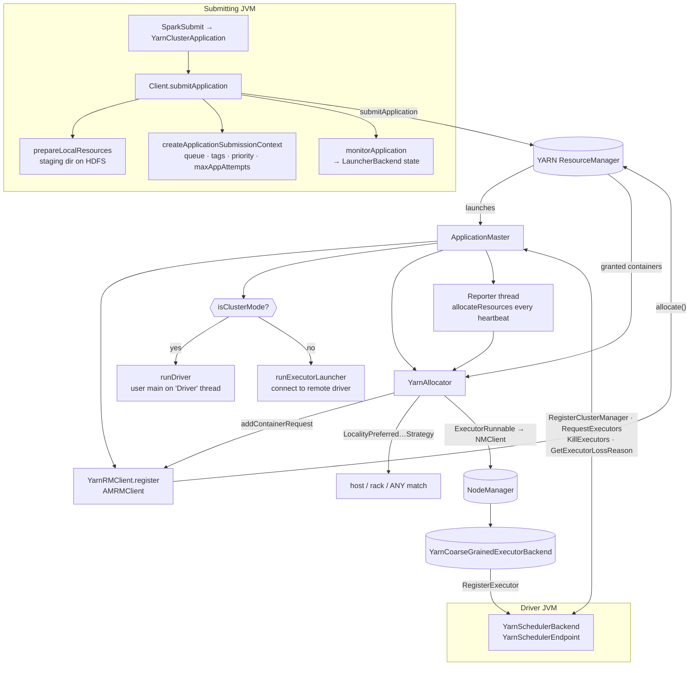

The first `resource-managers/yarn` sweep, and the subsystem's only group — its scope
(`yarn/`, `scheduler/cluster/`, `executor/`) covers every non-plumbing package in the module.
**29 non-test files, 7,735 lines, 61 configs**, two of them new in 4.2.0
(`spark.yarn.am.defaultJavaOptions`, `spark.yarn.am.limitActiveProcessorCount.enabled`).

The shape worth holding in mind, and the thing that makes YARN read differently from Kubernetes:
**Spark on YARN is a request/response protocol, not a reconciliation loop.** The AM asks the
ResourceManager for a number of containers at particular localities, the RM grants some of them on
a later heartbeat, and the AM decides one container at a time whether to launch an executor in it
or hand it back. There is no watch stream and no snapshot store — one thread, one `allocate()` call
per round, and the same call doubles as the liveness heartbeat.

The second thing to hold: **`ApplicationMaster` is one class running two unrelated processes.**
In cluster mode it *is* the driver's host process and runs the user's `main` on a side thread; in
client mode it is a bare container that allocates executors for a driver running somewhere else.
Nearly every conditional in the file is `isClusterMode`.



**Config slice.** The whole subsystem is one group, so the slice is every catalog key whose
`subsystem` is `resource-managers/yarn` — 61 keys, no pattern filter needed:

```bash
PYTHONIOENCODING=utf-8 python -c "
import yaml
d = yaml.safe_load(open('docs/reference/spark-source-map/configs/catalog.yaml', encoding='utf-8'))
cs = sorted({c['key'] for c in d['configs'] if c['subsystem'] == 'resource-managers/yarn'})
print(len(cs)); [print(k) for k in cs]
"
```

!!! warning "Three `spark.yarn.*` config families are not in the catalog"

    The parser only sees `ConfigBuilder` declarations, and this module reads three families that
    have none. `spark.yarn.appMasterEnv.<NAME>` is a **dynamic prefix** read directly out of
    `SparkConf` ([Client.scala:973](https://github.com/apache/spark/blob/v4.2.0/resource-managers/yarn/src/main/scala/org/apache/spark/deploy/yarn/Client.scala#L973)) — it is the only way to set an
    environment variable on a cluster-mode driver, since `spark-env.sh` is not read there. Likewise
    `spark.yarn.{am,driver,executor}.resource.<name>.amount`
    ([config/package.scala:505](https://github.com/apache/spark/blob/v4.2.0/resource-managers/yarn/src/main/scala/org/apache/spark/deploy/yarn/config/package.scala#L505)). And
    `spark.yarn.launchContainers` is read with a bare `getBoolean(..., true)`
    ([YarnAllocator.scala:182](https://github.com/apache/spark/blob/v4.2.0/resource-managers/yarn/src/main/scala/org/apache/spark/deploy/yarn/YarnAllocator.scala#L182)) — a test-only switch that
    silently skips every container launch while still updating internal state. None of the three
    appears in `configuration.md`'s generated tables either.

---

## YarnClusterManager — the entry point and the deploy-mode fork

**What it is:** the `ExternalClusterManager` that the master URL `yarn` resolves to — 56 lines
whose only job is to pick one of two schedulers and one of two backends by deploy mode. It is
found through a `META-INF/services` file, not by name.

**Code path:** `SparkContext.createTaskScheduler` → `ServiceLoader[ExternalClusterManager]` →
`YarnClusterManager.canCreate("yarn")` → `createTaskScheduler` / `createSchedulerBackend`

**Anchor files:**

- [YarnClusterManager.scala:28](https://github.com/apache/spark/blob/v4.2.0/resource-managers/yarn/src/main/scala/org/apache/spark/scheduler/cluster/YarnClusterManager.scala#L28) — `canCreate` is exact string equality on `"yarn"`; there is no regex and no `yarn://` form
- [YarnClusterManager.scala:32](https://github.com/apache/spark/blob/v4.2.0/resource-managers/yarn/src/main/scala/org/apache/spark/scheduler/cluster/YarnClusterManager.scala#L32) — cluster → `YarnClusterScheduler`, client → `YarnScheduler`, anything else → `SparkException`
- [YarnClusterScheduler.scala:31](https://github.com/apache/spark/blob/v4.2.0/resource-managers/yarn/src/main/scala/org/apache/spark/scheduler/cluster/YarnClusterScheduler.scala#L31) — the *only* difference between the two schedulers: `postStartHook` calls `ApplicationMaster.sparkContextInitialized(sc)`, which is the handshake that unblocks the AM
- [YarnScheduler.scala:29](https://github.com/apache/spark/blob/v4.2.0/resource-managers/yarn/src/main/scala/org/apache/spark/scheduler/cluster/YarnScheduler.scala#L29) — `defaultRackValue = /default-rack` and `getRacksForHosts` delegating to `SparkRackResolver`; this is how rack-local task scheduling is enabled at all
- `resource-managers/yarn/src/main/resources/META-INF/services/org.apache.spark.scheduler.ExternalClusterManager` — the registration

**Configs:** none of its own.

**Maps to topics:** E2.

---

## Client.submitApplication and the ApplicationSubmissionContext

**What it is:** the submitting-JVM half. `YarnClusterApplication` is the `SparkApplication` that
`spark-submit` reflectively starts for `--master yarn`; it strips `spark.jars` / `spark.files` /
`spark.archives` (YARN distributes them through its own cache instead) and hands off to `Client`.

**Code path:** `SparkSubmit` → `YarnClusterApplication.start` → `Client.run` →
`submitApplication` → `createContainerLaunchContext` + `createApplicationSubmissionContext` →
`yarnClient.submitApplication`

**Anchor files:**

- [Client.scala:1828](https://github.com/apache/spark/blob/v4.2.0/resource-managers/yarn/src/main/scala/org/apache/spark/deploy/yarn/Client.scala#L1828) — `YarnClusterApplication.start` removing `JARS`/`FILES`/`ARCHIVES` before constructing `Client`
- [Client.scala:194](https://github.com/apache/spark/blob/v4.2.0/resource-managers/yarn/src/main/scala/org/apache/spark/deploy/yarn/Client.scala#L194) — `submitApplication`; note the `catch` that deletes the staging directory on *any* throwable before rethrowing
- [Client.scala:215](https://github.com/apache/spark/blob/v4.2.0/resource-managers/yarn/src/main/scala/org/apache/spark/deploy/yarn/Client.scala#L215) — the staging base is `spark.yarn.stagingDir/<shortUserName>` if set, otherwise the user's **filesystem home directory**, then `.sparkStaging/<appId>`
- [Client.scala:406](https://github.com/apache/spark/blob/v4.2.0/resource-managers/yarn/src/main/scala/org/apache/spark/deploy/yarn/Client.scala#L406) — `verifyClusterResources`: fails fast if executor memory *plus off-heap plus overhead plus PySpark memory* exceeds the cluster's maximum container size, and separately if the AM does
- [Client.scala:272](https://github.com/apache/spark/blob/v4.2.0/resource-managers/yarn/src/main/scala/org/apache/spark/deploy/yarn/Client.scala#L272) — `createApplicationSubmissionContext`: name, queue, application type, tags, max attempts, attempt-failure validity interval, capability, node label, rolled-log aggregation, unmanaged flag, priority
- [Client.scala:312](https://github.com/apache/spark/blob/v4.2.0/resource-managers/yarn/src/main/scala/org/apache/spark/deploy/yarn/Client.scala#L312) — an AM node-label expression takes a **different code path**: it builds an explicit `ResourceRequest` and calls `setAMContainerResourceRequests`, instead of `setResource`
- [Client.scala:325](https://github.com/apache/spark/blob/v4.2.0/resource-managers/yarn/src/main/scala/org/apache/spark/deploy/yarn/Client.scala#L325) — the rolled-log include/exclude patterns are wrapped in a `try` that downgrades an unsupported YARN version to a warning
- [Client.scala:85](https://github.com/apache/spark/blob/v4.2.0/resource-managers/yarn/src/main/scala/org/apache/spark/deploy/yarn/Client.scala#L85) — AM sizing: cluster mode uses the *driver* memory/overhead/cores configs, client mode uses `spark.yarn.am.*`
- [YarnSparkHadoopUtil.scala:37](https://github.com/apache/spark/blob/v4.2.0/resource-managers/yarn/src/main/scala/org/apache/spark/deploy/yarn/YarnSparkHadoopUtil.scala#L37) — `AM_MEMORY_OVERHEAD_FACTOR = 0.10`, the client-mode AM's overhead factor
- [ClientArguments.scala:37](https://github.com/apache/spark/blob/v4.2.0/resource-managers/yarn/src/main/scala/org/apache/spark/deploy/yarn/ClientArguments.scala#L37) — the client-side twin of the AM parser, with two differences: it accepts `--verbose`, and it *throws* `IllegalArgumentException` rather than exiting, so `spark-submit` can report the error

**Configs:** `spark.yarn.queue`, `spark.yarn.applicationType`, `spark.yarn.tags`,
`spark.yarn.priority`, `spark.yarn.maxAppAttempts`,
`spark.yarn.am.attemptFailuresValidityInterval`, `spark.yarn.am.nodeLabelExpression`,
`spark.yarn.am.memory`, `spark.yarn.am.memoryOverhead`, `spark.yarn.am.cores`,
`spark.yarn.rolledLog.includePattern`, `spark.yarn.rolledLog.excludePattern`,
`spark.yarn.unmanagedAM.enabled`, `spark.yarn.submit.waitAppCompletion`.

!!! info "The client-mode AM's overhead floor is hardcoded, the cluster-mode one is not"

    In cluster mode the AM *is* the driver, so the overhead is
    `max(spark.driver.memoryOverheadFactor × driverMemory, spark.driver.minMemoryOverhead)`. In
    client mode the factor is the constant `0.10` and the floor is a literal `384L` in the
    constructor ([Client.scala:98](https://github.com/apache/spark/blob/v4.2.0/resource-managers/yarn/src/main/scala/org/apache/spark/deploy/yarn/Client.scala#L98)) — neither is
    configurable. A 512 MiB client-mode AM therefore always requests 896 MiB from YARN unless you
    set `spark.yarn.am.memoryOverhead` explicitly.

**Maps to topics:** E2.

---

## Resource localization — the staging directory and the YARN distributed cache

**What it is:** everything the application needs is copied to a per-application HDFS staging
directory, registered as YARN `LocalResource`s, and downloaded by the NodeManager into each
container's working directory before the JVM starts. This is how Spark itself, the user jar,
`--files`, `--archives` and the Python archives reach a container.

**Code path:** `prepareLocalResources` → `distribute` → `copyFileToRemote` →
`ClientDistributedCacheManager.addResource` → `updateConfiguration` (into the dist-cache conf) →
AM-side `ApplicationMaster.prepareLocalResources` re-materialises the same map for executors

**Anchor files:**

- [Client.scala:526](https://github.com/apache/spark/blob/v4.2.0/resource-managers/yarn/src/main/scala/org/apache/spark/deploy/yarn/Client.scala#L526) — `prepareLocalResources`; the staging directory is created `700`, uploaded files `644` ([Client.scala:1441](https://github.com/apache/spark/blob/v4.2.0/resource-managers/yarn/src/main/scala/org/apache/spark/deploy/yarn/Client.scala#L1441))
- [Client.scala:593](https://github.com/apache/spark/blob/v4.2.0/resource-managers/yarn/src/main/scala/org/apache/spark/deploy/yarn/Client.scala#L593) — `distribute`: a `local:` URI is *never* copied, it is assumed already present on every node
- [Client.scala:560](https://github.com/apache/spark/blob/v4.2.0/resource-managers/yarn/src/main/scala/org/apache/spark/deploy/yarn/Client.scala#L560) — de-duplication by URI **and by file name**: two different paths with the same basename would make YARN fail the container launch, so the second is dropped with a warning
- [Client.scala:667](https://github.com/apache/spark/blob/v4.2.0/resource-managers/yarn/src/main/scala/org/apache/spark/deploy/yarn/Client.scala#L667) — `spark.yarn.archive` wins over `spark.yarn.jars`; both localize into `__spark_libs__`
- [Client.scala:704](https://github.com/apache/spark/blob/v4.2.0/resource-managers/yarn/src/main/scala/org/apache/spark/deploy/yarn/Client.scala#L704) — **the fallback**: with neither set, Spark logs a warning and zips every jar under `$SPARK_HOME/jars` into a temp archive (compression level 0) and uploads it *on every submit*
- [Client.scala:439](https://github.com/apache/spark/blob/v4.2.0/resource-managers/yarn/src/main/scala/org/apache/spark/deploy/yarn/Client.scala#L439) — `copyFileToRemote`; skipped when source and destination filesystems match and the scheme is not `file`, then symlinks in the destination directory are resolved so a `current`-style symlink records the concrete version
- [Client.scala:486](https://github.com/apache/spark/blob/v4.2.0/resource-managers/yarn/src/main/scala/org/apache/spark/deploy/yarn/Client.scala#L486) — `directoriesToBePreloaded` / [:506](https://github.com/apache/spark/blob/v4.2.0/resource-managers/yarn/src/main/scala/org/apache/spark/deploy/yarn/Client.scala#L506) `getPreloadedStatCache`: one `listStatus` per directory instead of N `getFileStatus` calls, when ≥ 5 resources share a parent
- [ClientDistributedCacheManager.scala:105](https://github.com/apache/spark/blob/v4.2.0/resource-managers/yarn/src/main/scala/org/apache/spark/deploy/yarn/ClientDistributedCacheManager.scala#L105) — visibility: `PUBLIC` only if the file is other-readable **and every ancestor directory is other-executable** ([:151](https://github.com/apache/spark/blob/v4.2.0/resource-managers/yarn/src/main/scala/org/apache/spark/deploy/yarn/ClientDistributedCacheManager.scala#L151))
- [ClientDistributedCacheManager.scala:93](https://github.com/apache/spark/blob/v4.2.0/resource-managers/yarn/src/main/scala/org/apache/spark/deploy/yarn/ClientDistributedCacheManager.scala#L93) — the five parallel `spark.yarn.cache.*` sequences that carry the cache manifest to the AM
- [ApplicationMaster.scala:141](https://github.com/apache/spark/blob/v4.2.0/resource-managers/yarn/src/main/scala/org/apache/spark/deploy/yarn/ApplicationMaster.scala#L141) — the AM rebuilds `LocalResource` records from those sequences to launch executors; nothing is re-uploaded

**Configs:** `spark.yarn.jars`, `spark.yarn.archive`, `spark.yarn.dist.jars`,
`spark.yarn.dist.files`, `spark.yarn.dist.archives`, `spark.yarn.submit.file.replication`,
`spark.yarn.preserve.staging.files`, `spark.yarn.client.statCache.preload.enabled`,
`spark.yarn.client.statCache.preload.perDirectoryThreshold`, `spark.yarn.cache.filenames`,
`spark.yarn.cache.sizes`, `spark.yarn.cache.timestamps`, `spark.yarn.cache.visibilities`,
`spark.yarn.cache.types`, `spark.yarn.cache.confArchive`, `spark.yarn.secondary.jars`,
`spark.yarn.user.jar`.

!!! warning "Leaving `spark.yarn.jars` unset re-uploads the whole Spark distribution on every submit"

    With neither `spark.yarn.jars` nor `spark.yarn.archive` set, `prepareLocalResources` zips
    `$SPARK_HOME/jars` — roughly 250 MiB on a standard build — into a temp file and uploads it to
    the staging directory for *this application*, every time. The only signal is one WARN line,
    "falling back to uploading libraries under SPARK_HOME". Uploading the jars once to HDFS and
    pointing `spark.yarn.jars` at them turns a multi-second submit into a sub-second one and makes
    the resources `PUBLIC`, so NodeManagers share one localized copy across applications.

!!! info "Public visibility is decided by HDFS permissions, not by a config"

    A `PUBLIC` resource is localized once per node and shared by every application; a `PRIVATE` one
    is localized per user. `getVisibility` walks the file *and every parent directory* checking the
    other-bits. Because the staging directory itself is created `700`, everything under it is
    necessarily `PRIVATE` — which is precisely why a shared, world-readable `spark.yarn.jars`
    location outside the staging directory is the configuration that pays off.

**Maps to topics:** E2, I18 (dependency distribution at submit time — the YARN cache is where
`--jars` and `--packages` output actually lands).

---

## The conf archive — how the AM and executors get a configuration

**What it is:** Spark does not pass its configuration to the AM through the container environment.
It builds a zip — `__spark_conf__.zip` — containing the Hadoop config files, a serialized copy of
the resolved `SparkConf`, the distributed-cache manifest, and any log4j2/metrics properties found
on the classpath, uploads it, and passes `--properties-file` pointing inside the exploded archive.

**Code path:** `createConfArchive` → `copyFileToRemote(force = true)` →
`distCacheMgr.addResource(..., LOCALIZED_CONF_DIR)` → AM `main` reads `--properties-file`

**Anchor files:**

- [Client.scala:860](https://github.com/apache/spark/blob/v4.2.0/resource-managers/yarn/src/main/scala/org/apache/spark/deploy/yarn/Client.scala#L860) — `createConfArchive`; `SPARK_CONF_DIR`'s `*.xml` files take precedence over `HADOOP_CONF_DIR` then `YARN_CONF_DIR`
- [Client.scala:917](https://github.com/apache/spark/blob/v4.2.0/resource-managers/yarn/src/main/scala/org/apache/spark/deploy/yarn/Client.scala#L917) — the six accepted log4j2 filenames plus `metrics.properties`, picked up from the classpath only when the URL protocol is `file`
- [Client.scala:942](https://github.com/apache/spark/blob/v4.2.0/resource-managers/yarn/src/main/scala/org/apache/spark/deploy/yarn/Client.scala#L942) — the whole `YarnConfiguration` is serialised into `__spark_hadoop_conf__.xml` and overlaid on the cluster's own conf
- [Client.scala:817](https://github.com/apache/spark/blob/v4.2.0/resource-managers/yarn/src/main/scala/org/apache/spark/deploy/yarn/Client.scala#L817) — `confsToOverride`: the keytab and `spark.jars.ivySettings` values are rewritten to their *localized* names before the conf is frozen
- [Client.scala:1154](https://github.com/apache/spark/blob/v4.2.0/resource-managers/yarn/src/main/scala/org/apache/spark/deploy/yarn/Client.scala#L1154) — the AM command line: `--properties-file __spark_conf__/__spark_conf__.properties` and `--dist-cache-conf __spark_conf__/__spark_dist_cache__.properties`
- [ApplicationMaster.scala:896](https://github.com/apache/spark/blob/v4.2.0/resource-managers/yarn/src/main/scala/org/apache/spark/deploy/yarn/ApplicationMaster.scala#L896) — the AM loads that file and then **copies every key into `sys.props`**, so a `new SparkConf()` created by user code in cluster mode inherits them

**Configs:** `spark.yarn.cache.confArchive` (internal).

!!! info "The distributed-cache manifest is a second, separate properties file"

    `__spark_dist_cache__.properties` is deliberately kept out of the main conf
    ([Client.scala:800](https://github.com/apache/spark/blob/v4.2.0/resource-managers/yarn/src/main/scala/org/apache/spark/deploy/yarn/Client.scala#L800), SPARK-14602) so the cache
    manifest — which can be large — is not part of the configuration the driver publishes. The AM
    reads it into a throwaway `SparkConf` purely to build executor local resources
    ([ApplicationMaster.scala:664](https://github.com/apache/spark/blob/v4.2.0/resource-managers/yarn/src/main/scala/org/apache/spark/deploy/yarn/ApplicationMaster.scala#L664)).

**Maps to topics:** E2.

---

## ApplicationMaster — one class, two very different processes

**What it is:** the container YARN launches first. In cluster mode it loads the user class with a
dedicated classloader and runs `main` on a thread named `Driver`, then waits for that thread to
create a `SparkContext`; in client mode (`ExecutorLauncher`, a marker object that exists only so
`jps` can tell them apart) it connects to an already-running driver.

**Code path:** `ApplicationMaster.main` → UGI login → `run` → `runDriver` | `runExecutorLauncher`
→ `registerAM` → `createAllocator` → `launchReporterThread`

**Anchor files:**

- [ApplicationMaster.scala:892](https://github.com/apache/spark/blob/v4.2.0/resource-managers/yarn/src/main/scala/org/apache/spark/deploy/yarn/ApplicationMaster.scala#L892) — `main`; everything after this runs inside `ugi.doAs`, and `System.exit(master.run())` is the process's only exit
- [ApplicationMaster.scala:78](https://github.com/apache/spark/blob/v4.2.0/resource-managers/yarn/src/main/scala/org/apache/spark/deploy/yarn/ApplicationMaster.scala#L78) — `isClusterMode = args.userClass != null`; the mode is inferred from the command line, not from a config
- [ApplicationMaster.scala:199](https://github.com/apache/spark/blob/v4.2.0/resource-managers/yarn/src/main/scala/org/apache/spark/deploy/yarn/ApplicationMaster.scala#L199) — cluster mode forces `spark.ui.port=0` (ephemeral) unless explicitly set, and sets the internal `spark.yarn.app.id` marker `SparkContext` checks
- [ApplicationMaster.scala:496](https://github.com/apache/spark/blob/v4.2.0/resource-managers/yarn/src/main/scala/org/apache/spark/deploy/yarn/ApplicationMaster.scala#L496) — `runDriver`: `ThreadUtils.awaitResult(sparkContextPromise.future, spark.yarn.am.waitTime)`; a timeout is `EXIT_SC_NOT_INITED`
- [ApplicationMaster.scala:405](https://github.com/apache/spark/blob/v4.2.0/resource-managers/yarn/src/main/scala/org/apache/spark/deploy/yarn/ApplicationMaster.scala#L405) — the handshake: `YarnClusterScheduler.postStartHook` completes the promise and then **blocks the user thread** on `sparkContextPromise.wait()` until the AM has registered and built the allocator
- [ApplicationMaster.scala:716](https://github.com/apache/spark/blob/v4.2.0/resource-managers/yarn/src/main/scala/org/apache/spark/deploy/yarn/ApplicationMaster.scala#L716) — `startUserApplication`: reflection on `main`, a non-static `main` is a distinct exit code, and `SparkUserAppException` propagates the user's own exit code
- [ApplicationMaster.scala:84](https://github.com/apache/spark/blob/v4.2.0/resource-managers/yarn/src/main/scala/org/apache/spark/deploy/yarn/ApplicationMaster.scala#L84) — `ChildFirstURLClassLoader` vs `MutableURLClassLoader`, chosen by `spark.driver.userClassPathFirst`, and only in cluster mode
- [ApplicationMaster.scala:539](https://github.com/apache/spark/blob/v4.2.0/resource-managers/yarn/src/main/scala/org/apache/spark/deploy/yarn/ApplicationMaster.scala#L539) — `runExecutorLauncher`: creates its own `RpcEnv` sized by `spark.yarn.am.cores`, registers with **port −1** because it accepts no inbound connections, and takes the driver host:port from `--arg`
- [ApplicationMaster.scala:436](https://github.com/apache/spark/blob/v4.2.0/resource-managers/yarn/src/main/scala/org/apache/spark/deploy/yarn/ApplicationMaster.scala#L436) — `createAllocator`; the `AMEndpoint` is registered *after* the allocator exists so an early `RequestExecutors` from a restarted driver is never dropped
- [ApplicationMaster.scala:460](https://github.com/apache/spark/blob/v4.2.0/resource-managers/yarn/src/main/scala/org/apache/spark/deploy/yarn/ApplicationMaster.scala#L460) — a throwaway `ExecutorRunnable` is built with placeholder ids purely to log the launch context once, instead of per executor
- [ApplicationMasterArguments.scala:33](https://github.com/apache/spark/blob/v4.2.0/resource-managers/yarn/src/main/scala/org/apache/spark/deploy/yarn/ApplicationMasterArguments.scala#L33) — a hand-rolled list-match parser for the seven AM flags; `--class` being present is what sets `isClusterMode`, and an unknown flag prints usage and calls `System.exit` directly

**Configs:** `spark.yarn.am.waitTime`, `spark.yarn.am.cores`, `spark.driver.appUIAddress`,
`spark.yarn.am.extraJavaOptions`, `spark.yarn.am.defaultJavaOptions` *(new in 4.2.0)*,
`spark.yarn.am.extraLibraryPath`, `spark.yarn.am.limitActiveProcessorCount.enabled` *(new in
4.2.0)*.

!!! warning "`spark.yarn.am.extraJavaOptions` is validated, and silently irrelevant in cluster mode"

    In client mode the value is rejected outright if it contains `-Dspark` (use a conf) or `-Xmx`
    (use `spark.yarn.am.memory`) — a `SparkException` at submit time
    ([Client.scala:1095](https://github.com/apache/spark/blob/v4.2.0/resource-managers/yarn/src/main/scala/org/apache/spark/deploy/yarn/Client.scala#L1095)). In cluster mode the same
    key is ignored with a warning ([Client.scala:1089](https://github.com/apache/spark/blob/v4.2.0/resource-managers/yarn/src/main/scala/org/apache/spark/deploy/yarn/Client.scala#L1089)) because the AM
    is the driver, so `spark.driver.extraJavaOptions` applies instead. The 4.2.0
    `spark.yarn.am.defaultJavaOptions` is prepended to it via `withPrepended`, for administrators
    to set cluster-wide defaults without overwriting a user's value.

**Maps to topics:** E2.

---

## The AM↔driver RPC protocol

**What it is:** two endpoints. `AMEndpoint` lives in the AM; `YarnSchedulerEndpoint` (named
`YarnScheduler`) lives in the driver and sits *in front of* the ordinary
`CoarseGrainedSchedulerBackend` driver endpoint, forwarding what the AM must answer.

**Code path:** `AMEndpoint.onStart` → `RegisterClusterManager` → driver caches `amEndpoint` and
calls `reset()`; then `doRequestTotalExecutors` → `YarnSchedulerEndpoint` → `AMEndpoint` →
`YarnAllocator`

**Anchor files:**

- [ApplicationMaster.scala:793](https://github.com/apache/spark/blob/v4.2.0/resource-managers/yarn/src/main/scala/org/apache/spark/deploy/yarn/ApplicationMaster.scala#L793) — `onStart` sends `RegisterClusterManager`, and in *managed* client mode also `MiscellaneousProcessAdded` so the driver UI can show the AM's own logs
- [ApplicationMaster.scala:816](https://github.com/apache/spark/blob/v4.2.0/resource-managers/yarn/src/main/scala/org/apache/spark/deploy/yarn/ApplicationMaster.scala#L816) — `RequestExecutors`, `KillExecutors`, `GetExecutorLossReason`; each guards on `Option(allocator)` and replies `false` (or logs) if the allocator is not built yet
- [ApplicationMaster.scala:810](https://github.com/apache/spark/blob/v4.2.0/resource-managers/yarn/src/main/scala/org/apache/spark/deploy/yarn/ApplicationMaster.scala#L810) — `Shutdown(code)` sets `allocator.setShutdown(true)`, which is what makes subsequent container exits report `exitCausedByApp = false`
- [ApplicationMaster.scala:853](https://github.com/apache/spark/blob/v4.2.0/resource-managers/yarn/src/main/scala/org/apache/spark/deploy/yarn/ApplicationMaster.scala#L853) — `onDisconnected`: only client mode reacts, and `spark.yarn.am.clientModeTreatDisconnectAsFailed` decides whether an unclean driver disconnect is `SUCCEEDED` or `FAILED`
- [YarnSchedulerBackend.scala:335](https://github.com/apache/spark/blob/v4.2.0/resource-managers/yarn/src/main/scala/org/apache/spark/scheduler/cluster/YarnSchedulerBackend.scala#L335) — the driver side: `RegisterClusterManager` triggers `reset()`, which also resets the `ExecutorAllocationManager` — this is the AM-restart recovery path
- [YarnSchedulerBackend.scala:300](https://github.com/apache/spark/blob/v4.2.0/resource-managers/yarn/src/main/scala/org/apache/spark/scheduler/cluster/YarnSchedulerBackend.scala#L300) — `handleExecutorDisconnectedFromDriver`: asks the AM *why* an executor went away before removing it, and falls back to `ExecutorProcessLost` on timeout
- [YarnSchedulerBackend.scala:270](https://github.com/apache/spark/blob/v4.2.0/resource-managers/yarn/src/main/scala/org/apache/spark/scheduler/cluster/YarnSchedulerBackend.scala#L270) — `YarnDriverEndpoint` overrides `onDisconnected` for exactly that reason: on YARN a disconnect is not automatically the executor's fault
- [YarnSchedulerBackend.scala:392](https://github.com/apache/spark/blob/v4.2.0/resource-managers/yarn/src/main/scala/org/apache/spark/scheduler/cluster/YarnSchedulerBackend.scala#L392) — `RetrieveLastAllocatedExecutorId` and `RetrieveDelegationTokens`, the two things the AM asks the driver for

**Configs:** `spark.yarn.am.clientModeTreatDisconnectAsFailed`.

!!! info "Executor IDs survive an AM restart because the AM asks the driver"

    `YarnAllocator.executorIdCounter` is initialised with a **blocking** `askSync` to the driver
    ([YarnAllocator.scala:164](https://github.com/apache/spark/blob/v4.2.0/resource-managers/yarn/src/main/scala/org/apache/spark/deploy/yarn/YarnAllocator.scala#L164), SPARK-12864). Without it a
    restarted client-mode AM would start numbering at 1 again and collide with executors the driver
    still knows about. It also means allocator construction cannot complete while the driver is
    unreachable.

**Maps to topics:** E2.

---

## The reporter thread — heartbeat, backoff, and the two ways it kills the app

**What it is:** a single daemon thread named `Reporter` that loops for the life of the AM. Each
pass checks two abort conditions, calls `allocateResources()` (which *is* the RM heartbeat), then
sleeps on a lock that the RPC endpoint can wake.

**Code path:** `launchReporterThread` → `allocationThreadImpl` → `YarnAllocator.allocateResources`
→ `allocatorLock.wait(sleepInterval)`; `resetAllocatorInterval()` from the endpoint wakes it early

**Anchor files:**

- [ApplicationMaster.scala:562](https://github.com/apache/spark/blob/v4.2.0/resource-managers/yarn/src/main/scala/org/apache/spark/deploy/yarn/ApplicationMaster.scala#L562) — the loop; `getNumExecutorsFailed >= maxNumExecutorFailures` and `isAllNodeExcluded` are the two self-inflicted terminations, both `EXIT_MAX_EXECUTOR_FAILURES`
- [ApplicationMaster.scala:583](https://github.com/apache/spark/blob/v4.2.0/resource-managers/yarn/src/main/scala/org/apache/spark/deploy/yarn/ApplicationMaster.scala#L583) — `ApplicationAttemptNotFoundException` is fatal immediately (the RM no longer knows this attempt); other non-fatal throwables are tolerated up to `spark.yarn.scheduler.reporterThread.maxFailures` **in a row**
- [ApplicationMaster.scala:120](https://github.com/apache/spark/blob/v4.2.0/resource-managers/yarn/src/main/scala/org/apache/spark/deploy/yarn/ApplicationMaster.scala#L120) — `heartbeatInterval = max(0, min(yarn.am.liveness-monitor.expiry-interval-ms / 2, spark.yarn.scheduler.heartbeat.interval-ms))` — YARN's expiry always wins
- [ApplicationMaster.scala:607](https://github.com/apache/spark/blob/v4.2.0/resource-managers/yarn/src/main/scala/org/apache/spark/deploy/yarn/ApplicationMaster.scala#L607) — the backoff: while containers are pending, the interval starts at `spark.yarn.scheduler.initial-allocation.interval` (200 ms) and **doubles each round up to the heartbeat interval**; with nothing pending it resets and sleeps the full heartbeat
- [ApplicationMaster.scala:621](https://github.com/apache/spark/blob/v4.2.0/resource-managers/yarn/src/main/scala/org/apache/spark/deploy/yarn/ApplicationMaster.scala#L621) — a woken thread still sleeps out the remainder of the *initial* interval, so a burst of driver requests cannot spin the RM
- [ApplicationMaster.scala:645](https://github.com/apache/spark/blob/v4.2.0/resource-managers/yarn/src/main/scala/org/apache/spark/deploy/yarn/ApplicationMaster.scala#L645) — the thread is a daemon, and its `finally` is the only call to `allocator.stop()`
- [ExecutorFailureTracker.scala:86](https://github.com/apache/spark/blob/v4.2.0/core/src/main/scala/org/apache/spark/deploy/ExecutorFailureTracker.scala#L86) — `maxNumExecutorFailures` defaults to `max(3, 2 × effectiveNumExecutors)`, where "effective" is the dynamic-allocation maximum when dynamic allocation is on

**Configs:** `spark.yarn.scheduler.heartbeat.interval-ms`,
`spark.yarn.scheduler.initial-allocation.interval`,
`spark.yarn.scheduler.reporterThread.maxFailures`.

!!! warning "The allocation loop polls *faster* when it is waiting, not slower"

    The naming reads backwards. `initial-allocation.interval` (200 ms) is the *shortest* sleep and
    applies while requests are outstanding; `heartbeat.interval-ms` (3 s) is the *longest* and
    applies when there is nothing pending. Doubling moves from the first toward the second. Raising
    the initial interval therefore slows executor ramp-up, and raising the heartbeat interval past
    half of YARN's AM expiry silently has no effect at all.

**Maps to topics:** E2.

---

## YarnAllocator — target arithmetic and the request/cancel cycle

**What it is:** the 1,064-line core of the module. It holds, **per ResourceProfile id**, a target
executor count, the set of running executors, a starting counter, and the host→container map; each
round it computes how many are missing and reconciles the outstanding `ContainerRequest`s with the
RM.

**Code path:** `allocateResources` → `updateResourceRequests` (compute `missing`, cancel stale,
add new) → `amClient.allocate` → `handleAllocatedContainers` → `runAllocatedContainers` →
`processCompletedContainers`

**Anchor files:**

- [YarnAllocator.scala:498](https://github.com/apache/spark/blob/v4.2.0/resource-managers/yarn/src/main/scala/org/apache/spark/deploy/yarn/YarnAllocator.scala#L498) — `missing = target − pending − running − starting`, per profile; this is the whole control law
- [YarnAllocator.scala:520](https://github.com/apache/spark/blob/v4.2.0/resource-managers/yarn/src/main/scala/org/apache/spark/deploy/yarn/YarnAllocator.scala#L520) — pending requests are split three ways — locality-matched, locality-*stale*, locality-free — and only the stale ones are unconditionally cancelled
- [YarnAllocator.scala:566](https://github.com/apache/spark/blob/v4.2.0/resource-managers/yarn/src/main/scala/org/apache/spark/deploy/yarn/YarnAllocator.scala#L566) — when locality wants more containers than are available, existing *any-host* requests are cancelled and resubmitted with locality
- [YarnAllocator.scala:598](https://github.com/apache/spark/blob/v4.2.0/resource-managers/yarn/src/main/scala/org/apache/spark/deploy/yarn/YarnAllocator.scala#L598) — `missing < 0` cancels pending requests, preferring stale → any-host → local, so locality survives a scale-down
- [YarnAllocator.scala:385](https://github.com/apache/spark/blob/v4.2.0/resource-managers/yarn/src/main/scala/org/apache/spark/deploy/yarn/YarnAllocator.scala#L385) — `requestTotalExecutorsWithPreferredLocalities`; an **empty** profile map zeroes every target, which is how `YarnSchedulerBackend.stop` cancels outstanding requests (SPARK-12009, [YarnSchedulerBackend.scala:111](https://github.com/apache/spark/blob/v4.2.0/resource-managers/yarn/src/main/scala/org/apache/spark/scheduler/cluster/YarnSchedulerBackend.scala#L111))
- [YarnAllocator.scala:755](https://github.com/apache/spark/blob/v4.2.0/resource-managers/yarn/src/main/scala/org/apache/spark/deploy/yarn/YarnAllocator.scala#L755) — `runAllocatedContainers` submits an `ExecutorRunnable` to a cached thread pool bounded by `spark.yarn.containerLauncherMaxThreads`; a launch failure decrements the starting counter and releases the container immediately
- [YarnAllocator.scala:779](https://github.com/apache/spark/blob/v4.2.0/resource-managers/yarn/src/main/scala/org/apache/spark/deploy/yarn/YarnAllocator.scala#L779) — the launch-time guard compares **running** executors against the target (not running + starting), then releases the surplus container
- [YarnAllocator.scala:828](https://github.com/apache/spark/blob/v4.2.0/resource-managers/yarn/src/main/scala/org/apache/spark/deploy/yarn/YarnAllocator.scala#L828) — `updateInternalState` only records the executor if its container is still in `launchingExecutorContainerIds`; a container that completed while launching is dropped cleanly
- [YarnAllocator.scala:420](https://github.com/apache/spark/blob/v4.2.0/resource-managers/yarn/src/main/scala/org/apache/spark/deploy/yarn/YarnAllocator.scala#L420) — `killExecutor` is idempotent against `releasedContainers` and warns on an unknown id
- [YarnAllocator.scala:1005](https://github.com/apache/spark/blob/v4.2.0/resource-managers/yarn/src/main/scala/org/apache/spark/deploy/yarn/YarnAllocator.scala#L1005) — every release goes through `internalReleaseContainer`, which records the id so the later completion is not counted as a failure

**Configs:** `spark.yarn.containerLauncherMaxThreads`, `spark.yarn.executor.nodeLabelExpression`,
plus the core `spark.executor.instances` / `spark.dynamicAllocation.*` that set the initial target
through `SchedulerBackendUtils.getInitialTargetExecutorNumber`.

!!! info "There is no per-round allocation batch size on YARN"

    Unlike Kubernetes, which caps how many pods it creates per reconciliation pass, `updateResourceRequests` submits *all* missing requests at once and lets the RM's own scheduling
    decide the pace. The only throttle on the launch side is the container-launcher thread pool
    (`spark.yarn.containerLauncherMaxThreads`, default 25).

!!! info "Node labels are all-or-nothing per application"

    `spark.yarn.executor.nodeLabelExpression` is read once into the allocator
    ([YarnAllocator.scala:184](https://github.com/apache/spark/blob/v4.2.0/resource-managers/yarn/src/main/scala/org/apache/spark/deploy/yarn/YarnAllocator.scala#L184)) and passed to every
    `ContainerRequest` ([:629](https://github.com/apache/spark/blob/v4.2.0/resource-managers/yarn/src/main/scala/org/apache/spark/deploy/yarn/YarnAllocator.scala#L629)) regardless of
    ResourceProfile — so a GPU stage cannot be targeted at a labelled partition separately from the
    default profile. The AM's own label is a different config and is applied at submission.

**Maps to topics:** E2.

---

## Container placement — locality preferences, ratios, and rack resolution

**What it is:** the algorithm that decides *which hosts* to name on each container request, and the
three-pass match applied to what YARN actually grants. The driver sends per-host pending-task
counts; the strategy converts them into an expected containers-per-host distribution that already
subtracts running and pending containers, then emits one request per container from the highest
remaining ratios.

**Code path:** `updateResourceRequests` →
`LocalityPreferredContainerPlacementStrategy.localityOfRequestedContainers` →
`expectedHostToContainerCount` → `ContainerRequest(nodes, racks)`; on the return path
`handleAllocatedContainers` → `matchContainerToRequest` at host, then rack, then `*`

**Anchor files:**

- [LocalityPreferredContainerPlacementStrategy.scala:33](https://github.com/apache/spark/blob/v4.2.0/resource-managers/yarn/src/main/scala/org/apache/spark/deploy/yarn/LocalityPreferredContainerPlacementStrategy.scala#L33) — the class comment is the specification: five worked cases with concrete ratios
- [LocalityPreferredContainerPlacementStrategy.scala:179](https://github.com/apache/spark/blob/v4.2.0/resource-managers/yarn/src/main/scala/org/apache/spark/deploy/yarn/LocalityPreferredContainerPlacementStrategy.scala#L179) — `expectedHostToContainerCount`: expected = hostTaskCount × executorsNeeded / totalTaskCount, minus containers already allocated *and* a fractional share of pending ones
- [LocalityPreferredContainerPlacementStrategy.scala:214](https://github.com/apache/spark/blob/v4.2.0/resource-managers/yarn/src/main/scala/org/apache/spark/deploy/yarn/LocalityPreferredContainerPlacementStrategy.scala#L214) — pending requests contribute *fractionally* per host, because one request naming three hosts will only ever become one container
- [LocalityPreferredContainerPlacementStrategy.scala:131](https://github.com/apache/spark/blob/v4.2.0/resource-managers/yarn/src/main/scala/org/apache/spark/deploy/yarn/LocalityPreferredContainerPlacementStrategy.scala#L131) — ratios are normalised against the largest and **rounded up**, then decremented once per emitted container; a host drops out when its counter reaches zero
- [LocalityPreferredContainerPlacementStrategy.scala:118](https://github.com/apache/spark/blob/v4.2.0/resource-managers/yarn/src/main/scala/org/apache/spark/deploy/yarn/LocalityPreferredContainerPlacementStrategy.scala#L118) — any surplus beyond the locality-aware count becomes explicit `(null, null)` no-preference requests
- [YarnAllocator.scala:646](https://github.com/apache/spark/blob/v4.2.0/resource-managers/yarn/src/main/scala/org/apache/spark/deploy/yarn/YarnAllocator.scala#L646) — `handleAllocatedContainers`: host pass, rack pass, any-host pass; anything still unmatched is released
- [YarnAllocator.scala:656](https://github.com/apache/spark/blob/v4.2.0/resource-managers/yarn/src/main/scala/org/apache/spark/deploy/yarn/YarnAllocator.scala#L656) — the rack pass runs on a **separate thread** because Hadoop's `RackResolver` swallows interrupts and would otherwise make the AM unkillable (SPARK-27094)
- [YarnAllocator.scala:724](https://github.com/apache/spark/blob/v4.2.0/resource-managers/yarn/src/main/scala/org/apache/spark/deploy/yarn/YarnAllocator.scala#L724) — matching removes the satisfied `ContainerRequest` so it is not resubmitted next round
- [SparkRackResolver.scala:63](https://github.com/apache/spark/blob/v4.2.0/resource-managers/yarn/src/main/scala/org/apache/spark/deploy/yarn/SparkRackResolver.scala#L63) — resolution is batched and cached (`CachedDNSToSwitchMapping`); an empty result **falls back to `/default-rack` for every host at INFO level**
- [SparkRackResolver.scala:94](https://github.com/apache/spark/blob/v4.2.0/resource-managers/yarn/src/main/scala/org/apache/spark/deploy/yarn/SparkRackResolver.scala#L94) — a process-wide singleton whose first caller's `Configuration` wins; later calls ignore theirs

**Configs:** none of its own — it reads Hadoop's
`net.topology.node.switch.mapping.impl`. `spark.locality.*` on the driver decides the task-side
half.

!!! warning "A broken topology script degrades to one rack, quietly"

    `coreResolve` catches an empty mapping result and assigns every host `/default-rack`, logging a
    single INFO line. From that point rack-local scheduling is meaningless — every host is
    "rack-local" to every other — and the placement strategy's rack list collapses to one entry.
    Nothing in the UI or the driver log says locality has been lost; the only symptom is a job that
    reads more data over the network than it used to.

**Maps to topics:** none — this is the sweep's first new topic, **E36**.

---

## ResourceProfiles on YARN — priority, custom resources, and GPU/FPGA name mapping

**What it is:** YARN forbids different container sizes within one priority, so Spark uses **the
ResourceProfile id as the YARN priority**. Each profile gets its own `Resource` capability, and
Spark's abstract resource names (`gpu`, `fpga`) are translated to YARN's (`yarn.io/gpu`,
`yarn.io/fpga`).

**Code path:** `createYarnResourceForResourceProfile` →
`ResourceProfile.getResourcesForClusterManager` → `ResourceRequestHelper.setResourceRequests` →
`Resource`; submit-time validation via `ResourceRequestHelper.validateResources`

**Anchor files:**

- [YarnAllocator.scala:268](https://github.com/apache/spark/blob/v4.2.0/resource-managers/yarn/src/main/scala/org/apache/spark/deploy/yarn/YarnAllocator.scala#L268) — `getContainerPriority(rpId) = Priority.newInstance(rpId)`, with the reasoning in the comment above it
- [YarnAllocator.scala:313](https://github.com/apache/spark/blob/v4.2.0/resource-managers/yarn/src/main/scala/org/apache/spark/deploy/yarn/YarnAllocator.scala#L313) — profile → `Resource`, memory and cores from the profile, custom resources from either source depending on the profile
- [YarnAllocator.scala:349](https://github.com/apache/spark/blob/v4.2.0/resource-managers/yarn/src/main/scala/org/apache/spark/deploy/yarn/YarnAllocator.scala#L349) — **the asymmetry**: `spark.yarn.executor.resource.*` applies only to the *default* profile; custom profiles propagate every resource they declare
- [ResourceRequestHelper.scala:88](https://github.com/apache/spark/blob/v4.2.0/resource-managers/yarn/src/main/scala/org/apache/spark/deploy/yarn/ResourceRequestHelper.scala#L88) — `validateResources` rejects 22 specific spellings of memory and cores under `spark.yarn.*.resource.*`, listing the Spark key to use instead
- [ResourceRequestHelper.scala:137](https://github.com/apache/spark/blob/v4.2.0/resource-managers/yarn/src/main/scala/org/apache/spark/deploy/yarn/ResourceRequestHelper.scala#L137) — amount+unit parsing (`([0-9]+)([A-Za-z]*)`) and lower-case unit normalisation
- [ResourceRequestHelper.scala:167](https://github.com/apache/spark/blob/v4.2.0/resource-managers/yarn/src/main/scala/org/apache/spark/deploy/yarn/ResourceRequestHelper.scala#L167) — a resource type YARN does not know is a **warning, logged at most twice**, and the request proceeds without it
- [ResourceRequestHelper.scala:60](https://github.com/apache/spark/blob/v4.2.0/resource-managers/yarn/src/main/scala/org/apache/spark/deploy/yarn/ResourceRequestHelper.scala#L60) — the gpu/fpga name mapping, remappable for clusters with custom YARN resource types

**Configs:** `spark.yarn.resourceGpuDeviceName`, `spark.yarn.resourceFpgaDeviceName`, and the
uncatalogued `spark.yarn.{am,driver,executor}.resource.<name>.amount` prefixes.

!!! warning "An unknown resource type does not fail the request — it disappears"

    `setResourceRequests` catches `ResourceNotFoundException` and logs "YARN doesn't know about
    resource X, your resource discovery has to handle properly discovering and isolating the
    resource!" — at most **twice per JVM**, deliberately, to avoid log spam. Containers are then
    allocated without the resource, and the failure surfaces much later as a discovery script that
    finds no devices. A typo in a custom resource name behaves identically to a correct name YARN
    has not been configured for.

**Maps to topics:** A16 (this is the YARN half of accelerator-aware scheduling), E2.

---

## ExecutorRunnable — building the executor container launch context

**What it is:** per granted container, the object that constructs the `ContainerLaunchContext` —
command line, environment, local resources, tokens, ACLs, optional shuffle-service handshake — and
calls `NMClient.startContainer`.

**Code path:** `runAllocatedContainers` → `ExecutorRunnable.run` → `NMClient` init/start →
`startContainer` → `prepareCommand` + `prepareEnvironment`

**Anchor files:**

- [ExecutorRunnable.scala:64](https://github.com/apache/spark/blob/v4.2.0/resource-managers/yarn/src/main/scala/org/apache/spark/deploy/yarn/ExecutorRunnable.scala#L64) — a **new `NMClient` per container**, created, initialised and started inside `run()`
- [ExecutorRunnable.scala:154](https://github.com/apache/spark/blob/v4.2.0/resource-managers/yarn/src/main/scala/org/apache/spark/deploy/yarn/ExecutorRunnable.scala#L154) — `prepareCommand`; `-Xmx` is the profile's executor memory *only* — overhead and off-heap are deliberately outside the heap
- [ExecutorRunnable.scala:159](https://github.com/apache/spark/blob/v4.2.0/resource-managers/yarn/src/main/scala/org/apache/spark/deploy/yarn/ExecutorRunnable.scala#L159) — 4.2.0's `spark.executor.limitActiveProcessorCount.enabled` adds `-XX:ActiveProcessorCount=<cores>`, documented as taking effect **only in YARN mode**
- [ExecutorRunnable.scala:186](https://github.com/apache/spark/blob/v4.2.0/resource-managers/yarn/src/main/scala/org/apache/spark/deploy/yarn/ExecutorRunnable.scala#L186) — configs matching `SparkConf.isExecutorStartupConf` are passed as `-D` flags, because the executor needs RPC and auth settings *before* it can fetch the rest from the driver
- [ExecutorRunnable.scala:113](https://github.com/apache/spark/blob/v4.2.0/resource-managers/yarn/src/main/scala/org/apache/spark/deploy/yarn/ExecutorRunnable.scala#L113) — with the external shuffle service enabled, `setServiceData` registers this application with the NodeManager's auxiliary service
- [ExecutorRunnable.scala:127](https://github.com/apache/spark/blob/v4.2.0/resource-managers/yarn/src/main/scala/org/apache/spark/deploy/yarn/ExecutorRunnable.scala#L127) — two payload formats: the raw secret bytes normally, or a JSON blob when `spark.shuffle.server.recovery.disabled` is set
- [ExecutorRunnable.scala:197](https://github.com/apache/spark/blob/v4.2.0/resource-managers/yarn/src/main/scala/org/apache/spark/deploy/yarn/ExecutorRunnable.scala#L197) — the entry point is `YarnCoarseGrainedExecutorBackend`, with `--resourceProfileId` on the command line
- [YarnSparkHadoopUtil.scala:141](https://github.com/apache/spark/blob/v4.2.0/resource-managers/yarn/src/main/scala/org/apache/spark/deploy/yarn/YarnSparkHadoopUtil.scala#L141) — `-XX:OnOutOfMemoryError='kill %p'` is added unless the user already set one, so a heap OOM becomes a container exit YARN can reschedule
- [YarnSparkHadoopUtil.scala:168](https://github.com/apache/spark/blob/v4.2.0/resource-managers/yarn/src/main/scala/org/apache/spark/deploy/yarn/YarnSparkHadoopUtil.scala#L168) — `escapeForShell`, because YARN runs the command through `bash -c` (or a `.cmd` file on Windows)
- [YarnCoarseGrainedExecutorBackend.scala:59](https://github.com/apache/spark/blob/v4.2.0/resource-managers/yarn/src/main/scala/org/apache/spark/executor/YarnCoarseGrainedExecutorBackend.scala#L59) — the executor-side subclass: user classpath from `Client.getUserClasspathUrls(useClusterPath = true)`, plus log URLs and attributes for the UI

**Configs:** `spark.shuffle.service.enabled`, `spark.shuffle.service.name`,
`spark.executor.limitActiveProcessorCount.enabled` *(4.2.0)*, `spark.executor.extraJavaOptions`,
`spark.executor.extraLibraryPath`, `spark.executor.extraClassPath`.

!!! info "The YARN external shuffle service is not in this module"

    `ExecutorRunnable` only *registers* with it. The service itself —
    `org.apache.spark.network.yarn.YarnShuffleService`, a YARN `AuxiliaryService` — lives in
    `common/network-yarn`, outside this group's scope, and is not swept here.

**Maps to topics:** E2.

---

## Container exit diagnosis — preemption, memory kills, and loss reasons

**What it is:** the branch that turns a `ContainerStatus` exit code into an `ExecutorExited` with
an `exitCausedByApp` flag — which is what decides whether the loss counts against
`maxNumExecutorFailures` and whether the tasks that were running on it count toward job failure.

**Code path:** `processCompletedContainers` → exit-status match → `ExecutorExited` →
`driverRef.send(RemoveExecutor)` and/or reply to a pending `GetExecutorLossReason`

**Anchor files:**

- [YarnAllocator.scala:848](https://github.com/apache/spark/blob/v4.2.0/resource-managers/yarn/src/main/scala/org/apache/spark/deploy/yarn/YarnAllocator.scala#L848) — a container already in `releasedContainers` short-circuits to "explicit termination request", never a failure
- [YarnAllocator.scala:874](https://github.com/apache/spark/blob/v4.2.0/resource-managers/yarn/src/main/scala/org/apache/spark/deploy/yarn/YarnAllocator.scala#L874) — after `Shutdown`, every exit is `exitCausedByApp = false`
- [YarnAllocator.scala:881](https://github.com/apache/spark/blob/v4.2.0/resource-managers/yarn/src/main/scala/org/apache/spark/deploy/yarn/YarnAllocator.scala#L881) — `PREEMPTED` is explicitly not the application's fault (SPARK-8167)
- [YarnAllocator.scala:888](https://github.com/apache/spark/blob/v4.2.0/resource-managers/yarn/src/main/scala/org/apache/spark/deploy/yarn/YarnAllocator.scala#L888) — `KILLED_EXCEEDED_VMEM`: the diagnostic is regex-extracted and the message names `spark.executor.memoryOverhead`, `yarn.nodemanager.vmem-pmem-ratio` and `yarn.nodemanager.vmem-check-enabled` (YARN-4714)
- [YarnAllocator.scala:899](https://github.com/apache/spark/blob/v4.2.0/resource-managers/yarn/src/main/scala/org/apache/spark/deploy/yarn/YarnAllocator.scala#L899) — `KILLED_EXCEEDED_PMEM`: the canonical "boost `spark.executor.memoryOverhead`" message
- [YarnAllocator.scala:912](https://github.com/apache/spark/blob/v4.2.0/resource-managers/yarn/src/main/scala/org/apache/spark/deploy/yarn/YarnAllocator.scala#L912) — SPARK-46920: Spark's own exit codes overlap YARN's, so `ExecutorExitCode.explainExitCode` is consulted and YARN's diagnostics are treated as possibly misleading
- [YarnAllocator.scala:1057](https://github.com/apache/spark/blob/v4.2.0/resource-managers/yarn/src/main/scala/org/apache/spark/deploy/yarn/YarnAllocator.scala#L1057) — `NOT_APP_AND_SYSTEM_FAULT_EXIT_STATUS`: killed-by-RM, killed-by-AM, killed-after-completion, aborted, disks-failed — anything *else* is treated as "container from a bad node" and feeds the health tracker
- [YarnAllocator.scala:987](https://github.com/apache/spark/blob/v4.2.0/resource-managers/yarn/src/main/scala/org/apache/spark/deploy/yarn/YarnAllocator.scala#L987) — `enqueueGetLossReasonRequest`: reply now if the reason is already known, queue it if the executor is still live, `sendFailure` if neither
- [YarnAllocator.scala:960](https://github.com/apache/spark/blob/v4.2.0/resource-managers/yarn/src/main/scala/org/apache/spark/deploy/yarn/YarnAllocator.scala#L960) — reasons for already-released executors are stashed in `releasedExecutorLossReasons` because the completion can arrive before the driver asks

**Configs:** `spark.executor.memoryOverhead`, `spark.executor.maxNumFailures` (core), and the
per-host budget in the next section.

!!! warning "`DISKS_FAILED` counts as *not* the node's fault, for exclusion purposes"

    The `NOT_APP_AND_SYSTEM_FAULT_EXIT_STATUS` set follows Hadoop's
    `Apps#shouldCountTowardsNodeBlacklisting` (SPARK-26269), and it includes
    `ContainerExitStatus.DISKS_FAILED`. A container killed because the NodeManager's disks failed is
    therefore reported with `exitCausedByApp = false` and **does not** call
    `handleResourceAllocationFailure`, so Spark's own allocator-side exclusion never learns about
    that node. YARN is expected to blacklist it cluster-wide instead.

**Maps to topics:** A13 (executor loss and what it costs), E2.

---

## Node exclusion — the allocator's own health tracker

**What it is:** a second, AM-side exclusion list, separate from the driver's `HealthTracker`. It
merges three sources — a static config list, the scheduler's excluded nodes pushed down with every
executor request, and its own count of allocation failures per host — and synchronises the union
into YARN via `AMRMClient.updateBlacklist`.

**Code path:** `processCompletedContainers` → `handleResourceAllocationFailure` →
`ExecutorFailureTracker.registerFailureOnHost` → `updateAllocationExcludedNodes` →
`synchronizeExcludedNodesWithYarn`

**Anchor files:**

- [YarnAllocatorNodeHealthTracker.scala:47](https://github.com/apache/spark/blob/v4.2.0/resource-managers/yarn/src/main/scala/org/apache/spark/deploy/yarn/YarnAllocatorNodeHealthTracker.scala#L47) — the class comment states the reason it is not in the driver: avoiding the delay between excluding a node and the next allocation
- [YarnAllocatorNodeHealthTracker.scala:74](https://github.com/apache/spark/blob/v4.2.0/resource-managers/yarn/src/main/scala/org/apache/spark/deploy/yarn/YarnAllocatorNodeHealthTracker.scala#L74) — failures on an **already excluded** node are not tracked at all, deliberately, so late responses cannot push the app past `maxNumExecutorFailures`
- [YarnAllocatorNodeHealthTracker.scala:76](https://github.com/apache/spark/blob/v4.2.0/resource-managers/yarn/src/main/scala/org/apache/spark/deploy/yarn/YarnAllocatorNodeHealthTracker.scala#L76) — without `spark.yarn.executor.launch.excludeOnFailure.enabled` the failure is counted **globally only**, never per host
- [YarnAllocatorNodeHealthTracker.scala:91](https://github.com/apache/spark/blob/v4.2.0/resource-managers/yarn/src/main/scala/org/apache/spark/deploy/yarn/YarnAllocatorNodeHealthTracker.scala#L91) — exclusion needs *strictly more* than `spark.excludeOnFailure.maxFailedExecutorsPerNode` failures, and expires after `HealthTracker.getExcludeOnFailureTimeout`
- [YarnAllocatorNodeHealthTracker.scala:124](https://github.com/apache/spark/blob/v4.2.0/resource-managers/yarn/src/main/scala/org/apache/spark/deploy/yarn/YarnAllocatorNodeHealthTracker.scala#L124) — only the delta is sent to YARN, as sorted additions/removals; the API is still called `updateBlacklist` (HADOOP-17169)
- [YarnAllocatorNodeHealthTracker.scala:108](https://github.com/apache/spark/blob/v4.2.0/resource-managers/yarn/src/main/scala/org/apache/spark/deploy/yarn/YarnAllocatorNodeHealthTracker.scala#L108) — `isAllNodeExcluded` compares against `AllocateResponse.getNumClusterNodes`, and `numClusterNodes` starts at `Int.MaxValue` so it cannot fire before the first heartbeat
- [YarnAllocatorNodeHealthTracker.scala:151](https://github.com/apache/spark/blob/v4.2.0/resource-managers/yarn/src/main/scala/org/apache/spark/deploy/yarn/YarnAllocatorNodeHealthTracker.scala#L151) — `refreshExcludedNodes()` runs in the constructor, so `spark.yarn.exclude.nodes` reaches YARN before the first request
- [YarnSchedulerBackend.scala:146](https://github.com/apache/spark/blob/v4.2.0/resource-managers/yarn/src/main/scala/org/apache/spark/scheduler/cluster/YarnSchedulerBackend.scala#L146) — the driver side: excluded nodes are attached to every `RequestExecutors`, and locality preferences for those hosts are filtered out first

**Configs:** `spark.yarn.exclude.nodes`,
`spark.yarn.executor.launch.excludeOnFailure.enabled`, plus core's
`spark.excludeOnFailure.maxFailedExecutorsPerNode` and the exclusion timeout.

!!! warning "Allocation-failure exclusion is off by default, and its absence is invisible"

    `spark.yarn.executor.launch.excludeOnFailure.enabled` defaults to **false**. With it off,
    `handleResourceAllocationFailure` takes the `case _` branch and calls
    `registerExecutorFailure()` — the failure still counts toward the application-wide
    `maxNumExecutorFailures` that will eventually kill the app, but the offending host is never
    excluded and the allocator will keep asking for containers on it. A single bad NodeManager can
    therefore burn the entire failure budget by itself.

**Maps to topics:** E12 (the AM-side tier the core sweep's `HealthTracker` does not cover), E2.

---

## Executor decommissioning on YARN

**What it is:** YARN reports nodes entering `DECOMMISSIONING` state in the allocate response; the
allocator forwards each host once to the driver so executors there can start draining before the
node goes away.

**Code path:** `allocateResources` → `handleNodesInDecommissioningState` →
`driverRef.send(DecommissionExecutorsOnHost)` → `YarnSchedulerEndpoint` → driver endpoint

**Anchor files:**

- [YarnAllocator.scala:475](https://github.com/apache/spark/blob/v4.2.0/resource-managers/yarn/src/main/scala/org/apache/spark/deploy/yarn/YarnAllocator.scala#L475) — filters `getUpdatedNodes` for `DECOMMISSIONING` and de-duplicates through a bounded LRU cache
- [YarnAllocator.scala:205](https://github.com/apache/spark/blob/v4.2.0/resource-managers/yarn/src/main/scala/org/apache/spark/deploy/yarn/YarnAllocator.scala#L205) — that cache holds **200** hosts (`DECOMMISSIONING_NODES_CACHE_SIZE`), a hardcoded constant
- [YarnAllocator.scala:192](https://github.com/apache/spark/blob/v4.2.0/resource-managers/yarn/src/main/scala/org/apache/spark/deploy/yarn/YarnAllocator.scala#L192) — the enablement gate, and the warning it logs
- [YarnSchedulerBackend.scala:341](https://github.com/apache/spark/blob/v4.2.0/resource-managers/yarn/src/main/scala/org/apache/spark/scheduler/cluster/YarnSchedulerBackend.scala#L341) — the driver-side forward, at DEBUG

**Configs:** `spark.decommission.enabled`, `spark.shuffle.service.enabled`.

!!! warning "YARN decommissioning is disabled whenever the external shuffle service is on"

    The gate is a two-way match: `(decommission = true, shuffleService = false)` enables it;
    `(true, true)` logs "Yarn Executor Decommissioning is supported only when
    `spark.shuffle.service.enabled` is set to false. See: SPARK-39018" and **disables it**. Since
    the external shuffle service is the usual recommendation on YARN — and is a hard prerequisite
    for push-based shuffle — the two features are effectively mutually exclusive, and the only
    notice is one WARN line at allocator construction.

**Maps to topics:** E2.

---

## Kerberos on YARN — keytabs, delegation tokens, and token renewal

**What it is:** three separate mechanisms. The keytab is shipped through the secure distributed
cache so the AM can log in itself; delegation tokens are obtained at submit time and set on the AM
container; and a running application refreshes tokens through the driver's
`HadoopDelegationTokenManager`, pushing them to the AM and executors over RPC.

**Code path (cluster):** `Client` → `distribute(keytab, appMasterOnly = true)` →
`setupSecurityToken` → AM `main` → `loginUserFromKeytab` → (attempt > 1) re-obtain tokens
**Code path (renewal):** driver `createTokenManager` → `updateDelegationTokens` →
`amEndpoint.send(UpdateDelegationTokens)` → `SparkHadoopUtil.addDelegationTokens`

**Anchor files:**

- [Client.scala:140](https://github.com/apache/spark/blob/v4.2.0/resource-managers/yarn/src/main/scala/org/apache/spark/deploy/yarn/Client.scala#L140) — the keytab is renamed to `<name>-<uuid>` in the cache so it cannot collide with a user file, and must be a local path
- [Client.scala:622](https://github.com/apache/spark/blob/v4.2.0/resource-managers/yarn/src/main/scala/org/apache/spark/deploy/yarn/Client.scala#L622) — distributed `appMasterOnly = true`, so executors never receive it
- [Client.scala:354](https://github.com/apache/spark/blob/v4.2.0/resource-managers/yarn/src/main/scala/org/apache/spark/deploy/yarn/Client.scala#L354) — `setupSecurityToken`: cluster mode obtains fresh tokens at submit; client mode copies the ones the driver already holds
- [Client.scala:370](https://github.com/apache/spark/blob/v4.2.0/resource-managers/yarn/src/main/scala/org/apache/spark/deploy/yarn/Client.scala#L370) — `setTokenConf`: `spark.yarn.am.tokenConfRegex` greps the Hadoop conf and ships the matches to the RM so *it* can renew tokens for a second HDFS cluster (SPARK-37205 / YARN-5910)
- [ApplicationMaster.scala:913](https://github.com/apache/spark/blob/v4.2.0/resource-managers/yarn/src/main/scala/org/apache/spark/deploy/yarn/ApplicationMaster.scala#L913) — keytab login happens only in **cluster** mode; on attempt > 1 the AM re-obtains delegation tokens because the originals may have expired
- [ApplicationMaster.scala:445](https://github.com/apache/spark/blob/v4.2.0/resource-managers/yarn/src/main/scala/org/apache/spark/deploy/yarn/ApplicationMaster.scala#L445) — a restarting **client**-mode AM asks the driver for the current tokens before touching HDFS
- [YarnSchedulerBackend.scala:261](https://github.com/apache/spark/blob/v4.2.0/resource-managers/yarn/src/main/scala/org/apache/spark/scheduler/cluster/YarnSchedulerBackend.scala#L261) — the driver always creates a `HadoopDelegationTokenManager` on YARN
- [YarnClientSchedulerBackend.scala:194](https://github.com/apache/spark/blob/v4.2.0/resource-managers/yarn/src/main/scala/org/apache/spark/scheduler/cluster/YarnClientSchedulerBackend.scala#L194) — client mode additionally forwards each refresh to the AM

**Configs:** `spark.yarn.am.tokenConfRegex`, plus core's `spark.kerberos.principal` /
`spark.kerberos.keytab`.

!!! info "The multi-cluster token case needs a regex, not a config list"

    When a YARN cluster's RM lacks the HDFS configs for a *second* namenode, it cannot renew tokens
    for it. `spark.yarn.am.tokenConfRegex` is the escape hatch: a regex matched against the local
    Hadoop conf, whose hits are serialised into the container's `tokensConf`. The documented example
    is `^dfs.nameservices$|^dfs.namenode.rpc-address.*$|^dfs.ha.namenodes.*$`. Every captured key
    and value is logged at INFO.

**Maps to topics:** E2.

---

## Application attempts, final status, and the staging directory

**What it is:** how many times YARN will restart the AM, what status the application reports when
it stops, and which attempt is permitted to delete the staging directory. These three are entangled
by design, and every one of them has a non-obvious default.

**Code path:** `YarnRMClient.getMaxRegAttempts` → AM shutdown hook → `cleanupStagingDir` +
`unregister`; user exit → `finish(status, code)` → `unregister`

**Anchor files:**

- [YarnRMClient.scala:126](https://github.com/apache/spark/blob/v4.2.0/resource-managers/yarn/src/main/scala/org/apache/spark/deploy/yarn/YarnRMClient.scala#L126) — the effective attempt count is `min(spark.yarn.maxAppAttempts, yarn.resourcemanager.am.max-attempts)`; the Spark setting can only lower it
- [ApplicationMaster.scala:226](https://github.com/apache/spark/blob/v4.2.0/resource-managers/yarn/src/main/scala/org/apache/spark/deploy/yarn/ApplicationMaster.scala#L226) — the shutdown hook runs at `SPARK_CONTEXT_SHUTDOWN_PRIORITY − 1`, i.e. *after* the SparkContext has stopped
- [ApplicationMaster.scala:243](https://github.com/apache/spark/blob/v4.2.0/resource-managers/yarn/src/main/scala/org/apache/spark/deploy/yarn/ApplicationMaster.scala#L243) — unregistering is what tells the RM *not* to retry, so it only happens on the last attempt or on success; on a successful non-final attempt the order is reversed (unregister first, then clean) so a timeout cannot delete a directory a retry still needs
- [ApplicationMaster.scala:352](https://github.com/apache/spark/blob/v4.2.0/resource-managers/yarn/src/main/scala/org/apache/spark/deploy/yarn/ApplicationMaster.scala#L352) — the default final status: **`FAILED` in cluster mode, `UNDEFINED` in client mode**, so a `System.exit` from user code does not accidentally report success
- [ApplicationMaster.scala:377](https://github.com/apache/spark/blob/v4.2.0/resource-managers/yarn/src/main/scala/org/apache/spark/deploy/yarn/ApplicationMaster.scala#L377) — `finish` is once-only, abbreviates the message to `spark.yarn.am.finalMessageLimit`, and interrupts both the reporter and user threads
- [ApplicationMaster.scala:381](https://github.com/apache/spark/blob/v4.2.0/resource-managers/yarn/src/main/scala/org/apache/spark/deploy/yarn/ApplicationMaster.scala#L381) — a cluster-mode AM that never registered reports `EXIT_SC_NOT_INITED` regardless of what the caller asked for
- [ApplicationMaster.scala:880](https://github.com/apache/spark/blob/v4.2.0/resource-managers/yarn/src/main/scala/org/apache/spark/deploy/yarn/ApplicationMaster.scala#L880) — the exit-code table: 10 uncaught, 11 max executor failures, 12 reporter failure, 13 SparkContext not initialised, 15 user class threw, 16 exited early, 17 disconnected
- [ApplicationMaster.scala:682](https://github.com/apache/spark/blob/v4.2.0/resource-managers/yarn/src/main/scala/org/apache/spark/deploy/yarn/ApplicationMaster.scala#L682) — `spark.yarn.preserve.staging.files` skips the delete entirely; a failure to delete is only logged
- [Client.scala:300](https://github.com/apache/spark/blob/v4.2.0/resource-managers/yarn/src/main/scala/org/apache/spark/deploy/yarn/Client.scala#L300) — `spark.yarn.am.attemptFailuresValidityInterval` sets YARN's sliding window, after which past attempt failures stop counting

**Configs:** `spark.yarn.maxAppAttempts`, `spark.yarn.am.attemptFailuresValidityInterval`,
`spark.yarn.preserve.staging.files`, `spark.yarn.am.finalMessageLimit`.

!!! warning "`spark.yarn.maxAppAttempts` cannot raise the cluster's limit"

    `getMaxRegAttempts` takes the **minimum** of the Spark value and YARN's
    `yarn.resourcemanager.am.max-attempts` (cluster default 2), silently. Setting the Spark key to
    10 on a cluster capped at 2 gives you 2 — and, worse, the AM's own idea of "is this the last
    attempt" uses the same minimum, so the staging directory *is* cleaned at the right time even
    though the config suggests otherwise. If you need more attempts, the cluster setting is the one
    to change.

!!! info "A long-running streaming job wants the validity interval"

    Without `spark.yarn.am.attemptFailuresValidityInterval`, AM failures accumulate for the entire
    lifetime of the application. A 24/7 streaming job that loses its AM twice in six months has
    exhausted a two-attempt budget. Setting the interval to, say, one hour makes failures expire, so
    only a genuine crash loop exhausts the attempts.

**Maps to topics:** none — the sweep's second new topic, **E37**.

---

## The YARN web proxy — AmIpFilter, redirects, and the proxy-user identity

**What it is:** on YARN the Spark UI is not meant to be reached directly. The AM installs a servlet
filter — a Spark-maintained copy of Hadoop's `AmIpFilter`, forked to migrate from `javax.servlet`
to `jakarta.servlet` — into the driver's Jetty. Requests whose source address is not a known RM
proxy are bounced back through the proxy; requests that are get their user from a cookie the proxy
sets.

**Code path (cluster):** `ApplicationMaster.addAmIpFilter(None, …)` → system properties
`spark.ui.filters` → Jetty. **(client):** `addAmIpFilter(Some(driverRef), …)` →
`AddWebUIFilter` RPC → `YarnSchedulerBackend.addWebUIFilter` → live handlers

**Anchor files:**

- [ApplicationMaster.scala:696](https://github.com/apache/spark/blob/v4.2.0/resource-managers/yarn/src/main/scala/org/apache/spark/deploy/yarn/ApplicationMaster.scala#L696) — the two installation paths, and the parameter naming convention `spark.<filterClass>.param.<k>`
- [YarnRMClient.scala:106](https://github.com/apache/spark/blob/v4.2.0/resource-managers/yarn/src/main/scala/org/apache/spark/deploy/yarn/YarnRMClient.scala#L106) — `getAmIpFilterParams` builds `PROXY_HOSTS` and `PROXY_URI_BASES` from the YARN conf, adding `RM_HA_URLS` when RM HA is configured
- [YarnSchedulerBackend.scala:210](https://github.com/apache/spark/blob/v4.2.0/resource-managers/yarn/src/main/scala/org/apache/spark/scheduler/cluster/YarnSchedulerBackend.scala#L210) — the driver side sets `spark.ui.proxyBase`, **prepends** the YARN filter to any user `spark.ui.filters` (SPARK-26255), and locks the UI while retrofitting already-installed handlers
- [AmIpFilter.java:144](https://github.com/apache/spark/blob/v4.2.0/resource-managers/yarn/src/main/java/org/apache/spark/deploy/yarn/AmIpFilter.java#L144) — the check is on `getRemoteAddr()` against resolved proxy addresses; a miss redirects
- [AmIpFilter.java:149](https://github.com/apache/spark/blob/v4.2.0/resource-managers/yarn/src/main/java/org/apache/spark/deploy/yarn/AmIpFilter.java#L149) — `/redirect` is inserted after `/proxy` in the path so the RM proxy knows this was a bounce and does not loop
- [AmIpFilter.java:105](https://github.com/apache/spark/blob/v4.2.0/resource-managers/yarn/src/main/java/org/apache/spark/deploy/yarn/AmIpFilter.java#L105) — proxy addresses are re-resolved at most every **5 minutes**; a resolution failure that empties the set throws `ServletException`
- [AmIpFilter.java:166](https://github.com/apache/spark/blob/v4.2.0/resource-managers/yarn/src/main/java/org/apache/spark/deploy/yarn/AmIpFilter.java#L166) — the `proxy-user` cookie becomes an `AmIpPrincipal` on a wrapped request; with no cookie the request proceeds **unauthenticated**
- [AmIpFilter.java:192](https://github.com/apache/spark/blob/v4.2.0/resource-managers/yarn/src/main/java/org/apache/spark/deploy/yarn/AmIpFilter.java#L192) — under RM HA the filter probes each RM URL and accepts 200, or 401/403 when security is on, to pick the active one
- [ProxyUtils.java:75](https://github.com/apache/spark/blob/v4.2.0/resource-managers/yarn/src/main/java/org/apache/spark/deploy/yarn/ProxyUtils.java#L75) — the redirect is a **302 plus an HTML body** containing the target link, so a browser follows it and a non-browser client still sees where it went; [:120](https://github.com/apache/spark/blob/v4.2.0/resource-managers/yarn/src/main/java/org/apache/spark/deploy/yarn/ProxyUtils.java#L120) rejects anything that is not an HTTP servlet request
- [YarnProxyRedirectFilter.scala:39](https://github.com/apache/spark/blob/v4.2.0/resource-managers/yarn/src/main/scala/org/apache/spark/deploy/yarn/YarnProxyRedirectFilter.scala#L39) — the History Server's counterpart: it detects the same `proxy-user` cookie and emits a **client-side** meta-refresh, because an HTTP redirect would be caught by the proxy and loop forever
- [YarnSparkHadoopUtil.scala:189](https://github.com/apache/spark/blob/v4.2.0/resource-managers/yarn/src/main/scala/org/apache/spark/deploy/yarn/YarnSparkHadoopUtil.scala#L189) — view/modify ACLs are also handed to YARN itself as `ApplicationAccessType` entries, so the RM enforces them on its own pages

**Configs:** `spark.ui.filters` (prepended to), `spark.ui.proxyBase` (set, not read),
`spark.yarn.historyServer.address`, `spark.yarn.historyServer.allowTracking`, plus core's
`spark.acls.enable` / `spark.ui.view.acls`.

!!! warning "The filter is identity *propagation*, not authentication"

    `AmIpFilter` trusts two things: the source IP being a proxy address, and a cookie value.
    Any request that reaches the driver's UI port from a proxy host with a forged `proxy-user`
    cookie is accepted as that user, and a request with no cookie is passed through the chain with
    no principal at all. The real access control is Spark's ACLs — which default to
    `spark.acls.enable=false` — and YARN's own `ApplicationAccessType` checks on the RM side.
    Treat an exposed driver UI port as an exposed driver.

**Maps to topics:** none — the sweep's third new topic, **E38**.

---

## Classpath construction and the gateway/cluster path rewrite

**What it is:** one method, `Client.populateClasspath`, builds `CLASSPATH` for the AM and for every
executor. Order is everything, and two configs reorder it.

**Code path:** `setupLaunchEnv` (AM) / `ExecutorRunnable.prepareEnvironment` (executor) →
`Client.populateClasspath` → `addClasspathEntry` → `YarnSparkHadoopUtil.addPathToEnvironment`

**Anchor files:**

- [Client.scala:1521](https://github.com/apache/spark/blob/v4.2.0/resource-managers/yarn/src/main/scala/org/apache/spark/deploy/yarn/Client.scala#L1521) — the order: extra classpath, `$PWD`, `$PWD/__spark_conf__`, *(optionally the user jar and secondary jars)*, `$PWD/__spark_libs__/*`, any `local:` Spark jars, the Hadoop application classpath, `SPARK_DIST_CLASSPATH`, and finally `$PWD/__spark_conf__/__hadoop_conf__`
- [Client.scala:1540](https://github.com/apache/spark/blob/v4.2.0/resource-managers/yarn/src/main/scala/org/apache/spark/deploy/yarn/Client.scala#L1540) — `spark.yarn.user.classpath.first` is the only thing that puts user jars on the *system* classpath; otherwise the AM and executor backends load them through a child classloader instead
- [Client.scala:1485](https://github.com/apache/spark/blob/v4.2.0/resource-managers/yarn/src/main/scala/org/apache/spark/deploy/yarn/Client.scala#L1485) — `populateHadoopClasspath` merges `yarn.application.classpath` and `mapreduce.application.classpath`, each falling back to the Hadoop-shipped defaults
- [config/package.scala:109](https://github.com/apache/spark/blob/v4.2.0/resource-managers/yarn/src/main/scala/org/apache/spark/deploy/yarn/config/package.scala#L109) — `spark.yarn.populateHadoopClasspath` defaults to `isHadoopProvided()`, read from a `config.properties` **baked into the jar at build time** ([:511](https://github.com/apache/spark/blob/v4.2.0/resource-managers/yarn/src/main/scala/org/apache/spark/deploy/yarn/config/package.scala#L511)) — false for a `with-hadoop` build, true for `no-hadoop`
- [Client.scala:1696](https://github.com/apache/spark/blob/v4.2.0/resource-managers/yarn/src/main/scala/org/apache/spark/deploy/yarn/Client.scala#L1696) — `getClusterPath`: a plain string replace of `spark.yarn.config.gatewayPath` with `spark.yarn.config.replacementPath`, applied to every `local:` path and to the library-path prefix
- [Client.scala:1618](https://github.com/apache/spark/blob/v4.2.0/resource-managers/yarn/src/main/scala/org/apache/spark/deploy/yarn/Client.scala#L1618) — `getUserClasspathUrls` resolves environment variables inside paths before building URLs (SPARK-35672)
- [YarnSparkHadoopUtil.scala:85](https://github.com/apache/spark/blob/v4.2.0/resource-managers/yarn/src/main/scala/org/apache/spark/deploy/yarn/YarnSparkHadoopUtil.scala#L85) — `replaceEnvVars` implements all three YARN syntaxes — `$VAR`, `%VAR%`, `{{VAR}}` — with their escapes
- [Client.scala:1588](https://github.com/apache/spark/blob/v4.2.0/resource-managers/yarn/src/main/scala/org/apache/spark/deploy/yarn/Client.scala#L1588) — the localized Hadoop conf goes **last**, so the cluster's own configuration wins over anything shipped

**Configs:** `spark.yarn.user.classpath.first`, `spark.yarn.populateHadoopClasspath`,
`spark.yarn.config.gatewayPath`, `spark.yarn.config.replacementPath`, plus core's
`spark.{driver,executor}.userClassPathFirst` and `spark.{driver,executor}.extraClassPath`.

!!! warning "`spark.yarn.populateHadoopClasspath`'s default depends on how Spark was built"

    Its default is `isHadoopProvided()`, which reads `spark.yarn.isHadoopProvided` from a
    `config.properties` resource written at build time. On a `with-hadoop` distribution it is
    `false`, so YARN's `yarn.application.classpath` is *not* added and Spark uses its own bundled
    Hadoop jars; on a `no-hadoop` build it is `true`. The same `--conf`-free submission therefore
    produces different classpaths on two distributions of the same version — and if the property
    cannot be read at all, the code logs a warning and assumes `false`
    ([config/package.scala:519](https://github.com/apache/spark/blob/v4.2.0/resource-managers/yarn/src/main/scala/org/apache/spark/deploy/yarn/config/package.scala#L519)).

!!! info "The gateway rewrite is a literal string replacement"

    `getClusterPath` does `path.replace(gatewayPath, replacementPath)` with no anchoring and no
    path-component awareness, and it is a no-op unless *both* configs are set. It exists so a
    `local:/opt/spark-gateway/lib/x.jar` on the submitting host can become
    `/opt/spark/lib/x.jar` inside a container. A gateway path that appears mid-string in an
    unrelated path is rewritten too.

**Maps to topics:** none — the sweep's fourth new topic, **E39**.

---

## Application monitoring, the launcher handle, and driver log links

**What it is:** the submitting process's view. `monitorApplication` polls the RM, translates YARN
states into `SparkAppHandle.State` for whatever launched the job, and decides whether
`spark-submit` blocks or exits immediately.

**Code path:** `Client.run` → `fireAndForget` ? one report : `monitorApplication` loop →
`reportLauncherState` → `LauncherBackend`

**Anchor files:**

- [Client.scala:1209](https://github.com/apache/spark/blob/v4.2.0/resource-managers/yarn/src/main/scala/org/apache/spark/deploy/yarn/Client.scala#L1209) — the loop **sleeps first**, so the first report is one `spark.yarn.report.interval` after submission
- [Client.scala:1235](https://github.com/apache/spark/blob/v4.2.0/resource-managers/yarn/src/main/scala/org/apache/spark/deploy/yarn/Client.scala#L1235) — full details are logged on state change, or every `spark.yarn.report.loggingFrequency` reports (default 30), whichever comes first
- [Client.scala:1222](https://github.com/apache/spark/blob/v4.2.0/resource-managers/yarn/src/main/scala/org/apache/spark/deploy/yarn/Client.scala#L1222) — `ApplicationNotFoundException` cleans the staging directory and reports `KILLED`; a generic RM failure deliberately does **not** clean it, because the state is unknown
- [Client.scala:1385](https://github.com/apache/spark/blob/v4.2.0/resource-managers/yarn/src/main/scala/org/apache/spark/deploy/yarn/Client.scala#L1385) — `run`: fire-and-forget only applies in cluster mode with `spark.yarn.submit.waitAppCompletion=false` **and** no launcher attached
- [Client.scala:1355](https://github.com/apache/spark/blob/v4.2.0/resource-managers/yarn/src/main/scala/org/apache/spark/deploy/yarn/Client.scala#L1355) — driver log links cost two extra RM RPCs per poll (attempt report → container report), which is why they are opt-in
- [Client.scala:155](https://github.com/apache/spark/blob/v4.2.0/resource-managers/yarn/src/main/scala/org/apache/spark/deploy/yarn/Client.scala#L155) — `LauncherBackend.onStopRequest` kills the YARN application in cluster mode, or just stops locally in client mode
- [YarnClientSchedulerBackend.scala:80](https://github.com/apache/spark/blob/v4.2.0/resource-managers/yarn/src/main/scala/org/apache/spark/scheduler/cluster/YarnClientSchedulerBackend.scala#L80) — client mode blocks in `start()` until the app is RUNNING, polling at `spark.yarn.clientLaunchMonitorInterval`
- [YarnClientSchedulerBackend.scala:114](https://github.com/apache/spark/blob/v4.2.0/resource-managers/yarn/src/main/scala/org/apache/spark/scheduler/cluster/YarnClientSchedulerBackend.scala#L114) — the `MonitorThread` (SPARK-9519): if the YARN app ends first it stops the SparkContext, and refuses to be interrupted while doing so
- [YarnClientSchedulerBackend.scala:129](https://github.com/apache/spark/blob/v4.2.0/resource-managers/yarn/src/main/scala/org/apache/spark/scheduler/cluster/YarnClientSchedulerBackend.scala#L129) — `spark.yarn.am.clientModeExitOnError` turns a FAILED/KILLED application into `System.exit(1)` — which also terminates an embedding host application
- [Client.scala:1787](https://github.com/apache/spark/blob/v4.2.0/resource-managers/yarn/src/main/scala/org/apache/spark/deploy/yarn/Client.scala#L1787) — `createAppReport` folds diagnostics into the `YarnAppReport` case class returned to both callers

**Configs:** `spark.yarn.report.interval`, `spark.yarn.report.loggingFrequency`,
`spark.yarn.clientLaunchMonitorInterval`, `spark.yarn.submit.waitAppCompletion`,
`spark.yarn.includeDriverLogsLink`, `spark.yarn.am.clientModeExitOnError`.

**Maps to topics:** E2, E3.

---

## Unmanaged AM — the ApplicationMaster inside the submitting JVM

**What it is:** a client-mode option where YARN does not launch an AM container at all. The client
submits with `setUnmanagedAM(true)`, waits for the app to reach `ACCEPTED`, extracts the AMRM token
from the report, and runs the `ApplicationMaster` on a thread in its own process.

**Code path:** `monitorApplication` sees `ACCEPTED` + an AMRM token →
`startApplicationMasterService` → `ApplicationMaster.runUnmanaged` on a daemon thread

**Anchor files:**

- [Client.scala:1283](https://github.com/apache/spark/blob/v4.2.0/resource-managers/yarn/src/main/scala/org/apache/spark/deploy/yarn/Client.scala#L1283) — the trigger, inside the monitoring loop
- [Client.scala:1294](https://github.com/apache/spark/blob/v4.2.0/resource-managers/yarn/src/main/scala/org/apache/spark/deploy/yarn/Client.scala#L1294) — the AMRM token is rebuilt from the report and added to the current UGI, which is what lets a non-container process talk to the RM as an AM
- [ApplicationMaster.scala:289](https://github.com/apache/spark/blob/v4.2.0/resource-managers/yarn/src/main/scala/org/apache/spark/deploy/yarn/ApplicationMaster.scala#L289) — `runUnmanaged`: registers with port −1, adds the IP filter, creates the allocator, then joins the reporter thread
- [ApplicationMaster.scala:318](https://github.com/apache/spark/blob/v4.2.0/resource-managers/yarn/src/main/scala/org/apache/spark/deploy/yarn/ApplicationMaster.scala#L318) — the staging directory is cleaned **before** unregistering, with the comment "unmanaged am can't be retried"
- [ApplicationMaster.scala:797](https://github.com/apache/spark/blob/v4.2.0/resource-managers/yarn/src/main/scala/org/apache/spark/deploy/yarn/ApplicationMaster.scala#L797) — an unmanaged AM does *not* send `MiscellaneousProcessAdded`, so no AM log links appear in the UI
- [Client.scala:78](https://github.com/apache/spark/blob/v4.2.0/resource-managers/yarn/src/main/scala/org/apache/spark/deploy/yarn/Client.scala#L78) — the flag is ignored outside client mode

**Configs:** `spark.yarn.unmanagedAM.enabled`.

!!! info "Unmanaged means no retry and no isolation"

    An unmanaged AM saves one container and one JVM startup — useful for interactive shells and for
    Spark Connect servers — but it removes AM failover entirely (the code says so explicitly when
    cleaning the staging directory), puts the allocator's memory and threads inside the client
    process, and makes `onDisconnected` a no-op, since the "driver" and the AM are the same JVM.

**Maps to topics:** E2.

---

## The AM metrics source and log aggregation

**What it is:** the AM registers a Dropwizard `Source` with five gauges, under its own
`MetricsSystem` instance, and opts *out* of the static sources every other instance registers.

**Anchor files:**

- [ApplicationMasterSource.scala:30](https://github.com/apache/spark/blob/v4.2.0/resource-managers/yarn/src/main/scala/org/apache/spark/deploy/yarn/ApplicationMasterSource.scala#L30) — the five gauges: `numExecutorsFailed`, `numExecutorsRunning`, `numReleasedContainers`, `numLocalityAwareTasks`, `numContainersPendingAllocate`
- [ApplicationMaster.scala:487](https://github.com/apache/spark/blob/v4.2.0/resource-managers/yarn/src/main/scala/org/apache/spark/deploy/yarn/ApplicationMaster.scala#L487) — `ms.start(false)` skips static sources (SPARK-25277); the namespace defaults to the application id
- [ApplicationMaster.scala:276](https://github.com/apache/spark/blob/v4.2.0/resource-managers/yarn/src/main/scala/org/apache/spark/deploy/yarn/ApplicationMaster.scala#L276) — `report()` then `stop()` in a `finally`, so a final metrics flush survives an abnormal exit
- [YarnContainerInfoHelper.scala:40](https://github.com/apache/spark/blob/v4.2.0/resource-managers/yarn/src/main/scala/org/apache/spark/util/YarnContainerInfoHelper.scala#L40) — container log URLs built as `<scheme><nmHttpAddress>/node/containerlogs/<containerId>/<user>` with a `-4096` start offset
- [YarnContainerInfoHelper.scala:62](https://github.com/apache/spark/blob/v4.2.0/resource-managers/yarn/src/main/scala/org/apache/spark/util/YarnContainerInfoHelper.scala#L62) — the nine attributes (`NM_HOST`, `CLUSTER_ID`, `CONTAINER_ID`, …) that back `spark.ui.custom.executor.log.url`
- [YarnClusterSchedulerBackend.scala:43](https://github.com/apache/spark/blob/v4.2.0/resource-managers/yarn/src/main/scala/org/apache/spark/scheduler/cluster/YarnClusterSchedulerBackend.scala#L43) — the same helper supplies the *driver's* log URLs in cluster mode
- [ApplicationMaster.scala:216](https://github.com/apache/spark/blob/v4.2.0/resource-managers/yarn/src/main/scala/org/apache/spark/deploy/yarn/ApplicationMaster.scala#L216) — a `CallerContext` of `APPMASTER` is set, so HDFS audit logs can attribute reads to this application attempt

**Configs:** `spark.yarn.metrics.namespace`, `spark.yarn.rolledLog.includePattern`,
`spark.yarn.rolledLog.excludePattern`, `spark.yarn.historyServer.address`,
`spark.yarn.historyServer.allowTracking`.

!!! info "Both log-URL builders fail closed and silently"

    `getLogUrls` and `getAttributes` wrap everything in a `try` that logs at **INFO** and returns
    `None` — "executor logs will not be available". A misconfigured `NM_HTTP_PORT` or a missing
    `CONTAINER_ID` environment variable therefore produces a UI with no log links and one INFO line
    to explain it.

**Maps to topics:** E3.

---

## Push-based shuffle merger locations — the YARN half

**What it is:** push-based shuffle needs merger locations, and only YARN supplies them.
`YarnSchedulerBackend` is the sole implementation of `getShufflePushMergerLocations`.

**Anchor files:**

- [YarnSchedulerBackend.scala:177](https://github.com/apache/spark/blob/v4.2.0/resource-managers/yarn/src/main/scala/org/apache/spark/scheduler/cluster/YarnSchedulerBackend.scala#L177) — `numMergersDesired = min(max(1, ceil(numPartitions / tasksPerExecutor)), maxExecutors)`, where `maxExecutors` is the dynamic-allocation maximum when dynamic allocation is on and `spark.executor.instances` otherwise
- [YarnSchedulerBackend.scala:191](https://github.com/apache/spark/blob/v4.2.0/resource-managers/yarn/src/main/scala/org/apache/spark/scheduler/cluster/YarnSchedulerBackend.scala#L191) — the threshold: `max(spark.shuffle.push.mergersMinStaticThreshold, floor(desired × mergersMinThresholdRatio))`
- [YarnSchedulerBackend.scala:198](https://github.com/apache/spark/blob/v4.2.0/resource-managers/yarn/src/main/scala/org/apache/spark/scheduler/cluster/YarnSchedulerBackend.scala#L198) — falling short returns an **empty sequence**, which is how push is disabled for a stage; the only trace is a DEBUG line on the success path
- [YarnSchedulerBackend.scala:180](https://github.com/apache/spark/blob/v4.2.0/resource-managers/yarn/src/main/scala/org/apache/spark/scheduler/cluster/YarnSchedulerBackend.scala#L180) — SPARK-33481 is still open: the merger count is acknowledged in a `TODO` as a naive heuristic
- Excluded nodes are passed through, so an excluded host is never proposed as a merger

**Configs:** `spark.shuffle.push.mergersMinThresholdRatio`,
`spark.shuffle.push.mergersMinStaticThreshold`, `spark.dynamicAllocation.maxExecutors`,
`spark.executor.instances`.

**Maps to topics:** A15 — this is the concrete answer to "why does `spark.shuffle.push.enabled`
do nothing off YARN": no other backend overrides this method, so the base implementation returns
nothing and the negotiation always fails.

---

## The dynamic-allocation request path and the 0.8 registration ratio

**What it is:** how `ExecutorAllocationManager`'s target reaches the YARN allocator, and the one
scheduling default YARN changes for everyone.

**Anchor files:**

- [YarnSchedulerBackend.scala:53](https://github.com/apache/spark/blob/v4.2.0/resource-managers/yarn/src/main/scala/org/apache/spark/scheduler/cluster/YarnSchedulerBackend.scala#L53) — `minRegisteredRatio` defaults to **0.8** on YARN when `spark.scheduler.minRegisteredResourcesRatio` is unset, against 0.0 elsewhere
- [YarnSchedulerBackend.scala:161](https://github.com/apache/spark/blob/v4.2.0/resource-managers/yarn/src/main/scala/org/apache/spark/scheduler/cluster/YarnSchedulerBackend.scala#L161) — `doRequestTotalExecutors` is an `ask`, not a `send`, and rides its own single-thread execution context so user futures cannot starve it
- [YarnSchedulerBackend.scala:173](https://github.com/apache/spark/blob/v4.2.0/resource-managers/yarn/src/main/scala/org/apache/spark/scheduler/cluster/YarnSchedulerBackend.scala#L173) — `sufficientResourcesRegistered` compares registered executors against `totalExpectedExecutors × 0.8`
- [YarnClusterSchedulerBackend.scala:34](https://github.com/apache/spark/blob/v4.2.0/resource-managers/yarn/src/main/scala/org/apache/spark/scheduler/cluster/YarnClusterSchedulerBackend.scala#L34) / [YarnClientSchedulerBackend.scala:62](https://github.com/apache/spark/blob/v4.2.0/resource-managers/yarn/src/main/scala/org/apache/spark/scheduler/cluster/YarnClientSchedulerBackend.scala#L62) — `totalExpectedExecutors` from `SchedulerBackendUtils.getInitialTargetExecutorNumber`
- [YarnSchedulerBackend.scala:256](https://github.com/apache/spark/blob/v4.2.0/resource-managers/yarn/src/main/scala/org/apache/spark/scheduler/cluster/YarnSchedulerBackend.scala#L256) — `reset()` also resets the `ExecutorAllocationManager`, so an AM restart re-derives the target rather than inheriting a stale one

**Configs:** `spark.scheduler.minRegisteredResourcesRatio`,
`spark.scheduler.maxRegisteredResourcesWaitingTime`, `spark.executor.instances`,
`spark.dynamicAllocation.*`.

!!! info "YARN waits for 80% of executors before scheduling — the other managers do not"

    This override is easy to miss and it changes startup behaviour: a YARN job holds its first tasks
    until 80% of the expected executors have registered or
    `spark.scheduler.maxRegisteredResourcesWaitingTime` (30 s) elapses. On a busy queue that is a
    visible 30-second pause between "application RUNNING" and the first task, with nothing in the
    log to explain it.

**Maps to topics:** E2.

---

## Breadth check 1 — the config slice

The whole subsystem is one group, so the slice needs no pattern filter: **every catalog key whose
`subsystem` is `resource-managers/yarn`**, reproduced by the snippet at the top of this page. **61
keys, all 61 tied to a concept above** — no key in the slice is left over, which for a
single-group subsystem is the only acceptable outcome.

A handful of keys are deliberately cited under two concepts, because they genuinely drive both —
`spark.yarn.preserve.staging.files` (localization and attempt cleanup),
`spark.yarn.submit.waitAppCompletion` (submission and monitoring), and the two
`spark.yarn.historyServer.*` keys (the tracking URL and the web proxy). The per-section
`**Configs:**` lines are therefore a mapping, not a partition, and do not sum to 61.

**Eight of the 61 are `.internal()`** — `spark.yarn.user.jar`, `spark.yarn.secondary.jars`, and the
six `spark.yarn.cache.*` keys (`filenames`, `sizes`, `timestamps`, `visibilities`, `types`,
`confArchive`). All eight are the client→AM handoff described under *Resource localization*: the
client writes them into the dist-cache properties file and the AM reads them back to build executor
local resources. None is a user-facing knob, and setting one by hand does nothing useful.

**Three families the group reads that the catalog cannot see**, flagged in the callout at the top of
the page and repeated here because `--sweeps` is blind to all three:
`spark.yarn.appMasterEnv.<NAME>` (dynamic prefix), `spark.yarn.{am,driver,executor}.resource.<name>.amount`
(dynamic prefix), and `spark.yarn.launchContainers` (bare `getBoolean(..., true)`, test-only, and
it silently skips every container launch). None appears in `configuration.md` either.

Keys owned elsewhere that this group's behaviour depends on, listed so they are not mistaken for
gaps: `spark.decommission.enabled` and `spark.shuffle.service.{enabled,name}` (core — the
decommission gate), `spark.{driver,executor}.limitActiveProcessorCount.enabled` (core, both new in
4.2.0), `spark.executor.{memory,memoryOverhead,minMemoryOverhead,memoryOverheadFactor}` (core — the
container sizing arithmetic), `spark.excludeOnFailure.maxFailedExecutorsPerNode` (core — the
per-host budget), and `spark.shuffle.push.mergersMin*` (core — the merger threshold).

## Breadth check 2 — the packages

The scope names three packages, none of which has sub-packages; `util/` and `launcher/` are recorded
plumbing for this subsystem in `groups.yaml` and were walked anyway. All **29** non-test files
opened, **28** cited.

**`deploy/yarn/` — 20 files, 20 cited** (15 Scala, 4 Java, plus `config/package.scala`):

`ApplicationMaster` (976) · `Client` (1845) · `YarnAllocator` (1064) · `config/package` (525) ·
`ExecutorRunnable` (236) · `LocalityPreferredContainerPlacementStrategy` (230) ·
`YarnSparkHadoopUtil` (212) · `ClientDistributedCacheManager` (201) · `ResourceRequestHelper` (189) ·
`YarnRMClient` (153) · `YarnAllocatorNodeHealthTracker` (152) · `SparkRackResolver` (113) ·
`ApplicationMasterArguments` (104) · `ClientArguments` (99) · `YarnProxyRedirectFilter` (81) ·
`ApplicationMasterSource` (50) · `AmIpFilter.java` (239) · `ProxyUtils.java` (126) ·
`AmIpServletRequestWrapper.java` (54) · `AmIpPrincipal.java` (35)

The last two are two- and three-method wrappers used only by `AmIpFilter`; they are named in the
web-proxy section but carry no anchor of their own.

**`scheduler/cluster/` — 6 files, 6 cited:**

`YarnSchedulerBackend` (411) · `YarnClientSchedulerBackend` (199) · `YarnClusterManager` (56) ·
`YarnClusterSchedulerBackend` (50) · `YarnScheduler` (39) · `YarnClusterScheduler` (37)

**`executor/` — 1 file, 1 cited:** `YarnCoarseGrainedExecutorBackend` (88).

**Plumbing, walked for completeness:** `util/YarnContainerInfoHelper` (132) is cited under the
metrics concept. `launcher/YarnCommandBuilderUtils` (39) is the **one file in scope with no concept
behind it** — `findJarsDir` plus Windows batch quoting.

**Dead code noticed:** `YarnSparkHadoopUtil.RM_REQUEST_PRIORITY`
([:43](https://github.com/apache/spark/blob/v4.2.0/resource-managers/yarn/src/main/scala/org/apache/spark/deploy/yarn/YarnSparkHadoopUtil.scala#L43)) is referenced nowhere in `src/main` —
priorities have come from the ResourceProfile id since Spark 3.0.

**Named so it is not mistaken for covered:** `common/network-yarn` — `YarnShuffleService` and
`YarnShuffleServiceMetrics`, the NodeManager auxiliary service — is a **different module**, outside
this group's scope and unswept, even though `ExecutorRunnable` registers with it and
`resource-managers/yarn/src/test/` holds its test suites. The `spark.shuffle.push.*` mechanism
itself is `core`'s and is covered by the [shuffle & memory sweep](core-shuffle-memory.md).

## Overlapping topic traces

**None.** `check_drift.py --sweeps` reports no overlaps for this page, and that is structural rather
than incidental: every topic code in the front matter is at the Advanced or Expert level (E2, E3,
E12, A13, A15, A16) plus I18, and `topics/` currently holds traces for B1–B9, I1–I11 and I13 only.
Nothing on this page can contradict an existing trace, and nothing here has been cross-checked
against one either — the first `trace` of any E-code should read this page before starting.

---

## Sweep log

| Date | Spark | What changed |
|---|---|---|
| 2026-08-08 | 4.2.0 | First sweep of `resource-managers/yarn`, and it completes the subsystem in one run — `am-executor` is its only group and its scope covers every non-plumbing package. 21 concepts, **4 new topics proposed** (E36 container placement, E37 application attempts, E38 the web proxy, E39 classpath construction). 29 files, 7,735 lines, 61 configs — two new in 4.2.0 (`spark.yarn.am.defaultJavaOptions`, `spark.yarn.am.limitActiveProcessorCount.enabled`). Both breadth checks were run and both came back clean on the first pass: 20/20 files under `yarn/`, 6/6 under `scheduler/cluster/`, 1/1 under `executor/`, and 61/61 configs attributed. The frame worth keeping, and the thing that makes this subsystem read differently from Kubernetes: **YARN is a request/response protocol, not a reconciliation loop** — one `Reporter` thread issues one `allocate()` per round, that call doubles as the liveness heartbeat, and there is no watch stream, no snapshot store and no per-round batch cap. Second frame: **`ApplicationMaster` is one class running two unrelated processes**, the cluster-mode driver host and a bare client-mode allocator, and nearly every branch in the file is `isClusterMode`. Findings worth carrying. **Three `spark.yarn.*` config families are invisible to the catalog** because they have no `ConfigBuilder`: `spark.yarn.appMasterEnv.<NAME>` — the only way to set an environment variable on a cluster-mode driver, since `spark-env.sh` is not read there — plus `spark.yarn.{am,driver,executor}.resource.<name>.amount` and the undeclared `spark.yarn.launchContainers`, read with a bare `getBoolean(..., true)`, which silently skips every container launch. **The allocation loop polls faster when work is pending, and the config names read backwards**: `initial-allocation.interval` (200 ms) is the *shortest* sleep and doubles toward `heartbeat.interval-ms` (3 s), which is itself capped at half of YARN's AM expiry, so raising it past that does nothing. **Leaving `spark.yarn.jars` unset re-uploads the whole Spark distribution on every submit** — one WARN line — and the `700` staging directory forces every resource `PRIVATE`, since visibility is decided by walking HDFS permissions rather than by a config. **YARN decommissioning is disabled whenever the external shuffle service is enabled** (SPARK-39018), so the two features you would want together on YARN are mutually exclusive, with one WARN line at allocator construction. **`spark.yarn.maxAppAttempts` can only lower the cluster's ceiling, never raise it**, and the same minimum decides which attempt may delete the staging directory. **`spark.yarn.executor.launch.excludeOnFailure.enabled` defaults to false**, so an allocation failure burns the application-wide `maxNumExecutorFailures` budget while the offending host is never excluded — one bad NodeManager can kill an application by itself; separately `DISKS_FAILED` is in the "not the node's fault" set and never reaches the tracker at all. **An unknown YARN resource type is a warning logged at most twice per JVM**, after which containers are allocated without it and the failure resurfaces as a discovery script finding no devices. **`spark.yarn.executor.resource.*` applies only to the default ResourceProfile**, deliberately, and node-label expressions are per application rather than per profile — so a GPU stage cannot be aimed at a labelled partition. **`spark.yarn.populateHadoopClasspath`'s default is baked into the assembly at build time** (`isHadoopProvided()`), so the same submission resolves a different Hadoop on a `with-hadoop` and a `no-hadoop` distribution; `spark.yarn.user.classpath.first`, the other classpath lever, appears **nowhere in the Spark documentation**. **`AmIpFilter` propagates an identity, it does not authenticate** — a source-IP check plus a `proxy-user` cookie, with no cookie meaning no principal at all — and the YARN web proxy is documented upstream only as a passing `spark.ui.proxyBase` mention. Also recorded: YARN alone overrides `minRegisteredRatio` to **0.8**, which is the otherwise unexplained pause between "application RUNNING" and the first task; `YarnSchedulerBackend.getShufflePushMergerLocations` is the **sole override** of that method anywhere, which is the mechanical reason push-based shuffle does nothing off YARN; the client-mode AM's memory-overhead factor (0.10) and floor (384 MiB) are both hardcoded; executor ids survive an AM restart only because the allocator blocks on `RetrieveLastAllocatedExecutorId` at construction (SPARK-12864); the rack-matching pass runs on its own thread because Hadoop's `RackResolver` swallows interrupts (SPARK-27094); a failed topology script degrades every host to `/default-rack` behind a single INFO line; and `YarnSparkHadoopUtil.RM_REQUEST_PRIORITY` is dead — priorities have come from the ResourceProfile id since Spark 3.0. |
