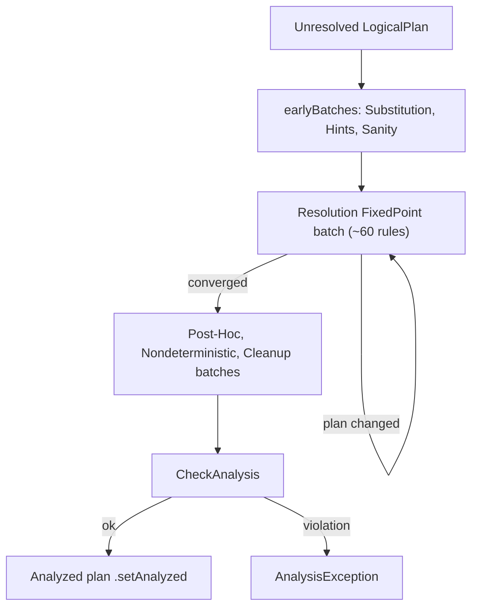
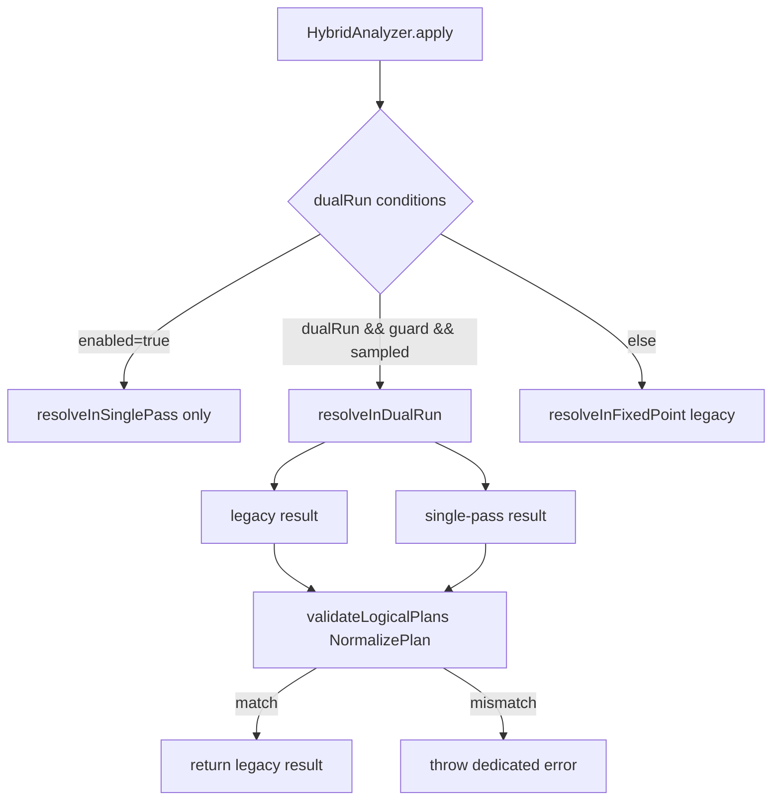

## The Analyzer and the fixed-point RuleExecutor loop

**What it is:** The `Analyzer` is the second phase of Catalyst (parse → **analyze** → optimize → plan). It takes an *unresolved* `LogicalPlan` (bare `UnresolvedRelation`/`UnresolvedAttribute`/`UnresolvedFunction` nodes fresh from the parser) and produces an *analyzed* plan: every relation bound to a catalog table, every column bound to an `AttributeReference` with an `ExprId` and `DataType`, every function bound, and every implicit cast inserted. It is a `RuleExecutor[LogicalPlan]` — a sequence of named `Batch`es, each a list of `Rule`s run under a `Strategy`. Most batches use `FixedPoint(maxIterations)`: the batch re-runs its rules until the plan stops changing (converges to a *fixed point*) or the iteration cap is hit. Analysis is iterative because rules feed each other — `ResolveRelations` must bind a table before `ResolveReferences` can match a column against its output, and star expansion may expose new columns that need another resolution pass.

The batch list is the map of the whole phase. `earlyBatches` runs substitution (CTE, window, union elimination), hint resolution, and a sanity check; then the giant `"Resolution"` `FixedPoint` batch holds ~60 rules in a deliberately ordered `::`-list, followed by post-hoc cleanup batches (`RemoveTempResolvedColumn`, `PullOutNondeterministic`, `CleanupAliases`, etc.). `fixedPoint` is built with `errorOnExceed = true` and `maxIterationsSetting = spark.sql.analyzer.maxIterations`, so a plan that never converges throws telling the user to raise that config rather than looping forever. `Once` batches run exactly one pass and are idempotence-checked (`RuleExecutor` verifies a second application is a no-op, unless the batch is on the excludable list). After the loop, `executeAndCheck` calls `CheckAnalysis` and marks the plan `analyzed`.

**Code path:** `Analyzer.executeAndCheck` → `HybridAnalyzer.fromLegacyAnalyzer(...).apply(plan)` → (legacy path) `Analyzer.execute` → `RuleExecutor.execute` iterates `batches` → `earlyBatches ++ Seq(Batch("Resolution", fixedPoint, ...))` → per-`Rule` `apply` via `resolveOperatorsUp` → convergence check per batch (`iteration > maxIterations` ⇒ error when `errorOnExceed`)

**Anchor files:** [Analyzer.scala:336 (class Analyzer)](https://github.com/apache/spark/blob/v4.2.0/sql/catalyst/src/main/scala/org/apache/spark/sql/catalyst/analysis/Analyzer.scala#L336), [Analyzer.scala:363 (executeAndCheck)](https://github.com/apache/spark/blob/v4.2.0/sql/catalyst/src/main/scala/org/apache/spark/sql/catalyst/analysis/Analyzer.scala#L363), [Analyzer.scala:446 (fixedPoint)](https://github.com/apache/spark/blob/v4.2.0/sql/catalyst/src/main/scala/org/apache/spark/sql/catalyst/analysis/Analyzer.scala#L446), [Analyzer.scala:512 (earlyBatches)](https://github.com/apache/spark/blob/v4.2.0/sql/catalyst/src/main/scala/org/apache/spark/sql/catalyst/analysis/Analyzer.scala#L512), [Analyzer.scala:538 (batches)](https://github.com/apache/spark/blob/v4.2.0/sql/catalyst/src/main/scala/org/apache/spark/sql/catalyst/analysis/Analyzer.scala#L538), [RuleExecutor.scala:150 (Once), :156 (FixedPoint), :215 (execute), :286 (maxIterations), :305 (idempotence)](https://github.com/apache/spark/blob/v4.2.0/sql/catalyst/src/main/scala/org/apache/spark/sql/catalyst/rules/RuleExecutor.scala#L150)

**Configs:** `spark.sql.analyzer.maxIterations` (fixed-point cap), `spark.sql.caseSensitive` (name matching across all resolution rules), `spark.sql.analyzer.canonicalization.multiCommutativeOpMemoryOptThreshold` (expression canonicalization threshold — see breadth note).

**Maps to topics:** A1 (mechanism), B1 (where the analyze phase sits in the pipeline).

!!! info "Fixed point vs Once"
    `FixedPoint` batches (`Substitution`, `Hints`, `Resolution`, `ScalaUDF Null Handling`, `Cleanup`) re-run to convergence. `Once` batches (`Apply Limit All`, `Keep Legacy Outputs`, `Post-Hoc Resolution`, `Nondeterministic`, `Subquery`, ...) run a single pass and are checked for idempotence. The single big `Resolution` fixed-point is where nearly all the rules named in this page live.

## ResolveRelations / ResolveCatalogs — name to relation

**What it is:** These rules turn an `UnresolvedRelation(multipartIdentifier)` into a concrete relation node. `ResolveRelations` handles the query-side lookup: it consults temp views first, then persistent tables via the catalog, wrapping the result in a `SubqueryAlias` carrying the identifier. `ResolveCatalogs` (constructed with the `CatalogManager`) resolves the *catalog* part of a multipart name for command plans and drives v2 catalog resolution (`CatalogAndNamespace`, `CatalogAndIdentifier`). Relation lookup is delegated to the shared `RelationResolution` helper, which knows the temp-view-vs-table precedence, the CTE relation cache, and time-travel specs. The rule sits near the top of the `Resolution` batch (right after `ResolveCatalogs` and `ResolveInsertInto`) because everything downstream needs a bound relation with an output schema.

**Code path:** `Resolution` batch → `ResolveRelations` (`resolveOperatorsUp`) → `RelationResolution.resolveRelation(u: UnresolvedRelation)` → temp-view check (`v1SessionCatalog.getRawLocalOrGlobalTempView`) → else catalog lookup along `sqlResolutionPathEntries` → `SubqueryAlias(ident, relation)`; command paths go `ResolveCatalogs` → `LookupCatalog.CatalogAndIdentifier` → v2 `TableCatalog.loadTable` / v1 `SessionCatalog`

**Anchor files:** [Analyzer.scala:1076 (ResolveRelations)](https://github.com/apache/spark/blob/v4.2.0/sql/catalyst/src/main/scala/org/apache/spark/sql/catalyst/analysis/Analyzer.scala#L1076), [RelationResolution.scala:56 (class), :164 (resolveRelation)](https://github.com/apache/spark/blob/v4.2.0/sql/catalyst/src/main/scala/org/apache/spark/sql/catalyst/analysis/RelationResolution.scala#L164), [ResolveCatalogs.scala:38](https://github.com/apache/spark/blob/v4.2.0/sql/catalyst/src/main/scala/org/apache/spark/sql/catalyst/analysis/ResolveCatalogs.scala#L38), [ResolveInlineTables.scala](https://github.com/apache/spark/blob/v4.2.0/sql/catalyst/src/main/scala/org/apache/spark/sql/catalyst/analysis/ResolveInlineTables.scala)

**Configs:** `spark.sql.legacy.createHiveTableByDefault`, `spark.sql.legacy.allowNonEmptyLocationInCTAS`, `spark.sql.legacy.keepCommandOutputSchema`, `spark.sql.hive.caseSensitiveInferenceMode` (schema inference on relation resolution), `spark.sql.parser.eagerEvalOfUnresolvedInlineTable` (inline-table resolution — parser-owned, see breadth note).

**Maps to topics:** A1.

## Catalog resolution and lookup (CatalogManager / LookupCatalog / SessionCatalog)

**What it is:** The registration/lookup layer under relation and function resolution. `CatalogManager` (in `connector.catalog`) is the session-scoped registry of catalogs: it holds the v1 `SessionCatalog` (the `spark_catalog` session catalog — temp views, persistent Hive/in-memory tables, temp/persistent functions), the map of v2 `CatalogPlugin`/`TableCatalog` implementations, and the *current catalog* + *current namespace* (mutated by `USE catalog.ns`). `LookupCatalog` is the trait that decomposes a multipart identifier into `(catalog, identifier)` using the current catalog as the default — the `CatalogAndIdentifier` / `CatalogAndNamespace` extractors. `sqlResolutionPathEntries` produces the ordered search path (`system.session`, then current catalog/namespace) that both relation and function resolution walk, and that `CheckAnalysis` echoes in "not found" errors. A name resolves as: temp view (session-local, unqualified or `system.session.*`) → CTE relation → current-catalog table. v2 catalogs are pluggable; the fallback `spark_catalog` is the v1 session catalog wrapped as v2 (`FakeV2SessionCatalog` in tests).

**Code path:** `USE`/`SET CATALOG` mutate `CatalogManager.currentCatalog`/`currentNamespace` → resolution rules call `catalogManager.sqlResolutionPathEntries(catalog, ns)` → `LookupCatalog.CatalogAndIdentifier.unapply(nameParts)` → v2 `catalog.asTableCatalog.loadTable(ident)` or v1 `SessionCatalog.lookupRelation`

**Anchor files:** [CatalogManager.scala](https://github.com/apache/spark/blob/v4.2.0/sql/catalyst/src/main/scala/org/apache/spark/sql/connector/catalog/CatalogManager.scala), [LookupCatalog.scala](https://github.com/apache/spark/blob/v4.2.0/sql/catalyst/src/main/scala/org/apache/spark/sql/connector/catalog/LookupCatalog.scala), [RelationResolution.scala:101 (session-qualified temp view), :119 (resolution path)](https://github.com/apache/spark/blob/v4.2.0/sql/catalyst/src/main/scala/org/apache/spark/sql/catalyst/analysis/RelationResolution.scala#L101)

**Configs:** `spark.sql.legacy.allowTempViewCreationWithMultipleNameparts`, `spark.sql.legacy.allowStarWithSingleTableIdentifierInCount` (temp-view / star handling in catalog-qualified names).

**Maps to topics:** A1.

!!! note "v1 vs v2"
    The v1 `SessionCatalog` owns temp views, the Hive metastore relations and session/temp functions. The v2 `TableCatalog`/`FunctionCatalog` plugin API (`CatalogPlugin`) lets external catalogs (Iceberg, Delta UC, JDBC) register under their own name; `CatalogManager` federates both, with `spark_catalog` as the default fallback. Only the *registration/lookup* half lives in analysis — the actual v2 command execution is in `sql/core`.

## ResolveReferences — column resolution

**What it is:** The single hardest resolution rule: it turns each `UnresolvedAttribute(nameParts)` into a concrete `AttributeReference` by matching the name against the output of the operator's children. It is the class `ResolveReferences(catalogManager)` mixing in `ColumnResolutionHelper`, and it dispatches per operator type in a big `resolveOperatorsUp` match: it waits for children to resolve (`!p.childrenResolved => p`) and for `DeduplicateRelations` to fix conflicting `ExprId`s from self-joins (`hasConflictingAttrs`), then expands `*` (`UnresolvedStar` / `containsStar`) via `buildExpandedProjectList`, and resolves ordinary expressions with `resolveExpressionByPlanChildren` / `resolveExpressionByPlanOutput`. Name matching honours `spark.sql.caseSensitive`; a nested-field access (`a.b.c`) is resolved by matching the longest attribute prefix then wrapping the remainder in `GetStructField`/`ExtractValue`. Ambiguity — a name matching two child attributes — is detected here and raised as `AMBIGUOUS_REFERENCE`; `spark.sql.analyzer.strictDataFrameColumnResolution` (4.2, on by default) tightens the DataFrame-column path so a name that would match by exprId across an unrelated plan no longer silently resolves. `Aggregate`, `Sort` and `Update` have their own delegate helpers (`ResolveReferencesInAggregate/InSort/InUpdate`) because column resolution there must also see grouping/ordering/assignment context.

**Code path:** `ResolveReferences.apply` → optional `CollationRulesRunner` → `doApply` = `plan.resolveOperatorsUp` → per node: `!childrenResolved`⇒wait; `hasConflictingAttrs`⇒wait; `containsStar`⇒`buildExpandedProjectList`; `Project`⇒`resolveExpressionByPlanChildren` then `resolveLateralColumnAlias`; `Aggregate`⇒`resolveReferencesInAggregate` → `ColumnResolutionHelper.resolveExpression` matches `UnresolvedAttribute` against child output, ambiguity ⇒ `QueryCompilationErrors.ambiguousColumnReferences`

**Anchor files:** [Analyzer.scala:1530 (ResolveReferences), :1551 (hasConflictingAttrs), :1629 (star expansion), :1725 (Project + LCA)](https://github.com/apache/spark/blob/v4.2.0/sql/catalyst/src/main/scala/org/apache/spark/sql/catalyst/analysis/Analyzer.scala#L1530), [ColumnResolutionHelper.scala:112 (resolveExpression), :435 (resolveExpressionByPlanOutput), :458 (resolveExpressionByPlanChildren), :584/:706 (ambiguousColumnReferences)](https://github.com/apache/spark/blob/v4.2.0/sql/catalyst/src/main/scala/org/apache/spark/sql/catalyst/analysis/ColumnResolutionHelper.scala#L458), [ResolveReferencesInAggregate.scala:50](https://github.com/apache/spark/blob/v4.2.0/sql/catalyst/src/main/scala/org/apache/spark/sql/catalyst/analysis/ResolveReferencesInAggregate.scala#L50), [ResolveReferencesInSort.scala:57](https://github.com/apache/spark/blob/v4.2.0/sql/catalyst/src/main/scala/org/apache/spark/sql/catalyst/analysis/ResolveReferencesInSort.scala#L57)

**Configs:** `spark.sql.caseSensitive`, `spark.sql.analyzer.strictDataFrameColumnResolution` (4.2), `spark.sql.analyzer.dontDeduplicateExpressionIfExprIdInOutput` (4.1), `spark.sql.analyzer.uniqueNecessaryMetadataColumns` (4.1), `spark.sql.analyzer.subqueryAliasAlwaysPropagateMetadataColumns` (4.2), `spark.sql.analyzer.expandTagPassthroughDuplicates` (4.2), `spark.sql.useCommonExprIdForAlias`, `spark.sql.analyzer.preferColumnOverLcaInArrayIndex` (4.1).

**Maps to topics:** A1.

!!! info "UnresolvedAttribute → AttributeReference"
    Before resolution a column is an `UnresolvedAttribute` carrying only name parts. Resolution matches those parts against the child's `output` (a `Seq[Attribute]`), and on a unique hit returns that child's `AttributeReference` — which already carries a stable `ExprId`, `DataType` and nullability. This is why `DeduplicateRelations` must run first for self-joins: two copies of the same table would otherwise expose two attributes with the *same* `ExprId`, making every reference ambiguous.

## Lateral column alias resolution

**What it is:** Lateral column alias (LCA) lets a `SELECT` item reference an alias defined earlier in the *same* select list: `SELECT salary * 2 AS double, double + 1 FROM t`. During `ResolveReferences` on a `Project`/`Aggregate`, an `UnresolvedAttribute` that matches a preceding alias (rather than a child column) is turned into a `LateralColumnAliasReference` wrapper; the dedicated rule `ResolveLateralColumnAliasReference` then rewrites the plan into nested `Project`s so the alias is computed once and reused. LCA has *higher priority than outer references* but resolution prefers a real table column over an LCA when both match (`preferColumnOverLcaInArrayIndex` guards a specific array-index case). It is gated by `spark.sql.lateralColumnAlias.enableImplicitResolution` (on by default since 3.4). The rule is pinned to run immediately after `ResolveReferences` in the batch (the code comments forbid inserting rules between them). Ambiguous LCA (two preceding aliases with the same name) throws `ambiguousLateralColumnAliasError`; LCA inside a generator is rejected by `CheckAnalysis` (`LATERAL_COLUMN_ALIAS_IN_GENERATOR`).

**Code path:** `ResolveReferences` on `Project` → `resolveLateralColumnAlias(resolvedBasic)` wraps matches as `LateralColumnAliasReference` → `ResolveLateralColumnAliasReference` rewrites into chained `Project`s → `CheckAnalysis.containsUnsupportedLCA` rejects LCA-in-generator

**Anchor files:** [ColumnResolutionHelper.scala:354 (resolveLateralColumnAlias), :398 (ambiguousLateralColumnAliasError)](https://github.com/apache/spark/blob/v4.2.0/sql/catalyst/src/main/scala/org/apache/spark/sql/catalyst/analysis/ColumnResolutionHelper.scala#L354), [ResolveLateralColumnAliasReference.scala:116](https://github.com/apache/spark/blob/v4.2.0/sql/catalyst/src/main/scala/org/apache/spark/sql/catalyst/analysis/ResolveLateralColumnAliasReference.scala#L116), [Analyzer.scala:1728 (resolveLateralColumnAlias call)](https://github.com/apache/spark/blob/v4.2.0/sql/catalyst/src/main/scala/org/apache/spark/sql/catalyst/analysis/Analyzer.scala#L1728), [CheckAnalysis.scala:267 (containsUnsupportedLCA), :517](https://github.com/apache/spark/blob/v4.2.0/sql/catalyst/src/main/scala/org/apache/spark/sql/catalyst/analysis/CheckAnalysis.scala#L517)

**Configs:** `spark.sql.lateralColumnAlias.enableImplicitResolution`, `spark.sql.analyzer.preferColumnOverLcaInArrayIndex` (4.1), `spark.sql.stableDerivedColumnAlias.enabled` (auto-alias naming — read in the parser `AstBuilder`, see breadth note).

**Maps to topics:** A1.

## Ordinals, group-by aliases and grouping analytics

**What it is:** SQL lets `ORDER BY 2` / `GROUP BY 1` reference select-list *positions*, and `GROUP BY alias` reference a select alias. `ResolveOrdinalInOrderByAndGroupBy` replaces an integer literal in an order-by/group-by with an `UnresolvedOrdinal` bound to the Nth output expression, gated by `spark.sql.orderByOrdinal` / `spark.sql.groupByOrdinal`. `ResolveAggAliasInGroupBy` (part of the aggregate-reference resolution) lets a group-by expression reference a select-list alias, gated by `spark.sql.groupByAliases`. `ResolveGroupingAnalytics` expands `ROLLUP`/`CUBE`/`GROUPING SETS` into the underlying `Expand` + grouping-id machinery; `GroupingAnalyticsTransformer` carries the 4.2 `spark.sql.analyzer.lowerEmptyGroupingSetToGlobalAggregate.enabled` behaviour (an empty grouping set becomes a plain global aggregate). Star expansion inside an aggregate with an ordinal group-by is explicitly rejected (`starNotAllowedWhenGroupByOrdinalPositionUsedError`).

**Code path:** `ResolveOrdinalInOrderByAndGroupBy` → `UnresolvedOrdinal(n)` → bound to Nth projection; `ResolveReferencesInAggregate` → alias-in-group-by; `ResolveGroupingAnalytics` → `GroupingAnalyticsTransformer` → `Expand`

**Anchor files:** [Analyzer.scala:2148 (ResolveOrdinalInOrderByAndGroupBy), :756 (ResolveGroupingAnalytics)](https://github.com/apache/spark/blob/v4.2.0/sql/catalyst/src/main/scala/org/apache/spark/sql/catalyst/analysis/Analyzer.scala#L2148), [GroupingAnalyticsTransformer.scala](https://github.com/apache/spark/blob/v4.2.0/sql/catalyst/src/main/scala/org/apache/spark/sql/catalyst/analysis/GroupingAnalyticsTransformer.scala), [ResolveReferencesInAggregate.scala:50](https://github.com/apache/spark/blob/v4.2.0/sql/catalyst/src/main/scala/org/apache/spark/sql/catalyst/analysis/ResolveReferencesInAggregate.scala#L50)

**Configs:** `spark.sql.orderByOrdinal`, `spark.sql.groupByOrdinal`, `spark.sql.groupByAliases`, `spark.sql.analyzer.lowerEmptyGroupingSetToGlobalAggregate.enabled` (4.2), `spark.sql.pivotMaxValues` (pivot value limit — read in `sql/core` RelationalGroupedDataset, see breadth note).

**Maps to topics:** A1.

## Function resolution (FunctionRegistry / FunctionResolution)

**What it is:** Turns an `UnresolvedFunction(nameParts, args)` into a concrete expression. `FunctionRegistry` (scalar) and `TableFunctionRegistry` (TVF) hold the built-in functions keyed by `FunctionIdentifier`; `FunctionResolution` (constructed with the `CatalogManager`) implements the *search path* precedence: internal registry (parser-marked internal names), then the ordered resolution path (`system.builtin`, `system.session` temp/persistent functions, current catalog persistent functions). The new (4.2) `spark.sql.functionResolution.sessionOrder` controls where `system.session` sits relative to `system.builtin` — modes `second`/`last` put built-ins first (enabling a fast-path), `first` puts session functions first. SQL UDFs (functions defined in SQL) are resolved by `ResolveSQLFunctions` / `ResolveSQLTableFunctions`, which inline the function body as a subplan; `spark.sql.analyzer.sqlFunctionResolution.applyConfOverrides` pins creation-time configs on the body. TVFs (`range`, `explode`, table-argument functions) resolve through `ResolveFunctions` into `Generate`/table-valued nodes. `LookupFunctions` (in the early `Simple Sanity Check` batch) pre-validates that every referenced function name exists, producing early `UNRESOLVED_ROUTINE` errors.

**Code path:** `LookupFunctions` (sanity) → `ResolveFunctions` → `FunctionResolution.resolveFunction(u)` → internal registry / `resolutionCandidates(nameParts)` walk → `v1SessionCatalog.resolveScalarFunctionByIdentifier` or v2 `FunctionCatalog.loadFunction` → `validateFunction`; SQL UDFs → `ResolveSQLFunctions` inlines body

**Anchor files:** [FunctionResolution.scala:113 (path), :142 (builtinFastPathSafe), :207 (resolveFunction)](https://github.com/apache/spark/blob/v4.2.0/sql/catalyst/src/main/scala/org/apache/spark/sql/catalyst/analysis/FunctionResolution.scala#L207), [FunctionRegistry.scala](https://github.com/apache/spark/blob/v4.2.0/sql/catalyst/src/main/scala/org/apache/spark/sql/catalyst/analysis/FunctionRegistry.scala), [Analyzer.scala:2317 (ResolveFunctions), :2669 (ResolveSQLFunctions), :2937 (ResolveSQLTableFunctions), :531 (LookupFunctions)](https://github.com/apache/spark/blob/v4.2.0/sql/catalyst/src/main/scala/org/apache/spark/sql/catalyst/analysis/Analyzer.scala#L2317)

**Configs:** `spark.sql.functionResolution.sessionOrder` (4.2), `spark.sql.analyzer.sqlFunctionResolution.applyConfOverrides` (4.0.1), `spark.sql.tvf.allowMultipleTableArguments.enabled`, `spark.sql.legacy.allowUntypedScalaUDF`.

**Maps to topics:** A1.

## Aggregate, window and subquery resolution

**What it is:** After columns and functions resolve, several rules rewrite aggregate/window/subquery shapes. `GlobalAggregates` turns a `Project` containing aggregate functions into an `Aggregate`; `ResolveAggregateFunctions` lifts aggregate expressions referenced in `HAVING`/`ORDER BY` into the aggregate's output and rewrites the outer references. `ExtractWindowExpressions` / `ResolveWindowOrder` / `ResolveWindowFrame` pull `WindowExpression`s into dedicated `Window` operators and fill in default frames. `ResolveSubquery` resolves correlated and scalar subqueries against the outer plan, tagging outer references (`UpdateOuterReferences` runs later); `ValidateSubqueryExpression` / `SubqueryExpressionInLambdaOrHigherOrderFunctionValidator` enforce the legal subquery shapes. Scalar-subquery constant-group-by handling is guarded by `spark.sql.analyzer.scalarSubqueryAllowGroupByColumnEqualToConstant` (4.0) and subqueries inside lambdas/HOFs by `spark.sql.analyzer.allowSubqueryExpressionsInLambdasOrHigherOrderFunctions` (4.0).

**Code path:** `ExtractWindowExpressions` → `Window` op; `GlobalAggregates` → `Aggregate`; `ResolveAggregateFunctions` lifts HAVING/ORDER-BY aggregates; `ResolveSubquery` → resolve inner plan against outer, mark `OuterReference` → `ValidateSubqueryExpression`

**Anchor files:** [Analyzer.scala:3062 (ResolveAggregateFunctions), :2536 (ResolveSubquery), :584 (ExtractWindowExpressions batch line), :3818 (ResolveWindowFrame), :3828 (ResolveWindowOrder)](https://github.com/apache/spark/blob/v4.2.0/sql/catalyst/src/main/scala/org/apache/spark/sql/catalyst/analysis/Analyzer.scala#L3062), [ValidateSubqueryExpression.scala](https://github.com/apache/spark/blob/v4.2.0/sql/catalyst/src/main/scala/org/apache/spark/sql/catalyst/analysis/ValidateSubqueryExpression.scala), [SubqueryExpressionInLambdaOrHigherOrderFunctionValidator.scala](https://github.com/apache/spark/blob/v4.2.0/sql/catalyst/src/main/scala/org/apache/spark/sql/catalyst/analysis/SubqueryExpressionInLambdaOrHigherOrderFunctionValidator.scala), [WindowResolution.scala](https://github.com/apache/spark/blob/v4.2.0/sql/catalyst/src/main/scala/org/apache/spark/sql/catalyst/analysis/WindowResolution.scala)

**Configs:** `spark.sql.analyzer.scalarSubqueryAllowGroupByColumnEqualToConstant` (4.0), `spark.sql.analyzer.allowSubqueryExpressionsInLambdasOrHigherOrderFunctions` (4.0).

**Maps to topics:** A1.

## Type coercion (TypeCoercion vs AnsiTypeCoercion) and store-assignment

**What it is:** Type coercion inserts implicit `Cast`s during analysis so operator/function argument types line up. The Analyzer selects the rule set at build time: `AnsiTypeCoercion.typeCoercionRules` when `spark.sql.ansi.enabled`, else `TypeCoercion.typeCoercionRules`. Both are lists ending in a `CombinedTypeCoercionRule` bundling ~18 sub-rules (`PromoteStrings`, `InConversion`, `DecimalPrecision`, `FunctionArgumentConversion`, `CaseWhenCoercion`, `Division`, `ImplicitTypeCasts`, `StringLiteralCoercion`, `CollationTypeCasts`, ...). ANSI mode is stricter — it refuses lossy implicit casts (string→int) that legacy mode allows. `WidenSetOperationTypes` finds the common type across `UNION`/`INTERSECT` branches. Store-assignment (writing a query into a table column) is governed separately by `spark.sql.storeAssignmentPolicy` (`ANSI`/`LEGACY`/`STRICT`), enforced in `TableOutputResolver` / `ResolveOutputRelation`. Collation type-casts run through `CollationTypeCasts` / `CollationTypeCoercion`, and `spark.sql.runCollationTypeCastsBeforeAliasAssignment.enabled` (4.1) orders them before alias assignment. `spark.sql.enforceTypeCoercionBeforeUnionDeduplication.enabled` (4.1) fixes a union-dedup ordering issue.

**Code path:** `Analyzer.typeCoercionRules()` picks `AnsiTypeCoercion` vs `TypeCoercion` on `conf.ansiEnabled` → appended into the `Resolution` batch → `CombinedTypeCoercionRule` applies sub-rules bottom-up inserting `Cast`; table writes → `ResolveOutputRelation` → `TableOutputResolver` applies `storeAssignmentPolicy`

**Anchor files:** [Analyzer.scala:506 (typeCoercionRules selector)](https://github.com/apache/spark/blob/v4.2.0/sql/catalyst/src/main/scala/org/apache/spark/sql/catalyst/analysis/Analyzer.scala#L506), [TypeCoercion.scala:47 (rule list)](https://github.com/apache/spark/blob/v4.2.0/sql/catalyst/src/main/scala/org/apache/spark/sql/catalyst/analysis/TypeCoercion.scala#L47), [AnsiTypeCoercion.scala:76](https://github.com/apache/spark/blob/v4.2.0/sql/catalyst/src/main/scala/org/apache/spark/sql/catalyst/analysis/AnsiTypeCoercion.scala#L76), [TableOutputResolver.scala](https://github.com/apache/spark/blob/v4.2.0/sql/catalyst/src/main/scala/org/apache/spark/sql/catalyst/analysis/TableOutputResolver.scala), [CollationTypeCasts.scala](https://github.com/apache/spark/blob/v4.2.0/sql/catalyst/src/main/scala/org/apache/spark/sql/catalyst/analysis/CollationTypeCasts.scala)

**Configs:** `spark.sql.ansi.enabled`, `spark.sql.storeAssignmentPolicy`, `spark.sql.runCollationTypeCastsBeforeAliasAssignment.enabled` (4.1), `spark.sql.enforceTypeCoercionBeforeUnionDeduplication.enabled` (4.1), `spark.sql.legacy.castComplexTypesToString.enabled`, `spark.sql.legacy.setopsPrecedence.enabled`, `spark.sql.defaultColumn.enabled`, `spark.sql.defaultColumn.useNullsForMissingDefaultValues`, `spark.sql.defaultColumn.allowedProviders`.

**Maps to topics:** A1.

!!! warning "ANSI is on by default in Spark 4.x"
    `spark.sql.ansi.enabled` defaults to `true` in Spark 4.x (its default reads `SPARK_ANSI_SQL_MODE`, true unless explicitly `false`). This selects `AnsiTypeCoercion`, so implicit lossy casts that silently worked in Spark 3.x now raise analysis/runtime errors. This is the single most impactful behaviour change for queries migrating from the book's Spark 3.2 baseline.

## The single-pass Resolver (HybridAnalyzer / ResolverGuard)

**What it is:** The 4.0/4.1 rewrite of the Analyzer from a fixed-point rule loop into a **single-pass, bottom-up** resolver. The legacy Analyzer re-runs ~60 rules to convergence — repeatedly re-traversing the whole tree, which is O(rules × iterations × nodes) and makes resolution order subtle. The new `Resolver` (`analysis/resolver/`) instead walks the plan **once**, bottom-up: each operator is resolved after its children, with per-operator resolvers (`ProjectResolver`, `AggregateResolver`, `FilterResolver`, `JoinResolver`, `SortResolver`, `ViewResolver`, ...) and an `ExpressionResolver` maintaining a `NameScopeStack` of visible attributes. It is a one-shot object per query. `HybridAnalyzer` is the router: with everything off it runs the legacy analyzer; `spark.sql.analyzer.singlePassResolver.enabled` forces single-pass (dev only); `...dualRunWithLegacy` runs **both** and cross-validates. In dual-run, `ResolverGuard` first checks the plan uses only single-pass-supported features (else it stays legacy-only), `dualRunSampleRate` samples which queries dual-run, and after both succeed `validateLogicalPlans` compares the two resolved plans (`NormalizePlan`) — a mismatch is a bug. Divergent outcomes throw dedicated errors (`fixedPointFailedSinglePassSucceeded` / `singlePassFailedFixedPointSucceeded`). `AnalyzerBridgeState` (`relationBridging.enabled`) lets the single-pass run reuse relation metadata already resolved by the legacy run so dual-run doesn't double the catalog RPCs. **It is off by default in 4.2.0** — a correctness/performance staging effort, not yet the production path.

**Code path:** `Analyzer.executeAndCheck` → `HybridAnalyzer.apply` → `dualRun = DUAL_RUN && !ENABLED && !ENABLED_TENTATIVELY && ResolverGuard(plan) && sampleRate` → `resolveInDualRun`: `resolveInFixedPoint` (legacy) + `resolveInSinglePass` (`ResolverRunner` → `Resolver.resolve` → `lookupMetadataAndResolve` → bottom-up per-operator resolvers) → `validateLogicalPlans(NormalizePlan)` → return fixed-point (or single-pass if `returnSinglePassResultInDualRun`)

**Anchor files:** [HybridAnalyzer.scala:54 (class), :66 (apply/dualRun), :128 (resolveInDualRun), :155 (result comparison), :202 (tentative)](https://github.com/apache/spark/blob/v4.2.0/sql/catalyst/src/main/scala/org/apache/spark/sql/catalyst/analysis/resolver/HybridAnalyzer.scala#L54), [Resolver.scala:83 (class), :204 (lookupMetadataAndResolve), :255 (resolve)](https://github.com/apache/spark/blob/v4.2.0/sql/catalyst/src/main/scala/org/apache/spark/sql/catalyst/analysis/resolver/Resolver.scala#L83), [ResolverGuard.scala:67 (class), :76 (apply)](https://github.com/apache/spark/blob/v4.2.0/sql/catalyst/src/main/scala/org/apache/spark/sql/catalyst/analysis/resolver/ResolverGuard.scala#L67), [ResolverRunner.scala](https://github.com/apache/spark/blob/v4.2.0/sql/catalyst/src/main/scala/org/apache/spark/sql/catalyst/analysis/resolver/ResolverRunner.scala), [NameScope.scala:488 (AMBIGUOUS_REFERENCE)](https://github.com/apache/spark/blob/v4.2.0/sql/catalyst/src/main/scala/org/apache/spark/sql/catalyst/analysis/resolver/NameScope.scala#L488)

**Configs (all `spark.sql.analyzer.singlePassResolver.*`):** `enabled` (4.0), `enabledTentatively` (4.1), `dualRunWithLegacy` (4.0), `dualRunSampleRate` (4.1), `returnSinglePassResultInDualRun` (4.0), `validationEnabled` (4.0), `runExtendedResolutionChecks` (4.1), `runHeavyExtendedResolutionChecks` (4.1), `relationBridging.enabled` (4.0), `preventUsingAliasesFromNonDirectChildren` (4.1), `throwFromResolverGuard` (4.1), `exposeResolverGuardFailure` (4.1). Also `spark.sql.analyzer.unionIsResolvedWhenDuplicatesPerChildResolved` (4.1).

**Maps to topics:** A1 (this is an A1 sub-topic — a deep implementation detail of the analyze phase, not a distinct learnable topic on its own).

## CheckAnalysis — the error path

**What it is:** The post-resolution validation pass — the single most user-visible part of analysis, because it produces every `AnalysisException` the user sees. After the batches converge, `checkAnalysis` inlines CTEs (to match plan shapes) then runs `checkAnalysis0`, which does a **top-down** pass for table/view-not-found (so the outermost missing name is reported first) and a **bottom-up** `foreachUp` pass catching the first genuine resolution failure rather than cascading ones. Every failure is an error-class exception via `failAnalysis(errorClass, params)` or a helper. Major categories it catches:

- **Missing relations/namespaces/functions:** `UnresolvedRelation` → `TABLE_OR_VIEW_NOT_FOUND` (with a computed search path), `UnresolvedNamespace` → schema-not-found, `UnresolvedFunctionName` → `UNRESOLVED_ROUTINE`.
- **Unresolved columns:** any leftover `Attribute` with `!resolved` → `UNRESOLVED_COLUMN` (with similarity-ordered candidate suggestions via `orderSuggestedIdentifiersBySimilarity`); Spark-Connect plan-id columns → `cannotResolveDataFrameColumn`; unresolved map key → `UNRESOLVED_MAP_KEY`.
- **Type mismatches:** `e.checkInputDataTypes().isFailure` → `TypeCoercionValidation.failOnTypeCheckResult` (`DATATYPE_MISMATCH`), filter not boolean → `FILTER_NOT_BOOLEAN`, non-boolean join condition → `JOIN_CONDITION_IS_NOT_BOOLEAN_TYPE`.
- **Structural/semantic:** window function without `OVER` → `WINDOW_FUNCTION_WITHOUT_OVER_CLAUSE`, invalid aggregation (`ExprUtils.assertValidAggregation`), `Grouping`/`GroupingID` misuse, invalid star usage, unbound parameters (`UNBOUND_SQL_PARAMETER`), lambda misuse, invalid observed metrics.

Internal-invariant violations become `SparkException.internalError` instead of user errors. A `preemptedError` mechanism defers some internal errors to the end so a more meaningful user error wins. On success, `plan.setAnalyzed()`.

**Code path:** `executeAndCheck` (after batches) → `checkAnalysis(plan)` → `InlineCTE` → `checkAnalysis0` → top-down insert/table-not-found → `plan.foreachUp` bottom-up: unresolved relations/functions → per-operator `transformExpressionsDown` (HOF/LCA/map-key checks) → `getAllExpressions(operator).foreachUp` (unresolved attr/star/type-check/window/grouping) → operator-level checks (filter/join/aggregate/metrics) → `failAnalysis` / error-class throw → `setAnalyzed`

**Anchor files:** [CheckAnalysis.scala:65 (failAnalysis), :226 (failUnresolvedAttribute), :306 (checkAnalysis), :330 (checkAnalysis0), :409 (UnresolvedRelation), :535 (UNRESOLVED_COLUMN), :548 (type check), :642 (FILTER_NOT_BOOLEAN), :716 (assertValidAggregation)](https://github.com/apache/spark/blob/v4.2.0/sql/catalyst/src/main/scala/org/apache/spark/sql/catalyst/analysis/CheckAnalysis.scala#L330), [QueryCompilationErrors.scala (error-class factories)](https://github.com/apache/spark/blob/v4.2.0/sql/catalyst/src/main/scala/org/apache/spark/sql/errors/QueryCompilationErrors.scala)

**Configs:** `spark.sql.preserveCharVarcharTypeInfo` (LeafNode char/varchar guard, see below). No dedicated CheckAnalysis on/off config — it is unconditional.

**Maps to topics:** A1.

## View / CTE / subquery-body resolution

**What it is:** Views, CTEs and subquery bodies are sub-plans that must resolve in their *own* context. `CTESubstitution` (early `Substitution` batch) turns `WITH name AS (...)` into `CTERelationDef`/`CTERelationRef`, and `ResolveWithCTE` binds refs; `CheckAnalysis` re-inlines CTEs before validation. View resolution (`ViewResolution` / `view.scala`) resolves a `View`'s body against the catalog/namespace captured at view-creation time (stored in `AnalysisContext`), and enforces `spark.sql.view.maxNestedViewDepth` (default 100) to stop infinite view recursion. `spark.sql.legacy.storeAnalyzedPlanForView` controls whether the *analyzed* plan is persisted with the view (vs re-resolving the SQL text each time) — its reader is the view-creation command in `sql/core`, but the depth/`AnalysisContext` machinery is here. Self-join ambiguity (two references to the same table producing colliding `ExprId`s) is first mitigated by `DeduplicateRelations` in analysis; the *detection* of genuinely ambiguous self-join column references (`failAmbiguousSelfJoin`, `selfJoinAutoResolveAmbiguity`) lives in the `sql/core` rule `DetectAmbiguousSelfJoin` and `Dataset`, which are analysis-adjacent but outside the catalyst/analysis directory.

**Code path:** `CTESubstitution` → `CTERelationDef`/`Ref`; `ResolveWithCTE` binds; `ViewResolution` → resolve body under captured `AnalysisContext` catalog/ns, depth-check `maxNestedViewDepth`; `CheckAnalysis.InlineCTE` before validation

**Anchor files:** [CTESubstitution.scala](https://github.com/apache/spark/blob/v4.2.0/sql/catalyst/src/main/scala/org/apache/spark/sql/catalyst/analysis/CTESubstitution.scala), [ResolveWithCTE.scala](https://github.com/apache/spark/blob/v4.2.0/sql/catalyst/src/main/scala/org/apache/spark/sql/catalyst/analysis/ResolveWithCTE.scala), [ViewResolution.scala](https://github.com/apache/spark/blob/v4.2.0/sql/catalyst/src/main/scala/org/apache/spark/sql/catalyst/analysis/ViewResolution.scala), [view.scala](https://github.com/apache/spark/blob/v4.2.0/sql/catalyst/src/main/scala/org/apache/spark/sql/catalyst/analysis/view.scala), [resolver/ViewResolver.scala](https://github.com/apache/spark/blob/v4.2.0/sql/catalyst/src/main/scala/org/apache/spark/sql/catalyst/analysis/resolver/ViewResolver.scala), [DeduplicateRelations.scala](https://github.com/apache/spark/blob/v4.2.0/sql/catalyst/src/main/scala/org/apache/spark/sql/catalyst/analysis/DeduplicateRelations.scala)

**Configs:** `spark.sql.view.maxNestedViewDepth`, `spark.sql.legacy.storeAnalyzedPlanForView` (reader in sql/core view command), `spark.sql.legacy.allowAutoGeneratedAliasForView`, `spark.sql.analyzer.failAmbiguousSelfJoin` (reader in sql/core `DetectAmbiguousSelfJoin`), `spark.sql.selfJoinAutoResolveAmbiguity` (reader in sql/core `Dataset`).

**Maps to topics:** A1.

## char/varchar handling during analysis

**What it is:** Spark models `CHAR(n)`/`VARCHAR(n)` as `StringType` internally but must preserve the length metadata for padding and DDL. During analysis, `ResolveCatalogs` decides whether to keep the char/varchar type info on resolved columns (`spark.sql.preserveCharVarcharTypeInfo`, 4.0) or replace it with plain string (`replaceCharVarcharWithString`). `spark.sql.charAsVarchar` (read in `CharVarcharUtils`) makes new `CHAR` columns behave as `VARCHAR` (no padding). `spark.sql.legacy.charVarcharAsString` (read in `TableOutputResolver`) restores pre-3.1 behaviour treating them as unbounded string in write type-checks. `CheckAnalysis` enforces the invariant that no `LeafNode` output carries a raw char/varchar type when `preserveCharVarcharTypeInfo` is false (internal error if violated). Padding is applied via `ApplyCharTypePaddingHelper`.

**Code path:** relation resolution → `ResolveCatalogs` reads `conf.preserveCharVarcharTypeInfo` → keep or `replaceCharVarcharWithString(col.dataType)`; write path → `TableOutputResolver` honours `charVarcharAsString`; `CheckAnalysis` LeafNode guard; padding via `ApplyCharTypePaddingHelper`

**Anchor files:** [ResolveCatalogs.scala:146 (preserveCharVarcharTypeInfo branch)](https://github.com/apache/spark/blob/v4.2.0/sql/catalyst/src/main/scala/org/apache/spark/sql/catalyst/analysis/ResolveCatalogs.scala#L146), [CheckAnalysis.scala:366 (LeafNode char/varchar guard)](https://github.com/apache/spark/blob/v4.2.0/sql/catalyst/src/main/scala/org/apache/spark/sql/catalyst/analysis/CheckAnalysis.scala#L366), [ApplyCharTypePaddingHelper.scala](https://github.com/apache/spark/blob/v4.2.0/sql/catalyst/src/main/scala/org/apache/spark/sql/catalyst/analysis/ApplyCharTypePaddingHelper.scala), [TableOutputResolver.scala (charVarcharAsString)](https://github.com/apache/spark/blob/v4.2.0/sql/catalyst/src/main/scala/org/apache/spark/sql/catalyst/analysis/TableOutputResolver.scala), [CharVarcharUtils.scala (charAsVarchar)](https://github.com/apache/spark/blob/v4.2.0/sql/catalyst/src/main/scala/org/apache/spark/sql/catalyst/util/CharVarcharUtils.scala)

**Configs:** `spark.sql.charAsVarchar`, `spark.sql.preserveCharVarcharTypeInfo` (4.0), `spark.sql.legacy.charVarcharAsString`.

**Maps to topics:** A1.

---

## UnsupportedOperationChecker — what a streaming query may not do

**What it is:** the rule that produces almost every "you cannot do that in a streaming query" message. It runs after analysis and walks the plan twice: `checkForBatch` rejects a batch query that touches a streaming source, and `checkForStreaming` enumerates the operations that are illegal, illegal *in this output mode*, or illegal *in combination*. If you have ever wondered why a message says a specific combination is unsupported rather than a specific operator, this file is why.

**Anchor files:**

- [UnsupportedOperationChecker.scala:40](https://github.com/apache/spark/blob/v4.2.0/sql/catalyst/src/main/scala/org/apache/spark/sql/catalyst/analysis/UnsupportedOperationChecker.scala#L40) — `checkForBatch`, and the message everyone meets first: "Queries with streaming sources must be executed with writeStream.start()"
- [UnsupportedOperationChecker.scala:179](https://github.com/apache/spark/blob/v4.2.0/sql/catalyst/src/main/scala/org/apache/spark/sql/catalyst/analysis/UnsupportedOperationChecker.scala#L179) — `checkForStreaming`, whose first act is to reject a *non*-streaming plan passed to `writeStream`
- [UnsupportedOperationChecker.scala:201](https://github.com/apache/spark/blob/v4.2.0/sql/catalyst/src/main/scala/org/apache/spark/sql/catalyst/analysis/UnsupportedOperationChecker.scala#L201) — two or more `mapGroupsWithState`, then mixing `mapGroupsWithState` with `flatMapGroupsWithState`, then two `flatMapGroupsWithState` in certain modes: three separate arity rules, each with its own message
- [UnsupportedOperationChecker.scala:120](https://github.com/apache/spark/blob/v4.2.0/sql/catalyst/src/main/scala/org/apache/spark/sql/catalyst/analysis/UnsupportedOperationChecker.scala#L120) — `checkStreamingQueryGlobalWatermarkLimit`: the *correctness* check for chained stateful operators
- [UnsupportedOperationChecker.scala:128](https://github.com/apache/spark/blob/v4.2.0/sql/catalyst/src/main/scala/org/apache/spark/sql/catalyst/analysis/UnsupportedOperationChecker.scala#L128) — the message itself, which tells you the config that disables it

!!! warning "One of these checks is advisory and can be switched off — which is the point"

    `checkStreamingQueryGlobalWatermarkLimit` detects a *possible* correctness problem: a stateful operator downstream of another can emit rows older than the global watermark, and those rows are then silently dropped by the downstream operator. It is gated on `spark.sql.streaming.statefulOperatorCorrectnessCheck.enabled`, and the error text names that config so you can turn it off. Turning it off does not fix anything — it lets a query with a known late-row-dropping hazard run. Chained stateful operators (aggregation after a stream-stream join, for example) are exactly the shape that trips it.

**Configs:** `spark.sql.streaming.statefulOperatorCorrectnessCheck.enabled`, `spark.sql.streaming.unsupportedOperationCheck`

**Maps to topics:** A7, A8

---

## Row-level command rewrite — MERGE, UPDATE, DELETE

**What it is:** how `MERGE INTO`, `UPDATE` and `DELETE FROM` become executable plans against a DSv2 table. There is no single "merge operator" — the analyzer rewrites each command into an ordinary write, choosing between **two strategies** based on what the table's connector supports.

**Code path:** `RewriteMergeIntoTable` / `RewriteUpdateTable` / `RewriteDeleteFromTable` → `buildOperationTable` → is the operation a `SupportsDelta`? → `buildWriteDeltaPlan` (emit row-level deltas) : `buildReplaceDataPlan` (read, modify, rewrite whole groups — typically whole files)

**Anchor files:**

- [RewriteRowLevelCommand.scala:39](https://github.com/apache/spark/blob/v4.2.0/sql/catalyst/src/main/scala/org/apache/spark/sql/catalyst/analysis/RewriteRowLevelCommand.scala#L39) — the shared trait; `RowLevelOperationTable` wraps the real table with the operation being performed
- [RewriteMergeIntoTable.scala:130](https://github.com/apache/spark/blob/v4.2.0/sql/catalyst/src/main/scala/org/apache/spark/sql/catalyst/analysis/RewriteMergeIntoTable.scala#L130) — the branch: `case _: SupportsDelta` → delta plan, otherwise replace-data
- [RewriteMergeIntoTable.scala:146](https://github.com/apache/spark/blob/v4.2.0/sql/catalyst/src/main/scala/org/apache/spark/sql/catalyst/analysis/RewriteMergeIntoTable.scala#L146) — `buildReplaceDataPlan`, the group-based path
- [RewriteMergeIntoTable.scala:258](https://github.com/apache/spark/blob/v4.2.0/sql/catalyst/src/main/scala/org/apache/spark/sql/catalyst/analysis/RewriteMergeIntoTable.scala#L258) — `buildWriteDeltaPlan`, the delta-based path
- [RewriteDeleteFromTable.scala:50](https://github.com/apache/spark/blob/v4.2.0/sql/catalyst/src/main/scala/org/apache/spark/sql/catalyst/analysis/RewriteDeleteFromTable.scala#L50) — the same two-way choice for `DELETE`

!!! info "The performance of your MERGE is a property of the connector, not the SQL"

    Group-based rewrite reads the affected groups, applies the change, and writes them back — on a file-based table that means rewriting whole files even to change one row. Delta-based rewrite emits only the changed rows and lets the connector apply them. Identical SQL therefore has very different cost depending on whether the table's `RowLevelOperation` implements `SupportsDelta`. This is the mechanism behind "MERGE is slow on this table format and fast on that one", and it is decided here, during analysis, not by the optimizer.

**Maps to topics:** A3, E4, I8

---

## Time-travel resolution

**What it is:** `TIMESTAMP AS OF` / `VERSION AS OF` on a table reference. The parser produces an unresolved `RelationTimeTravel` node; analysis evaluates the timestamp expression to a fixed microsecond value and turns the pair into a `TimeTravelSpec` the catalog uses to load the right snapshot.

**Anchor files:**

- [RelationTimeTravel.scala:29](https://github.com/apache/spark/blob/v4.2.0/sql/catalyst/src/main/scala/org/apache/spark/sql/catalyst/analysis/RelationTimeTravel.scala#L29) — the unresolved node, carrying *either* a timestamp expression or a version string
- [TimeTravelSpec.scala:28](https://github.com/apache/spark/blob/v4.2.0/sql/catalyst/src/main/scala/org/apache/spark/sql/catalyst/analysis/TimeTravelSpec.scala#L28) — the resolved form: `AsOfTimestamp(Long)` or `AsOfVersion(String)`
- [TimeTravelSpec.scala:44](https://github.com/apache/spark/blob/v4.2.0/sql/catalyst/src/main/scala/org/apache/spark/sql/catalyst/analysis/TimeTravelSpec.scala#L44) — `resolveTimestampExpression`, shared with CDC timestamp resolution
- [TimeTravelSpec.scala:46](https://github.com/apache/spark/blob/v4.2.0/sql/catalyst/src/main/scala/org/apache/spark/sql/catalyst/analysis/TimeTravelSpec.scala#L46) — the expression must be ANSI-castable to `TimestampType`, else `INVALID_TIME_TRAVEL_TIMESTAMP_EXPR`
- [TimeTravelSpec.scala:51](https://github.com/apache/spark/blob/v4.2.0/sql/catalyst/src/main/scala/org/apache/spark/sql/catalyst/analysis/TimeTravelSpec.scala#L51) — the trick: the expression is wrapped in a fake `Project` over `OneRowRelation` so `ComputeCurrentTime` can fold it

!!! info "The timestamp is evaluated once, at analysis, and must reference nothing"

    `assert(ts.resolved && ts.references.isEmpty)` — a time-travel timestamp cannot depend on a column, only on literals and functions like `current_timestamp()`, which the fake-`Project` trick folds to a constant *at analysis time*. So `TIMESTAMP AS OF current_timestamp() - INTERVAL 1 DAY` is pinned when the query is analysed, not re-evaluated per batch, which matters for a query reused across micro-batches.

**Maps to topics:** I8, I11, E4

---

## Table constraints and schema evolution

**What it is:** two newer analysis-time behaviours on the write path. `ResolveTableConstraints` injects a `CheckInvariant` expression into the write plan for every `Check` constraint a DSv2 table declares, so violations fail the write rather than being stored. `ResolveSchemaEvolution` reconciles an incoming schema against the table's when the write is allowed to evolve it.

**Anchor files:**

- [ResolveTableConstraints.scala:30](https://github.com/apache/spark/blob/v4.2.0/sql/catalyst/src/main/scala/org/apache/spark/sql/catalyst/analysis/ResolveTableConstraints.scala#L30) — the rule, taking a `CatalogManager`
- [ResolveTableConstraints.scala:43](https://github.com/apache/spark/blob/v4.2.0/sql/catalyst/src/main/scala/org/apache/spark/sql/catalyst/analysis/ResolveTableConstraints.scala#L43) — the guard: constraints are read from `r.table.constraints`, so a connector that declares none costs nothing
- [ResolveTableConstraints.scala:45](https://github.com/apache/spark/blob/v4.2.0/sql/catalyst/src/main/scala/org/apache/spark/sql/catalyst/analysis/ResolveTableConstraints.scala#L45) — `Check` constraints become `CheckInvariant` expressions in the plan
- [ResolveSchemaEvolution.scala](https://github.com/apache/spark/blob/v4.2.0/sql/catalyst/src/main/scala/org/apache/spark/sql/catalyst/analysis/ResolveSchemaEvolution.scala) — the schema-reconciliation counterpart

!!! info "Constraint enforcement is a plan node, so it costs per row and shows in EXPLAIN"

    A `CHECK` constraint is not enforced by the storage layer — it is an expression Spark inserts above the write. That makes it visible in `EXPLAIN` and means its cost scales with rows written, and it also means the guarantee only holds for writes that go through Spark's analyzer.

**Maps to topics:** B4, B5

---

## Breadth check — all 68 slice configs

| # | Config key | Concept / disposition |
|---|-----------|----------------------|
| 1 | `spark.sql.analyzer.allowSubqueryExpressionsInLambdasOrHigherOrderFunctions` | Aggregate/window/subquery resolution (reader: `SubqueryExpressionInLambdaOrHigherOrderFunctionValidator`) |
| 2 | `spark.sql.analyzer.canonicalization.multiCommutativeOpMemoryOptThreshold` | **Out-of-scope → framework/expressions.** Read in `Canonicalize` (expression canonicalization), not the query Analyzer despite the `analyzer.` prefix |
| 3 | `spark.sql.analyzer.dontDeduplicateExpressionIfExprIdInOutput` | ResolveReferences (reader: `DeduplicateRelations`) |
| 4 | `spark.sql.analyzer.expandTagPassthroughDuplicates` | ResolveReferences (metadata/tag passthrough) |
| 5 | `spark.sql.analyzer.failAmbiguousSelfJoin` | View/CTE/subquery — self-join ambiguity (reader in sql/core `DetectAmbiguousSelfJoin`; analysis-adjacent) |
| 6 | `spark.sql.analyzer.lowerEmptyGroupingSetToGlobalAggregate.enabled` | Ordinals/grouping analytics (reader: `GroupingAnalyticsTransformer`) |
| 7 | `spark.sql.analyzer.maxIterations` | Analyzer fixed-point loop |
| 8 | `spark.sql.analyzer.preferColumnOverLcaInArrayIndex` | Lateral column alias / ResolveReferences |
| 9 | `spark.sql.analyzer.scalarSubqueryAllowGroupByColumnEqualToConstant` | Aggregate/window/subquery resolution (reader: `ValidateSubqueryExpression`) |
| 10 | `spark.sql.analyzer.singlePassResolver.dualRunSampleRate` | Single-pass Resolver |
| 11 | `spark.sql.analyzer.singlePassResolver.dualRunWithLegacy` | Single-pass Resolver |
| 12 | `spark.sql.analyzer.singlePassResolver.enabled` | Single-pass Resolver |
| 13 | `spark.sql.analyzer.singlePassResolver.enabledTentatively` | Single-pass Resolver |
| 14 | `spark.sql.analyzer.singlePassResolver.exposeResolverGuardFailure` | Single-pass Resolver (ResolverGuard) |
| 15 | `spark.sql.analyzer.singlePassResolver.preventUsingAliasesFromNonDirectChildren` | Single-pass Resolver |
| 16 | `spark.sql.analyzer.singlePassResolver.relationBridging.enabled` | Single-pass Resolver (AnalyzerBridgeState) |
| 17 | `spark.sql.analyzer.singlePassResolver.returnSinglePassResultInDualRun` | Single-pass Resolver |
| 18 | `spark.sql.analyzer.singlePassResolver.runExtendedResolutionChecks` | Single-pass Resolver |
| 19 | `spark.sql.analyzer.singlePassResolver.runHeavyExtendedResolutionChecks` | Single-pass Resolver |
| 20 | `spark.sql.analyzer.singlePassResolver.throwFromResolverGuard` | Single-pass Resolver (ResolverGuard) |
| 21 | `spark.sql.analyzer.singlePassResolver.validationEnabled` | Single-pass Resolver |
| 22 | `spark.sql.analyzer.sqlFunctionResolution.applyConfOverrides` | Function resolution (SQL UDFs) |
| 23 | `spark.sql.analyzer.strictDataFrameColumnResolution` | ResolveReferences (reader: `ColumnResolutionHelper`) |
| 24 | `spark.sql.analyzer.subqueryAliasAlwaysPropagateMetadataColumns` | ResolveReferences (metadata columns) |
| 25 | `spark.sql.analyzer.unionIsResolvedWhenDuplicatesPerChildResolved` | Single-pass Resolver / union resolution |
| 26 | `spark.sql.analyzer.uniqueNecessaryMetadataColumns` | ResolveReferences (metadata columns) |
| 27 | `spark.sql.ansi.enabled` | Type coercion (selects AnsiTypeCoercion) |
| 28 | `spark.sql.caseSensitive` | ResolveReferences / all name matching |
| 29 | `spark.sql.charAsVarchar` | char/varchar handling |
| 30 | `spark.sql.crossJoin.enabled` | CheckAnalysis / join resolution (reader in CheckAnalysis + sql/core; cross-join validation) |
| 31 | `spark.sql.defaultColumn.allowedProviders` | Type coercion / default-value resolution |
| 32 | `spark.sql.defaultColumn.enabled` | Type coercion / default-value resolution (`ResolveColumnDefaultInCommandInputQuery`) |
| 33 | `spark.sql.defaultColumn.useNullsForMissingDefaultValues` | Type coercion / default-value resolution |
| 34 | `spark.sql.enforceTypeCoercionBeforeUnionDeduplication.enabled` | Type coercion (reader: `ResolveReferences` union path) |
| 35 | `spark.sql.functionResolution.sessionOrder` | Function resolution (4.2) |
| 36 | `spark.sql.groupByAliases` | Ordinals/group-by aliases |
| 37 | `spark.sql.groupByOrdinal` | Ordinals/group-by aliases |
| 38 | `spark.sql.hive.caseSensitiveInferenceMode` | ResolveRelations (schema inference on relation lookup) |
| 39 | `spark.sql.lateralColumnAlias.enableImplicitResolution` | Lateral column alias resolution |
| 40 | `spark.sql.legacy.allowAutoGeneratedAliasForView` | View/CTE resolution |
| 41 | `spark.sql.legacy.allowNonEmptyLocationInCTAS` | ResolveRelations / CTAS command resolution |
| 42 | `spark.sql.legacy.allowStarWithSingleTableIdentifierInCount` | Catalog resolution / star expansion |
| 43 | `spark.sql.legacy.allowTempViewCreationWithMultipleNameparts` | Catalog resolution (temp views) |
| 44 | `spark.sql.legacy.allowUntypedScalaUDF` | Function resolution (Scala UDF) |
| 45 | `spark.sql.legacy.castComplexTypesToString.enabled` | Type coercion |
| 46 | `spark.sql.legacy.charVarcharAsString` | char/varchar handling (reader: `TableOutputResolver`) |
| 47 | `spark.sql.legacy.createHiveTableByDefault` | ResolveRelations / create-table resolution |
| 48 | `spark.sql.legacy.keepCommandOutputSchema` | ResolveRelations / command output schema |
| 49 | `spark.sql.legacy.setopsPrecedence.enabled` | Type coercion / set-op resolution |
| 50 | `spark.sql.legacy.storeAnalyzedPlanForView` | View/CTE resolution (reader in sql/core view command) |
| 51 | `spark.sql.optimizer.disableHints` | **Out-of-scope → optimizer.** Hints parsed/resolved in analysis (`ResolveHints`) but disabled here for optimizer; `DisableHints` batch is the analysis half |
| 52 | `spark.sql.optimizer.excludeSubqueryRefsFromRemoveRedundantAliases.enabled` | **Out-of-scope → optimizer** (RemoveRedundantAliases) |
| 53 | `spark.sql.optimizer.nestedSchemaPruning.enabled` | **Out-of-scope → optimizer** (schema pruning) |
| 54 | `spark.sql.optimizer.preserveAliasMetadataWhenCollapsingProjects` | **Out-of-scope → optimizer** (CollapseProject) |
| 55 | `spark.sql.optimizer.pullHintsIntoSubqueries` | **Out-of-scope → optimizer** (hint half; analysis resolves hints in `ResolveHints`) |
| 56 | `spark.sql.optimizer.serializer.nestedSchemaPruning.enabled` | **Out-of-scope → optimizer** |
| 57 | `spark.sql.orderByOrdinal` | Ordinals/group-by aliases |
| 58 | `spark.sql.parser.eagerEvalOfUnresolvedInlineTable` | **Out-of-scope → parser.** Inline-table eval touches `ResolveInlineTables` but the flag is parser-owned |
| 59 | `spark.sql.pivotMaxValues` | Ordinals/grouping (pivot; reader in sql/core RelationalGroupedDataset) |
| 60 | `spark.sql.preserveCharVarcharTypeInfo` | char/varchar handling |
| 61 | `spark.sql.runCollationTypeCastsBeforeAliasAssignment.enabled` | Type coercion (collation casts; reader: `ResolveReferences`) |
| 62 | `spark.sql.selfJoinAutoResolveAmbiguity` | View/CTE — self-join (reader in sql/core `Dataset`) |
| 63 | `spark.sql.stableDerivedColumnAlias.enabled` | Lateral column alias / auto-alias naming (reader: parser `AstBuilder`) |
| 64 | `spark.sql.statistics.updatePartitionStatsInAnalyzeTable.enabled` | **Out-of-scope → stats/commands.** The `ANALYZE TABLE` command (stats collection), NOT the query Analyzer — naming false-friend as flagged |
| 65 | `spark.sql.storeAssignmentPolicy` | Type coercion / store-assignment |
| 66 | `spark.sql.tvf.allowMultipleTableArguments.enabled` | Function resolution (TVFs) |
| 67 | `spark.sql.useCommonExprIdForAlias` | ResolveReferences / alias exprId handling |
| 68 | `spark.sql.view.maxNestedViewDepth` | View/CTE resolution |

**In-scope configs all tie to a concept above.** Judged **out-of-scope**: #2 (framework/expressions canonicalization — `analyzer.` prefix is misleading), #51–56 (optimizer group; the *hint-application* and schema-pruning halves — analysis only *resolves/parses* hints via `ResolveHints`), #58 (parser group), #64 (`ANALYZE TABLE` stats command, a naming false-friend). Configs #5, #59, #62, #50 are conceptually part of the analysis story but their *readers* live in `sql/core`, not the `catalyst/analysis` directory — mapped to the owning concept with reader location noted.

---

!!! note "Scope of this sweep — what is covered to depth vs lightly"

    The 13 concepts above (the Analyzer loop, relation/catalog/column/function resolution,
    LCA, ordinals & grouping analytics, aggregate/window/subquery resolution, type coercion,
    the single-pass Resolver, `CheckAnalysis`, views/CTE, and char/varchar) are the analysis
    surface that A1 and B1 need, and are covered to depth. Other rules that live in the
    `Resolution` batch were **touched only lightly**, as they sit outside the analysis learning
    arc — recorded here so the gap is visible rather than hidden:

    - **DML rewrites** — `RewriteDeleteFromTable`, `RewriteUpdateTable`, `RewriteMergeIntoTable`
    - **Streaming logical rules** — `TimeWindowing`, `SessionWindowing`, `ResolveEventTimeWatermark`
    - **Generator resolution** — `ExtractGenerator`, `ResolveGenerate` (`explode`/`inline`/LATERAL VIEW)
    - **Deserializer / encoder rules** — `ResolveDeserializer`, `ResolveEncodersInUDF` (Dataset typed API)

    These are candidates for a future depth pass if a topic comes to need them (streaming → A7/A8,
    typed Dataset encoders → an E-level internals topic).

---

## Sweep log

| Date | Spark | What changed |
|---|---|---|
| 2026-07-22 | 4.2.0 | Initial sweep. 13 concepts covering the resolution core — the fixed-point loop, relation/column/function resolution, type coercion, the single-pass Resolver, `CheckAnalysis` — with all 68 slice configs attributed in the breadth table above. Marked `status: complete`. |
| 2026-07-25 | 4.2.0 | Re-sweep, and a **status correction: `complete` → `partial`.** The config slice was exhaustive, but package breadth was not close: `analysis/` is **217 files and 31 were cited (14%)**, the lowest ratio of any group in the map. The first pass covered the resolution *core* thoroughly and the rest of the package not at all — which `--sweeps` cannot detect, because it only asks whether a claimed package is cited at all. Four concepts added from the untouched areas, chosen by practitioner impact: **`UnsupportedOperationChecker`** (the source of nearly every streaming restriction message, including one *advisory* correctness check that names the config to disable it), **row-level command rewrite** (`MERGE`/`UPDATE`/`DELETE` choose between delta-based and group-based strategies during *analysis* based on connector capability — the mechanism behind "MERGE is fast on this format and slow on that one"), **time-travel resolution**, and **table constraints and schema evolution**. Also repaired 135 mojibake sequences from a UTF-8/cp1252 double-encoding in the 07-22 pass. |

!!! warning "This group is not finished"

    `status: partial` is accurate, not pessimistic. Named areas still uncovered, each a coherent cluster of files in `analysis/`:

    - **`resolver/`** — the single-pass Resolver's own package, ~100 files. The [single-pass Resolver](#the-single-pass-resolver-hybridanalyzer--resolverguard) concept describes the entry point and the guard; the implementation is unswept.
    - **Collation application** — `ApplyDefaultCollation`, `CollationRulesRunner`, `RewriteCollationJoin` (B5).
    - **SQL scripting analysis** — `ResolveSetVariable`, `VariableResolution`, `ResolveCursors`, `ResolveFetchCursor` (I12).
    - **SQL-defined functions** — `SQLFunctionExpression`, `SQLFunctionNode`.
    - **Parameterized queries** — `parameters.scala`, `ParameterizedQueryArgumentsValidator` (B8).
    - **Streaming plan shaping** — `NameStreamingSources`, `ResolveTimeWindows`, `StreamingJoinHelper` (A7/A8).
    - **CDC / changelog** — `ResolveChangelogTable`, `CdcNetChangesStatefulProcessor` (E8).
    - **Reshaping transforms** — `PivotTransformer`, `UnpivotTransformer`, `ResolveInlineTables`, `ResolveIdentifierClause`.

    A future run should take one or two of these clusters rather than another thin pass over the whole package.
