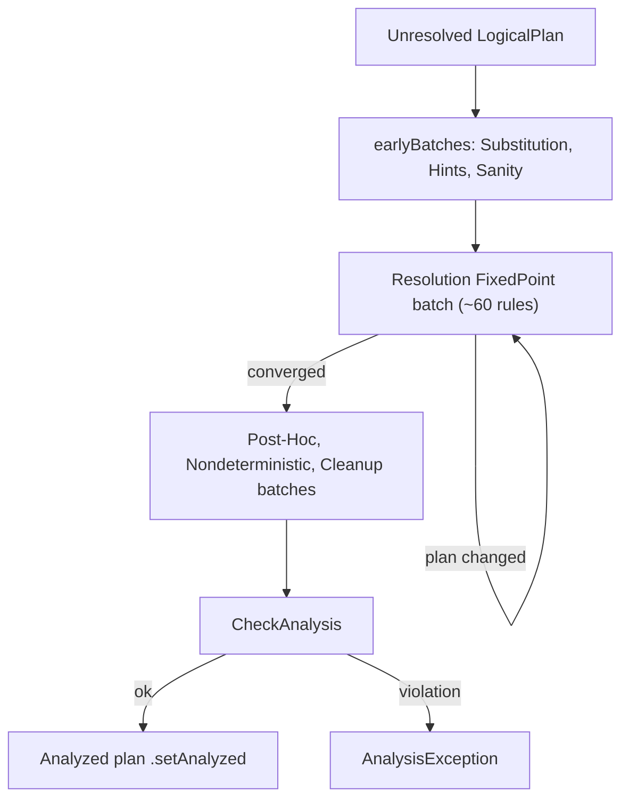
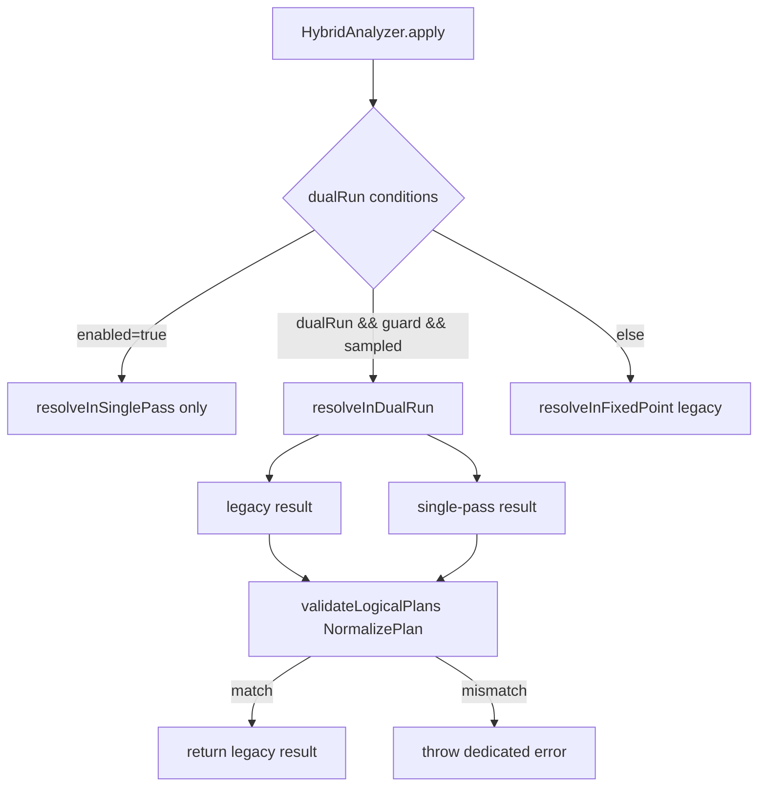

## The Analyzer and the fixed-point RuleExecutor loop

**What it is:** The `Analyzer` is the second phase of Catalyst (parse → **analyze** → optimize → plan). It takes an *unresolved* `LogicalPlan` (bare `UnresolvedRelation`/`UnresolvedAttribute`/`UnresolvedFunction` nodes fresh from the parser) and produces an *analyzed* plan: every relation bound to a catalog table, every column bound to an `AttributeReference` with an `ExprId` and `DataType`, every function bound, and every implicit cast inserted. It is a `RuleExecutor[LogicalPlan]` — a sequence of named `Batch`es, each a list of `Rule`s run under a `Strategy`. Most batches use `FixedPoint(maxIterations)`: the batch re-runs its rules until the plan stops changing (converges to a *fixed point*) or the iteration cap is hit. Analysis is iterative because rules feed each other — `ResolveRelations` must bind a table before `ResolveReferences` can match a column against its output, and star expansion may expose new columns that need another resolution pass.

The batch list is the map of the whole phase. `earlyBatches` runs substitution (CTE, window, union elimination), hint resolution, and a sanity check; then the giant `"Resolution"` `FixedPoint` batch holds ~60 rules in a deliberately ordered `::`-list, followed by post-hoc cleanup batches (`RemoveTempResolvedColumn`, `PullOutNondeterministic`, `CleanupAliases`, etc.). `fixedPoint` is built with `errorOnExceed = true` and `maxIterationsSetting = spark.sql.analyzer.maxIterations`, so a plan that never converges throws telling the user to raise that config rather than looping forever. `Once` batches run exactly one pass and are idempotence-checked (`RuleExecutor` verifies a second application is a no-op, unless the batch is on the excludable list). After the loop, `executeAndCheck` calls `CheckAnalysis` and marks the plan `analyzed`.

**Code path:** `Analyzer.executeAndCheck` → `HybridAnalyzer.fromLegacyAnalyzer(...).apply(plan)` → (legacy path) `Analyzer.execute` → `RuleExecutor.execute` iterates `batches` → `earlyBatches ++ Seq(Batch("Resolution", fixedPoint, ...))` → per-`Rule` `apply` via `resolveOperatorsUp` → convergence check per batch (`iteration > maxIterations` ⇒ error when `errorOnExceed`)

**Anchor files:** [Analyzer.scala:336 (class Analyzer)](https://github.com/apache/spark/blob/v4.2.0/sql/catalyst/src/main/scala/org/apache/spark/sql/catalyst/analysis/Analyzer.scala#L336), [Analyzer.scala:363 (executeAndCheck)](https://github.com/apache/spark/blob/v4.2.0/sql/catalyst/src/main/scala/org/apache/spark/sql/catalyst/analysis/Analyzer.scala#L363), [Analyzer.scala:446 (fixedPoint)](https://github.com/apache/spark/blob/v4.2.0/sql/catalyst/src/main/scala/org/apache/spark/sql/catalyst/analysis/Analyzer.scala#L446), [Analyzer.scala:512 (earlyBatches)](https://github.com/apache/spark/blob/v4.2.0/sql/catalyst/src/main/scala/org/apache/spark/sql/catalyst/analysis/Analyzer.scala#L512), [Analyzer.scala:538 (batches)](https://github.com/apache/spark/blob/v4.2.0/sql/catalyst/src/main/scala/org/apache/spark/sql/catalyst/analysis/Analyzer.scala#L538), [RuleExecutor.scala:150 (Once), :156 (FixedPoint), :215 (execute), :286 (maxIterations), :305 (idempotence)](https://github.com/apache/spark/blob/v4.2.0/sql/catalyst/src/main/scala/org/apache/spark/sql/catalyst/rules/RuleExecutor.scala#L150)

**Configs:** `spark.sql.analyzer.maxIterations` (fixed-point cap), `spark.sql.caseSensitive` (name matching across all resolution rules), `spark.sql.analyzer.canonicalization.multiCommutativeOpMemoryOptThreshold` (expression canonicalization threshold — see breadth note).

**Maps to topics:** A1 (mechanism), B1 (where the analyze phase sits in the pipeline).

!!! info "Fixed point vs Once"
    `FixedPoint` batches (`Substitution`, `Hints`, `Resolution`, `ScalaUDF Null Handling`, `Cleanup`) re-run to convergence. `Once` batches (`Apply Limit All`, `Keep Legacy Outputs`, `Post-Hoc Resolution`, `Nondeterministic`, `Subquery`, ...) run a single pass and are checked for idempotence. The single big `Resolution` fixed-point is where nearly all the rules named in this page live.



## ResolveRelations / ResolveCatalogs — name to relation

**What it is:** These rules turn an `UnresolvedRelation(multipartIdentifier)` into a concrete relation node. `ResolveRelations` handles the query-side lookup: it consults temp views first, then persistent tables via the catalog, wrapping the result in a `SubqueryAlias` carrying the identifier. `ResolveCatalogs` (constructed with the `CatalogManager`) resolves the *catalog* part of a multipart name for command plans and drives v2 catalog resolution (`CatalogAndNamespace`, `CatalogAndIdentifier`). Relation lookup is delegated to the shared `RelationResolution` helper, which knows the temp-view-vs-table precedence, the CTE relation cache, and time-travel specs. The rule sits near the top of the `Resolution` batch (right after `ResolveCatalogs` and `ResolveInsertInto`) because everything downstream needs a bound relation with an output schema.

**Code path:** `Resolution` batch → `ResolveRelations` (`resolveOperatorsUp`) → `RelationResolution.resolveRelation(u: UnresolvedRelation)` → temp-view check (`v1SessionCatalog.getRawLocalOrGlobalTempView`) → else catalog lookup along `sqlResolutionPathEntries` → `SubqueryAlias(ident, relation)`; command paths go `ResolveCatalogs` → `LookupCatalog.CatalogAndIdentifier` → v2 `TableCatalog.loadTable` / v1 `SessionCatalog`

**Anchor files:** [Analyzer.scala:1076 (ResolveRelations)](https://github.com/apache/spark/blob/v4.2.0/sql/catalyst/src/main/scala/org/apache/spark/sql/catalyst/analysis/Analyzer.scala#L1076), [RelationResolution.scala:56 (class), :164 (resolveRelation)](https://github.com/apache/spark/blob/v4.2.0/sql/catalyst/src/main/scala/org/apache/spark/sql/catalyst/analysis/RelationResolution.scala#L164), [ResolveCatalogs.scala:38](https://github.com/apache/spark/blob/v4.2.0/sql/catalyst/src/main/scala/org/apache/spark/sql/catalyst/analysis/ResolveCatalogs.scala#L38), [ResolveInlineTables.scala](https://github.com/apache/spark/blob/v4.2.0/sql/catalyst/src/main/scala/org/apache/spark/sql/catalyst/analysis/ResolveInlineTables.scala)

**Configs:** `spark.sql.legacy.createHiveTableByDefault`, `spark.sql.legacy.allowNonEmptyLocationInCTAS`, `spark.sql.legacy.keepCommandOutputSchema`, `spark.sql.hive.caseSensitiveInferenceMode` (schema inference on relation resolution), `spark.sql.parser.eagerEvalOfUnresolvedInlineTable` (inline-table resolution — parser-owned, see breadth note).

**Maps to topics:** A1.

## Catalog resolution and lookup (CatalogManager / LookupCatalog / SessionCatalog)

**What it is:** The registration/lookup layer under relation and function resolution. `CatalogManager` (in `connector.catalog`) is the session-scoped registry of catalogs: it holds the v1 `SessionCatalog` (the `spark_catalog` session catalog — temp views, persistent Hive/in-memory tables, temp/persistent functions), the map of v2 `CatalogPlugin`/`TableCatalog` implementations, and the *current catalog* + *current namespace* (mutated by `USE catalog.ns`). `LookupCatalog` is the trait that decomposes a multipart identifier into `(catalog, identifier)` using the current catalog as the default — the `CatalogAndIdentifier` / `CatalogAndNamespace` extractors. `sqlResolutionPathEntries` produces the ordered search path (`system.session`, then current catalog/namespace) that both relation and function resolution walk, and that `CheckAnalysis` echoes in "not found" errors. A name resolves as: temp view (session-local, unqualified or `system.session.*`) → CTE relation → current-catalog table. v2 catalogs are pluggable; the fallback `spark_catalog` is the v1 session catalog wrapped as v2 (`FakeV2SessionCatalog` in tests).

**Code path:** `USE`/`SET CATALOG` mutate `CatalogManager.currentCatalog`/`currentNamespace` → resolution rules call `catalogManager.sqlResolutionPathEntries(catalog, ns)` → `LookupCatalog.CatalogAndIdentifier.unapply(nameParts)` → v2 `catalog.asTableCatalog.loadTable(ident)` or v1 `SessionCatalog.lookupRelation`

**Anchor files:** [CatalogManager.scala](https://github.com/apache/spark/blob/v4.2.0/sql/catalyst/src/main/scala/org/apache/spark/sql/connector/catalog/CatalogManager.scala), [LookupCatalog.scala](https://github.com/apache/spark/blob/v4.2.0/sql/catalyst/src/main/scala/org/apache/spark/sql/connector/catalog/LookupCatalog.scala), [RelationResolution.scala:101 (session-qualified temp view), :119 (resolution path)](https://github.com/apache/spark/blob/v4.2.0/sql/catalyst/src/main/scala/org/apache/spark/sql/catalyst/analysis/RelationResolution.scala#L101)

**Configs:** `spark.sql.legacy.allowTempViewCreationWithMultipleNameparts`, `spark.sql.legacy.allowStarWithSingleTableIdentifierInCount` (temp-view / star handling in catalog-qualified names).

**Maps to topics:** A1.

!!! note "v1 vs v2"
    The v1 `SessionCatalog` owns temp views, the Hive metastore relations and session/temp functions. The v2 `TableCatalog`/`FunctionCatalog` plugin API (`CatalogPlugin`) lets external catalogs (Iceberg, Delta UC, JDBC) register under their own name; `CatalogManager` federates both, with `spark_catalog` as the default fallback. Only the *registration/lookup* half lives in analysis — the actual v2 command execution is in `sql/core`.

## ResolveReferences — column resolution

**What it is:** The single hardest resolution rule: it turns each `UnresolvedAttribute(nameParts)` into a concrete `AttributeReference` by matching the name against the output of the operator's children. It is the class `ResolveReferences(catalogManager)` mixing in `ColumnResolutionHelper`, and it dispatches per operator type in a big `resolveOperatorsUp` match: it waits for children to resolve (`!p.childrenResolved => p`) and for `DeduplicateRelations` to fix conflicting `ExprId`s from self-joins (`hasConflictingAttrs`), then expands `*` (`UnresolvedStar` / `containsStar`) via `buildExpandedProjectList`, and resolves ordinary expressions with `resolveExpressionByPlanChildren` / `resolveExpressionByPlanOutput`. Name matching honours `spark.sql.caseSensitive`; a nested-field access (`a.b.c`) is resolved by matching the longest attribute prefix then wrapping the remainder in `GetStructField`/`ExtractValue`. Ambiguity — a name matching two child attributes — is detected here and raised as `AMBIGUOUS_REFERENCE`; `spark.sql.analyzer.strictDataFrameColumnResolution` (4.2, on by default) tightens the DataFrame-column path so a name that would match by exprId across an unrelated plan no longer silently resolves. `Aggregate`, `Sort` and `Update` have their own delegate helpers (`ResolveReferencesInAggregate/InSort/InUpdate`) because column resolution there must also see grouping/ordering/assignment context.

**Code path:** `ResolveReferences.apply` → optional `CollationRulesRunner` → `doApply` = `plan.resolveOperatorsUp` → per node: `!childrenResolved`⇒wait; `hasConflictingAttrs`⇒wait; `containsStar`⇒`buildExpandedProjectList`; `Project`⇒`resolveExpressionByPlanChildren` then `resolveLateralColumnAlias`; `Aggregate`⇒`resolveReferencesInAggregate` → `ColumnResolutionHelper.resolveExpression` matches `UnresolvedAttribute` against child output, ambiguity ⇒ `QueryCompilationErrors.ambiguousColumnReferences`

**Anchor files:** [Analyzer.scala:1530 (ResolveReferences), :1551 (hasConflictingAttrs), :1629 (star expansion), :1725 (Project + LCA)](https://github.com/apache/spark/blob/v4.2.0/sql/catalyst/src/main/scala/org/apache/spark/sql/catalyst/analysis/Analyzer.scala#L1530), [ColumnResolutionHelper.scala:112 (resolveExpression), :435 (resolveExpressionByPlanOutput), :458 (resolveExpressionByPlanChildren), :584/:706 (ambiguousColumnReferences)](https://github.com/apache/spark/blob/v4.2.0/sql/catalyst/src/main/scala/org/apache/spark/sql/catalyst/analysis/ColumnResolutionHelper.scala#L458), [ResolveReferencesInAggregate.scala:50](https://github.com/apache/spark/blob/v4.2.0/sql/catalyst/src/main/scala/org/apache/spark/sql/catalyst/analysis/ResolveReferencesInAggregate.scala#L50), [ResolveReferencesInSort.scala:57](https://github.com/apache/spark/blob/v4.2.0/sql/catalyst/src/main/scala/org/apache/spark/sql/catalyst/analysis/ResolveReferencesInSort.scala#L57)

**Configs:** `spark.sql.caseSensitive`, `spark.sql.analyzer.strictDataFrameColumnResolution` (4.2), `spark.sql.analyzer.dontDeduplicateExpressionIfExprIdInOutput` (4.1), `spark.sql.analyzer.uniqueNecessaryMetadataColumns` (4.1), `spark.sql.analyzer.subqueryAliasAlwaysPropagateMetadataColumns` (4.2), `spark.sql.analyzer.expandTagPassthroughDuplicates` (4.2), `spark.sql.useCommonExprIdForAlias`, `spark.sql.analyzer.preferColumnOverLcaInArrayIndex` (4.1).

**Maps to topics:** A1.

!!! info "UnresolvedAttribute → AttributeReference"
    Before resolution a column is an `UnresolvedAttribute` carrying only name parts. Resolution matches those parts against the child's `output` (a `Seq[Attribute]`), and on a unique hit returns that child's `AttributeReference` — which already carries a stable `ExprId`, `DataType` and nullability. This is why `DeduplicateRelations` must run first for self-joins: two copies of the same table would otherwise expose two attributes with the *same* `ExprId`, making every reference ambiguous.

## Lateral column alias resolution

**What it is:** Lateral column alias (LCA) lets a `SELECT` item reference an alias defined earlier in the *same* select list: `SELECT salary * 2 AS double, double + 1 FROM t`. During `ResolveReferences` on a `Project`/`Aggregate`, an `UnresolvedAttribute` that matches a preceding alias (rather than a child column) is turned into a `LateralColumnAliasReference` wrapper; the dedicated rule `ResolveLateralColumnAliasReference` then rewrites the plan into nested `Project`s so the alias is computed once and reused. LCA has *higher priority than outer references* but resolution prefers a real table column over an LCA when both match (`preferColumnOverLcaInArrayIndex` guards a specific array-index case). It is gated by `spark.sql.lateralColumnAlias.enableImplicitResolution` (on by default since 3.4). The rule is pinned to run immediately after `ResolveReferences` in the batch (the code comments forbid inserting rules between them). Ambiguous LCA (two preceding aliases with the same name) throws `ambiguousLateralColumnAliasError`; LCA inside a generator is rejected by `CheckAnalysis` (`LATERAL_COLUMN_ALIAS_IN_GENERATOR`).

**Code path:** `ResolveReferences` on `Project` → `resolveLateralColumnAlias(resolvedBasic)` wraps matches as `LateralColumnAliasReference` → `ResolveLateralColumnAliasReference` rewrites into chained `Project`s → `CheckAnalysis.containsUnsupportedLCA` rejects LCA-in-generator

**Anchor files:** [ColumnResolutionHelper.scala:354 (resolveLateralColumnAlias), :398 (ambiguousLateralColumnAliasError)](https://github.com/apache/spark/blob/v4.2.0/sql/catalyst/src/main/scala/org/apache/spark/sql/catalyst/analysis/ColumnResolutionHelper.scala#L354), [ResolveLateralColumnAliasReference.scala:116](https://github.com/apache/spark/blob/v4.2.0/sql/catalyst/src/main/scala/org/apache/spark/sql/catalyst/analysis/ResolveLateralColumnAliasReference.scala#L116), [Analyzer.scala:1728 (resolveLateralColumnAlias call)](https://github.com/apache/spark/blob/v4.2.0/sql/catalyst/src/main/scala/org/apache/spark/sql/catalyst/analysis/Analyzer.scala#L1728), [CheckAnalysis.scala:267 (containsUnsupportedLCA), :517](https://github.com/apache/spark/blob/v4.2.0/sql/catalyst/src/main/scala/org/apache/spark/sql/catalyst/analysis/CheckAnalysis.scala#L517)

**Configs:** `spark.sql.lateralColumnAlias.enableImplicitResolution`, `spark.sql.analyzer.preferColumnOverLcaInArrayIndex` (4.1), `spark.sql.stableDerivedColumnAlias.enabled` (auto-alias naming — read in the parser `AstBuilder`, see breadth note).

**Maps to topics:** A1.

## Ordinals, group-by aliases and grouping analytics

**What it is:** SQL lets `ORDER BY 2` / `GROUP BY 1` reference select-list *positions*, and `GROUP BY alias` reference a select alias. `ResolveOrdinalInOrderByAndGroupBy` replaces an integer literal in an order-by/group-by with an `UnresolvedOrdinal` bound to the Nth output expression, gated by `spark.sql.orderByOrdinal` / `spark.sql.groupByOrdinal`. `ResolveAggAliasInGroupBy` (part of the aggregate-reference resolution) lets a group-by expression reference a select-list alias, gated by `spark.sql.groupByAliases`. `ResolveGroupingAnalytics` expands `ROLLUP`/`CUBE`/`GROUPING SETS` into the underlying `Expand` + grouping-id machinery; `GroupingAnalyticsTransformer` carries the 4.2 `spark.sql.analyzer.lowerEmptyGroupingSetToGlobalAggregate.enabled` behaviour (an empty grouping set becomes a plain global aggregate). Star expansion inside an aggregate with an ordinal group-by is explicitly rejected (`starNotAllowedWhenGroupByOrdinalPositionUsedError`).

**Code path:** `ResolveOrdinalInOrderByAndGroupBy` → `UnresolvedOrdinal(n)` → bound to Nth projection; `ResolveReferencesInAggregate` → alias-in-group-by; `ResolveGroupingAnalytics` → `GroupingAnalyticsTransformer` → `Expand`

**Anchor files:** [Analyzer.scala:2148 (ResolveOrdinalInOrderByAndGroupBy), :756 (ResolveGroupingAnalytics)](https://github.com/apache/spark/blob/v4.2.0/sql/catalyst/src/main/scala/org/apache/spark/sql/catalyst/analysis/Analyzer.scala#L2148), [GroupingAnalyticsTransformer.scala](https://github.com/apache/spark/blob/v4.2.0/sql/catalyst/src/main/scala/org/apache/spark/sql/catalyst/analysis/GroupingAnalyticsTransformer.scala), [ResolveReferencesInAggregate.scala:50](https://github.com/apache/spark/blob/v4.2.0/sql/catalyst/src/main/scala/org/apache/spark/sql/catalyst/analysis/ResolveReferencesInAggregate.scala#L50)

**Configs:** `spark.sql.orderByOrdinal`, `spark.sql.groupByOrdinal`, `spark.sql.groupByAliases`, `spark.sql.analyzer.lowerEmptyGroupingSetToGlobalAggregate.enabled` (4.2), `spark.sql.pivotMaxValues` (pivot value limit — read in `sql/core` RelationalGroupedDataset, see breadth note).

**Maps to topics:** A1.

## Function resolution (FunctionRegistry / FunctionResolution)

**What it is:** Turns an `UnresolvedFunction(nameParts, args)` into a concrete expression. `FunctionRegistry` (scalar) and `TableFunctionRegistry` (TVF) hold the built-in functions keyed by `FunctionIdentifier`; `FunctionResolution` (constructed with the `CatalogManager`) implements the *search path* precedence: internal registry (parser-marked internal names), then the ordered resolution path (`system.builtin`, `system.session` temp/persistent functions, current catalog persistent functions). The new (4.2) `spark.sql.functionResolution.sessionOrder` controls where `system.session` sits relative to `system.builtin` — modes `second`/`last` put built-ins first (enabling a fast-path), `first` puts session functions first. SQL UDFs (functions defined in SQL) are resolved by `ResolveSQLFunctions` / `ResolveSQLTableFunctions`, which inline the function body as a subplan; `spark.sql.analyzer.sqlFunctionResolution.applyConfOverrides` pins creation-time configs on the body. TVFs (`range`, `explode`, table-argument functions) resolve through `ResolveFunctions` into `Generate`/table-valued nodes. `LookupFunctions` (in the early `Simple Sanity Check` batch) pre-validates that every referenced function name exists, producing early `UNRESOLVED_ROUTINE` errors.

**Code path:** `LookupFunctions` (sanity) → `ResolveFunctions` → `FunctionResolution.resolveFunction(u)` → internal registry / `resolutionCandidates(nameParts)` walk → `v1SessionCatalog.resolveScalarFunctionByIdentifier` or v2 `FunctionCatalog.loadFunction` → `validateFunction`; SQL UDFs → `ResolveSQLFunctions` inlines body

**Anchor files:** [FunctionResolution.scala:113 (path), :142 (builtinFastPathSafe), :207 (resolveFunction)](https://github.com/apache/spark/blob/v4.2.0/sql/catalyst/src/main/scala/org/apache/spark/sql/catalyst/analysis/FunctionResolution.scala#L207), [FunctionRegistry.scala](https://github.com/apache/spark/blob/v4.2.0/sql/catalyst/src/main/scala/org/apache/spark/sql/catalyst/analysis/FunctionRegistry.scala), [Analyzer.scala:2317 (ResolveFunctions), :2669 (ResolveSQLFunctions), :2937 (ResolveSQLTableFunctions), :531 (LookupFunctions)](https://github.com/apache/spark/blob/v4.2.0/sql/catalyst/src/main/scala/org/apache/spark/sql/catalyst/analysis/Analyzer.scala#L2317)

**Configs:** `spark.sql.functionResolution.sessionOrder` (4.2), `spark.sql.analyzer.sqlFunctionResolution.applyConfOverrides` (4.0.1), `spark.sql.tvf.allowMultipleTableArguments.enabled`, `spark.sql.legacy.allowUntypedScalaUDF`.

**Maps to topics:** A1.

## Aggregate, window and subquery resolution

**What it is:** After columns and functions resolve, several rules rewrite aggregate/window/subquery shapes. `GlobalAggregates` turns a `Project` containing aggregate functions into an `Aggregate`; `ResolveAggregateFunctions` lifts aggregate expressions referenced in `HAVING`/`ORDER BY` into the aggregate's output and rewrites the outer references. `ExtractWindowExpressions` / `ResolveWindowOrder` / `ResolveWindowFrame` pull `WindowExpression`s into dedicated `Window` operators and fill in default frames. `ResolveSubquery` resolves correlated and scalar subqueries against the outer plan, tagging outer references (`UpdateOuterReferences` runs later); `ValidateSubqueryExpression` / `SubqueryExpressionInLambdaOrHigherOrderFunctionValidator` enforce the legal subquery shapes. Scalar-subquery constant-group-by handling is guarded by `spark.sql.analyzer.scalarSubqueryAllowGroupByColumnEqualToConstant` (4.0) and subqueries inside lambdas/HOFs by `spark.sql.analyzer.allowSubqueryExpressionsInLambdasOrHigherOrderFunctions` (4.0).

**Code path:** `ExtractWindowExpressions` → `Window` op; `GlobalAggregates` → `Aggregate`; `ResolveAggregateFunctions` lifts HAVING/ORDER-BY aggregates; `ResolveSubquery` → resolve inner plan against outer, mark `OuterReference` → `ValidateSubqueryExpression`

**Anchor files:** [Analyzer.scala:3062 (ResolveAggregateFunctions), :2536 (ResolveSubquery), :584 (ExtractWindowExpressions batch line), :3818 (ResolveWindowFrame), :3828 (ResolveWindowOrder)](https://github.com/apache/spark/blob/v4.2.0/sql/catalyst/src/main/scala/org/apache/spark/sql/catalyst/analysis/Analyzer.scala#L3062), [ValidateSubqueryExpression.scala](https://github.com/apache/spark/blob/v4.2.0/sql/catalyst/src/main/scala/org/apache/spark/sql/catalyst/analysis/ValidateSubqueryExpression.scala), [SubqueryExpressionInLambdaOrHigherOrderFunctionValidator.scala](https://github.com/apache/spark/blob/v4.2.0/sql/catalyst/src/main/scala/org/apache/spark/sql/catalyst/analysis/SubqueryExpressionInLambdaOrHigherOrderFunctionValidator.scala), [WindowResolution.scala](https://github.com/apache/spark/blob/v4.2.0/sql/catalyst/src/main/scala/org/apache/spark/sql/catalyst/analysis/WindowResolution.scala)

**Configs:** `spark.sql.analyzer.scalarSubqueryAllowGroupByColumnEqualToConstant` (4.0), `spark.sql.analyzer.allowSubqueryExpressionsInLambdasOrHigherOrderFunctions` (4.0).

**Maps to topics:** A1.

## Type coercion (TypeCoercion vs AnsiTypeCoercion) and store-assignment

**What it is:** Type coercion inserts implicit `Cast`s during analysis so operator/function argument types line up. The Analyzer selects the rule set at build time: `AnsiTypeCoercion.typeCoercionRules` when `spark.sql.ansi.enabled`, else `TypeCoercion.typeCoercionRules`. Both are lists ending in a `CombinedTypeCoercionRule` bundling ~18 sub-rules (`PromoteStrings`, `InConversion`, `DecimalPrecision`, `FunctionArgumentConversion`, `CaseWhenCoercion`, `Division`, `ImplicitTypeCasts`, `StringLiteralCoercion`, `CollationTypeCasts`, ...). ANSI mode is stricter — it refuses lossy implicit casts (string→int) that legacy mode allows. `WidenSetOperationTypes` finds the common type across `UNION`/`INTERSECT` branches. Store-assignment (writing a query into a table column) is governed separately by `spark.sql.storeAssignmentPolicy` (`ANSI`/`LEGACY`/`STRICT`), enforced in `TableOutputResolver` / `ResolveOutputRelation`. Collation type-casts run through `CollationTypeCasts` / `CollationTypeCoercion`, and `spark.sql.runCollationTypeCastsBeforeAliasAssignment.enabled` (4.1) orders them before alias assignment. `spark.sql.enforceTypeCoercionBeforeUnionDeduplication.enabled` (4.1) fixes a union-dedup ordering issue.

**Code path:** `Analyzer.typeCoercionRules()` picks `AnsiTypeCoercion` vs `TypeCoercion` on `conf.ansiEnabled` → appended into the `Resolution` batch → `CombinedTypeCoercionRule` applies sub-rules bottom-up inserting `Cast`; table writes → `ResolveOutputRelation` → `TableOutputResolver` applies `storeAssignmentPolicy`

**Anchor files:** [Analyzer.scala:506 (typeCoercionRules selector)](https://github.com/apache/spark/blob/v4.2.0/sql/catalyst/src/main/scala/org/apache/spark/sql/catalyst/analysis/Analyzer.scala#L506), [TypeCoercion.scala:47 (rule list)](https://github.com/apache/spark/blob/v4.2.0/sql/catalyst/src/main/scala/org/apache/spark/sql/catalyst/analysis/TypeCoercion.scala#L47), [AnsiTypeCoercion.scala:76](https://github.com/apache/spark/blob/v4.2.0/sql/catalyst/src/main/scala/org/apache/spark/sql/catalyst/analysis/AnsiTypeCoercion.scala#L76), [TableOutputResolver.scala](https://github.com/apache/spark/blob/v4.2.0/sql/catalyst/src/main/scala/org/apache/spark/sql/catalyst/analysis/TableOutputResolver.scala), [CollationTypeCasts.scala](https://github.com/apache/spark/blob/v4.2.0/sql/catalyst/src/main/scala/org/apache/spark/sql/catalyst/analysis/CollationTypeCasts.scala), [TypeCoercionBase.scala](https://github.com/apache/spark/blob/v4.2.0/sql/catalyst/src/main/scala/org/apache/spark/sql/catalyst/analysis/TypeCoercionBase.scala), [TypeCoercionHelper.scala](https://github.com/apache/spark/blob/v4.2.0/sql/catalyst/src/main/scala/org/apache/spark/sql/catalyst/analysis/TypeCoercionHelper.scala), [TypeCoercionValidation.scala](https://github.com/apache/spark/blob/v4.2.0/sql/catalyst/src/main/scala/org/apache/spark/sql/catalyst/analysis/TypeCoercionValidation.scala)

**The `CombinedTypeCoercionRule` sub-rules, one file each** — this is the family the rule list bundles, and reading the file names is the fastest inventory of what coercion actually does: [DecimalPrecision.scala](https://github.com/apache/spark/blob/v4.2.0/sql/catalyst/src/main/scala/org/apache/spark/sql/catalyst/analysis/DecimalPrecision.scala), [DecimalPrecisionTypeCoercion.scala](https://github.com/apache/spark/blob/v4.2.0/sql/catalyst/src/main/scala/org/apache/spark/sql/catalyst/analysis/DecimalPrecisionTypeCoercion.scala), [StringPromotionTypeCoercion.scala](https://github.com/apache/spark/blob/v4.2.0/sql/catalyst/src/main/scala/org/apache/spark/sql/catalyst/analysis/StringPromotionTypeCoercion.scala), [AnsiStringPromotionTypeCoercion.scala](https://github.com/apache/spark/blob/v4.2.0/sql/catalyst/src/main/scala/org/apache/spark/sql/catalyst/analysis/AnsiStringPromotionTypeCoercion.scala), [AnsiGetDateFieldOperationsTypeCoercion.scala](https://github.com/apache/spark/blob/v4.2.0/sql/catalyst/src/main/scala/org/apache/spark/sql/catalyst/analysis/AnsiGetDateFieldOperationsTypeCoercion.scala), [BooleanEqualityTypeCoercion.scala](https://github.com/apache/spark/blob/v4.2.0/sql/catalyst/src/main/scala/org/apache/spark/sql/catalyst/analysis/BooleanEqualityTypeCoercion.scala), [DivisionTypeCoercion.scala](https://github.com/apache/spark/blob/v4.2.0/sql/catalyst/src/main/scala/org/apache/spark/sql/catalyst/analysis/DivisionTypeCoercion.scala), [IntegralDivisionTypeCoercion.scala](https://github.com/apache/spark/blob/v4.2.0/sql/catalyst/src/main/scala/org/apache/spark/sql/catalyst/analysis/IntegralDivisionTypeCoercion.scala), [StackTypeCoercion.scala](https://github.com/apache/spark/blob/v4.2.0/sql/catalyst/src/main/scala/org/apache/spark/sql/catalyst/analysis/StackTypeCoercion.scala), [StringLiteralTypeCoercion.scala](https://github.com/apache/spark/blob/v4.2.0/sql/catalyst/src/main/scala/org/apache/spark/sql/catalyst/analysis/StringLiteralTypeCoercion.scala), [UnpivotTypeCoercion.scala](https://github.com/apache/spark/blob/v4.2.0/sql/catalyst/src/main/scala/org/apache/spark/sql/catalyst/analysis/UnpivotTypeCoercion.scala), [BinaryArithmeticWithDatetimeResolver.scala](https://github.com/apache/spark/blob/v4.2.0/sql/catalyst/src/main/scala/org/apache/spark/sql/catalyst/analysis/BinaryArithmeticWithDatetimeResolver.scala), [CoercesExpressionTypes.scala](https://github.com/apache/spark/blob/v4.2.0/sql/catalyst/src/main/scala/org/apache/spark/sql/catalyst/analysis/resolver/CoercesExpressionTypes.scala) and [DefaultCollationTypeCoercion.scala](https://github.com/apache/spark/blob/v4.2.0/sql/catalyst/src/main/scala/org/apache/spark/sql/catalyst/analysis/resolver/DefaultCollationTypeCoercion.scala) (the single-pass counterparts)

**Configs:** `spark.sql.ansi.enabled`, `spark.sql.storeAssignmentPolicy`, `spark.sql.runCollationTypeCastsBeforeAliasAssignment.enabled` (4.1), `spark.sql.enforceTypeCoercionBeforeUnionDeduplication.enabled` (4.1), `spark.sql.legacy.castComplexTypesToString.enabled`, `spark.sql.legacy.setopsPrecedence.enabled`, `spark.sql.defaultColumn.enabled`, `spark.sql.defaultColumn.useNullsForMissingDefaultValues`, `spark.sql.defaultColumn.allowedProviders`.

**Maps to topics:** A1.

!!! warning "ANSI is on by default in Spark 4.x"
    `spark.sql.ansi.enabled` defaults to `true` in Spark 4.x (its default reads `SPARK_ANSI_SQL_MODE`, true unless explicitly `false`). This selects `AnsiTypeCoercion`, so implicit lossy casts that silently worked in Spark 3.x now raise analysis/runtime errors. This is the single most impactful behaviour change for queries migrating from the book's Spark 3.2 baseline.

## The single-pass Resolver (HybridAnalyzer / ResolverGuard)

**What it is:** The 4.0/4.1 rewrite of the Analyzer from a fixed-point rule loop into a **single-pass, bottom-up** resolver. The legacy Analyzer re-runs ~60 rules to convergence — repeatedly re-traversing the whole tree, which is O(rules × iterations × nodes) and makes resolution order subtle. The new `Resolver` (`analysis/resolver/`) instead walks the plan **once**, bottom-up: each operator is resolved after its children, with per-operator resolvers (`ProjectResolver`, `AggregateResolver`, `FilterResolver`, `JoinResolver`, `SortResolver`, `ViewResolver`, ...) and an `ExpressionResolver` maintaining a `NameScopeStack` of visible attributes. It is a one-shot object per query. `HybridAnalyzer` is the router: with everything off it runs the legacy analyzer; `spark.sql.analyzer.singlePassResolver.enabled` forces single-pass (dev only); `...dualRunWithLegacy` runs **both** and cross-validates. In dual-run, `ResolverGuard` first checks the plan uses only single-pass-supported features (else it stays legacy-only), `dualRunSampleRate` samples which queries dual-run, and after both succeed `validateLogicalPlans` compares the two resolved plans (`NormalizePlan`) — a mismatch is a bug. Divergent outcomes throw dedicated errors (`fixedPointFailedSinglePassSucceeded` / `singlePassFailedFixedPointSucceeded`). `AnalyzerBridgeState` (`relationBridging.enabled`) lets the single-pass run reuse relation metadata already resolved by the legacy run so dual-run doesn't double the catalog RPCs. **It is off by default in 4.2.0** — a correctness/performance staging effort, not yet the production path.

**Code path:** `Analyzer.executeAndCheck` → `HybridAnalyzer.apply` → `dualRun = DUAL_RUN && !ENABLED && !ENABLED_TENTATIVELY && ResolverGuard(plan) && sampleRate` → `resolveInDualRun`: `resolveInFixedPoint` (legacy) + `resolveInSinglePass` (`ResolverRunner` → `Resolver.resolve` → `lookupMetadataAndResolve` → bottom-up per-operator resolvers) → `validateLogicalPlans(NormalizePlan)` → return fixed-point (or single-pass if `returnSinglePassResultInDualRun`)

**Anchor files:** [HybridAnalyzer.scala:54 (class), :66 (apply/dualRun), :128 (resolveInDualRun), :155 (result comparison), :202 (tentative)](https://github.com/apache/spark/blob/v4.2.0/sql/catalyst/src/main/scala/org/apache/spark/sql/catalyst/analysis/resolver/HybridAnalyzer.scala#L54), [Resolver.scala:83 (class), :204 (lookupMetadataAndResolve), :255 (resolve)](https://github.com/apache/spark/blob/v4.2.0/sql/catalyst/src/main/scala/org/apache/spark/sql/catalyst/analysis/resolver/Resolver.scala#L83), [ResolverGuard.scala:67 (class), :76 (apply)](https://github.com/apache/spark/blob/v4.2.0/sql/catalyst/src/main/scala/org/apache/spark/sql/catalyst/analysis/resolver/ResolverGuard.scala#L67), [ResolverRunner.scala](https://github.com/apache/spark/blob/v4.2.0/sql/catalyst/src/main/scala/org/apache/spark/sql/catalyst/analysis/resolver/ResolverRunner.scala), [NameScope.scala:488 (AMBIGUOUS_REFERENCE)](https://github.com/apache/spark/blob/v4.2.0/sql/catalyst/src/main/scala/org/apache/spark/sql/catalyst/analysis/resolver/NameScope.scala#L488)

**Configs (all `spark.sql.analyzer.singlePassResolver.*`):** `enabled` (4.0), `enabledTentatively` (4.1), `dualRunWithLegacy` (4.0), `dualRunSampleRate` (4.1), `returnSinglePassResultInDualRun` (4.0), `validationEnabled` (4.0), `runExtendedResolutionChecks` (4.1), `runHeavyExtendedResolutionChecks` (4.1), `relationBridging.enabled` (4.0), `preventUsingAliasesFromNonDirectChildren` (4.1), `throwFromResolverGuard` (4.1), `exposeResolverGuardFailure` (4.1). Also `spark.sql.analyzer.unionIsResolvedWhenDuplicatesPerChildResolved` (4.1).

**Maps to topics:** A1 (this is an A1 sub-topic — a deep implementation detail of the analyze phase, not a distinct learnable topic on its own).



## CheckAnalysis — the error path

**What it is:** The post-resolution validation pass — the single most user-visible part of analysis, because it produces every `AnalysisException` the user sees. After the batches converge, `checkAnalysis` inlines CTEs (to match plan shapes) then runs `checkAnalysis0`, which does a **top-down** pass for table/view-not-found (so the outermost missing name is reported first) and a **bottom-up** `foreachUp` pass catching the first genuine resolution failure rather than cascading ones. Every failure is an error-class exception via `failAnalysis(errorClass, params)` or a helper. Major categories it catches:

- **Missing relations/namespaces/functions:** `UnresolvedRelation` → `TABLE_OR_VIEW_NOT_FOUND` (with a computed search path), `UnresolvedNamespace` → schema-not-found, `UnresolvedFunctionName` → `UNRESOLVED_ROUTINE`.
- **Unresolved columns:** any leftover `Attribute` with `!resolved` → `UNRESOLVED_COLUMN` (with similarity-ordered candidate suggestions via `orderSuggestedIdentifiersBySimilarity`); Spark-Connect plan-id columns → `cannotResolveDataFrameColumn`; unresolved map key → `UNRESOLVED_MAP_KEY`.
- **Type mismatches:** `e.checkInputDataTypes().isFailure` → `TypeCoercionValidation.failOnTypeCheckResult` (`DATATYPE_MISMATCH`), filter not boolean → `FILTER_NOT_BOOLEAN`, non-boolean join condition → `JOIN_CONDITION_IS_NOT_BOOLEAN_TYPE`.
- **Structural/semantic:** window function without `OVER` → `WINDOW_FUNCTION_WITHOUT_OVER_CLAUSE`, invalid aggregation (`ExprUtils.assertValidAggregation`), `Grouping`/`GroupingID` misuse, invalid star usage, unbound parameters (`UNBOUND_SQL_PARAMETER`), lambda misuse, invalid observed metrics.

Internal-invariant violations become `SparkException.internalError` instead of user errors. A `preemptedError` mechanism defers some internal errors to the end so a more meaningful user error wins. On success, `plan.setAnalyzed()`.

**Code path:** `executeAndCheck` (after batches) → `checkAnalysis(plan)` → `InlineCTE` → `checkAnalysis0` → top-down insert/table-not-found → `plan.foreachUp` bottom-up: unresolved relations/functions → per-operator `transformExpressionsDown` (HOF/LCA/map-key checks) → `getAllExpressions(operator).foreachUp` (unresolved attr/star/type-check/window/grouping) → operator-level checks (filter/join/aggregate/metrics) → `failAnalysis` / error-class throw → `setAnalyzed`

**Anchor files:** [CheckAnalysis.scala:65 (failAnalysis), :226 (failUnresolvedAttribute), :306 (checkAnalysis), :330 (checkAnalysis0), :409 (UnresolvedRelation), :535 (UNRESOLVED_COLUMN), :548 (type check), :642 (FILTER_NOT_BOOLEAN), :716 (assertValidAggregation)](https://github.com/apache/spark/blob/v4.2.0/sql/catalyst/src/main/scala/org/apache/spark/sql/catalyst/analysis/CheckAnalysis.scala#L330), [QueryCompilationErrors.scala (error-class factories)](https://github.com/apache/spark/blob/v4.2.0/sql/catalyst/src/main/scala/org/apache/spark/sql/errors/QueryCompilationErrors.scala)

**Configs:** `spark.sql.preserveCharVarcharTypeInfo` (LeafNode char/varchar guard, see below). No dedicated CheckAnalysis on/off config — it is unconditional.

**Maps to topics:** A1.

## View / CTE / subquery-body resolution

**What it is:** Views, CTEs and subquery bodies are sub-plans that must resolve in their *own* context. `CTESubstitution` (early `Substitution` batch) turns `WITH name AS (...)` into `CTERelationDef`/`CTERelationRef`, and `ResolveWithCTE` binds refs; `CheckAnalysis` re-inlines CTEs before validation. View resolution (`ViewResolution` / `view.scala`) resolves a `View`'s body against the catalog/namespace captured at view-creation time (stored in `AnalysisContext`), and enforces `spark.sql.view.maxNestedViewDepth` (default 100) to stop infinite view recursion. `spark.sql.legacy.storeAnalyzedPlanForView` controls whether the *analyzed* plan is persisted with the view (vs re-resolving the SQL text each time) — its reader is the view-creation command in `sql/core`, but the depth/`AnalysisContext` machinery is here. Self-join ambiguity (two references to the same table producing colliding `ExprId`s) is first mitigated by `DeduplicateRelations` in analysis; the *detection* of genuinely ambiguous self-join column references (`failAmbiguousSelfJoin`, `selfJoinAutoResolveAmbiguity`) lives in the `sql/core` rule `DetectAmbiguousSelfJoin` and `Dataset`, which are analysis-adjacent but outside the catalyst/analysis directory.

**Code path:** `CTESubstitution` → `CTERelationDef`/`Ref`; `ResolveWithCTE` binds; `ViewResolution` → resolve body under captured `AnalysisContext` catalog/ns, depth-check `maxNestedViewDepth`; `CheckAnalysis.InlineCTE` before validation

**Anchor files:** [CTESubstitution.scala](https://github.com/apache/spark/blob/v4.2.0/sql/catalyst/src/main/scala/org/apache/spark/sql/catalyst/analysis/CTESubstitution.scala), [ResolveWithCTE.scala](https://github.com/apache/spark/blob/v4.2.0/sql/catalyst/src/main/scala/org/apache/spark/sql/catalyst/analysis/ResolveWithCTE.scala), [ViewResolution.scala](https://github.com/apache/spark/blob/v4.2.0/sql/catalyst/src/main/scala/org/apache/spark/sql/catalyst/analysis/ViewResolution.scala), [view.scala](https://github.com/apache/spark/blob/v4.2.0/sql/catalyst/src/main/scala/org/apache/spark/sql/catalyst/analysis/view.scala), [resolver/ViewResolver.scala](https://github.com/apache/spark/blob/v4.2.0/sql/catalyst/src/main/scala/org/apache/spark/sql/catalyst/analysis/resolver/ViewResolver.scala), [DeduplicateRelations.scala](https://github.com/apache/spark/blob/v4.2.0/sql/catalyst/src/main/scala/org/apache/spark/sql/catalyst/analysis/DeduplicateRelations.scala)

**Configs:** `spark.sql.view.maxNestedViewDepth`, `spark.sql.legacy.storeAnalyzedPlanForView` (reader in sql/core view command), `spark.sql.legacy.allowAutoGeneratedAliasForView`, `spark.sql.analyzer.failAmbiguousSelfJoin` (reader in sql/core `DetectAmbiguousSelfJoin`), `spark.sql.selfJoinAutoResolveAmbiguity` (reader in sql/core `Dataset`).

**Maps to topics:** A1.

## char/varchar handling during analysis

**What it is:** Spark models `CHAR(n)`/`VARCHAR(n)` as `StringType` internally but must preserve the length metadata for padding and DDL. During analysis, `ResolveCatalogs` decides whether to keep the char/varchar type info on resolved columns (`spark.sql.preserveCharVarcharTypeInfo`, 4.0) or replace it with plain string (`replaceCharVarcharWithString`). `spark.sql.charAsVarchar` (read in `CharVarcharUtils`) makes new `CHAR` columns behave as `VARCHAR` (no padding). `spark.sql.legacy.charVarcharAsString` (read in `TableOutputResolver`) restores pre-3.1 behaviour treating them as unbounded string in write type-checks. `CheckAnalysis` enforces the invariant that no `LeafNode` output carries a raw char/varchar type when `preserveCharVarcharTypeInfo` is false (internal error if violated). Padding is applied via `ApplyCharTypePaddingHelper`.

**Code path:** relation resolution → `ResolveCatalogs` reads `conf.preserveCharVarcharTypeInfo` → keep or `replaceCharVarcharWithString(col.dataType)`; write path → `TableOutputResolver` honours `charVarcharAsString`; `CheckAnalysis` LeafNode guard; padding via `ApplyCharTypePaddingHelper`

**Anchor files:** [ResolveCatalogs.scala:146 (preserveCharVarcharTypeInfo branch)](https://github.com/apache/spark/blob/v4.2.0/sql/catalyst/src/main/scala/org/apache/spark/sql/catalyst/analysis/ResolveCatalogs.scala#L146), [CheckAnalysis.scala:366 (LeafNode char/varchar guard)](https://github.com/apache/spark/blob/v4.2.0/sql/catalyst/src/main/scala/org/apache/spark/sql/catalyst/analysis/CheckAnalysis.scala#L366), [ApplyCharTypePaddingHelper.scala](https://github.com/apache/spark/blob/v4.2.0/sql/catalyst/src/main/scala/org/apache/spark/sql/catalyst/analysis/ApplyCharTypePaddingHelper.scala), [TableOutputResolver.scala (charVarcharAsString)](https://github.com/apache/spark/blob/v4.2.0/sql/catalyst/src/main/scala/org/apache/spark/sql/catalyst/analysis/TableOutputResolver.scala), [CharVarcharUtils.scala (charAsVarchar)](https://github.com/apache/spark/blob/v4.2.0/sql/catalyst/src/main/scala/org/apache/spark/sql/catalyst/util/CharVarcharUtils.scala)

**Configs:** `spark.sql.charAsVarchar`, `spark.sql.preserveCharVarcharTypeInfo` (4.0), `spark.sql.legacy.charVarcharAsString`.

**Maps to topics:** A1.

---

## UnsupportedOperationChecker — what a streaming query may not do

**What it is:** the rule that produces almost every "you cannot do that in a streaming query" message. It runs after analysis and walks the plan twice: `checkForBatch` rejects a batch query that touches a streaming source, and `checkForStreaming` enumerates the operations that are illegal, illegal *in this output mode*, or illegal *in combination*. If you have ever wondered why a message says a specific combination is unsupported rather than a specific operator, this file is why.

**Anchor files:**

- [UnsupportedOperationChecker.scala:40](https://github.com/apache/spark/blob/v4.2.0/sql/catalyst/src/main/scala/org/apache/spark/sql/catalyst/analysis/UnsupportedOperationChecker.scala#L40) — `checkForBatch`, and the message everyone meets first: "Queries with streaming sources must be executed with writeStream.start()"
- [UnsupportedOperationChecker.scala:179](https://github.com/apache/spark/blob/v4.2.0/sql/catalyst/src/main/scala/org/apache/spark/sql/catalyst/analysis/UnsupportedOperationChecker.scala#L179) — `checkForStreaming`, whose first act is to reject a *non*-streaming plan passed to `writeStream`
- [UnsupportedOperationChecker.scala:201](https://github.com/apache/spark/blob/v4.2.0/sql/catalyst/src/main/scala/org/apache/spark/sql/catalyst/analysis/UnsupportedOperationChecker.scala#L201) — two or more `mapGroupsWithState`, then mixing `mapGroupsWithState` with `flatMapGroupsWithState`, then two `flatMapGroupsWithState` in certain modes: three separate arity rules, each with its own message
- [UnsupportedOperationChecker.scala:120](https://github.com/apache/spark/blob/v4.2.0/sql/catalyst/src/main/scala/org/apache/spark/sql/catalyst/analysis/UnsupportedOperationChecker.scala#L120) — `checkStreamingQueryGlobalWatermarkLimit`: the *correctness* check for chained stateful operators
- [UnsupportedOperationChecker.scala:128](https://github.com/apache/spark/blob/v4.2.0/sql/catalyst/src/main/scala/org/apache/spark/sql/catalyst/analysis/UnsupportedOperationChecker.scala#L128) — the message itself, which tells you the config that disables it

!!! warning "One of these checks is advisory and can be switched off — which is the point"

    `checkStreamingQueryGlobalWatermarkLimit` detects a *possible* correctness problem: a stateful operator downstream of another can emit rows older than the global watermark, and those rows are then silently dropped by the downstream operator. It is gated on `spark.sql.streaming.statefulOperator.checkCorrectness.enabled`, and the error text names that config so you can turn it off. Turning it off does not fix anything — it lets a query with a known late-row-dropping hazard run. Chained stateful operators (aggregation after a stream-stream join, for example) are exactly the shape that trips it.

**Configs:** `spark.sql.streaming.statefulOperator.checkCorrectness.enabled` (read via `SQLConf.statefulOperatorCorrectnessCheckEnabled`, whose *method* name is not the key — the 2026-07-25 pass recorded the method name as the key), `spark.sql.streaming.unsupportedOperationCheck`

**Maps to topics:** A7, A8

---

## Row-level command rewrite — MERGE, UPDATE, DELETE

**What it is:** how `MERGE INTO`, `UPDATE` and `DELETE FROM` become executable plans against a DSv2 table. There is no single "merge operator" — the analyzer rewrites each command into an ordinary write, choosing between **two strategies** based on what the table's connector supports.

**Code path:** `RewriteMergeIntoTable` / `RewriteUpdateTable` / `RewriteDeleteFromTable` → `buildOperationTable` → is the operation a `SupportsDelta`? → `buildWriteDeltaPlan` (emit row-level deltas) : `buildReplaceDataPlan` (read, modify, rewrite whole groups — typically whole files)

**Anchor files:**

- [RewriteRowLevelCommand.scala:39](https://github.com/apache/spark/blob/v4.2.0/sql/catalyst/src/main/scala/org/apache/spark/sql/catalyst/analysis/RewriteRowLevelCommand.scala#L39) — the shared trait; `RowLevelOperationTable` wraps the real table with the operation being performed
- [RewriteMergeIntoTable.scala:130](https://github.com/apache/spark/blob/v4.2.0/sql/catalyst/src/main/scala/org/apache/spark/sql/catalyst/analysis/RewriteMergeIntoTable.scala#L130) — the branch: `case _: SupportsDelta` → delta plan, otherwise replace-data
- [RewriteMergeIntoTable.scala:146](https://github.com/apache/spark/blob/v4.2.0/sql/catalyst/src/main/scala/org/apache/spark/sql/catalyst/analysis/RewriteMergeIntoTable.scala#L146) — `buildReplaceDataPlan`, the group-based path
- [RewriteMergeIntoTable.scala:258](https://github.com/apache/spark/blob/v4.2.0/sql/catalyst/src/main/scala/org/apache/spark/sql/catalyst/analysis/RewriteMergeIntoTable.scala#L258) — `buildWriteDeltaPlan`, the delta-based path
- [RewriteDeleteFromTable.scala:50](https://github.com/apache/spark/blob/v4.2.0/sql/catalyst/src/main/scala/org/apache/spark/sql/catalyst/analysis/RewriteDeleteFromTable.scala#L50) — the same two-way choice for `DELETE`

!!! info "The performance of your MERGE is a property of the connector, not the SQL"

    Group-based rewrite reads the affected groups, applies the change, and writes them back — on a file-based table that means rewriting whole files even to change one row. Delta-based rewrite emits only the changed rows and lets the connector apply them. Identical SQL therefore has very different cost depending on whether the table's `RowLevelOperation` implements `SupportsDelta`. This is the mechanism behind "MERGE is slow on this table format and fast on that one", and it is decided here, during analysis, not by the optimizer.

**Maps to topics:** A3, E4, I8

---

## Time-travel resolution

**What it is:** `TIMESTAMP AS OF` / `VERSION AS OF` on a table reference. The parser produces an unresolved `RelationTimeTravel` node; analysis evaluates the timestamp expression to a fixed microsecond value and turns the pair into a `TimeTravelSpec` the catalog uses to load the right snapshot.

**Anchor files:**

- [RelationTimeTravel.scala:29](https://github.com/apache/spark/blob/v4.2.0/sql/catalyst/src/main/scala/org/apache/spark/sql/catalyst/analysis/RelationTimeTravel.scala#L29) — the unresolved node, carrying *either* a timestamp expression or a version string
- [TimeTravelSpec.scala:28](https://github.com/apache/spark/blob/v4.2.0/sql/catalyst/src/main/scala/org/apache/spark/sql/catalyst/analysis/TimeTravelSpec.scala#L28) — the resolved form: `AsOfTimestamp(Long)` or `AsOfVersion(String)`
- [TimeTravelSpec.scala:44](https://github.com/apache/spark/blob/v4.2.0/sql/catalyst/src/main/scala/org/apache/spark/sql/catalyst/analysis/TimeTravelSpec.scala#L44) — `resolveTimestampExpression`, shared with CDC timestamp resolution
- [TimeTravelSpec.scala:46](https://github.com/apache/spark/blob/v4.2.0/sql/catalyst/src/main/scala/org/apache/spark/sql/catalyst/analysis/TimeTravelSpec.scala#L46) — the expression must be ANSI-castable to `TimestampType`, else `INVALID_TIME_TRAVEL_TIMESTAMP_EXPR`
- [TimeTravelSpec.scala:51](https://github.com/apache/spark/blob/v4.2.0/sql/catalyst/src/main/scala/org/apache/spark/sql/catalyst/analysis/TimeTravelSpec.scala#L51) — the trick: the expression is wrapped in a fake `Project` over `OneRowRelation` so `ComputeCurrentTime` can fold it

!!! info "The timestamp is evaluated once, at analysis, and must reference nothing"

    `assert(ts.resolved && ts.references.isEmpty)` — a time-travel timestamp cannot depend on a column, only on literals and functions like `current_timestamp()`, which the fake-`Project` trick folds to a constant *at analysis time*. So `TIMESTAMP AS OF current_timestamp() - INTERVAL 1 DAY` is pinned when the query is analysed, not re-evaluated per batch, which matters for a query reused across micro-batches.

**Maps to topics:** I8, I11, E4

---

## Table constraints and schema evolution

**What it is:** two newer analysis-time behaviours on the write path. `ResolveTableConstraints` injects a `CheckInvariant` expression into the write plan for every `Check` constraint a DSv2 table declares, so violations fail the write rather than being stored. `ResolveSchemaEvolution` reconciles an incoming schema against the table's when the write is allowed to evolve it.

**Anchor files:**

- [ResolveTableConstraints.scala:30](https://github.com/apache/spark/blob/v4.2.0/sql/catalyst/src/main/scala/org/apache/spark/sql/catalyst/analysis/ResolveTableConstraints.scala#L30) — the rule, taking a `CatalogManager`
- [ResolveTableConstraints.scala:43](https://github.com/apache/spark/blob/v4.2.0/sql/catalyst/src/main/scala/org/apache/spark/sql/catalyst/analysis/ResolveTableConstraints.scala#L43) — the guard: constraints are read from `r.table.constraints`, so a connector that declares none costs nothing
- [ResolveTableConstraints.scala:45](https://github.com/apache/spark/blob/v4.2.0/sql/catalyst/src/main/scala/org/apache/spark/sql/catalyst/analysis/ResolveTableConstraints.scala#L45) — `Check` constraints become `CheckInvariant` expressions in the plan
- [ResolveSchemaEvolution.scala](https://github.com/apache/spark/blob/v4.2.0/sql/catalyst/src/main/scala/org/apache/spark/sql/catalyst/analysis/ResolveSchemaEvolution.scala) — the schema-reconciliation counterpart

!!! info "Constraint enforcement is a plan node, so it costs per row and shows in EXPLAIN"

    A `CHECK` constraint is not enforced by the storage layer — it is an expression Spark inserts above the write. That makes it visible in `EXPLAIN` and means its cost scales with rows written, and it also means the guarantee only holds for writes that go through Spark's analyzer.

**Maps to topics:** B4, B5

---

## Inside the single-pass Resolver — per-operator resolvers and the NameScopeStack

**What it is:** the [single-pass Resolver](#the-single-pass-resolver-hybridanalyzer--resolverguard) concept above describes the *router* — `HybridAnalyzer`, the guard, the dual-run comparison. This one is the machine it routes to. `Resolver` is a one-shot object per query holding a fixed set of collaborators, and its `resolve` method is a single `match` over operator types that dispatches to a dedicated resolver per operator: `ProjectResolver`, `AggregateResolver`, `FilterResolver`, `JoinResolver`, `SortResolver`, `HavingResolver`, `SetOperationLikeResolver`, `ViewResolver`. That match **is the feature list of single-pass resolution** — a node type absent from it cannot be resolved single-pass, which is exactly what `ResolverGuard` checks for ahead of time.

Name resolution is where the two analyzers differ most. The legacy analyzer resolves a name by matching it against the *child plan's* `output` on each pass. Single-pass keeps a `NameScopeStack`: one `NameScope` per level, each holding `output` (attributes visible for lookup), `hiddenOutput` (attributes not directly visible but available as a fallback — this is how `ORDER BY` reaches a column that the `SELECT` list dropped), `availableAliases`, `aggregateListAliases` and the `baseAggregate`. A resolver `pushScope`s before descending, `overwriteCurrent`s with the operator's computed output on the way back up, and `popScope`s. `isSubqueryRoot` marks the scope boundary a correlated subquery searches outward from, and `NameScopeStack.resolveMultipartName` walks: current scope → outer scope (correlation) → session variable, in that order.

**Code path:** `Resolver.resolve(plan)` → `operatorResolutionContextStack.push` → `match` on node type → e.g. `projectResolver.resolve` → `scopes.pushScope()` → recurse into child via `resolve` → `expressionResolver.resolveProjectList` → `scopes.current.resolveMultipartName` → `scopes.overwriteCurrent(output)` → `scopes.popScope()`

**Anchor files:** [Resolver.scala:83 (class + collaborators)](https://github.com/apache/spark/blob/v4.2.0/sql/catalyst/src/main/scala/org/apache/spark/sql/catalyst/analysis/resolver/Resolver.scala#L83), [Resolver.scala:255 (the dispatch match)](https://github.com/apache/spark/blob/v4.2.0/sql/catalyst/src/main/scala/org/apache/spark/sql/catalyst/analysis/resolver/Resolver.scala#L255), [NameScope.scala:156 (NameScope)](https://github.com/apache/spark/blob/v4.2.0/sql/catalyst/src/main/scala/org/apache/spark/sql/catalyst/analysis/resolver/NameScope.scala#L156), [NameScope.scala:599 (resolveMultipartName)](https://github.com/apache/spark/blob/v4.2.0/sql/catalyst/src/main/scala/org/apache/spark/sql/catalyst/analysis/resolver/NameScope.scala#L599), [NameScope.scala:976 (NameScopeStack)](https://github.com/apache/spark/blob/v4.2.0/sql/catalyst/src/main/scala/org/apache/spark/sql/catalyst/analysis/resolver/NameScope.scala#L976), [NameScope.scala:1310 (outer-scope lookup), :1350 (variable lookup)](https://github.com/apache/spark/blob/v4.2.0/sql/catalyst/src/main/scala/org/apache/spark/sql/catalyst/analysis/resolver/NameScope.scala#L1310), [ResolutionValidator.scala:52 (validatePlan)](https://github.com/apache/spark/blob/v4.2.0/sql/catalyst/src/main/scala/org/apache/spark/sql/catalyst/analysis/resolver/ResolutionValidator.scala#L52), [ResolverMetricTracker.scala:60 (recordProfile)](https://github.com/apache/spark/blob/v4.2.0/sql/catalyst/src/main/scala/org/apache/spark/sql/catalyst/analysis/resolver/ResolverMetricTracker.scala#L60), [CteScope.scala:222 (CteScope), :298 (CteRegistry)](https://github.com/apache/spark/blob/v4.2.0/sql/catalyst/src/main/scala/org/apache/spark/sql/catalyst/analysis/resolver/CteScope.scala#L222)

**The per-operator resolver family** — one file each, all the same shape (`TreeNodeResolver` subclass, `resolve(operator)`), which is why the sweep treats them as a family rather than one concept apiece: [ProjectResolver.scala](https://github.com/apache/spark/blob/v4.2.0/sql/catalyst/src/main/scala/org/apache/spark/sql/catalyst/analysis/resolver/ProjectResolver.scala), [AggregateResolver.scala](https://github.com/apache/spark/blob/v4.2.0/sql/catalyst/src/main/scala/org/apache/spark/sql/catalyst/analysis/resolver/AggregateResolver.scala), [FilterResolver.scala](https://github.com/apache/spark/blob/v4.2.0/sql/catalyst/src/main/scala/org/apache/spark/sql/catalyst/analysis/resolver/FilterResolver.scala), [JoinResolver.scala](https://github.com/apache/spark/blob/v4.2.0/sql/catalyst/src/main/scala/org/apache/spark/sql/catalyst/analysis/resolver/JoinResolver.scala), [SortResolver.scala](https://github.com/apache/spark/blob/v4.2.0/sql/catalyst/src/main/scala/org/apache/spark/sql/catalyst/analysis/resolver/SortResolver.scala), [HavingResolver.scala](https://github.com/apache/spark/blob/v4.2.0/sql/catalyst/src/main/scala/org/apache/spark/sql/catalyst/analysis/resolver/HavingResolver.scala), [SetOperationLikeResolver.scala](https://github.com/apache/spark/blob/v4.2.0/sql/catalyst/src/main/scala/org/apache/spark/sql/catalyst/analysis/resolver/SetOperationLikeResolver.scala), [TreeNodeResolver.scala](https://github.com/apache/spark/blob/v4.2.0/sql/catalyst/src/main/scala/org/apache/spark/sql/catalyst/analysis/resolver/TreeNodeResolver.scala). The expression side is the same shape again: [ExpressionResolver.scala](https://github.com/apache/spark/blob/v4.2.0/sql/catalyst/src/main/scala/org/apache/spark/sql/catalyst/analysis/resolver/ExpressionResolver.scala), [LateralColumnAliasResolver.scala](https://github.com/apache/spark/blob/v4.2.0/sql/catalyst/src/main/scala/org/apache/spark/sql/catalyst/analysis/resolver/LateralColumnAliasResolver.scala), [SubqueryExpressionResolver.scala](https://github.com/apache/spark/blob/v4.2.0/sql/catalyst/src/main/scala/org/apache/spark/sql/catalyst/analysis/resolver/SubqueryExpressionResolver.scala), [TimezoneAwareExpressionResolver.scala](https://github.com/apache/spark/blob/v4.2.0/sql/catalyst/src/main/scala/org/apache/spark/sql/catalyst/analysis/resolver/TimezoneAwareExpressionResolver.scala), with [ExpressionResolutionValidator.scala](https://github.com/apache/spark/blob/v4.2.0/sql/catalyst/src/main/scala/org/apache/spark/sql/catalyst/analysis/resolver/ExpressionResolutionValidator.scala) and [ResolutionCheckRunner.scala](https://github.com/apache/spark/blob/v4.2.0/sql/catalyst/src/main/scala/org/apache/spark/sql/catalyst/analysis/resolver/ResolutionCheckRunner.scala) validating the result and [PlanLogger.scala](https://github.com/apache/spark/blob/v4.2.0/sql/catalyst/src/main/scala/org/apache/spark/sql/catalyst/analysis/resolver/PlanLogger.scala) / [SubqueryScope.scala](https://github.com/apache/spark/blob/v4.2.0/sql/catalyst/src/main/scala/org/apache/spark/sql/catalyst/analysis/resolver/SubqueryScope.scala) / [ResolverTag.scala](https://github.com/apache/spark/blob/v4.2.0/sql/catalyst/src/main/scala/org/apache/spark/sql/catalyst/analysis/resolver/ResolverTag.scala) / [IdentifierAndCteSubstituor.scala](https://github.com/apache/spark/blob/v4.2.0/sql/catalyst/src/main/scala/org/apache/spark/sql/catalyst/analysis/resolver/IdentifierAndCteSubstituor.scala) supporting them.

**Configs:** `spark.sql.analyzer.singlePassResolver.validationEnabled`, `...runExtendedResolutionChecks`, `...runHeavyExtendedResolutionChecks`, `...preventUsingAliasesFromNonDirectChildren`, `spark.sql.analyzer.unionIsResolvedWhenDuplicatesPerChildResolved`.

**Maps to topics:** A1.

!!! info "`hiddenOutput` is why `ORDER BY` can name a column the `SELECT` dropped"

    `SELECT name FROM people ORDER BY age` is legal: `age` is not in the projection's output, but it is in the child relation's. The legacy analyzer handles this by having `ResolveReferencesInSort` re-resolve against the `Sort`'s grandchild and then add a hidden projection. Single-pass models it directly — `age` lives in the scope's `hiddenOutput`, is found when `output` misses, and `PruneMetadataColumns` removes the extra column afterwards. Same result, but the mechanism is a data structure rather than a rule ordering.

---

## Expression-ID assignment and attribute identity

**What it is:** every resolved column is an `AttributeReference` carrying an `ExprId` — a globally unique identifier — and *the ID, not the name, is what Catalyst compares*. `ExpressionIdAssigner` states the invariant in one sentence in its own scaladoc: **no multi-child operator may have children with conflicting `AttributeReference` IDs.** Leaf operators must have globally unique output IDs even when they are the same table; `AttributeReference`s propagate upward with their IDs preserved; every `Alias` gets a fresh ID that follows it when it becomes an attribute.

The reason is a correctness bug, not tidiness. `SELECT * FROM t AS t1 CROSS JOIN t AS t2 ON t1.col1 = t2.col1` — if both scans of `t` output `col1#0`, the join condition is literally `col1#0 = col1#0`, which is *always true*. The assigner's own scaladoc shows both plans side by side. Two mechanisms enforce it. In the legacy analyzer, `DeduplicateRelations` walks the plan and calls `newInstance()` on any `MultiInstanceRelation` whose output IDs collide with a sibling's, minting new IDs; it does the same for serializers, `Generate` outputs and the `*WithState` operators' outputs. In single-pass, `ExpressionIdAssigner` reallocates every leaf output and — for DataFrame programs, which hand the resolver *partially resolved* plans that may contain duplicated subtrees with IDs already assigned — keeps an old-ID → new-ID mapping and remaps references through it. `assertOutputsHaveNoConflictingExpressionIds` is the assertion that the invariant held.

This is also where the DataFrame-specific column errors come from. `spark.sql.analyzer.strictDataFrameColumnResolution` (4.2) stops a name from resolving by `ExprId` across an unrelated plan; `spark.sql.analyzer.failAmbiguousSelfJoin` and `spark.sql.selfJoinAutoResolveAmbiguity` (both read in `sql/core`, in `DetectAmbiguousSelfJoin` and `Dataset`) decide whether `df.join(df, df("a") === df("a"))` is an error or is silently resolved to one side.

**Code path:** legacy → `DeduplicateRelations.apply` → collision detection → `MultiInstanceRelation.newInstance()`; single-pass → `Resolver.handleLeafOperator` → `expressionIdAssigner.createMappingForLeafOperator` → per-expression `mapExpression` / `mapExpressionOrOuterReference` → `ExpressionIdAssigner.assertOutputsHaveNoConflictingExpressionIds`

**Anchor files:** [ExpressionIdAssigner.scala:39 (the invariant, in prose)](https://github.com/apache/spark/blob/v4.2.0/sql/catalyst/src/main/scala/org/apache/spark/sql/catalyst/analysis/resolver/ExpressionIdAssigner.scala#L39), [ExpressionIdAssigner.scala:233 (class), :326 (createMappingForLeafOperator), :431 (createMappingFromChildMappings), :576 (mapExpression), :892 (assertOutputsHaveNoConflictingExpressionIds)](https://github.com/apache/spark/blob/v4.2.0/sql/catalyst/src/main/scala/org/apache/spark/sql/catalyst/analysis/resolver/ExpressionIdAssigner.scala#L233), [DeduplicateRelations.scala:29 (rule), :119 (newInstance on MultiInstanceRelation)](https://github.com/apache/spark/blob/v4.2.0/sql/catalyst/src/main/scala/org/apache/spark/sql/catalyst/analysis/DeduplicateRelations.scala#L119), [Resolver.scala:689 (handleLeafOperator)](https://github.com/apache/spark/blob/v4.2.0/sql/catalyst/src/main/scala/org/apache/spark/sql/catalyst/analysis/resolver/Resolver.scala#L689), [MultiInstanceRelation.scala](https://github.com/apache/spark/blob/v4.2.0/sql/catalyst/src/main/scala/org/apache/spark/sql/catalyst/analysis/MultiInstanceRelation.scala)

**Configs:** `spark.sql.analyzer.strictDataFrameColumnResolution` (4.2), `spark.sql.analyzer.dontDeduplicateExpressionIfExprIdInOutput` (4.1), `spark.sql.useCommonExprIdForAlias`, `spark.sql.analyzer.failAmbiguousSelfJoin`, `spark.sql.selfJoinAutoResolveAmbiguity`, `spark.sql.analyzer.expandTagPassthroughDuplicates` (4.2).

**Maps to topics:** none — A1 names `DeduplicateRelations` once in its milestone, but no topic teaches expression identity as a subject. Proposed as **A43**.

!!! warning "The failure mode is a wrong answer, not an error"

    An ID collision does not throw. `col1#0 = col1#0` is a perfectly valid, perfectly resolvable join condition that evaluates to `true` for every pair of rows — so the query returns a cross product and no exception. This is why the invariant is asserted rather than checked at the point of use, and why `newInstance()` on a relation is not an optimisation detail you can skip.

---

## Metadata resolution, relation bridging and the plan rewriter

**What it is:** three supporting stages of single-pass analysis that are easy to miss because none of them is a rule. **(1) Metadata resolution.** Before the main traversal, `MetadataResolver` walks the unresolved plan top-down and resolves *every* `UnresolvedRelation` it finds — a batch of blocking catalog RPCs — filling a `RelationsWithResolvedMetadata` map keyed by `RelationId`. The main pass then never blocks: `resolveRelation` is a map lookup. It matches `UnresolvedWith` explicitly because a `WITH` clause does not expose its CTE definitions as children, so a plain traversal would miss relations inside CTEs.

**(2) Relation bridging.** In dual-run mode the legacy analyzer has *already* done that catalog work. `AnalyzerBridgeState` carries its results across, and `BridgedRelationMetadataProvider` replaces `MetadataResolver` so the single-pass run reads the bridged map instead of issuing a second round of RPCs. Without it, dual-run would double every query's catalog traffic — which is why `spark.sql.analyzer.singlePassResolver.relationBridging.enabled` exists and why it is on.

**(3) Plan rewriting.** Single-pass does not produce a plan the optimizer can consume directly. `PlanRewriter` applies a fixed short list — `PruneMetadataColumns`, `CleanupAliases`, `PullOutNondeterministic` — plus any `extendedRewriteRules`, to the main plan *and* to subqueries. Crucially it runs inside `lookupMetadataAndResolve`, once per top-level query and once per `View`, so a view's rewrite sees the configs captured at view-creation time rather than the current session's. Extension points are `ResolverExtension` (custom operators, e.g. a connector's own node types) and `metadataResolverExtensions`.

**Code path:** `lookupMetadataAndResolve` → `identifierAndCteSubstitutor.substitutePlan` → `relationMetadataProvider.resolve(plan)` (`MetadataResolver.handleAllUnresolvedRelations` → `tryResolveRelation` → `RelationResolution.resolveRelation` → extensions) → `resolve(plan)` → `planRewriter.rewriteWithSubqueries`

**Anchor files:** [Resolver.scala:204 (lookupMetadataAndResolve)](https://github.com/apache/spark/blob/v4.2.0/sql/catalyst/src/main/scala/org/apache/spark/sql/catalyst/analysis/resolver/Resolver.scala#L204), [Resolver.scala:127 (planRewriteRules), :151 (relationMetadataProvider)](https://github.com/apache/spark/blob/v4.2.0/sql/catalyst/src/main/scala/org/apache/spark/sql/catalyst/analysis/resolver/Resolver.scala#L127), [MetadataResolver.scala:42 (class), :65 (resolve), :95 (tryResolveRelation), :119 (blocking resolveRelation)](https://github.com/apache/spark/blob/v4.2.0/sql/catalyst/src/main/scala/org/apache/spark/sql/catalyst/analysis/resolver/MetadataResolver.scala#L42), [RelationMetadataProvider.scala:33](https://github.com/apache/spark/blob/v4.2.0/sql/catalyst/src/main/scala/org/apache/spark/sql/catalyst/analysis/resolver/RelationMetadataProvider.scala#L33), [BridgedRelationMetadataProvider.scala:32](https://github.com/apache/spark/blob/v4.2.0/sql/catalyst/src/main/scala/org/apache/spark/sql/catalyst/analysis/resolver/BridgedRelationMetadataProvider.scala#L32), [AnalyzerBridgeState.scala:42](https://github.com/apache/spark/blob/v4.2.0/sql/catalyst/src/main/scala/org/apache/spark/sql/catalyst/analysis/resolver/AnalyzerBridgeState.scala#L42), [PlanRewriter.scala:29, :54](https://github.com/apache/spark/blob/v4.2.0/sql/catalyst/src/main/scala/org/apache/spark/sql/catalyst/analysis/resolver/PlanRewriter.scala#L29), [ResolverExtension.scala:27](https://github.com/apache/spark/blob/v4.2.0/sql/catalyst/src/main/scala/org/apache/spark/sql/catalyst/analysis/resolver/ResolverExtension.scala#L27), [RelationCache.scala](https://github.com/apache/spark/blob/v4.2.0/sql/catalyst/src/main/scala/org/apache/spark/sql/catalyst/analysis/RelationCache.scala)

**Configs:** `spark.sql.analyzer.singlePassResolver.relationBridging.enabled` (4.0).

**Maps to topics:** A1.

---

## CTE substitution — precedence, inlining and name shadowing

**What it is:** `CTESubstitution` is the first rule of the first batch, and it decides two things that surprise people. **Whether the CTE is inlined at all:** `forceInline` is computed up front — a single `Command` that is not a `CTEInChildren` forces inlining, as does `spark.sql.legacy.inlineCTEInCommands`; a recursive CTE can never be inlined because it self-references. Non-inlined CTEs become a `CTERelationDef` under a `WithCTE`, referenced by `CTERelationRef`, and are inlined later (or not) by the optimizer's `InlineCTE`. **Which definition a name refers to:** `spark.sql.legacy.ctePrecedencePolicy` chooses between `CORRECTED` (the default — an inner `WITH` shadows an outer one, matching the SQL standard), `EXCEPTION` (raise on the ambiguous case) and `LEGACY` (the pre-3.0 behaviour, where the outer definition won). `traverseAndSubstituteCTE` carries `outerCTEDefs` down the tree to implement it.

`CTERelationDef.maxRows` is gated on `spark.sql.cteRelationDefMaxRows.enabled` — whether a CTE propagates its child's row-count bound upward, which affects limit pushdown. `spark.sql.legacy.cteDuplicateAttributeNames` restores older behaviour when a CTE's select list repeats a name. `CheckAnalysis` re-inlines CTEs before validating, so the plan it checks is not the plan that executes.

**Code path:** `earlyBatches → Batch("Substitution")` → `CTESubstitution.apply` → compute `hasRecursiveCTE` / `forceInline` → `LEGACY_CTE_PRECEDENCE_POLICY` switch → `traverseAndSubstituteCTE` (carrying `outerCTEDefs`) → `resolveCTERelations` → `CTERelationDef` + `WithCTE`, or textual inlining → later `ResolveWithCTE` binds `CTERelationRef`s

**Anchor files:** [CTESubstitution.scala:53 (rule), :68 (hasRecursiveCTE), :74 (forceInline), :97 (precedence policy), :220 (traverseAndSubstituteCTE)](https://github.com/apache/spark/blob/v4.2.0/sql/catalyst/src/main/scala/org/apache/spark/sql/catalyst/analysis/CTESubstitution.scala#L53), [Analyzer.scala:519 (position in earlyBatches)](https://github.com/apache/spark/blob/v4.2.0/sql/catalyst/src/main/scala/org/apache/spark/sql/catalyst/analysis/Analyzer.scala#L519), [cteOperators.scala:110 (CTERelationDef), :119 (maxRows gate), :192 (CTERelationRef)](https://github.com/apache/spark/blob/v4.2.0/sql/catalyst/src/main/scala/org/apache/spark/sql/catalyst/plans/logical/cteOperators.scala#L110), [CteScope.scala:298 (single-pass CteRegistry)](https://github.com/apache/spark/blob/v4.2.0/sql/catalyst/src/main/scala/org/apache/spark/sql/catalyst/analysis/resolver/CteScope.scala#L298)

**Configs:** `spark.sql.legacy.ctePrecedencePolicy`, `spark.sql.legacy.inlineCTEInCommands`, `spark.sql.legacy.cteDuplicateAttributeNames`, `spark.sql.cteRelationDefMaxRows.enabled`.

**Maps to topics:** B8.

!!! warning "A CTE is not a materialisation barrier"

    Naming a subquery with `WITH` does not promise it is computed once. Whether it is inlined is decided here (for commands and recursion) and again by the optimizer's `InlineCTE` for everything else, which inlines a definition referenced only once — and may inline a multiply-referenced one too. If you need one evaluation, the tool is `cache()`/a temp view, not `WITH`.

---

## Recursive CTE resolution — WITH RECURSIVE becomes UnionLoop

**What it is:** `WITH RECURSIVE name AS (anchor UNION [ALL] recursive_term)` is resolved by rewriting the `Union` into a dedicated looping operator. `CTESubstitution` marks the definition recursive and refuses to inline it; `ResolveWithCTE` then matches the definition's body against **four supported shapes** (a bare `Union` under a `SubqueryAlias`; the same wrapped in an inner `WithCTE`; and the two column-aliased forms) and, for each, extracts the anchor and the recursive term, rewrites the self-referencing `CTERelationRef`s inside the recursive term into `UnionLoopRef` bound to the anchor's output, and replaces the `Union` with a `UnionLoop` carrying `maxDepth`. A body that does not match one of the four shapes is not rewritten and fails analysis — this is why the supported grammar for recursion is narrower than `UNION` generally.

**`UNION` (deduplicating) recursion is rejected, and the code for it is written but dead.** The branch matching `Distinct(Union(Seq(anchor, recursion), …))` opens with an unconditional
`cteDef.failAnalysis("UNION_NOT_SUPPORTED_IN_RECURSIVE_CTE")` — and *below* that call sits a complete rewrite that would have built `UnionLoop(Distinct(anchor), Except(recursion, UnionLoopRef(...)))`, i.e. subtract the rows already produced on each iteration. At 4.2.0 that code is unreachable. So only `UNION ALL` recursion works, and the usual "use `UNION` instead of `UNION ALL` to terminate a cyclic graph traversal" trick is unavailable — you must break cycles yourself, with a visited-set column or a depth bound.

Execution and the three safety limits live in `sql/core`'s `UnionLoopExec`: `spark.sql.cteRecursionLevelLimit` bounds iterations (also settable per query via `maxDepth`), `spark.sql.cteRecursionRowLimit` bounds total rows, and `spark.sql.cteRecursionAnchorRowsLimitToConvertToLocalRelation` decides when a small anchor is folded into a `LocalRelation` to avoid re-planning it each iteration.

**Code path:** parser → `UnresolvedWith(..., allowRecursion = true)` → `CTESubstitution` (`hasRecursiveCTE` ⇒ no inlining) → `CTERelationDef(recursive = true)` → `ResolveWithCTE` matches one of four shapes → `rewriteRecursiveCTERefs` (`CTERelationRef` → `UnionLoopRef`) → `UnionLoop(anchor, recursion, maxDepth)` → planned as `UnionLoopExec`

**Anchor files:** [ResolveWithCTE.scala:32 (rule), :78 (shape 1: SubqueryAlias(Union)), :93 (shape 2: inner WithCTE), :123 (column-aliased form), :158 (the UNION branch — comment describing the intended semantics), :163 (the `UNION_NOT_SUPPORTED_IN_RECURSIVE_CTE` failAnalysis that makes the rewrite below it dead)](https://github.com/apache/spark/blob/v4.2.0/sql/catalyst/src/main/scala/org/apache/spark/sql/catalyst/analysis/ResolveWithCTE.scala#L158), [cteOperators.scala:41 (UnionLoop), :80 (UnionLoopRef)](https://github.com/apache/spark/blob/v4.2.0/sql/catalyst/src/main/scala/org/apache/spark/sql/catalyst/plans/logical/cteOperators.scala#L41), [CTESubstitution.scala:68 (recursion detection)](https://github.com/apache/spark/blob/v4.2.0/sql/catalyst/src/main/scala/org/apache/spark/sql/catalyst/analysis/CTESubstitution.scala#L68), [UnionLoopExec.scala:160 (levelLimit), :161 (rowLimit)](https://github.com/apache/spark/blob/v4.2.0/sql/core/src/main/scala/org/apache/spark/sql/execution/UnionLoopExec.scala#L160), [RecursiveCteState.scala (single-pass equivalent)](https://github.com/apache/spark/blob/v4.2.0/sql/catalyst/src/main/scala/org/apache/spark/sql/catalyst/analysis/resolver/RecursiveCteState.scala)

**Configs:** `spark.sql.cteRecursionLevelLimit`, `spark.sql.cteRecursionRowLimit`, `spark.sql.cteRecursionAnchorRowsLimitToConvertToLocalRelation`.

**Maps to topics:** A29.

---

## Collation application during analysis

**What it is:** collation reaches a plan through three separate analysis-time mechanisms, which is why "why is my string comparison case-sensitive here but not there" has three possible answers. **(1) Naming.** `ResolveCollationName` replaces `UnresolvedCollation("utf8_lcase")` with a `ResolvedCollation` by asking `CollationFactory` to fully qualify the name — so `COLLATE UTF8_LCASE` and `COLLATE SYSTEM.BUILTIN.UTF8_LCASE` become the same thing. **(2) Inheritance.** `ApplyDefaultCollation` gives *default*-typed strings (`isDefaultStringCharOrVarcharType`) the collation inherited from the object hierarchy — table/view, then schema — which is what `CREATE TABLE … DEFAULT COLLATION UTF8_LCASE` sets up. It runs mainly on DDL but also fires whenever a view's body is re-resolved. **(3) Coercion.** `CollationTypeCasts` / `CollationTypeCoercion` decide the result collation when two differently-collated strings meet, following the SQL precedence rules.

The rule ordering here is the interesting part, and the source documents it at length. `ApplyDefaultCollation` and `CollationTypeCasts` can *oscillate*: applying a default collation to a literal makes an `EqualTo` unresolved, which blocks `ExtractWindowExpressions`, which then gets undone by the coercion rule on the same iteration — forever. The fix in the source is that `ApplyDefaultCollation` calls `CollationTypeCasts` immediately via `CollationRulesRunner` rather than letting the batch loop do it, and `spark.sql.runCollationTypeCastsBeforeAliasAssignment.enabled` (4.1) pins the ordering relative to alias assignment.

Separately, `RewriteCollationJoin` handles the execution consequence: join conditions are evaluated with *binary* equality, which is wrong for a non-binary collation, so it wraps each side of an equality in `CollationKey` — recursing into struct fields and array elements — so hash joins work. `UnsafeRowUtils.isBinaryStable` is the predicate that decides whether any of this is needed.

**Code path:** `Resolution` batch → `ResolveCollationName` (line 548) → … → `ApplyDefaultCollation` (line 575) → `CollationRulesRunner(plan)` = `ApplyDefaultCollation` then `CollationTypeCasts` → `RewriteCollationJoin` injects `CollationKey` into join conditions

**Anchor files:** [ResolveCollationName.scala:30](https://github.com/apache/spark/blob/v4.2.0/sql/catalyst/src/main/scala/org/apache/spark/sql/catalyst/analysis/ResolveCollationName.scala#L30), [ApplyDefaultCollation.scala:39 (rule), :47 (the oscillation comment)](https://github.com/apache/spark/blob/v4.2.0/sql/catalyst/src/main/scala/org/apache/spark/sql/catalyst/analysis/ApplyDefaultCollation.scala#L39), [CollationRulesRunner.scala:22](https://github.com/apache/spark/blob/v4.2.0/sql/catalyst/src/main/scala/org/apache/spark/sql/catalyst/analysis/CollationRulesRunner.scala#L22), [RewriteCollationJoin.scala:35 (rule), :51 (processExpression)](https://github.com/apache/spark/blob/v4.2.0/sql/catalyst/src/main/scala/org/apache/spark/sql/catalyst/analysis/RewriteCollationJoin.scala#L35), [CollationTypeCoercion.scala](https://github.com/apache/spark/blob/v4.2.0/sql/catalyst/src/main/scala/org/apache/spark/sql/catalyst/analysis/CollationTypeCoercion.scala), [Analyzer.scala:548 (ResolveCollationName), :575 (ApplyDefaultCollation), :706 / :1570 / :3066 (CollationRulesRunner call sites)](https://github.com/apache/spark/blob/v4.2.0/sql/catalyst/src/main/scala/org/apache/spark/sql/catalyst/analysis/Analyzer.scala#L575)

**Configs:** `spark.sql.collation.objectLevel.enabled`, `spark.sql.collation.schemaLevel.enabled`, `spark.sql.collation.allowInMapKeys`, `spark.sql.legacy.collationAwareHashFunctions`, `spark.sql.runCollationTypeCastsBeforeAliasAssignment.enabled` (4.1).

**Maps to topics:** I21, B5.

---

## Session variable resolution (DECLARE / SET VAR)

**What it is:** SQL session variables (`DECLARE VARIABLE v INT DEFAULT 0` / `SET VAR v = 1`) live in a `TempVariableManager` under the reserved namespace `SYSTEM.SESSION`, and `VariableResolution` is the lookup layer. A bare name resolves to a variable **only when `SYSTEM.SESSION` is on the SQL resolution path** — otherwise a variable can only be referenced as `session.v` or `system.session.v`. That precedence rule is why a variable named the same as a column does not shadow it. `ResolveSetVariable` resolves the *target* side of `SET VAR`, rejects duplicate targets, and inserts casts so the assigned value matches the declared type; it also caps the source query so a multi-row result is an error rather than a silent first-row pick.

`VariableResolution` is wired into both analyzers: the legacy `ColumnResolutionHelper` consults it after column resolution fails, and single-pass builds one inside `NameScopeStack` (`resolveMultipartNameAsVariable` — the third and last step of the name lookup order). `spark.sql.legacy.allowSessionVariableInPersistedView` (`VARIABLES_UNDER_IDENTIFIER_IN_VIEW`) controls whether a persisted view may capture one, which is a correctness question: the variable's value at view-creation time is not the value at query time.

**Code path:** `UnresolvedAttribute` fails column resolution → `VariableResolution.resolveMultipartName` → `lookupVariable(nameParts)` → qualification check against `SYSTEM`/`SESSION` → `tempVariableManager` → `VariableReference`; `SET VAR` → `ResolveSetVariable` → duplicate check → cast to declared type → `Limit` on the source query

**Anchor files:** [VariableResolution.scala:36 (class), :42 (the SYSTEM.SESSION path rule), :91 (resolveMultipartName), :131 (lookupVariable), :190 (qualification)](https://github.com/apache/spark/blob/v4.2.0/sql/catalyst/src/main/scala/org/apache/spark/sql/catalyst/analysis/VariableResolution.scala#L36), [ResolveSetVariable.scala:34 (rule), :44 (checkForDuplicateVariables), :55 (apply)](https://github.com/apache/spark/blob/v4.2.0/sql/catalyst/src/main/scala/org/apache/spark/sql/catalyst/analysis/ResolveSetVariable.scala#L34), [NameScope.scala:1350 (single-pass variable lookup)](https://github.com/apache/spark/blob/v4.2.0/sql/catalyst/src/main/scala/org/apache/spark/sql/catalyst/analysis/resolver/NameScope.scala#L1350), [Analyzer.scala:581 (ResolveSetVariable in the batch)](https://github.com/apache/spark/blob/v4.2.0/sql/catalyst/src/main/scala/org/apache/spark/sql/catalyst/analysis/Analyzer.scala#L581)

**Configs:** `spark.sql.scripting.enabled`, `spark.sql.legacy.allowSessionVariableInPersistedView`, `spark.sql.variable.substitute` (the older `${var}` *text* substitution — a different mechanism, applied before parsing).

**Maps to topics:** I12.

!!! info "Two things called variable substitution"

    `spark.sql.variable.substitute` controls textual `${spark.sql.someConf}` replacement in SQL *text*, before the parser sees it. Session variables are plan nodes resolved during analysis. They share a word and nothing else — a `${}` reference cannot see a `DECLARE`d variable, and a `DECLARE`d variable is not visible to config substitution.

---

## Cursor resolution (DECLARE / OPEN / FETCH)

**What it is:** SQL scripting cursors let a script iterate a query row-at-a-time. Resolution is split in two. `ResolveCursors` turns an `UnresolvedCursor` expression into a `CursorReference` by looking the name up in the script's scope chain — `findCursorInScope(label, name)` when the reference is label-qualified, `findCursorByName(name)` otherwise — and carries the cursor's *definition* along on the reference. It rejects a name with more than two parts, and rejects any cursor reference outside a SQL script at all: cursors have no meaning in a plain query. `ResolveFetchCursor` handles the other half, `FETCH … INTO v1, v2`: it resolves the target variables (the same `SYSTEM.SESSION` machinery as `SET VAR`) and validates the count and types against the cursor's output. It matches both `SingleStatement(FetchCursor)` and a bare `FetchCursor`, because execution unwraps the statement.

**Code path:** script parse → `UnresolvedCursor` / `FetchCursor` → `ResolveCursors` → scope lookup (`findCursorInScope` / `findCursorByName`) → `CursorReference(nameParts, name, scopeLabel, definition)`; `ResolveFetchCursor` → target-variable resolution → arity/type validation

**Anchor files:** [ResolveCursors.scala:38 (rule), :46 (resolveCursor), :82 (script-only guard), :92 (findCursorInScope), :102 (CursorReference)](https://github.com/apache/spark/blob/v4.2.0/sql/catalyst/src/main/scala/org/apache/spark/sql/catalyst/analysis/ResolveCursors.scala#L38), [ResolveFetchCursor.scala:33 (rule), :56 (target resolution), :80 (apply)](https://github.com/apache/spark/blob/v4.2.0/sql/catalyst/src/main/scala/org/apache/spark/sql/catalyst/analysis/ResolveFetchCursor.scala#L33), [Analyzer.scala:582 (ResolveFetchCursor), :583 (ResolveCursors)](https://github.com/apache/spark/blob/v4.2.0/sql/catalyst/src/main/scala/org/apache/spark/sql/catalyst/analysis/Analyzer.scala#L582)

**Configs:** `spark.sql.scripting.cursorEnabled`, `spark.sql.scripting.enabled`, `spark.sql.scripting.continueHandlerEnabled` (the condition-handler half of scripting — see I31).

**Maps to topics:** I32, I12.

---

## SQL-defined functions — inlining a CREATE FUNCTION body

**What it is:** `CREATE FUNCTION f(x INT) RETURNS INT RETURN x + 1` is not a UDF in the JVM sense — there is no user code to call. The body is a SQL expression or query, and analysis **inlines it into the calling plan**. `ResolveSQLFunctions` handles the scalar case: the body becomes a `SQLScalarFunction` wrapping the expression tree with the arguments substituted, and `SQLFunctionExpression` is the placeholder before that. `ResolveSQLTableFunctions` handles the table-valued case, producing a `SQLFunctionNode` / `SQLTableFunction` subplan spliced in where the call sat. Because the body is inlined, the optimizer sees through it — predicate pushdown, constant folding and subexpression elimination all apply to the function's internals, which is why a SQL UDF has no per-row invocation cost the way a Python UDF does.

Two details bite. `SQLFunctionContext` tracks `nestedSQLFunctionDepth` so a function calling a function is bounded. And `spark.sql.analyzer.sqlFunctionResolution.applyConfOverrides` (4.0.1) pins the configs captured *at function-creation time* onto the body — so a function created under one `spark.sql.ansi.enabled` setting keeps behaving that way when called from a session with the other.

**Code path:** `UnresolvedFunction` → `FunctionResolution` finds a persistent SQL function → `ResolveFunctions` → `ResolveSQLFunctions` (scalar) → `SQLScalarFunction(function, inputs, body)` inlined; TVF → `ResolveSQLTableFunctions` → `SQLTableFunction` / `SQLFunctionNode` subplan

**Anchor files:** [SQLFunctionExpression.scala:28 (SQLFunctionExpression), :46 (SQLScalarFunction), :69 (SQLFunctionContext, nesting depth)](https://github.com/apache/spark/blob/v4.2.0/sql/catalyst/src/main/scala/org/apache/spark/sql/catalyst/analysis/SQLFunctionExpression.scala#L28), [SQLFunctionNode.scala:33 (SQLFunctionNode), :51 (SQLTableFunction)](https://github.com/apache/spark/blob/v4.2.0/sql/catalyst/src/main/scala/org/apache/spark/sql/catalyst/analysis/SQLFunctionNode.scala#L33), [Analyzer.scala:2669 (ResolveSQLFunctions), :2937 (ResolveSQLTableFunctions)](https://github.com/apache/spark/blob/v4.2.0/sql/catalyst/src/main/scala/org/apache/spark/sql/catalyst/analysis/Analyzer.scala#L2669)

**Configs:** `spark.sql.analyzer.sqlFunctionResolution.applyConfOverrides` (4.0.1), `spark.sql.legacy.allowUdfParameterToShadowParameterlessFunction`.

**Maps to topics:** I33.

---

## Parameterized queries and the IDENTIFIER clause

**What it is:** two ways to build a query from values without string concatenation, both implemented as analyzer rules rather than string handling — which is precisely why they are injection-proof.

**Parameters.** `spark.sql(text, args)` wraps the parsed plan in `NameParameterizedQuery` (named `:p` style) or `PosParameterizedQuery` (positional `?`). `MoveParameterizedQueriesDown` first pushes the wrapper *below* command nodes — so `EXPLAIN SELECT :p` becomes `ExplainCommand(PosParameterizedQuery(...))` rather than the reverse — and then `BindParameters` substitutes each argument as a literal expression into the already-built plan. The query is parsed before any value is seen, so a parameter can never become syntax. `ParameterizedQueryArgumentsValidator` rejects arguments that are not constant-foldable (`INVALID_SQL_ARG`), and `spark.sql.legacy.parameterSubstitution.constantsOnly` restores the stricter pre-4.x rule about what an argument may contain.

**IDENTIFIER.** `IDENTIFIER(:name)` lets the *identifier itself* be computed — `SELECT * FROM IDENTIFIER(:tbl)`. The parser emits `PlanWithUnresolvedIdentifier` (or `ExpressionWithUnresolvedIdentifier`); `ResolveIdentifierClause` waits for the identifier expression to resolve, evaluates it with `IdentifierResolution.evalIdentifierExpr`, and *re-runs the early batches* on the materialised plan — it holds `earlyBatches` for exactly that reason, because the relation it just named still has to go through substitution and hint resolution. It has explicit cases for `InsertIntoStatement` and `V2WriteCommand`, whose table position is not an ordinary child. `spark.sql.legacy.identifierClause` restores the older, narrower grammar.

**Code path:** `spark.sql(text, args)` → parse → `NameParameterizedQuery`/`PosParameterizedQuery` → `MoveParameterizedQueriesDown` (line 604) → `BindParameters` (line 605) → literals in the plan; `IDENTIFIER(expr)` → `PlanWithUnresolvedIdentifier` → `ResolveIdentifierClause` (line 596) → `evalIdentifierExpr` → re-run `earlyBatches`

**Anchor files:** [parameters.scala:76 (NameParameterizedQuery), :100 (PosParameterizedQuery), :143 (MoveParameterizedQueriesDown), :175 (BindParameters), :209 (apply)](https://github.com/apache/spark/blob/v4.2.0/sql/catalyst/src/main/scala/org/apache/spark/sql/catalyst/analysis/parameters.scala#L175), [ParameterizedQueryArgumentsValidator.scala:35, :44 (INVALID_SQL_ARG)](https://github.com/apache/spark/blob/v4.2.0/sql/catalyst/src/main/scala/org/apache/spark/sql/catalyst/analysis/ParameterizedQueryArgumentsValidator.scala#L35), [ResolveIdentifierClause.scala:33 (rule + earlyBatches), :66 (PlanWithUnresolvedIdentifier), :79 (InsertIntoStatement), :90 (V2WriteCommand)](https://github.com/apache/spark/blob/v4.2.0/sql/catalyst/src/main/scala/org/apache/spark/sql/catalyst/analysis/ResolveIdentifierClause.scala#L33), [IdentifierResolution.scala](https://github.com/apache/spark/blob/v4.2.0/sql/catalyst/src/main/scala/org/apache/spark/sql/catalyst/analysis/IdentifierResolution.scala)

**Configs:** `spark.sql.legacy.parameterSubstitution.constantsOnly`, `spark.sql.legacy.identifierClause`, `spark.sql.legacy.v1IdentifierNoCatalog`.

**Maps to topics:** B8, A24.

!!! warning "A parameter is a value; IDENTIFIER is a name — and only one of them is safe by construction"

    `BindParameters` substitutes a *literal expression* into a finished plan, so no parameter value can alter the query's structure. `IDENTIFIER` is the opposite: it deliberately lets a computed string become a table or column name. It is far better than string concatenation (the value goes through identifier resolution, not the parser), but it is a naming mechanism, not an escaping one — validate what you feed it.

---

## Hint resolution — attaching, moving and dropping hints

**What it is:** the analysis half of the hint story (the optimizer half is in the `optimizer` group). `ResolveHints` holds three rules that run in three different batches. `DisableHints` runs first in `earlyBatches` and strips every hint when `spark.sql.optimizer.disableHints` is set. `ResolveJoinStrategyHints` matches an `UnresolvedHint` name against `JoinStrategyHint.strategies` and walks *down* the plan to find the relations named in the hint's parameters, inserting a `ResolvedHint` on top of each match — and, critically, **the traversal stops at a view reference, a `WITH` clause or a subquery alias**, so a hint cannot reach into one. `ResolveCoalesceHints` does the same for `COALESCE` / `REPARTITION` / `REBALANCE`, parsing the partition count out of the first parameter. `RemoveAllHints` runs late and deletes anything still unmatched.

Everything that goes wrong routes through `conf.hintErrorHandler`, and **the default handler logs a warning rather than failing**: `hintRelationsNotFound` when a named relation was never matched, `hintNotRecognized` for an unknown hint name, and `HintInfo.merge` when two hints conflict. So a misspelled hint, a hint naming a relation behind a subquery alias, and a second conflicting hint all produce a query that runs — just not the way you asked.

**Code path:** `earlyBatches` → `ResolveHints.DisableHints` (line 525) → `Batch("Hints")` → `ResolveJoinStrategyHints` + `ResolveCoalesceHints` (lines 527–528) → `ResolvedHint` nodes → `Batch("Remove Unresolved Hints")` → `RemoveAllHints` (line 618) → optimizer's `EliminateResolvedHint` moves the hint onto the `Join`

**Anchor files:** [ResolveHints.scala:39 (object), :54 (ResolveJoinStrategyHints), :57 (hintErrorHandler), :111/:115 (ResolvedHint insertion), :167 (hintRelationsNotFound), :176 (ResolveCoalesceHints), :303 (hintNotRecognized)](https://github.com/apache/spark/blob/v4.2.0/sql/catalyst/src/main/scala/org/apache/spark/sql/catalyst/analysis/ResolveHints.scala#L54), [HintErrorLogger.scala](https://github.com/apache/spark/blob/v4.2.0/sql/catalyst/src/main/scala/org/apache/spark/sql/catalyst/analysis/HintErrorLogger.scala), [Analyzer.scala:525 (DisableHints), :527 (Hints batch), :618 (RemoveAllHints)](https://github.com/apache/spark/blob/v4.2.0/sql/catalyst/src/main/scala/org/apache/spark/sql/catalyst/analysis/Analyzer.scala#L525)

**Configs:** `spark.sql.optimizer.disableHints`, `spark.sql.optimizer.pullHintsIntoSubqueries`.

**Maps to topics:** B7, A3.

---

## Time-window and session-window rewriting

**What it is:** `window(ts, "10 minutes", "5 minutes")` and `session_window(ts, "5 minutes")` look like functions but are **plan rewrites performed during analysis**, and knowing that explains most of their behaviour. `TimeWindowing` replaces a `TimeWindow` expression with an `Expand` operator that emits one row per overlapping window (sliding windows overlap, so a row genuinely becomes several rows *before* any aggregation), plus a `Filter` restricting each copy to the window it belongs to, and a `Project` building the `{start, end}` struct. `SessionWindowing` instead computes `sessionEnd = timeColumn + gapDuration` per row and leaves the actual merging of overlapping sessions to the physical operator; when the gap is a foldable literal it can add a time-range filter, and when it is an expression it cannot. Both mark the produced attribute with a metadata flag (`TimeWindow.marker` / `SessionWindow.marker`), which `ResolveWindowTime` later uses to implement `window_time()` and then strips.

Both rules throw `multiTimeWindowExpressionsNotSupportedError` if one operator contains two different window expressions — a single `select` cannot produce two different windowings of the same rows.

**Code path:** `Resolution` batch → `TimeWindowing` (line 588) → `Expand(projections, windowAttr +: child.output, child)` + `Filter` on `[start, end)` → `SessionWindowing` (line 589) → `sessionEnd` projection → `ResolveWindowTime` (line 590) resolves `window_time()` from the marker metadata and removes the marker

**Anchor files:** [ResolveTimeWindows.scala:35 (TimeWindowing), :103 (marker metadata), :162 (the Expand), :172 (multi-window error), :180 (SessionWindowing), :241 (sessionEnd), :262 (foldable-gap filter), :296 (ResolveWindowTime)](https://github.com/apache/spark/blob/v4.2.0/sql/catalyst/src/main/scala/org/apache/spark/sql/catalyst/analysis/ResolveTimeWindows.scala#L35), [Analyzer.scala:588 (batch position)](https://github.com/apache/spark/blob/v4.2.0/sql/catalyst/src/main/scala/org/apache/spark/sql/catalyst/analysis/Analyzer.scala#L588)

**Configs:** `spark.sql.sessionWindow.buffer.in.memory.threshold`, `spark.sql.sessionWindow.buffer.spill.threshold`, `spark.sql.streaming.sessionWindow.merge.sessions.in.local.partition`, `spark.sql.streaming.sessionWindow.stateFormatVersion` (all read by the *execution* operators in `sql/core`, not by these rules — the analysis side has no config of its own).

**Maps to topics:** A7, A8, I2.

!!! info "A sliding window multiplies your rows before the aggregation runs"

    With a 10-minute window sliding every 5 minutes, `Expand` emits **two** rows for every input row — one per window the row falls in. That is not an aggregation artefact you can tune away; it is the plan. Read it in `explain()` as an `Expand` above the scan, and size the shuffle after it accordingly: the row count entering the aggregation is `windowDuration / slideDuration` times the input.

---

## Watermark resolution and streaming source naming

**What it is:** two small rules with outsized effect on streaming queries. `ResolveEventTimeWatermark` turns the unresolved `withWatermark(col, delay)` node into an `EventTimeWatermark` carrying a fresh UUID, the resolved event-time `AttributeReference` and the delay — inserting a `Project` first when the watermark column is an expression rather than a bare attribute. `ResolveUpdateEventTimeWatermarkColumn` handles the `transformWithState` case: an `UpdateEventTimeWatermarkColumn` node with no delay searches the plan for an `EventTimeWatermark` to borrow the delay from, and throws `cannotAssignEventTimeColumn()` when there is none — a query that assigns an event-time column without ever declaring a watermark fails here, not at runtime.

`NameStreamingSources` (4.2) propagates a user-supplied source-identifying name from a `NamedStreamingRelation` wrapper down onto the underlying `StreamingRelation` / `StreamingRelationV2` via the `HasStreamingSourceIdentifyingName` trait, and resolves streaming tables and materialized views wrapped in one. It can raise `unnamedStreamingSourcesWithEnforcementError` when naming is enforced — this is the machinery behind stable per-source progress reporting and offset tracking when a query has several sources of the same kind. `FlattenSequentialStreamingUnion` / `ValidateSequentialStreamingUnion` handle the union-of-streams shape alongside it.

**Code path:** `withWatermark` → `UnresolvedEventTimeWatermark` → `ResolveEventTimeWatermark` → (optional `Project`) → `EventTimeWatermark(uuid, attr, delay, child)`; `transformWithState` → `UpdateEventTimeWatermarkColumn` → `ResolveUpdateEventTimeWatermarkColumn` collects the delay from an ancestor watermark; `Batch("Streaming Sources")` → `NameStreamingSources` (line 612)

**Anchor files:** [ResolveEventTimeWatermark.scala:29 (rule), :47 (attribute case), :52 (expression case, with Project)](https://github.com/apache/spark/blob/v4.2.0/sql/catalyst/src/main/scala/org/apache/spark/sql/catalyst/analysis/ResolveEventTimeWatermark.scala#L29), [ResolveUpdateEventTimeWatermarkColumn.scala:33 (rule), :39 (delay lookup), :46 (cannotAssignEventTimeColumn)](https://github.com/apache/spark/blob/v4.2.0/sql/catalyst/src/main/scala/org/apache/spark/sql/catalyst/analysis/ResolveUpdateEventTimeWatermarkColumn.scala#L33), [NameStreamingSources.scala:47 (rule), :79 (enforcement error), :85 (name propagation)](https://github.com/apache/spark/blob/v4.2.0/sql/catalyst/src/main/scala/org/apache/spark/sql/catalyst/analysis/NameStreamingSources.scala#L47), [NamedStreamingRelation.scala](https://github.com/apache/spark/blob/v4.2.0/sql/catalyst/src/main/scala/org/apache/spark/sql/catalyst/analysis/NamedStreamingRelation.scala), [SequentialUnionAnalysis.scala:33, :52](https://github.com/apache/spark/blob/v4.2.0/sql/catalyst/src/main/scala/org/apache/spark/sql/catalyst/analysis/SequentialUnionAnalysis.scala#L33), [StreamingJoinHelper.scala](https://github.com/apache/spark/blob/v4.2.0/sql/catalyst/src/main/scala/org/apache/spark/sql/catalyst/analysis/StreamingJoinHelper.scala)

**Configs:** `spark.sql.streaming.validateEventTimeWatermarkColumn`, `spark.sql.streaming.multipleWatermarkPolicy` (`min`/`max` — read at execution when several sources each declare a watermark).

**Maps to topics:** A7, A8.

---

## Changelog reads — the CHANGES clause and CDC post-processing

**What it is:** Spark 4.2's built-in change-data-capture read path. A `CHANGES` clause in SQL, or `DataFrameReader.changes()` / `DataStreamReader.changes()`, produces a `RelationChanges` node carrying a `ChangelogContext` — the version or timestamp range, the bound inclusivity, the deduplication mode and whether updates should be computed. `ChangelogContextUtils.fromOptions` builds that context from the `.option()` calls (`startingVersion`, `endingVersion`, `startingTimestamp`, `endingTimestamp`, `startingBoundInclusive`, `endingBoundInclusive`, `deduplicationMode`, `computeUpdates`). `ResolveRelations` then loads the connector's `Changelog` and wraps it in a `ChangelogTable`; `ResolveChangelogTable` runs afterwards and rewrites the plan to implement the option semantics the connector does not.

That post-processing is the substantial part. Deduplication modes turn a raw stream of row-level changes into the shape the user asked for, using reserved helper columns (`__spark_cdc_del_cnt`, `__spark_cdc_ins_cnt`, `__spark_cdc_min_rv`, `__spark_cdc_max_rv`, `__spark_cdc_rv_cnt`, `__spark_cdc_events`, and for net-changes `__spark_cdc_row_number`, `__spark_cdc_row_count`, `__spark_cdc_first_row_change_type_value`, `__spark_cdc_last_row_change_type_value`, `__spark_cdc_rowid_<i>`) that are added and then projected away. Batch net-changes is a `Window` over the version range; **streaming net-changes cannot be, because a micro-batch does not see the whole range** — so it runs as a stateful processor (`CdcNetChangesStatefulProcessor`) keeping per-row-identity state across batches and emitting extra rows. A metadata marker (`spark.cdc.streamingPostProcessing`) is placed on the events aggregate's output so `UnsupportedOperationChecker`'s CDC-specific output-mode check can find it.

**Code path:** `CHANGES` clause / `.changes()` → `RelationChanges(relation, changelogContext)` → `ResolveRelations` loads `Changelog` → `ChangelogTable` (`DataSourceV2Relation` for batch, streaming relation for streams) → `ResolveChangelogTable` (line 543, first rule of the `Resolution` batch) → deduplication rewrite: batch ⇒ `Window` + helper columns; streaming ⇒ `CdcNetChangesStatefulProcessor` + `streamingPostProcessingMarker`

**Anchor files:** [ResolveChangelogTable.scala:46 (what it does), :74 (rule), :80 (HelperColumn names), :102 (streamingPostProcessingMarker), :108 (net-changes helper columns), :123 (apply), :199 (deduplication-mode branch), :672 (why streaming net-changes is incremental)](https://github.com/apache/spark/blob/v4.2.0/sql/catalyst/src/main/scala/org/apache/spark/sql/catalyst/analysis/ResolveChangelogTable.scala#L74), [RelationChanges.scala:38 (the node; `relation` is not a tree child)](https://github.com/apache/spark/blob/v4.2.0/sql/catalyst/src/main/scala/org/apache/spark/sql/catalyst/analysis/RelationChanges.scala#L38), [ChangelogContextUtils.scala:35 (option names), :50 (fromOptions), :98 (parseDeduplicationMode)](https://github.com/apache/spark/blob/v4.2.0/sql/catalyst/src/main/scala/org/apache/spark/sql/catalyst/analysis/ChangelogContextUtils.scala#L50), [CdcNetChangesStatefulProcessor.scala:71 (class), :107 (handleInputRows), :158 (handleExpiredTimer), :195 (relabel)](https://github.com/apache/spark/blob/v4.2.0/sql/catalyst/src/main/scala/org/apache/spark/sql/catalyst/analysis/CdcNetChangesStatefulProcessor.scala#L71), [Analyzer.scala:543 (ResolveChangelogTable in the batch)](https://github.com/apache/spark/blob/v4.2.0/sql/catalyst/src/main/scala/org/apache/spark/sql/catalyst/analysis/Analyzer.scala#L543)

**Configs:** none in the slice — CDC behaviour is driven entirely by read *options*, not by session configs. That is itself worth knowing: nothing you set on the session changes how a changelog read deduplicates.

**Maps to topics:** E8, E32, I8.

!!! warning "Batch and streaming net-changes are not the same computation"

    Batch net-changes collapses a version range with a `Window`, so a row inserted and then deleted inside the range disappears entirely. Streaming net-changes cannot see the range — it holds per-row-identity state across micro-batches and emits corrections as it learns them, so the same logical range produces *additional* rows over time. Do not expect a streaming CDC read and a batch CDC read over the same versions to be row-for-row identical.

---

## Pivot, unpivot and inline tables — reshaping during analysis

**What it is:** three operators that exist only until analysis rewrites them into ordinary plans. `PivotTransformer` turns a `Pivot` node into an `Aggregate` (or a combination of `Aggregate`s and `Project`s, depending on what sits below it): it checks every pivot value is a literal matching the pivot column's type, *deduces* the group-by expressions — in SQL they are implicit, everything in the select list that is not aggregated or pivoted — and either builds one `PivotFirst` aggregate or one `If`-guarded aggregate per pivot value. `spark.sql.pivotMaxValues` caps how many values a `pivot()` without an explicit value list will collect (that collection is a real job, run from `RelationalGroupedDataset` in `sql/core`). `UnpivotTransformer` does the inverse for `UNPIVOT` / `melt`, producing an `Expand` plus a `Filter`. `ResolveInlineTables` evaluates `VALUES (...)` into a `LocalRelation` via `EvaluateUnresolvedInlineTable`, finding the common type per column first; `spark.sql.parser.eagerEvalOfUnresolvedInlineTable` decides whether that happens in the parser or here.

`ResolveDataFrameDropColumns` is the same shape of thing for `df.drop(col)`: dropping is resolved by matching the given columns against the child output and building a `Project` of what remains — a name that matches nothing is silently ignored, which is the documented behaviour and a common source of "why is that column still there".

**Code path:** `Pivot` → `ResolveReferences`/`ResolvePivot` path → `PivotTransformer(...)` (called at Analyzer line 918) → `Aggregate` (+ `Project`); `Unpivot` → `UnpivotTransformer` (line 972) → `Expand` + `Filter`; `UnresolvedInlineTable` → `ResolveInlineTables` → `EvaluateUnresolvedInlineTable.evaluateUnresolvedInlineTable` → `LocalRelation`

**Anchor files:** [PivotTransformer.scala:52 (object), :57 (the transform, with its numbered steps)](https://github.com/apache/spark/blob/v4.2.0/sql/catalyst/src/main/scala/org/apache/spark/sql/catalyst/analysis/PivotTransformer.scala#L52), [UnpivotTransformer.scala:32](https://github.com/apache/spark/blob/v4.2.0/sql/catalyst/src/main/scala/org/apache/spark/sql/catalyst/analysis/UnpivotTransformer.scala#L32), [ResolveInlineTables.scala:30 (rule), :64 (evaluateUnresolvedInlineTable)](https://github.com/apache/spark/blob/v4.2.0/sql/catalyst/src/main/scala/org/apache/spark/sql/catalyst/analysis/ResolveInlineTables.scala#L30), [ResolveDataFrameDropColumns.scala:29](https://github.com/apache/spark/blob/v4.2.0/sql/catalyst/src/main/scala/org/apache/spark/sql/catalyst/analysis/ResolveDataFrameDropColumns.scala#L29), [Analyzer.scala:918 (PivotTransformer call), :972 (UnpivotTransformer call)](https://github.com/apache/spark/blob/v4.2.0/sql/catalyst/src/main/scala/org/apache/spark/sql/catalyst/analysis/Analyzer.scala#L918), [PivotResolver.scala / UnpivotResolver.scala (single-pass)](https://github.com/apache/spark/blob/v4.2.0/sql/catalyst/src/main/scala/org/apache/spark/sql/catalyst/analysis/resolver/PivotResolver.scala)

**Configs:** `spark.sql.pivotMaxValues`, `spark.sql.parser.eagerEvalOfUnresolvedInlineTable`.

**Maps to topics:** B6, B8.

---

## Union and set-operation column resolution

**What it is:** `Union` carries two booleans — `byName` and `allowMissingCol` — and the three combinations behave very differently. **Positional** (`df1.union(df2)`, `UNION ALL` in SQL): children are matched left-to-right by position, and only the *types* are reconciled, by `WidenSetOperationTypes`. Names are taken from the first child. **By name** (`unionByName`): `ResolveUnion` runs `compareAndAddFields` to build a projection over each side that lines the columns up by name, recursing into struct fields via `mergeFields` so a nested field present on one side can be matched too. **By name with missing columns allowed** (`unionByName(allowMissingColumns=True)`): the same walk, but a column present on only one side is filled with `null` on the other instead of raising.

`DeduplicateUnionChildOutput` handles a subtler correctness issue: if one child's output repeats the same `ExprId` (`SELECT a, a FROM …`), a deduplicating `UNION` would group on the first column only and return the wrong rows. It aliases the non-first duplicates to mint fresh IDs and tags them `__is_duplicate` so name resolution above does not then report them as ambiguous — SPARK-37865. `spark.sql.enforceTypeCoercionBeforeUnionDeduplication.enabled` (4.1) fixes the ordering between coercion and that deduplication, and `spark.sql.lazySetOperatorOutput.enabled` makes a set operator compute its output lazily (a planning-time cost issue on deeply nested unions).

**Code path:** `Union(children, byName, allowMissingCol)` → positional ⇒ `WidenSetOperationTypes` only; `byName` ⇒ `ResolveUnion` (line 597) → `unionTwoSides` → `compareAndAddFields` → per-side `Project`; deduplicating `UNION` ⇒ `DeduplicateUnionChildOutput.deduplicateOutputPerChild` → `Alias` + `__is_duplicate` metadata

**Anchor files:** [ResolveUnion.scala:33 (rule), :125 (compareAndAddFields), :150 (allowMissingCol fill), :165 (unionTwoSides), :208 (byName dispatch)](https://github.com/apache/spark/blob/v4.2.0/sql/catalyst/src/main/scala/org/apache/spark/sql/catalyst/analysis/ResolveUnion.scala#L33), [DeduplicateUnionChildOutput.scala:30 (object), :34 (the wrong-answer example), :56 (deduplicateOutputPerChild)](https://github.com/apache/spark/blob/v4.2.0/sql/catalyst/src/main/scala/org/apache/spark/sql/catalyst/analysis/DeduplicateUnionChildOutput.scala#L30), [basicLogicalOperators.scala:397 (lazy set-operator output)](https://github.com/apache/spark/blob/v4.2.0/sql/catalyst/src/main/scala/org/apache/spark/sql/catalyst/plans/logical/basicLogicalOperators.scala#L397), [SetOperationLikeResolver.scala (single-pass)](https://github.com/apache/spark/blob/v4.2.0/sql/catalyst/src/main/scala/org/apache/spark/sql/catalyst/analysis/resolver/SetOperationLikeResolver.scala), [Analyzer.scala:597](https://github.com/apache/spark/blob/v4.2.0/sql/catalyst/src/main/scala/org/apache/spark/sql/catalyst/analysis/Analyzer.scala#L597)

**Configs:** `spark.sql.enforceTypeCoercionBeforeUnionDeduplication.enabled` (4.1), `spark.sql.lazySetOperatorOutput.enabled`, `spark.sql.analyzer.unionIsResolvedWhenDuplicatesPerChildResolved` (4.1), `spark.sql.legacy.setopsPrecedence.enabled`, `spark.sql.unionOutputPartitioning`.

**Maps to topics:** none — A42 covers `UNION ALL`'s *execution* (partitioning and codegen fusion), and nothing covers how columns get matched in the first place. Proposed as **B10**.

!!! warning "Positional union is silent when your schemas drift"

    `df1.union(df2)` matches by position. If the two DataFrames have the same column *count* and compatible types but different orders — a very ordinary outcome of two pipelines evolving separately — you get a plan that resolves, runs, and returns data with values in the wrong columns. Nothing in analysis can detect it, because at the type level nothing is wrong. Use `unionByName` unless you specifically want positional semantics.

---

## Generator and higher-order-function resolution

**What it is:** `explode`, `inline`, `posexplode` and `LATERAL VIEW` all become a `Generate` operator, and getting there takes two rules. `ExtractGenerator` finds a generator expression sitting inside a `Project`/`Aggregate` select list, pulls it out into its own `Generate` node below, and leaves references to the generated columns behind — this is why `SELECT explode(a), b FROM t` produces a plan with `Generate` under `Project` rather than a projection containing a row-multiplying function. It rejects more than one generator in the same select list. `ResolveGenerate` then names the output: `GeneratorResolution.makeGeneratorOutput` produces the attributes from the generator's element schema and any user-supplied aliases (`LATERAL VIEW explode(a) t AS x, y`), and re-runs if the generator's own children still contain a generator.

Higher-order functions (`transform`, `filter`, `aggregate`, `exists`, `zip_with`) need the opposite trick: their lambda parameters are *bound to the function*, not to the plan. `ResolveLambdaVariables` walks the plan, and for each `LambdaFunction` binds `UnresolvedNamedLambdaVariable(name)` to a `NamedLambdaVariable` with the element type taken from the argument's collection type — a scoped binding that shadows outer names for the duration of the lambda. `LambdaBinder` is the shared helper both analyzers use, and `HigherOrderFunctionResolver` / `LambdaFunctionResolver` are the single-pass counterparts. `spark.sql.analyzer.allowSubqueryExpressionsInLambdasOrHigherOrderFunctions` controls whether a subquery may appear inside one at all.

**Code path:** `Resolution` batch → `ExtractGenerator` (line 563) → `Generate` node + references → `ResolveGenerate` (line 564) → `GeneratorResolution.makeGeneratorOutput(generator, names)`; `ResolveLambdaVariables` (line 592) → `LambdaBinder` → `NamedLambdaVariable` per parameter

**Anchor files:** [Analyzer.scala:3220 (ExtractGenerator), :3359 (makeGeneratorOutput call), :3398 (ResolveGenerate), :3404 (nested-generator retry)](https://github.com/apache/spark/blob/v4.2.0/sql/catalyst/src/main/scala/org/apache/spark/sql/catalyst/analysis/Analyzer.scala#L3220), [GeneratorResolution.scala:27 (object), :35 (makeGeneratorOutput)](https://github.com/apache/spark/blob/v4.2.0/sql/catalyst/src/main/scala/org/apache/spark/sql/catalyst/analysis/GeneratorResolution.scala#L27), [higherOrderFunctions.scala:37 (ResolveLambdaVariables), :70 (UnresolvedNamedLambdaVariable case)](https://github.com/apache/spark/blob/v4.2.0/sql/catalyst/src/main/scala/org/apache/spark/sql/catalyst/analysis/higherOrderFunctions.scala#L37), [LambdaBinder.scala:47](https://github.com/apache/spark/blob/v4.2.0/sql/catalyst/src/main/scala/org/apache/spark/sql/catalyst/analysis/LambdaBinder.scala#L47), [unresolved.scala:355 (UnresolvedGenerator)](https://github.com/apache/spark/blob/v4.2.0/sql/catalyst/src/main/scala/org/apache/spark/sql/catalyst/analysis/unresolved.scala#L355)

**Configs:** `spark.sql.analyzer.allowSubqueryExpressionsInLambdasOrHigherOrderFunctions` (4.0).

**Maps to topics:** I34, I1.

---

## Assignment resolution for UPDATE and MERGE

**What it is:** the step that runs *before* the [row-level command rewrite](#row-level-command-rewrite--merge-update-delete) and decides what each assignment actually means. `ResolveRowLevelCommandAssignments` takes the `SET col = expr` list of an `UPDATE` or a `MERGE` clause and, using `AssignmentUtils`, aligns it against the table's schema: it reorders assignments into column order, fills in unassigned columns with their current value (for a delta-based rewrite) or their default, casts each value under the prevailing `spark.sql.storeAssignmentPolicy`, and handles nested-field assignment (`SET s.f = …`) by rebuilding the struct. `spark.sql.mergeNestedTypeCoercion.enabled` governs coercion into nested types specifically. The rule explicitly does *not* apply to tables that accept any schema — those connectors must supply their own rule.

`ResolveReferencesInUpdate` is a "virtual rule" used only by `ResolveReferences`, and it documents the three-step column-resolution order for `UPDATE`: child output (including metadata columns), then a literal function (`current_date` without parentheses), then — only for the *value* side of an assignment whose key is a top-level column — the column's `DEFAULT` expression.

**Code path:** `Resolution` batch → `ResolveReferences` → `ResolveReferencesInUpdate` (3-step order) → `ResolveRowLevelCommandAssignments` (line 600) → `AssignmentUtils` alignment/cast/nested rebuild → later `RewriteUpdateTable` / `RewriteMergeIntoTable`

**Anchor files:** [ResolveRowLevelCommandAssignments.scala:38 (rule + the "must run before rewriting" note)](https://github.com/apache/spark/blob/v4.2.0/sql/catalyst/src/main/scala/org/apache/spark/sql/catalyst/analysis/ResolveRowLevelCommandAssignments.scala#L38), [AssignmentUtils.scala:36](https://github.com/apache/spark/blob/v4.2.0/sql/catalyst/src/main/scala/org/apache/spark/sql/catalyst/analysis/AssignmentUtils.scala#L36), [ResolveReferencesInUpdate.scala:36 (rule + the 3-step order in prose)](https://github.com/apache/spark/blob/v4.2.0/sql/catalyst/src/main/scala/org/apache/spark/sql/catalyst/analysis/ResolveReferencesInUpdate.scala#L36), [RewriteUpdateTable.scala](https://github.com/apache/spark/blob/v4.2.0/sql/catalyst/src/main/scala/org/apache/spark/sql/catalyst/analysis/RewriteUpdateTable.scala), [ResolveInsertionBase.scala](https://github.com/apache/spark/blob/v4.2.0/sql/catalyst/src/main/scala/org/apache/spark/sql/catalyst/analysis/ResolveInsertionBase.scala), [Analyzer.scala:600](https://github.com/apache/spark/blob/v4.2.0/sql/catalyst/src/main/scala/org/apache/spark/sql/catalyst/analysis/Analyzer.scala#L600)

**Configs:** `spark.sql.storeAssignmentPolicy`, `spark.sql.mergeNestedTypeCoercion.enabled`.

**Maps to topics:** A3, E4.

---

## Column DEFAULT values

**What it is:** a table column may carry a `DEFAULT` expression (`CREATE TABLE t (id INT, created TIMESTAMP DEFAULT current_timestamp())`), and Spark substitutes it during analysis — nothing is stored by the file format. `ResolveColumnDefaultInCommandInputQuery` is a virtual rule under `ResolveReferences` that resolves the literal column name `DEFAULT` inside a `Project` or an `UnresolvedInlineTable` beneath an `InsertIntoStatement` or a `SetVariable`, with strict conditions on the shape of the plan between them (unary nodes that pass output through, or `Project`/`Aggregate`/`SubqueryAlias` for the inline-table case). `TableOutputResolver` supplies the value for a column the write omits entirely. The default expression itself is parsed, type-checked and constant-folded by `ResolveDefaultColumns` in `catalyst/util/`.

Three configs decide whether any of this happens, and they interact. `spark.sql.defaultColumn.enabled` gates the feature (it is read in the *parser*, so with it off the DDL itself fails). `spark.sql.defaultColumn.allowedProviders` is an allowlist of table providers — a provider not on it rejects `DEFAULT` in DDL, which is why the same statement works on one format and fails on another. `spark.sql.defaultColumn.useNullsForMissingDefaultValues` decides what an *omitted* column gets when it has no declared default: `NULL`, or an error.

**Code path:** DDL parse → `AstBuilder` checks `ENABLE_DEFAULT_COLUMNS` → default expression stored in column metadata → write path: `ResolveReferences` → `ResolveColumnDefaultInCommandInputQuery` resolves the `DEFAULT` keyword; omitted columns → `TableOutputResolver` → `ResolveDefaultColumns` parses/folds the stored expression → literal in the plan

**Anchor files:** [ResolveColumnDefaultInCommandInputQuery.scala:43 (rule + the three shape conditions)](https://github.com/apache/spark/blob/v4.2.0/sql/catalyst/src/main/scala/org/apache/spark/sql/catalyst/analysis/ResolveColumnDefaultInCommandInputQuery.scala#L43), [ResolveDefaultColumnsUtil.scala:48 (ResolveDefaultColumns), :76 (allowedProviders)](https://github.com/apache/spark/blob/v4.2.0/sql/catalyst/src/main/scala/org/apache/spark/sql/catalyst/util/ResolveDefaultColumnsUtil.scala#L48), [AstBuilder.scala:4674, :5943, :6045 (the ENABLE_DEFAULT_COLUMNS gates in DDL)](https://github.com/apache/spark/blob/v4.2.0/sql/catalyst/src/main/scala/org/apache/spark/sql/catalyst/parser/AstBuilder.scala#L5943), [TableOutputResolver.scala](https://github.com/apache/spark/blob/v4.2.0/sql/catalyst/src/main/scala/org/apache/spark/sql/catalyst/analysis/TableOutputResolver.scala)

**Configs:** `spark.sql.defaultColumn.enabled`, `spark.sql.defaultColumn.allowedProviders`, `spark.sql.defaultColumn.useNullsForMissingDefaultValues`.

**Maps to topics:** none — the three `defaultColumn.*` configs were attributed to "type coercion / default-value resolution" by the 2026-07-22 pass, but no learning-path topic covers the feature. Proposed as **I35**.

---

## Post-resolution cleanup batches

**What it is:** the batches that run *after* the `Resolution` fixed point converges. They are `Once` batches, idempotence-checked, and several change query semantics rather than just tidying:

- **`PullOutNondeterministic`** (line 620) moves a nondeterministic expression (`rand()`, `monotonically_increasing_id()`) out of an operator that may evaluate it more than once and into a `Project` below, replacing it with a reference. This is why `WHERE rand() < 0.1` gives each row *one* random value rather than a fresh one per evaluation. `NondeterministicExpressionCollection` is the shared collector.
- **`UpdateAttributeNullability`** (line 628) recomputes each attribute's nullability from its producer — needed after UDF resolution, because an attribute's nullability may only become known once the UDF's return type is.
- **`ResolveTimeZone`** (`timeZoneAnalysis.scala`, line 593) stamps the session time zone onto every `TimeZoneAwareExpression`; an expression that reaches execution without one is a bug.
- **`ApplyLimitAll`** (line 523), **`KeepLegacyOutputs`** (line 533), **`EliminateLazyExpression`** (line 522), **`ExtractDistributedSequenceID`** (line 609, for the pandas-API-on-Spark default index), **`ResolveCommandsWithIfExists`** (line 615, turning `DROP TABLE IF EXISTS` on a missing table into a no-op instead of an error), and **`UnresolveRelationsInTransaction`** (line 535, re-unresolving relations inside a DSv2 transaction so they are re-read at the right point).
- **Command-shaped resolution:** `ResolvePartitionSpec` (line 544) turns an `UnresolvedPartitionSpec` into a `ResolvedPartitionSpec` for partition commands, and `ResolveTableSpec` (line 568) converts an `OPTIONS (...)` list from unresolved expressions into the resolved string map a `TableSpec` needs. `V2TableReference` is the shared reference type both work against.
- **`CleanupAliases`** removes the `Alias` wrappers that only existed to carry names during resolution — which is why an `explain()` of an analyzed plan has fewer aliases than the select list suggests.

**Code path:** `Resolution` batch converges → `Batch("Post-Hoc Resolution")` → `Batch("Remove Unresolved Hints")` → `Batch("Nondeterministic", Once, PullOutNondeterministic)` → `Batch("UDF", Once, HandleNullInputsForUDF, ResolveEncodersInUDF)` → `Batch("UpdateNullability", Once, UpdateAttributeNullability)` → `CheckAnalysis`

**Anchor files:** [Analyzer.scala:522 (EliminateLazyExpression), :523 (ApplyLimitAll), :533 (KeepLegacyOutputs), :535 (UnresolveRelationsInTransaction), :593 (ResolveTimeZone), :609 (ExtractDistributedSequenceID), :615 (ResolveCommandsWithIfExists), :620 (PullOutNondeterministic), :628 (UpdateAttributeNullability)](https://github.com/apache/spark/blob/v4.2.0/sql/catalyst/src/main/scala/org/apache/spark/sql/catalyst/analysis/Analyzer.scala#L620), [PullOutNondeterministic.scala:32](https://github.com/apache/spark/blob/v4.2.0/sql/catalyst/src/main/scala/org/apache/spark/sql/catalyst/analysis/PullOutNondeterministic.scala#L32), [UpdateAttributeNullability.scala:34](https://github.com/apache/spark/blob/v4.2.0/sql/catalyst/src/main/scala/org/apache/spark/sql/catalyst/analysis/UpdateAttributeNullability.scala#L34), [timeZoneAnalysis.scala:30 (ResolveTimeZone)](https://github.com/apache/spark/blob/v4.2.0/sql/catalyst/src/main/scala/org/apache/spark/sql/catalyst/analysis/timeZoneAnalysis.scala#L30), [ApplyLimitAll.scala:31](https://github.com/apache/spark/blob/v4.2.0/sql/catalyst/src/main/scala/org/apache/spark/sql/catalyst/analysis/ApplyLimitAll.scala#L31), [KeepLegacyOutputs.scala:28](https://github.com/apache/spark/blob/v4.2.0/sql/catalyst/src/main/scala/org/apache/spark/sql/catalyst/analysis/KeepLegacyOutputs.scala#L28), [EliminateLazyExpression.scala:28](https://github.com/apache/spark/blob/v4.2.0/sql/catalyst/src/main/scala/org/apache/spark/sql/catalyst/analysis/EliminateLazyExpression.scala#L28), [ExtractDistributedSequenceID.scala:32](https://github.com/apache/spark/blob/v4.2.0/sql/catalyst/src/main/scala/org/apache/spark/sql/catalyst/analysis/ExtractDistributedSequenceID.scala#L32), [ResolveCommandsWithIfExists.scala:29](https://github.com/apache/spark/blob/v4.2.0/sql/catalyst/src/main/scala/org/apache/spark/sql/catalyst/analysis/ResolveCommandsWithIfExists.scala#L29), [UnresolveRelationsInTransaction.scala:35](https://github.com/apache/spark/blob/v4.2.0/sql/catalyst/src/main/scala/org/apache/spark/sql/catalyst/analysis/UnresolveRelationsInTransaction.scala#L35), [NondeterministicExpressionCollection.scala:24](https://github.com/apache/spark/blob/v4.2.0/sql/catalyst/src/main/scala/org/apache/spark/sql/catalyst/analysis/NondeterministicExpressionCollection.scala#L24), [ResolvePartitionSpec.scala:36](https://github.com/apache/spark/blob/v4.2.0/sql/catalyst/src/main/scala/org/apache/spark/sql/catalyst/analysis/ResolvePartitionSpec.scala#L36), [ResolveTableSpec.scala:37](https://github.com/apache/spark/blob/v4.2.0/sql/catalyst/src/main/scala/org/apache/spark/sql/catalyst/analysis/ResolveTableSpec.scala#L37), [V2TableReference.scala](https://github.com/apache/spark/blob/v4.2.0/sql/catalyst/src/main/scala/org/apache/spark/sql/catalyst/analysis/V2TableReference.scala), [PruneMetadataColumns.scala](https://github.com/apache/spark/blob/v4.2.0/sql/catalyst/src/main/scala/org/apache/spark/sql/catalyst/analysis/resolver/PruneMetadataColumns.scala)

**Configs:** `spark.sql.legacy.keepCommandOutputSchema` (KeepLegacyOutputs).

**Maps to topics:** A1.

---

## The unresolved-node vocabulary

**What it is:** the placeholder types the parser and the DataFrame API emit, which analysis exists to eliminate. `unresolved.scala` alone declares 41 of them, and reading the list is the fastest way to understand what analysis is *for*: `UnresolvedRelation`, `UnresolvedAttribute`, `UnresolvedFunction`, `UnresolvedGenerator`, `UnresolvedAlias`, `UnresolvedStar` and its four variants (`UnresolvedStarExceptOrReplace`, `UnresolvedStarWithColumns`, `UnresolvedStarWithColumnsRenames`, `UnresolvedRegex`), `UnresolvedOrdinal`, `UnresolvedHaving`, `UnresolvedQualify`, `UnresolvedDeserializer`, `UnresolvedExtractValue`, `UnresolvedSubqueryColumnAliases`, `UnresolvedInlineTable`, `UnresolvedTableValuedFunction`, `UnresolvedTranspose`, `UnresolvedExecuteImmediate`, `UnresolvedEventTimeWatermark`, and the Connect-specific `UnresolvedDataFrameStar(planId)`. `v2ResolutionPlans.scala` holds the DSv2 half (`UnresolvedTable`, `UnresolvedView`, `UnresolvedNamespace`, `UnresolvedFunctionName`, and their `Resolved*` counterparts). `MultiInstanceRelation` marks a relation that can be instantiated more than once in one plan (the interface `DeduplicateRelations` calls); `NamedRelation` and `NormalizeableRelation` are the write-target and plan-comparison interfaces.

Two supporting pieces sit alongside: `TypeCheckResult` is the success/failure type every `Expression.checkInputDataTypes` returns and `CheckAnalysis` converts into a `DATATYPE_MISMATCH`, and `AlreadyExistException` / `NoSuchItemException` are the catalog-level exception families the resolution rules translate into error-class `AnalysisException`s. `UpCastResolution` handles the `Dataset` typed-API `UpCast` node — the safe, no-precision-loss cast the encoder inserts — and `AliasResolution` / `LiteralFunctionResolution` are shared helpers for auto-naming and for parenthesis-free functions (`current_date`).

**Anchor files:** [unresolved.scala:132 (UnresolvedRelation), :295 (UnresolvedAttribute), :385 (UnresolvedFunction), :882 (UnresolvedStar), :967 (UnresolvedDataFrameStar), :1065 (UnresolvedDeserializer), :1111 (UnresolvedOrdinal), :1268 (UnresolvedEventTimeWatermark)](https://github.com/apache/spark/blob/v4.2.0/sql/catalyst/src/main/scala/org/apache/spark/sql/catalyst/analysis/unresolved.scala#L132), [v2ResolutionPlans.scala](https://github.com/apache/spark/blob/v4.2.0/sql/catalyst/src/main/scala/org/apache/spark/sql/catalyst/analysis/v2ResolutionPlans.scala), [MultiInstanceRelation.scala](https://github.com/apache/spark/blob/v4.2.0/sql/catalyst/src/main/scala/org/apache/spark/sql/catalyst/analysis/MultiInstanceRelation.scala), [NamedRelation.scala](https://github.com/apache/spark/blob/v4.2.0/sql/catalyst/src/main/scala/org/apache/spark/sql/catalyst/analysis/NamedRelation.scala), [NormalizeableRelation.scala](https://github.com/apache/spark/blob/v4.2.0/sql/catalyst/src/main/scala/org/apache/spark/sql/catalyst/analysis/NormalizeableRelation.scala), [TypeCheckResult.scala](https://github.com/apache/spark/blob/v4.2.0/sql/catalyst/src/main/scala/org/apache/spark/sql/catalyst/analysis/TypeCheckResult.scala), [UpCastResolution.scala:28](https://github.com/apache/spark/blob/v4.2.0/sql/catalyst/src/main/scala/org/apache/spark/sql/catalyst/analysis/UpCastResolution.scala#L28), [AliasResolution.scala:38](https://github.com/apache/spark/blob/v4.2.0/sql/catalyst/src/main/scala/org/apache/spark/sql/catalyst/analysis/AliasResolution.scala#L38), [LiteralFunctionResolution.scala](https://github.com/apache/spark/blob/v4.2.0/sql/catalyst/src/main/scala/org/apache/spark/sql/catalyst/analysis/LiteralFunctionResolution.scala), [NaturalAndUsingJoinResolution.scala:48](https://github.com/apache/spark/blob/v4.2.0/sql/catalyst/src/main/scala/org/apache/spark/sql/catalyst/analysis/NaturalAndUsingJoinResolution.scala#L48), [AlreadyExistException.scala](https://github.com/apache/spark/blob/v4.2.0/sql/catalyst/src/main/scala/org/apache/spark/sql/catalyst/analysis/AlreadyExistException.scala), [NoSuchItemException.scala](https://github.com/apache/spark/blob/v4.2.0/sql/catalyst/src/main/scala/org/apache/spark/sql/catalyst/analysis/NoSuchItemException.scala), [package.scala](https://github.com/apache/spark/blob/v4.2.0/sql/catalyst/src/main/scala/org/apache/spark/sql/catalyst/analysis/package.scala), [PlanToString.scala](https://github.com/apache/spark/blob/v4.2.0/sql/catalyst/src/main/scala/org/apache/spark/sql/catalyst/analysis/PlanToString.scala)

**Configs:** `spark.sql.legacy.allowStarWithSingleTableIdentifierInCount`, `spark.sql.legacy.allowParameterlessCount`, `spark.sql.legacy.inSubqueryNullability`.

**Maps to topics:** A1.

---

## Breadth check 1 — the config slice

The slice is the `sql/catalyst` configs whose key matches the namespaces this group owns plus the
specific keys its rules read. Reproduce it with:

```bash
PYTHONIOENCODING=utf-8 python -c "
import yaml, re
d = yaml.safe_load(open('docs/reference/spark-source-map/configs/catalog.yaml', encoding='utf-8'))
cs = [c for c in d['configs'] if c['subsystem'] == 'sql/catalyst']
pat = re.compile(r'\.analyzer\.|\.ansi\.|assumeAnsiFalse|caseSensitive|charAsVarchar|charVarchar|preserveCharVarchar|groupBy|orderByOrdinal|lateralColumnAlias|storeAssignmentPolicy|defaultColumn|maxNestedViewDepth|storeAnalyzedPlanForView|functionResolution|tvf\.|pivotMaxValues|selfJoin|useCommonExprIdForAlias|stableDerivedColumnAlias|collation|Collation|crossJoin|castComplexTypesToString|setopsPrecedence|allowUntypedScalaUDF|createHiveTableByDefault|allowNonEmptyLocationInCTAS|keepCommandOutputSchema|allowTempViewCreation|allowStarWithSingleTableIdentifier|allowAutoGeneratedAliasForView|caseSensitiveInferenceMode|enforceTypeCoercionBeforeUnionDeduplication|runCollationTypeCasts|eagerEvalOfUnresolvedInlineTable|optimizer\.disableHints|pullHintsIntoSubqueries|excludeSubqueryRefsFromRemoveRedundantAliases|nestedSchemaPruning|preserveAliasMetadataWhenCollapsingProjects|updatePartitionStatsInAnalyzeTable|cteR|cteRecursion|ctePrecedence|cteDuplicate|inlineCTEInCommands|scripting\.|identifierClause|v1IdentifierNoCatalog|parameterSubstitution|allowParameterlessCount|allowUdfParameterToShadow|allowSessionVariableInPersistedView|variable\.substitute|streaming\.unsupportedOperationCheck|statefulOperator\.checkCorrectness|validateEventTimeWatermarkColumn|multipleWatermarkPolicy|timeTravel|mergeNestedTypeCoercion|lazySetOperatorOutput|inSubqueryNullability')
sel = sorted({c['key'] for c in cs if pat.search(c['key'])})
print(len(sel)); [print(k) for k in sel]
"
```

**102 keys** (the 2026-07-22 slice was 68; this run widened it to cover the clusters that pass had
not swept — collation, CTEs and recursion, scripting and variables, parameters and `IDENTIFIER`,
streaming watermark/window, and time travel).

| # | Config key | Concept / disposition |
|---|-----------|----------------------|
| 1 | `spark.sql.analyzer.allowSubqueryExpressionsInLambdasOrHigherOrderFunctions` | Aggregate/window/subquery resolution; generator & HOF resolution |
| 2 | `spark.sql.analyzer.canonicalization.multiCommutativeOpMemoryOptThreshold` | **Out-of-scope → framework/expressions.** Read in `Canonicalize`, not the query Analyzer, despite the `analyzer.` prefix |
| 3 | `spark.sql.analyzer.dontDeduplicateExpressionIfExprIdInOutput` | Expression-ID assignment (reader: `DeduplicateRelations`) |
| 4 | `spark.sql.analyzer.expandTagPassthroughDuplicates` | Expression-ID assignment / metadata-tag passthrough |
| 5 | `spark.sql.analyzer.failAmbiguousSelfJoin` | Expression-ID assignment (reader in sql/core `DetectAmbiguousSelfJoin`) |
| 6 | `spark.sql.analyzer.lowerEmptyGroupingSetToGlobalAggregate.enabled` | Ordinals/grouping analytics (reader: `GroupingAnalyticsTransformer`) |
| 7 | `spark.sql.analyzer.maxIterations` | Analyzer fixed-point loop |
| 8 | `spark.sql.analyzer.preferColumnOverLcaInArrayIndex` | Lateral column alias / ResolveReferences |
| 9 | `spark.sql.analyzer.scalarSubqueryAllowGroupByColumnEqualToConstant` | Aggregate/window/subquery resolution |
| 10 | `spark.sql.analyzer.singlePassResolver.dualRunSampleRate` | Single-pass Resolver (router) |
| 11 | `spark.sql.analyzer.singlePassResolver.dualRunWithLegacy` | Single-pass Resolver (router) |
| 12 | `spark.sql.analyzer.singlePassResolver.enabled` | Single-pass Resolver (router) |
| 13 | `spark.sql.analyzer.singlePassResolver.enabledTentatively` | Single-pass Resolver (router) |
| 14 | `spark.sql.analyzer.singlePassResolver.exposeResolverGuardFailure` | Single-pass Resolver (ResolverGuard) |
| 15 | `spark.sql.analyzer.singlePassResolver.preventUsingAliasesFromNonDirectChildren` | Inside the single-pass Resolver (NameScope aliases) |
| 16 | `spark.sql.analyzer.singlePassResolver.relationBridging.enabled` | Metadata resolution and relation bridging |
| 17 | `spark.sql.analyzer.singlePassResolver.returnSinglePassResultInDualRun` | Single-pass Resolver (router) |
| 18 | `spark.sql.analyzer.singlePassResolver.runExtendedResolutionChecks` | Inside the single-pass Resolver (ResolutionValidator) |
| 19 | `spark.sql.analyzer.singlePassResolver.runHeavyExtendedResolutionChecks` | Inside the single-pass Resolver (ResolutionValidator) |
| 20 | `spark.sql.analyzer.singlePassResolver.throwFromResolverGuard` | Single-pass Resolver (ResolverGuard) |
| 21 | `spark.sql.analyzer.singlePassResolver.validationEnabled` | Inside the single-pass Resolver (ResolutionValidator) |
| 22 | `spark.sql.analyzer.sqlFunctionResolution.applyConfOverrides` | SQL-defined functions |
| 23 | `spark.sql.analyzer.strictDataFrameColumnResolution` | Expression-ID assignment / ResolveReferences |
| 24 | `spark.sql.analyzer.subqueryAliasAlwaysPropagateMetadataColumns` | ResolveReferences (metadata columns) |
| 25 | `spark.sql.analyzer.unionIsResolvedWhenDuplicatesPerChildResolved` | Union and set-operation column resolution |
| 26 | `spark.sql.analyzer.uniqueNecessaryMetadataColumns` | ResolveReferences (metadata columns) |
| 27 | `spark.sql.ansi.doubleQuotedIdentifiers` | **Out-of-scope → parser** (`AstBuilder` identifier quoting; see A24) |
| 28 | `spark.sql.ansi.enabled` | Type coercion (selects `AnsiTypeCoercion`) |
| 29 | `spark.sql.ansi.enforceReservedKeywords` | **Out-of-scope → parser** (reserved-keyword mode) |
| 30 | `spark.sql.ansi.relationPrecedence` | **Out-of-scope → parser** (`,`-join vs `JOIN` precedence in the grammar) |
| 31 | `spark.sql.assumeAnsiFalseIfNotPersisted.enabled` | Analyzer construction — read at `Analyzer.scala:321` when deciding the effective ANSI mode for a plan whose creation-time setting was not persisted |
| 32 | `spark.sql.caseSensitive` | ResolveReferences / all name matching |
| 33 | `spark.sql.charAsVarchar` | char/varchar handling |
| 34 | `spark.sql.collation.allowInMapKeys` | Collation application |
| 35 | `spark.sql.collation.objectLevel.enabled` | Collation application (`ApplyDefaultCollation`, table/view level) |
| 36 | `spark.sql.collation.schemaLevel.enabled` | Collation application (`ApplyDefaultCollation`, schema level) |
| 37 | `spark.sql.crossJoin.enabled` | CheckAnalysis / join validation |
| 38 | `spark.sql.cteRecursionAnchorRowsLimitToConvertToLocalRelation` | Recursive CTE (reader: `UnionLoopExec` in sql/core) |
| 39 | `spark.sql.cteRecursionLevelLimit` | Recursive CTE (reader: `UnionLoopExec`) |
| 40 | `spark.sql.cteRecursionRowLimit` | Recursive CTE (reader: `UnionLoopExec`) |
| 41 | `spark.sql.cteRelationDefMaxRows.enabled` | CTE substitution (reader: `CTERelationDef.maxRows`) |
| 42 | `spark.sql.defaultColumn.allowedProviders` | Column DEFAULT values (reader: `ResolveDefaultColumns`) |
| 43 | `spark.sql.defaultColumn.enabled` | Column DEFAULT values (reader: parser `AstBuilder`) |
| 44 | `spark.sql.defaultColumn.useNullsForMissingDefaultValues` | Column DEFAULT values |
| 45 | `spark.sql.enforceTypeCoercionBeforeUnionDeduplication.enabled` | Union and set-operation column resolution |
| 46 | `spark.sql.functionResolution.sessionOrder` | Function resolution (4.2) |
| 47 | `spark.sql.groupByAliases` | Ordinals/group-by aliases |
| 48 | `spark.sql.groupByOrdinal` | Ordinals/group-by aliases |
| 49 | `spark.sql.hive.caseSensitiveInferenceMode` | ResolveRelations (schema inference on relation lookup) |
| 50 | `spark.sql.lateralColumnAlias.enableImplicitResolution` | Lateral column alias resolution |
| 51 | `spark.sql.lazySetOperatorOutput.enabled` | Union and set-operation column resolution (reader: `basicLogicalOperators.scala`) |
| 52 | `spark.sql.legacy.allowAutoGeneratedAliasForView` | View/CTE resolution |
| 53 | `spark.sql.legacy.allowNonEmptyLocationInCTAS` | ResolveRelations / CTAS command resolution |
| 54 | `spark.sql.legacy.allowParameterlessCount` | The unresolved-node vocabulary (`count` without arguments) |
| 55 | `spark.sql.legacy.allowSessionVariableInPersistedView` | Session variable resolution (`VARIABLES_UNDER_IDENTIFIER_IN_VIEW`) |
| 56 | `spark.sql.legacy.allowStarWithSingleTableIdentifierInCount` | The unresolved-node vocabulary (star expansion in `count`) |
| 57 | `spark.sql.legacy.allowTempViewCreationWithMultipleNameparts` | Catalog resolution (temp views) |
| 58 | `spark.sql.legacy.allowUdfParameterToShadowParameterlessFunction` | SQL-defined functions (reader: `ColumnResolutionHelper:161`) |
| 59 | `spark.sql.legacy.allowUntypedScalaUDF` | Function resolution (Scala UDF) |
| 60 | `spark.sql.legacy.castComplexTypesToString.enabled` | Type coercion |
| 61 | `spark.sql.legacy.charVarcharAsString` | char/varchar handling (reader: `TableOutputResolver`) |
| 62 | `spark.sql.legacy.collationAwareHashFunctions` | Collation application (`COLLATION_AWARE_HASHING_ENABLED`) |
| 63 | `spark.sql.legacy.createHiveTableByDefault` | ResolveRelations / create-table resolution |
| 64 | `spark.sql.legacy.cteDuplicateAttributeNames` | CTE substitution (reader: `cteOperators.scala:220`) |
| 65 | `spark.sql.legacy.ctePrecedencePolicy` | CTE substitution — name shadowing |
| 66 | `spark.sql.legacy.identifierClause` | Parameterized queries and the IDENTIFIER clause |
| 67 | `spark.sql.legacy.inSubqueryNullability` | The unresolved-node vocabulary / subquery nullability (readers: `predicates.scala`, `subquery.scala`) |
| 68 | `spark.sql.legacy.inlineCTEInCommands` | CTE substitution — `forceInline` |
| 69 | `spark.sql.legacy.keepCommandOutputSchema` | Post-resolution cleanup (`KeepLegacyOutputs`) |
| 70 | `spark.sql.legacy.parameterSubstitution.constantsOnly` | Parameterized queries |
| 71 | `spark.sql.legacy.setopsPrecedence.enabled` | Union and set-operation column resolution |
| 72 | `spark.sql.legacy.storeAnalyzedPlanForView` | View/CTE resolution (reader in sql/core view command) |
| 73 | `spark.sql.legacy.v1IdentifierNoCatalog` | Parameterized queries / identifier resolution (`LEGACY_NON_IDENTIFIER_OUTPUT_CATALOG_NAME`) |
| 74 | `spark.sql.mergeNestedTypeCoercion.enabled` | Assignment resolution for UPDATE and MERGE (`MERGE_INTO_NESTED_TYPE_COERCION_ENABLED`) |
| 75 | `spark.sql.optimizer.disableHints` | Hint resolution — the analysis half (`ResolveHints.DisableHints`) |
| 76 | `spark.sql.optimizer.excludeSubqueryRefsFromRemoveRedundantAliases.enabled` | **Out-of-scope → optimizer** |
| 77 | `spark.sql.optimizer.nestedSchemaPruning.enabled` | **Out-of-scope → optimizer** |
| 78 | `spark.sql.optimizer.preserveAliasMetadataWhenCollapsingProjects` | **Out-of-scope → optimizer** |
| 79 | `spark.sql.optimizer.pullHintsIntoSubqueries` | Hint resolution (the optimizer half of the same story) |
| 80 | `spark.sql.optimizer.serializer.nestedSchemaPruning.enabled` | **Out-of-scope → optimizer** |
| 81 | `spark.sql.orderByOrdinal` | Ordinals/group-by aliases |
| 82 | `spark.sql.parser.eagerEvalOfUnresolvedInlineTable` | Pivot/unpivot/inline tables (the flag is parser-owned; `ResolveInlineTables` is the other half) |
| 83 | `spark.sql.pivotMaxValues` | Pivot/unpivot/inline tables (reader in sql/core `RelationalGroupedDataset`) |
| 84 | `spark.sql.preserveCharVarcharTypeInfo` | char/varchar handling |
| 85 | `spark.sql.runCollationTypeCastsBeforeAliasAssignment.enabled` | Collation application — rule ordering |
| 86 | `spark.sql.scripting.continueHandlerEnabled` | Cursor resolution / scripting (condition handlers — see I31) |
| 87 | `spark.sql.scripting.cursorEnabled` | Cursor resolution |
| 88 | `spark.sql.scripting.enabled` | Session variables and cursors |
| 89 | `spark.sql.selfJoinAutoResolveAmbiguity` | Expression-ID assignment (reader in sql/core `Dataset`) |
| 90 | `spark.sql.stableDerivedColumnAlias.enabled` | Lateral column alias / auto-alias naming (reader: parser `AstBuilder`) |
| 91 | `spark.sql.statistics.updatePartitionStatsInAnalyzeTable.enabled` | **Out-of-scope → stats/commands.** The `ANALYZE TABLE` command, not the query Analyzer — a naming false-friend |
| 92 | `spark.sql.storeAssignmentPolicy` | Type coercion / store-assignment; assignment resolution for UPDATE and MERGE |
| 93 | `spark.sql.streaming.multipleWatermarkPolicy` | Watermark resolution (reader at execution, in sql/core) |
| 94 | `spark.sql.streaming.statefulOperator.checkCorrectness.enabled` | UnsupportedOperationChecker — the advisory correctness check (`UnsupportedOperationChecker.scala:121`) |
| 95 | `spark.sql.streaming.unsupportedOperationCheck` | UnsupportedOperationChecker |
| 96 | `spark.sql.streaming.validateEventTimeWatermarkColumn` | Watermark resolution |
| 97 | `spark.sql.timeTravelTimestampKey` | Time-travel resolution (reader: `RelationResolution.scala:169`) |
| 98 | `spark.sql.timeTravelVersionKey` | Time-travel resolution (reader: `RelationResolution`) |
| 99 | `spark.sql.tvf.allowMultipleTableArguments.enabled` | Function resolution (TVFs) |
| 100 | `spark.sql.useCommonExprIdForAlias` | Expression-ID assignment / alias exprId handling |
| 101 | `spark.sql.variable.substitute` | Session variable resolution — **the other mechanism**: textual `${}` substitution before parsing, not the session-variable plan node. Recorded here because the name invites the confusion |
| 102 | `spark.sql.view.maxNestedViewDepth` | View/CTE resolution |

**Every in-scope key ties to a concept.** Judged **out-of-scope**: #2 (framework/expressions
canonicalization), #27/#29/#30 (parser — ANSI grammar switches, A24), #76–#78 and #80 (optimizer),
#91 (`ANALYZE TABLE` stats command). Keys whose *readers* live outside `catalyst/analysis/` —
#5, #38–#40, #42–#43, #58, #72, #83, #89, #90, #93, #97–#98 — are mapped to the owning concept with
the reader's location named.

### Configs the group reads that are not in the catalog

These are invisible to `check_drift.py --sweeps` and can only be caught by eye:

- **CDC read options** — `startingVersion`, `endingVersion`, `startingTimestamp`,
  `endingTimestamp`, `startingBoundInclusive`, `endingBoundInclusive`, `deduplicationMode`,
  `computeUpdates`. Read from a `CaseInsensitiveStringMap` in `ChangelogContextUtils.fromOptions`,
  not from `SQLConf`. **There is no session config for changelog behaviour at all** — which is a
  finding, not an omission.
- **Time-travel option keys** — `spark.sql.timeTravelTimestampKey` / `...VersionKey` are configs
  whose *values* are the option names a connector reads; the option itself is per-read.

!!! warning "A `SQLConf` accessor method's name is not the config key"

    The 2026-07-22 pass recorded `spark.sql.streaming.statefulOperatorCorrectnessCheck.enabled`,
    which does not exist. The reader is `SQLConf.statefulOperatorCorrectnessCheckEnabled`, and the
    key behind that method is `spark.sql.streaming.statefulOperator.checkCorrectness.enabled`
    (`SQLConf.scala:3425`, internal, default `true`). Setting the wrong string is silent — an
    unknown `spark.sql.*` key is accepted and ignored. Always take the key from `buildConf`, never
    from the accessor.

---

## Breadth check 2 — the packages

Group scope is `analysis/ (Analyzer, resolution rules, catalog)`. That resolves to one package with
one sub-package, walked by hand (`--coverage` cannot see the nested one):

| Package | Files | Cited | Ratio |
|---|---|---|---|
| `catalyst/analysis/` (top level) | 118 | 118 | 100% |
| `catalyst/analysis/resolver/` | 100 | 41 | 41% |

The 2026-07-25 pass cited 31 of 218 (14%) and correctly recorded `status: partial`. This run cites
159 of 218 (73%), and the top-level package is now complete file-for-file. (`check_drift.py
--sweeps` reports 158 of 217 for the same page — it flattens the two directories into one
`analysis/` count and resolves one filename differently; the hand walk above is the authoritative
per-package split, which is the whole reason this check is done by hand.)

**What `resolver/`'s remaining 59 files are, and why they are covered as families rather than
individually.** The single-pass resolver is built from four repeating shapes, and this page cites
representatives of each with the shape described in prose:

- **Per-operator resolvers** (`ProjectResolver`, `AggregateResolver`, `FilterResolver`,
  `JoinResolver`, `SortResolver`, `HavingResolver`, `SetOperationLikeResolver`, `ViewResolver`,
  `PivotResolver`, `UnpivotResolver`, `OrdinalResolver`, `RepartitionByExpressionResolver`,
  `TableValuedFunctionResolver`) — each a `TreeNodeResolver` subclass with one `resolve(operator)`
  method. Eight are cited.
- **Per-expression resolvers** (`ExpressionResolver`, `AliasResolver`, `FunctionResolver`,
  `BinaryArithmeticResolver`, `ExtractValueResolver`, `HigherOrderFunctionResolver`,
  `LambdaFunctionResolver`, `SemiStructuredExtractResolver`, `SubqueryExpressionResolver`,
  `TimezoneAwareExpressionResolver`, `AggregateExpressionResolver`,
  `GroupingAnalyticsResolver`, `LateralColumnAliasResolver`) — same shape one level down. Five are
  cited.
- **Validators and checks** (`ResolutionValidator`, `ExpressionResolutionValidator`,
  `AggregationValidator`, `LimitLikeExpressionValidator`, `NonDeterministicExpressionCheck`,
  `OperatorWithUncomparableTypeValidator`, `UnsupportedExpressionInOperatorValidation`,
  `ValidatesFilter`, `ResolutionCheckRunner`) — all reached from
  `ResolutionValidator.validatePlan`, which is cited.
- **Value types and small utilities** (`AliasKind`, `OutputType`, `NameTarget`, `RelationId`,
  `BridgedRelationId`, `IdentifierMap`, `KeyTransformingMap`, `ResolverGuardResult`,
  `ResolverRunnerResult`, `ResolvedProjectList`, `ResolvedAggregateExpressions`,
  `AggregateResolutionResult`, `OrdinalReplacementExpressions`, `TryExtractOrdinal`,
  `SemanticComparator`, `LogicalPlanDifference`, mixin traits like `ResolvesExpressionChildren` /
  `ResolvesNameByHiddenOutput` / `RetainsOriginalJoinOutput` / `ProducesUnresolvedSubtree`) —
  data-carrying types with no behaviour worth a concept.

**Named as deliberately not covered:** the three `LateralColumnAliasRegistry*` files and
`RewritesAliasesInTopLcaProject` (the single-pass LCA implementation — the legacy LCA rule is
covered as a concept, the single-pass reimplementation is not), and `ExpressionTreeTraversal` /
`ExpressionResolutionContext` / `OperatorResolutionContext` (the traversal bookkeeping). A future
run that wanted a *fifth* single-pass concept should take LCA-in-single-pass first: it is the one
area where the two analyzers' behaviour is documented as intentionally different.

---

## Overlapping topic traces

`check_drift.py --sweeps` lists ten traces covering codes in this page's front matter. Read against
each:

| Trace | Code | Agreement |
|---|---|---|
| [b1.md](../topics/b1.md) | B1 | **Disjoint, no conflict.** B1 traces the architecture and execution model and does not mention the `Analyzer` at all; this page is the only source coverage of the analyze phase for B1. |
| [b4.md](../topics/b4.md) | B4 | **Agrees, and this page fills a gap.** B4's trace never mentions constraints — `ResolveTableConstraints` and `ResolveSchemaEvolution` are new to B4's source picture, and the `CheckInvariant`-costs-per-row point belongs in B4's write-path story. |
| [b5.md](../topics/b5.md) | B5 | **Agrees.** B5 traces `StringType` as a parameterized type carrying a `collationId`; this page adds where a collation is *applied* to a plan (the three mechanisms and the rule-ordering hazard), which B5 does not cover. |
| [b6.md](../topics/b6.md) | B6 | **Agrees, from the other end.** B6 traces pivot at the API — `collectPivotValues` running a hidden distinct-limit-collect job capped by `spark.sql.pivotMaxValues`. This page traces what happens after that: `PivotTransformer` rewriting the `Pivot` node into `Aggregate`/`Project`. Same config, complementary halves, no contradiction. |
| [b7.md](../topics/b7.md) | B7 | **Agrees, and explains one of its findings.** B7 records that hints are silently dropped in several cases. This page adds the analysis-side reason for one more: `ResolveJoinStrategyHints` stops its traversal at a view reference, a `WITH` clause, or a subquery alias, so a hint naming a relation behind one of those never matches and routes to `hintErrorHandler` — a warning, not an error. |
| [b8.md](../topics/b8.md) | B8 | **Agrees, same anchors.** B8 already cites `parameters.scala:76` and `:175` and states the structural-guarantee argument. This page adds `MoveParameterizedQueriesDown` (the command-reordering step B8 omits) and the `IDENTIFIER` clause, and repeats no claim B8 makes differently. |
| [i1.md](../topics/i1.md) | I1 | **Agrees.** I1 covers lambdas and `explode` from the expression side; this page adds the two-rule plan rewrite (`ExtractGenerator` → `Generate`, then `ResolveGenerate`) that puts them there. |
| [i2.md](../topics/i2.md) | I2 | **Agrees, and this page fills a gap.** I2 traces window *functions* and never mentions `window()` the time-window function — so the fact that `window()` is an `Expand` rewrite performed during analysis, multiplying rows before aggregation, is new to I2's coverage. |
| [i8.md](../topics/i8.md) | I8 | **Agrees on time travel** (`AS OF` and the `TimeTravelSpec` resolution) and on row-level commands. No conflict. |
| [i11.md](../topics/i11.md) | I11 | Recorded at **Spark 4.1.0**, which the checker flags — but the trace carries `version_pinned` explaining it: Iceberg 1.11.0 ships no Spark 4.2 module, so 4.1.0 is a ceiling, not staleness. Nothing to reconcile; the time-travel content agrees. |

Codes with **no** trace page, and therefore no prior coverage from the other direction:
A1, A3, A7, A8, A24, A29, E4, E8, E32, I12, I21, I32, I33, I34. A1 is the notable one — it is the
topic this group most directly backs, it has never been traced topic-first, and this sweep page is
consequently its only source-derived coverage.

---

## Sweep log

| Date | Spark | What changed |
|---|---|---|
| 2026-07-22 | 4.2.0 | Initial sweep. 13 concepts covering the resolution core — the fixed-point loop, relation/column/function resolution, type coercion, the single-pass Resolver, `CheckAnalysis` — with all 68 slice configs attributed. Marked `status: complete`. |
| 2026-07-25 | 4.2.0 | Re-sweep at an unchanged 4.2.0, and a **status correction: `complete` → `partial`.** The config slice was exhaustive but package breadth was not: `analysis/` is 218 files and 31 were cited (14%), the lowest ratio in the map. Four concepts added from the untouched areas — `UnsupportedOperationChecker`, row-level command rewrite, time-travel resolution, table constraints and schema evolution. Also repaired 135 mojibake sequences from a UTF-8/cp1252 double-encoding in the 07-22 pass. |
| 2026-08-08 | 4.2.0 | **Re-sweep at an unchanged 4.2.0; `partial` → `complete`.** Package breadth (check 2) found the work, exactly as the 07-25 warning predicted — the config slice was clean at 68/68 while two-thirds of the package had never been opened. Took the eight clusters that warning named, plus three the walk turned up. **21 concepts added** (13 → 17 → 38), lifting citation from 31/218 to 159/218: the single-pass resolver's internals (per-operator resolvers, `NameScopeStack`, `ExpressionIdAssigner`, `MetadataResolver` and relation bridging, `PlanRewriter`), CTE substitution and recursive-CTE rewriting to `UnionLoop`, collation application, session variables, cursors, SQL-defined functions, parameterized queries and `IDENTIFIER`, hint resolution, time/session-window rewriting, watermark resolution and streaming source naming, changelog/CDC reads, pivot/unpivot/inline tables, union column resolution, generators and higher-order functions, UPDATE/MERGE assignment resolution, column DEFAULTs, the post-resolution cleanup batches, and the unresolved-node vocabulary. Config slice widened 68 → 102 to match. **Three proposals**, all for concepts no topic covered: A43 (attribute identity / `ExprId`), B10 (`union` vs `unionByName` column matching), I35 (column DEFAULT values). **One correction carried from 07-25:** the stateful-operator correctness config was recorded under the name of its `SQLConf` accessor method, not its key — the key is `spark.sql.streaming.statefulOperator.checkCorrectness.enabled`. Findings worth carrying: CDC changelog reads have **no session config at all** (everything is a read option); `RelationChanges.relation` is a constructor field rather than a tree child, so `transformUp` does not visit it; and streaming net-changes is a genuinely different computation from batch net-changes over the same version range, not an incremental approximation of it. |
