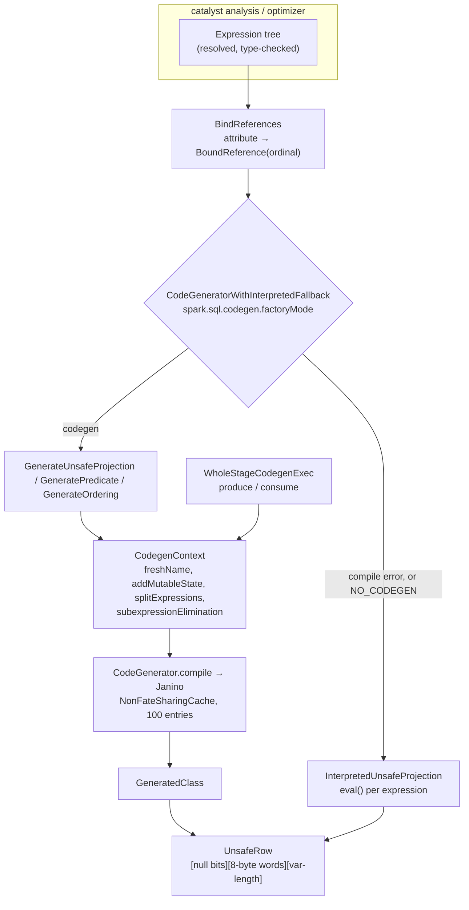

The largest group in the map, and the one whose scope is easiest to underestimate: about **170
source files** across `expressions/` and its nine sub-packages, plus `WholeStageCodegenExec` in
`sql/core`. Everything a query *computes* — as opposed to everything it *plans* — is here.

Two things are worth knowing before reading further. First, this package is where Spark's
**execution model is actually implemented**: an expression carries both an interpreted `eval` and a
`doGenCode` that emits Java source, and almost every performance story in Spark ends at which of
the two ran. Second, this is where **every new type family in Spark 4 landed** — collation,
`VARIANT`, `TIME`, vectors, geospatial — because a new type is, in practice, a set of new
expressions.



---

## The Expression contract — eval, doGenCode, and the traits the optimizer reads

**What it is:** `Expression` is a `TreeNode` with two evaluation paths — `eval(row)` for the
interpreted one and `doGenCode(ctx, ev)` for the generated one — plus a set of *declarative*
properties that the analyzer and optimizer read to decide what they are allowed to do with the
node. Almost every optimizer rule you can name is gated on one of these properties, so the
properties are the real interface, not `eval`.

**Code path:** `Expression.genCode` → subexpression-elimination lookup → `doGenCode` →
`reduceCodeSize` → `ExprCode(code, isNull, value)`

**Anchor files:**

- [Expression.scala:91](https://github.com/apache/spark/blob/v4.2.0/sql/catalyst/src/main/scala/org/apache/spark/sql/catalyst/expressions/Expression.scala#L91) — the class, with a 90-line scaladoc that is the best available index of the trait hierarchy
- [Expression.scala:104](https://github.com/apache/spark/blob/v4.2.0/sql/catalyst/src/main/scala/org/apache/spark/sql/catalyst/expressions/Expression.scala#L104) — `foldable`: the gate on `ConstantFolding`
- [Expression.scala:116](https://github.com/apache/spark/blob/v4.2.0/sql/catalyst/src/main/scala/org/apache/spark/sql/catalyst/expressions/Expression.scala#L116) — `contextIndependentFoldable`, a stricter variant that adds "does not depend on the session time zone, config or catalog", used to decide whether a value can be *stored* in a DDL definition rather than re-evaluated
- [Expression.scala:132](https://github.com/apache/spark/blob/v4.2.0/sql/catalyst/src/main/scala/org/apache/spark/sql/catalyst/expressions/Expression.scala#L132) — `deterministic`, and the three conditions that make an expression non-deterministic
- [Expression.scala:156](https://github.com/apache/spark/blob/v4.2.0/sql/catalyst/src/main/scala/org/apache/spark/sql/catalyst/expressions/Expression.scala#L156) — `stateful`, with the `df.select(rand, rand)` example that motivates it
- [Expression.scala:164](https://github.com/apache/spark/blob/v4.2.0/sql/catalyst/src/main/scala/org/apache/spark/sql/catalyst/expressions/Expression.scala#L164) — `nullIntolerant`: null in ⇒ null out, which is what lets the optimizer infer `IsNotNull` constraints and turn an outer join into an inner one
- [Expression.scala:176](https://github.com/apache/spark/blob/v4.2.0/sql/catalyst/src/main/scala/org/apache/spark/sql/catalyst/expressions/Expression.scala#L176) — `freshCopyIfContainsStatefulExpression`, the defence against a stateful expression being shared across two positions in one projection
- [Expression.scala:207](https://github.com/apache/spark/blob/v4.2.0/sql/catalyst/src/main/scala/org/apache/spark/sql/catalyst/expressions/Expression.scala#L207) — `eval`
- [Expression.scala:216](https://github.com/apache/spark/blob/v4.2.0/sql/catalyst/src/main/scala/org/apache/spark/sql/catalyst/expressions/Expression.scala#L216) — `genCode`, which checks `ctx.subExprEliminationExprs` **first** and reuses an already-emitted variable if this subtree was seen before
- [Expression.scala:240](https://github.com/apache/spark/blob/v4.2.0/sql/catalyst/src/main/scala/org/apache/spark/sql/catalyst/expressions/Expression.scala#L240) — `reduceCodeSize`: any expression whose generated code exceeds `spark.sql.codegen.methodSplitThreshold` (1024 chars) is extracted into its own private method
- [Expression.scala:321](https://github.com/apache/spark/blob/v4.2.0/sql/catalyst/src/main/scala/org/apache/spark/sql/catalyst/expressions/Expression.scala#L321) — `canonicalized`, and at [:338](https://github.com/apache/spark/blob/v4.2.0/sql/catalyst/src/main/scala/org/apache/spark/sql/catalyst/expressions/Expression.scala#L338) `semanticEquals`, which is `deterministic && other.deterministic && canonicalized == other.canonicalized`
- [Expression.scala:413](https://github.com/apache/spark/blob/v4.2.0/sql/catalyst/src/main/scala/org/apache/spark/sql/catalyst/expressions/Expression.scala#L413) — `expensive`, whose only consumer is the pushdown optimizer
- [Expression.scala:433](https://github.com/apache/spark/blob/v4.2.0/sql/catalyst/src/main/scala/org/apache/spark/sql/catalyst/expressions/Expression.scala#L433) — `Unevaluable`: `Star`, `WindowFrame`, `AggregateExpression`, `SubqueryExpression` all live here — nodes that must be rewritten away before execution
- [Expression.scala:451](https://github.com/apache/spark/blob/v4.2.0/sql/catalyst/src/main/scala/org/apache/spark/sql/catalyst/expressions/Expression.scala#L451) — `RuntimeReplaceable`: the compatibility mechanism. `nvl` *is* `coalesce`; the node exists only so the SQL text and the error messages read right
- [Expression.scala:479](https://github.com/apache/spark/blob/v4.2.0/sql/catalyst/src/main/scala/org/apache/spark/sql/catalyst/expressions/Expression.scala#L479) — `InheritAnalysisRules`, which makes the replacement the *child* so type coercion applies to it
- [Expression.scala:530](https://github.com/apache/spark/blob/v4.2.0/sql/catalyst/src/main/scala/org/apache/spark/sql/catalyst/expressions/Expression.scala#L530) — `Nondeterministic`, whose `eval` *requires* `initialize(partitionIndex)` to have been called
- [Expression.scala:566](https://github.com/apache/spark/blob/v4.2.0/sql/catalyst/src/main/scala/org/apache/spark/sql/catalyst/expressions/Expression.scala#L566) — `ConditionalExpression`, with `alwaysEvaluatedInputs` and `branchGroups` — the contract subexpression elimination needs to avoid hoisting work out of a branch that may never run
- [Expression.scala:820](https://github.com/apache/spark/blob/v4.2.0/sql/catalyst/src/main/scala/org/apache/spark/sql/catalyst/expressions/Expression.scala#L820) — `BinaryOperator`, the subset of binary expressions requiring both children to share a type
- [Expression.scala:1393](https://github.com/apache/spark/blob/v4.2.0/sql/catalyst/src/main/scala/org/apache/spark/sql/catalyst/expressions/Expression.scala#L1393) — `CommutativeExpression`, canonicalized by gathering adjacent same-class operands and sorting them by hash code, so `a + b + c` and `c + a + b` compare equal
- [Expression.scala:1506](https://github.com/apache/spark/blob/v4.2.0/sql/catalyst/src/main/scala/org/apache/spark/sql/catalyst/expressions/Expression.scala#L1506) — `DefaultStringProducingExpression`, the collation-era marker for functions that return a string in the *default* collation rather than propagating an input's
- [BoundAttribute.scala:32](https://github.com/apache/spark/blob/v4.2.0/sql/catalyst/src/main/scala/org/apache/spark/sql/catalyst/expressions/BoundAttribute.scala#L32) — `BoundReference`: after `BindReferences`, a named column is an *ordinal*
- [literals.scala:418](https://github.com/apache/spark/blob/v4.2.0/sql/catalyst/src/main/scala/org/apache/spark/sql/catalyst/expressions/literals.scala#L418) — `Literal`, whose `value` is always in Spark's *internal* representation (`UTF8String`, days-since-epoch, micros)
- [ExpressionInfo.java:46](https://github.com/apache/spark/blob/v4.2.0/sql/catalyst/src/main/java/org/apache/spark/sql/catalyst/expressions/ExpressionInfo.java#L46) — `validGroups`, the closed list of 30 function families (`agg_funcs`, `array_funcs`, …, and the new `sketch_funcs`, `variant_funcs`, `vector_funcs`, `st_funcs`) — the fastest map of Spark's entire built-in function surface

!!! info "`semanticEquals` is why `deterministic` matters more than it looks"

    `semanticEquals` returns false whenever *either* side is non-deterministic — regardless of how
    identical the two trees are. Every optimization built on recognising "these are the same
    expression" therefore stops at a non-deterministic node: subexpression elimination, common
    subexpression reuse, predicate deduplication, `ReuseExchange`. One `rand()` or one
    non-deterministic UDF inside a subtree removes that subtree from all of them at once.

!!! warning "`nullIntolerant` is a claim you make, not a property Spark checks"

    It defaults to `false`, and a custom expression that overrides it wrongly makes the optimizer
    infer `IsNotNull` constraints that are not true — which can drop rows. It is the one property
    on this list where being wrong is a correctness bug rather than a performance one.

**Configs:** `spark.sql.codegen.methodSplitThreshold` (1024), `spark.sql.debug.maxToStringFields`
(25, read by `Expression.simpleString`), `spark.sql.expressionTreeChangeLog.level` — the
expression-level counterpart of `planChangeLog`, for watching one rule rewrite one expression

**Maps to topics:** A1, E1

---

## CodegenContext and CodeGenerator — Janino, the class cache, and the JVM limits

**What it is:** the machinery that turns an expression tree into a Java class at runtime.
`CodegenContext` accumulates the state a generated class needs — fresh variable names, mutable
fields, helper methods, the `references` array of objects the generated code closes over — and
`CodeGenerator.compile` hands the assembled source to **Janino**, an in-process Java compiler.
Most of the complexity here is not code generation; it is **working around JVM class-file limits**.

**Code path:** `GenerateX.create(exprs)` → `new CodegenContext` → per-expression `genCode` →
`ctx.declareMutableStates` / `declareAddedFunctions` → `CodeGenerator.compile(CodeAndComment)` →
cache lookup → `doCompile` → `ClassBodyEvaluator.cook` → `GeneratedClass`

**Anchor files:**

- [CodeGenerator.scala:137](https://github.com/apache/spark/blob/v4.2.0/sql/catalyst/src/main/scala/org/apache/spark/sql/catalyst/expressions/codegen/CodeGenerator.scala#L137) — `CodegenContext`
- [CodeGenerator.scala:295](https://github.com/apache/spark/blob/v4.2.0/sql/catalyst/src/main/scala/org/apache/spark/sql/catalyst/expressions/codegen/CodeGenerator.scala#L295) — `addMutableState`, which past `MUTABLESTATEARRAY_SIZE_LIMIT` (32768) stops declaring individual fields and packs state into arrays
- [CodeGenerator.scala:495](https://github.com/apache/spark/blob/v4.2.0/sql/catalyst/src/main/scala/org/apache/spark/sql/catalyst/expressions/codegen/CodeGenerator.scala#L495) — `addNewFunction`, and at [:535](https://github.com/apache/spark/blob/v4.2.0/sql/catalyst/src/main/scala/org/apache/spark/sql/catalyst/expressions/codegen/CodeGenerator.scala#L535) `addNewFunctionToClass` — helper methods spill into *inner classes* once the outer class passes `GENERATED_CLASS_SIZE_THRESHOLD`
- [CodeGenerator.scala:603](https://github.com/apache/spark/blob/v4.2.0/sql/catalyst/src/main/scala/org/apache/spark/sql/catalyst/expressions/codegen/CodeGenerator.scala#L603) — `freshName`, the reason generated code is full of `value_17` and `isNull_3`
- [CodeGenerator.scala:929](https://github.com/apache/spark/blob/v4.2.0/sql/catalyst/src/main/scala/org/apache/spark/sql/catalyst/expressions/codegen/CodeGenerator.scala#L929) — `splitExpressions`, the wide-schema workaround: a projection over 500 columns cannot be one method
- [CodeGenerator.scala:1455](https://github.com/apache/spark/blob/v4.2.0/sql/catalyst/src/main/scala/org/apache/spark/sql/catalyst/expressions/codegen/CodeGenerator.scala#L1455) — `DEFAULT_JVM_HUGE_METHOD_LIMIT = 8000`, the HotSpot size beyond which a method is **never JIT-compiled**
- [CodeGenerator.scala:1458](https://github.com/apache/spark/blob/v4.2.0/sql/catalyst/src/main/scala/org/apache/spark/sql/catalyst/expressions/codegen/CodeGenerator.scala#L1458) — `MAX_JVM_METHOD_PARAMS_LENGTH = 255` and `MAX_JVM_CONSTANT_POOL_SIZE = 65535`
- [CodeGenerator.scala:1504](https://github.com/apache/spark/blob/v4.2.0/sql/catalyst/src/main/scala/org/apache/spark/sql/catalyst/expressions/codegen/CodeGenerator.scala#L1504) — `compile`, a cache lookup keyed on **(classloader weak-ref, source)**
- [CodeGenerator.scala:1518](https://github.com/apache/spark/blob/v4.2.0/sql/catalyst/src/main/scala/org/apache/spark/sql/catalyst/expressions/codegen/CodeGenerator.scala#L1518) — `doCompile`: Janino's `ClassBodyEvaluator`, the fixed import list, and the two `catch` arms that turn a compile failure into `INTERNAL_ERROR` / `COMPILER_ERROR`
- [CodeGenerator.scala:1594](https://github.com/apache/spark/blob/v4.2.0/sql/catalyst/src/main/scala/org/apache/spark/sql/catalyst/expressions/codegen/CodeGenerator.scala#L1594) — `updateAndGetCompilationStats`, which walks the produced bytecode and at [:1610](https://github.com/apache/spark/blob/v4.2.0/sql/catalyst/src/main/scala/org/apache/spark/sql/catalyst/expressions/codegen/CodeGenerator.scala#L1610) logs `Generated method too long to be JIT compiled` — the single most useful log line for a query that codegens fine and still runs slowly
- [CodeGenerator.scala:1649](https://github.com/apache/spark/blob/v4.2.0/sql/catalyst/src/main/scala/org/apache/spark/sql/catalyst/expressions/codegen/CodeGenerator.scala#L1649) — the `NonFateSharingCache`, 100 entries by default, deliberately *not* fate-sharing so a cancelled query does not abort the queries waiting on the same compilation
- [javaCode.scala:139](https://github.com/apache/spark/blob/v4.2.0/sql/catalyst/src/main/scala/org/apache/spark/sql/catalyst/expressions/codegen/javaCode.scala#L139) — `Block`, and at [:227](https://github.com/apache/spark/blob/v4.2.0/sql/catalyst/src/main/scala/org/apache/spark/sql/catalyst/expressions/codegen/javaCode.scala#L227) the `code"..."` string interpolator: generated code is a *tree*, not a string, which is what lets `ExprCode` variables be rewritten after the fact
- [CodeFormatter.scala](https://github.com/apache/spark/blob/v4.2.0/sql/catalyst/src/main/scala/org/apache/spark/sql/catalyst/expressions/codegen/CodeFormatter.scala) — the indenter behind `debugCodegen()` and the `spark.sql.codegen.logLevel` dump

!!! info "The compilation cache is keyed on source text, not on the plan"

    Two structurally identical queries produce identical source and hit the same cache entry;
    two queries differing only in a *literal* usually do not, because the literal is inlined into
    the generated code. On a workload that generates many similar-but-not-identical queries the
    100-entry cache thrashes, and the symptom is `Code generated in NNN ms` appearing in executor
    logs continuously rather than at the start. `spark.sql.codegen.cache.maxEntries` is the knob.

!!! warning "A method over 8000 bytes compiles fine and then runs interpreted"

    Two separate limits are in play and they are easy to confuse. `spark.sql.codegen.hugeMethodLimit`
    (65535) is the point at which *whole-stage codegen gives up and falls back to the operator
    path*. `DEFAULT_JVM_HUGE_METHOD_LIMIT` (8000) is HotSpot's own cutoff, above which the JVM
    refuses to JIT the method at all — Spark only logs it. So there is a wide band, 8000 to 65535
    bytes, where Spark reports everything as fine and the hot loop is running in the bytecode
    interpreter. Grep executor logs for `too long to be JIT compiled`.

**Configs:** `spark.sql.codegen.cache.maxEntries` (100), `spark.sql.codegen.comments` (false),
`spark.sql.codegen.logLevel` (DEBUG), `spark.sql.codegen.logging.maxLines` (1000),
`spark.sql.codegen.methodSplitThreshold` (1024), `spark.sql.codegen.hugeMethodLimit` (65535),
`spark.sql.codegen.useIdInClassName` (true)

**Maps to topics:** E1, A1

---

## Whole-stage codegen — produce/consume and the three ways it silently turns itself off

**What it is:** the fusion of a chain of physical operators into a single generated Java method, so
that a row moves through filter → project → join-probe without ever being materialised between
them. `CodegenSupport` is a **two-directional** protocol: `produce` walks *down* the tree asking
each operator to emit its loop, `consume` walks back *up* handing each parent the produced
variables. The `*(3)` prefixes in an `EXPLAIN` are the stage ids this rule assigns.

**Code path:** `CollapseCodegenStages.apply` → `insertWholeStageCodegen` → `insertInputAdapter` →
at execution `WholeStageCodegenExec.doCodeGen` → `child.produce(ctx, this)` → per operator
`doProduce` / `doConsume` → `CodeGenerator.compile` → `WholeStageCodegenEvaluatorFactory`

**Anchor files:**

- [WholeStageCodegenExec.scala:47](https://github.com/apache/spark/blob/v4.2.0/sql/core/src/main/scala/org/apache/spark/sql/execution/WholeStageCodegenExec.scala#L47) — `CodegenSupport`
- [WholeStageCodegenExec.scala:94](https://github.com/apache/spark/blob/v4.2.0/sql/core/src/main/scala/org/apache/spark/sql/execution/WholeStageCodegenExec.scala#L94) — `produce`, and at [:160](https://github.com/apache/spark/blob/v4.2.0/sql/core/src/main/scala/org/apache/spark/sql/execution/WholeStageCodegenExec.scala#L160) `consume` — both `final`; operators override `doProduce` / `doConsume`
- [WholeStageCodegenExec.scala:402](https://github.com/apache/spark/blob/v4.2.0/sql/core/src/main/scala/org/apache/spark/sql/execution/WholeStageCodegenExec.scala#L402) — `limitNotReachedChecks`, how a `LIMIT` far above the scan becomes a condition *inside* the scan's loop
- [WholeStageCodegenExec.scala:511](https://github.com/apache/spark/blob/v4.2.0/sql/core/src/main/scala/org/apache/spark/sql/execution/WholeStageCodegenExec.scala#L511) — `InputAdapter`, the boundary node between a codegen stage and a non-codegen child
- [WholeStageCodegenExec.scala:590](https://github.com/apache/spark/blob/v4.2.0/sql/core/src/main/scala/org/apache/spark/sql/execution/WholeStageCodegenExec.scala#L590) — `isTooManyFields`, counting **nested** fields against `spark.sql.codegen.maxFields`
- [WholeStageCodegenExec.scala:673](https://github.com/apache/spark/blob/v4.2.0/sql/core/src/main/scala/org/apache/spark/sql/execution/WholeStageCodegenExec.scala#L673) — `doCodeGen`
- [WholeStageCodegenExec.scala:744](https://github.com/apache/spark/blob/v4.2.0/sql/core/src/main/scala/org/apache/spark/sql/execution/WholeStageCodegenExec.scala#L744) — **fallback 1**: compilation threw, and `spark.sql.codegen.fallback` is on ⇒ `return child.execute()`
- [WholeStageCodegenExec.scala:753](https://github.com/apache/spark/blob/v4.2.0/sql/core/src/main/scala/org/apache/spark/sql/execution/WholeStageCodegenExec.scala#L753) — **fallback 2**: compiled, but the biggest method exceeds `hugeMethodLimit` ⇒ `return child.execute()`
- [WholeStageCodegenExec.scala:858](https://github.com/apache/spark/blob/v4.2.0/sql/core/src/main/scala/org/apache/spark/sql/execution/WholeStageCodegenExec.scala#L858) — `tryBroadcastCleanedSource`: past `spark.sql.codegen.broadcastCleanedSourceThreshold` the generated *source* is broadcast rather than shipped in every task
- [WholeStageCodegenExec.scala:914](https://github.com/apache/spark/blob/v4.2.0/sql/core/src/main/scala/org/apache/spark/sql/execution/WholeStageCodegenExec.scala#L914) — `CollapseCodegenStages`, with the scaladoc example showing how stage ids appear in `EXPLAIN`
- [WholeStageCodegenExec.scala:925](https://github.com/apache/spark/blob/v4.2.0/sql/core/src/main/scala/org/apache/spark/sql/execution/WholeStageCodegenExec.scala#L925) — **fallback 3**: `supportCodegen(plan)` is false if any expression is a `CodegenFallback`, or if the output *or any input* schema has too many fields
- [WholeStageCodegenExec.scala:945](https://github.com/apache/spark/blob/v4.2.0/sql/core/src/main/scala/org/apache/spark/sql/execution/WholeStageCodegenExec.scala#L945) — sort-merge and shuffled-hash joins force their children into *separate* stages
- [WholeStageCodegenExec.scala:964](https://github.com/apache/spark/blob/v4.2.0/sql/core/src/main/scala/org/apache/spark/sql/execution/WholeStageCodegenExec.scala#L964) — an operator producing a domain object (`ObjectType`) is never a stage root: the typed Dataset API opts out of fusion at every `map`/`flatMap`
- [WholeStageCodegenExec.scala:981](https://github.com/apache/spark/blob/v4.2.0/sql/core/src/main/scala/org/apache/spark/sql/execution/WholeStageCodegenExec.scala#L981) — `assert(!plan.supportsColumnar)`: whole-stage codegen is row-based, so a columnar operator is structurally excluded
- [WholeStageCodegenEvaluatorFactory.scala](https://github.com/apache/spark/blob/v4.2.0/sql/core/src/main/scala/org/apache/spark/sql/execution/WholeStageCodegenEvaluatorFactory.scala) — the `PartitionEvaluator` that runs the compiled class on each partition

!!! warning "A missing `*` in EXPLAIN has four different causes"

    An operator without the `*(n)` marker fell out of fusion for one of: an expression that extends
    `CodegenFallback` (most `TypedImperativeAggregate`s, `NamedLambdaVariable`, every
    `ImperativeAggregate`); too many fields in its own or a child's schema (default 100, counting
    nested); it is columnar; or it is one of the explicit exclusions (`ObjectType` output,
    `LocalTableScanExec`, `CommandResultExec`). The first two are the ones you can act on — the
    field count in particular is a *nested* count, so a single deeply nested struct column can
    disable codegen for an entire stage.

!!! info "New in 4.2.0: union fusion, off by default"

    `spark.sql.codegen.wholeStage.union.enabled` (internal, default **false**) lets `UnionExec`
    participate in whole-stage codegen on its non-partitioning-aware path, fusing the parent and
    all children into one stage; `spark.sql.codegen.wholeStage.union.maxChildren` (64) bounds it,
    because each child becomes its own helper method and the cost being managed is class-level —
    total bytecode, constant pool, JIT time — not the per-method limit.

**Configs:** `spark.sql.codegen.wholeStage` (true), `spark.sql.codegen.maxFields` (100),
`spark.sql.codegen.fallback` (true), `spark.sql.codegen.hugeMethodLimit` (65535),
`spark.sql.codegen.splitConsumeFuncByOperator` (true),
`spark.sql.codegen.broadcastCleanedSourceThreshold` (-1, disabled),
`spark.sql.codegen.wholeStage.union.enabled` / `.maxChildren` (both 4.2.0, internal)

**Maps to topics:** E1, A1, I7

---

## Interpreted fallback — CodegenFallback, the factory mode, and the interpreted projections

**What it is:** Spark keeps a complete second implementation of expression evaluation. Every
generated object goes through `CodeGeneratorWithInterpretedFallback`, which tries codegen and
**catches any non-fatal exception** to fall back to an interpreted equivalent; and individual
expressions can opt out of codegen entirely with `CodegenFallback`, which emits code that calls
`eval()` through the `references` array.

**Code path:** `UnsafeProjection.create` → `CodeGeneratorWithInterpretedFallback.createObject` →
`GenerateUnsafeProjection` *or* `InterpretedUnsafeProjection`

**Anchor files:**

- [CodeGeneratorWithInterpretedFallback.scala:39](https://github.com/apache/spark/blob/v4.2.0/sql/catalyst/src/main/scala/org/apache/spark/sql/catalyst/expressions/CodeGeneratorWithInterpretedFallback.scala#L39) — `createObject`, the whole mechanism in 18 lines
- [CodeGeneratorWithInterpretedFallback.scala:28](https://github.com/apache/spark/blob/v4.2.0/sql/catalyst/src/main/scala/org/apache/spark/sql/catalyst/expressions/CodeGeneratorWithInterpretedFallback.scala#L28) — `CodegenObjectFactoryMode`: `FALLBACK` / `CODEGEN_ONLY` / `NO_CODEGEN`, documented "for test only" but the fastest way to A/B the two engines on a real query
- [CodegenFallback.scala:26](https://github.com/apache/spark/blob/v4.2.0/sql/catalyst/src/main/scala/org/apache/spark/sql/catalyst/expressions/codegen/CodegenFallback.scala#L26) — the trait; the generated code boxes the result of `eval` and casts it back, which is why a fallback expression costs an object allocation per row
- [CodegenFallback.scala:36](https://github.com/apache/spark/blob/v4.2.0/sql/catalyst/src/main/scala/org/apache/spark/sql/catalyst/expressions/codegen/CodegenFallback.scala#L36) — it walks its own subtree for `Nondeterministic` children and registers a partition-initialization statement for each
- [InterpretedUnsafeProjection.scala](https://github.com/apache/spark/blob/v4.2.0/sql/catalyst/src/main/scala/org/apache/spark/sql/catalyst/expressions/InterpretedUnsafeProjection.scala), [InterpretedMutableProjection.scala](https://github.com/apache/spark/blob/v4.2.0/sql/catalyst/src/main/scala/org/apache/spark/sql/catalyst/expressions/InterpretedMutableProjection.scala), [InterpretedSafeProjection.scala](https://github.com/apache/spark/blob/v4.2.0/sql/catalyst/src/main/scala/org/apache/spark/sql/catalyst/expressions/InterpretedSafeProjection.scala) — the three interpreted projections; `InterpretedUnsafeProjection` builds the same `UnsafeRow` by hand with writer callbacks
- [EvalHelper.scala](https://github.com/apache/spark/blob/v4.2.0/sql/catalyst/src/main/scala/org/apache/spark/sql/catalyst/expressions/EvalHelper.scala), [ExpressionsEvaluator.scala](https://github.com/apache/spark/blob/v4.2.0/sql/catalyst/src/main/scala/org/apache/spark/sql/catalyst/expressions/ExpressionsEvaluator.scala) — the shared initialization/subexpression plumbing both engines use

!!! warning "The fallback catches `NonFatal` and logs at WARN"

    `Expr codegen error and falling back to interpreter mode` is logged once per generated object,
    at WARN, on the executor. There is no metric and nothing in the SQL tab. A query that quietly
    lost codegen for one projection looks identical in `EXPLAIN` to one that did not — the plan
    still says `*(2)`, because the fallback happens at object-construction time, well after
    planning. If a query is inexplicably slow, this log line is worth grepping for before anything
    else.

**Configs:** `spark.sql.codegen.factoryMode` (`FALLBACK`), `spark.sql.codegen.fallback` (true)

**Maps to topics:** E1

---

## Projections, BoundReference and the UnsafeRow binary format

**What it is:** the output side of expression evaluation. A *projection* is a function from
`InternalRow` to `InternalRow`; the important one is `UnsafeProjection`, which writes results
directly into a contiguous `UnsafeRow` — the format that makes shuffle, spill and cache work on
bytes rather than Java objects, and the reason Spark's memory accounting is meaningful at all.

**Anchor files:**

- [Projection.scala:82](https://github.com/apache/spark/blob/v4.2.0/sql/catalyst/src/main/scala/org/apache/spark/sql/catalyst/expressions/Projection.scala#L82) — `MutableProjection`, [:121](https://github.com/apache/spark/blob/v4.2.0/sql/catalyst/src/main/scala/org/apache/spark/sql/catalyst/expressions/Projection.scala#L121) `UnsafeProjection`, [:169](https://github.com/apache/spark/blob/v4.2.0/sql/catalyst/src/main/scala/org/apache/spark/sql/catalyst/expressions/Projection.scala#L169) `SafeProjection` — all three are `CodeGeneratorWithInterpretedFallback` objects
- [BoundAttribute.scala:45](https://github.com/apache/spark/blob/v4.2.0/sql/catalyst/src/main/scala/org/apache/spark/sql/catalyst/expressions/BoundAttribute.scala#L45) — the `ctx.currentVars` branch: inside whole-stage codegen a `BoundReference` reads a **local variable**, not a row — that substitution is the actual mechanism behind "no row materialization between operators"
- [UnsafeRow.java:47](https://github.com/apache/spark/blob/v4.2.0/sql/catalyst/src/main/java/org/apache/spark/sql/catalyst/expressions/UnsafeRow.java#L47) — the layout comment: `[null-tracking bit set][values][variable length portion]`
- [UnsafeRow.java:70](https://github.com/apache/spark/blob/v4.2.0/sql/catalyst/src/main/java/org/apache/spark/sql/catalyst/expressions/UnsafeRow.java#L70) — `calculateBitSetWidthInBytes`: the null bitmap is rounded up to 8-byte words, so a 1-column row still pays 8 bytes of null bits
- [UnsafeRow.java:77](https://github.com/apache/spark/blob/v4.2.0/sql/catalyst/src/main/java/org/apache/spark/sql/catalyst/expressions/UnsafeRow.java#L77) — `isFixedLength`: a `DecimalType` is stored inline only up to `Decimal.MAX_LONG_DIGITS` (18); wider decimals become variable-length
- [UnsafeRow.java:92](https://github.com/apache/spark/blob/v4.2.0/sql/catalyst/src/main/java/org/apache/spark/sql/catalyst/expressions/UnsafeRow.java#L92) — `isMutable`, the set of types an aggregation buffer can update in place
- [UnsafeRow.java:117](https://github.com/apache/spark/blob/v4.2.0/sql/catalyst/src/main/java/org/apache/spark/sql/catalyst/expressions/UnsafeRow.java#L117) — `getFieldOffset`: **every** field occupies exactly 8 bytes in the fixed region, whether it is a boolean or a pointer
- [UnsafeRow.java:158](https://github.com/apache/spark/blob/v4.2.0/sql/catalyst/src/main/java/org/apache/spark/sql/catalyst/expressions/UnsafeRow.java#L158) — `pointTo`, with `assert sizeInBytes % 8 == 0`: an `UnsafeRow` is a *pointer*, which is why operators must `.copy()` before buffering one
- [codegen/UnsafeRowWriter.java:86](https://github.com/apache/spark/blob/v4.2.0/sql/catalyst/src/main/java/org/apache/spark/sql/catalyst/expressions/codegen/UnsafeRowWriter.java#L86) — `resetRowWriter` and [:99](https://github.com/apache/spark/blob/v4.2.0/sql/catalyst/src/main/java/org/apache/spark/sql/catalyst/expressions/codegen/UnsafeRowWriter.java#L99) `zeroOutNullBytes` — the per-row reset that makes the writer reusable
- [codegen/BufferHolder.java](https://github.com/apache/spark/blob/v4.2.0/sql/catalyst/src/main/java/org/apache/spark/sql/catalyst/expressions/codegen/BufferHolder.java) — the growable byte buffer behind the writers
- [UnsafeArrayData.java](https://github.com/apache/spark/blob/v4.2.0/sql/catalyst/src/main/java/org/apache/spark/sql/catalyst/expressions/UnsafeArrayData.java), [UnsafeMapData.java](https://github.com/apache/spark/blob/v4.2.0/sql/catalyst/src/main/java/org/apache/spark/sql/catalyst/expressions/UnsafeMapData.java) — nested collections in the same format
- [GenerateUnsafeProjection.scala](https://github.com/apache/spark/blob/v4.2.0/sql/catalyst/src/main/scala/org/apache/spark/sql/catalyst/expressions/codegen/GenerateUnsafeProjection.scala), [GenerateOrdering.scala](https://github.com/apache/spark/blob/v4.2.0/sql/catalyst/src/main/scala/org/apache/spark/sql/catalyst/expressions/codegen/GenerateOrdering.scala), [GeneratePredicate.scala](https://github.com/apache/spark/blob/v4.2.0/sql/catalyst/src/main/scala/org/apache/spark/sql/catalyst/expressions/codegen/GenerateUnsafeProjection.scala) — the three generators that back projection, sort and filter
- [GenerateUnsafeRowJoiner.scala](https://github.com/apache/spark/blob/v4.2.0/sql/catalyst/src/main/scala/org/apache/spark/sql/catalyst/expressions/codegen/GenerateUnsafeRowJoiner.scala) — concatenating two `UnsafeRow`s by copying bytes and shifting offsets, the join-output fast path
- [RowBasedKeyValueBatch.java](https://github.com/apache/spark/blob/v4.2.0/sql/catalyst/src/main/java/org/apache/spark/sql/catalyst/expressions/RowBasedKeyValueBatch.java) — the key/value pair store the fast hash-aggregate map is built on
- [JoinedRow.scala](https://github.com/apache/spark/blob/v4.2.0/sql/catalyst/src/main/scala/org/apache/spark/sql/catalyst/expressions/JoinedRow.scala), [SpecificInternalRow.scala](https://github.com/apache/spark/blob/v4.2.0/sql/catalyst/src/main/scala/org/apache/spark/sql/catalyst/expressions/SpecificInternalRow.scala) — the two mutable row types operators use before producing an unsafe one

!!! info "Eight bytes per field is why wide tables cost more than their data"

    A 300-column table of booleans is 300 × 8 = 2400 bytes of fixed region plus 40 bytes of null
    bits per row, regardless of the 300 bits of actual information. The fixed-width layout is what
    makes field access a single offset computation and sorting a byte comparison; the price is paid
    on wide schemas, and it compounds with `spark.sql.codegen.maxFields` disabling codegen on the
    same tables.

**Configs:** none read directly by `UnsafeRow`; `spark.sql.codegen.factoryMode` selects generated
vs interpreted projections

**Maps to topics:** E1

---

## Subexpression elimination — the same expression, evaluated once

**What it is:** the pass that finds semantically equal subtrees within one projection (or filter,
or aggregate buffer) and arranges for each to be computed once per row. `EquivalentExpressions`
does the counting, using `ExpressionEquals` — a wrapper whose `equals` is `semanticEquals` — and
`CodegenContext.subexpressionElimination` turns every subtree with `useCount > 1` into a generated
helper function plus a pair of `isNull`/`value` variables that `Expression.genCode` then reuses.
The interpreted engine gets the same behaviour a different way, through a Guava cache.

**Code path:** `ctx.generateExpressions(exprs, doSubexpressionElimination = true)` →
`EquivalentExpressions.addExprTree` per expression → `getAllExprStates(1)` → emit one function per
common subtree → `Expression.genCode` finds it in `ctx.subExprEliminationExprs` and returns the
existing variable

**Anchor files:**

- [EquivalentExpressions.scala:35](https://github.com/apache/spark/blob/v4.2.0/sql/catalyst/src/main/scala/org/apache/spark/sql/catalyst/expressions/EquivalentExpressions.scala#L35) — the class, and at [:258](https://github.com/apache/spark/blob/v4.2.0/sql/catalyst/src/main/scala/org/apache/spark/sql/catalyst/expressions/EquivalentExpressions.scala#L258) `ExpressionStats`, the mutable use-count
- [EquivalentExpressions.scala:163](https://github.com/apache/spark/blob/v4.2.0/sql/catalyst/src/main/scala/org/apache/spark/sql/catalyst/expressions/EquivalentExpressions.scala#L163) — `supportedExpression`: anything containing a `LAMBDA_VARIABLE` is excluded outright (a loop variable cannot be hoisted out of its loop), as is a `PLAN_EXPRESSION` inside a running task
- [EquivalentExpressions.scala:149](https://github.com/apache/spark/blob/v4.2.0/sql/catalyst/src/main/scala/org/apache/spark/sql/catalyst/expressions/EquivalentExpressions.scala#L149) — `childrenToRecurse`: a `CodegenFallback` contributes **nothing** (its children are never code-generated), and a `ConditionalExpression` contributes only `alwaysEvaluatedInputs`
- [EquivalentExpressions.scala:157](https://github.com/apache/spark/blob/v4.2.0/sql/catalyst/src/main/scala/org/apache/spark/sql/catalyst/expressions/EquivalentExpressions.scala#L157) — `commonChildrenToRecurse`, using `branchGroups` so an expression common to *every* branch of a `CASE` can still be hoisted
- [EquivalentExpressions.scala:132](https://github.com/apache/spark/blob/v4.2.0/sql/catalyst/src/main/scala/org/apache/spark/sql/catalyst/expressions/EquivalentExpressions.scala#L132) — `skipForShortcut`: with `spark.sql.subexpressionElimination.skipForShortcutExpr`, only the *left* side of an `And`/`Or` is considered, because the right may be short-circuited away
- [EquivalentExpressions.scala:188](https://github.com/apache/spark/blob/v4.2.0/sql/catalyst/src/main/scala/org/apache/spark/sql/catalyst/expressions/EquivalentExpressions.scala#L188) — a `LeafExpression` is never a candidate: reusing a column read is not worth a function call
- [CodeGenerator.scala:1281](https://github.com/apache/spark/blob/v4.2.0/sql/catalyst/src/main/scala/org/apache/spark/sql/catalyst/expressions/codegen/CodeGenerator.scala#L1281) — `subexpressionElimination`, and at [:1164](https://github.com/apache/spark/blob/v4.2.0/sql/catalyst/src/main/scala/org/apache/spark/sql/catalyst/expressions/codegen/CodeGenerator.scala#L1164) the whole-stage variant, which must emit code inline rather than as functions because the inputs are local variables
- [CodeGenerator.scala:1333](https://github.com/apache/spark/blob/v4.2.0/sql/catalyst/src/main/scala/org/apache/spark/sql/catalyst/expressions/codegen/CodeGenerator.scala#L1333) — `generateExpressions`, the single entry point every generator calls
- [SubExprEvaluationRuntime.scala:36](https://github.com/apache/spark/blob/v4.2.0/sql/catalyst/src/main/scala/org/apache/spark/sql/catalyst/expressions/SubExprEvaluationRuntime.scala#L36) — the interpreted counterpart: a Guava `LoadingCache` keyed on `ExpressionProxy`
- [SubExprEvaluationRuntime.scala:67](https://github.com/apache/spark/blob/v4.2.0/sql/catalyst/src/main/scala/org/apache/spark/sql/catalyst/expressions/SubExprEvaluationRuntime.scala#L67) — `setInput`, which **invalidates the entire cache on every row** — the cache is a within-row memo, not a cross-row one
- [Expression.scala:217](https://github.com/apache/spark/blob/v4.2.0/sql/catalyst/src/main/scala/org/apache/spark/sql/catalyst/expressions/Expression.scala#L217) — the consumer side, in `genCode`

!!! warning "Elimination stops at a lambda, a UDF's children, and a non-deterministic node"

    Three exclusions cover most of the cases where people expect reuse and do not get it. A
    subtree inside `transform`/`filter`/`aggregate` contains a `LambdaVariable` and is skipped
    entirely. A `CodegenFallback` expression — which includes every `ImperativeAggregate` and most
    Python UDF plumbing — contributes no children, so a shared subtree *underneath* one is
    invisible. And `semanticEquals` is false for anything non-deterministic. Writing
    `expensive_udf(x)` three times in one `select` and expecting one evaluation is the standard
    disappointment; hoist it into a separate `withColumn` instead.

!!! info "New in 4.2.0: `FilterExec` can opt out"

    `spark.sql.subexpressionElimination.filterExec.enabled` (internal, default true) exists because
    eliminating common subexpressions across a filter's predicates **forces eager materialization
    of every referenced column on every row**, defeating the lazy, short-circuiting predicate
    codegen. On a filter whose first conjunct rejects most rows, turning this off can be faster.

**Configs:** `spark.sql.subexpressionElimination.enabled` (true),
`.cache.maxEntries` (100, interpreted path only), `.skipForShortcutExpr` (false),
`.filterExec.enabled` (true, 4.2.0), `spark.sql.alwaysInlineCommonExpr`

**Maps to topics:** none yet — proposed as **A21**

---

## Cast, EvalMode and ANSI — the three evaluation modes and where the errors come from

**What it is:** `EvalMode` is a three-valued enum carried *on the expression*, not just read from
the session: `LEGACY` (Hive-compatible, returns null on overflow and bad input), `ANSI` (raises),
and `TRY` (ANSI rules, but returns null instead of raising). `Cast` is the largest single consumer
— roughly 40 `if (ansiEnabled)` branches — and the `try_*` functions are `RuntimeReplaceable`
wrappers that construct the same arithmetic expression with `EvalMode.TRY`.

**Code path:** analyzer's `AnsiTypeCoercion` (or legacy `TypeCoercion`) inserts `Cast(child, to,
EvalMode.fromSQLConf(conf))` → `Cast.checkInputDataTypes` uses `canAnsiCast` or `canCast` →
at runtime the cast function branches on `ansiEnabled` → error carries a `QueryContext` pointing at
the SQL fragment

**Anchor files:**

- [EvalMode.scala:29](https://github.com/apache/spark/blob/v4.2.0/sql/catalyst/src/main/scala/org/apache/spark/sql/catalyst/expressions/EvalMode.scala#L29) — the enum and `fromSQLConf`
- [Cast.scala:45](https://github.com/apache/spark/blob/v4.2.0/sql/catalyst/src/main/scala/org/apache/spark/sql/catalyst/expressions/Cast.scala#L45) — `object Cast`, opening with the SQL:2016 cast-validity matrix transcribed from the standard
- [Cast.scala:92](https://github.com/apache/spark/blob/v4.2.0/sql/catalyst/src/main/scala/org/apache/spark/sql/catalyst/expressions/Cast.scala#L92) — `canAnsiCast`, and at [:223](https://github.com/apache/spark/blob/v4.2.0/sql/catalyst/src/main/scala/org/apache/spark/sql/catalyst/expressions/Cast.scala#L223) `canCast` — **two different tables**: what is *allowed* differs between modes, before any runtime behaviour does
- [Cast.scala:87](https://github.com/apache/spark/blob/v4.2.0/sql/catalyst/src/main/scala/org/apache/spark/sql/catalyst/expressions/Cast.scala#L87) — the documented deviations from the standard: Spark's ANSI mode additionally allows numeric ⇄ boolean and string ⇄ binary
- [Cast.scala:355](https://github.com/apache/spark/blob/v4.2.0/sql/catalyst/src/main/scala/org/apache/spark/sql/catalyst/expressions/Cast.scala#L355) — `canUpCast` (loss-free widening, used by the typed API) and at [:387](https://github.com/apache/spark/blob/v4.2.0/sql/catalyst/src/main/scala/org/apache/spark/sql/catalyst/expressions/Cast.scala#L387) `canANSIStoreAssign`, the *third*, looser table used for `INSERT INTO` store assignment
- [Cast.scala:427](https://github.com/apache/spark/blob/v4.2.0/sql/catalyst/src/main/scala/org/apache/spark/sql/catalyst/expressions/Cast.scala#L427) — `forceNullable`: which casts make a non-nullable column nullable
- [Cast.scala:547](https://github.com/apache/spark/blob/v4.2.0/sql/catalyst/src/main/scala/org/apache/spark/sql/catalyst/expressions/Cast.scala#L547) — the expression, and at [:573](https://github.com/apache/spark/blob/v4.2.0/sql/catalyst/src/main/scala/org/apache/spark/sql/catalyst/expressions/Cast.scala#L573) `ansiEnabled`, which is `evalMode == ANSI || evalMode == TRY`
- [Cast.scala:643](https://github.com/apache/spark/blob/v4.2.0/sql/catalyst/src/main/scala/org/apache/spark/sql/catalyst/expressions/Cast.scala#L643) — `initQueryContext`, populated **only in ANSI mode**: the "line N, position M" fragment in a Spark 4 error message exists because the expression captured its origin
- [Cast.scala:1075](https://github.com/apache/spark/blob/v4.2.0/sql/catalyst/src/main/scala/org/apache/spark/sql/catalyst/expressions/Cast.scala#L1075) — decimal narrowing: `changePrecision(value, dt, nullOnOverflow = !ansiEnabled)`, gated by `spark.sql.decimalOperations.allowPrecisionLoss`
- [TryEval.scala:25](https://github.com/apache/spark/blob/v4.2.0/sql/catalyst/src/main/scala/org/apache/spark/sql/catalyst/expressions/TryEval.scala#L25) — `TryEval`, a `try`/`catch` around a child's `eval`, and at [:79](https://github.com/apache/spark/blob/v4.2.0/sql/catalyst/src/main/scala/org/apache/spark/sql/catalyst/expressions/TryEval.scala#L79) `TryAdd` — `try_add` is `Add(l, r, EvalMode.TRY)`, not a `try`/`catch`
- [arithmetic.scala](https://github.com/apache/spark/blob/v4.2.0/sql/catalyst/src/main/scala/org/apache/spark/sql/catalyst/expressions/arithmetic.scala) — every arithmetic operator carries its own `evalMode`; overflow checking is per-expression, not per-session
- [ToStringBase.scala](https://github.com/apache/spark/blob/v4.2.0/sql/catalyst/src/main/scala/org/apache/spark/sql/catalyst/expressions/ToStringBase.scala), [ToPrettyString.scala](https://github.com/apache/spark/blob/v4.2.0/sql/catalyst/src/main/scala/org/apache/spark/sql/catalyst/expressions/ToPrettyString.scala) — the cast-to-string path, split so that `show()` formatting and `CAST(x AS STRING)` can differ

!!! warning "`try_add` is not a try/catch, and that distinction leaks"

    `TryAdd` rewrites to `Add(left, right, EvalMode.TRY)` — the arithmetic itself checks and returns
    null. `TryEval` (the generic wrapper, used for `try_reflect` and friends) really does catch.
    The consequence: `try_*` on a supported operator suppresses only *that operator's* arithmetic
    error, not an error thrown by a child expression. `try_add(1, cast('x' as int))` still fails,
    because the cast raised before the addition ran.

!!! info "Three cast tables, not one"

    `canCast` (legacy), `canAnsiCast` (ANSI expressions), `canANSIStoreAssign` (writing into a
    table), plus `canUpCast` for the typed API. A conversion can be rejected in a `SELECT` and
    accepted in an `INSERT` into the same column type. When a migration hits "cannot cast" in one
    place and not another, this is why.

**Configs:** `spark.sql.ansi.enabled` (**true** in 4.x unless `SPARK_ANSI_SQL_MODE=false`),
`spark.sql.decimalOperations.allowPrecisionLoss` (true), `spark.sql.legacy.doLooseUpcast`,
`spark.sql.legacy.castComplexTypesToString.enabled`, `spark.sql.ansi.doubleQuotedIdentifiers`,
`spark.sql.ansi.enforceReservedKeywords`, `spark.sql.ansi.relationPrecedence`,
`spark.sql.storeAssignmentPolicy`

**Maps to topics:** none yet — proposed as **I20**

---

## The aggregate expression framework — four modes and three implementation styles

**What it is:** `catalyst/expressions/aggregate/` (42 files) defines *what* an aggregate computes;
`sql/core`'s `HashAggregateExec` / `ObjectHashAggregateExec` / `SortAggregateExec` decide *how* it
runs. The bridge is `AggregateExpression`, a wrapper carrying the function plus a **mode** —
`Partial`, `PartialMerge`, `Final`, `Complete` — which is how one function becomes the map side and
the reduce side of a shuffle.

**Anchor files:**

- [aggregate/interfaces.scala:33](https://github.com/apache/spark/blob/v4.2.0/sql/catalyst/src/main/scala/org/apache/spark/sql/catalyst/expressions/aggregate/interfaces.scala#L33) — `AggregateMode`, with `Partial` [:40](https://github.com/apache/spark/blob/v4.2.0/sql/catalyst/src/main/scala/org/apache/spark/sql/catalyst/expressions/aggregate/interfaces.scala#L40), `PartialMerge` [:48](https://github.com/apache/spark/blob/v4.2.0/sql/catalyst/src/main/scala/org/apache/spark/sql/catalyst/expressions/aggregate/interfaces.scala#L48), `Final` [:56](https://github.com/apache/spark/blob/v4.2.0/sql/catalyst/src/main/scala/org/apache/spark/sql/catalyst/expressions/aggregate/interfaces.scala#L56), `Complete` [:64](https://github.com/apache/spark/blob/v4.2.0/sql/catalyst/src/main/scala/org/apache/spark/sql/catalyst/expressions/aggregate/interfaces.scala#L64)
- [aggregate/interfaces.scala:99](https://github.com/apache/spark/blob/v4.2.0/sql/catalyst/src/main/scala/org/apache/spark/sql/catalyst/expressions/aggregate/interfaces.scala#L99) — `AggregateExpression`, which is `Unevaluable`: the physical operator, not the expression, drives it
- [aggregate/interfaces.scala:103](https://github.com/apache/spark/blob/v4.2.0/sql/catalyst/src/main/scala/org/apache/spark/sql/catalyst/expressions/aggregate/interfaces.scala#L103) — the `filter` field: `count(x) FILTER (WHERE y > 0)` is a property of the aggregate, not a `Filter` operator
- [aggregate/interfaces.scala:207](https://github.com/apache/spark/blob/v4.2.0/sql/catalyst/src/main/scala/org/apache/spark/sql/catalyst/expressions/aggregate/interfaces.scala#L207) — `AggregateFunction`, whose contract is a **buffer schema** plus update/merge
- [aggregate/interfaces.scala:285](https://github.com/apache/spark/blob/v4.2.0/sql/catalyst/src/main/scala/org/apache/spark/sql/catalyst/expressions/aggregate/interfaces.scala#L285) — `ImperativeAggregate`, which extends `CodegenFallback` — every imperative aggregate disables whole-stage codegen for its operator
- [aggregate/interfaces.scala:394](https://github.com/apache/spark/blob/v4.2.0/sql/catalyst/src/main/scala/org/apache/spark/sql/catalyst/expressions/aggregate/interfaces.scala#L394) — `DeclarativeAggregate`: `initialValues` / `updateExpressions` / `mergeExpressions` / `evaluateExpression` are *expressions*, so `Sum` and `Count` compile into the generated loop
- [aggregate/interfaces.scala:522](https://github.com/apache/spark/blob/v4.2.0/sql/catalyst/src/main/scala/org/apache/spark/sql/catalyst/expressions/aggregate/interfaces.scala#L522) — `TypedImperativeAggregate[T]`: an arbitrary JVM object as buffer, with `serialize`/`deserialize` called when the buffer must cross a shuffle — this is the tier that forces `ObjectHashAggregateExec`
- [aggregate/Sum.scala](https://github.com/apache/spark/blob/v4.2.0/sql/catalyst/src/main/scala/org/apache/spark/sql/catalyst/expressions/aggregate/Sum.scala), [aggregate/Average.scala](https://github.com/apache/spark/blob/v4.2.0/sql/catalyst/src/main/scala/org/apache/spark/sql/catalyst/expressions/aggregate/Average.scala), [aggregate/Count.scala](https://github.com/apache/spark/blob/v4.2.0/sql/catalyst/src/main/scala/org/apache/spark/sql/catalyst/expressions/aggregate/Count.scala) — the declarative tier
- [aggregate/collect.scala:48](https://github.com/apache/spark/blob/v4.2.0/sql/catalyst/src/main/scala/org/apache/spark/sql/catalyst/expressions/aggregate/collect.scala#L48) — `Collect`, the base of `collect_list` / `collect_set`: a growable Scala collection per group, serialized through a `GenericArrayData`. This is the aggregate that turns memory pressure into an OOM rather than a spill
- [aggregate/percentiles.scala:37](https://github.com/apache/spark/blob/v4.2.0/sql/catalyst/src/main/scala/org/apache/spark/sql/catalyst/expressions/aggregate/percentiles.scala#L37) — `PercentileBase`, backed by an `OpenHashMap` of value → count: `percentile` is exact and unbounded, unlike `approx_percentile`
- [aggregate/CentralMomentAgg.scala](https://github.com/apache/spark/blob/v4.2.0/sql/catalyst/src/main/scala/org/apache/spark/sql/catalyst/expressions/aggregate/CentralMomentAgg.scala) — the online (streaming-moment) formulas behind `stddev`, `skewness`, `kurtosis`, and the `spark.sql.legacy.statisticalAggregate` switch that 19 call sites read
- [aggregate/V2Aggregator.scala:27](https://github.com/apache/spark/blob/v4.2.0/sql/catalyst/src/main/scala/org/apache/spark/sql/catalyst/expressions/aggregate/V2Aggregator.scala#L27) — the adapter that lets a DSv2 catalog contribute an aggregate function
- [aggregate/Measure.scala](https://github.com/apache/spark/blob/v4.2.0/sql/catalyst/src/main/scala/org/apache/spark/sql/catalyst/expressions/aggregate/Measure.scala) — **new in 4.2.0**: an unevaluable marker the analyzer replaces with the aggregate defined by a *metric view*'s measure
- [aggregate/MaxMinByK.scala](https://github.com/apache/spark/blob/v4.2.0/sql/catalyst/src/main/scala/org/apache/spark/sql/catalyst/expressions/aggregate/MaxMinByK.scala) — **new in 4.2.0**: `max_by`/`min_by` returning the top *k*, on a bounded heap ([MaxMinByKHeap.scala](https://github.com/apache/spark/blob/v4.2.0/sql/catalyst/src/main/scala/org/apache/spark/sql/catalyst/expressions/aggregate/MaxMinByKHeap.scala))

!!! info "Which of the three tiers a function is in determines which operator you get"

    `HashAggregateExec` requires every buffer field to be a *mutable* `UnsafeRow` type — i.e. all
    aggregates declarative with primitive/decimal buffers. One `collect_list`, `percentile` or
    `TypedImperativeAggregate` in the projection moves the whole aggregation to
    `ObjectHashAggregateExec`, which falls back to sort-based aggregation once
    `spark.sql.objectHashAggregate.sortBased.fallbackThreshold` (128) groups accumulate. The
    [B6 trace](../topics/b6.md) covers the physical side; this is the expression-side reason it
    happens.

!!! warning "`Partial`/`Final` is why a custom aggregate must be associative"

    A `Partial` aggregate runs before the shuffle and a `Final` merges the results, so `merge` is
    called on arbitrary groupings of partial buffers. An aggregate whose `merge` is not
    associative and commutative produces different answers at different partition counts —
    silently, and only under repartitioning.

**Configs:** `spark.sql.legacy.statisticalAggregate`, `spark.sql.legacy.percentileDiscCalculation`,
`spark.sql.legacy.allowParameterlessCount`, `spark.sql.legacy.histogramNumericPropagateInputType`,
`spark.sql.listagg.allowDistinctCastWithOrder.enabled`; the `spark.sql.codegen.aggregate.*` family
is read by the **sql/core** operators, not here

**Maps to topics:** B6, A1

---

## Sketch-based approximate aggregates

**What it is:** a growing family — 10+ files — of aggregates backed by probabilistic data
structures, all sharing one shape: a bounded-size buffer that answers a question exactly enough,
in one pass, with a `merge` that is a set union. Spark 4 exposes not just the estimates but the
**sketch state itself**, so a sketch can be persisted and combined later.

**Anchor files:**

- [aggregate/HyperLogLogPlusPlus.scala:60](https://github.com/apache/spark/blob/v4.2.0/sql/catalyst/src/main/scala/org/apache/spark/sql/catalyst/expressions/aggregate/HyperLogLogPlusPlus.scala#L60) — `approx_count_distinct`, `relativeSD` default **0.05** (5% error); the buffer is `numWords` longs sized from that error target, so accuracy is a memory dial
- [aggregate/datasketchesAggregates.scala:59](https://github.com/apache/spark/blob/v4.2.0/sql/catalyst/src/main/scala/org/apache/spark/sql/catalyst/expressions/aggregate/datasketchesAggregates.scala#L59) — `HllSketchAgg` (`hll_sketch_agg`) and at [:247](https://github.com/apache/spark/blob/v4.2.0/sql/catalyst/src/main/scala/org/apache/spark/sql/catalyst/expressions/aggregate/datasketchesAggregates.scala#L247) `HllUnionAgg` — the Apache DataSketches implementation, whose serialized sketch you can **store in a table** and union across days
- [aggregate/kllAggregates.scala](https://github.com/apache/spark/blob/v4.2.0/sql/catalyst/src/main/scala/org/apache/spark/sql/catalyst/expressions/aggregate/kllAggregates.scala) — KLL quantile sketches
- [aggregate/thetasketchesAggregates.scala](https://github.com/apache/spark/blob/v4.2.0/sql/catalyst/src/main/scala/org/apache/spark/sql/catalyst/expressions/aggregate/thetasketchesAggregates.scala) — Theta sketches: distinct counts that support **intersection and difference**, not just union
- [aggregate/tupleSketchAgg.scala](https://github.com/apache/spark/blob/v4.2.0/sql/catalyst/src/main/scala/org/apache/spark/sql/catalyst/expressions/aggregate/tupleSketchAgg.scala), [tupleUnionAgg.scala](https://github.com/apache/spark/blob/v4.2.0/sql/catalyst/src/main/scala/org/apache/spark/sql/catalyst/expressions/aggregate/tupleUnionAgg.scala), [tupleIntersectionAgg.scala](https://github.com/apache/spark/blob/v4.2.0/sql/catalyst/src/main/scala/org/apache/spark/sql/catalyst/expressions/aggregate/tupleIntersectionAgg.scala), [tupleSketchState.scala](https://github.com/apache/spark/blob/v4.2.0/sql/catalyst/src/main/scala/org/apache/spark/sql/catalyst/expressions/aggregate/tupleSketchState.scala) — **all new in 4.2.0**: Theta sketches carrying a summary value per key, so a set operation also aggregates a metric
- [tupleUnion.scala](https://github.com/apache/spark/blob/v4.2.0/sql/catalyst/src/main/scala/org/apache/spark/sql/catalyst/expressions/tupleUnion.scala), [tupleIntersection.scala](https://github.com/apache/spark/blob/v4.2.0/sql/catalyst/src/main/scala/org/apache/spark/sql/catalyst/expressions/tupleIntersection.scala), [tupleDifference.scala](https://github.com/apache/spark/blob/v4.2.0/sql/catalyst/src/main/scala/org/apache/spark/sql/catalyst/expressions/tupleDifference.scala), [tupleSketchEstimate.scala](https://github.com/apache/spark/blob/v4.2.0/sql/catalyst/src/main/scala/org/apache/spark/sql/catalyst/expressions/tupleSketchEstimate.scala), [tupleSketchSummary.scala](https://github.com/apache/spark/blob/v4.2.0/sql/catalyst/src/main/scala/org/apache/spark/sql/catalyst/expressions/tupleSketchSummary.scala) — the scalar operations over stored tuple sketches, also 4.2.0
- [aggregate/ApproxTopKAggregates.scala:502](https://github.com/apache/spark/blob/v4.2.0/sql/catalyst/src/main/scala/org/apache/spark/sql/catalyst/expressions/aggregate/ApproxTopKAggregates.scala#L502) `ApproxTopKAccumulate` and [:727](https://github.com/apache/spark/blob/v4.2.0/sql/catalyst/src/main/scala/org/apache/spark/sql/catalyst/expressions/aggregate/ApproxTopKAggregates.scala#L727) `ApproxTopKCombine`, with [ApproxTopKExpressions.scala:56](https://github.com/apache/spark/blob/v4.2.0/sql/catalyst/src/main/scala/org/apache/spark/sql/catalyst/expressions/ApproxTopKExpressions.scala#L56) `ApproxTopKEstimate` — the **accumulate → combine → estimate** triple, the clearest example of the persisted-state pattern
- [aggregate/CountMinSketchAgg.scala:43](https://github.com/apache/spark/blob/v4.2.0/sql/catalyst/src/main/scala/org/apache/spark/sql/catalyst/expressions/aggregate/CountMinSketchAgg.scala#L43) — frequency estimation
- [aggregate/ApproximatePercentile.scala](https://github.com/apache/spark/blob/v4.2.0/sql/catalyst/src/main/scala/org/apache/spark/sql/catalyst/expressions/aggregate/ApproximatePercentile.scala) — the Greenwald–Khanna summary behind `approx_percentile`, with its `accuracy` parameter
- [aggregate/BloomFilterAggregate.scala:41](https://github.com/apache/spark/blob/v4.2.0/sql/catalyst/src/main/scala/org/apache/spark/sql/catalyst/expressions/aggregate/BloomFilterAggregate.scala#L41) — the sketch built for *runtime filtering*, sized from `spark.sql.optimizer.runtime.bloomFilter.expectedNumItems` / `.numBits`
- [bitmapExpressions.scala](https://github.com/apache/spark/blob/v4.2.0/sql/catalyst/src/main/scala/org/apache/spark/sql/catalyst/expressions/bitmapExpressions.scala) — the exact-but-compact alternative for dense integer ids
- [ExpressionInfo.java:51](https://github.com/apache/spark/blob/v4.2.0/sql/catalyst/src/main/java/org/apache/spark/sql/catalyst/expressions/ExpressionInfo.java#L51) — `sketch_funcs`, the registry group that names the family

!!! info "The state functions are the point, not the estimates"

    `approx_count_distinct` saves one shuffle. `hll_sketch_agg` + `hll_union_agg` changes the shape
    of the problem: store one sketch per (day, segment), and every distinct-count query over any
    date range becomes a union of pre-computed sketches. Same for `approx_top_k_accumulate` /
    `_combine`. That is a data-modelling capability, not an optimization, and it is invisible if
    you only read the estimate functions.

!!! warning "Every one of these is a `TypedImperativeAggregate`"

    Which means: no whole-stage codegen for the aggregate operator, `ObjectHashAggregateExec`
    rather than `HashAggregateExec`, and a serialize/deserialize round trip per buffer at every
    shuffle boundary. The approximation buys a bounded buffer, not a cheap one.

**Configs:** `spark.sql.optimizer.runtime.bloomFilter.expectedNumItems` / `.numBits`,
`spark.sql.objectHashAggregate.sortBased.fallbackThreshold` (read in sql/core)

**Maps to topics:** none yet — proposed as **A22**

---

## Window expressions — frames, offsets and the rank family

**What it is:** the expression half of window functions: a `WindowExpression` pairs a function with
a `WindowSpecDefinition` (partition by, order by, frame), and the frame is itself an expression
tree — `SpecifiedWindowFrame(frameType, lower, upper)` — validated at analysis. `WindowExec` in
sql/core consumes the result.

**Anchor files:**

- [windowExpressions.scala:47](https://github.com/apache/spark/blob/v4.2.0/sql/catalyst/src/main/scala/org/apache/spark/sql/catalyst/expressions/windowExpressions.scala#L47) — `WindowSpecDefinition`
- [windowExpressions.scala:130](https://github.com/apache/spark/blob/v4.2.0/sql/catalyst/src/main/scala/org/apache/spark/sql/catalyst/expressions/windowExpressions.scala#L130) — `FrameType`, with `RowFrame` [:141](https://github.com/apache/spark/blob/v4.2.0/sql/catalyst/src/main/scala/org/apache/spark/sql/catalyst/expressions/windowExpressions.scala#L141) (physical offsets) and `RangeFrame` [:157](https://github.com/apache/spark/blob/v4.2.0/sql/catalyst/src/main/scala/org/apache/spark/sql/catalyst/expressions/windowExpressions.scala#L157) (value offsets against the sort key — which is why `RANGE` needs exactly one order-by column)
- [windowExpressions.scala:193](https://github.com/apache/spark/blob/v4.2.0/sql/catalyst/src/main/scala/org/apache/spark/sql/catalyst/expressions/windowExpressions.scala#L193) — `UnspecifiedFrame`, the placeholder the analyzer must resolve into a real frame; the default depends on whether an `ORDER BY` is present
- [windowExpressions.scala:199](https://github.com/apache/spark/blob/v4.2.0/sql/catalyst/src/main/scala/org/apache/spark/sql/catalyst/expressions/windowExpressions.scala#L199) — `SpecifiedWindowFrame`, whose `checkInputDataTypes` is the source of most window-frame error messages
- [windowExpressions.scala:346](https://github.com/apache/spark/blob/v4.2.0/sql/catalyst/src/main/scala/org/apache/spark/sql/catalyst/expressions/windowExpressions.scala#L346) — `WindowExpression`, `Unevaluable`
- [windowExpressions.scala:539](https://github.com/apache/spark/blob/v4.2.0/sql/catalyst/src/main/scala/org/apache/spark/sql/catalyst/expressions/windowExpressions.scala#L539) / [:596](https://github.com/apache/spark/blob/v4.2.0/sql/catalyst/src/main/scala/org/apache/spark/sql/catalyst/expressions/windowExpressions.scala#L596) — `Lead` / `Lag`, which are `OffsetWindowFunction`s: they do not accumulate, they index
- [windowExpressions.scala:626](https://github.com/apache/spark/blob/v4.2.0/sql/catalyst/src/main/scala/org/apache/spark/sql/catalyst/expressions/windowExpressions.scala#L626) — `AggregateWindowFunction`, a `DeclarativeAggregate` with a fixed `RowFrame(UnboundedPreceding, CurrentRow)`
- [windowExpressions.scala:648](https://github.com/apache/spark/blob/v4.2.0/sql/catalyst/src/main/scala/org/apache/spark/sql/catalyst/expressions/windowExpressions.scala#L648) — `SizeBasedWindowFunction`: `percent_rank`, `cume_dist` and `ntile` need the **partition size**, so the whole partition must be buffered before any row is emitted
- [windowExpressions.scala:683](https://github.com/apache/spark/blob/v4.2.0/sql/catalyst/src/main/scala/org/apache/spark/sql/catalyst/expressions/windowExpressions.scala#L683) `RowNumber`, [:871](https://github.com/apache/spark/blob/v4.2.0/sql/catalyst/src/main/scala/org/apache/spark/sql/catalyst/expressions/windowExpressions.scala#L871) `NTile`, [:1035](https://github.com/apache/spark/blob/v4.2.0/sql/catalyst/src/main/scala/org/apache/spark/sql/catalyst/expressions/windowExpressions.scala#L1035) `Rank`
- [TimeWindow.scala:68](https://github.com/apache/spark/blob/v4.2.0/sql/catalyst/src/main/scala/org/apache/spark/sql/catalyst/expressions/TimeWindow.scala#L68) — the `window()` *tumbling/sliding* expression (unrelated to SQL window functions), expanded into a struct of start/end
- [SessionWindow.scala:65](https://github.com/apache/spark/blob/v4.2.0/sql/catalyst/src/main/scala/org/apache/spark/sql/catalyst/expressions/SessionWindow.scala#L65) and [WindowTime.scala](https://github.com/apache/spark/blob/v4.2.0/sql/catalyst/src/main/scala/org/apache/spark/sql/catalyst/expressions/WindowTime.scala) — session windows and the `window_time` accessor, for streaming

!!! info "`window()` and `OVER (...)` share a name and nothing else"

    `TimeWindow` / `SessionWindow` are ordinary expressions expanded by an analyzer rule into
    struct columns and used for event-time grouping in streaming. SQL window functions are
    `WindowExpression` and run in `WindowExec`. They live in the same package and are unrelated;
    the [I2 trace](../topics/i2.md) covers the latter.

**Configs:** `spark.sql.window.exec.buffer.in.memory.threshold` / `.spill.threshold` are read by
`WindowExec` in **sql/core**, not here

**Maps to topics:** I2

---

## Higher-order functions and lambda variables

**What it is:** `transform`, `filter`, `exists`, `aggregate`, `zip_with`, `map_filter` and friends
— expressions that take a **lambda** as an argument. The lambda is `LambdaFunction`, its parameters
are `NamedLambdaVariable`s holding an `AtomicReference`, and evaluation is: set the reference, call
`function.eval`, repeat per element.

**Anchor files:**

- [higherOrderFunctions.scala:77](https://github.com/apache/spark/blob/v4.2.0/sql/catalyst/src/main/scala/org/apache/spark/sql/catalyst/expressions/higherOrderFunctions.scala#L77) — `NamedLambdaVariable`: an `AtomicReference` mutated per element, and **`CodegenFallback`** — the whole HOF family is interpreted
- [higherOrderFunctions.scala:113](https://github.com/apache/spark/blob/v4.2.0/sql/catalyst/src/main/scala/org/apache/spark/sql/catalyst/expressions/higherOrderFunctions.scala#L113) — `LambdaFunction`, whose `references` **subtracts** its own arguments, so a lambda variable leaking outside its scope is detectable
- [higherOrderFunctions.scala:153](https://github.com/apache/spark/blob/v4.2.0/sql/catalyst/src/main/scala/org/apache/spark/sql/catalyst/expressions/higherOrderFunctions.scala#L153) — `HigherOrderFunction`, and at [:203](https://github.com/apache/spark/blob/v4.2.0/sql/catalyst/src/main/scala/org/apache/spark/sql/catalyst/expressions/higherOrderFunctions.scala#L203) `bind` — the two-phase resolution: arguments resolve first so the *element type* is known, then the lambda's parameter types are assigned from it
- [higherOrderFunctions.scala:247](https://github.com/apache/spark/blob/v4.2.0/sql/catalyst/src/main/scala/org/apache/spark/sql/catalyst/expressions/higherOrderFunctions.scala#L247) — `SimpleHigherOrderFunction`, the one-argument-one-lambda shape
- [higherOrderFunctions.scala:312](https://github.com/apache/spark/blob/v4.2.0/sql/catalyst/src/main/scala/org/apache/spark/sql/catalyst/expressions/higherOrderFunctions.scala#L312) `ArrayTransform`, [:581](https://github.com/apache/spark/blob/v4.2.0/sql/catalyst/src/main/scala/org/apache/spark/sql/catalyst/expressions/higherOrderFunctions.scala#L581) `ArrayFilter`, [:814](https://github.com/apache/spark/blob/v4.2.0/sql/catalyst/src/main/scala/org/apache/spark/sql/catalyst/expressions/higherOrderFunctions.scala#L814) `ArrayAggregate` (the fold, with its separate `merge` and `finish` lambdas)
- [higherOrderFunctions.scala:392](https://github.com/apache/spark/blob/v4.2.0/sql/catalyst/src/main/scala/org/apache/spark/sql/catalyst/expressions/higherOrderFunctions.scala#L392) — `ArraySort`, whose comparator lambda is gated by `spark.sql.legacy.allowNullComparisonResultInArraySort`
- [collectionOperations.scala](https://github.com/apache/spark/blob/v4.2.0/sql/catalyst/src/main/scala/org/apache/spark/sql/catalyst/expressions/collectionOperations.scala), [complexTypeCreator.scala](https://github.com/apache/spark/blob/v4.2.0/sql/catalyst/src/main/scala/org/apache/spark/sql/catalyst/expressions/complexTypeCreator.scala), [complexTypeExtractors.scala](https://github.com/apache/spark/blob/v4.2.0/sql/catalyst/src/main/scala/org/apache/spark/sql/catalyst/expressions/complexTypeExtractors.scala) — the non-lambda array/map/struct surface the [I1 trace](../topics/i1.md) covers
- [EquivalentExpressions.scala:166](https://github.com/apache/spark/blob/v4.2.0/sql/catalyst/src/main/scala/org/apache/spark/sql/catalyst/expressions/EquivalentExpressions.scala#L166) — the `LAMBDA_VARIABLE` exclusion from subexpression elimination

!!! warning "Higher-order functions do not code-generate"

    `NamedLambdaVariable` is a `CodegenFallback`, and `CollapseCodegenStages.supportCodegen`
    disqualifies any operator containing a `CodegenFallback` expression. So a `Project` containing
    one `transform(...)` loses whole-stage codegen **for the whole operator** — every other
    expression in that projection becomes interpreted too. They are still far faster than a Python
    UDF (no serialization, no worker), but the received wisdom that they are "codegen-friendly
    alternatives to UDFs" is wrong on the codegen part.

**Configs:** `spark.sql.legacy.followThreeValuedLogicInArrayExists`,
`spark.sql.legacy.allowNullComparisonResultInArraySort`, `spark.sql.mapZipWithUsesJavaCollections`,
`spark.sql.analyzer.allowSubqueryExpressionsInLambdasOrHigherOrderFunctions`

**Maps to topics:** I1

---

## Generators — explode, inline, and the one-to-many contract

**What it is:** the one expression kind that returns *many* rows. `Generator.eval` returns an
`IterableOnce[InternalRow]` rather than a value, `elementSchema` declares the output columns, and
`terminate()` gives a final flush — the hook a Python UDTF needs.

**Anchor files:**

- [generators.scala:54](https://github.com/apache/spark/blob/v4.2.0/sql/catalyst/src/main/scala/org/apache/spark/sql/catalyst/expressions/generators.scala#L54) — `Generator`, with `elementSchema` [:67](https://github.com/apache/spark/blob/v4.2.0/sql/catalyst/src/main/scala/org/apache/spark/sql/catalyst/expressions/generators.scala#L67) and `terminate` [:76](https://github.com/apache/spark/blob/v4.2.0/sql/catalyst/src/main/scala/org/apache/spark/sql/catalyst/expressions/generators.scala#L76)
- [generators.scala:88](https://github.com/apache/spark/blob/v4.2.0/sql/catalyst/src/main/scala/org/apache/spark/sql/catalyst/expressions/generators.scala#L88) — `CollectionGenerator`, the subset `GenerateExec` can fuse into whole-stage codegen because the collection size is known up front
- [generators.scala:155](https://github.com/apache/spark/blob/v4.2.0/sql/catalyst/src/main/scala/org/apache/spark/sql/catalyst/expressions/generators.scala#L155) — `Stack`, the row-wise unpivot primitive
- [generators.scala:318](https://github.com/apache/spark/blob/v4.2.0/sql/catalyst/src/main/scala/org/apache/spark/sql/catalyst/expressions/generators.scala#L318) — `GeneratorOuter`: `explode_outer` is a *wrapper*, not a separate implementation
- [generators.scala:336](https://github.com/apache/spark/blob/v4.2.0/sql/catalyst/src/main/scala/org/apache/spark/sql/catalyst/expressions/generators.scala#L336) `ExplodeBase`, [:422](https://github.com/apache/spark/blob/v4.2.0/sql/catalyst/src/main/scala/org/apache/spark/sql/catalyst/expressions/generators.scala#L422) `Explode`, [:507](https://github.com/apache/spark/blob/v4.2.0/sql/catalyst/src/main/scala/org/apache/spark/sql/catalyst/expressions/generators.scala#L507) `PosExplode`, [:586](https://github.com/apache/spark/blob/v4.2.0/sql/catalyst/src/main/scala/org/apache/spark/sql/catalyst/expressions/generators.scala#L586) `Inline`
- [FunctionTableSubqueryArgumentExpression.scala](https://github.com/apache/spark/blob/v4.2.0/sql/catalyst/src/main/scala/org/apache/spark/sql/catalyst/expressions/FunctionTableSubqueryArgumentExpression.scala) — passing a whole *table* to a table-valued function, with its `PARTITION BY` / `ORDER BY` clauses
- [variant/variantExpressions.scala:665](https://github.com/apache/spark/blob/v4.2.0/sql/catalyst/src/main/scala/org/apache/spark/sql/catalyst/expressions/variant/variantExpressions.scala#L665) — `VariantExplode`, a generator over a variant array/object
- [GenerateExec.scala](https://github.com/apache/spark/blob/v4.2.0/sql/core/src/main/scala/org/apache/spark/sql/execution/GenerateExec.scala) — the sql/core operator

**Configs:** none read here

**Maps to topics:** I1

---

## UDF expressions — ScalaUDF, PythonUDF, and the V2 function catalog

**What it is:** three unrelated mechanisms sharing a name. `ScalaUDF` calls a JVM closure with
encoder-driven conversion on both sides; `PythonUDF` is a **marker** that carries an eval type and
gets extracted by a planner rule into a separate operator that talks to a Python worker;
`ApplyFunctionExpression` invokes a `ScalarFunction` supplied by a DSv2 catalog.

**Anchor files:**

- [ScalaUDF.scala:48](https://github.com/apache/spark/blob/v4.2.0/sql/catalyst/src/main/scala/org/apache/spark/sql/catalyst/expressions/ScalaUDF.scala#L48) — the expression; `nullable` defaults to **true** and `udfDeterministic` to true
- [ScalaUDF.scala:59](https://github.com/apache/spark/blob/v4.2.0/sql/catalyst/src/main/scala/org/apache/spark/sql/catalyst/expressions/ScalaUDF.scala#L59) — `deterministic = udfDeterministic && children.forall(_.deterministic)`: `asNondeterministic()` sets that flag, and everything downstream (subexpression elimination, predicate pushdown, `ReuseExchange`) reads it
- [ScalaUDF.scala:75](https://github.com/apache/spark/blob/v4.2.0/sql/catalyst/src/main/scala/org/apache/spark/sql/catalyst/expressions/ScalaUDF.scala#L75) — `canonicalized` **drops the encoders**, so two UDFs differing only in encoders compare equal
- [ScalaUDF.scala:131](https://github.com/apache/spark/blob/v4.2.0/sql/catalyst/src/main/scala/org/apache/spark/sql/catalyst/expressions/ScalaUDF.scala#L131) — `catalystConverter` and at [:179](https://github.com/apache/spark/blob/v4.2.0/sql/catalyst/src/main/scala/org/apache/spark/sql/catalyst/expressions/ScalaUDF.scala#L179) `createToScalaConverter`: the per-argument boxing/unboxing that is the real cost of a Scala UDF
- [ScalaUDF.scala:158](https://github.com/apache/spark/blob/v4.2.0/sql/catalyst/src/main/scala/org/apache/spark/sql/catalyst/expressions/ScalaUDF.scala#L158) — the null-check decision: an untyped Scala/Java UDF has no input encoders, so Spark cannot know a parameter is primitive and must null-check defensively
- [PythonUDF.scala:78](https://github.com/apache/spark/blob/v4.2.0/sql/catalyst/src/main/scala/org/apache/spark/sql/catalyst/expressions/PythonUDF.scala#L78) — `PythonFuncExpression`, and at [:96](https://github.com/apache/spark/blob/v4.2.0/sql/catalyst/src/main/scala/org/apache/spark/sql/catalyst/expressions/PythonUDF.scala#L96) `PythonUDF` — no `eval`, no `doGenCode`: it is a placeholder the planner extracts
- [PythonUDF.scala:45](https://github.com/apache/spark/blob/v4.2.0/sql/catalyst/src/main/scala/org/apache/spark/sql/catalyst/expressions/PythonUDF.scala#L45) — the `evalType` dispatch (`SCALAR_TYPES`, `SQL_ARROW_BATCHED_UDF`, grouped-agg, UDTF), which is what decides whether you get arrow batching
- [PythonUDF.scala:139](https://github.com/apache/spark/blob/v4.2.0/sql/catalyst/src/main/scala/org/apache/spark/sql/catalyst/expressions/PythonUDF.scala#L139) — `PythonUDAF`
- [ApplyFunctionExpression.scala:26](https://github.com/apache/spark/blob/v4.2.0/sql/catalyst/src/main/scala/org/apache/spark/sql/catalyst/expressions/ApplyFunctionExpression.scala#L26) — the DSv2 scalar-function call, reusing one `GenericInternalRow` per invocation
- [V2ExpressionUtils.scala:177](https://github.com/apache/spark/blob/v4.2.0/sql/catalyst/src/main/scala/org/apache/spark/sql/catalyst/expressions/V2ExpressionUtils.scala#L177) — `resolveScalarFunction`, which reflects for `MAGIC_METHOD_NAME` (`invoke`) and, if found, generates a **direct `StaticInvoke`** instead of the boxed `produceResult` path
- [CallMethodViaReflection.scala](https://github.com/apache/spark/blob/v4.2.0/sql/catalyst/src/main/scala/org/apache/spark/sql/catalyst/expressions/CallMethodViaReflection.scala) — the `reflect()` SQL function
- [UnwrapUDT.scala](https://github.com/apache/spark/blob/v4.2.0/sql/catalyst/src/main/scala/org/apache/spark/sql/catalyst/expressions/UnwrapUDT.scala), and `spark.sql.udt.allowedDynamicUDTClasses` — the UDT boundary

!!! info "The V2 magic method is a measurable difference"

    A `ScalarFunction` implementing the magic `invoke` method with concrete argument types resolves
    to a `StaticInvoke`, which code-generates into a direct static call. Without it, every row goes
    through `produceResult(InternalRow)` with boxing. Same function, same catalog — the difference
    is whether the method signature matches.

**Configs:** `spark.sql.execution.python.udf.maxRecordsPerBatch`, `.buffer.size`,
`spark.sql.execution.pyspark.udf.faulthandler.enabled`, `.hideTraceback.enabled`,
`.simplifiedTraceback.enabled`, `.idleTimeoutSeconds`, `.killOnIdleTimeout`,
`spark.sql.pyspark.udf.profiler` — all read by the **sql/core** Python runner, not here

**Maps to topics:** I3, A5

---

## Object expressions — the serde layer behind encoders and the typed API

**What it is:** `objects/objects.scala` (2145 lines, one file) holds the expressions that move data
between Spark's internal representation and **JVM objects**. Every `ExpressionEncoder` is a tree of
these; every `ds.map(...)` on a typed Dataset compiles into one.

**Anchor files:**

- [objects/objects.scala:316](https://github.com/apache/spark/blob/v4.2.0/sql/catalyst/src/main/scala/org/apache/spark/sql/catalyst/expressions/objects/objects.scala#L316) `StaticInvoke`, [:443](https://github.com/apache/spark/blob/v4.2.0/sql/catalyst/src/main/scala/org/apache/spark/sql/catalyst/expressions/objects/objects.scala#L443) `Invoke`, [:591](https://github.com/apache/spark/blob/v4.2.0/sql/catalyst/src/main/scala/org/apache/spark/sql/catalyst/expressions/objects/objects.scala#L591) `NewInstance` — method calls and constructors as *expressions*, code-generated into direct Java calls
- [objects/objects.scala:805](https://github.com/apache/spark/blob/v4.2.0/sql/catalyst/src/main/scala/org/apache/spark/sql/catalyst/expressions/objects/objects.scala#L805) — `LambdaVariable` (the objects-package one, distinct from `NamedLambdaVariable`), the loop variable of `MapObjects`
- [objects/objects.scala:914](https://github.com/apache/spark/blob/v4.2.0/sql/catalyst/src/main/scala/org/apache/spark/sql/catalyst/expressions/objects/objects.scala#L914) — `MapObjects`: the generated `for` loop that converts a Spark array into a Scala/Java collection, one element at a time
- [objects/objects.scala:1356](https://github.com/apache/spark/blob/v4.2.0/sql/catalyst/src/main/scala/org/apache/spark/sql/catalyst/expressions/objects/objects.scala#L1356) `CatalystToExternalMap` / [:1536](https://github.com/apache/spark/blob/v4.2.0/sql/catalyst/src/main/scala/org/apache/spark/sql/catalyst/expressions/objects/objects.scala#L1536) `ExternalMapToCatalyst` — the map equivalents
- [objects/objects.scala:707](https://github.com/apache/spark/blob/v4.2.0/sql/catalyst/src/main/scala/org/apache/spark/sql/catalyst/expressions/objects/objects.scala#L707) `UnwrapOption` / [:747](https://github.com/apache/spark/blob/v4.2.0/sql/catalyst/src/main/scala/org/apache/spark/sql/catalyst/expressions/objects/objects.scala#L747) `WrapOption` — how `Option[T]` becomes nullability
- [objects/objects.scala:1950](https://github.com/apache/spark/blob/v4.2.0/sql/catalyst/src/main/scala/org/apache/spark/sql/catalyst/expressions/objects/objects.scala#L1950) — `AssertNotNull`, which carries a `walkedTypePath`: that path is what makes the "field X of Y is null but the schema says non-nullable" error naming a nested field possible
- [objects/objects.scala:2048](https://github.com/apache/spark/blob/v4.2.0/sql/catalyst/src/main/scala/org/apache/spark/sql/catalyst/expressions/objects/objects.scala#L2048) — `ValidateExternalType`, the runtime type check when a `Row` is converted back
- [objects/objects.scala:1859](https://github.com/apache/spark/blob/v4.2.0/sql/catalyst/src/main/scala/org/apache/spark/sql/catalyst/expressions/objects/objects.scala#L1859) — `InitializeJavaBean`, the JavaBean setter path
- [objects/objects.scala:1827](https://github.com/apache/spark/blob/v4.2.0/sql/catalyst/src/main/scala/org/apache/spark/sql/catalyst/expressions/objects/objects.scala#L1827) — `DecodeUsingSerializer`, the Kryo/Java fallback for types no encoder handles

!!! info "This is where the typed API's cost is"

    `ds.map(f)` becomes: deserialize the `UnsafeRow` into a JVM object (a tree of `Invoke` /
    `NewInstance` / `MapObjects`), call `f`, serialize the result back. `CollapseCodegenStages`
    additionally refuses to make an `ObjectType`-producing operator a codegen-stage root, so the
    fusion boundary lands on both sides of every typed operation. That is the mechanism behind
    "prefer the DataFrame API for hot paths" — not a style preference.

**Configs:** none read here

**Maps to topics:** E1, I3

---

## Subquery expressions — the plan that lives inside an expression

**What it is:** `PlanExpression`, an expression holding a whole `LogicalPlan`. All of them are
`Unevaluable`: the optimizer's decorrelation rules must rewrite them into joins before execution,
except `ScalarSubquery`, whose *uncorrelated* form is executed separately and substituted as a
literal.

**Anchor files:**

- [subquery.scala:35](https://github.com/apache/spark/blob/v4.2.0/sql/catalyst/src/main/scala/org/apache/spark/sql/catalyst/expressions/subquery.scala#L35) — `PlanExpression`, and at [:76](https://github.com/apache/spark/blob/v4.2.0/sql/catalyst/src/main/scala/org/apache/spark/sql/catalyst/expressions/subquery.scala#L76) `SubqueryExpression` with its four parts: `plan`, `outerAttrs`, `joinCond`, `hint`
- [subquery.scala:101](https://github.com/apache/spark/blob/v4.2.0/sql/catalyst/src/main/scala/org/apache/spark/sql/catalyst/expressions/subquery.scala#L101) — `isCorrelated` is simply `outerAttrs.nonEmpty`
- [subquery.scala:410](https://github.com/apache/spark/blob/v4.2.0/sql/catalyst/src/main/scala/org/apache/spark/sql/catalyst/expressions/subquery.scala#L410) `ScalarSubquery`, [:489](https://github.com/apache/spark/blob/v4.2.0/sql/catalyst/src/main/scala/org/apache/spark/sql/catalyst/expressions/subquery.scala#L489) `LateralSubquery`, [:532](https://github.com/apache/spark/blob/v4.2.0/sql/catalyst/src/main/scala/org/apache/spark/sql/catalyst/expressions/subquery.scala#L532) `ListQuery`, [:606](https://github.com/apache/spark/blob/v4.2.0/sql/catalyst/src/main/scala/org/apache/spark/sql/catalyst/expressions/subquery.scala#L606) `Exists`
- [predicates.scala:363](https://github.com/apache/spark/blob/v4.2.0/sql/catalyst/src/main/scala/org/apache/spark/sql/catalyst/expressions/predicates.scala#L363) — `InSubquery`, whose nullability is governed by `spark.sql.legacy.inSubqueryNullability`
- [predicates.scala:458](https://github.com/apache/spark/blob/v4.2.0/sql/catalyst/src/main/scala/org/apache/spark/sql/catalyst/expressions/predicates.scala#L458) `In` and [:623](https://github.com/apache/spark/blob/v4.2.0/sql/catalyst/src/main/scala/org/apache/spark/sql/catalyst/expressions/predicates.scala#L623) `InSet` — a literal `IN` list past `spark.sql.optimizer.inSetSwitchThreshold` (10) becomes a hash-set lookup instead of a chain of comparisons
- [EquivalentExpressions.scala:169](https://github.com/apache/spark/blob/v4.2.0/sql/catalyst/src/main/scala/org/apache/spark/sql/catalyst/expressions/EquivalentExpressions.scala#L169) — the `PLAN_EXPRESSION` exclusion: comparing plans inside a running task can NPE, so subqueries are excluded from subexpression elimination on the executor

**Configs:** `spark.sql.legacy.inSubqueryNullability`, `spark.sql.optimizer.inSetSwitchThreshold`,
`spark.sql.analyzer.scalarSubqueryAllowGroupByColumnEqualToConstant`,
`spark.sql.optimizer.pullOutNestedDataOuterRefExpressions.enabled`

**Maps to topics:** A19

---

## Runtime filtering expressions — DynamicPruning and BloomFilterMightContain

**What it is:** the expression side of the two runtime filters. Dynamic partition pruning inserts a
`DynamicPruningSubquery` whose result is the set of partition values the *other* join side
produces; the bloom-filter join filter inserts a `BloomFilterMightContain` whose left side is a
binary sketch built by `BloomFilterAggregate`.

**Anchor files:**

- [DynamicPruning.scala:43](https://github.com/apache/spark/blob/v4.2.0/sql/catalyst/src/main/scala/org/apache/spark/sql/catalyst/expressions/DynamicPruning.scala#L43) — `DynamicPruningSubquery`, and at [:48](https://github.com/apache/spark/blob/v4.2.0/sql/catalyst/src/main/scala/org/apache/spark/sql/catalyst/expressions/DynamicPruning.scala#L48) `onlyInBroadcast` — the flag that decides whether the filter is worth a *separate* subquery execution or only free-riding on an existing broadcast
- [DynamicPruning.scala:108](https://github.com/apache/spark/blob/v4.2.0/sql/catalyst/src/main/scala/org/apache/spark/sql/catalyst/expressions/DynamicPruning.scala#L108) — `DynamicPruningExpression`, the wrapper the planner leaves behind in the scan's filter list
- [BloomFilterMightContain.scala:42](https://github.com/apache/spark/blob/v4.2.0/sql/catalyst/src/main/scala/org/apache/spark/sql/catalyst/expressions/BloomFilterMightContain.scala#L42) — the probe, and at [:51](https://github.com/apache/spark/blob/v4.2.0/sql/catalyst/src/main/scala/org/apache/spark/sql/catalyst/expressions/BloomFilterMightContain.scala#L51) the type check requiring the filter side to be a **literal or a scalar subquery** — it must be computable before the probe runs
- [aggregate/BloomFilterAggregate.scala:41](https://github.com/apache/spark/blob/v4.2.0/sql/catalyst/src/main/scala/org/apache/spark/sql/catalyst/expressions/aggregate/BloomFilterAggregate.scala#L41) — the builder, taking an estimated item count and a bit count
- [SchemaPruning.scala](https://github.com/apache/spark/blob/v4.2.0/sql/catalyst/src/main/scala/org/apache/spark/sql/catalyst/expressions/SchemaPruning.scala), [SelectedField.scala](https://github.com/apache/spark/blob/v4.2.0/sql/catalyst/src/main/scala/org/apache/spark/sql/catalyst/expressions/SelectedField.scala), [ProjectionOverSchema.scala](https://github.com/apache/spark/blob/v4.2.0/sql/catalyst/src/main/scala/org/apache/spark/sql/catalyst/expressions/ProjectionOverSchema.scala) — *nested column* pruning: which struct fields a `GetStructField` chain actually needs
- [PartitionTransforms.scala](https://github.com/apache/spark/blob/v4.2.0/sql/catalyst/src/main/scala/org/apache/spark/sql/catalyst/expressions/PartitionTransforms.scala), [TransformExpression.scala](https://github.com/apache/spark/blob/v4.2.0/sql/catalyst/src/main/scala/org/apache/spark/sql/catalyst/expressions/TransformExpression.scala) — `years`/`months`/`days`/`bucket`, the V2 partition transforms that also drive storage-partitioned joins

**Configs:** `spark.sql.optimizer.runtime.bloomFilter.expectedNumItems` / `.numBits`,
`spark.sql.optimizer.dynamicPartitionPruning.reuseBroadcastOnly`,
`spark.sql.optimizer.expression.nestedPruning.enabled`

**Maps to topics:** A18

---

## With and CommonExpressionRef — expression-level CTEs

**What it is:** an expression-level `WITH`. A rule that would otherwise duplicate a subtree — the
`RewriteWithExpression` cases the [analysis sweep](sql-catalyst-analysis.md) and
[optimizer sweep](sql-catalyst-optimizer.md) both touch — wraps it in a `With` holding
`CommonExpressionDef`s, and references it by id. The optimizer later either inlines it or
materialises it into a `Project`.

**Anchor files:**

- [With.scala:29](https://github.com/apache/spark/blob/v4.2.0/sql/catalyst/src/main/scala/org/apache/spark/sql/catalyst/expressions/With.scala#L29) — the expression, with an `assert` forbidding an aggregate that references a common expression defined in the same scope
- [With.scala:99](https://github.com/apache/spark/blob/v4.2.0/sql/catalyst/src/main/scala/org/apache/spark/sql/catalyst/expressions/With.scala#L99) — `object With`, the builder rules use
- [With.scala:131](https://github.com/apache/spark/blob/v4.2.0/sql/catalyst/src/main/scala/org/apache/spark/sql/catalyst/expressions/With.scala#L131) `CommonExpressionId`, [:153](https://github.com/apache/spark/blob/v4.2.0/sql/catalyst/src/main/scala/org/apache/spark/sql/catalyst/expressions/With.scala#L153) `CommonExpressionDef`, [:164](https://github.com/apache/spark/blob/v4.2.0/sql/catalyst/src/main/scala/org/apache/spark/sql/catalyst/expressions/With.scala#L164) `CommonExpressionRef`

!!! info "Two different mechanisms for the same goal"

    `With` is *declared* reuse, decided by a rule at optimization time and visible in the plan.
    Subexpression elimination is *discovered* reuse, decided by the code generator and invisible in
    the plan. `spark.sql.alwaysInlineCommonExpr` forces the first back into duplication — at which
    point only the second can save you, and only if the expression passes its exclusions.

**Configs:** `spark.sql.alwaysInlineCommonExpr`

**Maps to topics:** A1

---

## Nondeterministic and partition-aware expressions

**What it is:** the small set of expressions whose value depends on *where* they run — partition
index, position within the partition, a per-partition RNG seed. They are the reason `Nondeterministic`
requires an explicit `initialize(partitionIndex)` before `eval`, and the reason
`freshCopyIfContainsStatefulExpression` exists.

**Anchor files:**

- [randomExpressions.scala:47](https://github.com/apache/spark/blob/v4.2.0/sql/catalyst/src/main/scala/org/apache/spark/sql/catalyst/expressions/randomExpressions.scala#L47) — `RDG.stateful = true`, with the comment "since this expression is stateful, it cannot be a case object"
- [randomExpressions.scala:63](https://github.com/apache/spark/blob/v4.2.0/sql/catalyst/src/main/scala/org/apache/spark/sql/catalyst/expressions/randomExpressions.scala#L63) — `initializeInternal(partitionIndex)` seeds the RNG from **seed + partitionIndex**: a fixed seed reproduces only at a fixed partition count
- [randomExpressions.scala:74](https://github.com/apache/spark/blob/v4.2.0/sql/catalyst/src/main/scala/org/apache/spark/sql/catalyst/expressions/randomExpressions.scala#L74) — `ExpressionWithRandomSeed`, the interface that lets the analyzer fill in a seed when the user did not give one
- [MonotonicallyIncreasingID.scala:65](https://github.com/apache/spark/blob/v4.2.0/sql/catalyst/src/main/scala/org/apache/spark/sql/catalyst/expressions/MonotonicallyIncreasingID.scala#L65) — `partitionMask = partitionIndex << 33`: the id is *partition index in the high bits, counter in the low* — increasing and unique, never contiguous, and different after a repartition
- [SparkPartitionID.scala:37](https://github.com/apache/spark/blob/v4.2.0/sql/catalyst/src/main/scala/org/apache/spark/sql/catalyst/expressions/SparkPartitionID.scala#L37) — `spark_partition_id()`
- [DistributedSequenceID.scala:29](https://github.com/apache/spark/blob/v4.2.0/sql/catalyst/src/main/scala/org/apache/spark/sql/catalyst/expressions/DistributedSequenceID.scala#L29) — the *contiguous* counterpart, backed by a cached RDD, used by pandas-on-Spark's default index
- [DirectShufflePartitionID.scala:30](https://github.com/apache/spark/blob/v4.2.0/sql/catalyst/src/main/scala/org/apache/spark/sql/catalyst/expressions/DirectShufflePartitionID.scala#L30) — routing a row to an explicit shuffle partition
- [inputFileBlock.scala](https://github.com/apache/spark/blob/v4.2.0/sql/catalyst/src/main/scala/org/apache/spark/sql/catalyst/expressions/inputFileBlock.scala) — `input_file_name()` and friends, non-deterministic because they read `TaskContext`
- [CodegenFallback.scala:36](https://github.com/apache/spark/blob/v4.2.0/sql/catalyst/src/main/scala/org/apache/spark/sql/catalyst/expressions/codegen/CodegenFallback.scala#L36) — the partition-initialization statements a fallback expression must register for its non-deterministic descendants

!!! warning "`monotonically_increasing_id()` is not a row number and is not stable"

    It encodes the partition index in bits 33–63. Change the partition count — a different cluster
    size, an AQE coalesce, a repartition — and every value changes. Using it as a surrogate key
    that must survive a re-run is the classic misuse; it is also non-deterministic, so a stage retry
    can produce different values for the same rows. See [A14](../../../learning-path.md) on
    indeterminate stages.

**Configs:** none read here

**Maps to topics:** A14

---

## Collation — Collate, CollationKey, and collation-aware hashing

**What it is:** Spark 4.0's per-column string collation. `StringType` carries a `collationId`;
`Collate` is a **pass-through** expression that changes only the type metadata; and the hard part
is making *hashing* agree with *comparison*, which is what `CollationKey` and the collation-aware
branches of `hash.scala` do.

**Anchor files:**

- [collationExpressions.scala:74](https://github.com/apache/spark/blob/v4.2.0/sql/catalyst/src/main/scala/org/apache/spark/sql/catalyst/expressions/collationExpressions.scala#L74) — `Collate`: `eval` is `child.eval`, `genCode` is `child.genCode`, and `doGenCode` **throws** — nothing happens at runtime, only in the type
- [collationExpressions.scala:157](https://github.com/apache/spark/blob/v4.2.0/sql/catalyst/src/main/scala/org/apache/spark/sql/catalyst/expressions/collationExpressions.scala#L157) — `Collation`, the introspection function
- [CollationKey.scala:27](https://github.com/apache/spark/blob/v4.2.0/sql/catalyst/src/main/scala/org/apache/spark/sql/catalyst/expressions/CollationKey.scala#L27) — the collation key: a `BinaryType` sort key such that byte comparison reproduces collation comparison
- [CollationKey.scala:56](https://github.com/apache/spark/blob/v4.2.0/sql/catalyst/src/main/scala/org/apache/spark/sql/catalyst/expressions/CollationKey.scala#L56) — `injectCollationKey`, which recurses through structs, arrays and maps
- [HashJoin.scala:738](https://github.com/apache/spark/blob/v4.2.0/sql/core/src/main/scala/org/apache/spark/sql/execution/joins/HashJoin.scala#L738) — its only caller: **join keys are rewritten into collation keys** before hashing, which is how a `UTF8_LCASE` join matches `"ABC"` with `"abc"`
- [hash.scala:435](https://github.com/apache/spark/blob/v4.2.0/sql/catalyst/src/main/scala/org/apache/spark/sql/catalyst/expressions/hash.scala#L435) and [:643](https://github.com/apache/spark/blob/v4.2.0/sql/catalyst/src/main/scala/org/apache/spark/sql/catalyst/expressions/hash.scala#L643) — the codegen and interpreted branches: `supportsBinaryEquality` hashes raw bytes, otherwise the *sort key* is hashed, with a separate path for space-trimming collations
- [hash.scala:272](https://github.com/apache/spark/blob/v4.2.0/sql/catalyst/src/main/scala/org/apache/spark/sql/catalyst/expressions/hash.scala#L272) — `HashExpression`, the base of `Murmur3Hash` (used by `hashpartitioning`), `XxHash64` and `HiveHash`
- [Expression.scala:1506](https://github.com/apache/spark/blob/v4.2.0/sql/catalyst/src/main/scala/org/apache/spark/sql/catalyst/expressions/Expression.scala#L1506) — `DefaultStringProducingExpression`: which functions return a default-collation string rather than propagating their input's

!!! warning "Collation makes hashing more expensive on every string shuffle"

    Any collation other than `UTF8_BINARY` fails `supportsBinaryEquality`, so hashing a string
    column means computing an ICU collation key per value — per row, at every hash partitioning,
    join and aggregation. `spark.sql.legacy.collationAwareHashFunctions` (4.0.1) exists for the
    behaviour change this introduced. Collation is a correctness feature with a real shuffle cost.

**Configs:** `spark.sql.collation.objectLevel.enabled` (true, 4.0),
`spark.sql.collation.schemaLevel.enabled` (false, 4.1), `spark.sql.collation.allowInMapKeys`
(false), `spark.sql.legacy.collationAwareHashFunctions` (false, 4.0.1),
`spark.sql.icu.caseMappings.enabled`, `spark.sql.runCollationTypeCastsBeforeAliasAssignment.enabled`

**Maps to topics:** none yet — proposed as **I21**

---

## The VARIANT type and semi-structured extraction

**What it is:** Spark 4's binary self-describing type for JSON-like data. `parse_json` produces a
`VariantVal`; `variant_get` walks a path expression against the binary form without reparsing;
`schema_of_variant` infers what is inside; and `SemiStructuredExtract` is the node the parser
produces for `col:field.sub` dot syntax, rewritten into `VariantGet` by an analyzer rule.

**Anchor files:**

- [variant/variantExpressions.scala:55](https://github.com/apache/spark/blob/v4.2.0/sql/catalyst/src/main/scala/org/apache/spark/sql/catalyst/expressions/variant/variantExpressions.scala#L55) — `ParseJson`, whose `failOnError` flag is the entire difference between `parse_json` and `try_parse_json` ([:75](https://github.com/apache/spark/blob/v4.2.0/sql/catalyst/src/main/scala/org/apache/spark/sql/catalyst/expressions/variant/variantExpressions.scala#L75))
- [variant/variantExpressions.scala:190](https://github.com/apache/spark/blob/v4.2.0/sql/catalyst/src/main/scala/org/apache/spark/sql/catalyst/expressions/variant/variantExpressions.scala#L190) — `VariantPathSegment` and the Scala parser-combinator grammar for `$.a[0].b`
- [variant/variantExpressions.scala:238](https://github.com/apache/spark/blob/v4.2.0/sql/catalyst/src/main/scala/org/apache/spark/sql/catalyst/expressions/variant/variantExpressions.scala#L238) — `VariantGet`, carrying both a target `dataType` and a time zone, because extraction *is* a cast
- [variant/variantExpressions.scala:264](https://github.com/apache/spark/blob/v4.2.0/sql/catalyst/src/main/scala/org/apache/spark/sql/catalyst/expressions/variant/variantExpressions.scala#L264) — the path is parsed **once, lazily**, not per row
- [variant/variantExpressions.scala:351](https://github.com/apache/spark/blob/v4.2.0/sql/catalyst/src/main/scala/org/apache/spark/sql/catalyst/expressions/variant/variantExpressions.scala#L351) — `checkDataType`, the closed set of types a variant can be cast to; [Cast.scala:137](https://github.com/apache/spark/blob/v4.2.0/sql/catalyst/src/main/scala/org/apache/spark/sql/catalyst/expressions/Cast.scala#L137) shows the reverse direction refusing structs and maps
- [variant/variantExpressions.scala:139](https://github.com/apache/spark/blob/v4.2.0/sql/catalyst/src/main/scala/org/apache/spark/sql/catalyst/expressions/variant/variantExpressions.scala#L139) — `ToVariantObject`, the supported route for struct/map → variant
- [variant/variantExpressions.scala:791](https://github.com/apache/spark/blob/v4.2.0/sql/catalyst/src/main/scala/org/apache/spark/sql/catalyst/expressions/variant/variantExpressions.scala#L791) `SchemaOfVariant` and [:906](https://github.com/apache/spark/blob/v4.2.0/sql/catalyst/src/main/scala/org/apache/spark/sql/catalyst/expressions/variant/variantExpressions.scala#L906) `SchemaOfVariantAgg` — the aggregate form merges inferred schemas across rows, which is the discovery tool for a column you did not write
- [SemiStructuredExtract.scala:34](https://github.com/apache/spark/blob/v4.2.0/sql/catalyst/src/main/scala/org/apache/spark/sql/catalyst/expressions/SemiStructuredExtract.scala#L34) — `resolved = false` always: it must be rewritten before it can run
- [variant/VariantExpressionEvalUtils.scala](https://github.com/apache/spark/blob/v4.2.0/sql/catalyst/src/main/scala/org/apache/spark/sql/catalyst/expressions/variant/VariantExpressionEvalUtils.scala) — the JSON→binary builder
- [jsonExpressions.scala](https://github.com/apache/spark/blob/v4.2.0/sql/catalyst/src/main/scala/org/apache/spark/sql/catalyst/expressions/jsonExpressions.scala) — the older `get_json_object` / `from_json` surface variant replaces

!!! info "Shredding is a storage concern, and it is not in this package"

    The `spark.sql.variant.*` shredding configs — `writeShredding.enabled`, `inferShreddingSchema`,
    `shredding.maxSchemaDepth` / `maxSchemaWidth`, `pushVariantIntoScan` — are about how a variant
    column is *physically laid out in Parquet* so that a path extraction becomes a column read.
    They are read by the datasource and optimizer, not by these expressions. This concept covers
    the expression surface only.

**Configs:** `spark.sql.variant.allowDuplicateKeys` (false),
`spark.sql.variant.validateUnicodeInJsonParsing`, `spark.sql.json.enableExactStringParsing`;
the shredding family belongs to sql/core datasources and the optimizer

**Maps to topics:** none yet — proposed as **I22**

---

## Vector expressions — similarity and norms over float arrays

**What it is:** **new in Spark 4.2.0** — a `vector_funcs` registry group operating on
`array<float>`: `vector_cosine_similarity`, `vector_inner_product`, `vector_l2_distance`,
`vector_norm`, `vector_normalize`, plus the `vector_avg` / `vector_sum` aggregates. All the scalar
ones are `RuntimeReplaceable`, rewriting to a `StaticInvoke` of a hand-written Java kernel.

**Anchor files:**

- [vectorExpressions.scala:55](https://github.com/apache/spark/blob/v4.2.0/sql/catalyst/src/main/scala/org/apache/spark/sql/catalyst/expressions/vectorExpressions.scala#L55) `VectorCosineSimilarity`, [:113](https://github.com/apache/spark/blob/v4.2.0/sql/catalyst/src/main/scala/org/apache/spark/sql/catalyst/expressions/vectorExpressions.scala#L113) `VectorInnerProduct`, [:171](https://github.com/apache/spark/blob/v4.2.0/sql/catalyst/src/main/scala/org/apache/spark/sql/catalyst/expressions/vectorExpressions.scala#L171) `VectorL2Distance`, [:234](https://github.com/apache/spark/blob/v4.2.0/sql/catalyst/src/main/scala/org/apache/spark/sql/catalyst/expressions/vectorExpressions.scala#L234) `VectorNorm`, [:300](https://github.com/apache/spark/blob/v4.2.0/sql/catalyst/src/main/scala/org/apache/spark/sql/catalyst/expressions/vectorExpressions.scala#L300) `VectorNormalize`
- [vectorExpressions.scala:571](https://github.com/apache/spark/blob/v4.2.0/sql/catalyst/src/main/scala/org/apache/spark/sql/catalyst/expressions/vectorExpressions.scala#L571) `VectorAvg` and [:651](https://github.com/apache/spark/blob/v4.2.0/sql/catalyst/src/main/scala/org/apache/spark/sql/catalyst/expressions/vectorExpressions.scala#L651) `VectorSum` — `ImperativeAggregate`s producing a centroid; note the `CodegenFallback` consequence
- [VectorFunctionImplUtils.java](https://github.com/apache/spark/blob/v4.2.0/sql/catalyst/src/main/java/org/apache/spark/sql/catalyst/expressions/VectorFunctionImplUtils.java) — the Java kernels, reading array elements through `Platform` offsets
- [FunctionRegistry.scala:594](https://github.com/apache/spark/blob/v4.2.0/sql/catalyst/src/main/scala/org/apache/spark/sql/catalyst/analysis/FunctionRegistry.scala#L594) — the seven registrations
- [ExpressionInfo.java:52](https://github.com/apache/spark/blob/v4.2.0/sql/catalyst/src/main/java/org/apache/spark/sql/catalyst/expressions/ExpressionInfo.java#L52) — `vector_funcs` added to the valid group list

!!! info "Strictly `array<float>`, same dimension, no null elements"

    The type check rejects `array<double>` and `array<int>` outright — a column of doubles needs an
    explicit cast first, which on a large embedding table is not free. There is no `VECTOR` data
    type in 4.2.0; these are functions over ordinary float arrays.

**Configs:** none

**Maps to topics:** none yet — proposed as **A23**

---

## Geospatial ST expressions — the GEOGRAPHY/GEOMETRY beachhead

**What it is:** the first five `st_funcs`, added behind a feature flag in 4.1 and still minimal at
4.2.0: WKB conversion in both directions and SRID get/set. `GEOGRAPHY` and `GEOMETRY` exist as
types (in `sql/api`), `Cast` knows they convert to nothing else, and that is the extent of it.

**Anchor files:**

- [st/stExpressions.scala:34](https://github.com/apache/spark/blob/v4.2.0/sql/catalyst/src/main/scala/org/apache/spark/sql/catalyst/expressions/st/stExpressions.scala#L34) — `GeospatialInputTypes`, which throws `UNSUPPORTED_FEATURE.GEOSPATIAL_DISABLED` at *type-check* time when the flag is off
- [st/stExpressions.scala:86](https://github.com/apache/spark/blob/v4.2.0/sql/catalyst/src/main/scala/org/apache/spark/sql/catalyst/expressions/st/stExpressions.scala#L86) `ST_AsBinary`, [:146](https://github.com/apache/spark/blob/v4.2.0/sql/catalyst/src/main/scala/org/apache/spark/sql/catalyst/expressions/st/stExpressions.scala#L146) `ST_GeogFromWKB`, [:198](https://github.com/apache/spark/blob/v4.2.0/sql/catalyst/src/main/scala/org/apache/spark/sql/catalyst/expressions/st/stExpressions.scala#L198) `ST_GeomFromWKB`, [:254](https://github.com/apache/spark/blob/v4.2.0/sql/catalyst/src/main/scala/org/apache/spark/sql/catalyst/expressions/st/stExpressions.scala#L254) `ST_Srid`, [:305](https://github.com/apache/spark/blob/v4.2.0/sql/catalyst/src/main/scala/org/apache/spark/sql/catalyst/expressions/st/stExpressions.scala#L305) `ST_SetSrid`
- [Cast.scala:98](https://github.com/apache/spark/blob/v4.2.0/sql/catalyst/src/main/scala/org/apache/spark/sql/catalyst/expressions/Cast.scala#L98) — geospatial types cast to and from nothing but themselves
- [SQLConf.scala:667](https://github.com/apache/spark/blob/v4.2.0/sql/catalyst/src/main/scala/org/apache/spark/sql/internal/SQLConf.scala#L667) — `spark.sql.geospatial.enabled`, **internal**, default `true` since 4.1.0
- [FunctionRegistry.scala:985](https://github.com/apache/spark/blob/v4.2.0/sql/catalyst/src/main/scala/org/apache/spark/sql/catalyst/analysis/FunctionRegistry.scala#L985) — the five registrations

!!! warning "Deliberately not proposed as a learning-path topic"

    Five functions, all of them format conversion: there is no `ST_Contains`, no `ST_Distance`, no
    spatial index and no spatial join. You cannot yet do geospatial *work* in Spark SQL, only
    carry geospatial values through it. Recording it as a concept with no topic is the honest
    outcome — revisit when predicates and joins land. The `spark_version` on this page is what
    dates that judgement.

**Configs:** `spark.sql.geospatial.enabled` (internal, true)

**Maps to topics:** none — and no topic proposed, deliberately (see above)

---

## Breadth check 1 — the config slice

The namespace slice for this group is **120 keys**, taken from `sql/catalyst`'s 750 with:

```
codegen|subexpressionElimination|[Ee]xpression|ansi\.|\.function\.|decimalOperations|
chunkBase64String|listagg|variant|[Ll]ambda|higherOrder|datetime\.java8API|timestampType|
udf|udt|[Cc]ollation|[Cc]ast|[Ii]nterval|[Rr]egex|[Ss]tring
```

| Configs | Where they are actually read |
|---|---|
| `spark.sql.codegen.*` (21 keys minus the join ones) | **In scope** — `CodegenContext`, `CodeGenerator`, `WholeStageCodegenExec`, `CollapseCodegenStages` |
| `spark.sql.subexpressionElimination.*` (4) | **In scope** — `EquivalentExpressions`, `CodegenContext`, `SubExprEvaluationRuntime` |
| `spark.sql.ansi.enabled`, `decimalOperations.allowPrecisionLoss`, `timestampType`, `datetime.java8API.enabled` | **In scope** — `Cast`, `EvalMode`, `arithmetic.scala` |
| `spark.sql.collation.*` (3), `legacy.collationAwareHashFunctions` | **In scope** — `collationExpressions`, `CollationKey`, `hash.scala` |
| `spark.sql.variant.allowDuplicateKeys`, `.validateUnicodeInJsonParsing` | **In scope** — `variantExpressions` |
| `spark.sql.function.concatBinaryAsString`, `.eltOutputAsString`, `chunkBase64String.enabled`, `listagg.allowDistinctCastWithOrder.enabled` | **In scope** — `stringExpressions`, `collect.scala` |
| ~18 `spark.sql.legacy.*` behaviour flags | **In scope** — scattered across `stringExpressions`, `regexpExpressions`, `collectionOperations`, `datetimeExpressions`, `Cast` |
| `spark.sql.codegen.join.*` (4) | **Out-of-scope → sql/core** — physical join operators' codegen switches |
| `spark.sql.codegen.aggregate.*` (6) | **Out-of-scope → sql/core** — the fast hash map inside `HashAggregateExec` |
| `spark.sql.execution.python*.udf.*`, `pyspark.udf.profiler` (11) | **Out-of-scope → sql/core python-arrow** — the worker protocol, not the marker expression |
| `spark.sql.variant.*` shredding family (8) | **Out-of-scope → sql/core datasources + optimizer** — physical layout and scan pushdown |
| `spark.sql.optimizer.enableJsonExpressionOptimization`, `.enableCsvExpressionOptimization`, `.expressionProjectionCandidateLimit`, `.expression.nestedPruning.enabled` | **Out-of-scope → optimizer** — rules that rewrite these expressions, not the expressions |
| `spark.sql.parser.escapedStringLiterals`, `.quotedRegexColumnNames`, `ansi.doubleQuotedIdentifiers`, `.enforceReservedKeywords`, `.relationPrecedence` | **Out-of-scope → types-parser** |
| `spark.sql.parquet.*`, `csv.*`, `json.*` reader keys (~10) | **Out-of-scope → sql/core datasources** and **types-parser** |
| broadcast/adaptive keys pulled in by the `[Ee]xpression` and `[Ii]nterval` alternations (~12) | **Out-of-scope** — false positives of the regex, kept as evidence the slice erred wide |

!!! warning "A namespace slice does not find this group's config surface — reading the source does"

    Grepping the package for actual reads turns up **23 configs accessed by constant** plus ~15 via
    `SQLConf` accessors, and a third of them are invisible to any namespace pattern:
    `spark.sql.legacy.statisticalAggregate` (19 call sites, the single most-read config in the
    package after `ansiEnabled`), `spark.sql.legacy.allowHashOnMapType`,
    `spark.sql.optimizer.mapLookupHashThreshold`, `spark.sql.optimizer.inSetSwitchThreshold`,
    `spark.sql.binaryOutputStyle`, `spark.sql.alwaysInlineCommonExpr`,
    `spark.sql.timeType.enabled`, `spark.sql.preserveCharVarcharTypeInfo`,
    `spark.sql.columnNameOfCorruptRecord`, `spark.sql.icu.caseMappings.enabled`,
    `spark.sql.analyzer.scalarSubqueryAllowGroupByColumnEqualToConstant`. The reproducible check is
    `grep -rn "SQLConf.get\.\|conf.getConf(SQLConf\." expressions/`, not a key-prefix filter — and
    it should be run *before* the slice on any future re-sweep of this group.

## Breadth check 2 — the packages

`expressions/` holds ~115 top-level Scala files, nine sub-packages (`aggregate` 42, `codegen` 11,
`objects`, `variant` 2, `st` 2, `xml` 2, `csv`, `json`, `url`), 19 Java files plus `codegen/` (4)
and two Java sub-packages — and `WholeStageCodegenExec` in sql/core. Walked by hand; every
sub-package is cited above except:

- `expressions/csv/`, `expressions/json/`, `expressions/xml/`, `expressions/url/` — the
  `*EvalUtils` helpers behind `from_csv`/`from_json`/`xpath`/`parse_url`. Deliberately left to the
  **types-parser** group, whose scope explicitly claims `csv/`, `json/`, `xml/`; the expressions
  here are thin wrappers over those parsers. `xml/UDFXPathUtil.java` and `xpath.scala` are the one
  arguable case — they are an XPath engine, not a format parser — and are recorded here rather than
  swept.
- Individual function-family files (`mathExpressions`, `maskExpressions`, `urlExpressions`,
  `numberFormatExpressions`, `bitwiseExpressions`, `datasketchesExpressions` scalar half,
  `avroSqlFunctions`, `toFromProtobufSqlFunctions`, `pipeOperators`, `constraints`) are cited only
  where they carry a concept. They are hundreds of individual functions implementing the
  `Expression` contract already mapped above; the contract is the concept, not each function.

**Named, not swept**, and honest about it: `CursorReference.scala` and `VariableReference.scala`
(SQL scripting cursors and local variables, new/extended in 4.2.0) belong with **I12 — SQL
Scripting** and would be better covered by a `sql/core — sql-scripting` sweep that has the
execution side in view. `pipeOperators.scala` (the `|>` pipe syntax) is likewise mostly a parser
and analyzer story.

## Overlapping topic traces

`check_drift.py --sweeps` reports this page overlapping `topics/b6.md`, `i1.md`, `i2.md`,
`i3.md` — all recorded at **4.2.0**, the same version as this sweep, so no version conflict. Read
before writing; this page agrees with all four and adds the expression-side mechanism each one
stops short of:

- **B6** traces `HashAggregateExec` vs `ObjectHashAggregateExec` and the fallback threshold. This
  page adds *why* a query lands in one or the other: the three `AggregateFunction` tiers.
- **I1** covers array/map/struct functions. This page adds that the higher-order subset disables
  whole-stage codegen for its whole operator.
- **I2** covers `WindowExec` and its spill thresholds. This page adds the frame types and the
  `SizeBasedWindowFunction` buffering requirement.
- **I3** covers the Python worker protocol. This page adds that `PythonUDF` is an unevaluable
  marker, and the `ScalaUDF` converter cost on the JVM side.

---

## Sweep log

| Date | Spark | What changed |
|---|---|---|
| 2026-07-26 | 4.2.0 | First sweep. 22 concepts, 6 new topics proposed (I20 ANSI/`try_*`, I21 collation, I22 VARIANT, A21 subexpression elimination, A22 sketch aggregates, A23 vector functions). The largest group in the map — ~170 files — and the one where both breadth checks mattered: the **config check found the slice itself to be the wrong instrument** (a third of the configs this package actually reads are invisible to any namespace pattern; `spark.sql.legacy.statisticalAggregate` alone has 19 call sites), and the **package walk** turned up four 4.2.0 additions no topic or chapter knows about — tuple sketches, vector functions, `Measure` for metric views, `MaxMinByK`. Findings worth carrying: whole-stage codegen has **three** independent silent off-switches and a fourth, the interpreted fallback, that leaves `EXPLAIN` unchanged; the 8000-byte HotSpot JIT limit sits far below `hugeMethodLimit` (65535), so there is a wide band where Spark reports success and the hot loop runs interpreted; higher-order functions are `CodegenFallback` and therefore *not* the codegen-friendly UDF alternative they are usually described as; subexpression elimination silently skips lambdas, `CodegenFallback` children and anything non-deterministic; `try_add` is not a try/catch but an `EvalMode.TRY` arithmetic node, so it does not suppress a child's error; and collation-aware hashing costs an ICU key per string per shuffle. Geospatial was found and deliberately **not** proposed as a topic — five WKB/SRID functions, no predicates or joins. `CursorReference` / `VariableReference` / `pipeOperators` named and left to I12 and a future sql/core scripting sweep. |
