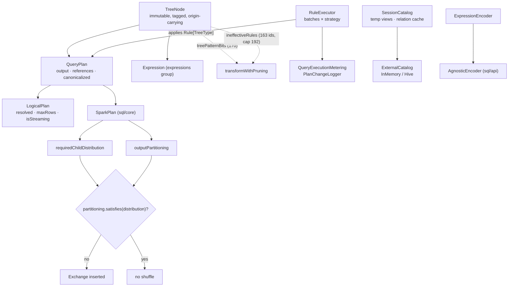

The substrate. Every other catalyst group — analysis, optimizer, planner, expressions, types —
operates on the classes defined here: the immutable tree, the rule-execution engine, the plan
hierarchy, the physical-distribution contract, the session catalog, and the encoders. It is the
sixth and last group of `sql/catalyst`, which is now fully swept.

Two areas in this group's scope were already covered from the other direction and are deliberately
**not** re-derived here: `plans/logical/statsEstimation/` plus `Statistics.scala` belong to the
[optimizer sweep](sql-catalyst-optimizer.md)'s CBO concept (topic A17), and catalog *resolution*
(`CatalogManager`, `LookupCatalog`, the name-resolution path) belongs to the
[analysis sweep](sql-catalyst-analysis.md). What is covered here is the catalog's **object model and
storage layer**, which no sweep had touched.



---

## TreeNode — immutability, transform, and the reflective copy

**What it is:** the base of every plan and every expression in Spark. `TreeNode` is immutable, so
every rewrite produces a new tree; the interesting engineering is all in making that affordable —
structural sharing when a rule changes nothing, a reflective `makeCopy` so a `case class` node
needs no boilerplate, and a per-node tag map for out-of-band annotations.

**Anchor files:**

- [TreeNode.scala:70](https://github.com/apache/spark/blob/v4.2.0/sql/catalyst/src/main/scala/org/apache/spark/sql/catalyst/trees/TreeNode.scala#L70) — the class
- [TreeNode.scala:238](https://github.com/apache/spark/blob/v4.2.0/sql/catalyst/src/main/scala/org/apache/spark/sql/catalyst/trees/TreeNode.scala#L238) — `fastEquals`: reference equality first, then structural. The whole fixed-point loop is built on this being cheap
- [TreeNode.scala:470](https://github.com/apache/spark/blob/v4.2.0/sql/catalyst/src/main/scala/org/apache/spark/sql/catalyst/trees/TreeNode.scala#L470) `transformDown` and [:521](https://github.com/apache/spark/blob/v4.2.0/sql/catalyst/src/main/scala/org/apache/spark/sql/catalyst/trees/TreeNode.scala#L521) `transformUp`, both thin wrappers over the `WithPruning` forms
- [TreeNode.scala:499](https://github.com/apache/spark/blob/v4.2.0/sql/catalyst/src/main/scala/org/apache/spark/sql/catalyst/trees/TreeNode.scala#L499) — the structural-sharing check: if the rule left this node alone *and* left every child alone, the **original object** is returned, "to avoid gc churn"
- [TreeNode.scala:509](https://github.com/apache/spark/blob/v4.2.0/sql/catalyst/src/main/scala/org/apache/spark/sql/catalyst/trees/TreeNode.scala#L509) — `afterRule.copyTagsFrom(this)`: tags survive a rewrite, which is what lets a rule annotate a node and a later rule read the annotation off its replacement
- [TreeNode.scala:611](https://github.com/apache/spark/blob/v4.2.0/sql/catalyst/src/main/scala/org/apache/spark/sql/catalyst/trees/TreeNode.scala#L611) — `multiTransformDown`, the one-to-**many** transform (a rule returning alternatives), used by constraint generation
- [TreeNode.scala:752](https://github.com/apache/spark/blob/v4.2.0/sql/catalyst/src/main/scala/org/apache/spark/sql/catalyst/trees/TreeNode.scala#L752) — `makeCopy`, which finds the primary constructor **by reflection** and re-invokes it: the reason a new operator is a `case class` and nothing else
- [TreeNode.scala:223](https://github.com/apache/spark/blob/v4.2.0/sql/catalyst/src/main/scala/org/apache/spark/sql/catalyst/trees/TreeNode.scala#L223) — `containsChild`, a lazily built `Set` so `mapChildren` can tell a child argument from an ordinary one
- [TreeNode.scala:85](https://github.com/apache/spark/blob/v4.2.0/sql/catalyst/src/main/scala/org/apache/spark/sql/catalyst/trees/TreeNode.scala#L85) — `_tags` is lazily allocated "since the default size of a `mutable.Map` is nonzero": per-node memory is tight enough that an empty map matters
- [TreeNode.scala:964](https://github.com/apache/spark/blob/v4.2.0/sql/catalyst/src/main/scala/org/apache/spark/sql/catalyst/trees/TreeNode.scala#L964) `treeString` and [:995](https://github.com/apache/spark/blob/v4.2.0/sql/catalyst/src/main/scala/org/apache/spark/sql/catalyst/trees/TreeNode.scala#L995) `numberedTreeString` — `EXPLAIN` output, and [:1014](https://github.com/apache/spark/blob/v4.2.0/sql/catalyst/src/main/scala/org/apache/spark/sql/catalyst/trees/TreeNode.scala#L1014) `p(n)`, which returns the *n*-th node of a numbered tree: the debugging entry point almost nobody knows exists
- [origin.scala:31](https://github.com/apache/spark/blob/v4.2.0/sql/api/src/main/scala/org/apache/spark/sql/catalyst/trees/origin.scala#L31) — `Origin`: line, position, SQL text, **stack trace**, and a PySpark error context; [:45](https://github.com/apache/spark/blob/v4.2.0/sql/api/src/main/scala/org/apache/spark/sql/catalyst/trees/origin.scala#L45) picks `DataFrameQueryContext` when a stack trace is present and `SQLQueryContext` otherwise
- [origin.scala:87](https://github.com/apache/spark/blob/v4.2.0/sql/api/src/main/scala/org/apache/spark/sql/catalyst/trees/origin.scala#L87) — `CurrentOrigin`, a **`ThreadLocal`** that `withOrigin` sets and restores; every `transform` wraps the rule call in it, which is how a node created by a rule inherits the source position of the node it replaced

!!! info "The error message that points at your PySpark line comes from a `ThreadLocal`"

    `Origin.stackTrace` plus `pysparkErrorContext` produce `DataFrameQueryContext` — the Spark 4
    feature that tells you *which line of your DataFrame code* produced a failing expression, not
    just which SQL fragment. It works because `CurrentOrigin` is a thread-local that every
    `transform` and every parser visitor sets, so a node built anywhere inherits the context that
    was current when it was built. It is also why origin information is lost across a thread
    boundary.

!!! warning "`makeCopy` is reflective, and that constrains how you write an operator"

    A node's copy goes through the primary constructor found by reflection. So constructor
    parameters must be exactly the node's logical fields, extra state has to live in a
    second parameter list (`otherCopyArgs`) or a tag, and a node whose constructor has side
    effects will have them re-run on every rewrite.

**Configs:** `spark.sql.debug.maxToStringFields` (25), `spark.sql.maxPlanStringLength`,
`spark.sql.maxMetadataStringLength`

**Maps to topics:** A1, E1

---

## Tree patterns and rule ids — the two pruning mechanisms

**What it is:** two independent optimizations that let a rule skip subtrees it cannot possibly
change. **Tree patterns** are a bitset, computed bottom-up and cached per node, saying which kinds
of node exist anywhere in this subtree — so a rule about joins can skip a subtree containing none.
**Rule ids** are a second bitset recording that a *specific rule* already ran on this subtree and
did nothing; since trees are immutable, it will do nothing again.

**Anchor files:**

- [TreePatterns.scala](https://github.com/apache/spark/blob/v4.2.0/sql/catalyst/src/main/scala/org/apache/spark/sql/catalyst/trees/TreePatterns.scala) — the enumeration: **170** patterns at 4.2.0, from `AGGREGATE_EXPRESSION` to `WITH_WINDOW_DEFINITION`
- [TreePatternBits.scala:24](https://github.com/apache/spark/blob/v4.2.0/sql/catalyst/src/main/scala/org/apache/spark/sql/catalyst/trees/TreePatternBits.scala#L24) — `containsPattern` / `containsAnyPattern` / `containsAllPatterns`, the predicates every `WithPruning` rule is written against
- [TreeNode.scala:96](https://github.com/apache/spark/blob/v4.2.0/sql/catalyst/src/main/scala/org/apache/spark/sql/catalyst/trees/TreeNode.scala#L96) — `getDefaultTreePatternBits`: this node's own `nodePatterns`, **unioned with every child's bitset**, so the test at the root is a single word comparison
- [TreeNode.scala:122](https://github.com/apache/spark/blob/v4.2.0/sql/catalyst/src/main/scala/org/apache/spark/sql/catalyst/trees/TreeNode.scala#L122) — cached in a `BestEffortLazyVal`
- [TreeNode.scala:129](https://github.com/apache/spark/blob/v4.2.0/sql/catalyst/src/main/scala/org/apache/spark/sql/catalyst/trees/TreeNode.scala#L129) — the `_ineffectiveRules` bitset, with the correctness argument in the comment: "query plan structures are immutable"
- [TreeNode.scala:491](https://github.com/apache/spark/blob/v4.2.0/sql/catalyst/src/main/scala/org/apache/spark/sql/catalyst/trees/TreeNode.scala#L491) — the early return that both mechanisms feed: `if (!cond.apply(this) || isRuleIneffective(ruleId)) return this`
- [RuleIdCollection.scala:26](https://github.com/apache/spark/blob/v4.2.0/sql/catalyst/src/main/scala/org/apache/spark/sql/catalyst/rules/RuleIdCollection.scala#L26) — `RuleId`, with `require(id >= -1 && id < 192)` and the comment that raising the cap costs memory **on every TreeNode**
- [RuleIdCollection.scala:38](https://github.com/apache/spark/blob/v4.2.0/sql/catalyst/src/main/scala/org/apache/spark/sql/catalyst/rules/RuleIdCollection.scala#L38) — the hand-maintained alphabetical list: **163** rules have ids at 4.2.0, against a hard cap of 192
- [RuleIdCollection.scala:233](https://github.com/apache/spark/blob/v4.2.0/sql/catalyst/src/main/scala/org/apache/spark/sql/catalyst/rules/RuleIdCollection.scala#L233) — `getRuleId`, which **throws** if a rule asks for an id it was never given
- [Rule.scala:24](https://github.com/apache/spark/blob/v4.2.0/sql/catalyst/src/main/scala/org/apache/spark/sql/catalyst/rules/Rule.scala#L24) — where a rule picks its id up, lazily, from its own class name

!!! warning "163 of 192 — the rule-id space is nearly full"

    Every id costs a bit in a bitset allocated per `TreeNode`, so the cap is a memory decision, not
    an arbitrary one. At 163 used there is room for 29 more rules before someone has to widen it
    and pay across every node in every plan. Worth re-counting on each release: it is the kind of
    limit that gets raised quietly and changes plan-tree memory for everyone.

!!! info "Both mechanisms require the rule to be pure"

    The `ruleId` argument is documented "do not pass it if the rule is not purely functional and
    reads a varying initial state for different invocations". A rule that reads mutable external
    state and is marked ineffective on a subtree will never be retried on that subtree — a silent
    wrong answer rather than a crash. The same applies to a rule whose declared `nodePatterns` do
    not cover everything it actually matches.

**Configs:** none

**Maps to topics:** A1

---

## Rule and RuleExecutor — batches, fixed point, idempotence and plan validation

**What it is:** the engine every catalyst phase is built on. A `Rule` is a function
`TreeType => TreeType`; a `RuleExecutor` is an ordered list of **batches**, each with a strategy —
`Once` or `FixedPoint(n)` — and it runs each batch until the plan stops changing or the iteration
cap is hit. The [analysis](sql-catalyst-analysis.md) and [optimizer](sql-catalyst-optimizer.md)
sweeps cover the *rule lists*; this is the machine underneath them.

**Anchor files:**

- [Rule.scala:24](https://github.com/apache/spark/blob/v4.2.0/sql/catalyst/src/main/scala/org/apache/spark/sql/catalyst/rules/Rule.scala#L24) — the whole abstraction: a `ruleName` derived from the class name and an `apply`
- [RuleExecutor.scala:137](https://github.com/apache/spark/blob/v4.2.0/sql/catalyst/src/main/scala/org/apache/spark/sql/catalyst/rules/RuleExecutor.scala#L137) — `Strategy`, with [:150](https://github.com/apache/spark/blob/v4.2.0/sql/catalyst/src/main/scala/org/apache/spark/sql/catalyst/rules/RuleExecutor.scala#L150) `Once` and [:156](https://github.com/apache/spark/blob/v4.2.0/sql/catalyst/src/main/scala/org/apache/spark/sql/catalyst/rules/RuleExecutor.scala#L156) `FixedPoint`, whose `errorOnExceed` and `maxIterationsSetting` decide whether blowing the cap warns or throws
- [RuleExecutor.scala:162](https://github.com/apache/spark/blob/v4.2.0/sql/catalyst/src/main/scala/org/apache/spark/sql/catalyst/rules/RuleExecutor.scala#L162) — `Batch(name, strategy, rules*)`
- [RuleExecutor.scala:215](https://github.com/apache/spark/blob/v4.2.0/sql/catalyst/src/main/scala/org/apache/spark/sql/catalyst/rules/RuleExecutor.scala#L215) — `execute`, the whole loop in 110 lines
- [RuleExecutor.scala:250](https://github.com/apache/spark/blob/v4.2.0/sql/catalyst/src/main/scala/org/apache/spark/sql/catalyst/rules/RuleExecutor.scala#L250) — `val effective = !result.fastEquals(plan)`: the definition of "this rule did something", and the input to every metric on the page below
- [RuleExecutor.scala:286](https://github.com/apache/spark/blob/v4.2.0/sql/catalyst/src/main/scala/org/apache/spark/sql/catalyst/rules/RuleExecutor.scala#L286) — the max-iterations branch, whose warning names the config to raise (`spark.sql.analyzer.maxIterations`, `spark.sql.optimizer.maxIterations`) and which **throws** rather than warns under tests
- [RuleExecutor.scala:305](https://github.com/apache/spark/blob/v4.2.0/sql/catalyst/src/main/scala/org/apache/spark/sql/catalyst/rules/RuleExecutor.scala#L305) — the idempotence check for `Once` batches: run the batch a second time and assert the plan does not change. **Test-only**, and `excludedOnceBatches` names the batches known to violate it
- [RuleExecutor.scala:222](https://github.com/apache/spark/blob/v4.2.0/sql/catalyst/src/main/scala/org/apache/spark/sql/catalyst/rules/RuleExecutor.scala#L222) — the two validation configs, and at [:257](https://github.com/apache/spark/blob/v4.2.0/sql/catalyst/src/main/scala/org/apache/spark/sql/catalyst/rules/RuleExecutor.scala#L257) the per-rule validation that raises `PLAN_VALIDATION_FAILED_RULE_IN_BATCH` naming **the exact rule and batch** that corrupted the plan
- [RuleExecutor.scala:312](https://github.com/apache/spark/blob/v4.2.0/sql/catalyst/src/main/scala/org/apache/spark/sql/catalyst/rules/RuleExecutor.scala#L312) — the fixed point itself: `curPlan.fastEquals(lastPlan)`

!!! info "`spark.sql.planChangeValidation` is the tool for 'a rule corrupted my plan'"

    Set it and every rule application is followed by a structural check of the result; a failure
    names the rule and the batch. `spark.sql.lightweightPlanChangeValidation` is the cheaper
    variant. Both are off by default and both are the right first move when a custom optimizer
    extension or a connector rule produces an unexplainable plan — far better than bisecting with
    `excludedRules`.

!!! warning "Idempotence of `Once` batches is only checked under tests"

    `Utils.isTesting && !excludedOnceBatches.contains(batch.name)`. In production a non-idempotent
    `Once` rule is simply never caught. Since `Once` batches include correctness rewrites, a custom
    rule added to one and applied twice — which happens when a plan is re-analyzed — can silently
    double its effect.

**Configs:** `spark.sql.planChangeValidation`, `spark.sql.lightweightPlanChangeValidation`,
`spark.sql.analyzer.maxIterations`, `spark.sql.optimizer.maxIterations`

**Maps to topics:** A1

---

## QueryExecutionMetering and PlanChangeLogger — per-rule cost and per-rule diffs

**What it is:** the instrumentation wrapped around every rule application. `QueryExecutionMetering`
accumulates, per rule name, total time, effective time, run count and effective-run count;
`PlanChangeLogger` prints the before/after plan for a chosen rule or batch. Together they answer
"which rule is slow" and "what exactly did it do" — from opposite directions.

**Anchor files:**

- [QueryExecutionMetering.scala:26](https://github.com/apache/spark/blob/v4.2.0/sql/catalyst/src/main/scala/org/apache/spark/sql/catalyst/rules/QueryExecutionMetering.scala#L26) — four `LongAccumulator`-style maps keyed by rule name
- [QueryExecutionMetering.scala:77](https://github.com/apache/spark/blob/v4.2.0/sql/catalyst/src/main/scala/org/apache/spark/sql/catalyst/rules/QueryExecutionMetering.scala#L77) — `dumpTimeSpent()`, the formatted table with total time, effective time and run counts
- [RuleExecutor.scala:31](https://github.com/apache/spark/blob/v4.2.0/sql/catalyst/src/main/scala/org/apache/spark/sql/catalyst/rules/RuleExecutor.scala#L31) — `object RuleExecutor`, holding the process-wide meter plus `resetMetrics` / `dumpTimeSpent`
- [RuleExecutor.scala:49](https://github.com/apache/spark/blob/v4.2.0/sql/catalyst/src/main/scala/org/apache/spark/sql/catalyst/rules/RuleExecutor.scala#L49) — `PlanChangeLogger`, driven by `spark.sql.planChangeLog.level` / `.rules` / `.batches`
- [RuleExecutor.scala:281](https://github.com/apache/spark/blob/v4.2.0/sql/catalyst/src/main/scala/org/apache/spark/sql/catalyst/rules/RuleExecutor.scala#L281) — `tracker.foreach(_.recordRuleInvocation(...))`: the same numbers also flow into `QueryPlanningTracker`, whose `topRulesByTime` the [planner sweep](sql-catalyst-planner.md) covers

!!! info "Two views of the same measurement, and only one is per-query"

    `RuleExecutor.dumpTimeSpent()` is a **process-wide accumulator** — useful in a benchmark
    harness after `resetMetrics()`, misleading on a shared driver. `QueryPlanningTracker` records
    the same invocations **per query** and is what the SQL tab shows. Reach for the tracker when
    diagnosing one slow query; reach for the meter when profiling a rule across a workload.

**Configs:** `spark.sql.planChangeLog.level`, `spark.sql.planChangeLog.rules`,
`spark.sql.planChangeLog.batches`

**Maps to topics:** I7, A1

---

## QueryPlan — output, references, missingInput and canonicalization

**What it is:** the shared base of `LogicalPlan` and `SparkPlan`. It adds to `TreeNode` everything
that is about *columns*: what this operator outputs, what it references, what its children provide,
and the expression-transform family that rules use to rewrite expressions without walking the plan
by hand.

**Anchor files:**

- [QueryPlan.scala:53](https://github.com/apache/spark/blob/v4.2.0/sql/catalyst/src/main/scala/org/apache/spark/sql/catalyst/plans/QueryPlan.scala#L53) — the class, generic in its own subtype
- [QueryPlan.scala:57](https://github.com/apache/spark/blob/v4.2.0/sql/catalyst/src/main/scala/org/apache/spark/sql/catalyst/plans/QueryPlan.scala#L57) `output`, [:95](https://github.com/apache/spark/blob/v4.2.0/sql/catalyst/src/main/scala/org/apache/spark/sql/catalyst/plans/QueryPlan.scala#L95) `outputSet`, [:121](https://github.com/apache/spark/blob/v4.2.0/sql/catalyst/src/main/scala/org/apache/spark/sql/catalyst/plans/QueryPlan.scala#L121) `inputSet`, [:138](https://github.com/apache/spark/blob/v4.2.0/sql/catalyst/src/main/scala/org/apache/spark/sql/catalyst/plans/QueryPlan.scala#L138) `references`
- [QueryPlan.scala:155](https://github.com/apache/spark/blob/v4.2.0/sql/catalyst/src/main/scala/org/apache/spark/sql/catalyst/plans/QueryPlan.scala#L155) — `missingInput`: references minus inputs minus produced. It is `final`, and it is what an **`!` prefix in `EXPLAIN` output means** ([:489](https://github.com/apache/spark/blob/v4.2.0/sql/catalyst/src/main/scala/org/apache/spark/sql/catalyst/plans/QueryPlan.scala#L489) `statePrefix`)
- [QueryPlan.scala:171](https://github.com/apache/spark/blob/v4.2.0/sql/catalyst/src/main/scala/org/apache/spark/sql/catalyst/plans/QueryPlan.scala#L171) — `transformExpressions` and its Down/Up/WithPruning variants: the rule-writing workhorse
- [QueryPlan.scala:324](https://github.com/apache/spark/blob/v4.2.0/sql/catalyst/src/main/scala/org/apache/spark/sql/catalyst/plans/QueryPlan.scala#L324) `expressions` and [:471](https://github.com/apache/spark/blob/v4.2.0/sql/catalyst/src/main/scala/org/apache/spark/sql/catalyst/plans/QueryPlan.scala#L471) `schema`, both cached
- [QueryPlan.scala:527](https://github.com/apache/spark/blob/v4.2.0/sql/catalyst/src/main/scala/org/apache/spark/sql/catalyst/plans/QueryPlan.scala#L527) `subqueries` / [:539](https://github.com/apache/spark/blob/v4.2.0/sql/catalyst/src/main/scala/org/apache/spark/sql/catalyst/plans/QueryPlan.scala#L539) `subqueriesAll` and [:558](https://github.com/apache/spark/blob/v4.2.0/sql/catalyst/src/main/scala/org/apache/spark/sql/catalyst/plans/QueryPlan.scala#L558) `transformUpWithSubqueries` — a subquery hangs off an *expression*, so a plain plan transform does not reach it. Forgetting this is a classic custom-rule bug
- [QueryPlan.scala:669](https://github.com/apache/spark/blob/v4.2.0/sql/catalyst/src/main/scala/org/apache/spark/sql/catalyst/plans/QueryPlan.scala#L669) — `innerChildren = subqueries`, which is why `EXPLAIN` prints subquery plans indented under their parent
- [NormalizePlan.scala](https://github.com/apache/spark/blob/v4.2.0/sql/catalyst/src/main/scala/org/apache/spark/sql/catalyst/plans/NormalizePlan.scala) — plan normalization for comparison (used by tests and by plan-change validation)
- [AliasAwareOutputExpression.scala](https://github.com/apache/spark/blob/v4.2.0/sql/catalyst/src/main/scala/org/apache/spark/sql/catalyst/plans/AliasAwareOutputExpression.scala) — how an operator's output ordering and partitioning survive an aliasing `Project`: the reason `SELECT a AS b` does not lose the knowledge that the data is clustered by `a`

!!! info "A `!` in EXPLAIN means the operator references a column its children do not provide"

    `statePrefix` prints `!` when `missingInput` is non-empty. On an *analyzed* plan that is a bug —
    `CheckAnalysis` should have caught it — so seeing it usually means you are looking at an
    unresolved or partially rewritten plan, or a custom rule dropped a column from a child's output.

**Configs:** `spark.sql.constraintPropagation.enabled`, `spark.sql.lazySetOperatorOutput.enabled`,
`spark.sql.subqueryAlias.alwaysPropagateMetadataColumns`

**Maps to topics:** A1

---

## LogicalPlan and the integrity checks

**What it is:** the logical half. `LogicalPlan` adds resolution state, row-count bounds, streaming
propagation and metadata columns; `LogicalPlanIntegrity` is the assertion suite that plan-change
validation runs.

**Anchor files:**

- [LogicalPlan.scala:37](https://github.com/apache/spark/blob/v4.2.0/sql/catalyst/src/main/scala/org/apache/spark/sql/catalyst/plans/logical/LogicalPlan.scala#L37) — the class
- [LogicalPlan.scala:80](https://github.com/apache/spark/blob/v4.2.0/sql/catalyst/src/main/scala/org/apache/spark/sql/catalyst/plans/logical/LogicalPlan.scala#L80) — `isStreaming`, propagated up from the leaves: one streaming source makes the whole plan streaming
- [LogicalPlan.scala:93](https://github.com/apache/spark/blob/v4.2.0/sql/catalyst/src/main/scala/org/apache/spark/sql/catalyst/plans/logical/LogicalPlan.scala#L93) — `maxRows` / `maxRowsPerPartition`, the bounds that let the optimizer eliminate a `Limit` or convert a plan to a `LocalRelation`
- [LogicalPlan.scala:134](https://github.com/apache/spark/blob/v4.2.0/sql/catalyst/src/main/scala/org/apache/spark/sql/catalyst/plans/logical/LogicalPlan.scala#L134) — `resolve(schema, resolver)` and the `resolveChildren` / `resolveQuoted` family: name matching lives on the plan, parameterized by the case-sensitivity `Resolver`
- [LogicalPlan.scala:49](https://github.com/apache/spark/blob/v4.2.0/sql/catalyst/src/main/scala/org/apache/spark/sql/catalyst/plans/logical/LogicalPlan.scala#L49) — `metadataOutput`, the hidden columns (`_metadata`, file name, partition values) that are not in `output` until something asks for them
- [LogicalPlan.scala:225](https://github.com/apache/spark/blob/v4.2.0/sql/catalyst/src/main/scala/org/apache/spark/sql/catalyst/plans/logical/LogicalPlan.scala#L225) `LeafNode`, [:263](https://github.com/apache/spark/blob/v4.2.0/sql/catalyst/src/main/scala/org/apache/spark/sql/catalyst/plans/logical/LogicalPlan.scala#L263) `UnaryNode`, [:292](https://github.com/apache/spark/blob/v4.2.0/sql/catalyst/src/main/scala/org/apache/spark/sql/catalyst/plans/logical/LogicalPlan.scala#L292) `BinaryNode`
- [LogicalPlan.scala:300](https://github.com/apache/spark/blob/v4.2.0/sql/catalyst/src/main/scala/org/apache/spark/sql/catalyst/plans/logical/LogicalPlan.scala#L300) — `LogicalPlanIntegrity`, and at [:438](https://github.com/apache/spark/blob/v4.2.0/sql/catalyst/src/main/scala/org/apache/spark/sql/catalyst/plans/logical/LogicalPlan.scala#L438) `validateOptimizedPlan` — checks that `ExprId`s are unique, that no attribute is missing, that the schema did not change
- [LogicalPlanVisitor.scala](https://github.com/apache/spark/blob/v4.2.0/sql/catalyst/src/main/scala/org/apache/spark/sql/catalyst/plans/logical/LogicalPlanVisitor.scala) — the visitor interface behind statistics estimation and `DistinctKeyVisitor`
- [QueryPlanConstraints.scala](https://github.com/apache/spark/blob/v4.2.0/sql/catalyst/src/main/scala/org/apache/spark/sql/catalyst/plans/logical/QueryPlanConstraints.scala) — the constraint set the [optimizer sweep](sql-catalyst-optimizer.md) covers from the rule side
- [Command.scala](https://github.com/apache/spark/blob/v4.2.0/sql/catalyst/src/main/scala/org/apache/spark/sql/catalyst/plans/logical/Command.scala) — the marker for eagerly-executed DDL, and [MultiResult.scala](https://github.com/apache/spark/blob/v4.2.0/sql/catalyst/src/main/scala/org/apache/spark/sql/catalyst/plans/logical/MultiResult.scala) / [ExecutableDuringAnalysis.scala](https://github.com/apache/spark/blob/v4.2.0/sql/catalyst/src/main/scala/org/apache/spark/sql/catalyst/plans/logical/ExecutableDuringAnalysis.scala) — plans that run *during* analysis

**Configs:** `spark.sql.planChangeValidation` (runs these checks),
`spark.sql.legacy.viewSchemaBindingMode`, `spark.sql.legacy.viewSchemaCompensation`

**Maps to topics:** A1

---

## AnalysisHelper — the analyzed flag that stops re-analysis

**What it is:** a small trait with an outsized effect. Analysis is a fixed-point loop over a plan
that mostly does not change, so `AnalysisHelper` marks subtrees `analyzed` and gives the analyzer
`resolveOperators*`, which is `transform*` that **skips analyzed subtrees entirely**.

**Anchor files:**

- [AnalysisHelper.scala:44](https://github.com/apache/spark/blob/v4.2.0/sql/catalyst/src/main/scala/org/apache/spark/sql/catalyst/plans/logical/AnalysisHelper.scala#L44) — the trait, with a `private var _analyzed` — mutable state on an otherwise immutable tree, deliberately
- [AnalysisHelper.scala:54](https://github.com/apache/spark/blob/v4.2.0/sql/catalyst/src/main/scala/org/apache/spark/sql/catalyst/plans/logical/AnalysisHelper.scala#L54) — `setAnalyzed`, applied recursively once the analyzer converges
- [AnalysisHelper.scala:76](https://github.com/apache/spark/blob/v4.2.0/sql/catalyst/src/main/scala/org/apache/spark/sql/catalyst/plans/logical/AnalysisHelper.scala#L76) — `resolveOperators`, and at [:97](https://github.com/apache/spark/blob/v4.2.0/sql/catalyst/src/main/scala/org/apache/spark/sql/catalyst/plans/logical/AnalysisHelper.scala#L97) the pruning variant — the two an analyzer rule should use instead of `transform`

!!! warning "An analyzer rule that calls `transform` instead of `resolveOperators` re-walks everything"

    `AnalysisHelper` also carries a guard (`allowInvokingTransformsInAnalyzer`) that makes calling
    the raw transform family from inside the analyzer an error under tests, precisely because the
    mistake is easy and the cost is invisible — a correct plan, produced after re-analyzing
    subtrees that were already done. Custom analyzer extensions are the usual offender.

**Configs:** none

**Maps to topics:** A1

---

## The logical operator set — basicLogicalOperators, join types, hints and CTEs

**What it is:** the vocabulary. `basicLogicalOperators.scala` (2442 lines, ~40 operators) defines
`Project`, `Filter`, `Join`, `Aggregate`, `Union`, `Sort`, `Range`, `Window`, `Expand`, `Pivot`,
`Unpivot`, `Sample`, `Repartition`, `Deduplicate`, `SubqueryAlias` and the rest — the nodes every
`EXPLAIN` is made of.

**Anchor files:**

- [basicLogicalOperators.scala:73](https://github.com/apache/spark/blob/v4.2.0/sql/catalyst/src/main/scala/org/apache/spark/sql/catalyst/plans/logical/basicLogicalOperators.scala#L73) `Project`, [:335](https://github.com/apache/spark/blob/v4.2.0/sql/catalyst/src/main/scala/org/apache/spark/sql/catalyst/plans/logical/basicLogicalOperators.scala#L335) `Filter`, [:714](https://github.com/apache/spark/blob/v4.2.0/sql/catalyst/src/main/scala/org/apache/spark/sql/catalyst/plans/logical/basicLogicalOperators.scala#L714) `Join`, [:1211](https://github.com/apache/spark/blob/v4.2.0/sql/catalyst/src/main/scala/org/apache/spark/sql/catalyst/plans/logical/basicLogicalOperators.scala#L1211) `Aggregate`, [:632](https://github.com/apache/spark/blob/v4.2.0/sql/catalyst/src/main/scala/org/apache/spark/sql/catalyst/plans/logical/basicLogicalOperators.scala#L632) `Union`
- [basicLogicalOperators.scala:2026](https://github.com/apache/spark/blob/v4.2.0/sql/catalyst/src/main/scala/org/apache/spark/sql/catalyst/plans/logical/basicLogicalOperators.scala#L2026) `Repartition` (a count) and [:2089](https://github.com/apache/spark/blob/v4.2.0/sql/catalyst/src/main/scala/org/apache/spark/sql/catalyst/plans/logical/basicLogicalOperators.scala#L2089) `RepartitionByExpression` (columns) — two different nodes behind one Python method name
- [basicLogicalOperators.scala:1748](https://github.com/apache/spark/blob/v4.2.0/sql/catalyst/src/main/scala/org/apache/spark/sql/catalyst/plans/logical/basicLogicalOperators.scala#L1748) `GlobalLimit` / [:1769](https://github.com/apache/spark/blob/v4.2.0/sql/catalyst/src/main/scala/org/apache/spark/sql/catalyst/plans/logical/basicLogicalOperators.scala#L1769) `LocalLimit` — `LIMIT` is two operators, which is why it can still require a shuffle
- [joinTypes.scala:68](https://github.com/apache/spark/blob/v4.2.0/sql/catalyst/src/main/scala/org/apache/spark/sql/catalyst/plans/joinTypes.scala#L68) — `Inner`, `Cross`, `LeftOuter`, `LeftSemi`, `LeftAnti`, plus [`ExistenceJoin`](https://github.com/apache/spark/blob/v4.2.0/sql/catalyst/src/main/scala/org/apache/spark/sql/catalyst/plans/joinTypes.scala#L102) (the internal type a subquery rewrite produces) and [`UsingJoin`](https://github.com/apache/spark/blob/v4.2.0/sql/catalyst/src/main/scala/org/apache/spark/sql/catalyst/plans/joinTypes.scala#L116) / `NaturalJoin`, which exist only until analysis rewrites them
- [hints.scala:30](https://github.com/apache/spark/blob/v4.2.0/sql/catalyst/src/main/scala/org/apache/spark/sql/catalyst/plans/logical/hints.scala#L30) `UnresolvedHint` → [:48](https://github.com/apache/spark/blob/v4.2.0/sql/catalyst/src/main/scala/org/apache/spark/sql/catalyst/plans/logical/hints.scala#L48) `ResolvedHint` → [:84](https://github.com/apache/spark/blob/v4.2.0/sql/catalyst/src/main/scala/org/apache/spark/sql/catalyst/plans/logical/hints.scala#L84) `HintInfo`, and at [:98](https://github.com/apache/spark/blob/v4.2.0/sql/catalyst/src/main/scala/org/apache/spark/sql/catalyst/plans/logical/hints.scala#L98) the merge rule: **two conflicting strategy hints on one join and the first one wins**, with a warning
- [cteOperators.scala:110](https://github.com/apache/spark/blob/v4.2.0/sql/catalyst/src/main/scala/org/apache/spark/sql/catalyst/plans/logical/cteOperators.scala#L110) `CTERelationDef`, [:192](https://github.com/apache/spark/blob/v4.2.0/sql/catalyst/src/main/scala/org/apache/spark/sql/catalyst/plans/logical/cteOperators.scala#L192) `CTERelationRef`, [:239](https://github.com/apache/spark/blob/v4.2.0/sql/catalyst/src/main/scala/org/apache/spark/sql/catalyst/plans/logical/cteOperators.scala#L239) `WithCTE` — a CTE is a *shared definition plus references*, which is what makes inlining-or-not a decision rather than a syntax rewrite
- [MergeRows.scala:26](https://github.com/apache/spark/blob/v4.2.0/sql/catalyst/src/main/scala/org/apache/spark/sql/catalyst/plans/logical/MergeRows.scala#L26) — the plan `MERGE INTO` becomes: matched / not-matched / not-matched-by-source instruction lists
- [v2Commands.scala](https://github.com/apache/spark/blob/v4.2.0/sql/catalyst/src/main/scala/org/apache/spark/sql/catalyst/plans/logical/v2Commands.scala) and [v2AlterTableCommands.scala](https://github.com/apache/spark/blob/v4.2.0/sql/catalyst/src/main/scala/org/apache/spark/sql/catalyst/plans/logical/v2AlterTableCommands.scala) — the DSv2 DDL plans
- [SqlScriptingLogicalPlans.scala](https://github.com/apache/spark/blob/v4.2.0/sql/catalyst/src/main/scala/org/apache/spark/sql/catalyst/plans/logical/SqlScriptingLogicalPlans.scala) — compound bodies, loops, handlers and (4.2.0) cursors
- [pythonLogicalOperators.scala](https://github.com/apache/spark/blob/v4.2.0/sql/catalyst/src/main/scala/org/apache/spark/sql/catalyst/plans/logical/pythonLogicalOperators.scala) — `FlatMapGroupsInPandas` and friends
- [EventTimeWatermark.scala](https://github.com/apache/spark/blob/v4.2.0/sql/catalyst/src/main/scala/org/apache/spark/sql/catalyst/plans/logical/EventTimeWatermark.scala), [LocalRelation.scala](https://github.com/apache/spark/blob/v4.2.0/sql/catalyst/src/main/scala/org/apache/spark/sql/catalyst/plans/logical/LocalRelation.scala), [EmptyRelation.scala](https://github.com/apache/spark/blob/v4.2.0/sql/catalyst/src/main/scala/org/apache/spark/sql/catalyst/plans/logical/EmptyRelation.scala), [ColumnDefinition.scala](https://github.com/apache/spark/blob/v4.2.0/sql/catalyst/src/main/scala/org/apache/spark/sql/catalyst/plans/logical/ColumnDefinition.scala)

!!! info "Conflicting join hints do not error — the first wins"

    `HintInfo.merge` logs a warning and keeps `this.strategy` when two different strategies are
    specified for the same join. So `/*+ BROADCAST(a), MERGE(a) */` silently picks one. If a hint
    "does not work", check for a second hint on the same relation before concluding the optimizer
    ignored you.

**Configs:** `spark.sql.cteRelationDefMaxRows.enabled`, `spark.sql.legacy.ctePrecedencePolicy`,
`spark.sql.legacy.inlineCTEInCommands`, `spark.sql.legacy.cteDuplicateAttributeNames`,
`spark.sql.cteRecursionLevelLimit`, `spark.sql.cteRecursionRowLimit`,
`spark.sql.expandTagPassthroughDuplicates.enabled`

**Maps to topics:** A1, B7

---

## NearestByJoin — the 4.2.0 top-K similarity join

**What it is:** **new in 4.2.0** and easy to miss: SQL syntax for a top-K nearest-neighbour join.
`... JOIN base APPROX NEAREST 10 BY SIMILARITY <expr>` returns, for each left row, the *k* right
rows ranked by an arbitrary scalar expression — smallest first for `DISTANCE`, largest first for
`SIMILARITY`.

**Anchor files:**

- [NearestByJoin.scala:54](https://github.com/apache/spark/blob/v4.2.0/sql/catalyst/src/main/scala/org/apache/spark/sql/catalyst/plans/logical/NearestByJoin.scala#L54) — the logical plan, with a scaladoc that is unusually explicit about intent
- [SqlBaseParser.g4:1075](https://github.com/apache/spark/blob/v4.2.0/sql/api/src/main/antlr4/org/apache/spark/sql/catalyst/parser/SqlBaseParser.g4#L1075) — `nearestByClause : (APPROX | EXACT) NEAREST num=INTEGER_VALUE? BY (DISTANCE | SIMILARITY) expression`, sitting where a `joinCriteria` would ([:1056](https://github.com/apache/spark/blob/v4.2.0/sql/api/src/main/antlr4/org/apache/spark/sql/catalyst/parser/SqlBaseParser.g4#L1056))
- [joinTypes.scala:206](https://github.com/apache/spark/blob/v4.2.0/sql/catalyst/src/main/scala/org/apache/spark/sql/catalyst/plans/joinTypes.scala#L206) — `NearestByDistance` / `NearestBySimilarity`, and at [:190](https://github.com/apache/spark/blob/v4.2.0/sql/catalyst/src/main/scala/org/apache/spark/sql/catalyst/plans/joinTypes.scala#L190) the `NEAREST_BY_JOIN.UNSUPPORTED_DIRECTION` error
- [NearestByJoin.scala:25](https://github.com/apache/spark/blob/v4.2.0/sql/catalyst/src/main/scala/org/apache/spark/sql/catalyst/plans/logical/NearestByJoin.scala#L25) — `MaxNumResults`, a hard bound on *k*

!!! warning "`APPROX` and `EXACT` do the same thing today"

    From the source comment: "Today both modes use the same brute-force rewrite. The flag is
    preserved on the logical plan so that future indexed approximate-nearest-neighbor strategies
    can fire only when `approx = true`." So `APPROX` currently buys nothing but forward
    compatibility — and, being brute force, the join is a cartesian product with a top-K per left
    row. Size accordingly.

!!! info "This is the join half of the vector story"

    Paired with the `vector_funcs` family the [expressions sweep](sql-catalyst-expressions.md)
    found — `vector_cosine_similarity` and friends, also new in 4.2.0 — this makes embedding
    similarity search expressible in Spark SQL end to end: the expression scores a pair, the join
    ranks and truncates. Topic **A23** was proposed from the expression side and does not yet
    mention the join; that is a path gap this sweep closes.

**Configs:** none — no config gates it

**Maps to topics:** A23, A3

---

## Distribution and Partitioning — the contract that decides whether you get a shuffle

**What it is:** the most consequential 1153 lines in the group. Every physical operator declares a
`requiredChildDistribution`; every operator reports an `outputPartitioning`; and `EnsureRequirements`
(in sql/core) inserts an `Exchange` exactly where `partitioning.satisfies(distribution)` is false.
Everything anyone knows about "why is there a shuffle here" is a consequence of this file.

**Anchor files:**

- [partitioning.scala:39](https://github.com/apache/spark/blob/v4.2.0/sql/catalyst/src/main/scala/org/apache/spark/sql/catalyst/plans/physical/partitioning.scala#L39) — `Distribution`, the *requirement* side, with `requiredNumPartitions` and `createPartitioning`
- [partitioning.scala:56](https://github.com/apache/spark/blob/v4.2.0/sql/catalyst/src/main/scala/org/apache/spark/sql/catalyst/plans/physical/partitioning.scala#L56) `UnspecifiedDistribution`, [:69](https://github.com/apache/spark/blob/v4.2.0/sql/catalyst/src/main/scala/org/apache/spark/sql/catalyst/plans/physical/partitioning.scala#L69) `AllTuples` (one partition), [:85](https://github.com/apache/spark/blob/v4.2.0/sql/catalyst/src/main/scala/org/apache/spark/sql/catalyst/plans/physical/partitioning.scala#L85) `ClusteredDistribution`, [:167](https://github.com/apache/spark/blob/v4.2.0/sql/catalyst/src/main/scala/org/apache/spark/sql/catalyst/plans/physical/partitioning.scala#L167) `OrderedDistribution`, [:192](https://github.com/apache/spark/blob/v4.2.0/sql/catalyst/src/main/scala/org/apache/spark/sql/catalyst/plans/physical/partitioning.scala#L192) `BroadcastDistribution`
- [partitioning.scala:139](https://github.com/apache/spark/blob/v4.2.0/sql/catalyst/src/main/scala/org/apache/spark/sql/catalyst/plans/physical/partitioning.scala#L139) — `StatefulOpClusteredDistribution`: a streaming stateful operator pins **both** the clustering *and* the partition count, because state is keyed by partition id across restarts
- [partitioning.scala:207](https://github.com/apache/spark/blob/v4.2.0/sql/catalyst/src/main/scala/org/apache/spark/sql/catalyst/plans/physical/partitioning.scala#L207) — `Partitioning`, the *provision* side
- [partitioning.scala:220](https://github.com/apache/spark/blob/v4.2.0/sql/catalyst/src/main/scala/org/apache/spark/sql/catalyst/plans/physical/partitioning.scala#L220) — **`satisfies`**, and its precondition: `required.requiredNumPartitions.forall(_ == numPartitions) && satisfies0(required)`. The partition-count check comes first and is `final`
- [partitioning.scala:309](https://github.com/apache/spark/blob/v4.2.0/sql/catalyst/src/main/scala/org/apache/spark/sql/catalyst/plans/physical/partitioning.scala#L309) — `HashPartitioning`, whose scaladoc carries a **cross-version compatibility guarantee**: because streaming state depends on it, `partitionIdExpression` must not change across Spark versions — "violation of this requirement may bring silent correctness issue"
- [partitioning.scala:319](https://github.com/apache/spark/blob/v4.2.0/sql/catalyst/src/main/scala/org/apache/spark/sql/catalyst/plans/physical/partitioning.scala#L319) — that expression: `Pmod(CollationAwareMurmur3Hash(expressions), Literal(numPartitions))` — the actual formula deciding which partition a row lands in
- [partitioning.scala:616](https://github.com/apache/spark/blob/v4.2.0/sql/catalyst/src/main/scala/org/apache/spark/sql/catalyst/plans/physical/partitioning.scala#L616) `RangePartitioning`, [:680](https://github.com/apache/spark/blob/v4.2.0/sql/catalyst/src/main/scala/org/apache/spark/sql/catalyst/plans/physical/partitioning.scala#L680) `PartitioningCollection` (an operator can satisfy a requirement *several* ways — the join output case), [:259](https://github.com/apache/spark/blob/v4.2.0/sql/catalyst/src/main/scala/org/apache/spark/sql/catalyst/plans/physical/partitioning.scala#L259) `SinglePartition`, [:257](https://github.com/apache/spark/blob/v4.2.0/sql/catalyst/src/main/scala/org/apache/spark/sql/catalyst/plans/physical/partitioning.scala#L257) `RoundRobinPartitioning`
- [partitioning.scala:333](https://github.com/apache/spark/blob/v4.2.0/sql/catalyst/src/main/scala/org/apache/spark/sql/catalyst/plans/physical/partitioning.scala#L333) — `CoalescedHashPartitioning`, the representation AQE's partition coalescing produces
- [partitioning.scala:751](https://github.com/apache/spark/blob/v4.2.0/sql/catalyst/src/main/scala/org/apache/spark/sql/catalyst/plans/physical/partitioning.scala#L751) — `ShufflePartitionIdPassThrough`, the partitioning behind `DirectShufflePartitionID` (see the [expressions sweep](sql-catalyst-expressions.md))
- [broadcastMode.scala:26](https://github.com/apache/spark/blob/v4.2.0/sql/catalyst/src/main/scala/org/apache/spark/sql/catalyst/plans/physical/broadcastMode.scala#L26) — `BroadcastMode`, with `IdentityBroadcastMode` at [:37](https://github.com/apache/spark/blob/v4.2.0/sql/catalyst/src/main/scala/org/apache/spark/sql/catalyst/plans/physical/broadcastMode.scala#L37): the shape a broadcast relation is materialized in, and why a broadcast for a nested-loop join is not reusable by a hash join

!!! warning "Matching clustering columns is not enough — the partition count must match too"

    `satisfies` checks `requiredNumPartitions` **before** the clustering test, and it is `final`, so
    no `Partitioning` can opt out. A child already hash-partitioned on exactly the join keys still
    gets an `Exchange` if its partition count differs from what the requirement pins. This is why
    an explicit `repartition(n, col)` followed by a join can still shuffle: the join's requirement
    may specify a different `n`.

!!! info "`PartitioningCollection` is why a join output can avoid two shuffles"

    A join whose output is clustered by both sides' keys reports a *collection* of partitionings,
    and a downstream requirement satisfied by any member of the collection needs no exchange. That
    is the mechanism behind a chain of joins on the same key shuffling once rather than once per
    join.

**Configs:** `spark.sql.shuffle.partitions`, `spark.sql.requireAllClusterKeysForCoPartition`,
`spark.sql.execution.broadcastHashJoin.outputPartitioningExpandLimit`,
`spark.sql.adaptive.coalescePartitions.*` (the AQE consumers, read in sql/core)

**Maps to topics:** none yet — proposed as **A26**

---

## ShuffleSpec and co-partitioning — how two sides agree on a shuffle

**What it is:** the second half of the contract, for the case where *both* children of a binary
operator need to end up co-partitioned. A `ShuffleSpec` answers two questions: is my partitioning
compatible with the other side's, and — if one side has to shuffle — am I allowed to dictate the
target partitioning?

**Anchor files:**

- [partitioning.scala:787](https://github.com/apache/spark/blob/v4.2.0/sql/catalyst/src/main/scala/org/apache/spark/sql/catalyst/plans/physical/partitioning.scala#L787) — `ShuffleSpec`, with [`isCompatibleWith`](https://github.com/apache/spark/blob/v4.2.0/sql/catalyst/src/main/scala/org/apache/spark/sql/catalyst/plans/physical/partitioning.scala#L802), [`canCreatePartitioning`](https://github.com/apache/spark/blob/v4.2.0/sql/catalyst/src/main/scala/org/apache/spark/sql/catalyst/plans/physical/partitioning.scala#L807) and [`createPartitioning`](https://github.com/apache/spark/blob/v4.2.0/sql/catalyst/src/main/scala/org/apache/spark/sql/catalyst/plans/physical/partitioning.scala#L816)
- [partitioning.scala:851](https://github.com/apache/spark/blob/v4.2.0/sql/catalyst/src/main/scala/org/apache/spark/sql/catalyst/plans/physical/partitioning.scala#L851) — `HashShuffleSpec`, and at [:897](https://github.com/apache/spark/blob/v4.2.0/sql/catalyst/src/main/scala/org/apache/spark/sql/catalyst/plans/physical/partitioning.scala#L897) the `canCreatePartitioning` gate reading `spark.sql.requireAllClusterKeysForCoPartition`
- [partitioning.scala:820](https://github.com/apache/spark/blob/v4.2.0/sql/catalyst/src/main/scala/org/apache/spark/sql/catalyst/plans/physical/partitioning.scala#L820) `SinglePartitionShuffleSpec` and [:833](https://github.com/apache/spark/blob/v4.2.0/sql/catalyst/src/main/scala/org/apache/spark/sql/catalyst/plans/physical/partitioning.scala#L833) `RangeShuffleSpec`, both of which return `canCreatePartitioning = false` — a range-partitioned side can never force the other side to match it
- [partitioning.scala:917](https://github.com/apache/spark/blob/v4.2.0/sql/catalyst/src/main/scala/org/apache/spark/sql/catalyst/plans/physical/partitioning.scala#L917) `CoalescedHashShuffleSpec`, [:1088](https://github.com/apache/spark/blob/v4.2.0/sql/catalyst/src/main/scala/org/apache/spark/sql/catalyst/plans/physical/partitioning.scala#L1088) `ShufflePartitionIdPassThroughSpec`, [:1133](https://github.com/apache/spark/blob/v4.2.0/sql/catalyst/src/main/scala/org/apache/spark/sql/catalyst/plans/physical/partitioning.scala#L1133) `ShuffleSpecCollection`

!!! info "`requireAllClusterKeysForCoPartition` is why a subset-key join still shuffles both sides"

    Default **true**. With it on, a side may only dictate the shuffle partitioning when its
    clustering keys are exactly the join keys — a superset or a subset disqualifies it. Turning it
    off lets a partial match win, at the cost of a possibly worse distribution. It is the config to
    reach for when two large tables are partitioned on overlapping-but-not-identical keys.

**Configs:** `spark.sql.requireAllClusterKeysForCoPartition` (true)

**Maps to topics:** A3, A4

---

## KeyedPartitioning — the 4.2.0 storage-partitioned-join refactor

**What it is:** the partitioning a DSv2 connector reports when its splits correspond to declared
partition transforms (`years(ts)`, `bucket(16, id)`). If both sides of a join report compatible
key-grouped partitionings, Spark can join partition-to-partition with **no exchange at all**.
Spark 4.2 rewrote this: `KeyGroupedPartitioning` is now **`KeyedPartitioning`**, carrying an
explicit `isGrouped` flag.

**Anchor files:**

- [partitioning.scala:426](https://github.com/apache/spark/blob/v4.2.0/sql/catalyst/src/main/scala/org/apache/spark/sql/catalyst/plans/physical/partitioning.scala#L426) — `KeyedPartitioning(expressions, partitionKeys, isGrouped)`, with a scaladoc walking a worked before/after example
- [partitioning.scala:400](https://github.com/apache/spark/blob/v4.2.0/sql/catalyst/src/main/scala/org/apache/spark/sql/catalyst/plans/physical/partitioning.scala#L400) — the example itself: four splits over three distinct keys, `satisfies == false` but `groupedSatisfies == true`, becoming three partitions and `satisfies == true` after `GroupPartitionsExec`
- [partitioning.scala:945](https://github.com/apache/spark/blob/v4.2.0/sql/catalyst/src/main/scala/org/apache/spark/sql/catalyst/plans/physical/partitioning.scala#L945) — `KeyedShuffleSpec`, the co-partitioning half
- `partitionKeys` is `Seq[InternalRowComparableWrapper]` and `@transient` — partition values are compared by a wrapper with a precomputed schema (SPARK-54383), because the comparison happens per planning decision over potentially thousands of splits

The 4.2.0 change is four commits deep: SPARK-55535 / SPARK-55092 refactored `KeyGroupedPartitioning`
and storage-partitioned join; SPARK-56046 added typed partition-key `Reducer`s; SPARK-56182 allowed
a reducing identity transform to match other transforms; SPARK-56615 clarified the
`satisfies0` / `groupedSatisfies` contract.

!!! warning "The class was renamed — anything written against `KeyGroupedPartitioning` breaks"

    A connector, an extension or a test that references `KeyGroupedPartitioning` by name does not
    compile against 4.2.0. This is a source-level break in an area most people never touch, which
    is exactly why it is easy to be surprised by: it does not appear in a migration guide aimed at
    query authors.

!!! info "Grouped versus ungrouped is the crux"

    A connector may report several splits sharing one partition key. That is *not* a valid
    `ClusteredDistribution` — the same key appears in two partitions — so `satisfies` returns
    false, but `groupedSatisfies` says it would hold after grouping, and `GroupPartitionsExec`
    performs the grouping. Splitting the two predicates is the substance of the 4.2 refactor;
    before it, the distinction was implicit and a recurring source of planning bugs.

**Configs:** the `spark.sql.sources.v2.bucketing.*` family (11 keys) is read by the planning rules
in **sql/core**, not here — see the [planner sweep](sql-catalyst-planner.md)

**Maps to topics:** none yet — proposed as **A25**

---

## SessionCatalog — temp views, the relation cache, and session state

**What it is:** the v1 catalog: the session's temp views, its function registry, its default
database, and a cache of parsed table relations. The [analysis sweep](sql-catalyst-analysis.md)
covers how a *name* reaches it; this is what it holds.

**Anchor files:**

- [SessionCatalog.scala:87](https://github.com/apache/spark/blob/v4.2.0/sql/catalyst/src/main/scala/org/apache/spark/sql/catalyst/catalog/SessionCatalog.scala#L87) — the class and its five collaborators: an `ExternalCatalog`, a `GlobalTempViewManager` builder, a `FunctionRegistry`, a `TableFunctionRegistry` and the conf
- [SessionCatalog.scala:305](https://github.com/apache/spark/blob/v4.2.0/sql/catalyst/src/main/scala/org/apache/spark/sql/catalyst/catalog/SessionCatalog.scala#L305) — `tempViews`, a plain `mutable.HashMap`: temp views are **session-local and in-memory**, which is the whole of their lifecycle story
- [SessionCatalog.scala:374](https://github.com/apache/spark/blob/v4.2.0/sql/catalyst/src/main/scala/org/apache/spark/sql/catalyst/catalog/SessionCatalog.scala#L374) — `tableRelationCache`, a Guava cache sized by `spark.sql.filesourceTableRelationCacheSize` (1000) with an optional TTL from `spark.sql.metadataCacheTTLSeconds` (**-1**, i.e. never expire)
- [SessionCatalog.scala:386](https://github.com/apache/spark/blob/v4.2.0/sql/catalyst/src/main/scala/org/apache/spark/sql/catalyst/catalog/SessionCatalog.scala#L386) — `getCachedPlan`, the read path every file-source table lookup goes through
- [GlobalTempViewManager.scala:38](https://github.com/apache/spark/blob/v4.2.0/sql/catalyst/src/main/scala/org/apache/spark/sql/catalyst/catalog/GlobalTempViewManager.scala#L38) — global temp views live in a **virtual database** (`spark.sql.globalTempDatabase`, default `global_temp`) and every method is `synchronized`
- [SqlPathFormat.scala](https://github.com/apache/spark/blob/v4.2.0/sql/catalyst/src/main/scala/org/apache/spark/sql/catalyst/catalog/SqlPathFormat.scala) — **new in 4.2.0**: the stored SQL resolution path on a view or SQL function, rendered for `DESCRIBE AS JSON`

!!! warning "The table relation cache never expires by default"

    `spark.sql.metadataCacheTTLSeconds` defaults to `-1`. A long-lived session that reads a file
    table, has the files replaced underneath it, and reads again can serve the old file list from
    cache — the reason `REFRESH TABLE` exists. Setting a positive TTL bounds the staleness window
    without requiring every reader to remember to refresh.

**Configs:** `spark.sql.filesourceTableRelationCacheSize` (static, 1000),
`spark.sql.metadataCacheTTLSeconds` (static, -1), `spark.sql.globalTempDatabase` (static,
`global_temp`), `spark.sql.catalogImplementation` (static, `in-memory`),
`spark.sql.defaultCatalog`, `spark.sql.legacy.persistentCatalogFirst`

**Maps to topics:** B8, A1

---

## The catalog object model — CatalogTable, ExternalCatalog and the event bus

**What it is:** the persistent side. `ExternalCatalog` is the interface a metastore implements
(`InMemoryCatalog` for `in-memory`, `HiveExternalCatalog` in `sql/hive`), and `interface.scala`
defines the objects it stores — the case classes behind everything `DESCRIBE TABLE` prints.

**Anchor files:**

- [interface.scala:427](https://github.com/apache/spark/blob/v4.2.0/sql/catalyst/src/main/scala/org/apache/spark/sql/catalyst/catalog/interface.scala#L427) — `CatalogTable`: identifier, type, storage, schema, provider, partition columns, bucket spec, properties, stats, view text, and the tracked-partition flag
- [interface.scala:144](https://github.com/apache/spark/blob/v4.2.0/sql/catalyst/src/main/scala/org/apache/spark/sql/catalyst/catalog/interface.scala#L144) `CatalogStorageFormat`, [:198](https://github.com/apache/spark/blob/v4.2.0/sql/catalyst/src/main/scala/org/apache/spark/sql/catalyst/catalog/interface.scala#L198) `CatalogTablePartition`, [:374](https://github.com/apache/spark/blob/v4.2.0/sql/catalyst/src/main/scala/org/apache/spark/sql/catalyst/catalog/interface.scala#L374) `BucketSpec`, [:1133](https://github.com/apache/spark/blob/v4.2.0/sql/catalyst/src/main/scala/org/apache/spark/sql/catalyst/catalog/interface.scala#L1133) `CatalogDatabase`, [:133](https://github.com/apache/spark/blob/v4.2.0/sql/catalyst/src/main/scala/org/apache/spark/sql/catalyst/catalog/interface.scala#L133) `CatalogFunction`
- [interface.scala:912](https://github.com/apache/spark/blob/v4.2.0/sql/catalyst/src/main/scala/org/apache/spark/sql/catalyst/catalog/interface.scala#L912) `CatalogStatistics` and [:953](https://github.com/apache/spark/blob/v4.2.0/sql/catalyst/src/main/scala/org/apache/spark/sql/catalyst/catalog/interface.scala#L953) `CatalogColumnStat` — the persisted form of what `ANALYZE TABLE` computes and the CBO reads; the [optimizer sweep](sql-catalyst-optimizer.md) covers the consumption side
- [interface.scala:1119](https://github.com/apache/spark/blob/v4.2.0/sql/catalyst/src/main/scala/org/apache/spark/sql/catalyst/catalog/interface.scala#L1119) — `CatalogTableType`: `EXTERNAL`, `MANAGED`, `VIEW`
- [ExternalCatalog.scala:34](https://github.com/apache/spark/blob/v4.2.0/sql/catalyst/src/main/scala/org/apache/spark/sql/catalyst/catalog/ExternalCatalog.scala#L34) — the interface, with [`listPartitionsByFilter`](https://github.com/apache/spark/blob/v4.2.0/sql/catalyst/src/main/scala/org/apache/spark/sql/catalyst/catalog/ExternalCatalog.scala#L297), the one method that decides whether partition pruning happens **in the metastore** or by listing everything
- [ExternalCatalogWithListener.scala](https://github.com/apache/spark/blob/v4.2.0/sql/catalyst/src/main/scala/org/apache/spark/sql/catalyst/catalog/ExternalCatalogWithListener.scala) and [events.scala](https://github.com/apache/spark/blob/v4.2.0/sql/catalyst/src/main/scala/org/apache/spark/sql/catalyst/catalog/events.scala) — every catalog mutation is wrapped and posted to the listener bus as a `CreateTableEvent` / `DropTablePreEvent` / … : the supported hook for catalog auditing
- [InMemoryCatalog.scala](https://github.com/apache/spark/blob/v4.2.0/sql/catalyst/src/main/scala/org/apache/spark/sql/catalyst/catalog/InMemoryCatalog.scala) — the default when `spark.sql.catalogImplementation` is `in-memory`: a `HashMap` plus real filesystem directory management
- [ExternalCatalogUtils.scala](https://github.com/apache/spark/blob/v4.2.0/sql/catalyst/src/main/scala/org/apache/spark/sql/catalyst/catalog/ExternalCatalogUtils.scala) — partition-path escaping and the `prunePartitionsByFilter` fallback

!!! info "Catalog events are a supported audit hook"

    `ExternalCatalogWithListener` posts a pre- and post-event for every DDL operation to the Spark
    listener bus. A `SparkListener` can therefore observe table creation, drops, alters and
    function changes without touching the metastore — useful for lineage and audit, and much
    cheaper than polling. `events.scala` is the full list.

!!! warning "`spark.sql.catalogImplementation` defaults to `in-memory`"

    A `SparkSession` built without `enableHiveSupport()` gets `InMemoryCatalog`, whose contents die
    with the session. This is a **static** conf — it cannot be changed on a running session. It is
    the mechanism behind "my table disappeared after restart" when nobody configured a metastore.

**Configs:** `spark.sql.catalogImplementation` (static), `spark.sql.hive.manageFilesourcePartitions`,
`spark.sql.hive.metastorePartitionPruning`, `spark.sql.sources.bucketing.maxBuckets`,
`spark.sql.hive.tablePropertyLengthThreshold`, `spark.sql.legacy.v1IdentifierNoCatalog`

**Maps to topics:** B8, E5

---

## Session variables and SQL-defined routines in the catalog

**What it is:** the state behind `DECLARE`/`SET VARIABLE` and `CREATE FUNCTION ... LANGUAGE SQL` —
both newer additions that live in the catalog package rather than with the operators that use them.

**Anchor files:**

- [VariableManager.scala:38](https://github.com/apache/spark/blob/v4.2.0/sql/catalyst/src/main/scala/org/apache/spark/sql/catalyst/catalog/VariableManager.scala#L38) — the interface (`create` / `set` / `get` / `qualify`), and at [:115](https://github.com/apache/spark/blob/v4.2.0/sql/catalyst/src/main/scala/org/apache/spark/sql/catalyst/catalog/VariableManager.scala#L115) `TempVariableManager`, the session-scoped implementation
- [SqlScriptingContextManager.scala](https://github.com/apache/spark/blob/v4.2.0/sql/catalyst/src/main/scala/org/apache/spark/sql/catalyst/catalog/SqlScriptingContextManager.scala) and [SqlScriptingExecutionContextExtension.scala](https://github.com/apache/spark/blob/v4.2.0/sql/catalyst/src/main/scala/org/apache/spark/sql/catalyst/catalog/SqlScriptingExecutionContextExtension.scala) — the scoped variable manager a SQL script pushes for its local variables
- [SQLFunction.scala:51](https://github.com/apache/spark/blob/v4.2.0/sql/catalyst/src/main/scala/org/apache/spark/sql/catalyst/catalog/SQLFunction.scala#L51) — a SQL UDF, stored as **text** and re-parsed on use, scalar or table-valued
- [UserDefinedFunction.scala](https://github.com/apache/spark/blob/v4.2.0/sql/catalyst/src/main/scala/org/apache/spark/sql/catalyst/catalog/UserDefinedFunction.scala) and [RoutineLanguage.scala](https://github.com/apache/spark/blob/v4.2.0/sql/catalyst/src/main/scala/org/apache/spark/sql/catalyst/catalog/RoutineLanguage.scala) — the abstraction over SQL and Python routines
- [functionResources.scala](https://github.com/apache/spark/blob/v4.2.0/sql/catalyst/src/main/scala/org/apache/spark/sql/catalyst/catalog/functionResources.scala) — JAR/file/archive resources a function declares

**Configs:** `spark.sql.legacy.allowSessionVariableInPersistedView`

**Maps to topics:** I12

---

## ExpressionEncoder and the agnostic encoder split

**What it is:** the bridge between JVM objects and `InternalRow`. Spark 3.4 split it in two: an
**`AgnosticEncoder`** in `sql/api` describes the *shape* of a type with no catalyst dependency (so
a Connect client can hold one), and `ExpressionEncoder` in catalyst turns that description into a
pair of expression trees — a serializer and a deserializer.

**Anchor files:**

- [ExpressionEncoder.scala:143](https://github.com/apache/spark/blob/v4.2.0/sql/catalyst/src/main/scala/org/apache/spark/sql/catalyst/encoders/ExpressionEncoder.scala#L143) — the case class: an `AgnosticEncoder`, an `objSerializer` expression and an `objDeserializer` expression, nothing else
- [ExpressionEncoder.scala:56](https://github.com/apache/spark/blob/v4.2.0/sql/catalyst/src/main/scala/org/apache/spark/sql/catalyst/encoders/ExpressionEncoder.scala#L56) — construction from an `AgnosticEncoder`, the sql/api → catalyst direction
- [ExpressionEncoder.scala:163](https://github.com/apache/spark/blob/v4.2.0/sql/catalyst/src/main/scala/org/apache/spark/sql/catalyst/encoders/ExpressionEncoder.scala#L163) — the null-safety rewrite over the serializer, and at [:181](https://github.com/apache/spark/blob/v4.2.0/sql/catalyst/src/main/scala/org/apache/spark/sql/catalyst/encoders/ExpressionEncoder.scala#L181) the single-column wrap: a non-struct type becomes a one-field struct named `value` — which is where the `value` column on `Dataset[String]` comes from
- [ExpressionEncoder.scala:230](https://github.com/apache/spark/blob/v4.2.0/sql/catalyst/src/main/scala/org/apache/spark/sql/catalyst/encoders/ExpressionEncoder.scala#L230) `isSerializedAsStruct` and [:274](https://github.com/apache/spark/blob/v4.2.0/sql/catalyst/src/main/scala/org/apache/spark/sql/catalyst/encoders/ExpressionEncoder.scala#L274) `resolveAndBind` — an encoder is unbound until it is matched against a concrete schema
- [ExpressionEncoder.scala:80](https://github.com/apache/spark/blob/v4.2.0/sql/catalyst/src/main/scala/org/apache/spark/sql/catalyst/encoders/ExpressionEncoder.scala#L80) `Deserializer` / [:104](https://github.com/apache/spark/blob/v4.2.0/sql/catalyst/src/main/scala/org/apache/spark/sql/catalyst/encoders/ExpressionEncoder.scala#L104) `Serializer` — the projection wrappers actually invoked per row
- [AgnosticEncoder.scala:40](https://github.com/apache/spark/blob/v4.2.0/sql/api/src/main/scala/org/apache/spark/sql/catalyst/encoders/AgnosticEncoder.scala#L40) — the sql/api description, with [`ProductEncoder`](https://github.com/apache/spark/blob/v4.2.0/sql/api/src/main/scala/org/apache/spark/sql/catalyst/encoders/AgnosticEncoder.scala#L124), [`RowEncoder`](https://github.com/apache/spark/blob/v4.2.0/sql/api/src/main/scala/org/apache/spark/sql/catalyst/encoders/AgnosticEncoder.scala#L162), `OptionEncoder`, `IterableEncoder`, `JavaBeanEncoder`, `TransformingEncoder`
- [RowEncoder.scala:65](https://github.com/apache/spark/blob/v4.2.0/sql/api/src/main/scala/org/apache/spark/sql/catalyst/encoders/RowEncoder.scala#L65) — `encoderFor(schema)`, the `Row` case, with a `lenient` mode
- [codecs.scala:45](https://github.com/apache/spark/blob/v4.2.0/sql/api/src/main/scala/org/apache/spark/sql/catalyst/encoders/codecs.scala#L45) `JavaSerializationCodec` / [:58](https://github.com/apache/spark/blob/v4.2.0/sql/api/src/main/scala/org/apache/spark/sql/catalyst/encoders/codecs.scala#L58) `KryoSerializationCodec`, and [KryoSerializationCodecImpl.scala](https://github.com/apache/spark/blob/v4.2.0/sql/catalyst/src/main/scala/org/apache/spark/sql/catalyst/encoders/KryoSerializationCodecImpl.scala) — `Encoders.kryo` / `Encoders.javaSerialization`, the opaque-blob fallback
- [EncoderUtils.scala:58](https://github.com/apache/spark/blob/v4.2.0/sql/catalyst/src/main/scala/org/apache/spark/sql/catalyst/encoders/EncoderUtils.scala#L58) — the external-type mapping, and [ScalaReflection.scala](https://github.com/apache/spark/blob/v4.2.0/sql/api/src/main/scala/org/apache/spark/sql/catalyst/ScalaReflection.scala) / [JavaTypeInference.scala](https://github.com/apache/spark/blob/v4.2.0/sql/api/src/main/scala/org/apache/spark/sql/catalyst/JavaTypeInference.scala) — where an `AgnosticEncoder` is derived from a Scala type or a JavaBean

!!! info "The serializer and deserializer are ordinary expression trees"

    They are built from the `objects/` expressions the [expressions sweep](sql-catalyst-expressions.md)
    covers — `Invoke`, `NewInstance`, `MapObjects`, `AssertNotNull`. So an encoder is code-generated
    like any projection, and an encoder bug shows up as a compile error in generated Java rather
    than a serialization exception. The `walkedTypePath` carried by `AssertNotNull` is what turns
    it into a message naming the offending field.

**Configs:** none directly

**Maps to topics:** E1

---

## Streaming logical plans

**What it is:** four small files holding the logical nodes that mark a plan as streaming. The
execution lives in `sql/core` (`execution/streaming/runtime/`); catalyst contributes only the
plan-level markers.

**Anchor files:**

- [StreamingRelationV2.scala:34](https://github.com/apache/spark/blob/v4.2.0/sql/catalyst/src/main/scala/org/apache/spark/sql/catalyst/streaming/StreamingRelationV2.scala#L34) — the source node, whose `isStreaming = true` propagates up the whole plan
- [WriteToStream.scala:29](https://github.com/apache/spark/blob/v4.2.0/sql/catalyst/src/main/scala/org/apache/spark/sql/catalyst/streaming/WriteToStream.scala#L29) and [WriteToStreamStatement.scala:49](https://github.com/apache/spark/blob/v4.2.0/sql/catalyst/src/main/scala/org/apache/spark/sql/catalyst/streaming/WriteToStreamStatement.scala#L49) — the sink, before and after analysis
- [StreamingSourceIdentifyingName.scala:44](https://github.com/apache/spark/blob/v4.2.0/sql/catalyst/src/main/scala/org/apache/spark/sql/catalyst/streaming/StreamingSourceIdentifyingName.scala#L44) — **new in 4.2.0**: a stable name for a streaming source, so progress reporting and state can identify it across restarts
- [SequentialStreamingUnion.scala](https://github.com/apache/spark/blob/v4.2.0/sql/catalyst/src/main/scala/org/apache/spark/sql/catalyst/plans/logical/SequentialStreamingUnion.scala) — **new in 4.2.0**: union children processed *to completion in order* rather than concurrently, for backfill-then-live pipelines; all non-final children must support `SupportsTriggerAvailableNow`
- [EventTimeWatermark.scala](https://github.com/apache/spark/blob/v4.2.0/sql/catalyst/src/main/scala/org/apache/spark/sql/catalyst/plans/logical/EventTimeWatermark.scala) — the watermark marker node

!!! info "New in 4.2.0: backfill-to-live as a plan node"

    `SequentialStreamingUnion` is a placeholder the streaming planner matches — there is no physical
    operator for it. Child order is *semantically significant* and the scaladoc warns optimizer
    rules to preserve it, which is unusual enough in catalyst to be worth noting: nearly every other
    union-like node treats child order as irrelevant.

**Configs:** the `spark.sql.streaming.*` family is read in **sql/core**

**Maps to topics:** A7

---

## Breadth check 1 — the config slice

The namespace slice is **123 keys**, from:

```
planChange|[Cc]atalog|tempDatabase|relationCache|metadataCache|constraintPropagation|
defaultSizeInBytes|lazySetOperator|cte|Cte|CTE|[Vv]iew|[Hh]int|bucketing|maxToStringFields|
maxPlanStringLength|maxMetadataStringLength|redaction|[Pp]artition|[Ss]huffle
```

| Configs | Where they are actually read |
|---|---|
| `spark.sql.planChangeValidation`, `.lightweightPlanChangeValidation`, `planChangeLog.{level,rules,batches}` | **In scope** — `RuleExecutor.execute`, `PlanChangeLogger` |
| `spark.sql.catalogImplementation`, `globalTempDatabase`, `filesourceTableRelationCacheSize`, `metadataCacheTTLSeconds`, `defaultCatalog` | **In scope** — `SessionCatalog`, `GlobalTempViewManager` (all four of the first are **static**) |
| `spark.sql.cte*` (6), `legacy.ctePrecedencePolicy`, `legacy.inlineCTEInCommands`, `legacy.cteDuplicateAttributeNames` | **In scope** — `cteOperators.scala` |
| `spark.sql.legacy.viewSchemaBindingMode`, `.viewSchemaCompensation`, `.storeAnalyzedPlanForView`, `.useCurrentConfigsForView`, `.allowAutoGeneratedAliasForView` | **In scope** — `LogicalPlan`, catalog view handling |
| `spark.sql.constraintPropagation.enabled`, `lazySetOperatorOutput.enabled`, `defaultSizeInBytes`, `maxMetadataStringLength`, `debug.maxToStringFields` | **In scope** — `QueryPlan`, `TreeNode`, `Statistics` |
| `spark.sql.requireAllClusterKeysForCoPartition`, `execution.broadcastHashJoin.outputPartitioningExpandLimit` | **In scope** — `HashShuffleSpec`, `PartitioningCollection` |
| `spark.sql.sources.bucketing.maxBuckets`, `hive.metastorePartitionPruning*` (4), `hive.manageFilesourcePartitions` | **In scope** — `interface.scala` (`BucketSpec`), `ExternalCatalog` |
| `spark.sql.adaptive.*` (16) | **Out-of-scope → sql/core adaptive** — consumers of `CoalescedHashPartitioning`, not producers |
| `spark.sql.files.*` (5), `spark.sql.hive.filesourcePartitionFileCacheSize` | **Out-of-scope → sql/core datasources** |
| `spark.sql.shuffle.partitions`, `execution.rangeExchange.sampleSizePerPartition`, `execution.sortBeforeRepartition`, `limit.initialNumPartitions` | **Out-of-scope → sql/core query-execution** — `EnsureRequirements` and the exchange operators consume this group's contract |
| `spark.sql.bucketing.coalesceBucketsInJoin.*`, `codegen.join.*` | **Out-of-scope → sql/core** |
| `spark.sql.sources.v2.bucketing.*` (11) | **Out-of-scope → sql/core** — the SPJ planning rules that read `KeyedPartitioning` |

!!! warning "Grepping the packages first, again, was the right call"

    Following the practice established on the [expressions](sql-catalyst-expressions.md) and
    [types & parser](sql-catalyst-types-parser.md) sweeps, the six packages were grepped for actual
    config reads before this table was written. Two of the group's most load-bearing configs are
    **`StaticSQLConf` entries**, which no `spark.sql.*` namespace intuition would flag as special:
    `spark.sql.catalogImplementation` and `spark.sql.filesourceTableRelationCacheSize` cannot be
    changed on a running session at all. The grep also surfaced
    `spark.sql.expandTagPassthroughDuplicates.enabled`,
    `spark.sql.subqueryAlias.alwaysPropagateMetadataColumns`,
    `spark.sql.legacy.nonIdentifierOutputCatalogName` and
    `spark.sql.hive.tablePropertyLengthThreshold`, none of which the slice pattern matched.

## Breadth check 2 — the packages

Walked by hand; `trees/` (4 files), `rules/` (5), `plans/` (7), `plans/logical/` (30),
`plans/physical/` (2), `catalog/` (19), `encoders/` (4), `streaming/` (4) — all cited or accounted
for. Two deliberate deferrals, both to sweeps that already did the work from the rule side:

- `plans/logical/statsEstimation/` (10 files) and `Statistics.scala` → the
  [optimizer sweep](sql-catalyst-optimizer.md)'s statistics concept, backing topic A17. Re-deriving
  them here would produce two pages describing the same estimation model.
- Catalog *resolution* (`CatalogManager`, `LookupCatalog`, the search path) → the
  [analysis sweep](sql-catalyst-analysis.md). This page covers what the catalog stores; that one
  covers how a name finds it.

!!! info "The checker's file counts for this group are inflated by suffix matching"

    `check_drift.py --sweeps` reports `catalog/` as 103 files and `streaming/` as 27. The packages
    this group actually owns are **19** and **4**. A scope token is matched as a path *segment*, so
    `catalog/` also claims `connector/catalog/` (the DSv2 catalog API) and `streaming/` also claims
    `connector/read/streaming`, `connector/write/streaming`, `sql/streaming` and
    `execution/streaming` across both `sql/catalyst` and `sql/api`. The cited/total ratios are
    informational and the check passes, but the ratio for this group should not be read as
    coverage. Note also that `connector/catalog/` is claimed by suffix by **both** this group and
    `analysis` (whose scope line ends "…, catalog"), which is why `--coverage` does not flag it as
    doubly claimed — neither token names it directly.

**Cited from outside the scope, deliberately:** `sql/api`'s `catalyst/trees/origin.scala`,
`catalyst/encoders/` (4 files) and `catalyst/ScalaReflection.scala`. The framework group declares no
`modules:`, so its scope resolves against `sql/catalyst` only — yet `Origin`, `CurrentOrigin` and
the whole `AgnosticEncoder` hierarchy live in **sql/api**, and neither concept is comprehensible
without them. They are also invisible to `check_drift.py --coverage`, which iterates only top-level
packages and therefore sees `sql/api:catalyst` as claimed the moment `parser/` matched. This is the
same nested-package blind spot recorded in `SKILL.md`, hit from a second direction. A future
`regroup sql/catalyst` should consider adding `modules: [sql/api]` to `framework`, as
`types-parser` already has.

## Overlapping topic traces

`check_drift.py --sweeps` reports overlap with `topics/b7.md`, `b8.md`, `i7.md` — all at **4.2.0**,
matching. Read before writing; this page agrees with all three and adds the mechanism each stops
short of: **B7** traces join types and strategies, this adds `joinTypes.scala` and the hint-merge
rule that silently drops a conflicting hint; **B8** traces the SQL surface, this adds
`SessionCatalog`'s temp-view map and never-expiring relation cache; **I7** traces reading plans,
this adds what `!` means in `EXPLAIN` and where per-rule timings come from.

---

## Sweep log

| Date | Spark | What changed |
|---|---|---|
| 2026-07-26 | 4.2.0 | First sweep, and the **last of six `sql/catalyst` groups** — the subsystem is now fully swept. 17 concepts, 2 new topics proposed (A25 storage-partitioned joins, A26 distribution/partitioning/exchange). Findings worth carrying: the rule-id space is **163 of a hard cap of 192**, and the cap is a per-`TreeNode` memory decision; `Partitioning.satisfies` checks the **partition count before the clustering**, and is `final`, which is why a correctly-clustered child still gets an `Exchange`; `HashPartitioning.partitionIdExpression` carries a cross-version compatibility guarantee because streaming state depends on it; `Once`-batch idempotence is only checked under tests; the table relation cache **never expires by default** (`metadataCacheTTLSeconds = -1`); `spark.sql.catalogImplementation` is a *static* conf defaulting to `in-memory`; and conflicting join hints do not error — the first one wins with a warning. Two 4.2.0 features found that no topic or chapter knew about: **`NearestByJoin`**, a `APPROX/EXACT NEAREST k BY DISTANCE\|SIMILARITY` top-K join whose two modes are currently identical (brute force), which is the join half of the vector story the expressions sweep found on the expression side; and **`SequentialStreamingUnion`** for backfill-to-live pipelines. Also: `KeyGroupedPartitioning` was **renamed `KeyedPartitioning`** in 4.2.0 across four commits (SPARK-55535/55092/56046/56182/56615), a source-level break for connectors that no query-author migration guide would mention. Statistics estimation and catalog resolution were deliberately deferred to the optimizer and analysis sweeps rather than re-derived. Recorded for a future regroup: this group's concepts span `sql/api` (`origin.scala`, the `AgnosticEncoder` hierarchy) but its scope declares no `modules:`, so those files are claimed by no group and invisible to `--coverage`. |
