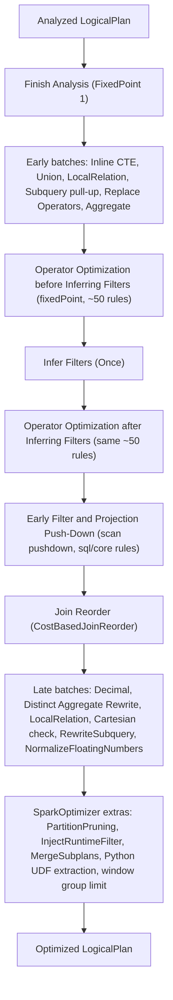

# sql/catalyst — optimizer

Source-first sweep of the `optimizer` group: `sql/catalyst/.../optimizer/` (46 files, ~15k lines)
plus the statistics substrate in `plans/logical/statsEstimation/` and `plans/logical/Statistics.scala`,
which the group's scope claims under "CBO, statistics".

This is Catalyst phase three — **parse → analyze → optimize → plan**. Its input is a *resolved*
`LogicalPlan` (every relation bound, every column an `AttributeReference`, every cast inserted —
see the [analysis sweep](sql-catalyst-analysis.md)); its output is an *optimized* `LogicalPlan`
that the planner turns into a `SparkPlan`. Nothing here knows about partitions, shuffles or
executors: every rule is a `LogicalPlan => LogicalPlan` function.

## The Optimizer — batches, extension points and rule exclusion

**What it is:** `Optimizer` is an abstract `RuleExecutor[LogicalPlan]` — the same batch engine the
`Analyzer` uses. `defaultBatches` is a flat `Seq[Batch]` of ~28 batches; `batches` is `final` and
computes `defaultBatches - (excludedRules - nonExcludableRules)`, dropping a batch entirely when
every rule in it was excluded. Most batches run `fixedPoint` (`spark.sql.optimizer.maxIterations`,
default 100, `errorOnExceed = true`), a few run `Once` (idempotence-checked by `RuleExecutor`) and
four are deliberately listed in `excludedOnceBatches` — `PartitionPruning`, `RewriteSubquery`,
`Extract Python UDFs`, `Infer Filters` — because they are *not* idempotent and would fail the
check. `FixedPoint(1)` appears where a batch must run exactly once but cannot be idempotence-checked
(`Finish Analysis`, `Subquery`, `Join Reorder`, `InjectRuntimeFilter`).

The class is abstract for a reason: the concrete optimizer is `SparkOptimizer` in **sql/core**,
which fills four extension points — `earlyScanPushDownRules` (`SchemaPruning`,
`V2ScanRelationPushDown`, `PruneFileSourcePartitions`, `V1Writes`, `PushVariantIntoScan`),
`preCBORules`, `extendedOperatorOptimizationRules`, and `pre`/`postHocOptimizationBatches` — and
appends its own batches after `super.defaultBatches`. Several rules that *live* in catalyst
(`InjectRuntimeFilter`, `MergeSubplans`, `InferWindowGroupLimit`, `ReplaceCTERefWithRepartition`)
are wired **only** from `SparkOptimizer` and never run under the bare catalyst optimizer.

**Code path:** `QueryExecution.optimizedPlan` (sql/core) → `SparkOptimizer.executeAndTrack` →
`RuleExecutor.execute` → for each `Batch`: loop rules until fixed point or `maxIterations` →
`batches` filters by `spark.sql.optimizer.excludedRules` → AQE re-enters with `AQEOptimizer` and
`spark.sql.adaptive.optimizer.excludedRules` between stages

**Anchor files:** [Optimizer.scala:51 (abstract class)](https://github.com/apache/spark/blob/v4.2.0/sql/catalyst/src/main/scala/org/apache/spark/sql/catalyst/optimizer/Optimizer.scala#L51), [:66 (excludedOnceBatches)](https://github.com/apache/spark/blob/v4.2.0/sql/catalyst/src/main/scala/org/apache/spark/sql/catalyst/optimizer/Optimizer.scala#L66), [:73 (fixedPoint)](https://github.com/apache/spark/blob/v4.2.0/sql/catalyst/src/main/scala/org/apache/spark/sql/catalyst/optimizer/Optimizer.scala#L73), [:100 (defaultBatches)](https://github.com/apache/spark/blob/v4.2.0/sql/catalyst/src/main/scala/org/apache/spark/sql/catalyst/optimizer/Optimizer.scala#L100), [:301 (nonExcludableRules)](https://github.com/apache/spark/blob/v4.2.0/sql/catalyst/src/main/scala/org/apache/spark/sql/catalyst/optimizer/Optimizer.scala#L301), [:508–519 (extension points)](https://github.com/apache/spark/blob/v4.2.0/sql/catalyst/src/main/scala/org/apache/spark/sql/catalyst/optimizer/Optimizer.scala#L508), [:528 (final batches)](https://github.com/apache/spark/blob/v4.2.0/sql/catalyst/src/main/scala/org/apache/spark/sql/catalyst/optimizer/Optimizer.scala#L528), [SparkOptimizer.scala:31 (sql/core)](https://github.com/apache/spark/blob/v4.2.0/sql/core/src/main/scala/org/apache/spark/sql/execution/SparkOptimizer.scala#L31)

**Configs:** `spark.sql.optimizer.maxIterations`, `spark.sql.optimizer.excludedRules`, `spark.sql.adaptive.optimizer.excludedRules`.

**Maps to topics:** A1.

!!! warning "`excludedRules` silently ignores a name you spelled wrong"

    `spark.sql.optimizer.excludedRules` takes fully-qualified rule names
    (`org.apache.spark.sql.catalyst.optimizer.ConstantFolding`). A name that matches nothing is
    dropped without a warning — the only feedback is a `logInfo` for rules that *were* excluded.
    A name on the `nonExcludableRules` list does log a warning and is kept anyway: 16 rules in
    catalyst plus 9 more in `SparkOptimizer` are correctness-critical (subquery rewrites, set-op
    rewrites, `NormalizeFloatingNumbers`, V2 scan/write rules) and cannot be turned off.

## The operator-optimization rule set and the Infer Filters sandwich

**What it is:** The bulk of the optimizer is one list of ~50 rules — `operatorOptimizationRuleSet`
— run to a fixed point, **twice**, with the single-pass `Infer Filters` batch between them. The
reason for the sandwich is that `InferFiltersFromConstraints` creates *new* predicates, which then
need another full round of pushdown, folding and pruning to be useful; running Infer Filters inside
the fixed point instead would never converge (it is explicitly in `excludedOnceBatches`). A fourth
batch, `Push extra predicate through join`, follows.

The list is ordered by intent, and the ordering is load-bearing — the comments call out pairs that
must not be reordered (e.g. `NullPropagation` can introduce `Exists` subqueries so
`RewriteNonCorrelatedExists` must follow it):

- **Operator push down** — `PushProjectionThroughUnion`, `PushProjectionThroughLimitAndOffset`, `ReorderJoin`, `EliminateOuterJoin`, `PushDownPredicates`, `PushDownLeftSemiAntiJoin`, `PushLeftSemiLeftAntiThroughJoin`, `OptimizeJoinCondition`, `LimitPushDown`, `LimitPushDownThroughWindow`, `ColumnPruning`, `GenerateOptimization`
- **Operator combine** — `CollapseRepartition`, `CollapseProject`, `OptimizeWindowFunctions`, `CollapseWindow`, `EliminateOffsets`, `EliminateLimits`, `CombineUnions`
- **Constant folding and strength reduction** — everything from `OptimizeRepartition` down through `ConstantFolding`, `BooleanSimplification`, `PruneFilters`, `UnwrapCastInBinaryComparison`, `RemoveNoopOperators`, to `PushdownPredicatesAndPruneColumnsForCTEDef`

**Code path:** `defaultBatches` → `operatorOptimizationBatch` = `Batch("Operator Optimization before Inferring Filters", fixedPoint, ruleSet)` → `Batch("Infer Filters", Once, InferFiltersFromGenerate, InferFiltersFromConstraints)` → `Batch("Operator Optimization after Inferring Filters", fixedPoint, ruleSet)` → `Batch("Push extra predicate through join", fixedPoint, PushExtraPredicateThroughJoin, PushDownPredicates)`

**Anchor files:** [Optimizer.scala:101 (operatorOptimizationRuleSet)](https://github.com/apache/spark/blob/v4.2.0/sql/catalyst/src/main/scala/org/apache/spark/sql/catalyst/optimizer/Optimizer.scala#L101), [:164 (operatorOptimizationBatch)](https://github.com/apache/spark/blob/v4.2.0/sql/catalyst/src/main/scala/org/apache/spark/sql/catalyst/optimizer/Optimizer.scala#L164), [:176 (the full batch list)](https://github.com/apache/spark/blob/v4.2.0/sql/catalyst/src/main/scala/org/apache/spark/sql/catalyst/optimizer/Optimizer.scala#L176)

**Configs:** `spark.sql.optimizer.maxIterations` (the convergence cap for both passes).

**Maps to topics:** A1.

## Finish Analysis — correctness rules wearing an optimizer badge

**What it is:** The very first batch, `FixedPoint(1)`, running a nested `FinishAnalysis` rule that
folds ~17 sub-rules over the plan and then recurses into every subquery expression. Its own comment
admits these are *not* optimizations: they belong in the analyzer but are deferred so that the
analyzer's output stays canonical for view definitions. Members: `EliminateResolvedHint`,
`EliminateSubqueryAliases`, `EliminatePipeOperators`, `EliminateView`, `EliminateSQLFunctionNode`,
`ReplaceExpressions` (expands every `RuntimeReplaceable` into its real implementation),
`NormalizeFloatingNumbers`, `RewriteNonCorrelatedExists`, `PullOutGroupingExpressions`,
`InsertMapSortInGroupingExpressions`, `InsertMapSortInRepartitionExpressions`, `ComputeCurrentTime`,
`ReplaceCurrentLike`, `SpecialDatetimeValues`, `RewriteAsOfJoin`, `RewriteNearestByJoin`,
`EvalInlineTables`, `ReplaceTranspose`, `RewriteCollationJoin`.

Two are worth knowing by name. `ComputeCurrentTime` replaces every `current_timestamp()` /
`now()` in a plan with **one** literal, so a query referencing it twice sees the same value — a
guarantee produced by an optimizer rule, not by the function. `ReplaceExpressions` is why
`EXPLAIN` on `nvl(a, b)` shows `coalesce`: `RuntimeReplaceable` expressions exist only for parsing
and analysis, and are erased here.

**Code path:** `Batch("Finish Analysis", FixedPoint(1), FinishAnalysis)` → `rules.foldLeft(plan)` → `transformAllExpressionsWithPruning(PLAN_EXPRESSION)` recurses into each `SubqueryExpression` as its own `Subquery` plan

**Anchor files:** [Optimizer.scala:323 (FinishAnalysis)](https://github.com/apache/spark/blob/v4.2.0/sql/catalyst/src/main/scala/org/apache/spark/sql/catalyst/optimizer/Optimizer.scala#L323), [finishAnalysis.scala:49 (ReplaceExpressions), :84 (EvalInlineTables), :112 (ComputeCurrentTime), :154 (ReplaceCurrentLike), :179 (SpecialDatetimeValues)](https://github.com/apache/spark/blob/v4.2.0/sql/catalyst/src/main/scala/org/apache/spark/sql/catalyst/optimizer/finishAnalysis.scala#L112), [RewriteAsOfJoin.scala](https://github.com/apache/spark/blob/v4.2.0/sql/catalyst/src/main/scala/org/apache/spark/sql/catalyst/optimizer/RewriteAsOfJoin.scala), [RewriteNearestByJoin.scala](https://github.com/apache/spark/blob/v4.2.0/sql/catalyst/src/main/scala/org/apache/spark/sql/catalyst/optimizer/RewriteNearestByJoin.scala), [InsertMapSortExpression.scala:38, :90](https://github.com/apache/spark/blob/v4.2.0/sql/catalyst/src/main/scala/org/apache/spark/sql/catalyst/optimizer/InsertMapSortExpression.scala#L38)

**Configs:** none of its own; `spark.sql.optimizer.pullHintsIntoSubqueries` steers `EliminateResolvedHint`.

**Maps to topics:** A1.

!!! info "as-of joins and nearest-by joins are rewrites, not operators"

    `RewriteAsOfJoin` turns a `AsOfJoin` node into a correlated scalar subquery over `MIN_BY`;
    `RewriteNearestByJoin` (4.2.0) materializes the cross product with a `MaxMinByK` aggregate
    instead. Neither has a physical operator — they are pure logical rewrites, which is why their
    performance profile is that of the join they expand into.

## Predicate pushdown

**What it is:** The rule practitioners mean when they say "Spark pushed my filter down".
`PushDownPredicates` is a thin dispatcher combining three rules: `CombineFilters` (merge adjacent
`Filter`s), `PushPredicateThroughNonJoin` (push a `Filter` below `Project`, `Aggregate`, `Window`,
`Union`, `Generate`, `Expand`, `Sample`, `ScriptTransformation`, `Repartition`, `EventTimeWatermark`
and `LocalLimit` when safe) and `PushPredicateThroughJoin` (push each conjunct to the left child,
the right child or the join condition depending on which side its references come from, and on the
join type — for an outer join a predicate can only be pushed to the *non*-null-supplying side).
`PushDownLeftSemiAntiJoin` and `PushLeftSemiLeftAntiThroughJoin` do the same job for semi/anti joins
after subquery rewriting has created them. `PushExtraPredicateThroughJoin` runs in its own late
batch: it *duplicates* a predicate that references both sides down into one side when the predicate
is still evaluable there, at the cost of evaluating it twice.

Determinism is the universal guard: a non-deterministic predicate is never pushed past an operator
that would change how many times it is evaluated. `spark.sql.optimizer.avoidDoubleFilterEval`
(4.2.0, default true) keeps the original `Filter` from being re-evaluated after a push-through in
`PushPredicateThroughNonJoin`.

Pushdown *into the data source* is a different, later step — `earlyScanPushDownRules` in
`SparkOptimizer` — and belongs to the sql/core datasources group.

**Code path:** operator-optimization batch → `PushDownPredicates` → `CombineFilters` → `PushPredicateThroughNonJoin` (`Filter(cond, Project(...))` ⇒ `Project(..., Filter(substituted cond))`) / `PushPredicateThroughJoin` (`splitConjunctivePredicates` → partition by `references.subsetOf(left.outputSet)` / right / neither → rebuild `Join`) → later `Batch("Push extra predicate through join")` → `PushExtraPredicateThroughJoin`

**Anchor files:** [Optimizer.scala:1925 (CombineFilters)](https://github.com/apache/spark/blob/v4.2.0/sql/catalyst/src/main/scala/org/apache/spark/sql/catalyst/optimizer/Optimizer.scala#L1925), [:2078 (PushDownPredicates)](https://github.com/apache/spark/blob/v4.2.0/sql/catalyst/src/main/scala/org/apache/spark/sql/catalyst/optimizer/Optimizer.scala#L2078), [:2094 (PushPredicateThroughNonJoin)](https://github.com/apache/spark/blob/v4.2.0/sql/catalyst/src/main/scala/org/apache/spark/sql/catalyst/optimizer/Optimizer.scala#L2094), [:2125 (avoidDoubleFilterEval)](https://github.com/apache/spark/blob/v4.2.0/sql/catalyst/src/main/scala/org/apache/spark/sql/catalyst/optimizer/Optimizer.scala#L2125), [:2355 (PushPredicateThroughJoin)](https://github.com/apache/spark/blob/v4.2.0/sql/catalyst/src/main/scala/org/apache/spark/sql/catalyst/optimizer/Optimizer.scala#L2355), [PushDownLeftSemiAntiJoin.scala:35, :190](https://github.com/apache/spark/blob/v4.2.0/sql/catalyst/src/main/scala/org/apache/spark/sql/catalyst/optimizer/PushDownLeftSemiAntiJoin.scala#L35), [PushExtraPredicateThroughJoin.scala:33](https://github.com/apache/spark/blob/v4.2.0/sql/catalyst/src/main/scala/org/apache/spark/sql/catalyst/optimizer/PushExtraPredicateThroughJoin.scala#L33), [OptimizeJoinCondition.scala:29](https://github.com/apache/spark/blob/v4.2.0/sql/catalyst/src/main/scala/org/apache/spark/sql/catalyst/optimizer/OptimizeJoinCondition.scala#L29)

**Configs:** `spark.sql.optimizer.avoidDoubleFilterEval` (4.2.0), `spark.sql.optimizer.nestedPredicatePushdown.supportedFileSources`.

**Maps to topics:** A1, B7.

!!! warning "A UDF in a filter blocks pushdown, and nothing tells you"

    Pushdown decisions are guarded by `deterministic` and by whether every referenced attribute is
    available below. A Python UDF, a `rand()`, or a filter referencing an aggregate output stays
    put — the plan is still correct, just slower, and the only evidence is the position of the
    `Filter` node in `EXPLAIN`. This is the single most common "why didn't my filter push down"
    answer, and it is invisible unless you read the optimized plan.

## Column pruning and nested schema pruning

**What it is:** `ColumnPruning` inserts a `Project` under any operator whose child produces more
columns than are actually referenced, then relies on `CollapseProject` and `RemoveNoopOperators` to
tidy up — the pair is why the rule set has to run to a fixed point. `NestedColumnAliasing` goes one
level deeper: when only `a.b.c` is used from a struct column `a`, it rewrites the plan to project
the extracted field as an alias so the scan can read a narrower nested schema.
`GeneratorNestedColumnAliasing` handles the same thing under `explode`. `ObjectSerializerPruning`
does it for the typed Dataset serializer.

The rule that actually *narrows the read schema* is `SchemaPruning`, which lives in sql/core and is
wired through `earlyScanPushDownRules` — catalyst only rewrites the plan into the shape that makes
pruning expressible.

**Code path:** operator-optimization batch → `ColumnPruning` (`prunedChild`) → `NestedColumnAliasing.unapply` (guarded by `nestedSchemaPruningEnabled`) → `rewritePlanIfSubsetFieldsUsed` → later `SparkOptimizer.earlyScanPushDownRules` → `SchemaPruning` narrows the file-source schema

**Anchor files:** [Optimizer.scala:1077 (ColumnPruning)](https://github.com/apache/spark/blob/v4.2.0/sql/catalyst/src/main/scala/org/apache/spark/sql/catalyst/optimizer/Optimizer.scala#L1077), [NestedColumnAliasing.scala:85, :321 (GeneratorNestedColumnAliasing)](https://github.com/apache/spark/blob/v4.2.0/sql/catalyst/src/main/scala/org/apache/spark/sql/catalyst/optimizer/NestedColumnAliasing.scala#L85), [objects.scala:126 (ObjectSerializerPruning)](https://github.com/apache/spark/blob/v4.2.0/sql/catalyst/src/main/scala/org/apache/spark/sql/catalyst/optimizer/objects.scala#L126), [SparkOptimizer.scala:37 (earlyScanPushDownRules)](https://github.com/apache/spark/blob/v4.2.0/sql/core/src/main/scala/org/apache/spark/sql/execution/SparkOptimizer.scala#L37)

**Configs:** `spark.sql.optimizer.nestedSchemaPruning.enabled`, `spark.sql.optimizer.expression.nestedPruning.enabled`, `spark.sql.optimizer.serializer.nestedSchemaPruning.enabled`, `spark.sql.optimizer.nestedPredicatePushdown.supportedFileSources` (`parquet,orc`).

**Maps to topics:** A1, I1.

## Constant folding and expression simplification

**What it is:** `expressions.scala` (1277 lines) is the strength-reduction half of the optimizer —
16 rules that rewrite expressions without touching plan shape:

- `ConstantFolding` — evaluate any `foldable` subtree to a `Literal`
- `ConstantPropagation` — inside a conjunction, substitute `a = 5` into the other conjuncts
- `NullPropagation` / `NullDownPropagation` — fold expressions provably null, push `IsNotNull` down
- `FoldablePropagation` — replace an attribute that aliases a literal with the literal
- `BooleanSimplification`, `SimplifyConditionals`, `SimplifyBinaryComparison`, `PushFoldableIntoBranches` — Boolean algebra, dead `CASE` branches, comparisons against `true`/`false`
- `OptimizeIn` — dedupe an `In` list and convert to `InSet` past `spark.sql.optimizer.inSetConversionThreshold` (10); the codegen switch form kicks in at `inSetSwitchThreshold` (400)
- `LikeSimplification` — turn `LIKE 'abc%'` into `StartsWith`, which a data source can push down
- `ReorderAssociativeOperator`, `CombineConcats`, `SimplifyCasts`, `SimplifyCaseConversionExpressions`, `SimplifyDateTimeConversions`
- `UnwrapCastInBinaryComparison` — the highest-value one: rewrite `cast(intCol as bigint) > 10L` into `intCol > 10`, removing the cast that would otherwise block filter pushdown into Parquet/ORC
- `OptimizeRand` — fold `rand() < 1.0` to `true` and `rand() < 0.0` to `false`
- `ReplaceNullWithFalseInPredicate` — a `null` in a predicate position behaves as `false`

**Code path:** operator-optimization batch → each rule via `transformExpressionsWithPruning` under a `TreePattern` guard (`LITERAL`, `BINARY_COMPARISON`, `CASE_WHEN`, …) so most nodes are skipped without a match attempt

**Anchor files:** [expressions.scala:50 (ConstantFolding), :135 (ConstantPropagation), :272 (ReorderAssociativeOperator), :352 (OptimizeIn), :392 (BooleanSimplification), :574 (SimplifyBinaryComparison), :628 (SimplifyConditionals), :713 (PushFoldableIntoBranches), :803 (LikeSimplification), :900 (NullPropagation), :976 (NullDownPropagation), :1018 (FoldablePropagation), :1155 (SimplifyCasts), :1244 (CombineConcats)](https://github.com/apache/spark/blob/v4.2.0/sql/catalyst/src/main/scala/org/apache/spark/sql/catalyst/optimizer/expressions.scala#L50), [UnwrapCastInBinaryComparison.scala:102](https://github.com/apache/spark/blob/v4.2.0/sql/catalyst/src/main/scala/org/apache/spark/sql/catalyst/optimizer/UnwrapCastInBinaryComparison.scala#L102), [ReplaceNullWithFalseInPredicate.scala:53](https://github.com/apache/spark/blob/v4.2.0/sql/catalyst/src/main/scala/org/apache/spark/sql/catalyst/optimizer/ReplaceNullWithFalseInPredicate.scala#L53), [OptimizeRand.scala](https://github.com/apache/spark/blob/v4.2.0/sql/catalyst/src/main/scala/org/apache/spark/sql/catalyst/optimizer/OptimizeRand.scala)

**Configs:** `spark.sql.optimizer.inSetConversionThreshold`, `spark.sql.optimizer.inSetSwitchThreshold`, `spark.sql.optimizer.enableJsonExpressionOptimization`, `spark.sql.optimizer.enableCsvExpressionOptimization`.

**Maps to topics:** A1.

## Constraint propagation and filter inference

**What it is:** Every `LogicalPlan` carries a lazily-computed `constraints: ExpressionSet` — facts
known to hold on every output row. `QueryPlanConstraints.constraints` is the union of the node's
`validConstraints`, the transitively inferred ones (`inferAdditionalConstraints`, which propagates
equality: given `a = b` and `a > 5`, infer `b > 5`) and the `IsNotNull` constraints derived from
null-intolerant expressions (`constructIsNotNullConstraints`). `InferFiltersFromConstraints` then
materializes those facts as real `Filter` nodes — most usefully as `IsNotNull(joinKey)` above each
side of an equi-join, which is what lets a sort-merge join skip null keys and a Parquet scan drop
row groups. `InferFiltersFromGenerate` adds a size predicate above `explode`.
`PruneFilters` is the inverse: a filter whose condition is `true`, or that is implied by the child's
constraints, is removed; one that is `false` collapses the subtree to an empty relation.

The whole mechanism is behind `spark.sql.constraintPropagation.enabled` (default true) because
constraint sets grow combinatorially on wide plans and this is a known compile-time cost.
`LogicalPlanDistinctKeys.distinctKeys` is the parallel mechanism for uniqueness facts, gated by
`spark.sql.optimizer.propagateDistinctKeys.enabled`, and feeds `RemoveRedundantAggregates` and
`EliminateDistinct`.

**Code path:** `Batch("Infer Filters", Once)` → `InferFiltersFromConstraints` → `plan.constraints` → `QueryPlanConstraints.constraints` = `validConstraints ∪ inferAdditionalConstraints ∪ constructIsNotNullConstraints` → new `Filter` nodes → second operator-optimization pass pushes them down → `PruneFilters` removes any that became redundant

**Anchor files:** [QueryPlanConstraints.scala:33 (constraints), :63 (inferAdditionalConstraints), :95 (constructIsNotNullConstraints)](https://github.com/apache/spark/blob/v4.2.0/sql/catalyst/src/main/scala/org/apache/spark/sql/catalyst/plans/logical/QueryPlanConstraints.scala#L33), [Optimizer.scala:1724 (InferFiltersFromGenerate)](https://github.com/apache/spark/blob/v4.2.0/sql/catalyst/src/main/scala/org/apache/spark/sql/catalyst/optimizer/Optimizer.scala#L1724), [:1771 (InferFiltersFromConstraints)](https://github.com/apache/spark/blob/v4.2.0/sql/catalyst/src/main/scala/org/apache/spark/sql/catalyst/optimizer/Optimizer.scala#L1771), [:2041 (PruneFilters)](https://github.com/apache/spark/blob/v4.2.0/sql/catalyst/src/main/scala/org/apache/spark/sql/catalyst/optimizer/Optimizer.scala#L2041), [LogicalPlanDistinctKeys.scala:30](https://github.com/apache/spark/blob/v4.2.0/sql/catalyst/src/main/scala/org/apache/spark/sql/catalyst/plans/logical/LogicalPlanDistinctKeys.scala#L30), [DistinctKeyVisitor.scala:27](https://github.com/apache/spark/blob/v4.2.0/sql/catalyst/src/main/scala/org/apache/spark/sql/catalyst/plans/logical/DistinctKeyVisitor.scala#L27)

**Configs:** `spark.sql.constraintPropagation.enabled`, `spark.sql.optimizer.propagateDistinctKeys.enabled`, `spark.sql.optimizer.pruneFiltersCanPruneStreamingSubplan`.

**Maps to topics:** A1, B9.

!!! info "Where the `isnotnull(id)` in your plan comes from"

    Seeing `Filter (isnotnull(id) AND ...)` above a scan you never wrote is normal: it is
    `InferFiltersFromConstraints` turning the join key's null-intolerance into an explicit
    predicate so it can be pushed into the data source. Turning off
    `spark.sql.constraintPropagation.enabled` to cut planning time on a very wide plan also
    removes these, and usually costs more at runtime than it saves at compile time.

## Rule-based join reorder, outer-join elimination and the cartesian check

**What it is:** Three rules that touch joins without any statistics. `ReorderJoin` re-associates a
chain of inner joins so that every join has a condition — it pushes the join order around purely to
avoid a cartesian product in the middle of the chain, not to minimise cost. `EliminateOuterJoin`
downgrades an outer join to a less expensive type when a filter above it would discard the
null-extended rows anyway (`LEFT OUTER` + `WHERE right.col IS NOT NULL` ⇒ `INNER`), because inner
joins admit far more downstream optimizations. `CheckCartesianProducts` runs late and raises an
error when an inner-like join has no condition and `spark.sql.crossJoin.enabled` is false — note
that this defaults to **true** since Spark 3.0, so the check is normally inert.
`OptimizeJoinCondition` rewrites `a <=> b` into `a = b` when both sides are non-nullable, so the
join qualifies as an equi-join.

`JoinSelectionHelper` (in `joins.scala`) is the shared trait holding `canPlanAsBroadcastHashJoin`,
`canBuildBroadcastLeft/Right`, `getBroadcastBuildSide` and the hint predicates. Catalyst uses it
here for `PushDownJoinThroughUnion`; sql/core's `JoinSelection` strategy uses the same trait to pick
the physical operator — which is why `spark.sql.autoBroadcastJoinThreshold` and
`spark.sql.join.preferSortMergeJoin` appear in a catalyst config slice at all.

**Code path:** operator-optimization batch → `ReorderJoin` (`ExtractFiltersAndInnerJoins` → `createOrderedJoin`) → `EliminateOuterJoin` (`buildNewJoinType` using `canFilterOutNull`) → late `Batch("Check Cartesian Products", Once)` → `CheckCartesianProducts`

**Anchor files:** [joins.scala:45 (ReorderJoin), :158 (EliminateOuterJoin), :245 (ExtractPythonUDFFromJoinCondition), :290 (JoinSelectionHelper)](https://github.com/apache/spark/blob/v4.2.0/sql/catalyst/src/main/scala/org/apache/spark/sql/catalyst/optimizer/joins.scala#L45), [Optimizer.scala:2542 (CheckCartesianProducts)](https://github.com/apache/spark/blob/v4.2.0/sql/catalyst/src/main/scala/org/apache/spark/sql/catalyst/optimizer/Optimizer.scala#L2542), [OptimizeJoinCondition.scala:29](https://github.com/apache/spark/blob/v4.2.0/sql/catalyst/src/main/scala/org/apache/spark/sql/catalyst/optimizer/OptimizeJoinCondition.scala#L29), [patterns.scala:411 (null-aware anti join)](https://github.com/apache/spark/blob/v4.2.0/sql/catalyst/src/main/scala/org/apache/spark/sql/catalyst/planning/patterns.scala#L411)

**Configs:** `spark.sql.crossJoin.enabled`, `spark.sql.optimizeNullAwareAntiJoin`, `spark.sql.autoBroadcastJoinThreshold` and `spark.sql.join.preferSortMergeJoin` / `spark.sql.shuffledHashJoinFactor` (read through `JoinSelectionHelper`; the strategy that consumes them is in sql/core).

**Maps to topics:** A1, A3, B7.

## Statistics — the two visitors and the estimation model

**What it is:** Every `LogicalPlan` has `.stats: Statistics`, computed lazily and cached per node
(`statsCache`, invalidated by `invalidateStatsCache()`). Which estimator runs is decided by one
config at the moment of the first access:

- **`spark.sql.cbo.enabled = false` (the default)** → `SizeInBytesOnlyStatsPlanVisitor`. It knows only `sizeInBytes`: a unary node scales the child's size by the ratio of output row width to child row width, a join multiplies, a `Filter` keeps the child's size unchanged. There is no `rowCount`.
- **`spark.sql.cbo.enabled = true`** → `BasicStatsPlanVisitor`, which dispatches per operator to `FilterEstimation`, `JoinEstimation`, `AggregateEstimation`, `ProjectEstimation` and `UnionEstimation`, each returning `Option[Statistics]` and **falling back to the size-only visitor whenever it cannot decide**.

`Statistics` carries `sizeInBytes`, an optional `rowCount`, an `AttributeMap[ColumnStat]` and an
`isRuntime` flag (set when AQE replaces the estimate with a materialized query-stage's real
numbers). `ColumnStat` holds distinct count, min, max, null count, average/max length and an
optional `Histogram`. Column stats do not appear by magic: they come from
`ANALYZE TABLE ... COMPUTE STATISTICS FOR COLUMNS`, computed in `CommandUtils` (sql/core) using
`HyperLogLogPlusPlus` at `spark.sql.statistics.ndv.maxError` precision, with equi-height histograms
only when `spark.sql.statistics.histogram.enabled` is on.

`FilterEstimation` is the interesting one: `calculateFilterSelectivity` walks the predicate tree —
`And` multiplies selectivities, `Or` uses inclusion-exclusion, `Not` complements — and per-leaf
estimates use min/max intervals (`ValueInterval`) and distinct counts, *updating* the column stats
as it goes so a later conjunct sees the narrowed range. When it cannot reason about a predicate it
returns a fixed fallback (1/3 for an unhandled binary comparison). `JoinEstimation` estimates an
equi-join by the classic formula over the join columns' distinct counts and min/max overlap, and
gives up (falls back) for non-equi joins.

**Code path:** any `plan.stats` → `LogicalPlanStats.stats` → `conf.cboEnabled` ? `BasicStatsPlanVisitor.visit` : `SizeInBytesOnlyStatsPlanVisitor.visit` → per-operator estimator → `.getOrElse(fallback(p))` → `Statistics(sizeInBytes, rowCount, attributeStats)`; leaf relations get their numbers from the catalog (`CatalogStatistics`) or, for Hive tables with no stats, from HDFS file sizes when `spark.sql.statistics.fallBackToHdfs` is on

**Anchor files:** [LogicalPlanStats.scala:33 (the cboEnabled fork)](https://github.com/apache/spark/blob/v4.2.0/sql/catalyst/src/main/scala/org/apache/spark/sql/catalyst/plans/logical/statsEstimation/LogicalPlanStats.scala#L33), [BasicStatsPlanVisitor.scala:25](https://github.com/apache/spark/blob/v4.2.0/sql/catalyst/src/main/scala/org/apache/spark/sql/catalyst/plans/logical/statsEstimation/BasicStatsPlanVisitor.scala#L25), [SizeInBytesOnlyStatsPlanVisitor.scala:55 (default), :111 (visitJoin)](https://github.com/apache/spark/blob/v4.2.0/sql/catalyst/src/main/scala/org/apache/spark/sql/catalyst/plans/logical/statsEstimation/SizeInBytesOnlyStatsPlanVisitor.scala#L55), [FilterEstimation.scala:45 (estimate), :94 (calculateFilterSelectivity), :318 (evaluateEquality), :400 (evaluateInSet)](https://github.com/apache/spark/blob/v4.2.0/sql/catalyst/src/main/scala/org/apache/spark/sql/catalyst/plans/logical/statsEstimation/FilterEstimation.scala#L94), [JoinEstimation.scala:31, :40 (estimate), :55 (inner/outer), :343 (semi/anti)](https://github.com/apache/spark/blob/v4.2.0/sql/catalyst/src/main/scala/org/apache/spark/sql/catalyst/plans/logical/statsEstimation/JoinEstimation.scala#L40), [AggregateEstimation.scala:31](https://github.com/apache/spark/blob/v4.2.0/sql/catalyst/src/main/scala/org/apache/spark/sql/catalyst/plans/logical/statsEstimation/AggregateEstimation.scala#L31), [EstimationUtils.scala:27, :102 (getSizePerRow)](https://github.com/apache/spark/blob/v4.2.0/sql/catalyst/src/main/scala/org/apache/spark/sql/catalyst/plans/logical/statsEstimation/EstimationUtils.scala#L102), [Statistics.scala:55 (Statistics), :95 (ColumnStat)](https://github.com/apache/spark/blob/v4.2.0/sql/catalyst/src/main/scala/org/apache/spark/sql/catalyst/plans/logical/Statistics.scala#L55)

**Configs:** `spark.sql.cbo.enabled`, `spark.sql.cbo.planStats.enabled`, `spark.sql.statistics.histogram.enabled`, `spark.sql.statistics.histogram.numBins`, `spark.sql.statistics.ndv.maxError`, `spark.sql.statistics.percentile.accuracy`, `spark.sql.statistics.size.autoUpdate.enabled`, `spark.sql.statistics.fallBackToHdfs`, `spark.sql.statistics.parallelFileListingInStatsComputation.enabled`, `spark.sql.statistics.updatePartitionStatsInAnalyzeTable.enabled`.

**Maps to topics:** none — **discovery gap**, proposed as A17.

!!! warning "`spark.sql.cbo.enabled` is false by default, so most plans have no row counts"

    With the CBO off, `plan.stats.rowCount` is `None` almost everywhere and `sizeInBytes` is a
    product of child sizes — which for a filter is simply the unfiltered size. Every decision built
    on statistics degrades accordingly: `CostBasedJoinReorder` refuses to run at all (it requires
    `rowCount.isDefined` on every join item), broadcast eligibility is judged on an unfiltered size
    estimate, and `InjectRuntimeFilter`'s size thresholds compare against the same number. Turning
    the CBO on without first running `ANALYZE TABLE ... COMPUTE STATISTICS FOR COLUMNS` changes
    almost nothing — the estimators fall back to the size-only visitor node by node, silently.

## Cost-based join reorder (dynamic programming) and star-schema detection

**What it is:** `CostBasedJoinReorder` is Spark's only genuinely cost-based rule. It runs in its own
`FixedPoint(1)` batch after scan pushdown (so relations report real stats) and does nothing unless
**both** `spark.sql.cbo.enabled` and `spark.sql.cbo.joinReorder.enabled` are true. It then collects
maximal chains of inner joins (`extractInnerJoins`) and reorders them only when: more than 2 items,
at most `spark.sql.cbo.joinReorder.dp.threshold` (12) items, join conditions exist, **and every item
has a defined `rowCount`**. Any join carrying a hint (`JoinHint.NONE` guard in the pattern match) is
skipped entirely.

`JoinReorderDP.search` is the Selinger-style bottom-up dynamic program: level 0 holds single items,
level *k* holds the best plan for each *k*-item subset, and a candidate is built only when the two
sides are disjoint and share a join condition (cartesian pairs are pruned). Cost is
`Cost(cardinality, sizeInBytes)` accumulated over intermediate joins; `betterThan` compares two
plans by a **weighted geometric mean** of the row-count ratio and the size ratio, weighted by
`spark.sql.cbo.joinReorder.card.weight` (0.7). The deeper side is placed on the left, biasing toward
left-deep trees. `JoinReorderDPFilters` implements only the star-join filter — the cartesian and
composite-inner filters described in its own comment are **not implemented**.

`StarSchemaDetection` identifies a fact table and its dimension tables by cardinality and
referential-integrity heuristics (`spark.sql.cbo.starJoinFTRatio`, and an NDV closeness test using
`spark.sql.statistics.ndv.maxError`); it is used both by the DP star filter and, when
`spark.sql.cbo.starSchemaDetection` is on, by `ReorderJoin`.

**Code path:** `Batch("Join Reorder", FixedPoint(1))` → `CostBasedJoinReorder.apply` (guarded by `cboEnabled && joinReorderEnabled`) → `reorder` → `extractInnerJoins` → `JoinReorderDP.search` → `searchLevel` × n → `buildJoin` (disjointness + join-condition + star filter) → `JoinPlan.betterThan` → `replaceWithOrderedJoin` marks the result so the rule does not re-enter

**Anchor files:** [CostBasedJoinReorder.scala:36 (rule), :58 (reorder + preconditions), :77 (extractInnerJoins), :143 (JoinReorderDP), :203 (searchLevel), :302 (left-deep bias), :338 (JoinPlan), :370 (betterThan), :388 (Cost), :404 (JoinReorderDPFilters)](https://github.com/apache/spark/blob/v4.2.0/sql/catalyst/src/main/scala/org/apache/spark/sql/catalyst/optimizer/CostBasedJoinReorder.scala#L143), [StarSchemaDetection.scala:31](https://github.com/apache/spark/blob/v4.2.0/sql/catalyst/src/main/scala/org/apache/spark/sql/catalyst/optimizer/StarSchemaDetection.scala#L31)

**Configs:** `spark.sql.cbo.joinReorder.enabled`, `spark.sql.cbo.joinReorder.dp.threshold`, `spark.sql.cbo.joinReorder.card.weight`, `spark.sql.cbo.joinReorder.dp.star.filter`, `spark.sql.cbo.starSchemaDetection`, `spark.sql.cbo.starJoinFTRatio`.

**Maps to topics:** A3.

!!! warning "Four independent switches must all be true before a join is reordered"

    `cbo.enabled` **and** `cbo.joinReorder.enabled` (both default false), **and** every joined
    relation must have a `rowCount` from `ANALYZE TABLE`, **and** the join chain must be 3–12
    items with conditions, **and** no join hint anywhere in the chain. Miss any one and the rule
    returns the plan untouched with no diagnostic. Practically: a `BROADCAST` hint you added for
    one join disables cost-based reordering for the whole chain it sits in.

## Runtime filtering — bloom filters and dynamic partition pruning

**What it is:** Two rules that plant a filter on the *large* side of a join, evaluated at runtime
from the *small* side. Both are wired from `SparkOptimizer`, not from the catalyst batch list.

**Dynamic partition pruning** (`PartitionPruning`, sql/core) inserts a `DynamicPruningSubquery` on
the partition column of a partitioned scan, so the fact-table scan lists only the partitions the
dimension side actually produces. It is planned only when the filtering side is a broadcast that
would be built anyway (`reuseBroadcastOnly`, default true) — otherwise the benefit must clear
`fallbackFilterRatio` (0.5) against the estimated selectivity, using stats when `useStats` is on.

**`InjectRuntimeFilter`** (catalyst) handles the non-partitioned case: it injects
`BloomFilterMightContain(bloomFilterAgg(joinKey), XxHash64(joinKey))` as a `Filter` on the
application side. Its preconditions are strict — the creation side must be under
`spark.sql.optimizer.runtime.bloomFilter.creationSideThreshold` (10 MB), the application side must
exceed `applicationSideScanSizeThreshold` (10 GB), the join keys must be "simple" expressions, the
join must be (or sit above) a shuffle, no DPP filter may already exist on that key, and the number
of injected filters is capped at `spark.sql.optimizer.runtimeFilter.number.threshold` (10). It runs
in `FixedPoint(1)` immediately after the `PartitionPruning` batch and explicitly checks for existing
DPP subqueries so the two do not stack.

`CleanupDynamicPruningFilters` (sql/core) later strips any pruning filter that could not be pushed
into a scan, and `BooleanSimplification` + `PruneFilters` remove the resulting `TrueLiteral`s.

**Code path:** `SparkOptimizer.defaultBatches` → `Batch("PartitionPruning", Once, PartitionPruning, RowLevelOperationRuntimeGroupFiltering)` → `Batch("InjectRuntimeFilter", FixedPoint(1))` → `tryInjectRuntimeFilter` → `ExtractEquiJoinKeys` match → `hasDynamicPruningSubquery` / `hasBloomFilter` guards → `injectBloomFilter` (size check against `runtimeFilterCreationSideThreshold`) → `Batch("Pushdown Filters from PartitionPruning")` → `Batch("Cleanup filters that cannot be pushed down")`

**Anchor files:** [InjectRuntimeFilter.scala:37 (rule), :52 (injectBloomFilter + size guard), :250 (hasDynamicPruningSubquery), :291 (tryInjectRuntimeFilter), :331 (apply)](https://github.com/apache/spark/blob/v4.2.0/sql/catalyst/src/main/scala/org/apache/spark/sql/catalyst/optimizer/InjectRuntimeFilter.scala#L37), [SparkOptimizer.scala:56 (PartitionPruning batch), :62 (InjectRuntimeFilter batch), :69 (cleanup)](https://github.com/apache/spark/blob/v4.2.0/sql/core/src/main/scala/org/apache/spark/sql/execution/SparkOptimizer.scala#L56), [PartitionPruning.scala (sql/core)](https://github.com/apache/spark/blob/v4.2.0/sql/core/src/main/scala/org/apache/spark/sql/execution/dynamicpruning/PartitionPruning.scala)

**Configs:** `spark.sql.optimizer.dynamicPartitionPruning.enabled`, `.reuseBroadcastOnly`, `.useStats`, `.fallbackFilterRatio`; `spark.sql.optimizer.runtime.bloomFilter.enabled` (default **true** since 3.3), `.creationSideThreshold`, `.applicationSideScanSizeThreshold`, `.expectedNumItems`, `.numBits`, `.maxNumItems`, `.maxNumBits`; `spark.sql.optimizer.runtimeFilter.number.threshold`; `spark.sql.optimizer.runtime.rowLevelOperationGroupFilter.enabled`.

**Maps to topics:** none — **discovery gap**, proposed as A18.

## Correlated subqueries — pull-up, decorrelation and the COUNT bug

**What it is:** Spark has no physical operator for a correlated subquery. Everything is rewritten
into a join, across four rules and one 1117-line helper:

- **`PullupCorrelatedPredicates`** (`Once`, non-excludable) strips outer-referencing predicates out of the subquery's `Filter`s and hoists their references through intermediate `Project`/`Aggregate` nodes so they can be evaluated at the top.
- **`DecorrelateInnerQuery`** does the general case. For equality correlation it turns the correlated filter into a group-by key. For non-equality correlation (`WHERE outer.c > inner.a`) it introduces a **`DomainJoin`** placeholder — the distinct set of outer values joined into the subquery — which a later rule turns into a real join. Gated by `spark.sql.optimizer.decorrelateInnerQuery.enabled` (default true), with per-feature flags for limits, offsets, set ops, union-under-limit and join predicates.
- **`RewritePredicateSubquery`** (late `Once` batch) turns `EXISTS`/`NOT EXISTS` into `LEFT SEMI`/`LEFT ANTI` joins and `IN`/`NOT IN` into the same with an added key equality.
- **`RewriteCorrelatedScalarSubquery`** turns a correlated scalar subquery into a `LEFT OUTER` join, nullable by construction; `spark.sql.optimizer.scalarSubqueryUseSingleJoin` (4.0, default true) uses a single-row-enforcing join instead where possible. `RewriteLateralSubquery` handles `LATERAL`, and `OptimizeOneRowRelationSubquery` inlines a subquery over `OneRowRelation` outright.

**The COUNT bug** is the reason a third of these configs exist. `SELECT (SELECT count(*) FROM t
WHERE t.k = outer.k)` must return `0` for an outer row with no match — but after rewriting to a left
outer join, the aggregate produces `NULL`. The rewrite detects "count-bug-vulnerable" aggregates
(`mayHaveCountBug`) and inserts the compensating `CASE`; three `legacy...IncorrectCountHandling`
flags exist to restore the pre-4.0 wrong answer for compatibility.

**Code path:** `Batch("Pullup Correlated Expressions", Once)` → `OptimizeOneRowRelationSubquery`, `PullOutNestedDataOuterRefExpressions`, `PullupCorrelatedPredicates` → `Batch("Subquery", FixedPoint(1))` → `OptimizeSubqueries` (recursively runs the whole optimizer on each subquery plan) → operator-optimization batch → `RewriteCorrelatedScalarSubquery` / `RewriteLateralSubquery` → late `Batch("RewriteSubquery", Once)` → `RewritePredicateSubquery` → semi/anti joins → `ColumnPruning`, `CollapseProject`, `RemoveNoopOperators` clean up

**Anchor files:** [subquery.scala:56 (RewritePredicateSubquery), :217 (uncorrelated IN in join condition), :347 (wrapExistsInAggregateFunction), :467 (PullupCorrelatedPredicates), :586–660 (count-bug handling), :698 (RewriteCorrelatedScalarSubquery), :1090 (RewriteLateralSubquery), :1104 (OptimizeOneRowRelationSubquery)](https://github.com/apache/spark/blob/v4.2.0/sql/catalyst/src/main/scala/org/apache/spark/sql/catalyst/optimizer/subquery.scala#L586), [DecorrelateInnerQuery.scala:86 (object + DomainJoin doc), :983 (decorrelateJoinPredicate)](https://github.com/apache/spark/blob/v4.2.0/sql/catalyst/src/main/scala/org/apache/spark/sql/catalyst/optimizer/DecorrelateInnerQuery.scala#L86), [PullOutNestedDataOuterRefExpressions.scala:75](https://github.com/apache/spark/blob/v4.2.0/sql/catalyst/src/main/scala/org/apache/spark/sql/catalyst/optimizer/PullOutNestedDataOuterRefExpressions.scala#L75), [Optimizer.scala:366 (OptimizeSubqueries)](https://github.com/apache/spark/blob/v4.2.0/sql/catalyst/src/main/scala/org/apache/spark/sql/catalyst/optimizer/Optimizer.scala#L366)

**Configs:** `spark.sql.optimizer.decorrelateInnerQuery.enabled`, `.decorrelateSetOps.enabled`, `.decorrelateLimit.enabled`, `.decorrelateOffset.enabled`, `.decorrelateUnionOrSetOpUnderLimit.enabled`, `.decorrelateJoinPredicate.enabled`, `.decorrelatePredicateSubqueriesInJoinPredicate.enabled`, `.decorrelateSubqueryLegacyIncorrectCountHandling.enabled`, `.decorrelateExistsSubqueryLegacyIncorrectCountHandling.enabled`, `.decorrelateSubqueryPreventConstantHoldingForCountBug.enabled`, `.scalarSubqueryUseSingleJoin`, `.wrapExistsInAggregateFunction`, `.optimizeUncorrelatedInSubqueriesInJoinCondition.enabled`, `.optimizeOneRowRelationSubquery`, `.optimizeOneRowRelationSubquery.alwaysInline`, `.pullOutNestedDataOuterRefExpressions.enabled`, `spark.sql.subquery.maxThreadThreshold`.

**Maps to topics:** none — **discovery gap**, proposed as A19.

!!! warning "The COUNT bug flags default to the *correct* behaviour — do not flip them"

    `spark.sql.optimizer.decorrelateSubqueryLegacyIncorrectCountHandling.enabled` and its two
    siblings default to `false`, meaning Spark 4.x returns the SQL-standard answer. Setting them
    to `true` restores a documented *wrong result* (NULL instead of 0) for compatibility with
    plans captured before 3.5/4.0. They are the clearest example in the optimizer of a config
    whose effect is silent incorrectness rather than performance.

## CTE handling — inline, pushdown, and reuse as repartition

**What it is:** A `WITH` clause survives analysis as `WithCTE(child, cteDefs)` plus
`CTERelationRef` nodes. `InlineCTE` (its own `Once` batch, first thing after `Finish Analysis`)
decides per definition whether to substitute the body at each reference — it inlines when the
definition is referenced once, is cheap, or is deterministic and the config allows — leaving
`WithCTE` in place only for the definitions that stay shared.
`PushdownPredicatesAndPruneColumnsForCTEDef` pushes the *intersection* of the filters seen at every
reference into the shared definition (a filter that applies at only one reference cannot be pushed)
and prunes columns the same way; `CleanUpTempCTEInfo` removes the bookkeeping afterwards.
`UpdateCTERelationStats` copies the definition's computed `Statistics` onto every `CTERelationRef`
so downstream cost estimation is not blind. Finally `ReplaceCTERefWithRepartition` (a `SparkOptimizer`
batch, non-excludable) turns a still-shared reference into a repartition so the shared subtree is
computed once.

Recursive CTEs (`WITH RECURSIVE`, 4.1+) are bounded by three configs and executed by `UnionLoopExec`
in sql/core.

**Code path:** `Batch("Inline CTE", Once, InlineCTE())` → operator-optimization batch → `PushdownPredicatesAndPruneColumnsForCTEDef` → `Batch("Clean Up Temporary CTE Info", Once, CleanUpTempCTEInfo)` → `Batch("Update CTE Relation Stats", Once, UpdateCTERelationStats)` → `SparkOptimizer` `Batch("Replace CTE with Repartition", Once, ReplaceCTERefWithRepartition)`

**Anchor files:** [InlineCTE.scala:43, :260 (CTEReferenceInfo)](https://github.com/apache/spark/blob/v4.2.0/sql/catalyst/src/main/scala/org/apache/spark/sql/catalyst/optimizer/InlineCTE.scala#L43), [PushdownPredicatesAndPruneColumnsForCTEDef.scala:33, :170 (CleanUpTempCTEInfo)](https://github.com/apache/spark/blob/v4.2.0/sql/catalyst/src/main/scala/org/apache/spark/sql/catalyst/optimizer/PushdownPredicatesAndPruneColumnsForCTEDef.scala#L33), [Optimizer.scala:482 (updateCTEStats)](https://github.com/apache/spark/blob/v4.2.0/sql/catalyst/src/main/scala/org/apache/spark/sql/catalyst/optimizer/Optimizer.scala#L482), [ReplaceCTERefWithRepartition.scala:37](https://github.com/apache/spark/blob/v4.2.0/sql/catalyst/src/main/scala/org/apache/spark/sql/catalyst/optimizer/ReplaceCTERefWithRepartition.scala#L37), [UnionLoopExec.scala:160 (sql/core, recursion limit)](https://github.com/apache/spark/blob/v4.2.0/sql/core/src/main/scala/org/apache/spark/sql/execution/UnionLoopExec.scala#L160)

**Configs:** `spark.sql.cteRecursionLevelLimit`, `spark.sql.cteRecursionRowLimit`, `spark.sql.cteRecursionAnchorRowsLimitToConvertToLocalRelation`.

**Maps to topics:** B8.

## MergeSubplans and PlanMerger — scalar-subquery reuse (new in 4.2.0)

**What it is:** Spark 4.2.0 generalised the old `MergeScalarSubqueries` rule into `MergeSubplans` +
a reusable `PlanMerger`. When a query computes several uncorrelated scalar subqueries over the same
relation — the classic dashboard `SELECT (SELECT min(a) FROM t), (SELECT sum(b) FROM t)` — the rule
merges them into **one** aggregate wrapped in a `CTERelationDef`, and replaces each original
subquery with a struct-field projection off the shared CTE. `PlanMerger` is the general engine:
it caches candidate plans, decides whether an incoming plan is identical to or mergeable with a
cached one, and returns an `outputMap` from the input's attributes to positions in the merged
output. Filter propagation (three 4.2.0 configs) lets it merge two plans that differ only by a
filter, by OR-ing the filters and keeping per-branch aliases.

Guards worth knowing: the rule is a no-op unless `spark.sql.execution.reuseSubquery` is on, it skips
any plan already containing a CTE, and it does not descend into correlated subqueries.

**Code path:** `SparkOptimizer` `Batch("MergeSubplans", Once, MergeSubplans, RewriteDistinctAggregates)` → `extractCommonScalarSubqueries` → `insertReferences` collects subplans level by level into `PlanMerger`s, leaving `ScalarSubqueryReference` placeholders → merged plans become `CTERelationDef`s → references rewritten to `GetStructField` on `CTERelationRef`

**Anchor files:** [MergeSubplans.scala:151 (rule + guards), :353 (ScalarSubqueryReference), :373 (NonGroupingAggregateReference)](https://github.com/apache/spark/blob/v4.2.0/sql/catalyst/src/main/scala/org/apache/spark/sql/catalyst/optimizer/MergeSubplans.scala#L151), [PlanMerger.scala:41 (MergeResult), :56 (object), :132 (class + filter-propagation configs)](https://github.com/apache/spark/blob/v4.2.0/sql/catalyst/src/main/scala/org/apache/spark/sql/catalyst/optimizer/PlanMerger.scala#L132), [SparkOptimizer.scala:64](https://github.com/apache/spark/blob/v4.2.0/sql/core/src/main/scala/org/apache/spark/sql/execution/SparkOptimizer.scala#L64)

**Configs:** `spark.sql.execution.reuseSubquery`, `spark.sql.optimizer.mergeSubplans.filterPropagation.enabled` (4.2.0), `.symmetricFilterPropagation.enabled`, `.throughJoin.enabled`.

**Maps to topics:** A1.

## Set operations and distinct rewrites

**What it is:** Spark has no physical `EXCEPT`, `INTERSECT` or `DISTINCT` operator — all three are
rewritten in the `Replace Operators` batch, and all the rewrite rules are non-excludable:

- `ReplaceDistinctWithAggregate` — `DISTINCT` becomes a grouping-only `Aggregate`
- `ReplaceDeduplicateWithAggregate` — `dropDuplicates` becomes `Aggregate(First(...))`; must run **before** `RewriteExceptAll` (SPARK-51262) or the latter captures stale `ExprId`s
- `ReplaceIntersectWithSemiJoin` / `ReplaceExceptWithAntiJoin` — the distinct forms become `LEFT SEMI` / `LEFT ANTI` joins
- `ReplaceExceptWithFilter` — when the right side is just a filter over the same relation, `EXCEPT` becomes `Filter(Not(condition))`, avoiding the join entirely
- `RewriteExceptAll` / `RewriteIntersectAll` — the `ALL` forms need multiplicity, so they become a union with a `+1`/`-1` count column, an aggregate, and a `Generate` that replays each row the right number of times

Union handling is separate: `CombineUnions` flattens nested unions (run once early *and* inside the
operator batch, because other rules make unions adjacent), `RemoveNoopUnion` drops single-child or
empty unions, `PushProjectionThroughUnion` pushes a projection into each branch, and
`PushDownJoinThroughUnion` (4.2.0, off by default) rewrites `Join(Union(c1..cN), small)` into
`Union(Join(c1, small), …)` when the right side qualifies as a broadcast — with explicit guards
against duplicating non-deterministic or subquery-containing subtrees.

**Code path:** `Batch("Replace Operators", fixedPoint)` → the seven replace/rewrite rules → `Batch("Union", fixedPoint, RemoveNoopOperators, CombineUnions, RemoveNoopUnion)` → operator-optimization batch → `PushProjectionThroughUnion` → `Batch("Push Down Join Through Union", Once)` (after Join Reorder, so the CBO sees the whole join graph first)

**Anchor files:** [Optimizer.scala:842 (RemoveNoopUnion), :1005 (PushProjectionThroughUnion), :1845 (CombineUnions), :2651 (ReplaceDistinctWithAggregate), :2661 (ReplaceDeduplicateWithAggregate), :2700 (ReplaceIntersectWithSemiJoin), :2722 (ReplaceExceptWithAntiJoin), :2763 (RewriteExceptAll), :2821 (RewriteIntersectAll)](https://github.com/apache/spark/blob/v4.2.0/sql/catalyst/src/main/scala/org/apache/spark/sql/catalyst/optimizer/Optimizer.scala#L2763), [ReplaceExceptWithFilter.scala:44](https://github.com/apache/spark/blob/v4.2.0/sql/catalyst/src/main/scala/org/apache/spark/sql/catalyst/optimizer/ReplaceExceptWithFilter.scala#L44), [PushDownJoinThroughUnion.scala:51](https://github.com/apache/spark/blob/v4.2.0/sql/catalyst/src/main/scala/org/apache/spark/sql/catalyst/optimizer/PushDownJoinThroughUnion.scala#L51)

**Configs:** `spark.sql.optimizer.replaceExceptWithFilter`, `spark.sql.optimizer.pushDownJoinThroughUnion.enabled` (4.2.0, default false), `spark.sql.unionOutputPartitioning` (physical, sql/core).

**Maps to topics:** B8, A1.

## Aggregate rewrites — distinct aggregates, Expand, decimals

**What it is:** `RewriteDistinctAggregates` is the rule behind the two-stage plan you see for
`COUNT(DISTINCT a), COUNT(DISTINCT b)` in one query: since a single aggregate cannot deduplicate two
different columns at once, the rule expands each input row **N times** with a group-id column
(`Expand`), aggregates on `(groupingKeys, gid)`, then re-aggregates. The row multiplication is the
cost, and `OptimizeExpand` (4.2.0) attacks it by inserting a deduplicating `Aggregate` *below* the
`Expand` — but only when `spark.sql.optimizer.optimizeExpandRatio` is set (default `-1` = disabled),
there are no non-distinct aggregates, and the pre-aggregate would not itself blow up.

Around it: `EliminateDistinct` drops `DISTINCT` from aggregates where it cannot matter (`MAX`,
`MIN`, or when `distinctKeys` proves uniqueness), `EliminateAggregateFilter` removes a `FILTER
(WHERE true)` clause, `RemoveRedundantAggregates` collapses an aggregate over an aggregate,
`DecimalAggregates` rewrites `sum`/`avg` over small decimals to use unscaled `Long` arithmetic, and
`PullOutGroupingExpressions` replaces a complex grouping expression with a `_groupingexpression`
attribute so later rules cannot rewrite the grouping key and the aggregate expression differently.

**Code path:** `Batch("Aggregate", fixedPoint, RemoveLiteralFromGroupExpressions, RemoveRepetitionFromGroupExpressions)` → operator-optimization batch (`RemoveRedundantAggregates`, `EliminateAggregateFilter`) → `Batch("Decimal Optimizations", fixedPoint, DecimalAggregates)` → `Batch("Distinct Aggregate Rewrite", Once, RewriteDistinctAggregates, OptimizeExpand)`

**Anchor files:** [RewriteDistinctAggregates.scala:199](https://github.com/apache/spark/blob/v4.2.0/sql/catalyst/src/main/scala/org/apache/spark/sql/catalyst/optimizer/RewriteDistinctAggregates.scala#L199), [OptimizeExpand.scala:56](https://github.com/apache/spark/blob/v4.2.0/sql/catalyst/src/main/scala/org/apache/spark/sql/catalyst/optimizer/OptimizeExpand.scala#L56), [Optimizer.scala:572 (EliminateDistinct), :604 (EliminateAggregateFilter), :2573 (DecimalAggregates), :2874 (RemoveLiteralFromGroupExpressions), :2952 (RemoveRepetitionFromGroupExpressions)](https://github.com/apache/spark/blob/v4.2.0/sql/catalyst/src/main/scala/org/apache/spark/sql/catalyst/optimizer/Optimizer.scala#L572), [RemoveRedundantAggregates.scala:30](https://github.com/apache/spark/blob/v4.2.0/sql/catalyst/src/main/scala/org/apache/spark/sql/catalyst/optimizer/RemoveRedundantAggregates.scala#L30), [PullOutGroupingExpressions.scala](https://github.com/apache/spark/blob/v4.2.0/sql/catalyst/src/main/scala/org/apache/spark/sql/catalyst/optimizer/PullOutGroupingExpressions.scala)

**Configs:** `spark.sql.optimizer.optimizeExpandRatio` (4.2.0, default -1), `spark.sql.optimizer.propagateDistinctKeys.enabled`.

**Maps to topics:** B6.

## Window optimizations and the window group limit

**What it is:** Five rules that make window functions cheaper. `CollapseWindow` merges adjacent
`Window` operators sharing a partition and ordering spec (one sort instead of two);
`TransposeWindow` swaps two adjacent windows when the lower one's partitioning is a prefix of the
upper's, enabling a later collapse; `OptimizeWindowFunctions` rewrites `first_value` over an
unbounded-preceding frame into the cheaper `first`; `EliminateWindowPartitions` drops partitioning
columns that are provably constant. `LimitPushDownThroughWindow` pushes a `LIMIT` below a window
when the window is rank-like and the limit is small.

The highest-impact one is `InferWindowGroupLimit`: for the top-N-per-group pattern
(`row_number()/rank()/dense_rank() OVER (PARTITION BY … ORDER BY …)` filtered to `<= k`), it inserts
a `WindowGroupLimit` node that lets each partition stop after *k* rows instead of materialising and
sorting the whole group. It only fires when the partition's estimated size exceeds
`spark.sql.optimizer.windowGroupLimitThreshold` (1000), and it is wired from `SparkOptimizer`.

**Code path:** operator-optimization batch → `OptimizeWindowFunctions`, `CollapseWindow`, `TransposeWindow`, `EliminateWindowPartitions`, `LimitPushDownThroughWindow` → `SparkOptimizer` `Batch("Infer window group limit", Once, InferWindowGroupLimit, LimitPushDown, LimitPushDownThroughWindow, ConstantFolding, EliminateLimits)`

**Anchor files:** [Optimizer.scala:1638 (OptimizeWindowFunctions), :1656 (CollapseWindow), :1692 (TransposeWindow)](https://github.com/apache/spark/blob/v4.2.0/sql/catalyst/src/main/scala/org/apache/spark/sql/catalyst/optimizer/Optimizer.scala#L1656), [InferWindowGroupLimit.scala:54](https://github.com/apache/spark/blob/v4.2.0/sql/catalyst/src/main/scala/org/apache/spark/sql/catalyst/optimizer/InferWindowGroupLimit.scala#L54), [EliminateWindowPartitions.scala:28](https://github.com/apache/spark/blob/v4.2.0/sql/catalyst/src/main/scala/org/apache/spark/sql/catalyst/optimizer/EliminateWindowPartitions.scala#L28), [LimitPushDownThroughWindow.scala:32](https://github.com/apache/spark/blob/v4.2.0/sql/catalyst/src/main/scala/org/apache/spark/sql/catalyst/optimizer/LimitPushDownThroughWindow.scala#L32), [SparkOptimizer.scala:92](https://github.com/apache/spark/blob/v4.2.0/sql/core/src/main/scala/org/apache/spark/sql/execution/SparkOptimizer.scala#L92)

**Configs:** `spark.sql.optimizer.windowGroupLimitThreshold`.

**Maps to topics:** I2.

## Limit and offset optimizations

**What it is:** `LimitPushDown` moves a `LocalLimit` below `Union`, below the null-preserving side
of an outer join, and below `Project` — the union case matters most, since each branch can then stop
early. `EliminateLimits` folds nested limits into one and removes a limit above a plan whose
`maxRows` is already smaller; `EliminateOffsets` does the same for `OFFSET` and removes an offset of
zero. `PushProjectionThroughLimitAndOffset` swaps a `Project` below a limit so the projection is
evaluated on fewer rows.

**Code path:** operator-optimization batch → `LimitPushDown`, `PushProjectionThroughLimitAndOffset`, `EliminateOffsets`, `EliminateLimits`; the physical side (incremental collection, `spark.sql.limit.scaleUpFactor`, `InsertSortForLimitAndOffset` for `orderingAwareLimitOffset`) is in sql/core

**Anchor files:** [Optimizer.scala:895 (LimitPushDown), :2480 (EliminateLimits), :2516 (EliminateOffsets)](https://github.com/apache/spark/blob/v4.2.0/sql/catalyst/src/main/scala/org/apache/spark/sql/catalyst/optimizer/Optimizer.scala#L895), [PushProjectionThroughLimitAndOffset.scala:27](https://github.com/apache/spark/blob/v4.2.0/sql/catalyst/src/main/scala/org/apache/spark/sql/catalyst/optimizer/PushProjectionThroughLimitAndOffset.scala#L27), [InsertSortForLimitAndOffset.scala:40 (sql/core)](https://github.com/apache/spark/blob/v4.2.0/sql/core/src/main/scala/org/apache/spark/sql/execution/InsertSortForLimitAndOffset.scala#L40)

**Configs:** `spark.sql.orderingAwareLimitOffset` (physical), `spark.sql.limit.scaleUpFactor` and `spark.sql.limit.initialNumPartitions` (physical, sql/core).

**Maps to topics:** A1.

## Empty relations, one-row plans and local evaluation

**What it is:** Three rules that shrink a plan to nothing when they can. `PropagateEmptyRelation`
replaces an operator whose child is provably empty with an empty `LocalRelation` and propagates that
upward through joins (an inner join with an empty side is empty; a left outer join with an empty
right side becomes a projection with nulls). `ConvertToLocalRelation` evaluates `Project`, `Filter`
and `Limit` over a `LocalRelation` **on the driver**, using an interpreted projection — this is why
`spark.createDataFrame([...]).filter(...)` sometimes shows no job at all. `OptimizeOneRowPlan`
simplifies plans whose child has exactly one row (a `Sort` becomes a no-op, an `Aggregate` without
grouping becomes a `Project`). `UpdateAttributeNullability` runs after each of these because
removing an empty union branch can turn a nullable attribute non-nullable.

The batch runs twice — `LocalRelation early` before the heavy rules (so a `Filter(LocalRelation)`
does not pay for constraint inference) and `LocalRelation` again late.

**Code path:** `Batch("LocalRelation early", fixedPoint, ConvertToLocalRelation, PropagateEmptyRelation, UpdateAttributeNullability)` → … → `Batch("LocalRelation", fixedPoint, same)` → `Batch("Optimize One Row Plan", fixedPoint, OptimizeOneRowPlan)`

**Anchor files:** [PropagateEmptyRelation.scala:47 (base), :219 (object)](https://github.com/apache/spark/blob/v4.2.0/sql/catalyst/src/main/scala/org/apache/spark/sql/catalyst/optimizer/PropagateEmptyRelation.scala#L47), [Optimizer.scala:2617 (ConvertToLocalRelation)](https://github.com/apache/spark/blob/v4.2.0/sql/catalyst/src/main/scala/org/apache/spark/sql/catalyst/optimizer/Optimizer.scala#L2617), [OptimizeOneRowPlan.scala:44](https://github.com/apache/spark/blob/v4.2.0/sql/catalyst/src/main/scala/org/apache/spark/sql/catalyst/optimizer/OptimizeOneRowPlan.scala#L44), [Optimizer.scala:2043 (streaming guard in PruneFilters)](https://github.com/apache/spark/blob/v4.2.0/sql/catalyst/src/main/scala/org/apache/spark/sql/catalyst/optimizer/Optimizer.scala#L2043)

**Configs:** `spark.sql.optimizer.pruneFiltersCanPruneStreamingSubplan` (4.0, default false), `spark.sql.streaming.optimizeOneRowPlan.enabled`, `spark.sql.session.localRelationCacheThreshold`, `spark.sql.session.localRelationSizeLimit`.

**Maps to topics:** A1.

!!! warning "Streaming plans are deliberately excluded from empty-relation pruning"

    A streaming source is empty *right now*, not forever. `PruneFilters` and
    `PropagateEmptyRelation` therefore refuse to prune a streaming subplan unless
    `spark.sql.optimizer.pruneFiltersCanPruneStreamingSubplan` is explicitly enabled (default
    false since 4.0). Enabling it can eliminate a source that would later produce data.

## Redundant-operator removal and collapsing

**What it is:** The cleanup crew, and the reason the operator batch must run to a fixed point — every
push-down rule leaves debris these rules remove, which in turn re-enables more push-down.
`CollapseProject` merges adjacent projections by substituting aliases, with three guards:
`spark.sql.optimizer.collapseProjectAlwaysInline` (default false) forbids inlining an expression
used more than once, `spark.sql.optimizer.avoidCollapseUDFWithExpensiveExpr` (4.0) keeps a UDF from
being duplicated into several outputs, and `spark.sql.optimizer.preserveAliasMetadataWhenCollapsingProjects`
(4.1) keeps alias metadata alive across the merge. `CollapseRepartition` and `OptimizeRepartition`
merge adjacent repartitions and drop a `repartition()` with no explicit number when the child's
partitioning already matches. `RemoveRedundantAliases` strips aliases that only rename
(`spark.sql.optimizer.excludeSubqueryRefsFromRemoveRedundantAliases.enabled` keeps subquery
references safe), `RemoveNoopOperators` removes no-op `Project`/`Window` nodes, and
`EliminateSorts` / `RemoveRedundantSorts` drop a sort whose ordering is already guaranteed or whose
result is unordered anyway (e.g. a sort below an aggregate).

**Code path:** operator-optimization batch → `CollapseProject`, `CollapseRepartition`, `RemoveRedundantAliases`, `RemoveNoopOperators` → `Batch("Eliminate Sorts", Once, EliminateSorts, RemoveRedundantSorts)`

**Anchor files:** [Optimizer.scala:626 (RemoveRedundantAliases), :812 (RemoveNoopOperators), :1232 (CollapseProject), :1593 (CollapseRepartition), :1625 (OptimizeRepartition), :1961 (EliminateSorts)](https://github.com/apache/spark/blob/v4.2.0/sql/catalyst/src/main/scala/org/apache/spark/sql/catalyst/optimizer/Optimizer.scala#L1232), [RemoveRedundantSorts.scala:29](https://github.com/apache/spark/blob/v4.2.0/sql/catalyst/src/main/scala/org/apache/spark/sql/catalyst/optimizer/RemoveRedundantSorts.scala#L29), [AliasAwareOutputExpression.scala:30 (candidate limit)](https://github.com/apache/spark/blob/v4.2.0/sql/catalyst/src/main/scala/org/apache/spark/sql/catalyst/plans/AliasAwareOutputExpression.scala#L30)

**Configs:** `spark.sql.optimizer.collapseProjectAlwaysInline`, `spark.sql.optimizer.avoidCollapseUDFWithExpensiveExpr`, `spark.sql.optimizer.preserveAliasMetadataWhenCollapsingProjects`, `spark.sql.optimizer.excludeSubqueryRefsFromRemoveRedundantAliases.enabled`, `spark.sql.optimizer.expressionProjectionCandidateLimit`.

**Maps to topics:** A1, I5.

!!! info "The logical and physical `removeRedundantSorts` are two different rules"

    `RemoveRedundantSorts` in catalyst is a *logical* rule with no config. The config
    `spark.sql.execution.removeRedundantSorts` (and its sibling
    `spark.sql.execution.removeRedundantProjects`) gates *physical* rules of the same name in
    `sql/core`, applied to the `SparkPlan` after planning. Reading the config name and assuming it
    controls the logical rule is a false friend.

## Typed-Dataset (object) optimizations

**What it is:** `objects.scala` optimizes the Scala/Java typed Dataset API, where each `map`/`filter`
round-trips rows through JVM objects. `EliminateSerialization` removes a
`deserialize → serialize` pair between two typed operations, so a `ds.map(f).map(g)` chain stays in
object form instead of encoding to `UnsafeRow` in between. `CombineTypedFilters` merges consecutive
typed filters into one function. `EliminateMapObjects` removes a `MapObjects` that is an identity.
`ObjectSerializerPruning` prunes fields from the serializer when only part of the object is used.
`ReassignLambdaVariableID` renumbers `LambdaVariable` IDs so two structurally identical plans
canonicalize equal (which is what makes subquery/exchange reuse fire).

**Code path:** `Batch("Object Expressions Optimization", fixedPoint, EliminateMapObjects, CombineTypedFilters, ObjectSerializerPruning, ReassignLambdaVariableID)`

**Anchor files:** [objects.scala:40 (EliminateSerialization), :78 (CombineTypedFilters), :115 (EliminateMapObjects), :126 (ObjectSerializerPruning), :251 (ReassignLambdaVariableID)](https://github.com/apache/spark/blob/v4.2.0/sql/catalyst/src/main/scala/org/apache/spark/sql/catalyst/optimizer/objects.scala#L40)

**Configs:** `spark.sql.optimizer.serializer.nestedSchemaPruning.enabled`.

**Maps to topics:** E1.

!!! info "PySpark never reaches these rules"

    These optimizations apply to the typed `Dataset[T]` API (Scala/Java encoders). A PySpark
    `DataFrame` is always `Dataset[Row]` and its Python UDFs are extracted by a different rule
    (`ExtractPythonUDFs`, in the `SparkOptimizer` "Extract Python UDFs" batch), which pulls the UDF
    into a separate `ArrowEvalPython`/`BatchEvalPython` node and then re-runs `ColumnPruning`,
    `LimitPushDown` and `PushPredicateThroughNonJoin` because that node blocks pushdown.

## Correctness normalizations — floats, NaN and maps

**What it is:** Two families of rules whose job is to make equality behave, because physical
operators compare raw `UnsafeRow` bytes. `NormalizeFloatingNumbers` wraps float/double expressions
used as join keys, grouping keys or partitioning keys in `NormalizeNaNAndZero`, so that `-0.0` and
`0.0` land in the same group and all NaN bit patterns compare equal. It runs **twice** — inside
`FinishAnalysis` (before `ConstantFolding` or `ConvertToLocalRelation` can pre-evaluate a
comparison) and again as a late batch, because subquery rewriting and join reordering create new
joins after the first pass. `InsertMapSortInGroupingExpressions` and
`InsertMapSortInRepartitionExpressions` do the same job for `MapType`: two maps with the same
entries in different orders have different byte encodings, so a `map_sort` is inserted before the
map is used as a grouping or partitioning key.

**Code path:** `FinishAnalysis` → `NormalizeFloatingNumbers`, `InsertMapSortInGroupingExpressions`, `InsertMapSortInRepartitionExpressions` → … → late `Batch("NormalizeFloatingNumbers", Once)`

**Anchor files:** [NormalizeFloatingNumbers.scala:72 (rule + the two-pass rationale), :217 (NormalizeNaNAndZero)](https://github.com/apache/spark/blob/v4.2.0/sql/catalyst/src/main/scala/org/apache/spark/sql/catalyst/optimizer/NormalizeFloatingNumbers.scala#L72), [InsertMapSortExpression.scala:38, :90](https://github.com/apache/spark/blob/v4.2.0/sql/catalyst/src/main/scala/org/apache/spark/sql/catalyst/optimizer/InsertMapSortExpression.scala#L38)

**Configs:** none — these are unconditional correctness rules, and `NormalizeFloatingNumbers` is on the non-excludable list.

**Maps to topics:** B6, B7.

## Hints in the optimizer

**What it is:** A hint (`/*+ BROADCAST(t) */`, `df.hint("merge")`) is resolved by the *analyzer* into
a `ResolvedHint` node. `EliminateResolvedHint`, running first inside `FinishAnalysis`, moves each
`HintInfo` onto the nearest `Join`'s `JoinHint` field and then **deletes** the `ResolvedHint` node —
reporting through `conf.hintErrorHandler` when a hint found no join to attach to.
`spark.sql.optimizer.pullHintsIntoSubqueries` (default true) first pulls hints down into subquery
plans so a hint outside a subquery still reaches the join inside it.

Once attached, a hint is not just an instruction to the planner — it also *suppresses* optimizer
rules. `CostBasedJoinReorder`, `ReorderJoin` and `PushDownJoinThroughUnion` all pattern-match on
`JoinHint.NONE`, so any hint on a join freezes the surrounding join order.

**Code path:** analyzer `ResolveHints` → `ResolvedHint` nodes → `FinishAnalysis` → `EliminateResolvedHint` (`transformUp`: `Join(hint = NONE)` ⇒ absorb child hints; leftover `ResolvedHint` ⇒ `hintErrorHandler.joinNotFoundForJoinHint`) → `JoinHint` read by `CostBasedJoinReorder`, `ReorderJoin`, and sql/core's `JoinSelection`

**Anchor files:** [EliminateResolvedHint.scala:29](https://github.com/apache/spark/blob/v4.2.0/sql/catalyst/src/main/scala/org/apache/spark/sql/catalyst/optimizer/EliminateResolvedHint.scala#L29), [CostBasedJoinReorder.scala:45 (JoinHint.NONE guard)](https://github.com/apache/spark/blob/v4.2.0/sql/catalyst/src/main/scala/org/apache/spark/sql/catalyst/optimizer/CostBasedJoinReorder.scala#L45), [ResolveHints.scala:315 (disableHints — analyzer side)](https://github.com/apache/spark/blob/v4.2.0/sql/catalyst/src/main/scala/org/apache/spark/sql/catalyst/analysis/ResolveHints.scala#L315)

**Configs:** `spark.sql.optimizer.pullHintsIntoSubqueries`, `spark.sql.optimizer.disableHints` (despite the `optimizer.` prefix, its only reader is `ResolveHints` in the **analyzer**).

**Maps to topics:** A3.

## Complex-type expression optimizations

**What it is:** Rules that simplify struct/array/map expression trees rather than plan shape.
`SimplifyExtractValueOps` folds `CreateNamedStruct(...).field` down to the field expression itself —
so `struct(a, b).a` never materialises the struct. `OptimizeUpdateFields` collapses a chain of
`withField`/`dropFields` calls into a single `UpdateFields`, and `ReplaceUpdateFieldsExpression`
(final batch, non-excludable) expands what remains into a concrete `CreateNamedStruct`.
`OptimizeCsvJsonExprs` prunes `from_json`/`from_csv` to only the fields subsequently extracted, and
folds `to_json(from_json(x))` pairs — gated by two configs because a malformed-record mode makes the
rewrite observable.

**Code path:** operator-optimization batch → `SimplifyExtractValueOps`, `OptimizeUpdateFields`, `OptimizeCsvJsonExprs` → final `Batch("ReplaceUpdateFieldsExpression", Once)`

**Anchor files:** [ComplexTypes.scala:28 (SimplifyExtractValueOps)](https://github.com/apache/spark/blob/v4.2.0/sql/catalyst/src/main/scala/org/apache/spark/sql/catalyst/optimizer/ComplexTypes.scala#L28), [UpdateFields.scala:33 (OptimizeUpdateFields), :82 (ReplaceUpdateFieldsExpression)](https://github.com/apache/spark/blob/v4.2.0/sql/catalyst/src/main/scala/org/apache/spark/sql/catalyst/optimizer/UpdateFields.scala#L33), [OptimizeCsvJsonExprs.scala:39](https://github.com/apache/spark/blob/v4.2.0/sql/catalyst/src/main/scala/org/apache/spark/sql/catalyst/optimizer/OptimizeCsvJsonExprs.scala#L39)

**Configs:** `spark.sql.optimizer.enableJsonExpressionOptimization`, `spark.sql.optimizer.enableCsvExpressionOptimization`.

**Maps to topics:** I1.

## Rule-level observability — plan-change logging, validation, idempotence

**What it is:** The optimizer's error and debug path, shared with the analyzer via `RuleExecutor`.
Three mechanisms:

- **`PlanChangeLogger`** logs the plan diff after every rule that changed the plan and after every batch, at `spark.sql.planChangeLog.level` (default TRACE), optionally filtered to specific rules or batches by `spark.sql.planChangeLog.rules` / `.batches`. Raising the level to INFO for one rule name is the fastest way to see exactly what a rule did to a real query. The expression-level equivalent is `spark.sql.expressionTreeChangeLog.level`.
- **Structural validation.** With `spark.sql.planChangeValidation` on, `RuleExecutor` calls `Optimizer.validatePlanChanges` after every rule → `LogicalPlanIntegrity.validateOptimizedPlan`, which checks that the plan is still resolved, hosts no special expression in an unsupported operator, has globally unique `ExprId`s, produces the **same output schema** as before the rule, has no dangling attribute references, and has valid aggregate expressions. `spark.sql.lightweightPlanChangeValidation` runs only the resolved-ness check and is cheap enough for broader use. Both are off by default — a rule that silently changes a plan's schema will not be caught in production.
- **Idempotence.** Every `Once` batch is re-applied and compared, except those in `excludedOnceBatches`. This is what catches a rule that keeps rewriting its own output.

**Code path:** `RuleExecutor.execute` → per rule: `planChangeLogger.logRule` → if `PLAN_CHANGE_VALIDATION` `validatePlanChanges(plan, result)` else if lightweight `validatePlanChangesLightweight` → per batch: `planChangeLogger.logBatch` → `Once` batch re-run for idempotence unless in `excludedOnceBatches`

**Anchor files:** [RuleExecutor.scala:49 (PlanChangeLogger), :215 (execute), :222 (validation configs), :255 (logRule), :260 (validate), :320 (logBatch)](https://github.com/apache/spark/blob/v4.2.0/sql/catalyst/src/main/scala/org/apache/spark/sql/catalyst/rules/RuleExecutor.scala#L215), [Optimizer.scala:54 (validatePlanChanges), :60 (lightweight)](https://github.com/apache/spark/blob/v4.2.0/sql/catalyst/src/main/scala/org/apache/spark/sql/catalyst/optimizer/Optimizer.scala#L54), [LogicalPlan.scala:300 (LogicalPlanIntegrity), :438 (validateOptimizedPlan)](https://github.com/apache/spark/blob/v4.2.0/sql/catalyst/src/main/scala/org/apache/spark/sql/catalyst/plans/logical/LogicalPlan.scala#L438)

**Configs:** `spark.sql.planChangeLog.level`, `spark.sql.planChangeLog.rules`, `spark.sql.planChangeLog.batches`, `spark.sql.expressionTreeChangeLog.level`, `spark.sql.planChangeValidation`, `spark.sql.lightweightPlanChangeValidation`.

**Maps to topics:** A1, I7.

---

## RewriteWithExpression — common subexpression elimination in the logical plan

**What it is:** the rule that makes `With` expressions executable. Several `RuntimeReplaceable` expressions expand into a shape that would evaluate one child **twice** — `nvl2`, `between`, null-safe equality — so instead they build a `With(child, defs)` naming the shared subexpression once and referring to it through `CommonExpressionRef`. This rule then either pre-evaluates each definition in an injected `Project` below the operator, or inlines it when it is cheap enough not to bother.

**Code path:** `apply` → `transformUpWithSubqueriesAndPruning(containsPattern(WITH_EXPRESSION))` → (aggregate? split into `Aggregate` + `Project` first) → `applyInternal` → `rewriteWithExprAndInputPlans` → per definition: `CollapseProject.isCheap`? inline : add an `Alias` to a new child `Project` → project away the extra columns to keep the schema unchanged

**Anchor files:**

- [RewriteWithExpression.scala:41](https://github.com/apache/spark/blob/v4.2.0/sql/catalyst/src/main/scala/org/apache/spark/sql/catalyst/optimizer/RewriteWithExpression.scala#L41) — the rule; its scaladoc notes that `With` is currently used only by a few `RuntimeReplaceable` expressions and that aggregate/window support would be needed to widen it
- [RewriteWithExpression.scala:47](https://github.com/apache/spark/blob/v4.2.0/sql/catalyst/src/main/scala/org/apache/spark/sql/catalyst/optimizer/RewriteWithExpression.scala#L47) — the `PhysicalAggregation` case: a `With` inside an aggregate is split into the aggregate plus a `Project` above it, because injecting the pre-evaluation `Project` directly would produce an **invalid `Aggregate`**
- [RewriteWithExpression.scala:85](https://github.com/apache/spark/blob/v4.2.0/sql/catalyst/src/main/scala/org/apache/spark/sql/catalyst/optimizer/RewriteWithExpression.scala#L85) — the injected `Project`, carrying the original output plus one alias per common expression
- [RewriteWithExpression.scala:95](https://github.com/apache/spark/blob/v4.2.0/sql/catalyst/src/main/scala/org/apache/spark/sql/catalyst/optimizer/RewriteWithExpression.scala#L95) — the compensating `Project` that strips the extra columns, so the rule is schema-preserving
- [RewriteWithExpression.scala:124](https://github.com/apache/spark/blob/v4.2.0/sql/catalyst/src/main/scala/org/apache/spark/sql/catalyst/optimizer/RewriteWithExpression.scala#L124) — the inline decision: `CollapseProject.isCheap(child)` **or** the id is never referenced
- [RewriteWithExpression.scala:137](https://github.com/apache/spark/blob/v4.2.0/sql/catalyst/src/main/scala/org/apache/spark/sql/catalyst/optimizer/RewriteWithExpression.scala#L137) — a standing `TODO`: reference counts are not computed, so a common expression referenced *once* is still pre-evaluated in a `Project` rather than inlined
- [RewriteWithExpression.scala:157](https://github.com/apache/spark/blob/v4.2.0/sql/catalyst/src/main/scala/org/apache/spark/sql/catalyst/optimizer/RewriteWithExpression.scala#L157) — the fallback: when a definition cannot be placed in a `Project`, it is force-inlined, re-introducing the double evaluation the mechanism exists to avoid
- [With.scala:29](https://github.com/apache/spark/blob/v4.2.0/sql/catalyst/src/main/scala/org/apache/spark/sql/catalyst/expressions/With.scala#L29) — `case class With(child, defs)`, the expression this rule consumes

!!! info "Why `CollapseProject` is advised to run after it"

    The rule's own scaladoc says so: it introduces new `Project` operators, one per operator that contained a `With`, and they are meant to be merged away afterwards. A plan inspected between the two rules — with `spark.sql.planChangeLog.level` turned up — shows more projections than the final plan has, which is expected rather than a missed optimization.

!!! warning "The elimination is not guaranteed, and both escape hatches are silent"

    Two paths put the duplicated evaluation back: a definition that cannot be hoisted into a `Project` is force-inlined at L157, and the missing reference-count logic at L137 means the rule cannot distinguish "referenced once, inline it" from "referenced many times, hoist it". Neither logs. So `nvl2(expensive_udf(x), a, b)` may or may not call the UDF twice depending on plan shape, with nothing in `EXPLAIN` naming the reason.

**Configs:** none directly; observable through `spark.sql.planChangeLog.level` and `spark.sql.optimizer.excludedRules`

**Maps to topics:** A1, E1

---

## Breadth check — all 105 slice configs

The slice is every `sql/catalyst` config whose key matches the optimizer's namespaces
(`.optimizer.`, `.cbo.`, `.statistics.`, `planChangeLog`, `constraintPropagation`, plus the
join/CTE/limit keys the group's rules read). Each is tied to a concept above, or judged
out-of-scope with the owning group named.

| # | Config | Concept |
|---|---|---|
| 1 | `spark.sql.adaptive.autoBroadcastJoinThreshold` | **Out-of-scope → sql/core adaptive.** AQE re-planning threshold |
| 2 | `spark.sql.adaptive.optimizer.excludedRules` | The Optimizer — the AQE optimizer's own exclusion list |
| 3 | `spark.sql.analyzer.maxIterations` | **Out-of-scope → analysis.** Listed for contrast with `optimizer.maxIterations` |
| 4 | `spark.sql.autoBroadcastJoinThreshold` | Rule-based join reorder (read via `JoinSelectionHelper`; the strategy is in sql/core) |
| 5–12 | `spark.sql.cbo.*` (8 keys) | Statistics (5, 10) and cost-based join reorder (6–9, 11–12) |
| 13 | `spark.sql.constraintPropagation.enabled` | Constraint propagation and filter inference |
| 14 | `spark.sql.crossJoin.enabled` | Rule-based join reorder (`CheckCartesianProducts`) |
| 15–17 | `spark.sql.cteRecursion*` (3 keys) | CTE handling (recursive CTE; executed by `UnionLoopExec` in sql/core) |
| 18–19 | `spark.sql.execution.removeRedundantProjects` / `.removeRedundantSorts` | **Out-of-scope → sql/core query-execution.** Physical rules; false friends for the logical ones |
| 20 | `spark.sql.execution.reuseSubquery` | MergeSubplans (the gate for the whole rule) |
| 21 | `spark.sql.expressionTreeChangeLog.level` | Rule-level observability |
| 22 | `spark.sql.join.preferSortMergeJoin` | Rule-based join reorder (`JoinSelectionHelper`; consumed by sql/core `JoinSelection`) |
| 23 | `spark.sql.lightweightPlanChangeValidation` | Rule-level observability |
| 24 | `spark.sql.optimizeNullAwareAntiJoin` | Rule-based join reorder (reader: `planning/patterns.scala`, planner group) |
| 25 | `spark.sql.optimizer.avoidCollapseUDFWithExpensiveExpr` | Redundant-operator removal (`CollapseProject`) |
| 26 | `spark.sql.optimizer.avoidDoubleFilterEval` | Predicate pushdown |
| 27 | `spark.sql.optimizer.canChangeCachedPlanOutputPartitioning` | **Out-of-scope → sql/core.** Cached-plan partitioning |
| 28 | `spark.sql.optimizer.collapseProjectAlwaysInline` | Redundant-operator removal |
| 29–30 | `spark.sql.optimizer.datasourceV2ExprFolding` / `.datasourceV2JoinPushdown` | **Out-of-scope → sql/core datasources.** V2 scan pushdown |
| 31–40 | `spark.sql.optimizer.decorrelate*` (10 keys) | Correlated subqueries |
| 41 | `spark.sql.optimizer.disableHints` | Hints in the optimizer — **reader is `ResolveHints` in the analyzer**, despite the prefix |
| 42–45 | `spark.sql.optimizer.dynamicPartitionPruning.*` (4 keys) | Runtime filtering |
| 46–47 | `spark.sql.optimizer.enableCsvExpressionOptimization` / `.enableJsonExpressionOptimization` | Complex-type expression optimizations |
| 48 | `spark.sql.optimizer.excludeSubqueryRefsFromRemoveRedundantAliases.enabled` | Redundant-operator removal |
| 49 | `spark.sql.optimizer.excludedRules` | The Optimizer |
| 50 | `spark.sql.optimizer.expression.nestedPruning.enabled` | Column pruning and nested schema pruning |
| 51 | `spark.sql.optimizer.expressionProjectionCandidateLimit` | Redundant-operator removal (reader: `AliasAwareOutputExpression`, framework group) |
| 52–53 | `spark.sql.optimizer.inSetConversionThreshold` / `.inSetSwitchThreshold` | Constant folding and expression simplification (`OptimizeIn`) |
| 54 | `spark.sql.optimizer.mapLookupHashThreshold` | **Out-of-scope → expressions.** `GetMapValue` evaluation strategy |
| 55 | `spark.sql.optimizer.maxIterations` | The Optimizer |
| 56–58 | `spark.sql.optimizer.mergeSubplans.filterPropagation.*` (3 keys) | MergeSubplans / PlanMerger |
| 59 | `spark.sql.optimizer.metadataOnly` | **Out-of-scope → sql/core.** `OptimizeMetadataOnlyQuery` batch lives in `SparkOptimizer` |
| 60 | `spark.sql.optimizer.nestedPredicatePushdown.supportedFileSources` | Column pruning / predicate pushdown |
| 61 | `spark.sql.optimizer.nestedSchemaPruning.enabled` | Column pruning and nested schema pruning |
| 62 | `spark.sql.optimizer.optimizeExpandRatio` | Aggregate rewrites (4.2.0) |
| 63–64 | `spark.sql.optimizer.optimizeOneRowRelationSubquery(.alwaysInline)` | Correlated subqueries |
| 65 | `spark.sql.optimizer.optimizeUncorrelatedInSubqueriesInJoinCondition.enabled` | Correlated subqueries (`subquery.scala:217`) |
| 66 | `spark.sql.optimizer.plannedWrite.enabled` | **Out-of-scope → sql/core datasources.** `V1Writes` rule |
| 67 | `spark.sql.optimizer.preserveAliasMetadataWhenCollapsingProjects` | Redundant-operator removal |
| 68 | `spark.sql.optimizer.propagateDistinctKeys.enabled` | Constraint propagation (`DistinctKeyVisitor`) |
| 69 | `spark.sql.optimizer.pruneFiltersCanPruneStreamingSubplan` | Empty relations / constraint propagation |
| 70 | `spark.sql.optimizer.pullHintsIntoSubqueries` | Hints in the optimizer |
| 71 | `spark.sql.optimizer.pullOutNestedDataOuterRefExpressions.enabled` | Correlated subqueries |
| 72 | `spark.sql.optimizer.pushDownJoinThroughUnion.enabled` | Set operations (4.2.0) |
| 73 | `spark.sql.optimizer.replaceExceptWithFilter` | Set operations |
| 74–82 | `spark.sql.optimizer.runtime*` (9 keys) | Runtime filtering |
| 83 | `spark.sql.optimizer.scalarSubqueryUseSingleJoin` | Correlated subqueries |
| 84 | `spark.sql.optimizer.serializer.nestedSchemaPruning.enabled` | Typed-Dataset optimizations |
| 85 | `spark.sql.optimizer.windowGroupLimitThreshold` | Window optimizations |
| 86 | `spark.sql.optimizer.wrapExistsInAggregateFunction` | Correlated subqueries (`subquery.scala:347`) |
| 87 | `spark.sql.orderingAwareLimitOffset` | Limit and offset (reader: `InsertSortForLimitAndOffset`, sql/core) |
| 88–91 | `spark.sql.planChangeLog.*`, `spark.sql.planChangeValidation` | Rule-level observability |
| 92 | `spark.sql.shuffledHashJoinFactor` | Rule-based join reorder (`JoinSelectionHelper`) |
| 93–100 | `spark.sql.statistics.*` (8 keys) | Statistics (collection side runs in `CommandUtils`, sql/core; `fallBackToHdfs` reader is in sql/hive) |
| 101–104 | `spark.sql.subexpressionElimination.*` (4 keys) | **Out-of-scope → expressions/codegen.** Subexpression elimination is a codegen concern, not a logical rule |
| 105 | `spark.sql.unionOutputPartitioning` | **Out-of-scope → sql/core.** Physical `UnionExec` output partitioning |

**In-scope configs all tie to a concept above.** Judged **out-of-scope**: #1 (sql/core adaptive),
#3 (analysis), #18–19, #27, #59, #66, #105 (sql/core), #29–30 (sql/core datasources), #54,
#101–104 (expressions/codegen). Several in-scope configs have their *readers* outside
`catalyst/optimizer/` — #4, #22, #24, #51, #87, #92, #93–100 — and are mapped to the owning concept
with the reader's location noted.

---

!!! note "Scope of this sweep — boundaries and what was deliberately left out"

    Covered to depth: the 25 concepts above, spanning `optimizer/` (all 46 files) plus
    `plans/logical/statsEstimation/` (10 files), `Statistics.scala`, `QueryPlanConstraints.scala`,
    `LogicalPlanDistinctKeys.scala` and `DistinctKeyVisitor.scala`.

    Referenced but **owned by other groups**, and swept only far enough to name the boundary:

    - **`SparkOptimizer`** and everything it adds — `PartitionPruning`, `SchemaPruning`, `V2ScanRelationPushDown`, `OptimizeMetadataOnlyQuery`, the Python-UDF extraction batch → sql/core **query-execution** and **datasources**
    - **`AQEOptimizer`** and the re-optimization loop between query stages → sql/core **adaptive**
    - **`RuleExecutor`, `Rule`, `TreeNode`, `LogicalPlan`, `Partitioning`** → catalyst **framework**
    - **Expression evaluation and codegen** (`subexpressionElimination.*`, `mapLookupHashThreshold`) → catalyst **expressions**
    - **`ExtractEquiJoinKeys`, `ExtractFiltersAndInnerJoins` and the other plan-matching patterns** in `planning/patterns.scala` → catalyst **planner** (the optimizer is their heaviest *consumer*, which is why they surface here)

    Not a gap, but worth recording: `sql/catalyst` declares **750** configs in this catalog, of
    which 105 fall in this group's namespaces. The remainder belong to the other five catalyst
    groups (types/parser, expressions, analysis, framework) and to `sql/core` features whose
    configs are declared centrally in `SQLConf.scala`.

---

## Sweep log

| Date | Spark | What changed |
|---|---|---|
| 2026-07-25 | 4.2.0 | Initial sweep, the third Catalyst phase. 25 concepts; all 105 slice configs attributed in the breadth table above; three gaps proposed as topics — A17 (statistics and the CBO), A18 (runtime filtering), A19 (correlated subqueries and decorrelation). |
| 2026-07-25 | 4.2.0 | Re-sweep later the same day, running both breadth checks independently. **Both came back essentially clean, which is the finding.** Config breadth: the 105-config table is genuinely exhaustive — an independent re-derivation of the slice appeared to show 21 uncited keys, but every one is covered by a range row using family shorthand (`74–82 spark.sql.optimizer.runtime* (9 keys)`), so the earlier claim holds and the discrepancy was in the check, not the page. Package breadth: 45 of 46 files cited. One concept added for the single gap — **`RewriteWithExpression`**, the rule behind `With` / `CommonExpressionRef`, i.e. common subexpression elimination at the logical-expression level, with two silent paths that put the duplicated evaluation back. This group is the best-covered in the map and needs no further sweeping at 4.2.0. |
