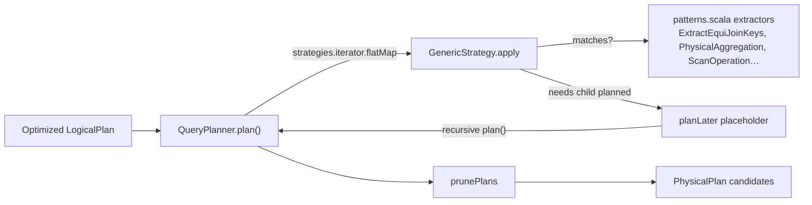

The smallest group in the map, and the one most often looked for in the wrong place. Catalyst
contributes the **abstract** planner: a strategy interface, a placeholder mechanism for recursive
planning, a library of pattern extractors, and the DSv2 logical relations. It contributes **no
physical operators and no strategies at all** — `SparkPlanner`, `SparkStrategies` and every
`SparkPlan` live in `sql/core`.

!!! warning "If you are looking for `JoinSelection`, it is not here"

    The scope of this group is three files in `catalyst/planning/` plus three DSv2 relation files.
    The rule that picks broadcast-hash versus sort-merge versus shuffled-hash join is
    `JoinSelection` inside `SparkStrategies.scala`, in **sql/core**, covered by the
    `sql/core — query-execution` group. What catalyst provides is the `ExtractEquiJoinKeys`
    extractor that `JoinSelection` pattern-matches with. That split is the whole point of the
    group: the framework is reusable, the strategies are not.

---

## QueryPlanner — strategies, placeholders and the candidate iterator

**What it is:** the engine that turns one optimized logical plan into a *lazy iterator of candidate
physical plans*. Each `GenericStrategy` is a partial function from a logical operator to zero or
more physical operators. A strategy that can plan an operator but not its children returns a
**`planLater` placeholder**, and the planner recursively plans the placeholder's logical plan and
substitutes the result — which is how a strategy stays local to one operator without knowing how
its children will be executed.

**Code path:** `plan(logicalPlan)` → `strategies.iterator.flatMap(_(plan))` → per candidate
`collectPlaceholders` → placeholders empty? emit : `foldLeft` over placeholders, recursively
`plan()` each and `transformUp` the substitution → `prunePlans`

**Anchor files:**

- [QueryPlanner.scala:29](https://github.com/apache/spark/blob/v4.2.0/sql/catalyst/src/main/scala/org/apache/spark/sql/catalyst/planning/QueryPlanner.scala#L29) — `GenericStrategy`, with `planLater` as a `protected` method subclasses call
- [QueryPlanner.scala:55](https://github.com/apache/spark/blob/v4.2.0/sql/catalyst/src/main/scala/org/apache/spark/sql/catalyst/planning/QueryPlanner.scala#L55) — `QueryPlanner`, whose entire contract is `strategies`, `collectPlaceholders` and `prunePlans`
- [QueryPlanner.scala:59](https://github.com/apache/spark/blob/v4.2.0/sql/catalyst/src/main/scala/org/apache/spark/sql/catalyst/planning/QueryPlanner.scala#L59) — `plan` returns an **`Iterator`**, not a plan: candidates are produced lazily and the caller takes what it wants
- [QueryPlanner.scala:63](https://github.com/apache/spark/blob/v4.2.0/sql/catalyst/src/main/scala/org/apache/spark/sql/catalyst/planning/QueryPlanner.scala#L63) — strategy order is significant: the first strategy that matches contributes its candidate first
- [QueryPlanner.scala:75](https://github.com/apache/spark/blob/v4.2.0/sql/catalyst/src/main/scala/org/apache/spark/sql/catalyst/planning/QueryPlanner.scala#L75) — the placeholder fold, which is a **cartesian product**: N placeholders each with M candidate sub-plans yields Mᴺ combinations
- [QueryPlanner.scala:60](https://github.com/apache/spark/blob/v4.2.0/sql/catalyst/src/main/scala/org/apache/spark/sql/catalyst/planning/QueryPlanner.scala#L60) — the in-source `// Obviously a lot to do here still...`, unchanged for years and the honest summary of how much cost-based choice happens here

!!! info "Spark plans by taking the first candidate, not the best one"

    `plan()` yields an iterator, and the caller in `sql/core` takes `.next()`. `prunePlans` exists
    to trim the candidate space and, in `SparkPlanner`, does essentially nothing. So physical
    planning is *rule-order-driven*, not cost-driven — the cost-based decisions in Spark happen
    earlier (join reorder in the optimizer, on statistics) or later (AQE re-planning on runtime
    metrics), not here. Reading `SparkStrategies` top to bottom tells you what wins.

!!! warning "The placeholder fold is exponential in principle"

    Each placeholder multiplies the candidate count. It does not explode in practice only because
    strategies return few candidates and the caller consumes the iterator lazily after the first
    element. A custom strategy that returns several candidates per operator can make planning time
    blow up on a deep plan, and the symptom is a long pause with no stage running — see
    `QueryPlanningTracker` below for how to confirm it.

**Configs:** none — this file reads no configuration

**Maps to topics:** A1, E1

---

## Plan-matching patterns — the extractors every strategy is written against

**What it is:** `patterns.scala`, a library of Scala extractor objects that recognise a *shape* of
logical plan and hand back its parts. A strategy is then a `case` over these rather than a manual
tree walk. This is where the shape-recognition logic that decides what a join or an aggregate
*is* actually lives, even though the choice of operator lives in `sql/core`.

**Anchor files:**

- [patterns.scala:175](https://github.com/apache/spark/blob/v4.2.0/sql/catalyst/src/main/scala/org/apache/spark/sql/catalyst/planning/patterns.scala#L175) — `ExtractEquiJoinKeys`, the extractor behind every join strategy
- [patterns.scala:194](https://github.com/apache/spark/blob/v4.2.0/sql/catalyst/src/main/scala/org/apache/spark/sql/catalyst/planning/patterns.scala#L194) — an `EqualTo` with **no references on one side** is not a join key: `a.id = 5` is a filter, not an equi-join predicate
- [patterns.scala:195](https://github.com/apache/spark/blob/v4.2.0/sql/catalyst/src/main/scala/org/apache/spark/sql/catalyst/planning/patterns.scala#L195) — keys are matched in both orders, so `a.k = b.k` and `b.k = a.k` are the same join
- [patterns.scala:179](https://github.com/apache/spark/blob/v4.2.0/sql/catalyst/src/main/scala/org/apache/spark/sql/catalyst/planning/patterns.scala#L179) — the returned `otherCondition` is the residual, *not* the original condition — a distinction that has caused bugs in downstream rules
- [patterns.scala:132](https://github.com/apache/spark/blob/v4.2.0/sql/catalyst/src/main/scala/org/apache/spark/sql/catalyst/planning/patterns.scala#L132) — `ScanOperation`: collapses projects and filters above a relation into "final projects, filters to keep, filters to push down"
- [patterns.scala:140](https://github.com/apache/spark/blob/v4.2.0/sql/catalyst/src/main/scala/org/apache/spark/sql/catalyst/planning/patterns.scala#L140) — the nondeterminism rule: only the bottom-most filter can be pushed once a nondeterministic filter is in the stack
- [patterns.scala:288](https://github.com/apache/spark/blob/v4.2.0/sql/catalyst/src/main/scala/org/apache/spark/sql/catalyst/planning/patterns.scala#L288) — `PhysicalAggregation`, which separates grouping expressions, aggregate expressions and result expressions — the split the [analysis sweep](sql-catalyst-analysis.md) shows `RewriteWithExpression` reusing
- [patterns.scala:361](https://github.com/apache/spark/blob/v4.2.0/sql/catalyst/src/main/scala/org/apache/spark/sql/catalyst/planning/patterns.scala#L361) — `PhysicalWindow`
- [patterns.scala:390](https://github.com/apache/spark/blob/v4.2.0/sql/catalyst/src/main/scala/org/apache/spark/sql/catalyst/planning/patterns.scala#L390) — `ExtractSingleColumnNullAwareAntiJoin`, the special case behind `NOT IN` with nulls
- [patterns.scala:435](https://github.com/apache/spark/blob/v4.2.0/sql/catalyst/src/main/scala/org/apache/spark/sql/catalyst/planning/patterns.scala#L435) — `GroupBasedRowLevelOperation` and, at :461, `DeltaBasedRowLevelOperation`: the planner-side counterpart of the MERGE/UPDATE/DELETE rewrite the [analysis sweep](sql-catalyst-analysis.md) traces

!!! info "`ExtractEquiJoinKeys` is why a join with no equality is a different animal"

    If no predicate survives the equi-key test, the extractor does not match and the join falls
    through to the strategies that handle arbitrary conditions — broadcast nested loop, or
    cartesian product. That is the mechanism behind "my join turned into a
    `BroadcastNestedLoopJoin`": the condition was there, but it was not an equality between one
    side's attributes and the other's. A `LIKE`, an inequality, or a function on both sides all
    produce that.

**Configs:** `spark.sql.optimizer.collapseProjectAlwaysInline` (read by `ScanOperation`)

**Maps to topics:** A1, A3, B7

---

## DataSource V2 logical relations and the table implicits

**What it is:** the three logical-plan nodes that represent a V2 table before and after a `Scan` is
built, plus the implicit conversions that ask a `Table` what it can do. This is the catalyst half
of DSv2 — deliberately split, with the 87 physical exec files in `sql/core`.

**Anchor files:**

- [DataSourceV2Relation.scala:109](https://github.com/apache/spark/blob/v4.2.0/sql/catalyst/src/main/scala/org/apache/spark/sql/execution/datasources/v2/DataSourceV2Relation.scala#L109) — `DataSourceV2Relation`: the table *before* a scan is built
- [DataSourceV2Relation.scala:164](https://github.com/apache/spark/blob/v4.2.0/sql/catalyst/src/main/scala/org/apache/spark/sql/execution/datasources/v2/DataSourceV2Relation.scala#L164) — `DataSourceV2ScanRelation`: after, carrying the concrete `Scan`
- [DataSourceV2Relation.scala:86](https://github.com/apache/spark/blob/v4.2.0/sql/catalyst/src/main/scala/org/apache/spark/sql/execution/datasources/v2/DataSourceV2Relation.scala#L86) — `computeStats` asks the connector via `SupportsReportStatistics`; a connector that does not implement it gets the default estimate, which is what starves the CBO
- [DataSourceV2Relation.scala:233](https://github.com/apache/spark/blob/v4.2.0/sql/catalyst/src/main/scala/org/apache/spark/sql/execution/datasources/v2/DataSourceV2Relation.scala#L233) — `StreamingDataSourceV2Relation`, the streaming counterpart
- [DataSourceV2Relation.scala:121](https://github.com/apache/spark/blob/v4.2.0/sql/catalyst/src/main/scala/org/apache/spark/sql/execution/datasources/v2/DataSourceV2Relation.scala#L121) — `newInstance()`, the `MultiInstanceRelation` contract that makes self-joins on a V2 table work
- [DataSourceV2Implicits.scala:32](https://github.com/apache/spark/blob/v4.2.0/sql/catalyst/src/main/scala/org/apache/spark/sql/execution/datasources/v2/DataSourceV2Implicits.scala#L32) — `TableHelper`: `asReadable` / `asWritable` / `asPartitionable`, each throwing a typed error when the table lacks the mixin
- [DataSourceV2Implicits.scala:100](https://github.com/apache/spark/blob/v4.2.0/sql/catalyst/src/main/scala/org/apache/spark/sql/execution/datasources/v2/DataSourceV2Implicits.scala#L100) — `supports(capability)`: the whole DSv2 capability model is a `Set[TableCapability]` lookup
- [ChangelogTable.scala](https://github.com/apache/spark/blob/v4.2.0/sql/catalyst/src/main/scala/org/apache/spark/sql/execution/datasources/v2/ChangelogTable.scala) — the CDC read table

!!! info "A connector's capabilities are declared, not inferred"

    `supports` is a set membership test against `table.capabilities()`. So a table that *can*
    physically do batch writes but does not list `BATCH_WRITE` is rejected at analysis with a
    typed error rather than failing at runtime — and, conversely, declaring a capability the
    implementation does not honour fails much later and much less clearly. When a connector
    "does not support" something with a clean error, this set is where the answer is.

**Configs:** `spark.sql.sources.v2.bucketing.*` are read by the storage-partitioned-join planning
in **sql/core**, not here

**Maps to topics:** B4, I10, A3

---

## QueryPlanningTracker — where the time went

**What it is:** the per-query timer that records how long each phase took and which rules were
most expensive. It is what makes "the driver sat there for two minutes before any task started"
answerable rather than a guess, and it is the source of the timings the SQL tab shows.

**Anchor files:**

- [QueryPlanningTracker.scala:40](https://github.com/apache/spark/blob/v4.2.0/sql/catalyst/src/main/scala/org/apache/spark/sql/catalyst/QueryPlanningTracker.scala#L40) — the four phase names: `parsing`, `analysis`, `optimization`, `planning`
- [QueryPlanningTracker.scala:127](https://github.com/apache/spark/blob/v4.2.0/sql/catalyst/src/main/scala/org/apache/spark/sql/catalyst/QueryPlanningTracker.scala#L127) — the tracker, holding a `rulesMap` of per-rule summaries
- [QueryPlanningTracker.scala:146](https://github.com/apache/spark/blob/v4.2.0/sql/catalyst/src/main/scala/org/apache/spark/sql/catalyst/QueryPlanningTracker.scala#L146) — `measurePhase`, the wrapper each phase is run inside
- [QueryPlanningTracker.scala:223](https://github.com/apache/spark/blob/v4.2.0/sql/catalyst/src/main/scala/org/apache/spark/sql/catalyst/QueryPlanningTracker.scala#L223) — `topRulesByTime(k)`, a bounded priority queue — the direct answer to "which optimizer rule is slow on my query"
- [QueryPlanningTracker.scala:96](https://github.com/apache/spark/blob/v4.2.0/sql/catalyst/src/main/scala/org/apache/spark/sql/catalyst/QueryPlanningTracker.scala#L96) — `QueryPlanningTrackerCallback`, the hook Spark Connect and instrumentation use

!!! info "Four phases, and `planning` is usually the smallest"

    Because physical planning takes the first candidate rather than searching, `planning` is
    typically dwarfed by `analysis` and `optimization` on a large plan. A query whose *planning*
    phase dominates is unusual and points at a custom strategy returning many candidates — the
    exponential fold described above.

**Configs:** none directly; `spark.sql.planChangeLog.level` gives the per-rule view from the other
side

**Maps to topics:** I7, A1

---

## Breadth check — the config slice, and why it is almost entirely out of scope

The candidate slice for this group's namespaces is 26 keys. Nearly all of them belong to other
groups, which is the expected result for an abstract framework: **the two `planning/` rule files
read one config between them.**

| Configs | Where they are actually read |
|---|---|
| `spark.sql.optimizer.collapseProjectAlwaysInline` | **In scope** — `ScanOperation` (`patterns.scala:138`) |
| `spark.sql.autoBroadcastJoinThreshold`, `.join.preferSortMergeJoin`, `.shuffledHashJoinFactor` | **Out-of-scope → optimizer** (`catalyst/optimizer/joins.scala:327`) and **sql/core** (`SparkStrategies.scala:233`) |
| `spark.sql.adaptive.autoBroadcastJoinThreshold`, `.broadcastTimeout` | **Out-of-scope → sql/core adaptive** |
| `spark.sql.codegen.join.*` (4 keys) | **Out-of-scope → sql/core** — physical join operators' codegen switches |
| `spark.sql.sources.v2.bucketing.*` (11 keys) | **Out-of-scope → sql/core** — storage-partitioned join planning |
| `spark.sql.optimizer.datasourceV2ExprFolding`, `.datasourceV2JoinPushdown` | **Out-of-scope → sql/core datasources** — V2 scan pushdown |
| `spark.sql.streaming.join.stateFormatV*` (2 keys) | **Out-of-scope → sql/core streaming-exec** |
| `spark.sql.execution.datasources.hadoopLineRecordReader.enabled` | **Out-of-scope → sql/core datasources** |
| `spark.sql.planner.pythonExecution.memory` | **Out-of-scope → sql/core python-arrow** — despite the `planner` in its name |

!!! info "A config's namespace does not tell you which group owns it"

    `spark.sql.planner.pythonExecution.memory` is named for the planner and read nowhere near it;
    `spark.sql.optimizer.collapseProjectAlwaysInline` is named for the optimizer and is the one
    config this group actually reads. The same lesson the optimizer sweep recorded for
    `spark.sql.optimizer.disableHints`, whose reader is in the analyzer.

---

## Sweep log

| Date | Spark | What changed |
|---|---|---|
| 2026-07-25 | 4.2.0 | First sweep. Four concepts. The group is deliberately tiny — three files in `catalyst/planning/` plus three DSv2 relation files — because catalyst contributes the planner *framework* and `sql/core` contributes every strategy and physical operator. Findings worth carrying: physical planning takes the **first** candidate rather than the best, so it is rule-order-driven and not cost-driven; the `planLater` placeholder fold is a cartesian product that a custom multi-candidate strategy can make explode; `ExtractEquiJoinKeys` rejects a predicate with no references on one side, which is why a non-equality condition silently becomes a nested-loop join; and DSv2 capabilities are a declared `Set`, not inferred from the implementation. `QueryPlanningTracker` was swept with the group and the scope extended to name it — it sits at the catalyst root rather than under `planning/`, and `topRulesByTime` is the direct answer to a slow-planning query. |
