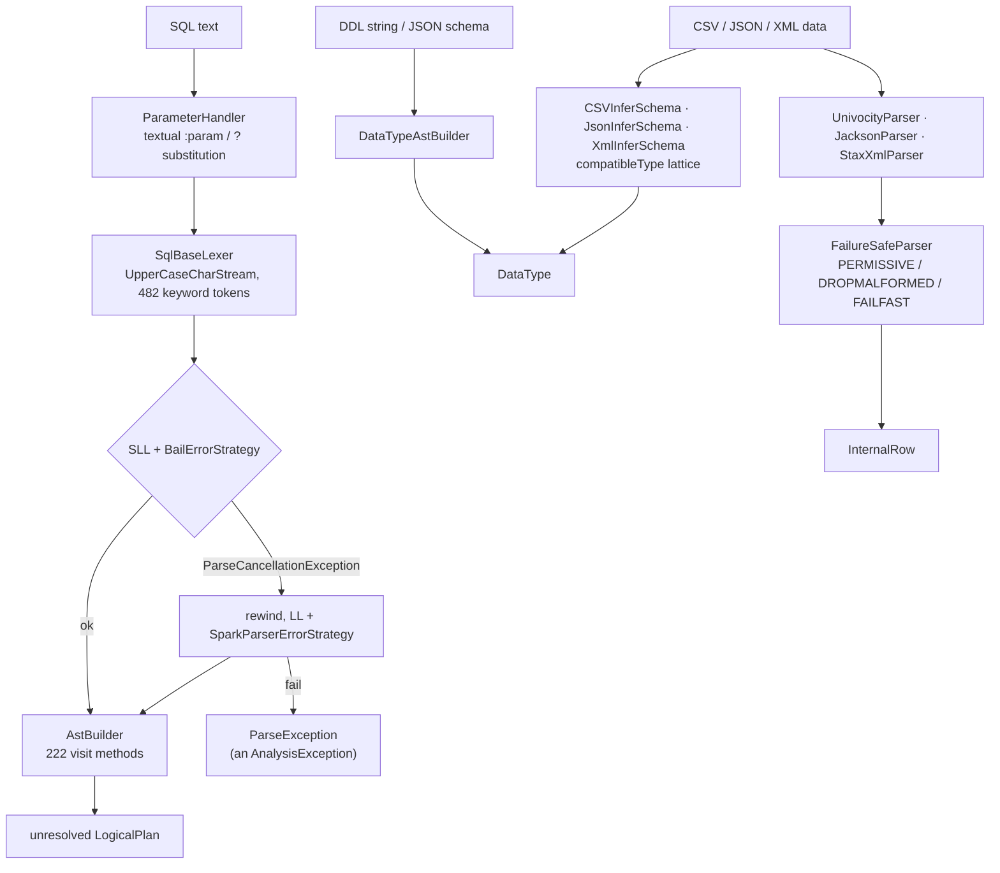

The group that owns both ends of the type system: the **SQL text** that declares a schema and the
**`DataType` objects** it produces, plus the three per-format parsers that infer schemas from data
rather than from DDL. It spans two modules — `sql/api` holds the type hierarchy and the ANTLR
grammar, `sql/catalyst` holds the plan-building visitor and the format parsers — which is itself
the first thing to know about it.



---

## The parser pipeline — ANTLR, the two-stage strategy, and where ParseException comes from

**What it is:** Spark parses SQL with ANTLR 4 against a hand-written grammar. The interesting part
is not the grammar walk but the **two-stage strategy**: every parse is first attempted in ANTLR's
fast `SLL` prediction mode with a strategy that bails on the first ambiguity, and only on failure
is the input rewound and re-parsed in full `LL` mode with the real error strategy. So a query that
fails to parse is parsed **twice**, and the error you see comes from the second pass.

**Code path:** `AbstractParser.parse` → `SqlBaseLexer` over an `UpperCaseCharStream` →
`CommonTokenStream` → `configureParser` → `executeWithTwoStageStrategy` (SLL, then LL) →
`astBuilder.visitX` → `finally maybeClearParserCaches`

**Anchor files:**

- [parsers.scala:41](https://github.com/apache/spark/blob/v4.2.0/sql/api/src/main/scala/org/apache/spark/sql/catalyst/parser/parsers.scala#L41) — `AbstractParser`, the base every Spark parser extends, living in **sql/api** so the Connect client can parse a DDL string without catalyst
- [parsers.scala:59](https://github.com/apache/spark/blob/v4.2.0/sql/api/src/main/scala/org/apache/spark/sql/catalyst/parser/parsers.scala#L59) — `parse`, the whole pipeline in 40 lines
- [parsers.scala:124](https://github.com/apache/spark/blob/v4.2.0/sql/api/src/main/scala/org/apache/spark/sql/catalyst/parser/parsers.scala#L124) — `UpperCaseCharStream`: the lexer sees only upper case, so the grammar's keyword rules never spell out case variants — but `getText` returns the original, which is how identifiers keep their case
- [parsers.scala:504](https://github.com/apache/spark/blob/v4.2.0/sql/api/src/main/scala/org/apache/spark/sql/catalyst/parser/parsers.scala#L504) — `executeWithTwoStageStrategy`, the SLL → LL retry
- [SparkParserErrorStrategy.scala:122](https://github.com/apache/spark/blob/v4.2.0/sql/api/src/main/scala/org/apache/spark/sql/catalyst/parser/SparkParserErrorStrategy.scala#L122) — `SparkParserBailErrorStrategy`, stage one, and at [:66](https://github.com/apache/spark/blob/v4.2.0/sql/api/src/main/scala/org/apache/spark/sql/catalyst/parser/SparkParserErrorStrategy.scala#L66) `SparkParserErrorStrategy`, stage two — which is where a raw ANTLR message becomes a Spark **error class** (`PARSE_SYNTAX_ERROR` and friends)
- [parsers.scala:145](https://github.com/apache/spark/blob/v4.2.0/sql/api/src/main/scala/org/apache/spark/sql/catalyst/parser/parsers.scala#L145) — `ParseErrorListener`, which converts a syntax error into a `ParseException` carrying line and column
- [parsers.scala:176](https://github.com/apache/spark/blob/v4.2.0/sql/api/src/main/scala/org/apache/spark/sql/catalyst/parser/parsers.scala#L176) — `ParseException` **extends `AnalysisException`**: a syntax error and a name-resolution error are the same exception type to a caller
- [parsers.scala:286](https://github.com/apache/spark/blob/v4.2.0/sql/api/src/main/scala/org/apache/spark/sql/catalyst/parser/parsers.scala#L286) — `PostProcessor`, a parse listener that rewrites backquoted identifiers, and at [:358](https://github.com/apache/spark/blob/v4.2.0/sql/api/src/main/scala/org/apache/spark/sql/catalyst/parser/parsers.scala#L358) `UnclosedCommentProcessor` — the reason `/* …` without a close is a clean error rather than a mysterious EOF
- [SqlBaseLexer.g4:692](https://github.com/apache/spark/blob/v4.2.0/sql/api/src/main/antlr4/org/apache/spark/sql/catalyst/parser/SqlBaseLexer.g4#L692) — `BRACKETED_COMMENT`, with the `{!isHint()}?` guard: `/*+ … */` is a hint, not a comment, decided in the lexer
- [SqlBaseLexer.g4:42](https://github.com/apache/spark/blob/v4.2.0/sql/api/src/main/antlr4/org/apache/spark/sql/catalyst/parser/SqlBaseLexer.g4#L42) — `isValidDecimal()`, the semantic predicate that stops `1.foo` lexing as a decimal
- [AbstractSqlParser.scala:34](https://github.com/apache/spark/blob/v4.2.0/sql/catalyst/src/main/scala/org/apache/spark/sql/catalyst/parser/AbstractSqlParser.scala#L34) — the catalyst subclass, whose entry points are [`parsePlan`](https://github.com/apache/spark/blob/v4.2.0/sql/catalyst/src/main/scala/org/apache/spark/sql/catalyst/parser/AbstractSqlParser.scala#L94), `parseQuery`, `parseExpression`, `parseTableIdentifier`, `parseMultipartIdentifier`, [`parseRoutineParam`](https://github.com/apache/spark/blob/v4.2.0/sql/catalyst/src/main/scala/org/apache/spark/sql/catalyst/parser/AbstractSqlParser.scala#L107)
- [CatalystSqlParser.scala](https://github.com/apache/spark/blob/v4.2.0/sql/catalyst/src/main/scala/org/apache/spark/sql/catalyst/parser/CatalystSqlParser.scala) — the singleton used *internally* (by `StructType.add(name, "int")`, by connectors resolving DDL) as opposed to the session parser
- [ParserUtils.scala:41](https://github.com/apache/spark/blob/v4.2.0/sql/catalyst/src/main/scala/org/apache/spark/sql/catalyst/parser/ParserUtils.scala#L41) — string unescaping, `withOrigin`, and the position bookkeeping every visitor uses

!!! info "A failing query is parsed twice, a succeeding one once"

    Stage one uses `PredictionMode.SLL`, which is materially faster but cannot resolve every
    ambiguity; on `ParseCancellationException` the token stream is rewound with `tokenStream.seek(0)`
    and `parser.reset()`, and the whole input is re-parsed in `LL`. The practical consequences: parse
    errors cost roughly twice what a successful parse does, and any side effect in a parse listener
    happens twice. It also means the *error message* is always produced by the more precise mode,
    which is why Spark's syntax errors are as specific as they are.

!!! warning "`ParseException` is an `AnalysisException`"

    Catching `AnalysisException` to handle "column not found" also catches every syntax error.
    They are distinguishable only by error class (`PARSE_SYNTAX_ERROR` and the other `PARSE_*`
    conditions) — not by type. The [analysis sweep](sql-catalyst-analysis.md) covers the other
    producer of this exception type.

**Configs:** `spark.sql.legacy.parseQueryWithoutEof` (false, 4.0.0),
`spark.sql.parser.escapedStringLiterals` (false), `spark.sql.parser.quotedRegexColumnNames` (false)

**Maps to topics:** B8, A1

---

## The grammar — keyword categories and the parser feature flags

**What it is:** `SqlBaseParser.g4` (2724 lines) and `SqlBaseLexer.g4` (714 lines), generated into
Java at build time. The grammar carries **seven mutable boolean members** that the session sets
before each parse, so Spark's SQL dialect is genuinely configurable at the grammar level rather
than post-processed. And it maintains **two keyword lists**: the ANSI one and the permissive one.

**Anchor files:**

- [SqlBaseParser.g4:21](https://github.com/apache/spark/blob/v4.2.0/sql/api/src/main/antlr4/org/apache/spark/sql/catalyst/parser/SqlBaseParser.g4#L21) — the `@members` block: `legacy_setops_precedence_enabled`, `legacy_exponent_literal_as_decimal_enabled`, `SQL_standard_keyword_behavior`, `double_quoted_identifiers`, `parameter_substitution_enabled`, `legacy_identifier_clause_only`, `single_character_pipe_operator_enabled`
- [parsers.scala:465](https://github.com/apache/spark/blob/v4.2.0/sql/api/src/main/scala/org/apache/spark/sql/catalyst/parser/parsers.scala#L465) — `configureParser`, the one place all seven are set, added so the main parser, the identifier parser and the substitution parser cannot drift apart
- [SqlBaseParser.g4:1923](https://github.com/apache/spark/blob/v4.2.0/sql/api/src/main/antlr4/org/apache/spark/sql/catalyst/parser/SqlBaseParser.g4#L1923) — the comment defining reserved vs non-reserved, immediately above `ansiNonReserved`
- [SqlBaseParser.g4:1748](https://github.com/apache/spark/blob/v4.2.0/sql/api/src/main/antlr4/org/apache/spark/sql/catalyst/parser/SqlBaseParser.g4#L1748) — the switch: `{SQL_standard_keyword_behavior}? ansiNonReserved` / `{!SQL_standard_keyword_behavior}? nonReserved`
- [SqlBaseParser.g4:1762](https://github.com/apache/spark/blob/v4.2.0/sql/api/src/main/antlr4/org/apache/spark/sql/catalyst/parser/SqlBaseParser.g4#L1762) — `{double_quoted_identifiers}? DOUBLEQUOTED_STRING`, and at [:1864](https://github.com/apache/spark/blob/v4.2.0/sql/api/src/main/antlr4/org/apache/spark/sql/catalyst/parser/SqlBaseParser.g4#L1864) the same token as a *string literal* when the flag is off — one flag decides whether `"x"` is a column or a string
- [SqlBaseParser.g4:69](https://github.com/apache/spark/blob/v4.2.0/sql/api/src/main/antlr4/org/apache/spark/sql/catalyst/parser/SqlBaseParser.g4#L69) — `isOperatorPipeStart()`: the 4.2.0 disambiguation letting a single `|` be a pipe operator rather than bitwise OR
- [SqlBaseParser.g4:85](https://github.com/apache/spark/blob/v4.2.0/sql/api/src/main/antlr4/org/apache/spark/sql/catalyst/parser/SqlBaseParser.g4#L85) — `compoundOrSingleStatement`, the SQL-scripting-aware top rule, with [:184](https://github.com/apache/spark/blob/v4.2.0/sql/api/src/main/antlr4/org/apache/spark/sql/catalyst/parser/SqlBaseParser.g4#L184) `singleStatement`, [:212](https://github.com/apache/spark/blob/v4.2.0/sql/api/src/main/antlr4/org/apache/spark/sql/catalyst/parser/SqlBaseParser.g4#L212) `singleDataType` and [:216](https://github.com/apache/spark/blob/v4.2.0/sql/api/src/main/antlr4/org/apache/spark/sql/catalyst/parser/SqlBaseParser.g4#L216) `singleTableSchema` — the four entry points
- [SqlBaseParser.g4:1874](https://github.com/apache/spark/blob/v4.2.0/sql/api/src/main/antlr4/org/apache/spark/sql/catalyst/parser/SqlBaseParser.g4#L1874) — parameter markers as a *literal* alternative, gated on `parameter_substitution_enabled`
- [SqlBaseLexer.g4:24](https://github.com/apache/spark/blob/v4.2.0/sql/api/src/main/antlr4/org/apache/spark/sql/catalyst/parser/SqlBaseLexer.g4#L24) — the lexer members, including `has_unclosed_bracketed_comment` and `isShiftRightOperator()`

Counted against v4.2.0: **482 keyword tokens** in the lexer, **345** in `ansiNonReserved`,
**410** in `nonReserved`, **16** in `strictNonReserved`.

!!! warning "ANSI mode is on by default; the ANSI *parser* flags are not"

    This is the most consequential thing on the page. `spark.sql.ansi.enabled` defaults to **true**
    in Spark 4.x — but the three flags that make the *parser* ANSI each default to **false**:

    - `spark.sql.ansi.enforceReservedKeywords` (3.3.0) — with it off, the permissive 410-keyword
      `nonReserved` list is used, so `SELECT` as a column alias still works
    - `spark.sql.ansi.doubleQuotedIdentifiers` (3.4.0) — with it off, `"x"` is a **string literal**,
      not an identifier
    - `spark.sql.ansi.relationPrecedence` (3.4.0) — with it off, `t1, t2 JOIN t3` groups as
      `(t1 × t2) × t3`

    So "Spark 4 is ANSI by default" is true of expression evaluation (see the
    [expressions sweep](sql-catalyst-expressions.md)) and false of parsing. Enabling ANSI mode
    changes what your casts do, not what your identifiers mean.

!!! info "The dialect is grammar members, not a post-pass"

    Because the flags are ANTLR semantic predicates, an alternative that is disabled does not
    exist for that parse — the error you get is a syntax error at the offending token, not a
    "feature disabled" message. That is why turning on `double_quoted_identifiers` can change a
    working query's *meaning* silently rather than failing it.

**Configs:** `spark.sql.ansi.enforceReservedKeywords` (false), `spark.sql.ansi.doubleQuotedIdentifiers`
(false), `spark.sql.ansi.relationPrecedence` (false), `spark.sql.legacy.setopsPrecedence.enabled`
(false), `spark.sql.legacy.exponentLiteralAsDecimal.enabled` (false),
`spark.sql.legacy.identifierClause` (false, 4.1.0),
`spark.sql.parser.singleCharacterPipeOperator.enabled` (**true**, 4.2.0),
`spark.sql.operatorPipeSyntaxEnabled` (true, 4.0.0),
`spark.sql.legacy.parser.havingWithoutGroupByAsWhere` (false)

**Maps to topics:** none yet — proposed as **A24**

---

## AstBuilder — 222 visitors and the unresolved plan

**What it is:** `AstBuilder.scala`, at **7614 lines the largest single file in catalyst**, is the
ANTLR visitor that walks the parse tree and emits an *unresolved* `LogicalPlan`. Everything it
produces still needs the analyzer: `UnresolvedRelation`, `UnresolvedAttribute`,
`UnresolvedFunction`. It is also where several 4.x features are gated, because a feature flag that
rejects syntax has to reject it here.

**Anchor files:**

- [AstBuilder.scala:67](https://github.com/apache/spark/blob/v4.2.0/sql/catalyst/src/main/scala/org/apache/spark/sql/catalyst/parser/AstBuilder.scala#L67) — the class, extending `DataTypeAstBuilder` so type syntax is shared with sql/api
- [AstBuilder.scala:685](https://github.com/apache/spark/blob/v4.2.0/sql/catalyst/src/main/scala/org/apache/spark/sql/catalyst/parser/AstBuilder.scala#L685) — `visitSingleStatement`, and at [:752](https://github.com/apache/spark/blob/v4.2.0/sql/catalyst/src/main/scala/org/apache/spark/sql/catalyst/parser/AstBuilder.scala#L752) `visitQuery` — the top of the walk
- [AstBuilder.scala:3705](https://github.com/apache/spark/blob/v4.2.0/sql/catalyst/src/main/scala/org/apache/spark/sql/catalyst/parser/AstBuilder.scala#L3705) — `visitFunctionCall`: every function in every query becomes an `UnresolvedFunction` here, named only by string
- [AstBuilder.scala:176](https://github.com/apache/spark/blob/v4.2.0/sql/catalyst/src/main/scala/org/apache/spark/sql/catalyst/parser/AstBuilder.scala#L176) — the SQL-scripting gate (`spark.sql.scripting.enabled`), with the continue-handler gate at [:304](https://github.com/apache/spark/blob/v4.2.0/sql/catalyst/src/main/scala/org/apache/spark/sql/catalyst/parser/AstBuilder.scala#L304) and the **4.2.0 cursor** gates at [:7190](https://github.com/apache/spark/blob/v4.2.0/sql/catalyst/src/main/scala/org/apache/spark/sql/catalyst/parser/AstBuilder.scala#L7190) and three sites below it
- [AstBuilder.scala:7339](https://github.com/apache/spark/blob/v4.2.0/sql/catalyst/src/main/scala/org/apache/spark/sql/catalyst/parser/AstBuilder.scala#L7339) — `visitOperatorPipeStatement`, the `|>` pipe syntax, rewritten into ordinary plan nodes right here rather than surviving into the plan
- [AstBuilder.scala:5658](https://github.com/apache/spark/blob/v4.2.0/sql/catalyst/src/main/scala/org/apache/spark/sql/catalyst/parser/AstBuilder.scala#L5658) — `visitCreateTable`, and [:5500](https://github.com/apache/spark/blob/v4.2.0/sql/catalyst/src/main/scala/org/apache/spark/sql/catalyst/parser/AstBuilder.scala#L5500) `visitCreateTableClauses` — where DDL clause soup becomes a `TableSpec`
- [DataTypeAstBuilder.scala:90](https://github.com/apache/spark/blob/v4.2.0/sql/api/src/main/scala/org/apache/spark/sql/catalyst/parser/DataTypeAstBuilder.scala#L90) — the sql/api half, and at [:292](https://github.com/apache/spark/blob/v4.2.0/sql/api/src/main/scala/org/apache/spark/sql/catalyst/parser/DataTypeAstBuilder.scala#L292) `visitPrimitiveDataType`: the single `match` that maps every type keyword to a `DataType`, including `TIME` [:358](https://github.com/apache/spark/blob/v4.2.0/sql/api/src/main/scala/org/apache/spark/sql/catalyst/parser/DataTypeAstBuilder.scala#L358) and the parameterized `GEOGRAPHY(ANY|srid)` / `GEOMETRY(...)` forms at [:365](https://github.com/apache/spark/blob/v4.2.0/sql/api/src/main/scala/org/apache/spark/sql/catalyst/parser/DataTypeAstBuilder.scala#L365)

!!! info "A feature flag that rejects syntax lives in the visitor, not the grammar"

    SQL scripting, cursors and the pipe operator are all *parsed* unconditionally and then rejected
    by an `if (!conf.getConf(...)) throw` inside the relevant `visit` method. So the error for a
    disabled feature names the feature, and turning the flag on requires no grammar change. The
    identifier and pipe-token flags are the opposite — they are grammar predicates, and give a
    plain syntax error. Both patterns are in use; which one you hit determines how legible the
    error is.

**Configs:** `spark.sql.scripting.enabled` (true, 4.0.0), `spark.sql.scripting.cursorEnabled`
(**false**, 4.2.0), `spark.sql.scripting.continueHandlerEnabled` (false, 4.1.0),
`spark.sql.operatorPipeSyntaxEnabled` (true), `spark.sql.parser.eagerEvalOfUnresolvedInlineTable`
(true), `spark.sql.defaultColumn.enabled` (true), `spark.sql.allowNamedFunctionArguments`

**Maps to topics:** B8, A1

---

## Parameter markers — textual substitution and position mapping

**What it is:** `:name` and `?` parameters in `spark.sql(...)`, `EXECUTE IMMEDIATE` and the Connect
client. The implementation is **textual**: the parameter values are rendered into the SQL string
and the result is re-parsed, with a `PositionMapper` recording the offset shifts so that an error
in the substituted text can be reported against the *original* text the user wrote.

**Anchor files:**

- [ParameterHandler.scala:49](https://github.com/apache/spark/blob/v4.2.0/sql/catalyst/src/main/scala/org/apache/spark/sql/catalyst/parser/ParameterHandler.scala#L49) — the single entry point shared by `SparkSqlParser`, `SparkConnectPlanner` and `ExecuteImmediate`, with a compiled `[?:]` pre-check so unparameterized SQL skips the machinery entirely
- [SubstituteParamsParser.scala:40](https://github.com/apache/spark/blob/v4.2.0/sql/catalyst/src/main/scala/org/apache/spark/sql/catalyst/parser/SubstituteParamsParser.scala#L40) — the substitution itself, and at [:84](https://github.com/apache/spark/blob/v4.2.0/sql/catalyst/src/main/scala/org/apache/spark/sql/catalyst/parser/SubstituteParamsParser.scala#L84) the named-vs-positional exclusivity check
- [SubstituteParmsAstBuilder.scala](https://github.com/apache/spark/blob/v4.2.0/sql/api/src/main/scala/org/apache/spark/sql/catalyst/parser/SubstituteParmsAstBuilder.scala) — a *second* AST builder whose only job is to locate parameter markers (note the typo in the filename, present in the source)
- [PositionMapper.scala:59](https://github.com/apache/spark/blob/v4.2.0/sql/api/src/main/scala/org/apache/spark/sql/catalyst/parser/PositionMapper.scala#L59) — sparse `PositionRange`s giving O(log k) mapping from substituted position back to original
- [ParameterContext.scala](https://github.com/apache/spark/blob/v4.2.0/sql/catalyst/src/main/scala/org/apache/spark/sql/catalyst/parser/ParameterContext.scala) — `NamedParameterContext` / positional context
- [SqlBaseParser.g4:48](https://github.com/apache/spark/blob/v4.2.0/sql/api/src/main/antlr4/org/apache/spark/sql/catalyst/parser/SqlBaseParser.g4#L48) — the grammar flag, set from `!legacyParameterSubstitutionConstantsOnly`

!!! warning "Parameters are substituted into the text, not bound as values"

    `spark.sql.legacy.parameterSubstitution.constantsOnly` (internal, 4.1.0, default **false**)
    controls the blast radius: with it false — the default — a marker is accepted **anywhere a
    literal is supported**, not only where a constant is expected. Combined with textual
    substitution this is powerful (a parameter can supply part of a DDL clause) and worth being
    deliberate about: parameter markers here are a templating mechanism with position tracking,
    not the bind-variable isolation the syntax suggests. Treat parameter values as trusted input.

**Configs:** `spark.sql.legacy.parameterSubstitution.constantsOnly` (internal, false, 4.1.0)

**Maps to topics:** B8

---

## The ANTLR DFA cache — an unbounded parser cache on the driver

**What it is:** ANTLR memoizes prediction decisions in a DFA cache that is **never purged**, shared
across parses, and lives on the driver. Spark 4.1 added a managed-cache mechanism with a size
heuristic and two thresholds, all of it **off by default**.

**Anchor files:**

- [parsers.scala:87](https://github.com/apache/spark/blob/v4.2.0/sql/api/src/main/scala/org/apache/spark/sql/catalyst/parser/parsers.scala#L87) — the comment stating the problem: unbounded caches "can cause OOMs when parsing a huge number of SQL queries", and clearing too often causes performance regressions
- [parsers.scala:447](https://github.com/apache/spark/blob/v4.2.0/sql/api/src/main/scala/org/apache/spark/sql/catalyst/parser/parsers.scala#L447) — `BYTES_PER_DFA_STATE = 9700`, an empirical constant: **~9.7 KB per cached state**
- [parsers.scala:524](https://github.com/apache/spark/blob/v4.2.0/sql/api/src/main/scala/org/apache/spark/sql/catalyst/parser/parsers.scala#L524) — `AntlrCaches`, and at [:566](https://github.com/apache/spark/blob/v4.2.0/sql/api/src/main/scala/org/apache/spark/sql/catalyst/parser/parsers.scala#L566) `installCaches` — swapping ANTLR's static caches for ones Spark holds in an `AtomicReference` and can therefore drop
- [parsers.scala:592](https://github.com/apache/spark/blob/v4.2.0/sql/api/src/main/scala/org/apache/spark/sql/catalyst/parser/parsers.scala#L592) — `maybeClearParserCaches`, run in the `finally` of every parse, logging cache size and delta at **INFO** with an `EXPERIMENTAL:` prefix
- [parsers.scala:607](https://github.com/apache/spark/blob/v4.2.0/sql/api/src/main/scala/org/apache/spark/sql/catalyst/parser/parsers.scala#L607) — the two thresholds: a static state count, and a dynamic one comparing `states × 9700` against a percentage of `Runtime.maxMemory()`
- [parsers.scala:580](https://github.com/apache/spark/blob/v4.2.0/sql/api/src/main/scala/org/apache/spark/sql/catalyst/parser/parsers.scala#L580) — `clearParserCaches`, which logs `ANTLR parser caches cleared`

!!! warning "Off by default, and the symptom is a driver heap that grows with query variety"

    All three configs are 4.1.0 and disabled: `spark.sql.parser.manageParserCaches=false`,
    `parserDfaCacheFlushThreshold=-1`, `parserDfaCacheFlushRatio=-1.0` (negative means never clear).
    With the defaults, Spark does not even *measure* the cache. A long-lived driver serving many
    distinct SQL statements — a notebook server, a Thrift server, a templated-SQL pipeline —
    accumulates DFA states with no upper bound and no visibility. Turning on `manageParserCaches`
    alone gets you the INFO logging; the ratio config is the one that actually bounds it.

**Configs:** `spark.sql.parser.manageParserCaches` (false, 4.1.0),
`spark.sql.parser.parserDfaCacheFlushThreshold` (-1, 4.1.0),
`spark.sql.parser.parserDfaCacheFlushRatio` (-1.0, 4.1.0)

**Maps to topics:** none — covered by the proposed **A24**

---

## The DataType hierarchy and its three serialized forms

**What it is:** 36 files in **sql/api** defining every type Spark has. The part that matters
operationally is that a `DataType` has *three* textual representations, and they are not
interchangeable: `json` (the canonical round-trippable form, what the metastore stores),
`catalogString` / `simpleString` (what `printSchema` shows), and `sql` (upper-cased, what DDL uses).

**Anchor files:**

- [DataType.scala:51](https://github.com/apache/spark/blob/v4.2.0/sql/api/src/main/scala/org/apache/spark/sql/types/DataType.scala#L51) — the base class, with `defaultSize` [:56](https://github.com/apache/spark/blob/v4.2.0/sql/api/src/main/scala/org/apache/spark/sql/types/DataType.scala#L56) — the per-field size estimate the **statistics** and broadcast-threshold machinery ultimately runs on
- [DataType.scala:70](https://github.com/apache/spark/blob/v4.2.0/sql/api/src/main/scala/org/apache/spark/sql/types/DataType.scala#L70) `json`, [:79](https://github.com/apache/spark/blob/v4.2.0/sql/api/src/main/scala/org/apache/spark/sql/types/DataType.scala#L79) `catalogString`, [:84](https://github.com/apache/spark/blob/v4.2.0/sql/api/src/main/scala/org/apache/spark/sql/types/DataType.scala#L84) `sql`
- [DataType.scala:137](https://github.com/apache/spark/blob/v4.2.0/sql/api/src/main/scala/org/apache/spark/sql/types/DataType.scala#L137) — `fromDDL`, which parses `"a INT, b STRING"` by trying `singleDataType` and falling back to `singleTableSchema`; this is what `schema="..."` in PySpark calls
- [DataType.scala:179](https://github.com/apache/spark/blob/v4.2.0/sql/api/src/main/scala/org/apache/spark/sql/types/DataType.scala#L179) — `fromJson`, the metastore path
- [DataType.scala:522](https://github.com/apache/spark/blob/v4.2.0/sql/api/src/main/scala/org/apache/spark/sql/types/DataType.scala#L522) `equalsStructurally`, [:579](https://github.com/apache/spark/blob/v4.2.0/sql/api/src/main/scala/org/apache/spark/sql/types/DataType.scala#L579) `equalsIgnoreNullability`, [:599](https://github.com/apache/spark/blob/v4.2.0/sql/api/src/main/scala/org/apache/spark/sql/types/DataType.scala#L599) `equalsIgnoreCaseAndNullability` — **four** different notions of "same type", each used by a different caller
- [AbstractDataType.scala](https://github.com/apache/spark/blob/v4.2.0/sql/api/src/main/scala/org/apache/spark/sql/types/AbstractDataType.scala) — `AbstractDataType`, `NumericType`, `IntegralType`, `AnyDataType`: the *abstract* types expressions declare in `inputTypes`, which is how one function accepts any numeric
- [Metadata.scala:44](https://github.com/apache/spark/blob/v4.2.0/sql/api/src/main/scala/org/apache/spark/sql/types/Metadata.scala#L44) — the immutable string-keyed map every `StructField` carries, with [`MetadataBuilder`](https://github.com/apache/spark/blob/v4.2.0/sql/api/src/main/scala/org/apache/spark/sql/types/Metadata.scala#L276); comments, char/varchar erasure and default values all ride here
- [LegacyTypeStringParser.scala:29](https://github.com/apache/spark/blob/v4.2.0/sql/api/src/main/scala/org/apache/spark/sql/catalyst/parser/LegacyTypeStringParser.scala#L29) — a Scala parser-combinator reader for the pre-1.4 schema format, still present to read very old tables

!!! info "Types live in sql/api, and that is why they moved"

    `DataType` and its subclasses are in **`sql/api`**, not `sql/catalyst` — the module the Connect
    client depends on. That split (Spark 3.4+) is why a Connect client can build a schema, parse
    DDL, and print a type without any catalyst on the classpath. It is also the reason
    `check_drift.py` needs `sql/api` in this group's `modules:` list.

**Configs:** `spark.sql.legacy.allowEmptySchemaWrite`,
`spark.sql.sources.schemaStringLengthThreshold` (4000 — the metastore property length before the
JSON schema is split across parts)

**Maps to topics:** B5

---

## StructType — the schema object practitioners actually hold

**What it is:** the one type users construct by hand. `StructType` is a `Seq[StructField]` with a
lazily built name index, a large `add` overload set, and the merge/DDL helpers the datasources use.

**Anchor files:**

- [StructType.scala:105](https://github.com/apache/spark/blob/v4.2.0/sql/api/src/main/scala/org/apache/spark/sql/types/StructType.scala#L105) — `case class StructType(fields: Array[StructField])`, which **extends `Seq[StructField]`** — hence `schema.map(...)` working and `schema == otherSchema` comparing arrays
- [StructType.scala:122](https://github.com/apache/spark/blob/v4.2.0/sql/api/src/main/scala/org/apache/spark/sql/types/StructType.scala#L122) — `nameToIndex` plus a separate case-insensitive map, both lazy: field lookup is O(1) after first use
- [StructType.scala:155](https://github.com/apache/spark/blob/v4.2.0/sql/api/src/main/scala/org/apache/spark/sql/types/StructType.scala#L155) — the `add` family, including the overloads taking a **DDL string** (`add("id", "int")`), which route through `CatalystSqlParser`
- [StructType.scala:305](https://github.com/apache/spark/blob/v4.2.0/sql/api/src/main/scala/org/apache/spark/sql/types/StructType.scala#L305) — `fieldIndex`, and at [:328](https://github.com/apache/spark/blob/v4.2.0/sql/api/src/main/scala/org/apache/spark/sql/types/StructType.scala#L328) `findNestedField` — the nested-path resolver behind `ALTER TABLE ... ALTER COLUMN a.b.c`
- [StructType.scala:458](https://github.com/apache/spark/blob/v4.2.0/sql/api/src/main/scala/org/apache/spark/sql/types/StructType.scala#L458) — `toDDL`, the inverse of `fromDDL`
- [StructType.scala:487](https://github.com/apache/spark/blob/v4.2.0/sql/api/src/main/scala/org/apache/spark/sql/types/StructType.scala#L487) — `merge`, the schema-merging rule behind `mergeSchema` on Parquet/ORC and behind inference's final reduce
- [StructType.scala:384](https://github.com/apache/spark/blob/v4.2.0/sql/api/src/main/scala/org/apache/spark/sql/types/StructType.scala#L384) — `treeString`, i.e. `printSchema()`
- [StructField.scala](https://github.com/apache/spark/blob/v4.2.0/sql/api/src/main/scala/org/apache/spark/sql/types/StructField.scala) — name, type, nullable, metadata; `nullable` defaults to **true**
- [DataTypeUtils.scala:239](https://github.com/apache/spark/blob/v4.2.0/sql/catalyst/src/main/scala/org/apache/spark/sql/catalyst/types/DataTypeUtils.scala#L239) — `toAttributes` / [:247](https://github.com/apache/spark/blob/v4.2.0/sql/catalyst/src/main/scala/org/apache/spark/sql/catalyst/types/DataTypeUtils.scala#L247) `fromAttributes`: the bridge between a schema and a plan's output

**Configs:** `spark.sql.caseSensitive` (read by the case-insensitive index path),
`spark.sql.parquet.mergeSchema`, `spark.sql.orc.mergeSchema`

**Maps to topics:** B5

---

## DecimalType and Decimal — precision, scale, and the adjustment rule

**What it is:** two classes with a rule between them that quietly decides how much of your number
survives. `DecimalType(precision, scale)` caps at **38 digits**; when an arithmetic result would
exceed that, `adjustPrecisionScale` **reduces the scale** to protect the integral digits — but
never below `MINIMUM_ADJUSTED_SCALE = 6`. `Decimal` is the runtime value, stored as a `Long` when
it fits in 18 digits and as a `BigDecimal` otherwise.

**Anchor files:**

- [DecimalType.scala:116](https://github.com/apache/spark/blob/v4.2.0/sql/api/src/main/scala/org/apache/spark/sql/types/DecimalType.scala#L116) — `MAX_PRECISION = 38`, `MAX_SCALE = 38`, `DEFAULT_SCALE = 18`, `SYSTEM_DEFAULT = DecimalType(38, 18)`, `MINIMUM_ADJUSTED_SCALE = 6`
- [DecimalType.scala:175](https://github.com/apache/spark/blob/v4.2.0/sql/api/src/main/scala/org/apache/spark/sql/types/DecimalType.scala#L175) — `adjustPrecisionScale`, with the derivation at [:190](https://github.com/apache/spark/blob/v4.2.0/sql/api/src/main/scala/org/apache/spark/sql/types/DecimalType.scala#L190): `adjustedScale = max(38 - intDigits, min(scale, 6))`. Explicitly "based on Hive's, which is itself inspired to SQLServer's"
- [DecimalType.scala:144](https://github.com/apache/spark/blob/v4.2.0/sql/api/src/main/scala/org/apache/spark/sql/types/DecimalType.scala#L144) `bounded` and [:148](https://github.com/apache/spark/blob/v4.2.0/sql/api/src/main/scala/org/apache/spark/sql/types/DecimalType.scala#L148) `boundedPreferIntegralDigits` — the two clamping policies
- [DecimalType.scala:160](https://github.com/apache/spark/blob/v4.2.0/sql/api/src/main/scala/org/apache/spark/sql/types/DecimalType.scala#L160) — `checkNegativeScale`: negative scale exists (SPARK-24468) but is refused unless `spark.sql.legacy.allowNegativeScaleOfDecimal`
- [DecimalType.scala:133](https://github.com/apache/spark/blob/v4.2.0/sql/api/src/main/scala/org/apache/spark/sql/types/DecimalType.scala#L133) — `forType`, the fixed decimal each integral type promotes to
- [Decimal.scala:41](https://github.com/apache/spark/blob/v4.2.0/sql/api/src/main/scala/org/apache/spark/sql/types/Decimal.scala#L41) — the runtime value; `MAX_LONG_DIGITS` (18) is the boundary between the compact `Long` representation and `BigDecimal`, and the same boundary decides whether an `UnsafeRow` stores the field inline (see the [expressions sweep](sql-catalyst-expressions.md))
- [Decimal.scala:352](https://github.com/apache/spark/blob/v4.2.0/sql/api/src/main/scala/org/apache/spark/sql/types/Decimal.scala#L352) — `changePrecision`, defaulting to `ROUND_HALF_UP`, and at [:387](https://github.com/apache/spark/blob/v4.2.0/sql/api/src/main/scala/org/apache/spark/sql/types/Decimal.scala#L387) the private form that returns `false` instead of throwing — the branch ANSI mode inverts

!!! warning "The precision rule trades your fractional digits away, silently"

    With `spark.sql.decimalOperations.allowPrecisionLoss` at its default of **true**, a result that
    would need more than 38 digits keeps its integral digits and loses fractional ones, down to a
    floor of 6. Multiply three `DECIMAL(20,10)` columns and the declared result scale collapses —
    no warning, no error, just fewer decimal places than the inputs had. Set the config to `false`
    and the same expression returns **null** on overflow instead (or raises, under ANSI). Neither
    default is obviously right; the point is that one of the two is happening to every decimal
    pipeline.

!!! info "18 digits is the performance boundary too"

    `MAX_LONG_DIGITS = 18`: at or below it a `Decimal` is a `Long` and an `UnsafeRow` field is
    fixed-width; above it, a `BigDecimal` and a variable-length field. `DECIMAL(19,2)` and
    `DECIMAL(18,2)` are one digit apart and on opposite sides of that line.

**Configs:** `spark.sql.decimalOperations.allowPrecisionLoss` (true),
`spark.sql.legacy.allowNegativeScaleOfDecimal` (false),
`spark.sql.legacy.decimal.retainFractionDigitsOnTruncate` (false, 4.0.0),
`spark.sql.legacy.literal.pickMinimumPrecision`

**Maps to topics:** none yet — proposed as **I25**

---

## StringType and collation in the type system

**What it is:** since 4.0, `StringType` carries a `collationId` and a constraint, so it is a
*parameterized* type rather than a singleton. Everything the [expressions sweep](sql-catalyst-expressions.md)
describes about collation-aware comparison and hashing keys off the predicates defined here.

**Anchor files:**

- [StringType.scala:32](https://github.com/apache/spark/blob/v4.2.0/sql/api/src/main/scala/org/apache/spark/sql/types/StringType.scala#L32) — `class StringType private[sql] (collationId: Int, constraint: …)`; the familiar `StringType` object at [:112](https://github.com/apache/spark/blob/v4.2.0/sql/api/src/main/scala/org/apache/spark/sql/types/StringType.scala#L112) is just the `UTF8_BINARY` instance
- [StringType.scala:44](https://github.com/apache/spark/blob/v4.2.0/sql/api/src/main/scala/org/apache/spark/sql/types/StringType.scala#L44) — `supportsBinaryEquality`, the predicate that decides whether equality and hashing can compare raw bytes; [:74](https://github.com/apache/spark/blob/v4.2.0/sql/api/src/main/scala/org/apache/spark/sql/types/StringType.scala#L74) `supportsBinaryOrdering` does the same for sorts
- [StringType.scala:91](https://github.com/apache/spark/blob/v4.2.0/sql/api/src/main/scala/org/apache/spark/sql/types/StringType.scala#L91) — equality includes the collation id: `STRING` and `STRING COLLATE UTF8_LCASE` are **different types**, which is why a union of the two needs coercion
- [StringType.scala:57](https://github.com/apache/spark/blob/v4.2.0/sql/api/src/main/scala/org/apache/spark/sql/types/StringType.scala#L57) — `usesTrimCollation`, the `_RTRIM` family

**Configs:** `spark.sql.collation.objectLevel.enabled` (true, 4.0.0),
`spark.sql.collation.schemaLevel.enabled` (false, 4.1.0), `spark.sql.collation.allowInMapKeys`
(false), `spark.sql.icu.caseMappings.enabled`

**Maps to topics:** I21

---

## CHAR and VARCHAR — declared, then erased

**What it is:** Spark accepts `CHAR(n)` and `VARCHAR(n)` in DDL, then **replaces them with
`StringType`** in the stored schema, stashing the original type name in field metadata under
`__CHAR_VARCHAR_TYPE_STRING`. Length enforcement and space padding are re-attached as expressions
at read and write time.

**Anchor files:**

- [CharType.scala:34](https://github.com/apache/spark/blob/v4.2.0/sql/api/src/main/scala/org/apache/spark/sql/types/CharType.scala#L34) and [VarcharType.scala:33](https://github.com/apache/spark/blob/v4.2.0/sql/api/src/main/scala/org/apache/spark/sql/types/VarcharType.scala#L33) — both `private[sql]` constructors: you cannot build one from user code
- [CharVarcharUtils.scala:34](https://github.com/apache/spark/blob/v4.2.0/sql/catalyst/src/main/scala/org/apache/spark/sql/catalyst/util/CharVarcharUtils.scala#L34) — the metadata key, and at [:52](https://github.com/apache/spark/blob/v4.2.0/sql/catalyst/src/main/scala/org/apache/spark/sql/catalyst/util/CharVarcharUtils.scala#L52) `replaceCharVarcharWithStringInSchema` — the erasure
- [CharVarcharUtils.scala:136](https://github.com/apache/spark/blob/v4.2.0/sql/catalyst/src/main/scala/org/apache/spark/sql/catalyst/util/CharVarcharUtils.scala#L136) — `getRawSchema`, which reads the metadata back to recover the declared type

!!! warning "`printSchema` will not show you the CHAR/VARCHAR you declared"

    A column declared `VARCHAR(10)` reports as `string`. The length lives in metadata and is
    enforced by injected expressions, so the constraint is real but invisible in the schema. Two
    configs move the behaviour: `spark.sql.preserveCharVarcharTypeInfo` (4.0.0, default **false**)
    keeps the type visible, and `spark.sql.legacy.charVarcharAsString` (3.1.0, default false)
    drops the enforcement entirely. Notice that `CharVarcharUtils` lives in `catalyst/util/` —
    recorded as *plumbing* in `groups.yaml`, so no group's scope claims it and no sweep would have
    reached it from a package walk. Cited here because the type half is in scope.

**Configs:** `spark.sql.preserveCharVarcharTypeInfo` (false, 4.0.0),
`spark.sql.legacy.charVarcharAsString` (false, 3.1.0)

**Maps to topics:** B5

---

## TIME, TIMESTAMP_NTZ, and the timestamp-type switch

**What it is:** Spark has three time-ish types and a config that decides which one a bare
`TIMESTAMP` means. `TIMESTAMP_LTZ` (the default, instant-with-session-zone), `TIMESTAMP_NTZ` (local
date-time, 3.4+), and `TIME` (time-of-day, 4.1) — the last of which is **not enabled outside
tests**.

**Anchor files:**

- [TimestampType.scala](https://github.com/apache/spark/blob/v4.2.0/sql/api/src/main/scala/org/apache/spark/sql/types/TimestampType.scala) and [TimestampNTZType.scala](https://github.com/apache/spark/blob/v4.2.0/sql/api/src/main/scala/org/apache/spark/sql/types/TimestampNTZType.scala)
- [TimeType.scala](https://github.com/apache/spark/blob/v4.2.0/sql/api/src/main/scala/org/apache/spark/sql/types/TimeType.scala) — parameterized by precision
- [DataTypeAstBuilder.scala:352](https://github.com/apache/spark/blob/v4.2.0/sql/api/src/main/scala/org/apache/spark/sql/catalyst/parser/DataTypeAstBuilder.scala#L352) — the DDL resolution: `TIMESTAMP WITH LOCAL TIME ZONE`, `TIMESTAMP WITHOUT TIME ZONE`, and bare `TIMESTAMP` deferring to `SqlApiConf.timestampType`
- [SQLConf.scala:7404](https://github.com/apache/spark/blob/v4.2.0/sql/catalyst/src/main/scala/org/apache/spark/sql/internal/SQLConf.scala#L7404) — `spark.sql.timeType.enabled`, **internal**, `createWithDefault(Utils.isTesting)`
- [DayTimeIntervalType.scala](https://github.com/apache/spark/blob/v4.2.0/sql/api/src/main/scala/org/apache/spark/sql/types/DayTimeIntervalType.scala) / [YearMonthIntervalType.scala](https://github.com/apache/spark/blob/v4.2.0/sql/api/src/main/scala/org/apache/spark/sql/types/YearMonthIntervalType.scala) — the ANSI interval types, distinct from the legacy `CalendarIntervalType`

!!! warning "The TIME type is off in production at 4.2.0"

    `spark.sql.timeType.enabled` defaults to `Utils.isTesting` — true in Spark's own test runs,
    **false** in any real cluster. So `TIME` is documented, implemented, and refused by a
    production session. It is the same shape of finding as geospatial in the
    [expressions sweep](sql-catalyst-expressions.md): shipped in the source, not shipped to users.
    Check `spark.conf.get("spark.sql.timeType.enabled")` before planning on it.

!!! info "One config changes what `TIMESTAMP` means in DDL"

    `spark.sql.timestampType` (3.4.0, default `TIMESTAMP_LTZ`) is read *at parse time* by the type
    builder. Set it to `TIMESTAMP_NTZ` and every subsequently parsed `TIMESTAMP` column declaration
    means something different — including in tables you create, which then disagree with tables
    created under the other setting.

**Configs:** `spark.sql.timestampType` (`TIMESTAMP_LTZ`, 3.4.0), `spark.sql.timeType.enabled`
(internal, test-only, 4.1.0), `spark.sql.datetime.java8API.enabled` (false),
`spark.sql.legacy.interval.enabled`, `spark.sql.session.timeZone`

**Maps to topics:** B5

---

## The Types Framework — the 4.2.0 refactor behind a test-only flag

**What it is:** the only structural addition to this group in 4.2.0. Adding a data type to Spark
has historically meant editing dozens of scattered `match` statements — physical type, mutable
value, row writer, default literal, external conversion, encoder serializer, Arrow writer.
`TypeOps` consolidates those into one trait per type, registered in one place.

**Anchor files:**

- [ops/TypeOps.scala:60](https://github.com/apache/spark/blob/v4.2.0/sql/catalyst/src/main/scala/org/apache/spark/sql/catalyst/types/ops/TypeOps.scala#L60) — the trait, with a scaladoc stating the integration pattern: `TypeOps(dt).map(_.getPhysicalType).getOrElse { legacy match }`
- [ops/TypeOps.scala:230](https://github.com/apache/spark/blob/v4.2.0/sql/catalyst/src/main/scala/org/apache/spark/sql/catalyst/types/ops/TypeOps.scala#L230) — `apply(dt): Option[TypeOps]`, the single registration point
- [ops/TimeTypeOps.scala:60](https://github.com/apache/spark/blob/v4.2.0/sql/catalyst/src/main/scala/org/apache/spark/sql/catalyst/types/ops/TimeTypeOps.scala#L60) — the sole implementation, for `TimeType`
- [PhysicalDataType.scala:38](https://github.com/apache/spark/blob/v4.2.0/sql/catalyst/src/main/scala/org/apache/spark/sql/catalyst/types/PhysicalDataType.scala#L38) — the first integration point, showing the pattern live: framework first, legacy `match` as fallback
- [SQLConf.scala:675](https://github.com/apache/spark/blob/v4.2.0/sql/catalyst/src/main/scala/org/apache/spark/sql/internal/SQLConf.scala#L675) — `spark.sql.types.framework.enabled`, internal, `createWithDefaultFunction(() => Utils.isTesting)`

!!! info "Deliberately not proposed as a learning-path topic"

    This is an internal refactoring mechanism with one registered type, gated on a test-only flag.
    It changes nothing a practitioner can observe and offers nothing to study — but it is worth
    recording, because it is the seam future types will arrive through, and a re-sweep at 4.3 or
    5.0 should check how many `TypeOps` implementations exist and whether the flag has flipped.

**Configs:** `spark.sql.types.framework.enabled` (internal, test-only, 4.2.0)

**Maps to topics:** none — and no topic proposed, deliberately (see above)

---

## Physical types and DataTypeUtils — the catalyst-side view of a DataType

**What it is:** the catalyst-only half of the type system. A `PhysicalDataType` is the *storage and
ordering* view — several logical types share one (`DateType`, `YearMonthIntervalType` and
`IntegerType` are all `PhysicalIntegerType`) — and it is where `Ordering` comes from, so it backs
every sort and every comparison.

**Anchor files:**

- [PhysicalDataType.scala:31](https://github.com/apache/spark/blob/v4.2.0/sql/catalyst/src/main/scala/org/apache/spark/sql/catalyst/types/PhysicalDataType.scala#L31) — the sealed hierarchy, with `ordering` as its defining member
- [PhysicalDataType.scala:45](https://github.com/apache/spark/blob/v4.2.0/sql/catalyst/src/main/scala/org/apache/spark/sql/catalyst/types/PhysicalDataType.scala#L45) — the many-to-one mapping: `DateType => PhysicalIntegerType`, `TimestampType => PhysicalLongType`
- [PhysicalDataType.scala:73](https://github.com/apache/spark/blob/v4.2.0/sql/catalyst/src/main/scala/org/apache/spark/sql/catalyst/types/PhysicalDataType.scala#L73) — `ordering(dt)`, consumed by `GenerateOrdering` and every sort operator
- [DataTypeUtils.scala:31](https://github.com/apache/spark/blob/v4.2.0/sql/catalyst/src/main/scala/org/apache/spark/sql/catalyst/types/DataTypeUtils.scala#L31) — the utility object, with [`canWrite`](https://github.com/apache/spark/blob/v4.2.0/sql/catalyst/src/main/scala/org/apache/spark/sql/catalyst/types/DataTypeUtils.scala#L106): the store-assignment compatibility check behind `INSERT INTO`'s error messages

**Configs:** none read directly

**Maps to topics:** E1

---

## UpCastRule — the loss-free widening lattice

**What it is:** the smallest and most-cited file in the group: the definition of which conversions
lose nothing. It is what the typed `Dataset` API uses to decide whether an implicit `Upcast` is
allowed, and `Cast.canUpCast` simply delegates here.

**Anchor files:**

- [UpCastRule.scala:33](https://github.com/apache/spark/blob/v4.2.0/sql/api/src/main/scala/org/apache/spark/sql/types/UpCastRule.scala#L33) — `canUpCast`
- [UpCastRule.scala:75](https://github.com/apache/spark/blob/v4.2.0/sql/api/src/main/scala/org/apache/spark/sql/types/UpCastRule.scala#L75) — `legalNumericPrecedence`, the ordered numeric chain byte → short → int → long → float → double
- [Cast.scala:355](https://github.com/apache/spark/blob/v4.2.0/sql/catalyst/src/main/scala/org/apache/spark/sql/catalyst/expressions/Cast.scala#L355) — the delegation, the fourth cast table described in the [expressions sweep](sql-catalyst-expressions.md)

!!! info "Long → double is 'loss-free' by this rule and is not"

    `legalNumericPrecedence` treats the numeric chain as a total order, so `long → double` is an
    upcast — even though doubles cannot represent every 64-bit integer exactly. This is the SQL
    convention rather than an oversight, but it means an `Upcast` accepted by the typed API can
    still change values above 2^53. `spark.sql.legacy.doLooseUpcast` loosens the rule further.

**Configs:** `spark.sql.legacy.doLooseUpcast`

**Maps to topics:** B5

---

## UserDefinedType and UDTRegistration

**What it is:** the extension point for a JVM class to appear as a Spark type, with an SQL
representation it serializes to. MLlib's `Vector` and `Matrix` are the canonical users, and the
registration map is pre-seeded with them.

**Anchor files:**

- [UserDefinedType.scala](https://github.com/apache/spark/blob/v4.2.0/sql/api/src/main/scala/org/apache/spark/sql/types/UserDefinedType.scala) — `sqlType`, `serialize`, `deserialize`, `userClass`
- [UDTRegistration.scala:38](https://github.com/apache/spark/blob/v4.2.0/sql/api/src/main/scala/org/apache/spark/sql/types/UDTRegistration.scala#L38) — the pre-seeded `udtMap` (the MLlib types, registered by **string** so sql/api needs no MLlib dependency)
- [UDTRegistration.scala:63](https://github.com/apache/spark/blob/v4.2.0/sql/api/src/main/scala/org/apache/spark/sql/types/UDTRegistration.scala#L63) — `register`, which refuses to overwrite an existing mapping
- [ObjectType.scala](https://github.com/apache/spark/blob/v4.2.0/sql/api/src/main/scala/org/apache/spark/sql/types/ObjectType.scala) — the JVM-object pseudo-type that the typed API's operators carry, and that `CollapseCodegenStages` refuses to fuse

**Configs:** `spark.sql.udt.allowCreatingUDTFromString`, `spark.sql.udt.allowedDynamicUDTClasses`

**Maps to topics:** E1

---

## CSV parsing — Univocity, the option surface, and header checking

**What it is:** Spark does not implement CSV tokenization; it configures the **Univocity** parser
and converts tokens to typed values. `CSVOptions` is the translation layer — roughly 50 read/write
options — and `CSVHeaderChecker` is the piece that decides whether a header row is validated
against your schema or silently ignored.

**Anchor files:**

- [CSVOptions.scala:122](https://github.com/apache/spark/blob/v4.2.0/sql/catalyst/src/main/scala/org/apache/spark/sql/catalyst/csv/CSVOptions.scala#L122) — the option surface: `delimiter`, `quote`, `escape`, `comment`, `header`, `nullValue`, `emptyValue` (with **different read and write defaults**, [:277](https://github.com/apache/spark/blob/v4.2.0/sql/catalyst/src/main/scala/org/apache/spark/sql/catalyst/csv/CSVOptions.scala#L277)), `lineSep`, `multiLine`, `unescapedQuoteHandling`
- [CSVOptions.scala:242](https://github.com/apache/spark/blob/v4.2.0/sql/catalyst/src/main/scala/org/apache/spark/sql/catalyst/csv/CSVOptions.scala#L242) — `maxColumns = 20480` and [:244](https://github.com/apache/spark/blob/v4.2.0/sql/catalyst/src/main/scala/org/apache/spark/sql/catalyst/csv/CSVOptions.scala#L244) `maxCharsPerColumn = -1` — two hard limits that surface as Univocity exceptions, not Spark ones
- [CSVOptions.scala:267](https://github.com/apache/spark/blob/v4.2.0/sql/catalyst/src/main/scala/org/apache/spark/sql/catalyst/csv/CSVOptions.scala#L267) — `enforceSchema`, default **true**
- [UnivocityParser.scala:52](https://github.com/apache/spark/blob/v4.2.0/sql/catalyst/src/main/scala/org/apache/spark/sql/catalyst/csv/UnivocityParser.scala#L52) — the parser, and at [:70](https://github.com/apache/spark/blob/v4.2.0/sql/catalyst/src/main/scala/org/apache/spark/sql/catalyst/csv/UnivocityParser.scala#L70) `tokenIndexArr` + [:76](https://github.com/apache/spark/blob/v4.2.0/sql/catalyst/src/main/scala/org/apache/spark/sql/catalyst/csv/UnivocityParser.scala#L76) `columnPruning` — Spark tells Univocity which columns to materialize, so an unselected column is never converted
- [UnivocityParser.scala:302](https://github.com/apache/spark/blob/v4.2.0/sql/catalyst/src/main/scala/org/apache/spark/sql/catalyst/csv/UnivocityParser.scala#L302) — `nullSafeDatum`, which raises a `BadRecordException` when a non-nullable field is null: the single funnel into mode handling
- [CSVHeaderChecker.scala:40](https://github.com/apache/spark/blob/v4.2.0/sql/catalyst/src/main/scala/org/apache/spark/sql/catalyst/csv/CSVHeaderChecker.scala#L40) — the checker, and at [:110](https://github.com/apache/spark/blob/v4.2.0/sql/catalyst/src/main/scala/org/apache/spark/sql/catalyst/csv/CSVHeaderChecker.scala#L110) the `enforceSchema` branch: a header/schema mismatch is a **warning**, not an error, when enforcing
- [CSVExprUtils.scala](https://github.com/apache/spark/blob/v4.2.0/sql/catalyst/src/main/scala/org/apache/spark/sql/catalyst/csv/CSVExprUtils.scala) — delimiter unescaping (`\t` and friends)
- [UnivocityGenerator.scala](https://github.com/apache/spark/blob/v4.2.0/sql/catalyst/src/main/scala/org/apache/spark/sql/catalyst/csv/UnivocityGenerator.scala) — the write path

!!! warning "`enforceSchema=true` means your header is ignored, not checked"

    The default. With a user-supplied schema, the header line is skipped and columns are matched
    **by position**; the checker logs a warning if the names disagree and proceeds. A CSV whose
    columns were reordered upstream therefore loads cleanly with values in the wrong columns. Set
    `enforceSchema=false` to make the mismatch an error.

**Configs:** `spark.sql.csv.parser.columnPruning.enabled` (true),
`spark.sql.csv.parser.inputBufferSize`, `spark.sql.csv.filterPushdown.enabled`,
`spark.sql.legacy.csv.enableDateTimeParsingFallback`,
`spark.sql.legacy.nullValueWrittenAsQuotedEmptyStringCsv`

**Maps to topics:** B4, I10

---

## JSON parsing — Jackson, filter pushdown, and the single-variant column

**What it is:** a streaming Jackson-based parser that converts a token stream directly into an
`InternalRow` against a known schema. Two features distinguish it from a naive reader: **filter
pushdown into the parser** (skip a record as soon as a pushed predicate fails, before parsing the
rest of it) and **partial results** (keep the fields that parsed when one field fails).

**Anchor files:**

- [JacksonParser.scala:48](https://github.com/apache/spark/blob/v4.2.0/sql/catalyst/src/main/scala/org/apache/spark/sql/catalyst/json/JacksonParser.scala#L48) — the parser, with [:110](https://github.com/apache/spark/blob/v4.2.0/sql/catalyst/src/main/scala/org/apache/spark/sql/catalyst/json/JacksonParser.scala#L110) `makeRootConverter` and [:235](https://github.com/apache/spark/blob/v4.2.0/sql/catalyst/src/main/scala/org/apache/spark/sql/catalyst/json/JacksonParser.scala#L235) `makeConverter` — one closure per field, built once
- [JacksonParser.scala:103](https://github.com/apache/spark/blob/v4.2.0/sql/catalyst/src/main/scala/org/apache/spark/sql/catalyst/json/JacksonParser.scala#L103) — `enablePartialResults`, and the `PartialValueException` / `PartialResultException` handling at [:572](https://github.com/apache/spark/blob/v4.2.0/sql/catalyst/src/main/scala/org/apache/spark/sql/catalyst/json/JacksonParser.scala#L572) — how a record with one bad field keeps its other fields
- [JacksonParser.scala:115](https://github.com/apache/spark/blob/v4.2.0/sql/catalyst/src/main/scala/org/apache/spark/sql/catalyst/json/JacksonParser.scala#L115) — the `singleVariantColumn` root converter: the whole record becomes one `VARIANT` value, the ingestion path for the type the [expressions sweep](sql-catalyst-expressions.md) covers
- [JacksonParser.scala:682](https://github.com/apache/spark/blob/v4.2.0/sql/catalyst/src/main/scala/org/apache/spark/sql/catalyst/json/JacksonParser.scala#L682) — `parse[T]`, whose `catch` arms convert every failure into a `BadRecordException` carrying the raw record
- [JsonFilters.scala:60](https://github.com/apache/spark/blob/v4.2.0/sql/catalyst/src/main/scala/org/apache/spark/sql/catalyst/json/JsonFilters.scala#L60) — filter pushdown *into* the parser, with the algorithm documented at [:38](https://github.com/apache/spark/blob/v4.2.0/sql/catalyst/src/main/scala/org/apache/spark/sql/catalyst/json/JsonFilters.scala#L38): predicates grouped by field, evaluated the moment that field is read, `skipRow` short-circuiting the rest of the record
- [JSONOptions.scala:70](https://github.com/apache/spark/blob/v4.2.0/sql/catalyst/src/main/scala/org/apache/spark/sql/catalyst/json/JSONOptions.scala#L70) — the permissiveness switches: `primitivesAsString`, `prefersDecimal`, `allowComments`, `allowUnquotedFieldNames`, `allowSingleQuotes`, `allowNumericLeadingZeros`, `allowNonNumericNumbers`, `allowBackslashEscapingAnyCharacter`
- [JSONOptions.scala:215](https://github.com/apache/spark/blob/v4.2.0/sql/catalyst/src/main/scala/org/apache/spark/sql/catalyst/json/JSONOptions.scala#L215) — `singleVariantColumn`, and [:217](https://github.com/apache/spark/blob/v4.2.0/sql/catalyst/src/main/scala/org/apache/spark/sql/catalyst/json/JSONOptions.scala#L217) `useUnsafeRow`
- [CreateJacksonParser.scala:31](https://github.com/apache/spark/blob/v4.2.0/sql/catalyst/src/main/scala/org/apache/spark/sql/catalyst/json/CreateJacksonParser.scala#L31) — the six ways a record reaches the parser (String, UTF8String, Text, InputStream, each with an encoding variant) — the seam that makes `from_json` and file reads share one implementation
- [JacksonGenerator.scala](https://github.com/apache/spark/blob/v4.2.0/sql/catalyst/src/main/scala/org/apache/spark/sql/catalyst/json/JacksonGenerator.scala) — the write path and `ignoreNullFields`

!!! info "`from_json` and `spark.read.json` are the same parser"

    Both build a `JacksonParser` over a schema; only the record source differs
    (`CreateJacksonParser.utf8String` vs an `InputStream`). So every option and every mode
    described here applies equally to the expression form — including `_corrupt_record`, which is
    why `from_json` with a schema containing that column behaves like a file read.

**Configs:** `spark.sql.json.enablePartialResults`, `spark.sql.json.filterPushdown.enabled`,
`spark.sql.json.enableExactStringParsing`, `spark.sql.json.useUnsafeRow`,
`spark.sql.jsonGenerator.ignoreNullFields`, `spark.sql.jsonGenerator.writeNullIfWithDefaultValue`,
`spark.sql.variant.allowDuplicateKeys`, `spark.sql.variant.validateUnicodeInJsonParsing`,
`spark.sql.legacy.json.allowEmptyString.enabled`,
`spark.sql.legacy.json.enableDateTimeParsingFallback`

**Maps to topics:** B4, I10, I22

---

## XML parsing — Stax and the 4.1 rewrite

**What it is:** XML became a built-in datasource in Spark 4.0 (from spark-xml). In 4.1 the parser
was rewritten around a streaming `StaxXMLRecordReader` for memory efficiency, with the previous
implementation retained behind a legacy flag.

**Anchor files:**

- [StaxXmlParser.scala:56](https://github.com/apache/spark/blob/v4.2.0/sql/catalyst/src/main/scala/org/apache/spark/sql/catalyst/xml/StaxXmlParser.scala#L56) — the parser, with the legacy path at [:110](https://github.com/apache/spark/blob/v4.2.0/sql/catalyst/src/main/scala/org/apache/spark/sql/catalyst/xml/StaxXmlParser.scala#L110) `parseStream` and the current one at [:198](https://github.com/apache/spark/blob/v4.2.0/sql/catalyst/src/main/scala/org/apache/spark/sql/catalyst/xml/StaxXmlParser.scala#L198) `parseStreamOptimized`
- [StaxXMLRecordReader.scala](https://github.com/apache/spark/blob/v4.2.0/sql/catalyst/src/main/scala/org/apache/spark/sql/catalyst/xml/StaxXMLRecordReader.scala) — the streaming record reader the optimized path iterates
- [XmlOptions.scala:87](https://github.com/apache/spark/blob/v4.2.0/sql/catalyst/src/main/scala/org/apache/spark/sql/catalyst/xml/XmlOptions.scala#L87) — `rowTag` (required for reads), `rootTag`, `valueTag`, `attributePrefix` (default `_`), `excludeAttribute`, `ignoreSurroundingSpaces` (default **true**)
- [XmlOptions.scala:121](https://github.com/apache/spark/blob/v4.2.0/sql/catalyst/src/main/scala/org/apache/spark/sql/catalyst/xml/XmlOptions.scala#L121) — `rowValidationXSDPath`: per-record XSD validation, with [ValidatorUtil.scala](https://github.com/apache/spark/blob/v4.2.0/sql/catalyst/src/main/scala/org/apache/spark/sql/catalyst/xml/ValidatorUtil.scala) caching the compiled schema per executor
- [StaxXmlParserUtils.scala](https://github.com/apache/spark/blob/v4.2.0/sql/catalyst/src/main/scala/org/apache/spark/sql/catalyst/xml/StaxXmlParserUtils.scala) — attribute/element name handling
- [StaxXmlGenerator.scala](https://github.com/apache/spark/blob/v4.2.0/sql/catalyst/src/main/scala/org/apache/spark/sql/catalyst/xml/StaxXmlGenerator.scala) and [IndentingXMLStreamWriter.scala](https://github.com/apache/spark/blob/v4.2.0/sql/catalyst/src/main/scala/org/apache/spark/sql/catalyst/xml/IndentingXMLStreamWriter.scala) — the write path
- [SQLConf.scala:7344](https://github.com/apache/spark/blob/v4.2.0/sql/catalyst/src/main/scala/org/apache/spark/sql/internal/SQLConf.scala#L7344) — `spark.sql.legacy.useLegacyXMLParser`, internal, 4.1.0: the old parser has "less stringent validation checks for malformed content" and is "less memory-efficient"

!!! info "XML is the only built-in format with a required option"

    Reading XML without `rowTag` fails: there is no sensible default record boundary in a document
    tree. Attributes become fields prefixed with `_`, and text content of a mixed element becomes
    the `_VALUE` field — both configurable, both surprising the first time a schema comes back with
    underscore-prefixed columns.

**Configs:** `spark.sql.legacy.useLegacyXMLParser` (internal, false, 4.1.0),
`spark.sql.xml.variant.respectInferSchema`

**Maps to topics:** B4, I10

---

## Schema inference — one type lattice, three formats

**What it is:** three inference classes with the same architecture: guess a type per value, merge
guesses with a `compatibleType` function, and fold the merges across partitions in a distributed
job. The merge function is a *lattice* — when two guesses conflict it widens, with `StringType` as
the top element, so a single unparseable value in a million-row sample turns a numeric column into
a string.

**Anchor files:**

- [CSVInferSchema.scala:33](https://github.com/apache/spark/blob/v4.2.0/sql/catalyst/src/main/scala/org/apache/spark/sql/catalyst/csv/CSVInferSchema.scala#L33) — the CSV inferrer, with [:85](https://github.com/apache/spark/blob/v4.2.0/sql/catalyst/src/main/scala/org/apache/spark/sql/catalyst/csv/CSVInferSchema.scala#L85) `infer` (the distributed fold), [:133](https://github.com/apache/spark/blob/v4.2.0/sql/catalyst/src/main/scala/org/apache/spark/sql/catalyst/csv/CSVInferSchema.scala#L133) `inferField` and [:251](https://github.com/apache/spark/blob/v4.2.0/sql/catalyst/src/main/scala/org/apache/spark/sql/catalyst/csv/CSVInferSchema.scala#L251) `compatibleType`
- [CSVInferSchema.scala:159](https://github.com/apache/spark/blob/v4.2.0/sql/catalyst/src/main/scala/org/apache/spark/sql/catalyst/csv/CSVInferSchema.scala#L159) — the try-in-order ladder: integer → long → decimal → double → date → timestamp-NTZ → timestamp → boolean → **string**
- [CSVInferSchema.scala:196](https://github.com/apache/spark/blob/v4.2.0/sql/catalyst/src/main/scala/org/apache/spark/sql/catalyst/csv/CSVInferSchema.scala#L196) — `preferDate`, the switch deciding whether a bare `2026-07-26` infers as `DATE` or falls through to timestamp
- [CSVInferSchema.scala:298](https://github.com/apache/spark/blob/v4.2.0/sql/catalyst/src/main/scala/org/apache/spark/sql/catalyst/csv/CSVInferSchema.scala#L298) — the decimal promotion: a conflict between a decimal and another numeric promotes *both* through `DecimalType.forType`
- [JsonInferSchema.scala:42](https://github.com/apache/spark/blob/v4.2.0/sql/catalyst/src/main/scala/org/apache/spark/sql/catalyst/json/JsonInferSchema.scala#L42) — the JSON inferrer, with [:90](https://github.com/apache/spark/blob/v4.2.0/sql/catalyst/src/main/scala/org/apache/spark/sql/catalyst/json/JsonInferSchema.scala#L90) `infer`, [:153](https://github.com/apache/spark/blob/v4.2.0/sql/catalyst/src/main/scala/org/apache/spark/sql/catalyst/json/JsonInferSchema.scala#L153) `inferField`, [:377](https://github.com/apache/spark/blob/v4.2.0/sql/catalyst/src/main/scala/org/apache/spark/sql/catalyst/json/JsonInferSchema.scala#L377) `compatibleType`
- [JsonInferSchema.scala:270](https://github.com/apache/spark/blob/v4.2.0/sql/catalyst/src/main/scala/org/apache/spark/sql/catalyst/json/JsonInferSchema.scala#L270) — `canonicalizeType`, which drops `NullType` fields — the reason a field that was always `null` in the sample simply does not exist in the inferred schema
- [XmlInferSchema.scala:48](https://github.com/apache/spark/blob/v4.2.0/sql/catalyst/src/main/scala/org/apache/spark/sql/catalyst/xml/XmlInferSchema.scala#L48) — the XML inferrer; note `compatibleType` here is parameterized by `caseSensitive` and `valueTag`
- [JSONOptions.scala:70](https://github.com/apache/spark/blob/v4.2.0/sql/catalyst/src/main/scala/org/apache/spark/sql/catalyst/json/JSONOptions.scala#L70) — `samplingRatio`, `primitivesAsString`, `prefersDecimal`: the three knobs that change what inference produces
- [StructType.scala:487](https://github.com/apache/spark/blob/v4.2.0/sql/api/src/main/scala/org/apache/spark/sql/types/StructType.scala#L487) — `merge`, the struct-level counterpart the fold reduces with

!!! warning "Inference is a job, and its result depends on the sample"

    `infer` is an RDD `mapPartitions` + `fold` — a **full extra pass over the data** before your
    query runs (bounded by `samplingRatio` for JSON, unbounded by default for CSV). Two
    consequences that bite: the inferred schema can differ between runs when the input changes, and
    a schema inferred today is not pinned for tomorrow. Supplying an explicit schema removes the
    job and the variability at once — the single highest-value habit in this whole group.

!!! info "The lattice's top element is `StringType`, and that is the failure signature"

    A column that should be numeric coming back as `string` almost always means one value did not
    parse and `compatibleType` widened. `NullType` is the bottom element and is *dropped* at
    canonicalization for JSON — so an all-null field vanishes from the schema entirely rather than
    appearing as nullable.

**Configs:** `spark.sql.sources.partitionColumnTypeInference.enabled`,
`spark.sql.streaming.schemaInference`, `spark.sql.pyspark.inferNestedDictAsStruct.enabled`,
`spark.sql.pyspark.legacy.inferArrayTypeFromFirstElement.enabled`,
`spark.sql.pyspark.legacy.inferMapTypeFromFirstPair.enabled`,
`spark.sql.legacy.timeParserPolicy` (**11 call sites across these packages** — the most-read config
in the group)

**Maps to topics:** none yet — proposed as **I23**

---

## Malformed record handling — FailureSafeParser and the corrupt-record column

**What it is:** the shared mode dispatch. All three format parsers raise `BadRecordException` and
let `FailureSafeParser` decide what happens: `PERMISSIVE` (the default) emits a row with the parsed
fields it could get and the raw record in the corrupt-record column, `DROPMALFORMED` emits nothing,
`FAILFAST` raises.

**Anchor files:**

- [ParseMode.scala:25](https://github.com/apache/spark/blob/v4.2.0/sql/catalyst/src/main/scala/org/apache/spark/sql/catalyst/util/ParseMode.scala#L25) — the three modes, and at [:51](https://github.com/apache/spark/blob/v4.2.0/sql/catalyst/src/main/scala/org/apache/spark/sql/catalyst/util/ParseMode.scala#L51) `fromString`, which **falls back to `PERMISSIVE` with a warning** on an unrecognised mode name — so a typo in `mode` silently gives you the default
- [FailureSafeParser.scala:26](https://github.com/apache/spark/blob/v4.2.0/sql/catalyst/src/main/scala/org/apache/spark/sql/catalyst/util/FailureSafeParser.scala#L26) — the whole implementation, 70 lines
- [FailureSafeParser.scala:32](https://github.com/apache/spark/blob/v4.2.0/sql/catalyst/src/main/scala/org/apache/spark/sql/catalyst/util/FailureSafeParser.scala#L32) — `corruptFieldIndex`: the corrupt-record column is located **in your schema**, and removed from the schema handed to the raw parser
- [FailureSafeParser.scala:41](https://github.com/apache/spark/blob/v4.2.0/sql/catalyst/src/main/scala/org/apache/spark/sql/catalyst/util/FailureSafeParser.scala#L41) — `toResultRow`, with the branch that matters: **if the schema has no corrupt-record field, the bad record is discarded** and you get a row of nulls
- [FailureSafeParser.scala:62](https://github.com/apache/spark/blob/v4.2.0/sql/catalyst/src/main/scala/org/apache/spark/sql/catalyst/util/FailureSafeParser.scala#L62) — the mode dispatch, including PERMISSIVE's use of `e.partialResults()`
- [FailureSafeParser.scala:73](https://github.com/apache/spark/blob/v4.2.0/sql/catalyst/src/main/scala/org/apache/spark/sql/catalyst/util/FailureSafeParser.scala#L73) — FAILFAST's error selection: three special-cased causes before the generic `MALFORMED_RECORDS_DETECTED_IN_RECORD_PARSING`
- [JsonFileFormat.scala:96](https://github.com/apache/spark/blob/v4.2.0/sql/core/src/main/scala/org/apache/spark/sql/execution/datasources/json/JsonFileFormat.scala#L96) (and the CSV/XML/V2 equivalents) — `queryFromRawFilesIncludeCorruptRecordColumnError`: **selecting only the corrupt-record column is refused**
- error-conditions.json — `INVALID_CORRUPT_RECORD_TYPE`: the column must be a **nullable STRING**

!!! warning "PERMISSIVE is the default and it is silent"

    A malformed record produces a row of nulls and no signal at all unless the corrupt-record
    column is in your schema. There is no counter, no metric, no log line per bad record. A
    pipeline reading CSV with an explicit schema and no `_corrupt_record` column can drop the
    content of every row in a file to null and report success. Adding the column — or switching to
    FAILFAST during development — is the fix, and both are opt-in.

!!! info "Three separate rules govern the corrupt-record column"

    It must be **declared in the schema** (otherwise the raw record is thrown away); it must be a
    **nullable STRING** (`INVALID_CORRUPT_RECORD_TYPE` otherwise); and it **cannot be the only
    column referenced** by the query (the datasource refuses, because there would be nothing to
    parse against). Each rule produces a different error, and none of them is obvious from the
    `columnNameOfCorruptRecord` option's name.

**Configs:** `spark.sql.columnNameOfCorruptRecord` (`_corrupt_record`),
`spark.sql.json.enablePartialResults`, `spark.sql.files.ignoreCorruptFiles` (a *different* thing —
whole unreadable files, not malformed records)

**Maps to topics:** none yet — proposed as **I24**

---

## Breadth check 1 — the config slice

The namespace slice across this group's two subsystems (`sql/catalyst` + `sql/api`) is **97 keys**,
from:

```
parser|[Cc]sv|[Jj]son|[Xx]ml|[Cc]har[Vv]archar|[Dd]ecimal|timestamp|[Tt]ime[TZ]|datetime|
[Cc]orrupt|types\.framework|[Ii]nfer|[Ss]chema|[Ii]nterval|dialect|[Kk]eyword|identifier|[Ll]iteral
```

| Configs | Where they are actually read |
|---|---|
| `spark.sql.parser.*` (7) | **In scope** — `AbstractParser.configureParser`, `maybeClearParserCaches`, `AstBuilder` |
| `spark.sql.ansi.enforceReservedKeywords` / `.doubleQuotedIdentifiers` / `.relationPrecedence` | **In scope** — grammar members set in `configureParser` |
| `spark.sql.csv.*`, `spark.sql.json*`, `spark.sql.xml.*` (~12) | **In scope** — `CSVOptions`, `JSONOptions`, `JacksonParser`, `JsonFilters`, `XmlOptions` |
| `spark.sql.columnNameOfCorruptRecord` | **In scope** — `CSVOptions`, `JSONOptions`, `FailureSafeParser` |
| `spark.sql.decimalOperations.allowPrecisionLoss`, `legacy.allowNegativeScaleOfDecimal`, `legacy.decimal.retainFractionDigitsOnTruncate` | **In scope** — `DecimalType`, `Decimal` |
| `spark.sql.timestampType`, `timeType.enabled`, `datetime.java8API.enabled`, `types.framework.enabled` | **In scope** — `DataTypeAstBuilder`, `TypeOps` |
| `spark.sql.preserveCharVarcharTypeInfo`, `legacy.charVarcharAsString` | **In scope** — `CharVarcharUtils` (in the plumbing `util/` package; see below) |
| ~14 `spark.sql.legacy.*` parser/format flags | **In scope** — scattered across the grammar, `AstBuilder` and the three option classes |
| `spark.sql.streaming.*` (11) | **Out-of-scope → sql/core streaming-exec** — false positives of the `[Ii]nterval` and `[Ss]chema` alternations |
| `spark.sql.parquet.*`, `orc.mergeSchema`, `avro.*` (~10) | **Out-of-scope → sql/core datasources** — the columnar formats do not use these parsers |
| `spark.sql.pyspark.*` / `execution.pandas.*` inference keys (5) | **Out-of-scope → sql/core python-arrow** — Python-side schema inference is a different implementation |
| `spark.sql.optimizer.enableCsvExpressionOptimization`, `.enableJsonExpressionOptimization`, `nestedSchemaPruning.*` | **Out-of-scope → optimizer** |
| `spark.sql.legacy.viewSchemaBindingMode`, `.keepCommandOutputSchema`, `cbo.starSchemaDetection` | **Out-of-scope → analysis / optimizer** — regex false positives on `schema`/`Schema` |

!!! warning "The slice missed the group's most-read config entirely"

    Applying the lesson recorded on the [expressions sweep](sql-catalyst-expressions.md), the
    packages were grepped for actual reads before this table was written — and
    `spark.sql.legacy.timeParserPolicy` has **11 call sites** across the CSV, JSON and XML parsers,
    more than any other config in the group, while matching none of the slice's alternations. Nine
    more were invisible to it: `spark.sql.legacy.parameterSubstitution.constantsOnly`,
    `spark.sql.legacy.useLegacyXMLParser`, `spark.sql.legacy.javaCharsets`,
    `spark.sql.scripting.{enabled,cursorEnabled,continueHandlerEnabled}`,
    `spark.sql.operatorPipeSyntaxEnabled`, `spark.sql.allowNamedFunctionArguments`,
    `spark.sql.stableDerivedColumnAlias.enabled`, and the four
    `spark.sql.insertIntoReplace*` flags read by `AstBuilder`. Reproduce with:

    ```bash
    grep -rn "SQLConf.get\.\|conf.getConf(SQLConf\." \
      sql/catalyst/src/main/scala/org/apache/spark/sql/catalyst/{parser,csv,json,xml,types} \
      sql/api/src/main/scala/org/apache/spark/sql/{types,catalyst/parser}
    ```

## Breadth check 2 — the packages

Walked by hand across both modules:

- `sql/catalyst/.../parser/` — 9 files, all cited
- `sql/api/.../catalyst/parser/` — 7 files, all cited
- `sql/api/.../antlr4/` — both `.g4` grammars, cited
- `sql/api/.../types/` — 36 files; the 20 single-type files that carry no behaviour beyond
  `defaultSize` and `typeName` (`ByteType`, `BooleanType`, `NullType`, …) are covered by the
  `DataType` hierarchy concept rather than cited individually
- `sql/catalyst/.../types/` — 3 files plus `ops/` (2), all cited
- `sql/catalyst/.../csv/` — 6 files, all cited
- `sql/catalyst/.../json/` — 7 files, all cited
- `sql/catalyst/.../xml/` — 8 files, all cited

**Cited from outside the scope, deliberately:** `catalyst/util/FailureSafeParser.scala`,
`ParseMode.scala` and `CharVarcharUtils.scala`. All three are core to concepts this group owns, and
all three live in `catalyst/util/` — recorded in `groups.yaml` `_meta.plumbing`, so **no group's
scope claims them and no package walk would ever reach them.** That is a real (if narrow) hole in
the carving: `util/` is plumbing in aggregate, but it contains at least these three classes that
carry user-visible behaviour. Recorded rather than acted on, because moving them would mean either
un-plumbing a 100+ file package or naming individual classes across several groups' scopes —
ask-condition 2, and not worth interrupting a sweep for. A future `regroup sql/catalyst` should
decide it.

## Overlapping topic traces

`check_drift.py --sweeps` reports overlap with `topics/b4.md`, `b5.md`, `b8.md`, `i10.md` — all
recorded at **4.2.0**, matching this sweep. Read before writing; this page agrees with all four:

- **B5** traces `StructType`, DDL strings and `printSchema`. This page adds the erasure of
  CHAR/VARCHAR into metadata, the four notions of type equality, and the decimal adjustment rule.
- **B4** and **I10** trace the read/write API and the file formats. This page adds the parser layer
  underneath them: the shared mode dispatch, the inference lattice, and the option surfaces.
- **B8** traces Spark SQL as a user-facing API. This page adds what happens to the text: two-stage
  parsing, the two keyword lists, and the fact that ANSI mode does not make the parser ANSI.

---

## Sweep log

| Date | Spark | What changed |
|---|---|---|
| 2026-07-26 | 4.2.0 | First sweep. 20 concepts, 4 new topics proposed (A24 SQL parsing internals, I23 schema inference, I24 malformed-record handling, I25 decimal precision). The group spans **two modules** — `sql/api` owns the type hierarchy and the ANTLR grammar, `sql/catalyst` owns `AstBuilder` and the three format parsers — which is itself the load-bearing fact about it. Findings worth carrying: **ANSI mode is on by default in Spark 4 but all three ANSI *parser* flags are still off**, so `"x"` is a string literal and `SELECT` is a legal alias; a failing query is parsed **twice** (SLL then LL) and `ParseException` is an `AnalysisException`; ANTLR's DFA cache is unbounded, ~9.7 KB per state, and the 4.1 management mechanism is **off by default** — an undiagnosed driver-OOM path for long-lived SQL services; `CHAR(n)`/`VARCHAR(n)` are erased to `StringType` plus metadata so `printSchema` cannot show them; the decimal adjustment rule trades fractional digits away silently down to a floor of 6; **the TIME type defaults to `Utils.isTesting`, i.e. off in production**; and PERMISSIVE mode drops a malformed record's content to nulls with no signal unless `_corrupt_record` is in the schema — which is subject to three separate rules with three different errors. The 4.2.0 **Types Framework** (`catalyst/types/ops/`) was found and deliberately not proposed as a topic: an internal refactor with one registered type behind a test-only flag. Applying the expressions sweep's lesson, the packages were grepped for config reads *before* writing the breadth table, which caught `spark.sql.legacy.timeParserPolicy` (11 call sites, the group's most-read config) and nine others the namespace slice could not see. Also recorded: `FailureSafeParser`, `ParseMode` and `CharVarcharUtils` carry user-visible behaviour but live in the plumbing-classified `catalyst/util/`, so no scope claims them — flagged for a future `regroup`. |
