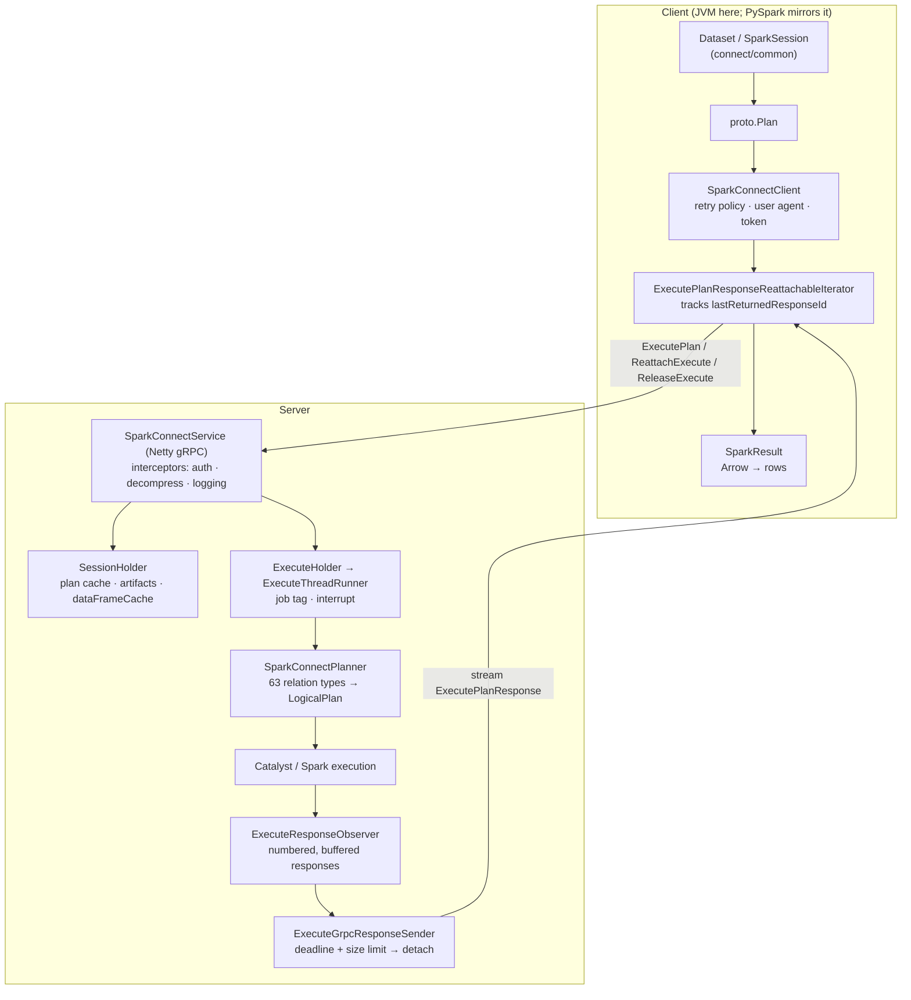

The first sweep of `sql/connect`, and the first subsystem in this map whose subject is a **wire
protocol** rather than an execution engine. The group covers everything between a client calling
`spark.range(10).collect()` and a Catalyst plan running on a driver: the protobuf schema, the gRPC
server, the planner that rebuilds a logical plan from messages, and the machinery that keeps a
result stream alive across a network that will not cooperate.

One boundary worth stating up front: **the PySpark client is not in this subsystem.** It lives in
`python/pyspark/sql/connect/`, outside every source root the map indexes. What is here is the
protocol both clients speak and the Scala/JVM client that speaks it — so the protocol concepts
below apply to PySpark unchanged, and the client-API ones describe the JVM implementation of an
interface PySpark reimplements.

---

## The protobuf contract — twelve RPCs and the relation surface

**What it is:** the actual API of Spark Connect. Eleven `.proto` files define one service with
**twelve RPCs** and a message hierarchy that mirrors the DataFrame API: 65 relation messages, 24
commands, 11 expression messages. Everything else in this group is an implementation of this
contract on one side or the other.

**Anchor files:**

- [base.proto:1311](https://github.com/apache/spark/blob/v4.2.0/sql/connect/common/src/main/protobuf/spark/connect/base.proto#L1311) — `service SparkConnectService`, with `ExecutePlan` [:1316](https://github.com/apache/spark/blob/v4.2.0/sql/connect/common/src/main/protobuf/spark/connect/base.proto#L1316) (the only server-streaming call in the core set), `AnalyzePlan`, `Config`, `AddArtifacts` (client-streaming), `ArtifactStatus`, `Interrupt`, `ReattachExecute` [:1338](https://github.com/apache/spark/blob/v4.2.0/sql/connect/common/src/main/protobuf/spark/connect/base.proto#L1338), `ReleaseExecute`, `ReleaseSession`, `FetchErrorDetails`, `CloneSession` and `GetStatus`
- [relations.proto](https://github.com/apache/spark/blob/v4.2.0/sql/connect/common/src/main/protobuf/spark/connect/relations.proto) — 65 messages: `Project`, `Filter`, `Join`, `Aggregate`, … one per DataFrame operation, plus 4.2.0's `NearestByJoin` and `RelationChanges`
- [expressions.proto](https://github.com/apache/spark/blob/v4.2.0/sql/connect/common/src/main/protobuf/spark/connect/expressions.proto), [commands.proto](https://github.com/apache/spark/blob/v4.2.0/sql/connect/common/src/main/protobuf/spark/connect/commands.proto), [types.proto](https://github.com/apache/spark/blob/v4.2.0/sql/connect/common/src/main/protobuf/spark/connect/types.proto), [catalog.proto](https://github.com/apache/spark/blob/v4.2.0/sql/connect/common/src/main/protobuf/spark/connect/catalog.proto), [ml.proto](https://github.com/apache/spark/blob/v4.2.0/sql/connect/common/src/main/protobuf/spark/connect/ml.proto)
- [DataTypeProtoConverter.scala](https://github.com/apache/spark/blob/v4.2.0/sql/connect/common/src/main/scala/org/apache/spark/sql/connect/common/DataTypeProtoConverter.scala) and [LiteralValueProtoConverter.scala](https://github.com/apache/spark/blob/v4.2.0/sql/connect/common/src/main/scala/org/apache/spark/sql/connect/common/LiteralValueProtoConverter.scala) — the two-way mapping between `DataType`/literals and their proto forms, shared by both sides
- [PlanCompressionUtils.scala:34](https://github.com/apache/spark/blob/v4.2.0/sql/connect/server/src/main/scala/org/apache/spark/sql/connect/utils/PlanCompressionUtils.scala#L34) — `decompressPlan`: since 4.1 a plan above `spark.connect.session.planCompression.threshold` (10 MB) is sent **zstd-compressed**, because a deeply nested DataFrame chain produces a very large message
- [InvalidPlanInput.scala](https://github.com/apache/spark/blob/v4.2.0/sql/connect/common/src/main/scala/org/apache/spark/sql/connect/common/InvalidPlanInput.scala) — the error a malformed message produces

!!! info "The plan travels as a message, so plan size is a network concern"

    A DataFrame built by a long chain of transformations serializes to a proportionally large
    protobuf. Three separate limits guard this: `spark.connect.grpc.maxInboundMessageSize`,
    `spark.connect.maxPlanSize` (512 MB, 4.1) and `spark.connect.grpc.marshallerRecursionLimit` for
    deeply nested messages. A client that builds a plan in a loop — the usual accidental way to
    reach these — fails with a gRPC message-size error rather than anything mentioning plans.

**Configs:** `spark.connect.grpc.maxInboundMessageSize`, `spark.connect.maxPlanSize` (512 MB, 4.1.0),
`spark.connect.grpc.marshallerRecursionLimit`, `spark.connect.session.planCompression.threshold`
(10 MB, 4.1.0), `spark.connect.session.planCompression.defaultAlgorithm` (ZSTD, 4.1.0)

**Maps to topics:** E9

---

## SparkConnectService — the gRPC server, its interceptors and its size limits

**What it is:** a Netty gRPC server started inside the Spark driver, plus a configurable
interceptor chain. It is the process boundary: everything above it is Spark, everything below is
the network.

**Anchor files:**

- [SparkConnectService.scala:59](https://github.com/apache/spark/blob/v4.2.0/sql/connect/server/src/main/scala/org/apache/spark/sql/connect/service/SparkConnectService.scala#L59) — the service implementation; each RPC is a handful of lines delegating to a handler class
- [SparkConnectService.scala:394](https://github.com/apache/spark/blob/v4.2.0/sql/connect/server/src/main/scala/org/apache/spark/sql/connect/service/SparkConnectService.scala#L394) — `startGRPCService`: `NettyServerBuilder`, the inbound message-size limit, optional proto reflection, and the interceptor chain
- [SparkConnectService.scala:449](https://github.com/apache/spark/blob/v4.2.0/sql/connect/server/src/main/scala/org/apache/spark/sql/connect/service/SparkConnectService.scala#L449) `start(sc)` / [:465](https://github.com/apache/spark/blob/v4.2.0/sql/connect/server/src/main/scala/org/apache/spark/sql/connect/service/SparkConnectService.scala#L465) `stop` — the lifecycle the plugin drives
- [SparkConnectPlugin.scala](https://github.com/apache/spark/blob/v4.2.0/sql/connect/server/src/main/scala/org/apache/spark/sql/connect/SparkConnectPlugin.scala) — Connect ships as a **`SparkPlugin`**: `spark.plugins` starts the server inside an ordinary driver, which is why `--remote` and a classic cluster are the same JVM
- [SparkConnectServer.scala](https://github.com/apache/spark/blob/v4.2.0/sql/connect/server/src/main/scala/org/apache/spark/sql/connect/service/SparkConnectServer.scala) and [SimpleSparkConnectService.scala](https://github.com/apache/spark/blob/v4.2.0/sql/connect/server/src/main/scala/org/apache/spark/sql/connect/SimpleSparkConnectService.scala) — the standalone entry points
- [PreSharedKeyAuthenticationInterceptor.scala:25](https://github.com/apache/spark/blob/v4.2.0/sql/connect/server/src/main/scala/org/apache/spark/sql/connect/service/PreSharedKeyAuthenticationInterceptor.scala#L25) — the **entire** built-in authentication story: a single pre-shared bearer token from `spark.connect.authenticate.token`
- [RequestDecompressionInterceptor.scala:42](https://github.com/apache/spark/blob/v4.2.0/sql/connect/server/src/main/scala/org/apache/spark/sql/connect/service/RequestDecompressionInterceptor.scala#L42), [LoggingInterceptor.scala:39](https://github.com/apache/spark/blob/v4.2.0/sql/connect/server/src/main/scala/org/apache/spark/sql/connect/service/LoggingInterceptor.scala#L39), [LocalPropertiesCleanupInterceptor.scala:28](https://github.com/apache/spark/blob/v4.2.0/sql/connect/server/src/main/scala/org/apache/spark/sql/connect/service/LocalPropertiesCleanupInterceptor.scala#L28)
- [SparkConnectInterceptorRegistry.scala:35](https://github.com/apache/spark/blob/v4.2.0/sql/connect/server/src/main/scala/org/apache/spark/sql/connect/service/SparkConnectInterceptorRegistry.scala#L35) — user interceptors from `spark.connect.grpc.interceptor.classes`, instantiated reflectively and **chained in reverse order**
- [config/Connect.scala:28](https://github.com/apache/spark/blob/v4.2.0/sql/connect/server/src/main/scala/org/apache/spark/sql/connect/config/Connect.scala#L28) — every `spark.connect.*` key in one object, and the distinction that matters: the binding address, port and retry count are **`buildStaticConf`** (fixed at server start), while session and execution knobs are ordinary `buildConf`. [config/ConnectPlanCompressionAlgorithm.scala:20](https://github.com/apache/spark/blob/v4.2.0/sql/connect/server/src/main/scala/org/apache/spark/sql/connect/config/ConnectPlanCompressionAlgorithm.scala#L20) holds the `ZSTD | NONE` enum

!!! warning "Built-in authentication is one shared token, and TLS is not configured here"

    `PreSharedKeyAuthenticationInterceptor` compares an `Authorization: Bearer <token>` header
    against `spark.connect.authenticate.token`. There is no user identity, no rotation and no
    per-user authorization — the `user_id` in every request is **client-supplied and untrusted**.
    Anything stronger is expected to come from a custom interceptor or a proxy in front. Treat an
    unprotected Connect port as equivalent to an unprotected driver.

**Configs:** `spark.connect.grpc.binding.port` (15002), `spark.connect.grpc.binding.address`,
`spark.connect.grpc.port.maxRetries`, `spark.connect.grpc.maxInboundMessageSize`,
`spark.connect.grpc.maxMetadataSize` (1024),
`spark.connect.grpc.interceptor.classes`, `spark.connect.authenticate.token` (4.0.0)

**Maps to topics:** E9, E2

---

## SparkConnectPlanner — protobuf relations into a Catalyst logical plan

**What it is:** at **4481 lines the largest file in the subsystem**, and structurally a mirror of
`AstBuilder`: one giant `match` over `RelTypeCase` with **63 relation types**, each building the
same unresolved `LogicalPlan` the SQL parser would.

**Anchor files:**

- [SparkConnectPlanner.scala:90](https://github.com/apache/spark/blob/v4.2.0/sql/connect/server/src/main/scala/org/apache/spark/sql/connect/planner/SparkConnectPlanner.scala#L90) — the class, parameterized by a `SessionHolder`
- [SparkConnectPlanner.scala:145](https://github.com/apache/spark/blob/v4.2.0/sql/connect/server/src/main/scala/org/apache/spark/sql/connect/planner/SparkConnectPlanner.scala#L145) — `transformRelation(rel, cachePlan)`, the dispatch, wrapped in the plan cache
- [SparkConnectPlanner.scala:149](https://github.com/apache/spark/blob/v4.2.0/sql/connect/server/src/main/scala/org/apache/spark/sql/connect/planner/SparkConnectPlanner.scala#L149) — the case list: `SHOW_STRING` and `HTML_STRING` come **first**, because `df.show()` is a *relation* over the wire, not a client-side formatter
- [SparkConnectPlanner.scala:162](https://github.com/apache/spark/blob/v4.2.0/sql/connect/server/src/main/scala/org/apache/spark/sql/connect/planner/SparkConnectPlanner.scala#L162) — `NEAREST_BY_JOIN`, the 4.2.0 top-K similarity join the [framework sweep](sql-catalyst-framework.md) found on the catalyst side, wired through to Connect in the same release
- [LiteralExpressionProtoConverter.scala](https://github.com/apache/spark/blob/v4.2.0/sql/connect/server/src/main/scala/org/apache/spark/sql/connect/planner/LiteralExpressionProtoConverter.scala), [SaveModeConverter.scala](https://github.com/apache/spark/blob/v4.2.0/sql/connect/server/src/main/scala/org/apache/spark/sql/connect/planner/SaveModeConverter.scala), [TableSaveMethodConverter.scala](https://github.com/apache/spark/blob/v4.2.0/sql/connect/server/src/main/scala/org/apache/spark/sql/connect/planner/TableSaveMethodConverter.scala)
- [InvalidInputErrors.scala](https://github.com/apache/spark/blob/v4.2.0/sql/connect/server/src/main/scala/org/apache/spark/sql/connect/planner/InvalidInputErrors.scala) — the errors a message that type-checks but makes no sense produces
- [SparkConnectAnalyzeHandler.scala](https://github.com/apache/spark/blob/v4.2.0/sql/connect/server/src/main/scala/org/apache/spark/sql/connect/service/SparkConnectAnalyzeHandler.scala) — the `AnalyzePlan` RPC: `schema`, `explain`, `isLocal`, `inputFiles`, `semanticHash` all run the planner **without executing**

!!! info "`df.show()` and `df.explain()` are round trips"

    `SHOW_STRING` is a relation type and `explain` is an `AnalyzePlan` mode, so both cross the
    network and are planned on the server. On Connect, the operations that feel free in a local
    shell each cost an RPC — which is the main reason an interactive session over a high-latency
    link feels different from a classic one, quite apart from execution time.

!!! info "Two front ends, one plan"

    `SparkConnectPlanner` and `AstBuilder` (see the [types & parser sweep](sql-catalyst-types-parser.md))
    are the only two things in Spark that construct an unresolved `LogicalPlan` from an external
    representation. They share no code, and both must stay in step with catalyst — which is why a
    new logical feature typically lands as a catalyst change, a grammar change *and* a proto change
    in the same release, as `NearestByJoin` did in 4.2.0.

**Configs:** none read directly; `spark.connect.extensions.relation.classes` extends the dispatch

**Maps to topics:** E9, A1

---

## SessionHolder and the session manager — isolation, timeouts and tombstones

**What it is:** server-side session state. Each `(userId, sessionId)` gets a `SessionHolder`
wrapping an **isolated** `SparkSession` — its own SQL conf, temp views, artifacts and classloader
— and a manager that expires them.

**Anchor files:**

- [SessionHolder.scala:56](https://github.com/apache/spark/blob/v4.2.0/sql/connect/server/src/main/scala/org/apache/spark/sql/connect/service/SessionHolder.scala#L56) — the holder, keyed by user id **and** session id
- [SessionHolder.scala:131](https://github.com/apache/spark/blob/v4.2.0/sql/connect/server/src/main/scala/org/apache/spark/sql/connect/service/SessionHolder.scala#L131) — `dataFrameCache`: a `DataFrame` the client holds a handle to lives here, which is how a client-side `Dataset` reference stays valid across RPCs
- [SessionHolder.scala:322](https://github.com/apache/spark/blob/v4.2.0/sql/connect/server/src/main/scala/org/apache/spark/sql/connect/service/SessionHolder.scala#L322) — `artifactManager` and [:341](https://github.com/apache/spark/blob/v4.2.0/sql/connect/server/src/main/scala/org/apache/spark/sql/connect/service/SessionHolder.scala#L341) `classloader`: per-session class isolation
- [SessionHolder.scala:343](https://github.com/apache/spark/blob/v4.2.0/sql/connect/server/src/main/scala/org/apache/spark/sql/connect/service/SessionHolder.scala#L343) `updateAccessTime` and [:373](https://github.com/apache/spark/blob/v4.2.0/sql/connect/server/src/main/scala/org/apache/spark/sql/connect/service/SessionHolder.scala#L373) `close` — the idle-timeout hook and the teardown
- [SparkConnectSessionManager.scala:92](https://github.com/apache/spark/blob/v4.2.0/sql/connect/server/src/main/scala/org/apache/spark/sql/connect/service/SparkConnectSessionManager.scala#L92) — `getOrCreateIsolatedSession`, with the **client-supplied session id** as the key
- [SparkConnectSessionManager.scala:262](https://github.com/apache/spark/blob/v4.2.0/sql/connect/server/src/main/scala/org/apache/spark/sql/connect/service/SparkConnectSessionManager.scala#L262) — `closeSession`, and the closed-session tombstone cache that lets a returning client get a clear error rather than a silent new session
- [SparkConnectCloneSessionHandler.scala](https://github.com/apache/spark/blob/v4.2.0/sql/connect/server/src/main/scala/org/apache/spark/sql/connect/service/SparkConnectCloneSessionHandler.scala) — `CloneSession`, forking a session's state
- [SessionEventsManager.scala](https://github.com/apache/spark/blob/v4.2.0/sql/connect/server/src/main/scala/org/apache/spark/sql/connect/service/SessionEventsManager.scala) — session lifecycle events on the listener bus

!!! warning "Sessions expire on idle time, and the default is an hour"

    `spark.connect.session.manager.defaultSessionTimeout` is 60 minutes, checked by a maintenance
    thread every 30 seconds. A notebook left open over lunch comes back to a closed session: temp
    views, cached DataFrames, registered UDFs and uploaded artifacts are all gone, and the error
    points at the session id rather than at the timeout. The tombstone cache
    (`closedSessionsTombstonesSize`, 1000) is what makes that error legible at all.

**Configs:** `spark.connect.session.manager.defaultSessionTimeout` (60m, 4.0.0),
`spark.connect.session.manager.maintenanceInterval` (30s),
`spark.connect.session.manager.closedSessionsTombstonesSize` (1000),
`spark.connect.session.inactiveOperations.cacheExpiration` (30, 4.1.0)

**Maps to topics:** E9

---

## The plan cache — keyed on the protobuf message

**What it is:** a per-session cache from `proto.Relation` to `LogicalPlan`. Because a client
resends the full plan on every operation, the same subtree arrives repeatedly; caching the analyzed
result turns repeated analysis into a map lookup.

**Anchor files:**

- [SessionHolder.scala:64](https://github.com/apache/spark/blob/v4.2.0/sql/connect/server/src/main/scala/org/apache/spark/sql/connect/service/SessionHolder.scala#L64) — the cache, sized by `spark.connect.session.planCache.maxSize` (32)
- [SessionHolder.scala:602](https://github.com/apache/spark/blob/v4.2.0/sql/connect/server/src/main/scala/org/apache/spark/sql/connect/service/SessionHolder.scala#L602) — `usePlanCache`, the whole mechanism
- [SessionHolder.scala:607](https://github.com/apache/spark/blob/v4.2.0/sql/connect/server/src/main/scala/org/apache/spark/sql/connect/service/SessionHolder.scala#L607) — **only relations carrying a plan id are cached**: the client must have tagged the subtree
- [SessionHolder.scala:609](https://github.com/apache/spark/blob/v4.2.0/sql/connect/server/src/main/scala/org/apache/spark/sql/connect/service/SessionHolder.scala#L609) — `alwaysCacheDataSourceReadsEnabled`: a `Read.DataSource` is cached unconditionally, "to avoid re-analyzing the same `DataSource` twice" — schema inference is the expensive case

!!! info "The cache key is the serialized message, so it is exact and it is large"

    `Cache[proto.Relation, LogicalPlan]` hashes the whole protobuf subtree. Two structurally
    identical plans hit; a plan differing in any literal misses. Combined with a default size of
    **32 entries per session**, a client generating many near-identical plans gets little benefit —
    and the cached values are analyzed plans, which are not small. It is a correctness-neutral
    performance knob in both directions.

**Configs:** `spark.connect.session.planCache.enabled` (true, 4.0.0),
`spark.connect.session.planCache.maxSize` (32),
`spark.connect.session.planCache.alwaysCacheDataSourceReadsEnabled` (true, 4.1.0)

**Maps to topics:** E9

---

## ExecuteHolder and the execution thread — job tags, interrupts and abandonment

**What it is:** each `ExecutePlan` gets an `ExecuteHolder` and a dedicated thread. The holder
carries a **job tag** applied to every Spark job the execution starts, which is what makes
`Interrupt` work: cancelling by tag reaches jobs the RPC never directly knew about.

**Anchor files:**

- [ExecuteHolder.scala](https://github.com/apache/spark/blob/v4.2.0/sql/connect/server/src/main/scala/org/apache/spark/sql/connect/service/ExecuteHolder.scala) — the per-operation state: operation id, tags, the response observer, the reattachable flag
- [ExecuteThreadRunner.scala:43](https://github.com/apache/spark/blob/v4.2.0/sql/connect/server/src/main/scala/org/apache/spark/sql/connect/execution/ExecuteThreadRunner.scala#L43) — one thread per execution, and at [:207](https://github.com/apache/spark/blob/v4.2.0/sql/connect/server/src/main/scala/org/apache/spark/sql/connect/execution/ExecuteThreadRunner.scala#L207) `sparkContext.addJobTag(executeHolder.jobTag)`
- [ExecuteThreadRunner.scala:84](https://github.com/apache/spark/blob/v4.2.0/sql/connect/server/src/main/scala/org/apache/spark/sql/connect/execution/ExecuteThreadRunner.scala#L84) — `interrupt()`, the path `InterruptRequest` reaches
- [SparkConnectInterruptHandler.scala](https://github.com/apache/spark/blob/v4.2.0/sql/connect/server/src/main/scala/org/apache/spark/sql/connect/service/SparkConnectInterruptHandler.scala) — interrupt all / by tag / by operation id
- [SparkConnectExecutionManager.scala:151](https://github.com/apache/spark/blob/v4.2.0/sql/connect/server/src/main/scala/org/apache/spark/sql/connect/service/SparkConnectExecutionManager.scala#L151) — `removeExecuteHolder`, with the ordering comment: the tombstone is written **before** removal so a returning client never sees a gap
- [SparkConnectExecutionManager.scala:342](https://github.com/apache/spark/blob/v4.2.0/sql/connect/server/src/main/scala/org/apache/spark/sql/connect/service/SparkConnectExecutionManager.scala#L342) — `periodicMaintenance`: an execution whose client has not polled within `detachedTimeout` (5m) is **abandoned** and cancelled
- [ExecuteEventsManager.scala:106](https://github.com/apache/spark/blob/v4.2.0/sql/connect/server/src/main/scala/org/apache/spark/sql/connect/service/ExecuteEventsManager.scala#L106) — the lifecycle events: started → analyzed → readyForExecution → finished/failed/canceled → closed, each posted to the listener bus

!!! warning "A client that stops polling loses its query after five minutes"

    `spark.connect.execute.manager.detachedTimeout` (5m) governs how long a detached execution
    survives without a client attached. This is deliberate — it is what stops a disconnected client
    from pinning driver resources forever — but it also means a client paused in a debugger, or
    blocked on a slow consumer, silently loses a long-running query. The abandoned-tombstone cache
    (`abandonedTombstonesSize`, 10000) is what turns the next request into a clear error.

**Configs:** `spark.connect.execute.manager.detachedTimeout` (5m),
`spark.connect.execute.manager.maintenanceInterval` (30s),
`spark.connect.execute.manager.abandonedTombstonesSize` (10000)

**Maps to topics:** E9

---

## Reattachable execution — surviving a broken response stream

**What it is:** the mechanism that makes Connect usable over a real network. A result stream can
break for reasons that have nothing to do with the query — a proxy idle timeout, a load-balancer
reset — so the server **numbers and buffers** its responses, the client remembers the last id it
consumed, and `ReattachExecute` resumes the stream from that point. `ReleaseExecute` tells the
server which responses it may drop.

**Code path:** client `ExecutePlan` → server `ExecuteResponseObserver` buffers numbered responses →
`ExecuteGrpcResponseSender` streams until a deadline or size limit, then **ends the stream
gracefully without `ResultComplete`** → client sees a non-terminal end and issues `ReattachExecute`
with `lastReturnedResponseId` → a new sender attaches to the same observer

**Anchor files:**

- [ExecutePlanResponseReattachableIterator.scala:34](https://github.com/apache/spark/blob/v4.2.0/sql/connect/common/src/main/scala/org/apache/spark/sql/connect/client/ExecutePlanResponseReattachableIterator.scala#L34) — the class scaladoc, which states the protocol more clearly than any documentation
- [ExecutePlanResponseReattachableIterator.scala:60](https://github.com/apache/spark/blob/v4.2.0/sql/connect/common/src/main/scala/org/apache/spark/sql/connect/client/ExecutePlanResponseReattachableIterator.scala#L60) — the client generates an `operationId` **before sending**, so it can reattach even to a request that may never have arrived
- [ExecutePlanResponseReattachableIterator.scala:94](https://github.com/apache/spark/blob/v4.2.0/sql/connect/common/src/main/scala/org/apache/spark/sql/connect/client/ExecutePlanResponseReattachableIterator.scala#L94) `lastReturnedResponseId`, [:122](https://github.com/apache/spark/blob/v4.2.0/sql/connect/common/src/main/scala/org/apache/spark/sql/connect/client/ExecutePlanResponseReattachableIterator.scala#L122) `next()`, [:162](https://github.com/apache/spark/blob/v4.2.0/sql/connect/common/src/main/scala/org/apache/spark/sql/connect/client/ExecutePlanResponseReattachableIterator.scala#L162) `hasNext` — where the reattach decision is made
- [ExecutePlanResponseReattachableIterator.scala:202](https://github.com/apache/spark/blob/v4.2.0/sql/connect/common/src/main/scala/org/apache/spark/sql/connect/client/ExecutePlanResponseReattachableIterator.scala#L202) `releaseUntil` / [:216](https://github.com/apache/spark/blob/v4.2.0/sql/connect/common/src/main/scala/org/apache/spark/sql/connect/client/ExecutePlanResponseReattachableIterator.scala#L216) `releaseAll` — sent **asynchronously**, so releasing buffer never blocks consumption
- [ExecuteResponseObserver.scala:52](https://github.com/apache/spark/blob/v4.2.0/sql/connect/server/src/main/scala/org/apache/spark/sql/connect/execution/ExecuteResponseObserver.scala#L52) — the server buffer: a map from index → response, indexes "numbered consecutively starting from 1"
- [ExecuteResponseObserver.scala:106](https://github.com/apache/spark/blob/v4.2.0/sql/connect/server/src/main/scala/org/apache/spark/sql/connect/execution/ExecuteResponseObserver.scala#L106) — `retryBufferSize`, applied **only when the execution is reattachable**: how much history is kept behind the consumer
- [ExecuteResponseObserver.scala:177](https://github.com/apache/spark/blob/v4.2.0/sql/connect/server/src/main/scala/org/apache/spark/sql/connect/execution/ExecuteResponseObserver.scala#L177) — the removal policy, keyed on `highestConsumedIndex`
- [ExecuteGrpcResponseSender.scala:83](https://github.com/apache/spark/blob/v4.2.0/sql/connect/server/src/main/scala/org/apache/spark/sql/connect/execution/ExecuteGrpcResponseSender.scala#L83) — `run(lastConsumedStreamIndex)`, using `grpcCallObserver.isReady` for flow control
- [ExecuteGrpcResponseSender.scala:238](https://github.com/apache/spark/blob/v4.2.0/sql/connect/server/src/main/scala/org/apache/spark/sql/connect/execution/ExecuteGrpcResponseSender.scala#L238) — `deadlineLimitReached`: the sender voluntarily stops at `senderMaxStreamDuration` (2m) or `senderMaxStreamSize` (1g)
- [SparkConnectReattachExecuteHandler.scala](https://github.com/apache/spark/blob/v4.2.0/sql/connect/server/src/main/scala/org/apache/spark/sql/connect/service/SparkConnectReattachExecuteHandler.scala) and [SparkConnectReleaseExecuteHandler.scala](https://github.com/apache/spark/blob/v4.2.0/sql/connect/server/src/main/scala/org/apache/spark/sql/connect/service/SparkConnectReleaseExecuteHandler.scala)

!!! info "The server deliberately ends the stream every two minutes"

    `senderMaxStreamDuration` defaults to **2 minutes**. A healthy long-running query therefore
    produces a sequence of short-lived gRPC streams, each ended cleanly by the server and resumed
    by the client — precisely so that no single stream lives long enough for an intermediary to
    time it out. A packet capture of a working Connect session looks like repeated failures; it
    isn't.

!!! warning "The buffer is per execution and lives on the driver"

    `observerRetryBufferSize` (10 MB) of responses is retained *behind* the consumer for every
    reattachable execution, so that a reattach can replay. With many concurrent large-result
    queries this is real driver memory. Setting `spark.connect.execute.reattachable.enabled=false`
    removes the buffer and the resilience together — which is a reasonable trade only on a network
    where streams do not break.

**Configs:** `spark.connect.execute.reattachable.enabled` (true, 3.5.0),
`spark.connect.execute.reattachable.observerRetryBufferSize` (10m),
`spark.connect.execute.reattachable.senderMaxStreamDuration` (2m),
`spark.connect.execute.reattachable.senderMaxStreamSize` (1g)

**Maps to topics:** none yet — proposed as **E18**

---

## Retry policy and error enrichment across the wire

**What it is:** two problems a remote engine creates. Transient gRPC failures need retrying without
re-executing a query twice; and a `SparkException` raised on the driver has to survive being
flattened into a gRPC status.

**Anchor files:**

- [RetryPolicy.scala:63](https://github.com/apache/spark/blob/v4.2.0/sql/connect/common/src/main/scala/org/apache/spark/sql/connect/client/RetryPolicy.scala#L63) — the policy record, and at [:81](https://github.com/apache/spark/blob/v4.2.0/sql/connect/common/src/main/scala/org/apache/spark/sql/connect/client/RetryPolicy.scala#L81) `defaultPolicy()`: **15 retries**, 50 ms initial backoff, ×4 multiplier capped at 1 minute, 500 ms jitter above a 2 s threshold — "selected so that the maximum tolerated wait is guaranteed to be at least 10 minutes"
- [RetryPolicy.scala:83](https://github.com/apache/spark/blob/v4.2.0/sql/connect/common/src/main/scala/org/apache/spark/sql/connect/client/RetryPolicy.scala#L83) — the comment pinning these constants to the Python client (`pyspark/sql/connect/client/retries.py`): the two implementations are kept in sync by hand
- [RetryPolicy.scala:124](https://github.com/apache/spark/blob/v4.2.0/sql/connect/common/src/main/scala/org/apache/spark/sql/connect/client/RetryPolicy.scala#L124) — `recognizeServerRetryDelay`: a server-sent `RetryInfo` can **override** the client's backoff, bounded by `maxServerRetryDelay` (10m)
- [GrpcRetryHandler.scala](https://github.com/apache/spark/blob/v4.2.0/sql/connect/common/src/main/scala/org/apache/spark/sql/connect/client/GrpcRetryHandler.scala) — the wrapper every RPC goes through
- [GrpcExceptionConverter.scala:57](https://github.com/apache/spark/blob/v4.2.0/sql/connect/common/src/main/scala/org/apache/spark/sql/connect/client/GrpcExceptionConverter.scala#L57) — `convert`, turning a `StatusRuntimeException` back into the Spark exception type it started as
- [GrpcExceptionConverter.scala:136](https://github.com/apache/spark/blob/v4.2.0/sql/connect/common/src/main/scala/org/apache/spark/sql/connect/client/GrpcExceptionConverter.scala#L136) — `toThrowable`, and at [:151](https://github.com/apache/spark/blob/v4.2.0/sql/connect/common/src/main/scala/org/apache/spark/sql/connect/client/GrpcExceptionConverter.scala#L151) the **`FetchErrorDetails` round trip**: when the status carries an `ErrorInfo`, the client makes a *second RPC* to retrieve the full message, cause chain and server stack trace
- [SparkConnectFetchErrorDetailsHandler.scala](https://github.com/apache/spark/blob/v4.2.0/sql/connect/server/src/main/scala/org/apache/spark/sql/connect/service/SparkConnectFetchErrorDetailsHandler.scala) and [ErrorUtils.scala](https://github.com/apache/spark/blob/v4.2.0/sql/connect/server/src/main/scala/org/apache/spark/sql/connect/utils/ErrorUtils.scala) — the server half
- [ResponseValidator.scala](https://github.com/apache/spark/blob/v4.2.0/sql/connect/common/src/main/scala/org/apache/spark/sql/connect/client/ResponseValidator.scala) — checks the server's session id on every response, so a silently-recreated session is caught rather than tolerated

!!! info "A useful Connect stack trace costs an extra RPC"

    `spark.sql.connect.enrichError.enabled` (default true) is what makes a remote failure carry its
    real cause chain: the client sees a gRPC status, spots the `ErrorInfo`, and calls
    `FetchErrorDetails` to get the rest. Turn it off — or lose the session before the second call —
    and you are left with a flattened one-line message.
    `spark.sql.connect.serverStacktrace.enabled` separately controls whether the server's JVM stack
    trace is included at all, and `spark.connect.jvmStacktrace.maxSize` (1024) truncates it.

!!! warning "Retries are per RPC, and reattach is what makes them safe"

    A retried `ExecutePlan` would re-run the query. The client avoids that by generating the
    operation id up front and preferring `ReattachExecute` on failure — the two mechanisms are
    designed together. This is worth knowing before writing a custom client or wrapping the client
    in your own retry loop: an outer retry does not have that protection.

**Configs:** `spark.sql.connect.enrichError.enabled` (true, 4.0.0),
`spark.sql.connect.serverStacktrace.enabled` (true, 4.0.0), `spark.connect.jvmStacktrace.maxSize`
(1024, 3.5.0)

**Maps to topics:** E9

---

## Arrow result streaming — batches, size limits and chunking

**What it is:** results come back as Arrow IPC batches embedded in `ExecutePlanResponse` messages.
The interesting constraints are that a gRPC message has a hard size cap and an Arrow batch cannot
be split arbitrarily.

**Anchor files:**

- [SparkConnectPlanExecution.scala:129](https://github.com/apache/spark/blob/v4.2.0/sql/connect/server/src/main/scala/org/apache/spark/sql/connect/execution/SparkConnectPlanExecution.scala#L129) — `processAsArrowBatches`
- [SparkConnectPlanExecution.scala:141](https://github.com/apache/spark/blob/v4.2.0/sql/connect/server/src/main/scala/org/apache/spark/sql/connect/execution/SparkConnectPlanExecution.scala#L141) — `maxBatchSize = CONNECT_GRPC_ARROW_MAX_BATCH_SIZE * 0.7`: a **30% headroom** below the gRPC limit, because the batch is not the whole message
- [SparkConnectPlanExecution.scala:137](https://github.com/apache/spark/blob/v4.2.0/sql/connect/server/src/main/scala/org/apache/spark/sql/connect/execution/SparkConnectPlanExecution.scala#L137) — `spark.sql.execution.arrow.maxRecordsPerBatch` is reused from classic Spark: the same knob shapes pandas UDFs and Connect results
- [SparkConnectPlanExecution.scala:143](https://github.com/apache/spark/blob/v4.2.0/sql/connect/server/src/main/scala/org/apache/spark/sql/connect/execution/SparkConnectPlanExecution.scala#L143) — result chunking (4.1): a batch larger than `resultChunking.maxChunkSize` is split across messages and reassembled client-side
- [SparkResult.scala:44](https://github.com/apache/spark/blob/v4.2.0/sql/connect/common/src/main/scala/org/apache/spark/sql/connect/client/SparkResult.scala#L44) — the client reader, and at [:178](https://github.com/apache/spark/blob/v4.2.0/sql/connect/common/src/main/scala/org/apache/spark/sql/connect/client/SparkResult.scala#L178) a **row-offset assertion** — each batch declares the offset it starts at, so a lost or duplicated batch is caught rather than silently mis-assembled
- [arrow/ArrowDeserializer.scala](https://github.com/apache/spark/blob/v4.2.0/sql/connect/common/src/main/scala/org/apache/spark/sql/connect/client/arrow/ArrowDeserializer.scala) and [arrow/ArrowSerializer.scala](https://github.com/apache/spark/blob/v4.2.0/sql/connect/common/src/main/scala/org/apache/spark/sql/connect/client/arrow/ArrowSerializer.scala) — Arrow ⇄ JVM objects, driven by the `AgnosticEncoder` the [framework sweep](sql-catalyst-framework.md) covers
- [arrow/GeospatialArrowSerDe.scala](https://github.com/apache/spark/blob/v4.2.0/sql/connect/common/src/main/scala/org/apache/spark/sql/connect/client/arrow/GeospatialArrowSerDe.scala) — the wire form for the GEOGRAPHY/GEOMETRY types the [expressions sweep](sql-catalyst-expressions.md) found
- [ConnectProgressExecutionListener.scala](https://github.com/apache/spark/blob/v4.2.0/sql/connect/server/src/main/scala/org/apache/spark/sql/connect/execution/ConnectProgressExecutionListener.scala) — progress messages interleaved into the same stream, every `spark.connect.progress.reportInterval` (2s)

!!! info "`AgnosticEncoder` is the reason the client needs no catalyst"

    The client deserializes Arrow into JVM objects using the same encoder description the server
    uses, defined in `sql/api`. That split — recorded from the catalyst side in the
    [framework sweep](sql-catalyst-framework.md) — is what lets a Connect client be a small
    dependency rather than a Spark installation.

**Configs:** `spark.connect.grpc.arrow.maxBatchSize`,
`spark.connect.session.resultChunking.maxChunkSize` (4.1.0),
`spark.connect.progress.reportInterval` (2s), `spark.sql.execution.arrow.maxRecordsPerBatch`
(read from classic SQL conf)

**Maps to topics:** E9, I3

---

## Artifacts — shipping JARs, classes and UDFs to a remote session

**What it is:** the answer to "where does my UDF's bytecode come from". A Connect client shares no
JVM with the server, so classes, JARs, files and Python archives are uploaded over a
client-streaming RPC, staged, verified and installed into a **per-session classloader**.

**Anchor files:**

- [ArtifactManager.scala:57](https://github.com/apache/spark/blob/v4.2.0/sql/connect/common/src/main/scala/org/apache/spark/sql/connect/client/ArtifactManager.scala#L57) — the client manager, with [:64](https://github.com/apache/spark/blob/v4.2.0/sql/connect/common/src/main/scala/org/apache/spark/sql/connect/client/ArtifactManager.scala#L64) `CHUNK_SIZE = 32 KB`: artifacts are chunked into a stream of requests
- [ArtifactManager.scala:79](https://github.com/apache/spark/blob/v4.2.0/sql/connect/common/src/main/scala/org/apache/spark/sql/connect/client/ArtifactManager.scala#L79) — the `addArtifact` overloads: a path, a URI, raw bytes with a target name, or source→target
- [ArtifactManager.scala:165](https://github.com/apache/spark/blob/v4.2.0/sql/connect/common/src/main/scala/org/apache/spark/sql/connect/client/ArtifactManager.scala#L165) — `isCachedArtifact`, backed by the `ArtifactStatus` RPC: content is hashed so an unchanged artifact is not re-uploaded
- [ClassFinder.scala](https://github.com/apache/spark/blob/v4.2.0/sql/connect/common/src/main/scala/org/apache/spark/sql/connect/client/ClassFinder.scala) and [AmmoniteClassFinder.scala](https://github.com/apache/spark/blob/v4.2.0/sql/connect/client/jvm/src/main/scala/org/apache/spark/sql/application/AmmoniteClassFinder.scala) — the **automatic** path: the REPL's generated classes are found and uploaded so a lambda defined in a shell works remotely
- [SparkConnectAddArtifactsHandler.scala:46](https://github.com/apache/spark/blob/v4.2.0/sql/connect/server/src/main/scala/org/apache/spark/sql/connect/service/SparkConnectAddArtifactsHandler.scala#L46) — the server stages into a temp dir, and at [:114](https://github.com/apache/spark/blob/v4.2.0/sql/connect/server/src/main/scala/org/apache/spark/sql/connect/service/SparkConnectAddArtifactsHandler.scala#L114) `flushStagedArtifacts` installs them only after CRC verification
- [SparkConnectArtifactStatusesHandler.scala](https://github.com/apache/spark/blob/v4.2.0/sql/connect/server/src/main/scala/org/apache/spark/sql/connect/service/SparkConnectArtifactStatusesHandler.scala) — the existence check that makes caching possible
- [SessionHolder.scala:341](https://github.com/apache/spark/blob/v4.2.0/sql/connect/server/src/main/scala/org/apache/spark/sql/connect/service/SessionHolder.scala#L341) — the per-session `classloader`, and [:439](https://github.com/apache/spark/blob/v4.2.0/sql/connect/server/src/main/scala/org/apache/spark/sql/connect/service/SessionHolder.scala#L439) `withResources`, which installs it around execution
- [UdfPacket.scala](https://github.com/apache/spark/blob/v4.2.0/sql/connect/common/src/main/scala/org/apache/spark/sql/connect/common/UdfPacket.scala) and [UdfToProtoUtils.scala](https://github.com/apache/spark/blob/v4.2.0/sql/connect/common/src/main/scala/org/apache/spark/sql/connect/UdfToProtoUtils.scala) — a JVM UDF crosses the wire as a **serialized closure** plus its encoders; the classes it references must already have been uploaded

!!! warning "`--jars` does not exist on the client side"

    On a classic submit, `--jars` puts your dependency on the driver and executors. On Connect the
    client is a separate process that may not even be on the cluster, so the equivalent is
    `spark.addArtifact(...)` against the *session*. Code that works classically and fails on
    Connect with `ClassNotFoundException` is almost always this. Artifacts are also **per session**
    — a session timeout discards them along with everything else.

!!! info "Artifacts are content-addressed, so re-uploading is cheap"

    The client hashes each artifact and asks the server whether it already has it before sending.
    Repeatedly adding the same JAR in a loop costs one `ArtifactStatus` round trip, not a
    re-upload. The 32 KB chunking exists so a large JAR does not have to fit in a single gRPC
    message.

**Configs:** `spark.connect.copyFromLocalToFs.allowDestLocal` (false, 3.5.0)

**Maps to topics:** none yet — proposed as **E19**

---

## Server extensions — relation, expression and command plugins, and gRPC interceptors

**What it is:** the supported way to extend the protocol. A plugin claims proto `Any` messages the
built-in planner does not understand, so a vendor can add relations, expressions or commands
without forking the schema.

**Anchor files:**

- [SparkConnectPluginRegistry.scala:31](https://github.com/apache/spark/blob/v4.2.0/sql/connect/server/src/main/scala/org/apache/spark/sql/connect/plugin/SparkConnectPluginRegistry.scala#L31) — three registries: `RelationPlugin`, `ExpressionPlugin`, `CommandPlugin`, each loaded from its own config and cached
- [example_plugins.proto](https://github.com/apache/spark/blob/v4.2.0/sql/connect/common/src/main/protobuf/spark/connect/example_plugins.proto) — the worked example of the extension message shape
- [SparkConnectInterceptorRegistry.scala:50](https://github.com/apache/spark/blob/v4.2.0/sql/connect/server/src/main/scala/org/apache/spark/sql/connect/service/SparkConnectInterceptorRegistry.scala#L50) — `chainInterceptors`, the other extension axis: authentication, tracing, quota, anything gRPC-level
- [SparkConnectGetStatusHandler.scala](https://github.com/apache/spark/blob/v4.2.0/sql/connect/server/src/main/scala/org/apache/spark/sql/connect/service/SparkConnectGetStatusHandler.scala) — the `GetStatus` RPC, extensible since 4.1 via `spark.connect.extensions.getStatus.classes`

!!! info "Extension classes are loaded reflectively and cached at first use"

    All four extension configs take class names instantiated by reflection with a no-arg
    constructor. A typo produces a startup or first-use failure rather than a silent no-op, but
    the registries cache after the first load — so adding a plugin needs a server restart, not just
    a conf change.

**Configs:** `spark.connect.extensions.relation.classes`, `spark.connect.extensions.expression.classes`,
`spark.connect.extensions.command.classes` (all 3.4.0),
`spark.connect.extensions.getStatus.classes` (4.1.0), `spark.connect.grpc.interceptor.classes`

**Maps to topics:** E9

---

## Connect ML and the model cache

**What it is:** MLlib over the wire. A model cannot be serialized into a response, so the server
keeps it in a **per-session cache** and returns a reference id; the client's model object is a
handle.

**Anchor files:**

- [MLHandler.scala](https://github.com/apache/spark/blob/v4.2.0/sql/connect/server/src/main/scala/org/apache/spark/sql/connect/ml/MLHandler.scala) — the `ml.proto` command dispatch: fit, transform, attribute access, save/load
- [MLCache.scala:43](https://github.com/apache/spark/blob/v4.2.0/sql/connect/server/src/main/scala/org/apache/spark/sql/connect/ml/MLCache.scala#L43) — the cache, with [:139](https://github.com/apache/spark/blob/v4.2.0/sql/connect/server/src/main/scala/org/apache/spark/sql/connect/ml/MLCache.scala#L139) `register` returning the reference id and [:206](https://github.com/apache/spark/blob/v4.2.0/sql/connect/server/src/main/scala/org/apache/spark/sql/connect/ml/MLCache.scala#L206) `get`
- [MLCache.scala:53](https://github.com/apache/spark/blob/v4.2.0/sql/connect/server/src/main/scala/org/apache/spark/sql/connect/ml/MLCache.scala#L53) — `offloadedModelsDir`: past the in-memory limit a model is **spilled to disk** rather than evicted, so a handle stays valid
- [MLCache.scala:126](https://github.com/apache/spark/blob/v4.2.0/sql/connect/server/src/main/scala/org/apache/spark/sql/connect/ml/MLCache.scala#L126) — `getModelOffloadingPath`, with a `require(path.startsWith(offloadedModelsDir))` path-traversal guard on a client-supplied reference id
- [Serializer.scala](https://github.com/apache/spark/blob/v4.2.0/sql/connect/server/src/main/scala/org/apache/spark/sql/connect/ml/Serializer.scala) and [MLUtils.scala](https://github.com/apache/spark/blob/v4.2.0/sql/connect/server/src/main/scala/org/apache/spark/sql/connect/ml/MLUtils.scala)

!!! warning "Models occupy driver memory for the life of the session"

    The ML cache is bounded by `maxInMemorySize` (a quarter of driver heap by default),
    `maxModelSize` (1 GB) and `maxStorageSize` (10 GB on disk), with a 15-minute offloading
    timeout. Fitting many models in one long-lived session is therefore a driver-memory question,
    not just a compute one — and the limits are per session, so several concurrent notebooks
    multiply them.

**Configs:** `spark.connect.session.connectML.mlCache.memoryControl.enabled` (true, 4.1.0),
`spark.connect.session.connectML.mlCache.memoryControl.maxInMemorySize` (¼ of max heap),
`spark.connect.session.connectML.mlCache.memoryControl.maxModelSize` (1g),
`spark.connect.session.connectML.mlCache.memoryControl.maxStorageSize` (10g),
`spark.connect.session.connectML.mlCache.memoryControl.offloadingTimeout` (15),
`spark.connect.ml.backend.classes` (4.0.0)

**Maps to topics:** A9, E9

---

## The Connect server UI and its event stream

**What it is:** a Spark UI tab for the Connect server, built the same way as the SQL tab: lifecycle
events go to the listener bus, a listener writes them into the KV store, pages read it back.

**Anchor files:**

- [SparkConnectServerListener.scala:35](https://github.com/apache/spark/blob/v4.2.0/sql/connect/server/src/main/scala/org/apache/spark/sql/connect/ui/SparkConnectServerListener.scala#L35) — the listener, with [:61](https://github.com/apache/spark/blob/v4.2.0/sql/connect/server/src/main/scala/org/apache/spark/sql/connect/ui/SparkConnectServerListener.scala#L61) retention triggers on session and statement counts
- [SparkConnectServerTab.scala](https://github.com/apache/spark/blob/v4.2.0/sql/connect/server/src/main/scala/org/apache/spark/sql/connect/ui/SparkConnectServerTab.scala), [SparkConnectServerPage.scala](https://github.com/apache/spark/blob/v4.2.0/sql/connect/server/src/main/scala/org/apache/spark/sql/connect/ui/SparkConnectServerPage.scala), [SparkConnectServerSessionPage.scala](https://github.com/apache/spark/blob/v4.2.0/sql/connect/server/src/main/scala/org/apache/spark/sql/connect/ui/SparkConnectServerSessionPage.scala)
- [SparkConnectServerHistoryServerPlugin.scala](https://github.com/apache/spark/blob/v4.2.0/sql/connect/server/src/main/scala/org/apache/spark/sql/connect/ui/SparkConnectServerHistoryServerPlugin.scala) — the same data replayed in the History Server, which the [core monitoring sweep](core-monitoring.md) covers from the other side
- [ExecuteEventsManager.scala:184](https://github.com/apache/spark/blob/v4.2.0/sql/connect/server/src/main/scala/org/apache/spark/sql/connect/service/ExecuteEventsManager.scala#L184) — the events themselves, which are the durable record of who ran what
- [MetricGenerator.scala](https://github.com/apache/spark/blob/v4.2.0/sql/connect/server/src/main/scala/org/apache/spark/sql/connect/utils/MetricGenerator.scala) — per-execution metrics attached to responses

!!! info "Connect operations are attributable in a way classic jobs are not"

    Every execution carries a user id, a session id and an operation id, and posts start/analyze/
    finish events. That makes "which user ran the query that filled the driver" answerable from the
    event log — genuinely better than a classic multi-tenant driver, where jobs are attributable
    only by whatever job group the submitter happened to set.

**Configs:** `spark.sql.connect.ui.retainedSessions` (200), `spark.sql.connect.ui.retainedStatements` (200)

**Maps to topics:** E3, E9

---

## The client API surface and the classic/Connect split

**What it is:** `sql/connect/common` holds a complete re-implementation of the user-facing API —
`SparkSession`, `Dataset`, `DataFrameReader`/`Writer`, `Catalog`, `UDFRegistration`,
`RelationalGroupedDataset` — that builds protobuf instead of `LogicalPlan`. Both implementations
sit behind the interfaces in `sql/api`.

**Anchor files:**

- [SparkSession.scala](https://github.com/apache/spark/blob/v4.2.0/sql/connect/common/src/main/scala/org/apache/spark/sql/connect/SparkSession.scala) and [Dataset.scala](https://github.com/apache/spark/blob/v4.2.0/sql/connect/common/src/main/scala/org/apache/spark/sql/connect/Dataset.scala) — the Connect implementations; every operation appends a proto node
- [ConnectConversions.scala](https://github.com/apache/spark/blob/v4.2.0/sql/connect/common/src/main/scala/org/apache/spark/sql/connect/ConnectConversions.scala) and [columnNodeSupport.scala](https://github.com/apache/spark/blob/v4.2.0/sql/connect/common/src/main/scala/org/apache/spark/sql/connect/columnNodeSupport.scala) — the `Column` representation shared with classic via `sql/api`'s `ColumnNode`
- [ConnectClientUnsupportedErrors.scala](https://github.com/apache/spark/blob/v4.2.0/sql/connect/common/src/main/scala/org/apache/spark/sql/connect/ConnectClientUnsupportedErrors.scala) — **the explicit list of what Connect cannot do**: the fastest way to see the gap between the two implementations
- [SparkConnectClient.scala:50](https://github.com/apache/spark/blob/v4.2.0/sql/connect/common/src/main/scala/org/apache/spark/sql/connect/client/SparkConnectClient.scala#L50) — the client, with the `Builder` at [:721](https://github.com/apache/spark/blob/v4.2.0/sql/connect/common/src/main/scala/org/apache/spark/sql/connect/client/SparkConnectClient.scala#L721): connection string, token, SSL, user agent, retry policy
- [SparkConnectClientParser.scala](https://github.com/apache/spark/blob/v4.2.0/sql/connect/common/src/main/scala/org/apache/spark/sql/connect/client/SparkConnectClientParser.scala) — the `sc://host:port/;param=value` connection-string grammar
- [SessionCleaner.scala](https://github.com/apache/spark/blob/v4.2.0/sql/connect/common/src/main/scala/org/apache/spark/sql/connect/SessionCleaner.scala) — client-side GC-driven cleanup that releases server-side handles
- [ConnectRepl.scala](https://github.com/apache/spark/blob/v4.2.0/sql/connect/client/jvm/src/main/scala/org/apache/spark/sql/application/ConnectRepl.scala) — the Ammonite-based Scala shell

!!! info "`ConnectClientUnsupportedErrors` is the compatibility matrix"

    Rather than guessing whether an API works on Connect, read that file: it enumerates the
    operations that throw on the client. The classic gaps are the ones that need a live
    `SparkContext` — RDD access, `sparkContext` itself, some listener APIs.

**Configs:** client-side only, set via the connection string or builder

**Maps to topics:** E9, B2

---

## Connect type operations — the 4.2.0 client half of the Types Framework

**What it is:** **new in 4.2.0**, and the direct counterpart of the `TypeOps` framework the
[framework sweep](sql-catalyst-framework.md) found in catalyst. `ConnectTypeOps` consolidates,
per type, everything Connect needs: proto conversion in both directions plus Arrow
serialization/deserialization.

**Anchor files:**

- [ConnectTypeOps.scala:31](https://github.com/apache/spark/blob/v4.2.0/sql/connect/common/src/main/scala/org/apache/spark/sql/connect/common/types/ops/ConnectTypeOps.scala#L31) — the trait, documented `@since 4.2.0`, consolidating what was scattered across `DataTypeProtoConverter`, `LiteralValueProtoConverter`, `ArrowSerializer`, `ArrowDeserializer` and `ArrowVectorReader`
- [arrow/types/ops/TimeTypeConnectOps.scala](https://github.com/apache/spark/blob/v4.2.0/sql/connect/common/src/main/scala/org/apache/spark/sql/connect/client/arrow/types/ops/TimeTypeConnectOps.scala) — the sole implementation, for `TimeType`

!!! info "Adding a type to Spark now touches two Ops registries"

    Catalyst's `TypeOps` covers physical representation, literals, encoders and Arrow writers;
    `ConnectTypeOps` covers proto conversion and client-side Arrow. Both arrived in 4.2.0, both
    currently have exactly one implementation (`TimeType`), and both are gated behind test-only
    defaults. Together they are the seam future types will arrive through — worth re-checking at
    the next release for how many implementations exist.

**Configs:** `spark.sql.types.framework.enabled` (internal, test-only default — see the
[framework sweep](sql-catalyst-framework.md))

**Maps to topics:** E9

---

## Streaming over Connect — query cache, listener bus and foreachBatch

**What it is:** Structured Streaming has state the client cannot hold, so the server keeps a
registry of running queries and bridges listener callbacks and `foreachBatch` back across the wire.

**Anchor files:**

- [SparkConnectStreamingQueryCache.scala](https://github.com/apache/spark/blob/v4.2.0/sql/connect/server/src/main/scala/org/apache/spark/sql/connect/service/SparkConnectStreamingQueryCache.scala) — the registry of active queries per session, with its own expiry
- [StreamingForeachBatchHelper.scala](https://github.com/apache/spark/blob/v4.2.0/sql/connect/server/src/main/scala/org/apache/spark/sql/connect/planner/StreamingForeachBatchHelper.scala) — `foreachBatch` runs the user function **on the server** against a server-side DataFrame; the client ships the closure as an artifact
- [StreamingQueryListenerHelper.scala](https://github.com/apache/spark/blob/v4.2.0/sql/connect/server/src/main/scala/org/apache/spark/sql/connect/planner/StreamingQueryListenerHelper.scala) and [SparkConnectStreamingQueryListenerHandler.scala](https://github.com/apache/spark/blob/v4.2.0/sql/connect/server/src/main/scala/org/apache/spark/sql/connect/planner/SparkConnectStreamingQueryListenerHandler.scala) — listener events delivered over a long-lived response stream
- [SparkConnectListenerBusListener.scala](https://github.com/apache/spark/blob/v4.2.0/sql/connect/server/src/main/scala/org/apache/spark/sql/connect/service/SparkConnectListenerBusListener.scala) — the server side of that stream
- [StreamingQueryListenerBus.scala](https://github.com/apache/spark/blob/v4.2.0/sql/connect/common/src/main/scala/org/apache/spark/sql/connect/StreamingQueryListenerBus.scala) and [StreamingListenerPacket.scala](https://github.com/apache/spark/blob/v4.2.0/sql/connect/common/src/main/scala/org/apache/spark/sql/connect/common/StreamingListenerPacket.scala) — the client side and the serialized packet

!!! warning "A streaming query outlives the session that started it — but not by much"

    Queries are tracked per session, so a session timeout terminates them. `foreachBatch` closures
    and listeners are uploaded artifacts, which means a class change on the client does not reach a
    running query. Long-running streaming jobs are one of the workloads where a Connect session's
    lifecycle assumptions bite hardest.

**Configs:** the `spark.sql.streaming.*` family applies unchanged on the server

**Maps to topics:** A7, E9

---

## The JDBC driver — jdbc:sc:// and how far it goes

**What it is:** a JDBC driver added in **4.1.0** that speaks Connect, registered through the
standard `META-INF/services/java.sql.Driver` mechanism so any JDBC tool can load it.

**Anchor files:**

- [NonRegisteringSparkConnectDriver.scala:29](https://github.com/apache/spark/blob/v4.2.0/sql/connect/client/jdbc/src/main/scala/org/apache/spark/sql/connect/client/jdbc/NonRegisteringSparkConnectDriver.scala#L29) — `acceptsURL`: the URL scheme is **`jdbc:sc://`**
- [NonRegisteringSparkConnectDriver.scala:46](https://github.com/apache/spark/blob/v4.2.0/sql/connect/client/jdbc/src/main/scala/org/apache/spark/sql/connect/client/jdbc/NonRegisteringSparkConnectDriver.scala#L46) — `jdbcCompliant = false`, stated by the driver itself
- [SparkConnectConnection.scala](https://github.com/apache/spark/blob/v4.2.0/sql/connect/client/jdbc/src/main/scala/org/apache/spark/sql/connect/client/jdbc/SparkConnectConnection.scala), [SparkConnectStatement.scala](https://github.com/apache/spark/blob/v4.2.0/sql/connect/client/jdbc/src/main/scala/org/apache/spark/sql/connect/client/jdbc/SparkConnectStatement.scala), [SparkConnectResultSet.scala](https://github.com/apache/spark/blob/v4.2.0/sql/connect/client/jdbc/src/main/scala/org/apache/spark/sql/connect/client/jdbc/SparkConnectResultSet.scala), [SparkConnectDatabaseMetaData.scala](https://github.com/apache/spark/blob/v4.2.0/sql/connect/client/jdbc/src/main/scala/org/apache/spark/sql/connect/client/jdbc/SparkConnectDatabaseMetaData.scala)
- `META-INF/services/java.sql.Driver` — auto-registration on classpath

!!! warning "Deliberately not proposed as a learning-path topic"

    The eight source files contain **225 `SQLFeatureNotSupportedException` throws**, and *every*
    `prepareStatement` and `prepareCall` overload is among them: there are no prepared statements,
    so no parameter binding. `jdbcCompliant()` returns false. It is a real and useful beachhead —
    a BI tool that only issues literal SQL through `Statement` will work — but there is not yet
    enough here to study as a topic, and recommending it for production BI would overstate what
    4.2.0 ships. Same judgement as geospatial in the
    [expressions sweep](sql-catalyst-expressions.md); revisit when prepared statements land. The
    `spark_version` on this page dates the call.

**Configs:** connection properties on the JDBC URL

**Maps to topics:** none — and no topic proposed, deliberately (see above)

---

## Breadth check 1 — the config slice

`sql/connect` has **44 configs in the catalog**, and unlike the catalyst groups that is the
subsystem's *entire* surface — small enough to take whole rather than slice. The
`declarative-pipelines` group's configs are `spark.sql.pipelines.*` and live under `sql/catalyst`,
so all 44 belong here. Every one is attributed to a concept above:

| Family | Count | Concept |
|---|---|---|
| `spark.connect.grpc.*` | 7 | the gRPC server; the protobuf contract (size limits) |
| `spark.connect.session.manager.*` + `inactiveOperations` | 4 | SessionHolder and the session manager |
| `spark.connect.session.planCache.*` | 3 | the plan cache |
| `spark.connect.session.planCompression.*` | 2 | the protobuf contract |
| `spark.connect.session.resultChunking.maxChunkSize` | 1 | Arrow result streaming |
| `spark.connect.execute.reattachable.*` | 4 | reattachable execution |
| `spark.connect.execute.manager.*` | 3 | ExecuteHolder and the execution thread |
| `spark.connect.extensions.*` | 4 | server extensions |
| `spark.connect.session.connectML.mlCache.*` + `ml.backend.classes` | 6 | Connect ML |
| `spark.connect.authenticate.token`, `jvmStacktrace.maxSize`, `maxPlanSize`, `progress.reportInterval`, `copyFromLocalToFs.allowDestLocal` | 5 | server / errors / streaming / artifacts |
| `spark.sql.connect.*` (enrichError, serverStacktrace, ui.retained*) | 4 | error enrichment; the UI |

Grepping the packages for reads (the practice established on the
[expressions sweep](sql-catalyst-expressions.md)) confirmed the attribution and surfaced one thing
the key names hide: **Connect reads classic SQL confs too**, notably
`spark.sql.execution.arrow.maxRecordsPerBatch` in `SparkConnectPlanExecution`. Result batching on
Connect is shaped by a config documented under Arrow/pandas UDFs, not under Connect.

!!! info "Every `spark.connect.*` config is `spark.connect`, not `spark.sql.connect` — except four"

    The four exceptions (`spark.sql.connect.enrichError.enabled`,
    `spark.sql.connect.serverStacktrace.enabled`, `spark.sql.connect.ui.retainedSessions`,
    `.retainedStatements`) are session-level SQL confs rather than server-level ones. The split is
    real — `spark.connect.*` keys are read from `SparkEnv.get.conf` at server scope — but the
    naming gives no hint, and searching the wrong prefix is the usual way to conclude a knob does
    not exist.

## Breadth check 2 — the packages

Walked by hand across all five modules. `server/` — `planner/` (9), `execution/` (6), `service/`
(27), `config/` (2), `plugin/` (1), `ui/` (7), `utils/` (4), `ml/` (5), all covered; `pipelines/`
belongs to the **declarative-pipelines** group and was left alone. `common/` — `client/` (14 +
`arrow/`), `common/` (13 + `config/`, `types/`), and the 27 top-level API files, covered.
`common/src/main/protobuf/` — 11 `.proto` files, covered. `client/jvm/` (2) and `client/jdbc/` (8),
covered. `shims/` is a build artifact, not source.

**Not in this subsystem at all:** the **PySpark client** (`python/pyspark/sql/connect/`), which is
outside every source root `groups.yaml` indexes. It is the client most readers will actually use,
and no sweep can reach it — the protocol concepts above transfer, the client-API ones do not. Worth
recording as a genuine limit of the map rather than an omission of this sweep.

## Overlapping topic traces

`check_drift.py --sweeps` reports overlap with `topics/b2.md` and `topics/i3.md`, both recorded at
**4.2.0** — the same version as this sweep, so no version conflict. Read before writing; this page
agrees with both and adds the remote half:

- **B2** traces `SparkSession` construction and the entry points. This page adds that Connect has a
  *second, complete* `SparkSession` implementation in `sql/connect/common` building protobuf rather
  than plans, that both sit behind the `sql/api` interfaces, and that
  `ConnectClientUnsupportedErrors` is the enumerated list of where they diverge.
- **I3** traces the Python UDF worker protocol. This page adds what has to happen *before* that on
  Connect: the closure and its classes are uploaded as artifacts to a per-session classloader,
  which is why a UDF that works classically fails remotely with `ClassNotFoundException`.

Worth recording separately: **E9 — this group's primary topic — is a written learning-path topic
with no source trace at all.** There is no `topics/e9.md`, so this sweep is the first
source-derived material behind it.

---

## Sweep log

| Date | Spark | What changed |
|---|---|---|
| 2026-07-27 | 4.2.0 | First sweep of `sql/connect`, and the first subsystem in this map whose subject is a wire protocol. 17 concepts, 2 new topics proposed (E18 reattachable execution, E19 Connect artifacts). Findings worth carrying: the server **deliberately ends the response stream every 2 minutes** (`senderMaxStreamDuration`) so no stream lives long enough for an intermediary to time out — a working session looks like repeated failures on the wire; a detached execution is **abandoned after 5 minutes** and a session after **60 minutes idle**, taking temp views, cached DataFrames and uploaded artifacts with it; built-in authentication is a **single pre-shared token** with a client-supplied, untrusted `user_id`; a useful remote stack trace costs a **second RPC** (`FetchErrorDetails`); the retry policy's constants are duplicated by hand into the Python client; the plan cache is keyed on the **serialized protobuf** and holds 32 entries per session; `df.show()` is a *relation type*, so it is a network round trip; and Arrow batches are sized at **70% of the gRPC limit** with a client-side row-offset assertion catching mis-assembly. `ConnectTypeOps` (4.2.0) is the client half of the catalyst Types Framework found in the [framework sweep](sql-catalyst-framework.md) — both have exactly one implementation and both are behind test-only flags. The **JDBC driver** (`jdbc:sc://`, 4.1.0) was found and deliberately not proposed as a topic: 225 `SQLFeatureNotSupportedException` throws, no prepared statements, `jdbcCompliant() == false`. Recorded as a limit of the map rather than of this sweep: the **PySpark Connect client lives in `python/`**, outside every indexed source root, so no sweep can reach the client most readers use. Also recorded: E9 is a written learning-path topic that had **no source trace at all** before this page. |
