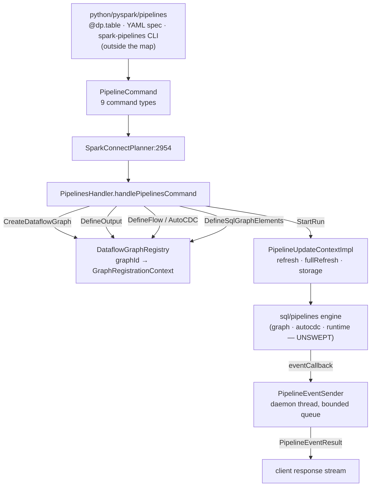

The smallest group in the map, and the one whose boundary matters most. Spark Declarative Pipelines
(SDP) is split across **three places**, only one of which is here:

- **`sql/connect/pipelines/`** — 3 files, the subject of this page: a protobuf command set, a
  handler that registers graph elements, and an event sender. This is the *remote control surface*.
- **`sql/pipelines/`** — a separate subsystem with three groups of its own (`graph`, `autocdc`,
  `pipeline-runtime`), **all unswept**. This is the engine: graph resolution, execution ordering,
  retries, CDC application.
- **`python/pyspark/pipelines/`** — the decorator API (`@dp.table`, `@dp.materialized_view`), the
  YAML spec parser and the `spark-pipelines` CLI. Outside every source root the map indexes, so
  no sweep can reach it.

Reading only this page tells you how a pipeline definition *travels* and how a run is *started and
reported*. It does not tell you how the graph is resolved or how flows are ordered — that is the
`sql/pipelines` subsystem, and it is the natural next sweep.

---

## The pipelines command set — nine commands, six implemented

**What it is:** `pipelines.proto` defines a `PipelineCommand` with a nine-way `oneof`, carried
inside an ordinary Connect `ExecutePlan`. A pipeline definition is therefore not a plan — it is a
sequence of commands that build up server-side graph state, followed by one that runs it.

**Anchor files:**

- [pipelines.proto:34](https://github.com/apache/spark/blob/v4.2.0/sql/connect/common/src/main/protobuf/spark/connect/pipelines.proto#L34) — the `oneof`: `CreateDataflowGraph`, `DefineOutput`, `DefineFlow`, `DropDataflowGraph`, `StartRun`, `DefineSqlGraphElements`, `GetQueryFunctionExecutionSignalStream`, `DefineFlowQueryFunctionResult`, `ExecuteOutputFlows`, plus an `Any extension = 999`
- [pipelines.proto:317](https://github.com/apache/spark/blob/v4.2.0/sql/connect/common/src/main/protobuf/spark/connect/pipelines.proto#L317) — `OutputType`: `MATERIALIZED_VIEW`, `TABLE`, `TEMPORARY_VIEW`, `SINK` — with a deliberate unset default "Should not be used"
- [pipelines.proto:296](https://github.com/apache/spark/blob/v4.2.0/sql/connect/common/src/main/protobuf/spark/connect/pipelines.proto#L296) — `PipelineCommandResult`: most commands return nothing; only graph creation, output definition and flow definition return anything
- [pipelines.proto:331](https://github.com/apache/spark/blob/v4.2.0/sql/connect/common/src/main/protobuf/spark/connect/pipelines.proto#L331) `PipelineEventResult` / [:335](https://github.com/apache/spark/blob/v4.2.0/sql/connect/common/src/main/protobuf/spark/connect/pipelines.proto#L335) `PipelineEvent` — progress flows back on the same response stream as query results
- [pipelines.proto:343](https://github.com/apache/spark/blob/v4.2.0/sql/connect/common/src/main/protobuf/spark/connect/pipelines.proto#L343) — `SourceCodeLocation`: file name, line number and the top-level pipeline file, carried with every definition
- [pipelines.proto:360](https://github.com/apache/spark/blob/v4.2.0/sql/connect/common/src/main/protobuf/spark/connect/pipelines.proto#L360) — `PipelineQueryFunctionExecutionSignal`, whose `flow_names` field is **deprecated since 4.2** in favour of structured `flow_identifiers`
- [pipelines.proto:371](https://github.com/apache/spark/blob/v4.2.0/sql/connect/common/src/main/protobuf/spark/connect/pipelines.proto#L371) — `PipelineAnalysisContext`, ridden along in the request's `UserContext` extensions

!!! warning "Three of the nine commands are declared but not implemented at 4.2.0"

    `PipelinesHandler.handlePipelinesCommand` matches six cases and ends
    `case other => throw new UnsupportedOperationException`. `ExecuteOutputFlows` (added by
    SPARK-55264 in 4.2.0), `GetQueryFunctionExecutionSignalStream` and
    `DefineFlowQueryFunctionResult` all fall through it. The proto is deliberately ahead of the
    server — these are the eager-analysis and single-output-execution paths still landing — but a
    client built against the schema rather than the handler gets a bare
    `UnsupportedOperationException` rather than a typed error.

**Configs:** none read at this layer

**Maps to topics:** A11

---

## PipelinesHandler — the command dispatch and its session state

**What it is:** 670 lines that translate protobuf into calls on the `sql/pipelines` graph builder.
It is deliberately thin: it holds no execution logic, and it passes the planner's transform
functions *down* so that the pipelines module never has to depend on Spark Connect.

**Anchor files:**

- [PipelinesHandler.scala:65](https://github.com/apache/spark/blob/v4.2.0/sql/connect/server/src/main/scala/org/apache/spark/sql/connect/pipelines/PipelinesHandler.scala#L65) — `handlePipelinesCommand`, taking `transformRelationFunc` and `transformExpressionFunc` as **parameters**: the inversion that keeps the dependency one-way
- [SparkConnectPlanner.scala:2954](https://github.com/apache/spark/blob/v4.2.0/sql/connect/server/src/main/scala/org/apache/spark/sql/connect/planner/SparkConnectPlanner.scala#L2954) — the single call site, inside the ordinary command dispatch the [client-server sweep](sql-connect-client-server.md) covers
- [PipelinesHandler.scala:74](https://github.com/apache/spark/blob/v4.2.0/sql/connect/server/src/main/scala/org/apache/spark/sql/connect/pipelines/PipelinesHandler.scala#L74) — the dispatch itself, and at [:73](https://github.com/apache/spark/blob/v4.2.0/sql/connect/server/src/main/scala/org/apache/spark/sql/connect/pipelines/PipelinesHandler.scala#L73) the note that most commands return an empty result

!!! info "The pipelines module does not know Connect exists"

    The handler passes a plain `PipelineEvent => Unit` callback into the engine rather than the
    `responseObserver`, "so that the pipelines module does not need to take a dependency on
    SparkConnect". That is why `sql/pipelines` is a separate, independently swept subsystem, and
    why the same engine could in principle be driven from a non-Connect entry point.

**Configs:** none read directly

**Maps to topics:** A11

---

## DataflowGraphRegistry — a graph per id, per session

**What it is:** 77 lines, and the whole of the server's pipeline state model: a
`ConcurrentHashMap[String, GraphRegistrationContext]` hanging off the `SessionHolder`. A client
creates a graph, gets a UUID back, and every subsequent command names that id.

**Anchor files:**

- [DataflowGraphRegistry.scala:32](https://github.com/apache/spark/blob/v4.2.0/sql/connect/server/src/main/scala/org/apache/spark/sql/connect/pipelines/DataflowGraphRegistry.scala#L32) — the map
- [DataflowGraphRegistry.scala:39](https://github.com/apache/spark/blob/v4.2.0/sql/connect/server/src/main/scala/org/apache/spark/sql/connect/pipelines/DataflowGraphRegistry.scala#L39) — `createDataflowGraph`, minting a `UUID` and capturing the default catalog, database and SQL conf **at creation time**
- [DataflowGraphRegistry.scala:55](https://github.com/apache/spark/blob/v4.2.0/sql/connect/server/src/main/scala/org/apache/spark/sql/connect/pipelines/DataflowGraphRegistry.scala#L55) — `getDataflowGraphOrThrow`, whose failure is the typed `DATAFLOW_GRAPH_NOT_FOUND`
- [PipelinesHandler.scala:190](https://github.com/apache/spark/blob/v4.2.0/sql/connect/server/src/main/scala/org/apache/spark/sql/connect/pipelines/PipelinesHandler.scala#L190) — the catalog/database defaults fall back to the session's *current* catalog and database, logged when they do

!!! warning "A graph lives and dies with the Connect session"

    The registry hangs off `SessionHolder`, so the 60-minute idle session timeout the
    [client-server sweep](sql-connect-client-server.md) documents takes every registered dataflow
    graph with it. A definition phase that pauses — a notebook left open between defining tables and
    calling start — comes back to `DATAFLOW_GRAPH_NOT_FOUND`. There is no persistence and no
    reattach for graph state, unlike execution state.

!!! info "Defaults are frozen when the graph is created, not when a flow is defined"

    `CreateDataflowGraph` captures `defaultCatalog`, `defaultDatabase` and `defaultSqlConf` once.
    A later `USE CATALOG` in the same session does not change how subsequent unqualified table
    names in that graph resolve.

**Configs:** none

**Maps to topics:** A11

---

## Defining outputs — four output types and identifier qualification

**What it is:** `DefineOutput` registers a table, materialized view, temporary view or sink into the
graph. The handler qualifies the name against the graph's defaults, converts the schema (from
either a proto `DataType` or a DDL string), and records where in the user's source file it came
from.

**Anchor files:**

- [PipelinesHandler.scala:235](https://github.com/apache/spark/blob/v4.2.0/sql/connect/server/src/main/scala/org/apache/spark/sql/connect/pipelines/PipelinesHandler.scala#L235) — `defineOutput`, branching on `OutputType` at [:243](https://github.com/apache/spark/blob/v4.2.0/sql/connect/server/src/main/scala/org/apache/spark/sql/connect/pipelines/PipelinesHandler.scala#L243) (table / materialized view), [:285](https://github.com/apache/spark/blob/v4.2.0/sql/connect/server/src/main/scala/org/apache/spark/sql/connect/pipelines/PipelinesHandler.scala#L285) (temporary view), [:304](https://github.com/apache/spark/blob/v4.2.0/sql/connect/server/src/main/scala/org/apache/spark/sql/connect/pipelines/PipelinesHandler.scala#L304) (sink)
- [PipelinesHandler.scala:283](https://github.com/apache/spark/blob/v4.2.0/sql/connect/server/src/main/scala/org/apache/spark/sql/connect/pipelines/PipelinesHandler.scala#L283) — `isStreamingTable = output.getOutputType == TABLE`: **a `TABLE` is the streaming form and a `MATERIALIZED_VIEW` is the batch form** — the two share a code path and differ by this one flag
- [PipelinesHandler.scala:258](https://github.com/apache/spark/blob/v4.2.0/sql/connect/server/src/main/scala/org/apache/spark/sql/connect/pipelines/PipelinesHandler.scala#L258) — the schema may arrive as a proto `DataType` **or** a DDL string, parsed by `StructType.fromDDL` (see the [types & parser sweep](sql-catalyst-types-parser.md))
- [PipelinesHandler.scala:244](https://github.com/apache/spark/blob/v4.2.0/sql/connect/server/src/main/scala/org/apache/spark/sql/connect/pipelines/PipelinesHandler.scala#L244) — `GraphIdentifierManager.parseAndQualifyTableIdentifier`, qualifying against the graph's defaults; the resolved identifier is returned to the client so both sides agree on the full name
- [PipelinesHandler.scala:273](https://github.com/apache/spark/blob/v4.2.0/sql/connect/server/src/main/scala/org/apache/spark/sql/connect/pipelines/PipelinesHandler.scala#L273) — the `QueryOrigin` built from `SourceCodeLocation`, tagged with `QueryOriginType.Table` or `.View`

!!! info "The names in the proto are not the names in the catalog"

    Every `DefineOutput` and `DefineFlow` response carries a `ResolvedIdentifier` — catalog,
    namespace, table — because the client sent an unqualified name and the server qualified it
    against defaults frozen at graph creation. When a pipeline writes to an unexpected catalog,
    this response is where the divergence is visible, and the `CreateDataflowGraph` defaults are
    the cause.

**Configs:** none

**Maps to topics:** A11

---

## Defining flows and the source-code origin trail

**What it is:** a *flow* is the query that populates an output. `DefineFlow` carries a Connect
relation, which the handler converts using the planner's transform function — so a pipeline flow is
an ordinary DataFrame plan that happens to have been declared rather than executed.

**Anchor files:**

- [PipelinesHandler.scala:327](https://github.com/apache/spark/blob/v4.2.0/sql/connect/server/src/main/scala/org/apache/spark/sql/connect/pipelines/PipelinesHandler.scala#L327) — `defineFlow`, and at [:396](https://github.com/apache/spark/blob/v4.2.0/sql/connect/server/src/main/scala/org/apache/spark/sql/connect/pipelines/PipelinesHandler.scala#L396) the branch between a plain relation flow and an AutoCDC flow
- [PipelinesHandler.scala:221](https://github.com/apache/spark/blob/v4.2.0/sql/connect/server/src/main/scala/org/apache/spark/sql/connect/pipelines/PipelinesHandler.scala#L221) — `defineSqlGraphElements`: the **SQL** path, where a whole `.sql` file is parsed and every dataset and flow in it registered at once via `SqlGraphRegistrationContext`
- [PipelinesHandler.scala:313](https://github.com/apache/spark/blob/v4.2.0/sql/connect/server/src/main/scala/org/apache/spark/sql/connect/pipelines/PipelinesHandler.scala#L313) — `QueryOrigin` again, this time for flows

!!! info "Source-code location is threaded through the whole definition path"

    Every output and flow carries `filePath`, `line` and the top-level pipeline file into a
    `QueryOrigin` on the graph element. That is what lets a pipeline error point at the line of the
    Python or SQL file that declared the offending dataset rather than at a generated plan — the
    same idea as the `Origin` / `CurrentOrigin` machinery in catalyst that the
    [framework sweep](sql-catalyst-framework.md) covers, carried across a network boundary instead
    of a thread-local.

**Configs:** none

**Maps to topics:** A11

---

## AutoCDC over Connect — the 4.2.0 declarative SCD API

**What it is:** **new in 4.2.0** (SPARK-56650): a declarative change-data-capture flow. You name a
source stream, the key columns, a `sequence_by` expression that orders changes, and the engine
applies inserts, updates and deletes into the target — SCD Type 1 or Type 2 — without you writing a
`MERGE`.

**Anchor files:**

- [PipelinesHandler.scala:421](https://github.com/apache/spark/blob/v4.2.0/sql/connect/server/src/main/scala/org/apache/spark/sql/connect/pipelines/PipelinesHandler.scala#L421) — `buildAutoCdcFlow`
- [PipelinesHandler.scala:436](https://github.com/apache/spark/blob/v4.2.0/sql/connect/server/src/main/scala/org/apache/spark/sql/connect/pipelines/PipelinesHandler.scala#L436) — the two required fields, each with its own typed error: `AUTOCDC_MISSING_SOURCE`, `AUTOCDC_MISSING_SEQUENCE_BY`
- [PipelinesHandler.scala:444](https://github.com/apache/spark/blob/v4.2.0/sql/connect/server/src/main/scala/org/apache/spark/sql/connect/pipelines/PipelinesHandler.scala#L444) — the source arrives as a **table name string**, modelled server-side as a streaming `UnresolvedRelation` so ordinary flow analysis resolves it against the rest of the graph
- [PipelinesHandler.scala:451](https://github.com/apache/spark/blob/v4.2.0/sql/connect/server/src/main/scala/org/apache/spark/sql/connect/pipelines/PipelinesHandler.scala#L451) — key columns must be plain column references: anything else is `AUTOCDC_NON_COLUMN_IDENTIFIER`
- [PipelinesHandler.scala:462](https://github.com/apache/spark/blob/v4.2.0/sql/connect/server/src/main/scala/org/apache/spark/sql/connect/pipelines/PipelinesHandler.scala#L462) — include-list and exclude-list are mutually exclusive: `AUTOCDC_BOTH_COLUMN_LIST_AND_EXCEPT_COLUMN_LIST`
- The engine side is `sql/pipelines/autocdc/` — its own group, **unswept**

!!! warning "Three AutoCDC options are accepted by the API and ignored by the engine"

    Two in-source TODOs at [PipelinesHandler.scala:432](https://github.com/apache/spark/blob/v4.2.0/sql/connect/server/src/main/scala/org/apache/spark/sql/connect/pipelines/PipelinesHandler.scala#L432)
    say so explicitly:

    - `apply_as_truncates` — declared on `AutoCdcFlowDetails`, "not yet honored by the engine"
      (SPARK-57092), pending SCD1 truncate support
    - `ignore_null_updates_column_list` and `ignore_null_updates_except_column_list` — likewise
      (SPARK-57093), pending SCD1 ignore-null support

    They are validated as far as the proto and then dropped. Setting them changes nothing and
    raises nothing — the worst failure mode a declarative API has, because the pipeline reports
    success while doing something other than what was declared. Check these SPARK issues against
    your Spark version before relying on either.

    **Refinement from the [autocdc sweep](sql-pipelines-autocdc.md) (2026-08-07):** none of the
    three fields exists on PySpark's `AutoCdcFlow` dataclass (`python/pyspark/pipelines/flow.py`),
    so a PySpark user cannot set them at all — they are unreachable rather than merely inert. The
    hazard is real only for a client built directly against the protobuf schema.

**Configs:** none at this layer

**Maps to topics:** A11, E8

---

## StartRun — refresh selection, dry runs and the storage requirement

**What it is:** the command that turns a registered graph into an execution. It resolves which
tables to refresh, which to fully refresh, and hands a `PipelineUpdateContextImpl` to the engine.

**Anchor files:**

- [PipelinesHandler.scala:514](https://github.com/apache/spark/blob/v4.2.0/sql/connect/server/src/main/scala/org/apache/spark/sql/connect/pipelines/PipelinesHandler.scala#L514) — `startRun`
- [PipelinesHandler.scala:620](https://github.com/apache/spark/blob/v4.2.0/sql/connect/server/src/main/scala/org/apache/spark/sql/connect/pipelines/PipelinesHandler.scala#L620) — `createTableFilters`, with three rejected combinations: `refresh` + `fullRefreshAll`, `fullRefresh` + `fullRefreshAll`, and any table named in **both** refresh lists
- [PipelinesHandler.scala:646](https://github.com/apache/spark/blob/v4.2.0/sql/connect/server/src/main/scala/org/apache/spark/sql/connect/pipelines/PipelinesHandler.scala#L646) — the default when nothing is selected: `AllTables` refresh, `NoTables` full refresh
- [PipelinesHandler.scala:545](https://github.com/apache/spark/blob/v4.2.0/sql/connect/server/src/main/scala/org/apache/spark/sql/connect/pipelines/PipelinesHandler.scala#L545) — **storage is mandatory**, validated server-side: `"Storage must be specified to start a run."`
- [PipelinesHandler.scala:558](https://github.com/apache/spark/blob/v4.2.0/sql/connect/server/src/main/scala/org/apache/spark/sql/connect/pipelines/PipelinesHandler.scala#L558) — `dryRunPipeline()` versus `runPipeline()`: a dry run resolves and validates the whole graph without executing it
- [PipelinesHandler.scala:535](https://github.com/apache/spark/blob/v4.2.0/sql/connect/server/src/main/scala/org/apache/spark/sql/connect/pipelines/PipelinesHandler.scala#L535) — the failure-event dance: a `RunProgress(FAILED)` event is **captured and not forwarded**, then rethrown after the run, so the client sees the error once rather than twice; `RunProgress(CANCELED)` throws immediately
- [PipelinesHandler.scala:557](https://github.com/apache/spark/blob/v4.2.0/sql/connect/server/src/main/scala/org/apache/spark/sql/connect/pipelines/PipelinesHandler.scala#L557) — `sessionHolder.cachePipelineExecution`, so a running pipeline is addressable for later commands

!!! info "A dry run is the cheapest way to validate a pipeline"

    `dry = true` runs the whole resolution path — identifier qualification, flow analysis, graph
    ordering — and stops before execution. It catches unresolved columns, cyclic dependencies and
    missing sources without touching storage, which makes it the natural CI check for a pipeline
    definition.

**Configs:** none read here; the run itself is governed by the `spark.sql.pipelines.execution.*`
family read in **sql/pipelines** (see the config table below)

**Maps to topics:** A11

---

## PipelineEventSender — asynchronous events and what gets dropped

**What it is:** progress reporting. The engine emits `PipelineEvent`s synchronously on the
execution thread; the sender hands them to a single daemon thread so that a slow client cannot
block the pipeline. The interesting part is the backpressure policy.

**Anchor files:**

- [PipelineEventSender.scala:42](https://github.com/apache/spark/blob/v4.2.0/sql/connect/server/src/main/scala/org/apache/spark/sql/connect/pipelines/PipelineEventSender.scala#L42) — the class, `AutoCloseable` so `Using.resource` guarantees a flush
- [PipelineEventSender.scala:49](https://github.com/apache/spark/blob/v4.2.0/sql/connect/server/src/main/scala/org/apache/spark/sql/connect/pipelines/PipelineEventSender.scala#L49) — `queueCapacity` from `spark.sql.pipelines.event.queue.capacity` (1000) — the **one config in the whole `spark.sql.pipelines.*` family read by this group**
- [PipelineEventSender.scala:54](https://github.com/apache/spark/blob/v4.2.0/sql/connect/server/src/main/scala/org/apache/spark/sql/connect/pipelines/PipelineEventSender.scala#L54) — a single daemon thread named for the session
- [PipelineEventSender.scala:94](https://github.com/apache/spark/blob/v4.2.0/sql/connect/server/src/main/scala/org/apache/spark/sql/connect/pipelines/PipelineEventSender.scala#L94) — `shouldEnqueueEvent`, the policy: `RunProgress` **always**, terminal `FlowProgress` **always**, everything else **only if the queue has room**
- [PipelineEventSender.scala:118](https://github.com/apache/spark/blob/v4.2.0/sql/connect/server/src/main/scala/org/apache/spark/sql/connect/pipelines/PipelineEventSender.scala#L118) — `shutdown` waits with `Long.MaxValue` timeout, "disregard the timeout since we want all events to be processed"
- [PipelineEventSender.scala:90](https://github.com/apache/spark/blob/v4.2.0/sql/connect/server/src/main/scala/org/apache/spark/sql/connect/pipelines/PipelineEventSender.scala#L90) — sending after shutdown is an explicit `IllegalStateException` rather than a silent no-op

!!! warning "Intermediate progress events are dropped under backpressure, silently"

    Above 1000 queued events, anything that is not a `RunProgress` or a *terminal* `FlowProgress`
    is discarded with no log line and no gap marker. Run outcomes and flow completions always
    survive, so correctness of the final report is preserved — but a UI or log consumer counting
    intermediate events will under-count on a large or slow-consuming pipeline. Raise
    `spark.sql.pipelines.event.queue.capacity` if you are building tooling on the event stream.

!!! info "Failed-run events are deliberately not forwarded"

    `startRun`'s callback captures a `RunProgress(FAILED)` event instead of sending it, then
    rethrows it after the run completes. The comment says why: the failure already propagates as an
    exception, and forwarding the event too would show the client the same error twice.

**Configs:** `spark.sql.pipelines.event.queue.capacity` (1000, 4.1.0)

**Maps to topics:** A11, E3

---

## The declarative guarantee — blocking side-effecting SQL

**What it is:** the enforcement that makes "declarative" true. A pipeline definition is evaluated
on the server, so nothing stops a user from putting `CREATE TABLE` or `INSERT` in a flow function.
`blockUnsupportedSqlCommand` refuses them.

**Anchor files:**

- [PipelinesHandler.scala:152](https://github.com/apache/spark/blob/v4.2.0/sql/connect/server/src/main/scala/org/apache/spark/sql/connect/pipelines/PipelinesHandler.scala#L152) — the check, with the intent stated in the scaladoc: "Pipeline definitions should be declarative and side-effect free"
- [PipelinesHandler.scala:153](https://github.com/apache/spark/blob/v4.2.0/sql/connect/server/src/main/scala/org/apache/spark/sql/connect/pipelines/PipelinesHandler.scala#L153) — the **allowlist**: `DescribeRelation`, `DescribeTablePartition`, `ShowTables`, `ShowTableProperties`, `ShowNamespacesCommand`, `ShowColumns`, `ShowFunctions`, `ShowViews`, `ShowCatalogsCommand`, `ShowCreateTable` — ten read-only commands, and nothing else
- [PipelinesHandler.scala:170](https://github.com/apache/spark/blob/v4.2.0/sql/connect/server/src/main/scala/org/apache/spark/sql/connect/pipelines/PipelinesHandler.scala#L170) — everything that is a `Command` is blocked, **plus** seven plans that are not `Command` subclasses but have side effects: `CreateTableAsSelect`, `CreateTable`, `CreateView`, `InsertIntoStatement`, `RenameTable`, `CreateNamespace`, `DropView`
- [PipelinesHandler.scala:180](https://github.com/apache/spark/blob/v4.2.0/sql/connect/server/src/main/scala/org/apache/spark/sql/connect/pipelines/PipelinesHandler.scala#L180) — the error: `UNSUPPORTED_PIPELINE_SPARK_SQL_COMMAND`

!!! warning "The scaladoc calls it 'best-effort', and it is an allowlist plus a denylist"

    The check is `Command` (deny) minus ten allowlisted read-only commands, plus seven explicitly
    named non-`Command` plans. A side-effecting plan that is neither a `Command` nor on that list
    of seven passes. The design is deliberate and stated — "we block known problematic commands
    while allowing a curated set of read-only operations" — but it means the declarative guarantee
    is enforced by enumeration, not by construction. If you add a custom command via a Connect
    plugin, this check does not know about it.

**Configs:** none

**Maps to topics:** A11

---

## PipelineAnalysisContext — knowing you are inside a flow function

**What it is:** a small but structurally interesting mechanism. A pipeline's flow function is
evaluated by ordinary Connect analysis, so the server needs to know that an incoming
`AnalyzePlan`/`ExecutePlan` is happening *inside* a pipeline definition. That signal rides in the
request's `UserContext` extensions rather than in the plan.

**Anchor files:**

- [PipelineAnalysisContextUtils.scala:33](https://github.com/apache/spark/blob/v4.2.0/sql/connect/server/src/main/scala/org/apache/spark/sql/connect/utils/PipelineAnalysisContextUtils.scala#L33) — the object, unpacking typed extensions out of the `UserContext`'s `Any` list
- [PipelineAnalysisContextUtils.scala:52](https://github.com/apache/spark/blob/v4.2.0/sql/connect/server/src/main/scala/org/apache/spark/sql/connect/utils/PipelineAnalysisContextUtils.scala#L52) `hasPipelineAnalysisContext` and [:57](https://github.com/apache/spark/blob/v4.2.0/sql/connect/server/src/main/scala/org/apache/spark/sql/connect/utils/PipelineAnalysisContextUtils.scala#L57) `isInsidePipelineFlowFunction` — the two predicates
- [pipelines.proto:371](https://github.com/apache/spark/blob/v4.2.0/sql/connect/common/src/main/protobuf/spark/connect/pipelines.proto#L371) — the message: dataflow graph id, the top-level pipeline file, and an optional flow name

!!! info "`UserContext.extensions` is a general side-channel"

    Connect's `UserContext` carries a repeated `google.protobuf.Any`, and pipelines uses it to
    attach out-of-band context to a request that is otherwise an ordinary plan. It is the same
    forward-compatibility pattern as the `extension = 999` field on `PipelineCommand` and the
    `Any` extension points the [client-server sweep](sql-connect-client-server.md) records on
    relations and commands — worth knowing as the supported way to thread vendor context through
    Connect without changing the schema.

**Configs:** none

**Maps to topics:** A11

---

## Where the engine actually lives

**What it is:** the honest boundary of this page. Everything above registers definitions and starts
a run. The parts a practitioner asks about — how the graph is ordered, what happens when a flow
fails, how a streaming table is incrementally maintained, how CDC is actually applied — are in
`sql/pipelines`, which this map has **not yet swept**.

**Where to look next:**

- [sql/pipelines/graph/](https://github.com/apache/spark/blob/v4.2.0/sql/pipelines/src/main/scala/org/apache/spark/sql/pipelines/graph) — `GraphRegistrationContext`, `DataflowGraph`, `FlowAnalysis`, `GraphIdentifierManager`, `PipelineUpdateContextImpl`, `TriggeredGraphExecution`, `GraphExecution`. This is the `sql/pipelines — graph` group
- [sql/pipelines/autocdc/](https://github.com/apache/spark/blob/v4.2.0/sql/pipelines/src/main/scala/org/apache/spark/sql/pipelines/autocdc) — the SCD1/SCD2 application logic. The `sql/pipelines — autocdc` group
- [sql/pipelines/common/](https://github.com/apache/spark/blob/v4.2.0/sql/pipelines/src/main/scala/org/apache/spark/sql/pipelines/common), [logging/](https://github.com/apache/spark/blob/v4.2.0/sql/pipelines/src/main/scala/org/apache/spark/sql/pipelines/logging), [util/](https://github.com/apache/spark/blob/v4.2.0/sql/pipelines/src/main/scala/org/apache/spark/sql/pipelines/util) — `FlowStatus`, `PipelineEvent`, `RunProgress`, `FlowProgress`. The `sql/pipelines — pipeline-runtime` group
- `python/pyspark/pipelines/` — the `@dp.table` / `@dp.materialized_view` decorators, the YAML spec format and the `spark-pipelines` CLI. **Outside every source root the map indexes**, like the PySpark Connect client

!!! info "Retry and concurrency behaviour is in `TriggeredGraphExecution`, not here"

    Six of the seven `spark.sql.pipelines.*` configs — `maxConcurrentFlows` (16),
    `maxFlowRetryAttempts` (2), the two watchdog retry-time bounds,
    `execution.streamstate.pollingInterval` and `timeoutMsForTerminationJoinAndLock` — are read by
    `TriggeredGraphExecution` and `GraphExecution` in `sql/pipelines`. If you came here looking for
    what happens when a flow fails, that is the group to sweep next.

**Maps to topics:** A11

---

## Breadth check 1 — the config slice

The whole `spark.sql.pipelines.*` family is **7 keys**, all added in **4.1.0**, all defined in
`sql/catalyst`'s `SQLConf` — which is what this group's scope means by "configs:
`spark.sql.pipelines.*` in sql/catalyst". Grepping for readers (the practice established on the
[expressions sweep](sql-catalyst-expressions.md)) gives an unusually clean answer:

| Config | Default | Read by |
|---|---|---|
| `spark.sql.pipelines.event.queue.capacity` | 1000 | **In scope** — `PipelineEventSender.scala:49` |
| `spark.sql.pipelines.maxFlowRetryAttempts` | 2 | **sql/pipelines** — `GraphExecution.scala:203` |
| `spark.sql.pipelines.timeoutMsForTerminationJoinAndLock` | 1 h | **sql/pipelines** — `GraphExecution.scala:215` |
| `spark.sql.pipelines.execution.maxConcurrentFlows` | 16 | **sql/pipelines** — `TriggeredGraphExecution.scala:132` |
| `spark.sql.pipelines.execution.watchdog.maxRetryTime` | 3600 s | **sql/pipelines** — `TriggeredGraphExecution.scala:72` |
| `spark.sql.pipelines.execution.watchdog.minRetryTime` | 5 s | **sql/pipelines** — `TriggeredGraphExecution.scala:73` |
| `spark.sql.pipelines.execution.streamstate.pollingInterval` | 1 s | **sql/pipelines** — `TriggeredGraphExecution.scala:255` |

!!! warning "The scope claims a config family this group barely reads"

    `groups.yaml` gives this group "configs: `spark.sql.pipelines.*` in sql/catalyst", but **one of
    seven** is read here; the other six are read by the `sql/pipelines` engine, which has three
    groups of its own. That is a scope statement written before `sql/pipelines` was carved, and it
    is now misleading: it invites a reader to look for retry and concurrency behaviour on this
    page, where none of it lives. Recorded rather than acted on — moving the claim is a
    `regroup sql/connect` / `regroup sql/pipelines` decision, and the six keys are properly
    attributed in the table above meanwhile.

## Breadth check 2 — the packages

The group's scope names three classes and they are three files; all are cited, along with
`utils/PipelineAnalysisContextUtils.scala` (which belongs to this group despite sitting in the
shared `connect/utils/` package — the [client-server sweep](sql-connect-client-server.md)
deliberately left it alone) and `common/src/main/protobuf/spark/connect/pipelines.proto`.

Nothing in scope was left out, so `status: complete` is a claim about a genuinely small surface. The
subsystem's other group, `client-server`, was swept on 2026-07-27; `sql/connect` is now fully swept.

**Not swept, and named so it is not mistaken for covered:** the `sql/pipelines` subsystem (three
groups) and `python/pyspark/pipelines/`. See "Where the engine actually lives" above.

## Overlapping topic traces

`check_drift.py --sweeps` reports no topic traces overlapping this group's codes: there is no
`topics/a11.md` and no `topics/e8.md`. As with E9 in the [client-server sweep](sql-connect-client-server.md),
**A11 is a written learning-path topic with no source trace**, and this page is the first
source-derived material behind it — covering the definition and control surface only.

---

## Sweep log

| Date | Spark | What changed |
|---|---|---|
| 2026-07-27 | 4.2.0 | First sweep. 11 concepts, **no new topics proposed** — every concept maps onto A11, with E8 for AutoCDC and E3 for the event stream, and nothing here warranted a topic of its own. Three files plus a proto, so the value is in the boundary and the gotchas rather than in volume. Findings worth carrying: **three of the nine proto commands are declared but not implemented** at 4.2.0 (`ExecuteOutputFlows`, added this release, plus the two eager-analysis commands) and fall through to a bare `UnsupportedOperationException`; **three AutoCDC options are accepted and silently ignored** by the engine per in-source TODOs (SPARK-57092 `apply_as_truncates`, SPARK-57093 the two ignore-null lists) — the worst failure mode a declarative API has; a dataflow graph lives on the `SessionHolder` and so **dies with the 60-minute idle session**, with no persistence and no reattach; catalog and database defaults are frozen at `CreateDataflowGraph`, not at flow definition; a `TABLE` is the *streaming* form and a `MATERIALIZED_VIEW` the batch form, differing by one boolean on a shared code path; intermediate progress events are **dropped above 1000 queued** with no marker, while run outcomes and terminal flow events always survive; and the declarative guarantee is enforced by a hand-maintained allowlist of ten read-only commands plus a denylist of seven non-`Command` plans, described in its own scaladoc as best-effort. Also recorded: this group's scope claims the whole `spark.sql.pipelines.*` family but reads **one of seven** keys — the other six belong to the `sql/pipelines` engine, which is three unswept groups and the natural next sweep. A11 had no source trace before this page. |
