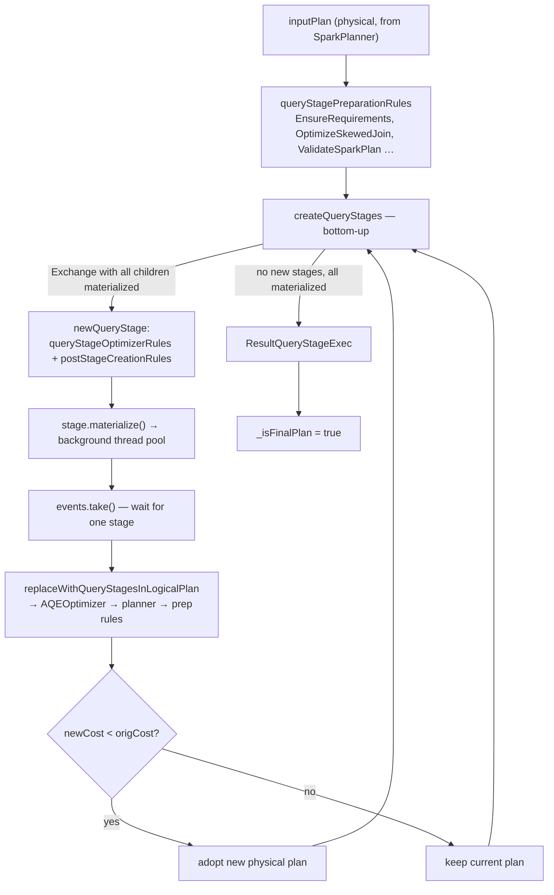

Twenty-seven files, ~4400 lines, and the only part of Spark that changes the physical plan *while
the query is running*. The group owns `execution/adaptive/` in full. Its rules are small; the
framework class (`AdaptiveSparkPlanExec`, 991 lines) is where the difficulty lives, because it is a
loop that alternates between physical plan surgery and logical re-optimization while stages
materialize on a background thread pool.

Three things to hold onto before reading further, all of which contradict the usual mental model of
AQE as "Spark fixes the plan with real statistics":

- **The statistic is one number per shuffle partition.** `MapOutputStatistics.bytesByPartitionId`
  is the entire runtime input to coalescing, skew detection and broadcast conversion. There are no
  column statistics, no cardinality estimates, no distinct counts.
- **A re-plan is adopted only if it does not increase a shuffle count.** Data size never enters the
  adoption decision (see the cost-evaluation concept, and proposed topic A31).
- **Most of AQE's rules can be silently reverted.** Anything extending `AQEShuffleReadRule` is
  discarded if `ValidateRequirements` says the result breaks a distribution requirement, and the
  revert is logged at `DEBUG`.

**Config slice.** `sql/core` registers no configs of its own; every key these rules read is declared
in catalyst's `SQLConf.scala`. The slice was taken as:

```
subsystem == 'sql/catalyst' AND key matches
  \.adaptive\.|shuffle\.partitions|autoBroadcastJoinThreshold|\.exchange\.reuse|
  localShuffleReader|rebalance|coalesceShufflePartitions|advisoryPartitionSize|
  canChangeCachedPlanOutputPartitioning|subquery|\.cbo\.
```

39 keys, of which 29 tie to a concept here. Full accounting in the breadth table at the end.



---

## The AQE loop — createQueryStages, materialize, re-optimize, repeat

**What it is:** `AdaptiveSparkPlanExec` is a `LeafExecNode` that hides an entire execution engine.
Every action (`executeCollect`, `doExecute`, `executeTake`, `doExecuteBroadcast`) funnels into
`withFinalPlanUpdate`, which runs a `while (!result.allChildStagesMaterialized)` loop: create the
stages that are ready, start them materializing asynchronously, block on the completion queue,
re-optimize the remainder, repeat.

**Code path:** `Dataset.collect` → `AdaptiveSparkPlanExec.executeCollect` → `withFinalPlanUpdate`
→ `createQueryStages` → `stage.materialize()` → `events.take()` → `reOptimize` → `createQueryStages`
→ … → `ResultQueryStageExec`

**Anchor files:**

- [AdaptiveSparkPlanExec.scala:69](https://github.com/apache/spark/blob/v4.2.0/sql/core/src/main/scala/org/apache/spark/sql/execution/adaptive/AdaptiveSparkPlanExec.scala#L69) — the class, and the `lock` on line 77: `withFinalPlanUpdate` is `lock.synchronized`, so two threads collecting the same `Dataset` serialize
- [AdaptiveSparkPlanExec.scala:268](https://github.com/apache/spark/blob/v4.2.0/sql/core/src/main/scala/org/apache/spark/sql/execution/adaptive/AdaptiveSparkPlanExec.scala#L268) — `withFinalPlanUpdate`, the loop itself
- [AdaptiveSparkPlanExec.scala:293](https://github.com/apache/spark/blob/v4.2.0/sql/core/src/main/scala/org/apache/spark/sql/execution/adaptive/AdaptiveSparkPlanExec.scala#L293) — SPARK-33933: new stages are sorted so `BroadcastQueryStageExec` is submitted first, because a broadcast that waits behind shuffle tasks for its scheduling slot can hit `spark.sql.broadcastTimeout` even though nothing is slow
- [AdaptiveSparkPlanExec.scala:328](https://github.com/apache/spark/blob/v4.2.0/sql/core/src/main/scala/org/apache/spark/sql/execution/adaptive/AdaptiveSparkPlanExec.scala#L328) — `events.take()` then `events.drainTo(rem)`: it waits for **one** stage but processes every stage that finished around the same time, to cut the number of re-planning rounds
- [AdaptiveSparkPlanExec.scala:543](https://github.com/apache/spark/blob/v4.2.0/sql/core/src/main/scala/org/apache/spark/sql/execution/adaptive/AdaptiveSparkPlanExec.scala#L543) — `createQueryStages`, which wraps `createNonResultQueryStages` and handles the three result-stage edge cases
- [AdaptiveSparkPlanExec.scala:598](https://github.com/apache/spark/blob/v4.2.0/sql/core/src/main/scala/org/apache/spark/sql/execution/adaptive/AdaptiveSparkPlanExec.scala#L598) — `createNonResultQueryStages`: the bottom-up traversal. A stage is created **only** when `allChildStagesMaterialized` — this is why AQE cannot re-plan across a stage boundary that has not finished
- [AdaptiveSparkPlanExec.scala:921](https://github.com/apache/spark/blob/v4.2.0/sql/core/src/main/scala/org/apache/spark/sql/execution/adaptive/AdaptiveSparkPlanExec.scala#L921) — `QueryStageCreator`, a daemon cached thread pool of **16**, shared process-wide across every adaptive query
- [AdaptiveSparkPlanExec.scala:961](https://github.com/apache/spark/blob/v4.2.0/sql/core/src/main/scala/org/apache/spark/sql/execution/adaptive/AdaptiveSparkPlanExec.scala#L961) — `AdaptiveExecutionContext`: the `subqueryCache`, `stageCache` and `shuffleIds` shared between the main query and all its subqueries

!!! warning "AQE is a driver-side loop, and its thread pool is fixed at 16"

    `QueryStageCreator` is created once in the `AdaptiveSparkPlanExec` companion object with a
    hard-coded pool size of 16 and no config. It only runs the completion callbacks, not the stage
    work itself, so it is rarely the bottleneck — but on a driver running many concurrent adaptive
    queries it is a shared resource, and it is invisible in every tuning guide because there is no
    key to grep for.

**Configs:** `spark.sql.adaptive.enabled` (default `true`), `spark.sql.adaptive.logLevel`
(default `DEBUG` — the plan-change log, which is where "why did AQE do that" is answered)

**Maps to topics:** A2, A1

---

## InsertAdaptiveSparkPlan — the seven ways a query opts out of AQE

**What it is:** the preparation rule that decides whether to wrap the physical plan in an
`AdaptiveSparkPlanExec` at all. `spark.sql.adaptive.enabled` defaults to true, but the rule has six
further escape hatches, and each is a case where "AQE is on" is true at the session level and false
for the query in front of you.

**Code path:** `QueryExecution.preparations` → `InsertAdaptiveSparkPlan.apply` → `applyInternal`
→ `shouldApplyAQE` ∧ `supportAdaptive` → `AdaptiveSparkPlanExec(...)`

**Anchor files:**

- [InsertAdaptiveSparkPlan.scala:51](https://github.com/apache/spark/blob/v4.2.0/sql/core/src/main/scala/org/apache/spark/sql/execution/adaptive/InsertAdaptiveSparkPlan.scala#L51) — `applyInternal`, the match whose cases are the opt-outs, in order:
    1. `!conf.adaptiveExecutionEnabled`
    2. `ExecutedCommandExec` / `CommandResultExec` — commands are never adaptive
    3. `DataWritingCommandExec` where the command is not a `V1WriteCommand`, or planned writes are off — AQE is pushed **below** the write, not around it
    4. streaming with `spark.sql.adaptive.streaming.stateless.enabled = false`
    5. any plan containing a `StatefulOperator` (SPARK-53941)
    6. `!shouldApplyAQE` — no exchange, no distribution requirement, no subquery, no AQE-ed cache
    7. `!supportAdaptive` — some node has no `logicalLink`
- [InsertAdaptiveSparkPlan.scala:110](https://github.com/apache/spark/blob/v4.2.0/sql/core/src/main/scala/org/apache/spark/sql/execution/adaptive/InsertAdaptiveSparkPlan.scala#L110) — `shouldApplyAQE`: the "is AQE even useful" test. A plan with no exchange and no subquery is left alone unless `spark.sql.adaptive.forceApply` is set
- [InsertAdaptiveSparkPlan.scala:126](https://github.com/apache/spark/blob/v4.2.0/sql/core/src/main/scala/org/apache/spark/sql/execution/adaptive/InsertAdaptiveSparkPlan.scala#L126) — `supportAdaptive` / `sanityCheck`: **every** node must carry a `logicalLink`, because re-optimization works on the logical plan and needs to map physical nodes back to it. A custom strategy that drops the link disables AQE for the whole query with no message above `DEBUG`
- [InsertAdaptiveSparkPlan.scala:140](https://github.com/apache/spark/blob/v4.2.0/sql/core/src/main/scala/org/apache/spark/sql/execution/adaptive/InsertAdaptiveSparkPlan.scala#L140) — `buildSubqueryMap`: each subquery is compiled with the **same rule instance**, so all of them share one `stageCache`
- [InsertAdaptiveSparkPlan.scala:167](https://github.com/apache/spark/blob/v4.2.0/sql/core/src/main/scala/org/apache/spark/sql/execution/adaptive/InsertAdaptiveSparkPlan.scala#L167) — `verifyAdaptivePlan` throws `SubqueryAdaptiveNotSupportedException`, caught at :85, which **abandons AQE for the entire query** — a single unsupported subquery turns the whole plan static

!!! warning "One unsupported subquery disables AQE for the whole query"

    `SubqueryAdaptiveNotSupportedException` is caught at the top level and the rule returns the
    original, non-adaptive plan. The only trace is a `WARN`: "`spark.sql.adaptive.enabled` is
    enabled but is not supported for sub-query". If a query you expect to coalesce shows a fixed
    200 partitions, check for this line before touching any threshold.

!!! info "`forceApply` is internal, and it is the right tool for testing"

    `spark.sql.adaptive.forceApply` (default `false`, internal) bypasses `shouldApplyAQE` entirely.
    It is how you make a small query take the adaptive path in a test; it is not a production
    setting, because wrapping exchange-free queries adds a `ResultQueryStageExec` round trip for
    nothing.

**Configs:** `spark.sql.adaptive.enabled`, `spark.sql.adaptive.forceApply`,
`spark.sql.adaptive.streaming.stateless.enabled`

**Maps to topics:** A2

---

## Query stages — five kinds, and what "materialized" means

**What it is:** a query stage is an independent subgraph whose output is materialized before the
rest of the query proceeds. `QueryStageExec` is a `LeafExecNode` wrapping that subgraph; there are
five concrete kinds and they differ in what "materialize" costs.

| Class | Wraps | `materialize()` does | Statistics afterwards |
|---|---|---|---|
| `ShuffleQueryStageExec` | `ShuffleExchangeLike` | `submitShuffleJob()` — a map-only job | `MapOutputStatistics.bytesByPartitionId` |
| `BroadcastQueryStageExec` | `BroadcastExchangeLike` | `submitBroadcastJob()` — collect + broadcast | `runtimeStatistics` from the exchange |
| `TableCacheQueryStageExec` | `InMemoryTableScanLike` | submits a job over `baseCacheRDD()` unless already cached | `runtimeStatistics` from the scan |
| `ResultQueryStageExec` | the whole remaining plan | runs the caller's result handler on its own pool | `Statistics.DUMMY` |
| `ExchangeQueryStageExec` | (abstract base of the first two) | — | — |

**Anchor files:**

- [QueryStageExec.scala:47](https://github.com/apache/spark/blob/v4.2.0/sql/core/src/main/scala/org/apache/spark/sql/execution/adaptive/QueryStageExec.scala#L47) — the abstract base
- [QueryStageExec.scala:99](https://github.com/apache/spark/blob/v4.2.0/sql/core/src/main/scala/org/apache/spark/sql/execution/adaptive/QueryStageExec.scala#L99) — `isMaterialized` is simply `resultOption.get().isDefined` on an `AtomicReference`; `hasFailed` is the same shape over `_error`
- [QueryStageExec.scala:169](https://github.com/apache/spark/blob/v4.2.0/sql/core/src/main/scala/org/apache/spark/sql/execution/adaptive/QueryStageExec.scala#L169) — `ExchangeQueryStageExec` adds `cancel(reason)` and `newReuseInstance`. **Only exchange stages are cancellable** — a table-cache or result stage has no `doCancel`
- [QueryStageExec.scala:198](https://github.com/apache/spark/blob/v4.2.0/sql/core/src/main/scala/org/apache/spark/sql/execution/adaptive/QueryStageExec.scala#L198) — `ShuffleQueryStageExec`; :231 `mapStats` asserts the stage is ready and returns `Option[MapOutputStatistics]` — `None` when the input RDD had zero partitions, which every downstream rule must handle
- [QueryStageExec.scala:214](https://github.com/apache/spark/blob/v4.2.0/sql/core/src/main/scala/org/apache/spark/sql/execution/adaptive/QueryStageExec.scala#L214) — `newReuseInstance` shares `_resultOption` and `_error` with the original, so a reused stage is born already materialized
- [QueryStageExec.scala:284](https://github.com/apache/spark/blob/v4.2.0/sql/core/src/main/scala/org/apache/spark/sql/execution/adaptive/QueryStageExec.scala#L284) — `TableCacheQueryStageExec`: if the scan is already materialized it returns `Future.successful(())`, otherwise it submits a job just to populate the cache

!!! info "A shuffle stage is a map-only job — the reduce side has not run yet"

    `ShuffleQueryStageExec.doMaterialize` calls `submitShuffleJob()`, which runs the map tasks and
    writes shuffle files. The partition sizes AQE then reads are map-output sizes; the reduce tasks
    are launched later by whatever operator reads the stage, with whatever partition specs the AQE
    rules decided on. This is the whole reason AQE can change the post-shuffle partitioning at all.

**Configs:** `spark.sql.resultQueryStage.maxThreadThreshold` (static, default 1024)

**Maps to topics:** A2, I7

---

## ResultQueryStageExec — the final plan is itself a stage

**What it is:** since Spark 4.0 the *final* plan is not executed inline at the end of the loop —
it is wrapped in a `ResultQueryStageExec` and materialized like any other stage, on a dedicated
thread pool, with the caller's result handler as its body.

**Code path:** `createQueryStages` sees no new non-result stages and all children materialized →
`newResultQueryStage` → `optimizeQueryStage(plan, isFinalStage = true)` → `postStageCreationRules`
→ `ResultQueryStageExec` → `doMaterialize` → `SQLExecution.withThreadLocalCaptured`

**Anchor files:**

- [AdaptiveSparkPlanExec.scala:663](https://github.com/apache/spark/blob/v4.2.0/sql/core/src/main/scala/org/apache/spark/sql/execution/adaptive/AdaptiveSparkPlanExec.scala#L663) — `newResultQueryStage`
- [AdaptiveSparkPlanExec.scala:575](https://github.com/apache/spark/blob/v4.2.0/sql/core/src/main/scala/org/apache/spark/sql/execution/adaptive/AdaptiveSparkPlanExec.scala#L575) — the trigger: `allNewStages.isEmpty && allChildStagesMaterialized`
- [AdaptiveSparkPlanExec.scala:549](https://github.com/apache/spark/blob/v4.2.0/sql/core/src/main/scala/org/apache/spark/sql/execution/adaptive/AdaptiveSparkPlanExec.scala#L549) — calling `df.collect()` twice creates a **new** result stage each time, because the handler may differ
- [AdaptiveSparkPlanExec.scala:394](https://github.com/apache/spark/blob/v4.2.0/sql/core/src/main/scala/org/apache/spark/sql/execution/adaptive/AdaptiveSparkPlanExec.scala#L394) — after the loop the result is taken with `getAndUpdate(_ => None)`, dereferencing it for GC; afterwards `resultStage.isMaterialized` is `false` again, by design
- [AdaptiveSparkPlanExec.scala:345](https://github.com/apache/spark/blob/v4.2.0/sql/core/src/main/scala/org/apache/spark/sql/execution/adaptive/AdaptiveSparkPlanExec.scala#L345) — re-optimization is skipped once the plan *is* a `ResultQueryStageExec`: nothing left to re-plan
- [QueryStageExec.scala:315](https://github.com/apache/spark/blob/v4.2.0/sql/core/src/main/scala/org/apache/spark/sql/execution/adaptive/QueryStageExec.scala#L315) — the class; :324 `doMaterialize` runs the handler on `ResultQueryStageExecution`, bridging a Java `CompletableFuture` to a Scala `Promise` and unwrapping `CompletionException`
- [StaticSQLConf.scala:213](https://github.com/apache/spark/blob/v4.2.0/sql/catalyst/src/main/scala/org/apache/spark/sql/internal/StaticSQLConf.scala#L213) — `spark.sql.resultQueryStage.maxThreadThreshold`, static, default **1024**, capped at 1024

!!! info "Why the result stage exists at all"

    Making the final plan a stage means the last leg of the query can be cancelled and re-run like
    any other, and that its execution does not block the AQE thread that is managing the loop. The
    visible consequence is in the SQL tab: the final plan appears as a stage node, and the
    `resultHandler` (`executeCollect`, `execute`, …) runs off the calling thread with thread-locals
    captured explicitly by `SQLExecution.withThreadLocalCaptured`.

**Configs:** `spark.sql.resultQueryStage.maxThreadThreshold`

**Maps to topics:** A2, I7

---

## Runtime statistics — isRuntime, and the one number AQE actually has

**What it is:** the entire bridge between "a stage finished" and "the optimizer knows something new"
is `QueryStageExec.computeStats()`, which produces a `Statistics` with `isRuntime = true`. Every
downstream decision — broadcast conversion, empty-relation elimination, join reordering under AQE —
keys off that flag.

**Anchor files:**

- [QueryStageExec.scala:84](https://github.com/apache/spark/blob/v4.2.0/sql/core/src/main/scala/org/apache/spark/sql/execution/adaptive/QueryStageExec.scala#L84) — `computeStats`: `None` unless materialized, otherwise `Statistics(dataSize, numOutputRows, attributeStats, isRuntime = true)`, with both size and row count floored at 0
- [joins.scala:367](https://github.com/apache/spark/blob/v4.2.0/sql/catalyst/src/main/scala/org/apache/spark/sql/catalyst/optimizer/joins.scala#L367) — `canBroadcastBySize`: `if (plan.stats.isRuntime)` use `spark.sql.adaptive.autoBroadcastJoinThreshold`, **falling back to the static threshold when it is unset**. This is the only consumer of `isRuntime` that a practitioner tunes
- [QueryStageExec.scala:231](https://github.com/apache/spark/blob/v4.2.0/sql/core/src/main/scala/org/apache/spark/sql/execution/adaptive/QueryStageExec.scala#L231) — `mapStats`, the per-partition byte array, is separate from `getRuntimeStatistics` and is what the coalescing and skew rules read directly
- [LogicalQueryStage.scala:55](https://github.com/apache/spark/blob/v4.2.0/sql/core/src/main/scala/org/apache/spark/sql/execution/adaptive/LogicalQueryStage.scala#L55) — `computeStats` on the logical wrapper, with a deliberate correction: a global (no-grouping) aggregate reporting 0 rows is reported as **1**, because such an aggregate always emits a row

!!! warning "AQE's statistics are per-partition byte sizes and nothing else"

    There are no runtime column statistics in this package: `attributeStats` comes from whatever the
    exchange reported and is empty for a shuffle. Skew detection, coalescing and broadcast
    conversion all run off `bytesByPartitionId`, which is itself approximate above 2000 partitions
    (see topic A20). Tuning `skewedPartitionThresholdInBytes` against sizes that were averaged
    before you saw them is the standard way to conclude "AQE skew handling doesn't work".

**Configs:** `spark.sql.adaptive.autoBroadcastJoinThreshold` (unset by default → falls back to
`spark.sql.autoBroadcastJoinThreshold`, 10MB)

**Maps to topics:** A2, A17, A20

---

## LogicalQueryStage — keeping the logical plan in sync so it can be re-optimized

**What it is:** re-optimization runs on the **logical** plan, but the finished work is physical. The
bridge is `LogicalQueryStage`, a logical leaf that carries both the original logical subtree and the
physical snippet that replaced it. Before each re-plan, every stage created since the last plan
update is substituted into the logical plan as one of these; `LogicalQueryStageStrategy` turns them
back into physical plans during planning.

**Code path:** `replaceWithQueryStagesInLogicalPlan` → `AQEOptimizer.execute` →
`planner.plan(ReturnAnswer(optimized))` → `LogicalQueryStageStrategy` → physical plan

**Anchor files:**

- [AdaptiveSparkPlanExec.scala:771](https://github.com/apache/spark/blob/v4.2.0/sql/core/src/main/scala/org/apache/spark/sql/execution/adaptive/AdaptiveSparkPlanExec.scala#L771) — `replaceWithQueryStagesInLogicalPlan`, with a 30-line comment giving the two substitution shapes (integral subtree vs partial subtree) as ASCII diagrams
- [AdaptiveSparkPlanExec.scala:934](https://github.com/apache/spark/blob/v4.2.0/sql/core/src/main/scala/org/apache/spark/sql/execution/adaptive/AdaptiveSparkPlanExec.scala#L934) — `TEMP_LOGICAL_PLAN_TAG`: physical nodes inside a `LogicalQueryStage` are shared across plans, so their normal `logicalLink` gets overwritten; the temp tag is the stable back-pointer, set recursively at :840 and cleared at :848 once a new plan is adopted
- [LogicalQueryStage.scala:38](https://github.com/apache/spark/blob/v4.2.0/sql/core/src/main/scala/org/apache/spark/sql/execution/adaptive/LogicalQueryStage.scala#L38) — the node; :45 adds `REPARTITION_OPERATION` to its tree patterns when it wraps one, so repartition-sensitive rules can still find it
- [LogicalQueryStageStrategy.scala:38](https://github.com/apache/spark/blob/v4.2.0/sql/core/src/main/scala/org/apache/spark/sql/execution/adaptive/LogicalQueryStageStrategy.scala#L38) — the strategy. Its first three cases exist to stop a *finished broadcast* being re-planned into a shuffle: if one side is already a materialized `BroadcastQueryStageExec`, the join is forced to `BroadcastHashJoinExec` (or `BroadcastNestedLoopJoinExec` for identity mode) regardless of what the size tests now say
- [LogicalQueryStageStrategy.scala:89](https://github.com/apache/spark/blob/v4.2.0/sql/core/src/main/scala/org/apache/spark/sql/execution/adaptive/LogicalQueryStageStrategy.scala#L89) — the trivial case: a `LogicalQueryStage` plans to its own `physicalPlan`

!!! info "A broadcast that has already happened cannot be un-broadcast"

    This strategy runs **before** the regular join strategies for exactly that reason: if the larger
    side of a join finishes first and the broadcast is already built, reverting to a sort-merge join
    would throw the broadcast away and add a shuffle. The rule keeps the broadcast. It is also why
    `spark.sql.adaptive.autoBroadcastJoinThreshold` only ever *promotes* a join to broadcast — there
    is no demotion path once the exchange is a materialized stage.

**Maps to topics:** A2, A1

---

## The two rule lists — preparation rules vs query-stage optimizer rules

**What it is:** AQE runs two distinct physical rule lists at two distinct times, and confusing them
is the most common source of "my rule didn't fire". Preparation rules run on the whole plan before
any stage exists (and again on every re-plan); stage-optimizer rules run on one stage's child at
stage-creation time.

**Anchor files:**

- [AdaptiveSparkPlanExec.scala:110](https://github.com/apache/spark/blob/v4.2.0/sql/core/src/main/scala/org/apache/spark/sql/execution/adaptive/AdaptiveSparkPlanExec.scala#L110) — `queryStagePreparationRules`, in order: `CoalesceBucketsInJoin`, `RemoveRedundantProjects`, `EnsureRequirements`, `InsertSortForLimitAndOffset`, `AdjustShuffleExchangePosition`, `ValidateSparkPlan`, `ReplaceHashWithSortAgg`, `RemoveRedundantSorts`, `RemoveRedundantWindowGroupLimits`, `DisableUnnecessaryBucketedScan`, `OptimizeSkewedJoin`, then the injected `queryStagePrepRules`. **Their contract is that the plan must reach a final set of exchanges** — no rule after this point may add or remove an `Exchange`
- [AdaptiveSparkPlanExec.scala:137](https://github.com/apache/spark/blob/v4.2.0/sql/core/src/main/scala/org/apache/spark/sql/execution/adaptive/AdaptiveSparkPlanExec.scala#L137) — `queryStageOptimizerRules`, in order: `PlanAdaptiveDynamicPruningFilters`, `ReuseAdaptiveSubquery`, `OptimizeSkewInRebalancePartitions`, `CoalesceShufflePartitions`, `OptimizeShuffleWithLocalRead`, then the injected ones. The comment on :142 pins the last ordering constraint: local read consumes the `partitionSpecs` coalescing produced
- [AdaptiveSparkPlanExec.scala:160](https://github.com/apache/spark/blob/v4.2.0/sql/core/src/main/scala/org/apache/spark/sql/execution/adaptive/AdaptiveSparkPlanExec.scala#L160) — `optimizeQueryStage`: on the **final** stage, every `AQEShuffleReadRule` is filtered out unless `spark.sql.adaptive.applyFinalStageShuffleOptimizations` is true
- [AdaptiveSparkPlanExec.scala:154](https://github.com/apache/spark/blob/v4.2.0/sql/core/src/main/scala/org/apache/spark/sql/execution/adaptive/AdaptiveSparkPlanExec.scala#L154) — `postStageCreationRules`: `ApplyColumnarRulesAndInsertTransitions` then `CollapseCodegenStages`, the latter kept in a field because it carries mutable codegen-stage-ID state
- [AdjustShuffleExchangePosition.scala:28](https://github.com/apache/spark/blob/v4.2.0/sql/core/src/main/scala/org/apache/spark/sql/execution/adaptive/AdjustShuffleExchangePosition.scala#L28) — a one-case rule that swaps a shuffle above a `DeserializeToObjectExec` (used by `Dataset.rdd`) back below it, because that node produces safe rows and must stay at the root
- [AQEOptimizer.scala:39](https://github.com/apache/spark/blob/v4.2.0/sql/core/src/main/scala/org/apache/spark/sql/execution/adaptive/AQEOptimizer.scala#L39) — the *logical* list: `AQEPropagateEmptyRelation` + `ConvertToLocalRelation` + `UpdateAttributeNullability`, `DynamicJoinSelection` (Once), `EliminateLimits`, `OptimizeOneRowPlan`, then user runtime rules
- [AQEOptimizer.scala:49](https://github.com/apache/spark/blob/v4.2.0/sql/core/src/main/scala/org/apache/spark/sql/execution/adaptive/AQEOptimizer.scala#L49) — `spark.sql.adaptive.optimizer.excludedRules` is applied per batch; a batch whose rules are all excluded is dropped with a log line

!!! warning "The final stage gets no shuffle-read optimization by default"

    `spark.sql.adaptive.applyFinalStageShuffleOptimizations` defaults to `true`, but `CacheManager`
    turns it **off** when caching unless `spark.sql.optimizer.canChangeCachedPlanOutputPartitioning`
    is set. When it is off, coalescing, local read and rebalance-skew handling are all skipped on the
    last stage — the one that writes your output files. This is the mechanism behind "AQE coalesced
    everything except the write".

**Configs:** `spark.sql.adaptive.applyFinalStageShuffleOptimizations`,
`spark.sql.adaptive.optimizer.excludedRules`

**Maps to topics:** A2, A1

---

## Cost evaluation — a re-plan is adopted only if the cost does not rise

**What it is:** after every re-optimization, the new physical plan is compared against the current
one by a `CostEvaluator`. The default `SimpleCostEvaluator` counts `ShuffleExchangeLike` nodes and
nothing else. The new plan is adopted if `newCost < origCost`, or if the costs are equal *and* the
plans differ.

**Code path:** `reOptimize` → `costEvaluator.evaluateCost(currentPhysicalPlan)` vs
`evaluateCost(newPhysicalPlan)` → adopt or discard

**Anchor files:**

- [AdaptiveSparkPlanExec.scala:367](https://github.com/apache/spark/blob/v4.2.0/sql/core/src/main/scala/org/apache/spark/sql/execution/adaptive/AdaptiveSparkPlanExec.scala#L367) — the comparison, and at :374 the `Plan changed:` side-by-side log written at `spark.sql.adaptive.logLevel`
- [AdaptiveSparkPlanExec.scala:100](https://github.com/apache/spark/blob/v4.2.0/sql/core/src/main/scala/org/apache/spark/sql/execution/adaptive/AdaptiveSparkPlanExec.scala#L100) — evaluator selection: `spark.sql.adaptive.customCostEvaluatorClass` if set, else `SimpleCostEvaluator(forceOptimizeSkewedJoin)`
- [costing.scala:33](https://github.com/apache/spark/blob/v4.2.0/sql/core/src/main/scala/org/apache/spark/sql/execution/adaptive/costing.scala#L33) — `Cost extends Ordered[Cost]` and `CostEvaluator`, both `@Unstable`; :50 `instantiate` loads the class via `Utils.loadExtensions` and `require`s a non-empty result
- [simpleCosting.scala:42](https://github.com/apache/spark/blob/v4.2.0/sql/core/src/main/scala/org/apache/spark/sql/execution/adaptive/simpleCosting.scala#L42) — `SimpleCostEvaluator`; :55 packs `-numSkewJoins` into the high 32 bits and `numShuffles` into the low 32, so more skew joins always wins over fewer shuffles — but **only** when `spark.sql.adaptive.forceOptimizeSkewedJoin` is on
- [simpleCosting.scala:30](https://github.com/apache/spark/blob/v4.2.0/sql/core/src/main/scala/org/apache/spark/sql/execution/adaptive/simpleCosting.scala#L30) — `SimpleCost.compare` throws on any other `Cost` implementation, so a custom evaluator must produce its own comparable type consistently

!!! warning "The adoption gate does not look at data size"

    `SimpleCostEvaluator` counts shuffle nodes. A re-plan that replaces a sort-merge join over two
    100GB inputs with a broadcast join *removes* a shuffle and is adopted; a re-plan that keeps the
    shuffle count identical but reorders joins into a far cheaper shape is adopted only because of
    the `newCost == origCost && plans differ` clause — never because it is cheaper. Anything
    size-aware requires `spark.sql.adaptive.customCostEvaluatorClass`.

**Configs:** `spark.sql.adaptive.customCostEvaluatorClass`,
`spark.sql.adaptive.forceOptimizeSkewedJoin`

**Maps to topics:** none — proposed as **A31**

---

## CoalesceShufflePartitions — the target size is not the advisory size

**What it is:** the rule that merges small post-shuffle partitions. It is the reason
`spark.sql.shuffle.partitions` stopped mattering — and the reason
`spark.sql.adaptive.advisoryPartitionSizeInBytes` is frequently ignored.

**Code path:** `optimizeQueryStage` → `CoalesceShufflePartitions.apply` → `collectCoalesceGroups`
→ `ShufflePartitionsUtil.coalescePartitions` → `AQEShuffleReadExec`

**Anchor files:**

- [CoalesceShufflePartitions.scala:59](https://github.com/apache/spark/blob/v4.2.0/sql/core/src/main/scala/org/apache/spark/sql/execution/adaptive/CoalesceShufflePartitions.scala#L59) — `minNumPartitions`: `spark.sql.adaptive.coalescePartitions.minPartitionNum` if set, else — when `parallelismFirst` (default **true**) — `sparkContext.defaultParallelism`, else 1
- [ShufflePartitionsUtil.scala:60](https://github.com/apache/spark/blob/v4.2.0/sql/core/src/main/scala/org/apache/spark/sql/execution/adaptive/ShufflePartitionsUtil.scala#L60) — the actual target: `min(ceil(totalSize / minNumPartitions), advisoryTargetSize).max(minPartitionSize)`. With `parallelismFirst` on, the first term usually wins and the advisory size is an *upper bound* you never reach
- [CoalesceShufflePartitions.scala:74](https://github.com/apache/spark/blob/v4.2.0/sql/core/src/main/scala/org/apache/spark/sql/execution/adaptive/CoalesceShufflePartitions.scala#L74) — coalesce **groups**: children of `UnionExec`, `CartesianProductExec`, `BroadcastHashJoinExec` and `BroadcastNestedLoopJoinExec` are coalesced independently, and the parallelism budget is split between groups in proportion to their data size (:77)
- [CoalesceShufflePartitions.scala:132](https://github.com/apache/spark/blob/v4.2.0/sql/core/src/main/scala/org/apache/spark/sql/execution/adaptive/CoalesceShufflePartitions.scala#L132) — `advisoryPartitionSize`: a group containing an **exploding join** (`BroadcastNestedLoopJoinExec` or `CartesianProductExec`) drops straight to `minPartitionSize`, because the output of such a join is a multiple of its input and a normally-sized input partition produces a catastrophic output one
- [CoalesceShufflePartitions.scala:139](https://github.com/apache/spark/blob/v4.2.0/sql/core/src/main/scala/org/apache/spark/sql/execution/adaptive/CoalesceShufflePartitions.scala#L139) — a single-stage group honours `ShuffleQueryStageExec.advisoryPartitionSize`, which a **data source** can set for the final write stage. This is how a connector asks for a specific file size
- [CoalesceShufflePartitions.scala:38](https://github.com/apache/spark/blob/v4.2.0/sql/core/src/main/scala/org/apache/spark/sql/execution/adaptive/CoalesceShufflePartitions.scala#L38) — supported shuffle origins: `ENSURE_REQUIREMENTS`, `REPARTITION_BY_COL`, `REBALANCE_PARTITIONS_BY_NONE`, `REBALANCE_PARTITIONS_BY_COL`. **`REPARTITION_BY_NUM` is absent** — `df.repartition(400)` is never coalesced, by design
- [CoalesceShufflePartitions.scala:167](https://github.com/apache/spark/blob/v4.2.0/sql/core/src/main/scala/org/apache/spark/sql/execution/adaptive/CoalesceShufflePartitions.scala#L167) — coalescing requires that **all** leaves of the sub-plan are exchange stages and all support it; otherwise the group is dropped, because siblings must keep matching partition counts
- [SQLConf.scala:7790](https://github.com/apache/spark/blob/v4.2.0/sql/catalyst/src/main/scala/org/apache/spark/sql/internal/SQLConf.scala#L7790) — `numShufflePartitions`: with AQE and coalescing on, the *initial* partition count is `spark.sql.adaptive.coalescePartitions.initialPartitionNum` when set, else `spark.sql.shuffle.partitions`

!!! warning "`advisoryPartitionSizeInBytes` is a ceiling, not a target, with the default settings"

    `parallelismFirst` defaults to `true`, so `minNumPartitions` becomes `defaultParallelism` and the
    computed target collapses to `totalShuffleSize / defaultParallelism` — typically far below 64MB
    on a large cluster. Setting `advisoryPartitionSizeInBytes` to 128MB and seeing 20MB partitions is
    the expected behaviour. To make the advisory size authoritative, set
    `spark.sql.adaptive.coalescePartitions.parallelismFirst = false`, which sets `minNumPartitions`
    to 1.

!!! info "`spark.sql.adaptive.coalescePartitions.minPartitionNum` is deprecated in the code"

    The comment at :57 says so outright: "For history reason, this rule also need to support the
    config … We should remove this config in the future." Prefer `parallelismFirst` +
    `minPartitionSize`.

**Configs:** `spark.sql.adaptive.coalescePartitions.enabled` (true),
`.parallelismFirst` (true), `.minPartitionNum` (unset), `.minPartitionSize` (1MB),
`.initialPartitionNum` (unset), `spark.sql.adaptive.advisoryPartitionSizeInBytes`
(defaults from `spark.sql.adaptive.shuffle.targetPostShuffleInputSize`, 64MB),
`spark.sql.shuffle.partitions` (200)

**Maps to topics:** A2, A4, I5

---

## The coalescing algorithm and its four silent bail-outs

**What it is:** `ShufflePartitionsUtil.coalescePartitions` packs contiguous reducer indices into
`CoalescedPartitionSpec`s until adding the next would exceed the target. Four conditions make it
return `Seq.empty` — no coalescing at all — and three of them log only at `WARN` or not at all.

**Anchor files:**

- [ShufflePartitionsUtil.scala:44](https://github.com/apache/spark/blob/v4.2.0/sql/core/src/main/scala/org/apache/spark/sql/execution/adaptive/ShufflePartitionsUtil.scala#L44) — entry point; :71 branches on whether skew specs are already present
- [ShufflePartitionsUtil.scala:97](https://github.com/apache/spark/blob/v4.2.0/sql/core/src/main/scala/org/apache/spark/sql/execution/adaptive/ShufflePartitionsUtil.scala#L97) — **bail-out 1**: shuffles in one coalesce group with *different* partition counts. Logs a `WARN` naming the problematic stage IDs — the single most useful log line in this file
- [ShufflePartitionsUtil.scala:108](https://github.com/apache/spark/blob/v4.2.0/sql/core/src/main/scala/org/apache/spark/sql/execution/adaptive/ShufflePartitionsUtil.scala#L108) — **bail-out 2**: the result has as many partitions as the input, so nothing was merged. Silent
- [ShufflePartitionsUtil.scala:123](https://github.com/apache/spark/blob/v4.2.0/sql/core/src/main/scala/org/apache/spark/sql/execution/adaptive/ShufflePartitionsUtil.scala#L123) — **bail-out 3**: missing `MapOutputStatistics` or missing partition specs in the with-skew path. `WARN`
- [ShufflePartitionsUtil.scala:140](https://github.com/apache/spark/blob/v4.2.0/sql/core/src/main/scala/org/apache/spark/sql/execution/adaptive/ShufflePartitionsUtil.scala#L140) — **bail-out 4**: unexpected or mismatched partition indices across shuffles after skew splitting. `WARN`
- [ShufflePartitionsUtil.scala:244](https://github.com/apache/spark/blob/v4.2.0/sql/core/src/main/scala/org/apache/spark/sql/execution/adaptive/ShufflePartitionsUtil.scala#L244) — `coalescePartitionsAndGetSpecs`, the packing loop, with a worked 5-partition example in the doc comment. The `minPartitionSize` logic at :279 force-merges an undersized partition into whichever neighbour is smaller
- [ShufflePartitionsUtil.scala:90](https://github.com/apache/spark/blob/v4.2.0/sql/core/src/main/scala/org/apache/spark/sql/execution/adaptive/ShufflePartitionsUtil.scala#L90) — if *all* inputs have zero partitions, every shuffle read gets one `CoalescedPartitionSpec(0, 0, 0)` — an empty partition rather than none, so sibling operators keep matching counts
- [ShufflePartitionsUtil.scala:115](https://github.com/apache/spark/blob/v4.2.0/sql/core/src/main/scala/org/apache/spark/sql/execution/adaptive/ShufflePartitionsUtil.scala#L115) — `coalescePartitionsWithSkew`: skew sections (repeated reducer indices) are copied through **untouched** and only the runs between them are coalesced
- [ShufflePartitionsUtil.scala:318](https://github.com/apache/spark/blob/v4.2.0/sql/core/src/main/scala/org/apache/spark/sql/execution/adaptive/ShufflePartitionsUtil.scala#L318) — `attachDataSize` fills each spec's `dataSize`, which is what the `partitionDataSize` SQL metric later reports

!!! info "Union of a fully-aggregated side with a joined side does not coalesce"

    Bail-out 1 is the practical one: a `UNION` where one branch aggregated to `SinglePartition` and
    the other came from a sort-merge join has two different partition counts in the same group, and
    the whole group is skipped. The `WARN` names the stage IDs — search for "Could not apply
    partition coalescing" before assuming a threshold is wrong.

**Maps to topics:** A2, A4

---

## OptimizeSkewedJoin — splitting by map ranges, and the cartesian expansion

**What it is:** the rule that splits an over-large shuffle partition into several tasks by *map
index range*, and replicates the matching partition on the other side so the join still produces
every pair. Unlike the other AQE rules it is a **preparation** rule, not a stage-optimizer rule —
it runs on the whole plan, and it is allowed to invalidate distribution requirements.

**Code path:** `queryStagePreparationRules` → `OptimizeSkewedJoin.apply` → `optimizeSkewJoin`
→ `tryOptimizeJoinChildren` → `ShufflePartitionsUtil.createSkewPartitionSpecs`
→ `AQEShuffleReadExec` with `PartialReducerPartitionSpec`s → `ValidateRequirements`

**Anchor files:**

- [OptimizeSkewedJoin.scala:65](https://github.com/apache/spark/blob/v4.2.0/sql/core/src/main/scala/org/apache/spark/sql/execution/adaptive/OptimizeSkewedJoin.scala#L65) — `getSkewThreshold` = `max(skewedPartitionThresholdInBytes, medianSize * skewedPartitionFactor)`. **Both** conditions in the doc comment are folded into one `max`, so a 256MB partition in a table whose median is 1GB is not skewed
- [OptimizeSkewedJoin.scala:75](https://github.com/apache/spark/blob/v4.2.0/sql/core/src/main/scala/org/apache/spark/sql/execution/adaptive/OptimizeSkewedJoin.scala#L75) — `targetSize` = `max(advisoryPartitionSize, mean of non-skewed partitions)`. The split target is deliberately not the advisory size alone
- [OptimizeSkewedJoin.scala:85](https://github.com/apache/spark/blob/v4.2.0/sql/core/src/main/scala/org/apache/spark/sql/execution/adaptive/OptimizeSkewedJoin.scala#L85) — which side may be split, by join type: left for `Inner`/`Cross`/`LeftSemi`/`LeftAnti`/`LeftOuter`, right for `Inner`/`Cross`/`RightOuter`. **A full outer join is never skew-optimized**
- [OptimizeSkewedJoin.scala:182](https://github.com/apache/spark/blob/v4.2.0/sql/core/src/main/scala/org/apache/spark/sql/execution/adaptive/OptimizeSkewedJoin.scala#L182) — the double `for` that produces the cartesian product of left and right splits: both sides skewed at 2 splits each is 4 tasks for that one partition
- [ShufflePartitionsUtil.scala:398](https://github.com/apache/spark/blob/v4.2.0/sql/core/src/main/scala/org/apache/spark/sql/execution/adaptive/ShufflePartitionsUtil.scala#L398) — `createSkewPartitionSpecs`; :405 returns `None` if **any** map size is `-1`, i.e. an executor was lost and its map output is missing. Skew handling is silently skipped for that partition
- [ShufflePartitionsUtil.scala:387](https://github.com/apache/spark/blob/v4.2.0/sql/core/src/main/scala/org/apache/spark/sql/execution/adaptive/ShufflePartitionsUtil.scala#L387) — `getMapSizesForReduceId` reaches into `MapOutputTrackerMaster.shuffleStatuses` for per-**map** sizes — a second, finer statistic than `bytesByPartitionId`
- [ShufflePartitionsUtil.scala:338](https://github.com/apache/spark/blob/v4.2.0/sql/core/src/main/scala/org/apache/spark/sql/execution/adaptive/ShufflePartitionsUtil.scala#L338) — `splitSizeListByTargetSize` with `SMALL_PARTITION_FACTOR = 0.2` and `MERGED_PARTITION_FACTOR = 1.2` (:27), both hard-coded for the join path
- [OptimizeSkewedJoin.scala:204](https://github.com/apache/spark/blob/v4.2.0/sql/core/src/main/scala/org/apache/spark/sql/execution/adaptive/OptimizeSkewedJoin.scala#L204) — the broadcast-hash-join branch, which only runs when `spark.sql.adaptive.localShuffleReader.enabled` is **false**
- [OptimizeSkewedJoin.scala:268](https://github.com/apache/spark/blob/v4.2.0/sql/core/src/main/scala/org/apache/spark/sql/execution/adaptive/OptimizeSkewedJoin.scala#L268) — the whole optimization is reverted if `ValidateRequirements` fails, **unless** `spark.sql.adaptive.forceOptimizeSkewedJoin` accepts the extra shuffles. The `TODO` above admits this is all-or-nothing across the query
- [OptimizeSkewedJoin.scala:299](https://github.com/apache/spark/blob/v4.2.0/sql/core/src/main/scala/org/apache/spark/sql/execution/adaptive/OptimizeSkewedJoin.scala#L299) — `SkewJoinChildWrapper`, a throwaway leaf that hides the split sub-plan from the re-run of `EnsureRequirements` and is stripped immediately after
- [OptimizeSkewedJoin.scala:286](https://github.com/apache/spark/blob/v4.2.0/sql/core/src/main/scala/org/apache/spark/sql/execution/adaptive/OptimizeSkewedJoin.scala#L286) — the `ShuffleStage` extractor: materialized, `mapStats` defined, **and** `shuffleOrigin == ENSURE_REQUIREMENTS`. A user `repartition` before a join disqualifies it from skew handling

!!! warning "Splitting a partition does not split a key"

    The split is by *map index range*, so all rows for one key still land in whichever splits their
    maps produced — and a sort-merge join buffers one key group at a time. A single hot key is
    untouched by this rule no matter how the thresholds are set; that is the case salting still
    exists for. See the `sql/core — joins` sweep for the buffering side.

!!! info "One skewed join that would need an extra shuffle disables skew handling for the query"

    `apply` validates the **whole** optimized plan. If any join's split breaks a distribution
    requirement, the original plan is returned — every other skewed join loses its optimization too.
    `spark.sql.adaptive.forceOptimizeSkewedJoin` (default `false`) instead re-runs
    `EnsureRequirements` and accepts the added shuffles, which is also why the cost evaluator has to
    count skew joins when that flag is on.

**Configs:** `spark.sql.adaptive.skewJoin.enabled` (true),
`.skewedPartitionFactor` (5.0), `.skewedPartitionThresholdInBytes` (256MB),
`spark.sql.adaptive.forceOptimizeSkewedJoin` (false),
`spark.sql.adaptive.advisoryPartitionSizeInBytes`,
`spark.sql.adaptive.localShuffleReader.enabled`

**Maps to topics:** A4, A2, B7

---

## OptimizeSkewInRebalancePartitions — the REBALANCE path has its own skew rule

**What it is:** `REBALANCE` (the hint, or `RebalancePartitions`) asks AQE to size partitions instead
of you naming a count. Because a rebalance has no join to keep aligned, its skew handling is much
simpler than `OptimizeSkewedJoin`: any partition over the advisory size is split, with no
replication and no validation.

**Anchor files:**

- [OptimizeSkewInRebalancePartitions.scala:37](https://github.com/apache/spark/blob/v4.2.0/sql/core/src/main/scala/org/apache/spark/sql/execution/adaptive/OptimizeSkewInRebalancePartitions.scala#L37) — the rule, with an ASCII diagram of the map/reduce layout in its doc comment; supported origins are `REBALANCE_PARTITIONS_BY_NONE` and `REBALANCE_PARTITIONS_BY_COL` only
- [OptimizeSkewInRebalancePartitions.scala:42](https://github.com/apache/spark/blob/v4.2.0/sql/core/src/main/scala/org/apache/spark/sql/execution/adaptive/OptimizeSkewInRebalancePartitions.scala#L42) — the threshold **is** the advisory size: `optimizeSkewedPartitions(shuffleId, sizes, advisorySize, advisorySize, smallPartitionFactor)`. There is no median test and no 256MB floor, unlike the join rule
- [OptimizeSkewInRebalancePartitions.scala:44](https://github.com/apache/spark/blob/v4.2.0/sql/core/src/main/scala/org/apache/spark/sql/execution/adaptive/OptimizeSkewInRebalancePartitions.scala#L44) — a data-source-supplied `advisoryPartitionSize` on the stage overrides the config, same mechanism as coalescing
- [ShufflePartitionsUtil.scala:434](https://github.com/apache/spark/blob/v4.2.0/sql/core/src/main/scala/org/apache/spark/sql/execution/adaptive/ShufflePartitionsUtil.scala#L434) — `optimizeSkewedPartitions`: over-threshold partitions become `PartialReducerPartitionSpec`s, everything else stays a one-index `CoalescedPartitionSpec`
- [CoalesceShufflePartitions.scala:39](https://github.com/apache/spark/blob/v4.2.0/sql/core/src/main/scala/org/apache/spark/sql/execution/adaptive/CoalesceShufflePartitions.scala#L39) — rebalance origins are *also* coalescable, and the rule ordering (skew-in-rebalance first, then coalesce) is what lets one rebalance both split large partitions and merge small ones

!!! info "REBALANCE is the direct fix for small files, and it is two rules, not one"

    `spark.sql.adaptive.optimizeSkewsInRebalancePartitions.enabled` (default `true`) splits the big
    ones; `CoalesceShufflePartitions` merges the small ones; both aim at
    `advisoryPartitionSizeInBytes`. `spark.sql.adaptive.rebalancePartitionsSmallPartitionFactor`
    (0.2) is the merge tolerance used when splitting, and is the rebalance-side counterpart of the
    hard-coded `SMALL_PARTITION_FACTOR` the join path uses.

**Configs:** `spark.sql.adaptive.optimizeSkewsInRebalancePartitions.enabled` (true),
`spark.sql.adaptive.rebalancePartitionsSmallPartitionFactor` (0.2),
`spark.sql.adaptive.advisoryPartitionSizeInBytes`

**Maps to topics:** I5, A4

---

## OptimizeShuffleWithLocalRead — how a runtime broadcast join loses its shuffle

**What it is:** once a join has been converted to broadcast at runtime, the shuffle its probe side
already wrote is pointless — every reducer would fetch remote blocks to do a local hash lookup.
This rule rewrites that read so each task reads **one mapper's** output locally, turning the
post-shuffle read into a no-network scan.

**Code path:** `optimizeQueryStage` → `OptimizeShuffleWithLocalRead.apply` →
`createProbeSideLocalRead` → `AQEShuffleReadExec` with `PartialMapperPartitionSpec` /
`CoalescedMapperPartitionSpec`

**Anchor files:**

- [OptimizeShuffleWithLocalRead.scala:110](https://github.com/apache/spark/blob/v4.2.0/sql/core/src/main/scala/org/apache/spark/sql/execution/adaptive/OptimizeShuffleWithLocalRead.scala#L110) — `apply`: whole-plan local read if the root is itself a usable shuffle, otherwise only the probe side of a broadcast hash join
- [OptimizeShuffleWithLocalRead.scala:69](https://github.com/apache/spark/blob/v4.2.0/sql/core/src/main/scala/org/apache/spark/sql/execution/adaptive/OptimizeShuffleWithLocalRead.scala#L69) — `getPartitionSpecs`: if the expected parallelism is at least `numMappers`, each mapper is split into reducer ranges (`PartialMapperPartitionSpec`); otherwise mappers are grouped (`CoalescedMapperPartitionSpec`)
- [OptimizeShuffleWithLocalRead.scala:67](https://github.com/apache/spark/blob/v4.2.0/sql/core/src/main/scala/org/apache/spark/sql/execution/adaptive/OptimizeShuffleWithLocalRead.scala#L67) — the standing `TODO`: the split assumes **all shuffle blocks are the same size**. A skewed probe side gets an unbalanced local read, and there is no metric for it
- [OptimizeShuffleWithLocalRead.scala:139](https://github.com/apache/spark/blob/v4.2.0/sql/core/src/main/scala/org/apache/spark/sql/execution/adaptive/OptimizeShuffleWithLocalRead.scala#L139) — `canUseLocalShuffleRead`: an already-coalesced read additionally requires `shuffleOrigin == ENSURE_REQUIREMENTS`
- [AQEShuffleReadExec.scala:56](https://github.com/apache/spark/blob/v4.2.0/sql/core/src/main/scala/org/apache/spark/sql/execution/adaptive/AQEShuffleReadExec.scala#L56) — the payoff: with one mapper per task, `outputPartitioning` becomes **the partitioning of the plan before the shuffle**, so downstream operators see the pre-shuffle distribution

!!! warning "Local read is why skew handling on a broadcast join's streamed side is conditional"

    `OptimizeSkewedJoin`'s `BroadcastHashJoinExec` branch only fires when
    `spark.sql.adaptive.localShuffleReader.enabled` is `false`. With the default (`true`), the
    streamed side of a runtime-broadcast join gets a local read instead of a skew split — and the
    local read assumes uniform block sizes. On a skewed probe side, disabling local read is what
    re-enables skew splitting there.

**Configs:** `spark.sql.adaptive.localShuffleReader.enabled` (true)

**Maps to topics:** A2, A3

---

## DynamicJoinSelection — demoting broadcast and preferring shuffled hash

**What it is:** the one *logical* AQE rule that changes join strategy, and it does so by injecting
hints rather than by choosing an operator. It runs `Once` in the AQE optimizer and looks only at
materialized shuffle stages.

**Anchor files:**

- [DynamicJoinSelection.scala:40](https://github.com/apache/spark/blob/v4.2.0/sql/core/src/main/scala/org/apache/spark/sql/execution/adaptive/DynamicJoinSelection.scala#L40) — `hasManyEmptyPartitions`: non-empty ratio below `spark.sql.adaptive.nonEmptyPartitionRatioForBroadcastJoin` (0.2) means a shuffle join is *better* than a broadcast, because most tasks finish instantly
- [DynamicJoinSelection.scala:47](https://github.com/apache/spark/blob/v4.2.0/sql/core/src/main/scala/org/apache/spark/sql/execution/adaptive/DynamicJoinSelection.scala#L47) — `preferShuffledHashJoin`: every partition ≤ `spark.sql.adaptive.maxShuffledHashJoinLocalMapThreshold` (default **0**, i.e. off) *and* the advisory size ≤ that threshold
- [DynamicJoinSelection.scala:72](https://github.com/apache/spark/blob/v4.2.0/sql/core/src/main/scala/org/apache/spark/sql/execution/adaptive/DynamicJoinSelection.scala#L72) — the demote decision, including the outer-join subtlety: for `LeftOuter`/`RightOuter`/`LeftAnti` the rule demotes when the **other** side is mostly empty, because those join types cannot short-circuit on a null-filled side
- [DynamicJoinSelection.scala:107](https://github.com/apache/spark/blob/v4.2.0/sql/core/src/main/scala/org/apache/spark/sql/execution/adaptive/DynamicJoinSelection.scala#L107) — hints are only added where the user set none, so an explicit hint always wins
- [AQEOptimizer.scala:44](https://github.com/apache/spark/blob/v4.2.0/sql/core/src/main/scala/org/apache/spark/sql/execution/adaptive/AQEOptimizer.scala#L44) — the `Once` batch

!!! info "`maxShuffledHashJoinLocalMapThreshold` is the supported route to a shuffled hash join"

    On classic planning `spark.sql.join.preferSortMergeJoin` (true) makes rung 2 of the join ladder
    unreachable without a hint. Setting
    `spark.sql.adaptive.maxShuffledHashJoinLocalMapThreshold` above
    `advisoryPartitionSizeInBytes` is how you let AQE pick shuffled hash join on evidence rather
    than by hint — it emits `PREFER_SHUFFLE_HASH`, which `JoinSelection` then honours.

**Configs:** `spark.sql.adaptive.nonEmptyPartitionRatioForBroadcastJoin` (0.2),
`spark.sql.adaptive.maxShuffledHashJoinLocalMapThreshold` (0)

**Maps to topics:** A3, A2

---

## Dynamic broadcast conversion — the headline AQE feature with no rule of its own

**What it is:** "AQE upgrades a sort-merge join to a broadcast join at runtime" is the most-cited
AQE behaviour, and there is no rule in this package that does it. It falls out of three parts that
each exist for other reasons: a materialized stage reports `isRuntime` statistics, re-planning runs
the ordinary `JoinSelection` against them, and the cost evaluator accepts the result because it has
one fewer shuffle.

**Code path:** stage materializes → `LogicalQueryStage.computeStats` (runtime) → `reOptimize` →
`JoinSelection` → `canBroadcastBySize` with the runtime branch → `SimpleCostEvaluator` sees fewer
shuffles → plan adopted → `OptimizeShuffleWithLocalRead` removes the now-useless shuffle read

**Anchor files:**

- [joins.scala:367](https://github.com/apache/spark/blob/v4.2.0/sql/catalyst/src/main/scala/org/apache/spark/sql/catalyst/optimizer/joins.scala#L367) — `canBroadcastBySize`, the only place `spark.sql.adaptive.autoBroadcastJoinThreshold` is read in the whole repo
- [AdaptiveSparkPlanExec.scala:805](https://github.com/apache/spark/blob/v4.2.0/sql/core/src/main/scala/org/apache/spark/sql/execution/adaptive/AdaptiveSparkPlanExec.scala#L805) — `reOptimize`: `invalidateStatsCache()` first, then the AQE optimizer, then a **full re-plan** through `sessionState.planner`
- [AdaptiveSparkPlanExec.scala:822](https://github.com/apache/spark/blob/v4.2.0/sql/core/src/main/scala/org/apache/spark/sql/execution/adaptive/AdaptiveSparkPlanExec.scala#L822) — the DPP special case: if the input plan was itself a broadcast exchange, it is re-wrapped, because `PlanAdaptiveDynamicPruningFilters` adds that node by hand rather than through `EnsureRequirements`
- [simpleCosting.scala:44](https://github.com/apache/spark/blob/v4.2.0/sql/core/src/main/scala/org/apache/spark/sql/execution/adaptive/simpleCosting.scala#L44) — why it is accepted: one fewer `ShuffleExchangeLike`

!!! info "Setting `spark.sql.adaptive.autoBroadcastJoinThreshold` alone changes nothing else"

    It is unset by default and falls back to `spark.sql.autoBroadcastJoinThreshold`. Raising it
    affects **only** plans whose statistics are runtime statistics — i.e. only joins whose input is
    a materialized query stage. It is the safe way to be aggressive about broadcasts at runtime
    while keeping the static threshold conservative, because the runtime size is measured rather
    than estimated.

**Configs:** `spark.sql.adaptive.autoBroadcastJoinThreshold`,
`spark.sql.autoBroadcastJoinThreshold` (10MB)

**Maps to topics:** A2, A3

---

## AQEShuffleReadExec — the one operator all three read rules produce

**What it is:** the only new physical operator AQE introduces into the plan. Coalescing, skew
splitting and local read all express themselves as a list of `ShufflePartitionSpec`s wrapped in this
node, and its `stringArgs` is the label you read in the SQL tab: `coalesced`, `skewed`,
`coalesced and skewed`, or `local`.

**Anchor files:**

- [AQEShuffleReadExec.scala:41](https://github.com/apache/spark/blob/v4.2.0/sql/core/src/main/scala/org/apache/spark/sql/execution/adaptive/AQEShuffleReadExec.scala#L41) — the operator; the constructor is `private` and it asserts at least one spec, and that mapper specs are never mixed with reducer specs
- [AQEShuffleReadExec.scala:106](https://github.com/apache/spark/blob/v4.2.0/sql/core/src/main/scala/org/apache/spark/sql/execution/adaptive/AQEShuffleReadExec.scala#L106) — `stringArgs`, the four labels
- [AQEShuffleReadExec.scala:74](https://github.com/apache/spark/blob/v4.2.0/sql/core/src/main/scala/org/apache/spark/sql/execution/adaptive/AQEShuffleReadExec.scala#L74) — coalesced reads keep the distribution and rewrite the partitioning: `HashPartitioning` becomes `CoalescedHashPartitioning` with explicit `CoalescedBoundary`s, so downstream operators still know the data is clustered
- [AQEShuffleReadExec.scala:95](https://github.com/apache/spark/blob/v4.2.0/sql/core/src/main/scala/org/apache/spark/sql/execution/adaptive/AQEShuffleReadExec.scala#L95) — an unrecognised partitioning (from a plugin) degrades to `UnknownPartitioning` rather than throwing
- [AQEShuffleReadExec.scala:173](https://github.com/apache/spark/blob/v4.2.0/sql/core/src/main/scala/org/apache/spark/sql/execution/adaptive/AQEShuffleReadExec.scala#L173) — `sendDriverMetrics`: these are **driver** metrics, posted via `SQLMetrics.postDriverMetricsUpdatedByValue`, not accumulated by tasks
- [AQEShuffleReadExec.scala:225](https://github.com/apache/spark/blob/v4.2.0/sql/core/src/main/scala/org/apache/spark/sql/execution/adaptive/AQEShuffleReadExec.scala#L225) — the metric set is **conditional**: `numPartitions` and `numEmptyPartitions` always; `partitionDataSize` unless local read; `numSkewedPartitions` + `numSkewedSplits` only if skewed; `numCoalescedPartitions` only if coalesced
- [AQEShuffleReadExec.scala:261](https://github.com/apache/spark/blob/v4.2.0/sql/core/src/main/scala/org/apache/spark/sql/execution/adaptive/AQEShuffleReadExec.scala#L261) — `shuffleRDD` calls `getShuffleRDD(partitionSpecs)`, which is where the specs become `ShuffledRowRDD` partitions
- [ShuffledRowRDD.scala:143](https://github.com/apache/spark/blob/v4.2.0/sql/core/src/main/scala/org/apache/spark/sql/execution/ShuffledRowRDD.scala#L143) — `spark.sql.adaptive.fetchShuffleBlocksInBatch` is pushed to the executors as a **local property** here, enabling contiguous-block batch fetches for coalesced partitions

!!! info "The skew metrics only exist when skew fired"

    A missing `number of skewed partitions` metric in the SQL tab does not mean zero — it means the
    node has no skewed specs at all. Combined with `(skew=true)` on the join operator (see the
    `sql/core — joins` sweep), those two are the entire observable surface of skew handling.

**Configs:** `spark.sql.adaptive.fetchShuffleBlocksInBatch` (true, internal)

**Maps to topics:** A2, I7

---

## AQEShuffleReadRule and ValidateRequirements — rules that are silently reverted

**What it is:** the trait every shuffle-read rule extends, and the safety net around it. Because
these rules change `outputPartitioning`, any of them can break a downstream operator's distribution
requirement — so the framework checks after each one and rolls back the ones that do.

**Anchor files:**

- [AQEShuffleReadRule.scala:28](https://github.com/apache/spark/blob/v4.2.0/sql/core/src/main/scala/org/apache/spark/sql/execution/adaptive/AQEShuffleReadRule.scala#L28) — the trait: `supportedShuffleOrigins` plus an `isSupported` that both `CoalesceShufflePartitions` and `OptimizeShuffleWithLocalRead` override to also exclude `SinglePartition`
- [AdaptiveSparkPlanExec.scala:167](https://github.com/apache/spark/blob/v4.2.0/sql/core/src/main/scala/org/apache/spark/sql/execution/adaptive/AdaptiveSparkPlanExec.scala#L167) — the fold: after each `AQEShuffleReadRule` that changed the plan, `ValidateRequirements.validate(applied, distribution)` decides whether to keep it. **The revert is logged at `DEBUG` only** ("Rule … is not applied as it breaks the distribution requirement")
- [AdaptiveSparkPlanExec.scala:171](https://github.com/apache/spark/blob/v4.2.0/sql/core/src/main/scala/org/apache/spark/sql/execution/adaptive/AdaptiveSparkPlanExec.scala#L171) — the required distribution is `UnspecifiedDistribution` for non-final stages, and the user's effective repartition for the final stage
- [AdaptiveSparkPlanExec.scala:188](https://github.com/apache/spark/blob/v4.2.0/sql/core/src/main/scala/org/apache/spark/sql/execution/adaptive/AdaptiveSparkPlanExec.scala#L188) — every rule application is logged through `PlanChangeLogger` under the batch name "AQE Query Stage Optimization" — the log to enable when a rule appears not to run

!!! warning "A shuffle-read rule that is reverted leaves no visible trace"

    The rollback is a `logDebug`. If coalescing is on, the thresholds look right, and the plan still
    shows 200 partitions, enable `DEBUG` on `AdaptiveSparkPlanExec` (or set
    `spark.sql.adaptive.logLevel`) before adjusting anything — the rule may be running and being
    discarded every round.

**Maps to topics:** A2, A26

---

## AQEPropagateEmptyRelation — whole subtrees deleted at runtime

**What it is:** the AQE-specific override of `PropagateEmptyRelationBase`. In the static optimizer,
"empty" can only be proven syntactically; with a materialized stage it can be proven from a row
count, so joins, aggregates and unions over an empty input collapse mid-query.

**Anchor files:**

- [AQEPropagateEmptyRelation.scala:36](https://github.com/apache/spark/blob/v4.2.0/sql/core/src/main/scala/org/apache/spark/sql/execution/adaptive/AQEPropagateEmptyRelation.scala#L36) — the object; :37 `isEmpty` extends the base with `getEstimatedRowCount(plan).contains(0)`
- [AQEPropagateEmptyRelation.scala:54](https://github.com/apache/spark/blob/v4.2.0/sql/core/src/main/scala/org/apache/spark/sql/execution/adaptive/AQEPropagateEmptyRelation.scala#L54) — `getEstimatedRowCount`, with the contract in the comment: `0` means *must* produce zero rows, positive is an over-estimate, `None` means unknown. The second case handles a partial aggregate above a stage
- [AQEPropagateEmptyRelation.scala:45](https://github.com/apache/spark/blob/v4.2.0/sql/core/src/main/scala/org/apache/spark/sql/execution/adaptive/AQEPropagateEmptyRelation.scala#L45) — `isRootRepartition`: a `LogicalQueryStage` tagged `ROOT_REPARTITION` is exempt, so a user's top-level `repartition` is not optimized away even when empty
- [AQEPropagateEmptyRelation.scala:72](https://github.com/apache/spark/blob/v4.2.0/sql/core/src/main/scala/org/apache/spark/sql/execution/adaptive/AQEPropagateEmptyRelation.scala#L72) — `isRelationWithAllNullKeys`: a materialized broadcast stage whose value is the `HashedRelationWithAllNullKeys` sentinel means a single-column NULL-aware anti join (`NOT IN`) can be replaced by an empty relation without probing at all
- [AQEPropagateEmptyRelation.scala:92](https://github.com/apache/spark/blob/v4.2.0/sql/core/src/main/scala/org/apache/spark/sql/execution/adaptive/AQEPropagateEmptyRelation.scala#L92) — `canExecuteWithoutJoin` returns `false` for a broadcast stage: the broadcast cannot be run standalone, so it is not eliminated in isolation
- [AQEPropagateEmptyRelation.scala:83](https://github.com/apache/spark/blob/v4.2.0/sql/core/src/main/scala/org/apache/spark/sql/execution/adaptive/AQEPropagateEmptyRelation.scala#L83) — `userSpecifiedRepartition` recognises `REPARTITION_BY_COL` / `REPARTITION_BY_NUM` origins so the base rule keeps them
- [AQEPropagateEmptyRelation.scala:97](https://github.com/apache/spark/blob/v4.2.0/sql/core/src/main/scala/org/apache/spark/sql/execution/adaptive/AQEPropagateEmptyRelation.scala#L97) — no `ruleId` is set, deliberately: `LogicalQueryStage` is not immutable, so the rule cannot be skipped by the idempotence tracker

!!! info "This is why a stage in the SQL tab can show zero tasks"

    When a branch is eliminated at runtime, its downstream stages are never created. The plan in the
    SQL tab is the post-AQE one, so the eliminated subtree is simply absent — comparing it against
    `df.explain()` (which shows the *initial* plan) is the only way to see what happened.

**Maps to topics:** none — proposed as **A32**

---

## Adaptive dynamic partition pruning — reusing the broadcast, or paying for a second one

**What it is:** DPP inserts a subquery that computes the set of partition keys from the build side
of a join. Under AQE that subquery becomes its own adaptive plan, and this rule decides whether it
can piggy-back on the join's broadcast or must run a separate aggregate.

**Anchor files:**

- [PlanAdaptiveDynamicPruningFilters.scala:33](https://github.com/apache/spark/blob/v4.2.0/sql/core/src/main/scala/org/apache/spark/sql/execution/adaptive/PlanAdaptiveDynamicPruningFilters.scala#L33) — the rule, gated on `spark.sql.optimizer.dynamicPartitionPruning.enabled`
- [PlanAdaptiveDynamicPruningFilters.scala:54](https://github.com/apache/spark/blob/v4.2.0/sql/core/src/main/scala/org/apache/spark/sql/execution/adaptive/PlanAdaptiveDynamicPruningFilters.scala#L54) — `canReuseExchange` searches the **root** plan (via `AdaptiveSparkPlanHelper.find`, which descends into adaptive plans) for a broadcast hash join whose build side is the same exchange
- [PlanAdaptiveDynamicPruningFilters.scala:63](https://github.com/apache/spark/blob/v4.2.0/sql/core/src/main/scala/org/apache/spark/sql/execution/adaptive/PlanAdaptiveDynamicPruningFilters.scala#L63) — reuse path: a `SubqueryBroadcastExec` over a *copy* of the adaptive plan with the broadcast exchange as its input
- [PlanAdaptiveDynamicPruningFilters.scala:70](https://github.com/apache/spark/blob/v4.2.0/sql/core/src/main/scala/org/apache/spark/sql/execution/adaptive/PlanAdaptiveDynamicPruningFilters.scala#L70) — `onlyInBroadcast` and no reuse → the filter becomes `Literal.TrueLiteral`, i.e. **pruning is silently dropped**
- [PlanAdaptiveDynamicPruningFilters.scala:73](https://github.com/apache/spark/blob/v4.2.0/sql/core/src/main/scala/org/apache/spark/sql/execution/adaptive/PlanAdaptiveDynamicPruningFilters.scala#L73) — otherwise an `Aggregate` over the build plan is planned as a **second** adaptive query, so pruning costs an extra scan
- [AdaptiveSparkPlanHelper.scala:28](https://github.com/apache/spark/blob/v4.2.0/sql/core/src/main/scala/org/apache/spark/sql/execution/adaptive/AdaptiveSparkPlanHelper.scala#L28) — the traversal trait; :140 `allChildren` is what makes `find`/`collect` see through `AdaptiveSparkPlanExec` and `QueryStageExec` leaves

!!! info "Three outcomes, and only one of them is free"

    Reuse the broadcast (free), run a separate aggregate subquery (an extra scan of the dimension
    table), or give up and prune nothing (`onlyInBroadcast`). Which one you got is visible as
    `SubqueryBroadcast` vs `Subquery` vs neither in the post-AQE plan.

**Configs:** `spark.sql.optimizer.dynamicPartitionPruning.enabled`, `spark.sql.exchange.reuse`

**Maps to topics:** A18, A2

---

## Adaptive subqueries — recursive planning, reuse, and the all-or-nothing fallback

**What it is:** subqueries under AQE are planned recursively into their own `AdaptiveSparkPlanExec`s
before the main plan is wrapped, and the results are threaded through by expression id.

**Anchor files:**

- [PlanAdaptiveSubqueries.scala:27](https://github.com/apache/spark/blob/v4.2.0/sql/core/src/main/scala/org/apache/spark/sql/execution/adaptive/PlanAdaptiveSubqueries.scala#L27) — the preprocessing rule; scalar subqueries, `IN` subqueries (with a `CreateNamedStruct` for multi-column values, :41) and DPP subqueries each get their own physical form
- [InsertAdaptiveSparkPlan.scala:159](https://github.com/apache/spark/blob/v4.2.0/sql/core/src/main/scala/org/apache/spark/sql/execution/adaptive/InsertAdaptiveSparkPlan.scala#L159) — `compileSubquery` reuses **this** rule instance so the `stageCache` is shared: an exchange in a subquery can be reused by the main query
- [ReuseAdaptiveSubquery.scala:26](https://github.com/apache/spark/blob/v4.2.0/sql/core/src/main/scala/org/apache/spark/sql/execution/adaptive/ReuseAdaptiveSubquery.scala#L26) — de-duplication by canonicalized plan into the shared `subqueryCache`, producing `ReusedSubqueryExec`; gated on `spark.sql.execution.reuseSubquery`
- [AdaptiveSparkPlanExec.scala:966](https://github.com/apache/spark/blob/v4.2.0/sql/core/src/main/scala/org/apache/spark/sql/execution/adaptive/AdaptiveSparkPlanExec.scala#L966) — both caches are `TrieMap`s on the shared `AdaptiveExecutionContext`
- [AdaptiveSparkPlanExec.scala:93](https://github.com/apache/spark/blob/v4.2.0/sql/core/src/main/scala/org/apache/spark/sql/execution/adaptive/AdaptiveSparkPlanExec.scala#L93) — a subquery's `requiredDistribution` is forced to `UnspecifiedDistribution`: its output partitioning is irrelevant, so all shuffle-read rules are free to apply

**Configs:** `spark.sql.execution.reuseSubquery` (true, internal),
`spark.sql.subquery.maxThreadThreshold` (16 — owned by the `query-execution` group, `SubqueryExec`)

**Maps to topics:** A2, A19

---

## Exchange reuse across stages — the stageCache and its two lookups

**What it is:** AQE performs exchange reuse itself rather than relying on the static `ReuseExchange`
rule, because under AQE an exchange becomes a stage and reuse must share the *stage* — including its
materialization result.

**Anchor files:**

- [AdaptiveSparkPlanExec.scala:601](https://github.com/apache/spark/blob/v4.2.0/sql/core/src/main/scala/org/apache/spark/sql/execution/adaptive/AdaptiveSparkPlanExec.scala#L601) — **lookup 1**, before descending: a hit avoids traversing the subtree at all
- [AdaptiveSparkPlanExec.scala:616](https://github.com/apache/spark/blob/v4.2.0/sql/core/src/main/scala/org/apache/spark/sql/execution/adaptive/AdaptiveSparkPlanExec.scala#L616) — **lookup 2**, after the stage is built: `getOrElseUpdate` on the *optimized* canonicalized plan, because stage-optimizer rules may have made two different-looking exchanges identical
- [QueryStageExec.scala:184](https://github.com/apache/spark/blob/v4.2.0/sql/core/src/main/scala/org/apache/spark/sql/execution/adaptive/QueryStageExec.scala#L184) — `_canonicalized` is the plan **before** stage-optimizer rules, and is what `doCanonicalize` returns, keeping reuse decisions stable across rounds
- [AdaptiveSparkPlanExec.scala:715](https://github.com/apache/spark/blob/v4.2.0/sql/core/src/main/scala/org/apache/spark/sql/execution/adaptive/AdaptiveSparkPlanExec.scala#L715) — `reuseQueryStage` wraps the original in `ReusedExchangeExec` with the new output attributes and a fresh stage id
- [AdaptiveSparkPlanExec.scala:306](https://github.com/apache/spark/blob/v4.2.0/sql/core/src/main/scala/org/apache/spark/sql/execution/adaptive/AdaptiveSparkPlanExec.scala#L306) — successful stages record their `shuffleId` in `context.shuffleIds` for cleanup

!!! info "There is no reuse for table caches"

    `createNonResultQueryStages`'s `InMemoryTableScanLike` case says so explicitly: a table-cache
    stage is created fresh every time it is encountered. Reuse is an exchange-only mechanism here.

**Configs:** `spark.sql.exchange.reuse` (true, internal)

**Maps to topics:** A2, A26

---

## ValidateSparkPlan — an invalid re-plan is discarded, not raised

**What it is:** re-planning can produce a physically impossible plan — most often a
`BroadcastQueryStageExec` that ended up somewhere other than the build side of a broadcast join.
Rather than fail the query, AQE throws a private exception, catches it, and keeps the previous plan.

**Anchor files:**

- [ValidateSparkPlan.scala:30](https://github.com/apache/spark/blob/v4.2.0/sql/core/src/main/scala/org/apache/spark/sql/execution/adaptive/ValidateSparkPlan.scala#L30) — the rule, run as part of the preparation list **after** `EnsureRequirements`
- [ValidateSparkPlan.scala:42](https://github.com/apache/spark/blob/v4.2.0/sql/core/src/main/scala/org/apache/spark/sql/execution/adaptive/ValidateSparkPlan.scala#L42) — the single invariant: a broadcast stage may only appear as the immediate build-side child of a broadcast hash join or broadcast nested loop join
- [InvalidAQEPlanException.scala:29](https://github.com/apache/spark/blob/v4.2.0/sql/core/src/main/scala/org/apache/spark/sql/execution/adaptive/InvalidAQEPlanException.scala#L29) — the exception, carrying the offending plan
- [AdaptiveSparkPlanExec.scala:829](https://github.com/apache/spark/blob/v4.2.0/sql/core/src/main/scala/org/apache/spark/sql/execution/adaptive/AdaptiveSparkPlanExec.scala#L829) — `reOptimize` catches it and returns `None`, logging at `spark.sql.adaptive.logLevel`. The loop continues with the previous plan

**Maps to topics:** A2

---

## Stage failure, cancellation, and the errors you actually see

**What it is:** a stage that fails does not fail the query directly — the failure is recorded on the
stage, drained from the event queue, and then *all* running exchange stages are cancelled before a
single exception is thrown.

**Anchor files:**

- [AdaptiveSparkPlanExec.scala:303](https://github.com/apache/spark/blob/v4.2.0/sql/core/src/main/scala/org/apache/spark/sql/execution/adaptive/AdaptiveSparkPlanExec.scala#L303) — the completion callback: success records the shuffle ids, failure offers a `StageFailure`; either way `stage.cleanupResources()` runs
- [AdaptiveSparkPlanExec.scala:317](https://github.com/apache/spark/blob/v4.2.0/sql/core/src/main/scala/org/apache/spark/sql/execution/adaptive/AdaptiveSparkPlanExec.scala#L317) — a throw from `materialize()` itself (before any future exists) is the `earlyFailedStage` case, which must **not** be cancelled or the failure re-triggers
- [AdaptiveSparkPlanExec.scala:888](https://github.com/apache/spark/blob/v4.2.0/sql/core/src/main/scala/org/apache/spark/sql/execution/adaptive/AdaptiveSparkPlanExec.scala#L888) — `cleanUpAndThrowException`: cancels every `ExchangeQueryStageExec` best-effort (cancellation errors are logged, not propagated), unwraps `SparkFatalException`, and combines multiple errors into `multiFailuresInStageMaterializationError` with the rest attached as suppressed
- [AdaptiveSparkPlanExec.scala:875](https://github.com/apache/spark/blob/v4.2.0/sql/core/src/main/scala/org/apache/spark/sql/execution/adaptive/AdaptiveSparkPlanExec.scala#L875) — `assertStageNotFailed` re-throws a previously-failed stage's error when it is encountered again, so a failure surfaces even if the loop had moved on
- [AQETestHelper.scala:36](https://github.com/apache/spark/blob/v4.2.0/sql/core/src/main/scala/org/apache/spark/sql/execution/adaptive/AQETestHelper.scala#L36) — `withForcedCancellation`, a testing-only hook (`Utils.isTesting`) that forces a re-plan by unwrapping every `LogicalQueryStage`. Its doc states the consequence plainly: results are discarded, the stage re-runs, **and the metrics are incremented again**

!!! warning "A multi-stage failure reports the first error and suppresses the rest"

    With several stages failing concurrently you get one `SparkException` whose message is
    `MULTI_FAILURES_IN_STAGE_MATERIALIZATION`, with the remaining causes attached via
    `addSuppressed` — visible only if your log formatter prints suppressed exceptions. A single
    failure is re-thrown unwrapped, which is why the same underlying problem can produce two very
    different-looking stack traces.

**Maps to topics:** A2, A13

---

## AQEUtils.getRequiredDistribution — protecting the user's repartition

**What it is:** `EnsureRequirements` is allowed to remove a user's `repartition` when it believes
the output partitioning will not change afterwards. Under AQE that belief is false, so AQE computes
the *effective* user-specified distribution up front and re-checks it on the final stage.

**Anchor files:**

- [AQEUtils.scala:28](https://github.com/apache/spark/blob/v4.2.0/sql/core/src/main/scala/org/apache/spark/sql/execution/adaptive/AQEUtils.scala#L28) — `getRequiredDistribution`: a `REPARTITION_BY_COL` / `REPARTITION_BY_NUM` `HashPartitioning` at the root, or under `Project`/`Filter`/local `Sort`/`CollectMetrics`/`DeserializeToObject`, becomes a `ClusteredDistribution`; `REPARTITION_BY_NUM` also pins the partition count
- [AQEUtils.scala:45](https://github.com/apache/spark/blob/v4.2.0/sql/core/src/main/scala/org/apache/spark/sql/execution/adaptive/AQEUtils.scala#L45) — the `ProjectExec` case returns `None` when the clustering columns are projected away (`df.repartition(a, b).select(c)`), which is the signal for `EnsureRequirements` **not** to optimize the repartition out
- [AdaptiveSparkPlanExec.scala:93](https://github.com/apache/spark/blob/v4.2.0/sql/core/src/main/scala/org/apache/spark/sql/execution/adaptive/AdaptiveSparkPlanExec.scala#L93) — computed from `inputPlan`, i.e. **before** `EnsureRequirements` has had a chance to delete anything
- [AdaptiveSparkPlanExec.scala:115](https://github.com/apache/spark/blob/v4.2.0/sql/core/src/main/scala/org/apache/spark/sql/execution/adaptive/AdaptiveSparkPlanExec.scala#L115) — `EnsureRequirements(requiredDistribution.isDefined, requiredDistribution)` — the flag that turns off repartition elimination

!!! info "`repartition(n)` survives AQE; `repartition(cols)` may be re-sized"

    `REPARTITION_BY_NUM` carries `requiredNumPartitions`, so the count is enforced on the final
    stage and coalescing cannot change it — consistent with `CoalesceShufflePartitions` not listing
    that origin as supported. `REPARTITION_BY_COL` has no count requirement and **is** coalescable:
    `df.repartition("k")` can come out with fewer partitions than `spark.sql.shuffle.partitions`.

**Maps to topics:** A2, I5, A26

---

## AQE and cached plans — TableCacheQueryStageExec and the partitioning veto

**What it is:** a cached relation participates in AQE as its own stage kind, and caching deliberately
disables the final-stage shuffle optimizations unless you opt in — because changing a cached plan's
output partitioning can add a shuffle to every query that reads the cache.

**Anchor files:**

- [QueryStageExec.scala:284](https://github.com/apache/spark/blob/v4.2.0/sql/core/src/main/scala/org/apache/spark/sql/execution/adaptive/QueryStageExec.scala#L284) — `TableCacheQueryStageExec`; :296 short-circuits when the scan is already materialized, otherwise submits a job over `baseCacheRDD()` purely to populate it
- [AdaptiveSparkPlanExec.scala:637](https://github.com/apache/spark/blob/v4.2.0/sql/core/src/main/scala/org/apache/spark/sql/execution/adaptive/AdaptiveSparkPlanExec.scala#L637) — an `InMemoryTableScanLike` always becomes a new stage on first encounter, with no reuse
- [AdaptiveSparkPlanExec.scala:699](https://github.com/apache/spark/blob/v4.2.0/sql/core/src/main/scala/org/apache/spark/sql/execution/adaptive/AdaptiveSparkPlanExec.scala#L699) — the stage-optimizer rules are applied to it (so subqueries can be reused) but `postStageCreationRules` are not, since it is a leaf
- [CacheManager.scala:642](https://github.com/apache/spark/blob/v4.2.0/sql/core/src/main/scala/org/apache/spark/sql/execution/CacheManager.scala#L642) — caching clones the session with `AUTO_BUCKETED_SCAN_ENABLED` off, plus `ADAPTIVE_EXECUTION_APPLY_FINAL_STAGE_SHUFFLE_OPTIMIZATIONS` off unless `spark.sql.optimizer.canChangeCachedPlanOutputPartitioning` is set
- [InsertAdaptiveSparkPlan.scala:119](https://github.com/apache/spark/blob/v4.2.0/sql/core/src/main/scala/org/apache/spark/sql/execution/adaptive/InsertAdaptiveSparkPlan.scala#L119) — if a cached plan is *already* adaptive, the reading query must be adaptive too, so the UI can update the plan correctly

!!! info "`canChangeCachedPlanOutputPartitioning` is off by default, and that is a trade"

    With the default (`false`), a cached DataFrame keeps whatever partitioning the plan produced, so
    a `.cache()` on a wide aggregation stores the un-coalesced partition count. Turning it on lets
    AQE coalesce the cached output — at the risk that a downstream query now needs a shuffle it did
    not need before, which is exactly what the comment in `CacheManager` warns about.

**Configs:** `spark.sql.optimizer.canChangeCachedPlanOutputPartitioning` (false),
`spark.sql.adaptive.applyFinalStageShuffleOptimizations` (true)

**Maps to topics:** I6, A2

---

## AQE and streaming — stateless yes, stateful no

**What it is:** as of the SPARK-53941 work, AQE applies to *stateless* streaming queries and is
explicitly blocked for stateful ones. Both gates live in `InsertAdaptiveSparkPlan`, and the second
is defensive: the streaming engine also disables the config directly.

**Anchor files:**

- [InsertAdaptiveSparkPlan.scala:59](https://github.com/apache/spark/blob/v4.2.0/sql/core/src/main/scala/org/apache/spark/sql/execution/adaptive/InsertAdaptiveSparkPlan.scala#L59) — gate 1: `!conf.adaptiveExecutionEnabledInStatelessStreaming && plan.logicalLink.exists(_.isStreaming)`
- [InsertAdaptiveSparkPlan.scala:62](https://github.com/apache/spark/blob/v4.2.0/sql/core/src/main/scala/org/apache/spark/sql/execution/adaptive/InsertAdaptiveSparkPlan.scala#L62) — gate 2 and its comment: shuffles added by stateful operators are now expected to work with AQE, but adoption is being kept gradual, so any plan containing a `StatefulOperator` is left non-adaptive
- [SQLConf.scala:1057](https://github.com/apache/spark/blob/v4.2.0/sql/catalyst/src/main/scala/org/apache/spark/sql/internal/SQLConf.scala#L1057) — `spark.sql.adaptive.streaming.stateless.enabled`, internal, `version("4.1.0")`, default `true`, and requiring `spark.sql.adaptive.enabled` as well

!!! info "A stateless streaming query now coalesces its shuffle partitions"

    This is a behaviour change to be aware of when upgrading: a `map`/`filter`/stateless-join
    streaming query on 4.1+ runs under AQE by default, so its post-shuffle partition count is chosen
    at runtime rather than being `spark.sql.shuffle.partitions`. Add a stateful operator — a
    windowed aggregation, `dropDuplicates`, a stream-stream join — and the whole query reverts to
    static planning.

**Configs:** `spark.sql.adaptive.streaming.stateless.enabled` (true, internal, since 4.1.0)

**Maps to topics:** A7, A8, A2

---

## Reading an AQE plan — Initial Plan, Current Plan, Final Plan

**What it is:** `AdaptiveSparkPlanExec` overrides `generateTreeString` to print two trees, and posts
plan updates to the listener bus as execution proceeds. Which of them you are looking at determines
whether anything AQE did is visible at all.

**Anchor files:**

- [AdaptiveSparkPlanExec.scala:436](https://github.com/apache/spark/blob/v4.2.0/sql/core/src/main/scala/org/apache/spark/sql/execution/adaptive/AdaptiveSparkPlanExec.scala#L436) — `generateTreeString`: if nothing has changed yet, one tree; otherwise `== Current Plan ==` (or `== Final Plan ==` once `isFinalPlan`) **and** `== Initial Plan ==`
- [AdaptiveSparkPlanExec.scala:434](https://github.com/apache/spark/blob/v4.2.0/sql/core/src/main/scala/org/apache/spark/sql/execution/adaptive/AdaptiveSparkPlanExec.scala#L434) — `stringArgs` is `isFinalPlan=…`, the flag in the `AdaptiveSparkPlan` node header
- [AdaptiveSparkPlanExec.scala:247](https://github.com/apache/spark/blob/v4.2.0/sql/core/src/main/scala/org/apache/spark/sql/execution/adaptive/AdaptiveSparkPlanExec.scala#L247) — `shouldUpdatePlan`: only the **root** adaptive plan of the query that owns the execution id updates the UI. Subqueries and nested plans inside a cached relation post `SparkListenerSQLAdaptiveSQLMetricUpdates` instead, so their metrics are tracked without a plan redraw
- [AdaptiveSparkPlanExec.scala:859](https://github.com/apache/spark/blob/v4.2.0/sql/core/src/main/scala/org/apache/spark/sql/execution/adaptive/AdaptiveSparkPlanExec.scala#L859) — `onUpdatePlan` posts `SparkListenerSQLAdaptiveExecutionUpdate` with an explain string rendered in `spark.sql.ui.explainMode`
- [AdaptiveSparkPlanExec.scala:399](https://github.com/apache/spark/blob/v4.2.0/sql/core/src/main/scala/org/apache/spark/sql/execution/adaptive/AdaptiveSparkPlanExec.scala#L399) — `finalPlanUpdate` is a `lazy val` so the final update fires exactly once, and logs `Final plan:` at the AQE log level
- [QueryStageExec.scala:124](https://github.com/apache/spark/blob/v4.2.0/sql/core/src/main/scala/org/apache/spark/sql/execution/adaptive/QueryStageExec.scala#L124) — each stage appends its `computeStats()` to its node line, which is where the runtime size in the SQL tab comes from

!!! warning "`df.explain()` on an unexecuted DataFrame shows the plan AQE has not touched yet"

    Before execution `currentPhysicalPlan.fastEquals(initialPlan)`, so only one tree prints and it
    contains no `AQEShuffleRead`, no `(skew=true)`, and the pre-AQE join strategies. Everything this
    sweep describes is visible only in the **SQL tab** (or in `df.explain()` called *after* an
    action, where the `Final Plan` block appears). This is the single most common reason people
    conclude AQE did nothing.

**Configs:** `spark.sql.ui.explainMode`, `spark.sql.adaptive.logLevel`

**Maps to topics:** I7, A2

---

## The four AQE rule injection points

**What it is:** `AdaptiveRulesHolder` is the container for everything a `SparkSessionExtensions`
plugin injects into AQE. There are four hooks and they run at four different times, with different
plan shapes and different revert semantics.

| Injection point | Rule type | Runs | Plan it sees |
|---|---|---|---|
| `injectQueryPostPlannerStrategyRule` | `Rule[SparkPlan]` | between planner strategies and preparation | whole plan, **before** exchanges are inserted |
| `injectQueryStagePrepRule` | `Rule[SparkPlan]` | end of `queryStagePreparationRules` | whole plan, exchanges final |
| `injectRuntimeOptimizerRule` | `Rule[LogicalPlan]` | last batch of `AQEOptimizer` | logical plan with `LogicalQueryStage`s and runtime stats |
| `injectQueryStageOptimizerRule` | `Rule[SparkPlan]` | end of `queryStageOptimizerRules` | one stage's child, per stage |

**Anchor files:**

- [AdaptiveRulesHolder.scala:35](https://github.com/apache/spark/blob/v4.2.0/sql/core/src/main/scala/org/apache/spark/sql/execution/adaptive/AdaptiveRulesHolder.scala#L35) — the holder, whose scaladoc is the clearest statement of what each list is for
- [SparkSessionExtensions.scala:177](https://github.com/apache/spark/blob/v4.2.0/sql/core/src/main/scala/org/apache/spark/sql/SparkSessionExtensions.scala#L177) — `injectQueryPostPlannerStrategyRule`, :185 `injectQueryStagePrepRule`, :198 `injectRuntimeOptimizerRule`, :206 `injectQueryStageOptimizerRule`
- [AdaptiveSparkPlanExec.scala:195](https://github.com/apache/spark/blob/v4.2.0/sql/core/src/main/scala/org/apache/spark/sql/execution/adaptive/AdaptiveSparkPlanExec.scala#L195) — `applyQueryPostPlannerStrategyRules`, run on `inputPlan` and again inside `reOptimize` (:811)
- [AdaptiveSparkPlanExec.scala:132](https://github.com/apache/spark/blob/v4.2.0/sql/core/src/main/scala/org/apache/spark/sql/execution/adaptive/AdaptiveSparkPlanExec.scala#L132) — injected prep rules are appended **after** `OptimizeSkewedJoin`, so they see the split plan
- [AdaptiveSparkPlanExec.scala:145](https://github.com/apache/spark/blob/v4.2.0/sql/core/src/main/scala/org/apache/spark/sql/execution/adaptive/AdaptiveSparkPlanExec.scala#L145) — injected stage-optimizer rules run after `OptimizeShuffleWithLocalRead`, and if such a rule extends `AQEShuffleReadRule` it is subject to the `ValidateRequirements` auto-revert at :170
- [AQEOptimizer.scala:47](https://github.com/apache/spark/blob/v4.2.0/sql/core/src/main/scala/org/apache/spark/sql/execution/adaptive/AQEOptimizer.scala#L47) — `Batch("User Provided Runtime Optimizers", fixedPoint, …)`, run to a fixed point, and excludable by name via `spark.sql.adaptive.optimizer.excludedRules`
- [AQEOptimizer.scala:73](https://github.com/apache/spark/blob/v4.2.0/sql/core/src/main/scala/org/apache/spark/sql/execution/adaptive/AQEOptimizer.scala#L73) — injected logical rules are subject to `LogicalPlanIntegrity.validateOptimizedPlan`, so a rule that changes the output schema fails loudly

!!! warning "A prep rule must not add or remove an Exchange"

    The comment on `queryStagePreparationRules` states the contract: after these rules the plan must
    have reached its final set of exchange nodes. A prep rule that inserts one will have its stage
    created around an exchange the framework did not expect; a rule that removes one changes the
    stage graph after `ValidateSparkPlan` has already run.

**Configs:** `spark.sql.extensions` (static), `spark.sql.adaptive.optimizer.excludedRules`

**Maps to topics:** none — proposed as **E24**

---

## Breadth checks

### Package breadth

The group's scope is the single package `execution/adaptive/`. All **27** files are cited:

| File | Lines | Concepts citing it |
|---|---|---|
| `AdaptiveSparkPlanExec.scala` | 991 | the loop, rule lists, cost, result stage, LogicalQueryStage, reuse, failure, distribution, plan printing, injection points |
| `ShufflePartitionsUtil.scala` | 457 | coalescing algorithm, skew join, rebalance skew |
| `QueryStageExec.scala` | 353 | query stages, result stage, runtime stats, reuse, cached plans |
| `OptimizeSkewedJoin.scala` | 304 | skew join |
| `AQEShuffleReadExec.scala` | 291 | AQEShuffleReadExec, local read |
| `CoalesceShufflePartitions.scala` | 231 | coalescing, rebalance skew |
| `InsertAdaptiveSparkPlan.scala` | 174 | opt-outs, subqueries, streaming, cached plans |
| `AdaptiveSparkPlanHelper.scala` | 157 | adaptive DPP (`find` through adaptive leaves) |
| `OptimizeShuffleWithLocalRead.scala` | 147 | local read |
| `DynamicJoinSelection.scala` | 128 | dynamic join selection |
| `LogicalQueryStage.scala` | 113 | LogicalQueryStage, runtime stats |
| `AQEPropagateEmptyRelation.scala` | 106 | empty-relation elimination |
| `LogicalQueryStageStrategy.scala` | 94 | LogicalQueryStage |
| `AQEOptimizer.scala` | 84 | rule lists, dynamic join selection, injection points |
| `AQETestHelper.scala` | 79 | stage failure / forced cancellation |
| `OptimizeSkewInRebalancePartitions.scala` | 73 | rebalance skew |
| `ValidateSparkPlan.scala` | 68 | invalid re-plan |
| `AQEUtils.scala` | 61 | required distribution |
| `simpleCosting.scala` | 60 | cost evaluation, broadcast conversion |
| `costing.scala` | 58 | cost evaluation |
| `PlanAdaptiveSubqueries.scala` | 57 | adaptive subqueries |
| `ReuseAdaptiveSubquery.scala` | 44 | adaptive subqueries |
| `AdjustShuffleExchangePosition.scala` | 43 | rule lists |
| `AdaptiveRulesHolder.scala` | 40 | injection points |
| `AQEShuffleReadRule.scala` | 37 | shuffle-read rules |
| `InvalidAQEPlanException.scala` | 30 | invalid re-plan |
| `PlanAdaptiveDynamicPruningFilters.scala` | 85 | adaptive DPP |

The package has **no sub-packages** (`find … -type d` returns the directory itself only), so the
`--coverage` blind spot described in `SKILL.md` does not apply here.

Six files **outside** the scope are cited because the concepts cannot be stated without them, and
each belongs to a named group: `optimizer/joins.scala` (`sql/catalyst — optimizer`, swept),
`internal/SQLConf.scala` and `internal/StaticSQLConf.scala` (`sql/catalyst — framework`, swept),
`execution/CacheManager.scala` and `execution/ShuffledRowRDD.scala` (`sql/core — query-execution`,
swept). The sixth, `SparkSessionExtensions.scala`, sits at the top level of
`sql/core/src/main/scala/org/apache/spark/sql/` and is named by **no group's scope** — it is a file
rather than a package, so `check_drift.py --coverage` (which walks top-level packages) cannot raise
it. Its natural owner is `classic-api`, which is not yet swept.

### Config breadth

Of the 39-key slice, **29** tie to a concept above. The remaining 10:

| Family | Count | Owner |
|---|---|---|
| `spark.sql.cbo.*` (`enabled`, `planStats.enabled`, `starSchemaDetection`, `starJoinFTRatio`, `joinReorder.*`) | 8 | `sql/catalyst — optimizer` (topic A17) — matched the slice on `\.cbo\.`; AQE never consults the CBO |
| `spark.sql.analyzer.subqueryAliasAlwaysPropagateMetadataColumns` | 1 | `sql/catalyst — analysis` — matched on the word "subquery" only |
| `spark.sql.subquery.maxThreadThreshold` | 1 | `sql/core — query-execution` (`SubqueryExec`'s pool, not AQE's) |

Three keys read by this group fall outside the slice pattern and are cited above anyway:
`spark.sql.execution.reuseSubquery` (`ReuseAdaptiveSubquery`),
`spark.sql.optimizer.dynamicPartitionPruning.enabled` (`PlanAdaptiveDynamicPruningFilters`), and the
static `spark.sql.resultQueryStage.maxThreadThreshold` (`ResultQueryStageExec`).

Every `spark.sql.adaptive.*` key in the catalog (25 of them) is cited by exactly one concept here,
which is the check that matters most for this group.

## Overlapping topic traces

This sweep's codes are `A1–A4`, `A7`, `A8`, `A13`, `A17`, `A18`, `A19`, `A20`, `A26`, `B7`, `I5`,
`I6`, `I7`. Only `B7`, `I5`, `I6` and `I7` have `topics/*.md` traces; all four are recorded at
**4.2.0**, the same version as this sweep, and `check_drift.py --sweeps` flags no mismatch. No
contradiction was found against any of them.

| Trace | This sweep adds |
|---|---|
| [B7](../topics/b7.md) — Joins | the runtime half: a join's strategy can change after the plan is printed, a finished broadcast can never be reverted (`LogicalQueryStageStrategy`), and skew splitting is by map-index range so it does not help a single hot key |
| [I5](../topics/i5.md) — Partitioning | that `repartition(n)` (`REPARTITION_BY_NUM`) is exempt from coalescing while `repartition(col)` is not, and that `REBALANCE` is *two* rules — skew splitting plus coalescing — both aiming at `advisoryPartitionSizeInBytes` |
| [I6](../topics/i6.md) — Caching | `TableCacheQueryStageExec`, and that caching disables final-stage shuffle optimizations unless `spark.sql.optimizer.canChangeCachedPlanOutputPartitioning` is set — so a cached DataFrame keeps its un-coalesced partition count by default |
| [I7](../topics/i7.md) — Spark UI | why `df.explain()` before an action shows none of this, the `Initial Plan` / `Current Plan` / `Final Plan` blocks, and the conditional metric set on `AQEShuffleReadExec` (skew metrics exist only when skew fired) |
