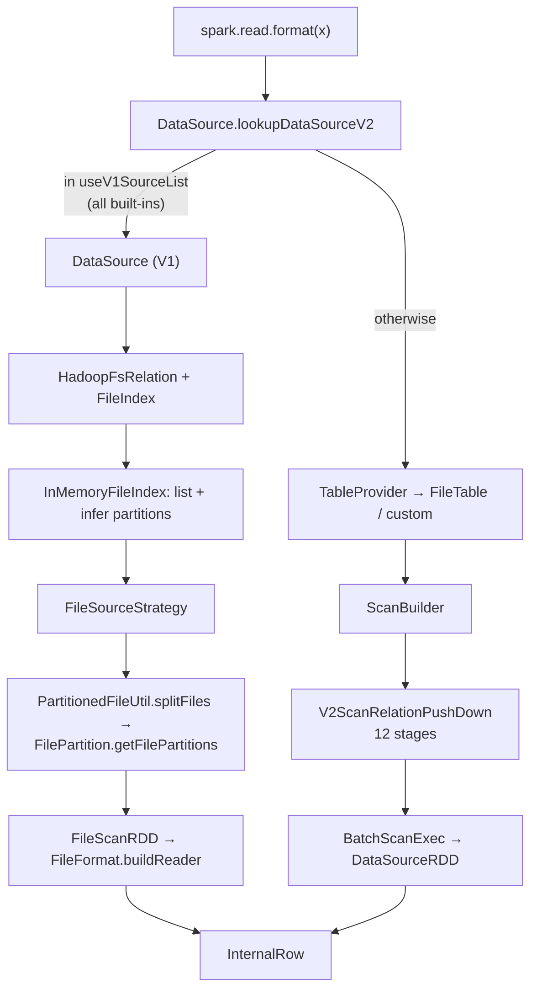

The largest group in the map: **303 files, ~62,000 lines** across the root `execution/datasources/`
package, eleven format sub-packages, the whole DataSource V2 machinery, JDBC and its dialects, and
`sql/avro`. It is where `spark.read` becomes tasks and `df.write` becomes files, and almost every
"why did my data change" question bottoms out somewhere in here.

!!! info "Re-swept 2026-08-09 at an unchanged 4.2.0 — `partial` → `complete`"

    The first pass stopped at the physical scan and named the record-level layer as the obvious next
    run. This one covers it: schema clipping, both Parquet converter trees, the write support and the
    metadata it stamps, the whole **Java** vectorized stack (29 files, ~7,700 lines — encodings,
    dictionaries, definition/repetition levels, the updater factory, ORC's zero-copy vectors), Avro
    and XML record conversion, the JDBC write loop, and the five V2 file-source triples. The ~40
    `v2/*Exec.scala` DDL command executors are still covered as one concept rather than individually,
    which is proportionate — they are thin wrappers over `TableCatalog` calls.

Five findings to carry into everything below, because they contradict the usual mental model:

- **Every built-in file format runs the V1 code path.** `spark.sql.sources.useV1SourceList`
  defaults to `avro,csv,json,kafka,orc,parquet,text`. The V2 implementations
  (`ParquetDataSourceV2`, `OrcDataSourceV2`, …) all exist and are all bypassed. DSv2 is the API
  for *your* connector, not the engine reading your Parquet.
- **Schema comes from one file unless you pay for more.** `mergeSchema` is off by default for both
  Parquet and ORC, and the no-merge path reads a summary file or, failing that, "any of the first
  part-file, and just assume all schemas are consistent" — the source's own words.
- **The read is more forgiving than you want.** `spark.sql.files.ignoreCorruptFiles` does not skip
  a bad file; it marks the partition **finished** at the point of failure and returns the rows read
  so far. The job succeeds with silently truncated data.
- **Spark still writes INT96 timestamps by default.** `spark.sql.parquet.outputTimestampType`
  defaults to `INT96` — deprecated by the Parquet spec, no logical annotation, its own rebase mode.
  Every reader downstream has to special-case it.
- **A JDBC write is one transaction per partition, whatever the scaladoc says.** `saveTable` claims
  "a single transaction" and then calls `foreachPartition`. A half-failed write leaves the committed
  partitions behind.

**Config slice.** `sql/core` registers no configs of its own. The slice was taken over
`sql/catalyst` + `sql/core` as:

```
\.sources\.|\.files\.|\.parquet\.|\.orc\.|\.csv\.|\.json\.|\.xml\.|\.avro\.|jdbc|
\.datasource|partitionColumnTypeInference|partitionOverwriteMode|schemaPruning|
maxMetadataStringLength|\.binaryFile|filesourceTableRelationCache|charAsVarchar|
\.variant\.|columnNameOfCorruptRecord|\.text\.
```

**118 keys** at 4.2.0 — the largest slice of any group. (The first pass recorded 120 against the
same catalog; re-running the pattern gives 118, so that figure was a miscount, not drift.) Full
accounting in the breadth section at the end.



---

## DataSource — provider lookup, and why every built-in format is still V1

**What it is:** the V1 entry point. `DataSource` resolves a format string to a class, infers or
validates a schema, and produces a `BaseRelation`. Its companion object holds the lookup, which is
where "format not found" and "multiple sources found" come from.

**Code path:** `DataFrameReader.load` → `DataSource.lookupDataSourceV2` → (V1) `DataSource.apply`
→ `resolveRelation` → `HadoopFsRelation`

**Anchor files:**

- [DataSource.scala:660](https://github.com/apache/spark/blob/v4.2.0/sql/core/src/main/scala/org/apache/spark/sql/execution/datasources/DataSource.scala#L660) — `lookupDataSource`: a `ServiceLoader` over `DataSourceRegister`, matched on `shortName()` case-insensitively, then a fully-qualified class load, then `"$provider.DefaultSource"`
- [DataSource.scala:612](https://github.com/apache/spark/blob/v4.2.0/sql/core/src/main/scala/org/apache/spark/sql/execution/datasources/DataSource.scala#L612) — `backwardCompatibilityMap`: 24 legacy names still redirected, including `com.databricks.spark.csv` and `com.databricks.spark.xml`
- [DataSource.scala:662](https://github.com/apache/spark/blob/v4.2.0/sql/core/src/main/scala/org/apache/spark/sql/execution/datasources/DataSource.scala#L662) — `"orc"` resolves to `OrcDataSourceV2` or Hive's `OrcFileFormat` depending on `spark.sql.orc.impl`, *before* any lookup happens
- [DataSource.scala:717](https://github.com/apache/spark/blob/v4.2.0/sql/core/src/main/scala/org/apache/spark/sql/execution/datasources/DataSource.scala#L717) — multiple registered aliases: if exactly one is an `org.apache.spark` class it wins **with a `WARN`**; otherwise it is an error. This is how a shaded third-party connector silently loses to the built-in
- [DataSource.scala:696](https://github.com/apache/spark/blob/v4.2.0/sql/core/src/main/scala/org/apache/spark/sql/execution/datasources/DataSource.scala#L696) — if nothing matches but a Python data source of that name is registered, the class becomes `PythonDataSourceV2`
- [DataSource.scala:763](https://github.com/apache/spark/blob/v4.2.0/sql/core/src/main/scala/org/apache/spark/sql/execution/datasources/DataSource.scala#L763) — `lookupDataSourceV2`: returns `None` — i.e. **use V1** — when the short name is in `spark.sql.sources.useV1SourceList`
- [DataSource.scala:180](https://github.com/apache/spark/blob/v4.2.0/sql/core/src/main/scala/org/apache/spark/sql/execution/datasources/DataSource.scala#L180) — `getOrInferFileFormatSchema`, and :365 `resolveRelation`, which decides between the user schema and inference
- [DataSourceManager.scala](https://github.com/apache/spark/blob/v4.2.0/sql/core/src/main/scala/org/apache/spark/sql/execution/datasources/DataSourceManager.scala) — the session-level registry Python data sources land in
- [DataSourceResolver.scala](https://github.com/apache/spark/blob/v4.2.0/sql/core/src/main/scala/org/apache/spark/sql/execution/datasources/DataSourceResolver.scala), [FileResolver.scala](https://github.com/apache/spark/blob/v4.2.0/sql/core/src/main/scala/org/apache/spark/sql/execution/datasources/FileResolver.scala), [LogicalRelationResolver.scala](https://github.com/apache/spark/blob/v4.2.0/sql/core/src/main/scala/org/apache/spark/sql/execution/datasources/LogicalRelationResolver.scala) — the single-pass-analyzer equivalents of the same resolution

!!! warning "`spark.sql.sources.useV1SourceList` is the most consequential config on this page"

    Its default — `avro,csv,json,kafka,orc,parquet,text` — means every format you actually use goes
    through `DataSource` (V1), `FileSourceStrategy`, `HadoopFsRelation` and `FileScanRDD`. The
    parallel V2 implementations in `execution/datasources/v2/{parquet,orc,csv,json,text}/` are dead
    code in a default session. Removing a format from this list is supported but changes the scan
    node, the pushdown mechanism, and the metrics you see — verify rather than assume.

**Configs:** `spark.sql.sources.useV1SourceList`, `spark.sql.sources.default` (`parquet`),
`spark.sql.orc.impl` (`native`), `spark.sql.sources.schemaStringLengthThreshold` (4000)

**Maps to topics:** B4, I10

---

## The V1 relation API — BaseRelation, PrunedFilteredScan, CreatableRelationProvider

**What it is:** the public, `@Stable` connector API that predates DSv2 and still carries every
built-in format. A provider returns a `BaseRelation`; the relation declares how much of the query
it can absorb by which trait it mixes in.

**Anchor files:**

- [interfaces.scala:214](https://github.com/apache/spark/blob/v4.2.0/sql/core/src/main/scala/org/apache/spark/sql/sources/interfaces.scala#L214) — `BaseRelation`: schema, `sizeInBytes` (defaulting to `spark.sql.defaultSizeInBytes`), `needConversion`
- [interfaces.scala:264](https://github.com/apache/spark/blob/v4.2.0/sql/core/src/main/scala/org/apache/spark/sql/sources/interfaces.scala#L264) — the scan ladder: `TableScan` (everything), :275 `PrunedScan` (columns), :293 `PrunedFilteredScan` (columns + filters), :330 `CatalystScan` (`@Unstable`, raw `Expression`s)
- [interfaces.scala:161](https://github.com/apache/spark/blob/v4.2.0/sql/core/src/main/scala/org/apache/spark/sql/sources/interfaces.scala#L161) — `CreatableRelationProvider`, the V1 write hook; :315 `InsertableRelation`
- [interfaces.scala:38](https://github.com/apache/spark/blob/v4.2.0/sql/core/src/main/scala/org/apache/spark/sql/sources/interfaces.scala#L38) — `DataSourceRegister`, whose `shortName()` is what the `ServiceLoader` matches
- [package.scala](https://github.com/apache/spark/blob/v4.2.0/sql/core/src/main/scala/org/apache/spark/sql/sources/package.scala) — the package doc

!!! info "`PrunedFilteredScan`'s filters are advisory"

    Its contract explicitly allows the relation to return rows that do not satisfy a filter Spark
    handed it — Spark re-applies every filter above the scan unless the source is a file source
    with a format-level guarantee. That is why `PushedFilters` in an `EXPLAIN` is not evidence that
    the filter was *evaluated* at the source; only that it was offered.

**Maps to topics:** B4

---

## FileSourceStrategy — the four filter categories

**What it is:** the strategy that turns a `HadoopFsRelation` into a `FileSourceScanExec`. Its
opening comment is the specification: filters are split by *where they can be used to avoid reading
data* — partition keys, bucket keys, data columns, and everything else.

**Code path:** `ScanOperation(projects, stayUpFilters, filters, LogicalRelationWithTable(fsRelation, _))`
→ split filters → `genBucketSet` → `translateFilter` → `FileSourceScanExec` → post-scan `FilterExec`

**Anchor files:**

- [FileSourceStrategy.scala:154](https://github.com/apache/spark/blob/v4.2.0/sql/core/src/main/scala/org/apache/spark/sql/execution/datasources/FileSourceStrategy.scala#L154) — `apply`, and at :157 the four-category comment
- [FileSourceStrategy.scala:165](https://github.com/apache/spark/blob/v4.2.0/sql/core/src/main/scala/org/apache/spark/sql/execution/datasources/FileSourceStrategy.scala#L165) — **non-deterministic filters are dropped from consideration entirely** (`filters.filter(_.deterministic)`), so a `rand()` predicate is always post-scan
- [FileSourceStrategy.scala:194](https://github.com/apache/spark/blob/v4.2.0/sql/core/src/main/scala/org/apache/spark/sql/execution/datasources/FileSourceStrategy.scala#L194) — a filter containing a subquery is pushed only if it is a **scalar** subquery (executed first); a `BloomFilterMightContain` is explicitly excluded because pushing it is meaningless
- [FileSourceStrategy.scala:197](https://github.com/apache/spark/blob/v4.2.0/sql/core/src/main/scala/org/apache/spark/sql/execution/datasources/FileSourceStrategy.scala#L197) — a filter mixing partition and data columns is **split**: the data-only conjuncts are extracted with `extractPredicatesWithinOutputSet` and pushed, the rest stays above
- [FileSourceStrategy.scala:212](https://github.com/apache/spark/blob/v4.2.0/sql/core/src/main/scala/org/apache/spark/sql/execution/datasources/FileSourceStrategy.scala#L212) — `afterScanFilters`: everything except pure partition-key filters is re-evaluated after the scan, and both lists are logged at `INFO` as `Pushed Filters:` / `Post-Scan Filters:`
- [FileSourceStrategy.scala:302](https://github.com/apache/spark/blob/v4.2.0/sql/core/src/main/scala/org/apache/spark/sql/execution/datasources/FileSourceStrategy.scala#L302) — the output column order is fixed by the reader's construction: data columns, then generated metadata, then partition columns, then constant metadata

!!! info "The two `INFO` lines that answer most pushdown questions"

    `FileSourceStrategy` logs `Pushed Filters:` and `Post-Scan Filters:` on every plan.
    A filter appearing in *both* is normal — Parquet's row-group filter is best-effort, so Spark
    keeps the exact predicate above the scan. A filter appearing only in `Post-Scan Filters:` did
    not translate, and the next concept says why.

**Maps to topics:** B4, A1

---

## Filter translation — Expression to sources.Filter, and what cannot cross

**What it is:** the boundary between Catalyst `Expression`s and the connector-facing
`org.apache.spark.sql.sources.Filter` algebra. It is a fixed, small vocabulary, and anything not in
it stays above the scan.

**Anchor files:**

- [DataSourceStrategy.scala:634](https://github.com/apache/spark/blob/v4.2.0/sql/core/src/main/scala/org/apache/spark/sql/execution/datasources/DataSourceStrategy.scala#L634) — `translateLeafNodeFilter`: the complete list — equality, null-safe equality, the four comparisons (with operand-flipping), `In`/`InSet`, `IsNull`/`IsNotNull`, `StartsWith`/`EndsWith`/`Contains`, boolean literals, and a bare boolean column
- [DataSourceStrategy.scala:709](https://github.com/apache/spark/blob/v4.2.0/sql/core/src/main/scala/org/apache/spark/sql/execution/datasources/DataSourceStrategy.scala#L709) — `translateFilter`, which adds `And`/`Or`/`Not` on top
- [DataSourceStrategy.scala:573](https://github.com/apache/spark/blob/v4.2.0/sql/core/src/main/scala/org/apache/spark/sql/execution/datasources/DataSourceStrategy.scala#L573) — `normalizeExprs`, which rewrites attribute names to the relation's casing first
- [DataSourceStrategy.scala:198](https://github.com/apache/spark/blob/v4.2.0/sql/core/src/main/scala/org/apache/spark/sql/execution/datasources/DataSourceStrategy.scala#L198) — `PushableColumnBase` / `PushableColumnAndNestedColumn` / `PushableColumnWithoutNestedColumn`: whether `a.b.c` is a pushable name at all is a per-source decision, gated by `DataSourceUtils.supportNestedPredicatePushdown`
- [DataSourceUtils.scala:154](https://github.com/apache/spark/blob/v4.2.0/sql/core/src/main/scala/org/apache/spark/sql/execution/datasources/DataSourceUtils.scala#L154) — that gate: **Parquet only**
- `collationAwareFilter` in the same file — a filter on a non-UTF8-binary collated column is wrapped in a `Collated*` variant rather than the plain one, so a source that does not understand collation cannot silently apply byte comparison to it

!!! warning "A cast kills pushdown, and nothing tells you"

    Every case in `translateLeafNodeFilter` matches `pushableColumn` against a bare
    `AttributeReference` and the other side against a `Literal`. `CAST(a AS STRING) = '1'`,
    `a + 0 = 1`, `UPPER(a) = 'X'` and `a = b` (two columns) all fail to match and become
    post-scan filters. The plan shows this only as an absence in `PushedFilters`.

**Maps to topics:** B4, A1, I21

---

## Partition discovery — the directory walk and its stopping rules

**What it is:** how `/table/year=2024/month=03/part-0.parquet` becomes two columns. Spark walks each
leaf directory *upwards*, parsing `name=value` segments, and stops at the first segment that does
not parse or at a declared base path.

**Anchor files:**

- [PartitioningUtils.scala:237](https://github.com/apache/spark/blob/v4.2.0/sql/core/src/main/scala/org/apache/spark/sql/execution/datasources/PartitioningUtils.scala#L237) — `parsePartition`, the upward walk; :256 a `_temporary` segment aborts the whole path (left-over speculative output is ignored)
- [PartitioningUtils.scala:280](https://github.com/apache/spark/blob/v4.2.0/sql/core/src/main/scala/org/apache/spark/sql/execution/datasources/PartitioningUtils.scala#L280) — the stopping condition: an unparseable segment stops the walk **only if at least one column has been found already**, which is what makes `/table/a=1/_temporary/x` still yield `a=1`
- [PartitioningUtils.scala:298](https://github.com/apache/spark/blob/v4.2.0/sql/core/src/main/scala/org/apache/spark/sql/execution/datasources/PartitioningUtils.scala#L298) — `parsePartitionColumn`: an empty name or empty value is an error, not a skip
- [PartitioningAwareFileIndex.scala:152](https://github.com/apache/spark/blob/v4.2.0/sql/core/src/main/scala/org/apache/spark/sql/execution/datasources/PartitioningAwareFileIndex.scala#L152) — `inferPartitioning`; only leaf dirs **containing data files** are used, so an empty partition directory contributes no column
- [PartitioningAwareFileIndex.scala:232](https://github.com/apache/spark/blob/v4.2.0/sql/core/src/main/scala/org/apache/spark/sql/execution/datasources/PartitioningAwareFileIndex.scala#L232) — `basePath`: the option that tells the walk where to stop, and which must be a parent of every input path
- [PartitioningAwareFileIndex.scala:92](https://github.com/apache/spark/blob/v4.2.0/sql/core/src/main/scala/org/apache/spark/sql/execution/datasources/PartitioningAwareFileIndex.scala#L92) — `recursiveFileLookup` and partitioning are **mutually exclusive**: asking for both is an `AnalysisException`
- [PartitioningUtils.scala:578](https://github.com/apache/spark/blob/v4.2.0/sql/core/src/main/scala/org/apache/spark/sql/execution/datasources/PartitioningUtils.scala#L578) — `validatePartitionColumn`; :591 partitioning by *all* columns is refused, because the data files would be empty
- [FileIndex.scala:44](https://github.com/apache/spark/blob/v4.2.0/sql/core/src/main/scala/org/apache/spark/sql/execution/datasources/FileIndex.scala#L44) — `PartitionDirectory` and `FilePruningRunner`; [CatalogFileIndex.scala](https://github.com/apache/spark/blob/v4.2.0/sql/core/src/main/scala/org/apache/spark/sql/execution/datasources/CatalogFileIndex.scala) — the metastore-backed variant that asks the catalog for partitions instead of listing
- [FileIndexOptions.scala](https://github.com/apache/spark/blob/v4.2.0/sql/core/src/main/scala/org/apache/spark/sql/execution/datasources/FileIndexOptions.scala) — `basePath`, `pathGlobFilter`, `recursiveFileLookup`, `modifiedBefore`, `modifiedAfter`, `timeZone` as one option list; [pathFilters.scala](https://github.com/apache/spark/blob/v4.2.0/sql/core/src/main/scala/org/apache/spark/sql/execution/datasources/pathFilters.scala) — their implementations, all built through `PathFilterFactory`

**Configs:** `spark.sql.sources.validatePartitionColumns` (true),
`spark.sql.files.ignoreInvalidPartitionPaths` (false)

**Maps to topics:** B4, I5

---

## Partition value type inference — the seven-step ladder

**What it is:** the raw string between `=` and `/` is given a type by trying parsers in a fixed
order. This is the single most surprising piece of implicit behaviour in the file source.

**Anchor files:**

- [PartitioningUtils.scala:527](https://github.com/apache/spark/blob/v4.2.0/sql/core/src/main/scala/org/apache/spark/sql/execution/datasources/PartitioningUtils.scala#L527) — the ladder, literally: `Integer` → `Long` → `Decimal` (scale ≤ 0 only) → `Double` → **Timestamp** → **Date** → `Time` → `String`
- [PartitioningUtils.scala:495](https://github.com/apache/spark/blob/v4.2.0/sql/core/src/main/scala/org/apache/spark/sql/execution/datasources/PartitioningUtils.scala#L495) — the timestamp attempt honours `spark.sql.timestampType`, so the same directory yields `TimestampType` or `TimestampNTZType` depending on session config
- [PartitioningUtils.scala:479](https://github.com/apache/spark/blob/v4.2.0/sql/core/src/main/scala/org/apache/spark/sql/execution/datasources/PartitioningUtils.scala#L479) — SPARK-23436: each attempt also *casts* and requires a non-null result, because the formatter accepts a prefix and ignores trailing characters
- [PartitioningUtils.scala:540](https://github.com/apache/spark/blob/v4.2.0/sql/core/src/main/scala/org/apache/spark/sql/execution/datasources/PartitioningUtils.scala#L540) — `__HIVE_DEFAULT_PARTITION__` becomes `NullType`, in both the inference and the no-inference branch
- [PartitioningUtils.scala:320](https://github.com/apache/spark/blob/v4.2.0/sql/core/src/main/scala/org/apache/spark/sql/execution/datasources/PartitioningUtils.scala#L320) — SPARK-26188: a user-supplied schema **skips inference entirely** for that column and casts the raw string instead
- [PartitioningUtils.scala:547](https://github.com/apache/spark/blob/v4.2.0/sql/core/src/main/scala/org/apache/spark/sql/execution/datasources/PartitioningUtils.scala#L547) — `castPartValueToDesiredType`, the inverse; note timestamps fall back to *date* casting when the direct cast fails
- [PartitioningUtils.scala:368](https://github.com/apache/spark/blob/v4.2.0/sql/core/src/main/scala/org/apache/spark/sql/execution/datasources/PartitioningUtils.scala#L368) — `removeLeadingZerosFromNumberTypePartition`, the write-side counterpart, which is why the round trip is lossy for zero-padded numbers

!!! warning "`id=007` comes back as the integer 7"

    Integer is tried first, so a zero-padded identifier loses its padding and its string-ness. A
    join against a `StringType` key then matches nothing, and the directory on disk still says
    `007`. The fix is either a user-specified schema for that column or
    `spark.sql.sources.partitionColumnTypeInference.enabled=false`, which makes every partition
    column a string.

!!! info "Timestamp is tried before date"

    `date=2024-01-01` parses as a **timestamp** if `timestampFormatter` accepts it, and only falls
    through to `DateType` if it does not. `spark.sql.timestampType` therefore changes the inferred
    type of a partition column that looks like a plain date.

**Configs:** `spark.sql.sources.partitionColumnTypeInference.enabled` (true), `spark.sql.timestampType`

**Maps to topics:** none — proposed as **I27**

---

## File listing — parallel discovery, the status cache, and basePath

**What it is:** the driver enumerating every file before planning. Two strategies, a shared cache,
and a set of configs that decide which.

**Anchor files:**

- [InMemoryFileIndex.scala:156](https://github.com/apache/spark/blob/v4.2.0/sql/core/src/main/scala/org/apache/spark/sql/execution/datasources/InMemoryFileIndex.scala#L156) — `bulkListLeafFiles`; `useListFiles` requires **a single path** whose scheme is in `spark.sql.sources.useListFilesFileSystemList` (default `s3a`), otherwise the parallel path
- [InMemoryFileIndex.scala:171](https://github.com/apache/spark/blob/v4.2.0/sql/core/src/main/scala/org/apache/spark/sql/execution/datasources/InMemoryFileIndex.scala#L171) — `HadoopFSUtils.parallelListLeafFiles`, driven by `parallelPartitionDiscovery.threshold` (32) and `.parallelism` (10000): above the threshold, listing becomes **a real Spark job**
- [InMemoryFileIndex.scala:187](https://github.com/apache/spark/blob/v4.2.0/sql/core/src/main/scala/org/apache/spark/sql/execution/datasources/InMemoryFileIndex.scala#L187) — `shouldFilterOutPathName`: `_`- and `.`-prefixed names are dropped before anything else sees them
- [FileStatusCache.scala:36](https://github.com/apache/spark/blob/v4.2.0/sql/core/src/main/scala/org/apache/spark/sql/execution/datasources/FileStatusCache.scala#L36) — `getOrCreate`: a **process-wide** `SharedInMemoryCache`, active only when `spark.sql.hive.manageFilesourcePartitions` is on and the cache size is positive; otherwise `NoopCache`
- [FileStatusCache.scala:74](https://github.com/apache/spark/blob/v4.2.0/sql/core/src/main/scala/org/apache/spark/sql/execution/datasources/FileStatusCache.scala#L74) — the Guava cache: a `SizeEstimator`-based weigher divided by 32 (so it can hold up to ~64GB despite an `Int` weight), a TTL from `spark.sql.metadataCacheTTLSeconds`, and a removal listener that logs the eviction warning **once per JVM**
- [PartitioningAwareFileIndex.scala:81](https://github.com/apache/spark/blob/v4.2.0/sql/core/src/main/scala/org/apache/spark/sql/execution/datasources/PartitioningAwareFileIndex.scala#L81) — `listFiles`, which applies the partition filters against the inferred spec before returning
- [InMemoryFileIndex.scala:57](https://github.com/apache/spark/blob/v4.2.0/sql/core/src/main/scala/org/apache/spark/sql/execution/datasources/InMemoryFileIndex.scala#L57) — `refresh0`, the invalidation entry point behind `REFRESH TABLE`
- [HadoopFsRelation.scala](https://github.com/apache/spark/blob/v4.2.0/sql/core/src/main/scala/org/apache/spark/sql/execution/datasources/HadoopFsRelation.scala) — where the index, partition schema and data schema are bundled, and where `sizeInBytes` applies `spark.sql.sources.fileCompressionFactor`

!!! warning "You are told about cache eviction exactly once"

    The removal listener guards on an `AtomicBoolean`, so the "Evicting cached table partition
    metadata from memory due to size constraints" warning appears once per JVM no matter how much
    thrashing follows. On a driver serving many large partitioned tables, planning slowly getting
    worse with no new log output is the expected symptom.

**Configs:** `spark.sql.sources.parallelPartitionDiscovery.threshold` (32), `.parallelism` (10000),
`spark.sql.sources.useListFilesFileSystemList` (`s3a`), `spark.sql.sources.ignoreDataLocality` (false),
`spark.sql.filesourceTableRelationCacheSize` (1000), `spark.sql.sources.fileCompressionFactor` (1.0)

**Maps to topics:** none — proposed as **I28**

---

## File splitting — maxSplitBytes, Next Fit Decreasing, and openCostInBytes

**What it is:** how N files become M tasks. One formula and one bin-packing pass, and it is the
answer to "why does my read have 3 tasks / 40,000 tasks".

**Anchor files:**

- [FilePartition.scala:119](https://github.com/apache/spark/blob/v4.2.0/sql/core/src/main/scala/org/apache/spark/sql/execution/datasources/FilePartition.scala#L119) — the formula: `min(maxPartitionBytes, max(openCostInBytes, totalBytes / minPartitionNum))`, where `minPartitionNum` defaults to `leafNodeDefaultParallelism`
- [FilePartition.scala:58](https://github.com/apache/spark/blob/v4.2.0/sql/core/src/main/scala/org/apache/spark/sql/execution/datasources/FilePartition.scala#L58) — the packing: "Next Fit Decreasing", closing the current partition as soon as adding the next file would exceed `maxSplitBytes`, and charging `openCostInBytes` per file
- [FilePartition.scala:90](https://github.com/apache/spark/blob/v4.2.0/sql/core/src/main/scala/org/apache/spark/sql/execution/datasources/FilePartition.scala#L90) — `spark.sql.files.maxPartitionNum`: exceeding it triggers a **re-run of the whole packing** at a larger split size, with a `WARN` saying `maxPartitionBytes` was ignored
- [FilePartition.scala:38](https://github.com/apache/spark/blob/v4.2.0/sql/core/src/main/scala/org/apache/spark/sql/execution/datasources/FilePartition.scala#L38) — `preferredLocations`: the top **3** hosts by bytes, excluding `localhost`
- [PartitionedFileUtil.scala:26](https://github.com/apache/spark/blob/v4.2.0/sql/core/src/main/scala/org/apache/spark/sql/execution/PartitionedFileUtil.scala#L26) — `splitFiles`, which chops a splittable file into `maxSplitBytes` pieces before packing
- [v2/FileScan.scala:171](https://github.com/apache/spark/blob/v4.2.0/sql/core/src/main/scala/org/apache/spark/sql/execution/datasources/v2/FileScan.scala#L171) — the *decreasing* half: `.sortBy(_.length)(Ordering[Long].reverse)` happens at the call site, not inside the packer

!!! info "`openCostInBytes` is a fake file size, and that is the point"

    Every file is charged `spark.sql.files.openCostInBytes` (4MB) on top of its real length, so a
    directory of 10,000 × 1KB files is packed as if it were 40GB. That is what stops Spark from
    putting ten thousand tiny files in one task — and why lowering it is the knob for the
    small-files case, not raising `maxPartitionBytes`.

**Configs:** `spark.sql.files.maxPartitionBytes` (128MB), `.openCostInBytes` (4MB),
`.minPartitionNum` (unset), `.maxPartitionNum` (unset)

**Maps to topics:** B4, I5

---

## Splitability — codecs, multiLine, and the one-task file

**What it is:** whether a single file can be read by more than one task. Decided per format, and
frequently `false` for reasons that are invisible in the file listing.

**Anchor files:**

- [FileFormat.scala:385](https://github.com/apache/spark/blob/v4.2.0/sql/core/src/main/scala/org/apache/spark/sql/execution/datasources/FileFormat.scala#L385) — `TextBasedFileFormat.isSplitable`: splittable iff there is **no codec** or the codec is a `SplittableCompressionCodec`. gzip is not; bzip2 is
- [parquet/ParquetFileFormat.scala:111](https://github.com/apache/spark/blob/v4.2.0/sql/core/src/main/scala/org/apache/spark/sql/execution/datasources/parquet/ParquetFileFormat.scala#L111) — Parquet returns `true` unconditionally (row groups are self-describing)
- [csv/CSVFileFormat.scala:42](https://github.com/apache/spark/blob/v4.2.0/sql/core/src/main/scala/org/apache/spark/sql/execution/datasources/csv/CSVFileFormat.scala#L42) and [json/JsonFileFormat.scala:38](https://github.com/apache/spark/blob/v4.2.0/sql/core/src/main/scala/org/apache/spark/sql/execution/datasources/json/JsonFileFormat.scala#L38) — both AND the codec test with a per-mode test
- [csv/CSVDataSource.scala:88](https://github.com/apache/spark/blob/v4.2.0/sql/core/src/main/scala/org/apache/spark/sql/execution/datasources/csv/CSVDataSource.scala#L88) — `multiLine` selects `MultiLineCSVDataSource`, whose `isSplitable` is `false`; the default `TextInputCSVDataSource` is `true`
- [v2/FileScan.scala:174](https://github.com/apache/spark/blob/v4.2.0/sql/core/src/main/scala/org/apache/spark/sql/execution/datasources/v2/FileScan.scala#L174) — the only warning you get: one large unsplittable file in one partition logs `getFileUnSplittableReason` above `spark.io.warning.largeFileThreshold`
- [CodecStreams.scala](https://github.com/apache/spark/blob/v4.2.0/sql/core/src/main/scala/org/apache/spark/sql/execution/datasources/CodecStreams.scala) — codec resolution for both read and write, including the write-side extension
- [HadoopFileLinesReader.scala](https://github.com/apache/spark/blob/v4.2.0/sql/core/src/main/scala/org/apache/spark/sql/execution/datasources/HadoopFileLinesReader.scala) — the line reader every text format sits on, gated by `spark.sql.execution.datasources.hadoopLineRecordReader.enabled`; [HadoopFileWholeTextReader.scala](https://github.com/apache/spark/blob/v4.2.0/sql/core/src/main/scala/org/apache/spark/sql/execution/datasources/HadoopFileWholeTextReader.scala) — the whole-file variant `multiLine` uses
- [RecordReaderIterator.scala](https://github.com/apache/spark/blob/v4.2.0/sql/core/src/main/scala/org/apache/spark/sql/execution/datasources/RecordReaderIterator.scala) — the adapter that closes the underlying Hadoop reader as soon as it is exhausted

**Configs:** `spark.sql.execution.datasources.hadoopLineRecordReader.enabled` (true)

**Maps to topics:** B4, I10

---

## FileScanRDD — the per-record read loop, and the corrupt-file skip

**What it is:** the RDD every V1 file scan produces. One partition = several `PartitionedFile`s read
in sequence, with metadata columns joined on and two error-tolerance switches.

**Anchor files:**

- [FileScanRDD.scala:80](https://github.com/apache/spark/blob/v4.2.0/sql/core/src/main/scala/org/apache/spark/sql/execution/datasources/FileScanRDD.scala#L80) — the class; :101 `compute` builds one `Iterator[Object]` that walks the files
- [FileScanRDD.scala:242](https://github.com/apache/spark/blob/v4.2.0/sql/core/src/main/scala/org/apache/spark/sql/execution/datasources/FileScanRDD.scala#L242) — `nextIterator`, which sets `InputFileBlockHolder` (the source of `input_file_name()`) per file
- [FileScanRDD.scala:252](https://github.com/apache/spark/blob/v4.2.0/sql/core/src/main/scala/org/apache/spark/sql/execution/datasources/FileScanRDD.scala#L252) — the tolerant branch, taken only when `ignoreMissingFiles || ignoreCorruptFiles`; the reader is created **lazily inside `getNext`** so that a vectorized reader's eager header read is also covered
- [FileScanRDD.scala:280](https://github.com/apache/spark/blob/v4.2.0/sql/core/src/main/scala/org/apache/spark/sql/execution/datasources/FileScanRDD.scala#L280) — the corrupt-file case: log a `WARN`, set `finished = true`, return `null`. **The remaining rows of that file are simply not read**
- [FileScanRDD.scala:277](https://github.com/apache/spark/blob/v4.2.0/sql/core/src/main/scala/org/apache/spark/sql/execution/datasources/FileScanRDD.scala#L277) — `FileNotFoundException` is re-thrown even under `ignoreCorruptFiles`; `AccessControlException` and `BlockMissingException` are always re-thrown
- [DataSourceUtils.scala:236](https://github.com/apache/spark/blob/v4.2.0/sql/core/src/main/scala/org/apache/spark/sql/execution/datasources/DataSourceUtils.scala#L236) — `shouldIgnoreCorruptFileException`, the whitelist of what counts as corruption
- [FileScanRDD.scala:146](https://github.com/apache/spark/blob/v4.2.0/sql/core/src/main/scala/org/apache/spark/sql/execution/datasources/FileScanRDD.scala#L146) — every exception is re-thrown through `FileDataSourceV2.attachFilePath`, which is why read errors name the file
- [FileScanRDD.scala:115](https://github.com/apache/spark/blob/v4.2.0/sql/core/src/main/scala/org/apache/spark/sql/execution/datasources/FileScanRDD.scala#L115) — SPARK-13071: input bytes are **set**, not incremented, from a thread-local Hadoop counter, so coalesced partitions in one thread do not double-count

!!! warning "`ignoreCorruptFiles` truncates; it does not skip"

    The handler sets `finished = true` on the *current file's* iterator. Rows already read are kept,
    rows after the corruption are lost, the task succeeds, and the job succeeds. The only evidence
    is `Skipped the rest of the content in the corrupted file:` at `WARN`. Treat this config as
    "prefer a wrong answer to an error", and never enable it on a correctness-sensitive read.

**Configs:** `spark.sql.files.ignoreCorruptFiles` (false), `spark.sql.files.ignoreMissingFiles` (false)

**Maps to topics:** B4, A13

---

## File metadata columns — `_metadata`, constant vs generated

**What it is:** the hidden struct column every file source exposes, and the two very different
mechanisms behind its fields.

**Anchor files:**

- [FileFormat.scala:247](https://github.com/apache/spark/blob/v4.2.0/sql/core/src/main/scala/org/apache/spark/sql/execution/datasources/FileFormat.scala#L247) — the base field names: `file_path`, `file_name`, `file_size`, `file_block_start`, `file_block_length`, `file_modification_time`; :259 `METADATA_NAME = "_metadata"`
- [FileFormat.scala:222](https://github.com/apache/spark/blob/v4.2.0/sql/core/src/main/scala/org/apache/spark/sql/execution/datasources/FileFormat.scala#L222) — `metadataSchemaFields`, which a format overrides to add its own (Parquet adds `row_index`)
- [FileSourceStrategy.scala:263](https://github.com/apache/spark/blob/v4.2.0/sql/core/src/main/scala/org/apache/spark/sql/execution/datasources/FileSourceStrategy.scala#L263) — the split: **constant** fields are joined on after the scan; **generated** fields must be produced by the reader itself and are given an internal column name
- [FileSourceStrategy.scala:265](https://github.com/apache/spark/blob/v4.2.0/sql/core/src/main/scala/org/apache/spark/sql/execution/datasources/FileSourceStrategy.scala#L265) — a data column colliding with a generated metadata field's internal name is an `AnalysisException`
- [FileScanRDD.scala:182](https://github.com/apache/spark/blob/v4.2.0/sql/core/src/main/scala/org/apache/spark/sql/execution/datasources/FileScanRDD.scala#L182) — in columnar mode each constant field becomes a `ConstantColumnVector` of the batch's length, so it costs no per-row work
- [parquet/ParquetRowIndexUtil.scala](https://github.com/apache/spark/blob/v4.2.0/sql/core/src/main/scala/org/apache/spark/sql/execution/datasources/parquet/ParquetRowIndexUtil.scala) — the generated `row_index` field, the one that requires reader cooperation

**Maps to topics:** B4, I7

---

## Column matching between file and table schema

**What it is:** the rule each format uses to decide which physical column answers a requested
logical column. There are four different rules in this group, and none of them is stated in the
plan.

**Anchor files:**

- [orc/OrcUtils.scala:244](https://github.com/apache/spark/blob/v4.2.0/sql/core/src/main/scala/org/apache/spark/sql/execution/datasources/orc/OrcUtils.scala#L244) — ORC: if `orc.force.positional.evolution` is set **or every field name starts with `_col`**, columns are matched **by ordinal**. Hive-written ORC files have exactly those names
- [orc/OrcUtils.scala:269](https://github.com/apache/spark/blob/v4.2.0/sql/core/src/main/scala/org/apache/spark/sql/execution/datasources/orc/OrcUtils.scala#L269) — otherwise by name, case-sensitively or not per `spark.sql.caseSensitive`; a case-insensitive match hitting two fields is an error rather than a pick
- [orc/OrcUtils.scala:226](https://github.com/apache/spark/blob/v4.2.0/sql/core/src/main/scala/org/apache/spark/sql/execution/datasources/orc/OrcUtils.scala#L226) — a `TimestampType` ⇄ `TimestampNTZType` mismatch between file and requested schema is a hard error, checked before any matching
- Parquet field IDs — `spark.sql.parquet.fieldId.read.enabled` (false) switches matching from name to ID; `.read.ignoreMissing` (false) decides whether a missing ID is an error or a null column; `.write.enabled` (**true**) means Spark already writes IDs
- [avro/AvroFileFormat.scala:146](https://github.com/apache/spark/blob/v4.2.0/sql/core/src/main/scala/org/apache/spark/sql/avro/AvroFileFormat.scala#L146) — Avro's `positionalFieldMatching` option, threaded into the deserializer
- CSV: `enforceSchema` (default **true**) means the header row is *skipped*, not validated, and columns are taken positionally — covered in the `sql/catalyst — types & parser` sweep
- Write side: `insertInto` matches by position, `saveAsTable` by name (see B4)

!!! warning "The `_col0` heuristic is a name test, not a metadata test"

    `orcFieldNames.forall(_.startsWith("_col"))` is the whole condition. A table whose columns are
    genuinely named `_col_id`, `_col_ts` would be matched positionally. More commonly: a Hive-written
    ORC table read by Spark matches by ordinal, so adding a column in the middle of the table schema
    silently shifts every value after it.

**Configs:** `spark.sql.parquet.fieldId.read.enabled` (false), `.read.ignoreMissing` (false),
`.write.enabled` (true), `spark.sql.caseSensitive`

**Maps to topics:** none — proposed as **E25**

---

## Nested schema pruning — and the two formats it works on

**What it is:** dropping unread *sub*-fields of a struct from the read schema. Distinct from
ordinary column pruning, and much more narrowly supported.

**Anchor files:**

- [SchemaPruning.scala:111](https://github.com/apache/spark/blob/v4.2.0/sql/core/src/main/scala/org/apache/spark/sql/execution/datasources/SchemaPruning.scala#L111) — `canPruneDataSchema`: `nestedSchemaPruningEnabled` **and** the format is `ParquetFileFormat` or `OrcFileFormat`. Every other format reads the whole struct
- [SchemaPruning.scala:94](https://github.com/apache/spark/blob/v4.2.0/sql/core/src/main/scala/org/apache/spark/sql/execution/datasources/SchemaPruning.scala#L94) — the rule only rewrites the relation if `countLeaves` actually dropped something, so it is a no-op on flat schemas
- [SchemaPruning.scala:121](https://github.com/apache/spark/blob/v4.2.0/sql/core/src/main/scala/org/apache/spark/sql/execution/datasources/SchemaPruning.scala#L121) — the metadata schema is pruned by a *different* rule: only whole sibling sub-attributes, never inside one, because each is a complete extractor value
- [v2/PushDownUtils.scala:491](https://github.com/apache/spark/blob/v4.2.0/sql/core/src/main/scala/org/apache/spark/sql/execution/datasources/v2/PushDownUtils.scala#L491) — the V2 equivalent, gated on the same config, falling back to top-level pruning when it is off
- [SchemaMergeUtils.scala](https://github.com/apache/spark/blob/v4.2.0/sql/core/src/main/scala/org/apache/spark/sql/execution/datasources/SchemaMergeUtils.scala) — the shared parallel schema-merge job Parquet and ORC both use

**Configs:** `spark.sql.optimizer.nestedSchemaPruning.enabled` (true),
`spark.sql.optimizer.serializer.nestedSchemaPruning.enabled` (true)

**Maps to topics:** I10, A1

---

## Partition pruning at the relation level — PruneFileSourcePartitions

**What it is:** the optimizer rule that pushes partition filters into the `FileIndex` *before*
planning, so the statistics the planner sees reflect the pruned size.

**Anchor files:**

- [PruneFileSourcePartitions.scala:35](https://github.com/apache/spark/blob/v4.2.0/sql/core/src/main/scala/org/apache/spark/sql/execution/datasources/PruneFileSourcePartitions.scala#L35) — the rule; it replaces the relation's index with a pre-filtered one and rewrites `sizeInBytes`
- [FileSourceStrategy.scala:173](https://github.com/apache/spark/blob/v4.2.0/sql/core/src/main/scala/org/apache/spark/sql/execution/datasources/FileSourceStrategy.scala#L173) — the comment pinning the invariant: these filters **must** be the same ones the strategy computes, or the size estimate and the scan disagree
- [CatalogFileIndex.scala](https://github.com/apache/spark/blob/v4.2.0/sql/core/src/main/scala/org/apache/spark/sql/execution/datasources/CatalogFileIndex.scala) — `filterPartitions`, which asks the metastore rather than listing, and is what makes pruning cheap on a catalog table
- [FileIndex.scala:63](https://github.com/apache/spark/blob/v4.2.0/sql/core/src/main/scala/org/apache/spark/sql/execution/datasources/FileIndex.scala#L63) — `FilePruningRunner`, the shared predicate evaluator

**Maps to topics:** B4, I5, A18

---

## Bucket pruning — the one-column, one-filter special case

**What it is:** skipping whole bucket files based on an equality filter. It is far more restricted
than most people assume.

**Anchor files:**

- [FileSourceStrategy.scala:67](https://github.com/apache/spark/blob/v4.2.0/sql/core/src/main/scala/org/apache/spark/sql/execution/datasources/FileSourceStrategy.scala#L67) — `shouldPruneBuckets`: **exactly one** bucket column and more than one bucket. A table bucketed by two columns is never bucket-pruned
- [FileSourceStrategy.scala:97](https://github.com/apache/spark/blob/v4.2.0/sql/core/src/main/scala/org/apache/spark/sql/execution/datasources/FileSourceStrategy.scala#L97) — the supported predicates: `=`, `In`, `InSet`, `IsNull`, `IsNaN`, combined through `And`/`Or` as bitset intersection/union. Anything else sets *all* bits
- [FileSourceStrategy.scala:143](https://github.com/apache/spark/blob/v4.2.0/sql/core/src/main/scala/org/apache/spark/sql/execution/datasources/FileSourceStrategy.scala#L143) — the `INFO` line `Pruned N out of M buckets.` — the only confirmation available
- [BucketingUtils.scala](https://github.com/apache/spark/blob/v4.2.0/sql/core/src/main/scala/org/apache/spark/sql/execution/datasources/BucketingUtils.scala) — the filename convention (`_$bucketId`) and `getBucketIdFromValue`

**Configs:** `spark.sql.sources.bucketing.enabled` (true), `.maxBuckets` (100000),
`.autoBucketedScan.enabled` (true)

**Maps to topics:** B4, A25

---

## The write path — FileFormatWriter and the required ordering

**What it is:** the driver-side setup for every file write: compute a required ordering, decide
whether to sort, run the job, collect stats, commit.

**Anchor files:**

- [FileFormatWriter.scala:147](https://github.com/apache/spark/blob/v4.2.0/sql/core/src/main/scala/org/apache/spark/sql/execution/datasources/FileFormatWriter.scala#L147) — the required ordering: **dynamic partition columns, then bucket id, then bucket sort columns** — in that order
- [FileFormatWriter.scala:172](https://github.com/apache/spark/blob/v4.2.0/sql/core/src/main/scala/org/apache/spark/sql/execution/datasources/FileFormatWriter.scala#L172) — `orderingMatched`; if the plan already produces that ordering, no sort is added
- [FileFormatWriter.scala:355](https://github.com/apache/spark/blob/v4.2.0/sql/core/src/main/scala/org/apache/spark/sql/execution/datasources/FileFormatWriter.scala#L355) — the alternative to sorting: concurrent writers, enabled only when `spark.sql.maxConcurrentOutputFileWriters > 0` **and there are no bucket sort columns**
- [FileFormatWriter.scala:156](https://github.com/apache/spark/blob/v4.2.0/sql/core/src/main/scala/org/apache/spark/sql/execution/datasources/FileFormatWriter.scala#L156) — SPARK-56919: `setupJob` must precede AQE materialization, or an AQE failure on an `INSERT OVERWRITE` loses the table path permanently
- [FileFormatWriter.scala:163](https://github.com/apache/spark/blob/v4.2.0/sql/core/src/main/scala/org/apache/spark/sql/execution/datasources/FileFormatWriter.scala#L163) — SPARK-40588: with planned writes off and AQE on, the writer must force the adaptive plan to its final form just to learn its output ordering
- [FileFormatWriter.scala:122](https://github.com/apache/spark/blob/v4.2.0/sql/core/src/main/scala/org/apache/spark/sql/execution/datasources/FileFormatWriter.scala#L122) — `verifySchema` + `checkFieldNames` per format, from [DataSourceUtils.scala:112](https://github.com/apache/spark/blob/v4.2.0/sql/core/src/main/scala/org/apache/spark/sql/execution/datasources/DataSourceUtils.scala#L112)
- [FileFormatWriter.scala:107](https://github.com/apache/spark/blob/v4.2.0/sql/core/src/main/scala/org/apache/spark/sql/execution/datasources/FileFormatWriter.scala#L107) — SPARK-56414: per-write options are merged into the Hadoop conf **before** `prepareWrite`, so a `.option(...)` beats a session default
- [OutputWriter.scala](https://github.com/apache/spark/blob/v4.2.0/sql/core/src/main/scala/org/apache/spark/sql/execution/datasources/OutputWriter.scala) — the `OutputWriterFactory` / `OutputWriter` pair every format implements

!!! info "A partitioned write always sorts unless you arrange not to"

    Writing partitioned or bucketed output requires the data grouped by partition value, so
    `FileFormatWriter` inserts a global `SortExec` on the partition columns whenever the plan's
    ordering does not already match. That sort is frequently the most expensive part of an
    `INSERT`, and pre-sorting (or repartitioning by the partition columns) is how you avoid paying
    for it twice.

**Configs:** `spark.sql.maxConcurrentOutputFileWriters`, `spark.sql.files.maxRecordsPerFile` (0)

**Maps to topics:** B4, I5

---

## The five data writers — and how a file gets rolled

**What it is:** the executor-side half. Five `FileFormatDataWriter` subclasses, chosen by whether
the write is partitioned, bucketed, empty, or using concurrent writers.

**Anchor files:**

- [FileFormatDataWriter.scala:36](https://github.com/apache/spark/blob/v4.2.0/sql/core/src/main/scala/org/apache/spark/sql/execution/datasources/FileFormatDataWriter.scala#L36) — the base class and its `writeWithIterator` contract; :57 `MAX_FILE_COUNTER = 1,000,000`, asserted on every roll
- [FileFormatDataWriter.scala:186](https://github.com/apache/spark/blob/v4.2.0/sql/core/src/main/scala/org/apache/spark/sql/execution/datasources/FileFormatDataWriter.scala#L186) — `SingleDirectoryDataWriter`: rolls a new file every `maxRecordsPerFile` records, suffixing `-c000`, `-c001`, …
- [FileFormatDataWriter.scala:279](https://github.com/apache/spark/blob/v4.2.0/sql/core/src/main/scala/org/apache/spark/sql/execution/datasources/FileFormatDataWriter.scala#L279) — `BaseDynamicPartitionDataWriter.renewCurrentWriter`, which builds the `key=value/` path fragment and the `.c000` suffix
- [FileFormatDataWriter.scala:383](https://github.com/apache/spark/blob/v4.2.0/sql/core/src/main/scala/org/apache/spark/sql/execution/datasources/FileFormatDataWriter.scala#L383) — `DynamicPartitionDataSingleWriter`: **one writer open at a time**, which is exactly why the input must be sorted by partition value
- [FileFormatDataWriter.scala:418](https://github.com/apache/spark/blob/v4.2.0/sql/core/src/main/scala/org/apache/spark/sql/execution/datasources/FileFormatDataWriter.scala#L418) — `DynamicPartitionDataConcurrentWriter`: keeps a map of open writers and **falls back to the sort-based writer** once the cap is hit, mid-task
- [FileFormatDataWriter.scala:71](https://github.com/apache/spark/blob/v4.2.0/sql/core/src/main/scala/org/apache/spark/sql/execution/datasources/FileFormatDataWriter.scala#L71) — `EmptyDirectoryDataWriter`, which exists so an empty partition still creates the directory
- [FileFormatDataWriter.scala:398](https://github.com/apache/spark/blob/v4.2.0/sql/core/src/main/scala/org/apache/spark/sql/execution/datasources/FileFormatDataWriter.scala#L398) — `WriterBucketSpec`, `WriteJobDescription`, `WriteTaskResult`, `ExecutedWriteSummary`

**Maps to topics:** B4

---

## Dynamic partition overwrite — the staging directory and the delete

**What it is:** `INSERT OVERWRITE` replacing only the partitions the data touches, rather than the
whole table. A different code path with a different failure mode.

**Anchor files:**

- [InsertIntoHadoopFsRelationCommand.scala:65](https://github.com/apache/spark/blob/v4.2.0/sql/core/src/main/scala/org/apache/spark/sql/execution/datasources/InsertIntoHadoopFsRelationCommand.scala#L65) — `dynamicPartitionOverwrite`: the per-write `partitionOverwriteMode` option beats the session config, and it additionally requires that **not all** partition columns are statically specified
- [InsertIntoHadoopFsRelationCommand.scala:161](https://github.com/apache/spark/blob/v4.2.0/sql/core/src/main/scala/org/apache/spark/sql/execution/datasources/InsertIntoHadoopFsRelationCommand.scala#L161) — static mode deletes the output path **before** the job runs; dynamic mode defers to the committer
- [InsertIntoHadoopFsRelationCommand.scala:229](https://github.com/apache/spark/blob/v4.2.0/sql/core/src/main/scala/org/apache/spark/sql/execution/datasources/InsertIntoHadoopFsRelationCommand.scala#L229) — `deleteMatchingPartitions`, used for custom partition locations that live outside the table path
- [InsertIntoHadoopFsRelationCommand.scala:175](https://github.com/apache/spark/blob/v4.2.0/sql/core/src/main/scala/org/apache/spark/sql/execution/datasources/InsertIntoHadoopFsRelationCommand.scala#L175) — in dynamic mode the committer writes to `stagingDir`, not the output path
- [InsertIntoDataSourceCommand.scala](https://github.com/apache/spark/blob/v4.2.0/sql/core/src/main/scala/org/apache/spark/sql/execution/datasources/InsertIntoDataSourceCommand.scala) and [SaveIntoDataSourceCommand.scala](https://github.com/apache/spark/blob/v4.2.0/sql/core/src/main/scala/org/apache/spark/sql/execution/datasources/SaveIntoDataSourceCommand.scala) — the non-file V1 write commands, for `InsertableRelation` and `CreatableRelationProvider`

!!! warning "Static overwrite deletes before it writes"

    In the default `STATIC` mode, `INSERT OVERWRITE` removes the destination path first and then
    runs the job. A job that fails after that point has already destroyed the old data. Dynamic
    mode is safer in this specific respect — it stages first — which is a reason to prefer it
    beyond the partition-scoping semantics.

**Configs:** `spark.sql.sources.partitionOverwriteMode` (`STATIC`)

**Maps to topics:** B4, I8

---

## The commit protocol — staging, promotion, and the pluggable committer

**What it is:** how written files become visible. Spark's SQL layer wraps Hadoop's committer with
one config hook.

**Anchor files:**

- [SQLHadoopMapReduceCommitProtocol.scala:33](https://github.com/apache/spark/blob/v4.2.0/sql/core/src/main/scala/org/apache/spark/sql/execution/datasources/SQLHadoopMapReduceCommitProtocol.scala#L33) — the class named by `spark.sql.sources.commitProtocolClass` (the default)
- [SQLHadoopMapReduceCommitProtocol.scala:47](https://github.com/apache/spark/blob/v4.2.0/sql/core/src/main/scala/org/apache/spark/sql/execution/datasources/SQLHadoopMapReduceCommitProtocol.scala#L47) — `spark.sql.sources.outputCommitterClass`: a `FileOutputCommitter` subclass gets the `(Path, TaskAttemptContext)` constructor, anything else the no-arg one; both paths log the chosen class at `INFO`
- [SQLHadoopMapReduceCommitProtocol.scala:60](https://github.com/apache/spark/blob/v4.2.0/sql/core/src/main/scala/org/apache/spark/sql/execution/datasources/SQLHadoopMapReduceCommitProtocol.scala#L60) — in dynamic-overwrite mode the committer's output path is the **staging** directory
- `spark.sql.parquet.output.committer.class` — a second, Parquet-only hook, defaulting to `ParquetOutputCommitter`
- The protocol itself (`HadoopMapReduceCommitProtocol`, `_temporary`, rename-based promotion) lives in `core` and is covered by the `core — execution-engine` sweep and topic **E17**

**Configs:** `spark.sql.sources.commitProtocolClass`, `spark.sql.sources.outputCommitterClass` (unset),
`spark.sql.parquet.output.committer.class`

**Maps to topics:** B4, E17

---

## Write statistics — the numFiles/numOutputRows metrics and their warning

**What it is:** where the SQL tab's write metrics come from, and a diagnostic almost nobody has
seen.

**Anchor files:**

- [BasicWriteStatsTracker.scala:53](https://github.com/apache/spark/blob/v4.2.0/sql/core/src/main/scala/org/apache/spark/sql/execution/datasources/BasicWriteStatsTracker.scala#L53) — `BasicWriteTaskStatsTracker`, which counts submitted files, rows and bytes per task
- [BasicWriteStatsTracker.scala:170](https://github.com/apache/spark/blob/v4.2.0/sql/core/src/main/scala/org/apache/spark/sql/execution/datasources/BasicWriteStatsTracker.scala#L170) — the warning: `Expected N files, but only saw M` — emitted when a format's writer did not actually produce a file it announced
- [BasicWriteStatsTracker.scala:219](https://github.com/apache/spark/blob/v4.2.0/sql/core/src/main/scala/org/apache/spark/sql/execution/datasources/BasicWriteStatsTracker.scala#L219) — the four driver metrics: `numFiles`, `numOutputBytes`, `numOutputRows`, `numParts`
- [WriteStatsTracker.scala](https://github.com/apache/spark/blob/v4.2.0/sql/core/src/main/scala/org/apache/spark/sql/execution/datasources/WriteStatsTracker.scala) — the SPI, which a table format (Delta, Iceberg) implements to collect its own file statistics during the same pass
- [DataSourceMetricsMixin.scala](https://github.com/apache/spark/blob/v4.2.0/sql/core/src/main/scala/org/apache/spark/sql/execution/datasources/DataSourceMetricsMixin.scala) — the small trait letting a source contribute custom metrics

**Maps to topics:** B4, I7

---

## V1Writes and WriteFiles — planned writes as a physical operator

**What it is:** the 3.4+ "planned write" path, which moves the required sort into the *logical* plan
so the optimizer and AQE can see it, instead of bolting it on inside `FileFormatWriter`.

**Anchor files:**

- [V1Writes.scala:68](https://github.com/apache/spark/blob/v4.2.0/sql/core/src/main/scala/org/apache/spark/sql/execution/datasources/V1Writes.scala#L68) — the rule; :32 `V1WriteCommand`, the marker a write command implements to opt in
- [V1Writes.scala:117](https://github.com/apache/spark/blob/v4.2.0/sql/core/src/main/scala/org/apache/spark/sql/execution/datasources/V1Writes.scala#L117) — `V1WritesUtils`: `getWriterBucketSpec`, `getBucketSortColumns`, `isOrderingMatched`, `getWriteFilesOpt`
- [WriteFiles.scala:48](https://github.com/apache/spark/blob/v4.2.0/sql/core/src/main/scala/org/apache/spark/sql/execution/datasources/WriteFiles.scala#L48) — `WriteFiles`, the logical node; :72 `WriteFilesExec`, the physical one that runs the write as a normal stage
- [InsertAdaptiveSparkPlan.scala:56](https://github.com/apache/spark/blob/v4.2.0/sql/core/src/main/scala/org/apache/spark/sql/execution/adaptive/InsertAdaptiveSparkPlan.scala#L56) — the AQE interaction: a `DataWritingCommandExec` whose command is a `V1WriteCommand` **and** `plannedWriteEnabled` gets AQE pushed *below* the write; otherwise AQE wraps the child and `FileFormatWriter` has to materialize it by hand

**Configs:** `spark.sql.optimizer.plannedWrite.enabled`

**Maps to topics:** B4, A1

---

## Parquet schema inference — one arbitrary file, unless you ask for more

**What it is:** how a Parquet dataset's schema is determined, and the assumption baked into the
default.

**Anchor files:**

- [parquet/ParquetUtils.scala:86](https://github.com/apache/spark/blob/v4.2.0/sql/core/src/main/scala/org/apache/spark/sql/execution/datasources/parquet/ParquetUtils.scala#L86) — `filesToTouch`: with `mergeSchema` off, try `_common_metadata`, then `_metadata`, then **`filesByType.data.headOption`** — one part-file
- [parquet/ParquetUtils.scala:120](https://github.com/apache/spark/blob/v4.2.0/sql/core/src/main/scala/org/apache/spark/sql/execution/datasources/parquet/ParquetUtils.scala#L120) — the source's own comment: "we fall back to any of the first part-file, and just assume all schemas are consistent"
- [parquet/ParquetUtils.scala:96](https://github.com/apache/spark/blob/v4.2.0/sql/core/src/main/scala/org/apache/spark/sql/execution/datasources/parquet/ParquetUtils.scala#L96) — with `mergeSchema` on, **all** part-files are read unless `spark.sql.parquet.respectSummaryFiles` says the summaries can be trusted; the doc comment explains why Spark is pessimistic about summaries
- [parquet/ParquetUtils.scala:134](https://github.com/apache/spark/blob/v4.2.0/sql/core/src/main/scala/org/apache/spark/sql/execution/datasources/parquet/ParquetUtils.scala#L134) — `mergeSchemasInParallel`, a distributed job over the footers
- [parquet/ParquetSchemaConverter.scala](https://github.com/apache/spark/blob/v4.2.0/sql/core/src/main/scala/org/apache/spark/sql/execution/datasources/parquet/ParquetSchemaConverter.scala) — the Parquet ⇄ Catalyst type mapping, driven by `binaryAsString`, `int96AsTimestamp`, `inferTimestampNTZ.enabled`, `nanosAsLong`, `writeLegacyFormat`
- [parquet/ParquetOptions.scala](https://github.com/apache/spark/blob/v4.2.0/sql/core/src/main/scala/org/apache/spark/sql/execution/datasources/parquet/ParquetOptions.scala) — the per-read/write option layer over those configs

!!! warning "Schema evolution is off by default and fails quietly"

    A directory where older files lack a column that newer files have will, by default, be read with
    whichever schema the *first listed* file happens to have. If that is the older file, the new
    column simply does not exist in the DataFrame — no error, no warning. `mergeSchema=true` fixes
    it at the cost of reading every footer.

**Configs:** `spark.sql.parquet.mergeSchema` (false), `.respectSummaryFiles` (false),
`.binaryAsString` (false), `.int96AsTimestamp` (true), `.inferTimestampNTZ.enabled` (true),
`spark.sql.legacy.parquet.nanosAsLong` (false), `.returnNullStructIfAllFieldsMissing` (false)

**Maps to topics:** I10, B5

---

## The Parquet vectorized reader — and the four ways it turns itself off

**What it is:** the columnar reader that makes Parquet fast. It is conditional on the *schema*, not
just the config, and the fallback is silent.

**Anchor files:**

- [parquet/ParquetUtils.scala:174](https://github.com/apache/spark/blob/v4.2.0/sql/core/src/main/scala/org/apache/spark/sql/execution/datasources/parquet/ParquetUtils.scala#L174) — `isBatchReadSupportedForSchema`: the config **and** every field passing `isBatchReadSupported`
- [parquet/ParquetUtils.scala:178](https://github.com/apache/spark/blob/v4.2.0/sql/core/src/main/scala/org/apache/spark/sql/execution/datasources/parquet/ParquetUtils.scala#L178) — the per-type test: atomics always; `NullType` only with `enableNullTypeVectorizedReader`; arrays, maps and structs only with `enableNestedColumnVectorizedReader`; **anything else, never**
- [parquet/ParquetFileFormat.scala:297](https://github.com/apache/spark/blob/v4.2.0/sql/core/src/main/scala/org/apache/spark/sql/execution/datasources/parquet/ParquetFileFormat.scala#L297) — the fallback, logged at **`DEBUG`**: `Falling back to parquet-mr`
- [parquet/ParquetFileFormat.scala:206](https://github.com/apache/spark/blob/v4.2.0/sql/core/src/main/scala/org/apache/spark/sql/execution/datasources/parquet/ParquetFileFormat.scala#L206) — `returningBatch` is passed *down* from `FileSourceScanExec` as an option, and its absence is a hard error naming the config to set as a workaround
- [parquet/ParquetFileFormat.scala:96](https://github.com/apache/spark/blob/v4.2.0/sql/core/src/main/scala/org/apache/spark/sql/execution/datasources/parquet/ParquetFileFormat.scala#L96) — `vectorTypes`: `OnHeapColumnVector` or `OffHeapColumnVector` per `spark.sql.columnVector.offheap.enabled`, plus `ConstantColumnVector` for partition columns
- `VectorizedParquetRecordReader.java`, `VectorizedColumnReader.java`, `ParquetVectorUpdaterFactory.java` and the `VectorizedDelta*` readers — the Java implementation, including the Parquet v2 delta encodings

!!! warning "One unsupported column disables vectorization for the whole scan"

    `isBatchReadSupportedForSchema` is `schema.forall(...)` over the **result** schema — required
    columns plus partition columns. A single `MapType` column with
    `spark.sql.parquet.enableNestedColumnVectorizedReader=false`, or any UDT-free exotic type, drops
    the entire read onto `parquet-mr`, row at a time, with only a `DEBUG` line. Check for
    `ColumnarToRow` in the plan: if it is absent above a `FileScan parquet`, you are not vectorized.

**Configs:** `spark.sql.parquet.enableVectorizedReader` (true),
`.enableNestedColumnVectorizedReader` (true), `.enableNullTypeVectorizedReader` (true),
`.columnarReaderBatchSize` (4096), `.recordLevelFilter.enabled` (false),
`.reader.respectUnknownTypeAnnotation.enabled` (false)

**Maps to topics:** I10, E22

---

## Parquet filter pushdown — row groups, types, and the In threshold

**What it is:** translating `sources.Filter` into a Parquet `FilterPredicate`. It skips **row
groups**, not rows, unless you ask otherwise.

**Anchor files:**

- [parquet/ParquetFilters.scala:64](https://github.com/apache/spark/blob/v4.2.0/sql/core/src/main/scala/org/apache/spark/sql/execution/datasources/parquet/ParquetFilters.scala#L64) — `nameToParquetField`, built by descending only into `GroupType`s with a null original type (structs); :83 the comment: **Parquet supports pushdown only for non-repeated primitives**, so no filter inside an array or map ever pushes
- [parquet/ParquetFilters.scala:130](https://github.com/apache/spark/blob/v4.2.0/sql/core/src/main/scala/org/apache/spark/sql/execution/datasources/parquet/ParquetFilters.scala#L130) — `ParquetSchemaType`, and the per-type `makeEq`/`makeLt`/… tables gated individually by `filterPushdown.date`, `.timestamp`, `.decimal`, `.stringPredicate`
- [parquet/ParquetFilters.scala:519](https://github.com/apache/spark/blob/v4.2.0/sql/core/src/main/scala/org/apache/spark/sql/execution/datasources/parquet/ParquetFilters.scala#L519) — `In`: below `spark.sql.parquet.pushdown.inFilterThreshold` (10) it becomes an OR-chain of equalities; above it, a single `In` predicate — and with nulls present, a union of both
- [parquet/ParquetFilters.scala:552](https://github.com/apache/spark/blob/v4.2.0/sql/core/src/main/scala/org/apache/spark/sql/execution/datasources/parquet/ParquetFilters.scala#L552) — `StringStartsWith` is a `UserDefinedPredicate` doing prefix comparison against row-group min/max — the only string predicate that can skip data
- [parquet/ParquetFilters.scala:493](https://github.com/apache/spark/blob/v4.2.0/sql/core/src/main/scala/org/apache/spark/sql/execution/datasources/parquet/ParquetFilters.scala#L493) — `Or` requires **both** sides convertible; `And` may push one side partially. The comment derives why from distributing the conjunction
- [parquet/ParquetFileFormat.scala:287](https://github.com/apache/spark/blob/v4.2.0/sql/core/src/main/scala/org/apache/spark/sql/execution/datasources/parquet/ParquetFileFormat.scala#L287) — the comment stating it plainly: "This push-down is RowGroups level, not individual records"
- [AggregatePushDownUtils.scala](https://github.com/apache/spark/blob/v4.2.0/sql/core/src/main/scala/org/apache/spark/sql/execution/datasources/AggregatePushDownUtils.scala) — the shared min/max/count-from-metadata path behind `spark.sql.parquet.aggregatePushdown` and `spark.sql.orc.aggregatePushdown`, both **off** by default

!!! info "Pushdown skips row groups; `recordLevelFilter` skips rows"

    By default the predicate is evaluated against row-group statistics only — a matching row group
    is read in full and the filter re-applied above the scan.
    `spark.sql.parquet.recordLevelFilter.enabled` (false) turns on parquet-mr's record-level
    filtering, but it **requires the non-vectorized reader**, so enabling it costs you
    vectorization. That trade is why it is off.

**Configs:** `spark.sql.parquet.filterPushdown` (true), `.date`/`.timestamp`/`.decimal`/
`.string.startsWith` (all true), `.stringPredicate`, `.pushdown.inFilterThreshold` (10),
`.aggregatePushdown` (false)

**Maps to topics:** I10, B4

---

## Datetime rebasing — the mode written into the file, not read from the config

**What it is:** the Julian/Gregorian calendar correction for dates and timestamps written by Spark
2.x and earlier. The config is a *fallback*; the file's own metadata wins.

**Anchor files:**

- [DataSourceUtils.scala:193](https://github.com/apache/spark/blob/v4.2.0/sql/core/src/main/scala/org/apache/spark/sql/execution/datasources/DataSourceUtils.scala#L193) — `datetimeRebaseSpec`; :203 `int96RebaseSpec`. Both read the writer's Spark version from the file's key-value metadata and only consult the config when it is absent or `LEGACY`
- [parquet/ParquetFileFormat.scala:238](https://github.com/apache/spark/blob/v4.2.0/sql/core/src/main/scala/org/apache/spark/sql/execution/datasources/parquet/ParquetFileFormat.scala#L238) — computed **per file**, from that file's footer
- [parquet/ParquetFileFormat.scala:270](https://github.com/apache/spark/blob/v4.2.0/sql/core/src/main/scala/org/apache/spark/sql/execution/datasources/parquet/ParquetFileFormat.scala#L270) — the sibling per-file decision: `int96TimestampConversion` applies **only** when the file was *not* written by `parquet-mr`
- [DaysWritable.scala](https://github.com/apache/spark/blob/v4.2.0/sql/core/src/main/scala/org/apache/spark/sql/execution/datasources/DaysWritable.scala) — the ORC-side rebase carrier

**Configs:** `spark.sql.parquet.datetimeRebaseModeInRead`/`InWrite` (`CORRECTED`),
`.int96RebaseModeInRead`/`InWrite` (`CORRECTED`), `.int96TimestampConversion` (false),
`.outputTimestampType` (`INT96`), `spark.sql.avro.datetimeRebaseModeInRead`/`InWrite` (`CORRECTED`)

**Maps to topics:** I10

---

## ORC — schema resolution, positional evolution, and the two implementations

**What it is:** Parquet's architecture with different defaults and one large historical wrinkle.

**Anchor files:**

- [orc/OrcUtils.scala:203](https://github.com/apache/spark/blob/v4.2.0/sql/core/src/main/scala/org/apache/spark/sql/execution/datasources/orc/OrcUtils.scala#L203) — `inferSchema`, with `mergeSchema` off by default and the same "read one file" fallback as Parquet
- [orc/OrcUtils.scala:78](https://github.com/apache/spark/blob/v4.2.0/sql/core/src/main/scala/org/apache/spark/sql/execution/datasources/orc/OrcUtils.scala#L78) — `readSchema`, which honours `ignoreCorruptFiles` while reading footers
- [orc/OrcUtils.scala:220](https://github.com/apache/spark/blob/v4.2.0/sql/core/src/main/scala/org/apache/spark/sql/execution/datasources/orc/OrcUtils.scala#L220) — `requestedColumnIds`, the column-matching rule (see the column-matching concept above); :242 the SPARK-8501 case where an old empty ORC file has no schema at all
- [orc/OrcFileFormat.scala](https://github.com/apache/spark/blob/v4.2.0/sql/core/src/main/scala/org/apache/spark/sql/execution/datasources/orc/OrcFileFormat.scala) — the native format; the *other* implementation, `org.apache.spark.sql.hive.orc.OrcFileFormat`, lives in `sql/hive` and is selected by `spark.sql.orc.impl=hive`
- [orc/OrcOptions.scala](https://github.com/apache/spark/blob/v4.2.0/sql/core/src/main/scala/org/apache/spark/sql/execution/datasources/orc/OrcOptions.scala) — including the compression-codec alias table; ORC's default is **zstd**, Parquet's is snappy
- [orc/OrcShimUtils.scala](https://github.com/apache/spark/blob/v4.2.0/sql/core/src/main/scala/org/apache/spark/sql/execution/datasources/orc/OrcShimUtils.scala), [orc/OrcSerializer.scala](https://github.com/apache/spark/blob/v4.2.0/sql/core/src/main/scala/org/apache/spark/sql/execution/datasources/orc/OrcSerializer.scala), [orc/OrcDeserializer.scala](https://github.com/apache/spark/blob/v4.2.0/sql/core/src/main/scala/org/apache/spark/sql/execution/datasources/orc/OrcDeserializer.scala), [orc/OrcOutputWriter.scala](https://github.com/apache/spark/blob/v4.2.0/sql/core/src/main/scala/org/apache/spark/sql/execution/datasources/orc/OrcOutputWriter.scala) — the row-conversion layer (not swept in depth; see the status note)

**Configs:** `spark.sql.orc.impl` (`native`), `.enableVectorizedReader` (true),
`.enableNestedColumnVectorizedReader` (true), `.filterPushdown` (true), `.mergeSchema` (false),
`.compression.codec` (`zstd`), `.columnarReaderBatchSize` (4096), `.columnarWriterBatchSize` (1024),
`.aggregatePushdown` (false)

**Maps to topics:** I10

---

## ORC filter pushdown — SearchArgument and its narrower type set

**What it is:** ORC's equivalent of Parquet's `FilterPredicate`, over a different and smaller type
domain.

**Anchor files:**

- [orc/OrcFilters.scala:83](https://github.com/apache/spark/blob/v4.2.0/sql/core/src/main/scala/org/apache/spark/sql/execution/datasources/orc/OrcFilters.scala#L83) — `convertibleFilters`, which tries each conjunct independently so a partially convertible `AND` still contributes
- [orc/OrcFilters.scala:142](https://github.com/apache/spark/blob/v4.2.0/sql/core/src/main/scala/org/apache/spark/sql/execution/datasources/orc/OrcFilters.scala#L142) — `getPredicateLeafType`: boolean, long, float, string, date, timestamp, decimal — **and it throws** on anything else, which is why the caller must pre-filter
- [orc/OrcFilters.scala:160](https://github.com/apache/spark/blob/v4.2.0/sql/core/src/main/scala/org/apache/spark/sql/execution/datasources/orc/OrcFilters.scala#L160) — `castLiteralValue`, widening every integral to `Long` and every fractional to `Double` because ORC's `SearchArgumentImpl` type-checks literals
- [orc/OrcFiltersBase.scala:43](https://github.com/apache/spark/blob/v4.2.0/sql/core/src/main/scala/org/apache/spark/sql/execution/datasources/orc/OrcFiltersBase.scala#L43) — `OrcPrimitiveField` and the case-sensitivity handling, shared with the Hive implementation

!!! info "`TimestampNTZType` pushes as a LONG, `TimestampType` as a TIMESTAMP"

    They are different `PredicateLeaf.Type`s in the same match. Combined with the hard error ORC
    raises on a timestamp/timestamp-NTZ schema mismatch, this is the most common place an ORC read
    that worked in one session fails in another with a different `spark.sql.timestampType`.

**Maps to topics:** I10

---

## The text formats — CSV, JSON, XML, text

**What it is:** the four row-oriented formats. Their *parsers* live in catalyst (swept separately);
what lives here is file handling, splitability, and the inference job.

**Anchor files:**

- [csv/CSVDataSource.scala:88](https://github.com/apache/spark/blob/v4.2.0/sql/core/src/main/scala/org/apache/spark/sql/execution/datasources/csv/CSVDataSource.scala#L88) — the two implementations; :123 the line-based one, :215 the multi-line one; and `setHeaderForSingleVariantColumn` for the `singleVariantColumn` mode
- [csv/CSVFileFormat.scala:50](https://github.com/apache/spark/blob/v4.2.0/sql/core/src/main/scala/org/apache/spark/sql/execution/datasources/csv/CSVFileFormat.scala#L50) — inference delegating to `CSVInferSchema`; [csv/CSVUtils.scala](https://github.com/apache/spark/blob/v4.2.0/sql/core/src/main/scala/org/apache/spark/sql/execution/datasources/csv/CSVUtils.scala), [csv/CSVUtils.scala](https://github.com/apache/spark/blob/v4.2.0/sql/core/src/main/scala/org/apache/spark/sql/execution/datasources/csv/CSVUtils.scala)
- [json/JsonDataSource.scala:100](https://github.com/apache/spark/blob/v4.2.0/sql/core/src/main/scala/org/apache/spark/sql/execution/datasources/json/JsonDataSource.scala#L100) — inference builds a `Dataset[String]` and runs `JsonInferSchema` as **a distributed job**, honouring `samplingRatio`; :173 the multi-line variant
- [xml/XmlFileFormat.scala](https://github.com/apache/spark/blob/v4.2.0/sql/core/src/main/scala/org/apache/spark/sql/execution/datasources/xml/XmlFileFormat.scala), [xml/XmlInputFormat.scala](https://github.com/apache/spark/blob/v4.2.0/sql/core/src/main/scala/org/apache/spark/sql/execution/datasources/xml/XmlInputFormat.scala) — the custom `InputFormat` that finds record boundaries by tag; [xml/XSDToSchema.scala](https://github.com/apache/spark/blob/v4.2.0/sql/core/src/main/scala/org/apache/spark/sql/execution/datasources/xml/XSDToSchema.scala) — deriving a Spark schema from an XSD instead of inferring
- [text/TextFileFormat.scala](https://github.com/apache/spark/blob/v4.2.0/sql/core/src/main/scala/org/apache/spark/sql/execution/datasources/text/TextFileFormat.scala) — one `value: string` column, or `wholetext`; [text/TextOptions.scala](https://github.com/apache/spark/blob/v4.2.0/sql/core/src/main/scala/org/apache/spark/sql/execution/datasources/text/TextOptions.scala), [text/TextOutputWriter.scala](https://github.com/apache/spark/blob/v4.2.0/sql/core/src/main/scala/org/apache/spark/sql/execution/datasources/text/TextOutputWriter.scala)
- [ApplyCharTypePadding.scala](https://github.com/apache/spark/blob/v4.2.0/sql/core/src/main/scala/org/apache/spark/sql/execution/datasources/ApplyCharTypePadding.scala) — the rule that makes `CHAR(n)` behave, and `spark.sql.charAsVarchar` which turns the whole thing off

!!! info "JSON schema inference is a job, not a peek"

    `JsonDataSource.inferSchema` builds a `Dataset[String]` over the input and runs
    `JsonInferSchema` across the cluster, merging types per record. On a large directory that is a
    full pass over the data *before* your query runs — which is the real argument for supplying a
    schema, more than the type-guessing risk.

**Configs:** `spark.sql.csv.filterPushdown.enabled` (true), `.parser.columnPruning.enabled` (true),
`.parser.inputBufferSize`, `spark.sql.json.filterPushdown.enabled` (true),
`.enablePartialResults` (true), `.enableExactStringParsing` (true), `.useUnsafeRow` (false),
`spark.sql.xml.variant.respectInferSchema` (true), `spark.sql.columnNameOfCorruptRecord`
(`_corrupt_record`), `spark.sql.charAsVarchar` (false), plus the three
`spark.sql.legacy.*ParsingFallback` keys

**Maps to topics:** I23, I24, I10

---

## Avro — now a first-class sql/core format

**What it is:** the row-oriented format. **In Spark 4.x the file format lives in `sql/core`**
(`org.apache.spark.sql.avro`); the separate `connector/avro` module now holds only the
`from_avro`/`to_avro` expressions.

**Anchor files:**

- [avro/AvroFileFormat.scala:65](https://github.com/apache/spark/blob/v4.2.0/sql/core/src/main/scala/org/apache/spark/sql/avro/AvroFileFormat.scala#L65) — `shortName = "avro"`; :69 splittable via the Avro container's sync markers
- [avro/AvroFileFormat.scala:104](https://github.com/apache/spark/blob/v4.2.0/sql/core/src/main/scala/org/apache/spark/sql/avro/AvroFileFormat.scala#L104) — `ignoreExtension`: without it, a file not ending in `.avro` **produces no rows** rather than an error
- [avro/AvroUtils.scala:183](https://github.com/apache/spark/blob/v4.2.0/sql/core/src/main/scala/org/apache/spark/sql/avro/AvroUtils.scala#L183) — the same filter during inference; :221 the resulting error message, which names the option to set
- [avro/SchemaConverters.scala:66](https://github.com/apache/spark/blob/v4.2.0/sql/core/src/main/scala/org/apache/spark/sql/avro/SchemaConverters.scala#L66) — `toSqlType`, with `useStableIdForUnionType` (how a union becomes a struct) and `recursiveFieldMaxDepth` (how a recursive Avro schema is truncated rather than rejected)
- [avro/AvroOptions.scala](https://github.com/apache/spark/blob/v4.2.0/sql/core/src/main/scala/org/apache/spark/sql/avro/AvroOptions.scala), [avro/AvroOutputWriter.scala](https://github.com/apache/spark/blob/v4.2.0/sql/core/src/main/scala/org/apache/spark/sql/avro/AvroOutputWriter.scala), [avro/AvroOutputWriterFactory.scala](https://github.com/apache/spark/blob/v4.2.0/sql/core/src/main/scala/org/apache/spark/sql/avro/AvroOutputWriterFactory.scala), [avro/CustomDecimal.scala](https://github.com/apache/spark/blob/v4.2.0/sql/core/src/main/scala/org/apache/spark/sql/avro/CustomDecimal.scala), [avro/AvroSerializer.scala](https://github.com/apache/spark/blob/v4.2.0/sql/core/src/main/scala/org/apache/spark/sql/avro/AvroSerializer.scala), [avro/AvroDeserializer.scala](https://github.com/apache/spark/blob/v4.2.0/sql/core/src/main/scala/org/apache/spark/sql/avro/AvroDeserializer.scala)

**Configs:** `spark.sql.avro.compression.codec` (snappy), `.deflate.level`, `.xz.level`,
`.zstandard.level`, `.zstandard.bufferPool.enabled` (false), `.filterPushdown.enabled` (true),
`spark.sql.legacy.avro.allowIncompatibleSchema` (false)

**Maps to topics:** I10

---

## binaryFile and noop — the two formats that are not really formats

**Anchor files:**

- [binaryfile/BinaryFileFormat.scala:105](https://github.com/apache/spark/blob/v4.2.0/sql/core/src/main/scala/org/apache/spark/sql/execution/datasources/binaryfile/BinaryFileFormat.scala#L105) — one row per file with `path`, `modificationTime`, `length`, `content`; a file larger than `spark.sql.sources.binaryFile.maxLength` (`Int.MaxValue`) is a **hard error**, not a truncation; :74 writing is unsupported by design
- [noop/NoopDataSource.scala:36](https://github.com/apache/spark/blob/v4.2.0/sql/core/src/main/scala/org/apache/spark/sql/execution/datasources/noop/NoopDataSource.scala#L36) — a DSv2 table declaring `BATCH_WRITE`, `STREAMING_WRITE`, `TRUNCATE` and `ACCEPT_ANY_SCHEMA` that discards everything: the correct way to benchmark a query without measuring your sink

**Configs:** `spark.sql.sources.binaryFile.maxLength`

**Maps to topics:** B4

---

## VARIANT — pushing extraction into the scan, and shredding

**What it is:** the 4.x semi-structured type, and two pieces of machinery that make it fast: pushing
field extraction down into the Parquet reader, and *shredding* — writing frequently-accessed paths
as real typed columns.

**Anchor files:**

- [PushVariantIntoScan.scala:278](https://github.com/apache/spark/blob/v4.2.0/sql/core/src/main/scala/org/apache/spark/sql/execution/datasources/PushVariantIntoScan.scala#L278) — the rule; :279 gated on `spark.sql.variant.pushVariantIntoScan`, and :286 restricted to **`ParquetFileFormat` only**
- [PushVariantIntoScan.scala:60](https://github.com/apache/spark/blob/v4.2.0/sql/core/src/main/scala/org/apache/spark/sql/execution/datasources/PushVariantIntoScan.scala#L60) — `VariantMetadata` / `RequestedVariantField`: the paths the query actually reads, encoded into the scan's schema
- [PushVariantIntoScan.scala:281](https://github.com/apache/spark/blob/v4.2.0/sql/core/src/main/scala/org/apache/spark/sql/execution/datasources/PushVariantIntoScan.scala#L281) — a correlated subquery is skipped, because it will be rewritten into a join and re-enter the rule later
- [parquet/InferVariantShreddingSchema.scala](https://github.com/apache/spark/blob/v4.2.0/sql/core/src/main/scala/org/apache/spark/sql/execution/datasources/parquet/InferVariantShreddingSchema.scala) — deriving a shredding schema from the data, bounded by `spark.sql.variant.shredding.maxSchemaDepth` (50) and `.maxSchemaWidth` (300)
- [parquet/SparkShreddingUtils.scala](https://github.com/apache/spark/blob/v4.2.0/sql/core/src/main/scala/org/apache/spark/sql/execution/datasources/parquet/SparkShreddingUtils.scala), [parquet/ParquetOutputWriterWithVariantShredding.scala](https://github.com/apache/spark/blob/v4.2.0/sql/core/src/main/scala/org/apache/spark/sql/execution/datasources/parquet/ParquetOutputWriterWithVariantShredding.scala) — the write side
- [parquet/ParquetColumn.scala](https://github.com/apache/spark/blob/v4.2.0/sql/core/src/main/scala/org/apache/spark/sql/execution/datasources/parquet/ParquetColumn.scala) — the column model both the variant path and the vectorized reader build on

**Configs:** `spark.sql.variant.pushVariantIntoScan` (true), `.allowReadingShredded` (true),
`.writeShredding.enabled` (true), `.inferShreddingSchema` (true), `.shredding.maxSchemaDepth` (50),
`.maxSchemaWidth` (300), `.allowDuplicateKeys` (false), `.validateUnicodeInJsonParsing` (true),
`spark.sql.parquet.variant.annotateLogicalType.enabled` (true), `.ignoreVariantAnnotation` (false)

**Maps to topics:** I22, I10

---

## The DSv2 read path — ScanBuilder, Scan, Batch, PartitionReader

**What it is:** the modern connector API. Four objects, each a stage: build a scan (absorbing
pushdown), describe it, split it into partitions, read each partition.

**Anchor files:**

- [v2/DataSourceV2Strategy.scala:162](https://github.com/apache/spark/blob/v4.2.0/sql/core/src/main/scala/org/apache/spark/sql/execution/datasources/v2/DataSourceV2Strategy.scala#L162) — the strategy matching a `DataSourceV2ScanRelation`; :186 building `BatchScanExec`; :191 the streaming variants
- [v2/DataSourceV2ScanExecBase.scala](https://github.com/apache/spark/blob/v4.2.0/sql/core/src/main/scala/org/apache/spark/sql/execution/datasources/v2/DataSourceV2ScanExecBase.scala) — the shared base: partitioning, ordering, custom metrics, `groupedPartitions`
- [v2/DataSourceRDD.scala:143](https://github.com/apache/spark/blob/v4.2.0/sql/core/src/main/scala/org/apache/spark/sql/execution/datasources/v2/DataSourceRDD.scala#L143) — the RDD; :189 the columnar/row branch; :77 `TaskState`, which merges a source's `CustomTaskMetric`s into SQL metrics
- [v2/PartitionReaderFromIterator.scala](https://github.com/apache/spark/blob/v4.2.0/sql/core/src/main/scala/org/apache/spark/sql/execution/datasources/v2/PartitionReaderFromIterator.scala), [v2/PartitionRecordReader.scala](https://github.com/apache/spark/blob/v4.2.0/sql/core/src/main/scala/org/apache/spark/sql/execution/datasources/v2/PartitionRecordReader.scala), [v2/EmptyPartitionReader.scala](https://github.com/apache/spark/blob/v4.2.0/sql/core/src/main/scala/org/apache/spark/sql/execution/datasources/v2/EmptyPartitionReader.scala), [v2/PartitionReaderWithPartitionValues.scala](https://github.com/apache/spark/blob/v4.2.0/sql/core/src/main/scala/org/apache/spark/sql/execution/datasources/v2/PartitionReaderWithPartitionValues.scala) — the reader adapters, including the one that joins partition values on
- [v2/DataSourceV2Utils.scala](https://github.com/apache/spark/blob/v4.2.0/sql/core/src/main/scala/org/apache/spark/sql/execution/datasources/v2/DataSourceV2Utils.scala) — option extraction (`spark.datasource.<name>.*` session options) and `getTableFromProvider`
- [v2/SupportsCustomDriverMetrics.scala](https://github.com/apache/spark/blob/v4.2.0/sql/core/src/main/scala/org/apache/spark/sql/execution/datasources/v2/SupportsCustomDriverMetrics.scala), [v2/V2ColumnUtils.scala](https://github.com/apache/spark/blob/v4.2.0/sql/core/src/main/scala/org/apache/spark/sql/execution/datasources/v2/V2ColumnUtils.scala), [v2/TableSampleInfo.scala](https://github.com/apache/spark/blob/v4.2.0/sql/core/src/main/scala/org/apache/spark/sql/execution/datasources/v2/TableSampleInfo.scala), [v2/ExplainOnlySparkPlan.scala](https://github.com/apache/spark/blob/v4.2.0/sql/core/src/main/scala/org/apache/spark/sql/execution/datasources/v2/ExplainOnlySparkPlan.scala)
- [v2/TableCapabilityCheck.scala](https://github.com/apache/spark/blob/v4.2.0/sql/core/src/main/scala/org/apache/spark/sql/execution/datasources/v2/TableCapabilityCheck.scala) — the analysis-time check that a table declares the capability the query needs

**Maps to topics:** B4, I10

---

## V2ScanRelationPushDown — the twelve-stage pushdown pipeline

**What it is:** the optimizer rule that hands operators to a V2 source, in a fixed order that
determines what can be pushed at all.

**Anchor files:**

- [v2/V2ScanRelationPushDown.scala:48](https://github.com/apache/spark/blob/v4.2.0/sql/core/src/main/scala/org/apache/spark/sql/execution/datasources/v2/V2ScanRelationPushDown.scala#L48) — the twelve stages, folded left in order: `createScanBuilder`, `pushDownSample`, `pushDownFilters`, `pushDownJoin`, `pushDownAggregates`, `pushDownVariants`, `pushDownLimitAndOffset`, `buildScanWithPushedAggregate`, `buildScanWithPushedJoin`, `buildScanWithPushedVariants`, `pruneColumns`
- [v2/V2ScanRelationPushDown.scala:72](https://github.com/apache/spark/blob/v4.2.0/sql/core/src/main/scala/org/apache/spark/sql/execution/datasources/v2/V2ScanRelationPushDown.scala#L72) — `pushDownFilters`: subquery-bearing filters are separated out and **always** stay post-scan; the rest are offered, and the comment notes pushed and post-scan filters legitimately overlap
- [v2/V2ScanRelationPushDown.scala:107](https://github.com/apache/spark/blob/v4.2.0/sql/core/src/main/scala/org/apache/spark/sql/execution/datasources/v2/V2ScanRelationPushDown.scala#L107) — the `Pushing operators to <relation>` `INFO` block, the V2 counterpart of `FileSourceStrategy`'s two lines
- [v2/V2ScanRelationPushDown.scala:118](https://github.com/apache/spark/blob/v4.2.0/sql/core/src/main/scala/org/apache/spark/sql/execution/datasources/v2/V2ScanRelationPushDown.scala#L118) — `pushDownJoin`, gated by `spark.sql.optimizer.datasourceV2JoinPushdown` (**false** by default) — pushing a whole join into e.g. a JDBC source
- [v2/V2ScanRelationPushDown.scala:342](https://github.com/apache/spark/blob/v4.2.0/sql/core/src/main/scala/org/apache/spark/sql/execution/datasources/v2/V2ScanRelationPushDown.scala#L342) — `pushDownAggregates`, and :712 the second pass that rebuilds the scan once the aggregate is accepted
- [v2/V2ScanRelationPushDown.scala:799](https://github.com/apache/spark/blob/v4.2.0/sql/core/src/main/scala/org/apache/spark/sql/execution/datasources/v2/V2ScanRelationPushDown.scala#L799) — `pruneColumns` runs **last**, so column pruning sees the schema every earlier stage produced
- [v2/PushedDownOperators.scala](https://github.com/apache/spark/blob/v4.2.0/sql/core/src/main/scala/org/apache/spark/sql/execution/datasources/v2/PushedDownOperators.scala) — the record of what was accepted, which is what `EXPLAIN` renders
- [v2/GroupBasedRowLevelOperationScanPlanning.scala](https://github.com/apache/spark/blob/v4.2.0/sql/core/src/main/scala/org/apache/spark/sql/execution/datasources/v2/GroupBasedRowLevelOperationScanPlanning.scala), [v2/OptimizeMetadataOnlyDeleteFromTable.scala](https://github.com/apache/spark/blob/v4.2.0/sql/core/src/main/scala/org/apache/spark/sql/execution/datasources/v2/OptimizeMetadataOnlyDeleteFromTable.scala) — the row-level-operation planning rules

**Configs:** `spark.sql.optimizer.datasourceV2JoinPushdown` (false),
`spark.sql.optimizer.datasourceV2ExprFolding` (true)

**Maps to topics:** A1, B4

---

## PushDownUtils — the capability interfaces and what each may refuse

**What it is:** the layer that actually talks to the connector. Each pushdown is a distinct
interface, and every one of them may decline.

**Anchor files:**

- [v2/PushDownUtils.scala:54](https://github.com/apache/spark/blob/v4.2.0/sql/core/src/main/scala/org/apache/spark/sql/execution/datasources/v2/PushDownUtils.scala#L54) — `pushFilters`, branching on `SupportsPushDownFilters` (the old `sources.Filter` API) vs `SupportsPushDownV2Filters` (the `Predicate` API). A source implementing neither gets nothing
- [v2/PushDownUtils.scala:436](https://github.com/apache/spark/blob/v4.2.0/sql/core/src/main/scala/org/apache/spark/sql/execution/datasources/v2/PushDownUtils.scala#L436) — `pushLimit` returns **two** booleans: pushed, and whether the limit is fully honoured (so Spark knows whether to keep its own `LimitExec`)
- [v2/PushDownUtils.scala:416](https://github.com/apache/spark/blob/v4.2.0/sql/core/src/main/scala/org/apache/spark/sql/execution/datasources/v2/PushDownUtils.scala#L416) — `pushTableSample`, and :449 `pushOffset`
- [v2/PushDownUtils.scala:481](https://github.com/apache/spark/blob/v4.2.0/sql/core/src/main/scala/org/apache/spark/sql/execution/datasources/v2/PushDownUtils.scala#L481) — `pruneColumns`: nested pruning only when `nestedSchemaPruningEnabled`, otherwise top-level only
- [v2/PushDownUtils.scala:297](https://github.com/apache/spark/blob/v4.2.0/sql/core/src/main/scala/org/apache/spark/sql/execution/datasources/v2/PushDownUtils.scala#L297) — the runtime-filter push, used by `BatchScanExec`

**Maps to topics:** A1

---

## BatchScanExec and runtime filtering

**What it is:** the V2 scan operator, and the one place a V2 source can be given filters *after*
planning — the DSv2 half of dynamic partition pruning.

**Anchor files:**

- [v2/BatchScanExec.scala:80](https://github.com/apache/spark/blob/v4.2.0/sql/core/src/main/scala/org/apache/spark/sql/execution/datasources/v2/BatchScanExec.scala#L80) — `filteredPartitions`, a lazy val: partitions are re-planned at execution time once runtime filters are known
- [v2/BatchScanExec.scala:83](https://github.com/apache/spark/blob/v4.2.0/sql/core/src/main/scala/org/apache/spark/sql/execution/datasources/v2/BatchScanExec.scala#L83) — `pushRuntimeFilters`, which requires the source to implement `SupportsRuntimeV2Filtering`; without it DPP produces a filter the source never sees
- [v2/BatchScanExec.scala:141](https://github.com/apache/spark/blob/v4.2.0/sql/core/src/main/scala/org/apache/spark/sql/execution/datasources/v2/BatchScanExec.scala#L141) — the empty-partition special case for `SinglePartition` output
- [v2/BatchScanExec.scala:164](https://github.com/apache/spark/blob/v4.2.0/sql/core/src/main/scala/org/apache/spark/sql/execution/datasources/v2/BatchScanExec.scala#L164) — `RuntimeFilters: [...]` in the node description — how you check whether DPP reached a V2 source
- [v2/MicroBatchScanExec.scala](https://github.com/apache/spark/blob/v4.2.0/sql/core/src/main/scala/org/apache/spark/sql/execution/datasources/v2/MicroBatchScanExec.scala), [v2/ContinuousScanExec.scala](https://github.com/apache/spark/blob/v4.2.0/sql/core/src/main/scala/org/apache/spark/sql/execution/datasources/v2/ContinuousScanExec.scala), [v2/RealTimeStreamScanExec.scala](https://github.com/apache/spark/blob/v4.2.0/sql/core/src/main/scala/org/apache/spark/sql/execution/datasources/v2/RealTimeStreamScanExec.scala) — the three streaming variants, the last new for 4.2.0's real-time mode
- [v2/V2ScanPartitioningAndOrdering.scala](https://github.com/apache/spark/blob/v4.2.0/sql/core/src/main/scala/org/apache/spark/sql/execution/datasources/v2/V2ScanPartitioningAndOrdering.scala) — the rule that reads `SupportsReportPartitioning` / `SupportsReportOrdering` off the scan

**Maps to topics:** A18, A2

---

## The V2 file source — FileTable, FileScan, and the fallback rule

**What it is:** the complete V2 implementation of the built-in file formats — present, working, and
switched off by default.

**Anchor files:**

- [v2/FileScan.scala:141](https://github.com/apache/spark/blob/v4.2.0/sql/core/src/main/scala/org/apache/spark/sql/execution/datasources/v2/FileScan.scala#L141) — `partitions`, which reuses `FilePartition.maxSplitBytes` and `getFilePartitions`, so splitting is identical to V1
- [v2/FileScan.scala:189](https://github.com/apache/spark/blob/v4.2.0/sql/core/src/main/scala/org/apache/spark/sql/execution/datasources/v2/FileScan.scala#L189) — `estimateStatistics`: `fileCompressionFactor × indexSize × (readSchema.defaultSize / fullSchema.defaultSize)` — a schema-ratio estimate, with **no row count at all**
- [v2/FileTable.scala](https://github.com/apache/spark/blob/v4.2.0/sql/core/src/main/scala/org/apache/spark/sql/execution/datasources/v2/FileTable.scala), [v2/FileScanBuilder.scala](https://github.com/apache/spark/blob/v4.2.0/sql/core/src/main/scala/org/apache/spark/sql/execution/datasources/v2/FileScanBuilder.scala), [v2/FileDataSourceV2.scala](https://github.com/apache/spark/blob/v4.2.0/sql/core/src/main/scala/org/apache/spark/sql/execution/datasources/v2/FileDataSourceV2.scala) — the base classes; `FileDataSourceV2.attachFilePath` is also what decorates V1 read errors
- [FallBackFileSourceV2.scala:36](https://github.com/apache/spark/blob/v4.2.0/sql/core/src/main/scala/org/apache/spark/sql/execution/datasources/FallBackFileSourceV2.scala#L36) — the rule rewriting an `INSERT` into a V2 `FileTable` back to a V1 `HadoopFsRelation`, described in its own comment as "a temporary hack"
- [v2/FileWrite.scala](https://github.com/apache/spark/blob/v4.2.0/sql/core/src/main/scala/org/apache/spark/sql/execution/datasources/v2/FileWrite.scala), [v2/FileBatchWrite.scala](https://github.com/apache/spark/blob/v4.2.0/sql/core/src/main/scala/org/apache/spark/sql/execution/datasources/v2/FileBatchWrite.scala), [v2/FileWriterFactory.scala](https://github.com/apache/spark/blob/v4.2.0/sql/core/src/main/scala/org/apache/spark/sql/execution/datasources/v2/FileWriterFactory.scala), [v2/FilePartitionReader.scala](https://github.com/apache/spark/blob/v4.2.0/sql/core/src/main/scala/org/apache/spark/sql/execution/datasources/v2/FilePartitionReader.scala), [v2/FilePartitionReaderFactory.scala](https://github.com/apache/spark/blob/v4.2.0/sql/core/src/main/scala/org/apache/spark/sql/execution/datasources/v2/FilePartitionReaderFactory.scala), [v2/TextBasedFileScan.scala](https://github.com/apache/spark/blob/v4.2.0/sql/core/src/main/scala/org/apache/spark/sql/execution/datasources/v2/TextBasedFileScan.scala)
- The five per-format triples — `v2/{parquet,orc,csv,json,text}/` — each a `DataSourceV2` + `Table` + `Scan` + `ScanBuilder` + `PartitionReaderFactory` + `Write`, all reachable only by editing `useV1SourceList`

**Maps to topics:** I10, B4

---

## Storage-partitioned joins — the v2 bucketing config family

**What it is:** the mechanism by which a V2 source reporting its partitioning lets Spark skip the
shuffle on both sides of a join. Eleven configs, nine of them off.

**Anchor files:**

- [v2/DataSourceV2ScanExecBase.scala](https://github.com/apache/spark/blob/v4.2.0/sql/core/src/main/scala/org/apache/spark/sql/execution/datasources/v2/DataSourceV2ScanExecBase.scala) — `keyGroupedPartitioning`, `groupedPartitions`, and the `spjParams` the exchange rules read
- [v2/V2ScanPartitioningAndOrdering.scala](https://github.com/apache/spark/blob/v4.2.0/sql/core/src/main/scala/org/apache/spark/sql/execution/datasources/v2/V2ScanPartitioningAndOrdering.scala) — where the reported partitioning enters the plan
- [v2/BatchScanExec.scala:39](https://github.com/apache/spark/blob/v4.2.0/sql/core/src/main/scala/org/apache/spark/sql/execution/datasources/v2/BatchScanExec.scala#L39) — the `keyGroupedPartitioning` and `commonPartitionValues` parameters that carry the negotiated grouping
- [v2/GroupPartitionsExec.scala](https://github.com/apache/spark/blob/v4.2.0/sql/core/src/main/scala/org/apache/spark/sql/execution/datasources/v2/GroupPartitionsExec.scala) — the operator that regroups partitions to match

**Configs (all `spark.sql.sources.v2.bucketing.*`):** `enabled` (true), `pushPartValues.enabled`
(true), and nine **off** by default: `allowCompatibleTransforms`,
`allowJoinKeysSubsetOfPartitionKeys`, `partiallyClusteredDistribution`, `partition.filter`,
`partitionKeyOrdering`, `preserveKeyOrderingOnCoalesce`, `preserveOrderingOnCoalesce`, `shuffle`,
`sorting`

**Maps to topics:** A25, A26

---

## The DSv2 write path — distribution, ordering, and the commit coordinator

**What it is:** how a V2 connector controls the shape of the data it receives, and how the write is
committed.

**Anchor files:**

- [v2/V2Writes.scala:46](https://github.com/apache/spark/blob/v4.2.0/sql/core/src/main/scala/org/apache/spark/sql/execution/datasources/v2/V2Writes.scala#L46) — the rule, applied to eight different write nodes, each calling `DistributionAndOrderingUtils.prepareQuery`
- [v2/DistributionAndOrderingUtils.scala:38](https://github.com/apache/spark/blob/v4.2.0/sql/core/src/main/scala/org/apache/spark/sql/execution/datasources/v2/DistributionAndOrderingUtils.scala#L38) — `RequiresDistributionAndOrdering`: the connector *demands* a distribution and sort, and Spark inserts the exchange and sort to satisfy it. This is how Iceberg and Delta control file layout
- [v2/WriteToDataSourceV2Exec.scala:603](https://github.com/apache/spark/blob/v4.2.0/sql/core/src/main/scala/org/apache/spark/sql/execution/datasources/v2/WriteToDataSourceV2Exec.scala#L603) — `writeWithV2`, the two-phase commit: per-task `commit()` producing a `WriterCommitMessage`, then a single driver-side `batchWrite.commit(messages)`
- [v2/WriteToDataSourceV2Exec.scala:618](https://github.com/apache/spark/blob/v4.2.0/sql/core/src/main/scala/org/apache/spark/sql/execution/datasources/v2/WriteToDataSourceV2Exec.scala#L618) — `useCommitCoordinator`, the connector's choice of whether the driver arbitrates duplicate attempts (see E17)
- [v2/WriteToDataSourceV2Exec.scala:476](https://github.com/apache/spark/blob/v4.2.0/sql/core/src/main/scala/org/apache/spark/sql/execution/datasources/v2/WriteToDataSourceV2Exec.scala#L476) — `TransactionalExec`, the 4.2.0 catalog-transaction hook; :508 `RowLevelWriteExec` for `MERGE`/`UPDATE`/`DELETE`
- [v2/MergeRowsExec.scala](https://github.com/apache/spark/blob/v4.2.0/sql/core/src/main/scala/org/apache/spark/sql/execution/datasources/v2/MergeRowsExec.scala) — the physical `MERGE` row processor; [v2/V1FallbackWriters.scala](https://github.com/apache/spark/blob/v4.2.0/sql/core/src/main/scala/org/apache/spark/sql/execution/datasources/v2/V1FallbackWriters.scala) — the bridge for connectors still exposing a V1 `InsertableRelation`

**Maps to topics:** B4, A26, E23

---

## V2SessionCatalog and the V2 command executors

**What it is:** the adapter making Spark's own `SessionCatalog` look like a `TableCatalog`, plus the
~40 thin physical operators implementing DDL against any V2 catalog.

**Anchor files:**

- [v2/V2SessionCatalog.scala:89](https://github.com/apache/spark/blob/v4.2.0/sql/core/src/main/scala/org/apache/spark/sql/execution/datasources/v2/V2SessionCatalog.scala#L89) — `loadTable`, including the time-travel overloads at :133/:137 which throw for the session catalog
- [v2/V2CommandExec.scala](https://github.com/apache/spark/blob/v4.2.0/sql/core/src/main/scala/org/apache/spark/sql/execution/datasources/v2/V2CommandExec.scala) — the base class: `run()` once, result cached, `doExecute` just parallelizes it
- The command executors, one per DDL statement: `CreateTableExec`, `ReplaceTableExec`, `DropTableExec`, `RenameTableExec`, `AlterTableExec`, `CreateNamespaceExec`, `DropNamespaceExec`, `AlterNamespaceSetPropertiesExec`, `DescribeNamespaceExec`, `DescribeTableExec`, `DescribeColumnExec`, `DescribeTablePartitionExec`, `ShowTablesExec`, `ShowTablesExtendedExec`, `ShowViewsExec`, `ShowColumnsExec`, `ShowPartitionsExec`, `ShowFunctionsExec`, `ShowTablePropertiesExec`, `ShowCreateTableExec`, `AddPartitionExec`, `DropPartitionExec`, `RenamePartitionExec`, `TruncatePartitionExec`, `TruncateTableExec`, `CreateIndexExec`, `DropIndexExec`, `CacheTableExec`, `RefreshTableExec`, `SetCatalogAndNamespaceExec`, `DeleteFromTableExec`, `CreateTableLikeExec`, `CreateV2ViewExec`, `AlterV2ViewExec`, `DropViewExec`, `CreateV2MetricViewExec`, `V2ViewInspectionExecs` — all `V2CommandExec` subclasses delegating to catalog APIs
- [v2/V2TableRefreshUtil.scala](https://github.com/apache/spark/blob/v4.2.0/sql/core/src/main/scala/org/apache/spark/sql/execution/datasources/v2/V2TableRefreshUtil.scala) — cache invalidation after DDL
- [ddl.scala](https://github.com/apache/spark/blob/v4.2.0/sql/core/src/main/scala/org/apache/spark/sql/execution/datasources/ddl.scala) — the V1 side: `CreateTable`, `CreateTempViewUsing`, `RefreshResource`
- [rules.scala](https://github.com/apache/spark/blob/v4.2.0/sql/core/src/main/scala/org/apache/spark/sql/execution/datasources/rules.scala) — `PreprocessTableCreation`, `PreprocessTableInsertion`, `ResolveSQLOnFile` (the `parquet.\`/path\`` syntax), `PreReadCheck`, `PreWriteCheck`, `HiveOnlyCheck`, `QualifyLocationWithWarehouse`

**Maps to topics:** E5, B8

---

## JDBC partitioning — the stride, the open ends, and where NULLs go

**What it is:** turning one table into N parallel queries by generating N `WHERE` clauses. The
generated SQL is not what most people assume.

**Anchor files:**

- [jdbc/JDBCRelation.scala:71](https://github.com/apache/spark/blob/v4.2.0/sql/core/src/main/scala/org/apache/spark/sql/execution/datasources/jdbc/JDBCRelation.scala#L71) — `columnPartition`; :85 the assertion that `partitionColumn`, `lowerBound`, `upperBound` and `numPartitions` are all-or-nothing
- [jdbc/JDBCRelation.scala:154](https://github.com/apache/spark/blob/v4.2.0/sql/core/src/main/scala/org/apache/spark/sql/execution/datasources/jdbc/JDBCRelation.scala#L154) — **the first partition has no lower bound and the last has no upper bound**. `lowerBound`/`upperBound` size the stride; they do not filter
- [jdbc/JDBCRelation.scala:162](https://github.com/apache/spark/blob/v4.2.0/sql/core/src/main/scala/org/apache/spark/sql/execution/datasources/jdbc/JDBCRelation.scala#L162) — the first partition's clause is `col < X or col is null`: **every NULL lands in partition 0**
- [jdbc/JDBCRelation.scala:116](https://github.com/apache/spark/blob/v4.2.0/sql/core/src/main/scala/org/apache/spark/sql/execution/datasources/jdbc/JDBCRelation.scala#L116) — asking for more partitions than the bound range allows silently reduces the count, with an `INFO`
- [jdbc/JDBCRelation.scala:133](https://github.com/apache/spark/blob/v4.2.0/sql/core/src/main/scala/org/apache/spark/sql/execution/datasources/jdbc/JDBCRelation.scala#L133) — the stride is computed in `BigDecimal` at scale 18 and then aligned (`lostNumOfStrides`) so the first and last partitions are not systematically larger
- [jdbc/JDBCRelation.scala:191](https://github.com/apache/spark/blob/v4.2.0/sql/core/src/main/scala/org/apache/spark/sql/execution/datasources/jdbc/JDBCRelation.scala#L191) — the partition column must be numeric, date or timestamp; a string partition column is a compile-time error
- [jdbc/JDBCRelation.scala:171](https://github.com/apache/spark/blob/v4.2.0/sql/core/src/main/scala/org/apache/spark/sql/execution/datasources/jdbc/JDBCRelation.scala#L171) — the `INFO` line printing every generated `WHERE` clause — the fastest way to confirm the split
- [jdbc/JDBCRDD.scala](https://github.com/apache/spark/blob/v4.2.0/sql/core/src/main/scala/org/apache/spark/sql/execution/datasources/jdbc/JDBCRDD.scala) — one connection per partition, `fetchSize`, and the pushed-down `WHERE`; [jdbc/JDBCOptions.scala](https://github.com/apache/spark/blob/v4.2.0/sql/core/src/main/scala/org/apache/spark/sql/execution/datasources/jdbc/JDBCOptions.scala) — the full option list, the real reference
- [jdbc/JdbcUtils.scala](https://github.com/apache/spark/blob/v4.2.0/sql/core/src/main/scala/org/apache/spark/sql/execution/datasources/jdbc/JdbcUtils.scala) — schema resolution, `savePartition`, `isolationLevel`, `batchsize`, `truncate`; [jdbc/JdbcRelationProvider.scala](https://github.com/apache/spark/blob/v4.2.0/sql/core/src/main/scala/org/apache/spark/sql/execution/datasources/jdbc/JdbcRelationProvider.scala), [jdbc/DriverRegistry.scala](https://github.com/apache/spark/blob/v4.2.0/sql/core/src/main/scala/org/apache/spark/sql/execution/datasources/jdbc/DriverRegistry.scala), [jdbc/DriverWrapper.scala](https://github.com/apache/spark/blob/v4.2.0/sql/core/src/main/scala/org/apache/spark/sql/execution/datasources/jdbc/DriverWrapper.scala), [jdbc/JDBCDatabaseMetadata.scala](https://github.com/apache/spark/blob/v4.2.0/sql/core/src/main/scala/org/apache/spark/sql/execution/datasources/jdbc/JDBCDatabaseMetadata.scala)
- [v2/jdbc/JDBCTableCatalog.scala](https://github.com/apache/spark/blob/v4.2.0/sql/core/src/main/scala/org/apache/spark/sql/execution/datasources/v2/jdbc/JDBCTableCatalog.scala), [v2/jdbc/JDBCScanBuilder.scala](https://github.com/apache/spark/blob/v4.2.0/sql/core/src/main/scala/org/apache/spark/sql/execution/datasources/v2/jdbc/JDBCScanBuilder.scala) — the V2 JDBC path, which *is* used when you register a JDBC catalog, and which supports aggregate and (opt-in) join pushdown

!!! warning "`lowerBound`/`upperBound` are not a filter"

    Rows below `lowerBound` are all read by partition 0 and rows above `upperBound` all by partition
    N-1, because those partitions' clauses are one-sided. Setting a narrow range on a wide table
    does not reduce the data read — it produces one enormous partition at each end. Add an explicit
    predicate if you want a filter.

**Configs:** `spark.sql.sources.disabledJdbcConnProviderList` (empty)

**Maps to topics:** B4, I10

---

## JdbcDialects — registration, aggregation, and expression compilation

**What it is:** the per-database SQL layer: type mapping, identifier quoting, function support and
error classification.

**Anchor files:**

- [jdbc/JdbcDialects.scala:1007](https://github.com/apache/spark/blob/v4.2.0/sql/core/src/main/scala/org/apache/spark/sql/jdbc/JdbcDialects.scala#L1007) — dialects load via `ServiceLoader`, so a third-party dialect on the classpath registers itself
- [jdbc/JdbcDialects.scala:1019](https://github.com/apache/spark/blob/v4.2.0/sql/core/src/main/scala/org/apache/spark/sql/jdbc/JdbcDialects.scala#L1019) — `get(url)`: **zero** matches gives `NoopDialect` (silently generic SQL), **one** gives that dialect, **more than one** gives an `AggregatedDialect` that takes the first non-empty answer from each
- [jdbc/JdbcDialects.scala:540](https://github.com/apache/spark/blob/v4.2.0/sql/core/src/main/scala/org/apache/spark/sql/jdbc/JdbcDialects.scala#L540) — `compileExpression`, and :532 `isSupportedFunction`, which **defaults to `false`** — a dialect must opt every function in before it can be pushed
- [jdbc/JdbcDialects.scala:872](https://github.com/apache/spark/blob/v4.2.0/sql/core/src/main/scala/org/apache/spark/sql/jdbc/JdbcDialects.scala#L872) — `supportsLimit`, also default `false`
- [jdbc/JdbcDialects.scala:820](https://github.com/apache/spark/blob/v4.2.0/sql/core/src/main/scala/org/apache/spark/sql/jdbc/JdbcDialects.scala#L820) — `classifyException`, how a vendor `SQLException` becomes a Spark error class
- [jdbc/AggregatedDialect.scala](https://github.com/apache/spark/blob/v4.2.0/sql/core/src/main/scala/org/apache/spark/sql/jdbc/AggregatedDialect.scala), [jdbc/JdbcSQLQueryBuilder.scala](https://github.com/apache/spark/blob/v4.2.0/sql/core/src/main/scala/org/apache/spark/sql/jdbc/JdbcSQLQueryBuilder.scala), and the nine built-in dialects: [DB2Dialect](https://github.com/apache/spark/blob/v4.2.0/sql/core/src/main/scala/org/apache/spark/sql/jdbc/DB2Dialect.scala), [DatabricksDialect](https://github.com/apache/spark/blob/v4.2.0/sql/core/src/main/scala/org/apache/spark/sql/jdbc/DatabricksDialect.scala), [DerbyDialect](https://github.com/apache/spark/blob/v4.2.0/sql/core/src/main/scala/org/apache/spark/sql/jdbc/DerbyDialect.scala), [H2Dialect](https://github.com/apache/spark/blob/v4.2.0/sql/core/src/main/scala/org/apache/spark/sql/jdbc/H2Dialect.scala), [MsSqlServerDialect](https://github.com/apache/spark/blob/v4.2.0/sql/core/src/main/scala/org/apache/spark/sql/jdbc/MsSqlServerDialect.scala), [MySQLDialect](https://github.com/apache/spark/blob/v4.2.0/sql/core/src/main/scala/org/apache/spark/sql/jdbc/MySQLDialect.scala), [OracleDialect](https://github.com/apache/spark/blob/v4.2.0/sql/core/src/main/scala/org/apache/spark/sql/jdbc/OracleDialect.scala), [PostgresDialect](https://github.com/apache/spark/blob/v4.2.0/sql/core/src/main/scala/org/apache/spark/sql/jdbc/PostgresDialect.scala), [SnowflakeDialect](https://github.com/apache/spark/blob/v4.2.0/sql/core/src/main/scala/org/apache/spark/sql/jdbc/SnowflakeDialect.scala), [TeradataDialect](https://github.com/apache/spark/blob/v4.2.0/sql/core/src/main/scala/org/apache/spark/sql/jdbc/TeradataDialect.scala), plus [JdbcConnectionProvider](https://github.com/apache/spark/blob/v4.2.0/sql/core/src/main/scala/org/apache/spark/sql/jdbc/JdbcConnectionProvider.scala) and the module's own [README.md](https://github.com/apache/spark/blob/v4.2.0/sql/core/src/main/scala/org/apache/spark/sql/jdbc/README.md)

!!! info "An unrecognised JDBC URL gets `NoopDialect`, not an error"

    `NoopDialect.canHandle` returns `true` for everything and overrides nothing, so an unsupported
    database silently gets ANSI-ish SQL, default identifier quoting and no function pushdown. The
    symptom is a syntax error from the database rather than a message from Spark.

**Maps to topics:** B4

---

## JDBC connection providers — selection, disabling, and the security lock

**What it is:** the Kerberos/keytab layer between `DriverManager` and your database.

**Anchor files:**

- [jdbc/connection/ConnectionProvider.scala:35](https://github.com/apache/spark/blob/v4.2.0/sql/core/src/main/scala/org/apache/spark/sql/execution/datasources/jdbc/connection/ConnectionProvider.scala#L35) — `loadProviders`, a `ServiceLoader` whose per-provider load failures are logged and swallowed
- [jdbc/connection/ConnectionProvider.scala:58](https://github.com/apache/spark/blob/v4.2.0/sql/core/src/main/scala/org/apache/spark/sql/execution/datasources/jdbc/connection/ConnectionProvider.scala#L58) — `spark.sql.sources.disabledJdbcConnProviderList` filters by provider **name**
- [jdbc/connection/ConnectionProvider.scala:83](https://github.com/apache/spark/blob/v4.2.0/sql/core/src/main/scala/org/apache/spark/sql/execution/datasources/jdbc/connection/ConnectionProvider.scala#L83) — **more than one applicable provider is an error**, not a preference order; the fix is the `connectionProvider` option
- [jdbc/connection/ConnectionProvider.scala:92](https://github.com/apache/spark/blob/v4.2.0/sql/core/src/main/scala/org/apache/spark/sql/execution/datasources/jdbc/connection/ConnectionProvider.scala#L92) — a provider that modifies the JVM security context runs under a global `SecurityConfigurationLock` and the previous `Configuration` is restored in a `finally`
- [jdbc/connection/BasicConnectionProvider.scala](https://github.com/apache/spark/blob/v4.2.0/sql/core/src/main/scala/org/apache/spark/sql/execution/datasources/jdbc/connection/BasicConnectionProvider.scala), [SecureConnectionProvider](https://github.com/apache/spark/blob/v4.2.0/sql/core/src/main/scala/org/apache/spark/sql/execution/datasources/jdbc/connection/SecureConnectionProvider.scala), [DB2](https://github.com/apache/spark/blob/v4.2.0/sql/core/src/main/scala/org/apache/spark/sql/execution/datasources/jdbc/connection/DB2ConnectionProvider.scala), [MSSQL](https://github.com/apache/spark/blob/v4.2.0/sql/core/src/main/scala/org/apache/spark/sql/execution/datasources/jdbc/connection/MSSQLConnectionProvider.scala), [MariaDB](https://github.com/apache/spark/blob/v4.2.0/sql/core/src/main/scala/org/apache/spark/sql/execution/datasources/jdbc/connection/MariaDBConnectionProvider.scala), [Oracle](https://github.com/apache/spark/blob/v4.2.0/sql/core/src/main/scala/org/apache/spark/sql/execution/datasources/jdbc/connection/OracleConnectionProvider.scala), [Postgres](https://github.com/apache/spark/blob/v4.2.0/sql/core/src/main/scala/org/apache/spark/sql/execution/datasources/jdbc/connection/PostgresConnectionProvider.scala)

**Configs:** `spark.sql.sources.disabledJdbcConnProviderList`

**Maps to topics:** B4, E5

---

## Python data sources — the runner architecture

**What it is:** the 4.x pure-Python connector API. Every phase — lookup, schema, plan, read, write,
commit — is a separate Python worker invocation.

**Anchor files:**

- [v2/python/UserDefinedPythonDataSource.scala:56](https://github.com/apache/spark/blob/v4.2.0/sql/core/src/main/scala/org/apache/spark/sql/execution/datasources/v2/python/UserDefinedPythonDataSource.scala#L56) — the entry point, wrapping the pickled `DataSource` class
- The six runners, one per phase: :230 `LookupRunner`, :282 `Runner` (schema + partitions), :365 `FilterPushdownRunner`, :550 `ReadRunner`, :597 `WriteRunner`, :665 `CommitRunner` — each a `PythonPlannerRunner` round trip
- [v2/python/PythonScan.scala](https://github.com/apache/spark/blob/v4.2.0/sql/core/src/main/scala/org/apache/spark/sql/execution/datasources/v2/python/PythonScan.scala) — `toMicroBatchStream` probes the Python side's `checkSupportedFeatures` and picks one of three stream classes based on whether it supports `Trigger.AvailableNow` or admission control
- [v2/python/PythonDataSourceV2.scala](https://github.com/apache/spark/blob/v4.2.0/sql/core/src/main/scala/org/apache/spark/sql/execution/datasources/v2/python/PythonDataSourceV2.scala), [PythonTable](https://github.com/apache/spark/blob/v4.2.0/sql/core/src/main/scala/org/apache/spark/sql/execution/datasources/v2/python/PythonTable.scala), [PythonScanBuilder](https://github.com/apache/spark/blob/v4.2.0/sql/core/src/main/scala/org/apache/spark/sql/execution/datasources/v2/python/PythonScanBuilder.scala), [PythonPartitionReaderFactory](https://github.com/apache/spark/blob/v4.2.0/sql/core/src/main/scala/org/apache/spark/sql/execution/datasources/v2/python/PythonPartitionReaderFactory.scala), [PythonWrite](https://github.com/apache/spark/blob/v4.2.0/sql/core/src/main/scala/org/apache/spark/sql/execution/datasources/v2/python/PythonWrite.scala), [PythonWriteBuilder](https://github.com/apache/spark/blob/v4.2.0/sql/core/src/main/scala/org/apache/spark/sql/execution/datasources/v2/python/PythonWriteBuilder.scala), [PythonBatchWriterFactory](https://github.com/apache/spark/blob/v4.2.0/sql/core/src/main/scala/org/apache/spark/sql/execution/datasources/v2/python/PythonBatchWriterFactory.scala), [PythonCustomMetric](https://github.com/apache/spark/blob/v4.2.0/sql/core/src/main/scala/org/apache/spark/sql/execution/datasources/v2/python/PythonCustomMetric.scala), [PythonMicroBatchStream](https://github.com/apache/spark/blob/v4.2.0/sql/core/src/main/scala/org/apache/spark/sql/execution/datasources/v2/python/PythonMicroBatchStream.scala), [PythonStreamingPartitionReaderFactory](https://github.com/apache/spark/blob/v4.2.0/sql/core/src/main/scala/org/apache/spark/sql/execution/datasources/v2/python/PythonStreamingPartitionReaderFactory.scala), [PythonStreamingWrite](https://github.com/apache/spark/blob/v4.2.0/sql/core/src/main/scala/org/apache/spark/sql/execution/datasources/v2/python/PythonStreamingWrite.scala), [PythonStreamingSinkCommitRunner](https://github.com/apache/spark/blob/v4.2.0/sql/core/src/main/scala/org/apache/spark/sql/execution/datasources/v2/python/PythonStreamingSinkCommitRunner.scala)
- [DataSource.scala:696](https://github.com/apache/spark/blob/v4.2.0/sql/core/src/main/scala/org/apache/spark/sql/execution/datasources/DataSource.scala#L696) — the lookup fallback that makes `format("mysource")` find a registered Python source, **after** every JVM lookup has failed: a JVM source of the same name always wins

**Maps to topics:** B4, I3

---

## The state store data source — reading a checkpoint as a table

**What it is:** a read-only DSv2 source over a Structured Streaming checkpoint. The supported way to
inspect stateful streaming state.

**Anchor files:**

- [v2/state/StateDataSource.scala:519](https://github.com/apache/spark/blob/v4.2.0/sql/core/src/main/scala/org/apache/spark/sql/execution/datasources/v2/state/StateDataSource.scala#L519) — the option surface: `path`, `batchId`, `operatorId`, `storeName`, `joinSide`, `snapshotStartBatchId`, `snapshotPartitionId`, `changeStartBatchId`/`changeEndBatchId`, `stateVarName`, `readRegisteredTimers`
- [v2/state/StateDataSource.scala:102](https://github.com/apache/spark/blob/v4.2.0/sql/core/src/main/scala/org/apache/spark/sql/execution/datasources/v2/state/StateDataSource.scala#L102) — `inferSchema`, which reads the operator's stored key/value schema from the checkpoint
- [v2/state/StreamStreamJoinStateHelper.scala](https://github.com/apache/spark/blob/v4.2.0/sql/core/src/main/scala/org/apache/spark/sql/execution/datasources/v2/state/StreamStreamJoinStateHelper.scala), [StreamStreamJoinStatePartitionReader](https://github.com/apache/spark/blob/v4.2.0/sql/core/src/main/scala/org/apache/spark/sql/execution/datasources/v2/state/StreamStreamJoinStatePartitionReader.scala) — the join-state special case, which needs `joinSide`
- [v2/state/metadata/StateMetadataSource.scala](https://github.com/apache/spark/blob/v4.2.0/sql/core/src/main/scala/org/apache/spark/sql/execution/datasources/v2/state/metadata/StateMetadataSource.scala) — the companion `state-metadata` source listing operators and their partition counts, which is how you discover the `operatorId` the main source needs
- [v2/state/StateDataSourceErrors.scala](https://github.com/apache/spark/blob/v4.2.0/sql/core/src/main/scala/org/apache/spark/sql/execution/datasources/v2/state/StateDataSourceErrors.scala), [StateScanBuilder](https://github.com/apache/spark/blob/v4.2.0/sql/core/src/main/scala/org/apache/spark/sql/execution/datasources/v2/state/StateScanBuilder.scala), [StateTable](https://github.com/apache/spark/blob/v4.2.0/sql/core/src/main/scala/org/apache/spark/sql/execution/datasources/v2/state/StateTable.scala), [StatePartitionReader](https://github.com/apache/spark/blob/v4.2.0/sql/core/src/main/scala/org/apache/spark/sql/execution/datasources/v2/state/StatePartitionReader.scala), [state/utils/SchemaUtil.scala](https://github.com/apache/spark/blob/v4.2.0/sql/core/src/main/scala/org/apache/spark/sql/execution/datasources/v2/state/utils/SchemaUtil.scala)

**Maps to topics:** A8

---

---

## Schema clipping — how the requested Parquet schema is built

**What it is:** the read schema Spark hands parquet-mr is not the file's schema and not the table's
schema; it is the file schema *clipped* to the requested columns, with any column the file does not
have **synthesised into the request anyway**. That synthesis is what makes a missing column read as
nulls instead of failing.

**Code path:** `ParquetFileFormat.buildReaderWithPartitionValues` → `ParquetReadSupport.init` →
`getRequestedSchema` → `clipParquetSchema` → `ParquetRecordMaterializer`

**Anchor files:**

- [ParquetReadSupport.scala:122](https://github.com/apache/spark/blob/v4.2.0/sql/core/src/main/scala/org/apache/spark/sql/execution/datasources/parquet/ParquetReadSupport.scala#L122) — `getRequestedSchema`, which reads five configs before it looks at a single column
- [ParquetReadSupport.scala:139](https://github.com/apache/spark/blob/v4.2.0/sql/core/src/main/scala/org/apache/spark/sql/execution/datasources/parquet/ParquetReadSupport.scala#L139) — a read schema carrying field IDs against a file carrying none is a hard `RuntimeException` unless `spark.sql.parquet.fieldId.read.ignoreMissing` is set
- [ParquetReadSupport.scala:162](https://github.com/apache/spark/blob/v4.2.0/sql/core/src/main/scala/org/apache/spark/sql/execution/datasources/parquet/ParquetReadSupport.scala#L162) — the two readers get **different** requested schemas: parquet-mr gets the clipped schema *intersected* with the file schema (it refuses fields the file lacks), the vectorized reader gets the clipped schema as-is and skips what is missing
- [ParquetReadSupport.scala:416](https://github.com/apache/spark/blob/v4.2.0/sql/core/src/main/scala/org/apache/spark/sql/execution/datasources/parquet/ParquetReadSupport.scala#L416) — `clipParquetGroupFields`, the three matching modes; :441 the `getOrElse` that **converts the requested Catalyst field into a Parquet field the file does not contain**
- [ParquetReadSupport.scala:449](https://github.com/apache/spark/blob/v4.2.0/sql/core/src/main/scala/org/apache/spark/sql/execution/datasources/parquet/ParquetReadSupport.scala#L449) — case-insensitive mode with two file fields differing only in case is an error, not a pick; :467 the same for two fields sharing a field ID
- [ParquetReadSupport.scala:478](https://github.com/apache/spark/blob/v4.2.0/sql/core/src/main/scala/org/apache/spark/sql/execution/datasources/parquet/ParquetReadSupport.scala#L478) — an unmatched *ID* is requested under `generateFakeColumnName` (a UUID), specifically so it cannot accidentally match by name
- [ParquetReadSupport.scala:495](https://github.com/apache/spark/blob/v4.2.0/sql/core/src/main/scala/org/apache/spark/sql/execution/datasources/parquet/ParquetReadSupport.scala#L495) — a nested struct whose requested fields are *all* missing gets one extra column appended, chosen by [:512](https://github.com/apache/spark/blob/v4.2.0/sql/core/src/main/scala/org/apache/spark/sql/execution/datasources/parquet/ParquetReadSupport.scala#L512) `findCheapestGroupField`, purely so the reader can tell a null struct from a struct of nulls
- [ParquetRecordMaterializer.scala:41](https://github.com/apache/spark/blob/v4.2.0/sql/core/src/main/scala/org/apache/spark/sql/execution/datasources/parquet/ParquetRecordMaterializer.scala#L41) — the parquet-mr hook that owns the root `ParquetRowConverter`
- [ParquetColumn.scala](https://github.com/apache/spark/blob/v4.2.0/sql/core/src/main/scala/org/apache/spark/sql/execution/datasources/parquet/ParquetColumn.scala) — the resolved (Catalyst type, Parquet descriptor, repetition/definition level) triple the vectorized path plans against

!!! info "`spark.sql.legacy.parquet.returnNullStructIfAllFieldsMissing` (4.1.0) picks which wrong answer you prefer"

    Before 4.1.0, a struct whose every requested field was absent from the file came back as
    `null` — indistinguishable from a genuinely null struct. The default now reads one cheap extra
    column to tell those apart, at the cost of touching a column you did not ask for. Set the
    legacy flag to get the old behaviour and the old ambiguity.

**Configs:** `spark.sql.caseSensitive`, `spark.sql.parquet.fieldId.read.enabled` (false),
`.fieldId.read.ignoreMissing` (false), `spark.sql.optimizer.nestedSchemaPruning.enabled` (true),
`spark.sql.legacy.parquet.returnNullStructIfAllFieldsMissing` (false)

**Maps to topics:** I10, B5, E25

---

## ParquetRowConverter — the converter tree behind the non-vectorized read

**What it is:** parquet-mr's callback API turned into Catalyst rows. One converter object per field
per nesting level, wired to a `ParentContainerUpdater` that writes into the parent's row, array
buffer or map builder. This is the path taken whenever the vectorized reader declines the schema.

**Anchor files:**

- [ParquetRowConverter.scala:140](https://github.com/apache/spark/blob/v4.2.0/sql/core/src/main/scala/org/apache/spark/sql/execution/datasources/parquet/ParquetRowConverter.scala#L140) — the class, and at :150 the assertion that the Parquet schema has **no more** fields than the Catalyst schema — the clipping above is what guarantees it
- [ParquetRowConverter.scala:305](https://github.com/apache/spark/blob/v4.2.0/sql/core/src/main/scala/org/apache/spark/sql/execution/datasources/parquet/ParquetRowConverter.scala#L305) — `newConverter`, the single `match` that decides every physical→logical conversion in the file
- [ParquetRowConverter.scala:593](https://github.com/apache/spark/blob/v4.2.0/sql/core/src/main/scala/org/apache/spark/sql/execution/datasources/parquet/ParquetRowConverter.scala#L593) — `ParquetStringConverter`, which keeps the page's dictionary and decodes each distinct string once; the decimal converters at :696 do the same
- [ParquetRowConverter.scala:624](https://github.com/apache/spark/blob/v4.2.0/sql/core/src/main/scala/org/apache/spark/sql/execution/datasources/parquet/ParquetRowConverter.scala#L624) / [:660](https://github.com/apache/spark/blob/v4.2.0/sql/core/src/main/scala/org/apache/spark/sql/execution/datasources/parquet/ParquetRowConverter.scala#L660) — **new in 4.2.0**: `ParquetGeometryConverter` / `ParquetGeographyConverter`, which run the file's WKB bytes through `STUtils` with the column's SRID
- [ParquetRowConverter.scala:535](https://github.com/apache/spark/blob/v4.2.0/sql/core/src/main/scala/org/apache/spark/sql/execution/datasources/parquet/ParquetRowConverter.scala#L535) — SPARK-30338: a nested struct is deep-copied **only** when its parent is an array or a map, because that converter is re-entered once per element
- [ParquetRowConverter.scala:790](https://github.com/apache/spark/blob/v4.2.0/sql/core/src/main/scala/org/apache/spark/sql/execution/datasources/parquet/ParquetRowConverter.scala#L790) — `ParquetArrayConverter` and the 2-level/3-level `LIST` ambiguity: Spark converts the repeated field, compares it against the Catalyst element type, and falls back to the legacy-layout test at :843 when they disagree
- [ParquetRowConverter.scala:514](https://github.com/apache/spark/blob/v4.2.0/sql/core/src/main/scala/org/apache/spark/sql/execution/datasources/parquet/ParquetRowConverter.scala#L514) — a bare `repeated` field with no `LIST` annotation is read as a required list of required elements
- [ParquetRowConverter.scala:571](https://github.com/apache/spark/blob/v4.2.0/sql/core/src/main/scala/org/apache/spark/sql/execution/datasources/parquet/ParquetRowConverter.scala#L571) — `spark.sql.variant.allowReadingShredded` chooses between the shredded and unshredded VARIANT converters

!!! warning "The 3-level list rule is a guess, and schema evolution can flip it"

    `ParquetArrayConverter` decides whether `repeated group list` is the element or the syntactic
    wrapper by *converting it and comparing to the Catalyst type*. When the requested element type
    no longer matches what the file holds — exactly the schema-evolution case — the comparison
    fails and the decision falls through to the legacy-layout heuristic. A file written by an older
    non-Spark writer can therefore be read one nesting level deeper than intended.

**Maps to topics:** I10

---

## ParquetSchemaConverter — the type map in both directions

**What it is:** the two converters (`ParquetToSparkSchemaConverter`,
`SparkToParquetSchemaConverter`) that every other Parquet class calls. Read-side they define what a
Parquet logical annotation *means*; write-side they define the physical layout Spark emits, and
`writeLegacyFormat` switches most of it.

**Anchor files:**

- [ParquetSchemaConverter.scala:57](https://github.com/apache/spark/blob/v4.2.0/sql/core/src/main/scala/org/apache/spark/sql/execution/datasources/parquet/ParquetSchemaConverter.scala#L57) — the read-side converter; :233 `convertPrimitiveField`, the annotation-to-type table, and :320 the rule that an `isAdjustedToUTC` timestamp is always `TIMESTAMP_LTZ` while a local one becomes `TIMESTAMP_NTZ` only if `spark.sql.parquet.inferTimestampNTZ.enabled`
- [ParquetSchemaConverter.scala:352](https://github.com/apache/spark/blob/v4.2.0/sql/core/src/main/scala/org/apache/spark/sql/execution/datasources/parquet/ParquetSchemaConverter.scala#L352) — **new in 4.2.0**: `GeometryLogicalTypeAnnotation` / `GeographyLogicalTypeAnnotation` → `GeometryType(crs)` / `GeographyType(crs, algorithm)`
- [ParquetSchemaConverter.scala:130](https://github.com/apache/spark/blob/v4.2.0/sql/core/src/main/scala/org/apache/spark/sql/execution/datasources/parquet/ParquetSchemaConverter.scala#L130) — when `useFieldId` and the file carries IDs, the *column name* Spark reports comes from the ID lookup, not from the file's field name
- [ParquetSchemaConverter.scala:539](https://github.com/apache/spark/blob/v4.2.0/sql/core/src/main/scala/org/apache/spark/sql/execution/datasources/parquet/ParquetSchemaConverter.scala#L539) — `isElementType`, the parquet-format backwards-compatibility rules for legacy 2-level lists
- [ParquetSchemaConverter.scala:599](https://github.com/apache/spark/blob/v4.2.0/sql/core/src/main/scala/org/apache/spark/sql/execution/datasources/parquet/ParquetSchemaConverter.scala#L599) — the write-side converter; :749–:790 decimals (`FIXED_LEN_BYTE_ARRAY` under legacy format, `INT32`/`INT64` for small precisions otherwise), :792–:870 the legacy vs standard `LIST`/`MAP` layouts
- [ParquetSchemaConverter.scala:923](https://github.com/apache/spark/blob/v4.2.0/sql/core/src/main/scala/org/apache/spark/sql/execution/datasources/parquet/ParquetSchemaConverter.scala#L923) — `spark_schema`, the message name every Spark-written Parquet file carries, and `EMPTY_MESSAGE` for a fully pruned read

**Configs:** `spark.sql.parquet.writeLegacyFormat` (false),
`spark.sql.parquet.inferTimestampNTZ.enabled` (true),
`spark.sql.parquet.fieldId.write.enabled` (true)

**Maps to topics:** I10, B5

---

## ParquetWriteSupport — the row writer, and the metadata Spark stamps into the file

**What it is:** the write-side mirror of the converter tree: a `ValueWriter` per field that pushes
into parquet-mr's `RecordConsumer`. It also writes the key/value metadata that a *later reader* uses
to decide rebasing — which is why the rebase decision is a property of the file, not of the reading
session.

**Anchor files:**

- [ParquetWriteSupport.scala:99](https://github.com/apache/spark/blob/v4.2.0/sql/core/src/main/scala/org/apache/spark/sql/execution/datasources/parquet/ParquetWriteSupport.scala#L99) — `init`; :127 the metadata map: `org.apache.spark.version`, the Spark schema JSON, and — only when the write rebase mode is `LEGACY` — the two `SPARK_LEGACY_*` marker keys plus the session time zone
- [ParquetWriteSupport.scala:193](https://github.com/apache/spark/blob/v4.2.0/sql/core/src/main/scala/org/apache/spark/sql/execution/datasources/parquet/ParquetWriteSupport.scala#L193) — `makeWriter`; :244 the timestamp branch, where `spark.sql.parquet.outputTimestampType` decides INT96 vs `TIMESTAMP_MICROS` vs `TIMESTAMP_MILLIS` (millis **truncates**)
- [ParquetWriteSupport.scala:338](https://github.com/apache/spark/blob/v4.2.0/sql/core/src/main/scala/org/apache/spark/sql/execution/datasources/parquet/ParquetWriteSupport.scala#L338) — `makeDecimalWriter`, and :396 the legacy-format split
- [ParquetWriteSupport.scala:411](https://github.com/apache/spark/blob/v4.2.0/sql/core/src/main/scala/org/apache/spark/sql/execution/datasources/parquet/ParquetWriteSupport.scala#L411) — `makeArrayWriter`: three-level vs two-level, chosen at :456 by `(writeLegacyParquetFormat, containsNull)` — the legacy two-level layout **cannot represent a null element**
- [ParquetOutputWriter.scala](https://github.com/apache/spark/blob/v4.2.0/sql/core/src/main/scala/org/apache/spark/sql/execution/datasources/parquet/ParquetOutputWriter.scala) — the 42-line `OutputWriter` that wires the above into `FileFormatWriter`; [ParquetOutputWriterWithVariantShredding.scala](https://github.com/apache/spark/blob/v4.2.0/sql/core/src/main/scala/org/apache/spark/sql/execution/datasources/parquet/ParquetOutputWriterWithVariantShredding.scala) — the shredding variant, driven by [InferVariantShreddingSchema.scala](https://github.com/apache/spark/blob/v4.2.0/sql/core/src/main/scala/org/apache/spark/sql/execution/datasources/parquet/InferVariantShreddingSchema.scala)

!!! warning "Spark still writes INT96 timestamps by default"

    `spark.sql.parquet.outputTimestampType` defaults to **`INT96`** in 4.2.0 — a type the Parquet
    spec deprecated, with no logical annotation, nanosecond precision and its own separate rebase
    mode. Every engine that reads your files has to special-case it, and `TIMESTAMP_MICROS` is a
    one-line change. Check this before blaming a downstream reader for mangling your timestamps.

**Configs:** `spark.sql.parquet.outputTimestampType` (`INT96`),
`spark.sql.parquet.int96RebaseModeInWrite` (`CORRECTED`),
`spark.sql.parquet.datetimeRebaseModeInWrite` (`CORRECTED`),
`spark.sql.parquet.writeLegacyFormat` (false)

**Maps to topics:** I10, B4

---

## The vectorized Parquet reader — batches, missing columns, and column defaults

**What it is:** the reader that produces `ColumnarBatch`es instead of rows. It owns the batch memory,
decides per column whether that column exists in the file at all, and fills the ones that do not.

**Anchor files:**

- [VectorizedParquetRecordReader.java:67](https://github.com/apache/spark/blob/v4.2.0/sql/core/src/main/java/org/apache/spark/sql/execution/datasources/parquet/VectorizedParquetRecordReader.java#L67) — the class; :165 `MEMORY_MODE` from `spark.sql.columnVector.offheap.enabled`, :69 `capacity` from `spark.sql.parquet.columnarReaderBatchSize` (4096)
- [VectorizedParquetRecordReader.java:393](https://github.com/apache/spark/blob/v4.2.0/sql/core/src/main/java/org/apache/spark/sql/execution/datasources/parquet/VectorizedParquetRecordReader.java#L393) — `nextBatch`: reset vectors, read at most `capacity` rows from the current row group, then populate `row_index` if anything asked for it
- [VectorizedParquetRecordReader.java:435](https://github.com/apache/spark/blob/v4.2.0/sql/core/src/main/java/org/apache/spark/sql/execution/datasources/parquet/VectorizedParquetRecordReader.java#L435) — `checkColumn`: a column absent from the file joins `missingColumns`; a **required** (non-nullable) column that is absent is an `IOException` — "Required column is missing in data file"
- [VectorizedParquetRecordReader.java:525](https://github.com/apache/spark/blob/v4.2.0/sql/core/src/main/java/org/apache/spark/sql/execution/datasources/parquet/VectorizedParquetRecordReader.java#L525) — `allocateColumns`: `OffHeapColumnVector` or `OnHeapColumnVector` per top-level field, with a constant-length reservation for partition columns
- [ParquetColumnVector.java:70](https://github.com/apache/spark/blob/v4.2.0/sql/core/src/main/java/org/apache/spark/sql/execution/datasources/parquet/ParquetColumnVector.java#L70) — the missing-column branch: the `row_index` column is generated, a column with an **existence default** is filled with it and marked constant, and everything else is `setMissing()` → all nulls
- [ParquetRowIndexUtil.scala](https://github.com/apache/spark/blob/v4.2.0/sql/core/src/main/scala/org/apache/spark/sql/execution/datasources/parquet/ParquetRowIndexUtil.scala) — the row-index generator, initialised per row group from the `PageReadStore`
- [SpecificParquetRecordReaderBase.java:71](https://github.com/apache/spark/blob/v4.2.0/sql/core/src/main/java/org/apache/spark/sql/execution/datasources/parquet/SpecificParquetRecordReaderBase.java#L71) — the shared base holding the `ParquetFileReader`, the requested schema and the total row count
- [orc/OrcColumnarBatchReader.java:198](https://github.com/apache/spark/blob/v4.2.0/sql/core/src/main/java/org/apache/spark/sql/execution/datasources/orc/OrcColumnarBatchReader.java#L198) — the same default-value logic on the ORC side, via `ResolveDefaultColumns.existenceDefaultValues`

!!! info "This is where a column `DEFAULT` actually takes effect"

    A `DEFAULT` declared in DDL is stored as an *existence default* in the field metadata and applied
    **at read time, per file, by the reader** — not by rewriting old files. Both vectorized readers
    implement it, both throw `IllegalArgumentException` for a default whose type the vector cannot
    append, and the non-vectorized paths do not implement it at all. See **I35**.

**Configs:** `spark.sql.parquet.columnarReaderBatchSize` (4096),
`spark.sql.orc.columnarReaderBatchSize` (4096), `spark.sql.columnVector.offheap.enabled` (false)

**Maps to topics:** E22, I10, I35

---

## Definition and repetition levels — rebuilding nested values from flat columns

**What it is:** Parquet stores a nested column as a flat sequence of leaf values plus two integer
streams — a definition level (how deep the non-null path went) and a repetition level (where a new
list starts). Reconstructing rows from these is the vectorized reader's hardest job, and it is done
in a second pass *after* the leaves are decoded.

**Anchor files:**

- [ParquetColumnVector.java:185](https://github.com/apache/spark/blob/v4.2.0/sql/core/src/main/java/org/apache/spark/sql/execution/datasources/parquet/ParquetColumnVector.java#L185) — `assemble`, called once per batch per column, bottom-up
- [ParquetColumnVector.java:283](https://github.com/apache/spark/blob/v4.2.0/sql/core/src/main/java/org/apache/spark/sql/execution/datasources/parquet/ParquetColumnVector.java#L283) — `assembleCollection`: walks the definition levels to emit array offsets and lengths, distinguishing a **null list** from an **empty list** by whether the level reached `maxDefinitionLevel - 1`
- [ParquetColumnVector.java:346](https://github.com/apache/spark/blob/v4.2.0/sql/core/src/main/java/org/apache/spark/sql/execution/datasources/parquet/ParquetColumnVector.java#L346) — `assembleStruct`, which needs the levels of exactly one child to decide the struct's own nullity — the reason for the "cheapest field" hack in the clipping concept above
- [ParquetColumnVector.java:114](https://github.com/apache/spark/blob/v4.2.0/sql/core/src/main/java/org/apache/spark/sql/execution/datasources/parquet/ParquetColumnVector.java#L114) — the level vectors are themselves `WritableColumnVector`s reserved alongside the data, so a deeply nested column costs two extra int vectors per level
- [ParquetReadState.java:30](https://github.com/apache/spark/blob/v4.2.0/sql/core/src/main/java/org/apache/spark/sql/execution/datasources/parquet/ParquetReadState.java#L30) — the per-chunk cursor: max repetition/definition level, value offset, level offset, values left in page, rows left in batch
- [ParquetReadState.java:102](https://github.com/apache/spark/blob/v4.2.0/sql/core/src/main/java/org/apache/spark/sql/execution/datasources/parquet/ParquetReadState.java#L102) — `constructRanges`: when the file has a **column index**, the reader is given only the surviving row ranges and skips the rest without decoding them; with no index it uses one range covering everything
- [VectorizedRleValuesReader.java:374](https://github.com/apache/spark/blob/v4.2.0/sql/core/src/main/java/org/apache/spark/sql/execution/datasources/parquet/VectorizedRleValuesReader.java#L374) — `readBatchRepeated`, the level-aware read loop, and :552 `DefLevelProcessor`, which turns runs of definition levels into null runs

!!! info "Column-index page skipping is what `recordLevelFilter` buys you"

    `ParquetReadState`'s row ranges come from parquet-mr's column index. That is the mechanism
    behind `spark.sql.parquet.columnIndex.filterPushdown` — skipping *pages* rather than row groups.
    It is orthogonal to the row-group filter and, unlike `recordLevelFilter.enabled`, it does not
    cost you the vectorized reader.

**Configs:** `spark.sql.parquet.columnIndex.filterPushdown.enabled` (true)

**Maps to topics:** none — proposed as **E46**

---

## Parquet encodings — RLE, plain, dictionary, and the delta family

**What it is:** the bottom of the read stack. Each page declares an encoding; Spark ships a
hand-written vectorized decoder per encoding that writes straight into a `WritableColumnVector`,
never materialising a boxed value.

**Anchor files:**

- [VectorizedColumnReader.java:127](https://github.com/apache/spark/blob/v4.2.0/sql/core/src/main/java/org/apache/spark/sql/execution/datasources/parquet/VectorizedColumnReader.java#L127) — the dictionary page is read once per column chunk; a chunk with one is *presumed* dictionary-encoded until a page says otherwise
- [VectorizedColumnReader.java:218](https://github.com/apache/spark/blob/v4.2.0/sql/core/src/main/java/org/apache/spark/sql/execution/datasources/parquet/VectorizedColumnReader.java#L218) — SPARK-16334: **one dictionary per batch**. If a chunk mixes dictionary-encoded and plain pages, hitting the plain page forces the whole batch's dictionary IDs to be decoded eagerly (:285) and the vector loses its dictionary
- [VectorizedColumnReader.java:154](https://github.com/apache/spark/blob/v4.2.0/sql/core/src/main/java/org/apache/spark/sql/execution/datasources/parquet/VectorizedColumnReader.java#L154) — lazy dictionary decoding is **disabled** for any column that needs extra processing — upcasting or date/timestamp rebasing — so those columns pay full decode cost even when highly repetitive
- [VectorizedColumnReader.java:302](https://github.com/apache/spark/blob/v4.2.0/sql/core/src/main/java/org/apache/spark/sql/execution/datasources/parquet/VectorizedColumnReader.java#L302) — `readPage`, dispatching on `DataPageV1` vs `DataPageV2`
- [VectorizedRleValuesReader.java:46](https://github.com/apache/spark/blob/v4.2.0/sql/core/src/main/java/org/apache/spark/sql/execution/datasources/parquet/VectorizedRleValuesReader.java#L46) — the hybrid RLE / bit-packed decoder used for levels *and* for dictionary IDs; :266 and :685 document deliberate method splits that keep the RLE fast path small enough for the JIT to inline
- [VectorizedPlainValuesReader.java](https://github.com/apache/spark/blob/v4.2.0/sql/core/src/main/java/org/apache/spark/sql/execution/datasources/parquet/VectorizedPlainValuesReader.java) — the `PLAIN` decoder, which for fixed-width types is a bulk `Platform.copyMemory`
- [VectorizedDeltaBinaryPackedReader.java:35](https://github.com/apache/spark/blob/v4.2.0/sql/core/src/main/java/org/apache/spark/sql/execution/datasources/parquet/VectorizedDeltaBinaryPackedReader.java#L35) — `DELTA_BINARY_PACKED`, **the default integer encoding in Parquet V2**; [VectorizedDeltaByteArrayReader.java](https://github.com/apache/spark/blob/v4.2.0/sql/core/src/main/java/org/apache/spark/sql/execution/datasources/parquet/VectorizedDeltaByteArrayReader.java) and [VectorizedDeltaLengthByteArrayReader.java](https://github.com/apache/spark/blob/v4.2.0/sql/core/src/main/java/org/apache/spark/sql/execution/datasources/parquet/VectorizedDeltaLengthByteArrayReader.java) — the string counterparts
- [ParquetDictionary.java](https://github.com/apache/spark/blob/v4.2.0/sql/core/src/main/java/org/apache/spark/sql/execution/datasources/parquet/ParquetDictionary.java) — the `Dictionary` a column vector holds when it defers decoding, carrying the `needTransform` flag for unsigned/decimal cases
- the three interfaces the decoders share: [VectorizedValuesReader.java](https://github.com/apache/spark/blob/v4.2.0/sql/core/src/main/java/org/apache/spark/sql/execution/datasources/parquet/VectorizedValuesReader.java) (the bulk-read contract), [VectorizedReaderBase.java:28](https://github.com/apache/spark/blob/v4.2.0/sql/core/src/main/java/org/apache/spark/sql/execution/datasources/parquet/VectorizedReaderBase.java#L28) (every method throwing `SparkUnsupportedOperationException` until a subclass overrides it), and [ParquetVectorUpdater.java](https://github.com/apache/spark/blob/v4.2.0/sql/core/src/main/java/org/apache/spark/sql/execution/datasources/parquet/ParquetVectorUpdater.java) (`readValues` / `skipValues` / `decodeSingleDictionaryId`)
- [ParquetCompressionCodec.java:31](https://github.com/apache/spark/blob/v4.2.0/sql/core/src/main/java/org/apache/spark/sql/execution/datasources/parquet/ParquetCompressionCodec.java#L31) — the nine accepted codec names; [orc/OrcCompressionCodec.java](https://github.com/apache/spark/blob/v4.2.0/sql/core/src/main/java/org/apache/spark/sql/execution/datasources/orc/OrcCompressionCodec.java) — ORC's six

!!! warning "Dictionary encoding is a property of the page, not of the column"

    A writer that exceeds its dictionary size budget silently falls back to plain encoding **for the
    rest of the chunk**. Spark handles it, but the cost lands on the reader: the batch's already-read
    dictionary IDs are decoded eagerly and every subsequent value is materialised. A column that
    "used to be fast" after a data-volume change is usually this, and nothing in the plan or the
    metrics shows it.

**Maps to topics:** none — proposed as **E46**

---

## Physical-to-Catalyst type conversion — widening, unsigned types, and the reads Spark refuses

**What it is:** the vectorized reader's own type table, separate from the converter tree. Given a
requested Catalyst type and a physical Parquet type, it returns an *updater* — or refuses. It is the
one place that decides whether reading an `INT32` column as `BIGINT` works.

**Anchor files:**

- [ParquetVectorUpdaterFactory.java:73](https://github.com/apache/spark/blob/v4.2.0/sql/core/src/main/java/org/apache/spark/sql/execution/datasources/parquet/ParquetVectorUpdaterFactory.java#L73) — `getUpdater`, the full matrix; :684 `DowncastLongUpdater`, :721 `UnsignedLongUpdater` (an unsigned `INT64` is read as a *decimal*, because it does not fit a signed long)
- [ParquetVectorUpdaterFactory.java:109](https://github.com/apache/spark/blob/v4.2.0/sql/core/src/main/java/org/apache/spark/sql/execution/datasources/parquet/ParquetVectorUpdaterFactory.java#L109) — the rebase-aware updaters: `"EXCEPTION"` becomes a `failIfRebase` flag checked *per value*, so a legacy-calendar date fails on the row that contains it, not at planning time
- [ParquetVectorUpdaterFactory.java:1053](https://github.com/apache/spark/blob/v4.2.0/sql/core/src/main/java/org/apache/spark/sql/execution/datasources/parquet/ParquetVectorUpdaterFactory.java#L1053) — `GeometryUpdater`, which routes each WKB value through [WKBConverterStrategy.java:25](https://github.com/apache/spark/blob/v4.2.0/sql/core/src/main/java/org/apache/spark/sql/execution/datasources/parquet/WKBConverterStrategy.java#L25) (`WKBToGeometryConverter` / `WKBToGeographyConverter` over `STUtils`)
- [ParquetVectorUpdaterFactory.java:1756](https://github.com/apache/spark/blob/v4.2.0/sql/core/src/main/java/org/apache/spark/sql/execution/datasources/parquet/ParquetVectorUpdaterFactory.java#L1756) — the refusal: `SchemaColumnConvertNotSupportedException`, carrying the column, the physical type and the logical type
- [SchemaColumnConvertNotSupportedException.java:26](https://github.com/apache/spark/blob/v4.2.0/sql/core/src/main/java/org/apache/spark/sql/execution/datasources/SchemaColumnConvertNotSupportedException.java#L26) — the exception, and [v2/FileDataSourceV2.scala:136](https://github.com/apache/spark/blob/v4.2.0/sql/core/src/main/scala/org/apache/spark/sql/execution/datasources/v2/FileDataSourceV2.scala#L136) — where it becomes `PARQUET_COLUMN_DATA_TYPE_MISMATCH` with the file path attached
- [ParquetRowConverter.scala:325](https://github.com/apache/spark/blob/v4.2.0/sql/core/src/main/scala/org/apache/spark/sql/execution/datasources/parquet/ParquetRowConverter.scala#L325) — the non-vectorized path's version of the same widening rules, which is **not** identical: it also accepts `INT32 → DOUBLE` and `FLOAT → DOUBLE`
- [avro/AvroDeserializer.scala:115](https://github.com/apache/spark/blob/v4.2.0/sql/core/src/main/scala/org/apache/spark/sql/avro/AvroDeserializer.scala#L115) — Avro's equivalent guard, `spark.sql.legacy.avro.allowIncompatibleSchema`, off by default since 3.5.1
- [jdbc/JdbcUtils.scala:189](https://github.com/apache/spark/blob/v4.2.0/sql/core/src/main/scala/org/apache/spark/sql/execution/datasources/jdbc/JdbcUtils.scala#L189) — the JDBC version: `getCatalystType`, ending in `unrecognizedSqlTypeError`

!!! warning "The two Parquet readers do not accept the same set of conversions"

    `INT32 → DOUBLE` is handled by `ParquetRowConverter` and rejected by the vectorized updater
    factory. Because the vectorized reader is used only when every result column is atomic, the
    *same query* against the *same file* can succeed or throw `PARQUET_COLUMN_DATA_TYPE_MISMATCH`
    depending on whether an unrelated nested column is in the projection. If you hit this, the fix is
    to fix the schema, not to toggle `enableVectorizedReader`.

**Configs:** `spark.sql.parquet.datetimeRebaseModeInRead` (`CORRECTED`),
`spark.sql.parquet.int96RebaseModeInRead` (`CORRECTED`),
`spark.sql.legacy.avro.allowIncompatibleSchema` (false)

**Maps to topics:** none — proposed as **A44**

---

## The Parquet footer — one open, two reads, and SKIP_ROW_GROUPS

**What it is:** every Parquet read starts by reading the footer, and the footer is read *twice* by
the naive path — once for planning, once for scanning. 4.x avoids the second open for the vectorized
reader by handing the open stream forward.

**Anchor files:**

- [ParquetFooterReader.java:48](https://github.com/apache/spark/blob/v4.2.0/sql/core/src/main/java/org/apache/spark/sql/execution/datasources/parquet/ParquetFooterReader.java#L48) — `buildFilter`: `SKIP_ROW_GROUPS` when only the schema is wanted, otherwise a range filter limited to this split's byte range, so a split reads only the row-group metadata it can own
- [ParquetFooterReader.java:87](https://github.com/apache/spark/blob/v4.2.0/sql/core/src/main/java/org/apache/spark/sql/execution/datasources/parquet/ParquetFooterReader.java#L87) — `openFileAndReadFooter`, whose comment states the two-step problem plainly; with `keepInputStreamOpen` the stream is detached and passed on, and **the caller owns closing it**
- [OpenedParquetFooter.java](https://github.com/apache/spark/blob/v4.2.0/sql/core/src/main/java/org/apache/spark/sql/execution/datasources/parquet/OpenedParquetFooter.java) — the record carrying (footer, input file, optional stream)
- [v2/parquet/ParquetPartitionReaderFactory.scala:91](https://github.com/apache/spark/blob/v4.2.0/sql/core/src/main/scala/org/apache/spark/sql/execution/datasources/v2/parquet/ParquetPartitionReaderFactory.scala#L91) — the caller, keeping the stream open only when the vectorized reader will use it; :230 the ownership transfer
- [v2/parquet/ParquetPartitionReaderFactory.scala:264](https://github.com/apache/spark/blob/v4.2.0/sql/core/src/main/scala/org/apache/spark/sql/execution/datasources/v2/parquet/ParquetPartitionReaderFactory.scala#L264) — `isCreatedByParquetMr`, read from the footer's `createdBy`: it decides the rebase mode for a file with no Spark version metadata
- [orc/OrcFooterReader.java:41](https://github.com/apache/spark/blob/v4.2.0/sql/core/src/main/java/org/apache/spark/sql/execution/datasources/orc/OrcFooterReader.java#L41) and [orc/OrcColumnStatistics.java:56](https://github.com/apache/spark/blob/v4.2.0/sql/core/src/main/java/org/apache/spark/sql/execution/datasources/orc/OrcColumnStatistics.java#L56) — the ORC equivalent: flat statistics re-nested into a tree so aggregate pushdown can address a nested column

**Maps to topics:** I10

---

## ORC's zero-copy column vectors

**What it is:** ORC's vectorized path differs from Parquet's in one structural way — Spark does not
decode into its own vectors, it *wraps* Hive's `ColumnVector` objects in adapters. There is no copy
and no Spark-side decoder.

**Anchor files:**

- [orc/OrcColumnarBatchReader.java:156](https://github.com/apache/spark/blob/v4.2.0/sql/core/src/main/java/org/apache/spark/sql/execution/datasources/orc/OrcColumnarBatchReader.java#L156) — `initBatch`; :166 a requested column that is also a partition column is filled from the partition value and never read from the file; :177 the comment "Just wrap the ORC column vector instead of copying it"
- [orc/OrcColumnVector.java:31](https://github.com/apache/spark/blob/v4.2.0/sql/core/src/main/java/org/apache/spark/sql/execution/datasources/orc/OrcColumnVector.java#L31) — the base adapter; [OrcAtomicColumnVector.java](https://github.com/apache/spark/blob/v4.2.0/sql/core/src/main/java/org/apache/spark/sql/execution/datasources/orc/OrcAtomicColumnVector.java), [OrcArrayColumnVector.java](https://github.com/apache/spark/blob/v4.2.0/sql/core/src/main/java/org/apache/spark/sql/execution/datasources/orc/OrcArrayColumnVector.java), [OrcMapColumnVector.java](https://github.com/apache/spark/blob/v4.2.0/sql/core/src/main/java/org/apache/spark/sql/execution/datasources/orc/OrcMapColumnVector.java), [OrcStructColumnVector.java](https://github.com/apache/spark/blob/v4.2.0/sql/core/src/main/java/org/apache/spark/sql/execution/datasources/orc/OrcStructColumnVector.java) — one per shape, built by [OrcColumnVectorUtils.java](https://github.com/apache/spark/blob/v4.2.0/sql/core/src/main/java/org/apache/spark/sql/execution/datasources/orc/OrcColumnVectorUtils.java)
- [orc/OrcColumnarBatchReader.java:226](https://github.com/apache/spark/blob/v4.2.0/sql/core/src/main/java/org/apache/spark/sql/execution/datasources/orc/OrcColumnarBatchReader.java#L226) — the batch size comes from ORC's own `VectorizedRowBatch`, not from Spark: `spark.sql.orc.columnarReaderBatchSize` sizes the batch Spark *asks* for

!!! info "ORC nested types are supported by the vectorized reader; Parquet's are not"

    Because the adapters wrap whatever ORC produced, `OrcArrayColumnVector` and friends give the ORC
    vectorized reader working nested-type support. Parquet's vectorized reader still requires every
    *result* column to be atomic. Two formats, opposite constraints, same config name
    (`enableVectorizedReader`) — do not carry an assumption from one to the other.

**Configs:** `spark.sql.orc.enableVectorizedReader` (true), `spark.sql.orc.columnarReaderBatchSize` (4096)

**Maps to topics:** I10, E22

---

## Avro record conversion — union naming, positional matching, and the incompatible-read guard

**What it is:** Avro has no vectorized path at all; every record goes through
`AvroDeserializer`/`AvroSerializer`. Avro's union types have no Catalyst equivalent, so the mapping
is lossy in a way that is configurable — and the configuration changes column *names*.

**Anchor files:**

- [avro/AvroDeserializer.scala:48](https://github.com/apache/spark/blob/v4.2.0/sql/core/src/main/scala/org/apache/spark/sql/avro/AvroDeserializer.scala#L48) — the class: `positionalFieldMatch`, `useStableIdForUnionType`, `stableIdPrefixForUnionType`
- [avro/AvroDeserializer.scala:115](https://github.com/apache/spark/blob/v4.2.0/sql/core/src/main/scala/org/apache/spark/sql/avro/AvroDeserializer.scala#L115) — `preventReadingIncorrectType`, and :157/:171 `avroIncompatibleReadError`, which names both types and points at the legacy flag
- [avro/SchemaConverters.scala](https://github.com/apache/spark/blob/v4.2.0/sql/core/src/main/scala/org/apache/spark/sql/avro/SchemaConverters.scala) — the type map both ways, including the union-to-struct rule: `member0`, `member1`, … unless `useStableIdForUnionType` names them after the branch types
- [avro/AvroSerializer.scala](https://github.com/apache/spark/blob/v4.2.0/sql/core/src/main/scala/org/apache/spark/sql/avro/AvroSerializer.scala) — the write side, sharing the positional-match option
- [avro/AvroUtils.scala](https://github.com/apache/spark/blob/v4.2.0/sql/core/src/main/scala/org/apache/spark/sql/avro/AvroUtils.scala) — `AvroMatchedField` / the field-matcher that implements name vs position; [avro/CustomDecimal.scala](https://github.com/apache/spark/blob/v4.2.0/sql/core/src/main/scala/org/apache/spark/sql/avro/CustomDecimal.scala) — the `logicalType` extension Spark recognises for decimals in `avroSchema`
- [avro/AvroOptions.scala](https://github.com/apache/spark/blob/v4.2.0/sql/core/src/main/scala/org/apache/spark/sql/avro/AvroOptions.scala) — `avroSchema`, `avroSchemaUrl`, `recordName`, `recordNamespace`, `positionalFieldMatching`, `datetimeRebaseMode`

!!! warning "Turning on stable union IDs renames your columns"

    `useStableIdForUnionType` replaces `member0`/`member1` with type-derived names. It is the better
    schema, and it is a **breaking change to every downstream reference** to those fields — including
    saved views and code that reads `union_col.member0`. Change it at the same time as the consumers,
    not before.

**Configs:** `spark.sql.legacy.avro.allowIncompatibleSchema` (false),
`spark.sql.avro.datetimeRebaseModeInRead` / `InWrite` (`CORRECTED`),
`spark.sql.avro.compression.codec` (`snappy`)

**Maps to topics:** I10

---

## XML — splitting on a tag, and why `rowTag` is a Hadoop config

**What it is:** XML is the only built-in format whose split boundaries are defined by *content*.
Spark ships a custom `TextInputFormat` that scans for the row tag, so a split boundary in the middle
of a record is repaired by reading past it.

**Anchor files:**

- [xml/XmlInputFormat.scala:35](https://github.com/apache/spark/blob/v4.2.0/sql/core/src/main/scala/org/apache/spark/sql/execution/datasources/xml/XmlInputFormat.scala#L35) — the `TextInputFormat` subclass; :44 the three Hadoop keys (`xmlinput.start`, `xmlinput.end`, `xmlinput.encoding`) through which `rowTag` reaches the reader
- [xml/XmlInputFormat.scala:198](https://github.com/apache/spark/blob/v4.2.0/sql/core/src/main/scala/org/apache/spark/sql/execution/datasources/xml/XmlInputFormat.scala#L198) — `readUntilStartElement`, and at :185 the deliberate choice to return a truncated record rather than fail, "which will invariably cause a parse error later" — i.e. as a malformed record, handled by the usual `mode`
- [xml/XmlInputFormat.scala:109](https://github.com/apache/spark/blob/v4.2.0/sql/core/src/main/scala/org/apache/spark/sql/execution/datasources/xml/XmlInputFormat.scala#L109) — the compressed-split case, where the reader cannot trust `filePosition` and counts bytes by hand
- [xml/XmlDataSource.scala:86](https://github.com/apache/spark/blob/v4.2.0/sql/core/src/main/scala/org/apache/spark/sql/execution/datasources/xml/XmlDataSource.scala#L86) — the same `multiLine` split as CSV/JSON: `TextInputXmlDataSource` (:96, splittable) vs `MultiLineXmlDataSource` (:169, whole file per task)
- [xml/XmlDataSource.scala:229](https://github.com/apache/spark/blob/v4.2.0/sql/core/src/main/scala/org/apache/spark/sql/execution/datasources/xml/XmlDataSource.scala#L229) — `inferOptimized`, the sampling-based inference path
- [xml/XSDToSchema.scala:47](https://github.com/apache/spark/blob/v4.2.0/sql/core/src/main/scala/org/apache/spark/sql/execution/datasources/xml/XSDToSchema.scala#L47) — an **XSD file can be used as the schema** (`rowValidationXSDPath` validates; `XSDToSchema.read` converts), the only format with a schema language of its own
- [xml/XmlOutputWriter.scala](https://github.com/apache/spark/blob/v4.2.0/sql/core/src/main/scala/org/apache/spark/sql/execution/datasources/xml/XmlOutputWriter.scala), [xml/XmlUtils.scala](https://github.com/apache/spark/blob/v4.2.0/sql/core/src/main/scala/org/apache/spark/sql/execution/datasources/xml/XmlUtils.scala) — the write side and the shared helpers
- [csv/CsvOutputWriter.scala](https://github.com/apache/spark/blob/v4.2.0/sql/core/src/main/scala/org/apache/spark/sql/execution/datasources/csv/CsvOutputWriter.scala), [json/JsonOutputWriter.scala](https://github.com/apache/spark/blob/v4.2.0/sql/core/src/main/scala/org/apache/spark/sql/execution/datasources/json/JsonOutputWriter.scala), [json/JsonUtils.scala](https://github.com/apache/spark/blob/v4.2.0/sql/core/src/main/scala/org/apache/spark/sql/execution/datasources/json/JsonUtils.scala) — the sibling text writers, all built on `CodecStreams`
- [HadoopLineRecordReader.java:54](https://github.com/apache/spark/blob/v4.2.0/sql/core/src/main/java/org/apache/spark/sql/execution/datasources/HadoopLineRecordReader.java#L54) — Hadoop's `LineRecordReader`, **inlined into Spark** so a compression option can be passed and codecs Hadoop's own reader does not handle (ZSTD) can be used; this is what `spark.sql.execution.datasources.hadoopLineRecordReader.enabled` switches back off

**Configs:** `spark.sql.xml.filterPushdown.enabled` (true), `spark.sql.xml.variant.respectInferSchema` (true)

**Maps to topics:** I23, I10

---

## JDBC record conversion, batching, and the transaction per partition

**What it is:** the JDBC write loop. Not a file format at all: every partition opens its own
connection, sets its own isolation level, and commits its own transaction.

**Anchor files:**

- [jdbc/JdbcUtils.scala:189](https://github.com/apache/spark/blob/v4.2.0/sql/core/src/main/scala/org/apache/spark/sql/execution/datasources/jdbc/JdbcUtils.scala#L189) — `getCatalystType` (JDBC type → Catalyst) and :279 `getSchema`, which asks the dialect first and falls back to the driver's `ResultSetMetaData`
- [jdbc/JdbcUtils.scala:428](https://github.com/apache/spark/blob/v4.2.0/sql/core/src/main/scala/org/apache/spark/sql/execution/datasources/jdbc/JdbcUtils.scala#L428) — `makeGetter`, one closure per column, and :660 `makeSetter`, its write-side mirror
- [jdbc/JdbcUtils.scala:784](https://github.com/apache/spark/blob/v4.2.0/sql/core/src/main/scala/org/apache/spark/sql/execution/datasources/jdbc/JdbcUtils.scala#L784) — `savePartition`; :823 the isolation negotiation — a level the driver does not support is **silently downgraded to the driver default with a `WARN`**, and a driver without transaction support drops to `TRANSACTION_NONE`
- [jdbc/JdbcUtils.scala:881](https://github.com/apache/spark/blob/v4.2.0/sql/core/src/main/scala/org/apache/spark/sql/execution/datasources/jdbc/JdbcUtils.scala#L881) — `executeBatch` every `batchSize` rows (1000), with a comment noting that a mid-batch task kill may drop the in-flight batch
- [jdbc/JdbcUtils.scala:920](https://github.com/apache/spark/blob/v4.2.0/sql/core/src/main/scala/org/apache/spark/sql/execution/datasources/jdbc/JdbcUtils.scala#L920) — the `finally`: rollback is **best-effort** and only meaningful when transactions are supported
- [jdbc/JdbcUtils.scala:1047](https://github.com/apache/spark/blob/v4.2.0/sql/core/src/main/scala/org/apache/spark/sql/execution/datasources/jdbc/JdbcUtils.scala#L1047) — `saveTable`; :1059 `numPartitions` **only ever coalesces** — it caps concurrent connections and can never increase write parallelism
- [jdbc/JdbcUtils.scala:1074](https://github.com/apache/spark/blob/v4.2.0/sql/core/src/main/scala/org/apache/spark/sql/execution/datasources/jdbc/JdbcUtils.scala#L1074) — `createTable`, `truncateTable` and the `cascadeTruncate` dialect hook behind `SaveMode.Overwrite` + `truncate`
- [jdbc/JDBCOptions.scala](https://github.com/apache/spark/blob/v4.2.0/sql/core/src/main/scala/org/apache/spark/sql/execution/datasources/jdbc/JDBCOptions.scala) — `batchsize`, `isolationLevel`, `truncate`, `createTableOptions`, `createTableColumnTypes`, `queryTimeout`, `pushDownPredicate`

!!! warning "\"Saves the RDD to the database in a single transaction\" is not what the code does"

    That is `saveTable`'s own scaladoc, and the loop below it calls `foreachPartition(savePartition)`
    — **one transaction per partition**. A write that fails halfway leaves every already-committed
    partition in the table. There is no cross-partition atomicity available through this path at any
    isolation level; if you need all-or-nothing, stage into a temporary table and swap.

**Configs:** none in `SQLConf` — every JDBC knob is a read/write **option**, plus
`spark.sql.sources.disabledJdbcConnProviderList`

**Maps to topics:** none — proposed as **I36**

---

## The V2 file-source triples — one Table/Scan/Write set per format

**What it is:** the five parallel DSv2 implementations of the built-in file formats. Each is the same
five classes, and each is unreachable in a default session because its short name is in
`useV1SourceList`.

**Anchor files:**

- [v2/parquet/ParquetDataSourceV2.scala](https://github.com/apache/spark/blob/v4.2.0/sql/core/src/main/scala/org/apache/spark/sql/execution/datasources/v2/parquet/ParquetDataSourceV2.scala) → [ParquetTable.scala](https://github.com/apache/spark/blob/v4.2.0/sql/core/src/main/scala/org/apache/spark/sql/execution/datasources/v2/parquet/ParquetTable.scala) → [ParquetScanBuilder.scala:35](https://github.com/apache/spark/blob/v4.2.0/sql/core/src/main/scala/org/apache/spark/sql/execution/datasources/v2/parquet/ParquetScanBuilder.scala#L35) → [ParquetScan.scala](https://github.com/apache/spark/blob/v4.2.0/sql/core/src/main/scala/org/apache/spark/sql/execution/datasources/v2/parquet/ParquetScan.scala) → [ParquetPartitionReaderFactory.scala](https://github.com/apache/spark/blob/v4.2.0/sql/core/src/main/scala/org/apache/spark/sql/execution/datasources/v2/parquet/ParquetPartitionReaderFactory.scala), plus [ParquetWrite.scala](https://github.com/apache/spark/blob/v4.2.0/sql/core/src/main/scala/org/apache/spark/sql/execution/datasources/v2/parquet/ParquetWrite.scala)
- [v2/parquet/ParquetScanBuilder.scala:56](https://github.com/apache/spark/blob/v4.2.0/sql/core/src/main/scala/org/apache/spark/sql/execution/datasources/v2/parquet/ParquetScanBuilder.scala#L56) — what the V2 path can do that V1 cannot: nested schema pruning declared as a capability (:56), **aggregate pushdown** from footer statistics (:86), and `pushVariantExtractions` (:106)
- [v2/parquet/ParquetPartitionReaderFactory.scala:116](https://github.com/apache/spark/blob/v4.2.0/sql/core/src/main/scala/org/apache/spark/sql/execution/datasources/v2/parquet/ParquetPartitionReaderFactory.scala#L116) — `supportColumnarReads` per *partition*, and the two builders (:120 row, :168 columnar) that make columnar-vs-row a runtime decision rather than a plan-time one
- the other four are structurally identical, six files each: [OrcDataSourceV2.scala](https://github.com/apache/spark/blob/v4.2.0/sql/core/src/main/scala/org/apache/spark/sql/execution/datasources/v2/orc/OrcDataSourceV2.scala) / `OrcTable.scala` / `OrcScanBuilder.scala` / `OrcScan.scala` / `OrcPartitionReaderFactory.scala` / `OrcWrite.scala`; [CSVDataSourceV2.scala](https://github.com/apache/spark/blob/v4.2.0/sql/core/src/main/scala/org/apache/spark/sql/execution/datasources/v2/csv/CSVDataSourceV2.scala) / `CSVTable.scala` / `CSVScanBuilder.scala` / `CSVScan.scala` / `CSVPartitionReaderFactory.scala` / `CSVWrite.scala`; [JsonDataSourceV2.scala](https://github.com/apache/spark/blob/v4.2.0/sql/core/src/main/scala/org/apache/spark/sql/execution/datasources/v2/json/JsonDataSourceV2.scala) / `JsonTable.scala` / `JsonScanBuilder.scala` / `JsonScan.scala` / `JsonPartitionReaderFactory.scala` / `JsonWrite.scala`; [TextDataSourceV2.scala](https://github.com/apache/spark/blob/v4.2.0/sql/core/src/main/scala/org/apache/spark/sql/execution/datasources/v2/text/TextDataSourceV2.scala) / `TextTable.scala` / `TextScanBuilder.scala` / `TextScan.scala` / `TextPartitionReaderFactory.scala` / `TextWrite.scala`
- only `ParquetScanBuilder` and `OrcScanBuilder` implement `pushAggregation`; the three text formats have no statistics to answer from, so their scan builders push filters and column pruning only

!!! info "Read these when writing a connector, not when debugging a query"

    These 30 files are the reference implementation of the DSv2 read/write API against a file system.
    They are also, in a default session, dead code — `spark.sql.sources.useV1SourceList` routes every
    one of these formats to V1. Use them as the worked example; do not expect a stack trace to pass
    through them.

**Maps to topics:** I10, B4

---

## The V2 JDBC table — a V1 scan wearing a V2 API, and the index SPI

**What it is:** the one built-in DSv2 table that is not a file source. It implements the V2 catalog
and index interfaces, but its `Scan` is a `V1Scan` that converts itself back into a `BaseRelation` —
so pushdown is planned the V2 way and executed the V1 way.

**Anchor files:**

- [v2/jdbc/JDBCTable.scala:36](https://github.com/apache/spark/blob/v4.2.0/sql/core/src/main/scala/org/apache/spark/sql/execution/datasources/v2/jdbc/JDBCTable.scala#L36) — `with SupportsIndex` (:44), implementing `createIndex` (:73), `dropIndex`, `indexExists`, `listIndexes` against the dialect's SQL
- [v2/jdbc/JDBCScan.scala:27](https://github.com/apache/spark/blob/v4.2.0/sql/core/src/main/scala/org/apache/spark/sql/execution/datasources/v2/jdbc/JDBCScan.scala#L27) — the pushdown record (predicates, aggregate columns, group-by length, limit, offset, sample) and :40 `toV1TableScan`, the bridge to [JDBCV1RelationFromV2Scan.scala:30](https://github.com/apache/spark/blob/v4.2.0/sql/core/src/main/scala/org/apache/spark/sql/execution/datasources/v2/jdbc/JDBCV1RelationFromV2Scan.scala#L30)
- [v2/jdbc/JDBCScan.scala:54](https://github.com/apache/spark/blob/v4.2.0/sql/core/src/main/scala/org/apache/spark/sql/execution/datasources/v2/jdbc/JDBCScan.scala#L54) — `description`, which is what puts `PushedAggregates`, `PushedGroupByExpressions`, `PushedFilters`, `PushedLimit`, `PushedOffset` into your `EXPLAIN`
- [v2/jdbc/JDBCWriteBuilder.scala:32](https://github.com/apache/spark/blob/v4.2.0/sql/core/src/main/scala/org/apache/spark/sql/execution/datasources/v2/jdbc/JDBCWriteBuilder.scala#L32) — `truncate()`, and :37 a `V1Write` that hands the `DataFrame` to `JdbcUtils.saveTable`
- [ExternalEngineDatasourceRDD.scala:24](https://github.com/apache/spark/blob/v4.2.0/sql/core/src/main/scala/org/apache/spark/sql/execution/datasources/ExternalEngineDatasourceRDD.scala#L24) — the one-method trait (`getExternalEngineQuery`) by which a relation exposes the SQL it will send to the remote engine
- [v2/CreateIndexExec.scala:34](https://github.com/apache/spark/blob/v4.2.0/sql/core/src/main/scala/org/apache/spark/sql/execution/datasources/v2/CreateIndexExec.scala#L34) and [v2/DropIndexExec.scala](https://github.com/apache/spark/blob/v4.2.0/sql/core/src/main/scala/org/apache/spark/sql/execution/datasources/v2/DropIndexExec.scala) — `CREATE INDEX` / `DROP INDEX`, which reach `SupportsIndex` and therefore work **only** against a JDBC catalog among built-ins
- [LogicalRelation.scala:39](https://github.com/apache/spark/blob/v4.2.0/sql/core/src/main/scala/org/apache/spark/sql/execution/datasources/LogicalRelation.scala#L39) — the plan node every V1 relation (file or JDBC) sits in, carrying the optional `CatalogTable` and, for streaming, the `SparkDataStream`; [SourceOptions.scala:25](https://github.com/apache/spark/blob/v4.2.0/sql/core/src/main/scala/org/apache/spark/sql/execution/datasources/SourceOptions.scala#L25) — the two metastore-interop options (`skipHiveMetadata`, `respectSparkSchema`)

**Maps to topics:** B4, E5

---

## Breadth check 1 — the config slice

`sql/core` registers no configs of its own, so the slice is taken over **`sql/catalyst` + `sql/core`**
with the pattern printed near the top of this page. Reproduce it with:

```bash
PYTHONIOENCODING=utf-8 python -c "
import yaml, re
d = yaml.safe_load(open('docs/reference/spark-source-map/configs/catalog.yaml', encoding='utf-8'))
cs = [c for c in d['configs'] if c['subsystem'] in ('sql/catalyst','sql/core')]
pat = re.compile(r'\.sources\.|\.files\.|\.parquet\.|\.orc\.|\.csv\.|\.json\.|\.xml\.|\.avro\.|jdbc|\.datasource|partitionColumnTypeInference|partitionOverwriteMode|schemaPruning|maxMetadataStringLength|\.binaryFile|filesourceTableRelationCache|charAsVarchar|\.variant\.|columnNameOfCorruptRecord|\.text\.')
sel = sorted({c['key'] for c in cs if pat.search(c['key'])})
print(len(sel)); [print(k) for k in sel]
"
```

**118 keys at 4.2.0**, all tied to a concept above. (The first pass reported 120 against this same
catalog; re-running the pattern gives 118. A miscount, not drift — the catalog has not been
regenerated since 2026-07-25.)

| Family | Count | Concept that owns them |
|---|---|---|
| `spark.sql.parquet.*` (incl. `legacy.parquet.*`) | 35 | inference, schema clipping, the vectorized reader, encodings, filters, rebasing, field IDs, write support |
| `spark.sql.sources.*` (non-v2) | 18 | provider lookup, file listing, bucketing, commit protocol, partition overwrite, `binaryFile` |
| `spark.sql.sources.v2.bucketing.*` | 11 | storage-partitioned joins |
| `spark.sql.orc.*` | 9 | ORC schema resolution, filters, the zero-copy vectors |
| `spark.sql.avro.*` + `legacy.avro.*` | 9 | Avro, Avro record conversion |
| `spark.sql.files.*` | 9 | splitting, listing, the corrupt-file skip, `maxRecordsPerFile` |
| `spark.sql.variant.*` | 9 | VARIANT, shredding, the shredded read converter |
| `spark.sql.json.*` + `legacy.*ParsingFallback` | 6 | the text formats, malformed-record handling |
| `spark.sql.csv.*` | 4 | the text formats |
| `spark.sql.xml.*` | 1 | XML |
| remainder | 7 | `charAsVarchar`, `columnNameOfCorruptRecord`, `execution.datasources.hadoopLineRecordReader.enabled`, `filesourceTableRelationCacheSize`, `maxMetadataStringLength`, `optimizer.datasourceV2ExprFolding`, `optimizer.datasourceV2JoinPushdown` — each named in its concept |

**Configs this group reads that the slice cannot see.** These are invisible to `--sweeps` and to any
namespace pattern, so they can only ever be caught by eye:

- `spark.sql.timestampType` — decides whether an inferred partition timestamp is LTZ or NTZ
- `spark.sql.caseSensitive` — the matching mode in schema clipping and in `ParquetRowConverter`
- `spark.sql.columnVector.offheap.enabled` — the vectorized readers' memory mode
- `spark.sql.optimizer.plannedWrite.enabled` — `V1Writes`
- `spark.sql.maxConcurrentOutputFileWriters` — the dynamic-partition write path
- `spark.io.warning.largeFileThreshold` — the one warning about an unsplittable file
- `spark.sql.optimizer.nestedSchemaPruning.enabled` — read twice: once by the optimizer rule, once by `ParquetReadSupport` out of the *Hadoop* configuration

Plus every JDBC knob, which is an **option**, not a config: `batchsize`, `isolationLevel`,
`numPartitions`, `truncate`, `cascadeTruncate`, `createTableOptions`, `createTableColumnTypes`,
`queryTimeout`, `pushDownPredicate`, `pushDownAggregate`, `pushDownLimit`, `pushDownOffset`.

## Breadth check 2 — the packages

Every package the group's scope claims, walked by hand including sub-packages (`--coverage` cannot
see nested ones). Counts are **Scala and Java files** directly in each package; `check_drift.py
--sweeps` rolls child packages into parents and so reports different totals.

| Package | Files | Cited | Covered by |
|---|---|---|---|
| `execution/datasources/` (scala) | 50 | 50 | the V1 read and write concepts, listing, partitioning, pruning, rules, `LogicalRelation`, `SourceOptions` |
| `execution/datasources/` (java) | 2 | 2 | `HadoopLineRecordReader`, `SchemaColumnConvertNotSupportedException` |
| `execution/datasources/parquet/` (scala) | 15 | 15 | inference, clipping, converter tree, schema converter, write support, filters, rebasing, shredding |
| `execution/datasources/parquet/` (java) | 19 | 19 | the vectorized reader, column vectors, read state, updaters, encodings, footer, WKB |
| `execution/datasources/orc/` (scala) | 9 | 9 | schema resolution, filters, options, serde |
| `execution/datasources/orc/` (java) | 10 | 10 | the zero-copy column vectors, batch reader, footer statistics, codecs |
| `execution/datasources/csv/` | 4 | 4 | splitability, inference, the output writer |
| `execution/datasources/json/` | 4 | 4 | splitability, inference-as-a-job, the output writer |
| `execution/datasources/xml/` | 6 | 6 | tag-based splitting, the two data sources, XSD, the output writer |
| `execution/datasources/text/` | 3 | 3 | the text-formats concept |
| `execution/datasources/binaryfile/` | 1 | 1 | binaryFile |
| `execution/datasources/noop/` | 1 | 1 | noop |
| `execution/datasources/jdbc/` | 8 | 8 | JDBC partitioning, record conversion, the write loop |
| `execution/datasources/jdbc/connection/` | 8 | 8 | connection providers |
| `execution/datasources/v2/` | 79 | 79 | the DSv2 read/write concepts + the command-executor list |
| `execution/datasources/v2/{parquet,orc,csv,json,text}/` | 30 | 30 | the V2 file-source triples |
| `execution/datasources/v2/jdbc/` | 6 | 6 | the V2 JDBC table and the V1-scan bridge |
| `execution/datasources/v2/python/` | 14 | 14 | Python data sources |
| `execution/datasources/v2/state/` (+ `metadata`, `utils`) | 9 | 9 | the state data source |
| `jdbc/` | 14 | 14 | dialects |
| `avro/` | 9 | 9 | Avro, Avro record conversion |
| `sources/` | 2 | 2 | the V1 relation API |
| **Total** | **303** | **303** | |

Four files **outside** the scope are cited because the concepts require them:
`execution/PartitionedFileUtil.scala` and `execution/DataSourceScanExec.scala`
(`sql/core — query-execution`, swept), `adaptive/InsertAdaptiveSparkPlan.scala`
(`sql/core — adaptive`, swept), and `catalyst/util/STUtils` (`sql/catalyst`, swept as part of the
geospatial expressions).

**What is deliberately not traced.** Three areas are cited and named but not walked line by line,
because each belongs to another group or another sweep:

- The ~40 `v2/*Exec.scala` DDL command executors are one concept, not forty. They are thin wrappers
  over `TableCatalog` / `ViewCatalog` calls; the interesting half is the catalog API itself, which
  lives in `sql/catalyst`'s connector package.
- `SparkShreddingUtils` (893 lines) is named under VARIANT but its shredding *algebra* belongs with
  **I22**, not with the file source.
- The state data source's internals belong to `sql/core — streaming-exec`; this page covers only the
  fact that a checkpoint is readable as a table.

## Overlapping topic traces

This sweep's codes are `A1`, `A2`, `A8`, `A13`, `A18`, `A25`, `A26`, `B4`, `B5`, `B8`, `E5`, `E17`,
`E22`, `E23`, `E25`, `I3`, `I5`, `I7`, `I8`, `I10`, `I21`, `I22`, `I23`, `I24`, `I35`, plus the three
proposals (`I36`, `A44`, `E46`). Eight have `topics/*.md` traces — `B4`, `B5`, `B8`, `I3`, `I5`,
`I7`, `I8`, `I10` — **all recorded at 4.2.0**, matching this sweep; `check_drift.py --sweeps` flags
no version mismatch. Read against each again on this pass; no contradiction was found, and the
re-sweep adds to two of them:

| Trace | What this re-sweep adds on top of the first pass |
|---|---|
| [B5](../topics/b5.md) — Schema | that the *requested* schema handed to Parquet is neither the file's nor the table's, and that a column the file lacks is synthesised into the request so it can come back as nulls (or as its declared `DEFAULT`) — the mechanism behind "schema evolution just works" and behind it silently not working |
| [I10](../topics/i10.md) — Data formats | the layer below the format: Parquet's page encodings and dictionary fallback, ORC's zero-copy vectors versus Parquet's decode-into-Spark-vectors, Avro's union naming and incompatible-read guard, and XML's content-defined split boundaries |

The other six are unchanged by this pass — the first sweep's entries under `B4`, `B8`, `I3`, `I5`,
`I7` and `I8` still describe what this page says about them.

## Sweep log

| Date | Spark | What changed |
|---|---|---|
| 2026-08-04 | 4.2.0 | First sweep. 44 concepts, 3 new topics (**I27** partition column type inference, **I28** driver-side file listing, **E25** file↔table column matching). Marked `status: partial`: breadth complete, depth stopping at the record-level type-conversion layer, which was named as the next run. Findings carried: every built-in format runs V1 (`useV1SourceList`); schema comes from one arbitrary part-file; `ignoreCorruptFiles` truncates rather than skips; a cast kills filter pushdown silently; `openCostInBytes` is a per-file surcharge that decides small-file parallelism. |
| 2026-08-09 | 4.2.0 | **Re-sweep at an unchanged version**, closing the `partial`. **Package breadth found all of the work** — the config slice had been clean since the first pass while the **entire Java tree was uncited**: 29 files and ~7,700 lines holding the whole vectorized decode stack for Parquet *and* ORC. 44 → **59 concepts**, citation 233 → **303 of 303 files**, `partial` → `complete`. Config slice re-derived at **118** keys (the first pass's 120 was a miscount against the same catalog). **Three new topics**: **E46** Parquet page decoding, **A44** type conversion at the file boundary, **I36** JDBC as a source and a sink. Findings worth carrying. **Spark still writes `INT96` timestamps by default** — `outputTimestampType` defaults to a type the Parquet spec deprecated, with its own rebase mode. **A JDBC write is one transaction per partition** despite `saveTable`'s scaladoc saying "a single transaction", so a half-failed write leaves committed partitions behind; and `numPartitions` can only ever *coalesce*. **The two Parquet readers accept different conversions** — `INT32 → DOUBLE` works in the converter tree and throws in the vectorized updater factory, so an unrelated nested column in the projection can decide whether the query runs. **One dictionary per batch**: a writer that fills its dictionary mid-chunk forces eager decode of the whole batch, and rebased or upcast columns are barred from lazy dictionary decoding entirely. **A column `DEFAULT` is applied by the reader, per file** — implemented in both vectorized readers and in neither row-based path. Geospatial was found again on the I/O side (Parquet `GEOMETRY`/`GEOGRAPHY` logical types, WKB converters, a `GeometryUpdater`) and, consistent with the [expressions sweep](sql-catalyst-expressions.md), still **not** proposed as a topic — there is I/O and casting but no predicate, index or join. |
