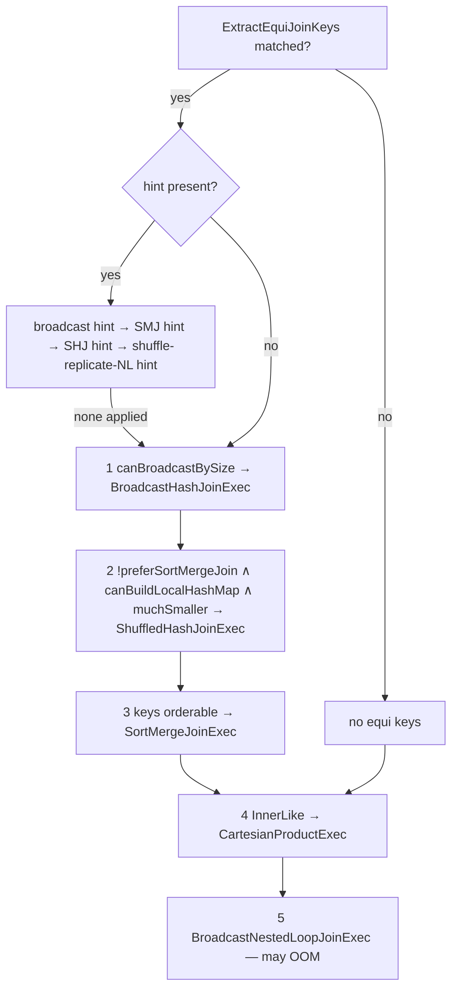

Eleven files, ~5800 lines, and the densest concentration of "why is my query slow" in Spark. The
group owns the physical join operators only — the **choice** of operator is `JoinSelection` inside
`SparkStrategies.scala` (the `query-execution` group) and its size tests are
`JoinSelectionHelper` in catalyst. Both are covered here anyway, because a sweep of join execution
that omits how the operator was picked is not usable.

**Config slice.** `sql/core` registers no configs; the keys these operators read are declared in
catalyst's `SQLConf.scala`. The slice was taken as:

```
subsystem == 'sql/catalyst' AND key matches
  [Jj]oin|\.broadcast|[Cc]artesian|\.hashAgg|preferSortMerge|nestedLoop|\.bucketing\.
```

60 keys, of which 22 tie to a concept here; the rest belong to the optimizer (join reorder, CBO),
the adaptive group (skew join), datasources (V2 bucketing / storage-partitioned joins) or
streaming-exec. Full accounting in the breadth table at the end.



---

## JoinSelection — the decision ladder, and what a hint actually overrides

**What it is:** the strategy that turns a logical `Join` into one of five physical operators. It
runs two ladders: a hint ladder first (if any hint is present), falling back to the no-hint ladder
when no hint applies. The no-hint order is fixed and is the single most useful thing to memorise
about join planning.

**Code path:** `ExtractEquiJoinKeys` match → `createBroadcastHashJoin(false)` →
`createShuffleHashJoin(false)` → `createSortMergeJoin()` → `createCartesianProduct()` →
`BroadcastNestedLoopJoinExec`

**Anchor files:**

- [SparkStrategies.scala:181](https://github.com/apache/spark/blob/v4.2.0/sql/core/src/main/scala/org/apache/spark/sql/execution/SparkStrategies.scala#L181) — `JoinSelection`, and at :219 a 20-line comment that *is* the specification: both ladders written out in order
- [SparkStrategies.scala:305](https://github.com/apache/spark/blob/v4.2.0/sql/core/src/main/scala/org/apache/spark/sql/execution/SparkStrategies.scala#L305) — `createJoinWithoutHint`, the `.orElse` chain that implements the no-hint ladder literally
- [SparkStrategies.scala:321](https://github.com/apache/spark/blob/v4.2.0/sql/core/src/main/scala/org/apache/spark/sql/execution/SparkStrategies.scala#L321) — the hint ladder, whose last line is `.getOrElse(createJoinWithoutHint())` — **a hint that cannot be applied falls through to the normal rules**
- [SparkStrategies.scala:184](https://github.com/apache/spark/blob/v4.2.0/sql/core/src/main/scala/org/apache/spark/sql/execution/SparkStrategies.scala#L184) — `checkHintBuildSide`: an unusable build side in a hint is reported to `conf.hintErrorHandler`, not raised
- [SparkStrategies.scala:207](https://github.com/apache/spark/blob/v4.2.0/sql/core/src/main/scala/org/apache/spark/sql/execution/SparkStrategies.scala#L207) — `checkHintNonEquiJoin`: a `SHUFFLE_HASH` or `MERGE` hint on a join with no equi-keys is silently dropped the same way
- [SparkStrategies.scala:281](https://github.com/apache/spark/blob/v4.2.0/sql/core/src/main/scala/org/apache/spark/sql/execution/SparkStrategies.scala#L281) — `canMerge` excludes `LeftSingle` from sort-merge join, so a scalar-subquery join can never be an SMJ
- [SparkStrategies.scala:295](https://github.com/apache/spark/blob/v4.2.0/sql/core/src/main/scala/org/apache/spark/sql/execution/SparkStrategies.scala#L295) — `createCartesianProduct` passes the **original** condition, equi and non-equi both, because `CartesianProductExec` cannot evaluate join keys itself
- [joins.scala:406](https://github.com/apache/spark/blob/v4.2.0/sql/catalyst/src/main/scala/org/apache/spark/sql/catalyst/optimizer/joins.scala#L406) — `hashJoinSupported`: if any key's type is not *binary stable*, **both** hash strategies are removed from the ladder and a `WARN` naming the offending keys is logged

!!! warning "A join hint is a request, and Spark tells you it was ignored only in the log"

    Three separate paths drop a hint quietly: an unsupported build side for the join type, a
    strategy hint on a join with no equi-keys, and a broadcast hint on a side that cannot be the
    build side for that join type (you cannot `BuildLeft` a left-outer join). All three route to
    `hintErrorHandler` and then fall through to `createJoinWithoutHint()`. The plan simply shows a
    different operator than you asked for, with no error. Confirm the hint took effect by reading
    the operator name in `EXPLAIN`, never by assuming.

!!! info "The ladder is why `preferSortMergeJoin` matters more than it looks"

    `spark.sql.join.preferSortMergeJoin` defaults to **true**, and it appears inside
    `getShuffleHashJoinBuildSide` as `!conf.preferSortMergeJoin && …`. So with the default, rung 2
    of the ladder is unreachable without a hint: Spark goes straight from "too big to broadcast" to
    sort-merge join. Shuffled hash join is effectively opt-in on classic planning — AQE is the
    other way it appears (see `spark.sql.adaptive.maxShuffledHashJoinLocalMapThreshold`).

**Configs:** `spark.sql.join.preferSortMergeJoin` (true, 2.0.0),
`spark.sql.crossJoin.enabled` (true, internal, 2.0.0)

**Maps to topics:** B7, A3

---

## Build-side selection — the three size tests and the statistic they lack

**What it is:** three predicates in catalyst's `JoinSelectionHelper` decide which side can be
built, and they are all byte-size comparisons against `plan.stats.sizeInBytes`. Nothing here counts
rows, and the source says so.

**Anchor files:**

- [joins.scala:367](https://github.com/apache/spark/blob/v4.2.0/sql/catalyst/src/main/scala/org/apache/spark/sql/catalyst/optimizer/joins.scala#L367) — `canBroadcastBySize`: compares against `spark.sql.autoBroadcastJoinThreshold` (10MB), **unless the stats are runtime stats** (AQE), in which case `spark.sql.adaptive.autoBroadcastJoinThreshold` wins if set
- [joins.scala:538](https://github.com/apache/spark/blob/v4.2.0/sql/catalyst/src/main/scala/org/apache/spark/sql/catalyst/optimizer/joins.scala#L538) — `canBuildLocalHashMapBySize`: `sizeInBytes < autoBroadcastJoinThreshold * numShufflePartitions` — the broadcast threshold reused as a *per-partition* budget, so raising `spark.sql.shuffle.partitions` also raises the shuffled-hash-join ceiling
- [joins.scala:550](https://github.com/apache/spark/blob/v4.2.0/sql/catalyst/src/main/scala/org/apache/spark/sql/catalyst/optimizer/joins.scala#L550) — `muchSmaller`: `a.sizeInBytes * spark.sql.shuffledHashJoinFactor (3) <= b.sizeInBytes`, with the in-source admission "we does not have the statistic for number of rows, use the size of bytes here as estimation"
- [joins.scala:360](https://github.com/apache/spark/blob/v4.2.0/sql/catalyst/src/main/scala/org/apache/spark/sql/catalyst/optimizer/joins.scala#L360) — `getSmallerSide` — pure byte comparison, and the tie goes to `BuildRight`
- [joins.scala:377](https://github.com/apache/spark/blob/v4.2.0/sql/catalyst/src/main/scala/org/apache/spark/sql/catalyst/optimizer/joins.scala#L377) — `canBuildBroadcastLeft` / `canBuildBroadcastRight`: the join type alone rules out half the choices. A left-outer join can only build the **right** side; a right-outer only the left; a full outer neither
- [joins.scala:391](https://github.com/apache/spark/blob/v4.2.0/sql/catalyst/src/main/scala/org/apache/spark/sql/catalyst/optimizer/joins.scala#L391) — `canBuildShuffledHashJoinLeft` / `Right`, which *do* allow `FullOuter` on either side — the reason a full outer join can be a shuffled hash join but never a broadcast hash join
- [joins.scala:558](https://github.com/apache/spark/blob/v4.2.0/sql/catalyst/src/main/scala/org/apache/spark/sql/catalyst/optimizer/joins.scala#L558) — `forceApplyShuffledHashJoin`, reading a deliberately undocumented, testing-only config key

!!! warning "The threshold is compared against an *estimate*, and a bad estimate is silent"

    `plan.stats.sizeInBytes` comes from the optimizer's statistics, which for a file source is
    derived from file sizes and for anything downstream of a filter is a heuristic. A compressed
    Parquet file that expands 10× in memory is compared by its **on-disk** size. This is the
    mechanism behind the classic broadcast OOM: the plan qualified, the relation did not.
    `ANALYZE TABLE … COMPUTE STATISTICS` (topic A17) is what replaces the guess, and AQE replaces
    it with a measured shuffle size at runtime.

**Configs:** `spark.sql.autoBroadcastJoinThreshold` (10MB, 1.1.0),
`spark.sql.adaptive.autoBroadcastJoinThreshold` (unset, 3.2.0),
`spark.sql.shuffledHashJoinFactor` (3, 3.3.0), `spark.sql.shuffle.partitions`

**Maps to topics:** A3, A17

---

## The join operator hierarchy — BaseJoinExec, ShuffledJoin, HashJoin

**What it is:** three traits carrying everything the five operators share: the `EXPLAIN` rendering,
the output schema and nullability rules per join type, the distribution requirements, and the
row-level join loops.

**Anchor files:**

- [BaseJoinExec.scala:27](https://github.com/apache/spark/blob/v4.2.0/sql/core/src/main/scala/org/apache/spark/sql/execution/joins/BaseJoinExec.scala#L27) — the four things every join has (`joinType`, `condition`, `leftKeys`, `rightKeys`) and the `verboseStringWithOperatorId` that prints **Left keys / Right keys / Join type / Join condition** in the formatted `EXPLAIN` details block
- [ShuffledJoin.scala:28](https://github.com/apache/spark/blob/v4.2.0/sql/core/src/main/scala/org/apache/spark/sql/execution/joins/ShuffledJoin.scala#L28) — `requiredChildDistribution` is `ClusteredDistribution` on both key sets, which is what makes `EnsureRequirements` insert two exchanges
- [ShuffledJoin.scala:36](https://github.com/apache/spark/blob/v4.2.0/sql/core/src/main/scala/org/apache/spark/sql/execution/joins/ShuffledJoin.scala#L36) — under skew join it becomes `UnspecifiedDistribution`, because the re-arranged partitions no longer satisfy the clustering
- [ShuffledJoin.scala:47](https://github.com/apache/spark/blob/v4.2.0/sql/core/src/main/scala/org/apache/spark/sql/execution/joins/ShuffledJoin.scala#L47) — `outputPartitioning` per join type; **`FullOuter` returns `UnknownPartitioning`**, which is why a downstream aggregate after a full outer join always re-shuffles
- [ShuffledJoin.scala:60](https://github.com/apache/spark/blob/v4.2.0/sql/core/src/main/scala/org/apache/spark/sql/execution/joins/ShuffledJoin.scala#L60) — the nullability table: which side's attributes get `withNullability(true)` for each join type, in one place
- [HashJoin.scala:44](https://github.com/apache/spark/blob/v4.2.0/sql/core/src/main/scala/org/apache/spark/sql/execution/joins/HashJoin.scala#L44) — the trait shared by broadcast and shuffled hash join: `buildSide`, `streamedPlan` / `buildPlan`, and the five interpreted loops
- [HashJoin.scala:165](https://github.com/apache/spark/blob/v4.2.0/sql/core/src/main/scala/org/apache/spark/sql/execution/joins/HashJoin.scala#L165) — `innerJoin`, and at :196 `outerJoin`, :246 `semiJoin`, :272 `existenceJoin`, :301 `antiJoin` — the non-codegen implementations, one per join family
- [HashJoin.scala:330](https://github.com/apache/spark/blob/v4.2.0/sql/core/src/main/scala/org/apache/spark/sql/execution/joins/HashJoin.scala#L330) — `join`, the dispatcher both hash operators call from `doExecute`
- [JoinCodegenSupport.scala:28](https://github.com/apache/spark/blob/v4.2.0/sql/core/src/main/scala/org/apache/spark/sql/execution/joins/JoinCodegenSupport.scala#L28) — `getJoinCondition` (:37) and `genOneSideJoinVars` (:75), shared by every codegen path below

**Configs:** none directly

**Maps to topics:** B7, A1

---

## BroadcastHashJoinExec — no shuffle, and an output partitioning that expands

**What it is:** the fastest join. One side is collected to the driver, turned into a
`HashedRelation`, broadcast, and probed from a map task on the other side. The streamed side is
never shuffled, so the join adds no stage boundary at all.

**Code path:** `requiredChildDistribution = BroadcastDistribution(HashedRelationBroadcastMode)` →
`EnsureRequirements` inserts `BroadcastExchangeExec` → `buildPlan.executeBroadcast[HashedRelation]()`
→ `streamedPlan.execute().mapPartitions { join(_, hashed, numOutputRows) }`

**Anchor files:**

- [BroadcastHashJoinExec.scala:40](https://github.com/apache/spark/blob/v4.2.0/sql/core/src/main/scala/org/apache/spark/sql/execution/joins/BroadcastHashJoinExec.scala#L40) — the operator; the constructor is `private`, and the companion `apply` at :254 is what normalises collated keys
- [BroadcastHashJoinExec.scala:64](https://github.com/apache/spark/blob/v4.2.0/sql/core/src/main/scala/org/apache/spark/sql/execution/joins/BroadcastHashJoinExec.scala#L64) — **one metric only**: `numOutputRows`. There is no build time or build size here, unlike shuffled hash join — those numbers live on the `BroadcastExchange` node above it
- [BroadcastHashJoinExec.scala:68](https://github.com/apache/spark/blob/v4.2.0/sql/core/src/main/scala/org/apache/spark/sql/execution/joins/BroadcastHashJoinExec.scala#L68) — `requiredChildDistribution` carries the *mode*, so the exchange builds the hash map, not the join
- [BroadcastHashJoinExec.scala:77](https://github.com/apache/spark/blob/v4.2.0/sql/core/src/main/scala/org/apache/spark/sql/execution/joins/BroadcastHashJoinExec.scala#L77) — `outputPartitioning` for inner joins is **expanded**: because `a = x` held, a plan partitioned by `a` is also partitioned by `x`, so both are advertised and a downstream operator can avoid a shuffle. Capped by `spark.sql.execution.broadcastHashJoin.outputPartitioningExpandLimit` (8)
- [BroadcastHashJoinExec.scala:161](https://github.com/apache/spark/blob/v4.2.0/sql/core/src/main/scala/org/apache/spark/sql/execution/joins/BroadcastHashJoinExec.scala#L161) — `asReadOnlyCopy()` per task, plus `incPeakExecutionMemory(hashed.estimatedSize)` — the broadcast relation is shared per executor but each task gets its own cursor
- [BroadcastHashJoinExec.scala:172](https://github.com/apache/spark/blob/v4.2.0/sql/core/src/main/scala/org/apache/spark/sql/execution/joins/BroadcastHashJoinExec.scala#L172) — `multipleOutputForOneInput` consults `keyIsUnique` on the built relation to decide `needCopyResult` — a codegen correctness detail that depends on runtime data, not on the plan
- [exchange/BroadcastExchangeExec.scala:164](https://github.com/apache/spark/blob/v4.2.0/sql/core/src/main/scala/org/apache/spark/sql/execution/exchange/BroadcastExchangeExec.scala#L164) — the hard row ceilings: **~341 million** rows for a `BytesToBytesMap`-backed relation (`MAX_CAPACITY / 1.5`), **512,000,000** otherwise
- [exchange/BroadcastExchangeExec.scala:234](https://github.com/apache/spark/blob/v4.2.0/sql/core/src/main/scala/org/apache/spark/sql/execution/exchange/BroadcastExchangeExec.scala#L234) — an executor `OutOfMemoryError` during the build is caught and re-thrown as a message telling you to raise driver memory or disable broadcast; at :267 the `spark.sql.broadcastTimeout` (300s) failure

!!! info "Three distinct broadcast failure modes, three distinct messages"

    A broadcast join can fail by **row count** (over the 341M / 512M ceiling, thrown before any
    memory pressure), by **driver memory** (the collect itself, or building the map), or by
    **timeout** (300s by default, counted from when the future starts). They need different fixes —
    lowering `autoBroadcastJoinThreshold`, raising `spark.driver.memory`, raising
    `spark.sql.broadcastTimeout` — and reading which of the three you got is the whole diagnosis.
    The build runs on the `broadcast-exchange` pool, sized by
    `spark.sql.broadcastExchange.maxThreadThreshold` (128).

**Configs:** `spark.sql.autoBroadcastJoinThreshold` (10MB),
`spark.sql.broadcastTimeout` (300s, 1.3.0),
`spark.sql.execution.broadcastHashJoin.outputPartitioningExpandLimit` (8, 3.1.0),
`spark.sql.broadcastExchange.maxThreadThreshold` (128, static, 3.0.0),
`spark.sql.codegen.broadcastCleanedSourceThreshold`

**Maps to topics:** B7, A3

---

## HashedRelation — the build-side map, and the three sentinel relations

**What it is:** the data structure both hash joins probe. Two real implementations —
`UnsafeHashedRelation` (a `BytesToBytesMap`) and `LongHashedRelation` (a `LongToUnsafeRowMap`) —
and three singleton sentinels that let the join short-circuit entirely.

**Anchor files:**

- [HashedRelation.scala:126](https://github.com/apache/spark/blob/v4.2.0/sql/core/src/main/scala/org/apache/spark/sql/execution/joins/HashedRelation.scala#L126) — the factory, and the whole selection rule in three branches: empty input → `EmptyHashedRelation`; **single key of `LongType`** → `LongHashedRelation`; otherwise `UnsafeHashedRelation`
- [HashedRelation.scala:43](https://github.com/apache/spark/blob/v4.2.0/sql/core/src/main/scala/org/apache/spark/sql/execution/joins/HashedRelation.scala#L43) — the trait: `get` / `getValue` in both `InternalRow` and `Long` forms, plus `keyIsUnique`, which downstream codegen branches on
- [HashedRelation.scala:455](https://github.com/apache/spark/blob/v4.2.0/sql/core/src/main/scala/org/apache/spark/sql/execution/joins/HashedRelation.scala#L455) — `UnsafeHashedRelation.apply`: sized at `sizeEstimate * 1.5 + 1` because "only 70% of the slots can be used before growing"; a failed `append` frees the map and raises `cannotAcquireMemoryToBuildUnsafeHashedRelation`
- [HashedRelation.scala:470](https://github.com/apache/spark/blob/v4.2.0/sql/core/src/main/scala/org/apache/spark/sql/execution/joins/HashedRelation.scala#L470) — rows whose key `anyNull` are **skipped** during the build unless `allowsNullKey` — null keys never match, so they are simply not stored
- [HashedRelation.scala:349](https://github.com/apache/spark/blob/v4.2.0/sql/core/src/main/scala/org/apache/spark/sql/execution/joins/HashedRelation.scala#L349) — the relation implements **both** `Externalizable` (:349) and `KryoSerializable` (:353), because the broadcast is serialized by whichever serializer the session configures
- [HashedRelation.scala:219](https://github.com/apache/spark/blob/v4.2.0/sql/core/src/main/scala/org/apache/spark/sql/execution/joins/HashedRelation.scala#L219) — `asReadOnlyCopy`, called once per task; the underlying map is shared, only the cursor is not
- [HashedRelation.scala:266](https://github.com/apache/spark/blob/v4.2.0/sql/core/src/main/scala/org/apache/spark/sql/execution/joins/HashedRelation.scala#L266) — `getWithKeyIndex` and `maxNumKeysIndex` (:319): the key-index API that exists solely so shuffled hash join can track matched build rows in a `BitSet`
- [HashedRelation.scala:170](https://github.com/apache/spark/blob/v4.2.0/sql/core/src/main/scala/org/apache/spark/sql/execution/joins/HashedRelation.scala#L170) — `ValueRowWithKeyIndex`, documented as "instantiated once per thread and reused" — one of many mutable-object-reuse patterns that make join code unsafe to hold references into

!!! info "`EmptyHashedRelation` and `HashedRelationWithAllNullKeys` are plan-time shortcuts"

    Both are objects, and both hash operators compare against them by **identity** before doing any
    work. An empty build side turns an inner join into an empty iterator and a null-aware anti join
    into a pass-through, and the codegen path (`prepareRelation`) bakes the decision into the
    generated source. That is why an empty broadcast side costs essentially nothing at runtime.

**Configs:** `spark.serializer` (which serializer moves the relation),
`spark.sql.autoBroadcastJoinThreshold` (indirectly, via what gets built)

**Maps to topics:** B7, A3, E11

---

## Long-key packing and LongToUnsafeRowMap's dense mode

**What it is:** an invisible optimisation with a large constant factor. If **every** join key is an
integral type and their sizes sum to ≤ 8 bytes, Spark rewrites the whole key set into a single
`Long` by bit-shifting, and the join then uses a specialised long-keyed map instead of a byte-array
map. That map can further convert itself to a *dense* array indexed by `key - minKey`.

**Anchor files:**

- [HashJoin.scala:743](https://github.com/apache/spark/blob/v4.2.0/sql/core/src/main/scala/org/apache/spark/sql/execution/joins/HashJoin.scala#L743) — `canRewriteAsLongType`: all keys `IntegralType` and `defaultSize` summing to ≤ 8. The TODO says `BooleanType`, `DateType` and `TimestampType` are not yet included
- [HashJoin.scala:754](https://github.com/apache/spark/blob/v4.2.0/sql/core/src/main/scala/org/apache/spark/sql/execution/joins/HashJoin.scala#L754) — `rewriteKeyExpr`, building `BitwiseOr(ShiftLeft(acc, bits), BitwiseAnd(cast(e, LongType), mask))` — so `(int, int)`, `(short, int, byte)` and `(long)` all collapse to one long
- [HashJoin.scala:777](https://github.com/apache/spark/blob/v4.2.0/sql/core/src/main/scala/org/apache/spark/sql/execution/joins/HashJoin.scala#L777) — `extractKeyExprAt`, the inverse, used to recover an individual key from the packed long (needed by dynamic partition pruning)
- [HashedRelation.scala:503](https://github.com/apache/spark/blob/v4.2.0/sql/core/src/main/scala/org/apache/spark/sql/execution/joins/HashedRelation.scala#L503) — the `LongToUnsafeRowMap` header comment: the page layout, sparse mode (`[key][address]…`, quadratic probing with triangular numbers) and dense mode (`[address]…`, indexed by `key - minKey`)
- [HashedRelation.scala:865](https://github.com/apache/spark/blob/v4.2.0/sql/core/src/main/scala/org/apache/spark/sql/execution/joins/HashedRelation.scala#L865) — `optimize()`: converts to dense mode when the key range is smaller than the current array **or under 1024**, i.e. when it fits in L1 cache. Dense mode probes with no hashing and no probing at all
- [HashedRelation.scala:618](https://github.com/apache/spark/blob/v4.2.0/sql/core/src/main/scala/org/apache/spark/sql/execution/joins/HashedRelation.scala#L618) — `firstSlot` / `nextSlot`, the sparse-mode probe sequence
- [exchange/BroadcastExchangeExec.scala:164](https://github.com/apache/spark/blob/v4.2.0/sql/core/src/main/scala/org/apache/spark/sql/execution/exchange/BroadcastExchangeExec.scala#L164) — an operational consequence: the 341M-row ceiling applies to `BytesToBytesMap` relations, so a **long-keyed** broadcast gets the higher 512M limit

!!! info "Join on ints, not on strings — and the reason is in the data structure, not the comparison"

    A join on two `int` columns packs into one `Long`, uses an array-backed map, and can go dense.
    The same join on a `string` key uses `BytesToBytesMap` with byte-array hashing and comparison
    on every probe. The difference is not the cost of comparing two values; it is a different map
    implementation with a different memory layout. Where a surrogate integer key is available, this
    is a larger and more reliable win than most join tuning.

**Configs:** none — the rewrite is unconditional when the types qualify

**Maps to topics:** A3, E1

---

## SortMergeJoinExec and SortMergeJoinScanner

**What it is:** the default for two large sides. Both inputs arrive clustered *and sorted* on the
join keys; the operator advances two cursors in lockstep, and for each streamed key buffers **all**
buffered-side rows sharing that key so the streamed row can be joined against each.

**Code path:** `requiredChildDistribution` (clustered) + `requiredChildOrdering` (ascending) →
`EnsureRequirements` inserts exchanges and `SortExec` → `zipPartitions` →
`SortMergeJoinScanner.findNextInnerJoinRows`

**Anchor files:**

- [SortMergeJoinExec.scala:39](https://github.com/apache/spark/blob/v4.2.0/sql/core/src/main/scala/org/apache/spark/sql/execution/joins/SortMergeJoinExec.scala#L39) — the operator; two metrics, `numOutputRows` and **`spillSize`** — the one number that tells you the buffer overflowed
- [SortMergeJoinExec.scala:94](https://github.com/apache/spark/blob/v4.2.0/sql/core/src/main/scala/org/apache/spark/sql/execution/joins/SortMergeJoinExec.scala#L94) — `requiredChildOrdering`, and at :97 the note that it **must** be ascending to agree with the `keyOrdering` used in `doExecute`
- [SortMergeJoinExec.scala:52](https://github.com/apache/spark/blob/v4.2.0/sql/core/src/main/scala/org/apache/spark/sql/execution/joins/SortMergeJoinExec.scala#L52) — `outputOrdering`: an inner join preserves **both** sides' orderings, so a downstream sort on either key set is free — the main reason SMJ is not simply worse than SHJ
- [SortMergeJoinExec.scala:111](https://github.com/apache/spark/blob/v4.2.0/sql/core/src/main/scala/org/apache/spark/sql/execution/joins/SortMergeJoinExec.scala#L111) — `onlyBufferFirstMatchedRow`: for a semi/anti join with no extra condition the in-memory threshold drops to **1**, because only existence matters
- [SortMergeJoinExec.scala:130](https://github.com/apache/spark/blob/v4.2.0/sql/core/src/main/scala/org/apache/spark/sql/execution/joins/SortMergeJoinExec.scala#L130) — `doExecute` delegates to `SortMergeJoinEvaluatorFactory` (`spark.sql.execution.usePartitionEvaluator`) via `zipPartitions`
- [SortMergeJoinExec.scala:1063](https://github.com/apache/spark/blob/v4.2.0/sql/core/src/main/scala/org/apache/spark/sql/execution/joins/SortMergeJoinExec.scala#L1063) — `SortMergeJoinScanner`, whose doc warns that `getBufferedMatches` and `getStreamedRow` "return mutable objects which are re-used across calls"
- [SortMergeJoinExec.scala:1085](https://github.com/apache/spark/blob/v4.2.0/sql/core/src/main/scala/org/apache/spark/sql/execution/joins/SortMergeJoinExec.scala#L1085) — the buffer: an `ExternalAppendOnlyUnsafeRowArray` with a `TODO` noting the byte-size threshold is borrowed rather than having its own config
- [SortMergeJoinExec.scala:1228](https://github.com/apache/spark/blob/v4.2.0/sql/core/src/main/scala/org/apache/spark/sql/execution/joins/SortMergeJoinExec.scala#L1228) — `advancedBufferedToRowWithNullFreeJoinKey`: buffered rows with a null key are skipped up front, so the merge loop never has to test for them
- [SortMergeJoinExec.scala:1247](https://github.com/apache/spark/blob/v4.2.0/sql/core/src/main/scala/org/apache/spark/sql/execution/joins/SortMergeJoinExec.scala#L1247) — `bufferMatchingRows`, the loop that buffers a whole key group. **This is the OOM/spill site**
- [SortMergeJoinExec.scala:1329](https://github.com/apache/spark/blob/v4.2.0/sql/core/src/main/scala/org/apache/spark/sql/execution/joins/SortMergeJoinExec.scala#L1329) — `OneSideOuterIterator`, shared by `LeftOuterIterator` and `RightOuterIterator`, which differ only in which side of the `JoinedRow` they set

!!! warning "SMJ streams one side but buffers the other — per key, not per partition"

    "Sort-merge join streams both sides" is the common summary and it is wrong in the case that
    matters. Rows are buffered for the duration of one join key. A key with a million matches on
    the buffered side buffers a million rows in one task, spilling past
    `spark.sql.sortMergeJoinExec.buffer.spill.threshold`. AQE skew splitting cannot help — it
    divides a *partition*, and this is one key.

**Configs:** `spark.sql.sortMergeJoinExec.buffer.in.memory.threshold` (`MAX_ROUNDED_ARRAY_LENGTH`,
2.2.1), `spark.sql.sortMergeJoinExec.buffer.spill.threshold` (2.2.0),
`spark.sql.sortMergeJoinExec.buffer.spill.size.threshold` (4.1.0),
`spark.sql.codegen.join.fullOuterSortMergeJoin.enabled` (true, 3.3.0),
`spark.sql.codegen.join.existenceSortMergeJoin.enabled` (true, 3.3.0)

**Maps to topics:** B7, A3

---

## ShuffledHashJoinExec — and full outer joins without a sort

**What it is:** shuffle both sides on the keys, then build a hash map from one side **per
partition** and probe it with the other. No sort, so no `SortExec` and no sorted output. Since 3.5
it also implements full-outer and build-side-outer joins using a key-index bit set instead of a
second pass.

**Anchor files:**

- [ShuffledHashJoinExec.scala:38](https://github.com/apache/spark/blob/v4.2.0/sql/core/src/main/scala/org/apache/spark/sql/execution/joins/ShuffledHashJoinExec.scala#L38) — the operator, with **three** metrics: `numOutputRows`, `buildDataSize`, `buildTime` — the per-partition build cost is visible here, unlike in a broadcast join
- [ShuffledHashJoinExec.scala:103](https://github.com/apache/spark/blob/v4.2.0/sql/core/src/main/scala/org/apache/spark/sql/execution/joins/ShuffledHashJoinExec.scala#L103) — `buildHashedRelation`, which is public because the **generated code calls it**; it registers a task-completion listener to `close()` the relation
- [ShuffledHashJoinExec.scala:113](https://github.com/apache/spark/blob/v4.2.0/sql/core/src/main/scala/org/apache/spark/sql/execution/joins/ShuffledHashJoinExec.scala#L113) — `allowsNullKey` is enabled exactly when the *build* side is the outer side (full outer, or left/right outer built on that side) — those joins must emit unmatched build rows, including null-keyed ones
- [ShuffledHashJoinExec.scala:68](https://github.com/apache/spark/blob/v4.2.0/sql/core/src/main/scala/org/apache/spark/sql/execution/joins/ShuffledHashJoinExec.scala#L68) — `validCondForIgnoreDupKey` / `ignoreDuplicatedKey` (:94): for a semi or anti join, duplicate build keys are **not stored at all**, which can shrink the map by orders of magnitude on a low-cardinality key
- [ShuffledHashJoinExec.scala:190](https://github.com/apache/spark/blob/v4.2.0/sql/core/src/main/scala/org/apache/spark/sql/execution/joins/ShuffledHashJoinExec.scala#L190) — `buildSideOrFullOuterJoinUniqueKey`: a `BitSet` sized by `maxNumKeysIndex` marks matched build keys during the probe pass; a second pass over the relation emits the unmatched ones. The bit set's own size is added to `buildDataSize`
- [ShuffledHashJoinExec.scala:263](https://github.com/apache/spark/blob/v4.2.0/sql/core/src/main/scala/org/apache/spark/sql/execution/joins/ShuffledHashJoinExec.scala#L263) — the non-unique-key variant, which needs a bit per *value* rather than per key
- [ShuffledHashJoinExec.scala:58](https://github.com/apache/spark/blob/v4.2.0/sql/core/src/main/scala/org/apache/spark/sql/execution/joins/ShuffledHashJoinExec.scala#L58) — `outputOrdering` is `Nil` for exactly those cases, because the second (un-ordered) pass over the hash relation destroys any ordering
- [ShuffledHashJoinExec.scala:663](https://github.com/apache/spark/blob/v4.2.0/sql/core/src/main/scala/org/apache/spark/sql/execution/joins/ShuffledHashJoinExec.scala#L663) — the companion `apply` that normalises collated keys, mirroring `BroadcastHashJoinExec`

!!! info "A full outer join is a shuffled hash join or a sort-merge join — never a broadcast"

    `canBuildBroadcastLeft`/`Right` both reject `FullOuter`, while
    `canBuildShuffledHashJoinLeft`/`Right` accept it. So a full outer join always shuffles, and the
    hash variant is the one that avoids the sort. Both codegen paths for it are gated:
    `spark.sql.codegen.join.fullOuterShuffledHashJoin.enabled` and
    `…buildSideOuterShuffledHashJoin.enabled`, both true since 3.3/3.5.

**Configs:** `spark.sql.codegen.join.fullOuterShuffledHashJoin.enabled` (true, 3.3.0),
`spark.sql.codegen.join.buildSideOuterShuffledHashJoin.enabled` (true, 3.5.0),
`spark.sql.adaptive.maxShuffledHashJoinLocalMapThreshold`

**Maps to topics:** B7, A3, A4

---

## BroadcastNestedLoopJoinExec — the fallback with no size check

**What it is:** the operator `JoinSelection` reaches when nothing else applies — a join with no
equi-keys that is not an inner join. One side is broadcast as a plain `Array[InternalRow]` and every
streamed row is compared against every broadcast row.

**Anchor files:**

- [BroadcastNestedLoopJoinExec.scala:34](https://github.com/apache/spark/blob/v4.2.0/sql/core/src/main/scala/org/apache/spark/sql/execution/joins/BroadcastNestedLoopJoinExec.scala#L34) — the operator, whose `leftKeys` and `rightKeys` are `Nil` by definition
- [SparkStrategies.scala:316](https://github.com/apache/spark/blob/v4.2.0/sql/core/src/main/scala/org/apache/spark/sql/execution/SparkStrategies.scala#L316) — the selection site, with the comment "This join could be very slow or OOM". **No size test is applied** — `getSmallerSide` picks a side by bytes, but nothing checks that it fits
- [BroadcastNestedLoopJoinExec.scala:120](https://github.com/apache/spark/blob/v4.2.0/sql/core/src/main/scala/org/apache/spark/sql/execution/joins/BroadcastNestedLoopJoinExec.scala#L120) — `innerJoin`, the nested loop itself: `streamed × broadcast` filtered by the condition
- [BroadcastNestedLoopJoinExec.scala:359](https://github.com/apache/spark/blob/v4.2.0/sql/core/src/main/scala/org/apache/spark/sql/execution/joins/BroadcastNestedLoopJoinExec.scala#L359) — `getMatchedBroadcastRowsBitSet`: full outer and build-side outer need a **whole extra pass** over the streamed RDD to compute a per-partition `BitSet` of matched broadcast rows, then `fold` them together on the driver
- [BroadcastNestedLoopJoinExec.scala:300](https://github.com/apache/spark/blob/v4.2.0/sql/core/src/main/scala/org/apache/spark/sql/execution/joins/BroadcastNestedLoopJoinExec.scala#L300) — `defaultJoin`, the path taken for left-outer-with-BuildLeft, right-outer-with-BuildRight and full outer — the three shapes that need that second pass
- [BroadcastNestedLoopJoinExec.scala:389](https://github.com/apache/spark/blob/v4.2.0/sql/core/src/main/scala/org/apache/spark/sql/execution/joins/BroadcastNestedLoopJoinExec.scala#L389) — the `doExecute` dispatch table, including an explicit `IllegalArgumentException` for `LeftSingle` with `BuildLeft`
- [BroadcastNestedLoopJoinExec.scala:429](https://github.com/apache/spark/blob/v4.2.0/sql/core/src/main/scala/org/apache/spark/sql/execution/joins/BroadcastNestedLoopJoinExec.scala#L429) — `supportCodegen` covers only inner and the two single-pass outer shapes; the bit-set paths run interpreted
- [BroadcastNestedLoopJoinExec.scala:44](https://github.com/apache/spark/blob/v4.2.0/sql/core/src/main/scala/org/apache/spark/sql/execution/joins/BroadcastNestedLoopJoinExec.scala#L44) — one metric, `numOutputRows`, which on a nested loop join is the number you watch grow while the job hangs

!!! warning "`BroadcastNestedLoopJoin` in a plan means a predicate stopped being a join key"

    `ExtractEquiJoinKeys` (see the [planner sweep](sql-catalyst-planner.md)) only yields keys for
    equality predicates with references on both sides. An inequality, a `LIKE`, a `UDF(a) = b`, or
    a condition Spark could not push into the join, and the whole join drops to nested loops with
    no size guard. `NO_BROADCAST_AND_REPLICATION` is the hint that forces a build side but cannot
    make it fast.

**Configs:** `spark.sql.autoBroadcastJoinThreshold` (only via `getSmallerSide` stats, not as a
guard)

**Maps to topics:** B7, A3

---

## CartesianProductExec

**What it is:** the inner-join-with-no-keys operator. Every left partition is paired with every
right partition, and for each pair the **entire right partition** is buffered so it can be
re-iterated per left row.

**Anchor files:**

- [CartesianProductExec.scala:35](https://github.com/apache/spark/blob/v4.2.0/sql/core/src/main/scala/org/apache/spark/sql/execution/joins/CartesianProductExec.scala#L35) — `UnsafeCartesianRDD`, and its doc: buffering the right side is also what **materialises a nondeterministic right RDD** so it is not recomputed differently per left row
- [CartesianProductExec.scala:44](https://github.com/apache/spark/blob/v4.2.0/sql/core/src/main/scala/org/apache/spark/sql/execution/joins/CartesianProductExec.scala#L44) — the `ExternalAppendOnlyUnsafeRowArray` with its own three thresholds, defaulting to an in-memory buffer of only **4096** rows — far smaller than the sort-merge join's
- [CartesianProductExec.scala:67](https://github.com/apache/spark/blob/v4.2.0/sql/core/src/main/scala/org/apache/spark/sql/execution/joins/CartesianProductExec.scala#L67) — the operator; note the condition is applied **after** the pair is formed, so a "filtered cartesian" still materialises every pair
- [CartesianProductExec.scala:94](https://github.com/apache/spark/blob/v4.2.0/sql/core/src/main/scala/org/apache/spark/sql/execution/joins/CartesianProductExec.scala#L94) — `GenerateUnsafeRowJoiner`, a generated byte-level row concatenator, which is why this operator is faster than the nested loop join despite doing the same amount of comparison work
- [SparkStrategies.scala:295](https://github.com/apache/spark/blob/v4.2.0/sql/core/src/main/scala/org/apache/spark/sql/execution/SparkStrategies.scala#L295) — chosen only for `InnerLike` join types, and suppressed by the `NO_BROADCAST_AND_REPLICATION` hint

!!! info "`spark.sql.crossJoin.enabled` is internal and defaults to true"

    The config that once made an accidental cartesian product an error is now `internal()` and
    `true` by default, so an implicit cross join plans silently. The `CheckCartesianProducts` rule
    (re-run in `SparkOptimizer`'s Python-UDF batch) is what consults it. Detecting an unintended
    cartesian product is now a plan-reading exercise, not something Spark will refuse.

**Configs:** `spark.sql.cartesianProductExec.buffer.in.memory.threshold` (4096, 2.2.1),
`spark.sql.cartesianProductExec.buffer.spill.threshold` (2.2.0),
`spark.sql.cartesianProductExec.buffer.spill.size.threshold` (4.1.0),
`spark.sql.crossJoin.enabled` (true, internal)

**Maps to topics:** B7

---

## Join-side buffering and spill

**What it is:** the cross-cutting resource story. Only broadcast hash join holds no per-task
buffer. Sort-merge join buffers one key group, shuffled hash join builds a whole partition's hash
map in task memory, cartesian product buffers a whole right partition, and nested loop join holds
the full broadcast array plus a bit set. Each has its own thresholds, in its own config namespace.

**Anchor files:**

- [SortMergeJoinExec.scala:1085](https://github.com/apache/spark/blob/v4.2.0/sql/core/src/main/scala/org/apache/spark/sql/execution/joins/SortMergeJoinExec.scala#L1085) — SMJ's buffer, constructed with `(inMemoryThreshold, sizeInBytesSpillThreshold, spillThreshold, sizeInBytesSpillThreshold)` — the byte threshold is passed **twice** because there is no separate in-memory byte config, with a `TODO` saying so
- [SortMergeJoinExec.scala:1096](https://github.com/apache/spark/blob/v4.2.0/sql/core/src/main/scala/org/apache/spark/sql/execution/joins/SortMergeJoinExec.scala#L1096) — the task-completion listener that adds the buffer's `spillSize` into the operator metric, which is how spill becomes visible in the SQL tab
- [SortMergeJoinExec.scala:116](https://github.com/apache/spark/blob/v4.2.0/sql/core/src/main/scala/org/apache/spark/sql/execution/joins/SortMergeJoinExec.scala#L116) — `getInMemoryThreshold` returns **1** for keyless semi/anti joins — the one case where the buffer is bounded by construction
- [CartesianProductExec.scala:44](https://github.com/apache/spark/blob/v4.2.0/sql/core/src/main/scala/org/apache/spark/sql/execution/joins/CartesianProductExec.scala#L44) — the same array type with a different, much smaller default and the identical `TODO`
- [ShuffledHashJoinExec.scala:103](https://github.com/apache/spark/blob/v4.2.0/sql/core/src/main/scala/org/apache/spark/sql/execution/joins/ShuffledHashJoinExec.scala#L103) — SHJ has **no spill path at all**: `HashedRelation` is built into the task's `TaskMemoryManager` and a failed acquisition throws rather than spilling
- [HashedRelation.scala:489](https://github.com/apache/spark/blob/v4.2.0/sql/core/src/main/scala/org/apache/spark/sql/execution/joins/HashedRelation.scala#L489) — `cannotAcquireMemoryToBuildUnsafeHashedRelationError`, the failure that surfaces when a partition's build side does not fit
- [HashedRelation.scala:603](https://github.com/apache/spark/blob/v4.2.0/sql/core/src/main/scala/org/apache/spark/sql/execution/joins/HashedRelation.scala#L603) — `LongToUnsafeRowMap.spill` returns a hard-coded **`0L`**: it is registered as a `MemoryConsumer` but will never release memory under pressure
- [ExternalAppendOnlyUnsafeRowArray.scala:48](https://github.com/apache/spark/blob/v4.2.0/sql/core/src/main/scala/org/apache/spark/sql/execution/ExternalAppendOnlyUnsafeRowArray.scala#L48) — the shared array type, also used by window functions; covered in the [query-execution sweep](sql-core-query-execution.md)

!!! warning "Eight thresholds, three namespaces, and none of them is `spark.sql.shuffle.partitions`"

    `sortMergeJoinExec.buffer.{in.memory.threshold, spill.threshold, spill.size.threshold}`,
    `cartesianProductExec.buffer.{…}` — same three names, different defaults — and
    `windowExec.buffer.{…}` for the operator that shares the array. Shuffled hash join has none of
    them because it does not spill. Diagnosing "task OOMs on one key" starts with reading the
    operator name to know which set applies.

!!! info "`LongToUnsafeRowMap` cannot spill, by construction"

    Its `spill` override returns `0L`. So a long-keyed hash relation that does not fit is an error,
    not a slow query — and the same is true of `UnsafeHashedRelation`, whose failure path frees the
    map and throws. Hash joins are all-or-nothing on memory in a way sort-merge join is not, which
    is the real reason `preferSortMergeJoin` defaults to true.

**Configs:** `spark.sql.sortMergeJoinExec.buffer.in.memory.threshold`, `.spill.threshold`,
`.spill.size.threshold`; `spark.sql.cartesianProductExec.buffer.in.memory.threshold` (4096),
`.spill.threshold`, `.spill.size.threshold`; `spark.memory.fraction` (what the hash build competes
for)

**Maps to topics:** none yet — proposed as **A30**

---

## Join codegen — five shapes and four independent off-switches

**What it is:** each hash join family has a generated form (`codegenInner`, `codegenOuter`,
`codegenSemi`, `codegenAnti`, `codegenExistence`), and sort-merge join has a sixth
(`codegenFullOuter`). Four of them can be turned off by config, and two operators force their
children into separate codegen stages.

**Anchor files:**

- [HashJoin.scala:399](https://github.com/apache/spark/blob/v4.2.0/sql/core/src/main/scala/org/apache/spark/sql/execution/joins/HashJoin.scala#L399) — `codegenInner`, then :453 `codegenOuter`, :542 `codegenSemi`, :595 `codegenAnti`, :664 `codegenExistence`
- [HashJoin.scala:726](https://github.com/apache/spark/blob/v4.2.0/sql/core/src/main/scala/org/apache/spark/sql/execution/joins/HashJoin.scala#L726) — `prepareRelation`, the single abstract method separating broadcast (a broadcast variable) from shuffled (a per-partition build) in generated code
- [HashJoin.scala:381](https://github.com/apache/spark/blob/v4.2.0/sql/core/src/main/scala/org/apache/spark/sql/execution/joins/HashJoin.scala#L381) — `genStreamSideJoinKey`, which emits a **`long`** variable directly when the keys were packed, skipping row materialisation on the probe side entirely
- [SortMergeJoinExec.scala:167](https://github.com/apache/spark/blob/v4.2.0/sql/core/src/main/scala/org/apache/spark/sql/execution/joins/SortMergeJoinExec.scala#L167) — `supportCodegen` returns a **config** for `FullOuter` and `ExistenceJoin`, and `true` otherwise
- [SortMergeJoinExec.scala:213](https://github.com/apache/spark/blob/v4.2.0/sql/core/src/main/scala/org/apache/spark/sql/execution/joins/SortMergeJoinExec.scala#L213) — `genScanner`, the generated merge loop; at :441 `needCopyResult` is unconditionally `true` because buffered matches are reused objects
- [ShuffledHashJoinExec.scala:362](https://github.com/apache/spark/blob/v4.2.0/sql/core/src/main/scala/org/apache/spark/sql/execution/joins/ShuffledHashJoinExec.scala#L362) — SHJ's `supportCodegen`, similarly config-gated for full outer and build-side outer
- [WholeStageCodegenExec.scala:945](https://github.com/apache/spark/blob/v4.2.0/sql/core/src/main/scala/org/apache/spark/sql/execution/WholeStageCodegenExec.scala#L945) — `SortMergeJoinExec` and `ShuffledHashJoinExec` have their **children wrapped in `InputAdapter`**, so a join always ends the codegen stage below it — visible in `EXPLAIN` as separate `*(n)` groups either side of the join
- [BroadcastHashJoinExec.scala:186](https://github.com/apache/spark/blob/v4.2.0/sql/core/src/main/scala/org/apache/spark/sql/execution/joins/BroadcastHashJoinExec.scala#L186) — by contrast BHJ *joins* the streamed side's codegen stage: `inputRDDs()` delegates straight to the streamed plan

!!! info "Why a broadcast join has one `*` group and a sort-merge join has three"

    `CollapseCodegenStages` forces `InputAdapter`s under both shuffled joins, splitting the pipeline
    into (left child) / (join) / (right child). A broadcast hash join has no such rule and fuses
    into the streamed side's existing stage. Reading `EXPLAIN` for stage boundaries therefore tells
    you the join strategy before you read the operator name.

**Configs:** `spark.sql.codegen.join.fullOuterSortMergeJoin.enabled` (true, 3.3.0),
`.existenceSortMergeJoin.enabled` (true, 3.3.0), `.fullOuterShuffledHashJoin.enabled` (true, 3.3.0),
`.buildSideOuterShuffledHashJoin.enabled` (true, 3.5.0),
`spark.sql.codegen.broadcastCleanedSourceThreshold`

**Maps to topics:** A1, I7

---

## Null-aware anti join — the NOT IN rewrite and its three sentinels

**What it is:** `NOT IN (subquery)` has three-valued semantics — if the subquery produces **any**
null, the result is empty. Spark implements this as a specialised broadcast hash join
(`isNullAwareAntiJoin`) with three short-circuit outcomes decided at build time.

**Anchor files:**

- [BroadcastHashJoinExec.scala:56](https://github.com/apache/spark/blob/v4.2.0/sql/core/src/main/scala/org/apache/spark/sql/execution/joins/BroadcastHashJoinExec.scala#L56) — the four `require`s that pin the shape: exactly one key per side, `LeftAnti`, `BuildRight`, and **no extra condition**. Anything else falls back to a normal anti join
- [BroadcastHashJoinExec.scala:132](https://github.com/apache/spark/blob/v4.2.0/sql/core/src/main/scala/org/apache/spark/sql/execution/joins/BroadcastHashJoinExec.scala#L132) — the three outcomes: `EmptyHashedRelation` → **pass every streamed row through**; `HashedRelationWithAllNullKeys` → **emit nothing**; otherwise probe, dropping streamed rows with a null key
- [HashedRelation.scala:481](https://github.com/apache/spark/blob/v4.2.0/sql/core/src/main/scala/org/apache/spark/sql/execution/joins/HashedRelation.scala#L481) — where `HashedRelationWithAllNullKeys` is produced: under `isNullAware`, the **first** null key encountered frees the map and returns the sentinel immediately
- [BroadcastHashJoinExec.scala:218](https://github.com/apache/spark/blob/v4.2.0/sql/core/src/main/scala/org/apache/spark/sql/execution/joins/BroadcastHashJoinExec.scala#L218) — `codegenAnti`, which specialises all three cases into the *generated source* — two of them emit no probe code at all
- [joins.scala:422](https://github.com/apache/spark/blob/v4.2.0/sql/catalyst/src/main/scala/org/apache/spark/sql/catalyst/optimizer/joins.scala#L422) — `canPlanAsBroadcastHashJoin` matches `ExtractSingleColumnNullAwareAntiJoin` and requires the right side to be broadcastable — so the optimisation applies **only** when the subquery is small

!!! warning "`NOT IN` with a null in the subquery returns nothing — and this is correct SQL"

    Every row's `NOT IN` evaluates to `UNKNOWN` once a null is present, so nothing qualifies. Spark
    detects this on the first null key and returns an empty result without probing. The surprise is
    not the optimisation, it is the semantics — and `NOT EXISTS` (a plain anti join) is the rewrite
    that does what most people meant. See the [NULL semantics](https://spark.apache.org/docs/latest/sql-ref-null-semantics.html)
    page.

**Configs:** `spark.sql.optimizeNullAwareAntiJoin` (true, 3.1.0),
`spark.sql.autoBroadcastJoinThreshold` (gates eligibility)

**Maps to topics:** B9, B7

---

## Collation-aware join keys and binary-stable types

**What it is:** collation changes what equality means for a string, and hash joins compare keys as
bytes. Spark reconciles the two by injecting a `CollationKey` expression into every join key, and
by refusing hash joins outright for types where byte equality and semantic equality can diverge.

**Anchor files:**

- [HashJoin.scala:734](https://github.com/apache/spark/blob/v4.2.0/sql/core/src/main/scala/org/apache/spark/sql/execution/joins/HashJoin.scala#L734) — `normalizeJoinKeys`, mapping `CollationKey.injectCollationKey` over both key sets
- [BroadcastHashJoinExec.scala:254](https://github.com/apache/spark/blob/v4.2.0/sql/core/src/main/scala/org/apache/spark/sql/execution/joins/BroadcastHashJoinExec.scala#L254) — the companion `apply` is the **only** constructor that normalises; the case-class constructor is `private` specifically to force it
- [ShuffledHashJoinExec.scala:663](https://github.com/apache/spark/blob/v4.2.0/sql/core/src/main/scala/org/apache/spark/sql/execution/joins/ShuffledHashJoinExec.scala#L663) — the same guard on the other hash operator
- [joins.scala:406](https://github.com/apache/spark/blob/v4.2.0/sql/catalyst/src/main/scala/org/apache/spark/sql/catalyst/optimizer/joins.scala#L406) — `hashJoinSupported` tests `UnsafeRowUtils.isBinaryStable` on every key and logs a `WARN` listing each offending key with its type when it fails
- [SparkStrategies.scala:240](https://github.com/apache/spark/blob/v4.2.0/sql/core/src/main/scala/org/apache/spark/sql/execution/SparkStrategies.scala#L240) — `hashJoinSupport` gates **both** `createBroadcastHashJoin` and `createShuffleHashJoin`, so a non-binary-stable key forces sort-merge join or worse

!!! warning "A collated string key can silently cost you the broadcast join"

    If a key type is not binary stable, rungs 1 and 2 of the ladder disappear and the join becomes
    a sort-merge join — no error, one `WARN` in the driver log naming the keys and their types.
    Grep for `Hash based joins are not supported` before concluding that a broadcast hint was
    ignored for some other reason. `SortMergeJoinExec` is unaffected because it compares through an
    ordering rather than through bytes.

**Configs:** `spark.sql.collation.enabled`, and the per-column `COLLATE` clause

**Maps to topics:** I21, B7

---

## LeftSingle and ExistenceJoin — the join types you cannot write

**What it is:** two join types that appear in physical plans but have no SQL syntax. `ExistenceJoin`
carries an extra boolean output column and is produced when `EXISTS`/`IN` appears inside a
disjunction. `LeftSingle` (4.0+) is the join a scalar subquery becomes: at most one row may match,
and more than one is a runtime error.

**Anchor files:**

- [joinTypes.scala:98](https://github.com/apache/spark/blob/v4.2.0/sql/catalyst/src/main/scala/org/apache/spark/sql/catalyst/plans/joinTypes.scala#L98) — `LeftSingle`, whose `sql` is `"LEFT SINGLE"`; at :102 `ExistenceJoin`, whose `sql` **throws** because no SQL text can express it
- [SparkStrategies.scala:281](https://github.com/apache/spark/blob/v4.2.0/sql/core/src/main/scala/org/apache/spark/sql/execution/SparkStrategies.scala#L281) — `canMerge` excludes `LeftSingle`: a sort-merge join cannot enforce the at-most-one-row rule, so a scalar subquery join is always hash or nested loop
- [joins.scala:377](https://github.com/apache/spark/blob/v4.2.0/sql/catalyst/src/main/scala/org/apache/spark/sql/catalyst/optimizer/joins.scala#L377) — `LeftSingle` and `ExistenceJoin` are `BuildRight`-only; `canBuildBroadcastLeft` rejects both
- [joins.scala:350](https://github.com/apache/spark/blob/v4.2.0/sql/catalyst/src/main/scala/org/apache/spark/sql/catalyst/optimizer/joins.scala#L350) — `getBroadcastNestedLoopJoinBuildSide` hard-codes `Some(BuildRight)` for `LeftSingle`
- [BroadcastNestedLoopJoinExec.scala:397](https://github.com/apache/spark/blob/v4.2.0/sql/core/src/main/scala/org/apache/spark/sql/execution/joins/BroadcastNestedLoopJoinExec.scala#L397) — `outerJoin(relation, singleJoin = true)`, the nested-loop implementation, and at :405 the explicit error for the impossible `BuildLeft` case
- [ShuffledJoin.scala:64](https://github.com/apache/spark/blob/v4.2.0/sql/core/src/main/scala/org/apache/spark/sql/execution/joins/ShuffledJoin.scala#L64) — the output rule: `ExistenceJoin` appends its `exists` attribute to the left output; `LeftSingle` nullifies the right side exactly like a left outer join

!!! info "`ExistenceJoin` in a plan means your `EXISTS` was inside an `OR`"

    A plain `WHERE EXISTS (…)` decorrelates into a left semi join. Put it in a disjunction and the
    decorrelation must preserve the boolean per row, so it becomes an `ExistenceJoin` producing an
    extra column that the surrounding `Filter` then reads. See the
    [optimizer sweep](sql-catalyst-optimizer.md) for the rewrite and topic A19 for decorrelation.

**Configs:** `spark.sql.optimizer.scalarSubqueryUseSingleJoin` (true, 4.0.0)

**Maps to topics:** A19

---

## Skew markers on join operators

**What it is:** AQE's skew handling does not create a new operator — it rewrites the *children* of
an existing join and sets an `isSkewJoin` flag. That flag changes two things: the node name printed
in the plan, and the distribution the join requires.

**Anchor files:**

- [ShuffledJoin.scala:31](https://github.com/apache/spark/blob/v4.2.0/sql/core/src/main/scala/org/apache/spark/sql/execution/joins/ShuffledJoin.scala#L31) — `nodeName` becomes `SortMergeJoin(skew=true)` — the string to look for in a plan when checking whether skew handling actually fired
- [ShuffledJoin.scala:36](https://github.com/apache/spark/blob/v4.2.0/sql/core/src/main/scala/org/apache/spark/sql/execution/joins/ShuffledJoin.scala#L36) — with the flag set, `requiredChildDistribution` becomes `UnspecifiedDistribution` on both sides, because the split partitions no longer satisfy `ClusteredDistribution`. Without this the preparation rules would re-insert an exchange and undo the split
- [BroadcastHashJoinExec.scala:53](https://github.com/apache/spark/blob/v4.2.0/sql/core/src/main/scala/org/apache/spark/sql/execution/joins/BroadcastHashJoinExec.scala#L53) — broadcast hash join carries the flag too, for the case where AQE splits the streamed side of an already-broadcast join
- [adaptive/OptimizeSkewedJoin.scala:231](https://github.com/apache/spark/blob/v4.2.0/sql/core/src/main/scala/org/apache/spark/sql/execution/adaptive/OptimizeSkewedJoin.scala#L231) — where the flag is set, on `SortMergeJoinExec` (:231), `ShuffledHashJoinExec` (:239) and `BroadcastHashJoinExec` (:247, :252)
- [adaptive/simpleCosting.scala:50](https://github.com/apache/spark/blob/v4.2.0/sql/core/src/main/scala/org/apache/spark/sql/execution/adaptive/simpleCosting.scala#L50) — the cost evaluator counts skew joins so AQE will not discard a re-plan that introduced one

!!! info "The flag is how you verify skew handling, and it is not in the metrics"

    There is no "partitions split" metric. The only in-plan evidence that
    `spark.sql.adaptive.skewJoin.enabled` did anything is `(skew=true)` in the operator name on the
    **post-AQE** plan — which means the SQL tab, not `df.explain()`. The `adaptive` group, not yet
    swept, owns the splitting logic itself.

**Configs:** `spark.sql.adaptive.skewJoin.enabled`, `.skewedPartitionFactor`,
`.skewedPartitionThresholdInBytes`, `spark.sql.adaptive.forceOptimizeSkewedJoin` — all owned by the
`adaptive` group

**Maps to topics:** A4, A2

---

## Breadth checks

### Package breadth

The group's scope is a single package. All 11 files are cited:

| File | Lines | Concepts citing it |
|---|---|---|
| `SortMergeJoinExec.scala` | 1572 | SMJ, buffering, codegen |
| `HashedRelation.scala` | 1173 | HashedRelation, long-key packing, buffering, NAAJ |
| `HashJoin.scala` | 802 | operator hierarchy, long-key packing, codegen, collation |
| `ShuffledHashJoinExec.scala` | 685 | SHJ, buffering, codegen, collation |
| `BroadcastNestedLoopJoinExec.scala` | 600 | BNLJ, LeftSingle |
| `SortMergeJoinEvaluatorFactory.scala` | 311 | SMJ (`doExecute`) |
| `BroadcastHashJoinExec.scala` | 278 | BHJ, NAAJ, collation, skew markers |
| `CartesianProductExec.scala` | 116 | cartesian product, buffering |
| `JoinCodegenSupport.scala` | 104 | operator hierarchy |
| `ShuffledJoin.scala` | 78 | operator hierarchy, skew markers |
| `BaseJoinExec.scala` | 58 | operator hierarchy |

Four files **outside** the scope are cited because the group cannot be understood without them, and
each belongs to a named group: `SparkStrategies.scala` and `WholeStageCodegenExec.scala`
(`query-execution`, swept), `optimizer/joins.scala` and `plans/joinTypes.scala`
(`sql/catalyst — optimizer` and `— framework`, both swept), `exchange/BroadcastExchangeExec.scala`
and `adaptive/OptimizeSkewedJoin.scala` (`agg-window-exchange` and `adaptive`, **neither swept
yet** — those pages should cover them in depth).

### Config breadth

Of the 60-key slice, 22 tie to a concept above. The remaining 38:

| Family | Count | Owner |
|---|---|---|
| `spark.sql.sources.v2.bucketing.*` | 11 | `sql/core — datasources` (storage-partitioned joins, topic A25) |
| `spark.sql.optimizer.*` join rules, `spark.sql.cbo.joinReorder.*`, `starJoinFTRatio` | 12 | `sql/catalyst — optimizer` (topics A3, A17) |
| `spark.sql.adaptive.skewJoin.*`, `.forceOptimizeSkewedJoin`, `.nonEmptyPartitionRatioForBroadcastJoin`, `.maxShuffledHashJoinLocalMapThreshold` | 6 | `sql/core — adaptive` (not yet swept) |
| `spark.sql.sources.bucketing.*`, `spark.sql.bucketing.coalesceBucketsInJoin.*` | 5 | `sql/core — agg-window-exchange` (bucketing) |
| `spark.sql.streaming.join.*`, `.stateStore.skipNullsForStreamStreamJoins.enabled` | 3 | `sql/core — streaming-exec` |
| `spark.sql.analyzer.failAmbiguousSelfJoin`, `spark.sql.selfJoinAutoResolveAmbiguity` | 2 | `sql/core — query-execution` (`DetectAmbiguousSelfJoin`, already swept) |
| `spark.sql.pipelines.timeoutMsForTerminationJoinAndLock` | 1 | `sql/pipelines` — matched the pattern on the word "join" only |

Two keys read by this group fall outside the slice pattern and are cited above anyway:
`spark.sql.shuffle.partitions` (via `canBuildLocalHashMapBySize`) and
`spark.sql.execution.usePartitionEvaluator` (via `SortMergeJoinEvaluatorFactory`).

## Overlapping topic traces

Three of this sweep's codes have traces, **all at 4.2.0** — same version as this sweep, and
`check_drift.py --sweeps` flags no mismatch. Read against each, no contradiction was found.
The A- and E-level codes (`A1`, `A2`, `A3`, `A4`, `A17`, `A19`, `E1`, `E11`) and `I21` have no
`topics/*.md` page yet — only B- and I-level traces have been written — so there is nothing to
reconcile for those.

| Trace | This sweep adds |
|---|---|
| [B7](../topics/b7.md) — Joins | the execution half the trace stops short of: what each operator buffers and when it spills, the three sentinel `HashedRelation`s, long-key packing into `LongToUnsafeRowMap`, the three silent paths by which a join hint is dropped, and that a hash join cannot spill at all while a sort-merge join can. Its config list already carries `autoBroadcastJoinThreshold`, `broadcastTimeout`, `preferSortMergeJoin`, `crossJoin.enabled` and `failAmbiguousSelfJoin` at the values verified here |
| [B9](../topics/b9.md) — Null handling | the mechanism behind `spark.sql.optimizeNullAwareAntiJoin`, which the trace already lists: the four `require`s that pin the NAAJ shape, and the fact that the first null key encountered during the build frees the map and returns `HashedRelationWithAllNullKeys`, so the empty result costs no probe at all |
| [I7](../topics/i7.md) — Spark UI | which join metrics exist and which do not: broadcast hash join publishes **only** `numOutputRows` (build cost lives on the `BroadcastExchange` node above it), shuffled hash join adds `buildDataSize` and `buildTime`, sort-merge join adds `spillSize` — and skew handling has no metric at all, only `(skew=true)` in the post-AQE operator name |
