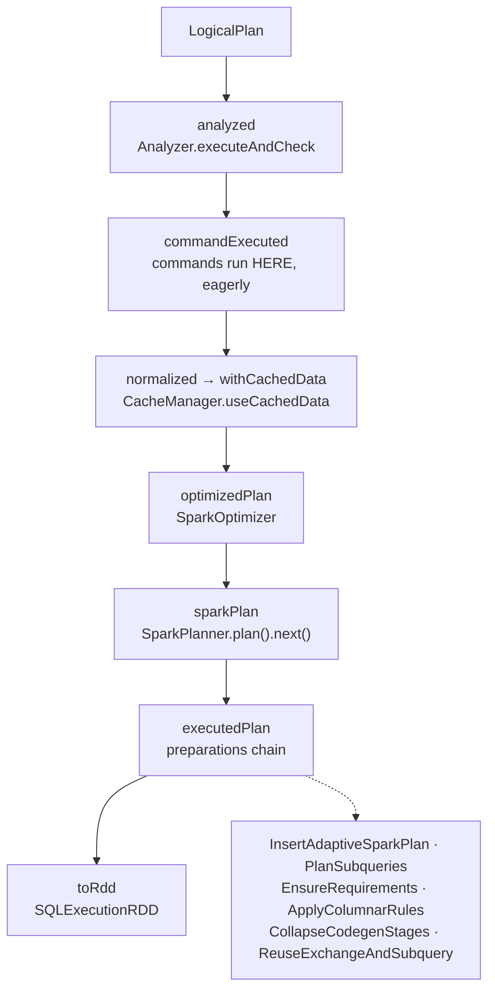

The physical half of Spark SQL: everything between "the optimizer produced a `LogicalPlan`" and
"an `RDD[InternalRow]` is running". The group owns the top level of
`org.apache.spark.sql.execution` — the phase pipeline, the physical operator base class, the
planner, whole-stage codegen, EXPLAIN, the in-memory cache, SQL metrics and the SQL tab — plus the
handful of analyzer rules that live in `sql/core` rather than catalyst because they need a
`SparkSession`.

**Config slice.** `sql/core` registers almost no configs of its own; the keys this group's code
reads are declared in catalyst's `SQLConf.scala` and carry `subsystem: sql/catalyst` in the
catalog. The slice was taken as:

```
subsystem == 'sql/catalyst' AND key matches
  \.codegen\.|\.execution\.|\.ui\.|\.inMemoryColumnarStorage\.|\.cache\.|\.subquery\.
  |\.event\.|\.scriptTransformation\.|\.cte\.|\.limit\.|\.command\.|\.analyze\.
```

105 keys, of which ~55 belong to other `sql/core` groups (see the breadth table at the end).



---

## QueryExecution — the lazy phase pipeline from logical plan to RDD

**What it is:** one object per query, holding each phase as a separate `LazyTry` field. Asking for
`optimizedPlan` forces analysis and command execution first; asking for `executedPlan` forces
planning. Nothing is computed twice and nothing is computed until something asks. `LazyTry` also
memoises the *failure*, so a query that failed analysis re-throws the same exception rather than
re-running the analyzer.

The phase list is longer than the familiar four. In 4.2.0 it is: `analyzed` → `commandExecuted` →
`tableVersionsRefreshed` → `normalized` → `withCachedData` → `optimizedPlan` → `sparkPlan` →
`executedPlan` → `toRdd`.

**Code path:** `SparkSession.sql` / `Dataset` action → `sessionState.executePlan` →
`QueryExecution.executedPlan` → `SparkPlan.execute()` → `SQLExecutionRDD`

**Anchor files:**

- [QueryExecution.scala:67](https://github.com/apache/spark/blob/v4.2.0/sql/core/src/main/scala/org/apache/spark/sql/execution/QueryExecution.scala#L67) — the class, and the in-source warning that "a lot of developers use the feature for debugging", which is why the phase names have been stable for a decade
- [QueryExecution.scala:192](https://github.com/apache/spark/blob/v4.2.0/sql/core/src/main/scala/org/apache/spark/sql/execution/QueryExecution.scala#L192) — `lazyAnalyzed`; on failure it calls `tracker.setAnalysisFailed` before rethrowing, which is what lets a failed query still appear in the SQL tab
- [QueryExecution.scala:215](https://github.com/apache/spark/blob/v4.2.0/sql/core/src/main/scala/org/apache/spark/sql/execution/QueryExecution.scala#L215) — `commandExecuted`, the phase most people do not know exists
- [QueryExecution.scala:236](https://github.com/apache/spark/blob/v4.2.0/sql/core/src/main/scala/org/apache/spark/sql/execution/QueryExecution.scala#L236) — `eagerlyExecuteCommands` walks the plan **top-down** and replaces each `Command` with a `CommandResult` holding the rows it already produced
- [QueryExecution.scala:270](https://github.com/apache/spark/blob/v4.2.0/sql/core/src/main/scala/org/apache/spark/sql/execution/QueryExecution.scala#L270) — `tableVersionsRefreshed`: DSv2 table versions captured at analysis are re-read before optimization, because arbitrary time can pass between the two
- [QueryExecution.scala:280](https://github.com/apache/spark/blob/v4.2.0/sql/core/src/main/scala/org/apache/spark/sql/execution/QueryExecution.scala#L280) — `normalized`, applying `sessionState.planNormalizationRules` so that two textually different but equivalent plans hit the same cache entry
- [QueryExecution.scala:289](https://github.com/apache/spark/blob/v4.2.0/sql/core/src/main/scala/org/apache/spark/sql/execution/QueryExecution.scala#L289) — `withCachedData`: cache substitution happens on the **normalized, pre-optimization** plan
- [QueryExecution.scala:311](https://github.com/apache/spark/blob/v4.2.0/sql/core/src/main/scala/org/apache/spark/sql/execution/QueryExecution.scala#L311) — `optimizedPlan`, which clones before optimizing and then re-marks the result analyzed "out of paranoia"
- [QueryExecution.scala:335](https://github.com/apache/spark/blob/v4.2.0/sql/core/src/main/scala/org/apache/spark/sql/execution/QueryExecution.scala#L335) — `sparkPlan`; both `sparkPlan` and `executedPlan` are measured under the **same** `PLANNING` phase, so the tracker cannot separate strategy application from preparation
- [QueryExecution.scala:376](https://github.com/apache/spark/blob/v4.2.0/sql/core/src/main/scala/org/apache/spark/sql/execution/QueryExecution.scala#L376) — `toRdd`, wrapping the plan's RDD in a `SQLExecutionRDD`
- [QueryExecution.scala:407](https://github.com/apache/spark/blob/v4.2.0/sql/core/src/main/scala/org/apache/spark/sql/execution/QueryExecution.scala#L407) — `executePhase`, the single point where every phase is timed into `QueryPlanningTracker` and wrapped by `withInternalError`
- [QueryExecution.scala:846](https://github.com/apache/spark/blob/v4.2.0/sql/core/src/main/scala/org/apache/spark/sql/execution/QueryExecution.scala#L846) — `isInternalError`: an `NPE`, an `AssertionError` or a Scala `MatchError` escaping a phase is rewritten as "You hit a bug in Spark", which is why those three never surface with their original message
- [QueryExecution.scala:707](https://github.com/apache/spark/blob/v4.2.0/sql/core/src/main/scala/org/apache/spark/sql/execution/QueryExecution.scala#L707) — `CommandExecutionMode`: `ALL` (top-level), `NON_ROOT` (recursive command execution), `SKIP` (EXPLAIN, and commands nested inside commands)
- [QueryExecution.scala:718](https://github.com/apache/spark/blob/v4.2.0/sql/core/src/main/scala/org/apache/spark/sql/execution/QueryExecution.scala#L718) — `ShuffleCleanupMode`: `DoNotCleanup` / `SkipMigration` / `RemoveShuffleFiles`, selected at :901 from `spark.sql.classic.shuffleDependency.fileCleanup.enabled`
- [SQLExecutionRDD.scala:33](https://github.com/apache/spark/blob/v4.2.0/sql/core/src/main/scala/org/apache/spark/sql/execution/SQLExecutionRDD.scala#L33) — captures `SQLConf` at RDD-creation time and reinstates it on the executor **only** when no execution id is set, i.e. when the RDD is consumed outside a tracked SQL execution

!!! warning "`spark.sql()` on a DDL statement has already run it"

    Commands execute during `commandExecuted`, which is forced by anything that touches the plan —
    including `.explain()` on a *derived* DataFrame, `.schema`, or simply the eager analysis Spark
    does when you build the DataFrame. `spark.sql("DROP TABLE t")` drops the table at that line;
    there is no action to wait for. The `CommandResult` node you see in a plan is the *record* of a
    command that already ran, and `CommandExecutionMode.SKIP` is what stops `EXPLAIN` from firing
    it. This is the single most surprising behaviour in the phase pipeline.

!!! info "Cache lookup happens before optimization, not after"

    `withCachedData` runs on the normalized plan, so cache hits are matched against a plan the
    optimizer has not touched. That is why a cached DataFrame is reused across queries whose
    *optimized* plans differ, and why `spark.sql.optimizer.*` changes do not invalidate the cache.
    `getOrCloneSessionWithConfigsOff` in `CacheManager` then disables two configs when building the
    cached plan, so the cached plan is not planned under exactly your session's settings.

**Configs:** `spark.sql.classic.shuffleDependency.fileCleanup.enabled` (Utils.isTesting, 4.1.0),
`spark.sql.extendedExplainProviders` (none, 4.0.0),
`spark.sql.redaction.string.regex`, `spark.sql.maxMetadataStringLength` (100),
`spark.sql.debug.maxToStringFields` (25)

**Maps to topics:** A1, I7

---

## SQLExecution — execution ids, and what makes a query appear in the SQL tab

**What it is:** the wrapper that assigns an execution id, posts the start/end events the SQL tab is
built from, and propagates session state to every job the query launches. A physical plan that
executes *outside* `withNewExecutionId` produces Spark jobs with no SQL execution attached — they
appear on the Jobs tab and nowhere else.

**Code path:** `Dataset.withAction` → `SQLExecution.withNewExecutionId(qe, name)` → set
`spark.sql.execution.id` local property → post `SparkListenerSQLExecutionStart` → run body → post
`SparkListenerSQLExecutionEnd`

**Anchor files:**

- [SQLExecution.scala:80](https://github.com/apache/spark/blob/v4.2.0/sql/core/src/main/scala/org/apache/spark/sql/execution/SQLExecution.scala#L80) — the three local-property keys: `EXECUTION_ID_KEY`, `EXECUTION_ROOT_ID_KEY`, `QUERY_ID_KEY`
- [SQLExecution.scala:127](https://github.com/apache/spark/blob/v4.2.0/sql/core/src/main/scala/org/apache/spark/sql/execution/SQLExecution.scala#L127) — `withNewExecutionId0`, which is the whole story in one method
- [SQLExecution.scala:148](https://github.com/apache/spark/blob/v4.2.0/sql/core/src/main/scala/org/apache/spark/sql/execution/SQLExecution.scala#L148) — the **root** execution id: nested executions (a command inside a command, a subquery) get their own id but inherit the root's, and only the root adds a job tag
- [SQLExecution.scala:157](https://github.com/apache/spark/blob/v4.2.0/sql/core/src/main/scala/org/apache/spark/sql/execution/SQLExecution.scala#L157) — `spark.sql.execution.interruptOnCancel` is applied here, only if the caller has not already set the underlying `SparkContext` property
- [SQLExecution.scala:168](https://github.com/apache/spark/blob/v4.2.0/sql/core/src/main/scala/org/apache/spark/sql/execution/SQLExecution.scala#L168) — the SQL text stored in the event is **truncated** to `spark.sql.event.truncate.length` and redacted; setting it to 0 replaces the description with the call site instead
- [SQLExecution.scala:179](https://github.com/apache/spark/blob/v4.2.0/sql/core/src/main/scala/org/apache/spark/sql/execution/SQLExecution.scala#L179) — only configs that *differ from the global defaults* are attached to the event, with `spark.driver.*` / `spark.executor.*` filtered out
- [SQLExecution.scala:212](https://github.com/apache/spark/blob/v4.2.0/sql/core/src/main/scala/org/apache/spark/sql/execution/SQLExecution.scala#L212) — the plan string in the event is rendered with `spark.sql.ui.explainMode` (default `formatted`), so the SQL tab and `df.explain()` can legitimately print different text for the same plan
- [SQLExecution.scala:216](https://github.com/apache/spark/blob/v4.2.0/sql/core/src/main/scala/org/apache/spark/sql/execution/SQLExecution.scala#L216) — if `SparkPlanInfo.fromSparkPlan` throws, the event carries `SparkPlanInfo.EMPTY` and the UI silently shows an empty graph rather than failing
- [SQLExecution.scala:242](https://github.com/apache/spark/blob/v4.2.0/sql/core/src/main/scala/org/apache/spark/sql/execution/SQLExecution.scala#L242) — end-of-execution shuffle cleanup, walking the plan for `ShuffleExchangeLike` (or, under AQE, the context's recorded shuffle ids)
- [SQLExecution.scala:295](https://github.com/apache/spark/blob/v4.2.0/sql/core/src/main/scala/org/apache/spark/sql/execution/SQLExecution.scala#L295) — `observationManager.tryComplete` — this is where a `df.observe()` future is completed
- [SQLExecution.scala:362](https://github.com/apache/spark/blob/v4.2.0/sql/core/src/main/scala/org/apache/spark/sql/execution/SQLExecution.scala#L362) — `withSQLConfPropagated` copies **every** `spark.*` conf into job local properties so executors see the session's SQL settings
- [SQLExecution.scala:397](https://github.com/apache/spark/blob/v4.2.0/sql/core/src/main/scala/org/apache/spark/sql/execution/SQLExecution.scala#L397) — `withThreadLocalCaptured`, used by broadcast and subquery futures so their jobs land under the right execution id

!!! info "No action, no SQL tab entry — and `spark.sql.execution.id` is the joining key"

    Executions register through `withNewExecutionId`. A DataFrame you built but never acted on has
    no entry. Conversely, an RDD job launched from inside SQL code without that wrapper shows up on
    the Jobs tab with no SQL parent. When correlating a slow job to a query, the local property
    `spark.sql.execution.id` (and `…root.id` for nested work) is the key both the UI and the event
    log join on.

**Configs:** `spark.sql.execution.interruptOnCancel` (true), `spark.sql.event.truncate.length`,
`spark.sql.ui.explainMode` (formatted)

**Maps to topics:** I7, E3

---

## SparkPlan — the physical operator contract

**What it is:** the base class every physical operator extends. It defines four execution entry
points (`execute`, `executeBroadcast`, `executeColumnar`, `executeWrite`), a two-phase
prepare/execute protocol, the distribution and ordering requirements `EnsureRequirements` reads,
and the metrics map the SQL tab renders.

**Code path:** `execute()` → `executeQuery { prepare(); waitForSubqueries(); doExecute() }`

**Anchor files:**

- [SparkPlan.scala:65](https://github.com/apache/spark/blob/v4.2.0/sql/core/src/main/scala/org/apache/spark/sql/execution/SparkPlan.scala#L65) — the class; note `session` is captured from `SparkSession.getActiveSession` at *construction*, which is why building plans on a thread with no active session fails oddly
- [SparkPlan.scala:141](https://github.com/apache/spark/blob/v4.2.0/sql/core/src/main/scala/org/apache/spark/sql/execution/SparkPlan.scala#L141) — `metrics`, empty by default; an operator with no metrics map shows no numbers in the SQL tab
- [SparkPlan.scala:163](https://github.com/apache/spark/blob/v4.2.0/sql/core/src/main/scala/org/apache/spark/sql/execution/SparkPlan.scala#L163) — `outputPartitioning` and, at :180, `requiredChildDistribution` / `requiredChildOrdering`: the three declarations that make `EnsureRequirements` insert an exchange or a sort
- [SparkPlan.scala:197](https://github.com/apache/spark/blob/v4.2.0/sql/core/src/main/scala/org/apache/spark/sql/execution/SparkPlan.scala#L197) — `execute()` is `final`; operators override `doExecute()`. The RDD itself is a `LazyTry`, so calling `execute()` twice returns the same RDD
- [SparkPlan.scala:259](https://github.com/apache/spark/blob/v4.2.0/sql/core/src/main/scala/org/apache/spark/sql/execution/SparkPlan.scala#L259) — `executeQuery`, which wraps every execution in an `RDDOperationScope` keyed by `rddScopeId` (:253) — that scope string is how the DAG view groups RDDs by operator and how `SQLLastAttemptAccumulator` attributes metrics
- [SparkPlan.scala:314](https://github.com/apache/spark/blob/v4.2.0/sql/core/src/main/scala/org/apache/spark/sql/execution/SparkPlan.scala#L314) — `prepare()` walks children first, then runs `prepareSubqueries` + `doPrepare` once under a lock. This is the hook `BroadcastHashJoinExec` uses to start broadcasting *before* the main job
- [SparkPlan.scala:298](https://github.com/apache/spark/blob/v4.2.0/sql/core/src/main/scala/org/apache/spark/sql/execution/SparkPlan.scala#L298) — `waitForSubqueries` blocks the driver thread until every subquery under this node has a result
- [SparkPlan.scala:387](https://github.com/apache/spark/blob/v4.2.0/sql/core/src/main/scala/org/apache/spark/sql/execution/SparkPlan.scala#L387) — `getByteArrayRdd`: `collect` does **not** ship `InternalRow`s. Each partition serialises its rows into a compressed byte buffer (`spark.io.compression.codec`) and the driver decodes them at :437
- [SparkPlan.scala:476](https://github.com/apache/spark/blob/v4.2.0/sql/core/src/main/scala/org/apache/spark/sql/execution/SparkPlan.scala#L476) — `executeCollect`, and at :505 `executeCollectPublic`, which additionally converts to external `Row` types
- [SparkPlan.scala:92](https://github.com/apache/spark/blob/v4.2.0/sql/core/src/main/scala/org/apache/spark/sql/execution/SparkPlan.scala#L92) — `supportsColumnar` / `supportsRowBased` / `vectorTypes`, the declarations the columnar transition rule reads

!!! info "The `PartitionEvaluator` split, and why `doExecute` bodies look duplicated"

    Most operators contain the same code twice — once through `mapPartitionsWithEvaluator` and once
    through `mapPartitionsWithIndex` — selected by `spark.sql.execution.usePartitionEvaluator`
    (default **false** in 4.2.0). The evaluator form ships a serialized *factory* that builds
    per-partition state on the executor instead of a closure capturing driver state. Eight call
    sites in this group carry the pair; see the [core rdd-layer sweep](core-rdd-layer.md) for the
    API itself.

**Configs:** `spark.sql.execution.usePartitionEvaluator` (false),
`spark.sql.limit.scaleUpFactor` (4), `spark.sql.limit.initialNumPartitions` (1)

**Maps to topics:** A1, E1

---

## SparkPlanner and SparkStrategies — where the physical operator is actually chosen

**What it is:** `SparkPlanner` supplies the ordered strategy list to catalyst's `QueryPlanner`
framework; `SparkStrategies.scala` (1141 lines) holds the strategies themselves, including
`JoinSelection`, `Aggregation`, `SpecialLimits`, `Window` and the streaming strategies. The
[planner sweep](sql-catalyst-planner.md) covers the framework — this is the content it plans with.

**Code path:** `QueryExecution.createSparkPlan` → `planner.plan(ReturnAnswer(plan))` → **`.next()`**
— the first candidate wins

**Anchor files:**

- [SparkPlanner.scala:41](https://github.com/apache/spark/blob/v4.2.0/sql/core/src/main/scala/org/apache/spark/sql/execution/SparkPlanner.scala#L41) — the strategy list in priority order: user `extraStrategies` first, then `LogicalQueryStageStrategy`, `PythonEvals`, `DataSourceV2Strategy`, `V2CommandStrategy`, `FileSourceStrategy`, `DataSourceStrategy`, `SpecialLimits`, `Aggregation`, `Window`, `WindowGroupLimit`, `JoinSelection`, `InMemoryScans`, `SparkScripts`, `Pipelines`, `BasicOperators`, `EventTimeWatermarkStrategy`
- [SparkPlanner.scala:71](https://github.com/apache/spark/blob/v4.2.0/sql/core/src/main/scala/org/apache/spark/sql/execution/SparkPlanner.scala#L71) — `prunePlans` is a no-op with a TODO: Spark does not compare candidate physical plans by cost
- [SparkPlanner.scala:88](https://github.com/apache/spark/blob/v4.2.0/sql/core/src/main/scala/org/apache/spark/sql/execution/SparkPlanner.scala#L88) — `pruneFilterProject`, the shared helper that decides whether a scan needs a `ProjectExec` above it at all
- [SparkStrategies.scala:92](https://github.com/apache/spark/blob/v4.2.0/sql/core/src/main/scala/org/apache/spark/sql/execution/SparkStrategies.scala#L92) — `SpecialLimits`, which sits **above** `JoinSelection` in the list — a top-level limit is planned before the join under it
- [SparkStrategies.scala:119](https://github.com/apache/spark/blob/v4.2.0/sql/core/src/main/scala/org/apache/spark/sql/execution/SparkStrategies.scala#L119) — `spark.sql.execution.topKSortFallbackThreshold` guards the `TakeOrderedAndProjectExec` choice in six places; above it, the plan degrades to a full sort plus a limit
- [SparkStrategies.scala:181](https://github.com/apache/spark/blob/v4.2.0/sql/core/src/main/scala/org/apache/spark/sql/execution/SparkStrategies.scala#L181) — `JoinSelection`, the rule the [planner sweep](sql-catalyst-planner.md) points here for
- [SparkStrategies.scala:707](https://github.com/apache/spark/blob/v4.2.0/sql/core/src/main/scala/org/apache/spark/sql/execution/SparkStrategies.scala#L707) — `InMemoryScans`, which turns an `InMemoryRelation` into an `InMemoryTableScanExec`
- [SparkStrategies.scala:906](https://github.com/apache/spark/blob/v4.2.0/sql/core/src/main/scala/org/apache/spark/sql/execution/SparkStrategies.scala#L906) — `BasicOperators`, the catch-all at the bottom; anything not matched above lands here

!!! warning "Strategy order is the plan, and it is a list you can read"

    Because `prunePlans` does nothing and the caller takes `.next()`, "why did Spark choose this
    operator" is answered by reading `SparkPlanner.strategies` top to bottom and finding the first
    strategy that matches. A custom strategy injected through `extraStrategies` is placed
    **before** every built-in one, so it wins unconditionally on anything it matches.

**Configs:** `spark.sql.execution.topKSortFallbackThreshold` (`MAX_ROUNDED_ARRAY_LENGTH`, 2.4.0),
`spark.sql.shuffle.partitions` (via `numPartitions`)

**Maps to topics:** A1, B7, A3

---

## SparkOptimizer — the optimizer batches that only exist in sql/core

**What it is:** the subclass of catalyst's `Optimizer` that the session actually runs. Catalyst's
`Optimizer` cannot reference file sources, DSv2 pushdown or Python UDFs, so those batches are
appended here. Reading only `Optimizer.scala` gives you an incomplete list of what runs on your
query.

**Anchor files:**

- [SparkOptimizer.scala:37](https://github.com/apache/spark/blob/v4.2.0/sql/core/src/main/scala/org/apache/spark/sql/execution/SparkOptimizer.scala#L37) — `earlyScanPushDownRules`: `SchemaPruning`, `V1Writes`, `V2ScanRelationPushDown`, `V2ScanPartitioningAndOrdering`, `V2Writes`, `PruneFileSourcePartitions`, `PushVariantIntoScan`
- [SparkOptimizer.scala:52](https://github.com/apache/spark/blob/v4.2.0/sql/core/src/main/scala/org/apache/spark/sql/execution/SparkOptimizer.scala#L52) — `defaultBatches`, wrapping catalyst's list with ~10 extra batches
- [SparkOptimizer.scala:56](https://github.com/apache/spark/blob/v4.2.0/sql/core/src/main/scala/org/apache/spark/sql/execution/SparkOptimizer.scala#L56) — the `PartitionPruning` batch (dynamic partition pruning) and, at :62, `InjectRuntimeFilter` (bloom filters) — both A18 material, and both invisible from catalyst
- [SparkOptimizer.scala:75](https://github.com/apache/spark/blob/v4.2.0/sql/core/src/main/scala/org/apache/spark/sql/execution/SparkOptimizer.scala#L75) — the `Extract Python UDFs` batch, which re-runs `ColumnPruning`, `LimitPushDown` and `PushPredicateThroughNonJoin` afterwards because inserting an eval-python node between a filter and its scan breaks pushdown
- [SparkOptimizer.scala:101](https://github.com/apache/spark/blob/v4.2.0/sql/core/src/main/scala/org/apache/spark/sql/execution/SparkOptimizer.scala#L101) — `nonExcludableRules`: the DSv2 and Python-UDF extraction rules cannot be turned off with `spark.sql.optimizer.excludedRules`, because a plan that skipped them would not be executable
- [SparkOptimizer.scala:117](https://github.com/apache/spark/blob/v4.2.0/sql/core/src/main/scala/org/apache/spark/sql/execution/SparkOptimizer.scala#L117) — `preOptimizationBatches` / `postHocOptimizationBatches`, the subclass hooks vendors extend
- [OptimizeMetadataOnlyQuery.scala:46](https://github.com/apache/spark/blob/v4.2.0/sql/core/src/main/scala/org/apache/spark/sql/execution/OptimizeMetadataOnlyQuery.scala#L46) — answers `SELECT max(partition_col)` from the catalog without reading files; **off** by default (`spark.sql.optimizer.metadataOnly`, false since 3.0) because it returns wrong answers when a partition directory is empty

**Configs:** `spark.sql.optimizer.metadataOnly` (false, 2.1.1)

**Maps to topics:** A1

---

## The preparations chain — the rules that run after planning

**What it is:** a fixed, ordered list of `Rule[SparkPlan]` applied to the planned plan to produce
the `executedPlan`. It is where exchanges and sorts appear, where subqueries get planned, where
codegen stages are formed, and where AQE takes over. Order is load-bearing and the source
comments say so.

**Anchor files:**

- [QueryExecution.scala:750](https://github.com/apache/spark/blob/v4.2.0/sql/core/src/main/scala/org/apache/spark/sql/execution/QueryExecution.scala#L750) — the list: `InsertAdaptiveSparkPlan`, `CoalesceBucketsInJoin`, `PlanDynamicPruningFilters`, `PlanSubqueries`, `RemoveRedundantProjects`, `EnsureRequirements`, `InsertSortForLimitAndOffset`, `ReplaceHashWithSortAgg`, `RemoveRedundantSorts`, `RemoveRedundantWindowGroupLimits`, `DisableUnnecessaryBucketedScan`, `ApplyColumnarRulesAndInsertTransitions`, `CollapseCodegenStages`, `ReuseExchangeAndSubquery`
- [QueryExecution.scala:754](https://github.com/apache/spark/blob/v4.2.0/sql/core/src/main/scala/org/apache/spark/sql/execution/QueryExecution.scala#L754) — the comment that matters most: `AdaptiveSparkPlanExec` is a **leaf** node, so once it is inserted **every subsequent rule is a no-op**. Under AQE the rest of this list runs later, per query stage, inside `AdaptiveSparkPlanExec`
- [QueryExecution.scala:777](https://github.com/apache/spark/blob/v4.2.0/sql/core/src/main/scala/org/apache/spark/sql/execution/QueryExecution.scala#L777) — subquery plans get the same chain **minus** `ReuseExchangeAndSubquery`, so a subquery cannot reuse the outer query's exchanges
- [QueryExecution.scala:788](https://github.com/apache/spark/blob/v4.2.0/sql/core/src/main/scala/org/apache/spark/sql/execution/QueryExecution.scala#L788) — `prepareForExecution` logs each rule through `PlanChangeLogger`, so `spark.sql.planChangeLog.rules` works on physical rules too, not only logical ones
- [reuse/ReuseExchangeAndSubquery.scala:36](https://github.com/apache/spark/blob/v4.2.0/sql/core/src/main/scala/org/apache/spark/sql/execution/reuse/ReuseExchangeAndSubquery.scala#L36) — one bottom-up pass keyed on `canonicalized`, producing `ReusedExchangeExec` / `ReusedSubqueryExec`
- [InsertSortForLimitAndOffset.scala](https://github.com/apache/spark/blob/v4.2.0/sql/core/src/main/scala/org/apache/spark/sql/execution/InsertSortForLimitAndOffset.scala) — added for `spark.sql.orderingAwareLimitOffset` (true, 4.0.0): without it, `LIMIT` after a global sort could return rows out of order because the local sort's ordering is not preserved across the shuffle
- [RemoveRedundantProjects.scala](https://github.com/apache/spark/blob/v4.2.0/sql/core/src/main/scala/org/apache/spark/sql/execution/RemoveRedundantProjects.scala) / [RemoveRedundantSorts.scala](https://github.com/apache/spark/blob/v4.2.0/sql/core/src/main/scala/org/apache/spark/sql/execution/RemoveRedundantSorts.scala) / [ReplaceHashWithSortAgg.scala](https://github.com/apache/spark/blob/v4.2.0/sql/core/src/main/scala/org/apache/spark/sql/execution/ReplaceHashWithSortAgg.scala) — each has its own on/off config, and all three must run **after** `EnsureRequirements` because they reason about the ordering it just guaranteed
- [RemoveRedundantWindowGroupLimits.scala:27](https://github.com/apache/spark/blob/v4.2.0/sql/core/src/main/scala/org/apache/spark/sql/execution/RemoveRedundantWindowGroupLimits.scala#L27) — the fourth of the redundancy rules, and the only one with no config: it drops the **partial** `WindowGroupLimitExec` when the child already satisfies the final one's required distribution, i.e. when `EnsureRequirements` decided no exchange was needed between them
- [AliasAwareOutputExpression.scala](https://github.com/apache/spark/blob/v4.2.0/sql/core/src/main/scala/org/apache/spark/sql/execution/AliasAwareOutputExpression.scala) — how an operator's `outputPartitioning` and `outputOrdering` survive a rename; without it, `df.withColumnRenamed` would silently force an extra shuffle

!!! warning "Under AQE the `executedPlan` you print is not the plan that runs"

    `InsertAdaptiveSparkPlan` is first and hides everything below it, so `df.explain()` shows the
    pre-AQE shape. The SQL tab shows the post-AQE plan because it re-posts the plan on each
    `SparkListenerSQLAdaptiveExecutionUpdate`. When the two disagree, the SQL tab is right. See the
    [adaptive group](../index.md) — not yet swept — for the re-planning loop itself.

**Configs:** `spark.sql.execution.removeRedundantProjects` (true),
`spark.sql.execution.removeRedundantSorts` (true),
`spark.sql.execution.replaceHashWithSortAgg` (false),
`spark.sql.execution.reuseSubquery` (true, 3.0.0),
`spark.sql.orderingAwareLimitOffset` (true, 4.0.0),
`spark.sql.unionOutputPartitioning` (true, 4.1.0)

**Maps to topics:** A1, A26

---

## Whole-stage codegen — fusing operators into one generated loop

**What it is:** the rule and operator that collapse a chain of physical operators into a single
generated Java class implementing `BufferedRowIterator`. `CodegenSupport` gives each operator a
`doProduce` (drive the loop) and `doConsume` (process one row) method; `WholeStageCodegenExec`
generates `processNext` from them.

**Code path:** `CollapseCodegenStages.apply` → `insertWholeStageCodegen` → `WholeStageCodegenExec.doCodeGen()`
→ `CodeGenerator.compile` → `mapPartitionsWithIndex`

**Anchor files:**

- [WholeStageCodegenExec.scala:47](https://github.com/apache/spark/blob/v4.2.0/sql/core/src/main/scala/org/apache/spark/sql/execution/WholeStageCodegenExec.scala#L47) — `CodegenSupport`, with `produce` (:94) and `consume` (:160) as `final` and `doProduce`/`doConsume` as the overrides
- [WholeStageCodegenExec.scala:364](https://github.com/apache/spark/blob/v4.2.0/sql/core/src/main/scala/org/apache/spark/sql/execution/WholeStageCodegenExec.scala#L364) — `needCopyResult`: whether the downstream operator must copy the row before buffering it. Getting this wrong is a classic source of corrupted results in custom operators
- [WholeStageCodegenExec.scala:436](https://github.com/apache/spark/blob/v4.2.0/sql/core/src/main/scala/org/apache/spark/sql/execution/WholeStageCodegenExec.scala#L436) — `BlockingOperatorWithCodegen` (sort, hash aggregate): an operator that consumes all input before emitting cuts the limit-propagation and stop-check chains
- [WholeStageCodegenExec.scala:511](https://github.com/apache/spark/blob/v4.2.0/sql/core/src/main/scala/org/apache/spark/sql/execution/WholeStageCodegenExec.scala#L511) — `InputAdapter`, the boundary node between a codegen stage and a non-codegen child. In `EXPLAIN` it is the operator *without* a `*` marker
- [WholeStageCodegenExec.scala:590](https://github.com/apache/spark/blob/v4.2.0/sql/core/src/main/scala/org/apache/spark/sql/execution/WholeStageCodegenExec.scala#L590) — `isTooManyFields`, counting **nested** fields against `spark.sql.codegen.maxFields` (100)
- [WholeStageCodegenExec.scala:673](https://github.com/apache/spark/blob/v4.2.0/sql/core/src/main/scala/org/apache/spark/sql/execution/WholeStageCodegenExec.scala#L673) — `doCodeGen`, which registers the plan tree as a comment in the generated source — that is what `debugCodegen()` prints back to you
- [WholeStageCodegenExec.scala:744](https://github.com/apache/spark/blob/v4.2.0/sql/core/src/main/scala/org/apache/spark/sql/execution/WholeStageCodegenExec.scala#L744) — **fallback 1**: compilation failed and `spark.sql.codegen.fallback` is true → `return child.execute()`, with only a `WARN`
- [WholeStageCodegenExec.scala:752](https://github.com/apache/spark/blob/v4.2.0/sql/core/src/main/scala/org/apache/spark/sql/execution/WholeStageCodegenExec.scala#L752) — **fallback 2**: the compiled method exceeds `spark.sql.codegen.hugeMethodLimit` (65535) → `return child.execute()`, at `INFO`
- [WholeStageCodegenExec.scala:925](https://github.com/apache/spark/blob/v4.2.0/sql/core/src/main/scala/org/apache/spark/sql/execution/WholeStageCodegenExec.scala#L925) — `supportCodegen(plan)`: three independent disqualifiers — a `CodegenFallback` expression anywhere, too many *output* fields, too many *input* fields
- [WholeStageCodegenExec.scala:940](https://github.com/apache/spark/blob/v4.2.0/sql/core/src/main/scala/org/apache/spark/sql/execution/WholeStageCodegenExec.scala#L940) — sort-merge and shuffled-hash joins force their **children** into separate codegen stages
- [WholeStageCodegenExec.scala:960](https://github.com/apache/spark/blob/v4.2.0/sql/core/src/main/scala/org/apache/spark/sql/execution/WholeStageCodegenExec.scala#L960) — `LocalTableScanExec`, `EmptyRelationExec` and `CommandResultExec` are deliberately never made the root of a codegen stage, so the driver-local `collect`/`take` fast paths stay available
- [WholeStageCodegenExec.scala:988](https://github.com/apache/spark/blob/v4.2.0/sql/core/src/main/scala/org/apache/spark/sql/execution/WholeStageCodegenExec.scala#L988) — the rule is skipped entirely when `spark.sql.codegen.wholeStage` is false **or** `spark.sql.codegen.factoryMode` is `NO_CODEGEN`

!!! warning "Both codegen fallbacks are silent in the plan"

    A stage that fell back at runtime still prints with its `*(n)` marker in `EXPLAIN`, because the
    plan was not rewritten — `doExecute` just returned the child's RDD. The only evidence is one
    log line on the driver. If a query codegens on paper and still crawls, grep the driver log for
    `hugeMethodLimit` and `Whole-stage codegen disabled for plan`. The
    [expressions sweep](sql-catalyst-expressions.md) covers the fourth, plan-invisible fallback:
    interpreted expression evaluation.

**Configs:** `spark.sql.codegen.wholeStage` (true), `.hugeMethodLimit` (65535), `.maxFields` (100),
`.fallback` (true), `.factoryMode`, `.useIdInClassName` (true), `.splitConsumeFuncByOperator`,
`.methodSplitThreshold`, `.comments`, `.logLevel`, `.logging.maxLines` (1000),
`.cache.maxEntries`, `.broadcastCleanedSourceThreshold`,
`.wholeStage.union.enabled`, `.wholeStage.union.maxChildren`

**Maps to topics:** A1, I7, E1

---

## EXPLAIN — the five modes, operator ids, and extended explain providers

**What it is:** `ExplainMode` selects between five renderings; `ExplainUtils` produces the
`formatted` one — the numbered-operator layout with a details section — and assigns the `(n)`
operator ids and `[n]` codegen stage ids you match between the tree and the details.

**Anchor files:**

- [ExplainMode.scala:33](https://github.com/apache/spark/blob/v4.2.0/sql/core/src/main/scala/org/apache/spark/sql/execution/ExplainMode.scala#L33) — `simple`, `extended`, `codegen`, `cost`, `formatted`
- [QueryExecution.scala:488](https://github.com/apache/spark/blob/v4.2.0/sql/core/src/main/scala/org/apache/spark/sql/execution/QueryExecution.scala#L488) — the dispatch; `codegen` mode routes to `debug.writeCodegen`, `cost` to `stringWithStats`
- [QueryExecution.scala:477](https://github.com/apache/spark/blob/v4.2.0/sql/core/src/main/scala/org/apache/spark/sql/execution/QueryExecution.scala#L477) — explaining a **streaming** DataFrame silently builds a throwaway `IncrementalExecution` with a random run id, so the plan you see is one micro-batch's plan
- [ExplainUtils.scala:83](https://github.com/apache/spark/blob/v4.2.0/sql/core/src/main/scala/org/apache/spark/sql/execution/ExplainUtils.scala#L83) — `processPlan`, which walks subqueries as separate numbered sections
- [ExplainUtils.scala:193](https://github.com/apache/spark/blob/v4.2.0/sql/core/src/main/scala/org/apache/spark/sql/execution/ExplainUtils.scala#L193) — `setOpId` uses a **thread-local** id map, so two threads explaining concurrently do not collide
- [QueryExecution.scala:606](https://github.com/apache/spark/blob/v4.2.0/sql/core/src/main/scala/org/apache/spark/sql/execution/QueryExecution.scala#L606) — `extendedExplainInfo` loads `ExtendedExplainGenerator` implementations named by `spark.sql.extendedExplainProviders` and appends an `== Extended Information (title) ==` section; a generator that throws is swallowed with a `WARN`
- [QueryExecution.scala:545](https://github.com/apache/spark/blob/v4.2.0/sql/core/src/main/scala/org/apache/spark/sql/execution/QueryExecution.scala#L545) — `stringWithStats`, the `cost` mode, which forces `optimizedPlan.stats` and therefore *computes* statistics as a side effect of explaining
- [debug/package.scala:179](https://github.com/apache/spark/blob/v4.2.0/sql/core/src/main/scala/org/apache/spark/sql/execution/debug/package.scala#L179) — the `DebugQuery` implicit: `df.debug()` instruments the plan with per-column type counters, `df.debugCodegen()` dumps generated source
- [debug/package.scala:232](https://github.com/apache/spark/blob/v4.2.0/sql/core/src/main/scala/org/apache/spark/sql/execution/debug/package.scala#L232) — `DebugExec`, which wraps each operator and reports the concrete runtime types seen per column

!!! info "`EXPLAIN` truncates, and the truncation is configurable"

    `spark.sql.debug.maxToStringFields` (25) caps how many fields print before `...`, and
    `spark.sql.maxMetadataStringLength` (100) caps scan metadata such as the file list. A plan that
    looks like it reads one file may be reading thousands. Raise both before concluding anything
    from a truncated plan.

**Configs:** `spark.sql.ui.explainMode` (formatted), `spark.sql.extendedExplainProviders` (none,
4.0.0), `spark.sql.debug.maxToStringFields` (25, 3.0.0), `spark.sql.maxMetadataStringLength`

**Maps to topics:** A1, I7

---

## In-memory cache — CacheManager, InMemoryRelation and the CachedBatchSerializer API

**What it is:** the machinery behind `df.cache()` / `CACHE TABLE`. `CacheManager` is a
session-shared list of `(normalized plan, InMemoryRelation)` pairs; `InMemoryRelation` holds a
`CachedRDDBuilder` that materialises the cached plan into `RDD[CachedBatch]` through a **pluggable**
`CachedBatchSerializer`. Cached data is stored **columnar and optionally compressed**, not as rows.

**Code path:** `Dataset.persist` → `CacheManager.cacheQuery` → `InMemoryRelation(storageLevel, qe,
name)` → `CachedRDDBuilder.buildBuffers` → later `InMemoryScans` strategy → `InMemoryTableScanExec`

**Anchor files:**

- [CacheManager.scala:133](https://github.com/apache/spark/blob/v4.2.0/sql/core/src/main/scala/org/apache/spark/sql/execution/CacheManager.scala#L133) — `cacheQueryInternal`; caching a `Command` logs a warning and does nothing, and re-caching an already-cached plan logs "Asked to cache already cached data" and does nothing
- [CacheManager.scala:638](https://github.com/apache/spark/blob/v4.2.0/sql/core/src/main/scala/org/apache/spark/sql/execution/CacheManager.scala#L638) — the cached plan is built in a **cloned session** with `spark.sql.sources.bucketing.autoBucketedScan.enabled` forced off, and AQE's final-stage shuffle optimizations forced off unless `spark.sql.optimizer.canChangeCachedPlanOutputPartitioning` is set
- [CacheManager.scala:289](https://github.com/apache/spark/blob/v4.2.0/sql/core/src/main/scala/org/apache/spark/sql/execution/CacheManager.scala#L289) — `uncacheByCondition`, which implements *cascading* invalidation: uncaching a table also drops every cache entry whose plan references it
- [CacheManager.scala:565](https://github.com/apache/spark/blob/v4.2.0/sql/core/src/main/scala/org/apache/spark/sql/execution/CacheManager.scala#L565) — `recacheByPath`, the hook behind `REFRESH TABLE` on a file path
- [columnar/InMemoryRelation.scala:400](https://github.com/apache/spark/blob/v4.2.0/sql/core/src/main/scala/org/apache/spark/sql/execution/columnar/InMemoryRelation.scala#L400) — the `CachedBatchSerializer` is loaded from `spark.sql.cache.serializer` **once per JVM** and memoised in a `var`; changing the config after the first cache has no effect
- [columnar/InMemoryRelation.scala:105](https://github.com/apache/spark/blob/v4.2.0/sql/core/src/main/scala/org/apache/spark/sql/execution/columnar/InMemoryRelation.scala#L105) — `DefaultCachedBatchSerializer`, batching at `spark.sql.inMemoryColumnarStorage.batchSize` (10000) and compressing per `…compressed` (true)
- [columnar/InMemoryRelation.scala:264](https://github.com/apache/spark/blob/v4.2.0/sql/core/src/main/scala/org/apache/spark/sql/execution/columnar/InMemoryRelation.scala#L264) — the `PartitionKeyedAccumulator` and its long comment: AQE creates a separate cache-scan stage per reference to the same cache, so **the same partition can be built by several concurrent jobs**. Keying materialisation bookkeeping by partition id is what stops a duplicate completion marking the cache loaded early — which previously let AQE read `rowCount = 0` on a non-empty cache and propagate an empty relation, **silently dropping rows**
- [columnar/InMemoryTableScanExec.scala:140](https://github.com/apache/spark/blob/v4.2.0/sql/core/src/main/scala/org/apache/spark/sql/execution/columnar/InMemoryTableScanExec.scala#L140) — `filteredCachedBatches`: per-batch min/max statistics let the scan skip whole batches, gated by `spark.sql.inMemoryColumnarStorage.partitionPruning` (true)
- [columnar/ColumnStats.scala:48](https://github.com/apache/spark/blob/v4.2.0/sql/core/src/main/scala/org/apache/spark/sql/execution/columnar/ColumnStats.scala#L48) — the per-type `ColumnStats` implementations that produce those statistics
- [columnar/compression/compressionSchemes.scala:33](https://github.com/apache/spark/blob/v4.2.0/sql/core/src/main/scala/org/apache/spark/sql/execution/columnar/compression/compressionSchemes.scala#L33) — the six schemes: `PassThrough`, `RunLengthEncoding`, `DictionaryEncoding`, `BooleanBitSet`, `IntDelta`, `LongDelta` — chosen per column by measured compression ratio

!!! info "`spark.sql.cache.serializer` is a real extension point"

    `CachedBatchSerializer` is a public API: a plugin can store the cache in its own columnar format
    (Arrow, GPU memory) and expose `buildFilter` for its own batch skipping. It is how accelerated
    backends make `df.cache()` produce data they can read natively. It is a **static** SQL conf and
    is resolved once per JVM.

!!! warning "`cache()` is lazy; `count()` is not the same as materialising it"

    `cacheQuery` only registers the relation. The RDD is built on first access, and under AQE
    several stages may build it concurrently — which is exactly the hazard the partition-keyed
    accumulator exists to contain. `df.cache().count()` materialises every partition; a `LIMIT`
    over a cached DataFrame does not.

**Configs:** `spark.sql.cache.serializer`, `spark.sql.inMemoryColumnarStorage.batchSize` (10000),
`.compressed` (true), `.partitionPruning` (true), `.enableVectorizedReader` (true),
`.hugeVectorThreshold`, `.hugeVectorReserveRatio`, `spark.sql.dataframeCache.logLevel` (internal)

**Maps to topics:** I6

---

## SQL metrics — accumulators with a metric type, and the last-attempt problem

**What it is:** `SQLMetric` is an `AccumulatorV2[Long, Long]` carrying a *metric type* string that
tells the UI how to format and aggregate it. Executor-side updates ride the normal accumulator
path; driver-side updates must be posted explicitly.

**Anchor files:**

- [metric/SQLMetrics.scala:35](https://github.com/apache/spark/blob/v4.2.0/sql/core/src/main/scala/org/apache/spark/sql/execution/metric/SQLMetrics.scala#L35) — `SQLMetric`, and the `initValue = -1` convention: a metric that never received an update is *invalid*, reports 0 to users, and is excluded from min/max aggregation. That is why some SQL-tab metrics show `0` and others show nothing
- [metric/SQLMetrics.scala:112](https://github.com/apache/spark/blob/v4.2.0/sql/core/src/main/scala/org/apache/spark/sql/execution/metric/SQLMetrics.scala#L112) — the five metric types: `sum`, `size`, `timing`, `nsTiming`, `average`
- [metric/SQLMetrics.scala:192](https://github.com/apache/spark/blob/v4.2.0/sql/core/src/main/scala/org/apache/spark/sql/execution/metric/SQLMetrics.scala#L192) — `average` metrics are stored as `value * 10` in a `Long` and divided back for display, which is the whole reason a "spill size" and an "avg hash probe" cannot share a type
- [metric/SQLMetrics.scala:215](https://github.com/apache/spark/blob/v4.2.0/sql/core/src/main/scala/org/apache/spark/sql/execution/metric/SQLMetrics.scala#L215) — `postDriverMetricUpdates`, the explicit path for metrics computed on the driver (broadcast build time, subquery collect time)
- [metric/SQLShuffleMetricsReporter.scala](https://github.com/apache/spark/blob/v4.2.0/sql/core/src/main/scala/org/apache/spark/sql/execution/metric/SQLShuffleMetricsReporter.scala) — bridges task-level shuffle read/write metrics into per-operator SQL metrics, which is why the SQL tab and the Stages tab report shuffle bytes differently
- [metric/CustomMetrics.scala](https://github.com/apache/spark/blob/v4.2.0/sql/core/src/main/scala/org/apache/spark/sql/execution/metric/CustomMetrics.scala) — DSv2 `CustomMetric` / `CustomTaskMetric` plumbing, letting a connector publish its own numbers into the SQL tab
- [metric/SQLMetricInfo.scala:27](https://github.com/apache/spark/blob/v4.2.0/sql/core/src/main/scala/org/apache/spark/sql/execution/metric/SQLMetricInfo.scala#L27) — the three fields that actually reach the event log: name, accumulator id, metric type. The `SQLMetric` object itself never leaves the driver; the UI joins accumulator updates to plan nodes by that id
- [metric/SQLLastAttemptMetric.scala:22](https://github.com/apache/spark/blob/v4.2.0/sql/core/src/main/scala/org/apache/spark/sql/execution/metric/SQLLastAttemptMetric.scala#L22) — the concrete `SQLMetric` that implements the last-attempt protocol, and at :42 the declaration `accumulatorStoresUserData = false` — the reason it is safe to keep these values around when accumulators carrying user data are not
- [metric/SQLLastAttemptAccumulator.scala:30](https://github.com/apache/spark/blob/v4.2.0/sql/core/src/main/scala/org/apache/spark/sql/execution/metric/SQLLastAttemptAccumulator.scala#L30) — new in 4.2.0 ([SPARK-56509]). A 75-line comment explaining why "the metric for this Dataset" is hard: the RDD that runs is often not the RDD the operator created, AQE discards and recreates plans mid-flight, and metrics inside a cached or checkpointed plan are **declared undefined behaviour** — use `lastAttemptValueForHighestRDDId()` there

!!! warning "A metric inside a cached plan does not belong to the Dataset that reads it"

    `SQLLastAttemptAccumulator` documents this explicitly. When a plan is cached, its top stage
    executes in the scope of whatever parent contains the `InMemoryTableScanExec`, so a second
    Dataset reading the same cache has no way to attribute it. The same applies to
    `df.checkpoint()`, which throws the plan away entirely.

**Configs:** none directly; `spark.sql.ui.retainedExecutions` bounds how long the values survive

**Maps to topics:** I7

---

## The SQL tab — SQLAppStatusListener, SparkPlanGraph, and event-log filtering

**What it is:** the SQL tab is a read model over the listener bus. `SQLAppStatusListener` joins SQL
execution events with job/stage/task events, aggregates accumulator updates per plan node, and
writes into a `KVStore`; `SparkPlanGraph` converts `SparkPlanInfo` into the node/edge/cluster graph
the page draws.

**Anchor files:**

- [ui/SQLAppStatusListener.scala:41](https://github.com/apache/spark/blob/v4.2.0/sql/core/src/main/scala/org/apache/spark/sql/execution/ui/SQLAppStatusListener.scala#L41) — the listener; at :48 `liveUpdatePeriodNs` (`spark.ui.liveUpdate.period`) throttles how often a running execution is written back to the store, so an in-flight query's numbers are stale by design
- [ui/SQLAppStatusListener.scala:78](https://github.com/apache/spark/blob/v4.2.0/sql/core/src/main/scala/org/apache/spark/sql/execution/ui/SQLAppStatusListener.scala#L78) — `onJobStart` reads the execution id from the job's **properties**; a job whose properties lack it is not a SQL job as far as this listener is concerned
- [ui/SQLAppStatusListener.scala:208](https://github.com/apache/spark/blob/v4.2.0/sql/core/src/main/scala/org/apache/spark/sql/execution/ui/SQLAppStatusListener.scala#L208) — `aggregateMetrics`, which combines per-task accumulator values into the per-node strings the page shows (min/median/max)
- [ui/SQLAppStatusListener.scala:372](https://github.com/apache/spark/blob/v4.2.0/sql/core/src/main/scala/org/apache/spark/sql/execution/ui/SQLAppStatusListener.scala#L372) — `onAdaptiveExecutionUpdate` **replaces** the stored plan graph, which is how the SQL tab ends up showing the post-AQE plan
- [ui/SQLAppStatusListener.scala:420](https://github.com/apache/spark/blob/v4.2.0/sql/core/src/main/scala/org/apache/spark/sql/execution/ui/SQLAppStatusListener.scala#L420) — `removeStaleMetricsData` drops metrics belonging to plan nodes that AQE removed
- [ui/SQLAppStatusListener.scala:473](https://github.com/apache/spark/blob/v4.2.0/sql/core/src/main/scala/org/apache/spark/sql/execution/ui/SQLAppStatusListener.scala#L473) — `cleanupExecutions`, bounded by `spark.sql.ui.retainedExecutions` (1000)
- [ui/SparkPlanGraph.scala:89](https://github.com/apache/spark/blob/v4.2.0/sql/core/src/main/scala/org/apache/spark/sql/execution/ui/SparkPlanGraph.scala#L89) — graph construction; `WholeStageCodegenExec` becomes a `SparkPlanGraphCluster` (:236) — the dashed box you see around fused operators
- [ui/SQLListener.scala:46](https://github.com/apache/spark/blob/v4.2.0/sql/core/src/main/scala/org/apache/spark/sql/execution/ui/SQLListener.scala#L46) — the event classes, including `queryId` and `rootExecutionId` (both `Option`, for compatibility with older event logs)
- [ui/SQLHistoryServerPlugin.scala:25](https://github.com/apache/spark/blob/v4.2.0/sql/core/src/main/scala/org/apache/spark/sql/execution/ui/SQLHistoryServerPlugin.scala#L25) — how the History Server reconstructs the SQL tab by replaying the same listener
- [history/SQLEventFilterBuilder.scala:37](https://github.com/apache/spark/blob/v4.2.0/sql/core/src/main/scala/org/apache/spark/sql/execution/history/SQLEventFilterBuilder.scala#L37) — event-log **compaction**: tracks which jobs/stages/tasks/RDDs belong to live SQL executions so that events for completed ones can be dropped from a rolled event log
- [ui/StreamingQueryHistoryServerPlugin.scala:27](https://github.com/apache/spark/blob/v4.2.0/sql/core/src/main/scala/org/apache/spark/sql/execution/ui/StreamingQueryHistoryServerPlugin.scala#L27) — the same trick for the Structured Streaming tab
- [SparkPlanInfo.scala:70](https://github.com/apache/spark/blob/v4.2.0/sql/core/src/main/scala/org/apache/spark/sql/execution/SparkPlanInfo.scala#L70) — `fromSparkPlan`, the plan → event conversion, with five special cases that change what the UI *shows as a child*: a `ReusedExchangeExec` reports the exchange it reuses, an `AdaptiveSparkPlanExec` reports its current `executedPlan`, a `QueryStageExec` reports the stage's plan, an `InMemoryTableScanExec` reports the **cached plan** (which is why the SQL tab draws the cached subtree under a scan of it), and an `EmptyRelationExec` reports the *logical* plan AQE eliminated
- [SparkPlanInfo.scala:41](https://github.com/apache/spark/blob/v4.2.0/sql/core/src/main/scala/org/apache/spark/sql/execution/SparkPlanInfo.scala#L41) — `equals`/`hashCode` are defined on `simpleString` alone, so two structurally identical nodes are indistinguishable to the graph builder; :85 attaches `FileSourceScanLike.metadata` (the file list) into the event log
- [ui/SQLAppStatusStore.scala:37](https://github.com/apache/spark/blob/v4.2.0/sql/core/src/main/scala/org/apache/spark/sql/execution/ui/SQLAppStatusStore.scala#L37) — the read side: a thin query layer over the same `KVStore` the listener writes, used identically by the live UI and the History Server
- [ui/SQLAppStatusStore.scala:65](https://github.com/apache/spark/blob/v4.2.0/sql/core/src/main/scala/org/apache/spark/sql/execution/ui/SQLAppStatusStore.scala#L65) — `executionMetrics` falls back to a **live** aggregation when the store has no persisted metric values yet, which is why a running query's numbers can change between two refreshes with no new events
- [ui/SQLTab.scala:24](https://github.com/apache/spark/blob/v4.2.0/sql/core/src/main/scala/org/apache/spark/sql/execution/ui/SQLTab.scala#L24) — the tab, `displayOrder = 0` (it sorts before Jobs), attaching [AllExecutionsPage.scala:27](https://github.com/apache/spark/blob/v4.2.0/sql/core/src/main/scala/org/apache/spark/sql/execution/ui/AllExecutionsPage.scala#L27) (running / completed / failed tables) and [ExecutionPage.scala:34](https://github.com/apache/spark/blob/v4.2.0/sql/core/src/main/scala/org/apache/spark/sql/execution/ui/ExecutionPage.scala#L34) (one execution: graph, metrics, plan text)
- [ui/StreamingQueryStatusStore.scala:31](https://github.com/apache/spark/blob/v4.2.0/sql/core/src/main/scala/org/apache/spark/sql/execution/ui/StreamingQueryStatusStore.scala#L31) — the streaming tab's equivalent read model, keyed by run id

!!! warning "Compaction can delete the events your SQL tab needs"

    `SQLEventFilterBuilder` decides what a compacted rolled event log keeps. It classifies by *live*
    SQL executions, and its own comment notes it cannot classify jobs that are not associated with
    a SQL execution. If you compact aggressively
    (`spark.eventLog.rolling.maxFilesToRetain`), a finished query's per-task detail can be gone from
    the History Server while the execution row itself remains.

**Configs:** `spark.sql.ui.retainedExecutions` (1000), `spark.sql.ui.explainMode` (formatted),
`spark.sql.event.truncate.length`

**Maps to topics:** I7, E3

---

## Commands — why DDL runs before you call an action

**What it is:** two parallel command mechanisms. V1 `RunnableCommand` returns `Seq[Row]` from a
`run(session)` method and is wrapped in `ExecutedCommandExec`; V2 commands extend `V2CommandExec`
and are planned by `V2CommandStrategy` / `DataSourceV2Strategy`. Both are executed **eagerly** by
`QueryExecution.commandExecuted`.

**Anchor files:**

- [command/commands.scala:44](https://github.com/apache/spark/blob/v4.2.0/sql/core/src/main/scala/org/apache/spark/sql/execution/command/commands.scala#L44) — `RunnableCommand`, whose entire contract is `run(sparkSession): Seq[Row]`
- [command/commands.scala:74](https://github.com/apache/spark/blob/v4.2.0/sql/core/src/main/scala/org/apache/spark/sql/execution/command/commands.scala#L74) — `sideEffectResult`, a `lazy val` — this is the memoisation that stops a command running twice, and the comment says every physical command must reference it
- [command/commands.scala:110](https://github.com/apache/spark/blob/v4.2.0/sql/core/src/main/scala/org/apache/spark/sql/execution/command/commands.scala#L110) — `DataWritingCommandExec`, the write path with a child plan (INSERT, CTAS)
- [command/commands.scala:160](https://github.com/apache/spark/blob/v4.2.0/sql/core/src/main/scala/org/apache/spark/sql/execution/command/commands.scala#L160) — `ExplainCommand` is itself a command, which is why `EXPLAIN` needs `CommandExecutionMode.SKIP` to avoid executing the plan it is explaining
- [command/commands.scala:214](https://github.com/apache/spark/blob/v4.2.0/sql/core/src/main/scala/org/apache/spark/sql/execution/command/commands.scala#L214) — `ExternalCommandExecutor`, the escape hatch that ships a raw command string to the underlying source (used by JDBC)
- [command/DataWritingCommand.scala:39](https://github.com/apache/spark/blob/v4.2.0/sql/core/src/main/scala/org/apache/spark/sql/execution/command/DataWritingCommand.scala#L39) — the trait, and at :56 the `metrics` map taken wholesale from `BasicWriteJobStatsTracker.metrics` — that is what feeds "number of written files" and "written output" into the SQL tab
- [CommandResultExec.scala](https://github.com/apache/spark/blob/v4.2.0/sql/core/src/main/scala/org/apache/spark/sql/execution/CommandResultExec.scala) — the leaf that holds an already-executed command's rows; seeing it in a plan means the work is finished
- [command/CommandCheck.scala:27](https://github.com/apache/spark/blob/v4.2.0/sql/core/src/main/scala/org/apache/spark/sql/execution/command/CommandCheck.scala#L27) — an extended-check rule that rejects unsupported command shapes at analysis time
- [command/v2/V2CommandStrategy.scala:26](https://github.com/apache/spark/blob/v4.2.0/sql/core/src/main/scala/org/apache/spark/sql/execution/command/v2/V2CommandStrategy.scala#L26) — the non-datasource V2 commands: variables and cursors
- [command/views.scala:74](https://github.com/apache/spark/blob/v4.2.0/sql/core/src/main/scala/org/apache/spark/sql/execution/command/views.scala#L74) — `CreateViewCommand`, and at :397 `ViewHelper`, which captures the session configs a view was created under so it re-analyses identically later — the mechanism behind `spark.sql.legacy.storeAnalyzedPlanForView` and view schema binding

!!! info "`RunnableCommand.metrics` is why some DDL shows numbers in the SQL tab"

    Commands can publish `SQLMetric`s; `ExecutedCommandExec` forwards `cmd.metrics` as its own. That
    is how `INSERT` reports written files and bytes without being a normal operator. A command with
    an empty metrics map produces a SQL-tab entry with no numbers at all.

**Configs:** `spark.sql.legacy.keepCommandOutputSchema` (false, 3.0.2),
`spark.sql.legacy.createHiveTableByDefault`, `spark.sql.catalogImplementation` (in-memory)

**Maps to topics:** B8

---

## Physical subquery execution — the driver-side jobs that run before the main one

**What it is:** an uncorrelated scalar or `IN` subquery is not part of the main job. It is planned
into its own `SubqueryExec`, executed on a **separate thread pool** during `prepare()`, collected to
the driver, and substituted as a literal (or broadcast) before the outer plan runs.

**Code path:** `PlanSubqueries` → `SubqueryExec.doPrepare` → `relationFuture` on the `subquery`
thread pool → `SparkPlan.waitForSubqueries` → `ScalarSubquery.updateResult`

**Anchor files:**

- [subquery.scala:181](https://github.com/apache/spark/blob/v4.2.0/sql/core/src/main/scala/org/apache/spark/sql/execution/subquery.scala#L181) — `PlanSubqueries`, which calls `QueryExecution.prepareExecutedPlan` per subquery — a full, independent preparation chain
- [subquery.scala:63](https://github.com/apache/spark/blob/v4.2.0/sql/core/src/main/scala/org/apache/spark/sql/execution/subquery.scala#L63) — `ScalarSubquery`, and at :85 the "more than one row" check that throws at *runtime*, not analysis
- [subquery.scala:117](https://github.com/apache/spark/blob/v4.2.0/sql/core/src/main/scala/org/apache/spark/sql/execution/subquery.scala#L117) — `InSubqueryExec`; when it is **not** dynamic pruning the result array is broadcast to executors, when it is DPP the pruning happens on the driver so no broadcast is needed
- [basicPhysicalOperators.scala:1322](https://github.com/apache/spark/blob/v4.2.0/sql/core/src/main/scala/org/apache/spark/sql/execution/basicPhysicalOperators.scala#L1322) — `SubqueryExec`, whose `doPrepare` merely touches `relationFuture` — that is what makes subqueries start early and run concurrently
- [basicPhysicalOperators.scala:1390](https://github.com/apache/spark/blob/v4.2.0/sql/core/src/main/scala/org/apache/spark/sql/execution/basicPhysicalOperators.scala#L1390) — the `subquery` daemon thread pool, sized by `spark.sql.subquery.maxThreadThreshold` (16); `createForScalarSubquery` requests **2** rows, not 1, purely to detect the multiple-rows error
- [basicPhysicalOperators.scala:1364](https://github.com/apache/spark/blob/v4.2.0/sql/core/src/main/scala/org/apache/spark/sql/execution/basicPhysicalOperators.scala#L1364) — `executeCollect` is `awaitResult(…, Duration.Inf)`: a hung subquery hangs the driver with no timeout
- [SubqueryBroadcastExec.scala](https://github.com/apache/spark/blob/v4.2.0/sql/core/src/main/scala/org/apache/spark/sql/execution/SubqueryBroadcastExec.scala) / [SubqueryAdaptiveBroadcastExec.scala](https://github.com/apache/spark/blob/v4.2.0/sql/core/src/main/scala/org/apache/spark/sql/execution/SubqueryAdaptiveBroadcastExec.scala) — DPP's reuse of a join's broadcast as the pruning filter source, in the static and AQE cases

!!! warning "Subquery jobs are attributed to the query but run on another thread"

    `SQLExecution.withThreadLocalCaptured` + `withExecutionId` are what keep those jobs under the
    right SQL execution. Without that plumbing they would appear as orphan jobs. The practical
    consequence: a query's wall-clock time can be dominated by work that shows up as a *separate*
    job in the Jobs tab, started before the main one.

**Configs:** `spark.sql.subquery.maxThreadThreshold` (16, static),
`spark.sql.execution.reuseSubquery` (true, 3.0.0)

**Maps to topics:** A19, A18

---

## SortExec and the spill path

**What it is:** the physical sort, backed by `UnsafeExternalRowSorter` — an off-heap, prefix-aware,
optionally radix sort that spills to disk under memory pressure. Also here:
`ExternalAppendOnlyUnsafeRowArray`, the buffer that sort-merge join and window use to hold one key
group.

**Anchor files:**

- [SortExec.scala:40](https://github.com/apache/spark/blob/v4.2.0/sql/core/src/main/scala/org/apache/spark/sql/execution/SortExec.scala#L40) — `SortExec`, a `BlockingOperatorWithCodegen`: it consumes everything before emitting, which is why a sort ends a codegen pipeline
- [SortExec.scala:55](https://github.com/apache/spark/blob/v4.2.0/sql/core/src/main/scala/org/apache/spark/sql/execution/SortExec.scala#L55) — `requiredChildDistribution` is `OrderedDistribution` when `global = true` — that is the declaration that makes `EnsureRequirements` insert a **range-partitioning exchange** for a global sort
- [SortExec.scala:59](https://github.com/apache/spark/blob/v4.2.0/sql/core/src/main/scala/org/apache/spark/sql/execution/SortExec.scala#L59) — the three metrics that appear in the SQL tab: `sortTime`, `peakMemory`, `spillSize`
- [SortExec.scala:66](https://github.com/apache/spark/blob/v4.2.0/sql/core/src/main/scala/org/apache/spark/sql/execution/SortExec.scala#L66) — an in-source warning that `rowSorter` is a **shared mutable var** on the operator instance and is not thread-safe
- [SortExec.scala:82](https://github.com/apache/spark/blob/v4.2.0/sql/core/src/main/scala/org/apache/spark/sql/execution/SortExec.scala#L82) — radix sort is used only when there is **exactly one** sort key and its prefix fully determines the order (`spark.sql.sort.enableRadixSort`, true)
- [SortPrefixUtils.scala](https://github.com/apache/spark/blob/v4.2.0/sql/core/src/main/scala/org/apache/spark/sql/execution/SortPrefixUtils.scala) — how a sort key is compressed into an 8-byte prefix so most comparisons never touch the row
- [ExternalAppendOnlyUnsafeRowArray.scala:48](https://github.com/apache/spark/blob/v4.2.0/sql/core/src/main/scala/org/apache/spark/sql/execution/ExternalAppendOnlyUnsafeRowArray.scala#L48) — four thresholds (row count **and** byte size, for both the in-memory buffer and the spill point). Its header comment states the trade-off in both directions: buffer thresholds too high risks OOM, spill thresholds too low means spilling data that fit in memory
- [SafeForKWayMerge.scala](https://github.com/apache/spark/blob/v4.2.0/sql/core/src/main/scala/org/apache/spark/sql/execution/SafeForKWayMerge.scala) — the marker for operators whose output is safe to feed into a k-way spill merge
- [UnsafeRowSerializer.scala](https://github.com/apache/spark/blob/v4.2.0/sql/core/src/main/scala/org/apache/spark/sql/execution/UnsafeRowSerializer.scala) — the SQL shuffle serializer, which writes raw `UnsafeRow` bytes and therefore bypasses Kryo/Java entirely
- [ShuffledRowRDD.scala:33](https://github.com/apache/spark/blob/v4.2.0/sql/core/src/main/scala/org/apache/spark/sql/execution/ShuffledRowRDD.scala#L33) — the four post-shuffle partition specs — `CoalescedPartitionSpec`, `PartialReducerPartitionSpec`, `PartialMapperPartitionSpec`, `CoalescedMapperPartitionSpec` — which are precisely the shapes AQE coalescing and skew-splitting produce

!!! info "`spillSize` in the SQL tab is per-operator, and it is computed by subtraction"

    `SortExec.doExecute` records the task's spill counter before running and subtracts afterwards,
    because `TaskMetrics` tracks spill per *task*, not per operator. Two spilling operators in one
    task each report their own delta.

**Configs:** `spark.sql.sort.enableRadixSort` (true),
`spark.sql.sortMergeJoinExec.buffer.in.memory.threshold`, `…buffer.spill.threshold`,
`spark.sql.windowExec.buffer.*` (read by the operators in other groups, defined against this array)

**Maps to topics:** E1, A4

---

## Typed object operators — where JVM objects cross into UnsafeRow

**What it is:** `objects.scala` holds the operators behind the typed `Dataset[T]` API —
`map`, `flatMap`, `mapPartitions`, `groupByKey().mapGroups`, `cogroup`. Each side of the boundary is
explicit in the plan: `DeserializeToObjectExec` turns rows into JVM objects, the lambda runs on
objects, `SerializeFromObjectExec` turns them back.

**Anchor files:**

- [objects.scala:50](https://github.com/apache/spark/blob/v4.2.0/sql/core/src/main/scala/org/apache/spark/sql/execution/objects.scala#L50) — `ObjectProducerExec` / `ObjectConsumerExec`: an operator whose output is a **single column of `ObjectType`**
- [objects.scala:73](https://github.com/apache/spark/blob/v4.2.0/sql/core/src/main/scala/org/apache/spark/sql/execution/objects.scala#L73) — `DeserializeToObjectExec`, and :109 `SerializeFromObjectExec` — the pair you see wrapping every typed `map` in an `EXPLAIN`
- [objects.scala:327](https://github.com/apache/spark/blob/v4.2.0/sql/core/src/main/scala/org/apache/spark/sql/execution/objects.scala#L327) — `AppendColumnsExec`, how `groupByKey` materialises the key as an extra column so the shuffle can partition on it
- [objects.scala:397](https://github.com/apache/spark/blob/v4.2.0/sql/core/src/main/scala/org/apache/spark/sql/execution/objects.scala#L397) — `MapGroupsExec` and :622 `CoGroupExec`, both requiring `ClusteredDistribution` on the key and sorted input
- [GroupedIterator.scala](https://github.com/apache/spark/blob/v4.2.0/sql/core/src/main/scala/org/apache/spark/sql/execution/GroupedIterator.scala) / [CoGroupedIterator.scala](https://github.com/apache/spark/blob/v4.2.0/sql/core/src/main/scala/org/apache/spark/sql/execution/CoGroupedIterator.scala) — the streaming group-boundary detection that makes `mapGroups` work without buffering a whole group
- [WholeStageCodegenExec.scala:964](https://github.com/apache/spark/blob/v4.2.0/sql/core/src/main/scala/org/apache/spark/sql/execution/WholeStageCodegenExec.scala#L964) — an operator whose single output column is `ObjectType` is **excluded** from whole-stage codegen, because a JVM object cannot be written into an `UnsafeRow`
- [r/MapPartitionsRWrapper.scala](https://github.com/apache/spark/blob/v4.2.0/sql/core/src/main/scala/org/apache/spark/sql/execution/r/MapPartitionsRWrapper.scala) and [r/ArrowRRunner.scala:45](https://github.com/apache/spark/blob/v4.2.0/sql/core/src/main/scala/org/apache/spark/sql/execution/r/ArrowRRunner.scala#L45) — the SparkR equivalent, which serialises via Arrow rather than encoders
- [ExistingRDD.scala:97](https://github.com/apache/spark/blob/v4.2.0/sql/core/src/main/scala/org/apache/spark/sql/execution/ExistingRDD.scala#L97) — `LogicalRDD` / `RDDScanExec` (:302), the bridge from a plain RDD into a plan and the node `df.checkpoint()` leaves behind

!!! info "A typed `map` breaks the codegen pipeline in both directions"

    The deserialize/serialize pair sits outside any codegen stage, and Tungsten's compact row format
    is abandoned for the duration. This is the concrete cost behind "prefer DataFrame operations to
    typed lambdas" — it is not a style preference, it is two format conversions plus a codegen
    boundary per operator. In PySpark the equivalent boundary is the Python worker, covered by the
    `python-arrow` group.

**Configs:** none specific

**Maps to topics:** E1, I4

---

## SQL cursors and session variables

**What it is:** `DECLARE`/`OPEN`/`FETCH`/`CLOSE CURSOR` (SPARK-54759, landed 2026-01), plus
`DECLARE VARIABLE` / `SET VAR`, executed as V2 commands against the SQL-scripting execution context.
A cursor stores its query as **SQL text**, unparsed, until `OPEN`.

**Anchor files:**

- [command/v2/DeclareCursorExec.scala:39](https://github.com/apache/spark/blob/v4.2.0/sql/core/src/main/scala/org/apache/spark/sql/execution/command/v2/DeclareCursorExec.scala#L39) — the deferred-parse design: keeping the raw text preserves parameter markers so they can be bound at `OPEN` time
- [command/v2/OpenCursorExec.scala](https://github.com/apache/spark/blob/v4.2.0/sql/core/src/main/scala/org/apache/spark/sql/execution/command/v2/OpenCursorExec.scala) / [FetchCursorExec.scala](https://github.com/apache/spark/blob/v4.2.0/sql/core/src/main/scala/org/apache/spark/sql/execution/command/v2/FetchCursorExec.scala) / [CloseCursorExec.scala](https://github.com/apache/spark/blob/v4.2.0/sql/core/src/main/scala/org/apache/spark/sql/execution/command/v2/CloseCursorExec.scala) — the state machine; all cursors are effectively `INSENSITIVE` in 4.2.0 regardless of the `ASENSITIVE` keyword
- [command/v2/CursorCommandUtils.scala](https://github.com/apache/spark/blob/v4.2.0/sql/core/src/main/scala/org/apache/spark/sql/execution/command/v2/CursorCommandUtils.scala) — cursors live in the **current scripting scope**, so a cursor declared in a `BEGIN…END` block dies with it
- [command/v2/ParameterizedQueryExecutor.scala:34](https://github.com/apache/spark/blob/v4.2.0/sql/core/src/main/scala/org/apache/spark/sql/execution/command/v2/ParameterizedQueryExecutor.scala#L34) — shared parameter binding between cursors and `EXECUTE IMMEDIATE`
- [command/v2/ParameterBindingUtils.scala:58](https://github.com/apache/spark/blob/v4.2.0/sql/core/src/main/scala/org/apache/spark/sql/execution/command/v2/ParameterBindingUtils.scala#L58) — `buildUnifiedParameters` merges positional (`?`) and named (`:name`) markers into one binding set, and at :102 every argument is **evaluated on the driver** before the query is parameterised — a parameter expression referencing a column is a compile error, not a per-row value
- [command/v2/VariableAssignmentUtils.scala:46](https://github.com/apache/spark/blob/v4.2.0/sql/core/src/main/scala/org/apache/spark/sql/execution/command/v2/VariableAssignmentUtils.scala#L46) — `assignVariable` routes by the variable's *catalog*: `FakeLocalCatalog` means a scripting-local variable held by `SqlScriptingContextManager`, `FakeSystemCatalog` means a session variable in `TempVariableManager`. The same `SET VAR` statement writes to two different stores depending on where it appears
- [command/v2/CreateVariableExec.scala](https://github.com/apache/spark/blob/v4.2.0/sql/core/src/main/scala/org/apache/spark/sql/execution/command/v2/CreateVariableExec.scala) / [SetVariableExec.scala](https://github.com/apache/spark/blob/v4.2.0/sql/core/src/main/scala/org/apache/spark/sql/execution/command/v2/SetVariableExec.scala) / [DropVariableExec.scala](https://github.com/apache/spark/blob/v4.2.0/sql/core/src/main/scala/org/apache/spark/sql/execution/command/v2/DropVariableExec.scala) — session variables, which are catalog-resolved (`ResolvedIdentifier`) rather than conf-based
- [catalyst/analysis/ResolveExecuteImmediate.scala:39](https://github.com/apache/spark/blob/v4.2.0/sql/core/src/main/scala/org/apache/spark/sql/catalyst/analysis/ResolveExecuteImmediate.scala#L39) — `EXECUTE IMMEDIATE`, the dynamic-SQL sibling

!!! info "Cursor names are normalised by `spark.sql.caseSensitive`, at declare time"

    `DeclareCursorExec` lower-cases the name unless case-sensitive analysis is on, and stores the
    normalised form. Toggling `spark.sql.caseSensitive` mid-script therefore makes a declared cursor
    unreachable rather than raising an error.

**Configs:** `spark.sql.caseSensitive` (false)

**Maps to topics:** I12

---

## sql/core's own analyzer rules — v1/v2 command routing, self-joins, metric views

**What it is:** nine analyzer rules that live in `sql/core` because they need a `SparkSession`, a
`SessionCatalog` or the `DataSource` machinery. Catalyst cannot see any of them, so
`Analyzer.scala` is not the full rule list either.

**Anchor files:**

- [catalyst/analysis/ResolveSessionCatalog.scala:49](https://github.com/apache/spark/blob/v4.2.0/sql/core/src/main/scala/org/apache/spark/sql/catalyst/analysis/ResolveSessionCatalog.scala#L49) — the 1000-line rule that decides, for every DDL statement, whether it becomes a **V1 `RunnableCommand`** or stays a **V2 command**. When a `CREATE TABLE` behaves differently against the session catalog than against a custom catalog, this rule is why
- [catalyst/analysis/ResolveDataSource.scala:44](https://github.com/apache/spark/blob/v4.2.0/sql/core/src/main/scala/org/apache/spark/sql/catalyst/analysis/ResolveDataSource.scala#L44) — resolves path-based relations (`spark.read.load(path)`, `SELECT * FROM parquet.\`/path\``), gated by `spark.sql.runSQLOnFiles`
- [execution/analysis/DetectAmbiguousSelfJoin.scala:46](https://github.com/apache/spark/blob/v4.2.0/sql/core/src/main/scala/org/apache/spark/sql/execution/analysis/DetectAmbiguousSelfJoin.scala#L46) — the source of `AMBIGUOUS_COLUMN_REFERENCE`; it tracks a `Dataset` id tag on each attribute, and `spark.sql.analyzer.failAmbiguousSelfJoin` (true, 3.0.0) turns the detection into an error rather than a silent wrong answer
- [catalyst/analysis/ResolveMetricView.scala:165](https://github.com/apache/spark/blob/v4.2.0/sql/core/src/main/scala/org/apache/spark/sql/catalyst/analysis/ResolveMetricView.scala#L165) — **metric views** ([SPARK-56920], 4.2.0): a view declaring named dimensions (:323) and measures (:329) that the analyzer expands into an aggregate when queried. Paired with [command/metricViewCommands.scala:36](https://github.com/apache/spark/blob/v4.2.0/sql/core/src/main/scala/org/apache/spark/sql/execution/command/metricViewCommands.scala#L36)
- [catalyst/analysis/InvokeProcedures.scala:34](https://github.com/apache/spark/blob/v4.2.0/sql/core/src/main/scala/org/apache/spark/sql/catalyst/analysis/InvokeProcedures.scala#L34) — `CALL` on a DSv2 stored procedure; the procedure runs **during analysis**, another eager-execution surprise
- [catalyst/analysis/ReplaceCharWithVarchar.scala:28](https://github.com/apache/spark/blob/v4.2.0/sql/core/src/main/scala/org/apache/spark/sql/catalyst/analysis/ReplaceCharWithVarchar.scala#L28) — implements `spark.sql.legacy.charVarcharAsString` / `spark.sql.charAsVarchar`
- [catalyst/analysis/EvalSubqueriesForTimeTravel.scala:26](https://github.com/apache/spark/blob/v4.2.0/sql/core/src/main/scala/org/apache/spark/sql/catalyst/analysis/EvalSubqueriesForTimeTravel.scala#L26) — `VERSION AS OF (SELECT …)` must be evaluated before the relation can be resolved, so this rule runs a subquery mid-analysis
- [catalyst/analysis/ResolveTranspose.scala:50](https://github.com/apache/spark/blob/v4.2.0/sql/core/src/main/scala/org/apache/spark/sql/catalyst/analysis/ResolveTranspose.scala#L50) — `df.transpose()`, bounded by `spark.sql.transposeMaxValues` because it collects the pivot column to the driver
- [SparkSqlParser.scala:286](https://github.com/apache/spark/blob/v4.2.0/sql/core/src/main/scala/org/apache/spark/sql/execution/SparkSqlParser.scala#L286) — `SparkSqlAstBuilder`, the `sql/core` extension of catalyst's `AstBuilder` that adds `SET` / `RESET` / `ADD FILE` / DDL; the [types & parser sweep](sql-catalyst-types-parser.md) covers the catalyst half

!!! warning "Three things run during *analysis*, not execution"

    `InvokeProcedures` calls the procedure, `EvalSubqueriesForTimeTravel` runs a subquery, and
    `ResolveTranspose` collects a column to the driver — all before the plan is optimized, and all
    triggered by merely building the DataFrame. Together with eager command execution, this means
    "I only defined the DataFrame, I didn't run it" is not a safe assumption in Spark SQL.

**Configs:** `spark.sql.analyzer.failAmbiguousSelfJoin` (true, 3.0.0),
`spark.sql.charAsVarchar` (false), `spark.sql.transposeMaxValues`,
`spark.sql.globalTempDatabase` (global_temp, static),
`spark.sql.catalog.spark_catalog` (V2 session catalog)

**Maps to topics:** B7, B8, E5

---

## Statistics and sketch helpers — ANALYZE TABLE, approxQuantile, freqItems

**What it is:** the commands and helpers behind table/column statistics and the `DataFrame.stat`
namespace. `CommandUtils` is where table size is computed (by listing files, in parallel above a
threshold); `StatFunctions` implements `approxQuantile`, `corr`, `cov`, `crosstab` and `summary`.

**Anchor files:**

- [command/AnalyzeTableCommand.scala](https://github.com/apache/spark/blob/v4.2.0/sql/core/src/main/scala/org/apache/spark/sql/execution/command/AnalyzeTableCommand.scala) / [AnalyzeColumnCommand.scala](https://github.com/apache/spark/blob/v4.2.0/sql/core/src/main/scala/org/apache/spark/sql/execution/command/AnalyzeColumnCommand.scala) / [AnalyzePartitionCommand.scala](https://github.com/apache/spark/blob/v4.2.0/sql/core/src/main/scala/org/apache/spark/sql/execution/command/AnalyzePartitionCommand.scala) — the three `ANALYZE TABLE` shapes the CBO consumes
- [command/CommandUtils.scala:85](https://github.com/apache/spark/blob/v4.2.0/sql/core/src/main/scala/org/apache/spark/sql/execution/command/CommandUtils.scala#L85) — `calculateTotalSize`, and at :194 the parallel variant gated by `spark.sql.statistics.parallelFileListingInStatsComputation.enabled`
- [command/CommandUtils.scala:234](https://github.com/apache/spark/blob/v4.2.0/sql/core/src/main/scala/org/apache/spark/sql/execution/command/CommandUtils.scala#L234) — `analyzeTable`, which builds one aggregate over all requested columns; histograms are opt-in via `spark.sql.statistics.histogram.enabled` (false)
- [command/CommandUtils.scala:54](https://github.com/apache/spark/blob/v4.2.0/sql/core/src/main/scala/org/apache/spark/sql/execution/command/CommandUtils.scala#L54) — `PathFilterIgnoreNonData`, which excludes staging directories and hidden files from the size calculation — a silent source of size mismatches against `du`
- [stat/StatFunctions.scala:63](https://github.com/apache/spark/blob/v4.2.0/sql/core/src/main/scala/org/apache/spark/sql/execution/stat/StatFunctions.scala#L63) — `multipleApproxQuantiles`, backed by the Greenwald-Khanna sketch (`spark.sql.statistics.percentile.accuracy`)
- [stat/StatFunctions.scala:173](https://github.com/apache/spark/blob/v4.2.0/sql/core/src/main/scala/org/apache/spark/sql/execution/stat/StatFunctions.scala#L173) — `summary`, the implementation of `df.summary()` / `df.describe()`
- [stat/FrequentItems.scala:37](https://github.com/apache/spark/blob/v4.2.0/sql/core/src/main/scala/org/apache/spark/sql/execution/stat/FrequentItems.scala#L37) — the Karp-Schenker-Papadimitriou algorithm behind `df.stat.freqItems`, which is **approximate and can report false positives** — the docstring says so and users routinely miss it

**Configs:** `spark.sql.statistics.histogram.enabled` (false), `.histogram.numBins`,
`.parallelFileListingInStatsComputation.enabled`, `.percentile.accuracy`, `.ndv.maxError`,
`.updatePartitionStatsInAnalyzeTable.enabled`, `.size.autoUpdate.enabled`

**Maps to topics:** A17, A22

---

## The basic physical operators — Project, Filter, Sample, Range, Coalesce

**What it is:** `basicPhysicalOperators.scala` (1420 lines) holds the operators that appear in almost
every plan. They look trivial in `EXPLAIN` and are not: each one carries a decision about *when* an
input column is materialised, and that decision is what makes a codegen pipeline fast or slow.

**Anchor files:**

- [basicPhysicalOperators.scala:45](https://github.com/apache/spark/blob/v4.2.0/sql/core/src/main/scala/org/apache/spark/sql/execution/basicPhysicalOperators.scala#L45) — `ProjectExec`, and at :62 the rule that defines lazy column materialisation: `usedInputs` returns only attributes referenced **more than once**, so a column used by a single output expression is never evaluated into a variable — its computation is inlined at the point of use
- [basicPhysicalOperators.scala:74](https://github.com/apache/spark/blob/v4.2.0/sql/core/src/main/scala/org/apache/spark/sql/execution/basicPhysicalOperators.scala#L74) — projection codegen runs subexpression elimination first (`spark.sql.subexpressionElimination.enabled`), then evaluates **non-deterministic** expressions eagerly because their evaluation cannot be deferred to the consumer
- [basicPhysicalOperators.scala:234](https://github.com/apache/spark/blob/v4.2.0/sql/core/src/main/scala/org/apache/spark/sql/execution/basicPhysicalOperators.scala#L234) — `FilterExec` splits its condition into `IsNotNull` predicates and everything else at :238, and at :266 uses the former to **tighten its own output nullability** — this is why a filter can make a downstream operator cheaper even when it removes no rows
- [basicPhysicalOperators.scala:264](https://github.com/apache/spark/blob/v4.2.0/sql/core/src/main/scala/org/apache/spark/sql/execution/basicPhysicalOperators.scala#L264) — `usedInputs = empty`: the filter deliberately evaluates nothing up front so that a cheap predicate can reject a row before an expensive column is decoded. Short-circuiting is a *codegen ordering* property, not an expression property
- [basicPhysicalOperators.scala:279](https://github.com/apache/spark/blob/v4.2.0/sql/core/src/main/scala/org/apache/spark/sql/execution/basicPhysicalOperators.scala#L279) — the longest comment in the file (60 lines), documenting the 4.2.0 CSE-in-filter path and its three invariants: precompute a shared subexpression just before the first predicate that needs it, interleave `IsNotNull` checks with the predicates that depend on them, and never materialise a CSE variable before its null check has fired. Two of the three exist because getting them wrong produces an NPE or evaluates a throwing expression on a row that should have been rejected
- [basicPhysicalOperators.scala:336](https://github.com/apache/spark/blob/v4.2.0/sql/core/src/main/scala/org/apache/spark/sql/execution/basicPhysicalOperators.scala#L336) — the gate: the CSE path is taken only when a **non-cheap** common subexpression exists, because the CSE prologue evaluates every referenced column eagerly and would otherwise destroy the short-circuiting above
- [basicPhysicalOperators.scala:129](https://github.com/apache/spark/blob/v4.2.0/sql/core/src/main/scala/org/apache/spark/sql/execution/basicPhysicalOperators.scala#L129) — `GeneratePredicateHelper`, the non-CSE predicate generator, shared with the join operators; the two paths must stay in lockstep and the source says so
- [basicPhysicalOperators.scala:493](https://github.com/apache/spark/blob/v4.2.0/sql/core/src/main/scala/org/apache/spark/sql/execution/basicPhysicalOperators.scala#L493) — `SampleExec`: `withReplacement` picks a `PoissonSampler` (gap sampling **disabled**, because it buffers two rows and would force a copy), otherwise a `BernoulliCellSampler` over the range. At :500 an unseeded sample resolves a random seed **on the driver at plan construction**, so the seed is stable across the plan's partitions but changes between runs
- [basicPhysicalOperators.scala:586](https://github.com/apache/spark/blob/v4.2.0/sql/core/src/main/scala/org/apache/spark/sql/execution/basicPhysicalOperators.scala#L586) — the sampler is seeded per partition (`seed + partitionIndex` for Bernoulli, `nextLong()` advanced `partitionIndex` times for Poisson), which is what makes `df.sample()` reproducible only for a fixed partitioning
- [basicPhysicalOperators.scala:606](https://github.com/apache/spark/blob/v4.2.0/sql/core/src/main/scala/org/apache/spark/sql/execution/basicPhysicalOperators.scala#L606) — `RangeExec`; `numSlices` falls back to `spark.sql.leafNodeDefaultParallelism`, and at :620 the output is declared `RangePartitioning` (or `SinglePartition`) — a range is already sorted and partitioned, so `spark.range(n).orderBy("id")` needs no shuffle
- [basicPhysicalOperators.scala:664](https://github.com/apache/spark/blob/v4.2.0/sql/core/src/main/scala/org/apache/spark/sql/execution/basicPhysicalOperators.scala#L664) — the generated range loop emits in **batches of 1000** so that `numOutputRows` and `inputMetrics` are updated per batch rather than per row; :729 shows the `shouldStop()` check that lets a `LIMIT` above it break out mid-batch, and :737 the case where that check is eliminated entirely
- [basicPhysicalOperators.scala:1233](https://github.com/apache/spark/blob/v4.2.0/sql/core/src/main/scala/org/apache/spark/sql/execution/basicPhysicalOperators.scala#L1233) — `CoalesceExec`, a **narrow** dependency: no shuffle, and requesting more partitions than the child has is a no-op. At :1258 `EmptyRDDWithPartitions` exists solely so that coalescing an empty RDD to one partition does not produce a zero-partition RDD while claiming `SinglePartition`
- [ExistingRDD.scala:97](https://github.com/apache/spark/blob/v4.2.0/sql/core/src/main/scala/org/apache/spark/sql/execution/ExistingRDD.scala#L97) — `LogicalRDD`, the other end of the same story: a plan built from an RDD carries no statistics and no partitioning guarantees

!!! warning "`coalesce(1)` moves the computation, not just the output"

    Because the dependency is narrow, the operators *above* the coalesce run with one task —
    a `df.filter(...).coalesce(1).write` does the filtering single-threaded. The source comment at
    :1226 says exactly this and points at a shuffle (`repartition`) as the alternative when you want
    the upstream work to stay parallel.

**Configs:** `spark.sql.subexpressionElimination.enabled` (true),
`spark.sql.subexpressionElimination.filterExec.enabled` (true, **4.2.0**),
`spark.sql.leafNodeDefaultParallelism`, `spark.sql.execution.usePartitionEvaluator` (false)

**Maps to topics:** A1, E1

---

## Leaf and result operators — local scans, empty relations, multi-result

**What it is:** four small leaves that carry data rather than read it. They are worth knowing
because each one changes what `collect` costs and what `EXPLAIN` means.

**Anchor files:**

- [LocalTableScanExec.scala:34](https://github.com/apache/spark/blob/v4.2.0/sql/core/src/main/scala/org/apache/spark/sql/execution/LocalTableScanExec.scala#L34) — the node behind `spark.createDataFrame(localSeq)` and any plan the optimizer folded to constants. The rows are `@transient`: they live on the driver, and :54 parallelises them into at most `leafNodeDefaultParallelism` slices only when the plan is actually executed
- [LocalTableScanExec.scala:80](https://github.com/apache/spark/blob/v4.2.0/sql/core/src/main/scala/org/apache/spark/sql/execution/LocalTableScanExec.scala#L80) — `executeCollect` / `executeTake` / `executeTail` return the driver-side array directly and post the row-count metric through `postDriverMetricUpdates` — **no job is launched at all**, which is why a `LocalTableScan` query shows a SQL-tab entry with no jobs under it
- [EmptyRelationExec.scala:31](https://github.com/apache/spark/blob/v4.2.0/sql/core/src/main/scala/org/apache/spark/sql/execution/EmptyRelationExec.scala#L31) — what AQE leaves behind when a query stage turns out to be empty; it keeps the **eliminated logical plan** as an inner child and prints it (`:55`) so `EXPLAIN` still shows the work that was skipped, including a partially executed `LogicalQueryStage`
- [MultiResultExec.scala:24](https://github.com/apache/spark/blob/v4.2.0/sql/core/src/main/scala/org/apache/spark/sql/execution/MultiResultExec.scala#L24) — a plan whose children each produce a result but only the **last one's** output is returned; used by SQL scripting for a compound statement
- [CommandResultExec.scala](https://github.com/apache/spark/blob/v4.2.0/sql/core/src/main/scala/org/apache/spark/sql/execution/CommandResultExec.scala) and its logical twin [catalyst/plans/logical/CommandResult.scala:34](https://github.com/apache/spark/blob/v4.2.0/sql/core/src/main/scala/org/apache/spark/sql/catalyst/plans/logical/CommandResult.scala#L34) — the logical node keeps both the command's logical *and* physical plan purely so `EXPLAIN` can print the tree of something that has already run
- [StreamSourceAwareSparkPlan.scala:29](https://github.com/apache/spark/blob/v4.2.0/sql/core/src/main/scala/org/apache/spark/sql/execution/StreamSourceAwareSparkPlan.scala#L29) — the mixin that lets a physical leaf report which `SparkDataStream` it came from, so the streaming UI can attribute input rows per source
- [catalyst/plans/logical/UnresolvedDataSource.scala:25](https://github.com/apache/spark/blob/v4.2.0/sql/core/src/main/scala/org/apache/spark/sql/catalyst/plans/logical/UnresolvedDataSource.scala#L25) — new in 4.x: `spark.read.load(path)` no longer resolves the source eagerly in `DataFrameReader`; it produces this unresolved leaf, which `ResolveDataSource` turns into a relation during analysis

**Configs:** `spark.sql.leafNodeDefaultParallelism`

**Maps to topics:** A1, I7

---

## PartitionEvaluator factories — the serializable alternative to a closure

**What it is:** the concrete side of the `PartitionEvaluator` API described in the
[core rdd-layer sweep](core-rdd-layer.md). Instead of `mapPartitions { closure }`, the operator
ships a small serializable *factory*, and each executor calls `createEvaluator()` to build the
per-partition state locally. `sql/core` has five of them, one per operator that offers both paths.

**Anchor files:**

- [ProjectEvaluatorFactory.scala:24](https://github.com/apache/spark/blob/v4.2.0/sql/core/src/main/scala/org/apache/spark/sql/execution/ProjectEvaluatorFactory.scala#L24) — the shape of all five: the factory holds only the bound expressions, the inner `PartitionEvaluator` builds the `UnsafeProjection` on the executor
- [FilterEvaluatorFactory.scala:25](https://github.com/apache/spark/blob/v4.2.0/sql/core/src/main/scala/org/apache/spark/sql/execution/FilterEvaluatorFactory.scala#L25) — same, plus the metric, which is why the non-codegen filter still reports `numOutputRows`
- [ColumnarEvaluatorFactory.scala:31](https://github.com/apache/spark/blob/v4.2.0/sql/core/src/main/scala/org/apache/spark/sql/execution/ColumnarEvaluatorFactory.scala#L31) — `ColumnarToRowEvaluatorFactory` and at :56 `RowToColumnarEvaluatorFactory`, the two transition operators from the columnar concept below
- [WholeStageCodegenEvaluatorFactory.scala:26](https://github.com/apache/spark/blob/v4.2.0/sql/core/src/main/scala/org/apache/spark/sql/execution/WholeStageCodegenEvaluatorFactory.scala#L26) — the interesting one: the *generated class* is what gets shipped, and the evaluator instantiates it per partition
- [debug/DebugEvaluatorFactory.scala:25](https://github.com/apache/spark/blob/v4.2.0/sql/core/src/main/scala/org/apache/spark/sql/execution/debug/DebugEvaluatorFactory.scala#L25) — the same treatment for `df.debug()`'s per-column type counters

!!! info "Off by default, and the duplication is deliberate"

    `spark.sql.execution.usePartitionEvaluator` is **false** in 4.2.0, so the closure path is what
    normally runs; the factories exist so an engine that cannot serialise arbitrary closures (a
    native or accelerated backend) has a supported alternative. This is why so many `doExecute`
    bodies in this group appear to contain their logic twice.

**Configs:** `spark.sql.execution.usePartitionEvaluator` (false)

**Maps to topics:** A1, I4

---

## The cached columnar format — ColumnType, builders, accessors, encoders

**What it is:** the byte-level format `DefaultCachedBatchSerializer` writes. Each column of a batch
becomes one `ByteBuffer`: a null header, then values encoded by whichever compression scheme
measured best for that column. The in-memory cache concept above covers *when* this runs; this is
*what it produces*.

**Code path:** `CachedRDDBuilder.buildBuffers` → one `ColumnBuilder` per column →
`appendFrom` per row (also gathering compressibility stats) → `build()` picks an encoder →
`DefaultCachedBatch` → on read, `GenerateColumnAccessor` generates an iterator back to `UnsafeRow`

**Anchor files:**

- [columnar/ColumnType.scala:111](https://github.com/apache/spark/blob/v4.2.0/sql/core/src/main/scala/org/apache/spark/sql/execution/columnar/ColumnType.scala#L111) — the `ColumnType` hierarchy: per-type `append` / `extract` / `actualSize` against a raw `ByteBuffer`. At :863 the `DataType` → `ColumnType` dispatch, including :584 `COMPACT_DECIMAL` (a decimal that fits in a long is stored as one) and :825 `VARIANT`
- [columnar/ColumnBuilder.scala:158](https://github.com/apache/spark/blob/v4.2.0/sql/core/src/main/scala/org/apache/spark/sql/execution/columnar/ColumnBuilder.scala#L158) — two limits that are **not** `spark.sql.inMemoryColumnarStorage.batchSize`: a 128 KB initial buffer and a hard `MAX_BATCH_SIZE_IN_BYTE` of 4 MB. A batch is cut at whichever of rows-or-bytes comes first, so a wide row means far fewer than 10 000 rows per batch
- [columnar/ColumnBuilder.scala:77](https://github.com/apache/spark/blob/v4.2.0/sql/core/src/main/scala/org/apache/spark/sql/execution/columnar/ColumnBuilder.scala#L77) — `build()` trims the buffer when it is over-allocated by more than 10%, i.e. cached data can be copied once more at batch close
- [columnar/NullableColumnBuilder.scala:37](https://github.com/apache/spark/blob/v4.2.0/sql/core/src/main/scala/org/apache/spark/sql/execution/columnar/NullableColumnBuilder.scala#L37) — nulls are **not** stored inline: the header is a null count plus the ordinal positions, so a mostly-null column costs almost nothing
- [columnar/compression/CompressibleColumnBuilder.scala:69](https://github.com/apache/spark/blob/v4.2.0/sql/core/src/main/scala/org/apache/spark/sql/execution/columnar/compression/CompressibleColumnBuilder.scala#L69) — `isWorthCompressing`: compression is applied only when the best scheme's measured ratio is **below 0.8**, and only when `Platform.unaligned()` is true. Otherwise the column falls back to `PassThrough`
- [columnar/compression/CompressibleColumnBuilder.scala:84](https://github.com/apache/spark/blob/v4.2.0/sql/core/src/main/scala/org/apache/spark/sql/execution/columnar/compression/CompressibleColumnBuilder.scala#L84) — every candidate encoder gathers statistics over the *whole* batch during append, then `minBy(_.compressionRatio)` picks one at close — so the cost of compression is paid on all schemes even when none wins
- [columnar/compression/CompressionScheme.scala:71](https://github.com/apache/spark/blob/v4.2.0/sql/core/src/main/scala/org/apache/spark/sql/execution/columnar/compression/CompressionScheme.scala#L71) — the registry and its type ids, and [CompressibleColumnAccessor.scala:25](https://github.com/apache/spark/blob/v4.2.0/sql/core/src/main/scala/org/apache/spark/sql/execution/columnar/compression/CompressibleColumnAccessor.scala#L25) — the read side, which decodes lazily per value
- [columnar/GenerateColumnAccessor.scala:31](https://github.com/apache/spark/blob/v4.2.0/sql/core/src/main/scala/org/apache/spark/sql/execution/columnar/GenerateColumnAccessor.scala#L31) — reading a cached batch is **code-generated**: a `ColumnarIterator` subclass is compiled per schema, writing straight into an `UnsafeRowWriter` through the `MutableUnsafeRow` adapter at :41 — whose setters must be called in **increasing ordinal order**
- [columnar/ColumnAccessor.scala:141](https://github.com/apache/spark/blob/v4.2.0/sql/core/src/main/scala/org/apache/spark/sql/execution/columnar/ColumnAccessor.scala#L141) — the interpreted fallback accessor dispatch, used when codegen is off, and [NullableColumnAccessor.scala:24](https://github.com/apache/spark/blob/v4.2.0/sql/core/src/main/scala/org/apache/spark/sql/execution/columnar/NullableColumnAccessor.scala#L24) — the read side of the null header, which walks the ordinal list in order rather than testing a bitmap per value

!!! warning "Only primitive columns are ever compressed"

    Compression is mixed in by `NativeColumnBuilder`, which covers the fixed-width primitives and
    strings. `ComplexColumnBuilder` — arrays, maps, structs, variant — has no compression schemes at
    all, so `spark.sql.inMemoryColumnarStorage.compressed` does nothing for a nested column. A cached
    DataFrame of structs is close to its uncompressed size no matter what that setting says.

**Configs:** `spark.sql.inMemoryColumnarStorage.batchSize` (10000), `.compressed` (true),
`.enableVectorizedReader` (true), `.hugeVectorThreshold`, `.hugeVectorReserveRatio`

**Maps to topics:** I6, E1

---

## The V1 DDL command catalogue

**What it is:** ~33 files under `execution/command/` implementing the V1 (session-catalog) side of
every DDL statement. The [commands concept](#commands--why-ddl-runs-before-you-call-an-action) above
covers the *mechanism*; this is the inventory, and the handful of behaviours in it that surprise
people.

**Anchor files:**

- [command/ddl.scala:74](https://github.com/apache/spark/blob/v4.2.0/sql/core/src/main/scala/org/apache/spark/sql/execution/command/ddl.scala#L74) — database and partition DDL: `CreateDatabaseCommand` … `AlterTableAddPartitionCommand` (:551), `AlterTableDropPartitionCommand` (:652), `AlterTableSetLocationCommand` (:946)
- [command/ddl.scala:698](https://github.com/apache/spark/blob/v4.2.0/sql/core/src/main/scala/org/apache/spark/sql/execution/command/ddl.scala#L698) — `RepairTableCommand` (`MSCK REPAIR TABLE`): it **lists the whole table directory** in parallel and adds partitions in batches of `spark.sql.addPartitionInBatch.size` (100), because a single `alterPartitions` call with a million partitions overwhelms the metastore
- [command/ddl.scala:1038](https://github.com/apache/spark/blob/v4.2.0/sql/core/src/main/scala/org/apache/spark/sql/execution/command/ddl.scala#L1038) — `DDLUtils`, the shared predicates (`isHiveTable`, `isDatasourceTable`, format verification) that decide which branch a DDL statement takes
- [command/tables.scala:443](https://github.com/apache/spark/blob/v4.2.0/sql/core/src/main/scala/org/apache/spark/sql/execution/command/tables.scala#L443) — `TruncateTableCommand`; at :488 it re-applies the original permissions and ACLs to the recreated directories unless `spark.sql.truncateTable.ignorePermissionAcl.enabled` is set, and a failure there is logged, not raised
- [command/tables.scala:303](https://github.com/apache/spark/blob/v4.2.0/sql/core/src/main/scala/org/apache/spark/sql/execution/command/tables.scala#L303) — `LoadDataCommand` (`LOAD DATA INPATH`), the only DDL that moves user files; :630 `DescribeTableCommand`, :1201 `ShowCreateTableCommand` and :1355 its `AS SERDE` variant, which is where a round-trippable DDL string comes from
- [command/DescribeRelationJsonCommand.scala:45](https://github.com/apache/spark/blob/v4.2.0/sql/core/src/main/scala/org/apache/spark/sql/execution/command/DescribeRelationJsonCommand.scala#L45) — `DESCRIBE … AS JSON`, added so tools can parse table metadata instead of scraping the human-readable layout
- [command/createDataSourceTables.scala:49](https://github.com/apache/spark/blob/v4.2.0/sql/core/src/main/scala/org/apache/spark/sql/execution/command/createDataSourceTables.scala#L49) — `CreateDataSourceTableCommand`, and at :144 `CreateDataSourceTableAsSelectCommand` (CTAS), which checks the target location is empty unless `spark.sql.legacy.allowNonEmptyLocationInCTAS` is set
- [command/SetCommand.scala:41](https://github.com/apache/spark/blob/v4.2.0/sql/core/src/main/scala/org/apache/spark/sql/execution/command/SetCommand.scala#L41) — `SET`, which is nine special cases before it is a setter: `mapred.reduce.tasks` and `mapreduce.job.reduces` are silently rewritten to `spark.sql.shuffle.partitions` with a warning, `SET key` for a declared SQL variable raises `UNSUPPORTED_FEATURE.SET_VARIABLE_USING_SET` rather than shadowing it (:118), and bare `SET` returns **redacted** values (:140)
- [command/SetCommand.scala:220](https://github.com/apache/spark/blob/v4.2.0/sql/core/src/main/scala/org/apache/spark/sql/execution/command/SetCommand.scala#L220) — `RESET` does not reset to the *documented* default: it restores the value the session started with, from `initialSessionOptions` then the shared `SparkConf`, and `RESET` with no key deliberately skips static configs
- [command/functions.scala:54](https://github.com/apache/spark/blob/v4.2.0/sql/core/src/main/scala/org/apache/spark/sql/execution/command/functions.scala#L54) — `CreateFunctionCommand` (the Hive-style `USING JAR` form), :99 `DescribeFunctionCommand`, :287 `ShowFunctionsCommand`, :329 `RefreshFunctionCommand` — the last exists because a function's class can change under a running session
- [command/resources.scala:30](https://github.com/apache/spark/blob/v4.2.0/sql/core/src/main/scala/org/apache/spark/sql/execution/command/resources.scala#L30) — `ADD JAR` / `ADD FILE` / `ADD ARCHIVE` and their `LIST` counterparts; at :42, `ADD FILE` on a directory recurses **unless** `spark.sql.legacy.addSingleFileInAddFile` is set
- [command/cache.scala:25](https://github.com/apache/spark/blob/v4.2.0/sql/core/src/main/scala/org/apache/spark/sql/execution/command/cache.scala#L25) — `ClearCacheCommand`, the whole file: `CACHE`/`UNCACHE TABLE` themselves are V2 commands now
- [command/SetCatalogCommand.scala](https://github.com/apache/spark/blob/v4.2.0/sql/core/src/main/scala/org/apache/spark/sql/execution/command/SetCatalogCommand.scala), [SetNamespaceCommand.scala](https://github.com/apache/spark/blob/v4.2.0/sql/core/src/main/scala/org/apache/spark/sql/execution/command/SetNamespaceCommand.scala), [SetNamespaceCollation.scala](https://github.com/apache/spark/blob/v4.2.0/sql/core/src/main/scala/org/apache/spark/sql/execution/command/SetNamespaceCollation.scala), [SetPathCommand.scala](https://github.com/apache/spark/blob/v4.2.0/sql/core/src/main/scala/org/apache/spark/sql/execution/command/SetPathCommand.scala), [UnsetNamespacePropertiesCommand.scala](https://github.com/apache/spark/blob/v4.2.0/sql/core/src/main/scala/org/apache/spark/sql/execution/command/UnsetNamespacePropertiesCommand.scala) — the catalog/namespace statements, plus the `Show*` family: [ShowCatalogsCommand](https://github.com/apache/spark/blob/v4.2.0/sql/core/src/main/scala/org/apache/spark/sql/execution/command/ShowCatalogsCommand.scala), [ShowNamespacesCommand](https://github.com/apache/spark/blob/v4.2.0/sql/core/src/main/scala/org/apache/spark/sql/execution/command/ShowNamespacesCommand.scala), [ShowCurrentNamespaceCommand](https://github.com/apache/spark/blob/v4.2.0/sql/core/src/main/scala/org/apache/spark/sql/execution/command/ShowCurrentNamespaceCommand.scala), [ShowCollationsCommand](https://github.com/apache/spark/blob/v4.2.0/sql/core/src/main/scala/org/apache/spark/sql/execution/command/ShowCollationsCommand.scala), [ShowProceduresCommand](https://github.com/apache/spark/blob/v4.2.0/sql/core/src/main/scala/org/apache/spark/sql/execution/command/ShowProceduresCommand.scala), [DescribeProcedureCommand](https://github.com/apache/spark/blob/v4.2.0/sql/core/src/main/scala/org/apache/spark/sql/execution/command/DescribeProcedureCommand.scala)
- [command/AnalyzeTablesCommand.scala](https://github.com/apache/spark/blob/v4.2.0/sql/core/src/main/scala/org/apache/spark/sql/execution/command/AnalyzeTablesCommand.scala) — `ANALYZE TABLES` (whole database), which logs and **skips** a table it fails on rather than aborting the statement
- [command/InsertIntoDataSourceDirCommand.scala](https://github.com/apache/spark/blob/v4.2.0/sql/core/src/main/scala/org/apache/spark/sql/execution/command/InsertIntoDataSourceDirCommand.scala) — `INSERT OVERWRITE DIRECTORY … USING`, a write with no table behind it
- [catalyst/analysis/ResolveSetCatalogCommand.scala:31](https://github.com/apache/spark/blob/v4.2.0/sql/core/src/main/scala/org/apache/spark/sql/catalyst/analysis/ResolveSetCatalogCommand.scala#L31) — the one-rule reason `SET CATALOG foo` works without quoting: the unresolved attribute is rewritten to a back-quoted string literal, while `SET CATALOG identifier(...)` stays an expression evaluated at run time

!!! warning "`RESET` restores the session's starting value, not the default"

    If a config was set in `spark-defaults.conf` or passed to `SparkSession.builder`, `RESET key`
    puts *that* value back, not the value in the documentation. The two only coincide for a session
    that never overrode it. `SET -v` ([SetCommand.scala:149](https://github.com/apache/spark/blob/v4.2.0/sql/core/src/main/scala/org/apache/spark/sql/execution/command/SetCommand.scala#L149)) lists the defined configs with their documented defaults, which is the comparison worth making.

**Configs:** `spark.sql.addPartitionInBatch.size` (100, 3.0.0),
`spark.sql.truncateTable.ignorePermissionAcl.enabled` (false, 2.4.6),
`spark.sql.legacy.addSingleFileInAddFile` (false, 3.0.0),
`spark.sql.legacy.allowNonEmptyLocationInCTAS` (false, 3.2.0),
`spark.sql.legacy.createHiveTableByDefault`, `spark.sql.sources.default` (parquet),
`spark.sql.hive.manageFilesourcePartitions` (true), `spark.sql.hive.gatherFastStats` (true)

**Maps to topics:** B8, E5

---

## HiveResult — how the SQL CLI and thrift server render a row

**What it is:** the formatter that turns an executed plan's rows into the strings you see from
`spark-sql`, the thrift server and `EXPLAIN`-adjacent tooling. It is *not* `Dataset.show`, and the
two disagree — which is why the same query can print differently in a notebook and in the CLI.

**Anchor files:**

- [HiveResult.scala:71](https://github.com/apache/spark/blob/v4.2.0/sql/core/src/main/scala/org/apache/spark/sql/execution/HiveResult.scala#L71) — `hiveResultString`, which special-cases `DESCRIBE`, `SHOW TABLES` and `SHOW VIEWS` to Hive's column layout before falling through to generic row formatting
- [HiveResult.scala:62](https://github.com/apache/spark/blob/v4.2.0/sql/core/src/main/scala/org/apache/spark/sql/execution/HiveResult.scala#L62) — `stripRootCommandResult` unwraps `CommandResultExec` first, because by this point the command has already run
- [HiveResult.scala:110](https://github.com/apache/spark/blob/v4.2.0/sql/core/src/main/scala/org/apache/spark/sql/execution/HiveResult.scala#L110) — `toHiveString`, whose `nested` flag is the whole subtlety: a top-level `NULL` prints as `NULL` but a null *inside* an array prints as `null`, and a top-level string is bare while a nested one is quoted
- [HiveResult.scala:54](https://github.com/apache/spark/blob/v4.2.0/sql/core/src/main/scala/org/apache/spark/sql/execution/HiveResult.scala#L54) — `getBinaryFormatter` **writes back** to the session conf: if `spark.sql.binaryOutputStyle` is unset it sets it to `UTF8` and keeps that, so the first CLI query fixes the binary rendering for the session
- [HiveResult.scala:44](https://github.com/apache/spark/blob/v4.2.0/sql/core/src/main/scala/org/apache/spark/sql/execution/HiveResult.scala#L44) — date/time/timestamp formatters are resolved once per result set from `spark.sql.session.timeZone`, so a timezone change mid-session does not affect an in-flight result

**Configs:** `spark.sql.binaryOutputStyle` (unset → `UTF8`, 4.0.0), `spark.sql.session.timeZone`

**Maps to topics:** B8

---

## Observing metrics mid-query — CollectMetricsExec and AggregatingAccumulator

**What it is:** the operator behind `df.observe("name", count(lit(1)), max("x"))`. It sits in the
plan, passes rows through unchanged, and feeds each one into an `AggregatingAccumulator` — a real
aggregate evaluated incrementally on the executor. The result is available after the action, either
from `QueryExecution.observedMetrics` or through an `Observation` future.

**Code path:** `Dataset.observe` → `CollectMetrics` logical node → `CollectMetricsExec` →
`AggregatingAccumulator` merged at task completion → `SQLExecution` end →
`observationManager.tryComplete`

**Anchor files:**

- [CollectMetricsExec.scala:33](https://github.com/apache/spark/blob/v4.2.0/sql/core/src/main/scala/org/apache/spark/sql/execution/CollectMetricsExec.scala#L33) — the operator; note it is *not* a `CodegenSupport` operator, so it terminates a codegen stage
- [CollectMetricsExec.scala:74](https://github.com/apache/spark/blob/v4.2.0/sql/core/src/main/scala/org/apache/spark/sql/execution/CollectMetricsExec.scala#L74) — the design decision that makes it correct: updates go to a **task-local** copy which is merged only in a task-completion listener, so a failed or speculative task contributes nothing and heartbeats never expose a partial value
- [CollectMetricsExec.scala:101](https://github.com/apache/spark/blob/v4.2.0/sql/core/src/main/scala/org/apache/spark/sql/execution/CollectMetricsExec.scala#L101) — `collect` recurses through subqueries **and** into `InMemoryTableScanExec.relation.cachedPlan`, so an observation inside a cached plan is still found
- [AggregatingAccumulator.scala:33](https://github.com/apache/spark/blob/v4.2.0/sql/core/src/main/scala/org/apache/spark/sql/execution/AggregatingAccumulator.scala#L33) — an `AccumulatorV2` that runs real `AggregateFunction`s (imperative, declarative and typed) rather than summing longs
- [QueryExecution.scala:398](https://github.com/apache/spark/blob/v4.2.0/sql/core/src/main/scala/org/apache/spark/sql/execution/QueryExecution.scala#L398) — `observedMetrics`, guarded by a lock because the accumulator is read from the listener thread
- [SQLExecution.scala:295](https://github.com/apache/spark/blob/v4.2.0/sql/core/src/main/scala/org/apache/spark/sql/execution/SQLExecution.scala#L295) — where an `Observation`'s future is completed

!!! info "This is the cheap alternative to a second action"

    A row count, null count or min/max normally costs a second pass — `df.count()` after
    `df.write()` re-executes the entire plan. `observe` computes it during the pass you were already
    making. The catch: the value is only defined after the action completes, and re-running the same
    plan resets it.

**Configs:** none

**Maps to topics:** none yet — proposed as **I26**

---

## LIMIT and OFFSET — the incremental take loop

**What it is:** three different physical operators and one non-obvious driver-side algorithm. A
top-level `LIMIT n` does **not** run one job over all partitions; `executeTake` runs a job over a
small subset, checks how many rows came back, estimates how many more partitions it needs, and
launches another job — repeating until it has `n` rows or has scanned everything.

**Anchor files:**

- [SparkPlan.scala:524](https://github.com/apache/spark/blob/v4.2.0/sql/core/src/main/scala/org/apache/spark/sql/execution/SparkPlan.scala#L524) — the loop: start at `spark.sql.limit.initialNumPartitions` (**1**), then either multiply by `spark.sql.limit.scaleUpFactor` (4) when nothing was found, or interpolate the needed partition count and **overestimate by 50%**
- [SparkPlan.scala:562](https://github.com/apache/spark/blob/v4.2.0/sql/core/src/main/scala/org/apache/spark/sql/execution/SparkPlan.scala#L562) — each iteration is a **separate `sc.runJob`**; this is why one `df.limit(10).show()` can produce several jobs in the UI
- [limit.scala:48](https://github.com/apache/spark/blob/v4.2.0/sql/core/src/main/scala/org/apache/spark/sql/execution/limit.scala#L48) — `CollectLimitExec`: `executeCollect` uses the take loop, but `doExecute` (when the limit is *not* the root) shuffles to a single partition instead
- [limit.scala:192](https://github.com/apache/spark/blob/v4.2.0/sql/core/src/main/scala/org/apache/spark/sql/execution/limit.scala#L192) — `BaseLimitExec`, the codegen-supporting local/global limit pair; `LocalLimitExec` (:244) is what pushes the limit into each partition
- [limit.scala:310](https://github.com/apache/spark/blob/v4.2.0/sql/core/src/main/scala/org/apache/spark/sql/execution/limit.scala#L310) — `TakeOrderedAndProjectExec`, the top-K operator: a per-partition bounded priority queue, then a single-partition merge — no full sort
- [limit.scala:324](https://github.com/apache/spark/blob/v4.2.0/sql/core/src/main/scala/org/apache/spark/sql/execution/limit.scala#L324) — when the child's ordering already satisfies the requested one, it degrades to a plain `take` per partition
- [SparkStrategies.scala:119](https://github.com/apache/spark/blob/v4.2.0/sql/core/src/main/scala/org/apache/spark/sql/execution/SparkStrategies.scala#L119) — `spark.sql.execution.topKSortFallbackThreshold`: above it, `TakeOrderedAndProjectExec` is not used and the query becomes a full `SortExec` + limit, because the priority queue would not fit
- [InsertSortForLimitAndOffset.scala](https://github.com/apache/spark/blob/v4.2.0/sql/core/src/main/scala/org/apache/spark/sql/execution/InsertSortForLimitAndOffset.scala) — re-inserts a sort so `ORDER BY … LIMIT` cannot return rows out of order (`spark.sql.orderingAwareLimitOffset`, true)
- [limit.scala:121](https://github.com/apache/spark/blob/v4.2.0/sql/core/src/main/scala/org/apache/spark/sql/execution/limit.scala#L121) — `CollectTailExec`, behind `df.tail(n)`, which scans partitions **in reverse**

!!! warning "`LIMIT` after a selective filter can scan the whole table, in several jobs"

    The loop starts with one partition. If your filter matches nothing in the first partitions, it
    escalates 1 → 4 → 16 → … until it finds rows or runs out. Each escalation is a fresh job with
    fresh scheduling overhead, and none of the earlier work is reused. Raising
    `spark.sql.limit.initialNumPartitions` trades wasted work on dense data for fewer round trips on
    sparse data.

**Configs:** `spark.sql.limit.initialNumPartitions` (1), `spark.sql.limit.scaleUpFactor` (4),
`spark.sql.execution.topKSortFallbackThreshold`, `spark.sql.orderingAwareLimitOffset` (true, 4.0.0)

**Maps to topics:** none yet — proposed as **A28**

---

## Recursive CTEs — UnionLoopExec

**What it is:** the physical operator for `WITH RECURSIVE`. It executes the anchor term once, then
repeatedly executes the recursive term with the previous round's output substituted for the
self-reference, accumulating results until a round produces no rows or a limit is hit. The loop runs
**on the driver**; each iteration is its own set of jobs.

**Anchor files:**

- [UnionLoopExec.scala:84](https://github.com/apache/spark/blob/v4.2.0/sql/core/src/main/scala/org/apache/spark/sql/execution/UnionLoopExec.scala#L84) — the operator, with the annotated plan shape in its doc comment (`UnionLoop` / `UnionLoopRef`)
- [UnionLoopExec.scala:93](https://github.com/apache/spark/blob/v4.2.0/sql/core/src/main/scala/org/apache/spark/sql/execution/UnionLoopExec.scala#L93) — three metrics, including `numIterations` — the number to read when a recursive query is slow
- [UnionLoopExec.scala:98](https://github.com/apache/spark/blob/v4.2.0/sql/core/src/main/scala/org/apache/spark/sql/execution/UnionLoopExec.scala#L98) — `spark.sql.cteRecursionAnchorRowsLimitToConvertToLocalRelation` (100, 4.1.0): a small anchor is turned into a `LocalRelation` so the first iteration needs no job
- [UnionLoopExec.scala:106](https://github.com/apache/spark/blob/v4.2.0/sql/core/src/main/scala/org/apache/spark/sql/execution/UnionLoopExec.scala#L106) — each round's result is **cached**, because it is read by the next iteration and by the final union
- `spark.sql.cteRecursionLevelLimit` (100, 4.1.0) and `spark.sql.cteRecursionRowLimit` (1000000, 4.1.0) — the two guards that turn an unterminated recursion into an error instead of a hang; `LIMIT ALL` overrides the row limit ([SPARK-53127])

!!! info "Only `UNION ALL` recursion is supported in 4.2.0"

    The operator's own doc says so. `UNION` (distinct) recursion — which would require deduplicating
    against all previous rounds — is not implemented, so the usual "avoid infinite cycles by using
    UNION" trick from other engines does not apply. Bound the recursion with a depth column and the
    two configs instead.

**Configs:** `spark.sql.cteRecursionLevelLimit` (100, 4.1.0),
`spark.sql.cteRecursionRowLimit` (1000000, 4.1.0),
`spark.sql.cteRecursionAnchorRowsLimitToConvertToLocalRelation` (100, 4.1.0)

**Maps to topics:** none yet — proposed as **A29**

---

## Columnar execution and the ColumnarRule plugin API

**What it is:** the physical plan is not uniformly row-based. Each operator declares
`supportsColumnar` / `supportsRowBased`, and a preparation rule walks the tree inserting
`ColumnarToRowExec` / `RowToColumnarExec` wherever the two meet. `ColumnarRule` is the session
extension point that runs immediately before and after that insertion pass.

**Code path:** `ApplyColumnarRulesAndInsertTransitions` → `r.preColumnarTransitions` for each rule →
`insertTransitions` → `r.postColumnarTransitions` in **reverse** order

**Anchor files:**

- [Columnar.scala:47](https://github.com/apache/spark/blob/v4.2.0/sql/core/src/main/scala/org/apache/spark/sql/execution/Columnar.scala#L47) — `ColumnarRule`, two methods, both identity by default
- [Columnar.scala:502](https://github.com/apache/spark/blob/v4.2.0/sql/core/src/main/scala/org/apache/spark/sql/execution/Columnar.scala#L502) — the rule, with `ensureOutputsColumnar` / `ensureOutputsRowBased` as a mutually recursive pair
- [Columnar.scala:563](https://github.com/apache/spark/blob/v4.2.0/sql/core/src/main/scala/org/apache/spark/sql/execution/Columnar.scala#L563) — pre-rules run in declaration order, post-rules in **reverse** — so a plugin's post-rule sees the tree after every later plugin has had its turn
- [Columnar.scala:67](https://github.com/apache/spark/blob/v4.2.0/sql/core/src/main/scala/org/apache/spark/sql/execution/Columnar.scala#L67) — `ColumnarToRowExec`, a `CodegenSupport` operator: the batch-to-row loop is generated, which is why a vectorized Parquet scan feeding a row-based filter is not as expensive as it looks
- [Columnar.scala:450](https://github.com/apache/spark/blob/v4.2.0/sql/core/src/main/scala/org/apache/spark/sql/execution/Columnar.scala#L450) — `RowToColumnarExec`, batching at `spark.sql.inMemoryColumnarStorage.batchSize` (reused deliberately, per the in-source comment) and honouring `spark.sql.columnVector.offheap.enabled`
- [Columnar.scala:533](https://github.com/apache/spark/blob/v4.2.0/sql/core/src/main/scala/org/apache/spark/sql/execution/Columnar.scala#L533) — the per-child row/columnar decision, including the special case for planned V1 writes, whose `executeWrite` is neither columnar nor row-based
- [internal/BaseSessionStateBuilder.scala:386](https://github.com/apache/spark/blob/v4.2.0/sql/core/src/main/scala/org/apache/spark/sql/internal/BaseSessionStateBuilder.scala#L386) — where `columnarRules` are collected from `SparkSessionExtensions`
- [WholeStageCodegenExec.scala:732](https://github.com/apache/spark/blob/v4.2.0/sql/core/src/main/scala/org/apache/spark/sql/execution/WholeStageCodegenExec.scala#L732) — the interaction: whole-stage codegen is row-based, so a columnar child means `doExecuteColumnar` falls straight through to the child and the stage generates nothing

!!! info "A `ColumnarToRow` in the middle of a plan is a cost you can sometimes remove"

    Transitions are inserted only where formats disagree. A vectorized scan followed by an operator
    that cannot do columnar forces the conversion; making the next operator codegen-friendly, or
    disabling the vectorized reader for that query, removes it. This is also the exact seam that
    Comet, Gluten and the RAPIDS plugin occupy — they replace row operators with columnar ones in
    `preColumnarTransitions` so the transitions never get inserted.

**Configs:** `spark.sql.columnVector.offheap.enabled` (defaults to `spark.memory.offHeap.enabled`),
`spark.sql.inMemoryColumnarStorage.batchSize` (10000),
`spark.sql.execution.usePartitionEvaluator` (false)

**Maps to topics:** none yet — proposed as **E22**

---

## Transaction-scoped query execution

**What it is:** new in 4.2.0. If the *unresolved* plan writes to a catalog implementing
`TransactionalCatalogPlugin`, `QueryExecution` begins a transaction **before analysis**, clones the
analyzer with a transaction-aware `CatalogManager`, threads it through every phase, and aborts on
any failure. The commit happens inside the V2 write operators.

**Code path:** `lazyTransactionOpt` (match `TransactionalWrite`) → `TransactionUtils.beginTransaction`
→ `analyzer.withCatalogManager(catalogManager.withTransaction(txn))` → `attachTransaction` on the
physical plan → `WriteToDataSourceV2Exec` → `TransactionUtils.commit`, or
`withAbortTransactionOnFailure` → `abort`

**Anchor files:**

- [QueryExecution.scala:103](https://github.com/apache/spark/blob/v4.2.0/sql/core/src/main/scala/org/apache/spark/sql/execution/QueryExecution.scala#L103) — a three-point design comment: the `CatalogManager` is "the narrow waist of all catalog accesses" and therefore the transaction context carrier
- [QueryExecution.scala:114](https://github.com/apache/spark/blob/v4.2.0/sql/core/src/main/scala/org/apache/spark/sql/execution/QueryExecution.scala#L114) — the transaction is started only when `mode != SKIP`, so `EXPLAIN` never opens one
- [QueryExecution.scala:75](https://github.com/apache/spark/blob/v4.2.0/sql/core/src/main/scala/org/apache/spark/sql/execution/QueryExecution.scala#L75) — the `analyzerOpt` constructor parameter, with a warning in the signature itself: a nested `QueryExecution` that omits it "will load tables outside the transaction's catalog scope"
- [QueryExecution.scala:628](https://github.com/apache/spark/blob/v4.2.0/sql/core/src/main/scala/org/apache/spark/sql/execution/QueryExecution.scala#L628) — `withAbortTransactionOnFailure`, which wraps **every** public phase accessor — so a failure in analysis aborts, not just a failure in execution
- [QueryExecution.scala:637](https://github.com/apache/spark/blob/v4.2.0/sql/core/src/main/scala/org/apache/spark/sql/execution/QueryExecution.scala#L637) — `attachTransaction` pushes the transaction into every `TransactionalExec` node in the physical plan
- [catalyst/transactions/TransactionUtils.scala:43](https://github.com/apache/spark/blob/v4.2.0/sql/catalyst/src/main/scala/org/apache/spark/sql/catalyst/transactions/TransactionUtils.scala#L43) — `beginTransaction`, which validates that the transaction's catalog name matches the originating catalog and aborts if not
- [datasources/v2/WriteToDataSourceV2Exec.scala:103](https://github.com/apache/spark/blob/v4.2.0/sql/core/src/main/scala/org/apache/spark/sql/execution/datasources/v2/WriteToDataSourceV2Exec.scala#L103) — one of five commit sites; the commit lives in the `datasources` group, the begin/abort in this one
- [catalyst/analysis/UnresolveRelationsInTransaction.scala:47](https://github.com/apache/spark/blob/v4.2.0/sql/catalyst/src/main/scala/org/apache/spark/sql/catalyst/analysis/UnresolveRelationsInTransaction.scala#L47) — relations resolved outside a transaction are **un-resolved** so they get re-read inside it

!!! warning "There is no `BEGIN` / `COMMIT` in SQL — transactions are implicit and connector-driven"

    Nothing in 4.2.0 lets a user open a transaction explicitly. It is opened because the plan's root
    matched `TransactionalWrite` against a catalog that implements `TransactionalCatalogPlugin`, and
    it covers exactly that one query. A connector that does not implement the plugin sees no
    behavioural change at all.

**Configs:** none — participation is decided by the catalog implementation

**Maps to topics:** none yet — proposed as **E23**

---

## SQL UDFs — CREATE FUNCTION … RETURN and plan inlining

**What it is:** a user-defined function whose body is SQL. The body is stored in the catalog as
**text**, parsed and analysed at creation time only to validate it, and then inlined into every
calling plan during analysis — as a `SQLScalarFunction` expression or, for `RETURNS TABLE`, as a
relation. There is no closure, no serialization and no interpreter: after analysis the optimizer
sees one plan with the function's body spliced in.

**Code path:** `CREATE FUNCTION … RETURN` → `CreateSQLFunctionCommand.run` (parse, analyse, check,
store `SQLFunction` in `SessionCatalog`) → later, a call site resolves to
`SessionCatalog.makeSQLFunctionPlan` → `SQLFunctionNode` wrapping the body → normal analysis

**Anchor files:**

- [command/CreateSQLFunctionCommand.scala:53](https://github.com/apache/spark/blob/v4.2.0/sql/core/src/main/scala/org/apache/spark/sql/execution/command/CreateSQLFunctionCommand.scala#L53) — the command, with the full grammar in its doc comment: `[NOT] DETERMINISTIC`, `COMMENT`, and the `CONTAINS SQL` / `READS SQL DATA` data-access characteristic
- [command/CreateSQLFunctionCommand.scala:154](https://github.com/apache/spark/blob/v4.2.0/sql/core/src/main/scala/org/apache/spark/sql/execution/command/CreateSQLFunctionCommand.scala#L154) — the scalar branch builds a plan of the form `Project(body, inputPlan)` so that parameters resolve as attributes; :191 is the table-function branch, which must produce a relation matching the declared `RETURNS TABLE` schema
- [command/CreateSQLFunctionCommand.scala:305](https://github.com/apache/spark/blob/v4.2.0/sql/core/src/main/scala/org/apache/spark/sql/execution/command/CreateSQLFunctionCommand.scala#L305) — the body is run through `analyzer.checkAnalysis` **at creation time**, so a SQL UDF referencing a missing column fails at `CREATE FUNCTION`, not at first call
- [command/CreateSQLFunctionCommand.scala:399](https://github.com/apache/spark/blob/v4.2.0/sql/core/src/main/scala/org/apache/spark/sql/execution/command/CreateSQLFunctionCommand.scala#L399) — `checkCyclicFunctionReference`: creation *expands* every SQL function the body calls, transitively, and raises `cyclicFunctionReference` with the full path if it comes back to itself. Recursive SQL UDFs are rejected, and the check is why a deep call chain makes `CREATE FUNCTION` slow
- [command/CreateSQLFunctionCommand.scala:475](https://github.com/apache/spark/blob/v4.2.0/sql/core/src/main/scala/org/apache/spark/sql/execution/command/CreateSQLFunctionCommand.scala#L475) — `deriveSQLDataAccess` infers whether the body actually reads data (any leaf that is not `OneRowRelation`/`LocalRelation`/`Range`, or a view, or a nested function that does), and rejects a `CONTAINS SQL` declaration that is contradicted by the body
- [command/CreateSQLFunctionCommand.scala:313](https://github.com/apache/spark/blob/v4.2.0/sql/core/src/main/scala/org/apache/spark/sql/execution/command/CreateSQLFunctionCommand.scala#L313) — `CREATE OR REPLACE` cannot turn a Java/Hive UDF into a SQL UDF: `USER_DEFINED_FUNCTIONS.CANNOT_REPLACE_NON_SQL_UDF_WITH_SQL_UDF`
- [command/CreateSQLFunctionCommand.scala:333](https://github.com/apache/spark/blob/v4.2.0/sql/core/src/main/scala/org/apache/spark/sql/execution/command/CreateSQLFunctionCommand.scala#L333) — a **temporary** SQL function records the temp views and temp functions its body referenced, so the catalog can reject a persistent function that depends on session-local objects
- [command/CreateUserDefinedFunctionCommand.scala:31](https://github.com/apache/spark/blob/v4.2.0/sql/core/src/main/scala/org/apache/spark/sql/execution/command/CreateUserDefinedFunctionCommand.scala#L31) — the shared base, and at :94 `checkParameterNameDuplication`, plus the trailing-defaults rule that makes parameter defaults behave like a function signature
- [catalyst/plans/logical/SQLFunctionNode.scala:32](https://github.com/apache/spark/blob/v4.2.0/sql/core/src/main/scala/org/apache/spark/sql/catalyst/plans/logical/SQLFunctionNode.scala#L32) — the wrapper that carries the function identity alongside its body through analysis, and the constructor-time rejection of `TABLE(...)` arguments — not yet implemented for SQL UDFs in 4.2.0

!!! info "A SQL UDF is the only UDF the optimizer can see through"

    A Python UDF is an opaque `PythonUDF` expression and a Scala UDF is an opaque `ScalaUDF`; neither
    can be pushed down, folded or reordered. A SQL UDF's body is ordinary catalyst after inlining, so
    predicate pushdown, constant folding and column pruning all apply *inside* it. The cost moves to
    plan size: calling a SQL UDF ten times splices ten copies of its body into the plan.

**Configs:** none of its own; body analysis honours the session's analyzer configs

**Maps to topics:** none yet — proposed as **I33**

---

## Row-multiplying operators — GenerateExec and ExpandExec

**What it is:** the two operators that turn one input row into several. `GenerateExec` runs a
`Generator` (explode, posexplode, inline, `LATERAL VIEW`, a table-valued function) and optionally
joins each produced row back to the input row. `ExpandExec` applies **N projections** to every input
row and emits N rows — the mechanism behind `GROUPING SETS`, `ROLLUP`, `CUBE` and the rewrite of
multiple `DISTINCT` aggregates.

**Anchor files:**

- [GenerateExec.scala:59](https://github.com/apache/spark/blob/v4.2.0/sql/core/src/main/scala/org/apache/spark/sql/execution/GenerateExec.scala#L59) — the operator; `requiredChildOutput` is what the analyzer decided the generator's row must be joined with, and the output is `requiredChildOutput ++ generatorOutput`
- [GenerateExec.scala:105](https://github.com/apache/spark/blob/v4.2.0/sql/core/src/main/scala/org/apache/spark/sql/execution/GenerateExec.scala#L105) — the `outer` flag: when the generator produces nothing for a row, `explode` drops the row and `explode_outer` emits it once with a **null row** of the generator's schema
- [GenerateExec.scala:110](https://github.com/apache/spark/blob/v4.2.0/sql/core/src/main/scala/org/apache/spark/sql/execution/GenerateExec.scala#L110) — `LazyIterator(() => boundGenerator.terminate())` appended to the partition's iterator; a generator with per-partition final output (Hive UDTFs) emits it here, keeping the left side of the last input row — "keep it the same as Hive does"
- [GenerateExec.scala:34](https://github.com/apache/spark/blob/v4.2.0/sql/core/src/main/scala/org/apache/spark/sql/execution/GenerateExec.scala#L34) — that `LazyIterator` exists so `terminate()` is not called until the input is fully drained
- [GenerateExec.scala:136](https://github.com/apache/spark/blob/v4.2.0/sql/core/src/main/scala/org/apache/spark/sql/execution/GenerateExec.scala#L136) — codegen is delegated to the generator: `supportCodegen = generator.supportCodegen`, which is false for anything implementing `terminate()`. :160 is the fast path for a `CollectionGenerator` (explode over an array/map), which generates a plain `for` loop with no intermediate rows
- [GenerateExec.scala:146](https://github.com/apache/spark/blob/v4.2.0/sql/core/src/main/scala/org/apache/spark/sql/execution/GenerateExec.scala#L146) — `needCopyResult = true`: produced rows share a buffer, so any consumer that retains them must copy
- [ExpandExec.scala:36](https://github.com/apache/spark/blob/v4.2.0/sql/core/src/main/scala/org/apache/spark/sql/execution/ExpandExec.scala#L36) — the operator; `projections` is a `Seq[Seq[Expression]]`, one per grouping set. `ROLLUP(a, b, c)` is four projections, so the shuffle below the aggregate carries **four times** the rows
- [ExpandExec.scala:47](https://github.com/apache/spark/blob/v4.2.0/sql/core/src/main/scala/org/apache/spark/sql/execution/ExpandExec.scala#L47) — `outputPartitioning` is `UnknownPartitioning(0)`: expanding destroys any partitioning the child had, because the group columns are rewritten to null per projection. That is why an `Expand` almost always sits directly under an exchange
- [ExpandExec.scala:56](https://github.com/apache/spark/blob/v4.2.0/sql/core/src/main/scala/org/apache/spark/sql/execution/ExpandExec.scala#L56) — the non-codegen path builds one `UnsafeProjection` per grouping set and initialises each with the partition index, so a non-deterministic expression inside a grouping set is seeded consistently
- [ExpandExec.scala:79](https://github.com/apache/spark/blob/v4.2.0/sql/core/src/main/scala/org/apache/spark/sql/execution/ExpandExec.scala#L79) — `needCopyResult = true` for the same buffer-sharing reason

!!! warning "Row multiplication happens *below* the aggregate, and it is not visible in the row count you asked for"

    `GROUP BY ROLLUP(a, b, c)` reads the table once but shuffles four expanded copies of every row.
    The SQL tab shows this as an `Expand` operator whose `numOutputRows` is 4× the scan's — the
    single most reliable way to spot that a grouping-set query is shuffle-bound. The same applies to
    `COUNT(DISTINCT x), COUNT(DISTINCT y)`, which the optimizer rewrites into an `Expand` with one
    projection per distinct column.

**Configs:** none specific; the operators inherit `spark.sql.codegen.*`

**Maps to topics:** none yet — proposed as **I34**

---

## UNION ALL — output partitioning and codegen fusion

**What it is:** `UnionExec` looks like the simplest operator in the file and carries two of the more
intricate decisions in `sql/core`: whether the union's children keep a shared partitioning (so no
shuffle is needed above it), and whether the union can be **fused into a single whole-stage codegen
loop** instead of ending the pipeline. Both are recent, both are config-gated, and both fail closed.

**Anchor files:**

- [basicPhysicalOperators.scala:877](https://github.com/apache/spark/blob/v4.2.0/sql/core/src/main/scala/org/apache/spark/sql/execution/basicPhysicalOperators.scala#L877) — the operator; at :879 the output schema is the **per-position merge** of the children's, taking nullability if *any* child is nullable and merging nested struct types with `unionLikeMerge`
- [basicPhysicalOperators.scala:932](https://github.com/apache/spark/blob/v4.2.0/sql/core/src/main/scala/org/apache/spark/sql/execution/basicPhysicalOperators.scala#L932) — `outputPartitioning` under `spark.sql.unionOutputPartitioning` (true, 4.1.0): each child's partitioning is rewritten into the first child's attributes (:897) and, if they all compare equal (:922), the union reports it. Without this a union of two identically hash-partitioned inputs forced a re-shuffle for the aggregate above
- [basicPhysicalOperators.scala:922](https://github.com/apache/spark/blob/v4.2.0/sql/core/src/main/scala/org/apache/spark/sql/execution/basicPhysicalOperators.scala#L922) — the comparison is deliberately strict: two `RangePartitioning`s with the same ordering and partition count are **not** equal, because their partition bounds were sampled independently
- [basicPhysicalOperators.scala:979](https://github.com/apache/spark/blob/v4.2.0/sql/core/src/main/scala/org/apache/spark/sql/execution/basicPhysicalOperators.scala#L979) — `supportCodegenFailureReason`, the eight disqualifiers in evaluation order: `union-codegen-disabled`, `partitioning-aware` (the union reports a real partitioning, so fusion's flat `UnionRDD` would break it), `nested-union`, `multi-rdd-child`, `partition-index-dependent-child`, `max-children-exceeded`, `columnar`, `type-mismatch`. Each is logged at `DEBUG` with the plan tree — that log line is the only way to find out which one you hit
- [basicPhysicalOperators.scala:1017](https://github.com/apache/spark/blob/v4.2.0/sql/core/src/main/scala/org/apache/spark/sql/execution/basicPhysicalOperators.scala#L1017) — the metrics map is registered **only when fusion will run**, so a fallback union shows no row count at all rather than a misleading zero
- [basicPhysicalOperators.scala:1029](https://github.com/apache/spark/blob/v4.2.0/sql/core/src/main/scala/org/apache/spark/sql/execution/basicPhysicalOperators.scala#L1029) — fusion builds a plain `UnionRDD` rather than `SparkContext.union` so each partition keeps a 1:1 mapping back to its owning child (`UnionPartition.parentRddIndex`); a `require` guards against a multi-RDD codegen child slipping past the disqualifier list
- [basicPhysicalOperators.scala:1072](https://github.com/apache/spark/blob/v4.2.0/sql/core/src/main/scala/org/apache/spark/sql/execution/basicPhysicalOperators.scala#L1072) — `doProduce` builds two driver-side lookup arrays (partition → child, partition → child-local index) and emits a `switch` over the child index; each child's produced code goes in its **own helper method** because otherwise the fused method's bytecode grows linearly with the child count and blows the 64 KB limit
- [basicPhysicalOperators.scala:1068](https://github.com/apache/spark/blob/v4.2.0/sql/core/src/main/scala/org/apache/spark/sql/execution/basicPhysicalOperators.scala#L1068) — the per-pass codegen state is a `ThreadLocal`, with a 25-line comment explaining why: a reused exchange stage and a dynamic-pruning subquery can drive `doCodeGen` on the same `UnionExec` instance concurrently
- [basicPhysicalOperators.scala:1191](https://github.com/apache/spark/blob/v4.2.0/sql/core/src/main/scala/org/apache/spark/sql/execution/basicPhysicalOperators.scala#L1191) — `isKnownMultiInputRDDCodegen` (sort-merge and shuffled-hash joins return two input RDDs) and at :1208 `hasPartitionIndexDependentCodegen`, which uses `Nondeterministic` as a proxy for "this expression embeds the raw partition index" — and explicitly exempts the three `InputFile*` expressions, which read a task-local holder instead

!!! warning "Fusion is per-plan and silent when it does not happen"

    Nothing in `EXPLAIN` distinguishes a fused union from a fallback one, and the reason is logged at
    `DEBUG` only. If a union-heavy pipeline is slower than the sum of its branches, raise
    `spark.sql.codegen.wholeStage.union.maxChildren` and check the driver log for
    `UnionExec codegen skipped: reason=…` before assuming the union itself is the cost.

**Configs:** `spark.sql.unionOutputPartitioning` (true, 4.1.0),
`spark.sql.codegen.wholeStage.union.enabled`, `spark.sql.codegen.wholeStage.union.maxChildren`

**Maps to topics:** none yet — proposed as **A42**

---

## Script transformation — TRANSFORM … USING

**What it is:** `SELECT TRANSFORM(a, b) USING 'my_script.py' AS (x, y) FROM t` — the Hive-inherited
operator that forks a process per task, writes rows to its stdin as delimited text, and parses its
stdout back into rows. A writer thread feeds the process while the task thread reads its output, and
a circular buffer drains stderr so the process cannot deadlock on a full pipe.

**Code path:** `SparkScriptTransformationExec.processIterator` → `initProc` (fork `/bin/bash -c`) →
`SparkScriptTransformationWriterThread` writes stdin → `createOutputIteratorWithoutSerde` parses
stdout → `checkFailureAndPropagate` on EOF

**Anchor files:**

- [BaseScriptTransformationExec.scala:44](https://github.com/apache/spark/blob/v4.2.0/sql/core/src/main/scala/org/apache/spark/sql/execution/BaseScriptTransformationExec.scala#L44) — the trait; input columns are cast to string with the session time zone (:55) before they ever reach the process
- [BaseScriptTransformationExec.scala:80](https://github.com/apache/spark/blob/v4.2.0/sql/core/src/main/scala/org/apache/spark/sql/execution/BaseScriptTransformationExec.scala#L80) — `initProc`: the script runs through `/bin/bash -c` from the `SparkFiles` root with that directory prepended to `PATH` (so `ADD FILE` then `USING 'script.py'` works), and `OMP_NUM_THREADS` is pinned to `spark.task.cpus` unless already set — a native library in the script would otherwise spawn one thread per core, per task
- [BaseScriptTransformationExec.scala:97](https://github.com/apache/spark/blob/v4.2.0/sql/core/src/main/scala/org/apache/spark/sql/execution/BaseScriptTransformationExec.scala#L97) — stderr is consumed by a `RedirectThread` into a 2048-byte `CircularBuffer`; the comment cites SPARK-7862, the hang that happens when nobody drains it
- [BaseScriptTransformationExec.scala:113](https://github.com/apache/spark/blob/v4.2.0/sql/core/src/main/scala/org/apache/spark/sql/execution/BaseScriptTransformationExec.scala#L113) — the output parser: split on the field delimiter, **pad missing trailing fields with null**. In `schemaLess` mode only the first two fields survive, padded to two — Hive's behaviour, reproduced deliberately
- [BaseScriptTransformationExec.scala:255](https://github.com/apache/spark/blob/v4.2.0/sql/core/src/main/scala/org/apache/spark/sql/execution/BaseScriptTransformationExec.scala#L255) — `wrapperConvertException`, whose comment is the whole risk in one line: "when there is a type case error, return null". A field the script emitted in the wrong format becomes `NULL` with no error, no warning and no metric
- [BaseScriptTransformationExec.scala:172](https://github.com/apache/spark/blob/v4.2.0/sql/core/src/main/scala/org/apache/spark/sql/execution/BaseScriptTransformationExec.scala#L172) — `checkFailureAndPropagate`: the writer thread's exception wins; otherwise wait up to `spark.sql.scriptTransformation.exitTimeoutInSeconds` for the process to exit, and only then check the exit code. A non-zero exit logs the stderr buffer and throws `subprocessExitedError`
- [BaseScriptTransformationExec.scala:319](https://github.com/apache/spark/blob/v4.2.0/sql/core/src/main/scala/org/apache/spark/sql/execution/BaseScriptTransformationExec.scala#L319) — the writer thread never rethrows (SPARK-25158: an uncaught exception on that thread would kill the whole executor); it records the exception, destroys the process, and lets the reader surface it
- [BaseScriptTransformationExec.scala:360](https://github.com/apache/spark/blob/v4.2.0/sql/core/src/main/scala/org/apache/spark/sql/execution/BaseScriptTransformationExec.scala#L360) — `ScriptTransformationIOSchema`, and at :377 the Hive defaults: field separator `\u0001`, line separator `\n`, null string `\N`. On this no-SerDe path the parser records a `TOK_TABLEROWFORMATFIELD` entry only when you write `FIELDS TERMINATED BY`, so a script that emits tab-separated output with no `ROW FORMAT DELIMITED` clause produces **one** column. (The tab default the docs mention belongs to Hive's `LazySimpleSerDe`, on the `sql/hive` path)
- [SparkScriptTransformationExec.scala:38](https://github.com/apache/spark/blob/v4.2.0/sql/core/src/main/scala/org/apache/spark/sql/execution/SparkScriptTransformationExec.scala#L38) — the non-Hive implementation (no SerDe); the Hive-serde variant lives in `sql/hive`

!!! warning "Three failure modes here are silent"

    A field that will not parse becomes `NULL`; a row with too few fields is null-padded; a
    schema-less transform silently keeps two columns. None of the three raises, logs at `WARN`, or
    increments a metric — the only signal is the data. Validate the script's output shape yourself,
    and prefer an explicit `ROW FORMAT DELIMITED FIELDS TERMINATED BY` over the `\u0001` default.

**Configs:** `spark.sql.scriptTransformation.exitTimeoutInSeconds` (10, 3.0.0),
`spark.sql.session.timeZone`, `spark.task.cpus` (read as a string for `OMP_NUM_THREADS`)

**Maps to topics:** none yet — proposed as **E45**

---

## Breadth check 1 — the config slice

`sql/core` registers almost no configs of its own; the keys this group's code reads are declared in
catalyst's `SQLConf.scala` and carry `subsystem: sql/catalyst` in the catalog. The slice is
reproducible as:

```bash
PYTHONIOENCODING=utf-8 python -c "
import yaml, re
d = yaml.safe_load(open('docs/reference/spark-source-map/configs/catalog.yaml', encoding='utf-8'))
cs = [c for c in d['configs'] if c['subsystem'] == 'sql/catalyst']
pat = re.compile(r'\.codegen\.|\.execution\.|\.ui\.|\.inMemoryColumnarStorage\.|\.cache\.'
                 r'|\.subquery\.|\.event\.|\.scriptTransformation\.|\.cte\.|\.limit\.'
                 r'|\.command\.|\.analyze\.|\.subexpressionElimination\.')
sel = sorted({c['key'] for c in cs if pat.search(c['key'])})
print(len(sel)); [print(k) for k in sel]
"
```

**109 keys** (the 2026-08-08 re-sweep widened the pattern by `\.subexpressionElimination\.`, which
turned up `spark.sql.subexpressionElimination.filterExec.enabled`, new in 4.2.0 and read by
`FilterExec` — a key the previous slice could not see). Of those, 54 tie to a concept above. The
remaining 55 belong to other `sql/core` groups or other subsystems and are recorded here so a future
run does not re-derive them:

| Family | Count | Owner |
|---|---|---|
| `spark.sql.execution.arrow.*`, `.pandas.*`, `.pyspark.*`, `.python*`, `legacy.execution.python*` | 33 | `sql/core — python-arrow` |
| `spark.sql.codegen.aggregate.*`, `.execution.useObjectHashAggregateExec`, `.rangeExchange.*`, `.sortBeforeRepartition` | 10 | `sql/core — agg-window-exchange` |
| `spark.sql.codegen.join.*`, `.execution.broadcastHashJoin.outputPartitioningExpandLimit` | 5 | `sql/core — joins-exec` |
| `spark.sql.pipelines.*` | 5 | `sql/pipelines` |
| `spark.sql.streaming.ui.*` | 4 | `sql/core — streaming-exec` (listener lives in `sql/streaming/ui/`) |
| `spark.sql.thriftserver.ui.*` | 2 | `sql/hive-thriftserver` |
| `spark.sql.execution.datasources.*`, `.fastFailOnFileFormatOutput` | 2 | `sql/core — datasources` |
| `spark.sql.subexpressionElimination.cache.maxEntries`, `.enabled`, `.skipForShortcutExpr` | 3 | `sql/catalyst — expressions` (topic A21); the `.filterExec.` key is this group's |

**Keys this group reads that the slice pattern does not match** — invisible to `check_drift.py
--sweeps`, so they can only ever be found by eye. All are cited in a concept above:

| Key | Read by |
|---|---|
| `spark.sql.sources.bucketing.autoBucketedScan.enabled` | `CacheManager` (cached-plan session clone) |
| `spark.sql.dataframeCache.logLevel` | `CacheManager` (internal) |
| `spark.sql.binaryOutputStyle` | `HiveResult` |
| `spark.sql.addPartitionInBatch.size` | `RepairTableCommand`, `AlterTableAddPartitionCommand` |
| `spark.sql.truncateTable.ignorePermissionAcl.enabled` | `TruncateTableCommand` |
| `spark.sql.legacy.addSingleFileInAddFile` | `AddFilesCommand` |
| `spark.sql.legacy.allowNonEmptyLocationInCTAS` | `CreateDataSourceTableAsSelectCommand` |
| `spark.sql.leafNodeDefaultParallelism` | `RangeExec`, `LocalTableScanExec` |
| `spark.sql.unionOutputPartitioning` | `UnionExec` |
| `spark.sql.hive.manageFilesourcePartitions`, `spark.sql.hive.gatherFastStats` | `ddl.scala`, `CommandUtils` |
| `spark.task.cpus` (read as a raw string) | `BaseScriptTransformationExec.initProc` |

## Breadth check 2 — the packages

`groups.yaml` gives this group `execution/` plus `catalyst/analysis/`, and — added by this re-sweep —
`catalyst/plans/logical/`. Sub-packages of `execution/` claimed by *other* groups (`adaptive/`,
`aggregate/`, `arrow/`, `bucketing/`, `datasources/`, `dynamicpruning/`, `exchange/`, `joins/`,
`python/`, `streaming/`, `window/`) are excluded. The remainder was walked file by file, since
`check_drift.py --coverage` cannot see nested packages:

| Package | Files | Cited | Not cited |
|---|---|---|---|
| `execution/*.scala` (top level) | 58 | 54 | `DataSourceScanExec`, `FileRelation`, `PartitionedFileUtil`, `ScanFileListing` — all four owned by `datasources` |
| `execution/analysis/` | 1 | 1 | — |
| `execution/columnar/` | 9 | 9 | — |
| `execution/columnar/compression/` | 4 | 4 | — |
| `execution/command/` | 32 | 32 | — |
| `execution/command/v2/` | 12 | 12 | — |
| `execution/debug/` | 2 | 2 | — |
| `execution/history/` | 1 | 1 | — |
| `execution/metric/` | 6 | 6 | — |
| `execution/r/` | 2 | 2 | — |
| `execution/reuse/` | 1 | 1 | — |
| `execution/stat/` | 2 | 2 | — |
| `execution/ui/` | 10 | 10 | — |
| `catalyst/analysis/` | 9 | 9 | — |
| `catalyst/plans/logical/` | 3 | 3 | — |

### Depth deliberately not taken

Every file in scope is now cited, but three areas are covered at catalogue depth rather than
per-class depth. Named so the next run starts here rather than re-deriving the gap:

- **Per-command semantics in `execution/command/`.** Each of the ~90 command case classes is
  reachable from the catalogue concept, and the ones with surprising behaviour are called out
  individually, but the exact catalog mutations of (say) `AlterTableChangeColumnCommand` are not
  written down. That is reference-manual work, not sweep work.
- **The six compression encoders** in `columnar/compression/compressionSchemes.scala`. The selection
  rule, the 0.8 ratio threshold and the primitive-only restriction are covered; the bit-level
  encoding of `IntDelta`/`BooleanBitSet` is not.
- **The per-type `ColumnType` implementations.** The dispatch, the compact-decimal special case and
  the null header are covered; the 20-odd `append`/`extract` bodies are mechanical.

Two files remain owned elsewhere by design: `sql/hive` holds the Hive-SerDe script transformation
(`HiveScriptTransformationExec`), and the five DSv2 write-commit sites live in the `datasources`
group.

## Overlapping topic traces

Five of this sweep's topic codes have traces, **all recorded at 4.2.0** — no version mismatch, and
`check_drift.py --sweeps` flags none. Each was read against the source; no contradiction was found.

| Trace | This sweep adds |
|---|---|
| [I7](../topics/i7.md) — Spark UI | the SQL-specific half of the read model: `SQLAppStatusListener`'s throttled writes, AQE plan replacement via `onAdaptiveExecutionUpdate`, `SQLLastAttemptAccumulator`'s undefined-behaviour carve-out for metrics inside cached plans, and (new in this pass) `SparkPlanInfo`'s five child-substitution rules — the reason the SQL tab draws a cached subtree under a scan of it |
| [I6](../topics/i6.md) — Caching | that cache lookup happens on the **normalized, pre-optimization** plan, the cloned-session build with two configs forced off, the `PartitionKeyedAccumulator` correctness fix for concurrent AQE cache builds, and (new) the on-disk shape: 4 MB byte cap alongside `batchSize`, the 0.8 compression threshold, and no compression at all for nested types |
| [B8](../topics/b8.md) — Spark SQL | that DDL executes during `commandExecuted` before any action, that `ResolveSessionCatalog` decides V1-versus-V2 for every DDL statement, and (new) the V1 command catalogue itself — `RESET` restoring session-start values rather than documented defaults, and `HiveResult` as the reason CLI output differs from `df.show()` |
| [B7](../topics/b7.md) — Joins | `DetectAmbiguousSelfJoin` as the source of `AMBIGUOUS_COLUMN_REFERENCE`, and that `JoinSelection` sits *below* `SpecialLimits` in the strategy order |
| [I4](../topics/i4.md) — RDD fundamentals | the object-row boundary (`DeserializeToObjectExec` / `SerializeFromObjectExec`), `LogicalRDD` / `RDDScanExec`, and (new) the five `sql/core` `PartitionEvaluator` factories — the serializable alternative to a closure, still off by default |

`A1` — the topic this group most directly backs — still has no trace. Nor do the other eleven codes in
this page's front matter (`I12`, `A3`, `A4`, `A17`, `A18`, `A19`, `A22`, `A26`, `E1`, `E3`, `E5`), or
the four codes this run proposes (I33, I34, A42, E45). The E5 material this sweep adds — the
catalog/namespace command family (`SET CATALOG`, `SET NAMESPACE`, `SHOW CATALOGS`) and
`ResolveSetCatalogCommand`'s literal rewrite — therefore has no trace to reconcile against.

## Sweep log

| Date | Spark | What changed |
|---|---|---|
| 2026-08-01 | 4.2.0 | First pass. 23 concepts, 5 proposals (I26 observe, A28 limit, A29 recursive CTE, E22 columnar, E23 transactions). Covered the phase pipeline, planner, codegen, EXPLAIN, cache, metrics and the SQL tab. Left `status: partial` with four named gaps: the DDL catalogue, the compression encoders, script transformation and `HiveResult`. |
| 2026-08-08 | 4.2.0 | **Re-sweep at an unchanged version.** Found by **breadth check 2 (packages)** — a mechanical cited-vs-actual file diff showed 19 of 58 top-level `execution/` files and 19 of 32 `execution/command/` files uncited, plus three packages the group's scope never claimed (`catalyst/plans/logical/`). Config breadth was green on the old slice and only turned red once the pattern was widened by `\.subexpressionElimination\.`. Added 10 concepts and 4 proposals (I33 SQL UDFs, I34 row-multiplying operators, A42 UNION ALL, E45 script transformation); extended the SQL-metrics and SQL-tab concepts with `SparkPlanInfo`, `SQLAppStatusStore` and the UI pages. Biggest finds: `basicPhysicalOperators.scala` was cited only for `SubqueryExec`, hiding every basic operator including the whole UNION-ALL codegen-fusion mechanism; and script transformation has three independent **silent** data-corruption paths. Rewrote the trailing sections to the four-section contract — the first pass had merged the breadth checks and written no sweep log. `status: partial` → `complete`; residual gaps are depth-only and named above. |
