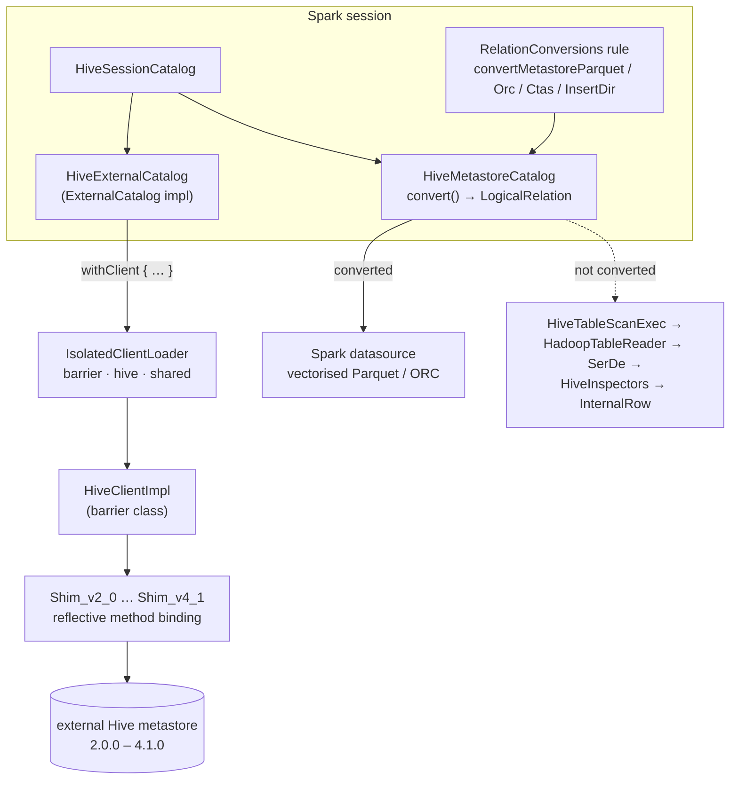

The compatibility layer. `sql/hive` is 33 files and ~12,500 lines whose entire job is to make two
systems that disagree about almost everything — type systems, schema representation, class loading,
file formats — behave as one. Almost nothing here is about *executing* a query; it is about
translating, and about the seams where the translation is lossy.

Two facts frame everything below. Spark 4.2.0 bundles **Hive 2.3.10** but can speak to metastores
from **2.0.0 through 4.1.0**, which is why an isolated classloader exists at all. And a Spark table
stored in a Hive metastore is often *not* a Hive table: its real schema lives in table properties
that Hive itself cannot interpret.



---

## Two Hive versions — the bundled client and the metastore it talks to

**What it is:** the distinction the whole module is built around, and the one most often misread.
`spark.sql.hive.version` reports the Hive Spark was *compiled against* and is **read-only**;
`spark.sql.hive.metastore.version` says which metastore you actually want to talk to.

**Anchor files:**

- [HiveUtils.scala:59](https://github.com/apache/spark/blob/v4.2.0/sql/hive/src/main/scala/org/apache/spark/sql/hive/HiveUtils.scala#L59) — `builtinHiveVersion = HiveVersionInfo.getVersion`, resolved from the bundled Hive jar; the root `pom.xml` pins `<hive.version>2.3.10</hive.version>`
- [HiveUtils.scala:61](https://github.com/apache/spark/blob/v4.2.0/sql/hive/src/main/scala/org/apache/spark/sql/hive/HiveUtils.scala#L61) — `spark.sql.hive.version`, with a `checkValue` that **rejects any attempt to set it**: "The builtin Hive version is read-only, please use spark.sql.hive.metastore.version"
- [HiveUtils.scala:76](https://github.com/apache/spark/blob/v4.2.0/sql/hive/src/main/scala/org/apache/spark/sql/hive/HiveUtils.scala#L76) — `spark.sql.hive.metastore.version`, documented as 2.0.0–2.3.10, 3.0.0–3.1.3 and 4.0.0–4.1.0
- [HiveUtils.scala:86](https://github.com/apache/spark/blob/v4.2.0/sql/hive/src/main/scala/org/apache/spark/sql/hive/HiveUtils.scala#L86) — `spark.sql.hive.metastore.jars`, whose four options (`builtin`, `maven`, `path`, an explicit classpath) are spelled out in the config doc itself
- [HiveUtils.scala:108](https://github.com/apache/spark/blob/v4.2.0/sql/hive/src/main/scala/org/apache/spark/sql/hive/HiveUtils.scala#L108) — `spark.sql.hive.metastore.jars.path`, supporting `file://`, `hdfs://`, bare paths and HTTP(S)/FTP, with wildcards on the first three
- [IsolatedClientLoader.scala:92](https://github.com/apache/spark/blob/v4.2.0/sql/hive/src/main/scala/org/apache/spark/sql/hive/client/IsolatedClientLoader.scala#L92) — `hiveVersion(String)`, the major/minor match that maps a version string onto one of eight `HiveVersion` objects, throwing `unsupportedHiveMetastoreVersionError` otherwise
- [IsolatedClientLoader.scala:119](https://github.com/apache/spark/blob/v4.2.0/sql/hive/src/main/scala/org/apache/spark/sql/hive/client/IsolatedClientLoader.scala#L119) — `downloadVersion`, the `maven` option: Spark resolves the requested Hive's jars at runtime, honouring `spark.jars.repositories`
- [IsolatedClientLoader.scala:109](https://github.com/apache/spark/blob/v4.2.0/sql/hive/src/main/scala/org/apache/spark/sql/hive/client/IsolatedClientLoader.scala#L109) — `supportsHadoopShadedClient`, gating use of the shaded Hadoop client by Hadoop version

!!! warning "All six metastore configs are `buildStaticConf` — they cannot be changed at runtime"

    `spark.sql.hive.version`, `.metastore.version`, `.metastore.jars`, `.metastore.jars.path`,
    `.metastore.sharedPrefixes` and `.metastore.barrierPrefixes` are all **static**. They are read
    once when the session's Hive client is constructed, so `spark.conf.set(...)` in a notebook does
    nothing and there is no error to tell you so. Getting them wrong means restarting the
    application, which is why this is a deployment decision rather than a tuning one.

!!! info "Bundled 2.3.10, speaks 2.0 → 4.1"

    The gap is the point. Most organisations have a metastore they cannot upgrade on Spark's
    schedule, so Spark ships one Hive for its own use and loads a *different* one, in a separate
    classloader, to talk to yours. `builtin` is the default and only works when your metastore is
    also 2.3.x.

**Configs:** `spark.sql.hive.version` (read-only, 1.1.1), `spark.sql.hive.metastore.version`
(builtin, 1.4.0), `spark.sql.hive.metastore.jars` (`builtin`, 1.4.0),
`spark.sql.hive.metastore.jars.path` (empty, 3.1.0)

**Maps to topics:** none yet — proposed as **E21**

---

## IsolatedClientLoader — barrier, hive and shared classes

**What it is:** the mechanism that lets two incompatible Hive versions live in one JVM. Every class
name the isolated loader is asked for falls into exactly one of three buckets, and which bucket
decides where it comes from.

**Anchor files:**

- [IsolatedClientLoader.scala:185](https://github.com/apache/spark/blob/v4.2.0/sql/hive/src/main/scala/org/apache/spark/sql/hive/client/IsolatedClientLoader.scala#L185) — the class, with `isolationOn` defaulting to true
- [IsolatedClientLoader.scala:208](https://github.com/apache/spark/blob/v4.2.0/sql/hive/src/main/scala/org/apache/spark/sql/hive/client/IsolatedClientLoader.scala#L208) — **shared classes**, delegated to Spark's own loader: `org.slf4j`, log4j 1.x and 2.x, `org.apache.spark.`, `scala.`, `java.`, `javax.sql.`, and all of `org.apache.hadoop.` **except** `org.apache.hadoop.hive.`
- [IsolatedClientLoader.scala:224](https://github.com/apache/spark/blob/v4.2.0/sql/hive/src/main/scala/org/apache/spark/sql/hive/client/IsolatedClientLoader.scala#L224) — **barrier classes**, redefined from bytes so each client gets its own copy: `HiveClientImpl`, `Shim`, `ShimLoader`
- [IsolatedClientLoader.scala:239](https://github.com/apache/spark/blob/v4.2.0/sql/hive/src/main/scala/org/apache/spark/sql/hive/client/IsolatedClientLoader.scala#L239) — the loader itself, parented to the **platform classloader** with an `assert` that it cannot see `org.apache.hadoop.hive.conf.HiveConf` — a runtime check that isolation is real
- [IsolatedClientLoader.scala:264](https://github.com/apache/spark/blob/v4.2.0/sql/hive/src/main/scala/org/apache/spark/sql/hive/client/IsolatedClientLoader.scala#L264) — everything not shared and not barrier is loaded from the isolated Hive jars
- [HiveUtils.scala:202](https://github.com/apache/spark/blob/v4.2.0/sql/hive/src/main/scala/org/apache/spark/sql/hive/HiveUtils.scala#L202) — `spark.sql.hive.metastore.sharedPrefixes`, defaulting to the JDBC driver prefixes, and at [:216](https://github.com/apache/spark/blob/v4.2.0/sql/hive/src/main/scala/org/apache/spark/sql/hive/HiveUtils.scala#L216) `.barrierPrefixes`

!!! info "The three buckets, and what each is for"

    **Shared** — one copy, Spark's: anything both sides must agree on by identity (logging, Spark's
    own classes, Hadoop, the JDBC driver that talks to the metastore's database). **Barrier** — a
    fresh copy per client: the classes that must be *compiled against* the isolated Hive, which is
    why `HiveClientImpl` is redefined from bytes rather than shared. **Everything else** — loaded
    from the isolated jars, invisible to Spark.

!!! warning "`sharedPrefixes` is the fix for a metastore-backing-database driver"

    The default already covers the common JDBC prefixes, but a metastore backed by a database whose
    driver Spark does not list will fail with a `ClassNotFoundException` or a `ClassCastException`
    that names a driver class — because the driver was loaded twice, once on each side. Adding its
    package to `spark.sql.hive.metastore.sharedPrefixes` is the intended remedy. `barrierPrefixes`
    is the opposite escape hatch, for your own classes that must bind to the isolated Hive.

**Configs:** `spark.sql.hive.metastore.sharedPrefixes` (JDBC prefixes, 1.4.0),
`spark.sql.hive.metastore.barrierPrefixes` (empty, 1.4.0)

**Maps to topics:** none — covered by the proposed **E21**

---

## The HiveClient shim ladder

**What it is:** `HiveClient` is a 58-method interface Spark programs against; `HiveClientImpl`
implements it; and `Shim` absorbs the per-version API differences by **reflection**, because the
code cannot compile against eight Hive versions at once.

**Anchor files:**

- [client/HiveClient.scala](https://github.com/apache/spark/blob/v4.2.0/sql/hive/src/main/scala/org/apache/spark/sql/hive/client/HiveClient.scala) — the version-independent interface, 58 methods
- [client/HiveClientImpl.scala](https://github.com/apache/spark/blob/v4.2.0/sql/hive/src/main/scala/org/apache/spark/sql/hive/client/HiveClientImpl.scala) — 1520 lines, a barrier class, holding the `Hive` session and translating `CatalogTable` ⇄ Hive's `Table`
- [client/HiveShim.scala:250](https://github.com/apache/spark/blob/v4.2.0/sql/hive/src/main/scala/org/apache/spark/sql/hive/client/HiveShim.scala#L250) — `Shim_v2_0`, the base of the ladder, then `Shim_v2_1` [:1011](https://github.com/apache/spark/blob/v4.2.0/sql/hive/src/main/scala/org/apache/spark/sql/hive/client/HiveShim.scala#L1011), `v2_2` [:1124](https://github.com/apache/spark/blob/v4.2.0/sql/hive/src/main/scala/org/apache/spark/sql/hive/client/HiveShim.scala#L1124), `v2_3` [:1126](https://github.com/apache/spark/blob/v4.2.0/sql/hive/src/main/scala/org/apache/spark/sql/hive/client/HiveShim.scala#L1126), `v3_0` [:1161](https://github.com/apache/spark/blob/v4.2.0/sql/hive/src/main/scala/org/apache/spark/sql/hive/client/HiveShim.scala#L1161), `v3_1` [:1287](https://github.com/apache/spark/blob/v4.2.0/sql/hive/src/main/scala/org/apache/spark/sql/hive/client/HiveShim.scala#L1287), `v4_0` [:1289](https://github.com/apache/spark/blob/v4.2.0/sql/hive/src/main/scala/org/apache/spark/sql/hive/client/HiveShim.scala#L1289) and `v4_1` [:1547](https://github.com/apache/spark/blob/v4.2.0/sql/hive/src/main/scala/org/apache/spark/sql/hive/client/HiveShim.scala#L1547) — **each extends the previous**, so a new Hive version is expressed as a diff
- [client/package.scala:44](https://github.com/apache/spark/blob/v4.2.0/sql/hive/src/main/scala/org/apache/spark/sql/hive/client/package.scala#L44) — the `HiveVersion` objects carrying each version's exact jar coordinates and exclusions
- [HiveExternalCatalog.scala:103](https://github.com/apache/spark/blob/v4.2.0/sql/hive/src/main/scala/org/apache/spark/sql/hive/HiveExternalCatalog.scala#L103) — `withClient`, which is `synchronized` and wraps **every** catalog operation: the Hive client is not thread-safe, so all metastore access through a session is serialised

!!! info "Inheritance is the versioning strategy"

    Each shim extends its predecessor and overrides only what changed, so the ladder reads as a
    changelog of Hive's client API. Supporting a new Hive means adding one class at the top — which
    is exactly what `Shim_v4_1` is.

!!! info "New in 4.2.0: fewer metastore round trips on DROP TABLE"

    SPARK-55091 changed `HiveClientImpl.dropTable` to attempt the drop first and only check
    `databaseExists` / `tableExists` **in the catch block**, instead of probing beforehand. On a
    remote metastore each probe is an RPC, so the happy path is now measurably cheaper — worth
    knowing if you have ever watched a `DROP TABLE` loop crawl.

**Configs:** none read here directly

**Maps to topics:** none — covered by the proposed **E21**

---

## HiveExternalCatalog — a Spark schema inside Hive table properties

**What it is:** the `ExternalCatalog` implementation the [framework sweep](sql-catalyst-framework.md)
describes the interface for. Its central trick: Hive's metastore cannot represent Spark's type
system, so Spark stores its own schema as **JSON in table properties** and treats the Hive columns
as a lossy shadow.

**Anchor files:**

- [HiveExternalCatalog.scala:440](https://github.com/apache/spark/blob/v4.2.0/sql/hive/src/main/scala/org/apache/spark/sql/hive/HiveExternalCatalog.scala#L440) — `tableMetaToTableProps`, which writes `spark.sql.sources.schema` (as JSON), the partition-column names, the bucket spec and sort columns, plus `spark.sql.create.version`
- [HiveExternalCatalog.scala:466](https://github.com/apache/spark/blob/v4.2.0/sql/hive/src/main/scala/org/apache/spark/sql/hive/HiveExternalCatalog.scala#L466) — `CatalogTable.splitLargeTableProp`, splitting the schema JSON across numbered properties at `spark.sql.sources.schemaStringLengthThreshold` (4000), because metastore property values are length-limited
- [HiveExternalCatalog.scala:465](https://github.com/apache/spark/blob/v4.2.0/sql/hive/src/main/scala/org/apache/spark/sql/hive/HiveExternalCatalog.scala#L465) — `CharVarcharUtils.replaceCharVarcharWithStringInSchema` before serialising, "for backward compatibility to Spark 2" — the erasure the [types & parser sweep](sql-catalyst-types-parser.md) covers, reaching into the metastore format
- [HiveExternalCatalog.scala:143](https://github.com/apache/spark/blob/v4.2.0/sql/hive/src/main/scala/org/apache/spark/sql/hive/HiveExternalCatalog.scala#L143) — a guard rejecting user-supplied properties beginning with `spark.sql.`: the namespace is reserved because it *is* the storage format
- [HiveExternalCatalog.scala:452](https://github.com/apache/spark/blob/v4.2.0/sql/hive/src/main/scala/org/apache/spark/sql/hive/HiveExternalCatalog.scala#L452) — `CREATED_SPARK_VERSION`, stamped on every table: the provenance record that lets later Spark versions apply compatibility rules
- [HiveExternalCatalog.scala:457](https://github.com/apache/spark/blob/v4.2.0/sql/hive/src/main/scala/org/apache/spark/sql/hive/HiveExternalCatalog.scala#L457) — **new in 4.2.0** (SPARK-54119): a `VIEW_SUB_TYPE` marker, because Hive stores a metric view as an ordinary `VIRTUAL_VIEW` and `restoreTableMetadata` has to lift it back
- [HiveExternalCatalog.scala:259](https://github.com/apache/spark/blob/v4.2.0/sql/hive/src/main/scala/org/apache/spark/sql/hive/HiveExternalCatalog.scala#L259) — `TABLE_PARTITION_PROVIDER`, marking whether partitions are tracked in the metastore or discovered from the filesystem

!!! warning "A Spark table in a Hive metastore is only half-readable by Hive"

    The Hive columns are written for compatibility, but the authoritative schema is the JSON in
    `spark.sql.sources.schema*`. Editing a table's columns with Hive DDL therefore changes what Hive
    sees and **not** what Spark reads, and the two drift silently. This is the mechanism behind
    every "I altered the table in Hive and Spark ignored it" report.

!!! info "One lock per catalog"

    `withClient` is `synchronized` on the catalog instance. Metastore access from one Spark session
    is fully serialised, so a slow metastore serialises everything that touches it — including
    unrelated queries in the same session.

**Configs:** `spark.sql.sources.schemaStringLengthThreshold` (4000, read from `sql/catalyst`),
`spark.sql.hive.tablePropertyLengthThreshold`

**Maps to topics:** B4, E5

---

## Hive-compatible versus Spark-specific persistence

**What it is:** when Spark creates a datasource table it tries to write metadata Hive can also
understand, and falls back to a Spark-only format when it cannot. The decision has five named
branches and one `try`/`catch`, all in one method.

**Anchor files:**

- [HiveExternalCatalog.scala:374](https://github.com/apache/spark/blob/v4.2.0/sql/hive/src/main/scala/org/apache/spark/sql/hive/HiveExternalCatalog.scala#L374) — the five cases: `skipHiveMetadata` requested; **Hive-incompatible types present**; a bucketed table (Spark's bucket hashing differs from Hive's, so it is written Hive-compatibly but *as unbucketed*); a known SerDe; or no SerDe for the provider
- [HiveExternalCatalog.scala:411](https://github.com/apache/spark/blob/v4.2.0/sql/hive/src/main/scala/org/apache/spark/sql/hive/HiveExternalCatalog.scala#L411) — the fallback: try the Hive-compatible write, and on any non-Thrift failure **log a warning and retry in Spark-specific format**
- [HiveExternalCatalog.scala:323](https://github.com/apache/spark/blob/v4.2.0/sql/hive/src/main/scala/org/apache/spark/sql/hive/HiveExternalCatalog.scala#L323) `newSparkSQLSpecificMetastoreTable` and [:347](https://github.com/apache/spark/blob/v4.2.0/sql/hive/src/main/scala/org/apache/spark/sql/hive/HiveExternalCatalog.scala#L347) `newHiveCompatibleMetastoreTable`
- [HiveExternalCatalog.scala:298](https://github.com/apache/spark/blob/v4.2.0/sql/hive/src/main/scala/org/apache/spark/sql/hive/HiveExternalCatalog.scala#L298) — `EMPTY_DATA_SCHEMA`, the placeholder written when the real schema cannot be expressed at all

!!! warning "Whether your table is readable by Hive is decided silently, at create time"

    Every branch logs — at INFO on success, WARNING on the fallbacks — and none of them fails the
    `CREATE TABLE`. So a table created with, say, a Spark-only type is simply invisible to Hive
    afterwards, and the only record is a line in the driver log at creation time. If cross-engine
    readability matters, check the log when the table is created rather than discovering it later.

!!! info "Bucketed tables are deliberately mis-declared"

    Spark's bucket hash function differs from Hive's, so a bucketed Spark table is registered
    Hive-compatibly but **without** its bucket spec: "Hive can read this table as a non-bucketed
    table". The bucketing still works for Spark, which reads the spec back from table properties.

**Configs:** none directly; `skipHiveMetadata` is a table option

**Maps to topics:** B4, E5

---

## RelationConversions — reading a Hive table with Spark's own reader

**What it is:** the single most performance-relevant thing in the module. A Parquet or ORC table
defined in the metastore *can* be read through Hive's SerDe machinery — or Spark can throw that away
and read the files with its own vectorised datasource. An analyzer rule decides, per table, per
operation.

**Code path:** `RelationConversions` (a post-hoc resolution rule) → `isConvertible(storage)` on the
SerDe name → `HiveMetastoreCatalog.convert(relation, isWrite)` → `convertToLogicalRelation` →
a cached `LogicalRelation` over `HadoopFsRelation`

**Anchor files:**

- [HiveStrategies.scala:212](https://github.com/apache/spark/blob/v4.2.0/sql/hive/src/main/scala/org/apache/spark/sql/hive/HiveStrategies.scala#L212) — `RelationConversions`, and at [:222](https://github.com/apache/spark/blob/v4.2.0/sql/hive/src/main/scala/org/apache/spark/sql/hive/HiveStrategies.scala#L222) the whole test: **the SerDe class name is lowercased and checked for the substrings `"parquet"` and `"orc"`**
- [HiveStrategies.scala:238](https://github.com/apache/spark/blob/v4.2.0/sql/hive/src/main/scala/org/apache/spark/sql/hive/HiveStrategies.scala#L238) — the write path (`InsertIntoStatement`), separate from the read path below it, and at [:313](https://github.com/apache/spark/blob/v4.2.0/sql/hive/src/main/scala/org/apache/spark/sql/hive/HiveStrategies.scala#L313) the `INSERT OVERWRITE DIRECTORY` path
- [HiveMetastoreCatalog.scala:142](https://github.com/apache/spark/blob/v4.2.0/sql/hive/src/main/scala/org/apache/spark/sql/hive/HiveMetastoreCatalog.scala#L142) — `convert`, choosing the datasource provider, and at [:166](https://github.com/apache/spark/blob/v4.2.0/sql/hive/src/main/scala/org/apache/spark/sql/hive/HiveMetastoreCatalog.scala#L166) the ORC fork on `spark.sql.orc.impl` between the native and the legacy Hive reader
- [HiveMetastoreCatalog.scala:80](https://github.com/apache/spark/blob/v4.2.0/sql/hive/src/main/scala/org/apache/spark/sql/hive/HiveMetastoreCatalog.scala#L80) — `getCached`, and the several `invalidateCachedTable` branches: the converted relation is cached in the session catalog's table-relation cache (which, per the [framework sweep](sql-catalyst-framework.md), **never expires by default**)
- [HiveUtils.scala:126](https://github.com/apache/spark/blob/v4.2.0/sql/hive/src/main/scala/org/apache/spark/sql/hive/HiveUtils.scala#L126) — the switch family, all defaulting to **true**: `spark.sql.hive.convertMetastoreParquet` (1.1.1), `spark.sql.hive.convertMetastoreOrc` (2.0.0), `spark.sql.hive.convertInsertingPartitionedTable` (3.0.0), `spark.sql.hive.convertInsertingUnpartitionedTable` (4.0.0), `spark.sql.hive.convertMetastoreCtas` (3.0.0), `spark.sql.hive.convertMetastoreInsertDir` (3.3.0) — plus `spark.sql.hive.convertMetastoreParquet.mergeSchema` (**false**, 1.3.1) and `spark.sql.hive.convertMetastoreAsNullable` (**false**, 4.1.0)

!!! warning "Conversion is decided by a substring match on the SerDe class name"

    `serde.toLowerCase.contains("parquet")` and `.contains("orc")`. A table registered with a custom
    or renamed SerDe that stores Parquet but is not *called* Parquet will not convert, and will read
    through the SerDe path with no vectorisation, no filter pushdown and no column pruning — with
    nothing in `EXPLAIN` saying why beyond `HiveTableScan` where you expected `FileScan`. That
    difference in the plan is the diagnostic: `FileScan parquet` means converted, `Scan hive` means
    not.

!!! info "Reads, inserts, CTAS and INSERT DIRECTORY are four separate switches"

    They were added across four releases (1.1.1, 3.0.0, 3.3.0, 4.0.0) and can disagree. It is
    entirely possible to read a table natively and write it through Hive, which is usually what you
    want when the write must be visible to Hive with Hive's own file layout.

**Configs:** the eight `spark.sql.hive.convert*` keys above, plus `spark.sql.orc.impl`

**Maps to topics:** none yet — proposed as **A27**

---

## Case-sensitive schema inference and INFER_AND_SAVE

**What it is:** Hive metastores lower-case column names. Parquet and ORC files do not. When a table
was created by Hive and read by Spark, Spark may need to recover the real casing from the files —
and can write it back.

**Anchor files:**

- [HiveMetastoreCatalog.scala:340](https://github.com/apache/spark/blob/v4.2.0/sql/hive/src/main/scala/org/apache/spark/sql/hive/HiveMetastoreCatalog.scala#L340) — `inferIfNeeded`, gated on `spark.sql.hive.caseSensitiveInferenceMode` and `tableMeta.schemaPreservesCase`
- [HiveMetastoreCatalog.scala:370](https://github.com/apache/spark/blob/v4.2.0/sql/hive/src/main/scala/org/apache/spark/sql/hive/HiveMetastoreCatalog.scala#L370) — `INFER_AND_SAVE` calls `updateDataSchema`, **writing the inferred schema back into the metastore** so the cost is paid once
- [HiveMetastoreCatalog.scala:386](https://github.com/apache/spark/blob/v4.2.0/sql/hive/src/main/scala/org/apache/spark/sql/hive/HiveMetastoreCatalog.scala#L386) — when inference fails, a warning and a silent fall back to the (lower-cased) metastore schema
- [HiveMetastoreCatalog.scala:398](https://github.com/apache/spark/blob/v4.2.0/sql/hive/src/main/scala/org/apache/spark/sql/hive/HiveMetastoreCatalog.scala#L398) — `mergeWithMetastoreSchema`, reconciling inferred file schema against declared metastore schema
- [HiveMetastoreCatalog.scala:345](https://github.com/apache/spark/blob/v4.2.0/sql/hive/src/main/scala/org/apache/spark/sql/hive/HiveMetastoreCatalog.scala#L345) — `spark.sql.hive.convertMetastoreAsNullable` (false, 4.1.0), which forces the whole converted schema nullable

!!! warning "Inference reads files at planning time, and `INFER_AND_SAVE` writes to your metastore"

    `shouldInfer` triggers an `InMemoryFileIndex` listing plus a `fileFormat.inferSchema` call
    during *planning*, so the first query against such a table pays a file-listing and
    schema-reading cost before any task runs. `INFER_AND_SAVE` then issues an `ALTER TABLE` against
    the metastore — a write from what the user thought was a read query. `NEVER_INFER` disables both
    at the cost of lower-cased column names.

**Configs:** `spark.sql.hive.caseSensitiveInferenceMode` (from `sql/catalyst`),
`spark.sql.hive.convertMetastoreAsNullable` (false, 4.1.0)

**Maps to topics:** B4

---

## HiveTableScanExec and metastore partition pruning

**What it is:** the physical scan for tables that were *not* converted. Its interesting decision is
where partition pruning happens: in the metastore (one filtered RPC) or in Spark (fetch every
partition, then filter).

**Anchor files:**

- [execution/HiveTableScanExec.scala:55](https://github.com/apache/spark/blob/v4.2.0/sql/hive/src/main/scala/org/apache/spark/sql/hive/execution/HiveTableScanExec.scala#L55) — the operator
- [execution/HiveTableScanExec.scala:178](https://github.com/apache/spark/blob/v4.2.0/sql/hive/src/main/scala/org/apache/spark/sql/hive/execution/HiveTableScanExec.scala#L178) — the fork: with `spark.sql.hive.metastorePartitionPruning` **and** a pruning predicate, `rawPartitions` is already filtered by the metastore; otherwise `prunePartitions` filters client-side
- [execution/HiveTableScanExec.scala:84](https://github.com/apache/spark/blob/v4.2.0/sql/hive/src/main/scala/org/apache/spark/sql/hive/execution/HiveTableScanExec.scala#L84) — `boundPruningPred`, the predicate bound against partition columns and evaluated per partition
- [execution/PruneHiveTablePartitions.scala](https://github.com/apache/spark/blob/v4.2.0/sql/hive/src/main/scala/org/apache/spark/sql/hive/execution/PruneHiveTablePartitions.scala) — the optimizer-side rule that pushes the predicate down and updates statistics
- [HiveStrategies.scala](https://github.com/apache/spark/blob/v4.2.0/sql/hive/src/main/scala/org/apache/spark/sql/hive/HiveStrategies.scala) — `DetermineTableStats`, which supplies a size estimate for a Hive table, falling back to `spark.sql.defaultSizeInBytes` when nothing better exists

!!! warning "Without metastore pruning, Spark lists every partition on the driver"

    `spark.sql.hive.metastorePartitionPruning` (defined in `sql/catalyst`) decides whether the
    predicate reaches the metastore. With it off — or with a predicate the metastore cannot express
    — Spark fetches *all* partition metadata and filters locally. On a table with tens of thousands
    of partitions that is a large driver-side allocation before any work starts. The related
    fallback configs (`…PruningFallbackOnException`, `…FastFallback`, `…InSetThreshold`) exist
    because metastore-side pruning is fragile enough to need an escape route.

**Configs:** `spark.sql.hive.metastorePartitionPruning`,
`spark.sql.hive.metastorePartitionPruningFallbackOnException`,
`spark.sql.hive.metastorePartitionPruningFastFallback`,
`spark.sql.hive.metastorePartitionPruningInSetThreshold`,
`spark.sql.hive.advancedPartitionPredicatePushdown.enabled` (all defined in `sql/catalyst`)

**Maps to topics:** B4, A18

---

## HadoopTableReader — the SerDe read path

**What it is:** what actually happens when conversion does not apply. Spark builds a `HadoopRDD`
over the table's `InputFormat`, instantiates the Hive `Deserializer` on each executor, and converts
`Writable`s into `InternalRow`s one field at a time.

**Anchor files:**

- [TableReader.scala:55](https://github.com/apache/spark/blob/v4.2.0/sql/hive/src/main/scala/org/apache/spark/sql/hive/TableReader.scala#L55) — the trait: `makeRDDForTable` and `makeRDDForPartitionedTable`
- [TableReader.scala:67](https://github.com/apache/spark/blob/v4.2.0/sql/hive/src/main/scala/org/apache/spark/sql/hive/TableReader.scala#L67) — `HadoopTableReader`, and at [:91](https://github.com/apache/spark/blob/v4.2.0/sql/hive/src/main/scala/org/apache/spark/sql/hive/TableReader.scala#L91) the broadcast Hadoop conf
- [TableReader.scala:136](https://github.com/apache/spark/blob/v4.2.0/sql/hive/src/main/scala/org/apache/spark/sql/hive/TableReader.scala#L136) — the deserializer is constructed **per partition, by reflection**, then `initialize`d with the table properties
- [TableReader.scala:140](https://github.com/apache/spark/blob/v4.2.0/sql/hive/src/main/scala/org/apache/spark/sql/hive/TableReader.scala#L140) — `fillObject`, the row-at-a-time conversion into a reused `MutableRow`
- [HiveUtils.scala:240](https://github.com/apache/spark/blob/v4.2.0/sql/hive/src/main/scala/org/apache/spark/sql/hive/HiveUtils.scala#L240) — `spark.sql.hive.useDelegateForSymlinkTextInputFormat` (true, 3.4.0), a targeted workaround for one `InputFormat`

!!! info "This is the path the whole `convertMetastore*` family exists to avoid"

    Row-at-a-time, object-inspector-mediated, no vectorisation, no pushdown, an object allocation
    per non-primitive field. It is correct and general — it reads anything Hive can read — and it is
    the reason a non-converted Parquet table can be several times slower than a converted one over
    identical files.

**Configs:** `spark.sql.hive.useDelegateForSymlinkTextInputFormat` (true, 3.4.0),
`spark.files.ignoreCorruptFiles` / `.ignoreMissingFiles` (read here from core)

**Maps to topics:** B4

---

## InsertIntoHiveTable — staging directories and dynamic partitions

**What it is:** the write path. Spark writes to a staging directory beside the table, then asks Hive
to `loadTable` or `loadPartition` — so the visibility semantics are Hive's, not Spark's.

**Anchor files:**

- [execution/InsertIntoHiveTable.scala:71](https://github.com/apache/spark/blob/v4.2.0/sql/hive/src/main/scala/org/apache/spark/sql/hive/execution/InsertIntoHiveTable.scala#L71) — the command, and at [:125](https://github.com/apache/spark/blob/v4.2.0/sql/hive/src/main/scala/org/apache/spark/sql/hive/execution/InsertIntoHiveTable.scala#L125) `processInsert`
- [execution/InsertIntoHiveTable.scala:132](https://github.com/apache/spark/blob/v4.2.0/sql/hive/src/main/scala/org/apache/spark/sql/hive/execution/InsertIntoHiveTable.scala#L132) — `numDynamicPartitions`, counting partition spec entries with no value
- [execution/InsertIntoHiveTable.scala:215](https://github.com/apache/spark/blob/v4.2.0/sql/hive/src/main/scala/org/apache/spark/sql/hive/execution/InsertIntoHiveTable.scala#L215) `loadPartition` / [:226](https://github.com/apache/spark/blob/v4.2.0/sql/hive/src/main/scala/org/apache/spark/sql/hive/execution/InsertIntoHiveTable.scala#L226) `loadTable` — the handover to Hive
- [execution/HiveTempPath.scala:60](https://github.com/apache/spark/blob/v4.2.0/sql/hive/src/main/scala/org/apache/spark/sql/hive/execution/HiveTempPath.scala#L60) — the staging directory, read from **Hive's own** `hive.exec.stagingdir` (default `.hive-staging`), with a separate external-scratch path at [:84](https://github.com/apache/spark/blob/v4.2.0/sql/hive/src/main/scala/org/apache/spark/sql/hive/execution/HiveTempPath.scala#L84) when the target is on a different filesystem
- [execution/SaveAsHiveFile.scala](https://github.com/apache/spark/blob/v4.2.0/sql/hive/src/main/scala/org/apache/spark/sql/hive/execution/SaveAsHiveFile.scala), [execution/HiveFileFormat.scala](https://github.com/apache/spark/blob/v4.2.0/sql/hive/src/main/scala/org/apache/spark/sql/hive/execution/HiveFileFormat.scala), [execution/V1WritesHiveUtils.scala](https://github.com/apache/spark/blob/v4.2.0/sql/hive/src/main/scala/org/apache/spark/sql/hive/execution/V1WritesHiveUtils.scala)
- [execution/CreateHiveTableAsSelectCommand.scala](https://github.com/apache/spark/blob/v4.2.0/sql/hive/src/main/scala/org/apache/spark/sql/hive/execution/CreateHiveTableAsSelectCommand.scala) and [execution/InsertIntoHiveDirCommand.scala](https://github.com/apache/spark/blob/v4.2.0/sql/hive/src/main/scala/org/apache/spark/sql/hive/execution/InsertIntoHiveDirCommand.scala) — the CTAS and `INSERT OVERWRITE DIRECTORY` variants that `convertMetastoreCtas` / `convertMetastoreInsertDir` govern
- [execution/HiveScriptTransformationExec.scala](https://github.com/apache/spark/blob/v4.2.0/sql/hive/src/main/scala/org/apache/spark/sql/hive/execution/HiveScriptTransformationExec.scala) — `TRANSFORM … USING 'script'`, piping rows through an external process

!!! warning "Staging directories are configured by Hive, not Spark"

    `hive.exec.stagingdir` is read straight from the Hadoop/Hive configuration. A leftover
    `.hive-staging*` directory after a failed job is this mechanism, and cleaning it up is
    `HiveTempPath.deleteTmpPath`'s job — which only runs if the command completes its `finally`.

**Configs:** `hive.exec.stagingdir` (a Hive config, not a Spark one),
`spark.sql.hive.gatherFastStats` (from `sql/catalyst`)

**Maps to topics:** B4

---

## HiveInspectors — the ObjectInspector bridge

**What it is:** 1177 lines translating between Hive's `ObjectInspector` model and Catalyst's
`DataType`/`InternalRow`. It is the type-system seam, and every Hive UDF and every SerDe read passes
through it.

**Anchor files:**

- [HiveInspectors.scala:109](https://github.com/apache/spark/blob/v4.2.0/sql/hive/src/main/scala/org/apache/spark/sql/hive/HiveInspectors.scala#L109) — a 100-line comment that is the best available explanation of Hive's inspector model: primitive, list, map, struct, union and *constant* inspectors, and the writable-versus-java duality
- `wrapperFor` / `unwrapperFor` — the two directions, built once per type and applied per value
- `toInspector` / `inspectorToDataType` — the type-level mapping in both directions
- [HiveShim.scala](https://github.com/apache/spark/blob/v4.2.0/sql/hive/src/main/scala/org/apache/spark/sql/hive/HiveShim.scala) — serialisation helpers for Hive objects that must cross to executors
- SPARK-50610 (4.2.0) fixed decimal precision handling in `toInspector` — a reminder that this seam is still producing correctness fixes 10 years on

!!! info "`UnionObjectInspector` is still unsupported"

    The comment marks it `TODO: not supported by SparkSQL yet`. Hive union types therefore cannot be
    read through this path at all — a small but complete gap in an otherwise exhaustive mapping.

**Configs:** none

**Maps to topics:** B4, E1

---

## Hive UDFs, UDAFs and UDTFs

**What it is:** four expression wrappers letting Hive's function classes run inside Catalyst. They
are the reason a shop with a decade of Hive UDFs can move to Spark without rewriting them.

**Anchor files:**

- [hiveUDFs.scala:43](https://github.com/apache/spark/blob/v4.2.0/sql/hive/src/main/scala/org/apache/spark/sql/hive/hiveUDFs.scala#L43) `HiveSimpleUDF` (the reflective `UDF` interface), [:115](https://github.com/apache/spark/blob/v4.2.0/sql/hive/src/main/scala/org/apache/spark/sql/hive/hiveUDFs.scala#L115) `HiveGenericUDF`, [:206](https://github.com/apache/spark/blob/v4.2.0/sql/hive/src/main/scala/org/apache/spark/sql/hive/hiveUDFs.scala#L206) `HiveGenericUDTF`, [:329](https://github.com/apache/spark/blob/v4.2.0/sql/hive/src/main/scala/org/apache/spark/sql/hive/hiveUDFs.scala#L329) `HiveUDAFFunction`
- [hiveUDFs.scala:52](https://github.com/apache/spark/blob/v4.2.0/sql/hive/src/main/scala/org/apache/spark/sql/hive/hiveUDFs.scala#L52) — `deterministic` and [:60](https://github.com/apache/spark/blob/v4.2.0/sql/hive/src/main/scala/org/apache/spark/sql/hive/hiveUDFs.scala#L60) `foldable` both defer to Hive's `@UDFType(deterministic = …)` annotation: a Hive UDF that lies in its annotation breaks constant folding and subexpression elimination, per the [expressions sweep](sql-catalyst-expressions.md)
- [hiveUDFs.scala:210](https://github.com/apache/spark/blob/v4.2.0/sql/hive/src/main/scala/org/apache/spark/sql/hive/hiveUDFs.scala#L210) — `HiveGenericUDTF` is a `Generator` **and** a `CodegenFallback`, so a Hive UDTF disables whole-stage codegen for its operator
- [hiveUDFEvaluators.scala:42](https://github.com/apache/spark/blob/v4.2.0/sql/hive/src/main/scala/org/apache/spark/sql/hive/hiveUDFEvaluators.scala#L42) — the evaluators, with the Hive function object held `@transient` and rebuilt on each executor
- [hiveUDFs.scala:543](https://github.com/apache/spark/blob/v4.2.0/sql/hive/src/main/scala/org/apache/spark/sql/hive/hiveUDFs.scala#L543) — `HiveUDAFBuffer`, carrying a `canDoMerge` flag: a Hive UDAF that cannot merge partial buffers forces a different aggregation shape

!!! warning "Every Hive UDF is a `CodegenFallback`-class citizen"

    They are `UserDefinedExpression`s evaluated through object inspectors, with boxing on every
    argument and every result. They work, and they are far cheaper than a Python UDF, but they are
    the slowest JVM-side option — and `HiveGenericUDTF`'s `CodegenFallback` additionally costs its
    whole operator's whole-stage codegen.

**Configs:** none directly

**Maps to topics:** I3, A5

---

## The legacy Hive ORC reader

**What it is:** the pre-2.3 ORC implementation, still present and still selectable. Spark's native
ORC reader lives in `sql/core`; this one goes through Hive's `OrcInputFormat` and object inspectors.

**Anchor files:**

- [orc/OrcFileFormat.scala:58](https://github.com/apache/spark/blob/v4.2.0/sql/hive/src/main/scala/org/apache/spark/sql/hive/orc/OrcFileFormat.scala#L58) — the file format, built on `org.apache.hadoop.hive.ql.io.orc` and `HiveInspectors`
- [orc/OrcFileOperator.scala](https://github.com/apache/spark/blob/v4.2.0/sql/hive/src/main/scala/org/apache/spark/sql/hive/orc/OrcFileOperator.scala) — reading ORC footers for schema inference
- [HiveMetastoreCatalog.scala:166](https://github.com/apache/spark/blob/v4.2.0/sql/hive/src/main/scala/org/apache/spark/sql/hive/HiveMetastoreCatalog.scala#L166) — the fork on `spark.sql.orc.impl`: `native` selects `sql/core`'s reader, `hive` selects this one

!!! info "`spark.sql.orc.impl` defaults to `native`; this is the other branch"

    Setting it to `hive` routes ORC through this format — losing vectorisation and the native
    reader's pushdown. It exists for compatibility with tables written by very old Hive versions
    where the native reader disagrees, and is a deliberate, narrow fallback rather than a tuning
    option.

**Configs:** `spark.sql.orc.impl` (from `sql/catalyst`)

**Maps to topics:** I10

---

## Hive delegation tokens

**What it is:** the Kerberos story. On a secured cluster, executors cannot authenticate to the
metastore themselves, so the driver obtains a delegation token and ships it with the tokens the
[core config-security sweep](core-config-security.md) covers.

**Anchor files:**

- [security/HiveDelegationTokenProvider.scala:42](https://github.com/apache/spark/blob/v4.2.0/sql/hive/src/main/scala/org/apache/spark/sql/hive/security/HiveDelegationTokenProvider.scala#L42) — the provider, `serviceName = "hive"`
- [security/HiveDelegationTokenProvider.scala:64](https://github.com/apache/spark/blob/v4.2.0/sql/hive/src/main/scala/org/apache/spark/sql/hive/security/HiveDelegationTokenProvider.scala#L64) — `delegationTokensRequired`, which needs both a metastore URI and a configured principal
- [security/HiveDelegationTokenProvider.scala:94](https://github.com/apache/spark/blob/v4.2.0/sql/hive/src/main/scala/org/apache/spark/sql/hive/security/HiveDelegationTokenProvider.scala#L94) — the principal comes from Hive's own `hive.metastore.kerberos.principal`
- [security/HiveDelegationTokenProvider.scala:117](https://github.com/apache/spark/blob/v4.2.0/sql/hive/src/main/scala/org/apache/spark/sql/hive/security/HiveDelegationTokenProvider.scala#L117) — a failure logs a warning and **returns no token**, rather than failing the submission

!!! warning "Token acquisition failure is a warning, not an error"

    If the provider cannot obtain a token it logs `Failed to get token` and carries on; the failure
    surfaces much later as an authentication error on an executor. On a Kerberised cluster, grep the
    driver log for that message before debugging the executor-side symptom.

**Configs:** `hive.metastore.uris`, `hive.metastore.kerberos.principal` (Hive configs)

**Maps to topics:** E2, E5

---

## Breadth check 1 — the config slice

The `spark.sql.hive.*` family is **30 keys**, and the first thing worth recording is that it is
**split across two subsystems**: 17 are declared in this module's
[HiveUtils.scala](https://github.com/apache/spark/blob/v4.2.0/sql/hive/src/main/scala/org/apache/spark/sql/hive/HiveUtils.scala),
and 13 more in `sql/catalyst`'s `SQLConf` — several of which are read *here* and nowhere else.

| Configs | Where declared / read |
|---|---|
| `spark.sql.hive.version`, `spark.sql.hive.metastore.version`, `spark.sql.hive.metastore.jars`, `spark.sql.hive.metastore.jars.path`, `spark.sql.hive.metastore.sharedPrefixes`, `spark.sql.hive.metastore.barrierPrefixes` | **HiveUtils, static** — the isolated client |
| `spark.sql.hive.convertMetastoreParquet`, `spark.sql.hive.convertMetastoreParquet.mergeSchema`, `spark.sql.hive.convertMetastoreOrc`, `spark.sql.hive.convertInsertingPartitionedTable`, `spark.sql.hive.convertInsertingUnpartitionedTable`, `spark.sql.hive.convertMetastoreCtas`, `spark.sql.hive.convertMetastoreInsertDir`, `spark.sql.hive.convertMetastoreAsNullable` | **HiveUtils** — read by `RelationConversions` / `HiveMetastoreCatalog` |
| `spark.sql.hive.useDelegateForSymlinkTextInputFormat` | **HiveUtils** — read by `TableReader` |
| `spark.sql.hive.thriftServer.async`, `spark.sql.legacy.hive.thriftServer.useZeroBasedColumnOrdinalPosition` | **HiveUtils**, consumed by the **Thrift server**, which is a different module (`sql/hive-thriftserver`) — declared here, read there |
| `spark.sql.hive.metastorePartitionPruning`, `spark.sql.hive.metastorePartitionPruningFallbackOnException`, `spark.sql.hive.metastorePartitionPruningFastFallback`, `spark.sql.hive.metastorePartitionPruningInSetThreshold`, `spark.sql.hive.advancedPartitionPredicatePushdown.enabled` | **declared in sql/catalyst, read here** — `HiveTableScanExec`, `HiveShim` |
| `spark.sql.hive.caseSensitiveInferenceMode` | **declared in sql/catalyst, read here** — `HiveMetastoreCatalog.inferIfNeeded` |
| `spark.sql.hive.manageFilesourcePartitions`, `spark.sql.hive.filesourcePartitionFileCacheSize`, `spark.sql.hive.gatherFastStats`, `spark.sql.hive.dropPartitionByName.enabled`, `spark.sql.hive.tablePropertyLengthThreshold`, `spark.sql.hive.convertCTAS` | **declared in sql/catalyst**, read by the catalyst catalog layer and `sql/core` |
| `spark.sql.hive.thriftServer.singleSession` | **sql/catalyst**, read by the Thrift server |
| `spark.sql.orc.impl`, `spark.sql.sources.schemaStringLengthThreshold`, `spark.sql.warehouse.dir`, `spark.sql.defaultSizeInBytes` | **sql/catalyst**, read here |

!!! warning "A `spark.sql.hive.*` key is not necessarily defined — or read — in `sql/hive`"

    Grepping the module for reads (the practice established on the
    [expressions sweep](sql-catalyst-expressions.md)) shows both directions of mismatch: two keys
    declared here are read only by the Thrift server module, and six keys declared in `sql/catalyst`
    are read only here. Searching one module for the family finds neither group. The reproducible
    check is:

    ```bash
    grep -rn "getConf(SQLConf\.\|getConf(HiveUtils\." sql/hive/src/main/scala
    ```

## Breadth check 2 — the packages

Walked by hand: the `hive` root (16 files), `client/` (5), `execution/` (11), `orc/` (2),
`security/` (1) — 33 Scala files plus `package-info.java`, all covered or attributed. Files cited
only in passing are the small write-path helpers (`SaveAsHiveFile`, `HiveFileFormat`,
`V1WritesHiveUtils`, `HiveOptions`) and the session plumbing (`HiveContext`,
`HiveSessionStateBuilder`, `HiveSessionCatalog`, `HiveTableRelationResolver`), each of which is a
thin adapter onto a concept above rather than a concept of its own.

**Not in this subsystem:** the **Hive Thrift server** lives in `sql/hive-thriftserver`, which is not
a subsystem in `groups.yaml` at all — so the two `thriftServer` configs declared in `HiveUtils` have
no swept reader anywhere in the map. Worth recording as a genuine gap rather than an omission of
this sweep.

## Overlapping topic traces

`check_drift.py --sweeps` reports overlap with `topics/b4.md`, `topics/i10.md` and `topics/i3.md`,
all recorded at **4.2.0** — the same version as this sweep. Read before writing; this page agrees with both and adds
the metastore half: **B4** traces `DataFrameReader`/`Writer` and the datasource API, and this adds
what happens when the table came from a Hive metastore rather than a path — conversion, schema in
table properties, staging-directory writes. **I10** traces the file formats, and this adds that the
*same* Parquet or ORC files are read by two completely different code paths depending on a substring
match against the SerDe name. **I3** traces Python and pandas UDFs, and this adds the JVM-side
Hive UDF wrappers — which defer `deterministic` and `foldable` to Hive's own `@UDFType`
annotation, so a UDF whose annotation lies breaks constant folding and subexpression elimination.

---

## Sweep log

| Date | Spark | What changed |
|---|---|---|
| 2026-07-28 | 4.2.0 | First sweep of `sql/hive`, its only group. 14 concepts, 2 new topics proposed (E21 external metastore interop, A27 Hive table conversion). The module is a compatibility layer, so nearly every finding is a seam. Findings worth carrying: Spark 4.2 **bundles Hive 2.3.10 but speaks to metastores 2.0.0–4.1.0**, and all six configs governing that pairing are **static** — `spark.conf.set` on a running session silently does nothing; the isolated classloader sorts every class into **barrier** (redefined per client), **shared** (Spark's copy — including all of `org.apache.hadoop.` *except* `org.apache.hadoop.hive.`) or **isolated**, with an `assert` that the platform loader cannot see `HiveConf`; whether a Hive table is read by Spark's vectorised datasource is decided by **`serde.toLowerCase.contains("parquet")`**, so a renamed SerDe silently drops you onto the row-at-a-time SerDe path with `Scan hive` rather than `FileScan parquet` in the plan as the only clue; a Spark table's real schema lives as **JSON in table properties**, split at 4000 chars, so Hive DDL against it changes what Hive sees and not what Spark reads; whether a table is Hive-readable at all is decided by a five-branch method that logs and never fails; `INFER_AND_SAVE` issues an **ALTER TABLE from what the user thought was a read query**; every catalog operation is `synchronized`, so one slow metastore serialises a session; and Hive delegation-token failure is a **warning**, surfacing later as an executor auth error. 4.2.0 changes: SPARK-55091 removed two metastore RPCs from the `DROP TABLE` happy path, SPARK-50610 fixed decimal precision in `HiveInspectors.toInspector`, SPARK-54119 added a metric-view marker property. Recorded as a map gap: `spark.sql.hive.thriftServer.async` and the zero-based-ordinal legacy key are declared in `HiveUtils` but read by **`sql/hive-thriftserver`, which is not a subsystem in `groups.yaml`**, so they have no swept reader anywhere. |
