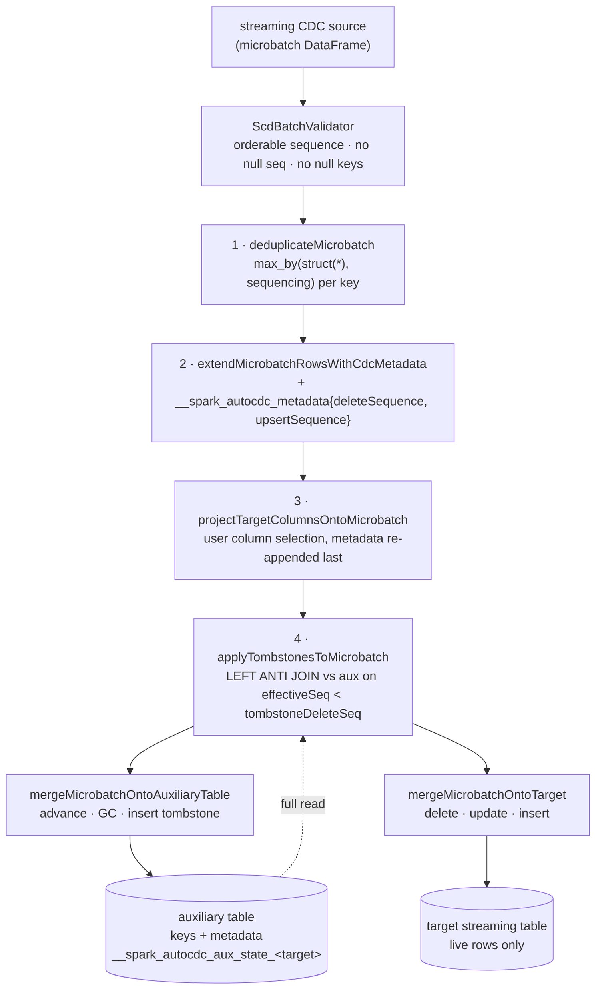

The second `sql/pipelines` group, and the smallest in the map that carries a real algorithm: **5
files, 859 lines**, implementing SCD Type 1 change-data-capture for Spark Declarative Pipelines. The
[graph sweep](sql-pipelines-graph.md) covers how an AutoCDC flow is typed, planned and given its
hidden state table; this page covers what actually happens to each microbatch.

The whole design rests on one problem. **SCD Type 1 keeps only the current row.** So when a key is
deleted, the target table holds no evidence the key ever existed — and a late-arriving update for
that key, carrying an older sequence value, would look exactly like a brand-new insert and silently
resurrect a deleted row. AutoCDC solves this with a second, hidden table holding one *tombstone* per
deleted key: the key columns plus a delete high-water mark. Every microbatch is filtered against it.

---

## AutoCdcReservedNames — one prefix for everything AutoCDC owns

**What it is:** 32 lines and a single constant, `__spark_autocdc_`. Every internal column and every
internal table AutoCDC creates starts with it, so "what does AutoCDC own" has one auditable answer.

**Anchor files:**

- [AutoCdcReservedNames.scala:31](https://github.com/apache/spark/blob/v4.2.0/sql/pipelines/src/main/scala/org/apache/spark/sql/pipelines/autocdc/AutoCdcReservedNames.scala#L31) — `prefix = "__spark_autocdc_"`
- [Scd1BatchProcessor.scala:417](https://github.com/apache/spark/blob/v4.2.0/sql/pipelines/src/main/scala/org/apache/spark/sql/pipelines/autocdc/Scd1BatchProcessor.scala#L417) `__spark_autocdc_winning_row` (transient, inside `deduplicateMicrobatch`) and [:418](https://github.com/apache/spark/blob/v4.2.0/sql/pipelines/src/main/scala/org/apache/spark/sql/pipelines/autocdc/Scd1BatchProcessor.scala#L418) `__spark_autocdc_metadata` (persisted, on both tables)
- The third user of the prefix is the auxiliary table name itself, `__spark_autocdc_aux_state_<target>`, built in the graph group — see [FlowExecution.scala:327](https://github.com/apache/spark/blob/v4.2.0/sql/pipelines/src/main/scala/org/apache/spark/sql/pipelines/graph/FlowExecution.scala#L327)
- The invariant is enforced *outside* this group, at [AutoCdcMergeFlow](https://github.com/apache/spark/blob/v4.2.0/sql/pipelines/src/main/scala/org/apache/spark/sql/pipelines/graph/Flow.scala#L352) construction: a source column starting with the prefix is `AUTOCDC_RESERVED_COLUMN_NAME_PREFIX_CONFLICT`

!!! info "The prefix check is resolver-aware, so it is a case-sensitivity question too"

    `requireReservedPrefixAbsentInSourceColumns` compares using the session resolver, so under the
    default `spark.sql.caseSensitive=false` a column named `__SPARK_AUTOCDC_thing` is also rejected.
    That is the right call — the collision would be real — but it means the reserved namespace is
    wider than the literal string suggests.

**Configs:** none

**Maps to topics:** A11, E8

---

## ChangeArgs — the five-field CDC contract

**What it is:** everything the user declares about a CDC flow, in one case class: which columns
identify a row, what orders the events, whether a row is a delete, which SCD strategy, and which
columns to keep. Everything downstream reads only this.

**Anchor files:**

- [ChangeArgs.scala:165](https://github.com/apache/spark/blob/v4.2.0/sql/pipelines/src/main/scala/org/apache/spark/sql/pipelines/autocdc/ChangeArgs.scala#L165) — the case class: `keys`, `sequencing`, `storedAsScdType`, `deleteCondition`, `columnSelection`
- [ChangeArgs.scala:181](https://github.com/apache/spark/blob/v4.2.0/sql/pipelines/src/main/scala/org/apache/spark/sql/pipelines/autocdc/ChangeArgs.scala#L181) — `validateNonEmptyKeys`, run in the constructor body so `keys.nonEmpty` is an invariant every consumer may assume (`AUTOCDC_EMPTY_KEYS`)
- [PipelinesHandler.scala:485](https://github.com/apache/spark/blob/v4.2.0/sql/connect/server/src/main/scala/org/apache/spark/sql/connect/pipelines/PipelinesHandler.scala#L485) — the only construction site: the Connect handler, mapping proto `sequence_by` → `sequencing` and `apply_as_deletes` → `deleteCondition`
- `sequencing` and `deleteCondition` are **`Column`s, not strings** — arbitrary expressions, resolved against the microbatch each batch rather than parsed once

!!! warning "`deleteCondition = None` means every row is an upsert — there is no delete detection by convention"

    [Scd1BatchProcessor.scala:133](https://github.com/apache/spark/blob/v4.2.0/sql/pipelines/src/main/scala/org/apache/spark/sql/pipelines/autocdc/Scd1BatchProcessor.scala#L133)
    builds `rowDeleteSequence` as `when(deleteCondition, sequencing).otherwise(null)`, and falls
    back to a literal `null` when no condition was given. AutoCDC does not look for a `_change_type`
    column, an `op` column, or any other convention: if you do not supply `apply_as_deletes`, a
    Debezium-style feed's `DELETE` rows are applied as ordinary upserts and the deleted rows stay in
    the target with whatever payload the delete event carried.

!!! info "A null delete condition classifies the row as an upsert, not as unknown"

    The scaladoc at [:121](https://github.com/apache/spark/blob/v4.2.0/sql/pipelines/src/main/scala/org/apache/spark/sql/pipelines/autocdc/Scd1BatchProcessor.scala#L121)
    states it: only `true` means delete; `false` **and `null`** both mean upsert. A delete condition
    over a nullable column (`col("op") === "D"` where `op` is null) therefore fails open, toward
    keeping the row.

**Configs:** none

**Maps to topics:** A11, E8

---

## UnqualifiedColumnName — single-part identifiers with backticks consumed

**What it is:** a tiny value class that exists to make one rule enforceable: an AutoCDC key or
selected column must be a **plain top-level column**, never a nested path and never table-qualified.

**Anchor files:**

- [ChangeArgs.scala:30](https://github.com/apache/spark/blob/v4.2.0/sql/pipelines/src/main/scala/org/apache/spark/sql/pipelines/autocdc/ChangeArgs.scala#L30) — the class, with a private constructor so the only way in is through the validating `apply`s
- [ChangeArgs.scala:35](https://github.com/apache/spark/blob/v4.2.0/sql/pipelines/src/main/scala/org/apache/spark/sql/pipelines/autocdc/ChangeArgs.scala#L35) — `nameParts.length != 1` → `AUTOCDC_MULTIPART_COLUMN_IDENTIFIER`
- [ChangeArgs.scala:42](https://github.com/apache/spark/blob/v4.2.0/sql/pipelines/src/main/scala/org/apache/spark/sql/pipelines/autocdc/ChangeArgs.scala#L42) — the string overload goes through `CatalystSqlParser.parseMultipartIdentifier`, so quoting rules are the SQL parser's, not ad-hoc
- [ChangeArgs.scala:31](https://github.com/apache/spark/blob/v4.2.0/sql/pipelines/src/main/scala/org/apache/spark/sql/pipelines/autocdc/ChangeArgs.scala#L31) — `quoted` re-quotes via `QuotingUtils.quoteIdentifier` for the many `F.col(...)` call sites

!!! info "`name` and `quoted` are two different things and the code is careful about which"

    Backticks are *consumed* at parse time: `` `a.b` `` is stored as the literal name `a.b`. So
    `name` is what you compare against `StructType.fieldNames`, and `quoted` is what you hand back
    to any API that re-parses a string. Every `F.col` in this group uses `quoted`, and
    [Scd1BatchProcessor.scala:197](https://github.com/apache/spark/blob/v4.2.0/sql/pipelines/src/main/scala/org/apache/spark/sql/pipelines/autocdc/Scd1BatchProcessor.scala#L197)
    re-quotes schema field names for the same reason — "identifiers could have special characters
    such as `.`".

**Configs:** none

**Maps to topics:** E8

---

## ColumnSelection — include/exclude lists applied to a schema

**What it is:** the `column_list` / `except_column_list` pair, modelled as a two-case sealed trait
plus one schema-rewriting function. Field order always follows the *original* schema, never the
order the user listed columns in.

**Anchor files:**

- [ChangeArgs.scala:58](https://github.com/apache/spark/blob/v4.2.0/sql/pipelines/src/main/scala/org/apache/spark/sql/pipelines/autocdc/ChangeArgs.scala#L58) — `IncludeColumns` / `ExcludeColumns`; the mutual exclusion is enforced upstream at [PipelinesHandler.scala:466](https://github.com/apache/spark/blob/v4.2.0/sql/connect/server/src/main/scala/org/apache/spark/sql/connect/pipelines/PipelinesHandler.scala#L466) (`AUTOCDC_BOTH_COLUMN_LIST_AND_EXCEPT_COLUMN_LIST`)
- [ChangeArgs.scala:79](https://github.com/apache/spark/blob/v4.2.0/sql/pipelines/src/main/scala/org/apache/spark/sql/pipelines/autocdc/ChangeArgs.scala#L79) — `applyToSchema`, with `None` an explicit no-op
- [ChangeArgs.scala:99](https://github.com/apache/spark/blob/v4.2.0/sql/pipelines/src/main/scala/org/apache/spark/sql/pipelines/autocdc/ChangeArgs.scala#L99) — `lookupFieldIndices`, choosing `getFieldIndex` or `getFieldIndexCaseInsensitive` from `spark.sql.caseSensitive`, and collecting **all** missing names before throwing `AUTOCDC_COLUMNS_NOT_FOUND_IN_SCHEMA`
- [ChangeArgs.scala:125](https://github.com/apache/spark/blob/v4.2.0/sql/pipelines/src/main/scala/org/apache/spark/sql/pipelines/autocdc/ChangeArgs.scala#L125) — `CaseSensitivityLabels`, so the error message states which matching mode was in effect
- The same function is reused for a *system* purpose at [Scd1BatchProcessor.scala:173](https://github.com/apache/spark/blob/v4.2.0/sql/pipelines/src/main/scala/org/apache/spark/sql/pipelines/autocdc/Scd1BatchProcessor.scala#L173): excluding the CDC metadata column before user selection is applied
- And a third time in the graph group, at [Flow.scala:260](https://github.com/apache/spark/blob/v4.2.0/sql/pipelines/src/main/scala/org/apache/spark/sql/pipelines/graph/Flow.scala#L260), to compute the flow's declared output schema

!!! info "The error names the schema it searched, because there are three of them"

    `applyToSchema` takes a `schemaName` purely for the error message — `"microbatch"`,
    `"changeDataFeed"`, `"target"`. That is worth knowing when debugging: the same
    `AUTOCDC_COLUMNS_NOT_FOUND_IN_SCHEMA` can come from flow-schema computation at *definition* time
    or from microbatch projection at *run* time, and only the schema name distinguishes them.

**Configs:** `spark.sql.caseSensitive` (false)

**Maps to topics:** E8

---

## ScdType — Type 2 is modelled and blocked at three separate layers

**What it is:** a two-case sealed trait, `Type1` and `Type2`, each with a stable `label` persisted as
a table property on the auxiliary table. Only Type 1 is implemented.

**Anchor files:**

- [ChangeArgs.scala:142](https://github.com/apache/spark/blob/v4.2.0/sql/pipelines/src/main/scala/org/apache/spark/sql/pipelines/autocdc/ChangeArgs.scala#L142) — `Type1` (`"SCD1"`) and `Type2` (`"SCD2"`); the label is what
  [`AutoCdcAuxiliaryTable.scdTypePropertyKey`](https://github.com/apache/spark/blob/v4.2.0/sql/pipelines/src/main/scala/org/apache/spark/sql/pipelines/graph/FlowExecution.scala#L337) stores
- **Layer 1 — PySpark**: `AutoCdcFlow.stored_as_scd_type` is typed `Optional[Literal[1, "1"]]` in `python/pyspark/pipelines/flow.py`, and `spark_connect_graph_element_registry.py` sends `SCD_TYPE_1` unconditionally whenever the field is set
- **Layer 2 — the Connect handler**: [PipelinesHandler.scala:477](https://github.com/apache/spark/blob/v4.2.0/sql/connect/server/src/main/scala/org/apache/spark/sql/connect/pipelines/PipelinesHandler.scala#L477) maps `SCD_TYPE_1` and `SCD_TYPE_UNSPECIFIED` to `Type1`, and everything else to a bare `UnsupportedOperationException` at [:482](https://github.com/apache/spark/blob/v4.2.0/sql/connect/server/src/main/scala/org/apache/spark/sql/connect/pipelines/PipelinesHandler.scala#L482)
- **Layer 3 — the engine**: `AUTOCDC_SCD2_NOT_SUPPORTED` in [FlowPlanner.scala:98](https://github.com/apache/spark/blob/v4.2.0/sql/pipelines/src/main/scala/org/apache/spark/sql/pipelines/graph/FlowPlanner.scala#L98) and [Flow.scala:296](https://github.com/apache/spark/blob/v4.2.0/sql/pipelines/src/main/scala/org/apache/spark/sql/pipelines/graph/Flow.scala#L296)

!!! warning "The typed SCD2 error is unreachable, and the reachable one is untyped"

    The handler rejects `SCD_TYPE_2` before a `ChangeArgs` is ever constructed, so
    `ScdType.Type2` cannot reach `FlowPlanner` or `AutoCdcMergeFlow.schema` from any client — the
    typed `AUTOCDC_SCD2_NOT_SUPPORTED` those two raise is defensive code. What a user actually gets
    is `UnsupportedOperationException: Unsupported AutoCDC SCD type: SCD_TYPE_2`, outside the
    error-class framework and carrying no `QueryOrigin`. This refines what the
    [graph sweep](sql-pipelines-graph.md) recorded from the engine side alone.

!!! info "Unspecified defaults to SCD1"

    `SCD_TYPE_UNSPECIFIED` is mapped to `Type1`, so omitting `stored_as_scd_type` is not an error —
    it silently selects the only implemented strategy. Sensible today; something to re-check when
    SCD2 lands.

**Configs:** none

**Maps to topics:** A11, E8

---

## ScdBatchValidator — the per-microbatch contract check

**What it is:** 100 lines run before every microbatch is touched, enforcing three preconditions the
whole algorithm depends on: the sequencing type is orderable, no row has a null sequence, no row has
a null in any key column.

**Anchor files:**

- [ScdBatchValidator.scala:45](https://github.com/apache/spark/blob/v4.2.0/sql/pipelines/src/main/scala/org/apache/spark/sql/pipelines/autocdc/ScdBatchValidator.scala#L45) — `validateMicrobatch`
- [ScdBatchValidator.scala:47](https://github.com/apache/spark/blob/v4.2.0/sql/pipelines/src/main/scala/org/apache/spark/sql/pipelines/autocdc/ScdBatchValidator.scala#L47) — `RowOrdering.isOrderable(seqType)` → `AUTOCDC_MICROBATCH_VALIDATION.NON_ORDERABLE_SEQUENCE`
- [ScdBatchValidator.scala:58](https://github.com/apache/spark/blob/v4.2.0/sql/pipelines/src/main/scala/org/apache/spark/sql/pipelines/autocdc/ScdBatchValidator.scala#L58) — the null counts, **folded into one `agg` plus one `head()`** so the microbatch is scanned exactly once for all N+1 checks
- [ScdBatchValidator.scala:70](https://github.com/apache/spark/blob/v4.2.0/sql/pipelines/src/main/scala/org/apache/spark/sql/pipelines/autocdc/ScdBatchValidator.scala#L70) `NULL_SEQUENCE` / [:85](https://github.com/apache/spark/blob/v4.2.0/sql/pipelines/src/main/scala/org/apache/spark/sql/pipelines/autocdc/ScdBatchValidator.scala#L85) `NULL_KEY`, the latter reporting a per-key count so you know *which* key column is dirty
- [Scd1ForeachBatchHandler.scala:40](https://github.com/apache/spark/blob/v4.2.0/sql/pipelines/src/main/scala/org/apache/spark/sql/pipelines/autocdc/Scd1ForeachBatchHandler.scala#L40) — the single call site, deliberately kept out of `reconcileMicrobatch` so it cannot be reordered after a transform

!!! warning "This is an extra full scan and an extra action per microbatch"

    The checks are cheap *relative to each other* — one `agg` covers all of them — but they are an
    additional pass over the batch, materialised by `.head()`, before the reconciliation pipeline
    runs and before either merge. On a source that is expensive to re-read, that is three
    evaluations of the microbatch plan per batch, not one. Nothing caches it and there is no config
    to disable validation.

!!! warning "Sequencing-type orderability is checked per batch, at run time"

    `isOrderable` runs inside `validateMicrobatch`, so declaring `sequence_by` over a map or an
    unordered struct passes graph validation and a dry run, then fails on the first batch that
    carries data. Compare the graph group's AutoCDC key-drift check, which has the same
    late-detection shape.

**Configs:** none

**Maps to topics:** E8

---

## The tombstone model — auxiliary state and delete high-water marks

**What it is:** the idea the rest of the group implements. SCD1 keeps only live rows, so the target
cannot answer "was this key deleted, and at what sequence?". A second table answers it: for each
deleted key, one row holding the key columns and a `__spark_autocdc_metadata` struct whose
`deleteSequence` is the high-water mark of the delete.

Three rules follow:

1. **A microbatch row is dropped** if a tombstone exists for its key with a strictly larger
   `deleteSequence` — that row is late and has already been superseded.
2. **A tombstone advances** when a newer delete for the same key arrives.
3. **A tombstone is deleted** as soon as an upsert with sequence `>=` the tombstone's delete arrives
   — the key was legitimately re-inserted, so the tombstone is now noise. This is what keeps the
   auxiliary table from growing without bound.

**Anchor files:**

- [Scd1BatchProcessor.scala:434](https://github.com/apache/spark/blob/v4.2.0/sql/pipelines/src/main/scala/org/apache/spark/sql/pipelines/autocdc/Scd1BatchProcessor.scala#L434) — `cdcMetadataColSchema`: exactly two nullable fields, `deleteSequence` and `upsertSequence`, both typed from the *resolved* sequencing column
- [Scd1BatchProcessor.scala:220](https://github.com/apache/spark/blob/v4.2.0/sql/pipelines/src/main/scala/org/apache/spark/sql/pipelines/autocdc/Scd1BatchProcessor.scala#L220) — rule 1: `applyTombstonesToMicrobatch`, a `left_anti` join on `keysMatch && effectiveSeq < tombstoneDeleteSeq`
- [Scd1BatchProcessor.scala:229](https://github.com/apache/spark/blob/v4.2.0/sql/pipelines/src/main/scala/org/apache/spark/sql/pipelines/autocdc/Scd1BatchProcessor.scala#L229) — `effectiveSeq = greatest(deleteSequence, upsertSequence)`: since exactly one is non-null, `greatest` is a null-tolerant "whichever one this row is"
- [Scd1BatchProcessor.scala:295](https://github.com/apache/spark/blob/v4.2.0/sql/pipelines/src/main/scala/org/apache/spark/sql/pipelines/autocdc/Scd1BatchProcessor.scala#L295) — rule 2, and [:301](https://github.com/apache/spark/blob/v4.2.0/sql/pipelines/src/main/scala/org/apache/spark/sql/pipelines/autocdc/Scd1BatchProcessor.scala#L301) rule 3, with the in-source rationale: "the aux tombstone is stale — remove it to prevent unbounded growth"
- [Scd1BatchProcessor.scala:318](https://github.com/apache/spark/blob/v4.2.0/sql/pipelines/src/main/scala/org/apache/spark/sql/pipelines/autocdc/Scd1BatchProcessor.scala#L318) — the two stated invariants: exactly one of `{upsert, delete}` is non-null per row, and the target holds only live rows so its `deleteSequence` is always null
- Lifecycle of the table itself is in the graph group: created lazily at flow start, dropped on full refresh, key set frozen in a table property — see the [graph sweep](sql-pipelines-graph.md)

!!! warning "A key deleted and never re-inserted keeps its tombstone forever"

    Garbage collection is *only* triggered by rule 3 — an upsert reviving the key. There is no TTL,
    no watermark-based expiry, and no compaction. A source that deletes rows permanently accumulates
    one auxiliary row per deleted key for the life of the table, and the only way to clear them is a
    full refresh (which drops the auxiliary table outright). The in-source comment at
    [Scd1ForeachBatchHandler.scala:49](https://github.com/apache/spark/blob/v4.2.0/sql/pipelines/src/main/scala/org/apache/spark/sql/pipelines/autocdc/Scd1ForeachBatchHandler.scala#L49)
    names "tombstone TTL" as a future optimisation, so this is known rather than accidental.

!!! warning "The auxiliary table is read in full, every microbatch"

    [Scd1ForeachBatchHandler.scala:53](https://github.com/apache/spark/blob/v4.2.0/sql/pipelines/src/main/scala/org/apache/spark/sql/pipelines/autocdc/Scd1ForeachBatchHandler.scala#L53)
    is a plain `spark.read.table(aux)` with no key pruning and no filter pushed from the microbatch.
    The comment argues it "generally stays small enough for a broadcast join" — which holds only
    while rule 3 is doing its job. Combine that with the no-TTL point above and the failure mode is
    clear: a delete-heavy source grows the auxiliary table monotonically, the broadcast assumption
    stops holding, and every microbatch pays for it. This is the number to watch on a long-running
    AutoCDC flow.

!!! info "Deletes for keys the target never had are still recorded"

    [Scd1BatchProcessor.scala:308](https://github.com/apache/spark/blob/v4.2.0/sql/pipelines/src/main/scala/org/apache/spark/sql/pipelines/autocdc/Scd1BatchProcessor.scala#L308)
    inserts a tombstone `whenNotMatched(incomingRowRepresentsDeleteEvent)`, and
    [:400](https://github.com/apache/spark/blob/v4.2.0/sql/pipelines/src/main/scala/org/apache/spark/sql/pipelines/autocdc/Scd1BatchProcessor.scala#L400)
    makes the target merge skip them. That is exactly the out-of-order case: the delete arrived
    before the insert it supersedes, so the tombstone must exist *first* in order for rule 1 to drop
    the insert when it turns up.

**Configs:** none

**Maps to topics:** none yet — proposed as **E32**

---

## reconcileMicrobatch — four steps whose order is load-bearing

**What it is:** the composition, and its scaladoc is unusually explicit that the order is "the only
order that produces correct SCD1 semantics". Each step's constraint is stated where it is enforced.

**Anchor files:**

- [Scd1BatchProcessor.scala:66](https://github.com/apache/spark/blob/v4.2.0/sql/pipelines/src/main/scala/org/apache/spark/sql/pipelines/autocdc/Scd1BatchProcessor.scala#L66) — the composition, and at [:41](https://github.com/apache/spark/blob/v4.2.0/sql/pipelines/src/main/scala/org/apache/spark/sql/pipelines/autocdc/Scd1BatchProcessor.scala#L41) the four-step contract
- [Scd1BatchProcessor.scala:55](https://github.com/apache/spark/blob/v4.2.0/sql/pipelines/src/main/scala/org/apache/spark/sql/pipelines/autocdc/Scd1BatchProcessor.scala#L55) — why validation is *not* folded in: "it must run before any of these transforms touch the data"
- [Scd1BatchProcessor.scala:116](https://github.com/apache/spark/blob/v4.2.0/sql/pipelines/src/main/scala/org/apache/spark/sql/pipelines/autocdc/Scd1BatchProcessor.scala#L116) — why metadata is projected before column selection: `deleteCondition` and `sequencing` are evaluated against the *current* schema, and selection may drop the columns they reference

The four constraints, stated once:

| Step | Must come before | Because |
|---|---|---|
| 1 · deduplicate | 4 | tombstone filtering assumes at most one event per key |
| 2 · project metadata | 3 | selection may drop columns `deleteCondition`/`sequencing` read |
| 3 · column selection | merges | the target's schema is the selected schema plus metadata |
| 4 · apply tombstones | both merges | late rows must not reach either table |

!!! info "Steps are `private[autocdc]` specifically so tests can pin each one"

    The scaladoc says so outright: the per-step methods stay package-visible "so that focused unit
    tests can pin each transform's behavior independently". Reading the tests alongside the source is
    the fastest way to see what each step guarantees.

**Configs:** none

**Maps to topics:** E8

---

## Deduplication by max_by over a packed struct

**What it is:** collapse a microbatch to one row per key, keeping the row with the largest sequence.
Spark's `max_by` returns a single column, so the whole row is packed into a struct, `max_by`'d, then
unpacked with `.*`.

**Anchor files:**

- [Scd1BatchProcessor.scala:94](https://github.com/apache/spark/blob/v4.2.0/sql/pipelines/src/main/scala/org/apache/spark/sql/pipelines/autocdc/Scd1BatchProcessor.scala#L94) — the method, and at [:95](https://github.com/apache/spark/blob/v4.2.0/sql/pipelines/src/main/scala/org/apache/spark/sql/pipelines/autocdc/Scd1BatchProcessor.scala#L95) the comment explaining the pack/unpack
- [Scd1BatchProcessor.scala:105](https://github.com/apache/spark/blob/v4.2.0/sql/pipelines/src/main/scala/org/apache/spark/sql/pipelines/autocdc/Scd1BatchProcessor.scala#L105) — `groupBy(keys)` then `agg(max_by(struct(*), sequencing))`, aliased to `__spark_autocdc_winning_row`, then `select("<winning_row>.*")`
- [Scd1BatchProcessor.scala:101](https://github.com/apache/spark/blob/v4.2.0/sql/pipelines/src/main/scala/org/apache/spark/sql/pipelines/autocdc/Scd1BatchProcessor.scala#L101) — every column is re-quoted before being packed, for the special-character reason above

!!! warning "Duplicate (key, sequence) pairs in one batch pick a winner non-deterministically"

    The scaladoc at [:84](https://github.com/apache/spark/blob/v4.2.0/sql/pipelines/src/main/scala/org/apache/spark/sql/pipelines/autocdc/Scd1BatchProcessor.scala#L84)
    is explicit: "the row selected is non-deterministic and undefined". Two events with the same key
    and the same `sequence_by` value in the same microbatch resolve arbitrarily — and, because
    micro-batching is a function of trigger timing, *which* events share a batch can differ between
    runs. There is no error and no warning. If your source can emit two changes with an identical
    sequence value, the sequence expression is not fine-grained enough; add a tiebreaker.

!!! info "A shuffle per microbatch, by key"

    `groupBy(keys).agg(...)` is a real aggregation, so every AutoCDC microbatch shuffles on the key
    columns before anything else happens. That is the dominant cost on a wide source, and it is
    unavoidable given the semantics — the two merges downstream both assume one row per key.

**Configs:** none

**Maps to topics:** E8

---

## The CDC metadata column — projected into the target, and not optional

**What it is:** `__spark_autocdc_metadata`, a two-field struct appended to every reconciled row and
written to **both** the auxiliary table and the user's target table. Users cannot exclude it.

**Anchor files:**

- [Scd1BatchProcessor.scala:131](https://github.com/apache/spark/blob/v4.2.0/sql/pipelines/src/main/scala/org/apache/spark/sql/pipelines/autocdc/Scd1BatchProcessor.scala#L131) — `extendMicrobatchRowsWithCdcMetadata`, and the mutually-exclusive construction of the two sequence fields at [:133](https://github.com/apache/spark/blob/v4.2.0/sql/pipelines/src/main/scala/org/apache/spark/sql/pipelines/autocdc/Scd1BatchProcessor.scala#L133)–[:143](https://github.com/apache/spark/blob/v4.2.0/sql/pipelines/src/main/scala/org/apache/spark/sql/pipelines/autocdc/Scd1BatchProcessor.scala#L143)
- [Scd1BatchProcessor.scala:164](https://github.com/apache/spark/blob/v4.2.0/sql/pipelines/src/main/scala/org/apache/spark/sql/pipelines/autocdc/Scd1BatchProcessor.scala#L164) — `projectTargetColumnsOntoMicrobatch`: strip the metadata column, apply user selection to what remains, re-append metadata **last**
- [Scd1BatchProcessor.scala:169](https://github.com/apache/spark/blob/v4.2.0/sql/pipelines/src/main/scala/org/apache/spark/sql/pipelines/autocdc/Scd1BatchProcessor.scala#L169) — the reason, stated in-source: "so that users cannot control whether this [necessary] column shows up in the target table"
- [Scd1BatchProcessor.scala:448](https://github.com/apache/spark/blob/v4.2.0/sql/pipelines/src/main/scala/org/apache/spark/sql/pipelines/autocdc/Scd1BatchProcessor.scala#L448) — `constructCdcMetadataCol`, casting each field to the schema's declared type and failing with an internal error on an unknown field name
- The declared flow schema in the graph group agrees by construction — [Flow.scala:285](https://github.com/apache/spark/blob/v4.2.0/sql/pipelines/src/main/scala/org/apache/spark/sql/pipelines/graph/Flow.scala#L285) appends the same struct to the user-selected schema

!!! warning "An AutoCDC target has a visible extra struct column, and downstream datasets see it"

    The target table's schema is *user-selected columns* + `__spark_autocdc_metadata`. A
    `SELECT *` on an AutoCDC target returns it, and any downstream pipeline dataset reading that
    table inherits it — the [graph sweep](sql-pipelines-graph.md) shows `AutoCdcMergeFlow.schema`
    propagating the augmented schema to dependents deliberately. It is not hidden, not a metadata
    column in the DSv2 sense, and not excludable via `except_column_list` (that selection is applied
    to the user schema only). Downstream consumers should project explicitly rather than `SELECT *`.

!!! info "In the target, `deleteSequence` is always null"

    That is one of the two stated invariants at
    [:322](https://github.com/apache/spark/blob/v4.2.0/sql/pipelines/src/main/scala/org/apache/spark/sql/pipelines/autocdc/Scd1BatchProcessor.scala#L322):
    the target holds live rows only, so its metadata is effectively "the sequence at which this row
    was last upserted". The auxiliary table is the mirror image — `deleteSequence` populated,
    representing a row that is *not* there.

**Configs:** `spark.sql.caseSensitive` (false) — via `caseSensitiveAnalysis` at [:167](https://github.com/apache/spark/blob/v4.2.0/sql/pipelines/src/main/scala/org/apache/spark/sql/pipelines/autocdc/Scd1BatchProcessor.scala#L167)

**Maps to topics:** E8

---

## mergeMicrobatchOntoAuxiliaryTable — advance, garbage-collect, insert

**What it is:** three merge clauses maintaining the tombstone table. Data columns are projected away
first — the auxiliary table stores keys and metadata only.

**Anchor files:**

- [Scd1BatchProcessor.scala:265](https://github.com/apache/spark/blob/v4.2.0/sql/pipelines/src/main/scala/org/apache/spark/sql/pipelines/autocdc/Scd1BatchProcessor.scala#L265) — the method
- [Scd1BatchProcessor.scala:274](https://github.com/apache/spark/blob/v4.2.0/sql/pipelines/src/main/scala/org/apache/spark/sql/pipelines/autocdc/Scd1BatchProcessor.scala#L274) — the projection down to `keys :+ metadata`, with the reason: data columns "should not be persisted"
- [Scd1BatchProcessor.scala:289](https://github.com/apache/spark/blob/v4.2.0/sql/pipelines/src/main/scala/org/apache/spark/sql/pipelines/autocdc/Scd1BatchProcessor.scala#L289) — `incomingRowRepresentsDeleteEvent = incomingDelete.isNotNull && (incomingUpsert.isNull || incomingDelete > incomingUpsert)`
- [Scd1BatchProcessor.scala:295](https://github.com/apache/spark/blob/v4.2.0/sql/pipelines/src/main/scala/org/apache/spark/sql/pipelines/autocdc/Scd1BatchProcessor.scala#L295) — clause 1, `update`: newer delete advances the high-water mark
- [Scd1BatchProcessor.scala:301](https://github.com/apache/spark/blob/v4.2.0/sql/pipelines/src/main/scala/org/apache/spark/sql/pipelines/autocdc/Scd1BatchProcessor.scala#L301) — clause 2, `delete`: `incomingUpsert >= auxDelete` revives the key and GCs the tombstone
- [Scd1BatchProcessor.scala:308](https://github.com/apache/spark/blob/v4.2.0/sql/pipelines/src/main/scala/org/apache/spark/sql/pipelines/autocdc/Scd1BatchProcessor.scala#L308) — clause 3, `insertAll`: a delete for a key not yet tracked becomes a new tombstone

!!! info "The `>=` in the GC clause is what makes a same-sequence re-insert win"

    Clause 2 fires on `incomingUpsert >= auxDelete`, not `>`. An upsert whose sequence *equals* the
    recorded delete sequence therefore revives the key rather than being filtered as late. That is
    the same tie-break bias the target merge applies — upserts beat deletes on equal sequence — kept
    consistent across both tables. Note that rule 1's anti-join uses strict `<`, so the two agree:
    equal sequence is never "late".

**Configs:** none

**Maps to topics:** E8

---

## mergeMicrobatchOntoTarget — three clauses and a deliberate tie-break asymmetry

**What it is:** the merge users actually see the effect of. Delete matched rows superseded by a
delete, update matched rows superseded by an upsert, insert unmatched upserts. Deletes for unmatched
keys are skipped — they became tombstones in the previous merge.

**Anchor files:**

- [Scd1BatchProcessor.scala:329](https://github.com/apache/spark/blob/v4.2.0/sql/pipelines/src/main/scala/org/apache/spark/sql/pipelines/autocdc/Scd1BatchProcessor.scala#L329) — the method, with both invariant sets documented at [:317](https://github.com/apache/spark/blob/v4.2.0/sql/pipelines/src/main/scala/org/apache/spark/sql/pipelines/autocdc/Scd1BatchProcessor.scala#L317)
- [Scd1BatchProcessor.scala:358](https://github.com/apache/spark/blob/v4.2.0/sql/pipelines/src/main/scala/org/apache/spark/sql/pipelines/autocdc/Scd1BatchProcessor.scala#L358) — `incomingWinsUpsert`: `microbatchUpsert >= targetUpsert`
- [Scd1BatchProcessor.scala:364](https://github.com/apache/spark/blob/v4.2.0/sql/pipelines/src/main/scala/org/apache/spark/sql/pipelines/autocdc/Scd1BatchProcessor.scala#L364) — `incomingWinsDelete`: `microbatchDelete > targetUpsert` — **strictly** greater, and the comment calls the asymmetry "arbitrary but deliberate"
- [Scd1BatchProcessor.scala:381](https://github.com/apache/spark/blob/v4.2.0/sql/pipelines/src/main/scala/org/apache/spark/sql/pipelines/autocdc/Scd1BatchProcessor.scala#L381) — the update assignment map **excludes key columns**, because "most merge implementations require that join columns are not mutated, even when the mutation would be a no-op"
- [Scd1BatchProcessor.scala:400](https://github.com/apache/spark/blob/v4.2.0/sql/pipelines/src/main/scala/org/apache/spark/sql/pipelines/autocdc/Scd1BatchProcessor.scala#L400) — `whenNotMatched(microbatchDeleteVersionField.isNull)`: only upserts insert
- [Scd1BatchProcessor.scala:402](https://github.com/apache/spark/blob/v4.2.0/sql/pipelines/src/main/scala/org/apache/spark/sql/pipelines/autocdc/Scd1BatchProcessor.scala#L402) — the subset argument: the microbatch's columns are always a subset of the target's, because SDP schema evolution unions old and new schemas onto the target

!!! info "Upserts beat deletes on an equal sequence value, by design"

    `>=` for upsert versus `>` for delete is the entire tie-break policy, and the comment states the
    intent: "upserts get priority over deletes on duplicate sequencing". If a source emits a delete
    and an update for the same key at the same sequence value, the row survives. Know this before
    choosing a coarse `sequence_by` such as a second-granularity timestamp.

!!! warning "Narrowing `column_list` between runs leaves the old columns in the target, unmanaged"

    The comment at [:402](https://github.com/apache/spark/blob/v4.2.0/sql/pipelines/src/main/scala/org/apache/spark/sql/pipelines/autocdc/Scd1BatchProcessor.scala#L402)
    anticipates the microbatch being a strict subset of the target — "the user narrowed
    `column_list` between runs". Nothing drops the removed column from the target. Existing rows
    keep their old values, newly inserted rows get null for it, and updated rows leave it untouched
    (it is not in the assignment map). The column becomes a mix of stale and null with no marker.
    Widening is safe; narrowing needs a full refresh to be meaningful.

**Configs:** `spark.sql.caseSensitive` (false) — via the resolver at [:367](https://github.com/apache/spark/blob/v4.2.0/sql/pipelines/src/main/scala/org/apache/spark/sql/pipelines/autocdc/Scd1BatchProcessor.scala#L367)

**Maps to topics:** A11, E8

---

## Scd1ForeachBatchHandler — two merges per batch and the idempotency argument

**What it is:** 73 lines wiring the above into `foreachBatch`: validate, reconcile, merge onto
auxiliary, merge onto target. The interesting content is the comment justifying why a crash between
the two merges is safe.

**Anchor files:**

- [Scd1ForeachBatchHandler.scala:39](https://github.com/apache/spark/blob/v4.2.0/sql/pipelines/src/main/scala/org/apache/spark/sql/pipelines/autocdc/Scd1ForeachBatchHandler.scala#L39) — `execute(batchDf, batchId)`, the entry point `Scd1MergeStreamingWrite` passes to `.foreachBatch(...)`
- [Scd1ForeachBatchHandler.scala:63](https://github.com/apache/spark/blob/v4.2.0/sql/pipelines/src/main/scala/org/apache/spark/sql/pipelines/autocdc/Scd1ForeachBatchHandler.scala#L63) — the argument: on replay the aux merge's preconditions no longer hold against the already-advanced state, so it becomes a no-op and the target merge "replays as if for the first time"
- [Scd1ForeachBatchHandler.scala:36](https://github.com/apache/spark/blob/v4.2.0/sql/pipelines/src/main/scala/org/apache/spark/sql/pipelines/autocdc/Scd1ForeachBatchHandler.scala#L36) — "Idempotent under same-`batchId` replay: both merges are gated on sequence inequalities"
- The caller is in the graph group — [Scd1MergeStreamingWrite.startStream](https://github.com/apache/spark/blob/v4.2.0/sql/pipelines/src/main/scala/org/apache/spark/sql/pipelines/graph/FlowExecution.scala#L630)

!!! info "Idempotency comes from the comparisons, not from a transaction"

    The two merges are separate, non-atomic operations against two tables. Correctness under retry
    is argued purely from monotonicity: every clause is gated on a sequence inequality, so re-running
    a batch whose aux merge already landed re-evaluates those gates against the new state and does
    nothing. That is the right property to have — but note it depends on `batchId` replay delivering
    the *same* rows, which is Structured Streaming's guarantee for a replayable source, not
    something AutoCDC enforces.

!!! warning "`foreachBatch` means no exactly-once sink guarantee from the streaming engine"

    A `foreachBatch` sink is at-least-once by construction; the idempotency above is what upgrades
    it. Any source that is not replayable, or any `sequence_by` that is not monotonic per key,
    breaks the argument rather than just degrading it.

**Configs:** none

**Maps to topics:** A11, E8

---

## The DataFrame mergeInto API this group is built on

**What it is:** worth naming because it is not obvious from the pipelines docs — AutoCDC does not
generate SQL `MERGE INTO`. It uses the **DataFrame merge API**, `MergeIntoWriter`, added in Spark
4.0 and still `@Experimental`.

**Anchor files:**

- [MergeIntoWriter.scala:32](https://github.com/apache/spark/blob/v4.2.0/sql/api/src/main/scala/org/apache/spark/sql/MergeIntoWriter.scala#L32) — the abstract class in `sql/api`, `@Experimental`, with `whenMatched` / `whenNotMatched` / `whenNotMatchedBySource` builders
- [Scd1BatchProcessor.scala:293](https://github.com/apache/spark/blob/v4.2.0/sql/pipelines/src/main/scala/org/apache/spark/sql/pipelines/autocdc/Scd1BatchProcessor.scala#L293) and [:393](https://github.com/apache/spark/blob/v4.2.0/sql/pipelines/src/main/scala/org/apache/spark/sql/pipelines/autocdc/Scd1BatchProcessor.scala#L393) — the two call sites, both `df.mergeInto(tableName, condition)`
- The target must implement `SupportsRowLevelOperations`, checked in the graph group at [FlowExecution.scala:478](https://github.com/apache/spark/blob/v4.2.0/sql/pipelines/src/main/scala/org/apache/spark/sql/pipelines/graph/FlowExecution.scala#L478)
- How a merge is *rewritten* is catalyst's business — the [analysis sweep](sql-catalyst-analysis.md) covers the delta-vs-group rewrite decision, and the [classic API sweep](sql-core-classic-api.md) covers the writer itself

!!! info "This group is the largest in-tree consumer of the DataFrame merge API"

    Six merge clauses across two methods, all with conditions, all with explicit assignment maps
    rather than `updateAll`/`insertAll` — which makes `Scd1BatchProcessor` the most complete worked
    example of `MergeIntoWriter` in the Spark source. Read it as documentation for the API, not only
    for the CDC algorithm.

**Configs:** none

**Maps to topics:** E8

---

## Breadth check 1 — the config slice

Same slice as the [graph sweep](sql-pipelines-graph.md): every catalog key matching `pipelines?\.`,
7 keys, all declared in `sql/catalyst`'s `SQLConf`.

**This group reads none of them.** Nothing in `autocdc/` consults a `spark.sql.pipelines.*` key —
the four run-shaping keys belong to `graph`, and `event.queue.capacity` to `sql/connect`. There is
no config to tune microbatch validation, deduplication, tombstone retention, or the auxiliary-table
read.

Two session confs *are* read, found by grepping the package for `conf.` rather than by the slice:

| Config | Default | Read at | Effect |
|---|---|---|---|
| `spark.sql.caseSensitive` | `false` | [ChangeArgs.scala:105](https://github.com/apache/spark/blob/v4.2.0/sql/pipelines/src/main/scala/org/apache/spark/sql/pipelines/autocdc/ChangeArgs.scala#L105), [Scd1BatchProcessor.scala:167](https://github.com/apache/spark/blob/v4.2.0/sql/pipelines/src/main/scala/org/apache/spark/sql/pipelines/autocdc/Scd1BatchProcessor.scala#L167) | how `keys` and `column_list` names match the schema |
| `spark.sql.caseSensitive` | `false` | [Scd1BatchProcessor.scala:367](https://github.com/apache/spark/blob/v4.2.0/sql/pipelines/src/main/scala/org/apache/spark/sql/pipelines/autocdc/Scd1BatchProcessor.scala#L367) (`conf.resolver`) | which target columns are excluded from the update assignment map as keys |

!!! warning "Flipping `spark.sql.caseSensitive` mid-life changes which columns are keys"

    Both the key/column lookup and the update-assignment exclusion go through the session's
    case-sensitivity setting, and per-flow SQL confs can set it (see the graph sweep's per-flow
    `SQLConf` isolation). Changing it between runs can silently change which target columns a merge
    is allowed to update — while the auxiliary table's recorded key names, frozen as a table
    property, do not change. The graph group's key-drift check compares names *through the
    resolver*, so it tolerates the case change rather than flagging it.

## Breadth check 2 — the packages

The scope is one package, `pipelines/autocdc/`, with no sub-packages. All **5** files cited:

`AutoCdcReservedNames` (32) · `ChangeArgs` (189) · `Scd1BatchProcessor` (465) ·
`Scd1ForeachBatchHandler` (73) · `ScdBatchValidator` (100)

The **14 `AUTOCDC_*` error classes** in `error-conditions.json` are a useful second breadth check,
since they enumerate every user-visible failure of the feature. Where each is raised:

| Raised in this group | Raised in `graph` | Raised in `sql/connect` |
|---|---|---|
| `AUTOCDC_EMPTY_KEYS`, `AUTOCDC_MULTIPART_COLUMN_IDENTIFIER`, `AUTOCDC_COLUMNS_NOT_FOUND_IN_SCHEMA`, `AUTOCDC_MICROBATCH_VALIDATION.{NON_ORDERABLE_SEQUENCE, NULL_SEQUENCE, NULL_KEY}` | `AUTOCDC_INVALID_STATE.*`, `AUTOCDC_KEY_NOT_IN_SELECTED_SCHEMA`, `AUTOCDC_RESERVED_COLUMN_NAME_PREFIX_CONFLICT`, `AUTOCDC_TARGET_DOES_NOT_SUPPORT_MERGE`, `AUTOCDC_MULTIPLE_FLOWS_TO_TARGET`, `AUTOCDC_SCD2_NOT_SUPPORTED`, `INVALID_FLOW_QUERY_TYPE.AUTOCDC_RELATION_FOR_TEMPORARY_VIEW` | `AUTOCDC_MISSING_SOURCE`, `AUTOCDC_MISSING_SEQUENCE_BY`, `AUTOCDC_NON_COLUMN_IDENTIFIER`, `AUTOCDC_BOTH_COLUMN_LIST_AND_EXCEPT_COLUMN_LIST` |

Every class resolves to a raise site; none is orphaned. `AUTOCDC_SCD2_NOT_SUPPORTED` is the one
that cannot be reached from a client — see the ScdType section.

**Named so it is not mistaken for covered:** `pipelines/common/`, `pipelines/logging/`,
`pipelines/util/` and `Language.scala` — the `sql/pipelines — pipeline-runtime` group, still
**unswept**, and now the only remaining group in this subsystem.

## Overlapping topic traces

`check_drift.py --sweeps` reports no topic traces overlapping A11 or E8 — neither `topics/a11.md`
nor `topics/e8.md` exists. Three sweep pages now back A11 and they agree; this page corrects one
detail the other two could not see, that the reachable SCD2 rejection is an untyped
`UnsupportedOperationException` at the Connect handler rather than the typed engine error.

---

## Sweep log

| Date | Spark | What changed |
|---|---|---|
| 2026-08-07 | 4.2.0 | First sweep. 14 concepts, **1 new topic proposed** (E32 out-of-order CDC and the tombstone model). Small group — 5 files, 859 lines — but it carries the only real algorithm in the subsystem. The design problem stated once: SCD1 keeps only live rows, so a deleted key leaves no evidence in the target and a late update would resurrect it; AutoCDC's answer is a hidden per-target auxiliary table holding one tombstone (key + delete high-water mark) per deleted key, with a `left_anti` filter, a monotonic advance rule, and a GC rule that removes the tombstone when an upsert with sequence `>=` the delete revives the key. Findings worth carrying: **tombstones have no TTL and are GC'd only by re-insertion**, so a permanently-deleting source grows the auxiliary table monotonically until a full refresh — and the auxiliary table is **read in full every microbatch** with no key pruning, on an explicit "small enough to broadcast" assumption that the no-TTL behaviour undermines; the tie-break is deliberately asymmetric (`>=` for upserts, `>` for deletes), so an upsert and a delete at the same sequence value leave the row alive; **duplicate (key, sequence) pairs in one microbatch resolve non-deterministically** with no warning, and which events share a batch is a function of trigger timing; `deleteCondition = None` means *every* row is an upsert — there is no `_change_type` convention, so a CDC feed without `apply_as_deletes` applies deletes as upserts; a null delete condition classifies as upsert, so the check fails open; `__spark_autocdc_metadata` is projected into the **user's target table** as a visible trailing struct that `except_column_list` cannot remove and that downstream datasets inherit; narrowing `column_list` between runs leaves the dropped column in the target as a stale/null mix with no marker; sequencing-type orderability is checked **per microbatch at run time**, so a bad `sequence_by` passes a dry run; validation is an extra full scan plus a `.head()` action per batch with no way to disable it; SCD Type 2 is blocked at three layers and the only reachable error is an **untyped `UnsupportedOperationException`** from the Connect handler, making the typed `AUTOCDC_SCD2_NOT_SUPPORTED` defensive code (a refinement of what the graph sweep recorded); the three proto options the connect sweep flagged as silently ignored (`apply_as_truncates`, the two `ignore_null_updates_*` lists) are **not present in the PySpark `AutoCdcFlow` dataclass at all**, so they are unreachable rather than merely inert; and the 4.2.0 Declarative Pipelines programming guide contains **zero mentions of CDC** — the only user-facing documentation of this feature is the `create_auto_cdc_flow` docstring. Also recorded: this group reads no `spark.sql.pipelines.*` key, only `spark.sql.caseSensitive` (twice), and it is the largest in-tree consumer of the `@Experimental` DataFrame `MergeIntoWriter` API. |
