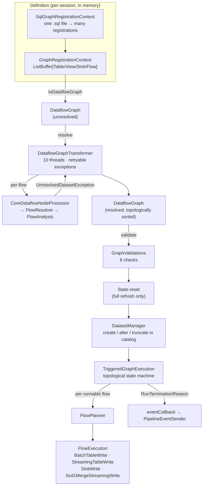

The engine the [`sql/connect` declarative-pipelines sweep](sql-connect-declarative-pipelines.md) pointed
at. That page ends where a `StartRun` command hands a `PipelineUpdateContextImpl` over the module
boundary; this one picks it up. 32 files, ~7,260 lines, and it is the largest single body of code
behind topic **A11** — the part that decides what a pipeline *means*, not how it is declared.

The shape of the subsystem is worth stating up front, because the names overlap confusingly with
Catalyst's:

- A **`DataflowGraph`** is not a logical plan. It is a bag of `Table`/`View`/`Sink` outputs plus a
  bag of `Flow`s, each flow carrying an *unevaluated function* that will produce a DataFrame.
- **Resolution** is not Catalyst analysis. It is a fixed-point loop that calls each flow function,
  catches "I could not find dataset X", and retries once X resolves. Catalyst analysis happens
  *inside* each call.
- **Planning** is not physical planning. `FlowPlanner` picks which of four *write shapes* a resolved
  flow becomes; the Catalyst planner then runs underneath each of those writes independently.



---

## DataflowGraph — the immutable graph and its derived indexes

**What it is:** a four-field case class — `flows`, `tables`, `sinks`, `views` — with roughly a dozen
`lazy val` indexes derived from it. Every question the rest of the engine asks ("which flows write
to this table?", "which flows resolved?") is a map lookup on one of those indexes, and several of
them *throw* rather than return, so building the index is itself a validation step.

**Code path:** `GraphRegistrationContext.toDataflowGraph` → `DataflowGraph.resolve()` →
`DataflowGraph.validate()`

**Anchor files:**

- [DataflowGraph.scala:33](https://github.com/apache/spark/blob/v4.2.0/sql/pipelines/src/main/scala/org/apache/spark/sql/pipelines/graph/DataflowGraph.scala#L33) — the case class, mixing in `GraphOperations` and `GraphValidations`
- [DataflowGraph.scala:42](https://github.com/apache/spark/blob/v4.2.0/sql/pipelines/src/main/scala/org/apache/spark/sql/pipelines/graph/DataflowGraph.scala#L42) — `output = sinks ++ tables`: a **view is not an output**, which is what makes `materializedFlows` at [:48](https://github.com/apache/spark/blob/v4.2.0/sql/pipelines/src/main/scala/org/apache/spark/sql/pipelines/graph/DataflowGraph.scala#L48) exclude flows that write to views
- [DataflowGraph.scala:66](https://github.com/apache/spark/blob/v4.2.0/sql/pipelines/src/main/scala/org/apache/spark/sql/pipelines/graph/DataflowGraph.scala#L66) — the `flow` index, which raises `PIPELINE_DUPLICATE_IDENTIFIERS.FLOW` and, at [:88](https://github.com/apache/spark/blob/v4.2.0/sql/pipelines/src/main/scala/org/apache/spark/sql/pipelines/graph/DataflowGraph.scala#L88), `FLOW_NAME_CONFLICTS_WITH_TABLE`
- [DataflowGraph.scala:114](https://github.com/apache/spark/blob/v4.2.0/sql/pipelines/src/main/scala/org/apache/spark/sql/pipelines/graph/DataflowGraph.scala#L114) `flowsTo` / [:127](https://github.com/apache/spark/blob/v4.2.0/sql/pipelines/src/main/scala/org/apache/spark/sql/pipelines/graph/DataflowGraph.scala#L127) `resolvedFlowsTo` — the two edge indexes the whole engine navigates by
- [DataflowGraph.scala:149](https://github.com/apache/spark/blob/v4.2.0/sql/pipelines/src/main/scala/org/apache/spark/sql/pipelines/graph/DataflowGraph.scala#L149) — `reanalyzeFlow`, which builds a **sub-graph** of upstream flows stopping at materialization points and re-resolves it
- [DataflowGraph.scala:174](https://github.com/apache/spark/blob/v4.2.0/sql/pipelines/src/main/scala/org/apache/spark/sql/pipelines/graph/DataflowGraph.scala#L174) — `inferredSchema`, merging the schemas of every flow into a table via `SchemaMergingUtils.mergeSchemas`
- [DataflowGraph.scala:198](https://github.com/apache/spark/blob/v4.2.0/sql/pipelines/src/main/scala/org/apache/spark/sql/pipelines/graph/DataflowGraph.scala#L198) — `validationFailure: Try[Throwable]`, the cached inverted `Try` that `validate()` at [:185](https://github.com/apache/spark/blob/v4.2.0/sql/pipelines/src/main/scala/org/apache/spark/sql/pipelines/graph/DataflowGraph.scala#L185) rethrows
- [DataflowGraph.scala:242](https://github.com/apache/spark/blob/v4.2.0/sql/pipelines/src/main/scala/org/apache/spark/sql/pipelines/graph/DataflowGraph.scala#L242) — `mapUnique`, the shared "group, find duplicates, throw `DUPLICATE_GRAPH_ELEMENT`" helper

!!! info "`reanalyzeFlow` is called at execution time, not resolution time"

    Every `FlowExecution` starts by calling `graph.reanalyzeFlow(flow).df` rather than reusing the
    DataFrame produced during resolution — see [FlowExecution.scala:243](https://github.com/apache/spark/blob/v4.2.0/sql/pipelines/src/main/scala/org/apache/spark/sql/pipelines/graph/FlowExecution.scala#L243),
    [:271](https://github.com/apache/spark/blob/v4.2.0/sql/pipelines/src/main/scala/org/apache/spark/sql/pipelines/graph/FlowExecution.scala#L271) and [:309](https://github.com/apache/spark/blob/v4.2.0/sql/pipelines/src/main/scala/org/apache/spark/sql/pipelines/graph/FlowExecution.scala#L309).
    Resolution deliberately reads *virtual* tables (empty DataFrames with the right schema), so the
    plan it produces cannot be executed. Re-analysis against the now-materialized catalog tables is
    what turns it into a runnable plan — which is also why a flow's plan is built twice per run.

**Configs:** none

**Maps to topics:** A11

---

## Graph elements — Table, View, Sink, and the flows that feed them

**What it is:** the node vocabulary, in one 258-line file. Four output-ish shapes, one input trait,
and a `GraphElement` base that carries a `QueryOrigin` back to the user's source line.

**Anchor files:**

- [elements.scala:34](https://github.com/apache/spark/blob/v4.2.0/sql/pipelines/src/main/scala/org/apache/spark/sql/pipelines/graph/elements.scala#L34) — `GraphElement`: an `origin`, a `TableIdentifier`, a `displayName`, and a scaladoc rule that the origin must be **propagated unmodified** through every copy
- [elements.scala:60](https://github.com/apache/spark/blob/v4.2.0/sql/pipelines/src/main/scala/org/apache/spark/sql/pipelines/graph/elements.scala#L60) — `Input.load(asStreaming: Boolean)`: the single method the whole resolution phase reads through
- [elements.scala:117](https://github.com/apache/spark/blob/v4.2.0/sql/pipelines/src/main/scala/org/apache/spark/sql/pipelines/graph/elements.scala#L117) — `Table`, with `isStreamingTable` deciding `datasetType` at [:142](https://github.com/apache/spark/blob/v4.2.0/sql/pipelines/src/main/scala/org/apache/spark/sql/pipelines/graph/elements.scala#L142): `STREAMING_TABLE` or `MATERIALIZED_VIEW`
- [elements.scala:79](https://github.com/apache/spark/blob/v4.2.0/sql/pipelines/src/main/scala/org/apache/spark/sql/pipelines/graph/elements.scala#L79) — `Dataset.normalizedPath`, and `path` at [:132](https://github.com/apache/spark/blob/v4.2.0/sql/pipelines/src/main/scala/org/apache/spark/sql/pipelines/graph/elements.scala#L132) which throws `UNRESOLVED_TABLE_PATH` until `DatasetManager` fills it in
- [elements.scala:225](https://github.com/apache/spark/blob/v4.2.0/sql/pipelines/src/main/scala/org/apache/spark/sql/pipelines/graph/elements.scala#L225) `TemporaryView` / [:236](https://github.com/apache/spark/blob/v4.2.0/sql/pipelines/src/main/scala/org/apache/spark/sql/pipelines/graph/elements.scala#L236) `PersistedView` — identical case classes, and the *only* behavioural difference is which validations and materialization paths accept them
- [elements.scala:244](https://github.com/apache/spark/blob/v4.2.0/sql/pipelines/src/main/scala/org/apache/spark/sql/pipelines/graph/elements.scala#L244) — `Sink`: a `format` plus `options`, no schema, no path

!!! info "A materialized view is a `Table` with a boolean flipped"

    There is no `MaterializedView` class. `Table.isStreamingTable = false` *is* the materialized
    view, and the connect layer sets it from the proto `OutputType`. Every difference downstream —
    whether the table is truncated each run, whether schema merging applies, which flow-streamingness
    error you get — is a branch on that one field. This is the engine-side confirmation of the
    "one boolean apart" note in the [connect sweep](sql-connect-declarative-pipelines.md).

**Configs:** none

**Maps to topics:** A11

---

## GraphRegistrationContext — the mutable builder behind every definition API

**What it is:** four `ListBuffer`s and a `toDataflowGraph` that freezes them. Both definition
front-ends — the Connect handler and the SQL processor — reduce to calls on this object, which is
why the engine has no dependency on either.

**Anchor files:**

- [GraphRegistrationContext.scala:30](https://github.com/apache/spark/blob/v4.2.0/sql/pipelines/src/main/scala/org/apache/spark/sql/pipelines/graph/GraphRegistrationContext.scala#L30) — the class, holding `defaultCatalog`, `defaultDatabase`, `defaultSqlConf`
- [GraphRegistrationContext.scala:61](https://github.com/apache/spark/blob/v4.2.0/sql/pipelines/src/main/scala/org/apache/spark/sql/pipelines/graph/GraphRegistrationContext.scala#L61) — `registerFlow` merges `defaultSqlConf ++ flowDef.sqlConf`: **pipeline confs are a base layer, flow confs win**
- [GraphRegistrationContext.scala:71](https://github.com/apache/spark/blob/v4.2.0/sql/pipelines/src/main/scala/org/apache/spark/sql/pipelines/graph/GraphRegistrationContext.scala#L71) — `toDataflowGraph`, raising `RUN_EMPTY_PIPELINE` when the pipeline defines no table, persisted view or sink
- [GraphRegistrationContext.scala:117](https://github.com/apache/spark/blob/v4.2.0/sql/pipelines/src/main/scala/org/apache/spark/sql/pipelines/graph/GraphRegistrationContext.scala#L117) — `assertOutputIdentifierIsUnique`, which reports the two colliding *types* (`TABLE`/`VIEW`/`SINK`) sorted lexicographically so the message is stable
- [GraphRegistrationContext.scala:154](https://github.com/apache/spark/blob/v4.2.0/sql/pipelines/src/main/scala/org/apache/spark/sql/pipelines/graph/GraphRegistrationContext.scala#L154) — `assertFlowIdentifierIsUnique`

!!! warning "A pipeline of nothing but temporary views is 'empty'"

    `isEmpty` at [:65](https://github.com/apache/spark/blob/v4.2.0/sql/pipelines/src/main/scala/org/apache/spark/sql/pipelines/graph/GraphRegistrationContext.scala#L65)
    counts tables, **persisted** views and sinks. A graph consisting only of `TemporaryView`s — which
    is what you get if every definition used `CREATE TEMPORARY VIEW` — fails with
    `RUN_EMPTY_PIPELINE` even though several datasets were registered. The rule is defensible (a
    temporary view produces no durable output) but the error names the wrong problem.

**Configs:** none

**Maps to topics:** A11

---

## SqlGraphRegistrationContext — defining a whole pipeline in SQL

**What it is:** 688 lines, the second-largest file in the group, and the entire SQL-only authoring
surface. A `.sql` file is split on semicolons, each statement parsed to a `LogicalPlan`, and
dispatched to one of eight handlers. Statements are processed **in order and statefully** — a `SET`
or a `USE` changes how every later statement in the same file resolves.

**Code path:** `PipelinesHandler.defineSqlGraphElements` → `processSqlFile` → `splitSqlFileIntoQueries`
→ `processSqlQuery` → one of eight handlers → `GraphRegistrationContext.register*`

**Anchor files:**

- [SqlGraphRegistrationContext.scala:124](https://github.com/apache/spark/blob/v4.2.0/sql/pipelines/src/main/scala/org/apache/spark/sql/pipelines/graph/SqlGraphRegistrationContext.scala#L124) — the dispatch: `SET`, `USE NAMESPACE`, `USE CATALOG`, `CREATE VIEW`, `CREATE TEMPORARY VIEW`, `CREATE MATERIALIZED VIEW AS SELECT`, `CREATE STREAMING TABLE [AS SELECT]`, `CREATE FLOW`
- [SqlGraphRegistrationContext.scala:168](https://github.com/apache/spark/blob/v4.2.0/sql/pipelines/src/main/scala/org/apache/spark/sql/pipelines/graph/SqlGraphRegistrationContext.scala#L168) — the catch-all: anything else is `PIPELINE_SQL_GRAPH_ELEMENT_REGISTRATION_ERROR`, an **allowlist by construction**, unlike the connect side's block-list
- [SqlGraphRegistrationContext.scala:39](https://github.com/apache/spark/blob/v4.2.0/sql/pipelines/src/main/scala/org/apache/spark/sql/pipelines/graph/SqlGraphRegistrationContext.scala#L39) — `SqlGraphRegistrationContextState`: the mutable current catalog / database / conf carried across statements
- [SqlGraphRegistrationContext.scala:535](https://github.com/apache/spark/blob/v4.2.0/sql/pipelines/src/main/scala/org/apache/spark/sql/pipelines/graph/SqlGraphRegistrationContext.scala#L535) — `SetCatalogCommandHandler`, which runs the real analyzer to resolve a catalog *expression*, then at [:554](https://github.com/apache/spark/blob/v4.2.0/sql/pipelines/src/main/scala/org/apache/spark/sql/pipelines/graph/SqlGraphRegistrationContext.scala#L554) **clears the current database**
- [SqlGraphRegistrationContext.scala:397](https://github.com/apache/spark/blob/v4.2.0/sql/pipelines/src/main/scala/org/apache/spark/sql/pipelines/graph/SqlGraphRegistrationContext.scala#L397) — `CreateFlowHandler`, and [:469](https://github.com/apache/spark/blob/v4.2.0/sql/pipelines/src/main/scala/org/apache/spark/sql/pipelines/graph/SqlGraphRegistrationContext.scala#L469) `validateInsertIntoFlow`: **five** rejected forms — partition spec, column list, `INSERT OVERWRITE`, `IF NOT EXISTS`, and anything that is not `BY NAME`
- [SqlGraphRegistrationContext.scala:559](https://github.com/apache/spark/blob/v4.2.0/sql/pipelines/src/main/scala/org/apache/spark/sql/pipelines/graph/SqlGraphRegistrationContext.scala#L559) — `PartitionHelper`: only `IdentityTransform`, only single-column, only single-part names. No bucketing, no `days(ts)`
- [SqlGraphRegistrationContext.scala:631](https://github.com/apache/spark/blob/v4.2.0/sql/pipelines/src/main/scala/org/apache/spark/sql/pipelines/graph/SqlGraphRegistrationContext.scala#L631) — `splitSqlFileIntoQueries`, reconstructing each statement's **file-level line number** by counting newlines up to its start index, so `QueryOrigin.line` points into the user's file rather than the fragment
- [SqlGraphRegistrationContext.scala:611](https://github.com/apache/spark/blob/v4.2.0/sql/pipelines/src/main/scala/org/apache/spark/sql/pipelines/graph/SqlGraphRegistrationContext.scala#L611) — the split itself is `StringUtils.splitSemiColonWithIndex(..., enableSqlScripting = false)`, shared with the [SQL scripting](sql-core-sql-scripting.md) splitter but with scripting deliberately off

!!! warning "`USE CATALOG` silently drops the current schema"

    `SetCatalogCommandHandler` ends with `context.clearCurrentDatabase()`, and the comment says so:
    the schema "must be explicitly set again in order to implicitly qualify identifiers". A SQL file
    that does `USE SCHEMA sales; USE CATALOG prod; CREATE MATERIALIZED VIEW m AS ...` fails the
    fully-qualified assertion at [IdentifierHelper.assertIsFullyQualifiedForCreate](https://github.com/apache/spark/blob/v4.2.0/sql/pipelines/src/main/scala/org/apache/spark/sql/pipelines/graph/GraphIdentifierManager.scala#L338)
    — and that is a bare Scala `assert`, so what surfaces is an `AssertionError`, not a typed
    pipeline error. Order the two `USE` statements the other way round.

!!! info "`SET` in a pipeline SQL file is not a session `SET`"

    [SetCommandHandler](https://github.com/apache/spark/blob/v4.2.0/sql/pipelines/src/main/scala/org/apache/spark/sql/pipelines/graph/SqlGraphRegistrationContext.scala#L506)
    writes into the registration context's own conf map, which is then attached to every flow
    registered *afterwards* in that file. It does not touch the session, and it does not apply
    retroactively to flows already registered. Confs therefore behave lexically, per file, in
    declaration order.

**Configs:** none read; `SET` values become per-flow `sqlConf` entries

**Maps to topics:** A11

---

## GraphIdentifierManager — qualification and the internal/external boundary

**What it is:** the object that answers "is this name a dataset in my pipeline, or a table in the
catalog?" — the single most consequential decision in flow analysis, because the answer determines
whether the read becomes a graph edge or an external scan.

**Anchor files:**

- [GraphIdentifierManager.scala:59](https://github.com/apache/spark/blob/v4.2.0/sql/pipelines/src/main/scala/org/apache/spark/sql/pipelines/graph/GraphIdentifierManager.scala#L59) — `resolveDatasetReadInsideQueryDefinition`, the three-way branch
- [GraphIdentifierManager.scala:78](https://github.com/apache/spark/blob/v4.2.0/sql/pipelines/src/main/scala/org/apache/spark/sql/pipelines/graph/GraphIdentifierManager.scala#L78) — **rule 1: a single-part name that names a graph dataset wins outright**, and the comment spells out the consequence: a view `a` masks a table `catalog.schema.a`
- [GraphIdentifierManager.scala:305](https://github.com/apache/spark/blob/v4.2.0/sql/pipelines/src/main/scala/org/apache/spark/sql/pipelines/graph/GraphIdentifierManager.scala#L305) — **rule 2**: `isPathIdentifier` — a two-part name whose first part resolves via `DataSource.lookupDataSource` (`parquet`.`/tmp/x`) is always external
- [GraphIdentifierManager.scala:86](https://github.com/apache/spark/blob/v4.2.0/sql/pipelines/src/main/scala/org/apache/spark/sql/pipelines/graph/GraphIdentifierManager.scala#L86) — **rule 3**: qualify against the flow's catalog/database, then internal if the graph has it, external otherwise
- [GraphIdentifierManager.scala:142](https://github.com/apache/spark/blob/v4.2.0/sql/pipelines/src/main/scala/org/apache/spark/sql/pipelines/graph/GraphIdentifierManager.scala#L142) `parseAndValidateTemporaryViewIdentifier` / [:164](https://github.com/apache/spark/blob/v4.2.0/sql/pipelines/src/main/scala/org/apache/spark/sql/pipelines/graph/GraphIdentifierManager.scala#L164) `parseAndValidateSinkIdentifier` — temp views and sinks must be **single-part** (`MULTIPART_TEMPORARY_VIEW_NAME_NOT_SUPPORTED`, `MULTIPART_SINK_NAME_NOT_SUPPORTED`) because neither is written to a catalog
- [GraphIdentifierManager.scala:262](https://github.com/apache/spark/blob/v4.2.0/sql/pipelines/src/main/scala/org/apache/spark/sql/pipelines/graph/GraphIdentifierManager.scala#L262) — `toTableIdentifier`: 1/2/3 parts only, four-part names are an `UnsupportedOperationException`
- [GraphIdentifierManager.scala:338](https://github.com/apache/spark/blob/v4.2.0/sql/pipelines/src/main/scala/org/apache/spark/sql/pipelines/graph/GraphIdentifierManager.scala#L338) `assertIsFullyQualifiedForCreate` / [:347](https://github.com/apache/spark/blob/v4.2.0/sql/pipelines/src/main/scala/org/apache/spark/sql/pipelines/graph/GraphIdentifierManager.scala#L347) `assertIsFullyQualifiedForRead`

!!! warning "The two qualification invariants are Scala `assert`s, not typed errors"

    Both `assertIsFullyQualifiedFor*` use bare `assert`. Under `-Xdisable-assertions` they vanish;
    under normal operation they surface as `java.lang.AssertionError` with a message that is not in
    the error-class framework and carries no `QueryOrigin`. Every other user-facing failure in this
    group is a typed `AnalysisException`, which makes these two the odd ones out — and they are
    reachable from ordinary user input (see the `USE CATALOG` note above).

**Configs:** none

**Maps to topics:** A11

---

## The flow taxonomy — two unresolved forms, four resolved ones

**What it is:** the class hierarchy that carries a flow from "a function nobody has called" to "a
thing with a known schema and a known write shape". The split is deliberate: type is decided *by
what the resolved DataFrame turned out to be*, not by what the user declared — with one exception.

**Code path:** `UntypedFlow` | `AutoCdcFlow` → `FlowResolver.resolveFlow` → `AppendOnceFlow` |
`StreamingFlow` | `CompleteFlow` | `AutoCdcMergeFlow`

**Anchor files:**

- [Flow.scala:131](https://github.com/apache/spark/blob/v4.2.0/sql/pipelines/src/main/scala/org/apache/spark/sql/pipelines/graph/Flow.scala#L131) — `UnresolvedFlow`, and at [:136](https://github.com/apache/spark/blob/v4.2.0/sql/pipelines/src/main/scala/org/apache/spark/sql/pipelines/graph/Flow.scala#L136) the scaladoc explaining why `AutoCdcFlow` is "unresolved but typed"
- [Flow.scala:104](https://github.com/apache/spark/blob/v4.2.0/sql/pipelines/src/main/scala/org/apache/spark/sql/pipelines/graph/Flow.scala#L104) — `FlowFunctionResult`: `dataFrame: Try[DataFrame]` plus the *sets of inputs actually read*, split batch vs streaming — the graph edges are a by-product of analysis, never declared
- [Flow.scala:211](https://github.com/apache/spark/blob/v4.2.0/sql/pipelines/src/main/scala/org/apache/spark/sql/pipelines/graph/Flow.scala#L211) — `ResolvedFlow extends Input`: a resolved flow is itself readable, which is how views work (a view has no storage; reads of it read the flow)
- [CoreDataflowNodeProcessor.scala:211](https://github.com/apache/spark/blob/v4.2.0/sql/pipelines/src/main/scala/org/apache/spark/sql/pipelines/graph/CoreDataflowNodeProcessor.scala#L211) — the type decision: `once` → `AppendOnceFlow`; `df.isStreaming` → `StreamingFlow`; else `CompleteFlow`
- [CoreDataflowNodeProcessor.scala:220](https://github.com/apache/spark/blob/v4.2.0/sql/pipelines/src/main/scala/org/apache/spark/sql/pipelines/graph/CoreDataflowNodeProcessor.scala#L220) — `mustBeAppend = flowsTo(dest).size > 1`, so a multi-flow streaming table forces Append output mode on every contributor
- [Flow.scala:285](https://github.com/apache/spark/blob/v4.2.0/sql/pipelines/src/main/scala/org/apache/spark/sql/pipelines/graph/Flow.scala#L285) — `AutoCdcMergeFlow.schema`: the **augmented** schema, user-selected columns plus an appended SCD metadata struct, so downstream datasets see a wider table than the source feed
- [Flow.scala:352](https://github.com/apache/spark/blob/v4.2.0/sql/pipelines/src/main/scala/org/apache/spark/sql/pipelines/graph/Flow.scala#L352) — `requireReservedPrefixAbsentInSourceColumns`, rejecting source columns that collide with the AutoCDC reserved prefix

!!! warning "`AppendOnceFlow` resolves but cannot be planned at 4.2.0"

    `FlowResolver` produces an `AppendOnceFlow` whenever `flow.once` is set
    ([CoreDataflowNodeProcessor.scala:215](https://github.com/apache/spark/blob/v4.2.0/sql/pipelines/src/main/scala/org/apache/spark/sql/pipelines/graph/CoreDataflowNodeProcessor.scala#L215)),
    but [FlowPlanner.plan](https://github.com/apache/spark/blob/v4.2.0/sql/pipelines/src/main/scala/org/apache/spark/sql/pipelines/graph/FlowPlanner.scala#L41)
    matches only `CompleteFlow`, `StreamingFlow` and `AutoCdcMergeFlow` — an `AppendOnceFlow` falls
    to the catch-all at [:104](https://github.com/apache/spark/blob/v4.2.0/sql/pipelines/src/main/scala/org/apache/spark/sql/pipelines/graph/FlowPlanner.scala#L104)
    and throws `Unable to plan flow of type AppendOnceFlow`.

    In practice this is unreachable from a client: `pipelines.proto` declares
    `optional bool once = 8` on the flow message, but `PipelinesHandler` hardcodes
    [`once = false`](https://github.com/apache/spark/blob/v4.2.0/sql/connect/server/src/main/scala/org/apache/spark/sql/connect/pipelines/PipelinesHandler.scala#L393),
    and every SQL handler passes `once = false` too. So ONCE flows exist end-to-end in the type
    system, in the validations ([GraphValidations.scala:105](https://github.com/apache/spark/blob/v4.2.0/sql/pipelines/src/main/scala/org/apache/spark/sql/pipelines/graph/GraphValidations.scala#L105)),
    in the execution states (`StreamState.IDLE`) and in the wire format — and are set only by tests.
    Treat the `once` proto field as **declared but inert at 4.2.0**, the same pattern the
    [connect sweep](sql-connect-declarative-pipelines.md) found on three of the nine commands.

**Configs:** none

**Maps to topics:** A11

---

## DataflowGraphTransformer — parallel fixed-point resolution with retryable failures

**What it is:** the algorithm that makes declarative pipelines work. Definitions arrive in arbitrary
order with no declared dependencies, so the transformer resolves flows **speculatively on ten
threads**, treats "input X is not resolved yet" as a *retryable* exception, parks the failed flow
against X, and re-queues it the moment X's destination completes. There is no pre-pass to compute
an order: the topological order is the order in which flows happen to succeed.

**Code path:** `DataflowGraph.resolve()` → `withDataflowGraphTransformer` → `transformDownNodes(processNode)`
→ `getDataflowGraph`

**Anchor files:**

- [DataflowGraphTransformer.scala:121](https://github.com/apache/spark/blob/v4.2.0/sql/pipelines/src/main/scala/org/apache/spark/sql/pipelines/graph/DataflowGraphTransformer.scala#L121) — `transformDownNodes`, the whole engine in ~215 lines
- [DataflowGraphTransformer.scala:75](https://github.com/apache/spark/blob/v4.2.0/sql/pipelines/src/main/scala/org/apache/spark/sql/pipelines/graph/DataflowGraphTransformer.scala#L75) — `parallelism = 10`, a **hard-coded constant with no config**, doubling as thread-pool size and as the in-flight batch size at [:125](https://github.com/apache/spark/blob/v4.2.0/sql/pipelines/src/main/scala/org/apache/spark/sql/pipelines/graph/DataflowGraphTransformer.scala#L125)
- [DataflowGraphTransformer.scala:141](https://github.com/apache/spark/blob/v4.2.0/sql/pipelines/src/main/scala/org/apache/spark/sql/pipelines/graph/DataflowGraphTransformer.scala#L141) — the scheduler loop: drain completed futures (calling `get()` to surface exceptions), then submit one more if under the batch size
- [DataflowGraphTransformer.scala:177](https://github.com/apache/spark/blob/v4.2.0/sql/pipelines/src/main/scala/org/apache/spark/sql/pipelines/graph/DataflowGraphTransformer.scala#L177) — `TransformNodeRetryableException` handling: park the flow under the unresolved dataset, then **re-check whether that dataset resolved in the meantime**, because the two events race
- [DataflowGraphTransformer.scala:222](https://github.com/apache/spark/blob/v4.2.0/sql/pipelines/src/main/scala/org/apache/spark/sql/pipelines/graph/DataflowGraphTransformer.scala#L222) — leader election via `computeIfAbsent`: when several flows to the same table finish concurrently, exactly one thread transforms the destination
- [DataflowGraphTransformer.scala:296](https://github.com/apache/spark/blob/v4.2.0/sql/pipelines/src/main/scala/org/apache/spark/sql/pipelines/graph/DataflowGraphTransformer.scala#L296) — failure attribution: a table is failed if it never reached the destinations map; a flow is failed if it was non-retryable, un-retryable, **or writes to a failed destination**
- [DataflowGraphTransformer.scala:337](https://github.com/apache/spark/blob/v4.2.0/sql/pipelines/src/main/scala/org/apache/spark/sql/pipelines/graph/DataflowGraphTransformer.scala#L337) — `getDataflowGraph` returns resolved **and** failed flows in one sequence, resolved ones first, preserving topological order
- [CoreDataflowNodeProcessor.scala:66](https://github.com/apache/spark/blob/v4.2.0/sql/pipelines/src/main/scala/org/apache/spark/sql/pipelines/graph/CoreDataflowNodeProcessor.scala#L66) — `processNode`, the visitor: flows resolve, tables become `VirtualTableInput`s, views register their backing flow as the input, sinks pass through
- [CoreDataflowNodeProcessor.scala:147](https://github.com/apache/spark/blob/v4.2.0/sql/pipelines/src/main/scala/org/apache/spark/sql/pipelines/graph/CoreDataflowNodeProcessor.scala#L147) — `DUPLICATE_FLOW_SQL_CONF`: when two upstream views set the same conf key to different values, resolution fails rather than picking one
- [CoreDataflowNodeProcessor.scala:168](https://github.com/apache/spark/blob/v4.2.0/sql/pipelines/src/main/scala/org/apache/spark/sql/pipelines/graph/CoreDataflowNodeProcessor.scala#L168) — **the flow function is called a second time** if merging upstream view confs changed the conf set

!!! info "Confs flow *downstream through views*, and can cost a re-analysis"

    Because a view's plan is fused into its consumer's plan, the consumer must be analysed with the
    view's confs too. `attemptResolveFlow` resolves once, collects the confs of every upstream flow
    it turned out to read, and — if that set differs from what it used — **throws the first result
    away and resolves again**. A deep view chain with confs set at several levels therefore analyses
    each flow twice, and a conflict anywhere in the chain is a hard error rather than a precedence
    rule.

!!! warning "Resolution parallelism is fixed at 10 and is not the flow-execution parallelism"

    `spark.sql.pipelines.execution.maxConcurrentFlows` (16) governs how many flows *run*; nothing
    governs how many resolve. The two pools are unrelated: resolution uses a daemon fixed pool named
    `data-flow-graph-transformer-`, execution uses a semaphore over a cached pool named
    `FlowExecution`. On a graph with hundreds of datasets the resolution phase is the one you cannot
    tune.

**Configs:** none — `parallelism` is a literal

**Maps to topics:** none yet — proposed as **A38**

---

## VirtualTableInput — resolving against declared schemas, not materialized data

**What it is:** the trick that lets a pipeline be analysed before any of its tables exist. When the
transformer reaches a table, it does **not** register the catalog table as an input; it registers an
empty DataFrame carrying the table's schema, inferred from the flows that write to it.

**Anchor files:**

- [elements.scala:165](https://github.com/apache/spark/blob/v4.2.0/sql/pipelines/src/main/scala/org/apache/spark/sql/pipelines/graph/elements.scala#L165) — the class, with the scaladoc: "during analysis we only care about the schemas of declared tables, and it's possible the declared tables do not yet exist in the catalog"
- [elements.scala:182](https://github.com/apache/spark/blob/v4.2.0/sql/pipelines/src/main/scala/org/apache/spark/sql/pipelines/graph/elements.scala#L182) — `load`: user-specified schema if given, else `SchemaInferenceUtils.inferSchemaFromFlows`; a `MemoryStream` when read as streaming, an empty `createDataFrame` when read as batch
- [CoreDataflowNodeProcessor.scala:85](https://github.com/apache/spark/blob/v4.2.0/sql/pipelines/src/main/scala/org/apache/spark/sql/pipelines/graph/CoreDataflowNodeProcessor.scala#L85) — the substitution, with the comment "we mark **all** tables as virtual to ensure resolution uses incoming flows rather than previously materialized tables"

!!! info "This is why a schema change propagates before any data moves"

    Because analysis reads declared schemas rather than catalog state, adding a column to an upstream
    flow changes every downstream flow's resolved schema in the same resolution pass — before
    `DatasetManager` has altered a single table. It is also why the resolved plan is unrunnable and
    `reanalyzeFlow` exists.

**Configs:** none

**Maps to topics:** A11

---

## FlowAnalysis — a LogicalPlan becomes a DataFrame, with per-flow SQLConf isolation

**What it is:** the bridge into Catalyst. A flow's user query arrives as an unanalysed `LogicalPlan`;
`FlowAnalysis` walks it, replaces every `UnresolvedRelation` with either a graph read or an external
read, and hands the rewritten plan to `Dataset.ofRows`.

**Anchor files:**

- [FlowAnalysis.scala:42](https://github.com/apache/spark/blob/v4.2.0/sql/pipelines/src/main/scala/org/apache/spark/sql/pipelines/graph/FlowAnalysis.scala#L42) — `createFlowFunctionFromLogicalPlan`, the factory every registration path calls
- [FlowAnalysis.scala:48](https://github.com/apache/spark/blob/v4.2.0/sql/pipelines/src/main/scala/org/apache/spark/sql/pipelines/graph/FlowAnalysis.scala#L48) — the conf-isolation comment, and [:62](https://github.com/apache/spark/blob/v4.2.0/sql/pipelines/src/main/scala/org/apache/spark/sql/pipelines/graph/FlowAnalysis.scala#L62) the mechanism: `spark.sessionState.conf.clone()` installed for the analysing thread with `SQLConf.withExistingConf`
- [FlowAnalysis.scala:108](https://github.com/apache/spark/blob/v4.2.0/sql/pipelines/src/main/scala/org/apache/spark/sql/pipelines/graph/FlowAnalysis.scala#L108) — `CTESubstitution` is run **eagerly**, because a `WITH` relation is not a child of the main plan and would otherwise escape the rewrite
- [FlowAnalysis.scala:113](https://github.com/apache/spark/blob/v4.2.0/sql/pipelines/src/main/scala/org/apache/spark/sql/pipelines/graph/FlowAnalysis.scala#L113) — `transformWithSubqueries`, branching on `UnresolvedRelation.isStreaming`: `SELECT ... FROM STREAM(t)` versus a plain read
- [FlowAnalysis.scala:126](https://github.com/apache/spark/blob/v4.2.0/sql/pipelines/src/main/scala/org/apache/spark/sql/pipelines/graph/FlowAnalysis.scala#L126) — `resolved.mergeTagsFrom(u)`, propagating Connect's `PLAN_ID_TAG` so the parent plan still analyses
- [FlowAnalysis.scala:216](https://github.com/apache/spark/blob/v4.2.0/sql/pipelines/src/main/scala/org/apache/spark/sql/pipelines/graph/FlowAnalysis.scala#L216) — `readGraphInput`, the three-state check: not in the graph → `pipelineLocalDatasetNotDefinedError`; in the graph but unresolved → **`UnresolvedDatasetException`, the retryable one**; resolved → read it
- [FlowAnalysis.scala:269](https://github.com/apache/spark/blob/v4.2.0/sql/pipelines/src/main/scala/org/apache/spark/sql/pipelines/graph/FlowAnalysis.scala#L269) — every graph read is wrapped in a `SubqueryAlias` so `<catalog>.<schema>.<dataset>.<column>` resolves
- [FlowAnalysisContext.scala:43](https://github.com/apache/spark/blob/v4.2.0/sql/pipelines/src/main/scala/org/apache/spark/sql/pipelines/graph/FlowAnalysisContext.scala#L43) — the mutable accumulator: `batchInputs`, `streamingInputs`, `requestedInputs`, `externalInputs`

!!! warning "`pipelines.incompatibleViewCheck.enabled` is an undocumented, unprefixed escape hatch"

    [FlowAnalysis.scala:242](https://github.com/apache/spark/blob/v4.2.0/sql/pipelines/src/main/scala/org/apache/spark/sql/pipelines/graph/FlowAnalysis.scala#L242)
    reads `ctx.flowConf.getConfString("pipelines.incompatibleViewCheck.enabled", "true")`. Note the
    key: **no `spark.` prefix**, and it is not declared in `SQLConf`, so it appears in no config
    catalog, no `SET -v` listing and no docs page. Setting it to `false` disables both
    `INCOMPATIBLE_BATCH_VIEW_READ` and `INCOMPATIBLE_STREAMING_VIEW_READ` — the checks that stop a
    streaming read of a batch view and vice versa. It is the only such key in the group; the other
    seven pipeline configs are ordinary `SQLConf` entries.

!!! info "Per-flow confs are isolated by cloning the conf, not the session"

    Flows resolve concurrently on a shared `SparkSession`, so mutating `spark.conf` per flow would
    race. The fix is a cloned `SQLConf` installed thread-locally, which every Catalyst rule reads
    through `SQLConf.get`. The session's catalog is untouched, so this is cheap — but it also means
    a flow conf can only affect things read via `SQLConf.get`, not anything captured on the session
    itself.

**Configs:** `pipelines.incompatibleViewCheck.enabled` (undeclared, default `true`)

**Maps to topics:** A11

---

## GraphValidations — the eight checks between a resolved graph and a run

**What it is:** a trait mixed into `DataflowGraph`, invoked once, lazily, by `validate()`. The
checks run in a fixed order and the *first* failure is what the user sees, which makes the order
part of the contract.

**Code path:** `validateSuccessfulFlowAnalysis` → `validateUserSpecifiedSchemas` →
`validateGraphIsTopologicallySorted` → `validateMultiQueryTables` → `validatePersistedViewSources` →
`validateEveryDatasetHasFlow` → `validateTablesAreResettable` → `validateFlowStreamingness` →
`inferredSchema`

**Anchor files:**

- [DataflowGraph.scala:198](https://github.com/apache/spark/blob/v4.2.0/sql/pipelines/src/main/scala/org/apache/spark/sql/pipelines/graph/DataflowGraph.scala#L198) — the ordered list, ending by *forcing* `inferredSchema` so schema-merge failures are caught here too
- [GraphValidations.scala:35](https://github.com/apache/spark/blob/v4.2.0/sql/pipelines/src/main/scala/org/apache/spark/sql/pipelines/graph/GraphValidations.scala#L35) — `validateMultiQueryTables`: `AUTOCDC_MULTIPLE_FLOWS_TO_TARGET` (an AutoCDC target takes exactly one flow) and `MATERIALIZED_VIEW_WITH_MULTIPLE_QUERIES`
- [GraphValidations.scala:91](https://github.com/apache/spark/blob/v4.2.0/sql/pipelines/src/main/scala/org/apache/spark/sql/pipelines/graph/GraphValidations.scala#L91) — `validateFlowStreamingness`, the five-way `INVALID_FLOW_QUERY_TYPE` matrix: once-flow must be batch, streaming table needs a streaming flow, materialized view rejects one, persisted view rejects one, temporary view accepts either *except* AutoCDC
- [GraphValidations.scala:129](https://github.com/apache/spark/blob/v4.2.0/sql/pipelines/src/main/scala/org/apache/spark/sql/pipelines/graph/GraphValidations.scala#L129) — the explicit carve-out: a materialized view **may** batch-read a streaming table
- [GraphValidations.scala:176](https://github.com/apache/spark/blob/v4.2.0/sql/pipelines/src/main/scala/org/apache/spark/sql/pipelines/graph/GraphValidations.scala#L176) — `validateGraphIsTopologicallySorted`, an *assertion about the transformer's output* rather than a user check: it re-walks the flow sequence and raises `PIPELINE_GRAPH_NOT_TOPOLOGICALLY_SORTED` if any flow's input was not already visited
- [GraphValidations.scala:255](https://github.com/apache/spark/blob/v4.2.0/sql/pipelines/src/main/scala/org/apache/spark/sql/pipelines/graph/GraphValidations.scala#L255) — `validateUserSpecifiedSchemas`, comparing the declared schema against the merge of declared-plus-inferred
- [GraphValidations.scala:358](https://github.com/apache/spark/blob/v4.2.0/sql/pipelines/src/main/scala/org/apache/spark/sql/pipelines/graph/GraphValidations.scala#L358) — `validatePersistedViewSources`: a persisted view may not read a temporary view (`INVALID_TEMP_OBJ_REFERENCE`), because publishing it to the catalog would leave a dangling reference
- [DataflowGraph.scala:216](https://github.com/apache/spark/blob/v4.2.0/sql/pipelines/src/main/scala/org/apache/spark/sql/pipelines/graph/DataflowGraph.scala#L216) — `validateEveryDatasetHasFlow` (`PIPELINE_DATASET_WITHOUT_FLOW`), which is what catches a `CREATE STREAMING TABLE` with no backing query and no `CREATE FLOW`
- [GraphErrors.scala:60](https://github.com/apache/spark/blob/v4.2.0/sql/pipelines/src/main/scala/org/apache/spark/sql/pipelines/graph/GraphErrors.scala#L60) — `incompatibleUserSpecifiedAndInferredSchemasError`, which appends a **streaming-table-specific hint** ("full refresh the table") only when the dataset type says so; the other three constructors in this object are [:34](https://github.com/apache/spark/blob/v4.2.0/sql/pipelines/src/main/scala/org/apache/spark/sql/pipelines/graph/GraphErrors.scala#L34) `pipelineLocalDatasetNotDefinedError`, [:47](https://github.com/apache/spark/blob/v4.2.0/sql/pipelines/src/main/scala/org/apache/spark/sql/pipelines/graph/GraphErrors.scala#L47) `unresolvedTablePath` and [:96](https://github.com/apache/spark/blob/v4.2.0/sql/pipelines/src/main/scala/org/apache/spark/sql/pipelines/graph/GraphErrors.scala#L96) `unableToInferSchemaError` — the last of which is raised not from this group but from `util/SchemaInferenceUtils.scala:60`, when merging two flows' schemas into one table produces an incompatibility
- [GraphElementTypeUtils.scala:28](https://github.com/apache/spark/blob/v4.2.0/sql/pipelines/src/main/scala/org/apache/spark/sql/pipelines/graph/GraphElementTypeUtils.scala#L28) — `getDatasetTypeForMaterializedViewOrStreamingTable`, which decides the type from the *flows* (`isStreaming || once`) rather than from `Table.isStreamingTable`; the two can disagree, and this one is used only to word the error message above

!!! warning "A user-specified schema on a table fed only by *named* flows is never checked"

    `validateUserSpecifiedSchemas` iterates `flows.flatMap(f => table.get(f.identifier))` — it looks
    tables up by the **flow's** identifier, not the flow's destination. For a default flow those are
    equal. For a flow created with `CREATE FLOW my_flow AS INSERT INTO t BY NAME ...` they are not,
    and `DataflowGraph.flow` at [:84](https://github.com/apache/spark/blob/v4.2.0/sql/pipelines/src/main/scala/org/apache/spark/sql/pipelines/graph/DataflowGraph.scala#L84)
    positively guarantees a named flow's identifier is *not* a table name (it throws
    `FLOW_NAME_CONFLICTS_WITH_TABLE` otherwise). So the lookup can only ever succeed for
    default-named flows: a streaming table declared with an explicit schema and populated purely by
    named flows skips this validation, and a mismatch surfaces later as a materialization or write
    error instead of a clean `USER_SPECIFIED_AND_INFERRED_SCHEMA_NOT_COMPATIBLE`.

**Configs:** none

**Maps to topics:** A11

---

## Cycle detection and the two classes of resolution failure

**What it is:** the error-reporting half of resolution. When flows fail, the engine separates the
ones that failed *on their own* from the ones that failed *because something upstream did*, and only
if there is a subgraph of mutually-blocked flows does it look for a cycle.

**Anchor files:**

- [GraphValidations.scala:288](https://github.com/apache/spark/blob/v4.2.0/sql/pipelines/src/main/scala/org/apache/spark/sql/pipelines/graph/GraphValidations.scala#L288) — `validateSuccessfulFlowAnalysis`, partitioning failures into `downstreamFailures` and `directFailures`
- [GraphValidations.scala:339](https://github.com/apache/spark/blob/v4.2.0/sql/pipelines/src/main/scala/org/apache/spark/sql/pipelines/graph/GraphValidations.scala#L339) — `detectCycle`, a DFS over the *reverse* adjacency map of failed flows only
- [PipelinesErrors.scala:187](https://github.com/apache/spark/blob/v4.2.0/sql/pipelines/src/main/scala/org/apache/spark/sql/pipelines/graph/PipelinesErrors.scala#L187) — `CircularDependencyException`, phrased in terms of the *datasets*, not the flows
- [PipelinesErrors.scala:160](https://github.com/apache/spark/blob/v4.2.0/sql/pipelines/src/main/scala/org/apache/spark/sql/pipelines/graph/PipelinesErrors.scala#L160) — `UnresolvedPipelineException`, listing both sets sorted, and telling the reader to look *earlier* in the log for the real exceptions
- [PipelineExecution.scala:135](https://github.com/apache/spark/blob/v4.2.0/sql/pipelines/src/main/scala/org/apache/spark/sql/pipelines/graph/PipelineExecution.scala#L135) — `handleInvalidPipeline`, deliberately emitting **downstream failures first** so the real errors appear last and therefore most visibly

!!! info "A cycle is only ever detected among flows that already failed"

    There is no standalone cycle check on a healthy graph — a cycle *manifests* as a set of flows
    that each block on the other, all of which end up as `ResolutionFailedFlow`s, and `detectCycle`
    runs over that subgraph. The upside is that the reported cycle is guaranteed to be real; the
    downside is that a graph with both a cycle and an unrelated typo may report either one depending
    on which failures land in the subgraph.

**Configs:** none

**Maps to topics:** A11

---

## GraphOperations — DFS, reachability, and the materialization-point stop rule

**What it is:** the traversal library the executor and the validations share. Nothing exotic — a
stack-based DFS, two memoised reachability maps — with one rule that matters: traversal can be told
to stop at tables.

**Anchor files:**

- [GraphOperations.scala:42](https://github.com/apache/spark/blob/v4.2.0/sql/pipelines/src/main/scala/org/apache/spark/sql/pipelines/graph/GraphOperations.scala#L42) — `flowNodes`, the `(inputs, output)` projection the DFS walks
- [GraphOperations.scala:75](https://github.com/apache/spark/blob/v4.2.0/sql/pipelines/src/main/scala/org/apache/spark/sql/pipelines/graph/GraphOperations.scala#L75) — `dfsInternal`, and at [:93](https://github.com/apache/spark/blob/v4.2.0/sql/pipelines/src/main/scala/org/apache/spark/sql/pipelines/graph/GraphOperations.scala#L93) the `stopAtMaterializationPoints` rule: skip non-start nodes that are tables
- [GraphOperations.scala:56](https://github.com/apache/spark/blob/v4.2.0/sql/pipelines/src/main/scala/org/apache/spark/sql/pipelines/graph/GraphOperations.scala#L56) — `withDefault`-backed memo maps; note these are `mutable.HashMap.withDefault`, which **recomputes** rather than caching, unlike `getOrElseUpdate`
- [GraphOperations.scala:149](https://github.com/apache/spark/blob/v4.2.0/sql/pipelines/src/main/scala/org/apache/spark/sql/pipelines/graph/GraphOperations.scala#L149) `downstreamFlows` / [:156](https://github.com/apache/spark/blob/v4.2.0/sql/pipelines/src/main/scala/org/apache/spark/sql/pipelines/graph/GraphOperations.scala#L156) `upstreamFlows` — used by the executor to decide what is runnable and what to skip

!!! info "Views are transparent to traversal; tables are not"

    The stop-at-materialization rule is what makes `reanalyzeFlow` build the right sub-graph: walking
    upstream from a flow collects the chain of *views* feeding it and stops at the first table,
    because the table is real storage and will be read directly. The same rule is why a chain of ten
    views is one Spark job and a chain of ten tables is ten.

**Configs:** none

**Maps to topics:** A11

---

## DatasetManager — materializing the graph into catalog tables

**What it is:** the phase between validation and execution, and the only part of the engine that
writes DDL. For each selected table it creates, alters, truncates, or leaves alone — then records
the resulting storage location back onto the `Table` object.

**Code path:** `PipelineExecution.startPipeline` → `materializeDatasets` → `transformTables(materializeTable)`
→ `materializeViews`

**Anchor files:**

- [DatasetManager.scala:246](https://github.com/apache/spark/blob/v4.2.0/sql/pipelines/src/main/scala/org/apache/spark/sql/pipelines/graph/DatasetManager.scala#L246) — `materializeTable`, the whole decision tree
- [DatasetManager.scala:288](https://github.com/apache/spark/blob/v4.2.0/sql/pipelines/src/main/scala/org/apache/spark/sql/pipelines/graph/DatasetManager.scala#L288) — partitioning/clustering is **immutable**: any difference against the existing table is `CANNOT_UPDATE_PARTITION_COLUMNS`, with no way to evolve it short of dropping the table
- [DatasetManager.scala:302](https://github.com/apache/spark/blob/v4.2.0/sql/pipelines/src/main/scala/org/apache/spark/sql/pipelines/graph/DatasetManager.scala#L302) — `if ((isFullRefresh || !table.isStreamingTable) && exists) TRUNCATE`: **a materialized view is truncated on every single run**, a streaming table only on full refresh
- [DatasetManager.scala:324](https://github.com/apache/spark/blob/v4.2.0/sql/pipelines/src/main/scala/org/apache/spark/sql/pipelines/graph/DatasetManager.scala#L324) — schema handling: streaming table + incremental run → `mergeSchemas(existing, new)`; everything else → the new schema outright
- [DatasetManager.scala:272](https://github.com/apache/spark/blob/v4.2.0/sql/pipelines/src/main/scala/org/apache/spark/sql/pipelines/graph/DatasetManager.scala#L272) — partition and cluster columns may not coexist (`SPECIFY_CLUSTER_BY_WITH_PARTITIONED_BY_IS_NOT_ALLOWED`)
- [DatasetManager.scala:359](https://github.com/apache/spark/blob/v4.2.0/sql/pipelines/src/main/scala/org/apache/spark/sql/pipelines/graph/DatasetManager.scala#L359) — `resolveTableProperties`, folding `comment` and `format` into the reserved `TableCatalog.PROP_COMMENT` / `PROP_PROVIDER` keys and erroring if the user set both inconsistently
- [DatasetManager.scala:60](https://github.com/apache/spark/blob/v4.2.0/sql/pipelines/src/main/scala/org/apache/spark/sql/pipelines/graph/DatasetManager.scala#L60) — `TableMaterializationException`, a `NoStackTrace` wrapper whose only job is attribution: *which* table failed
- [DatasetManager.scala:397](https://github.com/apache/spark/blob/v4.2.0/sql/pipelines/src/main/scala/org/apache/spark/sql/pipelines/graph/DatasetManager.scala#L397) — `constructFullRefreshSet`, which **downgrades** a full-refresh request on a non-resettable table to an ordinary refresh and logs it

!!! warning "A materialized view is fully rewritten every run — silently"

    `!table.isStreamingTable` puts every MV in the TRUNCATE branch on *every* run, not just on full
    refresh. That is the correct semantics for a "complete" flow (`CompleteFlow` declares exactly
    what the table should contain), but it means an MV over a large source recomputes and rewrites
    in full each time, and nothing in the event stream distinguishes that from an incremental
    update. If a dataset should be appended to rather than rebuilt, it has to be a streaming table.

!!! warning "Asking for a full refresh of a non-resettable table succeeds quietly"

    [DatasetManager.scala:405](https://github.com/apache/spark/blob/v4.2.0/sql/pipelines/src/main/scala/org/apache/spark/sql/pipelines/graph/DatasetManager.scala#L405)
    partitions the requested full-refresh tables on `pipelines.reset.allowed` and moves the
    disallowed ones into the *ordinary* refresh set, with a `logInfo`. The run then reports success.
    Note that `State.findFlowsToReset` takes the opposite line for an explicit selection — it throws
    `TABLE_NOT_RESETTABLE` ([State.scala:44](https://github.com/apache/spark/blob/v4.2.0/sql/pipelines/src/main/scala/org/apache/spark/sql/pipelines/graph/State.scala#L44))
    — so which behaviour you get depends on whether the table came from `SomeTables` or `AllTables`.

**Configs:** none read directly

**Maps to topics:** A11

---

## Persisted view publication and its dependency ordering

**What it is:** views are published *after* tables, by running an actual `CreateViewCommand`, and a
view that reads another view must be published second — so there is a small second scheduler here.

**Anchor files:**

- [DatasetManager.scala:138](https://github.com/apache/spark/blob/v4.2.0/sql/pipelines/src/main/scala/org/apache/spark/sql/pipelines/graph/DatasetManager.scala#L138) — `materializeViews`, computing view-to-view dependencies then looping until the set drains
- [DatasetManager.scala:162](https://github.com/apache/spark/blob/v4.2.0/sql/pipelines/src/main/scala/org/apache/spark/sql/pipelines/graph/DatasetManager.scala#L162) — the loop: mark views with failed inputs as skipped, publish views with no pending inputs
- [DatasetManager.scala:205](https://github.com/apache/spark/blob/v4.2.0/sql/pipelines/src/main/scala/org/apache/spark/sql/pipelines/graph/DatasetManager.scala#L205) — `materializeView`, which **temporarily switches the session's current catalog and namespace** to the flow's, then restores them in a `finally`
- [ViewHelpers.scala:25](https://github.com/apache/spark/blob/v4.2.0/sql/pipelines/src/main/scala/org/apache/spark/sql/pipelines/graph/ViewHelpers.scala#L25) — `persistedViewIdentifierToFlow`, which `require`s exactly one flow per persisted view

!!! warning "A view failing to publish does not fail the run"

    `materializeViews` catches `NonFatal` per view, records a `recordFailed` event, marks dependents
    skipped, and continues — and `materializeDatasets` ignores its return value entirely. Table
    materialization, by contrast, wraps failures in `TableMaterializationException` and propagates.
    So a run in which every persisted view failed to publish still proceeds to execute flows and can
    still report `COMPLETED`; the failures are visible only as flow-progress events.

**Configs:** none

**Maps to topics:** A11

---

## PipelineExecution — the four phases of a run

**What it is:** 172 lines, and the clearest statement of what a pipeline run *is*: resolve, reset,
materialize, execute. Also the home of the dry run, which stops after phase one.

**Anchor files:**

- [PipelineExecution.scala:46](https://github.com/apache/spark/blob/v4.2.0/sql/pipelines/src/main/scala/org/apache/spark/sql/pipelines/graph/PipelineExecution.scala#L46) — `startPipeline`: `resolveGraph()` → `State.reset` (only if `fullRefreshTables.nonEmpty`) → `DatasetManager.materializeDatasets` → `new TriggeredGraphExecution(...).start()`
- [PipelineExecution.scala:88](https://github.com/apache/spark/blob/v4.2.0/sql/pipelines/src/main/scala/org/apache/spark/sql/pipelines/graph/PipelineExecution.scala#L88) — `dryRunPipeline`: `resolveGraph()` and a `RunCompletion` event, nothing else — no DDL, no writes
- [PipelineExecution.scala:65](https://github.com/apache/spark/blob/v4.2.0/sql/pipelines/src/main/scala/org/apache/spark/sql/pipelines/graph/PipelineExecution.scala#L65) — `runPipeline`, which converts *any* throwable into a `RunProgress(FAILED)` event at `ERROR` level rather than rethrowing
- [PipelineExecution.scala:111](https://github.com/apache/spark/blob/v4.2.0/sql/pipelines/src/main/scala/org/apache/spark/sql/pipelines/graph/PipelineExecution.scala#L111) — `resolveGraph`, which emits per-flow failure events for an `UnresolvedPipelineException` and then **rethrows it**
- [PipelineUpdateContext.scala:45](https://github.com/apache/spark/blob/v4.2.0/sql/pipelines/src/main/scala/org/apache/spark/sql/pipelines/graph/PipelineUpdateContext.scala#L45) — `refreshFlows`, deriving the flow filter from the two table filters — this is where "refresh these tables" becomes "run these flows"
- [PipelineUpdateContextImpl.scala:55](https://github.com/apache/spark/blob/v4.2.0/sql/pipelines/src/main/scala/org/apache/spark/sql/pipelines/graph/PipelineUpdateContextImpl.scala#L55) — `validateStorageRoot`: the storage root must be **absolute and carry a URI scheme**, else `PIPELINE_STORAGE_ROOT_INVALID`; the same rule streaming checkpoints use

!!! info "A dry run is a real resolution, and only a resolution"

    `dryRunPipeline` runs `resolve().validate()` — identifier qualification, flow analysis, all eight
    validations, schema inference — and stops. It never calls `DatasetManager`, so it touches no
    catalog and no storage. That is what makes it the correct CI gate for a pipeline definition, and
    it confirms the claim the [connect sweep](sql-connect-declarative-pipelines.md) made from the
    other side.

**Configs:** none

**Maps to topics:** A11

---

## TriggeredGraphExecution — the topological state machine and flow retry

**What it is:** the run loop. Every materialized flow starts `QUEUED`; a control thread polls once
per second, promotes flows whose upstream flows have all reached an accepting state, starts them
under a semaphore, and retires them into one of six terminal states. Failures are retried with
exponential backoff; a flow that exhausts its retries skips everything downstream of it.

**Anchor files:**

- [TriggeredGraphExecution.scala:157](https://github.com/apache/spark/blob/v4.2.0/sql/pipelines/src/main/scala/org/apache/spark/sql/pipelines/graph/TriggeredGraphExecution.scala#L157) — `topologicalExecution`, with the state-transition contract documented at [:135](https://github.com/apache/spark/blob/v4.2.0/sql/pipelines/src/main/scala/org/apache/spark/sql/pipelines/graph/TriggeredGraphExecution.scala#L135)
- [TriggeredGraphExecution.scala:455](https://github.com/apache/spark/blob/v4.2.0/sql/pipelines/src/main/scala/org/apache/spark/sql/pipelines/graph/TriggeredGraphExecution.scala#L455) — the eight `StreamState`s: `QUEUED`, `RUNNING`, `EXCLUDED`, `IDLE`, `SKIPPED`, `TERMINATED_WITH_ERROR`, `CANCELED`, `SUCCESSFUL`
- [TriggeredGraphExecution.scala:203](https://github.com/apache/spark/blob/v4.2.0/sql/pipelines/src/main/scala/org/apache/spark/sql/pipelines/graph/TriggeredGraphExecution.scala#L203) — the readiness rule: every upstream *materialized* flow must be `SUCCESSFUL`, `EXCLUDED` or `IDLE`
- [TriggeredGraphExecution.scala:166](https://github.com/apache/spark/blob/v4.2.0/sql/pipelines/src/main/scala/org/apache/spark/sql/pipelines/graph/TriggeredGraphExecution.scala#L166) — `runnableFlows` is a `LinkedHashSet` specifically so a flow starved by the concurrency limit keeps its place in line
- [TriggeredGraphExecution.scala:76](https://github.com/apache/spark/blob/v4.2.0/sql/pipelines/src/main/scala/org/apache/spark/sql/pipelines/graph/TriggeredGraphExecution.scala#L76) — `streamTrigger` is **always** `Trigger.AvailableNow()`: a triggered pipeline drains available data and stops, it does not run continuously
- [TriggeredGraphExecution.scala:71](https://github.com/apache/spark/blob/v4.2.0/sql/pipelines/src/main/scala/org/apache/spark/sql/pipelines/graph/TriggeredGraphExecution.scala#L71) — `ExponentialBackoffStrategy(maxTime = watchdogMax, stepSize = watchdogMin)`, i.e. `min(maxTime, 2^(n-1) * stepSize)` (the strategy itself lives in `util/`, the `pipeline-runtime` group)
- [TriggeredGraphExecution.scala:330](https://github.com/apache/spark/blob/v4.2.0/sql/pipelines/src/main/scala/org/apache/spark/sql/pipelines/graph/TriggeredGraphExecution.scala#L330) — downstream flows are skipped **only once retries are exhausted**, so a transient failure does not prune the graph
- [GraphExecution.scala:200](https://github.com/apache/spark/blob/v4.2.0/sql/pipelines/src/main/scala/org/apache/spark/sql/pipelines/graph/GraphExecution.scala#L200) — `maxRetryAttemptsForFlow`: a **per-flow** `spark.sql.pipelines.maxFlowRetryAttempts` in the flow's own `sqlConf` overrides the pipeline-level value
- [GraphExecution.scala:275](https://github.com/apache/spark/blob/v4.2.0/sql/pipelines/src/main/scala/org/apache/spark/sql/pipelines/graph/GraphExecution.scala#L275) — `determineFlowExecutionActionFromError`, the intended "narrow waist" for retryability, carrying a TODO that says it currently only implements the retry-count rule
- [PipelinesErrors.scala:90](https://github.com/apache/spark/blob/v4.2.0/sql/pipelines/src/main/scala/org/apache/spark/sql/pipelines/graph/PipelinesErrors.scala#L90) — the one special-cased error: an `AssertionError` about the checkpoint's source set changing is reported as "needs a full refresh" and **not retried**
- [TriggeredGraphExecution.scala:414](https://github.com/apache/spark/blob/v4.2.0/sql/pipelines/src/main/scala/org/apache/spark/sql/pipelines/graph/TriggeredGraphExecution.scala#L414) — `getRunTerminationReason`, and the terminal-non-failure set at [:489](https://github.com/apache/spark/blob/v4.2.0/sql/pipelines/src/main/scala/org/apache/spark/sql/pipelines/graph/TriggeredGraphExecution.scala#L489)

!!! warning "A run in which every flow was SKIPPED reports COMPLETED"

    `TERMINAL_NON_FAILURE_STREAM_STATES` is `{SUCCESSFUL, SKIPPED, EXCLUDED, IDLE}`, and
    `getRunTerminationReason` returns `RunCompletion()` when *every* flow is in that set. `SKIPPED`
    is reached both when a flow had nothing to do and when it was pruned after an upstream failure —
    but the upstream failure itself puts that flow in `TERMINATED_WITH_ERROR`, so the run does fail
    in the normal case. The gap is the *partial-refresh* case: select a downstream table only, and
    its upstream flows are `EXCLUDED` rather than run, so nothing computes and the run still reports
    success. Read `FlowProgress` events, not the run outcome, to know whether data actually moved.

!!! info "`determineFlowExecutionActionFromError` ignores the exception"

    Despite the name and the signature (`ex: => Throwable`), the current implementation branches
    **only** on `currentNumTries > maxAllowedRetries`. Every failure is therefore retryable until the
    budget runs out — a permission error, a missing source and a transient network blip get the same
    two attempts and the same backoff. The in-source TODO at
    [GraphExecution.scala:266](https://github.com/apache/spark/blob/v4.2.0/sql/pipelines/src/main/scala/org/apache/spark/sql/pipelines/graph/GraphExecution.scala#L266)
    acknowledges this is meant to grow into real error classification.

**Configs:** `spark.sql.pipelines.maxFlowRetryAttempts` (2), `spark.sql.pipelines.execution.watchdog.minRetryTime` (5 s),
`spark.sql.pipelines.execution.watchdog.maxRetryTime` (3600 s), `spark.sql.pipelines.execution.streamstate.pollingInterval` (1 s)

**Maps to topics:** none yet — proposed as **E30**

---

## Concurrency limiting and the permit-leak assertion

**What it is:** a `Semaphore` sized from `maxConcurrentFlows`, acquired before starting a flow and
released on every terminal transition — plus a self-check that the arithmetic still adds up.

**Anchor files:**

- [TriggeredGraphExecution.scala:131](https://github.com/apache/spark/blob/v4.2.0/sql/pipelines/src/main/scala/org/apache/spark/sql/pipelines/graph/TriggeredGraphExecution.scala#L131) — the semaphore
- [TriggeredGraphExecution.scala:216](https://github.com/apache/spark/blob/v4.2.0/sql/pipelines/src/main/scala/org/apache/spark/sql/pipelines/graph/TriggeredGraphExecution.scala#L216) — `while (runnableFlows.nonEmpty && concurrencyLimit.tryAcquire())`: non-blocking, so an over-subscribed round simply defers
- [TriggeredGraphExecution.scala:185](https://github.com/apache/spark/blob/v4.2.0/sql/pipelines/src/main/scala/org/apache/spark/sql/pipelines/graph/TriggeredGraphExecution.scala#L185) — the invariant `running + available == maxConcurrentFlows`, logged as an error and **thrown as `IllegalStateException` under `Utils.isTesting`**
- [GraphExecution.scala:212](https://github.com/apache/spark/blob/v4.2.0/sql/pipelines/src/main/scala/org/apache/spark/sql/pipelines/graph/GraphExecution.scala#L212) — `stopThread`, joining with `timeoutMsForTerminationJoinAndLock` and raising `TimeoutException("Failed to stop the update due to a hanging control thread.")`

!!! info "A leak check that only fails in tests"

    The permit invariant is checked every poll, but in production it produces a log line and the run
    continues with fewer effective slots. If a pipeline's throughput quietly degrades over a long
    run, this `logError` is the string to grep for.

**Configs:** `spark.sql.pipelines.execution.maxConcurrentFlows` (16),
`spark.sql.pipelines.timeoutMsForTerminationJoinAndLock` (1 h)

**Maps to topics:** A11

---

## FlowPlanner — from resolved flow to physical write

**What it is:** 117 lines mapping a resolved flow onto one of four write shapes. This is the whole of
"physical planning" at the pipeline level; the Catalyst planner runs independently inside each write.

**Anchor files:**

- [FlowPlanner.scala:41](https://github.com/apache/spark/blob/v4.2.0/sql/pipelines/src/main/scala/org/apache/spark/sql/pipelines/graph/FlowPlanner.scala#L41) — the match: `CompleteFlow` → `BatchTableWrite`; `StreamingFlow` → `StreamingTableWrite` or `SinkWrite`; `AutoCdcMergeFlow` + SCD1 → `Scd1MergeStreamingWrite`
- [FlowPlanner.scala:98](https://github.com/apache/spark/blob/v4.2.0/sql/pipelines/src/main/scala/org/apache/spark/sql/pipelines/graph/FlowPlanner.scala#L98) — `ScdType.Type2` → `AUTOCDC_SCD2_NOT_SUPPORTED`; **SCD Type 2 is modelled but unimplemented at 4.2.0**, and the same error appears at [Flow.scala:296](https://github.com/apache/spark/blob/v4.2.0/sql/pipelines/src/main/scala/org/apache/spark/sql/pipelines/graph/Flow.scala#L296)
- [FlowExecution.scala:229](https://github.com/apache/spark/blob/v4.2.0/sql/pipelines/src/main/scala/org/apache/spark/sql/pipelines/graph/FlowExecution.scala#L229) — `StreamingTableWrite`: `writeStream` with a fixed `OutputMode.Append()` and the flow's checkpoint path
- [FlowExecution.scala:256](https://github.com/apache/spark/blob/v4.2.0/sql/pipelines/src/main/scala/org/apache/spark/sql/pipelines/graph/FlowExecution.scala#L256) — `BatchTableWrite`: `mode("append").saveAsTable(...)` — append onto a table `DatasetManager` has just truncated, which is how "complete" semantics are implemented
- [FlowExecution.scala:145](https://github.com/apache/spark/blob/v4.2.0/sql/pipelines/src/main/scala/org/apache/spark/sql/pipelines/graph/FlowExecution.scala#L145) — `executeAsync`, single-shot (a second call is an `IllegalStateException`) and attaching the `QueryOrigin` to any startup exception
- [FlowExecution.scala:158](https://github.com/apache/spark/blob/v4.2.0/sql/pipelines/src/main/scala/org/apache/spark/sql/pipelines/graph/FlowExecution.scala#L158) — the stop/finish disambiguation: any failure after `stop()` is reported as `ExecutionResult.STOPPED`, not a failure
- [FlowExecution.scala:180](https://github.com/apache/spark/blob/v4.2.0/sql/pipelines/src/main/scala/org/apache/spark/sql/pipelines/graph/FlowExecution.scala#L180) — one **process-wide** daemon cached thread pool named `FlowExecution`, shared by every pipeline in the JVM

!!! warning "Streaming writes are hardcoded to Append output mode"

    Both `StreamingTableWrite` and `SinkWrite` set `.outputMode(OutputMode.Append())` unconditionally
    — `mustBeAppend`, computed during resolution for multi-flow targets
    ([CoreDataflowNodeProcessor.scala:220](https://github.com/apache/spark/blob/v4.2.0/sql/pipelines/src/main/scala/org/apache/spark/sql/pipelines/graph/CoreDataflowNodeProcessor.scala#L220)),
    is carried on `StreamingFlow` and `CompleteFlow` but **never read** by the planner or the writes.
    The flag documents an intent the code currently enforces by having no alternative. A streaming
    aggregation that would need Complete or Update mode is not expressible.

**Configs:** none

**Maps to topics:** A11

---

## Checkpoint layout, generations, and what full refresh actually resets

**What it is:** where a pipeline puts its streaming state, and the *four different things* a full
refresh does to four different kinds of state. The layout is
`<storageRoot>/_checkpoints/<catalog>/<schema>/<table>/<flowName>/<generation>`, and a reset creates
generation N+1 rather than deleting N.

**Anchor files:**

- [SystemMetadata.scala:44](https://github.com/apache/spark/blob/v4.2.0/sql/pipelines/src/main/scala/org/apache/spark/sql/pipelines/graph/SystemMetadata.scala#L44) — `flowCheckpointsDirOpt`, keying on the destination's **fully qualified** name so two tables may host same-named flows
- [SystemMetadata.scala:104](https://github.com/apache/spark/blob/v4.2.0/sql/pipelines/src/main/scala/org/apache/spark/sql/pipelines/graph/SystemMetadata.scala#L104) — `getLatestCheckpointDir`: list subdirectories, sort by integer name, take the last; non-numeric names sort to `-1` and are skipped; `0` is created if there are none
- [State.scala:83](https://github.com/apache/spark/blob/v4.2.0/sql/pipelines/src/main/scala/org/apache/spark/sql/pipelines/graph/State.scala#L83) — the reset: `mkdirs(parent/(currentVersion + 1))`. **The old checkpoint is left on disk**, so a full refresh is additive in storage terms and the previous generation stays inspectable
- [State.scala:32](https://github.com/apache/spark/blob/v4.2.0/sql/pipelines/src/main/scala/org/apache/spark/sql/pipelines/graph/State.scala#L32) — `findFlowsToReset`, which for an explicit `SomeTables` selection **throws** `TABLE_NOT_RESETTABLE` and for `AllTables` silently filters
- [State.scala:87](https://github.com/apache/spark/blob/v4.2.0/sql/pipelines/src/main/scala/org/apache/spark/sql/pipelines/graph/State.scala#L87) — a flow whose destination was never materialized has no checkpoint directory and is skipped
- [DatasetManager.scala:306](https://github.com/apache/spark/blob/v4.2.0/sql/pipelines/src/main/scala/org/apache/spark/sql/pipelines/graph/DatasetManager.scala#L306) — on full refresh the AutoCDC auxiliary table is **DROPped, not truncated**, with the reasoning in-source: it is internal state that must be recreated against the new target schema
- [PipelineUpdateContextImpl.scala:55](https://github.com/apache/spark/blob/v4.2.0/sql/pipelines/src/main/scala/org/apache/spark/sql/pipelines/graph/PipelineUpdateContextImpl.scala#L55) — the storage root must be absolute with a scheme

So a full refresh does four different things:

| State | What full refresh does | Reversible? |
|---|---|---|
| Streaming checkpoint | new numbered generation beside the old one | yes — the old directory remains |
| Table data | `TRUNCATE TABLE` | **no** |
| Table schema | replaced outright, not merged | no |
| AutoCDC auxiliary table | `DROP TABLE IF EXISTS` | **no** |

!!! warning "Checkpoints accumulate; nothing prunes them"

    Every full refresh of a streaming flow adds a directory under
    `_checkpoints/<table>/<flow>/`, and no code path in the group deletes one. On a pipeline that is
    fully refreshed regularly this grows without bound, and `getLatestCheckpointDir` re-lists the
    whole parent every plan. Old generations are useful for forensics but are the operator's to
    clean up.

**Configs:** none — the storage root is a `StartRun` parameter, not a config

**Maps to topics:** none yet — proposed as **E31**

---

## Refresh selection — GraphFilter, TableFilter and FlowFilter

**What it is:** the small algebra that turns "refresh these tables, fully refresh those" into "run
these flows". Six case objects/classes and one derivation.

**Anchor files:**

- [GraphFilter.scala:25](https://github.com/apache/spark/blob/v4.2.0/sql/pipelines/src/main/scala/org/apache/spark/sql/pipelines/graph/GraphFilter.scala#L25) — the trait, with `filter` **and** `filterNot` as separate members so a filter can define exclusion independently
- [GraphFilter.scala:101](https://github.com/apache/spark/blob/v4.2.0/sql/pipelines/src/main/scala/org/apache/spark/sql/pipelines/graph/GraphFilter.scala#L101) `AllTables` / [:111](https://github.com/apache/spark/blob/v4.2.0/sql/pipelines/src/main/scala/org/apache/spark/sql/pipelines/graph/GraphFilter.scala#L111) `NoTables` / [:121](https://github.com/apache/spark/blob/v4.2.0/sql/pipelines/src/main/scala/org/apache/spark/sql/pipelines/graph/GraphFilter.scala#L121) `SomeTables`
- [PipelineUpdateContext.scala:45](https://github.com/apache/spark/blob/v4.2.0/sql/pipelines/src/main/scala/org/apache/spark/sql/pipelines/graph/PipelineUpdateContext.scala#L45) — the derivation: `AllTables` on either side means `AllFlows`; two `SomeTables` union their table sets; the result is unioned with `resetCheckpointFlows`
- [TriggeredGraphExecution.scala:99](https://github.com/apache/spark/blob/v4.2.0/sql/pipelines/src/main/scala/org/apache/spark/sql/pipelines/graph/TriggeredGraphExecution.scala#L99) — selected flows start `QUEUED`, everything else starts `EXCLUDED`

!!! info "`resetCheckpointFlows` is hardwired to `NoFlows` in production"

    `PipelineUpdateContext` exposes `resetCheckpointFlows` as a first-class filter, and
    [`PipelineUpdateContextImpl`](https://github.com/apache/spark/blob/v4.2.0/sql/pipelines/src/main/scala/org/apache/spark/sql/pipelines/graph/PipelineUpdateContextImpl.scala#L51)
    sets it to `NoFlows` with no way to change it. The plumbing for "reset this flow's checkpoint
    without full-refreshing its table" exists throughout the trait and is not reachable from any
    client at 4.2.0.

**Configs:** none

**Maps to topics:** A11

---

## `pipelines.reset.allowed` and the non-resettable-dependency check

**What it is:** the group's only table property, and a validation that exists because of it: if a
table is marked non-resettable, its *resettable upstream tables* are a correctness hazard, since
resetting them would rebuild data the downstream table can never rebuild.

**Anchor files:**

- [PipelinesTableProperties.scala:37](https://github.com/apache/spark/blob/v4.2.0/sql/pipelines/src/main/scala/org/apache/spark/sql/pipelines/graph/PipelinesTableProperties.scala#L37) — `pipelines.reset.allowed`, default `true`, and the only registered entry
- [PipelinesTableProperties.scala:50](https://github.com/apache/spark/blob/v4.2.0/sql/pipelines/src/main/scala/org/apache/spark/sql/pipelines/graph/PipelinesTableProperties.scala#L50) — `validateAndCanonicalize`, which **silently drops** unknown `pipelines.*` properties (with a warning) so the namespace cannot be used for user metadata, and at [:72](https://github.com/apache/spark/blob/v4.2.0/sql/pipelines/src/main/scala/org/apache/spark/sql/pipelines/graph/PipelinesTableProperties.scala#L72) warns about near-misses like `reset.allowed` without the prefix
- [GraphValidations.scala:206](https://github.com/apache/spark/blob/v4.2.0/sql/pipelines/src/main/scala/org/apache/spark/sql/pipelines/graph/GraphValidations.scala#L206) — `validateTablesAreResettable`, described in its own scaladoc as **best-effort**, raising `INVALID_RESETTABLE_DEPENDENCY` and sorting the errors largest-blast-radius first

!!! warning "An unknown `pipelines.*` table property is dropped, not rejected"

    `validateAndCanonicalize` returns `None` for any `pipelines.`-prefixed key it does not recognise,
    so the property never reaches the catalog and the pipeline runs. The only signal is a
    `logWarning` on the driver. A typo'd `pipelines.reset.allow = false` therefore leaves the table
    fully resettable with no error.

**Configs:** none (this is a *table property*, not a Spark conf)

**Maps to topics:** A11

---

## QueryOrigin — provenance carried in suppressed exceptions

**What it is:** the mechanism that lets a pipeline error point at a line of the user's Python or SQL
file. Rather than wrapping exceptions (which would change their type), the origin is attached as a
**suppressed exception** on the original throwable.

**Anchor files:**

- [QueryOrigin.scala:38](https://github.com/apache/spark/blob/v4.2.0/sql/pipelines/src/main/scala/org/apache/spark/sql/pipelines/graph/QueryOrigin.scala#L38) — the case class: language, file path, SQL text, line, start position, object type, object name
- [QueryOrigin.scala:102](https://github.com/apache/spark/blob/v4.2.0/sql/pipelines/src/main/scala/org/apache/spark/sql/pipelines/graph/QueryOrigin.scala#L102) — `addOrigin`, and the comment explaining why suppressed exceptions: "that lets us preserve the original exception class and type"
- [QueryOrigin.scala:92](https://github.com/apache/spark/blob/v4.2.0/sql/pipelines/src/main/scala/org/apache/spark/sql/pipelines/graph/QueryOrigin.scala#L92) — `QueryOriginWrapper`, a `NoStackTrace` carrier
- [QueryOrigin.scala:54](https://github.com/apache/spark/blob/v4.2.0/sql/pipelines/src/main/scala/org/apache/spark/sql/pipelines/graph/QueryOrigin.scala#L54) — `merge`, other-wins-if-defined, plus an overload at [:72](https://github.com/apache/spark/blob/v4.2.0/sql/pipelines/src/main/scala/org/apache/spark/sql/pipelines/graph/QueryOrigin.scala#L72) that folds in Catalyst's own `Origin`
- [QueryOriginType.scala:20](https://github.com/apache/spark/blob/v4.2.0/sql/pipelines/src/main/scala/org/apache/spark/sql/pipelines/graph/QueryOriginType.scala#L20) — `Flow`, `Table`, `View`, `Sink`
- [DatasetManager.scala:114](https://github.com/apache/spark/blob/v4.2.0/sql/pipelines/src/main/scala/org/apache/spark/sql/pipelines/graph/DatasetManager.scala#L114) and [FlowExecution.scala:166](https://github.com/apache/spark/blob/v4.2.0/sql/pipelines/src/main/scala/org/apache/spark/sql/pipelines/graph/FlowExecution.scala#L166) — the two call sites that attach an origin

!!! info "The same idea as Catalyst's `CurrentOrigin`, but across threads and a network hop"

    Catalyst tracks provenance with a thread-local `CurrentOrigin` (see the
    [framework sweep](sql-catalyst-framework.md)). That does not survive the Connect boundary or the
    ten-thread resolution pool, so pipelines carries the origin as data on the graph element and
    re-attaches it to exceptions at the two points where an exception leaves a phase. `addOrigin` is
    idempotent — it checks `getOrigin(t).isEmpty` first — so the innermost attachment wins.

**Configs:** none

**Maps to topics:** A11, E3

---

## The AutoCDC auxiliary state table and key-drift validation

**What it is:** the part of AutoCDC that lives in *this* group rather than in `autocdc/`. Each SCD1
target gets a hidden companion table holding the key columns and a CDC metadata struct — the
per-key sequence watermark that lets out-of-order and deleted events be gated.

**Anchor files:**

- [FlowExecution.scala:321](https://github.com/apache/spark/blob/v4.2.0/sql/pipelines/src/main/scala/org/apache/spark/sql/pipelines/graph/FlowExecution.scala#L321) — `AutoCdcAuxiliaryTable`, whose name is derived: `<autocdc-prefix>aux_state_<target>` in the target's catalog and schema
- [FlowExecution.scala:404](https://github.com/apache/spark/blob/v4.2.0/sql/pipelines/src/main/scala/org/apache/spark/sql/pipelines/graph/FlowExecution.scala#L404) — `createAuxiliaryTableIfNotExists`, created at **flow execution**, not at materialization, for two stated reasons: it must stay invisible to `DatasetManager`, and its format must match a target that does not exist until materialization has run
- [FlowExecution.scala:424](https://github.com/apache/spark/blob/v4.2.0/sql/pipelines/src/main/scala/org/apache/spark/sql/pipelines/graph/FlowExecution.scala#L424) — the acknowledged non-atomic `tableExists` → `createTable` race, argued as acceptable because a target may have only one AutoCDC flow
- [FlowExecution.scala:344](https://github.com/apache/spark/blob/v4.2.0/sql/pipelines/src/main/scala/org/apache/spark/sql/pipelines/graph/FlowExecution.scala#L344) — `keyColumnNamesProperty`: the key set is persisted as a JSON array in a table property and treated as **immutable**
- [FlowExecution.scala:518](https://github.com/apache/spark/blob/v4.2.0/sql/pipelines/src/main/scala/org/apache/spark/sql/pipelines/graph/FlowExecution.scala#L518) — `validateNoAutoCdcKeyDrift`: arity, resolver-aware names, and `sameType` data types must all match, else `AUTOCDC_INVALID_STATE.KEY_SCHEMA_DRIFT`; nullability and metadata drift is tolerated deliberately
- [FlowExecution.scala:478](https://github.com/apache/spark/blob/v4.2.0/sql/pipelines/src/main/scala/org/apache/spark/sql/pipelines/graph/FlowExecution.scala#L478) — `requireDestinationSupportsRowLevelOps`: the target's V2 connector must implement `SupportsRowLevelOperations`, else `AUTOCDC_TARGET_DOES_NOT_SUPPORT_MERGE`
- [FlowExecution.scala:630](https://github.com/apache/spark/blob/v4.2.0/sql/pipelines/src/main/scala/org/apache/spark/sql/pipelines/graph/FlowExecution.scala#L630) — `Scd1MergeStreamingWrite.startStream`, a `foreachBatch` over `Scd1ForeachBatchHandler`

!!! warning "Changing an AutoCDC key set requires a full refresh, and says so late"

    The key names are written once and never updated — the scaladoc at
    [:404](https://github.com/apache/spark/blob/v4.2.0/sql/pipelines/src/main/scala/org/apache/spark/sql/pipelines/graph/FlowExecution.scala#L404)
    is explicit that "full-refresh is the only way to change it". The drift check runs in the
    `Scd1MergeStreamingWrite` **constructor** ([:623](https://github.com/apache/spark/blob/v4.2.0/sql/pipelines/src/main/scala/org/apache/spark/sql/pipelines/graph/FlowExecution.scala#L623)),
    i.e. during planning of that flow inside the run — not during graph validation and not during a
    dry run. Editing the `keys=` of an existing AutoCDC flow therefore passes `dryRunPipeline`
    cleanly and fails partway through the next real run.

!!! info "The `autocdc` group owns the transformation; this group owns its state"

    `Scd1BatchProcessor`, `Scd1ForeachBatchHandler`, `ChangeArgs` and `ScdType` are all in
    `pipelines/autocdc/` — a separate, still-unswept group. What lives here is the auxiliary table's
    identity, schema, lifecycle and validation, plus the streaming write that drives the handler.

**Configs:** none

**Maps to topics:** A11, E8

---

## RunTerminationReason — how a run reports why it stopped

**What it is:** a sealed hierarchy of four outcomes, each carrying a terminal `RunState`, a
user-visible message and an optional cause. This is what becomes the final `RunProgress` event the
client sees.

**Anchor files:**

- [RunTerminationReason.scala:23](https://github.com/apache/spark/blob/v4.2.0/sql/pipelines/src/main/scala/org/apache/spark/sql/pipelines/graph/RunTerminationReason.scala#L23) — the trait
- [RunTerminationReason.scala:52](https://github.com/apache/spark/blob/v4.2.0/sql/pipelines/src/main/scala/org/apache/spark/sql/pipelines/graph/RunTerminationReason.scala#L52) `RunCompletion` / [:72](https://github.com/apache/spark/blob/v4.2.0/sql/pipelines/src/main/scala/org/apache/spark/sql/pipelines/graph/RunTerminationReason.scala#L72) `QueryExecutionFailure` / [:96](https://github.com/apache/spark/blob/v4.2.0/sql/pipelines/src/main/scala/org/apache/spark/sql/pipelines/graph/RunTerminationReason.scala#L96) `FailureStoppingFlow` / [:116](https://github.com/apache/spark/blob/v4.2.0/sql/pipelines/src/main/scala/org/apache/spark/sql/pipelines/graph/RunTerminationReason.scala#L116) `UnexpectedRunFailure`
- [RunTerminationReason.scala:63](https://github.com/apache/spark/blob/v4.2.0/sql/pipelines/src/main/scala/org/apache/spark/sql/pipelines/graph/RunTerminationReason.scala#L63) — `RunFailure.isFatal`, which **every** concrete subclass answers `false` at 4.2.0: the distinction is modelled and unused
- [RunTerminationReason.scala:102](https://github.com/apache/spark/blob/v4.2.0/sql/pipelines/src/main/scala/org/apache/spark/sql/pipelines/graph/RunTerminationReason.scala#L102) — `FailureStoppingFlow` names at most **five** flows in its message, sorted
- [TriggeredGraphExecution.scala:435](https://github.com/apache/spark/blob/v4.2.0/sql/pipelines/src/main/scala/org/apache/spark/sql/pipelines/graph/TriggeredGraphExecution.scala#L435) — the fallback: if no failure carried a `StopFlowExecution` action, the run reports `UnexpectedRunFailure`
- [UncaughtExceptionHandler.scala:45](https://github.com/apache/spark/blob/v4.2.0/sql/pipelines/src/main/scala/org/apache/spark/sql/pipelines/graph/UncaughtExceptionHandler.scala#L45) — the chained handler installed on the topological-execution thread, which converts a thread death into a stop plus `UnexpectedRunFailure`

!!! info "`UnexpectedRunFailure` means 'a flow failed but nothing exhausted its retries'"

    Its scaladoc says "not expected and likely indicates a bug", but it is reachable ordinarily: a
    run is a failure whenever any flow is in a non-accepting terminal state, and the *reason* is
    taken from the first failure whose action was `StopFlowExecution`. A flow cancelled mid-retry, or
    one that failed on a path that never consulted the retry budget, leaves no such entry — and the
    run reports "Run FAILED unexpectedly" with no cause attached.

**Configs:** none

**Maps to topics:** A11, E3

---

## Breadth check 1 — the config slice

Slice pattern (recorded so the next refresh reproduces it): all catalog entries whose key matches
`pipelines?\.` — the whole `spark.sql.pipelines.*` family, **7 keys**, all added in 4.1.0, all
declared in `sql/catalyst`'s `SQLConf` because `sql/pipelines` registers no configs of its own.

```bash
PYTHONIOENCODING=utf-8 python -c "
import yaml, re
d = yaml.safe_load(open('docs/reference/spark-source-map/configs/catalog.yaml', encoding='utf-8'))
pat = re.compile(r'pipelines?\.')
print(sorted({c['key'] for c in d['configs'] if pat.search(c['key'])}))
"
```

| Config | Default | Read at | In scope? |
|---|---|---|---|
| `spark.sql.pipelines.execution.maxConcurrentFlows` | 16 | [TriggeredGraphExecution.scala:132](https://github.com/apache/spark/blob/v4.2.0/sql/pipelines/src/main/scala/org/apache/spark/sql/pipelines/graph/TriggeredGraphExecution.scala#L132), and re-read for the leak check at [:185](https://github.com/apache/spark/blob/v4.2.0/sql/pipelines/src/main/scala/org/apache/spark/sql/pipelines/graph/TriggeredGraphExecution.scala#L185) | ✅ |
| `spark.sql.pipelines.execution.watchdog.minRetryTime` | 5 s | [TriggeredGraphExecution.scala:73](https://github.com/apache/spark/blob/v4.2.0/sql/pipelines/src/main/scala/org/apache/spark/sql/pipelines/graph/TriggeredGraphExecution.scala#L73) | ✅ |
| `spark.sql.pipelines.execution.watchdog.maxRetryTime` | 3600 s | [TriggeredGraphExecution.scala:72](https://github.com/apache/spark/blob/v4.2.0/sql/pipelines/src/main/scala/org/apache/spark/sql/pipelines/graph/TriggeredGraphExecution.scala#L72) | ✅ |
| `spark.sql.pipelines.execution.streamstate.pollingInterval` | 1 s | [TriggeredGraphExecution.scala:255](https://github.com/apache/spark/blob/v4.2.0/sql/pipelines/src/main/scala/org/apache/spark/sql/pipelines/graph/TriggeredGraphExecution.scala#L255) | ✅ |
| `spark.sql.pipelines.maxFlowRetryAttempts` | 2 | [GraphExecution.scala:203](https://github.com/apache/spark/blob/v4.2.0/sql/pipelines/src/main/scala/org/apache/spark/sql/pipelines/graph/GraphExecution.scala#L203) (flow-level) / [:206](https://github.com/apache/spark/blob/v4.2.0/sql/pipelines/src/main/scala/org/apache/spark/sql/pipelines/graph/GraphExecution.scala#L206) (pipeline-level) | ✅ |
| `spark.sql.pipelines.timeoutMsForTerminationJoinAndLock` | 1 h | [GraphExecution.scala:215](https://github.com/apache/spark/blob/v4.2.0/sql/pipelines/src/main/scala/org/apache/spark/sql/pipelines/graph/GraphExecution.scala#L215) | ✅ |
| `spark.sql.pipelines.event.queue.capacity` | 1000 | `sql/connect` — `PipelineEventSender.scala:49` | out of scope, see the [connect sweep](sql-connect-declarative-pipelines.md) |

**Six of seven are read by this group**, which resolves the scope complaint the connect sweep
recorded: `sql/connect — declarative-pipelines` claims the whole `spark.sql.pipelines.*` family in
its `scope` but reads exactly one key. The other six belong here. That is now documented on both
pages; moving the claim in `groups.yaml` is a `regroup` decision and was not taken.

Two things the slice does **not** show:

- `pipelines.incompatibleViewCheck.enabled` — read at [FlowAnalysis.scala:242](https://github.com/apache/spark/blob/v4.2.0/sql/pipelines/src/main/scala/org/apache/spark/sql/pipelines/graph/FlowAnalysis.scala#L242)
  via `getConfString` with a literal default. It is unprefixed and undeclared, so no config catalog
  can ever contain it. Found by reading, not by the slice.
- `DataflowGraphTransformer`'s `parallelism = 10` is a literal, not a config — see the warning above.

!!! info "`watchdog.maxRetryTime` is validated against `minRetryTime` at read time"

    [SQLConf.scala:8717](https://github.com/apache/spark/blob/v4.2.0/sql/catalyst/src/main/scala/org/apache/spark/sql/internal/SQLConf.scala#L8717)
    throws `IllegalArgumentException` if max < min. The check lives on the *accessor*, so an
    inconsistent pair is accepted by `SET` and only explodes when a `TriggeredGraphExecution` is
    constructed — i.e. at run start, not at configuration time.

## Breadth check 2 — the packages

The group's scope is a single package, `pipelines/graph/`, with **no sub-packages** (verified by
walking the tree, per the nested-package blind spot in `SKILL.md`). All **32** files are cited above:

`CoreDataflowNodeProcessor` · `DataflowGraph` · `DataflowGraphTransformer` · `DatasetManager` ·
`Flow` · `FlowAnalysis` · `FlowAnalysisContext` · `FlowExecution` · `FlowPlanner` ·
`GraphElementTypeUtils` · `GraphErrors` · `GraphExecution` · `GraphFilter` ·
`GraphIdentifierManager` · `GraphOperations` · `GraphRegistrationContext` · `GraphValidations` ·
`PipelineExecution` · `PipelineUpdateContext` · `PipelineUpdateContextImpl` · `PipelinesErrors` ·
`PipelinesTableProperties` · `QueryOrigin` · `QueryOriginType` · `RunTerminationReason` ·
`SqlGraphRegistrationContext` · `State` · `SystemMetadata` · `TriggeredGraphExecution` ·
`UncaughtExceptionHandler` · `ViewHelpers` · `elements`

**Named so it is not mistaken for covered** — referenced from this page but owned by other groups:

- `pipelines/autocdc/` (5 files: `Scd1BatchProcessor`, `Scd1ForeachBatchHandler`, `ChangeArgs`,
  `ScdBatchValidator`, `AutoCdcReservedNames`) — the `sql/pipelines — autocdc` group, **unswept**
- `pipelines/logging/` (`FlowProgressEventLogger`, `ConstructPipelineEvent`, `PipelineEvent`,
  `StreamListener`), `pipelines/common/` (`GraphStates` — `RunState`, `FlowStatus`, `DatasetType`),
  `pipelines/util/` (`BackoffStrategy`, `SchemaInferenceUtils`, `SchemaMergingUtils`,
  `PipelinesCatalogUtils`, `SparkSessionUtils`) and `Language.scala` — the
  `sql/pipelines — pipeline-runtime` group, **unswept**
- `python/pyspark/pipelines/` — the decorator API and the `spark-pipelines` CLI, outside every
  source root the map indexes

## Overlapping topic traces

`check_drift.py --sweeps` reports no topic traces overlapping this group's codes: there is no
`topics/a11.md`, `topics/e3.md` or `topics/e8.md`. A11 remains a written learning-path topic with no
topic-first trace; this page and the [connect sweep](sql-connect-declarative-pipelines.md) are the
only source-derived material behind it, and they agree — the connect page's claims about dry runs,
the `TABLE`/`MATERIALIZED_VIEW` split and where the six unread configs live are all confirmed here
from the engine side.

---

## Sweep log

| Date | Spark | What changed |
|---|---|---|
| 2026-08-07 | 4.2.0 | First sweep of `sql/pipelines`. 25 concepts, **3 new topics proposed** (A38 graph resolution, E30 run semantics and retry, E31 checkpoints and full refresh) — the engine `sql/connect` handed off to, and the largest single body of source behind A11. Findings worth carrying: resolution is a **speculative ten-thread fixed-point loop** with a hard-coded, unconfigurable parallelism, in which "input not resolved yet" is a *retryable exception* and the topological order is an output rather than an input; every table is replaced by a `VirtualTableInput` during analysis, so the resolved plan is deliberately unrunnable and each flow is re-analysed at execution time; confs propagate downstream through views and a conflict is a hard error (`DUPLICATE_FLOW_SQL_CONF`) rather than a precedence rule, at the cost of a second analysis pass; **`AppendOnceFlow` resolves but `FlowPlanner` cannot plan it**, and the `once` proto field is hardcoded `false` by both front-ends, so ONCE flows are declared-but-inert exactly like three of the nine proto commands; streaming writes are hardcoded to `OutputMode.Append` and the `mustBeAppend` flag computed during resolution is never read; **a materialized view is TRUNCATEd on every run**, not just on full refresh; a full refresh does four different things to four kinds of state (new checkpoint generation, TRUNCATE data, replace schema, DROP the AutoCDC auxiliary) and nothing ever prunes old checkpoint generations; a run whose flows were all `SKIPPED`/`EXCLUDED` reports **COMPLETED**; `determineFlowExecutionActionFromError` ignores the exception entirely and branches only on the retry count; persisted-view publication failures do not fail the run; `validateUserSpecifiedSchemas` keys on the flow identifier and so **cannot fire for tables fed only by named flows**; the two identifier-qualification invariants are bare Scala `assert`s reachable from ordinary SQL (`USE SCHEMA` before `USE CATALOG`); an unknown `pipelines.*` table property is dropped with a warning rather than rejected; AutoCDC key drift is checked in a write's constructor, so it passes a dry run and fails mid-run; and `pipelines.incompatibleViewCheck.enabled` is an **unprefixed, undeclared conf** that disables the batch/streaming view-read checks and appears in no catalog. Also resolved: six of the seven `spark.sql.pipelines.*` keys are read here, confirming the scope complaint the connect sweep recorded. |
