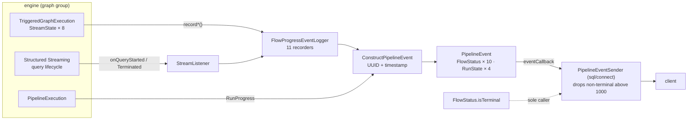

The last group in `sql/pipelines`, and the one everything else depends on: **11 files, 954 lines**
holding the state vocabulary, the event model, and the five shared utilities. With this page the
subsystem is fully swept.

Its three packages do genuinely different jobs and are worth separating in your head:

- **`common/`** — one file, three sealed traits. `FlowStatus`, `RunState`, `DatasetType`. These are
  the names that leave the engine, so they are effectively the pipeline's public state vocabulary.
- **`logging/`** — four files turning engine callbacks into `PipelineEvent`s. This is the *only*
  channel by which a client learns anything about a running pipeline.
- **`util/`** — five files. Two of them (`SchemaInferenceUtils`, `SchemaMergingUtils`) carry real
  semantics that the [graph sweep](sql-pipelines-graph.md) referenced but did not open; the other
  three are small and one of them has a sharp edge.

---

## FlowStatus and RunState — the wire-visible state model

**What it is:** 75 lines defining the three enumerations a client sees. `FlowStatus` has ten values,
`RunState` four, `DatasetType` two. Nothing else in the subsystem is as widely referenced.

**Anchor files:**

- [GraphStates.scala:20](https://github.com/apache/spark/blob/v4.2.0/sql/pipelines/src/main/scala/org/apache/spark/sql/pipelines/common/GraphStates.scala#L20) — `FlowStatus`: `QUEUED`, `STARTING`, `RUNNING`, `COMPLETED`, `FAILED`, `SKIPPED`, `STOPPED`, `PLANNING`, `EXCLUDED`, `IDLE`
- [GraphStates.scala:52](https://github.com/apache/spark/blob/v4.2.0/sql/pipelines/src/main/scala/org/apache/spark/sql/pipelines/common/GraphStates.scala#L52) — `RunState`: `RUNNING`, `COMPLETED`, `FAILED`, `CANCELED`
- [GraphStates.scala:69](https://github.com/apache/spark/blob/v4.2.0/sql/pipelines/src/main/scala/org/apache/spark/sql/pipelines/common/GraphStates.scala#L69) — `DatasetType`: `MATERIALIZED_VIEW`, `STREAMING_TABLE`
- The executor's own state type is **different** — `TriggeredGraphExecution.StreamState`, eight values, in the [graph group](sql-pipelines-graph.md)

!!! warning "There are two flow-state enums and they do not agree"

    The executor tracks `StreamState` (8 values) internally; events carry `FlowStatus` (10 values).
    Three names differ for the same idea — `SUCCESSFUL`/`COMPLETED`,
    `TERMINATED_WITH_ERROR`/`FAILED`, `CANCELED`/`STOPPED` — and two `FlowStatus` values
    (`STARTING`, `PLANNING`) have no `StreamState` counterpart because they are transient event-only
    stages. Tooling written against event `FlowStatus` and documentation written from the executor's
    state machine will not use the same words for the same thing.

!!! warning "Half of `RunState` is never emitted"

    Grepping the whole non-test tree for `RunProgress(...)` producers finds exactly two:
    [PipelineExecution.scala:79](https://github.com/apache/spark/blob/v4.2.0/sql/pipelines/src/main/scala/org/apache/spark/sql/pipelines/graph/PipelineExecution.scala#L79)
    (`FAILED`) and [:106](https://github.com/apache/spark/blob/v4.2.0/sql/pipelines/src/main/scala/org/apache/spark/sql/pipelines/graph/PipelineExecution.scala#L106)
    (`terminationReason.terminalState`, which every `RunTerminationReason` implements as `COMPLETED`
    or `FAILED`). **`RunState.RUNNING` and `RunState.CANCELED` have no producer at 4.2.0.** Two
    consequences: a client never receives a "run started" event, only a terminal one; and the
    `RunProgress(CANCELED)` branch at
    [PipelinesHandler.scala:539](https://github.com/apache/spark/blob/v4.2.0/sql/connect/server/src/main/scala/org/apache/spark/sql/connect/pipelines/PipelinesHandler.scala#L539)
    — which the [connect sweep](sql-connect-declarative-pipelines.md) recorded as "throws
    immediately" — is currently unreachable.

**Configs:** none

**Maps to topics:** A11, E3

---

## FlowStatus.isTerminal — four statuses, and it is the backpressure policy

**What it is:** a four-line pattern match. It looks like a convenience helper; it is in fact the
rule that decides which pipeline events survive under load.

**Anchor files:**

- [GraphStates.scala:46](https://github.com/apache/spark/blob/v4.2.0/sql/pipelines/src/main/scala/org/apache/spark/sql/pipelines/common/GraphStates.scala#L46) — `isTerminal` = `COMPLETED | FAILED | SKIPPED | STOPPED`
- [PipelineEventSender.scala:99](https://github.com/apache/spark/blob/v4.2.0/sql/connect/server/src/main/scala/org/apache/spark/sql/connect/pipelines/PipelineEventSender.scala#L99) — **the only caller in the entire source tree**, inside `shouldEnqueueEvent`

!!! warning "`EXCLUDED` and `IDLE` are droppable events, despite being terminal to the executor"

    The [connect sweep](sql-connect-declarative-pipelines.md) documented the policy — `RunProgress`
    always, terminal `FlowProgress` always, everything else only if the queue has room. This is the
    definition of "terminal" it uses, and it is **narrower** than the executor's. The executor's
    `TERMINAL_NON_FAILURE_STREAM_STATES` is `{SUCCESSFUL, SKIPPED, EXCLUDED, IDLE}`; `isTerminal` is
    `{COMPLETED, FAILED, SKIPPED, STOPPED}`. So `EXCLUDED` and `IDLE` — both genuinely final for the
    flow, and both load-bearing for interpreting a run outcome — are in the droppable set above
    1000 queued events, alongside `QUEUED`, `STARTING`, `PLANNING` and `RUNNING`.

    Combine with the graph sweep's finding that a run whose flows were all `SKIPPED`/`EXCLUDED`
    reports `COMPLETED`: on a large pipeline you can lose exactly the events that would have told
    you the run did nothing, while keeping the outcome that says it succeeded.

**Configs:** `spark.sql.pipelines.event.queue.capacity` (1000) — read in `sql/connect`, governs this

**Maps to topics:** A11, E3

---

## PipelineEvent — the event record and messageWithError

**What it is:** the record itself: a UUID, a timestamp, an origin, a severity, a message, a details
payload, and an optional throwable.

**Anchor files:**

- [PipelineEvent.scala:34](https://github.com/apache/spark/blob/v4.2.0/sql/pipelines/src/main/scala/org/apache/spark/sql/pipelines/logging/PipelineEvent.scala#L34) — the case class
- [PipelineEvent.scala:43](https://github.com/apache/spark/blob/v4.2.0/sql/pipelines/src/main/scala/org/apache/spark/sql/pipelines/logging/PipelineEvent.scala#L43) — `messageWithError`, walking the full `getCause` chain and joining every message
- [PipelineEvent.scala:65](https://github.com/apache/spark/blob/v4.2.0/sql/pipelines/src/main/scala/org/apache/spark/sql/pipelines/logging/PipelineEvent.scala#L65) — `PipelineEventOrigin`: `datasetName`, `flowName`, `sourceCodeLocation` (a `QueryOrigin`)
- [PipelineEvent.scala:72](https://github.com/apache/spark/blob/v4.2.0/sql/pipelines/src/main/scala/org/apache/spark/sql/pipelines/logging/PipelineEvent.scala#L72) — `EventDetails` is a sealed trait with exactly two cases: `FlowProgress(status)` and `RunProgress(state)`
- [PipelineEvent.scala:81](https://github.com/apache/spark/blob/v4.2.0/sql/pipelines/src/main/scala/org/apache/spark/sql/pipelines/logging/PipelineEvent.scala#L81) — `EventLevel`: `INFO`, `WARN`, `ERROR`

!!! warning "`origin.datasetName` is never populated"

    Every one of the eleven `FlowProgressEventLogger` recorders passes `datasetName = None`, and
    `PipelineExecution`'s run events pass `None` for all three origin fields. Grepping the non-test
    tree for a non-`None` assignment finds only test code. So the field exists on the wire, is
    documented, and is always empty — a consumer wanting the destination dataset must derive it from
    `flowName`, which for a default flow equals the dataset name and for a named `CREATE FLOW` does
    not.

!!! info "`messageWithError` flattens the whole cause chain into the message"

    Not just the top-level message — it recurses through `getCause` and joins with newlines under an
    `Error:` heading. That is where a pipeline failure's real cause surfaces, and it is why a
    `QueryOrigin` attached deep in the chain (see the graph sweep's provenance section) still reaches
    the user.

**Configs:** none

**Maps to topics:** E3

---

## ConstructPipelineEvent — the mandated factory

**What it is:** 55 lines whose scaladoc says developers "should always use this factory rather than
construct an event directly". It supplies the two fields nobody should have to think about: a random
UUID and a timestamp.

**Anchor files:**

- [ConstructPipelineEvent.scala:34](https://github.com/apache/spark/blob/v4.2.0/sql/pipelines/src/main/scala/org/apache/spark/sql/pipelines/logging/ConstructPipelineEvent.scala#L34) — the `apply`
- [ConstructPipelineEvent.scala:42](https://github.com/apache/spark/blob/v4.2.0/sql/pipelines/src/main/scala/org/apache/spark/sql/pipelines/logging/ConstructPipelineEvent.scala#L42) — `UUID.randomUUID()` per event, and `Timestamp.from(Instant.now())`
- [ConstructPipelineEvent.scala:47](https://github.com/apache/spark/blob/v4.2.0/sql/pipelines/src/main/scala/org/apache/spark/sql/pipelines/logging/ConstructPipelineEvent.scala#L47) — `eventTimestamp` overrides the clock when supplied (used by tests)

!!! info "Event ids are random, not sequential — ordering is the timestamp's job"

    A random UUID per event means there is no sequence number and no way to detect a gap. Combined
    with the drop policy above, a consumer cannot tell whether it missed events: nothing counts them
    and nothing marks a discontinuity. Order by `timestamp`, and treat absence as unobservable.

**Configs:** none

**Maps to topics:** E3

---

## FlowProgressEventLogger — eleven recorders and two dead maps

**What it is:** 294 lines, one `record*` method per flow status, each building an event and handing
it to the callback. Every method is `synchronized`.

**Anchor files:**

- [FlowProgressEventLogger.scala:41](https://github.com/apache/spark/blob/v4.2.0/sql/pipelines/src/main/scala/org/apache/spark/sql/pipelines/logging/FlowProgressEventLogger.scala#L41) — the class, constructed once per update in [PipelineUpdateContextImpl](https://github.com/apache/spark/blob/v4.2.0/sql/pipelines/src/main/scala/org/apache/spark/sql/pipelines/graph/PipelineUpdateContextImpl.scala#L48)
- The eleven recorders: [recordQueued:59](https://github.com/apache/spark/blob/v4.2.0/sql/pipelines/src/main/scala/org/apache/spark/sql/pipelines/logging/FlowProgressEventLogger.scala#L59) · [recordPlanningForBatchFlow:77](https://github.com/apache/spark/blob/v4.2.0/sql/pipelines/src/main/scala/org/apache/spark/sql/pipelines/logging/FlowProgressEventLogger.scala#L77) · [recordStart:99](https://github.com/apache/spark/blob/v4.2.0/sql/pipelines/src/main/scala/org/apache/spark/sql/pipelines/logging/FlowProgressEventLogger.scala#L99) · [recordRunning:116](https://github.com/apache/spark/blob/v4.2.0/sql/pipelines/src/main/scala/org/apache/spark/sql/pipelines/logging/FlowProgressEventLogger.scala#L116) · [recordFailed:137](https://github.com/apache/spark/blob/v4.2.0/sql/pipelines/src/main/scala/org/apache/spark/sql/pipelines/logging/FlowProgressEventLogger.scala#L137) · [recordSkippedOnUpStreamFailure:167](https://github.com/apache/spark/blob/v4.2.0/sql/pipelines/src/main/scala/org/apache/spark/sql/pipelines/logging/FlowProgressEventLogger.scala#L167) · [recordSkipped:190](https://github.com/apache/spark/blob/v4.2.0/sql/pipelines/src/main/scala/org/apache/spark/sql/pipelines/logging/FlowProgressEventLogger.scala#L190) · [recordExcluded:210](https://github.com/apache/spark/blob/v4.2.0/sql/pipelines/src/main/scala/org/apache/spark/sql/pipelines/logging/FlowProgressEventLogger.scala#L210) · [recordStop:230](https://github.com/apache/spark/blob/v4.2.0/sql/pipelines/src/main/scala/org/apache/spark/sql/pipelines/logging/FlowProgressEventLogger.scala#L230) · [recordIdle:254](https://github.com/apache/spark/blob/v4.2.0/sql/pipelines/src/main/scala/org/apache/spark/sql/pipelines/logging/FlowProgressEventLogger.scala#L254) · [recordCompletion:279](https://github.com/apache/spark/blob/v4.2.0/sql/pipelines/src/main/scala/org/apache/spark/sql/pipelines/logging/FlowProgressEventLogger.scala#L279)
- [FlowProgressEventLogger.scala:152](https://github.com/apache/spark/blob/v4.2.0/sql/pipelines/src/main/scala/org/apache/spark/sql/pipelines/logging/FlowProgressEventLogger.scala#L152) — the only level decision in the class: `recordFailed`'s `logAsWarn` flag picks `WARN` or `ERROR`. Everything else is hardcoded `INFO`, except `recordSkippedOnUpStreamFailure` which is always `WARN`
- [FlowProgressEventLogger.scala:78](https://github.com/apache/spark/blob/v4.2.0/sql/pipelines/src/main/scala/org/apache/spark/sql/pipelines/logging/FlowProgressEventLogger.scala#L78) — `recordPlanningForBatchFlow` silently returns for a streaming flow, so **no `PLANNING` event is ever emitted for a streaming flow**
- [FlowProgressEventLogger.scala:190](https://github.com/apache/spark/blob/v4.2.0/sql/pipelines/src/main/scala/org/apache/spark/sql/pipelines/logging/FlowProgressEventLogger.scala#L190) vs [:167](https://github.com/apache/spark/blob/v4.2.0/sql/pipelines/src/main/scala/org/apache/spark/sql/pipelines/logging/FlowProgressEventLogger.scala#L167) — two `SKIPPED` recorders with the *same* status but different levels and different meanings: "already processed, will not be rerun" (INFO) versus "skipped due to upstream failure" (WARN)

!!! warning "`runningFlows` and `knownIdleFlows` are written on every event and read by nothing"

    Two `ConcurrentHashMap`s are declared at [:50](https://github.com/apache/spark/blob/v4.2.0/sql/pipelines/src/main/scala/org/apache/spark/sql/pipelines/logging/FlowProgressEventLogger.scala#L50)
    and [:53](https://github.com/apache/spark/blob/v4.2.0/sql/pipelines/src/main/scala/org/apache/spark/sql/pipelines/logging/FlowProgressEventLogger.scala#L53),
    with careful scaladoc about what each value means, and are maintained by nearly every recorder —
    fourteen `put`/`remove` calls in total. **No method in the class, or anywhere in the tree, ever
    reads them.** They are the residue of the level-selection logic the class scaladoc still
    describes (see below): dead state, kept consistent under a lock, on the hot path of every event.

!!! warning "The class scaladoc describes a system that is not here"

    The comment at [:29](https://github.com/apache/spark/blob/v4.2.0/sql/pipelines/src/main/scala/org/apache/spark/sql/pipelines/logging/FlowProgressEventLogger.scala#L29)
    says the class "uses execution mode, flow name and previous flow statuses to infer the level at
    which an event is to be logged", and several method comments refer to **continuous execution
    mode** and to a **`METRICS` log level**. Neither exists at 4.2.0: `TriggeredGraphExecution` is
    the only `GraphExecution`, and `EventLevel` has three values, none of them `METRICS`. Read the
    method bodies, not the doc comments — this is the same stale-documentation shape as
    `diffSchemas` below.

**Configs:** none

**Maps to topics:** A11, E3

---

## StreamListener — streaming flow progress, and the two events it gets wrong

**What it is:** 60 lines bridging Structured Streaming's `StreamingQueryListener` into pipeline
events. It is how a *streaming* flow ever reports `RUNNING` or `COMPLETED` — the executor's polling
loop handles state, but the events come from here.

**Anchor files:**

- [StreamListener.scala:29](https://github.com/apache/spark/blob/v4.2.0/sql/pipelines/src/main/scala/org/apache/spark/sql/pipelines/logging/StreamListener.scala#L29) — the class, registered in [GraphExecution.start](https://github.com/apache/spark/blob/v4.2.0/sql/pipelines/src/main/scala/org/apache/spark/sql/pipelines/graph/GraphExecution.scala#L143)
- [StreamListener.scala:39](https://github.com/apache/spark/blob/v4.2.0/sql/pipelines/src/main/scala/org/apache/spark/sql/pipelines/logging/StreamListener.scala#L39) — `onQueryStarted` → `recordRunning`
- [StreamListener.scala:47](https://github.com/apache/spark/blob/v4.2.0/sql/pipelines/src/main/scala/org/apache/spark/sql/pipelines/logging/StreamListener.scala#L47) — `onQueryTerminated` → `recordCompletion`
- [StreamListener.scala:56](https://github.com/apache/spark/blob/v4.2.0/sql/pipelines/src/main/scala/org/apache/spark/sql/pipelines/logging/StreamListener.scala#L56) — `getFlowFromStreamName`: the streaming query's **name** is parsed as a table identifier and looked up in the graph. That works because `StreamingTableWrite` sets `.queryName(displayName)`

!!! warning "A streaming query that dies is reported as COMPLETED"

    `QueryTerminatedEvent` carries `exception: Option[String]`
    ([StreamingQueryListener.scala:281](https://github.com/apache/spark/blob/v4.2.0/sql/api/src/main/scala/org/apache/spark/sql/streaming/StreamingQueryListener.scala#L281)),
    and `onQueryTerminated` **never looks at it** — every termination, clean or not, calls
    `recordCompletion`, which emits `FlowProgress(COMPLETED)` at INFO.

    The run outcome is still correct: `TriggeredGraphExecution` polls the `FlowExecution`'s future
    independently and records the failure through `recordFailed`. So a failed streaming flow emits
    **both** a `COMPLETED` and a `FAILED` event, from two different threads, with no ordering
    guarantee between them. Any consumer treating `FlowProgress(COMPLETED)` as success will
    mis-report a crashed stream — and `COMPLETED` is in the never-dropped terminal set while the
    ordering that would disambiguate it is not preserved.

!!! warning "`onQueryStarted` has no guard for non-pipeline streams; `onQueryTerminated` does"

    The listener is registered on the pipeline's `SparkSession`, which is the active session, so it
    receives events for *every* streaming query on that session. `onQueryTerminated` explicitly
    handles this — the comment at [:48](https://github.com/apache/spark/blob/v4.2.0/sql/pipelines/src/main/scala/org/apache/spark/sql/pipelines/logging/StreamListener.scala#L48)
    says "if the non-pipelines managed stream is started before flow execution started" and returns
    early when the run id is unknown. `onQueryStarted` has no such check: it calls
    `getFlowFromStreamName` unconditionally, which parses an arbitrary query name as a table
    identifier and then does a `Map.apply` on `resolvedFlow`. An unrelated stream started on the
    same session while a pipeline is running throws inside the listener callback.

!!! warning "`onQueryProgress` is empty — there are no metrics in the pipeline event stream"

    [StreamListener.scala:45](https://github.com/apache/spark/blob/v4.2.0/sql/pipelines/src/main/scala/org/apache/spark/sql/pipelines/logging/StreamListener.scala#L45)
    is `= {}`. No `numInputRows`, no batch duration, no watermark, no sink progress reaches a
    pipeline client. The `FlowProgressEventLogger` scaladoc's references to "flow progress events
    with metrics" describe something that does not exist here. For streaming throughput you must go
    to the ordinary Structured Streaming surfaces — `StreamingQueryProgress`, the streaming tab, the
    metrics system — which the [streaming-exec sweep](sql-core-streaming-exec.md) covers.

**Configs:** none

**Maps to topics:** A11, E3

---

## DatasetType — materialized view versus streaming table, decided from flows

**What it is:** two values, and a subtlety about which source of truth decides them.

**Anchor files:**

- [GraphStates.scala:69](https://github.com/apache/spark/blob/v4.2.0/sql/pipelines/src/main/scala/org/apache/spark/sql/pipelines/common/GraphStates.scala#L69) — the trait
- [elements.scala:142](https://github.com/apache/spark/blob/v4.2.0/sql/pipelines/src/main/scala/org/apache/spark/sql/pipelines/graph/elements.scala#L142) — `Table.datasetType`, from the **declared** `isStreamingTable` flag
- [GraphElementTypeUtils.scala:28](https://github.com/apache/spark/blob/v4.2.0/sql/pipelines/src/main/scala/org/apache/spark/sql/pipelines/graph/GraphElementTypeUtils.scala#L28) — the other derivation, from the **resolved flows**: `flowsToTable.exists(f => f.df.isStreaming || f.once)`
- [SchemaInferenceUtils.scala:70](https://github.com/apache/spark/blob/v4.2.0/sql/pipelines/src/main/scala/org/apache/spark/sql/pipelines/util/SchemaInferenceUtils.scala#L70) — where the flow-derived version is used, purely to word an error message

!!! info "Two derivations, and only one is authoritative"

    `Table.datasetType` reads the declaration; `getDatasetTypeForMaterializedViewOrStreamingTable`
    infers from the flows. They can disagree — but only transiently, because
    `validateFlowStreamingness` in the [graph group](sql-pipelines-graph.md) rejects a graph where
    they do. The flow-derived one exists so a schema-mismatch error can name the dataset kind even
    when validation has not yet run.

**Configs:** none

**Maps to topics:** A11

---

## SchemaInferenceUtils.inferSchemaFromFlows — merging every writer's schema

**What it is:** the answer to "what schema should this table have?" — fold `StructType.merge` over
the analysed schema of every flow writing to it, then merge the user-declared schema on top. This is
the mechanism behind a pipeline picking up a new column without any DDL.

**Code path:** `VirtualTableInput.load` and `DataflowGraph.inferredSchema` → `inferSchemaFromFlows`
→ `SchemaMergingUtils.mergeSchemas` → `DatasetManager.materializeTable` → `diffSchemas` →
`catalog.alterTable`

**Anchor files:**

- [SchemaInferenceUtils.scala:43](https://github.com/apache/spark/blob/v4.2.0/sql/pipelines/src/main/scala/org/apache/spark/sql/pipelines/util/SchemaInferenceUtils.scala#L43) — the function, with the three-rule contract in its scaladoc
- [SchemaInferenceUtils.scala:46](https://github.com/apache/spark/blob/v4.2.0/sql/pipelines/src/main/scala/org/apache/spark/sql/pipelines/util/SchemaInferenceUtils.scala#L46) — no flows → the user schema, or an **empty** `StructType`
- [SchemaInferenceUtils.scala:50](https://github.com/apache/spark/blob/v4.2.0/sql/pipelines/src/main/scala/org/apache/spark/sql/pipelines/util/SchemaInferenceUtils.scala#L50) — a `require` that all flows share a destination: this is a per-table operation by construction
- [SchemaInferenceUtils.scala:55](https://github.com/apache/spark/blob/v4.2.0/sql/pipelines/src/main/scala/org/apache/spark/sql/pipelines/util/SchemaInferenceUtils.scala#L55) — the fold, wrapping any failure as `UNABLE_TO_INFER_PIPELINE_TABLE_SCHEMA` and reporting the two schemas that would not merge
- [SchemaInferenceUtils.scala:90](https://github.com/apache/spark/blob/v4.2.0/sql/pipelines/src/main/scala/org/apache/spark/sql/pipelines/util/SchemaInferenceUtils.scala#L90) — the user schema is merged **first argument**, so its per-field metadata (comments, masks) wins; failure is `USER_SPECIFIED_AND_INFERRED_SCHEMA_NOT_COMPATIBLE`
- [elements.scala:189](https://github.com/apache/spark/blob/v4.2.0/sql/pipelines/src/main/scala/org/apache/spark/sql/pipelines/graph/elements.scala#L189) — the first consumer: a `VirtualTableInput` loads with this schema during analysis
- [DataflowGraph.scala:174](https://github.com/apache/spark/blob/v4.2.0/sql/pipelines/src/main/scala/org/apache/spark/sql/pipelines/graph/DataflowGraph.scala#L174) — the second: `inferredSchema`, forced as the last step of graph validation

!!! info "Multi-flow tables are exactly why this exists"

    A streaming table fed by three append flows gets the *union* of their schemas, which is what
    makes "one table, several sources" work without the user restating a schema. It is also why
    adding a column to just one of those flows widens the table for all of them — and why an
    incompatible type for the same column name in two flows is a graph-validation failure rather
    than a runtime one.

!!! warning "A user-declared schema is a floor, not a contract"

    The merge is a *union*: declaring a two-column schema does not stop a flow contributing a third
    column. What it catches is the reverse — the [graph sweep](sql-pipelines-graph.md)'s
    `validateUserSpecifiedSchemas` compares the merge against the declaration and fails if they
    differ. Note that check's own limitation, recorded there: it cannot fire for a table fed only by
    explicitly named flows.

**Configs:** none

**Maps to topics:** none yet — proposed as **A39**

---

## diffSchemas — a schema delta as TableChanges, matched case-sensitively

**What it is:** given the catalog's current schema and the target schema, produce the exact
`TableChange` list to get from one to the other. This is what `DatasetManager` hands to
`catalog.alterTable`.

**Anchor files:**

- [SchemaInferenceUtils.scala:117](https://github.com/apache/spark/blob/v4.2.0/sql/pipelines/src/main/scala/org/apache/spark/sql/pipelines/util/SchemaInferenceUtils.scala#L117) — the function
- [SchemaInferenceUtils.scala:121](https://github.com/apache/spark/blob/v4.2.0/sql/pipelines/src/main/scala/org/apache/spark/sql/pipelines/util/SchemaInferenceUtils.scala#L121) — `getFieldMap`: `field.name -> field`, a **plain case-sensitive map**
- Four kinds of change: [addColumn:129](https://github.com/apache/spark/blob/v4.2.0/sql/pipelines/src/main/scala/org/apache/spark/sql/pipelines/util/SchemaInferenceUtils.scala#L129) · [deleteColumn:141](https://github.com/apache/spark/blob/v4.2.0/sql/pipelines/src/main/scala/org/apache/spark/sql/pipelines/util/SchemaInferenceUtils.scala#L141) · [updateColumnType:153](https://github.com/apache/spark/blob/v4.2.0/sql/pipelines/src/main/scala/org/apache/spark/sql/pipelines/util/SchemaInferenceUtils.scala#L153) / [updateColumnNullability:158](https://github.com/apache/spark/blob/v4.2.0/sql/pipelines/src/main/scala/org/apache/spark/sql/pipelines/util/SchemaInferenceUtils.scala#L158) · [updateColumnComment:165](https://github.com/apache/spark/blob/v4.2.0/sql/pipelines/src/main/scala/org/apache/spark/sql/pipelines/util/SchemaInferenceUtils.scala#L165)
- [DatasetManager.scala:330](https://github.com/apache/spark/blob/v4.2.0/sql/pipelines/src/main/scala/org/apache/spark/sql/pipelines/graph/DatasetManager.scala#L330) — the sole call site, on a `targetSchema` that is a *merge* for an incremental streaming table and the *new schema outright* otherwise

!!! warning "Column matching here is case-sensitive, unlike everywhere else in the subsystem"

    `getFieldMap` keys on the raw `field.name`. Every other name comparison in `sql/pipelines` goes
    through the session resolver or an explicit `caseSensitive` flag — the AutoCDC column selection,
    the key-drift check, the reserved-prefix check. Here it does not. Renaming a column's *case*
    only (`id` → `ID`) in a flow's projection therefore produces an `addColumn` **and** a
    `deleteColumn` rather than no change at all, against a catalog that may itself treat the two
    names as identical.

!!! warning "On a materialized view, the diff can emit a column drop"

    `DatasetManager` computes `targetSchema = mergeSchemas(existing, output)` only for a streaming
    table on a non-full-refresh run; for a materialized view, and for any full refresh, it is the new
    schema outright. Because `diffSchemas` emits `deleteColumn` for anything in current-but-not-
    target, removing a column from an MV's query issues an `ALTER TABLE ... DROP COLUMN`. That is
    coherent with an MV being rebuilt each run, but it is a destructive catalog operation produced
    by an ordinary query edit, and nothing warns about it.

!!! info "The scaladoc lists two change kinds; the body produces four"

    The comment at [:106](https://github.com/apache/spark/blob/v4.2.0/sql/pipelines/src/main/scala/org/apache/spark/sql/pipelines/util/SchemaInferenceUtils.scala#L106)
    promises "1. New columns that need to be added, 2. Existing columns that need type updates".
    Deletions, nullability changes and comment changes are all produced too, and the deletion case is
    the consequential one.

**Configs:** none

**Maps to topics:** A11

---

## SchemaMergingUtils — one line over StructType.merge

**What it is:** 26 lines, one method, one delegation. Worth a section only because everything above
depends on exactly what `StructType.merge` does.

**Anchor files:**

- [SchemaMergingUtils.scala:23](https://github.com/apache/spark/blob/v4.2.0/sql/pipelines/src/main/scala/org/apache/spark/sql/pipelines/util/SchemaMergingUtils.scala#L23) — `StructType.merge(tableSchema, dataSchema).asInstanceOf[StructType]`
- Callers: [SchemaInferenceUtils.scala:57](https://github.com/apache/spark/blob/v4.2.0/sql/pipelines/src/main/scala/org/apache/spark/sql/pipelines/util/SchemaInferenceUtils.scala#L57), [:90](https://github.com/apache/spark/blob/v4.2.0/sql/pipelines/src/main/scala/org/apache/spark/sql/pipelines/util/SchemaInferenceUtils.scala#L90), [DataflowGraph.scala:180](https://github.com/apache/spark/blob/v4.2.0/sql/pipelines/src/main/scala/org/apache/spark/sql/pipelines/graph/DataflowGraph.scala#L180), [DatasetManager.scala:325](https://github.com/apache/spark/blob/v4.2.0/sql/pipelines/src/main/scala/org/apache/spark/sql/pipelines/graph/DatasetManager.scala#L325)

!!! info "The merge semantics are Catalyst's, not pipelines'"

    `StructType.merge` unions fields, recurses into nested structs, and throws on an irreconcilable
    type for the same name. Argument order matters for field *ordering* and for which side's metadata
    survives — which is why `mergeInferredAndUserSchemasIfNeeded` deliberately passes the user schema
    first. Anything you want to know about pipeline schema evolution's edge cases is really a
    question about this function; see the [types & parser sweep](sql-catalyst-types-parser.md).

**Configs:** none

**Maps to topics:** A11

---

## SparkSessionUtils.withSqlConf — per-flow confs on a shared session

**What it is:** 41 lines: set some confs, run a block, restore. Innocuous in isolation, and the
sharpest edge in this group given where it is used.

**Anchor files:**

- [SparkSessionUtils.scala:28](https://github.com/apache/spark/blob/v4.2.0/sql/pipelines/src/main/scala/org/apache/spark/sql/pipelines/util/SparkSessionUtils.scala#L28) — capture previous values via `conf.getOption`, set, and restore (or `unset`) in a `finally`
- [FlowExecution.scala:222](https://github.com/apache/spark/blob/v4.2.0/sql/pipelines/src/main/scala/org/apache/spark/sql/pipelines/graph/FlowExecution.scala#L222) — the streaming call site, wrapping `startStream()`
- [FlowExecution.scala:269](https://github.com/apache/spark/blob/v4.2.0/sql/pipelines/src/main/scala/org/apache/spark/sql/pipelines/graph/FlowExecution.scala#L269) — the batch call site, wrapping a block that **returns a `Future`**
- [FlowExecution.scala:87](https://github.com/apache/spark/blob/v4.2.0/sql/pipelines/src/main/scala/org/apache/spark/sql/pipelines/graph/FlowExecution.scala#L87) — `protected def spark: SparkSession = updateContext.spark`

!!! warning "Execution-time confs are not isolated per flow, and the scaladoc says they are"

    The doc comment directly above that definition says: "The default value for batch flows is a
    cloned spark session from the pipeline's spark session. Please make sure that the execution
    thread runs in a different spark session than the pipeline's spark session." **No clone
    happens** — the method returns `updateContext.spark`, and no `FlowExecution` subclass overrides
    it. So `withSqlConf` mutates the one shared session's conf.

    Up to `spark.sql.pipelines.execution.maxConcurrentFlows` (16) flows start concurrently, each
    setting and restoring its own `sqlConf` on that session. Two flows with different values for the
    same key race, and the loser's restore can clobber the winner's set. Contrast the *resolution*
    phase, which the [graph sweep](sql-pipelines-graph.md) shows solving exactly this with a cloned
    `SQLConf` installed thread-locally via `SQLConf.withExistingConf` — the analysis path is isolated
    and the execution path is not.

!!! warning "For a batch flow the confs are restored before the write runs"

    [BatchTableWrite.executeInternal](https://github.com/apache/spark/blob/v4.2.0/sql/pipelines/src/main/scala/org/apache/spark/sql/pipelines/graph/FlowExecution.scala#L268)
    calls `withSqlConf(...) { ...; Future { ...saveAsTable... } }`. The block returns as soon as the
    `Future` is *submitted*, so the `finally` restores the confs immediately — while the actual
    planning and write happen later, on a pool thread, with the session conf already reverted. Only
    the re-analysis inside the block sees the flow's confs. A per-flow conf intended to affect the
    write (rather than the analysis) is unlikely to apply.

**Configs:** none read here; it *writes* whatever a flow declared

**Maps to topics:** A11, E30

---

## ExponentialBackoffStrategy — the retry curve behind the watchdog configs

**What it is:** the formula the [graph sweep](sql-pipelines-graph.md) named but did not open:
`min(maxTime, 2^(n-1) * stepSize)`, with the two bounds coming from the watchdog configs.

**Anchor files:**

- [BackoffStrategy.scala:23](https://github.com/apache/spark/blob/v4.2.0/sql/pipelines/src/main/scala/org/apache/spark/sql/pipelines/util/BackoffStrategy.scala#L23) — the trait, one method: `waitDuration(numFailures)`
- [BackoffStrategy.scala:34](https://github.com/apache/spark/blob/v4.2.0/sql/pipelines/src/main/scala/org/apache/spark/sql/pipelines/util/BackoffStrategy.scala#L34) — the implementation, with the formula stated in its scaladoc
- [BackoffStrategy.scala:54](https://github.com/apache/spark/blob/v4.2.0/sql/pipelines/src/main/scala/org/apache/spark/sql/pipelines/util/BackoffStrategy.scala#L54) — `waitDuration`, short-circuiting to `0` when `stepSize <= 0` and to `maxTime` when `stepSize >= maxTime`
- [BackoffStrategy.scala:62](https://github.com/apache/spark/blob/v4.2.0/sql/pipelines/src/main/scala/org/apache/spark/sql/pipelines/util/BackoffStrategy.scala#L62) — the overflow guard: a `log2` comparison decides whether `2^(n-1) * stepSize` would exceed `maxTime` *before* computing it
- [TriggeredGraphExecution.scala:71](https://github.com/apache/spark/blob/v4.2.0/sql/pipelines/src/main/scala/org/apache/spark/sql/pipelines/graph/TriggeredGraphExecution.scala#L71) — the only construction site, from `watchdogMaxRetryTimeInSeconds` and `watchdogMinRetryTimeInSeconds`

!!! info "With the defaults, the retry budget expires long before the curve does"

    Defaults are `minRetryTime = 5 s`, `maxRetryTime = 3600 s`, `maxFlowRetryAttempts = 2`. So the
    waits actually used are 5 s and 10 s — the ceiling is never approached. Raising
    `maxRetryTime` alone changes nothing; the curve only matters once
    `spark.sql.pipelines.maxFlowRetryAttempts` is raised enough for `2^(n-1) * 5 s` to reach it,
    which takes about ten attempts.

**Configs:** `spark.sql.pipelines.execution.watchdog.minRetryTime` (5 s),
`spark.sql.pipelines.execution.watchdog.maxRetryTime` (3600 s) — both read in the graph group

**Maps to topics:** E30

---

## PipelinesCatalogUtils — a v1 identifier against the v2 catalog API

**What it is:** 52 lines resolving a `TableIdentifier` to the `(TableCatalog, Identifier)` pair the
DSv2 connector APIs need. Small, but it is the single place the subsystem crosses the v1/v2 boundary.

**Anchor files:**

- [PipelinesCatalogUtils.scala:34](https://github.com/apache/spark/blob/v4.2.0/sql/pipelines/src/main/scala/org/apache/spark/sql/pipelines/util/PipelinesCatalogUtils.scala#L34) — `resolveTableCatalog`
- [PipelinesCatalogUtils.scala:41](https://github.com/apache/spark/blob/v4.2.0/sql/pipelines/src/main/scala/org/apache/spark/sql/pipelines/util/PipelinesCatalogUtils.scala#L41) — a catalog plugin that is not a `TableCatalog` is `missingCatalogTablesAbilityError`
- [PipelinesCatalogUtils.scala:45](https://github.com/apache/spark/blob/v4.2.0/sql/pipelines/src/main/scala/org/apache/spark/sql/pipelines/util/PipelinesCatalogUtils.scala#L45) — a missing namespace is a `SparkException.internalError`, not a user error, because identifiers are qualified long before this point
- Callers are all AutoCDC auxiliary-table work in the graph group: [FlowExecution.scala:406](https://github.com/apache/spark/blob/v4.2.0/sql/pipelines/src/main/scala/org/apache/spark/sql/pipelines/graph/FlowExecution.scala#L406), [:480](https://github.com/apache/spark/blob/v4.2.0/sql/pipelines/src/main/scala/org/apache/spark/sql/pipelines/graph/FlowExecution.scala#L480), [:507](https://github.com/apache/spark/blob/v4.2.0/sql/pipelines/src/main/scala/org/apache/spark/sql/pipelines/graph/FlowExecution.scala#L507)

!!! info "Only two namespace levels are ever produced"

    `Identifier.of(Array(namespace), ident.table)` builds a single-element namespace from
    `ident.database`. Combined with `IdentifierHelper.toTableIdentifier` rejecting four-part names,
    the subsystem is fixed at `catalog.schema.table` — a catalog with deeper namespaces is not
    addressable from a pipeline.

**Configs:** none

**Maps to topics:** A11

---

## Language — the two-value provenance tag

**What it is:** 26 lines. `Python` and `Sql`, both case classes, attached to a `QueryOrigin`.

**Anchor files:**

- [Language.scala:22](https://github.com/apache/spark/blob/v4.2.0/sql/pipelines/src/main/scala/org/apache/spark/sql/pipelines/Language.scala#L22) — the two cases
- [SqlGraphRegistrationContext.scala:678](https://github.com/apache/spark/blob/v4.2.0/sql/pipelines/src/main/scala/org/apache/spark/sql/pipelines/graph/SqlGraphRegistrationContext.scala#L678) — set to `Sql()` for every statement parsed from a `.sql` file
- [PipelinesHandler.scala:512](https://github.com/apache/spark/blob/v4.2.0/sql/connect/server/src/main/scala/org/apache/spark/sql/connect/pipelines/PipelinesHandler.scala#L512) — set to `Python()` for every flow defined over Connect

!!! info "The Connect path is hardcoded to Python"

    `flowOrigin` assigns `language = Some(Python())` unconditionally, so any non-Python client
    defining a flow over Connect — Scala, or a custom protobuf client — is recorded as Python in the
    provenance. Harmless today (nothing branches on it), but it means `QueryOrigin.language` is a
    statement about *which registration path was used*, not about the user's language.

**Configs:** none

**Maps to topics:** A11

---

## Breadth check 1 — the config slice

Same slice as the other two `sql/pipelines` pages: catalog keys matching `pipelines?\.`, 7 keys, all
declared in `sql/catalyst`'s `SQLConf`.

**This group reads none of them, and reads no other config either.** Grepping the three packages plus
`Language.scala` for `getConf` and `sessionState.conf` returns nothing. That is the expected result
for a group of state definitions, event constructors and pure functions — but it is worth stating,
because two of the seven keys are *parameters to* this group's code without being read by it:
`watchdog.{min,max}RetryTime` are read in the graph group and passed into
`ExponentialBackoffStrategy`, and `event.queue.capacity` is read in `sql/connect` and governs the
policy `FlowStatus.isTerminal` defines.

With this page, all seven keys of the `spark.sql.pipelines.*` family are attributed across the
three groups plus `sql/connect`:

| Config | Read by | Documented on |
|---|---|---|
| `execution.maxConcurrentFlows` | graph | [graph sweep](sql-pipelines-graph.md) |
| `execution.watchdog.minRetryTime` | graph → this group's backoff curve | both |
| `execution.watchdog.maxRetryTime` | graph → this group's backoff curve | both |
| `execution.streamstate.pollingInterval` | graph | [graph sweep](sql-pipelines-graph.md) |
| `maxFlowRetryAttempts` | graph | [graph sweep](sql-pipelines-graph.md) |
| `timeoutMsForTerminationJoinAndLock` | graph | [graph sweep](sql-pipelines-graph.md) |
| `event.queue.capacity` | sql/connect → gated by this group's `isTerminal` | both |

## Breadth check 2 — the packages

The scope names three packages plus one root file, none with sub-packages. All **11** files cited:

- `common/` — `GraphStates` (75)
- `logging/` — `ConstructPipelineEvent` (55) · `FlowProgressEventLogger` (294) · `PipelineEvent` (86) · `StreamListener` (60)
- `util/` — `BackoffStrategy` (67) · `PipelinesCatalogUtils` (52) · `SchemaInferenceUtils` (172) · `SchemaMergingUtils` (26) · `SparkSessionUtils` (41)
- root — `Language` (26)

**`sql/pipelines` is now fully swept:** `graph` (32 files), `autocdc` (5), `pipeline-runtime` (11) —
48 files, ~9,073 lines, three pages. Still outside every source root the map indexes:
`python/pyspark/pipelines/` (the `@dp.table` decorators, the YAML spec format and the
`spark-pipelines` CLI).

## Overlapping topic traces

`check_drift.py --sweeps` reports no topic traces overlapping A11, E3 or E30 — none of
`topics/a11.md`, `topics/e3.md`, `topics/e30.md` exists. All three `sql/pipelines` pages agree with
each other and with the [connect sweep](sql-connect-declarative-pipelines.md); this page sharpens
two things those pages left open — that `FlowStatus.isTerminal` *is* the drop policy the connect
page described, and that the `RunProgress(CANCELED)` branch that page documented has no producer.

---

## Sweep log

| Date | Spark | What changed |
|---|---|---|
| 2026-08-07 | 4.2.0 | First sweep, and it completes the subsystem. 14 concepts, **1 new topic proposed** (A39 pipeline schema inference and evolution). 11 files, 954 lines: the state vocabulary, the event model, and five shared utilities. Findings worth carrying, in rough order of consequence. **`SparkSessionUtils.withSqlConf` mutates the one shared session** while up to 16 flows execute concurrently — and `FlowExecution.spark`'s scaladoc claims batch flows get a *cloned* session, which no code does; the resolution phase solves this exact problem with a thread-local cloned `SQLConf`, the execution phase does not. Worse for batch: `withSqlConf` wraps a block that returns a `Future`, so confs are restored as soon as the write is *submitted*, before it plans or runs. **`StreamListener.onQueryTerminated` ignores `QueryTerminatedEvent.exception`** and reports every termination as `COMPLETED`, so a crashed streaming flow emits both a COMPLETED and a FAILED event from two threads with no ordering guarantee — the run outcome stays correct because the executor polls the future independently. `onQueryProgress` is empty, so **there are no metrics in the pipeline event stream at all**. `onQueryStarted` lacks the non-pipeline-stream guard that `onQueryTerminated` has, so an unrelated stream on the same session throws inside the callback. **`FlowStatus.isTerminal` has exactly one caller** — `PipelineEventSender.shouldEnqueueEvent` — making this four-line function the backpressure policy, and its terminal set `{COMPLETED, FAILED, SKIPPED, STOPPED}` is narrower than the executor's, so `EXCLUDED` and `IDLE` are droppable above 1000 queued events; combined with the graph sweep's "all-skipped run reports COMPLETED", the events proving a run did nothing are exactly the droppable ones. **`RunState.RUNNING` and `RunState.CANCELED` have no producer** — a client never sees a run-started event, and the connect handler's `RunProgress(CANCELED)` branch is unreachable, refining what the connect sweep recorded. `FlowProgressEventLogger` maintains **two `ConcurrentHashMap`s that nothing ever reads**, under a lock, on the hot path of every event, and its class scaladoc describes a continuous execution mode and a `METRICS` log level that do not exist. `PipelineEventOrigin.datasetName` is never populated outside tests. `diffSchemas` matches columns **case-sensitively**, unlike everything else in the subsystem, so a case-only rename becomes drop-plus-add — and on a materialized view (or any full refresh) it can emit an `ALTER TABLE DROP COLUMN` from an ordinary query edit, with its scaladoc claiming it only adds columns and updates types. Also recorded: two parallel flow-state enums whose names disagree on three values; `Language` is hardcoded to `Python()` on the Connect path regardless of client; and the group reads no configs at all. |
