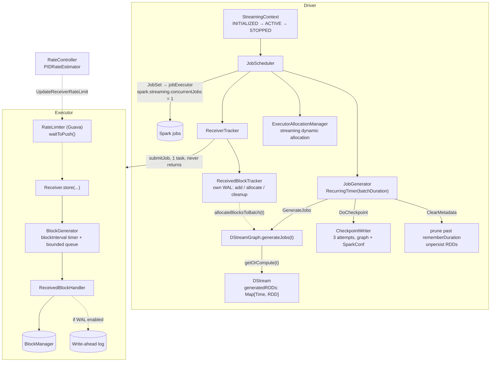

The `streaming — dstream` sweep — **the last unswept group in the map**, and the subsystem's only
group. **109 non-test files, 18,774 lines, 28 configs** in its own slice plus 7 declared in `core`.
By line count the second-largest group swept, and the only one whose `topics:` list in
`groups.yaml` was empty: **no learning-path topic covered any of it** before this run.

!!! warning "This is DStreams. Structured Streaming is not here."

    The `streaming` module is the **original**, RDD-based streaming engine: `StreamingContext`,
    `DStream`, receivers, `JobGenerator`. Structured Streaming executes in `sql/core`
    (`execution/streaming/runtime/`) and is covered by the
    [streaming-exec sweep](sql-core-streaming-exec.md). The two share almost nothing but the word.
    Read this page to maintain a DStream job, and to see what Structured Streaming's offset log,
    watermarks and state store are answers *to*.

The shape: **a recurring timer turns wall-clock time into RDD jobs.** Every `batchDuration` the
`JobGenerator` fires, asks the `DStreamGraph` to produce one `Job` per output operation, and hands
the set to a `JobScheduler` that runs them on a fixed thread pool. A `DStream` is not data — it is a
*factory* keyed by time, holding a map of already-generated RDDs that is pruned on a
`rememberDuration` window. Everything else is either feeding that timer (receivers) or making it
survive a restart (checkpoints and the write-ahead log).



**Config slice.** One group, so no pattern filter — every catalog key whose `subsystem` is
`streaming`, **plus** the seven `spark.streaming.dynamicAllocation.*` keys declared in `core` and
recorded in `groups.yaml`'s `_meta.config_plumbing` as belonging here:

```bash
PYTHONIOENCODING=utf-8 python -c "
import yaml
d = yaml.safe_load(open('docs/reference/spark-source-map/configs/catalog.yaml', encoding='utf-8'))
own = sorted({c['key'] for c in d['configs'] if c['subsystem'] == 'streaming'})
core = sorted({c['key'] for c in d['configs'] if c['subsystem'] == 'core'
               and c['key'].startswith('spark.streaming.')})
print(len(own), len(core)); [print(k) for k in own + core]
"
```

**28 + 7 = 35 keys.** Nearly all are declared in one file,
[StreamingConf.scala](https://github.com/apache/spark/blob/v4.2.0/streaming/src/main/scala/org/apache/spark/streaming/StreamingConf.scala).

---

## StreamingContext — lifecycle, the one-active-context rule, and getOrCreate

**What it is:** the entry point, and a lifecycle unlike anything else in Spark: three states, a
process-wide lock permitting **one active context at a time**, and no way to restart a stopped one.

**Code path:** `new StreamingContext(conf, batchDuration)` → `DStreamGraph` → `start()` →
`validate()` → `JobScheduler.start()`

**Anchor files:**

- [StreamingContext.scala:576](https://github.com/apache/spark/blob/v4.2.0/streaming/src/main/scala/org/apache/spark/streaming/StreamingContext.scala#L576) — `start()` takes `ACTIVATION_LOCK` and calls `assertNoOtherContextIsActive()`; a second active context in the JVM is an error
- [StreamingContext.scala:204](https://github.com/apache/spark/blob/v4.2.0/streaming/src/main/scala/org/apache/spark/streaming/StreamingContext.scala#L204) — the state field; `INITIALIZED → ACTIVE → STOPPED` is one-way, and a `STOPPED` context "cannot be used any more" ([:567](https://github.com/apache/spark/blob/v4.2.0/streaming/src/main/scala/org/apache/spark/streaming/StreamingContext.scala#L567))
- [StreamingContext.scala:521](https://github.com/apache/spark/blob/v4.2.0/streaming/src/main/scala/org/apache/spark/streaming/StreamingContext.scala#L521) — `validate()` runs the graph's own validation before anything starts
- [StreamingContext.scala:240](https://github.com/apache/spark/blob/v4.2.0/streaming/src/main/scala/org/apache/spark/streaming/StreamingContext.scala#L240) — `checkpoint(directory)`, which is what makes `shouldCheckpoint` true in the generator
- [StreamingContext.scala:650](https://github.com/apache/spark/blob/v4.2.0/streaming/src/main/scala/org/apache/spark/streaming/StreamingContext.scala#L650) — `awaitTermination()` blocks on a `ContextWaiter` that a scheduler error also releases
- [StreamingContext.scala:463](https://github.com/apache/spark/blob/v4.2.0/streaming/src/main/scala/org/apache/spark/streaming/StreamingContext.scala#L463) — `queueStream`, the test-and-demo source
- [DStreamGraph.scala:168](https://github.com/apache/spark/blob/v4.2.0/streaming/src/main/scala/org/apache/spark/streaming/DStreamGraph.scala#L168) — graph validation: a batch duration and at least one output stream are required
- [DStreamGraph.scala:81](https://github.com/apache/spark/blob/v4.2.0/streaming/src/main/scala/org/apache/spark/streaming/DStreamGraph.scala#L81) — the batch duration can be set **once**; setting it twice is a `require` failure
- [StreamingContextState.java](https://github.com/apache/spark/blob/v4.2.0/streaming/src/main/java/org/apache/spark/streaming/StreamingContextState.java) — the state enum, exposed to Java
- [ContextWaiter.scala:58](https://github.com/apache/spark/blob/v4.2.0/streaming/src/main/scala/org/apache/spark/streaming/ContextWaiter.scala#L58) — what `awaitTermination` actually blocks on; `notifyError` ([:34](https://github.com/apache/spark/blob/v4.2.0/streaming/src/main/scala/org/apache/spark/streaming/ContextWaiter.scala#L34)) is how a scheduler error wakes it
- [Time.scala:71](https://github.com/apache/spark/blob/v4.2.0/streaming/src/main/scala/org/apache/spark/streaming/Time.scala#L71) / [:78](https://github.com/apache/spark/blob/v4.2.0/streaming/src/main/scala/org/apache/spark/streaming/Time.scala#L78) — `isMultipleOf` and `until`, the two operations the generator's batch-boundary and down-time arithmetic are built from; [Duration.scala:22](https://github.com/apache/spark/blob/v4.2.0/streaming/src/main/scala/org/apache/spark/streaming/Duration.scala#L22) and [Interval.scala](https://github.com/apache/spark/blob/v4.2.0/streaming/src/main/scala/org/apache/spark/streaming/Interval.scala) are the companion value types

**Configs:** `spark.streaming.gracefulStopTimeout`, `spark.streaming.stopGracefullyOnShutdown`.

!!! warning "A stopped StreamingContext cannot be restarted, and `stop()` stops the SparkContext by default"

    The state machine is one-way — there is no `INITIALIZED` to return to — so the standard recovery
    pattern is `StreamingContext.getOrCreate(checkpointDir, factory)`, which either restores from a
    checkpoint or builds a fresh context. Note also the one-argument `stop()` stops the underlying
    `SparkContext` too unless you pass `stopSparkContext = false`, which is why a notebook that
    stops a stream often finds its session gone.

**Maps to topics:** none — the sweep's first new topic, **E43**.

---

## JobGenerator — the recurring timer and the four-event loop

**What it is:** the clock of the whole engine. A `RecurringTimer` posts `GenerateJobs(t)` every
batch interval into an `EventLoop`, which also carries metadata clearing, checkpointing and
checkpoint cleanup — four event types, one thread, strictly ordered.

**Code path:** `RecurringTimer` → `eventLoop.post(GenerateJobs(t))` → `generateJobs` →
`receiverTracker.allocateBlocksToBatch(t)` → `graph.generateJobs(t)` → `submitJobSet`

**Anchor files:**

- [scheduler/JobGenerator.scala:33](https://github.com/apache/spark/blob/v4.2.0/streaming/src/main/scala/org/apache/spark/streaming/scheduler/JobGenerator.scala#L33) — the four events: `GenerateJobs`, `ClearMetadata`, `DoCheckpoint`, `ClearCheckpointData`
- [scheduler/JobGenerator.scala:251](https://github.com/apache/spark/blob/v4.2.0/streaming/src/main/scala/org/apache/spark/streaming/scheduler/JobGenerator.scala#L251) — `generateJobs`: **allocate blocks to the batch first, then build jobs from them** — the ordering that defines which records belong to which batch
- [scheduler/JobGenerator.scala:262](https://github.com/apache/spark/blob/v4.2.0/streaming/src/main/scala/org/apache/spark/streaming/scheduler/JobGenerator.scala#L262) — job-generation failure is reported and the batch is skipped; the timer keeps firing
- [scheduler/JobGenerator.scala:205](https://github.com/apache/spark/blob/v4.2.0/streaming/src/main/scala/org/apache/spark/streaming/scheduler/JobGenerator.scala#L205) — `restart()`: on recovery it computes the **down-time batches** between the checkpoint and now, adds the pending ones, and re-submits all of them at once
- [scheduler/JobGenerator.scala:112](https://github.com/apache/spark/blob/v4.2.0/streaming/src/main/scala/org/apache/spark/streaming/scheduler/JobGenerator.scala#L112) — graceful stop: wait for unallocated blocks, stop the timer, wait for every batch to be processed and checkpointed — bounded by `spark.streaming.gracefulStopTimeout`, whose **default is ten batch intervals**
- [scheduler/JobGenerator.scala:270](https://github.com/apache/spark/blob/v4.2.0/streaming/src/main/scala/org/apache/spark/streaming/scheduler/JobGenerator.scala#L270) — `clearMetadata` branches on whether checkpointing is on: without it, block metadata is cleaned immediately; with it, cleanup waits for the checkpoint to land
- [scheduler/JobGenerator.scala:51](https://github.com/apache/spark/blob/v4.2.0/streaming/src/main/scala/org/apache/spark/streaming/scheduler/JobGenerator.scala#L51) — the clock is `spark.streaming.clock`, an **undeclared string key** read with `conf.get(key, default)`, with a fallback that rewrites an old `org.apache.spark.streaming.*` class name
- [util/RecurringTimer.scala:51](https://github.com/apache/spark/blob/v4.2.0/streaming/src/main/scala/org/apache/spark/streaming/util/RecurringTimer.scala#L51) — `getRestartTime` aligns the restarted timer to the original batch boundaries

!!! warning "Restarting after downtime submits every missed batch at once"

    `restart()` builds `timesToReschedule` from the checkpoint's pending batches plus every batch
    boundary that elapsed while the driver was down, and calls `submitJobSet` for each in a loop —
    no rate limiting, no cap. A driver down for an hour on a 1-second batch interval comes back and
    queues 3,600 job sets. The log lines name the counts ("Batches during down time (N batches)",
    "Batches to reschedule (N batches)") and are the first thing to read after a recovery.

**Maps to topics:** none — part of **E43**.

---

## JobScheduler — job sets, the fixed thread pool, and concurrentJobs

**What it is:** the consumer side. A `JobSet` per batch time, its jobs handed to a fixed daemon
thread pool, with a second `EventLoop` translating job start/completion into `StreamingListener`
events.

**Anchor files:**

- [scheduler/JobScheduler.scala:52](https://github.com/apache/spark/blob/v4.2.0/streaming/src/main/scala/org/apache/spark/streaming/scheduler/JobScheduler.scala#L52) — the pool is sized by `spark.streaming.concurrentJobs`, **default 1**: batches are processed one at a time unless you change it
- [scheduler/JobScheduler.scala:145](https://github.com/apache/spark/blob/v4.2.0/streaming/src/main/scala/org/apache/spark/streaming/scheduler/JobScheduler.scala#L145) — `submitJobSet`; an empty job set is logged and dropped without a `BatchSubmitted` event
- [scheduler/JobScheduler.scala:196](https://github.com/apache/spark/blob/v4.2.0/streaming/src/main/scala/org/apache/spark/streaming/scheduler/JobScheduler.scala#L196) — completion: the "Total delay: X s for time T (execution: Y s)" line, the single most useful log in a DStream job — **total delay includes scheduling delay**, execution does not
- [scheduler/JobScheduler.scala:206](https://github.com/apache/spark/blob/v4.2.0/streaming/src/main/scala/org/apache/spark/streaming/scheduler/JobScheduler.scala#L206) — a failed job reports an error but the **job set is not removed**, so `jobGenerator.onBatchCompletion` never fires for it
- [scheduler/JobScheduler.scala:81](https://github.com/apache/spark/blob/v4.2.0/streaming/src/main/scala/org/apache/spark/streaming/scheduler/JobScheduler.scala#L81) — each input stream's `rateController`, if any, is registered as a streaming listener here — the wiring behind backpressure
- [scheduler/JobScheduler.scala:227](https://github.com/apache/spark/blob/v4.2.0/streaming/src/main/scala/org/apache/spark/streaming/scheduler/JobScheduler.scala#L227) — `JobHandler` sets a job description linking back to the batch page, and two local properties (`batchTime`, `outputOpId`) the UI reads
- [scheduler/JobScheduler.scala:256](https://github.com/apache/spark/blob/v4.2.0/streaming/src/main/scala/org/apache/spark/streaming/scheduler/JobScheduler.scala#L256) — output-spec validation is **disabled** for streaming jobs (SPARK-4835), so writing into an existing directory does not fail
- [scheduler/JobSet.scala:57](https://github.com/apache/spark/blob/v4.2.0/streaming/src/main/scala/org/apache/spark/streaming/scheduler/JobSet.scala#L57) / [:61](https://github.com/apache/spark/blob/v4.2.0/streaming/src/main/scala/org/apache/spark/streaming/scheduler/JobSet.scala#L61) — where those two numbers come from: `processingDelay` is end minus processing *start*, `totalDelay` is end minus the **batch time**, so the gap between them is scheduling delay
- [scheduler/Job.scala:29](https://github.com/apache/spark/blob/v4.2.0/streaming/src/main/scala/org/apache/spark/streaming/scheduler/Job.scala#L29) — a `Job` is a `Time` plus a thunk; `result` ([:42](https://github.com/apache/spark/blob/v4.2.0/streaming/src/main/scala/org/apache/spark/streaming/scheduler/Job.scala#L42)) is a `Try`, which is why a failed job is reported rather than thrown
- [scheduler/InputInfoTracker.scala:64](https://github.com/apache/spark/blob/v4.2.0/streaming/src/main/scala/org/apache/spark/streaming/scheduler/InputInfoTracker.scala#L64) — `reportInfo`, the per-batch record counts every input stream posts and the UI reads
- [dstream/ForEachDStream.scala:47](https://github.com/apache/spark/blob/v4.2.0/streaming/src/main/scala/org/apache/spark/streaming/dstream/ForEachDStream.scala#L47) — `generateJob`: **only output DStreams produce jobs**, which is why a graph with no output operation fails validation

!!! warning "`spark.streaming.concurrentJobs` is the oldest footgun in the module"

    Default 1: one batch at a time, so a batch that takes longer than the interval simply pushes the
    next one back and scheduling delay grows without bound. Raising it lets batches overlap — which
    breaks the ordering guarantee any stateful or output-ordered operation depends on. It has been
    the standard "fix" for a backlogged stream since 0.7.0 and is a correctness trade, not a tuning
    knob.

**Maps to topics:** none — part of **E43**.

---

## DStream — getOrCompute, the generated-RDD map, and rememberDuration

**What it is:** not data, but an RDD factory keyed by `Time`, plus a bounded memory of what it has
already produced. Every DStream operation is a new `DStream` subclass whose `compute(t)` builds an
RDD from its parents' RDDs at `t`.

**Anchor files:**

- [dstream/DStream.scala:335](https://github.com/apache/spark/blob/v4.2.0/streaming/src/main/scala/org/apache/spark/streaming/dstream/DStream.scala#L335) — `getOrCompute`: memoise per time, apply the storage level, mark for checkpointing on the checkpoint interval, store in `generatedRDDs`
- [dstream/DStream.scala:316](https://github.com/apache/spark/blob/v4.2.0/streaming/src/main/scala/org/apache/spark/streaming/dstream/DStream.scala#L316) — `isTimeValid`: a time that is not a multiple of the slide duration produces **nothing**, logged at INFO
- [dstream/DStream.scala:457](https://github.com/apache/spark/blob/v4.2.0/streaming/src/main/scala/org/apache/spark/streaming/dstream/DStream.scala#L457) — `clearMetadata` drops RDDs older than `rememberDuration` and, if `spark.streaming.unpersist` (default **true**), unpersists them
- [dstream/DStream.scala:202](https://github.com/apache/spark/blob/v4.2.0/streaming/src/main/scala/org/apache/spark/streaming/dstream/DStream.scala#L202) — `mustCheckpoint`: stateful DStreams **require** a checkpoint interval and the validation fails without one
- [dstream/DStream.scala:273](https://github.com/apache/spark/blob/v4.2.0/streaming/src/main/scala/org/apache/spark/streaming/dstream/DStream.scala#L273) — `rememberDuration` must be strictly greater than the checkpoint interval
- [dstream/DStream.scala:160](https://github.com/apache/spark/blob/v4.2.0/streaming/src/main/scala/org/apache/spark/streaming/dstream/DStream.scala#L160) — `persist()` defaults to `MEMORY_ONLY_SER`, not `MEMORY_ONLY` as on an RDD
- [dstream/DStream.scala:382](https://github.com/apache/spark/blob/v4.2.0/streaming/src/main/scala/org/apache/spark/streaming/dstream/DStream.scala#L382) — `createRDDWithLocalProperties` carries the DStream's scope and call site into the generated RDDs, which is what makes the UI's DAG readable
- [dstream/PairDStreamFunctions.scala](https://github.com/apache/spark/blob/v4.2.0/streaming/src/main/scala/org/apache/spark/streaming/dstream/PairDStreamFunctions.scala) — 804 lines of key-based operations (`reduceByKeyAndWindow`, `updateStateByKey`, `mapWithState`), reached by implicit conversion
- [dstream/InputDStream.scala:45](https://github.com/apache/spark/blob/v4.2.0/streaming/src/main/scala/org/apache/spark/streaming/dstream/InputDStream.scala#L45) — the root of every source; [:56](https://github.com/apache/spark/blob/v4.2.0/streaming/src/main/scala/org/apache/spark/streaming/dstream/InputDStream.scala#L56) is where a source declares its optional `rateController`
- [dstream/InputDStream.scala:89](https://github.com/apache/spark/blob/v4.2.0/streaming/src/main/scala/org/apache/spark/streaming/dstream/InputDStream.scala#L89) — an input stream overrides `isTimeValid` to also reject a time **earlier than the last valid one**, so replay cannot go backwards

**Configs:** `spark.streaming.unpersist`.

!!! info "Windowing is memory, not state"

    A window operation simply widens `rememberDuration` ([:306](https://github.com/apache/spark/blob/v4.2.0/streaming/src/main/scala/org/apache/spark/streaming/dstream/DStream.scala#L306)) so the
    parent keeps its RDDs around long enough to be re-read. There is no state store and no
    watermark: a 1-hour window over a 1-second batch means 3,600 RDDs retained per DStream in the
    chain. That is the constraint Structured Streaming's watermark-plus-state-store design exists to
    remove.

**Maps to topics:** I4, I5 (the RDD and partitioning model this is built on).

---

## Driver checkpointing — what is serialised and why restore is brittle

**What it is:** a Java-serialised snapshot of the `DStreamGraph`, the `SparkConf` pairs, the batch
duration, the pending times and the checkpoint time — written by a dedicated writer thread on the
checkpoint interval.

**Anchor files:**

- [Checkpoint.scala:40](https://github.com/apache/spark/blob/v4.2.0/streaming/src/main/scala/org/apache/spark/streaming/Checkpoint.scala#L40) — the fields; `sparkConfPairs` means **the whole SparkConf is inside the checkpoint**
- [Checkpoint.scala:73](https://github.com/apache/spark/blob/v4.2.0/streaming/src/main/scala/org/apache/spark/streaming/Checkpoint.scala#L73) — on restore a fresh `SparkConf` is rebuilt from those pairs, so most config changes you make between runs are **discarded**
- [Checkpoint.scala:205](https://github.com/apache/spark/blob/v4.2.0/streaming/src/main/scala/org/apache/spark/streaming/Checkpoint.scala#L205) — `MAX_ATTEMPTS = 3` writes per checkpoint, on a single-threaded executor
- [Checkpoint.scala:128](https://github.com/apache/spark/blob/v4.2.0/streaming/src/main/scala/org/apache/spark/streaming/Checkpoint.scala#L128) — `getCheckpointFiles` sorts candidates newest-first so a partly-written file can be skipped
- [Checkpoint.scala:352](https://github.com/apache/spark/blob/v4.2.0/streaming/src/main/scala/org/apache/spark/streaming/Checkpoint.scala#L352) — the reader tries each file in turn and only fails when all are unreadable
- [DStreamGraph.scala:144](https://github.com/apache/spark/blob/v4.2.0/streaming/src/main/scala/org/apache/spark/streaming/DStreamGraph.scala#L144) / [:160](https://github.com/apache/spark/blob/v4.2.0/streaming/src/main/scala/org/apache/spark/streaming/DStreamGraph.scala#L160) — the graph's own `updateCheckpointData` / `restoreCheckpointData`, which walk every DStream
- [dstream/DStream.scala:489](https://github.com/apache/spark/blob/v4.2.0/streaming/src/main/scala/org/apache/spark/streaming/dstream/DStream.scala#L489) — per-DStream checkpoint data is the **file paths of checkpointed RDDs**, not the data
- [dstream/DStreamCheckpointData.scala:33](https://github.com/apache/spark/blob/v4.2.0/streaming/src/main/scala/org/apache/spark/streaming/dstream/DStreamCheckpointData.scala#L33) — the per-DStream container: `update` ([:50](https://github.com/apache/spark/blob/v4.2.0/streaming/src/main/scala/org/apache/spark/streaming/dstream/DStreamCheckpointData.scala#L50)) collects the paths, `cleanup` ([:73](https://github.com/apache/spark/blob/v4.2.0/streaming/src/main/scala/org/apache/spark/streaming/dstream/DStreamCheckpointData.scala#L73)) deletes the files of batches already forgotten, `restore` ([:116](https://github.com/apache/spark/blob/v4.2.0/streaming/src/main/scala/org/apache/spark/streaming/dstream/DStreamCheckpointData.scala#L116)) rebuilds `generatedRDDs` from them

!!! warning "The checkpoint contains serialised closures, so a code change usually invalidates it"

    The graph is Java-serialised, and the graph holds your `map`/`filter`/`updateStateByKey`
    functions. Recompiling the application changes those classes, and the restore then fails to
    deserialise — the standard "I cannot restart my streaming job after a deploy" experience. There
    is no schema, no version negotiation and no migration path: the documented answer is to delete
    the checkpoint and lose position. Structured Streaming's offset log stores *offsets as JSON*
    precisely to avoid this.

**Maps to topics:** A8 (the ancestor of checkpointing as that topic teaches it).

---

## Receivers — a never-finishing Spark job per stream

**What it is:** the ingest model. Each `ReceiverInputDStream` produces a `Receiver` object, which the
driver ships to an executor **as the single task of a one-partition Spark job that never returns**.

**Code path:** `ReceiverTracker.start` → `runDummySparkJob` → `StartAllReceivers` →
`ReceiverSchedulingPolicy.scheduleReceivers` → `startReceiver` → `sc.submitJob(receiverRDD, …)`

**Anchor files:**

- [scheduler/ReceiverTracker.scala:443](https://github.com/apache/spark/blob/v4.2.0/streaming/src/main/scala/org/apache/spark/streaming/scheduler/ReceiverTracker.scala#L443) — `launchReceivers`, and immediately above it [:434](https://github.com/apache/spark/blob/v4.2.0/streaming/src/main/scala/org/apache/spark/streaming/scheduler/ReceiverTracker.scala#L434) `runDummySparkJob` — a throwaway 50-partition job whose only purpose is to force executors to register before receivers are placed
- [scheduler/ReceiverTracker.scala:611](https://github.com/apache/spark/blob/v4.2.0/streaming/src/main/scala/org/apache/spark/streaming/scheduler/ReceiverTracker.scala#L611) — the receiver is wrapped in a **one-element RDD** with the scheduled executors as its preferred locations
- [scheduler/ReceiverTracker.scala:622](https://github.com/apache/spark/blob/v4.2.0/streaming/src/main/scala/org/apache/spark/streaming/scheduler/ReceiverTracker.scala#L622) — `submitJob(...)` on partition 0 only; the job's completion callback **restarts the receiver** ([:630](https://github.com/apache/spark/blob/v4.2.0/streaming/src/main/scala/org/apache/spark/streaming/scheduler/ReceiverTracker.scala#L630))
- [scheduler/ReceiverTracker.scala:484](https://github.com/apache/spark/blob/v4.2.0/streaming/src/main/scala/org/apache/spark/streaming/scheduler/ReceiverTracker.scala#L484) — `RestartReceiver` retries the previous placement, falling back to `rescheduleReceiver` for local scheduling
- [scheduler/ReceiverSchedulingPolicy.scala:77](https://github.com/apache/spark/blob/v4.2.0/streaming/src/main/scala/org/apache/spark/streaming/scheduler/ReceiverSchedulingPolicy.scala#L77) — placement honours `preferredLocation` first, then balances by receiver count per executor
- [scheduler/ReceiverTracker.scala:138](https://github.com/apache/spark/blob/v4.2.0/streaming/src/main/scala/org/apache/spark/streaming/scheduler/ReceiverTracker.scala#L138) — a `CountDownLatch` sized to the receiver count is what a graceful stop waits on ([:168](https://github.com/apache/spark/blob/v4.2.0/streaming/src/main/scala/org/apache/spark/streaming/scheduler/ReceiverTracker.scala#L168), with a hard 10-second wait when not graceful)
- [receiver/Receiver.scala](https://github.com/apache/spark/blob/v4.2.0/streaming/src/main/scala/org/apache/spark/streaming/receiver/Receiver.scala) / [receiver/ReceiverSupervisorImpl.scala](https://github.com/apache/spark/blob/v4.2.0/streaming/src/main/scala/org/apache/spark/streaming/receiver/ReceiverSupervisorImpl.scala) — the user-facing `store()` API and the supervisor that owns the block generator and the RPC endpoint
- [dstream/ReceiverInputDStream.scala:41](https://github.com/apache/spark/blob/v4.2.0/streaming/src/main/scala/org/apache/spark/streaming/dstream/ReceiverInputDStream.scala#L41) — the DStream side: `getReceiver()` ([:60](https://github.com/apache/spark/blob/v4.2.0/streaming/src/main/scala/org/apache/spark/streaming/dstream/ReceiverInputDStream.scala#L60)) is the factory the tracker calls, and `compute` ([:69](https://github.com/apache/spark/blob/v4.2.0/streaming/src/main/scala/org/apache/spark/streaming/dstream/ReceiverInputDStream.scala#L69)) turns the batch's allocated blocks into a `BlockRDD`
- [receiver/ReceiverSupervisor.scala:186](https://github.com/apache/spark/blob/v4.2.0/streaming/src/main/scala/org/apache/spark/streaming/receiver/ReceiverSupervisor.scala#L186) — executor-side restart, delayed by `spark.streaming.receiverRestartDelay` ([:62](https://github.com/apache/spark/blob/v4.2.0/streaming/src/main/scala/org/apache/spark/streaming/receiver/ReceiverSupervisor.scala#L62), **2000 ms, undeclared**) — a second restart path independent of the driver's

!!! warning "Every receiver permanently occupies one core, and it is not the core that does your work"

    A receiver is a task that never completes, so its slot is gone for the life of the application.
    A job with two receivers on a two-core executor has **no core left to process batches** and will
    appear to hang with no error — the classic "my streaming job produces nothing" report. The
    module's own answer is to size for `numReceivers + 1` cores minimum; the direct/receiverless
    model in the Kafka connectors exists to avoid the problem entirely.

**Maps to topics:** none — the sweep's second new topic, **E44**.

---

## BlockGenerator — the block interval, the bounded queue, and the five states

**What it is:** the executor-side buffer. Records handed to `Receiver.store` accumulate in an
`ArrayBuffer` that a timer swaps out every `spark.streaming.blockInterval`, producing a block that
goes onto a bounded queue for a pushing thread.

**Anchor files:**

- [receiver/BlockGenerator.scala:105](https://github.com/apache/spark/blob/v4.2.0/streaming/src/main/scala/org/apache/spark/streaming/receiver/BlockGenerator.scala#L105) — `spark.streaming.blockInterval`, default **200 ms**, `require`d positive
- [receiver/BlockGenerator.scala:110](https://github.com/apache/spark/blob/v4.2.0/streaming/src/main/scala/org/apache/spark/streaming/receiver/BlockGenerator.scala#L110) — the push queue holds **10** blocks (`spark.streaming.blockQueueSize`, an **undeclared** key read with `getInt`), and `put` blocks when it is full
- [receiver/BlockGenerator.scala:99](https://github.com/apache/spark/blob/v4.2.0/streaming/src/main/scala/org/apache/spark/streaming/receiver/BlockGenerator.scala#L99) — the five-state machine, whose whole point is draining the queue in the right order on stop
- [receiver/BlockGenerator.scala:237](https://github.com/apache/spark/blob/v4.2.0/streaming/src/main/scala/org/apache/spark/streaming/receiver/BlockGenerator.scala#L237) — `updateCurrentBuffer`: an empty buffer produces **no block at all**, so an idle stream generates nothing rather than empty blocks
- [receiver/BlockGenerator.scala:209](https://github.com/apache/spark/blob/v4.2.0/streaming/src/main/scala/org/apache/spark/streaming/receiver/BlockGenerator.scala#L209) — `addMultipleDataWithCallback` guarantees a set of records lands in **one** block, which is what makes offset-based receivers possible
- [receiver/BlockGenerator.scala:165](https://github.com/apache/spark/blob/v4.2.0/streaming/src/main/scala/org/apache/spark/streaming/receiver/BlockGenerator.scala#L165) — every `addData` calls `waitToPush()` first: the rate limiter is in the data path, per record
- [receiver/ReceivedBlock.scala:25](https://github.com/apache/spark/blob/v4.2.0/streaming/src/main/scala/org/apache/spark/streaming/receiver/ReceivedBlock.scala#L25) — the three block shapes a handler must accept: `ArrayBufferBlock`, `IteratorBlock`, `ByteBufferBlock`

!!! info "Block interval, not partition count, decides your parallelism"

    Each block becomes one partition of the batch's RDD, so partitions per batch ≈
    `batchInterval / blockInterval` per receiver — 5 partitions per receiver at the defaults
    (1 s / 200 ms). Lowering `spark.streaming.blockInterval` is the documented way to raise
    ingest-side parallelism, and the floor is practical rather than configured: the source's
    guidance has long been that below ~50 ms the block-scheduling overhead dominates.

**Maps to topics:** none — part of **E44**.

---

## ReceiverTracker and ReceivedBlockTracker — which records belong to which batch

**What it is:** the driver-side bookkeeping. Receivers report each stored block; the tracker holds
them in an unallocated queue until `allocateBlocksToBatch(t)` assigns the whole queue to batch `t`.
With the WAL on, every one of those three operations is logged first.

**Anchor files:**

- [scheduler/ReceivedBlockTracker.scala:87](https://github.com/apache/spark/blob/v4.2.0/streaming/src/main/scala/org/apache/spark/streaming/scheduler/ReceivedBlockTracker.scala#L87) — `addBlock` writes a `BlockAdditionEvent` **before** queueing
- [scheduler/ReceivedBlockTracker.scala:113](https://github.com/apache/spark/blob/v4.2.0/streaming/src/main/scala/org/apache/spark/streaming/scheduler/ReceivedBlockTracker.scala#L113) — `allocateBlocksToBatch` drains the queue in one go and writes a `BatchAllocationEvent`; this is the atom that defines batch membership
- [scheduler/ReceivedBlockTracker.scala:200](https://github.com/apache/spark/blob/v4.2.0/streaming/src/main/scala/org/apache/spark/streaming/scheduler/ReceivedBlockTracker.scala#L200) — `recoverPastEvents` replays the three event types to rebuild state after a driver restart
- [scheduler/ReceivedBlockTracker.scala:246](https://github.com/apache/spark/blob/v4.2.0/streaming/src/main/scala/org/apache/spark/streaming/scheduler/ReceivedBlockTracker.scala#L246) — `writeToLog` is a **no-op when the WAL is disabled**, and returns `true` — so the same code path silently loses durability
- [scheduler/JobGenerator.scala:256](https://github.com/apache/spark/blob/v4.2.0/streaming/src/main/scala/org/apache/spark/streaming/scheduler/JobGenerator.scala#L256) — the allocation call sits immediately before job generation, every batch
- [scheduler/ReceiverTracker.scala:209](https://github.com/apache/spark/blob/v4.2.0/streaming/src/main/scala/org/apache/spark/streaming/scheduler/ReceiverTracker.scala#L209) — the tracker's wrapper, and `hasUnallocatedBlocks`, which graceful stop polls

**Maps to topics:** none — part of **E44**.

---

## The write-ahead log — driver and receiver logs, batching, and the storage-level rewrite

**What it is:** two independent logs. The **driver** log records block-tracking events; the
**receiver** log records the block data itself. Enabling the receiver log is what makes
receiver-based ingest survive executor loss — and it silently changes your storage level.

**Anchor files:**

- [util/WriteAheadLogUtils.scala:76](https://github.com/apache/spark/blob/v4.2.0/streaming/src/main/scala/org/apache/spark/streaming/util/WriteAheadLogUtils.scala#L76) / [:88](https://github.com/apache/spark/blob/v4.2.0/streaming/src/main/scala/org/apache/spark/streaming/util/WriteAheadLogUtils.scala#L88) — the two factories, each with its own `…writeAheadLog.class` override
- [util/WriteAheadLogUtils.scala:52](https://github.com/apache/spark/blob/v4.2.0/streaming/src/main/scala/org/apache/spark/streaming/util/WriteAheadLogUtils.scala#L52) — batching is **on by default for the driver and off for the receiver**, which is why only the driver log has a batching timeout
- [receiver/ReceivedBlockHandler.scala:139](https://github.com/apache/spark/blob/v4.2.0/streaming/src/main/scala/org/apache/spark/streaming/receiver/ReceivedBlockHandler.scala#L139) — **the storage-level rewrite**: with the WAL on, `deserialized` is forced false and `replication` forced to 1, each with its own warning
- [receiver/ReceivedBlockHandler.scala:174](https://github.com/apache/spark/blob/v4.2.0/streaming/src/main/scala/org/apache/spark/streaming/receiver/ReceivedBlockHandler.scala#L174) — the block goes to the `BlockManager` and the WAL **in parallel** on a two-thread pool, and both must finish
- [receiver/ReceivedBlockHandler.scala:213](https://github.com/apache/spark/blob/v4.2.0/streaming/src/main/scala/org/apache/spark/streaming/receiver/ReceivedBlockHandler.scala#L213) — the combined future is awaited with a **30-second** timeout from `spark.streaming.receiver.blockStoreTimeout`, another undeclared key
- [util/FileBasedWriteAheadLog.scala](https://github.com/apache/spark/blob/v4.2.0/streaming/src/main/scala/org/apache/spark/streaming/util/FileBasedWriteAheadLog.scala) / [util/BatchedWriteAheadLog.scala](https://github.com/apache/spark/blob/v4.2.0/streaming/src/main/scala/org/apache/spark/streaming/util/BatchedWriteAheadLog.scala) — the rolling-file implementation and the batching decorator
- [util/WriteAheadLog.java](https://github.com/apache/spark/blob/v4.2.0/streaming/src/main/java/org/apache/spark/streaming/util/WriteAheadLog.java) — the pluggable public interface, which is why `…writeAheadLog.class` exists at all
- [rdd/WriteAheadLogBackedBlockRDD.scala:78](https://github.com/apache/spark/blob/v4.2.0/streaming/src/main/scala/org/apache/spark/streaming/rdd/WriteAheadLogBackedBlockRDD.scala#L78) — **the read side**: a partition missing from the `BlockManager` is re-read from its WAL segment ([:116](https://github.com/apache/spark/blob/v4.2.0/streaming/src/main/scala/org/apache/spark/streaming/rdd/WriteAheadLogBackedBlockRDD.scala#L116)), which is what makes the log a recovery mechanism rather than only a durability one
- [util/FileBasedWriteAheadLogWriter.scala:29](https://github.com/apache/spark/blob/v4.2.0/streaming/src/main/scala/org/apache/spark/streaming/util/FileBasedWriteAheadLogWriter.scala#L29) / [FileBasedWriteAheadLogReader.scala:32](https://github.com/apache/spark/blob/v4.2.0/streaming/src/main/scala/org/apache/spark/streaming/util/FileBasedWriteAheadLogReader.scala#L32) / [FileBasedWriteAheadLogRandomReader.scala:29](https://github.com/apache/spark/blob/v4.2.0/streaming/src/main/scala/org/apache/spark/streaming/util/FileBasedWriteAheadLogRandomReader.scala#L29) — sequential write, sequential replay, and random read by segment; [FileBasedWriteAheadLogSegment.scala:20](https://github.com/apache/spark/blob/v4.2.0/streaming/src/main/scala/org/apache/spark/streaming/util/FileBasedWriteAheadLogSegment.scala#L20) is the `(path, offset, length)` handle that makes the random read possible
- [util/HdfsUtils.scala:28](https://github.com/apache/spark/blob/v4.2.0/streaming/src/main/scala/org/apache/spark/streaming/util/HdfsUtils.scala#L28) — the stream helpers every WAL file goes through

**Configs:** `spark.streaming.receiver.writeAheadLog.enable`, and for each of driver/receiver:
`.class`, `.rollingIntervalSecs` (60), `.maxFailures` (3), `.closeFileAfterWrite`; plus the
driver-only `.allowBatching` (true) and `.batchingTimeout` (5000 ms).

!!! warning "Enabling the WAL rewrites your storage level, and writes every record twice"

    `WriteAheadLogBasedBlockHandler` forces the level to serialized, replication 1 — logging two
    warnings — on the reasoning that the WAL already provides the durability replication was for.
    The cost is that every received record is written to the BlockManager **and** to the log, in
    parallel but both synchronously, before the receiver acknowledges it. That is the throughput
    price of at-least-once receiver ingest, and it is the reason the direct Kafka model — where the
    source itself is the durable log — replaced it.

**Maps to topics:** A8, E2.

---

## Rate limiting and backpressure — the receiver half

**What it is:** the mechanism topic **A40** was proposed for, and its home. A Guava `RateLimiter` in
the receiver's data path, driven either by a static cap or by the PID controller fed from batch
completion events.

**Anchor files:**

- [receiver/RateLimiter.scala:38](https://github.com/apache/spark/blob/v4.2.0/streaming/src/main/scala/org/apache/spark/streaming/receiver/RateLimiter.scala#L38) — a Guava `RateLimiter`, acquired **once per record** in `waitToPush()`
- [receiver/RateLimiter.scala:71](https://github.com/apache/spark/blob/v4.2.0/streaming/src/main/scala/org/apache/spark/streaming/receiver/RateLimiter.scala#L71) — the initial limit is `min(spark.streaming.backpressure.initialRate, spark.streaming.receiver.maxRate)` — read through the **declared `ConfigEntry`**, so the `fallbackConf` applies here
- [receiver/RateLimiter.scala:59](https://github.com/apache/spark/blob/v4.2.0/streaming/src/main/scala/org/apache/spark/streaming/receiver/RateLimiter.scala#L59) — `updateRate` clamps to `maxRate` and **ignores any value ≤ 0**
- [scheduler/RateController.scala:70](https://github.com/apache/spark/blob/v4.2.0/streaming/src/main/scala/org/apache/spark/streaming/scheduler/RateController.scala#L70) — the controller publishes on batch completion; the receiver path's `publish` sends `UpdateReceiverRateLimit` down to the executor
- [scheduler/rate/PIDRateEstimator.scala:83](https://github.com/apache/spark/blob/v4.2.0/streaming/src/main/scala/org/apache/spark/streaming/scheduler/rate/PIDRateEstimator.scala#L83) — the proportional/integral/derivative terms and the `.max(minRate)` floor
- [scheduler/rate/RateEstimator.scala:60](https://github.com/apache/spark/blob/v4.2.0/streaming/src/main/scala/org/apache/spark/streaming/scheduler/rate/RateEstimator.scala#L60) — `spark.streaming.backpressure.rateEstimator` accepts only `"pid"`; anything else throws

**Configs:** `spark.streaming.backpressure.{enabled, initialRate, rateEstimator, pid.proportional,
pid.integral, pid.derived, pid.minRate}`, `spark.streaming.receiver.maxRate`.

!!! warning "The same config behaves differently on the receiver path and the direct Kafka path"

    `RateLimiter.getInitialRateLimit` reads `spark.streaming.backpressure.initialRate` through its
    declared `ConfigEntry`, so the documented `fallbackConf` to `spark.streaming.receiver.maxRate`
    applies and the effective default is `Long.MaxValue`. The **direct Kafka** stream reads the same
    key as a raw string with a default of 0 (see the
    [kafka-0-10 consumer sweep](connector-kafka-0-10-consumer.md)). One key, two behaviours,
    depending on which ingest path you use — and only the receiver path matches the documentation.

**Maps to topics:** A40 — this group is the topic's home; the Kafka sweep proposed it from the
consumer side.

---

## Streaming dynamic allocation — a second, mutually exclusive policy

**What it is:** a scaling policy built on batch processing time rather than executor idleness,
because in a micro-batch job no executor is ever idle for long.

**Anchor files:**

- [scheduler/ExecutorAllocationManager.scala:32](https://github.com/apache/spark/blob/v4.2.0/streaming/src/main/scala/org/apache/spark/streaming/scheduler/ExecutorAllocationManager.scala#L32) — the class comment states the policy and why core's does not fit
- [scheduler/ExecutorAllocationManager.scala:93](https://github.com/apache/spark/blob/v4.2.0/streaming/src/main/scala/org/apache/spark/streaming/scheduler/ExecutorAllocationManager.scala#L93) — the decision: `ratio = avgBatchProcTime / batchDuration`; scale up at ≥ 0.9, down at ≤ 0.3
- [scheduler/ExecutorAllocationManager.scala:132](https://github.com/apache/spark/blob/v4.2.0/streaming/src/main/scala/org/apache/spark/streaming/scheduler/ExecutorAllocationManager.scala#L132) — scale-down picks a **random** executor from those not running a receiver, and decommissions rather than kills when `spark.decommission.enabled` is set
- [scheduler/ExecutorAllocationManager.scala:194](https://github.com/apache/spark/blob/v4.2.0/streaming/src/main/scala/org/apache/spark/streaming/scheduler/ExecutorAllocationManager.scala#L194) — enabling **both** core and streaming dynamic allocation throws `IllegalArgumentException` at startup, naming the config to turn off
- [scheduler/ExecutorAllocationManager.scala:65](https://github.com/apache/spark/blob/v4.2.0/streaming/src/main/scala/org/apache/spark/streaming/scheduler/ExecutorAllocationManager.scala#L65) — the minimum defaults to `max(1, numReceivers)`, so receivers set the floor
- [scheduler/ExecutorAllocationManager.scala:184](https://github.com/apache/spark/blob/v4.2.0/streaming/src/main/scala/org/apache/spark/streaming/scheduler/ExecutorAllocationManager.scala#L184) — batches containing a **failed** output operation are excluded from the average

**Configs:** the seven `spark.streaming.dynamicAllocation.*` keys — declared in `core`'s
`internal/config/Streaming.scala` but implemented entirely here, which is exactly why
`groups.yaml`'s `_meta.config_plumbing` records `core:spark.streaming.` as belonging to this group.

!!! info "The class comment says to pair it with backpressure, and it means it"

    Scaling reacts to processing time; backpressure reacts to it too, by admitting fewer records.
    Without backpressure a slow batch triggers a scale-up that takes effect several batches later,
    while the queue keeps growing — the comment's phrase is that backpressure "ensures system
    stability, while executors are being readjusted".

**Maps to topics:** E2.

---

## mapWithState and the delta-chain StateMap

**What it is:** the ancestor of Structured Streaming's state store. `mapWithState` keeps state in a
`MapWithStateRDD` whose partitions hold an `OpenHashMapBasedStateMap` — a **chain of deltas** over a
parent map, compacted when the chain gets too long.

**Anchor files:**

- [util/StateMap.scala:84](https://github.com/apache/spark/blob/v4.2.0/streaming/src/main/scala/org/apache/spark/streaming/util/StateMap.scala#L84) — the delta map: each batch's state is a small overlay on the previous batch's
- [util/StateMap.scala:181](https://github.com/apache/spark/blob/v4.2.0/streaming/src/main/scala/org/apache/spark/streaming/util/StateMap.scala#L181) — `shouldCompact` when `deltaChainLength >= spark.streaming.sessionByKey.deltaChainThreshold`
- [util/StateMap.scala:373](https://github.com/apache/spark/blob/v4.2.0/streaming/src/main/scala/org/apache/spark/streaming/util/StateMap.scala#L373) — the threshold constant, **20**
- [rdd/MapWithStateRDD.scala](https://github.com/apache/spark/blob/v4.2.0/streaming/src/main/scala/org/apache/spark/streaming/rdd/MapWithStateRDD.scala) — the RDD that carries the state map forward, partitioned by key
- [StateSpec.scala](https://github.com/apache/spark/blob/v4.2.0/streaming/src/main/scala/org/apache/spark/streaming/StateSpec.scala) / [State.scala](https://github.com/apache/spark/blob/v4.2.0/streaming/src/main/scala/org/apache/spark/streaming/State.scala) — the user-facing API, including the timeout that is the closest thing DStreams have to a watermark

**Configs:** `spark.streaming.sessionByKey.deltaChainThreshold`.

!!! info "State lives in the RDD lineage, which is why stateful DStreams must checkpoint"

    Because each batch's state is a delta over the previous RDD, the lineage grows without bound and
    a failure would replay from the beginning. That is what `mustCheckpoint` enforces
    ([dstream/DStream.scala:202](https://github.com/apache/spark/blob/v4.2.0/streaming/src/main/scala/org/apache/spark/streaming/dstream/DStream.scala#L202)): a stateful DStream without a
    checkpoint interval fails validation before the job starts.

**Maps to topics:** A8.

---

## FileInputDStream — the file source and its remember window

**What it is:** the built-in file source, and a set of rules about which files a batch may claim
that has direct analogues in Structured Streaming's `FileStreamSource`.

**Anchor files:**

- [dstream/FileInputDStream.scala:188](https://github.com/apache/spark/blob/v4.2.0/streaming/src/main/scala/org/apache/spark/streaming/dstream/FileInputDStream.scala#L188) — `findNewFiles` lists every monitored directory **every batch**, and warns when the listing takes longer than the batch interval
- [dstream/FileInputDStream.scala:193](https://github.com/apache/spark/blob/v4.2.0/streaming/src/main/scala/org/apache/spark/streaming/dstream/FileInputDStream.scala#L193) — the ignore threshold is `max(initialThreshold, currentTime − rememberDuration)`: a file whose **modification time** falls outside the window is never picked up
- [dstream/FileInputDStream.scala:108](https://github.com/apache/spark/blob/v4.2.0/streaming/src/main/scala/org/apache/spark/streaming/dstream/FileInputDStream.scala#L108) — `newFilesOnly` (default true) sets the initial threshold to start time, so pre-existing files are skipped
- [dstream/FileInputDStream.scala:227](https://github.com/apache/spark/blob/v4.2.0/streaming/src/main/scala/org/apache/spark/streaming/dstream/FileInputDStream.scala#L227) — the four acceptance criteria, including that a file must **not be newer than the batch it is being tested for** — the rule that makes recovery replay deterministic
- [dstream/FileInputDStream.scala:364](https://github.com/apache/spark/blob/v4.2.0/streaming/src/main/scala/org/apache/spark/streaming/dstream/FileInputDStream.scala#L364) — the default filter skips dot-files, which is why atomic-rename staging works
- [dstream/FileInputDStream.scala:122](https://github.com/apache/spark/blob/v4.2.0/streaming/src/main/scala/org/apache/spark/streaming/dstream/FileInputDStream.scala#L122) — `batchTimeToSelectedFiles` is the de-duplication memory, pruned on the same window

!!! warning "A file whose mtime is older than the remember window is silently skipped forever"

    The source is driven by modification time, not by arrival. Copying an old file into the watched
    directory, or a filesystem that preserves mtime on move, produces a file that is never read and
    never reported — the same failure shape as Structured Streaming's `maxFileAge`, and for the same
    reason. Atomic *move* of a freshly written file is the only reliable ingest pattern.

**Maps to topics:** A7 (the file-source semantics it shares with Structured Streaming), B4.

---

## The streaming UI, metrics source, and listener bus

**What it is:** a dedicated UI tab, a Dropwizard metrics source, and a listener bus separate from
core's — all fed by the same `StreamingListener` events the scheduler posts.

**Anchor files:**

- [ui/StreamingTab.scala:28](https://github.com/apache/spark/blob/v4.2.0/streaming/src/main/scala/org/apache/spark/streaming/ui/StreamingTab.scala#L28) — the tab, attached to the existing `SparkUI`
- [ui/StreamingJobProgressListener.scala:36](https://github.com/apache/spark/blob/v4.2.0/streaming/src/main/scala/org/apache/spark/streaming/ui/StreamingJobProgressListener.scala#L36) — retention is `spark.streaming.ui.retainedBatches`, default **1000**
- [ui/StreamingPage.scala](https://github.com/apache/spark/blob/v4.2.0/streaming/src/main/scala/org/apache/spark/streaming/ui/StreamingPage.scala) / [ui/BatchPage.scala](https://github.com/apache/spark/blob/v4.2.0/streaming/src/main/scala/org/apache/spark/streaming/ui/BatchPage.scala) — the timeline and per-batch pages; the batch page is what the job description in `JobHandler` links to
- [StreamingSource.scala:25](https://github.com/apache/spark/blob/v4.2.0/streaming/src/main/scala/org/apache/spark/streaming/StreamingSource.scala#L25) — the metrics source, named `<appName>.StreamingMetrics`, exposing receiver counts, total batches and record counts as gauges
- [StreamingConf.scala:188](https://github.com/apache/spark/blob/v4.2.0/streaming/src/main/scala/org/apache/spark/streaming/StreamingConf.scala#L188) — `spark.streaming.extraListeners`, **new in 4.1.0**: register `StreamingListener`s by class name, mirroring core's `spark.extraListeners`
- [scheduler/StreamingListenerBus.scala](https://github.com/apache/spark/blob/v4.2.0/streaming/src/main/scala/org/apache/spark/streaming/scheduler/StreamingListenerBus.scala) — posts into core's listener bus, so streaming events also reach the event log
- [java/org/apache/spark/status/api/v1/streaming/BatchStatus.java](https://github.com/apache/spark/blob/v4.2.0/streaming/src/main/java/org/apache/spark/status/api/v1/streaming/BatchStatus.java) — the REST API's batch status enum, the module's one file outside `org.apache.spark.streaming`
- [ApiStreamingRootResource.scala:33](https://github.com/apache/spark/blob/v4.2.0/streaming/src/main/scala/org/apache/spark/status/api/v1/streaming/ApiStreamingRootResource.scala#L33) — the **streaming REST API**: `/statistics`, `/receivers` ([:60](https://github.com/apache/spark/blob/v4.2.0/streaming/src/main/scala/org/apache/spark/status/api/v1/streaming/ApiStreamingRootResource.scala#L60)) and `/batches` ([:105](https://github.com/apache/spark/blob/v4.2.0/streaming/src/main/scala/org/apache/spark/status/api/v1/streaming/ApiStreamingRootResource.scala#L105)) under the application's `/api/v1` tree — the alerting surface, served from the same in-memory listener the UI reads and therefore bounded by the same retention
- [api.scala:24](https://github.com/apache/spark/blob/v4.2.0/streaming/src/main/scala/org/apache/spark/status/api/v1/streaming/api.scala#L24) — the response types `StreamingStatistics`, `ReceiverInfo`, `BatchInfo`, `OutputOperationInfo`; [ApiStreamingApp.scala](https://github.com/apache/spark/blob/v4.2.0/streaming/src/main/scala/org/apache/spark/status/api/v1/streaming/ApiStreamingApp.scala) registers the resource
- [scheduler/StreamingListener.scala:70](https://github.com/apache/spark/blob/v4.2.0/streaming/src/main/scala/org/apache/spark/streaming/scheduler/StreamingListener.scala#L70) — the listener trait, and the event hierarchy at [:30](https://github.com/apache/spark/blob/v4.2.0/streaming/src/main/scala/org/apache/spark/streaming/scheduler/StreamingListener.scala#L30); every number on the UI, the metrics source and the REST API is derived from these events

**Configs:** `spark.streaming.ui.retainedBatches`, `spark.streaming.extraListeners`.

**Maps to topics:** E3.

---

## The Java and Python API surfaces

**What it is:** 14 files of wrappers. `JavaPairDStream` alone is 852 lines — the largest file in the
module after `DStream` and `StreamingContext` — and `PythonDStream` is the bridge that makes
PySpark's DStream API work.

**Anchor files:**

- [api/java/JavaPairDStream.scala](https://github.com/apache/spark/blob/v4.2.0/streaming/src/main/scala/org/apache/spark/streaming/api/java/JavaPairDStream.scala) / [api/java/JavaDStreamLike.scala](https://github.com/apache/spark/blob/v4.2.0/streaming/src/main/scala/org/apache/spark/streaming/api/java/JavaDStreamLike.scala) — the Java mirrors of `PairDStreamFunctions` and `DStream`
- [api/python/PythonDStream.scala:379](https://github.com/apache/spark/blob/v4.2.0/streaming/src/main/scala/org/apache/spark/streaming/api/python/PythonDStream.scala) — the Python transform bridge; **`stopStreamingContextIfPythonProcessIsDead` is called from both the generator and the scheduler** on error, so a dead Python worker takes the context down deliberately rather than hanging
- [api/java/JavaStreamingContext.scala](https://github.com/apache/spark/blob/v4.2.0/streaming/src/main/scala/org/apache/spark/streaming/api/java/JavaStreamingContext.scala) — the Java context, including its own `getOrCreate` overloads
- [api/java/JavaStreamingListener.scala](https://github.com/apache/spark/blob/v4.2.0/streaming/src/main/scala/org/apache/spark/streaming/api/java/JavaStreamingListener.scala) — a parallel listener hierarchy with its own wrapper types

**Maps to topics:** I3 (the PySpark/JVM bridge this is one instance of).

---

## Breadth check 1 — the config slice

**28 keys** in the `streaming` subsystem plus **7** `spark.streaming.dynamicAllocation.*` declared in
`core` — **35 in total, all 35 tied to a concept above**. Grouped by where they land:

| Concept | Keys |
|---|---|
| Write-ahead log (driver + receiver) | 10 |
| Rate limiting and backpressure | 8 |
| Streaming dynamic allocation | 7 *(declared in `core`)* |
| JobGenerator / JobScheduler / context lifecycle | 4 (`concurrentJobs`, `gracefulStopTimeout`, `stopGracefullyOnShutdown`, `manualClock.jump`) |
| Receiver block generation | 1 (`blockInterval`) |
| DStream metadata | 1 (`unpersist`) |
| State | 1 (`sessionByKey.deltaChainThreshold`) |
| UI and listeners | 2 (`ui.retainedBatches`, `extraListeners`) |
| Receiver rate cap | 1 (`receiver.maxRate`, also counted under rate limiting) |

`spark.streaming.manualClock.jump` is test-only; `spark.streaming.extraListeners` is the newest key
here at **4.1.0** and the only addition since 3.0.

**Four keys this module reads that are declared nowhere** — invisible to the catalog and to
`configuration.md`:

| Key | Default | Read at |
|---|---|---|
| `spark.streaming.clock` | `org.apache.spark.util.SystemClock` | [JobGenerator.scala:51](https://github.com/apache/spark/blob/v4.2.0/streaming/src/main/scala/org/apache/spark/streaming/scheduler/JobGenerator.scala#L51) |
| `spark.streaming.blockQueueSize` | 10 | [BlockGenerator.scala:110](https://github.com/apache/spark/blob/v4.2.0/streaming/src/main/scala/org/apache/spark/streaming/receiver/BlockGenerator.scala#L110) |
| `spark.streaming.receiver.blockStoreTimeout` | 30 (seconds) | [ReceivedBlockHandler.scala:136](https://github.com/apache/spark/blob/v4.2.0/streaming/src/main/scala/org/apache/spark/streaming/receiver/ReceivedBlockHandler.scala#L136) |
| `spark.streaming.internal.{batchTime,outputOpId}` | — | [JobScheduler.scala:274](https://github.com/apache/spark/blob/v4.2.0/streaming/src/main/scala/org/apache/spark/streaming/scheduler/JobScheduler.scala#L274) — local properties, not user configs |

Configs owned elsewhere that this group depends on: `spark.decommission.enabled` (core — the
scale-down path), `spark.executor.instances` (core — the initial allocation the manager scales from),
and `spark.extraListeners` (core — the bus this module's listener bus posts into).

## Breadth check 2 — the packages

The scope names seven areas; all were walked, plus three it does not name — `util/` (not plumbing
here: it holds the WAL family and the state map), the small Java tree, and `status/`, which is under
`org.apache.spark.status` rather than `…spark.streaming` and holds the streaming REST API.
**109 files, 66 cited.** The table below groups by the module's own directory layout;
`check_drift.py --sweeps` resolves this group's scope tokens to directories and so folds the Java
tree and `status/` into their nearest match, which makes its per-package ratios differ from these
while agreeing on which files are cited:

| Package | Files | Cited | Uncited |
|---|---|---|---|
| *(root)* | 13 | 12 | `package.scala` |
| `scheduler/` | 19 | 14 | 5 info/event carriers: `BatchInfo`, `OutputOperationInfo`, `ReceivedBlockInfo`, `ReceiverInfo`, `ReceiverTrackingInfo` |
| `dstream/` | 28 | 7 | 21 — see below |
| `receiver/` | 8 | 7 | `ReceiverMessage` (the RPC message ADT) |
| `util/` | 14 | 11 | `RateLimitedOutputStream`, `RawTextSender` (both only used by `RawInputDStream`), `WriteAheadLogRecordHandle.java` |
| `ui/` | 7 | 4 | `AllBatchesTable`, `BatchUIData`, `UIUtils` — rendering helpers |
| `api/` | 14 | 5 | 9 Java wrapper mirrors and two `package` files |
| `status/` | 4 | 4 | — |
| `rdd/` | 2 | 2 | — |

**`dstream/` at 7 of 28 is the one ratio worth explaining.** The package is `DStream` plus
`InputDStream`, `ReceiverInputDStream`, `FileInputDStream`, `PairDStreamFunctions`,
`DStreamCheckpointData` and `ForEachDStream` — all cited — and then **21 files that are the same
idea repeated per operator**: `MappedDStream`, `FilteredDStream`, `FlatMappedDStream`,
`GlommedDStream`, `ShuffledDStream`, `WindowedDStream`, `UnionDStream`, `TransformedDStream`,
`MapValuedDStream`, and so on, each 30–80 lines implementing `compute(t)` from its parent's RDD at
`t`. Two of the uncited ones do have non-obvious logic and are the right place for a future
re-sweep to start: **`StateDStream`** (the `updateStateByKey` implementation, distinct from
`mapWithState`) and **`ReducedWindowedDStream`** (incremental window reduction using an inverse
function, the one operator that adds and subtracts rather than recomputing).

**Named so it is not mistaken for covered:**

- **Structured Streaming** — `sql/core`'s `execution/streaming/`, group `streaming-exec`, swept
  separately and `status: partial`.
- **The DStream Kafka connector** — `connector/kafka-0-10`, [swept](connector-kafka-0-10-consumer.md);
  note it is *not* receiver-based, so it exercises almost none of the receiver machinery here.
- `RateController` and the PID estimator live in `scheduler/` **here**, and were anchored from the
  Kafka page before this group was swept; they are now covered on both.

**Named so it is not mistaken for covered:**

- **Structured Streaming** — `sql/core`'s `execution/streaming/`, group `streaming-exec`, swept
  separately and `status: partial`.
- **The DStream Kafka connector** — `connector/kafka-0-10`, [swept](connector-kafka-0-10-consumer.md);
  it is the only remaining in-tree `ReceiverInputDStream` consumer of note, and it is *not*
  receiver-based (it is the direct model).
- `RateController` and the PID estimator live in `scheduler/` **here**, and were anchored from the
  Kafka page before this group was swept; they are now covered on both.

## Overlapping topic traces

**Three: [B4](../topics/b4.md), [I3](../topics/i3.md) and [I4](../topics/i4.md).** The codes on this
page are A7, A8, A40, B4, E2, E3, E43, E44, I3, I4 and I5; `topics/` holds traces for B1–B9, I1–I11
and I13, so those three overlap. (I5 has a trace too, but its code appears here only alongside I4 on
the same concept, and the checker reports the three above.)

**All three are at Spark 4.2.0, the same version as this sweep, and none can conflict with it** —
each is about a different subject:

- **[topics/b4.md](../topics/b4.md)** — "Reading and Writing Data" — is the batch file path:
  `DataFrameReader`/`DataFrameWriter`, `spark.sql.files.*`, Parquet/ORC/CSV, partition discovery,
  save modes. It contains **no mention of streaming or DStreams**. What this page adds is the other
  file reader in the tree: `FileInputDStream` monitors directories by polling and selects files by
  **modification time against a remember window**, which is a completely different acceptance model
  from the batch reader's listing, and shares its shape with Structured Streaming's
  `FileStreamSource` rather than with anything B4 describes.
- **[topics/i3.md](../topics/i3.md)** — "User-Defined Functions: Python and pandas UDFs" — is the
  SQL UDF machinery and likewise **never mentions streaming**. This page's I3 mapping is narrower
  than the trace's subject: `PythonDStream` is a *different* Python bridge from the one I3 traces,
  and the fact worth carrying across is that a dead Python worker makes the streaming engine stop
  the context deliberately (`stopStreamingContextIfPythonProcessIsDead`, called from both the
  generator and the scheduler) rather than hang.
- **[topics/i4.md](../topics/i4.md)** — "RDD Fundamentals" — is the closest of the three and still
  does not mention streaming. It is the right prerequisite: everything on this page produces RDDs,
  and a `DStream` is exactly an RDD factory keyed by `Time`. The one thing it cannot tell you is
  that those RDDs are **retained in a map and pruned on a window** (`generatedRDDs` /
  `rememberDuration`), which is why a DStream job's driver memory grows with window length in a way
  no batch RDD program does.

None of the three needs correcting. All three would be better for a cross-reference, which this run
adds on the learning-path side rather than by editing the traces.

---

## Sweep log

| Date | Spark | What changed |
|---|---|---|
| 2026-08-08 | 4.2.0 | First sweep of `streaming`, **the last unswept group in the map**, and the only one whose `topics:` list was empty — no learning-path topic covered any of it. 16 concepts, **2 new topics proposed** (E43 the DStream execution model, E44 receivers and the write-ahead log). 109 files, 18,774 lines, 35 configs (28 own + 7 declared in `core`). Config breadth clean: 35/35. Package breadth 66/109, with the shortfall concentrated and named — `dstream/` is 7 of 28 because 21 of those files are mechanical per-operator subclasses implementing `compute(t)` against a parent's RDD, and the two with real logic (`StateDStream`, `ReducedWindowedDStream`) are named for a future re-sweep. The frame: **a recurring timer turns wall-clock time into RDD jobs**, and a `DStream` is an RDD *factory* keyed by `Time` with a bounded memory of what it already produced. Findings worth carrying. **A receiver is a Spark job that never finishes**, so it permanently occupies one core — two receivers on a two-core executor leaves nothing to process batches, which presents as a job that hangs silently. **`spark.streaming.concurrentJobs` defaults to 1**, so a slow batch pushes the next one back and scheduling delay grows without bound; raising it lets batches overlap and breaks ordering — a correctness trade sold as a tuning knob since 0.7.0. **Restart after downtime submits every missed batch at once**, uncapped: an hour down on a 1-second interval queues 3,600 job sets. **The driver checkpoint is a Java-serialised `DStreamGraph`**, closures included, so recompiling the application usually makes it unrestorable — the reason Structured Streaming's offset log stores JSON. **Enabling the receiver WAL rewrites your storage level** to serialized/replication-1 with two warnings, and writes every record to both the BlockManager and the log before acknowledging. **Windowing is memory, not state**: a window widens `rememberDuration`, so a 1-hour window on a 1-second batch retains 3,600 RDDs per DStream. **Streaming and core dynamic allocation are mutually exclusive** and enabling both throws at startup; the streaming policy scales on `avgBatchProcTime / batchDuration` (up ≥ 0.9, down ≤ 0.3) and picks a *random* non-receiver executor to remove. Also recorded: block interval, not partition count, sets ingest parallelism (≈ `batchInterval / blockInterval` partitions per receiver); `FileInputDStream` is modification-time driven, so a file with an old mtime is skipped forever; `mapWithState`'s delta-chain `StateMap` compacts at 20 and is why stateful DStreams `mustCheckpoint`; and four keys this module reads are declared nowhere (`spark.streaming.clock`, `.blockQueueSize`, `.receiver.blockStoreTimeout`, plus the two internal local-property keys). **Loop closed:** topic **A40**, proposed from the DStream Kafka sweep for rate limiting and backpressure, now has its implementation home here — and the comparison exposes that `spark.streaming.backpressure.initialRate` is read through its declared `ConfigEntry` (fallback applies, default `Long.MaxValue`) on the receiver path but as a raw string with default 0 on the direct Kafka path. One key, two behaviours. **The map is now fully swept: 38 of 38 groups.** |
