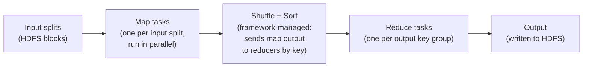
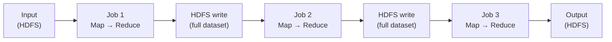
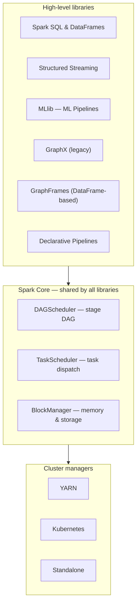
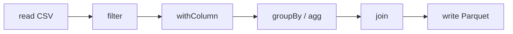

# Chapter 01 — Introduction to Spark

> *Learning-path topic: B1 (Beginner)*
> *Written: 2026-06-05 · Revised: 2026-08-10 · Spark 4.2.0 / Python 3.10+*

---

## Why processing big data matters

The industry characterizes big data by a set of properties — the **Vs of big data** — that together explain why it cannot be handled with tools built for smaller datasets. The classic taxonomy lists five (Volume, Velocity, Variety, Veracity, Value); the six covered below extend it with **Variability**.

**Volume** is the most obvious: the sheer amount of data generated has grown beyond what any single machine can store or process. The total data generated worldwide reached 181 zettabytes in 2025, and the 2026 figure is put at 221 zettabytes — a 22% increase in a single year. By 2029 the projection is 527 zettabytes. What qualifies as "big" shifts as hardware improves; the practical definition is simpler: data is big when it exceeds the capacity of the system you have.

**Velocity** is the speed at which data arrives and must be processed. A payment terminal generates a transaction record on each swipe. A network of IoT sensors emits readings every second. A social media platform logs clicks, impressions, and scroll events continuously. Organizations must process this stream fast enough to act on it — fraud detection must fire before the transaction clears, not after. Data collected faster than it can be processed piles up as a liability rather than an asset.

**Variety** is the diversity of formats. Structured data — relational tables, CSV files — is the minority. Most data arrives as logs, JSON documents, images, sensor readings, or free-form text. A company ingesting customer transaction records alongside social media posts and call-center transcripts must handle all three formats in the same pipeline, cleaning and standardizing before any analysis is possible.

**Veracity** is the trustworthiness of the data. Real-world data is incomplete, inconsistent, and noisy. Sensors drift. Users enter wrong values. Systems fail mid-write and produce partial records. Before data can drive decisions, its accuracy and lineage must be understood — otherwise the analysis is confident but wrong.

**Variability** is the inconsistency of data meaning across sources and time. Two systems may both record "revenue" but use different definitions — one includes tax, one excludes it. A product identifier may change format between the legacy ERP and the new data platform. Without consistent definitions and data contracts, the same pipeline run on the same data produces different numbers depending on which system's interpretation is applied. Variability is a governance problem as much as a technical one — and it is the reason tools like Delta Lake's schema enforcement and Unity Catalog's data contracts exist alongside the compute engine.

**Value** is what ties the other five together. Collecting enormous volumes of high-velocity, multi-format, uncertain, inconsistent data is worthless unless analysis yields decisions that would otherwise be impossible. The big data analytics market is valued at **$244 billion in 2025** and growing at 12.4% per year — not because data itself is valuable, but because extracting the right insight from it is. Some frameworks add a seventh V — **Vulnerability** — the security and privacy risk that scales with data volume: more data means more attack surface, more regulatory exposure (GDPR, CCPA), and higher stakes when a breach occurs.

Together, these properties create processing demands that stress a single machine on every dimension simultaneously. Raw storage capacity runs out first — the data is simply too large to hold. Processing throughput cannot keep pace with high-velocity streams. Variety and variability force the same pipeline to handle multiple formats, schemas, and definitions at once, multiplying the work. And the longer a job runs, the more certain a hardware failure becomes: a crash partway through an hours-long computation loses all progress — there is no redundancy, no partial-result checkpoint, and no path to recovery except starting over from zero. These four pressures — capacity, throughput, heterogeneity, and fault tolerance — are precisely the conditions under which vertical scaling proves inadequate.

### Vertical scaling and its ceiling

The instinct when data grows is to buy a bigger machine — more RAM, more CPUs, faster storage. This is **vertical scaling** (scaling up): concentrate more power in a single node. It works up to a point, and that point arrives sooner than hardware catalogs suggest.

**Hardware ceiling.** A typical server in 2026 carries 1–2 TB of RAM, and even the highest-end machines top out at a handful of terabytes. A streaming platform's daily event log, a bank's transaction history, or a retailer's click-stream can each be orders of magnitude larger. At the physical limit of what a single machine can hold, vertical scaling stops being an option — there is no bigger box to buy.

**Cost curve.** Vertical scaling is not linear in cost. Doubling RAM does not double the machine price — it more than doubles it, because high-density memory and the server chassis to support it command a significant premium. At the extreme end, a fully specced-out single server can cost more than a cluster of twenty commodity machines with the same aggregate resources.

**Processing time.** Even with enough memory, a single CPU can only process so many rows per second. One billion records at one million records per second takes 1,000 seconds — 17 minutes. Add a join, a sort, and an aggregation and a "simple" pipeline becomes an overnight batch job.

**Single point of failure.** A single machine is a single point of failure. If it crashes halfway through a 10-hour job, all progress is lost and the job restarts from zero. No redundancy; no graceful degradation.

### Horizontal scaling: the distributed answer

**Horizontal scaling** (scaling out) takes the opposite approach: instead of one powerful machine, use many ordinary ones. Divide the data into chunks and send each chunk to a different machine. Forty commodity machines each processing 1/40th of the data takes roughly 1/40th of the time. When one machine fails, its work is reassigned to the others and the job continues.

Commodity hardware — the same servers used for web serving, not the specialized equipment needed for vertical scale-up — is cheap, widely available, and replaceable. Cloud providers make horizontal scaling even more accessible: rent the nodes you need for the duration of the job and release them when done.

The challenge is coordination. Dividing the data, routing intermediate results, detecting and recovering from failures, balancing load across nodes that run at different speeds — this is the hard engineering problem that Hadoop and Spark exist to solve. Without a framework, every data engineer writing a distributed job would have to solve all of it from scratch. With one, the programmer writes the logic and the framework handles the rest.

---

## How the industry first solved it: MapReduce and Hadoop

The companies building at this scale in the early 2000s hit those limits first. Google's core product was web search: crawling billions of pages, building and continuously updating an inverted index of the entire web, and serving query results in milliseconds. By 2003 the index was so large that maintaining it required processing petabytes of crawl data across thousands of machines.

Google engineers had been writing a custom distributed program for every new batch job. Each program had to handle the same hard problems from scratch: how to divide input across machines, how to survive machine failures mid-job, how to balance load when some machines are slower than others, how to route intermediate data to the right destination. This was not a small burden — it required distributed-systems expertise from every engineer who touched a data pipeline.

The answer came in two papers.

In **2003**, Google published the **Google File System (GFS)** paper — a distributed filesystem designed to store enormous files reliably across thousands of commodity servers. Each file was split into fixed-size chunks and each chunk was replicated to three machines automatically. A hardware failure became routine rather than catastrophic: the framework simply reread the block from one of its two surviving replicas.

In **2004**, Dean and Ghemawat published **MapReduce: Simplified Data Processing on Large Clusters** (OSDI 2004) — a framework that abstracted all the distributed-systems plumbing behind two functions the programmer supplied: `map` and `reduce`. The framework owned the hard parts: partitioning input, scheduling work across machines, detecting and re-running failed tasks, sorting intermediate data by key, routing each key's values to exactly one reducer, and **data locality** — preferring to run each map task on the machine that already held a replica of its input block (falling back to the same rack, then anywhere), so that processing happened where data lived rather than shipping data across the network.

The result: engineers without distributed-systems backgrounds could write correct, fault-tolerant, parallelized batch jobs — because the framework handled everything they didn't write.

### Apache Hadoop: open-source MapReduce arrives (2006)

Google did not open-source either system. But both papers were public, and Doug Cutting — who was building Nutch, an open-source web crawler at Apache — recognized immediately that he had the same problem. Nutch needed to crawl and index the web on commodity hardware.

Cutting implemented GFS as **HDFS (Hadoop Distributed File System)** and MapReduce as **Hadoop MapReduce**, then factored them out of Nutch into a standalone project. In **January 2006** Yahoo hired Cutting specifically to develop Hadoop there — making Yahoo the founding industrial sponsor. Yahoo stood up a research cluster in March 2006, and Hadoop 0.1.0 shipped in April 2006 — roughly 5,000 lines for HDFS and 6,000 for MapReduce. By the end of 2006 Yahoo had a 600-node Hadoop cluster running in production. In 2008 it graduated to an Apache top-level project, with Facebook, LinkedIn, Twitter, and Netflix running production workloads on it within two years.

Hadoop solved two problems that had previously required either Google-scale engineering teams or expensive proprietary hardware:

- **HDFS** made it possible to store datasets larger than any single machine — reliably and cheaply — on commodity servers, with automatic three-way block replication.
- **Hadoop MapReduce** made it possible to process those datasets in parallel without writing distributed infrastructure from scratch.
- **Data locality** — the scheduler coordinated with HDFS block placement to run each map task on the same node (or same rack) that already held its input block. Computation moved to data rather than the reverse; on a well-loaded cluster, map-phase input read from local disk rather than crossing the network. The fallback order was the same as the original Google paper: same node → same rack → any node.

### The Hadoop MapReduce execution model

Hadoop MapReduce constrains every computation to exactly two phases. The framework owns the execution contract; the user supplies only two functions — `map` and `reduce`:



The rules of the model are strict:

- The **map function** sees one record at a time and emits zero or more `(key, value)` pairs.
- The **shuffle + sort** phase is entirely framework-managed. Every map output is sorted by key and routed to the reducer responsible for that key. The user has no control over this.
- The **reduce function** sees one key at a time, together with an iterator over all values for that key, and emits output records.
- The output of the reduce phase is written to HDFS before the next job can start.

**Word count in MapReduce** — the canonical example that shows exactly what the user supplies vs what the framework owns:

```java
// Mapper: one record in (a line of text), many (word, 1) pairs out
public class TokenizerMapper
    extends Mapper<Object, Text, Text, IntWritable> {

  private final IntWritable one = new IntWritable(1);
  private final Text word = new Text();

  public void map(Object key, Text value, Context context)
      throws IOException, InterruptedException {
    StringTokenizer itr = new StringTokenizer(value.toString());
    while (itr.hasMoreTokens()) {
      word.set(itr.nextToken());
      context.write(word, one);   // emit ("word", 1) for every token
    }
  }
}

// Reducer: one key + all its values in, one (word, total) out
public class IntSumReducer
    extends Reducer<Text, IntWritable, Text, IntWritable> {

  private final IntWritable result = new IntWritable();

  public void reduce(Text key, Iterable<IntWritable> values, Context context)
      throws IOException, InterruptedException {
    int sum = 0;
    for (IntWritable val : values) sum += val.get();
    result.set(sum);
    context.write(key, result);   // emit ("word", total_count)
  }
}
```

The framework handles everything between: partitioning map output by key, sorting within each partition, and routing each key's values to exactly one reducer. The user supplies only `map` and `reduce`.

**The chaining problem.** Consider a realistic pipeline: (1) filter out log lines with a malformed timestamp, (2) join the cleaned logs against a users table to enrich each row with a country code, (3) count events per country. In MapReduce each step is a separate job — Job 1 writes filtered logs to HDFS, Job 2 reads them back to do the join and writes enriched rows to HDFS, Job 3 reads those back to count. Job 2 cannot start until Job 1 has finished writing its complete output. Every logical step adds a full HDFS read and write round-trip:



A machine learning algorithm with 100 iterations triggers 100 separate MapReduce jobs — 100 full reads of the training dataset from disk and 100 writes of intermediate results back to HDFS.

**What MapReduce cannot express without multiple jobs:**

- A join followed by a second aggregation
- An iterative algorithm (ML training, graph algorithms like PageRank)
- A windowed operation over groups
- Any computation that requires two separate passes over the same data

Each of these requires chaining separate jobs, each with its own disk round-trip — a cost paid on every operation, regardless of how small.

---

## Why Spark exists

The motivation for Spark comes directly from Matei Zaharia's 2010 paper *"Spark: Cluster Computing with Working Sets"* (UC Berkeley). Understanding that motivation explains every major design decision in Spark.

### MapReduce's constraint: acyclic data flows

Hadoop MapReduce solved distribution, fault tolerance, and load balancing on commodity clusters — but it enforced a strict constraint on computation structure: all computation had to fit into **acyclic data flow graphs**, one full Map → Reduce cycle per job. Spark's execution model is also a DAG; acyclicity itself is not what Zaharia was criticizing. The difference is grain size:

| | MapReduce | Spark |
|---|---|---|
| DAG node | One full job (Map phase + Reduce phase) | One operator (`filter`, `groupBy`, `join`, …) |
| Data between nodes | Mandatory HDFS write + read | In-memory pipeline within a stage; disk only at shuffle boundaries |
| Working-set reuse | Impossible — every job rereads from disk | `.cache()` keeps partitions in executor memory across actions |

!!! note "Note — two levels of DAG in Spark"
    The "one operator per DAG node" description applies to the *logical plan* (the Catalyst tree the optimizer rewrites). At *execution* time the DAGScheduler works with **stages**, not individual operators: consecutive narrow operators (`filter → withColumn → select`) collapse into a single stage and run as one pipeline pass, with no materialization between them. Wide operators (`groupBy`, `join`) introduce a shuffle boundary and start a new stage. So the logical DAG is operator-grained; the execution DAG is stage-grained. The table captures the right spirit — Spark's unit of work is far more granular than a MapReduce job — but the execution node is a stage, not a single operator.

Two classes of workloads exposed this cost directly:

**1. Iterative machine learning.** Training algorithms like logistic regression or k-means apply a function to the same dataset repeatedly — often dozens or hundreds of times — updating a parameter vector on each pass. With MapReduce, every iteration is a separate job. Every iteration reloads the full dataset from HDFS. A logistic regression that needs 50 iterations triggers 50 full HDFS reads of the training data.

Zaharia measured this directly: on a 29 GB dataset on 20 EC2 nodes, Hadoop took **127 seconds per iteration**. After the first iteration, Spark took **6 seconds** — because it kept the dataset in memory. The job ran 10× faster overall.

**2. Interactive analytics.** Hadoop is often used to run ad-hoc exploratory queries over large datasets, via SQL interfaces like Hive or Pig. Ideally, a user loads a dataset once and queries it repeatedly. With MapReduce, every query is a separate job reading from disk, incurring tens of seconds of latency per query.

Zaharia demonstrated this too: a 39 GB Wikipedia dump queried interactively — first query took 35 seconds (comparable to a Hadoop job), subsequent queries took **0.5–1 second**, because the dataset was cached in memory across machines.

### The insight: working sets

Both problems — iterative ML and interactive analytics — share the same root cause. MapReduce cannot express computations that **reuse a working set of data across multiple parallel operations**. A *working set* is the dataset a job needs to access repeatedly — the training corpus read on every ML iteration, or the table a user queries interactively. The term comes from OS virtual memory theory (Denning, 1968), where it denotes the pages a process actively uses in a given time window; Zaharia applied it to distributed data that should stay in memory across operations. The acyclic data flow model forces everything through disk.

Spark's solution was a new abstraction: the **Resilient Distributed Dataset (RDD)** — a read-only, partitioned collection of objects that can be cached in memory across operations. Users can explicitly cache an RDD after the first computation and reuse it in subsequent operations without re-reading from disk. RDDs have no durable storage format: they exist only during execution, and any cached data is released when the application ends. Persisting results beyond the job means writing to an external format — Parquet, text, Delta — not "saving an RDD."

Spark reads and writes HDFS natively — a path like `hdfs://namenode:8020/data/events/` works wherever Spark accepts a file path. Spark uses Hadoop's `FileSystem` API internally, so the same code works against HDFS on a Hadoop cluster, S3 on AWS (`s3a://`), GCS on Google Cloud (`gs://`), or Azure Data Lake (`abfss://`). HDFS was the dominant storage backend in the Hadoop era; most cloud deployments today use object storage instead, but the lineage model works identically — "original source in durable storage" means whatever filesystem the cluster uses.

The files Spark reads from — whether on HDFS, S3, or GCS — are already protected by the storage layer's own replication. But during a Spark job, the results of intermediate transformations — a filtered RDD, an aggregated RDD, a joined RDD — live only in executor memory. They are never written back to storage between steps; that is precisely what gives Spark its speed advantage over MapReduce. If an executor crashes, its in-memory partitions are gone with no replica anywhere — the storage layer cannot help with data that was never written to disk.

To counter this, Spark uses **lineage**. Every RDD records how it was derived — which parent RDD it came from and which transformation produced it. This chain of derivations reaches all the way back to the original source data, which is durably stored in HDFS or S3. Crucially, the lineage graph lives in the **driver** — the separate JVM process that runs the user's main program — not in the executors. Executors compute partition data when tasks run, and retain it only if the RDD is explicitly cached; the driver holds the recipe regardless. When an executor crashes, the driver is still alive and still holds the complete lineage. The DAGScheduler (running in the driver) detects the failed tasks, walks the lineage it already has, and schedules recomputation of only the lost partitions on surviving executors. The rest of the job continues uninterrupted. Lineage is what makes it safe to keep intermediate results only in memory: you never need a replica, because you can always rebuild. The driver going down is a different failure mode — it kills the entire application, because the lineage lives there.

The full anatomy of a Spark application — driver, cluster manager, executors, and the DAGScheduler/TaskScheduler path from an action to a running task — is covered in **Chapter 02 (B1 — Spark Architecture and the Execution Model)**. The RDD API itself, including the five-part interface from the 2012 paper and the transformation catalog, is covered in **Chapter 05 (I4 — RDD Fundamentals)**.

### From RDDs to the DataFrame API

RDDs were Spark's original API. The DataFrame API (Spark 1.3) built on top of them, adding the Catalyst optimizer and a relational programming model. DataFrames are backed by `RDD[InternalRow]` internally and have the same ephemeral lifecycle as RDDs. `df.write.parquet(...)` saves to Parquet; there is no "save as DataFrame." The two working-set properties from the 2010 paper survive intact:

- **Working-set reuse.** `df.cache()` marks a DataFrame so its partitions are kept in executor memory after the first action — subsequent actions read from memory instead of recomputing from source.
- **Lineage-based fault recovery.** If a cached partition is evicted, Spark replays the Catalyst logical plan lineage for that partition from the original source — no checkpoint needed.

Caching is a decision with real trade-offs — which storage level to pick, when memory pressure evicts a cached partition, and when `checkpoint()` beats `cache()`. Those are covered in **Chapter 17 (I6 — Caching and Persistence)**.

### Spark as a unified engine

SQL, Streaming, ML, graph processing, and declarative pipelines all run as libraries over the same core — sharing the same execution engine, fault tolerance, and memory model.



Because all libraries share the same in-memory data representation — the DataFrame, backed by `RDD[InternalRow]` internally — data flows from a SQL query into an MLlib pipeline or a Streaming job without copying or serializing between engines. This is why Spark is called unified rather than a collection of separate tools.

For graph processing the picture is split: **GraphX** is the original RDD-based library and is now effectively frozen (no DataFrame API, no Python bindings). **GraphFrames** is the DataFrame-based successor — it runs on the same core and integrates with the rest of the stack — but it ships as a separate package (`graphframes`) rather than in the core Spark distribution, so it must be added explicitly (e.g. `--packages graphframes:graphframes:…`).

---

## From research prototype to standard: the project timeline

The 2010 paper describes a research prototype. Everything a reader uses today — DataFrames, Catalyst, Structured Streaming, Spark Connect — arrived later. The timeline explains why the API has layers that look redundant: each one was added on top of the previous without removing it.

| Date | Milestone |
|---|---|
| 2009 | Started as a research project at the UC Berkeley AMPLab |
| Early 2010 | Open sourced |
| 2010 | HotCloud paper — *Spark: Cluster Computing with Working Sets* |
| 2012 | NSDI paper — *Resilient Distributed Datasets* — formalizes the RDD |
| 2013 | Donated to the Apache Software Foundation; Databricks founded by the creators |
| 2014-02-27 | Becomes an Apache top-level project |
| 2014-05-30 | **Spark 1.0.0** — the RDD API stabilizes |
| 2014-11-05 | Wins the Daytona GraySort 100 TB benchmark |
| 2015 | **Spark 1.3** — the DataFrame API and Catalyst; Project Tungsten follows in 1.4–1.6 |
| 2016-07-26 | **Spark 2.0.0** — Datasets, `SparkSession` as the single entry point, Structured Streaming |
| 2020-06-18 | **Spark 3.0.0** — Adaptive Query Execution, dynamic partition pruning, `spark.sql.ansi.enabled` introduced (default `false`) |
| 2025-05-23 | **Spark 4.0.0** — ANSI mode on by default, Spark Connect enabled in its own distribution, the `VARIANT` type, the Python Data Source API |
| 2025-12-16 | **Spark 4.1.0** |
| 2026-07-14 | **Spark 4.2.0** — native geospatial types, Change Data Capture, Arrow-optimized Python UDFs on by default |

Three of these turns matter more than the rest.

**Spark 1.3 changed what the user writes.** The RDD API takes arbitrary functions — Spark cannot see inside a lambda, so it cannot rewrite the computation. The DataFrame API takes a *relational description* instead, which Catalyst can inspect and rewrite. This is why the DataFrame API is not merely a convenience wrapper: it is what makes optimization possible at all. Catalyst's rule set and the physical planning that follows are covered in **Chapter 22 (A1 — Query Optimization: Catalyst and the Physical Plan)**.

**Spark 2.0 unified the entry point.** Before it, `SparkContext`, `SQLContext`, and `HiveContext` were separate objects with overlapping responsibilities. `SparkSession` replaced all three. Old tutorials still open with `sc = SparkContext(...)`; that is the pre-2.0 idiom. **Chapter 04 (B2 — SparkSession and Entry Points)** covers what `getOrCreate()` actually returns and how a session is configured.

**Spark 4.0 changed the defaults.** ANSI mode means a numeric overflow or a division by zero raises an error instead of silently returning `null`. The config is `spark.sql.ansi.enabled` — added in 3.0.0 with default `false`, flipped to `true` in 4.0. In 4.2.0 the default is computed from the environment: it is `true` unless `SPARK_ANSI_SQL_MODE` is set to `false`. Code written against Spark 3.x that relied on silent nulls will now fail loudly. That is the intended behavior, not a regression.

---

## Language APIs: which one, and what it costs

Spark itself is written in Scala and runs on the JVM. It exposes four language APIs plus SQL:

- **Scala** — the native API; new features land here first
- **Java** — the same JVM API with Java-friendly signatures
- **Python (PySpark)** — the dominant API in data engineering and the one this book uses
- **R (SparkR / sparklyr)** — smallest surface area, least active
- **SQL** — not a client library but a first-class dialect; `spark.sql("SELECT …")` returns a DataFrame identical to one built through the Python API

Spark 4.2.0 requires **Java 17 or later**, **Scala 2.13**, and **Python 3.10 or later** (3.10 through 3.14 are declared supported).

The important point for a Python user is where the language boundary actually sits. A PySpark DataFrame operation does not process data in Python. `df.filter(F.col("x") > 10)` builds a Catalyst expression tree in the JVM and returns immediately; the rows are read, filtered, and written entirely inside JVM executors. Python holds a handle to a plan, not to data. So DataFrame code in Python runs at the same speed as the equivalent Scala code — the optimizer sees the same tree either way.

The cost appears only when a computation must run *in Python* — a Python UDF, `rdd.map(lambda …)`, or `toPandas()`. There, every row crosses the JVM↔Python process boundary and must be serialized on the way out and back. Spark 4.2.0 makes Arrow-optimized Python UDFs and Arrow-based PySpark IPC the default, which cuts that cost substantially but does not remove the boundary. The practical rule follows directly: express work with built-in functions wherever possible, and reach for a Python UDF only when nothing built-in covers it. **Chapter 15 (I3 — User-Defined Functions)** covers the UDF types, the Arrow path, and how to measure the crossing cost.

!!! note "Note — Spark Connect changes where the client runs"
    Since Spark 4.0 a PySpark client can run as a thin process that sends an unresolved logical plan to a remote Spark server over gRPC, rather than driving a co-located JVM driver through Py4J. That decouples the client from the cluster's Java and Scala versions entirely. The two modes — classic and Connect — are covered in **Chapter 04 (B2 — SparkSession and Entry Points)**.

---

## Spark's DAG model: what replaces map + reduce

Spark replaces the rigid two-phase contract with a **Directed Acyclic Graph (DAG)** of arbitrary transformations. There is no "map phase" and "reduce phase" — there are **transformations** (lazy, produce a new RDD or DataFrame describing the computation to be done) and **actions** (trigger execution, return a result or write output).



The user builds this graph by writing transformation calls. The graph exists only as a description in the driver until an action is called — no executor computation (tasks on workers) occurs until then.

When an action fires, the **DAGScheduler** receives the full graph and compiles it into a physical execution plan. It does not process one step at a time the way Hadoop processes one job at a time — it sees the whole picture before execution begins.

**The key consequence:** intermediate results between consecutive narrow transformations are never written anywhere. They flow directly from one operation to the next inside the same executor, in the same CPU pass, without touching memory as a materialized object. This is why a chain of ten `filter` and `select` calls costs no more than one.

The transformation/action split and what laziness buys the optimizer are developed in **Chapter 02 (B1 — Spark Architecture and the Execution Model)**; the transformation catalog itself is in **Chapter 06 (B3 — The DataFrame API: Basics)**.

---

## Where Spark still resembles MapReduce

Spark was designed as a reaction to MapReduce's limitations, but it kept the parts that worked. Understanding what it inherited is just as important as understanding what it changed.

**The shuffle mechanism.** Spark's shuffle is mechanically similar to MapReduce's shuffle+sort. When a wide operation (`groupBy`, `join`) triggers a stage boundary, map-side tasks sort and write partitioned output to local disk, and reduce-side tasks fetch from those files across the network. The difference is scope: this only happens at stage boundaries, not between every logical step. The underlying protocol — map tasks register their output location with a central tracker, reducers fetch by partition index — is the same pattern MapReduce established.

**The stage model.** Each wide dependency creates a `ShuffleMapStage` boundary. There is exactly one `ResultStage` per job — always the terminal stage that runs the action. A job with one shuffle produces `ShuffleMapStage → ResultStage`; a job with two shuffles produces `ShuffleMapStage → ShuffleMapStage → ResultStage`. The naming echoes MapReduce: `ShuffleMapStage` tasks return `MapStatus` objects to the driver, and the `MapOutputTracker` coordinates where output lives — the same shuffle protocol MapReduce established, applied at each stage boundary.

**Data locality.** Both MapReduce and Spark prefer to run tasks where data already lives — on the same node, or at least the same rack — to avoid unnecessary network transfer. Spark's `TaskScheduler` uses the same locality levels (PROCESS_LOCAL → NODE_LOCAL → RACK_LOCAL → ANY) and waits a configurable period at each level before falling back.

**Key-value operations.** At the RDD level, Spark's model is explicitly key-value: `reduceByKey`, `groupByKey`, `combineByKey`, `mapToPair`. These are direct analogues of MapReduce's emit/reduce pattern. The DataFrame API abstracts this away, but the RDD layer underneath still speaks in keys and values.

The rule that decides where a stage boundary falls — narrow versus wide dependencies — and the mechanics of the shuffle write and fetch are covered in **Chapter 02 (B1 — Spark Architecture and the Execution Model)**. How to pick a join strategy so a shuffle is avoided altogether is covered in **Chapter 24 (A3 — Join Strategies and Tuning)**.

**Partition model and commodity hardware.** Both divide data into chunks and assign one task per chunk. HDFS blocks are fixed-size (128 MB by default); RDD partitions are logical divisions whose count and size depend on the source and configuration — when reading from HDFS, each partition maps to one block, but after a `repartition()` or `coalesce()` the sizes vary. Both systems assume commodity hardware and treat machine failures as routine, not exceptional.

---

## Storage backends Spark supports

For file-based storage, Spark reads and writes any system that implements the Hadoop `FileSystem` API — the URI scheme in the path determines which connector is used:

| Storage | URI scheme | Notes |
|---|---|---|
| HDFS | `hdfs://` | Built-in; true data locality |
| Local filesystem | `file://` | Single-node only |
| Amazon S3 | `s3a://` | Preferred; `s3n://` is legacy |
| Google Cloud Storage | `gs://` | Via GCS connector |
| Azure Blob Storage | `wasb://` | Legacy; use `abfss://` (ADLS Gen2) |
| Azure Data Lake Gen 2 | `abfs://` / `abfss://` | |
| Alibaba Cloud OSS | — | Via JindoFS SDK |
| OpenStack Swift | — | Via Stocator |

Spark also connects to sources outside the `FileSystem` API entirely:

- **JDBC databases** (PostgreSQL, MySQL, Oracle) — via `spark.read.jdbc()` using the JDBC protocol
- **Kafka** — Structured Streaming reads and writes via the Kafka consumer/producer protocol
- **Cassandra / HBase / DynamoDB** — via dedicated connectors with their own native protocols
- **In-memory** — `sc.parallelize()`, `spark.range()`, `spark.createDataFrame()` use no storage at all

Delta Lake, Iceberg, and Hudi are not filesystems — they are table formats (transaction log + Parquet files) that sit on top of any file-based backend above.

**Data locality caveat.** The locality levels discussed in the MapReduce comparison (`PROCESS_LOCAL → NODE_LOCAL → RACK_LOCAL → ANY`) are effectively HDFS concepts. Cloud object stores (S3, GCS, ADLS) are remote storage — there is no co-located block to schedule a task against. On cloud clusters the scheduler always falls through to `ANY`, so locality optimization is meaningful only when running Spark against HDFS on a co-located cluster.

Reading from and writing to each of these backends — the format options, the partitioned-write layout, and the save modes — is covered in **Chapter 07 (B4 — Reading and Writing Data)**. Delta Lake as a table format sits in **Chapter 19 (I8 — Delta Lake Basics)**.

---

## MapReduce vs Spark, side by side

| | MapReduce | Spark |
|---|---|---|
| **Execution model** | Strictly two phases: Map → Reduce | Arbitrary DAG of transformations and actions |
| **Data between steps** | Full HDFS write + read between every job | In-memory pipeline; disk only at shuffle boundaries |
| **Working-set reuse** | Impossible — every job rereads from disk | `.cache()` keeps partitions in executor memory |
| **Iterative workloads** | 100 iterations = 100 full HDFS reads | After first load, subsequent iterations read from memory |
| **Measured speedup** | Baseline | 10× faster on iterative ML (Zaharia 2010), up to 20× with RDDs (Zaharia 2012); on the cached 39 GB interactive workload above, a 35 s first query fell to 0.5–1 s once cached |
| **Fault tolerance** | Rerun the job from checkpointed HDFS output | Lineage: recompute only the lost partition |
| **Optimization** | None — user controls all efficiency | Catalyst: predicate pushdown, column pruning, join reordering, broadcast selection |
| **API** | Java `map()` and `reduce()` functions | Python/Scala/Java/R — DataFrames, SQL, Streaming, MLlib |
| **Shuffle** | Framework-managed; runs between every Map→Reduce pair | Only at wide dependency (stage boundary) |
| **Storage** | HDFS | HDFS, S3, GCS, Delta Lake, JDBC, Kafka, local FS |
| **Latency** | Minutes to hours (disk I/O dominates) | Seconds to minutes (in-memory pipeline) |
| **What Spark kept from MapReduce** | — | Partition model, shuffle protocol, data locality, key-value primitives |

Spark dominates MapReduce on every iterative and interactive workload. The one scenario where MapReduce's simplicity still has an argument: a single-pass batch ETL job over HDFS with no data reuse, no joins requiring tuning, and a small operations team — there MapReduce's lower memory footprint and operational familiarity can outweigh Spark's overhead.

---

## Where Spark doesn't shine

Spark is genuinely excellent for large-scale distributed batch processing, iterative ML, and unified pipelines. It is not the right tool for every data problem, and reaching for it by default is a common mistake.

**Data that fits on one machine.** Spark's startup cost — JVM initialization, executor allocation, task scheduling overhead — is real. For a dataset that fits in a laptop's RAM or can be queried from a single Parquet file, DuckDB finishes in milliseconds where Spark is still initializing. The rule of thumb: if pandas or DuckDB can hold the data without swapping, use them. Spark earns its keep when the data genuinely requires multiple machines.

**Sub-second streaming.** Structured Streaming is micro-batch: it accumulates events into small batches and processes them on a configurable interval (down to ~100ms, but not zero). For workloads that require true event-at-a-time semantics — fraud detection that must fire before a transaction clears, CEP rules that depend on event ordering within milliseconds — Apache Flink's continuous processing model is the right fit. Spark streaming latency is measured in hundreds of milliseconds to seconds; Flink's is measured in single-digit milliseconds. The micro-batch model itself — triggers, offsets, and end-to-end guarantees — is covered in **Chapter 28 (A7 — Structured Streaming: Fundamentals)**.

**Interactive federated SQL across heterogeneous sources.** Trino (formerly PrestoSQL) is designed for low-latency ad-hoc SQL over data that lives in S3, PostgreSQL, Kafka, and Snowflake simultaneously, without moving or ingesting data first. Spark SQL requires data to reach a Spark-readable source (HDFS, S3, Delta Lake) before queries can run. For an analyst who wants to join a Hive table against a live PostgreSQL table and query the result in under two seconds, Trino is the more direct answer.

**Distributed ML at fine-grained parallelism.** MLlib covers the standard algorithms but its algorithm coverage is limited compared to the PyTorch/TensorFlow ecosystem, and its data-parallel model does not map well to model-parallel training or hyperparameter search over thousands of trials. Ray's task graph is a better fit for distributed hyperparameter tuning, reinforcement learning, and serving, where individual tasks are short, heterogeneous, and communicate more frequently than a shuffle boundary allows.

**Datasets that won't fit in memory and must spill repeatedly.** Spark's performance advantage is built on in-memory execution. When the working set is too large to cache and tasks must spill shuffle data to disk repeatedly, the overhead can negate the parallelism benefit. At that point, purpose-built disk-oriented systems (or more executor memory) are the right answer.

**Operational teams without distributed systems expertise.** Spark clusters require ongoing tuning — `spark.sql.shuffle.partitions`, memory fractions, serialization, skew handling, GC pressure. For a team of one or two engineers maintaining a handful of pipelines, a managed service (BigQuery, Databricks Serverless, Athena) or a simpler tool (DuckDB + dbt) may have meaningfully lower operational cost.

| Scenario | Better tool |
|---|---|
| Dataset fits on one machine | DuckDB, pandas |
| Sub-second / event-at-a-time streaming | Apache Flink |
| Interactive federated SQL, no ingestion | Trino / Presto |
| Distributed ML training, hyperparameter search | Ray, PyTorch distributed |
| Small team, managed simplicity preferred | BigQuery, Databricks Serverless, Athena |
| General-purpose large-scale batch + ML + streaming | **Spark** |

---

## Exercises

1. **Recall** — MapReduce and Spark both shuffle, both partition data, and both prefer local data. Name the one structural difference that produces Spark's speed advantage, and explain why it also creates a fault-tolerance problem that MapReduce did not have.

2. **Recall** — A colleague says "Spark is faster because it's in-memory and Hadoop is on-disk." State what is wrong with that sentence, and give the more precise version.

3. **Apply** — Take the three-step pipeline from the chaining problem (filter malformed rows → join a users table → count per country). Write down how many full dataset writes to durable storage MapReduce performs, and how many Spark performs. Justify each number by naming what forces the write.

4. **Apply** — For each of these, decide whether Spark is the right tool and name the alternative if it is not: (a) a 400 MB CSV joined against a 2 MB lookup table, once a day; (b) a fraud rule that must reject a card transaction within 20 ms; (c) an analyst joining a Hive table against a live PostgreSQL table, expecting a result in two seconds; (d) 40 TB of daily clickstream aggregated into a reporting table.

5. **Extend** — The chapter claims lineage removes the need to replicate intermediate results. Find the failure mode where lineage-based recovery is *more* expensive than a replica would have been, and describe what Spark offers to escape it. (Hint: consider a lineage chain a hundred stages long, and see **Chapter 17 (I6 — Caching and Persistence)**.)

6. **Extend** — `spark.sql.ansi.enabled` flipped to `true` in Spark 4.0. Find one expression that returns `null` under Spark 3.5 and raises an error under 4.2.0, and decide whether the new behavior would have caught a bug or broken a pipeline in work you have done.

---

## Summary

- **Big data is defined by the system, not the byte count.** Data is "big" when it exceeds what one machine can hold or process in time. Volume, Velocity, Variety, Veracity, Variability, and Value each apply pressure that vertical scaling cannot relieve indefinitely.
- **Horizontal scaling trades a hardware problem for a coordination problem.** Splitting work over many commodity machines is cheap and elastic; the hard part is partitioning, routing, failure recovery, and load balancing — which is exactly the part a framework exists to own.
- **MapReduce solved coordination but fixed the shape of computation.** Every job is one Map phase and one Reduce phase, and every job's output goes to HDFS before the next can start. Any multi-step pipeline pays a full disk round-trip per step.
- **Spark's contribution is the working set.** An RDD is a partitioned, read-only collection that can stay in executor memory across operations, so an iterative or interactive workload loads the data once instead of once per pass.
- **Lineage replaces replication.** The driver holds the recipe for every partition. When an executor dies, only the lost partitions are recomputed — which is what makes it safe to keep intermediate results in memory alone.
- **Spark kept more of MapReduce than it discarded.** The shuffle protocol, the partition-per-task model, data locality levels, and key-value primitives all carried over. What changed is *how often* the expensive parts run: at stage boundaries, not between every step.
- **The DataFrame API is what makes optimization possible.** A relational description can be rewritten by Catalyst; an arbitrary lambda cannot be inspected. This is the reason to prefer built-in functions over UDFs.
- **Spark is not the default answer.** Data that fits on one machine, millisecond-latency streaming, federated interactive SQL, and fine-grained distributed ML each have a better tool.
- Chapter 02 takes the execution model apart: driver, cluster manager, executors, and the path from an action to a running task.

---

## References

- [Zaharia et al. — Spark: Cluster Computing with Working Sets (HotCloud 2010)](https://www.usenix.org/legacy/event/hotcloud10/tech/full_papers/Zaharia.pdf)
- [Zaharia et al. — Resilient Distributed Datasets: A Fault-Tolerant Abstraction for In-Memory Cluster Computing (NSDI 2012)](https://www.usenix.org/system/files/conference/nsdi12/nsdi12-final138.pdf)
- [Dean & Ghemawat — MapReduce: Simplified Data Processing on Large Clusters (OSDI 2004)](https://research.google.com/archive/mapreduce-osdi04.pdf)
- [Apache Spark history](https://spark.apache.org/history.html)
- [Apache Spark news archive — release announcement dates](https://spark.apache.org/news/index.html)
- [Spark Release 1.3.0 — the DataFrame API](https://spark.apache.org/releases/spark-release-1-3-0.html)
- [Spark Release 4.0.0 — ANSI by default, Spark Connect, VARIANT, Python Data Source API](https://spark.apache.org/releases/spark-release-4-0-0.html)
- [Spark Release 4.2.0 — geospatial types, CDC, Arrow-optimized Python UDFs](https://spark.apache.org/releases/spark-release-4-2-0.html)
- `spark.sql.ansi.enabled` — verified in `sql/catalyst/src/main/scala/org/apache/spark/sql/internal/SQLConf.scala:5180` at tag `v4.2.0` (`.version("3.0.0")`, default derived from `SPARK_ANSI_SQL_MODE`)
- [TechTarget — 5 Vs of Big Data](https://www.techtarget.com/searchdatamanagement/definition/5-Vs-of-big-data)
- [Integrate.io — 7 Vs of Big Data](https://www.integrate.io/blog/7-vs-big-data/)
- [AWS — Hadoop vs Spark](https://aws.amazon.com/compare/the-difference-between-hadoop-vs-spark/)
- [Statista — Volume of data created, captured, copied, and consumed worldwide (181 ZB 2025, 221 ZB 2026, forecast to 2029)](https://www.statista.com/statistics/871513/worldwide-data-created/)
- [Maximize Market Research — Big Data Market size ($244B in 2025, 12.4% CAGR)](https://www.maximizemarketresearch.com/market-report/global-big-data-market/66349/)

