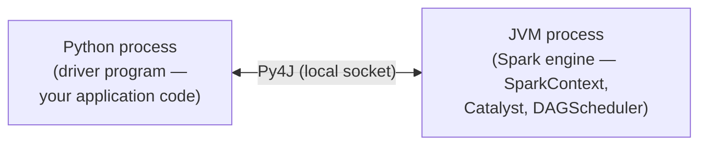
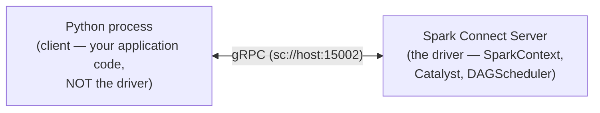
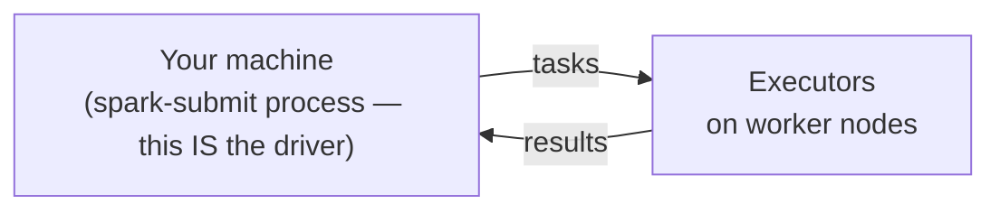
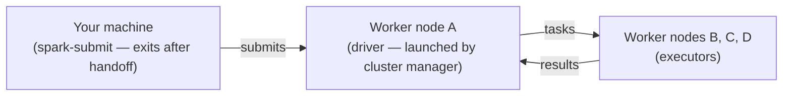

# Chapter 01 — Spark Architecture and the Execution Model

> *Learning-path topic: B1 (Beginner)*
> *Written: 2026-05-31 · Spark 4.1.x / Python 3.10+*

Apache Spark is a distributed analytics engine. Understanding how it distributes work — and why — is the foundation every debugging and tuning decision rests on. Get this mental model right and most Spark surprises become predictable.

---

## What you'll learn

- How a Spark cluster is organised: driver, executors, worker nodes, cluster manager
- Why Python code can be fast despite running in a separate process from the JVM
- What lazy evaluation is and why it exists
- The difference between a transformation and an action
- How to install and run Spark, and what `--master` and `--deploy-mode` mean

---

## The problem this solves

The motivation for Spark comes directly from Matei Zaharia's 2010 paper *"Spark: Cluster Computing with Working Sets"* (UC Berkeley). Understanding that motivation explains every major design decision in Spark.

### MapReduce's constraint: acyclic data flows

By 2010, Hadoop MapReduce was the dominant large-scale data processing framework. It solved distribution, fault tolerance, and load balancing on commodity clusters — but it enforced a strict constraint: all computation had to be expressed as **acyclic data flow graphs**. Each MapReduce job reads from disk, applies map and reduce functions, and writes results back to HDFS. There is no way to carry data in memory from one job to the next.

This constraint is fine for single-pass batch jobs. It breaks down for two classes of applications that Hadoop users were struggling with:

**1. Iterative machine learning.** Training algorithms like logistic regression or k-means apply a function to the same dataset repeatedly — often dozens or hundreds of times — updating a parameter vector on each pass. With MapReduce, every iteration is a separate job. Every iteration reloads the full dataset from HDFS. A logistic regression that needs 50 iterations triggers 50 full HDFS reads of the training data.

Zaharia measured this directly: on a 29 GB dataset on 20 EC2 nodes, Hadoop took **127 seconds per iteration**. After the first iteration, Spark took **6 seconds** — because it kept the dataset in memory. The job ran 10× faster overall.

**2. Interactive analytics.** Hadoop is often used to run ad-hoc exploratory queries over large datasets, via SQL interfaces like Hive or Pig. Ideally, a user loads a dataset once and queries it repeatedly. With MapReduce, every query is a separate job reading from disk, incurring tens of seconds of latency per query.

Zaharia demonstrated this too: a 39 GB Wikipedia dump queried interactively — first query took 35 seconds (comparable to a Hadoop job), subsequent queries took **0.5–1 second**, because the dataset was cached in memory across machines.

### The insight: working sets

Both problems have the same root cause. MapReduce cannot express computations that **reuse a working set of data across multiple parallel operations**. The acyclic data flow model forces everything through disk.

Spark's solution was a new abstraction: the **Resilient Distributed Dataset (RDD)** — a read-only, partitioned collection of objects that can be cached in memory across operations. Users can explicitly cache an RDD after the first computation and reuse it in subsequent operations without re-reading from disk.

Fault tolerance comes not from replication but from **lineage**: each RDD knows how it was derived from its parent. If a partition is lost, Spark recomputes only that partition from the original source — without rolling back the entire job to a checkpoint.

### Why this matters for the DataFrame API

RDDs were Spark's original API. The DataFrame API (Spark 1.3+) is built on top of RDDs, adding a schema and a query optimiser (Catalyst). When you write `df.filter(...).groupBy(...).count()`, Spark builds an RDD lineage graph underneath. The in-memory caching and lineage-based fault tolerance from the 2010 paper are still the foundation.

### Spark version milestones

| Version | Date | Key addition |
|---|---|---|
| Research paper | 2010 | RDDs, lineage-based fault tolerance, in-memory caching (Zaharia et al., UC Berkeley) |
| Open sourced | 2010 | Public release; Scala API only |
| Apache incubator | 2013 | Moved to Apache Software Foundation |
| **1.0** | May 2014 | First stable release; Spark SQL; Java + Python APIs |
| **1.3** | Mar 2015 | **DataFrame API** — schema + Catalyst optimiser on top of RDDs |
| **1.6** | Jan 2016 | **Dataset API** — typed DataFrames (Scala/Java) |
| **2.0** | Jul 2016 | **SparkSession** replaces SQLContext/HiveContext; **Structured Streaming** replaces DStreams; Dataset API recommended |
| **2.1** | Dec 2016 | `pip install pyspark` — JARs bundled in wheel ([PR #15659](https://github.com/apache/spark/pull/15659)) |
| **2.2** | Jul 2017 | Structured Streaming **GA**; pip officially announced |
| **2.4** | Nov 2018 | **pandas UDFs** with Apache Arrow (vectorised UDFs); LTS release |
| **3.0** | Jun 2020 | Python 2 dropped; **type-hint pandas UDFs**; Adaptive Query Execution (AQE); ANSI mode opt-in |
| **3.2** | Oct 2021 | **pandas API on Spark** (Koalas merged); AQE on by default |
| **3.4** | Apr 2023 | **Spark Connect** — decoupled gRPC client-server architecture |
| **3.5** | Sep 2023 | Spark Connect GA (Scala + Go clients); LTS release |
| **4.0** | May 2025 | **ANSI mode on by default**; `pyspark-client` (Connect-only, no JVM); `spark.api.mode`; Python 3.10+ / JDK 17+ required |
| **4.1** | Dec 2025 | **Spark Declarative Pipelines**; `spark-submit` improvements; current stable line |

The chapters in this book map to the modern API surface (Spark 4.1.x). RDDs appear only in Chapter 13; everything else uses the DataFrame/SparkSession API that arrived in 1.3–2.0.

**How other tools approach the same problem:**

| Tool | Model | Latency | Best for |
|---|---|---|---|
| **Hadoop MapReduce** | Batch, acyclic, disk-bound | Minutes to hours | Large single-pass batch ETL |
| **Apache Spark** | In-memory, iterative + batch + streaming | Seconds to minutes | General-purpose: batch, ML, SQL, near-real-time |
| **Apache Flink** | True event-at-a-time streaming | Sub-second | Real-time stateful streams requiring precise ordering |
| **Dask** | Parallel Python (pandas/NumPy) | Depends on hardware | Data science workloads outgrowing a single machine |
| **Ray** | Distributed Python task graph | Low | Distributed ML training, hyperparameter search |
| **Trino/Presto** | Federated interactive SQL | Sub-second for queries | Querying data in-place across multiple sources without ingestion |

Spark is the most general-purpose of these. The trade-off is that specialised engines outperform it in their target domain: Flink for sub-second streaming, Trino for interactive federated SQL, Ray for fine-grained ML parallelism.

Sources: [Zaharia et al. — Spark: Cluster Computing with Working Sets (2010)](https://www.usenix.org/legacy/event/hotcloud10/tech/full_papers/Zaharia.pdf), [Apache Spark history](https://spark.apache.org/history.html), [AWS — Hadoop vs Spark](https://aws.amazon.com/compare/the-difference-between-hadoop-vs-spark/)

---

## A first Spark program

Before explaining the architecture, here is a complete word count program — the canonical "hello world" of distributed computing. It reads *Pride and Prejudice* from the Gutenberg corpus in the [local stack](https://github.com/arindamchoudhury/spark-delta-unitycatalog), counts every word, and shows the top 10. All the behaviour described in the rest of this chapter is visible in this program.

The full runnable versions are in the repo:

- **[`workspace/notebooks/intro.ipynb`](https://github.com/arindamchoudhury/spark-delta-unitycatalog/blob/main/workspace/notebooks/intro.ipynb)** — notebook with cells labelled Read / Transform / Action / Inspect the plan
- **[`workspace/pyscript/intro.py`](https://github.com/arindamchoudhury/spark-delta-unitycatalog/blob/main/workspace/pyscript/intro.py)** — standalone script for `spark-submit`

To run `intro.py` with `spark-submit`:

```bash
# Local mode — no cluster required, uses all available CPU cores
spark-submit --master "local[*]" workspace/pyscript/intro.py

# Against the Docker stack — submit inside the spark container
docker compose exec spark spark-submit \
    --master "local[*]" \
    /workspace/pyscript/intro.py
```

```python
# Apache Spark 4.1.x / PySpark 4.1.x · Python 3.14
# Run from workspace/notebooks/ — requires the local stack running (docker compose up)
import os
from pyspark.sql import SparkSession
import pyspark.sql.functions as F

os.environ["SPARK_LOCAL_IP"] = "127.0.0.1"
conf_path = os.path.abspath("log4j2.xml")   # silences Spark's INFO noise

spark = (
    SparkSession.builder
    .appName("word-count")
    .config("spark.ui.port", "4041")
    .config("spark.driver.extraJavaOptions",
            f"-Dlog4j2.configurationFile={conf_path}")
    .getOrCreate()
)

# Everything below this line is lazy — no data moves yet
book = spark.read.text("../data/gutenberg_books/1342-0.txt")

top_words = (
    book
    .select(F.explode(F.split("value", " ")).alias("word"))    # split lines into words
    .select(F.lower(F.regexp_extract("word", "[a-z]+", 0))     # lowercase, strip punctuation
             .alias("word"))
    .filter(F.col("word") != "")                               # drop empties
    .groupBy("word")
    .count()
    .orderBy(F.col("count").desc())
)

top_words.show(10)   # <-- THIS is the first action; only now does Spark execute the plan
# +----+-----+
# |word|count|
# +----+-----+
# | the| 4480|
# |  to| 4218|
# |  of| 3711|
# | and| 3504|
# | her| 2199|
# |   a| 1982|
# |  in| 1909|
# | was| 1838|
# |   i| 1749|
# | she| 1668|
# +----+-----+

spark.stop()
```

Every line between `spark.read.text(...)` and `.show(10)` is a **transformation** — an instruction recorded but not executed. `.show(10)` is the first **action** — the moment Spark takes all the recorded instructions, builds an optimised physical plan, distributes the work across executors, and returns a result. The rest of this chapter explains exactly what happens during those few milliseconds.

---

## Core concept

[](assets/ch01/cluster-overview.png)

*Source: [Apache Spark — Cluster Mode Overview](https://spark.apache.org/docs/latest/cluster-overview.html)*

A Spark application has three kinds of processes: a **driver**, one or more **executors**, and a **cluster manager** that brokers between them. The driver plans the work; executors do the work; the cluster manager decides where executors run.

---

### Driver Program

The official definition ([cluster-overview](https://spark.apache.org/docs/latest/cluster-overview.html)):

> *"The process running the main() function of the application and creating the SparkContext."*

In PySpark **classic mode** the driver *side* is two OS processes working together ([source: steadbytes.com](https://dev.to/steadbytes/python-spark-and-the-jvm-an-overview-of-the-pyspark-runtime-architecture-21gg)):



- The **Python process** is the *driver program* — it runs your application code and builds a logical plan from your DataFrame calls. This is what Spark's official docs mean by "the process running the main() function."
- The **JVM process** is the *Spark engine* — it hosts SparkContext, the Catalyst query optimiser, DAGScheduler, and TaskScheduler. It is a separate OS process from Python, running on the same machine. Executors (covered below) are different processes again, running on worker nodes — they receive tasks but do no planning or scheduling.

The two processes together constitute what Spark calls "the driver." Neither alone is the full picture.

In **Spark Connect mode** (opt-in; activate with `export SPARK_REMOTE="sc://localhost"` before launching `pyspark`), the Python process is a **client only** — it serialises your DataFrame operations as protobuf and sends them over gRPC. It has no JVM at all. The Spark engine runs on the Connect server:



| | Classic | Spark Connect |
|---|---|---|
| Introduced | Spark 1.0 | Spark 3.4 |
| Python process role | Driver program (user code) | Client only — serialises plans, receives results |
| Spark engine (SparkContext, Catalyst, DAGScheduler) | Driver-side JVM process (co-located with Python) | Connect Server JVM (remote) |
| Python↔JVM transport | Py4J local socket | gRPC + Apache Arrow |
| RDD support | Yes | No |
| Direct JVM access (`df._jdf`) | Yes | No |
| Default for `pyspark` shell | Yes — in all Spark 4.x | No — opt-in via `SPARK_REMOTE`, `--remote`, or `spark.api.mode=connect` |

**How to activate each mode:**

```python
# Classic mode (default) — Python process is the driver program
spark = SparkSession.builder.appName("app").getOrCreate()

# Spark Connect via .remote() — Python is a client, connects to an existing server
spark = SparkSession.builder.remote("sc://localhost:15002").getOrCreate()
```

**`.remote(url)`** takes a Spark Connect URL of the form `sc://host:port`. It tells the Python process to skip the JVM entirely and connect to a running Connect server at that address. `--master` and `--deploy-mode` are not used — they are meaningless to a client that has no cluster manager and no driver to place.

There are three distinct ways to run in Connect mode, each with a different relationship to `--master`:

| How | `--master` | `--deploy-mode` | What happens |
|---|---|---|---|
| `.remote("sc://host:port")` | Not used | Not used | Client connects to an already-running Connect server |
| `spark.remote = "local[4]"` | Not used | Not used | Spark starts a local Connect server inline (testing only) |
| `spark.api.mode=connect` + `--master yarn` | Used | Used | Spark submits via classic cluster manager but runs in Connect mode |

The first two paths decouple the client completely from cluster management. The third path (`spark.api.mode=connect`) is the bridge for production clusters: you keep the familiar `--master`/`--deploy-mode` mechanics but gain Connect's client-server isolation. The official docs note that `spark.remote` is **limited to `local[*]`** values — for real cluster URLs (`yarn`, `spark://`, `k8s://`) you must use `spark.api.mode=connect`.

```bash
# Connect mode on a real YARN cluster
spark-submit --master yarn --deploy-mode cluster \
  --conf spark.api.mode=connect \
  myapp.py
```

The word count program uses classic mode. The components described below apply to classic mode; in Connect mode they all live on the Connect server.

---

### SparkContext and SparkSession

The official definition of SparkContext ([cluster-overview](https://spark.apache.org/docs/latest/cluster-overview.html)):

> *"The SparkContext object in your main program (called the driver program). It coordinates independent sets of processes on a cluster and connects to cluster managers to allocate resources."*

`SparkSession.builder.getOrCreate()` creates a **SparkSession** — the entry point for DataFrame and SQL functionality introduced in Spark 2.0. SparkSession is a higher-level abstraction that encapsulates SparkContext internally. You can access the underlying context via `spark.sparkContext`, but for DataFrame operations you interact with SparkSession directly.

In the word count program, once `.show(10)` fires, the SparkContext takes the logical plan, optimises it, and hands it to the cluster manager to allocate executors.

---

### Cluster Manager

The **Cluster Manager** is an external service that controls the machines in the cluster. In the local stack (`docker compose up`) it is Spark Standalone, running inside the `spark` container. On cloud deployments it is typically YARN or Kubernetes.

When `.show(10)` triggers the job, the SparkContext asks the cluster manager: "I need executors." The cluster manager decides how many to launch, on which machines, and with how much memory — based on what you configured when starting the session.

---

### Worker Nodes and Executors

A **Worker Node** is any machine in the cluster that can run application code. The cluster manager launches an **Executor** process on each worker node it allocates to your application.

In the word count program, executors are the processes that actually read `1342-0.txt`, run `split`, `regexp_extract`, `lower`, and `filter` on lines of text, and count words. The driver never touches the file contents directly — it delegates all of that to executors.

Each application gets its own isolated executors. They stay alive for the entire application (from `getOrCreate()` to `spark.stop()`), not just one query.

---

### Partitions and Tasks

`1342-0.txt` is not loaded as a single block. Spark splits it into **partitions** — subdivisions of the dataset, each processed by exactly one task on one executor. During execution a partition lives in executor memory; if it exceeds available memory Spark spills it to disk. Each partition is assigned to exactly one **Task**, and each task runs on one executor.

In the word count program:

**Narrow transformations** — `split`, `lower`, `filter` each run independently on each partition. No executor needs to see another's data; all partitions process in parallel.

**Wide transformation (shuffle)** — `groupBy("word").count()` requires every occurrence of "the" from every partition to land on the same executor. Spark triggers a **shuffle**: data moves across the network, regrouped by key. This is the most expensive step in the program.

After the shuffle, each executor holds all occurrences of a distinct set of words, counts them, and sends the top results back to the driver.

---

### Lazy evaluation

Every transformation you write — `select`, `filter`, `groupBy`, `join` — does nothing immediately. Spark records the instruction and returns instantly. Only an **action** — `show()`, `write()`, `count()` — triggers actual computation. At that point the driver takes the full instruction list, optimises it into a physical plan, and dispatches work to executors.

Laziness enables three things: Catalyst can reorder and prune operations across the whole chain; intermediate DataFrames never need to be materialised in memory; failed partitions can be recomputed from source without manual recovery.

A **job** is triggered by one action. Each job is broken into **stages** — groups of operations that can run without shuffling data across the network. Within a stage, each partition becomes a **task**. Understanding this hierarchy (job → stage → task) is what makes the Spark UI readable.

---

### The full sequence for `.show(10)`

```
1. driver builds logical plan from all the transformation calls
2. SparkContext optimises the plan and splits it into stages (shuffle boundaries)
3. cluster manager launches executors on worker nodes
4. driver sends application code (the transformations) to executors
5. executors read their partition of 1342-0.txt and run split → lower → filter  (Stage 1)
6. shuffle: data moves across executors, regrouped by word                       (stage boundary)
7. executors count their local word groups                                        (Stage 2)
8. driver receives top 10 results; show() prints them
```

Every step before line 5 is the driver doing planning. Every step from line 5 onward is executors doing work.

The JVM-Python boundary matters here. PySpark's DataFrame API generates JVM instructions — so `F.sum()`, `F.join()`, and `F.filter()` all run at full JVM speed regardless of Python. The Python process only sends the plan; the JVM does the heavy lifting. Python UDFs break this model (covered in Chapter 12), but for the DataFrame API the performance gap between Python and Scala is negligible.

---

## Submitting applications: `--master` and `--deploy-mode`

Now that the architecture is clear — driver, executor, cluster manager — the `spark-submit` flags become concrete.

**`--master`** tells Spark how to run — either in a single local JVM, or where to find the cluster manager:

| `--master` value | Cluster? | Meaning |
|---|---|---|
| `local` | No | One JVM, one thread, one task at a time |
| `local[N]` | No | One JVM, N parallel threads (`local[4]` = 4 tasks) |
| `local[*]` | No | One JVM, one thread per CPU core — standard for local dev |
| `spark://host:7077` | Yes | Spark Standalone cluster manager at that address |
| `yarn` | Yes | YARN — no IP needed; ResourceManager address is read from `yarn-site.xml` inside `HADOOP_CONF_DIR` |
| `k8s://https://host:443` | Yes | Kubernetes API server |

With any `local[...]` value there is no cluster manager, no network, and no `--deploy-mode` concept — driver and executors share one JVM.

**`--deploy-mode`** answers one question: *where does the driver process run?* It only applies when `--master` points at a real cluster.

**`client` (default)** — the driver runs on the machine that called `spark-submit`. Stdout streams to your terminal. Kill the terminal and the job dies.



**`cluster`** — the driver is launched by the cluster manager on a worker node. `spark-submit` exits after handoff; you can close your laptop.



**Availability by cluster manager:**

| Setup | `--master` | `client` | `cluster` |
|---|---|---|---|
| pip / local | `local[*]` | N/A | N/A |
| Docker / Standalone | `spark://host:7077` | ✅ | ✅ Scala/Java only — Standalone cannot launch a Python process on a worker node, so PySpark must use `client` mode |
| YARN | `yarn` | ✅ | ✅ incl. PySpark |
| Kubernetes | `k8s://...` | ✅ | ✅ incl. PySpark (recommended) |
| Managed (Databricks, EMR, GCP Managed Spark, MS Fabric…) | platform-managed | abstracted | abstracted |

**When to use each:**

| Scenario | Choice |
|---|---|
| Local dev, notebook, `pyspark` shell | `--master local[*]` |
| Submitting from a gateway node inside the cluster | `--deploy-mode client` |
| Submitting from your laptop to a remote YARN/K8s cluster | `--deploy-mode cluster` |
| Production scheduled job | `--deploy-mode cluster` — no dependency on the submitting machine |

**Three equivalent ways to set master and deploy mode:**

```bash
# 1. spark-submit flags (most common for production jobs)
spark-submit --master yarn --deploy-mode cluster my_job.py
```

```python
# 2. SparkSession builder methods (scripts and notebooks)
spark = (
    SparkSession.builder
    .master("yarn")
    .config("spark.submit.deployMode", "cluster")
    .appName("my-job")
    .getOrCreate()
)
```

```bash
# 3. spark-defaults.conf (cluster-wide default, applies to all jobs)
spark.master                yarn
spark.submit.deployMode     cluster
```

---

## Installation

### Option 1 — pip (client/driver side only)

`pip install pyspark` bundles the Spark JARs inside the Python package — no tarball download or `SPARK_HOME` setup needed. Java 17+ must still be installed separately.

```bash
pip install pyspark          # Spark JARs + Python bindings (~300 MB); Java 17+ required separately
pip install pyspark-client   # Spark 4.0+ only: Connect-only pure-Python client, no JVM at all (~1.5 MB)
```

This gives you `spark-submit` and the `pyspark` shell. You can run locally (`--master local[*]`) or use it as the driver to connect to an existing cluster in `client` deploy mode.

What pip does **not** include: cluster setup scripts, Scala/R bindings. For a real cluster, every **executor node** still needs Spark installed — either via the tarball (Options 3–5 below) or baked into a Docker image (Option 2).

**How pip packaging evolved:**

| Era | What `pip install pyspark` contained | JAR source |
|---|---|---|
| PySpark ≤ 2.0.x | Python wrapper scripts only | Required manual tarball download + `SPARK_HOME` |
| **PySpark 2.1.0 (Nov 2016)** | **Full Spark JARs bundled into the wheel** | Self-contained — no tarball needed |
| PySpark 4.0.0 (May 2025) | Same + new `pyspark-client` sibling package | `pyspark-client` is pure Python, zero JARs, Connect-only |

The shift happened in [PR #15659](https://github.com/apache/spark/pull/15659), merged into branch-2.1 in November 2016: *"copy the jars over and package them with the Python code."* This is why older books still instruct you to download the tarball and set `SPARK_HOME` — they were written before or without awareness of the bundled-JAR approach, or assumed an enterprise context where executor nodes need the tarball anyway.

Use this for: local development, unit tests, notebooks, and as the driver when connecting to an existing cluster.

### Option 2 — Docker / local stack (Standalone cluster)

This project's setup (`docker compose up` in the [spark-delta-unitycatalog](https://github.com/arindamchoudhury/spark-delta-unitycatalog) repo). A Spark Standalone cluster runs inside Docker with a Spark Connect server on port 15002.

```bash
docker compose up   # starts Spark master + worker + Connect server
```

You connect via Spark Connect (`SPARK_REMOTE="sc://localhost"`) or submit directly to the Standalone cluster. Deploy mode is `client` only for PySpark — Standalone cannot ship a Python environment to a worker node.

Use this for: integration testing, local experimentation with Delta Lake and Unity Catalog.

### Option 3 — Standalone cluster (bare metal / VMs)

You install Spark on a set of machines, start a master process and worker processes yourself. Spark's own lightweight cluster manager handles resource allocation.

```bash
# on master node
$SPARK_HOME/sbin/start-master.sh

# on each worker node
$SPARK_HOME/sbin/start-worker.sh spark://master-host:7077
```

Submit with `--master spark://master-host:7077`. PySpark supports `client` deploy mode only.

Use this for: small on-prem clusters, learning cluster management without Hadoop or Kubernetes overhead.

### Option 4 — YARN (Hadoop clusters)

The dominant enterprise on-prem setup. Spark runs on top of Hadoop's resource manager. Both `client` and `cluster` deploy modes are fully supported for PySpark.

```bash
spark-submit \
  --master yarn \
  --deploy-mode cluster \
  my_job.py
```

Use this for: existing Hadoop infrastructure, enterprise data lakes.

### Option 5 — Kubernetes

Spark submits each application as a set of Pods. `cluster` mode is the recommended and most natural fit — the driver runs as a Pod inside the cluster.

```bash
spark-submit \
  --master k8s://https://k8s-api-server:443 \
  --deploy-mode cluster \
  --conf spark.kubernetes.container.image=my-spark-image \
  my_job.py
```

Use this for: cloud-native deployments, containerised data platforms.

### Option 6 — Managed services

Databricks, Amazon EMR, GCP **Managed Service for Apache Spark** (formerly Dataproc), Microsoft **Fabric** (formerly Azure HDInsight, which retired in 2025). Spark is pre-installed and the platform manages the cluster. You don't write `spark-submit` directly — you use the platform's job submission UI or API. `--deploy-mode` is abstracted away.

Use this for: production workloads where you want managed infrastructure.

---

## Examples

### Minimal example: transformations are lazy, actions are not

```python
# Apache Spark 4.1.x / PySpark 4.1.x · Python 3.10+
import pyspark.sql.functions as F
import pyspark.sql.types as T
from pyspark.sql import SparkSession

spark = SparkSession.builder.appName("ch01-architecture").getOrCreate()

df = spark.range(1_000_000)  # creates a DataFrame of 0..999999 — instantly, no data yet

# These three lines execute in microseconds — no data moves
filtered   = df.filter(F.col("id") % 2 == 0)
with_label = filtered.withColumn("label", F.lit("even"))
limited    = with_label.limit(5)

# THIS triggers the job — only now does Spark plan, optimise, and execute
limited.show()
# +---+-----+
# | id|label|
# +---+-----+
# |  0| even|
# |  2| even|
# |  4| even|
# |  6| even|
# |  8| even|
# +---+-----+
```

### Building up: the plan vs the execution

```python
# Apache Spark 4.1.x / PySpark 4.1.x · Python 3.10+
import pyspark.sql.functions as F
from pyspark.sql import SparkSession

spark = SparkSession.builder.appName("ch01-plan").getOrCreate()

data = [("Alice", "eng", 95000), ("Bob", "eng", 87000), ("Carol", "mkt", 72000)]
employees = spark.createDataFrame(data, ["name", "dept", "salary"])

# Chain of transformations — all lazy
result = (
    employees
    .filter(F.col("dept") == "eng")
    .withColumn("bonus", F.col("salary") * 0.1)
    .select("name", "salary", "bonus")
)

# See the plan Catalyst will execute — no data moves
result.explain()
# == Physical Plan ==
# Project [name#0, salary#2, (salary#2 * 0.1) AS bonus#5]
# +- Filter (dept#1 = eng)
#    +- Scan ExistingRDD[name#0,dept#1,salary#2]

# Action — now Spark runs the optimised plan
result.show()
# +-----+------+-------+
# | name|salary|  bonus|
# +-----+------+-------+
# |Alice| 95000| 9500.0|
# |  Bob| 87000| 8700.0|
# +-----+------+-------+
```

---

## Common pitfalls

- **Calling `count()` on a DataFrame you didn't intend to materialise** — `df.count()` as a method call is an action that triggers a full scan. `F.count("col")` inside `groupBy().agg()` is a transformation. They look similar but behave very differently.
- **Expecting `show()` to be free** — every `show()` is a job. In a debugging loop with five `show()` calls, Spark re-executes the entire chain five times (unless the DataFrame is cached).
- **Caching too eagerly** — `df.cache()` is not always faster. If the DataFrame is consumed only once, caching wastes memory and adds overhead. Cache only DataFrames that feed two or more actions.
- **Assuming Python overhead is large for DataFrame operations** — it isn't. Python sends a plan to the JVM; the JVM runs it. The bottleneck is almost never the Python-JVM round trip for standard DataFrame operations.
- **Confusing Spark's logical partitions with Spark Connect's gRPC transport** — Connect is opt-in even in Spark 4.x. Without `SPARK_REMOTE` set, `pyspark` starts in Classic mode. If you set `SPARK_REMOTE` but have no Connect server running, the shell will fail to connect; unset the variable to fall back to Classic.

---

## Exercises

1. **Recall** — In a PySpark program that chains five `.filter()` calls followed by one `.show()`, how many jobs does Spark create? How many times does data move?
   *Hint: count the actions.*

2. **Apply** — Create a DataFrame from `spark.range(100)`. Chain three transformations. Call `.explain()` on the result and identify which step Catalyst pushed earliest in the physical plan.

3. **Extend** — Set up a local SparkSession and use `spark.sparkContext.getConf().getAll()` to list all active configuration. Identify which setting controls the number of shuffle partitions and what the default is. Explain why the default might be too high for a laptop.

---

## Summary

- Spark uses a driver-executor model: the driver plans, executors process data in parallel partitions.
- In classic mode the driver is two processes (Python + JVM via Py4J); in Connect mode the Python client talks to a remote JVM server over gRPC. Classic is the default in all Spark 4.x.
- All transformations are lazy: no data moves until an action (`show`, `write`, `count`) triggers a job.
- A job breaks into stages (shuffle boundaries) and tasks (one per partition).
- `--master` sets where the cluster manager is (or `local[*]` for no cluster). `--deploy-mode` sets where the driver runs — only meaningful with a real cluster.

---

## References

- [Apache Spark cluster overview](https://spark.apache.org/docs/latest/cluster-overview.html)
- [PySpark 4.1.x documentation](https://spark.apache.org/docs/latest/api/python/)
- [Spark Connect overview](https://spark.apache.org/docs/latest/spark-connect-overview.html)
- [Submitting Applications](https://spark.apache.org/docs/latest/submitting-applications.html)
- [PR #15659 — bundled JARs in pip package](https://github.com/apache/spark/pull/15659)
