# Chapter 01 — Spark Architecture and the Execution Model

> *Learning-path topic: B1 (Beginner)*
> *Written: 2026-05-31 · Spark 4.1.x / Python 3.10+*

> **Source:** *"Spark: The Definitive Guide"* — Bill Chambers & Matei Zaharia (O'Reilly, 2018) · Chapters 1–3, 15–16

!!! note "📌 Spark version note"
    The Chambers & Zaharia book targets Spark 2.x. This chapter is written against **Spark 4.1.x / Python 3.10+**. Key differences: `SparkSession` replaces `SQLContext` (since 2.0); Structured Streaming replaces the DStream API (removed in 4.0); ANSI mode is on by default (since 4.0); Spark Connect is available as a client-only mode (GA in 4.0); `pyspark-client` ships without a JVM (4.0+).

Apache Spark is a distributed analytics engine. Understanding how it distributes work — and why — is the foundation every debugging and tuning decision rests on. Get this mental model right and most Spark surprises become predictable.

---

## Why Spark exists

The motivation for Spark comes directly from Matei Zaharia's 2010 paper *"Spark: Cluster Computing with Working Sets"* (UC Berkeley). Understanding that motivation explains every major design decision in Spark.

### MapReduce's constraint: acyclic data flows

By 2010, Hadoop MapReduce was the dominant large-scale data processing framework. It solved distribution, fault tolerance, and load balancing on commodity clusters — but it enforced a strict constraint: all computation had to be expressed as **acyclic data flow graphs** — sequences of jobs where each job is a full Map → Reduce cycle. Spark's execution model is also a DAG; acyclicity itself is not what Zaharia was criticising. The difference is grain size:

| | MapReduce | Spark |
|---|---|---|
| DAG node | One full job (Map phase + Reduce phase) | One operator (`filter`, `groupBy`, `join`, …) |
| Data between nodes | Mandatory HDFS write + read | In-memory pipeline within a stage; disk only at shuffle boundaries |
| Working-set reuse | Impossible — every job rereads from disk | `.cache()` keeps partitions in executor memory across actions |

Each MapReduce job reads from disk, applies map and reduce functions, and writes results back to HDFS. There is no way to carry data in memory from one job to the next.

This constraint is fine for single-pass batch jobs. It breaks down for two classes of applications that Hadoop users were struggling with:

**1. Iterative machine learning.** Training algorithms like logistic regression or k-means apply a function to the same dataset repeatedly — often dozens or hundreds of times — updating a parameter vector on each pass. With MapReduce, every iteration is a separate job. Every iteration reloads the full dataset from HDFS. A logistic regression that needs 50 iterations triggers 50 full HDFS reads of the training data.

Zaharia measured this directly: on a 29 GB dataset on 20 EC2 nodes, Hadoop took **127 seconds per iteration**. After the first iteration, Spark took **6 seconds** — because it kept the dataset in memory. The job ran 10× faster overall.

**2. Interactive analytics.** Hadoop is often used to run ad-hoc exploratory queries over large datasets, via SQL interfaces like Hive or Pig. Ideally, a user loads a dataset once and queries it repeatedly. With MapReduce, every query is a separate job reading from disk, incurring tens of seconds of latency per query.

Zaharia demonstrated this too: a 39 GB Wikipedia dump queried interactively — first query took 35 seconds (comparable to a Hadoop job), subsequent queries took **0.5–1 second**, because the dataset was cached in memory across machines.

### The insight: working sets

Both problems — iterative ML and interactive analytics — share the same root cause. MapReduce cannot express computations that **reuse a working set of data across multiple parallel operations**. A *working set* is the dataset a job needs to access repeatedly — the training corpus read on every ML iteration, or the table a user queries interactively. The term comes from OS virtual memory theory (Denning, 1968), where it denotes the pages a process actively uses in a given time window; Zaharia applied it to distributed data that should stay in memory across operations. The acyclic data flow model forces everything through disk.

Spark's solution was a new abstraction: the **Resilient Distributed Dataset (RDD)** — a read-only, partitioned collection of objects that can be cached in memory across operations. Users can explicitly cache an RDD after the first computation and reuse it in subsequent operations without re-reading from disk.

Fault tolerance comes not from replication but from **lineage**: each RDD knows how it was derived from its parent. If a partition is lost, Spark recomputes only that partition from the original source — without rolling back the entire job to a checkpoint.

### Why this matters for the DataFrame API

RDDs were Spark's original API. The DataFrame API (Spark 1.3) unified Spark SQL's `SchemaRDD` under a new name, bringing the Catalyst optimizer — which had shipped with Spark SQL since Spark 1.0 — to the wider API surface. When you write `df.filter(...).groupBy(...).count()`, Spark builds a **Catalyst logical plan** lazily — no data moves, no computation starts. When an action fires, Catalyst optimizes the plan, selects a physical execution strategy, and Tungsten compiles it to JVM bytecode that runs on partitioned data across executors. The full mechanics of this pipeline — how `WholeStageCodegenExec` wraps `FileScanRDD`, how `RDD[InternalRow]` relates to `RDD[Row]`, and the two-layer scheduling/computation model — are covered in **Chapter 4**. The two working-set properties from the 2010 paper survive intact — but they operate through the `InMemoryRelation` bridge:

- **Working-set reuse.** `df.cache()` marks a DataFrame so its partitions are kept in executor memory after the first action — subsequent actions read from memory instead of recomputing from source. The full caching mechanics (`InMemoryRelation`, `InMemoryTableScan`, block manager) are covered in **Chapter 4**.
- **Lineage-based fault recovery.** If a cached partition is evicted, Spark replays the Catalyst logical plan lineage for that partition from the original source — no checkpoint needed.

The DataFrame API is grounded in relational algebra — each operation maps to a formal algebraic operator (σ, π, ⨝, γ), which is why Catalyst can apply 60+ rewrite rules and why `df.filter(...)` and `spark.sql("WHERE ...")` compile to the same plan. The full mapping and its implications are covered in **Chapter 4**.

### Spark version milestones

| Version | Date | Key addition |
|---|---|---|
| Project started | 2009 | UC Berkeley (Zaharia et al.); HotCloud paper + open source release: 2010 |
| Apache incubator | 2013 | Moved to Apache Software Foundation |
| **1.0** | May 2014 | First stable release; Spark SQL; Java + Python APIs |
| **1.3** | Mar 2015 | **DataFrame API** — `SchemaRDD` renamed to `DataFrame`; Catalyst (from Spark SQL 1.0) now the optimizer for the wider API surface |
| **1.6** | Jan 2016 | **Dataset API** — typed DataFrames (Scala/Java) |
| **2.0** | Jul 2016 | **SparkSession** replaces SQLContext/HiveContext; **Structured Streaming** replaces DStreams; Dataset API recommended |
| **2.1** | Dec 2016 | `pip install pyspark` — JARs bundled in wheel ([PR #15659](https://github.com/apache/spark/pull/15659)) |
| **2.2** | Jul 2017 | Structured Streaming **GA**; pip officially announced |
| **2.4** | Nov 2018 | **pandas UDFs** with Apache Arrow (vectorised UDFs); LTS release |
| **3.0** | Jun 2020 | Python 2 dropped; **type-hint pandas UDFs**; Adaptive Query Execution (AQE); ANSI mode opt-in |
| **3.2** | Oct 2021 | **pandas API on Spark** (Koalas merged); AQE on by default |
| **3.4** | Apr 2023 | **Spark Connect** — decoupled gRPC client-server architecture |
| **3.5** | Sep 2023 | Spark Connect GA (Scala + Go clients); LTS release |
| **4.0** | May 2025 | **ANSI mode on by default**; `pyspark-client` (Connect-only, no JVM); `spark.api.mode`; Python 3.10+ / JDK 17 or 21 required |
| **4.1** | Dec 2025 | **Spark Declarative Pipelines**; `spark-submit` improvements; current stable line |

The chapters in this book map to the modern API surface (Spark 4.1.x). RDDs appear only in Chapter 3; everything else uses the DataFrame/SparkSession API that arrived in 1.3–2.0.

### Spark as a unified engine

SQL, Streaming, ML, and graph processing all run as libraries over the same core — sharing the same execution engine, fault tolerance, and memory model.

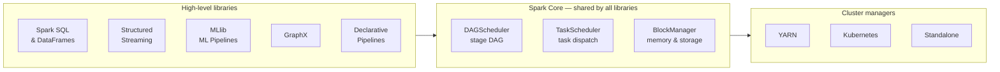

Because every library operates on RDDs, Spark can optimize *across* library boundaries — fusing a SQL map into a downstream MLlib pipeline without serializing data between engines. This is why Spark is called unified rather than a collection of separate tools.

**How other tools approach the same problem:**

| Tool | Model | Latency | Best for |
|---|---|---|---|
| **Hadoop MapReduce** | Batch, acyclic, disk-bound | Minutes to hours | Large single-pass batch ETL |
| **Apache Spark** | In-memory, iterative + batch + streaming | Seconds to minutes | General-purpose: batch, ML, SQL, near-real-time |
| **Apache Flink** | True event-at-a-time streaming | Sub-second | Real-time stateful streams requiring precise ordering |
| **Dask** | Parallel Python (pandas/NumPy) | Depends on hardware | Data science workloads outgrowing a single machine |
| **Ray** | Distributed Python task graph | Low | Distributed ML training, hyperparameter search |
| **Trino/Presto** | Federated interactive SQL | Sub-second for queries | Querying data in-place across multiple sources without ingestion |

Spark is the most general-purpose of these. The trade-off is that specialised engines outperform it in their target domain: Flink for sub-second streaming, Trino for interactive federated SQL, Ray for fine-grained ML parallelism.

Sources: [Zaharia et al. — Spark: Cluster Computing with Working Sets (2010)](https://www.usenix.org/legacy/event/hotcloud10/tech/full_papers/Zaharia.pdf), [Apache Spark history](https://spark.apache.org/history.html), [AWS — Hadoop vs Spark](https://aws.amazon.com/compare/the-difference-between-hadoop-vs-spark/)

---

## Spark vs MapReduce: the execution model in full

### The Hadoop MapReduce execution model

Hadoop MapReduce constrains every computation to exactly two phases. The framework owns the execution contract and the user is only allowed to supply two functions — `map` and `reduce`:

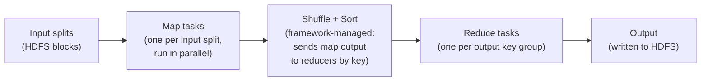

The rules of the model are strict:

- The **map function** sees one record at a time. It emits zero or more `(key, value)` pairs.
- The **shuffle + sort** phase is entirely framework-managed. Every map output is sorted by key and routed to the reducer responsible for that key. The user has no control over this.
- The **reduce function** sees one key at a time, together with an iterator over all values for that key. It emits output records.
- The output of the reduce phase is written to HDFS before the next job can start.

**Word count in MapReduce** — the canonical example that shows exactly what the user must supply vs what the framework owns:

```java
// Mapper: one record in (a line of text), many (word, 1) pairs out
public class TokenizerMapper
    extends Mapper<Object, Text, Text, IntWritable> {

  private final IntWritable one = new IntWritable(1);
  private final Text word = new Text();

  public void map(Object key, Text value, Context context)
      throws IOException, InterruptedException {
    StringTokenizer itr = new StringTokenizer(value.toString());
    while (itr.hasMoreTokens()) {
      word.set(itr.nextToken());
      context.write(word, one);   // emit ("word", 1) for every token
    }
  }
}

// Reducer: one key + all its values in, one (word, total) out
public class IntSumReducer
    extends Reducer<Text, IntWritable, Text, IntWritable> {

  private final IntWritable result = new IntWritable();

  public void reduce(Text key, Iterable<IntWritable> values, Context context)
      throws IOException, InterruptedException {
    int sum = 0;
    for (IntWritable val : values) sum += val.get();
    result.set(sum);
    context.write(key, result);   // emit ("word", total_count)
  }
}
```

The framework handles everything between: partitioning map output by key, sorting within each partition, and routing each key's values to exactly one reducer. The user supplies only `map` and `reduce`.

**The chaining problem.** Consider a realistic pipeline: (1) filter out log lines with a malformed timestamp, (2) join the cleaned logs against a users table to enrich each row with a country code, (3) count events per country. In MapReduce each step is a separate job — Job 1 writes the filtered logs to HDFS, Job 2 reads them back to do the join and writes the enriched rows to HDFS, Job 3 reads those back to count. Job 2 cannot start until Job 1 has finished writing its complete output to HDFS. Job 3 cannot start until Job 2 has written to HDFS. Every logical step adds a full HDFS read and write round-trip:

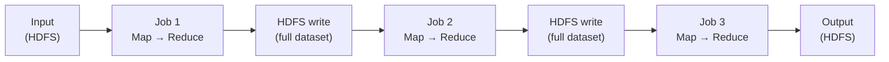

A machine learning algorithm with 100 iterations triggers 100 separate MapReduce jobs — 100 full reads of the training dataset from disk and 100 writes of intermediate results back to HDFS. This is the precise inefficiency Zaharia measured: 127 seconds per iteration on Hadoop vs 6 seconds in Spark after the first load.

**What MapReduce cannot express without multiple jobs:**

- A join followed by a second aggregation
- An iterative algorithm (ML training, graph algorithms like PageRank)
- A windowed operation over groups
- Any computation that requires two separate passes over the same data

Each of these requires chaining separate jobs, each with its own disk round-trip.

---

### Spark's DAG model: what replaces map + reduce

Spark replaces the rigid two-phase contract with a **Directed Acyclic Graph (DAG)** of arbitrary transformations. There is no "map phase" and "reduce phase" — there are **transformations** (lazy, produce a new RDD or DataFrame describing the computation to be done) and **actions** (trigger execution, return a result or write output).

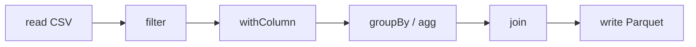

The user builds this graph by writing transformation calls. The graph exists only as a description in the driver until an action is called — no executor computation (tasks on workers) occurs until then. Two things happen eagerly, before any action:

- **Schema inference** — `spark.read.csv()` without an explicit `.schema(...)` runs a data scan in the driver to determine column types. Always pass a schema explicitly to keep reads fully lazy.
- **Driver-side analysis** — Spark resolves column names against the catalog and validates types in the driver as soon as something forces plan inspection (accessing `.schema`, `.dtypes`, or calling an action). This is why `AnalysisException` can surface before an action fires — the analysis step already ran.

**How to control driver-side analysis.** Analysis is a required Catalyst step — it cannot be skipped. What you control is when it is triggered:

| What triggers analysis eagerly | What keeps analysis deferred |
|---|---|
| Accessing `.schema` or `.dtypes` on a DataFrame | Chaining transformations without inspecting schema |
| Calling `.explain()` | Passing explicit schemas — nothing to infer, resolution is instant |
| Calling any action (`.show()`, `.count()`, `.write`) | — |

Practical rules:

- **Do not access `.schema` or `.dtypes` mid-pipeline** unless you genuinely need the result at that point. If you chain `filter → join → select` without inspecting schema, analysis stays deferred to the action.
- **Always provide an explicit schema** (`spark.read.csv(..., schema=my_schema)`) so the Analyzer has nothing to infer and resolves column names instantly against a known structure.
- **Treat `AnalysisException` as a compile error, not a runtime error.** It fires because a column name or type is wrong at definition time — the same way a type error in a compiled language is caught before the program runs. The right response is to fix the schema or column reference, not to catch the exception and retry.
- **In Spark Connect** (opt-in in 4.x), the client sends an unresolved logical plan to the server; analysis always runs server-side — never in the Python process. `AnalysisException` always comes from the server as an RPC error, but it can arrive from an `AnalyzePlan` RPC (triggered by accessing `.schema`, `.dtypes`, or `.explain()`) as well as from an `ExecutePlan` RPC (actions). Classic mode (the default) analyzes in the driver JVM, which is why eager triggers exist locally.

When an action fires, the **DAGScheduler** receives the full graph and compiles it into a physical execution plan. It does not process one step at a time the way Hadoop processes one job at a time — it sees the whole picture before execution begins.

**The key consequence:** intermediate results between consecutive narrow transformations are never written anywhere. They flow directly from one operation to the next inside the same executor, in the same CPU pass, without touching memory as a materialized object. This is why a chain of ten `filter` and `select` calls costs no more than one.

---

### Narrow and wide dependencies: the stage boundary rule

Not all edges in the DAG are equal. The DAGScheduler classifies every dependency between two RDDs as either narrow or wide, and this classification determines where stage boundaries are drawn.

| Type | Definition | Examples | Cost |
|---|---|---|---|
| **Narrow** | Each output partition depends on at most **one** input partition | `map`, `filter`, `select`, `withColumn`, `flatMap`, `union`, `coalesce` (without shuffle) | Zero network I/O; all operations pipelined inside one task in one CPU pass |
| **Wide** | Each output partition depends on **multiple** input partitions | `groupBy`, `join` (without co-partitioning), `repartition`, `distinct`, `sortBy`, `reduceByKey` | Requires a **shuffle**: data moves across the network; marks a stage boundary |

The DAGScheduler walks the RDD lineage backwards from the final operation. Every time it encounters a wide dependency, it draws a stage boundary. All narrow transformations between two boundaries are collapsed into a single **stage**.

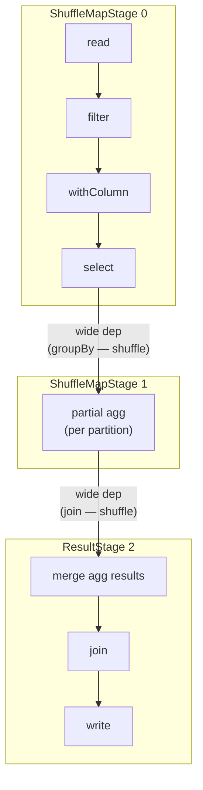

Within a stage, all operations are **pipelined**: each task processes its partition in a single pass, applying every narrow transformation in sequence without materialising any intermediate result. One executor reads its chunk of data and runs `filter → withColumn → select` as a single loop over the rows.

Stage boundaries are the only points at which data is serialized and written to disk (shuffle files). Between two stage boundaries, no data hits disk unless you explicitly call `.cache()` or `.checkpoint()`.

**Contrast with Hadoop:** in Hadoop, every `groupBy` is an entire separate MapReduce job with a mandatory disk write of the full dataset. In Spark, a `groupBy` is a shuffle boundary between two in-memory stages — the only disk I/O is the shuffle files themselves, not the full dataset before and after.

**Two types of stage:**

- **ShuffleMapStage** — its tasks write partitioned output to shuffle files on local disk, to be consumed by the downstream stage. Tasks return a `MapStatus` to the driver — a small metadata object recording which executor's BlockManager holds each output partition. This is how `MapOutputTrackerMaster` knows where reducers must fetch data. User data never flows back to the driver; only the location metadata does.
- **ResultStage** — the final stage. Its tasks apply the user function to their partition and send the result back to the driver (or write directly to storage). A ResultStage may run on only a **subset** of partitions — `first()` runs on one partition, `lookup(key)` runs on the single partition that owns the key — and stops as soon as enough results are collected.

---

### What lazy evaluation enables: the Catalyst optimizer

Because Spark does not execute any transformation immediately, the driver accumulates the full logical plan before acting on it. This is not merely a design convenience — it unlocks a class of optimizations that are impossible in an eager execution model.

When an action is called, the logical plan passes through **Catalyst**, Spark's query optimizer. Catalyst applies over 100 optimization rules (54 in `operatorOptimizationRuleSet` alone, verified against `Optimizer.scala` v4.1.2), including:

**Predicate pushdown.** A `filter` that appears late in the user's chain can be pushed down to the earliest possible point — ideally into the file scan itself. Parquet and ORC store min/max statistics per row group / stripe; Spark reads the statistics, evaluates the predicate, and skips chunks that cannot possibly match without decompressing or reading any row data. CSV, JSON, Avro, Text, and XML have no internal statistics — predicate pushdown does not apply to them.

```python
# User writes this:
df.read.parquet("events/").join(users, "user_id").filter(F.col("country") == "DE")

# Catalyst rewrites it to effectively:
df.read.parquet("events/", filters=[("country", "==", "DE")]).join(...)
# The filter is applied at read time — unneeded rows never enter the join
```

**Partition pruning.** All file-based sources (Parquet, ORC, CSV, JSON, Avro, Text, XML) participate in partition pruning — a separate mechanism from predicate pushdown. When data is stored in a Hive-style partitioned directory structure (e.g. `events/year=2024/month=06/`), Catalyst skips entire directories whose partition values cannot satisfy the filter, without opening any file. Partition pruning fires regardless of whether row-level predicate pushdown is supported.

**Projection pushdown.** If the user's downstream operations only need 3 columns from a 50-column table, Catalyst tells the file reader to skip the other 47 columns entirely. For Parquet (columnar format) this eliminates the I/O cost of reading unused columns entirely. All file-based sources implement `SupportsPushDownRequiredColumns` — they all receive a reduced column list from the planner.

**Aggregate pushdown.** For Parquet and ORC, Catalyst can push `COUNT`, `SUM`, `MIN`, `MAX` aggregations into the file reader itself — the reader computes aggregates from stored column statistics without scanning individual rows. For JDBC, the entire `GROUP BY` and aggregation is shipped to the remote database as SQL — Spark may receive only a single aggregated row per group, not individual records.

**JDBC full query pushdown.** JDBC goes furthest: `JDBCScanBuilder` implements `SupportsPushDownV2Filters` (WHERE), `SupportsPushDownLimit` (LIMIT), `SupportsPushDownOffset` (OFFSET), `SupportsPushDownTopN` (ORDER BY + LIMIT), `SupportsPushDownTableSample`, and `SupportsPushDownJoin` — a join between two tables in the same database can be pushed entirely to the database engine, with Spark receiving only the join result.

**Operator fusion / pipelining.** Multiple consecutive narrow operations — `filter`, `withColumn`, `select` — are fused into a single stage. No intermediate DataFrame is materialized.

**Constant folding.** Expressions like `F.lit(2) * F.lit(3)` are evaluated at plan time and replaced with `F.lit(6)`. No executor work is wasted on arithmetic over constants.

**Join reordering.** Catalyst uses estimated row counts to reorder joins so smaller tables are joined first, reducing the amount of data flowing into subsequent joins.

**Broadcast join selection.** If one side of a join is small enough (below `spark.sql.autoBroadcastJoinThreshold`, default 10 MB), Catalyst rewrites the join as a broadcast join — the small table is sent to every executor once and joined locally, eliminating the shuffle entirely. How `BroadcastHashJoin` differs from `SortMergeJoin` at the execution level — the hash table build phase, probe side, and why it avoids a shuffle stage — is covered in **Chapter 22 (A3 — Join Strategies and Tuning)**.

**Outer join elimination.** If a filter on the nullable side of a `LEFT` or `RIGHT OUTER JOIN` cannot be satisfied by NULL (e.g. `WHERE right.col > 0`), Catalyst converts the outer join to an `INNER JOIN` automatically. Inner joins are cheaper — no null-padding, no extra null-handling in downstream operators. Users often don't realise the conversion happened; `df.explain()` reveals it.

**Filter inference from join keys.** After a join on `a.id = b.id` combined with a filter `WHERE a.id > 5`, Catalyst derives `WHERE b.id > 5` automatically and pushes that new filter down to the `b` scan — preventing a full scan of `b` even though the user never wrote the filter explicitly. This rule (`InferFiltersFromConstraints`) fires once, in a dedicated batch between two operator-optimisation passes.

**Limit pushdown.** A `LIMIT` or `.limit(N)` call above a `UNION ALL` or a window operator does not wait for both sides to be fully computed. Catalyst pushes the limit through the operator so each branch produces at most N rows before being unioned, reducing intermediate data substantially.

**Null propagation.** `null + x`, `null * x`, `null == x` all evaluate to `null` — Catalyst folds this at plan time and short-circuits expressions that can only ever produce null. Related: `NullDownPropagation` infers that certain columns cannot be null from the schema or join type and eliminates null checks on them.

**Boolean simplification.** `x AND true → x`, `x OR false → x`, `NOT (NOT x) → x`, `x AND false → false`. Catalyst eliminates these at plan time so executors never evaluate trivial sub-expressions.

**LIKE simplification.** `LIKE 'prefix%'` is rewritten to `startsWith("prefix")`, `LIKE '%suffix'` to `endsWith`, `LIKE '%contains%'` to `contains`. These native string operations are faster than full regex evaluation.

**Project collapsing.** Consecutive `.select()` calls are merged into a single projection evaluated in one pass. `df.select("a","b","c").select("a","b")` becomes one scan of two columns, not two sequential evaluations.

**Repartition collapsing.** Consecutive `.repartition()` calls where the outer one dominates are collapsed into one shuffle. `df.repartition(100).repartition(200)` becomes a single `repartition(200)`.

None of these optimizations are available in Hadoop MapReduce, because the framework sees only one job at a time. A MapReduce job that reads 50 columns and uses 3 is a programmer mistake that the framework cannot correct. In Spark, writing `df.select("a", "b", "c")` at the end of a chain and having the reader skip the other 47 columns automatically is the normal, expected behavior.

---

### The full compilation pipeline: from DataFrame to bytecode

Every Spark 4.x query passes through a six-stage compilation pipeline before any computation begins. The Unresolved and Resolved logical plans are **relational algebra expression trees** — structured representations of σ, π, ⨝, and γ operators (introduced in [§ Why this matters for the DataFrame API](#why-this-matters-for-the-dataframe-api)). Because the plan is algebraic rather than arbitrary code, Catalyst can rewrite it freely using mathematical equivalence laws:

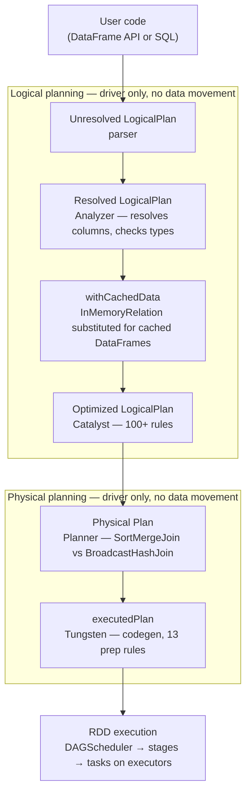

This pipeline runs entirely in the driver before a single byte of user data is read. The physical plan handed to the DAGScheduler at the bottom is already optimized, reordered, and compiled to bytecode. By the time executors receive their tasks, the work is expressed as tight compiled loops over binary row data (UnsafeRow format), not as chains of interpreted Python or JVM method calls.

Spark uses three internal row representations across different phases — `InternalRow` (trait/interface), `UnsafeRow` (Tungsten binary execution format), and Apache Arrow (pandas UDF boundary). The full breakdown — including why `GenericInternalRow` exists, how `sun.misc.Unsafe` relates to on-heap vs off-heap allocation, and how Arrow eliminates per-row serialization — is covered in **Chapter 4**. Memory layout details and shuffle serialization cost are in **Chapter 30 (E1 — Spark Internals)**.

**Adaptive Query Execution (AQE).** Spark 4.x enables AQE by default. Where Catalyst optimizes before execution using estimated statistics, AQE re-enters the optimization pipeline at shuffle boundaries using *actual* collected statistics — coalescing small partitions, switching join strategies, and splitting skewed partitions at runtime. The full detail is in **Chapter 4**.

---

### Where Spark still resembles MapReduce

Despite all the differences, Spark's shuffle mechanism is directly descended from Hadoop's shuffle and retains the same fundamental structure:

1. Map tasks (the ShuffleMapStage) write their output to **local files on disk** (by default — RSS like Celeborn changes the destination), **partitioned** by the target key (hash-routed to partition buckets) and written in **partition-ID order** so the output file can be efficiently split. Keys are **not sorted within a partition** unless map-side combine is enabled (e.g. `reduceByKey`) — confirmed in `SortShuffleWriter.scala` v4.1.2: *"we don't care whether the keys get sorted in each partition; that will be done on the reduce side if the operation being run is sortByKey."*
2. Reduce tasks (the downstream stage) fetch the relevant blocks from every map task's local disk.
3. Spark implements a **barrier at every shuffle boundary**: all map tasks in a ShuffleMapStage must complete and confirm their shuffle files are written before any reduce task in the next stage starts.

This barrier is identical in purpose to Hadoop's shuffle barrier. The CACM 2016 paper explicitly acknowledges this: *"In Spark, the map tasks in each shuffle operation save their output to local files on the machine where they ran, so reduce tasks can re-fetch it later. In addition, Spark implements a barrier at shuffle stages."*

The barrier exists to simplify fault recovery: if a reduce task fails, it can re-fetch its input from the already-completed map task files without requiring the map tasks to re-run. If a map task's file is lost (node failure), only that map task needs to re-run — not the whole stage. Removing the barrier would require a more complex pipelined recovery scheme.

The practical implication: shuffle operations (wide dependencies) are the expensive step in Spark jobs, exactly as they were in Hadoop. Minimizing the number of wide dependencies, and reducing the data volume that crosses shuffle boundaries, is the primary tuning lever in Spark performance work.

---

### Summary: MapReduce vs Spark

| | Hadoop MapReduce | Spark (RDD layer) | Spark (DataFrame/SQL layer) |
|---|---|---|---|
| **Execution model** | Fixed map → shuffle → reduce, one job at a time | DAG of arbitrary transformations, compiled to stages | Relational algebra compiled by Catalyst into DAG |
| **Intermediate storage** | Full HDFS write between every job | In-memory within a stage; shuffle files between stages; no full dataset to disk | Same as RDD layer |
| **Optimization scope** | Single job — no cross-job optimization | Full DAG visible before execution | Full logical plan; 60+ optimizer rules; AQE re-optimizes at runtime |
| **Data reuse across iterations** | Not possible — every job rereads from HDFS | `.cache()` keeps RDD in memory across jobs | Same as RDD layer |
| **Fault tolerance** | Re-run the entire job | Recompute lost partitions via lineage | Same as RDD layer |
| **Shuffle mechanism** | Framework-managed sort-based shuffle | Same fundamental design (map writes files, reduce fetches, barrier enforced) | Same as RDD layer |
| **Straggler handling** | Speculative task re-execution | Same (`spark.speculation = true`) | Same as RDD layer |
| **Latency between steps** | Minutes (HDFS write + read per job) | ~100ms per stage boundary (shuffle files only) | Same as RDD layer |
| **Operator expressiveness** | Only map and reduce | Any transformation expressible as RDD operations | Full SQL92 + extensions; window functions, UDFs, etc. |
| **Code generation** | None | None at RDD level | Tungsten whole-stage codegen — fuses operators into compiled Java bytecode |

Sources: [Mastering Spark DAGs (Dev Genius)](https://blog.devgenius.io/mastering-spark-dags-the-ultimate-guide-to-understanding-execution-ce6683ae785b), [Wide vs Narrow Transformations (Big Data Performance)](https://bigdataperformance.substack.com/p/understanding-wide-vs-narrow-transformations), [Lazy Evaluation in Spark (DataFlair)](https://data-flair.training/blogs/apache-spark-lazy-evaluation/), CACM 2016 paper (cached)

---

## A first Spark program

Before explaining the architecture, here is a complete word count program — the canonical "hello world" of distributed computing. It reads *Pride and Prejudice* from the Gutenberg corpus in the [local stack](https://github.com/arindamchoudhury/spark-delta-unitycatalog), counts every word, and shows the top 10. All the behavior described in the rest of this chapter is visible in this program.

The full runnable versions are in the repo:

- **[`workspace/notebooks/intro.ipynb`](https://github.com/arindamchoudhury/spark-delta-unitycatalog/blob/main/workspace/notebooks/intro.ipynb)** — notebook with cells labelled Read / Transform / Action / Inspect the plan
- **[`workspace/pyscript/intro.py`](https://github.com/arindamchoudhury/spark-delta-unitycatalog/blob/main/workspace/pyscript/intro.py)** — standalone script for `spark-submit`

To run `intro.py` with `spark-submit`:

```bash
# Local mode — no cluster required, uses all available CPU cores
spark-submit --master "local[*]" workspace/pyscript/intro.py

# Against the Docker stack — submit inside the spark container
docker compose exec spark spark-submit \
    --master "local[*]" \
    /workspace/pyscript/intro.py
```

```python
# Apache Spark 4.1.x / PySpark 4.1.x · Python 3.14
# Run from workspace/notebooks/ — requires the local stack running (docker compose up)
import os
from pyspark.sql import SparkSession
import pyspark.sql.functions as F

os.environ["SPARK_LOCAL_IP"] = "127.0.0.1"
conf_path = os.path.abspath("log4j2.xml")   # silences Spark's INFO noise

spark = (
    SparkSession.builder
    .appName("word-count")
    .config("spark.ui.port", "4041")
    .config("spark.driver.extraJavaOptions",
            f"-Dlog4j2.configurationFile={conf_path}")
    .getOrCreate()
)

# Everything below this line is lazy — no data moves yet
book = spark.read.text("../data/gutenberg_books/1342-0.txt")

top_words = (
    book
    .select(F.explode(F.split("value", " ")).alias("word"))    # split lines into words
    .select(F.lower(F.regexp_extract("word", "[a-z]+", 0))     # lowercase, strip punctuation
             .alias("word"))
    .filter(F.col("word") != "")                               # drop empties
    .groupBy("word")
    .count()
    .orderBy(F.col("count").desc())
)

top_words.show(10)   # <-- THIS is the first action; only now does Spark execute the plan
# +----+-----+
# |word|count|
# +----+-----+
# | the| 4480|
# |  to| 4218|
# |  of| 3711|
# | and| 3504|
# | her| 2199|
# |   a| 1982|
# |  in| 1909|
# | was| 1838|
# |   i| 1749|
# | she| 1668|
# +----+-----+

spark.stop()
```

Every line between `spark.read.text(...)` and `.show(10)` is a **transformation** — an instruction recorded but not executed. `.show(10)` is the first **action** — the moment Spark takes all the recorded instructions, builds an optimized physical plan, distributes the work across executors, and returns a result. The rest of this chapter explains exactly what happens during those few milliseconds.

---

## Core concept

[](assets/ch01/cluster-overview.png)

*Source: [Apache Spark — Cluster Mode Overview](https://spark.apache.org/docs/latest/cluster-overview.html)*

A Spark application has three kinds of processes: a **driver**, one or more **executors**, and a **cluster manager** that brokers between them. The driver plans the work; executors do the work; the cluster manager decides where executors run.

---

### Driver Program

Spark's official definition ([cluster-overview](https://spark.apache.org/docs/latest/cluster-overview.html)):

> *"The process running the main() function of the application and creating the SparkContext."*

That definition fits a JVM language perfectly — one process, one main(). In PySpark **classic mode** it becomes ambiguous, because the runtime splits across two OS processes:

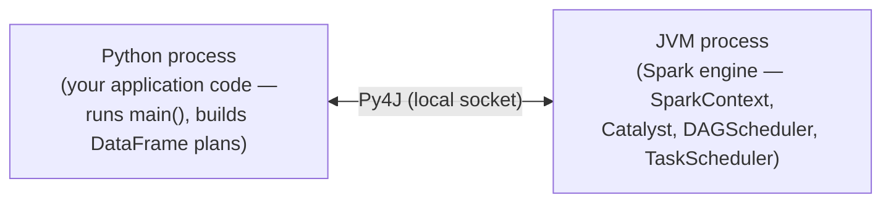

- The **Python process** runs your application code — this is what Spark's official docs call "the process running main()."
- The **JVM process** is the Spark engine — it hosts SparkContext, Catalyst, DAGScheduler, and TaskScheduler. It is a separate OS process from Python, running on the same machine.

**"The driver" means both processes together.** When Spark's UI, logs, or error messages say "driver" they usually mean the JVM side (where scheduling happens), but the Python process is equally part of the driver — it is the one building the plan and issuing calls. Neither process alone is the full driver. Executors are entirely separate JVM processes on worker nodes; they receive tasks but do no planning or scheduling.

**The driver is a single point of failure.** If the driver JVM runs out of memory, the entire application fails and all pending stages are cancelled. This surprises people because during transformations the driver never reads partition data — that work is handled entirely by executors. The driver only holds the logical plan, scheduling state, and shuffle metadata. The danger comes from certain **actions** that pull data back to the driver: `.collect()` transfers every row of the result DataFrame into driver memory; `.toPandas()` does the same. Both will crash the driver on a large DataFrame. `.show(n)` is safe — it transfers only `n` rows. Prefer `.write` over `.collect()` for large results, and size the driver with `spark.driver.memory` (default: 1g) when it must handle significant result sets.

In **Spark Connect mode** (opt-in; activate with `export SPARK_REMOTE="sc://localhost"` before launching `pyspark`), the Python process is a **client only** — it serializes your DataFrame operations as protobuf and sends them over gRPC. It has no JVM at all. The Spark engine runs on the Connect server:

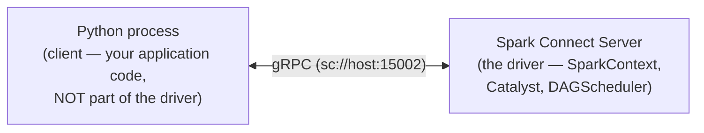

| | Classic | Spark Connect |
|---|---|---|
| Introduced | Spark 1.0 | Spark 3.4 |
| Python process role | Runs user code and builds plans; paired with the JVM process, both together form the driver | Client only — serializes plans, receives results; no JVM involved |
| Spark engine (SparkContext, Catalyst, DAGScheduler) | Driver-side JVM process (co-located with Python) | Connect Server JVM (remote) |
| Python↔JVM transport | Py4J local socket | gRPC + Apache Arrow |
| RDD support | Yes | No |
| Direct JVM access (`df._jdf`) | Yes | No |
| Default for `pyspark` shell | Yes — in all Spark 4.x | No — opt-in via `SPARK_REMOTE`, `--remote`, or `spark.api.mode=connect` |

**How to activate each mode:**

```python
# Classic mode (default) — Python + JVM together form the driver
spark = SparkSession.builder.appName("app").getOrCreate()

# Spark Connect via .remote() — Python is a client, connects to an existing server
spark = SparkSession.builder.remote("sc://localhost:15002").getOrCreate()
```

**`.remote(url)`** accepts either `sc://host:port` (connect to an existing Connect server) or `local[N]` / `local[*]` (start a local Connect server inline). It tells the Python process to skip the JVM entirely — `RemoteSparkSession` uses gRPC instead of Py4J, so no `SparkContext` is created in the client process. `--master` and `--deploy-mode` **cannot** be combined with `.remote()` — setting both `spark.master` and `spark.remote` raises `CANNOT_CONFIGURE_SPARK_CONNECT_MASTER` at session creation time.

There are three distinct ways to run in Connect mode, each with a different relationship to `--master`:

| How | `--master` | `--deploy-mode` | What happens |
|---|---|---|---|
| `.remote("sc://host:port")` | Blocked — raises error if combined with `spark.remote` | Not used | Client connects to an already-running Connect server |
| `.remote("local[4]")` / `spark.remote = "local[4]"` | Blocked — raises error if combined | Not used | Spark starts a local Connect server inline (testing only) |
| `spark.api.mode=connect` + `--master yarn` | Used | Used | **Hybrid mode** — classic cluster management allocates resources; a local Connect server starts alongside the driver; Python connects to `sc://localhost` |

The first two paths decouple the client completely from cluster management. The third path (`spark.api.mode=connect`) is a **hybrid mode**, not pure Spark Connect. The Spark source (`config/package.scala` v4.1.2) describes it as: *"For Spark Classic applications, specify whether to automatically use Spark Connect by running a **local** Spark Connect server dedicated to the application. The server is terminated when the application is terminated."* In other words: `--master yarn` still handles resource allocation the classic way, but a Connect server starts collocated with the driver so the Python code uses the Connect API instead of Py4J.

`spark.remote` accepts two kinds of URL — verified against `session.py` v4.1.2:

| `spark.remote` value | What happens |
|---|---|
| `local[N]` / `local[*]` | Starts a local Connect server inline — `getOrCreate()` routes it to `sc://localhost` |
| `sc://host:port` | Connects directly to an existing remote Connect server |
| `yarn`, `spark://…`, `k8s://…` | **Blocked** — setting both `spark.master` and `spark.remote` raises `CANNOT_CONFIGURE_SPARK_CONNECT_MASTER`; use `spark.api.mode=connect` with `--master` instead |

`spark.remote` and `spark.master` cannot be combined — they represent incompatible execution models. `spark.master` means "I am starting Spark infrastructure; negotiate with this cluster manager." `spark.remote` means "I am a thin client; connect me to an already-running server." Setting both raises `CANNOT_CONFIGURE_SPARK_CONNECT_MASTER` at session creation. If a Spark Connect server is already deployed on a real cluster, `spark.remote = "sc://cluster-host:15002"` works fine without `spark.master` — the client has no cluster management role. If you want Spark to manage cluster resources itself and also use the Connect API, use `spark.api.mode=connect` with `--master`.

```bash
# Hybrid mode: YARN manages resources, local Connect server starts with the driver
spark-submit --master yarn --deploy-mode cluster \
  --conf spark.api.mode=connect \
  myapp.py
```

The word count program uses classic mode. The components described below apply to classic mode; in Connect mode they all live on the Connect server.

---

### SparkSession and SparkContext

**SparkSession** is the entry point you create in every PySpark program (introduced in Spark 2.0):

```python
spark = SparkSession.builder.appName("my-app").getOrCreate()
```

It is the single object through which you read data, run SQL, and build DataFrames. You rarely need anything else.

**SparkContext** is the internal component that SparkSession wraps. It is what the official architecture docs refer to when they define the driver:

> *"The SparkContext object in your main program. It coordinates independent sets of processes on a cluster and connects to cluster managers to allocate resources."* — [cluster-overview](https://spark.apache.org/docs/latest/cluster-overview.html)

You don't create or interact with SparkContext directly in normal work — SparkSession creates and owns it (`self._sc = sparkContext` in `session.py`). It surfaces in architecture discussions because it is the actual coordinator: when `.show(10)` triggers a job, SparkContext receives the job and passes it to the DAGScheduler, which breaks it into stages and tasks. The TaskScheduler then dispatches tasks to executors via the SchedulerBackend. The cluster manager is involved only for **resource allocation** (executor count, CPU, memory) — it never sees the plan. Executors are allocated at application startup, not per-job. In classic mode you can reach SparkContext via `spark.sparkContext` for low-level RDD operations or configuration inspection; this property does not exist in Connect mode (`pyspark-client`), where `RemoteSparkSession` has no underlying SparkContext. For all DataFrame and SQL work SparkSession is sufficient.

---

### Cluster Manager

The **Cluster Manager** is an external service that allocates resources (machines, CPU, memory) for the application. Spark 4.x supports four cluster manager modes:

| Mode | When to use |
|---|---|
| `local[N]` | Development — runs driver and executors in the same JVM process |
| Spark Standalone (`spark://host:port`) | Dedicated Spark cluster; no YARN/k8s required |
| YARN | Hadoop ecosystem; multi-tenant clusters |
| Kubernetes (`k8s://https://host:port`) | Container-native deployments |

In the local stack (`docker compose up`) it is Spark Standalone, running inside the `spark` container. On cloud deployments it is typically YARN or Kubernetes.

Executors are allocated at **application startup** — when `SparkSession.builder.getOrCreate()` initialises `SparkContext`, it registers with the cluster manager which then launches executor processes on worker nodes. When `.show(10)` fires a job later, the executors are already running and waiting for tasks. The cluster manager is not contacted again per-job. With **dynamic allocation** (`spark.dynamicAllocation.enabled=true`), the `ExecutorAllocationManager` inside the driver can request additional executors or release idle ones during the application lifetime — but this is driven by scheduler backpressure (pending tasks), not by individual job triggers.

---

### Worker Nodes and Executors

A **Worker Node** is any machine in the cluster that can run application code. The cluster manager launches an **Executor** process on each worker node it allocates to your application.

In the word count program, executors are the processes that actually read `1342-0.txt`, run `split`, `regexp_extract`, `lower`, and `filter` on lines of text, and count words. The driver never touches the file contents directly — it delegates all of that to executors.

Each application gets its own isolated executors. They stay alive for the entire application (from `getOrCreate()` to `spark.stop()`), not just one query. The executor lifecycle — when they are launched, when they shut down, and how dynamic allocation (`spark.dynamicAllocation.enabled`) adjusts the executor count at runtime while requiring the External Shuffle Service — is covered in **Chapter 31 (E2 — Production Deployment: Cluster Management)**.

Spark's programming model provides two shared variable types available to both the RDD and DataFrame APIs: **broadcast variables** — large read-only objects (e.g. a lookup table) sent once to every executor and cached there, rather than copied with every task closure — and **accumulators** — add-only counters that executors increment and only the driver reads. The mechanism and usage pattern differ between the two APIs: RDD usage (explicit `sc.broadcast()` and `sc.accumulator()`) is covered in **Chapter 3**; DataFrame-specific usage (`F.broadcast()` for join hints, accumulators inside UDFs) is covered in **Chapter 4**.

Accumulators are intentionally **write-only for executors**. This is an architectural choice: if executors could read an accumulator mid-execution, the value would be inconsistent across tasks running in parallel, requiring distributed locking. Instead, executor tasks add their updates locally; Spark merges each task's update into the driver-side accumulator exactly once when the task completes (in actions only — accumulator updates in transformations may be applied more than once if stages are re-executed). A failed task's partial accumulator update is discarded; the retry starts from zero.

---

### Executor memory layout

Each executor JVM heap is divided into three fixed regions by the **unified memory manager** (default since Spark 1.6, still the default in Spark 4.x):

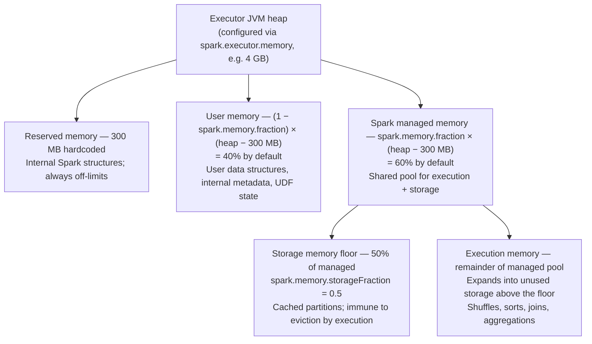

**Execution memory** is used during shuffle, sort, join, and aggregation operations. When a task needs more execution memory than is available it **spills** intermediate data to local disk — the task continues but at disk I/O speed instead of RAM speed. Four operation types can spill:

- **Sort** — sorted runs are written to disk and later merged
- **Hash aggregation** — the in-memory hash map is flushed to disk when full, then merged in a second pass
- **SortMergeJoin** — one or both sides spill sorted runs when the partition doesn't fit
- **GroupBy (hash-based)** — same as hash aggregation

The trigger is exhausting the task's execution memory allocation. Spilling does not fail the task but can make it 10–100× slower depending on disk speed. The fix is usually more partitions (smaller per-task working set) or more executor memory.

**What format is written to disk?** It depends on which layer is spilling — verified against `ExternalSorter.scala` and `HashAggregateExec.scala` v4.1.2:

| Layer | Spill format | Cost |
|---|---|---|
| **DataFrame / SQL** (`HashAggregateExec`, `SortMergeJoin`) | Binary **`UnsafeRow`** — the same compact format already in memory, written via `UnsafeKVExternalSorter`. No serialization conversion. | Low — just writing bytes |
| **RDD operations** (`ExternalSorter`) | Serialized key-value pairs using the configured `Serializer` (Kryo or Java, `spark.serializer`), written in fixed-size batches via `DiskBlockObjectWriter`. Each batch has its own serialization stream to reduce reference-tracking overhead on read. Sorted by partition ID first, then optionally by key. | Higher — requires serialization per object |

DataFrame spills are cheaper than RDD-layer spills precisely because `UnsafeRow` is already binary — no conversion is needed to write it to disk. Compression of spill files is controlled by `spark.shuffle.compress` (default `true`).

**Per-task fairness before spill.** When N tasks run concurrently on one executor, `ExecutionMemoryPool` enforces two per-task memory bounds — verified in actual code at v4.1.2:

- **Floor (1/2N)** — `minMemoryPerTask = poolSize / (2 * numActiveTasks)`. A task that has not yet reached this minimum is **blocked** (not spilled) until enough memory frees up. It never spills before getting a fair start.
- **Ceiling (1/N)** — `maxMemoryPerTask = maxPoolSize / numActiveTasks`. A task cannot hold more than this, keeping the pool shared fairly.

Concrete example with default config (`spark.executor.memory = 1g`, `spark.memory.fraction = 0.6`), 4 active tasks:

```
managed pool = (1024 MB − 300 MB) × 0.6 = 724 × 0.6 = 434 MB
floor per task = 434 / (2 × 4) = 54 MB   ← blocked until it reaches this
ceiling per task = 434 / 4       = 108 MB  ← cannot exceed this
```

A task that has only acquired 30 MB so far and needs 80 MB would **wait**, not spill — it has not yet reached its 54 MB floor. Spark logs this: *"TID X waiting for at least 1/2N of execution pool to be free."*

**Storage memory** (the storage floor in the diagram above) holds cached partitions (`df.cache()`). The borrowing relationship between execution and storage is bidirectional but asymmetric — confirmed in the source Scaladoc:

- **Storage borrows from execution** when execution memory is idle — cached blocks expand into free execution space at no cost.
- **Execution reclaims borrowed memory** by evicting cached blocks above the floor when it needs space for a running task.
- **Execution is never evicted by storage** — even if execution has borrowed storage's memory, storage cannot force it back. The source notes this is due to "the complexities involved in implementing this"; practically, evicting in-progress execution data would corrupt a running task. The implication: if execution fills the managed pool, new `.cache()` calls will fail and the block will be evicted immediately per its storage level.

**What if nothing is cached?** The storage floor is **not a static reservation** — the source confirms: *"This region is not statically reserved; execution can borrow from it if necessary."* If no data is cached, the storage pool is empty and execution is free to use the entire managed pool. With the default 1g executor, that is the full 434 MB. The floor only becomes meaningful once you cache something: it is the minimum footprint that cached data is allowed to hold before execution starts evicting it.

| Scenario | Execution can use |
|---|---|
| Nothing cached | All 434 MB (execution region + empty storage floor) |
| Cached data below the floor | Whatever is free — data under the floor is eviction-protected |
| Cached data above the floor | Overflow above the floor is evictable; execution reclaims it as needed |
| Execution fills the managed pool | New `.cache()` calls fail — block evicted immediately per storage level |

The 300 MB reserved region is hardcoded. It protects Spark's own internal data structures from being crowded out by user workloads.

**What causes GC pressure.** `UnsafeRow` binary data in the managed memory pool does not create JVM objects and generates no GC pressure. GC pressure comes from the **user memory pool** — any JVM objects your code creates: Python UDF result objects converted back to JVM types, intermediate Scala/Java collections in user functions, large driver-side variables accidentally captured in closures and shipped to executors. A full JVM GC pause stalls all tasks on the executor simultaneously and, if long enough, causes the executor to miss heartbeats and be marked dead by the driver. Monitoring GC time in the Spark UI (covered in Chapter 16 — I7) is the first step in diagnosing executor performance problems.

| Config | Default | What it controls |
|---|---|---|
| `spark.executor.memory` | `1g` | Total JVM heap per executor |
| `spark.memory.fraction` | `0.6` | Fraction of (heap − 300 MB) given to the shared managed pool; the remainder `(1 − fraction)` becomes user memory — raising this shrinks user memory and vice versa |
| `spark.memory.storageFraction` | `0.5` | Fraction of managed pool reserved as the storage floor |
| `spark.memory.offHeap.enabled` | `false` | Enable off-heap memory (bypasses JVM GC entirely) |
| `spark.memory.offHeap.size` | `0` | Absolute bytes for off-heap allocation; must be positive when enabled; counts toward container RSS — account for it by shrinking `spark.executor.memory` or increasing `spark.executor.memoryOverhead` |
| `spark.executor.memoryOverhead` | optional (see below) | Non-heap memory budget per executor; if not set, computed from the two configs below |
| `spark.executor.memoryOverheadFactor` | `0.1` (JVM); **`0.4` for Kubernetes non-JVM jobs including PySpark** | Fraction of executor memory allocated as non-heap overhead |
| `spark.executor.minMemoryOverhead` | `384m` (new in Spark 4.0.0) | Minimum overhead floor — effective overhead = `max(executor_memory × factor, minOverhead)` |

**Off-heap memory** is allocated outside the JVM heap using native memory. It is completely separate from the unified memory manager's calculation — off-heap does not reduce the heap pool. When enabled, Spark uses it for storage and execution buffers, reducing GC pressure for large objects.

**`spark.memory.offHeap.size` and `spark.executor.memoryOverhead` — the critical relationship.**

YARN and Kubernetes manage containers by watching **RSS (resident set size)** — the total process memory including JVM heap, JVM overhead, Python worker processes, and any native/off-heap allocations. They have no visibility into how much is JVM heap versus off-heap. `spark.executor.memoryOverhead` is the budget you give the cluster manager for all non-heap memory per executor. Its default is `max(executor_memory × 0.1, 384 MB)`.

The problem: `spark.memory.offHeap.size` is allocated from native memory, which counts toward RSS. If you enable off-heap but don't increase `spark.executor.memoryOverhead` to cover it, the container's RSS quietly exceeds its limit and YARN/Kubernetes kills it — with no Java stack trace, just a vague "container exceeded memory limits" error.

**Correct sizing formula:**

```
total container memory = spark.executor.memory        (JVM heap)
                       + spark.executor.memoryOverhead (JVM internals + Python workers + overhead)
                       + spark.memory.offHeap.size     (off-heap execution/storage)
```

Set `spark.executor.memoryOverhead` to at least cover `spark.memory.offHeap.size` plus the original overhead budget.

**Performance cost and production guidance:**

The access overhead of `sun.misc.Unsafe` reads is negligible — the cost is operational, not computational. Guidance from current Spark production practice:

| Scenario | Recommendation |
|---|---|
| Small-medium heaps (<4 GB), short batch jobs | **Off by default is correct** — on-heap GC is manageable; off-heap adds operational risk |
| Large heaps (>4-8 GB), GC pauses >10% of task time in Spark UI | **Consider enabling** — GC storms become a real throughput bottleneck |
| Long-running Structured Streaming jobs | **Often beneficial** — GC accumulates over hours of uptime |

**Always check GC time in the Spark UI (Chapter 16) before enabling off-heap.** If GC is <5% of task time, off-heap adds complexity with no measurable gain. If GC is high, first try using more executors with smaller heaps (smaller heap = smaller GC scan scope) — that often resolves GC pressure without the off-heap sizing risk.

**Unmanaged memory (Spark 4.x).** `UnifiedMemoryManager.scala` v4.1.2 introduced a new tracking category — **unmanaged memory**: memory consumed by components that manage their own allocations outside of Spark's unified memory system. The source lists two examples:

- **RocksDB state stores** — used by Structured Streaming stateful operations; manages its own block cache and write buffers entirely outside the unified pool
- **Native libraries** — any JNI or off-heap allocation not routed through `spark.memory.offHeap`

Polling is **disabled by default** (`spark.memory.unmanagedMemoryPollingInterval = 0s`, added in Spark 4.1.0). When enabled, a background thread periodically queries each registered consumer and subtracts the result from the available execution and storage budgets. With polling disabled (the default), Spark has no visibility into unmanaged allocations — they are completely invisible to the unified memory manager. If your job uses Structured Streaming with RocksDB state stores (`spark.sql.streaming.stateStore.providerClass = RocksDBStateStoreProvider`), account for RocksDB's native off-heap memory separately and increase `spark.executor.memoryOverhead` to cover it — without polling enabled, an OOM will surface only as a container kill with no Java stack trace.

---

### Partitions and Tasks

`1342-0.txt` is not loaded as a single block. Spark splits it into **partitions** — subdivisions of the dataset, each processed by exactly one task on one executor. During execution a partition lives in executor memory; if it exceeds available memory Spark spills it to disk. Each partition is assigned to exactly one **Task**, and each task runs on one executor. This is a **hard invariant** in Spark's execution model: one task processes exactly one partition, and one partition is processed by exactly one task. A partition cannot be split across tasks; a task cannot span multiple partitions. Calling `.cache()` on a DataFrame persists its partitions after they are first computed, cutting the lineage so that re-use does not re-read from source — the architectural reason caching exists is covered in **Chapter 15 (I6 — Caching and Persistence)**. Since Spark 4.0.0, `df.cache()` defaults to `MEMORY_AND_DISK` (controlled by `spark.sql.defaultCacheStorageLevel`, added in 4.0.0) — partitions spill to disk if executor memory is insufficient. This differs from `RDD.cache()`, which still defaults to `MEMORY_ONLY`. By default, cached partitions are **not replicated** — each partition lives on exactly one executor. If that executor crashes, the partition is lost; Spark falls back to lineage recomputation from the original source. Storage levels with replication (`MEMORY_AND_DISK_2`) exist but double the memory cost. The tradeoff between partition count, parallelism, and scheduling overhead — including `spark.sql.shuffle.partitions` — is covered in **Chapter 14 (I5 — Partitioning)**.

**Executor task slots.** The number of tasks an executor can run simultaneously equals `spark.executor.cores` (default: 1 on YARN, all available cores on Standalone) divided by `spark.task.cpus` (default: 1). With `spark.executor.cores = 4`, an executor has 4 task slots and runs 4 tasks concurrently. If a job has 200 tasks and the cluster has 10 executors × 4 cores = 40 slots, Spark runs 40 tasks at a time and queues the remaining 160. Tasks never run more concurrently than the slot count — there is no over-subscription.

In the word count program:

**Narrow transformations** — `split`, `lower`, `filter` each run independently on each partition. No executor needs to see another's data; all partitions process in parallel.

**Wide transformation (shuffle)** — `groupBy("word").count()` requires every occurrence of "the" from every partition to land on the same executor. Spark triggers a **shuffle**: data moves across the network, regrouped by key. This is the most expensive step in the program.

After the shuffle, each executor holds all occurrences of a distinct set of words, counts them, and sends the top results back to the driver.

---

### Lazy evaluation

Every transformation you write — `select`, `filter`, `groupBy`, `join` — does nothing immediately. Spark records the instruction and returns instantly. Only an **action** — `show()`, `write()`, `count()` — triggers actual computation. At that point the driver takes the full instruction list, optimizes it into a physical plan, and dispatches work to executors.

Laziness enables five things:

- **Whole-chain static optimization** — Catalyst sees the complete transformation chain before generating any physical plan, enabling predicate pushdown, column pruning, join reordering, broadcast join selection, and constant folding across the entire query. The full set of Catalyst optimizations is covered in [§ What lazy evaluation enables](#what-lazy-evaluation-enables-the-catalyst-optimizer) above.
- **No intermediate materialization** — Spark pipelines narrow transformations within a stage; intermediate DataFrames never need to be written to memory or disk between operator calls.
- **Lineage-based fault tolerance** — failed partitions can be recomputed from source without manual recovery, because Spark has the full transformation recipe on hand.
- **AQE runtime re-optimization** — because the plan for remaining stages is not committed at job submission, Spark can collect real shuffle statistics (actual partition sizes, row counts) at each stage boundary and re-optimize the remainder of the query: coalescing small post-shuffle partitions, switching join strategies, or splitting skewed partitions. Source: `AdaptiveSparkPlanExec.scala` — *"When one stage completes, the data statistics of the materialized output will be used to optimize the remainder of the query."*
- **Early termination** — `first()`, `take(n)`, and `limit(n)` need not process all partitions. Because nothing has been pre-materialised, the scheduler can stop after the first partition (or first few) that satisfies the request. Source: `ResultStage.scala` — *"Some stages may not run on all partitions of the RDD, for actions like `first()` and `lookup()`."*

A **job** is triggered by one action. Each job is broken into **stages** — groups of operations that can run without shuffling data across the network. Within a stage, each partition becomes a **task**. Understanding this hierarchy (job → stage → task) is what makes the Spark UI readable.

---

### Fault tolerance: lineage, not replication

Hadoop HDFS achieves durability through **replication** — every data block is copied to 3 nodes by default. If a node fails, another replica serves the data immediately with no recomputation.

Spark takes a fundamentally different approach: **lineage**. Every RDD and DataFrame records the full chain of transformations that produced it — from the original source through every `filter`, `join`, and `groupBy`. If a partition is lost (executor crash, node failure), Spark does not need a backup copy. It replays the lineage for that partition from the source and recomputes only what was lost.

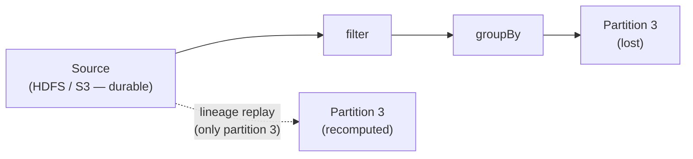

**The key principle:** Spark delegates *storage durability* to the underlying filesystem (HDFS, S3, GCS). It never tries to own that problem. Spark only manages *compute-level* fault tolerance — rerunning tasks, not replicating bytes.

Three mechanisms cover different failure scenarios:

| Failure | Mechanism | What happens |
|---|---|---|
| Partition lost in executor memory | **Lineage recomputation** | Spark replays the transformation chain from source for that partition only |
| Executor that wrote shuffle output dies | **ShuffleMapStage resubmission** | DAGScheduler unregisters the lost map outputs from `MapOutputTracker` and resubmits only the missing tasks in the map stage — not the entire stage. Source: `DAGScheduler.scala` — *"resubmit TaskSets for any lost stage(s) that compute the missing tasks"*; `ShuffleMapStage.findMissingPartitions()` returns only unregistered partitions. |
| Lineage is very long **with wide dependencies** (e.g. PageRank's rank RDD — node failure loses a partition from every ancestor stage) | **Checkpointing** | Save to HDFS, cutting the lineage. Don't checkpoint narrow-dep chains on stable storage (e.g. logistic regression's input points) — lost partitions recompute cheaply in parallel from source. |

The trade-off versus HDFS replication: recovery requires CPU time (recomputation) rather than just reading a replica. For very long lineage chains this can be slow — which is when checkpointing pays for itself.

A fourth mechanism handles *slowness* rather than failure: **speculative execution**. Because RDD partitions are immutable, Spark can launch a duplicate of a slow (straggler) task on a second executor and use whichever finishes first — the two copies cannot interfere. Enable with `spark.speculation = true`. The detection mechanism — a dedicated `"task-scheduler-speculation"` daemon thread that calls `checkSpeculatableTasks()` every `spark.speculation.interval` (default 100 ms), the `spark.speculation.quantile` and `spark.speculation.multiplier` thresholds, and the efficiency check (`spark.speculation.efficiency.enabled`, default `true` since Spark 3.4.0) — is covered in **Chapter 30 (E1 — Spark Internals)**.

---

### The full sequence for `.show(10)`

#### The two-layer Python/JVM model (classic mode)

In classic mode, PySpark's `DataFrame` is a two-layer object. The Python `DataFrame` you hold in your code is a thin proxy — it has no logical plan of its own, no execution engine, and cannot trigger computation. It holds one important attribute: `self._jdf`, a Py4J `JavaObject` reference to a `Dataset[Row]` living in the driver JVM.

The `Dataset[Row]` in the JVM is the real Spark object. It owns the `QueryExecution`, holds the logical plan tree, and is the component that triggers actions. When `df.show(10)` is called in Python, the Python `DataFrame` delegates immediately to `self._jdf` over the Py4J local socket — a TCP connection on `127.0.0.1`. The action does not fire in Python; it fires in the JVM when `Dataset[Row]` calls `withAction()`. Python is the messenger; the JVM `Dataset[Row]` is the actor.

#### The same call in Connect mode

In Connect mode the two-layer structure is replaced by a client/server split across a network boundary. The Python `DataFrame` holds a `LogicalPlan` protobuf — there is no `self._jdf`, no Py4J socket, and no JVM in the client process at all.

When `df.show(10)` is called, the Python process serializes the entire unresolved logical plan as protobuf and sends it to the Connect server over a gRPC `ExecutePlan` RPC. The Connect server — which runs the JVM — receives the protobuf, deserializes it into its own `Dataset[Row]`, and runs `withAction()` there. Results stream back to the Python client as Apache Arrow record batches.

| | Classic | Connect |
|---|---|---|
| Python `DataFrame` holds | `self._jdf` — Py4J proxy to JVM `Dataset[Row]` | A protobuf `LogicalPlan` — no JVM reference |
| Action trigger | `Dataset[Row].withAction()` in the driver JVM (same machine) | `Dataset[Row].withAction()` on the Connect server (remote JVM) |
| Transport | Py4J local socket (`127.0.0.1`) | gRPC over the network |
| Results returned as | JVM objects serialized back through Py4J | Apache Arrow record batches |
| Where `AnalysisException` fires | Driver JVM — can be raised locally before any action (e.g. `.schema` access) | Connect server — always arrives as a gRPC error response; never raised locally |
| `df._jdf` accessible | Yes | No — raises `PySparkAttributeError: JVM_ATTRIBUTE_NOT_SUPPORTED` |

```
[driver JVM]
1. Python process (Py4J) → Dataset.show() triggers action
   who:         Python worker + JVM Dataset layer
   explanation: This is the moment the lazy evaluation contract ends.
     Every transformation call before this point was only recording
     intent — no data moved and no executor CPU was used. In classic
     mode the call crosses the Py4J boundary into the JVM's
     Dataset[Row], where the action is officially registered. In
     Connect mode the Python process serializes the unresolved plan as
     protobuf and sends it to the Connect server over gRPC; the action
     fires there and all remaining steps happen on the server.

2. QueryExecution runs the compilation pipeline:
     Analyzer         → resolves column names/types against catalog   (analyzed)
     Optimizer        → Catalyst rules: predicate pushdown, etc.      (optimizedPlan)
     SparkPlanner     → selects physical operators                     (sparkPlan)
     PrepareForExecution → inserts ShuffleExchangeExec,
                           WholeStageCodegenExec, etc.                (executedPlan)
     executedPlan.execute() → each SparkPlan builds its RDD;
                           ShuffleExchangeExec embeds ShuffleDependency in lineage
   who:         QueryExecution (driver JVM)
   explanation: The driver compiles the logical plan into a physical
     execution plan — entirely inside the driver JVM, with no data
     movement. The Analyzer resolves symbolic column references into
     concrete typed attributes using the catalog. The Optimizer
     rewrites the plan using algebraic equivalence rules, reordering
     and pruning operators in ways that are mathematically equivalent
     but cheaper to execute. The Planner selects physical operators
     (which join algorithm, which aggregation strategy). The codegen
     step fuses multiple operators into a single compiled JVM function,
     eliminating per-row virtual method call overhead. The boundary
     between "plan" and "execution" is crossed here — the output is an
     RDD lineage that the DAGScheduler can act on.

3. DAGScheduler walks the RDD lineage, finds ShuffleDependency objects,
   cuts a stage boundary at each one, builds the stage DAG
   who:         DAGScheduler (driver JVM)
   explanation: The DAGScheduler classifies every dependency between a
     child RDD and its parent RDD as narrow (each output partition
     depends on one input partition — pipelineable) or wide (each
     output partition depends on many — requires a shuffle). Every wide
     dependency becomes a stage boundary. The result is a DAG of
     stages: each node is a group of tasks that run in parallel on
     their partitions; each edge is a shuffle that must complete in
     full before the next node can start. No computation has started
     yet — the driver has only decided how to decompose the work.

4. DAGScheduler submits ready stages as TaskSets to TaskScheduler;
   TaskSetManager serializes each Task object (closure over one partition's data)
   and TaskScheduler assigns tasks to available executor slots
   [executors already running — launched at SparkContext init, not at job time]
   [application JARs fetched by executors at startup via updateDependencies()]
   who:         DAGScheduler + TaskScheduler + TaskSetManager (all driver JVM)
   explanation: The full job is never submitted at once. It is an
     iterative, event-driven process: the DAGScheduler submits one
     stage at a time, driven by task completion events on its single-
     threaded event loop. submitStage(ResultStage) is called first. The
     DAGScheduler walks the RDD graph upward, finds Stage 0's
     ShuffleDependency, and checks whether Stage 0's shuffle output is
     already written (isAvailable). It is not — no tasks have run yet
     — so Stage 0 is added to the missing list. ResultStage is placed
     in waitingStages and submitStage(Stage 0) is called recursively.
     Stage 0 has no parent ShuffleDependencies (it reads directly from
     the source file), so its missing list is empty and its tasks are
     dispatched to executors immediately. For each submitted stage the
     driver creates one task per partition. A task carries the
     transformation code and the address of the data to run it on —
     never the data itself. The data stays on disk or in executor
     memory; the code travels to wherever the data lives. The
     TaskScheduler assigns each task to an executor slot, preferring
     executors co-located with the data (data locality), then
     dispatches the serialized task. Executors were launched at
     application start — they are already waiting for work. When every
     task in Stage 0 completes, processShuffleMapStageCompletion fires,
     which calls submitWaitingChildStages(Stage 0) — this finds
     ResultStage in waitingStages, removes it, and calls
     submitStage(ResultStage). Now Stage 0 is available, so
     ResultStage's missing list is empty and its tasks are dispatched.

[executor JVM]
5. executors receive Task objects, deserialize, run task closure:
   read partition of 1342-0.txt → split → lower → filter             (Stage 0)
   who:         Executor.TaskRunner (executor JVM)
   explanation: Each executor receives its task and runs it against
     the assigned partition. For narrow transformations within a stage,
     operators are pipelined: a single row flows through every operator
     before the next row is touched. There are no intermediate
     materializations between operators in the same stage — the stage
     is a single pass over the partition data. When Tungsten whole-
     stage codegen is active, all operators are fused into one compiled
     loop with no virtual method calls between them.

6. each executor writes shuffle output to local disk;
   MapOutputTracker on driver records the locations (MapStatus)
   who:         ShuffleWriter (executor) + MapOutputTracker (driver)
   explanation: When a stage produces output that must be redistributed
     (groupBy, join), each task writes its results to local disk on the
     executor, partitioned by the target key so each downstream task
     will find all the data it needs in one place. Only the metadata —
     which executor holds which output partition and how large each
     block is — is sent back to the driver as a MapStatus. The
     DAGScheduler receives it via a CompletionEvent and calls
     mapOutputTracker.registerMapOutput() to store it in
     MapOutputTrackerMaster. The input data never returns to the driver
     during a shuffle; it stays on executor-local storage until the
     downstream stage fetches it.

7. downstream tasks fetch shuffle blocks from Stage 0 executors via BlockManager;
   count word groups                                                   (Stage 1)
   who:         ShuffleReader + Executor.TaskRunner (executor JVM)
   explanation: The downstream stage's tasks query
     MapOutputTrackerMaster on the driver to discover where each of
     their input partitions landed. Each executor runs a
     MapOutputTrackerWorker that caches this information locally and
     only contacts the master if its epoch is stale. Once locations are
     known, tasks open direct Netty connections to those Stage 0
     executors and pull the shuffle blocks. This is the only point in
     the pipeline where the input data crosses the network. After
     fetching, each task runs its computation on the merged input.

8. ResultTask sends top-10 rows back to driver;
   show() prints them to stdout
   who:         ResultTask (executor) → driver JobWaiter → Dataset.show()
   explanation: Each ResultTask sends its rows back to the driver. The
     driver has been blocking on a JobWaiter — an object that
     represents the pending job result and collects each task's output
     as it arrives. Once the last task reports in, the JobWaiter
     unblocks, the assembled rows are returned to Dataset.show(), and
     show() prints them. Only the rows .show(10) needs travel back —
     not the full dataset.
```

Steps 1–4 are entirely driver-side planning. Steps 5–8 are executor computation,
with the driver's MapOutputTracker and JobWaiter coordinating at boundaries.

The JVM-Python boundary matters here. PySpark's DataFrame API generates JVM instructions — so `F.sum()`, `F.join()`, and `F.filter()` all run at full JVM speed regardless of Python. The Python process only sends the plan; the JVM does the heavy lifting. Python UDFs break this model (covered in Chapter 13), but for the DataFrame API the performance gap between Python and Scala is negligible.

---

## How Spark runs an application: from action to result

The eight-step sequence above describes *what* happens. This section explains *how* — the internal components that manage the process and the decisions each one makes.

### The components involved

Six components coordinate every Spark job — `QueryExecution` translates the DataFrame into RDD lineage first; the five runtime components execute it:

**QueryExecution (driver JVM)** — the compilation bridge between the DataFrame/SQL world and the RDD world. Every action on a `Dataset` calls `Dataset.withAction()`, which triggers `QueryExecution` to compile the logical plan into a physical `executedPlan` and then into an `RDD[InternalRow]` that `SparkContext.runJob()` can work with.

The compilation runs in four phases entirely inside the driver JVM — no data moves, no executor work starts:

| Phase | What it does |
|---|---|
| **Analyzer** | Resolves column names and types against the Catalog; raises `AnalysisException` on unknown columns or type mismatches |
| **Optimizer** | Applies 100+ Catalyst rules: predicate pushdown, projection pruning, constant folding, join reordering, outer-join elimination |
| **SparkPlanner** | Selects concrete physical operators: `SortMergeJoin` vs `BroadcastHashJoin`, `HashAggregate` vs `SortAggregate`, scan strategies |
| **PrepareForExecution** | Applies 13 preparation rules in order: inserts `ShuffleExchangeExec` at every wide-dependency boundary, wraps stages with `WholeStageCodegenExec` (Tungsten codegen), `PlanSubqueries`, `EnsureRequirements`, etc. |

The four phases run in sequence when `withAction()` accesses `executedPlan` — the output of each becomes the input of the next. When `PrepareForExecution` completes, the `executedPlan` is final. Spark then walks the operator tree to produce an `RDD[InternalRow]` — the entire query expressed as a chain of RDD objects, each recording how it was derived from its parent. Narrow transformations (`filter`, `select`) form an unbroken chain that runs in a single pass; wide operators (`groupBy`, `join`) introduce a shuffle dependency that breaks the chain into a new stage. This graph of RDD objects and their dependencies is the lineage. It is then handed to `SparkContext.runJob()`, which immediately delegates to `dagScheduler.runJob()`. The DAGScheduler walks this lineage, finds the shuffle dependencies, and cuts the stage boundaries there. The internal mechanics of this translation are covered in **Chapter 30 (E1 — Spark Internals)**.

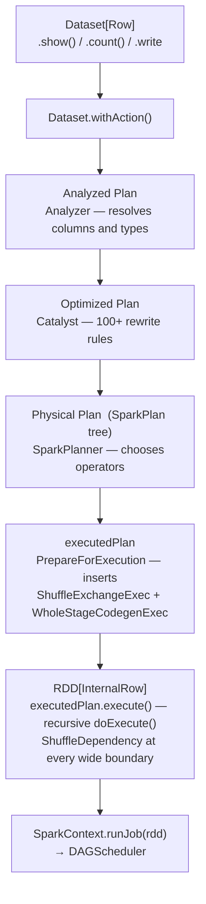

**DAGScheduler** — lives in the driver JVM. Its job is to construct a **DAG of stages** for each job — a directed acyclic graph where each node is a stage and each edge is a dependency (a stage cannot start until all its parent stages have completed and written their shuffle output). To build this DAG, the DAGScheduler walks the RDD lineage, identifies wide dependencies (shuffles), and groups all narrow transformations between two shuffles into a single stage. It does not think about machines or threads — it only thinks about the logical structure of the computation. The DAGScheduler always works at the RDD level — `handleJobSubmitted(finalRDD: RDD[_])` — it has no knowledge of DataFrames or physical plans; all optimization decisions are already encoded in the RDD lineage it receives.

The decisions it makes are: which stages are ready to run (a stage becomes ready once all its parent stages have written their shuffle output), whether to resubmit a map stage whose shuffle output was lost due to an executor failure, and when to cancel downstream stages after a job fails. Task retries within a stage are the TaskScheduler's responsibility, not the DAGScheduler's. All these decisions are processed on a **single-threaded event loop** — job submissions, task completions, executor failures, and stage cancellations all arrive as events and are handled serially. This keeps the DAGScheduler's state consistent without requiring locks on the core execution path. The event loop internals are covered in **Chapter 30 (E1 — Spark Internals)**.

The DAGScheduler itself behaves identically whether the job originated from raw RDD code or a DataFrame query — it always works at the RDD level. What differs is the path *to* the DAGScheduler:

| | Raw RDD | DataFrame / SQL |
|---|---|---|
| **Entry point** | `SparkContext.runJob(rdd)` directly | `executedPlan.execute()` → `sc.runJob(rdd)` (via `executeCollect` for most actions; `QueryExecution.toRdd` only for `Dataset.rdd` access) |
| **Optimization before DAGScheduler** | None — code runs as written | Catalyst: 100+ rules (predicate pushdown, join reordering, projection pruning…) |
| **Code generation** | None — standard JVM closures | Tungsten whole-stage codegen — compiled Java bytecode per stage |
| **Row format** | `RDD[T]` — standard JVM objects | `RDD[InternalRow]` — compact binary `UnsafeRow` |
| **AQE** | ❌ Stage DAG fixed at job submission | ✅ Stage DAG can change mid-execution at shuffle boundaries |

**TaskScheduler** — lives in the driver JVM. Receives `TaskSet` objects from the DAGScheduler — each `TaskSet` already contains a fully-formed `Array[Task[_]]` (one per partition); the DAGScheduler builds the individual tasks, not the TaskScheduler. When executors offer resource slots, the TaskScheduler assigns tasks to those slots. It does not reason about DAG structure (which stages depend on which), but it owns more than just CPU slots and locality: it also manages multi-job scheduling order (FIFO or FAIR via `schedulingMode`), speculative execution (the `task-scheduler-speculation` daemon thread lives here), task retries (via `TaskSetManager`), and executor exclusions. It holds a `dagScheduler` reference solely for upcalls (reporting task completions and failures back).

**SchedulerBackend** — the two-way RPC bridge between the driver's `TaskScheduler` and the executors. Its job has three directions:

- **Inbound from executors → driver**: executors connect to the `DriverEndpoint` (an RPC endpoint inside `CoarseGrainedSchedulerBackend`) and send `RegisterExecutor` on startup and `StatusUpdate` (task completed / failed) as tasks finish.
- **Upward to TaskScheduler**: when an executor registers or a task slot frees up, `DriverEndpoint` calls `makeOffers()` → `TaskScheduler.resourceOffers(offers)` to get task assignments.
- **Outbound from driver → executors**: `launchTasks()` serializes each `TaskDescription` and sends it to the assigned executor via RPC. `killTask()` sends kill signals the same way.

A `reviveThread` fires `ReviveOffers` periodically so delay scheduling can re-evaluate locality preferences without waiting for a new status update.

The actual work is in `CoarseGrainedSchedulerBackend` (shared base for all cluster managers). Each subclass adds only cluster-manager lifecycle logic:

- `StandaloneSchedulerBackend` — Spark Standalone
- `YarnClientSchedulerBackend` / `YarnClusterSchedulerBackend` — YARN client and cluster deploy modes (`YarnSchedulerBackend` is the abstract base, not a usable class)
- `KubernetesClusterSchedulerBackend` — Kubernetes
- `LocalSchedulerBackend` — local mode; extends `SchedulerBackend` directly, bypasses `CoarseGrainedSchedulerBackend` entirely

**MapOutputTracker** — two classes: `MapOutputTrackerMaster` on the driver and `MapOutputTrackerWorker` on each executor. The worker is not a thin stub — it maintains a local `mapStatuses` cache and uses epoch-based invalidation to avoid querying the master on every shuffle read. After every ShuffleMapStage task completes, the master registers the shuffle block locations: `shuffleStatuses[shuffleId][mapIndex] → MapStatus (location: BlockManagerId + getSizeForBlock(reduceId): Long)` — the key is `mapIndex` (the partition index, 0-based), not a task ID. When a downstream stage starts, its tasks query their local `MapOutputTrackerWorker` (fetching from the master only if the epoch is stale) to discover which executor holds each input partition before opening fetch connections. For large shuffle outputs, the master delivers statuses via Broadcast rather than direct RPC. Without MapOutputTracker, the shuffle read step would have no way to locate its data. How often it is consulted, how stale entries are invalidated after executor failure, and its consistency guarantees are covered in **Chapter 30 (E1 — Spark Internals)**.

**BlockManager** — the same `BlockManager` class runs on every executor and on the driver; an `isDriver` flag adjusts behaviour (e.g. file cleanup, ESS registration), not a separate lighter class. It owns two categories of storage directly: cached RDD/DataFrame partitions and broadcast variable copies — both go through `MemoryStore`/`DiskStore`. Shuffle data is different: `SortShuffleWriter` writes shuffle output directly to disk via `shuffleExecutorComponents` / `IndexShuffleBlockResolver`, bypassing BlockManager's own storage entirely. When a remote task fetches shuffle blocks, it opens a **Netty** connection (via `NettyBlockTransferService`) to the source executor; `NettyBlockRpcServer` handles the request and calls `blockManager.getLocalBlockData(blockId)`, which delegates to `shuffleManager.shuffleBlockResolver.getBlockData()` — BlockManager is the network interface for shuffle, not the storage. Uncached input partitions are also not BlockManager-mediated: they are read directly from HDFS/S3 via `FileScanRDD` / Hadoop `InputFormat`. The `BlockId` addressing scheme, eviction lifetime differences between cached partitions, shuffle files, and broadcast copies, and how Netty streams blocks are covered in **Chapter 30 (E1 — Spark Internals)**.

---

### Stage 1: action triggers a job — and DataFrame becomes RDD

When `.show(10)` is called, the Python process sends the unresolved logical plan across Py4J to the driver JVM. Before `SparkContext.runJob` is called, **`QueryExecution`** — Spark SQL's execution pipeline — compiles the DataFrame plan through the following phases entirely inside the driver JVM:

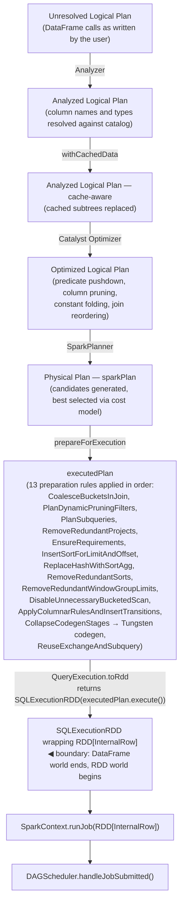

**The Catalog.** The Analyzer's resolution step — `Unresolved Logical Plan → Analyzed Logical Plan` — depends on the **Catalog**: the driver-side metadata repository that stores database names, table names, schemas (column names and types), views, functions, and partition metadata. When you write `df.filter(F.col("country") == "DE")`, the Analyzer looks up `country` in the Catalog to confirm it exists and determine its type before any optimization or execution begins. The default Catalog is in-memory for the current SparkSession (manages temporary views and session-scoped metadata); connecting to a Hive metastore or Unity Catalog makes metadata persistent and shared across sessions. Accessible in PySpark via `spark.catalog`.

`QueryExecution.toRdd` is the boundary between Spark SQL and Spark Core. In Spark 4.1.2 it returns `SQLExecutionRDD(executedPlan.execute(), conf)` — a thin wrapper around `RDD[InternalRow]` that carries SQL execution metadata. Only after this step does `SparkContext.runJob` get called.

**Tungsten** (the `CollapseCodegenStages` preparation step) fuses multiple physical operators into a single compiled Java function, eliminating virtual dispatch and per-row object allocation that the JVM would otherwise impose. Controlled by `spark.sql.codegen.wholeStage` (default: `true`). It is the primary reason the DataFrame API runs at near-native speed regardless of the Python layer above it.

**What is eager vs lazy in this pipeline.** The entire QueryExecution pipeline above runs lazily — it is triggered only when an action fires (or when `.schema` / `.dtypes` is accessed, which forces the Analyzer to run). Two things happen *before* the pipeline and are therefore eager:

- **Schema inference** (`spark.read.csv()` without `.schema(...)`) — Spark reads and samples the source file to determine column names and types at data source creation time, before any action. This is a real Spark job that runs immediately. Always provide an explicit schema to avoid it.
- **Column name validation** — the Analyzer resolves column references against the catalog. If a column does not exist, an `AnalysisException` is raised the first time the Analyzer runs (typically when an action fires, but some APIs trigger it earlier).

Spark 4.x added internal phases (`commandExecuted`, `tableVersionsRefreshed`, `normalized`) to `QueryExecution` for the new SQL scripting and Declarative Pipelines features. For standard DataFrame queries these phases pass through unchanged — the six-phase pipeline above is what matters for DataFrame execution.

The following Catalyst/planner topics are introduced here and covered in depth in **Chapter 20 (A1 — Query Optimisation: Catalyst and the Physical Plan)**:

- **Why phases are separated** — why the Analyzer must resolve before the Optimizer transforms, and why the Planner is distinct from the Optimizer
- **Catalyst rule categories and execution order** — Catalyst is a rule-based rewriting system; rules are grouped into batches and applied in fixed-point iteration until no more rules fire; ordering matters (predicate pushdown must precede projection pruning)
- **QueryPlan tree structure** — logical and physical plans are trees of operator nodes; Catalyst rewrites the tree by pattern-matching and replacing subtrees; this is why algebraic equivalences translate directly into optimization rules
- **Column resolution in the Analyzer** — how `AttributeReference` nodes are resolved against parent outputs; why `AnalysisException` is raised before any action fires
- **Cost-based planner and join strategy selection** — how the planner estimates row counts and sizes to choose between `SortMergeJoin`, `BroadcastHashJoin`, and `ShuffledHashJoin`; when it falls back to heuristics (also covered in **Chapter 22 (A3 — Join Strategies and Tuning)**)

At this point no data has moved. The DAGScheduler receives the compiled `RDD[InternalRow]` — every transformation the user wrote, from `spark.read.text(...)` to `.orderBy(...)`, now expressed as RDD operations.

---

### Stage 2: DAGScheduler builds the stage DAG

The DAGScheduler walks the RDD lineage backwards from the final operation, identifying two types of dependency:

- **Narrow dependency** — each partition of the child depends on at most one partition of the parent (e.g. `filter`, `select`, `map`). These can be pipelined: one executor processes the full chain on its partition without any data movement. All consecutive narrow transformations are collapsed into a single stage.
- **Wide dependency** — each partition of the child depends on multiple partitions of the parent (e.g. `groupBy`, `join`, `repartition`). This requires a shuffle: data must move across executors before the next operation can proceed. Wide dependencies become **stage boundaries**.

The result is a DAG of stages: each node is a stage, each edge is a shuffle dependency. A stage cannot start until all its parent stages have completed and written their shuffle output to disk.

There are two types of stage:

- **ShuffleMapStage** — a stage whose output is written to shuffle files on disk, to be consumed by the next stage. Tasks write partitioned user data to local disk and return a `MapStatus` to the driver — metadata recording which BlockManager holds each output partition, used by `MapOutputTrackerMaster` so downstream reducers know where to fetch.
- **ResultStage** — the final stage in a job. Its tasks apply the user function to their partition and send the result back to the driver (the rows that `.show(10)` prints). May run on a subset of partitions — `first()` runs on one partition only and stops early.

For the word count program:

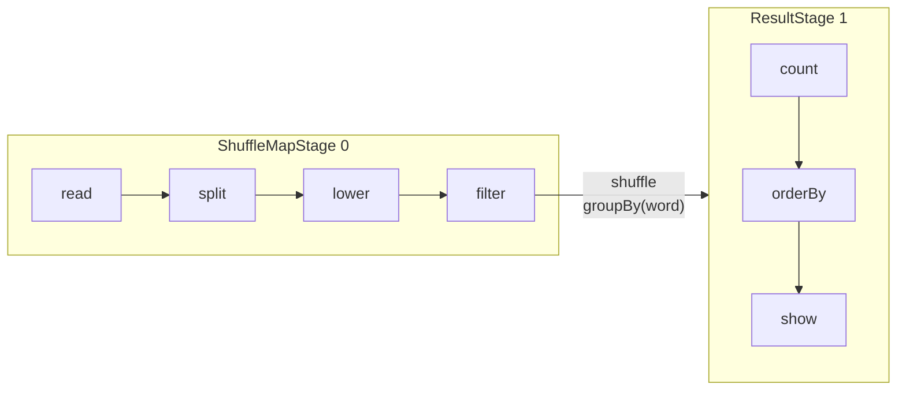

`groupBy("word")` is a wide dependency — every partition must send its words to the executor responsible for that word. That is the shuffle boundary. Everything before it is Stage 0; everything after is Stage 1.

The DAGScheduler does not schedule all stages at once. It schedules Stage 0 first, waits for it to complete, then schedules Stage 1.

**Static vs dynamic stage DAG.** For raw RDD jobs the stage DAG is fully determined at `handleJobSubmitted` time and never changes. For DataFrame/SQL jobs with AQE enabled (`spark.sql.adaptive.enabled = true`, default since Spark 3.2), the physical plan contains an `AdaptiveSparkPlanExec` operator that communicates back to the planner after each shuffle stage completes — using actual partition statistics rather than pre-execution estimates. This can cause the DAGScheduler to receive entirely new stage submissions mid-job: coalescing many small shuffle partitions into fewer large ones, swapping a `SortMergeJoin` for a `BroadcastHashJoin` if the build side turns out small, or splitting a skewed partition into sub-tasks. Raw RDD jobs are unaffected by AQE — the stage DAG is immutable once submitted.

---

### Stage 3: TaskSet creation — one task per partition

For each stage, the DAGScheduler creates a **TaskSet**: a collection of tasks, one per input partition of that stage.

If `1342-0.txt` is split into 4 partitions, Stage 0 gets a TaskSet of 4 tasks. Each task is a serialized closure — the transformation code plus enough metadata to read exactly one partition. The TaskSet is handed to the TaskScheduler. A TaskSet is immutable: every task in it runs the exact same transformation code against a different input partition. This immutability is what makes retries and speculative execution safe — re-running the same code on the same partition always produces the same output. The internal TaskSet representation and how it interacts with the event loop are covered in **Chapter 30 (E1 — Spark Internals)**.

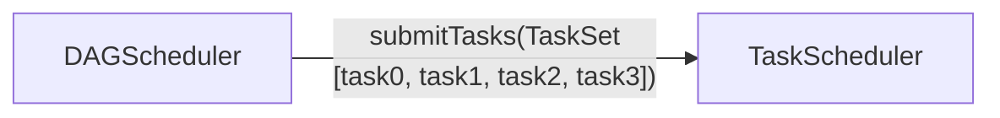

---

### Stage 4: TaskScheduler assigns tasks to executors

The TaskScheduler wraps each TaskSet in a **TaskSetManager**, which tracks the state of every task (pending, running, succeeded, failed) and implements retry logic.

When an executor signals it has a free slot, the TaskScheduler picks the best task for that slot using **data locality** — it prefers to run a task on the executor that already holds the data partition in memory or on the same node as the data file. Locality levels, from best to worst:

| Level | Meaning |
|---|---|
| `PROCESS_LOCAL` | Data is in the executor's own memory (cached partition) |
| `NODE_LOCAL` | Data is on the same physical machine as the executor |
| `NO_PREF` | No locality preference — data is equally accessible from anywhere (e.g. off-heap or external storage) |
| `RACK_LOCAL` | Data is on a different machine but same network rack |
| `ANY` | Data must be fetched over the network |

If no executor with better locality is available, the TaskScheduler waits up to `spark.locality.wait` (default **3s**) before falling back to the next-worse locality level. Each level gets its own wait budget: `spark.locality.wait.process`, `spark.locality.wait.node`, and `spark.locality.wait.rack` all default to the same `spark.locality.wait` value. Set a level to `0` to skip it entirely. The full wait-time logic and how the TaskScheduler decides when to give up are covered in **Chapter 30 (E1 — Spark Internals)**.

The SchedulerBackend serializes the task and launches it on the chosen executor via RPC. The driver **pushes** tasks to executors — executors do not poll for work. The driver is therefore a coordination bottleneck for result collection (all task results flow back to the driver), while executors communicate directly with each other only during shuffle reads. The driver/executor network topology and communication patterns are covered in **Chapter 31 (E2 — Production Deployment)**.

**What gets serialized — the task closure.** A task is not a copy of the data — it is a serialized description of *what to compute and where to find the input*. The closure contains: the transformation functions (the code), references to broadcast variables by ID, partition metadata (which file/block to read), and enough context to reconstruct the input RDD partition. The data itself stays in the executor's BlockManager or on disk; the task code travels to the data, not the other way around.

**Broadcast variables are not copied into the closure.** Only the broadcast variable's integer ID is included. When the executor receives a task that references a broadcast ID it has not yet fetched, it pulls the serialized value directly from the driver (or, for large broadcasts, from other executors using a BitTorrent-like protocol called TorrentBroadcast). The fetched value is cached in the executor's BlockManager and reused by all subsequent tasks that reference the same broadcast ID — the value is never re-transmitted per task. This is the entire point of broadcast variables: sending a large lookup table once per executor instead of once per task.

Spark uses **Java serialization** (Java `ObjectOutputStream`) by default for task closures. **Kryo** serialization is available and approximately 10× faster and more compact — recommended for jobs with heavy shuffle traffic. Enable it with `spark.serializer = org.apache.spark.serializer.KryoSerializer`. In Python, closures are serialized with **Pickle**. Since Spark 2.0, internal shuffle data for simple types (primitives, strings, arrays of primitives) uses Kryo automatically regardless of the configured default.

**DataFrame expressions vs Python UDFs — a critical serialization difference.** A DataFrame column expression like `F.col("x") > 0` is a Catalyst expression tree node — it is compiled to JVM bytecode by Tungsten at plan-time, before any task is sent to an executor. The closure for such a task contains only a reference to the pre-compiled bytecode. A Python UDF (decorated with `@F.udf`) is pickled using Python's pickle library at definition time and stored on the driver; every task closure that uses that UDF carries the pickled Python function, and the executor must unpickle it in a Python subprocess, converting each row from `UnsafeRow` to Python objects and back. This is the root cause of Python UDF overhead — it is not the Python language but the per-row serialization cost. This distinction is covered in depth in **Chapter 13 (I3 — User-Defined Functions)**.

---

### Stage 5: executor runs the task

The executor deserializes the task closure and runs it against its assigned partition. For Stage 0 (ShuffleMapStage) in the word count:

1. Reads lines from its partition of `1342-0.txt` via the BlockManager
2. Runs `split → lower → filter` on each line
3. Hash-partitions the resulting `(word, 1)` pairs by key — each word is deterministically assigned to one of the output partitions
4. Writes the partitioned output to shuffle files on local disk via the BlockManager — each file's name encodes `(shuffleId, mapTaskId, attemptId)` so a retried attempt writes to a different file and cannot overwrite a successful attempt's output
5. Reports completion to the driver — including a **`MapStatus`** for each output partition: the executor's `BlockManagerId` (host + port) and the byte size of each shuffle block it wrote

**What "pipelined execution" means.** Step 2 above — `split → lower → filter` — is not three separate passes over the partition data. It is a single iterator-based pass: each row flows through all three operations before the next row is processed. There is no intermediate materialization between operators within a stage. When Tungsten whole-stage codegen is active, all operators in a stage are fused into a single compiled Java function — the entire chain runs as a tight loop with no virtual method calls between operators. This is the operational meaning of "pipelined": one pass, one loop, no intermediate buffers.

The DAGScheduler's event loop receives this `CompletionEvent` and registers the shuffle block locations in the **MapOutputTracker** — a driver-side registry that maps `(shuffleId, mapTaskId) → (executor host, port, block locations)`. Once all 4 tasks in Stage 0 are done and their locations are registered, the DAGScheduler submits Stage 1.

---

### Stage 6: shuffle — data moves between stages

Before Stage 1 can start, executors running Stage 1 tasks must fetch the shuffle data written by Stage 0. Each Stage 1 task first queries the **MapOutputTracker** on the driver to discover which executor holds each block of its input — the exact host and port for every map output partition it needs. Only then does it open fetch connections to those executors and pull the data. This is the **shuffle read**; the data crosses the network here.

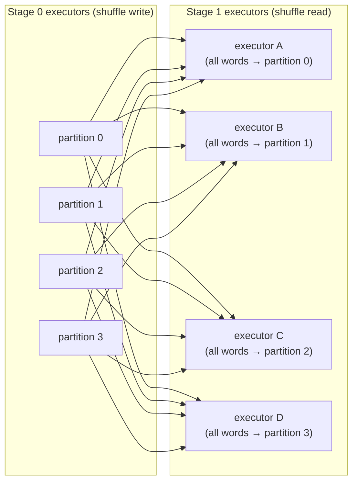

This is why shuffles are expensive: every Stage 1 executor must fetch data from every Stage 0 executor. Network I/O, disk I/O, and serialization all happen here. The map-side write mechanics — how map tasks sort and partition output before writing, and how reducer-side merge works — are covered in **Chapter 30 (E1 — Spark Internals)**.

**The shuffle barrier.** No Stage 1 task starts until *all* Stage 0 tasks have completed and registered their shuffle output with MapOutputTracker. The DAGScheduler enforces this hard barrier — it only submits Stage 1's TaskSet after receiving `CompletionEvent` for every task in Stage 0. The invariant this maintains: **every map output partition is guaranteed to exist before any reducer tries to fetch it**. Without this guarantee, a reducer could not distinguish "output not yet written" from "task failed and output will never arrive" — it would have to poll indefinitely or guess. The barrier eliminates that ambiguity entirely. The reason: if a Stage 1 task started fetching while Stage 0 was still running, some map output would not exist yet, causing a fetch failure. The barrier trades latency (Stage 1 waits for the slowest Stage 0 task) for correctness and simple fault recovery (any lost shuffle file can be identified and its stage resubmitted cleanly).

---

### Stage 7: ResultStage — results return to the driver

Stage 1 tasks run `count → orderBy` on their local word groups. The final `orderBy` requires another partial sort on each executor. The top-N results from each executor are sent back to the driver via the SchedulerBackend.

The driver merges the partial results, selects the top 10 overall, and `show()` prints them.

---

### Failure handling

The DAGScheduler and TaskScheduler handle failures at different levels:

- **Task failure** (executor crash, out-of-memory, exception): the TaskScheduler retries the task on a different executor, up to `spark.task.maxFailures` times (default 4). The shuffle state of the stage is unaffected — only this one task re-runs.
- **Executor failure** (the JVM process dies): this is more severe than a task failure because the executor's shuffle files are gone. The DAGScheduler calls `mapOutputTracker.removeOutputsOnExecutor(execId)`, unregistering all map outputs from that executor. `ShuffleMapStage.findMissingPartitions()` then returns only those now-missing partitions — those tasks re-run, not necessarily the whole stage. The distinction matters: losing one task loses one partition's work; losing an executor loses all that executor's shuffle output, which may be a large fraction of the stage.
- **Stage failure** (all task retries exhausted, or fetch failures exhaust `spark.stage.maxConsecutiveAttempts` — default 4): the DAGScheduler first retries the entire stage. If the retry succeeds (e.g. a transient network error resolved), the job continues. Only when all stage retries are exhausted does the job fail. When a stage fails permanently, all sibling stages at the same level and all downstream stages are cancelled immediately — a Spark job is all-or-nothing at the stage level.

**TaskAttempt vs Task.** Each retry of a failed task is a new **TaskAttempt** with a unique attempt ID. Shuffle output files include the attempt ID in their filename, so a retried attempt's output does not overwrite the previous attempt's files. Once any TaskAttempt for a given task completes successfully, the DAGScheduler accepts its output and ignores all outstanding duplicates (from speculative execution or late-arriving retries). Retries are safe because RDD partitions are immutable: re-running the same transformation on the same input partition always produces identical output.

The key reason executor death is handled differently from task failure: the shuffle barrier means downstream tasks have not yet started when the shuffle files are lost, so the DAGScheduler can resubmit the affected map tasks cleanly without corrupting any in-progress work.

---

!!! note "Going deeper — DAGScheduler internals (Chapter 30)"
    The sections above explain what the DAGScheduler decides. Chapter 30 (E1 — Spark Internals) covers how it is implemented:

    - **`handleJobSubmitted → createResultStage → submitStage → submitMissingTasks`** — the full call chain from job submission to task launch
    - **State machine** — `activeJobs`, `waitingStages`, `runningStages`, `failedStages` and how transitions between them are driven by `CompletionEvent` and `TaskSetFailed`
    - **Stage deduplication** — `getOrCreateParentStages` ensures a shared RDD ancestor becomes one stage, not one per downstream branch
    - **Barrier execution mode** — all tasks in a barrier stage must launch simultaneously; used for distributed ML frameworks that need a global synchronization point
    - **Stage and job cancellation** — how `cancelJob`, `cancelStage`, and `killTaskAttempt` propagate through the event loop and interrupt running tasks

### Shuffle storage: local, external, and remote

By default, Spark executors write shuffle output to **local disk** on the worker node. This creates two problems:

1. **Executor lifecycle coupling** — if an executor dies before Stage 1 reads its shuffle files, the DAGScheduler unregisters that executor's map outputs and resubmits only the tasks whose output was lost.
2. **Random small-file I/O** — each reducer fetches many small files from many executors across the network, resulting in scattered random reads.

Three progressively decoupled solutions exist:

---

**External Shuffle Service (ESS)** — a long-running JVM process deployed on every worker node, separate from executor processes. Executors write shuffle files and register them with the local ESS. If an executor is killed, the ESS continues serving its shuffle files to reducers. ESS is required for dynamic allocation on YARN and Standalone (so executors can be removed without losing their shuffle data).

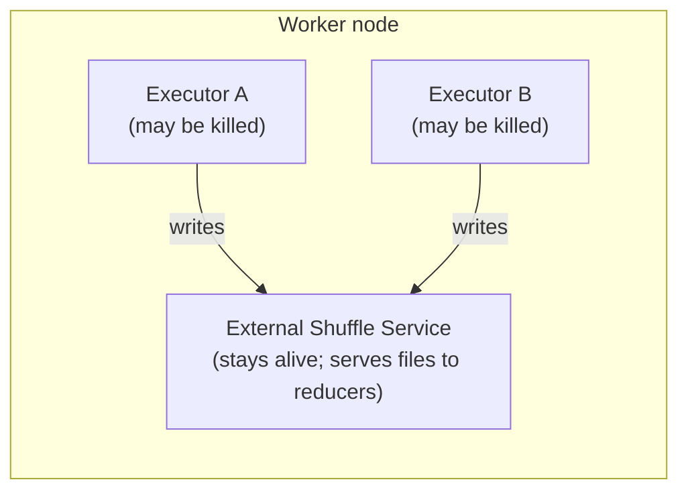

Enable with: `spark.shuffle.service.enabled = true` (default: `false`)

Limitation: ESS still ties shuffle data to the physical worker node. If the node fails, the data is gone.

---

**Push-based shuffle** — built into Spark (YARN + ESS only). Instead of waiting for reducers to pull data, map tasks actively **push** shuffle blocks to the ESS as they complete. The ESS merges blocks from multiple mappers into larger merged files per output partition. Reducers then read one large sequential merged file instead of many small random files.

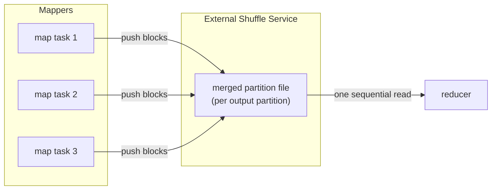

Enable with: `spark.shuffle.push.enabled = true` (default: `false`; YARN + ESS only)

---

**Remote Shuffle Service (RSS)** — a dedicated cluster of shuffle servers, completely separate from the Spark cluster. Executors write shuffle data over the network to the RSS cluster instead of local disk. No shuffle data touches the worker node's disk at all. This is the architecture required for **compute-storage separation** — common in cloud-native Kubernetes deployments where mounting hostPath volumes on every node is impractical.

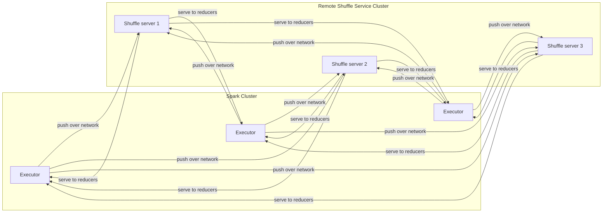

Two production-grade Apache-incubated RSS implementations:

| Project | Apache status | Storage tiers | Notes |
|---|---|---|---|
| **Apache Celeborn** | Apache TLP | Memory → local disk → HDFS / object store | Supports Spark 2.4–4.x; LifecycleManager runs inside the driver |
| **Apache Uniffle** | Apache TLP | Memory → local disk → HDFS | Coordinator cluster assigns shuffle servers per job; official docs cover Spark 2/3 — verify Spark 4 JAR availability |

Both implement Spark's shuffle plugin API (`spark.shuffle.manager`). The Spark application sets the plugin class and the shuffle plugin intercepts all shuffle write/read calls, redirecting them to the RSS cluster instead of local disk.

**Configuring Apache Celeborn:**

```bash
# 1. Copy the Celeborn client JAR to the Spark classpath
# Use the spark-4 variant for Spark 4.x (spark-3 for Spark 3.x)
cp celeborn-client-spark-4-shaded_*.jar $SPARK_HOME/jars/
```

```properties
# Required
spark.shuffle.manager               org.apache.spark.shuffle.celeborn.SparkShuffleManager
spark.serializer                    org.apache.spark.serializer.KryoSerializer
spark.celeborn.master.endpoints     clb-1:9097,clb-2:9097,clb-3:9097
spark.shuffle.service.enabled       false

# Recommended
spark.celeborn.client.push.replicate.enabled  true   # server-side replication for fault tolerance
spark.sql.adaptive.localShuffleReader.enabled false  # must disable for Celeborn compatibility
```

**Apache Uniffle — Spark 3.x only (not verified for Spark 4.x):**

As of Spark 4.1.2, Uniffle's official client guide documents Spark 2 and Spark 3 JARs only. The JAR path below (`spark3/`) is for Spark 3.x. Do not use this configuration with Spark 4.x until a verified Spark 4 client JAR is available on the [Uniffle releases page](https://github.com/apache/uniffle/releases). For Spark 4.x, use Celeborn (config above) instead.

```bash
# Spark 3.x only — Spark 4.x unverified
cp rss-client-spark3-shaded-*.jar $SPARK_HOME/jars/
```

```properties
spark.shuffle.manager              org.apache.spark.shuffle.RssShuffleManager
spark.rss.coordinator.quorum       coord-1:19999,coord-2:19999
spark.shuffle.sort.io.plugin.class org.apache.spark.shuffle.RssShuffleDataIo
```

---

### The full component map

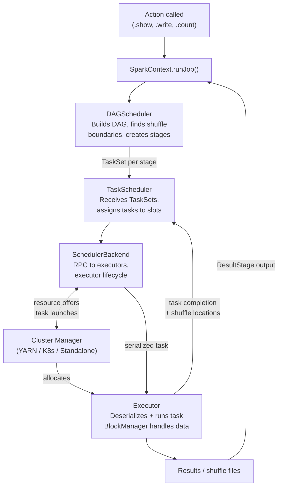

Every component in the driver (SparkContext, DAGScheduler, TaskScheduler, SchedulerBackend) runs in the driver JVM. Executors are separate JVM processes on worker nodes. The cluster manager is an external service that neither the driver nor the executors run inside.

---

## Submitting applications: `--master` and `--deploy-mode`

Now that the architecture is clear — driver, executor, cluster manager — the `spark-submit` flags become concrete.

**`--master`** tells Spark how to run — either in a single local JVM, or where to find the cluster manager:

| `--master` value | Cluster? | Meaning |
|---|---|---|
| `local` | No | One JVM, one thread, one task at a time |
| `local[N]` | No | One JVM, N parallel threads (`local[4]` = 4 tasks) |
| `local[*]` | No | One JVM, one thread per CPU core — standard for local dev |
| `spark://host:7077` | Yes | Spark Standalone cluster manager at that address |
| `yarn` | Yes | YARN — no IP needed; ResourceManager address is read from `yarn-site.xml` inside `HADOOP_CONF_DIR` |
| `k8s://https://host:443` | Yes | Kubernetes API server |

With any `local[...]` value there is no cluster manager, no network, and no `--deploy-mode` concept — driver and executors share one JVM.

**`--deploy-mode`** answers one question: *where does the driver process run?* It only applies when `--master` points at a real cluster.

**`client` (default)** — the driver runs on the machine that called `spark-submit`. Stdout streams to your terminal. Kill the terminal and the job dies.

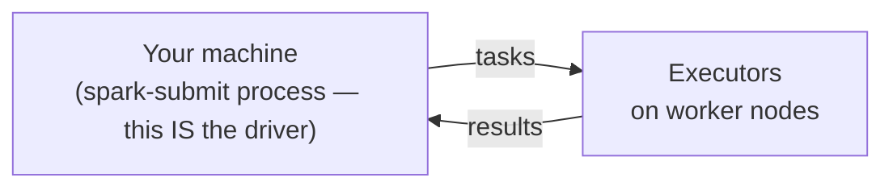

**`cluster`** — the driver is launched by the cluster manager on a worker node. `spark-submit` exits after handoff; you can close your laptop.

```mermaid
flowchart LR
    S["Your machine\n(spark-submit — exits after handoff)"]
    D["Worker node A\n(driver — launched by cluster manager)"]
    E["Worker nodes B, C, D\n(executors)"]
    S -->|submits| D
    D -->|tasks| E
    E -->|results| D
```

**Availability by cluster manager:**

| Setup | `--master` | `client` | `cluster` |
|---|---|---|---|
| pip / local | `local[*]` | N/A | N/A |
| Docker / Standalone | `spark://host:7077` | ✅ | ✅ Scala/Java only — Standalone cannot launch a Python process on a worker node, so PySpark must use `client` mode |
| YARN | `yarn` | ✅ | ✅ incl. PySpark |
| Kubernetes | `k8s://...` | ✅ | ✅ incl. PySpark (recommended) |
| Managed (Databricks, EMR, GCP Managed Spark, MS Fabric…) | platform-managed | abstracted | abstracted |

**When to use each:**

| Scenario | Choice |
|---|---|
| Local dev, notebook, `pyspark` shell | `--master local[*]` |
| Submitting from a gateway node inside the cluster | `--deploy-mode client` |
| Submitting from your laptop to a remote YARN/K8s cluster | `--deploy-mode cluster` |
| Production scheduled job | `--deploy-mode cluster` — no dependency on the submitting machine |

**Three equivalent ways to set master and deploy mode:**

```bash
# 1. spark-submit flags (most common for production jobs)
spark-submit --master yarn --deploy-mode cluster my_job.py
```

```python
# 2. SparkSession builder methods (scripts and notebooks)
spark = (
    SparkSession.builder
    .master("yarn")
    .config("spark.submit.deployMode", "cluster")
    .appName("my-job")
    .getOrCreate()
)
```

```bash
# 3. spark-defaults.conf (cluster-wide default, applies to all jobs)
spark.master                yarn
spark.submit.deployMode     cluster
```

---

## Installation

### Option 1 — pip (client/driver side only)

`pip install pyspark` bundles the Spark JARs inside the Python package — no tarball download or `SPARK_HOME` setup needed. Java 17+ must still be installed separately.

```bash
pip install pyspark          # Spark JARs + Python bindings (~300 MB); Java 17+ required separately
pip install pyspark-client   # Spark 4.0+ only: Connect-only pure-Python client, no JVM at all (~1.5 MB)
```

This gives you `spark-submit` and the `pyspark` shell. You can run locally (`--master local[*]`) or use it as the driver to connect to an existing cluster in `client` deploy mode.

What pip does **not** include: cluster setup scripts, Scala/R bindings. For a real cluster, every **executor node** still needs Spark installed — either via the tarball (Options 3–5 below) or baked into a Docker image (Option 2).

**How pip packaging evolved:**

| Era | What `pip install pyspark` contained | JAR source |
|---|---|---|
| PySpark ≤ 2.0.x | Python wrapper scripts only | Required manual tarball download + `SPARK_HOME` |
| **PySpark 2.1.0 (Nov 2016)** | **Full Spark JARs bundled into the wheel** | Self-contained — no tarball needed |
| PySpark 4.0.0 (May 2025) | Same + new `pyspark-client` sibling package | `pyspark-client` is pure Python, zero JARs, Connect-only |

The shift happened in [PR #15659](https://github.com/apache/spark/pull/15659), merged into branch-2.1 in November 2016: *"copy the jars over and package them with the Python code."* This is why older books still instruct you to download the tarball and set `SPARK_HOME` — they were written before or without awareness of the bundled-JAR approach, or assumed an enterprise context where executor nodes need the tarball anyway.

Use this for: local development, unit tests, notebooks, and as the driver when connecting to an existing cluster.

### Option 2 — Docker / local stack (Standalone cluster)

This project's setup (`docker compose up` in the [spark-delta-unitycatalog](https://github.com/arindamchoudhury/spark-delta-unitycatalog) repo). A Spark Standalone cluster runs inside Docker with a Spark Connect server on port 15002.

```bash
docker compose up   # starts Spark master + worker + Connect server
```

You connect via Spark Connect (`SPARK_REMOTE="sc://localhost"`) or submit directly to the Standalone cluster. Deploy mode is `client` only for PySpark — Standalone cannot ship a Python environment to a worker node.

Use this for: integration testing, local experimentation with Delta Lake and Unity Catalog.

### Option 3 — Standalone cluster (bare metal / VMs)

You install Spark on a set of machines, start a master process and worker processes yourself. Spark's own lightweight cluster manager handles resource allocation.

```bash
# on master node
$SPARK_HOME/sbin/start-master.sh

# on each worker node
$SPARK_HOME/sbin/start-worker.sh spark://master-host:7077
```

Submit with `--master spark://master-host:7077`. PySpark supports `client` deploy mode only.

Use this for: small on-prem clusters, learning cluster management without Hadoop or Kubernetes overhead.

### Option 4 — YARN (Hadoop clusters)

The dominant enterprise on-prem setup. Spark runs on top of Hadoop's resource manager. Both `client` and `cluster` deploy modes are fully supported for PySpark.

```bash
spark-submit \
  --master yarn \
  --deploy-mode cluster \
  my_job.py
```

Use this for: existing Hadoop infrastructure, enterprise data lakes.

### Option 5 — Kubernetes

Spark submits each application as a set of Pods. `cluster` mode is the recommended and most natural fit — the driver runs as a Pod inside the cluster.

```bash
spark-submit \
  --master k8s://https://k8s-api-server:443 \
  --deploy-mode cluster \
  --conf spark.kubernetes.container.image=my-spark-image \
  my_job.py
```

Use this for: cloud-native deployments, containerised data platforms.

### Option 6 — Managed services

Databricks, Amazon EMR, GCP **Managed Service for Apache Spark** (formerly Dataproc), Microsoft **Fabric** (formerly Azure HDInsight, which retired in 2025). Spark is pre-installed and the platform manages the cluster. You don't write `spark-submit` directly — you use the platform's job submission UI or API. `--deploy-mode` is abstracted away.

Use this for: production workloads where you want managed infrastructure.

### Wiring PySpark from the tarball into a venv (Options 3–5)

When Spark is installed via tarball, `$SPARK_HOME/python/` already contains `pyspark` and `$SPARK_HOME/python/lib/` contains the matching `py4j-*.zip`. On a cluster, the daemon and workers load from these files. If you also `pip install pyspark` into your venv, you now have two copies — and version drift between them is a common source of hard-to-diagnose errors.

The clean solution is a `.pth` file: Python processes every `.pth` file found in `site-packages` at startup and adds the listed paths to `sys.path`. No duplication, no separate install.

```bash
# find the py4j zip bundled with the tarball
PY4J=$(ls $SPARK_HOME/python/lib/py4j-*.zip)

# write the .pth file into your active venv
cat > $(python -c "import site; print(site.getsitepackages()[0])")/spark_tarball.pth <<EOF
$SPARK_HOME/python
$PY4J
EOF
```

After this, `import pyspark` and `import py4j` resolve to the tarball's copies — identical to what the daemons and executors use. No `pip install pyspark` needed, and `PYTHONPATH` does not need to be set manually.

---


## Where Spark doesn't shine

Spark is a general-purpose distributed engine, not the best tool for every workload. Reaching for Spark when a simpler tool would do is itself a common mistake.

| Situation | Why Spark struggles | Better choice |
|---|---|---|
| **Data fits on one machine** (up to ~100 GB) | JVM startup, cluster coordination, and shuffle overhead dominate the runtime. A single-node engine avoids all of it. | pandas, Polars, DuckDB |
| **Sub-second interactive SQL** | Spark executes in stages; stage boundaries and task scheduling add latency. Trino pipelines stages concurrently and skips JVM serialization overhead. | Trino / Presto |
| **True real-time streaming** (millisecond latency) | Structured Streaming is micro-batch, not event-by-event. Even the Real-Time Mode (4.0+) targets seconds, not milliseconds. | Apache Flink |
| **Row-level OLTP** (inserts, point lookups, transactions) | Spark is an analytics engine — it reads large columnar datasets in bulk. It has no row-level index and is not a database. | PostgreSQL, MySQL |
| **Many small files** (millions of files, KB each) | Each file becomes at least one task. Scheduling overhead dwarfs the actual work. | Consolidate files first, or use a purpose-built tool |
| **GPU-based deep learning** | Spark MLlib is CPU-oriented and designed for data parallelism over DataFrames. It doesn't natively handle GPU communication or all-reduce patterns. | PyTorch + Ray / Horovod |

The pattern: Spark is the right choice when data is large enough that distribution is necessary and the workload is batch, iterative, or near-real-time. When data is small, latency is tight, or the workload is transactional, a specialised tool will be faster, cheaper, and simpler to operate.

Sources: [AltexSoft — Spark pros and cons](https://www.altexsoft.com/blog/apache-spark-pros-cons/), [Trino vs Spark](https://snicsolutions.com/compare/trino-vs-spark), [DuckDB vs Spark benchmark](https://blog.dataexpert.io/p/duckdb-can-be-100x-faster-than-spark)

---


## Summary

- Spark uses a driver-executor model: the driver plans, executors process data in parallel partitions.
- In classic mode the driver is two processes (Python + JVM via Py4J); in Connect mode the Python client talks to a remote JVM server over gRPC. Classic is the default in all Spark 4.x.
- All transformations are lazy: no data moves until an action (`show`, `write`, `count`) triggers a job.
- A job breaks into stages (shuffle boundaries) and tasks (one per partition).
- `--master` sets where the cluster manager is (or `local[*]` for no cluster). `--deploy-mode` sets where the driver runs — only meaningful with a real cluster.

---

## References

- [Apache Spark cluster overview](https://spark.apache.org/docs/latest/cluster-overview.html)
- [PySpark 4.1.x documentation](https://spark.apache.org/docs/latest/api/python/)
- [Spark Connect overview](https://spark.apache.org/docs/latest/spark-connect-overview.html)
- [Submitting Applications](https://spark.apache.org/docs/latest/submitting-applications.html)
- [PR #15659 — bundled JARs in pip package](https://github.com/apache/spark/pull/15659)
