# Chapter 02 — Spark Architecture and the Execution Model

> *Learning-path topic: B1 (Beginner)*
> *Written: 2026-06-05 · rewritten 2026-08-11 · Spark 4.2.0 / Python 3.10+*

This chapter covers the physical architecture of a Spark application — the processes that exist while a job runs, the components inside each one, and the path a single action takes from your Python call to rows coming back. Everything below was checked against Apache Spark 4.2.0: the source at tag `v4.2.0`, and a running instance of the [local stack](https://github.com/arindamchoudhury/spark-delta-unitycatalog) (Spark 4.2.0, Java 21, Python 3.14, `local[*]`). Where a number appears — a stage count, a job count, a partition count — it is a number that was observed, not one derived from the shape of the code.

That distinction matters more than it sounds. The most common way to get Spark's execution model wrong is to read the stage boundaries off your own transformation chain. That method works most of the time and fails silently the rest of the time, and this chapter's central example is one of the cases where it fails.

**Learning outcomes.** After this chapter you can:

- name the processes in a running Spark application and say which one holds which state
- trace an action from `.show()` through `QueryExecution`, the `DAGScheduler`, the `TaskScheduler` and back
- predict how many jobs and stages a query submits — and say why the honest answer is often "it depends on AQE and on how selective the filter is"
- explain what a shuffle physically writes, and which of Spark's three shuffle writers produced it
- distinguish task failure, fetch failure and executor loss, and say what recovers from each
- say what actually declares an executor dead, and why a long GC pause looks identical

---

## 1. A first Spark program

Here is a complete word count — the canonical "hello world" of distributed computing. It reads *Pride and Prejudice* from the Gutenberg corpus in the local stack, counts every word, and shows the top 10.

The runnable versions live in the stack repo:

- **[`workspace/notebooks/intro.ipynb`](https://github.com/arindamchoudhury/spark-delta-unitycatalog/blob/main/workspace/notebooks/intro.ipynb)** — notebook with cells labelled Read / Transform / Action / Inspect the plan
- **[`workspace/pyscript/intro.py`](https://github.com/arindamchoudhury/spark-delta-unitycatalog/blob/main/workspace/pyscript/intro.py)** — standalone script

```python
import os
import sys
from pathlib import Path

# Apache Spark 4.2.0 / PySpark 4.2.0 · Python 3.14 · Delta Lake 4.2.0
from pyspark.sql import SparkSession
import pyspark.sql.functions as F

# ── Session setup ──────────────────────────────────────────────────────────────

SCRIPT_DIR = Path(__file__).resolve().parent
DATA_FILE = SCRIPT_DIR / ".." / "data" / "gutenberg_books" / "1342-0.txt"

os.environ["SPARK_LOCAL_IP"] = "127.0.0.1"

spark = (
    SparkSession.builder
    .appName("ch02-spark-architecture")
    .getOrCreate()
)

print(f"Spark {spark.version} · Python {sys.version.split()[0]}")
# Spark 4.2.0 · Python 3.14.4

# ── Read ───────────────────────────────────────────────────────────────────────

# spark.read.text() is lazy — the file is not opened until an action fires.
book = spark.read.text(DATA_FILE.as_posix())

# ── Transform (all lazy) ───────────────────────────────────────────────────────

top_words = (
    book
    .select(F.explode(F.split("value", " ")).alias("word"))     # one word per row
    .select(
        F.lower(F.regexp_extract("word", "[a-z]+", 0))          # lowercase + strip punctuation
         .alias("word")
    )
    .filter(F.col("word") != "")                                # drop empty strings
    .groupBy("word")
    .count()
    .orderBy(F.col("count").desc())
)

# ── Action ─────────────────────────────────────────────────────────────────────

top_words.show(10)   # <-- the first action; only now does Spark execute anything
# +----+-----+
# |word|count|
# +----+-----+
# | the| 4207|
# |  to| 4179|
# |  of| 3696|
# | and| 3445|
# | her| 2136|
# |   a| 1950|
# | was| 1841|
# |  in| 1833|
# |  he| 1709|
# |that| 1528|
# +----+-----+
# only showing top 10 rows

spark.stop()
```

`spark.read.text(...)` names the source. Every line up to `.show(10)` adds a **transformation** on top — recorded, not executed. `.show(10)` is the first **action**: the moment Spark takes the recorded description, compiles it into a physical plan, distributes the work, and returns rows. The rest of the chapter is what happens in those few hundred milliseconds.

### Running it against the local stack

The stack's `spark` container starts a **Spark Connect server** on port 15002 and nothing else — there is no Spark master, no worker daemons, and no Standalone cluster. Every Spark application in the stack runs with `spark.master = local[*]` from [`spark/conf/spark-defaults.conf`](https://github.com/arindamchoudhury/spark-delta-unitycatalog/blob/main/spark/conf/spark-defaults.conf), which means driver and executor share one JVM.

```bash
# Classic mode inside the container — one JVM, local[*], the Spark UI on 4040
docker compose exec spark python3 /workspace/pyscript/intro.py
```

```bash
# The same thing through spark-submit, with the master stated explicitly
docker compose exec spark spark-submit --master "local[*]" /workspace/pyscript/intro.py
```

```bash
# Connect mode — the client talks gRPC to the already-running Connect server
docker compose exec spark python3 -c "
from pyspark.sql import SparkSession
spark = SparkSession.builder.remote('sc://localhost:15002').getOrCreate()
print(spark.version, spark.read.text('/workspace/data/gutenberg_books/1342-0.txt').count())
"
```

!!! warning "The Connect distribution does not make Connect the default"

    Spark ships a `-connect` binary distribution, and this stack installs from `spark-4.2.0-bin-hadoop3-connect.tgz`. That does **not** make Connect the default session type. The switch is `spark_connect_mode()` in `python/pyspark/util.py`: it returns the `SPARK_CONNECT_MODE` environment variable if set, otherwise `"1"` if the separate `pyspark_connect` **pip package** is importable, otherwise `"0"`. The tarball's `python/` directory ships `pyspark` only, so on this stack `pyspark_connect` is not importable and `SparkSession.builder.getOrCreate()` returns a classic `pyspark.sql.session.SparkSession` on `local[*]`.

    Connect is opt-in here, and the opt-in is explicit: `.remote("sc://…")`, `SPARK_REMOTE`, `spark.remote`, or `spark.api.mode=connect` (also readable from `SPARK_API_MODE` since 4.2.0). The stack's Dagster assets take the first route — `SparkSession.builder.remote("sc://spark:15002")` — which is why the Connect server exists at all.

### The plan you print is not the plan that runs

Ask the DataFrame to explain itself and you get one plan:

```python
top_words.explain()
```

```text
== Physical Plan ==
AdaptiveSparkPlan isFinalPlan=false
+- Sort [count#5L DESC NULLS LAST], true, 0
   +- Exchange rangepartitioning(count#5L DESC NULLS LAST, 200), ENSURE_REQUIREMENTS
      +- HashAggregate(keys=[word#4], functions=[count(1)])
         +- Exchange hashpartitioning(word#4, 200), ENSURE_REQUIREMENTS
            +- HashAggregate(keys=[word#4], functions=[partial_count(1)])
               +- Project [lower(regexp_extract(word#2, [a-z]+, 0)) AS word#4]
                  +- Filter NOT (lower(regexp_extract(word#2, [a-z]+, 0)) = )
                     +- Generate explode(split(value#0,  , -1)), false, [word#2]
                        +- FileScan text [value#0] ... 1342-0.txt
```

Two `Exchange` nodes: one `hashpartitioning` for the `groupBy`, one `rangepartitioning` for the global sort. Two shuffles, therefore three stages. That reading is correct — for *this* plan. But `show(10)` does not run this plan.

`Dataset.show(n)` calls `getRows(n)`, which calls `take(n + 1)`, which calls `head(n + 1)` — so `show(10)` is really a `LIMIT 11` sitting on top of your query. Plan *that*:

```python
top_words.limit(11).explain()
```

```text
== Physical Plan ==
AdaptiveSparkPlan isFinalPlan=false
+- TakeOrderedAndProject(limit=11, orderBy=[count#5L DESC NULLS LAST], output=[word#4,count#5L])
   +- HashAggregate(keys=[word#4], functions=[count(1)])
      +- Exchange hashpartitioning(word#4, 200), ENSURE_REQUIREMENTS
         +- HashAggregate(keys=[word#4], functions=[partial_count(1)])
            +- Project [lower(regexp_extract(word#2, [a-z]+, 0)) AS word#4]
               +- Filter NOT (lower(regexp_extract(word#2, [a-z]+, 0)) = )
                  +- Generate explode(split(value#0,  , -1)), false, [word#2]
                     +- FileScan text [value#0] ... 1342-0.txt
```

The `Sort` and its `Exchange rangepartitioning` are **gone**. One `Exchange` remains, so this query has **two** stages, not three.

The rule that did this is `SpecialLimits.planTakeOrdered` in `SparkStrategies.scala`. It rewrites `Limit(n, Sort(…))` into `TakeOrderedAndProjectExec` whenever `n` is below `spark.sql.execution.topKSortFallbackThreshold` — whose default is `Integer.MAX_VALUE − 15`, verified as `2147483632` on the running stack, so in practice always. `TakeOrderedAndProjectExec.executeCollect` calls `RDD.takeOrdered(n)`: every partition emits its own local top-*n*, and the driver merges those into a global top-*n*. A global sort would need every row in count order across the whole dataset; a global top-11 does not.

!!! warning "You cannot read the stage count off your transformation chain"
    `groupBy` implies a shuffle. `orderBy` implies a shuffle. Both statements are true in isolation and the second one is false here, because the planner saw a `LIMIT` above the `Sort` and chose a different operator. This is the single most useful reason to read `explain()` output rather than reason from the API: the physical plan is the ground truth, and it is planned *with* the limit that `show()` silently adds.

    The practical habit: to see what `show(n)` runs, explain `df.limit(n + 1)`, not `df`.

### Applications, jobs, stages, and tasks

Four nested levels of execution. Every tab in the Spark UI maps to exactly one of them.

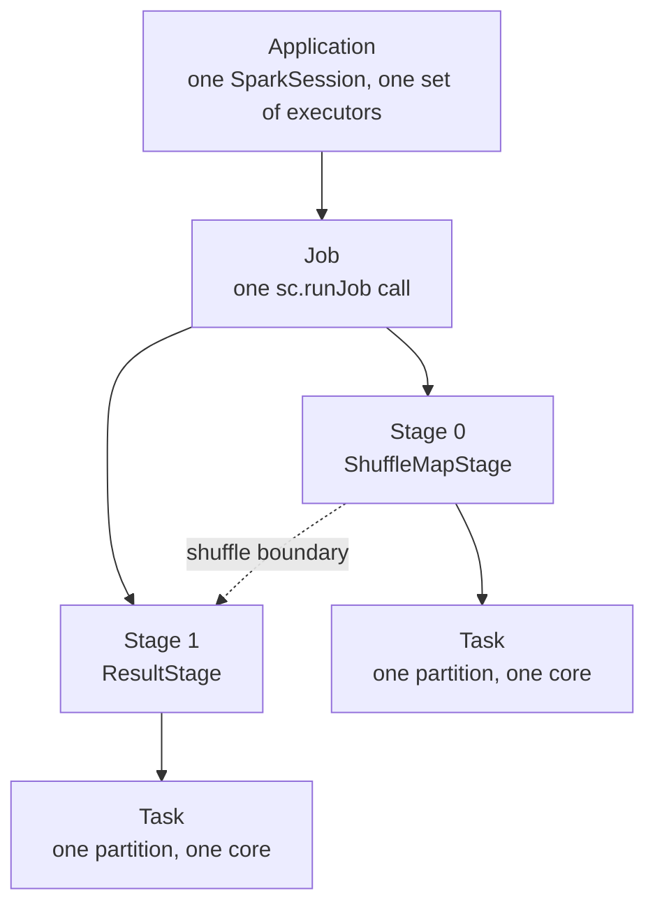

**Application** — the outermost unit. One `SparkSession`, alive for the lifetime of your script. All jobs in an application share the same executors and the same in-memory caches.

**Job** — one call to `SparkContext.runJob`. Actions submit jobs; the relationship is *not* one-to-one, which is the next section.

**Stage** — a group of tasks that can run with no data moving across the network. Boundaries are drawn at shuffle boundaries: wide dependencies like `groupBy`, `join` and `repartition`.

**Task** — the smallest unit: one partition, one thread, one executor core. All tasks in a stage run identical code over different slices.

Observed for the word count on the local stack, `local[*]` with 16 cores:

| Level | Count | Why |
|---|---|---|
| Application | 1 | the script's `SparkSession` |
| Job | 2 with AQE on, 1 with AQE off | see below |
| Stage | 2 | one shuffle (`hashpartitioning`), so one boundary |
| Task, stage 0 | 1 | `1342-0.txt` is 0.7 MB and `spark.sql.files.maxPartitionBytes` is 128 MB, so the file is a single partition |
| Task, stage 1 | 1 | planned as 200 shuffle partitions; AQE coalesced them to 1 because the shuffle output is tiny |

That last row is worth sitting with. The chapter could have said "200 tasks, the default `spark.sql.shuffle.partitions`" and been wrong by a factor of two hundred, because AQE looked at the actual shuffle output size at run time and coalesced. On a real dataset the coalesced count lands somewhere between 1 and 200 depending on data volume.

### How many jobs is one action?

"One action, one job" is the standard teaching line. It is a useful first approximation and it is false for the action this chapter uses. Two independent mechanisms break it.

**Mechanism 1 — AQE materialises shuffle stages as separate jobs.** With `spark.sql.adaptive.enabled` (default `true` since Spark 3.2), the physical plan is an `AdaptiveSparkPlanExec` that executes one query stage at a time, collects real statistics from the completed shuffle, re-optimises the remainder, then submits the next. Each materialisation is its own `runJob`. Measured on the stack:

```python
t = spark.sparkContext.statusTracker()

spark.conf.set("spark.sql.adaptive.enabled", "false")
before = len(t.getJobIdsForGroup())
top_words.show(10)
print(len(t.getJobIdsForGroup()) - before)
# 1

spark.conf.set("spark.sql.adaptive.enabled", "true")
before = len(t.getJobIdsForGroup())
top_words.show(10)
print(len(t.getJobIdsForGroup()) - before)
# 2
```

With AQE off: one job, two stages. With AQE on: two jobs — the first materialises the shuffle map stage, the second runs the final stage over the coalesced output and lists the already-completed map stage as a skipped parent.

**Mechanism 2 — `executeTake` is a loop, not a job.** `SparkPlan.executeTake(n)` scans `spark.sql.limit.initialNumPartitions` partitions (default **1**), and if it has not yet collected *n* rows, multiplies the partition count by `spark.sql.limit.scaleUpFactor` (default **4**) and calls `sc.runJob` again. A selective filter under a `show()` therefore runs several jobs over the same query:

```python
# 200 partitions, a filter that matches roughly one row per twelve partitions
nums = spark.range(0, 100_000, 1, 200).filter(F.col("id") % 9973 == 0)

before = len(t.getJobIdsForGroup())
nums.show(5)
print(len(t.getJobIdsForGroup()) - before)
# 4     -- scanned 1 partition, then 4, then 16, then 64
```

Four jobs for one `show(5)`. Both configs are `.internal()`, and their own doc strings say plainly that lower values mean more jobs will be run.

!!! info "Why the SQL tab and the Jobs tab never agree"
    Every DataFrame action funnels through `Dataset.withAction`, which wraps the call in `SQLExecution.withNewExecutionId`. That execution id is what the **SQL / DataFrame** tab counts — one row per query. The **Jobs** tab counts `runJob` calls. One query, several jobs, is the normal case, not an anomaly. When you are trying to reconcile the two, the SQL tab is the one that matches your code.

For comparison, `top_words.count()` on the same session submitted **3** jobs — a different action, a different plan, a different count. There is no shortcut here: if you need the number, measure it.

---

## 2. Partitions, laziness, and fault tolerance

### Partitions and tasks

`1342-0.txt` is not loaded as one block. Spark splits it into **partitions** — subdivisions of the dataset, each processed by exactly one task on one executor. During execution a partition lives in executor memory; if it exceeds available memory Spark spills it to disk.

This is a hard invariant: **one task processes exactly one partition, and one partition is processed by exactly one task**. A partition cannot be split across tasks; a task cannot span partitions.

Calling `.cache()` persists partitions after they are first computed, cutting the lineage so re-use does not re-read from source. Since Spark 4.0.0, `df.cache()` defaults to `MEMORY_AND_DISK` via `spark.sql.defaultCacheStorageLevel` — verified as `MEMORY_AND_DISK` on the running stack. This differs from `RDD.cache()`, which still defaults to `MEMORY_ONLY`. Cached partitions are **not replicated** by default: each lives on exactly one executor, and if that executor dies Spark falls back to lineage recomputation. Replicated levels (`MEMORY_AND_DISK_2`) exist and double the memory cost.

**Executor task slots.** The number of tasks an executor runs simultaneously is `spark.executor.cores` divided by `spark.task.cpus` (default 1). `TaskSchedulerImpl` computes it in one line — `o.cores / CPUS_PER_TASK` per resource offer. With `spark.executor.cores = 4`, an executor has 4 slots. A 200-task job on 10 executors × 4 cores runs 40 tasks at a time and queues the rest. There is no over-subscription.

In the word count:

**Narrow transformations** — `split`, `lower`, `filter` each run independently per partition. No executor needs another's data.

**Wide transformation** — `groupBy("word").count()` requires every occurrence of "the" from every partition to land on the same executor. Spark shuffles: data moves across the network, regrouped by key. It is the most expensive step in the program.

### Where the task count actually comes from

Two different questions hide behind "how many tasks":

**For a file scan**, the partition count comes from file size and `spark.sql.files.maxPartitionBytes` (default 128 MB, verified as `134217728b` on the stack). The 0.7 MB book is one partition. A 10 GB Parquet directory is roughly 80.

**For a shuffle**, the planned count is `spark.sql.shuffle.partitions` (default 200), which AQE then coalesces downward at run time.

**For RDD operations and defaults**, it is `spark.default.parallelism` — and this resolves through the scheduler backend, which is why the same code partitions differently on your laptop and on a cluster:

| Backend | `defaultParallelism` |
|---|---|
| `LocalSchedulerBackend` | `spark.default.parallelism`, else `totalCores` |
| `CoarseGrainedSchedulerBackend` (Standalone, YARN, K8s) | `spark.default.parallelism`, else `max(totalCoreCount, 2)` |

`totalCoreCount` on the cluster backend is *the number of cores registered so far*, which makes the value racy during startup. On the local stack, `sc.defaultParallelism` reported **16** — the container's core count.

!!! warning "A first stage running at a fraction of the expected parallelism is usually a startup race"
    `CoarseGrainedSchedulerBackend.isReady` waits for `spark.scheduler.minRegisteredResourcesRatio` of the expected executors before letting scheduling begin — but gives up after `spark.scheduler.maxRegisteredResourcesWaitingTime` (**30s**) and starts anyway. If your job's first stage runs with 8 tasks in flight when you asked for 100 cores, the usual cause is that the executors had not finished registering 30 seconds in, not a partitioning bug. Later stages recover on their own.

### Lazy evaluation

Every transformation — `select`, `filter`, `groupBy`, `join` — does nothing immediately. Spark records the instruction and returns. Only an **action** — `show()`, `write()`, `count()` — triggers computation.

Laziness buys five things:

- **Whole-chain static optimisation** — Catalyst sees the complete chain before generating a physical plan, enabling predicate pushdown, column pruning, join reordering, broadcast selection and constant folding across the entire query.
- **No intermediate materialisation** — narrow transformations are pipelined within a stage; intermediate DataFrames are never written anywhere.
- **Lineage-based fault tolerance** — a lost partition can be recomputed from source, because Spark still holds the full recipe.
- **AQE runtime re-optimisation** — because the plan for remaining stages is not committed at submission, Spark can use real shuffle statistics at each boundary. `AdaptiveSparkPlanExec`: *"When one stage completes, the data statistics of the materialized output will be used to optimize the remainder of the query."*
- **Early termination** — `first()`, `take(n)` and `limit(n)` need not process all partitions. `ResultStage`'s own Scaladoc: *"Some stages may not run on all partitions of the RDD, for actions like `first()` and `lookup()`."*

**Some work is eager, before any action.** Two things run the moment you *build* the DataFrame:

- **Schema inference** — `spark.read.csv()` without an explicit `.schema(...)` reads and samples the file immediately. That is a real job. Always pass a schema in production.
- **Column validation** — referencing a column that does not exist raises `AnalysisException` as soon as the Analyzer runs, which can be *before* any action (for example when you touch `.schema`). The Analyzer checks the plan against the **Catalog** — Spark's registry of tables, columns and types — covered in **Chapter 11 (Spark SQL)** and, for persistent catalogs, **Chapter 36 (Unity Catalog)**.

### Fault tolerance: lineage, not replication

Hadoop HDFS achieves durability through **replication** — every block copied to 3 nodes. If a node fails, a replica serves the data with no recomputation.

Spark takes a different approach: **lineage**. Every RDD and DataFrame records the chain of transformations that produced it. If a partition is lost, Spark replays the lineage for that partition and recomputes only what was lost.

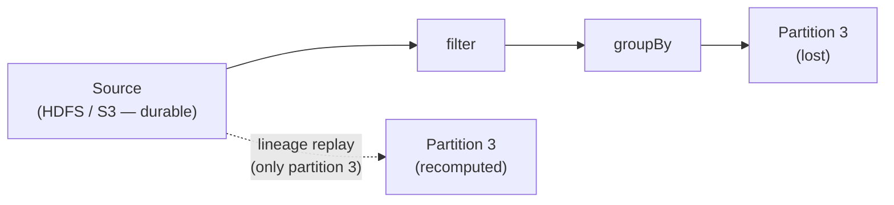

**The key principle:** Spark delegates *storage durability* to the underlying filesystem (HDFS, S3, GCS) and never tries to own that problem. It manages only *compute-level* fault tolerance — rerunning tasks, not replicating bytes.

| Failure | Mechanism | What happens |
|---|---|---|
| Partition lost in executor memory | **Lineage recomputation** | Spark replays the transformation chain from source for that partition only |
| Executor that wrote shuffle output dies | **Map output invalidation + stage resubmission** | `DAGScheduler.handleExecutorLost` unregisters that executor's outputs from `MapOutputTracker`; `ShuffleMapStage.findMissingPartitions()` then returns only the now-missing partitions, and only those tasks re-run |
| Long lineage **with wide dependencies** (PageRank's rank RDD — one node failure loses a partition from every ancestor stage) | **Checkpointing** | Save to durable storage, cutting the lineage. Do not checkpoint narrow-dependency chains on stable storage — lost partitions recompute cheaply in parallel from source |

The trade-off versus HDFS replication: recovery costs CPU time rather than a replica read. For very long lineage chains this gets slow, which is exactly when checkpointing pays for itself.

A fourth mechanism handles *slowness* rather than failure: **speculative execution**. Because RDD partitions are immutable, Spark can launch a duplicate of a straggler task on another executor and take whichever finishes first — the two copies cannot interfere. Enable with `spark.speculation = true`. A dedicated `"task-scheduler-speculation"` thread calls `checkSpeculatableTasks()` every `spark.speculation.interval` (100 ms); `spark.speculation.quantile` and `spark.speculation.multiplier` set the straggler threshold; `spark.speculation.efficiency.enabled` (default `true` since 3.4.0) adds an efficiency guard.

!!! warning "Speculation and side effects do not mix"
    Immutability makes duplicate *Spark* work safe. It says nothing about your code. A task that posts to an API, increments an external counter, or writes to a non-transactional sink can and will do it twice under speculation.

---

## 3. Anatomy of a Spark application

[](assets/ch01/cluster-overview.png)

*Source: [Apache Spark — Cluster Mode Overview](https://spark.apache.org/docs/latest/cluster-overview.html)*

A Spark application has three kinds of process: a **driver**, one or more **executors**, and a **cluster manager** brokering between them. The driver plans the work; executors do the work; the cluster manager decides where executors run.

### Before your code runs: what `spark-submit` actually launches

Most explanations of the architecture start at `getOrCreate()`. One decision has already been made by then, and it explains a class of confusing behaviour.

`SparkSubmit.prepareSubmitEnvironment` computes `childMainClass` — the class that `runMain` will reflectively load. It is not always yours:

| `--master` / `--deploy-mode` | `childMainClass` |
|---|---|
| any master, `client` | `args.mainClass` — **your class**, in **this** process |
| Standalone, `cluster` | `ClientApp` |
| YARN, `cluster` | `YarnClusterApplication` |
| Kubernetes, `cluster` | `KubernetesClientApplication` |

In cluster deploy mode your `main()` does not run in the process you typed the command into. A launcher runs instead, hands the application to the cluster manager, and exits. This is the whole reason `print()` output vanishes in cluster mode: it is going to a driver log on some worker node.

!!! warning "`spark.driver.memory` set in application code does nothing"
    `--driver-memory` is mapped to `spark.driver.memory` inside the launcher, before the driver JVM exists. A JVM heap cannot be resized after startup, so setting it from a `SparkSession.builder.config(...)` call is silently ignored. Set it on the `spark-submit` command line, in `spark-defaults.conf`, or via `SPARK_DRIVER_MEMORY`. The same applies to `spark.driver.cores` in cluster mode.

One more startup detail worth knowing before you debug a hang: `SparkEnv.createDriverEnv` asserts that `spark.driver.host` is set and advertises it to executors. **Executors dial in to the driver**, not the other way round. A driver behind NAT or on a Docker bridge with the wrong advertised address does not error — it hangs, with executors that never register.

### Driver program

Spark's official definition ([cluster-overview](https://spark.apache.org/docs/latest/cluster-overview.html)):

> *"The process running the main() function of the application and creating the SparkContext."*

That fits a JVM language exactly — one process, one `main()`. In PySpark **classic mode** it is ambiguous, because the runtime spans two OS processes:

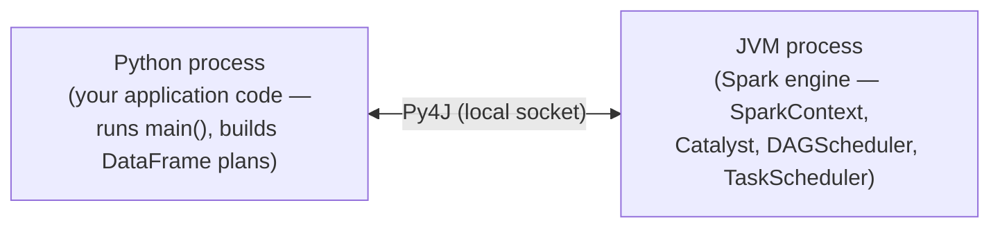

- The **Python process** runs your code. When you call `SparkSession.builder.getOrCreate()`, PySpark launches the JVM (`java_gateway.launch_gateway()`), reads back the Py4J port, and creates the real `SparkSession` and `SparkContext` **inside the JVM**. The Python `spark` object is a wrapper holding Py4J proxies (`_jsparkSession`, `_jsc`); every method call is forwarded across a local socket. No Spark engine state lives in Python.
- The **JVM process** is the Spark engine — the real SparkContext, Catalyst, DAGScheduler, TaskScheduler. A separate OS process on the same machine.

**PySpark uses two distinct channels, not one.** The Py4J socket is bidirectional: Python calls JVM methods, the JVM returns values, and the JVM can call *into* Python through a `CallbackServer` (used for SparkListeners and Python objects the JVM holds). A completely separate `pyspark.worker` socket carries data when an executor must run a Python function; on UNIX a `pyspark/daemon.py` process manages those workers on the executor's behalf.

| Direction | Channel | Used for |
|---|---|---|
| Python → JVM | Py4J local socket | Building plans, issuing actions |
| JVM → Python | Py4J local socket (return values) | Results, schemas, row data |
| JVM → Python | Py4J `CallbackServer` | JVM calling into Python — listeners, held Python objects |
| JVM → Python | `pyspark.worker` socket (separate) | Data batches to Python UDF / RDD lambda workers on executors |
| Python → JVM | `pyspark.worker` socket (separate) | UDF / lambda results back to the executor JVM |

DataFrame operations — Catalyst expressions, built-ins like `F.lower()` — run entirely inside the JVM and never cross back to Python. Only a Python UDF or RDD lambda sends data to a Python worker. That is the root of Python UDF overhead: rows are converted out of Spark's binary format into Python objects and back, in batches, across a socket.

**"The driver" means both processes together.** When the UI, logs or error messages say "driver" they usually mean the JVM side, but the Python process is equally part of it — it is the one building the plan and issuing the calls. Neither alone is the full driver. Executors are separate JVM processes; they receive tasks and do no planning.

**The driver is a single point of failure.** It holds all non-recoverable state: the `SparkContext`, the stage graph, `MapOutputTracker` shuffle metadata, broadcast variables, accumulator state. None of it is replicated. Executor failures recover; driver failure ends the application.

### SparkSession and SparkContext

**SparkSession** is the entry point you create in every PySpark program (since Spark 2.0):

```python
from pyspark.sql import SparkSession

spark = SparkSession.builder.appName("my-app").getOrCreate()
```

**SparkContext** is the internal component it wraps, and it is what the architecture docs mean by the driver:

> *"The SparkContext object in your main program. It coordinates independent sets of processes on a cluster and connects to cluster managers to allocate resources."*

You rarely touch it directly — `SparkSession` creates and owns it. It matters in architecture discussions because it is the actual coordinator: when an action fires, `SparkContext.runJob` hands the job to the `DAGScheduler`, which breaks it into stages and tasks; the `TaskScheduler` dispatches through the `SchedulerBackend`. The cluster manager is involved only in **resource allocation** — it never sees the plan.

In classic mode you can reach it via `spark.sparkContext`. In Connect mode you cannot, and the error is explicit — observed on the stack:

```python
spark = SparkSession.builder.remote("sc://localhost:15002").getOrCreate()
spark.sparkContext
# PySparkAttributeError: [JVM_ATTRIBUTE_NOT_SUPPORTED] Attribute `sparkContext` is not
# supported in Spark Connect as it depends on the JVM.

df.rdd
# PySparkNotImplementedError: [NOT_IMPLEMENTED] rdd is not implemented.
```

In Spark 4.x the classic `SparkSession` lives in `org.apache.spark.sql.classic` rather than `org.apache.spark.sql`, so it can coexist with `org.apache.spark.sql.connect.SparkSession`. The Python import path is unchanged; the split surfaces only in JVM stack traces and Scala source browsing.

### Classic and Connect: two shapes of the same architecture

In **Spark Connect** mode the Python process is a **client only** — it serialises DataFrame operations as protobuf and sends them over gRPC. It has no JVM. The engine runs in the Connect server:

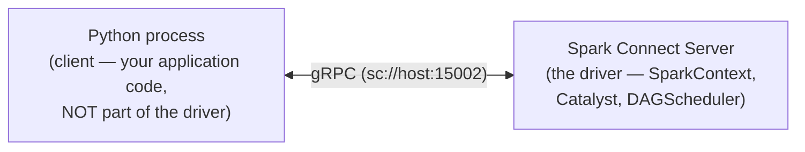

| | Classic | Spark Connect |
|---|---|---|
| Introduced | Spark 1.0 | Spark 3.4 |
| Python process role | Runs user code and builds plans; with the JVM process, together they are the driver | Client only — serialises plans, receives results; no JVM |
| Spark engine | Driver-side JVM, co-located with Python | Connect server JVM, remote |
| Transport | Py4J local socket | gRPC + Apache Arrow |
| RDD support | Yes | No — `df.rdd` raises `NOT_IMPLEMENTED` |
| Direct JVM access (`df._jdf`, `sc._jsc`) | Yes | No — raises `JVM_ATTRIBUTE_NOT_SUPPORTED` |
| Default session type | Yes, unless `pyspark_connect` is installed or `SPARK_CONNECT_MODE=1` | Only when opted into |

Everything below the front end is identical. `SparkConnectPlanner` converts protobuf relations into Catalyst logical plans server-side; from there the optimiser, the DAGScheduler, tasks and shuffle are the same code. Connect changes *how the plan arrives*, not how it runs — worth stating plainly, because the two-architecture framing suggests more difference than exists.

**Activating each mode:**

```python
# Classic (default on this stack) — Python + JVM together form the driver
spark = SparkSession.builder.appName("app").getOrCreate()

# Connect — Python is a client to an existing server
spark = SparkSession.builder.remote("sc://localhost:15002").getOrCreate()
```

`.remote(url)` accepts either `sc://host:port` (connect to an existing server) or `local[N]` / `local[*]` (start a local Connect server inline). It tells Python to skip the JVM: `RemoteSparkSession` speaks gRPC, and no `SparkContext` is created client-side.

`spark.remote` and `spark.master` **cannot be combined**. They express incompatible models: `spark.master` means "I am starting Spark infrastructure, negotiate with this cluster manager"; `spark.remote` means "I am a thin client, connect me to a running server". Setting both raises `CANNOT_CONFIGURE_SPARK_CONNECT_MASTER` at session creation.

| How | `--master` | What happens |
|---|---|---|
| `.remote("sc://host:port")` | blocked | Client connects to an already-running Connect server |
| `.remote("local[4]")` | blocked | Spark starts a local Connect server inline (development and CI) |
| `spark.api.mode=connect` + `--master yarn` | used | **Hybrid** — classic cluster management allocates resources, a Connect server starts alongside the driver, Python connects to `sc://localhost` |

The third row is not pure Connect. `config/package.scala` describes it as: *"For Spark Classic applications, specify whether to automatically use Spark Connect by running a **local** Spark Connect server dedicated to the application. The server is terminated when the application is terminated."*

```bash
# Hybrid: YARN manages resources, a local Connect server starts with the driver
spark-submit --master yarn --deploy-mode cluster \
  --conf spark.api.mode=connect \
  myapp.py
```

!!! info "When to use `local[*]` as a Connect URL"
    Not for performance — for catching violations early. Connect disallows `df._jdf`, `sc._jsc` and every other direct JVM reach-through. Running your code against `.remote("local[*]")` on a machine with a full PySpark install surfaces those before you deploy against a real server. The remote form `sc://host:port` is the only option for the JVM-free `pyspark-client` package, since there is no JVM available to start a server locally.

### Cluster manager

The **cluster manager** is an external service that allocates resources — machines, CPU, memory. Spark 4.x supports three, plus local mode:

| Mode | When to use |
|---|---|
| `local[N]` | Development — driver and executors in one JVM process |
| Spark Standalone (`spark://host:7077`) | Dedicated Spark cluster; no YARN or Kubernetes required |
| YARN | Hadoop ecosystem; multi-tenant clusters |
| Kubernetes (`k8s://https://host:port`) | Container-native deployments |

!!! warning "Mesos is gone"
    Every introductory Spark book lists four cluster managers. Mesos support was removed outright in Spark 4.0 (SPARK-44442). If a tutorial you are following configures `mesos://`, it predates 4.0 and other things in it are likely stale too.

**The local stack uses none of them.** `spark.master` is `local[*]`, so `SparkContext.createTaskScheduler` builds a `TaskSchedulerImpl` with a `LocalSchedulerBackend`, whose `LocalEndpoint` holds an `Executor` object directly — driver and executor in one JVM, communicating through in-process RPC rather than the network. Verified on the running stack: `sc.master` reports `local[*]` and `sc.defaultParallelism` reports 16. The Connect server on port 15002 does not change this; it is a front end, and the session it creates still runs `local[*]` underneath.

Executors are allocated at **application startup**, not per job. When `getOrCreate()` initialises `SparkContext`, it registers with the cluster manager, which launches executor processes. By the time an action fires, they are already running and waiting. With **dynamic allocation** (`spark.dynamicAllocation.enabled`), the driver's `ExecutorAllocationManager` can request more or release idle ones during the application — driven by *pending task backlog* older than `spark.dynamicAllocation.schedulerBacklogTimeout` (1s), not by job boundaries. The graceful shrink path is `decommissionExecutors`, which with `spark.storage.decommission.enabled` migrates shuffle and cached blocks off an executor before it goes rather than letting them be recomputed.

### Worker nodes and executors

A **worker node** is any machine that can run application code. The cluster manager launches an **executor** process on each node it allocates to your application.

In the word count, executors read `1342-0.txt`, run `split`, `regexp_extract`, `lower` and `filter`, and count words. The driver reads only *metadata* — directory listings, file sizes, split boundaries — to build the plan and assign tasks. It never reads row data. Each executor receives a task naming a file and byte range, opens that range itself, and processes rows locally.

Each application gets isolated executors, alive from `getOrCreate()` to `spark.stop()`, not per query.

Spark's programming model gives two shared variable types, available to both RDD and DataFrame APIs: **broadcast variables** — large read-only objects sent once per executor and cached there rather than copied into every task closure — and **accumulators** — add-only counters that executors increment and only the driver reads.

Accumulators are deliberately **write-only for executors**. If executors could read one mid-execution the value would be inconsistent across parallel tasks and would need distributed locking. Instead each task adds locally, and Spark merges the update into the driver-side accumulator exactly once on task completion — *in actions only*. Accumulator updates inside transformations may be applied more than once if a stage re-executes. A failed task's partial update is discarded and the retry starts from zero.

### Executor memory layout

Each executor JVM heap is divided into three regions by the **unified memory manager** (default since Spark 1.6, still the default in 4.2.0):

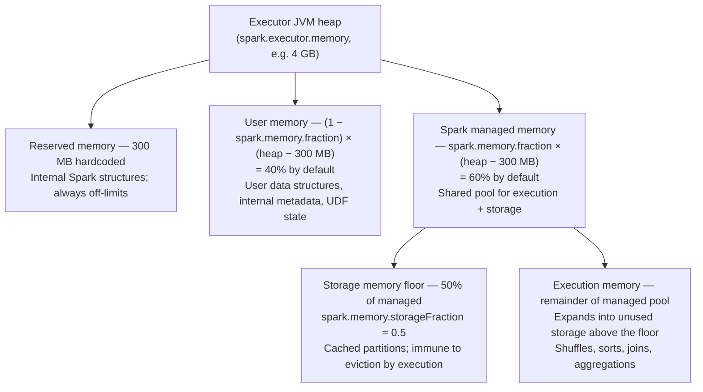

`RESERVED_SYSTEM_MEMORY_BYTES = 300 * 1024 * 1024` is a literal in `UnifiedMemoryManager.scala`, still there at v4.2.0.

**Execution memory** is used during shuffle, sort, join and aggregation. When a task needs more than is available it **spills** to local disk — the task continues at disk speed instead of RAM speed. Four operation types spill: sort (sorted runs written and later merged), hash aggregation (the in-memory map flushed and merged in a second pass), sort-merge join (one or both sides), and hash-based `groupBy`.

Spilling does not fail the task but can make it 10–100× slower. The fix is usually more partitions (a smaller per-task working set) or more executor memory.

**What format is written to disk?** It depends on which layer spills:

| Layer | Spill format | Cost |
|---|---|---|
| **DataFrame / SQL** (`HashAggregateExec`, `SortMergeJoin`) | Binary **`UnsafeRow`** — the same compact format already in memory, written via `UnsafeKVExternalSorter`. No serialisation conversion. | Low — writing bytes |
| **RDD operations** (`ExternalSorter`) | Serialised key-value pairs using `spark.serializer` (Kryo or Java), written in fixed-size batches via `DiskBlockObjectWriter`. Each batch gets its own serialisation stream to limit reference-tracking overhead on read. Sorted by partition id, then optionally by key. | Higher — serialisation per object |

DataFrame spills are cheaper precisely because `UnsafeRow` is already binary. Spill file compression is controlled by `spark.shuffle.compress` (default `true`).

**Per-task fairness before spill.** With N concurrent tasks on one executor, `ExecutionMemoryPool` enforces two bounds:

- **Floor (1/2N)** — `minMemoryPerTask = poolSize / (2 * numActiveTasks)`. A task below this is **blocked**, not spilled, until memory frees up. It never spills before getting a fair start.
- **Ceiling (1/N)** — `maxMemoryPerTask = maxPoolSize / numActiveTasks`.

With defaults (`spark.executor.memory = 1g`, `spark.memory.fraction = 0.6`) and 4 active tasks:

```text
managed pool     = (1024 MB − 300 MB) × 0.6 = 434 MB
floor per task   = 434 / (2 × 4)            =  54 MB   ← blocked until it reaches this
ceiling per task = 434 / 4                  = 108 MB   ← cannot exceed this
```

A task holding 30 MB that needs 80 MB **waits** rather than spilling — it has not reached its 54 MB floor. Spark logs it: *"TID X waiting for at least 1/2N of execution pool to be free."*

**Storage memory** holds cached partitions. The borrowing relationship with execution is bidirectional but asymmetric:

- **Storage borrows from execution** when execution is idle — cached blocks expand into free space at no cost.
- **Execution reclaims** by evicting cached blocks above the floor when it needs space.
- **Execution is never evicted by storage.** The source cites "the complexities involved in implementing this"; practically, evicting in-progress execution data would corrupt a running task. So if execution fills the managed pool, new `.cache()` calls fail and the block is evicted immediately per its storage level.

The storage floor is **not a static reservation** — *"This region is not statically reserved; execution can borrow from it if necessary."* With nothing cached, execution gets the whole managed pool.

| Scenario | Execution can use |
|---|---|
| Nothing cached | All 434 MB |
| Cached data below the floor | Whatever is free — data under the floor is eviction-protected |
| Cached data above the floor | Overflow above the floor is evictable; execution reclaims as needed |
| Execution fills the managed pool | New `.cache()` calls fail — block evicted immediately |

**What causes GC pressure.** `UnsafeRow` binary data in the managed pool creates no JVM objects and generates no GC pressure. GC pressure comes from the **user memory pool**: Python UDF results converted back to JVM types, intermediate Scala/Java collections in user functions, large driver-side variables captured in closures and shipped to executors. A full GC pause stalls every task on the executor at once and — this is the link most treatments miss — can be long enough that the driver declares the executor dead. See [§ What declares an executor dead](#what-declares-an-executor-dead).

| Config | Default | What it controls |
|---|---|---|
| `spark.executor.memory` | `1g` | Total JVM heap per executor |
| `spark.memory.fraction` | `0.6` | Fraction of (heap − 300 MB) for the shared managed pool; the remainder is user memory |
| `spark.memory.storageFraction` | `0.5` | Fraction of the managed pool reserved as the storage floor |
| `spark.memory.offHeap.enabled` | `false` | Enable off-heap memory (bypasses JVM GC entirely) |
| `spark.memory.offHeap.size` | `0` | Absolute bytes for off-heap; must be positive when enabled; counts toward container RSS |
| `spark.executor.memoryOverhead` | computed | Non-heap budget per executor; if unset, derived from the two below |
| `spark.executor.memoryOverheadFactor` | `0.10`; **`0.40` for Kubernetes non-JVM jobs including PySpark** | Fraction of executor memory allocated as non-heap overhead |
| `spark.executor.minMemoryOverhead` | `384m` (since 4.0.0) | Overhead floor — effective overhead = `max(memory × factor, minOverhead)` |

**Off-heap memory** is allocated outside the JVM heap using native memory, completely separate from the unified manager's heap arithmetic. Enabling it does not shrink the heap pool.

**`spark.memory.offHeap.size` and `spark.executor.memoryOverhead` — the relationship that kills containers.** YARN and Kubernetes police containers by **RSS**, the total resident memory: JVM heap, JVM overhead, Python workers, native allocations. They cannot see which is which. `spark.executor.memoryOverhead` is the budget you declare for everything that is not heap, defaulting to `max(executor_memory × 0.1, 384 MB)`.

Off-heap memory is native memory and counts toward RSS. Enable off-heap without raising the overhead and the container quietly exceeds its limit and is killed — no Java stack trace, just "container exceeded memory limits".

```text
total container memory = spark.executor.memory           (JVM heap)
                       + spark.executor.memoryOverhead   (JVM internals + native overhead)
                       + spark.memory.offHeap.size       (off-heap execution/storage)
                       + spark.pyspark.executor.memory   (PySpark apps only)
```

`spark.pyspark.executor.memory` reserves memory for the Python worker process on each executor, separate from both the JVM heap and `memoryOverhead`. It matters when tasks contain Python UDFs or RDD lambdas. If unset, nothing is reserved and the Python worker takes whatever the OS allows beyond the JVM. YARN's `Client.scala` reads it as `pysparkWorkerMemory` and adds it as a fourth term in the container size calculation.

**When to enable off-heap:**

| Scenario | Recommendation |
|---|---|
| Small-medium heaps (<4 GB), short batch jobs | **Leave it off** — on-heap GC is manageable; off-heap adds operational risk |
| Large heaps (>4–8 GB), GC >10% of task time in the UI | **Consider it** — GC storms become a real throughput bottleneck |
| Long-running Structured Streaming | **Often beneficial** — GC accumulates over hours of uptime |

Check GC time in the Spark UI first. Under 5% of task time, off-heap adds complexity for no gain. If GC is high, try more executors with smaller heaps before reaching for off-heap — a smaller heap is a smaller GC scan.

**Unmanaged memory (Spark 4.x).** `UnifiedMemoryManager` now accounts for a third category alongside execution and storage: memory consumed by components that allocate outside Spark's memory system entirely. Two examples: **RocksDB state stores** used by stateful streaming, which manage their own block cache and write buffers; and **native libraries** doing JNI or off-heap allocation not routed through `spark.memory.offHeap`.

Polling is **disabled by default** (`spark.memory.unmanagedMemoryPollingInterval = 0s`). When enabled, a background thread queries registered consumers and subtracts their usage from the available execution and storage budgets, so Spark's allocator knows how much headroom actually remains. When disabled, `getUnmanagedMemoryUsed` returns `0L` and Spark grants memory as though those allocations do not exist.

Either way `spark.executor.memoryOverhead` still matters — polling adjusts internal JVM allocation decisions, not the container's physical limit. If you use RocksDB state stores, size the overhead to cover RocksDB's native footprint. Without it, the failure mode is a silent container kill.

---

## 4. From action to result

This section walks `.show(10)` through every internal component. **Steps 1–4 are driver-side planning; steps 5–7 are executor computation**, with `MapOutputTracker` and `JobWaiter` coordinating at the boundaries.

### The components involved

**`QueryExecution` (driver JVM)** — the bridge between the DataFrame world and the RDD world. Every action on a `Dataset` calls `Dataset.withAction()`, which drives `QueryExecution` to compile the logical plan into a physical `executedPlan` and then into an `RDD[InternalRow]` that `SparkContext.runJob()` can schedule.

Compilation runs in four phases, entirely in the driver JVM — no data moves:

| Phase | What it does |
|---|---|
| **Analyzer** | Resolves column names and types against the Catalog; raises `AnalysisException` on unknown columns or type mismatches |
| **Optimizer** | Applies Catalyst's rule batches: predicate pushdown, projection pruning, constant folding, join reordering, outer-join elimination |
| **SparkPlanner** | Chooses concrete physical operators — `SortMergeJoin` vs `BroadcastHashJoin`, `HashAggregate` vs `SortAggregate`, scan strategies, and the `Limit`+`Sort` → `TakeOrderedAndProjectExec` rewrite seen earlier |
| **PrepareForExecution** | Applies preparation rules in order: `EnsureRequirements` inserts `ShuffleExchangeExec` at every wide boundary, `CollapseCodegenStages` wraps fusable operator groups in `WholeStageCodegenExec`, `PlanSubqueries`, and others |

The output of each phase is the input of the next. When `PrepareForExecution` finishes, the `executedPlan` is final. Spark then walks the operator tree to produce an `RDD[InternalRow]` — the whole query as a chain of RDD objects, each recording how it derives from its parent.

Each RDD covers the full dataset; the partition count is metadata inside it. With whole-stage codegen on (the default), consecutive operators are fused, so one RDD is produced per fused group rather than one per operator — visible in `explain()` output as the `*(1)`, `*(2)` markers when AQE is off. Narrow transformations form an unbroken chain; wide operators cause `ShuffleExchangeExec` to embed a `ShuffleDependency`, marking where a stage boundary is needed. This graph is the lineage. It goes to `SparkContext.runJob()`, which delegates to `dagScheduler.runJob()`. The `DAGScheduler` finds those `ShuffleDependency` objects and cuts stages there — the operators mark the boundary; the scheduler enforces it.

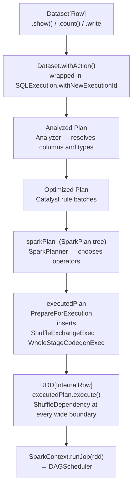

**`DAGScheduler`** — driver JVM. Builds a **DAG of stages**: each node a stage, each edge a dependency. It walks the RDD lineage, identifies wide dependencies, and groups all narrow transformations between two shuffles into one stage. It thinks about the logical structure of the computation, never about machines or threads — `handleJobSubmitted(finalRDD: RDD[_])` is its entry point, and it has no knowledge of DataFrames or physical plans. Every optimisation decision is already baked into the lineage it receives.

Two core responsibilities:

- build the stage DAG from the RDD lineage
- submit each stage once all its parents have written their shuffle output

When a stage is ready it creates a **`TaskSet`** — one task per partition — and hands it to the `TaskScheduler`. On failure it also resubmits map stages whose output was lost and cancels downstream stages when a job cannot recover. *Task* retries within a stage are the `TaskScheduler`'s job, not its own.

All of this is driven by a **single-threaded event loop**: every notification that affects stage state — a job arriving, a stage completing, an executor being lost — is serialised onto that loop and handled one at a time. This keeps scheduler state consistent without locks on the hot path.

The `DAGScheduler` behaves identically whether the job came from raw RDD code or a DataFrame query. What differs is the path *to* it:

| | Raw RDD | DataFrame / SQL |
|---|---|---|
| **Entry point** | `SparkContext.runJob(rdd)` directly | `executedPlan.executeCollect()` → `sc.runJob(rdd)`; `QueryExecution.toRdd` only for `Dataset.rdd` |
| **Optimisation first** | None — code runs as written | Catalyst: predicate pushdown, join reordering, projection pruning… |
| **Code generation** | None — standard JVM closures | Tungsten whole-stage codegen — compiled Java bytecode per fused group |
| **Row format** | `RDD[T]` — standard JVM objects | `RDD[InternalRow]` — compact binary `UnsafeRow` |
| **AQE** | ❌ stage DAG fixed at submission | ✅ stage DAG can change mid-execution at shuffle boundaries |

**`TaskScheduler`** — driver JVM. Receives `TaskSet`s and assigns each task to an available executor slot. It does not reason about DAG structure. Its responsibilities: task-to-executor assignment using data locality; ordering between concurrent jobs (FIFO or FAIR); task retries; speculative execution; and excluding executors that have accumulated too many failures. It reports completions and failures back to the `DAGScheduler`.

**`SchedulerBackend`** — the two-way RPC bridge between the driver's `TaskScheduler` and the executors, working in three directions:

- **executors → driver**: executors announce themselves at startup and report task completions and failures
- **backend → TaskScheduler**: when a slot frees, the backend offers it upward and the scheduler picks a task
- **driver → executors**: the backend serialises each assigned task and sends it; it also sends kill signals

There is one implementation per cluster manager — Standalone, YARN, Kubernetes, and local. The dispatch logic is shared; what differs is the resource-allocation protocol each speaks.

**`MapOutputTracker`** — a directory service for shuffle data. When a map stage completes, each `ShuffleMapTask` returns a `MapStatus` carrying the executor location and per-partition sizes, which the `DAGScheduler` registers with the driver-side tracker. Downstream tasks call `getMapSizesByExecutorId` to find which executor holds each input partition, then fetch through that executor's `BlockManager`. The tracker answers *where*; `BlockManager` handles *how*.

**`BlockManager`** — on every executor and on the driver. It manages cached data (RDD/DataFrame partitions and broadcast variables, in memory or spilled to local disk), and serves as the network interface through which remote tasks fetch shuffle blocks. Shuffle data itself is written directly to disk by the shuffle writer and bypasses `BlockManager`'s storage layer — `BlockManager` only serves it over the network on request. Reading from file sources bypasses it entirely.

#### Component map

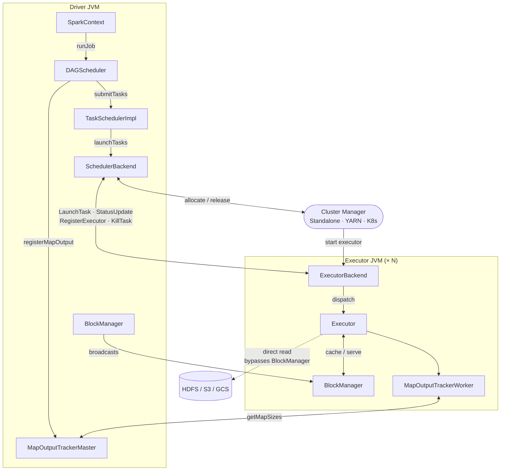

In `local[*]` — the mode the local stack runs — all of this is one JVM. `LocalEndpoint` holds an `Executor` object directly, so "RPC to the executor" is a method call. That is why local mode is such a good teaching environment and such a poor predictor of cluster behaviour.

### Step 1: an action fires, and the DataFrame becomes an RDD

`.show(10)` is the first action. Everything chained before it — `read → select → filter → groupBy → orderBy` — only built a description. Each transformation is lazy: it returns a *new* DataFrame whose plan is the previous one plus a node. Those five single-input transformations build a five-node chain. (An operator with two inputs — `join`, `union` — branches, which is why a plan is a **tree** in general; a straight chain is the simplest case.) That plan describes *what* to compute, not *how*.

In classic mode the Python `DataFrame` is a handle to a real `Dataset[Row]` in the driver JVM, and the action runs there. In Connect mode it runs on the Connect server. Either way, the next steps are identical: the driver compiles and optimises the plan, turns it into an `RDD[InternalRow]`, and hands it to the `DAGScheduler`.

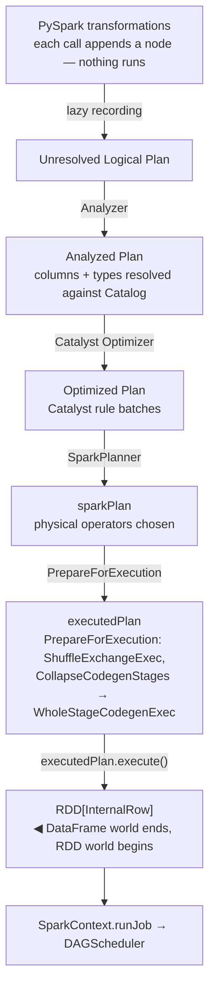

The sequence inside the driver JVM for `df.show(10)`:

- `Dataset.show(10)` → `getRows(11)` → `take(11)` → `head(11)` → `withAction("head", limit(11).queryExecution)`
- `withAction` wraps everything in `SQLExecution.withNewExecutionId` — the SQL-tab grouping — and drives `QueryExecution` to produce the `executedPlan`
- the plan is run via `executeCollect()`, which for `TakeOrderedAndProjectExec` calls `RDD.takeOrdered(11)` and for `CollectLimitExec` enters `executeTake`'s job loop
- each pass calls `SparkContext.runJob(...)`, which hands off to the `DAGScheduler`

`SparkContext` is Spark Core's entry point, called after compilation only to submit the resulting RDD job. It knows nothing of DataFrames — it receives an `RDD[InternalRow]`.

`PrepareForExecution` is not a plan in the sense the other three are; it is a post-processing pass on the physical plan. The pipeline has two physical-plan stages:

```text
Optimized Plan → [SparkPlanner] → sparkPlan → [PrepareForExecution] → executedPlan → RDD[InternalRow]
```

- `SparkPlanner` produces `sparkPlan` — operators chosen, not yet runnable.
- `PrepareForExecution` turns it into `executedPlan` by applying preparation rules: `EnsureRequirements` inserts `ShuffleExchangeExec` at wide boundaries; `CollapseCodegenStages` groups codegen-capable operators and wraps each group in `WholeStageCodegenExec`. This is a **structural** decision — no compilation happens yet.
- `executedPlan.execute()` calls `doCodeGen()` on each `WholeStageCodegenExec`, producing a **Java source string** per fused group. A **validation compile** runs immediately on the driver (`CodeGenerator.compile`); if it fails, the node falls back to interpreted execution. The source travels to executors inside `WholeStageCodegenEvaluatorFactory`. What `execute()` returns is the `RDD[InternalRow]`.

**JVM bytecode compilation is executor-side.** The driver generates and validates Java *source*; executors compile it.

How Catalyst rewrites the plan is **Chapter 22 (Catalyst and the Physical Plan)**; the DataFrame-to-RDD compilation in detail is **Chapter 32 (Spark Internals)**.

At this point no data has moved.

### Step 2: the DAGScheduler builds the stage DAG

The `DAGScheduler` walks the lineage backwards, classifying every dependency:

- **Narrow dependency** — each child partition depends on at most one parent partition (`filter`, `select`, `map`). Pipelined: one executor runs the whole chain on its partition with no data movement. Consecutive narrow transformations collapse into one stage.
- **Wide dependency** — each child partition depends on multiple parent partitions (`groupBy`, `join`, `repartition`). Requires a shuffle, and becomes a **stage boundary**.

`DAGScheduler.getMissingParentStages` is the single function where that rule is mechanically applied — a `ShuffleDependency` starts a new `ShuffleMapStage`, a `NarrowDependency` stays in the current one. Every prose explanation of stage boundaries, including this one, is a description of that one function.

!!! info "Two different things are called a 'stage'"
    Tungsten's whole-stage code generation fuses *adjacent physical operators* into one generated Java function, for speed. The `DAGScheduler`'s stages are *scheduling units* split at shuffle boundaries, about which work must wait for which. Both use shuffle boundaries as a dividing line but answer different questions: Tungsten asks how fast a stage runs; the `DAGScheduler` asks when a stage may start.

Two stage types exist:

- **`ShuffleMapStage`** — writes partitioned shuffle files to local disk and returns a `MapStatus` to the driver: which `BlockManager` holds each output partition, and how big each block is. User data never goes to the driver.
- **`ResultStage`** — the final stage. Its tasks apply the user function and send results back. May run on a *subset* of partitions: `first()` runs on one, `lookup(key)` on the one that owns the key.

That return type *is* the stage boundary, which makes the model concrete rather than diagrammatic: `ShuffleMapTask.runTask` returns `MapStatus`, `ResultTask.runTask` returns values.

!!! info "`ShuffleMapStage`/`ResultStage` vs `ShuffleQueryStage`/`ResultQueryStage`"
    `explain()` shows the physical-plan layer. `ShuffleQueryStage` and `BroadcastQueryStage` wrap an `Exchange`; `ResultQueryStage` wraps the final subtree. All three are AQE plan-level objects that appear in `explain()` output. `ShuffleMapStage` and `ResultStage` are `DAGScheduler` objects created at run time and never appear in `explain()`. The mapping is one-to-one: each `ShuffleQueryStage` becomes a `ShuffleMapStage`; the `ResultQueryStage` becomes the `ResultStage`.

For the word count under `show(10)` — the plan with `TakeOrderedAndProjectExec`, verified above:

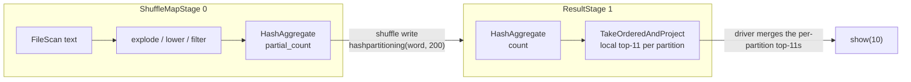

Two stages, one shuffle. The `orderBy` contributes no stage of its own: `TakeOrderedAndProjectExec` sits inside the result stage and the merge happens on the driver.

Every shuffle has two sides — a **write side** (each map task assigns every output row to a reducer by key, then writes all output into one file on local disk, with an index file recording each reducer's byte offset) and a **read side** (each reduce task fetches its slice from every map task's file using that index). The two cannot overlap, which is why every shuffle boundary produces two stages.

!!! note "Why one file per map task, not one file per reducer?"
    The original Hash Shuffle Writer (removed in Spark 2.0) did write one file per reducer. With M map tasks and R reducers that is M × R files — 200,000 at 1,000 maps and 200 reducers — which stressed the OS and the filesystem and became the primary scaling bottleneck. Each map task also held R file handles open at once, writing to all of them as rows arrived: interleaved random I/O.

    Sorting all output by `(partition_id, key)` before writing buys two things: one sequential write per map task, and 2 × M total files regardless of R. The O(n log n) sort cost is small next to the I/O savings at scale.

**Static vs dynamic stage DAG.** For raw RDD jobs the DAG is fixed at `handleJobSubmitted` and never changes. For DataFrame jobs with AQE (default on), `AdaptiveSparkPlanExec` re-enters the planner after each shuffle stage completes, using actual statistics. That can produce entirely new stage submissions mid-job: coalescing small post-shuffle partitions (the word count's 200 → 1), swapping a `SortMergeJoin` for a `BroadcastHashJoin` when the build side turns out small, or splitting a skewed partition. Raw RDD jobs get none of this.

### Step 3: TaskSet creation — one task per partition

For each ready stage the `DAGScheduler` creates a **`TaskSet`**: one task per input partition. Each task is a serialised closure — the transformation code plus enough metadata to read exactly one partition.

A `TaskSet` is immutable: every task in it runs identical code against a different partition. That immutability is what makes retries and speculative execution safe.

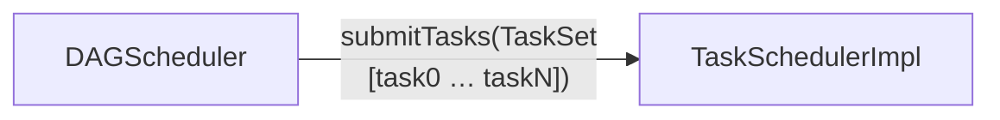

### Step 4: the TaskScheduler assigns tasks to executors

The `TaskScheduler` wraps each `TaskSet` in a **`TaskSetManager`**, which tracks per-task state (pending, running, succeeded, failed) and implements retry logic.

When an executor signals a free slot, `resourceOffers` picks the best task for it using **data locality** — preferring an executor that already holds the partition, or one on the same machine as the file:

| Level | Meaning |
|---|---|
| `PROCESS_LOCAL` | Data is in this executor's own memory (cached partition) |
| `NODE_LOCAL` | Data is on the same physical machine |
| `NO_PREF` | No preference — equally accessible from anywhere |
| `RACK_LOCAL` | Same network rack, different machine |
| `ANY` | Must be fetched over the network |

If no better-located executor is free, the scheduler waits up to `spark.locality.wait` (**3s**) before demoting to the next level. Each level has its own budget: `spark.locality.wait.process`, `.node`, `.rack`, all defaulting to `spark.locality.wait`. Set one to `0` to skip that level.

!!! warning "Idle cores next to queued tasks can be correct behaviour"
    This is worth internalising before you meet it in production. `TaskSetManager.localityWaits` makes the scheduler *deliberately hold out* for a better locality level. Seeing free slots alongside pending tasks in the UI does not mean the scheduler is broken or the cluster is misconfigured — it means it is betting that waiting 3 seconds beats a network read. On a cluster reading HDFS that bet is usually right. On a cluster reading S3 it is always wrong, because there is no locality to wait for.

!!! warning "Data locality does not apply to cloud object storage"
    The locality model assumes data is co-located with compute — HDFS blocks on the same machines as executors. S3, GCS and ADLS are remote HTTP services; every read is a network request regardless of which executor runs the task. `FileScanRDD.getPreferredLocations()` returns block locations for HDFS and an empty list for S3, so the scheduler sees `NO_PREF` everywhere and assigns tasks to any free slot. The 3-second locality wait then adds scheduling delay for no benefit — set `spark.locality.wait = 0` when reading exclusively from object storage.

    The optimisation levers shift entirely:

    - **Partition pruning** — skipping key prefixes on partition-column filters avoids HTTP requests entirely; the savings are large
    - **Parallelism** — more concurrent GETs mean higher throughput; tune `spark.sql.files.maxPartitionBytes`
    - **Pushdown** — column pruning and filter pushdown reduce bytes over the wire
    - **Local caching** — Alluxio and Databricks Disk Cache cache objects on executor-local NVMe, restoring `NODE_LOCAL` for repeated reads
    - **Region colocation** — run compute in the bucket's region; cross-region adds latency and egress cost

Once a pairing is chosen, the `SchedulerBackend` serialises the task and delivers it. The driver **pushes** tasks; executors do not poll. This makes the driver a coordination bottleneck for result collection, while executors talk directly to each other only during shuffle reads.

**What gets serialised — the task closure.** A task is not a copy of the data. It is a description of what to compute and where to find the input: the transformation functions, broadcast variable IDs, partition metadata (which file, which byte range), and enough context to reconstruct the input partition. The data stays put; the code travels to it.

Application dependencies — JARs and files from `--jars` / `--files` / `SparkContext.addFile` — are not in the closure either. Each executor fetches them once at startup via `updateDependencies()` and reuses them, which is why per-task closures stay small.

**Broadcast variables are not copied into the closure.** Only the integer ID. When an executor sees a broadcast ID it has not fetched, it pulls the value from the driver — or, for large broadcasts, from other executors via the BitTorrent-like `TorrentBroadcast`. The value is cached in the executor's `BlockManager` and reused by every later task referencing that ID. Sending a lookup table once per executor instead of once per task is the entire point.

Task closures use **Java serialization** by default. **Kryo** is roughly 10× faster and more compact — worth enabling for shuffle-heavy jobs via `spark.serializer = org.apache.spark.serializer.KryoSerializer`. In Python, closures are serialised with **CloudPickle** (bundled as `pyspark/cloudpickle`). Standard pickle serialises functions *by reference*, requiring the function to be importable on the executor — which breaks for lambdas and anything defined in a notebook. CloudPickle serialises *by value*: the bytecode travels, so notebook-defined UDFs work without a matching module on the other side.

**DataFrame expressions vs Python UDFs — the serialisation difference that explains the performance gap.** A column expression like `F.col("x") > 0` is a Catalyst expression node, compiled to JVM bytecode at plan time; the closure carries only a reference. A Python UDF is CloudPickled at definition time, and every task closure using it carries the pickled function, which the executor unpickles in a Python subprocess — converting each row out of `UnsafeRow` into Python objects and back. The cost is the per-row serialisation, not the Python language.

### Step 5: the executor runs the task

The executor deserialises the closure and runs it against its partition. `Executor.launchTask` wraps it in a `TaskRunner` and submits that to a thread pool; `TaskRunner.run` deserialises the `Task`, calls `task.run(...)`, and reports back through `execBackend.statusUpdate`.

**Tungsten bytecode compilation happens here, not on the driver.** The driver produced Java source and validated it. When the executor invokes the partition function, `WholeStageCodegenEvaluatorFactory.createEvaluator()` calls `CodeGenerator.compile()` (Janino) to produce JVM bytecode. The result is cached in the executor JVM, so later partitions skip the compile.

For stage 0 of the word count:

1. Reads lines from its partition of `1342-0.txt` directly from the filesystem — file source reads bypass `BlockManager`
2. Runs `explode → lower → filter` over each line
3. Runs the partial `HashAggregate`, counting each word within this partition, then assigns each `(word, partial_count)` pair to an output partition by hashing the word
4. Writes the partitioned output to shuffle files on local disk — the shuffle writer bypasses `BlockManager`'s storage layer. Files are named `shuffle_{shuffleId}_{taskAttemptId}_0.data` with a matching `.index`, so a retried attempt writes to a different file and cannot overwrite a successful attempt's output
5. Reports completion with a **`MapStatus`**: the executor's `BlockManagerId` (host + port) and the size of each shuffle block

**What "pipelined execution" means.** Step 2 is not three passes over the data. It is a single iterator pass: each row flows through all three operations before the next row is touched. There is no intermediate materialisation between operators inside a stage. With whole-stage codegen active the fused chain runs as a tight bytecode loop with no virtual calls between operators. That — plus built-in functions running entirely in the JVM — is why the DataFrame API is fast regardless of how the Python layer above it looks.

The `DAGScheduler` event loop receives the `CompletionEvent` and registers the block locations in `MapOutputTracker`. Once every task in stage 0 is registered, stage 1 is submitted.

### Which of the three shuffle writers ran?

Step 4 above says "writes shuffle files". Which code does the writing is a real performance cliff, and `SortShuffleManager.getWriter` picks for you:

| Writer | Chosen when | What it does |
|---|---|---|
| **`BypassMergeSortShuffleWriter`** | No map-side combine **and** partitions ≤ `spark.shuffle.sort.bypassMergeThreshold` (**200**) — gated by `shouldBypassMergeSort` | Opens R temporary files at once, one per reducer, writes each row straight to its reducer's file with **no sort**, then concatenates them into one data + one index file. Avoids the sort at the cost of R simultaneous file handles |
| **`UnsafeShuffleWriter`** | Serialiser supports relocation, no map-side combine, partition count under the serialised-shuffle limit — gated by `canUseSerializedShuffle` | Tungsten's serialised shuffle: sorts **pointers**, not deserialised objects, so records never leave their binary form |
| **`SortShuffleWriter`** | Everything else — the general fallback | Sorts all output by `(partition_id, key)`, spilling as needed, then merges into one data + one index file |

All three produce the same output structure — one data file plus one index file per map task — which is why nothing downstream needs to know which ran.

!!! warning "Crossing `bypassMergeThreshold` silently changes the writer"
    `spark.sql.shuffle.partitions` defaults to 200, and `spark.shuffle.sort.bypassMergeThreshold` also defaults to 200. Raising shuffle partitions from 200 to 201 moves every no-combine shuffle in your application off `BypassMergeSortShuffleWriter` and onto the sorting path. Nothing logs this, no config names it, and the performance change is real in both directions — bypass avoids a sort but needs R open file handles, so it degrades badly at high R. This is the mechanism behind "I tuned shuffle partitions and it got slower".

### Step 6: the shuffle — data moves between stages

Before stage 1 can start, its tasks fetch the data stage 0 wrote. Each queries `MapOutputTracker` on the driver via `getMapSizesByExecutorId` to learn the host and port for every input block, then opens fetch connections to those executors. This is the **shuffle read**, where data crosses the network.

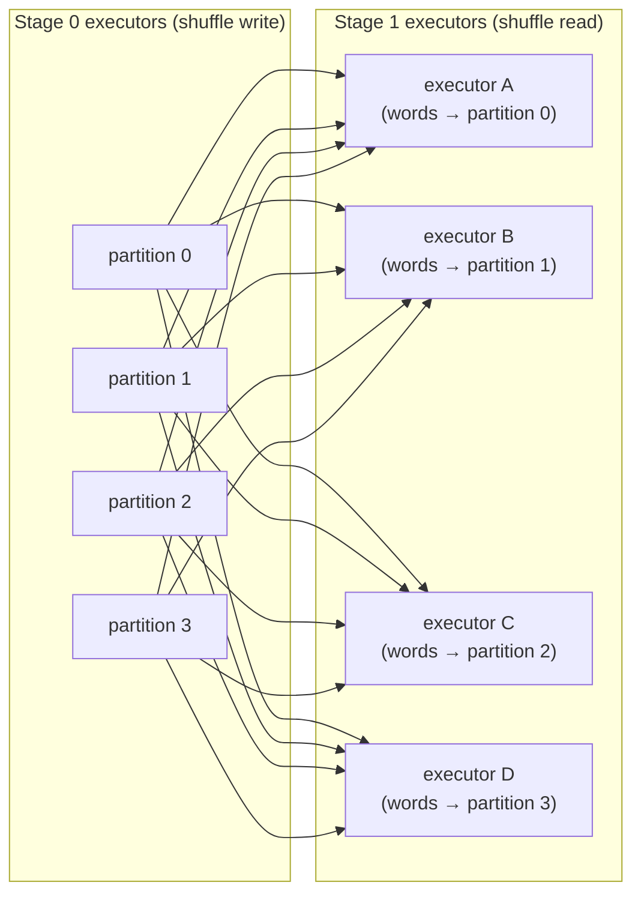

This is why shuffles are expensive: every reducer fetches from every mapper. Network I/O, disk I/O and serialisation all land here. `ShuffleBlockFetcherIterator` does the fetching under a memory budget, and it is where a `FetchFailedException` originates.

**The shuffle barrier.** No stage 1 task starts until *every* stage 0 task has completed and registered its output. The `DAGScheduler` enforces this. The invariant it maintains: **every map output partition is guaranteed to exist before any reducer tries to fetch it**. Without it, a reducer could not distinguish "not written yet" from "task failed and it never will be" — it would have to poll indefinitely or guess. The barrier trades latency (stage 1 waits for the slowest stage 0 task) for correctness and simple recovery.

### Step 7: the result stage returns rows to the driver

Stage 1 tasks read the hash-partitioned shuffle, run the final `HashAggregate` to produce `(word, total_count)`, and then — because the plan is `TakeOrderedAndProjectExec` — each emits only its own local top-11 rather than all its rows. Those small per-partition results go back to the driver, which merges them into the global top-11 and prints the first 10.

Throughout, the driver blocks on a **`JobWaiter`**, whose `taskSucceeded` accumulates each task's output and completes the future once the last one reports. This is the object that makes `runJob` block.

### Getting the result back is its own failure surface

Two limits sit on the return path, and neither is obvious from the API:

- **`spark.driver.maxResultSize`** (default `1g`) is enforced **at the executor**. `Executor` compares `resultSize` against the limit and **drops the result** rather than transmitting it; the job then fails with a message about `maxResultSize`. Raising the config is sometimes genuinely the fix and sometimes a sign that you should not be collecting that much to one process.
- **`spark.rpc.message.maxSize`** (default 128 MB) bounds a single RPC frame. Above it, the result becomes an `IndirectTaskResult`: the executor stores it in the block manager and sends a handle, which `TaskResultGetter` then fetches separately.

---

## 5. Scheduling *within* one application

The cluster manager arbitrates between applications. A separate mechanism arbitrates *inside* one, and it is the reason concurrent jobs from one session can behave in ways that look like a resource shortage.

`TaskSchedulerImpl` builds a `rootPool` and selects a `SchedulableBuilder` from `spark.scheduler.mode`:

| Mode | Builder | Behaviour |
|---|---|---|
| `FIFO` (default) | `FIFOSchedulableBuilder` | One pool. Task sets are served in submission order — the first job takes every slot it can use before the second gets any |
| `FAIR` | `FairSchedulableBuilder` | Named pools with weights and minimum shares, read from `spark.scheduler.allocation.file` or a `fairscheduler.xml` on the classpath. A thread selects its pool with the `spark.scheduler.pool` local property |

`getSortedTaskSetQueue` applies the chosen comparator on **every** resource offer, so the arbitration is continuous rather than a one-time ordering.

!!! warning "FIFO starvation reads as 'the cluster is too small'"
    Under the default FIFO mode, a long-running first job holds slots and a later job submitted from another thread waits — even when cores are free at moments the first job cannot use them. The symptom is a second job sitting at 0 tasks with idle capacity visible in the UI. The fix is `spark.scheduler.mode = FAIR` plus pool definitions, not more executors.

    This matters most for the shapes where one session serves many concurrent queries: a notebook server, a Connect server (like the one in the local stack), or a thrift server.

---

## 6. Failure, liveness, and retry

Three mechanisms operate at different levels, and conflating them is why production Spark behaviour looks arbitrary.

**Task failure** — an exception, an OOM, a bad row. The `TaskSetManager` retries the task on a different executor up to `spark.task.maxFailures` (default **4**). The stage's shuffle state is untouched; only this task re-runs. `TaskSetExcludeList` also stops a single bad node consuming all four attempts: repeated failures on one executor exclude it for that task, and eventually for the whole task set.

!!! warning "`spark.task.maxFailures` is ignored in local mode"
    `SparkContext` passes a hardcoded `MAX_LOCAL_TASK_FAILURES = 1` when constructing the local scheduler. On `local[*]` — which is what the local stack runs, and probably what your laptop runs — a single task failure aborts the stage immediately, no retries, regardless of what you set. This is the mechanism behind "it retried on the cluster but died instantly on my machine".

**Fetch failure** — qualitatively different, and the one that surprises people. A `FetchFailed` means an *upstream* stage's shuffle output is gone. Retrying the reduce task cannot help; the bytes do not exist. So `DAGScheduler`'s `case FetchFailed` handler **resubmits the parent stage** via `resubmitFailedStages`. This is the mechanism behind "a stage I watched complete ran again". Stage-level retries are bounded by `spark.stage.maxConsecutiveAttempts` (default 4); when they are exhausted the job fails, and sibling and downstream stages are cancelled — a Spark job is all-or-nothing at the stage level.

**Executor loss** — the usual cause of the above. `DAGScheduler.handleExecutorLost` unregisters that executor's map output from `MapOutputTracker`. `ShuffleMapStage.findMissingPartitions()` then returns exactly the now-missing partitions, so only those tasks re-run — not the whole stage. Losing one task loses one partition's work; losing an executor loses everything it wrote, which can be a large fraction of a stage.

**`TaskAttempt` vs `Task`.** Each retry is a new `TaskAttempt` with a unique id, and shuffle filenames include that id, so a retry cannot overwrite a previous attempt's output. Once any attempt for a task succeeds, the `DAGScheduler` accepts its output and ignores outstanding duplicates from speculation or late retries. Safe because partitions are immutable: the same transformation on the same input always produces the same output.

### What declares an executor dead

Every failure path above presupposes that something noticed. Two independent timers do that, and both fail quietly:

- **The executor kills itself.** `Executor.heartbeater` fires `reportHeartBeat` every `spark.executor.heartbeatInterval` (**10s**). After `spark.executor.heartbeat.maxFailures` consecutive failures (**60**) the executor exits on its own initiative. Nothing in the driver log explains it, because the driver was never told.
- **The driver expires it.** `HeartbeatReceiver.expireDeadHosts` calls `killAndReplaceExecutor` on anything silent for `executorTimeoutMs`, which comes from `spark.network.timeout` (**120s**).

!!! warning "A long GC pause and a dead executor are indistinguishable at this layer"
    This closes the loop with the memory section. A full GC that stalls the executor JVM for over 120 seconds stops heartbeats. The driver cannot tell the difference between a paused JVM and a crashed one, so it declares the executor dead, unregisters its map output, and downstream stages are resubmitted — while the executor is still alive and, moments later, resumes.

    That is how a GC problem presents as a mysterious executor loss with no error. If you are chasing intermittent executor deaths, check GC time before you check the network.

---

## 7. Observability, and where the numbers go missing

Everything the Spark UI, the History Server and the event log know arrives as events on **one asynchronous bus**. `LiveListenerBus.post` fans each event into four independent queues — `shared`, `executorManagement`, `appStatus`, `eventLog` — so one slow listener cannot block the others.

Each queue is a bounded `LinkedBlockingQueue` sized by `spark.scheduler.listenerbus.eventqueue.capacity` (**10,000**). When one is full, events are **dropped** and a rate-limited warning is logged.

!!! warning "The Spark UI's numbers are best-effort, not a ledger"
    Nothing fails when events drop. The job is unaffected. The UI, the metrics and the event log simply become wrong — task counts short, durations missing, GC time understated. Jobs with very many small tasks are the ones that hit it, which is exactly the profile of a job you are already investigating for performance.

    So the advice earlier in this chapter — "check GC time in the Spark UI" — comes with a caveat: if the numbers look implausible on a job with tens of thousands of tasks, suspect the bus before you suspect the workload. Raising `spark.scheduler.listenerbus.eventqueue.capacity` is the mitigation.

`EventLoggingListener` — registered when `spark.eventLog.enabled` is set, writing to `spark.eventLog.dir` — is just another listener on that same lossy bus. The History Server replays those files, so it inherits every gap.

The local stack has this wired up: `spark-defaults.conf` sets `spark.eventLog.enabled true` and `spark.eventLog.dir file:/tmp/spark-events`, bind-mounted to `./metadata/spark-events` on the host, and a dedicated `spark-history` container serves the UI on port 18080. That matters more than it sounds for learning: the live UI on port 4040 disappears the moment `spark.stop()` runs, so every job you run to *study* its execution is gone before you can read it. The History Server keeps it.

```bash
# after running any job in the stack
curl -sS http://localhost:18080/api/v1/applications
```

The Spark UI in depth — reading plans, spotting skew, diagnosing spill — is **Chapter 18**.

---

## 8. Shuffle storage: local, external, and remote

By default executors write shuffle output to **local disk** on the worker node. Two problems follow:

1. **Executor lifecycle coupling** — if an executor dies before its output is read, that output is gone and the map tasks re-run.
2. **Random small-file I/O** — each reducer fetches many small slices from many executors.

Three progressively decoupled solutions exist.

**External Shuffle Service (ESS)** — a long-running JVM on every worker node, separate from executors. Executors write shuffle files and register them with the local ESS; if an executor is killed, the ESS keeps serving its files. Required for dynamic allocation on YARN and Standalone, so that executors can be removed without losing shuffle data.

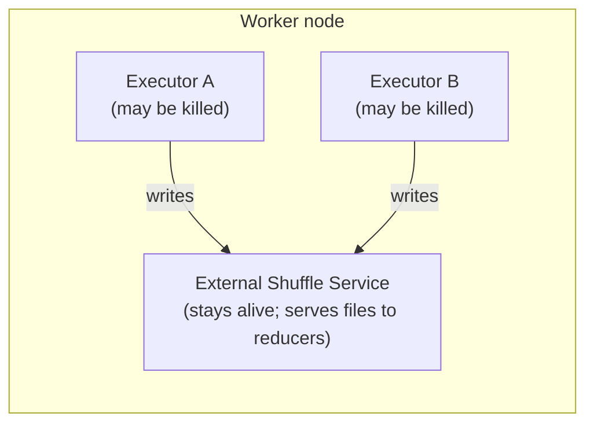

Enable with `spark.shuffle.service.enabled = true` (default `false`). Limitation: shuffle data is still tied to the physical node. If the node fails, it is gone.

**Push-based shuffle** — built into Spark, YARN + ESS only. Map tasks actively **push** blocks to the ESS as they complete, and the ESS merges blocks from many mappers into larger per-partition files. Reducers then read one large sequential file instead of many small random ones.

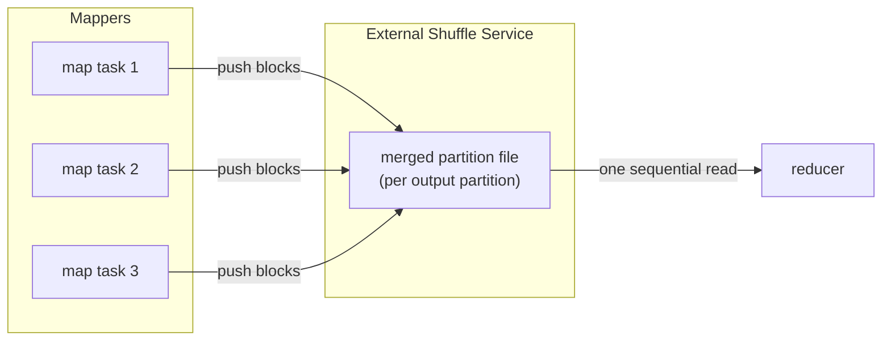

Enable with `spark.shuffle.push.enabled = true` (default `false`).

**Remote Shuffle Service (RSS)** — a dedicated cluster of shuffle servers, entirely separate from the Spark cluster. Executors write over the network; no shuffle data touches worker-node disk. This is the architecture that makes **compute-storage separation** work, which is why it shows up in Kubernetes deployments where mounting hostPath volumes on every node is impractical.

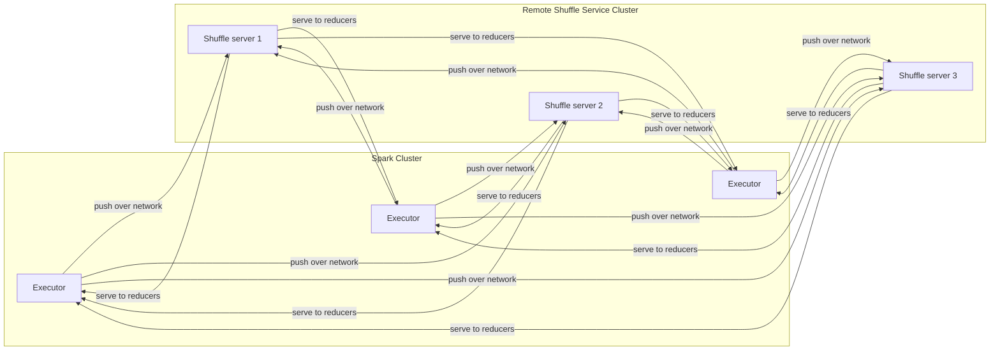

| Project | Apache status | Storage tiers | Notes |
|---|---|---|---|
| **Apache Celeborn** | Apache TLP | Memory → local disk → HDFS / object store | Supports Spark 2.4–4.x; LifecycleManager runs inside the driver |
| **Apache Uniffle** | Apache TLP | Memory → local disk → HDFS | Coordinator cluster assigns servers per job; official client docs cover Spark 2/3 only |

Both implement the shuffle plugin API (`spark.shuffle.manager`), intercepting write and read calls and redirecting them.

```bash
# Celeborn: use the spark-4 variant for Spark 4.x
cp celeborn-client-spark-4-shaded_*.jar $SPARK_HOME/jars/
```

```properties
# Required
spark.shuffle.manager               org.apache.spark.shuffle.celeborn.SparkShuffleManager
spark.serializer                    org.apache.spark.serializer.KryoSerializer
spark.celeborn.master.endpoints     clb-1:9097,clb-2:9097,clb-3:9097
spark.shuffle.service.enabled       false

# Recommended
spark.celeborn.client.push.replicate.enabled  true   # server-side replication
spark.sql.adaptive.localShuffleReader.enabled false  # must disable for Celeborn
```

!!! warning "Uniffle has no verified Spark 4.x client JAR"
    As of Spark 4.2.0, Uniffle's official client guide documents Spark 2 and Spark 3 JARs only (`rss-client-spark3-shaded-*.jar`). Do not carry a Spark 3 configuration onto Spark 4.x until a verified Spark 4 client appears on the [Uniffle releases page](https://github.com/apache/uniffle/releases). Use Celeborn for Spark 4.x.

---

## 9. Submitting applications: `--master` and `--deploy-mode`

With the architecture in place, the `spark-submit` flags become concrete.

**`--master`** says how to run — one local JVM, or where to find the cluster manager:

| `--master` value | Cluster? | Meaning |
|---|---|---|
| `local` | No | One JVM, one thread, one task at a time |
| `local[N]` | No | One JVM, N parallel threads |
| `local[*]` | No | One JVM, one thread per CPU core — the local stack's setting |
| `spark://host:7077` | Yes | Spark Standalone cluster manager |
| `yarn` | Yes | YARN — no address needed; the ResourceManager comes from `yarn-site.xml` in `HADOOP_CONF_DIR` |
| `k8s://https://host:443` | Yes | Kubernetes API server |

With any `local[...]` value there is no cluster manager, no network, and no `--deploy-mode` concept.

**`--deploy-mode`** answers one question: *where does the driver process run?* It applies only with a real cluster.

**`client` (default)** — the driver runs on the machine that called `spark-submit`. Stdout streams to your terminal. Kill the terminal and the job dies.

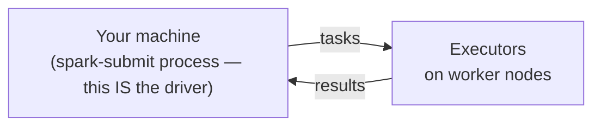

**`cluster`** — the cluster manager launches the driver on a worker node. `spark-submit` exits after handoff. This is the mode where `prepareSubmitEnvironment` substitutes a launcher class for yours.

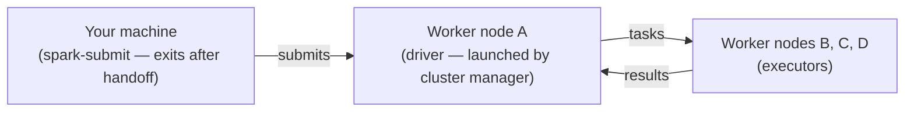

| Setup | `--master` | `client` | `cluster` |
|---|---|---|---|
| pip / local / the local stack | `local[*]` | N/A | N/A |
| Standalone | `spark://host:7077` | ✅ | ✅ Scala/Java only — Standalone cannot launch a Python driver on a worker, so PySpark must use `client` |
| YARN | `yarn` | ✅ | ✅ incl. PySpark |
| Kubernetes | `k8s://…` | ✅ | ✅ incl. PySpark (recommended) |
| Managed (Databricks, EMR, Fabric…) | platform-managed | abstracted | abstracted |

| Scenario | Choice |
|---|---|
| Local dev, notebook, `pyspark` shell | `--master local[*]` |
| Submitting from a gateway node inside the cluster | `--deploy-mode client` |
| Submitting from your laptop to a remote cluster | `--deploy-mode cluster` |
| Production scheduled job | `--deploy-mode cluster` — no dependency on the submitting machine |

Three equivalent ways to set them:

```bash
# 1. spark-submit flags — the only way that works for driver memory
spark-submit --master yarn --deploy-mode cluster --driver-memory 4g my_job.py
```

```python
# 2. SparkSession builder — works for most configs, NOT for driver memory
spark = (
    SparkSession.builder
    .master("yarn")
    .config("spark.submit.deployMode", "cluster")
    .appName("my-job")
    .getOrCreate()
)
```

```properties
# 3. spark-defaults.conf — cluster-wide default, what the local stack uses
spark.master                local[*]
spark.submit.deployMode     client
```

---

## 10. Narrow and wide dependencies: the stage boundary rule

| Type | Definition | Examples | Cost |
|---|---|---|---|
| **Narrow** | Each output partition depends on at most **one** input partition | `map`, `filter`, `select`, `withColumn`, `flatMap`, `union`, `coalesce` (no shuffle) | Zero network I/O; pipelined inside one task in one pass |
| **Wide** | Each output partition depends on **multiple** input partitions | `groupBy`, `join` (without co-partitioning), `repartition`, `distinct`, `sortBy`, `reduceByKey` | Requires a **shuffle**; marks a stage boundary |

Both are concrete classes in `Dependency.scala`:

- **`NarrowDependency`** — *"each partition of the child RDD depends on a small number of partitions of the parent RDD. Narrow dependencies allow for pipelined execution."*
    - `OneToOneDependency` — `map`, `filter`, `withColumn`, `select`, `flatMap`
    - `RangeDependency` — `union`; each output partition maps to a contiguous range of a parent's partitions
- **`ShuffleDependency`** — *"a dependency on the output of a shuffle stage."*

The `DAGScheduler` walks the lineage backwards; every `ShuffleDependency` it meets becomes a stage boundary, and every `NarrowDependency` continues the traversal. The whole classification reduces to one function: [`getMissingParentStages`](https://github.com/apache/spark/blob/v4.2.0/core/src/main/scala/org/apache/spark/scheduler/DAGScheduler.scala#L837).


Within a stage everything is **pipelined**: each task processes its partition in one pass, applying every narrow transformation in sequence without materialising anything.

Stage boundaries are the only points where data is serialised and written to disk. Between two boundaries, nothing hits disk unless you call `.cache()` or `.checkpoint()` — or a task spills.

**Contrast with Hadoop:** in MapReduce every `groupBy` is a separate job with a mandatory full-dataset disk write. In Spark it is a boundary between two in-memory stages, and the only disk I/O is the shuffle files themselves.

---

## 11. What lazy evaluation enables: the Catalyst optimizer

Because nothing executes immediately, the driver accumulates the full logical plan before acting. That is not a convenience — it unlocks optimisations impossible in an eager model. A representative sample of what Catalyst does with it:

**Predicate pushdown.** A `filter` written late in the chain is pushed to the earliest possible point — ideally into the scan. Parquet and ORC store min/max statistics per row group / stripe, so Spark can skip chunks without decompressing them. CSV, JSON, Avro, Text and XML have no internal statistics; pushdown does not apply.

```python
# You write this:
spark.read.parquet("events/").join(users, "user_id").filter(F.col("country") == "DE")

# Catalyst rewrites it to effectively:
# read events with filter country = 'DE' applied at scan time, then join
# — unneeded rows never enter the join
```

**Partition pruning.** All file-based sources participate, and it is a *separate* mechanism from predicate pushdown. With Hive-style partitioned directories (`events/year=2024/month=06/`), Catalyst skips whole directories without opening a file — regardless of whether row-level pushdown is supported for that format.

**Projection pushdown.** If downstream operations need 3 of 50 columns, the reader is told to skip 47. For columnar formats that eliminates the I/O entirely.

**Aggregate pushdown.** For Parquet and ORC, `COUNT`, `SUM`, `MIN`, `MAX` can be computed from stored statistics without scanning rows. For JDBC, the whole `GROUP BY` ships to the database.

**JDBC full query pushdown.** JDBC goes furthest — filters, `LIMIT`, `OFFSET`, top-N, table sampling, and even joins between two tables in the same database can be pushed to the engine, with Spark receiving only the result.

**Operator fusion.** Consecutive narrow operations fuse into a single stage; no intermediate DataFrame is materialised.

**Constant folding.** `F.lit(2) * F.lit(3)` is evaluated at plan time and replaced with `F.lit(6)`.

**Join reordering.** Estimated row counts drive an ordering that joins smaller relations first.

**Broadcast join selection.** If one side is under `spark.sql.autoBroadcastJoinThreshold` (10 MB), the join becomes a broadcast join and the shuffle disappears.

**Outer join elimination.** If a filter on the nullable side of a `LEFT`/`RIGHT OUTER JOIN` cannot be satisfied by NULL, Catalyst converts it to an `INNER JOIN`. Users rarely notice; `df.explain()` shows it.

**Filter inference from join keys.** Given `a.id = b.id` and `WHERE a.id > 5`, Catalyst derives `WHERE b.id > 5` and pushes it into the `b` scan — a filter you never wrote, preventing a full scan.

**Limit pushdown.** A `LIMIT` above a `UNION ALL` is pushed into each branch, so neither is fully computed.

**Null propagation, boolean simplification, LIKE simplification, project collapsing, repartition collapsing.** `null + x → null`; `x AND true → x`; `LIKE 'prefix%' → startsWith`; consecutive `select`s merged; `repartition(100).repartition(200)` collapsed to one shuffle.

And the runtime counterpart: **Adaptive Query Execution**, on by default, which re-enters the optimiser at each shuffle boundary with *actual* statistics — the mechanism that turned 200 planned shuffle partitions into 1 in this chapter's word count. AQE in depth is **Chapter 23**; Catalyst's internals are **Chapter 22**.

None of this is available to Hadoop MapReduce, because the framework sees one job at a time. A MapReduce job that reads 50 columns and uses 3 is a programmer error the framework cannot correct. In Spark it is the normal, expected behaviour.

---

## Common pitfalls

**Reading the stage count off your transformation chain.** The chapter's own opening example: `orderBy` under a `show(n)` plans no shuffle. Explain `df.limit(n + 1)` to see what `show(n)` actually runs.

**Assuming one action means one job.** AQE materialises each shuffle stage as its own job, and `executeTake` loops with a scaling partition count. If you are measuring, count with `sc.statusTracker()`, not from the code.

**Setting `spark.driver.memory` in application code.** The JVM heap was fixed before your code ran. Use `spark-submit --driver-memory` or `spark-defaults.conf`.

**Trusting `spark.task.maxFailures` on your laptop.** Local mode hardcodes 1. Behaviour you validate locally does not transfer.

**Blaming the cluster size for FIFO starvation.** Under the default scheduler mode, a second concurrent job waits behind the first. Switch to `FAIR` with pools.

**Reading UI numbers on a job with tens of thousands of tasks without suspecting the listener bus.** Events drop on queue overflow with only a rate-limited warning.

**Enabling off-heap memory without raising `spark.executor.memoryOverhead`.** The container's RSS grows, YARN or Kubernetes kills it, and there is no Java stack trace to explain why.

**Chasing intermittent executor loss without checking GC time.** A GC pause longer than `spark.network.timeout` is indistinguishable from a dead executor.

---

## Exercises

**Recall.** Without looking: name the four levels of execution, name the single function that decides where one stage ends and the next begins, and say what a `ShuffleMapTask` returns to the driver.

**Apply.** Start the local stack and run the word count. Then:

1. Print `top_words.explain()` and `top_words.limit(11).explain()` side by side. Identify which `Exchange` disappears and name the rule responsible.
2. Count the jobs `show(10)` submits with `spark.sql.adaptive.enabled` set to `true` and to `false`, using `sc.statusTracker().getJobIdsForGroup()`. Explain the difference.
3. Open the History Server at `http://localhost:18080`, find your application, and match its stage count against what you predicted from the plan.

**Extend.** Build a query where `executeTake`'s scaling loop is visible: a wide `spark.range` with a filter selective enough that the first partition yields nothing. Count the jobs, then set `spark.sql.limit.initialNumPartitions` to a larger value and count again. Explain the trade-off the default is making.

**Extend further.** Set `spark.sql.shuffle.partitions` to 200 and then to 201 on a shuffle with no map-side combine. Predict which shuffle writer runs in each case, and say what you would expect to change in wall-clock time and in the number of open file handles.

---

## Summary

- A Spark application is a **driver** (in PySpark classic mode: a Python process and a JVM process together), some **executors**, and a **cluster manager** that only allocates resources and never sees the plan.
- The driver compiles a DataFrame into an `RDD[InternalRow]` through `QueryExecution`, then the `DAGScheduler` cuts it into stages at every `ShuffleDependency`, and the `TaskScheduler` places one task per partition onto executor slots.
- **You cannot infer the stage count from the API calls you wrote.** The planner rewrites — `Limit` over `Sort` becomes `TakeOrderedAndProjectExec` with no global-sort shuffle — and AQE re-plans at run time. Read `explain()` on the plan that actually runs.
- **One action is not one job.** AQE materialises shuffle stages separately, and `executeTake` loops over a scaling partition count.
- Fault tolerance is **lineage, not replication**, and the three failure levels are different mechanisms: a task retries, a fetch failure resubmits the *parent stage*, and executor loss invalidates map output in `MapOutputTracker`.
- Two heartbeat timers decide an executor is dead, and a long GC pause looks exactly the same to both.
- The UI, the event log and the History Server all read from one bounded, lossy event bus. Their numbers are best-effort.

The next question is how to configure and initialise the runtime itself. **Chapter 04 (SparkSession)** covers `SparkSession.builder` in full: config precedence, which settings can still change after the session exists, session reuse, and the classic/Connect subclass split this chapter introduced.

---

## References

**Official documentation**

- [Cluster Mode Overview](https://spark.apache.org/docs/latest/cluster-overview.html) — the driver/executor/cluster-manager picture, plus the glossary that pins down application / job / stage / task
- [Submitting Applications](https://spark.apache.org/docs/latest/submitting-applications.html) — `spark-submit`, and the client-vs-cluster deploy mode distinction
- [Job Scheduling](https://spark.apache.org/docs/latest/job-scheduling.html) — scheduling *across* applications and *within* one, two mechanisms usually blurred together
- [Tuning Spark](https://spark.apache.org/docs/latest/tuning.html) — memory, serialisation and data locality
- [Monitoring and Instrumentation](https://spark.apache.org/docs/latest/monitoring.html) — the UI, the event log and the listener bus underneath both
- [Spark Connect Overview](https://spark.apache.org/docs/latest/spark-connect-overview.html)

**Source, at tag `v4.2.0`**

- [`DAGScheduler.getMissingParentStages`](https://github.com/apache/spark/blob/v4.2.0/core/src/main/scala/org/apache/spark/scheduler/DAGScheduler.scala#L837) — the narrow/wide split, mechanically
- [`SparkPlan.executeTake`](https://github.com/apache/spark/blob/v4.2.0/sql/core/src/main/scala/org/apache/spark/sql/execution/SparkPlan.scala#L524) — the job-scaling loop
- [`SpecialLimits.planTakeOrdered`](https://github.com/apache/spark/blob/v4.2.0/sql/core/src/main/scala/org/apache/spark/sql/execution/SparkStrategies.scala#L115) — `Limit` over `Sort` → `TakeOrderedAndProjectExec`
- [`SortShuffleManager.getWriter`](https://github.com/apache/spark/blob/v4.2.0/core/src/main/scala/org/apache/spark/shuffle/sort/SortShuffleManager.scala#L145) — which of the three shuffle writers runs
- [`AsyncEventQueue`](https://github.com/apache/spark/blob/v4.2.0/core/src/main/scala/org/apache/spark/scheduler/AsyncEventQueue.scala#L169) — where UI events are dropped
- [`HeartbeatReceiver.expireDeadHosts`](https://github.com/apache/spark/blob/v4.2.0/core/src/main/scala/org/apache/spark/HeartbeatReceiver.scala#L210) — the driver-side liveness timer

**In this site**

- [B1 source trace](../reference/spark-source-map/topics/b1.md) — the full code path with every anchor, re-verified against `v4.2.0`
- [Local stack](https://github.com/arindamchoudhury/spark-delta-unitycatalog) — the Spark 4.2.0 / Delta 4.2.0 / Unity Catalog environment every measurement in this chapter came from
