# Chapter 02 — Spark Architecture: Driver, Executors, and Cluster Managers

> *Learning-path topic: B1 (Beginner)*
> *Written: 2026-06-05 · Spark 4.1.x / Python 3.10+*

This chapter covers the physical architecture of a Spark cluster — the components that run when a job executes and how they coordinate.

---

## A first Spark program

Before explaining the architecture, here is a complete word count program — the canonical "hello world" of distributed computing. It reads *Pride and Prejudice* from the Gutenberg corpus in the [local stack](https://github.com/arindamchoudhury/spark-delta-unitycatalog), counts every word, and shows the top 10. All the behavior described in the rest of this chapter is visible in this program.

The full runnable versions are in the repo:

- **[`workspace/notebooks/intro.ipynb`](https://github.com/arindamchoudhury/spark-delta-unitycatalog/blob/main/workspace/notebooks/intro.ipynb)** — notebook with cells labelled Read / Transform / Action / Inspect the plan
- **[`workspace/pyscript/intro.py`](https://github.com/arindamchoudhury/spark-delta-unitycatalog/blob/main/workspace/pyscript/intro.py)** — standalone script for `spark-submit`

To run `intro.py` with `spark-submit`:

```bash
# Local mode — no cluster required, uses all available CPU cores
spark-submit --master "local[*]" workspace/pyscript/intro.py

# Against the Docker stack — submit inside the spark container
docker compose exec spark spark-submit \
    --master "local[*]" \
    /workspace/pyscript/intro.py
```

```python
# Apache Spark 4.1.x / PySpark 4.1.x · Python 3.10+
# Run from workspace/notebooks/ — requires the local stack running (docker compose up)
import os
from pyspark.sql import SparkSession
import pyspark.sql.functions as F

os.environ["SPARK_LOCAL_IP"] = "127.0.0.1"
conf_path = os.path.abspath("log4j2.xml")   # silences Spark's INFO noise

spark = (
    SparkSession.builder
    .appName("word-count")
    .config("spark.ui.port", "4041")
    .config("spark.driver.extraJavaOptions",
            f"-Dlog4j2.configurationFile={conf_path}")
    .getOrCreate()
)

# Everything below this line is lazy — no data moves yet
book = spark.read.text("../data/gutenberg_books/1342-0.txt")

top_words = (
    book
    .select(F.explode(F.split("value", " ")).alias("word"))        # split lines into words
    .select(F.regexp_extract(F.lower(F.col("word")), "[a-z]+", 0)  # lowercase FIRST, then strip punctuation
             .alias("word"))
    .filter(F.col("word") != "")                               # drop empties
    .groupBy("word")
    .count()
    .orderBy(F.col("count").desc())
)

top_words.show(10)   # <-- THIS is the first action; only now does Spark execute the plan
# +----+-----+
# |word|count|
# +----+-----+
# | the| 4496|
# |  to| 4235|
# |  of| 3719|
# | and| 3602|
# | her| 2223|
# |   i| 2052|
# |   a| 1997|
# |  in| 1920|
# | was| 1844|
# | she| 1703|
# +----+-----+

spark.stop()
```

`spark.read.text(...)` defines the source, and every line up to `.show(10)` adds a **transformation** on top — all of it recorded but not executed. `.show(10)` is the first **action** — the moment Spark takes all the recorded instructions, builds an optimized physical plan, distributes the work across executors, and returns a result. The rest of this chapter explains exactly what happens during those few milliseconds.

---

## Anatomy of a Spark application

[](assets/ch01/cluster-overview.png)

*Source: [Apache Spark — Cluster Mode Overview](https://spark.apache.org/docs/latest/cluster-overview.html)*

A Spark application has three kinds of processes: a **driver**, one or more **executors**, and a **cluster manager** that brokers between them. The driver plans the work; executors do the work; the cluster manager decides where executors run.

---

### Driver Program

Spark's official definition ([cluster-overview](https://spark.apache.org/docs/latest/cluster-overview.html)):

> *"The process running the main() function of the application and creating the SparkContext."*

That definition fits a JVM language perfectly — one process, one main(). In PySpark **classic mode** it becomes ambiguous, because the runtime splits across two OS processes:

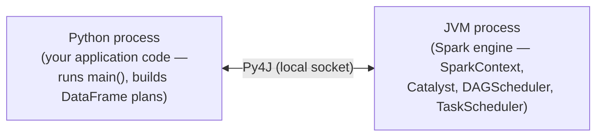

- The **Python process** runs your application code — this is what Spark's official docs call "the process running main()." When your code calls `SparkSession.builder.getOrCreate()`, PySpark starts the JVM process (if it isn't running yet) and creates the real `SparkSession` and `SparkContext` objects inside it. The Python `spark` variable you get back is a **Python wrapper holding Py4J proxy objects** (`_jsparkSession`, `_jsc`) — every method call on `spark` is forwarded across the Py4J socket to the real JVM object. No Spark engine state lives in Python.
- The **JVM process** is the Spark engine — it hosts the real SparkContext, SparkSession, Catalyst, DAGScheduler, and TaskScheduler. It is a separate OS process from Python, running on the same machine.

**PySpark uses two distinct channels, not one.** The Py4J socket is bidirectional: Python calls JVM methods (building plans, issuing actions), JVM returns values back (results, schemas, row data), and the JVM can also actively call into Python via a `CallbackServer` — used for SparkListeners and Python objects the JVM holds a reference to. A completely separate `pyspark.worker` socket is used when the JVM executor needs to run a Python function. On UNIX (the default), a `pyspark/daemon.py` process manages Python worker processes on behalf of the executor JVM. DataFrame operations (Catalyst expressions, built-in functions like `F.lower()`) run entirely inside the JVM and never cross back to Python. Only when a Python UDF or RDD lambda runs does the executor send data to a Python worker via this socket. This is the root cause of Python UDF overhead: rows are serialized from JVM binary format to Python objects and back in batches (default 100 rows per batch for pickle UDFs, `spark.sql.execution.python.udf.maxRecordsPerBatch`; Arrow record batches for pandas UDFs), crossing a socket boundary for every batch.

| Direction | Channel | Used for |
|---|---|---|
| Python → JVM | Py4J local socket | Building plans, issuing actions |
| JVM → Python | Py4J local socket (return values) | Results, schemas, row data returned from JVM method calls |
| JVM → Python | Py4J `CallbackServer` | JVM actively calling into Python — SparkListeners, Python objects held by JVM |
| JVM → Python | `pyspark.worker` socket (separate) | Sending data batches to Python UDF / RDD lambda workers on executors |
| Python → JVM | `pyspark.worker` socket (separate) | Returning UDF / lambda results back to executor JVM |

**"The driver" means both processes together.** When Spark's UI, logs, or error messages say "driver" they usually mean the JVM side (where scheduling happens), but the Python process is equally part of the driver — it is the one building the plan and issuing calls. Neither process alone is the full driver. Executors are entirely separate JVM processes on worker nodes; they receive tasks but do no planning or scheduling.

**The driver is a single point of failure.** The driver holds all non-recoverable application state: the `SparkContext`, the DAG, the `DAGScheduler` stage graph, `MapOutputTracker` shuffle metadata, broadcast variables, and accumulator state. None of this is replicated anywhere. Executor failures are recoverable — tasks are retried and lost shuffle data is recomputed. The driver has no equivalent: when it dies, everything it was holding dies with it and the application cannot resume.

In **Spark Connect mode** (opt-in; activate with `export SPARK_REMOTE="sc://localhost"` before launching `pyspark`), the Python process is a **client only** — it serializes your DataFrame operations as protobuf and sends them over gRPC. It has no JVM at all. The Spark engine runs on the Connect server:

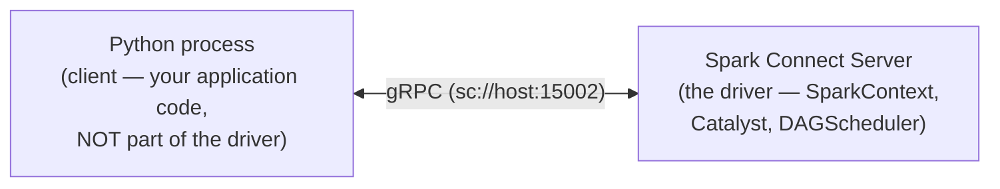

| | Classic | Spark Connect |
|---|---|---|
| Introduced | Spark 1.0 | Spark 3.4 |
| Python process role | Runs user code and builds plans; paired with the JVM process, both together form the driver | Client only — serializes plans, receives results; no JVM involved |
| Spark engine (SparkContext, Catalyst, DAGScheduler) | Driver-side JVM process (co-located with Python) | Connect Server JVM (remote) |
| Python↔JVM transport | Py4J local socket | gRPC + Apache Arrow |
| RDD support | Yes | No |
| Direct JVM access (`df._jdf`) | Yes | No |
| Default for `pyspark` shell | Yes — in all Spark 4.x | No — opt-in via `SPARK_REMOTE`, `--remote`, or `spark.api.mode=connect` |

**How to activate each mode:**

```python
# Classic mode (default) — Python + JVM together form the driver
spark = SparkSession.builder.appName("app").getOrCreate()

# Spark Connect via .remote() — Python is a client, connects to an existing server
spark = SparkSession.builder.remote("sc://localhost:15002").getOrCreate()
```

**`.remote(url)`** accepts either `sc://host:port` (connect to an existing Connect server) or `local[N]` / `local[*]` (start a local Connect server inline). It tells the Python process to skip the JVM entirely — `RemoteSparkSession` uses gRPC instead of Py4J, so no `SparkContext` is created in the client process. `--master` and `--deploy-mode` **cannot** be combined with `.remote()` — setting both `spark.master` and `spark.remote` raises `CANNOT_CONFIGURE_SPARK_CONNECT_MASTER` at session creation time.

There are three distinct ways to run in Connect mode, each with a different relationship to `--master`:

| How | `--master` | `--deploy-mode` | What happens |
|---|---|---|---|
| `.remote("sc://host:port")` | Blocked — raises error if combined with `spark.remote` | Not used | Client connects to an already-running Connect server |
| `.remote("local[4]")` / `spark.remote = "local[4]"` | Blocked — raises error if combined | Not used | Spark starts a local Connect server inline (testing only) |
| `spark.api.mode=connect` + `--master yarn` | Used | Used | **Hybrid mode** — classic cluster management allocates resources; a local Connect server starts alongside the driver; Python connects to `sc://localhost` |

The first two paths decouple the client completely from cluster management. The third path (`spark.api.mode=connect`) is a **hybrid mode**, not pure Spark Connect. The Spark source (`config/package.scala` v4.1.2) describes it as: *"For Spark Classic applications, specify whether to automatically use Spark Connect by running a **local** Spark Connect server dedicated to the application. The server is terminated when the application is terminated."* In other words: `--master yarn` still handles resource allocation the classic way, but a Connect server starts collocated with the driver so the Python code uses the Connect API instead of Py4J.

`spark.remote` accepts two kinds of URL — verified against `session.py` v4.1.2:

| `spark.remote` value | What happens |
|---|---|
| `local[N]` / `local[*]` | Starts a local Connect server inline — `getOrCreate()` routes it to `sc://localhost` |
| `sc://host:port` | Connects directly to an existing remote Connect server |
| `yarn`, `spark://…`, `k8s://…` | **Blocked** — setting both `spark.master` and `spark.remote` raises `CANNOT_CONFIGURE_SPARK_CONNECT_MASTER`; use `spark.api.mode=connect` with `--master` instead |

> **When to use each URL form:**
>
> - **`local[N]` / `local[*]`** — use when developing or testing Connect-compatible code on a machine with a full PySpark install. The main reason: Connect mode disallows `df._jdf`, `sc._jsc`, and any direct JVM-object access. Running locally with `local[*]` catches those violations before you deploy to a real server. Also useful in CI pipelines. Requires a full PySpark install — there must be a JVM available to start the server.
>
> - **`sc://host:port`** — the normal production path: a Connect server is already running on a cluster (YARN, Kubernetes, Databricks) and you connect to it from a lightweight client. This is the **only** option when using `pyspark-client` (the JVM-free package introduced in Spark 4.0), since there is no JVM available to start a local server.

`spark.remote` and `spark.master` cannot be combined — they represent incompatible execution models. `spark.master` means "I am starting Spark infrastructure; negotiate with this cluster manager." `spark.remote` means "I am a thin client; connect me to an already-running server." Setting both raises `CANNOT_CONFIGURE_SPARK_CONNECT_MASTER` at session creation. If a Spark Connect server is already deployed on a real cluster, `spark.remote = "sc://cluster-host:15002"` works fine without `spark.master` — the client has no cluster management role. If you want Spark to manage cluster resources itself and also use the Connect API, use `spark.api.mode=connect` with `--master`.

```bash
# Hybrid mode: YARN manages resources, local Connect server starts with the driver
spark-submit --master yarn --deploy-mode cluster \
  --conf spark.api.mode=connect \
  myapp.py
```

The word count program uses classic mode. The components described below apply to classic mode; in Connect mode they all live on the Connect server.

---

### SparkSession and SparkContext

**SparkSession** is the entry point you create in every PySpark program (introduced in Spark 2.0):

```python
spark = SparkSession.builder.appName("my-app").getOrCreate()
```

It is the single object through which you read data, run SQL, and build DataFrames. You rarely need anything else.

**SparkContext** is the internal component that SparkSession wraps. It is what the official architecture docs refer to when they define the driver:

> *"The SparkContext object in your main program. It coordinates independent sets of processes on a cluster and connects to cluster managers to allocate resources."* — [cluster-overview](https://spark.apache.org/docs/latest/cluster-overview.html)

You don't create or interact with SparkContext directly in normal work — SparkSession creates and owns it (`self._sc = sparkContext` in `session.py`). It surfaces in architecture discussions because it is the actual coordinator: when `.show(10)` triggers a job, SparkContext receives the job and passes it to the DAGScheduler, which breaks it into stages and tasks. The TaskScheduler then dispatches tasks to executors via the SchedulerBackend. The cluster manager is involved only for **resource allocation** (executor count, CPU, memory) — it never sees the plan. Executors are allocated at application startup, not per-job. In classic mode you can reach SparkContext via `spark.sparkContext` for low-level RDD operations or configuration inspection; this property does not exist in Connect mode (`pyspark-client`), where `RemoteSparkSession` has no underlying SparkContext. For all DataFrame and SQL work SparkSession is sufficient.

In Spark 4.x, `SparkSession` lives in the `org.apache.spark.sql.classic` package rather than `org.apache.spark.sql`, to coexist with `org.apache.spark.sql.connect.SparkSession`. The Python import path (`from pyspark.sql import SparkSession`) is unchanged — this only surfaces in JVM stack traces and Scala/Java source browsing.

---

### Cluster Manager

The **Cluster Manager** is an external service that allocates resources (machines, CPU, memory) for the application. Spark 4.x supports four cluster manager modes:

| Mode | When to use |
|---|---|
| `local[N]` | Development — runs driver and executors in the same JVM process |
| Spark Standalone (`spark://host:port`) | Dedicated Spark cluster; no YARN/k8s required |
| YARN | Hadoop ecosystem; multi-tenant clusters |
| Kubernetes (`k8s://https://host:port`) | Container-native deployments |

In the [local stack](https://github.com/arindamchoudhury/spark-delta-unitycatalog), it is Spark Standalone, running inside the `spark` container. On cloud deployments it is typically YARN or Kubernetes.

Executors are allocated at **application startup** — when `SparkSession.builder.getOrCreate()` initialises `SparkContext`, it registers with the cluster manager which then launches executor processes on worker nodes. When `.show(10)` fires a job later, the executors are already running and waiting for tasks. The cluster manager is not contacted again per-job. With **dynamic allocation** (`spark.dynamicAllocation.enabled=true`), the `ExecutorAllocationManager` inside the driver can request additional executors or release idle ones during the application lifetime — but this is driven by scheduler backpressure (pending tasks), not by individual job triggers.

---

### Worker Nodes and Executors

A **Worker Node** is any machine in the cluster that can run application code. The cluster manager launches an **Executor** process on each worker node it allocates to your application.

In the word count program, executors are the processes that actually read `1342-0.txt`, run `split`, `regexp_extract`, `lower`, and `filter` on lines of text, and count words. The driver reads file metadata (directory listings, file sizes, split boundaries) to build the physical plan and assign tasks — it never reads row data. Each executor receives a task describing exactly which file and byte range to read, opens that range itself, and processes the rows locally.

Each application gets its own isolated executors. They stay alive for the entire application (from `getOrCreate()` to `spark.stop()`), not just one query. 

Spark's programming model provides two shared variable types available to both the RDD and DataFrame APIs: **broadcast variables** — large read-only objects (e.g. a lookup table) sent once to every executor and cached there, rather than copied with every task closure — and **accumulators** — add-only counters that executors increment and only the driver reads.

Accumulators are intentionally **write-only for executors**. This is an architectural choice: if executors could read an accumulator mid-execution, the value would be inconsistent across tasks running in parallel, requiring distributed locking. Instead, executor tasks add their updates locally; Spark merges each task's update into the driver-side accumulator exactly once when the task completes (in actions only — accumulator updates in transformations may be applied more than once if stages are re-executed). A failed task's partial accumulator update is discarded; the retry starts from zero.

---

### Executor memory layout

Each executor JVM heap is divided into three fixed regions by the **unified memory manager** (default since Spark 1.6, still the default in Spark 4.x):

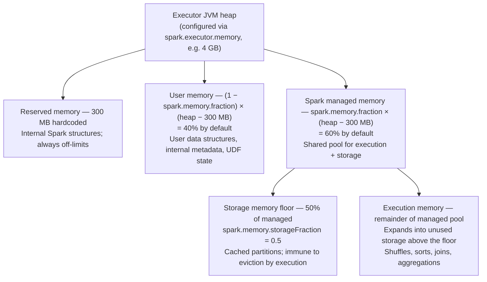

**Execution memory** is used during shuffle, sort, join, and aggregation operations. When a task needs more execution memory than is available it **spills** intermediate data to local disk — the task continues but at disk I/O speed instead of RAM speed. Four operation types can spill:

- **Sort** — sorted runs are written to disk and later merged
- **Hash aggregation** — the in-memory hash map is flushed to disk when full, then merged in a second pass
- **SortMergeJoin** — one or both sides spill sorted runs when the partition doesn't fit
- **GroupBy (hash-based)** — same as hash aggregation

The trigger is exhausting the task's execution memory allocation. Spilling does not fail the task but can make it 10–100× slower depending on disk speed. The fix is usually more partitions (smaller per-task working set) or more executor memory.

**What format is written to disk?** It depends on which layer is spilling — verified against `ExternalSorter.scala` and `HashAggregateExec.scala` v4.1.2:

| Layer | Spill format | Cost |
|---|---|---|
| **DataFrame / SQL** (`HashAggregateExec`, `SortMergeJoin`) | Binary **`UnsafeRow`** — the same compact format already in memory, written via `UnsafeKVExternalSorter`. No serialization conversion. | Low — just writing bytes |
| **RDD operations** (`ExternalSorter`) | Serialized key-value pairs using the configured `Serializer` (Kryo or Java, `spark.serializer`), written in fixed-size batches via `DiskBlockObjectWriter`. Each batch has its own serialization stream to reduce reference-tracking overhead on read. Sorted by partition ID first, then optionally by key. | Higher — requires serialization per object |

DataFrame spills are cheaper than RDD-layer spills precisely because `UnsafeRow` is already binary — no conversion is needed to write it to disk. Compression of spill files is controlled by `spark.shuffle.compress` (default `true`).

**Per-task fairness before spill.** When N tasks run concurrently on one executor, `ExecutionMemoryPool` enforces two per-task memory bounds — verified in actual code at v4.1.2:

- **Floor (1/2N)** — `minMemoryPerTask = poolSize / (2 * numActiveTasks)`. A task that has not yet reached this minimum is **blocked** (not spilled) until enough memory frees up. It never spills before getting a fair start.
- **Ceiling (1/N)** — `maxMemoryPerTask = maxPoolSize / numActiveTasks`. A task cannot hold more than this, keeping the pool shared fairly.

Concrete example with default config (`spark.executor.memory = 1g`, `spark.memory.fraction = 0.6`), 4 active tasks:

```
managed pool = (1024 MB − 300 MB) × 0.6 = 724 × 0.6 = 434 MB
floor per task = 434 / (2 × 4) = 54 MB   ← blocked until it reaches this
ceiling per task = 434 / 4       = 108 MB  ← cannot exceed this
```

A task that has only acquired 30 MB so far and needs 80 MB would **wait**, not spill — it has not yet reached its 54 MB floor. Spark logs this: *"TID X waiting for at least 1/2N of execution pool to be free."*

**Storage memory** (the storage floor in the diagram above) holds cached partitions (`df.cache()`). The borrowing relationship between execution and storage is bidirectional but asymmetric — confirmed in the source Scaladoc:

- **Storage borrows from execution** when execution memory is idle — cached blocks expand into free execution space at no cost.
- **Execution reclaims borrowed memory** by evicting cached blocks above the floor when it needs space for a running task.
- **Execution is never evicted by storage** — even if execution has borrowed storage's memory, storage cannot force it back. The source notes this is due to "the complexities involved in implementing this"; practically, evicting in-progress execution data would corrupt a running task. The implication: if execution fills the managed pool, new `.cache()` calls will fail and the block will be evicted immediately per its storage level.

**What if nothing is cached?** The storage floor is **not a static reservation** — the source confirms: *"This region is not statically reserved; execution can borrow from it if necessary."* If no data is cached, the storage pool is empty and execution is free to use the entire managed pool. With the default 1g executor, that is the full 434 MB. The floor only becomes meaningful once you cache something: it is the minimum footprint that cached data is allowed to hold before execution starts evicting it.

| Scenario | Execution can use |
|---|---|
| Nothing cached | All 434 MB (execution region + empty storage floor) |
| Cached data below the floor | Whatever is free — data under the floor is eviction-protected |
| Cached data above the floor | Overflow above the floor is evictable; execution reclaims it as needed |
| Execution fills the managed pool | New `.cache()` calls fail — block evicted immediately per storage level |

The 300 MB reserved region is hardcoded. It protects Spark's own internal data structures from being crowded out by user workloads.

**What causes GC pressure.** `UnsafeRow` binary data in the managed memory pool does not create JVM objects and generates no GC pressure. GC pressure comes from the **user memory pool** — any JVM objects your code creates: Python UDF result objects converted back to JVM types, intermediate Scala/Java collections in user functions, large driver-side variables accidentally captured in closures and shipped to executors. A full JVM GC pause stalls all tasks on the executor simultaneously and, if long enough, causes the executor to miss heartbeats and be marked dead by the driver. Monitoring GC time in the Spark UI is the first step in diagnosing executor performance problems.

| Config | Default | What it controls |
|---|---|---|
| `spark.executor.memory` | `1g` | Total JVM heap per executor |
| `spark.memory.fraction` | `0.6` | Fraction of (heap − 300 MB) given to the shared managed pool; the remainder `(1 − fraction)` becomes user memory — raising this shrinks user memory and vice versa |
| `spark.memory.storageFraction` | `0.5` | Fraction of managed pool reserved as the storage floor |
| `spark.memory.offHeap.enabled` | `false` | Enable off-heap memory (bypasses JVM GC entirely) |
| `spark.memory.offHeap.size` | `0` | Absolute bytes for off-heap allocation; must be positive when enabled; counts toward container RSS — account for it by shrinking `spark.executor.memory` or increasing `spark.executor.memoryOverhead` |
| `spark.executor.memoryOverhead` | optional (see below) | Non-heap memory budget per executor; if not set, computed from the two configs below |
| `spark.executor.memoryOverheadFactor` | `0.1` (JVM); **`0.4` for Kubernetes non-JVM jobs including PySpark** | Fraction of executor memory allocated as non-heap overhead |
| `spark.executor.minMemoryOverhead` | `384m` (new in Spark 4.0.0) | Minimum overhead floor — effective overhead = `max(executor_memory × factor, minOverhead)` |

**Off-heap memory** is allocated outside the JVM heap using native memory. It is completely separate from the unified memory manager's calculation — off-heap does not reduce the heap pool. When enabled, Spark uses it for storage and execution buffers, reducing GC pressure for large objects.

**`spark.memory.offHeap.size` and `spark.executor.memoryOverhead` — the critical relationship.**

YARN and Kubernetes manage containers by watching **RSS (resident set size)** — the total process memory including JVM heap, JVM overhead, Python worker processes, and any native/off-heap allocations. They have no visibility into how much is JVM heap versus off-heap. `spark.executor.memoryOverhead` is the budget you give the cluster manager for all non-heap memory per executor. Its default is `max(executor_memory × 0.1, 384 MB)`.

The problem: `spark.memory.offHeap.size` is allocated from native memory, which counts toward RSS. If you enable off-heap but don't increase `spark.executor.memoryOverhead` to cover it, the container's RSS quietly exceeds its limit and YARN/Kubernetes kills it — with no Java stack trace, just a vague "container exceeded memory limits" error.

**Correct sizing formula:**

```
total container memory = spark.executor.memory           (JVM heap)
                       + spark.executor.memoryOverhead    (JVM internals + native overhead)
                       + spark.memory.offHeap.size        (off-heap execution/storage)
                       + spark.pyspark.executor.memory    (PySpark apps only)
```

- **`spark.pyspark.executor.memory`** — memory reserved for the Python worker process on each executor (separate from the JVM heap and from `memoryOverhead`). Relevant when tasks contain Python UDFs or RDD lambdas — those tasks spawn a Python worker process on the executor to execute the Python code. If unset, no extra memory is reserved for the Python process — the Python worker shares whatever the OS allows beyond the JVM. Source-verified: `Client.scala` L130–134 reads this as `pysparkWorkerMemory` and adds it as a fourth term in the container size calculation.

Set `spark.executor.memoryOverhead` to at least cover `spark.memory.offHeap.size` plus the original overhead budget.

**Performance cost and production guidance:**

The access overhead of `sun.misc.Unsafe` reads is negligible — the cost is operational, not computational. Guidance from current Spark production practice:

| Scenario | Recommendation |
|---|---|
| Small-medium heaps (<4 GB), short batch jobs | **Off by default is correct** — on-heap GC is manageable; off-heap adds operational risk |
| Large heaps (>4-8 GB), GC pauses >10% of task time in Spark UI | **Consider enabling** — GC storms become a real throughput bottleneck |
| Long-running Structured Streaming jobs | **Often beneficial** — GC accumulates over hours of uptime |

**Always check GC time in the Spark UI before enabling off-heap.** If GC is <5% of task time, off-heap adds complexity with no measurable gain. If GC is high, first try using more executors with smaller heaps (smaller heap = smaller GC scan scope) — that often resolves GC pressure without the off-heap sizing risk.

**Unmanaged memory (Spark 4.x).** `UnifiedMemoryManager.scala` v4.1.2 added a third type of memory that `UnifiedMemoryManager` accounts for, alongside execution memory and storage memory — **unmanaged memory**: memory consumed by components that manage their own allocations outside of Spark's unified memory system. The source lists two examples:

- **RocksDB state stores** — used by Structured Streaming stateful operations; manages its own block cache and write buffers entirely outside the unified pool
- **Native libraries** — any JNI or off-heap allocation not routed through `spark.memory.offHeap`

Polling is **disabled by default** (`spark.memory.unmanagedMemoryPollingInterval = 0s`, Spark 4.1.0+). When enabled, a background thread periodically queries each registered consumer and subtracts their usage from the available execution and storage budgets — making Spark's allocator aware of how much headroom is actually left. When disabled, unmanaged allocations are invisible to `UnifiedMemoryManager`: Spark grants memory as if they don't exist.

Either way, `spark.executor.memoryOverhead` remains necessary — polling adjusts internal JVM allocation decisions but does not change the container's physical memory limit. If you use RocksDB state stores (`spark.sql.streaming.stateStore.providerClass = RocksDBStateStoreProvider`), size `spark.executor.memoryOverhead` to cover RocksDB's native off-heap footprint. Without sufficient overhead, the failure mode is a silent container kill with no Java stack trace.

---

### Partitions and Tasks

`1342-0.txt` is not loaded as a single block. Spark splits it into **partitions** — subdivisions of the dataset, each processed by exactly one task on one executor. During execution a partition lives in executor memory; if it exceeds available memory Spark spills it to disk. Each partition is assigned to exactly one **Task**, and each task runs on one executor. This is a **hard invariant** in Spark's execution model: one task processes exactly one partition, and one partition is processed by exactly one task. A partition cannot be split across tasks; a task cannot span multiple partitions. Calling `.cache()` on a DataFrame persists its partitions after they are first computed, cutting the lineage so that re-use does not re-read from source. Since Spark 4.0.0, `df.cache()` defaults to `MEMORY_AND_DISK` (controlled by `spark.sql.defaultCacheStorageLevel`, added in 4.0.0) — partitions spill to disk if executor memory is insufficient. This differs from `RDD.cache()`, which still defaults to `MEMORY_ONLY`. By default, cached partitions are **not replicated** — each partition lives on exactly one executor. If that executor crashes, the partition is lost; Spark falls back to lineage recomputation from the original source. Storage levels with replication (`MEMORY_AND_DISK_2`) exist but double the memory cost.

**Executor task slots.** The number of tasks an executor can run simultaneously equals `spark.executor.cores` (default: 1 on YARN, all available cores on Standalone) divided by `spark.task.cpus` (default: 1). With `spark.executor.cores = 4`, an executor has 4 task slots and runs 4 tasks concurrently. If a job has 200 tasks and the cluster has 10 executors × 4 cores = 40 slots, Spark runs 40 tasks at a time and queues the remaining 160. Tasks never run more concurrently than the slot count — there is no over-subscription.

In the word count program:

**Narrow transformations** — `split`, `lower`, `filter` each run independently on each partition. No executor needs to see another's data; all partitions process in parallel.

**Wide transformation (shuffle)** — `groupBy("word").count()` requires every occurrence of "the" from every partition to land on the same executor. Spark triggers a **shuffle**: data moves across the network, regrouped by key. This is the most expensive step in the program.

After this shuffle, each executor holds all occurrences of a distinct set of words and runs the final `count` aggregation. A second shuffle (`orderBy`) then range-partitions the counts so the final sort can run locally on each partition — only after that does the ResultStage return sorted rows to the driver.

---

### Lazy evaluation

Every transformation you write — `select`, `filter`, `groupBy`, `join` — does nothing immediately. Spark records the instruction and returns instantly. Only an **action** — `show()`, `write()`, `count()` — triggers actual computation. At that point the driver takes the full instruction list, optimizes it into a physical plan, and dispatches work to executors.

Laziness enables five things:

- **Whole-chain static optimization** — Catalyst sees the complete transformation chain before generating any physical plan, enabling predicate pushdown, column pruning, join reordering, broadcast join selection, and constant folding across the entire query. The full set of Catalyst optimizations is covered in [§ What lazy evaluation enables](#what-lazy-evaluation-enables-the-catalyst-optimizer) below.
- **No intermediate materialization** — Spark pipelines narrow transformations within a stage; intermediate DataFrames never need to be written to memory or disk between operator calls.
- **Lineage-based fault tolerance** — failed partitions can be recomputed from source without manual recovery, because Spark has the full transformation recipe on hand.
- **AQE runtime re-optimization** — because the plan for remaining stages is not committed at job submission, Spark can collect real shuffle statistics (actual partition sizes, row counts) at each stage boundary and re-optimize the remainder of the query: coalescing small post-shuffle partitions, switching join strategies, or splitting skewed partitions. Source: `AdaptiveSparkPlanExec.scala` — *"When one stage completes, the data statistics of the materialized output will be used to optimize the remainder of the query."*
- **Early termination** — `first()`, `take(n)`, and `limit(n)` need not process all partitions. Because nothing has been pre-materialised, the scheduler can stop after the first partition (or first few) that satisfies the request. Source: `ResultStage.scala` — *"Some stages may not run on all partitions of the RDD, for actions like `first()` and `lookup()`."*

A **job** is triggered by one action. Each job is broken into **stages** — groups of operations that can run without shuffling data across the network. Within a stage, each partition becomes a **task**. Understanding this hierarchy (job → stage → task) is what makes the Spark UI readable.

---

### Fault tolerance: lineage, not replication

Hadoop HDFS achieves durability through **replication** — every data block is copied to 3 nodes by default. If a node fails, another replica serves the data immediately with no recomputation.

Spark takes a fundamentally different approach: **lineage**. Every RDD and DataFrame records the full chain of transformations that produced it — from the original source through every `filter`, `join`, and `groupBy`. If a partition is lost (executor crash, node failure), Spark does not need a backup copy. It replays the lineage for that partition from the source and recomputes only what was lost.

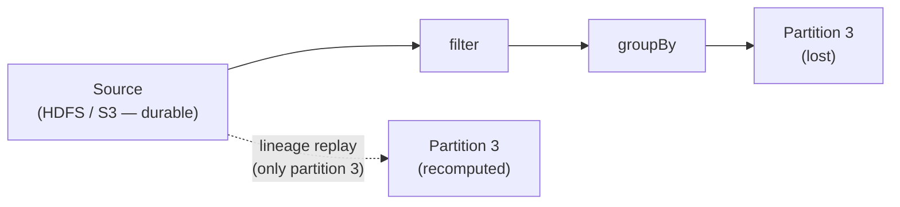

**The key principle:** Spark delegates *storage durability* to the underlying filesystem (HDFS, S3, GCS). It never tries to own that problem. Spark only manages *compute-level* fault tolerance — rerunning tasks, not replicating bytes.

Three mechanisms cover different failure scenarios:

| Failure | Mechanism | What happens |
|---|---|---|
| Partition lost in executor memory | **Lineage recomputation** | Spark replays the transformation chain from source for that partition only |
| Executor that wrote shuffle output dies | **ShuffleMapStage resubmission** | DAGScheduler unregisters the lost map outputs from `MapOutputTracker` and resubmits only the missing tasks in the map stage — not the entire stage. Source: `DAGScheduler.scala` — *"resubmit TaskSets for any lost stage(s) that compute the missing tasks"*; `ShuffleMapStage.findMissingPartitions()` returns only unregistered partitions. |
| Lineage is very long **with wide dependencies** (e.g. PageRank's rank RDD — node failure loses a partition from every ancestor stage) | **Checkpointing** | Save to HDFS, cutting the lineage. Don't checkpoint narrow-dep chains on stable storage (e.g. logistic regression's input points) — lost partitions recompute cheaply in parallel from source. |

The trade-off versus HDFS replication: recovery requires CPU time (recomputation) rather than just reading a replica. For very long lineage chains this can be slow — which is when checkpointing pays for itself.

A fourth mechanism handles *slowness* rather than failure: **speculative execution**. Because RDD partitions are immutable, Spark can launch a duplicate of a slow (straggler) task on a second executor and use whichever finishes first — the two copies cannot interfere. Enable with `spark.speculation = true`. Detection uses a dedicated `"task-scheduler-speculation"` daemon thread that calls `checkSpeculatableTasks()` every `spark.speculation.interval` (default 100 ms); `spark.speculation.quantile` and `spark.speculation.multiplier` control the straggler threshold; `spark.speculation.efficiency.enabled` (default `true` since Spark 3.4.0) adds an efficiency guard.

---

## How Spark runs an application: from action to result

This section walks a single action — `.show(10)` on the word-count job — through every internal component, from the moment it fires to the rows returning to the driver. **Stages 1–4 are driver-side planning; Stages 5–7 are executor computation**, with the driver's MapOutputTracker and JobWaiter coordinating at the boundaries. First, the components involved; then the journey, stage by stage.

### The components involved

Six components coordinate every Spark job — `QueryExecution` translates the DataFrame into RDD lineage first; the five runtime components execute it:

**QueryExecution (driver JVM)** — the compilation bridge between the DataFrame/SQL world and the RDD world. Every action on a `Dataset` calls `Dataset.withAction()`, which triggers `QueryExecution` to compile the logical plan into a physical `executedPlan` and then into an `RDD[InternalRow]` that `SparkContext.runJob()` can work with.

The compilation runs in four phases entirely inside the driver JVM — no data moves, no executor work starts:

| Phase | What it does |
|---|---|
| **Analyzer** | Resolves column names and types against the Catalog; raises `AnalysisException` on unknown columns or type mismatches |
| **Optimizer** | Applies 100+ Catalyst rules: predicate pushdown, projection pruning, constant folding, join reordering, outer-join elimination |
| **SparkPlanner** | Selects concrete physical operators: `SortMergeJoin` vs `BroadcastHashJoin`, `HashAggregate` vs `SortAggregate`, scan strategies |
| **PrepareForExecution** | Applies 13 preparation rules in order: inserts `ShuffleExchangeExec` at every wide-dependency boundary, wraps stages with `WholeStageCodegenExec` (Tungsten codegen), `PlanSubqueries`, `EnsureRequirements`, etc. |

The four phases run in sequence when `withAction()` accesses `executedPlan` — the output of each becomes the input of the next. When `PrepareForExecution` completes, the `executedPlan` is final. Spark then walks the operator tree to produce an `RDD[InternalRow]` — the entire query expressed as a chain of RDD objects, each recording how it was derived from its parent. Each RDD represents one operator, not one partition — a single RDD object covers the full dataset, with partition count as metadata inside it. Narrow transformations (`filter`, `select`) form an unbroken chain that runs in a single pass; wide operators (`groupBy`, `join`) introduce a shuffle dependency that breaks the chain into a new stage. This graph of RDD objects and their dependencies is the lineage. It is then handed to `SparkContext.runJob()`, which immediately delegates to `dagScheduler.runJob()`. The DAGScheduler walks this lineage, finds the shuffle dependencies, and cuts the stage boundaries there.

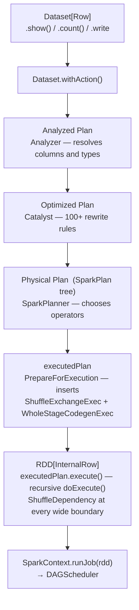

**DAGScheduler** — lives in the driver JVM. Its job is to construct a **DAG of stages** for each job — a directed acyclic graph where each node is a stage and each edge is a dependency (a stage cannot start until all its parent stages have completed and written their shuffle output). To build this DAG, the DAGScheduler walks the RDD lineage, identifies wide dependencies (shuffles), and groups all narrow transformations between two shuffles into a single stage. It does not think about machines or threads — it only thinks about the logical structure of the computation. The DAGScheduler always works at the RDD level — `handleJobSubmitted(finalRDD: RDD[_])` — it has no knowledge of DataFrames or physical plans; all optimization decisions are already encoded in the RDD lineage it receives.

Its two core responsibilities are: building the DAG of stages from the RDD lineage, and submitting each stage once all its parent stages have written their shuffle output. When a stage is ready, the DAGScheduler creates a **TaskSet** — one task per partition of that stage — and hands it to the TaskScheduler for execution. On failure it also resubmits map stages whose shuffle output was lost and cancels downstream stages when a job cannot recover. Task retries within a stage are the TaskScheduler's responsibility, not the DAGScheduler's. All these decisions are driven by a **single-threaded event loop** — every notification that affects stage state (a new job arriving, a stage completing, an executor being lost) is serialised onto this loop and handled one at a time. This keeps the DAGScheduler's state consistent without requiring locks on the core execution path.

The DAGScheduler itself behaves identically whether the job originated from raw RDD code or a DataFrame query — it always works at the RDD level. What differs is the path *to* the DAGScheduler:

| | Raw RDD | DataFrame / SQL |
|---|---|---|
| **Entry point** | `SparkContext.runJob(rdd)` directly | `executedPlan.execute()` → `sc.runJob(rdd)` (via `executeCollect` for most actions; `QueryExecution.toRdd` only for `Dataset.rdd` access) |
| **Optimization before DAGScheduler** | None — code runs as written | Catalyst: 100+ rules (predicate pushdown, join reordering, projection pruning…) |
| **Code generation** | None — standard JVM closures | Tungsten whole-stage codegen — compiled Java bytecode per stage |
| **Row format** | `RDD[T]` — standard JVM objects | `RDD[InternalRow]` — compact binary `UnsafeRow` |
| **AQE** | ❌ Stage DAG fixed at job submission | ✅ Stage DAG can change mid-execution at shuffle boundaries |

**TaskScheduler** — lives in the driver JVM. Receives `TaskSet` objects from the DAGScheduler and assigns each task to an available executor slot. It does not reason about DAG structure — that is the DAGScheduler's concern. Its responsibilities are: task-to-executor assignment (using data locality to prefer executors co-located with the data), multi-job scheduling order (FIFO or FAIR), task retries on failure, speculative execution of straggler tasks, and avoiding executors that have accumulated too many failures. It reports task completions and failures back to the DAGScheduler so stage state can be updated.

**SchedulerBackend** — the two-way RPC bridge between the driver's `TaskScheduler` and the executors. Its job has three directions:

- **Inbound from executors → driver**: executors announce themselves when they start and report task completions and failures as they run.
- **Upward to TaskScheduler**: when a slot becomes available, the SchedulerBackend offers it to the TaskScheduler, which decides which task to place there.
- **Outbound from driver → executors**: the SchedulerBackend serialises each assigned task and sends it to the executor; it also sends task-kill signals when needed.

There is one SchedulerBackend implementation per cluster manager — Standalone, YARN, Kubernetes, and local mode each have their own. The task dispatch logic is shared across all of them; what differs is how each integrates with the cluster manager's resource allocation protocol.

**MapOutputTracker** — a directory service for shuffle data. When a map stage completes, each task registers the location of its output partitions with the driver-side tracker. When a downstream stage starts, its tasks query the tracker to find which executor holds each input partition, then fetch the data through that executor's BlockManager. MapOutputTracker answers *where*; BlockManager handles *how*.

**BlockManager** — runs on every executor and on the driver. It manages two things: 

- cached data (RDD/DataFrame partitions and broadcast variables), held in memory or spilled to local disk; 
- serving as the network interface through which remote tasks fetch shuffle blocks from this executor. 

Shuffle data itself is written directly to disk by the shuffle writer and bypasses BlockManager's own storage — BlockManager only serves it over the network on request. Reading from file sources (HDFS, S3, etc.) bypasses BlockManager entirely — data comes directly from the storage system.

---

### Stage 1: action triggers a job — and DataFrame becomes RDD

Calling `.show(10)` is the first **action** — it fires the whole pipeline. Everything you chained before it — `read → select → filter → groupBy → orderBy` — only built up a description. Each transformation is **lazy**: instead of touching data, it returns a *new* DataFrame whose plan is the previous one plus a single node for that operation. So the DataFrame API itself does the recording, one node per call as you chain them — these five one-input transformations build a five-node **chain**. (An operator with two inputs — `join`, `union` — branches, which is why a plan is a **tree** in general; a straight chain is just the simplest case.) Either way, this plan is the **query plan**: a description of *what* to compute, not *how* to compute it.

In classic mode the Python `DataFrame` is just a handle to a real `Dataset[Row]` in the driver JVM (the two-process split is covered in [§ Driver Program](#driver-program)); the action runs there. In Connect mode it runs on the Connect server instead. Either way the next steps are identical: the driver **compiles and optimizes** that query plan, then turns it into an `RDD[InternalRow]` and hands it to the DAGScheduler. The component that does this — entirely in the driver, before any data moves — is **`QueryExecution`**:

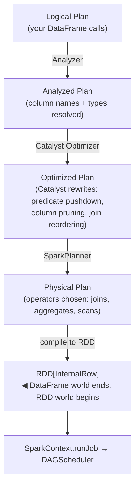

The sequence inside the driver JVM, for `df.show(10)`:

- The action method on `Dataset[Row]` calls `Dataset.withAction()`.
- `withAction` drives `QueryExecution` to compile the query plan into the physical `executedPlan` (Analyzer → Optimizer → SparkPlanner → PrepareForExecution).
- The physical plan is run (`executeCollect` / `executeTake`), which produces an `RDD[InternalRow]` and calls `SparkContext.runJob(...)`.
- `SparkContext.runJob` hands off to the DAGScheduler → Spark Core.

`SparkContext` is the Spark Core entry point, called after compilation, only to submit the resulting RDD job. It doesn't know about DataFrames or `Dataset[Row]` — it receives an `RDD[InternalRow]`. It does live in the same driver JVM (established in the SparkContext section earlier), but it's the scheduling gateway, not what processes the `Dataset`.

`PrepareForExecution` isn't a plan in the same sense as the other four — it's a post-processing step on the physical plan. The full pipeline actually has two physical-plan stages:

```text
Optimized Plan → [SparkPlanner] → sparkPlan → [PrepareForExecution] → executedPlan → RDD[InternalRow]
```

- `SparkPlanner` produces `sparkPlan` — the initial physical plan: operators chosen (which join, which aggregate), but not yet runnable.
- `PrepareForExecution` turns `sparkPlan` into `executedPlan` — the final physical plan — by applying preparation rules: `EnsureRequirements` (which inserts `ShuffleExchangeExec` at shuffle boundaries and adds the sorts/repartitions operators require) and `CollapseCodegenStages` (Tungsten whole-stage codegen), among others.
- Then `executedPlan.execute()` produces the `RDD[InternalRow]`.

In the simplified diagram those two stages — `sparkPlan` and `executedPlan` — are collapsed into a single "Physical Plan" box, with all of `PrepareForExecution`'s work folded onto the one "compile to RDD" arrow.

The physical plan is compiled to optimized JVM bytecode by **Tungsten** (whole-stage code generation, `spark.sql.codegen.wholeStage`, default `true`). That — together with built-in functions (`F.lower()`, `F.sum()`, …) running entirely in the JVM — is why the DataFrame API runs fast no matter what the Python layer above it looks like.

This whole pipeline is the heart of Spark SQL, and the internals are covered later: **how** Catalyst rewrites the plan (its rule batches, tree rewriting, and cost-based planning) is **Chapter 22 (A1 — Catalyst and the Physical Plan)**; the exact DataFrame-to-RDD compilation (`QueryExecution`, `executedPlan.execute()`, `toRdd`) and why bounded actions like `show`/`take` scan only a subset of partitions while `collect` scans all of them are in **Chapter 32 (E1 — Spark Internals)**.

**Some work is eager — before any action.** The pipeline above runs lazily, only when an action fires. But two things run the moment you *build* the DataFrame:

- **Schema inference** — `spark.read.csv()` without an explicit `.schema(...)` reads and samples the file immediately to infer column types. This is a real job; always pass a schema in production to avoid the extra read.
- **Column validation** — referencing a column that doesn't exist raises `AnalysisException` as soon as the Analyzer runs, which can be *before* any action (e.g. when you access `.schema`). The Analyzer checks the plan against the **Catalog** — Spark's registry of tables, columns, and types — covered in **Chapter 11 (Spark SQL)** and, for shared/persistent catalogs, **Chapter 34 (Unity Catalog)**.

At this point no data has moved. The DAGScheduler receives the compiled `RDD[InternalRow]` — every transformation the user wrote, from `spark.read.text(...)` to `.orderBy(...)`, now expressed as RDD operations.

---

### Stage 2: DAGScheduler builds the stage DAG

The DAGScheduler walks the RDD lineage backwards from the final operation, identifying two types of dependency:

- **Narrow dependency** — each partition of the child depends on at most one partition of the parent (e.g. `filter`, `select`, `map`). These can be pipelined: one executor processes the full chain on its partition without any data movement. All consecutive narrow transformations are collapsed into a single stage.
- **Wide dependency** — each partition of the child depends on multiple partitions of the parent (e.g. `groupBy`, `join`, `repartition`). This requires a shuffle: data must move across executors before the next operation can proceed. Wide dependencies become **stage boundaries**.

> **Two uses of the word "stage."** Tungsten's whole-stage code generation (Stage 1 above) fuses *adjacent physical operators* into one compiled function for speed. The DAGScheduler's stages (here) are scheduling units split at *shuffle boundaries* — about which work must wait for which. Both use shuffle boundaries as a dividing line, but they answer different questions: Tungsten asks how fast a stage runs; the DAGScheduler asks when a stage is allowed to start.

The result is a DAG of stages: each node is a stage, each edge is a shuffle dependency. A stage cannot start until all its parent stages have completed and written their shuffle output to disk.

There are two types of stage:

- **ShuffleMapStage** — a stage whose output is written to shuffle files on disk, to be consumed by the next stage. Tasks write partitioned user data to local disk and return a `MapStatus` to the driver — metadata recording which BlockManager holds each output partition, used by `MapOutputTrackerMaster` so downstream reducers know where to fetch.
- **ResultStage** — the final stage in a job. Its tasks apply the user function to their partition and send the result back to the driver (the rows that `.show(10)` prints). May run on a subset of partitions — `first()` runs on one partition only and stops early.

> **`ShuffleMapStage` / `ResultStage` vs `ShuffleQueryStage` / `ResultQueryStage`:** `explain()` shows the physical plan layer. `ShuffleQueryStage` (and `BroadcastQueryStage`) wrap an `Exchange` operator; `ResultQueryStage` wraps the final result subtree — it has no exchange to wrap. All three are AQE plan-level objects created when AQE executes, and they appear in `explain()` output. `ShuffleMapStage` and `ResultStage` are DAGScheduler objects, created at runtime when the DAGScheduler walks the RDD lineage — they are not plan nodes and never appear in `explain()` output. The mapping is 1-to-1: each `ShuffleQueryStage` in the plan becomes a `ShuffleMapStage` in the scheduler; the `ResultQueryStage` becomes the `ResultStage`.

For the word count program:

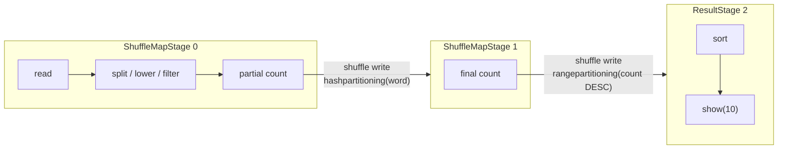

Every shuffle has two sides — a **write side** (each map task hashes every output row by key to determine which reducer owns it, then writes all output into a single sorted file on local disk — one file per map task, with a separate index file recording the byte offset for each reducer's slice) and a **read side** (each reduce task fetches its slice from every map task's file using that index). The two sides cannot run simultaneously, so every shuffle boundary produces two stages.

> **Why one file per map task, not one file per reducer?** The original Spark shuffle (Hash Shuffle Writer, removed in Spark 2.0) did write one file per reducer. With M map tasks and R reducers that produced M × R files — 200,000 files at 1,000 maps and 200 reducers — which stressed the OS and distributed file system and became the primary scaling bottleneck. Each map task also had to hold R file handles open simultaneously and write to all of them as rows arrived, producing interleaved random I/O.
>
> `SortShuffleWriter` (the default since Spark 1.2) pays an explicit sort cost — sorting all output rows by `(partition_id, key)` before writing — to earn two things: one sequential write per map task (rows already in partition order), and only 2 × M total files regardless of R (one data file + one index file per map task). The sort cost (O(n log n) per map task) is small compared to the I/O savings at scale. When there is no map-side aggregation and R ≤ `spark.shuffle.sort.bypassMergeThreshold` (default 200), Spark uses `BypassMergeSortShuffleWriter` instead: it opens R temporary files simultaneously (one per reducer), writes each row directly to its reducer's file without sorting, then merges all R temporaries into one data file + one index file and deletes the intermediates. The final output is the same structure as `SortShuffleWriter` — 1 data + 1 index per map task — but the sort cost is avoided at the expense of R simultaneous file handles during writing. This is why it is only used for small R.

`groupBy("word").count()` therefore produces two stages, not one:

- **Stage 0 (ShuffleMapStage):** each executor reads its input partition, counts the words it already has locally (*partial count*), then writes the results to shuffle files partitioned by word. One task per input partition.
- **Stage 1 (ShuffleMapStage):** each executor fetches all shuffle files for its assigned words from every Stage 0 executor and combines the partial counts into a final total (*final count*). One task per shuffle output partition.

`.orderBy(F.col("count").desc())` adds a third stage for the same reason — a global sort requires another shuffle (`rangepartitioning`) so each executor receives a non-overlapping range of counts and can sort its slice locally:

- **Stage 2 (ResultStage):** each executor sorts its range of counts and the driver collects the top 10.

The DAGScheduler does not schedule all stages at once. It submits Stage 0, waits for all map tasks to report `MapStatus`, then submits Stage 1, and finally Stage 2.

**Static vs dynamic stage DAG.** For raw RDD jobs the stage DAG is fully determined at `handleJobSubmitted` time and never changes. For DataFrame/SQL jobs with AQE enabled (`spark.sql.adaptive.enabled = true`, default since Spark 3.2), the physical plan contains an `AdaptiveSparkPlanExec` operator that communicates back to the planner after each shuffle stage completes — using actual partition statistics rather than pre-execution estimates. This can cause the DAGScheduler to receive entirely new stage submissions mid-job: coalescing many small shuffle partitions into fewer large ones, swapping a `SortMergeJoin` for a `BroadcastHashJoin` if the build side turns out small, or splitting a skewed partition into sub-tasks. Raw RDD jobs are unaffected by AQE — the stage DAG is immutable once submitted.

---

### Stage 3: TaskSet creation — one task per partition

For each stage, the DAGScheduler creates a **TaskSet**: a collection of tasks, one per input partition of that stage.

If `1342-0.txt` is split into 4 partitions, Stage 0 gets a TaskSet of 4 tasks. Each task is a serialized closure — the transformation code plus enough metadata to read exactly one partition. The TaskSet is handed to the TaskScheduler. A TaskSet is immutable: every task in it runs the exact same transformation code against a different input partition. This immutability is what makes retries and speculative execution safe — re-running the same code on the same partition always produces the same output.

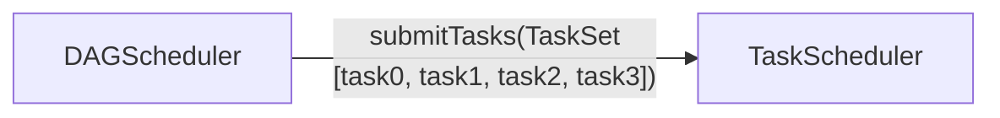

---

### Stage 4: TaskScheduler assigns tasks to executors

The TaskScheduler wraps each TaskSet in a **TaskSetManager**, which tracks the state of every task (pending, running, succeeded, failed) and implements retry logic.

When an executor signals it has a free slot, the TaskScheduler picks the best task for that slot using **data locality** — it prefers to run a task on the executor that already holds the data partition in memory or on the same node as the data file. Locality levels, from best to worst:

| Level | Meaning |
|---|---|
| `PROCESS_LOCAL` | Data is in the executor's own memory (cached partition) |
| `NODE_LOCAL` | Data is on the same physical machine as the executor |
| `NO_PREF` | No locality preference — data is equally accessible from anywhere (e.g. off-heap or external storage) |
| `RACK_LOCAL` | Data is on a different machine but same network rack |
| `ANY` | Data must be fetched over the network |

If no executor with better locality is available, the TaskScheduler waits up to `spark.locality.wait` (default **3s**) before falling back to the next-worse locality level. Each level gets its own wait budget: `spark.locality.wait.process`, `spark.locality.wait.node`, and `spark.locality.wait.rack` all default to the same `spark.locality.wait` value. Set a level to `0` to skip it entirely.

> **Data locality does not apply to cloud object storage (S3, GCS, ADLS).** The locality model assumes data is co-located with compute — HDFS blocks live on the same physical machines as Spark executors. Cloud object stores are remote HTTP services; every read is a network request regardless of which executor runs the task. `FileScanRDD.getPreferredLocations()` returns block locations for HDFS but returns an empty list for S3 — the TaskScheduler sees `NO_PREF` for every task and assigns them to any available slot. The locality wait (`spark.locality.wait = 3s`) adds scheduling delay for no benefit; set it to `0` when reading exclusively from object storage.
>
> The optimization levers shift entirely:
>
> - **Partition pruning** — skipping S3 key prefixes based on partition column filters avoids HTTP requests entirely; the savings are large
> - **Parallelism** — more concurrent S3 GET requests mean higher throughput; tune `spark.sql.files.maxPartitionBytes` to control how much each task reads
> - **Pushdown** — column pruning and filter pushdown (e.g. S3 Select for CSV/JSON, Parquet metadata for column skipping) reduce bytes transferred over the network
> - **Local caching** — Alluxio and Databricks Disk Cache (formerly Delta Cache) transparently cache S3 objects on executor-local NVMe/SSD, restoring `NODE_LOCAL` locality for repeated reads; Databricks Disk Cache is automatic for Parquet and Delta files on Databricks Runtime 14.2+
> - **Region colocation** — run compute in the same AWS region as the S3 bucket; cross-region reads add latency and egress cost

Once the TaskScheduler has selected a task-executor pairing, it hands the assignment to the **SchedulerBackend** — the RPC bridge between the driver and the executors. The SchedulerBackend serializes the task and delivers it to the chosen executor. The driver **pushes** tasks to executors — executors do not poll for work. The driver is therefore a coordination bottleneck for result collection (all task results flow back to the driver), while executors communicate directly with each other only during shuffle reads.

**What gets serialized — the task closure.** A task is not a copy of the data — it is a serialized description of *what to compute and where to find the input*. The closure contains: the transformation functions (the code), references to broadcast variables by ID, partition metadata (which file/block to read), and enough context to reconstruct the input RDD partition. The data itself stays in the executor's BlockManager or on disk; the task code travels to the data, not the other way around.

The application's own code dependencies — JARs and files supplied via `--jars` / `--files` or `SparkContext.addFile` — are not part of the per-task closure either. Each executor fetches them once at startup (via the internal `updateDependencies()` step) and reuses them for every task it runs, which is why the closure shipped per task stays small.

**Broadcast variables are not copied into the closure.** Only the broadcast variable's integer ID is included. When the executor receives a task that references a broadcast ID it has not yet fetched, it pulls the serialized value directly from the driver (or, for large broadcasts, from other executors using a BitTorrent-like protocol called TorrentBroadcast). The fetched value is cached in the executor's BlockManager and reused by all subsequent tasks that reference the same broadcast ID — the value is never re-transmitted per task. This is the entire point of broadcast variables: sending a large lookup table once per executor instead of once per task.

Spark uses **Java serialization** (Java `ObjectOutputStream`) by default for task closures. **Kryo** serialization is available and approximately 10× faster and more compact — recommended for jobs with heavy shuffle traffic. Enable it with `spark.serializer = org.apache.spark.serializer.KryoSerializer`. In Python, closures are serialized with **CloudPickle** (bundled as `pyspark/cloudpickle`). Standard pickle only serializes functions by reference — the function must be importable on the executor — which breaks for lambdas and functions defined interactively in notebooks. CloudPickle serializes by value: the function bytecode itself is included, so UDFs and closures defined in notebooks or scripts travel to executors without requiring a matching module on the other side. Since Spark 2.0, internal shuffle data for simple types (primitives, strings, arrays of primitives) uses Kryo automatically regardless of the configured default.

**DataFrame expressions vs Python UDFs — a critical serialization difference.** A DataFrame column expression like `F.col("x") > 0` is a Catalyst expression tree node — it is compiled to JVM bytecode by Tungsten at plan-time, before any task is sent to an executor. The closure for such a task contains only a reference to the pre-compiled bytecode. A Python UDF (decorated with `@F.udf`) is serialized using CloudPickle at definition time and stored on the driver; every task closure that uses that UDF carries the pickled Python function, and the executor must unpickle it in a Python subprocess, converting each row from `UnsafeRow` to Python objects and back. This is the root cause of Python UDF overhead — it is not the Python language but the per-row serialization cost.

---

### Stage 5: executor runs the task

The executor deserializes the task closure and runs it against its assigned partition. For Stage 0 (ShuffleMapStage) in the word count:

1. Reads lines from its partition of `1342-0.txt` directly from the file system — file source reads bypass BlockManager entirely
2. Runs `split → lower → filter` on each line
3. Hash-partitions the resulting `(word, partial_count)` pairs by key — the partial `HashAggregate` has already counted each word within this partition; each word is deterministically assigned to one of the output partitions
4. Writes the partitioned output to shuffle files on local disk directly — the shuffle writer bypasses BlockManager's storage layer; each file is named `shuffle_{shuffleId}_{taskAttemptId}_0.data` (with a matching `.index` file), so a retried attempt gets a different `taskAttemptId` and writes to a different file, preventing overwrite of a successful attempt's output
5. Reports completion to the driver — including a **`MapStatus`** for each output partition: the executor's `BlockManagerId` (host + port) and the byte size of each shuffle block it wrote

**What "pipelined execution" means.** Step 2 above — `split → lower → filter` — is not three separate passes over the partition data. It is a single iterator-based pass: each row flows through all three operations before the next row is processed. There is no intermediate materialization between operators within a stage. When Tungsten whole-stage codegen is active, all operators in a stage are fused into a single compiled Java function — the entire chain runs as a tight loop with no virtual method calls between operators. This is the operational meaning of "pipelined": one pass, one loop, no intermediate buffers.

The DAGScheduler's event loop receives this `CompletionEvent` and registers the shuffle block locations in the **MapOutputTracker** — a driver-side registry that maps `(shuffleId, mapTaskId) → (executor host, port, block locations)`. Once all 4 tasks in Stage 0 are done and their locations are registered, the DAGScheduler submits Stage 1.

---

### Stage 6: shuffle — data moves between stages

Before Stage 1 can start, executors running Stage 1 tasks must fetch the shuffle data written by Stage 0. Each Stage 1 task first queries the **MapOutputTracker** on the driver to discover which executor holds each block of its input — the exact host and port for every map output partition it needs. Only then does it open fetch connections to those executors and pull the data. This is the **shuffle read**; the data crosses the network here.

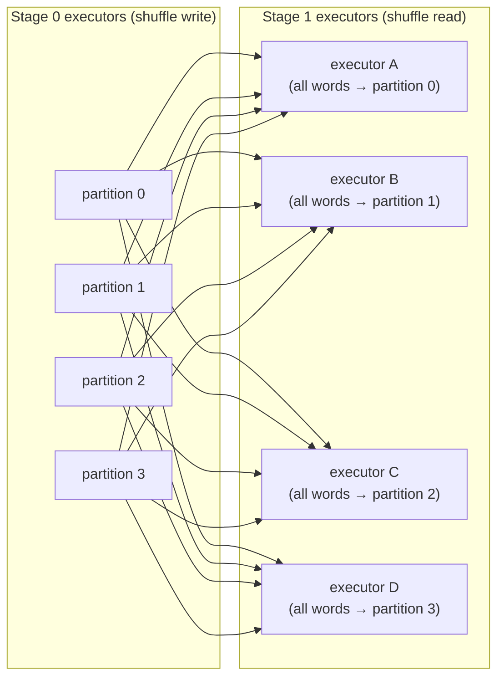

This is why shuffles are expensive: every Stage 1 executor must fetch data from every Stage 0 executor. Network I/O, disk I/O, and serialization all happen here.

The word count example has **two** shuffles: Stage 0 → Stage 1 (`hashpartitioning` by word for the `groupBy`) and Stage 1 → Stage 2 (`rangepartitioning` by count for the `orderBy`). The same fetch mechanism — MapOutputTracker lookup, then direct BlockManager-to-BlockManager pulls — applies to both.

**The shuffle barrier.** No Stage 1 task starts until *all* Stage 0 tasks have completed and registered their shuffle output with MapOutputTracker. The DAGScheduler enforces this hard barrier — it only submits Stage 1's TaskSet after receiving `CompletionEvent` for every task in Stage 0. The invariant this maintains: **every map output partition is guaranteed to exist before any reducer tries to fetch it**. Without this guarantee, a reducer could not distinguish "output not yet written" from "task failed and output will never arrive" — it would have to poll indefinitely or guess. The barrier eliminates that ambiguity entirely. The reason: if a Stage 1 task started fetching while Stage 0 was still running, some map output would not exist yet, causing a fetch failure. The barrier trades latency (Stage 1 waits for the slowest Stage 0 task) for correctness and simple fault recovery (any lost shuffle file can be identified and its stage resubmitted cleanly).

---

### Stage 7: ResultStage — results return to the driver

**DAGScheduler Stage 1** (ShuffleMapStage 1) tasks read the hash-partitioned shuffle from Stage 0, run the final `HashAggregate (count)` to produce `(word, total_count)` pairs, then write a second shuffle file with `rangepartitioning(count DESC, 200)` — splitting the data into count-ordered buckets so the global sort can be completed partition-locally.

**DAGScheduler Stage 2** (ResultStage 2) tasks read the range-partitioned shuffle from Stage 1. Because the data is already globally bucketed by count, each task only needs to `Sort [count DESC]` within its own partition to produce a globally correct ordered slice. The sorted rows from each partition are sent back to the driver via the SchedulerBackend.

Throughout execution the driver has been blocking on a **JobWaiter** — an object representing the pending job result that collects each task's output as it arrives. Once the last ResultTask reports in, the JobWaiter unblocks, the assembled rows return to `Dataset.show()` in partition order, and `show(10)` prints the first 10 rows of the globally sorted result. Only the rows `.show(10)` needs travel back to the driver — not the full dataset.

---

### Failure handling

The DAGScheduler and TaskScheduler handle failures at different levels:

- **Task failure** (executor crash, out-of-memory, exception): the TaskScheduler retries the task on a different executor, up to `spark.task.maxFailures` times (default 4). The shuffle state of the stage is unaffected — only this one task re-runs. **Local mode exception:** `TaskSchedulerImpl` is always constructed with `maxTaskFailures = 1` in local mode regardless of `spark.task.maxFailures` — a single task failure aborts the stage immediately with no retry. Setting `spark.task.maxFailures = 4` in local mode has no effect.
- **Executor failure** (the JVM process dies): this is more severe than a task failure because the executor's shuffle files are gone. The DAGScheduler calls `mapOutputTracker.removeOutputsOnExecutor(execId)`, unregistering all map outputs from that executor. `ShuffleMapStage.findMissingPartitions()` then returns only those now-missing partitions — those tasks re-run, not necessarily the whole stage. The distinction matters: losing one task loses one partition's work; losing an executor loses all that executor's shuffle output, which may be a large fraction of the stage.
- **Stage failure** (all task retries exhausted, or fetch failures exhaust `spark.stage.maxConsecutiveAttempts` — default 4): the DAGScheduler first retries the entire stage. If the retry succeeds (e.g. a transient network error resolved), the job continues. Only when all stage retries are exhausted does the job fail. When a stage fails permanently, all sibling stages at the same level and all downstream stages are cancelled immediately — a Spark job is all-or-nothing at the stage level.

**TaskAttempt vs Task.** Each retry of a failed task is a new **TaskAttempt** with a unique attempt ID. Shuffle output files include the attempt ID in their filename, so a retried attempt's output does not overwrite the previous attempt's files. Once any TaskAttempt for a given task completes successfully, the DAGScheduler accepts its output and ignores all outstanding duplicates (from speculative execution or late-arriving retries). Retries are safe because RDD partitions are immutable: re-running the same transformation on the same input partition always produces identical output.

The key reason executor death is handled differently from task failure: the shuffle barrier means downstream tasks have not yet started when the shuffle files are lost, so the DAGScheduler can resubmit the affected map tasks cleanly without corrupting any in-progress work.

---

### Shuffle storage: local, external, and remote

By default, Spark executors write shuffle output to **local disk** on the worker node. This creates two problems:

1. **Executor lifecycle coupling** — if an executor dies before Stage 1 reads its shuffle files, the DAGScheduler unregisters that executor's map outputs and resubmits only the tasks whose output was lost.
2. **Random small-file I/O** — each reducer fetches many small files from many executors across the network, resulting in scattered random reads.

Three progressively decoupled solutions exist:

---

**External Shuffle Service (ESS)** — a long-running JVM process deployed on every worker node, separate from executor processes. Executors write shuffle files and register them with the local ESS. If an executor is killed, the ESS continues serving its shuffle files to reducers. ESS is required for dynamic allocation on YARN and Standalone (so executors can be removed without losing their shuffle data).

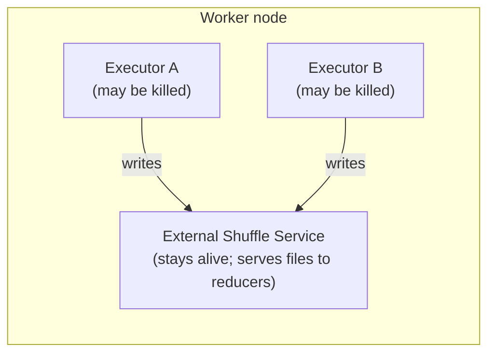

Enable with: `spark.shuffle.service.enabled = true` (default: `false`)

Limitation: ESS still ties shuffle data to the physical worker node. If the node fails, the data is gone.

---

**Push-based shuffle** — built into Spark (YARN + ESS only). Instead of waiting for reducers to pull data, map tasks actively **push** shuffle blocks to the ESS as they complete. The ESS merges blocks from multiple mappers into larger merged files per output partition. Reducers then read one large sequential merged file instead of many small random files.

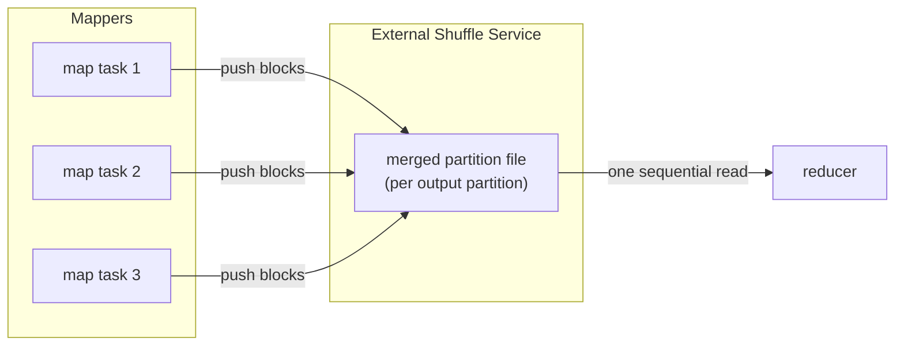

Enable with: `spark.shuffle.push.enabled = true` (default: `false`; YARN + ESS only)

---

**Remote Shuffle Service (RSS)** — a dedicated cluster of shuffle servers, completely separate from the Spark cluster. Executors write shuffle data over the network to the RSS cluster instead of local disk. No shuffle data touches the worker node's disk at all. This is the architecture required for **compute-storage separation** — common in cloud-native Kubernetes deployments where mounting hostPath volumes on every node is impractical.

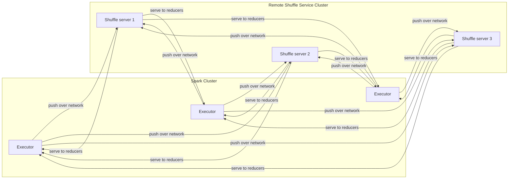

Two production-grade Apache-incubated RSS implementations:

| Project | Apache status | Storage tiers | Notes |
|---|---|---|---|
| **Apache Celeborn** | Apache TLP | Memory → local disk → HDFS / object store | Supports Spark 2.4–4.x; LifecycleManager runs inside the driver |
| **Apache Uniffle** | Apache TLP | Memory → local disk → HDFS | Coordinator cluster assigns shuffle servers per job; official docs cover Spark 2/3 — verify Spark 4 JAR availability |

Both implement Spark's shuffle plugin API (`spark.shuffle.manager`). The Spark application sets the plugin class and the shuffle plugin intercepts all shuffle write/read calls, redirecting them to the RSS cluster instead of local disk.

**Configuring Apache Celeborn:**

```bash
# 1. Copy the Celeborn client JAR to the Spark classpath
# Use the spark-4 variant for Spark 4.x (spark-3 for Spark 3.x)
cp celeborn-client-spark-4-shaded_*.jar $SPARK_HOME/jars/
```

```properties
# Required
spark.shuffle.manager               org.apache.spark.shuffle.celeborn.SparkShuffleManager
spark.serializer                    org.apache.spark.serializer.KryoSerializer
spark.celeborn.master.endpoints     clb-1:9097,clb-2:9097,clb-3:9097
spark.shuffle.service.enabled       false

# Recommended
spark.celeborn.client.push.replicate.enabled  true   # server-side replication for fault tolerance
spark.sql.adaptive.localShuffleReader.enabled false  # must disable for Celeborn compatibility
```

**Apache Uniffle — Spark 3.x only (not verified for Spark 4.x):**

As of Spark 4.1.2, Uniffle's official client guide documents Spark 2 and Spark 3 JARs only. The JAR path below (`spark3/`) is for Spark 3.x. Do not use this configuration with Spark 4.x until a verified Spark 4 client JAR is available on the [Uniffle releases page](https://github.com/apache/uniffle/releases). For Spark 4.x, use Celeborn (config above) instead.

```bash
# Spark 3.x only — Spark 4.x unverified
cp rss-client-spark3-shaded-*.jar $SPARK_HOME/jars/
```

```properties
spark.shuffle.manager              org.apache.spark.shuffle.RssShuffleManager
spark.rss.coordinator.quorum       coord-1:19999,coord-2:19999
spark.shuffle.sort.io.plugin.class org.apache.spark.shuffle.RssShuffleDataIo
```

---

### The full component map

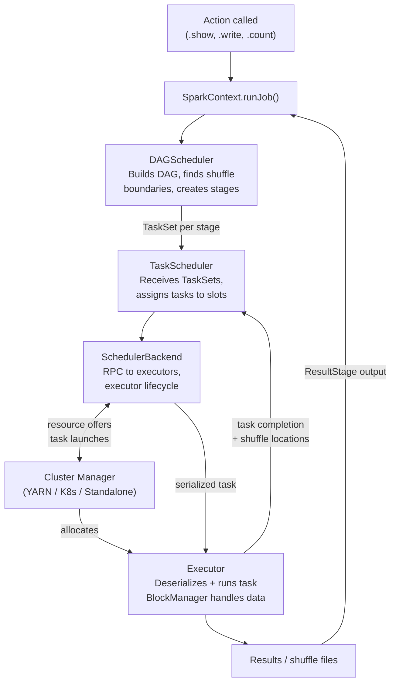

Every component in the driver (SparkContext, DAGScheduler, TaskScheduler, SchedulerBackend) runs in the driver JVM. Executors are separate JVM processes on worker nodes. The cluster manager is an external service that neither the driver nor the executors run inside.

---

## Submitting applications: `--master` and `--deploy-mode`

Now that the architecture is clear — driver, executor, cluster manager — the `spark-submit` flags become concrete.

**`--master`** tells Spark how to run — either in a single local JVM, or where to find the cluster manager:

| `--master` value | Cluster? | Meaning |
|---|---|---|
| `local` | No | One JVM, one thread, one task at a time |
| `local[N]` | No | One JVM, N parallel threads (`local[4]` = 4 tasks) |
| `local[*]` | No | One JVM, one thread per CPU core — standard for local dev |
| `spark://host:7077` | Yes | Spark Standalone cluster manager at that address |
| `yarn` | Yes | YARN — no IP needed; ResourceManager address is read from `yarn-site.xml` inside `HADOOP_CONF_DIR` |
| `k8s://https://host:443` | Yes | Kubernetes API server |

With any `local[...]` value there is no cluster manager, no network, and no `--deploy-mode` concept — driver and executors share one JVM.

**`--deploy-mode`** answers one question: *where does the driver process run?* It only applies when `--master` points at a real cluster.

**`client` (default)** — the driver runs on the machine that called `spark-submit`. Stdout streams to your terminal. Kill the terminal and the job dies.

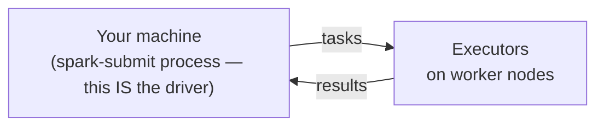

**`cluster`** — the driver is launched by the cluster manager on a worker node. `spark-submit` exits after handoff; you can close your laptop.

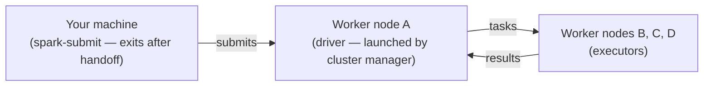

**Availability by cluster manager:**

| Setup | `--master` | `client` | `cluster` |
|---|---|---|---|
| pip / local | `local[*]` | N/A | N/A |
| Docker / Standalone | `spark://host:7077` | ✅ | ✅ Scala/Java only — Standalone cannot launch a Python process on a worker node, so PySpark must use `client` mode |
| YARN | `yarn` | ✅ | ✅ incl. PySpark |
| Kubernetes | `k8s://...` | ✅ | ✅ incl. PySpark (recommended) |
| Managed (Databricks, EMR, GCP Managed Spark, MS Fabric…) | platform-managed | abstracted | abstracted |

**When to use each:**

| Scenario | Choice |
|---|---|
| Local dev, notebook, `pyspark` shell | `--master local[*]` |
| Submitting from a gateway node inside the cluster | `--deploy-mode client` |
| Submitting from your laptop to a remote YARN/K8s cluster | `--deploy-mode cluster` |
| Production scheduled job | `--deploy-mode cluster` — no dependency on the submitting machine |

**Three equivalent ways to set master and deploy mode:**

```bash
# 1. spark-submit flags (most common for production jobs)
spark-submit --master yarn --deploy-mode cluster my_job.py
```

```python
# 2. SparkSession builder methods (scripts and notebooks)
spark = (
    SparkSession.builder
    .master("yarn")
    .config("spark.submit.deployMode", "cluster")
    .appName("my-job")
    .getOrCreate()
)
```

```bash
# 3. spark-defaults.conf (cluster-wide default, applies to all jobs)
spark.master                yarn
spark.submit.deployMode     cluster
```

---

## Narrow and wide dependencies: the stage boundary rule

Not all edges in the DAG are equal. The DAGScheduler classifies every dependency between two RDDs as either narrow or wide, and this classification determines where stage boundaries are drawn.

| Type | Definition | Examples | Cost |
|---|---|---|---|
| **Narrow** | Each output partition depends on at most **one** input partition | `map`, `filter`, `select`, `withColumn`, `flatMap`, `union`, `coalesce` (without shuffle) | Zero network I/O; all operations pipelined inside one task in one CPU pass |
| **Wide** | Each output partition depends on **multiple** input partitions | `groupBy`, `join` (without co-partitioning), `repartition`, `distinct`, `sortBy`, `reduceByKey` | Requires a **shuffle**: data moves across the network; marks a stage boundary |

Both types are concrete classes in `Dependency.scala` (v4.1.2):

- **`NarrowDependency`** — *"each partition of the child RDD depends on a small number of partitions of the parent RDD. Narrow dependencies allow for pipelined execution."*
  - `OneToOneDependency` — used by `map`, `filter`, `withColumn`, `select`, `flatMap`; each output partition maps to exactly one input partition.
  - `RangeDependency` — used by `union`; each output partition maps to a contiguous range of an input RDD's partitions.
- **`ShuffleDependency`** — *"a dependency on the output of a shuffle stage."* Every `groupBy`, `join`, `repartition`, or `distinct` creates one.

The DAGScheduler walks the RDD lineage backwards via `DAGScheduler.getShuffleDependenciesAndResourceProfiles`. Every time it encounters a `ShuffleDependency`, it stops and records a stage boundary — the upstream RDD becomes the root of a new `ShuffleMapStage`. Every time it encounters a `NarrowDependency`, it continues traversal. All narrow transformations between two boundaries are collapsed into a single **stage**. The entire narrow/wide classification reduces to one function: `getMissingParentStages` ([DAGScheduler.scala:765](https://github.com/apache/spark/blob/v4.1.2/core/src/main/scala/org/apache/spark/scheduler/DAGScheduler.scala#L765)) — the single place in the codebase where that conceptual rule is enforced mechanically.

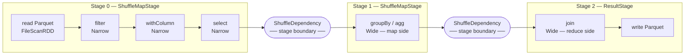

Within a stage, all operations are **pipelined**: each task processes its partition in a single pass, applying every narrow transformation in sequence without materializing any intermediate result. One executor reads its chunk of data and runs `filter → withColumn → select` as a single loop over the rows.

Stage boundaries are the only points at which data is serialized and written to disk (shuffle files). Between two stage boundaries, no data hits disk unless you explicitly call `.cache()` or `.checkpoint()`.

**Contrast with Hadoop:** in Hadoop, every `groupBy` is an entire separate MapReduce job with a mandatory disk write of the full dataset. In Spark, a `groupBy` is a shuffle boundary between two in-memory stages — the only disk I/O is the shuffle files themselves, not the full dataset before and after.

Each boundary produces one of the **two stage types** introduced in [§ Stage 2](#stage-2-dagscheduler-builds-the-stage-dag): a **ShuffleMapStage** (writes partitioned shuffle output and returns a `MapStatus` to the driver) for every boundary except the last, and a single **ResultStage** at the end (applies the user function and returns rows to the driver, or writes directly to storage). A ResultStage may run on only a **subset** of partitions — `first()` runs on one partition, `lookup(key)` runs on the single partition that owns the key — and stops as soon as enough results are collected.

---

## What lazy evaluation enables: the Catalyst optimizer

Because Spark does not execute any transformation immediately, the driver accumulates the full logical plan before acting on it. This is not merely a design convenience — it unlocks a class of optimizations that are impossible in an eager execution model.

When an action is called, the logical plan passes through **Catalyst**, Spark's query optimizer. Catalyst applies over 100 optimization rules (54 in `operatorOptimizationRuleSet` alone, verified against `Optimizer.scala` v4.1.2), including:

**Predicate pushdown.** A `filter` that appears late in the user's chain can be pushed down to the earliest possible point — ideally into the file scan itself. Parquet and ORC store min/max statistics per row group / stripe; Spark reads the statistics, evaluates the predicate, and skips chunks that cannot possibly match without decompressing or reading any row data. CSV, JSON, Avro, Text, and XML have no internal statistics — predicate pushdown does not apply to them.

```python
# User writes this:
spark.read.parquet("events/").join(users, "user_id").filter(F.col("country") == "DE")

# Catalyst rewrites it to effectively:
spark.read.parquet("events/", filters=[("country", "==", "DE")]).join(...)
# The filter is applied at read time — unneeded rows never enter the join
```

**Partition pruning.** All file-based sources (Parquet, ORC, CSV, JSON, Avro, Text, XML) participate in partition pruning — a separate mechanism from predicate pushdown. When data is stored in a Hive-style partitioned directory structure (e.g. `events/year=2024/month=06/`), Catalyst skips entire directories whose partition values cannot satisfy the filter, without opening any file. Partition pruning fires regardless of whether row-level predicate pushdown is supported.

**Projection pushdown.** If the user's downstream operations only need 3 columns from a 50-column table, Catalyst tells the file reader to skip the other 47 columns entirely. For Parquet (columnar format) this eliminates the I/O cost of reading unused columns entirely. All file-based sources implement `SupportsPushDownRequiredColumns` — they all receive a reduced column list from the planner.

**Aggregate pushdown.** For Parquet and ORC, Catalyst can push `COUNT`, `SUM`, `MIN`, `MAX` aggregations into the file reader itself — the reader computes aggregates from stored column statistics without scanning individual rows. For JDBC, the entire `GROUP BY` and aggregation is shipped to the remote database as SQL — Spark may receive only a single aggregated row per group, not individual records.

**JDBC full query pushdown.** JDBC goes furthest: `JDBCScanBuilder` implements `SupportsPushDownV2Filters` (WHERE), `SupportsPushDownLimit` (LIMIT), `SupportsPushDownOffset` (OFFSET), `SupportsPushDownTopN` (ORDER BY + LIMIT), `SupportsPushDownTableSample`, and `SupportsPushDownJoin` — a join between two tables in the same database can be pushed entirely to the database engine, with Spark receiving only the join result.

**Operator fusion / pipelining.** Multiple consecutive narrow operations — `filter`, `withColumn`, `select` — are fused into a single stage. No intermediate DataFrame is materialized.

**Constant folding.** Expressions like `F.lit(2) * F.lit(3)` are evaluated at plan time and replaced with `F.lit(6)`. No executor work is wasted on arithmetic over constants.

**Join reordering.** Catalyst uses estimated row counts to reorder joins so smaller tables are joined first, reducing the amount of data flowing into subsequent joins.

**Broadcast join selection.** If one side of a join is small enough (below `spark.sql.autoBroadcastJoinThreshold`, default 10 MB), Catalyst rewrites the join as a broadcast join — the small table is sent to every executor once and joined locally, eliminating the shuffle entirely.

**Outer join elimination.** If a filter on the nullable side of a `LEFT` or `RIGHT OUTER JOIN` cannot be satisfied by NULL (e.g. `WHERE right.col > 0`), Catalyst converts the outer join to an `INNER JOIN` automatically. Inner joins are cheaper — no null-padding, no extra null-handling in downstream operators. Users often don't realise the conversion happened; `df.explain()` reveals it.

**Filter inference from join keys.** After a join on `a.id = b.id` combined with a filter `WHERE a.id > 5`, Catalyst derives `WHERE b.id > 5` automatically and pushes that new filter down to the `b` scan — preventing a full scan of `b` even though the user never wrote the filter explicitly. This rule (`InferFiltersFromConstraints`) fires once, in a dedicated batch between two operator-optimisation passes.

**Limit pushdown.** A `LIMIT` or `.limit(N)` call above a `UNION ALL` or a window operator does not wait for both sides to be fully computed. Catalyst pushes the limit through the operator so each branch produces at most N rows before being unioned, reducing intermediate data substantially.

**Null propagation.** `null + x`, `null * x`, `null == x` all evaluate to `null` — Catalyst folds this at plan time and short-circuits expressions that can only ever produce null. Related: `NullDownPropagation` infers that certain columns cannot be null from the schema or join type and eliminates null checks on them.

**Boolean simplification.** `x AND true → x`, `x OR false → x`, `NOT (NOT x) → x`, `x AND false → false`. Catalyst eliminates these at plan time so executors never evaluate trivial sub-expressions.

**LIKE simplification.** `LIKE 'prefix%'` is rewritten to `startsWith("prefix")`, `LIKE '%suffix'` to `endsWith`, `LIKE '%contains%'` to `contains`. These native string operations are faster than full regex evaluation.

**Project collapsing.** Consecutive `.select()` calls are merged into a single projection evaluated in one pass. `df.select("a","b","c").select("a","b")` becomes one scan of two columns, not two sequential evaluations.

**Repartition collapsing.** Consecutive `.repartition()` calls where the outer one dominates are collapsed into one shuffle. `df.repartition(100).repartition(200)` becomes a single `repartition(200)`.

None of these optimizations are available in Hadoop MapReduce, because the framework sees only one job at a time. A MapReduce job that reads 50 columns and uses 3 is a programmer mistake that the framework cannot correct. In Spark, writing `df.select("a", "b", "c")` at the end of a chain and having the reader skip the other 47 columns automatically is the normal, expected behavior.

---

## The full compilation pipeline: from DataFrame to bytecode

Every Spark 4.x query passes through a six-stage compilation pipeline before any computation begins. The Unresolved and Resolved logical plans are **relational algebra expression trees** — structured representations of σ (select), π (project), ⨝ (join), and γ (aggregate) operators. Because the plan is algebraic rather than arbitrary code, Catalyst can rewrite it freely using mathematical equivalence laws:

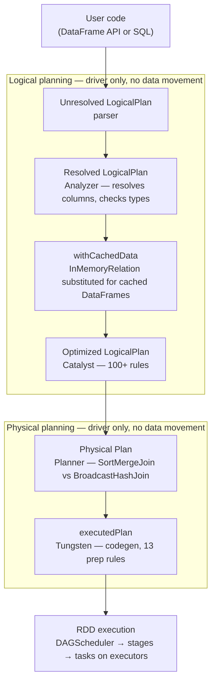

This pipeline runs entirely in the driver before a single byte of user data is read. The physical plan handed to the DAGScheduler at the bottom is already optimized, reordered, and compiled to bytecode. By the time executors receive their tasks, the work is expressed as tight compiled loops over binary row data (UnsafeRow format), not as chains of interpreted Python or JVM method calls.

Spark uses three internal row representations across different phases — `InternalRow` (trait/interface), `UnsafeRow` (Tungsten binary execution format), and Apache Arrow (pandas UDF boundary).

**Adaptive Query Execution (AQE).** Spark 4.x enables AQE by default. Where Catalyst optimizes before execution using estimated statistics, AQE re-enters the optimization pipeline at shuffle boundaries using *actual* collected statistics — coalescing small partitions, switching join strategies, and splitting skewed partitions at runtime.

---

With the architecture in place — driver, executors, cluster manager, stage DAG, and shuffle — the next question is how to configure and initialise the Spark runtime itself. **Chapter 04 (SparkSession)** covers `SparkSession.builder` in full: config precedence, runtime modes, session reuse, and the relationship between `SparkSession` and the underlying `SparkContext`.
