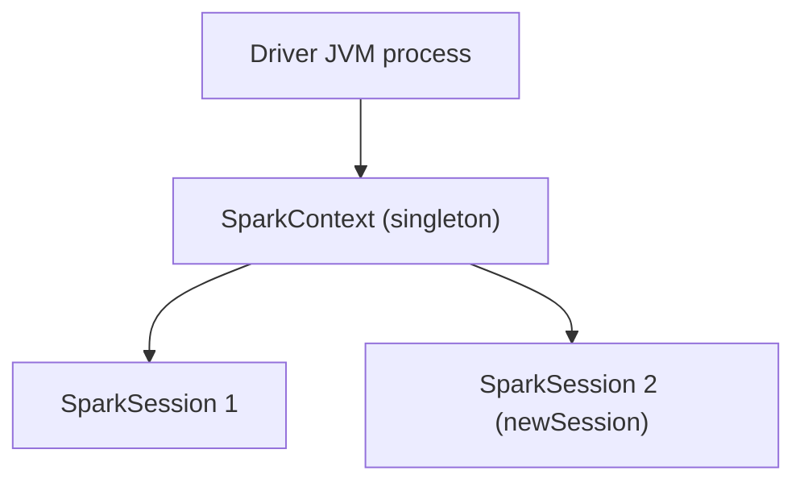

# Chapter 02 — SparkSession and Entry Points

> *Learning-path topic: B2 (Beginner)*
> *Written: 2026-05-31 · Spark 4.1.x / Python 3.10+*

Every PySpark program begins with a `SparkSession`. Understanding how to create it, configure it, and control what it logs is a prerequisite for everything else. This chapter also covers Spark 4.x's opt-in architecture — Spark Connect — and when to use it instead of classic mode.

---

## What you'll learn

- How to create a `SparkSession` with the builder pattern
- What `getOrCreate()` does and when it silently ignores config
- How to configure log verbosity so Spark stops drowning your output
- The difference between classic mode and Spark Connect in Spark 4.x
- How to connect to a remote cluster

---

## Core concept

`SparkSession` is the unified entry point for all PySpark operations introduced in Spark 2.0. It supersedes the older `SparkContext` / `SQLContext` / `HiveContext` split — one object now gives you DataFrames, SQL, streaming, and ML all in one place.

The **fluent builder pattern** is a construction technique where each method returns the same object (`self`), so calls chain into a single expression instead of separate assignments. You build a session this way: chain configuration methods on `SparkSession.builder`, then call `.getOrCreate()` to materialise it. The critical detail is that `getOrCreate()` checks the running JVM process first. If a session already exists, it returns that one and **ignores every `.config()` call on the builder**. This catches many beginners off guard in notebooks and REPLs — to force a fresh session with new config, call `spark.stop()` first.

**JVM** (Java Virtual Machine) is the runtime process that executes Spark's engine code — Scala and Java bytecode. When you run a PySpark application, your Python process spawns a JVM process alongside it (the driver JVM from Ch 01). That JVM is where SparkContext lives.

**SparkContext** is the object inside that JVM that:

- holds the connection to the cluster manager
- manages thread pools for job submission
- tracks RDD lineage
- owns the shuffle manager, broadcast registry, and accumulators

The **"one per JVM"** rule means: within a single running JVM process, only one SparkContext instance can be active at a time. Spark enforces this with a global variable in the Scala source — when a SparkContext is created, it registers itself there. If you try to create a second one without stopping the first, Spark throws:

```
Only one SparkContext may be running in this JVM (see SPARK-2243)
```

**Why the restriction?** Two SparkContexts in the same process would both try to own the cluster connection, bind the same ports, and manage the same thread pools — leading to resource conflicts and unpredictable behaviour. The single-context rule keeps the driver's state coherent.

**Practical meaning:** one JVM process = one driver = one SparkContext = one Spark application. You can have many `SparkSession` objects sharing that one context, but the context itself is a singleton for the lifetime of the process.



Multiple `SparkSession` objects can share that single SparkContext via `spark.newSession()`. Each session gets its own isolated namespace (temp views, SQL config, registered functions) but runs on the same underlying engine. `getOrCreate()` returns the existing session; `newSession()` creates a sibling session on the same context. In practice you almost never need `newSession()` — one session per application is the norm. It exists for multi-tenant server scenarios (e.g. Thrift Server) where different users need separate namespaces on a shared cluster.

```python
# Apache Spark 4.1.x / PySpark 4.1.x · Python 3.10+
spark1 = SparkSession.builder.appName("app").master("local[*]").getOrCreate()
spark2 = spark1.newSession()

spark1.sql("CREATE TEMP VIEW foo AS SELECT 1 AS x")
spark2.sql("SELECT * FROM foo")   # AnalysisException — foo doesn't exist in spark2
```

In cluster mode the "one SparkContext per JVM" rule applies per **driver process**, not per cluster. Each application has its own driver JVM with its own SparkContext and its own isolated set of executor JVMs — tasks from different applications never run in the same JVM. What is shared is the **cluster manager** (YARN, Kubernetes, Standalone master), which allocates resources to each application independently. Spark actively enforces the single-context rule: attempting to create a second SparkContext in the same JVM raises `"Only one SparkContext may be running in this JVM"` ([source: Spark docs](https://spark.apache.org/docs/latest/cluster-overview.html)).

Spark 4.x introduced **Spark Connect** as an opt-in mode — classic mode remains the default for both `pyspark` and `spark-submit`. To use Spark Connect, you must explicitly opt in via `SPARK_REMOTE`, `--remote`, or `spark.api.mode=connect`. Understanding which mode you're in prevents confusing startup failures.

---

## Examples

### Minimal example: create a local SparkSession

```python
# Apache Spark 4.1.x / PySpark 4.1.x · Python 3.10+
from pyspark.sql import SparkSession

spark = (
    SparkSession.builder
    .appName("my-first-app")
    .master("local[*]")       # classic mode; use all available CPU cores
    .getOrCreate()
)

spark.sparkContext.setLogLevel("WARN")   # silence INFO noise

print(spark.version)   # 4.1.x
```

### Building up: configuration and log control

```python
# Apache Spark 4.1.x / PySpark 4.1.x · Python 3.10+
import os
from pyspark.sql import SparkSession

# Fix network binding for laptops with VPN or Docker
os.environ["SPARK_LOCAL_IP"] = "127.0.0.1"

spark = (
    SparkSession.builder
    .appName("configured-app")
    .master("local[*]")
    .config("spark.sql.shuffle.partitions", "8")      # default 200 (for large clusters); reduce for local work
    .config("spark.ui.port", "4041")                   # avoid port 4040 conflict with Docker
    .getOrCreate()
)

spark.sparkContext.setLogLevel("WARN")

# Verify config was applied
print(spark.conf.get("spark.sql.shuffle.partitions"))   # 8
```

### Spark Connect (opt-in)

```python
# Spark Connect — connects to a running Spark Connect server
# Start server first: ./sbin/start-connect-server.sh
from pyspark.sql import SparkSession

spark = (
    SparkSession.builder
    .remote("sc://localhost:15002")
    .getOrCreate()
)

# DataFrame API is identical — only the transport layer changes
spark.range(5).show()
# +---+
# | id|
# +---+
# |  0|
# |  1|
# |  2|
# |  3|
# |  4|
# +---+
```

---

## Common pitfalls

- **`getOrCreate()` ignoring your `.config()` calls** — if a session already exists in the process (notebook kernel, REPL), `getOrCreate()` returns it unchanged. Call `spark.stop()` first, then rebuild.
- **`spark.close()` doesn't exist** — the correct method to shut down a session is `spark.stop()`. `close()` raises `AttributeError`.
- **Spark Connect server not running** — if you opt in to Connect mode (`SPARK_REMOTE`, `--remote`, or `spark.api.mode=connect`) but no server is running on port 15002, the session fails at startup. Classic mode is the default and does not require a Connect server.
- **Some configs cannot be changed after the session starts** — configs like `spark.master` and `spark.app.name` are fixed at `getOrCreate()` time; changing them mid-session has no effect. Use `spark.conf.set(key, value)` only for runtime-settable configs (like `spark.sql.shuffle.partitions`). To check whether a config is settable at runtime, call `spark.conf.isModifiable(key)`.
- **Too many shuffle partitions locally** — the default `spark.sql.shuffle.partitions` is 200, designed for large clusters. On a laptop with 8 cores processing a small dataset, 200 shuffle tasks are pure overhead. Set it to `2 × CPU cores` (e.g. 8–16) for local development.

---

## Best practices

### Session lifecycle

**Always set a meaningful `appName`.** The app name appears in the Spark UI, the cluster manager's job list, and application logs. In a shared cluster where dozens of jobs run simultaneously, a generic name like `"my-app"` or `"test"` makes it impossible to identify your job. Use a name that reflects the pipeline and environment — e.g. `"customer-churn-daily-prod"`.

```python
spark = (
    SparkSession.builder
    .appName("customer-churn-daily-prod")
    .getOrCreate()
)
```

**Always call `spark.stop()` when your application finishes.** Executors stay alive for the entire application lifetime. If you don't call `spark.stop()`, those executor processes keep holding cluster memory and CPU until the cluster manager times them out. On a shared cluster this starves other users. Call it explicitly at the end of every script.

```python
try:
    run_pipeline(spark)
finally:
    spark.stop()
```

**Create `SparkSession` once and pass it through your application.** Calling `getOrCreate()` in multiple modules is not wrong — it returns the same session — but it makes the data flow opaque and the session lifecycle hard to control. Create it in `main()` and pass it as a parameter.

```python
def main():
    spark = SparkSession.builder.appName("pipeline").getOrCreate()
    result = transform(spark, load(spark))
    result.write.parquet("output/")
    spark.stop()
```

---

### Configuration

**Do not hard-code resource configs in application code.** Settings like `spark.executor.memory`, `spark.executor.cores`, and `spark.driver.memory` are environment-specific — the right values differ between a laptop, a test cluster, and a production YARN cluster. Embedding them in `SparkSession.builder.config(...)` makes the application non-portable. Put them in `spark-defaults.conf` or pass them as `spark-submit` flags so the code is environment-agnostic.

```python
# Don't do this in application code
spark = (
    SparkSession.builder
    .config("spark.executor.memory", "8g")   # hard-coded, breaks in other environments
    .config("spark.executor.cores", "4")
    .getOrCreate()
)

# Do this instead — let the environment own resource sizing
spark = SparkSession.builder.appName("pipeline").getOrCreate()
```

```bash
# Pass resources at submit time
spark-submit \
  --executor-memory 8g \
  --executor-cores 4 \
  my_job.py
```

**Set `spark.sql.shuffle.partitions` based on environment and whether AQE is enabled.** Shuffle partitions control how many tasks Spark uses to redistribute data after `groupBy`, `join`, and `repartition` operations. The default is 200, designed for large clusters with hundreds of cores. There are two correct approaches depending on your setup:

- **Local development (no AQE):** Set to `2 × CPU cores` (e.g. 8–16). 200 shuffle tasks on a laptop processing a small dataset creates 200 tiny files and pure scheduling overhead.
- **Production with AQE enabled:** Set high (e.g. 2000) and let AQE (Adaptive Query Execution — see below) automatically coalesce small partitions after the shuffle. This handles both small and large datasets gracefully without manual tuning.

```python
# Local dev
spark = (
    SparkSession.builder
    .config("spark.sql.shuffle.partitions", "8")
    .getOrCreate()
)

# Production with AQE
spark = (
    SparkSession.builder
    .config("spark.sql.adaptive.enabled", "true")
    .config("spark.sql.shuffle.partitions", "2000")   # AQE will coalesce as needed
    .getOrCreate()
)
```

**Enable Adaptive Query Execution (AQE) explicitly for pre-Spark 3.2 code.** AQE was introduced in Spark 3.0 and turned on by default in Spark 3.2. It dynamically optimises the physical plan at runtime: coalescing small shuffle partitions, handling data skew, and switching join strategies based on actual partition sizes. If you are writing code that must run on Spark < 3.2, enable it explicitly.

```python
spark = (
    SparkSession.builder
    .config("spark.sql.adaptive.enabled", "true")
    .config("spark.sql.adaptive.coalescePartitions.enabled", "true")
    .config("spark.sql.adaptive.skewJoin.enabled", "true")
    .getOrCreate()
)
```

On Spark 3.2+ (including 4.x), AQE is already on — no explicit config needed.

**Enable dynamic allocation for production jobs.** Static allocation reserves a fixed number of executors for the entire application lifetime regardless of actual workload. Dynamic allocation lets Spark request more executors when there is a backlog of pending tasks and release idle executors when the workload drops. This reduces cluster cost and improves utilisation in multi-tenant environments.

```python
spark = (
    SparkSession.builder
    .config("spark.dynamicAllocation.enabled", "true")
    .config("spark.dynamicAllocation.minExecutors", "1")
    .config("spark.dynamicAllocation.maxExecutors", "50")
    .config("spark.dynamicAllocation.initialExecutors", "5")
    .getOrCreate()
)
```

Dynamic allocation requires the external shuffle service on YARN and Standalone clusters so executors can be removed without losing shuffle data. The external shuffle service is **not enabled by default** — set `spark.shuffle.service.enabled = true` explicitly on each worker node. On Kubernetes, use shuffle tracking (`spark.dynamicAllocation.shuffleTracking.enabled = true`) instead, which requires no separate service.

---

## Exercises

1. **Recall** — You run a notebook cell that calls `SparkSession.builder.config("spark.sql.shuffle.partitions", "4").getOrCreate()`. A session already exists. What value does `spark.conf.get("spark.sql.shuffle.partitions")` return after that cell runs?

   **Answer:** The existing session is returned unchanged — the `.config("spark.sql.shuffle.partitions", "4")` call is silently ignored. The value returned is whatever was set when the original session was created (likely `200`, the default).

2. **Apply** — Create a `SparkSession`, print `spark.conf.get("spark.sql.shuffle.partitions")`, then use `spark.conf.set()` to change it to `16`. Print it again to verify. What does this confirm about runtime vs. build-time configuration?

   **Answer:** `spark.conf.get("spark.sql.shuffle.partitions")` returns `200` initially (the default). After `spark.conf.set("spark.sql.shuffle.partitions", "16")` it returns `16`. This confirms that `spark.sql.shuffle.partitions` is a **runtime-settable** config — it can be changed after the session is created. Build-time configs (like `spark.master`) are fixed at `getOrCreate()` and cannot be changed mid-session.

3. **Extend** — Investigate the difference between `master("local")`, `master("local[2]")`, and `master("local[*]")` by creating sessions with each and checking `spark.sparkContext.defaultParallelism`. What drives the parallelism value in each case?

   **Answer:**

   | `--master` | `defaultParallelism` | Why |
   |---|---|---|
   | `local` | `1` | One thread, one task at a time |
   | `local[2]` | `2` | Exactly 2 threads |
   | `local[*]` | number of CPU cores on the machine | Spark reads `Runtime.getRuntime.availableProcessors()` |

   `defaultParallelism` in local mode equals the number of threads. On a cluster it would be the total number of executor cores instead.

---

## Summary

- `SparkSession` is the single entry point for all PySpark operations; built with `SparkSession.builder.getOrCreate()`.
- `getOrCreate()` returns an existing session if one is running — `.config()` calls are silently ignored in that case.
- Set `SPARK_LOCAL_IP=127.0.0.1` before session creation on laptops with VPN or Docker to avoid network binding errors.
- Set `spark.sql.shuffle.partitions` to `2 × CPU cores` for local work; the default 200 is for large clusters.
- There is one `SparkContext` per JVM (per driver process) — it is a singleton that owns the cluster connection, thread pools, shuffle manager, and RDD lineage. Multiple `SparkSession` objects can share it via `spark.newSession()`, each with an isolated namespace.
- Spark 4.x introduced Spark Connect as opt-in — classic mode is still the default for `pyspark` and `spark-submit`; opt in via `SPARK_REMOTE`, `--remote`, or `spark.api.mode=connect`.
- Chapter 3 builds on this by introducing the DataFrame API — the primary tool for data manipulation.

---

## References

- [PySpark SparkSession API](https://spark.apache.org/docs/latest/api/python/reference/pyspark.sql/api/pyspark.sql.SparkSession.html)
- [Spark Connect overview](https://spark.apache.org/docs/latest/spark-connect-overview.html)
- [Spark configuration reference](https://spark.apache.org/docs/latest/configuration.html)
- [Cluster Mode Overview](https://spark.apache.org/docs/latest/cluster-overview.html)
- [SPARK-2243: Support multiple SparkContexts in the same JVM](https://issues.apache.org/jira/browse/SPARK-2243)
