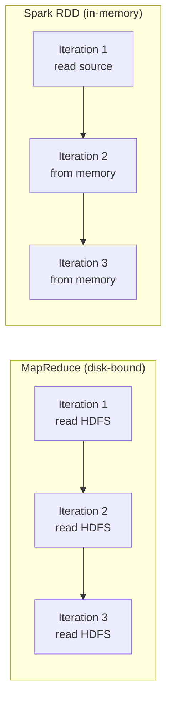
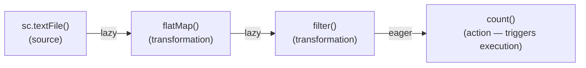
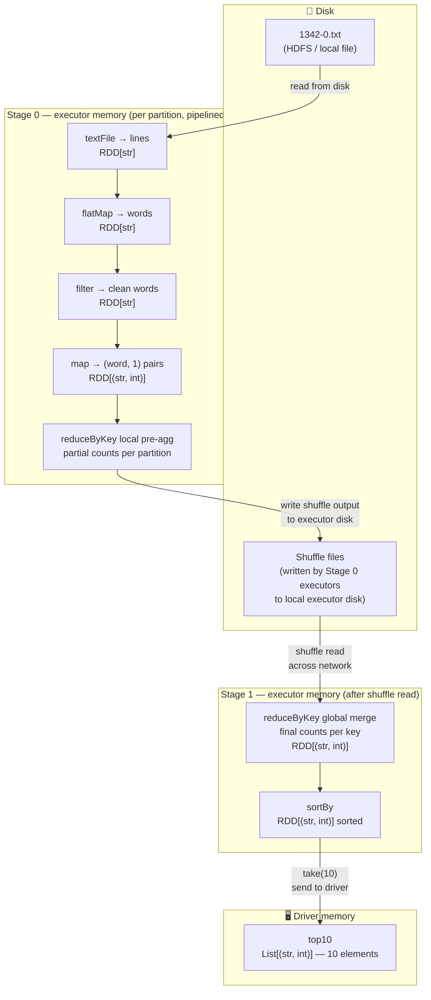
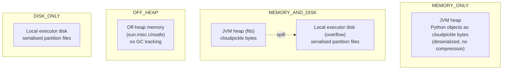
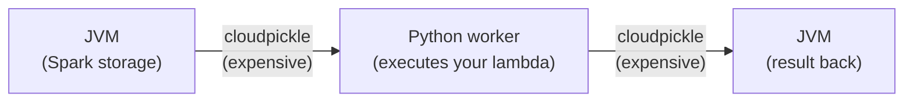

# Chapter 03 — RDD Fundamentals

> *Learning-path topic: I4 (Intermediate)*
> *Written: 2026-05-31 · Spark 4.1.x / Python 3.10+*

The RDD (Resilient Distributed Dataset) is Spark's original data model — a schema-free distributed collection of Python objects. Understanding it explains what the DataFrame API is built on and reveals when to reach below the DataFrame abstraction.

---

## What you'll learn

- What an RDD is and how it differs from a DataFrame
- How to create an RDD and apply `map`, `filter`, and `reduce`
- Why RDDs are slower for structured data (and when they aren't)
- The Python-JVM cost model for RDD operations
- How to convert between RDDs and DataFrames

---

## What is an RDD?

An **RDD** — Resilient Distributed Dataset — is Spark's original data abstraction, introduced in Matei Zaharia's 2012 paper and shipped as the primary user-facing API in Spark 1.0 (2014). Every higher-level abstraction in Spark — DataFrames, Datasets, Structured Streaming — compiles down to RDDs at execution time.

The name breaks down precisely:

**Resilient** — if a partition is lost (executor crash, node failure), Spark does not need a backup copy of the data. Instead it recomputes the lost partition from its **lineage**: the recorded sequence of transformations that produced it. This is fault tolerance through recomputation, not replication.

**Distributed** — an RDD is split into **partitions**, each assigned to a different executor on a different machine. All partitions process in parallel. The number of partitions controls the degree of parallelism.

**Dataset** — an immutable collection of elements. Once created, an RDD cannot be modified. Every transformation (`map`, `filter`, `reduce`) produces a *new* RDD; the original is unchanged. Immutability is what makes lineage-based recovery safe — any partition can always be recomputed from its parent.

### The problem RDDs solved

Before Spark, Hadoop MapReduce was the standard for large-scale distributed computation. MapReduce had one critical constraint: **every intermediate result had to be written to HDFS** (disk) between stages. There was no way to hold data in memory across multiple operations.

This made two classes of computation prohibitively slow:

- **Iterative algorithms** (machine learning, graph processing) — each iteration required a full HDFS read of the dataset. A logistic regression needing 50 iterations triggered 50 full disk reads.
- **Interactive analytics** — every exploratory query was a separate job reading the same data from disk. Re-querying the same dataset 10 times meant 10 full disk reads.

RDDs solved both by letting users **explicitly cache a dataset in memory** across operations. After the first computation, the data stays on executors. Subsequent operations read from RAM instead of HDFS — 10–100× faster.



### Where RDDs sit today

RDDs are still fully present in Spark 4.1.x — they have not been deprecated. But for structured (tabular) data, the **DataFrame API** (Spark 1.3+) is almost always the right choice: it adds a schema, the Catalyst query optimiser, and Tungsten's off-heap binary storage, giving 3–8× better performance for typical ETL workloads.

Use the RDD API when:

- Data is genuinely unstructured (log lines, binary blobs, arbitrary Python objects)
- You need a custom algorithm with no relational equivalent (graph traversal, iterative ML from scratch)
- You are reading a pipeline that was written before Spark 1.3

---

## Creating an RDD

All RDD creation goes through `SparkContext`, accessed via `spark.sparkContext`. The four methods you'll use in practice:

### `sc.parallelize()` — from an in-memory collection

Distributes a Python list, tuple, or any iterable across partitions. The entire collection must fit in driver memory — use this for small seed data and test fixtures, not large datasets.

```python
# Apache Spark 4.1.x / PySpark 4.1.x · Python 3.10+
sc = spark.sparkContext

numbers = sc.parallelize([1, 2, 3, 4, 5])
mixed   = sc.parallelize([1, "two", 3.0, {"four": 4}])  # any picklable objects

# Control the partition count explicitly (default: sc.defaultParallelism)
numbers_4p = sc.parallelize(range(100), 4)
print(numbers_4p.getNumPartitions())  # 4
```

### `sc.textFile()` — from a text file (one element per line)

Reads a text file and returns one string element per line. Supports local paths, HDFS, S3, GCS, and wildcards.

```python
# Apache Spark 4.1.x / PySpark 4.1.x · Python 3.10+
lines = sc.textFile("../data/gutenberg_books/1342-0.txt")
# RDD[str] — each element is one line of the file

# Wildcards and directories
all_logs = sc.textFile("logs/*.gz")          # compressed files supported
hdfs_data = sc.textFile("hdfs:///data/*.txt")

# Default partitions: one per HDFS block (128 MB); override with second arg
lines_8p = sc.textFile("data.txt", 8)
```

### `sc.wholeTextFiles()` — one record per file

Returns `(filename, content)` pairs — the entire file content as one string per record. Useful when you need to process each file as a unit (e.g. JSON documents, small configs).

```python
# Apache Spark 4.1.x / PySpark 4.1.x · Python 3.10+
file_rdd = sc.wholeTextFiles("../data/gutenberg_books/")
# RDD[(str, str)] — (path, full_file_content)

for path, content in file_rdd.take(1):
    print(path)             # file:/.../1342-0.txt
    print(len(content))     # character count of the whole file
```

### `sc.range()` — integer sequence

Creates a partitioned RDD of integers. More efficient than `parallelize(range(...))` because it avoids materialising the list in driver memory.

```python
# Apache Spark 4.1.x / PySpark 4.1.x · Python 3.10+
rdd = sc.range(1_000_000)               # 0 to 999,999
rdd = sc.range(start=0, end=100, step=2)  # even numbers 0–98
rdd = sc.range(100, numSlices=4)         # 4 partitions
```

### `df.rdd` — from a DataFrame

Drops to the RDD layer from an existing DataFrame. Each element becomes a `Row` object. **Avoid this** unless you genuinely need the RDD API — it abandons Catalyst and Tungsten and serialises every row across the py4j bridge.

```python
# Apache Spark 4.1.x / PySpark 4.1.x · Python 3.10+
df = spark.createDataFrame([(1, "alice"), (2, "bob")], ["id", "name"])
row_rdd = df.rdd
# RDD[Row] — Row(id=1, name='alice'), Row(id=2, name='bob')
print(row_rdd.collect())
```

### Quick reference

| Method | Input | Element type | Default partitions | Use when |
|---|---|---|---|---|
| `sc.parallelize(col)` | Python collection | Any picklable object | `sc.defaultParallelism` | Small in-memory data, test fixtures |
| `sc.textFile(path)` | Text file / glob | `str` (one per line) | 1 per 128 MB HDFS block | Line-oriented text data |
| `sc.wholeTextFiles(path)` | Directory of files | `(path, content)` tuple | Data-locality dependent | One document per file |
| `sc.range(n)` | Integer range | `int` | `sc.defaultParallelism` | Synthetic/test integer data |
| `df.rdd` | DataFrame | `Row` | Same as DataFrame | Rarely — only when DataFrame can't express the operation |

---

## The RDD programming model

RDD operations fall into exactly two categories: **transformations** and **actions**. Understanding the difference is the foundation of everything else.

Most RDD transformations — `map`, `flatMap`, `filter`, `reduce` — are **higher-order functions**: they take another function as their argument and apply it to the data. The function you pass (a lambda or a named function) defines *what* to do; the RDD operation defines *how* to distribute that work across partitions. This is the same pattern as Python's built-in `map()` and `filter()`, extended to run across a cluster.

```python
# Python built-in map — single machine
list(map(lambda x: x * 2, [1, 2, 3]))      # [2, 4, 6]

# Spark RDD map — distributed across a cluster
sc.parallelize([1, 2, 3]).map(lambda x: x * 2).collect()  # [2, 4, 6]
```

The API is intentionally identical. The difference is that your lambda is cloudpickled and shipped to executors where it runs in parallel on each partition.

### Transformations — lazy, return a new RDD

A transformation records an instruction and returns a new RDD immediately, without reading any data. Nothing executes. Spark builds a DAG (directed acyclic graph) of transformations — the lineage — and waits.

```python
# Apache Spark 4.1.x / PySpark 4.1.x · Python 3.10+
sc = spark.sparkContext

lines  = sc.textFile("data.txt")           # no data read yet
words  = lines.flatMap(lambda l: l.split()) # still nothing
clean  = words.filter(lambda w: len(w) > 3) # still nothing
```

Every line above executes in microseconds. No cluster work happens until an action is called.

### Actions — eager, trigger execution and return a result

An action submits the DAG to the scheduler, which computes it and returns either a value to the driver or writes to storage.

```python
print(clean.count())       # NOW the cluster works — action triggers execution
print(clean.take(5))       # another action — re-executes the whole plan
clean.saveAsTextFile("out/") # another action — writes to disk
```

Each action re-executes the full lineage from source unless the RDD is cached.

### The lazy evaluation DAG



### Narrow vs wide transformations

The most important property of a transformation is whether it is **narrow** or **wide** — this determines whether a shuffle occurs.

| Type | Definition | Examples | Shuffle? |
|---|---|---|---|
| **Narrow** | Each output partition depends on exactly one input partition | `map`, `filter`, `flatMap`, `mapPartitions` | No — fast, pipelined |
| **Wide** | Each output partition depends on multiple input partitions | `groupByKey`, `reduceByKey`, `sortBy`, `distinct` | Yes — expensive, stage boundary |

Wide transformations trigger a **shuffle** — data must move across executors, regrouped by key. This is the most expensive operation in Spark. Prefer `reduceByKey` over `groupByKey` whenever possible: `reduceByKey` pre-aggregates locally per partition before shuffling; `groupByKey` shuffles all values first.

### Core transformations

| Transformation | What it does | Narrow / Wide |
|---|---|---|
| `map(f)` | Apply `f` to every element — 1-in, 1-out | Narrow |
| `flatMap(f)` | Apply `f` to every element — 1-in, 0-or-more-out | Narrow |
| `filter(f)` | Keep elements where `f(x)` is truthy | Narrow |
| `mapPartitions(f)` | Apply `f` to each partition as an iterator — avoids per-row overhead | Narrow |
| `distinct()` | Remove duplicate elements | Wide (shuffle) |
| `union(other)` | Concatenate two RDDs | Narrow |
| `reduceByKey(f)` | For `(K, V)` pairs — aggregate values per key; pre-aggregates locally first | Wide (shuffle) |
| `groupByKey()` | For `(K, V)` pairs — group all values per key; **shuffles everything** | Wide (shuffle) |
| `sortBy(f)` | Sort elements by key function | Wide (shuffle) |

### Core actions

| Action | What it returns | Warning |
|---|---|---|
| `collect()` | All elements as a Python list | Loads entire RDD into driver memory — only safe on small RDDs |
| `count()` | Number of elements | Triggers full scan |
| `first()` | First element | |
| `take(n)` | First `n` elements as a list | Safer than `collect()` |
| `reduce(f)` | Single value — folds all elements using `f`; `f` must be commutative and associative | |
| `saveAsTextFile(path)` | None — writes RDD as text files to path | |
| `foreach(f)` | None — runs `f` on each element for side effects | `f` runs on executors, not the driver |

### A complete example — data in memory and on disk

```python
# Apache Spark 4.1.x / PySpark 4.1.x · Python 3.10+
from operator import add
sc = spark.sparkContext

# Build the transformation chain (no data moves yet)
word_counts = (
    sc.textFile("../data/gutenberg_books/1342-0.txt")   # RDD[str] — one line per element
    .flatMap(lambda line: line.lower().split())          # RDD[str] — one word per element
    .filter(lambda word: word.isalpha())                 # drop punctuation/empty
    .map(lambda word: (word, 1))                         # RDD[(str, int)] — key-value pairs
    .reduceByKey(add)                                    # RDD[(str, int)] — word counts
    .sortBy(lambda kv: kv[1], ascending=False)           # sort by count descending
)

# Action — triggers execution
top10 = word_counts.take(10)
for word, count in top10:
    print(f"{word:15s} {count}")
```

When `.take(10)` fires, data flows through two stages separated by a shuffle. Here is where each step lives:



**What this shows:**

- **Stage 0** runs entirely in executor memory — `flatMap`, `filter`, `map`, and the local pre-aggregation of `reduceByKey` are pipelined. Each partition is read from disk once, processed through the full chain in memory, and the partial result is written to a shuffle file on local disk. The intermediate RDDs (`lines`, `words`, `clean words`) are **never materialised** as full datasets — each row flows through the chain and is discarded.

- **The shuffle boundary** is the only point where data touches disk again. `reduceByKey` writes partitioned shuffle files. Stage 1 executors fetch their partition of those files over the network.

- **Stage 1** reads the shuffled data into memory, completes the `reduceByKey` global merge, and sorts. Only the 10 rows requested by `take(10)` are sent back to the driver.

- **Nothing is persisted** after `.take(10)` returns. If you call `word_counts.take(10)` again, Spark re-reads the file from disk and reruns the full pipeline. To avoid this, call `word_counts.cache()` before the action.

---

## How an RDD is stored: memory, disk, and off-heap

By default an RDD holds **no data at rest**. It is a logical plan. Computed partitions live in executor memory only for the duration of the stage that needs them — once the next stage starts, those partitions are freed.

When you explicitly cache an RDD, partitions are materialised and retained across actions. Spark gives you control over *where* and *how* through `StorageLevel`.

### `rdd.cache()` — the default level

`cache()` is shorthand for `persist(StorageLevel.MEMORY_ONLY)`. Each partition is stored as **deserialized Java objects on the JVM heap**. For a PySpark RDD this means Python objects cloudpickled into JVM byte arrays and then kept in the executor's JVM heap. Fast to read, but uses the most memory and puts pressure on the GC.

```python
# Apache Spark 4.1.x / PySpark 4.1.x · Python 3.10+
word_counts.cache()           # mark for caching (MEMORY_ONLY)
word_counts.take(10)          # first action: computes + caches partitions
word_counts.take(10)          # second action: reads from cache, no recomputation
word_counts.unpersist()       # release; executor memory freed
```

### `rdd.persist(StorageLevel)` — choose where to store

| StorageLevel | Disk | Memory | Off-heap | Deserialized | Replicas | When to use |
|---|---|---|---|---|---|---|
| `MEMORY_ONLY` | ✗ | ✓ | ✗ | ✓ | 1 | Default. Fast access; partitions that don't fit are recomputed. |
| `MEMORY_AND_DISK` | ✓ | ✓ | ✗ | ✓ | 1 | Safer for large RDDs — overflow spills to disk instead of being recomputed. |
| `MEMORY_ONLY_2` | ✗ | ✓ | ✗ | ✓ | 2 | Replicates to 2 nodes — faster recovery on node loss. |
| `MEMORY_AND_DISK_2` | ✓ | ✓ | ✗ | ✓ | 2 | Replication + disk fallback. |
| `DISK_ONLY` | ✓ | ✗ | ✗ | ✓ | 1 | Very large RDDs where memory is exhausted. Slow — every read hits disk. |
| `OFF_HEAP` | ✗ | ✗ | ✓ | ✗ | 1 | Off-heap serialized storage — no GC pressure. Requires `spark.memory.offHeap.enabled=true`. |

```python
from pyspark import StorageLevel

word_counts.persist(StorageLevel.MEMORY_AND_DISK)
```

### What "deserialized" means for PySpark

In Scala/Java, `deserialized=True` means objects are stored as native JVM objects (no serialization). In PySpark, the situation is different: Python objects are *always* cloudpickled before crossing into the JVM. "Deserialized" in the PySpark context means the byte arrays representing each partition are kept in deserialized form on the JVM heap — they are not further compressed or encoded. The cloudpickle round-trip still happened; `deserialized` only controls what happens after that inside the JVM.

### Memory layout per storage level



### Always unpersist when done

Cached partitions occupy executor memory for the lifetime of the SparkSession unless explicitly released:

```python
word_counts.unpersist()   # frees all cached partitions immediately
```

Failing to unpersist after a large cached RDD is one of the most common causes of OOM errors in long-running Spark applications.

---

## Core concept

An RDD is a distributed, immutable collection of Python objects. There is no schema, no column types, and no SQL optimiser. Each element can be any picklable Python object: a string, a tuple, a dict, a numpy array.

The critical cost: every RDD operation in PySpark crosses the JVM-Python boundary. Data is serialised from the JVM (where Spark's storage lives) into Python worker processes, the function runs, then results are serialised back. This happens per partition per operation.



For structured data, DataFrames keep everything in the JVM via Tungsten's binary row format — the Python process only sends the plan, not the data. This is why DataFrames are typically 3–8× faster than RDDs for tabular operations.

**Use RDDs when:**

- Data is genuinely unstructured (no fixed schema)
- You need arbitrary Python objects (not tables)
- You're implementing custom algorithms with no relational equivalent

**The three core higher-order operations:**

| Operation | Input | Output | Analogous to |
|---|---|---|---|
| `map(f)` | Each element | New element | `[f(x) for x in rdd]` |
| `filter(f)` | Each element | Keep if `f(x)` is truthy | `[x for x in rdd if f(x)]` |
| `reduce(f)` | Pairs of elements | Single value | `functools.reduce(f, rdd)` |

---

## Examples

### Minimal example: create, map, filter, collect

```python
# Apache Spark 4.1.x / PySpark 4.1.x · Python 3.10+
from pyspark.sql import SparkSession

spark = SparkSession.builder.appName("ch13").master("local[*]").getOrCreate()
sc = spark.sparkContext

# Create an RDD from a Python list
numbers = sc.parallelize([1, 2, 3, 4, 5, 6, 7, 8, 9, 10])

# map — apply a function to every element
squared = numbers.map(lambda x: x ** 2)

# filter — keep elements where condition is True
even_squared = squared.filter(lambda x: x % 2 == 0)

# collect — action: bring all elements to the driver as a Python list
result = even_squared.collect()
print(result)   # [4, 16, 36, 64, 100]

# take — collect only the first N elements (safer for large RDDs)
print(even_squared.take(3))   # [4, 16, 36]
```

### Building up: key-value RDDs and reduce

```python
# Apache Spark 4.1.x / PySpark 4.1.x · Python 3.10+
from pyspark.sql import SparkSession

spark = SparkSession.builder.appName("ch13-kv").master("local[*]").getOrCreate()
sc = spark.sparkContext

# Key-value pairs — (word, 1) for word counting
words = sc.parallelize(["the", "quick", "brown", "fox", "the", "fox", "the"])

# map each word to a (word, 1) pair
pairs = words.map(lambda w: (w, 1))

# reduceByKey — aggregate values by key: (word, sum_of_1s)
counts = pairs.reduceByKey(lambda a, b: a + b)

print(counts.collect())
# [('the', 3), ('quick', 1), ('brown', 1), ('fox', 2)]

# reduce — fold the entire RDD to a single value
total = sc.parallelize([1, 2, 3, 4, 5]).reduce(lambda a, b: a + b)
print(total)   # 15

# flatMap — map followed by flatten (list output per element)
sentences = sc.parallelize(["hello world", "foo bar baz"])
words_flat = sentences.flatMap(lambda s: s.split(" "))
print(words_flat.collect())   # ['hello', 'world', 'foo', 'bar', 'baz']
```

### Converting between RDD and DataFrame

```python
# Apache Spark 4.1.x / PySpark 4.1.x · Python 3.10+
import pyspark.sql.types as T
from pyspark.sql import SparkSession

spark = SparkSession.builder.appName("ch13-convert").master("local[*]").getOrCreate()
sc = spark.sparkContext

# RDD of tuples → DataFrame
rdd = sc.parallelize([(1, "Alice", 95000), (2, "Bob", 87000)])
schema = T.StructType([
    T.StructField("id",     T.IntegerType()),
    T.StructField("name",   T.StringType()),
    T.StructField("salary", T.IntegerType()),
])
df = spark.createDataFrame(rdd, schema)
df.show()
# +---+-----+------+
# | id| name|salary|
# +---+-----+------+
# |  1|Alice| 95000|
# |  2|  Bob| 87000|
# +---+-----+------+

# DataFrame → RDD (each row becomes a Row object)
back_to_rdd = df.rdd
print(back_to_rdd.first())   # Row(id=1, name='Alice', salary=95000)
```

---

## Common pitfalls

- **`reduce()` requires a commutative and associative function** — Spark reduces partitions in parallel, then merges the partial results. If your function is not commutative (`f(a,b) != f(b,a)`) or not associative (`f(f(a,b),c) != f(a,f(b,c))`), results will be non-deterministic. Order subtraction (`a - b`) violates commutativity.
- **`collect()` on a large RDD causes OOM** — `collect()` brings everything to the driver. Use `take(N)` for sampling, `count()` for size, or `saveAsTextFile()` for writing large results.
- **RDD actions trigger re-computation** — like DataFrames, RDDs are lazy. Without `cache()`, calling `count()` twice re-runs the full chain twice. Call `rdd.cache()` if you need to query the same RDD multiple times.
- **Python RDDs are 3–8× slower than Scala RDDs for the same logic** — every operation crosses the Python-JVM boundary. For RDD-heavy code, prefer Scala or switch to DataFrames.
- **`sc.parallelize()` is for testing, not production ingestion** — it puts data on the driver then distributes it. For large data, use `spark.read` to load directly into partitions without the driver bottleneck.

---

## Exercises

1. **Recall** — Why must the function passed to `reduce()` be commutative and associative? Give an example of a function that would produce wrong results if it violated these properties.

2. **Apply** — Use an RDD to count word frequencies in a list of sentences. Use `flatMap()` to tokenise, `map()` to create `(word, 1)` pairs, and `reduceByKey()` to count. Then convert the result to a DataFrame with an explicit schema.

3. **Extend** — Compare the performance of the word-count pipeline using: (1) RDD `map` + `reduceByKey`, (2) `spark.createDataFrame()` + `F.explode(F.split(...))` + `groupBy().count()`. Measure wall-clock time for a 10 MB text file. What does this reveal about when RDDs are justified?

---

## Summary

- An RDD is a distributed, schema-free collection of Python objects — no types, no SQL optimiser.
- Core operations: `map()` (transform each element), `filter()` (keep matching elements), `reduce()` (fold to one value), `flatMap()` (transform and flatten), `reduceByKey()` (aggregate by key in key-value RDDs).
- RDD operations cross the Python-JVM boundary per partition per operation — slower than DataFrames for structured data.
- `collect()` brings all data to the driver — use only when the result is small; prefer `take(N)` for sampling.
- Convert RDD → DataFrame with `spark.createDataFrame(rdd, schema)`; DataFrame → RDD with `df.rdd`.
- Chapter 14 covers partitioning — how Spark distributes data and how to control it.

---

## References

- [PySpark RDD programming guide](https://spark.apache.org/docs/latest/rdd-programming-guide.html)
- [PySpark SparkContext API](https://spark.apache.org/docs/latest/api/python/reference/api/pyspark.SparkContext.html)
