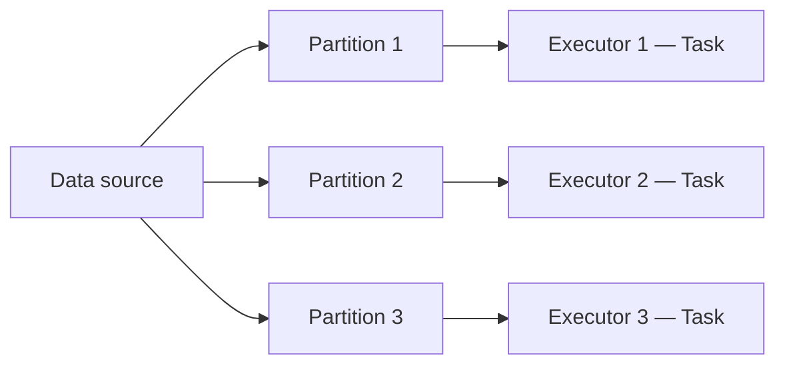
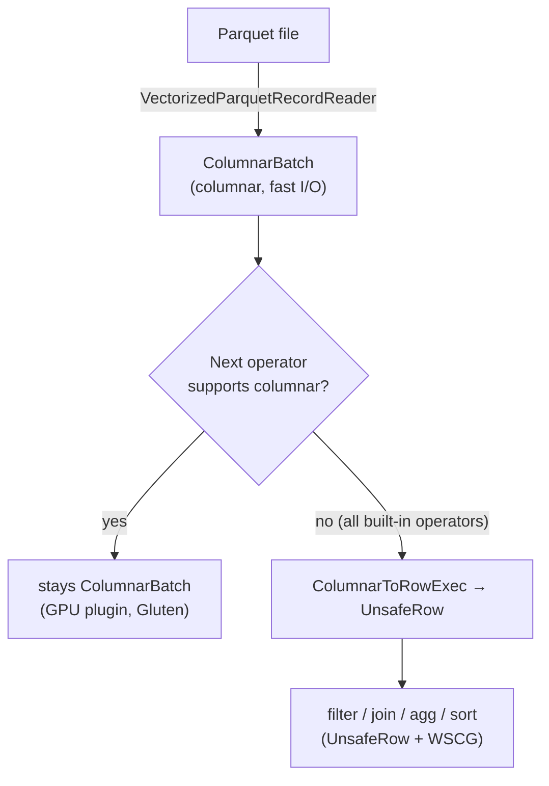

# Chapter 04 — The DataFrame API: Basics

> *Learning-path topic: B3 (Beginner)*
> *Written: 2026-05-31 · Spark 4.1.x / Python 3.10+*

The DataFrame is PySpark's primary data structure — a distributed, column-typed table with a rich transformation API modelled on SQL. Fluency with its core operations is what separates someone who has used PySpark from someone who can actually work with it.

---

## What you'll learn

- Why DataFrames were added to Spark and what problem they solve over RDDs
- All the ways to create a DataFrame manually (without reading a file)
- The four ways to reference a column and which to prefer
- How `select`, `filter`, `withColumn`, `drop`, and `distinct` work together
- How to rename and reorder columns
- Why `alias()` every computed column is not optional
- How DataFrames store data internally — `UnsafeRow`, off-heap memory, caching
- What "columnar" means in Spark and where it actually applies (hint: not execution)

---

## Why DataFrames?

Spark launched in 2010 with a single abstraction: the **RDD** (Resilient Distributed Dataset). An RDD is a distributed collection of JVM objects — powerful, but with serious limits:

- **No schema** — rows are opaque objects; Spark cannot see inside them
- **No automatic optimization** — transformations run in the order you wrote them; there is no reordering or pruning
- **Verbose API** — a simple filter/group/aggregate requires several map/reduce operations
- **Python penalty** — every row has to be serialized from JVM to Python and back, making Python RDDs significantly slower than Scala RDDs

DataFrames were introduced in **Spark 1.3 (2015)** to address all of these at once. A DataFrame is a distributed table with named, typed columns — the same mental model as a SQL table or a pandas DataFrame, but running across a cluster. Because Spark can now *see the structure* of the data, two major optimizations become possible:

- **Catalyst optimizer** — Spark's query planner rewrites your logical plan before execution: it pushes filters down (scan less data), reorders joins (process smaller tables first), and prunes unused columns
- **Tungsten execution engine** — compact binary row format (`UnsafeRow`, on-heap by default; off-heap opt-in via `spark.memory.offHeap.enabled=true`) and JVM bytecode generation; rows never cross the Python/JVM boundary unless you explicitly call a Python UDF

The result: the same operation written as a DataFrame transform is typically **2–10× faster** than the equivalent RDD code, and the gap widens at scale.

> 💡 **Default to DataFrames — but the "RDD is slower" claim needs context.**
>
> **Where DataFrames are faster (structured/tabular data):**
> - Catalyst can't see inside a lambda — predicate pushdown, projection pruning, and constant folding don't apply to RDD operations.
> - Python RDDs add cloudpickle serialization + Python-JVM bridge overhead on every operation.
>
> **Catalyst optimisations that RDDs miss:**
>
> | Optimisation | What it does | RDD equivalent |
> |---|---|---|
> | **Predicate pushdown** | Moves `filter` as early as possible — ideally into the file reader so unmatched rows are never loaded | Lambda runs after all data is loaded |
> | **Projection pruning** | Reads only the columns the query actually uses from Parquet/ORC | All columns always loaded |
> | **Constant folding** | Evaluates constant sub-expressions at planning time — `salary * (100 + 10)` → `salary * 110` before any row is touched | Full expression re-evaluated for every element at runtime |
>
> **Where RDDs are not slower (or are the right tool):**
> - Unstructured data (text streams, arbitrary Python objects, binary blobs) — forcing it into a DataFrame schema adds overhead with no benefit.
> - Custom algorithms with no relational equivalent (`reduce`, graph traversal, etc.).
> - Scala/Java RDDs — the Python-JVM bridge cost doesn't apply; the gap vs DataFrames is much narrower.
>
> **If you need RDDs, prefer Scala or Java over Python.**
>
> PySpark RDD operations cross the Python↔JVM bridge on every operation: data is cloudpickled to the JVM, unpickled in a Python worker process, the function runs, then pickled back. This happens per partition, per operation.
>
> Scala/Java RDD functions run natively inside the JVM executor — no serialization bridge, no Python worker. Typically **3–8× faster** for RDD-heavy code.
>
> | | PySpark RDD | Scala/Java RDD | DataFrame (any language) |
> |---|---|---|---|
> | Execution | Python worker + JVM bridge | Native JVM | Native JVM + Catalyst/WSCG |
> | Serialization overhead | Per partition, per op | None | None (UnsafeRow stays in JVM) |
> | Catalyst optimizations | No | No | Yes |
>
> For DataFrames, the language gap essentially disappears — Catalyst produces the same optimized physical plan regardless of whether you wrote it in Python, Scala, or Java.
>
> Reach for the RDD only when the DataFrame is genuinely restrictive.

In Python, `DataFrame` is effectively the only API — there is no separate `Dataset` (Datasets are type-safe JVM constructs; Python has no equivalent static typing). Everything in PySpark goes through `pyspark.sql.DataFrame`.

### The relational algebra foundation

The DataFrame API is grounded in **relational algebra** — the same mathematical foundation that underlies every relational database. Each DataFrame operation maps directly to a relational algebra operator:

| DataFrame operation | Relational algebra operator | What it does |
|---|---|---|
| `.filter()` / `.where()` | σ (selection) | Restricts rows by a predicate |
| `.select()` | π (projection) | Restricts to a subset of columns |
| `.join()` | ⨝ (join) | Combines two relations on a condition |
| `.groupBy().agg()` | γ (aggregation) | Groups rows and applies aggregate functions |
| `.union()` | ∪ (union) | Combines two row sets |

This is why Catalyst can apply 100+ optimization rules safely (54 in `operatorOptimizationRuleSet` alone in Spark 4.1.2): relational algebra has well-defined mathematical equivalence laws — filters can always be pushed past projections, certain joins are commutative, constants can be folded — that guarantee rewrites preserve correctness. The optimizer manipulates a tree of algebraic expressions, not opaque user code. It is also why `df.filter(F.col("country") == "DE")` and `spark.sql("WHERE country = 'DE'")` compile to the same logical plan — both are expressions in the same algebra.

---

## Creating a DataFrame

In production you usually create DataFrames by reading files or querying a catalog. But for tests, exploration, and small reference tables, you create them in-memory. There are several ways.

`spark.createDataFrame(data, schema)` is the main entry point. It takes a `data` argument — a Python iterable of tuples, `Row` objects, dicts, or a pandas DataFrame — and an optional `schema` that can be a list of column names, a `StructType`, or a DDL string. If `schema` is omitted, Spark infers types by sampling the data.

### From a list of tuples — infer schema from column names

The simplest form: pass a list of tuples and a list of column names. Spark infers types from the data.

```python
# Apache Spark 4.1.x / PySpark 4.1.x · Python 3.10+
from pyspark.sql import SparkSession

spark = SparkSession.builder.appName("ch03").master("local[*]").getOrCreate()

df = spark.createDataFrame(
    [("Alice", "eng", 95000), ("Bob", "mkt", 72000)],
    ["name", "dept", "salary"],
)
df.printSchema()
# root
#  |-- name: string (nullable = true)
#  |-- dept: string (nullable = true)
#  |-- salary: long (nullable = true)
```

Type inference is convenient but not guaranteed — Spark picks `long` for integers and `double` for floats. Use an explicit schema when types matter.

### From a list of tuples — explicit StructType schema

Pass a `StructType` as the second argument to control column names and types exactly:

```python
# Apache Spark 4.1.x / PySpark 4.1.x · Python 3.10+
import pyspark.sql.types as T
from pyspark.sql import SparkSession

spark = SparkSession.builder.appName("ch03").master("local[*]").getOrCreate()

schema = T.StructType([
    T.StructField("name",   T.StringType(),  nullable=False),
    T.StructField("dept",   T.StringType(),  nullable=True),
    T.StructField("salary", T.IntegerType(), nullable=True),
])

df = spark.createDataFrame(
    [("Alice", "eng", 95000), ("Bob", "mkt", 72000)],
    schema,
)
df.printSchema()
# root
#  |-- name: string (nullable = false)
#  |-- dept: string (nullable = true)
#  |-- salary: integer (nullable = true)
```

This is the preferred form for tests — it makes the contract explicit and catches type mismatches early.

A shorter alternative is a **DDL string** — the same type names SQL uses, space-separated:

```python
# Apache Spark 4.1.x / PySpark 4.1.x · Python 3.10+
from datetime import date, datetime
from pyspark.sql import SparkSession

spark = SparkSession.builder.appName("ch03").master("local[*]").getOrCreate()

df = spark.createDataFrame(
    [
        (1, 2.5, "alice", date(2000, 1, 1), datetime(2000, 1, 1, 12, 0)),
        (2, 3.0, "bob",   date(2000, 2, 1), datetime(2000, 1, 2, 12, 0)),
    ],
    schema="id long, score double, name string, dob date, created_at timestamp",
)
df.printSchema()
# root
#  |-- id: long (nullable = true)
#  |-- score: double (nullable = true)
#  |-- name: string (nullable = true)
#  |-- dob: date (nullable = true)
#  |-- created_at: timestamp (nullable = true)
```

DDL strings are terser than `StructType` and read more like SQL — use them when you don't need `nullable=False` control.

### PySpark type reference

When declaring a schema you need to map Python types to PySpark types. The full table:

| PySpark type | Python equivalent | DDL string |
|---|---|---|
| `T.StringType()` | `str` | `"string"` |
| `T.BooleanType()` | `bool` | `"boolean"` |
| `T.ByteType()` | `int` (8-bit) | `"byte"` / `"tinyint"` |
| `T.ShortType()` | `int` (16-bit) | `"short"` / `"smallint"` |
| `T.IntegerType()` | `int` (32-bit) | `"int"` |
| `T.LongType()` | `int` (64-bit) | `"long"` / `"bigint"` |
| `T.FloatType()` | `float` (32-bit) | `"float"` |
| `T.DoubleType()` | `float` (64-bit) | `"double"` |
| `T.DecimalType(p, s)` | `decimal.Decimal` | `"decimal(10,2)"` |
| `T.DateType()` | `datetime.date` | `"date"` |
| `T.TimestampType()` | `datetime.datetime` (tz-aware) | `"timestamp"` |
| `T.TimestampNTZType()` | `datetime.datetime` (no tz) | `"timestamp_ntz"` *(Spark 3.3+)* |
| `T.BinaryType()` | `bytes` | `"binary"` |
| `T.ArrayType(T)` | `list` | `"array<type>"` |
| `T.MapType(K, V)` | `dict` | `"map<K,V>"` |
| `T.StructType([…])` | `list` or `tuple` | `"struct<name:type,...>"` |
| `T.NullType()` | `None` | `"void"` |

> **Why types look like function calls.** `StringType()`, `LongType()` etc. are class instances, not plain values. Parameterised types like `DecimalType(10, 2)` and `ArrayType(StringType())` carry configuration as instance attributes. Spark also calls methods on them internally (`simpleString()`, `needConversion()`). Parameterless types use a singleton metaclass — `StringType()` always returns the same object, so there is no allocation cost.

> ⚠️ Python `int` is unbounded; `LongType` is 64-bit. A Python `int` exceeding `2^63 - 1` will overflow silently or error. Use the narrowest type that fits your data.

### From a list of `Row` objects

`Row` is a named-tuple-like class from `pyspark.sql`. Column names come from the field names on the Row:

```python
# Apache Spark 4.1.x / PySpark 4.1.x · Python 3.10+
from pyspark.sql import Row, SparkSession

spark = SparkSession.builder.appName("ch03").master("local[*]").getOrCreate()

rows = [
    Row(name="Alice", dept="eng", salary=95000),
    Row(name="Bob",   dept="mkt", salary=72000),
]
df = spark.createDataFrame(rows)
df.show()
```

Useful when building test fixtures with named fields to avoid positional confusion.

### From a list of dicts

Each dict maps column name → value. Missing keys become `null`:

```python
# Apache Spark 4.1.x / PySpark 4.1.x · Python 3.10+
from pyspark.sql import SparkSession

spark = SparkSession.builder.appName("ch03").master("local[*]").getOrCreate()

df = spark.createDataFrame([
    {"name": "Alice", "dept": "eng", "salary": 95000},
    {"name": "Bob",   "dept": "mkt"},           # salary missing → null
])
df.show()
# +-----+----+------+
# | dept|name|salary|
# +-----+----+------+
# |  eng|Alice| 95000|
# |  mkt|  Bob|  null|
# +-----+----+------+
```

Note: column order is not guaranteed with dicts — use an explicit schema if order matters.

### From a pandas DataFrame

If you already have data in pandas, pass it directly. Spark converts it via Arrow if available:

```python
# Apache Spark 4.1.x / PySpark 4.1.x · Python 3.10+
import pandas as pd
from pyspark.sql import SparkSession

spark = SparkSession.builder.appName("ch03").master("local[*]").getOrCreate()

pdf = pd.DataFrame({"name": ["Alice", "Bob"], "salary": [95000, 72000]})
df = spark.createDataFrame(pdf)
df.printSchema()
```

This is common in notebooks during exploration — build a small pandas table, convert, apply Spark transforms.

### `spark.range()` — quick integer sequence

Creates a single-column DataFrame named `id`, useful for testing or generating synthetic data:

```python
spark.range(5).show()
# +---+
# | id|
# +---+
# |  0|
# |  1|
# |  2|
# |  3|
# |  4|
# +---+

spark.range(start=1, end=10, step=2).show()  # 1, 3, 5, 7, 9
```

### Empty DataFrame with schema

For initializing accumulators or union targets, create an empty DataFrame with a declared schema:

```python
# Apache Spark 4.1.x / PySpark 4.1.x · Python 3.10+
import pyspark.sql.types as T
from pyspark.sql import SparkSession

spark = SparkSession.builder.appName("ch03").master("local[*]").getOrCreate()

schema = T.StructType([
    T.StructField("name",   T.StringType(),  True),
    T.StructField("salary", T.IntegerType(), True),
])
empty_df = spark.createDataFrame([], schema)
empty_df.printSchema()
# root
#  |-- name: string (nullable = true)
#  |-- salary: integer (nullable = true)
```

---

## Core concept

A PySpark DataFrame is a typed, distributed table. Every column has a name and a declared type (`StringType`, `IntegerType`, `DoubleType`, `TimestampType`, …). Unlike pandas, a PySpark DataFrame lives in partitions across executor memory, not on one machine. In memory its rows are stored in Tungsten's `UnsafeRow` binary format — **row-oriented**, not columnar (columnar applies to file formats like Parquet and to the in-memory cache, not to execution).

The API is transformation-based: every method returns a new DataFrame; nothing is mutated in place. This makes method chaining natural and safe.

> **Note — fluent builder vs. immutable chaining.** This looks like the *fluent builder pattern* but differs in one key way: a fluent builder mutates the same object and returns `self`, ending with a terminal call (`build()` / `getOrCreate()`). PySpark DataFrame transforms return a *new* DataFrame each time — the original is untouched, and any intermediate result is already usable. It is better described as a *fluent interface over immutable values*. Interestingly, PySpark uses both patterns: `SparkSession.builder.appName("x").master("local").getOrCreate()` is a true fluent builder; `df.filter(...).withColumn(...).select(...)` is immutable chaining.

`pyspark.sql.functions` (imported as `F`) contains the complete library of column functions — 400+ functions from `F.col()` to `F.sum()` to `F.regexp_extract()`. Import it once at the top; everything flows from there:

```python
import pyspark.sql.functions as F
import pyspark.sql.types as T
```

---

## How DataFrames are stored

### A DataFrame is a plan, not data

Creating a DataFrame does not load or store any data. A DataFrame is a **logical query plan** — a description of what to compute. Data only moves when you call an **action** (`.show()`, `.collect()`, `.count()`, `.write`). Until then, nothing is read, nothing is stored.

```
df = spark.createDataFrame(...)       # just a plan — no data yet
df = df.filter(...).withColumn(...)   # still a plan — no data yet
df.show()                             # action fires → plan executes → data flows
```

### Partitions: the unit of parallelism

When an action runs, Spark splits the data into **partitions** and assigns each partition to one task on one executor. Executors are JVM processes running on cluster nodes (or on your local machine in `local[*]` mode).



Each partition is processed independently and in parallel. The number of partitions determines the degree of parallelism — too few and cores sit idle; too many and scheduling overhead dominates.

### In-memory format: Tungsten UnsafeRow

Partitions in flight (flowing between stages, during shuffles) are stored in Tungsten's **UnsafeRow** format — a compact, **row-based** binary layout. Each row is a single contiguous block of raw bytes written via `sun.misc.Unsafe`, with no Java object wrapper per field:

- no Java object header overhead per row
- reduced GC pressure — one byte array per row instead of one JVM object per field (**on-heap by default**; fully GC-free only when `spark.memory.offHeap.enabled=true`)
- CPU-cache-friendly sequential access within a row

> **Row-based vs. columnar.** `UnsafeRow` (execution format) is row-based — all fields of one row sit together in memory. When a DataFrame is **cached** (`.cache()` / `.persist()`), Spark stores partitions as `CachedBatch` — a **columnar** in-memory format where all values for one column are packed together, enabling better compression and vectorized reads. File formats like Parquet and ORC are also columnar on disk. The rule of thumb: execution is row-based (`UnsafeRow`); cache storage and file I/O are columnar.

This is why DataFrame code is significantly faster than equivalent RDD code — RDDs store actual Java objects, which carry GC overhead and hide structure from the optimizer.

**Three internal row representations.** Spark uses a different row type at each phase of execution because different phases have different requirements:

- **`InternalRow`** — a Scala **trait** (interface), not a concrete class. It defines the row API: `getInt(i)`, `getString(i)`, `isNullAt(i)`, etc. `InternalRow` is the static type parameter in `RDD[InternalRow]` — the actual runtime objects are `UnsafeRow` instances. The fallback concrete implementation `GenericInternalRow` uses a plain `Array[Any]` of JVM objects and appears when whole-stage codegen is disabled (`spark.sql.codegen.wholeStage=false`), during Catalyst analysis and planning (before execution begins), or when codegen compilation fails at runtime (`spark.sql.codegen.fallback=true`, the default) — never during normal Tungsten execution.
- **`UnsafeRow`** — a concrete implementation of `InternalRow` backed by a raw byte array. Three contiguous regions: a null bit-set, fixed-length fields (8-byte aligned), and variable-length data. No per-field Java objects. **By default the byte array is allocated on the JVM heap**; `sun.misc.Unsafe` is used to write into it with unaligned memory access — the "Unsafe" name refers to the write API, not off-heap allocation. True off-heap storage requires `spark.memory.offHeap.enabled=true`. This is the format data lives in during execution, shuffles, and sorting.
- **Apache Arrow** — columnar batch format used when crossing the JVM↔Python boundary for pandas UDFs. A single Arrow `RecordBatch` transfers an entire column at a time instead of row-by-row, eliminating per-row serialization overhead. Spark converts `UnsafeRow` partitions to Arrow batches at the boundary and back on return.

### Why Tungsten chose row-oriented storage

Tungsten was designed to fix **CPU and memory bottlenecks** for Spark's dominant workload — ETL: whole-row transforms (filter, join, project). Columnar shines for OLAP (aggregating 2 columns from a 100-column table); row-oriented wins for mixed whole-row work:

| Factor | Row-oriented (`UnsafeRow`) | Columnar |
|---|---|---|
| **CPU register fit** | 8-byte aligned fields map to 64-bit registers — comparisons in one instruction | Good for aggregations over few columns |
| **Row-level ops** | Natural for filter / join / project — all touch whole rows | Must reassemble rows from column buffers |
| **Write performance** | Append one row directly | Must update N separate column buffers |
| **JVM GC** | One byte array per row — far less GC than one object per field; fully GC-free with off-heap enabled | Same benefit possible but harder to implement |

### By default, data is not kept

After an action completes, the computed partitions are **discarded**. The next action re-executes the entire plan from the source. For a DataFrame read from a file this is fine. For a DataFrame that is the result of an expensive join or aggregation and is used in multiple downstream steps, re-computing it every time is wasteful.

### Caching: `.cache()` and `.persist()`

`.cache()` tells Spark to keep the computed partitions in executor memory after the first action, so subsequent actions reuse them instead of recomputing:

```python
df_expensive = df.join(other, "id").groupBy("dept").agg(F.sum("salary"))
df_expensive.cache()          # mark for caching

df_expensive.show()           # first action: computes and caches
df_expensive.count()          # second action: reads from cache, no recomputation
```

`.persist(StorageLevel)` is the same but lets you choose where partitions are kept:

| Storage level | Where | Serialized | Notes |
|---|---|---|---|
| `MEMORY_ONLY` | JVM heap | No | Default for `cache()`. Fast, but partitions that don't fit are recomputed. |
| `MEMORY_AND_DISK` | JVM heap, spills to local disk | Serialized on disk only; heap copy is deserialized | Safer for large DataFrames — nothing is ever recomputed. |
| `DISK_ONLY` | Local disk only | Yes | Slowest, but frees all executor memory. |
| `OFF_HEAP` | Off-heap memory | Yes | Reduces GC pressure; requires `spark.memory.offHeap.enabled=true`. |

```python
from pyspark import StorageLevel

df_expensive.persist(StorageLevel.MEMORY_AND_DISK)
```

Release a cached DataFrame when you no longer need it — cached partitions occupy executor memory for the lifetime of the SparkSession otherwise:

```python
df_expensive.unpersist()
```

**How caching works internally.** `df.cache()` does not immediately store any data — it inserts an `InMemoryRelation` node into the DataFrame's logical plan tree. When the first action fires, Catalyst sees `InMemoryRelation`, the physical planner emits an `InMemoryTableScan` operator, and after execution the computed `RDD[InternalRow]` partitions are stored as `CachedBatch` columnar blocks in executor block manager memory. Every subsequent action on that DataFrame hits `InMemoryRelation` again — the physical planner emits `InMemoryTableScan` which reads directly from the block manager, bypassing source I/O and recomputation entirely. If a cached partition is evicted (block manager ran out of space), Spark falls back to lineage recomputation for that partition only — replaying the Catalyst plan from the original source without failing the job.

### How RDDs and DataFrames are stored in memory

| | RDD | DataFrame |
|---|---|---|
| **Storage location** | JVM heap — each element is a GC-managed object | `UnsafeRow` binary byte arrays, **on-heap by default**; true off-heap requires `spark.memory.offHeap.enabled=true` |
| **GC pressure** | High — every element adds GC overhead; large RDDs cause long GC pauses | Minimal — one byte array per row instead of one JVM object per field; fully GC-free only with off-heap enabled |
| **Memory overhead** | PySpark: ~28 bytes/element (Python `int` object — object header + ref count + size field). Scala/Java: ~16 bytes/element (boxed `Integer` — 8-byte JVM header + 4-byte value + 4-byte padding). 1M integers: **~28 MB** (PySpark) or **~16 MB** (Scala/Java) | ~16 bytes/row for a single-column `IntType`: 8-byte null bitmap + 8-byte field slot (all types padded to 8 bytes). 1M single-column integers: **~16 MB**. No JVM object headers; GC-free off-heap. |
| **PySpark extra cost** | Python object → cloudpickle → JVM → back for every operation | Stays in JVM/off-heap throughout execution. Python touches data only at action boundaries (`collect()`, `take()`, `first()`, `show()`, `toPandas()`) or when a Python UDF runs (row-by-row serialization) or a pandas UDF runs (Arrow batch). |
| **Cache format** | Deserialized Java objects or serialized byte arrays | `CachedBatch` — a **columnar** in-memory format (values for each column packed together); enables compression and vectorized reads. Different from the execution format (`UnsafeRow`). |

**Why "exactly 4 MB for 1M integers" is wrong — UnsafeRow actual layout:**

Every field in `UnsafeRow` occupies **8 bytes** in the fixed-length region, regardless of its actual type. The field offset formula in the source is `baseOffset + bitSetWidthInBytes + ordinal * 8`. For `IntType`, `setInt` writes 4 bytes of data into that 8-byte slot — the upper 4 bytes are unused padding.

```
Single-column IntType row layout:
  [null bitmap — 8 bytes] [int value in 8-byte slot]
  total = 16 bytes/row
  1M rows = ~16 MB
```

The null bitmap is `ceil(numFields / 64) * 8` bytes — 8 bytes covers up to 64 columns. For wide tables the null bitmap cost is amortized; for single-column tables it doubles the per-row size.

DataFrame still wins over Scala/Java RDD (also ~16 MB for 1M boxed `Integer`) because: no per-object JVM headers, no GC, contiguous off-heap memory (cache-friendly), and the null bitmap cost shrinks as column count grows.

**On-heap vs off-heap — what requires config:**

- Tungsten's compact binary row format (`UnsafeRow`) reduces GC pressure in both modes because one byte array per row is far cheaper than one JVM object per field. However, by default Tungsten allocates these byte arrays **on-heap** (regular JVM heap, managed by GC).
- True **off-heap execution** (memory managed via `sun.misc.Unsafe`, invisible to GC) is opt-in: `spark.memory.offHeap.enabled=true` + `spark.memory.offHeap.size=Xg`.
- Off-heap for **caching** (`df.cache()`) uses the same flag — `CachedBatch` is columnar and stored off-heap only when that config is set.

**Why this matters for PySpark specifically:**
In PySpark, RDD elements live in the Python worker process as Python objects, then get cloudpickled across the py4j bridge to the JVM — two copies and two serializations per operation. DataFrame data stays in the JVM/off-heap world; Python only touches it when you explicitly call `collect()` or trigger a Python UDF.

### DataFrames under the hood

A DataFrame is a **distributed table**. Understanding its physical internals explains when the RDD API is slower — and when it isn't:

| Layer | What it does |
|---|---|
| **Schema** (`StructType`) | Named, typed columns — enforced at the boundary, not at runtime |
| **Catalyst** | Relational query optimizer — rewrites and fuses operations before execution |
| **WSCG** (`WholeStageCodegenExec`) | Compiles chains of physical operators into a single JVM bytecode function per stage |
| **Tungsten** (`UnsafeRow`) | Compact binary row format, on-heap by default (off-heap opt-in). The generated bytecode reads and produces `UnsafeRow` objects. |
| **RDD[InternalRow]** | Scheduling shell — `FileScanRDD` (leaf) and `WholeStageCodegenExec` output are real RDDs; DAGScheduler uses them for partitions, stages, and fault recovery |
| **Vectorized reader** | Reads Parquet/ORC in Arrow column batches for I/O efficiency (this is where "columnar" applies — on disk, not in memory) |

**How execution evolved: Spark 1.3 → 1.4.** In Spark 1.3 (when DataFrames launched), the execution engine was still purely RDD-based — a DataFrame compiled down to an `RDD[Row]` of standard JVM objects. From Spark 1.4 onwards, Project Tungsten replaced this with `UnsafeRow` compact binary rows and whole-stage code generation, making the RDD an internal scheduling shell rather than the computation mechanism.

**The two-layer execution model.** When a DataFrame action fires, execution splits into two distinct responsibilities:

- **RDD layer — scheduling.** `QueryExecution.toRdd` produces `SQLExecutionRDD(executedPlan.execute())`. The leaf data source becomes a `FileScanRDD extends RDD[InternalRow]`. DAGScheduler walks this RDD lineage to build the stage DAG, dispatch tasks, and handle fault recovery. The RDD layer is not bypassed — it is the scheduling backbone.
- **Tungsten layer — computation.** `WholeStageCodegenExec.doExecute()` wraps the leaf RDD's partitions with `mapPartitionsWithIndex`, injecting a Tungsten-compiled evaluator. Inside each task, the generated JVM bytecode reads the input iterator and emits `UnsafeRow` objects. The RDD is the container; Tungsten is the engine running inside it.

**Type erasure.** The static type `RDD[InternalRow]` hides the fact that the actual runtime objects are `UnsafeRow` (and in columnar paths, may even be `ColumnarBatch`). Spark's own source acknowledges this: `FileScanRDD.scala` (v4.1.2) ends its `compute()` method with `iterator.asInstanceOf[Iterator[InternalRow]] // This is an erasure hack.` The JVM erases the `[InternalRow]` type parameter at runtime — the cast is unchecked and exists purely to satisfy the static type system.

**`RDD[InternalRow]` vs `RDD[Row]` vs user RDDs.** These are all the same `RDD[T]` class — the difference is the element type:

| | `RDD[InternalRow]` | `RDD[Row]` | `RDD[String]` / user RDDs |
|---|---|---|---|
| **Element type** | `InternalRow` trait — runtime objects are `UnsafeRow` (binary) | `Row` — public JVM object | Any Python/Scala/Java type |
| **Who uses it** | Spark SQL internals only — physical operators, `QueryExecution.toRdd` | Public API — what `df.rdd` returns | User code |
| **Catalyst / Tungsten aware** | Yes — schema known; Tungsten operates on it | No — opaque to the optimizer | No |
| **Memory** | Compact binary, no per-field JVM objects | Boxed JVM objects, GC overhead | Boxed JVM objects, GC overhead |

When you call `df.rdd`, Spark converts `RDD[InternalRow]` → `RDD[Row]` by wrapping each `UnsafeRow` in a public `Row` object. The Spark source warns: *"end users are discouraged to use `QueryExecution.toRdd`: please use `Dataset.rdd` instead where conversion will be applied."* The conversion adds overhead — avoid `df.rdd` on hot paths.


**Adaptive Query Execution (AQE).** Catalyst optimizes the plan before execution using *estimated* statistics — row counts and data sizes predicted from metadata and table samples. AQE adds a second optimization pass that fires at each shuffle boundary using *actual* statistics collected from the completed map tasks:

| AQE capability | What triggers it | Effect |
|---|---|---|
| **Partition coalescing** | Many small shuffle partitions after a groupBy / join | Merges them into fewer, larger partitions — avoids the 200-tiny-tasks problem when data is small |
| **Join strategy switching** | Build side of a SortMergeJoin turns out smaller than estimated | Converts to BroadcastHashJoin mid-execution, eliminating the sort phase on both sides |
| **Skew join handling** | One reducer partition is much larger than others | Splits the skewed partition and joins its fragments in parallel |

**AQE is a DataFrame / SQL feature only — it does not apply to raw RDD code.** It lives inside `QueryExecution` as the first preparation rule (`InsertAdaptiveSparkPlan`, from `sql.execution.adaptive`). Raw RDD operations go through `SparkContext.runJob` directly, bypassing `QueryExecution` entirely. When AQE is enabled, `InsertAdaptiveSparkPlan` wraps the entire physical plan in `AdaptiveSparkPlanExec` — the Spark source notes that all subsequent preparation rules become no-ops because the original plan is hidden inside that wrapper node.

Enabled by default in Spark 4.x (`spark.sql.adaptive.execution.enabled = true`; default since Spark 3.2). AQE operates entirely within the driver — at each shuffle boundary it recomputes the physical plan for the next stage using real partition sizes, then dispatches the revised TaskSet. Executors receive corrected work without knowing a plan change occurred.

**What "columnar" actually means in core Spark 4.1.x:**

Core Spark has not gone columnar. Every built-in SQL operator (filter, join, agg, sort) runs on `UnsafeRow`. The only place `ColumnarBatch` appears is during Parquet/ORC I/O — and it is immediately converted back to `UnsafeRow` before the first operator runs (`ColumnarToRowExec`). That I/O optimisation is the full extent of columnar support in unmodified Spark.

| What | Format | Since |
|---|---|---|
| Parquet/ORC scan | `ColumnarBatch` (briefly, then converted) | Spark 2.0 |
| All built-in SQL operators | `UnsafeRow` | Spark 1.4 (Tungsten) |
| Shuffle wire | `UnsafeRow` serialized | Spark 1.4 |

**True end-to-end columnar execution requires leaving core Spark:**

- **Apache Gluten + Velox** — open-source plugin that replaces JVM operators with a C++ Velox engine. Used by Microsoft Fabric. Spark 4.1 support exists but is not GA as of publication (ANSI mode — Spark 4.x's default strict SQL type-casting and overflow-checking mode — must be disabled; RSS not supported).

    **RSS = Remote Shuffle Service.** In standard Spark, shuffle data (intermediate results between map and reduce stages) is written to local executor disk. A Remote Shuffle Service moves that data to a *separate dedicated server cluster* (e.g. Apache Celeborn, Apache Uniffle), fully decoupling compute from shuffle storage — better fault tolerance and no executor disk pressure. Gluten+Velox cannot plug into these external RSS frameworks.

- **Databricks Photon** — Databricks' proprietary C++ columnar engine. Stable, but closed-source and Databricks-only.

    Databricks avoids the RSS problem differently: it uses the standard Spark **external shuffle service** (enabled by default), which keeps shuffle files alive on the worker's local disk after an executor exits. Photon adds an optimised columnar shuffle for better throughput. Neither is a true RSS — shuffle data stays on local disk attached to the worker node, not a dedicated remote cluster. Photon's shuffle is tightly integrated and proprietary, so it does not need to plug into Celeborn/Uniffle.

Neither is part of the Apache Spark 4.1.x release.

### What format does Spark 4.1.x actually use?

`UnsafeRow` is the default for all SQL operators. `ColumnarBatch` appears only during Parquet/ORC I/O and is converted back to rows before the rest of the query runs:



| Stage | Format in Spark 4.1.x |
|---|---|
| Parquet/ORC scan (I/O) | `ColumnarBatch` |
| Filter, join, agg, sort | `UnsafeRow` |
| Shuffle wire | `UnsafeRow` (serialized) |
| Python UDF / RDD boundary | cloudpickle bytes |

`ColumnarBatch` is a brief I/O optimization, not a sign that Spark runs columnar end-to-end. Every built-in SQL operator operates on `UnsafeRow`.

### Enabling columnar execution — `spark.plugins`

External plugins intercept the `ColumnarBatch` path before `ColumnarToRowExec` runs, keeping data columnar end-to-end. Both RAPIDS and Gluten use the same registration mechanism:

```python
SparkSession.builder.config("spark.plugins", "<plugin-class>")
```

**NVIDIA RAPIDS Accelerator (`spark-rapids`) — GPU plugin:**

Executes Spark SQL operations on NVIDIA GPUs. Since GPUs process columnar data natively, the plugin accepts `ColumnarBatch` directly — no `ColumnarToRowExec` step.

```bash
# Step 1 — attach the jar
spark-submit --jars rapids-4-spark_2.12-<version>-cuda12.jar ...
```

```python
# Step 2 — register the plugin
spark = SparkSession.builder \
    .config("spark.plugins", "com.nvidia.spark.SQLPlugin") \
    .config("spark.rapids.sql.concurrentGpuTasks", 2) \
    .getOrCreate()

# Toggle at runtime (on by default once plugin is loaded)
spark.conf.set("spark.rapids.sql.enabled", "true")   # or "false" to fall back to CPU
```

> ⚠️ Requires NVIDIA GPU hardware + CUDA on every machine running executors. Local mode works if the local machine has a GPU; most dev machines don't, so it fails there in practice — not a local-mode restriction, a hardware one.

**Apache Gluten + Velox:**

```python
SparkSession.builder.config("spark.plugins", "org.apache.gluten.GlutenPlugin")
```

Replaces JVM operators with a C++ Velox engine. Not GA for Spark 4.1 as of May 2026 — see note above.

### Peeking inside a DataFrame's RDD

A DataFrame is, under the hood, an `RDD[Row]`:

```python
df = spark.createDataFrame([[1], [2], [3]], schema=["column"])
df.rdd.collect()
# [Row(column=1), Row(column=2), Row(column=3)]
```

Calling `df.rdd` is possible but expensive — avoid it. The cost is **not** a column→row layout conversion (Tungsten is already row-oriented). The real costs are:

1. **Leaving Catalyst/Tungsten** — all query planning and code-generation optimizations are abandoned.
2. **JVM → Python serialization** — each `UnsafeRow` is deserialized into a Python `Row` object and sent across the py4j bridge. This is the dominant overhead.
3. **No vectorized execution** — Tungsten processes rows in tight JVM bytecode loops; the Python RDD path is object-by-object.

Prefer UDFs over dropping to the RDD API — UDFs stay inside the DataFrame execution model.

Sources:
- [In-Memory Storage Evolution in Apache Spark — Databricks](https://databricks.com/session/in-memory-storage-evolution-in-apache-spark)
- [Spark Storage Levels — SparkCodeHub](https://www.sparkcodehub.com/spark-storage-levels)
- [PySpark StorageLevel API — Apache Spark 4.1.x docs](https://spark.apache.org/docs/latest/api/python/reference/api/pyspark.StorageLevel.html)

---

## Key transformations

Every transformation takes one or more column expressions as arguments and returns a new DataFrame:

| Method | What it does |
|---|---|
| `select(*cols)` | Keep only the named columns (and any derived expressions) |
| `filter(condition)` / `where(condition)` | Keep rows matching the condition — identical, use whichever reads better |
| `withColumn(name, expr)` | Add or overwrite a single column |
| `withColumns({name: expr, …})` | Add or overwrite many columns in one plan node (Spark 3.3+) |
| `drop(*cols)` | Remove named columns |
| `withColumnRenamed(old, new)` | Rename a column |
| `distinct()` | Remove duplicate rows (triggers a shuffle) |
| `orderBy(*cols)` | Sort rows — triggers a full sort, use only when order matters for output |

---

## Column references

Four forms exist; one is preferred:

| Form | Example | When to use |
|---|---|---|
| String shorthand | `"name"` | Passing column name to a function: `F.lower("name")` |
| `F.col()` | `F.col("name")` | When you need Column methods or operators: `F.col("salary") * 1.1` |
| Dot notation | `df.name` | Avoid — breaks on column names with spaces, breaks in chains |
| Bracket notation | `df["name"]` | Avoid — same problems as dot notation |

The rule: use `"col_name"` as a string for simple name arguments; use `F.col("col_name")` whenever you need to call a method (`.alias()`, `.cast()`, `.isNull()`) or apply an operator (`>`, `*`, `==`).

---

## Examples

### Minimal example: inspect and project

```python
# Apache Spark 4.1.x / PySpark 4.1.x · Python 3.10+
import pyspark.sql.functions as F
import pyspark.sql.types as T
from pyspark.sql import SparkSession

spark = SparkSession.builder.appName("ch03").master("local[*]").getOrCreate()

data = [("Alice", "eng", 95000), ("Bob", "eng", 87000), ("Carol", "mkt", 72000)]
df = spark.createDataFrame(data, ["name", "dept", "salary"])

df.printSchema()
# root
#  |-- name: string (nullable = true)
#  |-- dept: string (nullable = true)
#  |-- salary: long (nullable = true)

df.show()
# +-----+----+------+
# | name|dept|salary|
# +-----+----+------+
# |Alice| eng| 95000|
# |  Bob| eng| 87000|
# |Carol| mkt| 72000|
# +-----+----+------+

# Select two columns
df.select("name", "salary").show()
```

### Building up: the full manipulation toolkit

```python
# Apache Spark 4.1.x / PySpark 4.1.x · Python 3.10+
import pyspark.sql.functions as F
from pyspark.sql import SparkSession

spark = SparkSession.builder.appName("ch03-toolkit").master("local[*]").getOrCreate()

data = [("Alice", "eng", 95000), ("Bob", "eng", 87000),
        ("Carol", "mkt", 72000), ("Alice", "eng", 95000)]  # duplicate
df = spark.createDataFrame(data, ["name", "dept", "salary"])

result = (
    df
    .filter(F.col("dept") == "eng")                              # keep engineering rows
    .withColumn("bonus", F.col("salary") * 0.1)                 # derive new column
    .withColumn("salary_k", F.round(F.col("salary") / 1000, 1)) # another derived column
    .drop("salary")                                              # remove original
    .withColumnRenamed("salary_k", "salary_k_usd")              # rename
    .distinct()                                                  # remove the duplicate
    .select("name", "dept", "salary_k_usd", "bonus")            # reorder
    .orderBy("name")
)

result.show()
# +-----+----+------------+-------+
# | name|dept|salary_k_usd|  bonus|
# +-----+----+------------+-------+
# |Alice| eng|        95.0| 9500.0|
# |  Bob| eng|        87.0| 8700.0|
# +-----+----+------------+-------+
```

### Batch column operations with `withColumns()` (Spark 3.3+)

```python
# Apache Spark 4.1.x / PySpark 4.1.x · Python 3.10+
import pyspark.sql.functions as F
from pyspark.sql import SparkSession

spark = SparkSession.builder.appName("ch03-withcolumns").master("local[*]").getOrCreate()

df = spark.createDataFrame([("Alice", 95000), ("Bob", 87000)], ["name", "salary"])

# withColumns (plural) applies all changes in one plan node — preferred over chaining withColumn
df.withColumns({
    "bonus":    F.col("salary") * 0.1,
    "name_up":  F.upper("name"),
    "level":    F.when(F.col("salary") > 90000, "senior").otherwise("mid"),
}).show()
# +-----+------+-------+--------+------+
# | name|salary|  bonus| name_up| level|
# +-----+------+-------+--------+------+
# |Alice| 95000| 9500.0|   ALICE|senior|
# |  Bob| 87000| 8700.0|     BOB|   mid|
# +-----+------+-------+--------+------+
```

---

## Shared variables with DataFrames

Broadcast variables and accumulators work with both the RDD and DataFrame APIs, but the mechanism differs. See **Chapter 3** for the RDD-specific `sc.broadcast()` and `sc.accumulator()` patterns.

### Broadcast variables — DataFrame usage

With DataFrames, broadcast is a **join hint** rather than a manual variable. `F.broadcast(df)` tells Catalyst to broadcast the wrapped DataFrame to every executor before the join, avoiding a shuffle:

```python
# Apache Spark 4.1.x / PySpark 4.1.x · Python 3.10+
import pyspark.sql.functions as F
from pyspark.sql import SparkSession

spark = SparkSession.builder.appName("ch04-broadcast").getOrCreate()

orders = spark.read.parquet("orders/")
countries = spark.read.parquet("countries/")   # small lookup table

# Without hint: Catalyst may choose SortMergeJoin (shuffle both sides)
# With hint: Catalyst broadcasts countries to every executor — no shuffle
result = orders.join(F.broadcast(countries), on="country_code")
```

Catalyst also broadcasts automatically when a DataFrame is smaller than `spark.sql.autoBroadcastJoinThreshold` (default 10 MB). The `F.broadcast()` hint overrides this threshold — useful when you know the table is small but stats are unavailable.

**`F.broadcast(df)` vs `sc.broadcast(value)`:**

| | `F.broadcast(df)` | `sc.broadcast(value)` |
|---|---|---|
| What is broadcast | A whole DataFrame | Any Python object (dict, list, model) |
| Who decides | Catalyst — rewrites join to BroadcastHashJoin | You — accessed via `.value` in closures |
| Used for | Broadcast joins | Lookup tables, model weights inside UDFs |
| Works with | DataFrame join only | RDD closures and Python UDFs |

### Accumulators — DataFrame usage

Accumulators are available in DataFrames via Python UDFs. The same write-only rule applies: executors can only `add()`, the driver can only read after an action completes.

```python
import pyspark.sql.functions as F
import pyspark.sql.types as T
from pyspark.sql import SparkSession

spark = SparkSession.builder.appName("ch04-accumulators").getOrCreate()

# Create accumulators on the driver
null_count   = spark.sparkContext.longAccumulator("null_count")
reject_count = spark.sparkContext.longAccumulator("reject_count")

@F.udf(T.StringType())
def clean_email(email):
    if email is None:
        null_count.add(1)       # executor writes; driver reads after action
        return None
    if "@" not in email:
        reject_count.add(1)
        return None
    return email.strip().lower()

df = spark.read.parquet("users/")
cleaned = df.withColumn("email", clean_email(F.col("email")))
cleaned.write.parquet("users_clean/")   # action — accumulators now readable

print(f"Null emails:     {null_count.value}")
print(f"Rejected emails: {reject_count.value}")
```

**Caveats apply equally to DataFrames:**
- Do not read an accumulator value mid-chain — the action has not fired yet, the value is zero.
- UDFs in transformations may run more than once if stages are re-executed. Use accumulators for approximate monitoring, not exact business logic.
- `spark.sparkContext` is only available in classic mode — accumulators cannot be used in Spark Connect (`pyspark-client`).

---

## Common pitfalls

- **Auto-generated column names are fragile** — `df.select(F.col("salary") * 1.1)` produces a column named `(salary * 1.1)`. Always `.alias()`: `(F.col("salary") * 1.1).alias("adjusted_salary")`. Without aliases, downstream code breaks when Spark changes the auto-name.
- **`withColumn()` silently overwrites** — `df.withColumn("name", F.upper("name"))` overwrites `name` in-place. If you mistype the column name, the old column disappears without an error.
- **Chaining 100+ `withColumn()` calls degrades performance** — each `withColumn()` adds a node to the logical plan. For many new columns, use `withColumns()` (Spark 3.3+) or a single `select()` with a list comprehension.
- **`distinct()` is a shuffle** — it requires Spark to collect all data and compare across partitions. Use it only when duplicates are a real problem, not as a defensive measure.
- **`df.columns` returns a Python list** — you can manipulate it with standard Python: `df.select(*[c for c in df.columns if c != "temp_col"])` is idiomatic for conditional column dropping.
- **`df.rdd` is accessible but expensive** — calling `df.rdd` converts each `UnsafeRow` to a Python `Row` object and sends it across the py4j bridge, abandoning Catalyst and Tungsten entirely. Prefer UDFs over dropping to the RDD API.

---

## Exercises

1. **Recall** — What is the difference between `filter()` and `where()`? When would you choose one over the other?

2. **Apply** — Create a DataFrame with 5 columns. Use a single `select()` call (no `withColumn`) to keep 3 original columns, add 1 derived column using arithmetic, and alias it. Verify the result with `printSchema()`.

3. **Extend** — Investigate what happens when you call `df.withColumn("existing_col", F.lit(0))` on a column that already exists. Then explore `df.withColumn("NEW_col", F.lit(0))` on a column that does not exist. What rule does this reveal about `withColumn`?

---

## Summary

- DataFrames are typed, schema-enforced, distributed — every operation returns a new DataFrame, nothing is mutated. In execution they are row-oriented (`UnsafeRow`); columnar applies to cache storage and file I/O only.
- `import pyspark.sql.functions as F` and `import pyspark.sql.types as T` — always these aliases.
- Prefer `"col_name"` string form for name arguments; use `F.col("col_name")` when you need operators or methods.
- Always `.alias()` every computed column expression — auto-generated names are fragile.
- Use `withColumns()` (Spark 3.3+) when adding many columns at once; chained `withColumn()` degrades Catalyst planning.
- Chapter 5 builds on this by covering how to read and write data in multiple formats.

---

## References

- [PySpark DataFrame API](https://spark.apache.org/docs/latest/api/python/reference/pyspark.sql/dataframe.html)
- [PySpark SQL functions](https://spark.apache.org/docs/latest/api/python/reference/pyspark.sql/functions/index.html)
- [Palantir PySpark style guide](https://github.com/palantir/pyspark-style-guide)
