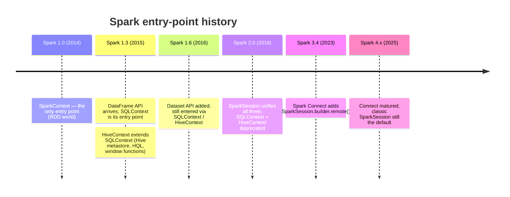
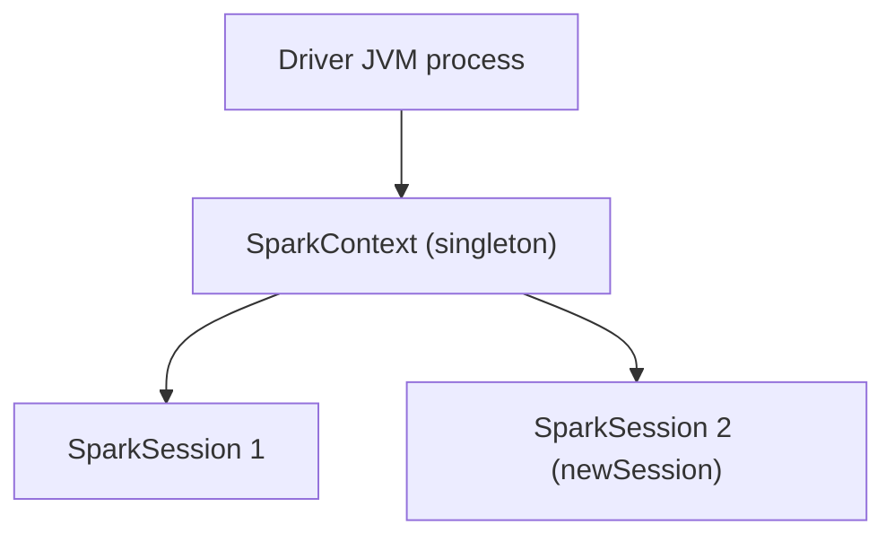

# Chapter 02 — SparkSession and Entry Points

> *Learning-path topic: B2 (Beginner)*
> *Written: 2026-06-05 · Spark 4.1.x / Python 3.10+*

> 🔄 **Needs revisiting — Spark 4.2.0 (flagged 2026-07-18).** Nothing below is wrong; it is incomplete. The 4.2.0 source re-trace found eleven `spark.connect.session.*` configs that postdate this chapter — plan caching (`planCache.enabled`, `alwaysCacheDataSourceReadsEnabled`), plan compression (`planCompression.threshold`, `defaultAlgorithm`), result chunking (`resultChunking.maxChunkSize`), and the ML cache memory controls. This chapter explains *which* session implementation you get but not what the Connect server then does with the plan, which is exactly what differs when a Connect session behaves unlike a classic one. Add a short subsection. Details in the [B2 source trace](../reference/spark-source-map/topics/b2.md).

Every PySpark program begins with a `SparkSession`. Before you can read a file, run a query, or train a model, you need this one object — and the few minutes spent understanding how it is created, what it actually spins up underneath, and how to configure it will save you hours of confusing failures later. This chapter walks that entry point end to end: building a session, the JVM and SparkContext it sits on, configuration that bites beginners, and Spark 4.x's classic-vs-Connect fork.

---

## What you'll be able to do

- Create a `SparkSession` with the builder pattern and run your first query
- Explain what `getOrCreate()` returns — and why it sometimes ignores your configuration
- Describe the JVM / SparkContext / SparkSession relationship and the "one context per JVM" rule
- Configure log verbosity, shuffle partitions, and network binding for local work
- Choose between classic mode and Spark Connect, and connect to a remote cluster

---

## Your first session

You construct a `SparkSession` with a **fluent builder**: each method returns the same builder object, so calls chain into one expression. You set a name, choose where to run, and finish with `getOrCreate()`.

```python
# Apache Spark 4.1.x / PySpark 4.1.x · Python 3.10+
from pyspark.sql import SparkSession

spark = (
    SparkSession.builder
    .appName("my-first-app")
    .master("local[*]")       # classic mode; use all available CPU cores
    .getOrCreate()
)

spark.sparkContext.setLogLevel("WARN")   # silence INFO noise

print(spark.version)         # 4.1.x
spark.range(5).show()
# +---+
# | id|
# +---+
# |  0|
# |  1|
# |  2|
# |  3|
# |  4|
# +---+
```

That is the whole ceremony. `SparkSession` is the unified entry point introduced in Spark 2.0 — one object that gives you DataFrames, SQL, streaming, and ML. It superseded the older `SparkContext` / `SQLContext` / `HiveContext` split, where you needed a different handle for each kind of work.

### A bit of history: why one object?

The single entry point is a relatively recent convenience. For Spark's first two years you juggled several:



- **Spark 1.0–1.2** — `SparkContext` (`sc`) was the *only* entry point. Everything was RDDs; there was no structured API.
- **Spark 1.3** — the **DataFrame** arrived and needed its own handle, so you wrapped `SparkContext` in a `SQLContext` — or in a `HiveContext` (which extends `SQLContext`) for Hive metastore access, HQL parsing, and window functions. You now needed *two* objects: `sc` for RDDs and a context for DataFrames.
- **Spark 1.6** — the typed **Dataset** API was added, but the entry points did not change. Three overlapping objects, with `HiveContext` strictly more capable than `SQLContext`, was now a genuine pain point.
- **Spark 2.0** — `SparkSession` collapsed `SQLContext` and `HiveContext` into one builder; `DataFrame` became an alias for `Dataset[Row]`; Hive support became a flag (`.enableHiveSupport()`) instead of a separate class. Both old contexts were **deprecated in 2.0.0**.

Two things did *not* happen. `SparkContext` was never deprecated — `SparkSession` wraps it, and it is still reachable via `spark.sparkContext` (this is the object the previous section describes). And the deprecated contexts were never removed — `SQLContext` and `HiveContext` still ship in Spark 4.x for backward compatibility, so decade-old code keeps running unchanged.

The first line of every example you write will look like this. The interesting part is the last method call — `getOrCreate()` — which does more (and less) than it appears.

---

## What `getOrCreate()` actually returns

The method name is literal: **get** an existing session if one is running in this process, otherwise **create** a new one. That word "get" hides a trap. If a session already exists — common in notebooks and REPLs, where a previous cell or import already built one — `getOrCreate()` returns that existing session and **silently ignores every `.config()` call on your builder**:

```python
# A session already exists in this kernel...
spark = (
    SparkSession.builder
    .config("spark.sql.shuffle.partitions", "4")   # ignored!
    .getOrCreate()
)
print(spark.conf.get("spark.sql.shuffle.partitions"))   # 200, not 4
```

To understand *why* it works this way, you need to see what lives underneath the session.

### The JVM and the SparkContext

PySpark is a Python wrapper around an engine written in Scala and Java. When you start a PySpark application, your Python process launches a **JVM** (Java Virtual Machine) alongside it — the driver JVM from Chapter 1 — and that JVM is where Spark's engine actually runs.

Inside that JVM sits the **SparkContext**: the application's handle on the Spark engine. When your code triggers an action, SparkContext receives the job and passes it to the DAGScheduler, which breaks it into stages and tasks; the TaskScheduler then assigns those tasks to available executor slots. SparkContext also holds the connection to the cluster manager and maintains a registry of RDDs that have been marked for persistence. Lower-level infrastructure — the broadcast system, the block manager, and the shuffle machinery — is managed by a companion environment object that SparkContext creates and owns.

Spark enforces a hard rule: **one SparkContext per JVM**. When a SparkContext is created it registers itself in a global variable in the Scala source, and any attempt to create a second one without stopping the first throws:

```
Only one SparkContext may be running in this JVM (see SPARK-2243)
```

The restriction exists because two contexts in one process would both try to own the cluster connection, bind the same ports, and manage the same thread pools — a recipe for resource conflicts. The single-context rule keeps the driver's state coherent.

This is the reason `getOrCreate()` ignores your config: the configuration that matters is baked into the SparkContext when it is *first* built, and since there can only be one context per JVM, a later builder cannot reconfigure the engine that is already running. It hands you the existing session instead. To force a fresh one with new config, shut the current session down first with `spark.stop()`, then rebuild.

### One context, many sessions

The singleton is the *context*, not the *session*. Many `SparkSession` objects can share one SparkContext via `spark.newSession()`. Each gets its own isolated namespace — temp views, SQL config, registered functions — while running on the same underlying engine:



```python
# Apache Spark 4.1.x / PySpark 4.1.x · Python 3.10+
spark1 = SparkSession.builder.appName("app").master("local[*]").getOrCreate()
spark2 = spark1.newSession()

spark1.sql("CREATE TEMP VIEW foo AS SELECT 1 AS x")
spark2.sql("SELECT * FROM foo")   # AnalysisException — foo doesn't exist in spark2
```

In practice you almost never need `newSession()` — one session per application is the norm. It exists for multi-tenant server scenarios (e.g. the Thrift Server) where different users need separate namespaces on a shared cluster.

`spark.cloneSession()` is the alternative when the child must *inherit* the parent's current configuration snapshot rather than starting from defaults. It copies the parent's `SessionState` (active SQL configs, registered UDFs, job tags) and forces eager initialisation so the child is ready to use immediately. Changes made to the clone do not propagate back:

```python
# Apache Spark 4.1.x / PySpark 4.1.x · Python 3.10+
child = spark.cloneSession()
child.conf.set("spark.sql.shuffle.partitions", "4")   # only affects child
print(spark.conf.get("spark.sql.shuffle.partitions"))  # parent unchanged
```

Use `newSession()` when you want a clean slate that shares the same engine; use `cloneSession()` when you want an isolated copy that inherits the parent's current settings.

For test harnesses, `SparkSession.builder.create()` (added in Spark 3.5.0) gives the opposite guarantee from `getOrCreate()`: it *always* forces a new session, bypassing the "get" half of `getOrCreate()`. A test that calls `getOrCreate()` may silently reuse a session left over from a previous test; `create()` prevents that.

```python
# In a test setup — guaranteed fresh session regardless of existing state
spark = SparkSession.builder.master("local").appName("test").create()
```

In **cluster mode** the rule applies per *driver process*, not per cluster. Each application has its own driver JVM with its own SparkContext and its own isolated executor JVMs — tasks from different applications never share a JVM. What is shared is the cluster manager (YARN, Kubernetes, Standalone master), which allocates resources to each application independently ([Cluster Mode Overview](https://spark.apache.org/docs/latest/cluster-overview.html)).

---

## Configuring a session

Configuration falls into two camps, and confusing them is a common source of "I set it but nothing changed."

- **Build-time configs** are fixed when the SparkContext is created and cannot change for the life of the process — `spark.master` and `spark.app.name` are the classic examples. 
- **Runtime configs** can be changed afterwards with `spark.conf.set(key, value)`; `spark.sql.shuffle.partitions` is one. When in doubt, ask Spark directly:

```python
spark.conf.isModifiable("spark.sql.shuffle.partitions")   # True
spark.conf.isModifiable("spark.master")                   # False
```

### Settings worth knowing for local work

```python
# Apache Spark 4.1.x / PySpark 4.1.x · Python 3.10+
import os
from pyspark.sql import SparkSession

# Fix network binding for laptops with VPN or Docker
os.environ["SPARK_LOCAL_IP"] = "127.0.0.1"

spark = (
    SparkSession.builder
    .appName("configured-app")
    .master("local[*]")
    .config("spark.log.level", "WARN")             # fires at startup, before any Spark logging
    .config("spark.sql.shuffle.partitions", "8")   # default 200 — far too many for a laptop
    .config("spark.ui.port", "4041")               # avoid port 4040 conflict with Docker
    .getOrCreate()
)

print(spark.conf.get("spark.sql.shuffle.partitions"))   # 8
```

Three of these deserve a closer look:

- **`SPARK_LOCAL_IP=127.0.0.1`** — set *before* creating the session. On laptops with a VPN or Docker, Spark may try to bind to the wrong network interface and fail at startup. Pinning it to loopback avoids the error.
- **`spark.log.level`** — the preferred way to silence Spark's INFO noise. Setting it in the builder fires at `SparkContext` startup, before any Spark logging begins, and also propagates to executors when `spark.executor.allowSyncLogLevel=true`. The in-code call `spark.sparkContext.setLogLevel("WARN")` works too, but it fires *after* startup and affects only the driver. Valid values: `ALL`, `DEBUG`, `INFO`, `WARN`, `ERROR`, `FATAL`, `OFF`.
- **`spark.sql.shuffle.partitions`** — the number of tasks Spark uses to redistribute data after `groupBy`, `join`, and `repartition`. The default is **200**, designed for large clusters with hundreds of cores. On a laptop processing a small dataset, 200 shuffle tasks produce 200 tiny files and pure scheduling overhead. Set it to roughly `2 × CPU cores` (8–16) for local development.

### Don't hard-code resources in application code

Settings like `spark.executor.memory`, `spark.executor.cores`, and `spark.driver.memory` are environment-specific — the right values differ between a laptop, a test cluster, and production. Embedding them in `.config(...)` makes the application non-portable. Let the environment own resource sizing: keep the code clean and pass resources at submit time.

```python
# Do this — environment-agnostic
spark = SparkSession.builder.appName("pipeline").getOrCreate()
```

```bash
# Pass resources at submit time, not in code
spark-submit \
  --executor-memory 8g \
  --executor-cores 4 \
  my_job.py
```

Resource sizing belongs in `spark-defaults.conf` or `spark-submit` flags. Application code should not care whether it runs on a laptop or a 200-node cluster.

### Shuffle partitions and AQE

How you set `spark.sql.shuffle.partitions` depends on whether **Adaptive Query Execution (AQE)** is on. AQE was introduced in Spark 3.0 and turned on by default in Spark 3.2 (so it is already on in 4.x). It re-optimises the physical plan at runtime — coalescing small shuffle partitions, handling skew, and switching join strategies based on actual partition sizes.

- **Local dev:** set shuffle partitions to `2 × CPU cores`. With AQE on, that mostly self-corrects, but a low starting point still avoids tiny-file sprawl.
- **Production with AQE:** set it high (e.g. 2000) and let AQE coalesce down. This handles both small and large datasets without manual tuning.

```python
# Production with AQE (already default on 3.2+/4.x; shown explicitly here)
spark = (
    SparkSession.builder
    .config("spark.sql.adaptive.enabled", "true")
    .config("spark.sql.shuffle.partitions", "2000")   # AQE will coalesce as needed
    .getOrCreate()
)
```

If you must support Spark < 3.2, enable AQE explicitly — `spark.sql.adaptive.enabled`, `spark.sql.adaptive.coalescePartitions.enabled`, and `spark.sql.adaptive.skewJoin.enabled`. On 3.2+ none of that is needed. AQE has its own chapter (Ch 21); for now, just know it is on and it influences how you size shuffles.

### Dynamic allocation for production

Static allocation reserves a fixed number of executors for the whole application regardless of load. Dynamic allocation lets Spark request more executors when tasks pile up and release idle ones when the workload drops — cheaper and more cooperative on a shared cluster.

```python
spark = (
    SparkSession.builder
    .config("spark.dynamicAllocation.enabled", "true")
    .config("spark.dynamicAllocation.minExecutors", "1")
    .config("spark.dynamicAllocation.maxExecutors", "50")
    .config("spark.dynamicAllocation.initialExecutors", "5")
    .getOrCreate()
)
```

On YARN and Standalone, dynamic allocation needs the external shuffle service so executors can be removed without losing shuffle data — and that service is **not** enabled by default (`spark.shuffle.service.enabled = true` on each worker). On Kubernetes, use shuffle tracking (`spark.dynamicAllocation.shuffleTracking.enabled = true`) instead, which needs no separate service.

---

## Classic mode vs Spark Connect

Spark 4.x ships two ways for your Python process to talk to the engine, and knowing which one you are in prevents baffling startup failures.

**Classic mode** is what every example so far has used: the Python process launches a local driver JVM and talks to it in-process. It remains the **default** for both the `pyspark` shell and `spark-submit`.

> **3-layer class split (Spark 4.x).** In the JVM source, `SparkSession` is split across three packages: `org.apache.spark.sql.SparkSession` (abstract API, shared by both modes), `org.apache.spark.sql.classic.SparkSession` (the classic implementation), and `org.apache.spark.sql.connect.SparkSession` (the Connect client). The Python import `from pyspark.sql import SparkSession` is unchanged — this split only surfaces in JVM stack traces and source browsing.

**Spark Connect** breaks that coupling. Instead of launching a local driver JVM, your Python process becomes a thin **client**: it sends an unresolved logical plan over gRPC to a separate Spark Connect server, and the server runs the engine and streams results back. The DataFrame API is identical — only the transport changes — but because the client no longer needs a local JVM, it is ideal for lightweight clients, IDEs, and embedding Spark in applications.

Connect is **opt-in** in 4.x. You enable it explicitly with `SPARK_REMOTE`, the `--remote` flag, `spark.api.mode=connect`, or the builder's `.remote(...)`:

```python
# Spark Connect — connects to a running Spark Connect server
# Start the server first: ./sbin/start-connect-server.sh
from pyspark.sql import SparkSession

spark = (
    SparkSession.builder
    .remote("sc://localhost:15002")
    .getOrCreate()
)

spark.range(5).show()   # identical API; only the transport layer differs
```

Start the server before you connect. With a tarball or pip install, the Connect server JARs ship with Spark 4.x, so no `--packages` is needed:

```bash
# Start the Spark Connect server (binds gRPC on port 15002 by default)
./sbin/start-connect-server.sh

# Stop it when done
./sbin/stop-connect-server.sh
```

In this project's Docker stack the Connect server is already running inside the `spark` container on port 15002 — you connect straight to `sc://localhost:15002` without starting anything yourself.

The most common Connect mistake is opting in without a server running: point at `sc://localhost:15002` with nothing listening and the session fails at startup. If you are not deliberately using Connect, you are in classic mode and do not need a server at all.

**`pyspark` shell and notebook bootstrap.** When you run `pyspark` (or open a Jupyter kernel that imports PySpark), the shell bootstraps via `shell.py` which calls `_create_shell_session()`. This function tries `enableHiveSupport()` first; if that fails (no Hive jars), it falls back to `_getActiveSessionOrCreate()` to build a plain session. Either way, it binds four globals for interactive use: `spark` (`SparkSession`), `sc` (`SparkContext`), `sql` (a shorthand for `spark.sql`), and `sqlContext` (a legacy `SQLContext` wrapper). You do not need to call `SparkSession.builder` in an interactive shell — `spark` is already there.

---

## Production habits

Three small disciplines separate a script that behaves on a shared cluster from one that annoys everyone else on it.

**Always set a meaningful `appName`.** It shows up in the Spark UI, the cluster manager's job list, and the logs. On a shared cluster running dozens of jobs, a name like `"test"` makes your job impossible to find. Use something that names the pipeline and environment — `"customer-churn-daily-prod"`.

**Always call `spark.stop()` when the application finishes.** Executors stay alive for the whole application lifetime; if you never stop the session, those processes keep holding cluster memory and CPU until the manager times them out, starving other users. (The method is `spark.stop()` — there is no `spark.close()`; calling it raises `AttributeError`.)

**Create the session once and pass it through.** Calling `getOrCreate()` in many modules is not *wrong* — it returns the same session — but it hides the data flow and makes the lifecycle hard to reason about. Build it in `main()`, pass it as a parameter, and stop it in a `finally`:

```python
def main():
    spark = SparkSession.builder.appName("customer-churn-daily-prod").getOrCreate()
    try:
        result = transform(spark, load(spark))
        result.write.parquet("output/")
    finally:
        spark.stop()
```

---

## Pitfalls worth memorising

- **`getOrCreate()` ignores your `.config()`** — if a session already exists (notebook kernel, REPL), you get it back unchanged. Call `spark.stop()` first, then rebuild.
- **`spark.close()` does not exist** — the shutdown method is `spark.stop()`; `close()` raises `AttributeError`.
- **Spark Connect with no server** — opting in (`--remote`, `SPARK_REMOTE`, `spark.api.mode=connect`) but nothing listening on the port fails at startup. Classic mode is the default and needs no server.
- **Changing a build-time config mid-session** — `spark.master` and `spark.app.name` are fixed at `getOrCreate()`. Use `spark.conf.set()` only for runtime-settable keys; check with `spark.conf.isModifiable(key)`.
- **200 shuffle partitions on a laptop** — the default suits large clusters, not local work. Set `2 × CPU cores` for development.

---

## Exercises

1. **Recall** — You run a notebook cell that calls `SparkSession.builder.config("spark.sql.shuffle.partitions", "4").getOrCreate()`. A session already exists. What does `spark.conf.get("spark.sql.shuffle.partitions")` return afterward?

   **Answer:** The existing session is returned unchanged — the `.config(...)` call is silently ignored. You get whatever was set when the original session was created (likely `200`, the default).

2. **Apply** — Create a `SparkSession`, print `spark.conf.get("spark.sql.shuffle.partitions")`, then use `spark.conf.set()` to change it to `16` and print again. What does this confirm about runtime vs build-time configuration?

   **Answer:** It returns `200` initially, then `16` after `spark.conf.set(...)`. This confirms `spark.sql.shuffle.partitions` is **runtime-settable** — changeable after session creation. Build-time configs like `spark.master` are fixed at `getOrCreate()` and cannot change mid-session.

3. **Extend** — Compare `master("local")`, `master("local[2]")`, and `master("local[*]")` by creating sessions with each and checking `spark.sparkContext.defaultParallelism`. What drives the value?

   **Answer:**

   | `--master` | `defaultParallelism` | Why |
   |---|---|---|
   | `local` | `1` | One thread, one task at a time |
   | `local[2]` | `2` | Exactly 2 threads |
   | `local[*]` | number of CPU cores | Spark reads `Runtime.getRuntime.availableProcessors()` |
   | `local[2,3]` | `2` | 2 threads; max 3 task failures before aborting. This is the **only way to test task-retry logic in local mode** — the default in local mode is 1 failure allowed regardless of `spark.task.maxFailures`. |

   In local mode `defaultParallelism` equals the number of threads. On a cluster it is the total number of executor cores instead.

---

## Summary

- `SparkSession` is the single entry point for all PySpark work, built with `SparkSession.builder.getOrCreate()`.
- `getOrCreate()` returns an existing session if one is running — its `.config()` calls are silently ignored — because configuration is baked into the SparkContext when it is first created.
- There is one `SparkContext` per JVM (per driver process): a singleton owning the cluster connection, thread pools, shuffle manager, and RDD lineage. Many `SparkSession` objects can share it via `newSession()`, each with an isolated namespace.
- Configs are build-time (fixed, e.g. `spark.master`) or runtime (settable, e.g. `spark.sql.shuffle.partitions`); check with `spark.conf.isModifiable()`.
- Set `SPARK_LOCAL_IP=127.0.0.1` before creation on VPN/Docker laptops; set shuffle partitions to `2 × CPU cores` locally; never hard-code resource sizing in code.
- Spark 4.x offers classic mode (default) and opt-in Spark Connect (`--remote` / `SPARK_REMOTE` / `spark.api.mode=connect`); the DataFrame API is identical across both.
- Chapter 3 builds on this by introducing the DataFrame API — the primary tool for data manipulation.

---

## References

- [PySpark SparkSession API](https://spark.apache.org/docs/latest/api/python/reference/pyspark.sql/api/pyspark.sql.SparkSession.html)
- [Spark Connect overview](https://spark.apache.org/docs/latest/spark-connect-overview.html)
- [Spark configuration reference](https://spark.apache.org/docs/latest/configuration.html)
- [Cluster Mode Overview](https://spark.apache.org/docs/latest/cluster-overview.html)
- [SPARK-2243: Support multiple SparkContexts in the same JVM](https://issues.apache.org/jira/browse/SPARK-2243)
