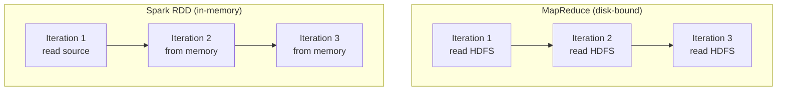
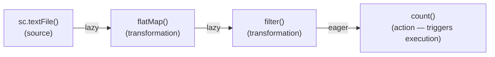
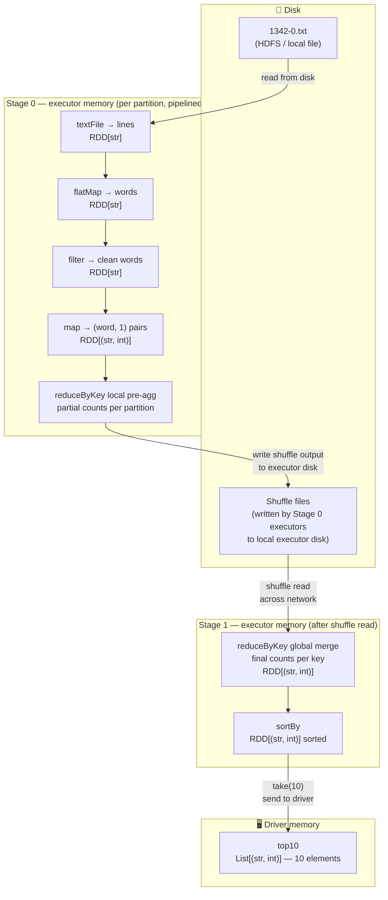
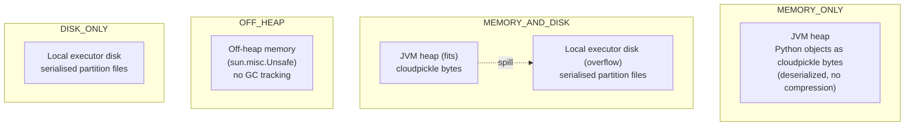
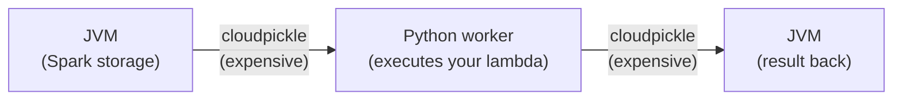

# Chapter 05 — RDD Fundamentals

> *Learning-path topic: I16 (Intermediate)*
> *Written: 2026-05-31 · Spark 4.1.x / Python 3.10+*

!!! warning "🔄 Needs revisiting — I16 completeness pass (flagged 2026-07-18)"
    The 4.1.2 trace closed every gap in this chapter, and its anchors have now been re-verified against 4.2.0 (22 line numbers had drifted). The completeness pass added five gaps from layers that trace never examined; one is a scoping statement the chapter needs near the top rather than as a detail.

    **The RDD API is classic-mode only.** `df.rdd` raises `PySparkNotImplementedError` under Spark Connect, and the Connect client has no `RDD` class. Connect is the default `pyspark` REPL mode in 4.x, so a reader following this chapter in a default 4.x shell may find none of it available. (The 4.2.0 notes' "RDD API compatibility" heading is misleading — the items under it are DataFrame methods that reduce the *need* for RDDs, not RDD support. Verified at source.)

    Also missing: `SparkContext.clean` as the machinery behind `Task not serializable` — the chapter covers the closure-capture bug but not the mechanism that reports it; RDD aggregations spilling via `ExternalAppendOnlyMap`/`ExternalSorter`, the RDD-level analogue of the aggregate spill in Ch09; `repartition` being literally `coalesce(n, shuffle = true)`, which collapses two APIs into one parameter; and `take()` potentially submitting several jobs, which confuses job counts in the UI. Full list in the [I16 source trace](../reference/spark-source-map/topics/i4.md).

    **Added to the topic 2026-08-10** (core-rdd feature-history audit), so the chapter is now behind the path on these too — all **incomplete**, not wrong: `toDebugString()` as the way to *see* a lineage, and the PySpark quirk that it returns `Optional[bytes]` rather than `str`; `top`/`takeOrdered`; `pipe(command, env, checkCode)`, whose `checkCode` defaults to `False` so a failing subprocess is ignored; `StatCounter` via `rdd.stats()`/`.asDict()`, one pass instead of five actions; and the fact that `zipPartitions` and `getPersistentRDDs` are **Scala/Java-only** and cannot be written in PySpark at all. Broadcast variables and RDD checkpointing, which this chapter also predates, now belong to **I47** and **I25** rather than here.

The RDD (Resilient Distributed Dataset) is Spark's original data model — a schema-free distributed collection of Python objects. Understanding it explains what the DataFrame API is built on and reveals when to reach below the DataFrame abstraction.

---

## What you'll learn

- What an RDD is, what problem it solved, and where it sits in Spark today
- All the ways to create an RDD manually
- The programming model: transformations vs actions, lazy evaluation, narrow vs wide
- Why higher-order functions (`map`, `flatMap`, `filter`) are the core RDD API
- How closures are shipped to executors — and why mutating driver state inside one silently fails on a cluster
- How data moves between disk, executor memory, and the driver during execution
- How RDD partitions are stored — `MEMORY_ONLY`, `MEMORY_AND_DISK`, `OFF_HEAP`
- The Python-JVM serialisation cost and why it matters
- How to convert between RDDs and DataFrames

---

## What is an RDD?

An **RDD** — Resilient Distributed Dataset — is Spark's original data abstraction, introduced in Matei Zaharia's 2012 paper and shipped as the primary user-facing API in Spark 1.0 (2014). Every higher-level abstraction in Spark — DataFrames, Datasets, Structured Streaming — compiles down to RDDs at execution time.

The name breaks down precisely:

**Resilient** — if a partition is lost (executor crash, node failure), Spark does not need a backup copy of the data. Instead it recomputes the lost partition from its **lineage**: the recorded sequence of transformations that produced it. This is fault tolerance through recomputation, not replication.

**Distributed** — an RDD is split into **partitions**, each assigned to a different executor on a different machine. All partitions process in parallel. The number of partitions controls the degree of parallelism.

**Dataset** — an immutable collection of elements. Once created, an RDD cannot be modified. Every transformation (`map`, `filter`, `reduce`) produces a *new* RDD; the original is unchanged. Immutability is what makes lineage-based recovery safe — any partition can always be recomputed from its parent.

### The problem RDDs solved

Before Spark, Hadoop MapReduce was the standard for large-scale distributed computation. MapReduce had one critical constraint: **every intermediate result had to be written to HDFS** (disk) between stages. There was no way to hold data in memory across multiple operations.

This made two classes of computation prohibitively slow:

- **Iterative algorithms** (machine learning, graph processing) — each iteration required a full HDFS read of the dataset. A logistic regression needing 50 iterations triggered 50 full disk reads.
- **Interactive analytics** — every exploratory query was a separate job reading the same data from disk. Re-querying the same dataset 10 times meant 10 full disk reads.

RDDs solved both by letting users **explicitly cache a dataset in memory** across operations. After the first computation, the data stays on executors. Subsequent operations read from RAM instead of HDFS — 10–100× faster.



### Where RDDs sit today

RDDs are still fully present in Spark 4.1.x — they have not been deprecated. But for structured (tabular) data, the **DataFrame API** (Spark 1.3+) is almost always the right choice: it adds a schema, the Catalyst query optimiser, and Tungsten's off-heap binary storage, giving significantly better performance for typical ETL workloads.

**Paper benchmarks (Zaharia et al., NSDI 2012)** — these numbers are what motivated the design:

| Workload | Spark vs Hadoop | Notes |
|---|---|---|
| Logistic regression (100 GB, 100 nodes) | **25.3× faster** than Hadoop | Avoids disk I/O + deserialization on every iteration |
| Logistic regression vs HadoopBinMem | **20.7× faster** | Even beating Hadoop with in-memory binary format |
| PageRank without co-partitioning | **2.4× faster** than Hadoop | Shuffles links + ranks on every iteration |
| PageRank with co-partitioning | **7.4× faster** than Hadoop | Join becomes narrow — no shuffle per iteration |
| Interactive query on 1 TB | **5–7 seconds** | vs 170 seconds from disk — ~24–34× faster |

The PageRank row shows the impact of `partitionBy()` directly: the difference between 2.4× and 7.4× is one call to co-partition the links and ranks RDDs before the iteration loop.

Use the RDD API when:

- Data is genuinely unstructured (log lines, binary blobs, arbitrary Python objects)
- You need a custom algorithm with no relational equivalent (graph traversal, iterative ML from scratch)
- You are reading a pipeline that was written before Spark 1.3

### The RDD internal interface

Every RDD — whether created by `sc.textFile()`, `sc.parallelize()`, or any transformation — exposes five pieces of information through a common interface. This is what the DAGScheduler reads to build stages, assign tasks, and recover from failures.

| Interface method | What it returns | Example (word count) |
|---|---|---|
| `partitions()` | List of `Partition` objects — the atomic dataset pieces | `textFile("1342-0.txt")` returns 4 partitions (one per 128 MB HDFS block) |
| `preferredLocations(p)` | DataNode addresses where partition `p` can be read without network transfer | HDFS block replica locations for partition `p` |
| `dependencies()` | List of dependencies on parent RDDs — each is either `NarrowDependency` or `ShuffleDependency` | `map` → `NarrowDependency`; `reduceByKey` → `ShuffleDependency` |
| `iterator(p, parentIters)` | Computes the elements of partition `p` given iterators over parent partitions | Applies `flatMap(line.split())` to each element yielded by the parent iterator |
| `partitioner()` | `None` for most RDDs; a hash partitioner after `partitionBy(n)` | `None` on raw `textFile`; a `portable_hash`-based partitioner after `partitionBy(4)` |

**Why this matters:**

- `dependencies()` is what tells the scheduler whether a stage boundary (shuffle) is needed. A `NarrowDependency` means the child can pipeline; a `ShuffleDependency` means a new stage must start.
- `preferredLocations(p)` is how Spark implements data locality — the scheduler tries to assign each task to the node that holds its partition, avoiding network reads.
- `iterator(p, parentIters)` is the computation itself — it is called lazily, one element at a time, enabling pipelining. No intermediate RDD is ever fully materialised in memory.
- `partitioner()` is what makes `join()` between co-partitioned RDDs narrow: both RDDs return the same partitioner, so the scheduler knows keys are already co-located (covered in detail under [Custom partitioning](#custom-partitioning-with-partitionby) below).

This interface is also what makes RDDs composable: any user-defined transformation only needs to implement these five methods to integrate seamlessly with the scheduler, storage system, and fault recovery mechanism.

---

## Creating an RDD

All RDD creation goes through `SparkContext`, accessed via `spark.sparkContext`. The methods you'll use in practice:

### `sc.parallelize()` — from an in-memory collection

Distributes a Python list, tuple, or any iterable across partitions. The entire collection must fit in driver memory — use this for small seed data and test fixtures, not large datasets.

```python
# Apache Spark 4.1.x / PySpark 4.1.x · Python 3.10+
sc = spark.sparkContext

numbers = sc.parallelize([1, 2, 3, 4, 5])
mixed   = sc.parallelize([1, "two", 3.0, {"four": 4}])  # any picklable objects

# Control the partition count explicitly (default: sc.defaultParallelism)
numbers_4p = sc.parallelize(range(100), 4)
print(numbers_4p.getNumPartitions())  # 4
```

**`defaultParallelism` formula.** When `numSlices` is omitted, the default comes from `sc.defaultParallelism`, which equals the total core count across all executors (minimum 2). In local mode `local[N]` it is N; `local[*]` uses the available CPU count. `spark.default.parallelism` overrides this when set explicitly. This same value controls the default shuffle output partition count — so if you never set `spark.default.parallelism`, your shuffle partition count silently tracks the cluster's core count.

### `sc.textFile()` — from a text file (one element per line)

Reads a text file and returns one string element per line. Supports local paths, HDFS, S3, GCS, and wildcards.

```python
# Apache Spark 4.1.x / PySpark 4.1.x · Python 3.10+
lines = sc.textFile("../data/gutenberg_books/1342-0.txt")
# RDD[str] — each element is one line of the file

# Wildcards and directories
all_logs = sc.textFile("logs/*.gz")          # compressed files supported
hdfs_data = sc.textFile("hdfs:///data/*.txt")

# Default partitions: one per HDFS block (128 MB); override with second arg
lines_8p = sc.textFile("data.txt", 8)
```

### `sc.wholeTextFiles()` — one record per file

Returns `(filename, content)` pairs — the entire file content as one string per record. Useful when you need to process each file as a unit (e.g. JSON documents, small configs).

```python
# Apache Spark 4.1.x / PySpark 4.1.x · Python 3.10+
file_rdd = sc.wholeTextFiles("../data/gutenberg_books/")
# RDD[(str, str)] — (path, full_file_content)

for path, content in file_rdd.take(1):
    print(path)             # file:/.../1342-0.txt
    print(len(content))     # character count of the whole file
```

### `sc.range()` — integer sequence

Creates a partitioned RDD of integers. More efficient than `parallelize(range(...))` because it delegates to the JVM, which encodes each partition as a pair of start/end integers and generates values lazily on the executor. `sc.parallelize(range(N))` iterates the Python range into a full Python list on the driver before distributing it; for large N this allocates all N integers in driver memory. Prefer `sc.range()` for large integer sequences.

```python
# Apache Spark 4.1.x / PySpark 4.1.x · Python 3.10+
rdd = sc.range(1_000_000)               # 0 to 999,999
rdd = sc.range(start=0, end=100, step=2)  # even numbers 0–98
rdd = sc.range(100, numSlices=4)         # 4 partitions
```

### `df.rdd` — from a DataFrame

Drops to the RDD layer from an existing DataFrame. Each element becomes a `Row` object. **Avoid this** unless you genuinely need the RDD API — it abandons Catalyst and Tungsten and serialises every row across the py4j bridge.

```python
# Apache Spark 4.1.x / PySpark 4.1.x · Python 3.10+
df = spark.createDataFrame([(1, "alice"), (2, "bob")], ["id", "name"])
row_rdd = df.rdd
# RDD[Row] — Row(id=1, name='alice'), Row(id=2, name='bob')
print(row_rdd.collect())
```

### Binary and Hadoop formats

Beyond text, `SparkContext` can read and write the binary formats Spark inherited from Hadoop. These are niche in a PySpark/DataFrame world — for tabular data you would reach for `spark.read.parquet` instead — but they appear in older RDD pipelines and when interoperating with Hadoop systems.

| Method | Direction | Format |
|---|---|---|
| `sc.pickleFile(path)` / `rdd.saveAsPickleFile(path)` | read / write | PySpark's own format — Python objects serialised with pickle, batched. The PySpark equivalent of Scala's `objectFile`/`saveAsObjectFile`. |
| `sc.sequenceFile(path, keyClass, valueClass)` / `rdd.saveAsSequenceFile(path)` | read / write | Hadoop `SequenceFile` — flat binary key-value records, with Writable types converted to/from Python via PySpark's converter layer |
| `sc.hadoopFile(...)` / `sc.newAPIHadoopFile(...)` | read | Any Hadoop `InputFormat` — the old (`mapred`) and new (`mapreduce`) APIs respectively; lets you plug in arbitrary formats (HBase, Cassandra, custom) |

```python
# Apache Spark 4.1.x / PySpark 4.1.x · Python 3.10+
sc = spark.sparkContext

# PySpark pickle format — round-trips arbitrary Python objects
sc.parallelize([("a", 1), ("b", 2)]).saveAsPickleFile("out/pickled")
restored = sc.pickleFile("out/pickled")
print(restored.collect())   # [('a', 1), ('b', 2)]
```

For new code, prefer `spark.read` / `df.write` with Parquet or Delta — they are columnar, splittable, schema-aware, and far faster than these RDD-era formats. Reach for `sequenceFile`/`hadoopFile` only when an existing Hadoop system forces the format on you.

### Quick reference

| Method | Input | Element type | Default partitions | Use when |
|---|---|---|---|---|
| `sc.parallelize(col)` | Python collection | Any picklable object | `sc.defaultParallelism` | Small in-memory data, test fixtures |
| `sc.textFile(path)` | Text file / glob | `str` (one per line) | 1 per 128 MB HDFS block | Line-oriented text data |
| `sc.wholeTextFiles(path)` | Directory of files | `(path, content)` tuple | Data-locality dependent | One document per file |
| `sc.range(n)` | Integer range | `int` | `sc.defaultParallelism` | Synthetic/test integer data |
| `df.rdd` | DataFrame | `Row` | Same as DataFrame | Rarely — only when DataFrame can't express the operation |

### Inspecting an RDD

Four utility methods that don't do any distributed computation — they interrogate the RDD's local metadata:

| Method | What it returns |
|---|---|
| `rdd.getNumPartitions()` | Partition count; use to verify before/after `repartition`/`coalesce` |
| `rdd.id` | Unique integer ID auto-assigned at construction; appears in driver logs |
| `rdd.name` / `rdd.setName("tag")` | Mutable label propagated to Spark UI job and stage names |
| `rdd.toDebugString()` | Full lineage tree with partition counts, storage-level annotations, and `ShuffleDependency` boundaries |
| `rdd.glom()` | Returns `RDD[list]` — each partition's elements as a single list; lets the driver inspect per-partition contents without a shuffle |

```python
# Apache Spark 4.1.x / PySpark 4.1.x · Python 3.10+
sc = spark.sparkContext

words = sc.textFile("data.txt").flatMap(str.split).filter(str.isalpha)
words.setName("clean_words")

print(words.getNumPartitions())   # e.g. 2
print(words.toDebugString())
# (2) clean_words PythonRDD[5] at RDD at PythonRDD.scala:53
#  |  filter PythonRDD[4] ...
#  |  flatMap PythonRDD[3] ...
#  |  data.txt MapPartitionsRDD[2] at textFile at NativeMethodAccessorImpl
#  |  data.txt HadoopRDD[1] at textFile at NativeMethodAccessorImpl

# glom — inspect contents per partition (pulls each partition to driver as a list)
sc.parallelize([1, 2, 3, 4], 2).glom().collect()   # [[1, 2], [3, 4]]
```

`toDebugString` is the first thing to check when a job is slower than expected: the `+-(n)` prefix marks a shuffle boundary and tells you how many stages the plan has. `glom()` is the tool for confirming partition skew — if one partition's list is 10× longer than the others, that partition is doing 10× the work.

---

## The RDD programming model

RDD operations fall into exactly two categories: **transformations** and **actions**. Understanding the difference is the foundation of everything else.

Most RDD transformations — `map`, `flatMap`, `filter` — are **higher-order functions**: they take another function as their argument and apply it to the data. The function you pass (a lambda or a named function) defines *what* to do; the RDD operation defines *how* to distribute that work across partitions. This is the same pattern as Python's built-in `map()` and `filter()`, extended to run across a cluster.

```python
# Python built-in map — single machine
list(map(lambda x: x * 2, [1, 2, 3]))      # [2, 4, 6]

# Spark RDD map — distributed across a cluster
sc.parallelize([1, 2, 3]).map(lambda x: x * 2).collect()  # [2, 4, 6]
```

The API is intentionally identical. The difference is that your lambda is cloudpickled and shipped to executors where it runs in parallel on each partition.

### Transformations — lazy, return a new RDD

A transformation records an instruction and returns a new RDD immediately, without reading any data. Nothing executes. Spark builds a DAG (directed acyclic graph) of transformations — the lineage — and waits.

```python
# Apache Spark 4.1.x / PySpark 4.1.x · Python 3.10+
sc = spark.sparkContext

lines  = sc.textFile("data.txt")           # no data read yet
words  = lines.flatMap(lambda l: l.split()) # still nothing
clean  = words.filter(lambda w: len(w) > 3) # still nothing
```

Every line above executes in microseconds. No cluster work happens until an action is called.

### Actions — eager, trigger execution and return a result

An action submits the DAG to the scheduler, which computes it and returns either a value to the driver or writes to storage.

```python
print(clean.count())       # NOW the cluster works — action triggers execution
print(clean.take(5))       # another action — re-executes the whole plan
clean.saveAsTextFile("out/") # another action — writes to disk
```

Each action re-executes the full lineage from source unless the RDD is cached.

### The lazy evaluation DAG



### Narrow vs wide transformations

The most important property of a transformation is whether it is **narrow** or **wide** — this determines whether a shuffle occurs.

| Type | Definition | Examples | Shuffle? |
|---|---|---|---|
| **Narrow** | Each parent partition is used by **at most one** child partition | `map`, `filter`, `flatMap`, `mapPartitions`, `union` | No — fast, pipelined |
| **Wide** | Multiple child partitions may depend on the **same** parent partition | `groupByKey`, `reduceByKey`, `sortBy`, `distinct`, `join` (if not co-partitioned) | Yes — expensive, stage boundary |

Wide transformations trigger a **shuffle** — data must move across executors, regrouped by key. This is the most expensive operation in Spark. Prefer `reduceByKey` over `groupByKey` whenever possible: `reduceByKey` pre-aggregates locally per partition before shuffling; `groupByKey` shuffles all values first.

### Custom partitioning with `partitionBy()`

First, a distinction that the rest of this section depends on — **a partition is not the same thing as a partitioner:**

- A **partition** is a physical chunk of the data. *Every* RDD has partitions from the moment it is created — `textFile` makes one per HDFS block, `parallelize` splits the collection into `numSlices` pieces. Partitions are about *how many* pieces the data is in.
- A **partitioner** is a *rule* that decides **which key goes into which partition**. It is about *where* a given key lives. Most RDDs have **no partitioner at all** — `rdd.partitioner` returns `None`. When you `parallelize` a list or read a `textFile`, elements are assigned to partitions arbitrarily (by position or block), with no relationship between an element's *key* and its partition number.

A partitioner only appears on **key-value RDDs**, and only after an operation that imposes one: `partitionBy(n)` sets one, and shuffle operations like `reduceByKey` and `groupByKey` leave one behind as a side effect. The rule it applies is `partition = hash(key) % n` — so a given key is *deterministically* sent to the same partition number every time the same partitioner is applied.

Concretely, the partitioner is a small object that bundles two things: **how many** partitions there are (`n`), and the **function** that maps a key to a partition number (`partitionFunc`). The default `partitionFunc` is `portable_hash` — a hash that returns the same value in every executor process, which is what makes the placement consistent across the cluster.

```python
sc.parallelize([("a", 1), ("b", 2)]).partitioner          # None — no rule
sc.parallelize([("a", 1), ("b", 2)]).partitionBy(4).partitioner
# <pyspark...Partitioner object> — keys now placed by portable_hash(key) % 4
```

This is the foundation for everything below: two RDDs are **co-partitioned** when they carry the *same* partitioner and the *same* number of partitions — which guarantees that any given key sits in the same partition number in both, on the same executor. PySpark compares partitioners by both the partition count *and* the partition function (`Partitioner.__eq__`), which is what lets the engine recognise the join as narrow.

By default Spark assigns keys to partitions arbitrarily (no partitioner). For key-value RDDs that are joined repeatedly, explicitly imposing a partitioner eliminates the shuffle entirely — the most impactful single optimisation available in the RDD API.

**The rule:** if two RDDs share a partitioner (same partitioner type, same number of partitions), a `join()` between them requires **no data movement** — each key's values are already co-located on the same executor.

```python
# Apache Spark 4.1.x / PySpark 4.1.x · Python 3.10+
from pyspark.sql import SparkSession

sc = spark.sparkContext

# Without partitionBy — every join shuffles both RDDs
links = sc.parallelize([("a", ["b", "c"]), ("b", ["a"]), ("c", ["a", "b"])])
ranks = sc.parallelize([("a", 1.0), ("b", 1.0), ("c", 1.0)])

# join triggers a shuffle — links and ranks have no matching partitioner
joined = links.join(ranks)   # wide, data moves

# With partitionBy — co-partition both RDDs once, then all joins are narrow
# partitionBy(numPartitions) — just pass the number of partitions;
# the default partitionFunc is portable_hash
n = 4
links_p = links.partitionBy(n).cache()   # partition once, reuse
ranks_p = ranks.partitionBy(n)           # same n → same hash boundaries

# join is now narrow — keys guaranteed to be on the same partition
joined_p = links_p.join(ranks_p)   # no shuffle
```

**Why "repeatedly" is the operative word.** `partitionBy` is *itself* a shuffle — co-partitioning the data the first time costs exactly one shuffle. Join two RDDs only once and you have paid for a shuffle either way; there is no win. The payoff comes from amortization: pay the shuffle **once**, then every subsequent join is free.

```
One-time cost:   partitionBy        → 1 shuffle
Then:            join #1, #2, #3, … → 0 shuffles each
```

This is exactly the PageRank pattern — `links` is joined against `ranks` once *per iteration*, for 10–50 iterations. Partition `links` once, `.cache()` it so the partitioned form is reused rather than recomputed from lineage on every iteration, and every iteration's join after the first is a narrow, shuffle-free operation. Spark decides this per input RDD at join time: internally `CoGroupedRDD` checks `if (rdd.partitioner == Some(part))` and emits a narrow `OneToOneDependency` when the partitioners already match, falling back to a `ShuffleDependency` only when they do not.

The Zaharia et al. (2012) PageRank experiment measured this directly: with co-partitioning, PageRank ran **7.4× faster** than Hadoop; without it, only **2.4×**. The difference is entirely the eliminated shuffle.

**`mapValues()` preserves the partitioner; `map()` does not.** When you apply `map()` to a partitioned `(K, V)` RDD, Spark cannot guarantee the keys are unchanged, so it drops the partitioner. `mapValues(f)` — which only transforms the values — keeps it:

```python
# map() — partitioner lost, next join will shuffle
ranks_wrong = ranks_p.map(lambda kv: (kv[0], kv[1] * 0.85))

# mapValues() — partitioner preserved, next join stays narrow
ranks_ok = ranks_p.mapValues(lambda v: v * 0.85)
```

### Core transformations

| Transformation | What it does | Narrow / Wide |
|---|---|---|
| `map(f)` | Apply `f` to every element — 1-in, 1-out | Narrow |
| `flatMap(f)` | Apply `f` to every element — 1-in, 0-or-more-out | Narrow |
| `filter(f)` | Keep elements where `f(x)` is truthy | Narrow |
| `mapPartitions(f)` | Apply `f` to each partition as an iterator — one call per partition, not one per element | Narrow |
| `distinct()` | Remove duplicate elements | Wide (shuffle) |
| `union(other)` | Concatenate two RDDs | Narrow |
| `reduceByKey(f)` | For `(K, V)` pairs — aggregate values per key; pre-aggregates locally first | Wide (shuffle) |
| `groupByKey()` | For `(K, V)` pairs — group all values per key; **shuffles everything** | Wide (shuffle) |
| `mapValues(f)` | For `(K, V)` pairs — apply `f` to values only; **preserves partitioner** | Narrow |
| `join(other)` | For `(K,V)` + `(K,W)` — inner join → `(K,(V,W))`; narrow if co-partitioned | Wide (unless co-partitioned) |
| `cogroup(other)` | For `(K,V)` + `(K,W)` — group all values per key → `(K,(Seq[V],Seq[W]))` | Wide (shuffle) |
| `sortBy(f)` | Sort elements by arbitrary key function | Wide (shuffle) |
| `sortByKey(ascending=True)` | Sort a `(K, V)` RDD by key — equivalent to the paper's `sort(c: Comparator[K])`; differs from `sortBy(f)` which sorts by any function | Wide (shuffle) |
| `sample(withReplacement, fraction, seed)` | Random sample; `seed` makes sampling deterministic and reproducible | Narrow |
| `cartesian(other)` | Cartesian product of two RDDs → `(T, U)` pairs; result has `M × N` rows — **use with care** | Wide (very expensive) |
| `aggregateByKey(zeroValue, seqFunc, combFunc)` | For `(K, V)` pairs — aggregate per key with a different result type than the values; like `reduceByKey` but the accumulator type can differ from `V` | Wide (shuffle) |
| `intersection(other)` | Elements present in **both** RDDs, deduplicated | Wide (shuffle) |
| `repartition(n)` | Reshuffle into exactly `n` partitions, evenly balanced — increases *or* decreases the count | Wide (full shuffle) |
| `coalesce(n)` | Reduce to `n` partitions by **merging** adjacent ones — no shuffle, but can leave uneven partitions; decrease only | Narrow (no shuffle) |
| `repartitionAndSortWithinPartitions(p)` | Repartition by partitioner `p` **and** sort within each partition in one shuffle — cheaper than `repartition` then `sortBy` | Wide (shuffle) |
| `pipe(command)` | Stream each partition through an external shell command (e.g. a Perl/C binary), one line per element | Narrow |

**`mapPartitions` vs `map` — when to choose.** `map(f)` calls `f` once per element. `mapPartitions(f)` calls `f` once per partition, receiving an iterator of all elements. Use `mapPartitions` whenever there is any per-partition initialization cost — opening a database connection, compiling a regex, loading a model — so that cost is paid once per partition rather than once per row.

```python
# Apache Spark 4.1.x / PySpark 4.1.x · Python 3.10+
import sqlite3
sc = spark.sparkContext

def write_to_db(records):
    conn = sqlite3.connect("out.db")   # one connection per partition
    conn.executemany("INSERT INTO t VALUES (?,?)", records)
    conn.commit(); conn.close()
    return iter([])

rdd.mapPartitions(write_to_db).count()
```

```python
# Apache Spark 4.1.x / PySpark 4.1.x · Python 3.10+
sc = spark.sparkContext

# sortByKey — sort a (K, V) RDD by key
pairs = sc.parallelize([("banana", 3), ("apple", 1), ("cherry", 2)])
pairs.sortByKey().collect()            # [('apple', 1), ('banana', 3), ('cherry', 2)]
pairs.sortByKey(ascending=False).collect()  # [('cherry', 2), ('banana', 3), ('apple', 1)]

# sample — reproducible with seed
rdd = sc.range(100)
rdd.sample(withReplacement=False, fraction=0.1, seed=42).collect()
# Returns same ~10 elements every time seed=42 is used

# cartesian — all combinations of two small RDDs
colors = sc.parallelize(["red", "blue"])
sizes  = sc.parallelize(["S", "M", "L"])
colors.cartesian(sizes).collect()
# [('red','S'), ('red','M'), ('red','L'), ('blue','S'), ('blue','M'), ('blue','L')]
# Result: 2 × 3 = 6 elements — grows as M×N, avoid on large RDDs
```

### Core actions

| Action | What it returns | Warning |
|---|---|---|
| `collect()` | All elements as a Python list | Loads entire RDD into driver memory — only safe on small RDDs |
| `count()` | Number of elements | Triggers full scan |
| `first()` | First element | |
| `take(n)` | First `n` elements as a list | Adaptive multi-round scan — reads only as many partitions as needed |
| `reduce(f)` | Single value — folds all elements using `f`; `f` must be commutative and associative | |
| `saveAsTextFile(path)` | None — writes RDD as text files to path | |
| `foreach(f)` | None — runs `f` on each element for side effects | `f` runs on executors, not the driver |
| `lookup(key)` | List of values for `key` — only works on hash/range partitioned RDDs | Efficient random access — reads only the relevant partition |
| `fold(zeroValue, op)` | Like `reduce` but with a zero value — `op` must still be associative; `zeroValue` is applied once per partition | `zeroValue` is added per partition, not once overall |
| `aggregate(zeroValue, seqOp, combOp)` | General fold where the result type differs from the element type — `seqOp` merges elements into the accumulator, `combOp` merges accumulators | Most general aggregation action |
| `takeOrdered(n, key)` | Smallest `n` elements by natural order or `key` function | Avoids a full sort + collect |
| `takeSample(withReplacement, n, seed)` | Exactly `n` random elements as a driver list | Fixed count (unlike `sample`, which takes a fraction) |
| `countByKey()` | For `(K, V)` pairs — `dict` of `{key: count}` | Result collected to driver — safe only if keys are few |
| `foreachPartition(f)` | Run `f` once per partition, passed an iterator of its elements | Use for per-partition setup (open one DB connection per partition, not per row) |

**`take(n)` adaptive scanning.** `take` does not scan all partitions upfront. It starts by scanning `spark.rdd.limit.initialNumPartitions` partitions (default: 1). If the result is still short it retries with a geometrically larger count, multiplying by `spark.rdd.limit.scaleUpFactor` (default: 4) each round. This means `take(1)` on a 10,000-partition RDD reads only the first partition, not all 10,000. On a dataset where the first partition is very sparse or skewed, raise `spark.rdd.limit.initialNumPartitions` to avoid many round-trips.

### A complete example — data in memory and on disk

```python
# Apache Spark 4.1.x / PySpark 4.1.x · Python 3.10+
from operator import add
sc = spark.sparkContext

# Build the transformation chain (no data moves yet)
word_counts = (
    sc.textFile("../data/gutenberg_books/1342-0.txt")   # RDD[str] — one line per element
    .flatMap(lambda line: line.lower().split())          # RDD[str] — one word per element
    .filter(lambda word: word.isalpha())                 # drop punctuation/empty
    .map(lambda word: (word, 1))                         # RDD[(str, int)] — key-value pairs
    .reduceByKey(add)                                    # RDD[(str, int)] — word counts
    .sortBy(lambda kv: kv[1], ascending=False)           # sort by count descending
)

# Action — triggers execution
top10 = word_counts.take(10)
for word, count in top10:
    print(f"{word:15s} {count}")
```

When `.take(10)` fires, data flows through two stages separated by a shuffle. Here is where each step lives:



**What this shows:**

- **Stage 0** runs entirely in executor memory — `flatMap`, `filter`, `map`, and the local pre-aggregation of `reduceByKey` are pipelined. Each partition is read from disk once, processed through the full chain in memory, and the partial result is written to a shuffle file on local disk. The intermediate RDDs (`lines`, `words`, `clean words`) are **never materialised** as full datasets — each row flows through the chain and is discarded.

- **The shuffle boundary** is the only point where data touches disk again. `reduceByKey` writes partitioned shuffle files. Stage 1 executors fetch their partition of those files over the network.

- **Stage 1** reads the shuffled data into memory, completes the `reduceByKey` global merge, and sorts. Only the 10 rows requested by `take(10)` are sent back to the driver.

- **Nothing is persisted** after `.take(10)` returns. If you call `word_counts.take(10)` again, Spark re-reads the file from disk and reruns the full pipeline. To avoid this, call `word_counts.cache()` before the action.

---

## How an RDD is stored: memory, disk, and off-heap

By default an RDD holds **no data at rest**. It is a logical plan. Computed partitions live in executor memory only for the duration of the stage that needs them — once the next stage starts, those partitions are freed.

When you explicitly cache an RDD, partitions are materialised and retained across actions. Spark gives you control over *where* and *how* through `StorageLevel`.

### `rdd.cache()` — the default level

`cache()` is shorthand for `persist(StorageLevel.MEMORY_ONLY)`. Each partition is stored as **deserialized Java objects on the JVM heap**. For a PySpark RDD this means Python objects cloudpickled into JVM byte arrays and then kept in the executor's JVM heap. Fast to read, but uses the most memory and puts pressure on the GC.

```python
# Apache Spark 4.1.x / PySpark 4.1.x · Python 3.10+
word_counts.cache()           # mark for caching (MEMORY_ONLY)
word_counts.take(10)          # first action: computes + caches partitions
word_counts.take(10)          # second action: reads from cache, no recomputation
word_counts.unpersist()       # release; executor memory freed
```

### `rdd.persist(StorageLevel)` — choose where to store

| StorageLevel | Disk | Memory | Off-heap | Deserialized | Replicas | When to use |
|---|---|---|---|---|---|---|
| `MEMORY_ONLY` | ✗ | ✓ | ✗ | ✓ | 1 | Default. Fast access; partitions that don't fit are recomputed. |
| `MEMORY_AND_DISK` | ✓ | ✓ | ✗ | ✓ | 1 | Safer for large RDDs — overflow spills to disk instead of being recomputed. |
| `MEMORY_ONLY_2` | ✗ | ✓ | ✗ | ✓ | 2 | Replicates to 2 nodes — faster recovery on node loss. |
| `MEMORY_AND_DISK_2` | ✓ | ✓ | ✗ | ✓ | 2 | Replication + disk fallback. |
| `DISK_ONLY` | ✓ | ✗ | ✗ | ✓ | 1 | Very large RDDs where memory is exhausted. Slow — every read hits disk. |
| `OFF_HEAP` | ✗ | ✗ | ✓ | ✗ | 1 | Off-heap serialized storage — no GC pressure. Requires `spark.memory.offHeap.enabled=true`. |

```python
from pyspark import StorageLevel

word_counts.persist(StorageLevel.MEMORY_AND_DISK)
```

**Compression on top of storage level.** Setting `spark.rdd.compress = true` compresses the serialized partition bytes stored in the BlockManager, using the codec configured by `spark.io.compression.codec` (default: LZ4). This applies in addition to the chosen `StorageLevel` — even `MEMORY_ONLY` partitions are compressed before being placed on the JVM heap. It trades CPU time for memory: a good choice when the RDD is large and the bottleneck is heap pressure, not CPU.

**LRU eviction policy.** When a new partition is computed but no space remains, Spark evicts the partition from the **least recently used RDD**. One important exception: it never evicts a partition from the *same* RDD currently being computed. Without this rule, a full scan over a large RDD would repeatedly evict and re-fetch its own earlier partitions — thrashing. The exception ensures each partition of the active RDD is computed exactly once before any of them can be evicted. Users can override the default policy with an explicit persistence priority per RDD (higher priority partitions are kept longer).

### What "deserialized" means for PySpark

In Scala/Java, `deserialized=True` means objects are stored as native JVM objects (no serialization). In PySpark, the situation is different: Python objects are *always* cloudpickled before crossing into the JVM. "Deserialized" in the PySpark context means the byte arrays representing each partition are kept in deserialized form on the JVM heap — they are not further compressed or encoded. The cloudpickle round-trip still happened; `deserialized` only controls what happens after that inside the JVM.

### Memory layout per storage level



### Always unpersist when done

Cached partitions occupy executor memory for the lifetime of the SparkSession unless explicitly released:

```python
word_counts.unpersist()   # frees all cached partitions immediately
```

Failing to unpersist after a large cached RDD is one of the most common causes of OOM errors in long-running Spark applications.

### `rdd.checkpoint()` — cutting long lineage chains

`cache()` keeps partitions in memory for reuse. `checkpoint()` solves a different problem: when lineage grows very long — after 100 iterations of an ML algorithm, or many rounds of a graph computation — recomputing from source on failure becomes too expensive even with caching.

`checkpoint()` saves the RDD to a reliable distributed store (HDFS) and **cuts the lineage**. After checkpointing, if a partition is lost, Spark reads from the checkpoint instead of replaying the full transformation history.

```python
# Apache Spark 4.1.x / PySpark 4.1.x · Python 3.10+
sc.setCheckpointDir("hdfs:///spark-checkpoints/")   # must be set first

# Iterative algorithm — checkpoint every 10 iterations to limit lineage length
for i in range(100):
    ranks = ranks.join(links).mapValues(lambda v: 0.15 + 0.85 * v)
    if i % 10 == 0:
        ranks.cache()        # cache FIRST — else checkpoint recomputes ranks from scratch
        ranks.checkpoint()   # truncates lineage here
        ranks.count()        # materialise: count populates cache, checkpoint reads from it
```

Key rules:

- Call `checkpoint()` **before** the first action that materialises the RDD — it takes effect on the next computation.
- **Persist the RDD before checkpointing** (`rdd.cache()` then `rdd.checkpoint()`). Without this, Spark must recompute the RDD from scratch to write the checkpoint, which wastes the work you just did.
- Always follow `checkpoint()` with an action (`count()`) to ensure the checkpoint is written before the lineage reference is dropped.
- `cache()` and `checkpoint()` are complementary: `cache()` avoids recomputation on the *happy path*; `checkpoint()` shortens the recovery path on *failure*.
- **`spark.cleaner.referenceTracking.cleanCheckpoints`** defaults to `false`, meaning checkpoint files on HDFS accumulate indefinitely until manually deleted. Set it to `true` for iterative algorithms that checkpoint frequently, so that checkpoint files are removed when the corresponding RDD is garbage-collected by the driver.

---

### The Python-JVM serialisation cost

Every RDD operation that **runs a Python function over the data** crosses the JVM-Python boundary. Data is serialised from the JVM (where Spark stores each partition as pickled byte arrays) into Python worker processes via cloudpickle, the function runs, then results are cloudpickled back. This happens **per partition per such operation**.

Not every operation pays this cost. Operations that only move or tag the stored bytes — `union`, `coalesce`, `repartition`, `cache`, `persist`, `checkpoint` — delegate straight to the JVM RDD and never ship data to a Python worker. The crossing happens specifically when your code (or an internal helper) executes on each record: `map`, `filter`, `flatMap`, `foreach`, and even `count` (internally `mapPartitions(lambda i: [sum(1 for _ in i)]).sum()`). The practical lesson: the boundary tax is the cost of *running Python over the data*, not of using the RDD API at all.



For structured data, DataFrames avoid this entirely — the Python process sends only the logical plan to the JVM; data never crosses the boundary. This is why DataFrames are typically 3–8× faster than RDDs for tabular operations.

### Serialization: Java vs Kryo

When Spark writes RDD partition data to the BlockManager, shuffles, or broadcasts, it uses the serializer configured by `spark.serializer`. The default is `org.apache.spark.serializer.JavaSerializer` — safe and zero-config, but slow and verbose for numeric or case-class RDDs.

Switch to Kryo for significant throughput gains:

```python
# Apache Spark 4.1.x / PySpark 4.1.x · Python 3.10+
spark = (
    SparkSession.builder
    .config("spark.serializer", "org.apache.spark.serializer.KryoSerializer")
    .getOrCreate()
)
```

Kryo is faster and produces smaller output than Java serialization for most RDD workloads. The tradeoff: it cannot serialize arbitrary Python objects — for Python-heavy RDD pipelines the cloudpickle path (see above) still dominates, so this setting matters most when the bottleneck is Scala-side partition serialization (shuffle files, broadcast, `MEMORY_AND_DISK` spill).

### PipelinedRDD — function fusion in PySpark

PySpark chains consecutive Python transformations into a single Python worker call via `PipelinedRDD`. When two `map` calls are applied to a non-cached RDD, the second transformation detects a pipelinable parent and composes both functions into one `pipeline_func`, so each partition crosses the JVM→Python boundary exactly once for the entire chain.

A `cache()` or `checkpoint()` in between breaks the pipeline — the cached materialization is an opaque JVM object, so the next transformation must cross the boundary fresh. An unnecessary `.cache()` mid-chain therefore forces an extra round-trip rather than saving one.

---

## Closures and the execution model

Every function you pass to a transformation or action — a lambda, a named function — is a **closure**: it captures the variables it references from the surrounding scope. To run it on the cluster, Spark **cloudpickles the closure**, including a *copy* of every captured variable, and ships that copy to each executor. The executors run against their own copies. This single fact is the source of the most common correctness bug in the RDD API.

### The counter that never counts

Consider trying to total a list by mutating an outer variable inside `foreach`:

```python
# Apache Spark 4.1.x / PySpark 4.1.x · Python 3.10+
sc = spark.sparkContext

counter = 0
rdd = sc.parallelize(range(1, 11))   # 1..10

def add_to_counter(x):
    global counter
    counter += x        # mutates the EXECUTOR's copy, not the driver's

rdd.foreach(add_to_counter)
print(counter)          # 0  — not 55
```

The result is `0`, not `55`. When `foreach` runs, Spark serialises the closure — including the current value of `counter` (`0`) — and sends a copy to each executor. Each executor increments **its own copy**. The driver's `counter` is never touched. After the action completes, the executor copies are discarded and the driver still reads `0`.

### Why it "works" locally and breaks on a cluster

The cruellest part: in `local[*]` mode the driver and executors share one JVM and one Python process, so the closure may mutate the same object and the counter *appears* to work. Deploy the identical code to a real cluster — where executors are separate processes on separate machines — and it silently returns wrong answers. Code that passed every local test fails in production with no error, no stack trace, just a wrong number.

!!! warning "The rule"
    never mutate driver-side state from inside a closure. A closure can *read* captured values (you get a copy), but anything it *writes* is lost when the task ends. This applies to counters, lists, dictionaries, and any object defined on the driver.

### The two correct tools

Spark provides two purpose-built shared-variable types precisely because ordinary closures cannot share state back to the driver or efficiently share large state out to executors:

- **Accumulators** — the correct way to aggregate a value *back to* the driver (the `counter` above becomes `sc.accumulator(0)`).
- **Broadcast variables** — the correct way to share a large read-only value *out to* executors without copying it into every task closure.

Both are covered next.

---

## Shared variables: broadcast and accumulators

Normal RDD operations pass variables to executors by capturing them in closures — the variable is cloudpickled and sent with every task. For large objects this is wasteful. Spark provides two special variable types that avoid this.

### Broadcast variables — one copy per executor

A broadcast variable ships a value to each executor **once** and caches it there. Every task on that executor reads the local copy instead of receiving its own cloudpickled copy.

```python
# Apache Spark 4.1.x / PySpark 4.1.x · Python 3.10+
sc = spark.sparkContext

# Without broadcast: large_dict is cloudpickled into EVERY task
# With 1000 tasks and a 10 MB dict → 10 GB of network traffic
large_dict = {"key1": "val1", "key2": "val2"}   # imagine this is 10 MB
result = sc.parallelize(["key1", "key2", "key1"]).map(lambda k: large_dict[k])

# With broadcast: dict sent once per executor (e.g. 10 executors → 100 MB)
bc = sc.broadcast(large_dict)
result = sc.parallelize(["key1", "key2", "key1"]).map(lambda k: bc.value[k])
bc.unpersist()   # release when no longer needed
```

Use broadcast variables for any large read-only lookup table — country codes, model weights, feature dictionaries. The `.value` attribute accesses the broadcasted data on the executor.

**How broadcast actually ships data.** Spark uses a BitTorrent-style protocol (`TorrentBroadcast`): the driver splits the serialized object into 4 MB blocks (`spark.broadcast.blockSize`) and stores them in its own BlockManager. Each executor fetches blocks in a randomized order from both the driver and from peer executors that have already downloaded some blocks. Once an executor has a block it serves it to other peers, so the driver is never the sole source. For large lookup tables (>100 MB), this peer-to-peer distribution prevents the driver from becoming a bottleneck.

### Accumulators — write-only counters from executors

An accumulator is a variable that tasks can **add to** but only the driver can **read**. It is used for side-channel metrics — counting errors, skipped rows, or debug events — without collecting data back to the driver.

```python
# Apache Spark 4.1.x / PySpark 4.1.x · Python 3.10+
sc = spark.sparkContext

error_count   = sc.accumulator(0)
blank_count   = sc.accumulator(0)

def parse(line):
    if line.startswith("ERROR"):
        error_count.add(1)
    if len(line.strip()) == 0:
        blank_count.add(1)
    return line

sc.textFile("../data/gutenberg_books/1342-0.txt").foreach(parse)

print(f"Errors: {error_count.value}")   # only valid here, on the driver
print(f"Blanks: {blank_count.value}")
```

**Key constraint:** accumulators are **write-only from executor code**. Reading `.value` inside a task produces undefined results — the partial value from that executor only. The correct value is available on the driver after an action completes.

**Caution with re-execution:** if a task is re-run due to failure or speculative execution, its accumulator updates are applied again. Accumulators inside `foreach` (actions) are guaranteed to be applied exactly once; accumulators inside transformations (`map`, `filter`) may be applied more than once if tasks are retried.

**`LongAccumulator` — count and average.** Under the hood, `sc.accumulator(0)` is backed by a `LongAccumulator` on the JVM, which tracks both `_sum` and `_count` (the number of `.add()` calls). In the Scala API, `.avg` returns the per-element average directly. In PySpark, only `.value` (the sum) is exposed on the Python wrapper — for a distributed average, use two accumulators:

```python
# Apache Spark 4.1.x / PySpark 4.1.x · Python 3.10+
total_sum   = sc.accumulator(0)
total_count = sc.accumulator(0)

def add_to_acc(x):
    total_sum.add(x)
    total_count.add(1)

rdd.foreach(add_to_acc)
avg = total_sum.value / total_count.value
```

---

## Examples

The complete word-count pipeline above already exercised `textFile → flatMap → filter → map → reduceByKey → sortBy`. The two examples here add what it didn't show: key-value aggregation in isolation, and crossing between the RDD and DataFrame layers.

### Key-value RDDs and reduce

```python
# Apache Spark 4.1.x / PySpark 4.1.x · Python 3.10+
from pyspark.sql import SparkSession

spark = SparkSession.builder.appName("ch05-kv").master("local[*]").getOrCreate()
sc = spark.sparkContext

# Key-value pairs — (word, 1) for word counting
words = sc.parallelize(["the", "quick", "brown", "fox", "the", "fox", "the"])

# map each word to a (word, 1) pair
pairs = words.map(lambda w: (w, 1))

# reduceByKey — aggregate values by key: (word, sum_of_1s)
counts = pairs.reduceByKey(lambda a, b: a + b)

print(counts.collect())
# [('the', 3), ('quick', 1), ('brown', 1), ('fox', 2)]

# reduce — fold the entire RDD to a single value
total = sc.parallelize([1, 2, 3, 4, 5]).reduce(lambda a, b: a + b)
print(total)   # 15

# flatMap — map followed by flatten (list output per element)
sentences = sc.parallelize(["hello world", "foo bar baz"])
words_flat = sentences.flatMap(lambda s: s.split(" "))
print(words_flat.collect())   # ['hello', 'world', 'foo', 'bar', 'baz']
```

### Converting between RDD and DataFrame

```python
# Apache Spark 4.1.x / PySpark 4.1.x · Python 3.10+
import pyspark.sql.types as T
from pyspark.sql import SparkSession

spark = SparkSession.builder.appName("ch05-convert").master("local[*]").getOrCreate()
sc = spark.sparkContext

# RDD of tuples → DataFrame
rdd = sc.parallelize([(1, "Alice", 95000), (2, "Bob", 87000)])
schema = T.StructType([
    T.StructField("id",     T.IntegerType()),
    T.StructField("name",   T.StringType()),
    T.StructField("salary", T.IntegerType()),
])
df = spark.createDataFrame(rdd, schema)
df.show()
# +---+-----+------+
# | id| name|salary|
# +---+-----+------+
# |  1|Alice| 95000|
# |  2|  Bob| 87000|
# +---+-----+------+

# DataFrame → RDD (each row becomes a Row object)
back_to_rdd = df.rdd
print(back_to_rdd.first())   # Row(id=1, name='Alice', salary=95000)
```

---

## Common pitfalls

- **`reduce()` requires a commutative and associative function** — Spark reduces partitions in parallel, then merges the partial results. If your function is not commutative (`f(a,b) != f(b,a)`) or not associative (`f(f(a,b),c) != f(a,f(b,c))`), results will be non-deterministic. Order subtraction (`a - b`) violates commutativity.
- **`collect()` on a large RDD causes OOM** — `collect()` brings everything to the driver. Use `take(N)` for sampling, `count()` for size, or `saveAsTextFile()` for writing large results.
- **RDD actions trigger re-computation** — like DataFrames, RDDs are lazy. Without `cache()`, calling `count()` twice re-runs the full chain twice. Call `rdd.cache()` if you need to query the same RDD multiple times.
- **Python RDDs are 3–8× slower than Scala RDDs for the same logic** — every operation crosses the Python-JVM boundary. For RDD-heavy code, prefer Scala or switch to DataFrames.
- **`sc.parallelize()` is for testing, not production ingestion** — it puts data on the driver then distributes it. For large data, use `spark.read` to load directly into partitions without the driver bottleneck.

---

## Exercises

1. **Recall** — Why must the function passed to `reduce()` be commutative and associative? Give an example of a function that would produce wrong results if it violated these properties.

2. **Apply** — Use an RDD to count word frequencies in a list of sentences. Use `flatMap()` to tokenise, `map()` to create `(word, 1)` pairs, and `reduceByKey()` to count. Then convert the result to a DataFrame with an explicit schema.

3. **Extend** — Compare the performance of the word-count pipeline using: (1) RDD `map` + `reduceByKey`, (2) `spark.createDataFrame()` + `F.explode(F.split(...))` + `groupBy().count()` (where `F` is `import pyspark.sql.functions as F`). Measure wall-clock time for a 10 MB text file. What does this reveal about when RDDs are justified?

---

❓ **To cover — RDD partition count and size:**

RDD partitions are logical divisions, not fixed-size chunks. Cover in detail:

- How partition count is determined by source: reading from HDFS → one partition per block (128 MB default); `sc.parallelize(data, N)` → N partitions; `sc.textFile(path, minPartitions)` → at least `minPartitions`.
- `spark.default.parallelism` as the fallback when no explicit count is given.
- How `repartition(N)` triggers a full shuffle to produce exactly N (roughly equal) partitions; `coalesce(N)` avoids a shuffle by merging partitions on the same executor — but can produce skewed sizes.
- `rdd.getNumPartitions()` to inspect; `rdd.glom().map(len).collect()` to see per-partition element counts.
- Rule of thumb: 2–4 partitions per CPU core; too few → cores idle; too many → scheduler overhead dominates.

---

## Summary

- An RDD is a distributed, schema-free collection of Python objects — no types, no SQL optimiser.
- Core operations: `map()` (transform each element), `filter()` (keep matching elements), `reduce()` (fold to one value), `flatMap()` (transform and flatten), `reduceByKey()` (aggregate by key in key-value RDDs).
- RDD operations cross the Python-JVM boundary per partition per operation — slower than DataFrames for structured data.
- `collect()` brings all data to the driver — use only when the result is small; prefer `take(N)` for sampling.
- Convert RDD → DataFrame with `spark.createDataFrame(rdd, schema)`; DataFrame → RDD with `df.rdd`.
- Chapter 16 covers partitioning — how Spark distributes data and how to control it.

---

## References

- [PySpark RDD programming guide](https://spark.apache.org/docs/latest/rdd-programming-guide.html)
- [PySpark SparkContext API](https://spark.apache.org/docs/latest/api/python/reference/api/pyspark.SparkContext.html)
